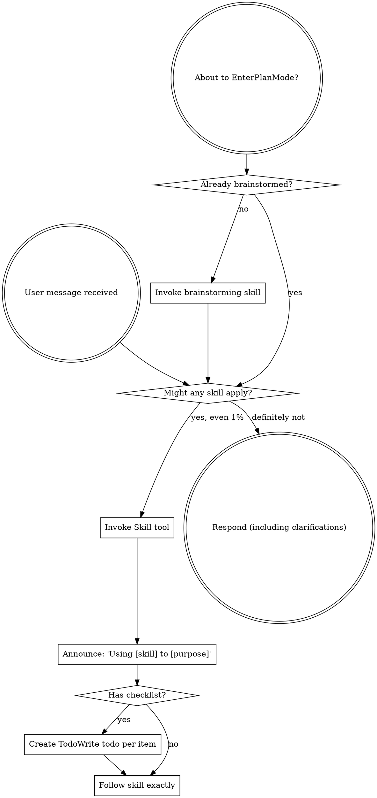

# Review — context-optimisation-brief.md (design, round 1)

- Target: `docs/_drafts/context-optimisation-brief.md`
- Request: `docs/reviewer/context-optimisation-brief-design/r1-2026-05-14T1411-request.md`
- Reviewer command: `reviewer-agent`
- Status: `ok`

---

1. **Findings**

**F1 — Severity: blocking**  
The brief does not cover the manifest/parser poisoning path. Current failed reviewer output is written to the response artifact, then `run_one_reviewer` parses the whole artifact for verdict/findings ([external-reviewer.py](/home/simon/Dev/sigreer/skills/superstar/skills/external-review/scripts/external-reviewer.py:542), [external-reviewer.py](/home/simon/Dev/sigreer/skills/superstar/skills/external-review/scripts/external-reviewer.py:1165)). In the real chain, r2 is visibly `Status: failed (1)` ([r2 response](/home/simon/Dev/sigreer/multistore/docs/reviewer/p10-s3-x39-tailwind-screen-aliases-P10-S3-post-slice/r2-2026-05-14T1354-response.md:5)), but `chain.json` records it as `verdict_valid: true` with `verdict: revise` because the echoed prompt contains prior verdict text. The proposed S1 says “when the prior round is recorded as failed in `chain.json`” ([brief](/home/simon/Dev/sigreer/skills/superstar/docs/_drafts/context-optimisation-brief.md:41)), but current round entries do not persist `returncode` or status ([external-reviewer.py](/home/simon/Dev/sigreer/skills/superstar/skills/external-review/scripts/external-reviewer.py:1075)). Add explicit scope to persist per-round/per-reviewer `returncode` or `status`, and force failed process rounds to `verdict_valid: false` / untrusted regardless of parsed text.

**F2 — Severity: important**  
The design treats “prior response fallback” as the only recursive source, but `rN-merged-findings.md` can also preserve failed echoed output. `build_incremental_preamble` prefers merged findings unconditionally when present ([external-reviewer.py](/home/simon/Dev/sigreer/skills/superstar/skills/external-review/scripts/external-reviewer.py:277)), and `write_merged_findings` concatenates full reviewer artifacts ([external-reviewer.py](/home/simon/Dev/sigreer/skills/superstar/skills/external-review/scripts/external-reviewer.py:572)). With `--review-depth thorough`, a failed primary or sweep could poison merged findings even if S1 skips a failed prior primary response. Specify that merged findings must be built from sanitized successful reviewer bodies only, or that failed reviewer bodies are represented by a short failure stub.

**F3 — Severity: important**  
The global `--incremental-budget-chars` cap is underspecified and could discard the most useful review context. The assembled prompt puts the incremental preamble, base review contract, target preview, then context previews ([external-reviewer.py](/home/simon/Dev/sigreer/skills/superstar/skills/external-review/scripts/external-reviewer.py:346)). A blanket tail truncation ([brief](/home/simon/Dev/sigreer/skills/superstar/docs/_drafts/context-optimisation-brief.md:48)) risks dropping previews or other required sections without a deterministic priority model. Define what is preserved first: review contract, chain summary, prior finding IDs/statuses, resolution summary, and diff status; then drop/cap context previews and bulky diffs.

**F4 — Severity: minor**  
The proposed tests miss the process-failure parsing contract. S3 tests cover stderr echo size and sentinel stripping ([brief](/home/simon/Dev/sigreer/skills/superstar/docs/_drafts/context-optimisation-brief.md:53)), but not “failed process with echoed prompt must not produce `verdict_valid: true` or a trusted `merged_verdict`.” Add an assertion against `chain.json` and JSON output for failed reviewer commands.

2. **Open Questions / Assumptions**

I assume the intended behavior is that a non-zero reviewer process never counts as a valid review, even if its captured output contains parseable verdict text.

For question 1: S1 is independently shippable only if it includes manifest status/returncode persistence and parse suppression for failed rounds. Without that, it reduces file size but leaves the chain semantically corrupt.

For question 2: strip at write time and avoid parsing failed artifacts. Preamble-time stripping is useful defense, but it is too late for manifest correctness.

3. **Suggested Document Edits**

Add to S1:

- Persist `returncode` / `status` on round entries and each `reviewers[]` entry.
- If `returncode != 0`, write a short failure artifact, set verdict invalid, skip parsing stderr/stdout as a contract response, and prevent failed bodies from entering merged findings.
- When walking back, select the last round whose primary/merged review status is successful and verdict-valid.

Add to S3:

- Test that failed echoed output cannot create `verdict_valid: true`.
- Test failed sweep output cannot poison `rN-merged-findings.md`.

4. **Verification Gaps / Commands**

Useful checks before turning this into a spec:

```bash
python3 -m pytest skills/external-review/tests
python3 - <<'PY'
import json, pathlib
p = pathlib.Path('/home/simon/Dev/sigreer/multistore/docs/reviewer/p10-s3-x39-tailwind-screen-aliases-P10-S3-post-slice/chain.json')
print(json.dumps(json.loads(p.read_text())['rounds'][1], indent=2))
PY
```

5. **Overall Verdict: revise**

---

## Reviewer stderr

```text
Reading additional input from stdin...
OpenAI Codex v0.130.0
--------
workdir: /home/simon/Dev/sigreer/skills/superstar
model: gpt-5.5
provider: openai
approval: never
sandbox: danger-full-access
reasoning effort: none
reasoning summaries: none
session id: 019e269d-2247-7513-8105-c3ccd4fc6703
--------
user
You are acting as an independent senior engineering reviewer.

Review stance:
- Lead with findings, ordered by severity.
- Focus on correctness, consistency, implementation risk, missing acceptance
  gates, vague handoffs, ungrounded assumptions, unverified claims, and drift
  from the codebase.
- Give exact file/line references when possible.
- If the document is sound, say that clearly and list residual risks.
- Keep the review actionable. Avoid broad rewrites unless the current structure
  creates concrete risk.

Repository root:
/home/simon/Dev/sigreer/skills/superstar

Target kind:
design

Review mode:
Design artifact review. Check coverage, route/component mapping,
accessibility, responsive states, missing screens, and whether the design can be
implemented in the current repo without inventing unsupported abstractions.

Target document:
docs/_drafts/context-optimisation-brief.md

Additional context files:
- skills/external-review/scripts/external-reviewer.py
- /home/simon/Dev/sigreer/multistore/docs/reviewer/p10-s3-x39-tailwind-screen-aliases-P10-S3-post-slice/r2-2026-05-14T1354-response.md

Review output contract:
1. Findings
   - Tag each finding with a stable ID: `F1`, `F2`, `F3`, …. IDs must remain
     stable if this review is iterated in subsequent rounds.
   - Mark severity inline: `Severity: blocking | important | minor | nit`.
2. Open questions / assumptions
3. Suggested document edits
4. Verification gaps / commands that should be run, if any
5. Overall verdict: one of "ready", "ready with small edits", or "revise"

Read the files from disk. Do not rely only on the snippets in this prompt.


## Target Preview

### docs/_drafts/context-optimisation-brief.md

    1	# Design brief — external-reviewer incremental prompt context optimisation
    2	
    3	## Status
    4	
    5	Draft for `--kind design` ad-hoc review. Not a spec or plan yet. Reviewer is asked to validate the diagnosis, challenge the proposed fix priorities, and surface anything missed before this becomes a real spec.
    6	
    7	## Problem (empirical, not theoretical)
    8	
    9	On a real `post-slice` chain in a consuming project (`multistore`), incremental round prompts grew exponentially and breached OpenAI's 1,048,576-char input limit:
   10	
   11	| File | Bytes |
   12	|---|---|
   13	| `r1-merged-findings.md` | 594,637 |
   14	| `r1-resolution.md` | 4,155 |
   15	| `r2-…-request.md` | 886,686 |
   16	| `r2-…-response.md` | 887,637 |
   17	| `r3-…-request.md` | 1,293,203 (exceeds 1M) |
   18	| `r4-…-request.md` | 1,938,265 |
   19	
   20	Count of the literal string `"You are continuing an existing review chain"` (which appears exactly once in the prompt template) inside the response files: r1=0, r2=2, r3=6, r4=14 — compounding **2× per round**.
   21	
   22	## Root cause
   23	
   24	Confirmed by reading `skills/external-review/scripts/external-reviewer.py` and the chain artifacts:
   25	
   26	1. **`write_review_artifact` (L470) writes `result.stderr` verbatim into the response file when the reviewer fails.** The OpenAI Codex–backed `reviewer-agent` prints its full session banner *including the echoed input prompt* on stderr. So a failed reviewer turn produces a response file whose body is the entire prompt, repeated.
   27	2. **`build_incremental_preamble` (L281) falls back to the prior round's full response file** when no `r{N-1}-merged-findings.md` exists (which is the case after a failed round). It slurps the whole file with no size cap.
   28	3. Combined: one failed reviewer turn poisons every subsequent round. r2 fails → r2-response = the prompt echoed back → r3-preamble embeds it whole → r3 prompt is 1.5× larger → r3 fails the same way → r4 is 2× larger again.
   29	
   30	## Secondary contributors (bloat even without the bug)
   31	
   32	- `make_prompt` (L348-353) re-embeds full target preview + every `--context` file preview on incremental rounds, on top of the preamble. The reviewer already saw these in round 1 and the preamble names them by path. Saves ~30-60% on chains with spec + plan + TASKLIST context.
   33	- `build_incremental_preamble` reads `r{N-1}-merged-findings.md`, `r{N-1}-response`, and `r{N-1}-resolution.md` whole, uncapped (L277-298).
   34	- `compute_diff_section` caps each subsection (`base..HEAD`, working-tree, each untracked file) independently — no global cap on the diff block.
   35	
   36	## Proposed scope (three slices)
   37	
   38	### S1 — Kill the recursive-echo class (must-fix; root cause)
   39	
   40	1. `write_review_artifact`: on `returncode != 0`, store stderr **tail** only (cap to e.g. 4KB), never full stderr. Drop stdout for failed turns or cap similarly. The response file should never contain the full prompt.
   41	2. `build_incremental_preamble`: when the prior round is recorded as failed in `chain.json`, do not embed its response. Walk backward to the last successful round; if none, fall back to the chain summary table + "no prior review available" notice.
   42	3. Wrap the prompt body with sentinel markers (e.g. `<!-- superstar-prompt:start -->` / `:end -->`) in `make_prompt`. In `write_review_artifact`, strip any content between sentinels from reviewer output before write. Defense in depth for backends that echo on stdout instead of stderr.
   43	
   44	### S2 — Incremental-mode prompt diet
   45	
   46	4. In `make_prompt`, skip the context-preview block when `mode == "incremental"`. Keep the target preview but trim to ~150 lines (vs broad's 600).
   47	5. Cap `prior_response_text`, merged-findings text, and `resolution_text` reads in `build_incremental_preamble` (e.g. 80KB each, head + tail with a truncation marker).
   48	6. Add a single `--incremental-budget-chars` (default 400_000) global cap on the assembled prompt with a tail-truncation marker — safety net only, well below 1M.
   49	7. Tighten `compute_diff_section`: global cap on the whole diff block, cap untracked file count (e.g. 10).
   50	
   51	### S3 — Tests + docs
   52	
   53	8. Unit test: simulate a failed r2 (returncode != 0, stderr = "[full prompt]") and assert r3's request size stays bounded.
   54	9. Unit test: sentinel-stripping removes echoed prompt blocks from reviewer output.
   55	10. Unit test: incremental prompt with `mode=incremental` does not contain context-preview headings.
   56	11. Update `skills/external-review/SKILL.md` to document the new flag and the failure-handling behaviour.
   57	
   58	## Non-goals / explicitly out of scope
   59	
   60	- Changing broad-round (r1) prompt structure or default `--max-lines`. Round 1 is not the problem.
   61	- New env vars. Prefer flags with sensible auto defaults.
   62	- Changing the JSON output contract or exit codes.
   63	- Adding any third-party dependency.
   64	
   65	## Questions for the reviewer
   66	
   67	1. Is the slicing right? Is S1 genuinely independently shippable, or does it need parts of S2 to land together?
   68	2. Sentinel-stripping at write-time vs preamble-build time vs both — which is the right belt-and-braces strategy?
   69	3. Should failed-round handling also surface as a hard error (exit non-zero) when the caller is in a chain that has had ≥1 failed round, forcing them to investigate, instead of silently walking back?
   70	4. Anything in `make_prompt` / `build_incremental_preamble` we've missed as a bloat source?
   71	
   72	## Reference paths (read these first)
   73	
   74	- Bridge script: `skills/external-review/scripts/external-reviewer.py`
   75	- Bloating chain (real evidence): `/home/simon/Dev/sigreer/multistore/docs/reviewer/p10-s3-x39-tailwind-screen-aliases-P10-S3-post-slice/` — especially `r2-…-response.md` (the smoking gun: failed turn, stderr-echo dumped into response body).

## Context Previews

### skills/external-review/scripts/external-reviewer.py

    1	#!/usr/bin/env python3
    2	"""
    3	File-based bridge for third-party spec/plan review.
    4	
    5	The script is intentionally provider-neutral. It builds a review prompt around
    6	one target document, calls a configured reviewer command, and stores both the
    7	request and the response under a per-chain folder at
    8	docs/reviewer/<target-stem-no-date>-<kind>/. Each invocation is a new round —
    9	existing rounds are never overwritten. Round number is derived from the count
   10	of rN-*-request.md files already in the chain folder.
   11	
   12	Configuration:
   13	  AGENT_REVIEWER_CMD='reviewer-agent'
   14	  AGENT_REVIEWER_TRANSPORT='arg'
   15	
   16	If the command contains placeholders, it is executed through the shell after
   17	substitution. If it contains no placeholders, the prompt is supplied according
   18	to --prompt-transport: as one argument (default), as stdin, or as a prompt-file
   19	path.
   20	"""
   21	
   22	from __future__ import annotations
   23	
   24	import argparse
   25	import datetime as dt
   26	import json
   27	import os
   28	import re
   29	import shlex
   30	import subprocess
   31	import sys
   32	from dataclasses import dataclass
   33	from pathlib import Path
   34	
   35	# Self-register in sys.modules so @dataclass works when this script is loaded
   36	# via importlib.util.spec_from_file_location without prior registration
   37	# (Python 3.12+ dataclasses inspect sys.modules[cls.__module__]).
   38	if __name__ not in sys.modules:
   39	    import types as _types
   40	    _self_mod = _types.ModuleType(__name__)
   41	    _self_mod.__dict__.update(globals())
   42	    sys.modules[__name__] = _self_mod
   43	
   44	
   45	REVIEW_PROMPT = """You are acting as an independent senior engineering reviewer.
   46	
   47	Review stance:
   48	- Lead with findings, ordered by severity.
   49	- Focus on correctness, consistency, implementation risk, missing acceptance
   50	  gates, vague handoffs, ungrounded assumptions, unverified claims, and drift
   51	  from the codebase.
   52	- Give exact file/line references when possible.
   53	- If the document is sound, say that clearly and list residual risks.
   54	- Keep the review actionable. Avoid broad rewrites unless the current structure
   55	  creates concrete risk.
   56	
   57	Repository root:
   58	{repo_root}
   59	
   60	Target kind:
   61	{kind}
   62	
   63	Review mode:
   64	{mode_guidance}
   65	
   66	Target document:
   67	{target_file}
   68	
   69	Additional context files:
   70	{context_files}
   71	
   72	Review output contract:
   73	1. Findings
   74	   - Tag each finding with a stable ID: `F1`, `F2`, `F3`, …. IDs must remain
   75	     stable if this review is iterated in subsequent rounds.
   76	   - Mark severity inline: `Severity: blocking | important | minor | nit`.
   77	2. Open questions / assumptions
   78	3. Suggested document edits
   79	4. Verification gaps / commands that should be run, if any
   80	5. Overall verdict: one of "ready", "ready with small edits", or "revise"
   81	
   82	Read the files from disk. Do not rely only on the snippets in this prompt.
   83	"""
   84	
   85	
   86	MODE_GUIDANCE = {
   87	    "spec": """Pre-implementation spec review. Check that the spec is complete,
   88	internally consistent, grounded in the existing codebase, and specific enough to
   89	drive an implementation plan. Do not review implemented code unless the spec
   90	claims code already exists.""",
   91	    "plan": """Pre-implementation plan review. Check that the plan faithfully
   92	covers the associated spec, uses existing repo patterns, has executable tasks,
   93	has realistic ordering, and includes concrete verification gates.""",
   94	    "design": """Design artifact review. Check coverage, route/component mapping,
   95	accessibility, responsive states, missing screens, and whether the design can be
   96	implemented in the current repo without inventing unsupported abstractions.""",
   97	    "implementation": """Implementation review. Check code changes against the
   98	stated task, looking for behavioral regressions, missing tests, accidental
   99	scope expansion, and repo-pattern drift.""",
  100	    "post-slice": """Post-slice review. Treat this as a completion gate for one
  101	slice of work. Compare the completed changes and stated evidence against the
  102	slice acceptance criteria. Prioritize: incomplete tasks, uncommitted or
  103	untracked artifacts, missing tests, failing or skipped verification, broken
  104	cross-site behavior, and claims not supported by the repo state.""",
  105	    "post-phase": """Post-phase review. Treat this as a closeout gate for a whole
  106	phase. Compare the implementation, archive/TASKLIST updates, and verification
  107	evidence against the phase spec/plan. Prioritize: unresolved acceptance
  108	criteria, stale docs, missing archive notes, cross-cutting tracker drift,
  109	deferred gates without justification, and regressions outside the phase scope.""",
  110	    "other": """General document/code review. Apply the standard reviewer stance
  111	and tailor findings to the supplied target and context.""",
  112	}
  113	
  114	
  115	SUPPORTED_SCHEMA_VERSION = 1
  116	
  117	
  118	class ManifestSchemaTooNew(Exception):
  119	    """Raised when chain.json declares a schema_version newer than this script supports."""
  120	
  121	
  122	def read_manifest(path: Path) -> dict | None:
  123	    if not path.exists():
  124	        return None
  125	    data = json.loads(path.read_text(encoding="utf-8"))
  126	    version = data.get("schema_version")
  127	    if isinstance(version, int) and version > SUPPORTED_SCHEMA_VERSION:
  128	        raise ManifestSchemaTooNew(
  129	            f"chain.json schema_version {version} is newer than this script supports "
  130	            f"(max {SUPPORTED_SCHEMA_VERSION}). Upgrade external-reviewer.py."
  131	        )
  132	    return data
  133	
  134	
  135	def write_manifest(path: Path, data: dict) -> None:
  136	    path.parent.mkdir(parents=True, exist_ok=True)
  137	    path.write_text(json.dumps(data, indent=2) + "\n", encoding="utf-8")
  138	
  139	
  140	def repo_root() -> Path:
  141	    result = subprocess.run(
  142	        ["git", "rev-parse", "--show-toplevel"],
  143	        text=True,
  144	        capture_output=True,
  145	        check=True,
  146	    )
  147	    return Path(result.stdout.strip())
  148	
  149	
  150	def rel_or_abs(path: Path, root: Path) -> str:
  151	    try:
  152	        return str(path.resolve().relative_to(root))
  153	    except ValueError:
  154	        return str(path.resolve())
  155	
  156	
  157	def slugify(value: str) -> str:
  158	    value = value.lower()
  159	    value = re.sub(r"[^a-z0-9]+", "-", value)
  160	    return value.strip("-") or "document"
  161	
  162	
  163	DATE_PREFIX_RE = re.compile(r"^\d{4}-\d{2}-\d{2}-")
  164	
  165	
  166	def chain_folder_name(target: Path, kind: str, work_id: str | None = None) -> str:
  167	    stem = DATE_PREFIX_RE.sub("", target.stem)
  168	    base = slugify(stem)
  169	    if kind in ("post-slice", "post-phase") and work_id:
  170	        work_id_slug = work_id.replace(".", "-")
  171	        return f"{base}-{work_id_slug}-{kind}"
  172	    return f"{base}-{kind}"
  173	
  174	
  175	class AmbiguousLegacyChain(Exception):
  176	    pass
  177	
  178	
  179	def discover_legacy_chain(
  180	    reviewer_root: Path,
  181	    target_stem: str,
  182	    kind: str,
  183	    new_slug: str,
  184	) -> Path | None:
  185	    new_path = reviewer_root / new_slug
  186	    if new_path.exists():
  187	        return new_path
  188	    if not reviewer_root.exists():
  189	        return None
  190	    legacy_old_name = f"{slugify(target_stem)}-{kind}"
  191	    candidates = []
  192	    for entry in reviewer_root.iterdir():
  193	        if not entry.is_dir():
  194	            continue
  195	        if entry.name == legacy_old_name:
  196	            # Only treat as legacy candidate if there is no chain.json — a chain.json
  197	            # marks a new-regime chain (potentially for a different work-id) and must
  198	            # never be silently reused.
  199	            if not (entry / "chain.json").exists():
  200	                candidates.append(entry)

[truncated: 1207 additional lines]
### /home/simon/Dev/sigreer/multistore/docs/reviewer/p10-s3-x39-tailwind-screen-aliases-P10-S3-post-slice/r2-2026-05-14T1354-response.md

    1	# Review — 2026-05-13-p10-s3-x39-tailwind-screen-aliases.md (post-slice, round 2)
    2	
    3	- Target: `docs/plans/2026-05-13-p10-s3-x39-tailwind-screen-aliases.md`
    4	- Request: `docs/reviewer/p10-s3-x39-tailwind-screen-aliases-P10-S3-post-slice/r2-2026-05-14T1354-request.md`
    5	- Reviewer command: `reviewer-agent`
    6	- Status: `failed (1)`
    7	
    8	---
    9	
   10	_Reviewer produced no stdout._
   11	
   12	---
   13	
   14	## Reviewer stderr
   15	
   16	```text
   17	Reading prompt from stdin...
   18	OpenAI Codex v0.130.0
   19	--------
   20	workdir: /home/simon/Dev/sigreer/multistore
   21	model: gpt-5.5
   22	provider: openai
   23	approval: never
   24	sandbox: danger-full-access
   25	reasoning effort: none
   26	reasoning summaries: none
   27	session id: 019e268d-f5e3-7af3-8c21-863381b8b1f9
   28	--------
   29	user
   30	You are continuing an existing review chain. This is round 2 of p10-s3-x39-tailwind-screen-aliases-P10-S3-post-slice.
   31	
   32	In incremental mode:
   33	- Verify whether prior findings are resolved per the resolution report below.
   34	- Reuse the existing finding IDs (F1, F2, …). If a prior finding is resolved,
   35	  mark it RESOLVED in your findings list with its original ID. If still
   36	  unresolved, keep its ID.
   37	- Only introduce new finding IDs for genuine regressions caused by the fix, or
   38	  blocking issues clearly missed in earlier rounds. Do not reopen broad review
   39	  unless prior fixes changed broad architecture.
   40	
   41	Review chain summary:
   42	| round | verdict | findings | blocking |
   43	|---|---|---|---|
   44	| 1 | revise | 3 | 0 |
   45	
   46	Prior-round findings (merged findings (authoritative)):
   47	
   48	# Merged findings for r1
   49	
   50	## Primary
   51	
   52	# Review — 2026-05-13-p10-s3-x39-tailwind-screen-aliases.md (post-slice, round 1)
   53	
   54	- Target: `docs/plans/2026-05-13-p10-s3-x39-tailwind-screen-aliases.md`
   55	- Request: `docs/reviewer/p10-s3-x39-tailwind-screen-aliases-P10-S3-post-slice/r1-2026-05-14T1348-primary-request.md`
   56	- Reviewer command: `reviewer-agent`
   57	- Status: `ok`
   58	
   59	---
   60	
   61	1. **Findings**
   62	
   63	**F1 — Severity: blocking**  
   64	`multi-viewport-smoke` did not satisfy the slice acceptance gate, but X39 is marked done. The spec requires `bunx playwright test --project=multi-viewport-smoke` to exit 0 for S3 ([spec]( /home/simon/Dev/sigreer/multistore/docs/specs/2026-05-13-p10-mobile-and-css-hygiene-design.md:172)), and the plan repeats that as the load-bearing post-config gate ([plan]( /home/simon/Dev/sigreer/multistore/docs/plans/2026-05-13-p10-s3-x39-tailwind-screen-aliases.md:723), [acceptance]( /home/simon/Dev/sigreer/multistore/docs/plans/2026-05-13-p10-s3-x39-tailwind-screen-aliases.md:823)). The TASKLIST instead records cold-boot HTTP-500 failures and closes on `verify:pre-push` plus rg evidence ([TASKLIST]( /home/simon/Dev/sigreer/multistore/docs/TASKLIST.md:181)). That is a gate substitution without a documented acceptance waiver in the target plan/spec.
   65	
   66	**F2 — Severity: important**  
   67	The working tree is not clean after the slice. `git status --short` shows four modified Medusa migration snapshot files plus untracked reviewer/prompt/tooling artifacts: `docs/agent-prompts/planner.md`, `scripts/external-reviewer.py`, and `docs/reviewer/p10-s3-*`. The modified snapshots change generated default IDs in unrelated server modules. For a post-slice completion gate, these need to be either committed with rationale, moved into intended evidence paths, ignored, or removed before the slice can be considered clean.
   68	
   69	**F3 — Severity: important**  
   70	The deferred `CountrySelect` follow-up ID drifted. The plan says State A must create **X42** for country-select ([plan]( /home/simon/Dev/sigreer/multistore/docs/plans/2026-05-13-p10-s3-x39-tailwind-screen-aliases.md:507), [acceptance]( /home/simon/Dev/sigreer/multistore/docs/plans/2026-05-13-p10-s3-x39-tailwind-screen-aliases.md:826)), and commit `29a0def` says “Follow-up captured as X42.” Actual TASKLIST uses **X43** for country-select and **X42** for the S2 overflow continuation ([TASKLIST]( /home/simon/Dev/sigreer/multistore/docs/TASKLIST.md:185), [TASKLIST]( /home/simon/Dev/sigreer/multistore/docs/TASKLIST.md:186)). This makes the plan’s `rg '**X42**'` acceptance check a false positive against the wrong item.
   71	
   72	2. **Open questions / assumptions**
   73	
   74	- I assume the HTTP-500 failures were real non-zero `multi-viewport-smoke` exits, because TASKLIST records them as failures and I did not find committed smoke evidence proving a later green run.
   75	- I assume the untracked reviewer directories may be intended evidence, but they are currently not committed and therefore do not support the closed slice.
   76	
   77	3. **Suggested document edits**
   78	
   79	- Amend X39 closure text to say the `multi-viewport-smoke` acceptance gate is not met unless a later passing run is produced.
   80	- If accepting the smoke failure as a waiver, add an explicit waiver to the plan/spec with exact failing routes, run IDs/log paths, why the failures are independent of X39, and what gate replaces the failed smoke run.
   81	- Update all X39 references from X42 to X43 for the country-select follow-up, including the plan acceptance gate and commit/closure notes where possible.
   82	
   83	4. **Verification gaps / commands**
   84	
   85	Static gates I checked are clean:
   86	- Legacy classname rg: zero matches.
   87	- Legacy `@screen` rg: zero matches.
   88	- Tailwind config only has `sm/md/lg/xl/2xl/3xl`.
   89	
   90	Still needed:
   91	```bash
   92	scripts/dev-smoke.sh --timeout 180 --command 'cd apps/storefront1 && bunx playwright test --project=multi-viewport-smoke --reporter=line'
   93	git status --short
   94	```
   95	
   96	5. **Overall verdict: revise**
   97	
   98	---
   99	
  100	## Reviewer stderr
  101	
  102	```text
  103	Reading prompt from stdin...
  104	OpenAI Codex v0.130.0
  105	--------
  106	workdir: /home/simon/Dev/sigreer/multistore
  107	model: gpt-5.5
  108	provider: openai
  109	approval: never
  110	sandbox: danger-full-access
  111	reasoning effort: none
  112	reasoning summaries: none
  113	session id: 019e2688-1f09-7ec2-a156-aa214bea9948
  114	--------
  115	user
  116	You are acting as an independent senior engineering reviewer.
  117	
  118	Review stance:
  119	- Lead with findings, ordered by severity.
  120	- Focus on correctness, consistency, implementation risk, missing acceptance
  121	  gates, vague handoffs, ungrounded assumptions, unverified claims, and drift
  122	  from the codebase.
  123	- Give exact file/line references when possible.
  124	- If the document is sound, say that clearly and list residual risks.
  125	- Keep the review actionable. Avoid broad rewrites unless the current structure
  126	  creates concrete risk.
  127	
  128	Repository root:
  129	/home/simon/Dev/sigreer/multistore
  130	
  131	Target kind:
  132	post-slice
  133	
  134	Review mode:
  135	Post-slice review. Treat this as a completion gate for one
  136	slice of work. Compare the completed changes and stated evidence against the
  137	slice acceptance criteria. Prioritize: incomplete tasks, uncommitted or
  138	untracked artifacts, missing tests, failing or skipped verification, broken
  139	cross-site behavior, and claims not supported by the repo state.
  140	
  141	Target document:
  142	docs/plans/2026-05-13-p10-s3-x39-tailwind-screen-aliases.md
  143	
  144	Additional context files:
  145	- docs/specs/2026-05-13-p10-mobile-and-css-hygiene-design.md
  146	- docs/TASKLIST.md
  147	
  148	Review output contract:
  149	1. Findings
  150	   - Tag each finding with a stable ID: `F1`, `F2`, `F3`, …. IDs must remain
  151	     stable if this review is iterated in subsequent rounds.
  152	   - Mark severity inline: `Severity: blocking | important | minor | nit`.
  153	2. Open questions / assumptions
  154	3. Suggested document edits
  155	4. Verification gaps / commands that should be run, if any
  156	5. Overall verdict: one of "ready", "ready with small edits", or "revise"
  157	
  158	Read the files from disk. Do not rely only on the snippets in this prompt.
  159	
  160	
  161	## Target Preview
  162	
  163	### docs/plans/2026-05-13-p10-s3-x39-tailwind-screen-aliases.md
  164	
  165	    1	# P10.S3 / X39 — Legacy Tailwind screen-alias removal — Implementation Plan
  166	    2	
  167	    3	> **For agentic workers:** REQUIRED SUB-SKILL: Use superstar:subagent-driven-development (recommended) or superstar:executing-plans to implement this plan task-by-task. Steps use checkbox (`- [ ]`) syntax for tracking.
  168	    4	
  169	    5	**Goal:** Migrate all storefront consumers of the legacy Tailwind screen aliases (`2xsmall:`, `xsmall:`, `small:`, `medium:`, `large:`, `xlarge:`, `2xlarge:`) to the industry-standard set (`sm/md/lg/xl/2xl/3xl`) added in P9.S1b, then remove the seven legacy entries from `apps/storefront1/tailwind.config.js`. The aliases were kept after P9.S1b for byte-compatibility; X39 closes that cleanup.
  170	    6	
  171	    7	**Architecture:** Four-task slice. T1 audits each match and confirms the mapping (exact for `small:`/`medium:`; pixel-shift for `xsmall:`/`large:`/`xlarge:`; check for any surviving `2xsmall:`/`2xlarge:` users; also sweep for `@screen <alias>` directive form). T2 applies the mapping per file via `Edit`, runs `multi-viewport-smoke`, and probes the country-select non-exact-match site via a decision-tree Step Q (waiver vs scripted pixel-diff depending on `SHOW_REGION_SELECTOR` reachability). T3 drops the seven legacy entries from the Tailwind config and re-runs smoke. T4 closes the slice in TASKLIST.
  172	    8	
  173	    9	**Tech Stack:** TypeScript / TSX files (storefront). One Tailwind config edit. `bun run lint:storefront` + `multi-viewport-smoke` for verification.
  174	   10	
  175	   11	**Spec:** [`docs/specs/2026-05-13-p10-mobile-and-css-hygiene-design.md`](../specs/2026-05-13-p10-mobile-and-css-hygiene-design.md) §S3.
  176	   12	
  177	   13	**Sequencing note.** The phase spec recommends S1 → S2 → S3 because S1 writes the preview banner in the modern `sm:` form from day one, avoiding an S3 re-touch. In practice S3 does **not depend on S1** — the Task 1 audit confirms whether the preview banner has any legacy aliases; if S1 has already landed (or the banner happens to be alias-free), S3 can proceed in any order. Explicit assumption: it is acceptable to run S3 before S1 if the audit shows no banner-side legacy aliases.
  178	   14	
  179	   15	---
  180	   16	
  181	   17	## File Inventory
  182	   18	
  183	   19	**Tailwind config:**
  184	   20	| File | Action | Purpose |
  185	   21	|---|---|---|
  186	   22	| `apps/storefront1/tailwind.config.js:138-145` | Modify | Delete the 7 legacy `screens` entries. |
  187	   23	
  188	   24	**Consumer rewrites** (each one Edit-only — class-string replacements):
  189	   25	| File | Aliases used (occurrences) | Target |
  190	   26	|---|---|---|
  191	   27	| `apps/storefront1/src/modules/skeletons/templates/skeleton-related-products/index.tsx:14` | `small:` `medium:` | `lg:` `xl:` |
  192	   28	| `apps/storefront1/src/modules/skeletons/templates/skeleton-cart-page/index.tsx:12` | `small:` | `lg:` |
  193	   29	| `apps/storefront1/src/modules/skeletons/templates/skeleton-product-grid/index.tsx:11` | `small:` `medium:` | `lg:` `xl:` |
  194	   30	| `apps/storefront1/src/modules/store/templates/variants/adhd-toys.tsx:32` | `small:` ×2 | `lg:` ×2 |
  195	   31	| `apps/storefront1/src/modules/store/templates/paginated-products.tsx:77` | `small:` `medium:` | `lg:` `xl:` |
  196	   32	| `apps/storefront1/src/modules/layout/components/country-select/index.tsx:110` | `xsmall:` ×2 | `sm:` ×2 (**128px shift** — verify) |
  197	   33	| `apps/storefront1/src/modules/layout/components/cart-mismatch-banner/index.tsx:34-35` | `small:` ×4 | `lg:` ×4 |
  198	   34	| `apps/storefront1/src/modules/checkout/components/payment-container/index.tsx:52,60` | `small:` ×2 | `lg:` ×2 |
  199	   35	| `apps/storefront1/src/modules/products/components/related-products/index.tsx:60` | `small:` `medium:` | `lg:` `xl:` |
  200	   36	| `apps/storefront1/src/modules/cart/templates/items.tsx:26` | `small:` | `lg:` |

[truncated: 10808 additional lines]

codex
I’ll read the active review skill instructions, then inspect the target brief and referenced files directly from disk before issuing findings.
exec
/usr/bin/zsh -lc "sed -n '1,220p' /home/simon/.codex/plugins/cache/openai-curated/superpowers/08373044/skills/using-superpowers/SKILL.md && sed -n '1,220p' /home/simon/.codex/plugins/cache/openai-curated/superpowers/08373044/skills/requesting-code-review/SKILL.md" in /home/simon/Dev/sigreer/skills/superstar
 succeeded in 0ms:
---
name: using-superpowers
description: Use when starting any conversation - establishes how to find and use skills, requiring Skill tool invocation before ANY response including clarifying questions
---

<SUBAGENT-STOP>
If you were dispatched as a subagent to execute a specific task, skip this skill.
</SUBAGENT-STOP>

<EXTREMELY-IMPORTANT>
If you think there is even a 1% chance a skill might apply to what you are doing, you ABSOLUTELY MUST invoke the skill.

IF A SKILL APPLIES TO YOUR TASK, YOU DO NOT HAVE A CHOICE. YOU MUST USE IT.

This is not negotiable. This is not optional. You cannot rationalize your way out of this.
</EXTREMELY-IMPORTANT>

## Instruction Priority

Superpowers skills override default system prompt behavior, but **user instructions always take precedence**:

1. **User's explicit instructions** (CLAUDE.md, GEMINI.md, AGENTS.md, direct requests) — highest priority
2. **Superpowers skills** — override default system behavior where they conflict
3. **Default system prompt** — lowest priority

If CLAUDE.md, GEMINI.md, or AGENTS.md says "don't use TDD" and a skill says "always use TDD," follow the user's instructions. The user is in control.

## How to Access Skills

**In Claude Code:** Use the `Skill` tool. When you invoke a skill, its content is loaded and presented to you—follow it directly. Never use the Read tool on skill files.

**In Copilot CLI:** Use the `skill` tool. Skills are auto-discovered from installed plugins. The `skill` tool works the same as Claude Code's `Skill` tool.

**In Gemini CLI:** Skills activate via the `activate_skill` tool. Gemini loads skill metadata at session start and activates the full content on demand.

**In other environments:** Check your platform's documentation for how skills are loaded.

## Platform Adaptation

Skills use Claude Code tool names. Non-CC platforms: see `references/copilot-tools.md` (Copilot CLI), `references/codex-tools.md` (Codex) for tool equivalents. Gemini CLI users get the tool mapping loaded automatically via GEMINI.md.

# Using Skills

## The Rule

**Invoke relevant or requested skills BEFORE any response or action.** Even a 1% chance a skill might apply means that you should invoke the skill to check. If an invoked skill turns out to be wrong for the situation, you don't need to use it.



## Red Flags

These thoughts mean STOP—you're rationalizing:

| Thought | Reality |
|---------|---------|
| "This is just a simple question" | Questions are tasks. Check for skills. |
| "I need more context first" | Skill check comes BEFORE clarifying questions. |
| "Let me explore the codebase first" | Skills tell you HOW to explore. Check first. |
| "I can check git/files quickly" | Files lack conversation context. Check for skills. |
| "Let me gather information first" | Skills tell you HOW to gather information. |
| "This doesn't need a formal skill" | If a skill exists, use it. |
| "I remember this skill" | Skills evolve. Read current version. |
| "This doesn't count as a task" | Action = task. Check for skills. |
| "The skill is overkill" | Simple things become complex. Use it. |
| "I'll just do this one thing first" | Check BEFORE doing anything. |
| "This feels productive" | Undisciplined action wastes time. Skills prevent this. |
| "I know what that means" | Knowing the concept ≠ using the skill. Invoke it. |

## Skill Priority

When multiple skills could apply, use this order:

1. **Process skills first** (brainstorming, debugging) - these determine HOW to approach the task
2. **Implementation skills second** (frontend-design, mcp-builder) - these guide execution

"Let's build X" → brainstorming first, then implementation skills.
"Fix this bug" → debugging first, then domain-specific skills.

## Skill Types

**Rigid** (TDD, debugging): Follow exactly. Don't adapt away discipline.

**Flexible** (patterns): Adapt principles to context.

The skill itself tells you which.

## User Instructions

Instructions say WHAT, not HOW. "Add X" or "Fix Y" doesn't mean skip workflows.
---
name: requesting-code-review
description: Use when completing tasks, implementing major features, or before merging to verify work meets requirements
---

# Requesting Code Review

Dispatch a code reviewer subagent to catch issues before they cascade. The reviewer gets precisely crafted context for evaluation — never your session's history. This keeps the reviewer focused on the work product, not your thought process, and preserves your own context for continued work.

**Core principle:** Review early, review often.

## When to Request Review

**Mandatory:**
- After each task in subagent-driven development
- After completing major feature
- Before merge to main

**Optional but valuable:**
- When stuck (fresh perspective)
- Before refactoring (baseline check)
- After fixing complex bug

## How to Request

**1. Get git SHAs:**
```bash
BASE_SHA=$(git rev-parse HEAD~1)  # or origin/main
HEAD_SHA=$(git rev-parse HEAD)
```

**2. Dispatch code reviewer subagent:**

Use Task tool with `general-purpose` type, fill template at `code-reviewer.md`

**Placeholders:**
- `{DESCRIPTION}` - Brief summary of what you built
- `{PLAN_OR_REQUIREMENTS}` - What it should do
- `{BASE_SHA}` - Starting commit
- `{HEAD_SHA}` - Ending commit

**3. Act on feedback:**
- Fix Critical issues immediately
- Fix Important issues before proceeding
- Note Minor issues for later
- Push back if reviewer is wrong (with reasoning)

## Example

```
[Just completed Task 2: Add verification function]

You: Let me request code review before proceeding.

BASE_SHA=$(git log --oneline | grep "Task 1" | head -1 | awk '{print $1}')
HEAD_SHA=$(git rev-parse HEAD)

[Dispatch code reviewer subagent]
  DESCRIPTION: Added verifyIndex() and repairIndex() with 4 issue types
  PLAN_OR_REQUIREMENTS: Task 2 from docs/superpowers/plans/deployment-plan.md
  BASE_SHA: a7981ec
  HEAD_SHA: 3df7661

[Subagent returns]:
  Strengths: Clean architecture, real tests
  Issues:
    Important: Missing progress indicators
    Minor: Magic number (100) for reporting interval
  Assessment: Ready to proceed

You: [Fix progress indicators]
[Continue to Task 3]
```

## Integration with Workflows

**Subagent-Driven Development:**
- Review after EACH task
- Catch issues before they compound
- Fix before moving to next task

**Executing Plans:**
- Review after each task or at natural checkpoints
- Get feedback, apply, continue

**Ad-Hoc Development:**
- Review before merge
- Review when stuck

## Red Flags

**Never:**
- Skip review because "it's simple"
- Ignore Critical issues
- Proceed with unfixed Important issues
- Argue with valid technical feedback

**If reviewer wrong:**
- Push back with technical reasoning
- Show code/tests that prove it works
- Request clarification

See template at: requesting-code-review/code-reviewer.md

codex
Using `superpowers:using-superpowers` for process discipline; the code-review-request skill is aimed at dispatching reviewers, so I’ll proceed directly in the requested independent reviewer stance rather than spawning another reviewer.
exec
/usr/bin/zsh -lc "nl -ba docs/_drafts/context-optimisation-brief.md | sed -n '1,220p'" in /home/simon/Dev/sigreer/skills/superstar
 succeeded in 0ms:
     1	# Design brief — external-reviewer incremental prompt context optimisation
     2	
     3	## Status
     4	
     5	Draft for `--kind design` ad-hoc review. Not a spec or plan yet. Reviewer is asked to validate the diagnosis, challenge the proposed fix priorities, and surface anything missed before this becomes a real spec.
     6	
     7	## Problem (empirical, not theoretical)
     8	
     9	On a real `post-slice` chain in a consuming project (`multistore`), incremental round prompts grew exponentially and breached OpenAI's 1,048,576-char input limit:
    10	
    11	| File | Bytes |
    12	|---|---|
    13	| `r1-merged-findings.md` | 594,637 |
    14	| `r1-resolution.md` | 4,155 |
    15	| `r2-…-request.md` | 886,686 |
    16	| `r2-…-response.md` | 887,637 |
    17	| `r3-…-request.md` | 1,293,203 (exceeds 1M) |
    18	| `r4-…-request.md` | 1,938,265 |
    19	
    20	Count of the literal string `"You are continuing an existing review chain"` (which appears exactly once in the prompt template) inside the response files: r1=0, r2=2, r3=6, r4=14 — compounding **2× per round**.
    21	
    22	## Root cause
    23	
    24	Confirmed by reading `skills/external-review/scripts/external-reviewer.py` and the chain artifacts:
    25	
    26	1. **`write_review_artifact` (L470) writes `result.stderr` verbatim into the response file when the reviewer fails.** The OpenAI Codex–backed `reviewer-agent` prints its full session banner *including the echoed input prompt* on stderr. So a failed reviewer turn produces a response file whose body is the entire prompt, repeated.
    27	2. **`build_incremental_preamble` (L281) falls back to the prior round's full response file** when no `r{N-1}-merged-findings.md` exists (which is the case after a failed round). It slurps the whole file with no size cap.
    28	3. Combined: one failed reviewer turn poisons every subsequent round. r2 fails → r2-response = the prompt echoed back → r3-preamble embeds it whole → r3 prompt is 1.5× larger → r3 fails the same way → r4 is 2× larger again.
    29	
    30	## Secondary contributors (bloat even without the bug)
    31	
    32	- `make_prompt` (L348-353) re-embeds full target preview + every `--context` file preview on incremental rounds, on top of the preamble. The reviewer already saw these in round 1 and the preamble names them by path. Saves ~30-60% on chains with spec + plan + TASKLIST context.
    33	- `build_incremental_preamble` reads `r{N-1}-merged-findings.md`, `r{N-1}-response`, and `r{N-1}-resolution.md` whole, uncapped (L277-298).
    34	- `compute_diff_section` caps each subsection (`base..HEAD`, working-tree, each untracked file) independently — no global cap on the diff block.
    35	
    36	## Proposed scope (three slices)
    37	
    38	### S1 — Kill the recursive-echo class (must-fix; root cause)
    39	
    40	1. `write_review_artifact`: on `returncode != 0`, store stderr **tail** only (cap to e.g. 4KB), never full stderr. Drop stdout for failed turns or cap similarly. The response file should never contain the full prompt.
    41	2. `build_incremental_preamble`: when the prior round is recorded as failed in `chain.json`, do not embed its response. Walk backward to the last successful round; if none, fall back to the chain summary table + "no prior review available" notice.
    42	3. Wrap the prompt body with sentinel markers (e.g. `<!-- superstar-prompt:start -->` / `:end -->`) in `make_prompt`. In `write_review_artifact`, strip any content between sentinels from reviewer output before write. Defense in depth for backends that echo on stdout instead of stderr.
    43	
    44	### S2 — Incremental-mode prompt diet
    45	
    46	4. In `make_prompt`, skip the context-preview block when `mode == "incremental"`. Keep the target preview but trim to ~150 lines (vs broad's 600).
    47	5. Cap `prior_response_text`, merged-findings text, and `resolution_text` reads in `build_incremental_preamble` (e.g. 80KB each, head + tail with a truncation marker).
    48	6. Add a single `--incremental-budget-chars` (default 400_000) global cap on the assembled prompt with a tail-truncation marker — safety net only, well below 1M.
    49	7. Tighten `compute_diff_section`: global cap on the whole diff block, cap untracked file count (e.g. 10).
    50	
    51	### S3 — Tests + docs
    52	
    53	8. Unit test: simulate a failed r2 (returncode != 0, stderr = "[full prompt]") and assert r3's request size stays bounded.
    54	9. Unit test: sentinel-stripping removes echoed prompt blocks from reviewer output.
    55	10. Unit test: incremental prompt with `mode=incremental` does not contain context-preview headings.
    56	11. Update `skills/external-review/SKILL.md` to document the new flag and the failure-handling behaviour.
    57	
    58	## Non-goals / explicitly out of scope
    59	
    60	- Changing broad-round (r1) prompt structure or default `--max-lines`. Round 1 is not the problem.
    61	- New env vars. Prefer flags with sensible auto defaults.
    62	- Changing the JSON output contract or exit codes.
    63	- Adding any third-party dependency.
    64	
    65	## Questions for the reviewer
    66	
    67	1. Is the slicing right? Is S1 genuinely independently shippable, or does it need parts of S2 to land together?
    68	2. Sentinel-stripping at write-time vs preamble-build time vs both — which is the right belt-and-braces strategy?
    69	3. Should failed-round handling also surface as a hard error (exit non-zero) when the caller is in a chain that has had ≥1 failed round, forcing them to investigate, instead of silently walking back?
    70	4. Anything in `make_prompt` / `build_incremental_preamble` we've missed as a bloat source?
    71	
    72	## Reference paths (read these first)
    73	
    74	- Bridge script: `skills/external-review/scripts/external-reviewer.py`
    75	- Bloating chain (real evidence): `/home/simon/Dev/sigreer/multistore/docs/reviewer/p10-s3-x39-tailwind-screen-aliases-P10-S3-post-slice/` — especially `r2-…-response.md` (the smoking gun: failed turn, stderr-echo dumped into response body).

exec
/usr/bin/zsh -lc "nl -ba skills/external-review/scripts/external-reviewer.py | sed -n '240,540p'" in /home/simon/Dev/sigreer/skills/superstar
 succeeded in 0ms:
   240	
   241	def default_diff_paths(
   242	    kind: str, target: Path, context: list, root: Path
   243	) -> list | None:
   244	    """Default scope for embedded diffs.
   245	
   246	    Broad (all tracked changes) for post-slice/post-phase; for everything
   247	    else, restrict to the target document plus any context files.
   248	    """
   249	    if kind in ("post-slice", "post-phase"):
   250	        return None
   251	    paths = [rel_or_abs(target, root)]
   252	    for c in context:
   253	        paths.append(rel_or_abs(c, root))
   254	    return paths
   255	
   256	
   257	def build_incremental_preamble(
   258	    *,
   259	    manifest: dict,
   260	    chain_dir: Path,
   261	    round_num: int,
   262	    resolution_waiver: bool,
   263	    legacy_first_round: bool,
   264	    diff_section: str = "",
   265	) -> str:
   266	    chain = manifest.get("chain", "<unknown chain>")
   267	    prior_rounds = manifest.get("rounds", [])
   268	    summary_rows = ["| round | verdict | findings | blocking |", "|---|---|---|---|"]
   269	    for r in prior_rounds:
   270	        summary_rows.append(
   271	            f"| {r['round']} | {r.get('merged_verdict') or r.get('verdict')} "
   272	            f"| {r.get('findings_count')} | {r.get('blocking_findings_count')} |"
   273	        )
   274	
   275	    prior = prior_rounds[-1] if prior_rounds else None
   276	    prior_response_text = ""
   277	    merged_findings_file = chain_dir / f"r{round_num - 1}-merged-findings.md"
   278	    if merged_findings_file.exists():
   279	        prior_response_text = merged_findings_file.read_text(encoding="utf-8")
   280	        prior_source = "merged findings (authoritative)"
   281	    elif prior and prior.get("response"):
   282	        prior_response_text = (chain_dir / prior["response"]).read_text(encoding="utf-8")
   283	        prior_source = "primary reviewer response"
   284	    else:
   285	        prior_source = "no prior response available"
   286	
   287	    resolution_file = chain_dir / f"r{round_num - 1}-resolution.md"
   288	    if resolution_file.exists():
   289	        resolution_text = resolution_file.read_text(encoding="utf-8")
   290	    elif resolution_waiver:
   291	        resolution_text = "MISSING — explicitly waived by caller via --allow-missing-resolution"
   292	    elif legacy_first_round:
   293	        resolution_text = (
   294	            "MISSING — chain migrated from legacy artifacts; please verify whether "
   295	            "changes occurred from the diff below."
   296	        )
   297	    else:
   298	        resolution_text = "MISSING — please verify whether changes occurred."
   299	
   300	    return f"""You are continuing an existing review chain. This is round {round_num} of {chain}.
   301	
   302	In incremental mode:
   303	- Verify whether prior findings are resolved per the resolution report below.
   304	- Reuse the existing finding IDs (F1, F2, …). If a prior finding is resolved,
   305	  mark it RESOLVED in your findings list with its original ID. If still
   306	  unresolved, keep its ID.
   307	- Only introduce new finding IDs for genuine regressions caused by the fix, or
   308	  blocking issues clearly missed in earlier rounds. Do not reopen broad review
   309	  unless prior fixes changed broad architecture.
   310	
   311	Review chain summary:
   312	{chr(10).join(summary_rows)}
   313	
   314	Prior-round findings ({prior_source}):
   315	
   316	{prior_response_text}
   317	
   318	Resolution report for prior round:
   319	
   320	{resolution_text}
   321	
   322	Changes since prior round:
   323	
   324	{diff_section or 'Changes since prior round: not available for this round.'}
   325	"""
   326	
   327	
   328	def make_prompt(
   329	    *,
   330	    root: Path,
   331	    target: Path,
   332	    kind: str,
   333	    context: list[Path],
   334	    max_lines: int,
   335	    mode: str = "broad",
   336	    incremental_preamble: str | None = None,
   337	) -> str:
   338	    context_display = "\n".join(f"- {rel_or_abs(p, root)}" for p in context) or "- none"
   339	    body = REVIEW_PROMPT.format(
   340	        repo_root=root,
   341	        kind=kind,
   342	        mode_guidance=MODE_GUIDANCE[kind],
   343	        target_file=rel_or_abs(target, root),
   344	        context_files=context_display,
   345	    )
   346	    if mode == "incremental" and incremental_preamble:
   347	        body = incremental_preamble + "\n---\n\n" + body
   348	    body += "\n\n## Target Preview\n\n"
   349	    body += numbered_preview(target, root, max_lines=max_lines)
   350	    if context:
   351	        body += "\n## Context Previews\n\n"
   352	        for ctx in context:
   353	            body += numbered_preview(ctx, root, max_lines=max(80, max_lines // 3))
   354	    return body
   355	
   356	
   357	def expand_command_template(
   358	    template: str,
   359	    *,
   360	    prompt_file: Path,
   361	    prompt_text: str,
   362	    target_file: Path,
   363	    kind: str,
   364	    chain_dir: Path,
   365	    round_num: int,
   366	    previous_response: Path | None,
   367	    resolution_file: Path | None,
   368	    session_file: Path,
   369	) -> str:
   370	    values = {
   371	        "prompt_file": shlex.quote(str(prompt_file)),
   372	        "prompt_text": shlex.quote(prompt_text),
   373	        "target_file": shlex.quote(str(target_file)),
   374	        "kind": shlex.quote(kind),
   375	        "chain_dir": shlex.quote(str(chain_dir)),
   376	        "round": str(round_num),
   377	        "previous_response": shlex.quote(str(previous_response)) if previous_response else "",
   378	        "resolution_file": shlex.quote(str(resolution_file)) if resolution_file else "",
   379	        "session_file": shlex.quote(str(session_file)),
   380	    }
   381	    return template.format(**values)
   382	
   383	
   384	def run_reviewer(
   385	    *,
   386	    command_template: str,
   387	    prompt_file: Path,
   388	    prompt_text: str,
   389	    target_file: Path,
   390	    kind: str,
   391	    prompt_transport: str,
   392	    timeout: int,
   393	    chain_dir: Path,
   394	    round_num: int,
   395	    previous_response: Path | None,
   396	    resolution_file: Path | None,
   397	    session_file: Path,
   398	) -> subprocess.CompletedProcess[str]:
   399	    if "{" in command_template and "}" in command_template:
   400	        command = expand_command_template(
   401	            command_template,
   402	            prompt_file=prompt_file,
   403	            prompt_text=prompt_text,
   404	            target_file=target_file,
   405	            kind=kind,
   406	            chain_dir=chain_dir,
   407	            round_num=round_num,
   408	            previous_response=previous_response,
   409	            resolution_file=resolution_file,
   410	            session_file=session_file,
   411	        )
   412	        return subprocess.run(
   413	            command,
   414	            shell=True,
   415	            text=True,
   416	            capture_output=True,
   417	            timeout=timeout,
   418	        )
   419	
   420	    argv = shlex.split(command_template)
   421	    stdin_text = None
   422	    if prompt_transport == "arg":
   423	        argv.append(prompt_text)
   424	    elif prompt_transport == "file":
   425	        argv.append(str(prompt_file))
   426	    elif prompt_transport == "stdin":
   427	        stdin_text = prompt_text
   428	    else:
   429	        raise ValueError(f"unknown prompt transport: {prompt_transport}")
   430	
   431	    return subprocess.run(
   432	        argv,
   433	        input=stdin_text,
   434	        text=True,
   435	        capture_output=True,
   436	        timeout=timeout,
   437	    )
   438	
   439	
   440	def write_review_artifact(
   441	    *,
   442	    root: Path,
   443	    target: Path,
   444	    kind: str,
   445	    command_template: str,
   446	    prompt_file: Path,
   447	    response_file: Path,
   448	    round_num: int,
   449	    result: subprocess.CompletedProcess[str],
   450	) -> Path:
   451	    stdout = result.stdout.strip()
   452	    stderr = result.stderr.strip()
   453	    status = "ok" if result.returncode == 0 else f"failed ({result.returncode})"
   454	
   455	    content = [
   456	        f"# Review — {target.name} ({kind}, round {round_num})",
   457	        "",
   458	        f"- Target: `{rel_or_abs(target, root)}`",
   459	        f"- Request: `{rel_or_abs(prompt_file, root)}`",
   460	        f"- Reviewer command: `{command_template}`",
   461	        f"- Status: `{status}`",
   462	        "",
   463	        "---",
   464	        "",
   465	        stdout or "_Reviewer produced no stdout._",
   466	        "",
   467	    ]
   468	    if stderr:
   469	        content.extend(["---", "", "## Reviewer stderr", "", "```text", stderr, "```", ""])
   470	
   471	    response_file.write_text("\n".join(content), encoding="utf-8")
   472	    return response_file
   473	
   474	
   475	def resolve_mode(mode: str, *, round_num: int) -> str:
   476	    if mode == "incremental" and round_num == 1:
   477	        raise ValueError("--mode incremental is not valid on round 1")
   478	    if mode == "auto":
   479	        return "broad" if round_num == 1 else "incremental"
   480	    return mode
   481	
   482	
   483	@dataclass
   484	class SweepPlan:
   485	    sweep_count: int
   486	    checkpoint: str | None  # "first-round" | "final-ready" | None
   487	
   488	
   489	@dataclass
   490	class ReviewerResult:
   491	    role: str            # "primary" | "sweep"
   492	    sweep_index: int | None
   493	    request_path: Path
   494	    response_path: Path
   495	    review_body: str
   496	    verdict: str | None
   497	    verdict_valid: bool
   498	    returncode: int
   499	
   500	
   501	def run_one_reviewer(
   502	    *,
   503	    role: str,
   504	    sweep_index: int | None,
   505	    chain_dir: Path,
   506	    round_num: int,
   507	    timestamp: str,
   508	    prompt_text: str,
   509	    args,
   510	    target: Path,
   511	    root: Path,
   512	    namespaced: bool,
   513	    previous_response: Path | None = None,
   514	    resolution_file: Path | None = None,
   515	) -> ReviewerResult:
   516	    suffix = ""
   517	    if namespaced:
   518	        suffix = "-primary" if role == "primary" else f"-sweep{sweep_index}"
   519	    basename = f"r{round_num}-{timestamp}{suffix}"
   520	    request_path = chain_dir / f"{basename}-request.md"
   521	    response_path = chain_dir / f"{basename}-response.md"
   522	    request_path.write_text(prompt_text, encoding="utf-8")
   523	    session_file = chain_dir / (
   524	        "session.state" if role == "primary" else f"sweep{sweep_index}.session.state"
   525	    )
   526	
   527	    result = run_reviewer(
   528	        command_template=args.reviewer_cmd,
   529	        prompt_file=request_path, prompt_text=prompt_text,
   530	        target_file=target, kind=args.kind,
   531	        prompt_transport=args.prompt_transport, timeout=args.timeout,
   532	        chain_dir=chain_dir, round_num=round_num,
   533	        previous_response=previous_response, resolution_file=resolution_file,
   534	        session_file=session_file,
   535	    )
   536	    write_review_artifact(
   537	        root=root, target=target, kind=args.kind,
   538	        command_template=args.reviewer_cmd,
   539	        prompt_file=request_path, response_file=response_path,
   540	        round_num=round_num, result=result,

exec
/usr/bin/zsh -lc "nl -ba /home/simon/Dev/sigreer/multistore/docs/reviewer/p10-s3-x39-tailwind-screen-aliases-P10-S3-post-slice/r2-2026-05-14T1354-response.md | sed -n '1,220p'" in /home/simon/Dev/sigreer/skills/superstar
 succeeded in 0ms:
     1	# Review — 2026-05-13-p10-s3-x39-tailwind-screen-aliases.md (post-slice, round 2)
     2	
     3	- Target: `docs/plans/2026-05-13-p10-s3-x39-tailwind-screen-aliases.md`
     4	- Request: `docs/reviewer/p10-s3-x39-tailwind-screen-aliases-P10-S3-post-slice/r2-2026-05-14T1354-request.md`
     5	- Reviewer command: `reviewer-agent`
     6	- Status: `failed (1)`
     7	
     8	---
     9	
    10	_Reviewer produced no stdout._
    11	
    12	---
    13	
    14	## Reviewer stderr
    15	
    16	```text
    17	Reading prompt from stdin...
    18	OpenAI Codex v0.130.0
    19	--------
    20	workdir: /home/simon/Dev/sigreer/multistore
    21	model: gpt-5.5
    22	provider: openai
    23	approval: never
    24	sandbox: danger-full-access
    25	reasoning effort: none
    26	reasoning summaries: none
    27	session id: 019e268d-f5e3-7af3-8c21-863381b8b1f9
    28	--------
    29	user
    30	You are continuing an existing review chain. This is round 2 of p10-s3-x39-tailwind-screen-aliases-P10-S3-post-slice.
    31	
    32	In incremental mode:
    33	- Verify whether prior findings are resolved per the resolution report below.
    34	- Reuse the existing finding IDs (F1, F2, …). If a prior finding is resolved,
    35	  mark it RESOLVED in your findings list with its original ID. If still
    36	  unresolved, keep its ID.
    37	- Only introduce new finding IDs for genuine regressions caused by the fix, or
    38	  blocking issues clearly missed in earlier rounds. Do not reopen broad review
    39	  unless prior fixes changed broad architecture.
    40	
    41	Review chain summary:
    42	| round | verdict | findings | blocking |
    43	|---|---|---|---|
    44	| 1 | revise | 3 | 0 |
    45	
    46	Prior-round findings (merged findings (authoritative)):
    47	
    48	# Merged findings for r1
    49	
    50	## Primary
    51	
    52	# Review — 2026-05-13-p10-s3-x39-tailwind-screen-aliases.md (post-slice, round 1)
    53	
    54	- Target: `docs/plans/2026-05-13-p10-s3-x39-tailwind-screen-aliases.md`
    55	- Request: `docs/reviewer/p10-s3-x39-tailwind-screen-aliases-P10-S3-post-slice/r1-2026-05-14T1348-primary-request.md`
    56	- Reviewer command: `reviewer-agent`
    57	- Status: `ok`
    58	
    59	---
    60	
    61	1. **Findings**
    62	
    63	**F1 — Severity: blocking**  
    64	`multi-viewport-smoke` did not satisfy the slice acceptance gate, but X39 is marked done. The spec requires `bunx playwright test --project=multi-viewport-smoke` to exit 0 for S3 ([spec]( /home/simon/Dev/sigreer/multistore/docs/specs/2026-05-13-p10-mobile-and-css-hygiene-design.md:172)), and the plan repeats that as the load-bearing post-config gate ([plan]( /home/simon/Dev/sigreer/multistore/docs/plans/2026-05-13-p10-s3-x39-tailwind-screen-aliases.md:723), [acceptance]( /home/simon/Dev/sigreer/multistore/docs/plans/2026-05-13-p10-s3-x39-tailwind-screen-aliases.md:823)). The TASKLIST instead records cold-boot HTTP-500 failures and closes on `verify:pre-push` plus rg evidence ([TASKLIST]( /home/simon/Dev/sigreer/multistore/docs/TASKLIST.md:181)). That is a gate substitution without a documented acceptance waiver in the target plan/spec.
    65	
    66	**F2 — Severity: important**  
    67	The working tree is not clean after the slice. `git status --short` shows four modified Medusa migration snapshot files plus untracked reviewer/prompt/tooling artifacts: `docs/agent-prompts/planner.md`, `scripts/external-reviewer.py`, and `docs/reviewer/p10-s3-*`. The modified snapshots change generated default IDs in unrelated server modules. For a post-slice completion gate, these need to be either committed with rationale, moved into intended evidence paths, ignored, or removed before the slice can be considered clean.
    68	
    69	**F3 — Severity: important**  
    70	The deferred `CountrySelect` follow-up ID drifted. The plan says State A must create **X42** for country-select ([plan]( /home/simon/Dev/sigreer/multistore/docs/plans/2026-05-13-p10-s3-x39-tailwind-screen-aliases.md:507), [acceptance]( /home/simon/Dev/sigreer/multistore/docs/plans/2026-05-13-p10-s3-x39-tailwind-screen-aliases.md:826)), and commit `29a0def` says “Follow-up captured as X42.” Actual TASKLIST uses **X43** for country-select and **X42** for the S2 overflow continuation ([TASKLIST]( /home/simon/Dev/sigreer/multistore/docs/TASKLIST.md:185), [TASKLIST]( /home/simon/Dev/sigreer/multistore/docs/TASKLIST.md:186)). This makes the plan’s `rg '**X42**'` acceptance check a false positive against the wrong item.
    71	
    72	2. **Open questions / assumptions**
    73	
    74	- I assume the HTTP-500 failures were real non-zero `multi-viewport-smoke` exits, because TASKLIST records them as failures and I did not find committed smoke evidence proving a later green run.
    75	- I assume the untracked reviewer directories may be intended evidence, but they are currently not committed and therefore do not support the closed slice.
    76	
    77	3. **Suggested document edits**
    78	
    79	- Amend X39 closure text to say the `multi-viewport-smoke` acceptance gate is not met unless a later passing run is produced.
    80	- If accepting the smoke failure as a waiver, add an explicit waiver to the plan/spec with exact failing routes, run IDs/log paths, why the failures are independent of X39, and what gate replaces the failed smoke run.
    81	- Update all X39 references from X42 to X43 for the country-select follow-up, including the plan acceptance gate and commit/closure notes where possible.
    82	
    83	4. **Verification gaps / commands**
    84	
    85	Static gates I checked are clean:
    86	- Legacy classname rg: zero matches.
    87	- Legacy `@screen` rg: zero matches.
    88	- Tailwind config only has `sm/md/lg/xl/2xl/3xl`.
    89	
    90	Still needed:
    91	```bash
    92	scripts/dev-smoke.sh --timeout 180 --command 'cd apps/storefront1 && bunx playwright test --project=multi-viewport-smoke --reporter=line'
    93	git status --short
    94	```
    95	
    96	5. **Overall verdict: revise**
    97	
    98	---
    99	
   100	## Reviewer stderr
   101	
   102	```text
   103	Reading prompt from stdin...
   104	OpenAI Codex v0.130.0
   105	--------
   106	workdir: /home/simon/Dev/sigreer/multistore
   107	model: gpt-5.5
   108	provider: openai
   109	approval: never
   110	sandbox: danger-full-access
   111	reasoning effort: none
   112	reasoning summaries: none
   113	session id: 019e2688-1f09-7ec2-a156-aa214bea9948
   114	--------
   115	user
   116	You are acting as an independent senior engineering reviewer.
   117	
   118	Review stance:
   119	- Lead with findings, ordered by severity.
   120	- Focus on correctness, consistency, implementation risk, missing acceptance
   121	  gates, vague handoffs, ungrounded assumptions, unverified claims, and drift
   122	  from the codebase.
   123	- Give exact file/line references when possible.
   124	- If the document is sound, say that clearly and list residual risks.
   125	- Keep the review actionable. Avoid broad rewrites unless the current structure
   126	  creates concrete risk.
   127	
   128	Repository root:
   129	/home/simon/Dev/sigreer/multistore
   130	
   131	Target kind:
   132	post-slice
   133	
   134	Review mode:
   135	Post-slice review. Treat this as a completion gate for one
   136	slice of work. Compare the completed changes and stated evidence against the
   137	slice acceptance criteria. Prioritize: incomplete tasks, uncommitted or
   138	untracked artifacts, missing tests, failing or skipped verification, broken
   139	cross-site behavior, and claims not supported by the repo state.
   140	
   141	Target document:
   142	docs/plans/2026-05-13-p10-s3-x39-tailwind-screen-aliases.md
   143	
   144	Additional context files:
   145	- docs/specs/2026-05-13-p10-mobile-and-css-hygiene-design.md
   146	- docs/TASKLIST.md
   147	
   148	Review output contract:
   149	1. Findings
   150	   - Tag each finding with a stable ID: `F1`, `F2`, `F3`, …. IDs must remain
   151	     stable if this review is iterated in subsequent rounds.
   152	   - Mark severity inline: `Severity: blocking | important | minor | nit`.
   153	2. Open questions / assumptions
   154	3. Suggested document edits
   155	4. Verification gaps / commands that should be run, if any
   156	5. Overall verdict: one of "ready", "ready with small edits", or "revise"
   157	
   158	Read the files from disk. Do not rely only on the snippets in this prompt.
   159	
   160	
   161	## Target Preview
   162	
   163	### docs/plans/2026-05-13-p10-s3-x39-tailwind-screen-aliases.md
   164	
   165	    1	# P10.S3 / X39 — Legacy Tailwind screen-alias removal — Implementation Plan
   166	    2	
   167	    3	> **For agentic workers:** REQUIRED SUB-SKILL: Use superstar:subagent-driven-development (recommended) or superstar:executing-plans to implement this plan task-by-task. Steps use checkbox (`- [ ]`) syntax for tracking.
   168	    4	
   169	    5	**Goal:** Migrate all storefront consumers of the legacy Tailwind screen aliases (`2xsmall:`, `xsmall:`, `small:`, `medium:`, `large:`, `xlarge:`, `2xlarge:`) to the industry-standard set (`sm/md/lg/xl/2xl/3xl`) added in P9.S1b, then remove the seven legacy entries from `apps/storefront1/tailwind.config.js`. The aliases were kept after P9.S1b for byte-compatibility; X39 closes that cleanup.
   170	    6	
   171	    7	**Architecture:** Four-task slice. T1 audits each match and confirms the mapping (exact for `small:`/`medium:`; pixel-shift for `xsmall:`/`large:`/`xlarge:`; check for any surviving `2xsmall:`/`2xlarge:` users; also sweep for `@screen <alias>` directive form). T2 applies the mapping per file via `Edit`, runs `multi-viewport-smoke`, and probes the country-select non-exact-match site via a decision-tree Step Q (waiver vs scripted pixel-diff depending on `SHOW_REGION_SELECTOR` reachability). T3 drops the seven legacy entries from the Tailwind config and re-runs smoke. T4 closes the slice in TASKLIST.
   172	    8	
   173	    9	**Tech Stack:** TypeScript / TSX files (storefront). One Tailwind config edit. `bun run lint:storefront` + `multi-viewport-smoke` for verification.
   174	   10	
   175	   11	**Spec:** [`docs/specs/2026-05-13-p10-mobile-and-css-hygiene-design.md`](../specs/2026-05-13-p10-mobile-and-css-hygiene-design.md) §S3.
   176	   12	
   177	   13	**Sequencing note.** The phase spec recommends S1 → S2 → S3 because S1 writes the preview banner in the modern `sm:` form from day one, avoiding an S3 re-touch. In practice S3 does **not depend on S1** — the Task 1 audit confirms whether the preview banner has any legacy aliases; if S1 has already landed (or the banner happens to be alias-free), S3 can proceed in any order. Explicit assumption: it is acceptable to run S3 before S1 if the audit shows no banner-side legacy aliases.
   178	   14	
   179	   15	---
   180	   16	
   181	   17	## File Inventory
   182	   18	
   183	   19	**Tailwind config:**
   184	   20	| File | Action | Purpose |
   185	   21	|---|---|---|
   186	   22	| `apps/storefront1/tailwind.config.js:138-145` | Modify | Delete the 7 legacy `screens` entries. |
   187	   23	
   188	   24	**Consumer rewrites** (each one Edit-only — class-string replacements):
   189	   25	| File | Aliases used (occurrences) | Target |
   190	   26	|---|---|---|
   191	   27	| `apps/storefront1/src/modules/skeletons/templates/skeleton-related-products/index.tsx:14` | `small:` `medium:` | `lg:` `xl:` |
   192	   28	| `apps/storefront1/src/modules/skeletons/templates/skeleton-cart-page/index.tsx:12` | `small:` | `lg:` |
   193	   29	| `apps/storefront1/src/modules/skeletons/templates/skeleton-product-grid/index.tsx:11` | `small:` `medium:` | `lg:` `xl:` |
   194	   30	| `apps/storefront1/src/modules/store/templates/variants/adhd-toys.tsx:32` | `small:` ×2 | `lg:` ×2 |
   195	   31	| `apps/storefront1/src/modules/store/templates/paginated-products.tsx:77` | `small:` `medium:` | `lg:` `xl:` |
   196	   32	| `apps/storefront1/src/modules/layout/components/country-select/index.tsx:110` | `xsmall:` ×2 | `sm:` ×2 (**128px shift** — verify) |
   197	   33	| `apps/storefront1/src/modules/layout/components/cart-mismatch-banner/index.tsx:34-35` | `small:` ×4 | `lg:` ×4 |
   198	   34	| `apps/storefront1/src/modules/checkout/components/payment-container/index.tsx:52,60` | `small:` ×2 | `lg:` ×2 |
   199	   35	| `apps/storefront1/src/modules/products/components/related-products/index.tsx:60` | `small:` `medium:` | `lg:` `xl:` |
   200	   36	| `apps/storefront1/src/modules/cart/templates/items.tsx:26` | `small:` | `lg:` |
   201	   37	| `apps/storefront1/src/modules/cart/components/item/index.tsx:56,110` | `small:` ×2 | `lg:` ×2 |
   202	   38	| `apps/storefront1/src/modules/home/components/featured-products/product-rail/index.tsx:30,37` | `small:` ×3 | `lg:` ×3 |
   203	   39	| `apps/storefront1/src/modules/collections/templates/index.tsx:32` | `small:` ×2 | `lg:` ×2 |
   204	   40	| `apps/storefront1/src/modules/account/components/account-info/index.tsx:127` | `small:` | `lg:` |
   205	   41	| `apps/storefront1/src/modules/account/components/order-card/index.tsx:45` | `small:` | `lg:` |
   206	   42	| `apps/storefront1/src/app/[countryCode]/(checkout)/layout.tsx:18,28,31` | `small:` ×3 | `lg:` ×3 |
   207	   43	
   208	   44	**Out of scope (non-classname uses):**
   209	   45	| File | Reason |
   210	   46	|---|---|
   211	   47	| `apps/storefront1/src/modules/common/components/modal/index.tsx:30-32` | Uses `small`/`medium`/`large` as **prop values** (modal-size discriminant), not Tailwind responsive prefixes. |
   212	   48	
   213	   49	**TASKLIST:**
   214	   50	| File | Action |
   215	   51	|---|---|
   216	   52	| `docs/TASKLIST.md` | Tick X39 ☐ → ✅; tick P10 S3. |
   217	   53	
   218	   54	---
   219	   55	
   220	   56	## Task 1: Audit + mapping confirmation

codex
The target brief’s central diagnosis matches the visible script shape: failed stderr is written wholesale, and incremental preamble reads prior response files without caps. I’m checking the manifest/write path now, because failed-round detection depends on what chain metadata actually records.
exec
/usr/bin/zsh -lc "nl -ba skills/external-review/scripts/external-reviewer.py | sed -n '540,920p'" in /home/simon/Dev/sigreer/skills/superstar
 succeeded in 0ms:
   540	        round_num=round_num, result=result,
   541	    )
   542	    body = response_path.read_text(encoding="utf-8")
   543	    verdict, valid = parse_verdict(body)
   544	    return ReviewerResult(
   545	        role=role, sweep_index=sweep_index,
   546	        request_path=request_path, response_path=response_path,
   547	        review_body=body, verdict=verdict, verdict_valid=valid,
   548	        returncode=result.returncode,
   549	    )
   550	
   551	
   552	def compute_merged_verdict(reviewer_results: list) -> str | None:
   553	    if any((not r.verdict_valid) or r.verdict == "revise" for r in reviewer_results):
   554	        return "revise"
   555	    if any(r.verdict == "ready with small edits" for r in reviewer_results):
   556	        return "ready with small edits"
   557	    if all(r.verdict == "ready" for r in reviewer_results):
   558	        return "ready"
   559	    return None
   560	
   561	
   562	def _renamespace_finding_ids(body: str, sweep_index: int) -> str:
   563	    """Rewrite bare F<n> identifiers to S{k}.F<n>, leaving already-prefixed IDs alone."""
   564	    return re.sub(r"(?<![.\w])F(\d+)\b", rf"S{sweep_index}.F\1", body)
   565	
   566	
   567	def write_merged_findings(
   568	    *,
   569	    chain_dir: Path, round_num: int,
   570	    primary: "ReviewerResult", sweeps: list,
   571	) -> Path:
   572	    parts = [f"# Merged findings for r{round_num}\n", "## Primary\n", primary.review_body, ""]
   573	    for s in sweeps:
   574	        parts += [f"## Sweep {s.sweep_index}\n", _renamespace_finding_ids(s.review_body, s.sweep_index), ""]
   575	    path = chain_dir / f"r{round_num}-merged-findings.md"
   576	    path.write_text("\n".join(parts), encoding="utf-8")
   577	    return path
   578	
   579	
   580	DEPTH_DEFAULTS = {
   581	    "standard":   {"policy": "never",       "count_first": 0, "count_final": 0},
   582	    "thorough":   {"policy": "both",        "count_first": 1, "count_final": 1},
   583	    "exhaustive": {"policy": "both",        "count_first": 2, "count_final": 2},
   584	}
   585	
   586	
   587	def plan_sweeps(
   588	    *,
   589	    depth: str,
   590	    policy: str | None,
   591	    count: int | None,
   592	    round_num: int,
   593	    checkpoints: dict,
   594	    primary_verdict_pre_run: str | None,
   595	) -> SweepPlan:
   596	    cfg = DEPTH_DEFAULTS[depth]
   597	    effective_policy = policy or cfg["policy"]
   598	    if effective_policy == "never":
   599	        return SweepPlan(sweep_count=0, checkpoint=None)
   600	
   601	    if round_num == 1 and effective_policy in ("first-round", "both"):
   602	        if checkpoints.get("first-round") == "completed":
   603	            return SweepPlan(sweep_count=0, checkpoint=None)
   604	        n = count if count is not None else cfg["count_first"]
   605	        return SweepPlan(sweep_count=n, checkpoint="first-round")
   606	
   607	    if (
   608	        round_num > 1
   609	        and effective_policy in ("final-ready", "both")
   610	        and primary_verdict_pre_run in ("ready", "ready with small edits")
   611	        and checkpoints.get("final-ready") != "completed"
   612	    ):
   613	        n = count if count is not None else cfg["count_final"]
   614	        return SweepPlan(sweep_count=n, checkpoint="final-ready")
   615	
   616	    return SweepPlan(sweep_count=0, checkpoint=None)
   617	
   618	
   619	def parse_args() -> argparse.Namespace:
   620	    parser = argparse.ArgumentParser(description="Send a document to the configured reviewer.")
   621	    parser.add_argument("command", choices=["review"])
   622	    parser.add_argument("--file", required=True, help="Target spec/plan/document to review.")
   623	    parser.add_argument(
   624	        "--kind",
   625	        required=True,
   626	        choices=["spec", "plan", "design", "implementation", "post-slice", "post-phase", "other"],
   627	        help="Review type, used in prompt and artifact name.",
   628	    )
   629	    parser.add_argument(
   630	        "--context",
   631	        action="append",
   632	        default=[],
   633	        help="Additional context file. May be supplied multiple times.",
   634	    )
   635	    parser.add_argument(
   636	        "--reviewer-cmd",
   637	        default=os.environ.get("AGENT_REVIEWER_CMD", "reviewer-agent"),
   638	        help="Command or template. Supports {prompt_file}, {prompt_text}, {target_file}, {kind}, {chain_dir}, {round}, {previous_response}, {resolution_file}, {session_file}.",
   639	    )
   640	    parser.add_argument(
   641	        "--prompt-transport",
   642	        choices=["arg", "file", "stdin"],
   643	        default=os.environ.get("AGENT_REVIEWER_TRANSPORT"),
   644	        help="How to pass the prompt when reviewer-cmd has no placeholders. "
   645	             "If unset, defaults to 'arg' on round 1 / broad mode and 'stdin' on "
   646	             "incremental rounds (round 2+) to avoid ARG_MAX overflow.",
   647	    )
   648	    parser.add_argument(
   649	        "--output-dir",
   650	        default="docs/reviewer",
   651	        help="Root directory for review chain folders.",
   652	    )
   653	    parser.add_argument(
   654	        "--work-id",
   655	        default=None,
   656	        help="Stable slice/phase ID (e.g. P2.S3 or P2). Required for post-slice/post-phase.",
   657	    )
   658	    parser.add_argument(
   659	        "--allow-missing-resolution",
   660	        action="store_true",
   661	        help="Waive the resolution-required gate for post-slice/post-phase round 2+.",
   662	    )
   663	    parser.add_argument(
   664	        "--mode",
   665	        choices=["auto", "broad", "incremental"],
   666	        default="auto",
   667	        help="Override the round-1-vs-N prompt mode. Default 'auto'.",
   668	    )
   669	    parser.add_argument("--review-depth", choices=["standard", "thorough", "exhaustive"],
   670	                        default="standard")
   671	    parser.add_argument("--independent-reviewers", type=int, default=None)
   672	    parser.add_argument("--sweep-policy",
   673	                        choices=["first-round", "final-ready", "both", "never"], default=None)
   674	    parser.add_argument("--timeout", type=int, default=900)
   675	    parser.add_argument("--max-lines", type=int, default=600)
   676	    parser.add_argument(
   677	        "--base-ref",
   678	        default=None,
   679	        help="Override auto-computed diff base for this round.",
   680	    )
   681	    parser.add_argument(
   682	        "--no-diff",
   683	        action="store_true",
   684	        help="Suppress diff embedding in incremental rounds.",
   685	    )
   686	    parser.add_argument(
   687	        "--changed-files",
   688	        nargs="+",
   689	        default=None,
   690	        help="Limit embedded diff to these paths (overrides auto discovery).",
   691	    )
   692	    parser.add_argument(
   693	        "--max-diff-lines",
   694	        type=int,
   695	        default=2000,
   696	        help="Cap diff size. Truncation marker is embedded if exceeded.",
   697	    )
   698	    parser.add_argument(
   699	        "--emit",
   700	        choices=["paths", "review", "json"],
   701	        default="paths",
   702	        help="What to print to stdout after the reviewer finishes.",
   703	    )
   704	    return parser.parse_args()
   705	
   706	
   707	def current_head_sha(root: Path) -> str | None:
   708	    try:
   709	        out = subprocess.run(
   710	            ["git", "-C", str(root), "rev-parse", "HEAD"],
   711	            text=True, capture_output=True, check=True,
   712	        )
   713	        return out.stdout.strip() or None
   714	    except subprocess.CalledProcessError:
   715	        return None
   716	
   717	
   718	def is_dirty(root: Path) -> bool:
   719	    out = subprocess.run(
   720	        ["git", "-C", str(root), "status", "--porcelain"],
   721	        text=True, capture_output=True,
   722	    )
   723	    return bool(out.stdout.strip())
   724	
   725	
   726	def _cap_lines(text: str, max_lines: int) -> str:
   727	    lines = text.splitlines()
   728	    if len(lines) <= max_lines:
   729	        return text
   730	    return "\n".join(lines[:max_lines] + [f"[truncated: {len(lines) - max_lines} additional lines]"])
   731	
   732	
   733	def compute_diff_section(
   734	    root: Path,
   735	    *,
   736	    base_ref: str | None,
   737	    paths: list[str] | None,
   738	    max_lines: int,
   739	) -> str:
   740	    if base_ref is None:
   741	        return "Changes since prior round: not available for this round (no base ref).\n"
   742	
   743	    diff_args = ["git", "-C", str(root), "diff", f"{base_ref}..HEAD"]
   744	    if paths:
   745	        diff_args.append("--")
   746	        diff_args.extend(paths)
   747	    diff_proc = subprocess.run(diff_args, text=True, capture_output=True)
   748	    diff_text = diff_proc.stdout
   749	
   750	    status_args = ["git", "-C", str(root), "status", "--porcelain"]
   751	    if paths:
   752	        status_args.append("--")
   753	        status_args.extend(paths)
   754	    status = subprocess.run(status_args, text=True, capture_output=True).stdout
   755	    dirty = bool(status.strip())
   756	
   757	    parts = [f"Worktree status: {'dirty' if dirty else 'clean'}", "", "## git diff base..HEAD", ""]
   758	    parts.append(_cap_lines(diff_text, max_lines))
   759	
   760	    if dirty:
   761	        head_diff = subprocess.run(
   762	            ["git", "-C", str(root), "diff", "HEAD"] + (["--"] + paths if paths else []),
   763	            text=True, capture_output=True,
   764	        ).stdout
   765	        parts += ["", "## git diff HEAD (uncommitted)", "", _cap_lines(head_diff, max_lines)]
   766	
   767	    untracked = [line[3:] for line in status.splitlines() if line.startswith("?? ")]
   768	    if untracked:
   769	        parts += ["", "## Untracked files", ""]
   770	        for rel in untracked:
   771	            abs_path = root / rel
   772	            try:
   773	                content = abs_path.read_text(encoding="utf-8")
   774	                preview = _cap_lines(content, max_lines)
   775	                parts += [f"### {rel}", "", "```", preview, "```", ""]
   776	            except (UnicodeDecodeError, OSError):
   777	                parts += [f"- {rel} (omitted: binary or unreadable)"]
   778	
   779	    return "\n".join(parts) + "\n"
   780	
   781	
   782	def main() -> int:
   783	    args = parse_args()
   784	    if args.kind in ("post-slice", "post-phase") and not args.work_id:
   785	        print(
   786	            f"ERROR: --work-id is required for --kind {args.kind}. "
   787	            "Use the slice ID (e.g. P2.S3) or phase ID (e.g. P2).",
   788	            file=sys.stderr,
   789	        )
   790	        return 2
   791	    root = repo_root()
   792	    target = (root / args.file).resolve() if not Path(args.file).is_absolute() else Path(args.file).resolve()
   793	    if not target.exists():
   794	        print(f"ERROR: target file not found: {target}", file=sys.stderr)
   795	        return 2
   796	
   797	    context: list[Path] = []
   798	    for raw in args.context:
   799	        path = (root / raw).resolve() if not Path(raw).is_absolute() else Path(raw).resolve()
   800	        if not path.exists():
   801	            print(f"ERROR: context file not found: {path}", file=sys.stderr)
   802	            return 2
   803	        context.append(path)
   804	
   805	    new_slug = chain_folder_name(target, args.kind, args.work_id)
   806	    reviewer_root = (root / args.output_dir).resolve()
   807	    try:
   808	        existing = discover_legacy_chain(
   809	            reviewer_root=reviewer_root,
   810	            target_stem=DATE_PREFIX_RE.sub("", target.stem),
   811	            kind=args.kind,
   812	            new_slug=new_slug,
   813	        )
   814	    except AmbiguousLegacyChain as exc:
   815	        print(f"ERROR: {exc}", file=sys.stderr)
   816	        return 5
   817	    chain_dir = existing if existing else (reviewer_root / new_slug)
   818	    chain_dir.mkdir(parents=True, exist_ok=True)
   819	    manifest_path = chain_dir / "chain.json"
   820	    try:
   821	        manifest = read_manifest(manifest_path)
   822	    except ManifestSchemaTooNew as exc:
   823	        print(
   824	            f"ERROR: {rel_or_abs(manifest_path, root)}: {exc} "
   825	            f"(supported schema_version: {SUPPORTED_SCHEMA_VERSION})",
   826	            file=sys.stderr,
   827	        )
   828	        return 4
   829	    if manifest is None and any(chain_dir.glob("r*-*-request.md")):
   830	        manifest = synthesize_legacy_manifest(
   831	            chain_dir=chain_dir,
   832	            chain=chain_dir.name,
   833	            kind=args.kind,
   834	            target=rel_or_abs(target, root),
   835	            work_id=args.work_id,
   836	        )
   837	        write_manifest(manifest_path, manifest)
   838	    if manifest is None:
   839	        manifest = {
   840	            "schema_version": SUPPORTED_SCHEMA_VERSION,
   841	            "chain": new_slug,
   842	            "kind": args.kind,
   843	            "target": rel_or_abs(target, root),
   844	            "work_id": args.work_id,
   845	            "legacy_migrated": False,
   846	            "rounds": [],
   847	            "sweep_checkpoints": {"first-round": "pending", "final-ready": "pending"},
   848	        }
   849	    else:
   850	        # Existing manifest: refuse a work-id mismatch (someone trying to reuse a
   851	        # chain folder for a different slice/phase). Stored work_id is the source
   852	        # of truth; do not mutate it. Allow when stored work_id is None (legacy
   853	        # synthesis path may have set it, or older manifests had None).
   854	        stored_work_id = manifest.get("work_id")
   855	        if (
   856	            args.work_id is not None
   857	            and stored_work_id is not None
   858	            and stored_work_id != args.work_id
   859	        ):
   860	            print(
   861	                f"ERROR: --work-id {args.work_id!r} does not match the stored "
   862	                f"work_id {stored_work_id!r} in {rel_or_abs(manifest_path, root)}. "
   863	                "Refusing to reuse this chain folder for a different slice/phase.",
   864	                file=sys.stderr,
   865	            )
   866	            return 6
   867	        # If the stored value is None and a CLI value was provided, backfill it.
   868	        if stored_work_id is None and args.work_id is not None:
   869	            manifest["work_id"] = args.work_id
   870	
   871	    if (
   872	        args.kind in ("post-slice", "post-phase")
   873	        and manifest["rounds"]
   874	        and not args.allow_missing_resolution
   875	    ):
   876	        prior = manifest["rounds"][-1]
   877	        prior_round = prior["round"]
   878	        prior_verdict = prior.get("merged_verdict") or prior.get("verdict")
   879	        prior_valid = prior.get("verdict_valid", True)
   880	        needs_resolution = (prior_verdict == "revise") or (prior_valid is False)
   881	        if needs_resolution:
   882	            resolution_path = chain_dir / f"r{prior_round}-resolution.md"
   883	            if not resolution_path.exists():
   884	                rel = rel_or_abs(resolution_path, root)
   885	                response_rel = (
   886	                    rel_or_abs(chain_dir / prior["response"], root)
   887	                    if prior.get("response")
   888	                    else "<missing>"
   889	                )
   890	                print(
   891	                    f"ERROR: Previous {args.kind} round returned revise, but {rel} is missing.\n\n"
   892	                    f"Dispatch a fixer subagent with:\n"
   893	                    f"  - previous response: {response_rel}\n"
   894	                    f"  - required output:   {rel}\n\n"
   895	                    f"Then re-run this review.\n"
   896	                    f"Use --allow-missing-resolution only if you intentionally fixed outside the standard workflow.",
   897	                    file=sys.stderr,
   898	                )
   899	                return 3
   900	
   901	    round_num = next_round_number(chain_dir)
   902	    timestamp = dt.datetime.now().strftime("%Y-%m-%dT%H%M")
   903	
   904	    resolution_file = chain_dir / f"r{round_num - 1}-resolution.md"
   905	    resolution_attached = resolution_file.name if (round_num > 1 and resolution_file.exists()) else None
   906	
   907	    resolution_waiver = bool(
   908	        args.allow_missing_resolution and round_num > 1 and not resolution_attached
   909	    )
   910	
   911	    mode = resolve_mode(args.mode, round_num=round_num)
   912	    if args.prompt_transport is None:
   913	        args.prompt_transport = "stdin" if mode == "incremental" else "arg"
   914	    diff_section = ""
   915	    base_ref: str | None = None
   916	    base_source: str | None = None
   917	    if mode == "incremental":
   918	        if args.no_diff:
   919	            diff_section = "Changes since prior round: diff suppressed via --no-diff.\n"
   920	            base_ref = None

exec
/usr/bin/zsh -lc 'rg -n "def compute_diff_section|compute_diff_section|chain.json|rounds|returncode|verdict|write_manifest|merged_findings|response" skills/external-review/scripts/external-reviewer.py' in /home/simon/Dev/sigreer/skills/superstar
 succeeded in 0ms:
7:request and the response under a per-chain folder at
9:existing rounds are never overwritten. Round number is derived from the count
75:     stable if this review is iterated in subsequent rounds.
80:5. Overall verdict: one of "ready", "ready with small edits", or "revise"
119:    """Raised when chain.json declares a schema_version newer than this script supports."""
129:            f"chain.json schema_version {version} is newer than this script supports "
135:def write_manifest(path: Path, data: dict) -> None:
196:            # Only treat as legacy candidate if there is no chain.json — a chain.json
199:            if not (entry / "chain.json").exists():
203:            if entry.name != new_slug and not (entry / "chain.json").exists():
219:    manifest = read_manifest(chain_dir / "chain.json")
220:    if manifest and isinstance(manifest.get("rounds"), list):
221:        return len(manifest["rounds"]) + 1
267:    prior_rounds = manifest.get("rounds", [])
268:    summary_rows = ["| round | verdict | findings | blocking |", "|---|---|---|---|"]
269:    for r in prior_rounds:
271:            f"| {r['round']} | {r.get('merged_verdict') or r.get('verdict')} "
275:    prior = prior_rounds[-1] if prior_rounds else None
276:    prior_response_text = ""
277:    merged_findings_file = chain_dir / f"r{round_num - 1}-merged-findings.md"
278:    if merged_findings_file.exists():
279:        prior_response_text = merged_findings_file.read_text(encoding="utf-8")
281:    elif prior and prior.get("response"):
282:        prior_response_text = (chain_dir / prior["response"]).read_text(encoding="utf-8")
283:        prior_source = "primary reviewer response"
285:        prior_source = "no prior response available"
308:  blocking issues clearly missed in earlier rounds. Do not reopen broad review
316:{prior_response_text}
366:    previous_response: Path | None,
377:        "previous_response": shlex.quote(str(previous_response)) if previous_response else "",
395:    previous_response: Path | None,
408:            previous_response=previous_response,
447:    response_file: Path,
453:    status = "ok" if result.returncode == 0 else f"failed ({result.returncode})"
471:    response_file.write_text("\n".join(content), encoding="utf-8")
472:    return response_file
494:    response_path: Path
496:    verdict: str | None
497:    verdict_valid: bool
498:    returncode: int
513:    previous_response: Path | None = None,
521:    response_path = chain_dir / f"{basename}-response.md"
533:        previous_response=previous_response, resolution_file=resolution_file,
539:        prompt_file=request_path, response_file=response_path,
542:    body = response_path.read_text(encoding="utf-8")
543:    verdict, valid = parse_verdict(body)
546:        request_path=request_path, response_path=response_path,
547:        review_body=body, verdict=verdict, verdict_valid=valid,
548:        returncode=result.returncode,
552:def compute_merged_verdict(reviewer_results: list) -> str | None:
553:    if any((not r.verdict_valid) or r.verdict == "revise" for r in reviewer_results):
555:    if any(r.verdict == "ready with small edits" for r in reviewer_results):
557:    if all(r.verdict == "ready" for r in reviewer_results):
567:def write_merged_findings(
594:    primary_verdict_pre_run: str | None,
610:        and primary_verdict_pre_run in ("ready", "ready with small edits")
638:        help="Command or template. Supports {prompt_file}, {prompt_text}, {target_file}, {kind}, {chain_dir}, {round}, {previous_response}, {resolution_file}, {session_file}.",
646:             "incremental rounds (round 2+) to avoid ARG_MAX overflow.",
684:        help="Suppress diff embedding in incremental rounds.",
733:def compute_diff_section(
819:    manifest_path = chain_dir / "chain.json"
837:        write_manifest(manifest_path, manifest)
846:            "rounds": [],
873:        and manifest["rounds"]
876:        prior = manifest["rounds"][-1]
878:        prior_verdict = prior.get("merged_verdict") or prior.get("verdict")
879:        prior_valid = prior.get("verdict_valid", True)
880:        needs_resolution = (prior_verdict == "revise") or (prior_valid is False)
885:                response_rel = (
886:                    rel_or_abs(chain_dir / prior["response"], root)
887:                    if prior.get("response")
893:                    f"  - previous response: {response_rel}\n"
928:                    (r for r in reversed(manifest["rounds"]) if r.get("head_sha_after_round")),
934:            diff_section = compute_diff_section(
947:                and not any(r.get("head_sha_after_round") for r in manifest["rounds"])
962:    # checkpoint state; `final-ready` requires the CURRENT primary's verdict,
967:    # Pre-run plan: covers first-round only (passes None for primary verdict so
975:        primary_verdict_pre_run=None,
981:    previous_response_path: Path | None = None
983:    if round_num > 1 and manifest["rounds"]:
984:        prior_round_entry = manifest["rounds"][-1]
985:        prior_response_name = prior_round_entry.get("response")
986:        if prior_response_name:
987:            candidate = chain_dir / prior_response_name
989:                previous_response_path = candidate
999:            previous_response=previous_response_path,
1003:        # Post-run plan: now that primary has a verdict, evaluate final-ready.
1010:            primary_verdict_pre_run=primary.verdict,
1019:            new_response = chain_dir / f"{new_basename}-response.md"
1021:            primary.response_path.rename(new_response)
1024:                request_path=new_request, response_path=new_response,
1025:                review_body=primary.review_body, verdict=primary.verdict,
1026:                verdict_valid=primary.verdict_valid, returncode=primary.returncode,
1055:        merged_path = write_merged_findings(
1059:        merged_verdict = compute_merged_verdict(reviewer_results)
1064:        merged_verdict = primary.verdict
1083:                "response": r.response_path.name,
1084:                "verdict": r.verdict,
1085:                "verdict_valid": r.verdict_valid,
1089:        "merged_verdict": merged_verdict,
1090:        "merged_findings": merged_path.name if merged_path else None,
1092:        "response": primary.response_path.name,
1099:        "verdict": primary.verdict,
1100:        "verdict_valid": primary.verdict_valid,
1107:    manifest["rounds"].append(round_entry)
1108:    write_manifest(manifest_path, manifest)
1110:    review_rel = rel_or_abs(primary.response_path, root)
1119:        merged_findings_text = merged_path.read_text(encoding="utf-8") if merged_path else None
1120:        top_review = merged_findings_text or primary.review_body
1128:            "status": "ok" if primary.returncode == 0 else "failed",
1129:            "returncode": primary.returncode,
1130:            "verdict": merged_verdict if merged_verdict is not None else primary.verdict,
1131:            "verdict_valid": primary.verdict_valid,
1143:                    "verdict": r.verdict,
1144:                    "verdict_valid": r.verdict_valid,
1145:                    "review_path": rel_or_abs(r.response_path, root),
1150:            "merged_verdict": merged_verdict,
1151:            "merged_findings_path": rel_or_abs(merged_path, root) if merged_path else None,
1152:            "merged_findings": merged_findings_text,
1155:    return primary.returncode
1160:    r"overall\s+verdict\s*[`*_\"']*\s*[:\-]\s*[`*_\"'\s]*(ready with small edits|ready|revise)[`*_\"'.\s]*",
1165:def parse_verdict(text: str) -> tuple[str | None, bool]:
1235:            # appear in quoted previews further down the response.
1293:    # (0, 0); otherwise the response is unparseable for finding-count purposes.
1299:LEGACY_ROUND_FILE_RE = re.compile(r"^r(\d+)-([0-9T\-]+)-(request|response)\.md$")
1305:    rounds_map: dict[int, dict] = {}
1312:        entry = rounds_map.setdefault(
1317:                "response": None,
1319:                "verdict": None,
1320:                "verdict_valid": False,
1330:        if role == "response":
1332:            v, valid = parse_verdict(body)
1333:            entry["verdict"], entry["verdict_valid"] = v, valid
1345:        "rounds": [rounds_map[k] for k in sorted(rounds_map)],

exec
/usr/bin/zsh -lc 'rg -n "external-reviewer|build_incremental_preamble|make_prompt|write_review_artifact|ReviewerResult|sentinel|incremental" -S .' in /home/simon/Dev/sigreer/skills/superstar
 succeeded in 0ms:
./docs/_drafts/context-optimisation-brief.md:1:# Design brief — external-reviewer incremental prompt context optimisation
./docs/_drafts/context-optimisation-brief.md:9:On a real `post-slice` chain in a consuming project (`multistore`), incremental round prompts grew exponentially and breached OpenAI's 1,048,576-char input limit:
./docs/_drafts/context-optimisation-brief.md:24:Confirmed by reading `skills/external-review/scripts/external-reviewer.py` and the chain artifacts:
./docs/_drafts/context-optimisation-brief.md:26:1. **`write_review_artifact` (L470) writes `result.stderr` verbatim into the response file when the reviewer fails.** The OpenAI Codex–backed `reviewer-agent` prints its full session banner *including the echoed input prompt* on stderr. So a failed reviewer turn produces a response file whose body is the entire prompt, repeated.
./docs/_drafts/context-optimisation-brief.md:27:2. **`build_incremental_preamble` (L281) falls back to the prior round's full response file** when no `r{N-1}-merged-findings.md` exists (which is the case after a failed round). It slurps the whole file with no size cap.
./docs/_drafts/context-optimisation-brief.md:32:- `make_prompt` (L348-353) re-embeds full target preview + every `--context` file preview on incremental rounds, on top of the preamble. The reviewer already saw these in round 1 and the preamble names them by path. Saves ~30-60% on chains with spec + plan + TASKLIST context.
./docs/_drafts/context-optimisation-brief.md:33:- `build_incremental_preamble` reads `r{N-1}-merged-findings.md`, `r{N-1}-response`, and `r{N-1}-resolution.md` whole, uncapped (L277-298).
./docs/_drafts/context-optimisation-brief.md:40:1. `write_review_artifact`: on `returncode != 0`, store stderr **tail** only (cap to e.g. 4KB), never full stderr. Drop stdout for failed turns or cap similarly. The response file should never contain the full prompt.
./docs/_drafts/context-optimisation-brief.md:41:2. `build_incremental_preamble`: when the prior round is recorded as failed in `chain.json`, do not embed its response. Walk backward to the last successful round; if none, fall back to the chain summary table + "no prior review available" notice.
./docs/_drafts/context-optimisation-brief.md:42:3. Wrap the prompt body with sentinel markers (e.g. `<!-- superstar-prompt:start -->` / `:end -->`) in `make_prompt`. In `write_review_artifact`, strip any content between sentinels from reviewer output before write. Defense in depth for backends that echo on stdout instead of stderr.
./docs/_drafts/context-optimisation-brief.md:46:4. In `make_prompt`, skip the context-preview block when `mode == "incremental"`. Keep the target preview but trim to ~150 lines (vs broad's 600).
./docs/_drafts/context-optimisation-brief.md:47:5. Cap `prior_response_text`, merged-findings text, and `resolution_text` reads in `build_incremental_preamble` (e.g. 80KB each, head + tail with a truncation marker).
./docs/_drafts/context-optimisation-brief.md:48:6. Add a single `--incremental-budget-chars` (default 400_000) global cap on the assembled prompt with a tail-truncation marker — safety net only, well below 1M.
./docs/_drafts/context-optimisation-brief.md:54:9. Unit test: sentinel-stripping removes echoed prompt blocks from reviewer output.
./docs/_drafts/context-optimisation-brief.md:55:10. Unit test: incremental prompt with `mode=incremental` does not contain context-preview headings.
./docs/_drafts/context-optimisation-brief.md:70:4. Anything in `make_prompt` / `build_incremental_preamble` we've missed as a bloat source?
./docs/_drafts/context-optimisation-brief.md:74:- Bridge script: `skills/external-review/scripts/external-reviewer.py`
./docs/reviewer/context-optimisation-brief-design/r1-2026-05-14T1411-request.md:28:- skills/external-review/scripts/external-reviewer.py
./docs/reviewer/context-optimisation-brief-design/r1-2026-05-14T1411-request.md:48:    1	# Design brief — external-reviewer incremental prompt context optimisation
./docs/reviewer/context-optimisation-brief-design/r1-2026-05-14T1411-request.md:56:    9	On a real `post-slice` chain in a consuming project (`multistore`), incremental round prompts grew exponentially and breached OpenAI's 1,048,576-char input limit:
./docs/reviewer/context-optimisation-brief-design/r1-2026-05-14T1411-request.md:71:   24	Confirmed by reading `skills/external-review/scripts/external-reviewer.py` and the chain artifacts:
./docs/reviewer/context-optimisation-brief-design/r1-2026-05-14T1411-request.md:73:   26	1. **`write_review_artifact` (L470) writes `result.stderr` verbatim into the response file when the reviewer fails.** The OpenAI Codex–backed `reviewer-agent` prints its full session banner *including the echoed input prompt* on stderr. So a failed reviewer turn produces a response file whose body is the entire prompt, repeated.
./docs/reviewer/context-optimisation-brief-design/r1-2026-05-14T1411-request.md:74:   27	2. **`build_incremental_preamble` (L281) falls back to the prior round's full response file** when no `r{N-1}-merged-findings.md` exists (which is the case after a failed round). It slurps the whole file with no size cap.
./docs/reviewer/context-optimisation-brief-design/r1-2026-05-14T1411-request.md:79:   32	- `make_prompt` (L348-353) re-embeds full target preview + every `--context` file preview on incremental rounds, on top of the preamble. The reviewer already saw these in round 1 and the preamble names them by path. Saves ~30-60% on chains with spec + plan + TASKLIST context.
./docs/reviewer/context-optimisation-brief-design/r1-2026-05-14T1411-request.md:80:   33	- `build_incremental_preamble` reads `r{N-1}-merged-findings.md`, `r{N-1}-response`, and `r{N-1}-resolution.md` whole, uncapped (L277-298).
./docs/reviewer/context-optimisation-brief-design/r1-2026-05-14T1411-request.md:87:   40	1. `write_review_artifact`: on `returncode != 0`, store stderr **tail** only (cap to e.g. 4KB), never full stderr. Drop stdout for failed turns or cap similarly. The response file should never contain the full prompt.
./docs/reviewer/context-optimisation-brief-design/r1-2026-05-14T1411-request.md:88:   41	2. `build_incremental_preamble`: when the prior round is recorded as failed in `chain.json`, do not embed its response. Walk backward to the last successful round; if none, fall back to the chain summary table + "no prior review available" notice.
./docs/reviewer/context-optimisation-brief-design/r1-2026-05-14T1411-request.md:89:   42	3. Wrap the prompt body with sentinel markers (e.g. `<!-- superstar-prompt:start -->` / `:end -->`) in `make_prompt`. In `write_review_artifact`, strip any content between sentinels from reviewer output before write. Defense in depth for backends that echo on stdout instead of stderr.
./docs/reviewer/context-optimisation-brief-design/r1-2026-05-14T1411-request.md:93:   46	4. In `make_prompt`, skip the context-preview block when `mode == "incremental"`. Keep the target preview but trim to ~150 lines (vs broad's 600).
./docs/reviewer/context-optimisation-brief-design/r1-2026-05-14T1411-request.md:94:   47	5. Cap `prior_response_text`, merged-findings text, and `resolution_text` reads in `build_incremental_preamble` (e.g. 80KB each, head + tail with a truncation marker).
./docs/reviewer/context-optimisation-brief-design/r1-2026-05-14T1411-request.md:95:   48	6. Add a single `--incremental-budget-chars` (default 400_000) global cap on the assembled prompt with a tail-truncation marker — safety net only, well below 1M.
./docs/reviewer/context-optimisation-brief-design/r1-2026-05-14T1411-request.md:101:   54	9. Unit test: sentinel-stripping removes echoed prompt blocks from reviewer output.
./docs/reviewer/context-optimisation-brief-design/r1-2026-05-14T1411-request.md:102:   55	10. Unit test: incremental prompt with `mode=incremental` does not contain context-preview headings.
./docs/reviewer/context-optimisation-brief-design/r1-2026-05-14T1411-request.md:117:   70	4. Anything in `make_prompt` / `build_incremental_preamble` we've missed as a bloat source?
./docs/reviewer/context-optimisation-brief-design/r1-2026-05-14T1411-request.md:121:   74	- Bridge script: `skills/external-review/scripts/external-reviewer.py`
./docs/reviewer/context-optimisation-brief-design/r1-2026-05-14T1411-request.md:126:### skills/external-review/scripts/external-reviewer.py
./docs/reviewer/context-optimisation-brief-design/r1-2026-05-14T1411-request.md:257:  130	            f"(max {SUPPORTED_SCHEMA_VERSION}). Upgrade external-reviewer.py."
./docs/reviewer/context-optimisation-brief-design/r1-2026-05-14T1411-request.md:363:   32	In incremental mode:
./docs/reviewer/context-optimisation-brief-design/r1-2026-05-14T1411-request.md:398:   67	The working tree is not clean after the slice. `git status --short` shows four modified Medusa migration snapshot files plus untracked reviewer/prompt/tooling artifacts: `docs/agent-prompts/planner.md`, `scripts/external-reviewer.py`, and `docs/reviewer/p10-s3-*`. The modified snapshots change generated default IDs in unrelated server modules. For a post-slice completion gate, these need to be either committed with rationale, moved into intended evidence paths, ignored, or removed before the slice can be considered clean.
./RELEASE-NOTES.md:42:- **Bootstrap content cached at module level** — `getBootstrapContent()` was calling `fs.existsSync` + `fs.readFileSync` + frontmatter regex on every agent step (the `experimental.chat.messages.transform` hook fires on every step in OpenCode's agent loop). Now read once, cached for the session lifetime, with a null sentinel for the missing-file case. 15 regression tests cover cache behavior, fs call counts, the injection guard, the missing-file sentinel, and cache reset. (Fixes #1202)
./docs/handoffs/2026-05-13-external-reviewer-redesign-prompt.md:3:You are the coordinator for implementing the **external-reviewer redesign** in the `superstar` repo at `/home/simon/Dev/sigreer/skills/superstar`.
./docs/handoffs/2026-05-13-external-reviewer-redesign-prompt.md:9:- Spec: [`docs/superstar/specs/2026-05-13-external-reviewer-redesign-design.md`](docs/superstar/specs/2026-05-13-external-reviewer-redesign-design.md)
./docs/handoffs/2026-05-13-external-reviewer-redesign-prompt.md:10:- Plan: [`docs/superstar/plans/2026-05-13-external-reviewer-redesign.md`](docs/superstar/plans/2026-05-13-external-reviewer-redesign.md)
./docs/handoffs/2026-05-13-external-reviewer-redesign-prompt.md:11:- Reviewer chain folder (created on first review): `docs/reviewer/external-reviewer-redesign-plan/` (kind `plan`) and per-slice chains like `docs/reviewer/external-reviewer-redesign-S1-post-slice/` (no TASKLIST.md in this repo; treat `S1`…`S8` from the plan as the work-id segments).
./docs/reviewer/external-reviewer-redesign-S6-post-slice/r1-2026-05-14T0346-response.md:1:# Review — 2026-05-13-external-reviewer-redesign.md (post-slice, round 1)
./docs/reviewer/external-reviewer-redesign-S6-post-slice/r1-2026-05-14T0346-response.md:3:- Target: `docs/superstar/plans/2026-05-13-external-reviewer-redesign.md`
./docs/reviewer/external-reviewer-redesign-S6-post-slice/r1-2026-05-14T0346-response.md:4:- Request: `docs/reviewer/external-reviewer-redesign-S6-post-slice/r1-2026-05-14T0346-request.md`
./docs/reviewer/external-reviewer-redesign-S6-post-slice/r1-2026-05-14T0346-response.md:12:F1. Severity: blocking — Working tree is not closeable for a post-slice gate. `git status --short --branch` shows the repo on `main`, with five modified tracked files and an untracked S6 review folder: `CLAUDE.md`, `skills/executing-plans/SKILL.md`, `skills/finishing-a-development-branch/SKILL.md`, `skills/subagent-driven-development/SKILL.md`, `skills/tasklist-discipline/SKILL.md`, and `docs/reviewer/external-reviewer-redesign-S6-post-slice/`. This conflicts with the plan’s own pre-flight expectation of a clean tree and non-main branch at [docs/superstar/plans/2026-05-13-external-reviewer-redesign.md](/home/simon/Dev/sigreer/skills/superstar/docs/superstar/plans/2026-05-13-external-reviewer-redesign.md:15). The untracked S6 folder currently contains only `r1-2026-05-14T0346-request.md`.
./docs/reviewer/external-reviewer-redesign-S6-post-slice/r1-2026-05-14T0346-response.md:14:F2. Severity: blocking — Slice 6 is implemented in code, but the plan still records every Slice 6 step as unchecked. The checklist at [docs/superstar/plans/2026-05-13-external-reviewer-redesign.md](/home/simon/Dev/sigreer/skills/superstar/docs/superstar/plans/2026-05-13-external-reviewer-redesign.md:2087) through line 2179 still says `[ ]` for writing the test, running it, extracting template expansion, running the suite, and committing. Since this is a post-slice completion gate, the acceptance document does not support the completion claim.
./docs/reviewer/external-reviewer-redesign-S6-post-slice/r1-2026-05-14T0346-response.md:18:I assume the target slice is Slice 6 because HEAD is `609d2bc feat(external-reviewer): {chain_dir}/{round}/{previous_response}/{resolution_file}/{session_file} placeholders`, and the active review chain is `external-reviewer-redesign-S6-post-slice`.
./docs/reviewer/external-reviewer-redesign-S6-post-slice/r1-2026-05-14T0346-response.md:25:- post-slice chain path: `docs/reviewer/external-reviewer-redesign-S6-post-slice/`
./docs/reviewer/external-reviewer-redesign-S6-post-slice/r1-2026-05-14T0346-response.md:84:docs/superstar/plans/2026-05-13-external-reviewer-redesign.md
./docs/reviewer/external-reviewer-redesign-S6-post-slice/r1-2026-05-14T0346-response.md:87:- docs/superstar/specs/2026-05-13-external-reviewer-redesign-design.md
./docs/reviewer/external-reviewer-redesign-S6-post-slice/r1-2026-05-14T0346-response.md:88:- docs/handoffs/2026-05-13-external-reviewer-redesign-prompt.md
./docs/reviewer/external-reviewer-redesign-S6-post-slice/r1-2026-05-14T0346-response.md:105:### docs/superstar/plans/2026-05-13-external-reviewer-redesign.md
./docs/reviewer/external-reviewer-redesign-S6-post-slice/r1-2026-05-14T0346-response.md:111:    5	**Goal:** Rebuild `skills/external-review/scripts/external-reviewer.py` so review chains are incremental, durable, machine-readable, and support optional independent sweep reviewers — per `docs/superstar/specs/2026-05-13-external-reviewer-redesign-design.md`.
./docs/reviewer/external-reviewer-redesign-S6-post-slice/r1-2026-05-14T0346-response.md:113:    7	**Architecture:** A persistent `chain.json` manifest per review chain becomes the source of truth for round metadata. The script gains verdict parsing, work-ID-keyed chain folders, a resolution-artifact contract and gate, incremental round prompts with embedded diffs, optional session-resume placeholders, and Pass-3 independent sweep reviewers. Skill documentation is updated to match.
./docs/reviewer/external-reviewer-redesign-S6-post-slice/r1-2026-05-14T0346-response.md:160:   54	git commit -m "scaffold: tests dir for external-reviewer redesign"
./docs/reviewer/external-reviewer-redesign-S6-post-slice/r1-2026-05-14T0346-response.md:173:   67	- Modify: `skills/external-review/scripts/external-reviewer.py`
./docs/reviewer/external-reviewer-redesign-S6-post-slice/r1-2026-05-14T0346-response.md:190:   84	spec = importlib.util.spec_from_file_location("external_reviewer", SCRIPTS / "external-reviewer.py")
./docs/reviewer/external-reviewer-redesign-S6-post-slice/r1-2026-05-14T0346-response.md:233:  127	Append to `skills/external-review/scripts/external-reviewer.py` (after the existing module-level constants, before `repo_root()`):
./docs/reviewer/external-reviewer-redesign-S6-post-slice/r1-2026-05-14T0346-response.md:251:  145	            f"(max {SUPPORTED_SCHEMA_VERSION}). Upgrade external-reviewer.py."
./docs/reviewer/external-reviewer-redesign-S6-post-slice/r1-2026-05-14T0346-response.md:272:  166	git add skills/external-review/scripts/external-reviewer.py skills/external-review/tests/test_manifest.py
./docs/reviewer/external-reviewer-redesign-S6-post-slice/r1-2026-05-14T0346-response.md:273:  167	git commit -m "feat(external-reviewer): chain.json read/write helpers with schema versioning"
./docs/reviewer/external-reviewer-redesign-S6-post-slice/r1-2026-05-14T0346-response.md:280:  174	- Modify: `skills/external-review/scripts/external-reviewer.py`
./docs/reviewer/external-reviewer-redesign-S6-post-slice/r1-2026-05-14T0346-response.md:292:  186	spec = importlib.util.spec_from_file_location("external_reviewer", SCRIPTS / "external-reviewer.py")
./docs/reviewer/external-reviewer-redesign-S6-post-slice/r1-2026-05-14T0346-response.md:343:  237	Append to `skills/external-review/scripts/external-reviewer.py`:
./docs/reviewer/external-reviewer-redesign-S6-post-slice/r1-2026-05-14T0346-response.md:376:  270	git add skills/external-review/scripts/external-reviewer.py skills/external-review/tests/test_verdict.py
./docs/reviewer/external-reviewer-redesign-S6-post-slice/r1-2026-05-14T0346-response.md:377:  271	git commit -m "feat(external-reviewer): parse_verdict with markdown/case tolerance"
./docs/reviewer/external-reviewer-redesign-S6-post-slice/r1-2026-05-14T0346-response.md:384:  278	- Modify: `skills/external-review/scripts/external-reviewer.py`
./docs/reviewer/external-reviewer-redesign-S6-post-slice/r1-2026-05-14T0346-response.md:395:  289	spec = importlib.util.spec_from_file_location("external_reviewer", SCRIPTS / "external-reviewer.py")
./docs/reviewer/external-reviewer-redesign-S6-post-slice/r1-2026-05-14T0346-response.md:437:  331	Append to `skills/external-review/scripts/external-reviewer.py`:
./docs/reviewer/external-reviewer-redesign-S6-post-slice/r1-2026-05-14T0346-response.md:468:  362	git add skills/external-review/scripts/external-reviewer.py skills/external-review/tests/test_findings.py
./docs/reviewer/external-reviewer-redesign-S6-post-slice/r1-2026-05-14T0346-response.md:469:  363	git commit -m "feat(external-reviewer): parse_findings (heading + bullet, blocking count)"
./docs/reviewer/external-reviewer-redesign-S6-post-slice/r1-2026-05-14T0346-response.md:476:  370	- Modify: `skills/external-review/scripts/external-reviewer.py` (`next_round_number`)
./docs/reviewer/external-reviewer-redesign-S6-post-slice/r1-2026-05-14T0346-response.md:487:  381	spec = importlib.util.spec_from_file_location("external_reviewer", SCRIPTS / "external-reviewer.py")
./docs/reviewer/external-reviewer-redesign-S6-post-slice/r1-2026-05-14T0346-response.md:543:  437	git add skills/external-review/scripts/external-reviewer.py skills/external-review/tests/test_round_number.py
./docs/reviewer/external-reviewer-redesign-S6-post-slice/r1-2026-05-14T0346-response.md:544:  438	git commit -m "feat(external-reviewer): next_round_number consults chain.json"
./docs/reviewer/external-reviewer-redesign-S6-post-slice/r1-2026-05-14T0346-response.md:551:  445	- Modify: `skills/external-review/scripts/external-reviewer.py`
./docs/reviewer/external-reviewer-redesign-S6-post-slice/r1-2026-05-14T0346-response.md:562:  456	spec = importlib.util.spec_from_file_location("external_reviewer", SCRIPTS / "external-reviewer.py")
./docs/reviewer/external-reviewer-redesign-S6-post-slice/r1-2026-05-14T0346-response.md:602:  496	Append to `skills/external-review/scripts/external-reviewer.py`:
./docs/reviewer/external-reviewer-redesign-S6-post-slice/r1-2026-05-14T0346-response.md:667:  561	git add skills/external-review/scripts/external-reviewer.py skills/external-review/tests/test_legacy_migration.py
./docs/reviewer/external-reviewer-redesign-S6-post-slice/r1-2026-05-14T0346-response.md:668:  562	git commit -m "feat(external-reviewer): synthesize_legacy_manifest from rN-* files"
./docs/reviewer/external-reviewer-redesign-S6-post-slice/r1-2026-05-14T0346-response.md:674:  568	- Modify: `skills/external-review/scripts/external-reviewer.py` (`main` function)
./docs/reviewer/external-reviewer-redesign-S6-post-slice/r1-2026-05-14T0346-response.md:687:  581	spec = importlib.util.spec_from_file_location("external_reviewer", SCRIPTS / "external-reviewer.py")
./docs/reviewer/external-reviewer-redesign-S6-post-slice/r1-2026-05-14T0346-response.md:712:### docs/superstar/specs/2026-05-13-external-reviewer-redesign-design.md
./docs/reviewer/external-reviewer-redesign-S6-post-slice/r1-2026-05-14T0346-response.md:717:    4	**Target:** `skills/external-review/scripts/external-reviewer.py` and `skills/external-review/SKILL.md`
./docs/reviewer/external-reviewer-redesign-S6-post-slice/r1-2026-05-14T0346-response.md:718:    5	**Motivation:** A self-review of the external-reviewer flow surfaced five concrete failure modes that cause review loops to balloon to 7–10 rounds and lose continuity between rounds. This spec redesigns the script and skill to make rounds incremental, durable, and machine-readable.
./docs/reviewer/external-reviewer-redesign-S6-post-slice/r1-2026-05-14T0346-response.md:724:   11	1. **Round N+1 is incremental, not a re-review.** The reviewer is given prior findings, the fixer's resolution report, and a focused diff — and is instructed to verify resolution rather than reopen broad review.
./docs/reviewer/external-reviewer-redesign-S6-post-slice/r1-2026-05-14T0346-response.md:730:   17	7. **Review depth is explicit.** The default chain uses one primary incremental reviewer, but callers can request bounded independent sweep reviewers at high-risk checkpoints to preserve fresh-eye coverage without unbounded serial churn.
./docs/reviewer/external-reviewer-redesign-S6-post-slice/r1-2026-05-14T0346-response.md:747:   34	- **Pass 1 — Core.** Chain manifest, verdict parsing, `--work-id`, prior-round context injection, incremental round prompts, resolution-artifact contract and gate, automatic diff embedding, JSON output enrichment, legacy migration.
./docs/reviewer/external-reviewer-redesign-S6-post-slice/r1-2026-05-14T0346-response.md:797:   84	- Unknown future `schema_version` values cause the script to error with a clear message: `ERROR: chain.json schema_version <N> is newer than this script supports. Upgrade external-reviewer.py.` This prevents silent corruption.
./docs/reviewer/external-reviewer-redesign-S6-post-slice/r1-2026-05-14T0346-response.md:816:  103	| `--mode <auto\|broad\|incremental>` | any | Override the round-1-vs-N prompt mode. Default `auto` (round 1 → broad; round 2+ → incremental). |
./docs/reviewer/external-reviewer-redesign-S6-post-slice/r1-2026-05-14T0346-response.md:844:  131	### Round N+: incremental
./docs/reviewer/external-reviewer-redesign-S6-post-slice/r1-2026-05-14T0346-response.md:851:  138	In incremental mode:
./docs/reviewer/external-reviewer-redesign-S6-post-slice/r1-2026-05-14T0346-response.md:882:  169	`--mode broad` forces round-1-style on later rounds (rare; for cases where the fix changed architecture). `--mode incremental` on round 1 is rejected with a clear error.
./docs/reviewer/external-reviewer-redesign-S6-post-slice/r1-2026-05-14T0346-response.md:916:### docs/handoffs/2026-05-13-external-reviewer-redesign-prompt.md
./docs/reviewer/external-reviewer-redesign-S6-post-slice/r1-2026-05-14T0346-response.md:920:    3	You are the coordinator for implementing the **external-reviewer redesign** in the `superstar` repo at `/home/simon/Dev/sigreer/skills/superstar`.
./docs/reviewer/external-reviewer-redesign-S6-post-slice/r1-2026-05-14T0346-response.md:926:    9	- Spec: [`docs/superstar/specs/2026-05-13-external-reviewer-redesign-design.md`](docs/superstar/specs/2026-05-13-external-reviewer-redesign-design.md)
./docs/reviewer/external-reviewer-redesign-S6-post-slice/r1-2026-05-14T0346-response.md:927:   10	- Plan: [`docs/superstar/plans/2026-05-13-external-reviewer-redesign.md`](docs/superstar/plans/2026-05-13-external-reviewer-redesign.md)
./docs/reviewer/external-reviewer-redesign-S6-post-slice/r1-2026-05-14T0346-response.md:928:   11	- Reviewer chain folder (created on first review): `docs/reviewer/external-reviewer-redesign-plan/` (kind `plan`) and per-slice chains like `docs/reviewer/external-reviewer-redesign-S1-post-slice/` (no TASKLIST.md in this repo; treat `S1`…`S8` from the plan as the work-id segments).
./docs/reviewer/external-reviewer-redesign-S6-post-slice/r1-2026-05-14T0346-response.md:1215:?? docs/reviewer/external-reviewer-redesign-S6-post-slice/
./docs/reviewer/external-reviewer-redesign-S6-post-slice/r1-2026-05-14T0346-response.md:1221:609d2bc (HEAD -> main) feat(external-reviewer): {chain_dir}/{round}/{previous_response}/{resolution_file}/{session_file} placeholders
./docs/reviewer/external-reviewer-redesign-S6-post-slice/r1-2026-05-14T0346-response.md:1225:1934627 feat(external-reviewer): --base-ref / --no-diff / --changed-files / --max-diff-lines
./docs/reviewer/external-reviewer-redesign-S6-post-slice/r1-2026-05-14T0346-response.md:1226:faed8b5 feat(external-reviewer): compute_diff_section (diff + dirty + untracked)
./docs/reviewer/external-reviewer-redesign-S6-post-slice/r1-2026-05-14T0346-response.md:1231:/usr/bin/zsh -lc 'rg -n "''^## Slice 1|''^## Slice 2|Task 1'"\\.|\\[x\\]|\\[ \\]|post-slice|pytest|Overall verdict\" docs/superstar/plans/2026-05-13-external-reviewer-redesign.md" in /home/simon/Dev/sigreer/skills/superstar
./docs/reviewer/external-reviewer-redesign-S6-post-slice/r1-2026-05-14T0346-response.md:1318:917:git commit -m "feat(external-reviewer): enforce --work-id for post-slice/post-phase"
./docs/reviewer/external-reviewer-redesign-S6-post-slice/r1-2026-05-14T0346-response.md:1391:1660:python3 -m pytest skills/external-review/tests/test_incremental_prompt.py -v
./docs/reviewer/external-reviewer-redesign-S6-post-slice/r1-2026-05-14T0346-response.md:1393:1734:- [x] **Step 4: Wire the preamble into `make_prompt`**
./docs/reviewer/external-reviewer-redesign-S6-post-slice/r1-2026-05-14T0346-response.md:1395:1795:python3 -m pytest skills/external-review/tests/test_incremental_prompt.py -v
./docs/reviewer/external-reviewer-redesign-S6-post-slice/r1-2026-05-14T0346-response.md:1474:2996:- Round 1 resolution at `docs/reviewer/external-reviewer-redesign-post-slice/r1-resolution.md`.
./docs/reviewer/external-reviewer-redesign-S6-post-slice/r1-2026-05-14T0346-response.md:1475:2997:- Round 2 resolution at `docs/reviewer/external-reviewer-redesign-post-slice/r2-resolution.md`.
./docs/reviewer/external-reviewer-redesign-S6-post-slice/r1-2026-05-14T0346-response.md:1476:2998:- Round 3 fix commits: `5cbb0fb` (committed r2 + r3 chain artefacts — F2 round 3), `6bc9289` (`parse_findings` spec drift fix + tests — F3 round 3), `062dccb` (F4 backfill: named SHAs in r2-resolution.md), `a8e6127` (backfilled F4's own SHA into r3-resolution.md); resolution at `docs/reviewer/external-reviewer-redesign-post-slice/r3-resolution.md`.
./docs/reviewer/external-reviewer-redesign-S6-post-slice/r1-2026-05-14T0346-response.md:1477:2999:- Round 4 returned `ready with small edits`, closing the post-slice review gate; resolution at `docs/reviewer/external-reviewer-redesign-post-slice/r4-resolution.md`. The two small doc edits (this closeout note + the spec's finding-count parsing section) plus committing the r4 chain artefacts were applied in this commit.
./docs/reviewer/external-reviewer-redesign-S6-post-slice/r1-2026-05-14T0346-response.md:1479:3009:**Round-1 chain.json correction:** after the round-2 parser fix, the round-1 entry in `docs/reviewer/external-reviewer-redesign-post-slice/chain.json` was re-emitted so `findings_count` / `blocking_findings_count` reflect the corrected parse (`3` / `2`). The round-2 entry was already populated correctly using the fixed parser.
./docs/reviewer/external-reviewer-redesign-S6-post-slice/r1-2026-05-14T0346-response.md:1481:3018:- `6700937` feat(external-reviewer): enforce --work-id for post-slice/post-phase
./docs/reviewer/external-reviewer-redesign-S6-post-slice/r1-2026-05-14T0346-response.md:1483:3024:- `8743c63` chore(external-reviewer): migrate misrouted Slice-2 post-slice round to S2 chain
./docs/reviewer/external-reviewer-redesign-S6-post-slice/r1-2026-05-14T0346-response.md:1484:3028:- `1df15e3` docs(external-reviewer): r1-resolution for S2 post-slice chain
./docs/reviewer/external-reviewer-redesign-S6-post-slice/r1-2026-05-14T0346-response.md:1486:3032:**Chain-routing defect found and fixed during this review.** The original Slice-2 post-slice review was invoked with `--work-id S2` but landed in the existing Slice-1 chain folder (`docs/reviewer/external-reviewer-redesign-post-slice/`) as round 5, because `discover_legacy_chain` matched the bare legacy slug (`<target>-<kind>`) without first checking whether the candidate already contained a `chain.json`. Fix in `cc07bf5`: a candidate folder only qualifies as a legacy chain if it has no `chain.json`. Migration in `8743c63`: the misrouted artefacts were moved to `docs/reviewer/external-reviewer-redesign-S2-post-slice/` as round 1, a fresh `chain.json` was written for the S2 chain, and round 5 was dropped from the Slice-1 chain manifest. The post-slice gate for Slice 2 now lives in the correct work-id-keyed chain folder.
./docs/reviewer/external-reviewer-redesign-S6-post-slice/r1-2026-05-14T0346-response.md:1487:3034:**Slice 2 review round 1 (in the S2 chain):** verdict `revise` with 3 findings (2 blocking). Resolution at `docs/reviewer/external-reviewer-redesign-S2-post-slice/r1-resolution.md`.
./docs/reviewer/external-reviewer-redesign-S6-post-slice/r1-2026-05-14T0346-response.md:1488:3040:- `f56c896` docs(external-reviewer): r2-resolution for S2 post-slice chain
./docs/reviewer/external-reviewer-redesign-S6-post-slice/r1-2026-05-14T0346-response.md:1490:3047:- **Round 1** (verdict `revise`, 3 findings, 2 blocking): manifest `work_id` persistence and chain-routing defect identified and fixed; resolution at `docs/reviewer/external-reviewer-redesign-S2-post-slice/r1-resolution.md`.
./docs/reviewer/external-reviewer-redesign-S6-post-slice/r1-2026-05-14T0346-response.md:1491:3048:- **Round 2** (verdict `revise`, 2 findings, 0 blocking): parser robustness for em-dash separator in finding headings, resolution-doc format compliance retrofitted, closeout-note backfill of r1 doc commits; resolution at `docs/reviewer/external-reviewer-redesign-S2-post-slice/r2-resolution.md`. Test count rose to 39.
./docs/reviewer/external-reviewer-redesign-S6-post-slice/r1-2026-05-14T0346-response.md:1492:3049:- **Round 3** (verdict `revise`, 2 findings, 0 blocking): parser robustness extended to markdown-bold finding headings (`F1. **<heading>**` form), closeout-note backfill of post-r2 fix commits up through `bb679ad`; resolution at `docs/reviewer/external-reviewer-redesign-S2-post-slice/r3-resolution.md`, recorded in `35cacd6`. Test count rose to 41.
./docs/reviewer/external-reviewer-redesign-S6-post-slice/r1-2026-05-14T0346-response.md:1493:3050:- **Round 4** (verdict `revise`, 2 findings, 1 blocking): both findings (F1, F2) are self-referential procedural artefacts of running review-during-iteration — F1 is the gate-hasn't-passed-yet tautology against a snapshot where the round is still in flight; F2 is the infinite regress of demanding the closeout note describe its own not-yet-existent commit. Neither is a technical defect in the delivered Slice 2 work. The human partner authorised closing Slice 2 by judgment rather than iterating further. Full reasoning at `docs/reviewer/external-reviewer-redesign-S2-post-slice/r4-resolution.md`.
./docs/reviewer/external-reviewer-redesign-S6-post-slice/r1-2026-05-14T0346-response.md:1499:3079:**Post-slice review (round 1, S4 chain):** verdict `revise` with 3 findings (1 blocking). Resolution at `docs/reviewer/external-reviewer-redesign-S4-post-slice/r1-resolution.md`. F1 (dirty/untracked artefacts) and F2 (plan stale) fixed by this commit; F3 (on `main`) waived as per the standing override above.
./docs/reviewer/external-reviewer-redesign-S6-post-slice/r1-2026-05-14T0346-response.md:1500:3083:**Post-slice review (round 2, S4 chain) — final close-out:** verdict `ready with small edits` with **no required edits**. All three round-1 findings (F1 dirty/untracked artefacts, F2 plan stale, F3 on `main`) confirmed RESOLVED by the reviewer. Resolution at `docs/reviewer/external-reviewer-redesign-S4-post-slice/r2-resolution.md`. The Slice 4 post-slice gate passes at round 2 and Slice 4 is closed.
./docs/reviewer/external-reviewer-redesign-S6-post-slice/r1-2026-05-14T0346-response.md:1503:3100:**Post-slice review (round 1, S5 chain):** verdict `revise` with 3 findings (1 blocking). Resolution at `docs/reviewer/external-reviewer-redesign-S5-post-slice/r1-resolution.md`. F1 (paths scoping bug + `diff_included` claim) fixed by `cf65a88`; F2 (plan stale) fixed by this commit; F3 (dirty/untracked) — pre-existing dirty files waived under the standing override, r1 chain artefacts (request, response, chain.json) committed as part of this commit.
./docs/reviewer/external-reviewer-redesign-S6-post-slice/r1-2026-05-14T0346-response.md:1504:3104:**Post-slice review (round 2, S5 chain) — final close-out:** verdict `ready with small edits` with **no required edits**. All three round-1 findings (F1 `--changed-files` diff scoping, F2 plan stale, F3 dirty/untracked artefacts) confirmed RESOLVED by the reviewer. Resolution at `docs/reviewer/external-reviewer-redesign-S5-post-slice/r2-resolution.md`. The Slice 5 post-slice gate passes at round 2 and Slice 5 is closed.
./docs/reviewer/external-reviewer-redesign-S6-post-slice/r1-2026-05-14T0346-response.md:1509:docs/handoffs/2026-05-13-external-reviewer-redesign-prompt.md
./docs/reviewer/external-reviewer-redesign-S6-post-slice/r1-2026-05-14T0346-response.md:1510:docs/reviewer/external-reviewer-redesign-S2-post-slice/chain.json
./docs/reviewer/external-reviewer-redesign-S6-post-slice/r1-2026-05-14T0346-response.md:1511:docs/reviewer/external-reviewer-redesign-S2-post-slice/r1-2026-05-14T0221-request.md
./docs/reviewer/external-reviewer-redesign-S6-post-slice/r1-2026-05-14T0346-response.md:1512:docs/reviewer/external-reviewer-redesign-S2-post-slice/r1-2026-05-14T0221-response.md
./docs/reviewer/external-reviewer-redesign-S6-post-slice/r1-2026-05-14T0346-response.md:1513:docs/reviewer/external-reviewer-redesign-S2-post-slice/r1-resolution.md
./docs/reviewer/external-reviewer-redesign-S6-post-slice/r1-2026-05-14T0346-response.md:1514:docs/reviewer/external-reviewer-redesign-S2-post-slice/r2-2026-05-14T0228-request.md
./docs/reviewer/external-reviewer-redesign-S6-post-slice/r1-2026-05-14T0346-response.md:1515:docs/reviewer/external-reviewer-redesign-S2-post-slice/r2-2026-05-14T0228-response.md
./docs/reviewer/external-reviewer-redesign-S6-post-slice/r1-2026-05-14T0346-response.md:1516:docs/reviewer/external-reviewer-redesign-S2-post-slice/r2-resolution.md
./docs/reviewer/external-reviewer-redesign-S6-post-slice/r1-2026-05-14T0346-response.md:1517:docs/reviewer/external-reviewer-redesign-S2-post-slice/r3-2026-05-14T0236-request.md
./docs/reviewer/external-reviewer-redesign-S6-post-slice/r1-2026-05-14T0346-response.md:1518:docs/reviewer/external-reviewer-redesign-S2-post-slice/r3-2026-05-14T0236-response.md
./docs/reviewer/external-reviewer-redesign-S6-post-slice/r1-2026-05-14T0346-response.md:1519:docs/reviewer/external-reviewer-redesign-S2-post-slice/r3-resolution.md
./docs/reviewer/external-reviewer-redesign-S6-post-slice/r1-2026-05-14T0346-response.md:1520:docs/reviewer/external-reviewer-redesign-S2-post-slice/r4-2026-05-14T0242-request.md
./docs/reviewer/external-reviewer-redesign-S6-post-slice/r1-2026-05-14T0346-response.md:1521:docs/reviewer/external-reviewer-redesign-S2-post-slice/r4-2026-05-14T0242-response.md
./docs/reviewer/external-reviewer-redesign-S6-post-slice/r1-2026-05-14T0346-response.md:1522:docs/reviewer/external-reviewer-redesign-S2-post-slice/r4-resolution.md
./docs/reviewer/external-reviewer-redesign-S6-post-slice/r1-2026-05-14T0346-response.md:1523:docs/reviewer/external-reviewer-redesign-S4-post-slice/chain.json
./docs/reviewer/external-reviewer-redesign-S6-post-slice/r1-2026-05-14T0346-response.md:1524:docs/reviewer/external-reviewer-redesign-S4-post-slice/r1-2026-05-14T0321-request.md
./docs/reviewer/external-reviewer-redesign-S6-post-slice/r1-2026-05-14T0346-response.md:1525:docs/reviewer/external-reviewer-redesign-S4-post-slice/r1-2026-05-14T0321-response.md
./docs/reviewer/external-reviewer-redesign-S6-post-slice/r1-2026-05-14T0346-response.md:1526:docs/reviewer/external-reviewer-redesign-S4-post-slice/r1-resolution.md
./docs/reviewer/external-reviewer-redesign-S6-post-slice/r1-2026-05-14T0346-response.md:1527:docs/reviewer/external-reviewer-redesign-S4-post-slice/r2-2026-05-14T0325-request.md
./docs/reviewer/external-reviewer-redesign-S6-post-slice/r1-2026-05-14T0346-response.md:1528:docs/reviewer/external-reviewer-redesign-S4-post-slice/r2-2026-05-14T0325-response.md
./docs/reviewer/external-reviewer-redesign-S6-post-slice/r1-2026-05-14T0346-response.md:1529:docs/reviewer/external-reviewer-redesign-S4-post-slice/r2-resolution.md
./docs/reviewer/external-reviewer-redesign-S6-post-slice/r1-2026-05-14T0346-response.md:1530:docs/reviewer/external-reviewer-redesign-S5-post-slice/chain.json
./docs/reviewer/external-reviewer-redesign-S6-post-slice/r1-2026-05-14T0346-response.md:1531:docs/reviewer/external-reviewer-redesign-S5-post-slice/r1-2026-05-14T0334-request.md
./docs/reviewer/external-reviewer-redesign-S6-post-slice/r1-2026-05-14T0346-response.md:1532:docs/reviewer/external-reviewer-redesign-S5-post-slice/r1-2026-05-14T0334-response.md
./docs/reviewer/external-reviewer-redesign-S6-post-slice/r1-2026-05-14T0346-response.md:1533:docs/reviewer/external-reviewer-redesign-S5-post-slice/r1-resolution.md
./docs/reviewer/external-reviewer-redesign-S6-post-slice/r1-2026-05-14T0346-response.md:1534:docs/reviewer/external-reviewer-redesign-S5-post-slice/r2-2026-05-14T0340-request.md
./docs/reviewer/external-reviewer-redesign-S6-post-slice/r1-2026-05-14T0346-response.md:1535:docs/reviewer/external-reviewer-redesign-S5-post-slice/r2-2026-05-14T0340-response.md
./docs/reviewer/external-reviewer-redesign-S6-post-slice/r1-2026-05-14T0346-response.md:1536:docs/reviewer/external-reviewer-redesign-S5-post-slice/r2-resolution.md
./docs/reviewer/external-reviewer-redesign-S6-post-slice/r1-2026-05-14T0346-response.md:1537:docs/reviewer/external-reviewer-redesign-S6-post-slice/r1-2026-05-14T0346-request.md
./docs/reviewer/external-reviewer-redesign-S6-post-slice/r1-2026-05-14T0346-response.md:1538:docs/reviewer/external-reviewer-redesign-post-slice/chain.json
./docs/reviewer/external-reviewer-redesign-S6-post-slice/r1-2026-05-14T0346-response.md:1539:docs/reviewer/external-reviewer-redesign-post-slice/r1-2026-05-14T0124-request.md
./docs/reviewer/external-reviewer-redesign-S6-post-slice/r1-2026-05-14T0346-response.md:1540:docs/reviewer/external-reviewer-redesign-post-slice/r1-2026-05-14T0124-response.md
./docs/reviewer/external-reviewer-redesign-S6-post-slice/r1-2026-05-14T0346-response.md:1541:docs/reviewer/external-reviewer-redesign-post-slice/r1-resolution.md
./docs/reviewer/external-reviewer-redesign-S6-post-slice/r1-2026-05-14T0346-response.md:1542:docs/reviewer/external-reviewer-redesign-post-slice/r2-2026-05-14T0129-request.md
./docs/reviewer/external-reviewer-redesign-S6-post-slice/r1-2026-05-14T0346-response.md:1543:docs/reviewer/external-reviewer-redesign-post-slice/r2-2026-05-14T0129-response.md
./docs/reviewer/external-reviewer-redesign-S6-post-slice/r1-2026-05-14T0346-response.md:1544:docs/reviewer/external-reviewer-redesign-post-slice/r2-resolution.md
./docs/reviewer/external-reviewer-redesign-S6-post-slice/r1-2026-05-14T0346-response.md:1545:docs/reviewer/external-reviewer-redesign-post-slice/r3-2026-05-14T0136-request.md
./docs/reviewer/external-reviewer-redesign-S6-post-slice/r1-2026-05-14T0346-response.md:1546:docs/reviewer/external-reviewer-redesign-post-slice/r3-2026-05-14T0136-response.md
./docs/reviewer/external-reviewer-redesign-S6-post-slice/r1-2026-05-14T0346-response.md:1547:docs/reviewer/external-reviewer-redesign-post-slice/r3-resolution.md
./docs/reviewer/external-reviewer-redesign-S6-post-slice/r1-2026-05-14T0346-response.md:1548:docs/reviewer/external-reviewer-redesign-post-slice/r4-2026-05-14T0141-request.md
./docs/reviewer/external-reviewer-redesign-S6-post-slice/r1-2026-05-14T0346-response.md:1549:docs/reviewer/external-reviewer-redesign-post-slice/r4-2026-05-14T0141-response.md
./docs/reviewer/external-reviewer-redesign-S6-post-slice/r1-2026-05-14T0346-response.md:1550:docs/reviewer/external-reviewer-redesign-post-slice/r4-resolution.md
./docs/reviewer/external-reviewer-redesign-S6-post-slice/r1-2026-05-14T0346-response.md:1556:docs/superstar/plans/2026-05-13-external-reviewer-redesign.md
./docs/reviewer/external-reviewer-redesign-S6-post-slice/r1-2026-05-14T0346-response.md:1562:docs/superstar/specs/2026-05-13-external-reviewer-redesign-design.md
./docs/reviewer/external-reviewer-redesign-S6-post-slice/r1-2026-05-14T0346-response.md:1564:skills/external-review/scripts/external-reviewer.py
./docs/reviewer/external-reviewer-redesign-S6-post-slice/r1-2026-05-14T0346-response.md:1571:skills/external-review/tests/test_incremental_prompt.py
./docs/reviewer/external-reviewer-redesign-S6-post-slice/r1-2026-05-14T0346-response.md:1589:/usr/bin/zsh -lc "nl -ba docs/superstar/plans/2026-05-13-external-reviewer-redesign.md | sed -n '2070,2185p'" in /home/simon/Dev/sigreer/skills/superstar
./docs/reviewer/external-reviewer-redesign-S6-post-slice/r1-2026-05-14T0346-response.md:1592:  2071	git add skills/external-review/scripts/external-reviewer.py
./docs/reviewer/external-reviewer-redesign-S6-post-slice/r1-2026-05-14T0346-response.md:1593:  2072	git commit -m "feat(external-reviewer): --base-ref / --no-diff / --changed-files / --max-diff-lines"
./docs/reviewer/external-reviewer-redesign-S6-post-slice/r1-2026-05-14T0346-response.md:1605:  2084	- Modify: `skills/external-review/scripts/external-reviewer.py` (`run_reviewer`)
./docs/reviewer/external-reviewer-redesign-S6-post-slice/r1-2026-05-14T0346-response.md:1616:  2095	spec = importlib.util.spec_from_file_location("external_reviewer", SCRIPTS / "external-reviewer.py")
./docs/reviewer/external-reviewer-redesign-S6-post-slice/r1-2026-05-14T0346-response.md:1699:  2178	git add skills/external-review/scripts/external-reviewer.py skills/external-review/tests/test_placeholders.py
./docs/reviewer/external-reviewer-redesign-S6-post-slice/r1-2026-05-14T0346-response.md:1700:  2179	git commit -m "feat(external-reviewer): {chain_dir}/{round}/{previous_response}/{resolution_file}/{session_file} placeholders"
./docs/reviewer/external-reviewer-redesign-S6-post-slice/r1-2026-05-14T0346-response.md:1709:/usr/bin/zsh -lc "nl -ba docs/reviewer/external-reviewer-redesign-S6-post-slice/r1-2026-05-14T0346-request.md | sed -n '1,220p'" in /home/simon/Dev/sigreer/skills/superstar
./docs/reviewer/external-reviewer-redesign-S6-post-slice/r1-2026-05-14T0346-response.md:1737:    27	docs/superstar/plans/2026-05-13-external-reviewer-redesign.md
./docs/reviewer/external-reviewer-redesign-S6-post-slice/r1-2026-05-14T0346-response.md:1740:    30	- docs/superstar/specs/2026-05-13-external-reviewer-redesign-design.md
./docs/reviewer/external-reviewer-redesign-S6-post-slice/r1-2026-05-14T0346-response.md:1741:    31	- docs/handoffs/2026-05-13-external-reviewer-redesign-prompt.md
./docs/reviewer/external-reviewer-redesign-S6-post-slice/r1-2026-05-14T0346-response.md:1758:    48	### docs/superstar/plans/2026-05-13-external-reviewer-redesign.md
./docs/reviewer/external-reviewer-redesign-S6-post-slice/r1-2026-05-14T0346-response.md:1764:    54	    5	**Goal:** Rebuild `skills/external-review/scripts/external-reviewer.py` so review chains are incremental, durable, machine-readable, and support optional independent sweep reviewers — per `docs/superstar/specs/2026-05-13-external-reviewer-redesign-design.md`.
./docs/reviewer/external-reviewer-redesign-S6-post-slice/r1-2026-05-14T0346-response.md:1766:    56	    7	**Architecture:** A persistent `chain.json` manifest per review chain becomes the source of truth for round metadata. The script gains verdict parsing, work-ID-keyed chain folders, a resolution-artifact contract and gate, incremental round prompts with embedded diffs, optional session-resume placeholders, and Pass-3 independent sweep reviewers. Skill documentation is updated to match.
./docs/reviewer/external-reviewer-redesign-S6-post-slice/r1-2026-05-14T0346-response.md:1813:   103	   54	git commit -m "scaffold: tests dir for external-reviewer redesign"
./docs/reviewer/external-reviewer-redesign-S6-post-slice/r1-2026-05-14T0346-response.md:1826:   116	   67	- Modify: `skills/external-review/scripts/external-reviewer.py`
./docs/reviewer/external-reviewer-redesign-S6-post-slice/r1-2026-05-14T0346-response.md:1843:   133	   84	spec = importlib.util.spec_from_file_location("external_reviewer", SCRIPTS / "external-reviewer.py")
./docs/reviewer/external-reviewer-redesign-S6-post-slice/r1-2026-05-14T0346-response.md:1886:   176	  127	Append to `skills/external-review/scripts/external-reviewer.py` (after the existing module-level constants, before `repo_root()`):
./docs/reviewer/external-reviewer-redesign-S6-post-slice/r1-2026-05-14T0346-response.md:1904:   194	  145	            f"(max {SUPPORTED_SCHEMA_VERSION}). Upgrade external-reviewer.py."
./docs/reviewer/external-reviewer-redesign-S6-post-slice/r1-2026-05-14T0346-response.md:1925:   215	  166	git add skills/external-review/scripts/external-reviewer.py skills/external-review/tests/test_manifest.py
./docs/reviewer/external-reviewer-redesign-S6-post-slice/r1-2026-05-14T0346-response.md:1926:   216	  167	git commit -m "feat(external-reviewer): chain.json read/write helpers with schema versioning"
./docs/reviewer/external-reviewer-redesign-S6-post-slice/r1-2026-05-14T0346-response.md:1933:/usr/bin/zsh -lc 'rg -n "expand_reviewer_command|session_file|previous_response|resolution_file|chain_dir|round" skills/external-review/scripts/external-reviewer.py skills/external-review/tests/test_placeholders.py' in /home/simon/Dev/sigreer/skills/superstar
./docs/reviewer/external-reviewer-redesign-S6-post-slice/r1-2026-05-14T0346-response.md:1964:skills/external-review/scripts/external-reviewer.py:5:The script is intentionally provider-neutral. It builds a review prompt around
./docs/reviewer/external-reviewer-redesign-S6-post-slice/r1-2026-05-14T0346-response.md:1965:skills/external-review/scripts/external-reviewer.py:8:docs/reviewer/<target-stem-no-date>-<kind>/. Each invocation is a new round —
./docs/reviewer/external-reviewer-redesign-S6-post-slice/r1-2026-05-14T0346-response.md:1966:skills/external-review/scripts/external-reviewer.py:9:existing rounds are never overwritten. Round number is derived from the count
./docs/reviewer/external-reviewer-redesign-S6-post-slice/r1-2026-05-14T0346-response.md:1967:skills/external-review/scripts/external-reviewer.py:40:  gates, vague handoffs, ungrounded assumptions, unverified claims, and drift
./docs/reviewer/external-reviewer-redesign-S6-post-slice/r1-2026-05-14T0346-response.md:1968:skills/external-review/scripts/external-reviewer.py:65:     stable if this review is iterated in subsequent rounds.
./docs/reviewer/external-reviewer-redesign-S6-post-slice/r1-2026-05-14T0346-response.md:1969:skills/external-review/scripts/external-reviewer.py:78:internally consistent, grounded in the existing codebase, and specific enough to
./docs/reviewer/external-reviewer-redesign-S6-post-slice/r1-2026-05-14T0346-response.md:1970:skills/external-review/scripts/external-reviewer.py:206:def next_round_number(chain_dir: Path) -> int:
./docs/reviewer/external-reviewer-redesign-S6-post-slice/r1-2026-05-14T0346-response.md:1971:skills/external-review/scripts/external-reviewer.py:207:    if not chain_dir.exists():
./docs/reviewer/external-reviewer-redesign-S6-post-slice/r1-2026-05-14T0346-response.md:1972:skills/external-review/scripts/external-reviewer.py:209:    manifest = read_manifest(chain_dir / "chain.json")
./docs/reviewer/external-reviewer-redesign-S6-post-slice/r1-2026-05-14T0346-response.md:1973:skills/external-review/scripts/external-reviewer.py:210:    if manifest and isinstance(manifest.get("rounds"), list):
./docs/reviewer/external-reviewer-redesign-S6-post-slice/r1-2026-05-14T0346-response.md:1974:skills/external-review/scripts/external-reviewer.py:211:        return len(manifest["rounds"]) + 1
./docs/reviewer/external-reviewer-redesign-S6-post-slice/r1-2026-05-14T0346-response.md:1975:skills/external-review/scripts/external-reviewer.py:212:    return len(list(chain_dir.glob("r*-*-request.md"))) + 1
./docs/reviewer/external-reviewer-redesign-S6-post-slice/r1-2026-05-14T0346-response.md:1976:skills/external-review/scripts/external-reviewer.py:250:    chain_dir: Path,
./docs/reviewer/external-reviewer-redesign-S6-post-slice/r1-2026-05-14T0346-response.md:1977:skills/external-review/scripts/external-reviewer.py:251:    round_num: int,
./docs/reviewer/external-reviewer-redesign-S6-post-slice/r1-2026-05-14T0346-response.md:1978:skills/external-review/scripts/external-reviewer.py:253:    legacy_first_round: bool,
./docs/reviewer/external-reviewer-redesign-S6-post-slice/r1-2026-05-14T0346-response.md:1979:skills/external-review/scripts/external-reviewer.py:257:    prior_rounds = manifest.get("rounds", [])
./docs/reviewer/external-reviewer-redesign-S6-post-slice/r1-2026-05-14T0346-response.md:1980:skills/external-review/scripts/external-reviewer.py:258:    summary_rows = ["| round | verdict | findings | blocking |", "|---|---|---|---|"]
./docs/reviewer/external-reviewer-redesign-S6-post-slice/r1-2026-05-14T0346-response.md:1981:skills/external-review/scripts/external-reviewer.py:259:    for r in prior_rounds:
./docs/reviewer/external-reviewer-redesign-S6-post-slice/r1-2026-05-14T0346-response.md:1982:skills/external-review/scripts/external-reviewer.py:261:            f"| {r['round']} | {r.get('merged_verdict') or r.get('verdict')} "
./docs/reviewer/external-reviewer-redesign-S6-post-slice/r1-2026-05-14T0346-response.md:1983:skills/external-review/scripts/external-reviewer.py:265:    prior = prior_rounds[-1] if prior_rounds else None
./docs/reviewer/external-reviewer-redesign-S6-post-slice/r1-2026-05-14T0346-response.md:1984:skills/external-review/scripts/external-reviewer.py:267:    merged_findings_file = chain_dir / f"r{round_num - 1}-merged-findings.md"
./docs/reviewer/external-reviewer-redesign-S6-post-slice/r1-2026-05-14T0346-response.md:1985:skills/external-review/scripts/external-reviewer.py:272:        prior_response_text = (chain_dir / prior["response"]).read_text(encoding="utf-8")
./docs/reviewer/external-reviewer-redesign-S6-post-slice/r1-2026-05-14T0346-response.md:1986:skills/external-review/scripts/external-reviewer.py:277:    resolution_file = chain_dir / f"r{round_num - 1}-resolution.md"
./docs/reviewer/external-reviewer-redesign-S6-post-slice/r1-2026-05-14T0346-response.md:1987:skills/external-review/scripts/external-reviewer.py:278:    if resolution_file.exists():
./docs/reviewer/external-reviewer-redesign-S6-post-slice/r1-2026-05-14T0346-response.md:1988:skills/external-review/scripts/external-reviewer.py:279:        resolution_text = resolution_file.read_text(encoding="utf-8")
./docs/reviewer/external-reviewer-redesign-S6-post-slice/r1-2026-05-14T0346-response.md:1989:skills/external-review/scripts/external-reviewer.py:282:    elif legacy_first_round:
./docs/reviewer/external-reviewer-redesign-S6-post-slice/r1-2026-05-14T0346-response.md:1990:skills/external-review/scripts/external-reviewer.py:290:    return f"""You are continuing an existing review chain. This is round {round_num} of {chain}.
./docs/reviewer/external-reviewer-redesign-S6-post-slice/r1-2026-05-14T0346-response.md:1991:skills/external-review/scripts/external-reviewer.py:298:  blocking issues clearly missed in earlier rounds. Do not reopen broad review
./docs/reviewer/external-reviewer-redesign-S6-post-slice/r1-2026-05-14T0346-response.md:1992:skills/external-review/scripts/external-reviewer.py:304:Prior-round findings ({prior_source}):
./docs/reviewer/external-reviewer-redesign-S6-post-slice/r1-2026-05-14T0346-response.md:1993:skills/external-review/scripts/external-reviewer.py:308:Resolution report for prior round:
./docs/reviewer/external-reviewer-redesign-S6-post-slice/r1-2026-05-14T0346-response.md:1994:skills/external-review/scripts/external-reviewer.py:312:Changes since prior round:
./docs/reviewer/external-reviewer-redesign-S6-post-slice/r1-2026-05-14T0346-response.md:1995:skills/external-review/scripts/external-reviewer.py:314:{diff_section or 'Changes since prior round: not available for this round.'}
./docs/reviewer/external-reviewer-redesign-S6-post-slice/r1-2026-05-14T0346-response.md:1996:skills/external-review/scripts/external-reviewer.py:354:    chain_dir: Path,
./docs/reviewer/external-reviewer-redesign-S6-post-slice/r1-2026-05-14T0346-response.md:1997:skills/external-review/scripts/external-reviewer.py:355:    round_num: int,
./docs/reviewer/external-reviewer-redesign-S6-post-slice/r1-2026-05-14T0346-response.md:1998:skills/external-review/scripts/external-reviewer.py:356:    previous_response: Path | None,
./docs/reviewer/external-reviewer-redesign-S6-post-slice/r1-2026-05-14T0346-response.md:1999:skills/external-review/scripts/external-reviewer.py:357:    resolution_file: Path | None,
./docs/reviewer/external-reviewer-redesign-S6-post-slice/r1-2026-05-14T0346-response.md:2000:skills/external-review/scripts/external-reviewer.py:358:    session_file: Path,
./docs/reviewer/external-reviewer-redesign-S6-post-slice/r1-2026-05-14T0346-response.md:2001:skills/external-review/scripts/external-reviewer.py:365:        "chain_dir": shlex.quote(str(chain_dir)),
./docs/reviewer/external-reviewer-redesign-S6-post-slice/r1-2026-05-14T0346-response.md:2002:skills/external-review/scripts/external-reviewer.py:366:        "round": str(round_num),
./docs/reviewer/external-reviewer-redesign-S6-post-slice/r1-2026-05-14T0346-response.md:2003:skills/external-review/scripts/external-reviewer.py:367:        "previous_response": shlex.quote(str(previous_response)) if previous_response else "",
./docs/reviewer/external-reviewer-redesign-S6-post-slice/r1-2026-05-14T0346-response.md:2004:skills/external-review/scripts/external-reviewer.py:368:        "resolution_file": shlex.quote(str(resolution_file)) if resolution_file else "",
./docs/reviewer/external-reviewer-redesign-S6-post-slice/r1-2026-05-14T0346-response.md:2005:skills/external-review/scripts/external-reviewer.py:369:        "session_file": shlex.quote(str(session_file)),
./docs/reviewer/external-reviewer-redesign-S6-post-slice/r1-2026-05-14T0346-response.md:2006:skills/external-review/scripts/external-reviewer.py:383:    chain_dir: Path,
./docs/reviewer/external-reviewer-redesign-S6-post-slice/r1-2026-05-14T0346-response.md:2007:skills/external-review/scripts/external-reviewer.py:384:    round_num: int,
./docs/reviewer/external-reviewer-redesign-S6-post-slice/r1-2026-05-14T0346-response.md:2008:skills/external-review/scripts/external-reviewer.py:385:    previous_response: Path | None,
./docs/reviewer/external-reviewer-redesign-S6-post-slice/r1-2026-05-14T0346-response.md:2009:skills/external-review/scripts/external-reviewer.py:386:    resolution_file: Path | None,
./docs/reviewer/external-reviewer-redesign-S6-post-slice/r1-2026-05-14T0346-response.md:2010:skills/external-review/scripts/external-reviewer.py:387:    session_file: Path,
./docs/reviewer/external-reviewer-redesign-S6-post-slice/r1-2026-05-14T0346-response.md:2011:skills/external-review/scripts/external-reviewer.py:396:            chain_dir=chain_dir,
./docs/reviewer/external-reviewer-redesign-S6-post-slice/r1-2026-05-14T0346-response.md:2012:skills/external-review/scripts/external-reviewer.py:397:            round_num=round_num,
./docs/reviewer/external-reviewer-redesign-S6-post-slice/r1-2026-05-14T0346-response.md:2013:skills/external-review/scripts/external-reviewer.py:398:            previous_response=previous_response,
./docs/reviewer/external-reviewer-redesign-S6-post-slice/r1-2026-05-14T0346-response.md:2014:skills/external-review/scripts/external-reviewer.py:399:            resolution_file=resolution_file,
./docs/reviewer/external-reviewer-redesign-S6-post-slice/r1-2026-05-14T0346-response.md:2015:skills/external-review/scripts/external-reviewer.py:400:            session_file=session_file,
./docs/reviewer/external-reviewer-redesign-S6-post-slice/r1-2026-05-14T0346-response.md:2016:skills/external-review/scripts/external-reviewer.py:438:    round_num: int,
./docs/reviewer/external-reviewer-redesign-S6-post-slice/r1-2026-05-14T0346-response.md:2017:skills/external-review/scripts/external-reviewer.py:446:        f"# Review — {target.name} ({kind}, round {round_num})",
./docs/reviewer/external-reviewer-redesign-S6-post-slice/r1-2026-05-14T0346-response.md:2018:skills/external-review/scripts/external-reviewer.py:465:def resolve_mode(mode: str, *, round_num: int) -> str:
./docs/reviewer/external-reviewer-redesign-S6-post-slice/r1-2026-05-14T0346-response.md:2019:skills/external-review/scripts/external-reviewer.py:466:    if mode == "incremental" and round_num == 1:
./docs/reviewer/external-reviewer-redesign-S6-post-slice/r1-2026-05-14T0346-response.md:2020:skills/external-review/scripts/external-reviewer.py:467:        raise ValueError("--mode incremental is not valid on round 1")
./docs/reviewer/external-reviewer-redesign-S6-post-slice/r1-2026-05-14T0346-response.md:2021:skills/external-review/scripts/external-reviewer.py:469:        return "broad" if round_num == 1 else "incremental"
./docs/reviewer/external-reviewer-redesign-S6-post-slice/r1-2026-05-14T0346-response.md:2022:skills/external-review/scripts/external-reviewer.py:492:        help="Command or template. Supports {prompt_file}, {prompt_text}, {target_file}, {kind}, {chain_dir}, {round}, {previous_response}, {resolution_file}, {session_file}.",
./docs/reviewer/external-reviewer-redesign-S6-post-slice/r1-2026-05-14T0346-response.md:2023:skills/external-review/scripts/external-reviewer.py:513:        help="Waive the resolution-required gate for post-slice/post-phase round 2+.",
./docs/reviewer/external-reviewer-redesign-S6-post-slice/r1-2026-05-14T0346-response.md:2024:skills/external-review/scripts/external-reviewer.py:519:        help="Override the round-1-vs-N prompt mode. Default 'auto'.",
./docs/reviewer/external-reviewer-redesign-S6-post-slice/r1-2026-05-14T0346-response.md:2025:skills/external-review/scripts/external-reviewer.py:526:        help="Override auto-computed diff base for this round.",
./docs/reviewer/external-reviewer-redesign-S6-post-slice/r1-2026-05-14T0346-response.md:2026:skills/external-review/scripts/external-reviewer.py:531:        help="Suppress diff embedding in incremental rounds.",
./docs/reviewer/external-reviewer-redesign-S6-post-slice/r1-2026-05-14T0346-response.md:2027:skills/external-review/scripts/external-reviewer.py:588:        return "Changes since prior round: not available for this round (no base ref).\n"
./docs/reviewer/external-reviewer-redesign-S6-post-slice/r1-2026-05-14T0346-response.md:2028:skills/external-review/scripts/external-reviewer.py:664:    chain_dir = existing if existing else (reviewer_root / new_slug)
./docs/reviewer/external-reviewer-redesign-S6-post-slice/r1-2026-05-14T0346-response.md:2029:skills/external-review/scripts/external-reviewer.py:665:    chain_dir.mkdir(parents=True, exist_ok=True)
./docs/reviewer/external-reviewer-redesign-S6-post-slice/r1-2026-05-14T0346-response.md:2030:skills/external-review/scripts/external-reviewer.py:666:    manifest_path = chain_dir / "chain.json"
./docs/reviewer/external-reviewer-redesign-S6-post-slice/r1-2026-05-14T0346-response.md:2031:skills/external-review/scripts/external-reviewer.py:668:    if manifest is None and any(chain_dir.glob("r*-*-request.md")):
./docs/reviewer/external-reviewer-redesign-S6-post-slice/r1-2026-05-14T0346-response.md:2032:skills/external-review/scripts/external-reviewer.py:670:            chain_dir=chain_dir,
./docs/reviewer/external-reviewer-redesign-S6-post-slice/r1-2026-05-14T0346-response.md:2033:skills/external-review/scripts/external-reviewer.py:671:            chain=chain_dir.name,
./docs/reviewer/external-reviewer-redesign-S6-post-slice/r1-2026-05-14T0346-response.md:2034:skills/external-review/scripts/external-reviewer.py:685:            "rounds": [],
./docs/reviewer/external-reviewer-redesign-S6-post-slice/r1-2026-05-14T0346-response.md:2035:skills/external-review/scripts/external-reviewer.py:686:            "sweep_checkpoints": {"first-round": "pending", "final-ready": "pending"},
./docs/reviewer/external-reviewer-redesign-S6-post-slice/r1-2026-05-14T0346-response.md:2036:skills/external-review/scripts/external-reviewer.py:712:        and manifest["rounds"]
./docs/reviewer/external-reviewer-redesign-S6-post-slice/r1-2026-05-14T0346-response.md:2037:skills/external-review/scripts/external-reviewer.py:715:        prior = manifest["rounds"][-1]
./docs/reviewer/external-reviewer-redesign-S6-post-slice/r1-2026-05-14T0346-response.md:2038:skills/external-review/scripts/external-reviewer.py:716:        prior_round = prior["round"]
./docs/reviewer/external-reviewer-redesign-S6-post-slice/r1-2026-05-14T0346-response.md:2039:skills/external-review/scripts/external-reviewer.py:721:            resolution_path = chain_dir / f"r{prior_round}-resolution.md"
./docs/reviewer/external-reviewer-redesign-S6-post-slice/r1-2026-05-14T0346-response.md:2040:skills/external-review/scripts/external-reviewer.py:725:                    rel_or_abs(chain_dir / prior["response"], root)
./docs/reviewer/external-reviewer-redesign-S6-post-slice/r1-2026-05-14T0346-response.md:2041:skills/external-review/scripts/external-reviewer.py:730:                    f"ERROR: Previous {args.kind} round returned revise, but {rel} is missing.\n\n"
./docs/reviewer/external-reviewer-redesign-S6-post-slice/r1-2026-05-14T0346-response.md:2042:skills/external-review/scripts/external-reviewer.py:740:    round_num = next_round_number(chain_dir)
./docs/reviewer/external-reviewer-redesign-S6-post-slice/r1-2026-05-14T0346-response.md:2043:skills/external-review/scripts/external-reviewer.py:742:    basename = f"r{round_num}-{timestamp}"
./docs/reviewer/external-reviewer-redesign-S6-post-slice/r1-2026-05-14T0346-response.md:2044:skills/external-review/scripts/external-reviewer.py:743:    prompt_file = chain_dir / f"{basename}-request.md"
./docs/reviewer/external-reviewer-redesign-S6-post-slice/r1-2026-05-14T0346-response.md:2045:skills/external-review/scripts/external-reviewer.py:744:    response_file = chain_dir / f"{basename}-response.md"
./docs/reviewer/external-reviewer-redesign-S6-post-slice/r1-2026-05-14T0346-response.md:2046:skills/external-review/scripts/external-reviewer.py:746:    resolution_file = chain_dir / f"r{round_num - 1}-resolution.md"
./docs/reviewer/external-reviewer-redesign-S6-post-slice/r1-2026-05-14T0346-response.md:2047:skills/external-review/scripts/external-reviewer.py:747:    resolution_attached = resolution_file.name if (round_num > 1 and resolution_file.exists()) else None
./docs/reviewer/external-reviewer-redesign-S6-post-slice/r1-2026-05-14T0346-response.md:2048:skills/external-review/scripts/external-reviewer.py:749:    # Session-resume placeholders. session_file lives alongside other chain artefacts;
./docs/reviewer/external-reviewer-redesign-S6-post-slice/r1-2026-05-14T0346-response.md:2049:skills/external-review/scripts/external-reviewer.py:750:    # chain_dir was mkdir'd above so the parent already exists.
./docs/reviewer/external-reviewer-redesign-S6-post-slice/r1-2026-05-14T0346-response.md:2050:skills/external-review/scripts/external-reviewer.py:751:    session_file = chain_dir / "session.state"
./docs/reviewer/external-reviewer-redesign-S6-post-slice/r1-2026-05-14T0346-response.md:2051:skills/external-review/scripts/external-reviewer.py:752:    prior_round_entry = manifest["rounds"][-1] if manifest["rounds"] else None
./docs/reviewer/external-reviewer-redesign-S6-post-slice/r1-2026-05-14T0346-response.md:2052:skills/external-review/scripts/external-reviewer.py:753:    previous_response_path: Path | None = None
./docs/reviewer/external-reviewer-redesign-S6-post-slice/r1-2026-05-14T0346-response.md:2053:skills/external-review/scripts/external-reviewer.py:754:    if prior_round_entry and prior_round_entry.get("response"):
./docs/reviewer/external-reviewer-redesign-S6-post-slice/r1-2026-05-14T0346-response.md:2054:skills/external-review/scripts/external-reviewer.py:755:        candidate = chain_dir / prior_round_entry["response"]
./docs/reviewer/external-reviewer-redesign-S6-post-slice/r1-2026-05-14T0346-response.md:2055:skills/external-review/scripts/external-reviewer.py:757:            previous_response_path = candidate
./docs/reviewer/external-reviewer-redesign-S6-post-slice/r1-2026-05-14T0346-response.md:2056:skills/external-review/scripts/external-reviewer.py:758:    resolution_for_template: Path | None = resolution_file if (round_num > 1 and resolution_file.exists()) else None
./docs/reviewer/external-reviewer-redesign-S6-post-slice/r1-2026-05-14T0346-response.md:2057:skills/external-review/scripts/external-reviewer.py:760:        args.allow_missing_resolution and round_num > 1 and not resolution_attached
./docs/reviewer/external-reviewer-redesign-S6-post-slice/r1-2026-05-14T0346-response.md:2058:skills/external-review/scripts/external-reviewer.py:763:    mode = resolve_mode(args.mode, round_num=round_num)
./docs/reviewer/external-reviewer-redesign-S6-post-slice/r1-2026-05-14T0346-response.md:2059:skills/external-review/scripts/external-reviewer.py:769:            diff_section = "Changes since prior round: diff suppressed via --no-diff.\n"
./docs/reviewer/external-reviewer-redesign-S6-post-slice/r1-2026-05-14T0346-response.md:2060:skills/external-review/scripts/external-reviewer.py:778:                    (r for r in reversed(manifest["rounds"]) if r.get("head_sha_after_round")),
./docs/reviewer/external-reviewer-redesign-S6-post-slice/r1-2026-05-14T0346-response.md:2061:skills/external-review/scripts/external-reviewer.py:781:                base_ref = prior_with_sha["head_sha_after_round"] if prior_with_sha else None
./docs/reviewer/external-reviewer-redesign-S6-post-slice/r1-2026-05-14T0346-response.md:2062:skills/external-review/scripts/external-reviewer.py:792:            chain_dir=chain_dir,
./docs/reviewer/external-reviewer-redesign-S6-post-slice/r1-2026-05-14T0346-response.md:2063:skills/external-review/scripts/external-reviewer.py:793:            round_num=round_num,
./docs/reviewer/external-reviewer-redesign-S6-post-slice/r1-2026-05-14T0346-response.md:2064:skills/external-review/scripts/external-reviewer.py:795:            legacy_first_round=(
./docs/reviewer/external-reviewer-redesign-S6-post-slice/r1-2026-05-14T0346-response.md:2065:skills/external-review/scripts/external-reviewer.py:797:                and not any(r.get("head_sha_after_round") for r in manifest["rounds"])
./docs/reviewer/external-reviewer-redesign-S6-post-slice/r1-2026-05-14T0346-response.md:2066:skills/external-review/scripts/external-reviewer.py:818:            chain_dir=chain_dir,
./docs/reviewer/external-reviewer-redesign-S6-post-slice/r1-2026-05-14T0346-response.md:2067:skills/external-review/scripts/external-reviewer.py:819:            round_num=round_num,
./docs/reviewer/external-reviewer-redesign-S6-post-slice/r1-2026-05-14T0346-response.md:2068:skills/external-review/scripts/external-reviewer.py:820:            previous_response=previous_response_path,
./docs/reviewer/external-reviewer-redesign-S6-post-slice/r1-2026-05-14T0346-response.md:2069:skills/external-review/scripts/external-reviewer.py:821:            resolution_file=resolution_for_template,
./docs/reviewer/external-reviewer-redesign-S6-post-slice/r1-2026-05-14T0346-response.md:2070:skills/external-review/scripts/external-reviewer.py:822:            session_file=session_file,
./docs/reviewer/external-reviewer-redesign-S6-post-slice/r1-2026-05-14T0346-response.md:2071:skills/external-review/scripts/external-reviewer.py:836:        round_num=round_num, result=result,
./docs/reviewer/external-reviewer-redesign-S6-post-slice/r1-2026-05-14T0346-response.md:2072:skills/external-review/scripts/external-reviewer.py:842:    head_sha_after_round = current_head_sha(root)
./docs/reviewer/external-reviewer-redesign-S6-post-slice/r1-2026-05-14T0346-response.md:2073:skills/external-review/scripts/external-reviewer.py:845:        parsed = parse_resolution(resolution_file.read_text(encoding="utf-8"))
./docs/reviewer/external-reviewer-redesign-S6-post-slice/r1-2026-05-14T0346-response.md:2074:skills/external-review/scripts/external-reviewer.py:847:    round_entry = {
./docs/reviewer/external-reviewer-redesign-S6-post-slice/r1-2026-05-14T0346-response.md:2075:skills/external-review/scripts/external-reviewer.py:848:        "round": round_num,
./docs/reviewer/external-reviewer-redesign-S6-post-slice/r1-2026-05-14T0346-response.md:2076:skills/external-review/scripts/external-reviewer.py:855:        "head_sha_after_round": head_sha_after_round,
./docs/reviewer/external-reviewer-redesign-S6-post-slice/r1-2026-05-14T0346-response.md:2077:skills/external-review/scripts/external-reviewer.py:865:    manifest["rounds"].append(round_entry)
./docs/reviewer/external-reviewer-redesign-S6-post-slice/r1-2026-05-14T0346-response.md:2078:skills/external-review/scripts/external-reviewer.py:873:        print(f"ROUND={round_num}")
./docs/reviewer/external-reviewer-redesign-S6-post-slice/r1-2026-05-14T0346-response.md:2079:skills/external-review/scripts/external-reviewer.py:881:            "round": round_num,
./docs/reviewer/external-reviewer-redesign-S6-post-slice/r1-2026-05-14T0346-response.md:2080:skills/external-review/scripts/external-reviewer.py:892:            "diff_included": round_entry["diff_included"],
./docs/reviewer/external-reviewer-redesign-S6-post-slice/r1-2026-05-14T0346-response.md:2081:skills/external-review/scripts/external-reviewer.py:1055:    *, chain_dir: Path, chain: str, kind: str, target: str, work_id: str | None
./docs/reviewer/external-reviewer-redesign-S6-post-slice/r1-2026-05-14T0346-response.md:2082:skills/external-review/scripts/external-reviewer.py:1057:    rounds_map: dict[int, dict] = {}
./docs/reviewer/external-reviewer-redesign-S6-post-slice/r1-2026-05-14T0346-response.md:2083:skills/external-review/scripts/external-reviewer.py:1058:    for path in sorted(chain_dir.iterdir()):
./docs/reviewer/external-reviewer-redesign-S6-post-slice/r1-2026-05-14T0346-response.md:2084:skills/external-review/scripts/external-reviewer.py:1062:        round_num = int(m.group(1))
./docs/reviewer/external-reviewer-redesign-S6-post-slice/r1-2026-05-14T0346-response.md:2085:skills/external-review/scripts/external-reviewer.py:1064:        entry = rounds_map.setdefault(
./docs/reviewer/external-reviewer-redesign-S6-post-slice/r1-2026-05-14T0346-response.md:2086:skills/external-review/scripts/external-reviewer.py:1065:            round_num,
./docs/reviewer/external-reviewer-redesign-S6-post-slice/r1-2026-05-14T0346-response.md:2087:skills/external-review/scripts/external-reviewer.py:1067:                "round": round_num,
./docs/reviewer/external-reviewer-redesign-S6-post-slice/r1-2026-05-14T0346-response.md:2088:skills/external-review/scripts/external-reviewer.py:1076:                "head_sha_after_round": None,
./docs/reviewer/external-reviewer-redesign-S6-post-slice/r1-2026-05-14T0346-response.md:2089:skills/external-review/scripts/external-reviewer.py:1097:        "rounds": [rounds_map[k] for k in sorted(rounds_map)],
./docs/reviewer/external-reviewer-redesign-S6-post-slice/r1-2026-05-14T0346-response.md:2090:skills/external-review/scripts/external-reviewer.py:1098:        "sweep_checkpoints": {"first-round": "pending", "final-ready": "pending"},
./docs/reviewer/external-reviewer-redesign-S6-post-slice/r1-2026-05-14T0346-response.md:2095:609d2bc (HEAD -> main) feat(external-reviewer): {chain_dir}/{round}/{previous_response}/{resolution_file}/{session_file} placeholders
./docs/reviewer/external-reviewer-redesign-S6-post-slice/r1-2026-05-14T0346-response.md:2096: .../external-review/scripts/external-reviewer.py   | 68 +++++++++++++++++---
./docs/reviewer/external-reviewer-redesign-S6-post-slice/r1-2026-05-14T0346-response.md:2103:    feat(external-reviewer): {chain_dir}/{round}/{previous_response}/{resolution_file}/{session_file} placeholders
./docs/reviewer/external-reviewer-redesign-S6-post-slice/r1-2026-05-14T0346-response.md:2105:skills/external-review/scripts/external-reviewer.py
./docs/reviewer/external-reviewer-redesign-S6-post-slice/r1-2026-05-14T0346-response.md:2109:/usr/bin/zsh -lc "nl -ba skills/external-review/scripts/external-reviewer.py | sed -n '340,410p' && nl -ba skills/external-review/scripts/external-reviewer.py | sed -n '740,825p'" in /home/simon/Dev/sigreer/skills/superstar
./docs/reviewer/external-reviewer-redesign-S6-post-slice/r1-2026-05-14T0346-response.md:2209:   767	    if mode == "incremental":
./docs/reviewer/external-reviewer-redesign-S6-post-slice/r1-2026-05-14T0346-response.md:2230:   788	    incremental_preamble = None
./docs/reviewer/external-reviewer-redesign-S6-post-slice/r1-2026-05-14T0346-response.md:2231:   789	    if mode == "incremental":
./docs/reviewer/external-reviewer-redesign-S6-post-slice/r1-2026-05-14T0346-response.md:2232:   790	        incremental_preamble = build_incremental_preamble(
./docs/reviewer/external-reviewer-redesign-S6-post-slice/r1-2026-05-14T0346-response.md:2244:   802	    prompt_text = make_prompt(
./docs/reviewer/external-reviewer-redesign-S6-post-slice/r1-2026-05-14T0346-response.md:2247:   805	        mode=mode, incremental_preamble=incremental_preamble,
./docs/reviewer/external-reviewer-redesign-S6-post-slice/r1-2026-05-14T0346-response.md:2276:     5	spec = importlib.util.spec_from_file_location("external_reviewer", SCRIPTS / "external-reviewer.py")
./docs/reviewer/external-reviewer-redesign-S6-post-slice/r1-2026-05-14T0346-response.md:2565:skills/external-review/tests/test_diff_wiring.py::test_build_incremental_preamble_accepts_diff_section PASSED [ 17%]
./docs/reviewer/external-reviewer-redesign-S6-post-slice/r1-2026-05-14T0346-response.md:2566:skills/external-review/tests/test_diff_wiring.py::test_build_incremental_preamble_default_diff_section_placeholder PASSED [ 18%]
./docs/reviewer/external-reviewer-redesign-S6-post-slice/r1-2026-05-14T0346-response.md:2577:skills/external-review/tests/test_findings.py::test_crash_sentinel_returns_none PASSED [ 33%]
./docs/reviewer/external-reviewer-redesign-S6-post-slice/r1-2026-05-14T0346-response.md:2586:skills/external-review/tests/test_incremental_prompt.py::test_incremental_preamble_includes_chain_summary_and_resolution PASSED [ 45%]
./docs/reviewer/external-reviewer-redesign-S6-post-slice/r1-2026-05-14T0346-response.md:2587:skills/external-review/tests/test_incremental_prompt.py::test_incremental_preamble_with_waiver_text PASSED [ 46%]
./docs/reviewer/external-reviewer-redesign-S6-post-slice/r1-2026-05-14T0346-response.md:2597:skills/external-review/tests/test_mode.py::test_resolve_mode_round_n_auto_is_incremental PASSED [ 60%]
./docs/reviewer/external-reviewer-redesign-S6-post-slice/r1-2026-05-14T0346-response.md:2599:skills/external-review/tests/test_mode.py::test_resolve_mode_incremental_round_1_raises PASSED [ 62%]
./docs/reviewer/external-reviewer-redesign-S6-post-slice/r1-2026-05-14T0346-response.md:2631:  /home/simon/Dev/sigreer/skills/superstar/skills/external-review/scripts/external-reviewer.py:1096: DeprecationWarning: datetime.datetime.utcnow() is deprecated and scheduled for removal in a future version. Use timezone-aware objects to represent datetimes in UTC: datetime.datetime.now(datetime.UTC).
./docs/reviewer/external-reviewer-redesign-S6-post-slice/r1-2026-05-14T0346-response.md:2640:/usr/bin/zsh -lc "nl -ba docs/superstar/specs/2026-05-13-external-reviewer-redesign-design.md | sed -n '30,37p;94,108p;254,280p'" in /home/simon/Dev/sigreer/skills/superstar
./docs/reviewer/external-reviewer-redesign-S6-post-slice/r1-2026-05-14T0346-response.md:2646:    34	- **Pass 1 — Core.** Chain manifest, verdict parsing, `--work-id`, prior-round context injection, incremental round prompts, resolution-artifact contract and gate, automatic diff embedding, JSON output enrichment, legacy migration.
./docs/reviewer/external-reviewer-redesign-S6-post-slice/r1-2026-05-14T0346-response.md:2659:   103	| `--mode <auto\|broad\|incremental>` | any | Override the round-1-vs-N prompt mode. Default `auto` (round 1 → broad; round 2+ → incremental). |
./docs/reviewer/external-reviewer-redesign-S6-post-slice/r1-2026-05-14T0346-response.md:2694:/usr/bin/zsh -lc "nl -ba docs/handoffs/2026-05-13-external-reviewer-redesign-prompt.md | sed -n '13,21p'" in /home/simon/Dev/sigreer/skills/superstar
./docs/reviewer/external-reviewer-redesign-S6-post-slice/r1-2026-05-14T0346-response.md:2715:?? docs/reviewer/external-reviewer-redesign-S6-post-slice/
./docs/reviewer/external-reviewer-redesign-S6-post-slice/r1-2026-05-14T0346-response.md:2718:/usr/bin/zsh -lc "find docs/reviewer/external-reviewer-redesign-S6-post-slice -maxdepth 1 -type f -printf '%f\\n' | sort" in /home/simon/Dev/sigreer/skills/superstar
./docs/reviewer/external-reviewer-redesign-S6-post-slice/r1-2026-05-14T0346-response.md:2725:F1. Severity: blocking — Working tree is not closeable for a post-slice gate. `git status --short --branch` shows the repo on `main`, with five modified tracked files and an untracked S6 review folder: `CLAUDE.md`, `skills/executing-plans/SKILL.md`, `skills/finishing-a-development-branch/SKILL.md`, `skills/subagent-driven-development/SKILL.md`, `skills/tasklist-discipline/SKILL.md`, and `docs/reviewer/external-reviewer-redesign-S6-post-slice/`. This conflicts with the plan’s own pre-flight expectation of a clean tree and non-main branch at [docs/superstar/plans/2026-05-13-external-reviewer-redesign.md](/home/simon/Dev/sigreer/skills/superstar/docs/superstar/plans/2026-05-13-external-reviewer-redesign.md:15). The untracked S6 folder currently contains only `r1-2026-05-14T0346-request.md`.
./docs/reviewer/external-reviewer-redesign-S6-post-slice/r1-2026-05-14T0346-response.md:2727:F2. Severity: blocking — Slice 6 is implemented in code, but the plan still records every Slice 6 step as unchecked. The checklist at [docs/superstar/plans/2026-05-13-external-reviewer-redesign.md](/home/simon/Dev/sigreer/skills/superstar/docs/superstar/plans/2026-05-13-external-reviewer-redesign.md:2087) through line 2179 still says `[ ]` for writing the test, running it, extracting template expansion, running the suite, and committing. Since this is a post-slice completion gate, the acceptance document does not support the completion claim.
./docs/reviewer/external-reviewer-redesign-S6-post-slice/r1-2026-05-14T0346-response.md:2731:I assume the target slice is Slice 6 because HEAD is `609d2bc feat(external-reviewer): {chain_dir}/{round}/{previous_response}/{resolution_file}/{session_file} placeholders`, and the active review chain is `external-reviewer-redesign-S6-post-slice`.
./docs/reviewer/external-reviewer-redesign-S6-post-slice/r1-2026-05-14T0346-response.md:2738:- post-slice chain path: `docs/reviewer/external-reviewer-redesign-S6-post-slice/`
./docs/reviewer/external-reviewer-redesign-S6-post-slice/chain.json:3:  "chain": "external-reviewer-redesign-S6-post-slice",
./docs/reviewer/external-reviewer-redesign-S6-post-slice/chain.json:5:  "target": "docs/superstar/plans/2026-05-13-external-reviewer-redesign.md",
./docs/superstar/specs/2026-05-13-external-reviewer-redesign-design.md:4:**Target:** `skills/external-review/scripts/external-reviewer.py` and `skills/external-review/SKILL.md`
./docs/superstar/specs/2026-05-13-external-reviewer-redesign-design.md:5:**Motivation:** A self-review of the external-reviewer flow surfaced five concrete failure modes that cause review loops to balloon to 7–10 rounds and lose continuity between rounds. This spec redesigns the script and skill to make rounds incremental, durable, and machine-readable.
./docs/superstar/specs/2026-05-13-external-reviewer-redesign-design.md:11:1. **Round N+1 is incremental, not a re-review.** The reviewer is given prior findings, the fixer's resolution report, and a focused diff — and is instructed to verify resolution rather than reopen broad review.
./docs/superstar/specs/2026-05-13-external-reviewer-redesign-design.md:17:7. **Review depth is explicit.** The default chain uses one primary incremental reviewer, but callers can request bounded independent sweep reviewers at high-risk checkpoints to preserve fresh-eye coverage without unbounded serial churn.
./docs/superstar/specs/2026-05-13-external-reviewer-redesign-design.md:34:- **Pass 1 — Core.** Chain manifest, verdict parsing, `--work-id`, prior-round context injection, incremental round prompts, resolution-artifact contract and gate, automatic diff embedding, JSON output enrichment, legacy migration.
./docs/superstar/specs/2026-05-13-external-reviewer-redesign-design.md:84:- Unknown future `schema_version` values cause the script to error with a clear message: `ERROR: chain.json schema_version <N> is newer than this script supports. Upgrade external-reviewer.py.` This prevents silent corruption.
./docs/superstar/specs/2026-05-13-external-reviewer-redesign-design.md:103:| `--mode <auto\|broad\|incremental>` | any | Override the round-1-vs-N prompt mode. Default `auto` (round 1 → broad; round 2+ → incremental). |
./docs/superstar/specs/2026-05-13-external-reviewer-redesign-design.md:131:### Round N+: incremental
./docs/superstar/specs/2026-05-13-external-reviewer-redesign-design.md:138:In incremental mode:
./docs/superstar/specs/2026-05-13-external-reviewer-redesign-design.md:169:`--mode broad` forces round-1-style on later rounds (rare; for cases where the fix changed architecture). `--mode incremental` on round 1 is rejected with a clear error.
./docs/superstar/specs/2026-05-13-external-reviewer-redesign-design.md:312:Real reviewers may emit findings as prose paragraphs, headings, or bullets. Parser accepts three styles (see `parse_findings` / `_collect_findings` in `skills/external-review/scripts/external-reviewer.py:503`):
./docs/superstar/specs/2026-05-13-external-reviewer-redesign-design.md:320:If no style matches, `findings_count` and `blocking_findings_count` are `null` and the coordinator inspects prose. An explicit "no findings" sentinel (`## Findings\nnone`, `Findings: none|n/a|0|zero`) is parsed as `(0, 0)`.
./docs/superstar/specs/2026-05-13-external-reviewer-redesign-design.md:343:- **`--review-depth standard`** (CLI default, for backwards compatibility). One primary reviewer; round 2+ incremental. No independent sweeps. Cheapest. Use when extra fresh-eye assurance is not warranted, or for ad-hoc / non-gating reviews.
./docs/superstar/specs/2026-05-13-external-reviewer-redesign-design.md:451:| 4 | `chain.json` schema_version newer than supported. | Upgrade `external-reviewer.py`. |
./docs/superstar/specs/2026-05-13-external-reviewer-redesign-design.md:461:- New **"Round mode"** section explaining round 1 (broad) vs round N+ (incremental), and when to use `--mode broad` override.
./docs/reviewer/external-reviewer-redesign-S6-post-slice/r1-resolution.md:16:  `docs/superstar/plans/2026-05-13-external-reviewer-redesign.md`;
./docs/reviewer/external-reviewer-redesign-S6-post-slice/r1-resolution.md:20:- The untracked `docs/reviewer/external-reviewer-redesign-S6-post-slice/`
./docs/reviewer/external-reviewer-redesign-S6-post-slice/r1-resolution.md:31:- Files: `docs/superstar/plans/2026-05-13-external-reviewer-redesign.md`
./docs/reviewer/external-reviewer-redesign-post-slice/r3-resolution.md:28:- Files: `docs/reviewer/external-reviewer-redesign-post-slice/r2-*`,
./docs/reviewer/external-reviewer-redesign-post-slice/r3-resolution.md:29:  `docs/reviewer/external-reviewer-redesign-post-slice/r3-*`,
./docs/reviewer/external-reviewer-redesign-post-slice/r3-resolution.md:30:  `docs/reviewer/external-reviewer-redesign-post-slice/chain.json`
./docs/reviewer/external-reviewer-redesign-post-slice/r3-resolution.md:50:- Files: `skills/external-review/scripts/external-reviewer.py`,
./docs/reviewer/external-reviewer-redesign-post-slice/r3-resolution.md:59:accepted finding form matches AND no crash sentinel fires,
./docs/reviewer/external-reviewer-redesign-post-slice/r3-resolution.md:63:- `skills/external-review/scripts/external-reviewer.py`:
./docs/reviewer/external-reviewer-redesign-post-slice/r3-resolution.md:65:    1. Crash sentinel matched → `(None, None)`. The crash check
./docs/reviewer/external-reviewer-redesign-post-slice/r3-resolution.md:67:       triggers the sentinel never silently returns a number.
./docs/reviewer/external-reviewer-redesign-post-slice/r3-resolution.md:70:    3. Body present, no crash sentinel, no recognised finding form,
./docs/reviewer/external-reviewer-redesign-post-slice/r3-resolution.md:88:    `test_crash_sentinel_returns_none` to reflect that the
./docs/reviewer/external-reviewer-redesign-post-slice/r3-resolution.md:100:- Files: `docs/reviewer/external-reviewer-redesign-post-slice/r2-resolution.md`
./docs/reviewer/external-reviewer-redesign-post-slice/r3-resolution.md:106:`docs/reviewer/external-reviewer-redesign-post-slice/r2-resolution.md`
./docs/reviewer/external-reviewer-redesign-S6-post-slice/r2-resolution.md:14:  `docs/superstar/plans/2026-05-13-external-reviewer-redesign.md:3115`.
./docs/reviewer/external-reviewer-redesign-S6-post-slice/r2-resolution.md:25:  `docs/superstar/plans/2026-05-13-external-reviewer-redesign.md:2087`.
./docs/reviewer/external-reviewer-redesign-external-reviewer-redesign-post-phase/chain.json:3:  "chain": "external-reviewer-redesign-external-reviewer-redesign-post-phase",
./docs/reviewer/external-reviewer-redesign-external-reviewer-redesign-post-phase/chain.json:5:  "target": "docs/superstar/plans/2026-05-13-external-reviewer-redesign.md",
./docs/reviewer/external-reviewer-redesign-external-reviewer-redesign-post-phase/chain.json:6:  "work_id": "external-reviewer-redesign",
./docs/reviewer/external-reviewer-redesign-external-reviewer-redesign-post-phase/r1-2026-05-14T0426-response.md:1:# Review — 2026-05-13-external-reviewer-redesign.md (post-phase, round 1)
./docs/reviewer/external-reviewer-redesign-external-reviewer-redesign-post-phase/r1-2026-05-14T0426-response.md:3:- Target: `docs/superstar/plans/2026-05-13-external-reviewer-redesign.md`
./docs/reviewer/external-reviewer-redesign-external-reviewer-redesign-post-phase/r1-2026-05-14T0426-response.md:4:- Request: `docs/reviewer/external-reviewer-redesign-external-reviewer-redesign-post-phase/r1-2026-05-14T0426-request.md`
./docs/reviewer/external-reviewer-redesign-external-reviewer-redesign-post-phase/r1-2026-05-14T0426-response.md:56:docs/superstar/plans/2026-05-13-external-reviewer-redesign.md
./docs/reviewer/external-reviewer-redesign-external-reviewer-redesign-post-phase/r1-2026-05-14T0426-response.md:59:- docs/superstar/specs/2026-05-13-external-reviewer-redesign-design.md
./docs/reviewer/external-reviewer-redesign-external-reviewer-redesign-post-phase/r1-2026-05-14T0426-response.md:60:- docs/handoffs/2026-05-13-external-reviewer-redesign-prompt.md
./docs/reviewer/external-reviewer-redesign-external-reviewer-redesign-post-phase/r1-2026-05-14T0426-response.md:77:### docs/superstar/plans/2026-05-13-external-reviewer-redesign.md
./docs/reviewer/external-reviewer-redesign-external-reviewer-redesign-post-phase/r1-2026-05-14T0426-response.md:83:    5	**Goal:** Rebuild `skills/external-review/scripts/external-reviewer.py` so review chains are incremental, durable, machine-readable, and support optional independent sweep reviewers — per `docs/superstar/specs/2026-05-13-external-reviewer-redesign-design.md`.
./docs/reviewer/external-reviewer-redesign-external-reviewer-redesign-post-phase/r1-2026-05-14T0426-response.md:85:    7	**Architecture:** A persistent `chain.json` manifest per review chain becomes the source of truth for round metadata. The script gains verdict parsing, work-ID-keyed chain folders, a resolution-artifact contract and gate, incremental round prompts with embedded diffs, optional session-resume placeholders, and Pass-3 independent sweep reviewers. Skill documentation is updated to match.
./docs/reviewer/external-reviewer-redesign-external-reviewer-redesign-post-phase/r1-2026-05-14T0426-response.md:132:   54	git commit -m "scaffold: tests dir for external-reviewer redesign"
./docs/reviewer/external-reviewer-redesign-external-reviewer-redesign-post-phase/r1-2026-05-14T0426-response.md:145:   67	- Modify: `skills/external-review/scripts/external-reviewer.py`
./docs/reviewer/external-reviewer-redesign-external-reviewer-redesign-post-phase/r1-2026-05-14T0426-response.md:162:   84	spec = importlib.util.spec_from_file_location("external_reviewer", SCRIPTS / "external-reviewer.py")
./docs/reviewer/external-reviewer-redesign-external-reviewer-redesign-post-phase/r1-2026-05-14T0426-response.md:205:  127	Append to `skills/external-review/scripts/external-reviewer.py` (after the existing module-level constants, before `repo_root()`):
./docs/reviewer/external-reviewer-redesign-external-reviewer-redesign-post-phase/r1-2026-05-14T0426-response.md:223:  145	            f"(max {SUPPORTED_SCHEMA_VERSION}). Upgrade external-reviewer.py."
./docs/reviewer/external-reviewer-redesign-external-reviewer-redesign-post-phase/r1-2026-05-14T0426-response.md:244:  166	git add skills/external-review/scripts/external-reviewer.py skills/external-review/tests/test_manifest.py
./docs/reviewer/external-reviewer-redesign-external-reviewer-redesign-post-phase/r1-2026-05-14T0426-response.md:245:  167	git commit -m "feat(external-reviewer): chain.json read/write helpers with schema versioning"
./docs/reviewer/external-reviewer-redesign-external-reviewer-redesign-post-phase/r1-2026-05-14T0426-response.md:252:  174	- Modify: `skills/external-review/scripts/external-reviewer.py`
./docs/reviewer/external-reviewer-redesign-external-reviewer-redesign-post-phase/r1-2026-05-14T0426-response.md:264:  186	spec = importlib.util.spec_from_file_location("external_reviewer", SCRIPTS / "external-reviewer.py")
./docs/reviewer/external-reviewer-redesign-external-reviewer-redesign-post-phase/r1-2026-05-14T0426-response.md:315:  237	Append to `skills/external-review/scripts/external-reviewer.py`:
./docs/reviewer/external-reviewer-redesign-external-reviewer-redesign-post-phase/r1-2026-05-14T0426-response.md:348:  270	git add skills/external-review/scripts/external-reviewer.py skills/external-review/tests/test_verdict.py
./docs/reviewer/external-reviewer-redesign-external-reviewer-redesign-post-phase/r1-2026-05-14T0426-response.md:349:  271	git commit -m "feat(external-reviewer): parse_verdict with markdown/case tolerance"
./docs/reviewer/external-reviewer-redesign-external-reviewer-redesign-post-phase/r1-2026-05-14T0426-response.md:356:  278	- Modify: `skills/external-review/scripts/external-reviewer.py`
./docs/reviewer/external-reviewer-redesign-external-reviewer-redesign-post-phase/r1-2026-05-14T0426-response.md:367:  289	spec = importlib.util.spec_from_file_location("external_reviewer", SCRIPTS / "external-reviewer.py")
./docs/reviewer/external-reviewer-redesign-external-reviewer-redesign-post-phase/r1-2026-05-14T0426-response.md:409:  331	Append to `skills/external-review/scripts/external-reviewer.py`:
./docs/reviewer/external-reviewer-redesign-external-reviewer-redesign-post-phase/r1-2026-05-14T0426-response.md:440:  362	git add skills/external-review/scripts/external-reviewer.py skills/external-review/tests/test_findings.py
./docs/reviewer/external-reviewer-redesign-external-reviewer-redesign-post-phase/r1-2026-05-14T0426-response.md:441:  363	git commit -m "feat(external-reviewer): parse_findings (heading + bullet, blocking count)"
./docs/reviewer/external-reviewer-redesign-external-reviewer-redesign-post-phase/r1-2026-05-14T0426-response.md:448:  370	- Modify: `skills/external-review/scripts/external-reviewer.py` (`next_round_number`)
./docs/reviewer/external-reviewer-redesign-external-reviewer-redesign-post-phase/r1-2026-05-14T0426-response.md:459:  381	spec = importlib.util.spec_from_file_location("external_reviewer", SCRIPTS / "external-reviewer.py")
./docs/reviewer/external-reviewer-redesign-external-reviewer-redesign-post-phase/r1-2026-05-14T0426-response.md:515:  437	git add skills/external-review/scripts/external-reviewer.py skills/external-review/tests/test_round_number.py
./docs/reviewer/external-reviewer-redesign-external-reviewer-redesign-post-phase/r1-2026-05-14T0426-response.md:516:  438	git commit -m "feat(external-reviewer): next_round_number consults chain.json"
./docs/reviewer/external-reviewer-redesign-external-reviewer-redesign-post-phase/r1-2026-05-14T0426-response.md:523:  445	- Modify: `skills/external-review/scripts/external-reviewer.py`
./docs/reviewer/external-reviewer-redesign-external-reviewer-redesign-post-phase/r1-2026-05-14T0426-response.md:534:  456	spec = importlib.util.spec_from_file_location("external_reviewer", SCRIPTS / "external-reviewer.py")
./docs/reviewer/external-reviewer-redesign-external-reviewer-redesign-post-phase/r1-2026-05-14T0426-response.md:574:  496	Append to `skills/external-review/scripts/external-reviewer.py`:
./docs/reviewer/external-reviewer-redesign-external-reviewer-redesign-post-phase/r1-2026-05-14T0426-response.md:639:  561	git add skills/external-review/scripts/external-reviewer.py skills/external-review/tests/test_legacy_migration.py
./docs/reviewer/external-reviewer-redesign-external-reviewer-redesign-post-phase/r1-2026-05-14T0426-response.md:640:  562	git commit -m "feat(external-reviewer): synthesize_legacy_manifest from rN-* files"
./docs/reviewer/external-reviewer-redesign-external-reviewer-redesign-post-phase/r1-2026-05-14T0426-response.md:646:  568	- Modify: `skills/external-review/scripts/external-reviewer.py` (`main` function)
./docs/reviewer/external-reviewer-redesign-external-reviewer-redesign-post-phase/r1-2026-05-14T0426-response.md:659:  581	spec = importlib.util.spec_from_file_location("external_reviewer", SCRIPTS / "external-reviewer.py")
./docs/reviewer/external-reviewer-redesign-external-reviewer-redesign-post-phase/r1-2026-05-14T0426-response.md:684:### docs/superstar/specs/2026-05-13-external-reviewer-redesign-design.md
./docs/reviewer/external-reviewer-redesign-external-reviewer-redesign-post-phase/r1-2026-05-14T0426-response.md:689:    4	**Target:** `skills/external-review/scripts/external-reviewer.py` and `skills/external-review/SKILL.md`
./docs/reviewer/external-reviewer-redesign-external-reviewer-redesign-post-phase/r1-2026-05-14T0426-response.md:690:    5	**Motivation:** A self-review of the external-reviewer flow surfaced five concrete failure modes that cause review loops to balloon to 7–10 rounds and lose continuity between rounds. This spec redesigns the script and skill to make rounds incremental, durable, and machine-readable.
./docs/reviewer/external-reviewer-redesign-external-reviewer-redesign-post-phase/r1-2026-05-14T0426-response.md:696:   11	1. **Round N+1 is incremental, not a re-review.** The reviewer is given prior findings, the fixer's resolution report, and a focused diff — and is instructed to verify resolution rather than reopen broad review.
./docs/reviewer/external-reviewer-redesign-external-reviewer-redesign-post-phase/r1-2026-05-14T0426-response.md:702:   17	7. **Review depth is explicit.** The default chain uses one primary incremental reviewer, but callers can request bounded independent sweep reviewers at high-risk checkpoints to preserve fresh-eye coverage without unbounded serial churn.
./docs/reviewer/external-reviewer-redesign-external-reviewer-redesign-post-phase/r1-2026-05-14T0426-response.md:719:   34	- **Pass 1 — Core.** Chain manifest, verdict parsing, `--work-id`, prior-round context injection, incremental round prompts, resolution-artifact contract and gate, automatic diff embedding, JSON output enrichment, legacy migration.
./docs/reviewer/external-reviewer-redesign-external-reviewer-redesign-post-phase/r1-2026-05-14T0426-response.md:769:   84	- Unknown future `schema_version` values cause the script to error with a clear message: `ERROR: chain.json schema_version <N> is newer than this script supports. Upgrade external-reviewer.py.` This prevents silent corruption.
./docs/reviewer/external-reviewer-redesign-external-reviewer-redesign-post-phase/r1-2026-05-14T0426-response.md:788:  103	| `--mode <auto\|broad\|incremental>` | any | Override the round-1-vs-N prompt mode. Default `auto` (round 1 → broad; round 2+ → incremental). |
./docs/reviewer/external-reviewer-redesign-external-reviewer-redesign-post-phase/r1-2026-05-14T0426-response.md:816:  131	### Round N+: incremental
./docs/reviewer/external-reviewer-redesign-external-reviewer-redesign-post-phase/r1-2026-05-14T0426-response.md:823:  138	In incremental mode:
./docs/reviewer/external-reviewer-redesign-external-reviewer-redesign-post-phase/r1-2026-05-14T0426-response.md:854:  169	`--mode broad` forces round-1-style on later rounds (rare; for cases where the fix changed architecture). `--mode incremental` on round 1 is rejected with a clear error.
./docs/reviewer/external-reviewer-redesign-external-reviewer-redesign-post-phase/r1-2026-05-14T0426-response.md:888:### docs/handoffs/2026-05-13-external-reviewer-redesign-prompt.md
./docs/reviewer/external-reviewer-redesign-external-reviewer-redesign-post-phase/r1-2026-05-14T0426-response.md:892:    3	You are the coordinator for implementing the **external-reviewer redesign** in the `superstar` repo at `/home/simon/Dev/sigreer/skills/superstar`.
./docs/reviewer/external-reviewer-redesign-external-reviewer-redesign-post-phase/r1-2026-05-14T0426-response.md:898:    9	- Spec: [`docs/superstar/specs/2026-05-13-external-reviewer-redesign-design.md`](docs/superstar/specs/2026-05-13-external-reviewer-redesign-design.md)
./docs/reviewer/external-reviewer-redesign-external-reviewer-redesign-post-phase/r1-2026-05-14T0426-response.md:899:   10	- Plan: [`docs/superstar/plans/2026-05-13-external-reviewer-redesign.md`](docs/superstar/plans/2026-05-13-external-reviewer-redesign.md)
./docs/reviewer/external-reviewer-redesign-external-reviewer-redesign-post-phase/r1-2026-05-14T0426-response.md:900:   11	- Reviewer chain folder (created on first review): `docs/reviewer/external-reviewer-redesign-plan/` (kind `plan`) and per-slice chains like `docs/reviewer/external-reviewer-redesign-S1-post-slice/` (no TASKLIST.md in this repo; treat `S1`…`S8` from the plan as the work-id segments).
./docs/reviewer/external-reviewer-redesign-S6-post-slice/r1-2026-05-14T0346-request.md:27:docs/superstar/plans/2026-05-13-external-reviewer-redesign.md
./docs/reviewer/external-reviewer-redesign-S6-post-slice/r1-2026-05-14T0346-request.md:30:- docs/superstar/specs/2026-05-13-external-reviewer-redesign-design.md
./docs/reviewer/external-reviewer-redesign-S6-post-slice/r1-2026-05-14T0346-request.md:31:- docs/handoffs/2026-05-13-external-reviewer-redesign-prompt.md
./docs/reviewer/external-reviewer-redesign-S6-post-slice/r1-2026-05-14T0346-request.md:48:### docs/superstar/plans/2026-05-13-external-reviewer-redesign.md
./docs/reviewer/external-reviewer-redesign-S6-post-slice/r1-2026-05-14T0346-request.md:54:    5	**Goal:** Rebuild `skills/external-review/scripts/external-reviewer.py` so review chains are incremental, durable, machine-readable, and support optional independent sweep reviewers — per `docs/superstar/specs/2026-05-13-external-reviewer-redesign-design.md`.
./docs/reviewer/external-reviewer-redesign-S6-post-slice/r1-2026-05-14T0346-request.md:56:    7	**Architecture:** A persistent `chain.json` manifest per review chain becomes the source of truth for round metadata. The script gains verdict parsing, work-ID-keyed chain folders, a resolution-artifact contract and gate, incremental round prompts with embedded diffs, optional session-resume placeholders, and Pass-3 independent sweep reviewers. Skill documentation is updated to match.
./docs/reviewer/external-reviewer-redesign-S6-post-slice/r1-2026-05-14T0346-request.md:103:   54	git commit -m "scaffold: tests dir for external-reviewer redesign"
./docs/reviewer/external-reviewer-redesign-S6-post-slice/r1-2026-05-14T0346-request.md:116:   67	- Modify: `skills/external-review/scripts/external-reviewer.py`
./docs/reviewer/external-reviewer-redesign-S6-post-slice/r1-2026-05-14T0346-request.md:133:   84	spec = importlib.util.spec_from_file_location("external_reviewer", SCRIPTS / "external-reviewer.py")
./docs/reviewer/external-reviewer-redesign-S6-post-slice/r1-2026-05-14T0346-request.md:176:  127	Append to `skills/external-review/scripts/external-reviewer.py` (after the existing module-level constants, before `repo_root()`):
./docs/reviewer/external-reviewer-redesign-S6-post-slice/r1-2026-05-14T0346-request.md:194:  145	            f"(max {SUPPORTED_SCHEMA_VERSION}). Upgrade external-reviewer.py."
./docs/reviewer/external-reviewer-redesign-S6-post-slice/r1-2026-05-14T0346-request.md:215:  166	git add skills/external-review/scripts/external-reviewer.py skills/external-review/tests/test_manifest.py
./docs/reviewer/external-reviewer-redesign-S6-post-slice/r1-2026-05-14T0346-request.md:216:  167	git commit -m "feat(external-reviewer): chain.json read/write helpers with schema versioning"
./docs/reviewer/external-reviewer-redesign-S6-post-slice/r1-2026-05-14T0346-request.md:223:  174	- Modify: `skills/external-review/scripts/external-reviewer.py`
./docs/reviewer/external-reviewer-redesign-S6-post-slice/r1-2026-05-14T0346-request.md:235:  186	spec = importlib.util.spec_from_file_location("external_reviewer", SCRIPTS / "external-reviewer.py")
./docs/reviewer/external-reviewer-redesign-S6-post-slice/r1-2026-05-14T0346-request.md:286:  237	Append to `skills/external-review/scripts/external-reviewer.py`:
./docs/reviewer/external-reviewer-redesign-S6-post-slice/r1-2026-05-14T0346-request.md:319:  270	git add skills/external-review/scripts/external-reviewer.py skills/external-review/tests/test_verdict.py
./docs/reviewer/external-reviewer-redesign-S6-post-slice/r1-2026-05-14T0346-request.md:320:  271	git commit -m "feat(external-reviewer): parse_verdict with markdown/case tolerance"
./docs/reviewer/external-reviewer-redesign-S6-post-slice/r1-2026-05-14T0346-request.md:327:  278	- Modify: `skills/external-review/scripts/external-reviewer.py`
./docs/reviewer/external-reviewer-redesign-S6-post-slice/r1-2026-05-14T0346-request.md:338:  289	spec = importlib.util.spec_from_file_location("external_reviewer", SCRIPTS / "external-reviewer.py")
./docs/reviewer/external-reviewer-redesign-S6-post-slice/r1-2026-05-14T0346-request.md:380:  331	Append to `skills/external-review/scripts/external-reviewer.py`:
./docs/reviewer/external-reviewer-redesign-S6-post-slice/r1-2026-05-14T0346-request.md:411:  362	git add skills/external-review/scripts/external-reviewer.py skills/external-review/tests/test_findings.py
./docs/reviewer/external-reviewer-redesign-S6-post-slice/r1-2026-05-14T0346-request.md:412:  363	git commit -m "feat(external-reviewer): parse_findings (heading + bullet, blocking count)"
./docs/reviewer/external-reviewer-redesign-S6-post-slice/r1-2026-05-14T0346-request.md:419:  370	- Modify: `skills/external-review/scripts/external-reviewer.py` (`next_round_number`)
./docs/reviewer/external-reviewer-redesign-S6-post-slice/r1-2026-05-14T0346-request.md:430:  381	spec = importlib.util.spec_from_file_location("external_reviewer", SCRIPTS / "external-reviewer.py")
./docs/reviewer/external-reviewer-redesign-S6-post-slice/r1-2026-05-14T0346-request.md:486:  437	git add skills/external-review/scripts/external-reviewer.py skills/external-review/tests/test_round_number.py
./docs/reviewer/external-reviewer-redesign-S6-post-slice/r1-2026-05-14T0346-request.md:487:  438	git commit -m "feat(external-reviewer): next_round_number consults chain.json"
./docs/reviewer/external-reviewer-redesign-S6-post-slice/r1-2026-05-14T0346-request.md:494:  445	- Modify: `skills/external-review/scripts/external-reviewer.py`
./docs/reviewer/external-reviewer-redesign-S6-post-slice/r1-2026-05-14T0346-request.md:505:  456	spec = importlib.util.spec_from_file_location("external_reviewer", SCRIPTS / "external-reviewer.py")
./docs/reviewer/external-reviewer-redesign-S6-post-slice/r1-2026-05-14T0346-request.md:545:  496	Append to `skills/external-review/scripts/external-reviewer.py`:
./docs/reviewer/external-reviewer-redesign-S6-post-slice/r1-2026-05-14T0346-request.md:610:  561	git add skills/external-review/scripts/external-reviewer.py skills/external-review/tests/test_legacy_migration.py
./docs/reviewer/external-reviewer-redesign-S6-post-slice/r1-2026-05-14T0346-request.md:611:  562	git commit -m "feat(external-reviewer): synthesize_legacy_manifest from rN-* files"
./docs/reviewer/external-reviewer-redesign-S6-post-slice/r1-2026-05-14T0346-request.md:617:  568	- Modify: `skills/external-review/scripts/external-reviewer.py` (`main` function)
./docs/reviewer/external-reviewer-redesign-S6-post-slice/r1-2026-05-14T0346-request.md:630:  581	spec = importlib.util.spec_from_file_location("external_reviewer", SCRIPTS / "external-reviewer.py")
./docs/reviewer/external-reviewer-redesign-S6-post-slice/r1-2026-05-14T0346-request.md:655:### docs/superstar/specs/2026-05-13-external-reviewer-redesign-design.md
./docs/reviewer/external-reviewer-redesign-S6-post-slice/r1-2026-05-14T0346-request.md:660:    4	**Target:** `skills/external-review/scripts/external-reviewer.py` and `skills/external-review/SKILL.md`
./docs/reviewer/external-reviewer-redesign-S6-post-slice/r1-2026-05-14T0346-request.md:661:    5	**Motivation:** A self-review of the external-reviewer flow surfaced five concrete failure modes that cause review loops to balloon to 7–10 rounds and lose continuity between rounds. This spec redesigns the script and skill to make rounds incremental, durable, and machine-readable.
./docs/reviewer/external-reviewer-redesign-S6-post-slice/r1-2026-05-14T0346-request.md:667:   11	1. **Round N+1 is incremental, not a re-review.** The reviewer is given prior findings, the fixer's resolution report, and a focused diff — and is instructed to verify resolution rather than reopen broad review.
./docs/reviewer/external-reviewer-redesign-S6-post-slice/r1-2026-05-14T0346-request.md:673:   17	7. **Review depth is explicit.** The default chain uses one primary incremental reviewer, but callers can request bounded independent sweep reviewers at high-risk checkpoints to preserve fresh-eye coverage without unbounded serial churn.
./docs/reviewer/external-reviewer-redesign-S6-post-slice/r1-2026-05-14T0346-request.md:690:   34	- **Pass 1 — Core.** Chain manifest, verdict parsing, `--work-id`, prior-round context injection, incremental round prompts, resolution-artifact contract and gate, automatic diff embedding, JSON output enrichment, legacy migration.
./docs/reviewer/external-reviewer-redesign-S6-post-slice/r1-2026-05-14T0346-request.md:740:   84	- Unknown future `schema_version` values cause the script to error with a clear message: `ERROR: chain.json schema_version <N> is newer than this script supports. Upgrade external-reviewer.py.` This prevents silent corruption.
./docs/reviewer/external-reviewer-redesign-S6-post-slice/r1-2026-05-14T0346-request.md:759:  103	| `--mode <auto\|broad\|incremental>` | any | Override the round-1-vs-N prompt mode. Default `auto` (round 1 → broad; round 2+ → incremental). |
./docs/reviewer/external-reviewer-redesign-S6-post-slice/r1-2026-05-14T0346-request.md:787:  131	### Round N+: incremental
./docs/reviewer/external-reviewer-redesign-S6-post-slice/r1-2026-05-14T0346-request.md:794:  138	In incremental mode:
./docs/reviewer/external-reviewer-redesign-S6-post-slice/r1-2026-05-14T0346-request.md:825:  169	`--mode broad` forces round-1-style on later rounds (rare; for cases where the fix changed architecture). `--mode incremental` on round 1 is rejected with a clear error.
./docs/reviewer/external-reviewer-redesign-S6-post-slice/r1-2026-05-14T0346-request.md:859:### docs/handoffs/2026-05-13-external-reviewer-redesign-prompt.md
./docs/reviewer/external-reviewer-redesign-S6-post-slice/r1-2026-05-14T0346-request.md:863:    3	You are the coordinator for implementing the **external-reviewer redesign** in the `superstar` repo at `/home/simon/Dev/sigreer/skills/superstar`.
./docs/reviewer/external-reviewer-redesign-S6-post-slice/r1-2026-05-14T0346-request.md:869:    9	- Spec: [`docs/superstar/specs/2026-05-13-external-reviewer-redesign-design.md`](docs/superstar/specs/2026-05-13-external-reviewer-redesign-design.md)
./docs/reviewer/external-reviewer-redesign-S6-post-slice/r1-2026-05-14T0346-request.md:870:   10	- Plan: [`docs/superstar/plans/2026-05-13-external-reviewer-redesign.md`](docs/superstar/plans/2026-05-13-external-reviewer-redesign.md)
./docs/reviewer/external-reviewer-redesign-S6-post-slice/r1-2026-05-14T0346-request.md:871:   11	- Reviewer chain folder (created on first review): `docs/reviewer/external-reviewer-redesign-plan/` (kind `plan`) and per-slice chains like `docs/reviewer/external-reviewer-redesign-S1-post-slice/` (no TASKLIST.md in this repo; treat `S1`…`S8` from the plan as the work-id segments).
./docs/reviewer/external-reviewer-redesign-external-reviewer-redesign-post-phase/r1-2026-05-14T0426-request.md:27:docs/superstar/plans/2026-05-13-external-reviewer-redesign.md
./docs/reviewer/external-reviewer-redesign-external-reviewer-redesign-post-phase/r1-2026-05-14T0426-request.md:30:- docs/superstar/specs/2026-05-13-external-reviewer-redesign-design.md
./docs/reviewer/external-reviewer-redesign-external-reviewer-redesign-post-phase/r1-2026-05-14T0426-request.md:31:- docs/handoffs/2026-05-13-external-reviewer-redesign-prompt.md
./docs/reviewer/external-reviewer-redesign-external-reviewer-redesign-post-phase/r1-2026-05-14T0426-request.md:48:### docs/superstar/plans/2026-05-13-external-reviewer-redesign.md
./docs/reviewer/external-reviewer-redesign-external-reviewer-redesign-post-phase/r1-2026-05-14T0426-request.md:54:    5	**Goal:** Rebuild `skills/external-review/scripts/external-reviewer.py` so review chains are incremental, durable, machine-readable, and support optional independent sweep reviewers — per `docs/superstar/specs/2026-05-13-external-reviewer-redesign-design.md`.
./docs/reviewer/external-reviewer-redesign-external-reviewer-redesign-post-phase/r1-2026-05-14T0426-request.md:56:    7	**Architecture:** A persistent `chain.json` manifest per review chain becomes the source of truth for round metadata. The script gains verdict parsing, work-ID-keyed chain folders, a resolution-artifact contract and gate, incremental round prompts with embedded diffs, optional session-resume placeholders, and Pass-3 independent sweep reviewers. Skill documentation is updated to match.
./docs/reviewer/external-reviewer-redesign-external-reviewer-redesign-post-phase/r1-2026-05-14T0426-request.md:103:   54	git commit -m "scaffold: tests dir for external-reviewer redesign"
./docs/reviewer/external-reviewer-redesign-external-reviewer-redesign-post-phase/r1-2026-05-14T0426-request.md:116:   67	- Modify: `skills/external-review/scripts/external-reviewer.py`
./docs/reviewer/external-reviewer-redesign-external-reviewer-redesign-post-phase/r1-2026-05-14T0426-request.md:133:   84	spec = importlib.util.spec_from_file_location("external_reviewer", SCRIPTS / "external-reviewer.py")
./docs/reviewer/external-reviewer-redesign-external-reviewer-redesign-post-phase/r1-2026-05-14T0426-request.md:176:  127	Append to `skills/external-review/scripts/external-reviewer.py` (after the existing module-level constants, before `repo_root()`):
./docs/reviewer/external-reviewer-redesign-external-reviewer-redesign-post-phase/r1-2026-05-14T0426-request.md:194:  145	            f"(max {SUPPORTED_SCHEMA_VERSION}). Upgrade external-reviewer.py."
./docs/reviewer/external-reviewer-redesign-external-reviewer-redesign-post-phase/r1-2026-05-14T0426-request.md:215:  166	git add skills/external-review/scripts/external-reviewer.py skills/external-review/tests/test_manifest.py
./docs/reviewer/external-reviewer-redesign-external-reviewer-redesign-post-phase/r1-2026-05-14T0426-request.md:216:  167	git commit -m "feat(external-reviewer): chain.json read/write helpers with schema versioning"
./docs/reviewer/external-reviewer-redesign-external-reviewer-redesign-post-phase/r1-2026-05-14T0426-request.md:223:  174	- Modify: `skills/external-review/scripts/external-reviewer.py`
./docs/reviewer/external-reviewer-redesign-external-reviewer-redesign-post-phase/r1-2026-05-14T0426-request.md:235:  186	spec = importlib.util.spec_from_file_location("external_reviewer", SCRIPTS / "external-reviewer.py")
./docs/reviewer/external-reviewer-redesign-external-reviewer-redesign-post-phase/r1-2026-05-14T0426-request.md:286:  237	Append to `skills/external-review/scripts/external-reviewer.py`:
./docs/reviewer/external-reviewer-redesign-external-reviewer-redesign-post-phase/r1-2026-05-14T0426-request.md:319:  270	git add skills/external-review/scripts/external-reviewer.py skills/external-review/tests/test_verdict.py
./docs/reviewer/external-reviewer-redesign-external-reviewer-redesign-post-phase/r1-2026-05-14T0426-request.md:320:  271	git commit -m "feat(external-reviewer): parse_verdict with markdown/case tolerance"
./docs/reviewer/external-reviewer-redesign-external-reviewer-redesign-post-phase/r1-2026-05-14T0426-request.md:327:  278	- Modify: `skills/external-review/scripts/external-reviewer.py`
./docs/reviewer/external-reviewer-redesign-external-reviewer-redesign-post-phase/r1-2026-05-14T0426-request.md:338:  289	spec = importlib.util.spec_from_file_location("external_reviewer", SCRIPTS / "external-reviewer.py")
./docs/reviewer/external-reviewer-redesign-external-reviewer-redesign-post-phase/r1-2026-05-14T0426-request.md:380:  331	Append to `skills/external-review/scripts/external-reviewer.py`:
./docs/reviewer/external-reviewer-redesign-external-reviewer-redesign-post-phase/r1-2026-05-14T0426-request.md:411:  362	git add skills/external-review/scripts/external-reviewer.py skills/external-review/tests/test_findings.py
./docs/reviewer/external-reviewer-redesign-external-reviewer-redesign-post-phase/r1-2026-05-14T0426-request.md:412:  363	git commit -m "feat(external-reviewer): parse_findings (heading + bullet, blocking count)"
./docs/reviewer/external-reviewer-redesign-external-reviewer-redesign-post-phase/r1-2026-05-14T0426-request.md:419:  370	- Modify: `skills/external-review/scripts/external-reviewer.py` (`next_round_number`)
./docs/reviewer/external-reviewer-redesign-external-reviewer-redesign-post-phase/r1-2026-05-14T0426-request.md:430:  381	spec = importlib.util.spec_from_file_location("external_reviewer", SCRIPTS / "external-reviewer.py")
./docs/reviewer/external-reviewer-redesign-external-reviewer-redesign-post-phase/r1-2026-05-14T0426-request.md:486:  437	git add skills/external-review/scripts/external-reviewer.py skills/external-review/tests/test_round_number.py
./docs/reviewer/external-reviewer-redesign-external-reviewer-redesign-post-phase/r1-2026-05-14T0426-request.md:487:  438	git commit -m "feat(external-reviewer): next_round_number consults chain.json"
./docs/reviewer/external-reviewer-redesign-external-reviewer-redesign-post-phase/r1-2026-05-14T0426-request.md:494:  445	- Modify: `skills/external-review/scripts/external-reviewer.py`
./docs/reviewer/external-reviewer-redesign-external-reviewer-redesign-post-phase/r1-2026-05-14T0426-request.md:505:  456	spec = importlib.util.spec_from_file_location("external_reviewer", SCRIPTS / "external-reviewer.py")
./docs/reviewer/external-reviewer-redesign-external-reviewer-redesign-post-phase/r1-2026-05-14T0426-request.md:545:  496	Append to `skills/external-review/scripts/external-reviewer.py`:
./docs/reviewer/external-reviewer-redesign-external-reviewer-redesign-post-phase/r1-2026-05-14T0426-request.md:610:  561	git add skills/external-review/scripts/external-reviewer.py skills/external-review/tests/test_legacy_migration.py
./docs/reviewer/external-reviewer-redesign-external-reviewer-redesign-post-phase/r1-2026-05-14T0426-request.md:611:  562	git commit -m "feat(external-reviewer): synthesize_legacy_manifest from rN-* files"
./docs/reviewer/external-reviewer-redesign-external-reviewer-redesign-post-phase/r1-2026-05-14T0426-request.md:617:  568	- Modify: `skills/external-review/scripts/external-reviewer.py` (`main` function)
./docs/reviewer/external-reviewer-redesign-external-reviewer-redesign-post-phase/r1-2026-05-14T0426-request.md:630:  581	spec = importlib.util.spec_from_file_location("external_reviewer", SCRIPTS / "external-reviewer.py")
./docs/reviewer/external-reviewer-redesign-external-reviewer-redesign-post-phase/r1-2026-05-14T0426-request.md:655:### docs/superstar/specs/2026-05-13-external-reviewer-redesign-design.md
./docs/reviewer/external-reviewer-redesign-external-reviewer-redesign-post-phase/r1-2026-05-14T0426-request.md:660:    4	**Target:** `skills/external-review/scripts/external-reviewer.py` and `skills/external-review/SKILL.md`
./docs/reviewer/external-reviewer-redesign-external-reviewer-redesign-post-phase/r1-2026-05-14T0426-request.md:661:    5	**Motivation:** A self-review of the external-reviewer flow surfaced five concrete failure modes that cause review loops to balloon to 7–10 rounds and lose continuity between rounds. This spec redesigns the script and skill to make rounds incremental, durable, and machine-readable.
./docs/reviewer/external-reviewer-redesign-external-reviewer-redesign-post-phase/r1-2026-05-14T0426-request.md:667:   11	1. **Round N+1 is incremental, not a re-review.** The reviewer is given prior findings, the fixer's resolution report, and a focused diff — and is instructed to verify resolution rather than reopen broad review.
./docs/reviewer/external-reviewer-redesign-external-reviewer-redesign-post-phase/r1-2026-05-14T0426-request.md:673:   17	7. **Review depth is explicit.** The default chain uses one primary incremental reviewer, but callers can request bounded independent sweep reviewers at high-risk checkpoints to preserve fresh-eye coverage without unbounded serial churn.
./docs/reviewer/external-reviewer-redesign-external-reviewer-redesign-post-phase/r1-2026-05-14T0426-request.md:690:   34	- **Pass 1 — Core.** Chain manifest, verdict parsing, `--work-id`, prior-round context injection, incremental round prompts, resolution-artifact contract and gate, automatic diff embedding, JSON output enrichment, legacy migration.
./docs/reviewer/external-reviewer-redesign-external-reviewer-redesign-post-phase/r1-2026-05-14T0426-request.md:740:   84	- Unknown future `schema_version` values cause the script to error with a clear message: `ERROR: chain.json schema_version <N> is newer than this script supports. Upgrade external-reviewer.py.` This prevents silent corruption.
./docs/reviewer/external-reviewer-redesign-external-reviewer-redesign-post-phase/r1-2026-05-14T0426-request.md:759:  103	| `--mode <auto\|broad\|incremental>` | any | Override the round-1-vs-N prompt mode. Default `auto` (round 1 → broad; round 2+ → incremental). |
./docs/reviewer/external-reviewer-redesign-external-reviewer-redesign-post-phase/r1-2026-05-14T0426-request.md:787:  131	### Round N+: incremental
./docs/reviewer/external-reviewer-redesign-external-reviewer-redesign-post-phase/r1-2026-05-14T0426-request.md:794:  138	In incremental mode:
./docs/reviewer/external-reviewer-redesign-external-reviewer-redesign-post-phase/r1-2026-05-14T0426-request.md:825:  169	`--mode broad` forces round-1-style on later rounds (rare; for cases where the fix changed architecture). `--mode incremental` on round 1 is rejected with a clear error.
./docs/reviewer/external-reviewer-redesign-external-reviewer-redesign-post-phase/r1-2026-05-14T0426-request.md:859:### docs/handoffs/2026-05-13-external-reviewer-redesign-prompt.md
./docs/reviewer/external-reviewer-redesign-external-reviewer-redesign-post-phase/r1-2026-05-14T0426-request.md:863:    3	You are the coordinator for implementing the **external-reviewer redesign** in the `superstar` repo at `/home/simon/Dev/sigreer/skills/superstar`.
./docs/reviewer/external-reviewer-redesign-external-reviewer-redesign-post-phase/r1-2026-05-14T0426-request.md:869:    9	- Spec: [`docs/superstar/specs/2026-05-13-external-reviewer-redesign-design.md`](docs/superstar/specs/2026-05-13-external-reviewer-redesign-design.md)
./docs/reviewer/external-reviewer-redesign-external-reviewer-redesign-post-phase/r1-2026-05-14T0426-request.md:870:   10	- Plan: [`docs/superstar/plans/2026-05-13-external-reviewer-redesign.md`](docs/superstar/plans/2026-05-13-external-reviewer-redesign.md)
./docs/reviewer/external-reviewer-redesign-external-reviewer-redesign-post-phase/r1-2026-05-14T0426-request.md:871:   11	- Reviewer chain folder (created on first review): `docs/reviewer/external-reviewer-redesign-plan/` (kind `plan`) and per-slice chains like `docs/reviewer/external-reviewer-redesign-S1-post-slice/` (no TASKLIST.md in this repo; treat `S1`…`S8` from the plan as the work-id segments).
./docs/superstar/plans/2026-05-13-external-reviewer-redesign.md:5:**Goal:** Rebuild `skills/external-review/scripts/external-reviewer.py` so review chains are incremental, durable, machine-readable, and support optional independent sweep reviewers — per `docs/superstar/specs/2026-05-13-external-reviewer-redesign-design.md`.
./docs/superstar/plans/2026-05-13-external-reviewer-redesign.md:7:**Architecture:** A persistent `chain.json` manifest per review chain becomes the source of truth for round metadata. The script gains verdict parsing, work-ID-keyed chain folders, a resolution-artifact contract and gate, incremental round prompts with embedded diffs, optional session-resume placeholders, and Pass-3 independent sweep reviewers. Skill documentation is updated to match.
./docs/superstar/plans/2026-05-13-external-reviewer-redesign.md:54:git commit -m "scaffold: tests dir for external-reviewer redesign"
./docs/superstar/plans/2026-05-13-external-reviewer-redesign.md:67:- Modify: `skills/external-review/scripts/external-reviewer.py`
./docs/superstar/plans/2026-05-13-external-reviewer-redesign.md:84:spec = importlib.util.spec_from_file_location("external_reviewer", SCRIPTS / "external-reviewer.py")
./docs/superstar/plans/2026-05-13-external-reviewer-redesign.md:127:Append to `skills/external-review/scripts/external-reviewer.py` (after the existing module-level constants, before `repo_root()`):
./docs/superstar/plans/2026-05-13-external-reviewer-redesign.md:145:            f"(max {SUPPORTED_SCHEMA_VERSION}). Upgrade external-reviewer.py."
./docs/superstar/plans/2026-05-13-external-reviewer-redesign.md:166:git add skills/external-review/scripts/external-reviewer.py skills/external-review/tests/test_manifest.py
./docs/superstar/plans/2026-05-13-external-reviewer-redesign.md:167:git commit -m "feat(external-reviewer): chain.json read/write helpers with schema versioning"
./docs/superstar/plans/2026-05-13-external-reviewer-redesign.md:174:- Modify: `skills/external-review/scripts/external-reviewer.py`
./docs/superstar/plans/2026-05-13-external-reviewer-redesign.md:186:spec = importlib.util.spec_from_file_location("external_reviewer", SCRIPTS / "external-reviewer.py")
./docs/superstar/plans/2026-05-13-external-reviewer-redesign.md:237:Append to `skills/external-review/scripts/external-reviewer.py`:
./docs/superstar/plans/2026-05-13-external-reviewer-redesign.md:270:git add skills/external-review/scripts/external-reviewer.py skills/external-review/tests/test_verdict.py
./docs/superstar/plans/2026-05-13-external-reviewer-redesign.md:271:git commit -m "feat(external-reviewer): parse_verdict with markdown/case tolerance"
./docs/superstar/plans/2026-05-13-external-reviewer-redesign.md:278:- Modify: `skills/external-review/scripts/external-reviewer.py`
./docs/superstar/plans/2026-05-13-external-reviewer-redesign.md:289:spec = importlib.util.spec_from_file_location("external_reviewer", SCRIPTS / "external-reviewer.py")
./docs/superstar/plans/2026-05-13-external-reviewer-redesign.md:331:Append to `skills/external-review/scripts/external-reviewer.py`:
./docs/superstar/plans/2026-05-13-external-reviewer-redesign.md:362:git add skills/external-review/scripts/external-reviewer.py skills/external-review/tests/test_findings.py
./docs/superstar/plans/2026-05-13-external-reviewer-redesign.md:363:git commit -m "feat(external-reviewer): parse_findings (heading + bullet, blocking count)"
./docs/superstar/plans/2026-05-13-external-reviewer-redesign.md:370:- Modify: `skills/external-review/scripts/external-reviewer.py` (`next_round_number`)
./docs/superstar/plans/2026-05-13-external-reviewer-redesign.md:381:spec = importlib.util.spec_from_file_location("external_reviewer", SCRIPTS / "external-reviewer.py")
./docs/superstar/plans/2026-05-13-external-reviewer-redesign.md:437:git add skills/external-review/scripts/external-reviewer.py skills/external-review/tests/test_round_number.py
./docs/superstar/plans/2026-05-13-external-reviewer-redesign.md:438:git commit -m "feat(external-reviewer): next_round_number consults chain.json"
./docs/superstar/plans/2026-05-13-external-reviewer-redesign.md:445:- Modify: `skills/external-review/scripts/external-reviewer.py`
./docs/superstar/plans/2026-05-13-external-reviewer-redesign.md:456:spec = importlib.util.spec_from_file_location("external_reviewer", SCRIPTS / "external-reviewer.py")
./docs/superstar/plans/2026-05-13-external-reviewer-redesign.md:496:Append to `skills/external-review/scripts/external-reviewer.py`:
./docs/superstar/plans/2026-05-13-external-reviewer-redesign.md:561:git add skills/external-review/scripts/external-reviewer.py skills/external-review/tests/test_legacy_migration.py
./docs/superstar/plans/2026-05-13-external-reviewer-redesign.md:562:git commit -m "feat(external-reviewer): synthesize_legacy_manifest from rN-* files"
./docs/superstar/plans/2026-05-13-external-reviewer-redesign.md:568:- Modify: `skills/external-review/scripts/external-reviewer.py` (`main` function)
./docs/superstar/plans/2026-05-13-external-reviewer-redesign.md:581:spec = importlib.util.spec_from_file_location("external_reviewer", SCRIPTS / "external-reviewer.py")
./docs/superstar/plans/2026-05-13-external-reviewer-redesign.md:611:        [sys.executable, str(SCRIPTS / "external-reviewer.py"),
./docs/superstar/plans/2026-05-13-external-reviewer-redesign.md:639:In `skills/external-review/scripts/external-reviewer.py`, locate the `main()` function. After `chain_dir.mkdir(parents=True, exist_ok=True)`, add manifest setup. After the reviewer runs and `write_review_artifact` is called, append the round entry to the manifest and write it back. Replace the body of `main()` from the line `chain_dir = (root / args.output_dir / chain_folder_name(target, args.kind)).resolve()` through the end of `main()` with:
./docs/superstar/plans/2026-05-13-external-reviewer-redesign.md:671:    prompt_text = make_prompt(
./docs/superstar/plans/2026-05-13-external-reviewer-redesign.md:692:    review_path = write_review_artifact(
./docs/superstar/plans/2026-05-13-external-reviewer-redesign.md:798:git add skills/external-review/scripts/external-reviewer.py skills/external-review/tests/test_main_round_writes_manifest.py
./docs/superstar/plans/2026-05-13-external-reviewer-redesign.md:799:git commit -m "feat(external-reviewer): wire manifest + verdict/finding parsing into main()"
./docs/superstar/plans/2026-05-13-external-reviewer-redesign.md:811:- Modify: `skills/external-review/scripts/external-reviewer.py` (`parse_args`, `main`)
./docs/superstar/plans/2026-05-13-external-reviewer-redesign.md:843:        [sys.executable, str(SCRIPTS / "external-reviewer.py"),
./docs/superstar/plans/2026-05-13-external-reviewer-redesign.md:855:        [sys.executable, str(SCRIPTS / "external-reviewer.py"),
./docs/superstar/plans/2026-05-13-external-reviewer-redesign.md:866:        [sys.executable, str(SCRIPTS / "external-reviewer.py"),
./docs/superstar/plans/2026-05-13-external-reviewer-redesign.md:916:git add skills/external-review/scripts/external-reviewer.py skills/external-review/tests/test_work_id.py
./docs/superstar/plans/2026-05-13-external-reviewer-redesign.md:917:git commit -m "feat(external-reviewer): enforce --work-id for post-slice/post-phase"
./docs/superstar/plans/2026-05-13-external-reviewer-redesign.md:923:- Modify: `skills/external-review/scripts/external-reviewer.py` (`chain_folder_name`)
./docs/superstar/plans/2026-05-13-external-reviewer-redesign.md:934:spec = importlib.util.spec_from_file_location("external_reviewer", SCRIPTS / "external-reviewer.py")
./docs/superstar/plans/2026-05-13-external-reviewer-redesign.md:1000:git add skills/external-review/scripts/external-reviewer.py skills/external-review/tests/test_chain_folder_name.py
./docs/superstar/plans/2026-05-13-external-reviewer-redesign.md:1001:git commit -m "feat(external-reviewer): folder slug encodes work_id with dots replaced"
./docs/superstar/plans/2026-05-13-external-reviewer-redesign.md:1007:- Modify: `skills/external-review/scripts/external-reviewer.py`
./docs/superstar/plans/2026-05-13-external-reviewer-redesign.md:1019:spec = importlib.util.spec_from_file_location("external_reviewer", SCRIPTS / "external-reviewer.py")
./docs/superstar/plans/2026-05-13-external-reviewer-redesign.md:1134:git add skills/external-review/scripts/external-reviewer.py skills/external-review/tests/test_legacy_discovery.py
./docs/superstar/plans/2026-05-13-external-reviewer-redesign.md:1135:git commit -m "feat(external-reviewer): discover and reuse legacy chain folders"
./docs/superstar/plans/2026-05-13-external-reviewer-redesign.md:1148:- Modify: `skills/external-review/scripts/external-reviewer.py`
./docs/superstar/plans/2026-05-13-external-reviewer-redesign.md:1158:spec = importlib.util.spec_from_file_location("external_reviewer", SCRIPTS / "external-reviewer.py")
./docs/superstar/plans/2026-05-13-external-reviewer-redesign.md:1264:git add skills/external-review/scripts/external-reviewer.py skills/external-review/tests/test_resolution.py
./docs/superstar/plans/2026-05-13-external-reviewer-redesign.md:1265:git commit -m "feat(external-reviewer): parse_resolution (headings + status lines)"
./docs/superstar/plans/2026-05-13-external-reviewer-redesign.md:1271:- Modify: `skills/external-review/scripts/external-reviewer.py` (`main`, `parse_args`)
./docs/superstar/plans/2026-05-13-external-reviewer-redesign.md:1303:        [sys.executable, str(SCRIPTS / "external-reviewer.py"), "review", *args],
./docs/superstar/plans/2026-05-13-external-reviewer-redesign.md:1436:git add skills/external-review/scripts/external-reviewer.py skills/external-review/tests/test_resolution_gate.py
./docs/superstar/plans/2026-05-13-external-reviewer-redesign.md:1437:git commit -m "feat(external-reviewer): resolution-required gate with --allow-missing-resolution"
./docs/superstar/plans/2026-05-13-external-reviewer-redesign.md:1444:**Goal:** Round 1 prompt instructs the reviewer to emit stable `F<n>` IDs and a severity tag. Round 2+ prompts switch to incremental mode: include chain summary, prior-round response (or merged findings if present), resolution doc, and explicit guidance against reopening broad review. `--mode auto|broad|incremental` overrides.
./docs/superstar/plans/2026-05-13-external-reviewer-redesign.md:1449:- Modify: `skills/external-review/scripts/external-reviewer.py` (`REVIEW_PROMPT`)
./docs/superstar/plans/2026-05-13-external-reviewer-redesign.md:1505:spec = importlib.util.spec_from_file_location('er', SCRIPTS / 'external-reviewer.py')
./docs/superstar/plans/2026-05-13-external-reviewer-redesign.md:1516:git add skills/external-review/scripts/external-reviewer.py
./docs/superstar/plans/2026-05-13-external-reviewer-redesign.md:1517:git commit -m "feat(external-reviewer): round-1 prompt requires stable F<n> finding IDs"
./docs/superstar/plans/2026-05-13-external-reviewer-redesign.md:1523:- Modify: `skills/external-review/scripts/external-reviewer.py` (`parse_args`, `make_prompt`, `main`)
./docs/superstar/plans/2026-05-13-external-reviewer-redesign.md:1534:spec = importlib.util.spec_from_file_location("external_reviewer", SCRIPTS / "external-reviewer.py")
./docs/superstar/plans/2026-05-13-external-reviewer-redesign.md:1542:def test_resolve_mode_round_n_auto_is_incremental():
./docs/superstar/plans/2026-05-13-external-reviewer-redesign.md:1543:    assert er.resolve_mode("auto", round_num=2) == "incremental"
./docs/superstar/plans/2026-05-13-external-reviewer-redesign.md:1544:    assert er.resolve_mode("auto", round_num=5) == "incremental"
./docs/superstar/plans/2026-05-13-external-reviewer-redesign.md:1551:def test_resolve_mode_incremental_round_1_raises():
./docs/superstar/plans/2026-05-13-external-reviewer-redesign.md:1554:        er.resolve_mode("incremental", round_num=1)
./docs/superstar/plans/2026-05-13-external-reviewer-redesign.md:1572:        choices=["auto", "broad", "incremental"],
./docs/superstar/plans/2026-05-13-external-reviewer-redesign.md:1582:    if mode == "incremental" and round_num == 1:
./docs/superstar/plans/2026-05-13-external-reviewer-redesign.md:1583:        raise ValueError("--mode incremental is not valid on round 1")
./docs/superstar/plans/2026-05-13-external-reviewer-redesign.md:1585:        return "broad" if round_num == 1 else "incremental"
./docs/superstar/plans/2026-05-13-external-reviewer-redesign.md:1600:git add skills/external-review/scripts/external-reviewer.py skills/external-review/tests/test_mode.py
./docs/superstar/plans/2026-05-13-external-reviewer-redesign.md:1601:git commit -m "feat(external-reviewer): --mode flag + resolve_mode(round_num)"
./docs/superstar/plans/2026-05-13-external-reviewer-redesign.md:1604:### Task 4.3: Build incremental-round prompt body
./docs/superstar/plans/2026-05-13-external-reviewer-redesign.md:1607:- Modify: `skills/external-review/scripts/external-reviewer.py` (`make_prompt`, add `build_incremental_preamble`)
./docs/superstar/plans/2026-05-13-external-reviewer-redesign.md:1608:- Create: `skills/external-review/tests/test_incremental_prompt.py`
./docs/superstar/plans/2026-05-13-external-reviewer-redesign.md:1613:# skills/external-review/tests/test_incremental_prompt.py
./docs/superstar/plans/2026-05-13-external-reviewer-redesign.md:1618:spec = importlib.util.spec_from_file_location("external_reviewer", SCRIPTS / "external-reviewer.py")
./docs/superstar/plans/2026-05-13-external-reviewer-redesign.md:1622:def test_incremental_preamble_includes_chain_summary_and_resolution(tmp_path):
./docs/superstar/plans/2026-05-13-external-reviewer-redesign.md:1635:    preamble = er.build_incremental_preamble(
./docs/superstar/plans/2026-05-13-external-reviewer-redesign.md:1646:def test_incremental_preamble_with_waiver_text(tmp_path):
./docs/superstar/plans/2026-05-13-external-reviewer-redesign.md:1650:    preamble = er.build_incremental_preamble(
./docs/superstar/plans/2026-05-13-external-reviewer-redesign.md:1660:python3 -m pytest skills/external-review/tests/test_incremental_prompt.py -v
./docs/superstar/plans/2026-05-13-external-reviewer-redesign.md:1668:def build_incremental_preamble(
./docs/superstar/plans/2026-05-13-external-reviewer-redesign.md:1712:In incremental mode:
./docs/superstar/plans/2026-05-13-external-reviewer-redesign.md:1734:- [x] **Step 4: Wire the preamble into `make_prompt`**
./docs/superstar/plans/2026-05-13-external-reviewer-redesign.md:1736:Update `make_prompt`'s signature and body:
./docs/superstar/plans/2026-05-13-external-reviewer-redesign.md:1739:def make_prompt(
./docs/superstar/plans/2026-05-13-external-reviewer-redesign.md:1747:    incremental_preamble: str | None = None,
./docs/superstar/plans/2026-05-13-external-reviewer-redesign.md:1757:    if mode == "incremental" and incremental_preamble:
./docs/superstar/plans/2026-05-13-external-reviewer-redesign.md:1758:        body = incremental_preamble + "\n---\n\n" + body
./docs/superstar/plans/2026-05-13-external-reviewer-redesign.md:1768:And in `main()`, replace the existing `prompt_text = make_prompt(...)` block with:
./docs/superstar/plans/2026-05-13-external-reviewer-redesign.md:1772:    incremental_preamble = None
./docs/superstar/plans/2026-05-13-external-reviewer-redesign.md:1773:    if mode == "incremental":
./docs/superstar/plans/2026-05-13-external-reviewer-redesign.md:1774:        incremental_preamble = build_incremental_preamble(
./docs/superstar/plans/2026-05-13-external-reviewer-redesign.md:1783:    prompt_text = make_prompt(
./docs/superstar/plans/2026-05-13-external-reviewer-redesign.md:1786:        mode=mode, incremental_preamble=incremental_preamble,
./docs/superstar/plans/2026-05-13-external-reviewer-redesign.md:1795:python3 -m pytest skills/external-review/tests/test_incremental_prompt.py -v
./docs/superstar/plans/2026-05-13-external-reviewer-redesign.md:1804:git add skills/external-review/scripts/external-reviewer.py skills/external-review/tests/test_incremental_prompt.py
./docs/superstar/plans/2026-05-13-external-reviewer-redesign.md:1805:git commit -m "feat(external-reviewer): incremental round preamble (chain summary + prior + resolution)"
./docs/superstar/plans/2026-05-13-external-reviewer-redesign.md:1817:- Modify: `skills/external-review/scripts/external-reviewer.py`
./docs/superstar/plans/2026-05-13-external-reviewer-redesign.md:1828:spec = importlib.util.spec_from_file_location("external_reviewer", SCRIPTS / "external-reviewer.py")
./docs/superstar/plans/2026-05-13-external-reviewer-redesign.md:1953:git add skills/external-review/scripts/external-reviewer.py skills/external-review/tests/test_diff.py
./docs/superstar/plans/2026-05-13-external-reviewer-redesign.md:1954:git commit -m "feat(external-reviewer): compute_diff_section (diff + dirty + untracked)"
./docs/superstar/plans/2026-05-13-external-reviewer-redesign.md:1960:- Modify: `skills/external-review/scripts/external-reviewer.py` (`parse_args`, `main`, `build_incremental_preamble`)
./docs/superstar/plans/2026-05-13-external-reviewer-redesign.md:1995:    if mode == "incremental" and not args.no_diff:
./docs/superstar/plans/2026-05-13-external-reviewer-redesign.md:2019:Extend `build_incremental_preamble` to take and append `diff_section`. Update the call:
./docs/superstar/plans/2026-05-13-external-reviewer-redesign.md:2022:        incremental_preamble = build_incremental_preamble(
./docs/superstar/plans/2026-05-13-external-reviewer-redesign.md:2032:And in `build_incremental_preamble`, append:
./docs/superstar/plans/2026-05-13-external-reviewer-redesign.md:2071:git add skills/external-review/scripts/external-reviewer.py
./docs/superstar/plans/2026-05-13-external-reviewer-redesign.md:2072:git commit -m "feat(external-reviewer): --base-ref / --no-diff / --changed-files / --max-diff-lines"
./docs/superstar/plans/2026-05-13-external-reviewer-redesign.md:2084:- Modify: `skills/external-review/scripts/external-reviewer.py` (`run_reviewer`)
./docs/superstar/plans/2026-05-13-external-reviewer-redesign.md:2095:spec = importlib.util.spec_from_file_location("external_reviewer", SCRIPTS / "external-reviewer.py")
./docs/superstar/plans/2026-05-13-external-reviewer-redesign.md:2178:git add skills/external-review/scripts/external-reviewer.py skills/external-review/tests/test_placeholders.py
./docs/superstar/plans/2026-05-13-external-reviewer-redesign.md:2179:git commit -m "feat(external-reviewer): {chain_dir}/{round}/{previous_response}/{resolution_file}/{session_file} placeholders"
./docs/superstar/plans/2026-05-13-external-reviewer-redesign.md:2191:- Modify: `skills/external-review/scripts/external-reviewer.py` (`parse_args`, add helpers)
./docs/superstar/plans/2026-05-13-external-reviewer-redesign.md:2202:spec = importlib.util.spec_from_file_location("external_reviewer", SCRIPTS / "external-reviewer.py")
./docs/superstar/plans/2026-05-13-external-reviewer-redesign.md:2323:git add skills/external-review/scripts/external-reviewer.py skills/external-review/tests/test_review_depth.py
./docs/superstar/plans/2026-05-13-external-reviewer-redesign.md:2324:git commit -m "feat(external-reviewer): plan_sweeps + depth/policy/count flags"
./docs/superstar/plans/2026-05-13-external-reviewer-redesign.md:2330:- Modify: `skills/external-review/scripts/external-reviewer.py` (`main`)
./docs/superstar/plans/2026-05-13-external-reviewer-redesign.md:2363:        [sys.executable, str(SCRIPTS / "external-reviewer.py"),
./docs/superstar/plans/2026-05-13-external-reviewer-redesign.md:2400:class ReviewerResult:
./docs/superstar/plans/2026-05-13-external-reviewer-redesign.md:2422:) -> ReviewerResult:
./docs/superstar/plans/2026-05-13-external-reviewer-redesign.md:2441:    write_review_artifact(
./docs/superstar/plans/2026-05-13-external-reviewer-redesign.md:2449:    return ReviewerResult(
./docs/superstar/plans/2026-05-13-external-reviewer-redesign.md:2478:    sweeps: list[ReviewerResult] = []
./docs/superstar/plans/2026-05-13-external-reviewer-redesign.md:2484:            sweep_prompt = make_prompt(
./docs/superstar/plans/2026-05-13-external-reviewer-redesign.md:2487:                mode="broad", incremental_preamble=None,
./docs/superstar/plans/2026-05-13-external-reviewer-redesign.md:2501:def compute_merged_verdict(reviewer_results: list[ReviewerResult]) -> str | None:
./docs/superstar/plans/2026-05-13-external-reviewer-redesign.md:2514:    primary: ReviewerResult, sweeps: list[ReviewerResult],
./docs/superstar/plans/2026-05-13-external-reviewer-redesign.md:2646:git add skills/external-review/scripts/external-reviewer.py skills/external-review/tests/test_sweep_dispatch.py
./docs/superstar/plans/2026-05-13-external-reviewer-redesign.md:2647:git commit -m "feat(external-reviewer): dispatch primary + sweep reviewers; merged findings + verdict"
./docs/superstar/plans/2026-05-13-external-reviewer-redesign.md:2653:- Modify: `skills/external-review/scripts/external-reviewer.py` (gate logic in `main`)
./docs/superstar/plans/2026-05-13-external-reviewer-redesign.md:2690:        [sys.executable, str(SCRIPTS / "external-reviewer.py"),
./docs/superstar/plans/2026-05-13-external-reviewer-redesign.md:2701:        [sys.executable, str(SCRIPTS / "external-reviewer.py"),
./docs/superstar/plans/2026-05-13-external-reviewer-redesign.md:2740:git add skills/external-review/scripts/external-reviewer.py skills/external-review/tests/test_gate_merged_verdict.py
./docs/superstar/plans/2026-05-13-external-reviewer-redesign.md:2741:git commit -m "test(external-reviewer): gate fires on merged_verdict=revise from sweep"
./docs/superstar/plans/2026-05-13-external-reviewer-redesign.md:2763:python3 scripts/external-reviewer.py review \
./docs/superstar/plans/2026-05-13-external-reviewer-redesign.md:2800:- **Round N+** is **incremental** by default: the prompt embeds the prior round's findings (or merged findings), the fixer's `r{N-1}-resolution.md`, and a diff. The reviewer verifies whether prior findings are resolved, reusing the same IDs.
./docs/superstar/plans/2026-05-13-external-reviewer-redesign.md:2802:- `--mode incremental` on round 1 is rejected.
./docs/superstar/plans/2026-05-13-external-reviewer-redesign.md:2812:- `standard` (CLI default; cheapest). One primary reviewer. Round 2+ incremental. No sweeps.
./docs/superstar/plans/2026-05-13-external-reviewer-redesign.md:2864:| 4 | `chain.json` schema_version newer than supported. | Upgrade `external-reviewer.py`. |
./docs/superstar/plans/2026-05-13-external-reviewer-redesign.md:2885:git commit -m "docs(external-review): SKILL.md for work-id/manifest/depth/resolution/incremental"
./docs/superstar/plans/2026-05-13-external-reviewer-redesign.md:2931:python3 skills/external-review/scripts/external-reviewer.py review \
./docs/superstar/plans/2026-05-13-external-reviewer-redesign.md:2933:  --file docs/superstar/plans/2026-05-13-external-reviewer-redesign.md \
./docs/superstar/plans/2026-05-13-external-reviewer-redesign.md:2934:  --context docs/superstar/specs/2026-05-13-external-reviewer-redesign-design.md \
./docs/superstar/plans/2026-05-13-external-reviewer-redesign.md:2938:Expected: a `chain.json` is created under `docs/reviewer/external-reviewer-redesign-plan/` with one round entry, a parsed `verdict`, and `review_depth: "standard"`.
./docs/superstar/plans/2026-05-13-external-reviewer-redesign.md:2958:| Goal 1 (incremental rounds) | S4 |
./docs/superstar/plans/2026-05-13-external-reviewer-redesign.md:2970:| Round N+ incremental prompt | S4.3 |
./docs/superstar/plans/2026-05-13-external-reviewer-redesign.md:2973:| JSON output schema | S7.2 (full Pass-3 form), earlier slices add fields incrementally |
./docs/superstar/plans/2026-05-13-external-reviewer-redesign.md:2987:- `50d92d4` scaffold: tests dir for external-reviewer redesign
./docs/superstar/plans/2026-05-13-external-reviewer-redesign.md:2988:- `8e18ef7` feat(external-reviewer): chain.json read/write helpers with schema versioning
./docs/superstar/plans/2026-05-13-external-reviewer-redesign.md:2989:- `2a2f4e3` feat(external-reviewer): parse_verdict with markdown/case tolerance
./docs/superstar/plans/2026-05-13-external-reviewer-redesign.md:2990:- `3417eea` feat(external-reviewer): parse_findings (heading + bullet, blocking count)
./docs/superstar/plans/2026-05-13-external-reviewer-redesign.md:2991:- `1d20020` feat(external-reviewer): next_round_number consults chain.json
./docs/superstar/plans/2026-05-13-external-reviewer-redesign.md:2992:- `012e3c1` feat(external-reviewer): synthesize_legacy_manifest from rN-* files
./docs/superstar/plans/2026-05-13-external-reviewer-redesign.md:2993:- `5404a2d` feat(external-reviewer): wire manifest + verdict/finding parsing into main()
./docs/superstar/plans/2026-05-13-external-reviewer-redesign.md:2996:- Round 1 resolution at `docs/reviewer/external-reviewer-redesign-post-slice/r1-resolution.md`.
./docs/superstar/plans/2026-05-13-external-reviewer-redesign.md:2997:- Round 2 resolution at `docs/reviewer/external-reviewer-redesign-post-slice/r2-resolution.md`.
./docs/superstar/plans/2026-05-13-external-reviewer-redesign.md:2998:- Round 3 fix commits: `5cbb0fb` (committed r2 + r3 chain artefacts — F2 round 3), `6bc9289` (`parse_findings` spec drift fix + tests — F3 round 3), `062dccb` (F4 backfill: named SHAs in r2-resolution.md), `a8e6127` (backfilled F4's own SHA into r3-resolution.md); resolution at `docs/reviewer/external-reviewer-redesign-post-slice/r3-resolution.md`.
./docs/superstar/plans/2026-05-13-external-reviewer-redesign.md:2999:- Round 4 returned `ready with small edits`, closing the post-slice review gate; resolution at `docs/reviewer/external-reviewer-redesign-post-slice/r4-resolution.md`. The two small doc edits (this closeout note + the spec's finding-count parsing section) plus committing the r4 chain artefacts were applied in this commit.
./docs/superstar/plans/2026-05-13-external-reviewer-redesign.md:3005:**Script location:** the reviewer bridge lives at `skills/external-review/scripts/external-reviewer.py`. The previous root-level `scripts/external-reviewer.py` was deleted as part of round 1's F1 fix.
./docs/superstar/plans/2026-05-13-external-reviewer-redesign.md:3007:**Planning artefacts committed during round 2:** `docs/superstar/specs/2026-05-13-external-reviewer-redesign-design.md` (the design spec) and `docs/handoffs/2026-05-13-external-reviewer-redesign-prompt.md` (the coordinator handoff) were intentional Slice 1 deliverables that remained untracked through round 1. They are committed as part of the round 2 F2 fix.
./docs/superstar/plans/2026-05-13-external-reviewer-redesign.md:3009:**Round-1 chain.json correction:** after the round-2 parser fix, the round-1 entry in `docs/reviewer/external-reviewer-redesign-post-slice/chain.json` was re-emitted so `findings_count` / `blocking_findings_count` reflect the corrected parse (`3` / `2`). The round-2 entry was already populated correctly using the fixed parser.
./docs/superstar/plans/2026-05-13-external-reviewer-redesign.md:3018:- `6700937` feat(external-reviewer): enforce --work-id for post-slice/post-phase
./docs/superstar/plans/2026-05-13-external-reviewer-redesign.md:3019:- `64ecb51` feat(external-reviewer): folder slug encodes work_id with dots replaced
./docs/superstar/plans/2026-05-13-external-reviewer-redesign.md:3020:- `d05056f` feat(external-reviewer): discover and reuse legacy chain folders
./docs/superstar/plans/2026-05-13-external-reviewer-redesign.md:3023:- `cc07bf5` fix(external-reviewer): persist work_id in manifest; guard legacy match by chain.json absence
./docs/superstar/plans/2026-05-13-external-reviewer-redesign.md:3024:- `8743c63` chore(external-reviewer): migrate misrouted Slice-2 post-slice round to S2 chain
./docs/superstar/plans/2026-05-13-external-reviewer-redesign.md:3027:- `3aa3790` docs(external-reviewer): tick Slice 2 checkboxes; add Slice 2 closeout note
./docs/superstar/plans/2026-05-13-external-reviewer-redesign.md:3028:- `1df15e3` docs(external-reviewer): r1-resolution for S2 post-slice chain
./docs/superstar/plans/2026-05-13-external-reviewer-redesign.md:3032:**Chain-routing defect found and fixed during this review.** The original Slice-2 post-slice review was invoked with `--work-id S2` but landed in the existing Slice-1 chain folder (`docs/reviewer/external-reviewer-redesign-post-slice/`) as round 5, because `discover_legacy_chain` matched the bare legacy slug (`<target>-<kind>`) without first checking whether the candidate already contained a `chain.json`. Fix in `cc07bf5`: a candidate folder only qualifies as a legacy chain if it has no `chain.json`. Migration in `8743c63`: the misrouted artefacts were moved to `docs/reviewer/external-reviewer-redesign-S2-post-slice/` as round 1, a fresh `chain.json` was written for the S2 chain, and round 5 was dropped from the Slice-1 chain manifest. The post-slice gate for Slice 2 now lives in the correct work-id-keyed chain folder.
./docs/superstar/plans/2026-05-13-external-reviewer-redesign.md:3034:**Slice 2 review round 1 (in the S2 chain):** verdict `revise` with 3 findings (2 blocking). Resolution at `docs/reviewer/external-reviewer-redesign-S2-post-slice/r1-resolution.md`.
./docs/superstar/plans/2026-05-13-external-reviewer-redesign.md:3037:- `50600d5` fix(external-reviewer): parse_findings accepts em-dash/hyphen/colon separators (+ tests + S2 chain.json round-2 re-emit)
./docs/superstar/plans/2026-05-13-external-reviewer-redesign.md:3038:- `b5d6181` docs(external-reviewer): retrofit resolution docs to spec-compliant format
./docs/superstar/plans/2026-05-13-external-reviewer-redesign.md:3039:- `a03ebab` docs(external-reviewer): backfill Slice 2 closeout note with doc commits (r1 chain artefacts `3aa3790` + `1df15e3`)
./docs/superstar/plans/2026-05-13-external-reviewer-redesign.md:3040:- `f56c896` docs(external-reviewer): r2-resolution for S2 post-slice chain
./docs/superstar/plans/2026-05-13-external-reviewer-redesign.md:3041:- `bb679ad` chore(external-reviewer): record r2-resolution.md in S2 chain manifest
./docs/superstar/plans/2026-05-13-external-reviewer-redesign.md:3047:- **Round 1** (verdict `revise`, 3 findings, 2 blocking): manifest `work_id` persistence and chain-routing defect identified and fixed; resolution at `docs/reviewer/external-reviewer-redesign-S2-post-slice/r1-resolution.md`.
./docs/superstar/plans/2026-05-13-external-reviewer-redesign.md:3048:- **Round 2** (verdict `revise`, 2 findings, 0 blocking): parser robustness for em-dash separator in finding headings, resolution-doc format compliance retrofitted, closeout-note backfill of r1 doc commits; resolution at `docs/reviewer/external-reviewer-redesign-S2-post-slice/r2-resolution.md`. Test count rose to 39.
./docs/superstar/plans/2026-05-13-external-reviewer-redesign.md:3049:- **Round 3** (verdict `revise`, 2 findings, 0 blocking): parser robustness extended to markdown-bold finding headings (`F1. **<heading>**` form), closeout-note backfill of post-r2 fix commits up through `bb679ad`; resolution at `docs/reviewer/external-reviewer-redesign-S2-post-slice/r3-resolution.md`, recorded in `35cacd6`. Test count rose to 41.
./docs/superstar/plans/2026-05-13-external-reviewer-redesign.md:3050:- **Round 4** (verdict `revise`, 2 findings, 1 blocking): both findings (F1, F2) are self-referential procedural artefacts of running review-during-iteration — F1 is the gate-hasn't-passed-yet tautology against a snapshot where the round is still in flight; F2 is the infinite regress of demanding the closeout note describe its own not-yet-existent commit. Neither is a technical defect in the delivered Slice 2 work. The human partner authorised closing Slice 2 by judgment rather than iterating further. Full reasoning at `docs/reviewer/external-reviewer-redesign-S2-post-slice/r4-resolution.md`.
./docs/superstar/plans/2026-05-13-external-reviewer-redesign.md:3072:- `3082d30` Task 4.2 — `--mode {auto,broad,incremental}` flag + `resolve_mode(round_num)` resolver
./docs/superstar/plans/2026-05-13-external-reviewer-redesign.md:3073:- `2d01435` Task 4.3 — incremental-round prompt body (`build_incremental_preamble`) wired into `make_prompt`
./docs/superstar/plans/2026-05-13-external-reviewer-redesign.md:3079:**Post-slice review (round 1, S4 chain):** verdict `revise` with 3 findings (1 blocking). Resolution at `docs/reviewer/external-reviewer-redesign-S4-post-slice/r1-resolution.md`. F1 (dirty/untracked artefacts) and F2 (plan stale) fixed by this commit; F3 (on `main`) waived as per the standing override above.
./docs/superstar/plans/2026-05-13-external-reviewer-redesign.md:3083:**Post-slice review (round 2, S4 chain) — final close-out:** verdict `ready with small edits` with **no required edits**. All three round-1 findings (F1 dirty/untracked artefacts, F2 plan stale, F3 on `main`) confirmed RESOLVED by the reviewer. Resolution at `docs/reviewer/external-reviewer-redesign-S4-post-slice/r2-resolution.md`. The Slice 4 post-slice gate passes at round 2 and Slice 4 is closed.
./docs/superstar/plans/2026-05-13-external-reviewer-redesign.md:3085:**Operational gotcha (known limitation):** round 2 was the first to exercise the new incremental prompt mode (Task 4.3). The incremental preamble embeds the prior request, response, and resolution into a single prompt, which routinely exceeds `ARG_MAX` when passed via the default `--prompt-transport arg` transport (the underlying `claude` CLI rejects it with an argv-too-long error). Once incremental mode is active (round 2+), the reviewer must be invoked with `--prompt-transport stdin` (or `file`). This should be addressed in a later slice or skill-docs update — likely by auto-switching the prompt transport when the prompt body exceeds a safe threshold, or by defaulting incremental-mode invocations to `stdin`.
./docs/superstar/plans/2026-05-13-external-reviewer-redesign.md:3091:- `1934627` Task 5.2 — CLI flags `--base-ref` / `--no-diff` / `--changed-files` / `--max-diff-lines` and wiring into `main()` + `build_incremental_preamble`
./docs/superstar/plans/2026-05-13-external-reviewer-redesign.md:3100:**Post-slice review (round 1, S5 chain):** verdict `revise` with 3 findings (1 blocking). Resolution at `docs/reviewer/external-reviewer-redesign-S5-post-slice/r1-resolution.md`. F1 (paths scoping bug + `diff_included` claim) fixed by `cf65a88`; F2 (plan stale) fixed by this commit; F3 (dirty/untracked) — pre-existing dirty files waived under the standing override, r1 chain artefacts (request, response, chain.json) committed as part of this commit.
./docs/superstar/plans/2026-05-13-external-reviewer-redesign.md:3104:**Post-slice review (round 2, S5 chain) — final close-out:** verdict `ready with small edits` with **no required edits**. All three round-1 findings (F1 `--changed-files` diff scoping, F2 plan stale, F3 dirty/untracked artefacts) confirmed RESOLVED by the reviewer. Resolution at `docs/reviewer/external-reviewer-redesign-S5-post-slice/r2-resolution.md`. The Slice 5 post-slice gate passes at round 2 and Slice 5 is closed.
./docs/superstar/plans/2026-05-13-external-reviewer-redesign.md:3111:- `609d2bc` Task 6.1 — `feat(external-reviewer): {chain_dir}/{round}/{previous_response}/{resolution_file}/{session_file} placeholders` (extract `expand_command_template`, substitute new placeholders, add `test_placeholders.py`).
./docs/superstar/plans/2026-05-13-external-reviewer-redesign.md:3117:**Post-slice review (round 1, S6 chain):** verdict `revise` with 2 findings (both blocking, both procedural). Resolution at `docs/reviewer/external-reviewer-redesign-S6-post-slice/r1-resolution.md`. F1 (dirty tree + `main` branch) waived under the standing override; F2 (plan still records Slice 6 steps as unchecked + closeout missing) fixed by this commit. r1 chain artefacts (request, response, chain.json, resolution) committed as part of this commit.
./docs/superstar/plans/2026-05-13-external-reviewer-redesign.md:3121:**Post-slice review (round 2, S6 chain) — final close-out:** verdict `ready` with **no required edits**. Both round-1 findings (F1 dirty/`main` override, F2 plan stale) confirmed RESOLVED by the reviewer. Resolution at `docs/reviewer/external-reviewer-redesign-S6-post-slice/r2-resolution.md`. The Slice 6 post-slice gate passes at round 2 and Slice 6 is closed.
./docs/superstar/plans/2026-05-13-external-reviewer-redesign.md:3139:**Post-slice review (round 1, S7 chain):** verdict `revise` with 4 findings (2 blocking technical, 2 important procedural). Resolution at `docs/reviewer/external-reviewer-redesign-S7-post-slice/r1-resolution.md`. F1 (sweep planning ordering) fixed in `d23c579`; F2 (placeholder plumbing regression) fixed in `fbcead7`; F3 (Slice 7 checkboxes still unchecked) fixed by this commit; F4 (dirty tree + `main` branch) waived under the standing override. r1 chain artefacts (request, response, chain.json, resolution) committed as part of this commit.
./docs/superstar/plans/2026-05-13-external-reviewer-redesign.md:3143:**Post-slice review (round 2, S7 chain) — final close-out:** verdict `ready` with **no required edits**. All four round-1 findings (F1 sweep planning ordering, F2 placeholder plumbing regression, F3 plan checkboxes, F4 dirty tree + `main` branch) confirmed RESOLVED by the reviewer. Resolution at `docs/reviewer/external-reviewer-redesign-S7-post-slice/r2-resolution.md`. The Slice 7 post-slice gate passes at round 2 and Slice 7 is closed.
./docs/superstar/plans/2026-05-13-external-reviewer-redesign.md:3148:- `e2369de` Task 8.1 — `external-review/SKILL.md` updates for work-id, manifest, depth, resolution, incremental flow.
./docs/superstar/plans/2026-05-13-external-reviewer-redesign.md:3156:**Post-slice review (round 1, S8 chain):** verdict `ready` with **no findings** — Slice 8 closes at round 1. Resolution stub at `docs/reviewer/external-reviewer-redesign-S8-post-slice/r1-resolution.md` (no fixes required). r1 chain artefacts (request, response, chain.json, resolution stub) committed as part of this commit.
./docs/superstar/plans/2026-05-13-external-reviewer-redesign.md:3176:Phase post-review chain artefacts (request, response, `chain.json`, `r1-resolution.md`) committed alongside this note in the phase close-out commit. The external-reviewer-redesign phase is complete.
./docs/reviewer/external-reviewer-redesign-external-reviewer-redesign-post-phase/r1-resolution.md:3:**Chain:** `external-reviewer-redesign-external-reviewer-redesign-post-phase`
./docs/reviewer/external-reviewer-redesign-external-reviewer-redesign-post-phase/r1-resolution.md:5:**Target:** `docs/superstar/plans/2026-05-13-external-reviewer-redesign.md`
./docs/reviewer/external-reviewer-redesign-external-reviewer-redesign-post-phase/r1-resolution.md:12:The reviewer returned `ready` at round 1 with no findings. No fixes required. The phase post-review gate passes at round 1 and the external-reviewer-redesign phase is complete.
./docs/reviewer/external-reviewer-redesign-post-slice/r3-2026-05-14T0136-request.md:27:docs/superstar/plans/2026-05-13-external-reviewer-redesign.md
./docs/reviewer/external-reviewer-redesign-post-slice/r3-2026-05-14T0136-request.md:30:- docs/superstar/specs/2026-05-13-external-reviewer-redesign-design.md
./docs/reviewer/external-reviewer-redesign-post-slice/r3-2026-05-14T0136-request.md:31:- docs/handoffs/2026-05-13-external-reviewer-redesign-prompt.md
./docs/reviewer/external-reviewer-redesign-post-slice/r3-2026-05-14T0136-request.md:32:- docs/reviewer/external-reviewer-redesign-post-slice/r1-resolution.md
./docs/reviewer/external-reviewer-redesign-post-slice/r3-2026-05-14T0136-request.md:33:- docs/reviewer/external-reviewer-redesign-post-slice/r2-resolution.md
./docs/reviewer/external-reviewer-redesign-post-slice/r3-2026-05-14T0136-request.md:47:### docs/superstar/plans/2026-05-13-external-reviewer-redesign.md
./docs/reviewer/external-reviewer-redesign-post-slice/r3-2026-05-14T0136-request.md:53:    5	**Goal:** Rebuild `skills/external-review/scripts/external-reviewer.py` so review chains are incremental, durable, machine-readable, and support optional independent sweep reviewers — per `docs/superstar/specs/2026-05-13-external-reviewer-redesign-design.md`.
./docs/reviewer/external-reviewer-redesign-post-slice/r3-2026-05-14T0136-request.md:55:    7	**Architecture:** A persistent `chain.json` manifest per review chain becomes the source of truth for round metadata. The script gains verdict parsing, work-ID-keyed chain folders, a resolution-artifact contract and gate, incremental round prompts with embedded diffs, optional session-resume placeholders, and Pass-3 independent sweep reviewers. Skill documentation is updated to match.
./docs/reviewer/external-reviewer-redesign-post-slice/r3-2026-05-14T0136-request.md:102:   54	git commit -m "scaffold: tests dir for external-reviewer redesign"
./docs/reviewer/external-reviewer-redesign-post-slice/r3-2026-05-14T0136-request.md:115:   67	- Modify: `skills/external-review/scripts/external-reviewer.py`
./docs/reviewer/external-reviewer-redesign-post-slice/r3-2026-05-14T0136-request.md:132:   84	spec = importlib.util.spec_from_file_location("external_reviewer", SCRIPTS / "external-reviewer.py")
./docs/reviewer/external-reviewer-redesign-post-slice/r3-2026-05-14T0136-request.md:175:  127	Append to `skills/external-review/scripts/external-reviewer.py` (after the existing module-level constants, before `repo_root()`):
./docs/reviewer/external-reviewer-redesign-post-slice/r3-2026-05-14T0136-request.md:193:  145	            f"(max {SUPPORTED_SCHEMA_VERSION}). Upgrade external-reviewer.py."
./docs/reviewer/external-reviewer-redesign-post-slice/r3-2026-05-14T0136-request.md:214:  166	git add skills/external-review/scripts/external-reviewer.py skills/external-review/tests/test_manifest.py
./docs/reviewer/external-reviewer-redesign-post-slice/r3-2026-05-14T0136-request.md:215:  167	git commit -m "feat(external-reviewer): chain.json read/write helpers with schema versioning"
./docs/reviewer/external-reviewer-redesign-post-slice/r3-2026-05-14T0136-request.md:222:  174	- Modify: `skills/external-review/scripts/external-reviewer.py`
./docs/reviewer/external-reviewer-redesign-post-slice/r3-2026-05-14T0136-request.md:234:  186	spec = importlib.util.spec_from_file_location("external_reviewer", SCRIPTS / "external-reviewer.py")
./docs/reviewer/external-reviewer-redesign-post-slice/r3-2026-05-14T0136-request.md:285:  237	Append to `skills/external-review/scripts/external-reviewer.py`:
./docs/reviewer/external-reviewer-redesign-post-slice/r3-2026-05-14T0136-request.md:318:  270	git add skills/external-review/scripts/external-reviewer.py skills/external-review/tests/test_verdict.py
./docs/reviewer/external-reviewer-redesign-post-slice/r3-2026-05-14T0136-request.md:319:  271	git commit -m "feat(external-reviewer): parse_verdict with markdown/case tolerance"
./docs/reviewer/external-reviewer-redesign-post-slice/r3-2026-05-14T0136-request.md:326:  278	- Modify: `skills/external-review/scripts/external-reviewer.py`
./docs/reviewer/external-reviewer-redesign-post-slice/r3-2026-05-14T0136-request.md:337:  289	spec = importlib.util.spec_from_file_location("external_reviewer", SCRIPTS / "external-reviewer.py")
./docs/reviewer/external-reviewer-redesign-post-slice/r3-2026-05-14T0136-request.md:379:  331	Append to `skills/external-review/scripts/external-reviewer.py`:
./docs/reviewer/external-reviewer-redesign-post-slice/r3-2026-05-14T0136-request.md:410:  362	git add skills/external-review/scripts/external-reviewer.py skills/external-review/tests/test_findings.py
./docs/reviewer/external-reviewer-redesign-post-slice/r3-2026-05-14T0136-request.md:411:  363	git commit -m "feat(external-reviewer): parse_findings (heading + bullet, blocking count)"
./docs/reviewer/external-reviewer-redesign-post-slice/r3-2026-05-14T0136-request.md:418:  370	- Modify: `skills/external-review/scripts/external-reviewer.py` (`next_round_number`)
./docs/reviewer/external-reviewer-redesign-post-slice/r3-2026-05-14T0136-request.md:429:  381	spec = importlib.util.spec_from_file_location("external_reviewer", SCRIPTS / "external-reviewer.py")
./docs/reviewer/external-reviewer-redesign-post-slice/r3-2026-05-14T0136-request.md:485:  437	git add skills/external-review/scripts/external-reviewer.py skills/external-review/tests/test_round_number.py
./docs/reviewer/external-reviewer-redesign-post-slice/r3-2026-05-14T0136-request.md:486:  438	git commit -m "feat(external-reviewer): next_round_number consults chain.json"
./docs/reviewer/external-reviewer-redesign-post-slice/r3-2026-05-14T0136-request.md:493:  445	- Modify: `skills/external-review/scripts/external-reviewer.py`
./docs/reviewer/external-reviewer-redesign-post-slice/r3-2026-05-14T0136-request.md:504:  456	spec = importlib.util.spec_from_file_location("external_reviewer", SCRIPTS / "external-reviewer.py")
./docs/reviewer/external-reviewer-redesign-post-slice/r3-2026-05-14T0136-request.md:544:  496	Append to `skills/external-review/scripts/external-reviewer.py`:
./docs/reviewer/external-reviewer-redesign-post-slice/r3-2026-05-14T0136-request.md:609:  561	git add skills/external-review/scripts/external-reviewer.py skills/external-review/tests/test_legacy_migration.py
./docs/reviewer/external-reviewer-redesign-post-slice/r3-2026-05-14T0136-request.md:610:  562	git commit -m "feat(external-reviewer): synthesize_legacy_manifest from rN-* files"
./docs/reviewer/external-reviewer-redesign-post-slice/r3-2026-05-14T0136-request.md:616:  568	- Modify: `skills/external-review/scripts/external-reviewer.py` (`main` function)
./docs/reviewer/external-reviewer-redesign-post-slice/r3-2026-05-14T0136-request.md:629:  581	spec = importlib.util.spec_from_file_location("external_reviewer", SCRIPTS / "external-reviewer.py")
./docs/reviewer/external-reviewer-redesign-post-slice/r3-2026-05-14T0136-request.md:654:### docs/superstar/specs/2026-05-13-external-reviewer-redesign-design.md
./docs/reviewer/external-reviewer-redesign-post-slice/r3-2026-05-14T0136-request.md:659:    4	**Target:** `skills/external-review/scripts/external-reviewer.py` and `skills/external-review/SKILL.md`
./docs/reviewer/external-reviewer-redesign-post-slice/r3-2026-05-14T0136-request.md:660:    5	**Motivation:** A self-review of the external-reviewer flow surfaced five concrete failure modes that cause review loops to balloon to 7–10 rounds and lose continuity between rounds. This spec redesigns the script and skill to make rounds incremental, durable, and machine-readable.
./docs/reviewer/external-reviewer-redesign-post-slice/r3-2026-05-14T0136-request.md:666:   11	1. **Round N+1 is incremental, not a re-review.** The reviewer is given prior findings, the fixer's resolution report, and a focused diff — and is instructed to verify resolution rather than reopen broad review.
./docs/reviewer/external-reviewer-redesign-post-slice/r3-2026-05-14T0136-request.md:672:   17	7. **Review depth is explicit.** The default chain uses one primary incremental reviewer, but callers can request bounded independent sweep reviewers at high-risk checkpoints to preserve fresh-eye coverage without unbounded serial churn.
./docs/reviewer/external-reviewer-redesign-post-slice/r3-2026-05-14T0136-request.md:689:   34	- **Pass 1 — Core.** Chain manifest, verdict parsing, `--work-id`, prior-round context injection, incremental round prompts, resolution-artifact contract and gate, automatic diff embedding, JSON output enrichment, legacy migration.
./docs/reviewer/external-reviewer-redesign-post-slice/r3-2026-05-14T0136-request.md:739:   84	- Unknown future `schema_version` values cause the script to error with a clear message: `ERROR: chain.json schema_version <N> is newer than this script supports. Upgrade external-reviewer.py.` This prevents silent corruption.
./docs/reviewer/external-reviewer-redesign-post-slice/r3-2026-05-14T0136-request.md:758:  103	| `--mode <auto\|broad\|incremental>` | any | Override the round-1-vs-N prompt mode. Default `auto` (round 1 → broad; round 2+ → incremental). |
./docs/reviewer/external-reviewer-redesign-post-slice/r3-2026-05-14T0136-request.md:786:  131	### Round N+: incremental
./docs/reviewer/external-reviewer-redesign-post-slice/r3-2026-05-14T0136-request.md:793:  138	In incremental mode:
./docs/reviewer/external-reviewer-redesign-post-slice/r3-2026-05-14T0136-request.md:824:  169	`--mode broad` forces round-1-style on later rounds (rare; for cases where the fix changed architecture). `--mode incremental` on round 1 is rejected with a clear error.
./docs/reviewer/external-reviewer-redesign-post-slice/r3-2026-05-14T0136-request.md:858:### docs/handoffs/2026-05-13-external-reviewer-redesign-prompt.md
./docs/reviewer/external-reviewer-redesign-post-slice/r3-2026-05-14T0136-request.md:862:    3	You are the coordinator for implementing the **external-reviewer redesign** in the `superstar` repo at `/home/simon/Dev/sigreer/skills/superstar`.
./docs/reviewer/external-reviewer-redesign-post-slice/r3-2026-05-14T0136-request.md:868:    9	- Spec: [`docs/superstar/specs/2026-05-13-external-reviewer-redesign-design.md`](docs/superstar/specs/2026-05-13-external-reviewer-redesign-design.md)
./docs/reviewer/external-reviewer-redesign-post-slice/r3-2026-05-14T0136-request.md:869:   10	- Plan: [`docs/superstar/plans/2026-05-13-external-reviewer-redesign.md`](docs/superstar/plans/2026-05-13-external-reviewer-redesign.md)
./docs/reviewer/external-reviewer-redesign-post-slice/r3-2026-05-14T0136-request.md:870:   11	- Reviewer chain folder (created on first review): `docs/reviewer/external-reviewer-redesign-plan/` (kind `plan`) and per-slice chains like `docs/reviewer/external-reviewer-redesign-S1-post-slice/` (no TASKLIST.md in this repo; treat `S1`…`S8` from the plan as the work-id segments).
./docs/reviewer/external-reviewer-redesign-post-slice/r3-2026-05-14T0136-request.md:884:### docs/reviewer/external-reviewer-redesign-post-slice/r1-resolution.md
./docs/reviewer/external-reviewer-redesign-post-slice/r3-2026-05-14T0136-request.md:890:    5	- **What changed:** `skills/external-review/SKILL.md` updated at lines 8 and 43 to reference `skills/external-review/scripts/external-reviewer.py` (the canonical location) instead of the obsolete root-level `scripts/external-reviewer.py`. The root-level script was staged for deletion (it had already been removed from disk in commit `544bf51` when `project-setup` extracted the migration helper; the working-tree deletion was untracked until now). Audited remaining references: `skills/project-setup/SKILL.md` already pointed to the correct path; design spec and round-1 request/response files reference the path historically and were not modified.
./docs/reviewer/external-reviewer-redesign-post-slice/r3-2026-05-14T0136-request.md:897:   12	  - Slice 1 chain artefacts under `docs/reviewer/external-reviewer-redesign-post-slice/` committed (round-1 request + response + this resolution doc).
./docs/reviewer/external-reviewer-redesign-post-slice/r3-2026-05-14T0136-request.md:904:   19	- **What changed:** In `skills/external-review/scripts/external-reviewer.py`, `current_head_sha(root)` and `is_dirty(root)` are now invoked *before* `run_reviewer` (immediately after the prompt file is written) and stored as `head_sha_at_request` / `worktree_dirty_at_request`. A second `current_head_sha(root)` call after the reviewer returns supplies `head_sha_after_round`. The manifest round entry now records distinct values when the reviewer mutates repo state. New test `skills/external-review/tests/test_head_sha_capture_timing.py` uses a stub reviewer that creates a commit mid-review and asserts the two fields differ and match the expected before/after SHAs. Full suite: `19 passed`.
./docs/reviewer/external-reviewer-redesign-post-slice/r3-2026-05-14T0136-request.md:906:### docs/reviewer/external-reviewer-redesign-post-slice/r2-resolution.md
./docs/reviewer/external-reviewer-redesign-post-slice/r3-2026-05-14T0136-request.md:910:    3	## F1 — parse_findings bugs (prose style + crash sentinel over-trigger)
./docs/reviewer/external-reviewer-redesign-post-slice/r3-2026-05-14T0136-request.md:913:    6	  - `skills/external-review/scripts/external-reviewer.py`: replaced the two-regex parser with `_collect_findings()`, which now recognises three styles:
./docs/reviewer/external-reviewer-redesign-post-slice/r3-2026-05-14T0136-request.md:919:   12	  - The `"reviewer crashed"` sentinel was anchored: the new `CRASH_SENTINEL_RE` requires the phrase at the start of a line (optionally prefixed by `Status:`). It only fires when no findings were parsed in any style. This stops it from triggering when the phrase appears inside fenced code blocks or quoted excerpts (the script source contains the literal string).
./docs/reviewer/external-reviewer-redesign-post-slice/r3-2026-05-14T0136-request.md:926:   19	- **chain.json re-emission:** the round-1 entry's `findings_count` / `blocking_findings_count` were `null` because the bug was present when round 1 was recorded. After the parser fix, both rounds in `docs/reviewer/external-reviewer-redesign-post-slice/chain.json` were re-parsed and updated in place; both now read `findings_count: 3`, `blocking_findings_count: 2`.
./docs/reviewer/external-reviewer-redesign-post-slice/r3-2026-05-14T0136-request.md:933:   26	  - Committed `docs/superstar/specs/2026-05-13-external-reviewer-redesign-design.md` (the Slice 1 design spec) and `docs/handoffs/2026-05-13-external-reviewer-redesign-prompt.md` (the coordinator handoff). Both were intentional Slice 1 deliverables that remained untracked through round 1.
./docs/reviewer/external-reviewer-redesign-post-slice/r3-2026-05-14T0136-request.md:941:   34	- **What changed:** ticked all 31 `- [ ]` step checkboxes inside Slice 1 (tasks 1.1 through 1.6) in `docs/superstar/plans/2026-05-13-external-reviewer-redesign.md`, switching them to `- [x]`. Slice 2+ checkboxes are intentionally left open.
./docs/reviewer/external-reviewer-redesign-post-slice/r2-2026-05-14T0129-request.md:27:docs/superstar/plans/2026-05-13-external-reviewer-redesign.md
./docs/reviewer/external-reviewer-redesign-post-slice/r2-2026-05-14T0129-request.md:30:- docs/superstar/specs/2026-05-13-external-reviewer-redesign-design.md
./docs/reviewer/external-reviewer-redesign-post-slice/r2-2026-05-14T0129-request.md:31:- docs/handoffs/2026-05-13-external-reviewer-redesign-prompt.md
./docs/reviewer/external-reviewer-redesign-post-slice/r2-2026-05-14T0129-request.md:32:- docs/reviewer/external-reviewer-redesign-post-slice/r1-resolution.md
./docs/reviewer/external-reviewer-redesign-post-slice/r2-2026-05-14T0129-request.md:46:### docs/superstar/plans/2026-05-13-external-reviewer-redesign.md
./docs/reviewer/external-reviewer-redesign-post-slice/r2-2026-05-14T0129-request.md:52:    5	**Goal:** Rebuild `skills/external-review/scripts/external-reviewer.py` so review chains are incremental, durable, machine-readable, and support optional independent sweep reviewers — per `docs/superstar/specs/2026-05-13-external-reviewer-redesign-design.md`.
./docs/reviewer/external-reviewer-redesign-post-slice/r2-2026-05-14T0129-request.md:54:    7	**Architecture:** A persistent `chain.json` manifest per review chain becomes the source of truth for round metadata. The script gains verdict parsing, work-ID-keyed chain folders, a resolution-artifact contract and gate, incremental round prompts with embedded diffs, optional session-resume placeholders, and Pass-3 independent sweep reviewers. Skill documentation is updated to match.
./docs/reviewer/external-reviewer-redesign-post-slice/r2-2026-05-14T0129-request.md:101:   54	git commit -m "scaffold: tests dir for external-reviewer redesign"
./docs/reviewer/external-reviewer-redesign-post-slice/r2-2026-05-14T0129-request.md:114:   67	- Modify: `skills/external-review/scripts/external-reviewer.py`
./docs/reviewer/external-reviewer-redesign-post-slice/r2-2026-05-14T0129-request.md:131:   84	spec = importlib.util.spec_from_file_location("external_reviewer", SCRIPTS / "external-reviewer.py")
./docs/reviewer/external-reviewer-redesign-post-slice/r2-2026-05-14T0129-request.md:174:  127	Append to `skills/external-review/scripts/external-reviewer.py` (after the existing module-level constants, before `repo_root()`):
./docs/reviewer/external-reviewer-redesign-post-slice/r2-2026-05-14T0129-request.md:192:  145	            f"(max {SUPPORTED_SCHEMA_VERSION}). Upgrade external-reviewer.py."
./docs/reviewer/external-reviewer-redesign-post-slice/r2-2026-05-14T0129-request.md:213:  166	git add skills/external-review/scripts/external-reviewer.py skills/external-review/tests/test_manifest.py
./docs/reviewer/external-reviewer-redesign-post-slice/r2-2026-05-14T0129-request.md:214:  167	git commit -m "feat(external-reviewer): chain.json read/write helpers with schema versioning"
./docs/reviewer/external-reviewer-redesign-post-slice/r2-2026-05-14T0129-request.md:221:  174	- Modify: `skills/external-review/scripts/external-reviewer.py`
./docs/reviewer/external-reviewer-redesign-post-slice/r2-2026-05-14T0129-request.md:233:  186	spec = importlib.util.spec_from_file_location("external_reviewer", SCRIPTS / "external-reviewer.py")
./docs/reviewer/external-reviewer-redesign-post-slice/r2-2026-05-14T0129-request.md:284:  237	Append to `skills/external-review/scripts/external-reviewer.py`:
./docs/reviewer/external-reviewer-redesign-post-slice/r2-2026-05-14T0129-request.md:317:  270	git add skills/external-review/scripts/external-reviewer.py skills/external-review/tests/test_verdict.py
./docs/reviewer/external-reviewer-redesign-post-slice/r2-2026-05-14T0129-request.md:318:  271	git commit -m "feat(external-reviewer): parse_verdict with markdown/case tolerance"
./docs/reviewer/external-reviewer-redesign-post-slice/r2-2026-05-14T0129-request.md:325:  278	- Modify: `skills/external-review/scripts/external-reviewer.py`
./docs/reviewer/external-reviewer-redesign-post-slice/r2-2026-05-14T0129-request.md:336:  289	spec = importlib.util.spec_from_file_location("external_reviewer", SCRIPTS / "external-reviewer.py")
./docs/reviewer/external-reviewer-redesign-post-slice/r2-2026-05-14T0129-request.md:378:  331	Append to `skills/external-review/scripts/external-reviewer.py`:
./docs/reviewer/external-reviewer-redesign-post-slice/r2-2026-05-14T0129-request.md:409:  362	git add skills/external-review/scripts/external-reviewer.py skills/external-review/tests/test_findings.py
./docs/reviewer/external-reviewer-redesign-post-slice/r2-2026-05-14T0129-request.md:410:  363	git commit -m "feat(external-reviewer): parse_findings (heading + bullet, blocking count)"
./docs/reviewer/external-reviewer-redesign-post-slice/r2-2026-05-14T0129-request.md:417:  370	- Modify: `skills/external-review/scripts/external-reviewer.py` (`next_round_number`)
./docs/reviewer/external-reviewer-redesign-post-slice/r2-2026-05-14T0129-request.md:428:  381	spec = importlib.util.spec_from_file_location("external_reviewer", SCRIPTS / "external-reviewer.py")
./docs/reviewer/external-reviewer-redesign-post-slice/r2-2026-05-14T0129-request.md:484:  437	git add skills/external-review/scripts/external-reviewer.py skills/external-review/tests/test_round_number.py
./docs/reviewer/external-reviewer-redesign-post-slice/r2-2026-05-14T0129-request.md:485:  438	git commit -m "feat(external-reviewer): next_round_number consults chain.json"
./docs/reviewer/external-reviewer-redesign-post-slice/r2-2026-05-14T0129-request.md:492:  445	- Modify: `skills/external-review/scripts/external-reviewer.py`
./docs/reviewer/external-reviewer-redesign-post-slice/r2-2026-05-14T0129-request.md:503:  456	spec = importlib.util.spec_from_file_location("external_reviewer", SCRIPTS / "external-reviewer.py")
./docs/reviewer/external-reviewer-redesign-post-slice/r2-2026-05-14T0129-request.md:543:  496	Append to `skills/external-review/scripts/external-reviewer.py`:
./docs/reviewer/external-reviewer-redesign-post-slice/r2-2026-05-14T0129-request.md:608:  561	git add skills/external-review/scripts/external-reviewer.py skills/external-review/tests/test_legacy_migration.py
./docs/reviewer/external-reviewer-redesign-post-slice/r2-2026-05-14T0129-request.md:609:  562	git commit -m "feat(external-reviewer): synthesize_legacy_manifest from rN-* files"
./docs/reviewer/external-reviewer-redesign-post-slice/r2-2026-05-14T0129-request.md:615:  568	- Modify: `skills/external-review/scripts/external-reviewer.py` (`main` function)
./docs/reviewer/external-reviewer-redesign-post-slice/r2-2026-05-14T0129-request.md:628:  581	spec = importlib.util.spec_from_file_location("external_reviewer", SCRIPTS / "external-reviewer.py")
./docs/reviewer/external-reviewer-redesign-post-slice/r2-2026-05-14T0129-request.md:653:### docs/superstar/specs/2026-05-13-external-reviewer-redesign-design.md
./docs/reviewer/external-reviewer-redesign-post-slice/r2-2026-05-14T0129-request.md:658:    4	**Target:** `skills/external-review/scripts/external-reviewer.py` and `skills/external-review/SKILL.md`
./docs/reviewer/external-reviewer-redesign-post-slice/r2-2026-05-14T0129-request.md:659:    5	**Motivation:** A self-review of the external-reviewer flow surfaced five concrete failure modes that cause review loops to balloon to 7–10 rounds and lose continuity between rounds. This spec redesigns the script and skill to make rounds incremental, durable, and machine-readable.
./docs/reviewer/external-reviewer-redesign-post-slice/r2-2026-05-14T0129-request.md:665:   11	1. **Round N+1 is incremental, not a re-review.** The reviewer is given prior findings, the fixer's resolution report, and a focused diff — and is instructed to verify resolution rather than reopen broad review.
./docs/reviewer/external-reviewer-redesign-post-slice/r2-2026-05-14T0129-request.md:671:   17	7. **Review depth is explicit.** The default chain uses one primary incremental reviewer, but callers can request bounded independent sweep reviewers at high-risk checkpoints to preserve fresh-eye coverage without unbounded serial churn.
./docs/reviewer/external-reviewer-redesign-post-slice/r2-2026-05-14T0129-request.md:688:   34	- **Pass 1 — Core.** Chain manifest, verdict parsing, `--work-id`, prior-round context injection, incremental round prompts, resolution-artifact contract and gate, automatic diff embedding, JSON output enrichment, legacy migration.
./docs/reviewer/external-reviewer-redesign-post-slice/r2-2026-05-14T0129-request.md:738:   84	- Unknown future `schema_version` values cause the script to error with a clear message: `ERROR: chain.json schema_version <N> is newer than this script supports. Upgrade external-reviewer.py.` This prevents silent corruption.
./docs/reviewer/external-reviewer-redesign-post-slice/r2-2026-05-14T0129-request.md:757:  103	| `--mode <auto\|broad\|incremental>` | any | Override the round-1-vs-N prompt mode. Default `auto` (round 1 → broad; round 2+ → incremental). |
./docs/reviewer/external-reviewer-redesign-post-slice/r2-2026-05-14T0129-request.md:785:  131	### Round N+: incremental
./docs/reviewer/external-reviewer-redesign-post-slice/r2-2026-05-14T0129-request.md:792:  138	In incremental mode:
./docs/reviewer/external-reviewer-redesign-post-slice/r2-2026-05-14T0129-request.md:823:  169	`--mode broad` forces round-1-style on later rounds (rare; for cases where the fix changed architecture). `--mode incremental` on round 1 is rejected with a clear error.
./docs/reviewer/external-reviewer-redesign-post-slice/r2-2026-05-14T0129-request.md:857:### docs/handoffs/2026-05-13-external-reviewer-redesign-prompt.md
./docs/reviewer/external-reviewer-redesign-post-slice/r2-2026-05-14T0129-request.md:861:    3	You are the coordinator for implementing the **external-reviewer redesign** in the `superstar` repo at `/home/simon/Dev/sigreer/skills/superstar`.
./docs/reviewer/external-reviewer-redesign-post-slice/r2-2026-05-14T0129-request.md:867:    9	- Spec: [`docs/superstar/specs/2026-05-13-external-reviewer-redesign-design.md`](docs/superstar/specs/2026-05-13-external-reviewer-redesign-design.md)
./docs/reviewer/external-reviewer-redesign-post-slice/r2-2026-05-14T0129-request.md:868:   10	- Plan: [`docs/superstar/plans/2026-05-13-external-reviewer-redesign.md`](docs/superstar/plans/2026-05-13-external-reviewer-redesign.md)
./docs/reviewer/external-reviewer-redesign-post-slice/r2-2026-05-14T0129-request.md:869:   11	- Reviewer chain folder (created on first review): `docs/reviewer/external-reviewer-redesign-plan/` (kind `plan`) and per-slice chains like `docs/reviewer/external-reviewer-redesign-S1-post-slice/` (no TASKLIST.md in this repo; treat `S1`…`S8` from the plan as the work-id segments).
./docs/reviewer/external-reviewer-redesign-post-slice/r2-2026-05-14T0129-request.md:883:### docs/reviewer/external-reviewer-redesign-post-slice/r1-resolution.md
./docs/reviewer/external-reviewer-redesign-post-slice/r2-2026-05-14T0129-request.md:889:    5	- **What changed:** `skills/external-review/SKILL.md` updated at lines 8 and 43 to reference `skills/external-review/scripts/external-reviewer.py` (the canonical location) instead of the obsolete root-level `scripts/external-reviewer.py`. The root-level script was staged for deletion (it had already been removed from disk in commit `544bf51` when `project-setup` extracted the migration helper; the working-tree deletion was untracked until now). Audited remaining references: `skills/project-setup/SKILL.md` already pointed to the correct path; design spec and round-1 request/response files reference the path historically and were not modified.
./docs/reviewer/external-reviewer-redesign-post-slice/r2-2026-05-14T0129-request.md:896:   12	  - Slice 1 chain artefacts under `docs/reviewer/external-reviewer-redesign-post-slice/` committed (round-1 request + response + this resolution doc).
./docs/reviewer/external-reviewer-redesign-post-slice/r2-2026-05-14T0129-request.md:903:   19	- **What changed:** In `skills/external-review/scripts/external-reviewer.py`, `current_head_sha(root)` and `is_dirty(root)` are now invoked *before* `run_reviewer` (immediately after the prompt file is written) and stored as `head_sha_at_request` / `worktree_dirty_at_request`. A second `current_head_sha(root)` call after the reviewer returns supplies `head_sha_after_round`. The manifest round entry now records distinct values when the reviewer mutates repo state. New test `skills/external-review/tests/test_head_sha_capture_timing.py` uses a stub reviewer that creates a commit mid-review and asserts the two fields differ and match the expected before/after SHAs. Full suite: `19 passed`.
./docs/reviewer/external-reviewer-redesign-post-slice/r4-resolution.md:8:- Target: `docs/superstar/plans/2026-05-13-external-reviewer-redesign.md`
./docs/reviewer/external-reviewer-redesign-post-slice/r4-resolution.md:9:- Response: `docs/reviewer/external-reviewer-redesign-post-slice/r4-2026-05-14T0141-response.md`
./docs/reviewer/external-reviewer-redesign-post-slice/r4-resolution.md:17:- Files: `docs/superstar/plans/2026-05-13-external-reviewer-redesign.md`
./docs/reviewer/external-reviewer-redesign-post-slice/r4-resolution.md:27:count. Updated `docs/superstar/plans/2026-05-13-external-reviewer-redesign.md`
./docs/reviewer/external-reviewer-redesign-post-slice/r4-resolution.md:37:- Files: `docs/superstar/specs/2026-05-13-external-reviewer-redesign-design.md`
./docs/reviewer/external-reviewer-redesign-post-slice/r4-resolution.md:46:`skills/external-review/scripts/external-reviewer.py:503` also accepts
./docs/reviewer/external-reviewer-redesign-post-slice/r4-resolution.md:50:`docs/superstar/specs/2026-05-13-external-reviewer-redesign-design.md`
./docs/reviewer/external-reviewer-redesign-post-slice/r4-resolution.md:53:ID-based de-duplication, and the "no findings" sentinel — matching
./docs/reviewer/external-reviewer-redesign-S6-post-slice/r2-2026-05-14T0349-request.md:1:You are continuing an existing review chain. This is round 2 of external-reviewer-redesign-S6-post-slice.
./docs/reviewer/external-reviewer-redesign-S6-post-slice/r2-2026-05-14T0349-request.md:3:In incremental mode:
./docs/reviewer/external-reviewer-redesign-S6-post-slice/r2-2026-05-14T0349-request.md:19:# Review — 2026-05-13-external-reviewer-redesign.md (post-slice, round 1)
./docs/reviewer/external-reviewer-redesign-S6-post-slice/r2-2026-05-14T0349-request.md:21:- Target: `docs/superstar/plans/2026-05-13-external-reviewer-redesign.md`
./docs/reviewer/external-reviewer-redesign-S6-post-slice/r2-2026-05-14T0349-request.md:22:- Request: `docs/reviewer/external-reviewer-redesign-S6-post-slice/r1-2026-05-14T0346-request.md`
./docs/reviewer/external-reviewer-redesign-S6-post-slice/r2-2026-05-14T0349-request.md:30:F1. Severity: blocking — Working tree is not closeable for a post-slice gate. `git status --short --branch` shows the repo on `main`, with five modified tracked files and an untracked S6 review folder: `CLAUDE.md`, `skills/executing-plans/SKILL.md`, `skills/finishing-a-development-branch/SKILL.md`, `skills/subagent-driven-development/SKILL.md`, `skills/tasklist-discipline/SKILL.md`, and `docs/reviewer/external-reviewer-redesign-S6-post-slice/`. This conflicts with the plan’s own pre-flight expectation of a clean tree and non-main branch at [docs/superstar/plans/2026-05-13-external-reviewer-redesign.md](/home/simon/Dev/sigreer/skills/superstar/docs/superstar/plans/2026-05-13-external-reviewer-redesign.md:15). The untracked S6 folder currently contains only `r1-2026-05-14T0346-request.md`.
./docs/reviewer/external-reviewer-redesign-S6-post-slice/r2-2026-05-14T0349-request.md:32:F2. Severity: blocking — Slice 6 is implemented in code, but the plan still records every Slice 6 step as unchecked. The checklist at [docs/superstar/plans/2026-05-13-external-reviewer-redesign.md](/home/simon/Dev/sigreer/skills/superstar/docs/superstar/plans/2026-05-13-external-reviewer-redesign.md:2087) through line 2179 still says `[ ]` for writing the test, running it, extracting template expansion, running the suite, and committing. Since this is a post-slice completion gate, the acceptance document does not support the completion claim.
./docs/reviewer/external-reviewer-redesign-S6-post-slice/r2-2026-05-14T0349-request.md:36:I assume the target slice is Slice 6 because HEAD is `609d2bc feat(external-reviewer): {chain_dir}/{round}/{previous_response}/{resolution_file}/{session_file} placeholders`, and the active review chain is `external-reviewer-redesign-S6-post-slice`.
./docs/reviewer/external-reviewer-redesign-S6-post-slice/r2-2026-05-14T0349-request.md:43:- post-slice chain path: `docs/reviewer/external-reviewer-redesign-S6-post-slice/`
./docs/reviewer/external-reviewer-redesign-S6-post-slice/r2-2026-05-14T0349-request.md:102:docs/superstar/plans/2026-05-13-external-reviewer-redesign.md
./docs/reviewer/external-reviewer-redesign-S6-post-slice/r2-2026-05-14T0349-request.md:105:- docs/superstar/specs/2026-05-13-external-reviewer-redesign-design.md
./docs/reviewer/external-reviewer-redesign-S6-post-slice/r2-2026-05-14T0349-request.md:106:- docs/handoffs/2026-05-13-external-reviewer-redesign-prompt.md
./docs/reviewer/external-reviewer-redesign-S6-post-slice/r2-2026-05-14T0349-request.md:123:### docs/superstar/plans/2026-05-13-external-reviewer-redesign.md
./docs/reviewer/external-reviewer-redesign-S6-post-slice/r2-2026-05-14T0349-request.md:129:    5	**Goal:** Rebuild `skills/external-review/scripts/external-reviewer.py` so review chains are incremental, durable, machine-readable, and support optional independent sweep reviewers — per `docs/superstar/specs/2026-05-13-external-reviewer-redesign-design.md`.
./docs/reviewer/external-reviewer-redesign-S6-post-slice/r2-2026-05-14T0349-request.md:131:    7	**Architecture:** A persistent `chain.json` manifest per review chain becomes the source of truth for round metadata. The script gains verdict parsing, work-ID-keyed chain folders, a resolution-artifact contract and gate, incremental round prompts with embedded diffs, optional session-resume placeholders, and Pass-3 independent sweep reviewers. Skill documentation is updated to match.
./docs/reviewer/external-reviewer-redesign-S6-post-slice/r2-2026-05-14T0349-request.md:178:   54	git commit -m "scaffold: tests dir for external-reviewer redesign"
./docs/reviewer/external-reviewer-redesign-S6-post-slice/r2-2026-05-14T0349-request.md:191:   67	- Modify: `skills/external-review/scripts/external-reviewer.py`
./docs/reviewer/external-reviewer-redesign-S6-post-slice/r2-2026-05-14T0349-request.md:208:   84	spec = importlib.util.spec_from_file_location("external_reviewer", SCRIPTS / "external-reviewer.py")
./docs/reviewer/external-reviewer-redesign-S6-post-slice/r2-2026-05-14T0349-request.md:251:  127	Append to `skills/external-review/scripts/external-reviewer.py` (after the existing module-level constants, before `repo_root()`):
./docs/reviewer/external-reviewer-redesign-S6-post-slice/r2-2026-05-14T0349-request.md:269:  145	            f"(max {SUPPORTED_SCHEMA_VERSION}). Upgrade external-reviewer.py."
./docs/reviewer/external-reviewer-redesign-S6-post-slice/r2-2026-05-14T0349-request.md:290:  166	git add skills/external-review/scripts/external-reviewer.py skills/external-review/tests/test_manifest.py
./docs/reviewer/external-reviewer-redesign-S6-post-slice/r2-2026-05-14T0349-request.md:291:  167	git commit -m "feat(external-reviewer): chain.json read/write helpers with schema versioning"
./docs/reviewer/external-reviewer-redesign-S6-post-slice/r2-2026-05-14T0349-request.md:298:  174	- Modify: `skills/external-review/scripts/external-reviewer.py`
./docs/reviewer/external-reviewer-redesign-S6-post-slice/r2-2026-05-14T0349-request.md:310:  186	spec = importlib.util.spec_from_file_location("external_reviewer", SCRIPTS / "external-reviewer.py")
./docs/reviewer/external-reviewer-redesign-S6-post-slice/r2-2026-05-14T0349-request.md:361:  237	Append to `skills/external-review/scripts/external-reviewer.py`:
./docs/reviewer/external-reviewer-redesign-S6-post-slice/r2-2026-05-14T0349-request.md:394:  270	git add skills/external-review/scripts/external-reviewer.py skills/external-review/tests/test_verdict.py
./docs/reviewer/external-reviewer-redesign-S6-post-slice/r2-2026-05-14T0349-request.md:395:  271	git commit -m "feat(external-reviewer): parse_verdict with markdown/case tolerance"
./docs/reviewer/external-reviewer-redesign-S6-post-slice/r2-2026-05-14T0349-request.md:402:  278	- Modify: `skills/external-review/scripts/external-reviewer.py`
./docs/reviewer/external-reviewer-redesign-S6-post-slice/r2-2026-05-14T0349-request.md:413:  289	spec = importlib.util.spec_from_file_location("external_reviewer", SCRIPTS / "external-reviewer.py")
./docs/reviewer/external-reviewer-redesign-S6-post-slice/r2-2026-05-14T0349-request.md:455:  331	Append to `skills/external-review/scripts/external-reviewer.py`:
./docs/reviewer/external-reviewer-redesign-S6-post-slice/r2-2026-05-14T0349-request.md:486:  362	git add skills/external-review/scripts/external-reviewer.py skills/external-review/tests/test_findings.py
./docs/reviewer/external-reviewer-redesign-S6-post-slice/r2-2026-05-14T0349-request.md:487:  363	git commit -m "feat(external-reviewer): parse_findings (heading + bullet, blocking count)"
./docs/reviewer/external-reviewer-redesign-S6-post-slice/r2-2026-05-14T0349-request.md:494:  370	- Modify: `skills/external-review/scripts/external-reviewer.py` (`next_round_number`)
./docs/reviewer/external-reviewer-redesign-S6-post-slice/r2-2026-05-14T0349-request.md:505:  381	spec = importlib.util.spec_from_file_location("external_reviewer", SCRIPTS / "external-reviewer.py")
./docs/reviewer/external-reviewer-redesign-S6-post-slice/r2-2026-05-14T0349-request.md:561:  437	git add skills/external-review/scripts/external-reviewer.py skills/external-review/tests/test_round_number.py
./docs/reviewer/external-reviewer-redesign-S6-post-slice/r2-2026-05-14T0349-request.md:562:  438	git commit -m "feat(external-reviewer): next_round_number consults chain.json"
./docs/reviewer/external-reviewer-redesign-S6-post-slice/r2-2026-05-14T0349-request.md:569:  445	- Modify: `skills/external-review/scripts/external-reviewer.py`
./docs/reviewer/external-reviewer-redesign-S6-post-slice/r2-2026-05-14T0349-request.md:580:  456	spec = importlib.util.spec_from_file_location("external_reviewer", SCRIPTS / "external-reviewer.py")
./docs/reviewer/external-reviewer-redesign-S6-post-slice/r2-2026-05-14T0349-request.md:620:  496	Append to `skills/external-review/scripts/external-reviewer.py`:
./docs/reviewer/external-reviewer-redesign-S6-post-slice/r2-2026-05-14T0349-request.md:685:  561	git add skills/external-review/scripts/external-reviewer.py skills/external-review/tests/test_legacy_migration.py
./docs/reviewer/external-reviewer-redesign-S6-post-slice/r2-2026-05-14T0349-request.md:686:  562	git commit -m "feat(external-reviewer): synthesize_legacy_manifest from rN-* files"
./docs/reviewer/external-reviewer-redesign-S6-post-slice/r2-2026-05-14T0349-request.md:692:  568	- Modify: `skills/external-review/scripts/external-reviewer.py` (`main` function)
./docs/reviewer/external-reviewer-redesign-S6-post-slice/r2-2026-05-14T0349-request.md:705:  581	spec = importlib.util.spec_from_file_location("external_reviewer", SCRIPTS / "external-reviewer.py")
./docs/reviewer/external-reviewer-redesign-S6-post-slice/r2-2026-05-14T0349-request.md:730:### docs/superstar/specs/2026-05-13-external-reviewer-redesign-design.md
./docs/reviewer/external-reviewer-redesign-S6-post-slice/r2-2026-05-14T0349-request.md:735:    4	**Target:** `skills/external-review/scripts/external-reviewer.py` and `skills/external-review/SKILL.md`
./docs/reviewer/external-reviewer-redesign-S6-post-slice/r2-2026-05-14T0349-request.md:736:    5	**Motivation:** A self-review of the external-reviewer flow surfaced five concrete failure modes that cause review loops to balloon to 7–10 rounds and lose continuity between rounds. This spec redesigns the script and skill to make rounds incremental, durable, and machine-readable.
./docs/reviewer/external-reviewer-redesign-S6-post-slice/r2-2026-05-14T0349-request.md:742:   11	1. **Round N+1 is incremental, not a re-review.** The reviewer is given prior findings, the fixer's resolution report, and a focused diff — and is instructed to verify resolution rather than reopen broad review.
./docs/reviewer/external-reviewer-redesign-S6-post-slice/r2-2026-05-14T0349-request.md:748:   17	7. **Review depth is explicit.** The default chain uses one primary incremental reviewer, but callers can request bounded independent sweep reviewers at high-risk checkpoints to preserve fresh-eye coverage without unbounded serial churn.
./docs/reviewer/external-reviewer-redesign-S6-post-slice/r2-2026-05-14T0349-request.md:765:   34	- **Pass 1 — Core.** Chain manifest, verdict parsing, `--work-id`, prior-round context injection, incremental round prompts, resolution-artifact contract and gate, automatic diff embedding, JSON output enrichment, legacy migration.
./docs/reviewer/external-reviewer-redesign-S6-post-slice/r2-2026-05-14T0349-request.md:815:   84	- Unknown future `schema_version` values cause the script to error with a clear message: `ERROR: chain.json schema_version <N> is newer than this script supports. Upgrade external-reviewer.py.` This prevents silent corruption.
./docs/reviewer/external-reviewer-redesign-S6-post-slice/r2-2026-05-14T0349-request.md:834:  103	| `--mode <auto\|broad\|incremental>` | any | Override the round-1-vs-N prompt mode. Default `auto` (round 1 → broad; round 2+ → incremental). |
./docs/reviewer/external-reviewer-redesign-S6-post-slice/r2-2026-05-14T0349-request.md:862:  131	### Round N+: incremental
./docs/reviewer/external-reviewer-redesign-S6-post-slice/r2-2026-05-14T0349-request.md:869:  138	In incremental mode:
./docs/reviewer/external-reviewer-redesign-S6-post-slice/r2-2026-05-14T0349-request.md:900:  169	`--mode broad` forces round-1-style on later rounds (rare; for cases where the fix changed architecture). `--mode incremental` on round 1 is rejected with a clear error.
./docs/reviewer/external-reviewer-redesign-S6-post-slice/r2-2026-05-14T0349-request.md:934:### docs/handoffs/2026-05-13-external-reviewer-redesign-prompt.md
./docs/reviewer/external-reviewer-redesign-S6-post-slice/r2-2026-05-14T0349-request.md:938:    3	You are the coordinator for implementing the **external-reviewer redesign** in the `superstar` repo at `/home/simon/Dev/sigreer/skills/superstar`.
./docs/reviewer/external-reviewer-redesign-S6-post-slice/r2-2026-05-14T0349-request.md:944:    9	- Spec: [`docs/superstar/specs/2026-05-13-external-reviewer-redesign-design.md`](docs/superstar/specs/2026-05-13-external-reviewer-redesign-design.md)
./docs/reviewer/external-reviewer-redesign-S6-post-slice/r2-2026-05-14T0349-request.md:945:   10	- Plan: [`docs/superstar/plans/2026-05-13-external-reviewer-redesign.md`](docs/superstar/plans/2026-05-13-external-reviewer-redesign.md)
./docs/reviewer/external-reviewer-redesign-S6-post-slice/r2-2026-05-14T0349-request.md:946:   11	- Reviewer chain folder (created on first review): `docs/reviewer/external-reviewer-redesign-plan/` (kind `plan`) and per-slice chains like `docs/reviewer/external-reviewer-redesign-S1-post-slice/` (no TASKLIST.md in this repo; treat `S1`…`S8` from the plan as the work-id segments).
./docs/reviewer/external-reviewer-redesign-S6-post-slice/r2-2026-05-14T0349-request.md:1233:?? docs/reviewer/external-reviewer-redesign-S6-post-slice/
./docs/reviewer/external-reviewer-redesign-S6-post-slice/r2-2026-05-14T0349-request.md:1239:609d2bc (HEAD -> main) feat(external-reviewer): {chain_dir}/{round}/{previous_response}/{resolution_file}/{session_file} placeholders
./docs/reviewer/external-reviewer-redesign-S6-post-slice/r2-2026-05-14T0349-request.md:1243:1934627 feat(external-reviewer): --base-ref / --no-diff / --changed-files / --max-diff-lines
./docs/reviewer/external-reviewer-redesign-S6-post-slice/r2-2026-05-14T0349-request.md:1244:faed8b5 feat(external-reviewer): compute_diff_section (diff + dirty + untracked)
./docs/reviewer/external-reviewer-redesign-S6-post-slice/r2-2026-05-14T0349-request.md:1249:/usr/bin/zsh -lc 'rg -n "''^## Slice 1|''^## Slice 2|Task 1'"\\.|\\[x\\]|\\[ \\]|post-slice|pytest|Overall verdict\" docs/superstar/plans/2026-05-13-external-reviewer-redesign.md" in /home/simon/Dev/sigreer/skills/superstar
./docs/reviewer/external-reviewer-redesign-S6-post-slice/r2-2026-05-14T0349-request.md:1336:917:git commit -m "feat(external-reviewer): enforce --work-id for post-slice/post-phase"
./docs/reviewer/external-reviewer-redesign-S6-post-slice/r2-2026-05-14T0349-request.md:1409:1660:python3 -m pytest skills/external-review/tests/test_incremental_prompt.py -v
./docs/reviewer/external-reviewer-redesign-S6-post-slice/r2-2026-05-14T0349-request.md:1411:1734:- [x] **Step 4: Wire the preamble into `make_prompt`**
./docs/reviewer/external-reviewer-redesign-S6-post-slice/r2-2026-05-14T0349-request.md:1413:1795:python3 -m pytest skills/external-review/tests/test_incremental_prompt.py -v
./docs/reviewer/external-reviewer-redesign-S6-post-slice/r2-2026-05-14T0349-request.md:1492:2996:- Round 1 resolution at `docs/reviewer/external-reviewer-redesign-post-slice/r1-resolution.md`.
./docs/reviewer/external-reviewer-redesign-S6-post-slice/r2-2026-05-14T0349-request.md:1493:2997:- Round 2 resolution at `docs/reviewer/external-reviewer-redesign-post-slice/r2-resolution.md`.
./docs/reviewer/external-reviewer-redesign-S6-post-slice/r2-2026-05-14T0349-request.md:1494:2998:- Round 3 fix commits: `5cbb0fb` (committed r2 + r3 chain artefacts — F2 round 3), `6bc9289` (`parse_findings` spec drift fix + tests — F3 round 3), `062dccb` (F4 backfill: named SHAs in r2-resolution.md), `a8e6127` (backfilled F4's own SHA into r3-resolution.md); resolution at `docs/reviewer/external-reviewer-redesign-post-slice/r3-resolution.md`.
./docs/reviewer/external-reviewer-redesign-S6-post-slice/r2-2026-05-14T0349-request.md:1495:2999:- Round 4 returned `ready with small edits`, closing the post-slice review gate; resolution at `docs/reviewer/external-reviewer-redesign-post-slice/r4-resolution.md`. The two small doc edits (this closeout note + the spec's finding-count parsing section) plus committing the r4 chain artefacts were applied in this commit.
./docs/reviewer/external-reviewer-redesign-S6-post-slice/r2-2026-05-14T0349-request.md:1497:3009:**Round-1 chain.json correction:** after the round-2 parser fix, the round-1 entry in `docs/reviewer/external-reviewer-redesign-post-slice/chain.json` was re-emitted so `findings_count` / `blocking_findings_count` reflect the corrected parse (`3` / `2`). The round-2 entry was already populated correctly using the fixed parser.
./docs/reviewer/external-reviewer-redesign-S6-post-slice/r2-2026-05-14T0349-request.md:1499:3018:- `6700937` feat(external-reviewer): enforce --work-id for post-slice/post-phase
./docs/reviewer/external-reviewer-redesign-S6-post-slice/r2-2026-05-14T0349-request.md:1501:3024:- `8743c63` chore(external-reviewer): migrate misrouted Slice-2 post-slice round to S2 chain
./docs/reviewer/external-reviewer-redesign-S6-post-slice/r2-2026-05-14T0349-request.md:1502:3028:- `1df15e3` docs(external-reviewer): r1-resolution for S2 post-slice chain
./docs/reviewer/external-reviewer-redesign-S6-post-slice/r2-2026-05-14T0349-request.md:1504:3032:**Chain-routing defect found and fixed during this review.** The original Slice-2 post-slice review was invoked with `--work-id S2` but landed in the existing Slice-1 chain folder (`docs/reviewer/external-reviewer-redesign-post-slice/`) as round 5, because `discover_legacy_chain` matched the bare legacy slug (`<target>-<kind>`) without first checking whether the candidate already contained a `chain.json`. Fix in `cc07bf5`: a candidate folder only qualifies as a legacy chain if it has no `chain.json`. Migration in `8743c63`: the misrouted artefacts were moved to `docs/reviewer/external-reviewer-redesign-S2-post-slice/` as round 1, a fresh `chain.json` was written for the S2 chain, and round 5 was dropped from the Slice-1 chain manifest. The post-slice gate for Slice 2 now lives in the correct work-id-keyed chain folder.
./docs/reviewer/external-reviewer-redesign-S6-post-slice/r2-2026-05-14T0349-request.md:1505:3034:**Slice 2 review round 1 (in the S2 chain):** verdict `revise` with 3 findings (2 blocking). Resolution at `docs/reviewer/external-reviewer-redesign-S2-post-slice/r1-resolution.md`.
./docs/reviewer/external-reviewer-redesign-S6-post-slice/r2-2026-05-14T0349-request.md:1506:3040:- `f56c896` docs(external-reviewer): r2-resolution for S2 post-slice chain
./docs/reviewer/external-reviewer-redesign-S6-post-slice/r2-2026-05-14T0349-request.md:1508:3047:- **Round 1** (verdict `revise`, 3 findings, 2 blocking): manifest `work_id` persistence and chain-routing defect identified and fixed; resolution at `docs/reviewer/external-reviewer-redesign-S2-post-slice/r1-resolution.md`.
./docs/reviewer/external-reviewer-redesign-S6-post-slice/r2-2026-05-14T0349-request.md:1509:3048:- **Round 2** (verdict `revise`, 2 findings, 0 blocking): parser robustness for em-dash separator in finding headings, resolution-doc format compliance retrofitted, closeout-note backfill of r1 doc commits; resolution at `docs/reviewer/external-reviewer-redesign-S2-post-slice/r2-resolution.md`. Test count rose to 39.
./docs/reviewer/external-reviewer-redesign-S6-post-slice/r2-2026-05-14T0349-request.md:1510:3049:- **Round 3** (verdict `revise`, 2 findings, 0 blocking): parser robustness extended to markdown-bold finding headings (`F1. **<heading>**` form), closeout-note backfill of post-r2 fix commits up through `bb679ad`; resolution at `docs/reviewer/external-reviewer-redesign-S2-post-slice/r3-resolution.md`, recorded in `35cacd6`. Test count rose to 41.
./docs/reviewer/external-reviewer-redesign-S6-post-slice/r2-2026-05-14T0349-request.md:1511:3050:- **Round 4** (verdict `revise`, 2 findings, 1 blocking): both findings (F1, F2) are self-referential procedural artefacts of running review-during-iteration — F1 is the gate-hasn't-passed-yet tautology against a snapshot where the round is still in flight; F2 is the infinite regress of demanding the closeout note describe its own not-yet-existent commit. Neither is a technical defect in the delivered Slice 2 work. The human partner authorised closing Slice 2 by judgment rather than iterating further. Full reasoning at `docs/reviewer/external-reviewer-redesign-S2-post-slice/r4-resolution.md`.
./docs/reviewer/external-reviewer-redesign-S6-post-slice/r2-2026-05-14T0349-request.md:1517:3079:**Post-slice review (round 1, S4 chain):** verdict `revise` with 3 findings (1 blocking). Resolution at `docs/reviewer/external-reviewer-redesign-S4-post-slice/r1-resolution.md`. F1 (dirty/untracked artefacts) and F2 (plan stale) fixed by this commit; F3 (on `main`) waived as per the standing override above.
./docs/reviewer/external-reviewer-redesign-S6-post-slice/r2-2026-05-14T0349-request.md:1518:3083:**Post-slice review (round 2, S4 chain) — final close-out:** verdict `ready with small edits` with **no required edits**. All three round-1 findings (F1 dirty/untracked artefacts, F2 plan stale, F3 on `main`) confirmed RESOLVED by the reviewer. Resolution at `docs/reviewer/external-reviewer-redesign-S4-post-slice/r2-resolution.md`. The Slice 4 post-slice gate passes at round 2 and Slice 4 is closed.
./docs/reviewer/external-reviewer-redesign-S6-post-slice/r2-2026-05-14T0349-request.md:1521:3100:**Post-slice review (round 1, S5 chain):** verdict `revise` with 3 findings (1 blocking). Resolution at `docs/reviewer/external-reviewer-redesign-S5-post-slice/r1-resolution.md`. F1 (paths scoping bug + `diff_included` claim) fixed by `cf65a88`; F2 (plan stale) fixed by this commit; F3 (dirty/untracked) — pre-existing dirty files waived under the standing override, r1 chain artefacts (request, response, chain.json) committed as part of this commit.
./docs/reviewer/external-reviewer-redesign-S6-post-slice/r2-2026-05-14T0349-request.md:1522:3104:**Post-slice review (round 2, S5 chain) — final close-out:** verdict `ready with small edits` with **no required edits**. All three round-1 findings (F1 `--changed-files` diff scoping, F2 plan stale, F3 dirty/untracked artefacts) confirmed RESOLVED by the reviewer. Resolution at `docs/reviewer/external-reviewer-redesign-S5-post-slice/r2-resolution.md`. The Slice 5 post-slice gate passes at round 2 and Slice 5 is closed.
./docs/reviewer/external-reviewer-redesign-S6-post-slice/r2-2026-05-14T0349-request.md:1527:docs/handoffs/2026-05-13-external-reviewer-redesign-prompt.md
./docs/reviewer/external-reviewer-redesign-S6-post-slice/r2-2026-05-14T0349-request.md:1528:docs/reviewer/external-reviewer-redesign-S2-post-slice/chain.json
./docs/reviewer/external-reviewer-redesign-S6-post-slice/r2-2026-05-14T0349-request.md:1529:docs/reviewer/external-reviewer-redesign-S2-post-slice/r1-2026-05-14T0221-request.md
./docs/reviewer/external-reviewer-redesign-S6-post-slice/r2-2026-05-14T0349-request.md:1530:docs/reviewer/external-reviewer-redesign-S2-post-slice/r1-2026-05-14T0221-response.md
./docs/reviewer/external-reviewer-redesign-S6-post-slice/r2-2026-05-14T0349-request.md:1531:docs/reviewer/external-reviewer-redesign-S2-post-slice/r1-resolution.md
./docs/reviewer/external-reviewer-redesign-S6-post-slice/r2-2026-05-14T0349-request.md:1532:docs/reviewer/external-reviewer-redesign-S2-post-slice/r2-2026-05-14T0228-request.md
./docs/reviewer/external-reviewer-redesign-S6-post-slice/r2-2026-05-14T0349-request.md:1533:docs/reviewer/external-reviewer-redesign-S2-post-slice/r2-2026-05-14T0228-response.md
./docs/reviewer/external-reviewer-redesign-S6-post-slice/r2-2026-05-14T0349-request.md:1534:docs/reviewer/external-reviewer-redesign-S2-post-slice/r2-resolution.md
./docs/reviewer/external-reviewer-redesign-S6-post-slice/r2-2026-05-14T0349-request.md:1535:docs/reviewer/external-reviewer-redesign-S2-post-slice/r3-2026-05-14T0236-request.md
./docs/reviewer/external-reviewer-redesign-S6-post-slice/r2-2026-05-14T0349-request.md:1536:docs/reviewer/external-reviewer-redesign-S2-post-slice/r3-2026-05-14T0236-response.md
./docs/reviewer/external-reviewer-redesign-S6-post-slice/r2-2026-05-14T0349-request.md:1537:docs/reviewer/external-reviewer-redesign-S2-post-slice/r3-resolution.md
./docs/reviewer/external-reviewer-redesign-S6-post-slice/r2-2026-05-14T0349-request.md:1538:docs/reviewer/external-reviewer-redesign-S2-post-slice/r4-2026-05-14T0242-request.md
./docs/reviewer/external-reviewer-redesign-S6-post-slice/r2-2026-05-14T0349-request.md:1539:docs/reviewer/external-reviewer-redesign-S2-post-slice/r4-2026-05-14T0242-response.md
./docs/reviewer/external-reviewer-redesign-S6-post-slice/r2-2026-05-14T0349-request.md:1540:docs/reviewer/external-reviewer-redesign-S2-post-slice/r4-resolution.md
./docs/reviewer/external-reviewer-redesign-S6-post-slice/r2-2026-05-14T0349-request.md:1541:docs/reviewer/external-reviewer-redesign-S4-post-slice/chain.json
./docs/reviewer/external-reviewer-redesign-S6-post-slice/r2-2026-05-14T0349-request.md:1542:docs/reviewer/external-reviewer-redesign-S4-post-slice/r1-2026-05-14T0321-request.md
./docs/reviewer/external-reviewer-redesign-S6-post-slice/r2-2026-05-14T0349-request.md:1543:docs/reviewer/external-reviewer-redesign-S4-post-slice/r1-2026-05-14T0321-response.md
./docs/reviewer/external-reviewer-redesign-S6-post-slice/r2-2026-05-14T0349-request.md:1544:docs/reviewer/external-reviewer-redesign-S4-post-slice/r1-resolution.md
./docs/reviewer/external-reviewer-redesign-S6-post-slice/r2-2026-05-14T0349-request.md:1545:docs/reviewer/external-reviewer-redesign-S4-post-slice/r2-2026-05-14T0325-request.md
./docs/reviewer/external-reviewer-redesign-S6-post-slice/r2-2026-05-14T0349-request.md:1546:docs/reviewer/external-reviewer-redesign-S4-post-slice/r2-2026-05-14T0325-response.md
./docs/reviewer/external-reviewer-redesign-S6-post-slice/r2-2026-05-14T0349-request.md:1547:docs/reviewer/external-reviewer-redesign-S4-post-slice/r2-resolution.md
./docs/reviewer/external-reviewer-redesign-S6-post-slice/r2-2026-05-14T0349-request.md:1548:docs/reviewer/external-reviewer-redesign-S5-post-slice/chain.json
./docs/reviewer/external-reviewer-redesign-S6-post-slice/r2-2026-05-14T0349-request.md:1549:docs/reviewer/external-reviewer-redesign-S5-post-slice/r1-2026-05-14T0334-request.md
./docs/reviewer/external-reviewer-redesign-S6-post-slice/r2-2026-05-14T0349-request.md:1550:docs/reviewer/external-reviewer-redesign-S5-post-slice/r1-2026-05-14T0334-response.md
./docs/reviewer/external-reviewer-redesign-S6-post-slice/r2-2026-05-14T0349-request.md:1551:docs/reviewer/external-reviewer-redesign-S5-post-slice/r1-resolution.md
./docs/reviewer/external-reviewer-redesign-S6-post-slice/r2-2026-05-14T0349-request.md:1552:docs/reviewer/external-reviewer-redesign-S5-post-slice/r2-2026-05-14T0340-request.md
./docs/reviewer/external-reviewer-redesign-S6-post-slice/r2-2026-05-14T0349-request.md:1553:docs/reviewer/external-reviewer-redesign-S5-post-slice/r2-2026-05-14T0340-response.md
./docs/reviewer/external-reviewer-redesign-S6-post-slice/r2-2026-05-14T0349-request.md:1554:docs/reviewer/external-reviewer-redesign-S5-post-slice/r2-resolution.md
./docs/reviewer/external-reviewer-redesign-S6-post-slice/r2-2026-05-14T0349-request.md:1555:docs/reviewer/external-reviewer-redesign-S6-post-slice/r1-2026-05-14T0346-request.md
./docs/reviewer/external-reviewer-redesign-S6-post-slice/r2-2026-05-14T0349-request.md:1556:docs/reviewer/external-reviewer-redesign-post-slice/chain.json
./docs/reviewer/external-reviewer-redesign-S6-post-slice/r2-2026-05-14T0349-request.md:1557:docs/reviewer/external-reviewer-redesign-post-slice/r1-2026-05-14T0124-request.md
./docs/reviewer/external-reviewer-redesign-S6-post-slice/r2-2026-05-14T0349-request.md:1558:docs/reviewer/external-reviewer-redesign-post-slice/r1-2026-05-14T0124-response.md
./docs/reviewer/external-reviewer-redesign-S6-post-slice/r2-2026-05-14T0349-request.md:1559:docs/reviewer/external-reviewer-redesign-post-slice/r1-resolution.md
./docs/reviewer/external-reviewer-redesign-S6-post-slice/r2-2026-05-14T0349-request.md:1560:docs/reviewer/external-reviewer-redesign-post-slice/r2-2026-05-14T0129-request.md
./docs/reviewer/external-reviewer-redesign-S6-post-slice/r2-2026-05-14T0349-request.md:1561:docs/reviewer/external-reviewer-redesign-post-slice/r2-2026-05-14T0129-response.md
./docs/reviewer/external-reviewer-redesign-S6-post-slice/r2-2026-05-14T0349-request.md:1562:docs/reviewer/external-reviewer-redesign-post-slice/r2-resolution.md
./docs/reviewer/external-reviewer-redesign-S6-post-slice/r2-2026-05-14T0349-request.md:1563:docs/reviewer/external-reviewer-redesign-post-slice/r3-2026-05-14T0136-request.md
./docs/reviewer/external-reviewer-redesign-S6-post-slice/r2-2026-05-14T0349-request.md:1564:docs/reviewer/external-reviewer-redesign-post-slice/r3-2026-05-14T0136-response.md
./docs/reviewer/external-reviewer-redesign-S6-post-slice/r2-2026-05-14T0349-request.md:1565:docs/reviewer/external-reviewer-redesign-post-slice/r3-resolution.md
./docs/reviewer/external-reviewer-redesign-S6-post-slice/r2-2026-05-14T0349-request.md:1566:docs/reviewer/external-reviewer-redesign-post-slice/r4-2026-05-14T0141-request.md
./docs/reviewer/external-reviewer-redesign-S6-post-slice/r2-2026-05-14T0349-request.md:1567:docs/reviewer/external-reviewer-redesign-post-slice/r4-2026-05-14T0141-response.md
./docs/reviewer/external-reviewer-redesign-S6-post-slice/r2-2026-05-14T0349-request.md:1568:docs/reviewer/external-reviewer-redesign-post-slice/r4-resolution.md
./docs/reviewer/external-reviewer-redesign-S6-post-slice/r2-2026-05-14T0349-request.md:1574:docs/superstar/plans/2026-05-13-external-reviewer-redesign.md
./docs/reviewer/external-reviewer-redesign-S6-post-slice/r2-2026-05-14T0349-request.md:1580:docs/superstar/specs/2026-05-13-external-reviewer-redesign-design.md
./docs/reviewer/external-reviewer-redesign-S6-post-slice/r2-2026-05-14T0349-request.md:1582:skills/external-review/scripts/external-reviewer.py
./docs/reviewer/external-reviewer-redesign-S6-post-slice/r2-2026-05-14T0349-request.md:1589:skills/external-review/tests/test_incremental_prompt.py
./docs/reviewer/external-reviewer-redesign-S6-post-slice/r2-2026-05-14T0349-request.md:1607:/usr/bin/zsh -lc "nl -ba docs/superstar/plans/2026-05-13-external-reviewer-redesign.md | sed -n '2070,2185p'" in /home/simon/Dev/sigreer/skills/superstar
./docs/reviewer/external-reviewer-redesign-S6-post-slice/r2-2026-05-14T0349-request.md:1610:  2071	git add skills/external-review/scripts/external-reviewer.py
./docs/reviewer/external-reviewer-redesign-S6-post-slice/r2-2026-05-14T0349-request.md:1611:  2072	git commit -m "feat(external-reviewer): --base-ref / --no-diff / --changed-files / --max-diff-lines"
./docs/reviewer/external-reviewer-redesign-S6-post-slice/r2-2026-05-14T0349-request.md:1623:  2084	- Modify: `skills/external-review/scripts/external-reviewer.py` (`run_reviewer`)
./docs/reviewer/external-reviewer-redesign-S6-post-slice/r2-2026-05-14T0349-request.md:1634:  2095	spec = importlib.util.spec_from_file_location("external_reviewer", SCRIPTS / "external-reviewer.py")
./docs/reviewer/external-reviewer-redesign-S6-post-slice/r2-2026-05-14T0349-request.md:1717:  2178	git add skills/external-review/scripts/external-reviewer.py skills/external-review/tests/test_placeholders.py
./docs/reviewer/external-reviewer-redesign-S6-post-slice/r2-2026-05-14T0349-request.md:1718:  2179	git commit -m "feat(external-reviewer): {chain_dir}/{round}/{previous_response}/{resolution_file}/{session_file} placeholders"
./docs/reviewer/external-reviewer-redesign-S6-post-slice/r2-2026-05-14T0349-request.md:1727:/usr/bin/zsh -lc "nl -ba docs/reviewer/external-reviewer-redesign-S6-post-slice/r1-2026-05-14T0346-request.md | sed -n '1,220p'" in /home/simon/Dev/sigreer/skills/superstar
./docs/reviewer/external-reviewer-redesign-S6-post-slice/r2-2026-05-14T0349-request.md:1755:    27	docs/superstar/plans/2026-05-13-external-reviewer-redesign.md
./docs/reviewer/external-reviewer-redesign-S6-post-slice/r2-2026-05-14T0349-request.md:1758:    30	- docs/superstar/specs/2026-05-13-external-reviewer-redesign-design.md
./docs/reviewer/external-reviewer-redesign-S6-post-slice/r2-2026-05-14T0349-request.md:1759:    31	- docs/handoffs/2026-05-13-external-reviewer-redesign-prompt.md
./docs/reviewer/external-reviewer-redesign-S6-post-slice/r2-2026-05-14T0349-request.md:1776:    48	### docs/superstar/plans/2026-05-13-external-reviewer-redesign.md
./docs/reviewer/external-reviewer-redesign-S6-post-slice/r2-2026-05-14T0349-request.md:1782:    54	    5	**Goal:** Rebuild `skills/external-review/scripts/external-reviewer.py` so review chains are incremental, durable, machine-readable, and support optional independent sweep reviewers — per `docs/superstar/specs/2026-05-13-external-reviewer-redesign-design.md`.
./docs/reviewer/external-reviewer-redesign-S6-post-slice/r2-2026-05-14T0349-request.md:1784:    56	    7	**Architecture:** A persistent `chain.json` manifest per review chain becomes the source of truth for round metadata. The script gains verdict parsing, work-ID-keyed chain folders, a resolution-artifact contract and gate, incremental round prompts with embedded diffs, optional session-resume placeholders, and Pass-3 independent sweep reviewers. Skill documentation is updated to match.
./docs/reviewer/external-reviewer-redesign-S6-post-slice/r2-2026-05-14T0349-request.md:1831:   103	   54	git commit -m "scaffold: tests dir for external-reviewer redesign"
./docs/reviewer/external-reviewer-redesign-S6-post-slice/r2-2026-05-14T0349-request.md:1844:   116	   67	- Modify: `skills/external-review/scripts/external-reviewer.py`
./docs/reviewer/external-reviewer-redesign-S6-post-slice/r2-2026-05-14T0349-request.md:1861:   133	   84	spec = importlib.util.spec_from_file_location("external_reviewer", SCRIPTS / "external-reviewer.py")
./docs/reviewer/external-reviewer-redesign-S6-post-slice/r2-2026-05-14T0349-request.md:1904:   176	  127	Append to `skills/external-review/scripts/external-reviewer.py` (after the existing module-level constants, before `repo_root()`):
./docs/reviewer/external-reviewer-redesign-S6-post-slice/r2-2026-05-14T0349-request.md:1922:   194	  145	            f"(max {SUPPORTED_SCHEMA_VERSION}). Upgrade external-reviewer.py."
./docs/reviewer/external-reviewer-redesign-S6-post-slice/r2-2026-05-14T0349-request.md:1943:   215	  166	git add skills/external-review/scripts/external-reviewer.py skills/external-review/tests/test_manifest.py
./docs/reviewer/external-reviewer-redesign-S6-post-slice/r2-2026-05-14T0349-request.md:1944:   216	  167	git commit -m "feat(external-reviewer): chain.json read/write helpers with schema versioning"
./docs/reviewer/external-reviewer-redesign-S6-post-slice/r2-2026-05-14T0349-request.md:1951:/usr/bin/zsh -lc 'rg -n "expand_reviewer_command|session_file|previous_response|resolution_file|chain_dir|round" skills/external-review/scripts/external-reviewer.py skills/external-review/tests/test_placeholders.py' in /home/simon/Dev/sigreer/skills/superstar
./docs/reviewer/external-reviewer-redesign-S6-post-slice/r2-2026-05-14T0349-request.md:1982:skills/external-review/scripts/external-reviewer.py:5:The script is intentionally provider-neutral. It builds a review prompt around
./docs/reviewer/external-reviewer-redesign-S6-post-slice/r2-2026-05-14T0349-request.md:1983:skills/external-review/scripts/external-reviewer.py:8:docs/reviewer/<target-stem-no-date>-<kind>/. Each invocation is a new round —
./docs/reviewer/external-reviewer-redesign-S6-post-slice/r2-2026-05-14T0349-request.md:1984:skills/external-review/scripts/external-reviewer.py:9:existing rounds are never overwritten. Round number is derived from the count
./docs/reviewer/external-reviewer-redesign-S6-post-slice/r2-2026-05-14T0349-request.md:1985:skills/external-review/scripts/external-reviewer.py:40:  gates, vague handoffs, ungrounded assumptions, unverified claims, and drift
./docs/reviewer/external-reviewer-redesign-S6-post-slice/r2-2026-05-14T0349-request.md:1986:skills/external-review/scripts/external-reviewer.py:65:     stable if this review is iterated in subsequent rounds.
./docs/reviewer/external-reviewer-redesign-S6-post-slice/r2-2026-05-14T0349-request.md:1987:skills/external-review/scripts/external-reviewer.py:78:internally consistent, grounded in the existing codebase, and specific enough to
./docs/reviewer/external-reviewer-redesign-S6-post-slice/r2-2026-05-14T0349-request.md:1988:skills/external-review/scripts/external-reviewer.py:206:def next_round_number(chain_dir: Path) -> int:
./docs/reviewer/external-reviewer-redesign-S6-post-slice/r2-2026-05-14T0349-request.md:1989:skills/external-review/scripts/external-reviewer.py:207:    if not chain_dir.exists():
./docs/reviewer/external-reviewer-redesign-S6-post-slice/r2-2026-05-14T0349-request.md:1990:skills/external-review/scripts/external-reviewer.py:209:    manifest = read_manifest(chain_dir / "chain.json")
./docs/reviewer/external-reviewer-redesign-S6-post-slice/r2-2026-05-14T0349-request.md:1991:skills/external-review/scripts/external-reviewer.py:210:    if manifest and isinstance(manifest.get("rounds"), list):
./docs/reviewer/external-reviewer-redesign-S6-post-slice/r2-2026-05-14T0349-request.md:1992:skills/external-review/scripts/external-reviewer.py:211:        return len(manifest["rounds"]) + 1
./docs/reviewer/external-reviewer-redesign-S6-post-slice/r2-2026-05-14T0349-request.md:1993:skills/external-review/scripts/external-reviewer.py:212:    return len(list(chain_dir.glob("r*-*-request.md"))) + 1
./docs/reviewer/external-reviewer-redesign-S6-post-slice/r2-2026-05-14T0349-request.md:1994:skills/external-review/scripts/external-reviewer.py:250:    chain_dir: Path,
./docs/reviewer/external-reviewer-redesign-S6-post-slice/r2-2026-05-14T0349-request.md:1995:skills/external-review/scripts/external-reviewer.py:251:    round_num: int,
./docs/reviewer/external-reviewer-redesign-S6-post-slice/r2-2026-05-14T0349-request.md:1996:skills/external-review/scripts/external-reviewer.py:253:    legacy_first_round: bool,
./docs/reviewer/external-reviewer-redesign-S6-post-slice/r2-2026-05-14T0349-request.md:1997:skills/external-review/scripts/external-reviewer.py:257:    prior_rounds = manifest.get("rounds", [])
./docs/reviewer/external-reviewer-redesign-S6-post-slice/r2-2026-05-14T0349-request.md:1998:skills/external-review/scripts/external-reviewer.py:258:    summary_rows = ["| round | verdict | findings | blocking |", "|---|---|---|---|"]
./docs/reviewer/external-reviewer-redesign-S6-post-slice/r2-2026-05-14T0349-request.md:1999:skills/external-review/scripts/external-reviewer.py:259:    for r in prior_rounds:
./docs/reviewer/external-reviewer-redesign-S6-post-slice/r2-2026-05-14T0349-request.md:2000:skills/external-review/scripts/external-reviewer.py:261:            f"| {r['round']} | {r.get('merged_verdict') or r.get('verdict')} "
./docs/reviewer/external-reviewer-redesign-S6-post-slice/r2-2026-05-14T0349-request.md:2001:skills/external-review/scripts/external-reviewer.py:265:    prior = prior_rounds[-1] if prior_rounds else None
./docs/reviewer/external-reviewer-redesign-S6-post-slice/r2-2026-05-14T0349-request.md:2002:skills/external-review/scripts/external-reviewer.py:267:    merged_findings_file = chain_dir / f"r{round_num - 1}-merged-findings.md"
./docs/reviewer/external-reviewer-redesign-S6-post-slice/r2-2026-05-14T0349-request.md:2003:skills/external-review/scripts/external-reviewer.py:272:        prior_response_text = (chain_dir / prior["response"]).read_text(encoding="utf-8")
./docs/reviewer/external-reviewer-redesign-S6-post-slice/r2-2026-05-14T0349-request.md:2004:skills/external-review/scripts/external-reviewer.py:277:    resolution_file = chain_dir / f"r{round_num - 1}-resolution.md"
./docs/reviewer/external-reviewer-redesign-S6-post-slice/r2-2026-05-14T0349-request.md:2005:skills/external-review/scripts/external-reviewer.py:278:    if resolution_file.exists():
./docs/reviewer/external-reviewer-redesign-S6-post-slice/r2-2026-05-14T0349-request.md:2006:skills/external-review/scripts/external-reviewer.py:279:        resolution_text = resolution_file.read_text(encoding="utf-8")
./docs/reviewer/external-reviewer-redesign-S6-post-slice/r2-2026-05-14T0349-request.md:2007:skills/external-review/scripts/external-reviewer.py:282:    elif legacy_first_round:
./docs/reviewer/external-reviewer-redesign-S6-post-slice/r2-2026-05-14T0349-request.md:2008:skills/external-review/scripts/external-reviewer.py:290:    return f"""You are continuing an existing review chain. This is round {round_num} of {chain}.
./docs/reviewer/external-reviewer-redesign-S6-post-slice/r2-2026-05-14T0349-request.md:2009:skills/external-review/scripts/external-reviewer.py:298:  blocking issues clearly missed in earlier rounds. Do not reopen broad review
./docs/reviewer/external-reviewer-redesign-S6-post-slice/r2-2026-05-14T0349-request.md:2010:skills/external-review/scripts/external-reviewer.py:304:Prior-round findings ({prior_source}):
./docs/reviewer/external-reviewer-redesign-S6-post-slice/r2-2026-05-14T0349-request.md:2011:skills/external-review/scripts/external-reviewer.py:308:Resolution report for prior round:
./docs/reviewer/external-reviewer-redesign-S6-post-slice/r2-2026-05-14T0349-request.md:2012:skills/external-review/scripts/external-reviewer.py:312:Changes since prior round:
./docs/reviewer/external-reviewer-redesign-S6-post-slice/r2-2026-05-14T0349-request.md:2013:skills/external-review/scripts/external-reviewer.py:314:{diff_section or 'Changes since prior round: not available for this round.'}
./docs/reviewer/external-reviewer-redesign-S6-post-slice/r2-2026-05-14T0349-request.md:2014:skills/external-review/scripts/external-reviewer.py:354:    chain_dir: Path,
./docs/reviewer/external-reviewer-redesign-S6-post-slice/r2-2026-05-14T0349-request.md:2015:skills/external-review/scripts/external-reviewer.py:355:    round_num: int,
./docs/reviewer/external-reviewer-redesign-S6-post-slice/r2-2026-05-14T0349-request.md:2016:skills/external-review/scripts/external-reviewer.py:356:    previous_response: Path | None,
./docs/reviewer/external-reviewer-redesign-S6-post-slice/r2-2026-05-14T0349-request.md:2017:skills/external-review/scripts/external-reviewer.py:357:    resolution_file: Path | None,
./docs/reviewer/external-reviewer-redesign-S6-post-slice/r2-2026-05-14T0349-request.md:2018:skills/external-review/scripts/external-reviewer.py:358:    session_file: Path,
./docs/reviewer/external-reviewer-redesign-S6-post-slice/r2-2026-05-14T0349-request.md:2019:skills/external-review/scripts/external-reviewer.py:365:        "chain_dir": shlex.quote(str(chain_dir)),
./docs/reviewer/external-reviewer-redesign-S6-post-slice/r2-2026-05-14T0349-request.md:2020:skills/external-review/scripts/external-reviewer.py:366:        "round": str(round_num),
./docs/reviewer/external-reviewer-redesign-S6-post-slice/r2-2026-05-14T0349-request.md:2021:skills/external-review/scripts/external-reviewer.py:367:        "previous_response": shlex.quote(str(previous_response)) if previous_response else "",
./docs/reviewer/external-reviewer-redesign-S6-post-slice/r2-2026-05-14T0349-request.md:2022:skills/external-review/scripts/external-reviewer.py:368:        "resolution_file": shlex.quote(str(resolution_file)) if resolution_file else "",
./docs/reviewer/external-reviewer-redesign-S6-post-slice/r2-2026-05-14T0349-request.md:2023:skills/external-review/scripts/external-reviewer.py:369:        "session_file": shlex.quote(str(session_file)),
./docs/reviewer/external-reviewer-redesign-S6-post-slice/r2-2026-05-14T0349-request.md:2024:skills/external-review/scripts/external-reviewer.py:383:    chain_dir: Path,
./docs/reviewer/external-reviewer-redesign-S6-post-slice/r2-2026-05-14T0349-request.md:2025:skills/external-review/scripts/external-reviewer.py:384:    round_num: int,
./docs/reviewer/external-reviewer-redesign-S6-post-slice/r2-2026-05-14T0349-request.md:2026:skills/external-review/scripts/external-reviewer.py:385:    previous_response: Path | None,
./docs/reviewer/external-reviewer-redesign-S6-post-slice/r2-2026-05-14T0349-request.md:2027:skills/external-review/scripts/external-reviewer.py:386:    resolution_file: Path | None,
./docs/reviewer/external-reviewer-redesign-S6-post-slice/r2-2026-05-14T0349-request.md:2028:skills/external-review/scripts/external-reviewer.py:387:    session_file: Path,
./docs/reviewer/external-reviewer-redesign-S6-post-slice/r2-2026-05-14T0349-request.md:2029:skills/external-review/scripts/external-reviewer.py:396:            chain_dir=chain_dir,
./docs/reviewer/external-reviewer-redesign-S6-post-slice/r2-2026-05-14T0349-request.md:2030:skills/external-review/scripts/external-reviewer.py:397:            round_num=round_num,
./docs/reviewer/external-reviewer-redesign-S6-post-slice/r2-2026-05-14T0349-request.md:2031:skills/external-review/scripts/external-reviewer.py:398:            previous_response=previous_response,
./docs/reviewer/external-reviewer-redesign-S6-post-slice/r2-2026-05-14T0349-request.md:2032:skills/external-review/scripts/external-reviewer.py:399:            resolution_file=resolution_file,
./docs/reviewer/external-reviewer-redesign-S6-post-slice/r2-2026-05-14T0349-request.md:2033:skills/external-review/scripts/external-reviewer.py:400:            session_file=session_file,
./docs/reviewer/external-reviewer-redesign-S6-post-slice/r2-2026-05-14T0349-request.md:2034:skills/external-review/scripts/external-reviewer.py:438:    round_num: int,
./docs/reviewer/external-reviewer-redesign-S6-post-slice/r2-2026-05-14T0349-request.md:2035:skills/external-review/scripts/external-reviewer.py:446:        f"# Review — {target.name} ({kind}, round {round_num})",
./docs/reviewer/external-reviewer-redesign-S6-post-slice/r2-2026-05-14T0349-request.md:2036:skills/external-review/scripts/external-reviewer.py:465:def resolve_mode(mode: str, *, round_num: int) -> str:
./docs/reviewer/external-reviewer-redesign-S6-post-slice/r2-2026-05-14T0349-request.md:2037:skills/external-review/scripts/external-reviewer.py:466:    if mode == "incremental" and round_num == 1:
./docs/reviewer/external-reviewer-redesign-S6-post-slice/r2-2026-05-14T0349-request.md:2038:skills/external-review/scripts/external-reviewer.py:467:        raise ValueError("--mode incremental is not valid on round 1")
./docs/reviewer/external-reviewer-redesign-S6-post-slice/r2-2026-05-14T0349-request.md:2039:skills/external-review/scripts/external-reviewer.py:469:        return "broad" if round_num == 1 else "incremental"
./docs/reviewer/external-reviewer-redesign-S6-post-slice/r2-2026-05-14T0349-request.md:2040:skills/external-review/scripts/external-reviewer.py:492:        help="Command or template. Supports {prompt_file}, {prompt_text}, {target_file}, {kind}, {chain_dir}, {round}, {previous_response}, {resolution_file}, {session_file}.",
./docs/reviewer/external-reviewer-redesign-S6-post-slice/r2-2026-05-14T0349-request.md:2041:skills/external-review/scripts/external-reviewer.py:513:        help="Waive the resolution-required gate for post-slice/post-phase round 2+.",
./docs/reviewer/external-reviewer-redesign-S6-post-slice/r2-2026-05-14T0349-request.md:2042:skills/external-review/scripts/external-reviewer.py:519:        help="Override the round-1-vs-N prompt mode. Default 'auto'.",
./docs/reviewer/external-reviewer-redesign-S6-post-slice/r2-2026-05-14T0349-request.md:2043:skills/external-review/scripts/external-reviewer.py:526:        help="Override auto-computed diff base for this round.",
./docs/reviewer/external-reviewer-redesign-S6-post-slice/r2-2026-05-14T0349-request.md:2044:skills/external-review/scripts/external-reviewer.py:531:        help="Suppress diff embedding in incremental rounds.",
./docs/reviewer/external-reviewer-redesign-S6-post-slice/r2-2026-05-14T0349-request.md:2045:skills/external-review/scripts/external-reviewer.py:588:        return "Changes since prior round: not available for this round (no base ref).\n"
./docs/reviewer/external-reviewer-redesign-S6-post-slice/r2-2026-05-14T0349-request.md:2046:skills/external-review/scripts/external-reviewer.py:664:    chain_dir = existing if existing else (reviewer_root / new_slug)
./docs/reviewer/external-reviewer-redesign-S6-post-slice/r2-2026-05-14T0349-request.md:2047:skills/external-review/scripts/external-reviewer.py:665:    chain_dir.mkdir(parents=True, exist_ok=True)
./docs/reviewer/external-reviewer-redesign-S6-post-slice/r2-2026-05-14T0349-request.md:2048:skills/external-review/scripts/external-reviewer.py:666:    manifest_path = chain_dir / "chain.json"
./docs/reviewer/external-reviewer-redesign-S6-post-slice/r2-2026-05-14T0349-request.md:2049:skills/external-review/scripts/external-reviewer.py:668:    if manifest is None and any(chain_dir.glob("r*-*-request.md")):
./docs/reviewer/external-reviewer-redesign-S6-post-slice/r2-2026-05-14T0349-request.md:2050:skills/external-review/scripts/external-reviewer.py:670:            chain_dir=chain_dir,
./docs/reviewer/external-reviewer-redesign-S6-post-slice/r2-2026-05-14T0349-request.md:2051:skills/external-review/scripts/external-reviewer.py:671:            chain=chain_dir.name,
./docs/reviewer/external-reviewer-redesign-S6-post-slice/r2-2026-05-14T0349-request.md:2052:skills/external-review/scripts/external-reviewer.py:685:            "rounds": [],
./docs/reviewer/external-reviewer-redesign-S6-post-slice/r2-2026-05-14T0349-request.md:2053:skills/external-review/scripts/external-reviewer.py:686:            "sweep_checkpoints": {"first-round": "pending", "final-ready": "pending"},
./docs/reviewer/external-reviewer-redesign-S6-post-slice/r2-2026-05-14T0349-request.md:2054:skills/external-review/scripts/external-reviewer.py:712:        and manifest["rounds"]
./docs/reviewer/external-reviewer-redesign-S6-post-slice/r2-2026-05-14T0349-request.md:2055:skills/external-review/scripts/external-reviewer.py:715:        prior = manifest["rounds"][-1]
./docs/reviewer/external-reviewer-redesign-S6-post-slice/r2-2026-05-14T0349-request.md:2056:skills/external-review/scripts/external-reviewer.py:716:        prior_round = prior["round"]
./docs/reviewer/external-reviewer-redesign-S6-post-slice/r2-2026-05-14T0349-request.md:2057:skills/external-review/scripts/external-reviewer.py:721:            resolution_path = chain_dir / f"r{prior_round}-resolution.md"
./docs/reviewer/external-reviewer-redesign-S6-post-slice/r2-2026-05-14T0349-request.md:2058:skills/external-review/scripts/external-reviewer.py:725:                    rel_or_abs(chain_dir / prior["response"], root)
./docs/reviewer/external-reviewer-redesign-S6-post-slice/r2-2026-05-14T0349-request.md:2059:skills/external-review/scripts/external-reviewer.py:730:                    f"ERROR: Previous {args.kind} round returned revise, but {rel} is missing.\n\n"
./docs/reviewer/external-reviewer-redesign-S6-post-slice/r2-2026-05-14T0349-request.md:2060:skills/external-review/scripts/external-reviewer.py:740:    round_num = next_round_number(chain_dir)
./docs/reviewer/external-reviewer-redesign-S6-post-slice/r2-2026-05-14T0349-request.md:2061:skills/external-review/scripts/external-reviewer.py:742:    basename = f"r{round_num}-{timestamp}"
./docs/reviewer/external-reviewer-redesign-S6-post-slice/r2-2026-05-14T0349-request.md:2062:skills/external-review/scripts/external-reviewer.py:743:    prompt_file = chain_dir / f"{basename}-request.md"
./docs/reviewer/external-reviewer-redesign-S6-post-slice/r2-2026-05-14T0349-request.md:2063:skills/external-review/scripts/external-reviewer.py:744:    response_file = chain_dir / f"{basename}-response.md"
./docs/reviewer/external-reviewer-redesign-S6-post-slice/r2-2026-05-14T0349-request.md:2064:skills/external-review/scripts/external-reviewer.py:746:    resolution_file = chain_dir / f"r{round_num - 1}-resolution.md"
./docs/reviewer/external-reviewer-redesign-S6-post-slice/r2-2026-05-14T0349-request.md:2065:skills/external-review/scripts/external-reviewer.py:747:    resolution_attached = resolution_file.name if (round_num > 1 and resolution_file.exists()) else None
./docs/reviewer/external-reviewer-redesign-S6-post-slice/r2-2026-05-14T0349-request.md:2066:skills/external-review/scripts/external-reviewer.py:749:    # Session-resume placeholders. session_file lives alongside other chain artefacts;
./docs/reviewer/external-reviewer-redesign-S6-post-slice/r2-2026-05-14T0349-request.md:2067:skills/external-review/scripts/external-reviewer.py:750:    # chain_dir was mkdir'd above so the parent already exists.
./docs/reviewer/external-reviewer-redesign-S6-post-slice/r2-2026-05-14T0349-request.md:2068:skills/external-review/scripts/external-reviewer.py:751:    session_file = chain_dir / "session.state"
./docs/reviewer/external-reviewer-redesign-S6-post-slice/r2-2026-05-14T0349-request.md:2069:skills/external-review/scripts/external-reviewer.py:752:    prior_round_entry = manifest["rounds"][-1] if manifest["rounds"] else None
./docs/reviewer/external-reviewer-redesign-S6-post-slice/r2-2026-05-14T0349-request.md:2070:skills/external-review/scripts/external-reviewer.py:753:    previous_response_path: Path | None = None
./docs/reviewer/external-reviewer-redesign-S6-post-slice/r2-2026-05-14T0349-request.md:2071:skills/external-review/scripts/external-reviewer.py:754:    if prior_round_entry and prior_round_entry.get("response"):
./docs/reviewer/external-reviewer-redesign-S6-post-slice/r2-2026-05-14T0349-request.md:2072:skills/external-review/scripts/external-reviewer.py:755:        candidate = chain_dir / prior_round_entry["response"]
./docs/reviewer/external-reviewer-redesign-S6-post-slice/r2-2026-05-14T0349-request.md:2073:skills/external-review/scripts/external-reviewer.py:757:            previous_response_path = candidate
./docs/reviewer/external-reviewer-redesign-S6-post-slice/r2-2026-05-14T0349-request.md:2074:skills/external-review/scripts/external-reviewer.py:758:    resolution_for_template: Path | None = resolution_file if (round_num > 1 and resolution_file.exists()) else None
./docs/reviewer/external-reviewer-redesign-S6-post-slice/r2-2026-05-14T0349-request.md:2075:skills/external-review/scripts/external-reviewer.py:760:        args.allow_missing_resolution and round_num > 1 and not resolution_attached
./docs/reviewer/external-reviewer-redesign-S6-post-slice/r2-2026-05-14T0349-request.md:2076:skills/external-review/scripts/external-reviewer.py:763:    mode = resolve_mode(args.mode, round_num=round_num)
./docs/reviewer/external-reviewer-redesign-S6-post-slice/r2-2026-05-14T0349-request.md:2077:skills/external-review/scripts/external-reviewer.py:769:            diff_section = "Changes since prior round: diff suppressed via --no-diff.\n"
./docs/reviewer/external-reviewer-redesign-S6-post-slice/r2-2026-05-14T0349-request.md:2078:skills/external-review/scripts/external-reviewer.py:778:                    (r for r in reversed(manifest["rounds"]) if r.get("head_sha_after_round")),
./docs/reviewer/external-reviewer-redesign-S6-post-slice/r2-2026-05-14T0349-request.md:2079:skills/external-review/scripts/external-reviewer.py:781:                base_ref = prior_with_sha["head_sha_after_round"] if prior_with_sha else None
./docs/reviewer/external-reviewer-redesign-S6-post-slice/r2-2026-05-14T0349-request.md:2080:skills/external-review/scripts/external-reviewer.py:792:            chain_dir=chain_dir,
./docs/reviewer/external-reviewer-redesign-S6-post-slice/r2-2026-05-14T0349-request.md:2081:skills/external-review/scripts/external-reviewer.py:793:            round_num=round_num,
./docs/reviewer/external-reviewer-redesign-S6-post-slice/r2-2026-05-14T0349-request.md:2082:skills/external-review/scripts/external-reviewer.py:795:            legacy_first_round=(
./docs/reviewer/external-reviewer-redesign-S6-post-slice/r2-2026-05-14T0349-request.md:2083:skills/external-review/scripts/external-reviewer.py:797:                and not any(r.get("head_sha_after_round") for r in manifest["rounds"])
./docs/reviewer/external-reviewer-redesign-S6-post-slice/r2-2026-05-14T0349-request.md:2084:skills/external-review/scripts/external-reviewer.py:818:            chain_dir=chain_dir,
./docs/reviewer/external-reviewer-redesign-S6-post-slice/r2-2026-05-14T0349-request.md:2085:skills/external-review/scripts/external-reviewer.py:819:            round_num=round_num,
./docs/reviewer/external-reviewer-redesign-S6-post-slice/r2-2026-05-14T0349-request.md:2086:skills/external-review/scripts/external-reviewer.py:820:            previous_response=previous_response_path,
./docs/reviewer/external-reviewer-redesign-S6-post-slice/r2-2026-05-14T0349-request.md:2087:skills/external-review/scripts/external-reviewer.py:821:            resolution_file=resolution_for_template,
./docs/reviewer/external-reviewer-redesign-S6-post-slice/r2-2026-05-14T0349-request.md:2088:skills/external-review/scripts/external-reviewer.py:822:            session_file=session_file,
./docs/reviewer/external-reviewer-redesign-S6-post-slice/r2-2026-05-14T0349-request.md:2089:skills/external-review/scripts/external-reviewer.py:836:        round_num=round_num, result=result,
./docs/reviewer/external-reviewer-redesign-S6-post-slice/r2-2026-05-14T0349-request.md:2090:skills/external-review/scripts/external-reviewer.py:842:    head_sha_after_round = current_head_sha(root)
./docs/reviewer/external-reviewer-redesign-S6-post-slice/r2-2026-05-14T0349-request.md:2091:skills/external-review/scripts/external-reviewer.py:845:        parsed = parse_resolution(resolution_file.read_text(encoding="utf-8"))
./docs/reviewer/external-reviewer-redesign-S6-post-slice/r2-2026-05-14T0349-request.md:2092:skills/external-review/scripts/external-reviewer.py:847:    round_entry = {
./docs/reviewer/external-reviewer-redesign-S6-post-slice/r2-2026-05-14T0349-request.md:2093:skills/external-review/scripts/external-reviewer.py:848:        "round": round_num,
./docs/reviewer/external-reviewer-redesign-S6-post-slice/r2-2026-05-14T0349-request.md:2094:skills/external-review/scripts/external-reviewer.py:855:        "head_sha_after_round": head_sha_after_round,
./docs/reviewer/external-reviewer-redesign-S6-post-slice/r2-2026-05-14T0349-request.md:2095:skills/external-review/scripts/external-reviewer.py:865:    manifest["rounds"].append(round_entry)
./docs/reviewer/external-reviewer-redesign-S6-post-slice/r2-2026-05-14T0349-request.md:2096:skills/external-review/scripts/external-reviewer.py:873:        print(f"ROUND={round_num}")
./docs/reviewer/external-reviewer-redesign-S6-post-slice/r2-2026-05-14T0349-request.md:2097:skills/external-review/scripts/external-reviewer.py:881:            "round": round_num,
./docs/reviewer/external-reviewer-redesign-S6-post-slice/r2-2026-05-14T0349-request.md:2098:skills/external-review/scripts/external-reviewer.py:892:            "diff_included": round_entry["diff_included"],
./docs/reviewer/external-reviewer-redesign-S6-post-slice/r2-2026-05-14T0349-request.md:2099:skills/external-review/scripts/external-reviewer.py:1055:    *, chain_dir: Path, chain: str, kind: str, target: str, work_id: str | None
./docs/reviewer/external-reviewer-redesign-S6-post-slice/r2-2026-05-14T0349-request.md:2100:skills/external-review/scripts/external-reviewer.py:1057:    rounds_map: dict[int, dict] = {}
./docs/reviewer/external-reviewer-redesign-S6-post-slice/r2-2026-05-14T0349-request.md:2101:skills/external-review/scripts/external-reviewer.py:1058:    for path in sorted(chain_dir.iterdir()):
./docs/reviewer/external-reviewer-redesign-S6-post-slice/r2-2026-05-14T0349-request.md:2102:skills/external-review/scripts/external-reviewer.py:1062:        round_num = int(m.group(1))
./docs/reviewer/external-reviewer-redesign-S6-post-slice/r2-2026-05-14T0349-request.md:2103:skills/external-review/scripts/external-reviewer.py:1064:        entry = rounds_map.setdefault(
./docs/reviewer/external-reviewer-redesign-S6-post-slice/r2-2026-05-14T0349-request.md:2104:skills/external-review/scripts/external-reviewer.py:1065:            round_num,
./docs/reviewer/external-reviewer-redesign-S6-post-slice/r2-2026-05-14T0349-request.md:2105:skills/external-review/scripts/external-reviewer.py:1067:                "round": round_num,
./docs/reviewer/external-reviewer-redesign-S6-post-slice/r2-2026-05-14T0349-request.md:2106:skills/external-review/scripts/external-reviewer.py:1076:                "head_sha_after_round": None,
./docs/reviewer/external-reviewer-redesign-S6-post-slice/r2-2026-05-14T0349-request.md:2107:skills/external-review/scripts/external-reviewer.py:1097:        "rounds": [rounds_map[k] for k in sorted(rounds_map)],
./docs/reviewer/external-reviewer-redesign-S6-post-slice/r2-2026-05-14T0349-request.md:2108:skills/external-review/scripts/external-reviewer.py:1098:        "sweep_checkpoints": {"first-round": "pending", "final-ready": "pending"},
./docs/reviewer/external-reviewer-redesign-S6-post-slice/r2-2026-05-14T0349-request.md:2113:609d2bc (HEAD -> main) feat(external-reviewer): {chain_dir}/{round}/{previous_response}/{resolution_file}/{session_file} placeholders
./docs/reviewer/external-reviewer-redesign-S6-post-slice/r2-2026-05-14T0349-request.md:2114: .../external-review/scripts/external-reviewer.py   | 68 +++++++++++++++++---
./docs/reviewer/external-reviewer-redesign-S6-post-slice/r2-2026-05-14T0349-request.md:2121:    feat(external-reviewer): {chain_dir}/{round}/{previous_response}/{resolution_file}/{session_file} placeholders
./docs/reviewer/external-reviewer-redesign-S6-post-slice/r2-2026-05-14T0349-request.md:2123:skills/external-review/scripts/external-reviewer.py
./docs/reviewer/external-reviewer-redesign-S6-post-slice/r2-2026-05-14T0349-request.md:2127:/usr/bin/zsh -lc "nl -ba skills/external-review/scripts/external-reviewer.py | sed -n '340,410p' && nl -ba skills/external-review/scripts/external-reviewer.py | sed -n '740,825p'" in /home/simon/Dev/sigreer/skills/superstar
./docs/reviewer/external-reviewer-redesign-S6-post-slice/r2-2026-05-14T0349-request.md:2227:   767	    if mode == "incremental":
./docs/reviewer/external-reviewer-redesign-S6-post-slice/r2-2026-05-14T0349-request.md:2248:   788	    incremental_preamble = None
./docs/reviewer/external-reviewer-redesign-S6-post-slice/r2-2026-05-14T0349-request.md:2249:   789	    if mode == "incremental":
./docs/reviewer/external-reviewer-redesign-S6-post-slice/r2-2026-05-14T0349-request.md:2250:   790	        incremental_preamble = build_incremental_preamble(
./docs/reviewer/external-reviewer-redesign-S6-post-slice/r2-2026-05-14T0349-request.md:2262:   802	    prompt_text = make_prompt(
./docs/reviewer/external-reviewer-redesign-S6-post-slice/r2-2026-05-14T0349-request.md:2265:   805	        mode=mode, incremental_preamble=incremental_preamble,
./docs/reviewer/external-reviewer-redesign-S6-post-slice/r2-2026-05-14T0349-request.md:2294:     5	spec = importlib.util.spec_from_file_location("external_reviewer", SCRIPTS / "external-reviewer.py")
./docs/reviewer/external-reviewer-redesign-S6-post-slice/r2-2026-05-14T0349-request.md:2583:skills/external-review/tests/test_diff_wiring.py::test_build_incremental_preamble_accepts_diff_section PASSED [ 17%]
./docs/reviewer/external-reviewer-redesign-S6-post-slice/r2-2026-05-14T0349-request.md:2584:skills/external-review/tests/test_diff_wiring.py::test_build_incremental_preamble_default_diff_section_placeholder PASSED [ 18%]
./docs/reviewer/external-reviewer-redesign-S6-post-slice/r2-2026-05-14T0349-request.md:2595:skills/external-review/tests/test_findings.py::test_crash_sentinel_returns_none PASSED [ 33%]
./docs/reviewer/external-reviewer-redesign-S6-post-slice/r2-2026-05-14T0349-request.md:2604:skills/external-review/tests/test_incremental_prompt.py::test_incremental_preamble_includes_chain_summary_and_resolution PASSED [ 45%]
./docs/reviewer/external-reviewer-redesign-S6-post-slice/r2-2026-05-14T0349-request.md:2605:skills/external-review/tests/test_incremental_prompt.py::test_incremental_preamble_with_waiver_text PASSED [ 46%]
./docs/reviewer/external-reviewer-redesign-S6-post-slice/r2-2026-05-14T0349-request.md:2615:skills/external-review/tests/test_mode.py::test_resolve_mode_round_n_auto_is_incremental PASSED [ 60%]
./docs/reviewer/external-reviewer-redesign-S6-post-slice/r2-2026-05-14T0349-request.md:2617:skills/external-review/tests/test_mode.py::test_resolve_mode_incremental_round_1_raises PASSED [ 62%]
./docs/reviewer/external-reviewer-redesign-S6-post-slice/r2-2026-05-14T0349-request.md:2649:  /home/simon/Dev/sigreer/skills/superstar/skills/external-review/scripts/external-reviewer.py:1096: DeprecationWarning: datetime.datetime.utcnow() is deprecated and scheduled for removal in a future version. Use timezone-aware objects to represent datetimes in UTC: datetime.datetime.now(datetime.UTC).
./docs/reviewer/external-reviewer-redesign-S6-post-slice/r2-2026-05-14T0349-request.md:2658:/usr/bin/zsh -lc "nl -ba docs/superstar/specs/2026-05-13-external-reviewer-redesign-design.md | sed -n '30,37p;94,108p;254,280p'" in /home/simon/Dev/sigreer/skills/superstar
./docs/reviewer/external-reviewer-redesign-S6-post-slice/r2-2026-05-14T0349-request.md:2664:    34	- **Pass 1 — Core.** Chain manifest, verdict parsing, `--work-id`, prior-round context injection, incremental round prompts, resolution-artifact contract and gate, automatic diff embedding, JSON output enrichment, legacy migration.
./docs/reviewer/external-reviewer-redesign-S6-post-slice/r2-2026-05-14T0349-request.md:2677:   103	| `--mode <auto\|broad\|incremental>` | any | Override the round-1-vs-N prompt mode. Default `auto` (round 1 → broad; round 2+ → incremental). |
./docs/reviewer/external-reviewer-redesign-S6-post-slice/r2-2026-05-14T0349-request.md:2712:/usr/bin/zsh -lc "nl -ba docs/handoffs/2026-05-13-external-reviewer-redesign-prompt.md | sed -n '13,21p'" in /home/simon/Dev/sigreer/skills/superstar
./docs/reviewer/external-reviewer-redesign-S6-post-slice/r2-2026-05-14T0349-request.md:2733:?? docs/reviewer/external-reviewer-redesign-S6-post-slice/
./docs/reviewer/external-reviewer-redesign-S6-post-slice/r2-2026-05-14T0349-request.md:2736:/usr/bin/zsh -lc "find docs/reviewer/external-reviewer-redesign-S6-post-slice -maxdepth 1 -type f -printf '%f\\n' | sort" in /home/simon/Dev/sigreer/skills/superstar
./docs/reviewer/external-reviewer-redesign-S6-post-slice/r2-2026-05-14T0349-request.md:2743:F1. Severity: blocking — Working tree is not closeable for a post-slice gate. `git status --short --branch` shows the repo on `main`, with five modified tracked files and an untracked S6 review folder: `CLAUDE.md`, `skills/executing-plans/SKILL.md`, `skills/finishing-a-development-branch/SKILL.md`, `skills/subagent-driven-development/SKILL.md`, `skills/tasklist-discipline/SKILL.md`, and `docs/reviewer/external-reviewer-redesign-S6-post-slice/`. This conflicts with the plan’s own pre-flight expectation of a clean tree and non-main branch at [docs/superstar/plans/2026-05-13-external-reviewer-redesign.md](/home/simon/Dev/sigreer/skills/superstar/docs/superstar/plans/2026-05-13-external-reviewer-redesign.md:15). The untracked S6 folder currently contains only `r1-2026-05-14T0346-request.md`.
./docs/reviewer/external-reviewer-redesign-S6-post-slice/r2-2026-05-14T0349-request.md:2745:F2. Severity: blocking — Slice 6 is implemented in code, but the plan still records every Slice 6 step as unchecked. The checklist at [docs/superstar/plans/2026-05-13-external-reviewer-redesign.md](/home/simon/Dev/sigreer/skills/superstar/docs/superstar/plans/2026-05-13-external-reviewer-redesign.md:2087) through line 2179 still says `[ ]` for writing the test, running it, extracting template expansion, running the suite, and committing. Since this is a post-slice completion gate, the acceptance document does not support the completion claim.
./docs/reviewer/external-reviewer-redesign-S6-post-slice/r2-2026-05-14T0349-request.md:2749:I assume the target slice is Slice 6 because HEAD is `609d2bc feat(external-reviewer): {chain_dir}/{round}/{previous_response}/{resolution_file}/{session_file} placeholders`, and the active review chain is `external-reviewer-redesign-S6-post-slice`.
./docs/reviewer/external-reviewer-redesign-S6-post-slice/r2-2026-05-14T0349-request.md:2756:- post-slice chain path: `docs/reviewer/external-reviewer-redesign-S6-post-slice/`
./docs/reviewer/external-reviewer-redesign-S6-post-slice/r2-2026-05-14T0349-request.md:2792:  `docs/superstar/plans/2026-05-13-external-reviewer-redesign.md`;
./docs/reviewer/external-reviewer-redesign-S6-post-slice/r2-2026-05-14T0349-request.md:2796:- The untracked `docs/reviewer/external-reviewer-redesign-S6-post-slice/`
./docs/reviewer/external-reviewer-redesign-S6-post-slice/r2-2026-05-14T0349-request.md:2807:- Files: `docs/superstar/plans/2026-05-13-external-reviewer-redesign.md`
./docs/reviewer/external-reviewer-redesign-S6-post-slice/r2-2026-05-14T0349-request.md:2824:diff --git a/docs/reviewer/external-reviewer-redesign-S6-post-slice/chain.json b/docs/reviewer/external-reviewer-redesign-S6-post-slice/chain.json
./docs/reviewer/external-reviewer-redesign-S6-post-slice/r2-2026-05-14T0349-request.md:2828:+++ b/docs/reviewer/external-reviewer-redesign-S6-post-slice/chain.json
./docs/reviewer/external-reviewer-redesign-S6-post-slice/r2-2026-05-14T0349-request.md:2832:+  "chain": "external-reviewer-redesign-S6-post-slice",
./docs/reviewer/external-reviewer-redesign-S6-post-slice/r2-2026-05-14T0349-request.md:2834:+  "target": "docs/superstar/plans/2026-05-13-external-reviewer-redesign.md",
./docs/reviewer/external-reviewer-redesign-S6-post-slice/r2-2026-05-14T0349-request.md:2862:diff --git a/docs/reviewer/external-reviewer-redesign-S6-post-slice/r1-2026-05-14T0346-request.md b/docs/reviewer/external-reviewer-redesign-S6-post-slice/r1-2026-05-14T0346-request.md
./docs/reviewer/external-reviewer-redesign-S6-post-slice/r2-2026-05-14T0349-request.md:2866:+++ b/docs/reviewer/external-reviewer-redesign-S6-post-slice/r1-2026-05-14T0346-request.md
./docs/reviewer/external-reviewer-redesign-S6-post-slice/r2-2026-05-14T0349-request.md:2894:+docs/superstar/plans/2026-05-13-external-reviewer-redesign.md
./docs/reviewer/external-reviewer-redesign-S6-post-slice/r2-2026-05-14T0349-request.md:2897:+- docs/superstar/specs/2026-05-13-external-reviewer-redesign-design.md
./docs/reviewer/external-reviewer-redesign-S6-post-slice/r2-2026-05-14T0349-request.md:2898:+- docs/handoffs/2026-05-13-external-reviewer-redesign-prompt.md
./docs/reviewer/external-reviewer-redesign-S6-post-slice/r2-2026-05-14T0349-request.md:2915:+### docs/superstar/plans/2026-05-13-external-reviewer-redesign.md
./docs/reviewer/external-reviewer-redesign-S6-post-slice/r2-2026-05-14T0349-request.md:2921:+    5	**Goal:** Rebuild `skills/external-review/scripts/external-reviewer.py` so review chains are incremental, durable, machine-readable, and support optional independent sweep reviewers — per `docs/superstar/specs/2026-05-13-external-reviewer-redesign-design.md`.
./docs/reviewer/external-reviewer-redesign-S6-post-slice/r2-2026-05-14T0349-request.md:2923:+    7	**Architecture:** A persistent `chain.json` manifest per review chain becomes the source of truth for round metadata. The script gains verdict parsing, work-ID-keyed chain folders, a resolution-artifact contract and gate, incremental round prompts with embedded diffs, optional session-resume placeholders, and Pass-3 independent sweep reviewers. Skill documentation is updated to match.
./docs/reviewer/external-reviewer-redesign-S6-post-slice/r2-2026-05-14T0349-request.md:2970:+   54	git commit -m "scaffold: tests dir for external-reviewer redesign"
./docs/reviewer/external-reviewer-redesign-S6-post-slice/r2-2026-05-14T0349-request.md:2983:+   67	- Modify: `skills/external-review/scripts/external-reviewer.py`
./docs/reviewer/external-reviewer-redesign-S6-post-slice/r2-2026-05-14T0349-request.md:3000:+   84	spec = importlib.util.spec_from_file_location("external_reviewer", SCRIPTS / "external-reviewer.py")
./docs/reviewer/external-reviewer-redesign-S6-post-slice/r2-2026-05-14T0349-request.md:3043:+  127	Append to `skills/external-review/scripts/external-reviewer.py` (after the existing module-level constants, before `repo_root()`):
./docs/reviewer/external-reviewer-redesign-S6-post-slice/r2-2026-05-14T0349-request.md:3061:+  145	            f"(max {SUPPORTED_SCHEMA_VERSION}). Upgrade external-reviewer.py."
./docs/reviewer/external-reviewer-redesign-S6-post-slice/r2-2026-05-14T0349-request.md:3082:+  166	git add skills/external-review/scripts/external-reviewer.py skills/external-review/tests/test_manifest.py
./docs/reviewer/external-reviewer-redesign-S6-post-slice/r2-2026-05-14T0349-request.md:3083:+  167	git commit -m "feat(external-reviewer): chain.json read/write helpers with schema versioning"
./docs/reviewer/external-reviewer-redesign-S6-post-slice/r2-2026-05-14T0349-request.md:3090:+  174	- Modify: `skills/external-review/scripts/external-reviewer.py`
./docs/reviewer/external-reviewer-redesign-S6-post-slice/r2-2026-05-14T0349-request.md:3102:+  186	spec = importlib.util.spec_from_file_location("external_reviewer", SCRIPTS / "external-reviewer.py")
./docs/reviewer/external-reviewer-redesign-S6-post-slice/r2-2026-05-14T0349-request.md:3153:+  237	Append to `skills/external-review/scripts/external-reviewer.py`:
./docs/reviewer/external-reviewer-redesign-S6-post-slice/r2-2026-05-14T0349-request.md:3186:+  270	git add skills/external-review/scripts/external-reviewer.py skills/external-review/tests/test_verdict.py
./docs/reviewer/external-reviewer-redesign-S6-post-slice/r2-2026-05-14T0349-request.md:3187:+  271	git commit -m "feat(external-reviewer): parse_verdict with markdown/case tolerance"
./docs/reviewer/external-reviewer-redesign-S6-post-slice/r2-2026-05-14T0349-request.md:3194:+  278	- Modify: `skills/external-review/scripts/external-reviewer.py`
./docs/reviewer/external-reviewer-redesign-S6-post-slice/r2-2026-05-14T0349-request.md:3205:+  289	spec = importlib.util.spec_from_file_location("external_reviewer", SCRIPTS / "external-reviewer.py")
./docs/reviewer/external-reviewer-redesign-S6-post-slice/r2-2026-05-14T0349-request.md:3247:+  331	Append to `skills/external-review/scripts/external-reviewer.py`:
./docs/reviewer/external-reviewer-redesign-S6-post-slice/r2-2026-05-14T0349-request.md:3278:+  362	git add skills/external-review/scripts/external-reviewer.py skills/external-review/tests/test_findings.py
./docs/reviewer/external-reviewer-redesign-S6-post-slice/r2-2026-05-14T0349-request.md:3279:+  363	git commit -m "feat(external-reviewer): parse_findings (heading + bullet, blocking count)"
./docs/reviewer/external-reviewer-redesign-S6-post-slice/r2-2026-05-14T0349-request.md:3286:+  370	- Modify: `skills/external-review/scripts/external-reviewer.py` (`next_round_number`)
./docs/reviewer/external-reviewer-redesign-S6-post-slice/r2-2026-05-14T0349-request.md:3297:+  381	spec = importlib.util.spec_from_file_location("external_reviewer", SCRIPTS / "external-reviewer.py")
./docs/reviewer/external-reviewer-redesign-S6-post-slice/r2-2026-05-14T0349-request.md:3353:+  437	git add skills/external-review/scripts/external-reviewer.py skills/external-review/tests/test_round_number.py
./docs/reviewer/external-reviewer-redesign-S6-post-slice/r2-2026-05-14T0349-request.md:3354:+  438	git commit -m "feat(external-reviewer): next_round_number consults chain.json"
./docs/reviewer/external-reviewer-redesign-S6-post-slice/r2-2026-05-14T0349-request.md:3361:+  445	- Modify: `skills/external-review/scripts/external-reviewer.py`
./docs/reviewer/external-reviewer-redesign-S6-post-slice/r2-2026-05-14T0349-request.md:3372:+  456	spec = importlib.util.spec_from_file_location("external_reviewer", SCRIPTS / "external-reviewer.py")
./docs/reviewer/external-reviewer-redesign-S6-post-slice/r2-2026-05-14T0349-request.md:3412:+  496	Append to `skills/external-review/scripts/external-reviewer.py`:
./docs/reviewer/external-reviewer-redesign-S6-post-slice/r2-2026-05-14T0349-request.md:3477:+  561	git add skills/external-review/scripts/external-reviewer.py skills/external-review/tests/test_legacy_migration.py
./docs/reviewer/external-reviewer-redesign-S6-post-slice/r2-2026-05-14T0349-request.md:3478:+  562	git commit -m "feat(external-reviewer): synthesize_legacy_manifest from rN-* files"
./docs/reviewer/external-reviewer-redesign-S6-post-slice/r2-2026-05-14T0349-request.md:3484:+  568	- Modify: `skills/external-review/scripts/external-reviewer.py` (`main` function)
./docs/reviewer/external-reviewer-redesign-S6-post-slice/r2-2026-05-14T0349-request.md:3497:+  581	spec = importlib.util.spec_from_file_location("external_reviewer", SCRIPTS / "external-reviewer.py")
./docs/reviewer/external-reviewer-redesign-S6-post-slice/r2-2026-05-14T0349-request.md:3522:+### docs/superstar/specs/2026-05-13-external-reviewer-redesign-design.md
./docs/reviewer/external-reviewer-redesign-S6-post-slice/r2-2026-05-14T0349-request.md:3527:+    4	**Target:** `skills/external-review/scripts/external-reviewer.py` and `skills/external-review/SKILL.md`
./docs/reviewer/external-reviewer-redesign-S6-post-slice/r2-2026-05-14T0349-request.md:3528:+    5	**Motivation:** A self-review of the external-reviewer flow surfaced five concrete failure modes that cause review loops to balloon to 7–10 rounds and lose continuity between rounds. This spec redesigns the script and skill to make rounds incremental, durable, and machine-readable.
./docs/reviewer/external-reviewer-redesign-S6-post-slice/r2-2026-05-14T0349-request.md:3534:+   11	1. **Round N+1 is incremental, not a re-review.** The reviewer is given prior findings, the fixer's resolution report, and a focused diff — and is instructed to verify resolution rather than reopen broad review.
./docs/reviewer/external-reviewer-redesign-S6-post-slice/r2-2026-05-14T0349-request.md:3540:+   17	7. **Review depth is explicit.** The default chain uses one primary incremental reviewer, but callers can request bounded independent sweep reviewers at high-risk checkpoints to preserve fresh-eye coverage without unbounded serial churn.
./docs/reviewer/external-reviewer-redesign-S6-post-slice/r2-2026-05-14T0349-request.md:3557:+   34	- **Pass 1 — Core.** Chain manifest, verdict parsing, `--work-id`, prior-round context injection, incremental round prompts, resolution-artifact contract and gate, automatic diff embedding, JSON output enrichment, legacy migration.
./docs/reviewer/external-reviewer-redesign-S6-post-slice/r2-2026-05-14T0349-request.md:3607:+   84	- Unknown future `schema_version` values cause the script to error with a clear message: `ERROR: chain.json schema_version <N> is newer than this script supports. Upgrade external-reviewer.py.` This prevents silent corruption.
./docs/reviewer/external-reviewer-redesign-S6-post-slice/r2-2026-05-14T0349-request.md:3626:+  103	| `--mode <auto\|broad\|incremental>` | any | Override the round-1-vs-N prompt mode. Default `auto` (round 1 → broad; round 2+ → incremental). |
./docs/reviewer/external-reviewer-redesign-S6-post-slice/r2-2026-05-14T0349-request.md:3654:+  131	### Round N+: incremental
./docs/reviewer/external-reviewer-redesign-S6-post-slice/r2-2026-05-14T0349-request.md:3661:+  138	In incremental mode:
./docs/reviewer/external-reviewer-redesign-S6-post-slice/r2-2026-05-14T0349-request.md:3692:+  169	`--mode broad` forces round-1-style on later rounds (rare; for cases where the fix changed architecture). `--mode incremental` on round 1 is rejected with a clear error.
./docs/reviewer/external-reviewer-redesign-S6-post-slice/r2-2026-05-14T0349-request.md:3726:+### docs/handoffs/2026-05-13-external-reviewer-redesign-prompt.md
./docs/reviewer/external-reviewer-redesign-S6-post-slice/r2-2026-05-14T0349-request.md:3730:+    3	You are the coordinator for implementing the **external-reviewer redesign** in the `superstar` repo at `/home/simon/Dev/sigreer/skills/superstar`.
./docs/reviewer/external-reviewer-redesign-S6-post-slice/r2-2026-05-14T0349-request.md:3736:+    9	- Spec: [`docs/superstar/specs/2026-05-13-external-reviewer-redesign-design.md`](docs/superstar/specs/2026-05-13-external-reviewer-redesign-design.md)
./docs/reviewer/external-reviewer-redesign-S6-post-slice/r2-2026-05-14T0349-request.md:3737:+   10	- Plan: [`docs/superstar/plans/2026-05-13-external-reviewer-redesign.md`](docs/superstar/plans/2026-05-13-external-reviewer-redesign.md)
./docs/reviewer/external-reviewer-redesign-S6-post-slice/r2-2026-05-14T0349-request.md:3738:+   11	- Reviewer chain folder (created on first review): `docs/reviewer/external-reviewer-redesign-plan/` (kind `plan`) and per-slice chains like `docs/reviewer/external-reviewer-redesign-S1-post-slice/` (no TASKLIST.md in this repo; treat `S1`…`S8` from the plan as the work-id segments).
./docs/reviewer/external-reviewer-redesign-S6-post-slice/r2-2026-05-14T0349-request.md:3752:diff --git a/docs/reviewer/external-reviewer-redesign-S6-post-slice/r1-2026-05-14T0346-response.md b/docs/reviewer/external-reviewer-redesign-S6-post-slice/r1-2026-05-14T0346-response.md
./docs/reviewer/external-reviewer-redesign-S6-post-slice/r2-2026-05-14T0349-request.md:3756:+++ b/docs/reviewer/external-reviewer-redesign-S6-post-slice/r1-2026-05-14T0346-response.md
./docs/reviewer/external-reviewer-redesign-S6-post-slice/r2-2026-05-14T0349-request.md:3758:+# Review — 2026-05-13-external-reviewer-redesign.md (post-slice, round 1)
./docs/reviewer/external-reviewer-redesign-S6-post-slice/r2-2026-05-14T0349-request.md:3760:+- Target: `docs/superstar/plans/2026-05-13-external-reviewer-redesign.md`
./docs/reviewer/external-reviewer-redesign-S6-post-slice/r2-2026-05-14T0349-request.md:3761:+- Request: `docs/reviewer/external-reviewer-redesign-S6-post-slice/r1-2026-05-14T0346-request.md`
./docs/reviewer/external-reviewer-redesign-S6-post-slice/r2-2026-05-14T0349-request.md:3769:+F1. Severity: blocking — Working tree is not closeable for a post-slice gate. `git status --short --branch` shows the repo on `main`, with five modified tracked files and an untracked S6 review folder: `CLAUDE.md`, `skills/executing-plans/SKILL.md`, `skills/finishing-a-development-branch/SKILL.md`, `skills/subagent-driven-development/SKILL.md`, `skills/tasklist-discipline/SKILL.md`, and `docs/reviewer/external-reviewer-redesign-S6-post-slice/`. This conflicts with the plan’s own pre-flight expectation of a clean tree and non-main branch at [docs/superstar/plans/2026-05-13-external-reviewer-redesign.md](/home/simon/Dev/sigreer/skills/superstar/docs/superstar/plans/2026-05-13-external-reviewer-redesign.md:15). The untracked S6 folder currently contains only `r1-2026-05-14T0346-request.md`.
./docs/reviewer/external-reviewer-redesign-S6-post-slice/r2-2026-05-14T0349-request.md:3771:+F2. Severity: blocking — Slice 6 is implemented in code, but the plan still records every Slice 6 step as unchecked. The checklist at [docs/superstar/plans/2026-05-13-external-reviewer-redesign.md](/home/simon/Dev/sigreer/skills/superstar/docs/superstar/plans/2026-05-13-external-reviewer-redesign.md:2087) through line 2179 still says `[ ]` for writing the test, running it, extracting template expansion, running the suite, and committing. Since this is a post-slice completion gate, the acceptance document does not support the completion claim.
./docs/reviewer/external-reviewer-redesign-S6-post-slice/r2-2026-05-14T0349-request.md:3775:+I assume the target slice is Slice 6 because HEAD is `609d2bc feat(external-reviewer): {chain_dir}/{round}/{previous_response}/{resolution_file}/{session_file} placeholders`, and the active review chain is `external-reviewer-redesign-S6-post-slice`.
./docs/reviewer/external-reviewer-redesign-S6-post-slice/r2-2026-05-14T0349-request.md:3782:+- post-slice chain path: `docs/reviewer/external-reviewer-redesign-S6-post-slice/`
./docs/reviewer/external-reviewer-redesign-S6-post-slice/r2-2026-05-14T0349-request.md:3841:+docs/superstar/plans/2026-05-13-external-reviewer-redesign.md
./docs/reviewer/external-reviewer-redesign-S6-post-slice/r2-2026-05-14T0349-request.md:3844:+- docs/superstar/specs/2026-05-13-external-reviewer-redesign-design.md
./docs/reviewer/external-reviewer-redesign-S6-post-slice/r2-2026-05-14T0349-request.md:3845:+- docs/handoffs/2026-05-13-external-reviewer-redesign-prompt.md
./docs/reviewer/external-reviewer-redesign-S6-post-slice/r2-2026-05-14T0349-request.md:3862:+### docs/superstar/plans/2026-05-13-external-reviewer-redesign.md
./docs/reviewer/external-reviewer-redesign-S6-post-slice/r2-2026-05-14T0349-request.md:3868:+    5	**Goal:** Rebuild `skills/external-review/scripts/external-reviewer.py` so review chains are incremental, durable, machine-readable, and support optional independent sweep reviewers — per `docs/superstar/specs/2026-05-13-external-reviewer-redesign-design.md`.
./docs/reviewer/external-reviewer-redesign-S6-post-slice/r2-2026-05-14T0349-request.md:3870:+    7	**Architecture:** A persistent `chain.json` manifest per review chain becomes the source of truth for round metadata. The script gains verdict parsing, work-ID-keyed chain folders, a resolution-artifact contract and gate, incremental round prompts with embedded diffs, optional session-resume placeholders, and Pass-3 independent sweep reviewers. Skill documentation is updated to match.
./docs/reviewer/external-reviewer-redesign-S6-post-slice/r2-2026-05-14T0349-request.md:3917:+   54	git commit -m "scaffold: tests dir for external-reviewer redesign"
./docs/reviewer/external-reviewer-redesign-S6-post-slice/r2-2026-05-14T0349-request.md:3930:+   67	- Modify: `skills/external-review/scripts/external-reviewer.py`
./docs/reviewer/external-reviewer-redesign-S6-post-slice/r2-2026-05-14T0349-request.md:3947:+   84	spec = importlib.util.spec_from_file_location("external_reviewer", SCRIPTS / "external-reviewer.py")
./docs/reviewer/external-reviewer-redesign-S6-post-slice/r2-2026-05-14T0349-request.md:3990:+  127	Append to `skills/external-review/scripts/external-reviewer.py` (after the existing module-level constants, before `repo_root()`):
./docs/reviewer/external-reviewer-redesign-S6-post-slice/r2-2026-05-14T0349-request.md:4008:+  145	            f"(max {SUPPORTED_SCHEMA_VERSION}). Upgrade external-reviewer.py."
./docs/reviewer/external-reviewer-redesign-S6-post-slice/r2-2026-05-14T0349-request.md:4029:+  166	git add skills/external-review/scripts/external-reviewer.py skills/external-review/tests/test_manifest.py
./docs/reviewer/external-reviewer-redesign-S6-post-slice/r2-2026-05-14T0349-request.md:4030:+  167	git commit -m "feat(external-reviewer): chain.json read/write helpers with schema versioning"
./docs/reviewer/external-reviewer-redesign-S6-post-slice/r2-2026-05-14T0349-request.md:4037:+  174	- Modify: `skills/external-review/scripts/external-reviewer.py`
./docs/reviewer/external-reviewer-redesign-S6-post-slice/r2-2026-05-14T0349-request.md:4049:+  186	spec = importlib.util.spec_from_file_location("external_reviewer", SCRIPTS / "external-reviewer.py")
./docs/reviewer/external-reviewer-redesign-S6-post-slice/r2-2026-05-14T0349-request.md:4100:+  237	Append to `skills/external-review/scripts/external-reviewer.py`:
./docs/reviewer/external-reviewer-redesign-S6-post-slice/r2-2026-05-14T0349-request.md:4133:+  270	git add skills/external-review/scripts/external-reviewer.py skills/external-review/tests/test_verdict.py
./docs/reviewer/external-reviewer-redesign-S6-post-slice/r2-2026-05-14T0349-request.md:4134:+  271	git commit -m "feat(external-reviewer): parse_verdict with markdown/case tolerance"
./docs/reviewer/external-reviewer-redesign-S6-post-slice/r2-2026-05-14T0349-request.md:4141:+  278	- Modify: `skills/external-review/scripts/external-reviewer.py`
./docs/reviewer/external-reviewer-redesign-S6-post-slice/r2-2026-05-14T0349-request.md:4152:+  289	spec = importlib.util.spec_from_file_location("external_reviewer", SCRIPTS / "external-reviewer.py")
./docs/reviewer/external-reviewer-redesign-S6-post-slice/r2-2026-05-14T0349-request.md:4194:+  331	Append to `skills/external-review/scripts/external-reviewer.py`:
./docs/reviewer/external-reviewer-redesign-S6-post-slice/r2-2026-05-14T0349-request.md:4225:+  362	git add skills/external-review/scripts/external-reviewer.py skills/external-review/tests/test_findings.py
./docs/reviewer/external-reviewer-redesign-S6-post-slice/r2-2026-05-14T0349-request.md:4226:+  363	git commit -m "feat(external-reviewer): parse_findings (heading + bullet, blocking count)"
./docs/reviewer/external-reviewer-redesign-S6-post-slice/r2-2026-05-14T0349-request.md:4233:+  370	- Modify: `skills/external-review/scripts/external-reviewer.py` (`next_round_number`)
./docs/reviewer/external-reviewer-redesign-S6-post-slice/r2-2026-05-14T0349-request.md:4244:+  381	spec = importlib.util.spec_from_file_location("external_reviewer", SCRIPTS / "external-reviewer.py")
./docs/reviewer/external-reviewer-redesign-S6-post-slice/r2-2026-05-14T0349-request.md:4300:+  437	git add skills/external-review/scripts/external-reviewer.py skills/external-review/tests/test_round_number.py
./docs/reviewer/external-reviewer-redesign-S6-post-slice/r2-2026-05-14T0349-request.md:4301:+  438	git commit -m "feat(external-reviewer): next_round_number consults chain.json"
./docs/reviewer/external-reviewer-redesign-S6-post-slice/r2-2026-05-14T0349-request.md:4308:+  445	- Modify: `skills/external-review/scripts/external-reviewer.py`
./docs/reviewer/external-reviewer-redesign-S6-post-slice/r2-2026-05-14T0349-request.md:4319:+  456	spec = importlib.util.spec_from_file_location("external_reviewer", SCRIPTS / "external-reviewer.py")
./docs/reviewer/external-reviewer-redesign-S6-post-slice/r2-2026-05-14T0349-request.md:4359:+  496	Append to `skills/external-review/scripts/external-reviewer.py`:
./docs/reviewer/external-reviewer-redesign-S6-post-slice/r2-2026-05-14T0349-request.md:4424:+  561	git add skills/external-review/scripts/external-reviewer.py skills/external-review/tests/test_legacy_migration.py
./docs/reviewer/external-reviewer-redesign-S6-post-slice/r2-2026-05-14T0349-request.md:4425:+  562	git commit -m "feat(external-reviewer): synthesize_legacy_manifest from rN-* files"
./docs/reviewer/external-reviewer-redesign-S6-post-slice/r2-2026-05-14T0349-request.md:4431:+  568	- Modify: `skills/external-review/scripts/external-reviewer.py` (`main` function)
./docs/reviewer/external-reviewer-redesign-S6-post-slice/r2-2026-05-14T0349-request.md:4444:+  581	spec = importlib.util.spec_from_file_location("external_reviewer", SCRIPTS / "external-reviewer.py")
./docs/reviewer/external-reviewer-redesign-S6-post-slice/r2-2026-05-14T0349-request.md:4469:+### docs/superstar/specs/2026-05-13-external-reviewer-redesign-design.md
./docs/reviewer/external-reviewer-redesign-S6-post-slice/r2-2026-05-14T0349-request.md:4474:+    4	**Target:** `skills/external-review/scripts/external-reviewer.py` and `skills/external-review/SKILL.md`
./docs/reviewer/external-reviewer-redesign-S6-post-slice/r2-2026-05-14T0349-request.md:4475:+    5	**Motivation:** A self-review of the external-reviewer flow surfaced five concrete failure modes that cause review loops to balloon to 7–10 rounds and lose continuity between rounds. This spec redesigns the script and skill to make rounds incremental, durable, and machine-readable.
./docs/reviewer/external-reviewer-redesign-S6-post-slice/r2-2026-05-14T0349-request.md:4481:+   11	1. **Round N+1 is incremental, not a re-review.** The reviewer is given prior findings, the fixer's resolution report, and a focused diff — and is instructed to verify resolution rather than reopen broad review.
./docs/reviewer/external-reviewer-redesign-S6-post-slice/r2-2026-05-14T0349-request.md:4487:+   17	7. **Review depth is explicit.** The default chain uses one primary incremental reviewer, but callers can request bounded independent sweep reviewers at high-risk checkpoints to preserve fresh-eye coverage without unbounded serial churn.
./docs/reviewer/external-reviewer-redesign-S6-post-slice/r2-2026-05-14T0349-request.md:4504:+   34	- **Pass 1 — Core.** Chain manifest, verdict parsing, `--work-id`, prior-round context injection, incremental round prompts, resolution-artifact contract and gate, automatic diff embedding, JSON output enrichment, legacy migration.
./docs/reviewer/external-reviewer-redesign-S6-post-slice/r2-2026-05-14T0349-request.md:4554:+   84	- Unknown future `schema_version` values cause the script to error with a clear message: `ERROR: chain.json schema_version <N> is newer than this script supports. Upgrade external-reviewer.py.` This prevents silent corruption.
./docs/reviewer/external-reviewer-redesign-S6-post-slice/r2-2026-05-14T0349-request.md:4573:+  103	| `--mode <auto\|broad\|incremental>` | any | Override the round-1-vs-N prompt mode. Default `auto` (round 1 → broad; round 2+ → incremental). |
./docs/reviewer/external-reviewer-redesign-S6-post-slice/r2-2026-05-14T0349-request.md:4601:+  131	### Round N+: incremental
./docs/reviewer/external-reviewer-redesign-S6-post-slice/r2-2026-05-14T0349-request.md:4608:+  138	In incremental mode:
./docs/reviewer/external-reviewer-redesign-S6-post-slice/r2-2026-05-14T0349-request.md:4639:+  169	`--mode broad` forces round-1-style on later rounds (rare; for cases where the fix changed architecture). `--mode incremental` on round 1 is rejected with a clear error.
./docs/reviewer/external-reviewer-redesign-S6-post-slice/r2-2026-05-14T0349-request.md:4673:+### docs/handoffs/2026-05-13-external-reviewer-redesign-prompt.md
./docs/reviewer/external-reviewer-redesign-S6-post-slice/r2-2026-05-14T0349-request.md:4677:+    3	You are the coordinator for implementing the **external-reviewer redesign** in the `superstar` repo at `/home/simon/Dev/sigreer/skills/superstar`.
./docs/reviewer/external-reviewer-redesign-S6-post-slice/r2-2026-05-14T0349-request.md:4683:+    9	- Spec: [`docs/superstar/specs/2026-05-13-external-reviewer-redesign-design.md`](docs/superstar/specs/2026-05-13-external-reviewer-redesign-design.md)
./docs/reviewer/external-reviewer-redesign-S6-post-slice/r2-2026-05-14T0349-request.md:4684:+   10	- Plan: [`docs/superstar/plans/2026-05-13-external-reviewer-redesign.md`](docs/superstar/plans/2026-05-13-external-reviewer-redesign.md)
./docs/reviewer/external-reviewer-redesign-S6-post-slice/r2-2026-05-14T0349-request.md:4685:+   11	- Reviewer chain folder (created on first review): `docs/reviewer/external-reviewer-redesign-plan/` (kind `plan`) and per-slice chains like `docs/reviewer/external-reviewer-redesign-S1-post-slice/` (no TASKLIST.md in this repo; treat `S1`…`S8` from the plan as the work-id segments).
./docs/reviewer/external-reviewer-redesign-S6-post-slice/r2-2026-05-14T0349-request.md:5052:docs/superstar/plans/2026-05-13-external-reviewer-redesign.md
./docs/reviewer/external-reviewer-redesign-S6-post-slice/r2-2026-05-14T0349-request.md:5055:- docs/superstar/specs/2026-05-13-external-reviewer-redesign-design.md
./docs/reviewer/external-reviewer-redesign-S6-post-slice/r2-2026-05-14T0349-request.md:5056:- docs/handoffs/2026-05-13-external-reviewer-redesign-prompt.md
./docs/reviewer/external-reviewer-redesign-S6-post-slice/r2-2026-05-14T0349-request.md:5057:- docs/reviewer/external-reviewer-redesign-S6-post-slice/r1-resolution.md
./docs/reviewer/external-reviewer-redesign-S6-post-slice/r2-2026-05-14T0349-request.md:5074:### docs/superstar/plans/2026-05-13-external-reviewer-redesign.md
./docs/reviewer/external-reviewer-redesign-S6-post-slice/r2-2026-05-14T0349-request.md:5080:    5	**Goal:** Rebuild `skills/external-review/scripts/external-reviewer.py` so review chains are incremental, durable, machine-readable, and support optional independent sweep reviewers — per `docs/superstar/specs/2026-05-13-external-reviewer-redesign-design.md`.
./docs/reviewer/external-reviewer-redesign-S6-post-slice/r2-2026-05-14T0349-request.md:5082:    7	**Architecture:** A persistent `chain.json` manifest per review chain becomes the source of truth for round metadata. The script gains verdict parsing, work-ID-keyed chain folders, a resolution-artifact contract and gate, incremental round prompts with embedded diffs, optional session-resume placeholders, and Pass-3 independent sweep reviewers. Skill documentation is updated to match.
./docs/reviewer/external-reviewer-redesign-S6-post-slice/r2-2026-05-14T0349-request.md:5129:   54	git commit -m "scaffold: tests dir for external-reviewer redesign"
./docs/reviewer/external-reviewer-redesign-S6-post-slice/r2-2026-05-14T0349-request.md:5142:   67	- Modify: `skills/external-review/scripts/external-reviewer.py`
./docs/reviewer/external-reviewer-redesign-S6-post-slice/r2-2026-05-14T0349-request.md:5159:   84	spec = importlib.util.spec_from_file_location("external_reviewer", SCRIPTS / "external-reviewer.py")
./docs/reviewer/external-reviewer-redesign-S6-post-slice/r2-2026-05-14T0349-request.md:5202:  127	Append to `skills/external-review/scripts/external-reviewer.py` (after the existing module-level constants, before `repo_root()`):
./docs/reviewer/external-reviewer-redesign-S6-post-slice/r2-2026-05-14T0349-request.md:5220:  145	            f"(max {SUPPORTED_SCHEMA_VERSION}). Upgrade external-reviewer.py."
./docs/reviewer/external-reviewer-redesign-S6-post-slice/r2-2026-05-14T0349-request.md:5241:  166	git add skills/external-review/scripts/external-reviewer.py skills/external-review/tests/test_manifest.py
./docs/reviewer/external-reviewer-redesign-S6-post-slice/r2-2026-05-14T0349-request.md:5242:  167	git commit -m "feat(external-reviewer): chain.json read/write helpers with schema versioning"
./docs/reviewer/external-reviewer-redesign-S6-post-slice/r2-2026-05-14T0349-request.md:5249:  174	- Modify: `skills/external-review/scripts/external-reviewer.py`
./docs/reviewer/external-reviewer-redesign-S6-post-slice/r2-2026-05-14T0349-request.md:5261:  186	spec = importlib.util.spec_from_file_location("external_reviewer", SCRIPTS / "external-reviewer.py")
./docs/reviewer/external-reviewer-redesign-S6-post-slice/r2-2026-05-14T0349-request.md:5312:  237	Append to `skills/external-review/scripts/external-reviewer.py`:
./docs/reviewer/external-reviewer-redesign-S6-post-slice/r2-2026-05-14T0349-request.md:5345:  270	git add skills/external-review/scripts/external-reviewer.py skills/external-review/tests/test_verdict.py
./docs/reviewer/external-reviewer-redesign-S6-post-slice/r2-2026-05-14T0349-request.md:5346:  271	git commit -m "feat(external-reviewer): parse_verdict with markdown/case tolerance"
./docs/reviewer/external-reviewer-redesign-S6-post-slice/r2-2026-05-14T0349-request.md:5353:  278	- Modify: `skills/external-review/scripts/external-reviewer.py`
./docs/reviewer/external-reviewer-redesign-S6-post-slice/r2-2026-05-14T0349-request.md:5364:  289	spec = importlib.util.spec_from_file_location("external_reviewer", SCRIPTS / "external-reviewer.py")
./docs/reviewer/external-reviewer-redesign-S6-post-slice/r2-2026-05-14T0349-request.md:5406:  331	Append to `skills/external-review/scripts/external-reviewer.py`:
./docs/reviewer/external-reviewer-redesign-S6-post-slice/r2-2026-05-14T0349-request.md:5437:  362	git add skills/external-review/scripts/external-reviewer.py skills/external-review/tests/test_findings.py
./docs/reviewer/external-reviewer-redesign-S6-post-slice/r2-2026-05-14T0349-request.md:5438:  363	git commit -m "feat(external-reviewer): parse_findings (heading + bullet, blocking count)"
./docs/reviewer/external-reviewer-redesign-S6-post-slice/r2-2026-05-14T0349-request.md:5445:  370	- Modify: `skills/external-review/scripts/external-reviewer.py` (`next_round_number`)
./docs/reviewer/external-reviewer-redesign-S6-post-slice/r2-2026-05-14T0349-request.md:5456:  381	spec = importlib.util.spec_from_file_location("external_reviewer", SCRIPTS / "external-reviewer.py")
./docs/reviewer/external-reviewer-redesign-S6-post-slice/r2-2026-05-14T0349-request.md:5512:  437	git add skills/external-review/scripts/external-reviewer.py skills/external-review/tests/test_round_number.py
./docs/reviewer/external-reviewer-redesign-S6-post-slice/r2-2026-05-14T0349-request.md:5513:  438	git commit -m "feat(external-reviewer): next_round_number consults chain.json"
./docs/reviewer/external-reviewer-redesign-S6-post-slice/r2-2026-05-14T0349-request.md:5520:  445	- Modify: `skills/external-review/scripts/external-reviewer.py`
./docs/reviewer/external-reviewer-redesign-S6-post-slice/r2-2026-05-14T0349-request.md:5531:  456	spec = importlib.util.spec_from_file_location("external_reviewer", SCRIPTS / "external-reviewer.py")
./docs/reviewer/external-reviewer-redesign-S6-post-slice/r2-2026-05-14T0349-request.md:5571:  496	Append to `skills/external-review/scripts/external-reviewer.py`:
./docs/reviewer/external-reviewer-redesign-S6-post-slice/r2-2026-05-14T0349-request.md:5636:  561	git add skills/external-review/scripts/external-reviewer.py skills/external-review/tests/test_legacy_migration.py
./docs/reviewer/external-reviewer-redesign-S6-post-slice/r2-2026-05-14T0349-request.md:5637:  562	git commit -m "feat(external-reviewer): synthesize_legacy_manifest from rN-* files"
./docs/reviewer/external-reviewer-redesign-S6-post-slice/r2-2026-05-14T0349-request.md:5643:  568	- Modify: `skills/external-review/scripts/external-reviewer.py` (`main` function)
./docs/reviewer/external-reviewer-redesign-S6-post-slice/r2-2026-05-14T0349-request.md:5656:  581	spec = importlib.util.spec_from_file_location("external_reviewer", SCRIPTS / "external-reviewer.py")
./docs/reviewer/external-reviewer-redesign-S6-post-slice/r2-2026-05-14T0349-request.md:5681:### docs/superstar/specs/2026-05-13-external-reviewer-redesign-design.md
./docs/reviewer/external-reviewer-redesign-S6-post-slice/r2-2026-05-14T0349-request.md:5686:    4	**Target:** `skills/external-review/scripts/external-reviewer.py` and `skills/external-review/SKILL.md`
./docs/reviewer/external-reviewer-redesign-S6-post-slice/r2-2026-05-14T0349-request.md:5687:    5	**Motivation:** A self-review of the external-reviewer flow surfaced five concrete failure modes that cause review loops to balloon to 7–10 rounds and lose continuity between rounds. This spec redesigns the script and skill to make rounds incremental, durable, and machine-readable.
./docs/reviewer/external-reviewer-redesign-S6-post-slice/r2-2026-05-14T0349-request.md:5693:   11	1. **Round N+1 is incremental, not a re-review.** The reviewer is given prior findings, the fixer's resolution report, and a focused diff — and is instructed to verify resolution rather than reopen broad review.
./docs/reviewer/external-reviewer-redesign-S6-post-slice/r2-2026-05-14T0349-request.md:5699:   17	7. **Review depth is explicit.** The default chain uses one primary incremental reviewer, but callers can request bounded independent sweep reviewers at high-risk checkpoints to preserve fresh-eye coverage without unbounded serial churn.
./docs/reviewer/external-reviewer-redesign-S6-post-slice/r2-2026-05-14T0349-request.md:5716:   34	- **Pass 1 — Core.** Chain manifest, verdict parsing, `--work-id`, prior-round context injection, incremental round prompts, resolution-artifact contract and gate, automatic diff embedding, JSON output enrichment, legacy migration.
./docs/reviewer/external-reviewer-redesign-S6-post-slice/r2-2026-05-14T0349-request.md:5766:   84	- Unknown future `schema_version` values cause the script to error with a clear message: `ERROR: chain.json schema_version <N> is newer than this script supports. Upgrade external-reviewer.py.` This prevents silent corruption.
./docs/reviewer/external-reviewer-redesign-S6-post-slice/r2-2026-05-14T0349-request.md:5785:  103	| `--mode <auto\|broad\|incremental>` | any | Override the round-1-vs-N prompt mode. Default `auto` (round 1 → broad; round 2+ → incremental). |
./docs/reviewer/external-reviewer-redesign-S6-post-slice/r2-2026-05-14T0349-request.md:5813:  131	### Round N+: incremental
./docs/reviewer/external-reviewer-redesign-S6-post-slice/r2-2026-05-14T0349-request.md:5820:  138	In incremental mode:
./docs/reviewer/external-reviewer-redesign-S6-post-slice/r2-2026-05-14T0349-request.md:5851:  169	`--mode broad` forces round-1-style on later rounds (rare; for cases where the fix changed architecture). `--mode incremental` on round 1 is rejected with a clear error.
./docs/reviewer/external-reviewer-redesign-S6-post-slice/r2-2026-05-14T0349-request.md:5885:### docs/handoffs/2026-05-13-external-reviewer-redesign-prompt.md
./docs/reviewer/external-reviewer-redesign-S6-post-slice/r2-2026-05-14T0349-request.md:5889:    3	You are the coordinator for implementing the **external-reviewer redesign** in the `superstar` repo at `/home/simon/Dev/sigreer/skills/superstar`.
./docs/reviewer/external-reviewer-redesign-S6-post-slice/r2-2026-05-14T0349-request.md:5895:    9	- Spec: [`docs/superstar/specs/2026-05-13-external-reviewer-redesign-design.md`](docs/superstar/specs/2026-05-13-external-reviewer-redesign-design.md)
./docs/reviewer/external-reviewer-redesign-S6-post-slice/r2-2026-05-14T0349-request.md:5896:   10	- Plan: [`docs/superstar/plans/2026-05-13-external-reviewer-redesign.md`](docs/superstar/plans/2026-05-13-external-reviewer-redesign.md)
./docs/reviewer/external-reviewer-redesign-S6-post-slice/r2-2026-05-14T0349-request.md:5897:   11	- Reviewer chain folder (created on first review): `docs/reviewer/external-reviewer-redesign-plan/` (kind `plan`) and per-slice chains like `docs/reviewer/external-reviewer-redesign-S1-post-slice/` (no TASKLIST.md in this repo; treat `S1`…`S8` from the plan as the work-id segments).
./docs/reviewer/external-reviewer-redesign-S6-post-slice/r2-2026-05-14T0349-request.md:5911:### docs/reviewer/external-reviewer-redesign-S6-post-slice/r1-resolution.md
./docs/reviewer/external-reviewer-redesign-S6-post-slice/r2-2026-05-14T0349-request.md:5928:   16	  `docs/superstar/plans/2026-05-13-external-reviewer-redesign.md`;
./docs/reviewer/external-reviewer-redesign-S6-post-slice/r2-2026-05-14T0349-request.md:5932:   20	- The untracked `docs/reviewer/external-reviewer-redesign-S6-post-slice/`
./docs/reviewer/external-reviewer-redesign-S6-post-slice/r2-2026-05-14T0349-request.md:5943:   31	- Files: `docs/superstar/plans/2026-05-13-external-reviewer-redesign.md`
./docs/reviewer/external-reviewer-redesign-S6-post-slice/r2-2026-05-14T0349-response.md:1:# Review — 2026-05-13-external-reviewer-redesign.md (post-slice, round 2)
./docs/reviewer/external-reviewer-redesign-S6-post-slice/r2-2026-05-14T0349-response.md:3:- Target: `docs/superstar/plans/2026-05-13-external-reviewer-redesign.md`
./docs/reviewer/external-reviewer-redesign-S6-post-slice/r2-2026-05-14T0349-response.md:4:- Request: `docs/reviewer/external-reviewer-redesign-S6-post-slice/r2-2026-05-14T0349-request.md`
./docs/reviewer/external-reviewer-redesign-S6-post-slice/r2-2026-05-14T0349-response.md:12:F1. Severity: blocking — RESOLVED / waived. The standing `main` + unrelated dirty-files override is now documented for Slice 6 at [docs/superstar/plans/2026-05-13-external-reviewer-redesign.md](/home/simon/Dev/sigreer/skills/superstar/docs/superstar/plans/2026-05-13-external-reviewer-redesign.md:3115) and the prior S6 r1 artifacts are tracked in HEAD `927b85c`. The only untracked S6 file is the current in-flight round-2 request, not a missing r1 closeout artifact.
./docs/reviewer/external-reviewer-redesign-S6-post-slice/r2-2026-05-14T0349-response.md:14:F2. Severity: blocking — RESOLVED. Slice 6 Task 6.1 checkboxes are now all marked `[x]` at [docs/superstar/plans/2026-05-13-external-reviewer-redesign.md](/home/simon/Dev/sigreer/skills/superstar/docs/superstar/plans/2026-05-13-external-reviewer-redesign.md:2087), and the Slice 6 closeout note records commit/test/review disposition at line 3108.
./docs/reviewer/external-reviewer-redesign-S6-post-slice/r2-2026-05-14T0349-response.md:18:I’m treating `docs/reviewer/external-reviewer-redesign-S6-post-slice/r2-2026-05-14T0349-request.md` as the current review’s in-flight artifact, not a new closeout blocker.
./docs/reviewer/external-reviewer-redesign-S6-post-slice/r2-2026-05-14T0349-response.md:52:You are continuing an existing review chain. This is round 2 of external-reviewer-redesign-S6-post-slice.
./docs/reviewer/external-reviewer-redesign-S6-post-slice/r2-2026-05-14T0349-response.md:54:In incremental mode:
./docs/reviewer/external-reviewer-redesign-S6-post-slice/r2-2026-05-14T0349-response.md:70:# Review — 2026-05-13-external-reviewer-redesign.md (post-slice, round 1)
./docs/reviewer/external-reviewer-redesign-S6-post-slice/r2-2026-05-14T0349-response.md:72:- Target: `docs/superstar/plans/2026-05-13-external-reviewer-redesign.md`
./docs/reviewer/external-reviewer-redesign-S6-post-slice/r2-2026-05-14T0349-response.md:73:- Request: `docs/reviewer/external-reviewer-redesign-S6-post-slice/r1-2026-05-14T0346-request.md`
./docs/reviewer/external-reviewer-redesign-S6-post-slice/r2-2026-05-14T0349-response.md:81:F1. Severity: blocking — Working tree is not closeable for a post-slice gate. `git status --short --branch` shows the repo on `main`, with five modified tracked files and an untracked S6 review folder: `CLAUDE.md`, `skills/executing-plans/SKILL.md`, `skills/finishing-a-development-branch/SKILL.md`, `skills/subagent-driven-development/SKILL.md`, `skills/tasklist-discipline/SKILL.md`, and `docs/reviewer/external-reviewer-redesign-S6-post-slice/`. This conflicts with the plan’s own pre-flight expectation of a clean tree and non-main branch at [docs/superstar/plans/2026-05-13-external-reviewer-redesign.md](/home/simon/Dev/sigreer/skills/superstar/docs/superstar/plans/2026-05-13-external-reviewer-redesign.md:15). The untracked S6 folder currently contains only `r1-2026-05-14T0346-request.md`.
./docs/reviewer/external-reviewer-redesign-S6-post-slice/r2-2026-05-14T0349-response.md:83:F2. Severity: blocking — Slice 6 is implemented in code, but the plan still records every Slice 6 step as unchecked. The checklist at [docs/superstar/plans/2026-05-13-external-reviewer-redesign.md](/home/simon/Dev/sigreer/skills/superstar/docs/superstar/plans/2026-05-13-external-reviewer-redesign.md:2087) through line 2179 still says `[ ]` for writing the test, running it, extracting template expansion, running the suite, and committing. Since this is a post-slice completion gate, the acceptance document does not support the completion claim.
./docs/reviewer/external-reviewer-redesign-S6-post-slice/r2-2026-05-14T0349-response.md:87:I assume the target slice is Slice 6 because HEAD is `609d2bc feat(external-reviewer): {chain_dir}/{round}/{previous_response}/{resolution_file}/{session_file} placeholders`, and the active review chain is `external-reviewer-redesign-S6-post-slice`.
./docs/reviewer/external-reviewer-redesign-S6-post-slice/r2-2026-05-14T0349-response.md:94:- post-slice chain path: `docs/reviewer/external-reviewer-redesign-S6-post-slice/`
./docs/reviewer/external-reviewer-redesign-S6-post-slice/r2-2026-05-14T0349-response.md:153:docs/superstar/plans/2026-05-13-external-reviewer-redesign.md
./docs/reviewer/external-reviewer-redesign-S6-post-slice/r2-2026-05-14T0349-response.md:156:- docs/superstar/specs/2026-05-13-external-reviewer-redesign-design.md
./docs/reviewer/external-reviewer-redesign-S6-post-slice/r2-2026-05-14T0349-response.md:157:- docs/handoffs/2026-05-13-external-reviewer-redesign-prompt.md
./docs/reviewer/external-reviewer-redesign-S6-post-slice/r2-2026-05-14T0349-response.md:174:### docs/superstar/plans/2026-05-13-external-reviewer-redesign.md
./docs/reviewer/external-reviewer-redesign-S6-post-slice/r2-2026-05-14T0349-response.md:180:    5	**Goal:** Rebuild `skills/external-review/scripts/external-reviewer.py` so review chains are incremental, durable, machine-readable, and support optional independent sweep reviewers — per `docs/superstar/specs/2026-05-13-external-reviewer-redesign-design.md`.
./docs/reviewer/external-reviewer-redesign-S6-post-slice/r2-2026-05-14T0349-response.md:182:    7	**Architecture:** A persistent `chain.json` manifest per review chain becomes the source of truth for round metadata. The script gains verdict parsing, work-ID-keyed chain folders, a resolution-artifact contract and gate, incremental round prompts with embedded diffs, optional session-resume placeholders, and Pass-3 independent sweep reviewers. Skill documentation is updated to match.
./docs/reviewer/external-reviewer-redesign-S6-post-slice/r2-2026-05-14T0349-response.md:229:   54	git commit -m "scaffold: tests dir for external-reviewer redesign"
./docs/reviewer/external-reviewer-redesign-S6-post-slice/r2-2026-05-14T0349-response.md:242:   67	- Modify: `skills/external-review/scripts/external-reviewer.py`
./docs/reviewer/external-reviewer-redesign-S6-post-slice/r2-2026-05-14T0349-response.md:259:   84	spec = importlib.util.spec_from_file_location("external_reviewer", SCRIPTS / "external-reviewer.py")
./docs/reviewer/external-reviewer-redesign-S6-post-slice/r2-2026-05-14T0349-response.md:302:  127	Append to `skills/external-review/scripts/external-reviewer.py` (after the existing module-level constants, before `repo_root()`):
./docs/reviewer/external-reviewer-redesign-S6-post-slice/r2-2026-05-14T0349-response.md:320:  145	            f"(max {SUPPORTED_SCHEMA_VERSION}). Upgrade external-reviewer.py."
./docs/reviewer/external-reviewer-redesign-S6-post-slice/r2-2026-05-14T0349-response.md:341:  166	git add skills/external-review/scripts/external-reviewer.py skills/external-review/tests/test_manifest.py
./docs/reviewer/external-reviewer-redesign-S6-post-slice/r2-2026-05-14T0349-response.md:342:  167	git commit -m "feat(external-reviewer): chain.json read/write helpers with schema versioning"
./docs/reviewer/external-reviewer-redesign-S6-post-slice/r2-2026-05-14T0349-response.md:349:  174	- Modify: `skills/external-review/scripts/external-reviewer.py`
./docs/reviewer/external-reviewer-redesign-S6-post-slice/r2-2026-05-14T0349-response.md:361:  186	spec = importlib.util.spec_from_file_location("external_reviewer", SCRIPTS / "external-reviewer.py")
./docs/reviewer/external-reviewer-redesign-S6-post-slice/r2-2026-05-14T0349-response.md:412:  237	Append to `skills/external-review/scripts/external-reviewer.py`:
./docs/reviewer/external-reviewer-redesign-S6-post-slice/r2-2026-05-14T0349-response.md:445:  270	git add skills/external-review/scripts/external-reviewer.py skills/external-review/tests/test_verdict.py
./docs/reviewer/external-reviewer-redesign-S6-post-slice/r2-2026-05-14T0349-response.md:446:  271	git commit -m "feat(external-reviewer): parse_verdict with markdown/case tolerance"
./docs/reviewer/external-reviewer-redesign-S6-post-slice/r2-2026-05-14T0349-response.md:453:  278	- Modify: `skills/external-review/scripts/external-reviewer.py`
./docs/reviewer/external-reviewer-redesign-S6-post-slice/r2-2026-05-14T0349-response.md:464:  289	spec = importlib.util.spec_from_file_location("external_reviewer", SCRIPTS / "external-reviewer.py")
./docs/reviewer/external-reviewer-redesign-S6-post-slice/r2-2026-05-14T0349-response.md:506:  331	Append to `skills/external-review/scripts/external-reviewer.py`:
./docs/reviewer/external-reviewer-redesign-S6-post-slice/r2-2026-05-14T0349-response.md:537:  362	git add skills/external-review/scripts/external-reviewer.py skills/external-review/tests/test_findings.py
./docs/reviewer/external-reviewer-redesign-S6-post-slice/r2-2026-05-14T0349-response.md:538:  363	git commit -m "feat(external-reviewer): parse_findings (heading + bullet, blocking count)"
./docs/reviewer/external-reviewer-redesign-S6-post-slice/r2-2026-05-14T0349-response.md:545:  370	- Modify: `skills/external-review/scripts/external-reviewer.py` (`next_round_number`)
./docs/reviewer/external-reviewer-redesign-S6-post-slice/r2-2026-05-14T0349-response.md:556:  381	spec = importlib.util.spec_from_file_location("external_reviewer", SCRIPTS / "external-reviewer.py")
./docs/reviewer/external-reviewer-redesign-S6-post-slice/r2-2026-05-14T0349-response.md:612:  437	git add skills/external-review/scripts/external-reviewer.py skills/external-review/tests/test_round_number.py
./docs/reviewer/external-reviewer-redesign-S6-post-slice/r2-2026-05-14T0349-response.md:613:  438	git commit -m "feat(external-reviewer): next_round_number consults chain.json"
./docs/reviewer/external-reviewer-redesign-S6-post-slice/r2-2026-05-14T0349-response.md:620:  445	- Modify: `skills/external-review/scripts/external-reviewer.py`
./docs/reviewer/external-reviewer-redesign-S6-post-slice/r2-2026-05-14T0349-response.md:631:  456	spec = importlib.util.spec_from_file_location("external_reviewer", SCRIPTS / "external-reviewer.py")
./docs/reviewer/external-reviewer-redesign-S6-post-slice/r2-2026-05-14T0349-response.md:671:  496	Append to `skills/external-review/scripts/external-reviewer.py`:
./docs/reviewer/external-reviewer-redesign-S6-post-slice/r2-2026-05-14T0349-response.md:736:  561	git add skills/external-review/scripts/external-reviewer.py skills/external-review/tests/test_legacy_migration.py
./docs/reviewer/external-reviewer-redesign-S6-post-slice/r2-2026-05-14T0349-response.md:737:  562	git commit -m "feat(external-reviewer): synthesize_legacy_manifest from rN-* files"
./docs/reviewer/external-reviewer-redesign-S6-post-slice/r2-2026-05-14T0349-response.md:743:  568	- Modify: `skills/external-review/scripts/external-reviewer.py` (`main` function)
./docs/reviewer/external-reviewer-redesign-S6-post-slice/r2-2026-05-14T0349-response.md:756:  581	spec = importlib.util.spec_from_file_location("external_reviewer", SCRIPTS / "external-reviewer.py")
./docs/reviewer/external-reviewer-redesign-S6-post-slice/r2-2026-05-14T0349-response.md:781:### docs/superstar/specs/2026-05-13-external-reviewer-redesign-design.md
./docs/reviewer/external-reviewer-redesign-S6-post-slice/r2-2026-05-14T0349-response.md:786:    4	**Target:** `skills/external-review/scripts/external-reviewer.py` and `skills/external-review/SKILL.md`
./docs/reviewer/external-reviewer-redesign-S6-post-slice/r2-2026-05-14T0349-response.md:787:    5	**Motivation:** A self-review of the external-reviewer flow surfaced five concrete failure modes that cause review loops to balloon to 7–10 rounds and lose continuity between rounds. This spec redesigns the script and skill to make rounds incremental, durable, and machine-readable.
./docs/reviewer/external-reviewer-redesign-S6-post-slice/r2-2026-05-14T0349-response.md:793:   11	1. **Round N+1 is incremental, not a re-review.** The reviewer is given prior findings, the fixer's resolution report, and a focused diff — and is instructed to verify resolution rather than reopen broad review.
./docs/reviewer/external-reviewer-redesign-S6-post-slice/r2-2026-05-14T0349-response.md:799:   17	7. **Review depth is explicit.** The default chain uses one primary incremental reviewer, but callers can request bounded independent sweep reviewers at high-risk checkpoints to preserve fresh-eye coverage without unbounded serial churn.
./docs/reviewer/external-reviewer-redesign-S6-post-slice/r2-2026-05-14T0349-response.md:816:   34	- **Pass 1 — Core.** Chain manifest, verdict parsing, `--work-id`, prior-round context injection, incremental round prompts, resolution-artifact contract and gate, automatic diff embedding, JSON output enrichment, legacy migration.
./docs/reviewer/external-reviewer-redesign-S6-post-slice/r2-2026-05-14T0349-response.md:866:   84	- Unknown future `schema_version` values cause the script to error with a clear message: `ERROR: chain.json schema_version <N> is newer than this script supports. Upgrade external-reviewer.py.` This prevents silent corruption.
./docs/reviewer/external-reviewer-redesign-S6-post-slice/r2-2026-05-14T0349-response.md:885:  103	| `--mode <auto\|broad\|incremental>` | any | Override the round-1-vs-N prompt mode. Default `auto` (round 1 → broad; round 2+ → incremental). |
./docs/reviewer/external-reviewer-redesign-S6-post-slice/r2-2026-05-14T0349-response.md:913:  131	### Round N+: incremental
./docs/reviewer/external-reviewer-redesign-S6-post-slice/r2-2026-05-14T0349-response.md:920:  138	In incremental mode:
./docs/reviewer/external-reviewer-redesign-S6-post-slice/r2-2026-05-14T0349-response.md:951:  169	`--mode broad` forces round-1-style on later rounds (rare; for cases where the fix changed architecture). `--mode incremental` on round 1 is rejected with a clear error.
./docs/reviewer/external-reviewer-redesign-S6-post-slice/r2-2026-05-14T0349-response.md:985:### docs/handoffs/2026-05-13-external-reviewer-redesign-prompt.md
./docs/reviewer/external-reviewer-redesign-S6-post-slice/r2-2026-05-14T0349-response.md:989:    3	You are the coordinator for implementing the **external-reviewer redesign** in the `superstar` repo at `/home/simon/Dev/sigreer/skills/superstar`.
./docs/reviewer/external-reviewer-redesign-S6-post-slice/r2-2026-05-14T0349-response.md:995:    9	- Spec: [`docs/superstar/specs/2026-05-13-external-reviewer-redesign-design.md`](docs/superstar/specs/2026-05-13-external-reviewer-redesign-design.md)
./docs/reviewer/external-reviewer-redesign-S6-post-slice/r2-2026-05-14T0349-response.md:996:   10	- Plan: [`docs/superstar/plans/2026-05-13-external-reviewer-redesign.md`](docs/superstar/plans/2026-05-13-external-reviewer-redesign.md)
./docs/reviewer/external-reviewer-redesign-S6-post-slice/r2-2026-05-14T0349-response.md:997:   11	- Reviewer chain folder (created on first review): `docs/reviewer/external-reviewer-redesign-plan/` (kind `plan`) and per-slice chains like `docs/reviewer/external-reviewer-redesign-S1-post-slice/` (no TASKLIST.md in this repo; treat `S1`…`S8` from the plan as the work-id segments).
./docs/reviewer/external-reviewer-redesign-S6-post-slice/r2-2026-05-14T0349-response.md:1284:?? docs/reviewer/external-reviewer-redesign-S6-post-slice/
./docs/reviewer/external-reviewer-redesign-S6-post-slice/r2-2026-05-14T0349-response.md:1290:609d2bc (HEAD -> main) feat(external-reviewer): {chain_dir}/{round}/{previous_response}/{resolution_file}/{session_file} placeholders
./docs/reviewer/external-reviewer-redesign-S6-post-slice/r2-2026-05-14T0349-response.md:1294:1934627 feat(external-reviewer): --base-ref / --no-diff / --changed-files / --max-diff-lines
./docs/reviewer/external-reviewer-redesign-S6-post-slice/r2-2026-05-14T0349-response.md:1295:faed8b5 feat(external-reviewer): compute_diff_section (diff + dirty + untracked)
./docs/reviewer/external-reviewer-redesign-S6-post-slice/r2-2026-05-14T0349-response.md:1300:/usr/bin/zsh -lc 'rg -n "''^## Slice 1|''^## Slice 2|Task 1'"\\.|\\[x\\]|\\[ \\]|post-slice|pytest|Overall verdict\" docs/superstar/plans/2026-05-13-external-reviewer-redesign.md" in /home/simon/Dev/sigreer/skills/superstar
./docs/reviewer/external-reviewer-redesign-S6-post-slice/r2-2026-05-14T0349-response.md:1387:917:git commit -m "feat(external-reviewer): enforce --work-id for post-slice/post-phase"
./docs/reviewer/external-reviewer-redesign-S6-post-slice/r2-2026-05-14T0349-response.md:1460:1660:python3 -m pytest skills/external-review/tests/test_incremental_prompt.py -v
./docs/reviewer/external-reviewer-redesign-S6-post-slice/r2-2026-05-14T0349-response.md:1462:1734:- [x] **Step 4: Wire the preamble into `make_prompt`**
./docs/reviewer/external-reviewer-redesign-S6-post-slice/r2-2026-05-14T0349-response.md:1464:1795:python3 -m pytest skills/external-review/tests/test_incremental_prompt.py -v
./docs/reviewer/external-reviewer-redesign-S6-post-slice/r2-2026-05-14T0349-response.md:1543:2996:- Round 1 resolution at `docs/reviewer/external-reviewer-redesign-post-slice/r1-resolution.md`.
./docs/reviewer/external-reviewer-redesign-S6-post-slice/r2-2026-05-14T0349-response.md:1544:2997:- Round 2 resolution at `docs/reviewer/external-reviewer-redesign-post-slice/r2-resolution.md`.
./docs/reviewer/external-reviewer-redesign-S6-post-slice/r2-2026-05-14T0349-response.md:1545:2998:- Round 3 fix commits: `5cbb0fb` (committed r2 + r3 chain artefacts — F2 round 3), `6bc9289` (`parse_findings` spec drift fix + tests — F3 round 3), `062dccb` (F4 backfill: named SHAs in r2-resolution.md), `a8e6127` (backfilled F4's own SHA into r3-resolution.md); resolution at `docs/reviewer/external-reviewer-redesign-post-slice/r3-resolution.md`.
./docs/reviewer/external-reviewer-redesign-S6-post-slice/r2-2026-05-14T0349-response.md:1546:2999:- Round 4 returned `ready with small edits`, closing the post-slice review gate; resolution at `docs/reviewer/external-reviewer-redesign-post-slice/r4-resolution.md`. The two small doc edits (this closeout note + the spec's finding-count parsing section) plus committing the r4 chain artefacts were applied in this commit.
./docs/reviewer/external-reviewer-redesign-S6-post-slice/r2-2026-05-14T0349-response.md:1548:3009:**Round-1 chain.json correction:** after the round-2 parser fix, the round-1 entry in `docs/reviewer/external-reviewer-redesign-post-slice/chain.json` was re-emitted so `findings_count` / `blocking_findings_count` reflect the corrected parse (`3` / `2`). The round-2 entry was already populated correctly using the fixed parser.
./docs/reviewer/external-reviewer-redesign-S6-post-slice/r2-2026-05-14T0349-response.md:1550:3018:- `6700937` feat(external-reviewer): enforce --work-id for post-slice/post-phase
./docs/reviewer/external-reviewer-redesign-S6-post-slice/r2-2026-05-14T0349-response.md:1552:3024:- `8743c63` chore(external-reviewer): migrate misrouted Slice-2 post-slice round to S2 chain
./docs/reviewer/external-reviewer-redesign-S6-post-slice/r2-2026-05-14T0349-response.md:1553:3028:- `1df15e3` docs(external-reviewer): r1-resolution for S2 post-slice chain
./docs/reviewer/external-reviewer-redesign-S6-post-slice/r2-2026-05-14T0349-response.md:1555:3032:**Chain-routing defect found and fixed during this review.** The original Slice-2 post-slice review was invoked with `--work-id S2` but landed in the existing Slice-1 chain folder (`docs/reviewer/external-reviewer-redesign-post-slice/`) as round 5, because `discover_legacy_chain` matched the bare legacy slug (`<target>-<kind>`) without first checking whether the candidate already contained a `chain.json`. Fix in `cc07bf5`: a candidate folder only qualifies as a legacy chain if it has no `chain.json`. Migration in `8743c63`: the misrouted artefacts were moved to `docs/reviewer/external-reviewer-redesign-S2-post-slice/` as round 1, a fresh `chain.json` was written for the S2 chain, and round 5 was dropped from the Slice-1 chain manifest. The post-slice gate for Slice 2 now lives in the correct work-id-keyed chain folder.
./docs/reviewer/external-reviewer-redesign-S6-post-slice/r2-2026-05-14T0349-response.md:1556:3034:**Slice 2 review round 1 (in the S2 chain):** verdict `revise` with 3 findings (2 blocking). Resolution at `docs/reviewer/external-reviewer-redesign-S2-post-slice/r1-resolution.md`.
./docs/reviewer/external-reviewer-redesign-S6-post-slice/r2-2026-05-14T0349-response.md:1557:3040:- `f56c896` docs(external-reviewer): r2-resolution for S2 post-slice chain
./docs/reviewer/external-reviewer-redesign-S6-post-slice/r2-2026-05-14T0349-response.md:1559:3047:- **Round 1** (verdict `revise`, 3 findings, 2 blocking): manifest `work_id` persistence and chain-routing defect identified and fixed; resolution at `docs/reviewer/external-reviewer-redesign-S2-post-slice/r1-resolution.md`.
./docs/reviewer/external-reviewer-redesign-S6-post-slice/r2-2026-05-14T0349-response.md:1560:3048:- **Round 2** (verdict `revise`, 2 findings, 0 blocking): parser robustness for em-dash separator in finding headings, resolution-doc format compliance retrofitted, closeout-note backfill of r1 doc commits; resolution at `docs/reviewer/external-reviewer-redesign-S2-post-slice/r2-resolution.md`. Test count rose to 39.
./docs/reviewer/external-reviewer-redesign-S6-post-slice/r2-2026-05-14T0349-response.md:1561:3049:- **Round 3** (verdict `revise`, 2 findings, 0 blocking): parser robustness extended to markdown-bold finding headings (`F1. **<heading>**` form), closeout-note backfill of post-r2 fix commits up through `bb679ad`; resolution at `docs/reviewer/external-reviewer-redesign-S2-post-slice/r3-resolution.md`, recorded in `35cacd6`. Test count rose to 41.
./docs/reviewer/external-reviewer-redesign-S6-post-slice/r2-2026-05-14T0349-response.md:1562:3050:- **Round 4** (verdict `revise`, 2 findings, 1 blocking): both findings (F1, F2) are self-referential procedural artefacts of running review-during-iteration — F1 is the gate-hasn't-passed-yet tautology against a snapshot where the round is still in flight; F2 is the infinite regress of demanding the closeout note describe its own not-yet-existent commit. Neither is a technical defect in the delivered Slice 2 work. The human partner authorised closing Slice 2 by judgment rather than iterating further. Full reasoning at `docs/reviewer/external-reviewer-redesign-S2-post-slice/r4-resolution.md`.
./docs/reviewer/external-reviewer-redesign-S6-post-slice/r2-2026-05-14T0349-response.md:1568:3079:**Post-slice review (round 1, S4 chain):** verdict `revise` with 3 findings (1 blocking). Resolution at `docs/reviewer/external-reviewer-redesign-S4-post-slice/r1-resolution.md`. F1 (dirty/untracked artefacts) and F2 (plan stale) fixed by this commit; F3 (on `main`) waived as per the standing override above.
./docs/reviewer/external-reviewer-redesign-S6-post-slice/r2-2026-05-14T0349-response.md:1569:3083:**Post-slice review (round 2, S4 chain) — final close-out:** verdict `ready with small edits` with **no required edits**. All three round-1 findings (F1 dirty/untracked artefacts, F2 plan stale, F3 on `main`) confirmed RESOLVED by the reviewer. Resolution at `docs/reviewer/external-reviewer-redesign-S4-post-slice/r2-resolution.md`. The Slice 4 post-slice gate passes at round 2 and Slice 4 is closed.
./docs/reviewer/external-reviewer-redesign-S6-post-slice/r2-2026-05-14T0349-response.md:1572:3100:**Post-slice review (round 1, S5 chain):** verdict `revise` with 3 findings (1 blocking). Resolution at `docs/reviewer/external-reviewer-redesign-S5-post-slice/r1-resolution.md`. F1 (paths scoping bug + `diff_included` claim) fixed by `cf65a88`; F2 (plan stale) fixed by this commit; F3 (dirty/untracked) — pre-existing dirty files waived under the standing override, r1 chain artefacts (request, response, chain.json) committed as part of this commit.
./docs/reviewer/external-reviewer-redesign-S6-post-slice/r2-2026-05-14T0349-response.md:1573:3104:**Post-slice review (round 2, S5 chain) — final close-out:** verdict `ready with small edits` with **no required edits**. All three round-1 findings (F1 `--changed-files` diff scoping, F2 plan stale, F3 dirty/untracked artefacts) confirmed RESOLVED by the reviewer. Resolution at `docs/reviewer/external-reviewer-redesign-S5-post-slice/r2-resolution.md`. The Slice 5 post-slice gate passes at round 2 and Slice 5 is closed.
./docs/reviewer/external-reviewer-redesign-S6-post-slice/r2-2026-05-14T0349-response.md:1578:docs/handoffs/2026-05-13-external-reviewer-redesign-prompt.md
./docs/reviewer/external-reviewer-redesign-S6-post-slice/r2-2026-05-14T0349-response.md:1579:docs/reviewer/external-reviewer-redesign-S2-post-slice/chain.json
./docs/reviewer/external-reviewer-redesign-S6-post-slice/r2-2026-05-14T0349-response.md:1580:docs/reviewer/external-reviewer-redesign-S2-post-slice/r1-2026-05-14T0221-request.md
./docs/reviewer/external-reviewer-redesign-S6-post-slice/r2-2026-05-14T0349-response.md:1581:docs/reviewer/external-reviewer-redesign-S2-post-slice/r1-2026-05-14T0221-response.md
./docs/reviewer/external-reviewer-redesign-S6-post-slice/r2-2026-05-14T0349-response.md:1582:docs/reviewer/external-reviewer-redesign-S2-post-slice/r1-resolution.md
./docs/reviewer/external-reviewer-redesign-S6-post-slice/r2-2026-05-14T0349-response.md:1583:docs/reviewer/external-reviewer-redesign-S2-post-slice/r2-2026-05-14T0228-request.md
./docs/reviewer/external-reviewer-redesign-S6-post-slice/r2-2026-05-14T0349-response.md:1584:docs/reviewer/external-reviewer-redesign-S2-post-slice/r2-2026-05-14T0228-response.md
./docs/reviewer/external-reviewer-redesign-S6-post-slice/r2-2026-05-14T0349-response.md:1585:docs/reviewer/external-reviewer-redesign-S2-post-slice/r2-resolution.md
./docs/reviewer/external-reviewer-redesign-S6-post-slice/r2-2026-05-14T0349-response.md:1586:docs/reviewer/external-reviewer-redesign-S2-post-slice/r3-2026-05-14T0236-request.md
./docs/reviewer/external-reviewer-redesign-S6-post-slice/r2-2026-05-14T0349-response.md:1587:docs/reviewer/external-reviewer-redesign-S2-post-slice/r3-2026-05-14T0236-response.md
./docs/reviewer/external-reviewer-redesign-S6-post-slice/r2-2026-05-14T0349-response.md:1588:docs/reviewer/external-reviewer-redesign-S2-post-slice/r3-resolution.md
./docs/reviewer/external-reviewer-redesign-S6-post-slice/r2-2026-05-14T0349-response.md:1589:docs/reviewer/external-reviewer-redesign-S2-post-slice/r4-2026-05-14T0242-request.md
./docs/reviewer/external-reviewer-redesign-S6-post-slice/r2-2026-05-14T0349-response.md:1590:docs/reviewer/external-reviewer-redesign-S2-post-slice/r4-2026-05-14T0242-response.md
./docs/reviewer/external-reviewer-redesign-S6-post-slice/r2-2026-05-14T0349-response.md:1591:docs/reviewer/external-reviewer-redesign-S2-post-slice/r4-resolution.md
./docs/reviewer/external-reviewer-redesign-S6-post-slice/r2-2026-05-14T0349-response.md:1592:docs/reviewer/external-reviewer-redesign-S4-post-slice/chain.json
./docs/reviewer/external-reviewer-redesign-S6-post-slice/r2-2026-05-14T0349-response.md:1593:docs/reviewer/external-reviewer-redesign-S4-post-slice/r1-2026-05-14T0321-request.md
./docs/reviewer/external-reviewer-redesign-S6-post-slice/r2-2026-05-14T0349-response.md:1594:docs/reviewer/external-reviewer-redesign-S4-post-slice/r1-2026-05-14T0321-response.md
./docs/reviewer/external-reviewer-redesign-S6-post-slice/r2-2026-05-14T0349-response.md:1595:docs/reviewer/external-reviewer-redesign-S4-post-slice/r1-resolution.md
./docs/reviewer/external-reviewer-redesign-S6-post-slice/r2-2026-05-14T0349-response.md:1596:docs/reviewer/external-reviewer-redesign-S4-post-slice/r2-2026-05-14T0325-request.md
./docs/reviewer/external-reviewer-redesign-S6-post-slice/r2-2026-05-14T0349-response.md:1597:docs/reviewer/external-reviewer-redesign-S4-post-slice/r2-2026-05-14T0325-response.md
./docs/reviewer/external-reviewer-redesign-S6-post-slice/r2-2026-05-14T0349-response.md:1598:docs/reviewer/external-reviewer-redesign-S4-post-slice/r2-resolution.md
./docs/reviewer/external-reviewer-redesign-S6-post-slice/r2-2026-05-14T0349-response.md:1599:docs/reviewer/external-reviewer-redesign-S5-post-slice/chain.json
./docs/reviewer/external-reviewer-redesign-S6-post-slice/r2-2026-05-14T0349-response.md:1600:docs/reviewer/external-reviewer-redesign-S5-post-slice/r1-2026-05-14T0334-request.md
./docs/reviewer/external-reviewer-redesign-S6-post-slice/r2-2026-05-14T0349-response.md:1601:docs/reviewer/external-reviewer-redesign-S5-post-slice/r1-2026-05-14T0334-response.md
./docs/reviewer/external-reviewer-redesign-S6-post-slice/r2-2026-05-14T0349-response.md:1602:docs/reviewer/external-reviewer-redesign-S5-post-slice/r1-resolution.md
./docs/reviewer/external-reviewer-redesign-S6-post-slice/r2-2026-05-14T0349-response.md:1603:docs/reviewer/external-reviewer-redesign-S5-post-slice/r2-2026-05-14T0340-request.md
./docs/reviewer/external-reviewer-redesign-S6-post-slice/r2-2026-05-14T0349-response.md:1604:docs/reviewer/external-reviewer-redesign-S5-post-slice/r2-2026-05-14T0340-response.md
./docs/reviewer/external-reviewer-redesign-S6-post-slice/r2-2026-05-14T0349-response.md:1605:docs/reviewer/external-reviewer-redesign-S5-post-slice/r2-resolution.md
./docs/reviewer/external-reviewer-redesign-S6-post-slice/r2-2026-05-14T0349-response.md:1606:docs/reviewer/external-reviewer-redesign-S6-post-slice/r1-2026-05-14T0346-request.md
./docs/reviewer/external-reviewer-redesign-S6-post-slice/r2-2026-05-14T0349-response.md:1607:docs/reviewer/external-reviewer-redesign-post-slice/chain.json
./docs/reviewer/external-reviewer-redesign-S6-post-slice/r2-2026-05-14T0349-response.md:1608:docs/reviewer/external-reviewer-redesign-post-slice/r1-2026-05-14T0124-request.md
./docs/reviewer/external-reviewer-redesign-S6-post-slice/r2-2026-05-14T0349-response.md:1609:docs/reviewer/external-reviewer-redesign-post-slice/r1-2026-05-14T0124-response.md
./docs/reviewer/external-reviewer-redesign-S6-post-slice/r2-2026-05-14T0349-response.md:1610:docs/reviewer/external-reviewer-redesign-post-slice/r1-resolution.md
./docs/reviewer/external-reviewer-redesign-S6-post-slice/r2-2026-05-14T0349-response.md:1611:docs/reviewer/external-reviewer-redesign-post-slice/r2-2026-05-14T0129-request.md
./docs/reviewer/external-reviewer-redesign-S6-post-slice/r2-2026-05-14T0349-response.md:1612:docs/reviewer/external-reviewer-redesign-post-slice/r2-2026-05-14T0129-response.md
./docs/reviewer/external-reviewer-redesign-S6-post-slice/r2-2026-05-14T0349-response.md:1613:docs/reviewer/external-reviewer-redesign-post-slice/r2-resolution.md
./docs/reviewer/external-reviewer-redesign-S6-post-slice/r2-2026-05-14T0349-response.md:1614:docs/reviewer/external-reviewer-redesign-post-slice/r3-2026-05-14T0136-request.md
./docs/reviewer/external-reviewer-redesign-S6-post-slice/r2-2026-05-14T0349-response.md:1615:docs/reviewer/external-reviewer-redesign-post-slice/r3-2026-05-14T0136-response.md
./docs/reviewer/external-reviewer-redesign-S6-post-slice/r2-2026-05-14T0349-response.md:1616:docs/reviewer/external-reviewer-redesign-post-slice/r3-resolution.md
./docs/reviewer/external-reviewer-redesign-S6-post-slice/r2-2026-05-14T0349-response.md:1617:docs/reviewer/external-reviewer-redesign-post-slice/r4-2026-05-14T0141-request.md
./docs/reviewer/external-reviewer-redesign-S6-post-slice/r2-2026-05-14T0349-response.md:1618:docs/reviewer/external-reviewer-redesign-post-slice/r4-2026-05-14T0141-response.md
./docs/reviewer/external-reviewer-redesign-S6-post-slice/r2-2026-05-14T0349-response.md:1619:docs/reviewer/external-reviewer-redesign-post-slice/r4-resolution.md
./docs/reviewer/external-reviewer-redesign-S6-post-slice/r2-2026-05-14T0349-response.md:1625:docs/superstar/plans/2026-05-13-external-reviewer-redesign.md
./docs/reviewer/external-reviewer-redesign-S6-post-slice/r2-2026-05-14T0349-response.md:1631:docs/superstar/specs/2026-05-13-external-reviewer-redesign-design.md
./docs/reviewer/external-reviewer-redesign-S6-post-slice/r2-2026-05-14T0349-response.md:1633:skills/external-review/scripts/external-reviewer.py
./docs/reviewer/external-reviewer-redesign-S6-post-slice/r2-2026-05-14T0349-response.md:1640:skills/external-review/tests/test_incremental_prompt.py
./docs/reviewer/external-reviewer-redesign-S6-post-slice/r2-2026-05-14T0349-response.md:1658:/usr/bin/zsh -lc "nl -ba docs/superstar/plans/2026-05-13-external-reviewer-redesign.md | sed -n '2070,2185p'" in /home/simon/Dev/sigreer/skills/superstar
./docs/reviewer/external-reviewer-redesign-S6-post-slice/r2-2026-05-14T0349-response.md:1661:  2071	git add skills/external-review/scripts/external-reviewer.py
./docs/reviewer/external-reviewer-redesign-S6-post-slice/r2-2026-05-14T0349-response.md:1662:  2072	git commit -m "feat(external-reviewer): --base-ref / --no-diff / --changed-files / --max-diff-lines"
./docs/reviewer/external-reviewer-redesign-S6-post-slice/r2-2026-05-14T0349-response.md:1674:  2084	- Modify: `skills/external-review/scripts/external-reviewer.py` (`run_reviewer`)
./docs/reviewer/external-reviewer-redesign-S6-post-slice/r2-2026-05-14T0349-response.md:1685:  2095	spec = importlib.util.spec_from_file_location("external_reviewer", SCRIPTS / "external-reviewer.py")
./docs/reviewer/external-reviewer-redesign-S6-post-slice/r2-2026-05-14T0349-response.md:1768:  2178	git add skills/external-review/scripts/external-reviewer.py skills/external-review/tests/test_placeholders.py
./docs/reviewer/external-reviewer-redesign-S6-post-slice/r2-2026-05-14T0349-response.md:1769:  2179	git commit -m "feat(external-reviewer): {chain_dir}/{round}/{previous_response}/{resolution_file}/{session_file} placeholders"
./docs/reviewer/external-reviewer-redesign-S6-post-slice/r2-2026-05-14T0349-response.md:1778:/usr/bin/zsh -lc "nl -ba docs/reviewer/external-reviewer-redesign-S6-post-slice/r1-2026-05-14T0346-request.md | sed -n '1,220p'" in /home/simon/Dev/sigreer/skills/superstar
./docs/reviewer/external-reviewer-redesign-S6-post-slice/r2-2026-05-14T0349-response.md:1806:    27	docs/superstar/plans/2026-05-13-external-reviewer-redesign.md
./docs/reviewer/external-reviewer-redesign-S6-post-slice/r2-2026-05-14T0349-response.md:1809:    30	- docs/superstar/specs/2026-05-13-external-reviewer-redesign-design.md
./docs/reviewer/external-reviewer-redesign-S6-post-slice/r2-2026-05-14T0349-response.md:1810:    31	- docs/handoffs/2026-05-13-external-reviewer-redesign-prompt.md
./docs/reviewer/external-reviewer-redesign-S6-post-slice/r2-2026-05-14T0349-response.md:1827:    48	### docs/superstar/plans/2026-05-13-external-reviewer-redesign.md
./docs/reviewer/external-reviewer-redesign-S6-post-slice/r2-2026-05-14T0349-response.md:1833:    54	    5	**Goal:** Rebuild `skills/external-review/scripts/external-reviewer.py` so review chains are incremental, durable, machine-readable, and support optional independent sweep reviewers — per `docs/superstar/specs/2026-05-13-external-reviewer-redesign-design.md`.
./docs/reviewer/external-reviewer-redesign-S6-post-slice/r2-2026-05-14T0349-response.md:1835:    56	    7	**Architecture:** A persistent `chain.json` manifest per review chain becomes the source of truth for round metadata. The script gains verdict parsing, work-ID-keyed chain folders, a resolution-artifact contract and gate, incremental round prompts with embedded diffs, optional session-resume placeholders, and Pass-3 independent sweep reviewers. Skill documentation is updated to match.
./docs/reviewer/external-reviewer-redesign-S6-post-slice/r2-2026-05-14T0349-response.md:1882:   103	   54	git commit -m "scaffold: tests dir for external-reviewer redesign"
./docs/reviewer/external-reviewer-redesign-S6-post-slice/r2-2026-05-14T0349-response.md:1895:   116	   67	- Modify: `skills/external-review/scripts/external-reviewer.py`
./docs/reviewer/external-reviewer-redesign-S6-post-slice/r2-2026-05-14T0349-response.md:1912:   133	   84	spec = importlib.util.spec_from_file_location("external_reviewer", SCRIPTS / "external-reviewer.py")
./docs/reviewer/external-reviewer-redesign-S6-post-slice/r2-2026-05-14T0349-response.md:1955:   176	  127	Append to `skills/external-review/scripts/external-reviewer.py` (after the existing module-level constants, before `repo_root()`):
./docs/reviewer/external-reviewer-redesign-S6-post-slice/r2-2026-05-14T0349-response.md:1973:   194	  145	            f"(max {SUPPORTED_SCHEMA_VERSION}). Upgrade external-reviewer.py."
./docs/reviewer/external-reviewer-redesign-S6-post-slice/r2-2026-05-14T0349-response.md:1994:   215	  166	git add skills/external-review/scripts/external-reviewer.py skills/external-review/tests/test_manifest.py
./docs/reviewer/external-reviewer-redesign-S6-post-slice/r2-2026-05-14T0349-response.md:1995:   216	  167	git commit -m "feat(external-reviewer): chain.json read/write helpers with schema versioning"
./docs/reviewer/external-reviewer-redesign-S6-post-slice/r2-2026-05-14T0349-response.md:2002:/usr/bin/zsh -lc 'rg -n "expand_reviewer_command|session_file|previous_response|resolution_file|chain_dir|round" skills/external-review/scripts/external-reviewer.py skills/external-review/tests/test_placeholders.py' in /home/simon/Dev/sigreer/skills/superstar
./docs/reviewer/external-reviewer-redesign-S6-post-slice/r2-2026-05-14T0349-response.md:2033:skills/external-review/scripts/external-reviewer.py:5:The script is intentionally provider-neutral. It builds a review prompt around
./docs/reviewer/external-reviewer-redesign-S6-post-slice/r2-2026-05-14T0349-response.md:2034:skills/external-review/scripts/external-reviewer.py:8:docs/reviewer/<target-stem-no-date>-<kind>/. Each invocation is a new round —
./docs/reviewer/external-reviewer-redesign-S6-post-slice/r2-2026-05-14T0349-response.md:2035:skills/external-review/scripts/external-reviewer.py:9:existing rounds are never overwritten. Round number is derived from the count
./docs/reviewer/external-reviewer-redesign-S6-post-slice/r2-2026-05-14T0349-response.md:2036:skills/external-review/scripts/external-reviewer.py:40:  gates, vague handoffs, ungrounded assumptions, unverified claims, and drift
./docs/reviewer/external-reviewer-redesign-S6-post-slice/r2-2026-05-14T0349-response.md:2037:skills/external-review/scripts/external-reviewer.py:65:     stable if this review is iterated in subsequent rounds.
./docs/reviewer/external-reviewer-redesign-S6-post-slice/r2-2026-05-14T0349-response.md:2038:skills/external-review/scripts/external-reviewer.py:78:internally consistent, grounded in the existing codebase, and specific enough to
./docs/reviewer/external-reviewer-redesign-S6-post-slice/r2-2026-05-14T0349-response.md:2039:skills/external-review/scripts/external-reviewer.py:206:def next_round_number(chain_dir: Path) -> int:
./docs/reviewer/external-reviewer-redesign-S6-post-slice/r2-2026-05-14T0349-response.md:2040:skills/external-review/scripts/external-reviewer.py:207:    if not chain_dir.exists():
./docs/reviewer/external-reviewer-redesign-S6-post-slice/r2-2026-05-14T0349-response.md:2041:skills/external-review/scripts/external-reviewer.py:209:    manifest = read_manifest(chain_dir / "chain.json")
./docs/reviewer/external-reviewer-redesign-S6-post-slice/r2-2026-05-14T0349-response.md:2042:skills/external-review/scripts/external-reviewer.py:210:    if manifest and isinstance(manifest.get("rounds"), list):
./docs/reviewer/external-reviewer-redesign-S6-post-slice/r2-2026-05-14T0349-response.md:2043:skills/external-review/scripts/external-reviewer.py:211:        return len(manifest["rounds"]) + 1
./docs/reviewer/external-reviewer-redesign-S6-post-slice/r2-2026-05-14T0349-response.md:2044:skills/external-review/scripts/external-reviewer.py:212:    return len(list(chain_dir.glob("r*-*-request.md"))) + 1
./docs/reviewer/external-reviewer-redesign-S6-post-slice/r2-2026-05-14T0349-response.md:2045:skills/external-review/scripts/external-reviewer.py:250:    chain_dir: Path,
./docs/reviewer/external-reviewer-redesign-S6-post-slice/r2-2026-05-14T0349-response.md:2046:skills/external-review/scripts/external-reviewer.py:251:    round_num: int,
./docs/reviewer/external-reviewer-redesign-S6-post-slice/r2-2026-05-14T0349-response.md:2047:skills/external-review/scripts/external-reviewer.py:253:    legacy_first_round: bool,
./docs/reviewer/external-reviewer-redesign-S6-post-slice/r2-2026-05-14T0349-response.md:2048:skills/external-review/scripts/external-reviewer.py:257:    prior_rounds = manifest.get("rounds", [])
./docs/reviewer/external-reviewer-redesign-S6-post-slice/r2-2026-05-14T0349-response.md:2049:skills/external-review/scripts/external-reviewer.py:258:    summary_rows = ["| round | verdict | findings | blocking |", "|---|---|---|---|"]
./docs/reviewer/external-reviewer-redesign-S6-post-slice/r2-2026-05-14T0349-response.md:2050:skills/external-review/scripts/external-reviewer.py:259:    for r in prior_rounds:
./docs/reviewer/external-reviewer-redesign-S6-post-slice/r2-2026-05-14T0349-response.md:2051:skills/external-review/scripts/external-reviewer.py:261:            f"| {r['round']} | {r.get('merged_verdict') or r.get('verdict')} "
./docs/reviewer/external-reviewer-redesign-S6-post-slice/r2-2026-05-14T0349-response.md:2052:skills/external-review/scripts/external-reviewer.py:265:    prior = prior_rounds[-1] if prior_rounds else None
./docs/reviewer/external-reviewer-redesign-S6-post-slice/r2-2026-05-14T0349-response.md:2053:skills/external-review/scripts/external-reviewer.py:267:    merged_findings_file = chain_dir / f"r{round_num - 1}-merged-findings.md"
./docs/reviewer/external-reviewer-redesign-S6-post-slice/r2-2026-05-14T0349-response.md:2054:skills/external-review/scripts/external-reviewer.py:272:        prior_response_text = (chain_dir / prior["response"]).read_text(encoding="utf-8")
./docs/reviewer/external-reviewer-redesign-S6-post-slice/r2-2026-05-14T0349-response.md:2055:skills/external-review/scripts/external-reviewer.py:277:    resolution_file = chain_dir / f"r{round_num - 1}-resolution.md"
./docs/reviewer/external-reviewer-redesign-S6-post-slice/r2-2026-05-14T0349-response.md:2056:skills/external-review/scripts/external-reviewer.py:278:    if resolution_file.exists():
./docs/reviewer/external-reviewer-redesign-S6-post-slice/r2-2026-05-14T0349-response.md:2057:skills/external-review/scripts/external-reviewer.py:279:        resolution_text = resolution_file.read_text(encoding="utf-8")
./docs/reviewer/external-reviewer-redesign-S6-post-slice/r2-2026-05-14T0349-response.md:2058:skills/external-review/scripts/external-reviewer.py:282:    elif legacy_first_round:
./docs/reviewer/external-reviewer-redesign-S6-post-slice/r2-2026-05-14T0349-response.md:2059:skills/external-review/scripts/external-reviewer.py:290:    return f"""You are continuing an existing review chain. This is round {round_num} of {chain}.
./docs/reviewer/external-reviewer-redesign-S6-post-slice/r2-2026-05-14T0349-response.md:2060:skills/external-review/scripts/external-reviewer.py:298:  blocking issues clearly missed in earlier rounds. Do not reopen broad review
./docs/reviewer/external-reviewer-redesign-S6-post-slice/r2-2026-05-14T0349-response.md:2061:skills/external-review/scripts/external-reviewer.py:304:Prior-round findings ({prior_source}):
./docs/reviewer/external-reviewer-redesign-S6-post-slice/r2-2026-05-14T0349-response.md:2062:skills/external-review/scripts/external-reviewer.py:308:Resolution report for prior round:
./docs/reviewer/external-reviewer-redesign-S6-post-slice/r2-2026-05-14T0349-response.md:2063:skills/external-review/scripts/external-reviewer.py:312:Changes since prior round:
./docs/reviewer/external-reviewer-redesign-S6-post-slice/r2-2026-05-14T0349-response.md:2064:skills/external-review/scripts/external-reviewer.py:314:{diff_section or 'Changes since prior round: not available for this round.'}
./docs/reviewer/external-reviewer-redesign-S6-post-slice/r2-2026-05-14T0349-response.md:2065:skills/external-review/scripts/external-reviewer.py:354:    chain_dir: Path,
./docs/reviewer/external-reviewer-redesign-S6-post-slice/r2-2026-05-14T0349-response.md:2066:skills/external-review/scripts/external-reviewer.py:355:    round_num: int,
./docs/reviewer/external-reviewer-redesign-S6-post-slice/r2-2026-05-14T0349-response.md:2067:skills/external-review/scripts/external-reviewer.py:356:    previous_response: Path | None,
./docs/reviewer/external-reviewer-redesign-S6-post-slice/r2-2026-05-14T0349-response.md:2068:skills/external-review/scripts/external-reviewer.py:357:    resolution_file: Path | None,
./docs/reviewer/external-reviewer-redesign-S6-post-slice/r2-2026-05-14T0349-response.md:2069:skills/external-review/scripts/external-reviewer.py:358:    session_file: Path,
./docs/reviewer/external-reviewer-redesign-S6-post-slice/r2-2026-05-14T0349-response.md:2070:skills/external-review/scripts/external-reviewer.py:365:        "chain_dir": shlex.quote(str(chain_dir)),
./docs/reviewer/external-reviewer-redesign-S6-post-slice/r2-2026-05-14T0349-response.md:2071:skills/external-review/scripts/external-reviewer.py:366:        "round": str(round_num),
./docs/reviewer/external-reviewer-redesign-S6-post-slice/r2-2026-05-14T0349-response.md:2072:skills/external-review/scripts/external-reviewer.py:367:        "previous_response": shlex.quote(str(previous_response)) if previous_response else "",
./docs/reviewer/external-reviewer-redesign-S6-post-slice/r2-2026-05-14T0349-response.md:2073:skills/external-review/scripts/external-reviewer.py:368:        "resolution_file": shlex.quote(str(resolution_file)) if resolution_file else "",
./docs/reviewer/external-reviewer-redesign-S6-post-slice/r2-2026-05-14T0349-response.md:2074:skills/external-review/scripts/external-reviewer.py:369:        "session_file": shlex.quote(str(session_file)),
./docs/reviewer/external-reviewer-redesign-S6-post-slice/r2-2026-05-14T0349-response.md:2075:skills/external-review/scripts/external-reviewer.py:383:    chain_dir: Path,
./docs/reviewer/external-reviewer-redesign-S6-post-slice/r2-2026-05-14T0349-response.md:2076:skills/external-review/scripts/external-reviewer.py:384:    round_num: int,
./docs/reviewer/external-reviewer-redesign-S6-post-slice/r2-2026-05-14T0349-response.md:2077:skills/external-review/scripts/external-reviewer.py:385:    previous_response: Path | None,
./docs/reviewer/external-reviewer-redesign-S6-post-slice/r2-2026-05-14T0349-response.md:2078:skills/external-review/scripts/external-reviewer.py:386:    resolution_file: Path | None,
./docs/reviewer/external-reviewer-redesign-S6-post-slice/r2-2026-05-14T0349-response.md:2079:skills/external-review/scripts/external-reviewer.py:387:    session_file: Path,
./docs/reviewer/external-reviewer-redesign-S6-post-slice/r2-2026-05-14T0349-response.md:2080:skills/external-review/scripts/external-reviewer.py:396:            chain_dir=chain_dir,
./docs/reviewer/external-reviewer-redesign-S6-post-slice/r2-2026-05-14T0349-response.md:2081:skills/external-review/scripts/external-reviewer.py:397:            round_num=round_num,
./docs/reviewer/external-reviewer-redesign-S6-post-slice/r2-2026-05-14T0349-response.md:2082:skills/external-review/scripts/external-reviewer.py:398:            previous_response=previous_response,
./docs/reviewer/external-reviewer-redesign-S6-post-slice/r2-2026-05-14T0349-response.md:2083:skills/external-review/scripts/external-reviewer.py:399:            resolution_file=resolution_file,
./docs/reviewer/external-reviewer-redesign-S6-post-slice/r2-2026-05-14T0349-response.md:2084:skills/external-review/scripts/external-reviewer.py:400:            session_file=session_file,
./docs/reviewer/external-reviewer-redesign-S6-post-slice/r2-2026-05-14T0349-response.md:2085:skills/external-review/scripts/external-reviewer.py:438:    round_num: int,
./docs/reviewer/external-reviewer-redesign-S6-post-slice/r2-2026-05-14T0349-response.md:2086:skills/external-review/scripts/external-reviewer.py:446:        f"# Review — {target.name} ({kind}, round {round_num})",
./docs/reviewer/external-reviewer-redesign-S6-post-slice/r2-2026-05-14T0349-response.md:2087:skills/external-review/scripts/external-reviewer.py:465:def resolve_mode(mode: str, *, round_num: int) -> str:
./docs/reviewer/external-reviewer-redesign-S6-post-slice/r2-2026-05-14T0349-response.md:2088:skills/external-review/scripts/external-reviewer.py:466:    if mode == "incremental" and round_num == 1:
./docs/reviewer/external-reviewer-redesign-S6-post-slice/r2-2026-05-14T0349-response.md:2089:skills/external-review/scripts/external-reviewer.py:467:        raise ValueError("--mode incremental is not valid on round 1")
./docs/reviewer/external-reviewer-redesign-S6-post-slice/r2-2026-05-14T0349-response.md:2090:skills/external-review/scripts/external-reviewer.py:469:        return "broad" if round_num == 1 else "incremental"
./docs/reviewer/external-reviewer-redesign-S6-post-slice/r2-2026-05-14T0349-response.md:2091:skills/external-review/scripts/external-reviewer.py:492:        help="Command or template. Supports {prompt_file}, {prompt_text}, {target_file}, {kind}, {chain_dir}, {round}, {previous_response}, {resolution_file}, {session_file}.",
./docs/reviewer/external-reviewer-redesign-S6-post-slice/r2-2026-05-14T0349-response.md:2092:skills/external-review/scripts/external-reviewer.py:513:        help="Waive the resolution-required gate for post-slice/post-phase round 2+.",
./docs/reviewer/external-reviewer-redesign-S6-post-slice/r2-2026-05-14T0349-response.md:2093:skills/external-review/scripts/external-reviewer.py:519:        help="Override the round-1-vs-N prompt mode. Default 'auto'.",
./docs/reviewer/external-reviewer-redesign-S6-post-slice/r2-2026-05-14T0349-response.md:2094:skills/external-review/scripts/external-reviewer.py:526:        help="Override auto-computed diff base for this round.",
./docs/reviewer/external-reviewer-redesign-S6-post-slice/r2-2026-05-14T0349-response.md:2095:skills/external-review/scripts/external-reviewer.py:531:        help="Suppress diff embedding in incremental rounds.",
./docs/reviewer/external-reviewer-redesign-S6-post-slice/r2-2026-05-14T0349-response.md:2096:skills/external-review/scripts/external-reviewer.py:588:        return "Changes since prior round: not available for this round (no base ref).\n"
./docs/reviewer/external-reviewer-redesign-S6-post-slice/r2-2026-05-14T0349-response.md:2097:skills/external-review/scripts/external-reviewer.py:664:    chain_dir = existing if existing else (reviewer_root / new_slug)
./docs/reviewer/external-reviewer-redesign-S6-post-slice/r2-2026-05-14T0349-response.md:2098:skills/external-review/scripts/external-reviewer.py:665:    chain_dir.mkdir(parents=True, exist_ok=True)
./docs/reviewer/external-reviewer-redesign-S6-post-slice/r2-2026-05-14T0349-response.md:2099:skills/external-review/scripts/external-reviewer.py:666:    manifest_path = chain_dir / "chain.json"
./docs/reviewer/external-reviewer-redesign-S6-post-slice/r2-2026-05-14T0349-response.md:2100:skills/external-review/scripts/external-reviewer.py:668:    if manifest is None and any(chain_dir.glob("r*-*-request.md")):
./docs/reviewer/external-reviewer-redesign-S6-post-slice/r2-2026-05-14T0349-response.md:2101:skills/external-review/scripts/external-reviewer.py:670:            chain_dir=chain_dir,
./docs/reviewer/external-reviewer-redesign-S6-post-slice/r2-2026-05-14T0349-response.md:2102:skills/external-review/scripts/external-reviewer.py:671:            chain=chain_dir.name,
./docs/reviewer/external-reviewer-redesign-S6-post-slice/r2-2026-05-14T0349-response.md:2103:skills/external-review/scripts/external-reviewer.py:685:            "rounds": [],
./docs/reviewer/external-reviewer-redesign-S6-post-slice/r2-2026-05-14T0349-response.md:2104:skills/external-review/scripts/external-reviewer.py:686:            "sweep_checkpoints": {"first-round": "pending", "final-ready": "pending"},
./docs/reviewer/external-reviewer-redesign-S6-post-slice/r2-2026-05-14T0349-response.md:2105:skills/external-review/scripts/external-reviewer.py:712:        and manifest["rounds"]
./docs/reviewer/external-reviewer-redesign-S6-post-slice/r2-2026-05-14T0349-response.md:2106:skills/external-review/scripts/external-reviewer.py:715:        prior = manifest["rounds"][-1]
./docs/reviewer/external-reviewer-redesign-S6-post-slice/r2-2026-05-14T0349-response.md:2107:skills/external-review/scripts/external-reviewer.py:716:        prior_round = prior["round"]
./docs/reviewer/external-reviewer-redesign-S6-post-slice/r2-2026-05-14T0349-response.md:2108:skills/external-review/scripts/external-reviewer.py:721:            resolution_path = chain_dir / f"r{prior_round}-resolution.md"
./docs/reviewer/external-reviewer-redesign-S6-post-slice/r2-2026-05-14T0349-response.md:2109:skills/external-review/scripts/external-reviewer.py:725:                    rel_or_abs(chain_dir / prior["response"], root)
./docs/reviewer/external-reviewer-redesign-S6-post-slice/r2-2026-05-14T0349-response.md:2110:skills/external-review/scripts/external-reviewer.py:730:                    f"ERROR: Previous {args.kind} round returned revise, but {rel} is missing.\n\n"
./docs/reviewer/external-reviewer-redesign-S6-post-slice/r2-2026-05-14T0349-response.md:2111:skills/external-review/scripts/external-reviewer.py:740:    round_num = next_round_number(chain_dir)
./docs/reviewer/external-reviewer-redesign-S6-post-slice/r2-2026-05-14T0349-response.md:2112:skills/external-review/scripts/external-reviewer.py:742:    basename = f"r{round_num}-{timestamp}"
./docs/reviewer/external-reviewer-redesign-S6-post-slice/r2-2026-05-14T0349-response.md:2113:skills/external-review/scripts/external-reviewer.py:743:    prompt_file = chain_dir / f"{basename}-request.md"
./docs/reviewer/external-reviewer-redesign-S6-post-slice/r2-2026-05-14T0349-response.md:2114:skills/external-review/scripts/external-reviewer.py:744:    response_file = chain_dir / f"{basename}-response.md"
./docs/reviewer/external-reviewer-redesign-S6-post-slice/r2-2026-05-14T0349-response.md:2115:skills/external-review/scripts/external-reviewer.py:746:    resolution_file = chain_dir / f"r{round_num - 1}-resolution.md"
./docs/reviewer/external-reviewer-redesign-S6-post-slice/r2-2026-05-14T0349-response.md:2116:skills/external-review/scripts/external-reviewer.py:747:    resolution_attached = resolution_file.name if (round_num > 1 and resolution_file.exists()) else None
./docs/reviewer/external-reviewer-redesign-S6-post-slice/r2-2026-05-14T0349-response.md:2117:skills/external-review/scripts/external-reviewer.py:749:    # Session-resume placeholders. session_file lives alongside other chain artefacts;
./docs/reviewer/external-reviewer-redesign-S6-post-slice/r2-2026-05-14T0349-response.md:2118:skills/external-review/scripts/external-reviewer.py:750:    # chain_dir was mkdir'd above so the parent already exists.
./docs/reviewer/external-reviewer-redesign-S6-post-slice/r2-2026-05-14T0349-response.md:2119:skills/external-review/scripts/external-reviewer.py:751:    session_file = chain_dir / "session.state"
./docs/reviewer/external-reviewer-redesign-S6-post-slice/r2-2026-05-14T0349-response.md:2120:skills/external-review/scripts/external-reviewer.py:752:    prior_round_entry = manifest["rounds"][-1] if manifest["rounds"] else None
./docs/reviewer/external-reviewer-redesign-S6-post-slice/r2-2026-05-14T0349-response.md:2121:skills/external-review/scripts/external-reviewer.py:753:    previous_response_path: Path | None = None
./docs/reviewer/external-reviewer-redesign-S6-post-slice/r2-2026-05-14T0349-response.md:2122:skills/external-review/scripts/external-reviewer.py:754:    if prior_round_entry and prior_round_entry.get("response"):
./docs/reviewer/external-reviewer-redesign-S6-post-slice/r2-2026-05-14T0349-response.md:2123:skills/external-review/scripts/external-reviewer.py:755:        candidate = chain_dir / prior_round_entry["response"]
./docs/reviewer/external-reviewer-redesign-S6-post-slice/r2-2026-05-14T0349-response.md:2124:skills/external-review/scripts/external-reviewer.py:757:            previous_response_path = candidate
./docs/reviewer/external-reviewer-redesign-S6-post-slice/r2-2026-05-14T0349-response.md:2125:skills/external-review/scripts/external-reviewer.py:758:    resolution_for_template: Path | None = resolution_file if (round_num > 1 and resolution_file.exists()) else None
./docs/reviewer/external-reviewer-redesign-S6-post-slice/r2-2026-05-14T0349-response.md:2126:skills/external-review/scripts/external-reviewer.py:760:        args.allow_missing_resolution and round_num > 1 and not resolution_attached
./docs/reviewer/external-reviewer-redesign-S6-post-slice/r2-2026-05-14T0349-response.md:2127:skills/external-review/scripts/external-reviewer.py:763:    mode = resolve_mode(args.mode, round_num=round_num)
./docs/reviewer/external-reviewer-redesign-S6-post-slice/r2-2026-05-14T0349-response.md:2128:skills/external-review/scripts/external-reviewer.py:769:            diff_section = "Changes since prior round: diff suppressed via --no-diff.\n"
./docs/reviewer/external-reviewer-redesign-S6-post-slice/r2-2026-05-14T0349-response.md:2129:skills/external-review/scripts/external-reviewer.py:778:                    (r for r in reversed(manifest["rounds"]) if r.get("head_sha_after_round")),
./docs/reviewer/external-reviewer-redesign-S6-post-slice/r2-2026-05-14T0349-response.md:2130:skills/external-review/scripts/external-reviewer.py:781:                base_ref = prior_with_sha["head_sha_after_round"] if prior_with_sha else None
./docs/reviewer/external-reviewer-redesign-S6-post-slice/r2-2026-05-14T0349-response.md:2131:skills/external-review/scripts/external-reviewer.py:792:            chain_dir=chain_dir,
./docs/reviewer/external-reviewer-redesign-S6-post-slice/r2-2026-05-14T0349-response.md:2132:skills/external-review/scripts/external-reviewer.py:793:            round_num=round_num,
./docs/reviewer/external-reviewer-redesign-S6-post-slice/r2-2026-05-14T0349-response.md:2133:skills/external-review/scripts/external-reviewer.py:795:            legacy_first_round=(
./docs/reviewer/external-reviewer-redesign-S6-post-slice/r2-2026-05-14T0349-response.md:2134:skills/external-review/scripts/external-reviewer.py:797:                and not any(r.get("head_sha_after_round") for r in manifest["rounds"])
./docs/reviewer/external-reviewer-redesign-S6-post-slice/r2-2026-05-14T0349-response.md:2135:skills/external-review/scripts/external-reviewer.py:818:            chain_dir=chain_dir,
./docs/reviewer/external-reviewer-redesign-S6-post-slice/r2-2026-05-14T0349-response.md:2136:skills/external-review/scripts/external-reviewer.py:819:            round_num=round_num,
./docs/reviewer/external-reviewer-redesign-S6-post-slice/r2-2026-05-14T0349-response.md:2137:skills/external-review/scripts/external-reviewer.py:820:            previous_response=previous_response_path,
./docs/reviewer/external-reviewer-redesign-S6-post-slice/r2-2026-05-14T0349-response.md:2138:skills/external-review/scripts/external-reviewer.py:821:            resolution_file=resolution_for_template,
./docs/reviewer/external-reviewer-redesign-S6-post-slice/r2-2026-05-14T0349-response.md:2139:skills/external-review/scripts/external-reviewer.py:822:            session_file=session_file,
./docs/reviewer/external-reviewer-redesign-S6-post-slice/r2-2026-05-14T0349-response.md:2140:skills/external-review/scripts/external-reviewer.py:836:        round_num=round_num, result=result,
./docs/reviewer/external-reviewer-redesign-S6-post-slice/r2-2026-05-14T0349-response.md:2141:skills/external-review/scripts/external-reviewer.py:842:    head_sha_after_round = current_head_sha(root)
./docs/reviewer/external-reviewer-redesign-S6-post-slice/r2-2026-05-14T0349-response.md:2142:skills/external-review/scripts/external-reviewer.py:845:        parsed = parse_resolution(resolution_file.read_text(encoding="utf-8"))
./docs/reviewer/external-reviewer-redesign-S6-post-slice/r2-2026-05-14T0349-response.md:2143:skills/external-review/scripts/external-reviewer.py:847:    round_entry = {
./docs/reviewer/external-reviewer-redesign-S6-post-slice/r2-2026-05-14T0349-response.md:2144:skills/external-review/scripts/external-reviewer.py:848:        "round": round_num,
./docs/reviewer/external-reviewer-redesign-S6-post-slice/r2-2026-05-14T0349-response.md:2145:skills/external-review/scripts/external-reviewer.py:855:        "head_sha_after_round": head_sha_after_round,
./docs/reviewer/external-reviewer-redesign-S6-post-slice/r2-2026-05-14T0349-response.md:2146:skills/external-review/scripts/external-reviewer.py:865:    manifest["rounds"].append(round_entry)
./docs/reviewer/external-reviewer-redesign-S6-post-slice/r2-2026-05-14T0349-response.md:2147:skills/external-review/scripts/external-reviewer.py:873:        print(f"ROUND={round_num}")
./docs/reviewer/external-reviewer-redesign-S6-post-slice/r2-2026-05-14T0349-response.md:2148:skills/external-review/scripts/external-reviewer.py:881:            "round": round_num,
./docs/reviewer/external-reviewer-redesign-S6-post-slice/r2-2026-05-14T0349-response.md:2149:skills/external-review/scripts/external-reviewer.py:892:            "diff_included": round_entry["diff_included"],
./docs/reviewer/external-reviewer-redesign-S6-post-slice/r2-2026-05-14T0349-response.md:2150:skills/external-review/scripts/external-reviewer.py:1055:    *, chain_dir: Path, chain: str, kind: str, target: str, work_id: str | None
./docs/reviewer/external-reviewer-redesign-S6-post-slice/r2-2026-05-14T0349-response.md:2151:skills/external-review/scripts/external-reviewer.py:1057:    rounds_map: dict[int, dict] = {}
./docs/reviewer/external-reviewer-redesign-S6-post-slice/r2-2026-05-14T0349-response.md:2152:skills/external-review/scripts/external-reviewer.py:1058:    for path in sorted(chain_dir.iterdir()):
./docs/reviewer/external-reviewer-redesign-S6-post-slice/r2-2026-05-14T0349-response.md:2153:skills/external-review/scripts/external-reviewer.py:1062:        round_num = int(m.group(1))
./docs/reviewer/external-reviewer-redesign-S6-post-slice/r2-2026-05-14T0349-response.md:2154:skills/external-review/scripts/external-reviewer.py:1064:        entry = rounds_map.setdefault(
./docs/reviewer/external-reviewer-redesign-S6-post-slice/r2-2026-05-14T0349-response.md:2155:skills/external-review/scripts/external-reviewer.py:1065:            round_num,
./docs/reviewer/external-reviewer-redesign-S6-post-slice/r2-2026-05-14T0349-response.md:2156:skills/external-review/scripts/external-reviewer.py:1067:                "round": round_num,
./docs/reviewer/external-reviewer-redesign-S6-post-slice/r2-2026-05-14T0349-response.md:2157:skills/external-review/scripts/external-reviewer.py:1076:                "head_sha_after_round": None,
./docs/reviewer/external-reviewer-redesign-S6-post-slice/r2-2026-05-14T0349-response.md:2158:skills/external-review/scripts/external-reviewer.py:1097:        "rounds": [rounds_map[k] for k in sorted(rounds_map)],
./docs/reviewer/external-reviewer-redesign-S6-post-slice/r2-2026-05-14T0349-response.md:2159:skills/external-review/scripts/external-reviewer.py:1098:        "sweep_checkpoints": {"first-round": "pending", "final-ready": "pending"},
./docs/reviewer/external-reviewer-redesign-S6-post-slice/r2-2026-05-14T0349-response.md:2164:609d2bc (HEAD -> main) feat(external-reviewer): {chain_dir}/{round}/{previous_response}/{resolution_file}/{session_file} placeholders
./docs/reviewer/external-reviewer-redesign-S6-post-slice/r2-2026-05-14T0349-response.md:2165: .../external-review/scripts/external-reviewer.py   | 68 +++++++++++++++++---
./docs/reviewer/external-reviewer-redesign-S6-post-slice/r2-2026-05-14T0349-response.md:2172:    feat(external-reviewer): {chain_dir}/{round}/{previous_response}/{resolution_file}/{session_file} placeholders
./docs/reviewer/external-reviewer-redesign-S6-post-slice/r2-2026-05-14T0349-response.md:2174:skills/external-review/scripts/external-reviewer.py
./docs/reviewer/external-reviewer-redesign-S6-post-slice/r2-2026-05-14T0349-response.md:2178:/usr/bin/zsh -lc "nl -ba skills/external-review/scripts/external-reviewer.py | sed -n '340,410p' && nl -ba skills/external-review/scripts/external-reviewer.py | sed -n '740,825p'" in /home/simon/Dev/sigreer/skills/superstar
./docs/reviewer/external-reviewer-redesign-S6-post-slice/r2-2026-05-14T0349-response.md:2278:   767	    if mode == "incremental":
./docs/reviewer/external-reviewer-redesign-S6-post-slice/r2-2026-05-14T0349-response.md:2299:   788	    incremental_preamble = None
./docs/reviewer/external-reviewer-redesign-S6-post-slice/r2-2026-05-14T0349-response.md:2300:   789	    if mode == "incremental":
./docs/reviewer/external-reviewer-redesign-S6-post-slice/r2-2026-05-14T0349-response.md:2301:   790	        incremental_preamble = build_incremental_preamble(
./docs/reviewer/external-reviewer-redesign-S6-post-slice/r2-2026-05-14T0349-response.md:2313:   802	    prompt_text = make_prompt(
./docs/reviewer/external-reviewer-redesign-S6-post-slice/r2-2026-05-14T0349-response.md:2316:   805	        mode=mode, incremental_preamble=incremental_preamble,
./docs/reviewer/external-reviewer-redesign-S6-post-slice/r2-2026-05-14T0349-response.md:2345:     5	spec = importlib.util.spec_from_file_location("external_reviewer", SCRIPTS / "external-reviewer.py")
./docs/reviewer/external-reviewer-redesign-S6-post-slice/r2-2026-05-14T0349-response.md:2634:skills/external-review/tests/test_diff_wiring.py::test_build_incremental_preamble_accepts_diff_section PASSED [ 17%]
./docs/reviewer/external-reviewer-redesign-S6-post-slice/r2-2026-05-14T0349-response.md:2635:skills/external-review/tests/test_diff_wiring.py::test_build_incremental_preamble_default_diff_section_placeholder PASSED [ 18%]
./docs/reviewer/external-reviewer-redesign-S6-post-slice/r2-2026-05-14T0349-response.md:2646:skills/external-review/tests/test_findings.py::test_crash_sentinel_returns_none PASSED [ 33%]
./docs/reviewer/external-reviewer-redesign-S6-post-slice/r2-2026-05-14T0349-response.md:2655:skills/external-review/tests/test_incremental_prompt.py::test_incremental_preamble_includes_chain_summary_and_resolution PASSED [ 45%]
./docs/reviewer/external-reviewer-redesign-S6-post-slice/r2-2026-05-14T0349-response.md:2656:skills/external-review/tests/test_incremental_prompt.py::test_incremental_preamble_with_waiver_text PASSED [ 46%]
./docs/reviewer/external-reviewer-redesign-S6-post-slice/r2-2026-05-14T0349-response.md:2666:skills/external-review/tests/test_mode.py::test_resolve_mode_round_n_auto_is_incremental PASSED [ 60%]
./docs/reviewer/external-reviewer-redesign-S6-post-slice/r2-2026-05-14T0349-response.md:2668:skills/external-review/tests/test_mode.py::test_resolve_mode_incremental_round_1_raises PASSED [ 62%]
./docs/reviewer/external-reviewer-redesign-S6-post-slice/r2-2026-05-14T0349-response.md:2700:  /home/simon/Dev/sigreer/skills/superstar/skills/external-review/scripts/external-reviewer.py:1096: DeprecationWarning: datetime.datetime.utcnow() is deprecated and scheduled for removal in a future version. Use timezone-aware objects to represent datetimes in UTC: datetime.datetime.now(datetime.UTC).
./docs/reviewer/external-reviewer-redesign-S6-post-slice/r2-2026-05-14T0349-response.md:2709:/usr/bin/zsh -lc "nl -ba docs/superstar/specs/2026-05-13-external-reviewer-redesign-design.md | sed -n '30,37p;94,108p;254,280p'" in /home/simon/Dev/sigreer/skills/superstar
./docs/reviewer/external-reviewer-redesign-S6-post-slice/r2-2026-05-14T0349-response.md:2715:    34	- **Pass 1 — Core.** Chain manifest, verdict parsing, `--work-id`, prior-round context injection, incremental round prompts, resolution-artifact contract and gate, automatic diff embedding, JSON output enrichment, legacy migration.
./docs/reviewer/external-reviewer-redesign-S6-post-slice/r2-2026-05-14T0349-response.md:2728:   103	| `--mode <auto\|broad\|incremental>` | any | Override the round-1-vs-N prompt mode. Default `auto` (round 1 → broad; round 2+ → incremental). |
./docs/reviewer/external-reviewer-redesign-S6-post-slice/r2-2026-05-14T0349-response.md:2763:/usr/bin/zsh -lc "nl -ba docs/handoffs/2026-05-13-external-reviewer-redesign-prompt.md | sed -n '13,21p'" in /home/simon/Dev/sigreer/skills/superstar
./docs/reviewer/external-reviewer-redesign-S6-post-slice/r2-2026-05-14T0349-response.md:2784:?? docs/reviewer/external-reviewer-redesign-S6-post-slice/
./docs/reviewer/external-reviewer-redesign-S6-post-slice/r2-2026-05-14T0349-response.md:2787:/usr/bin/zsh -lc "find docs/reviewer/external-reviewer-redesign-S6-post-slice -maxdepth 1 -type f -printf '%f\\n' | sort" in /home/simon/Dev/sigreer/skills/superstar
./docs/reviewer/external-reviewer-redesign-S6-post-slice/r2-2026-05-14T0349-response.md:2794:F1. Severity: blocking — Working tree is not closeable for a post-slice gate. `git status --short --branch` shows the repo on `main`, with five modified tracked files and an untracked S6 review folder: `CLAUDE.md`, `skills/executing-plans/SKILL.md`, `skills/finishing-a-development-branch/SKILL.md`, `skills/subagent-driven-development/SKILL.md`, `skills/tasklist-discipline/SKILL.md`, and `docs/reviewer/external-reviewer-redesign-S6-post-slice/`. This conflicts with the plan’s own pre-flight expectation of a clean tree and non-main branch at [docs/superstar/plans/2026-05-13-external-reviewer-redesign.md](/home/simon/Dev/sigreer/skills/superstar/docs/superstar/plans/2026-05-13-external-reviewer-redesign.md:15). The untracked S6 folder currently contains only `r1-2026-05-14T0346-request.md`.
./docs/reviewer/external-reviewer-redesign-S6-post-slice/r2-2026-05-14T0349-response.md:2796:F2. Severity: blocking — Slice 6 is implemented in code, but the plan still records every Slice 6 step as unchecked. The checklist at [docs/superstar/plans/2026-05-13-external-reviewer-redesign.md](/home/simon/Dev/sigreer/skills/superstar/docs/superstar/plans/2026-05-13-external-reviewer-redesign.md:2087) through line 2179 still says `[ ]` for writing the test, running it, extracting template expansion, running the suite, and committing. Since this is a post-slice completion gate, the acceptance document does not support the completion claim.
./docs/reviewer/external-reviewer-redesign-S6-post-slice/r2-2026-05-14T0349-response.md:2800:I assume the target slice is Slice 6 because HEAD is `609d2bc feat(external-reviewer): {chain_dir}/{round}/{previous_response}/{resolution_file}/{session_file} placeholders`, and the active review chain is `external-reviewer-redesign-S6-post-slice`.
./docs/reviewer/external-reviewer-redesign-S6-post-slice/r2-2026-05-14T0349-response.md:2807:- post-slice chain path: `docs/reviewer/external-reviewer-redesign-S6-post-slice/`
./docs/reviewer/external-reviewer-redesign-S6-post-slice/r2-2026-05-14T0349-response.md:2843:  `docs/superstar/plans/2026-05-13-external-reviewer-redesign.md`;
./docs/reviewer/external-reviewer-redesign-S6-post-slice/r2-2026-05-14T0349-response.md:2847:- The untracked `docs/reviewer/external-reviewer-redesign-S6-post-slice/`
./docs/reviewer/external-reviewer-redesign-S6-post-slice/r2-2026-05-14T0349-response.md:2858:- Files: `docs/superstar/plans/2026-05-13-external-reviewer-redesign.md`
./docs/reviewer/external-reviewer-redesign-S6-post-slice/r2-2026-05-14T0349-response.md:2875:diff --git a/docs/reviewer/external-reviewer-redesign-S6-post-slice/chain.json b/docs/reviewer/external-reviewer-redesign-S6-post-slice/chain.json
./docs/reviewer/external-reviewer-redesign-S6-post-slice/r2-2026-05-14T0349-response.md:2879:+++ b/docs/reviewer/external-reviewer-redesign-S6-post-slice/chain.json
./docs/reviewer/external-reviewer-redesign-S6-post-slice/r2-2026-05-14T0349-response.md:2883:+  "chain": "external-reviewer-redesign-S6-post-slice",
./docs/reviewer/external-reviewer-redesign-S6-post-slice/r2-2026-05-14T0349-response.md:2885:+  "target": "docs/superstar/plans/2026-05-13-external-reviewer-redesign.md",
./docs/reviewer/external-reviewer-redesign-S6-post-slice/r2-2026-05-14T0349-response.md:2913:diff --git a/docs/reviewer/external-reviewer-redesign-S6-post-slice/r1-2026-05-14T0346-request.md b/docs/reviewer/external-reviewer-redesign-S6-post-slice/r1-2026-05-14T0346-request.md
./docs/reviewer/external-reviewer-redesign-S6-post-slice/r2-2026-05-14T0349-response.md:2917:+++ b/docs/reviewer/external-reviewer-redesign-S6-post-slice/r1-2026-05-14T0346-request.md
./docs/reviewer/external-reviewer-redesign-S6-post-slice/r2-2026-05-14T0349-response.md:2945:+docs/superstar/plans/2026-05-13-external-reviewer-redesign.md
./docs/reviewer/external-reviewer-redesign-S6-post-slice/r2-2026-05-14T0349-response.md:2948:+- docs/superstar/specs/2026-05-13-external-reviewer-redesign-design.md
./docs/reviewer/external-reviewer-redesign-S6-post-slice/r2-2026-05-14T0349-response.md:2949:+- docs/handoffs/2026-05-13-external-reviewer-redesign-prompt.md
./docs/reviewer/external-reviewer-redesign-S6-post-slice/r2-2026-05-14T0349-response.md:2966:+### docs/superstar/plans/2026-05-13-external-reviewer-redesign.md
./docs/reviewer/external-reviewer-redesign-S6-post-slice/r2-2026-05-14T0349-response.md:2972:+    5	**Goal:** Rebuild `skills/external-review/scripts/external-reviewer.py` so review chains are incremental, durable, machine-readable, and support optional independent sweep reviewers — per `docs/superstar/specs/2026-05-13-external-reviewer-redesign-design.md`.
./docs/reviewer/external-reviewer-redesign-S6-post-slice/r2-2026-05-14T0349-response.md:2974:+    7	**Architecture:** A persistent `chain.json` manifest per review chain becomes the source of truth for round metadata. The script gains verdict parsing, work-ID-keyed chain folders, a resolution-artifact contract and gate, incremental round prompts with embedded diffs, optional session-resume placeholders, and Pass-3 independent sweep reviewers. Skill documentation is updated to match.
./docs/reviewer/external-reviewer-redesign-S6-post-slice/r2-2026-05-14T0349-response.md:3021:+   54	git commit -m "scaffold: tests dir for external-reviewer redesign"
./docs/reviewer/external-reviewer-redesign-S6-post-slice/r2-2026-05-14T0349-response.md:3034:+   67	- Modify: `skills/external-review/scripts/external-reviewer.py`
./docs/reviewer/external-reviewer-redesign-S6-post-slice/r2-2026-05-14T0349-response.md:3051:+   84	spec = importlib.util.spec_from_file_location("external_reviewer", SCRIPTS / "external-reviewer.py")
./docs/reviewer/external-reviewer-redesign-S6-post-slice/r2-2026-05-14T0349-response.md:3094:+  127	Append to `skills/external-review/scripts/external-reviewer.py` (after the existing module-level constants, before `repo_root()`):
./docs/reviewer/external-reviewer-redesign-S6-post-slice/r2-2026-05-14T0349-response.md:3112:+  145	            f"(max {SUPPORTED_SCHEMA_VERSION}). Upgrade external-reviewer.py."
./docs/reviewer/external-reviewer-redesign-S6-post-slice/r2-2026-05-14T0349-response.md:3133:+  166	git add skills/external-review/scripts/external-reviewer.py skills/external-review/tests/test_manifest.py
./docs/reviewer/external-reviewer-redesign-S6-post-slice/r2-2026-05-14T0349-response.md:3134:+  167	git commit -m "feat(external-reviewer): chain.json read/write helpers with schema versioning"
./docs/reviewer/external-reviewer-redesign-S6-post-slice/r2-2026-05-14T0349-response.md:3141:+  174	- Modify: `skills/external-review/scripts/external-reviewer.py`
./docs/reviewer/external-reviewer-redesign-S6-post-slice/r2-2026-05-14T0349-response.md:3153:+  186	spec = importlib.util.spec_from_file_location("external_reviewer", SCRIPTS / "external-reviewer.py")
./docs/reviewer/external-reviewer-redesign-S6-post-slice/r2-2026-05-14T0349-response.md:3204:+  237	Append to `skills/external-review/scripts/external-reviewer.py`:
./docs/reviewer/external-reviewer-redesign-S6-post-slice/r2-2026-05-14T0349-response.md:3237:+  270	git add skills/external-review/scripts/external-reviewer.py skills/external-review/tests/test_verdict.py
./docs/reviewer/external-reviewer-redesign-S6-post-slice/r2-2026-05-14T0349-response.md:3238:+  271	git commit -m "feat(external-reviewer): parse_verdict with markdown/case tolerance"
./docs/reviewer/external-reviewer-redesign-S6-post-slice/r2-2026-05-14T0349-response.md:3245:+  278	- Modify: `skills/external-review/scripts/external-reviewer.py`
./docs/reviewer/external-reviewer-redesign-S6-post-slice/r2-2026-05-14T0349-response.md:3256:+  289	spec = importlib.util.spec_from_file_location("external_reviewer", SCRIPTS / "external-reviewer.py")
./docs/reviewer/external-reviewer-redesign-S6-post-slice/r2-2026-05-14T0349-response.md:3298:+  331	Append to `skills/external-review/scripts/external-reviewer.py`:
./docs/reviewer/external-reviewer-redesign-S6-post-slice/r2-2026-05-14T0349-response.md:3329:+  362	git add skills/external-review/scripts/external-reviewer.py skills/external-review/tests/test_findings.py
./docs/reviewer/external-reviewer-redesign-S6-post-slice/r2-2026-05-14T0349-response.md:3330:+  363	git commit -m "feat(external-reviewer): parse_findings (heading + bullet, blocking count)"
./docs/reviewer/external-reviewer-redesign-S6-post-slice/r2-2026-05-14T0349-response.md:3337:+  370	- Modify: `skills/external-review/scripts/external-reviewer.py` (`next_round_number`)
./docs/reviewer/external-reviewer-redesign-S6-post-slice/r2-2026-05-14T0349-response.md:3348:+  381	spec = importlib.util.spec_from_file_location("external_reviewer", SCRIPTS / "external-reviewer.py")
./docs/reviewer/external-reviewer-redesign-S6-post-slice/r2-2026-05-14T0349-response.md:3404:+  437	git add skills/external-review/scripts/external-reviewer.py skills/external-review/tests/test_round_number.py
./docs/reviewer/external-reviewer-redesign-S6-post-slice/r2-2026-05-14T0349-response.md:3405:+  438	git commit -m "feat(external-reviewer): next_round_number consults chain.json"
./docs/reviewer/external-reviewer-redesign-S6-post-slice/r2-2026-05-14T0349-response.md:3412:+  445	- Modify: `skills/external-review/scripts/external-reviewer.py`
./docs/reviewer/external-reviewer-redesign-S6-post-slice/r2-2026-05-14T0349-response.md:3423:+  456	spec = importlib.util.spec_from_file_location("external_reviewer", SCRIPTS / "external-reviewer.py")
./docs/reviewer/external-reviewer-redesign-S6-post-slice/r2-2026-05-14T0349-response.md:3463:+  496	Append to `skills/external-review/scripts/external-reviewer.py`:
./docs/reviewer/external-reviewer-redesign-S6-post-slice/r2-2026-05-14T0349-response.md:3528:+  561	git add skills/external-review/scripts/external-reviewer.py skills/external-review/tests/test_legacy_migration.py
./docs/reviewer/external-reviewer-redesign-S6-post-slice/r2-2026-05-14T0349-response.md:3529:+  562	git commit -m "feat(external-reviewer): synthesize_legacy_manifest from rN-* files"
./docs/reviewer/external-reviewer-redesign-S6-post-slice/r2-2026-05-14T0349-response.md:3535:+  568	- Modify: `skills/external-review/scripts/external-reviewer.py` (`main` function)
./docs/reviewer/external-reviewer-redesign-S6-post-slice/r2-2026-05-14T0349-response.md:3548:+  581	spec = importlib.util.spec_from_file_location("external_reviewer", SCRIPTS / "external-reviewer.py")
./docs/reviewer/external-reviewer-redesign-S6-post-slice/r2-2026-05-14T0349-response.md:3573:+### docs/superstar/specs/2026-05-13-external-reviewer-redesign-design.md
./docs/reviewer/external-reviewer-redesign-S6-post-slice/r2-2026-05-14T0349-response.md:3578:+    4	**Target:** `skills/external-review/scripts/external-reviewer.py` and `skills/external-review/SKILL.md`
./docs/reviewer/external-reviewer-redesign-S6-post-slice/r2-2026-05-14T0349-response.md:3579:+    5	**Motivation:** A self-review of the external-reviewer flow surfaced five concrete failure modes that cause review loops to balloon to 7–10 rounds and lose continuity between rounds. This spec redesigns the script and skill to make rounds incremental, durable, and machine-readable.
./docs/reviewer/external-reviewer-redesign-S6-post-slice/r2-2026-05-14T0349-response.md:3585:+   11	1. **Round N+1 is incremental, not a re-review.** The reviewer is given prior findings, the fixer's resolution report, and a focused diff — and is instructed to verify resolution rather than reopen broad review.
./docs/reviewer/external-reviewer-redesign-S6-post-slice/r2-2026-05-14T0349-response.md:3591:+   17	7. **Review depth is explicit.** The default chain uses one primary incremental reviewer, but callers can request bounded independent sweep reviewers at high-risk checkpoints to preserve fresh-eye coverage without unbounded serial churn.
./docs/reviewer/external-reviewer-redesign-S6-post-slice/r2-2026-05-14T0349-response.md:3608:+   34	- **Pass 1 — Core.** Chain manifest, verdict parsing, `--work-id`, prior-round context injection, incremental round prompts, resolution-artifact contract and gate, automatic diff embedding, JSON output enrichment, legacy migration.
./docs/reviewer/external-reviewer-redesign-S6-post-slice/r2-2026-05-14T0349-response.md:3658:+   84	- Unknown future `schema_version` values cause the script to error with a clear message: `ERROR: chain.json schema_version <N> is newer than this script supports. Upgrade external-reviewer.py.` This prevents silent corruption.
./docs/reviewer/external-reviewer-redesign-S6-post-slice/r2-2026-05-14T0349-response.md:3677:+  103	| `--mode <auto\|broad\|incremental>` | any | Override the round-1-vs-N prompt mode. Default `auto` (round 1 → broad; round 2+ → incremental). |
./docs/reviewer/external-reviewer-redesign-S6-post-slice/r2-2026-05-14T0349-response.md:3705:+  131	### Round N+: incremental
./docs/reviewer/external-reviewer-redesign-S6-post-slice/r2-2026-05-14T0349-response.md:3712:+  138	In incremental mode:
./docs/reviewer/external-reviewer-redesign-S6-post-slice/r2-2026-05-14T0349-response.md:3743:+  169	`--mode broad` forces round-1-style on later rounds (rare; for cases where the fix changed architecture). `--mode incremental` on round 1 is rejected with a clear error.
./docs/reviewer/external-reviewer-redesign-S6-post-slice/r2-2026-05-14T0349-response.md:3777:+### docs/handoffs/2026-05-13-external-reviewer-redesign-prompt.md
./docs/reviewer/external-reviewer-redesign-S6-post-slice/r2-2026-05-14T0349-response.md:3781:+    3	You are the coordinator for implementing the **external-reviewer redesign** in the `superstar` repo at `/home/simon/Dev/sigreer/skills/superstar`.
./docs/reviewer/external-reviewer-redesign-S6-post-slice/r2-2026-05-14T0349-response.md:3787:+    9	- Spec: [`docs/superstar/specs/2026-05-13-external-reviewer-redesign-design.md`](docs/superstar/specs/2026-05-13-external-reviewer-redesign-design.md)
./docs/reviewer/external-reviewer-redesign-S6-post-slice/r2-2026-05-14T0349-response.md:3788:+   10	- Plan: [`docs/superstar/plans/2026-05-13-external-reviewer-redesign.md`](docs/superstar/plans/2026-05-13-external-reviewer-redesign.md)
./docs/reviewer/external-reviewer-redesign-S6-post-slice/r2-2026-05-14T0349-response.md:3789:+   11	- Reviewer chain folder (created on first review): `docs/reviewer/external-reviewer-redesign-plan/` (kind `plan`) and per-slice chains like `docs/reviewer/external-reviewer-redesign-S1-post-slice/` (no TASKLIST.md in this repo; treat `S1`…`S8` from the plan as the work-id segments).
./docs/reviewer/external-reviewer-redesign-S6-post-slice/r2-2026-05-14T0349-response.md:3803:diff --git a/docs/reviewer/external-reviewer-redesign-S6-post-slice/r1-2026-05-14T0346-response.md b/docs/reviewer/external-reviewer-redesign-S6-post-slice/r1-2026-05-14T0346-response.md
./docs/reviewer/external-reviewer-redesign-S6-post-slice/r2-2026-05-14T0349-response.md:3807:+++ b/docs/reviewer/external-reviewer-redesign-S6-post-slice/r1-2026-05-14T0346-response.md
./docs/reviewer/external-reviewer-redesign-S6-post-slice/r2-2026-05-14T0349-response.md:3809:+# Review — 2026-05-13-external-reviewer-redesign.md (post-slice, round 1)
./docs/reviewer/external-reviewer-redesign-S6-post-slice/r2-2026-05-14T0349-response.md:3811:+- Target: `docs/superstar/plans/2026-05-13-external-reviewer-redesign.md`
./docs/reviewer/external-reviewer-redesign-S6-post-slice/r2-2026-05-14T0349-response.md:3812:+- Request: `docs/reviewer/external-reviewer-redesign-S6-post-slice/r1-2026-05-14T0346-request.md`
./docs/reviewer/external-reviewer-redesign-S6-post-slice/r2-2026-05-14T0349-response.md:3820:+F1. Severity: blocking — Working tree is not closeable for a post-slice gate. `git status --short --branch` shows the repo on `main`, with five modified tracked files and an untracked S6 review folder: `CLAUDE.md`, `skills/executing-plans/SKILL.md`, `skills/finishing-a-development-branch/SKILL.md`, `skills/subagent-driven-development/SKILL.md`, `skills/tasklist-discipline/SKILL.md`, and `docs/reviewer/external-reviewer-redesign-S6-post-slice/`. This conflicts with the plan’s own pre-flight expectation of a clean tree and non-main branch at [docs/superstar/plans/2026-05-13-external-reviewer-redesign.md](/home/simon/Dev/sigreer/skills/superstar/docs/superstar/plans/2026-05-13-external-reviewer-redesign.md:15). The untracked S6 folder currently contains only `r1-2026-05-14T0346-request.md`.
./docs/reviewer/external-reviewer-redesign-S6-post-slice/r2-2026-05-14T0349-response.md:3822:+F2. Severity: blocking — Slice 6 is implemented in code, but the plan still records every Slice 6 step as unchecked. The checklist at [docs/superstar/plans/2026-05-13-external-reviewer-redesign.md](/home/simon/Dev/sigreer/skills/superstar/docs/superstar/plans/2026-05-13-external-reviewer-redesign.md:2087) through line 2179 still says `[ ]` for writing the test, running it, extracting template expansion, running the suite, and committing. Since this is a post-slice completion gate, the acceptance document does not support the completion claim.
./docs/reviewer/external-reviewer-redesign-S6-post-slice/r2-2026-05-14T0349-response.md:3826:+I assume the target slice is Slice 6 because HEAD is `609d2bc feat(external-reviewer): {chain_dir}/{round}/{previous_response}/{resolution_file}/{session_file} placeholders`, and the active review chain is `external-reviewer-redesign-S6-post-slice`.
./docs/reviewer/external-reviewer-redesign-S6-post-slice/r2-2026-05-14T0349-response.md:3833:+- post-slice chain path: `docs/reviewer/external-reviewer-redesign-S6-post-slice/`
./docs/reviewer/external-reviewer-redesign-S6-post-slice/r2-2026-05-14T0349-response.md:3892:+docs/superstar/plans/2026-05-13-external-reviewer-redesign.md
./docs/reviewer/external-reviewer-redesign-S6-post-slice/r2-2026-05-14T0349-response.md:3895:+- docs/superstar/specs/2026-05-13-external-reviewer-redesign-design.md
./docs/reviewer/external-reviewer-redesign-S6-post-slice/r2-2026-05-14T0349-response.md:3896:+- docs/handoffs/2026-05-13-external-reviewer-redesign-prompt.md
./docs/reviewer/external-reviewer-redesign-S6-post-slice/r2-2026-05-14T0349-response.md:3913:+### docs/superstar/plans/2026-05-13-external-reviewer-redesign.md
./docs/reviewer/external-reviewer-redesign-S6-post-slice/r2-2026-05-14T0349-response.md:3919:+    5	**Goal:** Rebuild `skills/external-review/scripts/external-reviewer.py` so review chains are incremental, durable, machine-readable, and support optional independent sweep reviewers — per `docs/superstar/specs/2026-05-13-external-reviewer-redesign-design.md`.
./docs/reviewer/external-reviewer-redesign-S6-post-slice/r2-2026-05-14T0349-response.md:3921:+    7	**Architecture:** A persistent `chain.json` manifest per review chain becomes the source of truth for round metadata. The script gains verdict parsing, work-ID-keyed chain folders, a resolution-artifact contract and gate, incremental round prompts with embedded diffs, optional session-resume placeholders, and Pass-3 independent sweep reviewers. Skill documentation is updated to match.
./docs/reviewer/external-reviewer-redesign-S6-post-slice/r2-2026-05-14T0349-response.md:3968:+   54	git commit -m "scaffold: tests dir for external-reviewer redesign"
./docs/reviewer/external-reviewer-redesign-S6-post-slice/r2-2026-05-14T0349-response.md:3981:+   67	- Modify: `skills/external-review/scripts/external-reviewer.py`
./docs/reviewer/external-reviewer-redesign-S6-post-slice/r2-2026-05-14T0349-response.md:3998:+   84	spec = importlib.util.spec_from_file_location("external_reviewer", SCRIPTS / "external-reviewer.py")
./docs/reviewer/external-reviewer-redesign-S6-post-slice/r2-2026-05-14T0349-response.md:4041:+  127	Append to `skills/external-review/scripts/external-reviewer.py` (after the existing module-level constants, before `repo_root()`):
./docs/reviewer/external-reviewer-redesign-S6-post-slice/r2-2026-05-14T0349-response.md:4059:+  145	            f"(max {SUPPORTED_SCHEMA_VERSION}). Upgrade external-reviewer.py."
./docs/reviewer/external-reviewer-redesign-S6-post-slice/r2-2026-05-14T0349-response.md:4080:+  166	git add skills/external-review/scripts/external-reviewer.py skills/external-review/tests/test_manifest.py
./docs/reviewer/external-reviewer-redesign-S6-post-slice/r2-2026-05-14T0349-response.md:4081:+  167	git commit -m "feat(external-reviewer): chain.json read/write helpers with schema versioning"
./docs/reviewer/external-reviewer-redesign-S6-post-slice/r2-2026-05-14T0349-response.md:4088:+  174	- Modify: `skills/external-review/scripts/external-reviewer.py`
./docs/reviewer/external-reviewer-redesign-S6-post-slice/r2-2026-05-14T0349-response.md:4100:+  186	spec = importlib.util.spec_from_file_location("external_reviewer", SCRIPTS / "external-reviewer.py")
./docs/reviewer/external-reviewer-redesign-S6-post-slice/r2-2026-05-14T0349-response.md:4151:+  237	Append to `skills/external-review/scripts/external-reviewer.py`:
./docs/reviewer/external-reviewer-redesign-S6-post-slice/r2-2026-05-14T0349-response.md:4184:+  270	git add skills/external-review/scripts/external-reviewer.py skills/external-review/tests/test_verdict.py
./docs/reviewer/external-reviewer-redesign-S6-post-slice/r2-2026-05-14T0349-response.md:4185:+  271	git commit -m "feat(external-reviewer): parse_verdict with markdown/case tolerance"
./docs/reviewer/external-reviewer-redesign-S6-post-slice/r2-2026-05-14T0349-response.md:4192:+  278	- Modify: `skills/external-review/scripts/external-reviewer.py`
./docs/reviewer/external-reviewer-redesign-S6-post-slice/r2-2026-05-14T0349-response.md:4203:+  289	spec = importlib.util.spec_from_file_location("external_reviewer", SCRIPTS / "external-reviewer.py")
./docs/reviewer/external-reviewer-redesign-S6-post-slice/r2-2026-05-14T0349-response.md:4245:+  331	Append to `skills/external-review/scripts/external-reviewer.py`:
./docs/reviewer/external-reviewer-redesign-S6-post-slice/r2-2026-05-14T0349-response.md:4276:+  362	git add skills/external-review/scripts/external-reviewer.py skills/external-review/tests/test_findings.py
./docs/reviewer/external-reviewer-redesign-S6-post-slice/r2-2026-05-14T0349-response.md:4277:+  363	git commit -m "feat(external-reviewer): parse_findings (heading + bullet, blocking count)"
./docs/reviewer/external-reviewer-redesign-S6-post-slice/r2-2026-05-14T0349-response.md:4284:+  370	- Modify: `skills/external-review/scripts/external-reviewer.py` (`next_round_number`)
./docs/reviewer/external-reviewer-redesign-S6-post-slice/r2-2026-05-14T0349-response.md:4295:+  381	spec = importlib.util.spec_from_file_location("external_reviewer", SCRIPTS / "external-reviewer.py")
./docs/reviewer/external-reviewer-redesign-S6-post-slice/r2-2026-05-14T0349-response.md:4351:+  437	git add skills/external-review/scripts/external-reviewer.py skills/external-review/tests/test_round_number.py
./docs/reviewer/external-reviewer-redesign-S6-post-slice/r2-2026-05-14T0349-response.md:4352:+  438	git commit -m "feat(external-reviewer): next_round_number consults chain.json"
./docs/reviewer/external-reviewer-redesign-S6-post-slice/r2-2026-05-14T0349-response.md:4359:+  445	- Modify: `skills/external-review/scripts/external-reviewer.py`
./docs/reviewer/external-reviewer-redesign-S6-post-slice/r2-2026-05-14T0349-response.md:4370:+  456	spec = importlib.util.spec_from_file_location("external_reviewer", SCRIPTS / "external-reviewer.py")
./docs/reviewer/external-reviewer-redesign-S6-post-slice/r2-2026-05-14T0349-response.md:4410:+  496	Append to `skills/external-review/scripts/external-reviewer.py`:
./docs/reviewer/external-reviewer-redesign-S6-post-slice/r2-2026-05-14T0349-response.md:4475:+  561	git add skills/external-review/scripts/external-reviewer.py skills/external-review/tests/test_legacy_migration.py
./docs/reviewer/external-reviewer-redesign-S6-post-slice/r2-2026-05-14T0349-response.md:4476:+  562	git commit -m "feat(external-reviewer): synthesize_legacy_manifest from rN-* files"
./docs/reviewer/external-reviewer-redesign-S6-post-slice/r2-2026-05-14T0349-response.md:4482:+  568	- Modify: `skills/external-review/scripts/external-reviewer.py` (`main` function)
./docs/reviewer/external-reviewer-redesign-S6-post-slice/r2-2026-05-14T0349-response.md:4495:+  581	spec = importlib.util.spec_from_file_location("external_reviewer", SCRIPTS / "external-reviewer.py")
./docs/reviewer/external-reviewer-redesign-S6-post-slice/r2-2026-05-14T0349-response.md:4520:+### docs/superstar/specs/2026-05-13-external-reviewer-redesign-design.md
./docs/reviewer/external-reviewer-redesign-S6-post-slice/r2-2026-05-14T0349-response.md:4525:+    4	**Target:** `skills/external-review/scripts/external-reviewer.py` and `skills/external-review/SKILL.md`
./docs/reviewer/external-reviewer-redesign-S6-post-slice/r2-2026-05-14T0349-response.md:4526:+    5	**Motivation:** A self-review of the external-reviewer flow surfaced five concrete failure modes that cause review loops to balloon to 7–10 rounds and lose continuity between rounds. This spec redesigns the script and skill to make rounds incremental, durable, and machine-readable.
./docs/reviewer/external-reviewer-redesign-S6-post-slice/r2-2026-05-14T0349-response.md:4532:+   11	1. **Round N+1 is incremental, not a re-review.** The reviewer is given prior findings, the fixer's resolution report, and a focused diff — and is instructed to verify resolution rather than reopen broad review.
./docs/reviewer/external-reviewer-redesign-S6-post-slice/r2-2026-05-14T0349-response.md:4538:+   17	7. **Review depth is explicit.** The default chain uses one primary incremental reviewer, but callers can request bounded independent sweep reviewers at high-risk checkpoints to preserve fresh-eye coverage without unbounded serial churn.
./docs/reviewer/external-reviewer-redesign-S6-post-slice/r2-2026-05-14T0349-response.md:4555:+   34	- **Pass 1 — Core.** Chain manifest, verdict parsing, `--work-id`, prior-round context injection, incremental round prompts, resolution-artifact contract and gate, automatic diff embedding, JSON output enrichment, legacy migration.
./docs/reviewer/external-reviewer-redesign-S6-post-slice/r2-2026-05-14T0349-response.md:4605:+   84	- Unknown future `schema_version` values cause the script to error with a clear message: `ERROR: chain.json schema_version <N> is newer than this script supports. Upgrade external-reviewer.py.` This prevents silent corruption.
./docs/reviewer/external-reviewer-redesign-S6-post-slice/r2-2026-05-14T0349-response.md:4624:+  103	| `--mode <auto\|broad\|incremental>` | any | Override the round-1-vs-N prompt mode. Default `auto` (round 1 → broad; round 2+ → incremental). |
./docs/reviewer/external-reviewer-redesign-S6-post-slice/r2-2026-05-14T0349-response.md:4652:+  131	### Round N+: incremental
./docs/reviewer/external-reviewer-redesign-S6-post-slice/r2-2026-05-14T0349-response.md:4659:+  138	In incremental mode:
./docs/reviewer/external-reviewer-redesign-S6-post-slice/r2-2026-05-14T0349-response.md:4690:+  169	`--mode broad` forces round-1-style on later rounds (rare; for cases where the fix changed architecture). `--mode incremental` on round 1 is rejected with a clear error.
./docs/reviewer/external-reviewer-redesign-S6-post-slice/r2-2026-05-14T0349-response.md:4724:+### docs/handoffs/2026-05-13-external-reviewer-redesign-prompt.md
./docs/reviewer/external-reviewer-redesign-S6-post-slice/r2-2026-05-14T0349-response.md:4728:+    3	You are the coordinator for implementing the **external-reviewer redesign** in the `superstar` repo at `/home/simon/Dev/sigreer/skills/superstar`.
./docs/reviewer/external-reviewer-redesign-S6-post-slice/r2-2026-05-14T0349-response.md:4734:+    9	- Spec: [`docs/superstar/specs/2026-05-13-external-reviewer-redesign-design.md`](docs/superstar/specs/2026-05-13-external-reviewer-redesign-design.md)
./docs/reviewer/external-reviewer-redesign-S6-post-slice/r2-2026-05-14T0349-response.md:4735:+   10	- Plan: [`docs/superstar/plans/2026-05-13-external-reviewer-redesign.md`](docs/superstar/plans/2026-05-13-external-reviewer-redesign.md)
./docs/reviewer/external-reviewer-redesign-S6-post-slice/r2-2026-05-14T0349-response.md:4736:+   11	- Reviewer chain folder (created on first review): `docs/reviewer/external-reviewer-redesign-plan/` (kind `plan`) and per-slice chains like `docs/reviewer/external-reviewer-redesign-S1-post-slice/` (no TASKLIST.md in this repo; treat `S1`…`S8` from the plan as the work-id segments).
./docs/reviewer/external-reviewer-redesign-S6-post-slice/r2-2026-05-14T0349-response.md:5103:docs/superstar/plans/2026-05-13-external-reviewer-redesign.md
./docs/reviewer/external-reviewer-redesign-S6-post-slice/r2-2026-05-14T0349-response.md:5106:- docs/superstar/specs/2026-05-13-external-reviewer-redesign-design.md
./docs/reviewer/external-reviewer-redesign-S6-post-slice/r2-2026-05-14T0349-response.md:5107:- docs/handoffs/2026-05-13-external-reviewer-redesign-prompt.md
./docs/reviewer/external-reviewer-redesign-S6-post-slice/r2-2026-05-14T0349-response.md:5108:- docs/reviewer/external-reviewer-redesign-S6-post-slice/r1-resolution.md
./docs/reviewer/external-reviewer-redesign-S6-post-slice/r2-2026-05-14T0349-response.md:5125:### docs/superstar/plans/2026-05-13-external-reviewer-redesign.md
./docs/reviewer/external-reviewer-redesign-S6-post-slice/r2-2026-05-14T0349-response.md:5131:    5	**Goal:** Rebuild `skills/external-review/scripts/external-reviewer.py` so review chains are incremental, durable, machine-readable, and support optional independent sweep reviewers — per `docs/superstar/specs/2026-05-13-external-reviewer-redesign-design.md`.
./docs/reviewer/external-reviewer-redesign-S6-post-slice/r2-2026-05-14T0349-response.md:5133:    7	**Architecture:** A persistent `chain.json` manifest per review chain becomes the source of truth for round metadata. The script gains verdict parsing, work-ID-keyed chain folders, a resolution-artifact contract and gate, incremental round prompts with embedded diffs, optional session-resume placeholders, and Pass-3 independent sweep reviewers. Skill documentation is updated to match.
./docs/reviewer/external-reviewer-redesign-S6-post-slice/r2-2026-05-14T0349-response.md:5180:   54	git commit -m "scaffold: tests dir for external-reviewer redesign"
./docs/reviewer/external-reviewer-redesign-S6-post-slice/r2-2026-05-14T0349-response.md:5193:   67	- Modify: `skills/external-review/scripts/external-reviewer.py`
./docs/reviewer/external-reviewer-redesign-S6-post-slice/r2-2026-05-14T0349-response.md:5210:   84	spec = importlib.util.spec_from_file_location("external_reviewer", SCRIPTS / "external-reviewer.py")
./docs/reviewer/external-reviewer-redesign-S6-post-slice/r2-2026-05-14T0349-response.md:5253:  127	Append to `skills/external-review/scripts/external-reviewer.py` (after the existing module-level constants, before `repo_root()`):
./docs/reviewer/external-reviewer-redesign-S6-post-slice/r2-2026-05-14T0349-response.md:5271:  145	            f"(max {SUPPORTED_SCHEMA_VERSION}). Upgrade external-reviewer.py."
./docs/reviewer/external-reviewer-redesign-S6-post-slice/r2-2026-05-14T0349-response.md:5292:  166	git add skills/external-review/scripts/external-reviewer.py skills/external-review/tests/test_manifest.py
./docs/reviewer/external-reviewer-redesign-S6-post-slice/r2-2026-05-14T0349-response.md:5293:  167	git commit -m "feat(external-reviewer): chain.json read/write helpers with schema versioning"
./docs/reviewer/external-reviewer-redesign-S6-post-slice/r2-2026-05-14T0349-response.md:5300:  174	- Modify: `skills/external-review/scripts/external-reviewer.py`
./docs/reviewer/external-reviewer-redesign-S6-post-slice/r2-2026-05-14T0349-response.md:5312:  186	spec = importlib.util.spec_from_file_location("external_reviewer", SCRIPTS / "external-reviewer.py")
./docs/reviewer/external-reviewer-redesign-S6-post-slice/r2-2026-05-14T0349-response.md:5363:  237	Append to `skills/external-review/scripts/external-reviewer.py`:
./docs/reviewer/external-reviewer-redesign-S6-post-slice/r2-2026-05-14T0349-response.md:5396:  270	git add skills/external-review/scripts/external-reviewer.py skills/external-review/tests/test_verdict.py
./docs/reviewer/external-reviewer-redesign-S6-post-slice/r2-2026-05-14T0349-response.md:5397:  271	git commit -m "feat(external-reviewer): parse_verdict with markdown/case tolerance"
./docs/reviewer/external-reviewer-redesign-S6-post-slice/r2-2026-05-14T0349-response.md:5404:  278	- Modify: `skills/external-review/scripts/external-reviewer.py`
./docs/reviewer/external-reviewer-redesign-S6-post-slice/r2-2026-05-14T0349-response.md:5415:  289	spec = importlib.util.spec_from_file_location("external_reviewer", SCRIPTS / "external-reviewer.py")
./docs/reviewer/external-reviewer-redesign-S6-post-slice/r2-2026-05-14T0349-response.md:5457:  331	Append to `skills/external-review/scripts/external-reviewer.py`:
./docs/reviewer/external-reviewer-redesign-S6-post-slice/r2-2026-05-14T0349-response.md:5488:  362	git add skills/external-review/scripts/external-reviewer.py skills/external-review/tests/test_findings.py
./docs/reviewer/external-reviewer-redesign-S6-post-slice/r2-2026-05-14T0349-response.md:5489:  363	git commit -m "feat(external-reviewer): parse_findings (heading + bullet, blocking count)"
./docs/reviewer/external-reviewer-redesign-S6-post-slice/r2-2026-05-14T0349-response.md:5496:  370	- Modify: `skills/external-review/scripts/external-reviewer.py` (`next_round_number`)
./docs/reviewer/external-reviewer-redesign-S6-post-slice/r2-2026-05-14T0349-response.md:5507:  381	spec = importlib.util.spec_from_file_location("external_reviewer", SCRIPTS / "external-reviewer.py")
./docs/reviewer/external-reviewer-redesign-S6-post-slice/r2-2026-05-14T0349-response.md:5563:  437	git add skills/external-review/scripts/external-reviewer.py skills/external-review/tests/test_round_number.py
./docs/reviewer/external-reviewer-redesign-S6-post-slice/r2-2026-05-14T0349-response.md:5564:  438	git commit -m "feat(external-reviewer): next_round_number consults chain.json"
./docs/reviewer/external-reviewer-redesign-S6-post-slice/r2-2026-05-14T0349-response.md:5571:  445	- Modify: `skills/external-review/scripts/external-reviewer.py`
./docs/reviewer/external-reviewer-redesign-S6-post-slice/r2-2026-05-14T0349-response.md:5582:  456	spec = importlib.util.spec_from_file_location("external_reviewer", SCRIPTS / "external-reviewer.py")
./docs/reviewer/external-reviewer-redesign-S6-post-slice/r2-2026-05-14T0349-response.md:5622:  496	Append to `skills/external-review/scripts/external-reviewer.py`:
./docs/reviewer/external-reviewer-redesign-S6-post-slice/r2-2026-05-14T0349-response.md:5687:  561	git add skills/external-review/scripts/external-reviewer.py skills/external-review/tests/test_legacy_migration.py
./docs/reviewer/external-reviewer-redesign-S6-post-slice/r2-2026-05-14T0349-response.md:5688:  562	git commit -m "feat(external-reviewer): synthesize_legacy_manifest from rN-* files"
./docs/reviewer/external-reviewer-redesign-S6-post-slice/r2-2026-05-14T0349-response.md:5694:  568	- Modify: `skills/external-review/scripts/external-reviewer.py` (`main` function)
./docs/reviewer/external-reviewer-redesign-S6-post-slice/r2-2026-05-14T0349-response.md:5707:  581	spec = importlib.util.spec_from_file_location("external_reviewer", SCRIPTS / "external-reviewer.py")
./docs/reviewer/external-reviewer-redesign-S6-post-slice/r2-2026-05-14T0349-response.md:5732:### docs/superstar/specs/2026-05-13-external-reviewer-redesign-design.md
./docs/reviewer/external-reviewer-redesign-S6-post-slice/r2-2026-05-14T0349-response.md:5737:    4	**Target:** `skills/external-review/scripts/external-reviewer.py` and `skills/external-review/SKILL.md`
./docs/reviewer/external-reviewer-redesign-S6-post-slice/r2-2026-05-14T0349-response.md:5738:    5	**Motivation:** A self-review of the external-reviewer flow surfaced five concrete failure modes that cause review loops to balloon to 7–10 rounds and lose continuity between rounds. This spec redesigns the script and skill to make rounds incremental, durable, and machine-readable.
./docs/reviewer/external-reviewer-redesign-S6-post-slice/r2-2026-05-14T0349-response.md:5744:   11	1. **Round N+1 is incremental, not a re-review.** The reviewer is given prior findings, the fixer's resolution report, and a focused diff — and is instructed to verify resolution rather than reopen broad review.
./docs/reviewer/external-reviewer-redesign-S6-post-slice/r2-2026-05-14T0349-response.md:5750:   17	7. **Review depth is explicit.** The default chain uses one primary incremental reviewer, but callers can request bounded independent sweep reviewers at high-risk checkpoints to preserve fresh-eye coverage without unbounded serial churn.
./docs/reviewer/external-reviewer-redesign-S6-post-slice/r2-2026-05-14T0349-response.md:5767:   34	- **Pass 1 — Core.** Chain manifest, verdict parsing, `--work-id`, prior-round context injection, incremental round prompts, resolution-artifact contract and gate, automatic diff embedding, JSON output enrichment, legacy migration.
./docs/reviewer/external-reviewer-redesign-S6-post-slice/r2-2026-05-14T0349-response.md:5817:   84	- Unknown future `schema_version` values cause the script to error with a clear message: `ERROR: chain.json schema_version <N> is newer than this script supports. Upgrade external-reviewer.py.` This prevents silent corruption.
./docs/reviewer/external-reviewer-redesign-S6-post-slice/r2-2026-05-14T0349-response.md:5836:  103	| `--mode <auto\|broad\|incremental>` | any | Override the round-1-vs-N prompt mode. Default `auto` (round 1 → broad; round 2+ → incremental). |
./docs/reviewer/external-reviewer-redesign-S6-post-slice/r2-2026-05-14T0349-response.md:5864:  131	### Round N+: incremental
./docs/reviewer/external-reviewer-redesign-S6-post-slice/r2-2026-05-14T0349-response.md:5871:  138	In incremental mode:
./docs/reviewer/external-reviewer-redesign-S6-post-slice/r2-2026-05-14T0349-response.md:5902:  169	`--mode broad` forces round-1-style on later rounds (rare; for cases where the fix changed architecture). `--mode incremental` on round 1 is rejected with a clear error.
./docs/reviewer/external-reviewer-redesign-S6-post-slice/r2-2026-05-14T0349-response.md:5936:### docs/handoffs/2026-05-13-external-reviewer-redesign-prompt.md
./docs/reviewer/external-reviewer-redesign-S6-post-slice/r2-2026-05-14T0349-response.md:5940:    3	You are the coordinator for implementing the **external-reviewer redesign** in the `superstar` repo at `/home/simon/Dev/sigreer/skills/superstar`.
./docs/reviewer/external-reviewer-redesign-S6-post-slice/r2-2026-05-14T0349-response.md:5946:    9	- Spec: [`docs/superstar/specs/2026-05-13-external-reviewer-redesign-design.md`](docs/superstar/specs/2026-05-13-external-reviewer-redesign-design.md)
./docs/reviewer/external-reviewer-redesign-S6-post-slice/r2-2026-05-14T0349-response.md:5947:   10	- Plan: [`docs/superstar/plans/2026-05-13-external-reviewer-redesign.md`](docs/superstar/plans/2026-05-13-external-reviewer-redesign.md)
./docs/reviewer/external-reviewer-redesign-S6-post-slice/r2-2026-05-14T0349-response.md:5948:   11	- Reviewer chain folder (created on first review): `docs/reviewer/external-reviewer-redesign-plan/` (kind `plan`) and per-slice chains like `docs/reviewer/external-reviewer-redesign-S1-post-slice/` (no TASKLIST.md in this repo; treat `S1`…`S8` from the plan as the work-id segments).
./docs/reviewer/external-reviewer-redesign-S6-post-slice/r2-2026-05-14T0349-response.md:5962:### docs/reviewer/external-reviewer-redesign-S6-post-slice/r1-resolution.md
./docs/reviewer/external-reviewer-redesign-S6-post-slice/r2-2026-05-14T0349-response.md:5979:   16	  `docs/superstar/plans/2026-05-13-external-reviewer-redesign.md`;
./docs/reviewer/external-reviewer-redesign-S6-post-slice/r2-2026-05-14T0349-response.md:5983:   20	- The untracked `docs/reviewer/external-reviewer-redesign-S6-post-slice/`
./docs/reviewer/external-reviewer-redesign-S6-post-slice/r2-2026-05-14T0349-response.md:5994:   31	- Files: `docs/superstar/plans/2026-05-13-external-reviewer-redesign.md`
./docs/reviewer/external-reviewer-redesign-S6-post-slice/r2-2026-05-14T0349-response.md:6281:?? docs/reviewer/external-reviewer-redesign-S6-post-slice/r2-2026-05-14T0349-request.md
./docs/reviewer/external-reviewer-redesign-S6-post-slice/r2-2026-05-14T0349-response.md:6284:/usr/bin/zsh -lc "nl -ba docs/superstar/plans/2026-05-13-external-reviewer-redesign.md | sed -n '2077,2195p;3100,3145p'" in /home/simon/Dev/sigreer/skills/superstar
./docs/reviewer/external-reviewer-redesign-S6-post-slice/r2-2026-05-14T0349-response.md:6293:  2084	- Modify: `skills/external-review/scripts/external-reviewer.py` (`run_reviewer`)
./docs/reviewer/external-reviewer-redesign-S6-post-slice/r2-2026-05-14T0349-response.md:6304:  2095	spec = importlib.util.spec_from_file_location("external_reviewer", SCRIPTS / "external-reviewer.py")
./docs/reviewer/external-reviewer-redesign-S6-post-slice/r2-2026-05-14T0349-response.md:6387:  2178	git add skills/external-review/scripts/external-reviewer.py skills/external-review/tests/test_placeholders.py
./docs/reviewer/external-reviewer-redesign-S6-post-slice/r2-2026-05-14T0349-response.md:6388:  2179	git commit -m "feat(external-reviewer): {chain_dir}/{round}/{previous_response}/{resolution_file}/{session_file} placeholders"
./docs/reviewer/external-reviewer-redesign-S6-post-slice/r2-2026-05-14T0349-response.md:6400:  2191	- Modify: `skills/external-review/scripts/external-reviewer.py` (`parse_args`, add helpers)
./docs/reviewer/external-reviewer-redesign-S6-post-slice/r2-2026-05-14T0349-response.md:6405:  3100	**Post-slice review (round 1, S5 chain):** verdict `revise` with 3 findings (1 blocking). Resolution at `docs/reviewer/external-reviewer-redesign-S5-post-slice/r1-resolution.md`. F1 (paths scoping bug + `diff_included` claim) fixed by `cf65a88`; F2 (plan stale) fixed by this commit; F3 (dirty/untracked) — pre-existing dirty files waived under the standing override, r1 chain artefacts (request, response, chain.json) committed as part of this commit.
./docs/reviewer/external-reviewer-redesign-S6-post-slice/r2-2026-05-14T0349-response.md:6409:  3104	**Post-slice review (round 2, S5 chain) — final close-out:** verdict `ready with small edits` with **no required edits**. All three round-1 findings (F1 `--changed-files` diff scoping, F2 plan stale, F3 dirty/untracked artefacts) confirmed RESOLVED by the reviewer. Resolution at `docs/reviewer/external-reviewer-redesign-S5-post-slice/r2-resolution.md`. The Slice 5 post-slice gate passes at round 2 and Slice 5 is closed.
./docs/reviewer/external-reviewer-redesign-S6-post-slice/r2-2026-05-14T0349-response.md:6416:  3111	- `609d2bc` Task 6.1 — `feat(external-reviewer): {chain_dir}/{round}/{previous_response}/{resolution_file}/{session_file} placeholders` (extract `expand_command_template`, substitute new placeholders, add `test_placeholders.py`).
./docs/reviewer/external-reviewer-redesign-S6-post-slice/r2-2026-05-14T0349-response.md:6422:  3117	**Post-slice review (round 1, S6 chain):** verdict `revise` with 2 findings (both blocking, both procedural). Resolution at `docs/reviewer/external-reviewer-redesign-S6-post-slice/r1-resolution.md`. F1 (dirty tree + `main` branch) waived under the standing override; F2 (plan still records Slice 6 steps as unchecked + closeout missing) fixed by this commit. r1 chain artefacts (request, response, chain.json, resolution) committed as part of this commit.
./docs/reviewer/external-reviewer-redesign-S6-post-slice/r2-2026-05-14T0349-response.md:6427:/usr/bin/zsh -lc "find docs/reviewer/external-reviewer-redesign-S6-post-slice -maxdepth 1 -type f -printf '%f\\n' | sort" in /home/simon/Dev/sigreer/skills/superstar
./docs/reviewer/external-reviewer-redesign-S6-post-slice/r2-2026-05-14T0349-response.md:6436:/usr/bin/zsh -lc "nl -ba docs/reviewer/external-reviewer-redesign-S6-post-slice/r1-resolution.md | sed -n '1,80p'" in /home/simon/Dev/sigreer/skills/superstar
./docs/reviewer/external-reviewer-redesign-S6-post-slice/r2-2026-05-14T0349-response.md:6453:    16	  `docs/superstar/plans/2026-05-13-external-reviewer-redesign.md`;
./docs/reviewer/external-reviewer-redesign-S6-post-slice/r2-2026-05-14T0349-response.md:6457:    20	- The untracked `docs/reviewer/external-reviewer-redesign-S6-post-slice/`
./docs/reviewer/external-reviewer-redesign-S6-post-slice/r2-2026-05-14T0349-response.md:6468:    31	- Files: `docs/superstar/plans/2026-05-13-external-reviewer-redesign.md`
./docs/reviewer/external-reviewer-redesign-S6-post-slice/r2-2026-05-14T0349-response.md:6484:609d2bc feat(external-reviewer): {chain_dir}/{round}/{previous_response}/{resolution_file}/{session_file} placeholders
./docs/reviewer/external-reviewer-redesign-S6-post-slice/r2-2026-05-14T0349-response.md:6490:/usr/bin/zsh -lc 'git ls-files docs/reviewer/external-reviewer-redesign-S6-post-slice' in /home/simon/Dev/sigreer/skills/superstar
./docs/reviewer/external-reviewer-redesign-S6-post-slice/r2-2026-05-14T0349-response.md:6492:docs/reviewer/external-reviewer-redesign-S6-post-slice/chain.json
./docs/reviewer/external-reviewer-redesign-S6-post-slice/r2-2026-05-14T0349-response.md:6493:docs/reviewer/external-reviewer-redesign-S6-post-slice/r1-2026-05-14T0346-request.md
./docs/reviewer/external-reviewer-redesign-S6-post-slice/r2-2026-05-14T0349-response.md:6494:docs/reviewer/external-reviewer-redesign-S6-post-slice/r1-2026-05-14T0346-response.md
./docs/reviewer/external-reviewer-redesign-S6-post-slice/r2-2026-05-14T0349-response.md:6495:docs/reviewer/external-reviewer-redesign-S6-post-slice/r1-resolution.md
./docs/reviewer/external-reviewer-redesign-S6-post-slice/r2-2026-05-14T0349-response.md:6498:/usr/bin/zsh -lc 'cat docs/reviewer/external-reviewer-redesign-S6-post-slice/chain.json' in /home/simon/Dev/sigreer/skills/superstar
./docs/reviewer/external-reviewer-redesign-S6-post-slice/r2-2026-05-14T0349-response.md:6502:  "chain": "external-reviewer-redesign-S6-post-slice",
./docs/reviewer/external-reviewer-redesign-S6-post-slice/r2-2026-05-14T0349-response.md:6504:  "target": "docs/superstar/plans/2026-05-13-external-reviewer-redesign.md",
./docs/reviewer/external-reviewer-redesign-S6-post-slice/r2-2026-05-14T0349-response.md:6541: .../plans/2026-05-13-external-reviewer-redesign.md |   25 +-
./docs/reviewer/external-reviewer-redesign-S6-post-slice/r2-2026-05-14T0349-response.md:6569:skills/external-review/tests/test_diff_wiring.py::test_build_incremental_preamble_accepts_diff_section PASSED [ 17%]
./docs/reviewer/external-reviewer-redesign-S6-post-slice/r2-2026-05-14T0349-response.md:6570:skills/external-review/tests/test_diff_wiring.py::test_build_incremental_preamble_default_diff_section_placeholder PASSED [ 18%]
./docs/reviewer/external-reviewer-redesign-S6-post-slice/r2-2026-05-14T0349-response.md:6581:skills/external-review/tests/test_findings.py::test_crash_sentinel_returns_none PASSED [ 33%]
./docs/reviewer/external-reviewer-redesign-S6-post-slice/r2-2026-05-14T0349-response.md:6590:skills/external-review/tests/test_incremental_prompt.py::test_incremental_preamble_includes_chain_summary_and_resolution PASSED [ 45%]
./docs/reviewer/external-reviewer-redesign-S6-post-slice/r2-2026-05-14T0349-response.md:6591:skills/external-review/tests/test_incremental_prompt.py::test_incremental_preamble_with_waiver_text PASSED [ 46%]
./docs/reviewer/external-reviewer-redesign-S6-post-slice/r2-2026-05-14T0349-response.md:6601:skills/external-review/tests/test_mode.py::test_resolve_mode_round_n_auto_is_incremental PASSED [ 60%]
./docs/reviewer/external-reviewer-redesign-S6-post-slice/r2-2026-05-14T0349-response.md:6603:skills/external-review/tests/test_mode.py::test_resolve_mode_incremental_round_1_raises PASSED [ 62%]
./docs/reviewer/external-reviewer-redesign-S6-post-slice/r2-2026-05-14T0349-response.md:6635:  /home/simon/Dev/sigreer/skills/superstar/skills/external-review/scripts/external-reviewer.py:1096: DeprecationWarning: datetime.datetime.utcnow() is deprecated and scheduled for removal in a future version. Use timezone-aware objects to represent datetimes in UTC: datetime.datetime.now(datetime.UTC).
./docs/reviewer/external-reviewer-redesign-S6-post-slice/r2-2026-05-14T0349-response.md:6644:F1. Severity: blocking — RESOLVED / waived. The standing `main` + unrelated dirty-files override is now documented for Slice 6 at [docs/superstar/plans/2026-05-13-external-reviewer-redesign.md](/home/simon/Dev/sigreer/skills/superstar/docs/superstar/plans/2026-05-13-external-reviewer-redesign.md:3115) and the prior S6 r1 artifacts are tracked in HEAD `927b85c`. The only untracked S6 file is the current in-flight round-2 request, not a missing r1 closeout artifact.
./docs/reviewer/external-reviewer-redesign-S6-post-slice/r2-2026-05-14T0349-response.md:6646:F2. Severity: blocking — RESOLVED. Slice 6 Task 6.1 checkboxes are now all marked `[x]` at [docs/superstar/plans/2026-05-13-external-reviewer-redesign.md](/home/simon/Dev/sigreer/skills/superstar/docs/superstar/plans/2026-05-13-external-reviewer-redesign.md:2087), and the Slice 6 closeout note records commit/test/review disposition at line 3108.
./docs/reviewer/external-reviewer-redesign-S6-post-slice/r2-2026-05-14T0349-response.md:6650:I’m treating `docs/reviewer/external-reviewer-redesign-S6-post-slice/r2-2026-05-14T0349-request.md` as the current review’s in-flight artifact, not a new closeout blocker.
./docs/reviewer/external-reviewer-redesign-post-slice/r4-2026-05-14T0141-request.md:27:docs/superstar/plans/2026-05-13-external-reviewer-redesign.md
./docs/reviewer/external-reviewer-redesign-post-slice/r4-2026-05-14T0141-request.md:30:- docs/superstar/specs/2026-05-13-external-reviewer-redesign-design.md
./docs/reviewer/external-reviewer-redesign-post-slice/r4-2026-05-14T0141-request.md:31:- docs/handoffs/2026-05-13-external-reviewer-redesign-prompt.md
./docs/reviewer/external-reviewer-redesign-post-slice/r4-2026-05-14T0141-request.md:32:- docs/reviewer/external-reviewer-redesign-post-slice/r1-resolution.md
./docs/reviewer/external-reviewer-redesign-post-slice/r4-2026-05-14T0141-request.md:33:- docs/reviewer/external-reviewer-redesign-post-slice/r2-resolution.md
./docs/reviewer/external-reviewer-redesign-post-slice/r4-2026-05-14T0141-request.md:34:- docs/reviewer/external-reviewer-redesign-post-slice/r3-resolution.md
./docs/reviewer/external-reviewer-redesign-post-slice/r4-2026-05-14T0141-request.md:48:### docs/superstar/plans/2026-05-13-external-reviewer-redesign.md
./docs/reviewer/external-reviewer-redesign-post-slice/r4-2026-05-14T0141-request.md:54:    5	**Goal:** Rebuild `skills/external-review/scripts/external-reviewer.py` so review chains are incremental, durable, machine-readable, and support optional independent sweep reviewers — per `docs/superstar/specs/2026-05-13-external-reviewer-redesign-design.md`.
./docs/reviewer/external-reviewer-redesign-post-slice/r4-2026-05-14T0141-request.md:56:    7	**Architecture:** A persistent `chain.json` manifest per review chain becomes the source of truth for round metadata. The script gains verdict parsing, work-ID-keyed chain folders, a resolution-artifact contract and gate, incremental round prompts with embedded diffs, optional session-resume placeholders, and Pass-3 independent sweep reviewers. Skill documentation is updated to match.
./docs/reviewer/external-reviewer-redesign-post-slice/r4-2026-05-14T0141-request.md:103:   54	git commit -m "scaffold: tests dir for external-reviewer redesign"
./docs/reviewer/external-reviewer-redesign-post-slice/r4-2026-05-14T0141-request.md:116:   67	- Modify: `skills/external-review/scripts/external-reviewer.py`
./docs/reviewer/external-reviewer-redesign-post-slice/r4-2026-05-14T0141-request.md:133:   84	spec = importlib.util.spec_from_file_location("external_reviewer", SCRIPTS / "external-reviewer.py")
./docs/reviewer/external-reviewer-redesign-post-slice/r4-2026-05-14T0141-request.md:176:  127	Append to `skills/external-review/scripts/external-reviewer.py` (after the existing module-level constants, before `repo_root()`):
./docs/reviewer/external-reviewer-redesign-post-slice/r4-2026-05-14T0141-request.md:194:  145	            f"(max {SUPPORTED_SCHEMA_VERSION}). Upgrade external-reviewer.py."
./docs/reviewer/external-reviewer-redesign-post-slice/r4-2026-05-14T0141-request.md:215:  166	git add skills/external-review/scripts/external-reviewer.py skills/external-review/tests/test_manifest.py
./docs/reviewer/external-reviewer-redesign-post-slice/r4-2026-05-14T0141-request.md:216:  167	git commit -m "feat(external-reviewer): chain.json read/write helpers with schema versioning"
./docs/reviewer/external-reviewer-redesign-post-slice/r4-2026-05-14T0141-request.md:223:  174	- Modify: `skills/external-review/scripts/external-reviewer.py`
./docs/reviewer/external-reviewer-redesign-post-slice/r4-2026-05-14T0141-request.md:235:  186	spec = importlib.util.spec_from_file_location("external_reviewer", SCRIPTS / "external-reviewer.py")
./docs/reviewer/external-reviewer-redesign-post-slice/r4-2026-05-14T0141-request.md:286:  237	Append to `skills/external-review/scripts/external-reviewer.py`:
./docs/reviewer/external-reviewer-redesign-post-slice/r4-2026-05-14T0141-request.md:319:  270	git add skills/external-review/scripts/external-reviewer.py skills/external-review/tests/test_verdict.py
./docs/reviewer/external-reviewer-redesign-post-slice/r4-2026-05-14T0141-request.md:320:  271	git commit -m "feat(external-reviewer): parse_verdict with markdown/case tolerance"
./docs/reviewer/external-reviewer-redesign-post-slice/r4-2026-05-14T0141-request.md:327:  278	- Modify: `skills/external-review/scripts/external-reviewer.py`
./docs/reviewer/external-reviewer-redesign-post-slice/r4-2026-05-14T0141-request.md:338:  289	spec = importlib.util.spec_from_file_location("external_reviewer", SCRIPTS / "external-reviewer.py")
./docs/reviewer/external-reviewer-redesign-post-slice/r4-2026-05-14T0141-request.md:380:  331	Append to `skills/external-review/scripts/external-reviewer.py`:
./docs/reviewer/external-reviewer-redesign-post-slice/r4-2026-05-14T0141-request.md:411:  362	git add skills/external-review/scripts/external-reviewer.py skills/external-review/tests/test_findings.py
./docs/reviewer/external-reviewer-redesign-post-slice/r4-2026-05-14T0141-request.md:412:  363	git commit -m "feat(external-reviewer): parse_findings (heading + bullet, blocking count)"
./docs/reviewer/external-reviewer-redesign-post-slice/r4-2026-05-14T0141-request.md:419:  370	- Modify: `skills/external-review/scripts/external-reviewer.py` (`next_round_number`)
./docs/reviewer/external-reviewer-redesign-post-slice/r4-2026-05-14T0141-request.md:430:  381	spec = importlib.util.spec_from_file_location("external_reviewer", SCRIPTS / "external-reviewer.py")
./docs/reviewer/external-reviewer-redesign-post-slice/r4-2026-05-14T0141-request.md:486:  437	git add skills/external-review/scripts/external-reviewer.py skills/external-review/tests/test_round_number.py
./docs/reviewer/external-reviewer-redesign-post-slice/r4-2026-05-14T0141-request.md:487:  438	git commit -m "feat(external-reviewer): next_round_number consults chain.json"
./docs/reviewer/external-reviewer-redesign-post-slice/r4-2026-05-14T0141-request.md:494:  445	- Modify: `skills/external-review/scripts/external-reviewer.py`
./docs/reviewer/external-reviewer-redesign-post-slice/r4-2026-05-14T0141-request.md:505:  456	spec = importlib.util.spec_from_file_location("external_reviewer", SCRIPTS / "external-reviewer.py")
./docs/reviewer/external-reviewer-redesign-post-slice/r4-2026-05-14T0141-request.md:545:  496	Append to `skills/external-review/scripts/external-reviewer.py`:
./docs/reviewer/external-reviewer-redesign-post-slice/r4-2026-05-14T0141-request.md:610:  561	git add skills/external-review/scripts/external-reviewer.py skills/external-review/tests/test_legacy_migration.py
./docs/reviewer/external-reviewer-redesign-post-slice/r4-2026-05-14T0141-request.md:611:  562	git commit -m "feat(external-reviewer): synthesize_legacy_manifest from rN-* files"
./docs/reviewer/external-reviewer-redesign-post-slice/r4-2026-05-14T0141-request.md:617:  568	- Modify: `skills/external-review/scripts/external-reviewer.py` (`main` function)
./docs/reviewer/external-reviewer-redesign-post-slice/r4-2026-05-14T0141-request.md:630:  581	spec = importlib.util.spec_from_file_location("external_reviewer", SCRIPTS / "external-reviewer.py")
./docs/reviewer/external-reviewer-redesign-post-slice/r4-2026-05-14T0141-request.md:655:### docs/superstar/specs/2026-05-13-external-reviewer-redesign-design.md
./docs/reviewer/external-reviewer-redesign-post-slice/r4-2026-05-14T0141-request.md:660:    4	**Target:** `skills/external-review/scripts/external-reviewer.py` and `skills/external-review/SKILL.md`
./docs/reviewer/external-reviewer-redesign-post-slice/r4-2026-05-14T0141-request.md:661:    5	**Motivation:** A self-review of the external-reviewer flow surfaced five concrete failure modes that cause review loops to balloon to 7–10 rounds and lose continuity between rounds. This spec redesigns the script and skill to make rounds incremental, durable, and machine-readable.
./docs/reviewer/external-reviewer-redesign-post-slice/r4-2026-05-14T0141-request.md:667:   11	1. **Round N+1 is incremental, not a re-review.** The reviewer is given prior findings, the fixer's resolution report, and a focused diff — and is instructed to verify resolution rather than reopen broad review.
./docs/reviewer/external-reviewer-redesign-post-slice/r4-2026-05-14T0141-request.md:673:   17	7. **Review depth is explicit.** The default chain uses one primary incremental reviewer, but callers can request bounded independent sweep reviewers at high-risk checkpoints to preserve fresh-eye coverage without unbounded serial churn.
./docs/reviewer/external-reviewer-redesign-post-slice/r4-2026-05-14T0141-request.md:690:   34	- **Pass 1 — Core.** Chain manifest, verdict parsing, `--work-id`, prior-round context injection, incremental round prompts, resolution-artifact contract and gate, automatic diff embedding, JSON output enrichment, legacy migration.
./docs/reviewer/external-reviewer-redesign-post-slice/r4-2026-05-14T0141-request.md:740:   84	- Unknown future `schema_version` values cause the script to error with a clear message: `ERROR: chain.json schema_version <N> is newer than this script supports. Upgrade external-reviewer.py.` This prevents silent corruption.
./docs/reviewer/external-reviewer-redesign-post-slice/r4-2026-05-14T0141-request.md:759:  103	| `--mode <auto\|broad\|incremental>` | any | Override the round-1-vs-N prompt mode. Default `auto` (round 1 → broad; round 2+ → incremental). |
./docs/reviewer/external-reviewer-redesign-post-slice/r4-2026-05-14T0141-request.md:787:  131	### Round N+: incremental
./docs/reviewer/external-reviewer-redesign-post-slice/r4-2026-05-14T0141-request.md:794:  138	In incremental mode:
./docs/reviewer/external-reviewer-redesign-post-slice/r4-2026-05-14T0141-request.md:825:  169	`--mode broad` forces round-1-style on later rounds (rare; for cases where the fix changed architecture). `--mode incremental` on round 1 is rejected with a clear error.
./docs/reviewer/external-reviewer-redesign-post-slice/r4-2026-05-14T0141-request.md:859:### docs/handoffs/2026-05-13-external-reviewer-redesign-prompt.md
./docs/reviewer/external-reviewer-redesign-post-slice/r4-2026-05-14T0141-request.md:863:    3	You are the coordinator for implementing the **external-reviewer redesign** in the `superstar` repo at `/home/simon/Dev/sigreer/skills/superstar`.
./docs/reviewer/external-reviewer-redesign-post-slice/r4-2026-05-14T0141-request.md:869:    9	- Spec: [`docs/superstar/specs/2026-05-13-external-reviewer-redesign-design.md`](docs/superstar/specs/2026-05-13-external-reviewer-redesign-design.md)
./docs/reviewer/external-reviewer-redesign-post-slice/r4-2026-05-14T0141-request.md:870:   10	- Plan: [`docs/superstar/plans/2026-05-13-external-reviewer-redesign.md`](docs/superstar/plans/2026-05-13-external-reviewer-redesign.md)
./docs/reviewer/external-reviewer-redesign-post-slice/r4-2026-05-14T0141-request.md:871:   11	- Reviewer chain folder (created on first review): `docs/reviewer/external-reviewer-redesign-plan/` (kind `plan`) and per-slice chains like `docs/reviewer/external-reviewer-redesign-S1-post-slice/` (no TASKLIST.md in this repo; treat `S1`…`S8` from the plan as the work-id segments).
./docs/reviewer/external-reviewer-redesign-post-slice/r4-2026-05-14T0141-request.md:885:### docs/reviewer/external-reviewer-redesign-post-slice/r1-resolution.md
./docs/reviewer/external-reviewer-redesign-post-slice/r4-2026-05-14T0141-request.md:891:    5	- **What changed:** `skills/external-review/SKILL.md` updated at lines 8 and 43 to reference `skills/external-review/scripts/external-reviewer.py` (the canonical location) instead of the obsolete root-level `scripts/external-reviewer.py`. The root-level script was staged for deletion (it had already been removed from disk in commit `544bf51` when `project-setup` extracted the migration helper; the working-tree deletion was untracked until now). Audited remaining references: `skills/project-setup/SKILL.md` already pointed to the correct path; design spec and round-1 request/response files reference the path historically and were not modified.
./docs/reviewer/external-reviewer-redesign-post-slice/r4-2026-05-14T0141-request.md:898:   12	  - Slice 1 chain artefacts under `docs/reviewer/external-reviewer-redesign-post-slice/` committed (round-1 request + response + this resolution doc).
./docs/reviewer/external-reviewer-redesign-post-slice/r4-2026-05-14T0141-request.md:905:   19	- **What changed:** In `skills/external-review/scripts/external-reviewer.py`, `current_head_sha(root)` and `is_dirty(root)` are now invoked *before* `run_reviewer` (immediately after the prompt file is written) and stored as `head_sha_at_request` / `worktree_dirty_at_request`. A second `current_head_sha(root)` call after the reviewer returns supplies `head_sha_after_round`. The manifest round entry now records distinct values when the reviewer mutates repo state. New test `skills/external-review/tests/test_head_sha_capture_timing.py` uses a stub reviewer that creates a commit mid-review and asserts the two fields differ and match the expected before/after SHAs. Full suite: `19 passed`.
./docs/reviewer/external-reviewer-redesign-post-slice/r4-2026-05-14T0141-request.md:907:### docs/reviewer/external-reviewer-redesign-post-slice/r2-resolution.md
./docs/reviewer/external-reviewer-redesign-post-slice/r4-2026-05-14T0141-request.md:911:    3	## F1 — parse_findings bugs (prose style + crash sentinel over-trigger)
./docs/reviewer/external-reviewer-redesign-post-slice/r4-2026-05-14T0141-request.md:914:    6	  - `skills/external-review/scripts/external-reviewer.py`: replaced the two-regex parser with `_collect_findings()`, which now recognises three styles:
./docs/reviewer/external-reviewer-redesign-post-slice/r4-2026-05-14T0141-request.md:920:   12	  - The `"reviewer crashed"` sentinel was anchored: the new `CRASH_SENTINEL_RE` requires the phrase at the start of a line (optionally prefixed by `Status:`). It only fires when no findings were parsed in any style. This stops it from triggering when the phrase appears inside fenced code blocks or quoted excerpts (the script source contains the literal string).
./docs/reviewer/external-reviewer-redesign-post-slice/r4-2026-05-14T0141-request.md:927:   19	- **chain.json re-emission:** the round-1 entry's `findings_count` / `blocking_findings_count` were `null` because the bug was present when round 1 was recorded. After the parser fix, both rounds in `docs/reviewer/external-reviewer-redesign-post-slice/chain.json` were re-parsed and updated in place; both now read `findings_count: 3`, `blocking_findings_count: 2`.
./docs/reviewer/external-reviewer-redesign-post-slice/r4-2026-05-14T0141-request.md:934:   26	  - Committed `docs/superstar/specs/2026-05-13-external-reviewer-redesign-design.md` (the Slice 1 design spec) and `docs/handoffs/2026-05-13-external-reviewer-redesign-prompt.md` (the coordinator handoff). Both were intentional Slice 1 deliverables that remained untracked through round 1.
./docs/reviewer/external-reviewer-redesign-post-slice/r4-2026-05-14T0141-request.md:942:   34	- **What changed:** ticked all 31 `- [ ]` step checkboxes inside Slice 1 (tasks 1.1 through 1.6) in `docs/superstar/plans/2026-05-13-external-reviewer-redesign.md`, switching them to `- [x]`. Slice 2+ checkboxes are intentionally left open.
./docs/reviewer/external-reviewer-redesign-post-slice/r4-2026-05-14T0141-request.md:944:### docs/reviewer/external-reviewer-redesign-post-slice/r3-resolution.md
./docs/reviewer/external-reviewer-redesign-post-slice/r4-2026-05-14T0141-request.md:961:   16	- **Spec contract** (`docs/superstar/specs/2026-05-13-external-reviewer-redesign-design.md`, "Finding-count parsing", ~line 317): if no accepted finding form matches AND no crash sentinel fires, `findings_count` and `blocking_findings_count` are `null` so the coordinator inspects the prose. Previous behaviour returned `(0, 0)`, conflating "explicitly zero findings" with "unparseable response".
./docs/reviewer/external-reviewer-redesign-post-slice/r4-2026-05-14T0141-request.md:963:   18	  - `skills/external-review/scripts/external-reviewer.py`:
./docs/reviewer/external-reviewer-redesign-post-slice/r4-2026-05-14T0141-request.md:965:   20	      1. Crash sentinel matched → `(None, None)`. The crash check short-circuits before `_collect_findings`, so a body that triggers the sentinel never silently returns a number.
./docs/reviewer/external-reviewer-redesign-post-slice/r4-2026-05-14T0141-request.md:967:   22	      3. Body present, no crash sentinel, no recognised finding form, no explicit-empty marker → `(None, None)`.
./docs/reviewer/external-reviewer-redesign-post-slice/r4-2026-05-14T0141-request.md:973:   28	  - Renamed `test_unparseable_returns_none` to `test_crash_sentinel_returns_none` to reflect that the prose-without-IDs path now has its own dedicated test.
./docs/reviewer/external-reviewer-redesign-post-slice/r4-2026-05-14T0141-request.md:987:   42	- **What changed:** edited `docs/reviewer/external-reviewer-redesign-post-slice/r2-resolution.md` lines 21, 30, and 35 to name the actual commit SHAs:
./docs/reviewer/external-reviewer-redesign-S5-post-slice/r2-resolution.md:8:This round again exercised the incremental prompt mode (round 2+). As
./docs/reviewer/external-reviewer-redesign-S5-post-slice/r2-resolution.md:9:noted in the Slice 4 closeout, incremental-mode invocations must use
./docs/reviewer/external-reviewer-redesign-S5-post-slice/r2-resolution.md:17:  (`docs/reviewer/external-reviewer-redesign-S5-post-slice/r2-2026-05-14T0340-response.md`,
./docs/reviewer/external-reviewer-redesign-S5-post-slice/r2-resolution.md:38:- Plan file: `docs/superstar/plans/2026-05-13-external-reviewer-redesign.md`
./docs/reviewer/external-reviewer-redesign-S5-post-slice/chain.json:3:  "chain": "external-reviewer-redesign-S5-post-slice",
./docs/reviewer/external-reviewer-redesign-S5-post-slice/chain.json:5:  "target": "docs/superstar/plans/2026-05-13-external-reviewer-redesign.md",
./docs/reviewer/external-reviewer-redesign-S8-post-slice/r1-2026-05-14T0425-response.md:1:# Review — 2026-05-13-external-reviewer-redesign.md (post-slice, round 1)
./docs/reviewer/external-reviewer-redesign-S8-post-slice/r1-2026-05-14T0425-response.md:3:- Target: `docs/superstar/plans/2026-05-13-external-reviewer-redesign.md`
./docs/reviewer/external-reviewer-redesign-S8-post-slice/r1-2026-05-14T0425-response.md:4:- Request: `docs/reviewer/external-reviewer-redesign-S8-post-slice/r1-2026-05-14T0425-request.md`
./docs/reviewer/external-reviewer-redesign-S8-post-slice/r1-2026-05-14T0425-response.md:56:docs/superstar/plans/2026-05-13-external-reviewer-redesign.md
./docs/reviewer/external-reviewer-redesign-S8-post-slice/r1-2026-05-14T0425-response.md:59:- docs/superstar/specs/2026-05-13-external-reviewer-redesign-design.md
./docs/reviewer/external-reviewer-redesign-S8-post-slice/r1-2026-05-14T0425-response.md:60:- docs/handoffs/2026-05-13-external-reviewer-redesign-prompt.md
./docs/reviewer/external-reviewer-redesign-S8-post-slice/r1-2026-05-14T0425-response.md:77:### docs/superstar/plans/2026-05-13-external-reviewer-redesign.md
./docs/reviewer/external-reviewer-redesign-S8-post-slice/r1-2026-05-14T0425-response.md:83:    5	**Goal:** Rebuild `skills/external-review/scripts/external-reviewer.py` so review chains are incremental, durable, machine-readable, and support optional independent sweep reviewers — per `docs/superstar/specs/2026-05-13-external-reviewer-redesign-design.md`.
./docs/reviewer/external-reviewer-redesign-S8-post-slice/r1-2026-05-14T0425-response.md:85:    7	**Architecture:** A persistent `chain.json` manifest per review chain becomes the source of truth for round metadata. The script gains verdict parsing, work-ID-keyed chain folders, a resolution-artifact contract and gate, incremental round prompts with embedded diffs, optional session-resume placeholders, and Pass-3 independent sweep reviewers. Skill documentation is updated to match.
./docs/reviewer/external-reviewer-redesign-S8-post-slice/r1-2026-05-14T0425-response.md:132:   54	git commit -m "scaffold: tests dir for external-reviewer redesign"
./docs/reviewer/external-reviewer-redesign-S8-post-slice/r1-2026-05-14T0425-response.md:145:   67	- Modify: `skills/external-review/scripts/external-reviewer.py`
./docs/reviewer/external-reviewer-redesign-S8-post-slice/r1-2026-05-14T0425-response.md:162:   84	spec = importlib.util.spec_from_file_location("external_reviewer", SCRIPTS / "external-reviewer.py")
./docs/reviewer/external-reviewer-redesign-S8-post-slice/r1-2026-05-14T0425-response.md:205:  127	Append to `skills/external-review/scripts/external-reviewer.py` (after the existing module-level constants, before `repo_root()`):
./docs/reviewer/external-reviewer-redesign-S8-post-slice/r1-2026-05-14T0425-response.md:223:  145	            f"(max {SUPPORTED_SCHEMA_VERSION}). Upgrade external-reviewer.py."
./docs/reviewer/external-reviewer-redesign-S8-post-slice/r1-2026-05-14T0425-response.md:244:  166	git add skills/external-review/scripts/external-reviewer.py skills/external-review/tests/test_manifest.py
./docs/reviewer/external-reviewer-redesign-S8-post-slice/r1-2026-05-14T0425-response.md:245:  167	git commit -m "feat(external-reviewer): chain.json read/write helpers with schema versioning"
./docs/reviewer/external-reviewer-redesign-S8-post-slice/r1-2026-05-14T0425-response.md:252:  174	- Modify: `skills/external-review/scripts/external-reviewer.py`
./docs/reviewer/external-reviewer-redesign-S8-post-slice/r1-2026-05-14T0425-response.md:264:  186	spec = importlib.util.spec_from_file_location("external_reviewer", SCRIPTS / "external-reviewer.py")
./docs/reviewer/external-reviewer-redesign-S8-post-slice/r1-2026-05-14T0425-response.md:315:  237	Append to `skills/external-review/scripts/external-reviewer.py`:
./docs/reviewer/external-reviewer-redesign-S8-post-slice/r1-2026-05-14T0425-response.md:348:  270	git add skills/external-review/scripts/external-reviewer.py skills/external-review/tests/test_verdict.py
./docs/reviewer/external-reviewer-redesign-S8-post-slice/r1-2026-05-14T0425-response.md:349:  271	git commit -m "feat(external-reviewer): parse_verdict with markdown/case tolerance"
./docs/reviewer/external-reviewer-redesign-S8-post-slice/r1-2026-05-14T0425-response.md:356:  278	- Modify: `skills/external-review/scripts/external-reviewer.py`
./docs/reviewer/external-reviewer-redesign-S8-post-slice/r1-2026-05-14T0425-response.md:367:  289	spec = importlib.util.spec_from_file_location("external_reviewer", SCRIPTS / "external-reviewer.py")
./docs/reviewer/external-reviewer-redesign-S8-post-slice/r1-2026-05-14T0425-response.md:409:  331	Append to `skills/external-review/scripts/external-reviewer.py`:
./docs/reviewer/external-reviewer-redesign-S8-post-slice/r1-2026-05-14T0425-response.md:440:  362	git add skills/external-review/scripts/external-reviewer.py skills/external-review/tests/test_findings.py
./docs/reviewer/external-reviewer-redesign-S8-post-slice/r1-2026-05-14T0425-response.md:441:  363	git commit -m "feat(external-reviewer): parse_findings (heading + bullet, blocking count)"
./docs/reviewer/external-reviewer-redesign-S8-post-slice/r1-2026-05-14T0425-response.md:448:  370	- Modify: `skills/external-review/scripts/external-reviewer.py` (`next_round_number`)
./docs/reviewer/external-reviewer-redesign-S8-post-slice/r1-2026-05-14T0425-response.md:459:  381	spec = importlib.util.spec_from_file_location("external_reviewer", SCRIPTS / "external-reviewer.py")
./docs/reviewer/external-reviewer-redesign-S8-post-slice/r1-2026-05-14T0425-response.md:515:  437	git add skills/external-review/scripts/external-reviewer.py skills/external-review/tests/test_round_number.py
./docs/reviewer/external-reviewer-redesign-S8-post-slice/r1-2026-05-14T0425-response.md:516:  438	git commit -m "feat(external-reviewer): next_round_number consults chain.json"
./docs/reviewer/external-reviewer-redesign-S8-post-slice/r1-2026-05-14T0425-response.md:523:  445	- Modify: `skills/external-review/scripts/external-reviewer.py`
./docs/reviewer/external-reviewer-redesign-S8-post-slice/r1-2026-05-14T0425-response.md:534:  456	spec = importlib.util.spec_from_file_location("external_reviewer", SCRIPTS / "external-reviewer.py")
./docs/reviewer/external-reviewer-redesign-S8-post-slice/r1-2026-05-14T0425-response.md:574:  496	Append to `skills/external-review/scripts/external-reviewer.py`:
./docs/reviewer/external-reviewer-redesign-S8-post-slice/r1-2026-05-14T0425-response.md:639:  561	git add skills/external-review/scripts/external-reviewer.py skills/external-review/tests/test_legacy_migration.py
./docs/reviewer/external-reviewer-redesign-S8-post-slice/r1-2026-05-14T0425-response.md:640:  562	git commit -m "feat(external-reviewer): synthesize_legacy_manifest from rN-* files"
./docs/reviewer/external-reviewer-redesign-S8-post-slice/r1-2026-05-14T0425-response.md:646:  568	- Modify: `skills/external-review/scripts/external-reviewer.py` (`main` function)
./docs/reviewer/external-reviewer-redesign-S8-post-slice/r1-2026-05-14T0425-response.md:659:  581	spec = importlib.util.spec_from_file_location("external_reviewer", SCRIPTS / "external-reviewer.py")
./docs/reviewer/external-reviewer-redesign-S8-post-slice/r1-2026-05-14T0425-response.md:684:### docs/superstar/specs/2026-05-13-external-reviewer-redesign-design.md
./docs/reviewer/external-reviewer-redesign-S8-post-slice/r1-2026-05-14T0425-response.md:689:    4	**Target:** `skills/external-review/scripts/external-reviewer.py` and `skills/external-review/SKILL.md`
./docs/reviewer/external-reviewer-redesign-S8-post-slice/r1-2026-05-14T0425-response.md:690:    5	**Motivation:** A self-review of the external-reviewer flow surfaced five concrete failure modes that cause review loops to balloon to 7–10 rounds and lose continuity between rounds. This spec redesigns the script and skill to make rounds incremental, durable, and machine-readable.
./docs/reviewer/external-reviewer-redesign-S8-post-slice/r1-2026-05-14T0425-response.md:696:   11	1. **Round N+1 is incremental, not a re-review.** The reviewer is given prior findings, the fixer's resolution report, and a focused diff — and is instructed to verify resolution rather than reopen broad review.
./docs/reviewer/external-reviewer-redesign-S8-post-slice/r1-2026-05-14T0425-response.md:702:   17	7. **Review depth is explicit.** The default chain uses one primary incremental reviewer, but callers can request bounded independent sweep reviewers at high-risk checkpoints to preserve fresh-eye coverage without unbounded serial churn.
./docs/reviewer/external-reviewer-redesign-S8-post-slice/r1-2026-05-14T0425-response.md:719:   34	- **Pass 1 — Core.** Chain manifest, verdict parsing, `--work-id`, prior-round context injection, incremental round prompts, resolution-artifact contract and gate, automatic diff embedding, JSON output enrichment, legacy migration.
./docs/reviewer/external-reviewer-redesign-S8-post-slice/r1-2026-05-14T0425-response.md:769:   84	- Unknown future `schema_version` values cause the script to error with a clear message: `ERROR: chain.json schema_version <N> is newer than this script supports. Upgrade external-reviewer.py.` This prevents silent corruption.
./docs/reviewer/external-reviewer-redesign-S8-post-slice/r1-2026-05-14T0425-response.md:788:  103	| `--mode <auto\|broad\|incremental>` | any | Override the round-1-vs-N prompt mode. Default `auto` (round 1 → broad; round 2+ → incremental). |
./docs/reviewer/external-reviewer-redesign-S8-post-slice/r1-2026-05-14T0425-response.md:816:  131	### Round N+: incremental
./docs/reviewer/external-reviewer-redesign-S8-post-slice/r1-2026-05-14T0425-response.md:823:  138	In incremental mode:
./docs/reviewer/external-reviewer-redesign-S8-post-slice/r1-2026-05-14T0425-response.md:854:  169	`--mode broad` forces round-1-style on later rounds (rare; for cases where the fix changed architecture). `--mode incremental` on round 1 is rejected with a clear error.
./docs/reviewer/external-reviewer-redesign-S8-post-slice/r1-2026-05-14T0425-response.md:888:### docs/handoffs/2026-05-13-external-reviewer-redesign-prompt.md
./docs/reviewer/external-reviewer-redesign-S8-post-slice/r1-2026-05-14T0425-response.md:892:    3	You are the coordinator for implementing the **external-reviewer redesign** in the `superstar` repo at `/home/simon/Dev/sigreer/skills/superstar`.
./docs/reviewer/external-reviewer-redesign-S8-post-slice/r1-2026-05-14T0425-response.md:898:    9	- Spec: [`docs/superstar/specs/2026-05-13-external-reviewer-redesign-design.md`](docs/superstar/specs/2026-05-13-external-reviewer-redesign-design.md)
./docs/reviewer/external-reviewer-redesign-S8-post-slice/r1-2026-05-14T0425-response.md:899:   10	- Plan: [`docs/superstar/plans/2026-05-13-external-reviewer-redesign.md`](docs/superstar/plans/2026-05-13-external-reviewer-redesign.md)
./docs/reviewer/external-reviewer-redesign-S8-post-slice/r1-2026-05-14T0425-response.md:900:   11	- Reviewer chain folder (created on first review): `docs/reviewer/external-reviewer-redesign-plan/` (kind `plan`) and per-slice chains like `docs/reviewer/external-reviewer-redesign-S1-post-slice/` (no TASKLIST.md in this repo; treat `S1`…`S8` from the plan as the work-id segments).
./docs/reviewer/external-reviewer-redesign-S5-post-slice/r1-2026-05-14T0334-response.md:1:# Review — 2026-05-13-external-reviewer-redesign.md (post-slice, round 1)
./docs/reviewer/external-reviewer-redesign-S5-post-slice/r1-2026-05-14T0334-response.md:3:- Target: `docs/superstar/plans/2026-05-13-external-reviewer-redesign.md`
./docs/reviewer/external-reviewer-redesign-S5-post-slice/r1-2026-05-14T0334-response.md:4:- Request: `docs/reviewer/external-reviewer-redesign-S5-post-slice/r1-2026-05-14T0334-request.md`
./docs/reviewer/external-reviewer-redesign-S5-post-slice/r1-2026-05-14T0334-response.md:13:The spec says `--changed-files` overrides the default scope and that untracked files/status should be scoped to the diff paths: [design.md](</home/simon/Dev/sigreer/skills/superstar/docs/superstar/specs/2026-05-13-external-reviewer-redesign-design.md:244>), [design.md](</home/simon/Dev/sigreer/skills/superstar/docs/superstar/specs/2026-05-13-external-reviewer-redesign-design.md:247>). But `compute_diff_section()` runs unscoped `git status --porcelain` and then previews every untracked file: [external-reviewer.py](</home/simon/Dev/sigreer/skills/superstar/skills/external-review/scripts/external-reviewer.py:561>), [external-reviewer.py](</home/simon/Dev/sigreer/skills/superstar/skills/external-review/scripts/external-reviewer.py:577>). I reproduced this with `paths=["plan.md"]`: an unrelated untracked `unrelated.txt` was still included in the prompt. This breaks the override contract and can leak unrelated local artifacts into focused reviews.
./docs/reviewer/external-reviewer-redesign-S5-post-slice/r1-2026-05-14T0334-response.md:16:All Slice 5 checkboxes remain unchecked, including test writing, implementation, full-suite verification, and commit steps: [plan](</home/simon/Dev/sigreer/skills/superstar/docs/superstar/plans/2026-05-13-external-reviewer-redesign.md:1820>), [plan](</home/simon/Dev/sigreer/skills/superstar/docs/superstar/plans/2026-05-13-external-reviewer-redesign.md:2060>). The repo has the Slice 5 commits (`faed8b5`, `1934627`) and tests pass, but the target document does not contain the closeout evidence needed for a post-slice gate.
./docs/reviewer/external-reviewer-redesign-S5-post-slice/r1-2026-05-14T0334-response.md:19:`git status --short` shows modified files outside this slice plus `?? docs/reviewer/external-reviewer-redesign-S5-post-slice/`. That directory currently contains only `r1-2026-05-14T0334-request.md`, with no response/manifest artifact. The prior Slice 4 note documents a standing branch/dirty-file override, but there is no Slice 5 closeout explaining whether these artifacts are expected or should be committed/removed.
./docs/reviewer/external-reviewer-redesign-S5-post-slice/r1-2026-05-14T0334-response.md:23:- I assume Slice 5 is the slice under review, based on the latest commits and the untracked `external-reviewer-redesign-S5-post-slice` directory.
./docs/reviewer/external-reviewer-redesign-S5-post-slice/r1-2026-05-14T0334-response.md:91:docs/superstar/plans/2026-05-13-external-reviewer-redesign.md
./docs/reviewer/external-reviewer-redesign-S5-post-slice/r1-2026-05-14T0334-response.md:94:- docs/superstar/specs/2026-05-13-external-reviewer-redesign-design.md
./docs/reviewer/external-reviewer-redesign-S5-post-slice/r1-2026-05-14T0334-response.md:95:- docs/handoffs/2026-05-13-external-reviewer-redesign-prompt.md
./docs/reviewer/external-reviewer-redesign-S5-post-slice/r1-2026-05-14T0334-response.md:112:### docs/superstar/plans/2026-05-13-external-reviewer-redesign.md
./docs/reviewer/external-reviewer-redesign-S5-post-slice/r1-2026-05-14T0334-response.md:118:    5	**Goal:** Rebuild `skills/external-review/scripts/external-reviewer.py` so review chains are incremental, durable, machine-readable, and support optional independent sweep reviewers — per `docs/superstar/specs/2026-05-13-external-reviewer-redesign-design.md`.
./docs/reviewer/external-reviewer-redesign-S5-post-slice/r1-2026-05-14T0334-response.md:120:    7	**Architecture:** A persistent `chain.json` manifest per review chain becomes the source of truth for round metadata. The script gains verdict parsing, work-ID-keyed chain folders, a resolution-artifact contract and gate, incremental round prompts with embedded diffs, optional session-resume placeholders, and Pass-3 independent sweep reviewers. Skill documentation is updated to match.
./docs/reviewer/external-reviewer-redesign-S5-post-slice/r1-2026-05-14T0334-response.md:167:   54	git commit -m "scaffold: tests dir for external-reviewer redesign"
./docs/reviewer/external-reviewer-redesign-S5-post-slice/r1-2026-05-14T0334-response.md:180:   67	- Modify: `skills/external-review/scripts/external-reviewer.py`
./docs/reviewer/external-reviewer-redesign-S5-post-slice/r1-2026-05-14T0334-response.md:197:   84	spec = importlib.util.spec_from_file_location("external_reviewer", SCRIPTS / "external-reviewer.py")
./docs/reviewer/external-reviewer-redesign-S5-post-slice/r1-2026-05-14T0334-response.md:240:  127	Append to `skills/external-review/scripts/external-reviewer.py` (after the existing module-level constants, before `repo_root()`):
./docs/reviewer/external-reviewer-redesign-S5-post-slice/r1-2026-05-14T0334-response.md:258:  145	            f"(max {SUPPORTED_SCHEMA_VERSION}). Upgrade external-reviewer.py."
./docs/reviewer/external-reviewer-redesign-S5-post-slice/r1-2026-05-14T0334-response.md:279:  166	git add skills/external-review/scripts/external-reviewer.py skills/external-review/tests/test_manifest.py
./docs/reviewer/external-reviewer-redesign-S5-post-slice/r1-2026-05-14T0334-response.md:280:  167	git commit -m "feat(external-reviewer): chain.json read/write helpers with schema versioning"
./docs/reviewer/external-reviewer-redesign-S5-post-slice/r1-2026-05-14T0334-response.md:287:  174	- Modify: `skills/external-review/scripts/external-reviewer.py`
./docs/reviewer/external-reviewer-redesign-S5-post-slice/r1-2026-05-14T0334-response.md:299:  186	spec = importlib.util.spec_from_file_location("external_reviewer", SCRIPTS / "external-reviewer.py")
./docs/reviewer/external-reviewer-redesign-S5-post-slice/r1-2026-05-14T0334-response.md:350:  237	Append to `skills/external-review/scripts/external-reviewer.py`:
./docs/reviewer/external-reviewer-redesign-S5-post-slice/r1-2026-05-14T0334-response.md:383:  270	git add skills/external-review/scripts/external-reviewer.py skills/external-review/tests/test_verdict.py
./docs/reviewer/external-reviewer-redesign-S5-post-slice/r1-2026-05-14T0334-response.md:384:  271	git commit -m "feat(external-reviewer): parse_verdict with markdown/case tolerance"
./docs/reviewer/external-reviewer-redesign-S5-post-slice/r1-2026-05-14T0334-response.md:391:  278	- Modify: `skills/external-review/scripts/external-reviewer.py`
./docs/reviewer/external-reviewer-redesign-S5-post-slice/r1-2026-05-14T0334-response.md:402:  289	spec = importlib.util.spec_from_file_location("external_reviewer", SCRIPTS / "external-reviewer.py")
./docs/reviewer/external-reviewer-redesign-S5-post-slice/r1-2026-05-14T0334-response.md:444:  331	Append to `skills/external-review/scripts/external-reviewer.py`:
./docs/reviewer/external-reviewer-redesign-S5-post-slice/r1-2026-05-14T0334-response.md:475:  362	git add skills/external-review/scripts/external-reviewer.py skills/external-review/tests/test_findings.py
./docs/reviewer/external-reviewer-redesign-S5-post-slice/r1-2026-05-14T0334-response.md:476:  363	git commit -m "feat(external-reviewer): parse_findings (heading + bullet, blocking count)"
./docs/reviewer/external-reviewer-redesign-S5-post-slice/r1-2026-05-14T0334-response.md:483:  370	- Modify: `skills/external-review/scripts/external-reviewer.py` (`next_round_number`)
./docs/reviewer/external-reviewer-redesign-S5-post-slice/r1-2026-05-14T0334-response.md:494:  381	spec = importlib.util.spec_from_file_location("external_reviewer", SCRIPTS / "external-reviewer.py")
./docs/reviewer/external-reviewer-redesign-S5-post-slice/r1-2026-05-14T0334-response.md:550:  437	git add skills/external-review/scripts/external-reviewer.py skills/external-review/tests/test_round_number.py
./docs/reviewer/external-reviewer-redesign-S5-post-slice/r1-2026-05-14T0334-response.md:551:  438	git commit -m "feat(external-reviewer): next_round_number consults chain.json"
./docs/reviewer/external-reviewer-redesign-S5-post-slice/r1-2026-05-14T0334-response.md:558:  445	- Modify: `skills/external-review/scripts/external-reviewer.py`
./docs/reviewer/external-reviewer-redesign-S5-post-slice/r1-2026-05-14T0334-response.md:569:  456	spec = importlib.util.spec_from_file_location("external_reviewer", SCRIPTS / "external-reviewer.py")
./docs/reviewer/external-reviewer-redesign-S5-post-slice/r1-2026-05-14T0334-response.md:609:  496	Append to `skills/external-review/scripts/external-reviewer.py`:
./docs/reviewer/external-reviewer-redesign-S5-post-slice/r1-2026-05-14T0334-response.md:674:  561	git add skills/external-review/scripts/external-reviewer.py skills/external-review/tests/test_legacy_migration.py
./docs/reviewer/external-reviewer-redesign-S5-post-slice/r1-2026-05-14T0334-response.md:675:  562	git commit -m "feat(external-reviewer): synthesize_legacy_manifest from rN-* files"
./docs/reviewer/external-reviewer-redesign-S5-post-slice/r1-2026-05-14T0334-response.md:681:  568	- Modify: `skills/external-review/scripts/external-reviewer.py` (`main` function)
./docs/reviewer/external-reviewer-redesign-S5-post-slice/r1-2026-05-14T0334-response.md:694:  581	spec = importlib.util.spec_from_file_location("external_reviewer", SCRIPTS / "external-reviewer.py")
./docs/reviewer/external-reviewer-redesign-S5-post-slice/r1-2026-05-14T0334-response.md:719:### docs/superstar/specs/2026-05-13-external-reviewer-redesign-design.md
./docs/reviewer/external-reviewer-redesign-S5-post-slice/r1-2026-05-14T0334-response.md:724:    4	**Target:** `skills/external-review/scripts/external-reviewer.py` and `skills/external-review/SKILL.md`
./docs/reviewer/external-reviewer-redesign-S5-post-slice/r1-2026-05-14T0334-response.md:725:    5	**Motivation:** A self-review of the external-reviewer flow surfaced five concrete failure modes that cause review loops to balloon to 7–10 rounds and lose continuity between rounds. This spec redesigns the script and skill to make rounds incremental, durable, and machine-readable.
./docs/reviewer/external-reviewer-redesign-S5-post-slice/r1-2026-05-14T0334-response.md:731:   11	1. **Round N+1 is incremental, not a re-review.** The reviewer is given prior findings, the fixer's resolution report, and a focused diff — and is instructed to verify resolution rather than reopen broad review.
./docs/reviewer/external-reviewer-redesign-S5-post-slice/r1-2026-05-14T0334-response.md:737:   17	7. **Review depth is explicit.** The default chain uses one primary incremental reviewer, but callers can request bounded independent sweep reviewers at high-risk checkpoints to preserve fresh-eye coverage without unbounded serial churn.
./docs/reviewer/external-reviewer-redesign-S5-post-slice/r1-2026-05-14T0334-response.md:754:   34	- **Pass 1 — Core.** Chain manifest, verdict parsing, `--work-id`, prior-round context injection, incremental round prompts, resolution-artifact contract and gate, automatic diff embedding, JSON output enrichment, legacy migration.
./docs/reviewer/external-reviewer-redesign-S5-post-slice/r1-2026-05-14T0334-response.md:804:   84	- Unknown future `schema_version` values cause the script to error with a clear message: `ERROR: chain.json schema_version <N> is newer than this script supports. Upgrade external-reviewer.py.` This prevents silent corruption.
./docs/reviewer/external-reviewer-redesign-S5-post-slice/r1-2026-05-14T0334-response.md:823:  103	| `--mode <auto\|broad\|incremental>` | any | Override the round-1-vs-N prompt mode. Default `auto` (round 1 → broad; round 2+ → incremental). |
./docs/reviewer/external-reviewer-redesign-S5-post-slice/r1-2026-05-14T0334-response.md:851:  131	### Round N+: incremental
./docs/reviewer/external-reviewer-redesign-S5-post-slice/r1-2026-05-14T0334-response.md:858:  138	In incremental mode:
./docs/reviewer/external-reviewer-redesign-S5-post-slice/r1-2026-05-14T0334-response.md:889:  169	`--mode broad` forces round-1-style on later rounds (rare; for cases where the fix changed architecture). `--mode incremental` on round 1 is rejected with a clear error.
./docs/reviewer/external-reviewer-redesign-S5-post-slice/r1-2026-05-14T0334-response.md:923:### docs/handoffs/2026-05-13-external-reviewer-redesign-prompt.md
./docs/reviewer/external-reviewer-redesign-S5-post-slice/r1-2026-05-14T0334-response.md:927:    3	You are the coordinator for implementing the **external-reviewer redesign** in the `superstar` repo at `/home/simon/Dev/sigreer/skills/superstar`.
./docs/reviewer/external-reviewer-redesign-S5-post-slice/r1-2026-05-14T0334-response.md:933:    9	- Spec: [`docs/superstar/specs/2026-05-13-external-reviewer-redesign-design.md`](docs/superstar/specs/2026-05-13-external-reviewer-redesign-design.md)
./docs/reviewer/external-reviewer-redesign-S5-post-slice/r1-2026-05-14T0334-response.md:934:   10	- Plan: [`docs/superstar/plans/2026-05-13-external-reviewer-redesign.md`](docs/superstar/plans/2026-05-13-external-reviewer-redesign.md)
./docs/reviewer/external-reviewer-redesign-S5-post-slice/r1-2026-05-14T0334-response.md:935:   11	- Reviewer chain folder (created on first review): `docs/reviewer/external-reviewer-redesign-plan/` (kind `plan`) and per-slice chains like `docs/reviewer/external-reviewer-redesign-S1-post-slice/` (no TASKLIST.md in this repo; treat `S1`…`S8` from the plan as the work-id segments).
./docs/reviewer/external-reviewer-redesign-S5-post-slice/r1-2026-05-14T0334-response.md:1083:?? docs/reviewer/external-reviewer-redesign-S5-post-slice/
./docs/reviewer/external-reviewer-redesign-S5-post-slice/r1-2026-05-14T0334-response.md:1089:1934627 feat(external-reviewer): --base-ref / --no-diff / --changed-files / --max-diff-lines
./docs/reviewer/external-reviewer-redesign-S5-post-slice/r1-2026-05-14T0334-response.md:1090:faed8b5 feat(external-reviewer): compute_diff_section (diff + dirty + untracked)
./docs/reviewer/external-reviewer-redesign-S5-post-slice/r1-2026-05-14T0334-response.md:1093:2d01435 feat(external-reviewer): incremental round preamble (chain summary + prior + resolution)
./docs/reviewer/external-reviewer-redesign-S5-post-slice/r1-2026-05-14T0334-response.md:1094:3082d30 feat(external-reviewer): --mode flag + resolve_mode(round_num)
./docs/reviewer/external-reviewer-redesign-S5-post-slice/r1-2026-05-14T0334-response.md:1095:79db11f feat(external-reviewer): round-1 prompt requires stable F<n> finding IDs
./docs/reviewer/external-reviewer-redesign-S5-post-slice/r1-2026-05-14T0334-response.md:1097:c510324 feat(external-reviewer): resolution-required gate with --allow-missing-resolution
./docs/reviewer/external-reviewer-redesign-S5-post-slice/r1-2026-05-14T0334-response.md:1098:ea8bac6 feat(external-reviewer): parse_resolution (headings + status lines)
./docs/reviewer/external-reviewer-redesign-S5-post-slice/r1-2026-05-14T0334-response.md:1100:f3dd7b8 docs(external-reviewer): backfill S2 closeout note with post-r2 fix commits
./docs/reviewer/external-reviewer-redesign-S5-post-slice/r1-2026-05-14T0334-response.md:1103:/usr/bin/zsh -lc "sed -n '1,760p' docs/superstar/plans/2026-05-13-external-reviewer-redesign.md" in /home/simon/Dev/sigreer/skills/superstar
./docs/reviewer/external-reviewer-redesign-S5-post-slice/r1-2026-05-14T0334-response.md:1109:**Goal:** Rebuild `skills/external-review/scripts/external-reviewer.py` so review chains are incremental, durable, machine-readable, and support optional independent sweep reviewers — per `docs/superstar/specs/2026-05-13-external-reviewer-redesign-design.md`.
./docs/reviewer/external-reviewer-redesign-S5-post-slice/r1-2026-05-14T0334-response.md:1111:**Architecture:** A persistent `chain.json` manifest per review chain becomes the source of truth for round metadata. The script gains verdict parsing, work-ID-keyed chain folders, a resolution-artifact contract and gate, incremental round prompts with embedded diffs, optional session-resume placeholders, and Pass-3 independent sweep reviewers. Skill documentation is updated to match.
./docs/reviewer/external-reviewer-redesign-S5-post-slice/r1-2026-05-14T0334-response.md:1158:git commit -m "scaffold: tests dir for external-reviewer redesign"
./docs/reviewer/external-reviewer-redesign-S5-post-slice/r1-2026-05-14T0334-response.md:1171:- Modify: `skills/external-review/scripts/external-reviewer.py`
./docs/reviewer/external-reviewer-redesign-S5-post-slice/r1-2026-05-14T0334-response.md:1188:spec = importlib.util.spec_from_file_location("external_reviewer", SCRIPTS / "external-reviewer.py")
./docs/reviewer/external-reviewer-redesign-S5-post-slice/r1-2026-05-14T0334-response.md:1231:Append to `skills/external-review/scripts/external-reviewer.py` (after the existing module-level constants, before `repo_root()`):
./docs/reviewer/external-reviewer-redesign-S5-post-slice/r1-2026-05-14T0334-response.md:1249:            f"(max {SUPPORTED_SCHEMA_VERSION}). Upgrade external-reviewer.py."
./docs/reviewer/external-reviewer-redesign-S5-post-slice/r1-2026-05-14T0334-response.md:1270:git add skills/external-review/scripts/external-reviewer.py skills/external-review/tests/test_manifest.py
./docs/reviewer/external-reviewer-redesign-S5-post-slice/r1-2026-05-14T0334-response.md:1271:git commit -m "feat(external-reviewer): chain.json read/write helpers with schema versioning"
./docs/reviewer/external-reviewer-redesign-S5-post-slice/r1-2026-05-14T0334-response.md:1278:- Modify: `skills/external-review/scripts/external-reviewer.py`
./docs/reviewer/external-reviewer-redesign-S5-post-slice/r1-2026-05-14T0334-response.md:1290:spec = importlib.util.spec_from_file_location("external_reviewer", SCRIPTS / "external-reviewer.py")
./docs/reviewer/external-reviewer-redesign-S5-post-slice/r1-2026-05-14T0334-response.md:1341:Append to `skills/external-review/scripts/external-reviewer.py`:
./docs/reviewer/external-reviewer-redesign-S5-post-slice/r1-2026-05-14T0334-response.md:1374:git add skills/external-review/scripts/external-reviewer.py skills/external-review/tests/test_verdict.py
./docs/reviewer/external-reviewer-redesign-S5-post-slice/r1-2026-05-14T0334-response.md:1375:git commit -m "feat(external-reviewer): parse_verdict with markdown/case tolerance"
./docs/reviewer/external-reviewer-redesign-S5-post-slice/r1-2026-05-14T0334-response.md:1382:- Modify: `skills/external-review/scripts/external-reviewer.py`
./docs/reviewer/external-reviewer-redesign-S5-post-slice/r1-2026-05-14T0334-response.md:1393:spec = importlib.util.spec_from_file_location("external_reviewer", SCRIPTS / "external-reviewer.py")
./docs/reviewer/external-reviewer-redesign-S5-post-slice/r1-2026-05-14T0334-response.md:1435:Append to `skills/external-review/scripts/external-reviewer.py`:
./docs/reviewer/external-reviewer-redesign-S5-post-slice/r1-2026-05-14T0334-response.md:1466:git add skills/external-review/scripts/external-reviewer.py skills/external-review/tests/test_findings.py
./docs/reviewer/external-reviewer-redesign-S5-post-slice/r1-2026-05-14T0334-response.md:1467:git commit -m "feat(external-reviewer): parse_findings (heading + bullet, blocking count)"
./docs/reviewer/external-reviewer-redesign-S5-post-slice/r1-2026-05-14T0334-response.md:1474:- Modify: `skills/external-review/scripts/external-reviewer.py` (`next_round_number`)
./docs/reviewer/external-reviewer-redesign-S5-post-slice/r1-2026-05-14T0334-response.md:1485:spec = importlib.util.spec_from_file_location("external_reviewer", SCRIPTS / "external-reviewer.py")
./docs/reviewer/external-reviewer-redesign-S5-post-slice/r1-2026-05-14T0334-response.md:1541:git add skills/external-review/scripts/external-reviewer.py skills/external-review/tests/test_round_number.py
./docs/reviewer/external-reviewer-redesign-S5-post-slice/r1-2026-05-14T0334-response.md:1542:git commit -m "feat(external-reviewer): next_round_number consults chain.json"
./docs/reviewer/external-reviewer-redesign-S5-post-slice/r1-2026-05-14T0334-response.md:1549:- Modify: `skills/external-review/scripts/external-reviewer.py`
./docs/reviewer/external-reviewer-redesign-S5-post-slice/r1-2026-05-14T0334-response.md:1560:spec = importlib.util.spec_from_file_location("external_reviewer", SCRIPTS / "external-reviewer.py")
./docs/reviewer/external-reviewer-redesign-S5-post-slice/r1-2026-05-14T0334-response.md:1600:Append to `skills/external-review/scripts/external-reviewer.py`:
./docs/reviewer/external-reviewer-redesign-S5-post-slice/r1-2026-05-14T0334-response.md:1665:git add skills/external-review/scripts/external-reviewer.py skills/external-review/tests/test_legacy_migration.py
./docs/reviewer/external-reviewer-redesign-S5-post-slice/r1-2026-05-14T0334-response.md:1666:git commit -m "feat(external-reviewer): synthesize_legacy_manifest from rN-* files"
./docs/reviewer/external-reviewer-redesign-S5-post-slice/r1-2026-05-14T0334-response.md:1672:- Modify: `skills/external-review/scripts/external-reviewer.py` (`main` function)
./docs/reviewer/external-reviewer-redesign-S5-post-slice/r1-2026-05-14T0334-response.md:1685:spec = importlib.util.spec_from_file_location("external_reviewer", SCRIPTS / "external-reviewer.py")
./docs/reviewer/external-reviewer-redesign-S5-post-slice/r1-2026-05-14T0334-response.md:1715:        [sys.executable, str(SCRIPTS / "external-reviewer.py"),
./docs/reviewer/external-reviewer-redesign-S5-post-slice/r1-2026-05-14T0334-response.md:1743:In `skills/external-review/scripts/external-reviewer.py`, locate the `main()` function. After `chain_dir.mkdir(parents=True, exist_ok=True)`, add manifest setup. After the reviewer runs and `write_review_artifact` is called, append the round entry to the manifest and write it back. Replace the body of `main()` from the line `chain_dir = (root / args.output_dir / chain_folder_name(target, args.kind)).resolve()` through the end of `main()` with:
./docs/reviewer/external-reviewer-redesign-S5-post-slice/r1-2026-05-14T0334-response.md:1775:    prompt_text = make_prompt(
./docs/reviewer/external-reviewer-redesign-S5-post-slice/r1-2026-05-14T0334-response.md:1796:    review_path = write_review_artifact(
./docs/reviewer/external-reviewer-redesign-S5-post-slice/r1-2026-05-14T0334-response.md:1867:/usr/bin/zsh -lc "sed -n '1,260p' docs/superstar/specs/2026-05-13-external-reviewer-redesign-design.md" in /home/simon/Dev/sigreer/skills/superstar
./docs/reviewer/external-reviewer-redesign-S5-post-slice/r1-2026-05-14T0334-response.md:1872:**Target:** `skills/external-review/scripts/external-reviewer.py` and `skills/external-review/SKILL.md`
./docs/reviewer/external-reviewer-redesign-S5-post-slice/r1-2026-05-14T0334-response.md:1873:**Motivation:** A self-review of the external-reviewer flow surfaced five concrete failure modes that cause review loops to balloon to 7–10 rounds and lose continuity between rounds. This spec redesigns the script and skill to make rounds incremental, durable, and machine-readable.
./docs/reviewer/external-reviewer-redesign-S5-post-slice/r1-2026-05-14T0334-response.md:1879:1. **Round N+1 is incremental, not a re-review.** The reviewer is given prior findings, the fixer's resolution report, and a focused diff — and is instructed to verify resolution rather than reopen broad review.
./docs/reviewer/external-reviewer-redesign-S5-post-slice/r1-2026-05-14T0334-response.md:1885:7. **Review depth is explicit.** The default chain uses one primary incremental reviewer, but callers can request bounded independent sweep reviewers at high-risk checkpoints to preserve fresh-eye coverage without unbounded serial churn.
./docs/reviewer/external-reviewer-redesign-S5-post-slice/r1-2026-05-14T0334-response.md:1902:- **Pass 1 — Core.** Chain manifest, verdict parsing, `--work-id`, prior-round context injection, incremental round prompts, resolution-artifact contract and gate, automatic diff embedding, JSON output enrichment, legacy migration.
./docs/reviewer/external-reviewer-redesign-S5-post-slice/r1-2026-05-14T0334-response.md:1952:- Unknown future `schema_version` values cause the script to error with a clear message: `ERROR: chain.json schema_version <N> is newer than this script supports. Upgrade external-reviewer.py.` This prevents silent corruption.
./docs/reviewer/external-reviewer-redesign-S5-post-slice/r1-2026-05-14T0334-response.md:1971:| `--mode <auto\|broad\|incremental>` | any | Override the round-1-vs-N prompt mode. Default `auto` (round 1 → broad; round 2+ → incremental). |
./docs/reviewer/external-reviewer-redesign-S5-post-slice/r1-2026-05-14T0334-response.md:1999:### Round N+: incremental
./docs/reviewer/external-reviewer-redesign-S5-post-slice/r1-2026-05-14T0334-response.md:2006:In incremental mode:
./docs/reviewer/external-reviewer-redesign-S5-post-slice/r1-2026-05-14T0334-response.md:2037:`--mode broad` forces round-1-style on later rounds (rare; for cases where the fix changed architecture). `--mode incremental` on round 1 is rejected with a clear error.
./docs/reviewer/external-reviewer-redesign-S5-post-slice/r1-2026-05-14T0334-response.md:2131:/usr/bin/zsh -lc "sed -n '1,220p' docs/handoffs/2026-05-13-external-reviewer-redesign-prompt.md" in /home/simon/Dev/sigreer/skills/superstar
./docs/reviewer/external-reviewer-redesign-S5-post-slice/r1-2026-05-14T0334-response.md:2135:You are the coordinator for implementing the **external-reviewer redesign** in the `superstar` repo at `/home/simon/Dev/sigreer/skills/superstar`.
./docs/reviewer/external-reviewer-redesign-S5-post-slice/r1-2026-05-14T0334-response.md:2141:- Spec: [`docs/superstar/specs/2026-05-13-external-reviewer-redesign-design.md`](docs/superstar/specs/2026-05-13-external-reviewer-redesign-design.md)
./docs/reviewer/external-reviewer-redesign-S5-post-slice/r1-2026-05-14T0334-response.md:2142:- Plan: [`docs/superstar/plans/2026-05-13-external-reviewer-redesign.md`](docs/superstar/plans/2026-05-13-external-reviewer-redesign.md)
./docs/reviewer/external-reviewer-redesign-S5-post-slice/r1-2026-05-14T0334-response.md:2143:- Reviewer chain folder (created on first review): `docs/reviewer/external-reviewer-redesign-plan/` (kind `plan`) and per-slice chains like `docs/reviewer/external-reviewer-redesign-S1-post-slice/` (no TASKLIST.md in this repo; treat `S1`…`S8` from the plan as the work-id segments).
./docs/reviewer/external-reviewer-redesign-S5-post-slice/r1-2026-05-14T0334-response.md:2161:/usr/bin/zsh -lc 'rg -n "''^## Slice|''^- '"\\[[x ]\\].*Step|Task 5|Slice 5|Session|placeholder|AGENT_REVIEWER_CMD|review-depth|independent|sweep\" docs/superstar/plans/2026-05-13-external-reviewer-redesign.md" in /home/simon/Dev/sigreer/skills/superstar
./docs/reviewer/external-reviewer-redesign-S5-post-slice/r1-2026-05-14T0334-response.md:2163:/usr/bin/zsh -lc "sed -n '760,1560p' docs/superstar/plans/2026-05-13-external-reviewer-redesign.md" in /home/simon/Dev/sigreer/skills/superstar
./docs/reviewer/external-reviewer-redesign-S5-post-slice/r1-2026-05-14T0334-response.md:2165:5:**Goal:** Rebuild `skills/external-review/scripts/external-reviewer.py` so review chains are incremental, durable, machine-readable, and support optional independent sweep reviewers — per `docs/superstar/specs/2026-05-13-external-reviewer-redesign-design.md`.
./docs/reviewer/external-reviewer-redesign-S5-post-slice/r1-2026-05-14T0334-response.md:2166:7:**Architecture:** A persistent `chain.json` manifest per review chain becomes the source of truth for round metadata. The script gains verdict parsing, work-ID-keyed chain folders, a resolution-artifact contract and gate, incremental round prompts with embedded diffs, optional session-resume placeholders, and Pass-3 independent sweep reviewers. Skill documentation is updated to match.
./docs/reviewer/external-reviewer-redesign-S5-post-slice/r1-2026-05-14T0334-response.md:2251:1734:- [x] **Step 4: Wire the preamble into `make_prompt`**
./docs/reviewer/external-reviewer-redesign-S5-post-slice/r1-2026-05-14T0334-response.md:2280:2178:git add skills/external-review/scripts/external-reviewer.py skills/external-review/tests/test_placeholders.py
./docs/reviewer/external-reviewer-redesign-S5-post-slice/r1-2026-05-14T0334-response.md:2281:2179:git commit -m "feat(external-reviewer): {chain_dir}/{round}/{previous_response}/{resolution_file}/{session_file} placeholders"
./docs/reviewer/external-reviewer-redesign-S5-post-slice/r1-2026-05-14T0334-response.md:2311:2324:git commit -m "feat(external-reviewer): plan_sweeps + depth/policy/count flags"
./docs/reviewer/external-reviewer-redesign-S5-post-slice/r1-2026-05-14T0334-response.md:2338:2478:    sweeps: list[ReviewerResult] = []
./docs/reviewer/external-reviewer-redesign-S5-post-slice/r1-2026-05-14T0334-response.md:2343:2484:            sweep_prompt = make_prompt(
./docs/reviewer/external-reviewer-redesign-S5-post-slice/r1-2026-05-14T0334-response.md:2348:2514:    primary: ReviewerResult, sweeps: list[ReviewerResult],
./docs/reviewer/external-reviewer-redesign-S5-post-slice/r1-2026-05-14T0334-response.md:2364:2646:git add skills/external-review/scripts/external-reviewer.py skills/external-review/tests/test_sweep_dispatch.py
./docs/reviewer/external-reviewer-redesign-S5-post-slice/r1-2026-05-14T0334-response.md:2365:2647:git commit -m "feat(external-reviewer): dispatch primary + sweep reviewers; merged findings + verdict"
./docs/reviewer/external-reviewer-redesign-S5-post-slice/r1-2026-05-14T0334-response.md:2376:2741:git commit -m "test(external-reviewer): gate fires on merged_verdict=revise from sweep"
./docs/reviewer/external-reviewer-redesign-S5-post-slice/r1-2026-05-14T0334-response.md:2385:2812:- `standard` (CLI default; cheapest). One primary reviewer. Round 2+ incremental. No sweeps.
./docs/reviewer/external-reviewer-redesign-S5-post-slice/r1-2026-05-14T0334-response.md:2447:git add skills/external-review/scripts/external-reviewer.py skills/external-review/tests/test_main_round_writes_manifest.py
./docs/reviewer/external-reviewer-redesign-S5-post-slice/r1-2026-05-14T0334-response.md:2448:git commit -m "feat(external-reviewer): wire manifest + verdict/finding parsing into main()"
./docs/reviewer/external-reviewer-redesign-S5-post-slice/r1-2026-05-14T0334-response.md:2460:- Modify: `skills/external-review/scripts/external-reviewer.py` (`parse_args`, `main`)
./docs/reviewer/external-reviewer-redesign-S5-post-slice/r1-2026-05-14T0334-response.md:2492:        [sys.executable, str(SCRIPTS / "external-reviewer.py"),
./docs/reviewer/external-reviewer-redesign-S5-post-slice/r1-2026-05-14T0334-response.md:2504:        [sys.executable, str(SCRIPTS / "external-reviewer.py"),
./docs/reviewer/external-reviewer-redesign-S5-post-slice/r1-2026-05-14T0334-response.md:2515:        [sys.executable, str(SCRIPTS / "external-reviewer.py"),
./docs/reviewer/external-reviewer-redesign-S5-post-slice/r1-2026-05-14T0334-response.md:2565:git add skills/external-review/scripts/external-reviewer.py skills/external-review/tests/test_work_id.py
./docs/reviewer/external-reviewer-redesign-S5-post-slice/r1-2026-05-14T0334-response.md:2566:git commit -m "feat(external-reviewer): enforce --work-id for post-slice/post-phase"
./docs/reviewer/external-reviewer-redesign-S5-post-slice/r1-2026-05-14T0334-response.md:2572:- Modify: `skills/external-review/scripts/external-reviewer.py` (`chain_folder_name`)
./docs/reviewer/external-reviewer-redesign-S5-post-slice/r1-2026-05-14T0334-response.md:2583:spec = importlib.util.spec_from_file_location("external_reviewer", SCRIPTS / "external-reviewer.py")
./docs/reviewer/external-reviewer-redesign-S5-post-slice/r1-2026-05-14T0334-response.md:2649:git add skills/external-review/scripts/external-reviewer.py skills/external-review/tests/test_chain_folder_name.py
./docs/reviewer/external-reviewer-redesign-S5-post-slice/r1-2026-05-14T0334-response.md:2650:git commit -m "feat(external-reviewer): folder slug encodes work_id with dots replaced"
./docs/reviewer/external-reviewer-redesign-S5-post-slice/r1-2026-05-14T0334-response.md:2656:- Modify: `skills/external-review/scripts/external-reviewer.py`
./docs/reviewer/external-reviewer-redesign-S5-post-slice/r1-2026-05-14T0334-response.md:2668:spec = importlib.util.spec_from_file_location("external_reviewer", SCRIPTS / "external-reviewer.py")
./docs/reviewer/external-reviewer-redesign-S5-post-slice/r1-2026-05-14T0334-response.md:2783:git add skills/external-review/scripts/external-reviewer.py skills/external-review/tests/test_legacy_discovery.py
./docs/reviewer/external-reviewer-redesign-S5-post-slice/r1-2026-05-14T0334-response.md:2784:git commit -m "feat(external-reviewer): discover and reuse legacy chain folders"
./docs/reviewer/external-reviewer-redesign-S5-post-slice/r1-2026-05-14T0334-response.md:2797:- Modify: `skills/external-review/scripts/external-reviewer.py`
./docs/reviewer/external-reviewer-redesign-S5-post-slice/r1-2026-05-14T0334-response.md:2807:spec = importlib.util.spec_from_file_location("external_reviewer", SCRIPTS / "external-reviewer.py")
./docs/reviewer/external-reviewer-redesign-S5-post-slice/r1-2026-05-14T0334-response.md:2913:git add skills/external-review/scripts/external-reviewer.py skills/external-review/tests/test_resolution.py
./docs/reviewer/external-reviewer-redesign-S5-post-slice/r1-2026-05-14T0334-response.md:2914:git commit -m "feat(external-reviewer): parse_resolution (headings + status lines)"
./docs/reviewer/external-reviewer-redesign-S5-post-slice/r1-2026-05-14T0334-response.md:2920:- Modify: `skills/external-review/scripts/external-reviewer.py` (`main`, `parse_args`)
./docs/reviewer/external-reviewer-redesign-S5-post-slice/r1-2026-05-14T0334-response.md:2952:        [sys.executable, str(SCRIPTS / "external-reviewer.py"), "review", *args],
./docs/reviewer/external-reviewer-redesign-S5-post-slice/r1-2026-05-14T0334-response.md:3085:git add skills/external-review/scripts/external-reviewer.py skills/external-review/tests/test_resolution_gate.py
./docs/reviewer/external-reviewer-redesign-S5-post-slice/r1-2026-05-14T0334-response.md:3086:git commit -m "feat(external-reviewer): resolution-required gate with --allow-missing-resolution"
./docs/reviewer/external-reviewer-redesign-S5-post-slice/r1-2026-05-14T0334-response.md:3093:**Goal:** Round 1 prompt instructs the reviewer to emit stable `F<n>` IDs and a severity tag. Round 2+ prompts switch to incremental mode: include chain summary, prior-round response (or merged findings if present), resolution doc, and explicit guidance against reopening broad review. `--mode auto|broad|incremental` overrides.
./docs/reviewer/external-reviewer-redesign-S5-post-slice/r1-2026-05-14T0334-response.md:3098:- Modify: `skills/external-review/scripts/external-reviewer.py` (`REVIEW_PROMPT`)
./docs/reviewer/external-reviewer-redesign-S5-post-slice/r1-2026-05-14T0334-response.md:3154:spec = importlib.util.spec_from_file_location('er', SCRIPTS / 'external-reviewer.py')
./docs/reviewer/external-reviewer-redesign-S5-post-slice/r1-2026-05-14T0334-response.md:3165:git add skills/external-review/scripts/external-reviewer.py
./docs/reviewer/external-reviewer-redesign-S5-post-slice/r1-2026-05-14T0334-response.md:3166:git commit -m "feat(external-reviewer): round-1 prompt requires stable F<n> finding IDs"
./docs/reviewer/external-reviewer-redesign-S5-post-slice/r1-2026-05-14T0334-response.md:3172:- Modify: `skills/external-review/scripts/external-reviewer.py` (`parse_args`, `make_prompt`, `main`)
./docs/reviewer/external-reviewer-redesign-S5-post-slice/r1-2026-05-14T0334-response.md:3183:spec = importlib.util.spec_from_file_location("external_reviewer", SCRIPTS / "external-reviewer.py")
./docs/reviewer/external-reviewer-redesign-S5-post-slice/r1-2026-05-14T0334-response.md:3191:def test_resolve_mode_round_n_auto_is_incremental():
./docs/reviewer/external-reviewer-redesign-S5-post-slice/r1-2026-05-14T0334-response.md:3192:    assert er.resolve_mode("auto", round_num=2) == "incremental"
./docs/reviewer/external-reviewer-redesign-S5-post-slice/r1-2026-05-14T0334-response.md:3193:    assert er.resolve_mode("auto", round_num=5) == "incremental"
./docs/reviewer/external-reviewer-redesign-S5-post-slice/r1-2026-05-14T0334-response.md:3200:def test_resolve_mode_incremental_round_1_raises():
./docs/reviewer/external-reviewer-redesign-S5-post-slice/r1-2026-05-14T0334-response.md:3203:        er.resolve_mode("incremental", round_num=1)
./docs/reviewer/external-reviewer-redesign-S5-post-slice/r1-2026-05-14T0334-response.md:3212:/usr/bin/zsh -lc "sed -n '1,360p' skills/external-review/scripts/external-reviewer.py" in /home/simon/Dev/sigreer/skills/superstar
./docs/reviewer/external-reviewer-redesign-S5-post-slice/r1-2026-05-14T0334-response.md:3333:            f"(max {SUPPORTED_SCHEMA_VERSION}). Upgrade external-reviewer.py."
./docs/reviewer/external-reviewer-redesign-S5-post-slice/r1-2026-05-14T0334-response.md:3460:def build_incremental_preamble(
./docs/reviewer/external-reviewer-redesign-S5-post-slice/r1-2026-05-14T0334-response.md:3505:In incremental mode:
./docs/reviewer/external-reviewer-redesign-S5-post-slice/r1-2026-05-14T0334-response.md:3531:def make_prompt(
./docs/reviewer/external-reviewer-redesign-S5-post-slice/r1-2026-05-14T0334-response.md:3539:    incremental_preamble: str | None = None,
./docs/reviewer/external-reviewer-redesign-S5-post-slice/r1-2026-05-14T0334-response.md:3549:    if mode == "incremental" and incremental_preamble:
./docs/reviewer/external-reviewer-redesign-S5-post-slice/r1-2026-05-14T0334-response.md:3550:        body = incremental_preamble + "\n---\n\n" + body
./docs/reviewer/external-reviewer-redesign-S5-post-slice/r1-2026-05-14T0334-response.md:3576:/usr/bin/zsh -lc "sed -n '360,760p' skills/external-review/scripts/external-reviewer.py" in /home/simon/Dev/sigreer/skills/superstar
./docs/reviewer/external-reviewer-redesign-S5-post-slice/r1-2026-05-14T0334-response.md:3612:def write_review_artifact(
./docs/reviewer/external-reviewer-redesign-S5-post-slice/r1-2026-05-14T0334-response.md:3648:    if mode == "incremental" and round_num == 1:
./docs/reviewer/external-reviewer-redesign-S5-post-slice/r1-2026-05-14T0334-response.md:3649:        raise ValueError("--mode incremental is not valid on round 1")
./docs/reviewer/external-reviewer-redesign-S5-post-slice/r1-2026-05-14T0334-response.md:3651:        return "broad" if round_num == 1 else "incremental"
./docs/reviewer/external-reviewer-redesign-S5-post-slice/r1-2026-05-14T0334-response.md:3699:        choices=["auto", "broad", "incremental"],
./docs/reviewer/external-reviewer-redesign-S5-post-slice/r1-2026-05-14T0334-response.md:3713:        help="Suppress diff embedding in incremental rounds.",
./docs/reviewer/external-reviewer-redesign-S5-post-slice/r1-2026-05-14T0334-response.md:3937:    if mode == "incremental":
./docs/reviewer/external-reviewer-redesign-S5-post-slice/r1-2026-05-14T0334-response.md:3958:    incremental_preamble = None
./docs/reviewer/external-reviewer-redesign-S5-post-slice/r1-2026-05-14T0334-response.md:3959:    if mode == "incremental":
./docs/reviewer/external-reviewer-redesign-S5-post-slice/r1-2026-05-14T0334-response.md:3960:        incremental_preamble = build_incremental_preamble(
./docs/reviewer/external-reviewer-redesign-S5-post-slice/r1-2026-05-14T0334-response.md:3972:    prompt_text = make_prompt(
./docs/reviewer/external-reviewer-redesign-S5-post-slice/r1-2026-05-14T0334-response.md:3975:        mode=mode, incremental_preamble=incremental_preamble,
./docs/reviewer/external-reviewer-redesign-S5-post-slice/r1-2026-05-14T0334-response.md:3981:/usr/bin/zsh -lc 'rg --files skills/external-review/tests docs/reviewer/external-reviewer-redesign-S5-post-slice | sort' in /home/simon/Dev/sigreer/skills/superstar
./docs/reviewer/external-reviewer-redesign-S5-post-slice/r1-2026-05-14T0334-response.md:3983:docs/reviewer/external-reviewer-redesign-S5-post-slice/r1-2026-05-14T0334-request.md
./docs/reviewer/external-reviewer-redesign-S5-post-slice/r1-2026-05-14T0334-response.md:3990:skills/external-review/tests/test_incremental_prompt.py
./docs/reviewer/external-reviewer-redesign-S5-post-slice/r1-2026-05-14T0334-response.md:4005:/usr/bin/zsh -lc "sed -n '760,1120p' skills/external-review/scripts/external-reviewer.py && sed -n '1810,2076p' docs/superstar/plans/2026-05-13-external-reviewer-redesign.md && sed -n '3060,3125p' docs/superstar/plans/2026-05-13-external-reviewer-redesign.md" in /home/simon/Dev/sigreer/skills/superstar
./docs/reviewer/external-reviewer-redesign-S5-post-slice/r1-2026-05-14T0334-response.md:4026:    review_path = write_review_artifact(
./docs/reviewer/external-reviewer-redesign-S5-post-slice/r1-2026-05-14T0334-response.md:4219:    Per docs/superstar/specs/2026-05-13-external-reviewer-redesign-design.md
./docs/reviewer/external-reviewer-redesign-S5-post-slice/r1-2026-05-14T0334-response.md:4222:    coordinator inspects prose. A crash sentinel also yields ``(None, None)``.
./docs/reviewer/external-reviewer-redesign-S5-post-slice/r1-2026-05-14T0334-response.md:4226:    # Crash sentinel short-circuits before everything else.
./docs/reviewer/external-reviewer-redesign-S5-post-slice/r1-2026-05-14T0334-response.md:4361:- Modify: `skills/external-review/scripts/external-reviewer.py`
./docs/reviewer/external-reviewer-redesign-S5-post-slice/r1-2026-05-14T0334-response.md:4372:spec = importlib.util.spec_from_file_location("external_reviewer", SCRIPTS / "external-reviewer.py")
./docs/reviewer/external-reviewer-redesign-S5-post-slice/r1-2026-05-14T0334-response.md:4497:git add skills/external-review/scripts/external-reviewer.py skills/external-review/tests/test_diff.py
./docs/reviewer/external-reviewer-redesign-S5-post-slice/r1-2026-05-14T0334-response.md:4498:git commit -m "feat(external-reviewer): compute_diff_section (diff + dirty + untracked)"
./docs/reviewer/external-reviewer-redesign-S5-post-slice/r1-2026-05-14T0334-response.md:4504:- Modify: `skills/external-review/scripts/external-reviewer.py` (`parse_args`, `main`, `build_incremental_preamble`)
./docs/reviewer/external-reviewer-redesign-S5-post-slice/r1-2026-05-14T0334-response.md:4539:    if mode == "incremental" and not args.no_diff:
./docs/reviewer/external-reviewer-redesign-S5-post-slice/r1-2026-05-14T0334-response.md:4563:Extend `build_incremental_preamble` to take and append `diff_section`. Update the call:
./docs/reviewer/external-reviewer-redesign-S5-post-slice/r1-2026-05-14T0334-response.md:4566:        incremental_preamble = build_incremental_preamble(
./docs/reviewer/external-reviewer-redesign-S5-post-slice/r1-2026-05-14T0334-response.md:4576:And in `build_incremental_preamble`, append:
./docs/reviewer/external-reviewer-redesign-S5-post-slice/r1-2026-05-14T0334-response.md:4615:git add skills/external-review/scripts/external-reviewer.py
./docs/reviewer/external-reviewer-redesign-S5-post-slice/r1-2026-05-14T0334-response.md:4616:git commit -m "feat(external-reviewer): --base-ref / --no-diff / --changed-files / --max-diff-lines"
./docs/reviewer/external-reviewer-redesign-S5-post-slice/r1-2026-05-14T0334-response.md:4633:- `3082d30` Task 4.2 — `--mode {auto,broad,incremental}` flag + `resolve_mode(round_num)` resolver
./docs/reviewer/external-reviewer-redesign-S5-post-slice/r1-2026-05-14T0334-response.md:4634:- `2d01435` Task 4.3 — incremental-round prompt body (`build_incremental_preamble`) wired into `make_prompt`
./docs/reviewer/external-reviewer-redesign-S5-post-slice/r1-2026-05-14T0334-response.md:4640:**Post-slice review (round 1, S4 chain):** verdict `revise` with 3 findings (1 blocking). Resolution at `docs/reviewer/external-reviewer-redesign-S4-post-slice/r1-resolution.md`. F1 (dirty/untracked artefacts) and F2 (plan stale) fixed by this commit; F3 (on `main`) waived as per the standing override above.
./docs/reviewer/external-reviewer-redesign-S5-post-slice/r1-2026-05-14T0334-response.md:4644:**Post-slice review (round 2, S4 chain) — final close-out:** verdict `ready with small edits` with **no required edits**. All three round-1 findings (F1 dirty/untracked artefacts, F2 plan stale, F3 on `main`) confirmed RESOLVED by the reviewer. Resolution at `docs/reviewer/external-reviewer-redesign-S4-post-slice/r2-resolution.md`. The Slice 4 post-slice gate passes at round 2 and Slice 4 is closed.
./docs/reviewer/external-reviewer-redesign-S5-post-slice/r1-2026-05-14T0334-response.md:4646:**Operational gotcha (known limitation):** round 2 was the first to exercise the new incremental prompt mode (Task 4.3). The incremental preamble embeds the prior request, response, and resolution into a single prompt, which routinely exceeds `ARG_MAX` when passed via the default `--prompt-transport arg` transport (the underlying `claude` CLI rejects it with an argv-too-long error). Once incremental mode is active (round 2+), the reviewer must be invoked with `--prompt-transport stdin` (or `file`). This should be addressed in a later slice or skill-docs update — likely by auto-switching the prompt transport when the prompt body exceeds a safe threshold, or by defaulting incremental-mode invocations to `stdin`.
./docs/reviewer/external-reviewer-redesign-S5-post-slice/r1-2026-05-14T0334-response.md:4657:spec = importlib.util.spec_from_file_location("external_reviewer", SCRIPTS / "external-reviewer.py")
./docs/reviewer/external-reviewer-redesign-S5-post-slice/r1-2026-05-14T0334-response.md:4707:"""Tests for Slice 5.2: CLI flag wiring of diff into incremental preamble."""
./docs/reviewer/external-reviewer-redesign-S5-post-slice/r1-2026-05-14T0334-response.md:4713:spec = importlib.util.spec_from_file_location("external_reviewer", SCRIPTS / "external-reviewer.py")
./docs/reviewer/external-reviewer-redesign-S5-post-slice/r1-2026-05-14T0334-response.md:4755:def test_build_incremental_preamble_accepts_diff_section(tmp_path):
./docs/reviewer/external-reviewer-redesign-S5-post-slice/r1-2026-05-14T0334-response.md:4761:    out = er.build_incremental_preamble(
./docs/reviewer/external-reviewer-redesign-S5-post-slice/r1-2026-05-14T0334-response.md:4770:def test_build_incremental_preamble_default_diff_section_placeholder(tmp_path):
./docs/reviewer/external-reviewer-redesign-S5-post-slice/r1-2026-05-14T0334-response.md:4776:    out = er.build_incremental_preamble(
./docs/reviewer/external-reviewer-redesign-S5-post-slice/r1-2026-05-14T0334-response.md:4788:        [sys.executable, str(SCRIPTS / "external-reviewer.py")] + args,
./docs/reviewer/external-reviewer-redesign-S5-post-slice/r1-2026-05-14T0334-response.md:4910:1934627 (HEAD -> main) feat(external-reviewer): --base-ref / --no-diff / --changed-files / --max-diff-lines
./docs/reviewer/external-reviewer-redesign-S5-post-slice/r1-2026-05-14T0334-response.md:4911:skills/external-review/scripts/external-reviewer.py
./docs/reviewer/external-reviewer-redesign-S5-post-slice/r1-2026-05-14T0334-response.md:4917:faed8b5 feat(external-reviewer): compute_diff_section (diff + dirty + untracked)
./docs/reviewer/external-reviewer-redesign-S5-post-slice/r1-2026-05-14T0334-response.md:4918:skills/external-review/scripts/external-reviewer.py
./docs/reviewer/external-reviewer-redesign-S5-post-slice/r1-2026-05-14T0334-response.md:4922:/usr/bin/zsh -lc "find docs/reviewer/external-reviewer-redesign-S5-post-slice -maxdepth 1 -type f -print -exec sed -n '1,140p' {} \\;" in /home/simon/Dev/sigreer/skills/superstar
./docs/reviewer/external-reviewer-redesign-S5-post-slice/r1-2026-05-14T0334-response.md:4924:docs/reviewer/external-reviewer-redesign-S5-post-slice/r1-2026-05-14T0334-request.md
./docs/reviewer/external-reviewer-redesign-S5-post-slice/r1-2026-05-14T0334-response.md:4951:docs/superstar/plans/2026-05-13-external-reviewer-redesign.md
./docs/reviewer/external-reviewer-redesign-S5-post-slice/r1-2026-05-14T0334-response.md:4954:- docs/superstar/specs/2026-05-13-external-reviewer-redesign-design.md
./docs/reviewer/external-reviewer-redesign-S5-post-slice/r1-2026-05-14T0334-response.md:4955:- docs/handoffs/2026-05-13-external-reviewer-redesign-prompt.md
./docs/reviewer/external-reviewer-redesign-S5-post-slice/r1-2026-05-14T0334-response.md:4972:### docs/superstar/plans/2026-05-13-external-reviewer-redesign.md
./docs/reviewer/external-reviewer-redesign-S5-post-slice/r1-2026-05-14T0334-response.md:4978:    5	**Goal:** Rebuild `skills/external-review/scripts/external-reviewer.py` so review chains are incremental, durable, machine-readable, and support optional independent sweep reviewers — per `docs/superstar/specs/2026-05-13-external-reviewer-redesign-design.md`.
./docs/reviewer/external-reviewer-redesign-S5-post-slice/r1-2026-05-14T0334-response.md:4980:    7	**Architecture:** A persistent `chain.json` manifest per review chain becomes the source of truth for round metadata. The script gains verdict parsing, work-ID-keyed chain folders, a resolution-artifact contract and gate, incremental round prompts with embedded diffs, optional session-resume placeholders, and Pass-3 independent sweep reviewers. Skill documentation is updated to match.
./docs/reviewer/external-reviewer-redesign-S5-post-slice/r1-2026-05-14T0334-response.md:5027:   54	git commit -m "scaffold: tests dir for external-reviewer redesign"
./docs/reviewer/external-reviewer-redesign-S5-post-slice/r1-2026-05-14T0334-response.md:5040:   67	- Modify: `skills/external-review/scripts/external-reviewer.py`
./docs/reviewer/external-reviewer-redesign-S5-post-slice/r1-2026-05-14T0334-response.md:5057:   84	spec = importlib.util.spec_from_file_location("external_reviewer", SCRIPTS / "external-reviewer.py")
./docs/reviewer/external-reviewer-redesign-S5-post-slice/r1-2026-05-14T0334-response.md:5067:/usr/bin/zsh -lc "nl -ba docs/superstar/plans/2026-05-13-external-reviewer-redesign.md | sed -n '1810,2075p'" in /home/simon/Dev/sigreer/skills/superstar
./docs/reviewer/external-reviewer-redesign-S5-post-slice/r1-2026-05-14T0334-response.md:5076:  1817	- Modify: `skills/external-review/scripts/external-reviewer.py`
./docs/reviewer/external-reviewer-redesign-S5-post-slice/r1-2026-05-14T0334-response.md:5087:  1828	spec = importlib.util.spec_from_file_location("external_reviewer", SCRIPTS / "external-reviewer.py")
./docs/reviewer/external-reviewer-redesign-S5-post-slice/r1-2026-05-14T0334-response.md:5212:  1953	git add skills/external-review/scripts/external-reviewer.py skills/external-review/tests/test_diff.py
./docs/reviewer/external-reviewer-redesign-S5-post-slice/r1-2026-05-14T0334-response.md:5213:  1954	git commit -m "feat(external-reviewer): compute_diff_section (diff + dirty + untracked)"
./docs/reviewer/external-reviewer-redesign-S5-post-slice/r1-2026-05-14T0334-response.md:5219:  1960	- Modify: `skills/external-review/scripts/external-reviewer.py` (`parse_args`, `main`, `build_incremental_preamble`)
./docs/reviewer/external-reviewer-redesign-S5-post-slice/r1-2026-05-14T0334-response.md:5254:  1995	    if mode == "incremental" and not args.no_diff:
./docs/reviewer/external-reviewer-redesign-S5-post-slice/r1-2026-05-14T0334-response.md:5278:  2019	Extend `build_incremental_preamble` to take and append `diff_section`. Update the call:
./docs/reviewer/external-reviewer-redesign-S5-post-slice/r1-2026-05-14T0334-response.md:5281:  2022	        incremental_preamble = build_incremental_preamble(
./docs/reviewer/external-reviewer-redesign-S5-post-slice/r1-2026-05-14T0334-response.md:5291:  2032	And in `build_incremental_preamble`, append:
./docs/reviewer/external-reviewer-redesign-S5-post-slice/r1-2026-05-14T0334-response.md:5330:  2071	git add skills/external-review/scripts/external-reviewer.py
./docs/reviewer/external-reviewer-redesign-S5-post-slice/r1-2026-05-14T0334-response.md:5331:  2072	git commit -m "feat(external-reviewer): --base-ref / --no-diff / --changed-files / --max-diff-lines"
./docs/reviewer/external-reviewer-redesign-S5-post-slice/r1-2026-05-14T0334-response.md:5337:/usr/bin/zsh -lc "nl -ba skills/external-review/scripts/external-reviewer.py | sed -n '470,570p'" in /home/simon/Dev/sigreer/skills/superstar
./docs/reviewer/external-reviewer-redesign-S5-post-slice/r1-2026-05-14T0334-response.md:5350:   481	        choices=["auto", "broad", "incremental"],
./docs/reviewer/external-reviewer-redesign-S5-post-slice/r1-2026-05-14T0334-response.md:5364:   495	        help="Suppress diff embedding in incremental rounds.",
./docs/reviewer/external-reviewer-redesign-S5-post-slice/r1-2026-05-14T0334-response.md:5442:/usr/bin/zsh -lc "nl -ba skills/external-review/scripts/external-reviewer.py | sed -n '700,850p'" in /home/simon/Dev/sigreer/skills/superstar
./docs/reviewer/external-reviewer-redesign-S5-post-slice/r1-2026-05-14T0334-response.md:5463:   719	    if mode == "incremental":
./docs/reviewer/external-reviewer-redesign-S5-post-slice/r1-2026-05-14T0334-response.md:5484:   740	    incremental_preamble = None
./docs/reviewer/external-reviewer-redesign-S5-post-slice/r1-2026-05-14T0334-response.md:5485:   741	    if mode == "incremental":
./docs/reviewer/external-reviewer-redesign-S5-post-slice/r1-2026-05-14T0334-response.md:5486:   742	        incremental_preamble = build_incremental_preamble(
./docs/reviewer/external-reviewer-redesign-S5-post-slice/r1-2026-05-14T0334-response.md:5498:   754	    prompt_text = make_prompt(
./docs/reviewer/external-reviewer-redesign-S5-post-slice/r1-2026-05-14T0334-response.md:5501:   757	        mode=mode, incremental_preamble=incremental_preamble,
./docs/reviewer/external-reviewer-redesign-S5-post-slice/r1-2026-05-14T0334-response.md:5523:   779	    review_path = write_review_artifact(
./docs/reviewer/external-reviewer-redesign-S5-post-slice/r1-2026-05-14T0334-response.md:5615:skills/external-review/tests/test_diff_wiring.py::test_build_incremental_preamble_accepts_diff_section PASSED [ 53%]
./docs/reviewer/external-reviewer-redesign-S5-post-slice/r1-2026-05-14T0334-response.md:5616:skills/external-review/tests/test_diff_wiring.py::test_build_incremental_preamble_default_diff_section_placeholder PASSED [ 61%]
./docs/reviewer/external-reviewer-redesign-S5-post-slice/r1-2026-05-14T0334-response.md:5629:  /home/simon/Dev/sigreer/skills/superstar/skills/external-review/scripts/external-reviewer.py:1043: DeprecationWarning: datetime.datetime.utcnow() is deprecated and scheduled for removal in a future version. Use timezone-aware objects to represent datetimes in UTC: datetime.datetime.now(datetime.UTC).
./docs/reviewer/external-reviewer-redesign-S5-post-slice/r1-2026-05-14T0334-response.md:5636:/usr/bin/zsh -lc "nl -ba skills/external-review/scripts/external-reviewer.py | sed -n '560,630p' && nl -ba docs/superstar/specs/2026-05-13-external-reviewer-redesign-design.md | sed -n '218,247p'" in /home/simon/Dev/sigreer/skills/superstar
./docs/reviewer/external-reviewer-redesign-S5-post-slice/r1-2026-05-14T0334-response.md:5741:/usr/bin/zsh -lc "nl -ba docs/superstar/specs/2026-05-13-external-reviewer-redesign-design.md | sed -n '246,258p'" in /home/simon/Dev/sigreer/skills/superstar
./docs/reviewer/external-reviewer-redesign-S5-post-slice/r1-2026-05-14T0334-response.md:5765:spec = importlib.util.spec_from_file_location('er', scripts / 'external-reviewer.py')
./docs/reviewer/external-reviewer-redesign-S5-post-slice/r1-2026-05-14T0334-response.md:5805:The spec says `--changed-files` overrides the default scope and that untracked files/status should be scoped to the diff paths: [design.md](</home/simon/Dev/sigreer/skills/superstar/docs/superstar/specs/2026-05-13-external-reviewer-redesign-design.md:244>), [design.md](</home/simon/Dev/sigreer/skills/superstar/docs/superstar/specs/2026-05-13-external-reviewer-redesign-design.md:247>). But `compute_diff_section()` runs unscoped `git status --porcelain` and then previews every untracked file: [external-reviewer.py](</home/simon/Dev/sigreer/skills/superstar/skills/external-review/scripts/external-reviewer.py:561>), [external-reviewer.py](</home/simon/Dev/sigreer/skills/superstar/skills/external-review/scripts/external-reviewer.py:577>). I reproduced this with `paths=["plan.md"]`: an unrelated untracked `unrelated.txt` was still included in the prompt. This breaks the override contract and can leak unrelated local artifacts into focused reviews.
./docs/reviewer/external-reviewer-redesign-S5-post-slice/r1-2026-05-14T0334-response.md:5808:All Slice 5 checkboxes remain unchecked, including test writing, implementation, full-suite verification, and commit steps: [plan](</home/simon/Dev/sigreer/skills/superstar/docs/superstar/plans/2026-05-13-external-reviewer-redesign.md:1820>), [plan](</home/simon/Dev/sigreer/skills/superstar/docs/superstar/plans/2026-05-13-external-reviewer-redesign.md:2060>). The repo has the Slice 5 commits (`faed8b5`, `1934627`) and tests pass, but the target document does not contain the closeout evidence needed for a post-slice gate.
./docs/reviewer/external-reviewer-redesign-S5-post-slice/r1-2026-05-14T0334-response.md:5811:`git status --short` shows modified files outside this slice plus `?? docs/reviewer/external-reviewer-redesign-S5-post-slice/`. That directory currently contains only `r1-2026-05-14T0334-request.md`, with no response/manifest artifact. The prior Slice 4 note documents a standing branch/dirty-file override, but there is no Slice 5 closeout explaining whether these artifacts are expected or should be committed/removed.
./docs/reviewer/external-reviewer-redesign-S5-post-slice/r1-2026-05-14T0334-response.md:5815:- I assume Slice 5 is the slice under review, based on the latest commits and the untracked `external-reviewer-redesign-S5-post-slice` directory.
./docs/reviewer/external-reviewer-redesign-S5-post-slice/r1-resolution.md:12:  - `skills/external-review/scripts/external-reviewer.py`
./docs/reviewer/external-reviewer-redesign-S5-post-slice/r1-resolution.md:24:    `unavailable` case (incremental mode without a prior
./docs/reviewer/external-reviewer-redesign-S5-post-slice/r1-resolution.md:40:- Files: `docs/superstar/plans/2026-05-13-external-reviewer-redesign.md`
./docs/reviewer/external-reviewer-redesign-S5-post-slice/r1-resolution.md:53:  - `docs/reviewer/external-reviewer-redesign-S5-post-slice/chain.json`
./docs/reviewer/external-reviewer-redesign-S5-post-slice/r1-resolution.md:54:  - `docs/reviewer/external-reviewer-redesign-S5-post-slice/r1-2026-05-14T0334-request.md`
./docs/reviewer/external-reviewer-redesign-S5-post-slice/r1-resolution.md:55:  - `docs/reviewer/external-reviewer-redesign-S5-post-slice/r1-2026-05-14T0334-response.md`
./docs/reviewer/external-reviewer-redesign-S5-post-slice/r1-resolution.md:56:  - `docs/reviewer/external-reviewer-redesign-S5-post-slice/r1-resolution.md`
./docs/reviewer/external-reviewer-redesign-S7-post-slice/chain.json:3:  "chain": "external-reviewer-redesign-S7-post-slice",
./docs/reviewer/external-reviewer-redesign-S7-post-slice/chain.json:5:  "target": "docs/superstar/plans/2026-05-13-external-reviewer-redesign.md",
./docs/reviewer/external-reviewer-redesign-S8-post-slice/chain.json:3:  "chain": "external-reviewer-redesign-S8-post-slice",
./docs/reviewer/external-reviewer-redesign-S8-post-slice/chain.json:5:  "target": "docs/superstar/plans/2026-05-13-external-reviewer-redesign.md",
./docs/reviewer/external-reviewer-redesign-post-slice/r1-2026-05-14T0124-response.md:1:# Review — 2026-05-13-external-reviewer-redesign.md (post-slice, round 1)
./docs/reviewer/external-reviewer-redesign-post-slice/r1-2026-05-14T0124-response.md:3:- Target: `docs/superstar/plans/2026-05-13-external-reviewer-redesign.md`
./docs/reviewer/external-reviewer-redesign-post-slice/r1-2026-05-14T0124-response.md:4:- Request: `docs/reviewer/external-reviewer-redesign-post-slice/r1-2026-05-14T0124-request.md`
./docs/reviewer/external-reviewer-redesign-post-slice/r1-2026-05-14T0124-response.md:12:F1. Blocking: the live `external-review` skill entrypoint is broken in the current workspace. [skills/external-review/SKILL.md](/home/simon/Dev/sigreer/skills/superstar/skills/external-review/SKILL.md:8) says the bridge is `scripts/external-reviewer.py`, and the usage block invokes `python3 scripts/external-reviewer.py` at [line 43](/home/simon/Dev/sigreer/skills/superstar/skills/external-review/SKILL.md:43). `git status --short` shows `D scripts/external-reviewer.py`. Even though Slice 1 updated `skills/external-review/scripts/external-reviewer.py`, the documented skill path currently fails unless the deletion is reverted or the skill/docs/project-setup path migration is completed in the same slice.
./docs/reviewer/external-reviewer-redesign-post-slice/r1-2026-05-14T0124-response.md:14:F2. Blocking: the post-slice gate is not clean. The plan’s pre-flight requires a clean tree and a non-`main` feature branch at [docs/superstar/plans/2026-05-13-external-reviewer-redesign.md](/home/simon/Dev/sigreer/skills/superstar/docs/superstar/plans/2026-05-13-external-reviewer-redesign.md:25), but the repo is on `main` with modified skill files, a deleted tracked script, untracked docs/reviewer artifacts, and untracked `__pycache__` files. This is not acceptable for a slice-completion gate because it is impossible to distinguish intentional Slice 1 output from unrelated drift.
./docs/reviewer/external-reviewer-redesign-post-slice/r1-2026-05-14T0124-response.md:16:F3. Important: `head_sha_at_request` is captured after the reviewer has run, not at request creation time. The manifest fields are written from a single `head_sha = current_head_sha(root)` call after `write_review_artifact()` at [skills/external-review/scripts/external-reviewer.py](/home/simon/Dev/sigreer/skills/superstar/skills/external-review/scripts/external-reviewer.py:428), then copied into both `head_sha_at_request` and `head_sha_after_round` at [lines 434-435](/home/simon/Dev/sigreer/skills/superstar/skills/external-review/scripts/external-reviewer.py:434). That weakens the manifest as an audit source if the reviewer command or wrapper mutates the repo during execution.
./docs/reviewer/external-reviewer-redesign-post-slice/r1-2026-05-14T0124-response.md:20:I’m assuming Slice 1 is the only implemented scope under review, so missing `--work-id`, incremental prompts, resolution gates, and sweeps are not findings yet. I’m also assuming the uncommitted edits to `CLAUDE.md` and several workflow skills are outside Slice 1 unless the coordinator explicitly says otherwise.
./docs/reviewer/external-reviewer-redesign-post-slice/r1-2026-05-14T0124-response.md:24:Add a Slice 1 closeout note listing the exact commits included, the final test command/result, and whether `scripts/external-reviewer.py` is intentionally staying as a root-level bridge or being replaced by `skills/external-review/scripts/external-reviewer.py`. Right now the plan and skill docs disagree with the workspace state.
./docs/reviewer/external-reviewer-redesign-post-slice/r1-2026-05-14T0124-response.md:40:python3 scripts/external-reviewer.py --help
./docs/reviewer/external-reviewer-redesign-post-slice/r1-2026-05-14T0124-response.md:41:python3 skills/external-review/scripts/external-reviewer.py --help
./docs/reviewer/external-reviewer-redesign-post-slice/r1-2026-05-14T0124-response.md:90:docs/superstar/plans/2026-05-13-external-reviewer-redesign.md
./docs/reviewer/external-reviewer-redesign-post-slice/r1-2026-05-14T0124-response.md:93:- docs/superstar/specs/2026-05-13-external-reviewer-redesign-design.md
./docs/reviewer/external-reviewer-redesign-post-slice/r1-2026-05-14T0124-response.md:94:- docs/handoffs/2026-05-13-external-reviewer-redesign-prompt.md
./docs/reviewer/external-reviewer-redesign-post-slice/r1-2026-05-14T0124-response.md:108:### docs/superstar/plans/2026-05-13-external-reviewer-redesign.md
./docs/reviewer/external-reviewer-redesign-post-slice/r1-2026-05-14T0124-response.md:114:    5	**Goal:** Rebuild `skills/external-review/scripts/external-reviewer.py` so review chains are incremental, durable, machine-readable, and support optional independent sweep reviewers — per `docs/superstar/specs/2026-05-13-external-reviewer-redesign-design.md`.
./docs/reviewer/external-reviewer-redesign-post-slice/r1-2026-05-14T0124-response.md:116:    7	**Architecture:** A persistent `chain.json` manifest per review chain becomes the source of truth for round metadata. The script gains verdict parsing, work-ID-keyed chain folders, a resolution-artifact contract and gate, incremental round prompts with embedded diffs, optional session-resume placeholders, and Pass-3 independent sweep reviewers. Skill documentation is updated to match.
./docs/reviewer/external-reviewer-redesign-post-slice/r1-2026-05-14T0124-response.md:163:   54	git commit -m "scaffold: tests dir for external-reviewer redesign"
./docs/reviewer/external-reviewer-redesign-post-slice/r1-2026-05-14T0124-response.md:176:   67	- Modify: `skills/external-review/scripts/external-reviewer.py`
./docs/reviewer/external-reviewer-redesign-post-slice/r1-2026-05-14T0124-response.md:193:   84	spec = importlib.util.spec_from_file_location("external_reviewer", SCRIPTS / "external-reviewer.py")
./docs/reviewer/external-reviewer-redesign-post-slice/r1-2026-05-14T0124-response.md:236:  127	Append to `skills/external-review/scripts/external-reviewer.py` (after the existing module-level constants, before `repo_root()`):
./docs/reviewer/external-reviewer-redesign-post-slice/r1-2026-05-14T0124-response.md:254:  145	            f"(max {SUPPORTED_SCHEMA_VERSION}). Upgrade external-reviewer.py."
./docs/reviewer/external-reviewer-redesign-post-slice/r1-2026-05-14T0124-response.md:275:  166	git add skills/external-review/scripts/external-reviewer.py skills/external-review/tests/test_manifest.py
./docs/reviewer/external-reviewer-redesign-post-slice/r1-2026-05-14T0124-response.md:276:  167	git commit -m "feat(external-reviewer): chain.json read/write helpers with schema versioning"
./docs/reviewer/external-reviewer-redesign-post-slice/r1-2026-05-14T0124-response.md:283:  174	- Modify: `skills/external-review/scripts/external-reviewer.py`
./docs/reviewer/external-reviewer-redesign-post-slice/r1-2026-05-14T0124-response.md:295:  186	spec = importlib.util.spec_from_file_location("external_reviewer", SCRIPTS / "external-reviewer.py")
./docs/reviewer/external-reviewer-redesign-post-slice/r1-2026-05-14T0124-response.md:346:  237	Append to `skills/external-review/scripts/external-reviewer.py`:
./docs/reviewer/external-reviewer-redesign-post-slice/r1-2026-05-14T0124-response.md:379:  270	git add skills/external-review/scripts/external-reviewer.py skills/external-review/tests/test_verdict.py
./docs/reviewer/external-reviewer-redesign-post-slice/r1-2026-05-14T0124-response.md:380:  271	git commit -m "feat(external-reviewer): parse_verdict with markdown/case tolerance"
./docs/reviewer/external-reviewer-redesign-post-slice/r1-2026-05-14T0124-response.md:387:  278	- Modify: `skills/external-review/scripts/external-reviewer.py`
./docs/reviewer/external-reviewer-redesign-post-slice/r1-2026-05-14T0124-response.md:398:  289	spec = importlib.util.spec_from_file_location("external_reviewer", SCRIPTS / "external-reviewer.py")
./docs/reviewer/external-reviewer-redesign-post-slice/r1-2026-05-14T0124-response.md:440:  331	Append to `skills/external-review/scripts/external-reviewer.py`:
./docs/reviewer/external-reviewer-redesign-post-slice/r1-2026-05-14T0124-response.md:471:  362	git add skills/external-review/scripts/external-reviewer.py skills/external-review/tests/test_findings.py
./docs/reviewer/external-reviewer-redesign-post-slice/r1-2026-05-14T0124-response.md:472:  363	git commit -m "feat(external-reviewer): parse_findings (heading + bullet, blocking count)"
./docs/reviewer/external-reviewer-redesign-post-slice/r1-2026-05-14T0124-response.md:479:  370	- Modify: `skills/external-review/scripts/external-reviewer.py` (`next_round_number`)
./docs/reviewer/external-reviewer-redesign-post-slice/r1-2026-05-14T0124-response.md:490:  381	spec = importlib.util.spec_from_file_location("external_reviewer", SCRIPTS / "external-reviewer.py")
./docs/reviewer/external-reviewer-redesign-post-slice/r1-2026-05-14T0124-response.md:546:  437	git add skills/external-review/scripts/external-reviewer.py skills/external-review/tests/test_round_number.py
./docs/reviewer/external-reviewer-redesign-post-slice/r1-2026-05-14T0124-response.md:547:  438	git commit -m "feat(external-reviewer): next_round_number consults chain.json"
./docs/reviewer/external-reviewer-redesign-post-slice/r1-2026-05-14T0124-response.md:554:  445	- Modify: `skills/external-review/scripts/external-reviewer.py`
./docs/reviewer/external-reviewer-redesign-post-slice/r1-2026-05-14T0124-response.md:565:  456	spec = importlib.util.spec_from_file_location("external_reviewer", SCRIPTS / "external-reviewer.py")
./docs/reviewer/external-reviewer-redesign-post-slice/r1-2026-05-14T0124-response.md:605:  496	Append to `skills/external-review/scripts/external-reviewer.py`:
./docs/reviewer/external-reviewer-redesign-post-slice/r1-2026-05-14T0124-response.md:670:  561	git add skills/external-review/scripts/external-reviewer.py skills/external-review/tests/test_legacy_migration.py
./docs/reviewer/external-reviewer-redesign-post-slice/r1-2026-05-14T0124-response.md:671:  562	git commit -m "feat(external-reviewer): synthesize_legacy_manifest from rN-* files"
./docs/reviewer/external-reviewer-redesign-post-slice/r1-2026-05-14T0124-response.md:677:  568	- Modify: `skills/external-review/scripts/external-reviewer.py` (`main` function)
./docs/reviewer/external-reviewer-redesign-post-slice/r1-2026-05-14T0124-response.md:690:  581	spec = importlib.util.spec_from_file_location("external_reviewer", SCRIPTS / "external-reviewer.py")
./docs/reviewer/external-reviewer-redesign-post-slice/r1-2026-05-14T0124-response.md:715:### docs/superstar/specs/2026-05-13-external-reviewer-redesign-design.md
./docs/reviewer/external-reviewer-redesign-post-slice/r1-2026-05-14T0124-response.md:720:    4	**Target:** `skills/external-review/scripts/external-reviewer.py` and `skills/external-review/SKILL.md`
./docs/reviewer/external-reviewer-redesign-post-slice/r1-2026-05-14T0124-response.md:721:    5	**Motivation:** A self-review of the external-reviewer flow surfaced five concrete failure modes that cause review loops to balloon to 7–10 rounds and lose continuity between rounds. This spec redesigns the script and skill to make rounds incremental, durable, and machine-readable.
./docs/reviewer/external-reviewer-redesign-post-slice/r1-2026-05-14T0124-response.md:727:   11	1. **Round N+1 is incremental, not a re-review.** The reviewer is given prior findings, the fixer's resolution report, and a focused diff — and is instructed to verify resolution rather than reopen broad review.
./docs/reviewer/external-reviewer-redesign-post-slice/r1-2026-05-14T0124-response.md:733:   17	7. **Review depth is explicit.** The default chain uses one primary incremental reviewer, but callers can request bounded independent sweep reviewers at high-risk checkpoints to preserve fresh-eye coverage without unbounded serial churn.
./docs/reviewer/external-reviewer-redesign-post-slice/r1-2026-05-14T0124-response.md:750:   34	- **Pass 1 — Core.** Chain manifest, verdict parsing, `--work-id`, prior-round context injection, incremental round prompts, resolution-artifact contract and gate, automatic diff embedding, JSON output enrichment, legacy migration.
./docs/reviewer/external-reviewer-redesign-post-slice/r1-2026-05-14T0124-response.md:800:   84	- Unknown future `schema_version` values cause the script to error with a clear message: `ERROR: chain.json schema_version <N> is newer than this script supports. Upgrade external-reviewer.py.` This prevents silent corruption.
./docs/reviewer/external-reviewer-redesign-post-slice/r1-2026-05-14T0124-response.md:819:  103	| `--mode <auto\|broad\|incremental>` | any | Override the round-1-vs-N prompt mode. Default `auto` (round 1 → broad; round 2+ → incremental). |
./docs/reviewer/external-reviewer-redesign-post-slice/r1-2026-05-14T0124-response.md:847:  131	### Round N+: incremental
./docs/reviewer/external-reviewer-redesign-post-slice/r1-2026-05-14T0124-response.md:854:  138	In incremental mode:
./docs/reviewer/external-reviewer-redesign-post-slice/r1-2026-05-14T0124-response.md:885:  169	`--mode broad` forces round-1-style on later rounds (rare; for cases where the fix changed architecture). `--mode incremental` on round 1 is rejected with a clear error.
./docs/reviewer/external-reviewer-redesign-post-slice/r1-2026-05-14T0124-response.md:919:### docs/handoffs/2026-05-13-external-reviewer-redesign-prompt.md
./docs/reviewer/external-reviewer-redesign-post-slice/r1-2026-05-14T0124-response.md:923:    3	You are the coordinator for implementing the **external-reviewer redesign** in the `superstar` repo at `/home/simon/Dev/sigreer/skills/superstar`.
./docs/reviewer/external-reviewer-redesign-post-slice/r1-2026-05-14T0124-response.md:929:    9	- Spec: [`docs/superstar/specs/2026-05-13-external-reviewer-redesign-design.md`](docs/superstar/specs/2026-05-13-external-reviewer-redesign-design.md)
./docs/reviewer/external-reviewer-redesign-post-slice/r1-2026-05-14T0124-response.md:930:   10	- Plan: [`docs/superstar/plans/2026-05-13-external-reviewer-redesign.md`](docs/superstar/plans/2026-05-13-external-reviewer-redesign.md)
./docs/reviewer/external-reviewer-redesign-post-slice/r1-2026-05-14T0124-response.md:931:   11	- Reviewer chain folder (created on first review): `docs/reviewer/external-reviewer-redesign-plan/` (kind `plan`) and per-slice chains like `docs/reviewer/external-reviewer-redesign-S1-post-slice/` (no TASKLIST.md in this repo; treat `S1`…`S8` from the plan as the work-id segments).
./docs/reviewer/external-reviewer-redesign-post-slice/r1-2026-05-14T0124-response.md:1178: D scripts/external-reviewer.py
./docs/reviewer/external-reviewer-redesign-post-slice/r1-2026-05-14T0124-response.md:1185:?? docs/superstar/plans/2026-05-13-external-reviewer-redesign.md
./docs/reviewer/external-reviewer-redesign-post-slice/r1-2026-05-14T0124-response.md:1186:?? docs/superstar/specs/2026-05-13-external-reviewer-redesign-design.md
./docs/reviewer/external-reviewer-redesign-post-slice/r1-2026-05-14T0124-response.md:1193:5404a2d (HEAD -> main) feat(external-reviewer): wire manifest + verdict/finding parsing into main()
./docs/reviewer/external-reviewer-redesign-post-slice/r1-2026-05-14T0124-response.md:1194:012e3c1 feat(external-reviewer): synthesize_legacy_manifest from rN-* files
./docs/reviewer/external-reviewer-redesign-post-slice/r1-2026-05-14T0124-response.md:1195:1d20020 feat(external-reviewer): next_round_number consults chain.json
./docs/reviewer/external-reviewer-redesign-post-slice/r1-2026-05-14T0124-response.md:1196:3417eea feat(external-reviewer): parse_findings (heading + bullet, blocking count)
./docs/reviewer/external-reviewer-redesign-post-slice/r1-2026-05-14T0124-response.md:1197:2a2f4e3 feat(external-reviewer): parse_verdict with markdown/case tolerance
./docs/reviewer/external-reviewer-redesign-post-slice/r1-2026-05-14T0124-response.md:1198:8e18ef7 feat(external-reviewer): chain.json read/write helpers with schema versioning
./docs/reviewer/external-reviewer-redesign-post-slice/r1-2026-05-14T0124-response.md:1199:50d92d4 scaffold: tests dir for external-reviewer redesign
./docs/reviewer/external-reviewer-redesign-post-slice/r1-2026-05-14T0124-response.md:1207:/usr/bin/zsh -lc "sed -n '1,260p' docs/superstar/plans/2026-05-13-external-reviewer-redesign.md" in /home/simon/Dev/sigreer/skills/superstar
./docs/reviewer/external-reviewer-redesign-post-slice/r1-2026-05-14T0124-response.md:1213:**Goal:** Rebuild `skills/external-review/scripts/external-reviewer.py` so review chains are incremental, durable, machine-readable, and support optional independent sweep reviewers — per `docs/superstar/specs/2026-05-13-external-reviewer-redesign-design.md`.
./docs/reviewer/external-reviewer-redesign-post-slice/r1-2026-05-14T0124-response.md:1215:**Architecture:** A persistent `chain.json` manifest per review chain becomes the source of truth for round metadata. The script gains verdict parsing, work-ID-keyed chain folders, a resolution-artifact contract and gate, incremental round prompts with embedded diffs, optional session-resume placeholders, and Pass-3 independent sweep reviewers. Skill documentation is updated to match.
./docs/reviewer/external-reviewer-redesign-post-slice/r1-2026-05-14T0124-response.md:1262:git commit -m "scaffold: tests dir for external-reviewer redesign"
./docs/reviewer/external-reviewer-redesign-post-slice/r1-2026-05-14T0124-response.md:1275:- Modify: `skills/external-review/scripts/external-reviewer.py`
./docs/reviewer/external-reviewer-redesign-post-slice/r1-2026-05-14T0124-response.md:1292:spec = importlib.util.spec_from_file_location("external_reviewer", SCRIPTS / "external-reviewer.py")
./docs/reviewer/external-reviewer-redesign-post-slice/r1-2026-05-14T0124-response.md:1335:Append to `skills/external-review/scripts/external-reviewer.py` (after the existing module-level constants, before `repo_root()`):
./docs/reviewer/external-reviewer-redesign-post-slice/r1-2026-05-14T0124-response.md:1353:            f"(max {SUPPORTED_SCHEMA_VERSION}). Upgrade external-reviewer.py."
./docs/reviewer/external-reviewer-redesign-post-slice/r1-2026-05-14T0124-response.md:1374:git add skills/external-review/scripts/external-reviewer.py skills/external-review/tests/test_manifest.py
./docs/reviewer/external-reviewer-redesign-post-slice/r1-2026-05-14T0124-response.md:1375:git commit -m "feat(external-reviewer): chain.json read/write helpers with schema versioning"
./docs/reviewer/external-reviewer-redesign-post-slice/r1-2026-05-14T0124-response.md:1382:- Modify: `skills/external-review/scripts/external-reviewer.py`
./docs/reviewer/external-reviewer-redesign-post-slice/r1-2026-05-14T0124-response.md:1394:spec = importlib.util.spec_from_file_location("external_reviewer", SCRIPTS / "external-reviewer.py")
./docs/reviewer/external-reviewer-redesign-post-slice/r1-2026-05-14T0124-response.md:1445:Append to `skills/external-review/scripts/external-reviewer.py`:
./docs/reviewer/external-reviewer-redesign-post-slice/r1-2026-05-14T0124-response.md:1471:/usr/bin/zsh -lc "sed -n '1,260p' docs/superstar/specs/2026-05-13-external-reviewer-redesign-design.md" in /home/simon/Dev/sigreer/skills/superstar
./docs/reviewer/external-reviewer-redesign-post-slice/r1-2026-05-14T0124-response.md:1476:**Target:** `skills/external-review/scripts/external-reviewer.py` and `skills/external-review/SKILL.md`
./docs/reviewer/external-reviewer-redesign-post-slice/r1-2026-05-14T0124-response.md:1477:**Motivation:** A self-review of the external-reviewer flow surfaced five concrete failure modes that cause review loops to balloon to 7–10 rounds and lose continuity between rounds. This spec redesigns the script and skill to make rounds incremental, durable, and machine-readable.
./docs/reviewer/external-reviewer-redesign-post-slice/r1-2026-05-14T0124-response.md:1483:1. **Round N+1 is incremental, not a re-review.** The reviewer is given prior findings, the fixer's resolution report, and a focused diff — and is instructed to verify resolution rather than reopen broad review.
./docs/reviewer/external-reviewer-redesign-post-slice/r1-2026-05-14T0124-response.md:1489:7. **Review depth is explicit.** The default chain uses one primary incremental reviewer, but callers can request bounded independent sweep reviewers at high-risk checkpoints to preserve fresh-eye coverage without unbounded serial churn.
./docs/reviewer/external-reviewer-redesign-post-slice/r1-2026-05-14T0124-response.md:1506:- **Pass 1 — Core.** Chain manifest, verdict parsing, `--work-id`, prior-round context injection, incremental round prompts, resolution-artifact contract and gate, automatic diff embedding, JSON output enrichment, legacy migration.
./docs/reviewer/external-reviewer-redesign-post-slice/r1-2026-05-14T0124-response.md:1556:- Unknown future `schema_version` values cause the script to error with a clear message: `ERROR: chain.json schema_version <N> is newer than this script supports. Upgrade external-reviewer.py.` This prevents silent corruption.
./docs/reviewer/external-reviewer-redesign-post-slice/r1-2026-05-14T0124-response.mde.md:4897:docs/reviewer/external-reviewer-redesign-post-slice/r1-2026-05-14T0124-response.md:5280:Already run:
./docs/reviewer/external-reviewer-redesign-post-slice/r4-2026-05-14T0141-response.md:4898:docs/reviewer/external-reviewer-redesign-post-slice/r1-2026-05-14T0124-response.md:5291:git status --short --untracked-files=all
./docs/reviewer/external-reviewer-redesign-post-slice/r4-2026-05-14T0141-response.md:4899:docs/reviewer/external-reviewer-redesign-post-slice/r1-2026-05-14T0124-response.md:5296:5. Overall verdict: revise
./docs/reviewer/external-reviewer-redesign-post-slice/r4-2026-05-14T0141-response.md:4902:/usr/bin/zsh -lc 'rg -n "Slice 1 closeout|Closeout|19 passed|23 passed|Slice 1 commits|pre-flight" docs/superstar/plans/2026-05-13-external-reviewer-redesign.md' in /home/simon/Dev/sigreer/skills/superstar
./docs/reviewer/external-reviewer-redesign-post-slice/r4-2026-05-14T0141-response.md:4908:/usr/bin/zsh -lc 'git diff --stat && git diff --name-status && git diff -- docs/superstar/plans/2026-05-13-external-reviewer-redesign.md skills/external-review/scripts/external-reviewer.py skills/external-review/tests/test_findings.py' in /home/simon/Dev/sigreer/skills/superstar
./docs/reviewer/external-reviewer-redesign-post-slice/r4-2026-05-14T0141-response.md:4930:?? docs/reviewer/external-reviewer-redesign-post-slice/r4-2026-05-14T0141-request.md
./docs/reviewer/external-reviewer-redesign-post-slice/r4-2026-05-14T0141-response.md:4948:skills/external-review/tests/test_findings.py::test_crash_sentinel_returns_none PASSED [ 26%]
./docs/reviewer/external-reviewer-redesign-post-slice/r4-2026-05-14T0141-response.md:4969:  /home/simon/Dev/sigreer/skills/superstar/skills/external-review/scripts/external-reviewer.py:633: DeprecationWarning: datetime.datetime.utcnow() is deprecated and scheduled for removal in a future version. Use timezone-aware objects to represent datetimes in UTC: datetime.datetime.now(datetime.UTC).
./docs/reviewer/external-reviewer-redesign-post-slice/r4-2026-05-14T0141-response.md:4978:/usr/bin/zsh -lc "nl -ba docs/superstar/plans/2026-05-13-external-reviewer-redesign.md | sed -n '2970,3025p'" in /home/simon/Dev/sigreer/skills/superstar
./docs/reviewer/external-reviewer-redesign-post-slice/r4-2026-05-14T0141-response.md:4980:  2970	| Round N+ incremental prompt | S4.3 |
./docs/reviewer/external-reviewer-redesign-post-slice/r4-2026-05-14T0141-response.md:4983:  2973	| JSON output schema | S7.2 (full Pass-3 form), earlier slices add fields incrementally |
./docs/reviewer/external-reviewer-redesign-post-slice/r4-2026-05-14T0141-response.md:4997:  2987	- `50d92d4` scaffold: tests dir for external-reviewer redesign
./docs/reviewer/external-reviewer-redesign-post-slice/r4-2026-05-14T0141-response.md:4998:  2988	- `8e18ef7` feat(external-reviewer): chain.json read/write helpers with schema versioning
./docs/reviewer/external-reviewer-redesign-post-slice/r4-2026-05-14T0141-response.md:4999:  2989	- `2a2f4e3` feat(external-reviewer): parse_verdict with markdown/case tolerance
./docs/reviewer/external-reviewer-redesign-post-slice/r4-2026-05-14T0141-response.md:5000:  2990	- `3417eea` feat(external-reviewer): parse_findings (heading + bullet, blocking count)
./docs/reviewer/external-reviewer-redesign-post-slice/r4-2026-05-14T0141-response.md:5001:  2991	- `1d20020` feat(external-reviewer): next_round_number consults chain.json
./docs/reviewer/external-reviewer-redesign-post-slice/r4-2026-05-14T0141-response.md:5002:  2992	- `012e3c1` feat(external-reviewer): synthesize_legacy_manifest from rN-* files
./docs/reviewer/external-reviewer-redesign-post-slice/r4-2026-05-14T0141-response.md:5003:  2993	- `5404a2d` feat(external-reviewer): wire manifest + verdict/finding parsing into main()
./docs/reviewer/external-reviewer-redesign-post-slice/r4-2026-05-14T0141-response.md:5005:  2995	Plus the post-review fix commits (round 1 resolution at `docs/reviewer/external-reviewer-redesign-post-slice/r1-resolution.md`; round 2 resolution at `docs/reviewer/external-reviewer-redesign-post-slice/r2-resolution.md`).
./docs/reviewer/external-reviewer-redesign-post-slice/r4-2026-05-14T0141-response.md:5011:  3001	**Script location:** the reviewer bridge lives at `skills/external-review/scripts/external-reviewer.py`. The previous root-level `scripts/external-reviewer.py` was deleted as part of round 1's F1 fix.
./docs/reviewer/external-reviewer-redesign-post-slice/r4-2026-05-14T0141-response.md:5013:  3003	**Planning artefacts committed during round 2:** `docs/superstar/specs/2026-05-13-external-reviewer-redesign-design.md` (the design spec) and `docs/handoffs/2026-05-13-external-reviewer-redesign-prompt.md` (the coordinator handoff) were intentional Slice 1 deliverables that remained untracked through round 1. They are committed as part of the round 2 F2 fix.
./docs/reviewer/external-reviewer-redesign-post-slice/r4-2026-05-14T0141-response.md:5015:  3005	**Round-1 chain.json correction:** after the round-2 parser fix, the round-1 entry in `docs/reviewer/external-reviewer-redesign-post-slice/chain.json` was re-emitted so `findings_count` / `blocking_findings_count` reflect the corrected parse (`3` / `2`). The round-2 entry was already populated correctly using the fixed parser.
./docs/reviewer/external-reviewer-redesign-post-slice/r4-2026-05-14T0141-response.md:5028:     5	spec = importlib.util.spec_from_file_location("external_reviewer", SCRIPTS / "external-reviewer.py")
./docs/reviewer/external-reviewer-redesign-post-slice/r4-2026-05-14T0141-response.md:5061:    38	    # Per spec: body present, no crash sentinel, no recognised finding form,
./docs/reviewer/external-reviewer-redesign-post-slice/r4-2026-05-14T0141-response.md:5069:    46	def test_crash_sentinel_returns_none():
./docs/reviewer/external-reviewer-redesign-post-slice/r4-2026-05-14T0141-response.md:5106:/usr/bin/zsh -lc 'tail -n 80 docs/reviewer/external-reviewer-redesign-post-slice/r3-2026-05-14T0136-response.md | nl -ba' in /home/simon/Dev/sigreer/skills/superstar
./docs/reviewer/external-reviewer-redesign-post-slice/r4-2026-05-14T0141-response.md:5108:     1	  2987	- `50d92d4` scaffold: tests dir for external-reviewer redesign
./docs/reviewer/external-reviewer-redesign-post-slice/r4-2026-05-14T0141-response.md:5109:     2	  2988	- `8e18ef7` feat(external-reviewer): chain.json read/write helpers with schema versioning
./docs/reviewer/external-reviewer-redesign-post-slice/r4-2026-05-14T0141-response.md:5110:     3	  2989	- `2a2f4e3` feat(external-reviewer): parse_verdict with markdown/case tolerance
./docs/reviewer/external-reviewer-redesign-post-slice/r4-2026-05-14T0141-response.md:5111:     4	  2990	- `3417eea` feat(external-reviewer): parse_findings (heading + bullet, blocking count)
./docs/reviewer/external-reviewer-redesign-post-slice/r4-2026-05-14T0141-response.md:5112:     5	  2991	- `1d20020` feat(external-reviewer): next_round_number consults chain.json
./docs/reviewer/external-reviewer-redesign-post-slice/r4-2026-05-14T0141-response.md:5113:     6	  2992	- `012e3c1` feat(external-reviewer): synthesize_legacy_manifest from rN-* files
./docs/reviewer/external-reviewer-redesign-post-slice/r4-2026-05-14T0141-response.md:5114:     7	  2993	- `5404a2d` feat(external-reviewer): wire manifest + verdict/finding parsing into main()
./docs/reviewer/external-reviewer-redesign-post-slice/r4-2026-05-14T0141-response.md:5116:     9	  2995	Plus the post-review fix commits (round 1 resolution at `docs/reviewer/external-reviewer-redesign-post-slice/r1-resolution.md`; round 2 resolution at `docs/reviewer/external-reviewer-redesign-post-slice/r2-resolution.md`).
./docs/reviewer/external-reviewer-redesign-post-slice/r4-2026-05-14T0141-response.md:5122:    15	  3001	**Script location:** the reviewer bridge lives at `skills/external-review/scripts/external-reviewer.py`. The previous root-level `scripts/external-reviewer.py` was deleted as part of round 1's F1 fix.
./docs/reviewer/external-reviewer-redesign-post-slice/r4-2026-05-14T0141-response.md:5124:    17	  3003	**Planning artefacts committed during round 2:** `docs/superstar/specs/2026-05-13-external-reviewer-redesign-design.md` (the design spec) and `docs/handoffs/2026-05-13-external-reviewer-redesign-prompt.md` (the coordinator handoff) were intentional Slice 1 deliverables that remained untracked through round 1. They are committed as part of the round 2 F2 fix.
./docs/reviewer/external-reviewer-redesign-post-slice/r4-2026-05-14T0141-response.md:5126:    19	  3005	**Round-1 chain.json correction:** after the round-2 parser fix, the round-1 entry in `docs/reviewer/external-reviewer-redesign-post-slice/chain.json` was re-emitted so `findings_count` / `blocking_findings_count` reflect the corrected parse (`3` / `2`). The round-2 entry was already populated correctly using the fixed parser.
./docs/reviewer/external-reviewer-redesign-post-slice/r4-2026-05-14T0141-response.md:5136:    29	spec = importlib.util.spec_from_file_location('er', 'skills/external-review/scripts/external-reviewer.py')
./docs/reviewer/external-reviewer-redesign-post-slice/r4-2026-05-14T0141-response.md:5146:    39	F1. Blocking: Slice 1 has not passed the post-slice gate. The latest recorded review round is still `revise` in [chain.json](/home/simon/Dev/sigreer/skills/superstar/docs/reviewer/external-reviewer-redesign-post-slice/chain.json:22), and the round-2 response itself ends with `Overall verdict: revise` in [r2 response](/home/simon/Dev/sigreer/skills/superstar/docs/reviewer/external-reviewer-redesign-post-slice/r2-2026-05-14T0129-response.md:57). [r2-resolution.md](/home/simon/Dev/sigreer/skills/superstar/docs/reviewer/external-reviewer-redesign-post-slice/r2-resolution.md:1) documents attempted fixes, and an untracked round-3 request exists, but there is no round-3 response or manifest entry showing the fixes were accepted. This should remain blocked until a follow-up review returns `ready` or `ready with small edits`.
./docs/reviewer/external-reviewer-redesign-post-slice/r4-2026-05-14T0141-response.md:5148:    41	F2. Blocking: The active review chain is not durable/clean. `chain.json` references `r2-2026-05-14T0129-request.md` and `r2-2026-05-14T0129-response.md` in [chain.json](/home/simon/Dev/sigreer/skills/superstar/docs/reviewer/external-reviewer-redesign-post-slice/chain.json:24), but both files are currently untracked, along with `r3-2026-05-14T0136-request.md`. That contradicts the closeout expectation that review artifacts are committed and auditable. It also leaves the checked-in manifest pointing at files absent from git.
./docs/reviewer/external-reviewer-redesign-post-slice/r4-2026-05-14T0141-response.md:5150:    43	F3. Important: `parse_findings()` still reports unparseable prose as zero findings rather than `null`, which drifts from the design contract. The spec says if no accepted finding form matches, `findings_count` and `blocking_findings_count` are `null` so the coordinator inspects prose ([design](/home/simon/Dev/sigreer/skills/superstar/docs/superstar/specs/2026-05-13-external-reviewer-redesign-design.md:317)). Current code returns `(0, 0)` whenever no findings and no crash sentinel are found ([external-reviewer.py](/home/simon/Dev/sigreer/skills/superstar/skills/external-review/scripts/external-reviewer.py:551)). I verified this with `parse_findings("This response has prose but no F IDs. Overall verdict: revise") -> (0, 0)`. That can silently turn an unparseable review into “no findings.”
./docs/reviewer/external-reviewer-redesign-post-slice/r4-2026-05-14T0141-response.md:5152:    45	F4. Minor: Round-2 resolution evidence uses non-durable commit references. [r2-resolution.md](/home/simon/Dev/sigreer/skills/superstar/docs/reviewer/external-reviewer-redesign-post-slice/r2-resolution.md:21), [line 30](/home/simon/Dev/sigreer/skills/superstar/docs/reviewer/external-reviewer-redesign-post-slice/r2-resolution.md:30), and [line 35](/home/simon/Dev/sigreer/skills/superstar/docs/reviewer/external-reviewer-redesign-post-slice/r2-resolution.md:35) say “see git log” instead of naming the actual commits. That weakens the artifact as a durable handoff.
./docs/reviewer/external-reviewer-redesign-post-slice/r4-2026-05-14T0141-response.md:5176:    69	spec = importlib.util.spec_from_file_location("er", "skills/external-review/scripts/external-reviewer.py")
./docs/reviewer/external-reviewer-redesign-post-slice/r4-2026-05-14T0141-response.md:5192:a8e6127 docs(external-reviewer): backfill F4 commit SHA in r3-resolution
./docs/reviewer/external-reviewer-redesign-post-slice/r4-2026-05-14T0141-response.md:5193:M	docs/reviewer/external-reviewer-redesign-post-slice/r3-resolution.md
./docs/reviewer/external-reviewer-redesign-post-slice/r4-2026-05-14T0141-response.md:5194:062dccb docs(external-reviewer): add r3 resolution, backfill r2 SHAs
./docs/reviewer/external-reviewer-redesign-post-slice/r4-2026-05-14T0141-response.md:5195:M	docs/reviewer/external-reviewer-redesign-post-slice/r2-resolution.md
./docs/reviewer/external-reviewer-redesign-post-slice/r4-2026-05-14T0141-response.md:5196:A	docs/reviewer/external-reviewer-redesign-post-slice/r3-resolution.md
./docs/reviewer/external-reviewer-redesign-post-slice/r4-2026-05-14T0141-response.md:5201:6bc9289 fix(external-reviewer): parse_findings returns (None, None) for unparseable bodies
./docs/reviewer/external-reviewer-redesign-post-slice/r4-2026-05-14T0141-response.md:5202:skills/external-review/scripts/external-reviewer.py
./docs/reviewer/external-reviewer-redesign-post-slice/r4-2026-05-14T0141-response.md:5205:docs/reviewer/external-reviewer-redesign-post-slice/chain.json
./docs/reviewer/external-reviewer-redesign-post-slice/r4-2026-05-14T0141-response.md:5206:docs/reviewer/external-reviewer-redesign-post-slice/r2-2026-05-14T0129-request.md
./docs/reviewer/external-reviewer-redesign-post-slice/r4-2026-05-14T0141-response.md:5207:docs/reviewer/external-reviewer-redesign-post-slice/r2-2026-05-14T0129-response.md
./docs/reviewer/external-reviewer-redesign-post-slice/r4-2026-05-14T0141-response.md:5208:docs/reviewer/external-reviewer-redesign-post-slice/r3-2026-05-14T0136-request.md
./docs/reviewer/external-reviewer-redesign-post-slice/r4-2026-05-14T0141-response.md:5209:docs/reviewer/external-reviewer-redesign-post-slice/r3-2026-05-14T0136-response.md
./docs/reviewer/external-reviewer-redesign-post-slice/r4-2026-05-14T0141-response.md:5210:591a20c docs(external-reviewer): commit Slice 1 planning artefacts, tick checkboxes, add r2 resolution
./docs/reviewer/external-reviewer-redesign-post-slice/r4-2026-05-14T0141-response.md:5211:docs/handoffs/2026-05-13-external-reviewer-redesign-prompt.md
./docs/reviewer/external-reviewer-redesign-post-slice/r4-2026-05-14T0141-response.md:5212:docs/reviewer/external-reviewer-redesign-post-slice/r2-resolution.md
./docs/reviewer/external-reviewer-redesign-post-slice/r4-2026-05-14T0141-response.md:5213:docs/superstar/plans/2026-05-13-external-reviewer-redesign.md
./docs/reviewer/external-reviewer-redesign-post-slice/r4-2026-05-14T0141-response.md:5214:docs/superstar/specs/2026-05-13-external-reviewer-redesign-design.md
./docs/reviewer/external-reviewer-redesign-post-slice/r4-2026-05-14T0141-response.md:5215:43f0aff fix(external-reviewer): parse_findings handles prose-style findings and quoted crash phrase
./docs/reviewer/external-reviewer-redesign-post-slice/r4-2026-05-14T0141-response.md:5216:docs/reviewer/external-reviewer-redesign-post-slice/chain.json
./docs/reviewer/external-reviewer-redesign-post-slice/r4-2026-05-14T0141-response.md:5217:skills/external-review/scripts/external-reviewer.py
./docs/reviewer/external-reviewer-redesign-post-slice/r4-2026-05-14T0141-response.md:5221:/usr/bin/zsh -lc 'git ls-files docs/reviewer/external-reviewer-redesign-post-slice/r4-2026-05-14T0141-request.md --error-unmatch; echo exit:$?' in /home/simon/Dev/sigreer/skills/superstar
./docs/reviewer/external-reviewer-redesign-post-slice/r4-2026-05-14T0141-response.md:5223:error: pathspec 'docs/reviewer/external-reviewer-redesign-post-slice/r4-2026-05-14T0141-request.md' did not match any file(s) known to git
./docs/reviewer/external-reviewer-redesign-post-slice/r4-2026-05-14T0141-response.md:5235:     6	?? docs/reviewer/external-reviewer-redesign-post-slice/r4-2026-05-14T0141-request.md
./docs/reviewer/external-reviewer-redesign-post-slice/r4-2026-05-14T0141-response.md:5241:spec = importlib.util.spec_from_file_location('er', 'skills/external-review/scripts/external-reviewer.py')
./docs/reviewer/external-reviewer-redesign-post-slice/r4-2026-05-14T0141-response.md:5243:for p in sorted(Path('docs/reviewer/external-reviewer-redesign-post-slice').glob('r*-response.md')):
./docs/reviewer/external-reviewer-redesign-post-slice/r4-2026-05-14T0141-response.md:5256:F1. Important: Slice 1 closeout evidence is stale. The closeout note lists only round 1 and round 2 post-review fixes and reports `21 passed` at [docs/superstar/plans/2026-05-13-external-reviewer-redesign.md](/home/simon/Dev/sigreer/skills/superstar/docs/superstar/plans/2026-05-13-external-reviewer-redesign.md:2995) and [line 2997](/home/simon/Dev/sigreer/skills/superstar/docs/superstar/plans/2026-05-13-external-reviewer-redesign.md:2997). The repo now has additional Slice 1 fix commits for round 3: `5cbb0fb`, `6bc9289`, `062dccb`, and `a8e6127`, and the current suite is `23 passed`. This makes the acceptance evidence incomplete.
./docs/reviewer/external-reviewer-redesign-post-slice/r4-2026-05-14T0141-response.md:5258:F2. Important: The design spec still describes finding parsing as heading/bullet-only, while the implemented parser now accepts prose-style findings. Spec lines [312-316](/home/simon/Dev/sigreer/skills/superstar/docs/superstar/specs/2026-05-13-external-reviewer-redesign-design.md:312) list only `## F<n>` and bullet forms; code supports prose at [external-reviewer.py](/home/simon/Dev/sigreer/skills/superstar/skills/external-review/scripts/external-reviewer.py:503), and tests assert it at [test_findings.py](/home/simon/Dev/sigreer/skills/superstar/skills/external-review/tests/test_findings.py:53). Update the spec so future slices do not treat the live-reviewer format as an undocumented exception.
./docs/reviewer/external-reviewer-redesign-S2-post-slice/r4-2026-05-14T0242-response.md:1:# Review — 2026-05-13-external-reviewer-redesign.md (post-slice, round 4)
./docs/reviewer/external-reviewer-redesign-S2-post-slice/r4-2026-05-14T0242-response.md:3:- Target: `docs/superstar/plans/2026-05-13-external-reviewer-redesign.md`
./docs/reviewer/external-reviewer-redesign-S2-post-slice/r4-2026-05-14T0242-response.md:4:- Request: `docs/reviewer/external-reviewer-redesign-S2-post-slice/r4-2026-05-14T0242-request.md`
./docs/reviewer/external-reviewer-redesign-S2-post-slice/r4-2026-05-14T0242-response.md:12:F1. Blocking: Slice 2 is not through the post-slice gate yet. The S2 manifest’s latest recorded round is round 3, and it still has `"verdict": "revise"` in `docs/reviewer/external-reviewer-redesign-S2-post-slice/chain.json:37-48`. The resolution itself says this only closes once “round 4 returns `ready` / `ready with small edits`” at `docs/reviewer/external-reviewer-redesign-S2-post-slice/r3-resolution.md:20-22`. Current repo state has only an untracked `r4-2026-05-14T0242-request.md`, with no matching response and no round-4 manifest entry. Per the handoff, the coordinator must wait for the post-slice verdict before proceeding: `docs/handoffs/2026-05-13-external-reviewer-redesign-prompt.md:17`.
./docs/reviewer/external-reviewer-redesign-S2-post-slice/r4-2026-05-14T0242-response.md:14:F2. Important: The Slice 2 closeout note is still stale/incomplete. It reports `36 passed` / `39 after the round-2 parser fix` at `docs/superstar/plans/2026-05-13-external-reviewer-redesign.md:3030`, but current verification is `41 passed`, matching the later r3 resolution evidence at `docs/reviewer/external-reviewer-redesign-S2-post-slice/r3-resolution.md:64-66`. The closeout also stops at the post-r2 fix list and does not describe the round-3 `revise`, `r3-resolution.md`, commit `35cacd6`, or the currently-open round-4 request.
./docs/reviewer/external-reviewer-redesign-S2-post-slice/r4-2026-05-14T0242-response.md:18:I’m treating the five modified skill files as unrelated, because the plan explicitly calls them out as authorized background changes at `docs/superstar/plans/2026-05-13-external-reviewer-redesign.md:3043`.
./docs/reviewer/external-reviewer-redesign-S2-post-slice/r4-2026-05-14T0242-response.md:92:docs/superstar/plans/2026-05-13-external-reviewer-redesign.md
./docs/reviewer/external-reviewer-redesign-S2-post-slice/r4-2026-05-14T0242-response.md:95:- docs/superstar/specs/2026-05-13-external-reviewer-redesign-design.md
./docs/reviewer/external-reviewer-redesign-S2-post-slice/r4-2026-05-14T0242-response.md:96:- docs/handoffs/2026-05-13-external-reviewer-redesign-prompt.md
./docs/reviewer/external-reviewer-redesign-S2-post-slice/r4-2026-05-14T0242-response.md:97:- docs/reviewer/external-reviewer-redesign-S2-post-slice/r3-resolution.md
./docs/reviewer/external-reviewer-redesign-S2-post-slice/r4-2026-05-14T0242-response.md:111:### docs/superstar/plans/2026-05-13-external-reviewer-redesign.md
./docs/reviewer/external-reviewer-redesign-S2-post-slice/r4-2026-05-14T0242-response.md:117:    5	**Goal:** Rebuild `skills/external-review/scripts/external-reviewer.py` so review chains are incremental, durable, machine-readable, and support optional independent sweep reviewers — per `docs/superstar/specs/2026-05-13-external-reviewer-redesign-design.md`.
./docs/reviewer/external-reviewer-redesign-S2-post-slice/r4-2026-05-14T0242-response.md:119:    7	**Architecture:** A persistent `chain.json` manifest per review chain becomes the source of truth for round metadata. The script gains verdict parsing, work-ID-keyed chain folders, a resolution-artifact contract and gate, incremental round prompts with embedded diffs, optional session-resume placeholders, and Pass-3 independent sweep reviewers. Skill documentation is updated to match.
./docs/reviewer/external-reviewer-redesign-S2-post-slice/r4-2026-05-14T0242-response.md:166:   54	git commit -m "scaffold: tests dir for external-reviewer redesign"
./docs/reviewer/external-reviewer-redesign-S2-post-slice/r4-2026-05-14T0242-response.md:179:   67	- Modify: `skills/external-review/scripts/external-reviewer.py`
./docs/reviewer/external-reviewer-redesign-S2-post-slice/r4-2026-05-14T0242-response.md:196:   84	spec = importlib.util.spec_from_file_location("external_reviewer", SCRIPTS / "external-reviewer.py")
./docs/reviewer/external-reviewer-redesign-S2-post-slice/r4-2026-05-14T0242-response.md:239:  127	Append to `skills/external-review/scripts/external-reviewer.py` (after the existing module-level constants, before `repo_root()`):
./docs/reviewer/external-reviewer-redesign-S2-post-slice/r4-2026-05-14T0242-response.md:257:  145	            f"(max {SUPPORTED_SCHEMA_VERSION}). Upgrade external-reviewer.py."
./docs/reviewer/external-reviewer-redesign-S2-post-slice/r4-2026-05-14T0242-response.md:278:  166	git add skills/external-review/scripts/external-reviewer.py skills/external-review/tests/test_manifest.py
./docs/reviewer/external-reviewer-redesign-S2-post-slice/r4-2026-05-14T0242-response.md:279:  167	git commit -m "feat(external-reviewer): chain.json read/write helpers with schema versioning"
./docs/reviewer/external-reviewer-redesign-S2-post-slice/r4-2026-05-14T0242-response.md:286:  174	- Modify: `skills/external-review/scripts/external-reviewer.py`
./docs/reviewer/external-reviewer-redesign-S2-post-slice/r4-2026-05-14T0242-response.md:298:  186	spec = importlib.util.spec_from_file_location("external_reviewer", SCRIPTS / "external-reviewer.py")
./docs/reviewer/external-reviewer-redesign-S2-post-slice/r4-2026-05-14T0242-response.md:349:  237	Append to `skills/external-review/scripts/external-reviewer.py`:
./docs/reviewer/external-reviewer-redesign-S2-post-slice/r4-2026-05-14T0242-response.md:382:  270	git add skills/external-review/scripts/external-reviewer.py skills/external-review/tests/test_verdict.py
./docs/reviewer/external-reviewer-redesign-S2-post-slice/r4-2026-05-14T0242-response.md:383:  271	git commit -m "feat(external-reviewer): parse_verdict with markdown/case tolerance"
./docs/reviewer/external-reviewer-redesign-S2-post-slice/r4-2026-05-14T0242-response.md:390:  278	- Modify: `skills/external-review/scripts/external-reviewer.py`
./docs/reviewer/external-reviewer-redesign-S2-post-slice/r4-2026-05-14T0242-response.md:401:  289	spec = importlib.util.spec_from_file_location("external_reviewer", SCRIPTS / "external-reviewer.py")
./docs/reviewer/external-reviewer-redesign-S2-post-slice/r4-2026-05-14T0242-response.md:443:  331	Append to `skills/external-review/scripts/external-reviewer.py`:
./docs/reviewer/external-reviewer-redesign-S2-post-slice/r4-2026-05-14T0242-response.md:474:  362	git add skills/external-review/scripts/external-reviewer.py skills/external-review/tests/test_findings.py
./docs/reviewer/external-reviewer-redesign-S2-post-slice/r4-2026-05-14T0242-response.md:475:  363	git commit -m "feat(external-reviewer): parse_findings (heading + bullet, blocking count)"
./docs/reviewer/external-reviewer-redesign-S2-post-slice/r4-2026-05-14T0242-response.md:482:  370	- Modify: `skills/external-review/scripts/external-reviewer.py` (`next_round_number`)
./docs/reviewer/external-reviewer-redesign-S2-post-slice/r4-2026-05-14T0242-response.md:493:  381	spec = importlib.util.spec_from_file_location("external_reviewer", SCRIPTS / "external-reviewer.py")
./docs/reviewer/external-reviewer-redesign-S2-post-slice/r4-2026-05-14T0242-response.md:549:  437	git add skills/external-review/scripts/external-reviewer.py skills/external-review/tests/test_round_number.py
./docs/reviewer/external-reviewer-redesign-S2-post-slice/r4-2026-05-14T0242-response.md:550:  438	git commit -m "feat(external-reviewer): next_round_number consults chain.json"
./docs/reviewer/external-reviewer-redesign-S2-post-slice/r4-2026-05-14T0242-response.md:557:  445	- Modify: `skills/external-review/scripts/external-reviewer.py`
./docs/reviewer/external-reviewer-redesign-S2-post-slice/r4-2026-05-14T0242-response.md:568:  456	spec = importlib.util.spec_from_file_location("external_reviewer", SCRIPTS / "external-reviewer.py")
./docs/reviewer/external-reviewer-redesign-S2-post-slice/r4-2026-05-14T0242-response.md:608:  496	Append to `skills/external-review/scripts/external-reviewer.py`:
./docs/reviewer/external-reviewer-redesign-S2-post-slice/r4-2026-05-14T0242-response.md:673:  561	git add skills/external-review/scripts/external-reviewer.py skills/external-review/tests/test_legacy_migration.py
./docs/reviewer/external-reviewer-redesign-S2-post-slice/r4-2026-05-14T0242-response.md:674:  562	git commit -m "feat(external-reviewer): synthesize_legacy_manifest from rN-* files"
./docs/reviewer/external-reviewer-redesign-S2-post-slice/r4-2026-05-14T0242-response.md:680:  568	- Modify: `skills/external-review/scripts/external-reviewer.py` (`main` function)
./docs/reviewer/external-reviewer-redesign-S2-post-slice/r4-2026-05-14T0242-response.md:693:  581	spec = importlib.util.spec_from_file_location("external_reviewer", SCRIPTS / "external-reviewer.py")
./docs/reviewer/external-reviewer-redesign-S2-post-slice/r4-2026-05-14T0242-response.md:718:### docs/superstar/specs/2026-05-13-external-reviewer-redesign-design.md
./docs/reviewer/external-reviewer-redesign-S2-post-slice/r4-2026-05-14T0242-response.md:723:    4	**Target:** `skills/external-review/scripts/external-reviewer.py` and `skills/external-review/SKILL.md`
./docs/reviewer/external-reviewer-redesign-S2-post-slice/r4-2026-05-14T0242-response.md:724:    5	**Motivation:** A self-review of the external-reviewer flow surfaced five concrete failure modes that cause review loops to balloon to 7–10 rounds and lose continuity between rounds. This spec redesigns the script and skill to make rounds incremental, durable, and machine-readable.
./docs/reviewer/external-reviewer-redesign-S2-post-slice/r4-2026-05-14T0242-response.md:730:   11	1. **Round N+1 is incremental, not a re-review.** The reviewer is given prior findings, the fixer's resolution report, and a focused diff — and is instructed to verify resolution rather than reopen broad review.
./docs/reviewer/external-reviewer-redesign-S2-post-slice/r4-2026-05-14T0242-response.md:736:   17	7. **Review depth is explicit.** The default chain uses one primary incremental reviewer, but callers can request bounded independent sweep reviewers at high-risk checkpoints to preserve fresh-eye coverage without unbounded serial churn.
./docs/reviewer/external-reviewer-redesign-S2-post-slice/r4-2026-05-14T0242-response.md:753:   34	- **Pass 1 — Core.** Chain manifest, verdict parsing, `--work-id`, prior-round context injection, incremental round prompts, resolution-artifact contract and gate, automatic diff embedding, JSON output enrichment, legacy migration.
./docs/reviewer/external-reviewer-redesign-S2-post-slice/r4-2026-05-14T0242-response.md:803:   84	- Unknown future `schema_version` values cause the script to error with a clear message: `ERROR: chain.json schema_version <N> is newer than this script supports. Upgrade external-reviewer.py.` This prevents silent corruption.
./docs/reviewer/external-reviewer-redesign-S2-post-slice/r4-2026-05-14T0242-response.md:822:  103	| `--mode <auto\|broad\|incremental>` | any | Override the round-1-vs-N prompt mode. Default `auto` (round 1 → broad; round 2+ → incremental). |
./docs/reviewer/external-reviewer-redesign-S2-post-slice/r4-2026-05-14T0242-response.md:850:  131	### Round N+: incremental
./docs/reviewer/external-reviewer-redesign-S2-post-slice/r4-2026-05-14T0242-response.md:857:  138	In incremental mode:
./docs/reviewer/external-reviewer-redesign-S2-post-slice/r4-2026-05-14T0242-response.md:888:  169	`--mode broad` forces round-1-style on later rounds (rare; for cases where the fix changed architecture). `--mode incremental` on round 1 is rejected with a clear error.
./docs/reviewer/external-reviewer-redesign-S2-post-slice/r4-2026-05-14T0242-response.md:922:### docs/handoffs/2026-05-13-external-reviewer-redesign-prompt.md
./docs/reviewer/external-reviewer-redesign-S2-post-slice/r4-2026-05-14T0242-response.md:926:    3	You are the coordinator for implementing the **external-reviewer redesign** in the `superstar` repo at `/home/simon/Dev/sigreer/skills/superstar`.
./docs/reviewer/external-reviewer-redesign-S2-post-slice/r4-2026-05-14T0242-response.md:932:    9	- Spec: [`docs/superstar/specs/2026-05-13-external-reviewer-redesign-design.md`](docs/superstar/specs/2026-05-13-external-reviewer-redesign-design.md)
./docs/reviewer/external-reviewer-redesign-S2-post-slice/r4-2026-05-14T0242-response.md:933:   10	- Plan: [`docs/superstar/plans/2026-05-13-external-reviewer-redesign.md`](docs/superstar/plans/2026-05-13-external-reviewer-redesign.md)
./docs/reviewer/external-reviewer-redesign-S2-post-slice/r4-2026-05-14T0242-response.md:934:   11	- Reviewer chain folder (created on first review): `docs/reviewer/external-reviewer-redesign-plan/` (kind `plan`) and per-slice chains like `docs/reviewer/external-reviewer-redesign-S1-post-slice/` (no TASKLIST.md in this repo; treat `S1`…`S8` from the plan as the work-id segments).
./docs/reviewer/external-reviewer-redesign-S2-post-slice/r4-2026-05-14T0242-response.md:948:### docs/reviewer/external-reviewer-redesign-S2-post-slice/r3-resolution.md
./docs/reviewer/external-reviewer-redesign-S2-post-slice/r4-2026-05-14T0242-response.md:959:   10	- Target: `docs/superstar/plans/2026-05-13-external-reviewer-redesign.md`
./docs/reviewer/external-reviewer-redesign-S2-post-slice/r4-2026-05-14T0242-response.md:960:   11	- Response: `docs/reviewer/external-reviewer-redesign-S2-post-slice/r3-2026-05-14T0236-response.md`
./docs/reviewer/external-reviewer-redesign-S2-post-slice/r4-2026-05-14T0242-response.md:987:   38	- Files: `docs/superstar/plans/2026-05-13-external-reviewer-redesign.md`
./docs/reviewer/external-reviewer-redesign-S2-post-slice/r4-2026-05-14T0242-response.md:1008:   59	  - `skills/external-review/scripts/external-reviewer.py`
./docs/reviewer/external-reviewer-redesign-S2-post-slice/r4-2026-05-14T0242-response.md:1011:   62	  - `docs/reviewer/external-reviewer-redesign-S2-post-slice/chain.json`
./docs/reviewer/external-reviewer-redesign-S2-post-slice/r4-2026-05-14T0242-response.md:1022:   73	    spec = importlib.util.spec_from_file_location('er', 'skills/external-review/scripts/external-reviewer.py')
./docs/reviewer/external-reviewer-redesign-S2-post-slice/r4-2026-05-14T0242-response.md:1024:   75	    print(m.parse_findings(Path('docs/reviewer/external-reviewer-redesign-S2-post-slice/r3-2026-05-14T0236-response.md').read_text()))
./docs/reviewer/external-reviewer-redesign-S2-post-slice/r4-2026-05-14T0242-response.md:1073:  124	spec = importlib.util.spec_from_file_location('er', 'skills/external-review/scripts/external-reviewer.py')
./docs/reviewer/external-reviewer-redesign-S2-post-slice/r4-2026-05-14T0242-response.md:1075:  126	print(m.parse_findings(Path('docs/reviewer/external-reviewer-redesign-S2-post-slice/r3-2026-05-14T0236-response.md').read_text()))
./docs/reviewer/external-reviewer-redesign-S2-post-slice/r4-2026-05-14T0242-response.md:1206:/usr/bin/zsh -lc "nl -ba docs/superstar/plans/2026-05-13-external-reviewer-redesign.md | sed -n '1,260p'" in /home/simon/Dev/sigreer/skills/superstar
./docs/reviewer/external-reviewer-redesign-S2-post-slice/r4-2026-05-14T0242-response.md:1212:     5	**Goal:** Rebuild `skills/external-review/scripts/external-reviewer.py` so review chains are incremental, durable, machine-readable, and support optional independent sweep reviewers — per `docs/superstar/specs/2026-05-13-external-reviewer-redesign-design.md`.
./docs/reviewer/external-reviewer-redesign-S2-post-slice/r4-2026-05-14T0242-response.md:1214:     7	**Architecture:** A persistent `chain.json` manifest per review chain becomes the source of truth for round metadata. The script gains verdict parsing, work-ID-keyed chain folders, a resolution-artifact contract and gate, incremental round prompts with embedded diffs, optional session-resume placeholders, and Pass-3 independent sweep reviewers. Skill documentation is updated to match.
./docs/reviewer/external-reviewer-redesign-S2-post-slice/r4-2026-05-14T0242-response.md:1261:    54	git commit -m "scaffold: tests dir for external-reviewer redesign"
./docs/reviewer/external-reviewer-redesign-S2-post-slice/r4-2026-05-14T0242-response.md:1274:    67	- Modify: `skills/external-review/scripts/external-reviewer.py`
./docs/reviewer/external-reviewer-redesign-S2-post-slice/r4-2026-05-14T0242-response.md:1291:    84	spec = importlib.util.spec_from_file_location("external_reviewer", SCRIPTS / "external-reviewer.py")
./docs/reviewer/external-reviewer-redesign-S2-post-slice/r4-2026-05-14T0242-response.md:1334:   127	Append to `skills/external-review/scripts/external-reviewer.py` (after the existing module-level constants, before `repo_root()`):
./docs/reviewer/external-reviewer-redesign-S2-post-slice/r4-2026-05-14T0242-response.md:1352:   145	            f"(max {SUPPORTED_SCHEMA_VERSION}). Upgrade external-reviewer.py."
./docs/reviewer/external-reviewer-redesign-S2-post-slice/r4-2026-05-14T0242-response.md:1373:   166	git add skills/external-review/scripts/external-reviewer.py skills/external-review/tests/test_manifest.py
./docs/reviewer/external-reviewer-redesign-S2-post-slice/r4-2026-05-14T0242-response.md:1374:   167	git commit -m "feat(external-reviewer): chain.json read/write helpers with schema versioning"
./docs/reviewer/external-reviewer-redesign-S2-post-slice/r4-2026-05-14T0242-response.md:1381:   174	- Modify: `skills/external-review/scripts/external-reviewer.py`
./docs/reviewer/external-reviewer-redesign-S2-post-slice/r4-2026-05-14T0242-response.md:1393:   186	spec = importlib.util.spec_from_file_location("external_reviewer", SCRIPTS / "external-reviewer.py")
./docs/reviewer/external-reviewer-redesign-S2-post-slice/r4-2026-05-14T0242-response.md:1444:   237	Append to `skills/external-review/scripts/external-reviewer.py`:
./docs/reviewer/external-reviewer-redesign-S2-post-slice/r4-2026-05-14T0242-response.md:1470:/usr/bin/zsh -lc "nl -ba docs/superstar/plans/2026-05-13-external-reviewer-redesign.md | sed -n '260,620p'" in /home/simon/Dev/sigreer/skills/superstar
./docs/reviewer/external-reviewer-redesign-S2-post-slice/r4-2026-05-14T0242-response.md:1482:   270	git add skills/external-review/scripts/external-reviewer.py skills/external-review/tests/test_verdict.py
./docs/reviewer/external-reviewer-redesign-S2-post-slice/r4-2026-05-14T0242-response.md:1483:   271	git commit -m "feat(external-reviewer): parse_verdict with markdown/case tolerance"
./docs/reviewer/external-reviewer-redesign-S2-post-slice/r4-2026-05-14T0242-response.md:1490:   278	- Modify: `skills/external-review/scripts/external-reviewer.py`
./docs/reviewer/external-reviewer-redesign-S2-post-slice/r4-2026-05-14T0242-response.md:1501:   289	spec = importlib.util.spec_from_file_location("external_reviewer", SCRIPTS / "external-reviewer.py")
./docs/reviewer/external-reviewer-redesign-S2-post-slice/r4-2026-05-14T0242-response.md:1543:   331	Append to `skills/external-review/scripts/external-reviewer.py`:
./docs/reviewer/external-reviewer-redesign-S2-post-slice/r4-2026-05-14T0242-response.md:1574:   362	git add skills/external-review/scripts/external-reviewer.py skills/external-review/tests/test_findings.py
./docs/reviewer/external-reviewer-redesign-S2-post-slice/r4-2026-05-14T0242-response.md:1575:   363	git commit -m "feat(external-reviewer): parse_findings (heading + bullet, blocking count)"
./docs/reviewer/external-reviewer-redesign-S2-post-slice/r4-2026-05-14T0242-response.md:1582:   370	- Modify: `skills/external-review/scripts/external-reviewer.py` (`next_round_number`)
./docs/reviewer/external-reviewer-redesign-S2-post-slice/r4-2026-05-14T0242-response.md:1593:   381	spec = importlib.util.spec_from_file_location("external_reviewer", SCRIPTS / "external-reviewer.py")
./docs/reviewer/external-reviewer-redesign-S2-post-slice/r4-2026-05-14T0242-response.md:1649:   437	git add skills/external-review/scripts/external-reviewer.py skills/external-review/tests/test_round_number.py
./docs/reviewer/external-reviewer-redesign-S2-post-slice/r4-2026-05-14T0242-response.md:1650:   438	git commit -m "feat(external-reviewer): next_round_number consults chain.json"
./docs/reviewer/external-reviewer-redesign-S2-post-slice/r4-2026-05-14T0242-response.md:1657:   445	- Modify: `skills/external-review/scripts/external-reviewer.py`
./docs/reviewer/external-reviewer-redesign-S2-post-slice/r4-2026-05-14T0242-response.md:1668:   456	spec = importlib.util.spec_from_file_location("external_reviewer", SCRIPTS / "external-reviewer.py")
./docs/reviewer/external-reviewer-redesign-S2-post-slice/r4-2026-05-14T0242-response.md:1708:   496	Append to `skills/external-review/scripts/external-reviewer.py`:
./docs/reviewer/external-reviewer-redesign-S2-post-slice/r4-2026-05-14T0242-response.md:1773:   561	git add skills/external-review/scripts/external-reviewer.py skills/external-review/tests/test_legacy_migration.py
./docs/reviewer/external-reviewer-redesign-S2-post-slice/r4-2026-05-14T0242-response.md:1774:   562	git commit -m "feat(external-reviewer): synthesize_legacy_manifest from rN-* files"
./docs/reviewer/external-reviewer-redesign-S2-post-slice/r4-2026-05-14T0242-response.md:1780:   568	- Modify: `skills/external-review/scripts/external-reviewer.py` (`main` function)
./docs/reviewer/external-reviewer-redesign-S2-post-slice/r4-2026-05-14T0242-response.md:1793:   581	spec = importlib.util.spec_from_file_location("external_reviewer", SCRIPTS / "external-reviewer.py")
./docs/reviewer/external-reviewer-redesign-S2-post-slice/r4-2026-05-14T0242-response.md:1823:   611	        [sys.executable, str(SCRIPTS / "external-reviewer.py"),
./docs/reviewer/external-reviewer-redesign-S2-post-slice/r4-2026-05-14T0242-response.md:1835:/usr/bin/zsh -lc "nl -ba docs/superstar/plans/2026-05-13-external-reviewer-redesign.md | sed -n '620,1040p'" in /home/simon/Dev/sigreer/skills/superstar
./docs/reviewer/external-reviewer-redesign-S2-post-slice/r4-2026-05-14T0242-response.md:1856:   639	In `skills/external-review/scripts/external-reviewer.py`, locate the `main()` function. After `chain_dir.mkdir(parents=True, exist_ok=True)`, add manifest setup. After the reviewer runs and `write_review_artifact` is called, append the round entry to the manifest and write it back. Replace the body of `main()` from the line `chain_dir = (root / args.output_dir / chain_folder_name(target, args.kind)).resolve()` through the end of `main()` with:
./docs/reviewer/external-reviewer-redesign-S2-post-slice/r4-2026-05-14T0242-response.md:1888:   671	    prompt_text = make_prompt(
./docs/reviewer/external-reviewer-redesign-S2-post-slice/r4-2026-05-14T0242-response.md:1909:   692	    review_path = write_review_artifact(
./docs/reviewer/external-reviewer-redesign-S2-post-slice/r4-2026-05-14T0242-response.md:2015:   798	git add skills/external-review/scripts/external-reviewer.py skills/external-review/tests/test_main_round_writes_manifest.py
./docs/reviewer/external-reviewer-redesign-S2-post-slice/r4-2026-05-14T0242-response.md:2016:   799	git commit -m "feat(external-reviewer): wire manifest + verdict/finding parsing into main()"
./docs/reviewer/external-reviewer-redesign-S2-post-slice/r4-2026-05-14T0242-response.md:2028:   811	- Modify: `skills/external-review/scripts/external-reviewer.py` (`parse_args`, `main`)
./docs/reviewer/external-reviewer-redesign-S2-post-slice/r4-2026-05-14T0242-response.md:2060:   843	        [sys.executable, str(SCRIPTS / "external-reviewer.py"),
./docs/reviewer/external-reviewer-redesign-S2-post-slice/r4-2026-05-14T0242-response.md:2072:   855	        [sys.executable, str(SCRIPTS / "external-reviewer.py"),
./docs/reviewer/external-reviewer-redesign-S2-post-slice/r4-2026-05-14T0242-response.md:2083:   866	        [sys.executable, str(SCRIPTS / "external-reviewer.py"),
./docs/reviewer/external-reviewer-redesign-S2-post-slice/r4-2026-05-14T0242-response.md:2133:   916	git add skills/external-review/scripts/external-reviewer.py skills/external-review/tests/test_work_id.py
./docs/reviewer/external-reviewer-redesign-S2-post-slice/r4-2026-05-14T0242-response.md:2134:   917	git commit -m "feat(external-reviewer): enforce --work-id for post-slice/post-phase"
./docs/reviewer/external-reviewer-redesign-S2-post-slice/r4-2026-05-14T0242-response.md:2140:   923	- Modify: `skills/external-review/scripts/external-reviewer.py` (`chain_folder_name`)
./docs/reviewer/external-reviewer-redesign-S2-post-slice/r4-2026-05-14T0242-response.md:2151:   934	spec = importlib.util.spec_from_file_location("external_reviewer", SCRIPTS / "external-reviewer.py")
./docs/reviewer/external-reviewer-redesign-S2-post-slice/r4-2026-05-14T0242-response.md:2217:  1000	git add skills/external-review/scripts/external-reviewer.py skills/external-review/tests/test_chain_folder_name.py
./docs/reviewer/external-reviewer-redesign-S2-post-slice/r4-2026-05-14T0242-response.md:2218:  1001	git commit -m "feat(external-reviewer): folder slug encodes work_id with dots replaced"
./docs/reviewer/external-reviewer-redesign-S2-post-slice/r4-2026-05-14T0242-response.md:2224:  1007	- Modify: `skills/external-review/scripts/external-reviewer.py`
./docs/reviewer/external-reviewer-redesign-S2-post-slice/r4-2026-05-14T0242-response.md:2236:  1019	spec = importlib.util.spec_from_file_location("external_reviewer", SCRIPTS / "external-reviewer.py")
./docs/reviewer/external-reviewer-redesign-S2-post-slice/r4-2026-05-14T0242-response.md:2267:?? docs/reviewer/external-reviewer-redesign-S2-post-slice/r4-2026-05-14T0242-request.md
./docs/reviewer/external-reviewer-redesign-S2-post-slice/r4-2026-05-14T0242-response.md:2269:f3dd7b8 docs(external-reviewer): backfill S2 closeout note with post-r2 fix commits
./docs/reviewer/external-reviewer-redesign-S2-post-slice/r4-2026-05-14T0242-response.md:2270:35cacd6 fix(external-reviewer): parse_findings accepts markdown-bold heading form
./docs/reviewer/external-reviewer-redesign-S2-post-slice/r4-2026-05-14T0242-response.md:2271:bb679ad chore(external-reviewer): record r2-resolution.md in S2 chain manifest
./docs/reviewer/external-reviewer-redesign-S2-post-slice/r4-2026-05-14T0242-response.md:2272:f56c896 docs(external-reviewer): r2-resolution for S2 post-slice chain
./docs/reviewer/external-reviewer-redesign-S2-post-slice/r4-2026-05-14T0242-response.md:2273:a03ebab docs(external-reviewer): backfill Slice 2 closeout note with doc commits
./docs/reviewer/external-reviewer-redesign-S2-post-slice/r4-2026-05-14T0242-response.md:2274:b5d6181 docs(external-reviewer): retrofit resolution docs to spec-compliant format
./docs/reviewer/external-reviewer-redesign-S2-post-slice/r4-2026-05-14T0242-response.md:2275:50600d5 fix(external-reviewer): parse_findings accepts em-dash/hyphen/colon separators
./docs/reviewer/external-reviewer-redesign-S2-post-slice/r4-2026-05-14T0242-response.md:2276:1df15e3 docs(external-reviewer): r1-resolution for S2 post-slice chain
./docs/reviewer/external-reviewer-redesign-S2-post-slice/r4-2026-05-14T0242-response.md:2277:3aa3790 docs(external-reviewer): tick Slice 2 checkboxes; add Slice 2 closeout note
./docs/reviewer/external-reviewer-redesign-S2-post-slice/r4-2026-05-14T0242-response.md:2278:8743c63 chore(external-reviewer): migrate misrouted Slice-2 post-slice round to S2 chain
./docs/reviewer/external-reviewer-redesign-S2-post-slice/r4-2026-05-14T0242-response.md:2279:cc07bf5 fix(external-reviewer): persist work_id in manifest; guard legacy match by chain.json absence
./docs/reviewer/external-reviewer-redesign-S2-post-slice/r4-2026-05-14T0242-response.md:2280:d05056f feat(external-reviewer): discover and reuse legacy chain folders
./docs/reviewer/external-reviewer-redesign-S2-post-slice/r4-2026-05-14T0242-response.md:2285:/usr/bin/zsh -lc "nl -ba docs/superstar/plans/2026-05-13-external-reviewer-redesign.md | sed -n '1040,1500p'" in /home/simon/Dev/sigreer/skills/superstar
./docs/reviewer/external-reviewer-redesign-S2-post-slice/r4-2026-05-14T0242-response.md:2381:  1134	git add skills/external-review/scripts/external-reviewer.py skills/external-review/tests/test_legacy_discovery.py
./docs/reviewer/external-reviewer-redesign-S2-post-slice/r4-2026-05-14T0242-response.md:2382:  1135	git commit -m "feat(external-reviewer): discover and reuse legacy chain folders"
./docs/reviewer/external-reviewer-redesign-S2-post-slice/r4-2026-05-14T0242-response.md:2395:  1148	- Modify: `skills/external-review/scripts/external-reviewer.py`
./docs/reviewer/external-reviewer-redesign-S2-post-slice/r4-2026-05-14T0242-response.md:2405:  1158	spec = importlib.util.spec_from_file_location("external_reviewer", SCRIPTS / "external-reviewer.py")
./docs/reviewer/external-reviewer-redesign-S2-post-slice/r4-2026-05-14T0242-response.md:2511:  1264	git add skills/external-review/scripts/external-reviewer.py skills/external-review/tests/test_resolution.py
./docs/reviewer/external-reviewer-redesign-S2-post-slice/r4-2026-05-14T0242-response.md:2512:  1265	git commit -m "feat(external-reviewer): parse_resolution (headings + status lines)"
./docs/reviewer/external-reviewer-redesign-S2-post-slice/r4-2026-05-14T0242-response.md:2518:  1271	- Modify: `skills/external-review/scripts/external-reviewer.py` (`main`, `parse_args`)
./docs/reviewer/external-reviewer-redesign-S2-post-slice/r4-2026-05-14T0242-response.md:2550:  1303	        [sys.executable, str(SCRIPTS / "external-reviewer.py"), "review", *args],
./docs/reviewer/external-reviewer-redesign-S2-post-slice/r4-2026-05-14T0242-response.md:2683:  1436	git add skills/external-review/scripts/external-reviewer.py skills/external-review/tests/test_resolution_gate.py
./docs/reviewer/external-reviewer-redesign-S2-post-slice/r4-2026-05-14T0242-response.md:2684:  1437	git commit -m "feat(external-reviewer): resolution-required gate with --allow-missing-resolution"
./docs/reviewer/external-reviewer-redesign-S2-post-slice/r4-2026-05-14T0242-response.md:2691:  1444	**Goal:** Round 1 prompt instructs the reviewer to emit stable `F<n>` IDs and a severity tag. Round 2+ prompts switch to incremental mode: include chain summary, prior-round response (or merged findings if present), resolution doc, and explicit guidance against reopening broad review. `--mode auto|broad|incremental` overrides.
./docs/reviewer/external-reviewer-redesign-S2-post-slice/r4-2026-05-14T0242-response.md:2696:  1449	- Modify: `skills/external-review/scripts/external-reviewer.py` (`REVIEW_PROMPT`)
./docs/reviewer/external-reviewer-redesign-S2-post-slice/r4-2026-05-14T0242-response.md:2750:/usr/bin/zsh -lc "nl -ba docs/superstar/plans/2026-05-13-external-reviewer-redesign.md | sed -n '1500,2100p'" in /home/simon/Dev/sigreer/skills/superstar
./docs/reviewer/external-reviewer-redesign-S2-post-slice/r4-2026-05-14T0242-response.md:2757:  1505	spec = importlib.util.spec_from_file_location('er', SCRIPTS / 'external-reviewer.py')
./docs/reviewer/external-reviewer-redesign-S2-post-slice/r4-2026-05-14T0242-response.md:2768:  1516	git add skills/external-review/scripts/external-reviewer.py
./docs/reviewer/external-reviewer-redesign-S2-post-slice/r4-2026-05-14T0242-response.md:2769:  1517	git commit -m "feat(external-reviewer): round-1 prompt requires stable F<n> finding IDs"
./docs/reviewer/external-reviewer-redesign-S2-post-slice/r4-2026-05-14T0242-response.md:2775:  1523	- Modify: `skills/external-review/scripts/external-reviewer.py` (`parse_args`, `make_prompt`, `main`)
./docs/reviewer/external-reviewer-redesign-S2-post-slice/r4-2026-05-14T0242-response.md:2786:  1534	spec = importlib.util.spec_from_file_location("external_reviewer", SCRIPTS / "external-reviewer.py")
./docs/reviewer/external-reviewer-redesign-S2-post-slice/r4-2026-05-14T0242-response.md:2794:  1542	def test_resolve_mode_round_n_auto_is_incremental():
./docs/reviewer/external-reviewer-redesign-S2-post-slice/r4-2026-05-14T0242-response.md:2795:  1543	    assert er.resolve_mode("auto", round_num=2) == "incremental"
./docs/reviewer/external-reviewer-redesign-S2-post-slice/r4-2026-05-14T0242-response.md:2796:  1544	    assert er.resolve_mode("auto", round_num=5) == "incremental"
./docs/reviewer/external-reviewer-redesign-S2-post-slice/r4-2026-05-14T0242-response.md:2803:  1551	def test_resolve_mode_incremental_round_1_raises():
./docs/reviewer/external-reviewer-redesign-S2-post-slice/r4-2026-05-14T0242-response.md:2806:  1554	        er.resolve_mode("incremental", round_num=1)
./docs/reviewer/external-reviewer-redesign-S2-post-slice/r4-2026-05-14T0242-response.md:2824:  1572	        choices=["auto", "broad", "incremental"],
./docs/reviewer/external-reviewer-redesign-S2-post-slice/r4-2026-05-14T0242-response.md:2834:  1582	    if mode == "incremental" and round_num == 1:
./docs/reviewer/external-reviewer-redesign-S2-post-slice/r4-2026-05-14T0242-response.md:2835:  1583	        raise ValueError("--mode incremental is not valid on round 1")
./docs/reviewer/external-reviewer-redesign-S2-post-slice/r4-2026-05-14T0242-response.md:2837:  1585	        return "broad" if round_num == 1 else "incremental"
./docs/reviewer/external-reviewer-redesign-S2-post-slice/r4-2026-05-14T0242-response.md:2852:  1600	git add skills/external-review/scripts/external-reviewer.py skills/external-review/tests/test_mode.py
./docs/reviewer/external-reviewer-redesign-S2-post-slice/r4-2026-05-14T0242-response.md:2853:  1601	git commit -m "feat(external-reviewer): --mode flag + resolve_mode(round_num)"
./docs/reviewer/external-reviewer-redesign-S2-post-slice/r4-2026-05-14T0242-response.md:2856:  1604	### Task 4.3: Build incremental-round prompt body
./docs/reviewer/external-reviewer-redesign-S2-post-slice/r4-2026-05-14T0242-response.md:2859:  1607	- Modify: `skills/external-review/scripts/external-reviewer.py` (`make_prompt`, add `build_incremental_preamble`)
./docs/reviewer/external-reviewer-redesign-S2-post-slice/r4-2026-05-14T0242-response.md:2860:  1608	- Create: `skills/external-review/tests/test_incremental_prompt.py`
./docs/reviewer/external-reviewer-redesign-S2-post-slice/r4-2026-05-14T0242-response.md:2865:  1613	# skills/external-review/tests/test_incremental_prompt.py
./docs/reviewer/external-reviewer-redesign-S2-post-slice/r4-2026-05-14T0242-response.md:2870:  1618	spec = importlib.util.spec_from_file_location("external_reviewer", SCRIPTS / "external-reviewer.py")
./docs/reviewer/external-reviewer-redesign-S2-post-slice/r4-2026-05-14T0242-response.md:2874:  1622	def test_incremental_preamble_includes_chain_summary_and_resolution(tmp_path):
./docs/reviewer/external-reviewer-redesign-S2-post-slice/r4-2026-05-14T0242-response.md:2887:  1635	    preamble = er.build_incremental_preamble(
./docs/reviewer/external-reviewer-redesign-S2-post-slice/r4-2026-05-14T0242-response.md:2898:  1646	def test_incremental_preamble_with_waiver_text(tmp_path):
./docs/reviewer/external-reviewer-redesign-S2-post-slice/r4-2026-05-14T0242-response.md:2902:  1650	    preamble = er.build_incremental_preamble(
./docs/reviewer/external-reviewer-redesign-S2-post-slice/r4-2026-05-14T0242-response.md:2912:  1660	python3 -m pytest skills/external-review/tests/test_incremental_prompt.py -v
./docs/reviewer/external-reviewer-redesign-S2-post-slice/r4-2026-05-14T0242-response.md:2920:  1668	def build_incremental_preamble(
./docs/reviewer/external-reviewer-redesign-S2-post-slice/r4-2026-05-14T0242-response.md:2964:  1712	In incremental mode:
./docs/reviewer/external-reviewer-redesign-S2-post-slice/r4-2026-05-14T0242-response.md:2986:  1734	- [ ] **Step 4: Wire the preamble into `make_prompt`**
./docs/reviewer/external-reviewer-redesign-S2-post-slice/r4-2026-05-14T0242-response.md:2988:  1736	Update `make_prompt`'s signature and body:
./docs/reviewer/external-reviewer-redesign-S2-post-slice/r4-2026-05-14T0242-response.md:2991:  1739	def make_prompt(
./docs/reviewer/external-reviewer-redesign-S2-post-slice/r4-2026-05-14T0242-response.md:2999:  1747	    incremental_preamble: str | None = None,
./docs/reviewer/external-reviewer-redesign-S2-post-slice/r4-2026-05-14T0242-response.md:3009:  1757	    if mode == "incremental" and incremental_preamble:
./docs/reviewer/external-reviewer-redesign-S2-post-slice/r4-2026-05-14T0242-response.md:3010:  1758	        body = incremental_preamble + "\n---\n\n" + body
./docs/reviewer/external-reviewer-redesign-S2-post-slice/r4-2026-05-14T0242-response.md:3020:  1768	And in `main()`, replace the existing `prompt_text = make_prompt(...)` block with:
./docs/reviewer/external-reviewer-redesign-S2-post-slice/r4-2026-05-14T0242-response.md:3024:  1772	    incremental_preamble = None
./docs/reviewer/external-reviewer-redesign-S2-post-slice/r4-2026-05-14T0242-response.md:3025:  1773	    if mode == "incremental":
./docs/reviewer/external-reviewer-redesign-S2-post-slice/r4-2026-05-14T0242-response.md:3026:  1774	        incremental_preamble = build_incremental_preamble(
./docs/reviewer/external-reviewer-redesign-S2-post-slice/r4-2026-05-14T0242-response.md:3035:  1783	    prompt_text = make_prompt(
./docs/reviewer/external-reviewer-redesign-S2-post-slice/r4-2026-05-14T0242-response.md:3038:  1786	        mode=mode, incremental_preamble=incremental_preamble,
./docs/reviewer/external-reviewer-redesign-S2-post-slice/r4-2026-05-14T0242-response.md:3047:  1795	python3 -m pytest skills/external-review/tests/test_incremental_prompt.py -v
./docs/reviewer/external-reviewer-redesign-S2-post-slice/r4-2026-05-14T0242-response.md:3056:  1804	git add skills/external-review/scripts/external-reviewer.py skills/external-review/tests/test_incremental_prompt.py
./docs/reviewer/external-reviewer-redesign-S2-post-slice/r4-2026-05-14T0242-response.md:3057:  1805	git commit -m "feat(external-reviewer): incremental round preamble (chain summary + prior + resolution)"
./docs/reviewer/external-reviewer-redesign-S2-post-slice/r4-2026-05-14T0242-response.md:3069:  1817	- Modify: `skills/external-review/scripts/external-reviewer.py`
./docs/reviewer/external-reviewer-redesign-S2-post-slice/r4-2026-05-14T0242-response.md:3080:  1828	spec = importlib.util.spec_from_file_location("external_reviewer", SCRIPTS / "external-reviewer.py")
./docs/reviewer/external-reviewer-redesign-S2-post-slice/r4-2026-05-14T0242-response.md:3205:  1953	git add skills/external-review/scripts/external-reviewer.py skills/external-review/tests/test_diff.py
./docs/reviewer/external-reviewer-redesign-S2-post-slice/r4-2026-05-14T0242-response.md:3206:  1954	git commit -m "feat(external-reviewer): compute_diff_section (diff + dirty + untracked)"
./docs/reviewer/external-reviewer-redesign-S2-post-slice/r4-2026-05-14T0242-response.md:3212:  1960	- Modify: `skills/external-review/scripts/external-reviewer.py` (`parse_args`, `main`, `build_incremental_preamble`)
./docs/reviewer/external-reviewer-redesign-S2-post-slice/r4-2026-05-14T0242-response.md:3247:  1995	    if mode == "incremental" and not args.no_diff:
./docs/reviewer/external-reviewer-redesign-S2-post-slice/r4-2026-05-14T0242-response.md:3271:  2019	Extend `build_incremental_preamble` to take and append `diff_section`. Update the call:
./docs/reviewer/external-reviewer-redesign-S2-post-slice/r4-2026-05-14T0242-response.md:3274:  2022	        incremental_preamble = build_incremental_preamble(
./docs/reviewer/external-reviewer-redesign-S2-post-slice/r4-2026-05-14T0242-response.md:3284:  2032	And in `build_incremental_preamble`, append:
./docs/reviewer/external-reviewer-redesign-S2-post-slice/r4-2026-05-14T0242-response.md:3323:  2071	git add skills/external-review/scripts/external-reviewer.py
./docs/reviewer/external-reviewer-redesign-S2-post-slice/r4-2026-05-14T0242-response.md:3324:  2072	git commit -m "feat(external-reviewer): --base-ref / --no-diff / --changed-files / --max-diff-lines"
./docs/reviewer/external-reviewer-redesign-S2-post-slice/r4-2026-05-14T0242-response.md:3336:  2084	- Modify: `skills/external-review/scripts/external-reviewer.py` (`run_reviewer`)
./docs/reviewer/external-reviewer-redesign-S2-post-slice/r4-2026-05-14T0242-response.md:3347:  2095	spec = importlib.util.spec_from_file_location("external_reviewer", SCRIPTS / "external-reviewer.py")
./docs/reviewer/external-reviewer-redesign-S2-post-slice/r4-2026-05-14T0242-response.md:3355:/usr/bin/zsh -lc "nl -ba docs/reviewer/external-reviewer-redesign-S2-post-slice/chain.json | sed -n '1,260p'" in /home/simon/Dev/sigreer/skills/superstar
./docs/reviewer/external-reviewer-redesign-S2-post-slice/r4-2026-05-14T0242-response.md:3359:     3	  "chain": "external-reviewer-redesign-S2-post-slice",
./docs/reviewer/external-reviewer-redesign-S2-post-slice/r4-2026-05-14T0242-response.md:3361:     5	  "target": "docs/superstar/plans/2026-05-13-external-reviewer-redesign.md",
./docs/reviewer/external-reviewer-redesign-S2-post-slice/r4-2026-05-14T0242-response.md:3377:    21	      "note": "Originally misrouted as round 5 of the Slice-1 chain (external-reviewer-redesign-post-slice/r5-*). Moved to this S2-keyed chain after fixing discover_legacy_chain to require absence of chain.json before treating a sibling folder as a legacy candidate."
./docs/reviewer/external-reviewer-redesign-S2-post-slice/r4-2026-05-14T0242-response.md:3413:/usr/bin/zsh -lc 'ls -la docs/reviewer/external-reviewer-redesign-S2-post-slice && git ls-files --stage docs/reviewer/external-reviewer-redesign-S2-post-slice' in /home/simon/Dev/sigreer/skills/superstar
./docs/reviewer/external-reviewer-redesign-S2-post-slice/r4-2026-05-14T0242-response.md:3429:100644 11b5b6832d34f83a53b2e3a19570f6f469aa5e42 0	docs/reviewer/external-reviewer-redesign-S2-post-slice/chain.json
./docs/reviewer/external-reviewer-redesign-S2-post-slice/r4-2026-05-14T0242-response.md:3430:100644 1eba74f26c2090861443e8b057589a454ee802f2 0	docs/reviewer/external-reviewer-redesign-S2-post-slice/r1-2026-05-14T0221-request.md
./docs/reviewer/external-reviewer-redesign-S2-post-slice/r4-2026-05-14T0242-response.md:3431:100644 43e034195587149a5544cce6f89e9c811ef8968a 0	docs/reviewer/external-reviewer-redesign-S2-post-slice/r1-2026-05-14T0221-response.md
./docs/reviewer/external-reviewer-redesign-S2-post-slice/r4-2026-05-14T0242-response.md:3432:100644 05d598e974fef154d3c86f07f8897305db0c6f9c 0	docs/reviewer/external-reviewer-redesign-S2-post-slice/r1-resolution.md
./docs/reviewer/external-reviewer-redesign-S2-post-slice/r4-2026-05-14T0242-response.md:3433:100644 06321505e7dfc23db5e99b368c18f8bb0f4fd575 0	docs/reviewer/external-reviewer-redesign-S2-post-slice/r2-2026-05-14T0228-request.md
./docs/reviewer/external-reviewer-redesign-S2-post-slice/r4-2026-05-14T0242-response.md:3434:100644 cd77a8de5f6d67d510e2ae04f42313bdf9644698 0	docs/reviewer/external-reviewer-redesign-S2-post-slice/r2-2026-05-14T0228-response.md
./docs/reviewer/external-reviewer-redesign-S2-post-slice/r4-2026-05-14T0242-response.md:3435:100644 a77f2061f9d75edbe8c21617cb3656d2c8948c1d 0	docs/reviewer/external-reviewer-redesign-S2-post-slice/r2-resolution.md
./docs/reviewer/external-reviewer-redesign-S2-post-slice/r4-2026-05-14T0242-response.md:3436:100644 9311ec33f64b84be75fc14dde8907f5da4ebee4f 0	docs/reviewer/external-reviewer-redesign-S2-post-slice/r3-2026-05-14T0236-request.md
./docs/reviewer/external-reviewer-redesign-S2-post-slice/r4-2026-05-14T0242-response.md:3437:100644 0976af82016417e0a22482034b57bdf37da76210 0	docs/reviewer/external-reviewer-redesign-S2-post-slice/r3-2026-05-14T0236-response.md
./docs/reviewer/external-reviewer-redesign-S2-post-slice/r4-2026-05-14T0242-response.md:3438:100644 cc9bf9d0a8611a32f58d33402d5552d9f0a6a3a8 0	docs/reviewer/external-reviewer-redesign-S2-post-slice/r3-resolution.md
./docs/reviewer/external-reviewer-redesign-S2-post-slice/r4-2026-05-14T0242-response.md:3441:/usr/bin/zsh -lc 'rg -n "Slice 2|closeout|Post-r2|S2|round 3|round-3|41 passed|pytest" docs/superstar/plans/2026-05-13-external-reviewer-redesign.md' in /home/simon/Dev/sigreer/skills/superstar
./docs/reviewer/external-reviewer-redesign-S2-post-slice/r4-2026-05-14T0242-response.md:3483:1660:python3 -m pytest skills/external-review/tests/test_incremental_prompt.py -v
./docs/reviewer/external-reviewer-redesign-S2-post-slice/r4-2026-05-14T0242-response.md:3484:1795:python3 -m pytest skills/external-review/tests/test_incremental_prompt.py -v
./docs/reviewer/external-reviewer-redesign-S2-post-slice/r4-2026-05-14T0242-response.md:3506:2998:- Round 3 fix commits: `5cbb0fb` (committed r2 + r3 chain artefacts — F2 round 3), `6bc9289` (`parse_findings` spec drift fix + tests — F3 round 3), `062dccb` (F4 backfill: named SHAs in r2-resolution.md), `a8e6127` (backfilled F4's own SHA into r3-resolution.md); resolution at `docs/reviewer/external-reviewer-redesign-post-slice/r3-resolution.md`.
./docs/reviewer/external-reviewer-redesign-S2-post-slice/r4-2026-05-14T0242-response.md:3507:2999:- Round 4 returned `ready with small edits`, closing the post-slice review gate; resolution at `docs/reviewer/external-reviewer-redesign-post-slice/r4-resolution.md`. The two small doc edits (this closeout note + the spec's finding-count parsing section) plus committing the r4 chain artefacts were applied in this commit.
./docs/reviewer/external-reviewer-redesign-S2-post-slice/r4-2026-05-14T0242-response.md:3512:3024:- `8743c63` chore(external-reviewer): migrate misrouted Slice-2 post-slice round to S2 chain
./docs/reviewer/external-reviewer-redesign-S2-post-slice/r4-2026-05-14T0242-response.md:3514:3027:- `3aa3790` docs(external-reviewer): tick Slice 2 checkboxes; add Slice 2 closeout note
./docs/reviewer/external-reviewer-redesign-S2-post-slice/r4-2026-05-14T0242-response.md:3515:3028:- `1df15e3` docs(external-reviewer): r1-resolution for S2 post-slice chain
./docs/reviewer/external-reviewer-redesign-S2-post-slice/r4-2026-05-14T0242-response.md:3517:3032:**Chain-routing defect found and fixed during this review.** The original Slice-2 post-slice review was invoked with `--work-id S2` but landed in the existing Slice-1 chain folder (`docs/reviewer/external-reviewer-redesign-post-slice/`) as round 5, because `discover_legacy_chain` matched the bare legacy slug (`<target>-<kind>`) without first checking whether the candidate already contained a `chain.json`. Fix in `cc07bf5`: a candidate folder only qualifies as a legacy chain if it has no `chain.json`. Migration in `8743c63`: the misrouted artefacts were moved to `docs/reviewer/external-reviewer-redesign-S2-post-slice/` as round 1, a fresh `chain.json` was written for the S2 chain, and round 5 was dropped from the Slice-1 chain manifest. The post-slice gate for Slice 2 now lives in the correct work-id-keyed chain folder.
./docs/reviewer/external-reviewer-redesign-S2-post-slice/r4-2026-05-14T0242-response.md:3518:3034:**Slice 2 review round 1 (in the S2 chain):** verdict `revise` with 3 findings (2 blocking). Resolution at `docs/reviewer/external-reviewer-redesign-S2-post-slice/r1-resolution.md`.
./docs/reviewer/external-reviewer-redesign-S2-post-slice/r4-2026-05-14T0242-response.md:3520:3037:- `50600d5` fix(external-reviewer): parse_findings accepts em-dash/hyphen/colon separators (+ tests + S2 chain.json round-2 re-emit)
./docs/reviewer/external-reviewer-redesign-S2-post-slice/r4-2026-05-14T0242-response.md:3521:3039:- `a03ebab` docs(external-reviewer): backfill Slice 2 closeout note with doc commits (r1 chain artefacts `3aa3790` + `1df15e3`)
./docs/reviewer/external-reviewer-redesign-S2-post-slice/r4-2026-05-14T0242-response.md:3522:3040:- `f56c896` docs(external-reviewer): r2-resolution for S2 post-slice chain
./docs/reviewer/external-reviewer-redesign-S2-post-slice/r4-2026-05-14T0242-response.md:3523:3041:- `bb679ad` chore(external-reviewer): record r2-resolution.md in S2 chain manifest
./docs/reviewer/external-reviewer-redesign-S2-post-slice/r4-2026-05-14T0242-response.md:3527:/usr/bin/zsh -lc "nl -ba skills/external-review/scripts/external-reviewer.py | sed -n '1,260p'" in /home/simon/Dev/sigreer/skills/superstar
./docs/reviewer/external-reviewer-redesign-S2-post-slice/r4-2026-05-14T0242-response.md:3645:   117	            f"(max {SUPPORTED_SCHEMA_VERSION}). Upgrade external-reviewer.py."
./docs/reviewer/external-reviewer-redesign-S2-post-slice/r4-2026-05-14T0242-response.md:3756:   228	def make_prompt(
./docs/reviewer/external-reviewer-redesign-S2-post-slice/r4-2026-05-14T0242-response.md:3791:/usr/bin/zsh -lc "nl -ba skills/external-review/scripts/external-reviewer.py | sed -n '260,620p'" in /home/simon/Dev/sigreer/skills/superstar
./docs/reviewer/external-reviewer-redesign-S2-post-slice/r4-2026-05-14T0242-response.md:3833:   300	def write_review_artifact(
./docs/reviewer/external-reviewer-redesign-S2-post-slice/r4-2026-05-14T0242-response.md:4020:   487	    prompt_text = make_prompt(
./docs/reviewer/external-reviewer-redesign-S2-post-slice/r4-2026-05-14T0242-response.md:4044:   511	    review_path = write_review_artifact(
./docs/reviewer/external-reviewer-redesign-S2-post-slice/r4-2026-05-14T0242-response.md:4156:/usr/bin/zsh -lc "rg -n \"work_id|chain_folder_name|discover_legacy|parse_findings|PROSE_FINDING|main\\(|argparse|allow-missing\" skills/external-review/scripts/external-reviewer.py" in /home/simon/Dev/sigreer/skills/superstar
./docs/reviewer/external-reviewer-redesign-S2-post-slice/r4-2026-05-14T0242-response.md:4193:/usr/bin/zsh -lc "nl -ba skills/external-review/scripts/external-reviewer.py | sed -n '620,790p'" in /home/simon/Dev/sigreer/skills/superstar
./docs/reviewer/external-reviewer-redesign-S2-post-slice/r4-2026-05-14T0242-response.md:4266:   691	    Per docs/superstar/specs/2026-05-13-external-reviewer-redesign-design.md
./docs/reviewer/external-reviewer-redesign-S2-post-slice/r4-2026-05-14T0242-response.md:4269:   694	    coordinator inspects prose. A crash sentinel also yields ``(None, None)``.
./docs/reviewer/external-reviewer-redesign-S2-post-slice/r4-2026-05-14T0242-response.md:4273:   698	    # Crash sentinel short-circuits before everything else.
./docs/reviewer/external-reviewer-redesign-S2-post-slice/r4-2026-05-14T0242-response.md:4364:/usr/bin/zsh -lc "nl -ba docs/superstar/plans/2026-05-13-external-reviewer-redesign.md | sed -n '2980,3050p'" in /home/simon/Dev/sigreer/skills/superstar
./docs/reviewer/external-reviewer-redesign-S2-post-slice/r4-2026-05-14T0242-response.md:4373:  2987	- `50d92d4` scaffold: tests dir for external-reviewer redesign
./docs/reviewer/external-reviewer-redesign-S2-post-slice/r4-2026-05-14T0242-response.md:4374:  2988	- `8e18ef7` feat(external-reviewer): chain.json read/write helpers with schema versioning
./docs/reviewer/external-reviewer-redesign-S2-post-slice/r4-2026-05-14T0242-response.md:4375:  2989	- `2a2f4e3` feat(external-reviewer): parse_verdict with markdown/case tolerance
./docs/reviewer/external-reviewer-redesign-S2-post-slice/r4-2026-05-14T0242-response.md:4376:  2990	- `3417eea` feat(external-reviewer): parse_findings (heading + bullet, blocking count)
./docs/reviewer/external-reviewer-redesign-S2-post-slice/r4-2026-05-14T0242-response.md:4377:  2991	- `1d20020` feat(external-reviewer): next_round_number consults chain.json
./docs/reviewer/external-reviewer-redesign-S2-post-slice/r4-2026-05-14T0242-response.md:4378:  2992	- `012e3c1` feat(external-reviewer): synthesize_legacy_manifest from rN-* files
./docs/reviewer/external-reviewer-redesign-S2-post-slice/r4-2026-05-14T0242-response.md:4379:  2993	- `5404a2d` feat(external-reviewer): wire manifest + verdict/finding parsing into main()
./docs/reviewer/external-reviewer-redesign-S2-post-slice/r4-2026-05-14T0242-response.md:4382:  2996	- Round 1 resolution at `docs/reviewer/external-reviewer-redesign-post-slice/r1-resolution.md`.
./docs/reviewer/external-reviewer-redesign-S2-post-slice/r4-2026-05-14T0242-response.md:4383:  2997	- Round 2 resolution at `docs/reviewer/external-reviewer-redesign-post-slice/r2-resolution.md`.
./docs/reviewer/external-reviewer-redesign-S2-post-slice/r4-2026-05-14T0242-response.md:4384:  2998	- Round 3 fix commits: `5cbb0fb` (committed r2 + r3 chain artefacts — F2 round 3), `6bc9289` (`parse_findings` spec drift fix + tests — F3 round 3), `062dccb` (F4 backfill: named SHAs in r2-resolution.md), `a8e6127` (backfilled F4's own SHA into r3-resolution.md); resolution at `docs/reviewer/external-reviewer-redesign-post-slice/r3-resolution.md`.
./docs/reviewer/external-reviewer-redesign-S2-post-slice/r4-2026-05-14T0242-response.md:4385:  2999	- Round 4 returned `ready with small edits`, closing the post-slice review gate; resolution at `docs/reviewer/external-reviewer-redesign-post-slice/r4-resolution.md`. The two small doc edits (this closeout note + the spec's finding-count parsing section) plus committing the r4 chain artefacts were applied in this commit.
./docs/reviewer/external-reviewer-redesign-S2-post-slice/r4-2026-05-14T0242-response.md:4391:  3005	**Script location:** the reviewer bridge lives at `skills/external-review/scripts/external-reviewer.py`. The previous root-level `scripts/external-reviewer.py` was deleted as part of round 1's F1 fix.
./docs/reviewer/external-reviewer-redesign-S2-post-slice/r4-2026-05-14T0242-response.md:4393:  3007	**Planning artefacts committed during round 2:** `docs/superstar/specs/2026-05-13-external-reviewer-redesign-design.md` (the design spec) and `docs/handoffs/2026-05-13-external-reviewer-redesign-prompt.md` (the coordinator handoff) were intentional Slice 1 deliverables that remained untracked through round 1. They are committed as part of the round 2 F2 fix.
./docs/reviewer/external-reviewer-redesign-S2-post-slice/r4-2026-05-14T0242-response.md:4395:  3009	**Round-1 chain.json correction:** after the round-2 parser fix, the round-1 entry in `docs/reviewer/external-reviewer-redesign-post-slice/chain.json` was re-emitted so `findings_count` / `blocking_findings_count` reflect the corrected parse (`3` / `2`). The round-2 entry was already populated correctly using the fixed parser.
./docs/reviewer/external-reviewer-redesign-S2-post-slice/r4-2026-05-14T0242-response.md:4404:  3018	- `6700937` feat(external-reviewer): enforce --work-id for post-slice/post-phase
./docs/reviewer/external-reviewer-redesign-S2-post-slice/r4-2026-05-14T0242-response.md:4405:  3019	- `64ecb51` feat(external-reviewer): folder slug encodes work_id with dots replaced
./docs/reviewer/external-reviewer-redesign-S2-post-slice/r4-2026-05-14T0242-response.md:4406:  3020	- `d05056f` feat(external-reviewer): discover and reuse legacy chain folders
./docs/reviewer/external-reviewer-redesign-S2-post-slice/r4-2026-05-14T0242-response.md:4409:  3023	- `cc07bf5` fix(external-reviewer): persist work_id in manifest; guard legacy match by chain.json absence
./docs/reviewer/external-reviewer-redesign-S2-post-slice/r4-2026-05-14T0242-response.md:4410:  3024	- `8743c63` chore(external-reviewer): migrate misrouted Slice-2 post-slice round to S2 chain
./docs/reviewer/external-reviewer-redesign-S2-post-slice/r4-2026-05-14T0242-response.md:4413:  3027	- `3aa3790` docs(external-reviewer): tick Slice 2 checkboxes; add Slice 2 closeout note
./docs/reviewer/external-reviewer-redesign-S2-post-slice/r4-2026-05-14T0242-response.md:4414:  3028	- `1df15e3` docs(external-reviewer): r1-resolution for S2 post-slice chain
./docs/reviewer/external-reviewer-redesign-S2-post-slice/r4-2026-05-14T0242-response.md:4418:  3032	**Chain-routing defect found and fixed during this review.** The original Slice-2 post-slice review was invoked with `--work-id S2` but landed in the existing Slice-1 chain folder (`docs/reviewer/external-reviewer-redesign-post-slice/`) as round 5, because `discover_legacy_chain` matched the bare legacy slug (`<target>-<kind>`) without first checking whether the candidate already contained a `chain.json`. Fix in `cc07bf5`: a candidate folder only qualifies as a legacy chain if it has no `chain.json`. Migration in `8743c63`: the misrouted artefacts were moved to `docs/reviewer/external-reviewer-redesign-S2-post-slice/` as round 1, a fresh `chain.json` was written for the S2 chain, and round 5 was dropped from the Slice-1 chain manifest. The post-slice gate for Slice 2 now lives in the correct work-id-keyed chain folder.
./docs/reviewer/external-reviewer-redesign-S2-post-slice/r4-2026-05-14T0242-response.md:4420:  3034	**Slice 2 review round 1 (in the S2 chain):** verdict `revise` with 3 findings (2 blocking). Resolution at `docs/reviewer/external-reviewer-redesign-S2-post-slice/r1-resolution.md`.
./docs/reviewer/external-reviewer-redesign-S2-post-slice/r4-2026-05-14T0242-response.md:4423:  3037	- `50600d5` fix(external-reviewer): parse_findings accepts em-dash/hyphen/colon separators (+ tests + S2 chain.json round-2 re-emit)
./docs/reviewer/external-reviewer-redesign-S2-post-slice/r4-2026-05-14T0242-response.md:4424:  3038	- `b5d6181` docs(external-reviewer): retrofit resolution docs to spec-compliant format
./docs/reviewer/external-reviewer-redesign-S2-post-slice/r4-2026-05-14T0242-response.md:4425:  3039	- `a03ebab` docs(external-reviewer): backfill Slice 2 closeout note with doc commits (r1 chain artefacts `3aa3790` + `1df15e3`)
./docs/reviewer/external-reviewer-redesign-S2-post-slice/r4-2026-05-14T0242-response.md:4426:  3040	- `f56c896` docs(external-reviewer): r2-resolution for S2 post-slice chain
./docs/reviewer/external-reviewer-redesign-S2-post-slice/r4-2026-05-14T0242-response.md:4427:  3041	- `bb679ad` chore(external-reviewer): record r2-resolution.md in S2 chain manifest
./docs/reviewer/external-reviewer-redesign-S2-post-slice/r4-2026-05-14T0242-response.md:4466:  /home/simon/Dev/sigreer/skills/superstar/skills/external-review/scripts/external-reviewer.py:762: DeprecationWarning: datetime.datetime.utcnow() is deprecated and scheduled for removal in a future version. Use timezone-aware objects to represent datetimes in UTC: datetime.datetime.now(datetime.UTC).
./docs/reviewer/external-reviewer-redesign-S2-post-slice/r4-2026-05-14T0242-response.md:4473:/usr/bin/zsh -lc "nl -ba docs/reviewer/external-reviewer-redesign-S2-post-slice/r3-2026-05-14T0236-response.md | sed -n '1,120p'" in /home/simon/Dev/sigreer/skills/superstar
./docs/reviewer/external-reviewer-redesign-S2-post-slice/r4-2026-05-14T0242-response.md:4475:     1	# Review — 2026-05-13-external-reviewer-redesign.md (post-slice, round 3)
./docs/reviewer/external-reviewer-redesign-S2-post-slice/r4-2026-05-14T0242-response.md:4477:     3	- Target: `docs/superstar/plans/2026-05-13-external-reviewer-redesign.md`
./docs/reviewer/external-reviewer-redesign-S2-post-slice/r4-2026-05-14T0242-response.md:4478:     4	- Request: `docs/reviewer/external-reviewer-redesign-S2-post-slice/r3-2026-05-14T0236-request.md`
./docs/reviewer/external-reviewer-redesign-S2-post-slice/r4-2026-05-14T0242-response.md:4487:    13	The S2 chain manifest records round 2 with `"verdict": "revise"` at [chain.json](/home/simon/Dev/sigreer/skills/superstar/docs/reviewer/external-reviewer-redesign-S2-post-slice/chain.json:23), and [r2-resolution.md](/home/simon/Dev/sigreer/skills/superstar/docs/reviewer/external-reviewer-redesign-S2-post-slice/r2-resolution.md:3) also states round 2 returned `revise`. There is no tracked `r3-*-response.md` and no manifest round 3 entry; `git status --short` shows only an untracked `docs/reviewer/external-reviewer-redesign-S2-post-slice/r3-2026-05-14T0236-request.md`. That means the post-slice gate is still in progress, not accepted.
./docs/reviewer/external-reviewer-redesign-S2-post-slice/r4-2026-05-14T0242-response.md:4490:    16	The plan’s Slice 2 closeout lists only the initial S2 implementation commits and round-1 fixes at [plan](/home/simon/Dev/sigreer/skills/superstar/docs/superstar/plans/2026-05-13-external-reviewer-redesign.md:3017), then says the S2 review round 1 resolution is at [plan](/home/simon/Dev/sigreer/skills/superstar/docs/superstar/plans/2026-05-13-external-reviewer-redesign.md:3034). It does not record the later round-2 resolution/fix commits now present in history: `b5d6181`, `a03ebab`, `50600d5`, `f56c896`, `bb679ad`. This makes the closeout evidence incomplete and makes the document read as if round 1 was the final post-slice gate, while the actual chain has a round 2 `revise`.
./docs/reviewer/external-reviewer-redesign-S2-post-slice/r4-2026-05-14T0242-response.md:4496:    22	I treated the five unrelated dirty files listed in `git status` as already-authorized background changes, consistent with the plan’s note at [plan](/home/simon/Dev/sigreer/skills/superstar/docs/superstar/plans/2026-05-13-external-reviewer-redesign.md:3036).
./docs/reviewer/external-reviewer-redesign-S2-post-slice/r4-2026-05-14T0242-response.md:4568:    94	docs/superstar/plans/2026-05-13-external-reviewer-redesign.md
./docs/reviewer/external-reviewer-redesign-S2-post-slice/r4-2026-05-14T0242-response.md:4571:    97	- docs/superstar/specs/2026-05-13-external-reviewer-redesign-design.md
./docs/reviewer/external-reviewer-redesign-S2-post-slice/r4-2026-05-14T0242-response.md:4572:    98	- docs/handoffs/2026-05-13-external-reviewer-redesign-prompt.md
./docs/reviewer/external-reviewer-redesign-S2-post-slice/r4-2026-05-14T0242-response.md:4573:    99	- docs/reviewer/external-reviewer-redesign-S2-post-slice/r1-resolution.md
./docs/reviewer/external-reviewer-redesign-S2-post-slice/r4-2026-05-14T0242-response.md:4574:   100	- docs/reviewer/external-reviewer-redesign-S2-post-slice/r2-resolution.md
./docs/reviewer/external-reviewer-redesign-S2-post-slice/r4-2026-05-14T0242-response.md:4588:   114	### docs/superstar/plans/2026-05-13-external-reviewer-redesign.md
./docs/reviewer/external-reviewer-redesign-S2-post-slice/r4-2026-05-14T0242-response.md:4594:   120	    5	**Goal:** Rebuild `skills/external-review/scripts/external-reviewer.py` so review chains are incremental, durable, machine-readable, and support optional independent sweep reviewers — per `docs/superstar/specs/2026-05-13-external-reviewer-redesign-design.md`.
./docs/reviewer/external-reviewer-redesign-S2-post-slice/r4-2026-05-14T0242-response.md:4597:/usr/bin/zsh -lc "nl -ba docs/reviewer/external-reviewer-redesign-S2-post-slice/r3-resolution.md | sed -n '1,140p'" in /home/simon/Dev/sigreer/skills/superstar
./docs/reviewer/external-reviewer-redesign-S2-post-slice/r4-2026-05-14T0242-response.md:4608:    10	- Target: `docs/superstar/plans/2026-05-13-external-reviewer-redesign.md`
./docs/reviewer/external-reviewer-redesign-S2-post-slice/r4-2026-05-14T0242-response.md:4609:    11	- Response: `docs/reviewer/external-reviewer-redesign-S2-post-slice/r3-2026-05-14T0236-response.md`
./docs/reviewer/external-reviewer-redesign-S2-post-slice/r4-2026-05-14T0242-response.md:4636:    38	- Files: `docs/superstar/plans/2026-05-13-external-reviewer-redesign.md`
./docs/reviewer/external-reviewer-redesign-S2-post-slice/r4-2026-05-14T0242-response.md:4657:    59	  - `skills/external-review/scripts/external-reviewer.py`
./docs/reviewer/external-reviewer-redesign-S2-post-slice/r4-2026-05-14T0242-response.md:4660:    62	  - `docs/reviewer/external-reviewer-redesign-S2-post-slice/chain.json`
./docs/reviewer/external-reviewer-redesign-S2-post-slice/r4-2026-05-14T0242-response.md:4671:    73	    spec = importlib.util.spec_from_file_location('er', 'skills/external-review/scripts/external-reviewer.py')
./docs/reviewer/external-reviewer-redesign-S2-post-slice/r4-2026-05-14T0242-response.md:4673:    75	    print(m.parse_findings(Path('docs/reviewer/external-reviewer-redesign-S2-post-slice/r3-2026-05-14T0236-response.md').read_text()))
./docs/reviewer/external-reviewer-redesign-S2-post-slice/r4-2026-05-14T0242-response.md:4722:   124	spec = importlib.util.spec_from_file_location('er', 'skills/external-review/scripts/external-reviewer.py')
./docs/reviewer/external-reviewer-redesign-S2-post-slice/r4-2026-05-14T0242-response.md:4724:   126	print(m.parse_findings(Path('docs/reviewer/external-reviewer-redesign-S2-post-slice/r3-2026-05-14T0236-response.md').read_text()))
./docs/reviewer/external-reviewer-redesign-S2-post-slice/r4-2026-05-14T0242-response.md:4737:?? docs/reviewer/external-reviewer-redesign-S2-post-slice/r4-2026-05-14T0242-request.md
./docs/reviewer/external-reviewer-redesign-S2-post-slice/r4-2026-05-14T0242-response.md:4740:/usr/bin/zsh -lc 'rg -n "ready with small edits|Overall verdict|Overall Verdict|verdict" docs/reviewer/external-reviewer-redesign-S2-post-slice/*.md docs/reviewer/external-reviewer-redesign-S2-post-slice/chain.json' in /home/simon/Dev/sigreer/skills/superstar
./docs/reviewer/external-reviewer-redesign-S2-post-slice/r4-2026-05-14T0242-response.md:4742:docs/reviewer/external-reviewer-redesign-S2-post-slice/chain.json:17:      "verdict": "revise",
./docs/reviewer/external-reviewer-redesign-S2-post-slice/r4-2026-05-14T0242-response.md:4743:docs/reviewer/external-reviewer-redesign-S2-post-slice/chain.json:18:      "verdict_valid": true,
./docs/reviewer/external-reviewer-redesign-S2-post-slice/r4-2026-05-14T0242-response.md:4744:docs/reviewer/external-reviewer-redesign-S2-post-slice/chain.json:31:      "verdict": "revise",
./docs/reviewer/external-reviewer-redesign-S2-post-slice/r4-2026-05-14T0242-response.md:4745:docs/reviewer/external-reviewer-redesign-S2-post-slice/chain.json:32:      "verdict_valid": true,
./docs/reviewer/external-reviewer-redesign-S2-post-slice/r4-2026-05-14T0242-response.md:4746:docs/reviewer/external-reviewer-redesign-S2-post-slice/chain.json:44:      "verdict": "revise",
./docs/reviewer/external-reviewer-redesign-S2-post-slice/r4-2026-05-14T0242-response.md:4747:docs/reviewer/external-reviewer-redesign-S2-post-slice/chain.json:45:      "verdict_valid": true,
./docs/reviewer/external-reviewer-redesign-S2-post-slice/r4-2026-05-14T0242-response.md:4748:docs/reviewer/external-reviewer-redesign-S2-post-slice/r4-2026-05-14T0242-request.md:39:5. Overall verdict: one of "ready", "ready with small edits", or "revise"
./docs/reviewer/external-reviewer-redesign-S2-post-slice/r4-2026-05-14T0242-response.md:4749:docs/reviewer/external-reviewer-redesign-S2-post-slice/r4-2026-05-14T0242-request.md:54:    7	**Architecture:** A persistent `chain.json` manifest per review chain becomes the source of truth for round metadata. The script gains verdict parsing, work-ID-keyed chain folders, a resolution-artifact contract and gate, incremental round prompts with embedded diffs, optional session-resume placeholders, and Pass-3 independent sweep reviewers. Skill documentation is updated to match.
./docs/reviewer/external-reviewer-redesign-S2-post-slice/r4-2026-05-14T0242-response.md:4750:docs/reviewer/external-reviewer-redesign-S2-post-slice/r4-2026-05-14T0242-request.md:106:   59	## Slice 1: Chain manifest & verdict parsing
./docs/reviewer/external-reviewer-redesign-S2-post-slice/r4-2026-05-14T0242-response.md:4751:docs/reviewer/external-reviewer-redesign-S2-post-slice/r4-2026-05-14T0242-request.md:108:   61	**Goal:** Introduce `chain.json` as the round-metadata source of truth, parse verdicts and finding counts from response text, and emit them in the JSON output. Backwards-compatible: legacy chains synthesize a manifest on first touch.
./docs/reviewer/external-reviewer-redesign-S2-post-slice/r4-2026-05-14T0242-response.md:4752:docs/reviewer/external-reviewer-redesign-S2-post-slice/r4-2026-05-14T0242-request.md:220:  173	- Create: `skills/external-review/tests/test_verdict.py`
./docs/reviewer/external-reviewer-redesign-S2-post-slice/r4-2026-05-14T0242-response.md:4753:docs/reviewer/external-reviewer-redesign-S2-post-slice/r4-2026-05-14T0242-request.md:225:  178	`skills/external-review/tests/test_verdict.py`:
./docs/reviewer/external-reviewer-redesign-S2-post-slice/r4-2026-05-14T0242-response.md:4754:docs/reviewer/external-reviewer-redesign-S2-post-slice/r4-2026-05-14T0242-request.md:237:  190	def test_verdict_ready():
./docs/reviewer/external-reviewer-redesign-S2-post-slice/r4-2026-05-14T0242-response.md:4755:docs/reviewer/external-reviewer-redesign-S2-post-slice/r4-2026-05-14T0242-request.md:238:  191	    v, valid = er.parse_verdict("Findings: ok\n\nOverall verdict: ready\n")
./docs/reviewer/external-reviewer-redesign-S2-post-slice/r4-2026-05-14T0242-response.md:4756:docs/reviewer/external-reviewer-redesign-S2-post-slice/r4-2026-05-14T0242-request.md:243:  196	def test_verdict_ready_with_small_edits_markdown():
./docs/reviewer/external-reviewer-redesign-S2-post-slice/r4-2026-05-14T0242-response.md:4757:docs/reviewer/external-reviewer-redesign-S2-post-slice/r4-2026-05-14T0242-request.md:244:  197	    body = "**Overall verdict:** `ready with small edits`."
./docs/reviewer/external-reviewer-redesign-S2-post-slice/r4-2026-05-14T0242-response.md:4758:docs/reviewer/external-reviewer-redesign-S2-post-slice/r4-2026-05-14T0242-request.md:245:  198	    v, valid = er.parse_verdict(body)
./docs/reviewer/external-reviewer-redesign-S2-post-slice/r4-2026-05-14T0242-response.md:4759:docs/reviewer/external-reviewer-redesign-S2-post-slice/r4-2026-05-14T0242-request.md:246:  199	    assert v == "ready with small edits"
./docs/reviewer/external-reviewer-redesign-S2-post-slice/r4-2026-05-14T0242-response.md:4760:docs/reviewer/external-reviewer-redesign-S2-post-slice/r4-2026-05-14T0242-request.md:250:  203	def test_verdict_revise_case_insensitive():
./docs/reviewer/external-reviewer-redesign-S2-post-slice/r4-2026-05-14T0242-response.md:4761:docs/reviewer/external-reviewer-redesign-S2-post-slice/r4-2026-05-14T0242-request.md:251:  204	    v, valid = er.parse_verdict("OVERALL VERDICT: Revise")
./docs/reviewer/external-reviewer-redesign-S2-post-slice/r4-2026-05-14T0242-response.md:4762:docs/reviewer/external-reviewer-redesign-S2-post-slice/r4-2026-05-14T0242-request.md:256:  209	def test_verdict_takes_last_match():
./docs/reviewer/external-reviewer-redesign-S2-post-slice/r4-2026-05-14T0242-response.md:4763:docs/reviewer/external-reviewer-redesign-S2-post-slice/r4-2026-05-14T0242-request.md:257:  210	    body = "Overall verdict: ready\n\n...later...\n\nOverall verdict: revise"
./docs/reviewer/external-reviewer-redesign-S2-post-slice/r4-2026-05-14T0242-response.md:4764:docs/reviewer/external-reviewer-redesign-S2-post-slice/r4-2026-05-14T0242-request.md:258:  211	    v, valid = er.parse_verdict(body)
./docs/reviewer/external-reviewer-redesign-S2-post-slice/r4-2026-05-14T0242-response.md:4765:docs/reviewer/external-reviewer-redesign-S2-post-slice/r4-2026-05-14T0242-request.md:262:  215	def test_verdict_unknown_returns_invalid():
./docs/reviewer/external-reviewer-redesign-S2-post-slice/r4-2026-05-14T0242-response.md:4766:docs/reviewer/external-reviewer-redesign-S2-post-slice/r4-2026-05-14T0242-request.md:263:  216	    v, valid = er.parse_verdict("Overall verdict: looks fine to me")
./docs/reviewer/external-reviewer-redesign-S2-post-slice/r4-2026-05-14T0242-response.md:4767:docs/reviewer/external-reviewer-redesign-S2-post-slice/r4-2026-05-14T0242-request.md:268:  221	def test_verdict_missing_returns_invalid():
./docs/reviewer/external-reviewer-redesign-S2-post-slice/r4-2026-05-14T0242-response.md:4768:docs/reviewer/external-reviewer-redesign-S2-post-slice/r4-2026-05-14T0242-request.md:269:  222	    v, valid = er.parse_verdict("Some review prose with no verdict line.")
./docs/reviewer/external-reviewer-redesign-S2-post-slice/r4-2026-05-14T0242-response.md:4769:docs/reviewer/external-reviewer-redesign-S2-post-slice/r4-2026-05-14T0242-request.md:277:  230	python3 -m pytest skills/external-review/tests/test_verdict.py -v
./docs/reviewer/external-reviewer-redesign-S2-post-slice/r4-2026-05-14T0242-response.md:4770:docs/reviewer/external-reviewer-redesign-S2-post-slice/r4-2026-05-14T0242-request.md:280:  233	Expected: 6 failures (`parse_verdict` undefined).
./docs/reviewer/external-reviewer-redesign-S2-post-slice/r4-2026-05-14T0242-response.md:4771:docs/reviewer/external-reviewer-redesign-S2-post-slice/r4-2026-05-14T0242-request.md:282:  235	- [x] **Step 3: Add the verdict parser**
./docs/reviewer/external-reviewer-redesign-S2-post-slice/r4-2026-05-14T0242-response.md:4772:docs/reviewer/external-reviewer-redesign-S2-post-slice/r4-2026-05-14T0242-request.md:287:  240	VERDICT_VALUES = ("ready with small edits", "ready", "revise")
./docs/reviewer/external-reviewer-redesign-S2-post-slice/r4-2026-05-14T0242-response.md:4773:docs/reviewer/external-reviewer-redesign-S2-post-slice/r4-2026-05-14T0242-request.md:289:  242	    r"overall\s+verdict\s*[:\-]\s*[`*_\"']*\s*(ready with small edits|ready|revise)\s*[`*_\"'.]*",
./docs/reviewer/external-reviewer-redesign-S2-post-slice/r4-2026-05-14T0242-response.md:4774:docs/reviewer/external-reviewer-redesign-S2-post-slice/r4-2026-05-14T0242-request.md:294:  247	def parse_verdict(text: str) -> tuple[str | None, bool]:
./docs/reviewer/external-reviewer-redesign-S2-post-slice/r4-2026-05-14T0242-response.md:4775:docs/reviewer/external-reviewer-redesign-S2-post-slice/r4-2026-05-14T0242-request.md:304:  257	Note: regex prefers `ready with small edits` over `ready` because of ordering in the alternation.
./docs/reviewer/external-reviewer-redesign-S2-post-slice/r4-2026-05-14T0242-response.md:4776:docs/reviewer/external-reviewer-redesign-S2-post-slice/r4-2026-05-14T0242-request.md:309:  262	python3 -m pytest skills/external-review/tests/test_verdict.py -v
./docs/reviewer/external-reviewer-redesign-S2-post-slice/r4-2026-05-14T0242-response.md:4777:docs/reviewer/external-reviewer-redesign-S2-post-slice/r4-2026-05-14T0242-request.md:317:  270	git add skills/external-review/scripts/external-reviewer.py skills/external-review/tests/test_verdict.py
./docs/reviewer/external-reviewer-redesign-S2-post-slice/r4-2026-05-14T0242-response.md:4778:docs/reviewer/external-reviewer-redesign-S2-post-slice/r4-2026-05-14T0242-request.md:318:  271	git commit -m "feat(external-reviewer): parse_verdict with markdown/case tolerance"
./docs/reviewer/external-reviewer-redesign-S2-post-slice/r4-2026-05-14T0242-response.md:4779:docs/reviewer/external-reviewer-redesign-S2-post-slice/r4-2026-05-14T0242-request.md:355:  308	    body = "Overall verdict: ready\n\nNo findings."
./docs/reviewer/external-reviewer-redesign-S2-post-slice/r4-2026-05-14T0242-response.md:4780:docs/reviewer/external-reviewer-redesign-S2-post-slice/r4-2026-05-14T0242-request.md:511:  464	        "## F1\nSeverity: blocking\n\nOverall verdict: revise\n"
./docs/reviewer/external-reviewer-redesign-S2-post-slice/r4-2026-05-14T0242-response.md:4781:docs/reviewer/external-reviewer-redesign-S2-post-slice/r4-2026-05-14T0242-request.md:525:  478	    assert r1["verdict"] == "revise"
./docs/reviewer/external-reviewer-redesign-S2-post-slice/r4-2026-05-14T0242-response.md:4782:docs/reviewer/external-reviewer-redesign-S2-post-slice/r4-2026-05-14T0242-request.md:526:  479	    assert r1["verdict_valid"] is True
./docs/reviewer/external-reviewer-redesign-S2-post-slice/r4-2026-05-14T0242-response.md:4783:docs/reviewer/external-reviewer-redesign-S2-post-slice/r4-2026-05-14T0242-request.md:566:  519	                "verdict": None,
./docs/reviewer/external-reviewer-redesign-S2-post-slice/r4-2026-05-14T0242-response.md:4784:docs/reviewer/external-reviewer-redesign-S2-post-slice/r4-2026-05-14T0242-request.md:567:  520	                "verdict_valid": False,
./docs/reviewer/external-reviewer-redesign-S2-post-slice/r4-2026-05-14T0242-response.md:4785:docs/reviewer/external-reviewer-redesign-S2-post-slice/r4-2026-05-14T0242-request.md:579:  532	            v, valid = parse_verdict(body)
./docs/reviewer/external-reviewer-redesign-S2-post-slice/r4-2026-05-14T0242-response.md:4786:docs/reviewer/external-reviewer-redesign-S2-post-slice/r4-2026-05-14T0242-request.md:580:  533	            entry["verdict"], entry["verdict_valid"] = v, valid
./docs/reviewer/external-reviewer-redesign-S2-post-slice/r4-2026-05-14T0242-response.md:4787:docs/reviewer/external-reviewer-redesign-S2-post-slice/r4-2026-05-14T0242-request.md:638:  591	Overall verdict: revise
./docs/reviewer/external-reviewer-redesign-S2-post-slice/r4-2026-05-14T0242-response.md:4788:docs/reviewer/external-reviewer-redesign-S2-post-slice/r4-2026-05-14T0242-request.md:666:   12	2. **Verdict is machine-readable.** JSON output exposes a parsed `verdict`, `verdict_valid`, and finding counts, so coordinators don't have to parse prose.
./docs/reviewer/external-reviewer-redesign-S2-post-slice/r4-2026-05-14T0242-response.md:4789:docs/reviewer/external-reviewer-redesign-S2-post-slice/r4-2026-05-14T0242-request.md:688:   34	- **Pass 1 — Core.** Chain manifest, verdict parsing, `--work-id`, prior-round context injection, incremental round prompts, resolution-artifact contract and gate, automatic diff embedding, JSON output enrichment, legacy migration.
./docs/reviewer/external-reviewer-redesign-S2-post-slice/r4-2026-05-14T0242-response.md:4790:docs/reviewer/external-reviewer-redesign-S2-post-slice/r4-2026-05-14T0242-request.md:690:   36	- **Pass 3 — Review depth / independent sweeps.** Adds `--review-depth`, `--independent-reviewers`, `--sweep-policy` flags. Independent sweep reviewers run without seeing the primary reviewer's findings on their first pass (to avoid anchoring), and their findings are merged into the same resolution checklist afterward. Depends on Pass 1's manifest and verdict parsing; does not depend on Pass 2.
./docs/reviewer/external-reviewer-redesign-S2-post-slice/r4-2026-05-14T0242-response.md:4791:docs/reviewer/external-reviewer-redesign-S2-post-slice/r4-2026-05-14T0242-request.md:694:   40	`docs/reviewer/<chain>/chain.json` is the single source of truth for round metadata. The `rN-*-request.md` / `rN-*-response.md` / `rN-resolution.md` files remain for human readability and git history; the script reads and writes manifest entries when computing round numbers, base refs, and verdicts.
./docs/reviewer/external-reviewer-redesign-S2-post-slice/r4-2026-05-14T0242-response.md:4792:docs/reviewer/external-reviewer-redesign-S2-post-slice/r4-2026-05-14T0242-request.md:713:   59	      "verdict": "revise",
./docs/reviewer/external-reviewer-redesign-S2-post-slice/r4-2026-05-14T0242-response.md:4793:docs/reviewer/external-reviewer-redesign-S2-post-slice/r4-2026-05-14T0242-request.md:714:   60	      "verdict_valid": true,
./docs/reviewer/external-reviewer-redesign-S2-post-slice/r4-2026-05-14T0242-response.md:4794:docs/reviewer/external-reviewer-redesign-S2-post-slice/r4-2026-05-14T0242-request.md:782:  128	5. Overall verdict: ready | ready with small edits | revise
./docs/reviewer/external-reviewer-redesign-S2-post-slice/r4-2026-05-14T0242-response.md:4795:docs/reviewer/external-reviewer-redesign-S2-post-slice/r4-2026-05-14T0242-request.md:802:  148	{per-round table: round, verdict, findings_count, blocking_findings_count}
./docs/reviewer/external-reviewer-redesign-S2-post-slice/r4-2026-05-14T0242-response.md:4796:docs/reviewer/external-reviewer-redesign-S2-post-slice/r4-2026-05-14T0242-request.md:875:   17	- **At the end of each slice (S1–S8)**, the human partner runs `external-review` manually with `--kind post-slice` and pastes the findings back. Do NOT invoke the external-review skill yourself in this project — the human partner has explicitly chosen to drive it manually to keep the context clean. Wait for the verdict before proceeding to the next slice.
./docs/reviewer/external-reviewer-redesign-S2-post-slice/r4-2026-05-14T0242-response.md:4797:docs/reviewer/external-reviewer-redesign-S2-post-slice/r4-2026-05-14T0242-request.md:882:   24	Read this file (the handoff prompt), the spec, and the plan. Then invoke `superstar:subagent-driven-development` and begin Slice 1 (Chain manifest & verdict parsing).
./docs/reviewer/external-reviewer-redesign-S2-post-slice/r4-2026-05-14T0242-response.md:4798:docs/reviewer/external-reviewer-redesign-S2-post-slice/r4-2026-05-14T0242-request.md:900:   16	- The finding states "Slice 2 is not closed: latest S2 review verdict
./docs/reviewer/external-reviewer-redesign-S2-post-slice/r4-2026-05-14T0242-response.md:4799:docs/reviewer/external-reviewer-redesign-S2-post-slice/r4-2026-05-14T0242-request.md:905:   21	  `ready` / `ready with small edits` and this resolution is wired into
./docs/reviewer/external-reviewer-redesign-S2-post-slice/r4-2026-05-14T0242-response.md:4800:docs/reviewer/external-reviewer-redesign-S2-post-slice/r3-resolution.md:16:- The finding states "Slice 2 is not closed: latest S2 review verdict
./docs/reviewer/external-reviewer-redesign-S2-post-slice/r4-2026-05-14T0242-response.md:4801:docs/reviewer/external-reviewer-redesign-S2-post-slice/r3-resolution.md:21:  `ready` / `ready with small edits` and this resolution is wired into
./docs/reviewer/external-reviewer-redesign-S2-post-slice/r4-2026-05-14T0242-response.md:4802:docs/reviewer/external-reviewer-redesign-S2-post-slice/r3-2026-05-14T0236-request.md:40:5. Overall verdict: one of "ready", "ready with small edits", or "revise"
./docs/reviewer/external-reviewer-redesign-S2-post-slice/r4-2026-05-14T0242-response.md:4803:docs/reviewer/external-reviewer-redesign-S2-post-slice/r3-2026-05-14T0236-request.md:55:    7	**Architecture:** A persistent `chain.json` manifest per review chain becomes the source of truth for round metadata. The script gains verdict parsing, work-ID-keyed chain folders, a resolution-artifact contract and gate, incremental round prompts with embedded diffs, optional session-resume placeholders, and Pass-3 independent sweep reviewers. Skill documentation is updated to match.
./docs/reviewer/external-reviewer-redesign-S2-post-slice/r4-2026-05-14T0242-response.md:4804:docs/reviewer/external-reviewer-redesign-S2-post-slice/r3-2026-05-14T0236-request.md:107:   59	## Slice 1: Chain manifest & verdict parsing
./docs/reviewer/external-reviewer-redesign-S2-post-slice/r4-2026-05-14T0242-response.md:4805:docs/reviewer/external-reviewer-redesign-S2-post-slice/r3-2026-05-14T0236-request.md:109:   61	**Goal:** Introduce `chain.json` as the round-metadata source of truth, parse verdicts and finding counts from response text, and emit them in the JSON output. Backwards-compatible: legacy chains synthesize a manifest on first touch.
./docs/reviewer/external-reviewer-redesign-S2-post-slice/r4-2026-05-14T0242-response.md:4806:docs/reviewer/external-reviewer-redesign-S2-post-slice/r3-2026-05-14T0236-request.md:221:  173	- Create: `skills/external-review/tests/test_verdict.py`
./docs/reviewer/external-reviewer-redesign-S2-post-slice/r4-2026-05-14T0242-response.md:4807:docs/reviewer/external-reviewer-redesign-S2-post-slice/r3-2026-05-14T0236-request.md:226:  178	`skills/external-review/tests/test_verdict.py`:
./docs/reviewer/external-reviewer-redesign-S2-post-slice/r4-2026-05-14T0242-response.md:4808:docs/reviewer/external-reviewer-redesign-S2-post-slice/r3-2026-05-14T0236-request.md:238:  190	def test_verdict_ready():
./docs/reviewer/external-reviewer-redesign-S2-post-slice/r4-2026-05-14T0242-response.md:4809:docs/reviewer/external-reviewer-redesign-S2-post-slice/r3-2026-05-14T0236-request.md:239:  191	    v, valid = er.parse_verdict("Findings: ok\n\nOverall verdict: ready\n")
./docs/reviewer/external-reviewer-redesign-S2-post-slice/r4-2026-05-14T0242-response.md:4810:docs/reviewer/external-reviewer-redesign-S2-post-slice/r3-2026-05-14T0236-request.md:244:  196	def test_verdict_ready_with_small_edits_markdown():
./docs/reviewer/external-reviewer-redesign-S2-post-slice/r4-2026-05-14T0242-response.md:4811:docs/reviewer/external-reviewer-redesign-S2-post-slice/r3-2026-05-14T0236-request.md:245:  197	    body = "**Overall verdict:** `ready with small edits`."
./docs/reviewer/external-reviewer-redesign-S2-post-slice/r4-2026-05-14T0242-response.md:4812:docs/reviewer/external-reviewer-redesign-S2-post-slice/r3-2026-05-14T0236-request.md:246:  198	    v, valid = er.parse_verdict(body)
./docs/reviewer/external-reviewer-redesign-S2-post-slice/r4-2026-05-14T0242-response.md:4813:docs/reviewer/external-reviewer-redesign-S2-post-slice/r3-2026-05-14T0236-request.md:247:  199	    assert v == "ready with small edits"
./docs/reviewer/external-reviewer-redesign-S2-post-slice/r4-2026-05-14T0242-response.md:4814:docs/reviewer/external-reviewer-redesign-S2-post-slice/r3-2026-05-14T0236-request.md:251:  203	def test_verdict_revise_case_insensitive():
./docs/reviewer/external-reviewer-redesign-S2-post-slice/r4-2026-05-14T0242-response.md:4815:docs/reviewer/external-reviewer-redesign-S2-post-slice/r3-2026-05-14T0236-request.md:252:  204	    v, valid = er.parse_verdict("OVERALL VERDICT: Revise")
./docs/reviewer/external-reviewer-redesign-S2-post-slice/r4-2026-05-14T0242-response.md:4816:docs/reviewer/external-reviewer-redesign-S2-post-slice/r3-2026-05-14T0236-request.md:257:  209	def test_verdict_takes_last_match():
./docs/reviewer/external-reviewer-redesign-S2-post-slice/r4-2026-05-14T0242-response.md:4817:docs/reviewer/external-reviewer-redesign-S2-post-slice/r3-2026-05-14T0236-request.md:258:  210	    body = "Overall verdict: ready\n\n...later...\n\nOverall verdict: revise"
./docs/reviewer/external-reviewer-redesign-S2-post-slice/r4-2026-05-14T0242-response.md:4818:docs/reviewer/external-reviewer-redesign-S2-post-slice/r3-2026-05-14T0236-request.md:259:  211	    v, valid = er.parse_verdict(body)
./docs/reviewer/external-reviewer-redesign-S2-post-slice/r4-2026-05-14T0242-response.md:4819:docs/reviewer/external-reviewer-redesign-S2-post-slice/r3-2026-05-14T0236-request.md:263:  215	def test_verdict_unknown_returns_invalid():
./docs/reviewer/external-reviewer-redesign-S2-post-slice/r4-2026-05-14T0242-response.md:4820:docs/reviewer/external-reviewer-redesign-S2-post-slice/r3-2026-05-14T0236-request.md:264:  216	    v, valid = er.parse_verdict("Overall verdict: looks fine to me")
./docs/reviewer/external-reviewer-redesign-S2-post-slice/r4-2026-05-14T0242-response.md:4821:docs/reviewer/external-reviewer-redesign-S2-post-slice/r3-2026-05-14T0236-request.md:269:  221	def test_verdict_missing_returns_invalid():
./docs/reviewer/external-reviewer-redesign-S2-post-slice/r4-2026-05-14T0242-response.md:4822:docs/reviewer/external-reviewer-redesign-S2-post-slice/r3-2026-05-14T0236-request.md:270:  222	    v, valid = er.parse_verdict("Some review prose with no verdict line.")
./docs/reviewer/external-reviewer-redesign-S2-post-slice/r4-2026-05-14T0242-response.md:4823:docs/reviewer/external-reviewer-redesign-S2-post-slice/r3-2026-05-14T0236-request.md:278:  230	python3 -m pytest skills/external-review/tests/test_verdict.py -v
./docs/reviewer/external-reviewer-redesign-S2-post-slice/r4-2026-05-14T0242-response.md:4824:docs/reviewer/external-reviewer-redesign-S2-post-slice/r3-2026-05-14T0236-request.md:281:  233	Expected: 6 failures (`parse_verdict` undefined).
./docs/reviewer/external-reviewer-redesign-S2-post-slice/r4-2026-05-14T0242-response.md:4825:docs/reviewer/external-reviewer-redesign-S2-post-slice/r3-2026-05-14T0236-request.md:283:  235	- [x] **Step 3: Add the verdict parser**
./docs/reviewer/external-reviewer-redesign-S2-post-slice/r4-2026-05-14T0242-response.md:4826:docs/reviewer/external-reviewer-redesign-S2-post-slice/r3-2026-05-14T0236-request.md:288:  240	VERDICT_VALUES = ("ready with small edits", "ready", "revise")
./docs/reviewer/external-reviewer-redesign-S2-post-slice/r4-2026-05-14T0242-response.md:4827:docs/reviewer/external-reviewer-redesign-S2-post-slice/r3-2026-05-14T0236-request.md:290:  242	    r"overall\s+verdict\s*[:\-]\s*[`*_\"']*\s*(ready with small edits|ready|revise)\s*[`*_\"'.]*",
./docs/reviewer/external-reviewer-redesign-S2-post-slice/r4-2026-05-14T0242-response.md:4828:docs/reviewer/external-reviewer-redesign-S2-post-slice/r3-2026-05-14T0236-request.md:295:  247	def parse_verdict(text: str) -> tuple[str | None, bool]:
./docs/reviewer/external-reviewer-redesign-S2-post-slice/r4-2026-05-14T0242-response.md:4829:docs/reviewer/external-reviewer-redesign-S2-post-slice/r3-2026-05-14T0236-request.md:305:  257	Note: regex prefers `ready with small edits` over `ready` because of ordering in the alternation.
./docs/reviewer/external-reviewer-redesign-S2-post-slice/r4-2026-05-14T0242-response.md:4830:docs/reviewer/external-reviewer-redesign-S2-post-slice/r3-2026-05-14T0236-request.md:310:  262	python3 -m pytest skills/external-review/tests/test_verdict.py -v
./docs/reviewer/external-reviewer-redesign-S2-post-slice/r4-2026-05-14T0242-response.md:4831:docs/reviewer/external-reviewer-redesign-S2-post-slice/r3-2026-05-14T0236-request.md:318:  270	git add skills/external-review/scripts/external-reviewer.py skills/external-review/tests/test_verdict.py
./docs/reviewer/external-reviewer-redesign-S2-post-slice/r4-2026-05-14T0242-response.md:4832:docs/reviewer/external-reviewer-redesign-S2-post-slice/r3-2026-05-14T0236-request.md:319:  271	git commit -m "feat(external-reviewer): parse_verdict with markdown/case tolerance"
./docs/reviewer/external-reviewer-redesign-S2-post-slice/r4-2026-05-14T0242-response.md:4833:docs/reviewer/external-reviewer-redesign-S2-post-slice/r3-2026-05-14T0236-request.md:356:  308	    body = "Overall verdict: ready\n\nNo findings."
./docs/reviewer/external-reviewer-redesign-S2-post-slice/r4-2026-05-14T0242-response.md:4834:docs/reviewer/external-reviewer-redesign-S2-post-slice/r3-2026-05-14T0236-request.md:512:  464	        "## F1\nSeverity: blocking\n\nOverall verdict: revise\n"
./docs/reviewer/external-reviewer-redesign-S2-post-slice/r4-2026-05-14T0242-response.md:4835:docs/reviewer/external-reviewer-redesign-S2-post-slice/r3-2026-05-14T0236-request.md:526:  478	    assert r1["verdict"] == "revise"
./docs/reviewer/external-reviewer-redesign-S2-post-slice/r4-2026-05-14T0242-response.md:4836:docs/reviewer/external-reviewer-redesign-S2-post-slice/r3-2026-05-14T0236-request.md:527:  479	    assert r1["verdict_valid"] is True
./docs/reviewer/external-reviewer-redesign-S2-post-slice/r4-2026-05-14T0242-response.md:4837:docs/reviewer/external-reviewer-redesign-S2-post-slice/r3-2026-05-14T0236-request.md:567:  519	                "verdict": None,
./docs/reviewer/external-reviewer-redesign-S2-post-slice/r4-2026-05-14T0242-response.md:4838:docs/reviewer/external-reviewer-redesign-S2-post-slice/r3-2026-05-14T0236-request.md:568:  520	                "verdict_valid": False,
./docs/reviewer/external-reviewer-redesign-S2-post-slice/r4-2026-05-14T0242-response.md:4839:docs/reviewer/external-reviewer-redesign-S2-post-slice/r3-2026-05-14T0236-request.md:580:  532	            v, valid = parse_verdict(body)
./docs/reviewer/external-reviewer-redesign-S2-post-slice/r4-2026-05-14T0242-response.md:4840:docs/reviewer/external-reviewer-redesign-S2-post-slice/r3-2026-05-14T0236-request.md:581:  533	            entry["verdict"], entry["verdict_valid"] = v, valid
./docs/reviewer/external-reviewer-redesign-S2-post-slice/r4-2026-05-14T0242-response.md:4841:docs/reviewer/external-reviewer-redesign-S2-post-slice/r3-2026-05-14T0236-request.md:639:  591	Overall verdict: revise
./docs/reviewer/external-reviewer-redesign-S2-post-slice/r4-2026-05-14T0242-response.md:4842:docs/reviewer/external-reviewer-redesign-S2-post-slice/r3-2026-05-14T0236-request.md:667:   12	2. **Verdict is machine-readable.** JSON output exposes a parsed `verdict`, `verdict_valid`, and finding counts, so coordinators don't have to parse prose.
./docs/reviewer/external-reviewer-redesign-S2-post-slice/r4-2026-05-14T0242-response.md:4843:docs/reviewer/external-reviewer-redesign-S2-post-slice/r3-2026-05-14T0236-request.md:689:   34	- **Pass 1 — Core.** Chain manifest, verdict parsing, `--work-id`, prior-round context injection, incremental round prompts, resolution-artifact contract and gate, automatic diff embedding, JSON output enrichment, legacy migration.
./docs/reviewer/external-reviewer-redesign-S2-post-slice/r4-2026-05-14T0242-response.md:4844:docs/reviewer/external-reviewer-redesign-S2-post-slice/r3-2026-05-14T0236-request.md:691:   36	- **Pass 3 — Review depth / independent sweeps.** Adds `--review-depth`, `--independent-reviewers`, `--sweep-policy` flags. Independent sweep reviewers run without seeing the primary reviewer's findings on their first pass (to avoid anchoring), and their findings are merged into the same resolution checklist afterward. Depends on Pass 1's manifest and verdict parsing; does not depend on Pass 2.
./docs/reviewer/external-reviewer-redesign-S2-post-slice/r4-2026-05-14T0242-response.md:4845:docs/reviewer/external-reviewer-redesign-S2-post-slice/r3-2026-05-14T0236-request.md:695:   40	`docs/reviewer/<chain>/chain.json` is the single source of truth for round metadata. The `rN-*-request.md` / `rN-*-response.md` / `rN-resolution.md` files remain for human readability and git history; the script reads and writes manifest entries when computing round numbers, base refs, and verdicts.
./docs/reviewer/external-reviewer-redesign-S2-post-slice/r4-2026-05-14T0242-response.md:4846:docs/reviewer/external-reviewer-redesign-S2-post-slice/r3-2026-05-14T0236-request.md:714:   59	      "verdict": "revise",
./docs/reviewer/external-reviewer-redesign-S2-post-slice/r4-2026-05-14T0242-response.md:4847:docs/reviewer/external-reviewer-redesign-S2-post-slice/r3-2026-05-14T0236-request.md:715:   60	      "verdict_valid": true,
./docs/reviewer/external-reviewer-redesign-S2-post-slice/r4-2026-05-14T0242-response.md:4848:docs/reviewer/external-reviewer-redesign-S2-post-slice/r3-2026-05-14T0236-request.md:783:  128	5. Overall verdict: ready | ready with small edits | revise
./docs/reviewer/external-reviewer-redesign-S2-post-slice/r4-2026-05-14T0242-response.md:4849:docs/reviewer/external-reviewer-redesign-S2-post-slice/r3-2026-05-14T0236-request.md:803:  148	{per-round table: round, verdict, findings_count, blocking_findings_count}
./docs/reviewer/external-reviewer-redesign-S2-post-slice/r4-2026-05-14T0242-response.md:4850:docs/reviewer/external-reviewer-redesign-S2-post-slice/r3-2026-05-14T0236-request.md:876:   17	- **At the end of each slice (S1–S8)**, the human partner runs `external-review` manually with `--kind post-slice` and pastes the findings back. Do NOT invoke the external-review skill yourself in this project — the human partner has explicitly chosen to drive it manually to keep the context clean. Wait for the verdict before proceeding to the next slice.
./docs/reviewer/external-reviewer-redesign-S2-post-slice/r4-2026-05-14T0242-response.md:4851:docs/reviewer/external-reviewer-redesign-S2-post-slice/r3-2026-05-14T0236-request.md:883:   24	Read this file (the handoff prompt), the spec, and the plan. Then invoke `superstar:subagent-driven-development` and begin Slice 1 (Chain manifest & verdict parsing).
./docs/reviewer/external-reviewer-redesign-S2-post-slice/r4-2026-05-14T0242-response.md:4852:docs/reviewer/external-reviewer-redesign-S2-post-slice/r3-2026-05-14T0236-request.md:1022:  137	    recorded as round 1 (verdict `revise`, findings `3`, blocking `2`,
./docs/reviewer/external-reviewer-redesign-S2-post-slice/r4-2026-05-14T0242-response.md:4853:docs/reviewer/external-reviewer-redesign-S2-post-slice/r2-2026-05-14T0228-request.md:39:5. Overall verdict: one of "ready", "ready with small edits", or "revise"
./docs/reviewer/external-reviewer-redesign-S2-post-slice/r4-2026-05-14T0242-response.md:4854:docs/reviewer/external-reviewer-redesign-S2-post-slice/r2-2026-05-14T0228-request.md:54:    7	**Architecture:** A persistent `chain.json` manifest per review chain becomes the source of truth for round metadata. The script gains verdict parsing, work-ID-keyed chain folders, a resolution-artifact contract and gate, incremental round prompts with embedded diffs, optional session-resume placeholders, and Pass-3 independent sweep reviewers. Skill documentation is updated to match.
./docs/reviewer/external-reviewer-redesign-S2-post-slice/r4-2026-05-14T0242-response.md:4855:docs/reviewer/external-reviewer-redesign-S2-post-slice/r2-2026-05-14T0228-request.md:106:   59	## Slice 1: Chain manifest & verdict parsing
./docs/reviewer/external-reviewer-redesign-S2-post-slice/r4-2026-05-14T0242-response.md:4856:docs/reviewer/external-reviewer-redesign-S2-post-slice/r2-2026-05-14T0228-request.md:108:   61	**Goal:** Introduce `chain.json` as the round-metadata source of truth, parse verdicts and finding counts from response text, and emit them in the JSON output. Backwards-compatible: legacy chains synthesize a manifest on first touch.
./docs/reviewer/external-reviewer-redesign-S2-post-slice/r4-2026-05-14T0242-response.md:4857:docs/reviewer/external-reviewer-redesign-S2-post-slice/r2-2026-05-14T0228-request.md:220:  173	- Create: `skills/external-review/tests/test_verdict.py`
./docs/reviewer/external-reviewer-redesign-S2-post-slice/r4-2026-05-14T0242-response.md:4858:docs/reviewer/external-reviewer-redesign-S2-post-slice/r2-2026-05-14T0228-request.md:225:  178	`skills/external-review/tests/test_verdict.py`:
./docs/reviewer/external-reviewer-redesign-S2-post-slice/r4-2026-05-14T0242-response.md:4859:docs/reviewer/external-reviewer-redesign-S2-post-slice/r2-2026-05-14T0228-request.md:237:  190	def test_verdict_ready():
./docs/reviewer/external-reviewer-redesign-S2-post-slice/r4-2026-05-14T0242-response.md:4860:docs/reviewer/external-reviewer-redesign-S2-post-slice/r2-2026-05-14T0228-request.md:238:  191	    v, valid = er.parse_verdict("Findings: ok\n\nOverall verdict: ready\n")
./docs/reviewer/external-reviewer-redesign-S2-post-slice/r4-2026-05-14T0242-response.md:4861:docs/reviewer/external-reviewer-redesign-S2-post-slice/r2-2026-05-14T0228-request.md:243:  196	def test_verdict_ready_with_small_edits_markdown():
./docs/reviewer/external-reviewer-redesign-S2-post-slice/r4-2026-05-14T0242-response.md:4862:docs/reviewer/external-reviewer-redesign-S2-post-slice/r2-2026-05-14T0228-request.md:244:  197	    body = "**Overall verdict:** `ready with small edits`."
./docs/reviewer/external-reviewer-redesign-S2-post-slice/r4-2026-05-14T0242-response.md:4863:docs/reviewer/external-reviewer-redesign-S2-post-slice/r2-2026-05-14T0228-request.md:245:  198	    v, valid = er.parse_verdict(body)
./docs/reviewer/external-reviewer-redesign-S2-post-slice/r4-2026-05-14T0242-response.md:4864:docs/reviewer/external-reviewer-redesign-S2-post-slice/r2-2026-05-14T0228-request.md:246:  199	    assert v == "ready with small edits"
./docs/reviewer/external-reviewer-redesign-S2-post-slice/r4-2026-05-14T0242-response.md:4865:docs/reviewer/external-reviewer-redesign-S2-post-slice/r2-2026-05-14T0228-request.md:250:  203	def test_verdict_revise_case_insensitive():
./docs/reviewer/external-reviewer-redesign-S2-post-slice/r4-2026-05-14T0242-response.md:4866:docs/reviewer/external-reviewer-redesign-S2-post-slice/r2-2026-05-14T0228-request.md:251:  204	    v, valid = er.parse_verdict("OVERALL VERDICT: Revise")
./docs/reviewer/external-reviewer-redesign-S2-post-slice/r4-2026-05-14T0242-response.md:4867:docs/reviewer/external-reviewer-redesign-S2-post-slice/r2-2026-05-14T0228-request.md:256:  209	def test_verdict_takes_last_match():
./docs/reviewer/external-reviewer-redesign-S2-post-slice/r4-2026-05-14T0242-response.md:4868:docs/reviewer/external-reviewer-redesign-S2-post-slice/r2-2026-05-14T0228-request.md:257:  210	    body = "Overall verdict: ready\n\n...later...\n\nOverall verdict: revise"
./docs/reviewer/external-reviewer-redesign-S2-post-slice/r4-2026-05-14T0242-response.md:4869:docs/reviewer/external-reviewer-redesign-S2-post-slice/r2-2026-05-14T0228-request.md:258:  211	    v, valid = er.parse_verdict(body)
./docs/reviewer/external-reviewer-redesign-S2-post-slice/r4-2026-05-14T0242-response.md:4870:docs/reviewer/external-reviewer-redesign-S2-post-slice/r2-2026-05-14T0228-request.md:262:  215	def test_verdict_unknown_returns_invalid():
./docs/reviewer/external-reviewer-redesign-S2-post-slice/r4-2026-05-14T0242-response.md:4871:docs/reviewer/external-reviewer-redesign-S2-post-slice/r2-2026-05-14T0228-request.md:263:  216	    v, valid = er.parse_verdict("Overall verdict: looks fine to me")
./docs/reviewer/external-reviewer-redesign-S2-post-slice/r4-2026-05-14T0242-response.md:4872:docs/reviewer/external-reviewer-redesign-S2-post-slice/r2-2026-05-14T0228-request.md:268:  221	def test_verdict_missing_returns_invalid():
./docs/reviewer/external-reviewer-redesign-S2-post-slice/r4-2026-05-14T0242-response.md:4873:docs/reviewer/external-reviewer-redesign-S2-post-slice/r2-2026-05-14T0228-request.md:269:  222	    v, valid = er.parse_verdict("Some review prose with no verdict line.")
./docs/reviewer/external-reviewer-redesign-S2-post-slice/r4-2026-05-14T0242-response.md:4874:docs/reviewer/external-reviewer-redesign-S2-post-slice/r2-2026-05-14T0228-request.md:277:  230	python3 -m pytest skills/external-review/tests/test_verdict.py -v
./docs/reviewer/external-reviewer-redesign-S2-post-slice/r4-2026-05-14T0242-response.md:4875:docs/reviewer/external-reviewer-redesign-S2-post-slice/r2-2026-05-14T0228-request.md:280:  233	Expected: 6 failures (`parse_verdict` undefined).
./docs/reviewer/external-reviewer-redesign-S2-post-slice/r4-2026-05-14T0242-response.md:4876:docs/reviewer/external-reviewer-redesign-S2-post-slice/r2-2026-05-14T0228-request.md:282:  235	- [x] **Step 3: Add the verdict parser**
./docs/reviewer/external-reviewer-redesign-S2-post-slice/r4-2026-05-14T0242-response.md:4877:docs/reviewer/external-reviewer-redesign-S2-post-slice/r2-2026-05-14T0228-request.md:287:  240	VERDICT_VALUES = ("ready with small edits", "ready", "revise")
./docs/reviewer/external-reviewer-redesign-S2-post-slice/r4-2026-05-14T0242-response.md:4878:docs/reviewer/external-reviewer-redesign-S2-post-slice/r2-2026-05-14T0228-request.md:289:  242	    r"overall\s+verdict\s*[:\-]\s*[`*_\"']*\s*(ready with small edits|ready|revise)\s*[`*_\"'.]*",
./docs/reviewer/external-reviewer-redesign-S2-post-slice/r4-2026-05-14T0242-response.md:4879:docs/reviewer/external-reviewer-redesign-S2-post-slice/r2-2026-05-14T0228-request.md:294:  247	def parse_verdict(text: str) -> tuple[str | None, bool]:
./docs/reviewer/external-reviewer-redesign-S2-post-slice/r4-2026-05-14T0242-response.md:4880:docs/reviewer/external-reviewer-redesign-S2-post-slice/r2-2026-05-14T0228-request.md:304:  257	Note: regex prefers `ready with small edits` over `ready` because of ordering in the alternation.
./docs/reviewer/external-reviewer-redesign-S2-post-slice/r4-2026-05-14T0242-response.md:4881:docs/reviewer/external-reviewer-redesign-S2-post-slice/r2-2026-05-14T0228-request.md:309:  262	python3 -m pytest skills/external-review/tests/test_verdict.py -v
./docs/reviewer/external-reviewer-redesign-S2-post-slice/r4-2026-05-14T0242-response.md:4882:docs/reviewer/external-reviewer-redesign-S2-post-slice/r2-2026-05-14T0228-request.md:317:  270	git add skills/external-review/scripts/external-reviewer.py skills/external-review/tests/test_verdict.py
./docs/reviewer/external-reviewer-redesign-S2-post-slice/r4-2026-05-14T0242-response.md:4883:docs/reviewer/external-reviewer-redesign-S2-post-slice/r2-2026-05-14T0228-request.md:318:  271	git commit -m "feat(external-reviewer): parse_verdict with markdown/case tolerance"
./docs/reviewer/external-reviewer-redesign-S2-post-slice/r4-2026-05-14T0242-response.md:4884:docs/reviewer/external-reviewer-redesign-S2-post-slice/r2-2026-05-14T0228-request.md:355:  308	    body = "Overall verdict: ready\n\nNo findings."
./docs/reviewer/external-reviewer-redesign-S2-post-slice/r4-2026-05-14T0242-response.md:4885:docs/reviewer/external-reviewer-redesign-S2-post-slice/r2-2026-05-14T0228-request.md:511:  464	        "## F1\nSeverity: blocking\n\nOverall verdict: revise\n"
./docs/reviewer/external-reviewer-redesign-S2-post-slice/r4-2026-05-14T0242-response.md:4886:docs/reviewer/external-reviewer-redesign-S2-post-slice/r2-2026-05-14T0228-request.md:525:  478	    assert r1["verdict"] == "revise"
./docs/reviewer/external-reviewer-redesign-S2-post-slice/r4-2026-05-14T0242-response.md:4887:docs/reviewer/external-reviewer-redesign-S2-post-slice/r2-2026-05-14T0228-request.md:526:  479	    assert r1["verdict_valid"] is True
./docs/reviewer/external-reviewer-redesign-S2-post-slice/r4-2026-05-14T0242-response.md:4888:docs/reviewer/external-reviewer-redesign-S2-post-slice/r2-2026-05-14T0228-request.md:566:  519	                "verdict": None,
./docs/reviewer/external-reviewer-redesign-S2-post-slice/r4-2026-05-14T0242-response.md:4889:docs/reviewer/external-reviewer-redesign-S2-post-slice/r2-2026-05-14T0228-request.md:567:  520	                "verdict_valid": False,
./docs/reviewer/external-reviewer-redesign-S2-post-slice/r4-2026-05-14T0242-response.md:4890:docs/reviewer/external-reviewer-redesign-S2-post-slice/r2-2026-05-14T0228-request.md:579:  532	            v, valid = parse_verdict(body)
./docs/reviewer/external-reviewer-redesign-S2-post-slice/r4-2026-05-14T0242-response.md:4891:docs/reviewer/external-reviewer-redesign-S2-post-slice/r2-2026-05-14T0228-request.md:580:  533	            entry["verdict"], entry["verdict_valid"] = v, valid
./docs/reviewer/external-reviewer-redesign-S2-post-slice/r4-2026-05-14T0242-response.md:4892:docs/reviewer/external-reviewer-redesign-S2-post-slice/r2-2026-05-14T0228-request.md:638:  591	Overall verdict: revise
./docs/reviewer/external-reviewer-redesign-S2-post-slice/r4-2026-05-14T0242-response.md:4893:docs/reviewer/external-reviewer-redesign-S2-post-slice/r2-2026-05-14T0228-request.md:666:   12	2. **Verdict is machine-readable.** JSON output exposes a parsed `verdict`, `verdict_valid`, and finding counts, so coordinators don't have to parse prose.
./docs/reviewer/external-reviewer-redesign-S2-post-slice/r4-2026-05-14T0242-response.md:4894:docs/reviewer/external-reviewer-redesign-S2-post-slice/r2-2026-05-14T0228-request.md:688:   34	- **Pass 1 — Core.** Chain manifest, verdict parsing, `--work-id`, prior-round context injection, incremental round prompts, resolution-artifact contract and gate, automatic diff embedding, JSON output enrichment, legacy migration.
./docs/reviewer/external-reviewer-redesign-S2-post-slice/r4-2026-05-14T0242-response.md:4895:docs/reviewer/external-reviewer-redesign-S2-post-slice/r2-2026-05-14T0228-request.md:690:   36	- **Pass 3 — Review depth / independent sweeps.** Adds `--review-depth`, `--independent-reviewers`, `--sweep-policy` flags. Independent sweep reviewers run without seeing the primary reviewer's findings on their first pass (to avoid anchoring), and their findings are merged into the same resolution checklist afterward. Depends on Pass 1's manifest and verdict parsing; does not depend on Pass 2.
./docs/reviewer/external-reviewer-redesign-S2-post-slice/r4-2026-05-14T0242-response.md:4896:docs/reviewer/external-reviewer-redesign-S2-post-slice/r2-2026-05-14T0228-request.md:694:   40	`docs/reviewer/<chain>/chain.json` is the single source of truth for round metadata. The `rN-*-request.md` / `rN-*-response.md` / `rN-resolution.md` files remain for human readability and git history; the script reads and writes manifest entries when computing round numbers, base refs, and verdicts.
./docs/reviewer/external-reviewer-redesign-S2-post-slice/r4-2026-05-14T0242-response.md:4897:docs/reviewer/external-reviewer-redesign-S2-post-slice/r2-2026-05-14T0228-request.md:713:   59	      "verdict": "revise",
./docs/reviewer/external-reviewer-redesign-S2-post-slice/r4-2026-05-14T0242-response.md:4898:docs/reviewer/external-reviewer-redesign-S2-post-slice/r2-2026-05-14T0228-request.md:714:   60	      "verdict_valid": true,
./docs/reviewer/external-reviewer-redesign-S2-post-slice/r4-2026-05-14T0242-response.md:4899:docs/reviewer/external-reviewer-redesign-S2-post-slice/r2-2026-05-14T0228-request.md:782:  128	5. Overall verdict: ready | ready with small edits | revise
./docs/reviewer/external-reviewer-redesign-S2-post-slice/r4-2026-05-14T0242-response.md:4900:docs/reviewer/external-reviewer-redesign-S2-post-slice/r2-2026-05-14T0228-request.md:802:  148	{per-round table: round, verdict, findings_count, blocking_findings_count}
./docs/reviewer/external-reviewer-redesign-S2-post-slice/r4-2026-05-14T0242-response.md:4901:docs/reviewer/external-reviewer-redesign-S2-post-slice/r2-2026-05-14T0228-request.md:875:   17	- **At the end of each slice (S1–S8)**, the human partner runs `external-review` manually with `--kind post-slice` and pastes the findings back. Do NOT invoke the external-review skill yourself in this project — the human partner has explicitly chosen to drive it manually to keep the context clean. Wait for the verdict before proceeding to the next slice.
./docs/reviewer/external-reviewer-redesign-S2-post-slice/r4-2026-05-14T0242-response.md:4902:docs/reviewer/external-reviewer-redesign-S2-post-slice/r2-2026-05-14T0228-request.md:882:   24	Read this file (the handoff prompt), the spec, and the plan. Then invoke `superstar:subagent-driven-development` and begin Slice 1 (Chain manifest & verdict parsing).
./docs/reviewer/external-reviewer-redesign-S2-post-slice/r4-2026-05-14T0242-response.md:4903:docs/reviewer/external-reviewer-redesign-S2-post-slice/r2-2026-05-14T0228-request.md:959:   75	  1 (verdict `revise`, findings `3`, blocking `2`, head SHA
./docs/reviewer/external-reviewer-redesign-S2-post-slice/r4-2026-05-14T0242-response.md:4904:docs/reviewer/external-reviewer-redesign-S2-post-slice/r1-resolution.md:137:    recorded as round 1 (verdict `revise`, findings `3`, blocking `2`,
./docs/reviewer/external-reviewer-redesign-S2-post-slice/r4-2026-05-14T0242-response.md:4905:docs/reviewer/external-reviewer-redesign-S2-post-slice/r1-2026-05-14T0221-request.md:38:5. Overall verdict: one of "ready", "ready with small edits", or "revise"
./docs/reviewer/external-reviewer-redesign-S2-post-slice/r4-2026-05-14T0242-response.md:4906:docs/reviewer/external-reviewer-redesign-S2-post-slice/r1-2026-05-14T0221-request.md:53:    7	**Architecture:** A persistent `chain.json` manifest per review chain becomes the source of truth for round metadata. The script gains verdict parsing, work-ID-keyed chain folders, a resolution-artifact contract and gate, incremental round prompts with embedded diffs, optional session-resume placeholders, and Pass-3 independent sweep reviewers. Skill documentation is updated to match.
./docs/reviewer/external-reviewer-redesign-S2-post-slice/r4-2026-05-14T0242-response.md:4907:docs/reviewer/external-reviewer-redesign-S2-post-slice/r1-2026-05-14T0221-request.md:105:   59	## Slice 1: Chain manifest & verdict parsing
./docs/reviewer/external-reviewer-redesign-S2-post-slice/r4-2026-05-14T0242-response.md:4908:docs/reviewer/external-reviewer-redesign-S2-post-slice/r1-2026-05-14T0221-request.md:107:   61	**Goal:** Introduce `chain.json` as the round-metadata source of truth, parse verdicts and finding counts from response text, and emit them in the JSON output. Backwards-compatible: legacy chains synthesize a manifest on first touch.
./docs/reviewer/external-reviewer-redesign-S2-post-slice/r4-2026-05-14T0242-response.md:4909:docs/reviewer/external-reviewer-redesign-S2-post-slice/r1-2026-05-14T0221-request.md:219:  173	- Create: `skills/external-review/tests/test_verdict.py`
./docs/reviewer/external-reviewer-redesign-S2-post-slice/r4-2026-05-14T0242-response.md:4910:docs/reviewer/external-reviewer-redesign-S2-post-slice/r1-2026-05-14T0221-request.md:224:  178	`skills/external-review/tests/test_verdict.py`:
./docs/reviewer/external-reviewer-redesign-S2-post-slice/r4-2026-05-14T0242-response.md:4911:docs/reviewer/external-reviewer-redesign-S2-post-slice/r1-2026-05-14T0221-request.md:236:  190	def test_verdict_ready():
./docs/reviewer/external-reviewer-redesign-S2-post-slice/r4-2026-05-14T0242-response.md:4912:docs/reviewer/external-reviewer-redesign-S2-post-slice/r1-2026-05-14T0221-request.md:237:  191	    v, valid = er.parse_verdict("Findings: ok\n\nOverall verdict: ready\n")
./docs/reviewer/external-reviewer-redesign-S2-post-slice/r4-2026-05-14T0242-response.md:4913:docs/reviewer/external-reviewer-redesign-S2-post-slice/r1-2026-05-14T0221-request.md:242:  196	def test_verdict_ready_with_small_edits_markdown():
./docs/reviewer/external-reviewer-redesign-S2-post-slice/r4-2026-05-14T0242-response.md:4914:docs/reviewer/external-reviewer-redesign-S2-post-slice/r1-2026-05-14T0221-request.md:243:  197	    body = "**Overall verdict:** `ready with small edits`."
./docs/reviewer/external-reviewer-redesign-S2-post-slice/r4-2026-05-14T0242-response.md:4915:docs/reviewer/external-reviewer-redesign-S2-post-slice/r1-2026-05-14T0221-request.md:244:  198	    v, valid = er.parse_verdict(body)
./docs/reviewer/external-reviewer-redesign-S2-post-slice/r4-2026-05-14T0242-response.md:4916:docs/reviewer/external-reviewer-redesign-S2-post-slice/r1-2026-05-14T0221-request.md:245:  199	    assert v == "ready with small edits"
./docs/reviewer/external-reviewer-redesign-S2-post-slice/r4-2026-05-14T0242-response.md:4917:docs/reviewer/external-reviewer-redesign-S2-post-slice/r1-2026-05-14T0221-request.md:249:  203	def test_verdict_revise_case_insensitive():
./docs/reviewer/external-reviewer-redesign-S2-post-slice/r4-2026-05-14T0242-response.md:4918:docs/reviewer/external-reviewer-redesign-S2-post-slice/r1-2026-05-14T0221-request.md:250:  204	    v, valid = er.parse_verdict("OVERALL VERDICT: Revise")
./docs/reviewer/external-reviewer-redesign-S2-post-slice/r4-2026-05-14T0242-response.md:4919:docs/reviewer/external-reviewer-redesign-S2-post-slice/r1-2026-05-14T0221-request.md:255:  209	def test_verdict_takes_last_match():
./docs/reviewer/external-reviewer-redesign-S2-post-slice/r4-2026-05-14T0242-response.md:4920:docs/reviewer/external-reviewer-redesign-S2-post-slice/r1-2026-05-14T0221-request.md:256:  210	    body = "Overall verdict: ready\n\n...later...\n\nOverall verdict: revise"
./docs/reviewer/external-reviewer-redesign-S2-post-slice/r4-2026-05-14T0242-response.md:4921:docs/reviewer/external-reviewer-redesign-S2-post-slice/r1-2026-05-14T0221-request.md:257:  211	    v, valid = er.parse_verdict(body)
./docs/reviewer/external-reviewer-redesign-S2-post-slice/r4-2026-05-14T0242-response.md:4922:docs/reviewer/external-reviewer-redesign-S2-post-slice/r1-2026-05-14T0221-request.md:261:  215	def test_verdict_unknown_returns_invalid():
./docs/reviewer/external-reviewer-redesign-S2-post-slice/r4-2026-05-14T0242-response.md:4923:docs/reviewer/external-reviewer-redesign-S2-post-slice/r1-2026-05-14T0221-request.md:262:  216	    v, valid = er.parse_verdict("Overall verdict: looks fine to me")
./docs/reviewer/external-reviewer-redesign-S2-post-slice/r4-2026-05-14T0242-response.md:4924:docs/reviewer/external-reviewer-redesign-S2-post-slice/r1-2026-05-14T0221-request.md:267:  221	def test_verdict_missing_returns_invalid():
./docs/reviewer/external-reviewer-redesign-S2-post-slice/r4-2026-05-14T0242-response.md:4925:docs/reviewer/external-reviewer-redesign-S2-post-slice/r1-2026-05-14T0221-request.md:268:  222	    v, valid = er.parse_verdict("Some review prose with no verdict line.")
./docs/reviewer/external-reviewer-redesign-S2-post-slice/r4-2026-05-14T0242-response.md:4926:docs/reviewer/external-reviewer-redesign-S2-post-slice/r1-2026-05-14T0221-request.md:276:  230	python3 -m pytest skills/external-review/tests/test_verdict.py -v
./docs/reviewer/external-reviewer-redesign-S2-post-slice/r4-2026-05-14T0242-response.md:4927:docs/reviewer/external-reviewer-redesign-S2-post-slice/r1-2026-05-14T0221-request.md:279:  233	Expected: 6 failures (`parse_verdict` undefined).
./docs/reviewer/external-reviewer-redesign-S2-post-slice/r4-2026-05-14T0242-response.md:4928:docs/reviewer/external-reviewer-redesign-S2-post-slice/r1-2026-05-14T0221-request.md:281:  235	- [x] **Step 3: Add the verdict parser**
./docs/reviewer/external-reviewer-redesign-S2-post-slice/r4-2026-05-14T0242-response.md:4929:docs/reviewer/external-reviewer-redesign-S2-post-slice/r1-2026-05-14T0221-request.md:286:  240	VERDICT_VALUES = ("ready with small edits", "ready", "revise")
./docs/reviewer/external-reviewer-redesign-S2-post-slice/r4-2026-05-14T0242-response.md:4930:docs/reviewer/external-reviewer-redesign-S2-post-slice/r1-2026-05-14T0221-request.md:288:  242	    r"overall\s+verdict\s*[:\-]\s*[`*_\"']*\s*(ready with small edits|ready|revise)\s*[`*_\"'.]*",
./docs/reviewer/external-reviewer-redesign-S2-post-slice/r4-2026-05-14T0242-response.md:4931:docs/reviewer/external-reviewer-redesign-S2-post-slice/r1-2026-05-14T0221-request.md:293:  247	def parse_verdict(text: str) -> tuple[str | None, bool]:
./docs/reviewer/external-reviewer-redesign-S2-post-slice/r4-2026-05-14T0242-response.md:4932:docs/reviewer/external-reviewer-redesign-S2-post-slice/r1-2026-05-14T0221-request.md:303:  257	Note: regex prefers `ready with small edits` over `ready` because of ordering in the alternation.
./docs/reviewer/external-reviewer-redesign-S2-post-slice/r4-2026-05-14T0242-response.md:4933:docs/reviewer/external-reviewer-redesign-S2-post-slice/r1-2026-05-14T0221-request.md:308:  262	python3 -m pytest skills/external-review/tests/test_verdict.py -v
./docs/reviewer/external-reviewer-redesign-S2-post-slice/r4-2026-05-14T0242-response.md:4934:docs/reviewer/external-reviewer-redesign-S2-post-slice/r1-2026-05-14T0221-request.md:316:  270	git add skills/external-review/scripts/external-reviewer.py skills/external-review/tests/test_verdict.py
./docs/reviewer/external-reviewer-redesign-S2-post-slice/r4-2026-05-14T0242-response.md:4935:docs/reviewer/external-reviewer-redesign-S2-post-slice/r1-2026-05-14T0221-request.md:317:  271	git commit -m "feat(external-reviewer): parse_verdict with markdown/case tolerance"
./docs/reviewer/external-reviewer-redesign-S2-post-slice/r4-2026-05-14T0242-response.md:4936:docs/reviewer/external-reviewer-redesign-S2-post-slice/r1-2026-05-14T0221-request.md:354:  308	    body = "Overall verdict: ready\n\nNo findings."
./docs/reviewer/external-reviewer-redesign-S2-post-slice/r4-2026-05-14T0242-response.md:4937:docs/reviewer/external-reviewer-redesign-S2-post-slice/r1-2026-05-14T0221-request.md:510:  464	        "## F1\nSeverity: blocking\n\nOverall verdict: revise\n"
./docs/reviewer/external-reviewer-redesign-S2-post-slice/r4-2026-05-14T0242-response.md:4938:docs/reviewer/external-reviewer-redesign-S2-post-slice/r1-2026-05-14T0221-request.md:524:  478	    assert r1["verdict"] == "revise"
./docs/reviewer/external-reviewer-redesign-S2-post-slice/r4-2026-05-14T0242-response.md:4939:docs/reviewer/external-reviewer-redesign-S2-post-slice/r1-2026-05-14T0221-request.md:525:  479	    assert r1["verdict_valid"] is True
./docs/reviewer/external-reviewer-redesign-S2-post-slice/r4-2026-05-14T0242-response.md:4940:docs/reviewer/external-reviewer-redesign-S2-post-slice/r1-2026-05-14T0221-request.md:565:  519	                "verdict": None,
./docs/reviewer/external-reviewer-redesign-S2-post-slice/r4-2026-05-14T0242-response.md:4941:docs/reviewer/external-reviewer-redesign-S2-post-slice/r1-2026-05-14T0221-request.md:566:  520	                "verdict_valid": False,
./docs/reviewer/external-reviewer-redesign-S2-post-slice/r4-2026-05-14T0242-response.md:4942:docs/reviewer/external-reviewer-redesign-S2-post-slice/r1-2026-05-14T0221-request.md:578:  532	            v, valid = parse_verdict(body)
./docs/reviewer/external-reviewer-redesign-S2-post-slice/r4-2026-05-14T0242-response.md:4943:docs/reviewer/external-reviewer-redesign-S2-post-slice/r1-2026-05-14T0221-request.md:579:  533	            entry["verdict"], entry["verdict_valid"] = v, valid
./docs/reviewer/external-reviewer-redesign-S2-post-slice/r4-2026-05-14T0242-response.md:4944:docs/reviewer/external-reviewer-redesign-S2-post-slice/r1-2026-05-14T0221-request.md:637:  591	Overall verdict: revise
./docs/reviewer/external-reviewer-redesign-S2-post-slice/r4-2026-05-14T0242-response.md:4945:docs/reviewer/external-reviewer-redesign-S2-post-slice/r1-2026-05-14T0221-request.md:665:   12	2. **Verdict is machine-readable.** JSON output exposes a parsed `verdict`, `verdict_valid`, and finding counts, so coordinators don't have to parse prose.
./docs/reviewer/external-reviewer-redesign-S2-post-slice/r4-2026-05-14T0242-response.md:4946:docs/reviewer/external-reviewer-redesign-S2-post-slice/r1-2026-05-14T0221-request.md:687:   34	- **Pass 1 — Core.** Chain manifest, verdict parsing, `--work-id`, prior-round context injection, incremental round prompts, resolution-artifact contract and gate, automatic diff embedding, JSON output enrichment, legacy migration.
./docs/reviewer/external-reviewer-redesign-S2-post-slice/r4-2026-05-14T0242-response.md:4947:docs/reviewer/external-reviewer-redesign-S2-post-slice/r1-2026-05-14T0221-request.md:689:   36	- **Pass 3 — Review depth / independent sweeps.** Adds `--review-depth`, `--independent-reviewers`, `--sweep-policy` flags. Independent sweep reviewers run without seeing the primary reviewer's findings on their first pass (to avoid anchoring), and their findings are merged into the same resolution checklist afterward. Depends on Pass 1's manifest and verdict parsing; does not depend on Pass 2.
./docs/reviewer/external-reviewer-redesign-S2-post-slice/r4-2026-05-14T0242-response.md:4948:docs/reviewer/external-reviewer-redesign-S2-post-slice/r1-2026-05-14T0221-request.md:693:   40	`docs/reviewer/<chain>/chain.json` is the single source of truth for round metadata. The `rN-*-request.md` / `rN-*-response.md` / `rN-resolution.md` files remain for human readability and git history; the script reads and writes manifest entries when computing round numbers, base refs, and verdicts.
./docs/reviewer/external-reviewer-redesign-S2-post-slice/r4-2026-05-14T0242-response.md:4949:docs/reviewer/external-reviewer-redesign-S2-post-slice/r1-2026-05-14T0221-request.md:712:   59	      "verdict": "revise",
./docs/reviewer/external-reviewer-redesign-S2-post-slice/r4-2026-05-14T0242-response.md:4950:docs/reviewer/external-reviewer-redesign-S2-post-slice/r1-2026-05-14T0221-request.md:713:   60	      "verdict_valid": true,
./docs/reviewer/external-reviewer-redesign-S2-post-slice/r4-2026-05-14T0242-response.md:4951:docs/reviewer/external-reviewer-redesign-S2-post-slice/r1-2026-05-14T0221-request.md:781:  128	5. Overall verdict: ready | ready with small edits | revise
./docs/reviewer/external-reviewer-redesign-S2-post-slice/r4-2026-05-14T0242-response.md:4952:docs/reviewer/external-reviewer-redesign-S2-post-slice/r1-2026-05-14T0221-request.md:801:  148	{per-round table: round, verdict, findings_count, blocking_findings_count}
./docs/reviewer/external-reviewer-redesign-S2-post-slice/r4-2026-05-14T0242-response.md:4953:docs/reviewer/external-reviewer-redesign-S2-post-slice/r1-2026-05-14T0221-request.md:874:   17	- **At the end of each slice (S1–S8)**, the human partner runs `external-review` manually with `--kind post-slice` and pastes the findings back. Do NOT invoke the external-review skill yourself in this project — the human partner has explicitly chosen to drive it manually to keep the context clean. Wait for the verdict before proceeding to the next slice.
./docs/reviewer/external-reviewer-redesign-S2-post-slice/r4-2026-05-14T0242-response.md:4954:docs/reviewer/external-reviewer-redesign-S2-post-slice/r1-2026-05-14T0221-request.md:881:   24	Read this file (the handoff prompt), the spec, and the plan. Then invoke `superstar:subagent-driven-development` and begin Slice 1 (Chain manifest & verdict parsing).
./docs/reviewer/external-reviewer-redesign-S2-post-slice/r4-2026-05-14T0242-response.md:4955:docs/reviewer/external-reviewer-redesign-S2-post-slice/r3-2026-05-14T0236-response.md:12:F1. **Slice 2 is not closed: latest S2 review verdict is still `revise`, and round 3 is only an untracked request.**  
./docs/reviewer/external-reviewer-redesign-S2-post-slice/r4-2026-05-14T0242-response.md:4956:docs/reviewer/external-reviewer-redesign-S2-post-slice/r3-2026-05-14T0236-response.md:13:The S2 chain manifest records round 2 with `"verdict": "revise"` at [chain.json](/home/simon/Dev/sigreer/skills/superstar/docs/reviewer/external-reviewer-redesign-S2-post-slice/chain.json:23), and [r2-resolution.md](/home/simon/Dev/sigreer/skills/superstar/docs/reviewer/external-reviewer-redesign-S2-post-slice/r2-resolution.md:3) also states round 2 returned `revise`. There is no tracked `r3-*-response.md` and no manifest round 3 entry; `git status --short` shows only an untracked `docs/reviewer/external-reviewer-redesign-S2-post-slice/r3-2026-05-14T0236-request.md`. That means the post-slice gate is still in progress, not accepted.
./docs/reviewer/external-reviewer-redesign-S2-post-slice/r4-2026-05-14T0242-response.md:4957:docs/reviewer/external-reviewer-redesign-S2-post-slice/r3-2026-05-14T0236-response.md:26:Update the Slice 2 closeout note to include round 2, its `revise` verdict, `r2-resolution.md`, and all post-r2 commits. Do not present Slice 2 as closed until a subsequent review response returns `ready` or `ready with small edits`.
./docs/reviewer/external-reviewer-redesign-S2-post-slice/r4-2026-05-14T0242-response.md:4958:docs/reviewer/external-reviewer-redesign-S2-post-slice/r3-2026-05-14T0236-response.md:45:# complete the active round-3 review, then verify chain.json records an acceptable latest verdict
./docs/reviewer/external-reviewer-redesign-S2-post-slice/r4-2026-05-14T0242-response.md:4959:docs/reviewer/external-reviewer-redesign-S2-post-slice/r3-2026-05-14T0236-response.md:48:5. Overall verdict: **revise**
./docs/reviewer/external-reviewer-redesign-S2-post-slice/r4-2026-05-14T0242-response.md:4960:docs/reviewer/external-reviewer-redesign-S2-post-slice/r3-2026-05-14T0236-response.md:107:5. Overall verdict: one of "ready", "ready with small edits", or "revise"
./docs/reviewer/external-reviewer-redesign-S2-post-slice/r4-2026-05-14T0242-response.md:4961:docs/reviewer/external-reviewer-redesign-S2-post-slice/r3-2026-05-14T0236-response.md:122:    7	**Architecture:** A persistent `chain.json` manifest per review chain becomes the source of truth for round metadata. The script gains verdict parsing, work-ID-keyed chain folders, a resolution-artifact contract and gate, incremental round prompts with embedded diffs, optional session-resume placeholders, and Pass-3 independent sweep reviewers. Skill documentation is updated to match.
./docs/reviewer/external-reviewer-redesign-S2-post-slice/r4-2026-05-14T0242-response.md:4962:docs/reviewer/external-reviewer-redesign-S2-post-slice/r3-2026-05-14T0236-response.md:174:   59	## Slice 1: Chain manifest & verdict parsing
./docs/reviewer/external-reviewer-redesign-S2-post-slice/r4-2026-05-14T0242-response.md:4963:docs/reviewer/external-reviewer-redesign-S2-post-slice/r3-2026-05-14T0236-response.md:176:   61	**Goal:** Introduce `chain.json` as the round-metadata source of truth, parse verdicts and finding counts from response text, and emit them in the JSON output. Backwards-compatible: legacy chains synthesize a manifest on first touch.
./docs/reviewer/external-reviewer-redesign-S2-post-slice/r4-2026-05-14T0242-response.md:4964:docs/reviewer/external-reviewer-redesign-S2-post-slice/r3-2026-05-14T0236-response.md:288:  173	- Create: `skills/external-review/tests/test_verdict.py`
./docs/reviewer/external-reviewer-redesign-S2-post-slice/r4-2026-05-14T0242-response.md:4965:docs/reviewer/external-reviewer-redesign-S2-post-slice/r3-2026-05-14T0236-response.md:293:  178	`skills/external-review/tests/test_verdict.py`:
./docs/reviewer/external-reviewer-redesign-S2-post-slice/r4-2026-05-14T0242-response.md:4966:docs/reviewer/external-reviewer-redesign-S2-post-slice/r3-2026-05-14T0236-response.md:305:  190	def test_verdict_ready():
./docs/reviewer/external-reviewer-redesign-S2-post-slice/r4-2026-05-14T0242-response.md:4967:docs/reviewer/external-reviewer-redesign-S2-post-slice/r3-2026-05-14T0236-response.md:306:  191	    v, valid = er.parse_verdict("Findings: ok\n\nOverall verdict: ready\n")
./docs/reviewer/external-reviewer-redesign-S2-post-slice/r4-2026-05-14T0242-response.md:4968:docs/reviewer/external-reviewer-redesign-S2-post-slice/r3-2026-05-14T0236-response.md:311:  196	def test_verdict_ready_with_small_edits_markdown():
./docs/reviewer/external-reviewer-redesign-S2-post-slice/r4-2026-05-14T0242-response.md:4969:docs/reviewer/external-reviewer-redesign-S2-post-slice/r3-2026-05-14T0236-response.md:312:  197	    body = "**Overall verdict:** `ready with small edits`."
./docs/reviewer/external-reviewer-redesign-S2-post-slice/r4-2026-05-14T0242-response.md:4970:docs/reviewer/external-reviewer-redesign-S2-post-slice/r3-2026-05-14T0236-response.md:313:  198	    v, valid = er.parse_verdict(body)
./docs/reviewer/external-reviewer-redesign-S2-post-slice/r4-2026-05-14T0242-response.md:4971:docs/reviewer/external-reviewer-redesign-S2-post-slice/r3-2026-05-14T0236-response.md:314:  199	    assert v == "ready with small edits"
./docs/reviewer/external-reviewer-redesign-S2-post-slice/r4-2026-05-14T0242-response.md:4972:docs/reviewer/external-reviewer-redesign-S2-post-slice/r3-2026-05-14T0236-response.md:318:  203	def test_verdict_revise_case_insensitive():
./docs/reviewer/external-reviewer-redesign-S2-post-slice/r4-2026-05-14T0242-response.md:4973:docs/reviewer/external-reviewer-redesign-S2-post-slice/r3-2026-05-14T0236-response.md:319:  204	    v, valid = er.parse_verdict("OVERALL VERDICT: Revise")
./docs/reviewer/external-reviewer-redesign-S2-post-slice/r4-2026-05-14T0242-response.md:4974:docs/reviewer/external-reviewer-redesign-S2-post-slice/r3-2026-05-14T0236-response.md:324:  209	def test_verdict_takes_last_match():
./docs/reviewer/external-reviewer-redesign-S2-post-slice/r4-2026-05-14T0242-response.md:4975:docs/reviewer/external-reviewer-redesign-S2-post-slice/r3-2026-05-14T0236-response.md:325:  210	    body = "Overall verdict: ready\n\n...later...\n\nOverall verdict: revise"
./docs/reviewer/external-reviewer-redesign-S2-post-slice/r4-2026-05-14T0242-response.md:4976:docs/reviewer/external-reviewer-redesign-S2-post-slice/r3-2026-05-14T0236-response.md:326:  211	    v, valid = er.parse_verdict(body)
./docs/reviewer/external-reviewer-redesign-S2-post-slice/r4-2026-05-14T0242-response.md:4977:docs/reviewer/external-reviewer-redesign-S2-post-slice/r3-2026-05-14T0236-response.md:330:  215	def test_verdict_unknown_returns_invalid():
./docs/reviewer/external-reviewer-redesign-S2-post-slice/r4-2026-05-14T0242-response.md:4978:docs/reviewer/external-reviewer-redesign-S2-post-slice/r3-2026-05-14T0236-response.md:331:  216	    v, valid = er.parse_verdict("Overall verdict: looks fine to me")
./docs/reviewer/external-reviewer-redesign-S2-post-slice/r4-2026-05-14T0242-response.md:4979:docs/reviewer/external-reviewer-redesign-S2-post-slice/r3-2026-05-14T0236-response.md:336:  221	def test_verdict_missing_returns_invalid():
./docs/reviewer/external-reviewer-redesign-S2-post-slice/r4-2026-05-14T0242-response.md:4980:docs/reviewer/external-reviewer-redesign-S2-post-slice/r3-2026-05-14T0236-response.md:337:  222	    v, valid = er.parse_verdict("Some review prose with no verdict line.")
./docs/reviewer/external-reviewer-redesign-S2-post-slice/r4-2026-05-14T0242-response.md:4981:docs/reviewer/external-reviewer-redesign-S2-post-slice/r3-2026-05-14T0236-response.md:345:  230	python3 -m pytest skills/external-review/tests/test_verdict.py -v
./docs/reviewer/external-reviewer-redesign-S2-post-slice/r4-2026-05-14T0242-response.md:4982:docs/reviewer/external-reviewer-redesign-S2-post-slice/r3-2026-05-14T0236-response.md:348:  233	Expected: 6 failures (`parse_verdict` undefined).
./docs/reviewer/external-reviewer-redesign-S2-post-slice/r4-2026-05-14T0242-response.md:4983:docs/reviewer/external-reviewer-redesign-S2-post-slice/r3-2026-05-14T0236-response.md:350:  235	- [x] **Step 3: Add the verdict parser**
./docs/reviewer/external-reviewer-redesign-S2-post-slice/r4-2026-05-14T0242-response.md:4984:docs/reviewer/external-reviewer-redesign-S2-post-slice/r3-2026-05-14T0236-response.md:355:  240	VERDICT_VALUES = ("ready with small edits", "ready", "revise")
./docs/reviewer/external-reviewer-redesign-S2-post-slice/r4-2026-05-14T0242-response.md:4985:docs/reviewer/external-reviewer-redesign-S2-post-slice/r3-2026-05-14T0236-response.md:357:  242	    r"overall\s+verdict\s*[:\-]\s*[`*_\"']*\s*(ready with small edits|ready|revise)\s*[`*_\"'.]*",
./docs/reviewer/external-reviewer-redesign-S2-post-slice/r4-2026-05-14T0242-response.md:4986:docs/reviewer/external-reviewer-redesign-S2-post-slice/r3-2026-05-14T0236-response.md:362:  247	def parse_verdict(text: str) -> tuple[str | None, bool]:
./docs/reviewer/external-reviewer-redesign-S2-post-slice/r4-2026-05-14T0242-response.md:4987:docs/reviewer/external-reviewer-redesign-S2-post-slice/r3-2026-05-14T0236-response.md:372:  257	Note: regex prefers `ready with small edits` over `ready` because of ordering in the alternation.
./docs/reviewer/external-reviewer-redesign-S2-post-slice/r4-2026-05-14T0242-response.md:4988:docs/reviewer/external-reviewer-redesign-S2-post-slice/r3-2026-05-14T0236-response.md:377:  262	python3 -m pytest skills/external-review/tests/test_verdict.py -v
./docs/reviewer/external-reviewer-redesign-S2-post-slice/r4-2026-05-14T0242-response.md:4989:docs/reviewer/external-reviewer-redesign-S2-post-slice/r3-2026-05-14T0236-response.md:385:  270	git add skills/external-review/scripts/external-reviewer.py skills/external-review/tests/test_verdict.py
./docs/reviewer/external-reviewer-redesign-S2-post-slice/r4-2026-05-14T0242-response.md:4990:docs/reviewer/external-reviewer-redesign-S2-post-slice/r3-2026-05-14T0236-response.md:386:  271	git commit -m "feat(external-reviewer): parse_verdict with markdown/case tolerance"
./docs/reviewer/external-reviewer-redesign-S2-post-slice/r4-2026-05-14T0242-response.md:4991:docs/reviewer/external-reviewer-redesign-S2-post-slice/r3-2026-05-14T0236-response.md:423:  308	    body = "Overall verdict: ready\n\nNo findings."
./docs/reviewer/external-reviewer-redesign-S2-post-slice/r4-2026-05-14T0242-response.md:4992:docs/reviewer/external-reviewer-redesign-S2-post-slice/r3-2026-05-14T0236-response.md:579:  464	        "## F1\nSeverity: blocking\n\nOverall verdict: revise\n"
./docs/reviewer/external-reviewer-redesign-S2-post-slice/r4-2026-05-14T0242-response.md:4993:docs/reviewer/external-reviewer-redesign-S2-post-slice/r3-2026-05-14T0236-response.md:593:  478	    assert r1["verdict"] == "revise"
./docs/reviewer/external-reviewer-redesign-S2-post-slice/r4-2026-05-14T0242-response.md:4994:docs/reviewer/external-reviewer-redesign-S2-post-slice/r3-2026-05-14T0236-response.md:594:  479	    assert r1["verdict_valid"] is True
./docs/reviewer/external-reviewer-redesign-S2-post-slice/r4-2026-05-14T0242-response.md:4995:docs/reviewer/external-reviewer-redesign-S2-post-slice/r3-2026-05-14T0236-response.md:634:  519	                "verdict": None,
./docs/reviewer/external-reviewer-redesign-S2-post-slice/r4-2026-05-14T0242-response.md:4996:docs/reviewer/external-reviewer-redesign-S2-post-slice/r3-2026-05-14T0236-response.md:635:  520	                "verdict_valid": False,
./docs/reviewer/external-reviewer-redesign-S2-post-slice/r4-2026-05-14T0242-response.md:4997:docs/reviewer/external-reviewer-redesign-S2-post-slice/r3-2026-05-14T0236-response.md:647:  532	            v, valid = parse_verdict(body)
./docs/reviewer/external-reviewer-redesign-S2-post-slice/r4-2026-05-14T0242-response.md:4998:docs/reviewer/external-reviewer-redesign-S2-post-slice/r3-2026-05-14T0236-response.md:648:  533	            entry["verdict"], entry["verdict_valid"] = v, valid
./docs/reviewer/external-reviewer-redesign-S2-post-slice/r4-2026-05-14T0242-response.md:4999:docs/reviewer/external-reviewer-redesign-S2-post-slice/r3-2026-05-14T0236-response.md:706:  591	Overall verdict: revise
./docs/reviewer/external-reviewer-redesign-S2-post-slice/r4-2026-05-14T0242-response.md:5000:docs/reviewer/external-reviewer-redesign-S2-post-slice/r3-2026-05-14T0236-response.md:734:   12	2. **Verdict is machine-readable.** JSON output exposes a parsed `verdict`, `verdict_valid`, and finding counts, so coordinators don't have to parse prose.
./docs/reviewer/external-reviewer-redesign-S2-post-slice/r4-2026-05-14T0242-response.md:5001:docs/reviewer/external-reviewer-redesign-S2-post-slice/r3-2026-05-14T0236-response.md:756:   34	- **Pass 1 — Core.** Chain manifest, verdict parsing, `--work-id`, prior-round context injection, incremental round prompts, resolution-artifact contract and gate, automatic diff embedding, JSON output enrichment, legacy migration.
./docs/reviewer/external-reviewer-redesign-S2-post-slice/r4-2026-05-14T0242-response.md:5002:docs/reviewer/external-reviewer-redesign-S2-post-slice/r3-2026-05-14T0236-response.md:758:   36	- **Pass 3 — Review depth / independent sweeps.** Adds `--review-depth`, `--independent-reviewers`, `--sweep-policy` flags. Independent sweep reviewers run without seeing the primary reviewer's findings on their first pass (to avoid anchoring), and their findings are merged into the same resolution checklist afterward. Depends on Pass 1's manifest and verdict parsing; does not depend on Pass 2.
./docs/reviewer/external-reviewer-redesign-S2-post-slice/r4-2026-05-14T0242-response.md:5003:docs/reviewer/external-reviewer-redesign-S2-post-slice/r3-2026-05-14T0236-response.md:762:   40	`docs/reviewer/<chain>/chain.json` is the single source of truth for round metadata. The `rN-*-request.md` / `rN-*-response.md` / `rN-resolution.md` files remain for human readability and git history; the script reads and writes manifest entries when computing round numbers, base refs, and verdicts.
./docs/reviewer/external-reviewer-redesign-S2-post-slice/r4-2026-05-14T0242-response.md:5004:docs/reviewer/external-reviewer-redesign-S2-post-slice/r3-2026-05-14T0236-response.md:781:   59	      "verdict": "revise",
./docs/reviewer/external-reviewer-redesign-S2-post-slice/r4-2026-05-14T0242-response.md:5005:docs/reviewer/external-reviewer-redesign-S2-post-slice/r3-2026-05-14T0236-response.md:782:   60	      "verdict_valid": true,
./docs/reviewer/external-reviewer-redesign-S2-post-slice/r4-2026-05-14T0242-response.md:5006:docs/reviewer/external-reviewer-redesign-S2-post-slice/r3-2026-05-14T0236-response.md:850:  128	5. Overall verdict: ready | ready with small edits | revise
./docs/reviewer/external-reviewer-redesign-S2-post-slice/r4-2026-05-14T0242-response.md:5007:docs/reviewer/external-reviewer-redesign-S2-post-slice/r3-2026-05-14T0236-response.md:870:  148	{per-round table: round, verdict, findings_count, blocking_findings_count}
./docs/reviewer/external-reviewer-redesign-S2-post-slice/r4-2026-05-14T0242-response.md:5008:docs/reviewer/external-reviewer-redesign-S2-post-slice/r3-2026-05-14T0236-response.md:943:   17	- **At the end of each slice (S1–S8)**, the human partner runs `external-review` manually with `--kind post-slice` and pastes the findings back. Do NOT invoke the external-review skill yourself in this project — the human partner has explicitly chosen to drive it manually to keep the context clean. Wait for the verdict before proceeding to the next slice.
./docs/reviewer/external-reviewer-redesign-S2-post-slice/r4-2026-05-14T0242-response.md:5009:docs/reviewer/external-reviewer-redesign-S2-post-slice/r3-2026-05-14T0236-response.md:950:   24	Read this file (the handoff prompt), the spec, and the plan. Then invoke `superstar:subagent-driven-development` and begin Slice 1 (Chain manifest & verdict parsing).
./docs/reviewer/external-reviewer-redesign-S2-post-slice/r4-2026-05-14T0242-response.md:5010:docs/reviewer/external-reviewer-redesign-S2-post-slice/r3-2026-05-14T0236-response.md:1089:  137	    recorded as round 1 (verdict `revise`, findings `3`, blocking `2`,
./docs/reviewer/external-reviewer-redesign-S2-post-slice/r4-2026-05-14T0242-response.md:5011:docs/reviewer/external-reviewer-redesign-S2-post-slice/r3-2026-05-14T0236-response.md:1244:I’ll use the Superpowers bootstrap skill first, then inspect the plan, spec, resolution docs, repo state, and relevant diffs before giving the post-slice gate verdict.
./docs/reviewer/external-reviewer-redesign-S2-post-slice/r4-2026-05-14T0242-response.md:5012:docs/reviewer/external-reviewer-redesign-S2-post-slice/r3-2026-05-14T0236-response.md:1425:   591	Overall verdict: revise
./docs/reviewer/external-reviewer-redesign-S2-post-slice/r4-2026-05-14T0242-response.md:5013:docs/reviewer/external-reviewer-redesign-S2-post-slice/r3-2026-05-14T0236-response.md:1452:   618	    assert payload["verdict"] == "revise"
./docs/reviewer/external-reviewer-redesign-S2-post-slice/r4-2026-05-14T0242-response.md:5014:docs/reviewer/external-reviewer-redesign-S2-post-slice/r3-2026-05-14T0236-response.md:1453:   619	    assert payload["verdict_valid"] is True
./docs/reviewer/external-reviewer-redesign-S2-post-slice/r4-2026-05-14T0242-response.md:5015:docs/reviewer/external-reviewer-redesign-S2-post-slice/r3-2026-05-14T0236-response.md:1460:   626	    assert manifest["rounds"][0]["verdict"] == "revise"
./docs/reviewer/external-reviewer-redesign-S2-post-slice/r4-2026-05-14T0242-response.md:5016:docs/reviewer/external-reviewer-redesign-S2-post-slice/r3-2026-05-14T0236-response.md:1533:   699	    verdict, verdict_valid = parse_verdict(review_body)
./docs/reviewer/external-reviewer-redesign-S2-post-slice/r4-2026-05-14T0242-response.md:5017:docs/reviewer/external-reviewer-redesign-S2-post-slice/r3-2026-05-14T0236-response.md:1545:   711	        "verdict": verdict,
./docs/reviewer/external-reviewer-redesign-S2-post-slice/r4-2026-05-14T0242-response.md:5018:docs/reviewer/external-reviewer-redesign-S2-post-slice/r3-2026-05-14T0236-response.md:1546:   712	        "verdict_valid": verdict_valid,
./docs/reviewer/external-reviewer-redesign-S2-post-slice/r4-2026-05-14T0242-response.md:5019:docs/reviewer/external-reviewer-redesign-S2-post-slice/r3-2026-05-14T0236-response.md:1571:   737	            "verdict": verdict,
./docs/reviewer/external-reviewer-redesign-S2-post-slice/r4-2026-05-14T0242-response.md:5020:docs/reviewer/external-reviewer-redesign-S2-post-slice/r3-2026-05-14T0236-response.md:1572:   738	            "verdict_valid": verdict_valid,
./docs/reviewer/external-reviewer-redesign-S2-post-slice/r4-2026-05-14T0242-response.md:5021:docs/reviewer/external-reviewer-redesign-S2-post-slice/r3-2026-05-14T0236-response.md:1578:   744	                "verdict": verdict,
./docs/reviewer/external-reviewer-redesign-S2-post-slice/r4-2026-05-14T0242-response.md:5022:docs/reviewer/external-reviewer-redesign-S2-post-slice/r3-2026-05-14T0236-response.md:1579:   745	                "verdict_valid": verdict_valid,
./docs/reviewer/external-reviewer-redesign-S2-post-slice/r4-2026-05-14T0242-response.md:5023:docs/reviewer/external-reviewer-redesign-S2-post-slice/r3-2026-05-14T0236-response.md:1583:   749	            "merged_verdict": verdict,
./docs/reviewer/external-reviewer-redesign-S2-post-slice/r4-2026-05-14T0242-response.md:5024:docs/reviewer/external-reviewer-redesign-S2-post-slice/r3-2026-05-14T0236-response.md:1638:   799	git commit -m "feat(external-reviewer): wire manifest + verdict/finding parsing into main()"
./docs/reviewer/external-reviewer-redesign-S2-post-slice/r4-2026-05-14T0242-response.md:5025:docs/reviewer/external-reviewer-redesign-S2-post-slice/r3-2026-05-14T0236-response.md:1673:   834	    reviewer.write_text("#!/usr/bin/env bash\necho 'Overall verdict: ready'\n")
./docs/reviewer/external-reviewer-redesign-S2-post-slice/r4-2026-05-14T0242-response.md:5026:docs/reviewer/external-reviewer-redesign-S2-post-slice/r3-2026-05-14T0236-response.md:1884:  2980	No spec requirement is unimplemented. All task signatures match across tasks (`parse_verdict`, `parse_findings`, `parse_resolution`, `read_manifest`, `write_manifest`, `compute_diff_section`, `plan_sweeps`, `run_one_reviewer`, `compute_merged_verdict`, `write_merged_findings`, `expand_command_template`, `current_head_sha`, `is_dirty`).
./docs/reviewer/external-reviewer-redesign-S2-post-slice/r4-2026-05-14T0242-response.md:5027:docs/reviewer/external-reviewer-redesign-S2-post-slice/r3-2026-05-14T0236-response.md:1893:  2989	- `2a2f4e3` feat(external-reviewer): parse_verdict with markdown/case tolerance
./docs/reviewer/external-reviewer-redesign-S2-post-slice/r4-2026-05-14T0242-response.md:5028:docs/reviewer/external-reviewer-redesign-S2-post-slice/r3-2026-05-14T0236-response.md:1897:  2993	- `5404a2d` feat(external-reviewer): wire manifest + verdict/finding parsing into main()
./docs/reviewer/external-reviewer-redesign-S2-post-slice/r4-2026-05-14T0242-response.md:5029:docs/reviewer/external-reviewer-redesign-S2-post-slice/r3-2026-05-14T0236-response.md:1903:  2999	- Round 4 returned `ready with small edits`, closing the post-slice review gate; resolution at `docs/reviewer/external-reviewer-redesign-post-slice/r4-resolution.md`. The two small doc edits (this closeout note + the spec's finding-count parsing section) plus committing the r4 chain artefacts were applied in this commit.
./docs/reviewer/external-reviewer-redesign-S2-post-slice/r4-2026-05-14T0242-response.md:5030:docs/reviewer/external-reviewer-redesign-S2-post-slice/r3-2026-05-14T0236-response.md:1938:  3034	**Slice 2 review round 1 (in the S2 chain):** verdict `revise` with 3 findings (2 blocking). Resolution at `docs/reviewer/external-reviewer-redesign-S2-post-slice/r1-resolution.md`.
./docs/reviewer/external-reviewer-redesign-S2-post-slice/r4-2026-05-14T0242-response.md:5031:docs/reviewer/external-reviewer-redesign-S2-post-slice/r3-2026-05-14T0236-response.md:2085:  1142	**Goal:** Parse `rN-resolution.md` per the contract; gate post-slice/post-phase round N+1 on its existence when the prior verdict was `revise` or unparseable; honour `--allow-missing-resolution`.
./docs/reviewer/external-reviewer-redesign-S2-post-slice/r4-2026-05-14T0242-response.md:5032:docs/reviewer/external-reviewer-redesign-S2-post-slice/r3-2026-05-14T0236-response.md:2199:    17	      "verdict": "revise",
./docs/reviewer/external-reviewer-redesign-S2-post-slice/r4-2026-05-14T0242-response.md:5033:docs/reviewer/external-reviewer-redesign-S2-post-slice/r3-2026-05-14T0236-response.md:2200:    18	      "verdict_valid": true,
./docs/reviewer/external-reviewer-redesign-S2-post-slice/r4-2026-05-14T0242-response.md:5034:docs/reviewer/external-reviewer-redesign-S2-post-slice/r3-2026-05-14T0236-response.md:2213:    31	      "verdict": "revise",
./docs/reviewer/external-reviewer-redesign-S2-post-slice/r4-2026-05-14T0242-response.md:5035:docs/reviewer/external-reviewer-redesign-S2-post-slice/r3-2026-05-14T0236-response.md:2214:    32	      "verdict_valid": true,
./docs/reviewer/external-reviewer-redesign-S2-post-slice/r4-2026-05-14T0242-response.md:5036:docs/reviewer/external-reviewer-redesign-S2-post-slice/r3-2026-05-14T0236-response.md:2297:    37	5. Overall verdict: revise
./docs/reviewer/external-reviewer-redesign-S2-post-slice/r4-2026-05-14T0242-response.md:5037:docs/reviewer/external-reviewer-redesign-S2-post-slice/r3-2026-05-14T0236-response.md:2355:    95	5. Overall verdict: one of "ready", "ready with small edits", or "revise"
./docs/reviewer/external-reviewer-redesign-S2-post-slice/r4-2026-05-14T0242-response.md:5038:docs/reviewer/external-reviewer-redesign-S2-post-slice/r3-2026-05-14T0236-response.md:2370:   110	    7	**Architecture:** A persistent `chain.json` manifest per review chain becomes the source of truth for round metadata. The script gains verdict parsing, work-ID-keyed chain folders, a resolution-artifact contract and gate, incremental round prompts with embedded diffs, optional session-resume placeholders, and Pass-3 independent sweep reviewers. Skill documentation is updated to match.
./docs/reviewer/external-reviewer-redesign-S2-post-slice/r4-2026-05-14T0242-response.md:5039:docs/reviewer/external-reviewer-redesign-S2-post-slice/r3-2026-05-14T0236-response.md:2422:   162	   59	## Slice 1: Chain manifest & verdict parsing
./docs/reviewer/external-reviewer-redesign-S2-post-slice/r4-2026-05-14T0242-response.md:5040:docs/reviewer/external-reviewer-redesign-S2-post-slice/r3-2026-05-14T0236-response.md:2424:   164	   61	**Goal:** Introduce `chain.json` as the round-metadata source of truth, parse verdicts and finding counts from response text, and emit them in the JSON output. Backwards-compatible: legacy chains synthesize a manifest on first touch.
./docs/reviewer/external-reviewer-redesign-S2-post-slice/r4-2026-05-14T0242-response.md:5041:docs/reviewer/external-reviewer-redesign-S2-post-slice/r3-2026-05-14T0236-response.md:2720:   698	                "verdict": None,
./docs/reviewer/external-reviewer-redesign-S2-post-slice/r4-2026-05-14T0242-response.md:5042:docs/reviewer/external-reviewer-redesign-S2-post-slice/r3-2026-05-14T0236-response.md:2721:   699	                "verdict_valid": False,
./docs/reviewer/external-reviewer-redesign-S2-post-slice/r4-2026-05-14T0242-response.md:5043:docs/reviewer/external-reviewer-redesign-S2-post-slice/r3-2026-05-14T0236-response.md:2733:   711	            v, valid = parse_verdict(body)
./docs/reviewer/external-reviewer-redesign-S2-post-slice/r4-2026-05-14T0242-response.md:5044:docs/reviewer/external-reviewer-redesign-S2-post-slice/r3-2026-05-14T0236-response.md:2734:   712	            entry["verdict"], entry["verdict_valid"] = v, valid
./docs/reviewer/external-reviewer-redesign-S2-post-slice/r4-2026-05-14T0242-response.md:5045:docs/reviewer/external-reviewer-redesign-S2-post-slice/r3-2026-05-14T0236-response.md:2820:skills/external-review/tests/test_verdict.py ......                      [ 84%]
./docs/reviewer/external-reviewer-redesign-S2-post-slice/r4-2026-05-14T0242-response.md:5046:docs/reviewer/external-reviewer-redesign-S2-post-slice/r3-2026-05-14T0236-response.md:2833:The focused test suite passes locally: `39 passed, 1 warning`. I’m doing one more consistency check around the S2 review chain and the plan closeout, because the gate still depends on whether the active review chain has actually reached an acceptable verdict.
./docs/reviewer/external-reviewer-redesign-S2-post-slice/r4-2026-05-14T0242-response.md:5047:docs/reviewer/external-reviewer-redesign-S2-post-slice/r3-2026-05-14T0236-response.md:2907:    40	5. Overall verdict: one of "ready", "ready with small edits", or "revise"
./docs/reviewer/external-reviewer-redesign-S2-post-slice/r4-2026-05-14T0242-response.md:5048:docs/reviewer/external-reviewer-redesign-S2-post-slice/r3-2026-05-14T0236-response.md:2922:    55	    7	**Architecture:** A persistent `chain.json` manifest per review chain becomes the source of truth for round metadata. The script gains verdict parsing, work-ID-keyed chain folders, a resolution-artifact contract and gate, incremental round prompts with embedded diffs, optional session-resume placeholders, and Pass-3 independent sweep reviewers. Skill documentation is updated to match.
./docs/reviewer/external-reviewer-redesign-S2-post-slice/r4-2026-05-14T0242-response.md:5049:docs/reviewer/external-reviewer-redesign-S2-post-slice/r3-2026-05-14T0236-response.md:2952:F1. **Slice 2 is not closed: latest S2 review verdict is still `revise`, and round 3 is only an untracked request.**  
./docs/reviewer/external-reviewer-redesign-S2-post-slice/r4-2026-05-14T0242-response.md:5050:docs/reviewer/external-reviewer-redesign-S2-post-slice/r3-2026-05-14T0236-response.md:2953:The S2 chain manifest records round 2 with `"verdict": "revise"` at [chain.json](/home/simon/Dev/sigreer/skills/superstar/docs/reviewer/external-reviewer-redesign-S2-post-slice/chain.json:23), and [r2-resolution.md](/home/simon/Dev/sigreer/skills/superstar/docs/reviewer/external-reviewer-redesign-S2-post-slice/r2-resolution.md:3) also states round 2 returned `revise`. There is no tracked `r3-*-response.md` and no manifest round 3 entry; `git status --short` shows only an untracked `docs/reviewer/external-reviewer-redesign-S2-post-slice/r3-2026-05-14T0236-request.md`. That means the post-slice gate is still in progress, not accepted.
./docs/reviewer/external-reviewer-redesign-S2-post-slice/r4-2026-05-14T0242-response.md:5051:docs/reviewer/external-reviewer-redesign-S2-post-slice/r3-2026-05-14T0236-response.md:2966:Update the Slice 2 closeout note to include round 2, its `revise` verdict, `r2-resolution.md`, and all post-r2 commits. Do not present Slice 2 as closed until a subsequent review response returns `ready` or `ready with small edits`.
./docs/reviewer/external-reviewer-redesign-S2-post-slice/r4-2026-05-14T0242-response.md:5052:docs/reviewer/external-reviewer-redesign-S2-post-slice/r3-2026-05-14T0236-response.md:2985:# complete the active round-3 review, then verify chain.json records an acceptable latest verdict
./docs/reviewer/external-reviewer-redesign-S2-post-slice/r4-2026-05-14T0242-response.md:5053:docs/reviewer/external-reviewer-redesign-S2-post-slice/r3-2026-05-14T0236-response.md:2988:5. Overall verdict: **revise**
./docs/reviewer/external-reviewer-redesign-S2-post-slice/r4-2026-05-14T0242-response.md:5054:docs/reviewer/external-reviewer-redesign-S2-post-slice/r2-2026-05-14T0228-response.md:37:5. Overall verdict: revise
./docs/reviewer/external-reviewer-redesign-S2-post-slice/r4-2026-05-14T0242-response.md:5055:docs/reviewer/external-reviewer-redesign-S2-post-slice/r2-2026-05-14T0228-response.md:95:5. Overall verdict: one of "ready", "ready with small edits", or "revise"
./docs/reviewer/external-reviewer-redesign-S2-post-slice/r4-2026-05-14T0242-response.md:5056:docs/reviewer/external-reviewer-redesign-S2-post-slice/r2-2026-05-14T0228-response.md:110:    7	**Architecture:** A persistent `chain.json` manifest per review chain becomes the source of truth for round metadata. The script gains verdict parsing, work-ID-keyed chain folders, a resolution-artifact contract and gate, incremental round prompts with embedded diffs, optional session-resume placeholders, and Pass-3 independent sweep reviewers. Skill documentation is updated to match.
./docs/reviewer/external-reviewer-redesign-S2-post-slice/r4-2026-05-14T0242-response.md:5057:docs/reviewer/external-reviewer-redesign-S2-post-slice/r2-2026-05-14T0228-response.md:162:   59	## Slice 1: Chain manifest & verdict parsing
./docs/reviewer/external-reviewer-redesign-S2-post-slice/r4-2026-05-14T0242-response.md:5058:docs/reviewer/external-reviewer-redesign-S2-post-slice/r2-2026-05-14T0228-response.md:164:   61	**Goal:** Introduce `chain.json` as the round-metadata source of truth, parse verdicts and finding counts from response text, and emit them in the JSON output. Backwards-compatible: legacy chains synthesize a manifest on first touch.
./docs/reviewer/external-reviewer-redesign-S2-post-slice/r4-2026-05-14T0242-response.md:5059:docs/reviewer/external-reviewer-redesign-S2-post-slice/r2-2026-05-14T0228-response.md:276:  173	- Create: `skills/external-review/tests/test_verdict.py`
./docs/reviewer/external-reviewer-redesign-S2-post-slice/r4-2026-05-14T0242-response.md:5060:docs/reviewer/external-reviewer-redesign-S2-post-slice/r2-2026-05-14T0228-response.md:281:  178	`skills/external-review/tests/test_verdict.py`:
./docs/reviewer/external-reviewer-redesign-S2-post-slice/r4-2026-05-14T0242-response.md:5061:docs/reviewer/external-reviewer-redesign-S2-post-slice/r2-2026-05-14T0228-response.md:293:  190	def test_verdict_ready():
./docs/reviewer/external-reviewer-redesign-S2-post-slice/r4-2026-05-14T0242-response.md:5062:docs/reviewer/external-reviewer-redesign-S2-post-slice/r2-2026-05-14T0228-response.md:294:  191	    v, valid = er.parse_verdict("Findings: ok\n\nOverall verdict: ready\n")
./docs/reviewer/external-reviewer-redesign-S2-post-slice/r4-2026-05-14T0242-response.md:5063:docs/reviewer/external-reviewer-redesign-S2-post-slice/r2-2026-05-14T0228-response.md:299:  196	def test_verdict_ready_with_small_edits_markdown():
./docs/reviewer/external-reviewer-redesign-S2-post-slice/r4-2026-05-14T0242-response.md:5064:docs/reviewer/external-reviewer-redesign-S2-post-slice/r2-2026-05-14T0228-response.md:300:  197	    body = "**Overall verdict:** `ready with small edits`."
./docs/reviewer/external-reviewer-redesign-S2-post-slice/r4-2026-05-14T0242-response.md:5065:docs/reviewer/external-reviewer-redesign-S2-post-slice/r2-2026-05-14T0228-response.md:301:  198	    v, valid = er.parse_verdict(body)
./docs/reviewer/external-reviewer-redesign-S2-post-slice/r4-2026-05-14T0242-response.md:5066:docs/reviewer/external-reviewer-redesign-S2-post-slice/r2-2026-05-14T0228-response.md:302:  199	    assert v == "ready with small edits"
./docs/reviewer/external-reviewer-redesign-S2-post-slice/r4-2026-05-14T0242-response.md:5067:docs/reviewer/external-reviewer-redesign-S2-post-slice/r2-2026-05-14T0228-response.md:306:  203	def test_verdict_revise_case_insensitive():
./docs/reviewer/external-reviewer-redesign-S2-post-slice/r4-2026-05-14T0242-response.md:5068:docs/reviewer/external-reviewer-redesign-S2-post-slice/r2-2026-05-14T0228-response.md:307:  204	    v, valid = er.parse_verdict("OVERALL VERDICT: Revise")
./docs/reviewer/external-reviewer-redesign-S2-post-slice/r4-2026-05-14T0242-response.md:5069:docs/reviewer/external-reviewer-redesign-S2-post-slice/r2-2026-05-14T0228-response.md:312:  209	def test_verdict_takes_last_match():
./docs/reviewer/external-reviewer-redesign-S2-post-slice/r4-2026-05-14T0242-response.md:5070:docs/reviewer/external-reviewer-redesign-S2-post-slice/r2-2026-05-14T0228-response.md:313:  210	    body = "Overall verdict: ready\n\n...later...\n\nOverall verdict: revise"
./docs/reviewer/external-reviewer-redesign-S2-post-slice/r4-2026-05-14T0242-response.md:5071:docs/reviewer/external-reviewer-redesign-S2-post-slice/r2-2026-05-14T0228-response.md:314:  211	    v, valid = er.parse_verdict(body)
./docs/reviewer/external-reviewer-redesign-S2-post-slice/r4-2026-05-14T0242-response.md:5072:docs/reviewer/external-reviewer-redesign-S2-post-slice/r2-2026-05-14T0228-response.md:318:  215	def test_verdict_unknown_returns_invalid():
./docs/reviewer/external-reviewer-redesign-S2-post-slice/r4-2026-05-14T0242-response.md:5073:docs/reviewer/external-reviewer-redesign-S2-post-slice/r2-2026-05-14T0228-response.md:319:  216	    v, valid = er.parse_verdict("Overall verdict: looks fine to me")
./docs/reviewer/external-reviewer-redesign-S2-post-slice/r4-2026-05-14T0242-response.md:5074:docs/reviewer/external-reviewer-redesign-S2-post-slice/r2-2026-05-14T0228-response.md:324:  221	def test_verdict_missing_returns_invalid():
./docs/reviewer/external-reviewer-redesign-S2-post-slice/r4-2026-05-14T0242-response.md:5075:docs/reviewer/external-reviewer-redesign-S2-post-slice/r2-2026-05-14T0228-response.md:325:  222	    v, valid = er.parse_verdict("Some review prose with no verdict line.")
./docs/reviewer/external-reviewer-redesign-S2-post-slice/r4-2026-05-14T0242-response.md:5076:docs/reviewer/external-reviewer-redesign-S2-post-slice/r2-2026-05-14T0228-response.md:333:  230	python3 -m pytest skills/external-review/tests/test_verdict.py -v
./docs/reviewer/external-reviewer-redesign-S2-post-slice/r4-2026-05-14T0242-response.md:5077:docs/reviewer/external-reviewer-redesign-S2-post-slice/r2-2026-05-14T0228-response.md:336:  233	Expected: 6 failures (`parse_verdict` undefined).
./docs/reviewer/external-reviewer-redesign-S2-post-slice/r4-2026-05-14T0242-response.md:5078:docs/reviewer/external-reviewer-redesign-S2-post-slice/r2-2026-05-14T0228-response.md:338:  235	- [x] **Step 3: Add the verdict parser**
./docs/reviewer/external-reviewer-redesign-S2-post-slice/r4-2026-05-14T0242-response.md:5079:docs/reviewer/external-reviewer-redesign-S2-post-slice/r2-2026-05-14T0228-response.md:343:  240	VERDICT_VALUES = ("ready with small edits", "ready", "revise")
./docs/reviewer/external-reviewer-redesign-S2-post-slice/r4-2026-05-14T0242-response.md:5080:docs/reviewer/external-reviewer-redesign-S2-post-slice/r2-2026-05-14T0228-response.md:345:  242	    r"overall\s+verdict\s*[:\-]\s*[`*_\"']*\s*(ready with small edits|ready|revise)\s*[`*_\"'.]*",
./docs/reviewer/external-reviewer-redesign-S2-post-slice/r4-2026-05-14T0242-response.md:5081:docs/reviewer/external-reviewer-redesign-S2-post-slice/r2-2026-05-14T0228-response.md:350:  247	def parse_verdict(text: str) -> tuple[str | None, bool]:
./docs/reviewer/external-reviewer-redesign-S2-post-slice/r4-2026-05-14T0242-response.md:5082:docs/reviewer/external-reviewer-redesign-S2-post-slice/r2-2026-05-14T0228-response.md:360:  257	Note: regex prefers `ready with small edits` over `ready` because of ordering in the alternation.
./docs/reviewer/external-reviewer-redesign-S2-post-slice/r4-2026-05-14T0242-response.md:5083:docs/reviewer/external-reviewer-redesign-S2-post-slice/r2-2026-05-14T0228-response.md:365:  262	python3 -m pytest skills/external-review/tests/test_verdict.py -v
./docs/reviewer/external-reviewer-redesign-S2-post-slice/r4-2026-05-14T0242-response.md:5084:docs/reviewer/external-reviewer-redesign-S2-post-slice/r2-2026-05-14T0228-response.md:373:  270	git add skills/external-review/scripts/external-reviewer.py skills/external-review/tests/test_verdict.py
./docs/reviewer/external-reviewer-redesign-S2-post-slice/r4-2026-05-14T0242-response.md:5085:docs/reviewer/external-reviewer-redesign-S2-post-slice/r2-2026-05-14T0228-response.md:374:  271	git commit -m "feat(external-reviewer): parse_verdict with markdown/case tolerance"
./docs/reviewer/external-reviewer-redesign-S2-post-slice/r4-2026-05-14T0242-response.md:5086:docs/reviewer/external-reviewer-redesign-S2-post-slice/r2-2026-05-14T0228-response.md:411:  308	    body = "Overall verdict: ready\n\nNo findings."
./docs/reviewer/external-reviewer-redesign-S2-post-slice/r4-2026-05-14T0242-response.md:5087:docs/reviewer/external-reviewer-redesign-S2-post-slice/r2-2026-05-14T0228-response.md:567:  464	        "## F1\nSeverity: blocking\n\nOverall verdict: revise\n"
./docs/reviewer/external-reviewer-redesign-S2-post-slice/r4-2026-05-14T0242-response.md:5088:docs/reviewer/external-reviewer-redesign-S2-post-slice/r2-2026-05-14T0228-response.md:581:  478	    assert r1["verdict"] == "revise"
./docs/reviewer/external-reviewer-redesign-S2-post-slice/r4-2026-05-14T0242-response.md:5089:docs/reviewer/external-reviewer-redesign-S2-post-slice/r2-2026-05-14T0228-response.md:582:  479	    assert r1["verdict_valid"] is True
./docs/reviewer/external-reviewer-redesign-S2-post-slice/r4-2026-05-14T0242-response.md:5090:docs/reviewer/external-reviewer-redesign-S2-post-slice/r2-2026-05-14T0228-response.md:622:  519	                "verdict": None,
./docs/reviewer/external-reviewer-redesign-S2-post-slice/r4-2026-05-14T0242-response.md:5091:docs/reviewer/external-reviewer-redesign-S2-post-slice/r2-2026-05-14T0228-response.md:623:  520	                "verdict_valid": False,
./docs/reviewer/external-reviewer-redesign-S2-post-slice/r4-2026-05-14T0242-response.md:5092:docs/reviewer/external-reviewer-redesign-S2-post-slice/r2-2026-05-14T0228-response.md:635:  532	            v, valid = parse_verdict(body)
./docs/reviewer/external-reviewer-redesign-S2-post-slice/r4-2026-05-14T0242-response.md:5093:docs/reviewer/external-reviewer-redesign-S2-post-slice/r2-2026-05-14T0228-response.md:636:  533	            entry["verdict"], entry["verdict_valid"] = v, valid
./docs/reviewer/external-reviewer-redesign-S2-post-slice/r4-2026-05-14T0242-response.md:5094:docs/reviewer/external-reviewer-redesign-S2-post-slice/r2-2026-05-14T0228-response.md:694:  591	Overall verdict: revise
./docs/reviewer/external-reviewer-redesign-S2-post-slice/r4-2026-05-14T0242-response.md:5095:docs/reviewer/external-reviewer-redesign-S2-post-slice/r2-2026-05-14T0228-response.md:722:   12	2. **Verdict is machine-readable.** JSON output exposes a parsed `verdict`, `verdict_valid`, and finding counts, so coordinators don't have to parse prose.
./docs/reviewer/external-reviewer-redesign-S2-post-slice/r4-2026-05-14T0242-response.md:5096:docs/reviewer/external-reviewer-redesign-S2-post-slice/r2-2026-05-14T0228-response.md:744:   34	- **Pass 1 — Core.** Chain manifest, verdict parsing, `--work-id`, prior-round context injection, incremental round prompts, resolution-artifact contract and gate, automatic diff embedding, JSON output enrichment, legacy migration.
./docs/reviewer/external-reviewer-redesign-S2-post-slice/r4-2026-05-14T0242-response.md:5097:docs/reviewer/external-reviewer-redesign-S2-post-slice/r2-2026-05-14T0228-response.md:746:   36	- **Pass 3 — Review depth / independent sweeps.** Adds `--review-depth`, `--independent-reviewers`, `--sweep-policy` flags. Independent sweep reviewers run without seeing the primary reviewer's findings on their first pass (to avoid anchoring), and their findings are merged into the same resolution checklist afterward. Depends on Pass 1's manifest and verdict parsing; does not depend on Pass 2.
./docs/reviewer/external-reviewer-redesign-S2-post-slice/r4-2026-05-14T0242-response.md:5098:docs/reviewer/external-reviewer-redesign-S2-post-slice/r2-2026-05-14T0228-response.md:750:   40	`docs/reviewer/<chain>/chain.json` is the single source of truth for round metadata. The `rN-*-request.md` / `rN-*-response.md` / `rN-resolution.md` files remain for human readability and git history; the script reads and writes manifest entries when computing round numbers, base refs, and verdicts.
./docs/reviewer/external-reviewer-redesign-S2-post-slice/r4-2026-05-14T0242-response.md:5099:docs/reviewer/external-reviewer-redesign-S2-post-slice/r2-2026-05-14T0228-response.md:769:   59	      "verdict": "revise",
./docs/reviewer/external-reviewer-redesign-S2-post-slice/r4-2026-05-14T0242-response.md:5100:docs/reviewer/external-reviewer-redesign-S2-post-slice/r2-2026-05-14T0228-response.md:770:   60	      "verdict_valid": true,
./docs/reviewer/external-reviewer-redesign-S2-post-slice/r4-2026-05-14T0242-response.md:5101:docs/reviewer/external-reviewer-redesign-S2-post-slice/r2-2026-05-14T0228-response.md:838:  128	5. Overall verdict: ready | ready with small edits | revise
./docs/reviewer/external-reviewer-redesign-S2-post-slice/r4-2026-05-14T0242-response.md:5102:docs/reviewer/external-reviewer-redesign-S2-post-slice/r2-2026-05-14T0228-response.md:858:  148	{per-round table: round, verdict, findings_count, blocking_findings_count}
./docs/reviewer/external-reviewer-redesign-S2-post-slice/r4-2026-05-14T0242-response.md:5103:docs/reviewer/external-reviewer-redesign-S2-post-slice/r2-2026-05-14T0228-response.md:931:   17	- **At the end of each slice (S1–S8)**, the human partner runs `external-review` manually with `--kind post-slice` and pastes the findings back. Do NOT invoke the external-review skill yourself in this project — the human partner has explicitly chosen to drive it manually to keep the context clean. Wait for the verdict before proceeding to the next slice.
./docs/reviewer/external-reviewer-redesign-S2-post-slice/r4-2026-05-14T0242-response.md:5104:docs/reviewer/external-reviewer-redesign-S2-post-slice/r2-2026-05-14T0228-response.md:938:   24	Read this file (the handoff prompt), the spec, and the plan. Then invoke `superstar:subagent-driven-development` and begin Slice 1 (Chain manifest & verdict parsing).
./docs/reviewer/external-reviewer-redesign-S2-post-slice/r4-2026-05-14T0242-response.md:5105:docs/reviewer/external-reviewer-redesign-S2-post-slice/r2-2026-05-14T0228-response.md:1015:   75	  1 (verdict `revise`, findings `3`, blocking `2`, head SHA
./docs/reviewer/external-reviewer-redesign-S2-post-slice/r4-2026-05-14T0242-response.md:5106:docs/reviewer/external-reviewer-redesign-S2-post-slice/r2-2026-05-14T0228-response.md:1082:I’ll read the review workflow skill first, then inspect the plan, resolution note, repo status, and relevant implementation/tests from disk before issuing the gate verdict.
./docs/reviewer/external-reviewer-redesign-S2-post-slice/r4-2026-05-14T0242-response.md:5107:docs/reviewer/external-reviewer-redesign-S2-post-slice/r2-2026-05-14T0228-response.md:1520:docs/superstar/plans/2026-05-13-external-reviewer-redesign.md:3030:**Slice 2 review round 1 (in the S2 chain):** verdict `revise` with 3 findings (2 blocking). Resolution at `docs/reviewer/external-reviewer-redesign-S2-post-slice/r1-resolution.md`.
./docs/reviewer/external-reviewer-redesign-S2-post-slice/r4-2026-05-14T0242-response.md:5108:docs/reviewer/external-reviewer-redesign-S2-post-slice/r2-2026-05-14T0228-response.md:1538:docs/reviewer/external-reviewer-redesign-S2-post-slice/r1-2026-05-14T0221-response.md:758:   34	- **Pass 1 — Core.** Chain manifest, verdict parsing, `--work-id`, prior-round context injection, incremental round prompts, resolution-artifact contract and gate, automatic diff embedding, JSON output enrichment, legacy migration.
./docs/reviewer/external-reviewer-redesign-S2-post-slice/r4-2026-05-14T0242-response.md:5109:docs/reviewer/external-reviewer-redesign-S2-post-slice/r2-2026-05-14T0228-response.md:1557:docs/reviewer/external-reviewer-redesign-S2-post-slice/r1-2026-05-14T0221-response.md:1879:- **Pass 1 — Core.** Chain manifest, verdict parsing, `--work-id`, prior-round context injection, incremental round prompts, resolution-artifact contract and gate, automatic diff embedding, JSON output enrichment, legacy migration.
./docs/reviewer/external-reviewer-redesign-S2-post-slice/r4-2026-05-14T0242-response.md:5110:docs/reviewer/external-reviewer-redesign-S2-post-slice/r2-2026-05-14T0228-response.md:1725:docs/reviewer/external-reviewer-redesign-S2-post-slice/r1-2026-05-14T0221-request.md:687:   34	- **Pass 1 — Core.** Chain manifest, verdict parsing, `--work-id`, prior-round context injection, incremental round prompts, resolution-artifact contract and gate, automatic diff embedding, JSON output enrichment, legacy migration.
./docs/reviewer/external-reviewer-redesign-S2-post-slice/r4-2026-05-14T0242-response.md:5111:docs/reviewer/external-reviewer-redesign-S2-post-slice/r2-2026-05-14T0228-response.md:1741:docs/reviewer/external-reviewer-redesign-post-slice/r3-2026-05-14T0136-request.md:689:   34	- **Pass 1 — Core.** Chain manifest, verdict parsing, `--work-id`, prior-round context injection, incremental round prompts, resolution-artifact contract and gate, automatic diff embedding, JSON output enrichment, legacy migration.
./docs/reviewer/external-reviewer-redesign-S2-post-slice/r4-2026-05-14T0242-response.md:5112:docs/reviewer/external-reviewer-redesign-S2-post-slice/r2-2026-05-14T0228-response.md:1763:docs/reviewer/external-reviewer-redesign-S2-post-slice/r2-2026-05-14T0228-request.md:688:   34	- **Pass 1 — Core.** Chain manifest, verdict parsing, `--work-id`, prior-round context injection, incremental round prompts, resolution-artifact contract and gate, automatic diff embedding, JSON output enrichment, legacy migration.
./docs/reviewer/external-reviewer-redesign-S2-post-slice/r4-2026-05-14T0242-response.md:5113:docs/reviewer/external-reviewer-redesign-S2-post-slice/r2-2026-05-14T0228-response.md:1856:docs/reviewer/external-reviewer-redesign-post-slice/r1-2026-05-14T0124-request.md:687:   34	- **Pass 1 — Core.** Chain manifest, verdict parsing, `--work-id`, prior-round context injection, incremental round prompts, resolution-artifact contract and gate, automatic diff embedding, JSON output enrichment, legacy migration.
./docs/reviewer/external-reviewer-redesign-S2-post-slice/r4-2026-05-14T0242-response.md:5114:docs/reviewer/external-reviewer-redesign-S2-post-slice/r2-2026-05-14T0228-response.md:1873:docs/reviewer/external-reviewer-redesign-post-slice/r4-2026-05-14T0141-request.md:690:   34	- **Pass 1 — Core.** Chain manifest, verdict parsing, `--work-id`, prior-round context injection, incremental round prompts, resolution-artifact contract and gate, automatic diff embedding, JSON output enrichment, legacy migration.
./docs/reviewer/external-reviewer-redesign-S2-post-slice/r4-2026-05-14T0242-response.md:5115:docs/reviewer/external-reviewer-redesign-S2-post-slice/r2-2026-05-14T0228-response.md:1890:docs/reviewer/external-reviewer-redesign-post-slice/r2-2026-05-14T0129-request.md:688:   34	- **Pass 1 — Core.** Chain manifest, verdict parsing, `--work-id`, prior-round context injection, incremental round prompts, resolution-artifact contract and gate, automatic diff embedding, JSON output enrichment, legacy migration.
./docs/reviewer/external-reviewer-redesign-S2-post-slice/r4-2026-05-14T0242-response.md:5116:docs/reviewer/external-reviewer-redesign-S2-post-slice/r2-2026-05-14T0228-response.md:1906:docs/reviewer/external-reviewer-redesign-post-slice/r2-2026-05-14T0129-response.md:764:   34	- **Pass 1 — Core.** Chain manifest, verdict parsing, `--work-id`, prior-round context injection, incremental round prompts, resolution-artifact contract and gate, automatic diff embedding, JSON output enrichment, legacy migration.
./docs/reviewer/external-reviewer-redesign-S2-post-slice/r4-2026-05-14T0242-response.md:5117:docs/reviewer/external-reviewer-redesign-S2-post-slice/r2-2026-05-14T0228-response.md:1956:docs/reviewer/external-reviewer-redesign-post-slice/r2-2026-05-14T0129-response.md:3430:docs/superstar/specs/2026-05-13-external-reviewer-redesign-design.md:34:- **Pass 1 — Core.** Chain manifest, verdict parsing, `--work-id`, prior-round context injection, incremental round prompts, resolution-artifact contract and gate, automatic diff embedding, JSON output enrichment, legacy migration.
./docs/reviewer/external-reviewer-redesign-S2-post-slice/r4-2026-05-14T0242-response.md:5118:docs/reviewer/external-reviewer-redesign-S2-post-slice/r2-2026-05-14T0228-response.md:1965:docs/reviewer/external-reviewer-redesign-post-slice/r1-2026-05-14T0124-response.md:750:   34	- **Pass 1 — Core.** Chain manifest, verdict parsing, `--work-id`, prior-round context injection, incremental round prompts, resolution-artifact contract and gate, automatic diff embedding, JSON output enrichment, legacy migration.
./docs/reviewer/external-reviewer-redesign-S2-post-slice/r4-2026-05-14T0242-response.md:5119:docs/reviewer/external-reviewer-redesign-S2-post-slice/r2-2026-05-14T0228-response.md:1977:docs/reviewer/external-reviewer-redesign-post-slice/r1-2026-05-14T0124-response.md:1506:- **Pass 1 — Core.** Chain manifest, verdict parsing, `--work-id`, prior-round context injection, incremental round prompts, resolution-artifact contract and gate, automatic diff embedding, JSON output enrichment, legacy migration.
./docs/reviewer/external-reviewer-redesign-S2-post-slice/r4-2026-05-14T0242-response.md:5120:docs/reviewer/external-reviewer-redesign-S2-post-slice/r2-2026-05-14T0228-response.md:2001:docs/reviewer/external-reviewer-redesign-post-slice/r1-2026-05-14T0124-response.md:3289:   687	   34	- **Pass 1 — Core.** Chain manifest, verdict parsing, `--work-id`, prior-round context injection, incremental round prompts, resolution-artifact contract and gate, automatic diff embedding, JSON output enrichment, legacy migration.
./docs/reviewer/external-reviewer-redesign-S2-post-slice/r4-2026-05-14T0242-response.md:5121:docs/reviewer/external-reviewer-redesign-S2-post-slice/r2-2026-05-14T0228-response.md:2083:docs/reviewer/external-reviewer-redesign-post-slice/r4-2026-05-14T0141-response.md:756:   34	- **Pass 1 — Core.** Chain manifest, verdict parsing, `--work-id`, prior-round context injection, incremental round prompts, resolution-artifact contract and gate, automatic diff embedding, JSON output enrichment, legacy migration.
./docs/reviewer/external-reviewer-redesign-S2-post-slice/r4-2026-05-14T0242-response.md:5122:docs/reviewer/external-reviewer-redesign-S2-post-slice/r2-2026-05-14T0228-response.md:2103:docs/reviewer/external-reviewer-redesign-post-slice/r4-2026-05-14T0141-response.md:2007:    34	- **Pass 1 — Core.** Chain manifest, verdict parsing, `--work-id`, prior-round context injection, incremental round prompts, resolution-artifact contract and gate, automatic diff embedding, JSON output enrichment, legacy migration.
./docs/reviewer/external-reviewer-redesign-S2-post-slice/r4-2026-05-14T0242-response.md:5123:docs/reviewer/external-reviewer-redesign-S2-post-slice/r2-2026-05-14T0228-response.md:2169:docs/reviewer/external-reviewer-redesign-post-slice/r3-2026-05-14T0136-response.md:758:   34	- **Pass 1 — Core.** Chain manifest, verdict parsing, `--work-id`, prior-round context injection, incremental round prompts, resolution-artifact contract and gate, automatic diff embedding, JSON output enrichment, legacy migration.
./docs/reviewer/external-reviewer-redesign-S2-post-slice/r4-2026-05-14T0242-response.md:5124:docs/reviewer/external-reviewer-redesign-S2-post-slice/r2-2026-05-14T0228-response.md:2189:docs/reviewer/external-reviewer-redesign-post-slice/r3-2026-05-14T0136-response.md:1948:    34	- **Pass 1 — Core.** Chain manifest, verdict parsing, `--work-id`, prior-round context injection, incremental round prompts, resolution-artifact contract and gate, automatic diff embedding, JSON output enrichment, legacy migration.
./docs/reviewer/external-reviewer-redesign-S2-post-slice/r4-2026-05-14T0242-response.md:5125:docs/reviewer/external-reviewer-redesign-S2-post-slice/r2-2026-05-14T0228-response.md:2293:skills/external-review/tests/test_verdict.py ......                      [ 83%]
./docs/reviewer/external-reviewer-redesign-S2-post-slice/r4-2026-05-14T0242-response.md:5126:docs/reviewer/external-reviewer-redesign-S2-post-slice/r2-2026-05-14T0228-response.md:2326:    17	      "verdict": "revise",
./docs/reviewer/external-reviewer-redesign-S2-post-slice/r4-2026-05-14T0242-response.md:5127:docs/reviewer/external-reviewer-redesign-S2-post-slice/r2-2026-05-14T0228-response.md:2327:    18	      "verdict_valid": true,
./docs/reviewer/external-reviewer-redesign-S2-post-slice/r4-2026-05-14T0242-response.md:5128:docs/reviewer/external-reviewer-redesign-S2-post-slice/r2-2026-05-14T0228-response.md:2372:   834	    reviewer.write_text("#!/usr/bin/env bash\necho 'Overall verdict: ready'\n")
./docs/reviewer/external-reviewer-redesign-S2-post-slice/r4-2026-05-14T0242-response.md:5129:docs/reviewer/external-reviewer-redesign-S2-post-slice/r2-2026-05-14T0228-response.md:2694:  3030	**Slice 2 review round 1 (in the S2 chain):** verdict `revise` with 3 findings (2 blocking). Resolution at `docs/reviewer/external-reviewer-redesign-S2-post-slice/r1-resolution.md`.
./docs/reviewer/external-reviewer-redesign-S2-post-slice/r4-2026-05-14T0242-response.md:5130:docs/reviewer/external-reviewer-redesign-S2-post-slice/r2-2026-05-14T0228-response.md:2775:    75	  1 (verdict `revise`, findings `3`, blocking `2`, head SHA
./docs/reviewer/external-reviewer-redesign-S2-post-slice/r4-2026-05-14T0242-response.md:5131:docs/reviewer/external-reviewer-redesign-S2-post-slice/r2-2026-05-14T0228-response.md:2882:    39	5. Overall verdict: one of "ready", "ready with small edits", or "revise"
./docs/reviewer/external-reviewer-redesign-S2-post-slice/r4-2026-05-14T0242-response.md:5132:docs/reviewer/external-reviewer-redesign-S2-post-slice/r2-2026-05-14T0228-response.md:2897:    54	    7	**Architecture:** A persistent `chain.json` manifest per review chain becomes the source of truth for round metadata. The script gains verdict parsing, work-ID-keyed chain folders, a resolution-artifact contract and gate, incremental round prompts with embedded diffs, optional session-resume placeholders, and Pass-3 independent sweep reviewers. Skill documentation is updated to match.
./docs/reviewer/external-reviewer-redesign-S2-post-slice/r4-2026-05-14T0242-response.md:5133:docs/reviewer/external-reviewer-redesign-S2-post-slice/r2-2026-05-14T0228-response.md:2949:   106	   59	## Slice 1: Chain manifest & verdict parsing
./docs/reviewer/external-reviewer-redesign-S2-post-slice/r4-2026-05-14T0242-response.md:5134:docs/reviewer/external-reviewer-redesign-S2-post-slice/r2-2026-05-14T0228-response.md:2951:   108	   61	**Goal:** Introduce `chain.json` as the round-metadata source of truth, parse verdicts and finding counts from response text, and emit them in the JSON output. Backwards-compatible: legacy chains synthesize a manifest on first touch.
./docs/reviewer/external-reviewer-redesign-S2-post-slice/r4-2026-05-14T0242-response.md:5135:docs/reviewer/external-reviewer-redesign-S2-post-slice/r2-2026-05-14T0228-response.md:3063:   220	  173	- Create: `skills/external-review/tests/test_verdict.py`
./docs/reviewer/external-reviewer-redesign-S2-post-slice/r4-2026-05-14T0242-response.md:5136:docs/reviewer/external-reviewer-redesign-S2-post-slice/r2-2026-05-14T0228-response.md:3247:    17	    reviewer.write_text("#!/usr/bin/env bash\necho 'Overall verdict: ready'\n")
./docs/reviewer/external-reviewer-redesign-S2-post-slice/r4-2026-05-14T0242-response.md:5137:docs/reviewer/external-reviewer-redesign-S2-post-slice/r2-2026-05-14T0228-response.md:3339:   109	    (s1_dir / "r1-2026-01-01T0000-response.md").write_text("Overall verdict: ready\n")
./docs/reviewer/external-reviewer-redesign-S2-post-slice/r4-2026-05-14T0242-response.md:5138:docs/reviewer/external-reviewer-redesign-S2-post-slice/r2-2026-05-14T0228-response.md:3422:    17	- **At the end of each slice (S1–S8)**, the human partner runs `external-review` manually with `--kind post-slice` and pastes the findings back. Do NOT invoke the external-review skill yourself in this project — the human partner has explicitly chosen to drive it manually to keep the context clean. Wait for the verdict before proceeding to the next slice.
./docs/reviewer/external-reviewer-redesign-S2-post-slice/r4-2026-05-14T0242-response.md:5139:docs/reviewer/external-reviewer-redesign-S2-post-slice/r2-2026-05-14T0228-response.md:3463:5. Overall verdict: revise
./docs/reviewer/external-reviewer-redesign-S2-post-slice/r4-2026-05-14T0242-response.md:5140:docs/reviewer/external-reviewer-redesign-S2-post-slice/r1-2026-05-14T0221-response.md:52:5. Overall verdict: revise
./docs/reviewer/external-reviewer-redesign-S2-post-slice/r4-2026-05-14T0242-response.md:5141:docs/reviewer/external-reviewer-redesign-S2-post-slice/r1-2026-05-14T0221-response.md:109:5. Overall verdict: one of "ready", "ready with small edits", or "revise"
./docs/reviewer/external-reviewer-redesign-S2-post-slice/r4-2026-05-14T0242-response.md:5142:docs/reviewer/external-reviewer-redesign-S2-post-slice/r1-2026-05-14T0221-response.md:124:    7	**Architecture:** A persistent `chain.json` manifest per review chain becomes the source of truth for round metadata. The script gains verdict parsing, work-ID-keyed chain folders, a resolution-artifact contract and gate, incremental round prompts with embedded diffs, optional session-resume placeholders, and Pass-3 independent sweep reviewers. Skill documentation is updated to match.
./docs/reviewer/external-reviewer-redesign-S2-post-slice/r4-2026-05-14T0242-response.md:5143:docs/reviewer/external-reviewer-redesign-S2-post-slice/r1-2026-05-14T0221-response.md:176:   59	## Slice 1: Chain manifest & verdict parsing
./docs/reviewer/external-reviewer-redesign-S2-post-slice/r4-2026-05-14T0242-response.md:5144:docs/reviewer/external-reviewer-redesign-S2-post-slice/r1-2026-05-14T0221-response.md:178:   61	**Goal:** Introduce `chain.json` as the round-metadata source of truth, parse verdicts and finding counts from response text, and emit them in the JSON output. Backwards-compatible: legacy chains synthesize a manifest on first touch.
./docs/reviewer/external-reviewer-redesign-S2-post-slice/r4-2026-05-14T0242-response.md:5145:docs/reviewer/external-reviewer-redesign-S2-post-slice/r1-2026-05-14T0221-response.md:290:  173	- Create: `skills/external-review/tests/test_verdict.py`
./docs/reviewer/external-reviewer-redesign-S2-post-slice/r4-2026-05-14T0242-response.md:5146:docs/reviewer/external-reviewer-redesign-S2-post-slice/r1-2026-05-14T0221-response.md:295:  178	`skills/external-review/tests/test_verdict.py`:
./docs/reviewer/external-reviewer-redesign-S2-post-slice/r4-2026-05-14T0242-response.md:5147:docs/reviewer/external-reviewer-redesign-S2-post-slice/r1-2026-05-14T0221-response.md:307:  190	def test_verdict_ready():
./docs/reviewer/external-reviewer-redesign-S2-post-slice/r4-2026-05-14T0242-response.md:5148:docs/reviewer/external-reviewer-redesign-S2-post-slice/r1-2026-05-14T0221-response.md:308:  191	    v, valid = er.parse_verdict("Findings: ok\n\nOverall verdict: ready\n")
./docs/reviewer/external-reviewer-redesign-S2-post-slice/r4-2026-05-14T0242-response.md:5149:docs/reviewer/external-reviewer-redesign-S2-post-slice/r1-2026-05-14T0221-response.md:313:  196	def test_verdict_ready_with_small_edits_markdown():
./docs/reviewer/external-reviewer-redesign-S2-post-slice/r4-2026-05-14T0242-response.md:5150:docs/reviewer/external-reviewer-redesign-S2-post-slice/r1-2026-05-14T0221-response.md:314:  197	    body = "**Overall verdict:** `ready with small edits`."
./docs/reviewer/external-reviewer-redesign-S2-post-slice/r4-2026-05-14T0242-response.md:5151:docs/reviewer/external-reviewer-redesign-S2-post-slice/r1-2026-05-14T0221-response.md:315:  198	    v, valid = er.parse_verdict(body)
./docs/reviewer/external-reviewer-redesign-S2-post-slice/r4-2026-05-14T0242-response.md:5152:docs/reviewer/external-reviewer-redesign-S2-post-slice/r1-2026-05-14T0221-response.md:316:  199	    assert v == "ready with small edits"
./docs/reviewer/external-reviewer-redesign-S2-post-slice/r4-2026-05-14T0242-response.md:5153:docs/reviewer/external-reviewer-redesign-S2-post-slice/r1-2026-05-14T0221-response.md:320:  203	def test_verdict_revise_case_insensitive():
./docs/reviewer/external-reviewer-redesign-S2-post-slice/r4-2026-05-14T0242-response.md:5154:docs/reviewer/external-reviewer-redesign-S2-post-slice/r1-2026-05-14T0221-response.md:321:  204	    v, valid = er.parse_verdict("OVERALL VERDICT: Revise")
./docs/reviewer/external-reviewer-redesign-S2-post-slice/r4-2026-05-14T0242-response.md:5155:docs/reviewer/external-reviewer-redesign-S2-post-slice/r1-2026-05-14T0221-response.md:326:  209	def test_verdict_takes_last_match():
./docs/reviewer/external-reviewer-redesign-S2-post-slice/r4-2026-05-14T0242-response.md:5156:docs/reviewer/external-reviewer-redesign-S2-post-slice/r1-2026-05-14T0221-response.md:327:  210	    body = "Overall verdict: ready\n\n...later...\n\nOverall verdict: revise"
./docs/reviewer/external-reviewer-redesign-S2-post-slice/r4-2026-05-14T0242-response.md:5157:docs/reviewer/external-reviewer-redesign-S2-post-slice/r1-2026-05-14T0221-response.md:328:  211	    v, valid = er.parse_verdict(body)
./docs/reviewer/external-reviewer-redesign-S2-post-slice/r4-2026-05-14T0242-response.md:5158:docs/reviewer/external-reviewer-redesign-S2-post-slice/r1-2026-05-14T0221-response.md:332:  215	def test_verdict_unknown_returns_invalid():
./docs/reviewer/external-reviewer-redesign-S2-post-slice/r4-2026-05-14T0242-response.md:5159:docs/reviewer/external-reviewer-redesign-S2-post-slice/r1-2026-05-14T0221-response.md:333:  216	    v, valid = er.parse_verdict("Overall verdict: looks fine to me")
./docs/reviewer/external-reviewer-redesign-S2-post-slice/r4-2026-05-14T0242-response.md:5160:docs/reviewer/external-reviewer-redesign-S2-post-slice/r1-2026-05-14T0221-response.md:338:  221	def test_verdict_missing_returns_invalid():
./docs/reviewer/external-reviewer-redesign-S2-post-slice/r4-2026-05-14T0242-response.md:5161:docs/reviewer/external-reviewer-redesign-S2-post-slice/r1-2026-05-14T0221-response.md:339:  222	    v, valid = er.parse_verdict("Some review prose with no verdict line.")
./docs/reviewer/external-reviewer-redesign-S2-post-slice/r4-2026-05-14T0242-response.md:5162:docs/reviewer/external-reviewer-redesign-S2-post-slice/r1-2026-05-14T0221-response.md:347:  230	python3 -m pytest skills/external-review/tests/test_verdict.py -v
./docs/reviewer/external-reviewer-redesign-S2-post-slice/r4-2026-05-14T0242-response.md:5163:docs/reviewer/external-reviewer-redesign-S2-post-slice/r1-2026-05-14T0221-response.md:350:  233	Expected: 6 failures (`parse_verdict` undefined).
./docs/reviewer/external-reviewer-redesign-S2-post-slice/r4-2026-05-14T0242-response.md:5164:docs/reviewer/external-reviewer-redesign-S2-post-slice/r1-2026-05-14T0221-response.md:352:  235	- [x] **Step 3: Add the verdict parser**
./docs/reviewer/external-reviewer-redesign-S2-post-slice/r4-2026-05-14T0242-response.md:5165:docs/reviewer/external-reviewer-redesign-S2-post-slice/r1-2026-05-14T0221-response.md:357:  240	VERDICT_VALUES = ("ready with small edits", "ready", "revise")
./docs/reviewer/external-reviewer-redesign-S2-post-slice/r4-2026-05-14T0242-response.md:5166:docs/reviewer/external-reviewer-redesign-S2-post-slice/r1-2026-05-14T0221-response.md:359:  242	    r"overall\s+verdict\s*[:\-]\s*[`*_\"']*\s*(ready with small edits|ready|revise)\s*[`*_\"'.]*",
./docs/reviewer/external-reviewer-redesign-S2-post-slice/r4-2026-05-14T0242-response.md:5167:docs/reviewer/external-reviewer-redesign-S2-post-slice/r1-2026-05-14T0221-response.md:364:  247	def parse_verdict(text: str) -> tuple[str | None, bool]:
./docs/reviewer/external-reviewer-redesign-S2-post-slice/r4-2026-05-14T0242-response.md:5168:docs/reviewer/external-reviewer-redesign-S2-post-slice/r1-2026-05-14T0221-response.md:374:  257	Note: regex prefers `ready with small edits` over `ready` because of ordering in the alternation.
./docs/reviewer/external-reviewer-redesign-S2-post-slice/r4-2026-05-14T0242-response.md:5169:docs/reviewer/external-reviewer-redesign-S2-post-slice/r1-2026-05-14T0221-response.md:379:  262	python3 -m pytest skills/external-review/tests/test_verdict.py -v
./docs/reviewer/external-reviewer-redesign-S2-post-slice/r4-2026-05-14T0242-response.md:5170:docs/reviewer/external-reviewer-redesign-S2-post-slice/r1-2026-05-14T0221-response.md:387:  270	git add skills/external-review/scripts/external-reviewer.py skills/external-review/tests/test_verdict.py
./docs/reviewer/external-reviewer-redesign-S2-post-slice/r4-2026-05-14T0242-response.md:5171:docs/reviewer/external-reviewer-redesign-S2-post-slice/r1-2026-05-14T0221-response.md:388:  271	git commit -m "feat(external-reviewer): parse_verdict with markdown/case tolerance"
./docs/reviewer/external-reviewer-redesign-S2-post-slice/r4-2026-05-14T0242-response.md:5172:docs/reviewer/external-reviewer-redesign-S2-post-slice/r1-2026-05-14T0221-response.md:425:  308	    body = "Overall verdict: ready\n\nNo findings."
./docs/reviewer/external-reviewer-redesign-S2-post-slice/r4-2026-05-14T0242-response.md:5173:docs/reviewer/external-reviewer-redesign-S2-post-slice/r1-2026-05-14T0221-response.md:581:  464	        "## F1\nSeverity: blocking\n\nOverall verdict: revise\n"
./docs/reviewer/external-reviewer-redesign-S2-post-slice/r4-2026-05-14T0242-response.md:5174:docs/reviewer/external-reviewer-redesign-S2-post-slice/r1-2026-05-14T0221-response.md:595:  478	    assert r1["verdict"] == "revise"
./docs/reviewer/external-reviewer-redesign-S2-post-slice/r4-2026-05-14T0242-response.md:5175:docs/reviewer/external-reviewer-redesign-S2-post-slice/r1-2026-05-14T0221-response.md:596:  479	    assert r1["verdict_valid"] is True
./docs/reviewer/external-reviewer-redesign-S2-post-slice/r4-2026-05-14T0242-response.md:5176:docs/reviewer/external-reviewer-redesign-S2-post-slice/r1-2026-05-14T0221-response.md:636:  519	                "verdict": None,
./docs/reviewer/external-reviewer-redesign-S2-post-slice/r4-2026-05-14T0242-response.md:5177:docs/reviewer/external-reviewer-redesign-S2-post-slice/r1-2026-05-14T0221-response.md:637:  520	                "verdict_valid": False,
./docs/reviewer/external-reviewer-redesign-S2-post-slice/r4-2026-05-14T0242-response.md:5178:docs/reviewer/external-reviewer-redesign-S2-post-slice/r1-2026-05-14T0221-response.md:649:  532	            v, valid = parse_verdict(body)
./docs/reviewer/external-reviewer-redesign-S2-post-slice/r4-2026-05-14T0242-response.md:5179:docs/reviewer/external-reviewer-redesign-S2-post-slice/r1-2026-05-14T0221-response.md:650:  533	            entry["verdict"], entry["verdict_valid"] = v, valid
./docs/reviewer/external-reviewer-redesign-S2-post-slice/r4-2026-05-14T0242-response.md:5180:docs/reviewer/external-reviewer-redesign-S2-post-slice/r1-2026-05-14T0221-response.md:708:  591	Overall verdict: revise
./docs/reviewer/external-reviewer-redesign-S2-post-slice/r4-2026-05-14T0242-response.md:5181:docs/reviewer/external-reviewer-redesign-S2-post-slice/r1-2026-05-14T0221-response.md:736:   12	2. **Verdict is machine-readable.** JSON output exposes a parsed `verdict`, `verdict_valid`, and finding counts, so coordinators don't have to parse prose.
./docs/reviewer/external-reviewer-redesign-S2-post-slice/r4-2026-05-14T0242-response.md:5182:docs/reviewer/external-reviewer-redesign-S2-post-slice/r1-2026-05-14T0221-response.md:758:   34	- **Pass 1 — Core.** Chain manifest, verdict parsing, `--work-id`, prior-round context injection, incremental round prompts, resolution-artifact contract and gate, automatic diff embedding, JSON output enrichment, legacy migration.
./docs/reviewer/external-reviewer-redesign-S2-post-slice/r4-2026-05-14T0242-response.md:5183:docs/reviewer/external-reviewer-redesign-S2-post-slice/r1-2026-05-14T0221-response.md:760:   36	- **Pass 3 — Review depth / independent sweeps.** Adds `--review-depth`, `--independent-reviewers`, `--sweep-policy` flags. Independent sweep reviewers run without seeing the primary reviewer's findings on their first pass (to avoid anchoring), and their findings are merged into the same resolution checklist afterward. Depends on Pass 1's manifest and verdict parsing; does not depend on Pass 2.
./docs/reviewer/external-reviewer-redesign-S2-post-slice/r4-2026-05-14T0242-response.md:5184:docs/reviewer/external-reviewer-redesign-S2-post-slice/r1-2026-05-14T0221-response.md:764:   40	`docs/reviewer/<chain>/chain.json` is the single source of truth for round metadata. The `rN-*-request.md` / `rN-*-response.md` / `rN-resolution.md` files remain for human readability and git history; the script reads and writes manifest entries when computing round numbers, base refs, and verdicts.
./docs/reviewer/external-reviewer-redesign-S2-post-slice/r4-2026-05-14T0242-response.md:5185:docs/reviewer/external-reviewer-redesign-S2-post-slice/r1-2026-05-14T0221-response.md:783:   59	      "verdict": "revise",
./docs/reviewer/external-reviewer-redesign-S2-post-slice/r4-2026-05-14T0242-response.md:5186:docs/reviewer/external-reviewer-redesign-S2-post-slice/r1-2026-05-14T0221-response.md:784:   60	      "verdict_valid": true,
./docs/reviewer/external-reviewer-redesign-S2-post-slice/r4-2026-05-14T0242-response.md:5187:docs/reviewer/external-reviewer-redesign-S2-post-slice/r1-2026-05-14T0221-response.md:852:  128	5. Overall verdict: ready | ready with small edits | revise
./docs/reviewer/external-reviewer-redesign-S2-post-slice/r4-2026-05-14T0242-response.md:5188:docs/reviewer/external-reviewer-redesign-S2-post-slice/r1-2026-05-14T0221-response.md:872:  148	{per-round table: round, verdict, findings_count, blocking_findings_count}
./docs/reviewer/external-reviewer-redesign-S2-post-slice/r4-2026-05-14T0242-response.md:5189:docs/reviewer/external-reviewer-redesign-S2-post-slice/r1-2026-05-14T0221-response.md:945:   17	- **At the end of each slice (S1–S8)**, the human partner runs `external-review` manually with `--kind post-slice` and pastes the findings back. Do NOT invoke the external-review skill yourself in this project — the human partner has explicitly chosen to drive it manually to keep the context clean. Wait for the verdict before proceeding to the next slice.
./docs/reviewer/external-reviewer-redesign-S2-post-slice/r4-2026-05-14T0242-response.md:5190:docs/reviewer/external-reviewer-redesign-S2-post-slice/r1-2026-05-14T0221-response.md:952:   24	Read this file (the handoff prompt), the spec, and the plan. Then invoke `superstar:subagent-driven-development` and begin Slice 1 (Chain manifest & verdict parsing).
./docs/reviewer/external-reviewer-redesign-S2-post-slice/r4-2026-05-14T0242-response.md:5191:docs/reviewer/external-reviewer-redesign-S2-post-slice/r1-2026-05-14T0221-response.md:1088:**Architecture:** A persistent `chain.json` manifest per review chain becomes the source of truth for round metadata. The script gains verdict parsing, work-ID-keyed chain folders, a resolution-artifact contract and gate, incremental round prompts with embedded diffs, optional session-resume placeholders, and Pass-3 independent sweep reviewers. Skill documentation is updated to match.
./docs/reviewer/external-reviewer-redesign-S2-post-slice/r4-2026-05-14T0242-response.md:5192:docs/reviewer/external-reviewer-redesign-S2-post-slice/r1-2026-05-14T0221-response.md:1140:## Slice 1: Chain manifest & verdict parsing
./docs/reviewer/external-reviewer-redesign-S2-post-slice/r4-2026-05-14T0242-response.md:5193:docs/reviewer/external-reviewer-redesign-S2-post-slice/r1-2026-05-14T0221-response.md:1142:**Goal:** Introduce `chain.json` as the round-metadata source of truth, parse verdicts and finding counts from response text, and emit them in the JSON output. Backwards-compatible: legacy chains synthesize a manifest on first touch.
./docs/reviewer/external-reviewer-redesign-S2-post-slice/r4-2026-05-14T0242-response.md:5194:docs/reviewer/external-reviewer-redesign-S2-post-slice/r1-2026-05-14T0221-response.md:1254:- Create: `skills/external-review/tests/test_verdict.py`
./docs/reviewer/external-reviewer-redesign-S2-post-slice/r4-2026-05-14T0242-response.md:5195:docs/reviewer/external-reviewer-redesign-S2-post-slice/r1-2026-05-14T0221-response.md:1259:`skills/external-review/tests/test_verdict.py`:
./docs/reviewer/external-reviewer-redesign-S2-post-slice/r4-2026-05-14T0242-response.md:5196:docs/reviewer/external-reviewer-redesign-S2-post-slice/r1-2026-05-14T0221-response.md:1271:def test_verdict_ready():
./docs/reviewer/external-reviewer-redesign-S2-post-slice/r4-2026-05-14T0242-response.md:5197:docs/reviewer/external-reviewer-redesign-S2-post-slice/r1-2026-05-14T0221-response.md:1272:    v, valid = er.parse_verdict("Findings: ok\n\nOverall verdict: ready\n")
./docs/reviewer/external-reviewer-redesign-S2-post-slice/r4-2026-05-14T0242-response.md:5198:docs/reviewer/external-reviewer-redesign-S2-post-slice/r1-2026-05-14T0221-response.md:1277:def test_verdict_ready_with_small_edits_markdown():
./docs/reviewer/external-reviewer-redesign-S2-post-slice/r4-2026-05-14T0242-response.md:5199:docs/reviewer/external-reviewer-redesign-S2-post-slice/r1-2026-05-14T0221-response.md:1278:    body = "**Overall verdict:** `ready with small edits`."
./docs/reviewer/external-reviewer-redesign-S2-post-slice/r4-2026-05-14T0242-response.md:5200:docs/reviewer/external-reviewer-redesign-S2-post-slice/r1-2026-05-14T0221-response.md:1279:    v, valid = er.parse_verdict(body)
./docs/reviewer/external-reviewer-redesign-S2-post-slice/r4-2026-05-14T0242-response.md:5201:docs/reviewer/external-reviewer-redesign-S2-post-slice/r1-2026-05-14T0221-response.md:1280:    assert v == "ready with small edits"
./docs/reviewer/external-reviewer-redesign-S2-post-slice/r4-2026-05-14T0242-response.md:5202:docs/reviewer/external-reviewer-redesign-S2-post-slice/r1-2026-05-14T0221-response.md:1284:def test_verdict_revise_case_insensitive():
./docs/reviewer/external-reviewer-redesign-S2-post-slice/r4-2026-05-14T0242-response.md:5203:docs/reviewer/external-reviewer-redesign-S2-post-slice/r1-2026-05-14T0221-response.md:1285:    v, valid = er.parse_verdict("OVERALL VERDICT: Revise")
./docs/reviewer/external-reviewer-redesign-S2-post-slice/r4-2026-05-14T0242-response.md:5204:docs/reviewer/external-reviewer-redesign-S2-post-slice/r1-2026-05-14T0221-response.md:1290:def test_verdict_takes_last_match():
./docs/reviewer/external-reviewer-redesign-S2-post-slice/r4-2026-05-14T0242-response.md:5205:docs/reviewer/external-reviewer-redesign-S2-post-slice/r1-2026-05-14T0221-response.md:1291:    body = "Overall verdict: ready\n\n...later...\n\nOverall verdict: revise"
./docs/reviewer/external-reviewer-redesign-S2-post-slice/r4-2026-05-14T0242-response.md:5206:docs/reviewer/external-reviewer-redesign-S2-post-slice/r1-2026-05-14T0221-response.md:1292:    v, valid = er.parse_verdict(body)
./docs/reviewer/external-reviewer-redesign-S2-post-slice/r4-2026-05-14T0242-response.md:5207:docs/reviewer/external-reviewer-redesign-S2-post-slice/r1-2026-05-14T0221-response.md:1296:def test_verdict_unknown_returns_invalid():
./docs/reviewer/external-reviewer-redesign-S2-post-slice/r4-2026-05-14T0242-response.md:5208:docs/reviewer/external-reviewer-redesign-S2-post-slice/r1-2026-05-14T0221-response.md:1297:    v, valid = er.parse_verdict("Overall verdict: looks fine to me")
./docs/reviewer/external-reviewer-redesign-S2-post-slice/r4-2026-05-14T0242-response.md:5209:docs/reviewer/external-reviewer-redesign-S2-post-slice/r1-2026-05-14T0221-response.md:1302:def test_verdict_missing_returns_invalid():
./docs/reviewer/external-reviewer-redesign-S2-post-slice/r4-2026-05-14T0242-response.md:5210:docs/reviewer/external-reviewer-redesign-S2-post-slice/r1-2026-05-14T0221-response.md:1303:    v, valid = er.parse_verdict("Some review prose with no verdict line.")
./docs/reviewer/external-reviewer-redesign-S2-post-slice/r4-2026-05-14T0242-response.md:5211:docs/reviewer/external-reviewer-redesign-S2-post-slice/r1-2026-05-14T0221-response.md:1311:python3 -m pytest skills/external-review/tests/test_verdict.py -v
./docs/reviewer/external-reviewer-redesign-S2-post-slice/r4-2026-05-14T0242-response.md:5212:docs/reviewer/external-reviewer-redesign-S2-post-slice/r1-2026-05-14T0221-response.md:1314:Expected: 6 failures (`parse_verdict` undefined).
./docs/reviewer/external-reviewer-redesign-S2-post-slice/r4-2026-05-14T0242-response.md:5213:docs/reviewer/external-reviewer-redesign-S2-post-slice/r1-2026-05-14T0221-response.md:1316:- [x] **Step 3: Add the verdict parser**
./docs/reviewer/external-reviewer-redesign-S2-post-slice/r4-2026-05-14T0242-response.md:5214:docs/reviewer/external-reviewer-redesign-S2-post-slice/r1-2026-05-14T0221-response.md:1321:VERDICT_VALUES = ("ready with small edits", "ready", "revise")
./docs/reviewer/external-reviewer-redesign-S2-post-slice/r4-2026-05-14T0242-response.md:5215:docs/reviewer/external-reviewer-redesign-S2-post-slice/r1-2026-05-14T0221-response.md:1323:    r"overall\s+verdict\s*[:\-]\s*[`*_\"']*\s*(ready with small edits|ready|revise)\s*[`*_\"'.]*",
./docs/reviewer/external-reviewer-redesign-S2-post-slice/r4-2026-05-14T0242-response.md:5216:docs/reviewer/external-reviewer-redesign-S2-post-slice/r1-2026-05-14T0221-response.md:1328:def parse_verdict(text: str) -> tuple[str | None, bool]:
./docs/reviewer/external-reviewer-redesign-S2-post-slice/r4-2026-05-14T0242-response.md:5217:docs/reviewer/external-reviewer-redesign-S2-post-slice/r1-2026-05-14T0221-response.md:1338:Note: regex prefers `ready with small edits` over `ready` because of ordering in the alternation.
./docs/reviewer/external-reviewer-redesign-S2-post-slice/r4-2026-05-14T0242-response.md:5218:docs/reviewer/external-reviewer-redesign-S2-post-slice/r1-2026-05-14T0221-response.md:1343:python3 -m pytest skills/external-review/tests/test_verdict.py -v
./docs/reviewer/external-reviewer-redesign-S2-post-slice/r4-2026-05-14T0242-response.md:5219:docs/reviewer/external-reviewer-redesign-S2-post-slice/r1-2026-05-14T0221-response.md:1351:git add skills/external-review/scripts/external-reviewer.py skills/external-review/tests/test_verdict.py
./docs/reviewer/external-reviewer-redesign-S2-post-slice/r4-2026-05-14T0242-response.md:5220:docs/reviewer/external-reviewer-redesign-S2-post-slice/r1-2026-05-14T0221-response.md:1352:git commit -m "feat(external-reviewer): parse_verdict with markdown/case tolerance"
./docs/reviewer/external-reviewer-redesign-S2-post-slice/r4-2026-05-14T0242-response.md:5221:docs/reviewer/external-reviewer-redesign-S2-post-slice/r1-2026-05-14T0221-response.md:1389:    body = "Overall verdict: ready\n\nNo findings."
./docs/reviewer/external-reviewer-redesign-S2-post-slice/r4-2026-05-14T0242-response.md:5222:docs/reviewer/external-reviewer-redesign-S2-post-slice/r1-2026-05-14T0221-response.md:1545:        "## F1\nSeverity: blocking\n\nOverall verdict: revise\n"
./docs/reviewer/external-reviewer-redesign-S2-post-slice/r4-2026-05-14T0242-response.md:5223:docs/reviewer/external-reviewer-redesign-S2-post-slice/r1-2026-05-14T0221-response.md:1559:    assert r1["verdict"] == "revise"
./docs/reviewer/external-reviewer-redesign-S2-post-slice/r4-2026-05-14T0242-response.md:5224:docs/reviewer/external-reviewer-redesign-S2-post-slice/r1-2026-05-14T0221-response.md:1560:    assert r1["verdict_valid"] is True
./docs/reviewer/external-reviewer-redesign-S2-post-slice/r4-2026-05-14T0242-response.md:5225:docs/reviewer/external-reviewer-redesign-S2-post-slice/r1-2026-05-14T0221-response.md:1600:                "verdict": None,
./docs/reviewer/external-reviewer-redesign-S2-post-slice/r4-2026-05-14T0242-response.md:5226:docs/reviewer/external-reviewer-redesign-S2-post-slice/r1-2026-05-14T0221-response.md:1601:                "verdict_valid": False,
./docs/reviewer/external-reviewer-redesign-S2-post-slice/r4-2026-05-14T0242-response.md:5227:docs/reviewer/external-reviewer-redesign-S2-post-slice/r1-2026-05-14T0221-response.md:1613:            v, valid = parse_verdict(body)
./docs/reviewer/external-reviewer-redesign-S2-post-slice/r4-2026-05-14T0242-response.md:5228:docs/reviewer/external-reviewer-redesign-S2-post-slice/r1-2026-05-14T0221-response.md:1614:            entry["verdict"], entry["verdict_valid"] = v, valid
./docs/reviewer/external-reviewer-redesign-S2-post-slice/r4-2026-05-14T0242-response.md:5229:docs/reviewer/external-reviewer-redesign-S2-post-slice/r1-2026-05-14T0221-response.md:1672:Overall verdict: revise
./docs/reviewer/external-reviewer-redesign-S2-post-slice/r4-2026-05-14T0242-response.md:5230:docs/reviewer/external-reviewer-redesign-S2-post-slice/r1-2026-05-14T0221-response.md:1699:    assert payload["verdict"] == "revise"
./docs/reviewer/external-reviewer-redesign-S2-post-slice/r4-2026-05-14T0242-response.md:5231:docs/reviewer/external-reviewer-redesign-S2-post-slice/r1-2026-05-14T0221-response.md:1700:    assert payload["verdict_valid"] is True
./docs/reviewer/external-reviewer-redesign-S2-post-slice/r4-2026-05-14T0242-response.md:5232:docs/reviewer/external-reviewer-redesign-S2-post-slice/r1-2026-05-14T0221-response.md:1707:    assert manifest["rounds"][0]["verdict"] == "revise"
./docs/reviewer/external-reviewer-redesign-S2-post-slice/r4-2026-05-14T0242-response.md:5233:docs/reviewer/external-reviewer-redesign-S2-post-slice/r1-2026-05-14T0221-response.md:1780:    verdict, verdict_valid = parse_verdict(review_body)
./docs/reviewer/external-reviewer-redesign-S2-post-slice/r4-2026-05-14T0242-response.md:5234:docs/reviewer/external-reviewer-redesign-S2-post-slice/r1-2026-05-14T0221-response.md:1792:        "verdict": verdict,
./docs/reviewer/external-reviewer-redesign-S2-post-slice/r4-2026-05-14T0242-response.md:5235:docs/reviewer/external-reviewer-redesign-S2-post-slice/r1-2026-05-14T0221-response.md:1793:        "verdict_valid": verdict_valid,
./docs/reviewer/external-reviewer-redesign-S2-post-slice/r4-2026-05-14T0242-response.md:5236:docs/reviewer/external-reviewer-redesign-S2-post-slice/r1-2026-05-14T0221-response.md:1818:            "verdict": verdict,
./docs/reviewer/external-reviewer-redesign-S2-post-slice/r4-2026-05-14T0242-response.md:5237:docs/reviewer/external-reviewer-redesign-S2-post-slice/r1-2026-05-14T0221-response.md:1819:            "verdict_valid": verdict_valid,
./docs/reviewer/external-reviewer-redesign-S2-post-slice/r4-2026-05-14T0242-response.md:5238:docs/reviewer/external-reviewer-redesign-S2-post-slice/r1-2026-05-14T0221-response.md:1825:                "verdict": verdict,
./docs/reviewer/external-reviewer-redesign-S2-post-slice/r4-2026-05-14T0242-response.md:5239:docs/reviewer/external-reviewer-redesign-S2-post-slice/r1-2026-05-14T0221-response.md:1826:                "verdict_valid": verdict_valid,
./docs/reviewer/external-reviewer-redesign-S2-post-slice/r4-2026-05-14T0242-response.md:5240:docs/reviewer/external-reviewer-redesign-S2-post-slice/r1-2026-05-14T0221-response.md:1830:            "merged_verdict": verdict,
./docs/reviewer/external-reviewer-redesign-S2-post-slice/r4-2026-05-14T0242-response.md:5241:docs/reviewer/external-reviewer-redesign-S2-post-slice/r1-2026-05-14T0221-response.md:1857:2. **Verdict is machine-readable.** JSON output exposes a parsed `verdict`, `verdict_valid`, and finding counts, so coordinators don't have to parse prose.
./docs/reviewer/external-reviewer-redesign-S2-post-slice/r4-2026-05-14T0242-response.md:5242:docs/reviewer/external-reviewer-redesign-S2-post-slice/r1-2026-05-14T0221-response.md:1879:- **Pass 1 — Core.** Chain manifest, verdict parsing, `--work-id`, prior-round context injection, incremental round prompts, resolution-artifact contract and gate, automatic diff embedding, JSON output enrichment, legacy migration.
./docs/reviewer/external-reviewer-redesign-S2-post-slice/r4-2026-05-14T0242-response.md:5243:docs/reviewer/external-reviewer-redesign-S2-post-slice/r1-2026-05-14T0221-response.md:1881:- **Pass 3 — Review depth / independent sweeps.** Adds `--review-depth`, `--independent-reviewers`, `--sweep-policy` flags. Independent sweep reviewers run without seeing the primary reviewer's findings on their first pass (to avoid anchoring), and their findings are merged into the same resolution checklist afterward. Depends on Pass 1's manifest and verdict parsing; does not depend on Pass 2.
./docs/reviewer/external-reviewer-redesign-S2-post-slice/r4-2026-05-14T0242-response.md:5244:docs/reviewer/external-reviewer-redesign-S2-post-slice/r1-2026-05-14T0221-response.md:1885:`docs/reviewer/<chain>/chain.json` is the single source of truth for round metadata. The `rN-*-request.md` / `rN-*-response.md` / `rN-resolution.md` files remain for human readability and git history; the script reads and writes manifest entries when computing round numbers, base refs, and verdicts.
./docs/reviewer/external-reviewer-redesign-S2-post-slice/r4-2026-05-14T0242-response.md:5245:docs/reviewer/external-reviewer-redesign-S2-post-slice/r1-2026-05-14T0221-response.md:1904:      "verdict": "revise",
./docs/reviewer/external-reviewer-redesign-S2-post-slice/r4-2026-05-14T0242-response.md:5246:docs/reviewer/external-reviewer-redesign-S2-post-slice/r1-2026-05-14T0221-response.md:1905:      "verdict_valid": true,
./docs/reviewer/external-reviewer-redesign-S2-post-slice/r4-2026-05-14T0242-response.md:5247:docs/reviewer/external-reviewer-redesign-S2-post-slice/r1-2026-05-14T0221-response.md:1973:5. Overall verdict: ready | ready with small edits | revise
./docs/reviewer/external-reviewer-redesign-S2-post-slice/r4-2026-05-14T0242-response.md:5248:docs/reviewer/external-reviewer-redesign-S2-post-slice/r1-2026-05-14T0221-response.md:1993:{per-round table: round, verdict, findings_count, blocking_findings_count}
./docs/reviewer/external-reviewer-redesign-S2-post-slice/r4-2026-05-14T0242-response.md:5249:docs/reviewer/external-reviewer-redesign-S2-post-slice/r1-2026-05-14T0221-response.md:2061:- The gate condition uses the round's authoritative verdict:
./docs/reviewer/external-reviewer-redesign-S2-post-slice/r4-2026-05-14T0242-response.md:5250:docs/reviewer/external-reviewer-redesign-S2-post-slice/r1-2026-05-14T0221-response.md:2062:  - **Multi-reviewer rounds (Pass 3):** the gate fires if the prior round's `merged_verdict == revise` OR any of its reviewers had `verdict_valid == false`.
./docs/reviewer/external-reviewer-redesign-S2-post-slice/r4-2026-05-14T0242-response.md:5251:docs/reviewer/external-reviewer-redesign-S2-post-slice/r1-2026-05-14T0221-response.md:2063:  - **Single-reviewer rounds (default `--review-depth standard` and legacy chains):** the gate fires if the prior round's primary `verdict == revise` OR primary `verdict_valid == false`.
./docs/reviewer/external-reviewer-redesign-S2-post-slice/r4-2026-05-14T0242-response.md:5252:docs/reviewer/external-reviewer-redesign-S2-post-slice/r1-2026-05-14T0221-response.md:2081:- `ready with small edits` does not trigger the gate; the resolution doc is only required when the prior verdict was a hard `revise` or unparseable (`verdict_valid == false`, which is treated as `revise`).
./docs/reviewer/external-reviewer-redesign-S2-post-slice/r4-2026-05-14T0242-response.md:5253:docs/reviewer/external-reviewer-redesign-S2-post-slice/r1-2026-05-14T0221-response.md:2112:  "verdict": "ready with small edits",
./docs/reviewer/external-reviewer-redesign-S2-post-slice/r4-2026-05-14T0242-response.md:5254:docs/reviewer/external-reviewer-redesign-S2-post-slice/r1-2026-05-14T0221-response.md:2113:  "verdict_valid": true,
./docs/reviewer/external-reviewer-redesign-S2-post-slice/r4-2026-05-14T0242-response.md:5255:docs/reviewer/external-reviewer-redesign-S2-post-slice/r1-2026-05-14T0221-response.md:2125:      "verdict": "ready with small edits",
./docs/reviewer/external-reviewer-redesign-S2-post-slice/r4-2026-05-14T0242-response.md:5256:docs/reviewer/external-reviewer-redesign-S2-post-slice/r1-2026-05-14T0221-response.md:2146:- **At the end of each slice (S1–S8)**, the human partner runs `external-review` manually with `--kind post-slice` and pastes the findings back. Do NOT invoke the external-review skill yourself in this project — the human partner has explicitly chosen to drive it manually to keep the context clean. Wait for the verdict before proceeding to the next slice.
./docs/reviewer/external-reviewer-redesign-S2-post-slice/r4-2026-05-14T0242-response.md:5257:docs/reviewer/external-reviewer-redesign-S2-post-slice/r1-2026-05-14T0221-response.md:2153:Read this file (the handoff prompt), the spec, and the plan. Then invoke `superstar:subagent-driven-development` and begin Slice 1 (Chain manifest & verdict parsing).
./docs/reviewer/external-reviewer-redesign-S2-post-slice/r4-2026-05-14T0242-response.md:5258:docs/reviewer/external-reviewer-redesign-S2-post-slice/r1-2026-05-14T0221-response.md:2197:skills/external-review/tests/test_verdict.py
./docs/reviewer/external-reviewer-redesign-S2-post-slice/r4-2026-05-14T0242-response.md:5259:docs/reviewer/external-reviewer-redesign-S2-post-slice/r1-2026-05-14T0221-response.md:2269:5. Overall verdict: one of "ready", "ready with small edits", or "revise"
./docs/reviewer/external-reviewer-redesign-S2-post-slice/r4-2026-05-14T0242-response.md:5260:docs/reviewer/external-reviewer-redesign-S2-post-slice/r1-2026-05-14T0221-response.md:2606:git commit -m "feat(external-reviewer): wire manifest + verdict/finding parsing into main()"
./docs/reviewer/external-reviewer-redesign-S2-post-slice/r4-2026-05-14T0242-response.md:5261:docs/reviewer/external-reviewer-redesign-S2-post-slice/r1-2026-05-14T0221-response.md:2641:    reviewer.write_text("#!/usr/bin/env bash\necho 'Overall verdict: ready'\n")
./docs/reviewer/external-reviewer-redesign-S2-post-slice/r4-2026-05-14T0242-response.md:5262:docs/reviewer/external-reviewer-redesign-S2-post-slice/r1-2026-05-14T0221-response.md:2949:**Goal:** Parse `rN-resolution.md` per the contract; gate post-slice/post-phase round N+1 on its existence when the prior verdict was `revise` or unparseable; honour `--allow-missing-resolution`.
./docs/reviewer/external-reviewer-redesign-S2-post-slice/r4-2026-05-14T0242-response.md:5263:docs/reviewer/external-reviewer-redesign-S2-post-slice/r1-2026-05-14T0221-response.md:3100:    reviewer.write_text("#!/usr/bin/env bash\necho 'Overall verdict: revise'\n")
./docs/reviewer/external-reviewer-redesign-S2-post-slice/r4-2026-05-14T0242-response.md:5264:docs/reviewer/external-reviewer-redesign-S2-post-slice/r1-2026-05-14T0221-response.md:3176:        prior_verdict = prior.get("merged_verdict") or prior.get("verdict")
./docs/reviewer/external-reviewer-redesign-S2-post-slice/r4-2026-05-14T0242-response.md:5265:docs/reviewer/external-reviewer-redesign-S2-post-slice/r1-2026-05-14T0221-response.md:3177:        prior_valid = prior.get("verdict_valid", True)
./docs/reviewer/external-reviewer-redesign-S2-post-slice/r4-2026-05-14T0242-response.md:5266:docs/reviewer/external-reviewer-redesign-S2-post-slice/r1-2026-05-14T0221-response.md:3178:        needs_resolution = (prior_verdict == "revise") or (prior_valid is False)
./docs/reviewer/external-reviewer-redesign-S2-post-slice/r4-2026-05-14T0242-response.md:5267:docs/reviewer/external-reviewer-redesign-S2-post-slice/r1-2026-05-14T0221-response.md:3217:        "verdict": verdict,
./docs/reviewer/external-reviewer-redesign-S2-post-slice/r4-2026-05-14T0242-response.md:5268:docs/reviewer/external-reviewer-redesign-S2-post-slice/r1-2026-05-14T0221-response.md:3218:        "verdict_valid": verdict_valid,
./docs/reviewer/external-reviewer-redesign-S2-post-slice/r4-2026-05-14T0242-response.md:5269:docs/reviewer/external-reviewer-redesign-S2-post-slice/r1-2026-05-14T0221-response.md:3298:5. Overall verdict: one of "ready", "ready with small edits", or "revise"
./docs/reviewer/external-reviewer-redesign-S2-post-slice/r4-2026-05-14T0242-response.md:5270:docs/reviewer/external-reviewer-redesign-S2-post-slice/r1-2026-05-14T0221-response.md:3465:    verdict, verdict_valid = parse_verdict(review_body)
./docs/reviewer/external-reviewer-redesign-S2-post-slice/r4-2026-05-14T0242-response.md:5271:docs/reviewer/external-reviewer-redesign-S2-post-slice/r1-2026-05-14T0221-response.md:3477:        "verdict": verdict,
./docs/reviewer/external-reviewer-redesign-S2-post-slice/r4-2026-05-14T0242-response.md:5272:docs/reviewer/external-reviewer-redesign-S2-post-slice/r1-2026-05-14T0221-response.md:3478:        "verdict_valid": verdict_valid,
./docs/reviewer/external-reviewer-redesign-S2-post-slice/r4-2026-05-14T0242-response.md:5273:docs/reviewer/external-reviewer-redesign-S2-post-slice/r1-2026-05-14T0221-response.md:3503:            "verdict": verdict,
./docs/reviewer/external-reviewer-redesign-S2-post-slice/r4-2026-05-14T0242-response.md:5274:docs/reviewer/external-reviewer-redesign-S2-post-slice/r1-2026-05-14T0221-response.md:3504:            "verdict_valid": verdict_valid,
./docs/reviewer/external-reviewer-redesign-S2-post-slice/r4-2026-05-14T0242-response.md:5275:docs/reviewer/external-reviewer-redesign-S2-post-slice/r1-2026-05-14T0221-response.md:3510:                "verdict": verdict,
./docs/reviewer/external-reviewer-redesign-S2-post-slice/r4-2026-05-14T0242-response.md:5276:docs/reviewer/external-reviewer-redesign-S2-post-slice/r1-2026-05-14T0221-response.md:3511:                "verdict_valid": verdict_valid,
./docs/reviewer/external-reviewer-redesign-S2-post-slice/r4-2026-05-14T0242-response.md:5277:docs/reviewer/external-reviewer-redesign-S2-post-slice/r1-2026-05-14T0221-response.md:3515:            "merged_verdict": verdict,
./docs/reviewer/external-reviewer-redesign-S2-post-slice/r4-2026-05-14T0242-response.md:5278:docs/reviewer/external-reviewer-redesign-S2-post-slice/r1-2026-05-14T0221-response.md:3523:VERDICT_VALUES = ("ready with small edits", "ready", "revise")
./docs/reviewer/external-reviewer-redesign-S2-post-slice/r4-2026-05-14T0242-response.md:5279:docs/reviewer/external-reviewer-redesign-S2-post-slice/r1-2026-05-14T0221-response.md:3525:    r"overall\s+verdict\s*[`*_\"']*\s*[:\-]\s*[`*_\"'\s]*(ready with small edits|ready|revise)[`*_\"'.\s]*",
./docs/reviewer/external-reviewer-redesign-S2-post-slice/r4-2026-05-14T0242-response.md:5280:docs/reviewer/external-reviewer-redesign-S2-post-slice/r1-2026-05-14T0221-response.md:3530:def parse_verdict(text: str) -> tuple[str | None, bool]:
./docs/reviewer/external-reviewer-redesign-S2-post-slice/r4-2026-05-14T0242-response.md:5281:docs/reviewer/external-reviewer-redesign-S2-post-slice/r1-2026-05-14T0221-response.md:3645:                "verdict": None,
./docs/reviewer/external-reviewer-redesign-S2-post-slice/r4-2026-05-14T0242-response.md:5282:docs/reviewer/external-reviewer-redesign-S2-post-slice/r1-2026-05-14T0221-response.md:3646:                "verdict_valid": False,
./docs/reviewer/external-reviewer-redesign-S2-post-slice/r4-2026-05-14T0242-response.md:5283:docs/reviewer/external-reviewer-redesign-S2-post-slice/r1-2026-05-14T0221-response.md:3658:            v, valid = parse_verdict(body)
./docs/reviewer/external-reviewer-redesign-S2-post-slice/r4-2026-05-14T0242-response.md:5284:docs/reviewer/external-reviewer-redesign-S2-post-slice/r1-2026-05-14T0221-response.md:3659:            entry["verdict"], entry["verdict_valid"] = v, valid
./docs/reviewer/external-reviewer-redesign-S2-post-slice/r4-2026-05-14T0242-response.md:5285:docs/reviewer/external-reviewer-redesign-S2-post-slice/r1-2026-05-14T0221-response.md:3742:skills/external-review/tests/test_verdict.py::test_verdict_ready PASSED  [ 75%]
./docs/reviewer/external-reviewer-redesign-S2-post-slice/r4-2026-05-14T0242-response.md:5286:docs/reviewer/external-reviewer-redesign-S2-post-slice/r1-2026-05-14T0221-response.md:3743:skills/external-review/tests/test_verdict.py::test_verdict_ready_with_small_edits_markdown PASSED [ 78%]
./docs/reviewer/external-reviewer-redesign-S2-post-slice/r4-2026-05-14T0242-response.md:5287:docs/reviewer/external-reviewer-redesign-S2-post-slice/r1-2026-05-14T0221-response.md:3744:skills/external-review/tests/test_verdict.py::test_verdict_revise_case_insensitive PASSED [ 81%]
./docs/reviewer/external-reviewer-redesign-S2-post-slice/r4-2026-05-14T0242-response.md:5288:docs/reviewer/external-reviewer-redesign-S2-post-slice/r1-2026-05-14T0221-response.md:3745:skills/external-review/tests/test_verdict.py::test_verdict_takes_last_match PASSED [ 84%]
./docs/reviewer/external-reviewer-redesign-S2-post-slice/r4-2026-05-14T0242-response.md:5289:docs/reviewer/external-reviewer-redesign-S2-post-slice/r1-2026-05-14T0221-response.md:3746:skills/external-review/tests/test_verdict.py::test_verdict_unknown_returns_invalid PASSED [ 87%]
./docs/reviewer/external-reviewer-redesign-S2-post-slice/r4-2026-05-14T0242-response.md:5290:docs/reviewer/external-reviewer-redesign-S2-post-slice/r1-2026-05-14T0221-response.md:3747:skills/external-review/tests/test_verdict.py::test_verdict_missing_returns_invalid PASSED [ 90%]
./docs/reviewer/external-reviewer-redesign-S2-post-slice/r4-2026-05-14T0242-response.md:5291:docs/reviewer/external-reviewer-redesign-S2-post-slice/r1-2026-05-14T0221-response.md:3828:   493	    verdict, verdict_valid = parse_verdict(review_body)
./docs/reviewer/external-reviewer-redesign-S2-post-slice/r4-2026-05-14T0242-response.md:5292:docs/reviewer/external-reviewer-redesign-S2-post-slice/r1-2026-05-14T0221-response.md:3840:   505	        "verdict": verdict,
./docs/reviewer/external-reviewer-redesign-S2-post-slice/r4-2026-05-14T0242-response.md:5293:docs/reviewer/external-reviewer-redesign-S2-post-slice/r1-2026-05-14T0221-response.md:3841:   506	        "verdict_valid": verdict_valid,
./docs/reviewer/external-reviewer-redesign-S2-post-slice/r4-2026-05-14T0242-response.md:5294:docs/reviewer/external-reviewer-redesign-S2-post-slice/r1-2026-05-14T0221-response.md:3889:   799	git commit -m "feat(external-reviewer): wire manifest + verdict/finding parsing into main()"
./docs/reviewer/external-reviewer-redesign-S2-post-slice/r4-2026-05-14T0242-response.md:5295:docs/reviewer/external-reviewer-redesign-S2-post-slice/r1-2026-05-14T0221-response.md:3924:   834	    reviewer.write_text("#!/usr/bin/env bash\necho 'Overall verdict: ready'\n")
./docs/reviewer/external-reviewer-redesign-S2-post-slice/r4-2026-05-14T0242-response.md:5296:docs/reviewer/external-reviewer-redesign-S2-post-slice/r1-2026-05-14T0221-response.md:4091:    17	      "verdict": "revise",
./docs/reviewer/external-reviewer-redesign-S2-post-slice/r4-2026-05-14T0242-response.md:5297:docs/reviewer/external-reviewer-redesign-S2-post-slice/r1-2026-05-14T0221-response.md:4092:    18	      "verdict_valid": true,
./docs/reviewer/external-reviewer-redesign-S2-post-slice/r4-2026-05-14T0242-response.md:5298:docs/reviewer/external-reviewer-redesign-S2-post-slice/r1-2026-05-14T0221-response.md:4104:    30	      "verdict": "revise",
./docs/reviewer/external-reviewer-redesign-S2-post-slice/r4-2026-05-14T0242-response.md:5299:docs/reviewer/external-reviewer-redesign-S2-post-slice/r1-2026-05-14T0221-response.md:4105:    31	      "verdict_valid": true,
./docs/reviewer/external-reviewer-redesign-S2-post-slice/r4-2026-05-14T0242-response.md:5300:docs/reviewer/external-reviewer-redesign-S2-post-slice/r1-2026-05-14T0221-response.md:4117:    43	      "verdict": "revise",
./docs/reviewer/external-reviewer-redesign-S2-post-slice/r4-2026-05-14T0242-response.md:5301:docs/reviewer/external-reviewer-redesign-S2-post-slice/r1-2026-05-14T0221-response.md:4118:    44	      "verdict_valid": true,
./docs/reviewer/external-reviewer-redesign-S2-post-slice/r4-2026-05-14T0242-response.md:5302:docs/reviewer/external-reviewer-redesign-S2-post-slice/r1-2026-05-14T0221-response.md:4130:    56	      "verdict": "ready with small edits",
./docs/reviewer/external-reviewer-redesign-S2-post-slice/r4-2026-05-14T0242-response.md:5303:docs/reviewer/external-reviewer-redesign-S2-post-slice/r1-2026-05-14T0221-response.md:4131:    57	      "verdict_valid": true,
./docs/reviewer/external-reviewer-redesign-S2-post-slice/r4-2026-05-14T0242-response.md:5304:docs/reviewer/external-reviewer-redesign-S2-post-slice/r1-2026-05-14T0221-response.md:4253:   531	            "verdict": verdict,
./docs/reviewer/external-reviewer-redesign-S2-post-slice/r4-2026-05-14T0242-response.md:5305:docs/reviewer/external-reviewer-redesign-S2-post-slice/r1-2026-05-14T0221-response.md:4254:   532	            "verdict_valid": verdict_valid,
./docs/reviewer/external-reviewer-redesign-S2-post-slice/r4-2026-05-14T0242-response.md:5306:docs/reviewer/external-reviewer-redesign-S2-post-slice/r1-2026-05-14T0221-response.md:4260:   538	                "verdict": verdict,
./docs/reviewer/external-reviewer-redesign-S2-post-slice/r4-2026-05-14T0242-response.md:5307:docs/reviewer/external-reviewer-redesign-S2-post-slice/r1-2026-05-14T0221-response.md:4261:   539	                "verdict_valid": verdict_valid,
./docs/reviewer/external-reviewer-redesign-S2-post-slice/r4-2026-05-14T0242-response.md:5308:docs/reviewer/external-reviewer-redesign-S2-post-slice/r1-2026-05-14T0221-response.md:4265:   543	            "merged_verdict": verdict,
./docs/reviewer/external-reviewer-redesign-S2-post-slice/r4-2026-05-14T0242-response.md:5309:docs/reviewer/external-reviewer-redesign-S2-post-slice/r1-2026-05-14T0221-response.md:4273:   551	VERDICT_VALUES = ("ready with small edits", "ready", "revise")
./docs/reviewer/external-reviewer-redesign-S2-post-slice/r4-2026-05-14T0242-response.md:5310:docs/reviewer/external-reviewer-redesign-S2-post-slice/r1-2026-05-14T0221-response.md:4275:   553	    r"overall\s+verdict\s*[`*_\"']*\s*[:\-]\s*[`*_\"'\s]*(ready with small edits|ready|revise)[`*_\"'.\s]*",
./docs/reviewer/external-reviewer-redesign-S2-post-slice/r4-2026-05-14T0242-response.md:5311:docs/reviewer/external-reviewer-redesign-S2-post-slice/r1-2026-05-14T0221-response.md:4327:   267	  "verdict": "ready with small edits",
./docs/reviewer/external-reviewer-redesign-S2-post-slice/r4-2026-05-14T0242-response.md:5312:docs/reviewer/external-reviewer-redesign-S2-post-slice/r1-2026-05-14T0221-response.md:4328:   268	  "verdict_valid": true,
./docs/reviewer/external-reviewer-redesign-S2-post-slice/r4-2026-05-14T0242-response.md:5313:docs/reviewer/external-reviewer-redesign-S2-post-slice/r1-2026-05-14T0221-response.md:4340:   280	      "verdict": "ready with small edits",
./docs/reviewer/external-reviewer-redesign-S2-post-slice/r4-2026-05-14T0242-response.md:5314:docs/reviewer/external-reviewer-redesign-S2-post-slice/r1-2026-05-14T0221-response.md:4341:   281	      "verdict_valid": true,
./docs/reviewer/external-reviewer-redesign-S2-post-slice/r4-2026-05-14T0242-response.md:5315:docs/reviewer/external-reviewer-redesign-S2-post-slice/r1-2026-05-14T0221-response.md:4346:   286	  "merged_verdict": "ready with small edits",
./docs/reviewer/external-reviewer-redesign-S2-post-slice/r4-2026-05-14T0242-response.md:5316:docs/reviewer/external-reviewer-redesign-S2-post-slice/r1-2026-05-14T0221-response.md:4401:   834	    reviewer.write_text("#!/usr/bin/env bash\necho 'Overall verdict: ready'\n")
./docs/reviewer/external-reviewer-redesign-S2-post-slice/r4-2026-05-14T0242-response.md:5317:docs/reviewer/external-reviewer-redesign-S2-post-slice/r1-2026-05-14T0221-response.md:4737:5. Overall verdict: revise
./docs/reviewer/external-reviewer-redesign-S2-post-slice/r4-2026-05-14T0242-response.md:5322:f3dd7b8 docs(external-reviewer): backfill S2 closeout note with post-r2 fix commits
./docs/reviewer/external-reviewer-redesign-S2-post-slice/r4-2026-05-14T0242-response.md:5323:M	docs/superstar/plans/2026-05-13-external-reviewer-redesign.md
./docs/reviewer/external-reviewer-redesign-S2-post-slice/r4-2026-05-14T0242-response.md:5328:35cacd6 fix(external-reviewer): parse_findings accepts markdown-bold heading form
./docs/reviewer/external-reviewer-redesign-S2-post-slice/r4-2026-05-14T0242-response.md:5329:M	docs/reviewer/external-reviewer-redesign-S2-post-slice/chain.json
./docs/reviewer/external-reviewer-redesign-S2-post-slice/r4-2026-05-14T0242-response.md:5330:A	docs/reviewer/external-reviewer-redesign-S2-post-slice/r3-2026-05-14T0236-request.md
./docs/reviewer/external-reviewer-redesign-S2-post-slice/r4-2026-05-14T0242-response.md:5331:A	docs/reviewer/external-reviewer-redesign-S2-post-slice/r3-2026-05-14T0236-response.md
./docs/reviewer/external-reviewer-redesign-S2-post-slice/r4-2026-05-14T0242-response.md:5332:A	docs/reviewer/external-reviewer-redesign-S2-post-slice/r3-resolution.md
./docs/reviewer/external-reviewer-redesign-S2-post-slice/r4-2026-05-14T0242-response.md:5333:M	skills/external-review/scripts/external-reviewer.py
./docs/reviewer/external-reviewer-redesign-S2-post-slice/r4-2026-05-14T0242-response.md:5337:/usr/bin/zsh -lc 'git diff -- docs/reviewer/external-reviewer-redesign-S2-post-slice/chain.json docs/superstar/plans/2026-05-13-external-reviewer-redesign.md skills/external-review/scripts/external-reviewer.py skills/external-review/tests/test_findings.py' in /home/simon/Dev/sigreer/skills/superstar
./docs/reviewer/external-reviewer-redesign-S2-post-slice/r4-2026-05-14T0242-response.md:5340:/usr/bin/zsh -lc 'git log --oneline --decorate --all -20 -- docs/reviewer/external-reviewer-redesign-S2-post-slice/chain.json docs/reviewer/external-reviewer-redesign-S2-post-slice/r3-resolution.md docs/superstar/plans/2026-05-13-external-reviewer-redesign.md' in /home/simon/Dev/sigreer/skills/superstar
./docs/reviewer/external-reviewer-redesign-S2-post-slice/r4-2026-05-14T0242-response.md:5342:f3dd7b8 (HEAD -> main) docs(external-reviewer): backfill S2 closeout note with post-r2 fix commits
./docs/reviewer/external-reviewer-redesign-S2-post-slice/r4-2026-05-14T0242-response.md:5343:35cacd6 fix(external-reviewer): parse_findings accepts markdown-bold heading form
./docs/reviewer/external-reviewer-redesign-S2-post-slice/r4-2026-05-14T0242-response.md:5344:bb679ad chore(external-reviewer): record r2-resolution.md in S2 chain manifest
./docs/reviewer/external-reviewer-redesign-S2-post-slice/r4-2026-05-14T0242-response.md:5345:a03ebab docs(external-reviewer): backfill Slice 2 closeout note with doc commits
./docs/reviewer/external-reviewer-redesign-S2-post-slice/r4-2026-05-14T0242-response.md:5346:50600d5 fix(external-reviewer): parse_findings accepts em-dash/hyphen/colon separators
./docs/reviewer/external-reviewer-redesign-S2-post-slice/r4-2026-05-14T0242-response.md:5347:3aa3790 docs(external-reviewer): tick Slice 2 checkboxes; add Slice 2 closeout note
./docs/reviewer/external-reviewer-redesign-S2-post-slice/r4-2026-05-14T0242-response.md:5348:8743c63 chore(external-reviewer): migrate misrouted Slice-2 post-slice round to S2 chain
./docs/reviewer/external-reviewer-redesign-S2-post-slice/r4-2026-05-14T0242-response.md:5350:591a20c docs(external-reviewer): commit Slice 1 planning artefacts, tick checkboxes, add r2 resolution
./docs/reviewer/external-reviewer-redesign-S2-post-slice/r4-2026-05-14T0242-response.md:5356:F1. Blocking: Slice 2 is not through the post-slice gate yet. The S2 manifest’s latest recorded round is round 3, and it still has `"verdict": "revise"` in `docs/reviewer/external-reviewer-redesign-S2-post-slice/chain.json:37-48`. The resolution itself says this only closes once “round 4 returns `ready` / `ready with small edits`” at `docs/reviewer/external-reviewer-redesign-S2-post-slice/r3-resolution.md:20-22`. Current repo state has only an untracked `r4-2026-05-14T0242-request.md`, with no matching response and no round-4 manifest entry. Per the handoff, the coordinator must wait for the post-slice verdict before proceeding: `docs/handoffs/2026-05-13-external-reviewer-redesign-prompt.md:17`.
./docs/reviewer/external-reviewer-redesign-S2-post-slice/r4-2026-05-14T0242-response.md:5358:F2. Important: The Slice 2 closeout note is still stale/incomplete. It reports `36 passed` / `39 after the round-2 parser fix` at `docs/superstar/plans/2026-05-13-external-reviewer-redesign.md:3030`, but current verification is `41 passed`, matching the later r3 resolution evidence at `docs/reviewer/external-reviewer-redesign-S2-post-slice/r3-resolution.md:64-66`. The closeout also stops at the post-r2 fix list and does not describe the round-3 `revise`, `r3-resolution.md`, commit `35cacd6`, or the currently-open round-4 request.
./docs/reviewer/external-reviewer-redesign-S2-post-slice/r4-2026-05-14T0242-response.md:5362:I’m treating the five modified skill files as unrelated, because the plan explicitly calls them out as authorized background changes at `docs/superstar/plans/2026-05-13-external-reviewer-redesign.md:3043`.
./docs/reviewer/external-reviewer-redesign-S2-post-slice/r2-2026-05-14T0228-response.md:1:# Review — 2026-05-13-external-reviewer-redesign.md (post-slice, round 2)
./docs/reviewer/external-reviewer-redesign-S2-post-slice/r2-2026-05-14T0228-response.md:3:- Target: `docs/superstar/plans/2026-05-13-external-reviewer-redesign.md`
./docs/reviewer/external-reviewer-redesign-S2-post-slice/r2-2026-05-14T0228-response.md:4:- Request: `docs/reviewer/external-reviewer-redesign-S2-post-slice/r2-2026-05-14T0228-request.md`
./docs/reviewer/external-reviewer-redesign-S2-post-slice/r2-2026-05-14T0228-response.md:12:F1 — Important: the S2 resolution artifact does not follow the required parseable contract. The spec requires one `## F<n>` section plus a `Status: fixed | waived | deferred` line per finding, with optional `Evidence:` blocks ([design.md](/home/simon/Dev/sigreer/skills/superstar/docs/superstar/specs/2026-05-13-external-reviewer-redesign-design.md:175), [design.md](/home/simon/Dev/sigreer/skills/superstar/docs/superstar/specs/2026-05-13-external-reviewer-redesign-design.md:201)). The handoff also says reviewer-driven fixes must write `r{N}-resolution.md` per contract ([prompt.md](/home/simon/Dev/sigreer/skills/superstar/docs/handoffs/2026-05-13-external-reviewer-redesign-prompt.md:18)). The actual file uses prose-only `**Resolution.**` sections and has no `Status:` lines for F1/F2/F3 ([r1-resolution.md](/home/simon/Dev/sigreer/skills/superstar/docs/reviewer/external-reviewer-redesign-S2-post-slice/r1-resolution.md:17), [r1-resolution.md](/home/simon/Dev/sigreer/skills/superstar/docs/reviewer/external-reviewer-redesign-S2-post-slice/r1-resolution.md:88), [r1-resolution.md](/home/simon/Dev/sigreer/skills/superstar/docs/reviewer/external-reviewer-redesign-S2-post-slice/r1-resolution.md:105)). This weakens the durability claim and will become a concrete compatibility problem once Slice 3’s resolution parser/gate lands.
./docs/reviewer/external-reviewer-redesign-S2-post-slice/r2-2026-05-14T0228-response.md:14:F2 — Minor: the Slice 2 closeout note omits some actual closeout artifacts from its commit evidence. It lists the three implementation commits and two post-review fix commits ([plan.md](/home/simon/Dev/sigreer/skills/superstar/docs/superstar/plans/2026-05-13-external-reviewer-redesign.md:3017), [plan.md](/home/simon/Dev/sigreer/skills/superstar/docs/superstar/plans/2026-05-13-external-reviewer-redesign.md:3022)), but the repo also contains `3aa3790` for ticking Slice 2 / adding the closeout note and `1df15e3` for the S2 resolution doc. The resolution document itself records those commits ([r1-resolution.md](/home/simon/Dev/sigreer/skills/superstar/docs/reviewer/external-reviewer-redesign-S2-post-slice/r1-resolution.md:113)), so the plan should match it.
./docs/reviewer/external-reviewer-redesign-S2-post-slice/r2-2026-05-14T0228-response.md:18:I treated the untracked `docs/reviewer/external-reviewer-redesign-S2-post-slice/r2-2026-05-14T0228-request.md` as the active review request artifact for this round, not as a stale artifact. That matches the plan’s note that in-flight request files can appear untracked until the reviewer response is written ([plan.md](/home/simon/Dev/sigreer/skills/superstar/docs/superstar/plans/2026-05-13-external-reviewer-redesign.md:3011)).
./docs/reviewer/external-reviewer-redesign-S2-post-slice/r2-2026-05-14T0228-response.md:22:Update `docs/reviewer/external-reviewer-redesign-S2-post-slice/r1-resolution.md` so each finding section includes a parseable `Status: fixed` line and an `Evidence:` block. Keep the existing prose as `Notes:`.
./docs/reviewer/external-reviewer-redesign-S2-post-slice/r2-2026-05-14T0228-response.md:83:docs/superstar/plans/2026-05-13-external-reviewer-redesign.md
./docs/reviewer/external-reviewer-redesign-S2-post-slice/r2-2026-05-14T0228-response.md:86:- docs/superstar/specs/2026-05-13-external-reviewer-redesign-design.md
./docs/reviewer/external-reviewer-redesign-S2-post-slice/r2-2026-05-14T0228-response.md:87:- docs/handoffs/2026-05-13-external-reviewer-redesign-prompt.md
./docs/reviewer/external-reviewer-redesign-S2-post-slice/r2-2026-05-14T0228-response.md:88:- docs/reviewer/external-reviewer-redesign-S2-post-slice/r1-resolution.md
./docs/reviewer/external-reviewer-redesign-S2-post-slice/r2-2026-05-14T0228-response.md:102:### docs/superstar/plans/2026-05-13-external-reviewer-redesign.md
./docs/reviewer/external-reviewer-redesign-S2-post-slice/r2-2026-05-14T0228-response.md:108:    5	**Goal:** Rebuild `skills/external-review/scripts/external-reviewer.py` so review chains are incremental, durable, machine-readable, and support optional independent sweep reviewers — per `docs/superstar/specs/2026-05-13-external-reviewer-redesign-design.md`.
./docs/reviewer/external-reviewer-redesign-S2-post-slice/r2-2026-05-14T0228-response.md:110:    7	**Architecture:** A persistent `chain.json` manifest per review chain becomes the source of truth for round metadata. The script gains verdict parsing, work-ID-keyed chain folders, a resolution-artifact contract and gate, incremental round prompts with embedded diffs, optional session-resume placeholders, and Pass-3 independent sweep reviewers. Skill documentation is updated to match.
./docs/reviewer/external-reviewer-redesign-S2-post-slice/r2-2026-05-14T0228-response.md:157:   54	git commit -m "scaffold: tests dir for external-reviewer redesign"
./docs/reviewer/external-reviewer-redesign-S2-post-slice/r2-2026-05-14T0228-response.md:170:   67	- Modify: `skills/external-review/scripts/external-reviewer.py`
./docs/reviewer/external-reviewer-redesign-S2-post-slice/r2-2026-05-14T0228-response.md:187:   84	spec = importlib.util.spec_from_file_location("external_reviewer", SCRIPTS / "external-reviewer.py")
./docs/reviewer/external-reviewer-redesign-S2-post-slice/r2-2026-05-14T0228-response.md:230:  127	Append to `skills/external-review/scripts/external-reviewer.py` (after the existing module-level constants, before `repo_root()`):
./docs/reviewer/external-reviewer-redesign-S2-post-slice/r2-2026-05-14T0228-response.md:248:  145	            f"(max {SUPPORTED_SCHEMA_VERSION}). Upgrade external-reviewer.py."
./docs/reviewer/external-reviewer-redesign-S2-post-slice/r2-2026-05-14T0228-response.md:269:  166	git add skills/external-review/scripts/external-reviewer.py skills/external-review/tests/test_manifest.py
./docs/reviewer/external-reviewer-redesign-S2-post-slice/r2-2026-05-14T0228-response.md:270:  167	git commit -m "feat(external-reviewer): chain.json read/write helpers with schema versioning"
./docs/reviewer/external-reviewer-redesign-S2-post-slice/r2-2026-05-14T0228-response.md:277:  174	- Modify: `skills/external-review/scripts/external-reviewer.py`
./docs/reviewer/external-reviewer-redesign-S2-post-slice/r2-2026-05-14T0228-response.md:289:  186	spec = importlib.util.spec_from_file_location("external_reviewer", SCRIPTS / "external-reviewer.py")
./docs/reviewer/external-reviewer-redesign-S2-post-slice/r2-2026-05-14T0228-response.md:340:  237	Append to `skills/external-review/scripts/external-reviewer.py`:
./docs/reviewer/external-reviewer-redesign-S2-post-slice/r2-2026-05-14T0228-response.md:373:  270	git add skills/external-review/scripts/external-reviewer.py skills/external-review/tests/test_verdict.py
./docs/reviewer/external-reviewer-redesign-S2-post-slice/r2-2026-05-14T0228-response.md:374:  271	git commit -m "feat(external-reviewer): parse_verdict with markdown/case tolerance"
./docs/reviewer/external-reviewer-redesign-S2-post-slice/r2-2026-05-14T0228-response.md:381:  278	- Modify: `skills/external-review/scripts/external-reviewer.py`
./docs/reviewer/external-reviewer-redesign-S2-post-slice/r2-2026-05-14T0228-response.md:392:  289	spec = importlib.util.spec_from_file_location("external_reviewer", SCRIPTS / "external-reviewer.py")
./docs/reviewer/external-reviewer-redesign-S2-post-slice/r2-2026-05-14T0228-response.md:434:  331	Append to `skills/external-review/scripts/external-reviewer.py`:
./docs/reviewer/external-reviewer-redesign-S2-post-slice/r2-2026-05-14T0228-response.md:465:  362	git add skills/external-review/scripts/external-reviewer.py skills/external-review/tests/test_findings.py
./docs/reviewer/external-reviewer-redesign-S2-post-slice/r2-2026-05-14T0228-response.md:466:  363	git commit -m "feat(external-reviewer): parse_findings (heading + bullet, blocking count)"
./docs/reviewer/external-reviewer-redesign-S2-post-slice/r2-2026-05-14T0228-response.md:473:  370	- Modify: `skills/external-review/scripts/external-reviewer.py` (`next_round_number`)
./docs/reviewer/external-reviewer-redesign-S2-post-slice/r2-2026-05-14T0228-response.md:484:  381	spec = importlib.util.spec_from_file_location("external_reviewer", SCRIPTS / "external-reviewer.py")
./docs/reviewer/external-reviewer-redesign-S2-post-slice/r2-2026-05-14T0228-response.md:540:  437	git add skills/external-review/scripts/external-reviewer.py skills/external-review/tests/test_round_number.py
./docs/reviewer/external-reviewer-redesign-S2-post-slice/r2-2026-05-14T0228-response.md:541:  438	git commit -m "feat(external-reviewer): next_round_number consults chain.json"
./docs/reviewer/external-reviewer-redesign-S2-post-slice/r2-2026-05-14T0228-response.md:548:  445	- Modify: `skills/external-review/scripts/external-reviewer.py`
./docs/reviewer/external-reviewer-redesign-S2-post-slice/r2-2026-05-14T0228-response.md:559:  456	spec = importlib.util.spec_from_file_location("external_reviewer", SCRIPTS / "external-reviewer.py")
./docs/reviewer/external-reviewer-redesign-S2-post-slice/r2-2026-05-14T0228-response.md:599:  496	Append to `skills/external-review/scripts/external-reviewer.py`:
./docs/reviewer/external-reviewer-redesign-S2-post-slice/r2-2026-05-14T0228-response.md:664:  561	git add skills/external-review/scripts/external-reviewer.py skills/external-review/tests/test_legacy_migration.py
./docs/reviewer/external-reviewer-redesign-S2-post-slice/r2-2026-05-14T0228-response.md:665:  562	git commit -m "feat(external-reviewer): synthesize_legacy_manifest from rN-* files"
./docs/reviewer/external-reviewer-redesign-S2-post-slice/r2-2026-05-14T0228-response.md:671:  568	- Modify: `skills/external-review/scripts/external-reviewer.py` (`main` function)
./docs/reviewer/external-reviewer-redesign-S2-post-slice/r2-2026-05-14T0228-response.md:684:  581	spec = importlib.util.spec_from_file_location("external_reviewer", SCRIPTS / "external-reviewer.py")
./docs/reviewer/external-reviewer-redesign-S2-post-slice/r2-2026-05-14T0228-response.md:709:### docs/superstar/specs/2026-05-13-external-reviewer-redesign-design.md
./docs/reviewer/external-reviewer-redesign-S2-post-slice/r2-2026-05-14T0228-response.md:714:    4	**Target:** `skills/external-review/scripts/external-reviewer.py` and `skills/external-review/SKILL.md`
./docs/reviewer/external-reviewer-redesign-S2-post-slice/r2-2026-05-14T0228-response.md:715:    5	**Motivation:** A self-review of the external-reviewer flow surfaced five concrete failure modes that cause review loops to balloon to 7–10 rounds and lose continuity between rounds. This spec redesigns the script and skill to make rounds incremental, durable, and machine-readable.
./docs/reviewer/external-reviewer-redesign-S2-post-slice/r2-2026-05-14T0228-response.md:721:   11	1. **Round N+1 is incremental, not a re-review.** The reviewer is given prior findings, the fixer's resolution report, and a focused diff — and is instructed to verify resolution rather than reopen broad review.
./docs/reviewer/external-reviewer-redesign-S2-post-slice/r2-2026-05-14T0228-response.md:727:   17	7. **Review depth is explicit.** The default chain uses one primary incremental reviewer, but callers can request bounded independent sweep reviewers at high-risk checkpoints to preserve fresh-eye coverage without unbounded serial churn.
./docs/reviewer/external-reviewer-redesign-S2-post-slice/r2-2026-05-14T0228-response.md:744:   34	- **Pass 1 — Core.** Chain manifest, verdict parsing, `--work-id`, prior-round context injection, incremental round prompts, resolution-artifact contract and gate, automatic diff embedding, JSON output enrichment, legacy migration.
./docs/reviewer/external-reviewer-redesign-S2-post-slice/r2-2026-05-14T0228-response.md:794:   84	- Unknown future `schema_version` values cause the script to error with a clear message: `ERROR: chain.json schema_version <N> is newer than this script supports. Upgrade external-reviewer.py.` This prevents silent corruption.
./docs/reviewer/external-reviewer-redesign-S2-post-slice/r2-2026-05-14T0228-response.md:813:  103	| `--mode <auto\|broad\|incremental>` | any | Override the round-1-vs-N prompt mode. Default `auto` (round 1 → broad; round 2+ → incremental). |
./docs/reviewer/external-reviewer-redesign-S2-post-slice/r2-2026-05-14T0228-response.md:841:  131	### Round N+: incremental
./docs/reviewer/external-reviewer-redesign-S2-post-slice/r2-2026-05-14T0228-response.md:848:  138	In incremental mode:
./docs/reviewer/external-reviewer-redesign-S2-post-slice/r2-2026-05-14T0228-response.md:879:  169	`--mode broad` forces round-1-style on later rounds (rare; for cases where the fix changed architecture). `--mode incremental` on round 1 is rejected with a clear error.
./docs/reviewer/external-reviewer-redesign-S2-post-slice/r2-2026-05-14T0228-response.md:913:### docs/handoffs/2026-05-13-external-reviewer-redesign-prompt.md
./docs/reviewer/external-reviewer-redesign-S2-post-slice/r2-2026-05-14T0228-response.md:917:    3	You are the coordinator for implementing the **external-reviewer redesign** in the `superstar` repo at `/home/simon/Dev/sigreer/skills/superstar`.
./docs/reviewer/external-reviewer-redesign-S2-post-slice/r2-2026-05-14T0228-response.md:923:    9	- Spec: [`docs/superstar/specs/2026-05-13-external-reviewer-redesign-design.md`](docs/superstar/specs/2026-05-13-external-reviewer-redesign-design.md)
./docs/reviewer/external-reviewer-redesign-S2-post-slice/r2-2026-05-14T0228-response.md:924:   10	- Plan: [`docs/superstar/plans/2026-05-13-external-reviewer-redesign.md`](docs/superstar/plans/2026-05-13-external-reviewer-redesign.md)
./docs/reviewer/external-reviewer-redesign-S2-post-slice/r2-2026-05-14T0228-response.md:925:   11	- Reviewer chain folder (created on first review): `docs/reviewer/external-reviewer-redesign-plan/` (kind `plan`) and per-slice chains like `docs/reviewer/external-reviewer-redesign-S1-post-slice/` (no TASKLIST.md in this repo; treat `S1`…`S8` from the plan as the work-id segments).
./docs/reviewer/external-reviewer-redesign-S2-post-slice/r2-2026-05-14T0228-response.md:939:### docs/reviewer/external-reviewer-redesign-S2-post-slice/r1-resolution.md
./docs/reviewer/external-reviewer-redesign-S2-post-slice/r2-2026-05-14T0228-response.md:950:   10	(`docs/reviewer/external-reviewer-redesign-post-slice/`) as round 5, because
./docs/reviewer/external-reviewer-redesign-S2-post-slice/r2-2026-05-14T0228-response.md:959:   19	**Finding.** `external-reviewer.py` initialised new manifests with
./docs/reviewer/external-reviewer-redesign-S2-post-slice/r2-2026-05-14T0228-response.md:991:   51	folder was `external-reviewer-redesign-S2-post-slice/`. The artefacts instead
./docs/reviewer/external-reviewer-redesign-S2-post-slice/r2-2026-05-14T0228-response.md:993:   53	(`external-reviewer-redesign-post-slice/`, which already had a `chain.json`)
./docs/reviewer/external-reviewer-redesign-S2-post-slice/r2-2026-05-14T0228-response.md:1009:   69	  `docs/reviewer/external-reviewer-redesign-post-slice/r5-2026-05-14T0221-request.md`
./docs/reviewer/external-reviewer-redesign-S2-post-slice/r2-2026-05-14T0228-response.md:1011:   71	  `docs/reviewer/external-reviewer-redesign-S2-post-slice/r1-2026-05-14T0221-request.md`.
./docs/reviewer/external-reviewer-redesign-S2-post-slice/r2-2026-05-14T0228-response.md:1019:   79	  `docs/reviewer/external-reviewer-redesign-post-slice/chain.json` was reverted
./docs/reviewer/external-reviewer-redesign-S2-post-slice/r2-2026-05-14T0228-response.md:1072:  132	docs/reviewer/external-reviewer-redesign-S2-post-slice/
./docs/reviewer/external-reviewer-redesign-S2-post-slice/r2-2026-05-14T0228-response.md:1354:?? docs/reviewer/external-reviewer-redesign-S2-post-slice/r2-2026-05-14T0228-request.md
./docs/reviewer/external-reviewer-redesign-S2-post-slice/r2-2026-05-14T0228-response.md:1355:1df15e3 docs(external-reviewer): r1-resolution for S2 post-slice chain
./docs/reviewer/external-reviewer-redesign-S2-post-slice/r2-2026-05-14T0228-response.md:1356:3aa3790 docs(external-reviewer): tick Slice 2 checkboxes; add Slice 2 closeout note
./docs/reviewer/external-reviewer-redesign-S2-post-slice/r2-2026-05-14T0228-response.md:1357:8743c63 chore(external-reviewer): migrate misrouted Slice-2 post-slice round to S2 chain
./docs/reviewer/external-reviewer-redesign-S2-post-slice/r2-2026-05-14T0228-response.md:1358:cc07bf5 fix(external-reviewer): persist work_id in manifest; guard legacy match by chain.json absence
./docs/reviewer/external-reviewer-redesign-S2-post-slice/r2-2026-05-14T0228-response.md:1359:d05056f feat(external-reviewer): discover and reuse legacy chain folders
./docs/reviewer/external-reviewer-redesign-S2-post-slice/r2-2026-05-14T0228-response.md:1360:64ecb51 feat(external-reviewer): folder slug encodes work_id with dots replaced
./docs/reviewer/external-reviewer-redesign-S2-post-slice/r2-2026-05-14T0228-response.md:1361:6700937 feat(external-reviewer): enforce --work-id for post-slice/post-phase
./docs/reviewer/external-reviewer-redesign-S2-post-slice/r2-2026-05-14T0228-response.md:1365:/usr/bin/zsh -lc "rg -n \"Slice 2|Task 2\\.|Closeout|S2|work_id|work-id|discover_legacy_chain|test_work_id\" docs/superstar/plans/2026-05-13-external-reviewer-redesign.md skills/external-review/scripts/external-reviewer.py skills/external-review/tests docs/reviewer/external-reviewer-redesign-S2-post-slice docs/reviewer/external-reviewer-redesign-post-slice -S" in /home/simon/Dev/sigreer/skills/superstar
./docs/reviewer/external-reviewer-redesign-S2-post-slice/r2-2026-05-14T0228-response.md:1367:skills/external-review/scripts/external-reviewer.py:153:def chain_folder_name(target: Path, kind: str, work_id: str | None = None) -> str:
./docs/reviewer/external-reviewer-redesign-S2-post-slice/r2-2026-05-14T0228-response.md:1368:skills/external-review/scripts/external-reviewer.py:156:    if kind in ("post-slice", "post-phase") and work_id:
./docs/reviewer/external-reviewer-redesign-S2-post-slice/r2-2026-05-14T0228-response.md:1369:skills/external-review/scripts/external-reviewer.py:157:        work_id_slug = work_id.replace(".", "-")
./docs/reviewer/external-reviewer-redesign-S2-post-slice/r2-2026-05-14T0228-response.md:1370:skills/external-review/scripts/external-reviewer.py:158:        return f"{base}-{work_id_slug}-{kind}"
./docs/reviewer/external-reviewer-redesign-S2-post-slice/r2-2026-05-14T0228-response.md:1371:skills/external-review/scripts/external-reviewer.py:166:def discover_legacy_chain(
./docs/reviewer/external-reviewer-redesign-S2-post-slice/r2-2026-05-14T0228-response.md:1372:skills/external-review/scripts/external-reviewer.py:184:            # marks a new-regime chain (potentially for a different work-id) and must
./docs/reviewer/external-reviewer-redesign-S2-post-slice/r2-2026-05-14T0228-response.md:1373:skills/external-review/scripts/external-reviewer.py:368:        "--work-id",
./docs/reviewer/external-reviewer-redesign-S2-post-slice/r2-2026-05-14T0228-response.md:1374:skills/external-review/scripts/external-reviewer.py:404:    if args.kind in ("post-slice", "post-phase") and not args.work_id:
./docs/reviewer/external-reviewer-redesign-S2-post-slice/r2-2026-05-14T0228-response.md:1375:skills/external-review/scripts/external-reviewer.py:406:            f"ERROR: --work-id is required for --kind {args.kind}. "
./docs/reviewer/external-reviewer-redesign-S2-post-slice/r2-2026-05-14T0228-response.md:1376:skills/external-review/scripts/external-reviewer.py:425:    new_slug = chain_folder_name(target, args.kind, args.work_id)
./docs/reviewer/external-reviewer-redesign-S2-post-slice/r2-2026-05-14T0228-response.md:1377:skills/external-review/scripts/external-reviewer.py:428:        existing = discover_legacy_chain(
./docs/reviewer/external-reviewer-redesign-S2-post-slice/r2-2026-05-14T0228-response.md:1378:skills/external-review/scripts/external-reviewer.py:447:            work_id=args.work_id,
./docs/reviewer/external-reviewer-redesign-S2-post-slice/r2-2026-05-14T0228-response.md:1379:skills/external-review/scripts/external-reviewer.py:456:            "work_id": args.work_id,
./docs/reviewer/external-reviewer-redesign-S2-post-slice/r2-2026-05-14T0228-response.md:1380:skills/external-review/scripts/external-reviewer.py:462:        # Existing manifest: refuse a work-id mismatch (someone trying to reuse a
./docs/reviewer/external-reviewer-redesign-S2-post-slice/r2-2026-05-14T0228-response.md:1381:skills/external-review/scripts/external-reviewer.py:463:        # chain folder for a different slice/phase). Stored work_id is the source
./docs/reviewer/external-reviewer-redesign-S2-post-slice/r2-2026-05-14T0228-response.md:1382:skills/external-review/scripts/external-reviewer.py:464:        # of truth; do not mutate it. Allow when stored work_id is None (legacy
./docs/reviewer/external-reviewer-redesign-S2-post-slice/r2-2026-05-14T0228-response.md:1383:skills/external-review/scripts/external-reviewer.py:466:        stored_work_id = manifest.get("work_id")
./docs/reviewer/external-reviewer-redesign-S2-post-slice/r2-2026-05-14T0228-response.md:1384:skills/external-review/scripts/external-reviewer.py:468:            args.work_id is not None
./docs/reviewer/external-reviewer-redesign-S2-post-slice/r2-2026-05-14T0228-response.md:1385:skills/external-review/scripts/external-reviewer.py:469:            and stored_work_id is not None
./docs/reviewer/external-reviewer-redesign-S2-post-slice/r2-2026-05-14T0228-response.md:1386:skills/external-review/scripts/external-reviewer.py:470:            and stored_work_id != args.work_id
./docs/reviewer/external-reviewer-redesign-S2-post-slice/r2-2026-05-14T0228-response.md:1387:skills/external-review/scripts/external-reviewer.py:473:                f"ERROR: --work-id {args.work_id!r} does not match the stored "
./docs/reviewer/external-reviewer-redesign-S2-post-slice/r2-2026-05-14T0228-response.md:1388:skills/external-review/scripts/external-reviewer.py:474:                f"work_id {stored_work_id!r} in {rel_or_abs(manifest_path, root)}. "
./docs/reviewer/external-reviewer-redesign-S2-post-slice/r2-2026-05-14T0228-response.md:1389:skills/external-review/scripts/external-reviewer.py:480:        if stored_work_id is None and args.work_id is not None:
./docs/reviewer/external-reviewer-redesign-S2-post-slice/r2-2026-05-14T0228-response.md:1390:skills/external-review/scripts/external-reviewer.py:481:            manifest["work_id"] = args.work_id
./docs/reviewer/external-reviewer-redesign-S2-post-slice/r2-2026-05-14T0228-response.md:1391:skills/external-review/scripts/external-reviewer.py:553:            "work_id": manifest.get("work_id"),
./docs/reviewer/external-reviewer-redesign-S2-post-slice/r2-2026-05-14T0228-response.md:1392:skills/external-review/scripts/external-reviewer.py:682:    *, chain_dir: Path, chain: str, kind: str, target: str, work_id: str | None
./docs/reviewer/external-reviewer-redesign-S2-post-slice/r2-2026-05-14T0228-response.md:1393:skills/external-review/scripts/external-reviewer.py:721:        "work_id": work_id,
./docs/reviewer/external-reviewer-redesign-S2-post-slice/r2-2026-05-14T0228-response.md:1400:docs/reviewer/external-reviewer-redesign-S2-post-slice/chain.json:3:  "chain": "external-reviewer-redesign-S2-post-slice",
./docs/reviewer/external-reviewer-redesign-S2-post-slice/r2-2026-05-14T0228-response.md:1401:docs/reviewer/external-reviewer-redesign-S2-post-slice/chain.json:6:  "work_id": "S2",
./docs/reviewer/external-reviewer-redesign-S2-post-slice/r2-2026-05-14T0228-response.md:1402:docs/reviewer/external-reviewer-redesign-S2-post-slice/chain.json:21:      "note": "Originally misrouted as round 5 of the Slice-1 chain (external-reviewer-redesign-post-slice/r5-*). Moved to this S2-keyed chain after fixing discover_legacy_chain to require absence of chain.json before treating a sibling folder as a legacy candidate."
./docs/reviewer/external-reviewer-redesign-S2-post-slice/r2-2026-05-14T0228-response.md:1403:docs/reviewer/external-reviewer-redesign-S2-post-slice/r1-resolution.md:1:# Round 1 resolution — Slice 2 post-slice (S2 chain)
./docs/reviewer/external-reviewer-redesign-S2-post-slice/r2-2026-05-14T0228-response.md:1404:docs/reviewer/external-reviewer-redesign-S2-post-slice/r1-resolution.md:3:Round 1 of the S2 chain returned `revise` with 3 findings (2 blocking). All
./docs/reviewer/external-reviewer-redesign-S2-post-slice/r2-2026-05-14T0228-response.md:1405:docs/reviewer/external-reviewer-redesign-S2-post-slice/r1-resolution.md:11:`discover_legacy_chain` matched the bare legacy slug regardless of whether the
./docs/reviewer/external-reviewer-redesign-S2-post-slice/r2-2026-05-14T0228-response.md:1406:docs/reviewer/external-reviewer-redesign-S2-post-slice/r1-resolution.md:13:(`cc07bf5`) the artefacts were relocated to this S2-keyed chain folder
./docs/reviewer/external-reviewer-redesign-S2-post-slice/r2-2026-05-14T0228-response.md:1407:docs/reviewer/external-reviewer-redesign-S2-post-slice/r1-resolution.md:17:## F1 — Blocking — `work_id` not stored in manifest
./docs/reviewer/external-reviewer-redesign-S2-post-slice/r2-2026-05-14T0228-response.md:1408:docs/reviewer/external-reviewer-redesign-S2-post-slice/r1-resolution.md:20:`"work_id": None`, so the JSON output also reported `null` even when
./docs/reviewer/external-reviewer-redesign-S2-post-slice/r2-2026-05-14T0228-response.md:1409:docs/reviewer/external-reviewer-redesign-S2-post-slice/r1-resolution.md:21:`--work-id S1` was supplied. This violated the spec (design.md lines 89, 98)
./docs/reviewer/external-reviewer-redesign-S2-post-slice/r2-2026-05-14T0228-response.md:1410:docs/reviewer/external-reviewer-redesign-S2-post-slice/r1-resolution.md:22:which requires `--work-id` to be stored verbatim.
./docs/reviewer/external-reviewer-redesign-S2-post-slice/r2-2026-05-14T0228-response.md:1411:docs/reviewer/external-reviewer-redesign-S2-post-slice/r1-resolution.md:26:- Fresh manifests now set `"work_id": args.work_id` (still `None` for kinds that
./docs/reviewer/external-reviewer-redesign-S2-post-slice/r2-2026-05-14T0228-response.md:1412:docs/reviewer/external-reviewer-redesign-S2-post-slice/r1-resolution.md:28:- For an existing manifest whose stored `work_id` differs from the CLI
./docs/reviewer/external-reviewer-redesign-S2-post-slice/r2-2026-05-14T0228-response.md:1413:docs/reviewer/external-reviewer-redesign-S2-post-slice/r1-resolution.md:29:  `--work-id`, the script now emits a clear stderr error and exits with code 6
./docs/reviewer/external-reviewer-redesign-S2-post-slice/r2-2026-05-14T0228-response.md:1414:docs/reviewer/external-reviewer-redesign-S2-post-slice/r1-resolution.md:32:- If a stored `work_id` is `None` (legacy synthesis path or older manifest) and
./docs/reviewer/external-reviewer-redesign-S2-post-slice/r2-2026-05-14T0228-response.md:1415:docs/reviewer/external-reviewer-redesign-S2-post-slice/r1-resolution.md:34:- The synthesized-legacy path already passed `args.work_id` per the existing
./docs/reviewer/external-reviewer-redesign-S2-post-slice/r2-2026-05-14T0228-response.md:1416:docs/reviewer/external-reviewer-redesign-S2-post-slice/r1-resolution.md:35:  Task 2.3 implementation; verified unchanged.
./docs/reviewer/external-reviewer-redesign-S2-post-slice/r2-2026-05-14T0228-response.md:1417:docs/reviewer/external-reviewer-redesign-S2-post-slice/r1-resolution.md:37:**Tests added** in `skills/external-review/tests/test_work_id_persisted.py`:
./docs/reviewer/external-reviewer-redesign-S2-post-slice/r2-2026-05-14T0228-response.md:1418:docs/reviewer/external-reviewer-redesign-S2-post-slice/r1-resolution.md:39:1. `test_work_id_persisted_in_manifest_and_json` — runs the script
./docs/reviewer/external-reviewer-redesign-S2-post-slice/r2-2026-05-14T0228-response.md:1419:docs/reviewer/external-reviewer-redesign-S2-post-slice/r1-resolution.md:40:   end-to-end via subprocess against a temp repo with `--work-id S1` and
./docs/reviewer/external-reviewer-redesign-S2-post-slice/r2-2026-05-14T0228-response.md:1420:docs/reviewer/external-reviewer-redesign-S2-post-slice/r1-resolution.md:42:   `"work_id": "S1"`.
./docs/reviewer/external-reviewer-redesign-S2-post-slice/r2-2026-05-14T0228-response.md:1421:docs/reviewer/external-reviewer-redesign-S2-post-slice/r1-resolution.md:43:2. `test_work_id_mismatch_refuses_reuse` — asserts a mismatched stored
./docs/reviewer/external-reviewer-redesign-S2-post-slice/r2-2026-05-14T0228-response.md:1422:docs/reviewer/external-reviewer-redesign-S2-post-slice/r1-resolution.md:44:   `work_id` causes exit code 6 with a "does not match" stderr message.
./docs/reviewer/external-reviewer-redesign-S2-post-slice/r2-2026-05-14T0228-response.md:1423:docs/reviewer/external-reviewer-redesign-S2-post-slice/r1-resolution.md:50:**Defect.** Reviewer ran for Slice 2 with `--work-id S2`. The expected chain
./docs/reviewer/external-reviewer-redesign-S2-post-slice/r2-2026-05-14T0228-response.md:1424:docs/reviewer/external-reviewer-redesign-S2-post-slice/r1-resolution.md:51:folder was `external-reviewer-redesign-S2-post-slice/`. The artefacts instead
./docs/reviewer/external-reviewer-redesign-S2-post-slice/r2-2026-05-14T0228-response.md:1425:docs/reviewer/external-reviewer-redesign-S2-post-slice/r1-resolution.md:56:**Root cause.** In `discover_legacy_chain`, the exact-name legacy branch
./docs/reviewer/external-reviewer-redesign-S2-post-slice/r2-2026-05-14T0228-response.md:1426:docs/reviewer/external-reviewer-redesign-S2-post-slice/r1-resolution.md:65:reused for a different work-id.
./docs/reviewer/external-reviewer-redesign-S2-post-slice/r2-2026-05-14T0228-response.md:1427:docs/reviewer/external-reviewer-redesign-S2-post-slice/r1-resolution.md:71:  `docs/reviewer/external-reviewer-redesign-S2-post-slice/r1-2026-05-14T0221-request.md`.
./docs/reviewer/external-reviewer-redesign-S2-post-slice/r2-2026-05-14T0228-response.md:1428:docs/reviewer/external-reviewer-redesign-S2-post-slice/r1-resolution.md:73:  under the S2 folder as round 1).
./docs/reviewer/external-reviewer-redesign-S2-post-slice/r2-2026-05-14T0228-response.md:1429:docs/reviewer/external-reviewer-redesign-S2-post-slice/r1-resolution.md:74:- Fresh `chain.json` written for the S2 chain with the round recorded as round
./docs/reviewer/external-reviewer-redesign-S2-post-slice/r2-2026-05-14T0228-response.md:1430:docs/reviewer/external-reviewer-redesign-S2-post-slice/r1-resolution.md:82:**Test added** in `test_work_id_persisted.py`:
./docs/reviewer/external-reviewer-redesign-S2-post-slice/r2-2026-05-14T0228-response.md:1431:docs/reviewer/external-reviewer-redesign-S2-post-slice/r1-resolution.md:85:`work_id=S1`, then runs the script with `--work-id S2` and asserts a fresh
./docs/reviewer/external-reviewer-redesign-S2-post-slice/r2-2026-05-14T0228-response.md:1432:docs/reviewer/external-reviewer-redesign-S2-post-slice/r1-resolution.md:86:`<target>-S2-<kind>` folder is created and the S1 folder is not touched.
./docs/reviewer/external-reviewer-redesign-S2-post-slice/r2-2026-05-14T0228-response.md:1433:docs/reviewer/external-reviewer-redesign-S2-post-slice/r1-resolution.md:95:  were authorised by the human partner to remain across Slice 1 and Slice 2
./docs/reviewer/external-reviewer-redesign-S2-post-slice/r2-2026-05-14T0228-response.md:1434:docs/reviewer/external-reviewer-redesign-S2-post-slice/r1-resolution.md:96:  closeouts; both closeout notes record this. They are not part of Slice 2 and
./docs/reviewer/external-reviewer-redesign-S2-post-slice/r2-2026-05-14T0228-response.md:1435:docs/reviewer/external-reviewer-redesign-S2-post-slice/r1-resolution.md:98:- The untracked round-5 request/response have been relocated to the correct S2
./docs/reviewer/external-reviewer-redesign-S2-post-slice/r2-2026-05-14T0228-response.md:1436:docs/reviewer/external-reviewer-redesign-S2-post-slice/r1-resolution.md:100:- The Slice 2 closeout note has been added to the plan
./docs/reviewer/external-reviewer-redesign-S2-post-slice/r2-2026-05-14T0228-response.md:1437:docs/reviewer/external-reviewer-redesign-S2-post-slice/r1-resolution.md:103:  gate landed in the correct S2 chain folder.
./docs/reviewer/external-reviewer-redesign-S2-post-slice/r2-2026-05-14T0228-response.md:1438:docs/reviewer/external-reviewer-redesign-S2-post-slice/r1-resolution.md:105:## F3 — Important — Slice 2 checkboxes
./docs/reviewer/external-reviewer-redesign-S2-post-slice/r2-2026-05-14T0228-response.md:1439:docs/reviewer/external-reviewer-redesign-S2-post-slice/r1-resolution.md:107:**Finding.** All `- [ ]` checkboxes for Slice 2 tasks (2.1, 2.2, 2.3) remained
./docs/reviewer/external-reviewer-redesign-S2-post-slice/r2-2026-05-14T0228-response.md:1440:docs/reviewer/external-reviewer-redesign-S2-post-slice/r1-resolution.md:110:**Resolution.** Commit `3aa3790`: all 15 Slice 2 `- [ ]` entries are now
./docs/reviewer/external-reviewer-redesign-S2-post-slice/r2-2026-05-14T0228-response.md:1441:docs/reviewer/external-reviewer-redesign-S2-post-slice/r1-resolution.md:117:| Code fix (F1 + routing + tests) | `cc07bf5` | Persist `work_id`; guard legacy match by `chain.json` absence; new exit code 6 for mismatch; 3 new end-to-end tests |
./docs/reviewer/external-reviewer-redesign-S2-post-slice/r2-2026-05-14T0228-response.md:1442:docs/reviewer/external-reviewer-redesign-S2-post-slice/r1-resolution.md:118:| Chain-folder migration | `8743c63` | Move misrouted r5 artefacts to S2 chain as r1; write fresh `chain.json`; drop round 5 from S1 manifest |
./docs/reviewer/external-reviewer-redesign-S2-post-slice/r2-2026-05-14T0228-response.md:1443:docs/reviewer/external-reviewer-redesign-S2-post-slice/r1-resolution.md:119:| Plan edits | `3aa3790` | Tick all Slice 2 checkboxes; append Slice 2 closeout note |
./docs/reviewer/external-reviewer-redesign-S2-post-slice/r2-2026-05-14T0228-response.md:1444:docs/reviewer/external-reviewer-redesign-S2-post-slice/r1-resolution.md:129:S2 chain folder exists and is well-formed:
./docs/reviewer/external-reviewer-redesign-S2-post-slice/r2-2026-05-14T0228-response.md:1445:docs/reviewer/external-reviewer-redesign-S2-post-slice/r1-resolution.md:132:docs/reviewer/external-reviewer-redesign-S2-post-slice/
./docs/reviewer/external-reviewer-redesign-S2-post-slice/r2-2026-05-14T0228-response.md:1446:docs/reviewer/external-reviewer-redesign-S2-post-slice/r1-resolution.md:133:├── chain.json                        # work_id="S2", rounds[0] = round 1
./docs/reviewer/external-reviewer-redesign-S2-post-slice/r2-2026-05-14T0228-response.md:1447:docs/superstar/plans/2026-05-13-external-reviewer-redesign.md:100:        "work_id": "P1.S1",
./docs/reviewer/external-reviewer-redesign-S2-post-slice/r2-2026-05-14T0228-response.md:1448:docs/superstar/plans/2026-05-13-external-reviewer-redesign.md:470:        target="docs/plans/old.md", work_id="P1.S1",
./docs/reviewer/external-reviewer-redesign-S2-post-slice/r2-2026-05-14T0228-response.md:1449:docs/superstar/plans/2026-05-13-external-reviewer-redesign.md:474:    assert manifest["work_id"] == "P1.S1"
./docs/reviewer/external-reviewer-redesign-S2-post-slice/r2-2026-05-14T0228-response.md:1450:docs/superstar/plans/2026-05-13-external-reviewer-redesign.md:503:    *, chain_dir: Path, chain: str, kind: str, target: str, work_id: str | None
./docs/reviewer/external-reviewer-redesign-S2-post-slice/r2-2026-05-14T0228-response.md:1451:docs/superstar/plans/2026-05-13-external-reviewer-redesign.md:542:        "work_id": work_id,
./docs/reviewer/external-reviewer-redesign-S2-post-slice/r2-2026-05-14T0228-response.md:1452:docs/superstar/plans/2026-05-13-external-reviewer-redesign.md:652:            work_id=None,
./docs/reviewer/external-reviewer-redesign-S2-post-slice/r2-2026-05-14T0228-response.md:1453:docs/superstar/plans/2026-05-13-external-reviewer-redesign.md:661:            "work_id": None,
./docs/reviewer/external-reviewer-redesign-S2-post-slice/r2-2026-05-14T0228-response.md:1454:docs/superstar/plans/2026-05-13-external-reviewer-redesign.md:734:            "work_id": manifest.get("work_id"),
./docs/reviewer/external-reviewer-redesign-S2-post-slice/r2-2026-05-14T0228-response.md:1455:docs/superstar/plans/2026-05-13-external-reviewer-redesign.md:804:## Slice 2: --work-id and folder naming
./docs/reviewer/external-reviewer-redesign-S2-post-slice/r2-2026-05-14T0228-response.md:1456:docs/superstar/plans/2026-05-13-external-reviewer-redesign.md:806:**Goal:** `--work-id` is required for `post-slice` and `post-phase`; the chain folder slug encodes the work ID (dots → dashes); legacy folders are discovered and reused.
./docs/reviewer/external-reviewer-redesign-S2-post-slice/r2-2026-05-14T0228-response.md:1457:docs/superstar/plans/2026-05-13-external-reviewer-redesign.md:808:### Task 2.1: `--work-id` parsing and enforcement
./docs/reviewer/external-reviewer-redesign-S2-post-slice/r2-2026-05-14T0228-response.md:1458:docs/superstar/plans/2026-05-13-external-reviewer-redesign.md:812:- Create: `skills/external-review/tests/test_work_id.py`
./docs/reviewer/external-reviewer-redesign-S2-post-slice/r2-2026-05-14T0228-response.md:1459:docs/superstar/plans/2026-05-13-external-reviewer-redesign.md:816:`skills/external-review/tests/test_work_id.py`:
./docs/reviewer/external-reviewer-redesign-S2-post-slice/r2-2026-05-14T0228-response.md:1460:docs/superstar/plans/2026-05-13-external-reviewer-redesign.md:839:def test_post_slice_without_work_id_errors(tmp_path):
./docs/reviewer/external-reviewer-redesign-S2-post-slice/r2-2026-05-14T0228-response.md:1461:docs/superstar/plans/2026-05-13-external-reviewer-redesign.md:848:    assert "--work-id" in r.stderr
./docs/reviewer/external-reviewer-redesign-S2-post-slice/r2-2026-05-14T0228-response.md:1462:docs/superstar/plans/2026-05-13-external-reviewer-redesign.md:851:def test_post_phase_without_work_id_errors(tmp_path):
./docs/reviewer/external-reviewer-redesign-S2-post-slice/r2-2026-05-14T0228-response.md:1463:docs/superstar/plans/2026-05-13-external-reviewer-redesign.md:862:def test_spec_without_work_id_ok(tmp_path):
./docs/reviewer/external-reviewer-redesign-S2-post-slice/r2-2026-05-14T0228-response.md:1464:docs/superstar/plans/2026-05-13-external-reviewer-redesign.md:876:python3 -m pytest skills/external-review/tests/test_work_id.py -v
./docs/reviewer/external-reviewer-redesign-S2-post-slice/r2-2026-05-14T0228-response.md:1465:docs/superstar/plans/2026-05-13-external-reviewer-redesign.md:881:- [x] **Step 3: Add `--work-id` to argparse and enforce**
./docs/reviewer/external-reviewer-redesign-S2-post-slice/r2-2026-05-14T0228-response.md:1466:docs/superstar/plans/2026-05-13-external-reviewer-redesign.md:887:        "--work-id",
./docs/reviewer/external-reviewer-redesign-S2-post-slice/r2-2026-05-14T0228-response.md:1467:docs/superstar/plans/2026-05-13-external-reviewer-redesign.md:896:    if args.kind in ("post-slice", "post-phase") and not args.work_id:
./docs/reviewer/external-reviewer-redesign-S2-post-slice/r2-2026-05-14T0228-response.md:1468:docs/superstar/plans/2026-05-13-external-reviewer-redesign.md:898:            f"ERROR: --work-id is required for --kind {args.kind}. "
./docs/reviewer/external-reviewer-redesign-S2-post-slice/r2-2026-05-14T0228-response.md:1469:docs/superstar/plans/2026-05-13-external-reviewer-redesign.md:908:python3 -m pytest skills/external-review/tests/test_work_id.py -v
./docs/reviewer/external-reviewer-redesign-S2-post-slice/r2-2026-05-14T0228-response.md:1470:docs/superstar/plans/2026-05-13-external-reviewer-redesign.md:916:git add skills/external-review/scripts/external-reviewer.py skills/external-review/tests/test_work_id.py
./docs/reviewer/external-reviewer-redesign-S2-post-slice/r2-2026-05-14T0228-response.md:1471:docs/superstar/plans/2026-05-13-external-reviewer-redesign.md:917:git commit -m "feat(external-reviewer): enforce --work-id for post-slice/post-phase"
./docs/reviewer/external-reviewer-redesign-S2-post-slice/r2-2026-05-14T0228-response.md:1472:docs/superstar/plans/2026-05-13-external-reviewer-redesign.md:920:### Task 2.2: Folder slug encodes work ID
./docs/reviewer/external-reviewer-redesign-S2-post-slice/r2-2026-05-14T0228-response.md:1473:docs/superstar/plans/2026-05-13-external-reviewer-redesign.md:938:def test_post_slice_includes_work_id_dotless(tmp_path):
./docs/reviewer/external-reviewer-redesign-S2-post-slice/r2-2026-05-14T0228-response.md:1474:docs/superstar/plans/2026-05-13-external-reviewer-redesign.md:948:def test_spec_ignores_work_id(tmp_path):
./docs/reviewer/external-reviewer-redesign-S2-post-slice/r2-2026-05-14T0228-response.md:1475:docs/superstar/plans/2026-05-13-external-reviewer-redesign.md:953:def test_no_work_id_for_spec_unchanged(tmp_path):
./docs/reviewer/external-reviewer-redesign-S2-post-slice/r2-2026-05-14T0228-response.md:1476:docs/superstar/plans/2026-05-13-external-reviewer-redesign.md:971:def chain_folder_name(target: Path, kind: str, work_id: str | None = None) -> str:
./docs/reviewer/external-reviewer-redesign-S2-post-slice/r2-2026-05-14T0228-response.md:1477:docs/superstar/plans/2026-05-13-external-reviewer-redesign.md:974:    if kind in ("post-slice", "post-phase") and work_id:
./docs/reviewer/external-reviewer-redesign-S2-post-slice/r2-2026-05-14T0228-response.md:1478:docs/superstar/plans/2026-05-13-external-reviewer-redesign.md:975:        work_id_slug = work_id.replace(".", "-")
./docs/reviewer/external-reviewer-redesign-S2-post-slice/r2-2026-05-14T0228-response.md:1479:docs/superstar/plans/2026-05-13-external-reviewer-redesign.md:976:        return f"{base}-{work_id_slug}-{kind}"
./docs/reviewer/external-reviewer-redesign-S2-post-slice/r2-2026-05-14T0228-response.md:1480:docs/superstar/plans/2026-05-13-external-reviewer-redesign.md:980:Update every call site in `main()` to pass `args.work_id`:
./docs/reviewer/external-reviewer-redesign-S2-post-slice/r2-2026-05-14T0228-response.md:1481:docs/superstar/plans/2026-05-13-external-reviewer-redesign.md:983:chain_dir = (root / args.output_dir / chain_folder_name(target, args.kind, args.work_id)).resolve()
./docs/reviewer/external-reviewer-redesign-S2-post-slice/r2-2026-05-14T0228-response.md:1482:docs/superstar/plans/2026-05-13-external-reviewer-redesign.md:986:(There are also call sites in the synthesized-manifest branch — update those too, passing `args.work_id`.)
./docs/reviewer/external-reviewer-redesign-S2-post-slice/r2-2026-05-14T0228-response.md:1483:docs/superstar/plans/2026-05-13-external-reviewer-redesign.md:1001:git commit -m "feat(external-reviewer): folder slug encodes work_id with dots replaced"
./docs/reviewer/external-reviewer-redesign-S2-post-slice/r2-2026-05-14T0228-response.md:1484:docs/superstar/plans/2026-05-13-external-reviewer-redesign.md:1004:### Task 2.3: Legacy chain discovery
./docs/reviewer/external-reviewer-redesign-S2-post-slice/r2-2026-05-14T0228-response.md:1485:docs/superstar/plans/2026-05-13-external-reviewer-redesign.md:1028:    found = er.discover_legacy_chain(
./docs/reviewer/external-reviewer-redesign-S2-post-slice/r2-2026-05-14T0228-response.md:1486:docs/superstar/plans/2026-05-13-external-reviewer-redesign.md:1039:    assert er.discover_legacy_chain(root, "feature", "post-slice", "feature-P2-S3-post-slice") is None
./docs/reviewer/external-reviewer-redesign-S2-post-slice/r2-2026-05-14T0228-response.md:1487:docs/superstar/plans/2026-05-13-external-reviewer-redesign.md:1052:        er.discover_legacy_chain(root, "feature", "post-slice", "feature-P2-S3-post-slice")
./docs/reviewer/external-reviewer-redesign-S2-post-slice/r2-2026-05-14T0228-response.md:1488:docs/superstar/plans/2026-05-13-external-reviewer-redesign.md:1061:Expected: 3 failures (`discover_legacy_chain` and `AmbiguousLegacyChain` not defined).
./docs/reviewer/external-reviewer-redesign-S2-post-slice/r2-2026-05-14T0228-response.md:1489:docs/superstar/plans/2026-05-13-external-reviewer-redesign.md:1070:def discover_legacy_chain(
./docs/reviewer/external-reviewer-redesign-S2-post-slice/r2-2026-05-14T0228-response.md:1490:docs/superstar/plans/2026-05-13-external-reviewer-redesign.md:1106:    new_slug = chain_folder_name(target, args.kind, args.work_id)
./docs/reviewer/external-reviewer-redesign-S2-post-slice/r2-2026-05-14T0228-response.md:1491:docs/superstar/plans/2026-05-13-external-reviewer-redesign.md:1109:        existing = discover_legacy_chain(
./docs/reviewer/external-reviewer-redesign-S2-post-slice/r2-2026-05-14T0228-response.md:1492:docs/superstar/plans/2026-05-13-external-reviewer-redesign.md:1310:    r1 = _run(repo, "--kind", "post-slice", "--work-id", "P1.S1",
./docs/reviewer/external-reviewer-redesign-S2-post-slice/r2-2026-05-14T0228-response.md:1493:docs/superstar/plans/2026-05-13-external-reviewer-redesign.md:1314:    r2 = _run(repo, "--kind", "post-slice", "--work-id", "P1.S1",
./docs/reviewer/external-reviewer-redesign-S2-post-slice/r2-2026-05-14T0228-response.md:1494:docs/superstar/plans/2026-05-13-external-reviewer-redesign.md:1322:    r1 = _run(repo, "--kind", "post-slice", "--work-id", "P1.S1",
./docs/reviewer/external-reviewer-redesign-S2-post-slice/r2-2026-05-14T0228-response.md:1495:docs/superstar/plans/2026-05-13-external-reviewer-redesign.md:1326:    r2 = _run(repo, "--kind", "post-slice", "--work-id", "P1.S1",
./docs/reviewer/external-reviewer-redesign-S2-post-slice/r2-2026-05-14T0228-response.md:1496:docs/superstar/plans/2026-05-13-external-reviewer-redesign.md:2364:         "review", "--kind", "post-slice", "--work-id", "P1.S1",
./docs/reviewer/external-reviewer-redesign-S2-post-slice/r2-2026-05-14T0228-response.md:1497:docs/superstar/plans/2026-05-13-external-reviewer-redesign.md:2598:            "work_id": manifest.get("work_id"),
./docs/reviewer/external-reviewer-redesign-S2-post-slice/r2-2026-05-14T0228-response.md:1498:docs/superstar/plans/2026-05-13-external-reviewer-redesign.md:2628:Also persist `work_id` into the manifest on first creation:
./docs/reviewer/external-reviewer-redesign-S2-post-slice/r2-2026-05-14T0228-response.md:1499:docs/superstar/plans/2026-05-13-external-reviewer-redesign.md:2631:    manifest["work_id"] = args.work_id or manifest.get("work_id")
./docs/reviewer/external-reviewer-redesign-S2-post-slice/r2-2026-05-14T0228-response.md:1500:docs/superstar/plans/2026-05-13-external-reviewer-redesign.md:2691:         "review", "--kind", "post-slice", "--work-id", "P1.S1",
./docs/reviewer/external-reviewer-redesign-S2-post-slice/r2-2026-05-14T0228-response.md:1501:docs/superstar/plans/2026-05-13-external-reviewer-redesign.md:2702:         "review", "--kind", "post-slice", "--work-id", "P1.S1",
./docs/reviewer/external-reviewer-redesign-S2-post-slice/r2-2026-05-14T0228-response.md:1502:docs/superstar/plans/2026-05-13-external-reviewer-redesign.md:2766:    --work-id <P2.S3 | P2>   # required for post-slice / post-phase
./docs/reviewer/external-reviewer-redesign-S2-post-slice/r2-2026-05-14T0228-response.md:1503:docs/superstar/plans/2026-05-13-external-reviewer-redesign.md:2772:- Output folder: `docs/reviewer/<target-stem-no-date>[-<work-id-dotless>]-<kind>/`
./docs/reviewer/external-reviewer-redesign-S2-post-slice/r2-2026-05-14T0228-response.md:1504:docs/superstar/plans/2026-05-13-external-reviewer-redesign.md:2862:| 2 | Target / context file not found, or required `--work-id` missing. | Fix the path or pass `--work-id`. |
./docs/reviewer/external-reviewer-redesign-S2-post-slice/r2-2026-05-14T0228-response.md:1505:docs/superstar/plans/2026-05-13-external-reviewer-redesign.md:2885:git commit -m "docs(external-review): SKILL.md for work-id/manifest/depth/resolution/incremental"
./docs/reviewer/external-reviewer-redesign-S2-post-slice/r2-2026-05-14T0228-response.md:1506:docs/superstar/plans/2026-05-13-external-reviewer-redesign.md:2946:If pre-existing chain folders exist, run a fresh round against one of their original targets (with `--work-id` if applicable) and confirm the manifest is synthesized without losing prior `rN-*` files.
./docs/reviewer/external-reviewer-redesign-S2-post-slice/r2-2026-05-14T0228-response.md:1507:docs/superstar/plans/2026-05-13-external-reviewer-redesign.md:2960:| Goal 3 (work-id keyed chains) | S2 |
./docs/reviewer/external-reviewer-redesign-S2-post-slice/r2-2026-05-14T0228-response.md:1508:docs/superstar/plans/2026-05-13-external-reviewer-redesign.md:2963:| Goal 6 (legacy chains) | S1.5, S2.3 |
./docs/reviewer/external-reviewer-redesign-S2-post-slice/r2-2026-05-14T0228-response.md:1509:docs/superstar/plans/2026-05-13-external-reviewer-redesign.md:2968:| CLI flags table | S2, S3, S4, S5, S7 |
./docs/reviewer/external-reviewer-redesign-S2-post-slice/r2-2026-05-14T0228-response.md:1510:docs/superstar/plans/2026-05-13-external-reviewer-redesign.md:2975:| Legacy migration + discovery | S1.5, S2.3 |
./docs/reviewer/external-reviewer-redesign-S2-post-slice/r2-2026-05-14T0228-response.md:1511:docs/superstar/plans/2026-05-13-external-reviewer-redesign.md:2976:| Exit codes | S2.1 (2), S2.3 (5), S3.2 (3), S1.1 (4 — schema check is in `read_manifest`) |
./docs/reviewer/external-reviewer-redesign-S2-post-slice/r2-2026-05-14T0228-response.md:1512:docs/superstar/plans/2026-05-13-external-reviewer-redesign.md:3015:## Slice 2 closeout note (2026-05-14)
./docs/reviewer/external-reviewer-redesign-S2-post-slice/r2-2026-05-14T0228-response.md:1513:docs/superstar/plans/2026-05-13-external-reviewer-redesign.md:3017:**Commits comprising Slice 2:**
./docs/reviewer/external-reviewer-redesign-S2-post-slice/r2-2026-05-14T0228-response.md:1514:docs/superstar/plans/2026-05-13-external-reviewer-redesign.md:3018:- `6700937` feat(external-reviewer): enforce --work-id for post-slice/post-phase
./docs/reviewer/external-reviewer-redesign-S2-post-slice/r2-2026-05-14T0228-response.md:1515:docs/superstar/plans/2026-05-13-external-reviewer-redesign.md:3019:- `64ecb51` feat(external-reviewer): folder slug encodes work_id with dots replaced
./docs/reviewer/external-reviewer-redesign-S2-post-slice/r2-2026-05-14T0228-response.md:1516:docs/superstar/plans/2026-05-13-external-reviewer-redesign.md:3022:**Post-review fix commits (post-slice round 1 in the S2 chain):**
./docs/reviewer/external-reviewer-redesign-S2-post-slice/r2-2026-05-14T0228-response.md:1517:docs/superstar/plans/2026-05-13-external-reviewer-redesign.md:3023:- `cc07bf5` fix(external-reviewer): persist work_id in manifest; guard legacy match by chain.json absence
./docs/reviewer/external-reviewer-redesign-S2-post-slice/r2-2026-05-14T0228-response.md:1518:docs/superstar/plans/2026-05-13-external-reviewer-redesign.md:3024:- `8743c63` chore(external-reviewer): migrate misrouted Slice-2 post-slice round to S2 chain
./docs/reviewer/external-reviewer-redesign-S2-post-slice/r2-2026-05-14T0228-response.md:1519:docs/superstar/plans/2026-05-13-external-reviewer-redesign.md:3028:**Chain-routing defect found and fixed during this review.** The original Slice-2 post-slice review was invoked with `--work-id S2` but landed in the existing Slice-1 chain folder (`docs/reviewer/external-reviewer-redesign-post-slice/`) as round 5, because `discover_legacy_chain` matched the bare legacy slug (`<target>-<kind>`) without first checking whether the candidate already contained a `chain.json`. Fix in `cc07bf5`: a candidate folder only qualifies as a legacy chain if it has no `chain.json`. Migration in `8743c63`: the misrouted artefacts were moved to `docs/reviewer/external-reviewer-redesign-S2-post-slice/` as round 1, a fresh `chain.json` was written for the S2 chain, and round 5 was dropped from the Slice-1 chain manifest. The post-slice gate for Slice 2 now lives in the correct work-id-keyed chain folder.
./docs/reviewer/external-reviewer-redesign-S2-post-slice/r2-2026-05-14T0228-response.md:1520:docs/superstar/plans/2026-05-13-external-reviewer-redesign.md:3030:**Slice 2 review round 1 (in the S2 chain):** verdict `revise` with 3 findings (2 blocking). Resolution at `docs/reviewer/external-reviewer-redesign-S2-post-slice/r1-resolution.md`.
./docs/reviewer/external-reviewer-redesign-S2-post-slice/r2-2026-05-14T0228-response.md:1521:docs/superstar/plans/2026-05-13-external-reviewer-redesign.md:3032:**Unrelated dirty files (out of Slice 2 scope, intentionally left untouched):** `CLAUDE.md`, `skills/executing-plans/SKILL.md`, `skills/finishing-a-development-branch/SKILL.md`, `skills/subagent-driven-development/SKILL.md`, `skills/tasklist-discipline/SKILL.md` (authorised by the human partner to remain across Slice 1 and Slice 2 closeouts).
./docs/reviewer/external-reviewer-redesign-S2-post-slice/r2-2026-05-14T0228-response.md:1522:docs/reviewer/external-reviewer-redesign-post-slice/r2-resolution.md:34:- **What changed:** ticked all 31 `- [ ]` step checkboxes inside Slice 1 (tasks 1.1 through 1.6) in `docs/superstar/plans/2026-05-13-external-reviewer-redesign.md`, switching them to `- [x]`. Slice 2+ checkboxes are intentionally left open.
./docs/reviewer/external-reviewer-redesign-S2-post-slice/r2-2026-05-14T0228-response.md:1523:docs/reviewer/external-reviewer-redesign-post-slice/chain.json:6:  "work_id": null,
./docs/reviewer/external-reviewer-redesign-S2-post-slice/r2-2026-05-14T0228-response.md:1526:docs/reviewer/external-reviewer-redesign-S2-post-slice/r1-2026-05-14T0221-response.md:12:F1. Blocking: `--work-id` is enforced and used in the folder slug, but new manifests still store `null`.
./docs/reviewer/external-reviewer-redesign-S2-post-slice/r2-2026-05-14T0228-response.md:1527:docs/reviewer/external-reviewer-redesign-S2-post-slice/r1-2026-05-14T0221-response.md:13:[external-reviewer.py](/home/simon/Dev/sigreer/skills/superstar/skills/external-review/scripts/external-reviewer.py:446) initializes new manifests with `"work_id": None`; JSON output then reports `manifest.get("work_id")` at [external-reviewer.py](/home/simon/Dev/sigreer/skills/superstar/skills/external-review/scripts/external-reviewer.py:528). This violates the spec’s requirement that `--work-id` is stored verbatim in the manifest at [design.md](/home/simon/Dev/sigreer/skills/superstar/docs/superstar/specs/2026-05-13-external-reviewer-redesign-design.md:89) and [design.md](/home/simon/Dev/sigreer/skills/superstar/docs/superstar/specs/2026-05-13-external-reviewer-redesign-design.md:98). Fix: set `"work_id": args.work_id` for new manifests and add a subprocess test asserting both JSON output and `chain.json` contain `P1.S1`.
./docs/reviewer/external-reviewer-redesign-S2-post-slice/r2-2026-05-14T0228-response.md:1528:docs/reviewer/external-reviewer-redesign-S2-post-slice/r1-2026-05-14T0221-response.md:19:Slice 2 appears implemented in commits and tests, but every Slice 2 task remains unchecked starting at [plan.md](/home/simon/Dev/sigreer/skills/superstar/docs/superstar/plans/2026-05-13-external-reviewer-redesign.md:804), including required test and commit steps at [plan.md](/home/simon/Dev/sigreer/skills/superstar/docs/superstar/plans/2026-05-13-external-reviewer-redesign.md:814). If this gate is only for Slice 1, the extra Slice 2 commits need to be called out as out-of-scope; if it is for Slice 2, the document needs to reflect completion evidence.
./docs/reviewer/external-reviewer-redesign-S2-post-slice/r2-2026-05-14T0228-response.md:1529:docs/reviewer/external-reviewer-redesign-S2-post-slice/r1-2026-05-14T0221-response.md:23:- Is this post-slice gate intended to close Slice 1 or Slice 2? The repo state includes Slice 2 implementation commits, but the target document only marks Slice 1 complete.
./docs/reviewer/external-reviewer-redesign-S2-post-slice/r2-2026-05-14T0228-response.md:1530:docs/reviewer/external-reviewer-redesign-S2-post-slice/r1-2026-05-14T0221-response.md:50:Add a regression test for `--work-id` persistence in `chain.json` and JSON output.
./docs/reviewer/external-reviewer-redesign-S2-post-slice/r2-2026-05-14T0228-response.md:1531:docs/reviewer/external-reviewer-redesign-S2-post-slice/r1-2026-05-14T0221-response.md:217:  100	        "work_id": "P1.S1",
./docs/reviewer/external-reviewer-redesign-S2-post-slice/r2-2026-05-14T0228-response.md:1532:docs/reviewer/external-reviewer-redesign-S2-post-slice/r1-2026-05-14T0221-response.md:587:  470	        target="docs/plans/old.md", work_id="P1.S1",
./docs/reviewer/external-reviewer-redesign-S2-post-slice/r2-2026-05-14T0228-response.md:1533:docs/reviewer/external-reviewer-redesign-S2-post-slice/r1-2026-05-14T0221-response.md:591:  474	    assert manifest["work_id"] == "P1.S1"
./docs/reviewer/external-reviewer-redesign-S2-post-slice/r2-2026-05-14T0228-response.md:1534:docs/reviewer/external-reviewer-redesign-S2-post-slice/r1-2026-05-14T0221-response.md:620:  503	    *, chain_dir: Path, chain: str, kind: str, target: str, work_id: str | None
./docs/reviewer/external-reviewer-redesign-S2-post-slice/r2-2026-05-14T0228-response.md:1535:docs/reviewer/external-reviewer-redesign-S2-post-slice/r1-2026-05-14T0221-response.md:659:  542	        "work_id": work_id,
./docs/reviewer/external-reviewer-redesign-S2-post-slice/r2-2026-05-14T0228-response.md:1536:docs/reviewer/external-reviewer-redesign-S2-post-slice/r1-2026-05-14T0221-response.md:737:   13	3. **Post-slice / post-phase chains are uniquely keyed.** `--work-id` is required for both so that multi-slice plans don't collapse into one chain.
./docs/reviewer/external-reviewer-redesign-S2-post-slice/r2-2026-05-14T0228-response.md:1537:docs/reviewer/external-reviewer-redesign-S2-post-slice/r1-2026-05-14T0221-response.md:745:   21	- Replacing the chain-folder layout for new chains. The folder-naming scheme gains a `--work-id` segment for post-slice/post-phase, but the round-file scheme is unchanged.
./docs/reviewer/external-reviewer-redesign-S2-post-slice/r2-2026-05-14T0228-response.md:1538:docs/reviewer/external-reviewer-redesign-S2-post-slice/r1-2026-05-14T0221-response.md:758:   34	- **Pass 1 — Core.** Chain manifest, verdict parsing, `--work-id`, prior-round context injection, incremental round prompts, resolution-artifact contract and gate, automatic diff embedding, JSON output enrichment, legacy migration.
./docs/reviewer/external-reviewer-redesign-S2-post-slice/r2-2026-05-14T0228-response.md:1539:docs/reviewer/external-reviewer-redesign-S2-post-slice/r1-2026-05-14T0221-response.md:772:   48	  "work_id": "P2.S3",
./docs/reviewer/external-reviewer-redesign-S2-post-slice/r2-2026-05-14T0228-response.md:1540:docs/reviewer/external-reviewer-redesign-S2-post-slice/r1-2026-05-14T0221-response.md:813:   89	- **Chain folder slug:** `<target-stem-no-leading-date>-<work-id-dotless>-<kind>` for post-slice/post-phase; `<target-stem-no-leading-date>-<kind>` otherwise. Dots in work IDs are replaced with dashes in the folder slug only — the manifest preserves the canonical form.
./docs/reviewer/external-reviewer-redesign-S2-post-slice/r2-2026-05-14T0228-response.md:1541:docs/reviewer/external-reviewer-redesign-S2-post-slice/r1-2026-05-14T0221-response.md:814:   90	  - Example: `--work-id P2.S3` → folder `feature-plan-P2-S3-post-slice`, manifest `"work_id": "P2.S3"`.
./docs/reviewer/external-reviewer-redesign-S2-post-slice/r2-2026-05-14T0228-response.md:1542:docs/reviewer/external-reviewer-redesign-S2-post-slice/r1-2026-05-14T0221-response.md:822:   98	| `--work-id <id>` | required for `post-slice`, `post-phase`; optional otherwise | Stable slice/phase ID (e.g., `P2.S3` for post-slice, `P2` for post-phase). Becomes part of chain folder name (dots → dashes) and is stored verbatim in the manifest. |
./docs/reviewer/external-reviewer-redesign-S2-post-slice/r2-2026-05-14T0228-response.md:1543:docs/reviewer/external-reviewer-redesign-S2-post-slice/r1-2026-05-14T0221-response.md:833:  109	### `--work-id` enforcement
./docs/reviewer/external-reviewer-redesign-S2-post-slice/r2-2026-05-14T0228-response.md:1544:docs/reviewer/external-reviewer-redesign-S2-post-slice/r1-2026-05-14T0221-response.md:835:  111	- `post-slice` or `post-phase` invoked without `--work-id` → exit 2 with operational error.
./docs/reviewer/external-reviewer-redesign-S2-post-slice/r2-2026-05-14T0228-response.md:1545:docs/reviewer/external-reviewer-redesign-S2-post-slice/r1-2026-05-14T0221-response.md:837:  113	- For other kinds, `--work-id` is optional; if provided, it is recorded in the manifest but does not affect the folder slug.
./docs/reviewer/external-reviewer-redesign-S2-post-slice/r2-2026-05-14T0228-response.md:1546:docs/reviewer/external-reviewer-redesign-S2-post-slice/r1-2026-05-14T0221-response.md:939:   11	- Reviewer chain folder (created on first review): `docs/reviewer/external-reviewer-redesign-plan/` (kind `plan`) and per-slice chains like `docs/reviewer/external-reviewer-redesign-S1-post-slice/` (no TASKLIST.md in this repo; treat `S1`…`S8` from the plan as the work-id segments).
./docs/reviewer/external-reviewer-redesign-S2-post-slice/r2-2026-05-14T0228-response.md:1547:docs/reviewer/external-reviewer-redesign-S2-post-slice/r1-2026-05-14T0221-response.md:1181:        "work_id": "P1.S1",
./docs/reviewer/external-reviewer-redesign-S2-post-slice/r2-2026-05-14T0228-response.md:1548:docs/reviewer/external-reviewer-redesign-S2-post-slice/r1-2026-05-14T0221-response.md:1551:        target="docs/plans/old.md", work_id="P1.S1",
./docs/reviewer/external-reviewer-redesign-S2-post-slice/r2-2026-05-14T0228-response.md:1549:docs/reviewer/external-reviewer-redesign-S2-post-slice/r1-2026-05-14T0221-response.md:1555:    assert manifest["work_id"] == "P1.S1"
./docs/reviewer/external-reviewer-redesign-S2-post-slice/r2-2026-05-14T0228-response.md:1550:docs/reviewer/external-reviewer-redesign-S2-post-slice/r1-2026-05-14T0221-response.md:1584:    *, chain_dir: Path, chain: str, kind: str, target: str, work_id: str | None
./docs/reviewer/external-reviewer-redesign-S2-post-slice/r2-2026-05-14T0228-response.md:1551:docs/reviewer/external-reviewer-redesign-S2-post-slice/r1-2026-05-14T0221-response.md:1623:        "work_id": work_id,
./docs/reviewer/external-reviewer-redesign-S2-post-slice/r2-2026-05-14T0228-response.md:1552:docs/reviewer/external-reviewer-redesign-S2-post-slice/r1-2026-05-14T0221-response.md:1733:            work_id=None,
./docs/reviewer/external-reviewer-redesign-S2-post-slice/r2-2026-05-14T0228-response.md:1553:docs/reviewer/external-reviewer-redesign-S2-post-slice/r1-2026-05-14T0221-response.md:1742:            "work_id": None,
./docs/reviewer/external-reviewer-redesign-S2-post-slice/r2-2026-05-14T0228-response.md:1554:docs/reviewer/external-reviewer-redesign-S2-post-slice/r1-2026-05-14T0221-response.md:1815:            "work_id": manifest.get("work_id"),
./docs/reviewer/external-reviewer-redesign-S2-post-slice/r2-2026-05-14T0228-response.md:1555:docs/reviewer/external-reviewer-redesign-S2-post-slice/r1-2026-05-14T0221-response.md:1858:3. **Post-slice / post-phase chains are uniquely keyed.** `--work-id` is required for both so that multi-slice plans don't collapse into one chain.
./docs/reviewer/external-reviewer-redesign-S2-post-slice/r2-2026-05-14T0228-response.md:1556:docs/reviewer/external-reviewer-redesign-S2-post-slice/r1-2026-05-14T0221-response.md:1866:- Replacing the chain-folder layout for new chains. The folder-naming scheme gains a `--work-id` segment for post-slice/post-phase, but the round-file scheme is unchanged.
./docs/reviewer/external-reviewer-redesign-S2-post-slice/r2-2026-05-14T0228-response.md:1557:docs/reviewer/external-reviewer-redesign-S2-post-slice/r1-2026-05-14T0221-response.md:1879:- **Pass 1 — Core.** Chain manifest, verdict parsing, `--work-id`, prior-round context injection, incremental round prompts, resolution-artifact contract and gate, automatic diff embedding, JSON output enrichment, legacy migration.
./docs/reviewer/external-reviewer-redesign-S2-post-slice/r2-2026-05-14T0228-response.md:1558:docs/reviewer/external-reviewer-redesign-S2-post-slice/r1-2026-05-14T0221-response.md:1893:  "work_id": "P2.S3",
./docs/reviewer/external-reviewer-redesign-S2-post-slice/r2-2026-05-14T0228-response.md:1559:docs/reviewer/external-reviewer-redesign-S2-post-slice/r1-2026-05-14T0221-response.md:1934:- **Chain folder slug:** `<target-stem-no-leading-date>-<work-id-dotless>-<kind>` for post-slice/post-phase; `<target-stem-no-leading-date>-<kind>` otherwise. Dots in work IDs are replaced with dashes in the folder slug only — the manifest preserves the canonical form.
./docs/reviewer/external-reviewer-redesign-S2-post-slice/r2-2026-05-14T0228-response.md:1560:docs/reviewer/external-reviewer-redesign-S2-post-slice/r1-2026-05-14T0221-response.md:1935:  - Example: `--work-id P2.S3` → folder `feature-plan-P2-S3-post-slice`, manifest `"work_id": "P2.S3"`.
./docs/reviewer/external-reviewer-redesign-S2-post-slice/r2-2026-05-14T0228-response.md:1561:docs/reviewer/external-reviewer-redesign-S2-post-slice/r1-2026-05-14T0221-response.md:1943:| `--work-id <id>` | required for `post-slice`, `post-phase`; optional otherwise | Stable slice/phase ID (e.g., `P2.S3` for post-slice, `P2` for post-phase). Becomes part of chain folder name (dots → dashes) and is stored verbatim in the manifest. |
./docs/reviewer/external-reviewer-redesign-S2-post-slice/r2-2026-05-14T0228-response.md:1562:docs/reviewer/external-reviewer-redesign-S2-post-slice/r1-2026-05-14T0221-response.md:1954:### `--work-id` enforcement
./docs/reviewer/external-reviewer-redesign-S2-post-slice/r2-2026-05-14T0228-response.md:1563:docs/reviewer/external-reviewer-redesign-S2-post-slice/r1-2026-05-14T0221-response.md:1956:- `post-slice` or `post-phase` invoked without `--work-id` → exit 2 with operational error.
./docs/reviewer/external-reviewer-redesign-S2-post-slice/r2-2026-05-14T0228-response.md:1564:docs/reviewer/external-reviewer-redesign-S2-post-slice/r1-2026-05-14T0221-response.md:1958:- For other kinds, `--work-id` is optional; if provided, it is recorded in the manifest but does not affect the folder slug.
./docs/reviewer/external-reviewer-redesign-S2-post-slice/r2-2026-05-14T0228-response.md:1565:docs/reviewer/external-reviewer-redesign-S2-post-slice/r1-2026-05-14T0221-response.md:2109:  "work_id": "P2.S3",
./docs/reviewer/external-reviewer-redesign-S2-post-slice/r2-2026-05-14T0228-response.md:1566:docs/reviewer/external-reviewer-redesign-S2-post-slice/r1-2026-05-14T0221-response.md:2140:- Reviewer chain folder (created on first review): `docs/reviewer/external-reviewer-redesign-plan/` (kind `plan`) and per-slice chains like `docs/reviewer/external-reviewer-redesign-S1-post-slice/` (no TASKLIST.md in this repo; treat `S1`…`S8` from the plan as the work-id segments).
./docs/reviewer/external-reviewer-redesign-S2-post-slice/r2-2026-05-14T0228-response.md:1567:docs/reviewer/external-reviewer-redesign-S2-post-slice/r1-2026-05-14T0221-response.md:2171:64ecb51 feat(external-reviewer): folder slug encodes work_id with dots replaced
./docs/reviewer/external-reviewer-redesign-S2-post-slice/r2-2026-05-14T0228-response.md:1568:docs/reviewer/external-reviewer-redesign-S2-post-slice/r1-2026-05-14T0221-response.md:2172:6700937 feat(external-reviewer): enforce --work-id for post-slice/post-phase
./docs/reviewer/external-reviewer-redesign-S2-post-slice/r2-2026-05-14T0228-response.md:1569:docs/reviewer/external-reviewer-redesign-S2-post-slice/r1-2026-05-14T0221-response.md:2198:skills/external-review/tests/test_work_id.py
./docs/reviewer/external-reviewer-redesign-S2-post-slice/r2-2026-05-14T0228-response.md:1570:docs/reviewer/external-reviewer-redesign-S2-post-slice/r1-2026-05-14T0221-response.md:2355:def chain_folder_name(target: Path, kind: str, work_id: str | None = None) -> str:
./docs/reviewer/external-reviewer-redesign-S2-post-slice/r2-2026-05-14T0228-response.md:1571:docs/reviewer/external-reviewer-redesign-S2-post-slice/r1-2026-05-14T0221-response.md:2358:    if kind in ("post-slice", "post-phase") and work_id:
./docs/reviewer/external-reviewer-redesign-S2-post-slice/r2-2026-05-14T0228-response.md:1572:docs/reviewer/external-reviewer-redesign-S2-post-slice/r1-2026-05-14T0221-response.md:2359:        work_id_slug = work_id.replace(".", "-")
./docs/reviewer/external-reviewer-redesign-S2-post-slice/r2-2026-05-14T0228-response.md:1573:docs/reviewer/external-reviewer-redesign-S2-post-slice/r1-2026-05-14T0221-response.md:2360:        return f"{base}-{work_id_slug}-{kind}"
./docs/reviewer/external-reviewer-redesign-S2-post-slice/r2-2026-05-14T0228-response.md:1574:docs/reviewer/external-reviewer-redesign-S2-post-slice/r1-2026-05-14T0221-response.md:2368:def discover_legacy_chain(
./docs/reviewer/external-reviewer-redesign-S2-post-slice/r2-2026-05-14T0228-response.md:1575:docs/reviewer/external-reviewer-redesign-S2-post-slice/r1-2026-05-14T0221-response.md:2611:## Slice 2: --work-id and folder naming
./docs/reviewer/external-reviewer-redesign-S2-post-slice/r2-2026-05-14T0228-response.md:1576:docs/reviewer/external-reviewer-redesign-S2-post-slice/r1-2026-05-14T0221-response.md:2613:**Goal:** `--work-id` is required for `post-slice` and `post-phase`; the chain folder slug encodes the work ID (dots → dashes); legacy folders are discovered and reused.
./docs/reviewer/external-reviewer-redesign-S2-post-slice/r2-2026-05-14T0228-response.md:1577:docs/reviewer/external-reviewer-redesign-S2-post-slice/r1-2026-05-14T0221-response.md:2615:### Task 2.1: `--work-id` parsing and enforcement
./docs/reviewer/external-reviewer-redesign-S2-post-slice/r2-2026-05-14T0228-response.md:1578:docs/reviewer/external-reviewer-redesign-S2-post-slice/r1-2026-05-14T0221-response.md:2619:- Create: `skills/external-review/tests/test_work_id.py`
./docs/reviewer/external-reviewer-redesign-S2-post-slice/r2-2026-05-14T0228-response.md:1579:docs/reviewer/external-reviewer-redesign-S2-post-slice/r1-2026-05-14T0221-response.md:2623:`skills/external-review/tests/test_work_id.py`:
./docs/reviewer/external-reviewer-redesign-S2-post-slice/r2-2026-05-14T0228-response.md:1580:docs/reviewer/external-reviewer-redesign-S2-post-slice/r1-2026-05-14T0221-response.md:2646:def test_post_slice_without_work_id_errors(tmp_path):
./docs/reviewer/external-reviewer-redesign-S2-post-slice/r2-2026-05-14T0228-response.md:1581:docs/reviewer/external-reviewer-redesign-S2-post-slice/r1-2026-05-14T0221-response.md:2655:    assert "--work-id" in r.stderr
./docs/reviewer/external-reviewer-redesign-S2-post-slice/r2-2026-05-14T0228-response.md:1582:docs/reviewer/external-reviewer-redesign-S2-post-slice/r1-2026-05-14T0221-response.md:2658:def test_post_phase_without_work_id_errors(tmp_path):
./docs/reviewer/external-reviewer-redesign-S2-post-slice/r2-2026-05-14T0228-response.md:1583:docs/reviewer/external-reviewer-redesign-S2-post-slice/r1-2026-05-14T0221-response.md:2669:def test_spec_without_work_id_ok(tmp_path):
./docs/reviewer/external-reviewer-redesign-S2-post-slice/r2-2026-05-14T0228-response.md:1584:docs/reviewer/external-reviewer-redesign-S2-post-slice/r1-2026-05-14T0221-response.md:2683:python3 -m pytest skills/external-review/tests/test_work_id.py -v
./docs/reviewer/external-reviewer-redesign-S2-post-slice/r2-2026-05-14T0228-response.md:1585:docs/reviewer/external-reviewer-redesign-S2-post-slice/r1-2026-05-14T0221-response.md:2688:- [ ] **Step 3: Add `--work-id` to argparse and enforce**
./docs/reviewer/external-reviewer-redesign-S2-post-slice/r2-2026-05-14T0228-response.md:1586:docs/reviewer/external-reviewer-redesign-S2-post-slice/r1-2026-05-14T0221-response.md:2694:        "--work-id",
./docs/reviewer/external-reviewer-redesign-S2-post-slice/r2-2026-05-14T0228-response.md:1587:docs/reviewer/external-reviewer-redesign-S2-post-slice/r1-2026-05-14T0221-response.md:2703:    if args.kind in ("post-slice", "post-phase") and not args.work_id:
./docs/reviewer/external-reviewer-redesign-S2-post-slice/r2-2026-05-14T0228-response.md:1588:docs/reviewer/external-reviewer-redesign-S2-post-slice/r1-2026-05-14T0221-response.md:2705:            f"ERROR: --work-id is required for --kind {args.kind}. "
./docs/reviewer/external-reviewer-redesign-S2-post-slice/r2-2026-05-14T0228-response.md:1589:docs/reviewer/external-reviewer-redesign-S2-post-slice/r1-2026-05-14T0221-response.md:2715:python3 -m pytest skills/external-review/tests/test_work_id.py -v
./docs/reviewer/external-reviewer-redesign-S2-post-slice/r2-2026-05-14T0228-response.md:1590:docs/reviewer/external-reviewer-redesign-S2-post-slice/r1-2026-05-14T0221-response.md:2723:git add skills/external-review/scripts/external-reviewer.py skills/external-review/tests/test_work_id.py
./docs/reviewer/external-reviewer-redesign-S2-post-slice/r2-2026-05-14T0228-response.md:1591:docs/reviewer/external-reviewer-redesign-S2-post-slice/r1-2026-05-14T0221-response.md:2724:git commit -m "feat(external-reviewer): enforce --work-id for post-slice/post-phase"
./docs/reviewer/external-reviewer-redesign-S2-post-slice/r2-2026-05-14T0228-response.md:1592:docs/reviewer/external-reviewer-redesign-S2-post-slice/r1-2026-05-14T0221-response.md:2727:### Task 2.2: Folder slug encodes work ID
./docs/reviewer/external-reviewer-redesign-S2-post-slice/r2-2026-05-14T0228-response.md:1593:docs/reviewer/external-reviewer-redesign-S2-post-slice/r1-2026-05-14T0221-response.md:2745:def test_post_slice_includes_work_id_dotless(tmp_path):
./docs/reviewer/external-reviewer-redesign-S2-post-slice/r2-2026-05-14T0228-response.md:1594:docs/reviewer/external-reviewer-redesign-S2-post-slice/r1-2026-05-14T0221-response.md:2755:def test_spec_ignores_work_id(tmp_path):
./docs/reviewer/external-reviewer-redesign-S2-post-slice/r2-2026-05-14T0228-response.md:1595:docs/reviewer/external-reviewer-redesign-S2-post-slice/r1-2026-05-14T0221-response.md:2760:def test_no_work_id_for_spec_unchanged(tmp_path):
./docs/reviewer/external-reviewer-redesign-S2-post-slice/r2-2026-05-14T0228-response.md:1596:docs/reviewer/external-reviewer-redesign-S2-post-slice/r1-2026-05-14T0221-response.md:2778:def chain_folder_name(target: Path, kind: str, work_id: str | None = None) -> str:
./docs/reviewer/external-reviewer-redesign-S2-post-slice/r2-2026-05-14T0228-response.md:1597:docs/reviewer/external-reviewer-redesign-S2-post-slice/r1-2026-05-14T0221-response.md:2781:    if kind in ("post-slice", "post-phase") and work_id:
./docs/reviewer/external-reviewer-redesign-S2-post-slice/r2-2026-05-14T0228-response.md:1598:docs/reviewer/external-reviewer-redesign-S2-post-slice/r1-2026-05-14T0221-response.md:2782:        work_id_slug = work_id.replace(".", "-")
./docs/reviewer/external-reviewer-redesign-S2-post-slice/r2-2026-05-14T0228-response.md:1599:docs/reviewer/external-reviewer-redesign-S2-post-slice/r1-2026-05-14T0221-response.md:2783:        return f"{base}-{work_id_slug}-{kind}"
./docs/reviewer/external-reviewer-redesign-S2-post-slice/r2-2026-05-14T0228-response.md:1600:docs/reviewer/external-reviewer-redesign-S2-post-slice/r1-2026-05-14T0221-response.md:2787:Update every call site in `main()` to pass `args.work_id`:
./docs/reviewer/external-reviewer-redesign-S2-post-slice/r2-2026-05-14T0228-response.md:1601:docs/reviewer/external-reviewer-redesign-S2-post-slice/r1-2026-05-14T0221-response.md:2790:chain_dir = (root / args.output_dir / chain_folder_name(target, args.kind, args.work_id)).resolve()
./docs/reviewer/external-reviewer-redesign-S2-post-slice/r2-2026-05-14T0228-response.md:1602:docs/reviewer/external-reviewer-redesign-S2-post-slice/r1-2026-05-14T0221-response.md:2793:(There are also call sites in the synthesized-manifest branch — update those too, passing `args.work_id`.)
./docs/reviewer/external-reviewer-redesign-S2-post-slice/r2-2026-05-14T0228-response.md:1603:docs/reviewer/external-reviewer-redesign-S2-post-slice/r1-2026-05-14T0221-response.md:2808:git commit -m "feat(external-reviewer): folder slug encodes work_id with dots replaced"
./docs/reviewer/external-reviewer-redesign-S2-post-slice/r2-2026-05-14T0228-response.md:1604:docs/reviewer/external-reviewer-redesign-S2-post-slice/r1-2026-05-14T0221-response.md:2811:### Task 2.3: Legacy chain discovery
./docs/reviewer/external-reviewer-redesign-S2-post-slice/r2-2026-05-14T0228-response.md:1605:docs/reviewer/external-reviewer-redesign-S2-post-slice/r1-2026-05-14T0221-response.md:2835:    found = er.discover_legacy_chain(
./docs/reviewer/external-reviewer-redesign-S2-post-slice/r2-2026-05-14T0228-response.md:1606:docs/reviewer/external-reviewer-redesign-S2-post-slice/r1-2026-05-14T0221-response.md:2846:    assert er.discover_legacy_chain(root, "feature", "post-slice", "feature-P2-S3-post-slice") is None
./docs/reviewer/external-reviewer-redesign-S2-post-slice/r2-2026-05-14T0228-response.md:1607:docs/reviewer/external-reviewer-redesign-S2-post-slice/r1-2026-05-14T0221-response.md:2859:        er.discover_legacy_chain(root, "feature", "post-slice", "feature-P2-S3-post-slice")
./docs/reviewer/external-reviewer-redesign-S2-post-slice/r2-2026-05-14T0228-response.md:1608:docs/reviewer/external-reviewer-redesign-S2-post-slice/r1-2026-05-14T0221-response.md:2868:Expected: 3 failures (`discover_legacy_chain` and `AmbiguousLegacyChain` not defined).
./docs/reviewer/external-reviewer-redesign-S2-post-slice/r2-2026-05-14T0228-response.md:1609:docs/reviewer/external-reviewer-redesign-S2-post-slice/r1-2026-05-14T0221-response.md:2877:def discover_legacy_chain(
./docs/reviewer/external-reviewer-redesign-S2-post-slice/r2-2026-05-14T0228-response.md:1610:docs/reviewer/external-reviewer-redesign-S2-post-slice/r1-2026-05-14T0221-response.md:2913:    new_slug = chain_folder_name(target, args.kind, args.work_id)
./docs/reviewer/external-reviewer-redesign-S2-post-slice/r2-2026-05-14T0228-response.md:1611:docs/reviewer/external-reviewer-redesign-S2-post-slice/r1-2026-05-14T0221-response.md:2916:        existing = discover_legacy_chain(
./docs/reviewer/external-reviewer-redesign-S2-post-slice/r2-2026-05-14T0228-response.md:1612:docs/reviewer/external-reviewer-redesign-S2-post-slice/r1-2026-05-14T0221-response.md:3117:    r1 = _run(repo, "--kind", "post-slice", "--work-id", "P1.S1",
./docs/reviewer/external-reviewer-redesign-S2-post-slice/r2-2026-05-14T0228-response.md:1613:docs/reviewer/external-reviewer-redesign-S2-post-slice/r1-2026-05-14T0221-response.md:3121:    r2 = _run(repo, "--kind", "post-slice", "--work-id", "P1.S1",
./docs/reviewer/external-reviewer-redesign-S2-post-slice/r2-2026-05-14T0228-response.md:1614:docs/reviewer/external-reviewer-redesign-S2-post-slice/r1-2026-05-14T0221-response.md:3129:    r1 = _run(repo, "--kind", "post-slice", "--work-id", "P1.S1",
./docs/reviewer/external-reviewer-redesign-S2-post-slice/r2-2026-05-14T0228-response.md:1615:docs/reviewer/external-reviewer-redesign-S2-post-slice/r1-2026-05-14T0221-response.md:3133:    r2 = _run(repo, "--kind", "post-slice", "--work-id", "P1.S1",
./docs/reviewer/external-reviewer-redesign-S2-post-slice/r2-2026-05-14T0228-response.md:1616:docs/reviewer/external-reviewer-redesign-S2-post-slice/r1-2026-05-14T0221-response.md:3336:        "--work-id",
./docs/reviewer/external-reviewer-redesign-S2-post-slice/r2-2026-05-14T0228-response.md:1617:docs/reviewer/external-reviewer-redesign-S2-post-slice/r1-2026-05-14T0221-response.md:3372:    if args.kind in ("post-slice", "post-phase") and not args.work_id:
./docs/reviewer/external-reviewer-redesign-S2-post-slice/r2-2026-05-14T0228-response.md:1618:docs/reviewer/external-reviewer-redesign-S2-post-slice/r1-2026-05-14T0221-response.md:3374:            f"ERROR: --work-id is required for --kind {args.kind}. "
./docs/reviewer/external-reviewer-redesign-S2-post-slice/r2-2026-05-14T0228-response.md:1619:docs/reviewer/external-reviewer-redesign-S2-post-slice/r1-2026-05-14T0221-response.md:3393:    new_slug = chain_folder_name(target, args.kind, args.work_id)
./docs/reviewer/external-reviewer-redesign-S2-post-slice/r2-2026-05-14T0228-response.md:1620:docs/reviewer/external-reviewer-redesign-S2-post-slice/r1-2026-05-14T0221-response.md:3396:        existing = discover_legacy_chain(
./docs/reviewer/external-reviewer-redesign-S2-post-slice/r2-2026-05-14T0228-response.md:1621:docs/reviewer/external-reviewer-redesign-S2-post-slice/r1-2026-05-14T0221-response.md:3415:            work_id=args.work_id,
./docs/reviewer/external-reviewer-redesign-S2-post-slice/r2-2026-05-14T0228-response.md:1622:docs/reviewer/external-reviewer-redesign-S2-post-slice/r1-2026-05-14T0221-response.md:3424:            "work_id": None,
./docs/reviewer/external-reviewer-redesign-S2-post-slice/r2-2026-05-14T0228-response.md:1623:docs/reviewer/external-reviewer-redesign-S2-post-slice/r1-2026-05-14T0221-response.md:3500:            "work_id": manifest.get("work_id"),
./docs/reviewer/external-reviewer-redesign-S2-post-slice/r2-2026-05-14T0228-response.md:1624:docs/reviewer/external-reviewer-redesign-S2-post-slice/r1-2026-05-14T0221-response.md:3629:    *, chain_dir: Path, chain: str, kind: str, target: str, work_id: str | None
./docs/reviewer/external-reviewer-redesign-S2-post-slice/r2-2026-05-14T0228-response.md:1625:docs/reviewer/external-reviewer-redesign-S2-post-slice/r1-2026-05-14T0221-response.md:3668:        "work_id": work_id,
./docs/reviewer/external-reviewer-redesign-S2-post-slice/r2-2026-05-14T0228-response.md:1626:docs/reviewer/external-reviewer-redesign-S2-post-slice/r1-2026-05-14T0221-response.md:3718:skills/external-review/tests/test_chain_folder_name.py::test_post_slice_includes_work_id_dotless PASSED [  3%]
./docs/reviewer/external-reviewer-redesign-S2-post-slice/r2-2026-05-14T0228-response.md:1627:docs/reviewer/external-reviewer-redesign-S2-post-slice/r1-2026-05-14T0221-response.md:3720:skills/external-review/tests/test_chain_folder_name.py::test_spec_ignores_work_id PASSED [  9%]
./docs/reviewer/external-reviewer-redesign-S2-post-slice/r2-2026-05-14T0228-response.md:1628:docs/reviewer/external-reviewer-redesign-S2-post-slice/r1-2026-05-14T0221-response.md:3721:skills/external-review/tests/test_chain_folder_name.py::test_no_work_id_for_spec_unchanged PASSED [ 12%]
./docs/reviewer/external-reviewer-redesign-S2-post-slice/r2-2026-05-14T0228-response.md:1629:docs/reviewer/external-reviewer-redesign-S2-post-slice/r1-2026-05-14T0221-response.md:3748:skills/external-review/tests/test_work_id.py::test_post_slice_without_work_id_errors PASSED [ 93%]
./docs/reviewer/external-reviewer-redesign-S2-post-slice/r2-2026-05-14T0228-response.md:1630:docs/reviewer/external-reviewer-redesign-S2-post-slice/r1-2026-05-14T0221-response.md:3749:skills/external-review/tests/test_work_id.py::test_post_phase_without_work_id_errors PASSED [ 96%]
./docs/reviewer/external-reviewer-redesign-S2-post-slice/r2-2026-05-14T0228-response.md:1631:docs/reviewer/external-reviewer-redesign-S2-post-slice/r1-2026-05-14T0221-response.md:3750:skills/external-review/tests/test_work_id.py::test_spec_without_work_id_ok PASSED [100%]
./docs/reviewer/external-reviewer-redesign-S2-post-slice/r2-2026-05-14T0228-response.md:1632:docs/reviewer/external-reviewer-redesign-S2-post-slice/r1-2026-05-14T0221-response.md:3761:The focused test suite passes, but I’ve found two gate-level consistency issues to pin down: the plan’s checkbox state does not match committed Slice 2 work, and the current post-slice reviewer chain has an untracked request artifact. I’m checking line references and manifest details now.
./docs/reviewer/external-reviewer-redesign-S2-post-slice/r2-2026-05-14T0228-response.md:1633:docs/reviewer/external-reviewer-redesign-S2-post-slice/r1-2026-05-14T0221-response.md:3778:   443	            work_id=args.work_id,
./docs/reviewer/external-reviewer-redesign-S2-post-slice/r2-2026-05-14T0228-response.md:1634:docs/reviewer/external-reviewer-redesign-S2-post-slice/r1-2026-05-14T0221-response.md:3787:   452	            "work_id": None,
./docs/reviewer/external-reviewer-redesign-S2-post-slice/r2-2026-05-14T0228-response.md:1635:docs/reviewer/external-reviewer-redesign-S2-post-slice/r1-2026-05-14T0221-response.md:3894:   804	## Slice 2: --work-id and folder naming
./docs/reviewer/external-reviewer-redesign-S2-post-slice/r2-2026-05-14T0228-response.md:1636:docs/reviewer/external-reviewer-redesign-S2-post-slice/r1-2026-05-14T0221-response.md:3896:   806	**Goal:** `--work-id` is required for `post-slice` and `post-phase`; the chain folder slug encodes the work ID (dots → dashes); legacy folders are discovered and reused.
./docs/reviewer/external-reviewer-redesign-S2-post-slice/r2-2026-05-14T0228-response.md:1637:docs/reviewer/external-reviewer-redesign-S2-post-slice/r1-2026-05-14T0221-response.md:3898:   808	### Task 2.1: `--work-id` parsing and enforcement
./docs/reviewer/external-reviewer-redesign-S2-post-slice/r2-2026-05-14T0228-response.md:1638:docs/reviewer/external-reviewer-redesign-S2-post-slice/r1-2026-05-14T0221-response.md:3902:   812	- Create: `skills/external-review/tests/test_work_id.py`
./docs/reviewer/external-reviewer-redesign-S2-post-slice/r2-2026-05-14T0228-response.md:1639:docs/reviewer/external-reviewer-redesign-S2-post-slice/r1-2026-05-14T0221-response.md:3906:   816	`skills/external-review/tests/test_work_id.py`:
./docs/reviewer/external-reviewer-redesign-S2-post-slice/r2-2026-05-14T0228-response.md:1640:docs/reviewer/external-reviewer-redesign-S2-post-slice/r1-2026-05-14T0221-response.md:3929:   839	def test_post_slice_without_work_id_errors(tmp_path):
./docs/reviewer/external-reviewer-redesign-S2-post-slice/r2-2026-05-14T0228-response.md:1641:docs/reviewer/external-reviewer-redesign-S2-post-slice/r1-2026-05-14T0221-response.md:3938:   848	    assert "--work-id" in r.stderr
./docs/reviewer/external-reviewer-redesign-S2-post-slice/r2-2026-05-14T0228-response.md:1642:docs/reviewer/external-reviewer-redesign-S2-post-slice/r1-2026-05-14T0221-response.md:3941:   851	def test_post_phase_without_work_id_errors(tmp_path):
./docs/reviewer/external-reviewer-redesign-S2-post-slice/r2-2026-05-14T0228-response.md:1643:docs/reviewer/external-reviewer-redesign-S2-post-slice/r1-2026-05-14T0221-response.md:3952:   862	def test_spec_without_work_id_ok(tmp_path):
./docs/reviewer/external-reviewer-redesign-S2-post-slice/r2-2026-05-14T0228-response.md:1644:docs/reviewer/external-reviewer-redesign-S2-post-slice/r1-2026-05-14T0221-response.md:3966:   876	python3 -m pytest skills/external-review/tests/test_work_id.py -v
./docs/reviewer/external-reviewer-redesign-S2-post-slice/r2-2026-05-14T0228-response.md:1645:docs/reviewer/external-reviewer-redesign-S2-post-slice/r1-2026-05-14T0221-response.md:3971:   881	- [ ] **Step 3: Add `--work-id` to argparse and enforce**
./docs/reviewer/external-reviewer-redesign-S2-post-slice/r2-2026-05-14T0228-response.md:1646:docs/reviewer/external-reviewer-redesign-S2-post-slice/r1-2026-05-14T0221-response.md:3977:   887	        "--work-id",
./docs/reviewer/external-reviewer-redesign-S2-post-slice/r2-2026-05-14T0228-response.md:1647:docs/reviewer/external-reviewer-redesign-S2-post-slice/r1-2026-05-14T0221-response.md:3986:   896	    if args.kind in ("post-slice", "post-phase") and not args.work_id:
./docs/reviewer/external-reviewer-redesign-S2-post-slice/r2-2026-05-14T0228-response.md:1648:docs/reviewer/external-reviewer-redesign-S2-post-slice/r1-2026-05-14T0221-response.md:3988:   898	            f"ERROR: --work-id is required for --kind {args.kind}. "
./docs/reviewer/external-reviewer-redesign-S2-post-slice/r2-2026-05-14T0228-response.md:1649:docs/reviewer/external-reviewer-redesign-S2-post-slice/r1-2026-05-14T0221-response.md:3998:   908	python3 -m pytest skills/external-review/tests/test_work_id.py -v
./docs/reviewer/external-reviewer-redesign-S2-post-slice/r2-2026-05-14T0228-response.md:1650:docs/reviewer/external-reviewer-redesign-S2-post-slice/r1-2026-05-14T0221-response.md:4006:   916	git add skills/external-review/scripts/external-reviewer.py skills/external-review/tests/test_work_id.py
./docs/reviewer/external-reviewer-redesign-S2-post-slice/r2-2026-05-14T0228-response.md:1651:docs/reviewer/external-reviewer-redesign-S2-post-slice/r1-2026-05-14T0221-response.md:4007:   917	git commit -m "feat(external-reviewer): enforce --work-id for post-slice/post-phase"
./docs/reviewer/external-reviewer-redesign-S2-post-slice/r2-2026-05-14T0228-response.md:1652:docs/reviewer/external-reviewer-redesign-S2-post-slice/r1-2026-05-14T0221-response.md:4010:   920	### Task 2.2: Folder slug encodes work ID
./docs/reviewer/external-reviewer-redesign-S2-post-slice/r2-2026-05-14T0228-response.md:1653:docs/reviewer/external-reviewer-redesign-S2-post-slice/r1-2026-05-14T0221-response.md:4028:   938	def test_post_slice_includes_work_id_dotless(tmp_path):
./docs/reviewer/external-reviewer-redesign-S2-post-slice/r2-2026-05-14T0228-response.md:1654:docs/reviewer/external-reviewer-redesign-S2-post-slice/r1-2026-05-14T0221-response.md:4038:   948	def test_spec_ignores_work_id(tmp_path):
./docs/reviewer/external-reviewer-redesign-S2-post-slice/r2-2026-05-14T0228-response.md:1655:docs/reviewer/external-reviewer-redesign-S2-post-slice/r1-2026-05-14T0221-response.md:4043:   953	def test_no_work_id_for_spec_unchanged(tmp_path):
./docs/reviewer/external-reviewer-redesign-S2-post-slice/r2-2026-05-14T0228-response.md:1656:docs/reviewer/external-reviewer-redesign-S2-post-slice/r1-2026-05-14T0221-response.md:4061:   971	def chain_folder_name(target: Path, kind: str, work_id: str | None = None) -> str:
./docs/reviewer/external-reviewer-redesign-S2-post-slice/r2-2026-05-14T0228-response.md:1657:docs/reviewer/external-reviewer-redesign-S2-post-slice/r1-2026-05-14T0221-response.md:4064:   974	    if kind in ("post-slice", "post-phase") and work_id:
./docs/reviewer/external-reviewer-redesign-S2-post-slice/r2-2026-05-14T0228-response.md:1658:docs/reviewer/external-reviewer-redesign-S2-post-slice/r1-2026-05-14T0221-response.md:4065:   975	        work_id_slug = work_id.replace(".", "-")
./docs/reviewer/external-reviewer-redesign-S2-post-slice/r2-2026-05-14T0228-response.md:1659:docs/reviewer/external-reviewer-redesign-S2-post-slice/r1-2026-05-14T0221-response.md:4066:   976	        return f"{base}-{work_id_slug}-{kind}"
./docs/reviewer/external-reviewer-redesign-S2-post-slice/r2-2026-05-14T0228-response.md:1660:docs/reviewer/external-reviewer-redesign-S2-post-slice/r1-2026-05-14T0221-response.md:4070:   980	Update every call site in `main()` to pass `args.work_id`:
./docs/reviewer/external-reviewer-redesign-S2-post-slice/r2-2026-05-14T0228-response.md:1661:docs/reviewer/external-reviewer-redesign-S2-post-slice/r1-2026-05-14T0221-response.md:4080:     6	  "work_id": null,
./docs/reviewer/external-reviewer-redesign-S2-post-slice/r2-2026-05-14T0228-response.md:1662:docs/reviewer/external-reviewer-redesign-S2-post-slice/r1-2026-05-14T0221-response.md:4173:   153	def chain_folder_name(target: Path, kind: str, work_id: str | None = None) -> str:
./docs/reviewer/external-reviewer-redesign-S2-post-slice/r2-2026-05-14T0228-response.md:1663:docs/reviewer/external-reviewer-redesign-S2-post-slice/r1-2026-05-14T0221-response.md:4176:   156	    if kind in ("post-slice", "post-phase") and work_id:
./docs/reviewer/external-reviewer-redesign-S2-post-slice/r2-2026-05-14T0228-response.md:1664:docs/reviewer/external-reviewer-redesign-S2-post-slice/r1-2026-05-14T0221-response.md:4177:   157	        work_id_slug = work_id.replace(".", "-")
./docs/reviewer/external-reviewer-redesign-S2-post-slice/r2-2026-05-14T0228-response.md:1665:docs/reviewer/external-reviewer-redesign-S2-post-slice/r1-2026-05-14T0221-response.md:4178:   158	        return f"{base}-{work_id_slug}-{kind}"
./docs/reviewer/external-reviewer-redesign-S2-post-slice/r2-2026-05-14T0228-response.md:1666:docs/reviewer/external-reviewer-redesign-S2-post-slice/r1-2026-05-14T0221-response.md:4186:   166	def discover_legacy_chain(
./docs/reviewer/external-reviewer-redesign-S2-post-slice/r2-2026-05-14T0228-response.md:1667:docs/reviewer/external-reviewer-redesign-S2-post-slice/r1-2026-05-14T0221-response.md:4221:   400	    if args.kind in ("post-slice", "post-phase") and not args.work_id:
./docs/reviewer/external-reviewer-redesign-S2-post-slice/r2-2026-05-14T0228-response.md:1668:docs/reviewer/external-reviewer-redesign-S2-post-slice/r1-2026-05-14T0221-response.md:4223:   402	            f"ERROR: --work-id is required for --kind {args.kind}. "
./docs/reviewer/external-reviewer-redesign-S2-post-slice/r2-2026-05-14T0228-response.md:1669:docs/reviewer/external-reviewer-redesign-S2-post-slice/r1-2026-05-14T0221-response.md:4250:   528	            "work_id": manifest.get("work_id"),
./docs/reviewer/external-reviewer-redesign-S2-post-slice/r2-2026-05-14T0228-response.md:1670:docs/reviewer/external-reviewer-redesign-S2-post-slice/r1-2026-05-14T0221-response.md:4284:    89	- **Chain folder slug:** `<target-stem-no-leading-date>-<work-id-dotless>-<kind>` for post-slice/post-phase; `<target-stem-no-leading-date>-<kind>` otherwise. Dots in work IDs are replaced with dashes in the folder slug only — the manifest preserves the canonical form.
./docs/reviewer/external-reviewer-redesign-S2-post-slice/r2-2026-05-14T0228-response.md:1671:docs/reviewer/external-reviewer-redesign-S2-post-slice/r1-2026-05-14T0221-response.md:4285:    90	  - Example: `--work-id P2.S3` → folder `feature-plan-P2-S3-post-slice`, manifest `"work_id": "P2.S3"`.
./docs/reviewer/external-reviewer-redesign-S2-post-slice/r2-2026-05-14T0228-response.md:1672:docs/reviewer/external-reviewer-redesign-S2-post-slice/r1-2026-05-14T0221-response.md:4293:    98	| `--work-id <id>` | required for `post-slice`, `post-phase`; optional otherwise | Stable slice/phase ID (e.g., `P2.S3` for post-slice, `P2` for post-phase). Becomes part of chain folder name (dots → dashes) and is stored verbatim in the manifest. |
./docs/reviewer/external-reviewer-redesign-S2-post-slice/r2-2026-05-14T0228-response.md:1673:docs/reviewer/external-reviewer-redesign-S2-post-slice/r1-2026-05-14T0221-response.md:4304:   109	### `--work-id` enforcement
./docs/reviewer/external-reviewer-redesign-S2-post-slice/r2-2026-05-14T0228-response.md:1674:docs/reviewer/external-reviewer-redesign-S2-post-slice/r1-2026-05-14T0221-response.md:4306:   111	- `post-slice` or `post-phase` invoked without `--work-id` → exit 2 with operational error.
./docs/reviewer/external-reviewer-redesign-S2-post-slice/r2-2026-05-14T0228-response.md:1675:docs/reviewer/external-reviewer-redesign-S2-post-slice/r1-2026-05-14T0221-response.md:4308:   113	- For other kinds, `--work-id` is optional; if provided, it is recorded in the manifest but does not affect the folder slug.
./docs/reviewer/external-reviewer-redesign-S2-post-slice/r2-2026-05-14T0228-response.md:1676:docs/reviewer/external-reviewer-redesign-S2-post-slice/r1-2026-05-14T0221-response.md:4324:   264	  "work_id": "P2.S3",
./docs/reviewer/external-reviewer-redesign-S2-post-slice/r2-2026-05-14T0228-response.md:1677:docs/reviewer/external-reviewer-redesign-S2-post-slice/r1-2026-05-14T0221-response.md:4371:   804	## Slice 2: --work-id and folder naming
./docs/reviewer/external-reviewer-redesign-S2-post-slice/r2-2026-05-14T0228-response.md:1678:docs/reviewer/external-reviewer-redesign-S2-post-slice/r1-2026-05-14T0221-response.md:4373:   806	**Goal:** `--work-id` is required for `post-slice` and `post-phase`; the chain folder slug encodes the work ID (dots → dashes); legacy folders are discovered and reused.
./docs/reviewer/external-reviewer-redesign-S2-post-slice/r2-2026-05-14T0228-response.md:1679:docs/reviewer/external-reviewer-redesign-S2-post-slice/r1-2026-05-14T0221-response.md:4375:   808	### Task 2.1: `--work-id` parsing and enforcement
./docs/reviewer/external-reviewer-redesign-S2-post-slice/r2-2026-05-14T0228-response.md:1680:docs/reviewer/external-reviewer-redesign-S2-post-slice/r1-2026-05-14T0221-response.md:4379:   812	- Create: `skills/external-review/tests/test_work_id.py`
./docs/reviewer/external-reviewer-redesign-S2-post-slice/r2-2026-05-14T0228-response.md:1681:docs/reviewer/external-reviewer-redesign-S2-post-slice/r1-2026-05-14T0221-response.md:4383:   816	`skills/external-review/tests/test_work_id.py`:
./docs/reviewer/external-reviewer-redesign-S2-post-slice/r2-2026-05-14T0228-response.md:1682:docs/reviewer/external-reviewer-redesign-S2-post-slice/r1-2026-05-14T0221-response.md:4406:   839	def test_post_slice_without_work_id_errors(tmp_path):
./docs/reviewer/external-reviewer-redesign-S2-post-slice/r2-2026-05-14T0228-response.md:1683:docs/reviewer/external-reviewer-redesign-S2-post-slice/r1-2026-05-14T0221-response.md:4415:   848	    assert "--work-id" in r.stderr
./docs/reviewer/external-reviewer-redesign-S2-post-slice/r2-2026-05-14T0228-response.md:1684:docs/reviewer/external-reviewer-redesign-S2-post-slice/r1-2026-05-14T0221-response.md:4418:   851	def test_post_phase_without_work_id_errors(tmp_path):
./docs/reviewer/external-reviewer-redesign-S2-post-slice/r2-2026-05-14T0228-response.md:1685:docs/reviewer/external-reviewer-redesign-S2-post-slice/r1-2026-05-14T0221-response.md:4429:   862	def test_spec_without_work_id_ok(tmp_path):
./docs/reviewer/external-reviewer-redesign-S2-post-slice/r2-2026-05-14T0228-response.md:1686:docs/reviewer/external-reviewer-redesign-S2-post-slice/r1-2026-05-14T0221-response.md:4443:   876	python3 -m pytest skills/external-review/tests/test_work_id.py -v
./docs/reviewer/external-reviewer-redesign-S2-post-slice/r2-2026-05-14T0228-response.md:1687:docs/reviewer/external-reviewer-redesign-S2-post-slice/r1-2026-05-14T0221-response.md:4448:   881	- [ ] **Step 3: Add `--work-id` to argparse and enforce**
./docs/reviewer/external-reviewer-redesign-S2-post-slice/r2-2026-05-14T0228-response.md:1688:docs/reviewer/external-reviewer-redesign-S2-post-slice/r1-2026-05-14T0221-response.md:4454:   887	        "--work-id",
./docs/reviewer/external-reviewer-redesign-S2-post-slice/r2-2026-05-14T0228-response.md:1689:docs/reviewer/external-reviewer-redesign-S2-post-slice/r1-2026-05-14T0221-response.md:4463:   896	    if args.kind in ("post-slice", "post-phase") and not args.work_id:
./docs/reviewer/external-reviewer-redesign-S2-post-slice/r2-2026-05-14T0228-response.md:1690:docs/reviewer/external-reviewer-redesign-S2-post-slice/r1-2026-05-14T0221-response.md:4465:   898	            f"ERROR: --work-id is required for --kind {args.kind}. "
./docs/reviewer/external-reviewer-redesign-S2-post-slice/r2-2026-05-14T0228-response.md:1691:docs/reviewer/external-reviewer-redesign-S2-post-slice/r1-2026-05-14T0221-response.md:4475:   908	python3 -m pytest skills/external-review/tests/test_work_id.py -v
./docs/reviewer/external-reviewer-redesign-S2-post-slice/r2-2026-05-14T0228-response.md:1692:docs/reviewer/external-reviewer-redesign-S2-post-slice/r1-2026-05-14T0221-response.md:4483:   916	git add skills/external-review/scripts/external-reviewer.py skills/external-review/tests/test_work_id.py
./docs/reviewer/external-reviewer-redesign-S2-post-slice/r2-2026-05-14T0228-response.md:1693:docs/reviewer/external-reviewer-redesign-S2-post-slice/r1-2026-05-14T0221-response.md:4484:   917	git commit -m "feat(external-reviewer): enforce --work-id for post-slice/post-phase"
./docs/reviewer/external-reviewer-redesign-S2-post-slice/r2-2026-05-14T0228-response.md:1694:docs/reviewer/external-reviewer-redesign-S2-post-slice/r1-2026-05-14T0221-response.md:4487:   920	### Task 2.2: Folder slug encodes work ID
./docs/reviewer/external-reviewer-redesign-S2-post-slice/r2-2026-05-14T0228-response.md:1695:docs/reviewer/external-reviewer-redesign-S2-post-slice/r1-2026-05-14T0221-response.md:4505:   938	def test_post_slice_includes_work_id_dotless(tmp_path):
./docs/reviewer/external-reviewer-redesign-S2-post-slice/r2-2026-05-14T0228-response.md:1696:docs/reviewer/external-reviewer-redesign-S2-post-slice/r1-2026-05-14T0221-response.md:4515:   948	def test_spec_ignores_work_id(tmp_path):
./docs/reviewer/external-reviewer-redesign-S2-post-slice/r2-2026-05-14T0228-response.md:1697:docs/reviewer/external-reviewer-redesign-S2-post-slice/r1-2026-05-14T0221-response.md:4520:   953	def test_no_work_id_for_spec_unchanged(tmp_path):
./docs/reviewer/external-reviewer-redesign-S2-post-slice/r2-2026-05-14T0228-response.md:1698:docs/reviewer/external-reviewer-redesign-S2-post-slice/r1-2026-05-14T0221-response.md:4538:   971	def chain_folder_name(target: Path, kind: str, work_id: str | None = None) -> str:
./docs/reviewer/external-reviewer-redesign-S2-post-slice/r2-2026-05-14T0228-response.md:1699:docs/reviewer/external-reviewer-redesign-S2-post-slice/r1-2026-05-14T0221-response.md:4541:   974	    if kind in ("post-slice", "post-phase") and work_id:
./docs/reviewer/external-reviewer-redesign-S2-post-slice/r2-2026-05-14T0228-response.md:1700:docs/reviewer/external-reviewer-redesign-S2-post-slice/r1-2026-05-14T0221-response.md:4542:   975	        work_id_slug = work_id.replace(".", "-")
./docs/reviewer/external-reviewer-redesign-S2-post-slice/r2-2026-05-14T0228-response.md:1701:docs/reviewer/external-reviewer-redesign-S2-post-slice/r1-2026-05-14T0221-response.md:4543:   976	        return f"{base}-{work_id_slug}-{kind}"
./docs/reviewer/external-reviewer-redesign-S2-post-slice/r2-2026-05-14T0228-response.md:1702:docs/reviewer/external-reviewer-redesign-S2-post-slice/r1-2026-05-14T0221-response.md:4547:   980	Update every call site in `main()` to pass `args.work_id`:
./docs/reviewer/external-reviewer-redesign-S2-post-slice/r2-2026-05-14T0228-response.md:1703:docs/reviewer/external-reviewer-redesign-S2-post-slice/r1-2026-05-14T0221-response.md:4550:   983	chain_dir = (root / args.output_dir / chain_folder_name(target, args.kind, args.work_id)).resolve()
./docs/reviewer/external-reviewer-redesign-S2-post-slice/r2-2026-05-14T0228-response.md:1704:docs/reviewer/external-reviewer-redesign-S2-post-slice/r1-2026-05-14T0221-response.md:4553:   986	(There are also call sites in the synthesized-manifest branch — update those too, passing `args.work_id`.)
./docs/reviewer/external-reviewer-redesign-S2-post-slice/r2-2026-05-14T0228-response.md:1705:docs/reviewer/external-reviewer-redesign-S2-post-slice/r1-2026-05-14T0221-response.md:4568:  1001	git commit -m "feat(external-reviewer): folder slug encodes work_id with dots replaced"
./docs/reviewer/external-reviewer-redesign-S2-post-slice/r2-2026-05-14T0228-response.md:1706:docs/reviewer/external-reviewer-redesign-S2-post-slice/r1-2026-05-14T0221-response.md:4571:  1004	### Task 2.3: Legacy chain discovery
./docs/reviewer/external-reviewer-redesign-S2-post-slice/r2-2026-05-14T0228-response.md:1707:docs/reviewer/external-reviewer-redesign-S2-post-slice/r1-2026-05-14T0221-response.md:4595:  1028	    found = er.discover_legacy_chain(
./docs/reviewer/external-reviewer-redesign-S2-post-slice/r2-2026-05-14T0228-response.md:1708:docs/reviewer/external-reviewer-redesign-S2-post-slice/r1-2026-05-14T0221-response.md:4606:  1039	    assert er.discover_legacy_chain(root, "feature", "post-slice", "feature-P2-S3-post-slice") is None
./docs/reviewer/external-reviewer-redesign-S2-post-slice/r2-2026-05-14T0228-response.md:1709:docs/reviewer/external-reviewer-redesign-S2-post-slice/r1-2026-05-14T0221-response.md:4619:  1052	        er.discover_legacy_chain(root, "feature", "post-slice", "feature-P2-S3-post-slice")
./docs/reviewer/external-reviewer-redesign-S2-post-slice/r2-2026-05-14T0228-response.md:1710:docs/reviewer/external-reviewer-redesign-S2-post-slice/r1-2026-05-14T0221-response.md:4628:  1061	Expected: 3 failures (`discover_legacy_chain` and `AmbiguousLegacyChain` not defined).
./docs/reviewer/external-reviewer-redesign-S2-post-slice/r2-2026-05-14T0228-response.md:1711:docs/reviewer/external-reviewer-redesign-S2-post-slice/r1-2026-05-14T0221-response.md:4637:  1070	def discover_legacy_chain(
./docs/reviewer/external-reviewer-redesign-S2-post-slice/r2-2026-05-14T0228-response.md:1712:docs/reviewer/external-reviewer-redesign-S2-post-slice/r1-2026-05-14T0221-response.md:4687:   364	        "--work-id",
./docs/reviewer/external-reviewer-redesign-S2-post-slice/r2-2026-05-14T0228-response.md:1713:docs/reviewer/external-reviewer-redesign-S2-post-slice/r1-2026-05-14T0221-response.md:4697:F1. Blocking: `--work-id` is enforced and used in the folder slug, but new manifests still store `null`.
./docs/reviewer/external-reviewer-redesign-S2-post-slice/r2-2026-05-14T0228-response.md:1714:docs/reviewer/external-reviewer-redesign-S2-post-slice/r1-2026-05-14T0221-response.md:4698:[external-reviewer.py](/home/simon/Dev/sigreer/skills/superstar/skills/external-review/scripts/external-reviewer.py:446) initializes new manifests with `"work_id": None`; JSON output then reports `manifest.get("work_id")` at [external-reviewer.py](/home/simon/Dev/sigreer/skills/superstar/skills/external-review/scripts/external-reviewer.py:528). This violates the spec’s requirement that `--work-id` is stored verbatim in the manifest at [design.md](/home/simon/Dev/sigreer/skills/superstar/docs/superstar/specs/2026-05-13-external-reviewer-redesign-design.md:89) and [design.md](/home/simon/Dev/sigreer/skills/superstar/docs/superstar/specs/2026-05-13-external-reviewer-redesign-design.md:98). Fix: set `"work_id": args.work_id` for new manifests and add a subprocess test asserting both JSON output and `chain.json` contain `P1.S1`.
./docs/reviewer/external-reviewer-redesign-S2-post-slice/r2-2026-05-14T0228-response.md:1715:docs/reviewer/external-reviewer-redesign-S2-post-slice/r1-2026-05-14T0221-response.md:4704:Slice 2 appears implemented in commits and tests, but every Slice 2 task remains unchecked starting at [plan.md](/home/simon/Dev/sigreer/skills/superstar/docs/superstar/plans/2026-05-13-external-reviewer-redesign.md:804), including required test and commit steps at [plan.md](/home/simon/Dev/sigreer/skills/superstar/docs/superstar/plans/2026-05-13-external-reviewer-redesign.md:814). If this gate is only for Slice 1, the extra Slice 2 commits need to be called out as out-of-scope; if it is for Slice 2, the document needs to reflect completion evidence.
./docs/reviewer/external-reviewer-redesign-S2-post-slice/r2-2026-05-14T0228-response.md:1716:docs/reviewer/external-reviewer-redesign-S2-post-slice/r1-2026-05-14T0221-response.md:4708:- Is this post-slice gate intended to close Slice 1 or Slice 2? The repo state includes Slice 2 implementation commits, but the target document only marks Slice 1 complete.
./docs/reviewer/external-reviewer-redesign-S2-post-slice/r2-2026-05-14T0228-response.md:1717:docs/reviewer/external-reviewer-redesign-S2-post-slice/r1-2026-05-14T0221-response.md:4735:Add a regression test for `--work-id` persistence in `chain.json` and JSON output.
./docs/reviewer/external-reviewer-redesign-S2-post-slice/r2-2026-05-14T0228-response.md:1718:docs/reviewer/external-reviewer-redesign-S2-post-slice/r1-2026-05-14T0221-request.md:146:  100	        "work_id": "P1.S1",
./docs/reviewer/external-reviewer-redesign-S2-post-slice/r2-2026-05-14T0228-response.md:1719:docs/reviewer/external-reviewer-redesign-S2-post-slice/r1-2026-05-14T0221-request.md:516:  470	        target="docs/plans/old.md", work_id="P1.S1",
./docs/reviewer/external-reviewer-redesign-S2-post-slice/r2-2026-05-14T0228-response.md:1720:docs/reviewer/external-reviewer-redesign-S2-post-slice/r1-2026-05-14T0221-request.md:520:  474	    assert manifest["work_id"] == "P1.S1"
./docs/reviewer/external-reviewer-redesign-S2-post-slice/r2-2026-05-14T0228-response.md:1721:docs/reviewer/external-reviewer-redesign-S2-post-slice/r1-2026-05-14T0221-request.md:549:  503	    *, chain_dir: Path, chain: str, kind: str, target: str, work_id: str | None
./docs/reviewer/external-reviewer-redesign-S2-post-slice/r2-2026-05-14T0228-response.md:1722:docs/reviewer/external-reviewer-redesign-S2-post-slice/r1-2026-05-14T0221-request.md:588:  542	        "work_id": work_id,
./docs/reviewer/external-reviewer-redesign-S2-post-slice/r2-2026-05-14T0228-response.md:1723:docs/reviewer/external-reviewer-redesign-S2-post-slice/r1-2026-05-14T0221-request.md:666:   13	3. **Post-slice / post-phase chains are uniquely keyed.** `--work-id` is required for both so that multi-slice plans don't collapse into one chain.
./docs/reviewer/external-reviewer-redesign-S2-post-slice/r2-2026-05-14T0228-response.md:1724:docs/reviewer/external-reviewer-redesign-S2-post-slice/r1-2026-05-14T0221-request.md:674:   21	- Replacing the chain-folder layout for new chains. The folder-naming scheme gains a `--work-id` segment for post-slice/post-phase, but the round-file scheme is unchanged.
./docs/reviewer/external-reviewer-redesign-S2-post-slice/r2-2026-05-14T0228-response.md:1725:docs/reviewer/external-reviewer-redesign-S2-post-slice/r1-2026-05-14T0221-request.md:687:   34	- **Pass 1 — Core.** Chain manifest, verdict parsing, `--work-id`, prior-round context injection, incremental round prompts, resolution-artifact contract and gate, automatic diff embedding, JSON output enrichment, legacy migration.
./docs/reviewer/external-reviewer-redesign-S2-post-slice/r2-2026-05-14T0228-response.md:1726:docs/reviewer/external-reviewer-redesign-S2-post-slice/r1-2026-05-14T0221-request.md:701:   48	  "work_id": "P2.S3",
./docs/reviewer/external-reviewer-redesign-S2-post-slice/r2-2026-05-14T0228-response.md:1727:docs/reviewer/external-reviewer-redesign-S2-post-slice/r1-2026-05-14T0221-request.md:742:   89	- **Chain folder slug:** `<target-stem-no-leading-date>-<work-id-dotless>-<kind>` for post-slice/post-phase; `<target-stem-no-leading-date>-<kind>` otherwise. Dots in work IDs are replaced with dashes in the folder slug only — the manifest preserves the canonical form.
./docs/reviewer/external-reviewer-redesign-S2-post-slice/r2-2026-05-14T0228-response.md:1728:docs/reviewer/external-reviewer-redesign-S2-post-slice/r1-2026-05-14T0221-request.md:743:   90	  - Example: `--work-id P2.S3` → folder `feature-plan-P2-S3-post-slice`, manifest `"work_id": "P2.S3"`.
./docs/reviewer/external-reviewer-redesign-S2-post-slice/r2-2026-05-14T0228-response.md:1729:docs/reviewer/external-reviewer-redesign-S2-post-slice/r1-2026-05-14T0221-request.md:751:   98	| `--work-id <id>` | required for `post-slice`, `post-phase`; optional otherwise | Stable slice/phase ID (e.g., `P2.S3` for post-slice, `P2` for post-phase). Becomes part of chain folder name (dots → dashes) and is stored verbatim in the manifest. |
./docs/reviewer/external-reviewer-redesign-S2-post-slice/r2-2026-05-14T0228-response.md:1730:docs/reviewer/external-reviewer-redesign-S2-post-slice/r1-2026-05-14T0221-request.md:762:  109	### `--work-id` enforcement
./docs/reviewer/external-reviewer-redesign-S2-post-slice/r2-2026-05-14T0228-response.md:1731:docs/reviewer/external-reviewer-redesign-S2-post-slice/r1-2026-05-14T0221-request.md:764:  111	- `post-slice` or `post-phase` invoked without `--work-id` → exit 2 with operational error.
./docs/reviewer/external-reviewer-redesign-S2-post-slice/r2-2026-05-14T0228-response.md:1732:docs/reviewer/external-reviewer-redesign-S2-post-slice/r1-2026-05-14T0221-request.md:766:  113	- For other kinds, `--work-id` is optional; if provided, it is recorded in the manifest but does not affect the folder slug.
./docs/reviewer/external-reviewer-redesign-S2-post-slice/r2-2026-05-14T0228-response.md:1733:docs/reviewer/external-reviewer-redesign-S2-post-slice/r1-2026-05-14T0221-request.md:868:   11	- Reviewer chain folder (created on first review): `docs/reviewer/external-reviewer-redesign-plan/` (kind `plan`) and per-slice chains like `docs/reviewer/external-reviewer-redesign-S1-post-slice/` (no TASKLIST.md in this repo; treat `S1`…`S8` from the plan as the work-id segments).
./docs/reviewer/external-reviewer-redesign-S2-post-slice/r2-2026-05-14T0228-response.md:1734:docs/reviewer/external-reviewer-redesign-post-slice/r3-2026-05-14T0136-request.md:148:  100	        "work_id": "P1.S1",
./docs/reviewer/external-reviewer-redesign-S2-post-slice/r2-2026-05-14T0228-response.md:1735:docs/reviewer/external-reviewer-redesign-post-slice/r3-2026-05-14T0136-request.md:518:  470	        target="docs/plans/old.md", work_id="P1.S1",
./docs/reviewer/external-reviewer-redesign-S2-post-slice/r2-2026-05-14T0228-response.md:1736:docs/reviewer/external-reviewer-redesign-post-slice/r3-2026-05-14T0136-request.md:522:  474	    assert manifest["work_id"] == "P1.S1"
./docs/reviewer/external-reviewer-redesign-S2-post-slice/r2-2026-05-14T0228-response.md:1737:docs/reviewer/external-reviewer-redesign-post-slice/r3-2026-05-14T0136-request.md:551:  503	    *, chain_dir: Path, chain: str, kind: str, target: str, work_id: str | None
./docs/reviewer/external-reviewer-redesign-S2-post-slice/r2-2026-05-14T0228-response.md:1738:docs/reviewer/external-reviewer-redesign-post-slice/r3-2026-05-14T0136-request.md:590:  542	        "work_id": work_id,
./docs/reviewer/external-reviewer-redesign-S2-post-slice/r2-2026-05-14T0228-response.md:1739:docs/reviewer/external-reviewer-redesign-post-slice/r3-2026-05-14T0136-request.md:668:   13	3. **Post-slice / post-phase chains are uniquely keyed.** `--work-id` is required for both so that multi-slice plans don't collapse into one chain.
./docs/reviewer/external-reviewer-redesign-S2-post-slice/r2-2026-05-14T0228-response.md:1740:docs/reviewer/external-reviewer-redesign-post-slice/r3-2026-05-14T0136-request.md:676:   21	- Replacing the chain-folder layout for new chains. The folder-naming scheme gains a `--work-id` segment for post-slice/post-phase, but the round-file scheme is unchanged.
./docs/reviewer/external-reviewer-redesign-S2-post-slice/r2-2026-05-14T0228-response.md:1741:docs/reviewer/external-reviewer-redesign-post-slice/r3-2026-05-14T0136-request.md:689:   34	- **Pass 1 — Core.** Chain manifest, verdict parsing, `--work-id`, prior-round context injection, incremental round prompts, resolution-artifact contract and gate, automatic diff embedding, JSON output enrichment, legacy migration.
./docs/reviewer/external-reviewer-redesign-S2-post-slice/r2-2026-05-14T0228-response.md:1742:docs/reviewer/external-reviewer-redesign-post-slice/r3-2026-05-14T0136-request.md:703:   48	  "work_id": "P2.S3",
./docs/reviewer/external-reviewer-redesign-S2-post-slice/r2-2026-05-14T0228-response.md:1743:docs/reviewer/external-reviewer-redesign-post-slice/r3-2026-05-14T0136-request.md:744:   89	- **Chain folder slug:** `<target-stem-no-leading-date>-<work-id-dotless>-<kind>` for post-slice/post-phase; `<target-stem-no-leading-date>-<kind>` otherwise. Dots in work IDs are replaced with dashes in the folder slug only — the manifest preserves the canonical form.
./docs/reviewer/external-reviewer-redesign-S2-post-slice/r2-2026-05-14T0228-response.md:1744:docs/reviewer/external-reviewer-redesign-post-slice/r3-2026-05-14T0136-request.md:745:   90	  - Example: `--work-id P2.S3` → folder `feature-plan-P2-S3-post-slice`, manifest `"work_id": "P2.S3"`.
./docs/reviewer/external-reviewer-redesign-S2-post-slice/r2-2026-05-14T0228-response.md:1745:docs/reviewer/external-reviewer-redesign-post-slice/r3-2026-05-14T0136-request.md:753:   98	| `--work-id <id>` | required for `post-slice`, `post-phase`; optional otherwise | Stable slice/phase ID (e.g., `P2.S3` for post-slice, `P2` for post-phase). Becomes part of chain folder name (dots → dashes) and is stored verbatim in the manifest. |
./docs/reviewer/external-reviewer-redesign-S2-post-slice/r2-2026-05-14T0228-response.md:1746:docs/reviewer/external-reviewer-redesign-post-slice/r3-2026-05-14T0136-request.md:764:  109	### `--work-id` enforcement
./docs/reviewer/external-reviewer-redesign-S2-post-slice/r2-2026-05-14T0228-response.md:1747:docs/reviewer/external-reviewer-redesign-post-slice/r3-2026-05-14T0136-request.md:766:  111	- `post-slice` or `post-phase` invoked without `--work-id` → exit 2 with operational error.
./docs/reviewer/external-reviewer-redesign-S2-post-slice/r2-2026-05-14T0228-response.md:1748:docs/reviewer/external-reviewer-redesign-post-slice/r3-2026-05-14T0136-request.md:768:  113	- For other kinds, `--work-id` is optional; if provided, it is recorded in the manifest but does not affect the folder slug.
./docs/reviewer/external-reviewer-redesign-S2-post-slice/r2-2026-05-14T0228-response.md:1749:docs/reviewer/external-reviewer-redesign-post-slice/r3-2026-05-14T0136-request.md:870:   11	- Reviewer chain folder (created on first review): `docs/reviewer/external-reviewer-redesign-plan/` (kind `plan`) and per-slice chains like `docs/reviewer/external-reviewer-redesign-S1-post-slice/` (no TASKLIST.md in this repo; treat `S1`…`S8` from the plan as the work-id segments).
./docs/reviewer/external-reviewer-redesign-S2-post-slice/r2-2026-05-14T0228-response.md:1750:docs/reviewer/external-reviewer-redesign-post-slice/r3-2026-05-14T0136-request.md:941:   34	- **What changed:** ticked all 31 `- [ ]` step checkboxes inside Slice 1 (tasks 1.1 through 1.6) in `docs/superstar/plans/2026-05-13-external-reviewer-redesign.md`, switching them to `- [x]`. Slice 2+ checkboxes are intentionally left open.
./docs/reviewer/external-reviewer-redesign-S2-post-slice/r2-2026-05-14T0228-response.md:1755:docs/reviewer/external-reviewer-redesign-S2-post-slice/r2-2026-05-14T0228-request.md:32:- docs/reviewer/external-reviewer-redesign-S2-post-slice/r1-resolution.md
./docs/reviewer/external-reviewer-redesign-S2-post-slice/r2-2026-05-14T0228-response.md:1756:docs/reviewer/external-reviewer-redesign-S2-post-slice/r2-2026-05-14T0228-request.md:147:  100	        "work_id": "P1.S1",
./docs/reviewer/external-reviewer-redesign-S2-post-slice/r2-2026-05-14T0228-response.md:1757:docs/reviewer/external-reviewer-redesign-S2-post-slice/r2-2026-05-14T0228-request.md:517:  470	        target="docs/plans/old.md", work_id="P1.S1",
./docs/reviewer/external-reviewer-redesign-S2-post-slice/r2-2026-05-14T0228-response.md:1758:docs/reviewer/external-reviewer-redesign-S2-post-slice/r2-2026-05-14T0228-request.md:521:  474	    assert manifest["work_id"] == "P1.S1"
./docs/reviewer/external-reviewer-redesign-S2-post-slice/r2-2026-05-14T0228-response.md:1759:docs/reviewer/external-reviewer-redesign-S2-post-slice/r2-2026-05-14T0228-request.md:550:  503	    *, chain_dir: Path, chain: str, kind: str, target: str, work_id: str | None
./docs/reviewer/external-reviewer-redesign-S2-post-slice/r2-2026-05-14T0228-response.md:1760:docs/reviewer/external-reviewer-redesign-S2-post-slice/r2-2026-05-14T0228-request.md:589:  542	        "work_id": work_id,
./docs/reviewer/external-reviewer-redesign-S2-post-slice/r2-2026-05-14T0228-response.md:1761:docs/reviewer/external-reviewer-redesign-S2-post-slice/r2-2026-05-14T0228-request.md:667:   13	3. **Post-slice / post-phase chains are uniquely keyed.** `--work-id` is required for both so that multi-slice plans don't collapse into one chain.
./docs/reviewer/external-reviewer-redesign-S2-post-slice/r2-2026-05-14T0228-response.md:1762:docs/reviewer/external-reviewer-redesign-S2-post-slice/r2-2026-05-14T0228-request.md:675:   21	- Replacing the chain-folder layout for new chains. The folder-naming scheme gains a `--work-id` segment for post-slice/post-phase, but the round-file scheme is unchanged.
./docs/reviewer/external-reviewer-redesign-S2-post-slice/r2-2026-05-14T0228-response.md:1763:docs/reviewer/external-reviewer-redesign-S2-post-slice/r2-2026-05-14T0228-request.md:688:   34	- **Pass 1 — Core.** Chain manifest, verdict parsing, `--work-id`, prior-round context injection, incremental round prompts, resolution-artifact contract and gate, automatic diff embedding, JSON output enrichment, legacy migration.
./docs/reviewer/external-reviewer-redesign-S2-post-slice/r2-2026-05-14T0228-response.md:1764:docs/reviewer/external-reviewer-redesign-S2-post-slice/r2-2026-05-14T0228-request.md:702:   48	  "work_id": "P2.S3",
./docs/reviewer/external-reviewer-redesign-S2-post-slice/r2-2026-05-14T0228-response.md:1765:docs/reviewer/external-reviewer-redesign-S2-post-slice/r2-2026-05-14T0228-request.md:743:   89	- **Chain folder slug:** `<target-stem-no-leading-date>-<work-id-dotless>-<kind>` for post-slice/post-phase; `<target-stem-no-leading-date>-<kind>` otherwise. Dots in work IDs are replaced with dashes in the folder slug only — the manifest preserves the canonical form.
./docs/reviewer/external-reviewer-redesign-S2-post-slice/r2-2026-05-14T0228-response.md:1766:docs/reviewer/external-reviewer-redesign-S2-post-slice/r2-2026-05-14T0228-request.md:744:   90	  - Example: `--work-id P2.S3` → folder `feature-plan-P2-S3-post-slice`, manifest `"work_id": "P2.S3"`.
./docs/reviewer/external-reviewer-redesign-S2-post-slice/r2-2026-05-14T0228-response.md:1767:docs/reviewer/external-reviewer-redesign-S2-post-slice/r2-2026-05-14T0228-request.md:752:   98	| `--work-id <id>` | required for `post-slice`, `post-phase`; optional otherwise | Stable slice/phase ID (e.g., `P2.S3` for post-slice, `P2` for post-phase). Becomes part of chain folder name (dots → dashes) and is stored verbatim in the manifest. |
./docs/reviewer/external-reviewer-redesign-S2-post-slice/r2-2026-05-14T0228-response.md:1768:docs/reviewer/external-reviewer-redesign-S2-post-slice/r2-2026-05-14T0228-request.md:763:  109	### `--work-id` enforcement
./docs/reviewer/external-reviewer-redesign-S2-post-slice/r2-2026-05-14T0228-response.md:1769:docs/reviewer/external-reviewer-redesign-S2-post-slice/r2-2026-05-14T0228-request.md:765:  111	- `post-slice` or `post-phase` invoked without `--work-id` → exit 2 with operational error.
./docs/reviewer/external-reviewer-redesign-S2-post-slice/r2-2026-05-14T0228-response.md:1770:docs/reviewer/external-reviewer-redesign-S2-post-slice/r2-2026-05-14T0228-request.md:767:  113	- For other kinds, `--work-id` is optional; if provided, it is recorded in the manifest but does not affect the folder slug.
./docs/reviewer/external-reviewer-redesign-S2-post-slice/r2-2026-05-14T0228-response.md:1771:docs/reviewer/external-reviewer-redesign-S2-post-slice/r2-2026-05-14T0228-request.md:869:   11	- Reviewer chain folder (created on first review): `docs/reviewer/external-reviewer-redesign-plan/` (kind `plan`) and per-slice chains like `docs/reviewer/external-reviewer-redesign-S1-post-slice/` (no TASKLIST.md in this repo; treat `S1`…`S8` from the plan as the work-id segments).
./docs/reviewer/external-reviewer-redesign-S2-post-slice/r2-2026-05-14T0228-response.md:1772:docs/reviewer/external-reviewer-redesign-S2-post-slice/r2-2026-05-14T0228-request.md:883:### docs/reviewer/external-reviewer-redesign-S2-post-slice/r1-resolution.md
./docs/reviewer/external-reviewer-redesign-S2-post-slice/r2-2026-05-14T0228-response.md:1773:docs/reviewer/external-reviewer-redesign-S2-post-slice/r2-2026-05-14T0228-request.md:885:    1	# Round 1 resolution — Slice 2 post-slice (S2 chain)
./docs/reviewer/external-reviewer-redesign-S2-post-slice/r2-2026-05-14T0228-response.md:1774:docs/reviewer/external-reviewer-redesign-S2-post-slice/r2-2026-05-14T0228-request.md:887:    3	Round 1 of the S2 chain returned `revise` with 3 findings (2 blocking). All
./docs/reviewer/external-reviewer-redesign-S2-post-slice/r2-2026-05-14T0228-response.md:1775:docs/reviewer/external-reviewer-redesign-S2-post-slice/r2-2026-05-14T0228-request.md:895:   11	`discover_legacy_chain` matched the bare legacy slug regardless of whether the
./docs/reviewer/external-reviewer-redesign-S2-post-slice/r2-2026-05-14T0228-response.md:1776:docs/reviewer/external-reviewer-redesign-S2-post-slice/r2-2026-05-14T0228-request.md:897:   13	(`cc07bf5`) the artefacts were relocated to this S2-keyed chain folder
./docs/reviewer/external-reviewer-redesign-S2-post-slice/r2-2026-05-14T0228-response.md:1777:docs/reviewer/external-reviewer-redesign-S2-post-slice/r2-2026-05-14T0228-request.md:901:   17	## F1 — Blocking — `work_id` not stored in manifest
./docs/reviewer/external-reviewer-redesign-S2-post-slice/r2-2026-05-14T0228-response.md:1778:docs/reviewer/external-reviewer-redesign-S2-post-slice/r2-2026-05-14T0228-request.md:904:   20	`"work_id": None`, so the JSON output also reported `null` even when
./docs/reviewer/external-reviewer-redesign-S2-post-slice/r2-2026-05-14T0228-response.md:1779:docs/reviewer/external-reviewer-redesign-S2-post-slice/r2-2026-05-14T0228-request.md:905:   21	`--work-id S1` was supplied. This violated the spec (design.md lines 89, 98)
./docs/reviewer/external-reviewer-redesign-S2-post-slice/r2-2026-05-14T0228-response.md:1780:docs/reviewer/external-reviewer-redesign-S2-post-slice/r2-2026-05-14T0228-request.md:906:   22	which requires `--work-id` to be stored verbatim.
./docs/reviewer/external-reviewer-redesign-S2-post-slice/r2-2026-05-14T0228-response.md:1781:docs/reviewer/external-reviewer-redesign-S2-post-slice/r2-2026-05-14T0228-request.md:910:   26	- Fresh manifests now set `"work_id": args.work_id` (still `None` for kinds that
./docs/reviewer/external-reviewer-redesign-S2-post-slice/r2-2026-05-14T0228-response.md:1782:docs/reviewer/external-reviewer-redesign-S2-post-slice/r2-2026-05-14T0228-request.md:912:   28	- For an existing manifest whose stored `work_id` differs from the CLI
./docs/reviewer/external-reviewer-redesign-S2-post-slice/r2-2026-05-14T0228-response.md:1783:docs/reviewer/external-reviewer-redesign-S2-post-slice/r2-2026-05-14T0228-request.md:913:   29	  `--work-id`, the script now emits a clear stderr error and exits with code 6
./docs/reviewer/external-reviewer-redesign-S2-post-slice/r2-2026-05-14T0228-response.md:1784:docs/reviewer/external-reviewer-redesign-S2-post-slice/r2-2026-05-14T0228-request.md:916:   32	- If a stored `work_id` is `None` (legacy synthesis path or older manifest) and
./docs/reviewer/external-reviewer-redesign-S2-post-slice/r2-2026-05-14T0228-response.md:1785:docs/reviewer/external-reviewer-redesign-S2-post-slice/r2-2026-05-14T0228-request.md:918:   34	- The synthesized-legacy path already passed `args.work_id` per the existing
./docs/reviewer/external-reviewer-redesign-S2-post-slice/r2-2026-05-14T0228-response.md:1786:docs/reviewer/external-reviewer-redesign-S2-post-slice/r2-2026-05-14T0228-request.md:919:   35	  Task 2.3 implementation; verified unchanged.
./docs/reviewer/external-reviewer-redesign-S2-post-slice/r2-2026-05-14T0228-response.md:1787:docs/reviewer/external-reviewer-redesign-S2-post-slice/r2-2026-05-14T0228-request.md:921:   37	**Tests added** in `skills/external-review/tests/test_work_id_persisted.py`:
./docs/reviewer/external-reviewer-redesign-S2-post-slice/r2-2026-05-14T0228-response.md:1788:docs/reviewer/external-reviewer-redesign-S2-post-slice/r2-2026-05-14T0228-request.md:923:   39	1. `test_work_id_persisted_in_manifest_and_json` — runs the script
./docs/reviewer/external-reviewer-redesign-S2-post-slice/r2-2026-05-14T0228-response.md:1789:docs/reviewer/external-reviewer-redesign-S2-post-slice/r2-2026-05-14T0228-request.md:924:   40	   end-to-end via subprocess against a temp repo with `--work-id S1` and
./docs/reviewer/external-reviewer-redesign-S2-post-slice/r2-2026-05-14T0228-response.md:1790:docs/reviewer/external-reviewer-redesign-S2-post-slice/r2-2026-05-14T0228-request.md:926:   42	   `"work_id": "S1"`.
./docs/reviewer/external-reviewer-redesign-S2-post-slice/r2-2026-05-14T0228-response.md:1791:docs/reviewer/external-reviewer-redesign-S2-post-slice/r2-2026-05-14T0228-request.md:927:   43	2. `test_work_id_mismatch_refuses_reuse` — asserts a mismatched stored
./docs/reviewer/external-reviewer-redesign-S2-post-slice/r2-2026-05-14T0228-response.md:1792:docs/reviewer/external-reviewer-redesign-S2-post-slice/r2-2026-05-14T0228-request.md:928:   44	   `work_id` causes exit code 6 with a "does not match" stderr message.
./docs/reviewer/external-reviewer-redesign-S2-post-slice/r2-2026-05-14T0228-response.md:1793:docs/reviewer/external-reviewer-redesign-S2-post-slice/r2-2026-05-14T0228-request.md:934:   50	**Defect.** Reviewer ran for Slice 2 with `--work-id S2`. The expected chain
./docs/reviewer/external-reviewer-redesign-S2-post-slice/r2-2026-05-14T0228-response.md:1794:docs/reviewer/external-reviewer-redesign-S2-post-slice/r2-2026-05-14T0228-request.md:935:   51	folder was `external-reviewer-redesign-S2-post-slice/`. The artefacts instead
./docs/reviewer/external-reviewer-redesign-S2-post-slice/r2-2026-05-14T0228-response.md:1795:docs/reviewer/external-reviewer-redesign-S2-post-slice/r2-2026-05-14T0228-request.md:940:   56	**Root cause.** In `discover_legacy_chain`, the exact-name legacy branch
./docs/reviewer/external-reviewer-redesign-S2-post-slice/r2-2026-05-14T0228-response.md:1796:docs/reviewer/external-reviewer-redesign-S2-post-slice/r2-2026-05-14T0228-request.md:949:   65	reused for a different work-id.
./docs/reviewer/external-reviewer-redesign-S2-post-slice/r2-2026-05-14T0228-response.md:1797:docs/reviewer/external-reviewer-redesign-S2-post-slice/r2-2026-05-14T0228-request.md:955:   71	  `docs/reviewer/external-reviewer-redesign-S2-post-slice/r1-2026-05-14T0221-request.md`.
./docs/reviewer/external-reviewer-redesign-S2-post-slice/r2-2026-05-14T0228-response.md:1798:docs/reviewer/external-reviewer-redesign-S2-post-slice/r2-2026-05-14T0228-request.md:957:   73	  under the S2 folder as round 1).
./docs/reviewer/external-reviewer-redesign-S2-post-slice/r2-2026-05-14T0228-response.md:1799:docs/reviewer/external-reviewer-redesign-S2-post-slice/r2-2026-05-14T0228-request.md:958:   74	- Fresh `chain.json` written for the S2 chain with the round recorded as round
./docs/reviewer/external-reviewer-redesign-S2-post-slice/r2-2026-05-14T0228-response.md:1800:docs/reviewer/external-reviewer-redesign-S2-post-slice/r2-2026-05-14T0228-request.md:966:   82	**Test added** in `test_work_id_persisted.py`:
./docs/reviewer/external-reviewer-redesign-S2-post-slice/r2-2026-05-14T0228-response.md:1801:docs/reviewer/external-reviewer-redesign-S2-post-slice/r2-2026-05-14T0228-request.md:969:   85	`work_id=S1`, then runs the script with `--work-id S2` and asserts a fresh
./docs/reviewer/external-reviewer-redesign-S2-post-slice/r2-2026-05-14T0228-response.md:1802:docs/reviewer/external-reviewer-redesign-S2-post-slice/r2-2026-05-14T0228-request.md:970:   86	`<target>-S2-<kind>` folder is created and the S1 folder is not touched.
./docs/reviewer/external-reviewer-redesign-S2-post-slice/r2-2026-05-14T0228-response.md:1803:docs/reviewer/external-reviewer-redesign-S2-post-slice/r2-2026-05-14T0228-request.md:979:   95	  were authorised by the human partner to remain across Slice 1 and Slice 2
./docs/reviewer/external-reviewer-redesign-S2-post-slice/r2-2026-05-14T0228-response.md:1804:docs/reviewer/external-reviewer-redesign-S2-post-slice/r2-2026-05-14T0228-request.md:980:   96	  closeouts; both closeout notes record this. They are not part of Slice 2 and
./docs/reviewer/external-reviewer-redesign-S2-post-slice/r2-2026-05-14T0228-response.md:1805:docs/reviewer/external-reviewer-redesign-S2-post-slice/r2-2026-05-14T0228-request.md:982:   98	- The untracked round-5 request/response have been relocated to the correct S2
./docs/reviewer/external-reviewer-redesign-S2-post-slice/r2-2026-05-14T0228-response.md:1806:docs/reviewer/external-reviewer-redesign-S2-post-slice/r2-2026-05-14T0228-request.md:984:  100	- The Slice 2 closeout note has been added to the plan
./docs/reviewer/external-reviewer-redesign-S2-post-slice/r2-2026-05-14T0228-response.md:1807:docs/reviewer/external-reviewer-redesign-S2-post-slice/r2-2026-05-14T0228-request.md:987:  103	  gate landed in the correct S2 chain folder.
./docs/reviewer/external-reviewer-redesign-S2-post-slice/r2-2026-05-14T0228-response.md:1808:docs/reviewer/external-reviewer-redesign-S2-post-slice/r2-2026-05-14T0228-request.md:989:  105	## F3 — Important — Slice 2 checkboxes
./docs/reviewer/external-reviewer-redesign-S2-post-slice/r2-2026-05-14T0228-response.md:1809:docs/reviewer/external-reviewer-redesign-S2-post-slice/r2-2026-05-14T0228-request.md:991:  107	**Finding.** All `- [ ]` checkboxes for Slice 2 tasks (2.1, 2.2, 2.3) remained
./docs/reviewer/external-reviewer-redesign-S2-post-slice/r2-2026-05-14T0228-response.md:1810:docs/reviewer/external-reviewer-redesign-S2-post-slice/r2-2026-05-14T0228-request.md:994:  110	**Resolution.** Commit `3aa3790`: all 15 Slice 2 `- [ ]` entries are now
./docs/reviewer/external-reviewer-redesign-S2-post-slice/r2-2026-05-14T0228-response.md:1811:docs/reviewer/external-reviewer-redesign-S2-post-slice/r2-2026-05-14T0228-request.md:1001:  117	| Code fix (F1 + routing + tests) | `cc07bf5` | Persist `work_id`; guard legacy match by `chain.json` absence; new exit code 6 for mismatch; 3 new end-to-end tests |
./docs/reviewer/external-reviewer-redesign-S2-post-slice/r2-2026-05-14T0228-response.md:1812:docs/reviewer/external-reviewer-redesign-S2-post-slice/r2-2026-05-14T0228-request.md:1002:  118	| Chain-folder migration | `8743c63` | Move misrouted r5 artefacts to S2 chain as r1; write fresh `chain.json`; drop round 5 from S1 manifest |
./docs/reviewer/external-reviewer-redesign-S2-post-slice/r2-2026-05-14T0228-response.md:1813:docs/reviewer/external-reviewer-redesign-S2-post-slice/r2-2026-05-14T0228-request.md:1003:  119	| Plan edits | `3aa3790` | Tick all Slice 2 checkboxes; append Slice 2 closeout note |
./docs/reviewer/external-reviewer-redesign-S2-post-slice/r2-2026-05-14T0228-response.md:1814:docs/reviewer/external-reviewer-redesign-S2-post-slice/r2-2026-05-14T0228-request.md:1013:  129	S2 chain folder exists and is well-formed:
./docs/reviewer/external-reviewer-redesign-S2-post-slice/r2-2026-05-14T0228-response.md:1815:docs/reviewer/external-reviewer-redesign-S2-post-slice/r2-2026-05-14T0228-request.md:1016:  132	docs/reviewer/external-reviewer-redesign-S2-post-slice/
./docs/reviewer/external-reviewer-redesign-S2-post-slice/r2-2026-05-14T0228-response.md:1816:docs/reviewer/external-reviewer-redesign-S2-post-slice/r2-2026-05-14T0228-request.md:1017:  133	├── chain.json                        # work_id="S2", rounds[0] = round 1
./docs/reviewer/external-reviewer-redesign-S2-post-slice/r2-2026-05-14T0228-response.md:1849:docs/reviewer/external-reviewer-redesign-post-slice/r1-2026-05-14T0124-request.md:146:  100	        "work_id": "P1.S1",
./docs/reviewer/external-reviewer-redesign-S2-post-slice/r2-2026-05-14T0228-response.md:1850:docs/reviewer/external-reviewer-redesign-post-slice/r1-2026-05-14T0124-request.md:516:  470	        target="docs/plans/old.md", work_id="P1.S1",
./docs/reviewer/external-reviewer-redesign-S2-post-slice/r2-2026-05-14T0228-response.md:1851:docs/reviewer/external-reviewer-redesign-post-slice/r1-2026-05-14T0124-request.md:520:  474	    assert manifest["work_id"] == "P1.S1"
./docs/reviewer/external-reviewer-redesign-S2-post-slice/r2-2026-05-14T0228-response.md:1852:docs/reviewer/external-reviewer-redesign-post-slice/r1-2026-05-14T0124-request.md:549:  503	    *, chain_dir: Path, chain: str, kind: str, target: str, work_id: str | None
./docs/reviewer/external-reviewer-redesign-S2-post-slice/r2-2026-05-14T0228-response.md:1853:docs/reviewer/external-reviewer-redesign-post-slice/r1-2026-05-14T0124-request.md:588:  542	        "work_id": work_id,
./docs/reviewer/external-reviewer-redesign-S2-post-slice/r2-2026-05-14T0228-response.md:1854:docs/reviewer/external-reviewer-redesign-post-slice/r1-2026-05-14T0124-request.md:666:   13	3. **Post-slice / post-phase chains are uniquely keyed.** `--work-id` is required for both so that multi-slice plans don't collapse into one chain.
./docs/reviewer/external-reviewer-redesign-S2-post-slice/r2-2026-05-14T0228-response.md:1855:docs/reviewer/external-reviewer-redesign-post-slice/r1-2026-05-14T0124-request.md:674:   21	- Replacing the chain-folder layout for new chains. The folder-naming scheme gains a `--work-id` segment for post-slice/post-phase, but the round-file scheme is unchanged.
./docs/reviewer/external-reviewer-redesign-S2-post-slice/r2-2026-05-14T0228-response.md:1856:docs/reviewer/external-reviewer-redesign-post-slice/r1-2026-05-14T0124-request.md:687:   34	- **Pass 1 — Core.** Chain manifest, verdict parsing, `--work-id`, prior-round context injection, incremental round prompts, resolution-artifact contract and gate, automatic diff embedding, JSON output enrichment, legacy migration.
./docs/reviewer/external-reviewer-redesign-S2-post-slice/r2-2026-05-14T0228-response.md:1857:docs/reviewer/external-reviewer-redesign-post-slice/r1-2026-05-14T0124-request.md:701:   48	  "work_id": "P2.S3",
./docs/reviewer/external-reviewer-redesign-S2-post-slice/r2-2026-05-14T0228-response.md:1858:docs/reviewer/external-reviewer-redesign-post-slice/r1-2026-05-14T0124-request.md:742:   89	- **Chain folder slug:** `<target-stem-no-leading-date>-<work-id-dotless>-<kind>` for post-slice/post-phase; `<target-stem-no-leading-date>-<kind>` otherwise. Dots in work IDs are replaced with dashes in the folder slug only — the manifest preserves the canonical form.
./docs/reviewer/external-reviewer-redesign-S2-post-slice/r2-2026-05-14T0228-response.md:1859:docs/reviewer/external-reviewer-redesign-post-slice/r1-2026-05-14T0124-request.md:743:   90	  - Example: `--work-id P2.S3` → folder `feature-plan-P2-S3-post-slice`, manifest `"work_id": "P2.S3"`.
./docs/reviewer/external-reviewer-redesign-S2-post-slice/r2-2026-05-14T0228-response.md:1860:docs/reviewer/external-reviewer-redesign-post-slice/r1-2026-05-14T0124-request.md:751:   98	| `--work-id <id>` | required for `post-slice`, `post-phase`; optional otherwise | Stable slice/phase ID (e.g., `P2.S3` for post-slice, `P2` for post-phase). Becomes part of chain folder name (dots → dashes) and is stored verbatim in the manifest. |
./docs/reviewer/external-reviewer-redesign-S2-post-slice/r2-2026-05-14T0228-response.md:1861:docs/reviewer/external-reviewer-redesign-post-slice/r1-2026-05-14T0124-request.md:762:  109	### `--work-id` enforcement
./docs/reviewer/external-reviewer-redesign-S2-post-slice/r2-2026-05-14T0228-response.md:1862:docs/reviewer/external-reviewer-redesign-post-slice/r1-2026-05-14T0124-request.md:764:  111	- `post-slice` or `post-phase` invoked without `--work-id` → exit 2 with operational error.
./docs/reviewer/external-reviewer-redesign-S2-post-slice/r2-2026-05-14T0228-response.md:1863:docs/reviewer/external-reviewer-redesign-post-slice/r1-2026-05-14T0124-request.md:766:  113	- For other kinds, `--work-id` is optional; if provided, it is recorded in the manifest but does not affect the folder slug.
./docs/reviewer/external-reviewer-redesign-S2-post-slice/r2-2026-05-14T0228-response.md:1864:docs/reviewer/external-reviewer-redesign-post-slice/r1-2026-05-14T0124-request.md:868:   11	- Reviewer chain folder (created on first review): `docs/reviewer/external-reviewer-redesign-plan/` (kind `plan`) and per-slice chains like `docs/reviewer/external-reviewer-redesign-S1-post-slice/` (no TASKLIST.md in this repo; treat `S1`…`S8` from the plan as the work-id segments).
./docs/reviewer/external-reviewer-redesign-S2-post-slice/r2-2026-05-14T0228-response.md:1866:docs/reviewer/external-reviewer-redesign-post-slice/r4-2026-05-14T0141-request.md:149:  100	        "work_id": "P1.S1",
./docs/reviewer/external-reviewer-redesign-S2-post-slice/r2-2026-05-14T0228-response.md:1867:docs/reviewer/external-reviewer-redesign-post-slice/r4-2026-05-14T0141-request.md:519:  470	        target="docs/plans/old.md", work_id="P1.S1",
./docs/reviewer/external-reviewer-redesign-S2-post-slice/r2-2026-05-14T0228-response.md:1868:docs/reviewer/external-reviewer-redesign-post-slice/r4-2026-05-14T0141-request.md:523:  474	    assert manifest["work_id"] == "P1.S1"
./docs/reviewer/external-reviewer-redesign-S2-post-slice/r2-2026-05-14T0228-response.md:1869:docs/reviewer/external-reviewer-redesign-post-slice/r4-2026-05-14T0141-request.md:552:  503	    *, chain_dir: Path, chain: str, kind: str, target: str, work_id: str | None
./docs/reviewer/external-reviewer-redesign-S2-post-slice/r2-2026-05-14T0228-response.md:1870:docs/reviewer/external-reviewer-redesign-post-slice/r4-2026-05-14T0141-request.md:591:  542	        "work_id": work_id,
./docs/reviewer/external-reviewer-redesign-S2-post-slice/r2-2026-05-14T0228-response.md:1871:docs/reviewer/external-reviewer-redesign-post-slice/r4-2026-05-14T0141-request.md:669:   13	3. **Post-slice / post-phase chains are uniquely keyed.** `--work-id` is required for both so that multi-slice plans don't collapse into one chain.
./docs/reviewer/external-reviewer-redesign-S2-post-slice/r2-2026-05-14T0228-response.md:1872:docs/reviewer/external-reviewer-redesign-post-slice/r4-2026-05-14T0141-request.md:677:   21	- Replacing the chain-folder layout for new chains. The folder-naming scheme gains a `--work-id` segment for post-slice/post-phase, but the round-file scheme is unchanged.
./docs/reviewer/external-reviewer-redesign-S2-post-slice/r2-2026-05-14T0228-response.md:1873:docs/reviewer/external-reviewer-redesign-post-slice/r4-2026-05-14T0141-request.md:690:   34	- **Pass 1 — Core.** Chain manifest, verdict parsing, `--work-id`, prior-round context injection, incremental round prompts, resolution-artifact contract and gate, automatic diff embedding, JSON output enrichment, legacy migration.
./docs/reviewer/external-reviewer-redesign-S2-post-slice/r2-2026-05-14T0228-response.md:1874:docs/reviewer/external-reviewer-redesign-post-slice/r4-2026-05-14T0141-request.md:704:   48	  "work_id": "P2.S3",
./docs/reviewer/external-reviewer-redesign-S2-post-slice/r2-2026-05-14T0228-response.md:1875:docs/reviewer/external-reviewer-redesign-post-slice/r4-2026-05-14T0141-request.md:745:   89	- **Chain folder slug:** `<target-stem-no-leading-date>-<work-id-dotless>-<kind>` for post-slice/post-phase; `<target-stem-no-leading-date>-<kind>` otherwise. Dots in work IDs are replaced with dashes in the folder slug only — the manifest preserves the canonical form.
./docs/reviewer/external-reviewer-redesign-S2-post-slice/r2-2026-05-14T0228-response.md:1876:docs/reviewer/external-reviewer-redesign-post-slice/r4-2026-05-14T0141-request.md:746:   90	  - Example: `--work-id P2.S3` → folder `feature-plan-P2-S3-post-slice`, manifest `"work_id": "P2.S3"`.
./docs/reviewer/external-reviewer-redesign-S2-post-slice/r2-2026-05-14T0228-response.md:1877:docs/reviewer/external-reviewer-redesign-post-slice/r4-2026-05-14T0141-request.md:754:   98	| `--work-id <id>` | required for `post-slice`, `post-phase`; optional otherwise | Stable slice/phase ID (e.g., `P2.S3` for post-slice, `P2` for post-phase). Becomes part of chain folder name (dots → dashes) and is stored verbatim in the manifest. |
./docs/reviewer/external-reviewer-redesign-S2-post-slice/r2-2026-05-14T0228-response.md:1878:docs/reviewer/external-reviewer-redesign-post-slice/r4-2026-05-14T0141-request.md:765:  109	### `--work-id` enforcement
./docs/reviewer/external-reviewer-redesign-S2-post-slice/r2-2026-05-14T0228-response.md:1879:docs/reviewer/external-reviewer-redesign-post-slice/r4-2026-05-14T0141-request.md:767:  111	- `post-slice` or `post-phase` invoked without `--work-id` → exit 2 with operational error.
./docs/reviewer/external-reviewer-redesign-S2-post-slice/r2-2026-05-14T0228-response.md:1880:docs/reviewer/external-reviewer-redesign-post-slice/r4-2026-05-14T0141-request.md:769:  113	- For other kinds, `--work-id` is optional; if provided, it is recorded in the manifest but does not affect the folder slug.
./docs/reviewer/external-reviewer-redesign-S2-post-slice/r2-2026-05-14T0228-response.md:1881:docs/reviewer/external-reviewer-redesign-post-slice/r4-2026-05-14T0141-request.md:871:   11	- Reviewer chain folder (created on first review): `docs/reviewer/external-reviewer-redesign-plan/` (kind `plan`) and per-slice chains like `docs/reviewer/external-reviewer-redesign-S1-post-slice/` (no TASKLIST.md in this repo; treat `S1`…`S8` from the plan as the work-id segments).
./docs/reviewer/external-reviewer-redesign-S2-post-slice/r2-2026-05-14T0228-response.md:1882:docs/reviewer/external-reviewer-redesign-post-slice/r4-2026-05-14T0141-request.md:942:   34	- **What changed:** ticked all 31 `- [ ]` step checkboxes inside Slice 1 (tasks 1.1 through 1.6) in `docs/superstar/plans/2026-05-13-external-reviewer-redesign.md`, switching them to `- [x]`. Slice 2+ checkboxes are intentionally left open.
./docs/reviewer/external-reviewer-redesign-S2-post-slice/r2-2026-05-14T0228-response.md:1883:docs/reviewer/external-reviewer-redesign-post-slice/r2-2026-05-14T0129-request.md:147:  100	        "work_id": "P1.S1",
./docs/reviewer/external-reviewer-redesign-S2-post-slice/r2-2026-05-14T0228-response.md:1884:docs/reviewer/external-reviewer-redesign-post-slice/r2-2026-05-14T0129-request.md:517:  470	        target="docs/plans/old.md", work_id="P1.S1",
./docs/reviewer/external-reviewer-redesign-S2-post-slice/r2-2026-05-14T0228-response.md:1885:docs/reviewer/external-reviewer-redesign-post-slice/r2-2026-05-14T0129-request.md:521:  474	    assert manifest["work_id"] == "P1.S1"
./docs/reviewer/external-reviewer-redesign-S2-post-slice/r2-2026-05-14T0228-response.md:1886:docs/reviewer/external-reviewer-redesign-post-slice/r2-2026-05-14T0129-request.md:550:  503	    *, chain_dir: Path, chain: str, kind: str, target: str, work_id: str | None
./docs/reviewer/external-reviewer-redesign-S2-post-slice/r2-2026-05-14T0228-response.md:1887:docs/reviewer/external-reviewer-redesign-post-slice/r2-2026-05-14T0129-request.md:589:  542	        "work_id": work_id,
./docs/reviewer/external-reviewer-redesign-S2-post-slice/r2-2026-05-14T0228-response.md:1888:docs/reviewer/external-reviewer-redesign-post-slice/r2-2026-05-14T0129-request.md:667:   13	3. **Post-slice / post-phase chains are uniquely keyed.** `--work-id` is required for both so that multi-slice plans don't collapse into one chain.
./docs/reviewer/external-reviewer-redesign-S2-post-slice/r2-2026-05-14T0228-response.md:1889:docs/reviewer/external-reviewer-redesign-post-slice/r2-2026-05-14T0129-request.md:675:   21	- Replacing the chain-folder layout for new chains. The folder-naming scheme gains a `--work-id` segment for post-slice/post-phase, but the round-file scheme is unchanged.
./docs/reviewer/external-reviewer-redesign-S2-post-slice/r2-2026-05-14T0228-response.md:1890:docs/reviewer/external-reviewer-redesign-post-slice/r2-2026-05-14T0129-request.md:688:   34	- **Pass 1 — Core.** Chain manifest, verdict parsing, `--work-id`, prior-round context injection, incremental round prompts, resolution-artifact contract and gate, automatic diff embedding, JSON output enrichment, legacy migration.
./docs/reviewer/external-reviewer-redesign-S2-post-slice/r2-2026-05-14T0228-response.md:1891:docs/reviewer/external-reviewer-redesign-post-slice/r2-2026-05-14T0129-request.md:702:   48	  "work_id": "P2.S3",
./docs/reviewer/external-reviewer-redesign-S2-post-slice/r2-2026-05-14T0228-response.md:1892:docs/reviewer/external-reviewer-redesign-post-slice/r2-2026-05-14T0129-request.md:743:   89	- **Chain folder slug:** `<target-stem-no-leading-date>-<work-id-dotless>-<kind>` for post-slice/post-phase; `<target-stem-no-leading-date>-<kind>` otherwise. Dots in work IDs are replaced with dashes in the folder slug only — the manifest preserves the canonical form.
./docs/reviewer/external-reviewer-redesign-S2-post-slice/r2-2026-05-14T0228-response.md:1893:docs/reviewer/external-reviewer-redesign-post-slice/r2-2026-05-14T0129-request.md:744:   90	  - Example: `--work-id P2.S3` → folder `feature-plan-P2-S3-post-slice`, manifest `"work_id": "P2.S3"`.
./docs/reviewer/external-reviewer-redesign-S2-post-slice/r2-2026-05-14T0228-response.md:1894:docs/reviewer/external-reviewer-redesign-post-slice/r2-2026-05-14T0129-request.md:752:   98	| `--work-id <id>` | required for `post-slice`, `post-phase`; optional otherwise | Stable slice/phase ID (e.g., `P2.S3` for post-slice, `P2` for post-phase). Becomes part of chain folder name (dots → dashes) and is stored verbatim in the manifest. |
./docs/reviewer/external-reviewer-redesign-S2-post-slice/r2-2026-05-14T0228-response.md:1895:docs/reviewer/external-reviewer-redesign-post-slice/r2-2026-05-14T0129-request.md:763:  109	### `--work-id` enforcement
./docs/reviewer/external-reviewer-redesign-S2-post-slice/r2-2026-05-14T0228-response.md:1896:docs/reviewer/external-reviewer-redesign-post-slice/r2-2026-05-14T0129-request.md:765:  111	- `post-slice` or `post-phase` invoked without `--work-id` → exit 2 with operational error.
./docs/reviewer/external-reviewer-redesign-S2-post-slice/r2-2026-05-14T0228-response.md:1897:docs/reviewer/external-reviewer-redesign-post-slice/r2-2026-05-14T0129-request.md:767:  113	- For other kinds, `--work-id` is optional; if provided, it is recorded in the manifest but does not affect the folder slug.
./docs/reviewer/external-reviewer-redesign-S2-post-slice/r2-2026-05-14T0228-response.md:1898:docs/reviewer/external-reviewer-redesign-post-slice/r2-2026-05-14T0129-request.md:869:   11	- Reviewer chain folder (created on first review): `docs/reviewer/external-reviewer-redesign-plan/` (kind `plan`) and per-slice chains like `docs/reviewer/external-reviewer-redesign-S1-post-slice/` (no TASKLIST.md in this repo; treat `S1`…`S8` from the plan as the work-id segments).
./docs/reviewer/external-reviewer-redesign-S2-post-slice/r2-2026-05-14T0228-response.md:1899:docs/reviewer/external-reviewer-redesign-post-slice/r2-2026-05-14T0129-response.md:223:  100	        "work_id": "P1.S1",
./docs/reviewer/external-reviewer-redesign-S2-post-slice/r2-2026-05-14T0228-response.md:1900:docs/reviewer/external-reviewer-redesign-post-slice/r2-2026-05-14T0129-response.md:593:  470	        target="docs/plans/old.md", work_id="P1.S1",
./docs/reviewer/external-reviewer-redesign-S2-post-slice/r2-2026-05-14T0228-response.md:1901:docs/reviewer/external-reviewer-redesign-post-slice/r2-2026-05-14T0129-response.md:597:  474	    assert manifest["work_id"] == "P1.S1"
./docs/reviewer/external-reviewer-redesign-S2-post-slice/r2-2026-05-14T0228-response.md:1902:docs/reviewer/external-reviewer-redesign-post-slice/r2-2026-05-14T0129-response.md:626:  503	    *, chain_dir: Path, chain: str, kind: str, target: str, work_id: str | None
./docs/reviewer/external-reviewer-redesign-S2-post-slice/r2-2026-05-14T0228-response.md:1903:docs/reviewer/external-reviewer-redesign-post-slice/r2-2026-05-14T0129-response.md:665:  542	        "work_id": work_id,
./docs/reviewer/external-reviewer-redesign-S2-post-slice/r2-2026-05-14T0228-response.md:1904:docs/reviewer/external-reviewer-redesign-post-slice/r2-2026-05-14T0129-response.md:743:   13	3. **Post-slice / post-phase chains are uniquely keyed.** `--work-id` is required for both so that multi-slice plans don't collapse into one chain.
./docs/reviewer/external-reviewer-redesign-S2-post-slice/r2-2026-05-14T0228-response.md:1905:docs/reviewer/external-reviewer-redesign-post-slice/r2-2026-05-14T0129-response.md:751:   21	- Replacing the chain-folder layout for new chains. The folder-naming scheme gains a `--work-id` segment for post-slice/post-phase, but the round-file scheme is unchanged.
./docs/reviewer/external-reviewer-redesign-S2-post-slice/r2-2026-05-14T0228-response.md:1906:docs/reviewer/external-reviewer-redesign-post-slice/r2-2026-05-14T0129-response.md:764:   34	- **Pass 1 — Core.** Chain manifest, verdict parsing, `--work-id`, prior-round context injection, incremental round prompts, resolution-artifact contract and gate, automatic diff embedding, JSON output enrichment, legacy migration.
./docs/reviewer/external-reviewer-redesign-S2-post-slice/r2-2026-05-14T0228-response.md:1907:docs/reviewer/external-reviewer-redesign-post-slice/r2-2026-05-14T0129-response.md:778:   48	  "work_id": "P2.S3",
./docs/reviewer/external-reviewer-redesign-S2-post-slice/r2-2026-05-14T0228-response.md:1908:docs/reviewer/external-reviewer-redesign-post-slice/r2-2026-05-14T0129-response.md:819:   89	- **Chain folder slug:** `<target-stem-no-leading-date>-<work-id-dotless>-<kind>` for post-slice/post-phase; `<target-stem-no-leading-date>-<kind>` otherwise. Dots in work IDs are replaced with dashes in the folder slug only — the manifest preserves the canonical form.
./docs/reviewer/external-reviewer-redesign-S2-post-slice/r2-2026-05-14T0228-response.md:1909:docs/reviewer/external-reviewer-redesign-post-slice/r2-2026-05-14T0129-response.md:820:   90	  - Example: `--work-id P2.S3` → folder `feature-plan-P2-S3-post-slice`, manifest `"work_id": "P2.S3"`.
./docs/reviewer/external-reviewer-redesign-S2-post-slice/r2-2026-05-14T0228-response.md:1910:docs/reviewer/external-reviewer-redesign-post-slice/r2-2026-05-14T0129-response.md:828:   98	| `--work-id <id>` | required for `post-slice`, `post-phase`; optional otherwise | Stable slice/phase ID (e.g., `P2.S3` for post-slice, `P2` for post-phase). Becomes part of chain folder name (dots → dashes) and is stored verbatim in the manifest. |
./docs/reviewer/external-reviewer-redesign-S2-post-slice/r2-2026-05-14T0228-response.md:1911:docs/reviewer/external-reviewer-redesign-post-slice/r2-2026-05-14T0129-response.md:839:  109	### `--work-id` enforcement
./docs/reviewer/external-reviewer-redesign-S2-post-slice/r2-2026-05-14T0228-response.md:1912:docs/reviewer/external-reviewer-redesign-post-slice/r2-2026-05-14T0129-response.md:841:  111	- `post-slice` or `post-phase` invoked without `--work-id` → exit 2 with operational error.
./docs/reviewer/external-reviewer-redesign-S2-post-slice/r2-2026-05-14T0228-response.md:1913:docs/reviewer/external-reviewer-redesign-post-slice/r2-2026-05-14T0129-response.md:843:  113	- For other kinds, `--work-id` is optional; if provided, it is recorded in the manifest but does not affect the folder slug.
./docs/reviewer/external-reviewer-redesign-S2-post-slice/r2-2026-05-14T0228-response.md:1914:docs/reviewer/external-reviewer-redesign-post-slice/r2-2026-05-14T0129-response.md:945:   11	- Reviewer chain folder (created on first review): `docs/reviewer/external-reviewer-redesign-plan/` (kind `plan`) and per-slice chains like `docs/reviewer/external-reviewer-redesign-S1-post-slice/` (no TASKLIST.md in this repo; treat `S1`…`S8` from the plan as the work-id segments).
./docs/reviewer/external-reviewer-redesign-S2-post-slice/r2-2026-05-14T0228-response.md:1915:docs/reviewer/external-reviewer-redesign-post-slice/r2-2026-05-14T0129-response.md:1203:        "work_id": "P1.S1",
./docs/reviewer/external-reviewer-redesign-S2-post-slice/r2-2026-05-14T0228-response.md:1916:docs/reviewer/external-reviewer-redesign-post-slice/r2-2026-05-14T0129-response.md:1377:docs/handoffs/2026-05-13-external-reviewer-redesign-prompt.md:11:- Reviewer chain folder (created on first review): `docs/reviewer/external-reviewer-redesign-plan/` (kind `plan`) and per-slice chains like `docs/reviewer/external-reviewer-redesign-S1-post-slice/` (no TASKLIST.md in this repo; treat `S1`…`S8` from the plan as the work-id segments).
./docs/reviewer/external-reviewer-redesign-S2-post-slice/r2-2026-05-14T0228-response.md:1917:docs/reviewer/external-reviewer-redesign-post-slice/r2-2026-05-14T0129-response.md:1387:docs/superstar/specs/2026-05-13-external-reviewer-redesign-design.md:354:- Each sweep reviewer's findings are renamed to a sweep-namespaced ID (e.g., `S1.F1`, `S2.F1`) to avoid colliding with the primary chain's `F<n>` IDs.
./docs/reviewer/external-reviewer-redesign-S2-post-slice/r2-2026-05-14T0228-response.md:1918:docs/reviewer/external-reviewer-redesign-post-slice/r2-2026-05-14T0129-response.md:1391:docs/superstar/plans/2026-05-13-external-reviewer-redesign.md:100:        "work_id": "P1.S1",
./docs/reviewer/external-reviewer-redesign-S2-post-slice/r2-2026-05-14T0228-response.md:1919:docs/reviewer/external-reviewer-redesign-post-slice/r2-2026-05-14T0129-response.md:1403:docs/superstar/plans/2026-05-13-external-reviewer-redesign.md:470:        target="docs/plans/old.md", work_id="P1.S1",
./docs/reviewer/external-reviewer-redesign-S2-post-slice/r2-2026-05-14T0228-response.md:1920:docs/reviewer/external-reviewer-redesign-post-slice/r2-2026-05-14T0129-response.md:1404:docs/superstar/plans/2026-05-13-external-reviewer-redesign.md:474:    assert manifest["work_id"] == "P1.S1"
./docs/reviewer/external-reviewer-redesign-S2-post-slice/r2-2026-05-14T0228-response.md:1921:docs/reviewer/external-reviewer-redesign-post-slice/r2-2026-05-14T0129-response.md:1411:docs/superstar/plans/2026-05-13-external-reviewer-redesign.md:916:git add skills/external-review/scripts/external-reviewer.py skills/external-review/tests/test_work_id.py
./docs/reviewer/external-reviewer-redesign-S2-post-slice/r2-2026-05-14T0228-response.md:1922:docs/reviewer/external-reviewer-redesign-post-slice/r2-2026-05-14T0129-response.md:1419:docs/superstar/plans/2026-05-13-external-reviewer-redesign.md:1310:    r1 = _run(repo, "--kind", "post-slice", "--work-id", "P1.S1",
./docs/reviewer/external-reviewer-redesign-S2-post-slice/r2-2026-05-14T0228-response.md:1923:docs/reviewer/external-reviewer-redesign-post-slice/r2-2026-05-14T0129-response.md:1420:docs/superstar/plans/2026-05-13-external-reviewer-redesign.md:1314:    r2 = _run(repo, "--kind", "post-slice", "--work-id", "P1.S1",
./docs/reviewer/external-reviewer-redesign-S2-post-slice/r2-2026-05-14T0228-response.md:1924:docs/reviewer/external-reviewer-redesign-post-slice/r2-2026-05-14T0129-response.md:1421:docs/superstar/plans/2026-05-13-external-reviewer-redesign.md:1322:    r1 = _run(repo, "--kind", "post-slice", "--work-id", "P1.S1",
./docs/reviewer/external-reviewer-redesign-S2-post-slice/r2-2026-05-14T0228-response.md:1925:docs/reviewer/external-reviewer-redesign-post-slice/r2-2026-05-14T0129-response.md:1422:docs/superstar/plans/2026-05-13-external-reviewer-redesign.md:1326:    r2 = _run(repo, "--kind", "post-slice", "--work-id", "P1.S1",
./docs/reviewer/external-reviewer-redesign-S2-post-slice/r2-2026-05-14T0228-response.md:1926:docs/reviewer/external-reviewer-redesign-post-slice/r2-2026-05-14T0129-response.md:1441:docs/superstar/plans/2026-05-13-external-reviewer-redesign.md:2364:         "review", "--kind", "post-slice", "--work-id", "P1.S1",
./docs/reviewer/external-reviewer-redesign-S2-post-slice/r2-2026-05-14T0228-response.md:1927:docs/reviewer/external-reviewer-redesign-post-slice/r2-2026-05-14T0129-response.md:1445:docs/superstar/plans/2026-05-13-external-reviewer-redesign.md:2691:         "review", "--kind", "post-slice", "--work-id", "P1.S1",
./docs/reviewer/external-reviewer-redesign-S2-post-slice/r2-2026-05-14T0228-response.md:1928:docs/reviewer/external-reviewer-redesign-post-slice/r2-2026-05-14T0129-response.md:1446:docs/superstar/plans/2026-05-13-external-reviewer-redesign.md:2702:         "review", "--kind", "post-slice", "--work-id", "P1.S1",
./docs/reviewer/external-reviewer-redesign-S2-post-slice/r2-2026-05-14T0228-response.md:1929:docs/reviewer/external-reviewer-redesign-post-slice/r2-2026-05-14T0129-response.md:1453:docs/superstar/plans/2026-05-13-external-reviewer-redesign.md:2963:| Goal 6 (legacy chains) | S1.5, S2.3 |
./docs/reviewer/external-reviewer-redesign-S2-post-slice/r2-2026-05-14T0228-response.md:1930:docs/reviewer/external-reviewer-redesign-post-slice/r2-2026-05-14T0129-response.md:1455:docs/superstar/plans/2026-05-13-external-reviewer-redesign.md:2975:| Legacy migration + discovery | S1.5, S2.3 |
./docs/reviewer/external-reviewer-redesign-S2-post-slice/r2-2026-05-14T0228-response.md:1931:docs/reviewer/external-reviewer-redesign-post-slice/r2-2026-05-14T0129-response.md:1456:docs/superstar/plans/2026-05-13-external-reviewer-redesign.md:2976:| Exit codes | S2.1 (2), S2.3 (5), S3.2 (3), S1.1 (4 — schema check is in `read_manifest`) |
./docs/reviewer/external-reviewer-redesign-S2-post-slice/r2-2026-05-14T0228-response.md:1932:docs/reviewer/external-reviewer-redesign-post-slice/r2-2026-05-14T0129-response.md:1862:            work_id=None,
./docs/reviewer/external-reviewer-redesign-S2-post-slice/r2-2026-05-14T0228-response.md:1933:docs/reviewer/external-reviewer-redesign-post-slice/r2-2026-05-14T0129-response.md:1871:            "work_id": None,
./docs/reviewer/external-reviewer-redesign-S2-post-slice/r2-2026-05-14T0228-response.md:1934:docs/reviewer/external-reviewer-redesign-post-slice/r2-2026-05-14T0129-response.md:1947:            "work_id": manifest.get("work_id"),
./docs/reviewer/external-reviewer-redesign-S2-post-slice/r2-2026-05-14T0228-response.md:1935:docs/reviewer/external-reviewer-redesign-post-slice/r2-2026-05-14T0129-response.md:2008:    *, chain_dir: Path, chain: str, kind: str, target: str, work_id: str | None
./docs/reviewer/external-reviewer-redesign-S2-post-slice/r2-2026-05-14T0228-response.md:1936:docs/reviewer/external-reviewer-redesign-post-slice/r2-2026-05-14T0129-response.md:2047:        "work_id": work_id,
./docs/reviewer/external-reviewer-redesign-S2-post-slice/r2-2026-05-14T0228-response.md:1937:docs/reviewer/external-reviewer-redesign-post-slice/r2-2026-05-14T0129-response.md:2202:   378	            work_id=None,
./docs/reviewer/external-reviewer-redesign-S2-post-slice/r2-2026-05-14T0228-response.md:1938:docs/reviewer/external-reviewer-redesign-post-slice/r2-2026-05-14T0129-response.md:2211:   387	            "work_id": None,
./docs/reviewer/external-reviewer-redesign-S2-post-slice/r2-2026-05-14T0228-response.md:1939:docs/reviewer/external-reviewer-redesign-post-slice/r2-2026-05-14T0129-response.md:2281:   652	            work_id=None,
./docs/reviewer/external-reviewer-redesign-S2-post-slice/r2-2026-05-14T0228-response.md:1940:docs/reviewer/external-reviewer-redesign-post-slice/r2-2026-05-14T0129-response.md:2290:   661	            "work_id": None,
./docs/reviewer/external-reviewer-redesign-S2-post-slice/r2-2026-05-14T0228-response.md:1941:docs/reviewer/external-reviewer-redesign-post-slice/r2-2026-05-14T0129-response.md:2363:   734	            "work_id": manifest.get("work_id"),
./docs/reviewer/external-reviewer-redesign-S2-post-slice/r2-2026-05-14T0228-response.md:1942:docs/reviewer/external-reviewer-redesign-post-slice/r2-2026-05-14T0129-response.md:2433:   804	## Slice 2: --work-id and folder naming
./docs/reviewer/external-reviewer-redesign-S2-post-slice/r2-2026-05-14T0228-response.md:1943:docs/reviewer/external-reviewer-redesign-post-slice/r2-2026-05-14T0129-response.md:2435:   806	**Goal:** `--work-id` is required for `post-slice` and `post-phase`; the chain folder slug encodes the work ID (dots → dashes); legacy folders are discovered and reused.
./docs/reviewer/external-reviewer-redesign-S2-post-slice/r2-2026-05-14T0228-response.md:1944:docs/reviewer/external-reviewer-redesign-post-slice/r2-2026-05-14T0129-response.md:2437:   808	### Task 2.1: `--work-id` parsing and enforcement
./docs/reviewer/external-reviewer-redesign-S2-post-slice/r2-2026-05-14T0228-response.md:1945:docs/reviewer/external-reviewer-redesign-post-slice/r2-2026-05-14T0129-response.md:2441:   812	- Create: `skills/external-review/tests/test_work_id.py`
./docs/reviewer/external-reviewer-redesign-S2-post-slice/r2-2026-05-14T0228-response.md:1946:docs/reviewer/external-reviewer-redesign-post-slice/r2-2026-05-14T0129-response.md:2479:    11	- Reviewer chain folder (created on first review): `docs/reviewer/external-reviewer-redesign-plan/` (kind `plan`) and per-slice chains like `docs/reviewer/external-reviewer-redesign-S1-post-slice/` (no TASKLIST.md in this repo; treat `S1`…`S8` from the plan as the work-id segments).
./docs/reviewer/external-reviewer-redesign-S2-post-slice/r2-2026-05-14T0228-response.md:1947:docs/reviewer/external-reviewer-redesign-post-slice/r2-2026-05-14T0129-response.md:2502:     6	  "work_id": null,
./docs/reviewer/external-reviewer-redesign-S2-post-slice/r2-2026-05-14T0228-response.md:1948:docs/reviewer/external-reviewer-redesign-post-slice/r2-2026-05-14T0129-response.md:2723:   463	            "work_id": manifest.get("work_id"),
./docs/reviewer/external-reviewer-redesign-S2-post-slice/r2-2026-05-14T0228-response.md:1949:docs/reviewer/external-reviewer-redesign-post-slice/r2-2026-05-14T0129-response.md:2784:   524	    *, chain_dir: Path, chain: str, kind: str, target: str, work_id: str | None
./docs/reviewer/external-reviewer-redesign-S2-post-slice/r2-2026-05-14T0228-response.md:1950:docs/reviewer/external-reviewer-redesign-post-slice/r2-2026-05-14T0129-response.md:2823:   563	        "work_id": work_id,
./docs/reviewer/external-reviewer-redesign-S2-post-slice/r2-2026-05-14T0228-response.md:1951:docs/reviewer/external-reviewer-redesign-post-slice/r2-2026-05-14T0129-response.md:2883:./docs/superstar/plans/2026-05-13-external-reviewer-redesign.md:916:git add skills/external-review/scripts/external-reviewer.py skills/external-review/tests/test_work_id.py
./docs/reviewer/external-reviewer-redesign-S2-post-slice/r2-2026-05-14T0228-response.md:1952:docs/reviewer/external-reviewer-redesign-post-slice/r2-2026-05-14T0129-response.md:2990:./docs/reviewer/external-reviewer-redesign-post-slice/r1-2026-05-14T0124-response.md:3919:/usr/bin/zsh -lc "rg -n \"Slice 1|Acceptance|Task 1\\.6|python3 -m pytest|git status|work-id|chain_folder_name\" docs/superstar/plans/2026-05-13-external-reviewer-redesign.md skills/external-review/scripts/external-reviewer.py skills/external-review/SKILL.md CLAUDE.md" in /home/simon/Dev/sigreer/skills/superstar
./docs/reviewer/external-reviewer-redesign-S2-post-slice/r2-2026-05-14T0228-response.md:1953:docs/reviewer/external-reviewer-redesign-post-slice/r2-2026-05-14T0129-response.md:3003:./docs/reviewer/external-reviewer-redesign-post-slice/r1-2026-05-14T0124-response.md:4375:   916	git add skills/external-review/scripts/external-reviewer.py skills/external-review/tests/test_work_id.py
./docs/reviewer/external-reviewer-redesign-S2-post-slice/r2-2026-05-14T0228-response.md:1954:docs/reviewer/external-reviewer-redesign-post-slice/r2-2026-05-14T0129-response.md:3031:./docs/reviewer/external-reviewer-redesign-post-slice/r1-2026-05-14T0124-response.md:4934:./docs/superstar/plans/2026-05-13-external-reviewer-redesign.md:916:git add skills/external-review/scripts/external-reviewer.py skills/external-review/tests/test_work_id.py
./docs/reviewer/external-reviewer-redesign-S2-post-slice/r2-2026-05-14T0228-response.md:1955:docs/reviewer/external-reviewer-redesign-post-slice/r2-2026-05-14T0129-response.md:3291:    20	I’m assuming Slice 1 is the only implemented scope under review, so missing `--work-id`, incremental prompts, resolution gates, and sweeps are not findings yet. I’m also assuming the uncommitted edits to `CLAUDE.md` and several workflow skills are outside Slice 1 unless the coordinator explicitly says otherwise.
./docs/reviewer/external-reviewer-redesign-S2-post-slice/r2-2026-05-14T0228-response.md:1956:docs/reviewer/external-reviewer-redesign-post-slice/r2-2026-05-14T0129-response.md:3430:docs/superstar/specs/2026-05-13-external-reviewer-redesign-design.md:34:- **Pass 1 — Core.** Chain manifest, verdict parsing, `--work-id`, prior-round context injection, incremental round prompts, resolution-artifact contract and gate, automatic diff embedding, JSON output enrichment, legacy migration.
./docs/reviewer/external-reviewer-redesign-S2-post-slice/r2-2026-05-14T0228-response.md:1957:docs/reviewer/external-reviewer-redesign-post-slice/r1-2026-05-14T0124-response.md:20:I’m assuming Slice 1 is the only implemented scope under review, so missing `--work-id`, incremental prompts, resolution gates, and sweeps are not findings yet. I’m also assuming the uncommitted edits to `CLAUDE.md` and several workflow skills are outside Slice 1 unless the coordinator explicitly says otherwise.
./docs/reviewer/external-reviewer-redesign-S2-post-slice/r2-2026-05-14T0228-response.md:1958:docs/reviewer/external-reviewer-redesign-post-slice/r1-2026-05-14T0124-response.md:209:  100	        "work_id": "P1.S1",
./docs/reviewer/external-reviewer-redesign-S2-post-slice/r2-2026-05-14T0228-response.md:1959:docs/reviewer/external-reviewer-redesign-post-slice/r1-2026-05-14T0124-response.md:579:  470	        target="docs/plans/old.md", work_id="P1.S1",
./docs/reviewer/external-reviewer-redesign-S2-post-slice/r2-2026-05-14T0228-response.md:1960:docs/reviewer/external-reviewer-redesign-post-slice/r1-2026-05-14T0124-response.md:583:  474	    assert manifest["work_id"] == "P1.S1"
./docs/reviewer/external-reviewer-redesign-S2-post-slice/r2-2026-05-14T0228-response.md:1961:docs/reviewer/external-reviewer-redesign-post-slice/r1-2026-05-14T0124-response.md:612:  503	    *, chain_dir: Path, chain: str, kind: str, target: str, work_id: str | None
./docs/reviewer/external-reviewer-redesign-S2-post-slice/r2-2026-05-14T0228-response.md:1962:docs/reviewer/external-reviewer-redesign-post-slice/r1-2026-05-14T0124-response.md:651:  542	        "work_id": work_id,
./docs/reviewer/external-reviewer-redesign-S2-post-slice/r2-2026-05-14T0228-response.md:1963:docs/reviewer/external-reviewer-redesign-post-slice/r1-2026-05-14T0124-response.md:729:   13	3. **Post-slice / post-phase chains are uniquely keyed.** `--work-id` is required for both so that multi-slice plans don't collapse into one chain.
./docs/reviewer/external-reviewer-redesign-S2-post-slice/r2-2026-05-14T0228-response.md:1964:docs/reviewer/external-reviewer-redesign-post-slice/r1-2026-05-14T0124-response.md:737:   21	- Replacing the chain-folder layout for new chains. The folder-naming scheme gains a `--work-id` segment for post-slice/post-phase, but the round-file scheme is unchanged.
./docs/reviewer/external-reviewer-redesign-S2-post-slice/r2-2026-05-14T0228-response.md:1965:docs/reviewer/external-reviewer-redesign-post-slice/r1-2026-05-14T0124-response.md:750:   34	- **Pass 1 — Core.** Chain manifest, verdict parsing, `--work-id`, prior-round context injection, incremental round prompts, resolution-artifact contract and gate, automatic diff embedding, JSON output enrichment, legacy migration.
./docs/reviewer/external-reviewer-redesign-S2-post-slice/r2-2026-05-14T0228-response.md:1966:docs/reviewer/external-reviewer-redesign-post-slice/r1-2026-05-14T0124-response.md:764:   48	  "work_id": "P2.S3",
./docs/reviewer/external-reviewer-redesign-S2-post-slice/r2-2026-05-14T0228-response.md:1967:docs/reviewer/external-reviewer-redesign-post-slice/r1-2026-05-14T0124-response.md:805:   89	- **Chain folder slug:** `<target-stem-no-leading-date>-<work-id-dotless>-<kind>` for post-slice/post-phase; `<target-stem-no-leading-date>-<kind>` otherwise. Dots in work IDs are replaced with dashes in the folder slug only — the manifest preserves the canonical form.
./docs/reviewer/external-reviewer-redesign-S2-post-slice/r2-2026-05-14T0228-response.md:1968:docs/reviewer/external-reviewer-redesign-post-slice/r1-2026-05-14T0124-response.md:806:   90	  - Example: `--work-id P2.S3` → folder `feature-plan-P2-S3-post-slice`, manifest `"work_id": "P2.S3"`.
./docs/reviewer/external-reviewer-redesign-S2-post-slice/r2-2026-05-14T0228-response.md:1969:docs/reviewer/external-reviewer-redesign-post-slice/r1-2026-05-14T0124-response.md:814:   98	| `--work-id <id>` | required for `post-slice`, `post-phase`; optional otherwise | Stable slice/phase ID (e.g., `P2.S3` for post-slice, `P2` for post-phase). Becomes part of chain folder name (dots → dashes) and is stored verbatim in the manifest. |
./docs/reviewer/external-reviewer-redesign-S2-post-slice/r2-2026-05-14T0228-response.md:1970:docs/reviewer/external-reviewer-redesign-post-slice/r1-2026-05-14T0124-response.md:825:  109	### `--work-id` enforcement
./docs/reviewer/external-reviewer-redesign-S2-post-slice/r2-2026-05-14T0228-response.md:1971:docs/reviewer/external-reviewer-redesign-post-slice/r1-2026-05-14T0124-response.md:827:  111	- `post-slice` or `post-phase` invoked without `--work-id` → exit 2 with operational error.
./docs/reviewer/external-reviewer-redesign-S2-post-slice/r2-2026-05-14T0228-response.md:1972:docs/reviewer/external-reviewer-redesign-post-slice/r1-2026-05-14T0124-response.md:829:  113	- For other kinds, `--work-id` is optional; if provided, it is recorded in the manifest but does not affect the folder slug.
./docs/reviewer/external-reviewer-redesign-S2-post-slice/r2-2026-05-14T0228-response.md:1973:docs/reviewer/external-reviewer-redesign-post-slice/r1-2026-05-14T0124-response.md:931:   11	- Reviewer chain folder (created on first review): `docs/reviewer/external-reviewer-redesign-plan/` (kind `plan`) and per-slice chains like `docs/reviewer/external-reviewer-redesign-S1-post-slice/` (no TASKLIST.md in this repo; treat `S1`…`S8` from the plan as the work-id segments).
./docs/reviewer/external-reviewer-redesign-S2-post-slice/r2-2026-05-14T0228-response.md:1974:docs/reviewer/external-reviewer-redesign-post-slice/r1-2026-05-14T0124-response.md:1308:        "work_id": "P1.S1",
./docs/reviewer/external-reviewer-redesign-S2-post-slice/r2-2026-05-14T0228-response.md:1975:docs/reviewer/external-reviewer-redesign-post-slice/r1-2026-05-14T0124-response.md:1485:3. **Post-slice / post-phase chains are uniquely keyed.** `--work-id` is required for both so that multi-slice plans don't collapse into one chain.
./docs/reviewer/external-reviewer-redesign-S2-post-slice/r2-2026-05-14T0228-response.md:1976:docs/reviewer/external-reviewer-redesign-post-slice/r1-2026-05-14T0124-response.md:1493:- Replacing the chain-folder layout for new chains. The folder-naming scheme gains a `--work-id` segment for post-slice/post-phase, but the round-file scheme is unchanged.
./docs/reviewer/external-reviewer-redesign-S2-post-slice/r2-2026-05-14T0228-response.md:1977:docs/reviewer/external-reviewer-redesign-post-slice/r1-2026-05-14T0124-response.md:1506:- **Pass 1 — Core.** Chain manifest, verdict parsing, `--work-id`, prior-round context injection, incremental round prompts, resolution-artifact contract and gate, automatic diff embedding, JSON output enrichment, legacy migration.
./docs/reviewer/external-reviewer-redesign-S2-post-slice/r2-2026-05-14T0228-response.md:1978:docs/reviewer/external-reviewer-redesign-post-slice/r1-2026-05-14T0124-response.md:1520:  "work_id": "P2.S3",
./docs/reviewer/external-reviewer-redesign-S2-post-slice/r2-2026-05-14T0228-response.md:1979:docs/reviewer/external-reviewer-redesign-post-slice/r1-2026-05-14T0124-response.md:1561:- **Chain folder slug:** `<target-stem-no-leading-date>-<work-id-dotless>-<kind>` for post-slice/post-phase; `<target-stem-no-leading-date>-<kind>` otherwise. Dots in work IDs are replaced with dashes in the folder slug only — the manifest preserves the canonical form.
./docs/reviewer/external-reviewer-redesign-S2-post-slice/r2-2026-05-14T0228-response.md:1980:docs/reviewer/external-reviewer-redesign-post-slice/r1-2026-05-14T0124-response.md:1562:  - Example: `--work-id P2.S3` → folder `feature-plan-P2-S3-post-slice`, manifest `"work_id": "P2.S3"`.
./docs/reviewer/external-reviewer-redesign-S2-post-slice/r2-2026-05-14T0228-response.md:1981:docs/reviewer/external-reviewer-redesign-post-slice/r1-2026-05-14T0124-response.md:1570:| `--work-id <id>` | required for `post-slice`, `post-phase`; optional otherwise | Stable slice/phase ID (e.g., `P2.S3` for post-slice, `P2` for post-phase). Becomes part of chain folder name (dots → dashes) and is stored verbatim in the manifest. |
./docs/reviewer/external-reviewer-redesign-S2-post-slice/r2-2026-05-14T0228-response.md:1982:docs/reviewer/external-reviewer-redesign-post-slice/r1-2026-05-14T0124-response.md:1581:### `--work-id` enforcement
./docs/reviewer/external-reviewer-redesign-S2-post-slice/r2-2026-05-14T0228-response.md:1983:docs/reviewer/external-reviewer-redesign-post-slice/r1-2026-05-14T0124-response.md:1583:- `post-slice` or `post-phase` invoked without `--work-id` → exit 2 with operational error.
./docs/reviewer/external-reviewer-redesign-S2-post-slice/r2-2026-05-14T0228-response.md:1984:docs/reviewer/external-reviewer-redesign-post-slice/r1-2026-05-14T0124-response.md:1585:- For other kinds, `--work-id` is optional; if provided, it is recorded in the manifest but does not affect the folder slug.
./docs/reviewer/external-reviewer-redesign-S2-post-slice/r2-2026-05-14T0228-response.md:1985:docs/reviewer/external-reviewer-redesign-post-slice/r1-2026-05-14T0124-response.md:1747:- Reviewer chain folder (created on first review): `docs/reviewer/external-reviewer-redesign-plan/` (kind `plan`) and per-slice chains like `docs/reviewer/external-reviewer-redesign-S1-post-slice/` (no TASKLIST.md in this repo; treat `S1`…`S8` from the plan as the work-id segments).
./docs/reviewer/external-reviewer-redesign-S2-post-slice/r2-2026-05-14T0228-response.md:1986:docs/reviewer/external-reviewer-redesign-post-slice/r1-2026-05-14T0124-response.md:2171:   378	            work_id=None,
./docs/reviewer/external-reviewer-redesign-S2-post-slice/r2-2026-05-14T0228-response.md:1987:docs/reviewer/external-reviewer-redesign-post-slice/r1-2026-05-14T0124-response.md:2180:   387	            "work_id": None,
./docs/reviewer/external-reviewer-redesign-S2-post-slice/r2-2026-05-14T0228-response.md:1988:docs/reviewer/external-reviewer-redesign-post-slice/r1-2026-05-14T0124-response.md:2253:   460	            "work_id": manifest.get("work_id"),
./docs/reviewer/external-reviewer-redesign-S2-post-slice/r2-2026-05-14T0228-response.md:1989:docs/reviewer/external-reviewer-redesign-post-slice/r1-2026-05-14T0124-response.md:2314:   521	    *, chain_dir: Path, chain: str, kind: str, target: str, work_id: str | None
./docs/reviewer/external-reviewer-redesign-S2-post-slice/r2-2026-05-14T0228-response.md:1990:docs/reviewer/external-reviewer-redesign-post-slice/r1-2026-05-14T0124-response.md:2353:   560	        "work_id": work_id,
./docs/reviewer/external-reviewer-redesign-S2-post-slice/r2-2026-05-14T0228-response.md:1991:docs/reviewer/external-reviewer-redesign-post-slice/r1-2026-05-14T0124-response.md:2526:    27	        "work_id": "P1.S1",
./docs/reviewer/external-reviewer-redesign-S2-post-slice/r2-2026-05-14T0228-response.md:1992:docs/reviewer/external-reviewer-redesign-post-slice/r1-2026-05-14T0124-response.md:2584:    19	        target="docs/plans/old.md", work_id="P1.S1",
./docs/reviewer/external-reviewer-redesign-S2-post-slice/r2-2026-05-14T0228-response.md:1993:docs/reviewer/external-reviewer-redesign-post-slice/r1-2026-05-14T0124-response.md:2588:    23	    assert manifest["work_id"] == "P1.S1"
./docs/reviewer/external-reviewer-redesign-S2-post-slice/r2-2026-05-14T0228-response.md:1994:docs/reviewer/external-reviewer-redesign-post-slice/r1-2026-05-14T0124-response.md:2748:   146	  100	        "work_id": "P1.S1",
./docs/reviewer/external-reviewer-redesign-S2-post-slice/r2-2026-05-14T0228-response.md:1995:docs/reviewer/external-reviewer-redesign-post-slice/r1-2026-05-14T0124-response.md:3118:   516	  470	        target="docs/plans/old.md", work_id="P1.S1",
./docs/reviewer/external-reviewer-redesign-S2-post-slice/r2-2026-05-14T0228-response.md:1996:docs/reviewer/external-reviewer-redesign-post-slice/r1-2026-05-14T0124-response.md:3122:   520	  474	    assert manifest["work_id"] == "P1.S1"
./docs/reviewer/external-reviewer-redesign-S2-post-slice/r2-2026-05-14T0228-response.md:1997:docs/reviewer/external-reviewer-redesign-post-slice/r1-2026-05-14T0124-response.md:3151:   549	  503	    *, chain_dir: Path, chain: str, kind: str, target: str, work_id: str | None
./docs/reviewer/external-reviewer-redesign-S2-post-slice/r2-2026-05-14T0228-response.md:1998:docs/reviewer/external-reviewer-redesign-post-slice/r1-2026-05-14T0124-response.md:3190:   588	  542	        "work_id": work_id,
./docs/reviewer/external-reviewer-redesign-S2-post-slice/r2-2026-05-14T0228-response.md:1999:docs/reviewer/external-reviewer-redesign-post-slice/r1-2026-05-14T0124-response.md:3268:   666	   13	3. **Post-slice / post-phase chains are uniquely keyed.** `--work-id` is required for both so that multi-slice plans don't collapse into one chain.
./docs/reviewer/external-reviewer-redesign-S2-post-slice/r2-2026-05-14T0228-response.md:2000:docs/reviewer/external-reviewer-redesign-post-slice/r1-2026-05-14T0124-response.md:3276:   674	   21	- Replacing the chain-folder layout for new chains. The folder-naming scheme gains a `--work-id` segment for post-slice/post-phase, but the round-file scheme is unchanged.
./docs/reviewer/external-reviewer-redesign-S2-post-slice/r2-2026-05-14T0228-response.md:2001:docs/reviewer/external-reviewer-redesign-post-slice/r1-2026-05-14T0124-response.md:3289:   687	   34	- **Pass 1 — Core.** Chain manifest, verdict parsing, `--work-id`, prior-round context injection, incremental round prompts, resolution-artifact contract and gate, automatic diff embedding, JSON output enrichment, legacy migration.
./docs/reviewer/external-reviewer-redesign-S2-post-slice/r2-2026-05-14T0228-response.md:2002:docs/reviewer/external-reviewer-redesign-post-slice/r1-2026-05-14T0124-response.md:3303:   701	   48	  "work_id": "P2.S3",
./docs/reviewer/external-reviewer-redesign-S2-post-slice/r2-2026-05-14T0228-response.md:2003:docs/reviewer/external-reviewer-redesign-post-slice/r1-2026-05-14T0124-response.md:3344:   742	   89	- **Chain folder slug:** `<target-stem-no-leading-date>-<work-id-dotless>-<kind>` for post-slice/post-phase; `<target-stem-no-leading-date>-<kind>` otherwise. Dots in work IDs are replaced with dashes in the folder slug only — the manifest preserves the canonical form.
./docs/reviewer/external-reviewer-redesign-S2-post-slice/r2-2026-05-14T0228-response.md:2004:docs/reviewer/external-reviewer-redesign-post-slice/r1-2026-05-14T0124-response.md:3345:   743	   90	  - Example: `--work-id P2.S3` → folder `feature-plan-P2-S3-post-slice`, manifest `"work_id": "P2.S3"`.
./docs/reviewer/external-reviewer-redesign-S2-post-slice/r2-2026-05-14T0228-response.md:2005:docs/reviewer/external-reviewer-redesign-post-slice/r1-2026-05-14T0124-response.md:3353:   751	   98	| `--work-id <id>` | required for `post-slice`, `post-phase`; optional otherwise | Stable slice/phase ID (e.g., `P2.S3` for post-slice, `P2` for post-phase). Becomes part of chain folder name (dots → dashes) and is stored verbatim in the manifest. |
./docs/reviewer/external-reviewer-redesign-S2-post-slice/r2-2026-05-14T0228-response.md:2006:docs/reviewer/external-reviewer-redesign-post-slice/r1-2026-05-14T0124-response.md:3364:   762	  109	### `--work-id` enforcement
./docs/reviewer/external-reviewer-redesign-S2-post-slice/r2-2026-05-14T0228-response.md:2007:docs/reviewer/external-reviewer-redesign-post-slice/r1-2026-05-14T0124-response.md:3366:   764	  111	- `post-slice` or `post-phase` invoked without `--work-id` → exit 2 with operational error.
./docs/reviewer/external-reviewer-redesign-S2-post-slice/r2-2026-05-14T0228-response.md:2008:docs/reviewer/external-reviewer-redesign-post-slice/r1-2026-05-14T0124-response.md:3368:   766	  113	- For other kinds, `--work-id` is optional; if provided, it is recorded in the manifest but does not affect the folder slug.
./docs/reviewer/external-reviewer-redesign-S2-post-slice/r2-2026-05-14T0228-response.md:2009:docs/reviewer/external-reviewer-redesign-post-slice/r1-2026-05-14T0124-response.md:3470:   868	   11	- Reviewer chain folder (created on first review): `docs/reviewer/external-reviewer-redesign-plan/` (kind `plan`) and per-slice chains like `docs/reviewer/external-reviewer-redesign-S1-post-slice/` (no TASKLIST.md in this repo; treat `S1`…`S8` from the plan as the work-id segments).
./docs/reviewer/external-reviewer-redesign-S2-post-slice/r2-2026-05-14T0228-response.md:2010:docs/reviewer/external-reviewer-redesign-post-slice/r1-2026-05-14T0124-response.md:3919:/usr/bin/zsh -lc "rg -n \"Slice 1|Acceptance|Task 1\\.6|python3 -m pytest|git status|work-id|chain_folder_name\" docs/superstar/plans/2026-05-13-external-reviewer-redesign.md skills/external-review/scripts/external-reviewer.py skills/external-review/SKILL.md CLAUDE.md" in /home/simon/Dev/sigreer/skills/superstar
./docs/reviewer/external-reviewer-redesign-S2-post-slice/r2-2026-05-14T0228-response.md:2011:docs/reviewer/external-reviewer-redesign-post-slice/r1-2026-05-14T0124-response.md:3945:docs/superstar/plans/2026-05-13-external-reviewer-redesign.md:804:## Slice 2: --work-id and folder naming
./docs/reviewer/external-reviewer-redesign-S2-post-slice/r2-2026-05-14T0228-response.md:2012:docs/reviewer/external-reviewer-redesign-post-slice/r1-2026-05-14T0124-response.md:3946:docs/superstar/plans/2026-05-13-external-reviewer-redesign.md:806:**Goal:** `--work-id` is required for `post-slice` and `post-phase`; the chain folder slug encodes the work ID (dots → dashes); legacy folders are discovered and reused.
./docs/reviewer/external-reviewer-redesign-S2-post-slice/r2-2026-05-14T0228-response.md:2013:docs/reviewer/external-reviewer-redesign-post-slice/r1-2026-05-14T0124-response.md:3947:docs/superstar/plans/2026-05-13-external-reviewer-redesign.md:808:### Task 2.1: `--work-id` parsing and enforcement
./docs/reviewer/external-reviewer-redesign-S2-post-slice/r2-2026-05-14T0228-response.md:2014:docs/reviewer/external-reviewer-redesign-post-slice/r1-2026-05-14T0124-response.md:3948:docs/superstar/plans/2026-05-13-external-reviewer-redesign.md:848:    assert "--work-id" in r.stderr
./docs/reviewer/external-reviewer-redesign-S2-post-slice/r2-2026-05-14T0228-response.md:2015:docs/reviewer/external-reviewer-redesign-post-slice/r1-2026-05-14T0124-response.md:3949:docs/superstar/plans/2026-05-13-external-reviewer-redesign.md:876:python3 -m pytest skills/external-review/tests/test_work_id.py -v
./docs/reviewer/external-reviewer-redesign-S2-post-slice/r2-2026-05-14T0228-response.md:2016:docs/reviewer/external-reviewer-redesign-post-slice/r1-2026-05-14T0124-response.md:3950:docs/superstar/plans/2026-05-13-external-reviewer-redesign.md:881:- [ ] **Step 3: Add `--work-id` to argparse and enforce**
./docs/reviewer/external-reviewer-redesign-S2-post-slice/r2-2026-05-14T0228-response.md:2017:docs/reviewer/external-reviewer-redesign-post-slice/r1-2026-05-14T0124-response.md:3951:docs/superstar/plans/2026-05-13-external-reviewer-redesign.md:887:        "--work-id",
./docs/reviewer/external-reviewer-redesign-S2-post-slice/r2-2026-05-14T0228-response.md:2018:docs/reviewer/external-reviewer-redesign-post-slice/r1-2026-05-14T0124-response.md:3952:docs/superstar/plans/2026-05-13-external-reviewer-redesign.md:898:            f"ERROR: --work-id is required for --kind {args.kind}. "
./docs/reviewer/external-reviewer-redesign-S2-post-slice/r2-2026-05-14T0228-response.md:2019:docs/reviewer/external-reviewer-redesign-post-slice/r1-2026-05-14T0124-response.md:3953:docs/superstar/plans/2026-05-13-external-reviewer-redesign.md:908:python3 -m pytest skills/external-review/tests/test_work_id.py -v
./docs/reviewer/external-reviewer-redesign-S2-post-slice/r2-2026-05-14T0228-response.md:2020:docs/reviewer/external-reviewer-redesign-post-slice/r1-2026-05-14T0124-response.md:3954:docs/superstar/plans/2026-05-13-external-reviewer-redesign.md:917:git commit -m "feat(external-reviewer): enforce --work-id for post-slice/post-phase"
./docs/reviewer/external-reviewer-redesign-S2-post-slice/r2-2026-05-14T0228-response.md:2021:docs/reviewer/external-reviewer-redesign-post-slice/r1-2026-05-14T0124-response.md:3964:docs/superstar/plans/2026-05-13-external-reviewer-redesign.md:971:def chain_folder_name(target: Path, kind: str, work_id: str | None = None) -> str:
./docs/reviewer/external-reviewer-redesign-S2-post-slice/r2-2026-05-14T0228-response.md:2022:docs/reviewer/external-reviewer-redesign-post-slice/r1-2026-05-14T0124-response.md:3965:docs/superstar/plans/2026-05-13-external-reviewer-redesign.md:983:chain_dir = (root / args.output_dir / chain_folder_name(target, args.kind, args.work_id)).resolve()
./docs/reviewer/external-reviewer-redesign-S2-post-slice/r2-2026-05-14T0228-response.md:2023:docs/reviewer/external-reviewer-redesign-post-slice/r1-2026-05-14T0124-response.md:3970:docs/superstar/plans/2026-05-13-external-reviewer-redesign.md:1106:    new_slug = chain_folder_name(target, args.kind, args.work_id)
./docs/reviewer/external-reviewer-redesign-S2-post-slice/r2-2026-05-14T0228-response.md:2024:docs/reviewer/external-reviewer-redesign-post-slice/r1-2026-05-14T0124-response.md:3975:docs/superstar/plans/2026-05-13-external-reviewer-redesign.md:1310:    r1 = _run(repo, "--kind", "post-slice", "--work-id", "P1.S1",
./docs/reviewer/external-reviewer-redesign-S2-post-slice/r2-2026-05-14T0228-response.md:2025:docs/reviewer/external-reviewer-redesign-post-slice/r1-2026-05-14T0124-response.md:3976:docs/superstar/plans/2026-05-13-external-reviewer-redesign.md:1314:    r2 = _run(repo, "--kind", "post-slice", "--work-id", "P1.S1",
./docs/reviewer/external-reviewer-redesign-S2-post-slice/r2-2026-05-14T0228-response.md:2026:docs/reviewer/external-reviewer-redesign-post-slice/r1-2026-05-14T0124-response.md:3977:docs/superstar/plans/2026-05-13-external-reviewer-redesign.md:1322:    r1 = _run(repo, "--kind", "post-slice", "--work-id", "P1.S1",
./docs/reviewer/external-reviewer-redesign-S2-post-slice/r2-2026-05-14T0228-response.md:2027:docs/reviewer/external-reviewer-redesign-post-slice/r1-2026-05-14T0124-response.md:3978:docs/superstar/plans/2026-05-13-external-reviewer-redesign.md:1326:    r2 = _run(repo, "--kind", "post-slice", "--work-id", "P1.S1",
./docs/reviewer/external-reviewer-redesign-S2-post-slice/r2-2026-05-14T0228-response.md:2028:docs/reviewer/external-reviewer-redesign-post-slice/r1-2026-05-14T0124-response.md:3995:docs/superstar/plans/2026-05-13-external-reviewer-redesign.md:2364:         "review", "--kind", "post-slice", "--work-id", "P1.S1",
./docs/reviewer/external-reviewer-redesign-S2-post-slice/r2-2026-05-14T0228-response.md:2029:docs/reviewer/external-reviewer-redesign-post-slice/r1-2026-05-14T0124-response.md:3999:docs/superstar/plans/2026-05-13-external-reviewer-redesign.md:2691:         "review", "--kind", "post-slice", "--work-id", "P1.S1",
./docs/reviewer/external-reviewer-redesign-S2-post-slice/r2-2026-05-14T0228-response.md:2030:docs/reviewer/external-reviewer-redesign-post-slice/r1-2026-05-14T0124-response.md:4000:docs/superstar/plans/2026-05-13-external-reviewer-redesign.md:2702:         "review", "--kind", "post-slice", "--work-id", "P1.S1",
./docs/reviewer/external-reviewer-redesign-S2-post-slice/r2-2026-05-14T0228-response.md:2031:docs/reviewer/external-reviewer-redesign-post-slice/r1-2026-05-14T0124-response.md:4003:docs/superstar/plans/2026-05-13-external-reviewer-redesign.md:2766:    --work-id <P2.S3 | P2>   # required for post-slice / post-phase
./docs/reviewer/external-reviewer-redesign-S2-post-slice/r2-2026-05-14T0228-response.md:2032:docs/reviewer/external-reviewer-redesign-post-slice/r1-2026-05-14T0124-response.md:4004:docs/superstar/plans/2026-05-13-external-reviewer-redesign.md:2772:- Output folder: `docs/reviewer/<target-stem-no-date>[-<work-id-dotless>]-<kind>/`
./docs/reviewer/external-reviewer-redesign-S2-post-slice/r2-2026-05-14T0228-response.md:2033:docs/reviewer/external-reviewer-redesign-post-slice/r1-2026-05-14T0124-response.md:4005:docs/superstar/plans/2026-05-13-external-reviewer-redesign.md:2862:| 2 | Target / context file not found, or required `--work-id` missing. | Fix the path or pass `--work-id`. |
./docs/reviewer/external-reviewer-redesign-S2-post-slice/r2-2026-05-14T0228-response.md:2034:docs/reviewer/external-reviewer-redesign-post-slice/r1-2026-05-14T0124-response.md:4006:docs/superstar/plans/2026-05-13-external-reviewer-redesign.md:2885:git commit -m "docs(external-review): SKILL.md for work-id/manifest/depth/resolution/incremental"
./docs/reviewer/external-reviewer-redesign-S2-post-slice/r2-2026-05-14T0228-response.md:2035:docs/reviewer/external-reviewer-redesign-post-slice/r1-2026-05-14T0124-response.md:4008:docs/superstar/plans/2026-05-13-external-reviewer-redesign.md:2946:If pre-existing chain folders exist, run a fresh round against one of their original targets (with `--work-id` if applicable) and confirm the manifest is synthesized without losing prior `rN-*` files.
./docs/reviewer/external-reviewer-redesign-S2-post-slice/r2-2026-05-14T0228-response.md:2036:docs/reviewer/external-reviewer-redesign-post-slice/r1-2026-05-14T0124-response.md:4009:docs/superstar/plans/2026-05-13-external-reviewer-redesign.md:2960:| Goal 3 (work-id keyed chains) | S2 |
./docs/reviewer/external-reviewer-redesign-S2-post-slice/r2-2026-05-14T0228-response.md:2037:docs/reviewer/external-reviewer-redesign-post-slice/r1-2026-05-14T0124-response.md:4106:   652	            work_id=None,
./docs/reviewer/external-reviewer-redesign-S2-post-slice/r2-2026-05-14T0228-response.md:2038:docs/reviewer/external-reviewer-redesign-post-slice/r1-2026-05-14T0124-response.md:4115:   661	            "work_id": None,
./docs/reviewer/external-reviewer-redesign-S2-post-slice/r2-2026-05-14T0228-response.md:2039:docs/reviewer/external-reviewer-redesign-post-slice/r1-2026-05-14T0124-response.md:4188:   734	            "work_id": manifest.get("work_id"),
./docs/reviewer/external-reviewer-redesign-S2-post-slice/r2-2026-05-14T0228-response.md:2040:docs/reviewer/external-reviewer-redesign-post-slice/r1-2026-05-14T0124-response.md:4263:   804	## Slice 2: --work-id and folder naming
./docs/reviewer/external-reviewer-redesign-S2-post-slice/r2-2026-05-14T0228-response.md:2041:docs/reviewer/external-reviewer-redesign-post-slice/r1-2026-05-14T0124-response.md:4265:   806	**Goal:** `--work-id` is required for `post-slice` and `post-phase`; the chain folder slug encodes the work ID (dots → dashes); legacy folders are discovered and reused.
./docs/reviewer/external-reviewer-redesign-S2-post-slice/r2-2026-05-14T0228-response.md:2042:docs/reviewer/external-reviewer-redesign-post-slice/r1-2026-05-14T0124-response.md:4267:   808	### Task 2.1: `--work-id` parsing and enforcement
./docs/reviewer/external-reviewer-redesign-S2-post-slice/r2-2026-05-14T0228-response.md:2043:docs/reviewer/external-reviewer-redesign-post-slice/r1-2026-05-14T0124-response.md:4271:   812	- Create: `skills/external-review/tests/test_work_id.py`
./docs/reviewer/external-reviewer-redesign-S2-post-slice/r2-2026-05-14T0228-response.md:2044:docs/reviewer/external-reviewer-redesign-post-slice/r1-2026-05-14T0124-response.md:4275:   816	`skills/external-review/tests/test_work_id.py`:
./docs/reviewer/external-reviewer-redesign-S2-post-slice/r2-2026-05-14T0228-response.md:2045:docs/reviewer/external-reviewer-redesign-post-slice/r1-2026-05-14T0124-response.md:4298:   839	def test_post_slice_without_work_id_errors(tmp_path):
./docs/reviewer/external-reviewer-redesign-S2-post-slice/r2-2026-05-14T0228-response.md:2046:docs/reviewer/external-reviewer-redesign-post-slice/r1-2026-05-14T0124-response.md:4307:   848	    assert "--work-id" in r.stderr
./docs/reviewer/external-reviewer-redesign-S2-post-slice/r2-2026-05-14T0228-response.md:2047:docs/reviewer/external-reviewer-redesign-post-slice/r1-2026-05-14T0124-response.md:4310:   851	def test_post_phase_without_work_id_errors(tmp_path):
./docs/reviewer/external-reviewer-redesign-S2-post-slice/r2-2026-05-14T0228-response.md:2048:docs/reviewer/external-reviewer-redesign-post-slice/r1-2026-05-14T0124-response.md:4321:   862	def test_spec_without_work_id_ok(tmp_path):
./docs/reviewer/external-reviewer-redesign-S2-post-slice/r2-2026-05-14T0228-response.md:2049:docs/reviewer/external-reviewer-redesign-post-slice/r1-2026-05-14T0124-response.md:4335:   876	python3 -m pytest skills/external-review/tests/test_work_id.py -v
./docs/reviewer/external-reviewer-redesign-S2-post-slice/r2-2026-05-14T0228-response.md:2050:docs/reviewer/external-reviewer-redesign-post-slice/r1-2026-05-14T0124-response.md:4340:   881	- [ ] **Step 3: Add `--work-id` to argparse and enforce**
./docs/reviewer/external-reviewer-redesign-S2-post-slice/r2-2026-05-14T0228-response.md:2051:docs/reviewer/external-reviewer-redesign-post-slice/r1-2026-05-14T0124-response.md:4346:   887	        "--work-id",
./docs/reviewer/external-reviewer-redesign-S2-post-slice/r2-2026-05-14T0228-response.md:2052:docs/reviewer/external-reviewer-redesign-post-slice/r1-2026-05-14T0124-response.md:4355:   896	    if args.kind in ("post-slice", "post-phase") and not args.work_id:
./docs/reviewer/external-reviewer-redesign-S2-post-slice/r2-2026-05-14T0228-response.md:2053:docs/reviewer/external-reviewer-redesign-post-slice/r1-2026-05-14T0124-response.md:4357:   898	            f"ERROR: --work-id is required for --kind {args.kind}. "
./docs/reviewer/external-reviewer-redesign-S2-post-slice/r2-2026-05-14T0228-response.md:2054:docs/reviewer/external-reviewer-redesign-post-slice/r1-2026-05-14T0124-response.md:4367:   908	python3 -m pytest skills/external-review/tests/test_work_id.py -v
./docs/reviewer/external-reviewer-redesign-S2-post-slice/r2-2026-05-14T0228-response.md:2055:docs/reviewer/external-reviewer-redesign-post-slice/r1-2026-05-14T0124-response.md:4375:   916	git add skills/external-review/scripts/external-reviewer.py skills/external-review/tests/test_work_id.py
./docs/reviewer/external-reviewer-redesign-S2-post-slice/r2-2026-05-14T0228-response.md:2056:docs/reviewer/external-reviewer-redesign-post-slice/r1-2026-05-14T0124-response.md:4376:   917	git commit -m "feat(external-reviewer): enforce --work-id for post-slice/post-phase"
./docs/reviewer/external-reviewer-redesign-S2-post-slice/r2-2026-05-14T0228-response.md:2057:docs/reviewer/external-reviewer-redesign-post-slice/r1-2026-05-14T0124-response.md:4379:   920	### Task 2.2: Folder slug encodes work ID
./docs/reviewer/external-reviewer-redesign-S2-post-slice/r2-2026-05-14T0228-response.md:2058:docs/reviewer/external-reviewer-redesign-post-slice/r1-2026-05-14T0124-response.md:4397:   938	def test_post_slice_includes_work_id_dotless(tmp_path):
./docs/reviewer/external-reviewer-redesign-S2-post-slice/r2-2026-05-14T0228-response.md:2059:docs/reviewer/external-reviewer-redesign-post-slice/r1-2026-05-14T0124-response.md:4407:   948	def test_spec_ignores_work_id(tmp_path):
./docs/reviewer/external-reviewer-redesign-S2-post-slice/r2-2026-05-14T0228-response.md:2060:docs/reviewer/external-reviewer-redesign-post-slice/r1-2026-05-14T0124-response.md:4412:   953	def test_no_work_id_for_spec_unchanged(tmp_path):
./docs/reviewer/external-reviewer-redesign-S2-post-slice/r2-2026-05-14T0228-response.md:2061:docs/reviewer/external-reviewer-redesign-post-slice/r1-2026-05-14T0124-response.md:4430:   971	def chain_folder_name(target: Path, kind: str, work_id: str | None = None) -> str:
./docs/reviewer/external-reviewer-redesign-S2-post-slice/r2-2026-05-14T0228-response.md:2062:docs/reviewer/external-reviewer-redesign-post-slice/r1-2026-05-14T0124-response.md:4433:   974	    if kind in ("post-slice", "post-phase") and work_id:
./docs/reviewer/external-reviewer-redesign-S2-post-slice/r2-2026-05-14T0228-response.md:2063:docs/reviewer/external-reviewer-redesign-post-slice/r1-2026-05-14T0124-response.md:4434:   975	        work_id_slug = work_id.replace(".", "-")
./docs/reviewer/external-reviewer-redesign-S2-post-slice/r2-2026-05-14T0228-response.md:2064:docs/reviewer/external-reviewer-redesign-post-slice/r1-2026-05-14T0124-response.md:4435:   976	        return f"{base}-{work_id_slug}-{kind}"
./docs/reviewer/external-reviewer-redesign-S2-post-slice/r2-2026-05-14T0228-response.md:2065:docs/reviewer/external-reviewer-redesign-post-slice/r1-2026-05-14T0124-response.md:4439:   980	Update every call site in `main()` to pass `args.work_id`:
./docs/reviewer/external-reviewer-redesign-S2-post-slice/r2-2026-05-14T0228-response.md:2066:docs/reviewer/external-reviewer-redesign-post-slice/r1-2026-05-14T0124-response.md:4841:./docs/handoffs/2026-05-13-external-reviewer-redesign-prompt.md:11:- Reviewer chain folder (created on first review): `docs/reviewer/external-reviewer-redesign-plan/` (kind `plan`) and per-slice chains like `docs/reviewer/external-reviewer-redesign-S1-post-slice/` (no TASKLIST.md in this repo; treat `S1`…`S8` from the plan as the work-id segments).
./docs/reviewer/external-reviewer-redesign-S2-post-slice/r2-2026-05-14T0228-response.md:2067:docs/reviewer/external-reviewer-redesign-post-slice/r1-2026-05-14T0124-response.md:4927:./docs/superstar/plans/2026-05-13-external-reviewer-redesign.md:812:- Create: `skills/external-review/tests/test_work_id.py`
./docs/reviewer/external-reviewer-redesign-S2-post-slice/r2-2026-05-14T0228-response.md:2068:docs/reviewer/external-reviewer-redesign-post-slice/r1-2026-05-14T0124-response.md:4928:./docs/superstar/plans/2026-05-13-external-reviewer-redesign.md:816:`skills/external-review/tests/test_work_id.py`:
./docs/reviewer/external-reviewer-redesign-S2-post-slice/r2-2026-05-14T0228-response.md:2069:docs/reviewer/external-reviewer-redesign-post-slice/r1-2026-05-14T0124-response.md:4932:./docs/superstar/plans/2026-05-13-external-reviewer-redesign.md:876:python3 -m pytest skills/external-review/tests/test_work_id.py -v
./docs/reviewer/external-reviewer-redesign-S2-post-slice/r2-2026-05-14T0228-response.md:2070:docs/reviewer/external-reviewer-redesign-post-slice/r1-2026-05-14T0124-response.md:4933:./docs/superstar/plans/2026-05-13-external-reviewer-redesign.md:908:python3 -m pytest skills/external-review/tests/test_work_id.py -v
./docs/reviewer/external-reviewer-redesign-S2-post-slice/r2-2026-05-14T0228-response.md:2071:docs/reviewer/external-reviewer-redesign-post-slice/r1-2026-05-14T0124-response.md:4934:./docs/superstar/plans/2026-05-13-external-reviewer-redesign.md:916:git add skills/external-review/scripts/external-reviewer.py skills/external-review/tests/test_work_id.py
./docs/reviewer/external-reviewer-redesign-S2-post-slice/r2-2026-05-14T0228-response.md:2072:docs/reviewer/external-reviewer-redesign-post-slice/r1-2026-05-14T0124-response.md:4935:./docs/superstar/plans/2026-05-13-external-reviewer-redesign.md:917:git commit -m "feat(external-reviewer): enforce --work-id for post-slice/post-phase"
./docs/reviewer/external-reviewer-redesign-S2-post-slice/r2-2026-05-14T0228-response.md:2073:docs/reviewer/external-reviewer-redesign-post-slice/r1-2026-05-14T0124-response.md:4944:./docs/superstar/plans/2026-05-13-external-reviewer-redesign.md:1001:git commit -m "feat(external-reviewer): folder slug encodes work_id with dots replaced"
./docs/reviewer/external-reviewer-redesign-S2-post-slice/r2-2026-05-14T0228-response.md:2074:docs/reviewer/external-reviewer-redesign-post-slice/r1-2026-05-14T0124-response.md:5046:./docs/superstar/plans/2026-05-13-external-reviewer-redesign.md:2885:git commit -m "docs(external-review): SKILL.md for work-id/manifest/depth/resolution/incremental"
./docs/reviewer/external-reviewer-redesign-S2-post-slice/r2-2026-05-14T0228-response.md:2075:docs/reviewer/external-reviewer-redesign-post-slice/r1-2026-05-14T0124-response.md:5272:I’m assuming Slice 1 is the only implemented scope under review, so missing `--work-id`, incremental prompts, resolution gates, and sweeps are not findings yet. I’m also assuming the uncommitted edits to `CLAUDE.md` and several workflow skills are outside Slice 1 unless the coordinator explicitly says otherwise.
./docs/reviewer/external-reviewer-redesign-S2-post-slice/r2-2026-05-14T0228-response.md:2076:docs/reviewer/external-reviewer-redesign-post-slice/r4-2026-05-14T0141-response.md:215:  100	        "work_id": "P1.S1",
./docs/reviewer/external-reviewer-redesign-S2-post-slice/r2-2026-05-14T0228-response.md:2077:docs/reviewer/external-reviewer-redesign-post-slice/r4-2026-05-14T0141-response.md:585:  470	        target="docs/plans/old.md", work_id="P1.S1",
./docs/reviewer/external-reviewer-redesign-S2-post-slice/r2-2026-05-14T0228-response.md:2078:docs/reviewer/external-reviewer-redesign-post-slice/r4-2026-05-14T0141-response.md:589:  474	    assert manifest["work_id"] == "P1.S1"
./docs/reviewer/external-reviewer-redesign-S2-post-slice/r2-2026-05-14T0228-response.md:2079:docs/reviewer/external-reviewer-redesign-post-slice/r4-2026-05-14T0141-response.md:618:  503	    *, chain_dir: Path, chain: str, kind: str, target: str, work_id: str | None
./docs/reviewer/external-reviewer-redesign-S2-post-slice/r2-2026-05-14T0228-response.md:2080:docs/reviewer/external-reviewer-redesign-post-slice/r4-2026-05-14T0141-response.md:657:  542	        "work_id": work_id,
./docs/reviewer/external-reviewer-redesign-S2-post-slice/r2-2026-05-14T0228-response.md:2081:docs/reviewer/external-reviewer-redesign-post-slice/r4-2026-05-14T0141-response.md:735:   13	3. **Post-slice / post-phase chains are uniquely keyed.** `--work-id` is required for both so that multi-slice plans don't collapse into one chain.
./docs/reviewer/external-reviewer-redesign-S2-post-slice/r2-2026-05-14T0228-response.md:2082:docs/reviewer/external-reviewer-redesign-post-slice/r4-2026-05-14T0141-response.md:743:   21	- Replacing the chain-folder layout for new chains. The folder-naming scheme gains a `--work-id` segment for post-slice/post-phase, but the round-file scheme is unchanged.
./docs/reviewer/external-reviewer-redesign-S2-post-slice/r2-2026-05-14T0228-response.md:2083:docs/reviewer/external-reviewer-redesign-post-slice/r4-2026-05-14T0141-response.md:756:   34	- **Pass 1 — Core.** Chain manifest, verdict parsing, `--work-id`, prior-round context injection, incremental round prompts, resolution-artifact contract and gate, automatic diff embedding, JSON output enrichment, legacy migration.
./docs/reviewer/external-reviewer-redesign-S2-post-slice/r2-2026-05-14T0228-response.md:2084:docs/reviewer/external-reviewer-redesign-post-slice/r4-2026-05-14T0141-response.md:770:   48	  "work_id": "P2.S3",
./docs/reviewer/external-reviewer-redesign-S2-post-slice/r2-2026-05-14T0228-response.md:2085:docs/reviewer/external-reviewer-redesign-post-slice/r4-2026-05-14T0141-response.md:811:   89	- **Chain folder slug:** `<target-stem-no-leading-date>-<work-id-dotless>-<kind>` for post-slice/post-phase; `<target-stem-no-leading-date>-<kind>` otherwise. Dots in work IDs are replaced with dashes in the folder slug only — the manifest preserves the canonical form.
./docs/reviewer/external-reviewer-redesign-S2-post-slice/r2-2026-05-14T0228-response.md:2086:docs/reviewer/external-reviewer-redesign-post-slice/r4-2026-05-14T0141-response.md:812:   90	  - Example: `--work-id P2.S3` → folder `feature-plan-P2-S3-post-slice`, manifest `"work_id": "P2.S3"`.
./docs/reviewer/external-reviewer-redesign-S2-post-slice/r2-2026-05-14T0228-response.md:2087:docs/reviewer/external-reviewer-redesign-post-slice/r4-2026-05-14T0141-response.md:820:   98	| `--work-id <id>` | required for `post-slice`, `post-phase`; optional otherwise | Stable slice/phase ID (e.g., `P2.S3` for post-slice, `P2` for post-phase). Becomes part of chain folder name (dots → dashes) and is stored verbatim in the manifest. |
./docs/reviewer/external-reviewer-redesign-S2-post-slice/r2-2026-05-14T0228-response.md:2088:docs/reviewer/external-reviewer-redesign-post-slice/r4-2026-05-14T0141-response.md:831:  109	### `--work-id` enforcement
./docs/reviewer/external-reviewer-redesign-S2-post-slice/r2-2026-05-14T0228-response.md:2089:docs/reviewer/external-reviewer-redesign-post-slice/r4-2026-05-14T0141-response.md:833:  111	- `post-slice` or `post-phase` invoked without `--work-id` → exit 2 with operational error.
./docs/reviewer/external-reviewer-redesign-S2-post-slice/r2-2026-05-14T0228-response.md:2090:docs/reviewer/external-reviewer-redesign-post-slice/r4-2026-05-14T0141-response.md:835:  113	- For other kinds, `--work-id` is optional; if provided, it is recorded in the manifest but does not affect the folder slug.
./docs/reviewer/external-reviewer-redesign-S2-post-slice/r2-2026-05-14T0228-response.md:2091:docs/reviewer/external-reviewer-redesign-post-slice/r4-2026-05-14T0141-response.md:937:   11	- Reviewer chain folder (created on first review): `docs/reviewer/external-reviewer-redesign-plan/` (kind `plan`) and per-slice chains like `docs/reviewer/external-reviewer-redesign-S1-post-slice/` (no TASKLIST.md in this repo; treat `S1`…`S8` from the plan as the work-id segments).
./docs/reviewer/external-reviewer-redesign-S2-post-slice/r2-2026-05-14T0228-response.md:2092:docs/reviewer/external-reviewer-redesign-post-slice/r4-2026-05-14T0141-response.md:1008:   34	- **What changed:** ticked all 31 `- [ ]` step checkboxes inside Slice 1 (tasks 1.1 through 1.6) in `docs/superstar/plans/2026-05-13-external-reviewer-redesign.md`, switching them to `- [x]`. Slice 2+ checkboxes are intentionally left open.
./docs/reviewer/external-reviewer-redesign-S2-post-slice/r2-2026-05-14T0228-response.md:2093:docs/reviewer/external-reviewer-redesign-post-slice/r4-2026-05-14T0141-response.md:1309:   100	        "work_id": "P1.S1",
./docs/reviewer/external-reviewer-redesign-S2-post-slice/r2-2026-05-14T0228-response.md:2094:docs/reviewer/external-reviewer-redesign-post-slice/r4-2026-05-14T0141-response.md:1679:   470	        target="docs/plans/old.md", work_id="P1.S1",
./docs/reviewer/external-reviewer-redesign-S2-post-slice/r2-2026-05-14T0228-response.md:2095:docs/reviewer/external-reviewer-redesign-post-slice/r4-2026-05-14T0141-response.md:1683:   474	    assert manifest["work_id"] == "P1.S1"
./docs/reviewer/external-reviewer-redesign-S2-post-slice/r2-2026-05-14T0228-response.md:2096:docs/reviewer/external-reviewer-redesign-post-slice/r4-2026-05-14T0141-response.md:1712:   503	    *, chain_dir: Path, chain: str, kind: str, target: str, work_id: str | None
./docs/reviewer/external-reviewer-redesign-S2-post-slice/r2-2026-05-14T0228-response.md:2097:docs/reviewer/external-reviewer-redesign-post-slice/r4-2026-05-14T0141-response.md:1751:   542	        "work_id": work_id,
./docs/reviewer/external-reviewer-redesign-S2-post-slice/r2-2026-05-14T0228-response.md:2098:docs/reviewer/external-reviewer-redesign-post-slice/r4-2026-05-14T0141-response.md:1861:   652	            work_id=None,
./docs/reviewer/external-reviewer-redesign-S2-post-slice/r2-2026-05-14T0228-response.md:2099:docs/reviewer/external-reviewer-redesign-post-slice/r4-2026-05-14T0141-response.md:1870:   661	            "work_id": None,
./docs/reviewer/external-reviewer-redesign-S2-post-slice/r2-2026-05-14T0228-response.md:2100:docs/reviewer/external-reviewer-redesign-post-slice/r4-2026-05-14T0141-response.md:1943:   734	            "work_id": manifest.get("work_id"),
./docs/reviewer/external-reviewer-redesign-S2-post-slice/r2-2026-05-14T0228-response.md:2101:docs/reviewer/external-reviewer-redesign-post-slice/r4-2026-05-14T0141-response.md:1986:    13	3. **Post-slice / post-phase chains are uniquely keyed.** `--work-id` is required for both so that multi-slice plans don't collapse into one chain.
./docs/reviewer/external-reviewer-redesign-S2-post-slice/r2-2026-05-14T0228-response.md:2102:docs/reviewer/external-reviewer-redesign-post-slice/r4-2026-05-14T0141-response.md:1994:    21	- Replacing the chain-folder layout for new chains. The folder-naming scheme gains a `--work-id` segment for post-slice/post-phase, but the round-file scheme is unchanged.
./docs/reviewer/external-reviewer-redesign-S2-post-slice/r2-2026-05-14T0228-response.md:2103:docs/reviewer/external-reviewer-redesign-post-slice/r4-2026-05-14T0141-response.md:2007:    34	- **Pass 1 — Core.** Chain manifest, verdict parsing, `--work-id`, prior-round context injection, incremental round prompts, resolution-artifact contract and gate, automatic diff embedding, JSON output enrichment, legacy migration.
./docs/reviewer/external-reviewer-redesign-S2-post-slice/r2-2026-05-14T0228-response.md:2104:docs/reviewer/external-reviewer-redesign-post-slice/r4-2026-05-14T0141-response.md:2021:    48	  "work_id": "P2.S3",
./docs/reviewer/external-reviewer-redesign-S2-post-slice/r2-2026-05-14T0228-response.md:2105:docs/reviewer/external-reviewer-redesign-post-slice/r4-2026-05-14T0141-response.md:2062:    89	- **Chain folder slug:** `<target-stem-no-leading-date>-<work-id-dotless>-<kind>` for post-slice/post-phase; `<target-stem-no-leading-date>-<kind>` otherwise. Dots in work IDs are replaced with dashes in the folder slug only — the manifest preserves the canonical form.
./docs/reviewer/external-reviewer-redesign-S2-post-slice/r2-2026-05-14T0228-response.md:2106:docs/reviewer/external-reviewer-redesign-post-slice/r4-2026-05-14T0141-response.md:2063:    90	  - Example: `--work-id P2.S3` → folder `feature-plan-P2-S3-post-slice`, manifest `"work_id": "P2.S3"`.
./docs/reviewer/external-reviewer-redesign-S2-post-slice/r2-2026-05-14T0228-response.md:2107:docs/reviewer/external-reviewer-redesign-post-slice/r4-2026-05-14T0141-response.md:2071:    98	| `--work-id <id>` | required for `post-slice`, `post-phase`; optional otherwise | Stable slice/phase ID (e.g., `P2.S3` for post-slice, `P2` for post-phase). Becomes part of chain folder name (dots → dashes) and is stored verbatim in the manifest. |
./docs/reviewer/external-reviewer-redesign-S2-post-slice/r2-2026-05-14T0228-response.md:2108:docs/reviewer/external-reviewer-redesign-post-slice/r4-2026-05-14T0141-response.md:2082:   109	### `--work-id` enforcement
./docs/reviewer/external-reviewer-redesign-S2-post-slice/r2-2026-05-14T0228-response.md:2109:docs/reviewer/external-reviewer-redesign-post-slice/r4-2026-05-14T0141-response.md:2084:   111	- `post-slice` or `post-phase` invoked without `--work-id` → exit 2 with operational error.
./docs/reviewer/external-reviewer-redesign-S2-post-slice/r2-2026-05-14T0228-response.md:2110:docs/reviewer/external-reviewer-redesign-post-slice/r4-2026-05-14T0141-response.md:2086:   113	- For other kinds, `--work-id` is optional; if provided, it is recorded in the manifest but does not affect the folder slug.
./docs/reviewer/external-reviewer-redesign-S2-post-slice/r2-2026-05-14T0228-response.md:2111:docs/reviewer/external-reviewer-redesign-post-slice/r4-2026-05-14T0141-response.md:2237:   264	  "work_id": "P2.S3",
./docs/reviewer/external-reviewer-redesign-S2-post-slice/r2-2026-05-14T0228-response.md:2112:docs/reviewer/external-reviewer-redesign-post-slice/r4-2026-05-14T0141-response.md:2327:   354	- Each sweep reviewer's findings are renamed to a sweep-namespaced ID (e.g., `S1.F1`, `S2.F1`) to avoid colliding with the primary chain's `F<n>` IDs.
./docs/reviewer/external-reviewer-redesign-S2-post-slice/r2-2026-05-14T0228-response.md:2113:docs/reviewer/external-reviewer-redesign-post-slice/r4-2026-05-14T0141-response.md:2408:    11	- Reviewer chain folder (created on first review): `docs/reviewer/external-reviewer-redesign-plan/` (kind `plan`) and per-slice chains like `docs/reviewer/external-reviewer-redesign-S1-post-slice/` (no TASKLIST.md in this repo; treat `S1`…`S8` from the plan as the work-id segments).
./docs/reviewer/external-reviewer-redesign-S2-post-slice/r2-2026-05-14T0228-response.md:2114:docs/reviewer/external-reviewer-redesign-post-slice/r4-2026-05-14T0141-response.md:2479:    34	- **What changed:** ticked all 31 `- [ ]` step checkboxes inside Slice 1 (tasks 1.1 through 1.6) in `docs/superstar/plans/2026-05-13-external-reviewer-redesign.md`, switching them to `- [x]`. Slice 2+ checkboxes are intentionally left open.
./docs/reviewer/external-reviewer-redesign-S2-post-slice/r2-2026-05-14T0228-response.md:2115:docs/reviewer/external-reviewer-redesign-post-slice/r4-2026-05-14T0141-response.md:2579:   804	## Slice 2: --work-id and folder naming
./docs/reviewer/external-reviewer-redesign-S2-post-slice/r2-2026-05-14T0228-response.md:2116:docs/reviewer/external-reviewer-redesign-post-slice/r4-2026-05-14T0141-response.md:2581:   806	**Goal:** `--work-id` is required for `post-slice` and `post-phase`; the chain folder slug encodes the work ID (dots → dashes); legacy folders are discovered and reused.
./docs/reviewer/external-reviewer-redesign-S2-post-slice/r2-2026-05-14T0228-response.md:2117:docs/reviewer/external-reviewer-redesign-post-slice/r4-2026-05-14T0141-response.md:2583:   808	### Task 2.1: `--work-id` parsing and enforcement
./docs/reviewer/external-reviewer-redesign-S2-post-slice/r2-2026-05-14T0228-response.md:2118:docs/reviewer/external-reviewer-redesign-post-slice/r4-2026-05-14T0141-response.md:2587:   812	- Create: `skills/external-review/tests/test_work_id.py`
./docs/reviewer/external-reviewer-redesign-S2-post-slice/r2-2026-05-14T0228-response.md:2119:docs/reviewer/external-reviewer-redesign-post-slice/r4-2026-05-14T0141-response.md:2591:   816	`skills/external-review/tests/test_work_id.py`:
./docs/reviewer/external-reviewer-redesign-S2-post-slice/r2-2026-05-14T0228-response.md:2120:docs/reviewer/external-reviewer-redesign-post-slice/r4-2026-05-14T0141-response.md:2614:   839	def test_post_slice_without_work_id_errors(tmp_path):
./docs/reviewer/external-reviewer-redesign-S2-post-slice/r2-2026-05-14T0228-response.md:2121:docs/reviewer/external-reviewer-redesign-post-slice/r4-2026-05-14T0141-response.md:2623:   848	    assert "--work-id" in r.stderr
./docs/reviewer/external-reviewer-redesign-S2-post-slice/r2-2026-05-14T0228-response.md:2122:docs/reviewer/external-reviewer-redesign-post-slice/r4-2026-05-14T0141-response.md:2626:   851	def test_post_phase_without_work_id_errors(tmp_path):
./docs/reviewer/external-reviewer-redesign-S2-post-slice/r2-2026-05-14T0228-response.md:2123:docs/reviewer/external-reviewer-redesign-post-slice/r4-2026-05-14T0141-response.md:2637:   862	def test_spec_without_work_id_ok(tmp_path):
./docs/reviewer/external-reviewer-redesign-S2-post-slice/r2-2026-05-14T0228-response.md:2124:docs/reviewer/external-reviewer-redesign-post-slice/r4-2026-05-14T0141-response.md:2651:   876	python3 -m pytest skills/external-review/tests/test_work_id.py -v
./docs/reviewer/external-reviewer-redesign-S2-post-slice/r2-2026-05-14T0228-response.md:2125:docs/reviewer/external-reviewer-redesign-post-slice/r4-2026-05-14T0141-response.md:2656:   881	- [ ] **Step 3: Add `--work-id` to argparse and enforce**
./docs/reviewer/external-reviewer-redesign-S2-post-slice/r2-2026-05-14T0228-response.md:2126:docs/reviewer/external-reviewer-redesign-post-slice/r4-2026-05-14T0141-response.md:2662:   887	        "--work-id",
./docs/reviewer/external-reviewer-redesign-S2-post-slice/r2-2026-05-14T0228-response.md:2127:docs/reviewer/external-reviewer-redesign-post-slice/r4-2026-05-14T0141-response.md:2671:   896	    if args.kind in ("post-slice", "post-phase") and not args.work_id:
./docs/reviewer/external-reviewer-redesign-S2-post-slice/r2-2026-05-14T0228-response.md:2128:docs/reviewer/external-reviewer-redesign-post-slice/r4-2026-05-14T0141-response.md:2673:   898	            f"ERROR: --work-id is required for --kind {args.kind}. "
./docs/reviewer/external-reviewer-redesign-S2-post-slice/r2-2026-05-14T0228-response.md:2129:docs/reviewer/external-reviewer-redesign-post-slice/r4-2026-05-14T0141-response.md:2683:   908	python3 -m pytest skills/external-review/tests/test_work_id.py -v
./docs/reviewer/external-reviewer-redesign-S2-post-slice/r2-2026-05-14T0228-response.md:2130:docs/reviewer/external-reviewer-redesign-post-slice/r4-2026-05-14T0141-response.md:2691:   916	git add skills/external-review/scripts/external-reviewer.py skills/external-review/tests/test_work_id.py
./docs/reviewer/external-reviewer-redesign-S2-post-slice/r2-2026-05-14T0228-response.md:2131:docs/reviewer/external-reviewer-redesign-post-slice/r4-2026-05-14T0141-response.md:2692:   917	git commit -m "feat(external-reviewer): enforce --work-id for post-slice/post-phase"
./docs/reviewer/external-reviewer-redesign-S2-post-slice/r2-2026-05-14T0228-response.md:2132:docs/reviewer/external-reviewer-redesign-post-slice/r4-2026-05-14T0141-response.md:2695:   920	### Task 2.2: Folder slug encodes work ID
./docs/reviewer/external-reviewer-redesign-S2-post-slice/r2-2026-05-14T0228-response.md:2133:docs/reviewer/external-reviewer-redesign-post-slice/r4-2026-05-14T0141-response.md:2713:   938	def test_post_slice_includes_work_id_dotless(tmp_path):
./docs/reviewer/external-reviewer-redesign-S2-post-slice/r2-2026-05-14T0228-response.md:2134:docs/reviewer/external-reviewer-redesign-post-slice/r4-2026-05-14T0141-response.md:2723:   948	def test_spec_ignores_work_id(tmp_path):
./docs/reviewer/external-reviewer-redesign-S2-post-slice/r2-2026-05-14T0228-response.md:2135:docs/reviewer/external-reviewer-redesign-post-slice/r4-2026-05-14T0141-response.md:2728:   953	def test_no_work_id_for_spec_unchanged(tmp_path):
./docs/reviewer/external-reviewer-redesign-S2-post-slice/r2-2026-05-14T0228-response.md:2136:docs/reviewer/external-reviewer-redesign-post-slice/r4-2026-05-14T0141-response.md:2746:   971	def chain_folder_name(target: Path, kind: str, work_id: str | None = None) -> str:
./docs/reviewer/external-reviewer-redesign-S2-post-slice/r2-2026-05-14T0228-response.md:2137:docs/reviewer/external-reviewer-redesign-post-slice/r4-2026-05-14T0141-response.md:2749:   974	    if kind in ("post-slice", "post-phase") and work_id:
./docs/reviewer/external-reviewer-redesign-S2-post-slice/r2-2026-05-14T0228-response.md:2138:docs/reviewer/external-reviewer-redesign-post-slice/r4-2026-05-14T0141-response.md:2750:   975	        work_id_slug = work_id.replace(".", "-")
./docs/reviewer/external-reviewer-redesign-S2-post-slice/r2-2026-05-14T0228-response.md:2139:docs/reviewer/external-reviewer-redesign-post-slice/r4-2026-05-14T0141-response.md:2751:   976	        return f"{base}-{work_id_slug}-{kind}"
./docs/reviewer/external-reviewer-redesign-S2-post-slice/r2-2026-05-14T0228-response.md:2140:docs/reviewer/external-reviewer-redesign-post-slice/r4-2026-05-14T0141-response.md:2755:   980	Update every call site in `main()` to pass `args.work_id`:
./docs/reviewer/external-reviewer-redesign-S2-post-slice/r2-2026-05-14T0228-response.md:2141:docs/reviewer/external-reviewer-redesign-post-slice/r4-2026-05-14T0141-response.md:3130:     6	  "work_id": null,
./docs/reviewer/external-reviewer-redesign-S2-post-slice/r2-2026-05-14T0228-response.md:2142:docs/reviewer/external-reviewer-redesign-post-slice/r4-2026-05-14T0141-response.md:3219:   378	            work_id=None,
./docs/reviewer/external-reviewer-redesign-S2-post-slice/r2-2026-05-14T0228-response.md:2143:docs/reviewer/external-reviewer-redesign-post-slice/r4-2026-05-14T0141-response.md:3228:   387	            "work_id": None,
./docs/reviewer/external-reviewer-redesign-S2-post-slice/r2-2026-05-14T0228-response.md:2144:docs/reviewer/external-reviewer-redesign-post-slice/r4-2026-05-14T0141-response.md:3304:   463	            "work_id": manifest.get("work_id"),
./docs/reviewer/external-reviewer-redesign-S2-post-slice/r2-2026-05-14T0228-response.md:2145:docs/reviewer/external-reviewer-redesign-post-slice/r4-2026-05-14T0141-response.md:3433:   592	    *, chain_dir: Path, chain: str, kind: str, target: str, work_id: str | None
./docs/reviewer/external-reviewer-redesign-S2-post-slice/r2-2026-05-14T0228-response.md:2146:docs/reviewer/external-reviewer-redesign-post-slice/r4-2026-05-14T0141-response.md:3490:/usr/bin/zsh -lc 'rg --files skills/external-review/tests && rg -n "def test_|parse_findings|head_sha|work_id|chain_folder|manifest" skills/external-review/tests skills/external-review/scripts/external-reviewer.py' in /home/simon/Dev/sigreer/skills/superstar
./docs/reviewer/external-reviewer-redesign-S2-post-slice/r2-2026-05-14T0228-response.md:2147:docs/reviewer/external-reviewer-redesign-post-slice/r4-2026-05-14T0141-response.md:3513:skills/external-review/scripts/external-reviewer.py:378:            work_id=None,
./docs/reviewer/external-reviewer-redesign-S2-post-slice/r2-2026-05-14T0228-response.md:2148:docs/reviewer/external-reviewer-redesign-post-slice/r4-2026-05-14T0141-response.md:3518:skills/external-review/scripts/external-reviewer.py:387:            "work_id": None,
./docs/reviewer/external-reviewer-redesign-S2-post-slice/r2-2026-05-14T0228-response.md:2149:docs/reviewer/external-reviewer-redesign-post-slice/r4-2026-05-14T0141-response.md:3527:skills/external-review/scripts/external-reviewer.py:463:            "work_id": manifest.get("work_id"),
./docs/reviewer/external-reviewer-redesign-S2-post-slice/r2-2026-05-14T0228-response.md:2150:docs/reviewer/external-reviewer-redesign-post-slice/r4-2026-05-14T0141-response.md:3530:skills/external-review/scripts/external-reviewer.py:592:    *, chain_dir: Path, chain: str, kind: str, target: str, work_id: str | None
./docs/reviewer/external-reviewer-redesign-S2-post-slice/r2-2026-05-14T0228-response.md:2151:docs/reviewer/external-reviewer-redesign-post-slice/r4-2026-05-14T0141-response.md:3534:skills/external-review/scripts/external-reviewer.py:631:        "work_id": work_id,
./docs/reviewer/external-reviewer-redesign-S2-post-slice/r2-2026-05-14T0228-response.md:2152:docs/reviewer/external-reviewer-redesign-post-slice/r4-2026-05-14T0141-response.md:3547:skills/external-review/tests/test_legacy_migration.py:19:        target="docs/plans/old.md", work_id="P1.S1",
./docs/reviewer/external-reviewer-redesign-S2-post-slice/r2-2026-05-14T0228-response.md:2153:docs/reviewer/external-reviewer-redesign-post-slice/r4-2026-05-14T0141-response.md:3549:skills/external-review/tests/test_legacy_migration.py:23:    assert manifest["work_id"] == "P1.S1"
./docs/reviewer/external-reviewer-redesign-S2-post-slice/r2-2026-05-14T0228-response.md:2154:docs/reviewer/external-reviewer-redesign-post-slice/r4-2026-05-14T0141-response.md:3561:skills/external-review/tests/test_manifest.py:27:        "work_id": "P1.S1",
./docs/reviewer/external-reviewer-redesign-S2-post-slice/r2-2026-05-14T0228-response.md:2155:docs/reviewer/external-reviewer-redesign-post-slice/r4-2026-05-14T0141-response.md:4045:docs/reviewer/external-reviewer-redesign-post-slice/r3-2026-05-14T0136-response.md:2586:   980	Update every call site in `main()` to pass `args.work_id`:
./docs/reviewer/external-reviewer-redesign-S2-post-slice/r2-2026-05-14T0228-response.md:2156:docs/reviewer/external-reviewer-redesign-post-slice/r4-2026-05-14T0141-response.md:4103:docs/reviewer/external-reviewer-redesign-post-slice/r3-2026-05-14T0136-response.md:4003:980:Update every call site in `main()` to pass `args.work_id`:
./docs/reviewer/external-reviewer-redesign-S2-post-slice/r2-2026-05-14T0228-response.md:2157:docs/reviewer/external-reviewer-redesign-post-slice/r4-2026-05-14T0141-response.md:4211:docs/superstar/plans/2026-05-13-external-reviewer-redesign.md:980:Update every call site in `main()` to pass `args.work_id`:
./docs/reviewer/external-reviewer-redesign-S2-post-slice/r2-2026-05-14T0228-response.md:2158:docs/reviewer/external-reviewer-redesign-post-slice/r4-2026-05-14T0141-response.md:4809:docs/reviewer/external-reviewer-redesign-post-slice/r1-2026-05-14T0124-response.md:4439:   980	Update every call site in `main()` to pass `args.work_id`:
./docs/reviewer/external-reviewer-redesign-S2-post-slice/r2-2026-05-14T0228-response.md:2159:docs/reviewer/external-reviewer-redesign-post-slice/r4-2026-05-14T0141-response.md:4902:/usr/bin/zsh -lc 'rg -n "Slice 1 closeout|Closeout|19 passed|23 passed|Slice 1 commits|pre-flight" docs/superstar/plans/2026-05-13-external-reviewer-redesign.md' in /home/simon/Dev/sigreer/skills/superstar
./docs/reviewer/external-reviewer-redesign-S2-post-slice/r2-2026-05-14T0228-response.md:2160:docs/reviewer/external-reviewer-redesign-post-slice/r4-2026-05-14T0141-response.md:4985:  2975	| Legacy migration + discovery | S1.5, S2.3 |
./docs/reviewer/external-reviewer-redesign-S2-post-slice/r2-2026-05-14T0228-response.md:2161:docs/reviewer/external-reviewer-redesign-post-slice/r4-2026-05-14T0141-response.md:4986:  2976	| Exit codes | S2.1 (2), S2.3 (5), S3.2 (3), S1.1 (4 — schema check is in `read_manifest`) |
./docs/reviewer/external-reviewer-redesign-S2-post-slice/r2-2026-05-14T0228-response.md:2162:docs/reviewer/external-reviewer-redesign-post-slice/r3-2026-05-14T0136-response.md:217:  100	        "work_id": "P1.S1",
./docs/reviewer/external-reviewer-redesign-S2-post-slice/r2-2026-05-14T0228-response.md:2163:docs/reviewer/external-reviewer-redesign-post-slice/r3-2026-05-14T0136-response.md:587:  470	        target="docs/plans/old.md", work_id="P1.S1",
./docs/reviewer/external-reviewer-redesign-S2-post-slice/r2-2026-05-14T0228-response.md:2164:docs/reviewer/external-reviewer-redesign-post-slice/r3-2026-05-14T0136-response.md:591:  474	    assert manifest["work_id"] == "P1.S1"
./docs/reviewer/external-reviewer-redesign-S2-post-slice/r2-2026-05-14T0228-response.md:2165:docs/reviewer/external-reviewer-redesign-post-slice/r3-2026-05-14T0136-response.md:620:  503	    *, chain_dir: Path, chain: str, kind: str, target: str, work_id: str | None
./docs/reviewer/external-reviewer-redesign-S2-post-slice/r2-2026-05-14T0228-response.md:2166:docs/reviewer/external-reviewer-redesign-post-slice/r3-2026-05-14T0136-response.md:659:  542	        "work_id": work_id,
./docs/reviewer/external-reviewer-redesign-S2-post-slice/r2-2026-05-14T0228-response.md:2167:docs/reviewer/external-reviewer-redesign-post-slice/r3-2026-05-14T0136-response.md:737:   13	3. **Post-slice / post-phase chains are uniquely keyed.** `--work-id` is required for both so that multi-slice plans don't collapse into one chain.
./docs/reviewer/external-reviewer-redesign-S2-post-slice/r2-2026-05-14T0228-response.md:2168:docs/reviewer/external-reviewer-redesign-post-slice/r3-2026-05-14T0136-response.md:745:   21	- Replacing the chain-folder layout for new chains. The folder-naming scheme gains a `--work-id` segment for post-slice/post-phase, but the round-file scheme is unchanged.
./docs/reviewer/external-reviewer-redesign-S2-post-slice/r2-2026-05-14T0228-response.md:2169:docs/reviewer/external-reviewer-redesign-post-slice/r3-2026-05-14T0136-response.md:758:   34	- **Pass 1 — Core.** Chain manifest, verdict parsing, `--work-id`, prior-round context injection, incremental round prompts, resolution-artifact contract and gate, automatic diff embedding, JSON output enrichment, legacy migration.
./docs/reviewer/external-reviewer-redesign-S2-post-slice/r2-2026-05-14T0228-response.md:2170:docs/reviewer/external-reviewer-redesign-post-slice/r3-2026-05-14T0136-response.md:772:   48	  "work_id": "P2.S3",
./docs/reviewer/external-reviewer-redesign-S2-post-slice/r2-2026-05-14T0228-response.md:2171:docs/reviewer/external-reviewer-redesign-post-slice/r3-2026-05-14T0136-response.md:813:   89	- **Chain folder slug:** `<target-stem-no-leading-date>-<work-id-dotless>-<kind>` for post-slice/post-phase; `<target-stem-no-leading-date>-<kind>` otherwise. Dots in work IDs are replaced with dashes in the folder slug only — the manifest preserves the canonical form.
./docs/reviewer/external-reviewer-redesign-S2-post-slice/r2-2026-05-14T0228-response.md:2172:docs/reviewer/external-reviewer-redesign-post-slice/r3-2026-05-14T0136-response.md:814:   90	  - Example: `--work-id P2.S3` → folder `feature-plan-P2-S3-post-slice`, manifest `"work_id": "P2.S3"`.
./docs/reviewer/external-reviewer-redesign-S2-post-slice/r2-2026-05-14T0228-response.md:2173:docs/reviewer/external-reviewer-redesign-post-slice/r3-2026-05-14T0136-response.md:822:   98	| `--work-id <id>` | required for `post-slice`, `post-phase`; optional otherwise | Stable slice/phase ID (e.g., `P2.S3` for post-slice, `P2` for post-phase). Becomes part of chain folder name (dots → dashes) and is stored verbatim in the manifest. |
./docs/reviewer/external-reviewer-redesign-S2-post-slice/r2-2026-05-14T0228-response.md:2174:docs/reviewer/external-reviewer-redesign-post-slice/r3-2026-05-14T0136-response.md:833:  109	### `--work-id` enforcement
./docs/reviewer/external-reviewer-redesign-S2-post-slice/r2-2026-05-14T0228-response.md:2175:docs/reviewer/external-reviewer-redesign-post-slice/r3-2026-05-14T0136-response.md:835:  111	- `post-slice` or `post-phase` invoked without `--work-id` → exit 2 with operational error.
./docs/reviewer/external-reviewer-redesign-S2-post-slice/r2-2026-05-14T0228-response.md:2176:docs/reviewer/external-reviewer-redesign-post-slice/r3-2026-05-14T0136-response.md:837:  113	- For other kinds, `--work-id` is optional; if provided, it is recorded in the manifest but does not affect the folder slug.
./docs/reviewer/external-reviewer-redesign-S2-post-slice/r2-2026-05-14T0228-response.md:2177:docs/reviewer/external-reviewer-redesign-post-slice/r3-2026-05-14T0136-response.md:939:   11	- Reviewer chain folder (created on first review): `docs/reviewer/external-reviewer-redesign-plan/` (kind `plan`) and per-slice chains like `docs/reviewer/external-reviewer-redesign-S1-post-slice/` (no TASKLIST.md in this repo; treat `S1`…`S8` from the plan as the work-id segments).
./docs/reviewer/external-reviewer-redesign-S2-post-slice/r2-2026-05-14T0228-response.md:2178:docs/reviewer/external-reviewer-redesign-post-slice/r3-2026-05-14T0136-response.md:1010:   34	- **What changed:** ticked all 31 `- [ ]` step checkboxes inside Slice 1 (tasks 1.1 through 1.6) in `docs/superstar/plans/2026-05-13-external-reviewer-redesign.md`, switching them to `- [x]`. Slice 2+ checkboxes are intentionally left open.
./docs/reviewer/external-reviewer-redesign-S2-post-slice/r2-2026-05-14T0228-response.md:2179:docs/reviewer/external-reviewer-redesign-post-slice/r3-2026-05-14T0136-response.md:1250:   100	        "work_id": "P1.S1",
./docs/reviewer/external-reviewer-redesign-S2-post-slice/r2-2026-05-14T0228-response.md:2180:docs/reviewer/external-reviewer-redesign-post-slice/r3-2026-05-14T0136-response.md:1620:   470	        target="docs/plans/old.md", work_id="P1.S1",
./docs/reviewer/external-reviewer-redesign-S2-post-slice/r2-2026-05-14T0228-response.md:2181:docs/reviewer/external-reviewer-redesign-post-slice/r3-2026-05-14T0136-response.md:1624:   474	    assert manifest["work_id"] == "P1.S1"
./docs/reviewer/external-reviewer-redesign-S2-post-slice/r2-2026-05-14T0228-response.md:2182:docs/reviewer/external-reviewer-redesign-post-slice/r3-2026-05-14T0136-response.md:1653:   503	    *, chain_dir: Path, chain: str, kind: str, target: str, work_id: str | None
./docs/reviewer/external-reviewer-redesign-S2-post-slice/r2-2026-05-14T0228-response.md:2183:docs/reviewer/external-reviewer-redesign-post-slice/r3-2026-05-14T0136-response.md:1692:   542	        "work_id": work_id,
./docs/reviewer/external-reviewer-redesign-S2-post-slice/r2-2026-05-14T0228-response.md:2184:docs/reviewer/external-reviewer-redesign-post-slice/r3-2026-05-14T0136-response.md:1802:   652	            work_id=None,
./docs/reviewer/external-reviewer-redesign-S2-post-slice/r2-2026-05-14T0228-response.md:2185:docs/reviewer/external-reviewer-redesign-post-slice/r3-2026-05-14T0136-response.md:1811:   661	            "work_id": None,
./docs/reviewer/external-reviewer-redesign-S2-post-slice/r2-2026-05-14T0228-response.md:2186:docs/reviewer/external-reviewer-redesign-post-slice/r3-2026-05-14T0136-response.md:1884:   734	            "work_id": manifest.get("work_id"),
./docs/reviewer/external-reviewer-redesign-S2-post-slice/r2-2026-05-14T0228-response.md:2187:docs/reviewer/external-reviewer-redesign-post-slice/r3-2026-05-14T0136-response.md:1927:    13	3. **Post-slice / post-phase chains are uniquely keyed.** `--work-id` is required for both so that multi-slice plans don't collapse into one chain.
./docs/reviewer/external-reviewer-redesign-S2-post-slice/r2-2026-05-14T0228-response.md:2188:docs/reviewer/external-reviewer-redesign-post-slice/r3-2026-05-14T0136-response.md:1935:    21	- Replacing the chain-folder layout for new chains. The folder-naming scheme gains a `--work-id` segment for post-slice/post-phase, but the round-file scheme is unchanged.
./docs/reviewer/external-reviewer-redesign-S2-post-slice/r2-2026-05-14T0228-response.md:2189:docs/reviewer/external-reviewer-redesign-post-slice/r3-2026-05-14T0136-response.md:1948:    34	- **Pass 1 — Core.** Chain manifest, verdict parsing, `--work-id`, prior-round context injection, incremental round prompts, resolution-artifact contract and gate, automatic diff embedding, JSON output enrichment, legacy migration.
./docs/reviewer/external-reviewer-redesign-S2-post-slice/r2-2026-05-14T0228-response.md:2190:docs/reviewer/external-reviewer-redesign-post-slice/r3-2026-05-14T0136-response.md:1962:    48	  "work_id": "P2.S3",
./docs/reviewer/external-reviewer-redesign-S2-post-slice/r2-2026-05-14T0228-response.md:2191:docs/reviewer/external-reviewer-redesign-post-slice/r3-2026-05-14T0136-response.md:2003:    89	- **Chain folder slug:** `<target-stem-no-leading-date>-<work-id-dotless>-<kind>` for post-slice/post-phase; `<target-stem-no-leading-date>-<kind>` otherwise. Dots in work IDs are replaced with dashes in the folder slug only — the manifest preserves the canonical form.
./docs/reviewer/external-reviewer-redesign-S2-post-slice/r2-2026-05-14T0228-response.md:2192:docs/reviewer/external-reviewer-redesign-post-slice/r3-2026-05-14T0136-response.md:2004:    90	  - Example: `--work-id P2.S3` → folder `feature-plan-P2-S3-post-slice`, manifest `"work_id": "P2.S3"`.
./docs/reviewer/external-reviewer-redesign-S2-post-slice/r2-2026-05-14T0228-response.md:2193:docs/reviewer/external-reviewer-redesign-post-slice/r3-2026-05-14T0136-response.md:2012:    98	| `--work-id <id>` | required for `post-slice`, `post-phase`; optional otherwise | Stable slice/phase ID (e.g., `P2.S3` for post-slice, `P2` for post-phase). Becomes part of chain folder name (dots → dashes) and is stored verbatim in the manifest. |
./docs/reviewer/external-reviewer-redesign-S2-post-slice/r2-2026-05-14T0228-response.md:2194:docs/reviewer/external-reviewer-redesign-post-slice/r3-2026-05-14T0136-response.md:2023:   109	### `--work-id` enforcement
./docs/reviewer/external-reviewer-redesign-S2-post-slice/r2-2026-05-14T0228-response.md:2195:docs/reviewer/external-reviewer-redesign-post-slice/r3-2026-05-14T0136-response.md:2025:   111	- `post-slice` or `post-phase` invoked without `--work-id` → exit 2 with operational error.
./docs/reviewer/external-reviewer-redesign-S2-post-slice/r2-2026-05-14T0228-response.md:2196:docs/reviewer/external-reviewer-redesign-post-slice/r3-2026-05-14T0136-response.md:2027:   113	- For other kinds, `--work-id` is optional; if provided, it is recorded in the manifest but does not affect the folder slug.
./docs/reviewer/external-reviewer-redesign-S2-post-slice/r2-2026-05-14T0228-response.md:2197:docs/reviewer/external-reviewer-redesign-post-slice/r3-2026-05-14T0136-response.md:2178:   264	  "work_id": "P2.S3",
./docs/reviewer/external-reviewer-redesign-S2-post-slice/r2-2026-05-14T0228-response.md:2198:docs/reviewer/external-reviewer-redesign-post-slice/r3-2026-05-14T0136-response.md:2249:    11	- Reviewer chain folder (created on first review): `docs/reviewer/external-reviewer-redesign-plan/` (kind `plan`) and per-slice chains like `docs/reviewer/external-reviewer-redesign-S1-post-slice/` (no TASKLIST.md in this repo; treat `S1`…`S8` from the plan as the work-id segments).
./docs/reviewer/external-reviewer-redesign-S2-post-slice/r2-2026-05-14T0228-response.md:2199:docs/reviewer/external-reviewer-redesign-post-slice/r3-2026-05-14T0136-response.md:2320:    34	- **What changed:** ticked all 31 `- [ ]` step checkboxes inside Slice 1 (tasks 1.1 through 1.6) in `docs/superstar/plans/2026-05-13-external-reviewer-redesign.md`, switching them to `- [x]`. Slice 2+ checkboxes are intentionally left open.
./docs/reviewer/external-reviewer-redesign-S2-post-slice/r2-2026-05-14T0228-response.md:2200:docs/reviewer/external-reviewer-redesign-post-slice/r3-2026-05-14T0136-response.md:2327:     6	  "work_id": null,
./docs/reviewer/external-reviewer-redesign-S2-post-slice/r2-2026-05-14T0228-response.md:2201:docs/reviewer/external-reviewer-redesign-post-slice/r3-2026-05-14T0136-response.md:2410:   804	## Slice 2: --work-id and folder naming
./docs/reviewer/external-reviewer-redesign-S2-post-slice/r2-2026-05-14T0228-response.md:2202:docs/reviewer/external-reviewer-redesign-post-slice/r3-2026-05-14T0136-response.md:2412:   806	**Goal:** `--work-id` is required for `post-slice` and `post-phase`; the chain folder slug encodes the work ID (dots → dashes); legacy folders are discovered and reused.
./docs/reviewer/external-reviewer-redesign-S2-post-slice/r2-2026-05-14T0228-response.md:2203:docs/reviewer/external-reviewer-redesign-post-slice/r3-2026-05-14T0136-response.md:2414:   808	### Task 2.1: `--work-id` parsing and enforcement
./docs/reviewer/external-reviewer-redesign-S2-post-slice/r2-2026-05-14T0228-response.md:2204:docs/reviewer/external-reviewer-redesign-post-slice/r3-2026-05-14T0136-response.md:2418:   812	- Create: `skills/external-review/tests/test_work_id.py`
./docs/reviewer/external-reviewer-redesign-S2-post-slice/r2-2026-05-14T0228-response.md:2205:docs/reviewer/external-reviewer-redesign-post-slice/r3-2026-05-14T0136-response.md:2422:   816	`skills/external-review/tests/test_work_id.py`:
./docs/reviewer/external-reviewer-redesign-S2-post-slice/r2-2026-05-14T0228-response.md:2206:docs/reviewer/external-reviewer-redesign-post-slice/r3-2026-05-14T0136-response.md:2445:   839	def test_post_slice_without_work_id_errors(tmp_path):
./docs/reviewer/external-reviewer-redesign-S2-post-slice/r2-2026-05-14T0228-response.md:2207:docs/reviewer/external-reviewer-redesign-post-slice/r3-2026-05-14T0136-response.md:2454:   848	    assert "--work-id" in r.stderr
./docs/reviewer/external-reviewer-redesign-S2-post-slice/r2-2026-05-14T0228-response.md:2208:docs/reviewer/external-reviewer-redesign-post-slice/r3-2026-05-14T0136-response.md:2457:   851	def test_post_phase_without_work_id_errors(tmp_path):
./docs/reviewer/external-reviewer-redesign-S2-post-slice/r2-2026-05-14T0228-response.md:2209:docs/reviewer/external-reviewer-redesign-post-slice/r3-2026-05-14T0136-response.md:2468:   862	def test_spec_without_work_id_ok(tmp_path):
./docs/reviewer/external-reviewer-redesign-S2-post-slice/r2-2026-05-14T0228-response.md:2210:docs/reviewer/external-reviewer-redesign-post-slice/r3-2026-05-14T0136-response.md:2482:   876	python3 -m pytest skills/external-review/tests/test_work_id.py -v
./docs/reviewer/external-reviewer-redesign-S2-post-slice/r2-2026-05-14T0228-response.md:2211:docs/reviewer/external-reviewer-redesign-post-slice/r3-2026-05-14T0136-response.md:2487:   881	- [ ] **Step 3: Add `--work-id` to argparse and enforce**
./docs/reviewer/external-reviewer-redesign-S2-post-slice/r2-2026-05-14T0228-response.md:2212:docs/reviewer/external-reviewer-redesign-post-slice/r3-2026-05-14T0136-response.md:2493:   887	        "--work-id",
./docs/reviewer/external-reviewer-redesign-S2-post-slice/r2-2026-05-14T0228-response.md:2213:docs/reviewer/external-reviewer-redesign-post-slice/r3-2026-05-14T0136-response.md:2502:   896	    if args.kind in ("post-slice", "post-phase") and not args.work_id:
./docs/reviewer/external-reviewer-redesign-S2-post-slice/r2-2026-05-14T0228-response.md:2214:docs/reviewer/external-reviewer-redesign-post-slice/r3-2026-05-14T0136-response.md:2504:   898	            f"ERROR: --work-id is required for --kind {args.kind}. "
./docs/reviewer/external-reviewer-redesign-S2-post-slice/r2-2026-05-14T0228-response.md:2215:docs/reviewer/external-reviewer-redesign-post-slice/r3-2026-05-14T0136-response.md:2514:   908	python3 -m pytest skills/external-review/tests/test_work_id.py -v
./docs/reviewer/external-reviewer-redesign-S2-post-slice/r2-2026-05-14T0228-response.md:2216:docs/reviewer/external-reviewer-redesign-post-slice/r3-2026-05-14T0136-response.md:2522:   916	git add skills/external-review/scripts/external-reviewer.py skills/external-review/tests/test_work_id.py
./docs/reviewer/external-reviewer-redesign-S2-post-slice/r2-2026-05-14T0228-response.md:2217:docs/reviewer/external-reviewer-redesign-post-slice/r3-2026-05-14T0136-response.md:2523:   917	git commit -m "feat(external-reviewer): enforce --work-id for post-slice/post-phase"
./docs/reviewer/external-reviewer-redesign-S2-post-slice/r2-2026-05-14T0228-response.md:2218:docs/reviewer/external-reviewer-redesign-post-slice/r3-2026-05-14T0136-response.md:2526:   920	### Task 2.2: Folder slug encodes work ID
./docs/reviewer/external-reviewer-redesign-S2-post-slice/r2-2026-05-14T0228-response.md:2219:docs/reviewer/external-reviewer-redesign-post-slice/r3-2026-05-14T0136-response.md:2544:   938	def test_post_slice_includes_work_id_dotless(tmp_path):
./docs/reviewer/external-reviewer-redesign-S2-post-slice/r2-2026-05-14T0228-response.md:2220:docs/reviewer/external-reviewer-redesign-post-slice/r3-2026-05-14T0136-response.md:2554:   948	def test_spec_ignores_work_id(tmp_path):
./docs/reviewer/external-reviewer-redesign-S2-post-slice/r2-2026-05-14T0228-response.md:2221:docs/reviewer/external-reviewer-redesign-post-slice/r3-2026-05-14T0136-response.md:2559:   953	def test_no_work_id_for_spec_unchanged(tmp_path):
./docs/reviewer/external-reviewer-redesign-S2-post-slice/r2-2026-05-14T0228-response.md:2222:docs/reviewer/external-reviewer-redesign-post-slice/r3-2026-05-14T0136-response.md:2577:   971	def chain_folder_name(target: Path, kind: str, work_id: str | None = None) -> str:
./docs/reviewer/external-reviewer-redesign-S2-post-slice/r2-2026-05-14T0228-response.md:2223:docs/reviewer/external-reviewer-redesign-post-slice/r3-2026-05-14T0136-response.md:2580:   974	    if kind in ("post-slice", "post-phase") and work_id:
./docs/reviewer/external-reviewer-redesign-S2-post-slice/r2-2026-05-14T0228-response.md:2224:docs/reviewer/external-reviewer-redesign-post-slice/r3-2026-05-14T0136-response.md:2581:   975	        work_id_slug = work_id.replace(".", "-")
./docs/reviewer/external-reviewer-redesign-S2-post-slice/r2-2026-05-14T0228-response.md:2225:docs/reviewer/external-reviewer-redesign-post-slice/r3-2026-05-14T0136-response.md:2582:   976	        return f"{base}-{work_id_slug}-{kind}"
./docs/reviewer/external-reviewer-redesign-S2-post-slice/r2-2026-05-14T0228-response.md:2226:docs/reviewer/external-reviewer-redesign-post-slice/r3-2026-05-14T0136-response.md:2586:   980	Update every call site in `main()` to pass `args.work_id`:
./docs/reviewer/external-reviewer-redesign-S2-post-slice/r2-2026-05-14T0228-response.md:2227:docs/reviewer/external-reviewer-redesign-post-slice/r3-2026-05-14T0136-response.md:2589:   983	chain_dir = (root / args.output_dir / chain_folder_name(target, args.kind, args.work_id)).resolve()
./docs/reviewer/external-reviewer-redesign-S2-post-slice/r2-2026-05-14T0228-response.md:2228:docs/reviewer/external-reviewer-redesign-post-slice/r3-2026-05-14T0136-response.md:2592:   986	(There are also call sites in the synthesized-manifest branch — update those too, passing `args.work_id`.)
./docs/reviewer/external-reviewer-redesign-S2-post-slice/r2-2026-05-14T0228-response.md:2229:docs/reviewer/external-reviewer-redesign-post-slice/r3-2026-05-14T0136-response.md:2607:  1001	git commit -m "feat(external-reviewer): folder slug encodes work_id with dots replaced"
./docs/reviewer/external-reviewer-redesign-S2-post-slice/r2-2026-05-14T0228-response.md:2230:docs/reviewer/external-reviewer-redesign-post-slice/r3-2026-05-14T0136-response.md:2610:  1004	### Task 2.3: Legacy chain discovery
./docs/reviewer/external-reviewer-redesign-S2-post-slice/r2-2026-05-14T0228-response.md:2231:docs/reviewer/external-reviewer-redesign-post-slice/r3-2026-05-14T0136-response.md:2634:  1028	    found = er.discover_legacy_chain(
./docs/reviewer/external-reviewer-redesign-S2-post-slice/r2-2026-05-14T0228-response.md:2232:docs/reviewer/external-reviewer-redesign-post-slice/r3-2026-05-14T0136-response.md:2645:  1039	    assert er.discover_legacy_chain(root, "feature", "post-slice", "feature-P2-S3-post-slice") is None
./docs/reviewer/external-reviewer-redesign-S2-post-slice/r2-2026-05-14T0228-response.md:2233:docs/reviewer/external-reviewer-redesign-post-slice/r3-2026-05-14T0136-response.md:2658:  1052	        er.discover_legacy_chain(root, "feature", "post-slice", "feature-P2-S3-post-slice")
./docs/reviewer/external-reviewer-redesign-S2-post-slice/r2-2026-05-14T0228-response.md:2234:docs/reviewer/external-reviewer-redesign-post-slice/r3-2026-05-14T0136-response.md:2667:  1061	Expected: 3 failures (`discover_legacy_chain` and `AmbiguousLegacyChain` not defined).
./docs/reviewer/external-reviewer-redesign-S2-post-slice/r2-2026-05-14T0228-response.md:2235:docs/reviewer/external-reviewer-redesign-post-slice/r3-2026-05-14T0136-response.md:2676:  1070	def discover_legacy_chain(
./docs/reviewer/external-reviewer-redesign-S2-post-slice/r2-2026-05-14T0228-response.md:2236:docs/reviewer/external-reviewer-redesign-post-slice/r3-2026-05-14T0136-response.md:2712:  1106	    new_slug = chain_folder_name(target, args.kind, args.work_id)
./docs/reviewer/external-reviewer-redesign-S2-post-slice/r2-2026-05-14T0228-response.md:2237:docs/reviewer/external-reviewer-redesign-post-slice/r3-2026-05-14T0136-response.md:2715:  1109	        existing = discover_legacy_chain(
./docs/reviewer/external-reviewer-redesign-S2-post-slice/r2-2026-05-14T0228-response.md:2238:docs/reviewer/external-reviewer-redesign-post-slice/r3-2026-05-14T0136-response.md:2916:  1310	    r1 = _run(repo, "--kind", "post-slice", "--work-id", "P1.S1",
./docs/reviewer/external-reviewer-redesign-S2-post-slice/r2-2026-05-14T0228-response.md:2239:docs/reviewer/external-reviewer-redesign-post-slice/r3-2026-05-14T0136-response.md:2920:  1314	    r2 = _run(repo, "--kind", "post-slice", "--work-id", "P1.S1",
./docs/reviewer/external-reviewer-redesign-S2-post-slice/r2-2026-05-14T0228-response.md:2240:docs/reviewer/external-reviewer-redesign-post-slice/r3-2026-05-14T0136-response.md:2928:  1322	    r1 = _run(repo, "--kind", "post-slice", "--work-id", "P1.S1",
./docs/reviewer/external-reviewer-redesign-S2-post-slice/r2-2026-05-14T0228-response.md:2241:docs/reviewer/external-reviewer-redesign-post-slice/r3-2026-05-14T0136-response.md:2932:  1326	    r2 = _run(repo, "--kind", "post-slice", "--work-id", "P1.S1",
./docs/reviewer/external-reviewer-redesign-S2-post-slice/r2-2026-05-14T0228-response.md:2242:docs/reviewer/external-reviewer-redesign-post-slice/r3-2026-05-14T0136-response.md:3547:   378	            work_id=None,
./docs/reviewer/external-reviewer-redesign-S2-post-slice/r2-2026-05-14T0228-response.md:2243:docs/reviewer/external-reviewer-redesign-post-slice/r3-2026-05-14T0136-response.md:3556:   387	            "work_id": None,
./docs/reviewer/external-reviewer-redesign-S2-post-slice/r2-2026-05-14T0228-response.md:2244:docs/reviewer/external-reviewer-redesign-post-slice/r3-2026-05-14T0136-response.md:3632:   463	            "work_id": manifest.get("work_id"),
./docs/reviewer/external-reviewer-redesign-S2-post-slice/r2-2026-05-14T0228-response.md:2245:docs/reviewer/external-reviewer-redesign-post-slice/r3-2026-05-14T0136-response.md:3930:   572	    *, chain_dir: Path, chain: str, kind: str, target: str, work_id: str | None
./docs/reviewer/external-reviewer-redesign-S2-post-slice/r2-2026-05-14T0228-response.md:2246:docs/reviewer/external-reviewer-redesign-post-slice/r3-2026-05-14T0136-response.md:3969:   611	        "work_id": work_id,
./docs/reviewer/external-reviewer-redesign-S2-post-slice/r2-2026-05-14T0228-response.md:2247:docs/reviewer/external-reviewer-redesign-post-slice/r3-2026-05-14T0136-response.md:4003:980:Update every call site in `main()` to pass `args.work_id`:
./docs/reviewer/external-reviewer-redesign-S2-post-slice/r2-2026-05-14T0228-response.md:2248:docs/reviewer/external-reviewer-redesign-post-slice/r3-2026-05-14T0136-response.md:4006:1314:    r2 = _run(repo, "--kind", "post-slice", "--work-id", "P1.S1",
./docs/reviewer/external-reviewer-redesign-S2-post-slice/r2-2026-05-14T0228-response.md:2249:docs/reviewer/external-reviewer-redesign-post-slice/r3-2026-05-14T0136-response.md:4009:1326:    r2 = _run(repo, "--kind", "post-slice", "--work-id", "P1.S1",
./docs/reviewer/external-reviewer-redesign-S2-post-slice/r2-2026-05-14T0228-response.md:2250:docs/reviewer/external-reviewer-redesign-post-slice/r3-2026-05-14T0136-response.md:4410:   148	  100	        "work_id": "P1.S1",
./docs/reviewer/external-reviewer-redesign-S2-post-slice/r2-2026-05-14T0228-response.md:2251:docs/reviewer/external-reviewer-redesign-post-slice/r3-2026-05-14T0136-response.md:4439:  2976	| Exit codes | S2.1 (2), S2.3 (5), S3.2 (3), S1.1 (4 — schema check is in `read_manifest`) |
./docs/reviewer/external-reviewer-redesign-S2-post-slice/r2-2026-05-14T0228-response.md:2254:/usr/bin/zsh -lc "find docs/reviewer/external-reviewer-redesign-S2-post-slice docs/reviewer/external-reviewer-redesign-post-slice -maxdepth 1 -type f -printf '%p\\n' | sort" in /home/simon/Dev/sigreer/skills/superstar
./docs/reviewer/external-reviewer-redesign-S2-post-slice/r2-2026-05-14T0228-response.md:2256:docs/reviewer/external-reviewer-redesign-S2-post-slice/chain.json
./docs/reviewer/external-reviewer-redesign-S2-post-slice/r2-2026-05-14T0228-response.md:2257:docs/reviewer/external-reviewer-redesign-S2-post-slice/r1-2026-05-14T0221-request.md
./docs/reviewer/external-reviewer-redesign-S2-post-slice/r2-2026-05-14T0228-response.md:2258:docs/reviewer/external-reviewer-redesign-S2-post-slice/r1-2026-05-14T0221-response.md
./docs/reviewer/external-reviewer-redesign-S2-post-slice/r2-2026-05-14T0228-response.md:2259:docs/reviewer/external-reviewer-redesign-S2-post-slice/r1-resolution.md
./docs/reviewer/external-reviewer-redesign-S2-post-slice/r2-2026-05-14T0228-response.md:2260:docs/reviewer/external-reviewer-redesign-S2-post-slice/r2-2026-05-14T0228-request.md
./docs/reviewer/external-reviewer-redesign-S2-post-slice/r2-2026-05-14T0228-response.md:2261:docs/reviewer/external-reviewer-redesign-post-slice/chain.json
./docs/reviewer/external-reviewer-redesign-S2-post-slice/r2-2026-05-14T0228-response.md:2262:docs/reviewer/external-reviewer-redesign-post-slice/r1-2026-05-14T0124-request.md
./docs/reviewer/external-reviewer-redesign-S2-post-slice/r2-2026-05-14T0228-response.md:2263:docs/reviewer/external-reviewer-redesign-post-slice/r1-2026-05-14T0124-response.md
./docs/reviewer/external-reviewer-redesign-S2-post-slice/r2-2026-05-14T0228-response.md:2264:docs/reviewer/external-reviewer-redesign-post-slice/r1-resolution.md
./docs/reviewer/external-reviewer-redesign-S2-post-slice/r2-2026-05-14T0228-response.md:2265:docs/reviewer/external-reviewer-redesign-post-slice/r2-2026-05-14T0129-request.md
./docs/reviewer/external-reviewer-redesign-S2-post-slice/r2-2026-05-14T0228-response.md:2266:docs/reviewer/external-reviewer-redesign-post-slice/r2-2026-05-14T0129-response.md
./docs/reviewer/external-reviewer-redesign-S2-post-slice/r2-2026-05-14T0228-response.md:2267:docs/reviewer/external-reviewer-redesign-post-slice/r2-resolution.md
./docs/reviewer/external-reviewer-redesign-S2-post-slice/r2-2026-05-14T0228-response.md:2268:docs/reviewer/external-reviewer-redesign-post-slice/r3-2026-05-14T0136-request.md
./docs/reviewer/external-reviewer-redesign-S2-post-slice/r2-2026-05-14T0228-response.md:2269:docs/reviewer/external-reviewer-redesign-post-slice/r3-2026-05-14T0136-response.md
./docs/reviewer/external-reviewer-redesign-S2-post-slice/r2-2026-05-14T0228-response.md:2270:docs/reviewer/external-reviewer-redesign-post-slice/r3-resolution.md
./docs/reviewer/external-reviewer-redesign-S2-post-slice/r2-2026-05-14T0228-response.md:2271:docs/reviewer/external-reviewer-redesign-post-slice/r4-2026-05-14T0141-request.md
./docs/reviewer/external-reviewer-redesign-S2-post-slice/r2-2026-05-14T0228-response.md:2272:docs/reviewer/external-reviewer-redesign-post-slice/r4-2026-05-14T0141-response.md
./docs/reviewer/external-reviewer-redesign-S2-post-slice/r2-2026-05-14T0228-response.md:2273:docs/reviewer/external-reviewer-redesign-post-slice/r4-resolution.md
./docs/reviewer/external-reviewer-redesign-S2-post-slice/r2-2026-05-14T0228-response.md:2299:  /home/simon/Dev/sigreer/skills/superstar/skills/external-review/scripts/external-reviewer.py:723: DeprecationWarning: datetime.datetime.utcnow() is deprecated and scheduled for removal in a future version. Use timezone-aware objects to represent datetimes in UTC: datetime.datetime.now(datetime.UTC).
./docs/reviewer/external-reviewer-redesign-S2-post-slice/r2-2026-05-14T0228-response.md:2308:/usr/bin/zsh -lc "nl -ba docs/reviewer/external-reviewer-redesign-S2-post-slice/chain.json | sed -n '1,120p'" in /home/simon/Dev/sigreer/skills/superstar
./docs/reviewer/external-reviewer-redesign-S2-post-slice/r2-2026-05-14T0228-response.md:2312:     3	  "chain": "external-reviewer-redesign-S2-post-slice",
./docs/reviewer/external-reviewer-redesign-S2-post-slice/r2-2026-05-14T0228-response.md:2314:     5	  "target": "docs/superstar/plans/2026-05-13-external-reviewer-redesign.md",
./docs/reviewer/external-reviewer-redesign-S2-post-slice/r2-2026-05-14T0228-response.md:2330:    21	      "note": "Originally misrouted as round 5 of the Slice-1 chain (external-reviewer-redesign-post-slice/r5-*). Moved to this S2-keyed chain after fixing discover_legacy_chain to require absence of chain.json before treating a sibling folder as a legacy candidate."
./docs/reviewer/external-reviewer-redesign-S2-post-slice/r2-2026-05-14T0228-response.md:2340:/usr/bin/zsh -lc "nl -ba docs/superstar/plans/2026-05-13-external-reviewer-redesign.md | sed -n '804,1135p' && nl -ba docs/superstar/plans/2026-05-13-external-reviewer-redesign.md | sed -n '3010,3065p'" in /home/simon/Dev/sigreer/skills/superstar
./docs/reviewer/external-reviewer-redesign-S2-post-slice/r2-2026-05-14T0228-response.md:2349:   811	- Modify: `skills/external-review/scripts/external-reviewer.py` (`parse_args`, `main`)
./docs/reviewer/external-reviewer-redesign-S2-post-slice/r2-2026-05-14T0228-response.md:2381:   843	        [sys.executable, str(SCRIPTS / "external-reviewer.py"),
./docs/reviewer/external-reviewer-redesign-S2-post-slice/r2-2026-05-14T0228-response.md:2393:   855	        [sys.executable, str(SCRIPTS / "external-reviewer.py"),
./docs/reviewer/external-reviewer-redesign-S2-post-slice/r2-2026-05-14T0228-response.md:2404:   866	        [sys.executable, str(SCRIPTS / "external-reviewer.py"),
./docs/reviewer/external-reviewer-redesign-S2-post-slice/r2-2026-05-14T0228-response.md:2454:   916	git add skills/external-review/scripts/external-reviewer.py skills/external-review/tests/test_work_id.py
./docs/reviewer/external-reviewer-redesign-S2-post-slice/r2-2026-05-14T0228-response.md:2455:   917	git commit -m "feat(external-reviewer): enforce --work-id for post-slice/post-phase"
./docs/reviewer/external-reviewer-redesign-S2-post-slice/r2-2026-05-14T0228-response.md:2461:   923	- Modify: `skills/external-review/scripts/external-reviewer.py` (`chain_folder_name`)
./docs/reviewer/external-reviewer-redesign-S2-post-slice/r2-2026-05-14T0228-response.md:2472:   934	spec = importlib.util.spec_from_file_location("external_reviewer", SCRIPTS / "external-reviewer.py")
./docs/reviewer/external-reviewer-redesign-S2-post-slice/r2-2026-05-14T0228-response.md:2538:  1000	git add skills/external-review/scripts/external-reviewer.py skills/external-review/tests/test_chain_folder_name.py
./docs/reviewer/external-reviewer-redesign-S2-post-slice/r2-2026-05-14T0228-response.md:2539:  1001	git commit -m "feat(external-reviewer): folder slug encodes work_id with dots replaced"
./docs/reviewer/external-reviewer-redesign-S2-post-slice/r2-2026-05-14T0228-response.md:2545:  1007	- Modify: `skills/external-review/scripts/external-reviewer.py`
./docs/reviewer/external-reviewer-redesign-S2-post-slice/r2-2026-05-14T0228-response.md:2557:  1019	spec = importlib.util.spec_from_file_location("external_reviewer", SCRIPTS / "external-reviewer.py")
./docs/reviewer/external-reviewer-redesign-S2-post-slice/r2-2026-05-14T0228-response.md:2672:  1134	git add skills/external-review/scripts/external-reviewer.py skills/external-review/tests/test_legacy_discovery.py
./docs/reviewer/external-reviewer-redesign-S2-post-slice/r2-2026-05-14T0228-response.md:2673:  1135	git commit -m "feat(external-reviewer): discover and reuse legacy chain folders"
./docs/reviewer/external-reviewer-redesign-S2-post-slice/r2-2026-05-14T0228-response.md:2682:  3018	- `6700937` feat(external-reviewer): enforce --work-id for post-slice/post-phase
./docs/reviewer/external-reviewer-redesign-S2-post-slice/r2-2026-05-14T0228-response.md:2683:  3019	- `64ecb51` feat(external-reviewer): folder slug encodes work_id with dots replaced
./docs/reviewer/external-reviewer-redesign-S2-post-slice/r2-2026-05-14T0228-response.md:2684:  3020	- `d05056f` feat(external-reviewer): discover and reuse legacy chain folders
./docs/reviewer/external-reviewer-redesign-S2-post-slice/r2-2026-05-14T0228-response.md:2687:  3023	- `cc07bf5` fix(external-reviewer): persist work_id in manifest; guard legacy match by chain.json absence
./docs/reviewer/external-reviewer-redesign-S2-post-slice/r2-2026-05-14T0228-response.md:2688:  3024	- `8743c63` chore(external-reviewer): migrate misrouted Slice-2 post-slice round to S2 chain
./docs/reviewer/external-reviewer-redesign-S2-post-slice/r2-2026-05-14T0228-response.md:2692:  3028	**Chain-routing defect found and fixed during this review.** The original Slice-2 post-slice review was invoked with `--work-id S2` but landed in the existing Slice-1 chain folder (`docs/reviewer/external-reviewer-redesign-post-slice/`) as round 5, because `discover_legacy_chain` matched the bare legacy slug (`<target>-<kind>`) without first checking whether the candidate already contained a `chain.json`. Fix in `cc07bf5`: a candidate folder only qualifies as a legacy chain if it has no `chain.json`. Migration in `8743c63`: the misrouted artefacts were moved to `docs/reviewer/external-reviewer-redesign-S2-post-slice/` as round 1, a fresh `chain.json` was written for the S2 chain, and round 5 was dropped from the Slice-1 chain manifest. The post-slice gate for Slice 2 now lives in the correct work-id-keyed chain folder.
./docs/reviewer/external-reviewer-redesign-S2-post-slice/r2-2026-05-14T0228-response.md:2694:  3030	**Slice 2 review round 1 (in the S2 chain):** verdict `revise` with 3 findings (2 blocking). Resolution at `docs/reviewer/external-reviewer-redesign-S2-post-slice/r1-resolution.md`.
./docs/reviewer/external-reviewer-redesign-S2-post-slice/r2-2026-05-14T0228-response.md:2699:/usr/bin/zsh -lc "nl -ba docs/reviewer/external-reviewer-redesign-S2-post-slice/r1-resolution.md | sed -n '1,170p'" in /home/simon/Dev/sigreer/skills/superstar
./docs/reviewer/external-reviewer-redesign-S2-post-slice/r2-2026-05-14T0228-response.md:2710:    10	(`docs/reviewer/external-reviewer-redesign-post-slice/`) as round 5, because
./docs/reviewer/external-reviewer-redesign-S2-post-slice/r2-2026-05-14T0228-response.md:2719:    19	**Finding.** `external-reviewer.py` initialised new manifests with
./docs/reviewer/external-reviewer-redesign-S2-post-slice/r2-2026-05-14T0228-response.md:2751:    51	folder was `external-reviewer-redesign-S2-post-slice/`. The artefacts instead
./docs/reviewer/external-reviewer-redesign-S2-post-slice/r2-2026-05-14T0228-response.md:2753:    53	(`external-reviewer-redesign-post-slice/`, which already had a `chain.json`)
./docs/reviewer/external-reviewer-redesign-S2-post-slice/r2-2026-05-14T0228-response.md:2769:    69	  `docs/reviewer/external-reviewer-redesign-post-slice/r5-2026-05-14T0221-request.md`
./docs/reviewer/external-reviewer-redesign-S2-post-slice/r2-2026-05-14T0228-response.md:2771:    71	  `docs/reviewer/external-reviewer-redesign-S2-post-slice/r1-2026-05-14T0221-request.md`.
./docs/reviewer/external-reviewer-redesign-S2-post-slice/r2-2026-05-14T0228-response.md:2779:    79	  `docs/reviewer/external-reviewer-redesign-post-slice/chain.json` was reverted
./docs/reviewer/external-reviewer-redesign-S2-post-slice/r2-2026-05-14T0228-response.md:2832:   132	docs/reviewer/external-reviewer-redesign-S2-post-slice/
./docs/reviewer/external-reviewer-redesign-S2-post-slice/r2-2026-05-14T0228-response.md:2842:/usr/bin/zsh -lc "nl -ba docs/reviewer/external-reviewer-redesign-S2-post-slice/r2-2026-05-14T0228-request.md | sed -n '1,220p'" in /home/simon/Dev/sigreer/skills/superstar
./docs/reviewer/external-reviewer-redesign-S2-post-slice/r2-2026-05-14T0228-response.md:2870:    27	docs/superstar/plans/2026-05-13-external-reviewer-redesign.md
./docs/reviewer/external-reviewer-redesign-S2-post-slice/r2-2026-05-14T0228-response.md:2873:    30	- docs/superstar/specs/2026-05-13-external-reviewer-redesign-design.md
./docs/reviewer/external-reviewer-redesign-S2-post-slice/r2-2026-05-14T0228-response.md:2874:    31	- docs/handoffs/2026-05-13-external-reviewer-redesign-prompt.md
./docs/reviewer/external-reviewer-redesign-S2-post-slice/r2-2026-05-14T0228-response.md:2875:    32	- docs/reviewer/external-reviewer-redesign-S2-post-slice/r1-resolution.md
./docs/reviewer/external-reviewer-redesign-S2-post-slice/r2-2026-05-14T0228-response.md:2889:    46	### docs/superstar/plans/2026-05-13-external-reviewer-redesign.md
./docs/reviewer/external-reviewer-redesign-S2-post-slice/r2-2026-05-14T0228-response.md:2895:    52	    5	**Goal:** Rebuild `skills/external-review/scripts/external-reviewer.py` so review chains are incremental, durable, machine-readable, and support optional independent sweep reviewers — per `docs/superstar/specs/2026-05-13-external-reviewer-redesign-design.md`.
./docs/reviewer/external-reviewer-redesign-S2-post-slice/r2-2026-05-14T0228-response.md:2897:    54	    7	**Architecture:** A persistent `chain.json` manifest per review chain becomes the source of truth for round metadata. The script gains verdict parsing, work-ID-keyed chain folders, a resolution-artifact contract and gate, incremental round prompts with embedded diffs, optional session-resume placeholders, and Pass-3 independent sweep reviewers. Skill documentation is updated to match.
./docs/reviewer/external-reviewer-redesign-S2-post-slice/r2-2026-05-14T0228-response.md:2944:   101	   54	git commit -m "scaffold: tests dir for external-reviewer redesign"
./docs/reviewer/external-reviewer-redesign-S2-post-slice/r2-2026-05-14T0228-response.md:2957:   114	   67	- Modify: `skills/external-review/scripts/external-reviewer.py`
./docs/reviewer/external-reviewer-redesign-S2-post-slice/r2-2026-05-14T0228-response.md:2974:   131	   84	spec = importlib.util.spec_from_file_location("external_reviewer", SCRIPTS / "external-reviewer.py")
./docs/reviewer/external-reviewer-redesign-S2-post-slice/r2-2026-05-14T0228-response.md:3017:   174	  127	Append to `skills/external-review/scripts/external-reviewer.py` (after the existing module-level constants, before `repo_root()`):
./docs/reviewer/external-reviewer-redesign-S2-post-slice/r2-2026-05-14T0228-response.md:3035:   192	  145	            f"(max {SUPPORTED_SCHEMA_VERSION}). Upgrade external-reviewer.py."
./docs/reviewer/external-reviewer-redesign-S2-post-slice/r2-2026-05-14T0228-response.md:3056:   213	  166	git add skills/external-review/scripts/external-reviewer.py skills/external-review/tests/test_manifest.py
./docs/reviewer/external-reviewer-redesign-S2-post-slice/r2-2026-05-14T0228-response.md:3057:   214	  167	git commit -m "feat(external-reviewer): chain.json read/write helpers with schema versioning"
./docs/reviewer/external-reviewer-redesign-S2-post-slice/r2-2026-05-14T0228-response.md:3066:/usr/bin/zsh -lc "nl -ba skills/external-review/scripts/external-reviewer.py | sed -n '140,205p' && nl -ba skills/external-review/scripts/external-reviewer.py | sed -n '398,490p'" in /home/simon/Dev/sigreer/skills/superstar
./docs/reviewer/external-reviewer-redesign-S2-post-slice/r2-2026-05-14T0228-response.md:3223:   487	    prompt_text = make_prompt(
./docs/reviewer/external-reviewer-redesign-S2-post-slice/r2-2026-05-14T0228-response.md:3255:    25	        [sys.executable, str(SCRIPTS / "external-reviewer.py"),
./docs/reviewer/external-reviewer-redesign-S2-post-slice/r2-2026-05-14T0228-response.md:3316:    86	        [sys.executable, str(SCRIPTS / "external-reviewer.py"),
./docs/reviewer/external-reviewer-redesign-S2-post-slice/r2-2026-05-14T0228-response.md:3356:/usr/bin/zsh -lc 'git ls-files --others --exclude-standard && git diff --stat && git diff -- docs/reviewer/external-reviewer-redesign-S2-post-slice/chain.json docs/reviewer/external-reviewer-redesign-post-slice/chain.json docs/superstar/plans/2026-05-13-external-reviewer-redesign.md' in /home/simon/Dev/sigreer/skills/superstar
./docs/reviewer/external-reviewer-redesign-S2-post-slice/r2-2026-05-14T0228-response.md:3358:docs/reviewer/external-reviewer-redesign-S2-post-slice/r2-2026-05-14T0228-request.md
./docs/reviewer/external-reviewer-redesign-S2-post-slice/r2-2026-05-14T0228-response.md:3367:/usr/bin/zsh -lc "nl -ba docs/superstar/specs/2026-05-13-external-reviewer-redesign-design.md | sed -n '171,215p'" in /home/simon/Dev/sigreer/skills/superstar
./docs/reviewer/external-reviewer-redesign-S2-post-slice/r2-2026-05-14T0228-response.md:3416:/usr/bin/zsh -lc "nl -ba docs/handoffs/2026-05-13-external-reviewer-redesign-prompt.md | sed -n '13,21p'" in /home/simon/Dev/sigreer/skills/superstar
./docs/reviewer/external-reviewer-redesign-S2-post-slice/r2-2026-05-14T0228-response.md:3429:/usr/bin/zsh -lc 'rg -n "''^Status:|''^Evidence:|''^## F[0-9]+$|''^## F" docs/reviewer/external-reviewer-redesign-S2-post-slice/r1-resolution.md' in /home/simon/Dev/sigreer/skills/superstar
./docs/reviewer/external-reviewer-redesign-S2-post-slice/r2-2026-05-14T0228-response.md:3438:F1 — Important: the S2 resolution artifact does not follow the required parseable contract. The spec requires one `## F<n>` section plus a `Status: fixed | waived | deferred` line per finding, with optional `Evidence:` blocks ([design.md](/home/simon/Dev/sigreer/skills/superstar/docs/superstar/specs/2026-05-13-external-reviewer-redesign-design.md:175), [design.md](/home/simon/Dev/sigreer/skills/superstar/docs/superstar/specs/2026-05-13-external-reviewer-redesign-design.md:201)). The handoff also says reviewer-driven fixes must write `r{N}-resolution.md` per contract ([prompt.md](/home/simon/Dev/sigreer/skills/superstar/docs/handoffs/2026-05-13-external-reviewer-redesign-prompt.md:18)). The actual file uses prose-only `**Resolution.**` sections and has no `Status:` lines for F1/F2/F3 ([r1-resolution.md](/home/simon/Dev/sigreer/skills/superstar/docs/reviewer/external-reviewer-redesign-S2-post-slice/r1-resolution.md:17), [r1-resolution.md](/home/simon/Dev/sigreer/skills/superstar/docs/reviewer/external-reviewer-redesign-S2-post-slice/r1-resolution.md:88), [r1-resolution.md](/home/simon/Dev/sigreer/skills/superstar/docs/reviewer/external-reviewer-redesign-S2-post-slice/r1-resolution.md:105)). This weakens the durability claim and will become a concrete compatibility problem once Slice 3’s resolution parser/gate lands.
./docs/reviewer/external-reviewer-redesign-S2-post-slice/r2-2026-05-14T0228-response.md:3440:F2 — Minor: the Slice 2 closeout note omits some actual closeout artifacts from its commit evidence. It lists the three implementation commits and two post-review fix commits ([plan.md](/home/simon/Dev/sigreer/skills/superstar/docs/superstar/plans/2026-05-13-external-reviewer-redesign.md:3017), [plan.md](/home/simon/Dev/sigreer/skills/superstar/docs/superstar/plans/2026-05-13-external-reviewer-redesign.md:3022)), but the repo also contains `3aa3790` for ticking Slice 2 / adding the closeout note and `1df15e3` for the S2 resolution doc. The resolution document itself records those commits ([r1-resolution.md](/home/simon/Dev/sigreer/skills/superstar/docs/reviewer/external-reviewer-redesign-S2-post-slice/r1-resolution.md:113)), so the plan should match it.
./docs/reviewer/external-reviewer-redesign-S2-post-slice/r2-2026-05-14T0228-response.md:3444:I treated the untracked `docs/reviewer/external-reviewer-redesign-S2-post-slice/r2-2026-05-14T0228-request.md` as the active review request artifact for this round, not as a stale artifact. That matches the plan’s note that in-flight request files can appear untracked until the reviewer response is written ([plan.md](/home/simon/Dev/sigreer/skills/superstar/docs/superstar/plans/2026-05-13-external-reviewer-redesign.md:3011)).
./docs/reviewer/external-reviewer-redesign-S2-post-slice/r2-2026-05-14T0228-response.md:3448:Update `docs/reviewer/external-reviewer-redesign-S2-post-slice/r1-resolution.md` so each finding section includes a parseable `Status: fixed` line and an `Evidence:` block. Keep the existing prose as `Notes:`.

exec
/usr/bin/zsh -lc "nl -ba skills/external-review/scripts/external-reviewer.py | sed -n '920,1160p'" in /home/simon/Dev/sigreer/skills/superstar
 succeeded in 0ms:
   920	            base_ref = None
   921	            base_source = "suppressed"
   922	        else:
   923	            if args.base_ref:
   924	                base_ref = args.base_ref
   925	                base_source = "explicit"
   926	            else:
   927	                prior_with_sha = next(
   928	                    (r for r in reversed(manifest["rounds"]) if r.get("head_sha_after_round")),
   929	                    None,
   930	                )
   931	                base_ref = prior_with_sha["head_sha_after_round"] if prior_with_sha else None
   932	                base_source = "auto" if base_ref else "unavailable"
   933	            paths = args.changed_files or default_diff_paths(args.kind, target, context, root)
   934	            diff_section = compute_diff_section(
   935	                root, base_ref=base_ref, paths=paths, max_lines=args.max_diff_lines,
   936	            )
   937	
   938	    incremental_preamble = None
   939	    if mode == "incremental":
   940	        incremental_preamble = build_incremental_preamble(
   941	            manifest=manifest,
   942	            chain_dir=chain_dir,
   943	            round_num=round_num,
   944	            resolution_waiver=resolution_waiver,
   945	            legacy_first_round=(
   946	                manifest.get("legacy_migrated", False)
   947	                and not any(r.get("head_sha_after_round") for r in manifest["rounds"])
   948	            ),
   949	            diff_section=diff_section,
   950	        )
   951	
   952	    prompt_text = make_prompt(
   953	        root=root, target=target, kind=args.kind,
   954	        context=context, max_lines=args.max_lines,
   955	        mode=mode, incremental_preamble=incremental_preamble,
   956	    )
   957	
   958	    head_sha_at_request = current_head_sha(root)
   959	    worktree_dirty_at_request = is_dirty(root)
   960	
   961	    # Plan sweep dispatch. `first-round` policy depends only on round_num /
   962	    # checkpoint state; `final-ready` requires the CURRENT primary's verdict,
   963	    # so we plan it AFTER the primary runs.
   964	    checkpoints = manifest.setdefault(
   965	        "sweep_checkpoints", {"first-round": "pending", "final-ready": "pending"}
   966	    )
   967	    # Pre-run plan: covers first-round only (passes None for primary verdict so
   968	    # final-ready can never fire here).
   969	    pre_sweep_plan = plan_sweeps(
   970	        depth=args.review_depth,
   971	        policy=args.sweep_policy,
   972	        count=args.independent_reviewers,
   973	        round_num=round_num,
   974	        checkpoints=checkpoints,
   975	        primary_verdict_pre_run=None,
   976	    )
   977	    namespaced = pre_sweep_plan.sweep_count > 0
   978	
   979	    # Prior-round artefacts for primary template anchoring (round N+1, S6 contract).
   980	    # Sweeps remain isolated and continue to receive None.
   981	    previous_response_path: Path | None = None
   982	    resolution_for_template: Path | None = None
   983	    if round_num > 1 and manifest["rounds"]:
   984	        prior_round_entry = manifest["rounds"][-1]
   985	        prior_response_name = prior_round_entry.get("response")
   986	        if prior_response_name:
   987	            candidate = chain_dir / prior_response_name
   988	            if candidate.exists():
   989	                previous_response_path = candidate
   990	        if resolution_attached:
   991	            resolution_for_template = resolution_file
   992	
   993	    try:
   994	        primary = run_one_reviewer(
   995	            role="primary", sweep_index=None,
   996	            chain_dir=chain_dir, round_num=round_num, timestamp=timestamp,
   997	            prompt_text=prompt_text, args=args, target=target, root=root,
   998	            namespaced=namespaced,
   999	            previous_response=previous_response_path,
  1000	            resolution_file=resolution_for_template,
  1001	        )
  1002	
  1003	        # Post-run plan: now that primary has a verdict, evaluate final-ready.
  1004	        sweep_plan = plan_sweeps(
  1005	            depth=args.review_depth,
  1006	            policy=args.sweep_policy,
  1007	            count=args.independent_reviewers,
  1008	            round_num=round_num,
  1009	            checkpoints=checkpoints,
  1010	            primary_verdict_pre_run=primary.verdict,
  1011	        )
  1012	
  1013	        # If final-ready fires but we ran primary without namespacing, rename
  1014	        # primary artefacts to add the `-primary` suffix.
  1015	        if sweep_plan.sweep_count > 0 and not namespaced:
  1016	            new_suffix = "-primary"
  1017	            new_basename = f"r{round_num}-{timestamp}{new_suffix}"
  1018	            new_request = chain_dir / f"{new_basename}-request.md"
  1019	            new_response = chain_dir / f"{new_basename}-response.md"
  1020	            primary.request_path.rename(new_request)
  1021	            primary.response_path.rename(new_response)
  1022	            primary = ReviewerResult(
  1023	                role=primary.role, sweep_index=primary.sweep_index,
  1024	                request_path=new_request, response_path=new_response,
  1025	                review_body=primary.review_body, verdict=primary.verdict,
  1026	                verdict_valid=primary.verdict_valid, returncode=primary.returncode,
  1027	            )
  1028	            namespaced = True
  1029	
  1030	        sweeps: list = []
  1031	        for k in range(1, sweep_plan.sweep_count + 1):
  1032	            sweep_prompt = prompt_text
  1033	            if sweep_plan.checkpoint == "final-ready":
  1034	                sweep_prompt = make_prompt(
  1035	                    root=root, target=target, kind=args.kind,
  1036	                    context=context, max_lines=args.max_lines,
  1037	                    mode="broad", incremental_preamble=None,
  1038	                )
  1039	            sweeps.append(run_one_reviewer(
  1040	                role="sweep", sweep_index=k,
  1041	                chain_dir=chain_dir, round_num=round_num, timestamp=timestamp,
  1042	                prompt_text=sweep_prompt, args=args, target=target, root=root,
  1043	                namespaced=True,
  1044	            ))
  1045	    except FileNotFoundError as exc:
  1046	        print(f"ERROR: reviewer command not found: {exc}", file=sys.stderr)
  1047	        print("Set AGENT_REVIEWER_CMD, e.g. AGENT_REVIEWER_CMD='reviewer {prompt_file}'", file=sys.stderr)
  1048	        return 127
  1049	    except subprocess.TimeoutExpired:
  1050	        print(f"ERROR: reviewer command timed out after {args.timeout}s", file=sys.stderr)
  1051	        return 124
  1052	
  1053	    reviewer_results = [primary] + sweeps
  1054	    if sweeps:
  1055	        merged_path = write_merged_findings(
  1056	            chain_dir=chain_dir, round_num=round_num,
  1057	            primary=primary, sweeps=sweeps,
  1058	        )
  1059	        merged_verdict = compute_merged_verdict(reviewer_results)
  1060	        if sweep_plan.checkpoint:
  1061	            manifest["sweep_checkpoints"][sweep_plan.checkpoint] = "completed"
  1062	    else:
  1063	        merged_path = None
  1064	        merged_verdict = primary.verdict
  1065	
  1066	    findings_count, blocking_count = parse_findings(primary.review_body)
  1067	
  1068	    head_sha_after_round = current_head_sha(root)
  1069	    resolution_parse = None
  1070	    if resolution_attached:
  1071	        parsed = parse_resolution(resolution_file.read_text(encoding="utf-8"))
  1072	        resolution_parse = parsed.status
  1073	    # Persist work_id on first creation / backfill.
  1074	    manifest["work_id"] = args.work_id or manifest.get("work_id")
  1075	    round_entry = {
  1076	        "round": round_num,
  1077	        "reviewers": [
  1078	            {
  1079	                "role": r.role,
  1080	                "sweep_group": r.sweep_index,
  1081	                "parent_round": round_num,
  1082	                "request": r.request_path.name,
  1083	                "response": r.response_path.name,
  1084	                "verdict": r.verdict,
  1085	                "verdict_valid": r.verdict_valid,
  1086	            }
  1087	            for r in reviewer_results
  1088	        ],
  1089	        "merged_verdict": merged_verdict,
  1090	        "merged_findings": merged_path.name if merged_path else None,
  1091	        "request": primary.request_path.name,
  1092	        "response": primary.response_path.name,
  1093	        "resolution": resolution_attached,
  1094	        "resolution_parse_status": resolution_parse,
  1095	        "resolution_waiver": resolution_waiver,
  1096	        "head_sha_at_request": head_sha_at_request,
  1097	        "head_sha_after_round": head_sha_after_round,
  1098	        "worktree_dirty_at_request": worktree_dirty_at_request,
  1099	        "verdict": primary.verdict,
  1100	        "verdict_valid": primary.verdict_valid,
  1101	        "findings_count": findings_count,
  1102	        "blocking_findings_count": blocking_count,
  1103	        "base_ref": base_ref,
  1104	        "base_ref_source": base_source,
  1105	        "diff_included": base_source in ("auto", "explicit") and not args.no_diff and bool(diff_section),
  1106	    }
  1107	    manifest["rounds"].append(round_entry)
  1108	    write_manifest(manifest_path, manifest)
  1109	
  1110	    review_rel = rel_or_abs(primary.response_path, root)
  1111	    prompt_rel = rel_or_abs(primary.request_path, root)
  1112	    if args.emit == "paths":
  1113	        print(f"REVIEW_PATH={review_rel}")
  1114	        print(f"PROMPT_PATH={prompt_rel}")
  1115	        print(f"ROUND={round_num}")
  1116	    elif args.emit == "review":
  1117	        print(primary.review_body)
  1118	    elif args.emit == "json":
  1119	        merged_findings_text = merged_path.read_text(encoding="utf-8") if merged_path else None
  1120	        top_review = merged_findings_text or primary.review_body
  1121	        print(json.dumps({
  1122	            "review_path": review_rel,
  1123	            "prompt_path": prompt_rel,
  1124	            "chain": manifest["chain"],
  1125	            "round": round_num,
  1126	            "kind": args.kind,
  1127	            "work_id": manifest.get("work_id"),
  1128	            "status": "ok" if primary.returncode == 0 else "failed",
  1129	            "returncode": primary.returncode,
  1130	            "verdict": merged_verdict if merged_verdict is not None else primary.verdict,
  1131	            "verdict_valid": primary.verdict_valid,
  1132	            "findings_count": findings_count,
  1133	            "blocking_findings_count": blocking_count,
  1134	            "resolution_parse_status": resolution_parse,
  1135	            "resolution_waiver": resolution_waiver,
  1136	            "diff_included": round_entry["diff_included"],
  1137	            "base_ref": base_ref,
  1138	            "worktree_dirty_at_request": round_entry["worktree_dirty_at_request"],
  1139	            "review_depth": args.review_depth,
  1140	            "reviewers": [
  1141	                {
  1142	                    "role": r.role,
  1143	                    "verdict": r.verdict,
  1144	                    "verdict_valid": r.verdict_valid,
  1145	                    "review_path": rel_or_abs(r.response_path, root),
  1146	                    "review": r.review_body,
  1147	                }
  1148	                for r in reviewer_results
  1149	            ],
  1150	            "merged_verdict": merged_verdict,
  1151	            "merged_findings_path": rel_or_abs(merged_path, root) if merged_path else None,
  1152	            "merged_findings": merged_findings_text,
  1153	            "review": top_review,
  1154	        }, indent=2))
  1155	    return primary.returncode
  1156	
  1157	
  1158	VERDICT_VALUES = ("ready with small edits", "ready", "revise")
  1159	VERDICT_LINE_RE = re.compile(
  1160	    r"overall\s+verdict\s*[`*_\"']*\s*[:\-]\s*[`*_\"'\s]*(ready with small edits|ready|revise)[`*_\"'.\s]*",

codex
The manifest currently persists `verdict_valid` and reviewer file names, but not `returncode` or a durable `status` field. That matters because the brief’s S1 failed-round behavior is phrased as if `chain.json` can already distinguish process failure from a normal `revise`.
exec
/usr/bin/zsh -lc 'find skills/external-review -maxdepth 3 -type f | sort' in /home/simon/Dev/sigreer/skills/superstar
 succeeded in 0ms:
skills/external-review/.pytest_cache/.gitignore
skills/external-review/.pytest_cache/CACHEDIR.TAG
skills/external-review/.pytest_cache/README.md
skills/external-review/SKILL.md
skills/external-review/scripts/__pycache__/external-reviewer.cpython-314.pyc
skills/external-review/scripts/external-reviewer.py
skills/external-review/tests/__init__.py
skills/external-review/tests/__pycache__/__init__.cpython-314.pyc
skills/external-review/tests/__pycache__/test_chain_folder_name.cpython-314-pytest-9.0.3.pyc
skills/external-review/tests/__pycache__/test_diff.cpython-314-pytest-9.0.3.pyc
skills/external-review/tests/__pycache__/test_diff_wiring.cpython-314-pytest-9.0.3.pyc
skills/external-review/tests/__pycache__/test_findings.cpython-314-pytest-9.0.3.pyc
skills/external-review/tests/__pycache__/test_gate_merged_verdict.cpython-314-pytest-9.0.3.pyc
skills/external-review/tests/__pycache__/test_head_sha_capture_timing.cpython-314-pytest-9.0.3.pyc
skills/external-review/tests/__pycache__/test_incremental_prompt.cpython-314-pytest-9.0.3.pyc
skills/external-review/tests/__pycache__/test_legacy_discovery.cpython-314-pytest-9.0.3.pyc
skills/external-review/tests/__pycache__/test_legacy_migration.cpython-314-pytest-9.0.3.pyc
skills/external-review/tests/__pycache__/test_main_round_writes_manifest.cpython-314-pytest-9.0.3.pyc
skills/external-review/tests/__pycache__/test_manifest.cpython-314-pytest-9.0.3.pyc
skills/external-review/tests/__pycache__/test_mode.cpython-314-pytest-9.0.3.pyc
skills/external-review/tests/__pycache__/test_placeholders.cpython-314-pytest-9.0.3.pyc
skills/external-review/tests/__pycache__/test_prompt_contract.cpython-314-pytest-9.0.3.pyc
skills/external-review/tests/__pycache__/test_renamespace.cpython-314-pytest-9.0.3.pyc
skills/external-review/tests/__pycache__/test_resolution.cpython-314-pytest-9.0.3.pyc
skills/external-review/tests/__pycache__/test_resolution_gate.cpython-314-pytest-9.0.3.pyc
skills/external-review/tests/__pycache__/test_review_depth.cpython-314-pytest-9.0.3.pyc
skills/external-review/tests/__pycache__/test_round_number.cpython-314-pytest-9.0.3.pyc
skills/external-review/tests/__pycache__/test_schema_too_new_exit.cpython-314-pytest-9.0.3.pyc
skills/external-review/tests/__pycache__/test_sweep_dispatch.cpython-314-pytest-9.0.3.pyc
skills/external-review/tests/__pycache__/test_sweep_planning.cpython-314-pytest-9.0.3.pyc
skills/external-review/tests/__pycache__/test_verdict.cpython-314-pytest-9.0.3.pyc
skills/external-review/tests/__pycache__/test_work_id.cpython-314-pytest-9.0.3.pyc
skills/external-review/tests/__pycache__/test_work_id_persisted.cpython-314-pytest-9.0.3.pyc
skills/external-review/tests/test_chain_folder_name.py
skills/external-review/tests/test_diff.py
skills/external-review/tests/test_diff_wiring.py
skills/external-review/tests/test_findings.py
skills/external-review/tests/test_gate_merged_verdict.py
skills/external-review/tests/test_head_sha_capture_timing.py
skills/external-review/tests/test_incremental_prompt.py
skills/external-review/tests/test_legacy_discovery.py
skills/external-review/tests/test_legacy_migration.py
skills/external-review/tests/test_main_round_writes_manifest.py
skills/external-review/tests/test_manifest.py
skills/external-review/tests/test_mode.py
skills/external-review/tests/test_placeholders.py
skills/external-review/tests/test_prompt_contract.py
skills/external-review/tests/test_renamespace.py
skills/external-review/tests/test_resolution.py
skills/external-review/tests/test_resolution_gate.py
skills/external-review/tests/test_review_depth.py
skills/external-review/tests/test_round_number.py
skills/external-review/tests/test_schema_too_new_exit.py
skills/external-review/tests/test_sweep_dispatch.py
skills/external-review/tests/test_sweep_planning.py
skills/external-review/tests/test_verdict.py
skills/external-review/tests/test_work_id.py
skills/external-review/tests/test_work_id_persisted.py

exec
/usr/bin/zsh -lc "nl -ba skills/external-review/SKILL.md | sed -n '1,220p'" in /home/simon/Dev/sigreer/skills/superstar
 succeeded in 0ms:
     1	---
     2	name: external-review
     3	description: Use after writing a spec, after writing a plan, after completing a slice, and after completing a phase. Invokes a third-party reviewer via a file-based CLI bridge, stores each round under a per-document chain folder, and gates progress on the returned verdict.
     4	---
     5	
     6	# External Review
     7	
     8	An independent reviewer (not the coordinating agent) reviews a target document or completed slice/phase. The bridge is `external-reviewer.py` — provider-neutral, configured via `AGENT_REVIEWER_CMD`. Each round writes a `request.md` and `response.md` pair under a per-document chain folder so the iteration history is durable and committable.
     9	
    10	**Script location.** The script ships at `skills/external-review/scripts/external-reviewer.py` inside this plugin. `[[project-setup]]` copies it to `scripts/external-reviewer.py` at the consuming project's root, which is the path used in all examples below. If neither path resolves in your project, fall back to `$CLAUDE_PLUGIN_DIR/skills/external-review/scripts/external-reviewer.py` (when running inside a Claude Code plugin context) or run `[[project-setup]]` to vendor a copy.
    11	
    12	**Announce at start:** "I'm using the external-review skill to run a `<kind>` review on `<target>`."
    13	
    14	## When to use
    15	
    16	Four checkpoints, mapped to `--kind`:
    17	
    18	| Stage                          | `--kind`      | Triggered by                                                              |
    19	|--------------------------------|---------------|---------------------------------------------------------------------------|
    20	| Spec written, before plan      | `spec`        | `[[writing-plans]]` after the spec is saved, before drafting the plan     |
    21	| Plan written, before execution | `plan`        | `[[writing-plans]]` after the plan is saved, before handing off to execute|
    22	| Slice complete                 | `post-slice`  | `[[subagent-driven-development]]` after a slice's tasks all close         |
    23	| Phase complete                 | `post-phase`  | `[[subagent-driven-development]]` after the last slice of a phase closes  |
    24	
    25	`design`, `implementation`, and `other` are valid for ad-hoc reviews and do not gate the main workflow.
    26	
    27	## When NOT to use
    28	
    29	- Mid-implementation single-commit asks — use `[[requesting-internal-review]]` instead.
    30	- WIP / unstable targets — the reviewer needs a stable file on disk.
    31	- The user wants the coordinating agent itself to review — that is a different skill.
    32	
    33	## Configuration
    34	
    35	The reviewer command is read from `AGENT_REVIEWER_CMD` (env) or `--reviewer-cmd` (flag). Default is `reviewer-agent`. The command may be:
    36	
    37	- A bare executable (`reviewer-agent`) — the prompt is supplied per `--prompt-transport` (`arg` | `file` | `stdin`, default `arg`).
    38	- A template with placeholders (`{prompt_file}`, `{prompt_text}`, `{target_file}`, `{kind}`) — substituted and run through the shell.
    39	
    40	If `reviewer-agent` is missing, `[[project-setup]]` will offer to install/configure it. If the command emits no `Overall verdict`, treat the round as `revise` and ask the reviewer to honour the response contract on the next round.
    41	
    42	## How a round runs
    43	
    44	```bash
    45	python3 scripts/external-reviewer.py review \
    46	    --kind <spec|plan|post-slice|post-phase> \
    47	    --file <path/to/target.md> \
    48	    --work-id <P2.S3 | P2>   # required for post-slice / post-phase
    49	    [--context <path>]... \
    50	    [--review-depth thorough] \
    51	    --emit json
    52	```
    53	
    54	- Output folder: `docs/reviewer/<target-stem-no-date>[-<work-id-dotless>]-<kind>/`
    55	- Round number, base ref, and prior verdict are read from `chain.json` in the chain folder.
    56	- Each round emits `r{N}-{timestamp}-request.md` and `r{N}-{timestamp}-response.md`. When `--review-depth thorough` or `exhaustive` runs sweep reviewers, filenames become `r{N}-{ts}-primary-*.md` and `r{N}-{ts}-sweep{K}-*.md`, plus a `r{N}-merged-findings.md`.
    57	- `--emit json` returns the structured payload described in "Reading the response". Always use `--emit json` from this skill — agents consume the JSON, not paths or human prose.
    58	
    59	The command **blocks** until the reviewer exits (default `--timeout 900`). Run it in the **foreground**. Do not background it, do not poll the chain folder, do not retry in a loop.
    60	
    61	**Prompt transport for incremental rounds.** Round 2+ prompts embed prior findings, the fixer's resolution doc, and a diff, and routinely exceed `ARG_MAX` for `--prompt-transport arg`. The script auto-selects `stdin` for any incremental round (round 2+ in `auto` mode, or explicit `--mode incremental`) and `arg` for round-1/broad prompts when `--prompt-transport` is not set explicitly. Override with `--prompt-transport {arg|file|stdin}` or `AGENT_REVIEWER_TRANSPORT` only when the reviewer backend cannot accept the default.
    62	
    63	## Reading the response
    64	
    65	The JSON output (always use `--emit json`) is the source of truth. Agents MUST consult:
    66	
    67	- `merged_verdict` — authoritative for gating slice/phase progress.
    68	- `verdict_valid` — if `false`, treat as `revise`.
    69	- `resolution_parse_status` — `ok` | `partial` | `unparseable` | `null`.
    70	- `reviewers[]` — per-reviewer verdicts and review text.
    71	- `review` — for multi-reviewer rounds, this contains the merged findings; for single-reviewer rounds, the primary review.
    72	
    73	Verdict values: `ready`, `ready with small edits`, `revise` (or `null` if unparseable).
    74	
    75	| Verdict                  | Action                                                                          |
    76	|--------------------------|---------------------------------------------------------------------------------|
    77	| `ready`                  | Proceed to the next stage.                                                      |
    78	| `ready with small edits` | Apply the suggested edits, proceed. Do not re-submit unless the edits are large.|
    79	| `revise`                 | Apply findings, then re-submit with the same `--kind` for round N+1.            |
    80	
    81	## Round mode
    82	
    83	- **Round 1** is **broad**: the reviewer reads target and context from scratch and emits findings tagged with stable IDs (`F1`, `F2`, …).
    84	- **Round N+** is **incremental** by default: the prompt embeds the prior round's findings (or merged findings), the fixer's `r{N-1}-resolution.md`, and a diff. The reviewer verifies whether prior findings are resolved, reusing the same IDs.
    85	- `--mode` defaults to `auto` (broad on round 1, incremental on round N+).
    86	- `--mode broad` forces round-1-style on a later round (rare; only when fixes changed broad architecture).
    87	- `--mode incremental` on round 1 is rejected.
    88	
    89	## Review depth
    90	
    91	`--review-depth` controls whether independent sweep reviewers run alongside the primary chain reviewer at high-risk checkpoints.
    92	
    93	- `standard` (CLI default; cheapest). One primary reviewer. Round 2+ incremental. No sweeps.
    94	- `thorough` (**recommended for `post-slice` and `post-phase`**). One sweep on round 1; one fresh sweep when the primary first returns `ready` / `ready with small edits`.
    95	- `exhaustive`. Two sweeps at each checkpoint. Use for risky phases.
    96	
    97	Sweep reviewers do not see the primary reviewer's findings on their first pass (anti-anchoring). Findings are merged into `r{N}-merged-findings.md` and a `merged_verdict` is computed: `revise` if any reviewer (or `verdict_valid: false`) says so; `ready with small edits` if any does and the rest are `ready`; `ready` only if every reviewer is `ready`.
    98	
    99	Checkpoint state (`first-round`, `final-ready`) is persisted in `chain.json` so sweeps fire once per chain.
   100	
   101	## Resolution artifact
   102	
   103	When a post-slice or post-phase round returns `merged_verdict: revise`, the fix subagent MUST write `docs/reviewer/<chain>/r{N}-resolution.md` before the next round is submitted. The script's gate refuses round N+1 without it (exit code 3) unless `--allow-missing-resolution` is passed.
   104	
   105	Required parseable shape:
   106	
   107	```markdown
   108	# Resolution for r{N}
   109	
   110	## F1
   111	Status: fixed | waived | deferred
   112	Evidence:
   113	- Commit: <sha>
   114	- Files: `path:line`
   115	- Verification: `command and result`
   116	
   117	Notes:
   118	Free-form prose.
   119	
   120	## F2
   121	Status: ...
   122	```
   123	
   124	- One `## F<id>` heading per addressed finding.
   125	- One `Status:` line per finding (case-insensitive).
   126	- Sweep findings use namespaced IDs like `S1.F1`; reference them with the same form in the resolution doc.
   127	
   128	Parse failures soft-fail: `resolution_parse_status: partial` or `unparseable` is reported in the JSON, but the reviewer still receives the prose verbatim in the next round's prompt.
   129	
   130	## Chain manifest
   131	
   132	Each chain folder contains a `chain.json` manifest that records every round's metadata: round number, request/response paths, head SHAs, verdicts (primary and merged), reviewers, sweep checkpoint state, and resolution attachment. The script reads it on every invocation; existing chains without a manifest are soft-migrated on first touch.
   133	
   134	**Invariant:** a review chain is single-writer. Do not run two rounds concurrently against the same chain — `chain.json` is not locked and may be corrupted.
   135	
   136	## Context files
   137	
   138	`--context` may be supplied multiple times. Defaults per `--kind`:
   139	
   140	| `--kind`      | Target (`--file`)                                | Required `--context`                                       |
   141	|---------------|--------------------------------------------------|------------------------------------------------------------|
   142	| `spec`        | The spec file                                    | `docs/TASKLIST.md` (if present)                            |
   143	| `plan`        | The plan file                                    | Originating spec; `docs/TASKLIST.md` (if present)          |
   144	| `post-slice`  | The plan file (or slice-close note)              | Spec; `docs/TASKLIST.md`; any slice-close / evidence files |
   145	| `post-phase`  | The phase archive note or plan                   | Spec; plan; `docs/TASKLIST.md`                             |
   146	
   147	If the project has no TASKLIST.md, substitute its top-level tracker. Always pass *some* tracker as context so the reviewer sees how the artefact fits the broader plan.
   148	
   149	## Hard rule — delegation during execution
   150	
   151	> When a `post-slice` or `post-phase` review returns findings, the **coordinator does not apply the findings itself.** It dispatches a fix subagent with the response file as input, waits for that subagent to complete and re-run the appropriate verification, and only then re-submits the review. The coordinator's only job is to (1) submit, (2) read the verdict, (3) dispatch the fixer, (4) re-submit. Direct file edits by the coordinator are a coordinator-discipline failure — see `[[subagent-driven-development]]`.
   152	
   153	For `spec` and `plan` reviews during planning, the coordinator may apply edits directly because no parallel implementation subagents exist at that stage.
   154	
   155	## The iteration loop
   156	
   157	```dot
   158	digraph review_loop {
   159	    "Run external-reviewer for kind" [shape=box];
   160	    "Read response verdict" [shape=diamond];
   161	    "ready: proceed" [shape=box style=filled fillcolor=lightgreen];
   162	    "ready with small edits: apply + proceed" [shape=box style=filled fillcolor=lightyellow];
   163	    "revise: apply findings (delegate during execution)" [shape=box];
   164	    "Re-submit for next round" [shape=box];
   165	
   166	    "Run external-reviewer for kind" -> "Read response verdict";
   167	    "Read response verdict" -> "ready: proceed" [label="ready"];
   168	    "Read response verdict" -> "ready with small edits: apply + proceed" [label="ready w/ small edits"];
   169	    "Read response verdict" -> "revise: apply findings (delegate during execution)" [label="revise"];
   170	    "revise: apply findings (delegate during execution)" -> "Re-submit for next round";
   171	    "Re-submit for next round" -> "Run external-reviewer for kind";
   172	}
   173	```
   174	
   175	## Artifact layout
   176	
   177	Each `(target, kind)` pair is one **review chain**:
   178	
   179	```
   180	docs/reviewer/
   181	  <target-stem-no-leading-date>-<kind>/        ← chain folder
   182	    r1-<YYYY-MM-DDTHHMM>-request.md            ← prompt sent to reviewer
   183	    r1-<YYYY-MM-DDTHHMM>-response.md           ← reviewer output
   184	    r2-<YYYY-MM-DDTHHMM>-request.md            ← second round (after edits)
   185	    r2-<YYYY-MM-DDTHHMM>-response.md
   186	    …
   187	```
   188	
   189	Round number is auto-incremented. Commit the entire chain folder alongside the work; `git log -- docs/reviewer/<chain>/` then surfaces the full audit trail.
   190	
   191	## Exit codes
   192	
   193	| Code | Meaning | Action |
   194	|---|---|---|
   195	| 0 | Reviewer succeeded. | Apply feedback. |
   196	| 2 | Target / context file not found, or required `--work-id` missing. | Fix the path or pass `--work-id`. |
   197	| 3 | Resolution-required gate violated. | Author the resolution doc and re-run, or pass `--allow-missing-resolution`. |
   198	| 4 | `chain.json` schema_version newer than supported. | Upgrade `external-reviewer.py`. |
   199	| 5 | Ambiguous legacy-chain match. | Migrate manually. |
   200	| 6 | `--work-id` mismatch with chain's stored work_id. | Use the correct `--work-id` or a fresh chain folder. |
   201	| 124 | Reviewer timed out. | Raise `--timeout`, or split the target. |
   202	| 127 | Reviewer command not found. | Set `AGENT_REVIEWER_CMD` or run `[[project-setup]]`. |
   203	| other | Reviewer's own non-zero exit. | A response file was still written. Read it and surface the issue. |
   204	
   205	## Reporting back to the user
   206	
   207	After applying edits, summarise:
   208	
   209	- What the reviewer flagged (counts by severity + verdict).
   210	- What you changed in response.
   211	- What you deferred or waived, with reasoning.
   212	- The `review_path` so the user can read the full review.
   213	
   214	## Red flags
   215	
   216	| Thought                                                | Reality                                                                   |
   217	|--------------------------------------------------------|---------------------------------------------------------------------------|
   218	| "I already know what the reviewer will say"            | Run it. The verdict is the gate, not your prediction.                     |
   219	| "I'll apply the fixes myself, faster"                  | During execution, you're the coordinator. Dispatch a subagent.            |
   220	| "The reviewer is being pedantic, I'll skip the edit"   | Either apply, or document why you waived it inline in the target.         |

exec
/usr/bin/zsh -lc "for f in skills/external-review/tests/*.py; do printf '%s\\n' \""'$f"; rg -n "write_review_artifact|build_incremental_preamble|make_prompt|compute_diff_section|run_one_reviewer|manifest|returncode|stderr|stdout|merged" "$f" || true; done' in /home/simon/Dev/sigreer/skills/superstar
 succeeded in 0ms:
skills/external-review/tests/__init__.py
skills/external-review/tests/test_chain_folder_name.py
skills/external-review/tests/test_diff.py
27:    out = er.compute_diff_section(repo, base_ref=base, paths=None, max_lines=200)
40:    out = er.compute_diff_section(repo, base_ref=base, paths=None, max_lines=200)
49:    out = er.compute_diff_section(repo, base_ref=None, paths=None, max_lines=200)
65:    out = er.compute_diff_section(repo, base_ref=base, paths=["plan.md"], max_lines=200)
82:    out = er.compute_diff_section(repo, base_ref=base, paths=["scoped.md", "keep.md"], max_lines=200)
skills/external-review/tests/test_diff_wiring.py
49:def test_build_incremental_preamble_accepts_diff_section(tmp_path):
50:    manifest = {"chain": "demo", "rounds": [
55:    out = er.build_incremental_preamble(
56:        manifest=manifest, chain_dir=chain_dir, round_num=2,
64:def test_build_incremental_preamble_default_diff_section_placeholder(tmp_path):
65:    manifest = {"chain": "demo", "rounds": [
70:    out = er.build_incremental_preamble(
71:        manifest=manifest, chain_dir=chain_dir, round_num=2,
88:    """Run a round 1 plan review to seed a chain manifest with head_sha_after_round."""
97:    assert r.returncode == 0, r.stderr
109:    assert r.returncode == 0, r.stderr
110:    payload = json.loads(r.stdout)
116:    manifest = json.loads((repo / "docs/reviewer/plan-plan/chain.json").read_text())
117:    r2 = manifest["rounds"][-1]
132:    assert r.returncode == 0, r.stderr
133:    payload = json.loads(r.stdout)
137:    manifest = json.loads((repo / "docs/reviewer/plan-plan/chain.json").read_text())
138:    r2 = manifest["rounds"][-1]
151:                           capture_output=True, text=True, check=True).stdout.strip()
159:    assert r.returncode == 0, r.stderr
160:    payload = json.loads(r.stdout)
164:    manifest = json.loads((repo / "docs/reviewer/plan-plan/chain.json").read_text())
165:    r2 = manifest["rounds"][-1]
180:    assert r.returncode == 0, r.stderr
181:    payload = json.loads(r.stdout)
196:    assert r.returncode == 0, r.stderr
197:    payload = json.loads(r.stdout)
skills/external-review/tests/test_findings.py
114:        "Blocking: the chain manifest is missing round 3.\n\n"
skills/external-review/tests/test_gate_merged_verdict.py
32:def test_gate_fires_when_merged_verdict_is_revise_even_if_primary_ready(tmp_path):
40:    # Round 1: thorough → sweep returns revise → merged_verdict revise, primary ready.
47:    assert r1.returncode == 0, r1.stderr
48:    p1 = json.loads(r1.stdout)
49:    assert p1["merged_verdict"] == "revise", p1
50:    # Primary reviewer should have said ready (proves it's merged that triggers).
53:    # Round 2 without resolution: gate must fire on merged_verdict.
60:    assert r2.returncode == 3, (r2.stdout, r2.stderr)
61:    assert "resolution" in (r2.stderr + r2.stdout).lower()
78:    assert r1.returncode == 0
79:    assert json.loads(r1.stdout)["merged_verdict"] == "revise"
88:    assert r2.returncode == 0, (r2.stdout, r2.stderr)
91:def test_top_level_verdict_reflects_merged_when_sweeps_present(tmp_path):
92:    """JSON `verdict` should mirror merged outcome (worst-of), not just primary."""
106:    assert r1.returncode == 0
107:    p1 = json.loads(r1.stdout)
108:    assert p1["merged_verdict"] == "revise"
131:    assert r1.returncode == 0, r1.stderr
132:    p1 = json.loads(r1.stdout)
134:    # merged_verdict equals primary when no sweep group.
135:    assert p1["merged_verdict"] == "ready"
skills/external-review/tests/test_head_sha_capture_timing.py
41:    ).stdout.strip()
54:    assert result.returncode == 0, result.stderr
59:    ).stdout.strip()
63:    manifest = json.loads((chain_dir / "chain.json").read_text())
64:    round_entry = manifest["rounds"][0]
skills/external-review/tests/test_incremental_prompt.py
10:    manifest = {
22:    preamble = er.build_incremental_preamble(
23:        manifest=manifest, chain_dir=chain_dir, round_num=2,
34:    manifest = {"chain": "demo", "rounds": [{"round": 1, "response": "r1-response.md", "verdict": "revise", "verdict_valid": True}]}
37:    preamble = er.build_incremental_preamble(
38:        manifest=manifest, chain_dir=chain_dir, round_num=2,
skills/external-review/tests/test_legacy_discovery.py
skills/external-review/tests/test_legacy_migration.py
9:def test_synthesize_manifest_from_legacy_files(tmp_path):
17:    manifest = er.synthesize_legacy_manifest(
22:    assert manifest["legacy_migrated"] is True
23:    assert manifest["work_id"] == "P1.S1"
24:    assert len(manifest["rounds"]) == 2
25:    r1, r2 = manifest["rounds"]
skills/external-review/tests/test_main_round_writes_manifest.py
21:def test_main_writes_manifest_entry(tmp_path, monkeypatch):
40:    assert result.returncode == 0, result.stderr
42:    payload = json.loads(result.stdout)
48:    manifest = json.loads((chain_dir / "chain.json").read_text())
49:    assert manifest["schema_version"] == 1
50:    assert len(manifest["rounds"]) == 1
51:    assert manifest["rounds"][0]["verdict"] == "revise"
skills/external-review/tests/test_manifest.py
16:def test_read_manifest_returns_none_for_missing(tmp_path):
17:    assert external_reviewer.read_manifest(tmp_path / "missing.json") is None
20:def test_write_then_read_manifest_roundtrips(tmp_path):
32:    external_reviewer.write_manifest(path, data)
33:    loaded = external_reviewer.read_manifest(path)
37:def test_read_manifest_rejects_newer_schema(tmp_path):
41:        external_reviewer.read_manifest(path)
skills/external-review/tests/test_mode.py
skills/external-review/tests/test_placeholders.py
121:    assert r1.returncode == 0, r1.stderr
129:    assert r2.returncode == 0, r2.stderr
174:    assert r1.returncode == 0, r1.stderr
181:    assert r2.returncode == 0, r2.stderr
skills/external-review/tests/test_prompt_contract.py
56:        rendered = er.make_prompt(
skills/external-review/tests/test_renamespace.py
skills/external-review/tests/test_resolution.py
skills/external-review/tests/test_resolution_gate.py
37:    assert r1.returncode == 0, r1.stderr
41:    assert r2.returncode == 3, r2.stderr + r2.stdout
42:    assert "r1-resolution.md" in r2.stderr
49:    assert r1.returncode == 0
54:    assert r2.returncode == 0, r2.stderr
61:    assert r2.returncode == 0, r2.stderr
skills/external-review/tests/test_review_depth.py
skills/external-review/tests/test_round_number.py
13:def test_manifest_present_takes_precedence(tmp_path):
15:    er.write_manifest(d / "chain.json", {
21:def test_legacy_dir_no_manifest_falls_back_to_filename_scan(tmp_path):
skills/external-review/tests/test_schema_too_new_exit.py
30:    manifest_path = chain_dir / "chain.json"
31:    manifest_path.write_text(json.dumps({"schema_version": 99, "rounds": []}))
52:    assert r.returncode == 4, f"stdout={r.stdout!r} stderr={r.stderr!r}"
53:    assert "schema_version" in r.stderr
54:    assert "chain.json" in r.stderr
skills/external-review/tests/test_sweep_dispatch.py
54:    assert r.returncode == 0, r.stderr
59:    merged = chain / "r1-merged-findings.md"
62:    assert merged.exists()
66:    merged_text = merged.read_text(encoding="utf-8")
67:    assert "## S1.F1" in merged_text
68:    assert "S1.S1" not in merged_text
70:    payload = json.loads(r.stdout)
75:    assert payload["merged_findings_path"] is not None
102:    assert r.returncode == 0, r.stderr
110:    assert not (chain / "r1-merged-findings.md").exists()
112:    payload = json.loads(r.stdout)
116:    assert payload["merged_findings_path"] is None
117:    assert payload["merged_verdict"] == payload["verdict"]
skills/external-review/tests/test_sweep_planning.py
4:runs, using the CURRENT primary's verdict — not the prior manifest round's.
57:    assert r1.returncode == 0, r1.stderr
58:    p1 = json.loads(r1.stdout)
74:    assert r2.returncode == 0, r2.stderr
75:    p2 = json.loads(r2.stdout)
79:    assert p2["merged_findings_path"] is not None
80:    assert (chain / "r2-merged-findings.md").exists()
94:    assert r1.returncode == 0, r1.stderr
95:    p1 = json.loads(r1.stdout)
97:    assert p1["merged_findings_path"] is None
118:    assert r2.returncode == 0, r2.stderr
119:    p2 = json.loads(r2.stdout)
127:    assert r3.returncode == 0, r3.stderr
128:    p3 = json.loads(r3.stdout)
skills/external-review/tests/test_verdict.py
skills/external-review/tests/test_work_id.py
29:    assert r.returncode == 2
30:    assert "--work-id" in r.stderr
41:    assert r.returncode == 2
52:    assert r.returncode == 0, r.stderr
skills/external-review/tests/test_work_id_persisted.py
32:def test_work_id_persisted_in_manifest_and_json(tmp_path):
35:    assert r.returncode == 0, r.stderr
36:    payload = json.loads(r.stdout)
39:    manifest_path = repo / "docs" / "reviewer" / chain / "chain.json"
40:    data = json.loads(manifest_path.read_text())
47:    assert r1.returncode == 0, r1.stderr
51:    # The natural mismatch happens via the synthesised manifest path: simulate by
52:    # writing a manifest with a particular work_id under the slug for a different one.
75:    # already created above with work_id=S2 manifest. Run with --work-id S3:
78:    # the slug derives from work_id. Instead, rewrite the manifest's work_id to
82:    bad_manifest = json.loads((r2_dir / "chain.json").read_text())
83:    bad_manifest["work_id"] = "OTHER"
84:    (r2_dir / "chain.json").write_text(json.dumps(bad_manifest))
91:    assert r2.returncode == 6, (r2.returncode, r2.stderr, r2.stdout)
92:    assert "does not match" in r2.stderr
112:    assert r.returncode == 0, r.stderr
113:    payload = json.loads(r.stdout)
118:    manifest = json.loads((new_dir / "chain.json").read_text())
119:    assert manifest["work_id"] == "S2"
120:    assert len(manifest["rounds"]) == 1
122:    s1_manifest = json.loads((s1_dir / "chain.json").read_text())
123:    assert len(s1_manifest["rounds"]) == 0

exec
/usr/bin/zsh -lc "nl -ba skills/external-review/tests/test_incremental_prompt.py | sed -n '1,180p'" in /home/simon/Dev/sigreer/skills/superstar
 succeeded in 0ms:
     1	from pathlib import Path
     2	import sys, importlib.util
     3	SCRIPTS = Path(__file__).resolve().parents[1] / "scripts"
     4	sys.path.insert(0, str(SCRIPTS))
     5	spec = importlib.util.spec_from_file_location("external_reviewer", SCRIPTS / "external-reviewer.py")
     6	er = importlib.util.module_from_spec(spec); spec.loader.exec_module(er)
     7	
     8	
     9	def test_incremental_preamble_includes_chain_summary_and_resolution(tmp_path):
    10	    manifest = {
    11	        "schema_version": 1, "chain": "demo-P1-S1-post-slice",
    12	        "rounds": [
    13	            {"round": 1, "verdict": "revise", "verdict_valid": True,
    14	             "findings_count": 3, "blocking_findings_count": 1,
    15	             "response": "r1-response.md"},
    16	        ],
    17	    }
    18	    chain_dir = tmp_path / "chain"; chain_dir.mkdir()
    19	    (chain_dir / "r1-response.md").write_text("## F1\nSeverity: blocking\nOverall verdict: revise")
    20	    (chain_dir / "r1-resolution.md").write_text("# Resolution for r1\n\n## F1\nStatus: fixed\n")
    21	
    22	    preamble = er.build_incremental_preamble(
    23	        manifest=manifest, chain_dir=chain_dir, round_num=2,
    24	        resolution_waiver=False, legacy_first_round=False,
    25	    )
    26	
    27	    assert "round 2 of demo-P1-S1-post-slice" in preamble
    28	    assert "F1" in preamble
    29	    assert "Resolution report" in preamble
    30	    assert "Status: fixed" in preamble
    31	
    32	
    33	def test_incremental_preamble_with_waiver_text(tmp_path):
    34	    manifest = {"chain": "demo", "rounds": [{"round": 1, "response": "r1-response.md", "verdict": "revise", "verdict_valid": True}]}
    35	    chain_dir = tmp_path / "chain"; chain_dir.mkdir()
    36	    (chain_dir / "r1-response.md").write_text("Overall verdict: revise")
    37	    preamble = er.build_incremental_preamble(
    38	        manifest=manifest, chain_dir=chain_dir, round_num=2,
    39	        resolution_waiver=True, legacy_first_round=False,
    40	    )
    41	    assert "MISSING — explicitly waived" in preamble

exec
/usr/bin/zsh -lc "nl -ba skills/external-review/tests/test_main_round_writes_manifest.py | sed -n '1,120p'" in /home/simon/Dev/sigreer/skills/superstar
 succeeded in 0ms:
     1	from pathlib import Path
     2	import subprocess, sys, json, importlib.util, os
     3	
     4	SCRIPTS = Path(__file__).resolve().parents[1] / "scripts"
     5	sys.path.insert(0, str(SCRIPTS))
     6	spec = importlib.util.spec_from_file_location("external_reviewer", SCRIPTS / "external-reviewer.py")
     7	er = importlib.util.module_from_spec(spec); spec.loader.exec_module(er)
     8	
     9	
    10	FAKE_REVIEWER = """#!/usr/bin/env bash
    11	cat <<'EOF'
    12	## F1
    13	Severity: blocking
    14	Stub finding.
    15	
    16	Overall verdict: revise
    17	EOF
    18	"""
    19	
    20	
    21	def test_main_writes_manifest_entry(tmp_path, monkeypatch):
    22	    repo = tmp_path / "repo"; repo.mkdir()
    23	    subprocess.run(["git", "-C", str(repo), "init", "-q"], check=True)
    24	    subprocess.run(["git", "-C", str(repo), "config", "user.email", "t@t"], check=True)
    25	    subprocess.run(["git", "-C", str(repo), "config", "user.name", "T"], check=True)
    26	    (repo / "plan.md").write_text("# plan\n")
    27	    subprocess.run(["git", "-C", str(repo), "add", "plan.md"], check=True)
    28	    subprocess.run(["git", "-C", str(repo), "commit", "-q", "-m", "init"], check=True)
    29	
    30	    reviewer = repo / "stub-reviewer.sh"
    31	    reviewer.write_text(FAKE_REVIEWER); reviewer.chmod(0o755)
    32	
    33	    env = os.environ.copy()
    34	    env["AGENT_REVIEWER_CMD"] = str(reviewer)
    35	    result = subprocess.run(
    36	        [sys.executable, str(SCRIPTS / "external-reviewer.py"),
    37	         "review", "--kind", "plan", "--file", "plan.md", "--emit", "json"],
    38	        cwd=repo, env=env, capture_output=True, text=True, timeout=30,
    39	    )
    40	    assert result.returncode == 0, result.stderr
    41	
    42	    payload = json.loads(result.stdout)
    43	    assert payload["verdict"] == "revise"
    44	    assert payload["verdict_valid"] is True
    45	    assert payload["round"] == 1
    46	
    47	    chain_dir = repo / "docs" / "reviewer" / "plan-plan"
    48	    manifest = json.loads((chain_dir / "chain.json").read_text())
    49	    assert manifest["schema_version"] == 1
    50	    assert len(manifest["rounds"]) == 1
    51	    assert manifest["rounds"][0]["verdict"] == "revise"

exec
/usr/bin/zsh -lc "du -b /home/simon/Dev/sigreer/multistore/docs/reviewer/p10-s3-x39-tailwind-screen-aliases-P10-S3-post-slice/* | sort -n | tail -20 && printf '\\nchain manifest:\\n' && nl -ba /home/simon/Dev/sigreer/multistore/docs/reviewer/p10-s3-x39-tailwind-screen-aliases-P10-S3-post-slice/chain.json | sed -n '1,220p'" in /home/simon/Dev/sigreer/skills/superstar
 succeeded in 0ms:
4155	/home/simon/Dev/sigreer/multistore/docs/reviewer/p10-s3-x39-tailwind-screen-aliases-P10-S3-post-slice/r1-resolution.md
4829	/home/simon/Dev/sigreer/multistore/docs/reviewer/p10-s3-x39-tailwind-screen-aliases-P10-S3-post-slice/chain.json
69830	/home/simon/Dev/sigreer/multistore/docs/reviewer/p10-s3-x39-tailwind-screen-aliases-P10-S3-post-slice/r5-2026-05-14T1358-request.md
86725	/home/simon/Dev/sigreer/multistore/docs/reviewer/p10-s3-x39-tailwind-screen-aliases-P10-S3-post-slice/r1-2026-05-14T1348-primary-request.md
86725	/home/simon/Dev/sigreer/multistore/docs/reviewer/p10-s3-x39-tailwind-screen-aliases-P10-S3-post-slice/r1-2026-05-14T1348-sweep1-request.md
244323	/home/simon/Dev/sigreer/multistore/docs/reviewer/p10-s3-x39-tailwind-screen-aliases-P10-S3-post-slice/r1-2026-05-14T1348-primary-response.md
350207	/home/simon/Dev/sigreer/multistore/docs/reviewer/p10-s3-x39-tailwind-screen-aliases-P10-S3-post-slice/r1-2026-05-14T1348-sweep1-response.md
594637	/home/simon/Dev/sigreer/multistore/docs/reviewer/p10-s3-x39-tailwind-screen-aliases-P10-S3-post-slice/r1-merged-findings.md
886686	/home/simon/Dev/sigreer/multistore/docs/reviewer/p10-s3-x39-tailwind-screen-aliases-P10-S3-post-slice/r2-2026-05-14T1354-request.md
887637	/home/simon/Dev/sigreer/multistore/docs/reviewer/p10-s3-x39-tailwind-screen-aliases-P10-S3-post-slice/r2-2026-05-14T1354-response.md
1293203	/home/simon/Dev/sigreer/multistore/docs/reviewer/p10-s3-x39-tailwind-screen-aliases-P10-S3-post-slice/r3-2026-05-14T1356-request.md
1294095	/home/simon/Dev/sigreer/multistore/docs/reviewer/p10-s3-x39-tailwind-screen-aliases-P10-S3-post-slice/r3-2026-05-14T1356-response.md
1938265	/home/simon/Dev/sigreer/multistore/docs/reviewer/p10-s3-x39-tailwind-screen-aliases-P10-S3-post-slice/r4-2026-05-14T1358-request.md
1939157	/home/simon/Dev/sigreer/multistore/docs/reviewer/p10-s3-x39-tailwind-screen-aliases-P10-S3-post-slice/r4-2026-05-14T1358-response.md

chain manifest:
     1	{
     2	  "schema_version": 1,
     3	  "chain": "p10-s3-x39-tailwind-screen-aliases-P10-S3-post-slice",
     4	  "kind": "post-slice",
     5	  "target": "docs/plans/2026-05-13-p10-s3-x39-tailwind-screen-aliases.md",
     6	  "work_id": "P10.S3",
     7	  "legacy_migrated": false,
     8	  "rounds": [
     9	    {
    10	      "round": 1,
    11	      "reviewers": [
    12	        {
    13	          "role": "primary",
    14	          "sweep_group": null,
    15	          "parent_round": 1,
    16	          "request": "r1-2026-05-14T1348-primary-request.md",
    17	          "response": "r1-2026-05-14T1348-primary-response.md",
    18	          "verdict": "revise",
    19	          "verdict_valid": true
    20	        },
    21	        {
    22	          "role": "sweep",
    23	          "sweep_group": 1,
    24	          "parent_round": 1,
    25	          "request": "r1-2026-05-14T1348-sweep1-request.md",
    26	          "response": "r1-2026-05-14T1348-sweep1-response.md",
    27	          "verdict": "revise",
    28	          "verdict_valid": true
    29	        }
    30	      ],
    31	      "merged_verdict": "revise",
    32	      "merged_findings": "r1-merged-findings.md",
    33	      "request": "r1-2026-05-14T1348-primary-request.md",
    34	      "response": "r1-2026-05-14T1348-primary-response.md",
    35	      "resolution": null,
    36	      "resolution_parse_status": null,
    37	      "resolution_waiver": false,
    38	      "head_sha_at_request": "1ea674da2f6b7ffab173d4607e28cb6215e62b0a",
    39	      "head_sha_after_round": "1ea674da2f6b7ffab173d4607e28cb6215e62b0a",
    40	      "worktree_dirty_at_request": true,
    41	      "verdict": "revise",
    42	      "verdict_valid": true,
    43	      "findings_count": 3,
    44	      "blocking_findings_count": 0,
    45	      "base_ref": null,
    46	      "base_ref_source": null,
    47	      "diff_included": false
    48	    },
    49	    {
    50	      "round": 2,
    51	      "reviewers": [
    52	        {
    53	          "role": "primary",
    54	          "sweep_group": null,
    55	          "parent_round": 2,
    56	          "request": "r2-2026-05-14T1354-request.md",
    57	          "response": "r2-2026-05-14T1354-response.md",
    58	          "verdict": "revise",
    59	          "verdict_valid": true
    60	        }
    61	      ],
    62	      "merged_verdict": "revise",
    63	      "merged_findings": null,
    64	      "request": "r2-2026-05-14T1354-request.md",
    65	      "response": "r2-2026-05-14T1354-response.md",
    66	      "resolution": "r1-resolution.md",
    67	      "resolution_parse_status": "partial",
    68	      "resolution_waiver": false,
    69	      "head_sha_at_request": "f135ee329695de1c841223a00f86f6653959c641",
    70	      "head_sha_after_round": "f135ee329695de1c841223a00f86f6653959c641",
    71	      "worktree_dirty_at_request": true,
    72	      "verdict": "revise",
    73	      "verdict_valid": true,
    74	      "findings_count": 3,
    75	      "blocking_findings_count": 0,
    76	      "base_ref": "1ea674da2f6b7ffab173d4607e28cb6215e62b0a",
    77	      "base_ref_source": "auto",
    78	      "diff_included": true
    79	    },
    80	    {
    81	      "round": 3,
    82	      "reviewers": [
    83	        {
    84	          "role": "primary",
    85	          "sweep_group": null,
    86	          "parent_round": 3,
    87	          "request": "r3-2026-05-14T1356-request.md",
    88	          "response": "r3-2026-05-14T1356-response.md",
    89	          "verdict": "revise",
    90	          "verdict_valid": true
    91	        }
    92	      ],
    93	      "merged_verdict": "revise",
    94	      "merged_findings": null,
    95	      "request": "r3-2026-05-14T1356-request.md",
    96	      "response": "r3-2026-05-14T1356-response.md",
    97	      "resolution": null,
    98	      "resolution_parse_status": null,
    99	      "resolution_waiver": true,
   100	      "head_sha_at_request": "f135ee329695de1c841223a00f86f6653959c641",
   101	      "head_sha_after_round": "f135ee329695de1c841223a00f86f6653959c641",
   102	      "worktree_dirty_at_request": true,
   103	      "verdict": "revise",
   104	      "verdict_valid": true,
   105	      "findings_count": 3,
   106	      "blocking_findings_count": 0,
   107	      "base_ref": "f135ee329695de1c841223a00f86f6653959c641",
   108	      "base_ref_source": "auto",
   109	      "diff_included": true
   110	    },
   111	    {
   112	      "round": 4,
   113	      "reviewers": [
   114	        {
   115	          "role": "primary",
   116	          "sweep_group": null,
   117	          "parent_round": 4,
   118	          "request": "r4-2026-05-14T1358-request.md",
   119	          "response": "r4-2026-05-14T1358-response.md",
   120	          "verdict": "revise",
   121	          "verdict_valid": true
   122	        }
   123	      ],
   124	      "merged_verdict": "revise",
   125	      "merged_findings": null,
   126	      "request": "r4-2026-05-14T1358-request.md",
   127	      "response": "r4-2026-05-14T1358-response.md",
   128	      "resolution": null,
   129	      "resolution_parse_status": null,
   130	      "resolution_waiver": true,
   131	      "head_sha_at_request": "f135ee329695de1c841223a00f86f6653959c641",
   132	      "head_sha_after_round": "f135ee329695de1c841223a00f86f6653959c641",
   133	      "worktree_dirty_at_request": true,
   134	      "verdict": "revise",
   135	      "verdict_valid": true,
   136	      "findings_count": 3,
   137	      "blocking_findings_count": 0,
   138	      "base_ref": "f135ee329695de1c841223a00f86f6653959c641",
   139	      "base_ref_source": "auto",
   140	      "diff_included": true
   141	    }
   142	  ],
   143	  "sweep_checkpoints": {
   144	    "first-round": "completed",
   145	    "final-ready": "pending"
   146	  }
   147	}

codex
There is a second correctness issue in the current chain evidence: the failed r2 response still parsed as `verdict_valid: true` because the parser scans the whole response artifact, including echoed prompt text in the stderr section. I’m checking parser behavior and then I’ll write the review.
exec
/usr/bin/zsh -lc "nl -ba skills/external-review/scripts/external-reviewer.py | sed -n '1158,1305p'" in /home/simon/Dev/sigreer/skills/superstar
 succeeded in 0ms:
  1158	VERDICT_VALUES = ("ready with small edits", "ready", "revise")
  1159	VERDICT_LINE_RE = re.compile(
  1160	    r"overall\s+verdict\s*[`*_\"']*\s*[:\-]\s*[`*_\"'\s]*(ready with small edits|ready|revise)[`*_\"'.\s]*",
  1161	    re.IGNORECASE,
  1162	)
  1163	
  1164	
  1165	def parse_verdict(text: str) -> tuple[str | None, bool]:
  1166	    matches = list(VERDICT_LINE_RE.finditer(text))
  1167	    if not matches:
  1168	        return None, False
  1169	    raw = matches[-1].group(1).strip().lower()
  1170	    if raw not in VERDICT_VALUES:
  1171	        return None, False
  1172	    return raw, True
  1173	
  1174	
  1175	HEADING_FINDING_RE = re.compile(r"^##\s+F(\d+)\b(.*)$", re.MULTILINE)
  1176	# Prose findings: `F<n>` followed by one of `.`, `-`, `—`, `:` separators, then
  1177	# the heading content. The heading content may be wrapped in markdown bold
  1178	# (`**...**`) and an explicit severity word may or may not be present
  1179	# immediately after the separator. We capture the rest of the line so the
  1180	# caller can inspect the paragraph for a `Blocking` marker.
  1181	PROSE_FINDING_RE = re.compile(
  1182	    r"^F(\d+)\s*[.\-—:]\s+(.*)$",
  1183	    re.MULTILINE,
  1184	)
  1185	PROSE_SEVERITY_RE = re.compile(
  1186	    r"\b(Blocking|Important|Minor|Critical|Major|Nit)\b",
  1187	    re.IGNORECASE,
  1188	)
  1189	PROSE_BLOCKING_PARAGRAPH_RE = re.compile(r"\bBlocking\b", re.IGNORECASE)
  1190	BULLET_FINDING_RE = re.compile(r"^\s*[-*]\s*\**F(\d+)\**[:\s\-](.*)$", re.MULTILINE)
  1191	INLINE_BLOCKING_RE = re.compile(r"\(blocking\)", re.IGNORECASE)
  1192	SEVERITY_BLOCKING_RE = re.compile(r"^severity\s*:\s*blocking", re.IGNORECASE | re.MULTILINE)
  1193	CRASH_SENTINEL_RE = re.compile(
  1194	    r"^(?:reviewer crashed|status\s*:\s*reviewer crashed)",
  1195	    re.IGNORECASE | re.MULTILINE,
  1196	)
  1197	# Recognised "explicit empty findings" markers. A reviewer that clearly
  1198	# declares zero findings (e.g. "## Findings\nnone" or "Findings: none") is
  1199	# parseable as (0, 0); anything else with no F-IDs is unparseable -> (None, None).
  1200	EMPTY_FINDINGS_RE = re.compile(
  1201	    r"(?:^##\s*Findings\s*\n+\s*(?:none|no findings|n/?a)\b"
  1202	    r"|^findings\s*:\s*(?:none|no findings|n/?a|0|zero)\b)",
  1203	    re.IGNORECASE | re.MULTILINE,
  1204	)
  1205	
  1206	
  1207	def _collect_findings(text: str) -> tuple[dict[str, bool], str]:
  1208	    """Return ({id: blocking?}, style) for the first style that yields matches.
  1209	
  1210	    Style precedence: prose ('F1. Blocking: ...') > heading ('## F1') > bullet.
  1211	    Prose wins when present because real reviewer output uses it and may also
  1212	    incidentally contain heading/bullet shapes inside embedded previews.
  1213	    """
  1214	    findings: dict[str, bool] = {}
  1215	    # Collect prose matches with their span so we can scope each finding's
  1216	    # paragraph (up to the next prose finding, or end of text).
  1217	    prose_matches = list(PROSE_FINDING_RE.finditer(text))
  1218	    for idx, m in enumerate(prose_matches):
  1219	        fid = m.group(1)
  1220	        rest = m.group(2) or ""
  1221	        # Strip optional markdown-bold wrapper so a leading `**` does not hide
  1222	        # the severity word from the inline-severity check.
  1223	        rest_stripped = rest.lstrip()
  1224	        if rest_stripped.startswith("**"):
  1225	            rest_stripped = rest_stripped[2:]
  1226	        inline_sev = PROSE_SEVERITY_RE.match(rest_stripped)
  1227	        if inline_sev:
  1228	            is_blocking = inline_sev.group(1).lower() == "blocking"
  1229	        else:
  1230	            # No inline severity — inspect the finding's immediate paragraph
  1231	            # for a `Blocking` token. The paragraph runs from the finding's
  1232	            # heading line up to the first blank line (markdown paragraph
  1233	            # break) or the next prose finding, whichever comes first. This
  1234	            # keeps us from sweeping in unrelated `blocking` mentions that
  1235	            # appear in quoted previews further down the response.
  1236	            next_finding_start = (
  1237	                prose_matches[idx + 1].start()
  1238	                if idx + 1 < len(prose_matches)
  1239	                else len(text)
  1240	            )
  1241	            blank_line = re.search(r"\n\s*\n", text[m.end():next_finding_start])
  1242	            if blank_line:
  1243	                para_end = m.end() + blank_line.start()
  1244	            else:
  1245	                para_end = next_finding_start
  1246	            paragraph = text[m.start():para_end]
  1247	            is_blocking = bool(PROSE_BLOCKING_PARAGRAPH_RE.search(paragraph))
  1248	        # First occurrence wins; later duplicates from echoed/quoted content
  1249	        # do not change the blocking flag.
  1250	        if fid not in findings:
  1251	            findings[fid] = is_blocking
  1252	    if findings:
  1253	        return findings, "prose"
  1254	
  1255	    for m in HEADING_FINDING_RE.finditer(text):
  1256	        fid = m.group(1)
  1257	        if fid not in findings:
  1258	            findings[fid] = False
  1259	    if findings:
  1260	        return findings, "heading"
  1261	
  1262	    for m in BULLET_FINDING_RE.finditer(text):
  1263	        fid = m.group(1)
  1264	        rest = m.group(2) or ""
  1265	        if fid not in findings:
  1266	            findings[fid] = bool(INLINE_BLOCKING_RE.search(rest))
  1267	    return findings, "bullet"
  1268	
  1269	
  1270	def parse_findings(text: str) -> tuple[int | None, int | None]:
  1271	    """Return (findings_count, blocking_findings_count) per spec.
  1272	
  1273	    Per docs/superstar/specs/2026-05-13-external-reviewer-redesign-design.md
  1274	    (Finding-count parsing): if no accepted finding form matches AND no
  1275	    explicit-empty marker is present, both counts are ``None`` and the
  1276	    coordinator inspects prose. A crash sentinel also yields ``(None, None)``.
  1277	    """
  1278	    if not text or text.strip() == "":
  1279	        return None, None
  1280	    # Crash sentinel short-circuits before everything else.
  1281	    if CRASH_SENTINEL_RE.search(text):
  1282	        return None, None
  1283	    findings, style = _collect_findings(text)
  1284	    if findings:
  1285	        n = len(findings)
  1286	        blocking = sum(1 for v in findings.values() if v)
  1287	        if style == "heading":
  1288	            # Heading style has no severity inline; fall back to severity-line
  1289	            # markers within the body.
  1290	            blocking = len(SEVERITY_BLOCKING_RE.findall(text))
  1291	        return n, blocking
  1292	    # No finding form matched. Honor explicit "no findings" declarations as
  1293	    # (0, 0); otherwise the response is unparseable for finding-count purposes.
  1294	    if EMPTY_FINDINGS_RE.search(text):
  1295	        return 0, 0
  1296	    return None, None
  1297	
  1298	
  1299	LEGACY_ROUND_FILE_RE = re.compile(r"^r(\d+)-([0-9T\-]+)-(request|response)\.md$")
  1300	
  1301	
  1302	def synthesize_legacy_manifest(
  1303	    *, chain_dir: Path, chain: str, kind: str, target: str, work_id: str | None
  1304	) -> dict:
  1305	    rounds_map: dict[int, dict] = {}

codex
1. **Findings**

**F1 — Severity: blocking**  
The brief does not cover the manifest/parser poisoning path. Current failed reviewer output is written to the response artifact, then `run_one_reviewer` parses the whole artifact for verdict/findings ([external-reviewer.py](/home/simon/Dev/sigreer/skills/superstar/skills/external-review/scripts/external-reviewer.py:542), [external-reviewer.py](/home/simon/Dev/sigreer/skills/superstar/skills/external-review/scripts/external-reviewer.py:1165)). In the real chain, r2 is visibly `Status: failed (1)` ([r2 response](/home/simon/Dev/sigreer/multistore/docs/reviewer/p10-s3-x39-tailwind-screen-aliases-P10-S3-post-slice/r2-2026-05-14T1354-response.md:5)), but `chain.json` records it as `verdict_valid: true` with `verdict: revise` because the echoed prompt contains prior verdict text. The proposed S1 says “when the prior round is recorded as failed in `chain.json`” ([brief](/home/simon/Dev/sigreer/skills/superstar/docs/_drafts/context-optimisation-brief.md:41)), but current round entries do not persist `returncode` or status ([external-reviewer.py](/home/simon/Dev/sigreer/skills/superstar/skills/external-review/scripts/external-reviewer.py:1075)). Add explicit scope to persist per-round/per-reviewer `returncode` or `status`, and force failed process rounds to `verdict_valid: false` / untrusted regardless of parsed text.

**F2 — Severity: important**  
The design treats “prior response fallback” as the only recursive source, but `rN-merged-findings.md` can also preserve failed echoed output. `build_incremental_preamble` prefers merged findings unconditionally when present ([external-reviewer.py](/home/simon/Dev/sigreer/skills/superstar/skills/external-review/scripts/external-reviewer.py:277)), and `write_merged_findings` concatenates full reviewer artifacts ([external-reviewer.py](/home/simon/Dev/sigreer/skills/superstar/skills/external-review/scripts/external-reviewer.py:572)). With `--review-depth thorough`, a failed primary or sweep could poison merged findings even if S1 skips a failed prior primary response. Specify that merged findings must be built from sanitized successful reviewer bodies only, or that failed reviewer bodies are represented by a short failure stub.

**F3 — Severity: important**  
The global `--incremental-budget-chars` cap is underspecified and could discard the most useful review context. The assembled prompt puts the incremental preamble, base review contract, target preview, then context previews ([external-reviewer.py](/home/simon/Dev/sigreer/skills/superstar/skills/external-review/scripts/external-reviewer.py:346)). A blanket tail truncation ([brief](/home/simon/Dev/sigreer/skills/superstar/docs/_drafts/context-optimisation-brief.md:48)) risks dropping previews or other required sections without a deterministic priority model. Define what is preserved first: review contract, chain summary, prior finding IDs/statuses, resolution summary, and diff status; then drop/cap context previews and bulky diffs.

**F4 — Severity: minor**  
The proposed tests miss the process-failure parsing contract. S3 tests cover stderr echo size and sentinel stripping ([brief](/home/simon/Dev/sigreer/skills/superstar/docs/_drafts/context-optimisation-brief.md:53)), but not “failed process with echoed prompt must not produce `verdict_valid: true` or a trusted `merged_verdict`.” Add an assertion against `chain.json` and JSON output for failed reviewer commands.

2. **Open Questions / Assumptions**

I assume the intended behavior is that a non-zero reviewer process never counts as a valid review, even if its captured output contains parseable verdict text.

For question 1: S1 is independently shippable only if it includes manifest status/returncode persistence and parse suppression for failed rounds. Without that, it reduces file size but leaves the chain semantically corrupt.

For question 2: strip at write time and avoid parsing failed artifacts. Preamble-time stripping is useful defense, but it is too late for manifest correctness.

3. **Suggested Document Edits**

Add to S1:

- Persist `returncode` / `status` on round entries and each `reviewers[]` entry.
- If `returncode != 0`, write a short failure artifact, set verdict invalid, skip parsing stderr/stdout as a contract response, and prevent failed bodies from entering merged findings.
- When walking back, select the last round whose primary/merged review status is successful and verdict-valid.

Add to S3:

- Test that failed echoed output cannot create `verdict_valid: true`.
- Test failed sweep output cannot poison `rN-merged-findings.md`.

4. **Verification Gaps / Commands**

Useful checks before turning this into a spec:

```bash
python3 -m pytest skills/external-review/tests
python3 - <<'PY'
import json, pathlib
p = pathlib.Path('/home/simon/Dev/sigreer/multistore/docs/reviewer/p10-s3-x39-tailwind-screen-aliases-P10-S3-post-slice/chain.json')
print(json.dumps(json.loads(p.read_text())['rounds'][1], indent=2))
PY
```

5. **Overall Verdict: revise**
tokens used
74,961
```
