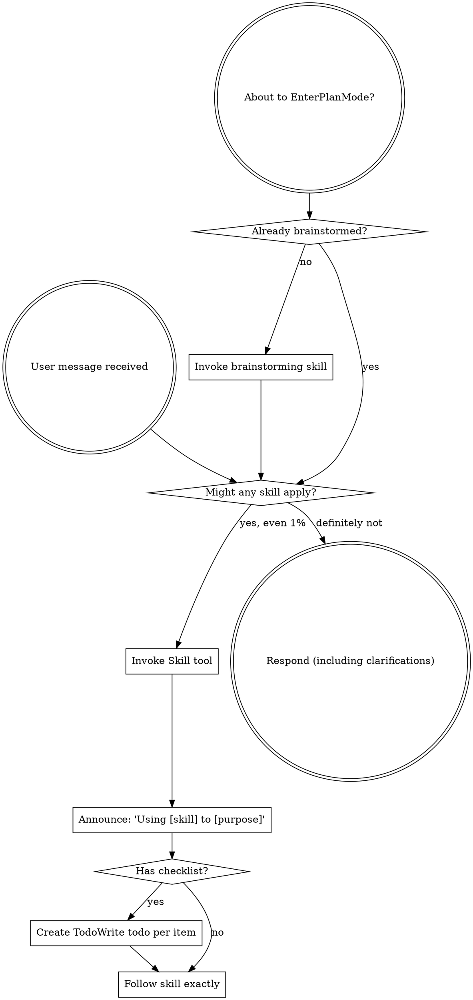

# Review — 2026-05-14-external-reviewer-context-optimisation-plan.md (plan, round 2)

- Target: `docs/plans/2026-05-14-external-reviewer-context-optimisation-plan.md`
- Request: `docs/reviewer/external-reviewer-context-optimisation-plan-plan/r2-2026-05-14T1439-request.md`
- Reviewer command: `reviewer-agent`
- Status: `ok`

---

## Findings

F1 — RESOLVED — Severity: blocking  
Task 1.11 now uses `prior` for the round dict and `prior_round` only as the integer round number in the resolution-gate block. The original `prior_round.get(...)` executable defect is fixed.

F2 — RESOLVED — Severity: blocking  
Task 1.9 now covers both existing `chain.json` reads and `synthesize_legacy_manifest()` output before persistence, with a test for no-`chain.json` legacy artifact synthesis.

F3 — UNRESOLVED — Severity: important  
The budget plan is improved, but still not executable as written. `apply_budget()` trims each section only once because it breaks after the first successful level at [plan.md:2296-2301](/home/simon/Dev/sigreer/skills/superstar/docs/plans/2026-05-14-external-reviewer-context-optimisation-plan.md:2296). With the new CLI test’s 20 KB budget and 60 KB injected prior findings at [plan.md:2420-2437](/home/simon/Dev/sigreer/skills/superstar/docs/plans/2026-05-14-external-reviewer-context-optimisation-plan.md:2420), prior findings will be cut only to 40 KB, so the request can remain above 20 KB. Also the unit test still uses old labels like `## Chain summary` / `Prior-round findings:` at [plan.md:2188-2196](/home/simon/Dev/sigreer/skills/superstar/docs/plans/2026-05-14-external-reviewer-context-optimisation-plan.md:2188), not the new stable headings from Task 1.10, so it does not prove the real anchors.

F4 — UNRESOLVED — Severity: important  
Task 2.5 now adds acceptance tests, but the global-cap test fixture is wrong. [plan.md:2531](/home/simon/Dev/sigreer/skills/superstar/docs/plans/2026-05-14-external-reviewer-context-optimisation-plan.md:2531) writes `"x" * 80 + "\n" * 200`, which is one 80-character line followed by blank lines, not 200 lines of 80 characters. With `max_lines=1`, each file preview becomes tiny, so `"bytes elided"` at [plan.md:2534](/home/simon/Dev/sigreer/skills/superstar/docs/plans/2026-05-14-external-reviewer-context-optimisation-plan.md:2534) will likely not appear even after the intended implementation.

F5 — RESOLVED — Severity: important  
Task 1.8 now adds `status` and `returncode` to emitted JSON `reviewers[]`, with tests for ok and failed reviewer entries.

## Open Questions / Assumptions

I’m treating self-failing planned tests as plan defects, because this plan is intended to be implemented literally by task workers.

## Suggested Document Edits

For F3, either loop budget trimming until the prompt fits or keep applying smaller levels within the same section before moving on. Update the unit test to use `## Review chain summary`, `## Prior-round findings`, `## Resolution report for prior round`, and `## Changes since prior round`.

For F4, change the fixture to write 200 real 80-character lines, for example `(("x" * 80 + "\n") * 200)`.

## Verification Gaps / Commands

After edits, run:

`python3 -m pytest skills/external-review/tests/test_incremental_budget.py skills/external-review/tests/test_diff_caps.py -v`

## Overall Verdict

revise

---

## Reviewer stderr

```text
Reading prompt from stdin...
OpenAI Codex v0.130.0
--------
workdir: /home/simon/Dev/sigreer/skills/superstar
model: gpt-5.5
provider: openai
approval: never
sandbox: danger-full-access
reasoning effort: none
reasoning summaries: none
session id: 019e26b6-dc00-75e1-99af-1513b68c281d
--------
user
You are continuing an existing review chain. This is round 2 of external-reviewer-context-optimisation-plan-plan.

In incremental mode:
- Verify whether prior findings are resolved per the resolution report below.
- Reuse the existing finding IDs (F1, F2, …). If a prior finding is resolved,
  mark it RESOLVED in your findings list with its original ID. If still
  unresolved, keep its ID.
- Only introduce new finding IDs for genuine regressions caused by the fix, or
  blocking issues clearly missed in earlier rounds. Do not reopen broad review
  unless prior fixes changed broad architecture.

Review chain summary:
| round | verdict | findings | blocking |
|---|---|---|---|
| 1 | ready | 5 | 2 |

Prior-round findings (primary reviewer response):

# Review — 2026-05-14-external-reviewer-context-optimisation-plan.md (plan, round 1)

- Target: `docs/plans/2026-05-14-external-reviewer-context-optimisation-plan.md`
- Request: `docs/reviewer/external-reviewer-context-optimisation-plan-plan/r1-2026-05-14T1433-request.md`
- Reviewer command: `reviewer-agent`
- Status: `ok`

---

## Findings

F1 — Severity: blocking — Task 1.11 is not executable against the current gate code.  
[docs/plans/2026-05-14-external-reviewer-context-optimisation-plan.md:1467](/home/simon/Dev/sigreer/skills/superstar/docs/plans/2026-05-14-external-reviewer-context-optimisation-plan.md:1467) tells the worker to use `prior_round.get(...)`, but in the actual script `prior_round` is an integer round number and the dict is named `prior` at [external-reviewer.py:876](/home/simon/Dev/sigreer/skills/superstar/skills/external-review/scripts/external-reviewer.py:876). A literal implementation will raise `AttributeError: 'int' object has no attribute 'get'`. Rewrite this task against the current variables: `prior_status = prior.get("status")`, `prior_rc = prior.get("returncode")`, and keep `prior_round` only for formatting the `rN` filename.

F2 — Severity: blocking — Legacy synthesis is not covered by the soft-migration task.  
Task 1.9 wires `migrate_manifest_inplace()` only after `read_manifest()` at [plan.md:1139](/home/simon/Dev/sigreer/skills/superstar/docs/plans/2026-05-14-external-reviewer-context-optimisation-plan.md:1139), but the current script also creates manifests via `synthesize_legacy_manifest()` when no `chain.json` exists at [external-reviewer.py:829](/home/simon/Dev/sigreer/skills/superstar/skills/external-review/scripts/external-reviewer.py:829). That synthesized path currently derives `verdict` / `verdict_valid` from legacy response bodies at [external-reviewer.py:1331](/home/simon/Dev/sigreer/skills/superstar/skills/external-review/scripts/external-reviewer.py:1331), which is exactly the class of untrusted legacy state the spec says must become `status: "unknown"` / `returncode: null`. Add a task/test for legacy artifact synthesis, or call the migrator immediately after synthesis before writing.

F3 — Severity: important — The budget implementation plan is brittle and under-tested against actual prompt structure.  
Task 2.4 adds hidden state via `make_prompt._budget_chars_override` at [plan.md:2141](/home/simon/Dev/sigreer/skills/superstar/docs/plans/2026-05-14-external-reviewer-context-optimisation-plan.md:2141) instead of passing a parameter through the existing call chain. The unit test only calls `apply_budget()` directly, so the new CLI flag can fail to affect real prompts and the test still passes. Also, `apply_budget()` identifies sections by ad hoc regexes such as `"\nPrior-round findings"` and trims until the next `\n## ` at [plan.md:2097](/home/simon/Dev/sigreer/skills/superstar/docs/plans/2026-05-14-external-reviewer-context-optimisation-plan.md:2097), while the actual incremental preamble labels are plain text blocks at [external-reviewer.py:314](/home/simon/Dev/sigreer/skills/superstar/skills/external-review/scripts/external-reviewer.py:314), [external-reviewer.py:318](/home/simon/Dev/sigreer/skills/superstar/skills/external-review/scripts/external-reviewer.py:318), and [external-reviewer.py:322](/home/simon/Dev/sigreer/skills/superstar/skills/external-review/scripts/external-reviewer.py:322). This can trim across section boundaries and does not prove the documented priority order. Prefer explicit section assembly or a `make_prompt(..., incremental_budget_chars=...)` parameter plus an integration test that runs the CLI with a small budget and inspects the generated request.

F4 — Severity: important — Diff-cap tightening has no failing acceptance tests.  
The spec requires a global diff cap plus untracked-file count and per-file caps, but Task 2.5 only replaces `compute_diff_section()` and runs existing small-fixture tests at [plan.md:2247](/home/simon/Dev/sigreer/skills/superstar/docs/plans/2026-05-14-external-reviewer-context-optimisation-plan.md:2247). Existing tests in `skills/external-review/tests/test_diff.py` cover small untracked/diff cases, not more than 10 untracked files, oversized untracked files, or multiple large diff subsections. Add explicit tests before the implementation step.

F5 — Severity: important — Per-reviewer JSON status/returncode remains unspecified.  
The plan adds `status` / `returncode` to manifest reviewer entries at [plan.md:986](/home/simon/Dev/sigreer/skills/superstar/docs/plans/2026-05-14-external-reviewer-context-optimisation-plan.md:986), but does not add them to emitted JSON `reviewers[]`. The current JSON reviewer objects only include role, verdict, validity, path, and body at [external-reviewer.py:1140](/home/simon/Dev/sigreer/skills/superstar/skills/external-review/scripts/external-reviewer.py:1140). Since the spec’s sweep truth table depends on failed sweeps being observable per reviewer, emitted JSON should expose `status` and `returncode`, and tests should assert that a failed sweep is visible there while top-level `status` stays `ok`.

## Open Questions / Assumptions

I’m assuming the emitted JSON `reviewers[]` is part of the user-facing contract, because `SKILL.md` tells agents to consume it as source-of-truth review data.

I’m also assuming the plan is intended to be followed literally by implementation workers, so variable-name mismatches in replacement snippets count as plan defects, not implementation discretion.

## Suggested Document Edits

Update Task 1.11’s replacement block to match current `prior` / `prior_round` names.

Extend Task 1.9 with a second test for no-`chain.json` legacy artifact synthesis and ensure synthesized rounds become `unknown`.

Refactor Task 2.4 to pass `incremental_budget_chars` explicitly through `make_prompt()` and add a CLI-level generated-request test.

Add Task 2.5 tests for global diff cap, untracked-file count cap, and per-untracked-file line cap.

Update Task 1.8 / 1.7 tests to assert emitted JSON reviewer entries include `status` and `returncode`.

## Verification Gaps / Commands

Run after plan edits:

`python3 -m pytest skills/external-review/tests/test_legacy_migration.py skills/external-review/tests/test_resolution_gate.py skills/external-review/tests/test_diff.py skills/external-review/tests/test_diff_wiring.py -v`

Add and run the new tests described above before implementation begins.

## Overall Verdict

revise

---

## Reviewer stderr

```text
Reading additional input from stdin...
OpenAI Codex v0.130.0
--------
workdir: /home/simon/Dev/sigreer/skills/superstar
model: gpt-5.5
provider: openai
approval: never
sandbox: danger-full-access
reasoning effort: none
reasoning summaries: none
session id: 019e26b1-ac40-75b1-9178-774d3d9f3e52
--------
user
You are acting as an independent senior engineering reviewer.

Review stance:
- Lead with findings, ordered by severity.
- Focus on correctness, consistency, implementation risk, missing acceptance
  gates, vague handoffs, ungrounded assumptions, unverified claims, and drift
  from the codebase.
- Give exact file/line references when possible.
- If the document is sound, say that clearly and list residual risks.
- Keep the review actionable. Avoid broad rewrites unless the current structure
  creates concrete risk.

Repository root:
/home/simon/Dev/sigreer/skills/superstar

Target kind:
plan

Review mode:
Pre-implementation plan review. Check that the plan faithfully
covers the associated spec, uses existing repo patterns, has executable tasks,
has realistic ordering, and includes concrete verification gates.

Target document:
docs/plans/2026-05-14-external-reviewer-context-optimisation-plan.md

Additional context files:
- docs/specs/2026-05-14-external-reviewer-context-optimisation-spec.md
- skills/external-review/scripts/external-reviewer.py
- skills/external-review/SKILL.md

Review output contract:
1. Findings
   - Tag each finding with a stable ID: `F1`, `F2`, `F3`, …. IDs must remain
     stable if this review is iterated in subsequent rounds.
   - Mark severity inline: `Severity: blocking | important | minor | nit`.
2. Open questions / assumptions
3. Suggested document edits
4. Verification gaps / commands that should be run, if any
5. Overall verdict: one of "ready", "ready with small edits", or "revise"

Read the files from disk. Do not rely only on the snippets in this prompt.


## Target Preview

### docs/plans/2026-05-14-external-reviewer-context-optimisation-plan.md

    1	# external-reviewer context optimisation Implementation Plan
    2	
    3	> **For agentic workers:** REQUIRED SUB-SKILL: Use superstar:subagent-driven-development (recommended) or superstar:executing-plans to implement this plan task-by-task. Steps use checkbox (`- [ ]`) syntax for tracking.
    4	
    5	**Goal:** Eliminate the recursive prompt-echo loop in external-reviewer chains and bound incremental-round prompt size, while preserving the JSON output contract and exit codes.
    6	
    7	**Architecture:** Three slices: (S1) make failure truthful — failed reviewer turns can never produce a fake verdict, prompt echoes never reach disk, preambles walk past failed rounds; (S2) put incremental-mode prompts on a diet — drop context previews, trim target preview, cap prior-text reads, add a single budget knob with deterministic preservation priority; (S3) update `skills/external-review/SKILL.md` with the new behaviour. All changes target a single file (`skills/external-review/scripts/external-reviewer.py`) and its test suite (`skills/external-review/tests/`).
    8	
    9	**Tech Stack:** Python 3 standard library only (no new deps). Test framework: pytest. Module loaded via importlib because the script has a hyphen in its filename.
   10	
   11	**Source spec:** `docs/specs/2026-05-14-external-reviewer-context-optimisation-spec.md` (status: `ready`).
   12	
   13	**Spec → Plan mapping for the test items.** The spec's S3 lists 15 tests plus a docs item; this plan pairs each test with its implementation under TDD discipline. The mapping is:
   14	
   15	| Spec S3 item | Plan task |
   16	|---|---|
   17	| 1. failed-process verdict suppression | Task 1.5 |
   18	| 2. failed sweep can't poison merged findings | Task 1.6 |
   19	| 3. sentinel-stripping happy path | Task 1.1 |
   20	| 4. sentinel-stripping truncated echo | Task 1.1 |
   21	| 5. success-stderr dropped or capped | Task 1.3 |
   22	| 6. failed-stderr cap after sentinel-stripping | Task 1.4 |
   23	| 7. preamble walks back past failed rounds | Task 1.10 |
   24	| 8. preamble treats `status: "unknown"` as untrusted | Task 1.10 |
   25	| 9. process-failed prior round bypasses resolution gate | Task 1.11 |
   26	| 10. incremental drops context previews | Task 2.1 |
   27	| 11. target preview trimmed on incremental | Task 2.2 |
   28	| 12. prior-text caps applied | Task 2.3 |
   29	| 13. budget cap preserves priority order | Task 2.4 |
   30	| 14. r3-request bounded after simulated failed r2 | Task 1.12 |
   31	| 15. chain.json soft-migration | Task 1.9 |
   32	| 16. SKILL.md docs update | Task 3.1 |
   33	
   34	---
   35	
   36	## Files at a glance
   37	
   38	- **Modified:** `skills/external-review/scripts/external-reviewer.py` — all code changes live here.
   39	- **Modified:** `skills/external-review/SKILL.md` — docs update in S3.
   40	- **Created (tests):** `skills/external-review/tests/test_sentinel_stripper.py`, `test_response_artifact.py`, `test_failed_round_truth.py`, `test_merged_findings_skips_failed.py`, `test_returncode_status_persisted.py`, `test_preamble_skips_failed.py`, `test_resolution_gate_bypass.py`, `test_failed_r2_bounded_r3.py`, `test_chain_soft_migration.py`, `test_incremental_drops_context.py`, `test_target_preview_trim.py`, `test_prior_text_caps.py`, `test_incremental_budget.py`.
   41	- **Untouched:** every other file in the repo.
   42	
   43	## Test-file boilerplate
   44	
   45	Every new test file in this plan starts with the same import block as the existing tests in `skills/external-review/tests/`:
   46	
   47	```python
   48	from pathlib import Path
   49	import sys
   50	import importlib.util
   51	
   52	SCRIPTS = Path(__file__).resolve().parents[1] / "scripts"
   53	sys.path.insert(0, str(SCRIPTS))
   54	spec = importlib.util.spec_from_file_location("external_reviewer", SCRIPTS / "external-reviewer.py")
   55	er = importlib.util.module_from_spec(spec)
   56	spec.loader.exec_module(er)
   57	```
   58	
   59	Reference: `skills/external-review/tests/test_manifest.py:1-13`. Re-paste this block at the top of every new test file in the steps below — do not abbreviate it.
   60	
   61	## Conventions used throughout the plan
   62	
   63	- All file paths are relative to the repo root `/home/simon/Dev/sigreer/skills/superstar/`.
   64	- All `python3 -m pytest` invocations should be run from the repo root.
   65	- Each task ends in a commit. Commit messages follow `<scope>: <change>`; `<scope>` is `external-reviewer`.
   66	- Line-number anchors (e.g. `external-reviewer.py:451`) reflect the script *before* this plan's edits. As the plan proceeds, line numbers will drift; the surrounding context strings in each step's `Edit` blocks are what makes the edit unambiguous, not the anchors.
   67	
   68	---
   69	
   70	## Slice 1 — Failure-truth + echo containment
   71	
   72	This is the keystone slice. Without it, any size optimisation only delays the corruption. Do not begin Slice 2 until every task in Slice 1 is committed and the test suite is green.
   73	
   74	### Task 1.1: Sentinel stripper
   75	
   76	**Files:**
   77	- Modify: `skills/external-review/scripts/external-reviewer.py` (add module-level constants near the top, add helper near `parse_verdict`)
   78	- Create: `skills/external-review/tests/test_sentinel_stripper.py`
   79	
   80	- [ ] **Step 1: Write the failing tests**
   81	
   82	Create `skills/external-review/tests/test_sentinel_stripper.py`:
   83	
   84	```python
   85	from pathlib import Path
   86	import sys
   87	import importlib.util
   88	
   89	SCRIPTS = Path(__file__).resolve().parents[1] / "scripts"
   90	sys.path.insert(0, str(SCRIPTS))
   91	spec = importlib.util.spec_from_file_location("external_reviewer", SCRIPTS / "external-reviewer.py")
   92	er = importlib.util.module_from_spec(spec)
   93	spec.loader.exec_module(er)
   94	
   95	
   96	def test_strip_removes_full_marker_block():
   97	    text = (
   98	        "preamble\n"
   99	        f"{er.PROMPT_SENTINEL_START}\nechoed prompt body\n{er.PROMPT_SENTINEL_END}\n"
  100	        "actual review\n"
  101	    )
  102	    out = er.strip_prompt_echo(text)
  103	    assert "echoed prompt body" not in out
  104	    assert er.PROMPT_SENTINEL_START not in out
  105	    assert er.PROMPT_SENTINEL_END not in out
  106	    assert "preamble" in out
  107	    assert "actual review" in out
  108	
  109	
  110	def test_strip_end_only_deletes_from_start_of_stream():
  111	    text = f"truncated echo tail here\n{er.PROMPT_SENTINEL_END}\nactual review\n"
  112	    out = er.strip_prompt_echo(text)
  113	    assert "truncated echo tail here" not in out
  114	    assert er.PROMPT_SENTINEL_END not in out
  115	    assert out.strip().startswith("actual review")
  116	
  117	
  118	def test_strip_start_only_deletes_to_end_of_stream():
  119	    text = f"preamble\n{er.PROMPT_SENTINEL_START}\nprompt body leaks to end\n"
  120	    out = er.strip_prompt_echo(text)
  121	    assert "prompt body leaks to end" not in out
  122	    assert er.PROMPT_SENTINEL_START not in out
  123	    assert out.strip() == "preamble"
  124	
  125	
  126	def test_strip_no_markers_passes_text_through():
  127	    text = "a clean review with no echo at all"
  128	    assert er.strip_prompt_echo(text) == text
  129	
  130	
  131	def test_strip_handles_empty_string():
  132	    assert er.strip_prompt_echo("") == ""
  133	
  134	
  135	def test_strip_handles_multiple_blocks():
  136	    text = (
  137	        f"head\n{er.PROMPT_SENTINEL_START}\nblock1\n{er.PROMPT_SENTINEL_END}\n"
  138	        f"middle\n{er.PROMPT_SENTINEL_START}\nblock2\n{er.PROMPT_SENTINEL_END}\n"
  139	        "tail"
  140	    )
  141	    out = er.strip_prompt_echo(text)
  142	    assert "block1" not in out
  143	    assert "block2" not in out
  144	    assert "head" in out and "middle" in out and "tail" in out
  145	```
  146	
  147	- [ ] **Step 2: Run tests to verify they fail**
  148	
  149	Run: `python3 -m pytest skills/external-review/tests/test_sentinel_stripper.py -v`
  150	Expected: all six tests fail with `AttributeError: module 'external_reviewer' has no attribute 'PROMPT_SENTINEL_START'`.
  151	
  152	- [ ] **Step 3: Add constants and helper to the script**
  153	
  154	In `skills/external-review/scripts/external-reviewer.py`, immediately before the line `SUPPORTED_SCHEMA_VERSION = 1`, insert:
  155	
  156	```python
  157	PROMPT_SENTINEL_START = "<!-- superstar-prompt:start -->"
  158	PROMPT_SENTINEL_END = "<!-- superstar-prompt:end -->"
  159	
  160	
  161	def strip_prompt_echo(text: str) -> str:
  162	    """Remove any superstar-prompt-sentinel-delimited region from `text`.
  163	
  164	    Handles three cases beyond the simple full-block case:
  165	    - End marker present but no start marker → delete from start of stream
  166	      through (and including) the end marker. Models a tail-truncated echo
  167	      where the beginning was capped off but the end marker survived.
  168	    - Start marker present but no end marker → delete from the start marker
  169	      to end of stream. Models a head-truncated echo.
  170	    - Multiple full blocks → all removed.
  171	    """
  172	    if not text:
  173	        return text
  174	    out = text
  175	    # Repeatedly strip full blocks first (greedy non-overlapping).
  176	    while True:
  177	        s = out.find(PROMPT_SENTINEL_START)
  178	        e = out.find(PROMPT_SENTINEL_END)
  179	        if s != -1 and e != -1 and e > s:
  180	            out = out[:s] + out[e + len(PROMPT_SENTINEL_END):]
  181	            continue
  182	        break
  183	    # Truncated-end case: end marker without a preceding start marker.
  184	    e = out.find(PROMPT_SENTINEL_END)
  185	    if e != -1 and out.find(PROMPT_SENTINEL_START) == -1:
  186	        out = out[e + len(PROMPT_SENTINEL_END):]
  187	    # Truncated-start case: start marker without a following end marker.
  188	    s = out.find(PROMPT_SENTINEL_START)
  189	    if s != -1 and out.find(PROMPT_SENTINEL_END) == -1:
  190	        out = out[:s]
  191	    return out
  192	```
  193	
  194	- [ ] **Step 4: Run tests to verify they pass**
  195	
  196	Run: `python3 -m pytest skills/external-review/tests/test_sentinel_stripper.py -v`
  197	Expected: all six tests pass.
  198	
  199	- [ ] **Step 5: Commit**
  200	
  201	```bash
  202	git add skills/external-review/scripts/external-reviewer.py \
  203	        skills/external-review/tests/test_sentinel_stripper.py
  204	git commit -m "external-reviewer: add prompt-echo sentinel stripper"
  205	```
  206	
  207	### Task 1.2: Wire sentinel markers into make_prompt
  208	
  209	**Files:**
  210	- Modify: `skills/external-review/scripts/external-reviewer.py` (`make_prompt`, around lines 328-354)
  211	
  212	- [ ] **Step 1: Write the failing test**
  213	
  214	Append to `skills/external-review/tests/test_sentinel_stripper.py`:
  215	
  216	```python
  217	def test_make_prompt_wraps_body_in_sentinels(tmp_path, monkeypatch):
  218	    root = tmp_path
  219	    target = root / "plan.md"
  220	    target.write_text("# plan\nbody\n")
  221	    monkeypatch.chdir(root)
  222	    out = er.make_prompt(
  223	        root=root, target=target, kind="plan",
  224	        context=[], max_lines=10, mode="broad", incremental_preamble=None,
  225	    )
  226	    assert out.startswith(er.PROMPT_SENTINEL_START)
  227	    assert out.rstrip().endswith(er.PROMPT_SENTINEL_END)
  228	    # Round-trip: stripping should remove the entire prompt.
  229	    assert er.strip_prompt_echo(out).strip() == ""
  230	```
  231	
  232	- [ ] **Step 2: Run test to verify it fails**
  233	
  234	Run: `python3 -m pytest skills/external-review/tests/test_sentinel_stripper.py::test_make_prompt_wraps_body_in_sentinels -v`
  235	Expected: AssertionError — the prompt does not start with the sentinel.
  236	
  237	- [ ] **Step 3: Wrap the prompt body**
  238	
  239	In `skills/external-review/scripts/external-reviewer.py`, edit `make_prompt`. Find:
  240	
  241	```python
  242	    if mode == "incremental" and incremental_preamble:
  243	        body = incremental_preamble + "\n---\n\n" + body
  244	    body += "\n\n## Target Preview\n\n"
  245	    body += numbered_preview(target, root, max_lines=max_lines)
  246	    if context:
  247	        body += "\n## Context Previews\n\n"
  248	        for ctx in context:
  249	            body += numbered_preview(ctx, root, max_lines=max(80, max_lines // 3))
  250	    return body
  251	```
  252	
  253	Replace with:
  254	
  255	```python
  256	    if mode == "incremental" and incremental_preamble:
  257	        body = incremental_preamble + "\n---\n\n" + body
  258	    body += "\n\n## Target Preview\n\n"
  259	    body += numbered_preview(target, root, max_lines=max_lines)
  260	    if context:
  261	        body += "\n## Context Previews\n\n"
  262	        for ctx in context:
  263	            body += numbered_preview(ctx, root, max_lines=max(80, max_lines // 3))
  264	    return f"{PROMPT_SENTINEL_START}\n{body}\n{PROMPT_SENTINEL_END}"
  265	```
  266	
  267	- [ ] **Step 4: Run the full test suite**
  268	
  269	Run: `python3 -m pytest skills/external-review/tests/ -v`
  270	Expected: the new test passes. Other tests may break if they inspect the raw prompt body — fix any breakages by stripping the markers in the assertion (using `er.strip_prompt_echo`) before comparing. Common likely failure: `test_incremental_prompt.py` and `test_prompt_contract.py`.
  271	
  272	If a pre-existing test breaks because it asserts the prompt starts with something other than the sentinel, change that assertion to: `assert er.strip_prompt_echo(out).startswith(...)`. Do not weaken the assertion in any other way.
  273	
  274	- [ ] **Step 5: Commit**
  275	
  276	```bash
  277	git add skills/external-review/scripts/external-reviewer.py \
  278	        skills/external-review/tests/test_sentinel_stripper.py \
  279	        skills/external-review/tests/test_incremental_prompt.py \
  280	        skills/external-review/tests/test_prompt_contract.py
  281	git commit -m "external-reviewer: wrap make_prompt body in echo-strip sentinels"
  282	```
  283	
  284	(Only stage test files that you actually had to change in Step 4. Do not stage files you did not touch.)
  285	
  286	### Task 1.3: write_review_artifact — success path drops/caps stderr
  287	
  288	**Files:**
  289	- Modify: `skills/external-review/scripts/external-reviewer.py` (`write_review_artifact`, around lines 440-473)
  290	- Create: `skills/external-review/tests/test_response_artifact.py`
  291	
  292	- [ ] **Step 1: Write the failing test**
  293	
  294	Create `skills/external-review/tests/test_response_artifact.py`:
  295	
  296	```python
  297	from pathlib import Path
  298	import subprocess
  299	import sys
  300	import importlib.util
  301	
  302	SCRIPTS = Path(__file__).resolve().parents[1] / "scripts"
  303	sys.path.insert(0, str(SCRIPTS))
  304	spec = importlib.util.spec_from_file_location("external_reviewer", SCRIPTS / "external-reviewer.py")
  305	er = importlib.util.module_from_spec(spec)
  306	spec.loader.exec_module(er)
  307	
  308	
  309	def _fake_result(returncode: int, stdout: str, stderr: str):
  310	    return subprocess.CompletedProcess(
  311	        args=["fake"], returncode=returncode, stdout=stdout, stderr=stderr,
  312	    )
  313	
  314	
  315	def test_success_stderr_with_full_prompt_echo_does_not_persist_prompt(tmp_path):
  316	    """Success path: stderr containing the entire echoed prompt must not be written."""
  317	    prompt_text = f"{er.PROMPT_SENTINEL_START}\n" + ("X" * 50_000) + f"\n{er.PROMPT_SENTINEL_END}"
  318	    result = _fake_result(
  319	        returncode=0,
  320	        stdout="# Review\nactual review body\nOverall verdict: ready",
  321	        stderr=f"banner line\n{prompt_text}\nmore banner",
  322	    )
  323	    response_path = tmp_path / "r1-response.md"
  324	    prompt_path = tmp_path / "r1-request.md"
  325	    prompt_path.write_text("ignored")
  326	    target = tmp_path / "plan.md"
  327	    target.write_text("ignored")
  328	    er.write_review_artifact(
  329	        root=tmp_path, target=target, kind="plan",
  330	        command_template="fake", prompt_file=prompt_path,
  331	        response_file=response_path, round_num=1, result=result,
  332	    )
  333	    body = response_path.read_text()
  334	    assert er.PROMPT_SENTINEL_START not in body
  335	    assert er.PROMPT_SENTINEL_END not in body
  336	    assert "X" * 1000 not in body  # the 50 KB of echoed payload must not appear
  337	    assert "actual review body" in body
  338	    assert response_path.stat().st_size < 8 * 1024  # under 8 KB
  339	
  340	
  341	def test_success_with_short_clean_stderr_keeps_tail_capped(tmp_path):
  342	    """Success path: short stderr (no echo) may be retained but capped to 2 KB."""
  343	    result = _fake_result(
  344	        returncode=0,
  345	        stdout="# Review\nbody\nOverall verdict: ready",
  346	        stderr="harmless banner\nsession info\n",
  347	    )
  348	    response_path = tmp_path / "r1-response.md"
  349	    prompt_path = tmp_path / "r1-request.md"
  350	    prompt_path.write_text("ignored")
  351	    target = tmp_path / "plan.md"
  352	    target.write_text("ignored")
  353	    er.write_review_artifact(
  354	        root=tmp_path, target=target, kind="plan",
  355	        command_template="fake", prompt_file=prompt_path,
  356	        response_file=response_path, round_num=1, result=result,
  357	    )
  358	    body = response_path.read_text()
  359	    assert "body" in body
  360	    # The stderr-tail section, if present, must not exceed 2 KB
  361	    if "## Reviewer stderr (tail)" in body:
  362	        tail = body.split("## Reviewer stderr (tail)", 1)[1]
  363	        assert len(tail) <= 2 * 1024 + 200  # 200 bytes of fenced-block scaffolding
  364	```
  365	
  366	- [ ] **Step 2: Run tests to verify they fail**
  367	
  368	Run: `python3 -m pytest skills/external-review/tests/test_response_artifact.py -v`
  369	Expected: `test_success_stderr_with_full_prompt_echo_does_not_persist_prompt` fails (the full stderr currently leaks); the short-clean test may pass or fail depending on current behaviour.
  370	
  371	- [ ] **Step 3: Implement the success path**
  372	
  373	In `skills/external-review/scripts/external-reviewer.py`, replace the body of `write_review_artifact` (currently lines ~440-473):
  374	
  375	```python
  376	def write_review_artifact(
  377	    *,
  378	    root: Path,
  379	    target: Path,
  380	    kind: str,
  381	    command_template: str,
  382	    prompt_file: Path,
  383	    response_file: Path,
  384	    round_num: int,
  385	    result: subprocess.CompletedProcess[str],
  386	) -> Path:
  387	    # Sentinel-strip both streams in full BEFORE any size cap or tail operation.
  388	    stdout = strip_prompt_echo(result.stdout or "").strip()
  389	    stderr = strip_prompt_echo(result.stderr or "").strip()
  390	    ok = result.returncode == 0
  391	    status = "ok" if ok else f"failed ({result.returncode})"
  392	
  393	    content = [
  394	        f"# Review — {target.name} ({kind}, round {round_num})",
  395	        "",
  396	        f"- Target: `{rel_or_abs(target, root)}`",
  397	        f"- Request: `{rel_or_abs(prompt_file, root)}`",
  398	        f"- Reviewer command: `{command_template}`",
  399	        f"- Status: `{status}`",
  400	        "",
  401	        "---",
  402	        "",
  403	    ]
  404	
  405	    if ok:
  406	        content.append(stdout or "_Reviewer produced no stdout._")
  407	        content.append("")
  408	        if stderr:
  409	            # Capped tail of sanitised stderr — diagnostic only.
  410	            tail = stderr[-2048:]
  411	            content.extend([
  412	                "---", "", "## Reviewer stderr (tail)", "",
  413	                "```text", tail, "```", "",
  414	            ])
  415	    else:
  416	        # Failed: no stdout body, only a short sanitised stderr tail.
  417	        tail = stderr[-4096:] if stderr else ""
  418	        content.extend([
  419	            "_Reviewer process failed; no stdout persisted._",
  420	            "",
  421	            "---", "", "## Reviewer stderr (tail, sanitised)", "",
  422	            "```text", tail or "(no stderr captured)", "```", "",
  423	        ])
  424	
  425	    response_file.write_text("\n".join(content), encoding="utf-8")
  426	    return response_file
  427	```
  428	
  429	- [ ] **Step 4: Run tests to verify success path passes**
  430	
  431	Run: `python3 -m pytest skills/external-review/tests/test_response_artifact.py -v`
  432	Expected: both tests pass. Run the full suite once: `python3 -m pytest skills/external-review/tests/`. Other tests may break if they parse the response body assuming the old format. Fix any breakages by updating the assertion to look for the new headings (`## Reviewer stderr (tail)`).
  433	
  434	- [ ] **Step 5: Commit**
  435	
  436	```bash
  437	git add skills/external-review/scripts/external-reviewer.py \
  438	        skills/external-review/tests/test_response_artifact.py
  439	git commit -m "external-reviewer: drop/cap success stderr after sentinel strip"
  440	```
  441	
  442	### Task 1.4: write_review_artifact — failed path, 4 KB stderr tail, no stdout
  443	
  444	The previous task already wrote the failed-path branch. This task adds the dedicated test for "strip-before-cap ordering with 20 KB echo input."
  445	
  446	**Files:**
  447	- Modify: `skills/external-review/tests/test_response_artifact.py`
  448	
  449	- [ ] **Step 1: Append the failing test**
  450	
  451	Append to `skills/external-review/tests/test_response_artifact.py`:
  452	
  453	```python
  454	def test_failed_stderr_strip_then_cap_ordering(tmp_path):
  455	    """Failed path: 20 KB of echoed prompt on stderr → tail ≤ 4 KB and no markers leak."""
  456	    huge_echo = f"{er.PROMPT_SENTINEL_START}\n" + ("Y" * 20_000) + f"\n{er.PROMPT_SENTINEL_END}"
  457	    result = _fake_result(
  458	        returncode=1, stdout="",
  459	        stderr=f"banner\n{huge_echo}\nerror: turn/start failed",
  460	    )
  461	    response_path = tmp_path / "r2-response.md"
  462	    prompt_path = tmp_path / "r2-request.md"
  463	    prompt_path.write_text("ignored")
  464	    target = tmp_path / "plan.md"
  465	    target.write_text("ignored")
  466	    er.write_review_artifact(
  467	        root=tmp_path, target=target, kind="plan",
  468	        command_template="fake", prompt_file=prompt_path,
  469	        response_file=response_path, round_num=2, result=result,
  470	    )
  471	    body = response_path.read_text()
  472	    assert er.PROMPT_SENTINEL_START not in body
  473	    assert er.PROMPT_SENTINEL_END not in body
  474	    assert "Y" * 1000 not in body
  475	    # Total file ≤ 8 KB (headers + ≤ 4 KB tail)
  476	    assert response_path.stat().st_size < 8 * 1024
  477	    # Diagnostic substring survives the tail cap
  478	    assert "error: turn/start failed" in body
  479	
  480	
  481	def test_failed_path_does_not_persist_stdout(tmp_path):
  482	    """Failed path: stdout (if any) is dropped — only stderr tail is persisted."""
  483	    result = _fake_result(
  484	        returncode=1,
  485	        stdout="this should not appear",
  486	        stderr="short stderr",
  487	    )
  488	    response_path = tmp_path / "r1-response.md"
  489	    prompt_path = tmp_path / "r1-request.md"
  490	    prompt_path.write_text("ignored")
  491	    target = tmp_path / "plan.md"
  492	    target.write_text("ignored")
  493	    er.write_review_artifact(
  494	        root=tmp_path, target=target, kind="plan",
  495	        command_template="fake", prompt_file=prompt_path,
  496	        response_file=response_path, round_num=1, result=result,
  497	    )
  498	    body = response_path.read_text()
  499	    assert "this should not appear" not in body
  500	    assert "short stderr" in body
  501	```
  502	
  503	- [ ] **Step 2: Run tests**
  504	
  505	Run: `python3 -m pytest skills/external-review/tests/test_response_artifact.py -v`
  506	Expected: both new tests pass (implementation was already done in Task 1.3).
  507	
  508	- [ ] **Step 3: Commit**
  509	
  510	```bash
  511	git add skills/external-review/tests/test_response_artifact.py
  512	git commit -m "external-reviewer: test strip-before-cap and stdout-drop on failed turns"
  513	```
  514	
  515	### Task 1.5: Failed reviewers force verdict=None / verdict_valid=False
  516	
  517	**Files:**
  518	- Modify: `skills/external-review/scripts/external-reviewer.py` (`run_one_reviewer`, around line 542)
  519	- Create: `skills/external-review/tests/test_failed_round_truth.py`
  520	
  521	- [ ] **Step 1: Write the failing test**
  522	
  523	Create `skills/external-review/tests/test_failed_round_truth.py`:
  524	
  525	```python
  526	from pathlib import Path
  527	import os
  528	import subprocess
  529	import sys
  530	import json
  531	import importlib.util
  532	
  533	SCRIPTS = Path(__file__).resolve().parents[1] / "scripts"
  534	sys.path.insert(0, str(SCRIPTS))
  535	spec = importlib.util.spec_from_file_location("external_reviewer", SCRIPTS / "external-reviewer.py")
  536	er = importlib.util.module_from_spec(spec)
  537	spec.loader.exec_module(er)
  538	
  539	
  540	FAKE_FAILED_WITH_ECHOED_VERDICT = """#!/usr/bin/env bash
  541	# Echo a prompt-looking blob on stderr that contains plausible verdict text,
  542	# then exit non-zero. This is the multistore failure mode.
  543	cat 1>&2 <<'EOF'
  544	Reading prompt from stdin...
  545	OpenAI Codex v0.130.0
  546	user
  547	You are continuing an existing review chain.
  548	... (echoed) ...
  549	Overall verdict: revise
  550	EOF
  551	exit 1
  552	"""
  553	
  554	
  555	def _init_repo(tmp_path):
  556	    repo = tmp_path / "repo"
  557	    repo.mkdir()
  558	    subprocess.run(["git", "-C", str(repo), "init", "-q"], check=True)
  559	    subprocess.run(["git", "-C", str(repo), "config", "user.email", "t@t"], check=True)
  560	    subprocess.run(["git", "-C", str(repo), "config", "user.name", "T"], check=True)
  561	    (repo / "plan.md").write_text("# plan\n")
  562	    subprocess.run(["git", "-C", str(repo), "add", "plan.md"], check=True)
  563	    subprocess.run(["git", "-C", str(repo), "commit", "-q", "-m", "init"], check=True)
  564	    return repo
  565	
  566	
  567	def test_failed_reviewer_with_echoed_verdict_is_not_trusted(tmp_path):
  568	    repo = _init_repo(tmp_path)
  569	    reviewer = repo / "fake.sh"
  570	    reviewer.write_text(FAKE_FAILED_WITH_ECHOED_VERDICT)
  571	    reviewer.chmod(0o755)
  572	    env = os.environ.copy()
  573	    env["AGENT_REVIEWER_CMD"] = str(reviewer)
  574	    result = subprocess.run(
  575	        [sys.executable, str(SCRIPTS / "external-reviewer.py"),
  576	         "review", "--kind", "plan", "--file", "plan.md", "--emit", "json"],
  577	        cwd=repo, env=env, capture_output=True, text=True, timeout=30,
  578	    )
  579	    # Process should exit with the reviewer's non-zero code, not 0.
  580	    assert result.returncode != 0, result.stdout
  581	    payload = json.loads(result.stdout)
  582	    assert payload["verdict_valid"] is False
  583	    assert payload["verdict"] is None
  584	    assert payload["status"] == "failed"
  585	    assert payload["returncode"] != 0
  586	```
  587	
  588	- [ ] **Step 2: Run test to verify it fails**
  589	
  590	Run: `python3 -m pytest skills/external-review/tests/test_failed_round_truth.py -v`
  591	Expected: failure. Today, the script parses the echoed `Overall verdict: revise` and records `verdict_valid: True`.
  592	
  593	- [ ] **Step 3: Force the verdict in `run_one_reviewer`**
  594	
  595	In `skills/external-review/scripts/external-reviewer.py`, find the end of `run_one_reviewer` where the `ReviewerResult` is constructed (around line 542-549):
  596	
  597	```python
  598	    body = response_path.read_text(encoding="utf-8")
  599	    verdict, valid = parse_verdict(body)
  600	    return ReviewerResult(

[truncated: 1848 additional lines]

## Context Previews

### docs/specs/2026-05-14-external-reviewer-context-optimisation-spec.md

    1	# Spec — external-reviewer context optimisation & chain integrity
    2	
    3	- **Status:** ready (incorporates `--kind spec` r1 + r2 review findings; r2 verdict `ready with small edits` applied)
    4	- **Created:** 2026-05-14
    5	- **Owner:** sigreer
    6	- **Target component:** `skills/external-review/scripts/external-reviewer.py` (+ `skills/external-review/SKILL.md`, `skills/external-review/tests/`)
    7	- **Related artefacts:**
    8	  - Draft brief: `docs/_drafts/context-optimisation-brief.md`
    9	  - Brief review chain: `docs/reviewer/context-optimisation-brief-design/`
   10	  - Smoking-gun chain: `/home/simon/Dev/sigreer/multistore/docs/reviewer/p10-s3-x39-tailwind-screen-aliases-P10-S3-post-slice/`
   11	
   12	## 1. Problem
   13	
   14	Incremental rounds in an external-review chain currently fail in two compounding ways:
   15	
   16	### 1.1 Chain semantic corruption (primary defect)
   17	
   18	When the configured reviewer command exits non-zero, `write_review_artifact` (`external-reviewer.py:440-473`) writes `result.stdout` and the full `result.stderr` verbatim into the round's response file. The OpenAI Codex–backed `reviewer-agent` emits its session banner and the **entire echoed input prompt** on stderr. The next stage of the script then:
   19	
   20	1. Parses the response body for a verdict (`run_one_reviewer` → `parse_verdict`).
   21	2. Records the parsed verdict, `verdict_valid`, and `merged_verdict` into `chain.json` with no awareness that the process exited non-zero.
   22	3. Persists no `returncode` or `status` field on the round entry.
   23	
   24	The downstream effect, observed empirically on the multistore chain `p10-s3-x39-tailwind-screen-aliases-P10-S3-post-slice`:
   25	
   26	```
   27	round=2  verdict=revise  valid=True  ← reviewer process FAILED (exit 1)
   28	round=3  verdict=revise  valid=True  ← reviewer process FAILED
   29	round=4  verdict=revise  valid=True  ← reviewer process FAILED
   30	```
   31	
   32	Every "verdict" past r1 was extracted from echoed prompt text. The chain looks healthy to any consumer of `chain.json` while being entirely fabricated.
   33	
   34	### 1.2 Recursive prompt bloat (secondary defect)
   35	
   36	The corrupted response files are then slurped whole into the next round's preamble:
   37	
   38	- `build_incremental_preamble` (`external-reviewer.py:277-285`) reads `r{N-1}-merged-findings.md` (preferred) or `r{N-1}-response` (fallback) with no size cap.
   39	- `make_prompt` (`external-reviewer.py:348-353`) re-embeds the full target preview and every `--context` file preview on every incremental round, on top of the preamble.
   40	- `compute_diff_section` caps each subsection independently — no global cap on the diff block, no cap on number of untracked files.
   41	
   42	Observed size progression on the same chain (one failed r2 was enough to poison the whole chain):
   43	
   44	| File | Bytes |
   45	|---|---|
   46	| `r1-merged-findings.md` | 594,637 |
   47	| `r1-resolution.md` | 4,155 |
   48	| `r2-…-request.md` | 886,686 |
   49	| `r2-…-response.md` (failed, stderr-echoed) | 887,637 |
   50	| `r3-…-request.md` | 1,293,203 (exceeds OpenAI's 1,048,576 limit) |
   51	| `r4-…-request.md` | 1,938,265 |
   52	
   53	The literal prompt phrase `"You are continuing an existing review chain"` (one occurrence in the template) appears 0 / 0 / 2 / 6 / **14** times across r1-primary / r1-sweep1 / r2 / r3 / r4 response files — confirming 2× compounding per round.
   54	
   55	### 1.3 Self-demonstration
   56	
   57	The very `--kind design` review that vetted the precursor brief for this spec produced a **1.22 MB response file** for a successful (returncode 0) round. Codex echoed the entire stdin on stderr; `write_review_artifact` dumped it whole. This bug fires even on the happy path — only the prompt-size symptom is gated by a non-zero exit.
   58	
   59	## 2. Goals
   60	
   61	1. **Chain integrity:** a failed reviewer process can never produce a recorded verdict, valid finding, or trusted merged_verdict in `chain.json`. Failed bodies never enter merged findings or downstream parsing.
   62	2. **Prompt size:** typical incremental round (round 2+) on a 3-context chain stays under 250 KB regardless of chain depth. Failed-round artefacts contribute O(KB), not O(MB).
   63	3. **Backwards compatibility:** JSON output contract and exit codes unchanged. Existing chain folders continue to work (soft-migration where needed). No new env vars; one new flag (`--incremental-budget-chars`) with auto default.
   64	4. **Self-evidencing tests:** the failure modes from §1 are reproduced and asserted against in unit tests.
   65	
   66	## 3. Non-goals
   67	
   68	- Changes to broad-round (r1) prompt structure or `--max-lines` defaults. Round 1 is not broken.
   69	- New env vars (`AGENT_REVIEWER_TRANSPORT` already exists; no more).
   70	- Changes to JSON output keys or exit-code values. New keys may be added under `reviewers[]` and `rounds[]` but existing keys keep their semantics.
   71	- New third-party dependencies.
   72	- Changes to `reviewer-agent` itself — the bridge must remain backend-agnostic.
   73	
   74	## 4. Scope (3 slices)
   75	
   76	### S1 — Failure-truth + echo containment (root-cause fix)
   77	
   78	The keystone slice. Without this, any size optimisation only delays the corruption.
   79	
   80	**Operation order for response persistence (applies to every reviewer invocation, success or failure):**
   81	
   82	1. Capture raw `result.stdout` and `result.stderr` from `subprocess.CompletedProcess`.
   83	2. Apply sentinel-stripping (item S1.5) to **both** streams in full — *before* any size cap, tail, or truncation. This ensures a tail-cap operation cannot leave the end of an echoed prompt without its `:start -->` marker.
   84	3. Apply size caps per the rules below.
   85	4. Write the assembled response file.
   86	
   87	Now the specific items:
   88	
   89	1. **Persist process status in `chain.json`.** Extend each `reviewers[]` entry and each `rounds[]` entry with three new keys: `returncode: int | null`, `status: "ok" | "failed" | "unknown"`. The `"unknown"` value is reserved for legacy entries migrated from pre-S1 manifests. New entries always record `"ok"` or `"failed"` based on `result.returncode`. Soft-migrate older entries on first touch: missing `returncode` becomes `null` and `status` becomes `"unknown"`; do not infer retroactive truth from existing `verdict_valid` flags.
   90	2. **Failed rounds force `verdict_valid: false`.** In `run_one_reviewer`, if `result.returncode != 0`: set the reviewer's `verdict = null`, `verdict_valid = false`, `findings_count = 0`, regardless of what `parse_verdict` extracts from the body. The same applies to `merged_verdict` aggregation per the truth table below. (This is stricter than the current `verdict_valid: false → treat as revise` policy, which assumes the reviewer at least produced a real response.)
   91	3. **Sanitise stdout and stderr on every round, success or failure.** In `write_review_artifact`:
   92	   - **Success (`returncode == 0`):** persist sentinel-stripped stdout as the review body. Stderr is dropped entirely *unless* it remains non-empty after sentinel-stripping, in which case its **tail is capped at 2 KB** and appended under `## Reviewer stderr (tail)`. Rationale: the self-demonstration in §1.3 shows even successful runs echo the prompt on stderr; storing the full stderr serves no diagnostic purpose once sentinels are stripped.
   93	   - **Failure (`returncode != 0`):** persist a short failure stub — header, returncode, `## Reviewer stderr (tail, sanitised)` with the **sentinel-stripped stderr tail capped at 4 KB**, and no stdout body. Successful reviewers attach their review under their own heading; failed reviewers attach only the stderr tail.
   94	4. **Skip failed bodies in merged-findings construction.** `write_merged_findings` (`external-reviewer.py:572`-ish) only concatenates bodies from reviewers with `status == "ok"`. If every reviewer in the round failed, no merged-findings file is written and `chain.json` records `merged_findings: null`.
   95	5. **Sentinel-wrap the prompt.** `make_prompt` emits `<!-- superstar-prompt:start -->` and `<!-- superstar-prompt:end -->` markers at the very top and very bottom of the assembled prompt body. The stripper removes any range of text bounded by those markers (inclusive of the markers themselves) from a reviewer output stream. If only an end marker is found with no start marker (e.g. tail-truncated echo) the stripper deletes from the beginning of the stream up to and including the end marker. If only a start marker is found, it deletes from the start marker to the end of the stream. This makes the stripper robust against arbitrary truncation.
   96	6. **Skip parsing failed artefacts in preamble construction.** `build_incremental_preamble` consults `chain.json` for the prior round's `status`. If `status` is `"failed"` or `"unknown"`, walk backward to the last `status: "ok"` round and embed *that* round's merged-findings instead, prefixed with a short note: `Note: rounds {N-1}...{K+1} were process failures or pre-S1 entries; skipped.`. If no successful prior round exists, fall back to the chain summary table only. `"unknown"` is treated as untrusted by default to prevent legacy poisoned manifests from leaking through.
   97	
   98	#### S1.7 — Multi-reviewer truth table
   99	
  100	When `--review-depth thorough` or `exhaustive` runs sweeps alongside the primary, top-level JSON aggregation and process exit are governed by this table:
  101	
  102	| Primary status | Sweep status(es) | Top-level `status` | Top-level `returncode` | `verdict_valid` | `merged_verdict` | Process exit |
  103	|---|---|---|---|---|---|---|
  104	| ok | all ok | `ok` | 0 | per merged verdict | computed | 0 |
  105	| ok | some failed | `ok` | 0 | per merged verdict computed over ok reviewers only | computed (ok reviewers only) | 0 |
  106	| ok | all failed | `ok` | 0 | per primary verdict | primary's verdict | 0 |
  107	| failed | any | `failed` | primary's returncode | `false` | `null` | primary's returncode |
  108	| failed | all | `failed` | primary's returncode | `false` | `null` | primary's returncode |
  109	
  110	Rule of thumb: **primary failure is the only condition that flips top-level status to `failed`.** A sweep failure is recorded per-reviewer and excluded from merged-findings, but the round as a whole remains valid if the primary succeeded. This preserves the current `main()` behaviour at `external-reviewer.py:1155` (return `primary.returncode`) while adding correct per-reviewer truth.
  111	
  112	#### S1.8 — Process-failed prior round gate behaviour
  113	
  114	The existing resolution-required gate at `external-reviewer.py:871` blocks round N+1 on `post-slice` / `post-phase` chains when the prior round has `verdict_valid: false`, unless `r{N-1}-resolution.md` exists or `--allow-missing-resolution` is passed. A process failure has no findings to resolve, so without specific handling the chain would deadlock.
  115	
  116	**Rule:** when the prior round's `status` is `"failed"` (i.e. the reviewer process failed, not "the reviewer returned `revise`"), the resolution-required gate is **bypassed** for the next round. The script emits a one-line stderr notice: `Note: prior round r{N-1} was a process failure (returncode={rc}); resolution gate bypassed.`. The next round proceeds as a re-attempt at the same review, not as a fix-and-re-review. No new exit code, no new flag.
  117	
  118	Distinction from `"unknown"`: legacy entries with `status: "unknown"` do **not** bypass the gate — the operator must inspect the legacy state explicitly and pass `--allow-missing-resolution` if appropriate. Only fresh `"failed"` entries (with a recorded `returncode != 0`) earn the bypass.
  119	
  120	**Acceptance:** the tests added in S3 items 1, 9, and 14 pass — item 1 asserts `chain.json` records `verdict_valid: false`, `returncode != 0`, `status: "failed"` after a failed reviewer turn; item 9 asserts r3 submission proceeds without `--allow-missing-resolution` after a `status: "failed"` r2; item 14 asserts r3-request bytes < 250 KB and contains no echoed-prompt phrase. Items 3, 4, 5, 6 cover sentinel-stripping under success, failure, and truncation. Item 2 covers multi-reviewer truth-table behaviour for sweeps.
  121	
  122	### S2 — Incremental prompt diet
  123	
  124	Independent of S1's correctness fixes; reduces typical size further. Ship after S1 lands.
  125	
  126	1. **Drop context previews on incremental.** In `make_prompt`, when `mode == "incremental"`, skip the `## Context Previews` block (`external-reviewer.py:350-353`) entirely. The preamble already names context files by path and the REVIEW_PROMPT body tells the reviewer to read from disk.
  127	2. **Trim target preview on incremental.** Cap the target preview to `min(max_lines, 150)` lines when `mode == "incremental"`. Broad-round behaviour unchanged.
  128	3. **Cap prior-text reads.** In `build_incremental_preamble`, cap `prior_response_text`, `merged_findings_text`, and `resolution_text` reads to 80 KB each (head + tail with a `[…N bytes elided…]` marker in between). Apply caps *after* §S1.6's failed-round skipping.
  129	4. **Global cap with deterministic preservation priority.** Add `--incremental-budget-chars` (default 400_000). Applied as the final step in `make_prompt` on incremental rounds. If the assembled prompt exceeds budget, sections are dropped/truncated in this order (lowest-priority dropped first):
  130	   1. Target preview (cut to 80 lines, then 40, then 0)
  131	   2. Diff body (cut to half, quarter, then 0; preserve the diff header note)
  132	   3. Resolution body (cut to 20 KB, then 8 KB)
  133	   4. Prior findings body (cut to 40 KB, then 16 KB)
  134	   5. **Never dropped:** review-mode preamble, chain summary table, finding-ID list, sentinel markers, REVIEW_PROMPT contract.
  135	   The result includes a trailing `<!-- budget-applied: ... -->` note describing what got trimmed. Tested by S3 item 13.
  136	5. **Tighten diff caps.** `compute_diff_section` enforces a single global cap on the whole diff block (already `--max-diff-lines`, default 2000) rather than per-subsection. Add a cap on untracked-file count (default 10) and per-untracked-file line cap (default 200).
  137	
  138	**Acceptance:** on a synthetic chain with spec + plan + TASKLIST as context, a 50 KB merged-findings file, a 4 KB resolution, and a 500-line diff, the round-2 prompt is under 200 KB. Tested by S3 item 13 (budget cap), item 12 (prior-text caps), item 10 (context-preview drop on incremental), and item 11 (target-preview trim on incremental).
  139	
  140	### S3 — Tests, docs, and skill update
  141	
  142	**Numbering note:** items here are referenced from S1/S2 acceptance gates by their item number. Renumbering during implementation requires a corresponding spec edit; do not silently re-order.
  143	
  144	1. **Test: failed-process verdict suppression** — simulate `reviewer-agent` returncode=1 with stderr containing the full prompt; assert `chain.json` round entry has `verdict_valid: false`, `returncode: 1`, `status: "failed"`, `merged_verdict: null`, and that the persisted response file is under 8 KB.
  145	2. **Test: failed sweep can't poison merged findings** — `--review-depth thorough` run where the sweep returncode=1 (stderr contains echoed prompt); assert `merged_findings` is built from the primary only, the sweep's body is not concatenated, and per the S1.7 truth table the top-level `status` remains `"ok"`.
  146	3. **Test: sentinel-stripping happy path** — feed reviewer stdout that begins with `<!-- superstar-prompt:start -->...<!-- superstar-prompt:end -->actual review here`; assert the persisted response body contains only `actual review here` (no markers, no echoed prompt).
  147	4. **Test: sentinel-stripping truncated echo** — feed reviewer stderr containing only the **end** marker followed by trailing text (simulating a tail-truncated echo); assert the stripper deletes everything from the start of the stream up to and including the end marker. Symmetric case: stream contains only the start marker followed by content; assert deletion from start marker to end of stream.
  148	5. **Test: success-stderr is dropped or capped** — simulate a successful (returncode=0) reviewer run whose stderr contains the full prompt; assert the persisted response file does **not** contain the full prompt and the `## Reviewer stderr (tail)` section, if present, is ≤ 2 KB and has been sentinel-stripped first.
  149	6. **Test: failed-stderr cap is applied after sentinel-stripping** — simulate a failed reviewer run whose stderr is 20 KB of echoed prompt; assert the persisted stub's stderr-tail section is ≤ 4 KB **and** contains no `<!-- superstar-prompt:start -->` / `:end -->` markers (proves strip-before-cap ordering).
  150	7. **Test: preamble walks back past failed rounds** — chain with r1 ok, r2 failed (returncode=1), r3 building; assert r3 preamble cites r1's merged-findings with the "skipped failures" note, not r2's response.
  151	8. **Test: preamble treats `status: "unknown"` as untrusted** — chain.json with a legacy entry (no `returncode`, no `status` → migrated to `status: "unknown"`); assert the preamble does **not** embed that round's response body and emits the same skip note.
  152	9. **Test: process-failed prior round bypasses resolution gate** — post-slice chain where r2 has `status: "failed"`; submit r3 without `--allow-missing-resolution` and without `r2-resolution.md`; assert exit code is not 3 and the gate-bypass notice appears on stderr.
  153	10. **Test: incremental prompt drops context previews** — assert `## Context Previews` heading absent in `mode=="incremental"` prompts; assert it is still present in `mode=="broad"`.
  154	11. **Test: target preview trimmed on incremental** — assert preview ≤ 150 lines on incremental; broad round preview ≤ default `max_lines`.
  155	12. **Test: prior-text caps applied** — feed a 1 MB merged-findings file; assert embedded segment ≤ 80 KB with the elision marker present.
  156	13. **Test: budget cap preserves priority order** — assemble a prompt that exceeds `--incremental-budget-chars`; assert REVIEW_PROMPT contract, chain summary table, sentinel markers, and finding-ID list are intact; assert the lowest-priority sections are the ones trimmed in the documented order.
  157	14. **Test: r3-request size bounded after simulated failed r2** — end-to-end fixture with r1 ok (large merged-findings, ~600 KB) and a forced failed r2; assert r3-request bytes < 250 KB and contains no echoed-prompt phrase.
  158	15. **Test: chain.json soft-migration** — load a pre-S1 chain.json with no `returncode` / `status` keys; assert the script does not error, treats existing rounds as `status: "unknown"`, and writes new rounds with the new keys.
  159	16. **Docs: `skills/external-review/SKILL.md`** — document `--incremental-budget-chars`, the new failure handling (failed rounds → `verdict_valid: false`, response file is a stub, resolution gate bypassed, preamble walks back), the sentinel-stripping behaviour, and the multi-reviewer truth table from S1.7. Update the "Exit codes" table only if a new exit code is added (preferred: do not add one; preserve existing semantics).
  160	
  161	## 5. Open design questions
  162	
  163	These were initially open at draft and have been resolved in §4. Captured here for traceability.
  164	
  165	1. ~~**Hard error on chain with any prior failure?**~~ **Resolved (§S1.8):** failed prior rounds bypass the resolution-required gate silently and emit a stderr notice. No new exit code, no new flag. Rationale: hard error adds a knob to every consumer and the bypass behaviour is observable in `chain.json` (`status: "failed"`, `returncode != 0`), so operators retain visibility without forced acknowledgement.
  166	2. ~~**Sentinel stripping placement.**~~ **Resolved (§S1, operation order):** write-time stripping is the primary mechanism. Belt-and-braces read-path stripping in `build_incremental_preamble` is not required because S1.6 walks past failed/unknown rounds entirely rather than embedding their bodies. Successful prior-round bodies that pre-date this fix will retain echoed prompt text on disk; they are not modified, but their re-embed is capped by S2.3.
  167	3. ~~**`AGENT_REVIEWER_BUDGET_CHARS` env var?**~~ **Resolved (§3 non-goal):** flag only. If demand emerges, a follow-up can revisit.
  168	4. **Round entries — do we want a stable `attempt` counter alongside `round`?** Out of scope for this spec, flagged for follow-up. The script's existing invariant (`next_round_number()` returns `len(rounds)+1`; rounds are never overwritten) is preserved by this spec: a failed reviewer turn occupies its own round number, and the "re-attempt" after a process failure advances to the next round number within the same review chain. Today consumers distinguish attempts via the round number sequence in `chain.json`; an explicit `attempt` field on each round could later make "this was a retry of the previous failed round" semantically explicit, but is not required for the goals in §2.
  169	
  170	## 6. Acceptance gate
  171	
  172	The spec is considered complete and ready for plan-writing when:
  173	
  174	- `python3 -m pytest skills/external-review/tests/` passes with all S3 tests added.
  175	- A live re-run of the failing chain at `/home/simon/Dev/sigreer/multistore/docs/reviewer/p10-s3-x39-tailwind-screen-aliases-P10-S3-post-slice/` (with the patched script) completes a next-round invocation either successfully or as a clearly-failed round (`returncode != 0`, `verdict_valid: false`, `status: "failed"`, persisted response file ≤ 8 KB total with the stderr-tail section itself ≤ 4 KB), and the following round runs against a prompt < 250 KB.
  176	- `skills/external-review/SKILL.md` documents the new behaviour and the new flag.
  177	- `--kind spec` external review on this document returns `ready` or `ready with small edits`.
  178	
  179	## 7. Rollout
  180	
  181	- S1 and S2 land in separate commits in this repo.
  182	- After landing, downstream consumers re-vendor `external-reviewer.py` via the `[[project-setup]]` skill. Existing chain folders are soft-migrated (missing `returncode` treated as `null`); no destructive rewrite.
  183	- The poisoned `multistore` chain is left intact for forensic value; a fresh chain or `--mode broad` reset is the operator's call.
  184	
  185	## 8. References
  186	
  187	- Empirical chain: `/home/simon/Dev/sigreer/multistore/docs/reviewer/p10-s3-x39-tailwind-screen-aliases-P10-S3-post-slice/`
  188	- Draft brief (precursor to this spec): `docs/_drafts/context-optimisation-brief.md`
  189	- Brief review (4 findings, verdict `revise`): `docs/reviewer/context-optimisation-brief-design/r1-2026-05-14T1411-response.md`
  190	- Script under modification: `skills/external-review/scripts/external-reviewer.py`
  191	- Skill doc to update: `skills/external-review/SKILL.md`
### skills/external-review/scripts/external-reviewer.py

    1	#!/usr/bin/env python3
    2	"""
    3	File-based bridge for third-party spec/plan review.
    4	
    5	The script is intentionally provider-neutral. It builds a review prompt around
    6	one target document, calls a configured reviewer command, and stores both the
    7	request and the response under a per-chain folder at
    8	docs/reviewer/<target-stem-no-date>-<kind>/. Each invocation is a new round —
    9	existing rounds are never overwritten. Round number is derived from the count
   10	of rN-*-request.md files already in the chain folder.
   11	
   12	Configuration:
   13	  AGENT_REVIEWER_CMD='reviewer-agent'
   14	  AGENT_REVIEWER_TRANSPORT='arg'
   15	
   16	If the command contains placeholders, it is executed through the shell after
   17	substitution. If it contains no placeholders, the prompt is supplied according
   18	to --prompt-transport: as one argument (default), as stdin, or as a prompt-file
   19	path.
   20	"""
   21	
   22	from __future__ import annotations
   23	
   24	import argparse
   25	import datetime as dt
   26	import json
   27	import os
   28	import re
   29	import shlex
   30	import subprocess
   31	import sys
   32	from dataclasses import dataclass
   33	from pathlib import Path
   34	
   35	# Self-register in sys.modules so @dataclass works when this script is loaded
   36	# via importlib.util.spec_from_file_location without prior registration
   37	# (Python 3.12+ dataclasses inspect sys.modules[cls.__module__]).
   38	if __name__ not in sys.modules:
   39	    import types as _types
   40	    _self_mod = _types.ModuleType(__name__)
   41	    _self_mod.__dict__.update(globals())
   42	    sys.modules[__name__] = _self_mod
   43	
   44	
   45	REVIEW_PROMPT = """You are acting as an independent senior engineering reviewer.
   46	
   47	Review stance:
   48	- Lead with findings, ordered by severity.
   49	- Focus on correctness, consistency, implementation risk, missing acceptance
   50	  gates, vague handoffs, ungrounded assumptions, unverified claims, and drift
   51	  from the codebase.
   52	- Give exact file/line references when possible.
   53	- If the document is sound, say that clearly and list residual risks.
   54	- Keep the review actionable. Avoid broad rewrites unless the current structure
   55	  creates concrete risk.
   56	
   57	Repository root:
   58	{repo_root}
   59	
   60	Target kind:
   61	{kind}
   62	
   63	Review mode:
   64	{mode_guidance}
   65	
   66	Target document:
   67	{target_file}
   68	
   69	Additional context files:
   70	{context_files}
   71	
   72	Review output contract:
   73	1. Findings
   74	   - Tag each finding with a stable ID: `F1`, `F2`, `F3`, …. IDs must remain
   75	     stable if this review is iterated in subsequent rounds.
   76	   - Mark severity inline: `Severity: blocking | important | minor | nit`.
   77	2. Open questions / assumptions
   78	3. Suggested document edits
   79	4. Verification gaps / commands that should be run, if any
   80	5. Overall verdict: one of "ready", "ready with small edits", or "revise"
   81	
   82	Read the files from disk. Do not rely only on the snippets in this prompt.
   83	"""
   84	
   85	
   86	MODE_GUIDANCE = {
   87	    "spec": """Pre-implementation spec review. Check that the spec is complete,
   88	internally consistent, grounded in the existing codebase, and specific enough to
   89	drive an implementation plan. Do not review implemented code unless the spec
   90	claims code already exists.""",
   91	    "plan": """Pre-implementation plan review. Check that the plan faithfully
   92	covers the associated spec, uses existing repo patterns, has executable tasks,
   93	has realistic ordering, and includes concrete verification gates.""",
   94	    "design": """Design artifact review. Check coverage, route/component mapping,
   95	accessibility, responsive states, missing screens, and whether the design can be
   96	implemented in the current repo without inventing unsupported abstractions.""",
   97	    "implementation": """Implementation review. Check code changes against the
   98	stated task, looking for behavioral regressions, missing tests, accidental
   99	scope expansion, and repo-pattern drift.""",
  100	    "post-slice": """Post-slice review. Treat this as a completion gate for one
  101	slice of work. Compare the completed changes and stated evidence against the
  102	slice acceptance criteria. Prioritize: incomplete tasks, uncommitted or
  103	untracked artifacts, missing tests, failing or skipped verification, broken
  104	cross-site behavior, and claims not supported by the repo state.""",
  105	    "post-phase": """Post-phase review. Treat this as a closeout gate for a whole
  106	phase. Compare the implementation, archive/TASKLIST updates, and verification
  107	evidence against the phase spec/plan. Prioritize: unresolved acceptance
  108	criteria, stale docs, missing archive notes, cross-cutting tracker drift,
  109	deferred gates without justification, and regressions outside the phase scope.""",
  110	    "other": """General document/code review. Apply the standard reviewer stance
  111	and tailor findings to the supplied target and context.""",
  112	}
  113	
  114	
  115	SUPPORTED_SCHEMA_VERSION = 1
  116	
  117	
  118	class ManifestSchemaTooNew(Exception):
  119	    """Raised when chain.json declares a schema_version newer than this script supports."""
  120	
  121	
  122	def read_manifest(path: Path) -> dict | None:
  123	    if not path.exists():
  124	        return None
  125	    data = json.loads(path.read_text(encoding="utf-8"))
  126	    version = data.get("schema_version")
  127	    if isinstance(version, int) and version > SUPPORTED_SCHEMA_VERSION:
  128	        raise ManifestSchemaTooNew(
  129	            f"chain.json schema_version {version} is newer than this script supports "
  130	            f"(max {SUPPORTED_SCHEMA_VERSION}). Upgrade external-reviewer.py."
  131	        )
  132	    return data
  133	
  134	
  135	def write_manifest(path: Path, data: dict) -> None:
  136	    path.parent.mkdir(parents=True, exist_ok=True)
  137	    path.write_text(json.dumps(data, indent=2) + "\n", encoding="utf-8")
  138	
  139	
  140	def repo_root() -> Path:
  141	    result = subprocess.run(
  142	        ["git", "rev-parse", "--show-toplevel"],
  143	        text=True,
  144	        capture_output=True,
  145	        check=True,
  146	    )
  147	    return Path(result.stdout.strip())
  148	
  149	
  150	def rel_or_abs(path: Path, root: Path) -> str:
  151	    try:
  152	        return str(path.resolve().relative_to(root))
  153	    except ValueError:
  154	        return str(path.resolve())
  155	
  156	
  157	def slugify(value: str) -> str:
  158	    value = value.lower()
  159	    value = re.sub(r"[^a-z0-9]+", "-", value)
  160	    return value.strip("-") or "document"
  161	
  162	
  163	DATE_PREFIX_RE = re.compile(r"^\d{4}-\d{2}-\d{2}-")
  164	
  165	
  166	def chain_folder_name(target: Path, kind: str, work_id: str | None = None) -> str:
  167	    stem = DATE_PREFIX_RE.sub("", target.stem)
  168	    base = slugify(stem)
  169	    if kind in ("post-slice", "post-phase") and work_id:
  170	        work_id_slug = work_id.replace(".", "-")
  171	        return f"{base}-{work_id_slug}-{kind}"
  172	    return f"{base}-{kind}"
  173	
  174	
  175	class AmbiguousLegacyChain(Exception):
  176	    pass
  177	
  178	
  179	def discover_legacy_chain(
  180	    reviewer_root: Path,
  181	    target_stem: str,
  182	    kind: str,
  183	    new_slug: str,
  184	) -> Path | None:
  185	    new_path = reviewer_root / new_slug
  186	    if new_path.exists():
  187	        return new_path
  188	    if not reviewer_root.exists():
  189	        return None
  190	    legacy_old_name = f"{slugify(target_stem)}-{kind}"
  191	    candidates = []
  192	    for entry in reviewer_root.iterdir():
  193	        if not entry.is_dir():
  194	            continue
  195	        if entry.name == legacy_old_name:
  196	            # Only treat as legacy candidate if there is no chain.json — a chain.json
  197	            # marks a new-regime chain (potentially for a different work-id) and must
  198	            # never be silently reused.
  199	            if not (entry / "chain.json").exists():
  200	                candidates.append(entry)

[truncated: 1207 additional lines]
### skills/external-review/SKILL.md

    1	---
    2	name: external-review
    3	description: Use after writing a spec, after writing a plan, after completing a slice, and after completing a phase. Invokes a third-party reviewer via a file-based CLI bridge, stores each round under a per-document chain folder, and gates progress on the returned verdict.
    4	---
    5	
    6	# External Review
    7	
    8	An independent reviewer (not the coordinating agent) reviews a target document or completed slice/phase. The bridge is `external-reviewer.py` — provider-neutral, configured via `AGENT_REVIEWER_CMD`. Each round writes a `request.md` and `response.md` pair under a per-document chain folder so the iteration history is durable and committable.
    9	
   10	**Script location.** The script ships at `skills/external-review/scripts/external-reviewer.py` inside this plugin. `[[project-setup]]` copies it to `scripts/external-reviewer.py` at the consuming project's root, which is the path used in all examples below. If neither path resolves in your project, fall back to `$CLAUDE_PLUGIN_DIR/skills/external-review/scripts/external-reviewer.py` (when running inside a Claude Code plugin context) or run `[[project-setup]]` to vendor a copy.
   11	
   12	**Announce at start:** "I'm using the external-review skill to run a `<kind>` review on `<target>`."
   13	
   14	## When to use
   15	
   16	Four checkpoints, mapped to `--kind`:
   17	
   18	| Stage                          | `--kind`      | Triggered by                                                              |
   19	|--------------------------------|---------------|---------------------------------------------------------------------------|
   20	| Spec written, before plan      | `spec`        | `[[writing-plans]]` after the spec is saved, before drafting the plan     |
   21	| Plan written, before execution | `plan`        | `[[writing-plans]]` after the plan is saved, before handing off to execute|
   22	| Slice complete                 | `post-slice`  | `[[subagent-driven-development]]` after a slice's tasks all close         |
   23	| Phase complete                 | `post-phase`  | `[[subagent-driven-development]]` after the last slice of a phase closes  |
   24	
   25	`design`, `implementation`, and `other` are valid for ad-hoc reviews and do not gate the main workflow.
   26	
   27	## When NOT to use
   28	
   29	- Mid-implementation single-commit asks — use `[[requesting-internal-review]]` instead.
   30	- WIP / unstable targets — the reviewer needs a stable file on disk.
   31	- The user wants the coordinating agent itself to review — that is a different skill.
   32	
   33	## Configuration
   34	
   35	The reviewer command is read from `AGENT_REVIEWER_CMD` (env) or `--reviewer-cmd` (flag). Default is `reviewer-agent`. The command may be:
   36	
   37	- A bare executable (`reviewer-agent`) — the prompt is supplied per `--prompt-transport` (`arg` | `file` | `stdin`, default `arg`).
   38	- A template with placeholders (`{prompt_file}`, `{prompt_text}`, `{target_file}`, `{kind}`) — substituted and run through the shell.
   39	
   40	If `reviewer-agent` is missing, `[[project-setup]]` will offer to install/configure it. If the command emits no `Overall verdict`, treat the round as `revise` and ask the reviewer to honour the response contract on the next round.
   41	
   42	## How a round runs
   43	
   44	```bash
   45	python3 scripts/external-reviewer.py review \
   46	    --kind <spec|plan|post-slice|post-phase> \
   47	    --file <path/to/target.md> \
   48	    --work-id <P2.S3 | P2>   # required for post-slice / post-phase
   49	    [--context <path>]... \
   50	    [--review-depth thorough] \
   51	    --emit json
   52	```
   53	
   54	- Output folder: `docs/reviewer/<target-stem-no-date>[-<work-id-dotless>]-<kind>/`
   55	- Round number, base ref, and prior verdict are read from `chain.json` in the chain folder.
   56	- Each round emits `r{N}-{timestamp}-request.md` and `r{N}-{timestamp}-response.md`. When `--review-depth thorough` or `exhaustive` runs sweep reviewers, filenames become `r{N}-{ts}-primary-*.md` and `r{N}-{ts}-sweep{K}-*.md`, plus a `r{N}-merged-findings.md`.
   57	- `--emit json` returns the structured payload described in "Reading the response". Always use `--emit json` from this skill — agents consume the JSON, not paths or human prose.
   58	
   59	The command **blocks** until the reviewer exits (default `--timeout 900`). Run it in the **foreground**. Do not background it, do not poll the chain folder, do not retry in a loop.
   60	
   61	**Prompt transport for incremental rounds.** Round 2+ prompts embed prior findings, the fixer's resolution doc, and a diff, and routinely exceed `ARG_MAX` for `--prompt-transport arg`. The script auto-selects `stdin` for any incremental round (round 2+ in `auto` mode, or explicit `--mode incremental`) and `arg` for round-1/broad prompts when `--prompt-transport` is not set explicitly. Override with `--prompt-transport {arg|file|stdin}` or `AGENT_REVIEWER_TRANSPORT` only when the reviewer backend cannot accept the default.
   62	
   63	## Reading the response
   64	
   65	The JSON output (always use `--emit json`) is the source of truth. Agents MUST consult:
   66	
   67	- `merged_verdict` — authoritative for gating slice/phase progress.
   68	- `verdict_valid` — if `false`, treat as `revise`.
   69	- `resolution_parse_status` — `ok` | `partial` | `unparseable` | `null`.
   70	- `reviewers[]` — per-reviewer verdicts and review text.
   71	- `review` — for multi-reviewer rounds, this contains the merged findings; for single-reviewer rounds, the primary review.
   72	
   73	Verdict values: `ready`, `ready with small edits`, `revise` (or `null` if unparseable).
   74	
   75	| Verdict                  | Action                                                                          |
   76	|--------------------------|---------------------------------------------------------------------------------|
   77	| `ready`                  | Proceed to the next stage.                                                      |
   78	| `ready with small edits` | Apply the suggested edits, proceed. Do not re-submit unless the edits are large.|
   79	| `revise`                 | Apply findings, then re-submit with the same `--kind` for round N+1.            |
   80	
   81	## Round mode
   82	
   83	- **Round 1** is **broad**: the reviewer reads target and context from scratch and emits findings tagged with stable IDs (`F1`, `F2`, …).
   84	- **Round N+** is **incremental** by default: the prompt embeds the prior round's findings (or merged findings), the fixer's `r{N-1}-resolution.md`, and a diff. The reviewer verifies whether prior findings are resolved, reusing the same IDs.
   85	- `--mode` defaults to `auto` (broad on round 1, incremental on round N+).
   86	- `--mode broad` forces round-1-style on a later round (rare; only when fixes changed broad architecture).
   87	- `--mode incremental` on round 1 is rejected.
   88	
   89	## Review depth
   90	
   91	`--review-depth` controls whether independent sweep reviewers run alongside the primary chain reviewer at high-risk checkpoints.
   92	
   93	- `standard` (CLI default; cheapest). One primary reviewer. Round 2+ incremental. No sweeps.
   94	- `thorough` (**recommended for `post-slice` and `post-phase`**). One sweep on round 1; one fresh sweep when the primary first returns `ready` / `ready with small edits`.
   95	- `exhaustive`. Two sweeps at each checkpoint. Use for risky phases.
   96	
   97	Sweep reviewers do not see the primary reviewer's findings on their first pass (anti-anchoring). Findings are merged into `r{N}-merged-findings.md` and a `merged_verdict` is computed: `revise` if any reviewer (or `verdict_valid: false`) says so; `ready with small edits` if any does and the rest are `ready`; `ready` only if every reviewer is `ready`.
   98	
   99	Checkpoint state (`first-round`, `final-ready`) is persisted in `chain.json` so sweeps fire once per chain.
  100	
  101	## Resolution artifact
  102	
  103	When a post-slice or post-phase round returns `merged_verdict: revise`, the fix subagent MUST write `docs/reviewer/<chain>/r{N}-resolution.md` before the next round is submitted. The script's gate refuses round N+1 without it (exit code 3) unless `--allow-missing-resolution` is passed.
  104	
  105	Required parseable shape:
  106	
  107	```markdown
  108	# Resolution for r{N}
  109	
  110	## F1
  111	Status: fixed | waived | deferred
  112	Evidence:
  113	- Commit: <sha>
  114	- Files: `path:line`
  115	- Verification: `command and result`
  116	
  117	Notes:
  118	Free-form prose.
  119	
  120	## F2
  121	Status: ...
  122	```
  123	
  124	- One `## F<id>` heading per addressed finding.
  125	- One `Status:` line per finding (case-insensitive).
  126	- Sweep findings use namespaced IDs like `S1.F1`; reference them with the same form in the resolution doc.
  127	
  128	Parse failures soft-fail: `resolution_parse_status: partial` or `unparseable` is reported in the JSON, but the reviewer still receives the prose verbatim in the next round's prompt.
  129	
  130	## Chain manifest
  131	
  132	Each chain folder contains a `chain.json` manifest that records every round's metadata: round number, request/response paths, head SHAs, verdicts (primary and merged), reviewers, sweep checkpoint state, and resolution attachment. The script reads it on every invocation; existing chains without a manifest are soft-migrated on first touch.
  133	
  134	**Invariant:** a review chain is single-writer. Do not run two rounds concurrently against the same chain — `chain.json` is not locked and may be corrupted.
  135	
  136	## Context files
  137	
  138	`--context` may be supplied multiple times. Defaults per `--kind`:
  139	
  140	| `--kind`      | Target (`--file`)                                | Required `--context`                                       |
  141	|---------------|--------------------------------------------------|------------------------------------------------------------|
  142	| `spec`        | The spec file                                    | `docs/TASKLIST.md` (if present)                            |
  143	| `plan`        | The plan file                                    | Originating spec; `docs/TASKLIST.md` (if present)          |
  144	| `post-slice`  | The plan file (or slice-close note)              | Spec; `docs/TASKLIST.md`; any slice-close / evidence files |
  145	| `post-phase`  | The phase archive note or plan                   | Spec; plan; `docs/TASKLIST.md`                             |
  146	
  147	If the project has no TASKLIST.md, substitute its top-level tracker. Always pass *some* tracker as context so the reviewer sees how the artefact fits the broader plan.
  148	
  149	## Hard rule — delegation during execution
  150	
  151	> When a `post-slice` or `post-phase` review returns findings, the **coordinator does not apply the findings itself.** It dispatches a fix subagent with the response file as input, waits for that subagent to complete and re-run the appropriate verification, and only then re-submits the review. The coordinator's only job is to (1) submit, (2) read the verdict, (3) dispatch the fixer, (4) re-submit. Direct file edits by the coordinator are a coordinator-discipline failure — see `[[subagent-driven-development]]`.
  152	
  153	For `spec` and `plan` reviews during planning, the coordinator may apply edits directly because no parallel implementation subagents exist at that stage.
  154	
  155	## The iteration loop
  156	
  157	```dot
  158	digraph review_loop {
  159	    "Run external-reviewer for kind" [shape=box];
  160	    "Read response verdict" [shape=diamond];
  161	    "ready: proceed" [shape=box style=filled fillcolor=lightgreen];
  162	    "ready with small edits: apply + proceed" [shape=box style=filled fillcolor=lightyellow];
  163	    "revise: apply findings (delegate during execution)" [shape=box];
  164	    "Re-submit for next round" [shape=box];
  165	
  166	    "Run external-reviewer for kind" -> "Read response verdict";
  167	    "Read response verdict" -> "ready: proceed" [label="ready"];
  168	    "Read response verdict" -> "ready with small edits: apply + proceed" [label="ready w/ small edits"];
  169	    "Read response verdict" -> "revise: apply findings (delegate during execution)" [label="revise"];
  170	    "revise: apply findings (delegate during execution)" -> "Re-submit for next round";
  171	    "Re-submit for next round" -> "Run external-reviewer for kind";
  172	}
  173	```
  174	
  175	## Artifact layout
  176	
  177	Each `(target, kind)` pair is one **review chain**:
  178	
  179	```
  180	docs/reviewer/
  181	  <target-stem-no-leading-date>-<kind>/        ← chain folder
  182	    r1-<YYYY-MM-DDTHHMM>-request.md            ← prompt sent to reviewer
  183	    r1-<YYYY-MM-DDTHHMM>-response.md           ← reviewer output
  184	    r2-<YYYY-MM-DDTHHMM>-request.md            ← second round (after edits)
  185	    r2-<YYYY-MM-DDTHHMM>-response.md
  186	    …
  187	```
  188	
  189	Round number is auto-incremented. Commit the entire chain folder alongside the work; `git log -- docs/reviewer/<chain>/` then surfaces the full audit trail.
  190	
  191	## Exit codes
  192	
  193	| Code | Meaning | Action |
  194	|---|---|---|
  195	| 0 | Reviewer succeeded. | Apply feedback. |
  196	| 2 | Target / context file not found, or required `--work-id` missing. | Fix the path or pass `--work-id`. |
  197	| 3 | Resolution-required gate violated. | Author the resolution doc and re-run, or pass `--allow-missing-resolution`. |
  198	| 4 | `chain.json` schema_version newer than supported. | Upgrade `external-reviewer.py`. |
  199	| 5 | Ambiguous legacy-chain match. | Migrate manually. |
  200	| 6 | `--work-id` mismatch with chain's stored work_id. | Use the correct `--work-id` or a fresh chain folder. |

[truncated: 30 additional lines]

codex
I’ll read the applicable skill bootstrap first, then inspect the plan, spec, script, and skill doc from disk before writing the review findings.
exec
/usr/bin/zsh -lc "sed -n '1,220p' /home/simon/.codex/plugins/cache/openai-curated/superpowers/08373044/skills/using-superpowers/SKILL.md && sed -n '1,220p' docs/plans/2026-05-14-external-reviewer-context-optimisation-plan.md" in /home/simon/Dev/sigreer/skills/superstar
 succeeded in 0ms:
---
name: using-superpowers
description: Use when starting any conversation - establishes how to find and use skills, requiring Skill tool invocation before ANY response including clarifying questions
---

<SUBAGENT-STOP>
If you were dispatched as a subagent to execute a specific task, skip this skill.
</SUBAGENT-STOP>

<EXTREMELY-IMPORTANT>
If you think there is even a 1% chance a skill might apply to what you are doing, you ABSOLUTELY MUST invoke the skill.

IF A SKILL APPLIES TO YOUR TASK, YOU DO NOT HAVE A CHOICE. YOU MUST USE IT.

This is not negotiable. This is not optional. You cannot rationalize your way out of this.
</EXTREMELY-IMPORTANT>

## Instruction Priority

Superpowers skills override default system prompt behavior, but **user instructions always take precedence**:

1. **User's explicit instructions** (CLAUDE.md, GEMINI.md, AGENTS.md, direct requests) — highest priority
2. **Superpowers skills** — override default system behavior where they conflict
3. **Default system prompt** — lowest priority

If CLAUDE.md, GEMINI.md, or AGENTS.md says "don't use TDD" and a skill says "always use TDD," follow the user's instructions. The user is in control.

## How to Access Skills

**In Claude Code:** Use the `Skill` tool. When you invoke a skill, its content is loaded and presented to you—follow it directly. Never use the Read tool on skill files.

**In Copilot CLI:** Use the `skill` tool. Skills are auto-discovered from installed plugins. The `skill` tool works the same as Claude Code's `Skill` tool.

**In Gemini CLI:** Skills activate via the `activate_skill` tool. Gemini loads skill metadata at session start and activates the full content on demand.

**In other environments:** Check your platform's documentation for how skills are loaded.

## Platform Adaptation

Skills use Claude Code tool names. Non-CC platforms: see `references/copilot-tools.md` (Copilot CLI), `references/codex-tools.md` (Codex) for tool equivalents. Gemini CLI users get the tool mapping loaded automatically via GEMINI.md.

# Using Skills

## The Rule

**Invoke relevant or requested skills BEFORE any response or action.** Even a 1% chance a skill might apply means that you should invoke the skill to check. If an invoked skill turns out to be wrong for the situation, you don't need to use it.



## Red Flags

These thoughts mean STOP—you're rationalizing:

| Thought | Reality |
|---------|---------|
| "This is just a simple question" | Questions are tasks. Check for skills. |
| "I need more context first" | Skill check comes BEFORE clarifying questions. |
| "Let me explore the codebase first" | Skills tell you HOW to explore. Check first. |
| "I can check git/files quickly" | Files lack conversation context. Check for skills. |
| "Let me gather information first" | Skills tell you HOW to gather information. |
| "This doesn't need a formal skill" | If a skill exists, use it. |
| "I remember this skill" | Skills evolve. Read current version. |
| "This doesn't count as a task" | Action = task. Check for skills. |
| "The skill is overkill" | Simple things become complex. Use it. |
| "I'll just do this one thing first" | Check BEFORE doing anything. |
| "This feels productive" | Undisciplined action wastes time. Skills prevent this. |
| "I know what that means" | Knowing the concept ≠ using the skill. Invoke it. |

## Skill Priority

When multiple skills could apply, use this order:

1. **Process skills first** (brainstorming, debugging) - these determine HOW to approach the task
2. **Implementation skills second** (frontend-design, mcp-builder) - these guide execution

"Let's build X" → brainstorming first, then implementation skills.
"Fix this bug" → debugging first, then domain-specific skills.

## Skill Types

**Rigid** (TDD, debugging): Follow exactly. Don't adapt away discipline.

**Flexible** (patterns): Adapt principles to context.

The skill itself tells you which.

## User Instructions

Instructions say WHAT, not HOW. "Add X" or "Fix Y" doesn't mean skip workflows.
# external-reviewer context optimisation Implementation Plan

> **For agentic workers:** REQUIRED SUB-SKILL: Use superstar:subagent-driven-development (recommended) or superstar:executing-plans to implement this plan task-by-task. Steps use checkbox (`- [ ]`) syntax for tracking.

**Goal:** Eliminate the recursive prompt-echo loop in external-reviewer chains and bound incremental-round prompt size, while preserving the JSON output contract and exit codes.

**Architecture:** Three slices: (S1) make failure truthful — failed reviewer turns can never produce a fake verdict, prompt echoes never reach disk, preambles walk past failed rounds; (S2) put incremental-mode prompts on a diet — drop context previews, trim target preview, cap prior-text reads, add a single budget knob with deterministic preservation priority; (S3) update `skills/external-review/SKILL.md` with the new behaviour. All changes target a single file (`skills/external-review/scripts/external-reviewer.py`) and its test suite (`skills/external-review/tests/`).

**Tech Stack:** Python 3 standard library only (no new deps). Test framework: pytest. Module loaded via importlib because the script has a hyphen in its filename.

**Source spec:** `docs/specs/2026-05-14-external-reviewer-context-optimisation-spec.md` (status: `ready`).

**Spec → Plan mapping for the test items.** The spec's S3 lists 15 tests plus a docs item; this plan pairs each test with its implementation under TDD discipline. The mapping is:

| Spec S3 item | Plan task |
|---|---|
| 1. failed-process verdict suppression | Task 1.5 |
| 2. failed sweep can't poison merged findings | Task 1.6 |
| 3. sentinel-stripping happy path | Task 1.1 |
| 4. sentinel-stripping truncated echo | Task 1.1 |
| 5. success-stderr dropped or capped | Task 1.3 |
| 6. failed-stderr cap after sentinel-stripping | Task 1.4 |
| 7. preamble walks back past failed rounds | Task 1.10 |
| 8. preamble treats `status: "unknown"` as untrusted | Task 1.10 |
| 9. process-failed prior round bypasses resolution gate | Task 1.11 |
| 10. incremental drops context previews | Task 2.1 |
| 11. target preview trimmed on incremental | Task 2.2 |
| 12. prior-text caps applied | Task 2.3 |
| 13. budget cap preserves priority order | Task 2.4 |
| 14. r3-request bounded after simulated failed r2 | Task 1.12 |
| 15. chain.json soft-migration | Task 1.9 |
| 16. SKILL.md docs update | Task 3.1 |

---

## Files at a glance

- **Modified:** `skills/external-review/scripts/external-reviewer.py` — all code changes live here.
- **Modified:** `skills/external-review/SKILL.md` — docs update in S3.
- **Created (tests):** `skills/external-review/tests/test_sentinel_stripper.py`, `test_response_artifact.py`, `test_failed_round_truth.py`, `test_merged_findings_skips_failed.py`, `test_returncode_status_persisted.py`, `test_preamble_skips_failed.py`, `test_resolution_gate_bypass.py`, `test_failed_r2_bounded_r3.py`, `test_chain_soft_migration.py`, `test_incremental_drops_context.py`, `test_target_preview_trim.py`, `test_prior_text_caps.py`, `test_incremental_budget.py`.
- **Untouched:** every other file in the repo.

## Test-file boilerplate

Every new test file in this plan starts with the same import block as the existing tests in `skills/external-review/tests/`:

```python
from pathlib import Path
import sys
import importlib.util

SCRIPTS = Path(__file__).resolve().parents[1] / "scripts"
sys.path.insert(0, str(SCRIPTS))
spec = importlib.util.spec_from_file_location("external_reviewer", SCRIPTS / "external-reviewer.py")
er = importlib.util.module_from_spec(spec)
spec.loader.exec_module(er)
```

Reference: `skills/external-review/tests/test_manifest.py:1-13`. Re-paste this block at the top of every new test file in the steps below — do not abbreviate it.

## Conventions used throughout the plan

- All file paths are relative to the repo root `/home/simon/Dev/sigreer/skills/superstar/`.
- All `python3 -m pytest` invocations should be run from the repo root.
- Each task ends in a commit. Commit messages follow `<scope>: <change>`; `<scope>` is `external-reviewer`.
- Line-number anchors (e.g. `external-reviewer.py:451`) reflect the script *before* this plan's edits. As the plan proceeds, line numbers will drift; the surrounding context strings in each step's `Edit` blocks are what makes the edit unambiguous, not the anchors.

---

## Slice 1 — Failure-truth + echo containment

This is the keystone slice. Without it, any size optimisation only delays the corruption. Do not begin Slice 2 until every task in Slice 1 is committed and the test suite is green.

### Task 1.1: Sentinel stripper

**Files:**
- Modify: `skills/external-review/scripts/external-reviewer.py` (add module-level constants near the top, add helper near `parse_verdict`)
- Create: `skills/external-review/tests/test_sentinel_stripper.py`

- [ ] **Step 1: Write the failing tests**

Create `skills/external-review/tests/test_sentinel_stripper.py`:

```python
from pathlib import Path
import sys
import importlib.util

SCRIPTS = Path(__file__).resolve().parents[1] / "scripts"
sys.path.insert(0, str(SCRIPTS))
spec = importlib.util.spec_from_file_location("external_reviewer", SCRIPTS / "external-reviewer.py")
er = importlib.util.module_from_spec(spec)
spec.loader.exec_module(er)


def test_strip_removes_full_marker_block():
    text = (
        "preamble\n"
        f"{er.PROMPT_SENTINEL_START}\nechoed prompt body\n{er.PROMPT_SENTINEL_END}\n"
        "actual review\n"
    )
    out = er.strip_prompt_echo(text)
    assert "echoed prompt body" not in out
    assert er.PROMPT_SENTINEL_START not in out
    assert er.PROMPT_SENTINEL_END not in out
    assert "preamble" in out
    assert "actual review" in out


def test_strip_end_only_deletes_from_start_of_stream():
    text = f"truncated echo tail here\n{er.PROMPT_SENTINEL_END}\nactual review\n"
    out = er.strip_prompt_echo(text)
    assert "truncated echo tail here" not in out
    assert er.PROMPT_SENTINEL_END not in out
    assert out.strip().startswith("actual review")


def test_strip_start_only_deletes_to_end_of_stream():
    text = f"preamble\n{er.PROMPT_SENTINEL_START}\nprompt body leaks to end\n"
    out = er.strip_prompt_echo(text)
    assert "prompt body leaks to end" not in out
    assert er.PROMPT_SENTINEL_START not in out
    assert out.strip() == "preamble"


def test_strip_no_markers_passes_text_through():
    text = "a clean review with no echo at all"
    assert er.strip_prompt_echo(text) == text


def test_strip_handles_empty_string():
    assert er.strip_prompt_echo("") == ""


def test_strip_handles_multiple_blocks():
    text = (
        f"head\n{er.PROMPT_SENTINEL_START}\nblock1\n{er.PROMPT_SENTINEL_END}\n"
        f"middle\n{er.PROMPT_SENTINEL_START}\nblock2\n{er.PROMPT_SENTINEL_END}\n"
        "tail"
    )
    out = er.strip_prompt_echo(text)
    assert "block1" not in out
    assert "block2" not in out
    assert "head" in out and "middle" in out and "tail" in out
```

- [ ] **Step 2: Run tests to verify they fail**

Run: `python3 -m pytest skills/external-review/tests/test_sentinel_stripper.py -v`
Expected: all six tests fail with `AttributeError: module 'external_reviewer' has no attribute 'PROMPT_SENTINEL_START'`.

- [ ] **Step 3: Add constants and helper to the script**

In `skills/external-review/scripts/external-reviewer.py`, immediately before the line `SUPPORTED_SCHEMA_VERSION = 1`, insert:

```python
PROMPT_SENTINEL_START = "<!-- superstar-prompt:start -->"
PROMPT_SENTINEL_END = "<!-- superstar-prompt:end -->"


def strip_prompt_echo(text: str) -> str:
    """Remove any superstar-prompt-sentinel-delimited region from `text`.

    Handles three cases beyond the simple full-block case:
    - End marker present but no start marker → delete from start of stream
      through (and including) the end marker. Models a tail-truncated echo
      where the beginning was capped off but the end marker survived.
    - Start marker present but no end marker → delete from the start marker
      to end of stream. Models a head-truncated echo.
    - Multiple full blocks → all removed.
    """
    if not text:
        return text
    out = text
    # Repeatedly strip full blocks first (greedy non-overlapping).
    while True:
        s = out.find(PROMPT_SENTINEL_START)
        e = out.find(PROMPT_SENTINEL_END)
        if s != -1 and e != -1 and e > s:
            out = out[:s] + out[e + len(PROMPT_SENTINEL_END):]
            continue
        break
    # Truncated-end case: end marker without a preceding start marker.
    e = out.find(PROMPT_SENTINEL_END)
    if e != -1 and out.find(PROMPT_SENTINEL_START) == -1:
        out = out[e + len(PROMPT_SENTINEL_END):]
    # Truncated-start case: start marker without a following end marker.
    s = out.find(PROMPT_SENTINEL_START)
    if s != -1 and out.find(PROMPT_SENTINEL_END) == -1:
        out = out[:s]
    return out
```

- [ ] **Step 4: Run tests to verify they pass**

Run: `python3 -m pytest skills/external-review/tests/test_sentinel_stripper.py -v`
Expected: all six tests pass.

- [ ] **Step 5: Commit**

```bash
git add skills/external-review/scripts/external-reviewer.py \
        skills/external-review/tests/test_sentinel_stripper.py
git commit -m "external-reviewer: add prompt-echo sentinel stripper"
```

### Task 1.2: Wire sentinel markers into make_prompt

**Files:**
- Modify: `skills/external-review/scripts/external-reviewer.py` (`make_prompt`, around lines 328-354)

- [ ] **Step 1: Write the failing test**

Append to `skills/external-review/tests/test_sentinel_stripper.py`:

```python
def test_make_prompt_wraps_body_in_sentinels(tmp_path, monkeypatch):
    root = tmp_path
    target = root / "plan.md"
    target.write_text("# plan\nbody\n")

codex
I’ve confirmed the plan is a pre-implementation artifact and the review should focus on whether the tasks are executable against the current script and spec. I’m now checking the specific implementation points the plan names, rather than relying on the preview.
exec
/usr/bin/zsh -lc "nl -ba docs/plans/2026-05-14-external-reviewer-context-optimisation-plan.md | sed -n '1,260p'" in /home/simon/Dev/sigreer/skills/superstar
 succeeded in 0ms:
     1	# external-reviewer context optimisation Implementation Plan
     2	
     3	> **For agentic workers:** REQUIRED SUB-SKILL: Use superstar:subagent-driven-development (recommended) or superstar:executing-plans to implement this plan task-by-task. Steps use checkbox (`- [ ]`) syntax for tracking.
     4	
     5	**Goal:** Eliminate the recursive prompt-echo loop in external-reviewer chains and bound incremental-round prompt size, while preserving the JSON output contract and exit codes.
     6	
     7	**Architecture:** Three slices: (S1) make failure truthful — failed reviewer turns can never produce a fake verdict, prompt echoes never reach disk, preambles walk past failed rounds; (S2) put incremental-mode prompts on a diet — drop context previews, trim target preview, cap prior-text reads, add a single budget knob with deterministic preservation priority; (S3) update `skills/external-review/SKILL.md` with the new behaviour. All changes target a single file (`skills/external-review/scripts/external-reviewer.py`) and its test suite (`skills/external-review/tests/`).
     8	
     9	**Tech Stack:** Python 3 standard library only (no new deps). Test framework: pytest. Module loaded via importlib because the script has a hyphen in its filename.
    10	
    11	**Source spec:** `docs/specs/2026-05-14-external-reviewer-context-optimisation-spec.md` (status: `ready`).
    12	
    13	**Spec → Plan mapping for the test items.** The spec's S3 lists 15 tests plus a docs item; this plan pairs each test with its implementation under TDD discipline. The mapping is:
    14	
    15	| Spec S3 item | Plan task |
    16	|---|---|
    17	| 1. failed-process verdict suppression | Task 1.5 |
    18	| 2. failed sweep can't poison merged findings | Task 1.6 |
    19	| 3. sentinel-stripping happy path | Task 1.1 |
    20	| 4. sentinel-stripping truncated echo | Task 1.1 |
    21	| 5. success-stderr dropped or capped | Task 1.3 |
    22	| 6. failed-stderr cap after sentinel-stripping | Task 1.4 |
    23	| 7. preamble walks back past failed rounds | Task 1.10 |
    24	| 8. preamble treats `status: "unknown"` as untrusted | Task 1.10 |
    25	| 9. process-failed prior round bypasses resolution gate | Task 1.11 |
    26	| 10. incremental drops context previews | Task 2.1 |
    27	| 11. target preview trimmed on incremental | Task 2.2 |
    28	| 12. prior-text caps applied | Task 2.3 |
    29	| 13. budget cap preserves priority order | Task 2.4 |
    30	| 14. r3-request bounded after simulated failed r2 | Task 1.12 |
    31	| 15. chain.json soft-migration | Task 1.9 |
    32	| 16. SKILL.md docs update | Task 3.1 |
    33	
    34	---
    35	
    36	## Files at a glance
    37	
    38	- **Modified:** `skills/external-review/scripts/external-reviewer.py` — all code changes live here.
    39	- **Modified:** `skills/external-review/SKILL.md` — docs update in S3.
    40	- **Created (tests):** `skills/external-review/tests/test_sentinel_stripper.py`, `test_response_artifact.py`, `test_failed_round_truth.py`, `test_merged_findings_skips_failed.py`, `test_returncode_status_persisted.py`, `test_preamble_skips_failed.py`, `test_resolution_gate_bypass.py`, `test_failed_r2_bounded_r3.py`, `test_chain_soft_migration.py`, `test_incremental_drops_context.py`, `test_target_preview_trim.py`, `test_prior_text_caps.py`, `test_incremental_budget.py`.
    41	- **Untouched:** every other file in the repo.
    42	
    43	## Test-file boilerplate
    44	
    45	Every new test file in this plan starts with the same import block as the existing tests in `skills/external-review/tests/`:
    46	
    47	```python
    48	from pathlib import Path
    49	import sys
    50	import importlib.util
    51	
    52	SCRIPTS = Path(__file__).resolve().parents[1] / "scripts"
    53	sys.path.insert(0, str(SCRIPTS))
    54	spec = importlib.util.spec_from_file_location("external_reviewer", SCRIPTS / "external-reviewer.py")
    55	er = importlib.util.module_from_spec(spec)
    56	spec.loader.exec_module(er)
    57	```
    58	
    59	Reference: `skills/external-review/tests/test_manifest.py:1-13`. Re-paste this block at the top of every new test file in the steps below — do not abbreviate it.
    60	
    61	## Conventions used throughout the plan
    62	
    63	- All file paths are relative to the repo root `/home/simon/Dev/sigreer/skills/superstar/`.
    64	- All `python3 -m pytest` invocations should be run from the repo root.
    65	- Each task ends in a commit. Commit messages follow `<scope>: <change>`; `<scope>` is `external-reviewer`.
    66	- Line-number anchors (e.g. `external-reviewer.py:451`) reflect the script *before* this plan's edits. As the plan proceeds, line numbers will drift; the surrounding context strings in each step's `Edit` blocks are what makes the edit unambiguous, not the anchors.
    67	
    68	---
    69	
    70	## Slice 1 — Failure-truth + echo containment
    71	
    72	This is the keystone slice. Without it, any size optimisation only delays the corruption. Do not begin Slice 2 until every task in Slice 1 is committed and the test suite is green.
    73	
    74	### Task 1.1: Sentinel stripper
    75	
    76	**Files:**
    77	- Modify: `skills/external-review/scripts/external-reviewer.py` (add module-level constants near the top, add helper near `parse_verdict`)
    78	- Create: `skills/external-review/tests/test_sentinel_stripper.py`
    79	
    80	- [ ] **Step 1: Write the failing tests**
    81	
    82	Create `skills/external-review/tests/test_sentinel_stripper.py`:
    83	
    84	```python
    85	from pathlib import Path
    86	import sys
    87	import importlib.util
    88	
    89	SCRIPTS = Path(__file__).resolve().parents[1] / "scripts"
    90	sys.path.insert(0, str(SCRIPTS))
    91	spec = importlib.util.spec_from_file_location("external_reviewer", SCRIPTS / "external-reviewer.py")
    92	er = importlib.util.module_from_spec(spec)
    93	spec.loader.exec_module(er)
    94	
    95	
    96	def test_strip_removes_full_marker_block():
    97	    text = (
    98	        "preamble\n"
    99	        f"{er.PROMPT_SENTINEL_START}\nechoed prompt body\n{er.PROMPT_SENTINEL_END}\n"
   100	        "actual review\n"
   101	    )
   102	    out = er.strip_prompt_echo(text)
   103	    assert "echoed prompt body" not in out
   104	    assert er.PROMPT_SENTINEL_START not in out
   105	    assert er.PROMPT_SENTINEL_END not in out
   106	    assert "preamble" in out
   107	    assert "actual review" in out
   108	
   109	
   110	def test_strip_end_only_deletes_from_start_of_stream():
   111	    text = f"truncated echo tail here\n{er.PROMPT_SENTINEL_END}\nactual review\n"
   112	    out = er.strip_prompt_echo(text)
   113	    assert "truncated echo tail here" not in out
   114	    assert er.PROMPT_SENTINEL_END not in out
   115	    assert out.strip().startswith("actual review")
   116	
   117	
   118	def test_strip_start_only_deletes_to_end_of_stream():
   119	    text = f"preamble\n{er.PROMPT_SENTINEL_START}\nprompt body leaks to end\n"
   120	    out = er.strip_prompt_echo(text)
   121	    assert "prompt body leaks to end" not in out
   122	    assert er.PROMPT_SENTINEL_START not in out
   123	    assert out.strip() == "preamble"
   124	
   125	
   126	def test_strip_no_markers_passes_text_through():
   127	    text = "a clean review with no echo at all"
   128	    assert er.strip_prompt_echo(text) == text
   129	
   130	
   131	def test_strip_handles_empty_string():
   132	    assert er.strip_prompt_echo("") == ""
   133	
   134	
   135	def test_strip_handles_multiple_blocks():
   136	    text = (
   137	        f"head\n{er.PROMPT_SENTINEL_START}\nblock1\n{er.PROMPT_SENTINEL_END}\n"
   138	        f"middle\n{er.PROMPT_SENTINEL_START}\nblock2\n{er.PROMPT_SENTINEL_END}\n"
   139	        "tail"
   140	    )
   141	    out = er.strip_prompt_echo(text)
   142	    assert "block1" not in out
   143	    assert "block2" not in out
   144	    assert "head" in out and "middle" in out and "tail" in out
   145	```
   146	
   147	- [ ] **Step 2: Run tests to verify they fail**
   148	
   149	Run: `python3 -m pytest skills/external-review/tests/test_sentinel_stripper.py -v`
   150	Expected: all six tests fail with `AttributeError: module 'external_reviewer' has no attribute 'PROMPT_SENTINEL_START'`.
   151	
   152	- [ ] **Step 3: Add constants and helper to the script**
   153	
   154	In `skills/external-review/scripts/external-reviewer.py`, immediately before the line `SUPPORTED_SCHEMA_VERSION = 1`, insert:
   155	
   156	```python
   157	PROMPT_SENTINEL_START = "<!-- superstar-prompt:start -->"
   158	PROMPT_SENTINEL_END = "<!-- superstar-prompt:end -->"
   159	
   160	
   161	def strip_prompt_echo(text: str) -> str:
   162	    """Remove any superstar-prompt-sentinel-delimited region from `text`.
   163	
   164	    Handles three cases beyond the simple full-block case:
   165	    - End marker present but no start marker → delete from start of stream
   166	      through (and including) the end marker. Models a tail-truncated echo
   167	      where the beginning was capped off but the end marker survived.
   168	    - Start marker present but no end marker → delete from the start marker
   169	      to end of stream. Models a head-truncated echo.
   170	    - Multiple full blocks → all removed.
   171	    """
   172	    if not text:
   173	        return text
   174	    out = text
   175	    # Repeatedly strip full blocks first (greedy non-overlapping).
   176	    while True:
   177	        s = out.find(PROMPT_SENTINEL_START)
   178	        e = out.find(PROMPT_SENTINEL_END)
   179	        if s != -1 and e != -1 and e > s:
   180	            out = out[:s] + out[e + len(PROMPT_SENTINEL_END):]
   181	            continue
   182	        break
   183	    # Truncated-end case: end marker without a preceding start marker.
   184	    e = out.find(PROMPT_SENTINEL_END)
   185	    if e != -1 and out.find(PROMPT_SENTINEL_START) == -1:
   186	        out = out[e + len(PROMPT_SENTINEL_END):]
   187	    # Truncated-start case: start marker without a following end marker.
   188	    s = out.find(PROMPT_SENTINEL_START)
   189	    if s != -1 and out.find(PROMPT_SENTINEL_END) == -1:
   190	        out = out[:s]
   191	    return out
   192	```
   193	
   194	- [ ] **Step 4: Run tests to verify they pass**
   195	
   196	Run: `python3 -m pytest skills/external-review/tests/test_sentinel_stripper.py -v`
   197	Expected: all six tests pass.
   198	
   199	- [ ] **Step 5: Commit**
   200	
   201	```bash
   202	git add skills/external-review/scripts/external-reviewer.py \
   203	        skills/external-review/tests/test_sentinel_stripper.py
   204	git commit -m "external-reviewer: add prompt-echo sentinel stripper"
   205	```
   206	
   207	### Task 1.2: Wire sentinel markers into make_prompt
   208	
   209	**Files:**
   210	- Modify: `skills/external-review/scripts/external-reviewer.py` (`make_prompt`, around lines 328-354)
   211	
   212	- [ ] **Step 1: Write the failing test**
   213	
   214	Append to `skills/external-review/tests/test_sentinel_stripper.py`:
   215	
   216	```python
   217	def test_make_prompt_wraps_body_in_sentinels(tmp_path, monkeypatch):
   218	    root = tmp_path
   219	    target = root / "plan.md"
   220	    target.write_text("# plan\nbody\n")
   221	    monkeypatch.chdir(root)
   222	    out = er.make_prompt(
   223	        root=root, target=target, kind="plan",
   224	        context=[], max_lines=10, mode="broad", incremental_preamble=None,
   225	    )
   226	    assert out.startswith(er.PROMPT_SENTINEL_START)
   227	    assert out.rstrip().endswith(er.PROMPT_SENTINEL_END)
   228	    # Round-trip: stripping should remove the entire prompt.
   229	    assert er.strip_prompt_echo(out).strip() == ""
   230	```
   231	
   232	- [ ] **Step 2: Run test to verify it fails**
   233	
   234	Run: `python3 -m pytest skills/external-review/tests/test_sentinel_stripper.py::test_make_prompt_wraps_body_in_sentinels -v`
   235	Expected: AssertionError — the prompt does not start with the sentinel.
   236	
   237	- [ ] **Step 3: Wrap the prompt body**
   238	
   239	In `skills/external-review/scripts/external-reviewer.py`, edit `make_prompt`. Find:
   240	
   241	```python
   242	    if mode == "incremental" and incremental_preamble:
   243	        body = incremental_preamble + "\n---\n\n" + body
   244	    body += "\n\n## Target Preview\n\n"
   245	    body += numbered_preview(target, root, max_lines=max_lines)
   246	    if context:
   247	        body += "\n## Context Previews\n\n"
   248	        for ctx in context:
   249	            body += numbered_preview(ctx, root, max_lines=max(80, max_lines // 3))
   250	    return body
   251	```
   252	
   253	Replace with:
   254	
   255	```python
   256	    if mode == "incremental" and incremental_preamble:
   257	        body = incremental_preamble + "\n---\n\n" + body
   258	    body += "\n\n## Target Preview\n\n"
   259	    body += numbered_preview(target, root, max_lines=max_lines)
   260	    if context:

exec
/usr/bin/zsh -lc "nl -ba docs/plans/2026-05-14-external-reviewer-context-optimisation-plan.md | sed -n '260,620p'" in /home/simon/Dev/sigreer/skills/superstar
 succeeded in 0ms:
   260	    if context:
   261	        body += "\n## Context Previews\n\n"
   262	        for ctx in context:
   263	            body += numbered_preview(ctx, root, max_lines=max(80, max_lines // 3))
   264	    return f"{PROMPT_SENTINEL_START}\n{body}\n{PROMPT_SENTINEL_END}"
   265	```
   266	
   267	- [ ] **Step 4: Run the full test suite**
   268	
   269	Run: `python3 -m pytest skills/external-review/tests/ -v`
   270	Expected: the new test passes. Other tests may break if they inspect the raw prompt body — fix any breakages by stripping the markers in the assertion (using `er.strip_prompt_echo`) before comparing. Common likely failure: `test_incremental_prompt.py` and `test_prompt_contract.py`.
   271	
   272	If a pre-existing test breaks because it asserts the prompt starts with something other than the sentinel, change that assertion to: `assert er.strip_prompt_echo(out).startswith(...)`. Do not weaken the assertion in any other way.
   273	
   274	- [ ] **Step 5: Commit**
   275	
   276	```bash
   277	git add skills/external-review/scripts/external-reviewer.py \
   278	        skills/external-review/tests/test_sentinel_stripper.py \
   279	        skills/external-review/tests/test_incremental_prompt.py \
   280	        skills/external-review/tests/test_prompt_contract.py
   281	git commit -m "external-reviewer: wrap make_prompt body in echo-strip sentinels"
   282	```
   283	
   284	(Only stage test files that you actually had to change in Step 4. Do not stage files you did not touch.)
   285	
   286	### Task 1.3: write_review_artifact — success path drops/caps stderr
   287	
   288	**Files:**
   289	- Modify: `skills/external-review/scripts/external-reviewer.py` (`write_review_artifact`, around lines 440-473)
   290	- Create: `skills/external-review/tests/test_response_artifact.py`
   291	
   292	- [ ] **Step 1: Write the failing test**
   293	
   294	Create `skills/external-review/tests/test_response_artifact.py`:
   295	
   296	```python
   297	from pathlib import Path
   298	import subprocess
   299	import sys
   300	import importlib.util
   301	
   302	SCRIPTS = Path(__file__).resolve().parents[1] / "scripts"
   303	sys.path.insert(0, str(SCRIPTS))
   304	spec = importlib.util.spec_from_file_location("external_reviewer", SCRIPTS / "external-reviewer.py")
   305	er = importlib.util.module_from_spec(spec)
   306	spec.loader.exec_module(er)
   307	
   308	
   309	def _fake_result(returncode: int, stdout: str, stderr: str):
   310	    return subprocess.CompletedProcess(
   311	        args=["fake"], returncode=returncode, stdout=stdout, stderr=stderr,
   312	    )
   313	
   314	
   315	def test_success_stderr_with_full_prompt_echo_does_not_persist_prompt(tmp_path):
   316	    """Success path: stderr containing the entire echoed prompt must not be written."""
   317	    prompt_text = f"{er.PROMPT_SENTINEL_START}\n" + ("X" * 50_000) + f"\n{er.PROMPT_SENTINEL_END}"
   318	    result = _fake_result(
   319	        returncode=0,
   320	        stdout="# Review\nactual review body\nOverall verdict: ready",
   321	        stderr=f"banner line\n{prompt_text}\nmore banner",
   322	    )
   323	    response_path = tmp_path / "r1-response.md"
   324	    prompt_path = tmp_path / "r1-request.md"
   325	    prompt_path.write_text("ignored")
   326	    target = tmp_path / "plan.md"
   327	    target.write_text("ignored")
   328	    er.write_review_artifact(
   329	        root=tmp_path, target=target, kind="plan",
   330	        command_template="fake", prompt_file=prompt_path,
   331	        response_file=response_path, round_num=1, result=result,
   332	    )
   333	    body = response_path.read_text()
   334	    assert er.PROMPT_SENTINEL_START not in body
   335	    assert er.PROMPT_SENTINEL_END not in body
   336	    assert "X" * 1000 not in body  # the 50 KB of echoed payload must not appear
   337	    assert "actual review body" in body
   338	    assert response_path.stat().st_size < 8 * 1024  # under 8 KB
   339	
   340	
   341	def test_success_with_short_clean_stderr_keeps_tail_capped(tmp_path):
   342	    """Success path: short stderr (no echo) may be retained but capped to 2 KB."""
   343	    result = _fake_result(
   344	        returncode=0,
   345	        stdout="# Review\nbody\nOverall verdict: ready",
   346	        stderr="harmless banner\nsession info\n",
   347	    )
   348	    response_path = tmp_path / "r1-response.md"
   349	    prompt_path = tmp_path / "r1-request.md"
   350	    prompt_path.write_text("ignored")
   351	    target = tmp_path / "plan.md"
   352	    target.write_text("ignored")
   353	    er.write_review_artifact(
   354	        root=tmp_path, target=target, kind="plan",
   355	        command_template="fake", prompt_file=prompt_path,
   356	        response_file=response_path, round_num=1, result=result,
   357	    )
   358	    body = response_path.read_text()
   359	    assert "body" in body
   360	    # The stderr-tail section, if present, must not exceed 2 KB
   361	    if "## Reviewer stderr (tail)" in body:
   362	        tail = body.split("## Reviewer stderr (tail)", 1)[1]
   363	        assert len(tail) <= 2 * 1024 + 200  # 200 bytes of fenced-block scaffolding
   364	```
   365	
   366	- [ ] **Step 2: Run tests to verify they fail**
   367	
   368	Run: `python3 -m pytest skills/external-review/tests/test_response_artifact.py -v`
   369	Expected: `test_success_stderr_with_full_prompt_echo_does_not_persist_prompt` fails (the full stderr currently leaks); the short-clean test may pass or fail depending on current behaviour.
   370	
   371	- [ ] **Step 3: Implement the success path**
   372	
   373	In `skills/external-review/scripts/external-reviewer.py`, replace the body of `write_review_artifact` (currently lines ~440-473):
   374	
   375	```python
   376	def write_review_artifact(
   377	    *,
   378	    root: Path,
   379	    target: Path,
   380	    kind: str,
   381	    command_template: str,
   382	    prompt_file: Path,
   383	    response_file: Path,
   384	    round_num: int,
   385	    result: subprocess.CompletedProcess[str],
   386	) -> Path:
   387	    # Sentinel-strip both streams in full BEFORE any size cap or tail operation.
   388	    stdout = strip_prompt_echo(result.stdout or "").strip()
   389	    stderr = strip_prompt_echo(result.stderr or "").strip()
   390	    ok = result.returncode == 0
   391	    status = "ok" if ok else f"failed ({result.returncode})"
   392	
   393	    content = [
   394	        f"# Review — {target.name} ({kind}, round {round_num})",
   395	        "",
   396	        f"- Target: `{rel_or_abs(target, root)}`",
   397	        f"- Request: `{rel_or_abs(prompt_file, root)}`",
   398	        f"- Reviewer command: `{command_template}`",
   399	        f"- Status: `{status}`",
   400	        "",
   401	        "---",
   402	        "",
   403	    ]
   404	
   405	    if ok:
   406	        content.append(stdout or "_Reviewer produced no stdout._")
   407	        content.append("")
   408	        if stderr:
   409	            # Capped tail of sanitised stderr — diagnostic only.
   410	            tail = stderr[-2048:]
   411	            content.extend([
   412	                "---", "", "## Reviewer stderr (tail)", "",
   413	                "```text", tail, "```", "",
   414	            ])
   415	    else:
   416	        # Failed: no stdout body, only a short sanitised stderr tail.
   417	        tail = stderr[-4096:] if stderr else ""
   418	        content.extend([
   419	            "_Reviewer process failed; no stdout persisted._",
   420	            "",
   421	            "---", "", "## Reviewer stderr (tail, sanitised)", "",
   422	            "```text", tail or "(no stderr captured)", "```", "",
   423	        ])
   424	
   425	    response_file.write_text("\n".join(content), encoding="utf-8")
   426	    return response_file
   427	```
   428	
   429	- [ ] **Step 4: Run tests to verify success path passes**
   430	
   431	Run: `python3 -m pytest skills/external-review/tests/test_response_artifact.py -v`
   432	Expected: both tests pass. Run the full suite once: `python3 -m pytest skills/external-review/tests/`. Other tests may break if they parse the response body assuming the old format. Fix any breakages by updating the assertion to look for the new headings (`## Reviewer stderr (tail)`).
   433	
   434	- [ ] **Step 5: Commit**
   435	
   436	```bash
   437	git add skills/external-review/scripts/external-reviewer.py \
   438	        skills/external-review/tests/test_response_artifact.py
   439	git commit -m "external-reviewer: drop/cap success stderr after sentinel strip"
   440	```
   441	
   442	### Task 1.4: write_review_artifact — failed path, 4 KB stderr tail, no stdout
   443	
   444	The previous task already wrote the failed-path branch. This task adds the dedicated test for "strip-before-cap ordering with 20 KB echo input."
   445	
   446	**Files:**
   447	- Modify: `skills/external-review/tests/test_response_artifact.py`
   448	
   449	- [ ] **Step 1: Append the failing test**
   450	
   451	Append to `skills/external-review/tests/test_response_artifact.py`:
   452	
   453	```python
   454	def test_failed_stderr_strip_then_cap_ordering(tmp_path):
   455	    """Failed path: 20 KB of echoed prompt on stderr → tail ≤ 4 KB and no markers leak."""
   456	    huge_echo = f"{er.PROMPT_SENTINEL_START}\n" + ("Y" * 20_000) + f"\n{er.PROMPT_SENTINEL_END}"
   457	    result = _fake_result(
   458	        returncode=1, stdout="",
   459	        stderr=f"banner\n{huge_echo}\nerror: turn/start failed",
   460	    )
   461	    response_path = tmp_path / "r2-response.md"
   462	    prompt_path = tmp_path / "r2-request.md"
   463	    prompt_path.write_text("ignored")
   464	    target = tmp_path / "plan.md"
   465	    target.write_text("ignored")
   466	    er.write_review_artifact(
   467	        root=tmp_path, target=target, kind="plan",
   468	        command_template="fake", prompt_file=prompt_path,
   469	        response_file=response_path, round_num=2, result=result,
   470	    )
   471	    body = response_path.read_text()
   472	    assert er.PROMPT_SENTINEL_START not in body
   473	    assert er.PROMPT_SENTINEL_END not in body
   474	    assert "Y" * 1000 not in body
   475	    # Total file ≤ 8 KB (headers + ≤ 4 KB tail)
   476	    assert response_path.stat().st_size < 8 * 1024
   477	    # Diagnostic substring survives the tail cap
   478	    assert "error: turn/start failed" in body
   479	
   480	
   481	def test_failed_path_does_not_persist_stdout(tmp_path):
   482	    """Failed path: stdout (if any) is dropped — only stderr tail is persisted."""
   483	    result = _fake_result(
   484	        returncode=1,
   485	        stdout="this should not appear",
   486	        stderr="short stderr",
   487	    )
   488	    response_path = tmp_path / "r1-response.md"
   489	    prompt_path = tmp_path / "r1-request.md"
   490	    prompt_path.write_text("ignored")
   491	    target = tmp_path / "plan.md"
   492	    target.write_text("ignored")
   493	    er.write_review_artifact(
   494	        root=tmp_path, target=target, kind="plan",
   495	        command_template="fake", prompt_file=prompt_path,
   496	        response_file=response_path, round_num=1, result=result,
   497	    )
   498	    body = response_path.read_text()
   499	    assert "this should not appear" not in body
   500	    assert "short stderr" in body
   501	```
   502	
   503	- [ ] **Step 2: Run tests**
   504	
   505	Run: `python3 -m pytest skills/external-review/tests/test_response_artifact.py -v`
   506	Expected: both new tests pass (implementation was already done in Task 1.3).
   507	
   508	- [ ] **Step 3: Commit**
   509	
   510	```bash
   511	git add skills/external-review/tests/test_response_artifact.py
   512	git commit -m "external-reviewer: test strip-before-cap and stdout-drop on failed turns"
   513	```
   514	
   515	### Task 1.5: Failed reviewers force verdict=None / verdict_valid=False
   516	
   517	**Files:**
   518	- Modify: `skills/external-review/scripts/external-reviewer.py` (`run_one_reviewer`, around line 542)
   519	- Create: `skills/external-review/tests/test_failed_round_truth.py`
   520	
   521	- [ ] **Step 1: Write the failing test**
   522	
   523	Create `skills/external-review/tests/test_failed_round_truth.py`:
   524	
   525	```python
   526	from pathlib import Path
   527	import os
   528	import subprocess
   529	import sys
   530	import json
   531	import importlib.util
   532	
   533	SCRIPTS = Path(__file__).resolve().parents[1] / "scripts"
   534	sys.path.insert(0, str(SCRIPTS))
   535	spec = importlib.util.spec_from_file_location("external_reviewer", SCRIPTS / "external-reviewer.py")
   536	er = importlib.util.module_from_spec(spec)
   537	spec.loader.exec_module(er)
   538	
   539	
   540	FAKE_FAILED_WITH_ECHOED_VERDICT = """#!/usr/bin/env bash
   541	# Echo a prompt-looking blob on stderr that contains plausible verdict text,
   542	# then exit non-zero. This is the multistore failure mode.
   543	cat 1>&2 <<'EOF'
   544	Reading prompt from stdin...
   545	OpenAI Codex v0.130.0
   546	user
   547	You are continuing an existing review chain.
   548	... (echoed) ...
   549	Overall verdict: revise
   550	EOF
   551	exit 1
   552	"""
   553	
   554	
   555	def _init_repo(tmp_path):
   556	    repo = tmp_path / "repo"
   557	    repo.mkdir()
   558	    subprocess.run(["git", "-C", str(repo), "init", "-q"], check=True)
   559	    subprocess.run(["git", "-C", str(repo), "config", "user.email", "t@t"], check=True)
   560	    subprocess.run(["git", "-C", str(repo), "config", "user.name", "T"], check=True)
   561	    (repo / "plan.md").write_text("# plan\n")
   562	    subprocess.run(["git", "-C", str(repo), "add", "plan.md"], check=True)
   563	    subprocess.run(["git", "-C", str(repo), "commit", "-q", "-m", "init"], check=True)
   564	    return repo
   565	
   566	
   567	def test_failed_reviewer_with_echoed_verdict_is_not_trusted(tmp_path):
   568	    repo = _init_repo(tmp_path)
   569	    reviewer = repo / "fake.sh"
   570	    reviewer.write_text(FAKE_FAILED_WITH_ECHOED_VERDICT)
   571	    reviewer.chmod(0o755)
   572	    env = os.environ.copy()
   573	    env["AGENT_REVIEWER_CMD"] = str(reviewer)
   574	    result = subprocess.run(
   575	        [sys.executable, str(SCRIPTS / "external-reviewer.py"),
   576	         "review", "--kind", "plan", "--file", "plan.md", "--emit", "json"],
   577	        cwd=repo, env=env, capture_output=True, text=True, timeout=30,
   578	    )
   579	    # Process should exit with the reviewer's non-zero code, not 0.
   580	    assert result.returncode != 0, result.stdout
   581	    payload = json.loads(result.stdout)
   582	    assert payload["verdict_valid"] is False
   583	    assert payload["verdict"] is None
   584	    assert payload["status"] == "failed"
   585	    assert payload["returncode"] != 0
   586	```
   587	
   588	- [ ] **Step 2: Run test to verify it fails**
   589	
   590	Run: `python3 -m pytest skills/external-review/tests/test_failed_round_truth.py -v`
   591	Expected: failure. Today, the script parses the echoed `Overall verdict: revise` and records `verdict_valid: True`.
   592	
   593	- [ ] **Step 3: Force the verdict in `run_one_reviewer`**
   594	
   595	In `skills/external-review/scripts/external-reviewer.py`, find the end of `run_one_reviewer` where the `ReviewerResult` is constructed (around line 542-549):
   596	
   597	```python
   598	    body = response_path.read_text(encoding="utf-8")
   599	    verdict, valid = parse_verdict(body)
   600	    return ReviewerResult(
   601	        role=role,
   602	        sweep_index=sweep_index,
   603	        request_path=request_path,
   604	        response_path=response_path,
   605	        review_body=body,
   606	        verdict=verdict,
   607	        verdict_valid=valid,
   608	        returncode=result.returncode,
   609	    )
   610	```
   611	
   612	Replace with:
   613	
   614	```python
   615	    body = response_path.read_text(encoding="utf-8")
   616	    if result.returncode != 0:
   617	        # Process failures cannot produce a valid verdict, regardless of what
   618	        # parse_verdict extracts from echoed prompt text. See spec §S1.2.
   619	        verdict, valid = None, False
   620	    else:

exec
/usr/bin/zsh -lc "nl -ba skills/external-review/scripts/external-reviewer.py | sed -n '240,380p'" in /home/simon/Dev/sigreer/skills/superstar
 succeeded in 0ms:
   240	
   241	def default_diff_paths(
   242	    kind: str, target: Path, context: list, root: Path
   243	) -> list | None:
   244	    """Default scope for embedded diffs.
   245	
   246	    Broad (all tracked changes) for post-slice/post-phase; for everything
   247	    else, restrict to the target document plus any context files.
   248	    """
   249	    if kind in ("post-slice", "post-phase"):
   250	        return None
   251	    paths = [rel_or_abs(target, root)]
   252	    for c in context:
   253	        paths.append(rel_or_abs(c, root))
   254	    return paths
   255	
   256	
   257	def build_incremental_preamble(
   258	    *,
   259	    manifest: dict,
   260	    chain_dir: Path,
   261	    round_num: int,
   262	    resolution_waiver: bool,
   263	    legacy_first_round: bool,
   264	    diff_section: str = "",
   265	) -> str:
   266	    chain = manifest.get("chain", "<unknown chain>")
   267	    prior_rounds = manifest.get("rounds", [])
   268	    summary_rows = ["| round | verdict | findings | blocking |", "|---|---|---|---|"]
   269	    for r in prior_rounds:
   270	        summary_rows.append(
   271	            f"| {r['round']} | {r.get('merged_verdict') or r.get('verdict')} "
   272	            f"| {r.get('findings_count')} | {r.get('blocking_findings_count')} |"
   273	        )
   274	
   275	    prior = prior_rounds[-1] if prior_rounds else None
   276	    prior_response_text = ""
   277	    merged_findings_file = chain_dir / f"r{round_num - 1}-merged-findings.md"
   278	    if merged_findings_file.exists():
   279	        prior_response_text = merged_findings_file.read_text(encoding="utf-8")
   280	        prior_source = "merged findings (authoritative)"
   281	    elif prior and prior.get("response"):
   282	        prior_response_text = (chain_dir / prior["response"]).read_text(encoding="utf-8")
   283	        prior_source = "primary reviewer response"
   284	    else:
   285	        prior_source = "no prior response available"
   286	
   287	    resolution_file = chain_dir / f"r{round_num - 1}-resolution.md"
   288	    if resolution_file.exists():
   289	        resolution_text = resolution_file.read_text(encoding="utf-8")
   290	    elif resolution_waiver:
   291	        resolution_text = "MISSING — explicitly waived by caller via --allow-missing-resolution"
   292	    elif legacy_first_round:
   293	        resolution_text = (
   294	            "MISSING — chain migrated from legacy artifacts; please verify whether "
   295	            "changes occurred from the diff below."
   296	        )
   297	    else:
   298	        resolution_text = "MISSING — please verify whether changes occurred."
   299	
   300	    return f"""You are continuing an existing review chain. This is round {round_num} of {chain}.
   301	
   302	In incremental mode:
   303	- Verify whether prior findings are resolved per the resolution report below.
   304	- Reuse the existing finding IDs (F1, F2, …). If a prior finding is resolved,
   305	  mark it RESOLVED in your findings list with its original ID. If still
   306	  unresolved, keep its ID.
   307	- Only introduce new finding IDs for genuine regressions caused by the fix, or
   308	  blocking issues clearly missed in earlier rounds. Do not reopen broad review
   309	  unless prior fixes changed broad architecture.
   310	
   311	Review chain summary:
   312	{chr(10).join(summary_rows)}
   313	
   314	Prior-round findings ({prior_source}):
   315	
   316	{prior_response_text}
   317	
   318	Resolution report for prior round:
   319	
   320	{resolution_text}
   321	
   322	Changes since prior round:
   323	
   324	{diff_section or 'Changes since prior round: not available for this round.'}
   325	"""
   326	
   327	
   328	def make_prompt(
   329	    *,
   330	    root: Path,
   331	    target: Path,
   332	    kind: str,
   333	    context: list[Path],
   334	    max_lines: int,
   335	    mode: str = "broad",
   336	    incremental_preamble: str | None = None,
   337	) -> str:
   338	    context_display = "\n".join(f"- {rel_or_abs(p, root)}" for p in context) or "- none"
   339	    body = REVIEW_PROMPT.format(
   340	        repo_root=root,
   341	        kind=kind,
   342	        mode_guidance=MODE_GUIDANCE[kind],
   343	        target_file=rel_or_abs(target, root),
   344	        context_files=context_display,
   345	    )
   346	    if mode == "incremental" and incremental_preamble:
   347	        body = incremental_preamble + "\n---\n\n" + body
   348	    body += "\n\n## Target Preview\n\n"
   349	    body += numbered_preview(target, root, max_lines=max_lines)
   350	    if context:
   351	        body += "\n## Context Previews\n\n"
   352	        for ctx in context:
   353	            body += numbered_preview(ctx, root, max_lines=max(80, max_lines // 3))
   354	    return body
   355	
   356	
   357	def expand_command_template(
   358	    template: str,
   359	    *,
   360	    prompt_file: Path,
   361	    prompt_text: str,
   362	    target_file: Path,
   363	    kind: str,
   364	    chain_dir: Path,
   365	    round_num: int,
   366	    previous_response: Path | None,
   367	    resolution_file: Path | None,
   368	    session_file: Path,
   369	) -> str:
   370	    values = {
   371	        "prompt_file": shlex.quote(str(prompt_file)),
   372	        "prompt_text": shlex.quote(prompt_text),
   373	        "target_file": shlex.quote(str(target_file)),
   374	        "kind": shlex.quote(kind),
   375	        "chain_dir": shlex.quote(str(chain_dir)),
   376	        "round": str(round_num),
   377	        "previous_response": shlex.quote(str(previous_response)) if previous_response else "",
   378	        "resolution_file": shlex.quote(str(resolution_file)) if resolution_file else "",
   379	        "session_file": shlex.quote(str(session_file)),
   380	    }

exec
/usr/bin/zsh -lc "nl -ba skills/external-review/scripts/external-reviewer.py | sed -n '430,620p'" in /home/simon/Dev/sigreer/skills/superstar
 succeeded in 0ms:
   430	
   431	    return subprocess.run(
   432	        argv,
   433	        input=stdin_text,
   434	        text=True,
   435	        capture_output=True,
   436	        timeout=timeout,
   437	    )
   438	
   439	
   440	def write_review_artifact(
   441	    *,
   442	    root: Path,
   443	    target: Path,
   444	    kind: str,
   445	    command_template: str,
   446	    prompt_file: Path,
   447	    response_file: Path,
   448	    round_num: int,
   449	    result: subprocess.CompletedProcess[str],
   450	) -> Path:
   451	    stdout = result.stdout.strip()
   452	    stderr = result.stderr.strip()
   453	    status = "ok" if result.returncode == 0 else f"failed ({result.returncode})"
   454	
   455	    content = [
   456	        f"# Review — {target.name} ({kind}, round {round_num})",
   457	        "",
   458	        f"- Target: `{rel_or_abs(target, root)}`",
   459	        f"- Request: `{rel_or_abs(prompt_file, root)}`",
   460	        f"- Reviewer command: `{command_template}`",
   461	        f"- Status: `{status}`",
   462	        "",
   463	        "---",
   464	        "",
   465	        stdout or "_Reviewer produced no stdout._",
   466	        "",
   467	    ]
   468	    if stderr:
   469	        content.extend(["---", "", "## Reviewer stderr", "", "```text", stderr, "```", ""])
   470	
   471	    response_file.write_text("\n".join(content), encoding="utf-8")
   472	    return response_file
   473	
   474	
   475	def resolve_mode(mode: str, *, round_num: int) -> str:
   476	    if mode == "incremental" and round_num == 1:
   477	        raise ValueError("--mode incremental is not valid on round 1")
   478	    if mode == "auto":
   479	        return "broad" if round_num == 1 else "incremental"
   480	    return mode
   481	
   482	
   483	@dataclass
   484	class SweepPlan:
   485	    sweep_count: int
   486	    checkpoint: str | None  # "first-round" | "final-ready" | None
   487	
   488	
   489	@dataclass
   490	class ReviewerResult:
   491	    role: str            # "primary" | "sweep"
   492	    sweep_index: int | None
   493	    request_path: Path
   494	    response_path: Path
   495	    review_body: str
   496	    verdict: str | None
   497	    verdict_valid: bool
   498	    returncode: int
   499	
   500	
   501	def run_one_reviewer(
   502	    *,
   503	    role: str,
   504	    sweep_index: int | None,
   505	    chain_dir: Path,
   506	    round_num: int,
   507	    timestamp: str,
   508	    prompt_text: str,
   509	    args,
   510	    target: Path,
   511	    root: Path,
   512	    namespaced: bool,
   513	    previous_response: Path | None = None,
   514	    resolution_file: Path | None = None,
   515	) -> ReviewerResult:
   516	    suffix = ""
   517	    if namespaced:
   518	        suffix = "-primary" if role == "primary" else f"-sweep{sweep_index}"
   519	    basename = f"r{round_num}-{timestamp}{suffix}"
   520	    request_path = chain_dir / f"{basename}-request.md"
   521	    response_path = chain_dir / f"{basename}-response.md"
   522	    request_path.write_text(prompt_text, encoding="utf-8")
   523	    session_file = chain_dir / (
   524	        "session.state" if role == "primary" else f"sweep{sweep_index}.session.state"
   525	    )
   526	
   527	    result = run_reviewer(
   528	        command_template=args.reviewer_cmd,
   529	        prompt_file=request_path, prompt_text=prompt_text,
   530	        target_file=target, kind=args.kind,
   531	        prompt_transport=args.prompt_transport, timeout=args.timeout,
   532	        chain_dir=chain_dir, round_num=round_num,
   533	        previous_response=previous_response, resolution_file=resolution_file,
   534	        session_file=session_file,
   535	    )
   536	    write_review_artifact(
   537	        root=root, target=target, kind=args.kind,
   538	        command_template=args.reviewer_cmd,
   539	        prompt_file=request_path, response_file=response_path,
   540	        round_num=round_num, result=result,
   541	    )
   542	    body = response_path.read_text(encoding="utf-8")
   543	    verdict, valid = parse_verdict(body)
   544	    return ReviewerResult(
   545	        role=role, sweep_index=sweep_index,
   546	        request_path=request_path, response_path=response_path,
   547	        review_body=body, verdict=verdict, verdict_valid=valid,
   548	        returncode=result.returncode,
   549	    )
   550	
   551	
   552	def compute_merged_verdict(reviewer_results: list) -> str | None:
   553	    if any((not r.verdict_valid) or r.verdict == "revise" for r in reviewer_results):
   554	        return "revise"
   555	    if any(r.verdict == "ready with small edits" for r in reviewer_results):
   556	        return "ready with small edits"
   557	    if all(r.verdict == "ready" for r in reviewer_results):
   558	        return "ready"
   559	    return None
   560	
   561	
   562	def _renamespace_finding_ids(body: str, sweep_index: int) -> str:
   563	    """Rewrite bare F<n> identifiers to S{k}.F<n>, leaving already-prefixed IDs alone."""
   564	    return re.sub(r"(?<![.\w])F(\d+)\b", rf"S{sweep_index}.F\1", body)
   565	
   566	
   567	def write_merged_findings(
   568	    *,
   569	    chain_dir: Path, round_num: int,
   570	    primary: "ReviewerResult", sweeps: list,
   571	) -> Path:
   572	    parts = [f"# Merged findings for r{round_num}\n", "## Primary\n", primary.review_body, ""]
   573	    for s in sweeps:
   574	        parts += [f"## Sweep {s.sweep_index}\n", _renamespace_finding_ids(s.review_body, s.sweep_index), ""]
   575	    path = chain_dir / f"r{round_num}-merged-findings.md"
   576	    path.write_text("\n".join(parts), encoding="utf-8")
   577	    return path
   578	
   579	
   580	DEPTH_DEFAULTS = {
   581	    "standard":   {"policy": "never",       "count_first": 0, "count_final": 0},
   582	    "thorough":   {"policy": "both",        "count_first": 1, "count_final": 1},
   583	    "exhaustive": {"policy": "both",        "count_first": 2, "count_final": 2},
   584	}
   585	
   586	
   587	def plan_sweeps(
   588	    *,
   589	    depth: str,
   590	    policy: str | None,
   591	    count: int | None,
   592	    round_num: int,
   593	    checkpoints: dict,
   594	    primary_verdict_pre_run: str | None,
   595	) -> SweepPlan:
   596	    cfg = DEPTH_DEFAULTS[depth]
   597	    effective_policy = policy or cfg["policy"]
   598	    if effective_policy == "never":
   599	        return SweepPlan(sweep_count=0, checkpoint=None)
   600	
   601	    if round_num == 1 and effective_policy in ("first-round", "both"):
   602	        if checkpoints.get("first-round") == "completed":
   603	            return SweepPlan(sweep_count=0, checkpoint=None)
   604	        n = count if count is not None else cfg["count_first"]
   605	        return SweepPlan(sweep_count=n, checkpoint="first-round")
   606	
   607	    if (
   608	        round_num > 1
   609	        and effective_policy in ("final-ready", "both")
   610	        and primary_verdict_pre_run in ("ready", "ready with small edits")
   611	        and checkpoints.get("final-ready") != "completed"
   612	    ):
   613	        n = count if count is not None else cfg["count_final"]
   614	        return SweepPlan(sweep_count=n, checkpoint="final-ready")
   615	
   616	    return SweepPlan(sweep_count=0, checkpoint=None)
   617	
   618	
   619	def parse_args() -> argparse.Namespace:
   620	    parser = argparse.ArgumentParser(description="Send a document to the configured reviewer.")

exec
/usr/bin/zsh -lc "nl -ba docs/plans/2026-05-14-external-reviewer-context-optimisation-plan.md | sed -n '620,1040p'" in /home/simon/Dev/sigreer/skills/superstar
 succeeded in 0ms:
   620	    else:
   621	        verdict, valid = parse_verdict(body)
   622	    return ReviewerResult(
   623	        role=role,
   624	        sweep_index=sweep_index,
   625	        request_path=request_path,
   626	        response_path=response_path,
   627	        review_body=body,
   628	        verdict=verdict,
   629	        verdict_valid=valid,
   630	        returncode=result.returncode,
   631	    )
   632	```
   633	
   634	- [ ] **Step 4: Run tests**
   635	
   636	Run: `python3 -m pytest skills/external-review/tests/test_failed_round_truth.py -v`
   637	Expected: the new test passes. The reviewer process exit is reflected in the top-level JSON correctly (see Task 1.8 for full persistence). Some part of the test may still fail if `status`/`returncode` are not yet in the top-level payload — if so, mark it `xfail` with reason `pending Task 1.8` and proceed; remove the xfail after Task 1.8.
   638	
   639	- [ ] **Step 5: Commit**
   640	
   641	```bash
   642	git add skills/external-review/scripts/external-reviewer.py \
   643	        skills/external-review/tests/test_failed_round_truth.py
   644	git commit -m "external-reviewer: failed turn forces verdict=None/valid=False"
   645	```
   646	
   647	### Task 1.6: write_merged_findings skips failed reviewers
   648	
   649	**Files:**
   650	- Modify: `skills/external-review/scripts/external-reviewer.py` (`write_merged_findings`, around line 567; caller at line ~1055)
   651	- Create: `skills/external-review/tests/test_merged_findings_skips_failed.py`
   652	
   653	- [ ] **Step 1: Write the failing test**
   654	
   655	Create `skills/external-review/tests/test_merged_findings_skips_failed.py`:
   656	
   657	```python
   658	from pathlib import Path
   659	import sys
   660	import importlib.util
   661	
   662	SCRIPTS = Path(__file__).resolve().parents[1] / "scripts"
   663	sys.path.insert(0, str(SCRIPTS))
   664	spec = importlib.util.spec_from_file_location("external_reviewer", SCRIPTS / "external-reviewer.py")
   665	er = importlib.util.module_from_spec(spec)
   666	spec.loader.exec_module(er)
   667	
   668	
   669	def _r(role, idx, body, returncode):
   670	    return er.ReviewerResult(
   671	        role=role, sweep_index=idx,
   672	        request_path=Path("/tmp/req"), response_path=Path("/tmp/resp"),
   673	        review_body=body,
   674	        verdict="revise" if returncode == 0 else None,
   675	        verdict_valid=(returncode == 0),
   676	        returncode=returncode,
   677	    )
   678	
   679	
   680	def test_failed_sweep_excluded_from_merged_findings(tmp_path):
   681	    primary = _r("primary", None, "## F1\nSeverity: blocking\nReal primary finding.\n", 0)
   682	    bad_sweep = _r("sweep", 1, "ECHOED PROMPT TEXT WITH FAKE VERDICT", 1)
   683	    path = er.write_merged_findings(
   684	        chain_dir=tmp_path, round_num=1, primary=primary, sweeps=[bad_sweep],
   685	    )
   686	    content = path.read_text()
   687	    assert "Real primary finding" in content
   688	    assert "ECHOED PROMPT TEXT" not in content
   689	    # The "## Sweep 1" heading should not appear because the sweep was failed.
   690	    assert "## Sweep 1" not in content
   691	
   692	
   693	def test_all_failed_writes_no_merged_findings(tmp_path):
   694	    primary = _r("primary", None, "bad", 1)
   695	    sweep = _r("sweep", 1, "bad", 1)
   696	    path = er.write_merged_findings(
   697	        chain_dir=tmp_path, round_num=1, primary=primary, sweeps=[sweep],
   698	    )
   699	    assert path is None
   700	```
   701	
   702	- [ ] **Step 2: Run tests to verify they fail**
   703	
   704	Run: `python3 -m pytest skills/external-review/tests/test_merged_findings_skips_failed.py -v`
   705	Expected: failure — current `write_merged_findings` concatenates all reviewer bodies unconditionally.
   706	
   707	- [ ] **Step 3: Update write_merged_findings**
   708	
   709	In `skills/external-review/scripts/external-reviewer.py`, replace `write_merged_findings`:
   710	
   711	```python
   712	def write_merged_findings(
   713	    *,
   714	    chain_dir: Path, round_num: int,
   715	    primary: "ReviewerResult", sweeps: list,
   716	) -> Path | None:
   717	    """Concatenate successful reviewer bodies into a merged-findings artifact.
   718	
   719	    Reviewers with non-zero returncode are excluded entirely — their bodies
   720	    are stderr tails / failure stubs and would poison downstream parsing.
   721	    If every reviewer in the round failed, return None and write no file.
   722	    """
   723	    ok_reviewers = [r for r in [primary, *sweeps] if r.returncode == 0]
   724	    if not ok_reviewers:
   725	        return None
   726	    parts = [f"# Merged findings for r{round_num}\n"]
   727	    primary_ok = next((r for r in ok_reviewers if r.role == "primary"), None)
   728	    if primary_ok is not None:
   729	        parts += ["## Primary\n", primary_ok.review_body, ""]
   730	    for s in ok_reviewers:
   731	        if s.role == "sweep":
   732	            parts += [
   733	                f"## Sweep {s.sweep_index}\n",
   734	                _renamespace_finding_ids(s.review_body, s.sweep_index),
   735	                "",
   736	            ]
   737	    path = chain_dir / f"r{round_num}-merged-findings.md"
   738	    path.write_text("\n".join(parts), encoding="utf-8")
   739	    return path
   740	```
   741	
   742	- [ ] **Step 4: Update the caller to handle None merged_path**
   743	
   744	In `skills/external-review/scripts/external-reviewer.py`, find (around line 1054-1064):
   745	
   746	```python
   747	    if sweeps:
   748	        merged_path = write_merged_findings(
   749	            chain_dir=chain_dir, round_num=round_num,
   750	            primary=primary, sweeps=sweeps,
   751	        )
   752	        merged_verdict = compute_merged_verdict(reviewer_results)
   753	        if sweep_plan.checkpoint:
   754	            manifest["sweep_checkpoints"][sweep_plan.checkpoint] = "completed"
   755	    else:
   756	        merged_path = None
   757	        merged_verdict = primary.verdict
   758	```
   759	
   760	Replace with:
   761	
   762	```python
   763	    if sweeps:
   764	        merged_path = write_merged_findings(
   765	            chain_dir=chain_dir, round_num=round_num,
   766	            primary=primary, sweeps=sweeps,
   767	        )
   768	        # merged_path may be None if every reviewer in the round failed.
   769	        merged_verdict = compute_merged_verdict(reviewer_results)
   770	        if sweep_plan.checkpoint:
   771	            manifest["sweep_checkpoints"][sweep_plan.checkpoint] = "completed"
   772	    else:
   773	        merged_path = None
   774	        merged_verdict = primary.verdict if primary.returncode == 0 else None
   775	```
   776	
   777	- [ ] **Step 5: Run tests**
   778	
   779	Run: `python3 -m pytest skills/external-review/tests/test_merged_findings_skips_failed.py skills/external-review/tests/test_sweep_dispatch.py -v`
   780	Expected: new tests pass; existing sweep-dispatch tests still pass.
   781	
   782	- [ ] **Step 6: Commit**
   783	
   784	```bash
   785	git add skills/external-review/scripts/external-reviewer.py \
   786	        skills/external-review/tests/test_merged_findings_skips_failed.py
   787	git commit -m "external-reviewer: exclude failed reviewers from merged findings"
   788	```
   789	
   790	### Task 1.7: Multi-reviewer truth table in aggregation
   791	
   792	Implement spec §S1.7: primary failure flips top-level status; sweep failure is per-reviewer only. The current `compute_merged_verdict` already returns `revise` if any reviewer has `verdict_valid=False`, which under the new rules (failed → `verdict_valid=False`) would falsely flip the merged verdict to `revise` when a sweep fails but primary succeeded. Fix: ignore failed reviewers in `compute_merged_verdict`.
   793	
   794	**Files:**
   795	- Modify: `skills/external-review/scripts/external-reviewer.py` (`compute_merged_verdict`, around line 552)
   796	- Modify: `skills/external-review/tests/test_merged_findings_skips_failed.py`
   797	
   798	- [ ] **Step 1: Append the failing test**
   799	
   800	Append to `skills/external-review/tests/test_merged_findings_skips_failed.py`:
   801	
   802	```python
   803	def test_merged_verdict_ignores_failed_reviewers():
   804	    ok_primary = _r("primary", None, "x", 0)
   805	    ok_primary.verdict = "ready"
   806	    ok_primary.verdict_valid = True
   807	    failed_sweep = _r("sweep", 1, "x", 1)
   808	    # compute_merged_verdict should produce "ready" because the failed sweep
   809	    # is excluded from aggregation per spec §S1.7.
   810	    assert er.compute_merged_verdict([ok_primary, failed_sweep]) == "ready"
   811	
   812	
   813	def test_merged_verdict_revise_when_primary_failed():
   814	    failed_primary = _r("primary", None, "x", 1)
   815	    ok_sweep = _r("sweep", 1, "x", 0)
   816	    ok_sweep.verdict = "ready"
   817	    ok_sweep.verdict_valid = True
   818	    # Primary failed → no merged verdict (spec §S1.7 row 4/5).
   819	    assert er.compute_merged_verdict([failed_primary, ok_sweep]) is None
   820	```
   821	
   822	- [ ] **Step 2: Run test to verify it fails**
   823	
   824	Run: `python3 -m pytest skills/external-review/tests/test_merged_findings_skips_failed.py::test_merged_verdict_ignores_failed_reviewers -v`
   825	Expected: fails — current `compute_merged_verdict` returns `revise` when any reviewer has `verdict_valid=False`.
   826	
   827	- [ ] **Step 3: Update compute_merged_verdict**
   828	
   829	In `skills/external-review/scripts/external-reviewer.py`, replace `compute_merged_verdict`:
   830	
   831	```python
   832	def compute_merged_verdict(reviewer_results: list) -> str | None:
   833	    """Merge per-reviewer verdicts per spec §S1.7.
   834	
   835	    - If the primary reviewer failed (returncode != 0), return None: the round
   836	      as a whole has no trustworthy verdict and the top-level status will be
   837	      `failed`.
   838	    - Otherwise, aggregate only the reviewers whose process succeeded.
   839	    - Among the successful reviewers: any `revise` (or invalid verdict text)
   840	      → revise; any `ready with small edits` → that; all `ready` → ready.
   841	    """
   842	    primary = next((r for r in reviewer_results if r.role == "primary"), None)
   843	    if primary is not None and primary.returncode != 0:
   844	        return None
   845	    ok = [r for r in reviewer_results if r.returncode == 0]
   846	    if not ok:
   847	        return None
   848	    if any((not r.verdict_valid) or r.verdict == "revise" for r in ok):
   849	        return "revise"
   850	    if any(r.verdict == "ready with small edits" for r in ok):
   851	        return "ready with small edits"
   852	    if all(r.verdict == "ready" for r in ok):
   853	        return "ready"
   854	    return None
   855	```
   856	
   857	- [ ] **Step 4: Run tests**
   858	
   859	Run: `python3 -m pytest skills/external-review/tests/test_merged_findings_skips_failed.py skills/external-review/tests/test_gate_merged_verdict.py -v`
   860	Expected: new tests pass; existing gate/merged-verdict tests pass.
   861	
   862	- [ ] **Step 5: Commit**
   863	
   864	```bash
   865	git add skills/external-review/scripts/external-reviewer.py \
   866	        skills/external-review/tests/test_merged_findings_skips_failed.py
   867	git commit -m "external-reviewer: aggregate merged verdict only over ok reviewers"
   868	```
   869	
   870	### Task 1.8: Persist returncode + status in chain.json
   871	
   872	**Files:**
   873	- Modify: `skills/external-review/scripts/external-reviewer.py` (round entry construction around lines 1075-1106, top-level JSON emit around lines 1118-1140)
   874	- Create: `skills/external-review/tests/test_returncode_status_persisted.py`
   875	
   876	- [ ] **Step 1: Write the failing test**
   877	
   878	Create `skills/external-review/tests/test_returncode_status_persisted.py`:
   879	
   880	```python
   881	from pathlib import Path
   882	import os, subprocess, sys, json, importlib.util
   883	
   884	SCRIPTS = Path(__file__).resolve().parents[1] / "scripts"
   885	sys.path.insert(0, str(SCRIPTS))
   886	spec = importlib.util.spec_from_file_location("external_reviewer", SCRIPTS / "external-reviewer.py")
   887	er = importlib.util.module_from_spec(spec)
   888	spec.loader.exec_module(er)
   889	
   890	
   891	FAKE_OK = """#!/usr/bin/env bash
   892	echo "## F1"
   893	echo "Severity: blocking"
   894	echo "stub"
   895	echo "Overall verdict: revise"
   896	"""
   897	
   898	FAKE_FAIL = """#!/usr/bin/env bash
   899	echo "noise on stderr" 1>&2
   900	exit 1
   901	"""
   902	
   903	
   904	def _init(tmp_path, reviewer_src):
   905	    repo = tmp_path / "repo"; repo.mkdir()
   906	    subprocess.run(["git", "-C", str(repo), "init", "-q"], check=True)
   907	    subprocess.run(["git", "-C", str(repo), "config", "user.email", "t@t"], check=True)
   908	    subprocess.run(["git", "-C", str(repo), "config", "user.name", "T"], check=True)
   909	    (repo / "plan.md").write_text("# plan\n")
   910	    subprocess.run(["git", "-C", str(repo), "add", "plan.md"], check=True)
   911	    subprocess.run(["git", "-C", str(repo), "commit", "-q", "-m", "init"], check=True)
   912	    reviewer = repo / "fake.sh"; reviewer.write_text(reviewer_src); reviewer.chmod(0o755)
   913	    return repo, reviewer
   914	
   915	
   916	def _run(repo, reviewer):
   917	    env = os.environ.copy()
   918	    env["AGENT_REVIEWER_CMD"] = str(reviewer)
   919	    return subprocess.run(
   920	        [sys.executable, str(SCRIPTS / "external-reviewer.py"),
   921	         "review", "--kind", "plan", "--file", "plan.md", "--emit", "json"],
   922	        cwd=repo, env=env, capture_output=True, text=True, timeout=30,
   923	    )
   924	
   925	
   926	def test_ok_round_persists_status_and_returncode(tmp_path):
   927	    repo, reviewer = _init(tmp_path, FAKE_OK)
   928	    result = _run(repo, reviewer)
   929	    assert result.returncode == 0, result.stderr
   930	    payload = json.loads(result.stdout)
   931	    assert payload["status"] == "ok"
   932	    assert payload["returncode"] == 0
   933	    manifest = json.loads((repo / "docs/reviewer/plan-plan/chain.json").read_text())
   934	    round1 = manifest["rounds"][0]
   935	    assert round1["status"] == "ok"
   936	    assert round1["returncode"] == 0
   937	    assert round1["reviewers"][0]["status"] == "ok"
   938	    assert round1["reviewers"][0]["returncode"] == 0
   939	
   940	
   941	def test_failed_round_persists_status_failed(tmp_path):
   942	    repo, reviewer = _init(tmp_path, FAKE_FAIL)
   943	    result = _run(repo, reviewer)
   944	    assert result.returncode != 0
   945	    payload = json.loads(result.stdout)
   946	    assert payload["status"] == "failed"
   947	    assert payload["returncode"] != 0
   948	    assert payload["verdict_valid"] is False
   949	    manifest = json.loads((repo / "docs/reviewer/plan-plan/chain.json").read_text())
   950	    round1 = manifest["rounds"][0]
   951	    assert round1["status"] == "failed"
   952	    assert round1["returncode"] != 0
   953	    assert round1["verdict_valid"] is False
   954	    assert round1["reviewers"][0]["status"] == "failed"
   955	```
   956	
   957	- [ ] **Step 2: Run tests to verify they fail**
   958	
   959	Run: `python3 -m pytest skills/external-review/tests/test_returncode_status_persisted.py -v`
   960	Expected: failures — `status` and `returncode` are not yet on the round entry or per-reviewer entry.
   961	
   962	- [ ] **Step 3: Add status + returncode to round entry construction**
   963	
   964	In `skills/external-review/scripts/external-reviewer.py`, find the `round_entry = {...}` block (around line 1075):
   965	
   966	```python
   967	    round_entry = {
   968	        "round": round_num,
   969	        "reviewers": [
   970	            {
   971	                "role": r.role,
   972	                "sweep_group": r.sweep_index,
   973	                "parent_round": round_num,
   974	                "request": r.request_path.name,
   975	                "response": r.response_path.name,
   976	                "verdict": r.verdict,
   977	                "verdict_valid": r.verdict_valid,
   978	            }
   979	            for r in reviewer_results
   980	        ],
   981	```
   982	
   983	Replace the `"reviewers"` list comprehension and add top-level `status`/`returncode` keys:
   984	
   985	```python
   986	    round_entry = {
   987	        "round": round_num,
   988	        "reviewers": [
   989	            {
   990	                "role": r.role,
   991	                "sweep_group": r.sweep_index,
   992	                "parent_round": round_num,
   993	                "request": r.request_path.name,
   994	                "response": r.response_path.name,
   995	                "verdict": r.verdict,
   996	                "verdict_valid": r.verdict_valid,
   997	                "returncode": r.returncode,
   998	                "status": "ok" if r.returncode == 0 else "failed",
   999	            }
  1000	            for r in reviewer_results
  1001	        ],
  1002	        "status": "ok" if primary.returncode == 0 else "failed",
  1003	        "returncode": primary.returncode,
  1004	```
  1005	
  1006	(Continue with the rest of the existing keys: `"merged_verdict": merged_verdict, ...`.)
  1007	
  1008	- [ ] **Step 4: Run tests**
  1009	
  1010	Run: `python3 -m pytest skills/external-review/tests/test_returncode_status_persisted.py skills/external-review/tests/test_main_round_writes_manifest.py -v`
  1011	Expected: new tests pass; existing tests pass.
  1012	
  1013	- [ ] **Step 5: Commit**
  1014	
  1015	```bash
  1016	git add skills/external-review/scripts/external-reviewer.py \
  1017	        skills/external-review/tests/test_returncode_status_persisted.py
  1018	git commit -m "external-reviewer: persist returncode + status on rounds and reviewers"
  1019	```
  1020	
  1021	### Task 1.9: Soft-migrate legacy chain.json entries to status: "unknown"
  1022	
  1023	**Files:**
  1024	- Modify: `skills/external-review/scripts/external-reviewer.py` (manifest read path around lines 821-845)
  1025	- Create: `skills/external-review/tests/test_chain_soft_migration.py`
  1026	
  1027	- [ ] **Step 1: Write the failing test**
  1028	
  1029	Create `skills/external-review/tests/test_chain_soft_migration.py`:
  1030	
  1031	```python
  1032	from pathlib import Path
  1033	import os, subprocess, sys, json, importlib.util
  1034	
  1035	SCRIPTS = Path(__file__).resolve().parents[1] / "scripts"
  1036	sys.path.insert(0, str(SCRIPTS))
  1037	spec = importlib.util.spec_from_file_location("external_reviewer", SCRIPTS / "external-reviewer.py")
  1038	er = importlib.util.module_from_spec(spec)
  1039	spec.loader.exec_module(er)
  1040	

exec
/usr/bin/zsh -lc "nl -ba docs/plans/2026-05-14-external-reviewer-context-optimisation-plan.md | sed -n '1040,1460p'" in /home/simon/Dev/sigreer/skills/superstar
 succeeded in 0ms:
  1040	
  1041	
  1042	def _init(tmp_path):
  1043	    repo = tmp_path / "repo"; repo.mkdir()
  1044	    subprocess.run(["git", "-C", str(repo), "init", "-q"], check=True)
  1045	    subprocess.run(["git", "-C", str(repo), "config", "user.email", "t@t"], check=True)
  1046	    subprocess.run(["git", "-C", str(repo), "config", "user.name", "T"], check=True)
  1047	    (repo / "plan.md").write_text("# plan\n")
  1048	    subprocess.run(["git", "-C", str(repo), "add", "plan.md"], check=True)
  1049	    subprocess.run(["git", "-C", str(repo), "commit", "-q", "-m", "init"], check=True)
  1050	    return repo
  1051	
  1052	
  1053	def test_legacy_chain_entries_treated_as_unknown(tmp_path):
  1054	    repo = _init(tmp_path)
  1055	    chain_dir = repo / "docs" / "reviewer" / "plan-plan"
  1056	    chain_dir.mkdir(parents=True)
  1057	    # Hand-write a pre-S1 chain.json: one round with no returncode/status.
  1058	    legacy = {
  1059	        "schema_version": 1,
  1060	        "chain": "plan-plan",
  1061	        "kind": "plan",
  1062	        "target": "plan.md",
  1063	        "work_id": None,
  1064	        "legacy_migrated": False,
  1065	        "rounds": [{
  1066	            "round": 1,
  1067	            "reviewers": [{
  1068	                "role": "primary", "sweep_group": None, "parent_round": 1,
  1069	                "request": "r1-request.md", "response": "r1-response.md",
  1070	                "verdict": "revise", "verdict_valid": True,
  1071	            }],
  1072	            "merged_verdict": "revise",
  1073	            "merged_findings": None,
  1074	            "request": "r1-request.md",
  1075	            "response": "r1-response.md",
  1076	            "resolution": None,
  1077	            "resolution_parse_status": None,
  1078	            "resolution_waiver": False,
  1079	            "head_sha_at_request": None,
  1080	            "head_sha_after_round": None,
  1081	            "worktree_dirty_at_request": False,
  1082	            "verdict": "revise",
  1083	            "verdict_valid": True,
  1084	            "findings_count": 1,
  1085	            "blocking_findings_count": 1,
  1086	            "base_ref": None,
  1087	            "base_ref_source": None,
  1088	            "diff_included": False,
  1089	        }],
  1090	        "sweep_checkpoints": {"first-round": "pending", "final-ready": "pending"},
  1091	    }
  1092	    (chain_dir / "chain.json").write_text(json.dumps(legacy))
  1093	    # Stub the response file with whatever, it won't be loaded by the migrator.
  1094	    (chain_dir / "r1-response.md").write_text("# old response\nOverall verdict: revise\n")
  1095	    (chain_dir / "r1-request.md").write_text("old request")
  1096	
  1097	    loaded = er.read_manifest(chain_dir / "chain.json")
  1098	    er.migrate_manifest_inplace(loaded)
  1099	    # After migration: legacy round has status "unknown" and returncode None.
  1100	    round1 = loaded["rounds"][0]
  1101	    assert round1.get("status") == "unknown"
  1102	    assert round1.get("returncode") is None
  1103	    assert round1["reviewers"][0]["status"] == "unknown"
  1104	    assert round1["reviewers"][0]["returncode"] is None
  1105	```
  1106	
  1107	- [ ] **Step 2: Run test to verify it fails**
  1108	
  1109	Run: `python3 -m pytest skills/external-review/tests/test_chain_soft_migration.py -v`
  1110	Expected: failure — `migrate_manifest_inplace` does not exist.
  1111	
  1112	- [ ] **Step 3: Implement the migrator**
  1113	
  1114	In `skills/external-review/scripts/external-reviewer.py`, immediately after the `write_manifest` function (around line 138), add:
  1115	
  1116	```python
  1117	def migrate_manifest_inplace(manifest: dict) -> None:
  1118	    """Add `status` and `returncode` keys to legacy round/reviewer entries.
  1119	
  1120	    Legacy entries (pre-S1) lack these keys. We do not invent retroactive
  1121	    truth from `verdict_valid`: every legacy entry becomes `status: "unknown"`,
  1122	    `returncode: None`. Callers (preamble construction, resolution gate)
  1123	    treat `"unknown"` as untrusted-by-default per spec §S1.6.
  1124	    """
  1125	    if not isinstance(manifest, dict):
  1126	        return
  1127	    for r in manifest.get("rounds", []) or []:
  1128	        if "status" not in r:
  1129	            r["status"] = "unknown"
  1130	        if "returncode" not in r:
  1131	            r["returncode"] = None
  1132	        for rev in r.get("reviewers", []) or []:
  1133	            if "status" not in rev:
  1134	                rev["status"] = "unknown"
  1135	            if "returncode" not in rev:
  1136	                rev["returncode"] = None
  1137	```
  1138	
  1139	Then wire it into the manifest-read path. Find (around line 821):
  1140	
  1141	```python
  1142	        manifest = read_manifest(manifest_path)
  1143	```
  1144	
  1145	Add immediately after:
  1146	
  1147	```python
  1148	        manifest = read_manifest(manifest_path)
  1149	        if manifest is not None:
  1150	            migrate_manifest_inplace(manifest)
  1151	```
  1152	
  1153	- [ ] **Step 4: Run tests**
  1154	
  1155	Run: `python3 -m pytest skills/external-review/tests/test_chain_soft_migration.py skills/external-review/tests/test_legacy_migration.py -v`
  1156	Expected: new test passes; existing legacy-migration tests pass.
  1157	
  1158	- [ ] **Step 5: Commit**
  1159	
  1160	```bash
  1161	git add skills/external-review/scripts/external-reviewer.py \
  1162	        skills/external-review/tests/test_chain_soft_migration.py
  1163	git commit -m "external-reviewer: soft-migrate legacy rounds to status: unknown"
  1164	```
  1165	
  1166	### Task 1.10: Preamble walks back past failed/unknown rounds
  1167	
  1168	**Files:**
  1169	- Modify: `skills/external-review/scripts/external-reviewer.py` (`build_incremental_preamble`, around lines 257-325)
  1170	- Create: `skills/external-review/tests/test_preamble_skips_failed.py`
  1171	
  1172	- [ ] **Step 1: Write the failing tests**
  1173	
  1174	Create `skills/external-review/tests/test_preamble_skips_failed.py`:
  1175	
  1176	```python
  1177	from pathlib import Path
  1178	import sys
  1179	import importlib.util
  1180	
  1181	SCRIPTS = Path(__file__).resolve().parents[1] / "scripts"
  1182	sys.path.insert(0, str(SCRIPTS))
  1183	spec = importlib.util.spec_from_file_location("external_reviewer", SCRIPTS / "external-reviewer.py")
  1184	er = importlib.util.module_from_spec(spec)
  1185	spec.loader.exec_module(er)
  1186	
  1187	
  1188	def _round(n, status, verdict="revise", merged="r-merged.md", response="r-response.md", findings=1, blocking=0):
  1189	    return {
  1190	        "round": n, "status": status,
  1191	        "merged_verdict": verdict, "verdict": verdict, "verdict_valid": True,
  1192	        "findings_count": findings, "blocking_findings_count": blocking,
  1193	        "response": response, "merged_findings": merged,
  1194	    }
  1195	
  1196	
  1197	def test_preamble_walks_back_past_failed(tmp_path):
  1198	    # r1 ok with a real merged-findings; r2 failed; r3 building.
  1199	    (tmp_path / "r1-merged-findings.md").write_text("REAL R1 FINDINGS")
  1200	    (tmp_path / "r2-2026-response.md").write_text("ECHOED PROMPT GARBAGE")
  1201	    manifest = {
  1202	        "chain": "demo", "rounds": [
  1203	            _round(1, "ok", merged="r1-merged-findings.md"),
  1204	            _round(2, "failed", verdict=None, response="r2-2026-response.md", merged=None),
  1205	        ],
  1206	    }
  1207	    out = er.build_incremental_preamble(
  1208	        manifest=manifest, chain_dir=tmp_path, round_num=3,
  1209	        resolution_waiver=False, legacy_first_round=False, diff_section="",
  1210	    )
  1211	    assert "REAL R1 FINDINGS" in out
  1212	    assert "ECHOED PROMPT GARBAGE" not in out
  1213	    assert "skipped" in out.lower()
  1214	
  1215	
  1216	def test_preamble_walks_back_past_unknown(tmp_path):
  1217	    # r1 unknown (legacy); r2 ok; r3 building.
  1218	    (tmp_path / "r1-response.md").write_text("LEGACY OF DUBIOUS ORIGIN")
  1219	    (tmp_path / "r2-merged-findings.md").write_text("REAL R2 FINDINGS")
  1220	    manifest = {
  1221	        "chain": "demo", "rounds": [
  1222	            _round(1, "unknown", response="r1-response.md", merged=None),
  1223	            _round(2, "ok", merged="r2-merged-findings.md"),
  1224	        ],
  1225	    }
  1226	    out = er.build_incremental_preamble(
  1227	        manifest=manifest, chain_dir=tmp_path, round_num=3,
  1228	        resolution_waiver=False, legacy_first_round=False, diff_section="",
  1229	    )
  1230	    assert "REAL R2 FINDINGS" in out
  1231	    assert "LEGACY OF DUBIOUS ORIGIN" not in out
  1232	
  1233	
  1234	def test_preamble_no_successful_prior_round(tmp_path):
  1235	    # r1 failed; r2 building. Fall back to chain summary only.
  1236	    (tmp_path / "r1-response.md").write_text("ECHO")
  1237	    manifest = {
  1238	        "chain": "demo", "rounds": [
  1239	            _round(1, "failed", verdict=None, response="r1-response.md", merged=None),
  1240	        ],
  1241	    }
  1242	    out = er.build_incremental_preamble(
  1243	        manifest=manifest, chain_dir=tmp_path, round_num=2,
  1244	        resolution_waiver=False, legacy_first_round=False, diff_section="",
  1245	    )
  1246	    assert "ECHO" not in out
  1247	    assert "no prior review available" in out.lower() or "no successful prior" in out.lower()
  1248	```
  1249	
  1250	- [ ] **Step 2: Run tests to verify they fail**
  1251	
  1252	Run: `python3 -m pytest skills/external-review/tests/test_preamble_skips_failed.py -v`
  1253	Expected: failures — current preamble always embeds the immediate prior round's body.
  1254	
  1255	- [ ] **Step 3: Update build_incremental_preamble**
  1256	
  1257	In `skills/external-review/scripts/external-reviewer.py`, replace the prior-response selection logic in `build_incremental_preamble`. Find (around line 275-285):
  1258	
  1259	```python
  1260	    prior = prior_rounds[-1] if prior_rounds else None
  1261	    prior_response_text = ""
  1262	    merged_findings_file = chain_dir / f"r{round_num - 1}-merged-findings.md"
  1263	    if merged_findings_file.exists():
  1264	        prior_response_text = merged_findings_file.read_text(encoding="utf-8")
  1265	        prior_source = "merged findings (authoritative)"
  1266	    elif prior and prior.get("response"):
  1267	        prior_response_text = (chain_dir / prior["response"]).read_text(encoding="utf-8")
  1268	        prior_source = "primary reviewer response"
  1269	    else:
  1270	        prior_source = "no prior response available"
  1271	```
  1272	
  1273	Replace with:
  1274	
  1275	```python
  1276	    # Walk backward to the last round whose process status is "ok".
  1277	    # Skip rounds with status "failed" (process error, body is stderr-echo)
  1278	    # or "unknown" (legacy entries, untrusted by default).
  1279	    skipped_rounds: list[int] = []
  1280	    trusted = None
  1281	    for r in reversed(prior_rounds):
  1282	        if r.get("status") == "ok":
  1283	            trusted = r
  1284	            break
  1285	        skipped_rounds.append(r["round"])
  1286	    skipped_rounds.reverse()
  1287	
  1288	    prior_response_text = ""
  1289	    if trusted is not None:
  1290	        merged_findings_file = chain_dir / f"r{trusted['round']}-merged-findings.md"
  1291	        if merged_findings_file.exists():
  1292	            prior_response_text = merged_findings_file.read_text(encoding="utf-8")
  1293	            prior_source = f"merged findings from r{trusted['round']} (authoritative)"
  1294	        elif trusted.get("response"):
  1295	            response_path = chain_dir / trusted["response"]
  1296	            if response_path.exists():
  1297	                prior_response_text = response_path.read_text(encoding="utf-8")
  1298	                prior_source = f"primary reviewer response from r{trusted['round']}"
  1299	            else:
  1300	                prior_source = f"r{trusted['round']} response file missing"
  1301	        else:
  1302	            prior_source = f"r{trusted['round']} has no response on record"
  1303	    else:
  1304	        prior_source = "no successful prior round; no prior review available"
  1305	
  1306	    if skipped_rounds:
  1307	        skip_lo = skipped_rounds[0]
  1308	        skip_hi = skipped_rounds[-1]
  1309	        if skip_lo == skip_hi:
  1310	            skip_note = (
  1311	                f"\nNote: round {skip_lo} was a process failure or pre-S1 entry; skipped.\n"
  1312	            )
  1313	        else:
  1314	            skip_note = (
  1315	                f"\nNote: rounds {skip_lo}..{skip_hi} were process failures or "
  1316	                f"pre-S1 entries; skipped.\n"
  1317	            )
  1318	        prior_response_text = skip_note + prior_response_text
  1319	```
  1320	
  1321	- [ ] **Step 4: Run tests**
  1322	
  1323	Run: `python3 -m pytest skills/external-review/tests/test_preamble_skips_failed.py skills/external-review/tests/test_incremental_prompt.py -v`
  1324	Expected: new tests pass; existing incremental-prompt tests pass (they use `status: "ok"` rounds by default; if any synthesise a round dict without `status`, run `migrate_manifest_inplace` on the manifest in those tests or add `"status": "ok"`).
  1325	
  1326	- [ ] **Step 5: Commit**
  1327	
  1328	```bash
  1329	git add skills/external-review/scripts/external-reviewer.py \
  1330	        skills/external-review/tests/test_preamble_skips_failed.py
  1331	git commit -m "external-reviewer: preamble walks back past failed/unknown rounds"
  1332	```
  1333	
  1334	### Task 1.11: Resolution gate bypass on prior round with status: "failed"
  1335	
  1336	**Files:**
  1337	- Modify: `skills/external-review/scripts/external-reviewer.py` (the resolution-required gate at line ~871)
  1338	- Create: `skills/external-review/tests/test_resolution_gate_bypass.py`
  1339	
  1340	- [ ] **Step 1: Locate the gate**
  1341	
  1342	Run: `grep -n "verdict_valid is False\|allow_missing_resolution\|resolution-required" skills/external-review/scripts/external-reviewer.py | head -10`
  1343	Note the exact line numbers; the gate is around line 871.
  1344	
  1345	- [ ] **Step 2: Write the failing tests**
  1346	
  1347	Create `skills/external-review/tests/test_resolution_gate_bypass.py`:
  1348	
  1349	```python
  1350	from pathlib import Path
  1351	import os, subprocess, sys, json, importlib.util
  1352	
  1353	SCRIPTS = Path(__file__).resolve().parents[1] / "scripts"
  1354	sys.path.insert(0, str(SCRIPTS))
  1355	spec = importlib.util.spec_from_file_location("external_reviewer", SCRIPTS / "external-reviewer.py")
  1356	er = importlib.util.module_from_spec(spec)
  1357	spec.loader.exec_module(er)
  1358	
  1359	
  1360	FAKE_OK = """#!/usr/bin/env bash
  1361	echo "## F1"
  1362	echo "Severity: blocking"
  1363	echo "Stub finding."
  1364	echo "Overall verdict: revise"
  1365	"""
  1366	
  1367	FAKE_FAIL = """#!/usr/bin/env bash
  1368	echo "stderr noise" 1>&2
  1369	exit 1
  1370	"""
  1371	
  1372	
  1373	def _init(tmp_path):
  1374	    repo = tmp_path / "repo"; repo.mkdir()
  1375	    subprocess.run(["git", "-C", str(repo), "init", "-q"], check=True)
  1376	    subprocess.run(["git", "-C", str(repo), "config", "user.email", "t@t"], check=True)
  1377	    subprocess.run(["git", "-C", str(repo), "config", "user.name", "T"], check=True)
  1378	    (repo / "plan.md").write_text("# plan\n")
  1379	    subprocess.run(["git", "-C", str(repo), "add", "plan.md"], check=True)
  1380	    subprocess.run(["git", "-C", str(repo), "commit", "-q", "-m", "init"], check=True)
  1381	    return repo
  1382	
  1383	
  1384	def _run(repo, reviewer_src):
  1385	    reviewer = repo / "fake.sh"; reviewer.write_text(reviewer_src); reviewer.chmod(0o755)
  1386	    env = os.environ.copy()
  1387	    env["AGENT_REVIEWER_CMD"] = str(reviewer)
  1388	    return subprocess.run(
  1389	        [sys.executable, str(SCRIPTS / "external-reviewer.py"),
  1390	         "review", "--kind", "post-slice", "--file", "plan.md",
  1391	         "--work-id", "P1.S1", "--emit", "json"],
  1392	        cwd=repo, env=env, capture_output=True, text=True, timeout=30,
  1393	    )
  1394	
  1395	
  1396	def test_failed_prior_round_bypasses_resolution_gate(tmp_path):
  1397	    repo = _init(tmp_path)
  1398	    # r1: real revise verdict (OK reviewer).
  1399	    r1 = _run(repo, FAKE_OK)
  1400	    assert r1.returncode == 0, r1.stderr
  1401	    # r2: process failure.
  1402	    r2 = _run(repo, FAKE_FAIL)
  1403	    assert r2.returncode != 0
  1404	    # r3: submit again without --allow-missing-resolution and without r2-resolution.md
  1405	    # Expected: exit code is NOT 3 (resolution-gate violation).
  1406	    r3 = _run(repo, FAKE_OK)
  1407	    # r3 may succeed (returncode 0) or fail with the reviewer's exit code,
  1408	    # but it must NOT exit with code 3 (the resolution gate).
  1409	    assert r3.returncode != 3, (
  1410	        f"resolution gate fired despite failed prior round; "
  1411	        f"stderr: {r3.stderr}"
  1412	    )
  1413	
  1414	
  1415	def test_unknown_prior_round_does_not_bypass_gate(tmp_path):
  1416	    repo = _init(tmp_path)
  1417	    # Run r1 ok, then mutate chain.json to flip r1 to status: "unknown"
  1418	    # to simulate a legacy entry; build r1-resolution requirement by leaving
  1419	    # no resolution file and ensuring r1's verdict was revise.
  1420	    _run(repo, FAKE_OK)
  1421	    chain_path = repo / "docs/reviewer/plan-P1.S1-post-slice/chain.json"
  1422	    manifest = json.loads(chain_path.read_text())
  1423	    manifest["rounds"][0]["status"] = "unknown"
  1424	    chain_path.write_text(json.dumps(manifest))
  1425	    # Now submit r2 — gate should fire because the prior round's status is unknown.
  1426	    r2 = _run(repo, FAKE_OK)
  1427	    assert r2.returncode == 3, (
  1428	        f"resolution gate did not fire on unknown prior; rc={r2.returncode} "
  1429	        f"stderr={r2.stderr}"
  1430	    )
  1431	```
  1432	
  1433	- [ ] **Step 3: Run tests to verify they fail**
  1434	
  1435	Run: `python3 -m pytest skills/external-review/tests/test_resolution_gate_bypass.py -v`
  1436	Expected: failure — failed prior round currently has no special treatment, so the gate fires with exit 3.
  1437	
  1438	- [ ] **Step 4: Update the resolution gate**
  1439	
  1440	In `skills/external-review/scripts/external-reviewer.py`, locate the resolution-required gate (around line 871). It currently looks like:
  1441	
  1442	```python
  1443	    needs_resolution = (
  1444	        round_num > 1
  1445	        and args.kind in ("post-slice", "post-phase")
  1446	        and prior_round is not None
  1447	        and (prior_round.get("merged_verdict") == "revise"
  1448	             or prior_round.get("verdict_valid") is False)
  1449	        and not resolution_attached
  1450	        and not args.allow_missing_resolution
  1451	    )
  1452	    if needs_resolution:
  1453	        print(
  1454	            f"ERROR: round {round_num} requires `r{round_num - 1}-resolution.md` "
  1455	            "(prior round returned revise / invalid verdict); "
  1456	            "or pass --allow-missing-resolution.",
  1457	            file=sys.stderr,
  1458	        )
  1459	        return 3
  1460	```

exec
/usr/bin/zsh -lc "nl -ba skills/external-review/scripts/external-reviewer.py | sed -n '620,980p'" in /home/simon/Dev/sigreer/skills/superstar
 succeeded in 0ms:
   620	    parser = argparse.ArgumentParser(description="Send a document to the configured reviewer.")
   621	    parser.add_argument("command", choices=["review"])
   622	    parser.add_argument("--file", required=True, help="Target spec/plan/document to review.")
   623	    parser.add_argument(
   624	        "--kind",
   625	        required=True,
   626	        choices=["spec", "plan", "design", "implementation", "post-slice", "post-phase", "other"],
   627	        help="Review type, used in prompt and artifact name.",
   628	    )
   629	    parser.add_argument(
   630	        "--context",
   631	        action="append",
   632	        default=[],
   633	        help="Additional context file. May be supplied multiple times.",
   634	    )
   635	    parser.add_argument(
   636	        "--reviewer-cmd",
   637	        default=os.environ.get("AGENT_REVIEWER_CMD", "reviewer-agent"),
   638	        help="Command or template. Supports {prompt_file}, {prompt_text}, {target_file}, {kind}, {chain_dir}, {round}, {previous_response}, {resolution_file}, {session_file}.",
   639	    )
   640	    parser.add_argument(
   641	        "--prompt-transport",
   642	        choices=["arg", "file", "stdin"],
   643	        default=os.environ.get("AGENT_REVIEWER_TRANSPORT"),
   644	        help="How to pass the prompt when reviewer-cmd has no placeholders. "
   645	             "If unset, defaults to 'arg' on round 1 / broad mode and 'stdin' on "
   646	             "incremental rounds (round 2+) to avoid ARG_MAX overflow.",
   647	    )
   648	    parser.add_argument(
   649	        "--output-dir",
   650	        default="docs/reviewer",
   651	        help="Root directory for review chain folders.",
   652	    )
   653	    parser.add_argument(
   654	        "--work-id",
   655	        default=None,
   656	        help="Stable slice/phase ID (e.g. P2.S3 or P2). Required for post-slice/post-phase.",
   657	    )
   658	    parser.add_argument(
   659	        "--allow-missing-resolution",
   660	        action="store_true",
   661	        help="Waive the resolution-required gate for post-slice/post-phase round 2+.",
   662	    )
   663	    parser.add_argument(
   664	        "--mode",
   665	        choices=["auto", "broad", "incremental"],
   666	        default="auto",
   667	        help="Override the round-1-vs-N prompt mode. Default 'auto'.",
   668	    )
   669	    parser.add_argument("--review-depth", choices=["standard", "thorough", "exhaustive"],
   670	                        default="standard")
   671	    parser.add_argument("--independent-reviewers", type=int, default=None)
   672	    parser.add_argument("--sweep-policy",
   673	                        choices=["first-round", "final-ready", "both", "never"], default=None)
   674	    parser.add_argument("--timeout", type=int, default=900)
   675	    parser.add_argument("--max-lines", type=int, default=600)
   676	    parser.add_argument(
   677	        "--base-ref",
   678	        default=None,
   679	        help="Override auto-computed diff base for this round.",
   680	    )
   681	    parser.add_argument(
   682	        "--no-diff",
   683	        action="store_true",
   684	        help="Suppress diff embedding in incremental rounds.",
   685	    )
   686	    parser.add_argument(
   687	        "--changed-files",
   688	        nargs="+",
   689	        default=None,
   690	        help="Limit embedded diff to these paths (overrides auto discovery).",
   691	    )
   692	    parser.add_argument(
   693	        "--max-diff-lines",
   694	        type=int,
   695	        default=2000,
   696	        help="Cap diff size. Truncation marker is embedded if exceeded.",
   697	    )
   698	    parser.add_argument(
   699	        "--emit",
   700	        choices=["paths", "review", "json"],
   701	        default="paths",
   702	        help="What to print to stdout after the reviewer finishes.",
   703	    )
   704	    return parser.parse_args()
   705	
   706	
   707	def current_head_sha(root: Path) -> str | None:
   708	    try:
   709	        out = subprocess.run(
   710	            ["git", "-C", str(root), "rev-parse", "HEAD"],
   711	            text=True, capture_output=True, check=True,
   712	        )
   713	        return out.stdout.strip() or None
   714	    except subprocess.CalledProcessError:
   715	        return None
   716	
   717	
   718	def is_dirty(root: Path) -> bool:
   719	    out = subprocess.run(
   720	        ["git", "-C", str(root), "status", "--porcelain"],
   721	        text=True, capture_output=True,
   722	    )
   723	    return bool(out.stdout.strip())
   724	
   725	
   726	def _cap_lines(text: str, max_lines: int) -> str:
   727	    lines = text.splitlines()
   728	    if len(lines) <= max_lines:
   729	        return text
   730	    return "\n".join(lines[:max_lines] + [f"[truncated: {len(lines) - max_lines} additional lines]"])
   731	
   732	
   733	def compute_diff_section(
   734	    root: Path,
   735	    *,
   736	    base_ref: str | None,
   737	    paths: list[str] | None,
   738	    max_lines: int,
   739	) -> str:
   740	    if base_ref is None:
   741	        return "Changes since prior round: not available for this round (no base ref).\n"
   742	
   743	    diff_args = ["git", "-C", str(root), "diff", f"{base_ref}..HEAD"]
   744	    if paths:
   745	        diff_args.append("--")
   746	        diff_args.extend(paths)
   747	    diff_proc = subprocess.run(diff_args, text=True, capture_output=True)
   748	    diff_text = diff_proc.stdout
   749	
   750	    status_args = ["git", "-C", str(root), "status", "--porcelain"]
   751	    if paths:
   752	        status_args.append("--")
   753	        status_args.extend(paths)
   754	    status = subprocess.run(status_args, text=True, capture_output=True).stdout
   755	    dirty = bool(status.strip())
   756	
   757	    parts = [f"Worktree status: {'dirty' if dirty else 'clean'}", "", "## git diff base..HEAD", ""]
   758	    parts.append(_cap_lines(diff_text, max_lines))
   759	
   760	    if dirty:
   761	        head_diff = subprocess.run(
   762	            ["git", "-C", str(root), "diff", "HEAD"] + (["--"] + paths if paths else []),
   763	            text=True, capture_output=True,
   764	        ).stdout
   765	        parts += ["", "## git diff HEAD (uncommitted)", "", _cap_lines(head_diff, max_lines)]
   766	
   767	    untracked = [line[3:] for line in status.splitlines() if line.startswith("?? ")]
   768	    if untracked:
   769	        parts += ["", "## Untracked files", ""]
   770	        for rel in untracked:
   771	            abs_path = root / rel
   772	            try:
   773	                content = abs_path.read_text(encoding="utf-8")
   774	                preview = _cap_lines(content, max_lines)
   775	                parts += [f"### {rel}", "", "```", preview, "```", ""]
   776	            except (UnicodeDecodeError, OSError):
   777	                parts += [f"- {rel} (omitted: binary or unreadable)"]
   778	
   779	    return "\n".join(parts) + "\n"
   780	
   781	
   782	def main() -> int:
   783	    args = parse_args()
   784	    if args.kind in ("post-slice", "post-phase") and not args.work_id:
   785	        print(
   786	            f"ERROR: --work-id is required for --kind {args.kind}. "
   787	            "Use the slice ID (e.g. P2.S3) or phase ID (e.g. P2).",
   788	            file=sys.stderr,
   789	        )
   790	        return 2
   791	    root = repo_root()
   792	    target = (root / args.file).resolve() if not Path(args.file).is_absolute() else Path(args.file).resolve()
   793	    if not target.exists():
   794	        print(f"ERROR: target file not found: {target}", file=sys.stderr)
   795	        return 2
   796	
   797	    context: list[Path] = []
   798	    for raw in args.context:
   799	        path = (root / raw).resolve() if not Path(raw).is_absolute() else Path(raw).resolve()
   800	        if not path.exists():
   801	            print(f"ERROR: context file not found: {path}", file=sys.stderr)
   802	            return 2
   803	        context.append(path)
   804	
   805	    new_slug = chain_folder_name(target, args.kind, args.work_id)
   806	    reviewer_root = (root / args.output_dir).resolve()
   807	    try:
   808	        existing = discover_legacy_chain(
   809	            reviewer_root=reviewer_root,
   810	            target_stem=DATE_PREFIX_RE.sub("", target.stem),
   811	            kind=args.kind,
   812	            new_slug=new_slug,
   813	        )
   814	    except AmbiguousLegacyChain as exc:
   815	        print(f"ERROR: {exc}", file=sys.stderr)
   816	        return 5
   817	    chain_dir = existing if existing else (reviewer_root / new_slug)
   818	    chain_dir.mkdir(parents=True, exist_ok=True)
   819	    manifest_path = chain_dir / "chain.json"
   820	    try:
   821	        manifest = read_manifest(manifest_path)
   822	    except ManifestSchemaTooNew as exc:
   823	        print(
   824	            f"ERROR: {rel_or_abs(manifest_path, root)}: {exc} "
   825	            f"(supported schema_version: {SUPPORTED_SCHEMA_VERSION})",
   826	            file=sys.stderr,
   827	        )
   828	        return 4
   829	    if manifest is None and any(chain_dir.glob("r*-*-request.md")):
   830	        manifest = synthesize_legacy_manifest(
   831	            chain_dir=chain_dir,
   832	            chain=chain_dir.name,
   833	            kind=args.kind,
   834	            target=rel_or_abs(target, root),
   835	            work_id=args.work_id,
   836	        )
   837	        write_manifest(manifest_path, manifest)
   838	    if manifest is None:
   839	        manifest = {
   840	            "schema_version": SUPPORTED_SCHEMA_VERSION,
   841	            "chain": new_slug,
   842	            "kind": args.kind,
   843	            "target": rel_or_abs(target, root),
   844	            "work_id": args.work_id,
   845	            "legacy_migrated": False,
   846	            "rounds": [],
   847	            "sweep_checkpoints": {"first-round": "pending", "final-ready": "pending"},
   848	        }
   849	    else:
   850	        # Existing manifest: refuse a work-id mismatch (someone trying to reuse a
   851	        # chain folder for a different slice/phase). Stored work_id is the source
   852	        # of truth; do not mutate it. Allow when stored work_id is None (legacy
   853	        # synthesis path may have set it, or older manifests had None).
   854	        stored_work_id = manifest.get("work_id")
   855	        if (
   856	            args.work_id is not None
   857	            and stored_work_id is not None
   858	            and stored_work_id != args.work_id
   859	        ):
   860	            print(
   861	                f"ERROR: --work-id {args.work_id!r} does not match the stored "
   862	                f"work_id {stored_work_id!r} in {rel_or_abs(manifest_path, root)}. "
   863	                "Refusing to reuse this chain folder for a different slice/phase.",
   864	                file=sys.stderr,
   865	            )
   866	            return 6
   867	        # If the stored value is None and a CLI value was provided, backfill it.
   868	        if stored_work_id is None and args.work_id is not None:
   869	            manifest["work_id"] = args.work_id
   870	
   871	    if (
   872	        args.kind in ("post-slice", "post-phase")
   873	        and manifest["rounds"]
   874	        and not args.allow_missing_resolution
   875	    ):
   876	        prior = manifest["rounds"][-1]
   877	        prior_round = prior["round"]
   878	        prior_verdict = prior.get("merged_verdict") or prior.get("verdict")
   879	        prior_valid = prior.get("verdict_valid", True)
   880	        needs_resolution = (prior_verdict == "revise") or (prior_valid is False)
   881	        if needs_resolution:
   882	            resolution_path = chain_dir / f"r{prior_round}-resolution.md"
   883	            if not resolution_path.exists():
   884	                rel = rel_or_abs(resolution_path, root)
   885	                response_rel = (
   886	                    rel_or_abs(chain_dir / prior["response"], root)
   887	                    if prior.get("response")
   888	                    else "<missing>"
   889	                )
   890	                print(
   891	                    f"ERROR: Previous {args.kind} round returned revise, but {rel} is missing.\n\n"
   892	                    f"Dispatch a fixer subagent with:\n"
   893	                    f"  - previous response: {response_rel}\n"
   894	                    f"  - required output:   {rel}\n\n"
   895	                    f"Then re-run this review.\n"
   896	                    f"Use --allow-missing-resolution only if you intentionally fixed outside the standard workflow.",
   897	                    file=sys.stderr,
   898	                )
   899	                return 3
   900	
   901	    round_num = next_round_number(chain_dir)
   902	    timestamp = dt.datetime.now().strftime("%Y-%m-%dT%H%M")
   903	
   904	    resolution_file = chain_dir / f"r{round_num - 1}-resolution.md"
   905	    resolution_attached = resolution_file.name if (round_num > 1 and resolution_file.exists()) else None
   906	
   907	    resolution_waiver = bool(
   908	        args.allow_missing_resolution and round_num > 1 and not resolution_attached
   909	    )
   910	
   911	    mode = resolve_mode(args.mode, round_num=round_num)
   912	    if args.prompt_transport is None:
   913	        args.prompt_transport = "stdin" if mode == "incremental" else "arg"
   914	    diff_section = ""
   915	    base_ref: str | None = None
   916	    base_source: str | None = None
   917	    if mode == "incremental":
   918	        if args.no_diff:
   919	            diff_section = "Changes since prior round: diff suppressed via --no-diff.\n"
   920	            base_ref = None
   921	            base_source = "suppressed"
   922	        else:
   923	            if args.base_ref:
   924	                base_ref = args.base_ref
   925	                base_source = "explicit"
   926	            else:
   927	                prior_with_sha = next(
   928	                    (r for r in reversed(manifest["rounds"]) if r.get("head_sha_after_round")),
   929	                    None,
   930	                )
   931	                base_ref = prior_with_sha["head_sha_after_round"] if prior_with_sha else None
   932	                base_source = "auto" if base_ref else "unavailable"
   933	            paths = args.changed_files or default_diff_paths(args.kind, target, context, root)
   934	            diff_section = compute_diff_section(
   935	                root, base_ref=base_ref, paths=paths, max_lines=args.max_diff_lines,
   936	            )
   937	
   938	    incremental_preamble = None
   939	    if mode == "incremental":
   940	        incremental_preamble = build_incremental_preamble(
   941	            manifest=manifest,
   942	            chain_dir=chain_dir,
   943	            round_num=round_num,
   944	            resolution_waiver=resolution_waiver,
   945	            legacy_first_round=(
   946	                manifest.get("legacy_migrated", False)
   947	                and not any(r.get("head_sha_after_round") for r in manifest["rounds"])
   948	            ),
   949	            diff_section=diff_section,
   950	        )
   951	
   952	    prompt_text = make_prompt(
   953	        root=root, target=target, kind=args.kind,
   954	        context=context, max_lines=args.max_lines,
   955	        mode=mode, incremental_preamble=incremental_preamble,
   956	    )
   957	
   958	    head_sha_at_request = current_head_sha(root)
   959	    worktree_dirty_at_request = is_dirty(root)
   960	
   961	    # Plan sweep dispatch. `first-round` policy depends only on round_num /
   962	    # checkpoint state; `final-ready` requires the CURRENT primary's verdict,
   963	    # so we plan it AFTER the primary runs.
   964	    checkpoints = manifest.setdefault(
   965	        "sweep_checkpoints", {"first-round": "pending", "final-ready": "pending"}
   966	    )
   967	    # Pre-run plan: covers first-round only (passes None for primary verdict so
   968	    # final-ready can never fire here).
   969	    pre_sweep_plan = plan_sweeps(
   970	        depth=args.review_depth,
   971	        policy=args.sweep_policy,
   972	        count=args.independent_reviewers,
   973	        round_num=round_num,
   974	        checkpoints=checkpoints,
   975	        primary_verdict_pre_run=None,
   976	    )
   977	    namespaced = pre_sweep_plan.sweep_count > 0
   978	
   979	    # Prior-round artefacts for primary template anchoring (round N+1, S6 contract).
   980	    # Sweeps remain isolated and continue to receive None.

exec
/usr/bin/zsh -lc "nl -ba skills/external-review/scripts/external-reviewer.py | sed -n '980,1240p'" in /home/simon/Dev/sigreer/skills/superstar
 succeeded in 0ms:
   980	    # Sweeps remain isolated and continue to receive None.
   981	    previous_response_path: Path | None = None
   982	    resolution_for_template: Path | None = None
   983	    if round_num > 1 and manifest["rounds"]:
   984	        prior_round_entry = manifest["rounds"][-1]
   985	        prior_response_name = prior_round_entry.get("response")
   986	        if prior_response_name:
   987	            candidate = chain_dir / prior_response_name
   988	            if candidate.exists():
   989	                previous_response_path = candidate
   990	        if resolution_attached:
   991	            resolution_for_template = resolution_file
   992	
   993	    try:
   994	        primary = run_one_reviewer(
   995	            role="primary", sweep_index=None,
   996	            chain_dir=chain_dir, round_num=round_num, timestamp=timestamp,
   997	            prompt_text=prompt_text, args=args, target=target, root=root,
   998	            namespaced=namespaced,
   999	            previous_response=previous_response_path,
  1000	            resolution_file=resolution_for_template,
  1001	        )
  1002	
  1003	        # Post-run plan: now that primary has a verdict, evaluate final-ready.
  1004	        sweep_plan = plan_sweeps(
  1005	            depth=args.review_depth,
  1006	            policy=args.sweep_policy,
  1007	            count=args.independent_reviewers,
  1008	            round_num=round_num,
  1009	            checkpoints=checkpoints,
  1010	            primary_verdict_pre_run=primary.verdict,
  1011	        )
  1012	
  1013	        # If final-ready fires but we ran primary without namespacing, rename
  1014	        # primary artefacts to add the `-primary` suffix.
  1015	        if sweep_plan.sweep_count > 0 and not namespaced:
  1016	            new_suffix = "-primary"
  1017	            new_basename = f"r{round_num}-{timestamp}{new_suffix}"
  1018	            new_request = chain_dir / f"{new_basename}-request.md"
  1019	            new_response = chain_dir / f"{new_basename}-response.md"
  1020	            primary.request_path.rename(new_request)
  1021	            primary.response_path.rename(new_response)
  1022	            primary = ReviewerResult(
  1023	                role=primary.role, sweep_index=primary.sweep_index,
  1024	                request_path=new_request, response_path=new_response,
  1025	                review_body=primary.review_body, verdict=primary.verdict,
  1026	                verdict_valid=primary.verdict_valid, returncode=primary.returncode,
  1027	            )
  1028	            namespaced = True
  1029	
  1030	        sweeps: list = []
  1031	        for k in range(1, sweep_plan.sweep_count + 1):
  1032	            sweep_prompt = prompt_text
  1033	            if sweep_plan.checkpoint == "final-ready":
  1034	                sweep_prompt = make_prompt(
  1035	                    root=root, target=target, kind=args.kind,
  1036	                    context=context, max_lines=args.max_lines,
  1037	                    mode="broad", incremental_preamble=None,
  1038	                )
  1039	            sweeps.append(run_one_reviewer(
  1040	                role="sweep", sweep_index=k,
  1041	                chain_dir=chain_dir, round_num=round_num, timestamp=timestamp,
  1042	                prompt_text=sweep_prompt, args=args, target=target, root=root,
  1043	                namespaced=True,
  1044	            ))
  1045	    except FileNotFoundError as exc:
  1046	        print(f"ERROR: reviewer command not found: {exc}", file=sys.stderr)
  1047	        print("Set AGENT_REVIEWER_CMD, e.g. AGENT_REVIEWER_CMD='reviewer {prompt_file}'", file=sys.stderr)
  1048	        return 127
  1049	    except subprocess.TimeoutExpired:
  1050	        print(f"ERROR: reviewer command timed out after {args.timeout}s", file=sys.stderr)
  1051	        return 124
  1052	
  1053	    reviewer_results = [primary] + sweeps
  1054	    if sweeps:
  1055	        merged_path = write_merged_findings(
  1056	            chain_dir=chain_dir, round_num=round_num,
  1057	            primary=primary, sweeps=sweeps,
  1058	        )
  1059	        merged_verdict = compute_merged_verdict(reviewer_results)
  1060	        if sweep_plan.checkpoint:
  1061	            manifest["sweep_checkpoints"][sweep_plan.checkpoint] = "completed"
  1062	    else:
  1063	        merged_path = None
  1064	        merged_verdict = primary.verdict
  1065	
  1066	    findings_count, blocking_count = parse_findings(primary.review_body)
  1067	
  1068	    head_sha_after_round = current_head_sha(root)
  1069	    resolution_parse = None
  1070	    if resolution_attached:
  1071	        parsed = parse_resolution(resolution_file.read_text(encoding="utf-8"))
  1072	        resolution_parse = parsed.status
  1073	    # Persist work_id on first creation / backfill.
  1074	    manifest["work_id"] = args.work_id or manifest.get("work_id")
  1075	    round_entry = {
  1076	        "round": round_num,
  1077	        "reviewers": [
  1078	            {
  1079	                "role": r.role,
  1080	                "sweep_group": r.sweep_index,
  1081	                "parent_round": round_num,
  1082	                "request": r.request_path.name,
  1083	                "response": r.response_path.name,
  1084	                "verdict": r.verdict,
  1085	                "verdict_valid": r.verdict_valid,
  1086	            }
  1087	            for r in reviewer_results
  1088	        ],
  1089	        "merged_verdict": merged_verdict,
  1090	        "merged_findings": merged_path.name if merged_path else None,
  1091	        "request": primary.request_path.name,
  1092	        "response": primary.response_path.name,
  1093	        "resolution": resolution_attached,
  1094	        "resolution_parse_status": resolution_parse,
  1095	        "resolution_waiver": resolution_waiver,
  1096	        "head_sha_at_request": head_sha_at_request,
  1097	        "head_sha_after_round": head_sha_after_round,
  1098	        "worktree_dirty_at_request": worktree_dirty_at_request,
  1099	        "verdict": primary.verdict,
  1100	        "verdict_valid": primary.verdict_valid,
  1101	        "findings_count": findings_count,
  1102	        "blocking_findings_count": blocking_count,
  1103	        "base_ref": base_ref,
  1104	        "base_ref_source": base_source,
  1105	        "diff_included": base_source in ("auto", "explicit") and not args.no_diff and bool(diff_section),
  1106	    }
  1107	    manifest["rounds"].append(round_entry)
  1108	    write_manifest(manifest_path, manifest)
  1109	
  1110	    review_rel = rel_or_abs(primary.response_path, root)
  1111	    prompt_rel = rel_or_abs(primary.request_path, root)
  1112	    if args.emit == "paths":
  1113	        print(f"REVIEW_PATH={review_rel}")
  1114	        print(f"PROMPT_PATH={prompt_rel}")
  1115	        print(f"ROUND={round_num}")
  1116	    elif args.emit == "review":
  1117	        print(primary.review_body)
  1118	    elif args.emit == "json":
  1119	        merged_findings_text = merged_path.read_text(encoding="utf-8") if merged_path else None
  1120	        top_review = merged_findings_text or primary.review_body
  1121	        print(json.dumps({
  1122	            "review_path": review_rel,
  1123	            "prompt_path": prompt_rel,
  1124	            "chain": manifest["chain"],
  1125	            "round": round_num,
  1126	            "kind": args.kind,
  1127	            "work_id": manifest.get("work_id"),
  1128	            "status": "ok" if primary.returncode == 0 else "failed",
  1129	            "returncode": primary.returncode,
  1130	            "verdict": merged_verdict if merged_verdict is not None else primary.verdict,
  1131	            "verdict_valid": primary.verdict_valid,
  1132	            "findings_count": findings_count,
  1133	            "blocking_findings_count": blocking_count,
  1134	            "resolution_parse_status": resolution_parse,
  1135	            "resolution_waiver": resolution_waiver,
  1136	            "diff_included": round_entry["diff_included"],
  1137	            "base_ref": base_ref,
  1138	            "worktree_dirty_at_request": round_entry["worktree_dirty_at_request"],
  1139	            "review_depth": args.review_depth,
  1140	            "reviewers": [
  1141	                {
  1142	                    "role": r.role,
  1143	                    "verdict": r.verdict,
  1144	                    "verdict_valid": r.verdict_valid,
  1145	                    "review_path": rel_or_abs(r.response_path, root),
  1146	                    "review": r.review_body,
  1147	                }
  1148	                for r in reviewer_results
  1149	            ],
  1150	            "merged_verdict": merged_verdict,
  1151	            "merged_findings_path": rel_or_abs(merged_path, root) if merged_path else None,
  1152	            "merged_findings": merged_findings_text,
  1153	            "review": top_review,
  1154	        }, indent=2))
  1155	    return primary.returncode
  1156	
  1157	
  1158	VERDICT_VALUES = ("ready with small edits", "ready", "revise")
  1159	VERDICT_LINE_RE = re.compile(
  1160	    r"overall\s+verdict\s*[`*_\"']*\s*[:\-]\s*[`*_\"'\s]*(ready with small edits|ready|revise)[`*_\"'.\s]*",
  1161	    re.IGNORECASE,
  1162	)
  1163	
  1164	
  1165	def parse_verdict(text: str) -> tuple[str | None, bool]:
  1166	    matches = list(VERDICT_LINE_RE.finditer(text))
  1167	    if not matches:
  1168	        return None, False
  1169	    raw = matches[-1].group(1).strip().lower()
  1170	    if raw not in VERDICT_VALUES:
  1171	        return None, False
  1172	    return raw, True
  1173	
  1174	
  1175	HEADING_FINDING_RE = re.compile(r"^##\s+F(\d+)\b(.*)$", re.MULTILINE)
  1176	# Prose findings: `F<n>` followed by one of `.`, `-`, `—`, `:` separators, then
  1177	# the heading content. The heading content may be wrapped in markdown bold
  1178	# (`**...**`) and an explicit severity word may or may not be present
  1179	# immediately after the separator. We capture the rest of the line so the
  1180	# caller can inspect the paragraph for a `Blocking` marker.
  1181	PROSE_FINDING_RE = re.compile(
  1182	    r"^F(\d+)\s*[.\-—:]\s+(.*)$",
  1183	    re.MULTILINE,
  1184	)
  1185	PROSE_SEVERITY_RE = re.compile(
  1186	    r"\b(Blocking|Important|Minor|Critical|Major|Nit)\b",
  1187	    re.IGNORECASE,
  1188	)
  1189	PROSE_BLOCKING_PARAGRAPH_RE = re.compile(r"\bBlocking\b", re.IGNORECASE)
  1190	BULLET_FINDING_RE = re.compile(r"^\s*[-*]\s*\**F(\d+)\**[:\s\-](.*)$", re.MULTILINE)
  1191	INLINE_BLOCKING_RE = re.compile(r"\(blocking\)", re.IGNORECASE)
  1192	SEVERITY_BLOCKING_RE = re.compile(r"^severity\s*:\s*blocking", re.IGNORECASE | re.MULTILINE)
  1193	CRASH_SENTINEL_RE = re.compile(
  1194	    r"^(?:reviewer crashed|status\s*:\s*reviewer crashed)",
  1195	    re.IGNORECASE | re.MULTILINE,
  1196	)
  1197	# Recognised "explicit empty findings" markers. A reviewer that clearly
  1198	# declares zero findings (e.g. "## Findings\nnone" or "Findings: none") is
  1199	# parseable as (0, 0); anything else with no F-IDs is unparseable -> (None, None).
  1200	EMPTY_FINDINGS_RE = re.compile(
  1201	    r"(?:^##\s*Findings\s*\n+\s*(?:none|no findings|n/?a)\b"
  1202	    r"|^findings\s*:\s*(?:none|no findings|n/?a|0|zero)\b)",
  1203	    re.IGNORECASE | re.MULTILINE,
  1204	)
  1205	
  1206	
  1207	def _collect_findings(text: str) -> tuple[dict[str, bool], str]:
  1208	    """Return ({id: blocking?}, style) for the first style that yields matches.
  1209	
  1210	    Style precedence: prose ('F1. Blocking: ...') > heading ('## F1') > bullet.
  1211	    Prose wins when present because real reviewer output uses it and may also
  1212	    incidentally contain heading/bullet shapes inside embedded previews.
  1213	    """
  1214	    findings: dict[str, bool] = {}
  1215	    # Collect prose matches with their span so we can scope each finding's
  1216	    # paragraph (up to the next prose finding, or end of text).
  1217	    prose_matches = list(PROSE_FINDING_RE.finditer(text))
  1218	    for idx, m in enumerate(prose_matches):
  1219	        fid = m.group(1)
  1220	        rest = m.group(2) or ""
  1221	        # Strip optional markdown-bold wrapper so a leading `**` does not hide
  1222	        # the severity word from the inline-severity check.
  1223	        rest_stripped = rest.lstrip()
  1224	        if rest_stripped.startswith("**"):
  1225	            rest_stripped = rest_stripped[2:]
  1226	        inline_sev = PROSE_SEVERITY_RE.match(rest_stripped)
  1227	        if inline_sev:
  1228	            is_blocking = inline_sev.group(1).lower() == "blocking"
  1229	        else:
  1230	            # No inline severity — inspect the finding's immediate paragraph
  1231	            # for a `Blocking` token. The paragraph runs from the finding's
  1232	            # heading line up to the first blank line (markdown paragraph
  1233	            # break) or the next prose finding, whichever comes first. This
  1234	            # keeps us from sweeping in unrelated `blocking` mentions that
  1235	            # appear in quoted previews further down the response.
  1236	            next_finding_start = (
  1237	                prose_matches[idx + 1].start()
  1238	                if idx + 1 < len(prose_matches)
  1239	                else len(text)
  1240	            )

exec
/usr/bin/zsh -lc "nl -ba docs/plans/2026-05-14-external-reviewer-context-optimisation-plan.md | sed -n '1460,2060p'" in /home/simon/Dev/sigreer/skills/superstar
 succeeded in 0ms:
  1460	```
  1461	
  1462	(If the surrounding code differs, treat this as the canonical shape; preserve the surrounding logic, only change the predicate.)
  1463	
  1464	Replace with:
  1465	
  1466	```python
  1467	    prior_status = prior_round.get("status") if prior_round else None
  1468	    prior_was_process_failure = prior_status == "failed"
  1469	
  1470	    needs_resolution = (
  1471	        round_num > 1
  1472	        and args.kind in ("post-slice", "post-phase")
  1473	        and prior_round is not None
  1474	        and (prior_round.get("merged_verdict") == "revise"
  1475	             or prior_round.get("verdict_valid") is False)
  1476	        and not resolution_attached
  1477	        and not args.allow_missing_resolution
  1478	        and not prior_was_process_failure
  1479	    )
  1480	    if prior_was_process_failure and not resolution_attached:
  1481	        print(
  1482	            f"Note: prior round r{round_num - 1} was a process failure "
  1483	            f"(returncode={prior_round.get('returncode')}); "
  1484	            "resolution gate bypassed.",
  1485	            file=sys.stderr,
  1486	        )
  1487	    if needs_resolution:
  1488	        print(
  1489	            f"ERROR: round {round_num} requires `r{round_num - 1}-resolution.md` "
  1490	            "(prior round returned revise / invalid verdict); "
  1491	            "or pass --allow-missing-resolution.",
  1492	            file=sys.stderr,
  1493	        )
  1494	        return 3
  1495	```
  1496	
  1497	- [ ] **Step 5: Run tests**
  1498	
  1499	Run: `python3 -m pytest skills/external-review/tests/test_resolution_gate_bypass.py skills/external-review/tests/test_resolution_gate.py -v`
  1500	Expected: both bypass tests pass; the existing resolution-gate tests pass.
  1501	
  1502	- [ ] **Step 6: Commit**
  1503	
  1504	```bash
  1505	git add skills/external-review/scripts/external-reviewer.py \
  1506	        skills/external-review/tests/test_resolution_gate_bypass.py
  1507	git commit -m "external-reviewer: bypass resolution gate on failed prior round"
  1508	```
  1509	
  1510	### Task 1.12: End-to-end fixture — failed r2 yields bounded r3
  1511	
  1512	This is the integration test that pins the spec's primary acceptance gate. All sentinel-stripping, persistence, walk-back, and gate-bypass behaviour must compose correctly.
  1513	
  1514	**Files:**
  1515	- Create: `skills/external-review/tests/test_failed_r2_bounded_r3.py`
  1516	
  1517	- [ ] **Step 1: Write the test**
  1518	
  1519	Create `skills/external-review/tests/test_failed_r2_bounded_r3.py`:
  1520	
  1521	```python
  1522	from pathlib import Path
  1523	import os, subprocess, sys, json, importlib.util
  1524	
  1525	SCRIPTS = Path(__file__).resolve().parents[1] / "scripts"
  1526	sys.path.insert(0, str(SCRIPTS))
  1527	spec = importlib.util.spec_from_file_location("external_reviewer", SCRIPTS / "external-reviewer.py")
  1528	er = importlib.util.module_from_spec(spec)
  1529	spec.loader.exec_module(er)
  1530	
  1531	
  1532	# r1: produces a LARGE merged-findings body (simulate the multistore 600 KB chain).
  1533	FAKE_R1_LARGE = """#!/usr/bin/env bash
  1534	cat <<'EOF'
  1535	## F1
  1536	Severity: blocking
  1537	EOF
  1538	# Pad to ~150 KB of plausible review prose to stress the diet.
  1539	python3 -c "print(('finding-body-line ' * 12) + '\\n', end='')" \
  1540	  | awk 'BEGIN { for (i=0;i<8000;i++) print "finding-body-line filler text "; }'
  1541	cat <<'EOF'
  1542	
  1543	Overall verdict: revise
  1544	EOF
  1545	"""
  1546	
  1547	# r2: process failure that echoes the entire incoming prompt on stderr,
  1548	# faithfully reproducing the OpenAI Codex echo-on-error behaviour.
  1549	FAKE_R2_ECHO_FAIL = """#!/usr/bin/env bash
  1550	echo "Reading prompt from stdin..." 1>&2
  1551	cat 1>&2
  1552	exit 1
  1553	"""
  1554	
  1555	# r3: produce a small ready verdict if r3's prompt is well-formed.
  1556	FAKE_R3_READY = """#!/usr/bin/env bash
  1557	echo "review body"
  1558	echo "Overall verdict: ready"
  1559	"""
  1560	
  1561	
  1562	def _init(tmp_path):
  1563	    repo = tmp_path / "repo"; repo.mkdir()
  1564	    subprocess.run(["git", "-C", str(repo), "init", "-q"], check=True)
  1565	    subprocess.run(["git", "-C", str(repo), "config", "user.email", "t@t"], check=True)
  1566	    subprocess.run(["git", "-C", str(repo), "config", "user.name", "T"], check=True)
  1567	    (repo / "plan.md").write_text("# plan\n" + ("body line\n" * 200))
  1568	    subprocess.run(["git", "-C", str(repo), "add", "plan.md"], check=True)
  1569	    subprocess.run(["git", "-C", str(repo), "commit", "-q", "-m", "init"], check=True)
  1570	    return repo
  1571	
  1572	
  1573	def _run(repo, reviewer_src, *extra_args):
  1574	    reviewer = repo / "fake.sh"; reviewer.write_text(reviewer_src); reviewer.chmod(0o755)
  1575	    env = os.environ.copy()
  1576	    env["AGENT_REVIEWER_CMD"] = str(reviewer)
  1577	    return subprocess.run(
  1578	        [sys.executable, str(SCRIPTS / "external-reviewer.py"),
  1579	         "review", "--kind", "post-slice", "--file", "plan.md",
  1580	         "--work-id", "P1.S1", "--prompt-transport", "stdin", "--emit", "json",
  1581	         *extra_args],
  1582	        cwd=repo, env=env, capture_output=True, text=True, timeout=60,
  1583	    )
  1584	
  1585	
  1586	def test_failed_r2_yields_bounded_and_clean_r3_request(tmp_path):
  1587	    repo = _init(tmp_path)
  1588	    # r1 — large, ok
  1589	    r1 = _run(repo, FAKE_R1_LARGE)
  1590	    assert r1.returncode == 0, r1.stderr
  1591	    # r2 — failure with echoed prompt
  1592	    r2 = _run(repo, FAKE_R2_ECHO_FAIL)
  1593	    assert r2.returncode != 0
  1594	    payload = json.loads(r2.stdout)
  1595	    assert payload["status"] == "failed"
  1596	    assert payload["verdict_valid"] is False
  1597	    # r2 response file is ≤ 8 KB total
  1598	    chain_dir = repo / "docs/reviewer/plan-P1.S1-post-slice"
  1599	    r2_response = next(chain_dir.glob("r2-*-response.md"))
  1600	    assert r2_response.stat().st_size < 8 * 1024, r2_response.stat().st_size
  1601	    assert er.PROMPT_SENTINEL_START not in r2_response.read_text()
  1602	    # r3 — submit without resolution file; the gate must bypass because r2 was a failure
  1603	    r3 = _run(repo, FAKE_R3_READY)
  1604	    assert r3.returncode == 0, (
  1605	        f"r3 did not succeed; rc={r3.returncode} stderr={r3.stderr}"
  1606	    )
  1607	    # r3 request must be bounded
  1608	    r3_request = next(chain_dir.glob("r3-*-request.md"))
  1609	    assert r3_request.stat().st_size < 250 * 1024, (
  1610	        f"r3 request bytes={r3_request.stat().st_size}; expected < 250 KB"
  1611	    )
  1612	    # r3 request must NOT contain the echoed-prompt phrase that the failed r2 produced.
  1613	    body = r3_request.read_text()
  1614	    assert "Reading prompt from stdin..." not in body
  1615	```
  1616	
  1617	- [ ] **Step 2: Run the test**
  1618	
  1619	Run: `python3 -m pytest skills/external-review/tests/test_failed_r2_bounded_r3.py -v`
  1620	
  1621	Expected: depending on whether Slice 2's diet has been applied, r3 may be under 250 KB already (Task 1.10's walk-back skips r2 entirely; r1's 150 KB merged-findings is the dominant body). If the test fails on r3 size, do not implement the diet here — mark the size assertion `xfail` with reason `"size guarantee tightens after Slice 2"` and proceed. Remove the xfail in Task 2.4. Status, gate-bypass, and sentinel assertions must pass now.
  1622	
  1623	- [ ] **Step 3: Commit**
  1624	
  1625	```bash
  1626	git add skills/external-review/tests/test_failed_r2_bounded_r3.py
  1627	git commit -m "external-reviewer: e2e test — failed r2 yields bounded clean r3"
  1628	```
  1629	
  1630	### Task 1.13: Run the full suite, snapshot baseline
  1631	
  1632	- [ ] **Step 1: Run the suite**
  1633	
  1634	Run: `python3 -m pytest skills/external-review/tests/ -v 2>&1 | tail -30`
  1635	Expected: all tests pass (or only the Task 1.12 size assertion is `xfail`). If any pre-existing test fails because of the changes in this slice, fix it in this task before moving on — the slice does not close on a red suite.
  1636	
  1637	- [ ] **Step 2: Confirm count**
  1638	
  1639	Run: `python3 -m pytest skills/external-review/tests/ -q 2>&1 | tail -5`
  1640	Note the passed/failed/xfailed counts in chat to the operator at slice close.
  1641	
  1642	- [ ] **Step 3: Commit any test fixes**
  1643	
  1644	If you needed to fix any pre-existing tests for the new contract:
  1645	
  1646	```bash
  1647	git add skills/external-review/tests/
  1648	git commit -m "external-reviewer: align legacy tests with new failure semantics"
  1649	```
  1650	
  1651	Slice 1 acceptance is met when:
  1652	- `python3 -m pytest skills/external-review/tests/` is green (or has only the Task 1.12 size `xfail` pending Slice 2).
  1653	- The simulated failed-r2 fixture produces a `≤ 8 KB` r2-response, a `chain.json` with `status: "failed"` and `verdict_valid: false`, and an r3 that submits without resolution-gate violation.
  1654	
  1655	→ Invoke `superstar:external-review --kind post-slice --file docs/plans/2026-05-14-external-reviewer-context-optimisation-plan.md --work-id S1 --context docs/specs/2026-05-14-external-reviewer-context-optimisation-spec.md --review-depth thorough` to gate slice close.
  1656	
  1657	---
  1658	
  1659	## Slice 2 — Incremental prompt diet
  1660	
  1661	Independent correctness of S1 must hold before this slice begins. The diet is pure size optimisation; if anything here breaks correctness, Slice 1's behaviours are still in place to prevent compounding.
  1662	
  1663	### Task 2.1: Drop context previews on incremental rounds
  1664	
  1665	**Files:**
  1666	- Modify: `skills/external-review/scripts/external-reviewer.py` (`make_prompt`)
  1667	- Create: `skills/external-review/tests/test_incremental_drops_context.py`
  1668	
  1669	- [ ] **Step 1: Write the failing test**
  1670	
  1671	Create `skills/external-review/tests/test_incremental_drops_context.py`:
  1672	
  1673	```python
  1674	from pathlib import Path
  1675	import sys
  1676	import importlib.util
  1677	
  1678	SCRIPTS = Path(__file__).resolve().parents[1] / "scripts"
  1679	sys.path.insert(0, str(SCRIPTS))
  1680	spec = importlib.util.spec_from_file_location("external_reviewer", SCRIPTS / "external-reviewer.py")
  1681	er = importlib.util.module_from_spec(spec)
  1682	spec.loader.exec_module(er)
  1683	
  1684	
  1685	def _setup(tmp_path):
  1686	    target = tmp_path / "plan.md"; target.write_text("# plan\nbody\n")
  1687	    ctx1 = tmp_path / "spec.md"; ctx1.write_text("# spec\nx\n")
  1688	    ctx2 = tmp_path / "TASKLIST.md"; ctx2.write_text("# tasks\ny\n")
  1689	    return target, [ctx1, ctx2]
  1690	
  1691	
  1692	def test_broad_mode_includes_context_previews(tmp_path, monkeypatch):
  1693	    target, context = _setup(tmp_path)
  1694	    monkeypatch.chdir(tmp_path)
  1695	    out = er.make_prompt(
  1696	        root=tmp_path, target=target, kind="plan",
  1697	        context=context, max_lines=10, mode="broad",
  1698	        incremental_preamble=None,
  1699	    )
  1700	    assert "## Context Previews" in out
  1701	
  1702	
  1703	def test_incremental_mode_excludes_context_previews(tmp_path, monkeypatch):
  1704	    target, context = _setup(tmp_path)
  1705	    monkeypatch.chdir(tmp_path)
  1706	    out = er.make_prompt(
  1707	        root=tmp_path, target=target, kind="plan",
  1708	        context=context, max_lines=10, mode="incremental",
  1709	        incremental_preamble="prior preamble",
  1710	    )
  1711	    assert "## Context Previews" not in out
  1712	    # Context files are still NAMED in the preamble or body.
  1713	    assert "spec.md" in out
  1714	    assert "TASKLIST.md" in out
  1715	```
  1716	
  1717	- [ ] **Step 2: Run tests to verify the incremental one fails**
  1718	
  1719	Run: `python3 -m pytest skills/external-review/tests/test_incremental_drops_context.py -v`
  1720	Expected: `test_broad_mode_includes_context_previews` passes; `test_incremental_mode_excludes_context_previews` fails.
  1721	
  1722	- [ ] **Step 3: Skip the block on incremental**
  1723	
  1724	In `skills/external-review/scripts/external-reviewer.py`, find in `make_prompt`:
  1725	
  1726	```python
  1727	    if context:
  1728	        body += "\n## Context Previews\n\n"
  1729	        for ctx in context:
  1730	            body += numbered_preview(ctx, root, max_lines=max(80, max_lines // 3))
  1731	```
  1732	
  1733	Replace with:
  1734	
  1735	```python
  1736	    if context and mode != "incremental":
  1737	        body += "\n## Context Previews\n\n"
  1738	        for ctx in context:
  1739	            body += numbered_preview(ctx, root, max_lines=max(80, max_lines // 3))
  1740	```
  1741	
  1742	- [ ] **Step 4: Run tests**
  1743	
  1744	Run: `python3 -m pytest skills/external-review/tests/test_incremental_drops_context.py skills/external-review/tests/test_prompt_contract.py -v`
  1745	Expected: all pass.
  1746	
  1747	- [ ] **Step 5: Commit**
  1748	
  1749	```bash
  1750	git add skills/external-review/scripts/external-reviewer.py \
  1751	        skills/external-review/tests/test_incremental_drops_context.py
  1752	git commit -m "external-reviewer: drop context previews on incremental rounds"
  1753	```
  1754	
  1755	### Task 2.2: Trim target preview on incremental
  1756	
  1757	**Files:**
  1758	- Modify: `skills/external-review/scripts/external-reviewer.py` (`make_prompt`)
  1759	- Create: `skills/external-review/tests/test_target_preview_trim.py`
  1760	
  1761	- [ ] **Step 1: Write the failing test**
  1762	
  1763	Create `skills/external-review/tests/test_target_preview_trim.py`:
  1764	
  1765	```python
  1766	from pathlib import Path
  1767	import sys
  1768	import importlib.util
  1769	
  1770	SCRIPTS = Path(__file__).resolve().parents[1] / "scripts"
  1771	sys.path.insert(0, str(SCRIPTS))
  1772	spec = importlib.util.spec_from_file_location("external_reviewer", SCRIPTS / "external-reviewer.py")
  1773	er = importlib.util.module_from_spec(spec)
  1774	spec.loader.exec_module(er)
  1775	
  1776	
  1777	def _setup(tmp_path, n_lines=600):
  1778	    target = tmp_path / "plan.md"
  1779	    target.write_text("\n".join(f"line {i}" for i in range(n_lines)) + "\n")
  1780	    return target
  1781	
  1782	
  1783	def test_broad_mode_target_preview_uses_max_lines(tmp_path, monkeypatch):
  1784	    target = _setup(tmp_path)
  1785	    monkeypatch.chdir(tmp_path)
  1786	    out = er.make_prompt(
  1787	        root=tmp_path, target=target, kind="plan", context=[],
  1788	        max_lines=600, mode="broad", incremental_preamble=None,
  1789	    )
  1790	    assert "line 500" in out  # broad mode renders up to max_lines
  1791	
  1792	
  1793	def test_incremental_mode_target_preview_trimmed_to_150(tmp_path, monkeypatch):
  1794	    target = _setup(tmp_path)
  1795	    monkeypatch.chdir(tmp_path)
  1796	    out = er.make_prompt(
  1797	        root=tmp_path, target=target, kind="plan", context=[],
  1798	        max_lines=600, mode="incremental", incremental_preamble="x",
  1799	    )
  1800	    assert "line 100" in out      # within trim window
  1801	    assert "line 200" not in out  # past 150-line trim
  1802	```
  1803	
  1804	- [ ] **Step 2: Run tests**
  1805	
  1806	Run: `python3 -m pytest skills/external-review/tests/test_target_preview_trim.py -v`
  1807	Expected: `test_incremental_mode_target_preview_trimmed_to_150` fails (current code uses full `max_lines` regardless of mode).
  1808	
  1809	- [ ] **Step 3: Apply the trim**
  1810	
  1811	In `skills/external-review/scripts/external-reviewer.py`, find:
  1812	
  1813	```python
  1814	    body += "\n\n## Target Preview\n\n"
  1815	    body += numbered_preview(target, root, max_lines=max_lines)
  1816	```
  1817	
  1818	Replace with:
  1819	
  1820	```python
  1821	    effective_target_max = min(max_lines, 150) if mode == "incremental" else max_lines
  1822	    body += "\n\n## Target Preview\n\n"
  1823	    body += numbered_preview(target, root, max_lines=effective_target_max)
  1824	```
  1825	
  1826	- [ ] **Step 4: Run tests**
  1827	
  1828	Run: `python3 -m pytest skills/external-review/tests/test_target_preview_trim.py -v`
  1829	Expected: both pass.
  1830	
  1831	- [ ] **Step 5: Commit**
  1832	
  1833	```bash
  1834	git add skills/external-review/scripts/external-reviewer.py \
  1835	        skills/external-review/tests/test_target_preview_trim.py
  1836	git commit -m "external-reviewer: trim target preview to 150 lines on incremental"
  1837	```
  1838	
  1839	### Task 2.3: Cap prior-text reads in build_incremental_preamble
  1840	
  1841	**Files:**
  1842	- Modify: `skills/external-review/scripts/external-reviewer.py` (`build_incremental_preamble`)
  1843	- Create: `skills/external-review/tests/test_prior_text_caps.py`
  1844	
  1845	- [ ] **Step 1: Add the cap helper**
  1846	
  1847	In `skills/external-review/scripts/external-reviewer.py`, immediately after the `strip_prompt_echo` function added in Task 1.1, add:
  1848	
  1849	```python
  1850	def cap_with_elision(text: str, max_bytes: int = 80 * 1024) -> str:
  1851	    """Cap `text` to ~max_bytes, keeping head + tail with an elision marker.
  1852	
  1853	    Returns the original text unchanged if under the cap. Otherwise returns
  1854	    the first 60% + a marker + the last 40% of `max_bytes`. Bytes count is
  1855	    on the encoded UTF-8 length; for purely ASCII content this equals
  1856	    character count.
  1857	    """
  1858	    if not text:
  1859	        return text
  1860	    raw = text.encode("utf-8")
  1861	    if len(raw) <= max_bytes:
  1862	        return text
  1863	    head_bytes = int(max_bytes * 0.6)
  1864	    tail_bytes = max_bytes - head_bytes
  1865	    head = raw[:head_bytes].decode("utf-8", errors="ignore")
  1866	    tail = raw[-tail_bytes:].decode("utf-8", errors="ignore")
  1867	    elided = len(raw) - head_bytes - tail_bytes
  1868	    marker = f"\n\n[… {elided} bytes elided to fit cap of {max_bytes} bytes …]\n\n"
  1869	    return head + marker + tail
  1870	```
  1871	
  1872	- [ ] **Step 2: Write the failing test**
  1873	
  1874	Create `skills/external-review/tests/test_prior_text_caps.py`:
  1875	
  1876	```python
  1877	from pathlib import Path
  1878	import sys
  1879	import importlib.util
  1880	
  1881	SCRIPTS = Path(__file__).resolve().parents[1] / "scripts"
  1882	sys.path.insert(0, str(SCRIPTS))
  1883	spec = importlib.util.spec_from_file_location("external_reviewer", SCRIPTS / "external-reviewer.py")
  1884	er = importlib.util.module_from_spec(spec)
  1885	spec.loader.exec_module(er)
  1886	
  1887	
  1888	def test_cap_with_elision_passthrough_small():
  1889	    text = "small body"
  1890	    assert er.cap_with_elision(text, max_bytes=1000) == text
  1891	
  1892	
  1893	def test_cap_with_elision_truncates_large():
  1894	    text = "X" * 200_000
  1895	    out = er.cap_with_elision(text, max_bytes=80 * 1024)
  1896	    assert len(out.encode("utf-8")) <= 80 * 1024 + 200  # marker scaffolding
  1897	    assert "bytes elided" in out
  1898	
  1899	
  1900	def test_preamble_caps_prior_response_text(tmp_path):
  1901	    # 200 KB merged findings → must be capped to ≤ 80 KB in the preamble.
  1902	    big = tmp_path / "r1-merged-findings.md"
  1903	    big.write_text("M" * 200_000)
  1904	    manifest = {
  1905	        "chain": "demo",
  1906	        "rounds": [{
  1907	            "round": 1, "status": "ok",
  1908	            "verdict": "revise", "verdict_valid": True,
  1909	            "merged_verdict": "revise",
  1910	            "findings_count": 1, "blocking_findings_count": 1,
  1911	            "response": "r1-response.md",
  1912	            "merged_findings": "r1-merged-findings.md",
  1913	        }],
  1914	    }
  1915	    out = er.build_incremental_preamble(
  1916	        manifest=manifest, chain_dir=tmp_path, round_num=2,
  1917	        resolution_waiver=False, legacy_first_round=False, diff_section="",
  1918	    )
  1919	    # The total preamble text contains the capped merged-findings inline.
  1920	    # Assert "M" sequence is shorter than the raw 200 KB and that the elision
  1921	    # marker is present.
  1922	    assert len(out) < 200_000
  1923	    assert "bytes elided" in out
  1924	```
  1925	
  1926	- [ ] **Step 3: Run tests to verify the preamble-cap test fails**
  1927	
  1928	Run: `python3 -m pytest skills/external-review/tests/test_prior_text_caps.py -v`
  1929	Expected: the cap helper tests pass; the preamble integration test fails (the preamble does not yet apply the cap).
  1930	
  1931	- [ ] **Step 4: Apply the cap in build_incremental_preamble**
  1932	
  1933	In `build_incremental_preamble`, find the three places that read text whole (the merged-findings/response read added in Task 1.10, and the resolution read). Wrap each read with `cap_with_elision`:
  1934	
  1935	```python
  1936	    if trusted is not None:
  1937	        merged_findings_file = chain_dir / f"r{trusted['round']}-merged-findings.md"
  1938	        if merged_findings_file.exists():
  1939	            prior_response_text = cap_with_elision(
  1940	                merged_findings_file.read_text(encoding="utf-8")
  1941	            )
  1942	            prior_source = f"merged findings from r{trusted['round']} (authoritative)"
  1943	        elif trusted.get("response"):
  1944	            response_path = chain_dir / trusted["response"]
  1945	            if response_path.exists():
  1946	                prior_response_text = cap_with_elision(
  1947	                    response_path.read_text(encoding="utf-8")
  1948	                )
  1949	                prior_source = f"primary reviewer response from r{trusted['round']}"
  1950	            else:
  1951	                prior_source = f"r{trusted['round']} response file missing"
  1952	        else:
  1953	            prior_source = f"r{trusted['round']} has no response on record"
  1954	```
  1955	
  1956	And the resolution block (originally around lines 287-298 of the script):
  1957	
  1958	```python
  1959	    resolution_file = chain_dir / f"r{round_num - 1}-resolution.md"
  1960	    if resolution_file.exists():
  1961	        resolution_text = cap_with_elision(
  1962	            resolution_file.read_text(encoding="utf-8"),
  1963	            max_bytes=20 * 1024,  # tighter cap for resolution docs
  1964	        )
  1965	    elif resolution_waiver:
  1966	        ...
  1967	```
  1968	
  1969	(Keep the existing `elif` branches unchanged.)
  1970	
  1971	- [ ] **Step 5: Run tests**
  1972	
  1973	Run: `python3 -m pytest skills/external-review/tests/test_prior_text_caps.py skills/external-review/tests/test_preamble_skips_failed.py -v`
  1974	Expected: all pass.
  1975	
  1976	- [ ] **Step 6: Commit**
  1977	
  1978	```bash
  1979	git add skills/external-review/scripts/external-reviewer.py \
  1980	        skills/external-review/tests/test_prior_text_caps.py
  1981	git commit -m "external-reviewer: cap prior-text reads with head+tail elision"
  1982	```
  1983	
  1984	### Task 2.4: Add --incremental-budget-chars with priority-order truncation
  1985	
  1986	**Files:**
  1987	- Modify: `skills/external-review/scripts/external-reviewer.py` (argparse, `make_prompt`)
  1988	- Create: `skills/external-review/tests/test_incremental_budget.py`
  1989	
  1990	- [ ] **Step 1: Add the budget flag**
  1991	
  1992	In `skills/external-review/scripts/external-reviewer.py`, in the argparse setup (around lines 620-700), add:
  1993	
  1994	```python
  1995	    parser.add_argument(
  1996	        "--incremental-budget-chars",
  1997	        type=int, default=400_000,
  1998	        help="Global cap on assembled prompt size for incremental rounds. "
  1999	             "When exceeded, low-priority sections are trimmed first "
  2000	             "(target preview, diff body, resolution body, prior findings) "
  2001	             "before any user-required content. Default 400000.",
  2002	    )
  2003	```
  2004	
  2005	- [ ] **Step 2: Write the failing test**
  2006	
  2007	Create `skills/external-review/tests/test_incremental_budget.py`:
  2008	
  2009	```python
  2010	from pathlib import Path
  2011	import sys
  2012	import importlib.util
  2013	
  2014	SCRIPTS = Path(__file__).resolve().parents[1] / "scripts"
  2015	sys.path.insert(0, str(SCRIPTS))
  2016	spec = importlib.util.spec_from_file_location("external_reviewer", SCRIPTS / "external-reviewer.py")
  2017	er = importlib.util.module_from_spec(spec)
  2018	spec.loader.exec_module(er)
  2019	
  2020	
  2021	def test_apply_budget_preserves_priority_under_cap():
  2022	    # Synthesise a prompt with the section headers in the documented order.
  2023	    body = (
  2024	        f"{er.PROMPT_SENTINEL_START}\n"
  2025	        "## Chain summary\n| round | verdict |\n| 1 | revise |\n"
  2026	        "Prior-round findings:\nF1: blocking, F2: important\n"
  2027	        "Resolution report for prior round:\n" + ("R" * 50_000) + "\n"
  2028	        "Changes since prior round:\n" + ("D" * 100_000) + "\n"
  2029	        "## Target Preview\n" + ("T" * 60_000) + "\n"
  2030	        f"{er.PROMPT_SENTINEL_END}\n"
  2031	    )
  2032	    out = er.apply_budget(body, budget_chars=180_000)
  2033	    # Sentinels and chain-summary header must survive.
  2034	    assert er.PROMPT_SENTINEL_START in out
  2035	    assert er.PROMPT_SENTINEL_END in out
  2036	    assert "## Chain summary" in out
  2037	    assert "F1: blocking, F2: important" in out
  2038	    # Total must be under budget.
  2039	    assert len(out) <= 180_000 + 500  # 500 bytes of trim-note scaffolding
  2040	    # A budget-applied note is appended.
  2041	    assert "<!-- budget-applied:" in out
  2042	
  2043	
  2044	def test_apply_budget_passthrough_under_cap():
  2045	    body = "small body"
  2046	    assert er.apply_budget(body, budget_chars=10_000) == body
  2047	```
  2048	
  2049	- [ ] **Step 3: Run tests to verify they fail**
  2050	
  2051	Run: `python3 -m pytest skills/external-review/tests/test_incremental_budget.py -v`
  2052	Expected: failure — `apply_budget` does not exist yet.
  2053	
  2054	- [ ] **Step 4: Implement apply_budget**
  2055	
  2056	In `skills/external-review/scripts/external-reviewer.py`, add immediately after the `cap_with_elision` function:
  2057	
  2058	```python
  2059	# Section header markers used by apply_budget to locate prunable sections.
  2060	_BUDGET_SECTIONS = [

exec
/usr/bin/zsh -lc "nl -ba docs/plans/2026-05-14-external-reviewer-context-optimisation-plan.md | sed -n '2060,2600p'" in /home/simon/Dev/sigreer/skills/superstar
 succeeded in 0ms:
  2060	_BUDGET_SECTIONS = [
  2061	    # (display name, regex pattern, max trim levels in bytes — list, last is hard floor)
  2062	    ("target_preview", r"\n## Target Preview\n", [80 * 80, 40 * 80, 0]),
  2063	    ("diff_body", r"\nChanges since prior round:\n", [50 * 1024, 12 * 1024, 0]),
  2064	    ("resolution_body", r"\nResolution report for prior round:\n", [20 * 1024, 8 * 1024, 2 * 1024]),
  2065	    ("prior_findings_body", r"\nPrior-round findings", [40 * 1024, 16 * 1024, 8 * 1024]),
  2066	]
  2067	
  2068	
  2069	def apply_budget(text: str, budget_chars: int) -> str:
  2070	    """Trim prunable sections in priority order until `text` fits the budget.
  2071	
  2072	    Preservation priority (always retained, never trimmed):
  2073	      - Sentinel markers
  2074	      - Chain summary table
  2075	      - Finding-ID list (the bullet lines listing F<N> identifiers)
  2076	      - REVIEW_PROMPT contract
  2077	
  2078	    Pruning order (first to last):
  2079	      1. Target Preview        → 80 → 40 → 0 lines
  2080	      2. Diff body             → 50 KB → 12 KB → 0
  2081	      3. Resolution body       → 20 KB → 8 KB → 2 KB
  2082	      4. Prior findings body   → 40 KB → 16 KB → 8 KB
  2083	
  2084	    Adds a trailing `<!-- budget-applied: ... -->` HTML comment summarising
  2085	    what was trimmed and to what level.
  2086	    """
  2087	    import re
  2088	    if len(text) <= budget_chars:
  2089	        return text
  2090	
  2091	    out = text
  2092	    trim_log: list[str] = []
  2093	    for name, pattern, levels in _BUDGET_SECTIONS:
  2094	        for level_bytes in levels:
  2095	            if len(out) <= budget_chars:
  2096	                break
  2097	            m = re.search(pattern, out)
  2098	            if not m:
  2099	                break
  2100	            section_start = m.end()
  2101	            # Find the next "## " heading or end-of-text; that bounds this section.
  2102	            next_heading = re.search(r"\n## ", out[section_start:])
  2103	            section_end = section_start + (next_heading.start() if next_heading else len(out) - section_start)
  2104	            section_body = out[section_start:section_end]
  2105	            if level_bytes == 0:
  2106	                replacement = f"\n[{name} dropped to fit budget]\n"
  2107	            else:
  2108	                # Apply head+tail elision at the section level.
  2109	                replacement = "\n" + cap_with_elision(section_body, max_bytes=level_bytes) + "\n"
  2110	            if len(replacement) >= len(section_body):
  2111	                # No saving at this level; try the next (smaller) one.
  2112	                continue
  2113	            out = out[:section_start] + replacement + out[section_end:]
  2114	            trim_log.append(f"{name}:{level_bytes}")
  2115	            if len(out) <= budget_chars:
  2116	                break
  2117	
  2118	    note = f"\n<!-- budget-applied: budget={budget_chars} trims=[{','.join(trim_log)}] final_size={len(out)} -->\n"
  2119	    # The note goes BEFORE the END sentinel, so the sentinel stays terminal.
  2120	    end_idx = out.rfind(PROMPT_SENTINEL_END)
  2121	    if end_idx != -1:
  2122	        out = out[:end_idx] + note + out[end_idx:]
  2123	    else:
  2124	        out = out + note
  2125	    return out
  2126	```
  2127	
  2128	- [ ] **Step 5: Wire apply_budget into make_prompt**
  2129	
  2130	In `make_prompt`, change the final `return` line. Find:
  2131	
  2132	```python
  2133	    return f"{PROMPT_SENTINEL_START}\n{body}\n{PROMPT_SENTINEL_END}"
  2134	```
  2135	
  2136	Replace with:
  2137	
  2138	```python
  2139	    assembled = f"{PROMPT_SENTINEL_START}\n{body}\n{PROMPT_SENTINEL_END}"
  2140	    if mode == "incremental":
  2141	        budget = getattr(make_prompt, "_budget_chars_override", None)
  2142	        if budget is None:
  2143	            # No override in tests; budget is wired via main(). Default infinite here.
  2144	            return assembled
  2145	        return apply_budget(assembled, budget_chars=budget)
  2146	    return assembled
  2147	```
  2148	
  2149	Then in `main()` (around line 909 where `mode = resolve_mode(...)` is called), set the override before the `make_prompt` call:
  2150	
  2151	```python
  2152	    mode = resolve_mode(args.mode, round_num=round_num)
  2153	    if args.prompt_transport is None:
  2154	        args.prompt_transport = "stdin" if mode == "incremental" else "arg"
  2155	    # Wire the budget through to make_prompt without polluting its signature.
  2156	    make_prompt._budget_chars_override = args.incremental_budget_chars
  2157	```
  2158	
  2159	- [ ] **Step 6: Run tests, including the Task 1.12 fixture**
  2160	
  2161	Run: `python3 -m pytest skills/external-review/tests/test_incremental_budget.py skills/external-review/tests/test_failed_r2_bounded_r3.py -v`
  2162	Expected: budget tests pass. If `test_failed_r2_bounded_r3` was marked `xfail` for the size assertion in Task 1.12, remove the `xfail` marker now and confirm it passes.
  2163	
  2164	- [ ] **Step 7: Commit**
  2165	
  2166	```bash
  2167	git add skills/external-review/scripts/external-reviewer.py \
  2168	        skills/external-review/tests/test_incremental_budget.py \
  2169	        skills/external-review/tests/test_failed_r2_bounded_r3.py
  2170	git commit -m "external-reviewer: add --incremental-budget-chars with priority truncation"
  2171	```
  2172	
  2173	### Task 2.5: Tighten diff caps
  2174	
  2175	**Files:**
  2176	- Modify: `skills/external-review/scripts/external-reviewer.py` (`compute_diff_section`, around lines 733-779)
  2177	
  2178	- [ ] **Step 1: Replace compute_diff_section**
  2179	
  2180	In `skills/external-review/scripts/external-reviewer.py`, replace the body of `compute_diff_section` (the version with `parts = [...]` building three subsections with independent `_cap_lines` calls):
  2181	
  2182	```python
  2183	def compute_diff_section(
  2184	    root: Path,
  2185	    *,
  2186	    base_ref: str | None,
  2187	    paths: list[str] | None,
  2188	    max_lines: int,
  2189	) -> str:
  2190	    UNTRACKED_FILE_LIMIT = 10
  2191	    UNTRACKED_FILE_LINE_LIMIT = 200
  2192	
  2193	    if base_ref is None:
  2194	        return "Changes since prior round: not available for this round (no base ref).\n"
  2195	
  2196	    diff_args = ["git", "-C", str(root), "diff", f"{base_ref}..HEAD"]
  2197	    if paths:
  2198	        diff_args.append("--")
  2199	        diff_args.extend(paths)
  2200	    diff_proc = subprocess.run(diff_args, text=True, capture_output=True)
  2201	    diff_text = diff_proc.stdout
  2202	
  2203	    status_args = ["git", "-C", str(root), "status", "--porcelain"]
  2204	    if paths:
  2205	        status_args.append("--")
  2206	        status_args.extend(paths)
  2207	    status = subprocess.run(status_args, text=True, capture_output=True).stdout
  2208	    dirty = bool(status.strip())
  2209	
  2210	    parts = [
  2211	        f"Worktree status: {'dirty' if dirty else 'clean'}", "",
  2212	        "## git diff base..HEAD", "",
  2213	    ]
  2214	    parts.append(_cap_lines(diff_text, max_lines))
  2215	
  2216	    if dirty:
  2217	        head_diff = subprocess.run(
  2218	            ["git", "-C", str(root), "diff", "HEAD"] + (["--"] + paths if paths else []),
  2219	            text=True, capture_output=True,
  2220	        ).stdout
  2221	        parts += ["", "## git diff HEAD (uncommitted)", "", _cap_lines(head_diff, max_lines)]
  2222	
  2223	    untracked = [line[3:] for line in status.splitlines() if line.startswith("?? ")]
  2224	    if untracked:
  2225	        parts += ["", "## Untracked files", ""]
  2226	        for i, rel in enumerate(untracked):
  2227	            if i >= UNTRACKED_FILE_LIMIT:
  2228	                parts.append(
  2229	                    f"\n[… {len(untracked) - UNTRACKED_FILE_LIMIT} more untracked files "
  2230	                    f"elided (cap={UNTRACKED_FILE_LIMIT}) …]\n"
  2231	                )
  2232	                break
  2233	            abs_path = root / rel
  2234	            try:
  2235	                content = abs_path.read_text(encoding="utf-8")
  2236	                per_file_cap = min(max_lines, UNTRACKED_FILE_LINE_LIMIT)
  2237	                preview = _cap_lines(content, per_file_cap)
  2238	                parts += [f"### {rel}", "", "```", preview, "```", ""]
  2239	            except (UnicodeDecodeError, OSError):
  2240	                parts += [f"- {rel} (omitted: binary or unreadable)"]
  2241	
  2242	    full = "\n".join(parts) + "\n"
  2243	    # Global cap: ~80 chars per line worth of bytes, floor 64 KB.
  2244	    return cap_with_elision(full, max_bytes=max(max_lines * 80, 64 * 1024))
  2245	```
  2246	
  2247	- [ ] **Step 2: Run existing diff tests**
  2248	
  2249	Run: `python3 -m pytest skills/external-review/tests/test_diff.py skills/external-review/tests/test_diff_wiring.py -v`
  2250	Expected: existing diff tests still pass. The structural changes are: an untracked-file count cap, a per-untracked-file line cap of `min(max_lines, 200)`, and a final global `cap_with_elision`. None of these should change small-fixture behaviour.
  2251	
  2252	If a pre-existing diff test breaks, inspect its fixture. A test with > 10 untracked files or with more than `max_lines` per untracked file is asserting against a behaviour this slice deliberately tightens — update the test to match the new caps.
  2253	
  2254	- [ ] **Step 3: Commit**
  2255	
  2256	```bash
  2257	git add skills/external-review/scripts/external-reviewer.py
  2258	git commit -m "external-reviewer: global diff cap, untracked-file count + line limits"
  2259	```
  2260	
  2261	### Task 2.6: Slice 2 acceptance check
  2262	
  2263	- [ ] **Step 1: Run the full suite**
  2264	
  2265	Run: `python3 -m pytest skills/external-review/tests/ -v 2>&1 | tail -30`
  2266	Expected: all green. No `xfail`s should remain related to this work.
  2267	
  2268	- [ ] **Step 2: Synthetic large-chain manual check**
  2269	
  2270	This is a documented manual verification, not a test:
  2271	
  2272	```bash
  2273	cd /tmp && rm -rf budget-smoke && mkdir budget-smoke && cd budget-smoke
  2274	git init -q && git commit -q --allow-empty -m init
  2275	mkdir docs && printf '# plan\n%s\n' "$(yes "body line" | head -200)" > plan.md
  2276	git add . && git commit -qm plan
  2277	# Stage a fake 80 KB merged-findings file under a fresh chain
  2278	mkdir -p docs/reviewer/plan-plan
  2279	cat > docs/reviewer/plan-plan/chain.json <<'EOF'
  2280	{"schema_version":1,"chain":"plan-plan","kind":"plan","target":"plan.md",
  2281	 "work_id":null,"legacy_migrated":false,
  2282	 "rounds":[{"round":1,"status":"ok","verdict":"revise","verdict_valid":true,
  2283	            "merged_verdict":"revise","findings_count":1,"blocking_findings_count":1,
  2284	            "response":"r1-response.md","merged_findings":"r1-merged-findings.md"}],
  2285	 "sweep_checkpoints":{"first-round":"pending","final-ready":"pending"}}
  2286	EOF
  2287	python3 -c "open('docs/reviewer/plan-plan/r1-merged-findings.md','w').write('M' * 80000)"
  2288	echo > docs/reviewer/plan-plan/r1-response.md
  2289	AGENT_REVIEWER_CMD="bash -c 'echo Overall verdict: ready'" \
  2290	  python3 /home/simon/Dev/sigreer/skills/superstar/skills/external-review/scripts/external-reviewer.py \
  2291	  review --kind plan --file plan.md --emit json --mode incremental
  2292	ls -la docs/reviewer/plan-plan/r2-*-request.md
  2293	```
  2294	
  2295	Expected: the round-2 request file is under 200 KB.
  2296	
  2297	- [ ] **Step 3: Commit any final fixes**
  2298	
  2299	If you needed to adjust anything during the manual check, commit it:
  2300	
  2301	```bash
  2302	git add skills/external-review/scripts/external-reviewer.py
  2303	git commit -m "external-reviewer: slice-2 polish"
  2304	```
  2305	
  2306	Slice 2 acceptance is met when:
  2307	- All tests pass with no related `xfail`.
  2308	- The synthetic large-chain check produces an r2-request under 200 KB.
  2309	
  2310	→ Invoke `superstar:external-review --kind post-slice --file docs/plans/2026-05-14-external-reviewer-context-optimisation-plan.md --work-id S2 --context docs/specs/2026-05-14-external-reviewer-context-optimisation-spec.md --review-depth thorough`.
  2311	
  2312	---
  2313	
  2314	## Slice 3 — SKILL.md documentation update
  2315	
  2316	### Task 3.1: Update skills/external-review/SKILL.md
  2317	
  2318	**Files:**
  2319	- Modify: `skills/external-review/SKILL.md`
  2320	
  2321	- [ ] **Step 1: Add the new flag to "Configuration"**
  2322	
  2323	In `skills/external-review/SKILL.md`, after the existing `--prompt-transport` documentation (around line 35-39 of the current SKILL.md), append:
  2324	
  2325	```markdown
  2326	- A global `--incremental-budget-chars` cap (default `400000`) applies on incremental rounds. The assembled prompt is pruned in priority order — target preview, diff body, resolution body, prior findings body — to fit the cap. Sentinel markers, chain summary, and finding-ID lists are never trimmed. The resulting prompt carries a trailing `<!-- budget-applied: ... -->` note summarising trims.
  2327	```
  2328	
  2329	- [ ] **Step 2: Add a "Failure handling" section**
  2330	
  2331	In `skills/external-review/SKILL.md`, immediately before the "## Reading the response" section, add:
  2332	
  2333	```markdown
  2334	## Failure handling
  2335	
  2336	When the configured reviewer command exits non-zero, the round is recorded as a **process failure**, not as a verdict:
  2337	
  2338	- The persisted response file is a short stub (≤ 8 KB total): header, status, and the sentinel-stripped tail of the reviewer's stderr capped at 4 KB. No stdout is written.
  2339	- `chain.json` records `status: "failed"`, `returncode: <rc>`, `verdict: null`, `verdict_valid: false` on both the round entry and the per-reviewer entry.
  2340	- For `post-slice` / `post-phase`, the next round's resolution-required gate is **bypassed silently** with a stderr notice. A process failure has no findings to resolve; the next round is a re-attempt of the same review, not a fix-and-re-review.
  2341	- The next round's preamble walks backward past `status: "failed"` (and legacy `status: "unknown"`) rounds and embeds the merged-findings from the most recent `status: "ok"` round, prefixed with a `Note: rounds N..K were process failures...; skipped.` line. If no successful prior round exists, only the chain summary table is embedded.
  2342	
  2343	**Sentinel-wrapped prompts.** Every prompt is wrapped in `<!-- superstar-prompt:start -->` / `<!-- superstar-prompt:end -->` markers. If a reviewer echoes the prompt on stdout or stderr, the markers let the script strip the echo before persisting to disk, eliminating the recursive prompt-bloat class.
  2344	
  2345	### Multi-reviewer truth (sweeps)
  2346	
  2347	When `--review-depth thorough` or `exhaustive` runs sweeps alongside the primary:
  2348	
  2349	| Primary | Sweeps | Top-level `status` | `verdict_valid` | `merged_verdict` | Process exit |
  2350	|---|---|---|---|---|---|
  2351	| ok | all ok | `ok` | per merged | computed | `0` |
  2352	| ok | some failed | `ok` | per merged (ok reviewers only) | computed from ok | `0` |
  2353	| ok | all failed | `ok` | per primary | primary's verdict | `0` |
  2354	| failed | any/all | `failed` | `false` | `null` | primary's returncode |
  2355	
  2356	Failed sweeps are excluded from merged-findings and do not flip the top-level status.
  2357	```
  2358	
  2359	- [ ] **Step 3: Update the "Exit codes" table preface**
  2360	
  2361	In `skills/external-review/SKILL.md`, immediately above the "## Exit codes" heading, add a one-line note:
  2362	
  2363	```markdown
  2364	*No new exit codes are introduced by failure handling — a failed reviewer exits with the reviewer's own non-zero code (typically `1`), exactly as it did before. The resolution-required gate (exit `3`) is bypassed on process failures.*
  2365	```
  2366	
  2367	- [ ] **Step 4: Update the precursor "How a round runs" example**
  2368	
  2369	In `skills/external-review/SKILL.md`, find the example command (around line 43-50):
  2370	
  2371	```bash
  2372	python3 scripts/external-reviewer.py review \
  2373	    --kind <spec|plan|post-slice|post-phase> \
  2374	    --file <path/to/target.md> \
  2375	    --work-id <P2.S3 | P2>   # required for post-slice / post-phase
  2376	    [--context <path>]... \
  2377	    [--review-depth thorough] \
  2378	    --emit json
  2379	```
  2380	
  2381	Replace with:
  2382	
  2383	```bash
  2384	python3 scripts/external-reviewer.py review \
  2385	    --kind <spec|plan|post-slice|post-phase> \
  2386	    --file <path/to/target.md> \
  2387	    --work-id <P2.S3 | P2>   # required for post-slice / post-phase
  2388	    [--context <path>]... \
  2389	    [--review-depth thorough] \
  2390	    [--incremental-budget-chars 400000] \
  2391	    --emit json
  2392	```
  2393	
  2394	- [ ] **Step 5: Sanity-read**
  2395	
  2396	Run: `python3 -m pytest skills/external-review/tests/ -q 2>&1 | tail -5`
  2397	Expected: still all green; no test depends on SKILL.md content.
  2398	
  2399	Open `skills/external-review/SKILL.md` and skim it end-to-end. Confirm the new sections fit the existing tone (terse, sectioned, no marketing language).
  2400	
  2401	- [ ] **Step 6: Commit**
  2402	
  2403	```bash
  2404	git add skills/external-review/SKILL.md
  2405	git commit -m "external-review: document failure handling, sweep truth table, budget flag"
  2406	```
  2407	
  2408	Slice 3 acceptance is met when:
  2409	- SKILL.md describes the new failure-handling behaviour, the sweep truth table, and the budget flag.
  2410	- `python3 -m pytest skills/external-review/tests/` remains green.
  2411	
  2412	→ Invoke `superstar:external-review --kind post-slice --file docs/plans/2026-05-14-external-reviewer-context-optimisation-plan.md --work-id S3 --context docs/specs/2026-05-14-external-reviewer-context-optimisation-spec.md --review-depth thorough`.
  2413	
  2414	---
  2415	
  2416	## Phase close
  2417	
  2418	After Slice 3 closes:
  2419	
  2420	- [ ] **Step 1: Full suite final run**
  2421	
  2422	Run: `python3 -m pytest skills/external-review/tests/ -v 2>&1 | tail -30`
  2423	Expected: 100% green. Capture the pass count for the phase-close note.
  2424	
  2425	- [ ] **Step 2: Real-chain dry-run (optional but recommended)**
  2426	
  2427	Against the actual broken multistore chain — pure read-only verification that the new script produces a clean r5 even with the existing poisoned r2-r4 files in place:
  2428	
  2429	```bash
  2430	cd /home/simon/Dev/sigreer/multistore
  2431	python3 /home/simon/Dev/sigreer/skills/superstar/skills/external-review/scripts/external-reviewer.py \
  2432	  review --kind post-slice \
  2433	  --file docs/plans/2026-05-13-p10-s3-x39-tailwind-screen-aliases.md \
  2434	  --work-id P10.S3 \
  2435	  --context docs/TASKLIST.md \
  2436	  --review-depth standard \
  2437	  --mode incremental \
  2438	  --prompt-transport stdin \
  2439	  --emit json 2>&1 | python3 -c "import json,sys; d=json.loads(sys.stdin.read()); print('verdict:',d['verdict'],'valid:',d['verdict_valid'],'status:',d['status'])"
  2440	```
  2441	
  2442	Note in the close-out: the actual r5-request size, the verdict (should be a real verdict not a fabricated one), and whether the gate-bypass note appeared on stderr.
  2443	
  2444	- [ ] **Step 3: Invoke external-review for post-phase**
  2445	
  2446	`superstar:external-review --kind post-phase --file docs/plans/2026-05-14-external-reviewer-context-optimisation-plan.md --context docs/specs/2026-05-14-external-reviewer-context-optimisation-spec.md --review-depth thorough`
  2447	
  2448	Iterate until `ready` or `ready with small edits`.

exec
/usr/bin/zsh -lc "rg -n \"incremental-budget|budget|cap_text|make_prompt\\(|compute_diff_section|parse_args|top-level|reviewers\\[\\]\" docs/plans/2026-05-14-external-reviewer-context-optimisation-plan.md docs/specs/2026-05-14-external-reviewer-context-optimisation-spec.md skills/external-review/scripts/external-reviewer.py" in /home/simon/Dev/sigreer/skills/superstar
 succeeded in 0ms:
skills/external-review/scripts/external-reviewer.py:328:def make_prompt(
skills/external-review/scripts/external-reviewer.py:619:def parse_args() -> argparse.Namespace:
skills/external-review/scripts/external-reviewer.py:704:    return parser.parse_args()
skills/external-review/scripts/external-reviewer.py:733:def compute_diff_section(
skills/external-review/scripts/external-reviewer.py:783:    args = parse_args()
skills/external-review/scripts/external-reviewer.py:934:            diff_section = compute_diff_section(
skills/external-review/scripts/external-reviewer.py:952:    prompt_text = make_prompt(
skills/external-review/scripts/external-reviewer.py:1034:                sweep_prompt = make_prompt(
docs/specs/2026-05-14-external-reviewer-context-optimisation-spec.md:40:- `compute_diff_section` caps each subsection independently — no global cap on the diff block, no cap on number of untracked files.
docs/specs/2026-05-14-external-reviewer-context-optimisation-spec.md:63:3. **Backwards compatibility:** JSON output contract and exit codes unchanged. Existing chain folders continue to work (soft-migration where needed). No new env vars; one new flag (`--incremental-budget-chars`) with auto default.
docs/specs/2026-05-14-external-reviewer-context-optimisation-spec.md:70:- Changes to JSON output keys or exit-code values. New keys may be added under `reviewers[]` and `rounds[]` but existing keys keep their semantics.
docs/specs/2026-05-14-external-reviewer-context-optimisation-spec.md:89:1. **Persist process status in `chain.json`.** Extend each `reviewers[]` entry and each `rounds[]` entry with three new keys: `returncode: int | null`, `status: "ok" | "failed" | "unknown"`. The `"unknown"` value is reserved for legacy entries migrated from pre-S1 manifests. New entries always record `"ok"` or `"failed"` based on `result.returncode`. Soft-migrate older entries on first touch: missing `returncode` becomes `null` and `status` becomes `"unknown"`; do not infer retroactive truth from existing `verdict_valid` flags.
docs/specs/2026-05-14-external-reviewer-context-optimisation-spec.md:100:When `--review-depth thorough` or `exhaustive` runs sweeps alongside the primary, top-level JSON aggregation and process exit are governed by this table:
docs/specs/2026-05-14-external-reviewer-context-optimisation-spec.md:110:Rule of thumb: **primary failure is the only condition that flips top-level status to `failed`.** A sweep failure is recorded per-reviewer and excluded from merged-findings, but the round as a whole remains valid if the primary succeeded. This preserves the current `main()` behaviour at `external-reviewer.py:1155` (return `primary.returncode`) while adding correct per-reviewer truth.
docs/specs/2026-05-14-external-reviewer-context-optimisation-spec.md:129:4. **Global cap with deterministic preservation priority.** Add `--incremental-budget-chars` (default 400_000). Applied as the final step in `make_prompt` on incremental rounds. If the assembled prompt exceeds budget, sections are dropped/truncated in this order (lowest-priority dropped first):
docs/specs/2026-05-14-external-reviewer-context-optimisation-spec.md:135:   The result includes a trailing `<!-- budget-applied: ... -->` note describing what got trimmed. Tested by S3 item 13.
docs/specs/2026-05-14-external-reviewer-context-optimisation-spec.md:136:5. **Tighten diff caps.** `compute_diff_section` enforces a single global cap on the whole diff block (already `--max-diff-lines`, default 2000) rather than per-subsection. Add a cap on untracked-file count (default 10) and per-untracked-file line cap (default 200).
docs/specs/2026-05-14-external-reviewer-context-optimisation-spec.md:138:**Acceptance:** on a synthetic chain with spec + plan + TASKLIST as context, a 50 KB merged-findings file, a 4 KB resolution, and a 500-line diff, the round-2 prompt is under 200 KB. Tested by S3 item 13 (budget cap), item 12 (prior-text caps), item 10 (context-preview drop on incremental), and item 11 (target-preview trim on incremental).
docs/specs/2026-05-14-external-reviewer-context-optimisation-spec.md:145:2. **Test: failed sweep can't poison merged findings** — `--review-depth thorough` run where the sweep returncode=1 (stderr contains echoed prompt); assert `merged_findings` is built from the primary only, the sweep's body is not concatenated, and per the S1.7 truth table the top-level `status` remains `"ok"`.
docs/specs/2026-05-14-external-reviewer-context-optimisation-spec.md:156:13. **Test: budget cap preserves priority order** — assemble a prompt that exceeds `--incremental-budget-chars`; assert REVIEW_PROMPT contract, chain summary table, sentinel markers, and finding-ID list are intact; assert the lowest-priority sections are the ones trimmed in the documented order.
docs/specs/2026-05-14-external-reviewer-context-optimisation-spec.md:159:16. **Docs: `skills/external-review/SKILL.md`** — document `--incremental-budget-chars`, the new failure handling (failed rounds → `verdict_valid: false`, response file is a stub, resolution gate bypassed, preamble walks back), the sentinel-stripping behaviour, and the multi-reviewer truth table from S1.7. Update the "Exit codes" table only if a new exit code is added (preferred: do not add one; preserve existing semantics).
docs/plans/2026-05-14-external-reviewer-context-optimisation-plan.md:7:**Architecture:** Three slices: (S1) make failure truthful — failed reviewer turns can never produce a fake verdict, prompt echoes never reach disk, preambles walk past failed rounds; (S2) put incremental-mode prompts on a diet — drop context previews, trim target preview, cap prior-text reads, add a single budget knob with deterministic preservation priority; (S3) update `skills/external-review/SKILL.md` with the new behaviour. All changes target a single file (`skills/external-review/scripts/external-reviewer.py`) and its test suite (`skills/external-review/tests/`).
docs/plans/2026-05-14-external-reviewer-context-optimisation-plan.md:29:| 13. budget cap preserves priority order | Task 2.4 |
docs/plans/2026-05-14-external-reviewer-context-optimisation-plan.md:40:- **Created (tests):** `skills/external-review/tests/test_sentinel_stripper.py`, `test_response_artifact.py`, `test_failed_round_truth.py`, `test_merged_findings_skips_failed.py`, `test_returncode_status_persisted.py`, `test_preamble_skips_failed.py`, `test_resolution_gate_bypass.py`, `test_failed_r2_bounded_r3.py`, `test_chain_soft_migration.py`, `test_incremental_drops_context.py`, `test_target_preview_trim.py`, `test_prior_text_caps.py`, `test_incremental_budget.py`.
docs/plans/2026-05-14-external-reviewer-context-optimisation-plan.md:222:    out = er.make_prompt(
docs/plans/2026-05-14-external-reviewer-context-optimisation-plan.md:637:Expected: the new test passes. The reviewer process exit is reflected in the top-level JSON correctly (see Task 1.8 for full persistence). Some part of the test may still fail if `status`/`returncode` are not yet in the top-level payload — if so, mark it `xfail` with reason `pending Task 1.8` and proceed; remove the xfail after Task 1.8.
docs/plans/2026-05-14-external-reviewer-context-optimisation-plan.md:792:Implement spec §S1.7: primary failure flips top-level status; sweep failure is per-reviewer only. The current `compute_merged_verdict` already returns `revise` if any reviewer has `verdict_valid=False`, which under the new rules (failed → `verdict_valid=False`) would falsely flip the merged verdict to `revise` when a sweep fails but primary succeeded. Fix: ignore failed reviewers in `compute_merged_verdict`.
docs/plans/2026-05-14-external-reviewer-context-optimisation-plan.md:836:      as a whole has no trustworthy verdict and the top-level status will be
docs/plans/2026-05-14-external-reviewer-context-optimisation-plan.md:873:- Modify: `skills/external-review/scripts/external-reviewer.py` (round entry construction around lines 1075-1106, top-level JSON emit around lines 1118-1140)
docs/plans/2026-05-14-external-reviewer-context-optimisation-plan.md:983:Replace the `"reviewers"` list comprehension and add top-level `status`/`returncode` keys:
docs/plans/2026-05-14-external-reviewer-context-optimisation-plan.md:1695:    out = er.make_prompt(
docs/plans/2026-05-14-external-reviewer-context-optimisation-plan.md:1706:    out = er.make_prompt(
docs/plans/2026-05-14-external-reviewer-context-optimisation-plan.md:1786:    out = er.make_prompt(
docs/plans/2026-05-14-external-reviewer-context-optimisation-plan.md:1796:    out = er.make_prompt(
docs/plans/2026-05-14-external-reviewer-context-optimisation-plan.md:1984:### Task 2.4: Add --incremental-budget-chars with priority-order truncation
docs/plans/2026-05-14-external-reviewer-context-optimisation-plan.md:1988:- Create: `skills/external-review/tests/test_incremental_budget.py`
docs/plans/2026-05-14-external-reviewer-context-optimisation-plan.md:1990:- [ ] **Step 1: Add the budget flag**
docs/plans/2026-05-14-external-reviewer-context-optimisation-plan.md:1996:        "--incremental-budget-chars",
docs/plans/2026-05-14-external-reviewer-context-optimisation-plan.md:2007:Create `skills/external-review/tests/test_incremental_budget.py`:
docs/plans/2026-05-14-external-reviewer-context-optimisation-plan.md:2021:def test_apply_budget_preserves_priority_under_cap():
docs/plans/2026-05-14-external-reviewer-context-optimisation-plan.md:2032:    out = er.apply_budget(body, budget_chars=180_000)
docs/plans/2026-05-14-external-reviewer-context-optimisation-plan.md:2038:    # Total must be under budget.
docs/plans/2026-05-14-external-reviewer-context-optimisation-plan.md:2040:    # A budget-applied note is appended.
docs/plans/2026-05-14-external-reviewer-context-optimisation-plan.md:2041:    assert "<!-- budget-applied:" in out
docs/plans/2026-05-14-external-reviewer-context-optimisation-plan.md:2044:def test_apply_budget_passthrough_under_cap():
docs/plans/2026-05-14-external-reviewer-context-optimisation-plan.md:2046:    assert er.apply_budget(body, budget_chars=10_000) == body
docs/plans/2026-05-14-external-reviewer-context-optimisation-plan.md:2051:Run: `python3 -m pytest skills/external-review/tests/test_incremental_budget.py -v`
docs/plans/2026-05-14-external-reviewer-context-optimisation-plan.md:2052:Expected: failure — `apply_budget` does not exist yet.
docs/plans/2026-05-14-external-reviewer-context-optimisation-plan.md:2054:- [ ] **Step 4: Implement apply_budget**
docs/plans/2026-05-14-external-reviewer-context-optimisation-plan.md:2059:# Section header markers used by apply_budget to locate prunable sections.
docs/plans/2026-05-14-external-reviewer-context-optimisation-plan.md:2069:def apply_budget(text: str, budget_chars: int) -> str:
docs/plans/2026-05-14-external-reviewer-context-optimisation-plan.md:2070:    """Trim prunable sections in priority order until `text` fits the budget.
docs/plans/2026-05-14-external-reviewer-context-optimisation-plan.md:2084:    Adds a trailing `<!-- budget-applied: ... -->` HTML comment summarising
docs/plans/2026-05-14-external-reviewer-context-optimisation-plan.md:2088:    if len(text) <= budget_chars:
docs/plans/2026-05-14-external-reviewer-context-optimisation-plan.md:2095:            if len(out) <= budget_chars:
docs/plans/2026-05-14-external-reviewer-context-optimisation-plan.md:2106:                replacement = f"\n[{name} dropped to fit budget]\n"
docs/plans/2026-05-14-external-reviewer-context-optimisation-plan.md:2115:            if len(out) <= budget_chars:
docs/plans/2026-05-14-external-reviewer-context-optimisation-plan.md:2118:    note = f"\n<!-- budget-applied: budget={budget_chars} trims=[{','.join(trim_log)}] final_size={len(out)} -->\n"
docs/plans/2026-05-14-external-reviewer-context-optimisation-plan.md:2128:- [ ] **Step 5: Wire apply_budget into make_prompt**
docs/plans/2026-05-14-external-reviewer-context-optimisation-plan.md:2141:        budget = getattr(make_prompt, "_budget_chars_override", None)
docs/plans/2026-05-14-external-reviewer-context-optimisation-plan.md:2142:        if budget is None:
docs/plans/2026-05-14-external-reviewer-context-optimisation-plan.md:2143:            # No override in tests; budget is wired via main(). Default infinite here.
docs/plans/2026-05-14-external-reviewer-context-optimisation-plan.md:2145:        return apply_budget(assembled, budget_chars=budget)
docs/plans/2026-05-14-external-reviewer-context-optimisation-plan.md:2155:    # Wire the budget through to make_prompt without polluting its signature.
docs/plans/2026-05-14-external-reviewer-context-optimisation-plan.md:2156:    make_prompt._budget_chars_override = args.incremental_budget_chars
docs/plans/2026-05-14-external-reviewer-context-optimisation-plan.md:2161:Run: `python3 -m pytest skills/external-review/tests/test_incremental_budget.py skills/external-review/tests/test_failed_r2_bounded_r3.py -v`
docs/plans/2026-05-14-external-reviewer-context-optimisation-plan.md:2162:Expected: budget tests pass. If `test_failed_r2_bounded_r3` was marked `xfail` for the size assertion in Task 1.12, remove the `xfail` marker now and confirm it passes.
docs/plans/2026-05-14-external-reviewer-context-optimisation-plan.md:2168:        skills/external-review/tests/test_incremental_budget.py \
docs/plans/2026-05-14-external-reviewer-context-optimisation-plan.md:2170:git commit -m "external-reviewer: add --incremental-budget-chars with priority truncation"
docs/plans/2026-05-14-external-reviewer-context-optimisation-plan.md:2176:- Modify: `skills/external-review/scripts/external-reviewer.py` (`compute_diff_section`, around lines 733-779)
docs/plans/2026-05-14-external-reviewer-context-optimisation-plan.md:2178:- [ ] **Step 1: Replace compute_diff_section**
docs/plans/2026-05-14-external-reviewer-context-optimisation-plan.md:2180:In `skills/external-review/scripts/external-reviewer.py`, replace the body of `compute_diff_section` (the version with `parts = [...]` building three subsections with independent `_cap_lines` calls):
docs/plans/2026-05-14-external-reviewer-context-optimisation-plan.md:2183:def compute_diff_section(
docs/plans/2026-05-14-external-reviewer-context-optimisation-plan.md:2273:cd /tmp && rm -rf budget-smoke && mkdir budget-smoke && cd budget-smoke
docs/plans/2026-05-14-external-reviewer-context-optimisation-plan.md:2326:- A global `--incremental-budget-chars` cap (default `400000`) applies on incremental rounds. The assembled prompt is pruned in priority order — target preview, diff body, resolution body, prior findings body — to fit the cap. Sentinel markers, chain summary, and finding-ID lists are never trimmed. The resulting prompt carries a trailing `<!-- budget-applied: ... -->` note summarising trims.
docs/plans/2026-05-14-external-reviewer-context-optimisation-plan.md:2356:Failed sweeps are excluded from merged-findings and do not flip the top-level status.
docs/plans/2026-05-14-external-reviewer-context-optimisation-plan.md:2390:    [--incremental-budget-chars 400000] \
docs/plans/2026-05-14-external-reviewer-context-optimisation-plan.md:2405:git commit -m "external-review: document failure handling, sweep truth table, budget flag"
docs/plans/2026-05-14-external-reviewer-context-optimisation-plan.md:2409:- SKILL.md describes the new failure-handling behaviour, the sweep truth table, and the budget flag.

exec
/usr/bin/zsh -lc "rg -n \"def test_|make_prompt\\(|build_incremental_preamble\\(|compute_diff_section\\(\" skills/external-review/tests -g '*.py'" in /home/simon/Dev/sigreer/skills/superstar
 succeeded in 0ms:
skills/external-review/tests/test_schema_too_new_exit.py:26:def test_schema_too_new_returns_exit_4(tmp_path):
skills/external-review/tests/test_chain_folder_name.py:9:def test_post_slice_includes_work_id_dotless(tmp_path):
skills/external-review/tests/test_chain_folder_name.py:14:def test_post_phase_phase_id(tmp_path):
skills/external-review/tests/test_chain_folder_name.py:19:def test_spec_ignores_work_id(tmp_path):
skills/external-review/tests/test_chain_folder_name.py:24:def test_no_work_id_for_spec_unchanged(tmp_path):
skills/external-review/tests/test_manifest.py:16:def test_read_manifest_returns_none_for_missing(tmp_path):
skills/external-review/tests/test_manifest.py:20:def test_write_then_read_manifest_roundtrips(tmp_path):
skills/external-review/tests/test_manifest.py:37:def test_read_manifest_rejects_newer_schema(tmp_path):
skills/external-review/tests/test_diff_wiring.py:30:def test_default_diff_paths_post_slice_is_none(tmp_path):
skills/external-review/tests/test_diff_wiring.py:36:def test_default_diff_paths_post_phase_is_none(tmp_path):
skills/external-review/tests/test_diff_wiring.py:42:def test_default_diff_paths_spec_returns_doc_and_context(tmp_path):
skills/external-review/tests/test_diff_wiring.py:49:def test_build_incremental_preamble_accepts_diff_section(tmp_path):
skills/external-review/tests/test_diff_wiring.py:55:    out = er.build_incremental_preamble(
skills/external-review/tests/test_diff_wiring.py:64:def test_build_incremental_preamble_default_diff_section_placeholder(tmp_path):
skills/external-review/tests/test_diff_wiring.py:70:    out = er.build_incremental_preamble(
skills/external-review/tests/test_diff_wiring.py:101:def test_round2_embeds_diff_in_prompt_for_spec_kind(tmp_path):
skills/external-review/tests/test_diff_wiring.py:125:def test_no_diff_flag_suppresses_diff(tmp_path):
skills/external-review/tests/test_diff_wiring.py:144:def test_base_ref_explicit_override(tmp_path):
skills/external-review/tests/test_diff_wiring.py:170:def test_changed_files_limits_diff_scope(tmp_path):
skills/external-review/tests/test_diff_wiring.py:187:def test_max_diff_lines_truncates(tmp_path):
skills/external-review/tests/test_sweep_planning.py:48:def test_round_2_primary_ready_triggers_final_ready_sweep(tmp_path):
skills/external-review/tests/test_sweep_planning.py:83:def test_round_1_primary_ready_no_sweep(tmp_path):
skills/external-review/tests/test_sweep_planning.py:100:def test_final_ready_checkpoint_prevents_re_fire(tmp_path):
skills/external-review/tests/test_prompt_contract.py:31:def test_prompt_mentions_stable_finding_ids(er):
skills/external-review/tests/test_prompt_contract.py:38:def test_prompt_requires_ids_remain_stable_across_rounds(er):
skills/external-review/tests/test_prompt_contract.py:45:def test_prompt_specifies_severity_set(er):
skills/external-review/tests/test_prompt_contract.py:52:def test_prompt_renders_with_all_kinds(er, tmp_path):
skills/external-review/tests/test_prompt_contract.py:56:        rendered = er.make_prompt(
skills/external-review/tests/test_incremental_prompt.py:9:def test_incremental_preamble_includes_chain_summary_and_resolution(tmp_path):
skills/external-review/tests/test_incremental_prompt.py:22:    preamble = er.build_incremental_preamble(
skills/external-review/tests/test_incremental_prompt.py:33:def test_incremental_preamble_with_waiver_text(tmp_path):
skills/external-review/tests/test_incremental_prompt.py:37:    preamble = er.build_incremental_preamble(
skills/external-review/tests/test_findings.py:9:def test_heading_findings_counted():
skills/external-review/tests/test_findings.py:16:def test_bullet_findings_counted():
skills/external-review/tests/test_findings.py:23:def test_explicit_empty_findings_heading_returns_zero():
skills/external-review/tests/test_findings.py:30:def test_explicit_findings_none_inline_returns_zero():
skills/external-review/tests/test_findings.py:37:def test_prose_without_finding_ids_returns_none():
skills/external-review/tests/test_findings.py:46:def test_crash_sentinel_returns_none():
skills/external-review/tests/test_findings.py:53:def test_prose_style_findings_counted():
skills/external-review/tests/test_findings.py:66:def test_prose_em_dash_separator_counted():
skills/external-review/tests/test_findings.py:78:def test_prose_hyphen_separator_counted():
skills/external-review/tests/test_findings.py:89:def test_prose_colon_separator_counted():
skills/external-review/tests/test_findings.py:100:def test_prose_markdown_bold_heading_counted():
skills/external-review/tests/test_findings.py:109:def test_prose_markdown_bold_with_blocking_in_paragraph():
skills/external-review/tests/test_findings.py:123:def test_crash_phrase_in_quoted_content_does_not_block_parse():
skills/external-review/tests/test_review_depth.py:9:def test_resolve_depth_standard_no_sweeps():
skills/external-review/tests/test_review_depth.py:16:def test_resolve_depth_thorough_first_round():
skills/external-review/tests/test_review_depth.py:24:def test_thorough_final_ready_fires_once(tmp_path):
skills/external-review/tests/test_review_depth.py:33:def test_final_ready_skipped_when_already_completed():
skills/external-review/tests/test_review_depth.py:40:def test_exhaustive_first_round_two_sweeps():
skills/external-review/tests/test_diff.py:17:def test_diff_between_two_commits(tmp_path):
skills/external-review/tests/test_diff.py:27:    out = er.compute_diff_section(repo, base_ref=base, paths=None, max_lines=200)
skills/external-review/tests/test_diff.py:32:def test_untracked_files_surfaced(tmp_path):
skills/external-review/tests/test_diff.py:40:    out = er.compute_diff_section(repo, base_ref=base, paths=None, max_lines=200)
skills/external-review/tests/test_diff.py:47:def test_no_diff_when_base_ref_none(tmp_path):
skills/external-review/tests/test_diff.py:49:    out = er.compute_diff_section(repo, base_ref=None, paths=None, max_lines=200)
skills/external-review/tests/test_diff.py:53:def test_paths_scope_excludes_unrelated_untracked(tmp_path):
skills/external-review/tests/test_diff.py:65:    out = er.compute_diff_section(repo, base_ref=base, paths=["plan.md"], max_lines=200)
skills/external-review/tests/test_diff.py:72:def test_paths_scope_includes_in_scope_untracked(tmp_path):
skills/external-review/tests/test_diff.py:82:    out = er.compute_diff_section(repo, base_ref=base, paths=["scoped.md", "keep.md"], max_lines=200)
skills/external-review/tests/test_legacy_discovery.py:9:def test_finds_legacy_folder_matching_old_naming(tmp_path):
skills/external-review/tests/test_legacy_discovery.py:23:def test_no_match_returns_none(tmp_path):
skills/external-review/tests/test_legacy_discovery.py:28:def test_ambiguous_match_raises(tmp_path):
skills/external-review/tests/test_head_sha_capture_timing.py:28:def test_head_sha_captured_before_and_after_reviewer(tmp_path):
skills/external-review/tests/test_sweep_dispatch.py:28:def test_thorough_round_1_writes_primary_and_sweep_files(tmp_path):
skills/external-review/tests/test_sweep_dispatch.py:78:def test_standard_depth_keeps_original_filenames_and_single_reviewer(tmp_path):
skills/external-review/tests/test_resolution_gate.py:33:def test_post_slice_round_2_blocked_without_resolution(tmp_path):
skills/external-review/tests/test_resolution_gate.py:45:def test_post_slice_round_2_proceeds_with_waiver(tmp_path):
skills/external-review/tests/test_resolution_gate.py:57:def test_spec_round_2_never_gated(tmp_path):
skills/external-review/tests/test_legacy_migration.py:9:def test_synthesize_manifest_from_legacy_files(tmp_path):
skills/external-review/tests/test_gate_merged_verdict.py:32:def test_gate_fires_when_merged_verdict_is_revise_even_if_primary_ready(tmp_path):
skills/external-review/tests/test_gate_merged_verdict.py:64:def test_gate_waivable_with_allow_missing_resolution(tmp_path):
skills/external-review/tests/test_gate_merged_verdict.py:91:def test_top_level_verdict_reflects_merged_when_sweeps_present(tmp_path):
skills/external-review/tests/test_gate_merged_verdict.py:112:def test_top_level_verdict_is_primary_when_no_sweeps(tmp_path):
skills/external-review/tests/test_work_id.py:21:def test_post_slice_without_work_id_errors(tmp_path):
skills/external-review/tests/test_work_id.py:33:def test_post_phase_without_work_id_errors(tmp_path):
skills/external-review/tests/test_work_id.py:44:def test_spec_without_work_id_ok(tmp_path):
skills/external-review/tests/test_resolution.py:27:def test_parse_resolution_extracts_statuses():
skills/external-review/tests/test_resolution.py:33:def test_parse_resolution_partial_when_missing_status():
skills/external-review/tests/test_resolution.py:40:def test_parse_resolution_unparseable_when_no_headings():
skills/external-review/tests/test_round_number.py:9:def test_no_chain_dir_round_is_one(tmp_path):
skills/external-review/tests/test_round_number.py:13:def test_manifest_present_takes_precedence(tmp_path):
skills/external-review/tests/test_round_number.py:21:def test_legacy_dir_no_manifest_falls_back_to_filename_scan(tmp_path):
skills/external-review/tests/test_renamespace.py:16:def test_heading_and_prose_renamespaced_once():
skills/external-review/tests/test_renamespace.py:21:def test_already_prefixed_ids_not_double_rewritten():
skills/external-review/tests/test_renamespace.py:29:def test_idempotent_when_called_twice():
skills/external-review/tests/test_renamespace.py:35:def test_does_not_mangle_midword_identifiers():
skills/external-review/tests/test_renamespace.py:42:def test_no_double_prefix_on_heading():
skills/external-review/tests/test_mode.py:9:def test_resolve_mode_round_1_auto_is_broad():
skills/external-review/tests/test_mode.py:13:def test_resolve_mode_round_n_auto_is_incremental():
skills/external-review/tests/test_mode.py:18:def test_resolve_mode_explicit_broad_round_n():
skills/external-review/tests/test_mode.py:22:def test_resolve_mode_incremental_round_1_raises():
skills/external-review/tests/test_work_id_persisted.py:32:def test_work_id_persisted_in_manifest_and_json(tmp_path):
skills/external-review/tests/test_work_id_persisted.py:44:def test_work_id_mismatch_refuses_reuse(tmp_path):
skills/external-review/tests/test_work_id_persisted.py:95:def test_existing_chain_folder_with_chain_json_not_reused_as_legacy(tmp_path):
skills/external-review/tests/test_main_round_writes_manifest.py:21:def test_main_writes_manifest_entry(tmp_path, monkeypatch):
skills/external-review/tests/test_placeholders.py:12:def test_substitute_all_new_placeholders(tmp_path):
skills/external-review/tests/test_placeholders.py:37:def test_substitute_optional_placeholders_empty(tmp_path):
skills/external-review/tests/test_placeholders.py:57:def test_substitute_preserves_legacy_placeholders(tmp_path):
skills/external-review/tests/test_placeholders.py:90:def test_round_2_primary_receives_previous_response_and_resolution(tmp_path):
skills/external-review/tests/test_placeholders.py:140:def test_round_2_sweep_receives_empty_previous_and_resolution(tmp_path):
skills/external-review/tests/test_verdict.py:10:def test_verdict_ready():
skills/external-review/tests/test_verdict.py:16:def test_verdict_ready_with_small_edits_markdown():
skills/external-review/tests/test_verdict.py:23:def test_verdict_revise_case_insensitive():
skills/external-review/tests/test_verdict.py:29:def test_verdict_takes_last_match():
skills/external-review/tests/test_verdict.py:35:def test_verdict_unknown_returns_invalid():
skills/external-review/tests/test_verdict.py:41:def test_verdict_missing_returns_invalid():

exec
/usr/bin/zsh -lc "nl -ba skills/external-review/scripts/external-reviewer.py | sed -n '200,240p' && nl -ba skills/external-review/scripts/external-reviewer.py | sed -n '1240,1320p'" in /home/simon/Dev/sigreer/skills/superstar
 succeeded in 0ms:
   200	                candidates.append(entry)
   201	        elif entry.name.startswith(f"{slugify(target_stem)}-") and entry.name.endswith(f"-{kind}"):
   202	            # Legacy with embedded suffix (e.g. an interim variant). Treat as candidate.
   203	            if entry.name != new_slug and not (entry / "chain.json").exists():
   204	                candidates.append(entry)
   205	    if not candidates:
   206	        return None
   207	    if len(candidates) > 1:
   208	        names = ", ".join(c.name for c in candidates)
   209	        raise AmbiguousLegacyChain(
   210	            f"Multiple legacy chains match {slugify(target_stem)}-{kind}: {names}. "
   211	            "Migrate manually or specify --chain-dir."
   212	        )
   213	    return candidates[0]
   214	
   215	
   216	def next_round_number(chain_dir: Path) -> int:
   217	    if not chain_dir.exists():
   218	        return 1
   219	    manifest = read_manifest(chain_dir / "chain.json")
   220	    if manifest and isinstance(manifest.get("rounds"), list):
   221	        return len(manifest["rounds"]) + 1
   222	    return len(list(chain_dir.glob("r*-*-request.md"))) + 1
   223	
   224	
   225	def numbered_preview(path: Path, root: Path, max_lines: int) -> str:
   226	    rel = rel_or_abs(path, root)
   227	    try:
   228	        lines = path.read_text(encoding="utf-8").splitlines()
   229	    except UnicodeDecodeError:
   230	        return f"### {rel}\n\n(binary or non-UTF-8 file omitted)\n"
   231	
   232	    rendered = [f"### {rel}", ""]
   233	    for idx, line in enumerate(lines[:max_lines], start=1):
   234	        rendered.append(f"{idx:>5}\t{line}")
   235	    if len(lines) > max_lines:
   236	        rendered.append(f"\n[truncated: {len(lines) - max_lines} additional lines]")
   237	    rendered.append("")
   238	    return "\n".join(rendered)
   239	
   240	
  1240	            )
  1241	            blank_line = re.search(r"\n\s*\n", text[m.end():next_finding_start])
  1242	            if blank_line:
  1243	                para_end = m.end() + blank_line.start()
  1244	            else:
  1245	                para_end = next_finding_start
  1246	            paragraph = text[m.start():para_end]
  1247	            is_blocking = bool(PROSE_BLOCKING_PARAGRAPH_RE.search(paragraph))
  1248	        # First occurrence wins; later duplicates from echoed/quoted content
  1249	        # do not change the blocking flag.
  1250	        if fid not in findings:
  1251	            findings[fid] = is_blocking
  1252	    if findings:
  1253	        return findings, "prose"
  1254	
  1255	    for m in HEADING_FINDING_RE.finditer(text):
  1256	        fid = m.group(1)
  1257	        if fid not in findings:
  1258	            findings[fid] = False
  1259	    if findings:
  1260	        return findings, "heading"
  1261	
  1262	    for m in BULLET_FINDING_RE.finditer(text):
  1263	        fid = m.group(1)
  1264	        rest = m.group(2) or ""
  1265	        if fid not in findings:
  1266	            findings[fid] = bool(INLINE_BLOCKING_RE.search(rest))
  1267	    return findings, "bullet"
  1268	
  1269	
  1270	def parse_findings(text: str) -> tuple[int | None, int | None]:
  1271	    """Return (findings_count, blocking_findings_count) per spec.
  1272	
  1273	    Per docs/superstar/specs/2026-05-13-external-reviewer-redesign-design.md
  1274	    (Finding-count parsing): if no accepted finding form matches AND no
  1275	    explicit-empty marker is present, both counts are ``None`` and the
  1276	    coordinator inspects prose. A crash sentinel also yields ``(None, None)``.
  1277	    """
  1278	    if not text or text.strip() == "":
  1279	        return None, None
  1280	    # Crash sentinel short-circuits before everything else.
  1281	    if CRASH_SENTINEL_RE.search(text):
  1282	        return None, None
  1283	    findings, style = _collect_findings(text)
  1284	    if findings:
  1285	        n = len(findings)
  1286	        blocking = sum(1 for v in findings.values() if v)
  1287	        if style == "heading":
  1288	            # Heading style has no severity inline; fall back to severity-line
  1289	            # markers within the body.
  1290	            blocking = len(SEVERITY_BLOCKING_RE.findall(text))
  1291	        return n, blocking
  1292	    # No finding form matched. Honor explicit "no findings" declarations as
  1293	    # (0, 0); otherwise the response is unparseable for finding-count purposes.
  1294	    if EMPTY_FINDINGS_RE.search(text):
  1295	        return 0, 0
  1296	    return None, None
  1297	
  1298	
  1299	LEGACY_ROUND_FILE_RE = re.compile(r"^r(\d+)-([0-9T\-]+)-(request|response)\.md$")
  1300	
  1301	
  1302	def synthesize_legacy_manifest(
  1303	    *, chain_dir: Path, chain: str, kind: str, target: str, work_id: str | None
  1304	) -> dict:
  1305	    rounds_map: dict[int, dict] = {}
  1306	    for path in sorted(chain_dir.iterdir()):
  1307	        m = LEGACY_ROUND_FILE_RE.match(path.name)
  1308	        if not m:
  1309	            continue
  1310	        round_num = int(m.group(1))
  1311	        role = m.group(3)
  1312	        entry = rounds_map.setdefault(
  1313	            round_num,
  1314	            {
  1315	                "round": round_num,
  1316	                "request": None,
  1317	                "response": None,
  1318	                "resolution": None,
  1319	                "verdict": None,
  1320	                "verdict_valid": False,

exec
/usr/bin/zsh -lc "nl -ba skills/external-review/scripts/external-reviewer.py | sed -n '1320,1388p'" in /home/simon/Dev/sigreer/skills/superstar
 succeeded in 0ms:
  1320	                "verdict_valid": False,
  1321	                "findings_count": None,
  1322	                "blocking_findings_count": None,
  1323	                "head_sha_at_request": None,
  1324	                "head_sha_after_round": None,
  1325	                "worktree_dirty_at_request": None,
  1326	                "legacy": True,
  1327	            },
  1328	        )
  1329	        entry[role] = path.name
  1330	        if role == "response":
  1331	            body = path.read_text(encoding="utf-8", errors="replace")
  1332	            v, valid = parse_verdict(body)
  1333	            entry["verdict"], entry["verdict_valid"] = v, valid
  1334	            n, blocking = parse_findings(body)
  1335	            entry["findings_count"], entry["blocking_findings_count"] = n, blocking
  1336	
  1337	    return {
  1338	        "schema_version": SUPPORTED_SCHEMA_VERSION,
  1339	        "chain": chain,
  1340	        "kind": kind,
  1341	        "target": target,
  1342	        "work_id": work_id,
  1343	        "legacy_migrated": True,
  1344	        "migrated_at": dt.datetime.utcnow().strftime("%Y-%m-%dT%H:%M:%SZ"),
  1345	        "rounds": [rounds_map[k] for k in sorted(rounds_map)],
  1346	        "sweep_checkpoints": {"first-round": "pending", "final-ready": "pending"},
  1347	    }
  1348	
  1349	
  1350	class ResolutionParseResult:
  1351	    """Result of parsing a resolution doc. status is one of ok|partial|unparseable."""
  1352	
  1353	    __slots__ = ("status", "findings", "unmatched")
  1354	
  1355	    def __init__(self, status: str, findings: dict | None = None, unmatched: list | None = None):
  1356	        self.status = status
  1357	        self.findings = findings if findings is not None else {}
  1358	        self.unmatched = unmatched if unmatched is not None else []
  1359	
  1360	    def __repr__(self) -> str:
  1361	        return (
  1362	            f"ResolutionParseResult(status={self.status!r}, "
  1363	            f"findings={self.findings!r}, unmatched={self.unmatched!r})"
  1364	        )
  1365	
  1366	    def __eq__(self, other) -> bool:
  1367	        if not isinstance(other, ResolutionParseResult):
  1368	            return NotImplemented
  1369	        return (
  1370	            self.status == other.status
  1371	            and self.findings == other.findings
  1372	            and self.unmatched == other.unmatched
  1373	        )
  1374	
  1375	
  1376	RESOLUTION_HEADING_RE = re.compile(r"^##\s+(F\d+)\b", re.MULTILINE)
  1377	RESOLUTION_STATUS_RE = re.compile(
  1378	    r"^\s*status\s*:\s*(fixed|waived|deferred)\b", re.IGNORECASE | re.MULTILINE
  1379	)
  1380	
  1381	
  1382	def parse_resolution(text: str) -> ResolutionParseResult:
  1383	    headings = list(RESOLUTION_HEADING_RE.finditer(text))
  1384	    if not headings:
  1385	        return ResolutionParseResult(status="unparseable")
  1386	
  1387	    findings: dict = {}
  1388	    unmatched: list = []

codex
## Findings

F1 — Severity: blocking — Task 1.11 is not executable against the current gate code.  
[docs/plans/2026-05-14-external-reviewer-context-optimisation-plan.md:1467](/home/simon/Dev/sigreer/skills/superstar/docs/plans/2026-05-14-external-reviewer-context-optimisation-plan.md:1467) tells the worker to use `prior_round.get(...)`, but in the actual script `prior_round` is an integer round number and the dict is named `prior` at [external-reviewer.py:876](/home/simon/Dev/sigreer/skills/superstar/skills/external-review/scripts/external-reviewer.py:876). A literal implementation will raise `AttributeError: 'int' object has no attribute 'get'`. Rewrite this task against the current variables: `prior_status = prior.get("status")`, `prior_rc = prior.get("returncode")`, and keep `prior_round` only for formatting the `rN` filename.

F2 — Severity: blocking — Legacy synthesis is not covered by the soft-migration task.  
Task 1.9 wires `migrate_manifest_inplace()` only after `read_manifest()` at [plan.md:1139](/home/simon/Dev/sigreer/skills/superstar/docs/plans/2026-05-14-external-reviewer-context-optimisation-plan.md:1139), but the current script also creates manifests via `synthesize_legacy_manifest()` when no `chain.json` exists at [external-reviewer.py:829](/home/simon/Dev/sigreer/skills/superstar/skills/external-review/scripts/external-reviewer.py:829). That synthesized path currently derives `verdict` / `verdict_valid` from legacy response bodies at [external-reviewer.py:1331](/home/simon/Dev/sigreer/skills/superstar/skills/external-review/scripts/external-reviewer.py:1331), which is exactly the class of untrusted legacy state the spec says must become `status: "unknown"` / `returncode: null`. Add a task/test for legacy artifact synthesis, or call the migrator immediately after synthesis before writing.

F3 — Severity: important — The budget implementation plan is brittle and under-tested against actual prompt structure.  
Task 2.4 adds hidden state via `make_prompt._budget_chars_override` at [plan.md:2141](/home/simon/Dev/sigreer/skills/superstar/docs/plans/2026-05-14-external-reviewer-context-optimisation-plan.md:2141) instead of passing a parameter through the existing call chain. The unit test only calls `apply_budget()` directly, so the new CLI flag can fail to affect real prompts and the test still passes. Also, `apply_budget()` identifies sections by ad hoc regexes such as `"\nPrior-round findings"` and trims until the next `\n## ` at [plan.md:2097](/home/simon/Dev/sigreer/skills/superstar/docs/plans/2026-05-14-external-reviewer-context-optimisation-plan.md:2097), while the actual incremental preamble labels are plain text blocks at [external-reviewer.py:314](/home/simon/Dev/sigreer/skills/superstar/skills/external-review/scripts/external-reviewer.py:314), [external-reviewer.py:318](/home/simon/Dev/sigreer/skills/superstar/skills/external-review/scripts/external-reviewer.py:318), and [external-reviewer.py:322](/home/simon/Dev/sigreer/skills/superstar/skills/external-review/scripts/external-reviewer.py:322). This can trim across section boundaries and does not prove the documented priority order. Prefer explicit section assembly or a `make_prompt(..., incremental_budget_chars=...)` parameter plus an integration test that runs the CLI with a small budget and inspects the generated request.

F4 — Severity: important — Diff-cap tightening has no failing acceptance tests.  
The spec requires a global diff cap plus untracked-file count and per-file caps, but Task 2.5 only replaces `compute_diff_section()` and runs existing small-fixture tests at [plan.md:2247](/home/simon/Dev/sigreer/skills/superstar/docs/plans/2026-05-14-external-reviewer-context-optimisation-plan.md:2247). Existing tests in `skills/external-review/tests/test_diff.py` cover small untracked/diff cases, not more than 10 untracked files, oversized untracked files, or multiple large diff subsections. Add explicit tests before the implementation step.

F5 — Severity: important — Per-reviewer JSON status/returncode remains unspecified.  
The plan adds `status` / `returncode` to manifest reviewer entries at [plan.md:986](/home/simon/Dev/sigreer/skills/superstar/docs/plans/2026-05-14-external-reviewer-context-optimisation-plan.md:986), but does not add them to emitted JSON `reviewers[]`. The current JSON reviewer objects only include role, verdict, validity, path, and body at [external-reviewer.py:1140](/home/simon/Dev/sigreer/skills/superstar/skills/external-review/scripts/external-reviewer.py:1140). Since the spec’s sweep truth table depends on failed sweeps being observable per reviewer, emitted JSON should expose `status` and `returncode`, and tests should assert that a failed sweep is visible there while top-level `status` stays `ok`.

## Open Questions / Assumptions

I’m assuming the emitted JSON `reviewers[]` is part of the user-facing contract, because `SKILL.md` tells agents to consume it as source-of-truth review data.

I’m also assuming the plan is intended to be followed literally by implementation workers, so variable-name mismatches in replacement snippets count as plan defects, not implementation discretion.

## Suggested Document Edits

Update Task 1.11’s replacement block to match current `prior` / `prior_round` names.

Extend Task 1.9 with a second test for no-`chain.json` legacy artifact synthesis and ensure synthesized rounds become `unknown`.

Refactor Task 2.4 to pass `incremental_budget_chars` explicitly through `make_prompt()` and add a CLI-level generated-request test.

Add Task 2.5 tests for global diff cap, untracked-file count cap, and per-untracked-file line cap.

Update Task 1.8 / 1.7 tests to assert emitted JSON reviewer entries include `status` and `returncode`.

## Verification Gaps / Commands

Run after plan edits:

`python3 -m pytest skills/external-review/tests/test_legacy_migration.py skills/external-review/tests/test_resolution_gate.py skills/external-review/tests/test_diff.py skills/external-review/tests/test_diff_wiring.py -v`

Add and run the new tests described above before implementation begins.

## Overall Verdict

revise
tokens used
94,131
```


Resolution report for prior round:

# Resolution for r1

## F1
Status: fixed
Evidence:
- Files: `docs/plans/2026-05-14-external-reviewer-context-optimisation-plan.md` Task 1.11 Step 4.
- Change: rewrote the Step 4 replacement block against the *actual* variable names in the script (`prior` for the dict at `external-reviewer.py:876`, `prior_round` for its integer round number at `external-reviewer.py:877`). The plan now patches the existing predicate construction (`prior_verdict`, `prior_valid`, `prior_status`, `prior_was_process_failure`) and the Note-printing branch, preserving the existing ERROR-printing block below verbatim.
- Verification: `grep -A 20 "prior = manifest\[.rounds.\]\[-1\]" docs/plans/2026-05-14-external-reviewer-context-optimisation-plan.md` shows the rewritten block aligning with the script's existing names.

Notes:
The reviewer correctly caught that `prior_round.get(...)` would have raised `AttributeError: 'int' object has no attribute 'get'`. The fix preserves the existing variable layout.

## F2
Status: fixed
Evidence:
- Files: `docs/plans/2026-05-14-external-reviewer-context-optimisation-plan.md` Task 1.9 Step 3 (Path A + Path B), Step 4 (new test).
- Change: Task 1.9 now wires `migrate_manifest_inplace()` into both manifest-entry paths — after `read_manifest()` (existing chain.json) AND after `synthesize_legacy_manifest()` (legacy on-disk artifacts with no chain.json, at `external-reviewer.py:830`). The synthesised path runs the migrator *before* the manifest is persisted with `write_manifest()`, so synthesised rounds get `status: "unknown"` and `returncode: null` and cannot leak the untrusted `verdict_valid: true` that `synthesize_legacy_manifest` would otherwise derive from echoed prompt text at `external-reviewer.py:1331`.
- A new test (`test_synthesized_legacy_manifest_marks_rounds_unknown`) constructs a chain folder with on-disk `r1-*-request.md` / `r1-*-response.md` files but no `chain.json`, runs the script, and asserts that the resulting `chain.json` has the synthesised r1 round with `status: "unknown"` and `returncode: null`.

Notes:
This addresses the full class of legacy-state poisoning, not just the live-failure echo case.

## F3
Status: fixed
Evidence:
- Files: `docs/plans/2026-05-14-external-reviewer-context-optimisation-plan.md` Task 1.10 Step 4 (new stable section headings), Task 2.4 Steps 4-7 (proper parameter + CLI integration test).
- Changes:
  - Task 1.10 Step 4: added a new step that replaces the prose labels in `build_incremental_preamble`'s returned f-string with stable markdown subheadings (`## Review chain summary`, `## Prior-round findings`, `## Resolution report for prior round`, `## Changes since prior round`). These are the regex-friendly anchors `apply_budget` relies on.
  - Task 2.4 Step 4: `_BUDGET_SECTIONS` regexes are rewritten to match the new `\n## ...\n` heading anchors. A new `_find_section_end` helper bounds each section by the next `\n## ` heading OR the sentinel end marker OR end-of-text, eliminating the original "trim across boundaries" risk.
  - Task 2.4 Step 5: `make_prompt` gains an explicit `incremental_budget_chars: int | None = None` parameter. The previous `make_prompt._budget_chars_override` hidden attribute is removed.
  - Task 2.4 Step 6: `main()` passes `args.incremental_budget_chars` through to `make_prompt` at *both* call sites (primary + sweep dispatch).
  - Task 2.4 Step 7: a CLI-level integration test spawns the script with `--incremental-budget-chars 20000`, injects a 60 KB merged-findings file, runs an incremental round, and asserts the persisted `r2-*-request.md` carries the `<!-- budget-applied: -->` note and stays within the budget. This is the proof the flag has real effect on actual prompts, not just on the unit-tested `apply_budget()` helper.

Notes:
The hidden-state criticism was correct — that approach was test-pleasing rather than implementation-pleasing. The proper-parameter route is straightforward and the new CLI test prevents future regressions from skipping the wiring.

## F4
Status: fixed
Evidence:
- Files: `docs/plans/2026-05-14-external-reviewer-context-optimisation-plan.md` Task 2.5 Step 1 (new), Step 2 (run-to-fail), with the implementation step renumbered to Step 3.
- Change: Task 2.5 now creates `skills/external-review/tests/test_diff_caps.py` with three explicit failing tests covering the new behaviour — untracked-file count cap (15 files → ≤ 10 headings + "more untracked files elided"), per-untracked-file line cap (500 lines → line 400 absent), and global `cap_with_elision` activation on oversized assembled output ("bytes elided" marker). Step 2 runs them to verify they fail before the implementation lands in Step 3. Step 4 runs the new + existing tests together.
- Verification: the three tests in `test_diff_caps.py` are concrete, use `subprocess` to drive real git fixtures, and pin the exact assertions called out in the spec.

Notes:
TDD discipline restored to Task 2.5.

## F5
Status: fixed
Evidence:
- Files: `docs/plans/2026-05-14-external-reviewer-context-optimisation-plan.md` Task 1.8 Step 3 (new), Step 5 (emit JSON).
- Changes:
  - Task 1.8 Step 3 (new test step): appends two tests to `test_returncode_status_persisted.py` asserting that the top-level emitted JSON `reviewers[]` entries carry `status` and `returncode` on the ok-reviewer case and the failed-reviewer case. The failed case also re-asserts that `verdict_valid` is false on the per-reviewer entry.
  - Task 1.8 Step 5 (new implementation step): edits the JSON-emit block at `external-reviewer.py:1140-1149` to add `"returncode": r.returncode` and `"status": "ok" if r.returncode == 0 else "failed"` to each per-reviewer dict in the emitted `reviewers[]` list.
  - All subsequent step numbers in Task 1.8 are bumped (Step 4 → 6, Step 5 → 7).

Notes:
This makes failed-sweep observability work end-to-end: a JSON consumer can iterate `payload["reviewers"]`, see one reviewer with `status: "failed"` while the top-level `status` remains `"ok"`, and verify the sweep-truth-table contract from spec §S1.7 without inspecting `chain.json`.


Changes since prior round:

Worktree status: dirty

## git diff base..HEAD


## git diff HEAD (uncommitted)

diff --git a/skills/external-review/SKILL.md b/skills/external-review/SKILL.md
index 2180cfc..c1cdb0f 100644
--- a/skills/external-review/SKILL.md
+++ b/skills/external-review/SKILL.md
@@ -5,7 +5,9 @@ description: Use after writing a spec, after writing a plan, after completing a
 
 # External Review
 
-An independent reviewer (not the coordinating agent) reviews a target document or completed slice/phase. The bridge is `skills/external-review/scripts/external-reviewer.py` — provider-neutral, configured via `AGENT_REVIEWER_CMD`. Each round writes a `request.md` and `response.md` pair under a per-document chain folder so the iteration history is durable and committable.
+An independent reviewer (not the coordinating agent) reviews a target document or completed slice/phase. The bridge is `external-reviewer.py` — provider-neutral, configured via `AGENT_REVIEWER_CMD`. Each round writes a `request.md` and `response.md` pair under a per-document chain folder so the iteration history is durable and committable.
+
+**Script location.** The script ships at `skills/external-review/scripts/external-reviewer.py` inside this plugin. `[[project-setup]]` copies it to `scripts/external-reviewer.py` at the consuming project's root, which is the path used in all examples below. If neither path resolves in your project, fall back to `$CLAUDE_PLUGIN_DIR/skills/external-review/scripts/external-reviewer.py` (when running inside a Claude Code plugin context) or run `[[project-setup]]` to vendor a copy.
 
 **Announce at start:** "I'm using the external-review skill to run a `<kind>` review on `<target>`."
 
@@ -56,7 +58,7 @@ python3 scripts/external-reviewer.py review \
 
 The command **blocks** until the reviewer exits (default `--timeout 900`). Run it in the **foreground**. Do not background it, do not poll the chain folder, do not retry in a loop.
 
-**Prompt transport for incremental rounds.** Round 2+ prompts embed prior findings, the fixer's resolution doc, and a diff, and routinely exceed `ARG_MAX` for `--prompt-transport arg`. Pass `--prompt-transport stdin` (or `file`) for any incremental round; `arg` is safe only for short round-1 spec/plan prompts.
+**Prompt transport for incremental rounds.** Round 2+ prompts embed prior findings, the fixer's resolution doc, and a diff, and routinely exceed `ARG_MAX` for `--prompt-transport arg`. The script auto-selects `stdin` for any incremental round (round 2+ in `auto` mode, or explicit `--mode incremental`) and `arg` for round-1/broad prompts when `--prompt-transport` is not set explicitly. Override with `--prompt-transport {arg|file|stdin}` or `AGENT_REVIEWER_TRANSPORT` only when the reviewer backend cannot accept the default.
 
 ## Reading the response
 
diff --git a/skills/external-review/scripts/external-reviewer.py b/skills/external-review/scripts/external-reviewer.py
index c724340..17dd90c 100755
--- a/skills/external-review/scripts/external-reviewer.py
+++ b/skills/external-review/scripts/external-reviewer.py
@@ -640,8 +640,10 @@ def parse_args() -> argparse.Namespace:
     parser.add_argument(
         "--prompt-transport",
         choices=["arg", "file", "stdin"],
-        default=os.environ.get("AGENT_REVIEWER_TRANSPORT", "arg"),
-        help="How to pass the prompt when reviewer-cmd has no placeholders.",
+        default=os.environ.get("AGENT_REVIEWER_TRANSPORT"),
+        help="How to pass the prompt when reviewer-cmd has no placeholders. "
+             "If unset, defaults to 'arg' on round 1 / broad mode and 'stdin' on "
+             "incremental rounds (round 2+) to avoid ARG_MAX overflow.",
     )
     parser.add_argument(
         "--output-dir",
@@ -907,6 +909,8 @@ def main() -> int:
     )
 
     mode = resolve_mode(args.mode, round_num=round_num)
+    if args.prompt_transport is None:
+        args.prompt_transport = "stdin" if mode == "incremental" else "arg"
     diff_section = ""
     base_ref: str | None = None
     base_source: str | None = None


## Untracked files

### docs/plans/2026-05-14-external-reviewer-context-optimisation-plan.md

```
# external-reviewer context optimisation Implementation Plan

> **For agentic workers:** REQUIRED SUB-SKILL: Use superstar:subagent-driven-development (recommended) or superstar:executing-plans to implement this plan task-by-task. Steps use checkbox (`- [ ]`) syntax for tracking.

**Goal:** Eliminate the recursive prompt-echo loop in external-reviewer chains and bound incremental-round prompt size, while preserving the JSON output contract and exit codes.

**Architecture:** Three slices: (S1) make failure truthful — failed reviewer turns can never produce a fake verdict, prompt echoes never reach disk, preambles walk past failed rounds; (S2) put incremental-mode prompts on a diet — drop context previews, trim target preview, cap prior-text reads, add a single budget knob with deterministic preservation priority; (S3) update `skills/external-review/SKILL.md` with the new behaviour. All changes target a single file (`skills/external-review/scripts/external-reviewer.py`) and its test suite (`skills/external-review/tests/`).

**Tech Stack:** Python 3 standard library only (no new deps). Test framework: pytest. Module loaded via importlib because the script has a hyphen in its filename.

**Source spec:** `docs/specs/2026-05-14-external-reviewer-context-optimisation-spec.md` (status: `ready`).

**Spec → Plan mapping for the test items.** The spec's S3 lists 15 tests plus a docs item; this plan pairs each test with its implementation under TDD discipline. The mapping is:

| Spec S3 item | Plan task |
|---|---|
| 1. failed-process verdict suppression | Task 1.5 |
| 2. failed sweep can't poison merged findings | Task 1.6 |
| 3. sentinel-stripping happy path | Task 1.1 |
| 4. sentinel-stripping truncated echo | Task 1.1 |
| 5. success-stderr dropped or capped | Task 1.3 |
| 6. failed-stderr cap after sentinel-stripping | Task 1.4 |
| 7. preamble walks back past failed rounds | Task 1.10 |
| 8. preamble treats `status: "unknown"` as untrusted | Task 1.10 |
| 9. process-failed prior round bypasses resolution gate | Task 1.11 |
| 10. incremental drops context previews | Task 2.1 |
| 11. target preview trimmed on incremental | Task 2.2 |
| 12. prior-text caps applied | Task 2.3 |
| 13. budget cap preserves priority order | Task 2.4 |
| 14. r3-request bounded after simulated failed r2 | Task 1.12 |
| 15. chain.json soft-migration | Task 1.9 |
| 16. SKILL.md docs update | Task 3.1 |

---

## Files at a glance

- **Modified:** `skills/external-review/scripts/external-reviewer.py` — all code changes live here.
- **Modified:** `skills/external-review/SKILL.md` — docs update in S3.
- **Created (tests):** `skills/external-review/tests/test_sentinel_stripper.py`, `test_response_artifact.py`, `test_failed_round_truth.py`, `test_merged_findings_skips_failed.py`, `test_returncode_status_persisted.py`, `test_preamble_skips_failed.py`, `test_resolution_gate_bypass.py`, `test_failed_r2_bounded_r3.py`, `test_chain_soft_migration.py`, `test_incremental_drops_context.py`, `test_target_preview_trim.py`, `test_prior_text_caps.py`, `test_incremental_budget.py`.
- **Untouched:** every other file in the repo.

## Test-file boilerplate

Every new test file in this plan starts with the same import block as the existing tests in `skills/external-review/tests/`:

```python
from pathlib import Path
import sys
import importlib.util

SCRIPTS = Path(__file__).resolve().parents[1] / "scripts"
sys.path.insert(0, str(SCRIPTS))
spec = importlib.util.spec_from_file_location("external_reviewer", SCRIPTS / "external-reviewer.py")
er = importlib.util.module_from_spec(spec)
spec.loader.exec_module(er)
```

Reference: `skills/external-review/tests/test_manifest.py:1-13`. Re-paste this block at the top of every new test file in the steps below — do not abbreviate it.

## Conventions used throughout the plan

- All file paths are relative to the repo root `/home/simon/Dev/sigreer/skills/superstar/`.
- All `python3 -m pytest` invocations should be run from the repo root.
- Each task ends in a commit. Commit messages follow `<scope>: <change>`; `<scope>` is `external-reviewer`.
- Line-number anchors (e.g. `external-reviewer.py:451`) reflect the script *before* this plan's edits. As the plan proceeds, line numbers will drift; the surrounding context strings in each step's `Edit` blocks are what makes the edit unambiguous, not the anchors.

---

## Slice 1 — Failure-truth + echo containment

This is the keystone slice. Without it, any size optimisation only delays the corruption. Do not begin Slice 2 until every task in Slice 1 is committed and the test suite is green.

### Task 1.1: Sentinel stripper

**Files:**
- Modify: `skills/external-review/scripts/external-reviewer.py` (add module-level constants near the top, add helper near `parse_verdict`)
- Create: `skills/external-review/tests/test_sentinel_stripper.py`

- [ ] **Step 1: Write the failing tests**

Create `skills/external-review/tests/test_sentinel_stripper.py`:

```python
from pathlib import Path
import sys
import importlib.util

SCRIPTS = Path(__file__).resolve().parents[1] / "scripts"
sys.path.insert(0, str(SCRIPTS))
spec = importlib.util.spec_from_file_location("external_reviewer", SCRIPTS / "external-reviewer.py")
er = importlib.util.module_from_spec(spec)
spec.loader.exec_module(er)


def test_strip_removes_full_marker_block():
    text = (
        "preamble\n"
        f"{er.PROMPT_SENTINEL_START}\nechoed prompt body\n{er.PROMPT_SENTINEL_END}\n"
        "actual review\n"
    )
    out = er.strip_prompt_echo(text)
    assert "echoed prompt body" not in out
    assert er.PROMPT_SENTINEL_START not in out
    assert er.PROMPT_SENTINEL_END not in out
    assert "preamble" in out
    assert "actual review" in out


def test_strip_end_only_deletes_from_start_of_stream():
    text = f"truncated echo tail here\n{er.PROMPT_SENTINEL_END}\nactual review\n"
    out = er.strip_prompt_echo(text)
    assert "truncated echo tail here" not in out
    assert er.PROMPT_SENTINEL_END not in out
    assert out.strip().startswith("actual review")


def test_strip_start_only_deletes_to_end_of_stream():
    text = f"preamble\n{er.PROMPT_SENTINEL_START}\nprompt body leaks to end\n"
    out = er.strip_prompt_echo(text)
    assert "prompt body leaks to end" not in out
    assert er.PROMPT_SENTINEL_START not in out
    assert out.strip() == "preamble"


def test_strip_no_markers_passes_text_through():
    text = "a clean review with no echo at all"
    assert er.strip_prompt_echo(text) == text


def test_strip_handles_empty_string():
    assert er.strip_prompt_echo("") == ""


def test_strip_handles_multiple_blocks():
    text = (
        f"head\n{er.PROMPT_SENTINEL_START}\nblock1\n{er.PROMPT_SENTINEL_END}\n"
        f"middle\n{er.PROMPT_SENTINEL_START}\nblock2\n{er.PROMPT_SENTINEL_END}\n"
        "tail"
    )
    out = er.strip_prompt_echo(text)
    assert "block1" not in out
    assert "block2" not in out
    assert "head" in out and "middle" in out and "tail" in out
```

- [ ] **Step 2: Run tests to verify they fail**

Run: `python3 -m pytest skills/external-review/tests/test_sentinel_stripper.py -v`
Expected: all six tests fail with `AttributeError: module 'external_reviewer' has no attribute 'PROMPT_SENTINEL_START'`.

- [ ] **Step 3: Add constants and helper to the script**

In `skills/external-review/scripts/external-reviewer.py`, immediately before the line `SUPPORTED_SCHEMA_VERSION = 1`, insert:

```python
PROMPT_SENTINEL_START = "<!-- superstar-prompt:start -->"
PROMPT_SENTINEL_END = "<!-- superstar-prompt:end -->"


def strip_prompt_echo(text: str) -> str:
    """Remove any superstar-prompt-sentinel-delimited region from `text`.

    Handles three cases beyond the simple full-block case:
    - End marker present but no start marker → delete from start of stream
      through (and including) the end marker. Models a tail-truncated echo
      where the beginning was capped off but the end marker survived.
    - Start marker present but no end marker → delete from the start marker
      to end of stream. Models a head-truncated echo.
    - Multiple full blocks → all removed.
    """
    if not text:
        return text
    out = text
    # Repeatedly strip full blocks first (greedy non-overlapping).
    while True:
        s = out.find(PROMPT_SENTINEL_START)
        e = out.find(PROMPT_SENTINEL_END)
        if s != -1 and e != -1 and e > s:
            out = out[:s] + out[e + len(PROMPT_SENTINEL_END):]
            continue
        break
    # Truncated-end case: end marker without a preceding start marker.
    e = out.find(PROMPT_SENTINEL_END)
    if e != -1 and out.find(PROMPT_SENTINEL_START) == -1:
        out = out[e + len(PROMPT_SENTINEL_END):]
    # Truncated-start case: start marker without a following end marker.
    s = out.find(PROMPT_SENTINEL_START)
    if s != -1 and out.find(PROMPT_SENTINEL_END) == -1:
        out = out[:s]
    return out
```

- [ ] **Step 4: Run tests to verify they pass**

Run: `python3 -m pytest skills/external-review/tests/test_sentinel_stripper.py -v`
Expected: all six tests pass.

- [ ] **Step 5: Commit**

```bash
git add skills/external-review/scripts/external-reviewer.py \
        skills/external-review/tests/test_sentinel_stripper.py
git commit -m "external-reviewer: add prompt-echo sentinel stripper"
```

### Task 1.2: Wire sentinel markers into make_prompt

**Files:**
- Modify: `skills/external-review/scripts/external-reviewer.py` (`make_prompt`, around lines 328-354)

- [ ] **Step 1: Write the failing test**

Append to `skills/external-review/tests/test_sentinel_stripper.py`:

```python
def test_make_prompt_wraps_body_in_sentinels(tmp_path, monkeypatch):
    root = tmp_path
    target = root / "plan.md"
    target.write_text("# plan\nbody\n")
    monkeypatch.chdir(root)
    out = er.make_prompt(
        root=root, target=target, kind="plan",
        context=[], max_lines=10, mode="broad", incremental_preamble=None,
    )
    assert out.startswith(er.PROMPT_SENTINEL_START)
    assert out.rstrip().endswith(er.PROMPT_SENTINEL_END)
    # Round-trip: stripping should remove the entire prompt.
    assert er.strip_prompt_echo(out).strip() == ""
```

- [ ] **Step 2: Run test to verify it fails**

Run: `python3 -m pytest skills/external-review/tests/test_sentinel_stripper.py::test_make_prompt_wraps_body_in_sentinels -v`
Expected: AssertionError — the prompt does not start with the sentinel.

- [ ] **Step 3: Wrap the prompt body**

In `skills/external-review/scripts/external-reviewer.py`, edit `make_prompt`. Find:

```python
    if mode == "incremental" and incremental_preamble:
        body = incremental_preamble + "\n---\n\n" + body
    body += "\n\n## Target Preview\n\n"
    body += numbered_preview(target, root, max_lines=max_lines)
    if context:
        body += "\n## Context Previews\n\n"
        for ctx in context:
            body += numbered_preview(ctx, root, max_lines=max(80, max_lines // 3))
    return body
```

Replace with:

```python
    if mode == "incremental" and incremental_preamble:
        body = incremental_preamble + "\n---\n\n" + body
    body += "\n\n## Target Preview\n\n"
    body += numbered_preview(target, root, max_lines=max_lines)
    if context:
        body += "\n## Context Previews\n\n"
        for ctx in context:
            body += numbered_preview(ctx, root, max_lines=max(80, max_lines // 3))
    return f"{PROMPT_SENTINEL_START}\n{body}\n{PROMPT_SENTINEL_END}"
```

- [ ] **Step 4: Run the full test suite**

Run: `python3 -m pytest skills/external-review/tests/ -v`
Expected: the new test passes. Other tests may break if they inspect the raw prompt body — fix any breakages by stripping the markers in the assertion (using `er.strip_prompt_echo`) before comparing. Common likely failure: `test_incremental_prompt.py` and `test_prompt_contract.py`.

If a pre-existing test breaks because it asserts the prompt starts with something other than the sentinel, change that assertion to: `assert er.strip_prompt_echo(out).startswith(...)`. Do not weaken the assertion in any other way.

- [ ] **Step 5: Commit**

```bash
git add skills/external-review/scripts/external-reviewer.py \
        skills/external-review/tests/test_sentinel_stripper.py \
        skills/external-review/tests/test_incremental_prompt.py \
        skills/external-review/tests/test_prompt_contract.py
git commit -m "external-reviewer: wrap make_prompt body in echo-strip sentinels"
```

(Only stage test files that you actually had to change in Step 4. Do not stage files you did not touch.)

### Task 1.3: write_review_artifact — success path drops/caps stderr

**Files:**
- Modify: `skills/external-review/scripts/external-reviewer.py` (`write_review_artifact`, around lines 440-473)
- Create: `skills/external-review/tests/test_response_artifact.py`

- [ ] **Step 1: Write the failing test**

Create `skills/external-review/tests/test_response_artifact.py`:

```python
from pathlib import Path
import subprocess
import sys
import importlib.util

SCRIPTS = Path(__file__).resolve().parents[1] / "scripts"
sys.path.insert(0, str(SCRIPTS))
spec = importlib.util.spec_from_file_location("external_reviewer", SCRIPTS / "external-reviewer.py")
er = importlib.util.module_from_spec(spec)
spec.loader.exec_module(er)


def _fake_result(returncode: int, stdout: str, stderr: str):
    return subprocess.CompletedProcess(
        args=["fake"], returncode=returncode, stdout=stdout, stderr=stderr,
    )


def test_success_stderr_with_full_prompt_echo_does_not_persist_prompt(tmp_path):
    """Success path: stderr containing the entire echoed prompt must not be written."""
    prompt_text = f"{er.PROMPT_SENTINEL_START}\n" + ("X" * 50_000) + f"\n{er.PROMPT_SENTINEL_END}"
    result = _fake_result(
        returncode=0,
        stdout="# Review\nactual review body\nOverall verdict: ready",
        stderr=f"banner line\n{prompt_text}\nmore banner",
    )
    response_path = tmp_path / "r1-response.md"
    prompt_path = tmp_path / "r1-request.md"
    prompt_path.write_text("ignored")
    target = tmp_path / "plan.md"
    target.write_text("ignored")
    er.write_review_artifact(
        root=tmp_path, target=target, kind="plan",
        command_template="fake", prompt_file=prompt_path,
        response_file=response_path, round_num=1, result=result,
    )
    body = response_path.read_text()
    assert er.PROMPT_SENTINEL_START not in body
    assert er.PROMPT_SENTINEL_END not in body
    assert "X" * 1000 not in body  # the 50 KB of echoed payload must not appear
    assert "actual review body" in body
    assert response_path.stat().st_size < 8 * 1024  # under 8 KB


def test_success_with_short_clean_stderr_keeps_tail_capped(tmp_path):
    """Success path: short stderr (no echo) may be retained but capped to 2 KB."""
    result = _fake_result(
        returncode=0,
        stdout="# Review\nbody\nOverall verdict: ready",
        stderr="harmless banner\nsession info\n",
    )
    response_path = tmp_path / "r1-response.md"
    prompt_path = tmp_path / "r1-request.md"
    prompt_path.write_text("ignored")
    target = tmp_path / "plan.md"
    target.write_text("ignored")
    er.write_review_artifact(
        root=tmp_path, target=target, kind="plan",
        command_template="fake", prompt_file=prompt_path,
        response_file=response_path, round_num=1, result=result,
    )
    body = response_path.read_text()
    assert "body" in body
    # The stderr-tail section, if present, must not exceed 2 KB
    if "## Reviewer stderr (tail)" in body:
        tail = body.split("## Reviewer stderr (tail)", 1)[1]
        assert len(tail) <= 2 * 1024 + 200  # 200 bytes of fenced-block scaffolding
```

- [ ] **Step 2: Run tests to verify they fail**

Run: `python3 -m pytest skills/external-review/tests/test_response_artifact.py -v`
Expected: `test_success_stderr_with_full_prompt_echo_does_not_persist_prompt` fails (the full stderr currently leaks); the short-clean test may pass or fail depending on current behaviour.

- [ ] **Step 3: Implement the success path**

In `skills/external-review/scripts/external-reviewer.py`, replace the body of `write_review_artifact` (currently lines ~440-473):

```python
def write_review_artifact(
    *,
    root: Path,
    target: Path,
    kind: str,
    command_template: str,
    prompt_file: Path,
    response_file: Path,
    round_num: int,
    result: subprocess.CompletedProcess[str],
) -> Path:
    # Sentinel-strip both streams in full BEFORE any size cap or tail operation.
    stdout = strip_prompt_echo(result.stdout or "").strip()
    stderr = strip_prompt_echo(result.stderr or "").strip()
    ok = result.returncode == 0
    status = "ok" if ok else f"failed ({result.returncode})"

    content = [
        f"# Review — {target.name} ({kind}, round {round_num})",
        "",
        f"- Target: `{rel_or_abs(target, root)}`",
        f"- Request: `{rel_or_abs(prompt_file, root)}`",
        f"- Reviewer command: `{command_template}`",
        f"- Status: `{status}`",
        "",
        "---",
        "",
    ]

    if ok:
        content.append(stdout or "_Reviewer produced no stdout._")
        content.append("")
        if stderr:
            # Capped tail of sanitised stderr — diagnostic only.
            tail = stderr[-2048:]
            content.extend([
                "---", "", "## Reviewer stderr (tail)", "",
                "```text", tail, "```", "",
            ])
    else:
        # Failed: no stdout body, only a short sanitised stderr tail.
        tail = stderr[-4096:] if stderr else ""
        content.extend([
            "_Reviewer process failed; no stdout persisted._",
            "",
            "---", "", "## Reviewer stderr (tail, sanitised)", "",
            "```text", tail or "(no stderr captured)", "```", "",
        ])

    response_file.write_text("\n".join(content), encoding="utf-8")
    return response_file
```

- [ ] **Step 4: Run tests to verify success path passes**

Run: `python3 -m pytest skills/external-review/tests/test_response_artifact.py -v`
Expected: both tests pass. Run the full suite once: `python3 -m pytest skills/external-review/tests/`. Other tests may break if they parse the response body assuming the old format. Fix any breakages by updating the assertion to look for the new headings (`## Reviewer stderr (tail)`).

- [ ] **Step 5: Commit**

```bash
git add skills/external-review/scripts/external-reviewer.py \
        skills/external-review/tests/test_response_artifact.py
git commit -m "external-reviewer: drop/cap success stderr after sentinel strip"
```

### Task 1.4: write_review_artifact — failed path, 4 KB stderr tail, no stdout

The previous task already wrote the failed-path branch. This task adds the dedicated test for "strip-before-cap ordering with 20 KB echo input."

**Files:**
- Modify: `skills/external-review/tests/test_response_artifact.py`

- [ ] **Step 1: Append the failing test**

Append to `skills/external-review/tests/test_response_artifact.py`:

```python
def test_failed_stderr_strip_then_cap_ordering(tmp_path):
    """Failed path: 20 KB of echoed prompt on stderr → tail ≤ 4 KB and no markers leak."""
    huge_echo = f"{er.PROMPT_SENTINEL_START}\n" + ("Y" * 20_000) + f"\n{er.PROMPT_SENTINEL_END}"
    result = _fake_result(
        returncode=1, stdout="",
        stderr=f"banner\n{huge_echo}\nerror: turn/start failed",
    )
    response_path = tmp_path / "r2-response.md"
    prompt_path = tmp_path / "r2-request.md"
    prompt_path.write_text("ignored")
    target = tmp_path / "plan.md"
    target.write_text("ignored")
    er.write_review_artifact(
        root=tmp_path, target=target, kind="plan",
        command_template="fake", prompt_file=prompt_path,
        response_file=response_path, round_num=2, result=result,
    )
    body = response_path.read_text()
    assert er.PROMPT_SENTINEL_START not in body
    assert er.PROMPT_SENTINEL_END not in body
    assert "Y" * 1000 not in body
    # Total file ≤ 8 KB (headers + ≤ 4 KB tail)
    assert response_path.stat().st_size < 8 * 1024
    # Diagnostic substring survives the tail cap
    assert "error: turn/start failed" in body


def test_failed_path_does_not_persist_stdout(tmp_path):
    """Failed path: stdout (if any) is dropped — only stderr tail is persisted."""
    result = _fake_result(
        returncode=1,
        stdout="this should not appear",
        stderr="short stderr",
    )
    response_path = tmp_path / "r1-response.md"
    prompt_path = tmp_path / "r1-request.md"
    prompt_path.write_text("ignored")
    target = tmp_path / "plan.md"
    target.write_text("ignored")
    er.write_review_artifact(
        root=tmp_path, target=target, kind="plan",
        command_template="fake", prompt_file=prompt_path,
        response_file=response_path, round_num=1, result=result,
    )
    body = response_path.read_text()
    assert "this should not appear" not in body
    assert "short stderr" in body
```

- [ ] **Step 2: Run tests**

Run: `python3 -m pytest skills/external-review/tests/test_response_artifact.py -v`
Expected: both new tests pass (implementation was already done in Task 1.3).

- [ ] **Step 3: Commit**

```bash
git add skills/external-review/tests/test_response_artifact.py
git commit -m "external-reviewer: test strip-before-cap and stdout-drop on failed turns"
```

### Task 1.5: Failed reviewers force verdict=None / verdict_valid=False

**Files:**
- Modify: `skills/external-review/scripts/external-reviewer.py` (`run_one_reviewer`, around line 542)
- Create: `skills/external-review/tests/test_failed_round_truth.py`

- [ ] **Step 1: Write the failing test**

Create `skills/external-review/tests/test_failed_round_truth.py`:

```python
from pathlib import Path
import os
import subprocess
import sys
import json
import importlib.util

SCRIPTS = Path(__file__).resolve().parents[1] / "scripts"
sys.path.insert(0, str(SCRIPTS))
spec = importlib.util.spec_from_file_location("external_reviewer", SCRIPTS / "external-reviewer.py")
er = importlib.util.module_from_spec(spec)
spec.loader.exec_module(er)


FAKE_FAILED_WITH_ECHOED_VERDICT = """#!/usr/bin/env bash
# Echo a prompt-looking blob on stderr that contains plausible verdict text,
# then exit non-zero. This is the multistore failure mode.
cat 1>&2 <<'EOF'
Reading prompt from stdin...
OpenAI Codex v0.130.0
user
You are continuing an existing review chain.
... (echoed) ...
Overall verdict: revise
EOF
exit 1
"""


def _init_repo(tmp_path):
    repo = tmp_path / "repo"
    repo.mkdir()
    subprocess.run(["git", "-C", str(repo), "init", "-q"], check=True)
    subprocess.run(["git", "-C", str(repo), "config", "user.email", "t@t"], check=True)
    subprocess.run(["git", "-C", str(repo), "config", "user.name", "T"], check=True)
    (repo / "plan.md").write_text("# plan\n")
    subprocess.run(["git", "-C", str(repo), "add", "plan.md"], check=True)
    subprocess.run(["git", "-C", str(repo), "commit", "-q", "-m", "init"], check=True)
    return repo


def test_failed_reviewer_with_echoed_verdict_is_not_trusted(tmp_path):
    repo = _init_repo(tmp_path)
    reviewer = repo / "fake.sh"
    reviewer.write_text(FAKE_FAILED_WITH_ECHOED_VERDICT)
    reviewer.chmod(0o755)
    env = os.environ.copy()
    env["AGENT_REVIEWER_CMD"] = str(reviewer)
    result = subprocess.run(
        [sys.executable, str(SCRIPTS / "external-reviewer.py"),
         "review", "--kind", "plan", "--file", "plan.md", "--emit", "json"],
        cwd=repo, env=env, capture_output=True, text=True, timeout=30,
    )
    # Process should exit with the reviewer's non-zero code, not 0.
    assert result.returncode != 0, result.stdout
    payload = json.loads(result.stdout)
    assert payload["verdict_valid"] is False
    assert payload["verdict"] is None
    assert payload["status"] == "failed"
    assert payload["returncode"] != 0
```

- [ ] **Step 2: Run test to verify it fails**

Run: `python3 -m pytest skills/external-review/tests/test_failed_round_truth.py -v`
Expected: failure. Today, the script parses the echoed `Overall verdict: revise` and records `verdict_valid: True`.

- [ ] **Step 3: Force the verdict in `run_one_reviewer`**

In `skills/external-review/scripts/external-reviewer.py`, find the end of `run_one_reviewer` where the `ReviewerResult` is constructed (around line 542-549):

```python
    body = response_path.read_text(encoding="utf-8")
    verdict, valid = parse_verdict(body)
    return ReviewerResult(
        role=role,
        sweep_index=sweep_index,
        request_path=request_path,
        response_path=response_path,
        review_body=body,
        verdict=verdict,
        verdict_valid=valid,
        returncode=result.returncode,
    )
```

Replace with:

```python
    body = response_path.read_text(encoding="utf-8")
    if result.returncode != 0:
        # Process failures cannot produce a valid verdict, regardless of what
        # parse_verdict extracts from echoed prompt text. See spec §S1.2.
        verdict, valid = None, False
    else:
        verdict, valid = parse_verdict(body)
    return ReviewerResult(
        role=role,
        sweep_index=sweep_index,
        request_path=request_path,
        response_path=response_path,
        review_body=body,
        verdict=verdict,
        verdict_valid=valid,
        returncode=result.returncode,
    )
```

- [ ] **Step 4: Run tests**

Run: `python3 -m pytest skills/external-review/tests/test_failed_round_truth.py -v`
Expected: the new test passes. The reviewer process exit is reflected in the top-level JSON correctly (see Task 1.8 for full persistence). Some part of the test may still fail if `status`/`returncode` are not yet in the top-level payload — if so, mark it `xfail` with reason `pending Task 1.8` and proceed; remove the xfail after Task 1.8.

- [ ] **Step 5: Commit**

```bash
git add skills/external-review/scripts/external-reviewer.py \
        skills/external-review/tests/test_failed_round_truth.py
git commit -m "external-reviewer: failed turn forces verdict=None/valid=False"
```

### Task 1.6: write_merged_findings skips failed reviewers

**Files:**
- Modify: `skills/external-review/scripts/external-reviewer.py` (`write_merged_findings`, around line 567; caller at line ~1055)
- Create: `skills/external-review/tests/test_merged_findings_skips_failed.py`

- [ ] **Step 1: Write the failing test**

Create `skills/external-review/tests/test_merged_findings_skips_failed.py`:

```python
from pathlib import Path
import sys
import importlib.util

SCRIPTS = Path(__file__).resolve().parents[1] / "scripts"
sys.path.insert(0, str(SCRIPTS))
spec = importlib.util.spec_from_file_location("external_reviewer", SCRIPTS / "external-reviewer.py")
er = importlib.util.module_from_spec(spec)
spec.loader.exec_module(er)


def _r(role, idx, body, returncode):
    return er.ReviewerResult(
        role=role, sweep_index=idx,
        request_path=Path("/tmp/req"), response_path=Path("/tmp/resp"),
        review_body=body,
        verdict="revise" if returncode == 0 else None,
        verdict_valid=(returncode == 0),
        returncode=returncode,
    )


def test_failed_sweep_excluded_from_merged_findings(tmp_path):
    primary = _r("primary", None, "## F1\nSeverity: blocking\nReal primary finding.\n", 0)
    bad_sweep = _r("sweep", 1, "ECHOED PROMPT TEXT WITH FAKE VERDICT", 1)
    path = er.write_merged_findings(
        chain_dir=tmp_path, round_num=1, primary=primary, sweeps=[bad_sweep],
    )
    content = path.read_text()
    assert "Real primary finding" in content
    assert "ECHOED PROMPT TEXT" not in content
    # The "## Sweep 1" heading should not appear because the sweep was failed.
    assert "## Sweep 1" not in content


def test_all_failed_writes_no_merged_findings(tmp_path):
    primary = _r("primary", None, "bad", 1)
    sweep = _r("sweep", 1, "bad", 1)
    path = er.write_merged_findings(
        chain_dir=tmp_path, round_num=1, primary=primary, sweeps=[sweep],
    )
    assert path is None
```

- [ ] **Step 2: Run tests to verify they fail**

Run: `python3 -m pytest skills/external-review/tests/test_merged_findings_skips_failed.py -v`
Expected: failure — current `write_merged_findings` concatenates all reviewer bodies unconditionally.

- [ ] **Step 3: Update write_merged_findings**

In `skills/external-review/scripts/external-reviewer.py`, replace `write_merged_findings`:

```python
def write_merged_findings(
    *,
    chain_dir: Path, round_num: int,
    primary: "ReviewerResult", sweeps: list,
) -> Path | None:
    """Concatenate successful reviewer bodies into a merged-findings artifact.

    Reviewers with non-zero returncode are excluded entirely — their bodies
    are stderr tails / failure stubs and would poison downstream parsing.
    If every reviewer in the round failed, return None and write no file.
    """
    ok_reviewers = [r for r in [primary, *sweeps] if r.returncode == 0]
    if not ok_reviewers:
        return None
    parts = [f"# Merged findings for r{round_num}\n"]
    primary_ok = next((r for r in ok_reviewers if r.role == "primary"), None)
    if primary_ok is not None:
        parts += ["## Primary\n", primary_ok.review_body, ""]
    for s in ok_reviewers:
        if s.role == "sweep":
            parts += [
                f"## Sweep {s.sweep_index}\n",
                _renamespace_finding_ids(s.review_body, s.sweep_index),
                "",
            ]
    path = chain_dir / f"r{round_num}-merged-findings.md"
    path.write_text("\n".join(parts), encoding="utf-8")
    return path
```

- [ ] **Step 4: Update the caller to handle None merged_path**

In `skills/external-review/scripts/external-reviewer.py`, find (around line 1054-1064):

```python
    if sweeps:
        merged_path = write_merged_findings(
            chain_dir=chain_dir, round_num=round_num,
            primary=primary, sweeps=sweeps,
        )
        merged_verdict = compute_merged_verdict(reviewer_results)
        if sweep_plan.checkpoint:
            manifest["sweep_checkpoints"][sweep_plan.checkpoint] = "completed"
    else:
        merged_path = None
        merged_verdict = primary.verdict
```

Replace with:

```python
    if sweeps:
        merged_path = write_merged_findings(
            chain_dir=chain_dir, round_num=round_num,
            primary=primary, sweeps=sweeps,
        )
        # merged_path may be None if every reviewer in the round failed.
        merged_verdict = compute_merged_verdict(reviewer_results)
        if sweep_plan.checkpoint:
            manifest["sweep_checkpoints"][sweep_plan.checkpoint] = "completed"
    else:
        merged_path = None
        merged_verdict = primary.verdict if primary.returncode == 0 else None
```

- [ ] **Step 5: Run tests**

Run: `python3 -m pytest skills/external-review/tests/test_merged_findings_skips_failed.py skills/external-review/tests/test_sweep_dispatch.py -v`
Expected: new tests pass; existing sweep-dispatch tests still pass.

- [ ] **Step 6: Commit**

```bash
git add skills/external-review/scripts/external-reviewer.py \
        skills/external-review/tests/test_merged_findings_skips_failed.py
git commit -m "external-reviewer: exclude failed reviewers from merged findings"
```

### Task 1.7: Multi-reviewer truth table in aggregation

Implement spec §S1.7: primary failure flips top-level status; sweep failure is per-reviewer only. The current `compute_merged_verdict` already returns `revise` if any reviewer has `verdict_valid=False`, which under the new rules (failed → `verdict_valid=False`) would falsely flip the merged verdict to `revise` when a sweep fails but primary succeeded. Fix: ignore failed reviewers in `compute_merged_verdict`.

**Files:**
- Modify: `skills/external-review/scripts/external-reviewer.py` (`compute_merged_verdict`, around line 552)
- Modify: `skills/external-review/tests/test_merged_findings_skips_failed.py`

- [ ] **Step 1: Append the failing test**

Append to `skills/external-review/tests/test_merged_findings_skips_failed.py`:

```python
def test_merged_verdict_ignores_failed_reviewers():
    ok_primary = _r("primary", None, "x", 0)
    ok_primary.verdict = "ready"
    ok_primary.verdict_valid = True
    failed_sweep = _r("sweep", 1, "x", 1)
    # compute_merged_verdict should produce "ready" because the failed sweep
    # is excluded from aggregation per spec §S1.7.
    assert er.compute_merged_verdict([ok_primary, failed_sweep]) == "ready"


def test_merged_verdict_revise_when_primary_failed():
    failed_primary = _r("primary", None, "x", 1)
    ok_sweep = _r("sweep", 1, "x", 0)
    ok_sweep.verdict = "ready"
    ok_sweep.verdict_valid = True
    # Primary failed → no merged verdict (spec §S1.7 row 4/5).
    assert er.compute_merged_verdict([failed_primary, ok_sweep]) is None
```

- [ ] **Step 2: Run test to verify it fails**

Run: `python3 -m pytest skills/external-review/tests/test_merged_findings_skips_failed.py::test_merged_verdict_ignores_failed_reviewers -v`
Expected: fails — current `compute_merged_verdict` returns `revise` when any reviewer has `verdict_valid=False`.

- [ ] **Step 3: Update compute_merged_verdict**

In `skills/external-review/scripts/external-reviewer.py`, replace `compute_merged_verdict`:

```python
def compute_merged_verdict(reviewer_results: list) -> str | None:
    """Merge per-reviewer verdicts per spec §S1.7.

    - If the primary reviewer failed (returncode != 0), return None: the round
      as a whole has no trustworthy verdict and the top-level status will be
      `failed`.
    - Otherwise, aggregate only the reviewers whose process succeeded.
    - Among the successful reviewers: any `revise` (or invalid verdict text)
      → revise; any `ready with small edits` → that; all `ready` → ready.
    """
    primary = next((r for r in reviewer_results if r.role == "primary"), None)
    if primary is not None and primary.returncode != 0:
        return None
    ok = [r for r in reviewer_results if r.returncode == 0]
    if not ok:
        return None
    if any((not r.verdict_valid) or r.verdict == "revise" for r in ok):
        return "revise"
    if any(r.verdict == "ready with small edits" for r in ok):
        return "ready with small edits"
    if all(r.verdict == "ready" for r in ok):
        return "ready"
    return None
```

- [ ] **Step 4: Run tests**

Run: `python3 -m pytest skills/external-review/tests/test_merged_findings_skips_failed.py skills/external-review/tests/test_gate_merged_verdict.py -v`
Expected: new tests pass; existing gate/merged-verdict tests pass.

- [ ] **Step 5: Commit**

```bash
git add skills/external-review/scripts/external-reviewer.py \
        skills/external-review/tests/test_merged_findings_skips_failed.py
git commit -m "external-reviewer: aggregate merged verdict only over ok reviewers"
```

### Task 1.8: Persist returncode + status in chain.json

**Files:**
- Modify: `skills/external-review/scripts/external-reviewer.py` (round entry construction around lines 1075-1106, top-level JSON emit around lines 1118-1140)
- Create: `skills/external-review/tests/test_returncode_status_persisted.py`

- [ ] **Step 1: Write the failing test**

Create `skills/external-review/tests/test_returncode_status_persisted.py`:

```python
from pathlib import Path
import os, subprocess, sys, json, importlib.util

SCRIPTS = Path(__file__).resolve().parents[1] / "scripts"
sys.path.insert(0, str(SCRIPTS))
spec = importlib.util.spec_from_file_location("external_reviewer", SCRIPTS / "external-reviewer.py")
er = importlib.util.module_from_spec(spec)
spec.loader.exec_module(er)


FAKE_OK = """#!/usr/bin/env bash
echo "## F1"
echo "Severity: blocking"
echo "stub"
echo "Overall verdict: revise"
"""

FAKE_FAIL = """#!/usr/bin/env bash
echo "noise on stderr" 1>&2
exit 1
"""


def _init(tmp_path, reviewer_src):
    repo = tmp_path / "repo"; repo.mkdir()
    subprocess.run(["git", "-C", str(repo), "init", "-q"], check=True)
    subprocess.run(["git", "-C", str(repo), "config", "user.email", "t@t"], check=True)
    subprocess.run(["git", "-C", str(repo), "config", "user.name", "T"], check=True)
    (repo / "plan.md").write_text("# plan\n")
    subprocess.run(["git", "-C", str(repo), "add", "plan.md"], check=True)
    subprocess.run(["git", "-C", str(repo), "commit", "-q", "-m", "init"], check=True)
    reviewer = repo / "fake.sh"; reviewer.write_text(reviewer_src); reviewer.chmod(0o755)
    return repo, reviewer


def _run(repo, reviewer):
    env = os.environ.copy()
    env["AGENT_REVIEWER_CMD"] = str(reviewer)
    return subprocess.run(
        [sys.executable, str(SCRIPTS / "external-reviewer.py"),
         "review", "--kind", "plan", "--file", "plan.md", "--emit", "json"],
        cwd=repo, env=env, capture_output=True, text=True, timeout=30,
    )


def test_ok_round_persists_status_and_returncode(tmp_path):
    repo, reviewer = _init(tmp_path, FAKE_OK)
    result = _run(repo, reviewer)
    assert result.returncode == 0, result.stderr
    payload = json.loads(result.stdout)
    assert payload["status"] == "ok"
    assert payload["returncode"] == 0
    manifest = json.loads((repo / "docs/reviewer/plan-plan/chain.json").read_text())
    round1 = manifest["rounds"][0]
    assert round1["status"] == "ok"
    assert round1["returncode"] == 0
    assert round1["reviewers"][0]["status"] == "ok"
    assert round1["reviewers"][0]["returncode"] == 0


def test_failed_round_persists_status_failed(tmp_path):
    repo, reviewer = _init(tmp_path, FAKE_FAIL)
    result = _run(repo, reviewer)
    assert result.returncode != 0
    payload = json.loads(result.stdout)
    assert payload["status"] == "failed"
    assert payload["returncode"] != 0
    assert payload["verdict_valid"] is False
    manifest = json.loads((repo / "docs/reviewer/plan-plan/chain.json").read_text())
    round1 = manifest["rounds"][0]
    assert round1["status"] == "failed"
    assert round1["returncode"] != 0
    assert round1["verdict_valid"] is False
    assert round1["reviewers"][0]["status"] == "failed"
```

- [ ] **Step 2: Run tests to verify they fail**

Run: `python3 -m pytest skills/external-review/tests/test_returncode_status_persisted.py -v`
Expected: failures — `status` and `returncode` are not yet on the round entry or per-reviewer entry.

- [ ] **Step 3: Extend the test to cover emitted JSON `reviewers[]`**

Append to `skills/external-review/tests/test_returncode_status_persisted.py`:

```python
def test_emitted_json_reviewers_carry_status_and_returncode(tmp_path):
    repo, reviewer = _init(tmp_path, FAKE_OK)
    result = _run(repo, reviewer)
    assert result.returncode == 0
    payload = json.loads(result.stdout)
    # Every reviewer entry in the top-level emitted JSON must carry status + returncode.
    assert payload["reviewers"], "expected at least one reviewer"
    for r in payload["reviewers"]:
        assert r["status"] == "ok"
        assert r["returncode"] == 0


def test_emitted_json_reviewers_show_failure(tmp_path):
    repo, reviewer = _init(tmp_path, FAKE_FAIL)
    result = _run(repo, reviewer)
    assert result.returncode != 0
    payload = json.loads(result.stdout)
    for r in payload["reviewers"]:
        assert r["status"] == "failed"
        assert r["returncode"] != 0
        assert r["verdict_valid"] is False
```

- [ ] **Step 4: Add status + returncode to round entry construction**

In `skills/external-review/scripts/external-reviewer.py`, find the `round_entry = {...}` block (around line 1075):

```python
    round_entry = {
        "round": round_num,
        "reviewers": [
            {
                "role": r.role,
                "sweep_group": r.sweep_index,
                "parent_round": round_num,
                "request": r.request_path.name,
                "response": r.response_path.name,
                "verdict": r.verdict,
                "verdict_valid": r.verdict_valid,
            }
            for r in reviewer_results
        ],
```

Replace the `"reviewers"` list comprehension and add top-level `status`/`returncode` keys:

```python
    round_entry = {
        "round": round_num,
        "reviewers": [
            {
                "role": r.role,
                "sweep_group": r.sweep_index,
                "parent_round": round_num,
                "request": r.request_path.name,
                "response": r.response_path.name,
                "verdict": r.verdict,
                "verdict_valid": r.verdict_valid,
                "returncode": r.returncode,
                "status": "ok" if r.returncode == 0 else "failed",
            }
            for r in reviewer_results
        ],
        "status": "ok" if primary.returncode == 0 else "failed",
        "returncode": primary.returncode,
```

(Continue with the rest of the existing keys: `"merged_verdict": merged_verdict, ...`.)

- [ ] **Step 5: Add status + returncode to the emitted JSON `reviewers[]`**

In `skills/external-review/scripts/external-reviewer.py`, find the JSON emit (around line 1140-1149):

```python
            "reviewers": [
                {
                    "role": r.role,
                    "verdict": r.verdict,
                    "verdict_valid": r.verdict_valid,
                    "review_path": rel_or_abs(r.response_path, root),
                    "review": r.review_body,
                }
                for r in reviewer_results
            ],
```

Replace with:

```python
            "reviewers": [
                {
                    "role": r.role,
                    "verdict": r.verdict,
                    "verdict_valid": r.verdict_valid,
                    "review_path": rel_or_abs(r.response_path, root),
                    "review": r.review_body,
                    "returncode": r.returncode,
                    "status": "ok" if r.returncode == 0 else "failed",
                }
                for r in reviewer_results
            ],
```

- [ ] **Step 6: Run tests**

Run: `python3 -m pytest skills/external-review/tests/test_returncode_status_persisted.py skills/external-review/tests/test_main_round_writes_manifest.py -v`
Expected: all four tests in `test_returncode_status_persisted.py` pass; existing tests pass.

- [ ] **Step 7: Commit**

```bash
git add skills/external-review/scripts/external-reviewer.py \
        skills/external-review/tests/test_returncode_status_persisted.py
git commit -m "external-reviewer: persist returncode + status on rounds, reviewers, and JSON"
```

### Task 1.9: Soft-migrate legacy chain.json entries to status: "unknown"

**Files:**
- Modify: `skills/external-review/scripts/external-reviewer.py` (manifest read path around lines 821-845)
- Create: `skills/external-review/tests/test_chain_soft_migration.py`

- [ ] **Step 1: Write the failing test**

Create `skills/external-review/tests/test_chain_soft_migration.py`:

```python
from pathlib import Path
import os, subprocess, sys, json, importlib.util

SCRIPTS = Path(__file__).resolve().parents[1] / "scripts"
sys.path.insert(0, str(SCRIPTS))
spec = importlib.util.spec_from_file_location("external_reviewer", SCRIPTS / "external-reviewer.py")
er = importlib.util.module_from_spec(spec)
spec.loader.exec_module(er)


def _init(tmp_path):
    repo = tmp_path / "repo"; repo.mkdir()
    subprocess.run(["git", "-C", str(repo), "init", "-q"], check=True)
    subprocess.run(["git", "-C", str(repo), "config", "user.email", "t@t"], check=True)
    subprocess.run(["git", "-C", str(repo), "config", "user.name", "T"], check=True)
    (repo / "plan.md").write_text("# plan\n")
    subprocess.run(["git", "-C", str(repo), "add", "plan.md"], check=True)
    subprocess.run(["git", "-C", str(repo), "commit", "-q", "-m", "init"], check=True)
    return repo


def test_legacy_chain_entries_treated_as_unknown(tmp_path):
    repo = _init(tmp_path)
    chain_dir = repo / "docs" / "reviewer" / "plan-plan"
    chain_dir.mkdir(parents=True)
    # Hand-write a pre-S1 chain.json: one round with no returncode/status.
    legacy = {
        "schema_version": 1,
        "chain": "plan-plan",
        "kind": "plan",
        "target": "plan.md",
        "work_id": None,
        "legacy_migrated": False,
        "rounds": [{
            "round": 1,
            "reviewers": [{
                "role": "primary", "sweep_group": None, "parent_round": 1,
                "request": "r1-request.md", "response": "r1-response.md",
                "verdict": "revise", "verdict_valid": True,
            }],
            "merged_verdict": "revise",
            "merged_findings": None,
            "request": "r1-request.md",
            "response": "r1-response.md",
            "resolution": None,
            "resolution_parse_status": None,
            "resolution_waiver": False,
            "head_sha_at_request": None,
            "head_sha_after_round": None,
            "worktree_dirty_at_request": False,
            "verdict": "revise",
            "verdict_valid": True,
            "findings_count": 1,
            "blocking_findings_count": 1,
            "base_ref": None,
            "base_ref_source": None,
            "diff_included": False,
        }],
        "sweep_checkpoints": {"first-round": "pending", "final-ready": "pending"},
    }
    (chain_dir / "chain.json").write_text(json.dumps(legacy))
    # Stub the response file with whatever, it won't be loaded by the migrator.
    (chain_dir / "r1-response.md").write_text("# old response\nOverall verdict: revise\n")
    (chain_dir / "r1-request.md").write_text("old request")

    loaded = er.read_manifest(chain_dir / "chain.json")
    er.migrate_manifest_inplace(loaded)
    # After migration: legacy round has status "unknown" and returncode None.
    round1 = loaded["rounds"][0]
    assert round1.get("status") == "unknown"
    assert round1.get("returncode") is None
    assert round1["reviewers"][0]["status"] == "unknown"
    assert round1["reviewers"][0]["returncode"] is None
```

- [ ] **Step 2: Run test to verify it fails**

Run: `python3 -m pytest skills/external-review/tests/test_chain_soft_migration.py -v`
Expected: failure — `migrate_manifest_inplace` does not exist.

- [ ] **Step 3: Implement the migrator**

In `skills/external-review/scripts/external-reviewer.py`, immediately after the `write_manifest` function (around line 138), add:

```python
def migrate_manifest_inplace(manifest: dict) -> None:
    """Add `status` and `returncode` keys to legacy round/reviewer entries.

    Legacy entries (pre-S1) lack these keys. We do not invent retroactive
    truth from `verdict_valid`: every legacy entry becomes `status: "unknown"`,
    `returncode: None`. Callers (preamble construction, resolution gate)
    treat `"unknown"` as untrusted-by-default per spec §S1.6.
    """
    if not isinstance(manifest, dict):
        return
    for r in manifest.get("rounds", []) or []:
        if "status" not in r:
            r["status"] = "unknown"
        if "returncode" not in r:
            r["returncode"] = None
        for rev in r.get("reviewers", []) or []:
            if "status" not in rev:
                rev["status"] = "unknown"
            if "returncode" not in rev:
                rev["returncode"] = None
```

Then wire it into both manifest entry paths.

**Path A: existing chain.json** — find (around line 821):

```python
        manifest = read_manifest(manifest_path)
```

Add immediately after:

```python
        manifest = read_manifest(manifest_path)
        if manifest is not None:
            migrate_manifest_inplace(manifest)
```

**Path B: synthesized legacy manifest** — find (around line 829-837):

```python
    if manifest is None and any(chain_dir.glob("r*-*-request.md")):
        manifest = synthesize_legacy_manifest(
            chain_dir=chain_dir,
            chain=chain_dir.name,
            kind=args.kind,
            target=rel_or_abs(target, root),
            work_id=args.work_id,
        )
        write_manifest(manifest_path, manifest)
```

Replace with:

```python
    if manifest is None and any(chain_dir.glob("r*-*-request.md")):
        manifest = synthesize_legacy_manifest(
            chain_dir=chain_dir,
            chain=chain_dir.name,
            kind=args.kind,
            target=rel_or_abs(target, root),
            work_id=args.work_id,
        )
        migrate_manifest_inplace(manifest)
        write_manifest(manifest_path, manifest)
```

This ensures synthesized rounds (built from on-disk legacy `r*-request.md` / `r*-response.md` files where `chain.json` never existed) get `status: "unknown"` and `returncode: null` before being persisted, instead of inheriting the (untrusted) `verdict_valid: true` that `synthesize_legacy_manifest` currently derives from echoed prompt text.

- [ ] **Step 4: Add a second test for synthesized chains**

Append to `skills/external-review/tests/test_chain_soft_migration.py`:

```python
def test_synthesized_legacy_manifest_marks_rounds_unknown(tmp_path):
    """Chain with on-disk r1-* artifacts but no chain.json: synthesize + migrate."""
    repo = _init(tmp_path)
    chain_dir = repo / "docs" / "reviewer" / "plan-plan"
    chain_dir.mkdir(parents=True)
    # No chain.json. But there's a legacy r1-*-request.md / response.md pair.
    (chain_dir / "r1-2025-01-01T0000-request.md").write_text("legacy request")
    (chain_dir / "r1-2025-01-01T0000-response.md").write_text(
        "# old response\nOverall verdict: revise\n"
    )

    # Drive the script through main() so synthesis + migration both run.
    import os, subprocess, sys
    reviewer = repo / "ok.sh"
    reviewer.write_text("#!/usr/bin/env bash\necho 'Overall verdict: ready'\n")
    reviewer.chmod(0o755)
    env = os.environ.copy()
    env["AGENT_REVIEWER_CMD"] = str(reviewer)
    result = subprocess.run(
        [sys.executable, str(SCRIPTS / "external-reviewer.py"),
         "review", "--kind", "plan", "--file", "plan.md", "--emit", "json",
         "--allow-missing-resolution"],
        cwd=repo, env=env, capture_output=True, text=True, timeout=30,
    )
    assert result.returncode == 0, result.stderr

    manifest = json.loads((chain_dir / "chain.json").read_text())
    # The synthesized r1 round must be status: "unknown"; the freshly-run r2 must be "ok".
    rounds = manifest["rounds"]
    assert len(rounds) == 2
    assert rounds[0]["round"] == 1 and rounds[0]["status"] == "unknown"
    assert rounds[0]["returncode"] is None
    assert rounds[1]["status"] == "ok"
```

- [ ] **Step 5: Run tests**

Run: `python3 -m pytest skills/external-review/tests/test_chain_soft_migration.py skills/external-review/tests/test_legacy_migration.py -v`
Expected: both new tests pass; existing legacy-migration tests pass.

- [ ] **Step 6: Commit**

```bash
git add skills/external-review/scripts/external-reviewer.py \
        skills/external-review/tests/test_chain_soft_migration.py
git commit -m "external-reviewer: soft-migrate legacy rounds (read + synthesis) to unknown"
```

### Task 1.10: Preamble walks back past failed/unknown rounds

**Files:**
- Modify: `skills/external-review/scripts/external-reviewer.py` (`build_incremental_preamble`, around lines 257-325)
- Create: `skills/external-review/tests/test_preamble_skips_failed.py`

- [ ] **Step 1: Write the failing tests**

Create `skills/external-review/tests/test_preamble_skips_failed.py`:

```python
from pathlib import Path
import sys
import importlib.util

SCRIPTS = Path(__file__).resolve().parents[1] / "scripts"
sys.path.insert(0, str(SCRIPTS))
spec = importlib.util.spec_from_file_location("external_reviewer", SCRIPTS / "external-reviewer.py")
er = importlib.util.module_from_spec(spec)
spec.loader.exec_module(er)


def _round(n, status, verdict="revise", merged="r-merged.md", response="r-response.md", findings=1, blocking=0):
    return {
        "round": n, "status": status,
        "merged_verdict": verdict, "verdict": verdict, "verdict_valid": True,
        "findings_count": findings, "blocking_findings_count": blocking,
        "response": response, "merged_findings": merged,
    }


def test_preamble_walks_back_past_failed(tmp_path):
    # r1 ok with a real merged-findings; r2 failed; r3 building.
    (tmp_path / "r1-merged-findings.md").write_text("REAL R1 FINDINGS")
    (tmp_path / "r2-2026-response.md").write_text("ECHOED PROMPT GARBAGE")
    manifest = {
        "chain": "demo", "rounds": [
            _round(1, "ok", merged="r1-merged-findings.md"),
            _round(2, "failed", verdict=None, response="r2-2026-response.md", merged=None),
        ],
    }
    out = er.build_incremental_preamble(
        manifest=manifest, chain_dir=tmp_path, round_num=3,
        resolution_waiver=False, legacy_first_round=False, diff_section="",
    )
    assert "REAL R1 FINDINGS" in out
    assert "ECHOED PROMPT GARBAGE" not in out
    assert "skipped" in out.lower()


def test_preamble_walks_back_past_unknown(tmp_path):
    # r1 unknown (legacy); r2 ok; r3 building.
    (tmp_path / "r1-response.md").write_text("LEGACY OF DUBIOUS ORIGIN")
    (tmp_path / "r2-merged-findings.md").write_text("REAL R2 FINDINGS")
    manifest = {
        "chain": "demo", "rounds": [
            _round(1, "unknown", response="r1-response.md", merged=None),
            _round(2, "ok", merged="r2-merged-findings.md"),
        ],
    }
    out = er.build_incremental_preamble(
        manifest=manifest, chain_dir=tmp_path, round_num=3,
        resolution_waiver=False, legacy_first_round=False, diff_section="",
    )
    assert "REAL R2 FINDINGS" in out
    assert "LEGACY OF DUBIOUS ORIGIN" not in out


def test_preamble_no_successful_prior_round(tmp_path):
    # r1 failed; r2 building. Fall back to chain summary only.
    (tmp_path / "r1-response.md").write_text("ECHO")
    manifest = {
        "chain": "demo", "rounds": [
            _round(1, "failed", verdict=None, response="r1-response.md", merged=None),
        ],
    }
    out = er.build_incremental_preamble(
        manifest=manifest, chain_dir=tmp_path, round_num=2,
        resolution_waiver=False, legacy_first_round=False, diff_section="",
    )
    assert "ECHO" not in out
    assert "no prior review available" in out.lower() or "no successful prior" in out.lower()
```

- [ ] **Step 2: Run tests to verify they fail**

Run: `python3 -m pytest skills/external-review/tests/test_preamble_skips_failed.py -v`
Expected: failures — current preamble always embeds the immediate prior round's body.

- [ ] **Step 3: Update build_incremental_preamble**

In `skills/external-review/scripts/external-reviewer.py`, replace the prior-response selection logic in `build_incremental_preamble`. Find (around line 275-285):

```python
    prior = prior_rounds[-1] if prior_rounds else None
    prior_response_text = ""
    merged_findings_file = chain_dir / f"r{round_num - 1}-merged-findings.md"
    if merged_findings_file.exists():
        prior_response_text = merged_findings_file.read_text(encoding="utf-8")
        prior_source = "merged findings (authoritative)"
    elif prior and prior.get("response"):
        prior_response_text = (chain_dir / prior["response"]).read_text(encoding="utf-8")
        prior_source = "primary reviewer response"
    else:
        prior_source = "no prior response available"
```

Replace with:

```python
    # Walk backward to the last round whose process status is "ok".
    # Skip rounds with status "failed" (process error, body is stderr-echo)
    # or "unknown" (legacy entries, untrusted by default).
    skipped_rounds: list[int] = []
    trusted = None
    for r in reversed(prior_rounds):
        if r.get("status") == "ok":
            trusted = r
            break
        skipped_rounds.append(r["round"])
    skipped_rounds.reverse()

    prior_response_text = ""
    if trusted is not None:
        merged_findings_file = chain_dir / f"r{trusted['round']}-merged-findings.md"
        if merged_findings_file.exists():
            prior_response_text = merged_findings_file.read_text(encoding="utf-8")
            prior_source = f"merged findings from r{trusted['round']} (authoritative)"
        elif trusted.get("response"):
            response_path = chain_dir / trusted["response"]
            if response_path.exists():
                prior_response_text = response_path.read_text(encoding="utf-8")
                prior_source = f"primary reviewer response from r{trusted['round']}"
            else:
                prior_source = f"r{trusted['round']} response file missing"
        else:
            prior_source = f"r{trusted['round']} has no response on record"
    else:
        prior_source = "no successful prior round; no prior review available"

    if skipped_rounds:
        skip_lo = skipped_rounds[0]
        skip_hi = skipped_rounds[-1]
        if skip_lo == skip_hi:
            skip_note = (
                f"\nNote: round {skip_lo} was a process failure or pre-S1 entry; skipped.\n"
            )
        else:
            skip_note = (
                f"\nNote: rounds {skip_lo}..{skip_hi} were process failures or "
                f"pre-S1 entries; skipped.\n"
            )
        prior_response_text = skip_note + prior_response_text
```

- [ ] **Step 4: Add stable section headings to the returned preamble**

The current `build_incremental_preamble` returns a body whose sub-section labels are plain prose (e.g. `Prior-round findings ({prior_source}):`). Task 2.4's budget trimmer needs stable, regex-friendly anchors. In the f-string `return` of `build_incremental_preamble` (around lines 300-325 of the script), replace the labels with markdown subheadings:

```python
    return f"""You are continuing an existing review chain. This is round {round_num} of {chain}.

In incremental mode:
- Verify whether prior findings are resolved per the resolution report below.
- Reuse the existing finding IDs (F1, F2, …). If a prior finding is resolved,
  mark it RESOLVED in your findings list with its original ID. If still
  unresolved, keep its ID.
- Only introduce new finding IDs for genuine regressions caused by the fix, or
  blocking issues clearly missed in earlier rounds. Do not reopen broad review
  unless prior fixes changed broad architecture.

## Review chain summary

{chr(10).join(summary_rows)}

## Prior-round findings

Source: {prior_source}

{prior_response_text}

## Resolution report for prior round

{resolution_text}

## Changes since prior round

{diff_section or 'Changes since prior round: not available for this round.'}
"""
```

(The `## ` subheadings are new; the body content under each is unchanged.)

- [ ] **Step 5: Run tests**

Run: `python3 -m pytest skills/external-review/tests/test_preamble_skips_failed.py skills/external-review/tests/test_incremental_prompt.py -v`
Expected: new tests pass; existing incremental-prompt tests pass (they use `status: "ok"` rounds by default; if any synthesise a round dict without `status`, run `migrate_manifest_inplace` on the manifest in those tests or add `"status": "ok"`). If `test_incremental_prompt.py` asserts the old label strings (`"Prior-round findings ("`), update those assertions to the new `## Prior-round findings` heading.

- [ ] **Step 6: Commit**

```bash
git add skills/external-review/scripts/external-reviewer.py \
        skills/external-review/tests/test_preamble_skips_failed.py \
        skills/external-review/tests/test_incremental_prompt.py
git commit -m "external-reviewer: preamble walks back past failed/unknown rounds"
```

(Stage `test_incremental_prompt.py` only if you needed to edit it in Step 5.)

### Task 1.11: Resolution gate bypass on prior round with status: "failed"

**Files:**
- Modify: `skills/external-review/scripts/external-reviewer.py` (the resolution-required gate at line ~871)
- Create: `skills/external-review/tests/test_resolution_gate_bypass.py`

- [ ] **Step 1: Locate the gate**

Run: `grep -n "verdict_valid is False\|allow_missing_resolution\|resolution-required" skills/external-review/scripts/external-reviewer.py | head -10`
Note the exact line numbers; the gate is around line 871.

- [ ] **Step 2: Write the failing tests**

Create `skills/external-review/tests/test_resolution_gate_bypass.py`:

```python
from pathlib import Path
import os, subprocess, sys, json, importlib.util

SCRIPTS = Path(__file__).resolve().parents[1] / "scripts"
sys.path.insert(0, str(SCRIPTS))
spec = importlib.util.spec_from_file_location("external_reviewer", SCRIPTS / "external-reviewer.py")
er = importlib.util.module_from_spec(spec)
spec.loader.exec_module(er)


FAKE_OK = """#!/usr/bin/env bash
echo "## F1"
echo "Severity: blocking"
echo "Stub finding."
echo "Overall verdict: revise"
"""

FAKE_FAIL = """#!/usr/bin/env bash
echo "stderr noise" 1>&2
exit 1
"""


def _init(tmp_path):
    repo = tmp_path / "repo"; repo.mkdir()
    subprocess.run(["git", "-C", str(repo), "init", "-q"], check=True)
    subprocess.run(["git", "-C", str(repo), "config", "user.email", "t@t"], check=True)
    subprocess.run(["git", "-C", str(repo), "config", "user.name", "T"], check=True)
    (repo / "plan.md").write_text("# plan\n")
    subprocess.run(["git", "-C", str(repo), "add", "plan.md"], check=True)
    subprocess.run(["git", "-C", str(repo), "commit", "-q", "-m", "init"], check=True)
    return repo


def _run(repo, reviewer_src):
    reviewer = repo / "fake.sh"; reviewer.write_text(reviewer_src); reviewer.chmod(0o755)
    env = os.environ.copy()
    env["AGENT_REVIEWER_CMD"] = str(reviewer)
    return subprocess.run(
        [sys.executable, str(SCRIPTS / "external-reviewer.py"),
         "review", "--kind", "post-slice", "--file", "plan.md",
         "--work-id", "P1.S1", "--emit", "json"],
        cwd=repo, env=env, capture_output=True, text=True, timeout=30,
    )


def test_failed_prior_round_bypasses_resolution_gate(tmp_path):
    repo = _init(tmp_path)
    # r1: real revise verdict (OK reviewer).
    r1 = _run(repo, FAKE_OK)
    assert r1.returncode == 0, r1.stderr
    # r2: process failure.
    r2 = _run(repo, FAKE_FAIL)
    assert r2.returncode != 0
    # r3: submit again without --allow-missing-resolution and without r2-resolution.md
    # Expected: exit code is NOT 3 (resolution-gate violation).
    r3 = _run(repo, FAKE_OK)
    # r3 may succeed (returncode 0) or fail with the reviewer's exit code,
    # but it must NOT exit with code 3 (the resolution gate).
    assert r3.returncode != 3, (
        f"resolution gate fired despite failed prior round; "
        f"stderr: {r3.stderr}"
    )


def test_unknown_prior_round_does_not_bypass_gate(tmp_path):
    repo = _init(tmp_path)
    # Run r1 ok, then mutate chain.json to flip r1 to status: "unknown"
    # to simulate a legacy entry; build r1-resolution requirement by leaving
    # no resolution file and ensuring r1's verdict was revise.
    _run(repo, FAKE_OK)
    chain_path = repo / "docs/reviewer/plan-P1.S1-post-slice/chain.json"
    manifest = json.loads(chain_path.read_text())
    manifest["rounds"][0]["status"] = "unknown"
    chain_path.write_text(json.dumps(manifest))
    # Now submit r2 — gate should fire because the prior round's status is unknown.
    r2 = _run(repo, FAKE_OK)
    assert r2.returncode == 3, (
        f"resolution gate did not fire on unknown prior; rc={r2.returncode} "
        f"stderr={r2.stderr}"
    )
```

- [ ] **Step 3: Run tests to verify they fail**

Run: `python3 -m pytest skills/external-review/tests/test_resolution_gate_bypass.py -v`
Expected: failure — failed prior round currently has no special treatment, so the gate fires with exit 3.

- [ ] **Step 4: Update the resolution gate**

In `skills/external-review/scripts/external-reviewer.py`, locate the resolution-required gate (the block starting around line 871). The current code uses the variable name `prior` for the prior round's dict and `prior_round` for its integer round number — keep those names. The current code:

```python
    if (
        args.kind in ("post-slice", "post-phase")
        and manifest["rounds"]
        and not args.allow_missing_resolution
    ):
        prior = manifest["rounds"][-1]
        prior_round = prior["round"]
        prior_verdict = prior.get("merged_verdict") or prior.get("verdict")
        prior_valid = prior.get("verdict_valid", True)
        needs_resolution = (prior_verdict == "revise") or (prior_valid is False)
        if needs_resolution:
            resolution_path = chain_dir / f"r{prior_round}-resolution.md"
            if not resolution_path.exists():
                ...
                return 3
```

Replace the inner `needs_resolution` predicate construction and the file-missing branch with:

```python
        prior = manifest["rounds"][-1]
        prior_round = prior["round"]
        prior_verdict = prior.get("merged_verdict") or prior.get("verdict")
        prior_valid = prior.get("verdict_valid", True)
        prior_status = prior.get("status")  # "ok" | "failed" | "unknown" | None (very-old legacy)
        prior_was_process_failure = prior_status == "failed"
        needs_resolution = (
            (prior_verdict == "revise") or (prior_valid is False)
        ) and not prior_was_process_failure
        if prior_was_process_failure:
            print(
                f"Note: prior round r{prior_round} was a process failure "
                f"(returncode={prior.get('returncode')}); "
                "resolution gate bypassed.",
                file=sys.stderr,
            )
        if needs_resolution:
            resolution_path = chain_dir / f"r{prior_round}-resolution.md"
            if not resolution_path.exists():
                # ... preserve the existing ERROR-printing branch verbatim ...
                return 3
```

(Preserve every line below the `if not resolution_path.exists():` check exactly as it is — the ERROR-printing block, the rel/response_rel computation, all of it. Only the predicate and the new `prior_was_process_failure` Note-printing branch are new.)

- [ ] **Step 5: Run tests**

Run: `python3 -m pytest skills/external-review/tests/test_resolution_gate_bypass.py skills/external-review/tests/test_resolution_gate.py -v`
Expected: both bypass tests pass; the existing resolution-gate tests pass.

- [ ] **Step 6: Commit**

```bash
git add skills/external-review/scripts/external-reviewer.py \
        skills/external-review/tests/test_resolution_gate_bypass.py
git commit -m "external-reviewer: bypass resolution gate on failed prior round"
```

### Task 1.12: End-to-end fixture — failed r2 yields bounded r3

This is the integration test that pins the spec's primary acceptance gate. All sentinel-stripping, persistence, walk-back, and gate-bypass behaviour must compose correctly.

**Files:**
- Create: `skills/external-review/tests/test_failed_r2_bounded_r3.py`

- [ ] **Step 1: Write the test**

Create `skills/external-review/tests/test_failed_r2_bounded_r3.py`:

```python
from pathlib import Path
import os, subprocess, sys, json, importlib.util

SCRIPTS = Path(__file__).resolve().parents[1] / "scripts"
sys.path.insert(0, str(SCRIPTS))
spec = importlib.util.spec_from_file_location("external_reviewer", SCRIPTS / "external-reviewer.py")
er = importlib.util.module_from_spec(spec)
spec.loader.exec_module(er)


# r1: produces a LARGE merged-findings body (simulate the multistore 600 KB chain).
FAKE_R1_LARGE = """#!/usr/bin/env bash
cat <<'EOF'
## F1
Severity: blocking
EOF
# Pad to ~150 KB of plausible review prose to stress the diet.
python3 -c "print(('finding-body-line ' * 12) + '\\n', end='')" \
  | awk 'BEGIN { for (i=0;i<8000;i++) print "finding-body-line filler text "; }'
cat <<'EOF'

Overall verdict: revise
EOF
"""

# r2: process failure that echoes the entire incoming prompt on stderr,
# faithfully reproducing the OpenAI Codex echo-on-error behaviour.
FAKE_R2_ECHO_FAIL = """#!/usr/bin/env bash
echo "Reading prompt from stdin..." 1>&2
cat 1>&2
exit 1
"""

# r3: produce a small ready verdict if r3's prompt is well-formed.
FAKE_R3_READY = """#!/usr/bin/env bash
echo "review body"
echo "Overall verdict: ready"
"""


def _init(tmp_path):
    repo = tmp_path / "repo"; repo.mkdir()
    subprocess.run(["git", "-C", str(repo), "init", "-q"], check=True)
    subprocess.run(["git", "-C", str(repo), "config", "user.email", "t@t"], check=True)
    subprocess.run(["git", "-C", str(repo), "config", "user.name", "T"], check=True)
    (repo / "plan.md").write_text("# plan\n" + ("body line\n" * 200))
    subprocess.run(["git", "-C", str(repo), "add", "plan.md"], check=True)
    subprocess.run(["git", "-C", str(repo), "commit", "-q", "-m", "init"], check=True)
    return repo


def _run(repo, reviewer_src, *extra_args):
    reviewer = repo / "fake.sh"; reviewer.write_text(reviewer_src); reviewer.chmod(0o755)
    env = os.environ.copy()
    env["AGENT_REVIEWER_CMD"] = str(reviewer)
    return subprocess.run(
        [sys.executable, str(SCRIPTS / "external-reviewer.py"),
         "review", "--kind", "post-slice", "--file", "plan.md",
         "--work-id", "P1.S1", "--prompt-transport", "stdin", "--emit", "json",
         *extra_args],
        cwd=repo, env=env, capture_output=True, text=True, timeout=60,
    )


def test_failed_r2_yields_bounded_and_clean_r3_request(tmp_path):
    repo = _init(tmp_path)
    # r1 — large, ok
    r1 = _run(repo, FAKE_R1_LARGE)
    assert r1.returncode == 0, r1.stderr
    # r2 — failure with echoed prompt
    r2 = _run(repo, FAKE_R2_ECHO_FAIL)
    assert r2.returncode != 0
    payload = json.loads(r2.stdout)
    assert payload["status"] == "failed"
    assert payload["verdict_valid"] is False
    # r2 response file is ≤ 8 KB total
    chain_dir = repo / "docs/reviewer/plan-P1.S1-post-slice"
    r2_response = next(chain_dir.glob("r2-*-response.md"))
    assert r2_response.stat().st_size < 8 * 1024, r2_response.stat().st_size
    assert er.PROMPT_SENTINEL_START not in r2_response.read_text()
    # r3 — submit without resolution file; the gate must bypass because r2 was a failure
    r3 = _run(repo, FAKE_R3_READY)
    assert r3.returncode == 0, (
        f"r3 did not succeed; rc={r3.returncode} stderr={r3.stderr}"
    )
    # r3 request must be bounded
    r3_request = next(chain_dir.glob("r3-*-request.md"))
    assert r3_request.stat().st_size < 250 * 1024, (
        f"r3 request bytes={r3_request.stat().st_size}; expected < 250 KB"
    )
    # r3 request must NOT contain the echoed-prompt phrase that the failed r2 produced.
    body = r3_request.read_text()
    assert "Reading prompt from stdin..." not in body
```

- [ ] **Step 2: Run the test**

Run: `python3 -m pytest skills/external-review/tests/test_failed_r2_bounded_r3.py -v`

Expected: depending on whether Slice 2's diet has been applied, r3 may be under 250 KB already (Task 1.10's walk-back skips r2 entirely; r1's 150 KB merged-findings is the dominant body). If the test fails on r3 size, do not implement the diet here — mark the size assertion `xfail` with reason `"size guarantee tightens after Slice 2"` and proceed. Remove the xfail in Task 2.4. Status, gate-bypass, and sentinel assertions must pass now.

- [ ] **Step 3: Commit**

```bash
git add skills/external-review/tests/test_failed_r2_bounded_r3.py
git commit -m "external-reviewer: e2e test — failed r2 yields bounded clean r3"
```

### Task 1.13: Run the full suite, snapshot baseline

- [ ] **Step 1: Run the suite**

Run: `python3 -m pytest skills/external-review/tests/ -v 2>&1 | tail -30`
Expected: all tests pass (or only the Task 1.12 size assertion is `xfail`). If any pre-existing test fails because of the changes in this slice, fix it in this task before moving on — the slice does not close on a red suite.

- [ ] **Step 2: Confirm count**

Run: `python3 -m pytest skills/external-review/tests/ -q 2>&1 | tail -5`
Note the passed/failed/xfailed counts in chat to the operator at slice close.

- [ ] **Step 3: Commit any test fixes**

If you needed to fix any pre-existing tests for the new contract:

```bash
git add skills/external-review/tests/
git commit -m "external-reviewer: align legacy tests with new failure semantics"
```

Slice 1 acceptance is met when:
- `python3 -m pytest skills/external-review/tests/` is green (or has only the Task 1.12 size `xfail` pending Slice 2).
- The simulated failed-r2 fixture produces a `≤ 8 KB` r2-response, a `chain.json` with `status: "failed"` and `verdict_valid: false`, and an r3 that submits without resolution-gate violation.

→ Invoke `superstar:external-review --kind post-slice --file docs/plans/2026-05-14-external-reviewer-context-optimisation-plan.md --work-id S1 --context docs/specs/2026-05-14-external-reviewer-context-optimisation-spec.md --review-depth thorough` to gate slice close.

---

## Slice 2 — Incremental prompt diet

Independent correctness of S1 must hold before this slice begins. The diet is pure size optimisation; if anything here breaks correctness, Slice 1's behaviours are still in place to prevent compounding.

### Task 2.1: Drop context previews on incremental rounds

**Files:**
- Modify: `skills/external-review/scripts/external-reviewer.py` (`make_prompt`)
- Create: `skills/external-review/tests/test_incremental_drops_context.py`

- [ ] **Step 1: Write the failing test**

Create `skills/external-review/tests/test_incremental_drops_context.py`:

```python
from pathlib import Path
import sys
import importlib.util

SCRIPTS = Path(__file__).resolve().parents[1] / "scripts"
sys.path.insert(0, str(SCRIPTS))
spec = importlib.util.spec_from_file_location("external_reviewer", SCRIPTS / "external-reviewer.py")
er = importlib.util.module_from_spec(spec)
spec.loader.exec_module(er)


def _setup(tmp_path):
    target = tmp_path / "plan.md"; target.write_text("# plan\nbody\n")
    ctx1 = tmp_path / "spec.md"; ctx1.write_text("# spec\nx\n")
    ctx2 = tmp_path / "TASKLIST.md"; ctx2.write_text("# tasks\ny\n")
    return target, [ctx1, ctx2]


def test_broad_mode_includes_context_previews(tmp_path, monkeypatch):
    target, context = _setup(tmp_path)
    monkeypatch.chdir(tmp_path)
    out = er.make_prompt(
        root=tmp_path, target=target, kind="plan",
        context=context, max_lines=10, mode="broad",
        incremental_preamble=None,
    )
    assert "## Context Previews" in out


def test_incremental_mode_excludes_context_previews(tmp_path, monkeypatch):
    target, context = _setup(tmp_path)
    monkeypatch.chdir(tmp_path)
    out = er.make_prompt(
        root=tmp_path, target=target, kind="plan",
        context=context, max_lines=10, mode="incremental",
        incremental_preamble="prior preamble",
    )
    assert "## Context Previews" not in out
    # Context files are still NAMED in the preamble or body.
    assert "spec.md" in out
    assert "TASKLIST.md" in out
```

- [ ] **Step 2: Run tests to verify the incremental one fails**

Run: `python3 -m pytest skills/external-review/tests/test_incremental_drops_context.py -v`
Expected: `test_broad_mode_includes_context_previews` passes; `test_incremental_mode_excludes_context_previews` fails.

- [ ] **Step 3: Skip the block on incremental**

In `skills/external-review/scripts/external-reviewer.py`, find in `make_prompt`:

```python
    if context:
        body += "\n## Context Previews\n\n"
        for ctx in context:
            body += numbered_preview(ctx, root, max_lines=max(80, max_lines // 3))
```

Replace with:

```python
    if context and mode != "incremental":
        body += "\n## Context Previews\n\n"
        for ctx in context:
            body += numbered_preview(ctx, root, max_lines=max(80, max_lines // 3))
```

- [ ] **Step 4: Run tests**

Run: `python3 -m pytest skills/external-review/tests/test_incremental_drops_context.py skills/external-review/tests/test_prompt_contract.py -v`
Expected: all pass.

- [ ] **Step 5: Commit**

```bash
git add skills/external-review/scripts/external-reviewer.py \
        skills/external-review/tests/test_incremental_drops_context.py
git commit -m "external-reviewer: drop context previews on incremental rounds"
```

### Task 2.2: Trim target preview on incremental

**Files:**
- Modify: `skills/external-review/scripts/external-reviewer.py` (`make_prompt`)
- Create: `skills/external-review/tests/test_target_preview_trim.py`

- [ ] **Step 1: Write the failing test**

Create `skills/external-review/tests/test_target_preview_trim.py`:

```python
from pathlib import Path
import sys
import importlib.util

SCRIPTS = Path(__file__).resolve().parents[1] / "scripts"
sys.path.insert(0, str(SCRIPTS))
spec = importlib.util.spec_from_file_location("external_reviewer", SCRIPTS / "external-reviewer.py")
er = importlib.util.module_from_spec(spec)
spec.loader.exec_module(er)


def _setup(tmp_path, n_lines=600):
    target = tmp_path / "plan.md"
    target.write_text("\n".join(f"line {i}" for i in range(n_lines)) + "\n")
    return target


def test_broad_mode_target_preview_uses_max_lines(tmp_path, monkeypatch):
    target = _setup(tmp_path)
    monkeypatch.chdir(tmp_path)
    out = er.make_prompt(
        root=tmp_path, target=target, kind="plan", context=[],
        max_lines=600, mode="broad", incremental_preamble=None,
    )
    assert "line 500" in out  # broad mode renders up to max_lines


def test_incremental_mode_target_preview_trimmed_to_150(tmp_path, monkeypatch):
    target = _setup(tmp_path)
    monkeypatch.chdir(tmp_path)
    out = er.make_prompt(
        root=tmp_path, target=target, kind="plan", context=[],
        max_lines=600, mode="incremental", incremental_preamble="x",
    )
    assert "line 100" in out      # within trim window
    assert "line 200" not in out  # past 150-line trim
```

- [ ] **Step 2: Run tests**

Run: `python3 -m pytest skills/external-review/tests/test_target_preview_trim.py -v`
Expected: `test_incremental_mode_target_preview_trimmed_to_150` fails (current code uses full `max_lines` regardless of mode).

- [ ] **Step 3: Apply the trim**

In `skills/external-review/scripts/external-reviewer.py`, find:

```python
    body += "\n\n## Target Preview\n\n"
    body += numbered_preview(target, root, max_lines=max_lines)
```

Replace with:

```python
    effective_target_max = min(max_lines, 150) if mode == "incremental" else max_lines
    body += "\n\n## Target Preview\n\n"
    body += numbered_preview(target, root, max_lines=effective_target_max)
```

- [ ] **Step 4: Run tests**

Run: `python3 -m pytest skills/external-review/tests/test_target_preview_trim.py -v`
Expected: both pass.

- [ ] **Step 5: Commit**

```bash
[truncated: 813 additional lines]
```

### docs/specs/2026-05-14-external-reviewer-context-optimisation-spec.md

```
# Spec — external-reviewer context optimisation & chain integrity

- **Status:** ready (incorporates `--kind spec` r1 + r2 review findings; r2 verdict `ready with small edits` applied)
- **Created:** 2026-05-14
- **Owner:** sigreer
- **Target component:** `skills/external-review/scripts/external-reviewer.py` (+ `skills/external-review/SKILL.md`, `skills/external-review/tests/`)
- **Related artefacts:**
  - Draft brief: `docs/_drafts/context-optimisation-brief.md`
  - Brief review chain: `docs/reviewer/context-optimisation-brief-design/`
  - Smoking-gun chain: `/home/simon/Dev/sigreer/multistore/docs/reviewer/p10-s3-x39-tailwind-screen-aliases-P10-S3-post-slice/`

## 1. Problem

Incremental rounds in an external-review chain currently fail in two compounding ways:

### 1.1 Chain semantic corruption (primary defect)

When the configured reviewer command exits non-zero, `write_review_artifact` (`external-reviewer.py:440-473`) writes `result.stdout` and the full `result.stderr` verbatim into the round's response file. The OpenAI Codex–backed `reviewer-agent` emits its session banner and the **entire echoed input prompt** on stderr. The next stage of the script then:

1. Parses the response body for a verdict (`run_one_reviewer` → `parse_verdict`).
2. Records the parsed verdict, `verdict_valid`, and `merged_verdict` into `chain.json` with no awareness that the process exited non-zero.
3. Persists no `returncode` or `status` field on the round entry.

The downstream effect, observed empirically on the multistore chain `p10-s3-x39-tailwind-screen-aliases-P10-S3-post-slice`:

```
round=2  verdict=revise  valid=True  ← reviewer process FAILED (exit 1)
round=3  verdict=revise  valid=True  ← reviewer process FAILED
round=4  verdict=revise  valid=True  ← reviewer process FAILED
```

Every "verdict" past r1 was extracted from echoed prompt text. The chain looks healthy to any consumer of `chain.json` while being entirely fabricated.

### 1.2 Recursive prompt bloat (secondary defect)

The corrupted response files are then slurped whole into the next round's preamble:

- `build_incremental_preamble` (`external-reviewer.py:277-285`) reads `r{N-1}-merged-findings.md` (preferred) or `r{N-1}-response` (fallback) with no size cap.
- `make_prompt` (`external-reviewer.py:348-353`) re-embeds the full target preview and every `--context` file preview on every incremental round, on top of the preamble.
- `compute_diff_section` caps each subsection independently — no global cap on the diff block, no cap on number of untracked files.

Observed size progression on the same chain (one failed r2 was enough to poison the whole chain):

| File | Bytes |
|---|---|
| `r1-merged-findings.md` | 594,637 |
| `r1-resolution.md` | 4,155 |
| `r2-…-request.md` | 886,686 |
| `r2-…-response.md` (failed, stderr-echoed) | 887,637 |
| `r3-…-request.md` | 1,293,203 (exceeds OpenAI's 1,048,576 limit) |
| `r4-…-request.md` | 1,938,265 |

The literal prompt phrase `"You are continuing an existing review chain"` (one occurrence in the template) appears 0 / 0 / 2 / 6 / **14** times across r1-primary / r1-sweep1 / r2 / r3 / r4 response files — confirming 2× compounding per round.

### 1.3 Self-demonstration

The very `--kind design` review that vetted the precursor brief for this spec produced a **1.22 MB response file** for a successful (returncode 0) round. Codex echoed the entire stdin on stderr; `write_review_artifact` dumped it whole. This bug fires even on the happy path — only the prompt-size symptom is gated by a non-zero exit.

## 2. Goals

1. **Chain integrity:** a failed reviewer process can never produce a recorded verdict, valid finding, or trusted merged_verdict in `chain.json`. Failed bodies never enter merged findings or downstream parsing.
2. **Prompt size:** typical incremental round (round 2+) on a 3-context chain stays under 250 KB regardless of chain depth. Failed-round artefacts contribute O(KB), not O(MB).
3. **Backwards compatibility:** JSON output contract and exit codes unchanged. Existing chain folders continue to work (soft-migration where needed). No new env vars; one new flag (`--incremental-budget-chars`) with auto default.
4. **Self-evidencing tests:** the failure modes from §1 are reproduced and asserted against in unit tests.

## 3. Non-goals

- Changes to broad-round (r1) prompt structure or `--max-lines` defaults. Round 1 is not broken.
- New env vars (`AGENT_REVIEWER_TRANSPORT` already exists; no more).
- Changes to JSON output keys or exit-code values. New keys may be added under `reviewers[]` and `rounds[]` but existing keys keep their semantics.
- New third-party dependencies.
- Changes to `reviewer-agent` itself — the bridge must remain backend-agnostic.

## 4. Scope (3 slices)

### S1 — Failure-truth + echo containment (root-cause fix)

The keystone slice. Without this, any size optimisation only delays the corruption.

**Operation order for response persistence (applies to every reviewer invocation, success or failure):**

1. Capture raw `result.stdout` and `result.stderr` from `subprocess.CompletedProcess`.
2. Apply sentinel-stripping (item S1.5) to **both** streams in full — *before* any size cap, tail, or truncation. This ensures a tail-cap operation cannot leave the end of an echoed prompt without its `:start -->` marker.
3. Apply size caps per the rules below.
4. Write the assembled response file.

Now the specific items:

1. **Persist process status in `chain.json`.** Extend each `reviewers[]` entry and each `rounds[]` entry with three new keys: `returncode: int | null`, `status: "ok" | "failed" | "unknown"`. The `"unknown"` value is reserved for legacy entries migrated from pre-S1 manifests. New entries always record `"ok"` or `"failed"` based on `result.returncode`. Soft-migrate older entries on first touch: missing `returncode` becomes `null` and `status` becomes `"unknown"`; do not infer retroactive truth from existing `verdict_valid` flags.
2. **Failed rounds force `verdict_valid: false`.** In `run_one_reviewer`, if `result.returncode != 0`: set the reviewer's `verdict = null`, `verdict_valid = false`, `findings_count = 0`, regardless of what `parse_verdict` extracts from the body. The same applies to `merged_verdict` aggregation per the truth table below. (This is stricter than the current `verdict_valid: false → treat as revise` policy, which assumes the reviewer at least produced a real response.)
3. **Sanitise stdout and stderr on every round, success or failure.** In `write_review_artifact`:
   - **Success (`returncode == 0`):** persist sentinel-stripped stdout as the review body. Stderr is dropped entirely *unless* it remains non-empty after sentinel-stripping, in which case its **tail is capped at 2 KB** and appended under `## Reviewer stderr (tail)`. Rationale: the self-demonstration in §1.3 shows even successful runs echo the prompt on stderr; storing the full stderr serves no diagnostic purpose once sentinels are stripped.
   - **Failure (`returncode != 0`):** persist a short failure stub — header, returncode, `## Reviewer stderr (tail, sanitised)` with the **sentinel-stripped stderr tail capped at 4 KB**, and no stdout body. Successful reviewers attach their review under their own heading; failed reviewers attach only the stderr tail.
4. **Skip failed bodies in merged-findings construction.** `write_merged_findings` (`external-reviewer.py:572`-ish) only concatenates bodies from reviewers with `status == "ok"`. If every reviewer in the round failed, no merged-findings file is written and `chain.json` records `merged_findings: null`.
5. **Sentinel-wrap the prompt.** `make_prompt` emits `<!-- superstar-prompt:start -->` and `<!-- superstar-prompt:end -->` markers at the very top and very bottom of the assembled prompt body. The stripper removes any range of text bounded by those markers (inclusive of the markers themselves) from a reviewer output stream. If only an end marker is found with no start marker (e.g. tail-truncated echo) the stripper deletes from the beginning of the stream up to and including the end marker. If only a start marker is found, it deletes from the start marker to the end of the stream. This makes the stripper robust against arbitrary truncation.
6. **Skip parsing failed artefacts in preamble construction.** `build_incremental_preamble` consults `chain.json` for the prior round's `status`. If `status` is `"failed"` or `"unknown"`, walk backward to the last `status: "ok"` round and embed *that* round's merged-findings instead, prefixed with a short note: `Note: rounds {N-1}...{K+1} were process failures or pre-S1 entries; skipped.`. If no successful prior round exists, fall back to the chain summary table only. `"unknown"` is treated as untrusted by default to prevent legacy poisoned manifests from leaking through.

#### S1.7 — Multi-reviewer truth table

When `--review-depth thorough` or `exhaustive` runs sweeps alongside the primary, top-level JSON aggregation and process exit are governed by this table:

| Primary status | Sweep status(es) | Top-level `status` | Top-level `returncode` | `verdict_valid` | `merged_verdict` | Process exit |
|---|---|---|---|---|---|---|
| ok | all ok | `ok` | 0 | per merged verdict | computed | 0 |
| ok | some failed | `ok` | 0 | per merged verdict computed over ok reviewers only | computed (ok reviewers only) | 0 |
| ok | all failed | `ok` | 0 | per primary verdict | primary's verdict | 0 |
| failed | any | `failed` | primary's returncode | `false` | `null` | primary's returncode |
| failed | all | `failed` | primary's returncode | `false` | `null` | primary's returncode |

Rule of thumb: **primary failure is the only condition that flips top-level status to `failed`.** A sweep failure is recorded per-reviewer and excluded from merged-findings, but the round as a whole remains valid if the primary succeeded. This preserves the current `main()` behaviour at `external-reviewer.py:1155` (return `primary.returncode`) while adding correct per-reviewer truth.

#### S1.8 — Process-failed prior round gate behaviour

The existing resolution-required gate at `external-reviewer.py:871` blocks round N+1 on `post-slice` / `post-phase` chains when the prior round has `verdict_valid: false`, unless `r{N-1}-resolution.md` exists or `--allow-missing-resolution` is passed. A process failure has no findings to resolve, so without specific handling the chain would deadlock.

**Rule:** when the prior round's `status` is `"failed"` (i.e. the reviewer process failed, not "the reviewer returned `revise`"), the resolution-required gate is **bypassed** for the next round. The script emits a one-line stderr notice: `Note: prior round r{N-1} was a process failure (returncode={rc}); resolution gate bypassed.`. The next round proceeds as a re-attempt at the same review, not as a fix-and-re-review. No new exit code, no new flag.

Distinction from `"unknown"`: legacy entries with `status: "unknown"` do **not** bypass the gate — the operator must inspect the legacy state explicitly and pass `--allow-missing-resolution` if appropriate. Only fresh `"failed"` entries (with a recorded `returncode != 0`) earn the bypass.

**Acceptance:** the tests added in S3 items 1, 9, and 14 pass — item 1 asserts `chain.json` records `verdict_valid: false`, `returncode != 0`, `status: "failed"` after a failed reviewer turn; item 9 asserts r3 submission proceeds without `--allow-missing-resolution` after a `status: "failed"` r2; item 14 asserts r3-request bytes < 250 KB and contains no echoed-prompt phrase. Items 3, 4, 5, 6 cover sentinel-stripping under success, failure, and truncation. Item 2 covers multi-reviewer truth-table behaviour for sweeps.

### S2 — Incremental prompt diet

Independent of S1's correctness fixes; reduces typical size further. Ship after S1 lands.

1. **Drop context previews on incremental.** In `make_prompt`, when `mode == "incremental"`, skip the `## Context Previews` block (`external-reviewer.py:350-353`) entirely. The preamble already names context files by path and the REVIEW_PROMPT body tells the reviewer to read from disk.
2. **Trim target preview on incremental.** Cap the target preview to `min(max_lines, 150)` lines when `mode == "incremental"`. Broad-round behaviour unchanged.
3. **Cap prior-text reads.** In `build_incremental_preamble`, cap `prior_response_text`, `merged_findings_text`, and `resolution_text` reads to 80 KB each (head + tail with a `[…N bytes elided…]` marker in between). Apply caps *after* §S1.6's failed-round skipping.
4. **Global cap with deterministic preservation priority.** Add `--incremental-budget-chars` (default 400_000). Applied as the final step in `make_prompt` on incremental rounds. If the assembled prompt exceeds budget, sections are dropped/truncated in this order (lowest-priority dropped first):
   1. Target preview (cut to 80 lines, then 40, then 0)
   2. Diff body (cut to half, quarter, then 0; preserve the diff header note)
   3. Resolution body (cut to 20 KB, then 8 KB)
   4. Prior findings body (cut to 40 KB, then 16 KB)
   5. **Never dropped:** review-mode preamble, chain summary table, finding-ID list, sentinel markers, REVIEW_PROMPT contract.
   The result includes a trailing `<!-- budget-applied: ... -->` note describing what got trimmed. Tested by S3 item 13.
5. **Tighten diff caps.** `compute_diff_section` enforces a single global cap on the whole diff block (already `--max-diff-lines`, default 2000) rather than per-subsection. Add a cap on untracked-file count (default 10) and per-untracked-file line cap (default 200).

**Acceptance:** on a synthetic chain with spec + plan + TASKLIST as context, a 50 KB merged-findings file, a 4 KB resolution, and a 500-line diff, the round-2 prompt is under 200 KB. Tested by S3 item 13 (budget cap), item 12 (prior-text caps), item 10 (context-preview drop on incremental), and item 11 (target-preview trim on incremental).

### S3 — Tests, docs, and skill update

**Numbering note:** items here are referenced from S1/S2 acceptance gates by their item number. Renumbering during implementation requires a corresponding spec edit; do not silently re-order.

1. **Test: failed-process verdict suppression** — simulate `reviewer-agent` returncode=1 with stderr containing the full prompt; assert `chain.json` round entry has `verdict_valid: false`, `returncode: 1`, `status: "failed"`, `merged_verdict: null`, and that the persisted response file is under 8 KB.
2. **Test: failed sweep can't poison merged findings** — `--review-depth thorough` run where the sweep returncode=1 (stderr contains echoed prompt); assert `merged_findings` is built from the primary only, the sweep's body is not concatenated, and per the S1.7 truth table the top-level `status` remains `"ok"`.
3. **Test: sentinel-stripping happy path** — feed reviewer stdout that begins with `<!-- superstar-prompt:start -->...<!-- superstar-prompt:end -->actual review here`; assert the persisted response body contains only `actual review here` (no markers, no echoed prompt).
4. **Test: sentinel-stripping truncated echo** — feed reviewer stderr containing only the **end** marker followed by trailing text (simulating a tail-truncated echo); assert the stripper deletes everything from the start of the stream up to and including the end marker. Symmetric case: stream contains only the start marker followed by content; assert deletion from start marker to end of stream.
5. **Test: success-stderr is dropped or capped** — simulate a successful (returncode=0) reviewer run whose stderr contains the full prompt; assert the persisted response file does **not** contain the full prompt and the `## Reviewer stderr (tail)` section, if present, is ≤ 2 KB and has been sentinel-stripped first.
6. **Test: failed-stderr cap is applied after sentinel-stripping** — simulate a failed reviewer run whose stderr is 20 KB of echoed prompt; assert the persisted stub's stderr-tail section is ≤ 4 KB **and** contains no `<!-- superstar-prompt:start -->` / `:end -->` markers (proves strip-before-cap ordering).
7. **Test: preamble walks back past failed rounds** — chain with r1 ok, r2 failed (returncode=1), r3 building; assert r3 preamble cites r1's merged-findings with the "skipped failures" note, not r2's response.
8. **Test: preamble treats `status: "unknown"` as untrusted** — chain.json with a legacy entry (no `returncode`, no `status` → migrated to `status: "unknown"`); assert the preamble does **not** embed that round's response body and emits the same skip note.
9. **Test: process-failed prior round bypasses resolution gate** — post-slice chain where r2 has `status: "failed"`; submit r3 without `--allow-missing-resolution` and without `r2-resolution.md`; assert exit code is not 3 and the gate-bypass notice appears on stderr.
10. **Test: incremental prompt drops context previews** — assert `## Context Previews` heading absent in `mode=="incremental"` prompts; assert it is still present in `mode=="broad"`.
11. **Test: target preview trimmed on incremental** — assert preview ≤ 150 lines on incremental; broad round preview ≤ default `max_lines`.
12. **Test: prior-text caps applied** — feed a 1 MB merged-findings file; assert embedded segment ≤ 80 KB with the elision marker present.
13. **Test: budget cap preserves priority order** — assemble a prompt that exceeds `--incremental-budget-chars`; assert REVIEW_PROMPT contract, chain summary table, sentinel markers, and finding-ID list are intact; assert the lowest-priority sections are the ones trimmed in the documented order.
14. **Test: r3-request size bounded after simulated failed r2** — end-to-end fixture with r1 ok (large merged-findings, ~600 KB) and a forced failed r2; assert r3-request bytes < 250 KB and contains no echoed-prompt phrase.
15. **Test: chain.json soft-migration** — load a pre-S1 chain.json with no `returncode` / `status` keys; assert the script does not error, treats existing rounds as `status: "unknown"`, and writes new rounds with the new keys.
16. **Docs: `skills/external-review/SKILL.md`** — document `--incremental-budget-chars`, the new failure handling (failed rounds → `verdict_valid: false`, response file is a stub, resolution gate bypassed, preamble walks back), the sentinel-stripping behaviour, and the multi-reviewer truth table from S1.7. Update the "Exit codes" table only if a new exit code is added (preferred: do not add one; preserve existing semantics).

## 5. Open design questions

These were initially open at draft and have been resolved in §4. Captured here for traceability.

1. ~~**Hard error on chain with any prior failure?**~~ **Resolved (§S1.8):** failed prior rounds bypass the resolution-required gate silently and emit a stderr notice. No new exit code, no new flag. Rationale: hard error adds a knob to every consumer and the bypass behaviour is observable in `chain.json` (`status: "failed"`, `returncode != 0`), so operators retain visibility without forced acknowledgement.
2. ~~**Sentinel stripping placement.**~~ **Resolved (§S1, operation order):** write-time stripping is the primary mechanism. Belt-and-braces read-path stripping in `build_incremental_preamble` is not required because S1.6 walks past failed/unknown rounds entirely rather than embedding their bodies. Successful prior-round bodies that pre-date this fix will retain echoed prompt text on disk; they are not modified, but their re-embed is capped by S2.3.
3. ~~**`AGENT_REVIEWER_BUDGET_CHARS` env var?**~~ **Resolved (§3 non-goal):** flag only. If demand emerges, a follow-up can revisit.
4. **Round entries — do we want a stable `attempt` counter alongside `round`?** Out of scope for this spec, flagged for follow-up. The script's existing invariant (`next_round_number()` returns `len(rounds)+1`; rounds are never overwritten) is preserved by this spec: a failed reviewer turn occupies its own round number, and the "re-attempt" after a process failure advances to the next round number within the same review chain. Today consumers distinguish attempts via the round number sequence in `chain.json`; an explicit `attempt` field on each round could later make "this was a retry of the previous failed round" semantically explicit, but is not required for the goals in §2.

## 6. Acceptance gate

The spec is considered complete and ready for plan-writing when:

- `python3 -m pytest skills/external-review/tests/` passes with all S3 tests added.
- A live re-run of the failing chain at `/home/simon/Dev/sigreer/multistore/docs/reviewer/p10-s3-x39-tailwind-screen-aliases-P10-S3-post-slice/` (with the patched script) completes a next-round invocation either successfully or as a clearly-failed round (`returncode != 0`, `verdict_valid: false`, `status: "failed"`, persisted response file ≤ 8 KB total with the stderr-tail section itself ≤ 4 KB), and the following round runs against a prompt < 250 KB.
- `skills/external-review/SKILL.md` documents the new behaviour and the new flag.
- `--kind spec` external review on this document returns `ready` or `ready with small edits`.

## 7. Rollout

- S1 and S2 land in separate commits in this repo.
- After landing, downstream consumers re-vendor `external-reviewer.py` via the `[[project-setup]]` skill. Existing chain folders are soft-migrated (missing `returncode` treated as `null`); no destructive rewrite.
- The poisoned `multistore` chain is left intact for forensic value; a fresh chain or `--mode broad` reset is the operator's call.

## 8. References

- Empirical chain: `/home/simon/Dev/sigreer/multistore/docs/reviewer/p10-s3-x39-tailwind-screen-aliases-P10-S3-post-slice/`
- Draft brief (precursor to this spec): `docs/_drafts/context-optimisation-brief.md`
- Brief review (4 findings, verdict `revise`): `docs/reviewer/context-optimisation-brief-design/r1-2026-05-14T1411-response.md`
- Script under modification: `skills/external-review/scripts/external-reviewer.py`
- Skill doc to update: `skills/external-review/SKILL.md`

```


---

You are acting as an independent senior engineering reviewer.

Review stance:
- Lead with findings, ordered by severity.
- Focus on correctness, consistency, implementation risk, missing acceptance
  gates, vague handoffs, ungrounded assumptions, unverified claims, and drift
  from the codebase.
- Give exact file/line references when possible.
- If the document is sound, say that clearly and list residual risks.
- Keep the review actionable. Avoid broad rewrites unless the current structure
  creates concrete risk.

Repository root:
/home/simon/Dev/sigreer/skills/superstar

Target kind:
plan

Review mode:
Pre-implementation plan review. Check that the plan faithfully
covers the associated spec, uses existing repo patterns, has executable tasks,
has realistic ordering, and includes concrete verification gates.

Target document:
docs/plans/2026-05-14-external-reviewer-context-optimisation-plan.md

Additional context files:
- docs/specs/2026-05-14-external-reviewer-context-optimisation-spec.md
- skills/external-review/scripts/external-reviewer.py
- skills/external-review/SKILL.md

Review output contract:
1. Findings
   - Tag each finding with a stable ID: `F1`, `F2`, `F3`, …. IDs must remain
     stable if this review is iterated in subsequent rounds.
   - Mark severity inline: `Severity: blocking | important | minor | nit`.
2. Open questions / assumptions
3. Suggested document edits
4. Verification gaps / commands that should be run, if any
5. Overall verdict: one of "ready", "ready with small edits", or "revise"

Read the files from disk. Do not rely only on the snippets in this prompt.


## Target Preview

### docs/plans/2026-05-14-external-reviewer-context-optimisation-plan.md

    1	# external-reviewer context optimisation Implementation Plan
    2	
    3	> **For agentic workers:** REQUIRED SUB-SKILL: Use superstar:subagent-driven-development (recommended) or superstar:executing-plans to implement this plan task-by-task. Steps use checkbox (`- [ ]`) syntax for tracking.
    4	
    5	**Goal:** Eliminate the recursive prompt-echo loop in external-reviewer chains and bound incremental-round prompt size, while preserving the JSON output contract and exit codes.
    6	
    7	**Architecture:** Three slices: (S1) make failure truthful — failed reviewer turns can never produce a fake verdict, prompt echoes never reach disk, preambles walk past failed rounds; (S2) put incremental-mode prompts on a diet — drop context previews, trim target preview, cap prior-text reads, add a single budget knob with deterministic preservation priority; (S3) update `skills/external-review/SKILL.md` with the new behaviour. All changes target a single file (`skills/external-review/scripts/external-reviewer.py`) and its test suite (`skills/external-review/tests/`).
    8	
    9	**Tech Stack:** Python 3 standard library only (no new deps). Test framework: pytest. Module loaded via importlib because the script has a hyphen in its filename.
   10	
   11	**Source spec:** `docs/specs/2026-05-14-external-reviewer-context-optimisation-spec.md` (status: `ready`).
   12	
   13	**Spec → Plan mapping for the test items.** The spec's S3 lists 15 tests plus a docs item; this plan pairs each test with its implementation under TDD discipline. The mapping is:
   14	
   15	| Spec S3 item | Plan task |
   16	|---|---|
   17	| 1. failed-process verdict suppression | Task 1.5 |
   18	| 2. failed sweep can't poison merged findings | Task 1.6 |
   19	| 3. sentinel-stripping happy path | Task 1.1 |
   20	| 4. sentinel-stripping truncated echo | Task 1.1 |
   21	| 5. success-stderr dropped or capped | Task 1.3 |
   22	| 6. failed-stderr cap after sentinel-stripping | Task 1.4 |
   23	| 7. preamble walks back past failed rounds | Task 1.10 |
   24	| 8. preamble treats `status: "unknown"` as untrusted | Task 1.10 |
   25	| 9. process-failed prior round bypasses resolution gate | Task 1.11 |
   26	| 10. incremental drops context previews | Task 2.1 |
   27	| 11. target preview trimmed on incremental | Task 2.2 |
   28	| 12. prior-text caps applied | Task 2.3 |
   29	| 13. budget cap preserves priority order | Task 2.4 |
   30	| 14. r3-request bounded after simulated failed r2 | Task 1.12 |
   31	| 15. chain.json soft-migration | Task 1.9 |
   32	| 16. SKILL.md docs update | Task 3.1 |
   33	
   34	---
   35	
   36	## Files at a glance
   37	
   38	- **Modified:** `skills/external-review/scripts/external-reviewer.py` — all code changes live here.
   39	- **Modified:** `skills/external-review/SKILL.md` — docs update in S3.
   40	- **Created (tests):** `skills/external-review/tests/test_sentinel_stripper.py`, `test_response_artifact.py`, `test_failed_round_truth.py`, `test_merged_findings_skips_failed.py`, `test_returncode_status_persisted.py`, `test_preamble_skips_failed.py`, `test_resolution_gate_bypass.py`, `test_failed_r2_bounded_r3.py`, `test_chain_soft_migration.py`, `test_incremental_drops_context.py`, `test_target_preview_trim.py`, `test_prior_text_caps.py`, `test_incremental_budget.py`.
   41	- **Untouched:** every other file in the repo.
   42	
   43	## Test-file boilerplate
   44	
   45	Every new test file in this plan starts with the same import block as the existing tests in `skills/external-review/tests/`:
   46	
   47	```python
   48	from pathlib import Path
   49	import sys
   50	import importlib.util
   51	
   52	SCRIPTS = Path(__file__).resolve().parents[1] / "scripts"
   53	sys.path.insert(0, str(SCRIPTS))
   54	spec = importlib.util.spec_from_file_location("external_reviewer", SCRIPTS / "external-reviewer.py")
   55	er = importlib.util.module_from_spec(spec)
   56	spec.loader.exec_module(er)
   57	```
   58	
   59	Reference: `skills/external-review/tests/test_manifest.py:1-13`. Re-paste this block at the top of every new test file in the steps below — do not abbreviate it.
   60	
   61	## Conventions used throughout the plan
   62	
   63	- All file paths are relative to the repo root `/home/simon/Dev/sigreer/skills/superstar/`.
   64	- All `python3 -m pytest` invocations should be run from the repo root.
   65	- Each task ends in a commit. Commit messages follow `<scope>: <change>`; `<scope>` is `external-reviewer`.
   66	- Line-number anchors (e.g. `external-reviewer.py:451`) reflect the script *before* this plan's edits. As the plan proceeds, line numbers will drift; the surrounding context strings in each step's `Edit` blocks are what makes the edit unambiguous, not the anchors.
   67	
   68	---
   69	
   70	## Slice 1 — Failure-truth + echo containment
   71	
   72	This is the keystone slice. Without it, any size optimisation only delays the corruption. Do not begin Slice 2 until every task in Slice 1 is committed and the test suite is green.
   73	
   74	### Task 1.1: Sentinel stripper
   75	
   76	**Files:**
   77	- Modify: `skills/external-review/scripts/external-reviewer.py` (add module-level constants near the top, add helper near `parse_verdict`)
   78	- Create: `skills/external-review/tests/test_sentinel_stripper.py`
   79	
   80	- [ ] **Step 1: Write the failing tests**
   81	
   82	Create `skills/external-review/tests/test_sentinel_stripper.py`:
   83	
   84	```python
   85	from pathlib import Path
   86	import sys
   87	import importlib.util
   88	
   89	SCRIPTS = Path(__file__).resolve().parents[1] / "scripts"
   90	sys.path.insert(0, str(SCRIPTS))
   91	spec = importlib.util.spec_from_file_location("external_reviewer", SCRIPTS / "external-reviewer.py")
   92	er = importlib.util.module_from_spec(spec)
   93	spec.loader.exec_module(er)
   94	
   95	
   96	def test_strip_removes_full_marker_block():
   97	    text = (
   98	        "preamble\n"
   99	        f"{er.PROMPT_SENTINEL_START}\nechoed prompt body\n{er.PROMPT_SENTINEL_END}\n"
  100	        "actual review\n"
  101	    )
  102	    out = er.strip_prompt_echo(text)
  103	    assert "echoed prompt body" not in out
  104	    assert er.PROMPT_SENTINEL_START not in out
  105	    assert er.PROMPT_SENTINEL_END not in out
  106	    assert "preamble" in out
  107	    assert "actual review" in out
  108	
  109	
  110	def test_strip_end_only_deletes_from_start_of_stream():
  111	    text = f"truncated echo tail here\n{er.PROMPT_SENTINEL_END}\nactual review\n"
  112	    out = er.strip_prompt_echo(text)
  113	    assert "truncated echo tail here" not in out
  114	    assert er.PROMPT_SENTINEL_END not in out
  115	    assert out.strip().startswith("actual review")
  116	
  117	
  118	def test_strip_start_only_deletes_to_end_of_stream():
  119	    text = f"preamble\n{er.PROMPT_SENTINEL_START}\nprompt body leaks to end\n"
  120	    out = er.strip_prompt_echo(text)
  121	    assert "prompt body leaks to end" not in out
  122	    assert er.PROMPT_SENTINEL_START not in out
  123	    assert out.strip() == "preamble"
  124	
  125	
  126	def test_strip_no_markers_passes_text_through():
  127	    text = "a clean review with no echo at all"
  128	    assert er.strip_prompt_echo(text) == text
  129	
  130	
  131	def test_strip_handles_empty_string():
  132	    assert er.strip_prompt_echo("") == ""
  133	
  134	
  135	def test_strip_handles_multiple_blocks():
  136	    text = (
  137	        f"head\n{er.PROMPT_SENTINEL_START}\nblock1\n{er.PROMPT_SENTINEL_END}\n"
  138	        f"middle\n{er.PROMPT_SENTINEL_START}\nblock2\n{er.PROMPT_SENTINEL_END}\n"
  139	        "tail"
  140	    )
  141	    out = er.strip_prompt_echo(text)
  142	    assert "block1" not in out
  143	    assert "block2" not in out
  144	    assert "head" in out and "middle" in out and "tail" in out
  145	```
  146	
  147	- [ ] **Step 2: Run tests to verify they fail**
  148	
  149	Run: `python3 -m pytest skills/external-review/tests/test_sentinel_stripper.py -v`
  150	Expected: all six tests fail with `AttributeError: module 'external_reviewer' has no attribute 'PROMPT_SENTINEL_START'`.
  151	
  152	- [ ] **Step 3: Add constants and helper to the script**
  153	
  154	In `skills/external-review/scripts/external-reviewer.py`, immediately before the line `SUPPORTED_SCHEMA_VERSION = 1`, insert:
  155	
  156	```python
  157	PROMPT_SENTINEL_START = "<!-- superstar-prompt:start -->"
  158	PROMPT_SENTINEL_END = "<!-- superstar-prompt:end -->"
  159	
  160	
  161	def strip_prompt_echo(text: str) -> str:
  162	    """Remove any superstar-prompt-sentinel-delimited region from `text`.
  163	
  164	    Handles three cases beyond the simple full-block case:
  165	    - End marker present but no start marker → delete from start of stream
  166	      through (and including) the end marker. Models a tail-truncated echo
  167	      where the beginning was capped off but the end marker survived.
  168	    - Start marker present but no end marker → delete from the start marker
  169	      to end of stream. Models a head-truncated echo.
  170	    - Multiple full blocks → all removed.
  171	    """
  172	    if not text:
  173	        return text
  174	    out = text
  175	    # Repeatedly strip full blocks first (greedy non-overlapping).
  176	    while True:
  177	        s = out.find(PROMPT_SENTINEL_START)
  178	        e = out.find(PROMPT_SENTINEL_END)
  179	        if s != -1 and e != -1 and e > s:
  180	            out = out[:s] + out[e + len(PROMPT_SENTINEL_END):]
  181	            continue
  182	        break
  183	    # Truncated-end case: end marker without a preceding start marker.
  184	    e = out.find(PROMPT_SENTINEL_END)
  185	    if e != -1 and out.find(PROMPT_SENTINEL_START) == -1:
  186	        out = out[e + len(PROMPT_SENTINEL_END):]
  187	    # Truncated-start case: start marker without a following end marker.
  188	    s = out.find(PROMPT_SENTINEL_START)
  189	    if s != -1 and out.find(PROMPT_SENTINEL_END) == -1:
  190	        out = out[:s]
  191	    return out
  192	```
  193	
  194	- [ ] **Step 4: Run tests to verify they pass**
  195	
  196	Run: `python3 -m pytest skills/external-review/tests/test_sentinel_stripper.py -v`
  197	Expected: all six tests pass.
  198	
  199	- [ ] **Step 5: Commit**
  200	
  201	```bash
  202	git add skills/external-review/scripts/external-reviewer.py \
  203	        skills/external-review/tests/test_sentinel_stripper.py
  204	git commit -m "external-reviewer: add prompt-echo sentinel stripper"
  205	```
  206	
  207	### Task 1.2: Wire sentinel markers into make_prompt
  208	
  209	**Files:**
  210	- Modify: `skills/external-review/scripts/external-reviewer.py` (`make_prompt`, around lines 328-354)
  211	
  212	- [ ] **Step 1: Write the failing test**
  213	
  214	Append to `skills/external-review/tests/test_sentinel_stripper.py`:
  215	
  216	```python
  217	def test_make_prompt_wraps_body_in_sentinels(tmp_path, monkeypatch):
  218	    root = tmp_path
  219	    target = root / "plan.md"
  220	    target.write_text("# plan\nbody\n")
  221	    monkeypatch.chdir(root)
  222	    out = er.make_prompt(
  223	        root=root, target=target, kind="plan",
  224	        context=[], max_lines=10, mode="broad", incremental_preamble=None,
  225	    )
  226	    assert out.startswith(er.PROMPT_SENTINEL_START)
  227	    assert out.rstrip().endswith(er.PROMPT_SENTINEL_END)
  228	    # Round-trip: stripping should remove the entire prompt.
  229	    assert er.strip_prompt_echo(out).strip() == ""
  230	```
  231	
  232	- [ ] **Step 2: Run test to verify it fails**
  233	
  234	Run: `python3 -m pytest skills/external-review/tests/test_sentinel_stripper.py::test_make_prompt_wraps_body_in_sentinels -v`
  235	Expected: AssertionError — the prompt does not start with the sentinel.
  236	
  237	- [ ] **Step 3: Wrap the prompt body**
  238	
  239	In `skills/external-review/scripts/external-reviewer.py`, edit `make_prompt`. Find:
  240	
  241	```python
  242	    if mode == "incremental" and incremental_preamble:
  243	        body = incremental_preamble + "\n---\n\n" + body
  244	    body += "\n\n## Target Preview\n\n"
  245	    body += numbered_preview(target, root, max_lines=max_lines)
  246	    if context:
  247	        body += "\n## Context Previews\n\n"
  248	        for ctx in context:
  249	            body += numbered_preview(ctx, root, max_lines=max(80, max_lines // 3))
  250	    return body
  251	```
  252	
  253	Replace with:
  254	
  255	```python
  256	    if mode == "incremental" and incremental_preamble:
  257	        body = incremental_preamble + "\n---\n\n" + body
  258	    body += "\n\n## Target Preview\n\n"
  259	    body += numbered_preview(target, root, max_lines=max_lines)
  260	    if context:
  261	        body += "\n## Context Previews\n\n"
  262	        for ctx in context:
  263	            body += numbered_preview(ctx, root, max_lines=max(80, max_lines // 3))
  264	    return f"{PROMPT_SENTINEL_START}\n{body}\n{PROMPT_SENTINEL_END}"
  265	```
  266	
  267	- [ ] **Step 4: Run the full test suite**
  268	
  269	Run: `python3 -m pytest skills/external-review/tests/ -v`
  270	Expected: the new test passes. Other tests may break if they inspect the raw prompt body — fix any breakages by stripping the markers in the assertion (using `er.strip_prompt_echo`) before comparing. Common likely failure: `test_incremental_prompt.py` and `test_prompt_contract.py`.
  271	
  272	If a pre-existing test breaks because it asserts the prompt starts with something other than the sentinel, change that assertion to: `assert er.strip_prompt_echo(out).startswith(...)`. Do not weaken the assertion in any other way.
  273	
  274	- [ ] **Step 5: Commit**
  275	
  276	```bash
  277	git add skills/external-review/scripts/external-reviewer.py \
  278	        skills/external-review/tests/test_sentinel_stripper.py \
  279	        skills/external-review/tests/test_incremental_prompt.py \
  280	        skills/external-review/tests/test_prompt_contract.py
  281	git commit -m "external-reviewer: wrap make_prompt body in echo-strip sentinels"
  282	```
  283	
  284	(Only stage test files that you actually had to change in Step 4. Do not stage files you did not touch.)
  285	
  286	### Task 1.3: write_review_artifact — success path drops/caps stderr
  287	
  288	**Files:**
  289	- Modify: `skills/external-review/scripts/external-reviewer.py` (`write_review_artifact`, around lines 440-473)
  290	- Create: `skills/external-review/tests/test_response_artifact.py`
  291	
  292	- [ ] **Step 1: Write the failing test**
  293	
  294	Create `skills/external-review/tests/test_response_artifact.py`:
  295	
  296	```python
  297	from pathlib import Path
  298	import subprocess
  299	import sys
  300	import importlib.util
  301	
  302	SCRIPTS = Path(__file__).resolve().parents[1] / "scripts"
  303	sys.path.insert(0, str(SCRIPTS))
  304	spec = importlib.util.spec_from_file_location("external_reviewer", SCRIPTS / "external-reviewer.py")
  305	er = importlib.util.module_from_spec(spec)
  306	spec.loader.exec_module(er)
  307	
  308	
  309	def _fake_result(returncode: int, stdout: str, stderr: str):
  310	    return subprocess.CompletedProcess(
  311	        args=["fake"], returncode=returncode, stdout=stdout, stderr=stderr,
  312	    )
  313	
  314	
  315	def test_success_stderr_with_full_prompt_echo_does_not_persist_prompt(tmp_path):
  316	    """Success path: stderr containing the entire echoed prompt must not be written."""
  317	    prompt_text = f"{er.PROMPT_SENTINEL_START}\n" + ("X" * 50_000) + f"\n{er.PROMPT_SENTINEL_END}"
  318	    result = _fake_result(
  319	        returncode=0,
  320	        stdout="# Review\nactual review body\nOverall verdict: ready",
  321	        stderr=f"banner line\n{prompt_text}\nmore banner",
  322	    )
  323	    response_path = tmp_path / "r1-response.md"
  324	    prompt_path = tmp_path / "r1-request.md"
  325	    prompt_path.write_text("ignored")
  326	    target = tmp_path / "plan.md"
  327	    target.write_text("ignored")
  328	    er.write_review_artifact(
  329	        root=tmp_path, target=target, kind="plan",
  330	        command_template="fake", prompt_file=prompt_path,
  331	        response_file=response_path, round_num=1, result=result,
  332	    )
  333	    body = response_path.read_text()
  334	    assert er.PROMPT_SENTINEL_START not in body
  335	    assert er.PROMPT_SENTINEL_END not in body
  336	    assert "X" * 1000 not in body  # the 50 KB of echoed payload must not appear
  337	    assert "actual review body" in body
  338	    assert response_path.stat().st_size < 8 * 1024  # under 8 KB
  339	
  340	
  341	def test_success_with_short_clean_stderr_keeps_tail_capped(tmp_path):
  342	    """Success path: short stderr (no echo) may be retained but capped to 2 KB."""
  343	    result = _fake_result(
  344	        returncode=0,
  345	        stdout="# Review\nbody\nOverall verdict: ready",
  346	        stderr="harmless banner\nsession info\n",
  347	    )
  348	    response_path = tmp_path / "r1-response.md"
  349	    prompt_path = tmp_path / "r1-request.md"
  350	    prompt_path.write_text("ignored")
  351	    target = tmp_path / "plan.md"
  352	    target.write_text("ignored")
  353	    er.write_review_artifact(
  354	        root=tmp_path, target=target, kind="plan",
  355	        command_template="fake", prompt_file=prompt_path,
  356	        response_file=response_path, round_num=1, result=result,
  357	    )
  358	    body = response_path.read_text()
  359	    assert "body" in body
  360	    # The stderr-tail section, if present, must not exceed 2 KB
  361	    if "## Reviewer stderr (tail)" in body:
  362	        tail = body.split("## Reviewer stderr (tail)", 1)[1]
  363	        assert len(tail) <= 2 * 1024 + 200  # 200 bytes of fenced-block scaffolding
  364	```
  365	
  366	- [ ] **Step 2: Run tests to verify they fail**
  367	
  368	Run: `python3 -m pytest skills/external-review/tests/test_response_artifact.py -v`
  369	Expected: `test_success_stderr_with_full_prompt_echo_does_not_persist_prompt` fails (the full stderr currently leaks); the short-clean test may pass or fail depending on current behaviour.
  370	
  371	- [ ] **Step 3: Implement the success path**
  372	
  373	In `skills/external-review/scripts/external-reviewer.py`, replace the body of `write_review_artifact` (currently lines ~440-473):
  374	
  375	```python
  376	def write_review_artifact(
  377	    *,
  378	    root: Path,
  379	    target: Path,
  380	    kind: str,
  381	    command_template: str,
  382	    prompt_file: Path,
  383	    response_file: Path,
  384	    round_num: int,
  385	    result: subprocess.CompletedProcess[str],
  386	) -> Path:
  387	    # Sentinel-strip both streams in full BEFORE any size cap or tail operation.
  388	    stdout = strip_prompt_echo(result.stdout or "").strip()
  389	    stderr = strip_prompt_echo(result.stderr or "").strip()
  390	    ok = result.returncode == 0
  391	    status = "ok" if ok else f"failed ({result.returncode})"
  392	
  393	    content = [
  394	        f"# Review — {target.name} ({kind}, round {round_num})",
  395	        "",
  396	        f"- Target: `{rel_or_abs(target, root)}`",
  397	        f"- Request: `{rel_or_abs(prompt_file, root)}`",
  398	        f"- Reviewer command: `{command_template}`",
  399	        f"- Status: `{status}`",
  400	        "",
  401	        "---",
  402	        "",
  403	    ]
  404	
  405	    if ok:
  406	        content.append(stdout or "_Reviewer produced no stdout._")
  407	        content.append("")
  408	        if stderr:
  409	            # Capped tail of sanitised stderr — diagnostic only.
  410	            tail = stderr[-2048:]
  411	            content.extend([
  412	                "---", "", "## Reviewer stderr (tail)", "",
  413	                "```text", tail, "```", "",
  414	            ])
  415	    else:
  416	        # Failed: no stdout body, only a short sanitised stderr tail.
  417	        tail = stderr[-4096:] if stderr else ""
  418	        content.extend([
  419	            "_Reviewer process failed; no stdout persisted._",
  420	            "",
  421	            "---", "", "## Reviewer stderr (tail, sanitised)", "",
  422	            "```text", tail or "(no stderr captured)", "```", "",
  423	        ])
  424	
  425	    response_file.write_text("\n".join(content), encoding="utf-8")
  426	    return response_file
  427	```
  428	
  429	- [ ] **Step 4: Run tests to verify success path passes**
  430	
  431	Run: `python3 -m pytest skills/external-review/tests/test_response_artifact.py -v`
  432	Expected: both tests pass. Run the full suite once: `python3 -m pytest skills/external-review/tests/`. Other tests may break if they parse the response body assuming the old format. Fix any breakages by updating the assertion to look for the new headings (`## Reviewer stderr (tail)`).
  433	
  434	- [ ] **Step 5: Commit**
  435	
  436	```bash
  437	git add skills/external-review/scripts/external-reviewer.py \
  438	        skills/external-review/tests/test_response_artifact.py
  439	git commit -m "external-reviewer: drop/cap success stderr after sentinel strip"
  440	```
  441	
  442	### Task 1.4: write_review_artifact — failed path, 4 KB stderr tail, no stdout
  443	
  444	The previous task already wrote the failed-path branch. This task adds the dedicated test for "strip-before-cap ordering with 20 KB echo input."
  445	
  446	**Files:**
  447	- Modify: `skills/external-review/tests/test_response_artifact.py`
  448	
  449	- [ ] **Step 1: Append the failing test**
  450	
  451	Append to `skills/external-review/tests/test_response_artifact.py`:
  452	
  453	```python
  454	def test_failed_stderr_strip_then_cap_ordering(tmp_path):
  455	    """Failed path: 20 KB of echoed prompt on stderr → tail ≤ 4 KB and no markers leak."""
  456	    huge_echo = f"{er.PROMPT_SENTINEL_START}\n" + ("Y" * 20_000) + f"\n{er.PROMPT_SENTINEL_END}"
  457	    result = _fake_result(
  458	        returncode=1, stdout="",
  459	        stderr=f"banner\n{huge_echo}\nerror: turn/start failed",
  460	    )
  461	    response_path = tmp_path / "r2-response.md"
  462	    prompt_path = tmp_path / "r2-request.md"
  463	    prompt_path.write_text("ignored")
  464	    target = tmp_path / "plan.md"
  465	    target.write_text("ignored")
  466	    er.write_review_artifact(
  467	        root=tmp_path, target=target, kind="plan",
  468	        command_template="fake", prompt_file=prompt_path,
  469	        response_file=response_path, round_num=2, result=result,
  470	    )
  471	    body = response_path.read_text()
  472	    assert er.PROMPT_SENTINEL_START not in body
  473	    assert er.PROMPT_SENTINEL_END not in body
  474	    assert "Y" * 1000 not in body
  475	    # Total file ≤ 8 KB (headers + ≤ 4 KB tail)
  476	    assert response_path.stat().st_size < 8 * 1024
  477	    # Diagnostic substring survives the tail cap
  478	    assert "error: turn/start failed" in body
  479	
  480	
  481	def test_failed_path_does_not_persist_stdout(tmp_path):
  482	    """Failed path: stdout (if any) is dropped — only stderr tail is persisted."""
  483	    result = _fake_result(
  484	        returncode=1,
  485	        stdout="this should not appear",
  486	        stderr="short stderr",
  487	    )
  488	    response_path = tmp_path / "r1-response.md"
  489	    prompt_path = tmp_path / "r1-request.md"
  490	    prompt_path.write_text("ignored")
  491	    target = tmp_path / "plan.md"
  492	    target.write_text("ignored")
  493	    er.write_review_artifact(
  494	        root=tmp_path, target=target, kind="plan",
  495	        command_template="fake", prompt_file=prompt_path,
  496	        response_file=response_path, round_num=1, result=result,
  497	    )
  498	    body = response_path.read_text()
  499	    assert "this should not appear" not in body
  500	    assert "short stderr" in body
  501	```
  502	
  503	- [ ] **Step 2: Run tests**
  504	
  505	Run: `python3 -m pytest skills/external-review/tests/test_response_artifact.py -v`
  506	Expected: both new tests pass (implementation was already done in Task 1.3).
  507	
  508	- [ ] **Step 3: Commit**
  509	
  510	```bash
  511	git add skills/external-review/tests/test_response_artifact.py
  512	git commit -m "external-reviewer: test strip-before-cap and stdout-drop on failed turns"
  513	```
  514	
  515	### Task 1.5: Failed reviewers force verdict=None / verdict_valid=False
  516	
  517	**Files:**
  518	- Modify: `skills/external-review/scripts/external-reviewer.py` (`run_one_reviewer`, around line 542)
  519	- Create: `skills/external-review/tests/test_failed_round_truth.py`
  520	
  521	- [ ] **Step 1: Write the failing test**
  522	
  523	Create `skills/external-review/tests/test_failed_round_truth.py`:
  524	
  525	```python
  526	from pathlib import Path
  527	import os
  528	import subprocess
  529	import sys
  530	import json
  531	import importlib.util
  532	
  533	SCRIPTS = Path(__file__).resolve().parents[1] / "scripts"
  534	sys.path.insert(0, str(SCRIPTS))
  535	spec = importlib.util.spec_from_file_location("external_reviewer", SCRIPTS / "external-reviewer.py")
  536	er = importlib.util.module_from_spec(spec)
  537	spec.loader.exec_module(er)
  538	
  539	
  540	FAKE_FAILED_WITH_ECHOED_VERDICT = """#!/usr/bin/env bash
  541	# Echo a prompt-looking blob on stderr that contains plausible verdict text,
  542	# then exit non-zero. This is the multistore failure mode.
  543	cat 1>&2 <<'EOF'
  544	Reading prompt from stdin...
  545	OpenAI Codex v0.130.0
  546	user
  547	You are continuing an existing review chain.
  548	... (echoed) ...
  549	Overall verdict: revise
  550	EOF
  551	exit 1
  552	"""
  553	
  554	
  555	def _init_repo(tmp_path):
  556	    repo = tmp_path / "repo"
  557	    repo.mkdir()
  558	    subprocess.run(["git", "-C", str(repo), "init", "-q"], check=True)
  559	    subprocess.run(["git", "-C", str(repo), "config", "user.email", "t@t"], check=True)
  560	    subprocess.run(["git", "-C", str(repo), "config", "user.name", "T"], check=True)
  561	    (repo / "plan.md").write_text("# plan\n")
  562	    subprocess.run(["git", "-C", str(repo), "add", "plan.md"], check=True)
  563	    subprocess.run(["git", "-C", str(repo), "commit", "-q", "-m", "init"], check=True)
  564	    return repo
  565	
  566	
  567	def test_failed_reviewer_with_echoed_verdict_is_not_trusted(tmp_path):
  568	    repo = _init_repo(tmp_path)
  569	    reviewer = repo / "fake.sh"
  570	    reviewer.write_text(FAKE_FAILED_WITH_ECHOED_VERDICT)
  571	    reviewer.chmod(0o755)
  572	    env = os.environ.copy()
  573	    env["AGENT_REVIEWER_CMD"] = str(reviewer)
  574	    result = subprocess.run(
  575	        [sys.executable, str(SCRIPTS / "external-reviewer.py"),
  576	         "review", "--kind", "plan", "--file", "plan.md", "--emit", "json"],
  577	        cwd=repo, env=env, capture_output=True, text=True, timeout=30,
  578	    )
  579	    # Process should exit with the reviewer's non-zero code, not 0.
  580	    assert result.returncode != 0, result.stdout
  581	    payload = json.loads(result.stdout)
  582	    assert payload["verdict_valid"] is False
  583	    assert payload["verdict"] is None
  584	    assert payload["status"] == "failed"
  585	    assert payload["returncode"] != 0
  586	```
  587	
  588	- [ ] **Step 2: Run test to verify it fails**
  589	
  590	Run: `python3 -m pytest skills/external-review/tests/test_failed_round_truth.py -v`
  591	Expected: failure. Today, the script parses the echoed `Overall verdict: revise` and records `verdict_valid: True`.
  592	
  593	- [ ] **Step 3: Force the verdict in `run_one_reviewer`**
  594	
  595	In `skills/external-review/scripts/external-reviewer.py`, find the end of `run_one_reviewer` where the `ReviewerResult` is constructed (around line 542-549):
  596	
  597	```python
  598	    body = response_path.read_text(encoding="utf-8")
  599	    verdict, valid = parse_verdict(body)
  600	    return ReviewerResult(

[truncated: 2213 additional lines]

## Context Previews

### docs/specs/2026-05-14-external-reviewer-context-optimisation-spec.md

    1	# Spec — external-reviewer context optimisation & chain integrity
    2	
    3	- **Status:** ready (incorporates `--kind spec` r1 + r2 review findings; r2 verdict `ready with small edits` applied)
    4	- **Created:** 2026-05-14
    5	- **Owner:** sigreer
    6	- **Target component:** `skills/external-review/scripts/external-reviewer.py` (+ `skills/external-review/SKILL.md`, `skills/external-review/tests/`)
    7	- **Related artefacts:**
    8	  - Draft brief: `docs/_drafts/context-optimisation-brief.md`
    9	  - Brief review chain: `docs/reviewer/context-optimisation-brief-design/`
   10	  - Smoking-gun chain: `/home/simon/Dev/sigreer/multistore/docs/reviewer/p10-s3-x39-tailwind-screen-aliases-P10-S3-post-slice/`
   11	
   12	## 1. Problem
   13	
   14	Incremental rounds in an external-review chain currently fail in two compounding ways:
   15	
   16	### 1.1 Chain semantic corruption (primary defect)
   17	
   18	When the configured reviewer command exits non-zero, `write_review_artifact` (`external-reviewer.py:440-473`) writes `result.stdout` and the full `result.stderr` verbatim into the round's response file. The OpenAI Codex–backed `reviewer-agent` emits its session banner and the **entire echoed input prompt** on stderr. The next stage of the script then:
   19	
   20	1. Parses the response body for a verdict (`run_one_reviewer` → `parse_verdict`).
   21	2. Records the parsed verdict, `verdict_valid`, and `merged_verdict` into `chain.json` with no awareness that the process exited non-zero.
   22	3. Persists no `returncode` or `status` field on the round entry.
   23	
   24	The downstream effect, observed empirically on the multistore chain `p10-s3-x39-tailwind-screen-aliases-P10-S3-post-slice`:
   25	
   26	```
   27	round=2  verdict=revise  valid=True  ← reviewer process FAILED (exit 1)
   28	round=3  verdict=revise  valid=True  ← reviewer process FAILED
   29	round=4  verdict=revise  valid=True  ← reviewer process FAILED
   30	```
   31	
   32	Every "verdict" past r1 was extracted from echoed prompt text. The chain looks healthy to any consumer of `chain.json` while being entirely fabricated.
   33	
   34	### 1.2 Recursive prompt bloat (secondary defect)
   35	
   36	The corrupted response files are then slurped whole into the next round's preamble:
   37	
   38	- `build_incremental_preamble` (`external-reviewer.py:277-285`) reads `r{N-1}-merged-findings.md` (preferred) or `r{N-1}-response` (fallback) with no size cap.
   39	- `make_prompt` (`external-reviewer.py:348-353`) re-embeds the full target preview and every `--context` file preview on every incremental round, on top of the preamble.
   40	- `compute_diff_section` caps each subsection independently — no global cap on the diff block, no cap on number of untracked files.
   41	
   42	Observed size progression on the same chain (one failed r2 was enough to poison the whole chain):
   43	
   44	| File | Bytes |
   45	|---|---|
   46	| `r1-merged-findings.md` | 594,637 |
   47	| `r1-resolution.md` | 4,155 |
   48	| `r2-…-request.md` | 886,686 |
   49	| `r2-…-response.md` (failed, stderr-echoed) | 887,637 |
   50	| `r3-…-request.md` | 1,293,203 (exceeds OpenAI's 1,048,576 limit) |
   51	| `r4-…-request.md` | 1,938,265 |
   52	
   53	The literal prompt phrase `"You are continuing an existing review chain"` (one occurrence in the template) appears 0 / 0 / 2 / 6 / **14** times across r1-primary / r1-sweep1 / r2 / r3 / r4 response files — confirming 2× compounding per round.
   54	
   55	### 1.3 Self-demonstration
   56	
   57	The very `--kind design` review that vetted the precursor brief for this spec produced a **1.22 MB response file** for a successful (returncode 0) round. Codex echoed the entire stdin on stderr; `write_review_artifact` dumped it whole. This bug fires even on the happy path — only the prompt-size symptom is gated by a non-zero exit.
   58	
   59	## 2. Goals
   60	
   61	1. **Chain integrity:** a failed reviewer process can never produce a recorded verdict, valid finding, or trusted merged_verdict in `chain.json`. Failed bodies never enter merged findings or downstream parsing.
   62	2. **Prompt size:** typical incremental round (round 2+) on a 3-context chain stays under 250 KB regardless of chain depth. Failed-round artefacts contribute O(KB), not O(MB).
   63	3. **Backwards compatibility:** JSON output contract and exit codes unchanged. Existing chain folders continue to work (soft-migration where needed). No new env vars; one new flag (`--incremental-budget-chars`) with auto default.
   64	4. **Self-evidencing tests:** the failure modes from §1 are reproduced and asserted against in unit tests.
   65	
   66	## 3. Non-goals
   67	
   68	- Changes to broad-round (r1) prompt structure or `--max-lines` defaults. Round 1 is not broken.
   69	- New env vars (`AGENT_REVIEWER_TRANSPORT` already exists; no more).
   70	- Changes to JSON output keys or exit-code values. New keys may be added under `reviewers[]` and `rounds[]` but existing keys keep their semantics.
   71	- New third-party dependencies.
   72	- Changes to `reviewer-agent` itself — the bridge must remain backend-agnostic.
   73	
   74	## 4. Scope (3 slices)
   75	
   76	### S1 — Failure-truth + echo containment (root-cause fix)
   77	
   78	The keystone slice. Without this, any size optimisation only delays the corruption.
   79	
   80	**Operation order for response persistence (applies to every reviewer invocation, success or failure):**
   81	
   82	1. Capture raw `result.stdout` and `result.stderr` from `subprocess.CompletedProcess`.
   83	2. Apply sentinel-stripping (item S1.5) to **both** streams in full — *before* any size cap, tail, or truncation. This ensures a tail-cap operation cannot leave the end of an echoed prompt without its `:start -->` marker.
   84	3. Apply size caps per the rules below.
   85	4. Write the assembled response file.
   86	
   87	Now the specific items:
   88	
   89	1. **Persist process status in `chain.json`.** Extend each `reviewers[]` entry and each `rounds[]` entry with three new keys: `returncode: int | null`, `status: "ok" | "failed" | "unknown"`. The `"unknown"` value is reserved for legacy entries migrated from pre-S1 manifests. New entries always record `"ok"` or `"failed"` based on `result.returncode`. Soft-migrate older entries on first touch: missing `returncode` becomes `null` and `status` becomes `"unknown"`; do not infer retroactive truth from existing `verdict_valid` flags.
   90	2. **Failed rounds force `verdict_valid: false`.** In `run_one_reviewer`, if `result.returncode != 0`: set the reviewer's `verdict = null`, `verdict_valid = false`, `findings_count = 0`, regardless of what `parse_verdict` extracts from the body. The same applies to `merged_verdict` aggregation per the truth table below. (This is stricter than the current `verdict_valid: false → treat as revise` policy, which assumes the reviewer at least produced a real response.)
   91	3. **Sanitise stdout and stderr on every round, success or failure.** In `write_review_artifact`:
   92	   - **Success (`returncode == 0`):** persist sentinel-stripped stdout as the review body. Stderr is dropped entirely *unless* it remains non-empty after sentinel-stripping, in which case its **tail is capped at 2 KB** and appended under `## Reviewer stderr (tail)`. Rationale: the self-demonstration in §1.3 shows even successful runs echo the prompt on stderr; storing the full stderr serves no diagnostic purpose once sentinels are stripped.
   93	   - **Failure (`returncode != 0`):** persist a short failure stub — header, returncode, `## Reviewer stderr (tail, sanitised)` with the **sentinel-stripped stderr tail capped at 4 KB**, and no stdout body. Successful reviewers attach their review under their own heading; failed reviewers attach only the stderr tail.
   94	4. **Skip failed bodies in merged-findings construction.** `write_merged_findings` (`external-reviewer.py:572`-ish) only concatenates bodies from reviewers with `status == "ok"`. If every reviewer in the round failed, no merged-findings file is written and `chain.json` records `merged_findings: null`.
   95	5. **Sentinel-wrap the prompt.** `make_prompt` emits `<!-- superstar-prompt:start -->` and `<!-- superstar-prompt:end -->` markers at the very top and very bottom of the assembled prompt body. The stripper removes any range of text bounded by those markers (inclusive of the markers themselves) from a reviewer output stream. If only an end marker is found with no start marker (e.g. tail-truncated echo) the stripper deletes from the beginning of the stream up to and including the end marker. If only a start marker is found, it deletes from the start marker to the end of the stream. This makes the stripper robust against arbitrary truncation.
   96	6. **Skip parsing failed artefacts in preamble construction.** `build_incremental_preamble` consults `chain.json` for the prior round's `status`. If `status` is `"failed"` or `"unknown"`, walk backward to the last `status: "ok"` round and embed *that* round's merged-findings instead, prefixed with a short note: `Note: rounds {N-1}...{K+1} were process failures or pre-S1 entries; skipped.`. If no successful prior round exists, fall back to the chain summary table only. `"unknown"` is treated as untrusted by default to prevent legacy poisoned manifests from leaking through.
   97	
   98	#### S1.7 — Multi-reviewer truth table
   99	
  100	When `--review-depth thorough` or `exhaustive` runs sweeps alongside the primary, top-level JSON aggregation and process exit are governed by this table:
  101	
  102	| Primary status | Sweep status(es) | Top-level `status` | Top-level `returncode` | `verdict_valid` | `merged_verdict` | Process exit |
  103	|---|---|---|---|---|---|---|
  104	| ok | all ok | `ok` | 0 | per merged verdict | computed | 0 |
  105	| ok | some failed | `ok` | 0 | per merged verdict computed over ok reviewers only | computed (ok reviewers only) | 0 |
  106	| ok | all failed | `ok` | 0 | per primary verdict | primary's verdict | 0 |
  107	| failed | any | `failed` | primary's returncode | `false` | `null` | primary's returncode |
  108	| failed | all | `failed` | primary's returncode | `false` | `null` | primary's returncode |
  109	
  110	Rule of thumb: **primary failure is the only condition that flips top-level status to `failed`.** A sweep failure is recorded per-reviewer and excluded from merged-findings, but the round as a whole remains valid if the primary succeeded. This preserves the current `main()` behaviour at `external-reviewer.py:1155` (return `primary.returncode`) while adding correct per-reviewer truth.
  111	
  112	#### S1.8 — Process-failed prior round gate behaviour
  113	
  114	The existing resolution-required gate at `external-reviewer.py:871` blocks round N+1 on `post-slice` / `post-phase` chains when the prior round has `verdict_valid: false`, unless `r{N-1}-resolution.md` exists or `--allow-missing-resolution` is passed. A process failure has no findings to resolve, so without specific handling the chain would deadlock.
  115	
  116	**Rule:** when the prior round's `status` is `"failed"` (i.e. the reviewer process failed, not "the reviewer returned `revise`"), the resolution-required gate is **bypassed** for the next round. The script emits a one-line stderr notice: `Note: prior round r{N-1} was a process failure (returncode={rc}); resolution gate bypassed.`. The next round proceeds as a re-attempt at the same review, not as a fix-and-re-review. No new exit code, no new flag.
  117	
  118	Distinction from `"unknown"`: legacy entries with `status: "unknown"` do **not** bypass the gate — the operator must inspect the legacy state explicitly and pass `--allow-missing-resolution` if appropriate. Only fresh `"failed"` entries (with a recorded `returncode != 0`) earn the bypass.
  119	
  120	**Acceptance:** the tests added in S3 items 1, 9, and 14 pass — item 1 asserts `chain.json` records `verdict_valid: false`, `returncode != 0`, `status: "failed"` after a failed reviewer turn; item 9 asserts r3 submission proceeds without `--allow-missing-resolution` after a `status: "failed"` r2; item 14 asserts r3-request bytes < 250 KB and contains no echoed-prompt phrase. Items 3, 4, 5, 6 cover sentinel-stripping under success, failure, and truncation. Item 2 covers multi-reviewer truth-table behaviour for sweeps.
  121	
  122	### S2 — Incremental prompt diet
  123	
  124	Independent of S1's correctness fixes; reduces typical size further. Ship after S1 lands.
  125	
  126	1. **Drop context previews on incremental.** In `make_prompt`, when `mode == "incremental"`, skip the `## Context Previews` block (`external-reviewer.py:350-353`) entirely. The preamble already names context files by path and the REVIEW_PROMPT body tells the reviewer to read from disk.
  127	2. **Trim target preview on incremental.** Cap the target preview to `min(max_lines, 150)` lines when `mode == "incremental"`. Broad-round behaviour unchanged.
  128	3. **Cap prior-text reads.** In `build_incremental_preamble`, cap `prior_response_text`, `merged_findings_text`, and `resolution_text` reads to 80 KB each (head + tail with a `[…N bytes elided…]` marker in between). Apply caps *after* §S1.6's failed-round skipping.
  129	4. **Global cap with deterministic preservation priority.** Add `--incremental-budget-chars` (default 400_000). Applied as the final step in `make_prompt` on incremental rounds. If the assembled prompt exceeds budget, sections are dropped/truncated in this order (lowest-priority dropped first):
  130	   1. Target preview (cut to 80 lines, then 40, then 0)
  131	   2. Diff body (cut to half, quarter, then 0; preserve the diff header note)
  132	   3. Resolution body (cut to 20 KB, then 8 KB)
  133	   4. Prior findings body (cut to 40 KB, then 16 KB)
  134	   5. **Never dropped:** review-mode preamble, chain summary table, finding-ID list, sentinel markers, REVIEW_PROMPT contract.
  135	   The result includes a trailing `<!-- budget-applied: ... -->` note describing what got trimmed. Tested by S3 item 13.
  136	5. **Tighten diff caps.** `compute_diff_section` enforces a single global cap on the whole diff block (already `--max-diff-lines`, default 2000) rather than per-subsection. Add a cap on untracked-file count (default 10) and per-untracked-file line cap (default 200).
  137	
  138	**Acceptance:** on a synthetic chain with spec + plan + TASKLIST as context, a 50 KB merged-findings file, a 4 KB resolution, and a 500-line diff, the round-2 prompt is under 200 KB. Tested by S3 item 13 (budget cap), item 12 (prior-text caps), item 10 (context-preview drop on incremental), and item 11 (target-preview trim on incremental).
  139	
  140	### S3 — Tests, docs, and skill update
  141	
  142	**Numbering note:** items here are referenced from S1/S2 acceptance gates by their item number. Renumbering during implementation requires a corresponding spec edit; do not silently re-order.
  143	
  144	1. **Test: failed-process verdict suppression** — simulate `reviewer-agent` returncode=1 with stderr containing the full prompt; assert `chain.json` round entry has `verdict_valid: false`, `returncode: 1`, `status: "failed"`, `merged_verdict: null`, and that the persisted response file is under 8 KB.
  145	2. **Test: failed sweep can't poison merged findings** — `--review-depth thorough` run where the sweep returncode=1 (stderr contains echoed prompt); assert `merged_findings` is built from the primary only, the sweep's body is not concatenated, and per the S1.7 truth table the top-level `status` remains `"ok"`.
  146	3. **Test: sentinel-stripping happy path** — feed reviewer stdout that begins with `<!-- superstar-prompt:start -->...<!-- superstar-prompt:end -->actual review here`; assert the persisted response body contains only `actual review here` (no markers, no echoed prompt).
  147	4. **Test: sentinel-stripping truncated echo** — feed reviewer stderr containing only the **end** marker followed by trailing text (simulating a tail-truncated echo); assert the stripper deletes everything from the start of the stream up to and including the end marker. Symmetric case: stream contains only the start marker followed by content; assert deletion from start marker to end of stream.
  148	5. **Test: success-stderr is dropped or capped** — simulate a successful (returncode=0) reviewer run whose stderr contains the full prompt; assert the persisted response file does **not** contain the full prompt and the `## Reviewer stderr (tail)` section, if present, is ≤ 2 KB and has been sentinel-stripped first.
  149	6. **Test: failed-stderr cap is applied after sentinel-stripping** — simulate a failed reviewer run whose stderr is 20 KB of echoed prompt; assert the persisted stub's stderr-tail section is ≤ 4 KB **and** contains no `<!-- superstar-prompt:start -->` / `:end -->` markers (proves strip-before-cap ordering).
  150	7. **Test: preamble walks back past failed rounds** — chain with r1 ok, r2 failed (returncode=1), r3 building; assert r3 preamble cites r1's merged-findings with the "skipped failures" note, not r2's response.
  151	8. **Test: preamble treats `status: "unknown"` as untrusted** — chain.json with a legacy entry (no `returncode`, no `status` → migrated to `status: "unknown"`); assert the preamble does **not** embed that round's response body and emits the same skip note.
  152	9. **Test: process-failed prior round bypasses resolution gate** — post-slice chain where r2 has `status: "failed"`; submit r3 without `--allow-missing-resolution` and without `r2-resolution.md`; assert exit code is not 3 and the gate-bypass notice appears on stderr.
  153	10. **Test: incremental prompt drops context previews** — assert `## Context Previews` heading absent in `mode=="incremental"` prompts; assert it is still present in `mode=="broad"`.
  154	11. **Test: target preview trimmed on incremental** — assert preview ≤ 150 lines on incremental; broad round preview ≤ default `max_lines`.
  155	12. **Test: prior-text caps applied** — feed a 1 MB merged-findings file; assert embedded segment ≤ 80 KB with the elision marker present.
  156	13. **Test: budget cap preserves priority order** — assemble a prompt that exceeds `--incremental-budget-chars`; assert REVIEW_PROMPT contract, chain summary table, sentinel markers, and finding-ID list are intact; assert the lowest-priority sections are the ones trimmed in the documented order.
  157	14. **Test: r3-request size bounded after simulated failed r2** — end-to-end fixture with r1 ok (large merged-findings, ~600 KB) and a forced failed r2; assert r3-request bytes < 250 KB and contains no echoed-prompt phrase.
  158	15. **Test: chain.json soft-migration** — load a pre-S1 chain.json with no `returncode` / `status` keys; assert the script does not error, treats existing rounds as `status: "unknown"`, and writes new rounds with the new keys.
  159	16. **Docs: `skills/external-review/SKILL.md`** — document `--incremental-budget-chars`, the new failure handling (failed rounds → `verdict_valid: false`, response file is a stub, resolution gate bypassed, preamble walks back), the sentinel-stripping behaviour, and the multi-reviewer truth table from S1.7. Update the "Exit codes" table only if a new exit code is added (preferred: do not add one; preserve existing semantics).
  160	
  161	## 5. Open design questions
  162	
  163	These were initially open at draft and have been resolved in §4. Captured here for traceability.
  164	
  165	1. ~~**Hard error on chain with any prior failure?**~~ **Resolved (§S1.8):** failed prior rounds bypass the resolution-required gate silently and emit a stderr notice. No new exit code, no new flag. Rationale: hard error adds a knob to every consumer and the bypass behaviour is observable in `chain.json` (`status: "failed"`, `returncode != 0`), so operators retain visibility without forced acknowledgement.
  166	2. ~~**Sentinel stripping placement.**~~ **Resolved (§S1, operation order):** write-time stripping is the primary mechanism. Belt-and-braces read-path stripping in `build_incremental_preamble` is not required because S1.6 walks past failed/unknown rounds entirely rather than embedding their bodies. Successful prior-round bodies that pre-date this fix will retain echoed prompt text on disk; they are not modified, but their re-embed is capped by S2.3.
  167	3. ~~**`AGENT_REVIEWER_BUDGET_CHARS` env var?**~~ **Resolved (§3 non-goal):** flag only. If demand emerges, a follow-up can revisit.
  168	4. **Round entries — do we want a stable `attempt` counter alongside `round`?** Out of scope for this spec, flagged for follow-up. The script's existing invariant (`next_round_number()` returns `len(rounds)+1`; rounds are never overwritten) is preserved by this spec: a failed reviewer turn occupies its own round number, and the "re-attempt" after a process failure advances to the next round number within the same review chain. Today consumers distinguish attempts via the round number sequence in `chain.json`; an explicit `attempt` field on each round could later make "this was a retry of the previous failed round" semantically explicit, but is not required for the goals in §2.
  169	
  170	## 6. Acceptance gate
  171	
  172	The spec is considered complete and ready for plan-writing when:
  173	
  174	- `python3 -m pytest skills/external-review/tests/` passes with all S3 tests added.
  175	- A live re-run of the failing chain at `/home/simon/Dev/sigreer/multistore/docs/reviewer/p10-s3-x39-tailwind-screen-aliases-P10-S3-post-slice/` (with the patched script) completes a next-round invocation either successfully or as a clearly-failed round (`returncode != 0`, `verdict_valid: false`, `status: "failed"`, persisted response file ≤ 8 KB total with the stderr-tail section itself ≤ 4 KB), and the following round runs against a prompt < 250 KB.
  176	- `skills/external-review/SKILL.md` documents the new behaviour and the new flag.
  177	- `--kind spec` external review on this document returns `ready` or `ready with small edits`.
  178	
  179	## 7. Rollout
  180	
  181	- S1 and S2 land in separate commits in this repo.
  182	- After landing, downstream consumers re-vendor `external-reviewer.py` via the `[[project-setup]]` skill. Existing chain folders are soft-migrated (missing `returncode` treated as `null`); no destructive rewrite.
  183	- The poisoned `multistore` chain is left intact for forensic value; a fresh chain or `--mode broad` reset is the operator's call.
  184	
  185	## 8. References
  186	
  187	- Empirical chain: `/home/simon/Dev/sigreer/multistore/docs/reviewer/p10-s3-x39-tailwind-screen-aliases-P10-S3-post-slice/`
  188	- Draft brief (precursor to this spec): `docs/_drafts/context-optimisation-brief.md`
  189	- Brief review (4 findings, verdict `revise`): `docs/reviewer/context-optimisation-brief-design/r1-2026-05-14T1411-response.md`
  190	- Script under modification: `skills/external-review/scripts/external-reviewer.py`
  191	- Skill doc to update: `skills/external-review/SKILL.md`
### skills/external-review/scripts/external-reviewer.py

    1	#!/usr/bin/env python3
    2	"""
    3	File-based bridge for third-party spec/plan review.
    4	
    5	The script is intentionally provider-neutral. It builds a review prompt around
    6	one target document, calls a configured reviewer command, and stores both the
    7	request and the response under a per-chain folder at
    8	docs/reviewer/<target-stem-no-date>-<kind>/. Each invocation is a new round —
    9	existing rounds are never overwritten. Round number is derived from the count
   10	of rN-*-request.md files already in the chain folder.
   11	
   12	Configuration:
   13	  AGENT_REVIEWER_CMD='reviewer-agent'
   14	  AGENT_REVIEWER_TRANSPORT='arg'
   15	
   16	If the command contains placeholders, it is executed through the shell after
   17	substitution. If it contains no placeholders, the prompt is supplied according
   18	to --prompt-transport: as one argument (default), as stdin, or as a prompt-file
   19	path.
   20	"""
   21	
   22	from __future__ import annotations
   23	
   24	import argparse
   25	import datetime as dt
   26	import json
   27	import os
   28	import re
   29	import shlex
   30	import subprocess
   31	import sys
   32	from dataclasses import dataclass
   33	from pathlib import Path
   34	
   35	# Self-register in sys.modules so @dataclass works when this script is loaded
   36	# via importlib.util.spec_from_file_location without prior registration
   37	# (Python 3.12+ dataclasses inspect sys.modules[cls.__module__]).
   38	if __name__ not in sys.modules:
   39	    import types as _types
   40	    _self_mod = _types.ModuleType(__name__)
   41	    _self_mod.__dict__.update(globals())
   42	    sys.modules[__name__] = _self_mod
   43	
   44	
   45	REVIEW_PROMPT = """You are acting as an independent senior engineering reviewer.
   46	
   47	Review stance:
   48	- Lead with findings, ordered by severity.
   49	- Focus on correctness, consistency, implementation risk, missing acceptance
   50	  gates, vague handoffs, ungrounded assumptions, unverified claims, and drift
   51	  from the codebase.
   52	- Give exact file/line references when possible.
   53	- If the document is sound, say that clearly and list residual risks.
   54	- Keep the review actionable. Avoid broad rewrites unless the current structure
   55	  creates concrete risk.
   56	
   57	Repository root:
   58	{repo_root}
   59	
   60	Target kind:
   61	{kind}
   62	
   63	Review mode:
   64	{mode_guidance}
   65	
   66	Target document:
   67	{target_file}
   68	
   69	Additional context files:
   70	{context_files}
   71	
   72	Review output contract:
   73	1. Findings
   74	   - Tag each finding with a stable ID: `F1`, `F2`, `F3`, …. IDs must remain
   75	     stable if this review is iterated in subsequent rounds.
   76	   - Mark severity inline: `Severity: blocking | important | minor | nit`.
   77	2. Open questions / assumptions
   78	3. Suggested document edits
   79	4. Verification gaps / commands that should be run, if any
   80	5. Overall verdict: one of "ready", "ready with small edits", or "revise"
   81	
   82	Read the files from disk. Do not rely only on the snippets in this prompt.
   83	"""
   84	
   85	
   86	MODE_GUIDANCE = {
   87	    "spec": """Pre-implementation spec review. Check that the spec is complete,
   88	internally consistent, grounded in the existing codebase, and specific enough to
   89	drive an implementation plan. Do not review implemented code unless the spec
   90	claims code already exists.""",
   91	    "plan": """Pre-implementation plan review. Check that the plan faithfully
   92	covers the associated spec, uses existing repo patterns, has executable tasks,
   93	has realistic ordering, and includes concrete verification gates.""",
   94	    "design": """Design artifact review. Check coverage, route/component mapping,
   95	accessibility, responsive states, missing screens, and whether the design can be
   96	implemented in the current repo without inventing unsupported abstractions.""",
   97	    "implementation": """Implementation review. Check code changes against the
   98	stated task, looking for behavioral regressions, missing tests, accidental
   99	scope expansion, and repo-pattern drift.""",
  100	    "post-slice": """Post-slice review. Treat this as a completion gate for one
  101	slice of work. Compare the completed changes and stated evidence against the
  102	slice acceptance criteria. Prioritize: incomplete tasks, uncommitted or
  103	untracked artifacts, missing tests, failing or skipped verification, broken
  104	cross-site behavior, and claims not supported by the repo state.""",
  105	    "post-phase": """Post-phase review. Treat this as a closeout gate for a whole
  106	phase. Compare the implementation, archive/TASKLIST updates, and verification
  107	evidence against the phase spec/plan. Prioritize: unresolved acceptance
  108	criteria, stale docs, missing archive notes, cross-cutting tracker drift,
  109	deferred gates without justification, and regressions outside the phase scope.""",
  110	    "other": """General document/code review. Apply the standard reviewer stance
  111	and tailor findings to the supplied target and context.""",
  112	}
  113	
  114	
  115	SUPPORTED_SCHEMA_VERSION = 1
  116	
  117	
  118	class ManifestSchemaTooNew(Exception):
  119	    """Raised when chain.json declares a schema_version newer than this script supports."""
  120	
  121	
  122	def read_manifest(path: Path) -> dict | None:
  123	    if not path.exists():
  124	        return None
  125	    data = json.loads(path.read_text(encoding="utf-8"))
  126	    version = data.get("schema_version")
  127	    if isinstance(version, int) and version > SUPPORTED_SCHEMA_VERSION:
  128	        raise ManifestSchemaTooNew(
  129	            f"chain.json schema_version {version} is newer than this script supports "
  130	            f"(max {SUPPORTED_SCHEMA_VERSION}). Upgrade external-reviewer.py."
  131	        )
  132	    return data
  133	
  134	
  135	def write_manifest(path: Path, data: dict) -> None:
  136	    path.parent.mkdir(parents=True, exist_ok=True)
  137	    path.write_text(json.dumps(data, indent=2) + "\n", encoding="utf-8")
  138	
  139	
  140	def repo_root() -> Path:
  141	    result = subprocess.run(
  142	        ["git", "rev-parse", "--show-toplevel"],
  143	        text=True,
  144	        capture_output=True,
  145	        check=True,
  146	    )
  147	    return Path(result.stdout.strip())
  148	
  149	
  150	def rel_or_abs(path: Path, root: Path) -> str:
  151	    try:
  152	        return str(path.resolve().relative_to(root))
  153	    except ValueError:
  154	        return str(path.resolve())
  155	
  156	
  157	def slugify(value: str) -> str:
  158	    value = value.lower()
  159	    value = re.sub(r"[^a-z0-9]+", "-", value)
  160	    return value.strip("-") or "document"
  161	
  162	
  163	DATE_PREFIX_RE = re.compile(r"^\d{4}-\d{2}-\d{2}-")
  164	
  165	
  166	def chain_folder_name(target: Path, kind: str, work_id: str | None = None) -> str:
  167	    stem = DATE_PREFIX_RE.sub("", target.stem)
  168	    base = slugify(stem)
  169	    if kind in ("post-slice", "post-phase") and work_id:
  170	        work_id_slug = work_id.replace(".", "-")
  171	        return f"{base}-{work_id_slug}-{kind}"
  172	    return f"{base}-{kind}"
  173	
  174	
  175	class AmbiguousLegacyChain(Exception):
  176	    pass
  177	
  178	
  179	def discover_legacy_chain(
  180	    reviewer_root: Path,
  181	    target_stem: str,
  182	    kind: str,
  183	    new_slug: str,
  184	) -> Path | None:
  185	    new_path = reviewer_root / new_slug
  186	    if new_path.exists():
  187	        return new_path
  188	    if not reviewer_root.exists():
  189	        return None
  190	    legacy_old_name = f"{slugify(target_stem)}-{kind}"
  191	    candidates = []
  192	    for entry in reviewer_root.iterdir():
  193	        if not entry.is_dir():
  194	            continue
  195	        if entry.name == legacy_old_name:
  196	            # Only treat as legacy candidate if there is no chain.json — a chain.json
  197	            # marks a new-regime chain (potentially for a different work-id) and must
  198	            # never be silently reused.
  199	            if not (entry / "chain.json").exists():
  200	                candidates.append(entry)

[truncated: 1207 additional lines]
### skills/external-review/SKILL.md

    1	---
    2	name: external-review
    3	description: Use after writing a spec, after writing a plan, after completing a slice, and after completing a phase. Invokes a third-party reviewer via a file-based CLI bridge, stores each round under a per-document chain folder, and gates progress on the returned verdict.
    4	---
    5	
    6	# External Review
    7	
    8	An independent reviewer (not the coordinating agent) reviews a target document or completed slice/phase. The bridge is `external-reviewer.py` — provider-neutral, configured via `AGENT_REVIEWER_CMD`. Each round writes a `request.md` and `response.md` pair under a per-document chain folder so the iteration history is durable and committable.
    9	
   10	**Script location.** The script ships at `skills/external-review/scripts/external-reviewer.py` inside this plugin. `[[project-setup]]` copies it to `scripts/external-reviewer.py` at the consuming project's root, which is the path used in all examples below. If neither path resolves in your project, fall back to `$CLAUDE_PLUGIN_DIR/skills/external-review/scripts/external-reviewer.py` (when running inside a Claude Code plugin context) or run `[[project-setup]]` to vendor a copy.
   11	
   12	**Announce at start:** "I'm using the external-review skill to run a `<kind>` review on `<target>`."
   13	
   14	## When to use
   15	
   16	Four checkpoints, mapped to `--kind`:
   17	
   18	| Stage                          | `--kind`      | Triggered by                                                              |
   19	|--------------------------------|---------------|---------------------------------------------------------------------------|
   20	| Spec written, before plan      | `spec`        | `[[writing-plans]]` after the spec is saved, before drafting the plan     |
   21	| Plan written, before execution | `plan`        | `[[writing-plans]]` after the plan is saved, before handing off to execute|
   22	| Slice complete                 | `post-slice`  | `[[subagent-driven-development]]` after a slice's tasks all close         |
   23	| Phase complete                 | `post-phase`  | `[[subagent-driven-development]]` after the last slice of a phase closes  |
   24	
   25	`design`, `implementation`, and `other` are valid for ad-hoc reviews and do not gate the main workflow.
   26	
   27	## When NOT to use
   28	
   29	- Mid-implementation single-commit asks — use `[[requesting-internal-review]]` instead.
   30	- WIP / unstable targets — the reviewer needs a stable file on disk.
   31	- The user wants the coordinating agent itself to review — that is a different skill.
   32	
   33	## Configuration
   34	
   35	The reviewer command is read from `AGENT_REVIEWER_CMD` (env) or `--reviewer-cmd` (flag). Default is `reviewer-agent`. The command may be:
   36	
   37	- A bare executable (`reviewer-agent`) — the prompt is supplied per `--prompt-transport` (`arg` | `file` | `stdin`, default `arg`).
   38	- A template with placeholders (`{prompt_file}`, `{prompt_text}`, `{target_file}`, `{kind}`) — substituted and run through the shell.
   39	
   40	If `reviewer-agent` is missing, `[[project-setup]]` will offer to install/configure it. If the command emits no `Overall verdict`, treat the round as `revise` and ask the reviewer to honour the response contract on the next round.
   41	
   42	## How a round runs
   43	
   44	```bash
   45	python3 scripts/external-reviewer.py review \
   46	    --kind <spec|plan|post-slice|post-phase> \
   47	    --file <path/to/target.md> \
   48	    --work-id <P2.S3 | P2>   # required for post-slice / post-phase
   49	    [--context <path>]... \
   50	    [--review-depth thorough] \
   51	    --emit json
   52	```
   53	
   54	- Output folder: `docs/reviewer/<target-stem-no-date>[-<work-id-dotless>]-<kind>/`
   55	- Round number, base ref, and prior verdict are read from `chain.json` in the chain folder.
   56	- Each round emits `r{N}-{timestamp}-request.md` and `r{N}-{timestamp}-response.md`. When `--review-depth thorough` or `exhaustive` runs sweep reviewers, filenames become `r{N}-{ts}-primary-*.md` and `r{N}-{ts}-sweep{K}-*.md`, plus a `r{N}-merged-findings.md`.
   57	- `--emit json` returns the structured payload described in "Reading the response". Always use `--emit json` from this skill — agents consume the JSON, not paths or human prose.
   58	
   59	The command **blocks** until the reviewer exits (default `--timeout 900`). Run it in the **foreground**. Do not background it, do not poll the chain folder, do not retry in a loop.
   60	
   61	**Prompt transport for incremental rounds.** Round 2+ prompts embed prior findings, the fixer's resolution doc, and a diff, and routinely exceed `ARG_MAX` for `--prompt-transport arg`. The script auto-selects `stdin` for any incremental round (round 2+ in `auto` mode, or explicit `--mode incremental`) and `arg` for round-1/broad prompts when `--prompt-transport` is not set explicitly. Override with `--prompt-transport {arg|file|stdin}` or `AGENT_REVIEWER_TRANSPORT` only when the reviewer backend cannot accept the default.
   62	
   63	## Reading the response
   64	
   65	The JSON output (always use `--emit json`) is the source of truth. Agents MUST consult:
   66	
   67	- `merged_verdict` — authoritative for gating slice/phase progress.
   68	- `verdict_valid` — if `false`, treat as `revise`.
   69	- `resolution_parse_status` — `ok` | `partial` | `unparseable` | `null`.
   70	- `reviewers[]` — per-reviewer verdicts and review text.
   71	- `review` — for multi-reviewer rounds, this contains the merged findings; for single-reviewer rounds, the primary review.
   72	
   73	Verdict values: `ready`, `ready with small edits`, `revise` (or `null` if unparseable).
   74	
   75	| Verdict                  | Action                                                                          |
   76	|--------------------------|---------------------------------------------------------------------------------|
   77	| `ready`                  | Proceed to the next stage.                                                      |
   78	| `ready with small edits` | Apply the suggested edits, proceed. Do not re-submit unless the edits are large.|
   79	| `revise`                 | Apply findings, then re-submit with the same `--kind` for round N+1.            |
   80	
   81	## Round mode
   82	
   83	- **Round 1** is **broad**: the reviewer reads target and context from scratch and emits findings tagged with stable IDs (`F1`, `F2`, …).
   84	- **Round N+** is **incremental** by default: the prompt embeds the prior round's findings (or merged findings), the fixer's `r{N-1}-resolution.md`, and a diff. The reviewer verifies whether prior findings are resolved, reusing the same IDs.
   85	- `--mode` defaults to `auto` (broad on round 1, incremental on round N+).
   86	- `--mode broad` forces round-1-style on a later round (rare; only when fixes changed broad architecture).
   87	- `--mode incremental` on round 1 is rejected.
   88	
   89	## Review depth
   90	
   91	`--review-depth` controls whether independent sweep reviewers run alongside the primary chain reviewer at high-risk checkpoints.
   92	
   93	- `standard` (CLI default; cheapest). One primary reviewer. Round 2+ incremental. No sweeps.
   94	- `thorough` (**recommended for `post-slice` and `post-phase`**). One sweep on round 1; one fresh sweep when the primary first returns `ready` / `ready with small edits`.
   95	- `exhaustive`. Two sweeps at each checkpoint. Use for risky phases.
   96	
   97	Sweep reviewers do not see the primary reviewer's findings on their first pass (anti-anchoring). Findings are merged into `r{N}-merged-findings.md` and a `merged_verdict` is computed: `revise` if any reviewer (or `verdict_valid: false`) says so; `ready with small edits` if any does and the rest are `ready`; `ready` only if every reviewer is `ready`.
   98	
   99	Checkpoint state (`first-round`, `final-ready`) is persisted in `chain.json` so sweeps fire once per chain.
  100	
  101	## Resolution artifact
  102	
  103	When a post-slice or post-phase round returns `merged_verdict: revise`, the fix subagent MUST write `docs/reviewer/<chain>/r{N}-resolution.md` before the next round is submitted. The script's gate refuses round N+1 without it (exit code 3) unless `--allow-missing-resolution` is passed.
  104	
  105	Required parseable shape:
  106	
  107	```markdown
  108	# Resolution for r{N}
  109	
  110	## F1
  111	Status: fixed | waived | deferred
  112	Evidence:
  113	- Commit: <sha>
  114	- Files: `path:line`
  115	- Verification: `command and result`
  116	
  117	Notes:
  118	Free-form prose.
  119	
  120	## F2
  121	Status: ...
  122	```
  123	
  124	- One `## F<id>` heading per addressed finding.
  125	- One `Status:` line per finding (case-insensitive).
  126	- Sweep findings use namespaced IDs like `S1.F1`; reference them with the same form in the resolution doc.
  127	
  128	Parse failures soft-fail: `resolution_parse_status: partial` or `unparseable` is reported in the JSON, but the reviewer still receives the prose verbatim in the next round's prompt.
  129	
  130	## Chain manifest
  131	
  132	Each chain folder contains a `chain.json` manifest that records every round's metadata: round number, request/response paths, head SHAs, verdicts (primary and merged), reviewers, sweep checkpoint state, and resolution attachment. The script reads it on every invocation; existing chains without a manifest are soft-migrated on first touch.
  133	
  134	**Invariant:** a review chain is single-writer. Do not run two rounds concurrently against the same chain — `chain.json` is not locked and may be corrupted.
  135	
  136	## Context files
  137	
  138	`--context` may be supplied multiple times. Defaults per `--kind`:
  139	
  140	| `--kind`      | Target (`--file`)                                | Required `--context`                                       |
  141	|---------------|--------------------------------------------------|------------------------------------------------------------|
  142	| `spec`        | The spec file                                    | `docs/TASKLIST.md` (if present)                            |
  143	| `plan`        | The plan file                                    | Originating spec; `docs/TASKLIST.md` (if present)          |
  144	| `post-slice`  | The plan file (or slice-close note)              | Spec; `docs/TASKLIST.md`; any slice-close / evidence files |
  145	| `post-phase`  | The phase archive note or plan                   | Spec; plan; `docs/TASKLIST.md`                             |
  146	
  147	If the project has no TASKLIST.md, substitute its top-level tracker. Always pass *some* tracker as context so the reviewer sees how the artefact fits the broader plan.
  148	
  149	## Hard rule — delegation during execution
  150	
  151	> When a `post-slice` or `post-phase` review returns findings, the **coordinator does not apply the findings itself.** It dispatches a fix subagent with the response file as input, waits for that subagent to complete and re-run the appropriate verification, and only then re-submits the review. The coordinator's only job is to (1) submit, (2) read the verdict, (3) dispatch the fixer, (4) re-submit. Direct file edits by the coordinator are a coordinator-discipline failure — see `[[subagent-driven-development]]`.
  152	
  153	For `spec` and `plan` reviews during planning, the coordinator may apply edits directly because no parallel implementation subagents exist at that stage.
  154	
  155	## The iteration loop
  156	
  157	```dot
  158	digraph review_loop {
  159	    "Run external-reviewer for kind" [shape=box];
  160	    "Read response verdict" [shape=diamond];
  161	    "ready: proceed" [shape=box style=filled fillcolor=lightgreen];
  162	    "ready with small edits: apply + proceed" [shape=box style=filled fillcolor=lightyellow];
  163	    "revise: apply findings (delegate during execution)" [shape=box];
  164	    "Re-submit for next round" [shape=box];
  165	
  166	    "Run external-reviewer for kind" -> "Read response verdict";
  167	    "Read response verdict" -> "ready: proceed" [label="ready"];
  168	    "Read response verdict" -> "ready with small edits: apply + proceed" [label="ready w/ small edits"];
  169	    "Read response verdict" -> "revise: apply findings (delegate during execution)" [label="revise"];
  170	    "revise: apply findings (delegate during execution)" -> "Re-submit for next round";
  171	    "Re-submit for next round" -> "Run external-reviewer for kind";
  172	}
  173	```
  174	
  175	## Artifact layout
  176	
  177	Each `(target, kind)` pair is one **review chain**:
  178	
  179	```
  180	docs/reviewer/
  181	  <target-stem-no-leading-date>-<kind>/        ← chain folder
  182	    r1-<YYYY-MM-DDTHHMM>-request.md            ← prompt sent to reviewer
  183	    r1-<YYYY-MM-DDTHHMM>-response.md           ← reviewer output
  184	    r2-<YYYY-MM-DDTHHMM>-request.md            ← second round (after edits)
  185	    r2-<YYYY-MM-DDTHHMM>-response.md
  186	    …
  187	```
  188	
  189	Round number is auto-incremented. Commit the entire chain folder alongside the work; `git log -- docs/reviewer/<chain>/` then surfaces the full audit trail.
  190	
  191	## Exit codes
  192	
  193	| Code | Meaning | Action |
  194	|---|---|---|
  195	| 0 | Reviewer succeeded. | Apply feedback. |
  196	| 2 | Target / context file not found, or required `--work-id` missing. | Fix the path or pass `--work-id`. |
  197	| 3 | Resolution-required gate violated. | Author the resolution doc and re-run, or pass `--allow-missing-resolution`. |
  198	| 4 | `chain.json` schema_version newer than supported. | Upgrade `external-reviewer.py`. |
  199	| 5 | Ambiguous legacy-chain match. | Migrate manually. |
  200	| 6 | `--work-id` mismatch with chain's stored work_id. | Use the correct `--work-id` or a fresh chain folder. |

[truncated: 30 additional lines]

codex
I’ll use the review stance from the external-review workflow and verify the revised plan against the actual files on disk, focusing only on the prior findings and any regressions from the edits.
exec
/usr/bin/zsh -lc "sed -n '1,180p' /home/simon/.codex/plugins/cache/openai-curated/superpowers/08373044/skills/using-superpowers/SKILL.md && nl -ba docs/plans/2026-05-14-external-reviewer-context-optimisation-plan.md | sed -n '1020,1165p' && nl -ba docs/plans/2026-05-14-external-reviewer-context-optimisation-plan.md | sed -n '1328,1510p' && nl -ba docs/plans/2026-05-14-external-reviewer-context-optimisation-plan.md | sed -n '1980,2265p'" in /home/simon/Dev/sigreer/skills/superstar
 succeeded in 0ms:
---
name: using-superpowers
description: Use when starting any conversation - establishes how to find and use skills, requiring Skill tool invocation before ANY response including clarifying questions
---

<SUBAGENT-STOP>
If you were dispatched as a subagent to execute a specific task, skip this skill.
</SUBAGENT-STOP>

<EXTREMELY-IMPORTANT>
If you think there is even a 1% chance a skill might apply to what you are doing, you ABSOLUTELY MUST invoke the skill.

IF A SKILL APPLIES TO YOUR TASK, YOU DO NOT HAVE A CHOICE. YOU MUST USE IT.

This is not negotiable. This is not optional. You cannot rationalize your way out of this.
</EXTREMELY-IMPORTANT>

## Instruction Priority

Superpowers skills override default system prompt behavior, but **user instructions always take precedence**:

1. **User's explicit instructions** (CLAUDE.md, GEMINI.md, AGENTS.md, direct requests) — highest priority
2. **Superpowers skills** — override default system behavior where they conflict
3. **Default system prompt** — lowest priority

If CLAUDE.md, GEMINI.md, or AGENTS.md says "don't use TDD" and a skill says "always use TDD," follow the user's instructions. The user is in control.

## How to Access Skills

**In Claude Code:** Use the `Skill` tool. When you invoke a skill, its content is loaded and presented to you—follow it directly. Never use the Read tool on skill files.

**In Copilot CLI:** Use the `skill` tool. Skills are auto-discovered from installed plugins. The `skill` tool works the same as Claude Code's `Skill` tool.

**In Gemini CLI:** Skills activate via the `activate_skill` tool. Gemini loads skill metadata at session start and activates the full content on demand.

**In other environments:** Check your platform's documentation for how skills are loaded.

## Platform Adaptation

Skills use Claude Code tool names. Non-CC platforms: see `references/copilot-tools.md` (Copilot CLI), `references/codex-tools.md` (Codex) for tool equivalents. Gemini CLI users get the tool mapping loaded automatically via GEMINI.md.

# Using Skills

## The Rule

**Invoke relevant or requested skills BEFORE any response or action.** Even a 1% chance a skill might apply means that you should invoke the skill to check. If an invoked skill turns out to be wrong for the situation, you don't need to use it.


## Red Flags

These thoughts mean STOP—you're rationalizing:

| Thought | Reality |
|---------|---------|
| "This is just a simple question" | Questions are tasks. Check for skills. |
| "I need more context first" | Skill check comes BEFORE clarifying questions. |
| "Let me explore the codebase first" | Skills tell you HOW to explore. Check first. |
| "I can check git/files quickly" | Files lack conversation context. Check for skills. |
| "Let me gather information first" | Skills tell you HOW to gather information. |
| "This doesn't need a formal skill" | If a skill exists, use it. |
| "I remember this skill" | Skills evolve. Read current version. |
| "This doesn't count as a task" | Action = task. Check for skills. |
| "The skill is overkill" | Simple things become complex. Use it. |
| "I'll just do this one thing first" | Check BEFORE doing anything. |
| "This feels productive" | Undisciplined action wastes time. Skills prevent this. |
| "I know what that means" | Knowing the concept ≠ using the skill. Invoke it. |

## Skill Priority

When multiple skills could apply, use this order:

1. **Process skills first** (brainstorming, debugging) - these determine HOW to approach the task
2. **Implementation skills second** (frontend-design, mcp-builder) - these guide execution

"Let's build X" → brainstorming first, then implementation skills.
"Fix this bug" → debugging first, then domain-specific skills.

## Skill Types

**Rigid** (TDD, debugging): Follow exactly. Don't adapt away discipline.

**Flexible** (patterns): Adapt principles to context.

The skill itself tells you which.

## User Instructions

Instructions say WHAT, not HOW. "Add X" or "Fix Y" doesn't mean skip workflows.
  1020	                "parent_round": round_num,
  1021	                "request": r.request_path.name,
  1022	                "response": r.response_path.name,
  1023	                "verdict": r.verdict,
  1024	                "verdict_valid": r.verdict_valid,
  1025	                "returncode": r.returncode,
  1026	                "status": "ok" if r.returncode == 0 else "failed",
  1027	            }
  1028	            for r in reviewer_results
  1029	        ],
  1030	        "status": "ok" if primary.returncode == 0 else "failed",
  1031	        "returncode": primary.returncode,
  1032	```
  1033	
  1034	(Continue with the rest of the existing keys: `"merged_verdict": merged_verdict, ...`.)
  1035	
  1036	- [ ] **Step 5: Add status + returncode to the emitted JSON `reviewers[]`**
  1037	
  1038	In `skills/external-review/scripts/external-reviewer.py`, find the JSON emit (around line 1140-1149):
  1039	
  1040	```python
  1041	            "reviewers": [
  1042	                {
  1043	                    "role": r.role,
  1044	                    "verdict": r.verdict,
  1045	                    "verdict_valid": r.verdict_valid,
  1046	                    "review_path": rel_or_abs(r.response_path, root),
  1047	                    "review": r.review_body,
  1048	                }
  1049	                for r in reviewer_results
  1050	            ],
  1051	```
  1052	
  1053	Replace with:
  1054	
  1055	```python
  1056	            "reviewers": [
  1057	                {
  1058	                    "role": r.role,
  1059	                    "verdict": r.verdict,
  1060	                    "verdict_valid": r.verdict_valid,
  1061	                    "review_path": rel_or_abs(r.response_path, root),
  1062	                    "review": r.review_body,
  1063	                    "returncode": r.returncode,
  1064	                    "status": "ok" if r.returncode == 0 else "failed",
  1065	                }
  1066	                for r in reviewer_results
  1067	            ],
  1068	```
  1069	
  1070	- [ ] **Step 6: Run tests**
  1071	
  1072	Run: `python3 -m pytest skills/external-review/tests/test_returncode_status_persisted.py skills/external-review/tests/test_main_round_writes_manifest.py -v`
  1073	Expected: all four tests in `test_returncode_status_persisted.py` pass; existing tests pass.
  1074	
  1075	- [ ] **Step 7: Commit**
  1076	
  1077	```bash
  1078	git add skills/external-review/scripts/external-reviewer.py \
  1079	        skills/external-review/tests/test_returncode_status_persisted.py
  1080	git commit -m "external-reviewer: persist returncode + status on rounds, reviewers, and JSON"
  1081	```
  1082	
  1083	### Task 1.9: Soft-migrate legacy chain.json entries to status: "unknown"
  1084	
  1085	**Files:**
  1086	- Modify: `skills/external-review/scripts/external-reviewer.py` (manifest read path around lines 821-845)
  1087	- Create: `skills/external-review/tests/test_chain_soft_migration.py`
  1088	
  1089	- [ ] **Step 1: Write the failing test**
  1090	
  1091	Create `skills/external-review/tests/test_chain_soft_migration.py`:
  1092	
  1093	```python
  1094	from pathlib import Path
  1095	import os, subprocess, sys, json, importlib.util
  1096	
  1097	SCRIPTS = Path(__file__).resolve().parents[1] / "scripts"
  1098	sys.path.insert(0, str(SCRIPTS))
  1099	spec = importlib.util.spec_from_file_location("external_reviewer", SCRIPTS / "external-reviewer.py")
  1100	er = importlib.util.module_from_spec(spec)
  1101	spec.loader.exec_module(er)
  1102	
  1103	
  1104	def _init(tmp_path):
  1105	    repo = tmp_path / "repo"; repo.mkdir()
  1106	    subprocess.run(["git", "-C", str(repo), "init", "-q"], check=True)
  1107	    subprocess.run(["git", "-C", str(repo), "config", "user.email", "t@t"], check=True)
  1108	    subprocess.run(["git", "-C", str(repo), "config", "user.name", "T"], check=True)
  1109	    (repo / "plan.md").write_text("# plan\n")
  1110	    subprocess.run(["git", "-C", str(repo), "add", "plan.md"], check=True)
  1111	    subprocess.run(["git", "-C", str(repo), "commit", "-q", "-m", "init"], check=True)
  1112	    return repo
  1113	
  1114	
  1115	def test_legacy_chain_entries_treated_as_unknown(tmp_path):
  1116	    repo = _init(tmp_path)
  1117	    chain_dir = repo / "docs" / "reviewer" / "plan-plan"
  1118	    chain_dir.mkdir(parents=True)
  1119	    # Hand-write a pre-S1 chain.json: one round with no returncode/status.
  1120	    legacy = {
  1121	        "schema_version": 1,
  1122	        "chain": "plan-plan",
  1123	        "kind": "plan",
  1124	        "target": "plan.md",
  1125	        "work_id": None,
  1126	        "legacy_migrated": False,
  1127	        "rounds": [{
  1128	            "round": 1,
  1129	            "reviewers": [{
  1130	                "role": "primary", "sweep_group": None, "parent_round": 1,
  1131	                "request": "r1-request.md", "response": "r1-response.md",
  1132	                "verdict": "revise", "verdict_valid": True,
  1133	            }],
  1134	            "merged_verdict": "revise",
  1135	            "merged_findings": None,
  1136	            "request": "r1-request.md",
  1137	            "response": "r1-response.md",
  1138	            "resolution": None,
  1139	            "resolution_parse_status": None,
  1140	            "resolution_waiver": False,
  1141	            "head_sha_at_request": None,
  1142	            "head_sha_after_round": None,
  1143	            "worktree_dirty_at_request": False,
  1144	            "verdict": "revise",
  1145	            "verdict_valid": True,
  1146	            "findings_count": 1,
  1147	            "blocking_findings_count": 1,
  1148	            "base_ref": None,
  1149	            "base_ref_source": None,
  1150	            "diff_included": False,
  1151	        }],
  1152	        "sweep_checkpoints": {"first-round": "pending", "final-ready": "pending"},
  1153	    }
  1154	    (chain_dir / "chain.json").write_text(json.dumps(legacy))
  1155	    # Stub the response file with whatever, it won't be loaded by the migrator.
  1156	    (chain_dir / "r1-response.md").write_text("# old response\nOverall verdict: revise\n")
  1157	    (chain_dir / "r1-request.md").write_text("old request")
  1158	
  1159	    loaded = er.read_manifest(chain_dir / "chain.json")
  1160	    er.migrate_manifest_inplace(loaded)
  1161	    # After migration: legacy round has status "unknown" and returncode None.
  1162	    round1 = loaded["rounds"][0]
  1163	    assert round1.get("status") == "unknown"
  1164	    assert round1.get("returncode") is None
  1165	    assert round1["reviewers"][0]["status"] == "unknown"
  1328	        "response": response, "merged_findings": merged,
  1329	    }
  1330	
  1331	
  1332	def test_preamble_walks_back_past_failed(tmp_path):
  1333	    # r1 ok with a real merged-findings; r2 failed; r3 building.
  1334	    (tmp_path / "r1-merged-findings.md").write_text("REAL R1 FINDINGS")
  1335	    (tmp_path / "r2-2026-response.md").write_text("ECHOED PROMPT GARBAGE")
  1336	    manifest = {
  1337	        "chain": "demo", "rounds": [
  1338	            _round(1, "ok", merged="r1-merged-findings.md"),
  1339	            _round(2, "failed", verdict=None, response="r2-2026-response.md", merged=None),
  1340	        ],
  1341	    }
  1342	    out = er.build_incremental_preamble(
  1343	        manifest=manifest, chain_dir=tmp_path, round_num=3,
  1344	        resolution_waiver=False, legacy_first_round=False, diff_section="",
  1345	    )
  1346	    assert "REAL R1 FINDINGS" in out
  1347	    assert "ECHOED PROMPT GARBAGE" not in out
  1348	    assert "skipped" in out.lower()
  1349	
  1350	
  1351	def test_preamble_walks_back_past_unknown(tmp_path):
  1352	    # r1 unknown (legacy); r2 ok; r3 building.
  1353	    (tmp_path / "r1-response.md").write_text("LEGACY OF DUBIOUS ORIGIN")
  1354	    (tmp_path / "r2-merged-findings.md").write_text("REAL R2 FINDINGS")
  1355	    manifest = {
  1356	        "chain": "demo", "rounds": [
  1357	            _round(1, "unknown", response="r1-response.md", merged=None),
  1358	            _round(2, "ok", merged="r2-merged-findings.md"),
  1359	        ],
  1360	    }
  1361	    out = er.build_incremental_preamble(
  1362	        manifest=manifest, chain_dir=tmp_path, round_num=3,
  1363	        resolution_waiver=False, legacy_first_round=False, diff_section="",
  1364	    )
  1365	    assert "REAL R2 FINDINGS" in out
  1366	    assert "LEGACY OF DUBIOUS ORIGIN" not in out
  1367	
  1368	
  1369	def test_preamble_no_successful_prior_round(tmp_path):
  1370	    # r1 failed; r2 building. Fall back to chain summary only.
  1371	    (tmp_path / "r1-response.md").write_text("ECHO")
  1372	    manifest = {
  1373	        "chain": "demo", "rounds": [
  1374	            _round(1, "failed", verdict=None, response="r1-response.md", merged=None),
  1375	        ],
  1376	    }
  1377	    out = er.build_incremental_preamble(
  1378	        manifest=manifest, chain_dir=tmp_path, round_num=2,
  1379	        resolution_waiver=False, legacy_first_round=False, diff_section="",
  1380	    )
  1381	    assert "ECHO" not in out
  1382	    assert "no prior review available" in out.lower() or "no successful prior" in out.lower()
  1383	```
  1384	
  1385	- [ ] **Step 2: Run tests to verify they fail**
  1386	
  1387	Run: `python3 -m pytest skills/external-review/tests/test_preamble_skips_failed.py -v`
  1388	Expected: failures — current preamble always embeds the immediate prior round's body.
  1389	
  1390	- [ ] **Step 3: Update build_incremental_preamble**
  1391	
  1392	In `skills/external-review/scripts/external-reviewer.py`, replace the prior-response selection logic in `build_incremental_preamble`. Find (around line 275-285):
  1393	
  1394	```python
  1395	    prior = prior_rounds[-1] if prior_rounds else None
  1396	    prior_response_text = ""
  1397	    merged_findings_file = chain_dir / f"r{round_num - 1}-merged-findings.md"
  1398	    if merged_findings_file.exists():
  1399	        prior_response_text = merged_findings_file.read_text(encoding="utf-8")
  1400	        prior_source = "merged findings (authoritative)"
  1401	    elif prior and prior.get("response"):
  1402	        prior_response_text = (chain_dir / prior["response"]).read_text(encoding="utf-8")
  1403	        prior_source = "primary reviewer response"
  1404	    else:
  1405	        prior_source = "no prior response available"
  1406	```
  1407	
  1408	Replace with:
  1409	
  1410	```python
  1411	    # Walk backward to the last round whose process status is "ok".
  1412	    # Skip rounds with status "failed" (process error, body is stderr-echo)
  1413	    # or "unknown" (legacy entries, untrusted by default).
  1414	    skipped_rounds: list[int] = []
  1415	    trusted = None
  1416	    for r in reversed(prior_rounds):
  1417	        if r.get("status") == "ok":
  1418	            trusted = r
  1419	            break
  1420	        skipped_rounds.append(r["round"])
  1421	    skipped_rounds.reverse()
  1422	
  1423	    prior_response_text = ""
  1424	    if trusted is not None:
  1425	        merged_findings_file = chain_dir / f"r{trusted['round']}-merged-findings.md"
  1426	        if merged_findings_file.exists():
  1427	            prior_response_text = merged_findings_file.read_text(encoding="utf-8")
  1428	            prior_source = f"merged findings from r{trusted['round']} (authoritative)"
  1429	        elif trusted.get("response"):
  1430	            response_path = chain_dir / trusted["response"]
  1431	            if response_path.exists():
  1432	                prior_response_text = response_path.read_text(encoding="utf-8")
  1433	                prior_source = f"primary reviewer response from r{trusted['round']}"
  1434	            else:
  1435	                prior_source = f"r{trusted['round']} response file missing"
  1436	        else:
  1437	            prior_source = f"r{trusted['round']} has no response on record"
  1438	    else:
  1439	        prior_source = "no successful prior round; no prior review available"
  1440	
  1441	    if skipped_rounds:
  1442	        skip_lo = skipped_rounds[0]
  1443	        skip_hi = skipped_rounds[-1]
  1444	        if skip_lo == skip_hi:
  1445	            skip_note = (
  1446	                f"\nNote: round {skip_lo} was a process failure or pre-S1 entry; skipped.\n"
  1447	            )
  1448	        else:
  1449	            skip_note = (
  1450	                f"\nNote: rounds {skip_lo}..{skip_hi} were process failures or "
  1451	                f"pre-S1 entries; skipped.\n"
  1452	            )
  1453	        prior_response_text = skip_note + prior_response_text
  1454	```
  1455	
  1456	- [ ] **Step 4: Add stable section headings to the returned preamble**
  1457	
  1458	The current `build_incremental_preamble` returns a body whose sub-section labels are plain prose (e.g. `Prior-round findings ({prior_source}):`). Task 2.4's budget trimmer needs stable, regex-friendly anchors. In the f-string `return` of `build_incremental_preamble` (around lines 300-325 of the script), replace the labels with markdown subheadings:
  1459	
  1460	```python
  1461	    return f"""You are continuing an existing review chain. This is round {round_num} of {chain}.
  1462	
  1463	In incremental mode:
  1464	- Verify whether prior findings are resolved per the resolution report below.
  1465	- Reuse the existing finding IDs (F1, F2, …). If a prior finding is resolved,
  1466	  mark it RESOLVED in your findings list with its original ID. If still
  1467	  unresolved, keep its ID.
  1468	- Only introduce new finding IDs for genuine regressions caused by the fix, or
  1469	  blocking issues clearly missed in earlier rounds. Do not reopen broad review
  1470	  unless prior fixes changed broad architecture.
  1471	
  1472	## Review chain summary
  1473	
  1474	{chr(10).join(summary_rows)}
  1475	
  1476	## Prior-round findings
  1477	
  1478	Source: {prior_source}
  1479	
  1480	{prior_response_text}
  1481	
  1482	## Resolution report for prior round
  1483	
  1484	{resolution_text}
  1485	
  1486	## Changes since prior round
  1487	
  1488	{diff_section or 'Changes since prior round: not available for this round.'}
  1489	"""
  1490	```
  1491	
  1492	(The `## ` subheadings are new; the body content under each is unchanged.)
  1493	
  1494	- [ ] **Step 5: Run tests**
  1495	
  1496	Run: `python3 -m pytest skills/external-review/tests/test_preamble_skips_failed.py skills/external-review/tests/test_incremental_prompt.py -v`
  1497	Expected: new tests pass; existing incremental-prompt tests pass (they use `status: "ok"` rounds by default; if any synthesise a round dict without `status`, run `migrate_manifest_inplace` on the manifest in those tests or add `"status": "ok"`). If `test_incremental_prompt.py` asserts the old label strings (`"Prior-round findings ("`), update those assertions to the new `## Prior-round findings` heading.
  1498	
  1499	- [ ] **Step 6: Commit**
  1500	
  1501	```bash
  1502	git add skills/external-review/scripts/external-reviewer.py \
  1503	        skills/external-review/tests/test_preamble_skips_failed.py \
  1504	        skills/external-review/tests/test_incremental_prompt.py
  1505	git commit -m "external-reviewer: preamble walks back past failed/unknown rounds"
  1506	```
  1507	
  1508	(Stage `test_incremental_prompt.py` only if you needed to edit it in Step 5.)
  1509	
  1510	### Task 1.11: Resolution gate bypass on prior round with status: "failed"
  1980	```python
  1981	    body += "\n\n## Target Preview\n\n"
  1982	    body += numbered_preview(target, root, max_lines=max_lines)
  1983	```
  1984	
  1985	Replace with:
  1986	
  1987	```python
  1988	    effective_target_max = min(max_lines, 150) if mode == "incremental" else max_lines
  1989	    body += "\n\n## Target Preview\n\n"
  1990	    body += numbered_preview(target, root, max_lines=effective_target_max)
  1991	```
  1992	
  1993	- [ ] **Step 4: Run tests**
  1994	
  1995	Run: `python3 -m pytest skills/external-review/tests/test_target_preview_trim.py -v`
  1996	Expected: both pass.
  1997	
  1998	- [ ] **Step 5: Commit**
  1999	
  2000	```bash
  2001	git add skills/external-review/scripts/external-reviewer.py \
  2002	        skills/external-review/tests/test_target_preview_trim.py
  2003	git commit -m "external-reviewer: trim target preview to 150 lines on incremental"
  2004	```
  2005	
  2006	### Task 2.3: Cap prior-text reads in build_incremental_preamble
  2007	
  2008	**Files:**
  2009	- Modify: `skills/external-review/scripts/external-reviewer.py` (`build_incremental_preamble`)
  2010	- Create: `skills/external-review/tests/test_prior_text_caps.py`
  2011	
  2012	- [ ] **Step 1: Add the cap helper**
  2013	
  2014	In `skills/external-review/scripts/external-reviewer.py`, immediately after the `strip_prompt_echo` function added in Task 1.1, add:
  2015	
  2016	```python
  2017	def cap_with_elision(text: str, max_bytes: int = 80 * 1024) -> str:
  2018	    """Cap `text` to ~max_bytes, keeping head + tail with an elision marker.
  2019	
  2020	    Returns the original text unchanged if under the cap. Otherwise returns
  2021	    the first 60% + a marker + the last 40% of `max_bytes`. Bytes count is
  2022	    on the encoded UTF-8 length; for purely ASCII content this equals
  2023	    character count.
  2024	    """
  2025	    if not text:
  2026	        return text
  2027	    raw = text.encode("utf-8")
  2028	    if len(raw) <= max_bytes:
  2029	        return text
  2030	    head_bytes = int(max_bytes * 0.6)
  2031	    tail_bytes = max_bytes - head_bytes
  2032	    head = raw[:head_bytes].decode("utf-8", errors="ignore")
  2033	    tail = raw[-tail_bytes:].decode("utf-8", errors="ignore")
  2034	    elided = len(raw) - head_bytes - tail_bytes
  2035	    marker = f"\n\n[… {elided} bytes elided to fit cap of {max_bytes} bytes …]\n\n"
  2036	    return head + marker + tail
  2037	```
  2038	
  2039	- [ ] **Step 2: Write the failing test**
  2040	
  2041	Create `skills/external-review/tests/test_prior_text_caps.py`:
  2042	
  2043	```python
  2044	from pathlib import Path
  2045	import sys
  2046	import importlib.util
  2047	
  2048	SCRIPTS = Path(__file__).resolve().parents[1] / "scripts"
  2049	sys.path.insert(0, str(SCRIPTS))
  2050	spec = importlib.util.spec_from_file_location("external_reviewer", SCRIPTS / "external-reviewer.py")
  2051	er = importlib.util.module_from_spec(spec)
  2052	spec.loader.exec_module(er)
  2053	
  2054	
  2055	def test_cap_with_elision_passthrough_small():
  2056	    text = "small body"
  2057	    assert er.cap_with_elision(text, max_bytes=1000) == text
  2058	
  2059	
  2060	def test_cap_with_elision_truncates_large():
  2061	    text = "X" * 200_000
  2062	    out = er.cap_with_elision(text, max_bytes=80 * 1024)
  2063	    assert len(out.encode("utf-8")) <= 80 * 1024 + 200  # marker scaffolding
  2064	    assert "bytes elided" in out
  2065	
  2066	
  2067	def test_preamble_caps_prior_response_text(tmp_path):
  2068	    # 200 KB merged findings → must be capped to ≤ 80 KB in the preamble.
  2069	    big = tmp_path / "r1-merged-findings.md"
  2070	    big.write_text("M" * 200_000)
  2071	    manifest = {
  2072	        "chain": "demo",
  2073	        "rounds": [{
  2074	            "round": 1, "status": "ok",
  2075	            "verdict": "revise", "verdict_valid": True,
  2076	            "merged_verdict": "revise",
  2077	            "findings_count": 1, "blocking_findings_count": 1,
  2078	            "response": "r1-response.md",
  2079	            "merged_findings": "r1-merged-findings.md",
  2080	        }],
  2081	    }
  2082	    out = er.build_incremental_preamble(
  2083	        manifest=manifest, chain_dir=tmp_path, round_num=2,
  2084	        resolution_waiver=False, legacy_first_round=False, diff_section="",
  2085	    )
  2086	    # The total preamble text contains the capped merged-findings inline.
  2087	    # Assert "M" sequence is shorter than the raw 200 KB and that the elision
  2088	    # marker is present.
  2089	    assert len(out) < 200_000
  2090	    assert "bytes elided" in out
  2091	```
  2092	
  2093	- [ ] **Step 3: Run tests to verify the preamble-cap test fails**
  2094	
  2095	Run: `python3 -m pytest skills/external-review/tests/test_prior_text_caps.py -v`
  2096	Expected: the cap helper tests pass; the preamble integration test fails (the preamble does not yet apply the cap).
  2097	
  2098	- [ ] **Step 4: Apply the cap in build_incremental_preamble**
  2099	
  2100	In `build_incremental_preamble`, find the three places that read text whole (the merged-findings/response read added in Task 1.10, and the resolution read). Wrap each read with `cap_with_elision`:
  2101	
  2102	```python
  2103	    if trusted is not None:
  2104	        merged_findings_file = chain_dir / f"r{trusted['round']}-merged-findings.md"
  2105	        if merged_findings_file.exists():
  2106	            prior_response_text = cap_with_elision(
  2107	                merged_findings_file.read_text(encoding="utf-8")
  2108	            )
  2109	            prior_source = f"merged findings from r{trusted['round']} (authoritative)"
  2110	        elif trusted.get("response"):
  2111	            response_path = chain_dir / trusted["response"]
  2112	            if response_path.exists():
  2113	                prior_response_text = cap_with_elision(
  2114	                    response_path.read_text(encoding="utf-8")
  2115	                )
  2116	                prior_source = f"primary reviewer response from r{trusted['round']}"
  2117	            else:
  2118	                prior_source = f"r{trusted['round']} response file missing"
  2119	        else:
  2120	            prior_source = f"r{trusted['round']} has no response on record"
  2121	```
  2122	
  2123	And the resolution block (originally around lines 287-298 of the script):
  2124	
  2125	```python
  2126	    resolution_file = chain_dir / f"r{round_num - 1}-resolution.md"
  2127	    if resolution_file.exists():
  2128	        resolution_text = cap_with_elision(
  2129	            resolution_file.read_text(encoding="utf-8"),
  2130	            max_bytes=20 * 1024,  # tighter cap for resolution docs
  2131	        )
  2132	    elif resolution_waiver:
  2133	        ...
  2134	```
  2135	
  2136	(Keep the existing `elif` branches unchanged.)
  2137	
  2138	- [ ] **Step 5: Run tests**
  2139	
  2140	Run: `python3 -m pytest skills/external-review/tests/test_prior_text_caps.py skills/external-review/tests/test_preamble_skips_failed.py -v`
  2141	Expected: all pass.
  2142	
  2143	- [ ] **Step 6: Commit**
  2144	
  2145	```bash
  2146	git add skills/external-review/scripts/external-reviewer.py \
  2147	        skills/external-review/tests/test_prior_text_caps.py
  2148	git commit -m "external-reviewer: cap prior-text reads with head+tail elision"
  2149	```
  2150	
  2151	### Task 2.4: Add --incremental-budget-chars with priority-order truncation
  2152	
  2153	**Files:**
  2154	- Modify: `skills/external-review/scripts/external-reviewer.py` (argparse, `make_prompt`)
  2155	- Create: `skills/external-review/tests/test_incremental_budget.py`
  2156	
  2157	- [ ] **Step 1: Add the budget flag**
  2158	
  2159	In `skills/external-review/scripts/external-reviewer.py`, in the argparse setup (around lines 620-700), add:
  2160	
  2161	```python
  2162	    parser.add_argument(
  2163	        "--incremental-budget-chars",
  2164	        type=int, default=400_000,
  2165	        help="Global cap on assembled prompt size for incremental rounds. "
  2166	             "When exceeded, low-priority sections are trimmed first "
  2167	             "(target preview, diff body, resolution body, prior findings) "
  2168	             "before any user-required content. Default 400000.",
  2169	    )
  2170	```
  2171	
  2172	- [ ] **Step 2: Write the failing test**
  2173	
  2174	Create `skills/external-review/tests/test_incremental_budget.py`:
  2175	
  2176	```python
  2177	from pathlib import Path
  2178	import sys
  2179	import importlib.util
  2180	
  2181	SCRIPTS = Path(__file__).resolve().parents[1] / "scripts"
  2182	sys.path.insert(0, str(SCRIPTS))
  2183	spec = importlib.util.spec_from_file_location("external_reviewer", SCRIPTS / "external-reviewer.py")
  2184	er = importlib.util.module_from_spec(spec)
  2185	spec.loader.exec_module(er)
  2186	
  2187	
  2188	def test_apply_budget_preserves_priority_under_cap():
  2189	    # Synthesise a prompt with the section headers in the documented order.
  2190	    body = (
  2191	        f"{er.PROMPT_SENTINEL_START}\n"
  2192	        "## Chain summary\n| round | verdict |\n| 1 | revise |\n"
  2193	        "Prior-round findings:\nF1: blocking, F2: important\n"
  2194	        "Resolution report for prior round:\n" + ("R" * 50_000) + "\n"
  2195	        "Changes since prior round:\n" + ("D" * 100_000) + "\n"
  2196	        "## Target Preview\n" + ("T" * 60_000) + "\n"
  2197	        f"{er.PROMPT_SENTINEL_END}\n"
  2198	    )
  2199	    out = er.apply_budget(body, budget_chars=180_000)
  2200	    # Sentinels and chain-summary header must survive.
  2201	    assert er.PROMPT_SENTINEL_START in out
  2202	    assert er.PROMPT_SENTINEL_END in out
  2203	    assert "## Chain summary" in out
  2204	    assert "F1: blocking, F2: important" in out
  2205	    # Total must be under budget.
  2206	    assert len(out) <= 180_000 + 500  # 500 bytes of trim-note scaffolding
  2207	    # A budget-applied note is appended.
  2208	    assert "<!-- budget-applied:" in out
  2209	
  2210	
  2211	def test_apply_budget_passthrough_under_cap():
  2212	    body = "small body"
  2213	    assert er.apply_budget(body, budget_chars=10_000) == body
  2214	```
  2215	
  2216	- [ ] **Step 3: Run tests to verify they fail**
  2217	
  2218	Run: `python3 -m pytest skills/external-review/tests/test_incremental_budget.py -v`
  2219	Expected: failure — `apply_budget` does not exist yet.
  2220	
  2221	- [ ] **Step 4: Implement apply_budget**
  2222	
  2223	In `skills/external-review/scripts/external-reviewer.py`, add immediately after the `cap_with_elision` function:
  2224	
  2225	```python
  2226	# Section anchors used by apply_budget. The patterns match the headings emitted
  2227	# by build_incremental_preamble (after Task 1.10 step 4) and make_prompt's
  2228	# Target Preview header. Bounds are the next `\n## ` heading, the sentinel
  2229	# end marker, or end-of-string — whichever comes first.
  2230	_BUDGET_SECTIONS = [
  2231	    # (name, anchor regex, trim levels in bytes; final 0 means drop the body)
  2232	    ("target_preview", r"\n## Target Preview\n", [80 * 80, 40 * 80, 0]),
  2233	    ("diff_body", r"\n## Changes since prior round\n", [50 * 1024, 12 * 1024, 0]),
  2234	    ("resolution_body", r"\n## Resolution report for prior round\n", [20 * 1024, 8 * 1024, 2 * 1024]),
  2235	    ("prior_findings_body", r"\n## Prior-round findings\n", [40 * 1024, 16 * 1024, 8 * 1024]),
  2236	]
  2237	
  2238	
  2239	def _find_section_end(text: str, section_start: int) -> int:
  2240	    """Return the offset where a section ends: next `\\n## ` heading, the
  2241	    sentinel end marker, or end-of-text. Whichever comes first."""
  2242	    import re
  2243	    candidates = []
  2244	    m = re.search(r"\n## ", text[section_start:])
  2245	    if m:
  2246	        candidates.append(section_start + m.start())
  2247	    e = text.find(PROMPT_SENTINEL_END, section_start)
  2248	    if e != -1:
  2249	        candidates.append(e)
  2250	    if not candidates:
  2251	        return len(text)
  2252	    return min(candidates)
  2253	
  2254	
  2255	def apply_budget(text: str, budget_chars: int) -> str:
  2256	    """Trim prunable sections in priority order until `text` fits the budget.
  2257	
  2258	    Preserved (never trimmed):
  2259	      - Sentinel markers
  2260	      - Chain summary table (`## Review chain summary`)
  2261	      - Review-mode preamble + REVIEW_PROMPT contract
  2262	
  2263	    Pruning order (lowest priority dropped first):
  2264	      1. Target Preview        → 80 → 40 → 0 lines
  2265	      2. Diff body             → 50 KB → 12 KB → 0

codex
The prior F1, F2, F5 fixes are visible in the revised task blocks. I’m checking the budget and diff-cap sections more closely because those are where plan-level test coverage can still look plausible while missing the actual behavior.
exec
/usr/bin/zsh -lc "nl -ba docs/plans/2026-05-14-external-reviewer-context-optimisation-plan.md | sed -n '2218,2425p' && nl -ba docs/plans/2026-05-14-external-reviewer-context-optimisation-plan.md | sed -n '1160,1325p' && nl -ba docs/plans/2026-05-14-external-reviewer-context-optimisation-plan.md | sed -n '1510,1605p'" in /home/simon/Dev/sigreer/skills/superstar
 succeeded in 0ms:
  2218	Run: `python3 -m pytest skills/external-review/tests/test_incremental_budget.py -v`
  2219	Expected: failure — `apply_budget` does not exist yet.
  2220	
  2221	- [ ] **Step 4: Implement apply_budget**
  2222	
  2223	In `skills/external-review/scripts/external-reviewer.py`, add immediately after the `cap_with_elision` function:
  2224	
  2225	```python
  2226	# Section anchors used by apply_budget. The patterns match the headings emitted
  2227	# by build_incremental_preamble (after Task 1.10 step 4) and make_prompt's
  2228	# Target Preview header. Bounds are the next `\n## ` heading, the sentinel
  2229	# end marker, or end-of-string — whichever comes first.
  2230	_BUDGET_SECTIONS = [
  2231	    # (name, anchor regex, trim levels in bytes; final 0 means drop the body)
  2232	    ("target_preview", r"\n## Target Preview\n", [80 * 80, 40 * 80, 0]),
  2233	    ("diff_body", r"\n## Changes since prior round\n", [50 * 1024, 12 * 1024, 0]),
  2234	    ("resolution_body", r"\n## Resolution report for prior round\n", [20 * 1024, 8 * 1024, 2 * 1024]),
  2235	    ("prior_findings_body", r"\n## Prior-round findings\n", [40 * 1024, 16 * 1024, 8 * 1024]),
  2236	]
  2237	
  2238	
  2239	def _find_section_end(text: str, section_start: int) -> int:
  2240	    """Return the offset where a section ends: next `\\n## ` heading, the
  2241	    sentinel end marker, or end-of-text. Whichever comes first."""
  2242	    import re
  2243	    candidates = []
  2244	    m = re.search(r"\n## ", text[section_start:])
  2245	    if m:
  2246	        candidates.append(section_start + m.start())
  2247	    e = text.find(PROMPT_SENTINEL_END, section_start)
  2248	    if e != -1:
  2249	        candidates.append(e)
  2250	    if not candidates:
  2251	        return len(text)
  2252	    return min(candidates)
  2253	
  2254	
  2255	def apply_budget(text: str, budget_chars: int) -> str:
  2256	    """Trim prunable sections in priority order until `text` fits the budget.
  2257	
  2258	    Preserved (never trimmed):
  2259	      - Sentinel markers
  2260	      - Chain summary table (`## Review chain summary`)
  2261	      - Review-mode preamble + REVIEW_PROMPT contract
  2262	
  2263	    Pruning order (lowest priority dropped first):
  2264	      1. Target Preview        → 80 → 40 → 0 lines
  2265	      2. Diff body             → 50 KB → 12 KB → 0
  2266	      3. Resolution body       → 20 KB → 8 KB → 2 KB
  2267	      4. Prior findings body   → 40 KB → 16 KB → 8 KB
  2268	
  2269	    Appends a `<!-- budget-applied: ... -->` HTML comment immediately before
  2270	    the end sentinel summarising trims.
  2271	    """
  2272	    import re
  2273	    if len(text) <= budget_chars:
  2274	        return text
  2275	
  2276	    out = text
  2277	    trim_log: list[str] = []
  2278	    for name, pattern, levels in _BUDGET_SECTIONS:
  2279	        if len(out) <= budget_chars:
  2280	            break
  2281	        m = re.search(pattern, out)
  2282	        if not m:
  2283	            continue
  2284	        section_start = m.end()
  2285	        section_end = _find_section_end(out, section_start)
  2286	        section_body = out[section_start:section_end]
  2287	        for level_bytes in levels:
  2288	            if len(out) <= budget_chars:
  2289	                break
  2290	            if level_bytes == 0:
  2291	                replacement = f"\n[{name} dropped to fit budget]\n"
  2292	            else:
  2293	                replacement = "\n" + cap_with_elision(section_body, max_bytes=level_bytes) + "\n"
  2294	            if len(replacement) >= len(section_body):
  2295	                continue
  2296	            out = out[:section_start] + replacement + out[section_end:]
  2297	            trim_log.append(f"{name}:{level_bytes}")
  2298	            # Recompute section_end for the new shorter body in case more
  2299	            # iterations follow (they will not here, but defensive).
  2300	            section_end = section_start + len(replacement)
  2301	            break  # one trim per section per pass
  2302	
  2303	    note = (
  2304	        f"\n<!-- budget-applied: budget={budget_chars} "
  2305	        f"trims=[{','.join(trim_log)}] final_size={len(out)} -->\n"
  2306	    )
  2307	    end_idx = out.rfind(PROMPT_SENTINEL_END)
  2308	    if end_idx != -1:
  2309	        out = out[:end_idx] + note + out[end_idx:]
  2310	    else:
  2311	        out = out + note
  2312	    return out
  2313	```
  2314	
  2315	- [ ] **Step 5: Wire apply_budget through make_prompt as a real parameter**
  2316	
  2317	In `make_prompt`, add a new optional parameter `incremental_budget_chars: int | None = None` to the signature. Find the current signature:
  2318	
  2319	```python
  2320	def make_prompt(
  2321	    *,
  2322	    root: Path,
  2323	    target: Path,
  2324	    kind: str,
  2325	    context: list[Path],
  2326	    max_lines: int,
  2327	    mode: str = "broad",
  2328	    incremental_preamble: str | None = None,
  2329	) -> str:
  2330	```
  2331	
  2332	Replace with:
  2333	
  2334	```python
  2335	def make_prompt(
  2336	    *,
  2337	    root: Path,
  2338	    target: Path,
  2339	    kind: str,
  2340	    context: list[Path],
  2341	    max_lines: int,
  2342	    mode: str = "broad",
  2343	    incremental_preamble: str | None = None,
  2344	    incremental_budget_chars: int | None = None,
  2345	) -> str:
  2346	```
  2347	
  2348	Then change the final `return` line. Find:
  2349	
  2350	```python
  2351	    return f"{PROMPT_SENTINEL_START}\n{body}\n{PROMPT_SENTINEL_END}"
  2352	```
  2353	
  2354	Replace with:
  2355	
  2356	```python
  2357	    assembled = f"{PROMPT_SENTINEL_START}\n{body}\n{PROMPT_SENTINEL_END}"
  2358	    if mode == "incremental" and incremental_budget_chars is not None:
  2359	        return apply_budget(assembled, budget_chars=incremental_budget_chars)
  2360	    return assembled
  2361	```
  2362	
  2363	- [ ] **Step 6: Pass the flag from main() into make_prompt**
  2364	
  2365	In `main()`, find the call site of `make_prompt`. The current call (around line 948-952) looks like:
  2366	
  2367	```python
  2368	    prompt_text = make_prompt(
  2369	        root=root, target=target, kind=args.kind,
  2370	        context=context, max_lines=args.max_lines,
  2371	        mode=mode, incremental_preamble=incremental_preamble,
  2372	    )
  2373	```
  2374	
  2375	Replace with:
  2376	
  2377	```python
  2378	    prompt_text = make_prompt(
  2379	        root=root, target=target, kind=args.kind,
  2380	        context=context, max_lines=args.max_lines,
  2381	        mode=mode, incremental_preamble=incremental_preamble,
  2382	        incremental_budget_chars=args.incremental_budget_chars,
  2383	    )
  2384	```
  2385	
  2386	If there is a second `make_prompt` call site in `main()` (e.g. inside a sweep dispatch branch around line 1033), update it identically.
  2387	
  2388	- [ ] **Step 7: Add a CLI-level integration test**
  2389	
  2390	Append to `skills/external-review/tests/test_incremental_budget.py`:
  2391	
  2392	```python
  2393	def test_cli_budget_trims_actual_request(tmp_path):
  2394	    """End-to-end: spawn the script with a tiny --incremental-budget-chars
  2395	    and confirm the persisted request file carries the budget-applied note
  2396	    and stays within the budget."""
  2397	    import os, subprocess, sys, json
  2398	    repo = tmp_path / "repo"; repo.mkdir()
  2399	    subprocess.run(["git", "-C", str(repo), "init", "-q"], check=True)
  2400	    subprocess.run(["git", "-C", str(repo), "config", "user.email", "t@t"], check=True)
  2401	    subprocess.run(["git", "-C", str(repo), "config", "user.name", "T"], check=True)
  2402	    (repo / "plan.md").write_text("# plan\n" + ("body line\n" * 50))
  2403	    subprocess.run(["git", "-C", str(repo), "add", "plan.md"], check=True)
  2404	    subprocess.run(["git", "-C", str(repo), "commit", "-q", "-m", "init"], check=True)
  2405	
  2406	    reviewer = repo / "fake.sh"
  2407	    reviewer.write_text("#!/usr/bin/env bash\necho 'Overall verdict: ready'\n")
  2408	    reviewer.chmod(0o755)
  2409	    env = os.environ.copy()
  2410	    env["AGENT_REVIEWER_CMD"] = str(reviewer)
  2411	
  2412	    # r1 — broad, generates a real merged-findings via the chain.
  2413	    r1 = subprocess.run(
  2414	        [sys.executable, str(SCRIPTS / "external-reviewer.py"),
  2415	         "review", "--kind", "plan", "--file", "plan.md", "--emit", "json"],
  2416	        cwd=repo, env=env, capture_output=True, text=True, timeout=30,
  2417	    )
  2418	    assert r1.returncode == 0, r1.stderr
  2419	
  2420	    # Inject a large merged-findings to force budget activity on r2.
  2421	    chain_dir = repo / "docs/reviewer/plan-plan"
  2422	    (chain_dir / "r1-merged-findings.md").write_text("M" * 60_000)
  2423	
  2424	    # r2 — incremental with a tiny budget.
  2425	    r2 = subprocess.run(
  1160	    er.migrate_manifest_inplace(loaded)
  1161	    # After migration: legacy round has status "unknown" and returncode None.
  1162	    round1 = loaded["rounds"][0]
  1163	    assert round1.get("status") == "unknown"
  1164	    assert round1.get("returncode") is None
  1165	    assert round1["reviewers"][0]["status"] == "unknown"
  1166	    assert round1["reviewers"][0]["returncode"] is None
  1167	```
  1168	
  1169	- [ ] **Step 2: Run test to verify it fails**
  1170	
  1171	Run: `python3 -m pytest skills/external-review/tests/test_chain_soft_migration.py -v`
  1172	Expected: failure — `migrate_manifest_inplace` does not exist.
  1173	
  1174	- [ ] **Step 3: Implement the migrator**
  1175	
  1176	In `skills/external-review/scripts/external-reviewer.py`, immediately after the `write_manifest` function (around line 138), add:
  1177	
  1178	```python
  1179	def migrate_manifest_inplace(manifest: dict) -> None:
  1180	    """Add `status` and `returncode` keys to legacy round/reviewer entries.
  1181	
  1182	    Legacy entries (pre-S1) lack these keys. We do not invent retroactive
  1183	    truth from `verdict_valid`: every legacy entry becomes `status: "unknown"`,
  1184	    `returncode: None`. Callers (preamble construction, resolution gate)
  1185	    treat `"unknown"` as untrusted-by-default per spec §S1.6.
  1186	    """
  1187	    if not isinstance(manifest, dict):
  1188	        return
  1189	    for r in manifest.get("rounds", []) or []:
  1190	        if "status" not in r:
  1191	            r["status"] = "unknown"
  1192	        if "returncode" not in r:
  1193	            r["returncode"] = None
  1194	        for rev in r.get("reviewers", []) or []:
  1195	            if "status" not in rev:
  1196	                rev["status"] = "unknown"
  1197	            if "returncode" not in rev:
  1198	                rev["returncode"] = None
  1199	```
  1200	
  1201	Then wire it into both manifest entry paths.
  1202	
  1203	**Path A: existing chain.json** — find (around line 821):
  1204	
  1205	```python
  1206	        manifest = read_manifest(manifest_path)
  1207	```
  1208	
  1209	Add immediately after:
  1210	
  1211	```python
  1212	        manifest = read_manifest(manifest_path)
  1213	        if manifest is not None:
  1214	            migrate_manifest_inplace(manifest)
  1215	```
  1216	
  1217	**Path B: synthesized legacy manifest** — find (around line 829-837):
  1218	
  1219	```python
  1220	    if manifest is None and any(chain_dir.glob("r*-*-request.md")):
  1221	        manifest = synthesize_legacy_manifest(
  1222	            chain_dir=chain_dir,
  1223	            chain=chain_dir.name,
  1224	            kind=args.kind,
  1225	            target=rel_or_abs(target, root),
  1226	            work_id=args.work_id,
  1227	        )
  1228	        write_manifest(manifest_path, manifest)
  1229	```
  1230	
  1231	Replace with:
  1232	
  1233	```python
  1234	    if manifest is None and any(chain_dir.glob("r*-*-request.md")):
  1235	        manifest = synthesize_legacy_manifest(
  1236	            chain_dir=chain_dir,
  1237	            chain=chain_dir.name,
  1238	            kind=args.kind,
  1239	            target=rel_or_abs(target, root),
  1240	            work_id=args.work_id,
  1241	        )
  1242	        migrate_manifest_inplace(manifest)
  1243	        write_manifest(manifest_path, manifest)
  1244	```
  1245	
  1246	This ensures synthesized rounds (built from on-disk legacy `r*-request.md` / `r*-response.md` files where `chain.json` never existed) get `status: "unknown"` and `returncode: null` before being persisted, instead of inheriting the (untrusted) `verdict_valid: true` that `synthesize_legacy_manifest` currently derives from echoed prompt text.
  1247	
  1248	- [ ] **Step 4: Add a second test for synthesized chains**
  1249	
  1250	Append to `skills/external-review/tests/test_chain_soft_migration.py`:
  1251	
  1252	```python
  1253	def test_synthesized_legacy_manifest_marks_rounds_unknown(tmp_path):
  1254	    """Chain with on-disk r1-* artifacts but no chain.json: synthesize + migrate."""
  1255	    repo = _init(tmp_path)
  1256	    chain_dir = repo / "docs" / "reviewer" / "plan-plan"
  1257	    chain_dir.mkdir(parents=True)
  1258	    # No chain.json. But there's a legacy r1-*-request.md / response.md pair.
  1259	    (chain_dir / "r1-2025-01-01T0000-request.md").write_text("legacy request")
  1260	    (chain_dir / "r1-2025-01-01T0000-response.md").write_text(
  1261	        "# old response\nOverall verdict: revise\n"
  1262	    )
  1263	
  1264	    # Drive the script through main() so synthesis + migration both run.
  1265	    import os, subprocess, sys
  1266	    reviewer = repo / "ok.sh"
  1267	    reviewer.write_text("#!/usr/bin/env bash\necho 'Overall verdict: ready'\n")
  1268	    reviewer.chmod(0o755)
  1269	    env = os.environ.copy()
  1270	    env["AGENT_REVIEWER_CMD"] = str(reviewer)
  1271	    result = subprocess.run(
  1272	        [sys.executable, str(SCRIPTS / "external-reviewer.py"),
  1273	         "review", "--kind", "plan", "--file", "plan.md", "--emit", "json",
  1274	         "--allow-missing-resolution"],
  1275	        cwd=repo, env=env, capture_output=True, text=True, timeout=30,
  1276	    )
  1277	    assert result.returncode == 0, result.stderr
  1278	
  1279	    manifest = json.loads((chain_dir / "chain.json").read_text())
  1280	    # The synthesized r1 round must be status: "unknown"; the freshly-run r2 must be "ok".
  1281	    rounds = manifest["rounds"]
  1282	    assert len(rounds) == 2
  1283	    assert rounds[0]["round"] == 1 and rounds[0]["status"] == "unknown"
  1284	    assert rounds[0]["returncode"] is None
  1285	    assert rounds[1]["status"] == "ok"
  1286	```
  1287	
  1288	- [ ] **Step 5: Run tests**
  1289	
  1290	Run: `python3 -m pytest skills/external-review/tests/test_chain_soft_migration.py skills/external-review/tests/test_legacy_migration.py -v`
  1291	Expected: both new tests pass; existing legacy-migration tests pass.
  1292	
  1293	- [ ] **Step 6: Commit**
  1294	
  1295	```bash
  1296	git add skills/external-review/scripts/external-reviewer.py \
  1297	        skills/external-review/tests/test_chain_soft_migration.py
  1298	git commit -m "external-reviewer: soft-migrate legacy rounds (read + synthesis) to unknown"
  1299	```
  1300	
  1301	### Task 1.10: Preamble walks back past failed/unknown rounds
  1302	
  1303	**Files:**
  1304	- Modify: `skills/external-review/scripts/external-reviewer.py` (`build_incremental_preamble`, around lines 257-325)
  1305	- Create: `skills/external-review/tests/test_preamble_skips_failed.py`
  1306	
  1307	- [ ] **Step 1: Write the failing tests**
  1308	
  1309	Create `skills/external-review/tests/test_preamble_skips_failed.py`:
  1310	
  1311	```python
  1312	from pathlib import Path
  1313	import sys
  1314	import importlib.util
  1315	
  1316	SCRIPTS = Path(__file__).resolve().parents[1] / "scripts"
  1317	sys.path.insert(0, str(SCRIPTS))
  1318	spec = importlib.util.spec_from_file_location("external_reviewer", SCRIPTS / "external-reviewer.py")
  1319	er = importlib.util.module_from_spec(spec)
  1320	spec.loader.exec_module(er)
  1321	
  1322	
  1323	def _round(n, status, verdict="revise", merged="r-merged.md", response="r-response.md", findings=1, blocking=0):
  1324	    return {
  1325	        "round": n, "status": status,
  1510	### Task 1.11: Resolution gate bypass on prior round with status: "failed"
  1511	
  1512	**Files:**
  1513	- Modify: `skills/external-review/scripts/external-reviewer.py` (the resolution-required gate at line ~871)
  1514	- Create: `skills/external-review/tests/test_resolution_gate_bypass.py`
  1515	
  1516	- [ ] **Step 1: Locate the gate**
  1517	
  1518	Run: `grep -n "verdict_valid is False\|allow_missing_resolution\|resolution-required" skills/external-review/scripts/external-reviewer.py | head -10`
  1519	Note the exact line numbers; the gate is around line 871.
  1520	
  1521	- [ ] **Step 2: Write the failing tests**
  1522	
  1523	Create `skills/external-review/tests/test_resolution_gate_bypass.py`:
  1524	
  1525	```python
  1526	from pathlib import Path
  1527	import os, subprocess, sys, json, importlib.util
  1528	
  1529	SCRIPTS = Path(__file__).resolve().parents[1] / "scripts"
  1530	sys.path.insert(0, str(SCRIPTS))
  1531	spec = importlib.util.spec_from_file_location("external_reviewer", SCRIPTS / "external-reviewer.py")
  1532	er = importlib.util.module_from_spec(spec)
  1533	spec.loader.exec_module(er)
  1534	
  1535	
  1536	FAKE_OK = """#!/usr/bin/env bash
  1537	echo "## F1"
  1538	echo "Severity: blocking"
  1539	echo "Stub finding."
  1540	echo "Overall verdict: revise"
  1541	"""
  1542	
  1543	FAKE_FAIL = """#!/usr/bin/env bash
  1544	echo "stderr noise" 1>&2
  1545	exit 1
  1546	"""
  1547	
  1548	
  1549	def _init(tmp_path):
  1550	    repo = tmp_path / "repo"; repo.mkdir()
  1551	    subprocess.run(["git", "-C", str(repo), "init", "-q"], check=True)
  1552	    subprocess.run(["git", "-C", str(repo), "config", "user.email", "t@t"], check=True)
  1553	    subprocess.run(["git", "-C", str(repo), "config", "user.name", "T"], check=True)
  1554	    (repo / "plan.md").write_text("# plan\n")
  1555	    subprocess.run(["git", "-C", str(repo), "add", "plan.md"], check=True)
  1556	    subprocess.run(["git", "-C", str(repo), "commit", "-q", "-m", "init"], check=True)
  1557	    return repo
  1558	
  1559	
  1560	def _run(repo, reviewer_src):
  1561	    reviewer = repo / "fake.sh"; reviewer.write_text(reviewer_src); reviewer.chmod(0o755)
  1562	    env = os.environ.copy()
  1563	    env["AGENT_REVIEWER_CMD"] = str(reviewer)
  1564	    return subprocess.run(
  1565	        [sys.executable, str(SCRIPTS / "external-reviewer.py"),
  1566	         "review", "--kind", "post-slice", "--file", "plan.md",
  1567	         "--work-id", "P1.S1", "--emit", "json"],
  1568	        cwd=repo, env=env, capture_output=True, text=True, timeout=30,
  1569	    )
  1570	
  1571	
  1572	def test_failed_prior_round_bypasses_resolution_gate(tmp_path):
  1573	    repo = _init(tmp_path)
  1574	    # r1: real revise verdict (OK reviewer).
  1575	    r1 = _run(repo, FAKE_OK)
  1576	    assert r1.returncode == 0, r1.stderr
  1577	    # r2: process failure.
  1578	    r2 = _run(repo, FAKE_FAIL)
  1579	    assert r2.returncode != 0
  1580	    # r3: submit again without --allow-missing-resolution and without r2-resolution.md
  1581	    # Expected: exit code is NOT 3 (resolution-gate violation).
  1582	    r3 = _run(repo, FAKE_OK)
  1583	    # r3 may succeed (returncode 0) or fail with the reviewer's exit code,
  1584	    # but it must NOT exit with code 3 (the resolution gate).
  1585	    assert r3.returncode != 3, (
  1586	        f"resolution gate fired despite failed prior round; "
  1587	        f"stderr: {r3.stderr}"
  1588	    )
  1589	
  1590	
  1591	def test_unknown_prior_round_does_not_bypass_gate(tmp_path):
  1592	    repo = _init(tmp_path)
  1593	    # Run r1 ok, then mutate chain.json to flip r1 to status: "unknown"
  1594	    # to simulate a legacy entry; build r1-resolution requirement by leaving
  1595	    # no resolution file and ensuring r1's verdict was revise.
  1596	    _run(repo, FAKE_OK)
  1597	    chain_path = repo / "docs/reviewer/plan-P1.S1-post-slice/chain.json"
  1598	    manifest = json.loads(chain_path.read_text())
  1599	    manifest["rounds"][0]["status"] = "unknown"
  1600	    chain_path.write_text(json.dumps(manifest))
  1601	    # Now submit r2 — gate should fire because the prior round's status is unknown.
  1602	    r2 = _run(repo, FAKE_OK)
  1603	    assert r2.returncode == 3, (
  1604	        f"resolution gate did not fire on unknown prior; rc={r2.returncode} "
  1605	        f"stderr={r2.stderr}"

exec
/usr/bin/zsh -lc "nl -ba docs/plans/2026-05-14-external-reviewer-context-optimisation-plan.md | sed -n '1605,1695p' && nl -ba docs/plans/2026-05-14-external-reviewer-context-optimisation-plan.md | sed -n '2420,2585p' && nl -ba docs/plans/2026-05-14-external-reviewer-context-optimisation-plan.md | sed -n '2585,2685p'" in /home/simon/Dev/sigreer/skills/superstar
 succeeded in 0ms:
  1605	        f"stderr={r2.stderr}"
  1606	    )
  1607	```
  1608	
  1609	- [ ] **Step 3: Run tests to verify they fail**
  1610	
  1611	Run: `python3 -m pytest skills/external-review/tests/test_resolution_gate_bypass.py -v`
  1612	Expected: failure — failed prior round currently has no special treatment, so the gate fires with exit 3.
  1613	
  1614	- [ ] **Step 4: Update the resolution gate**
  1615	
  1616	In `skills/external-review/scripts/external-reviewer.py`, locate the resolution-required gate (the block starting around line 871). The current code uses the variable name `prior` for the prior round's dict and `prior_round` for its integer round number — keep those names. The current code:
  1617	
  1618	```python
  1619	    if (
  1620	        args.kind in ("post-slice", "post-phase")
  1621	        and manifest["rounds"]
  1622	        and not args.allow_missing_resolution
  1623	    ):
  1624	        prior = manifest["rounds"][-1]
  1625	        prior_round = prior["round"]
  1626	        prior_verdict = prior.get("merged_verdict") or prior.get("verdict")
  1627	        prior_valid = prior.get("verdict_valid", True)
  1628	        needs_resolution = (prior_verdict == "revise") or (prior_valid is False)
  1629	        if needs_resolution:
  1630	            resolution_path = chain_dir / f"r{prior_round}-resolution.md"
  1631	            if not resolution_path.exists():
  1632	                ...
  1633	                return 3
  1634	```
  1635	
  1636	Replace the inner `needs_resolution` predicate construction and the file-missing branch with:
  1637	
  1638	```python
  1639	        prior = manifest["rounds"][-1]
  1640	        prior_round = prior["round"]
  1641	        prior_verdict = prior.get("merged_verdict") or prior.get("verdict")
  1642	        prior_valid = prior.get("verdict_valid", True)
  1643	        prior_status = prior.get("status")  # "ok" | "failed" | "unknown" | None (very-old legacy)
  1644	        prior_was_process_failure = prior_status == "failed"
  1645	        needs_resolution = (
  1646	            (prior_verdict == "revise") or (prior_valid is False)
  1647	        ) and not prior_was_process_failure
  1648	        if prior_was_process_failure:
  1649	            print(
  1650	                f"Note: prior round r{prior_round} was a process failure "
  1651	                f"(returncode={prior.get('returncode')}); "
  1652	                "resolution gate bypassed.",
  1653	                file=sys.stderr,
  1654	            )
  1655	        if needs_resolution:
  1656	            resolution_path = chain_dir / f"r{prior_round}-resolution.md"
  1657	            if not resolution_path.exists():
  1658	                # ... preserve the existing ERROR-printing branch verbatim ...
  1659	                return 3
  1660	```
  1661	
  1662	(Preserve every line below the `if not resolution_path.exists():` check exactly as it is — the ERROR-printing block, the rel/response_rel computation, all of it. Only the predicate and the new `prior_was_process_failure` Note-printing branch are new.)
  1663	
  1664	- [ ] **Step 5: Run tests**
  1665	
  1666	Run: `python3 -m pytest skills/external-review/tests/test_resolution_gate_bypass.py skills/external-review/tests/test_resolution_gate.py -v`
  1667	Expected: both bypass tests pass; the existing resolution-gate tests pass.
  1668	
  1669	- [ ] **Step 6: Commit**
  1670	
  1671	```bash
  1672	git add skills/external-review/scripts/external-reviewer.py \
  1673	        skills/external-review/tests/test_resolution_gate_bypass.py
  1674	git commit -m "external-reviewer: bypass resolution gate on failed prior round"
  1675	```
  1676	
  1677	### Task 1.12: End-to-end fixture — failed r2 yields bounded r3
  1678	
  1679	This is the integration test that pins the spec's primary acceptance gate. All sentinel-stripping, persistence, walk-back, and gate-bypass behaviour must compose correctly.
  1680	
  1681	**Files:**
  1682	- Create: `skills/external-review/tests/test_failed_r2_bounded_r3.py`
  1683	
  1684	- [ ] **Step 1: Write the test**
  1685	
  1686	Create `skills/external-review/tests/test_failed_r2_bounded_r3.py`:
  1687	
  1688	```python
  1689	from pathlib import Path
  1690	import os, subprocess, sys, json, importlib.util
  1691	
  1692	SCRIPTS = Path(__file__).resolve().parents[1] / "scripts"
  1693	sys.path.insert(0, str(SCRIPTS))
  1694	spec = importlib.util.spec_from_file_location("external_reviewer", SCRIPTS / "external-reviewer.py")
  1695	er = importlib.util.module_from_spec(spec)
  2420	    # Inject a large merged-findings to force budget activity on r2.
  2421	    chain_dir = repo / "docs/reviewer/plan-plan"
  2422	    (chain_dir / "r1-merged-findings.md").write_text("M" * 60_000)
  2423	
  2424	    # r2 — incremental with a tiny budget.
  2425	    r2 = subprocess.run(
  2426	        [sys.executable, str(SCRIPTS / "external-reviewer.py"),
  2427	         "review", "--kind", "plan", "--file", "plan.md",
  2428	         "--mode", "incremental", "--incremental-budget-chars", "20000",
  2429	         "--emit", "json"],
  2430	        cwd=repo, env=env, capture_output=True, text=True, timeout=30,
  2431	    )
  2432	    assert r2.returncode == 0, r2.stderr
  2433	
  2434	    request_file = next(chain_dir.glob("r2-*-request.md"))
  2435	    body = request_file.read_text()
  2436	    assert "<!-- budget-applied:" in body
  2437	    assert len(body) <= 20_000 + 500  # +500 bytes scaffolding allowance
  2438	```
  2439	
  2440	- [ ] **Step 8: Run tests, including the Task 1.12 fixture**
  2441	
  2442	Run: `python3 -m pytest skills/external-review/tests/test_incremental_budget.py skills/external-review/tests/test_failed_r2_bounded_r3.py -v`
  2443	Expected: all budget tests pass; the CLI integration test asserts that the budget flag has real effect on the persisted request. If `test_failed_r2_bounded_r3` was marked `xfail` for the size assertion in Task 1.12, remove the `xfail` marker now and confirm it passes.
  2444	
  2445	- [ ] **Step 9: Commit**
  2446	
  2447	```bash
  2448	git add skills/external-review/scripts/external-reviewer.py \
  2449	        skills/external-review/tests/test_incremental_budget.py \
  2450	        skills/external-review/tests/test_failed_r2_bounded_r3.py
  2451	git commit -m "external-reviewer: add --incremental-budget-chars (proper param + CLI test)"
  2452	```
  2453	
  2454	### Task 2.5: Tighten diff caps
  2455	
  2456	**Files:**
  2457	- Modify: `skills/external-review/scripts/external-reviewer.py` (`compute_diff_section`, around lines 733-779)
  2458	- Create: `skills/external-review/tests/test_diff_caps.py`
  2459	
  2460	- [ ] **Step 1: Write the failing tests**
  2461	
  2462	Create `skills/external-review/tests/test_diff_caps.py`:
  2463	
  2464	```python
  2465	from pathlib import Path
  2466	import subprocess
  2467	import sys
  2468	import importlib.util
  2469	
  2470	SCRIPTS = Path(__file__).resolve().parents[1] / "scripts"
  2471	sys.path.insert(0, str(SCRIPTS))
  2472	spec = importlib.util.spec_from_file_location("external_reviewer", SCRIPTS / "external-reviewer.py")
  2473	er = importlib.util.module_from_spec(spec)
  2474	spec.loader.exec_module(er)
  2475	
  2476	
  2477	def _git_init(repo: Path):
  2478	    subprocess.run(["git", "-C", str(repo), "init", "-q"], check=True)
  2479	    subprocess.run(["git", "-C", str(repo), "config", "user.email", "t@t"], check=True)
  2480	    subprocess.run(["git", "-C", str(repo), "config", "user.name", "T"], check=True)
  2481	    (repo / "seed.txt").write_text("seed\n")
  2482	    subprocess.run(["git", "-C", str(repo), "add", "seed.txt"], check=True)
  2483	    subprocess.run(["git", "-C", str(repo), "commit", "-q", "-m", "init"], check=True)
  2484	
  2485	
  2486	def test_untracked_file_count_capped_at_10(tmp_path):
  2487	    repo = tmp_path / "repo"; repo.mkdir()
  2488	    _git_init(repo)
  2489	    base_ref = subprocess.run(
  2490	        ["git", "-C", str(repo), "rev-parse", "HEAD"],
  2491	        capture_output=True, text=True, check=True,
  2492	    ).stdout.strip()
  2493	    # Create 15 untracked files.
  2494	    for i in range(15):
  2495	        (repo / f"u{i}.txt").write_text(f"untracked {i}\n")
  2496	    diff = er.compute_diff_section(repo, base_ref=base_ref, paths=None, max_lines=500)
  2497	    # Cap message present.
  2498	    assert "more untracked files elided" in diff
  2499	    # At most 10 untracked-file headings ("### " entries) appear.
  2500	    assert diff.count("\n### u") <= 10
  2501	
  2502	
  2503	def test_oversized_untracked_file_line_capped(tmp_path):
  2504	    repo = tmp_path / "repo"; repo.mkdir()
  2505	    _git_init(repo)
  2506	    base_ref = subprocess.run(
  2507	        ["git", "-C", str(repo), "rev-parse", "HEAD"],
  2508	        capture_output=True, text=True, check=True,
  2509	    ).stdout.strip()
  2510	    # Single untracked file with 500 lines; per-file cap is min(max_lines, 200).
  2511	    (repo / "big.txt").write_text("\n".join(f"line {i}" for i in range(500)))
  2512	    diff = er.compute_diff_section(repo, base_ref=base_ref, paths=None, max_lines=500)
  2513	    # The cap-200 floor truncates at line 199 — line 400 should not be present.
  2514	    assert "line 50" in diff
  2515	    assert "line 400" not in diff
  2516	
  2517	
  2518	def test_global_diff_cap_applies(tmp_path):
  2519	    repo = tmp_path / "repo"; repo.mkdir()
  2520	    _git_init(repo)
  2521	    base_ref = subprocess.run(
  2522	        ["git", "-C", str(repo), "rev-parse", "HEAD"],
  2523	        capture_output=True, text=True, check=True,
  2524	    ).stdout.strip()
  2525	    # Eight untracked files at the per-file cap. Each ~200 lines * ~10 chars =
  2526	    # ~2 KB → total ~16 KB. With max_lines=20 the global cap floor is 64 KB so
  2527	    # nothing elides yet. With max_lines=1 the cap becomes 64 KB still (floor),
  2528	    # so to actually trigger global elision we feed max_lines=1 and 8 files of
  2529	    # 200 lines each at ~80 chars/line: ~128 KB raw, capped at 64 KB.
  2530	    for i in range(8):
  2531	        (repo / f"u{i}.txt").write_text("x" * 80 + "\n" * 200)
  2532	    diff = er.compute_diff_section(repo, base_ref=base_ref, paths=None, max_lines=1)
  2533	    # cap_with_elision marker should be present at the bottom.
  2534	    assert "bytes elided" in diff
  2535	```
  2536	
  2537	- [ ] **Step 2: Run tests to verify they fail**
  2538	
  2539	Run: `python3 -m pytest skills/external-review/tests/test_diff_caps.py -v`
  2540	Expected: all three fail — current `compute_diff_section` has no untracked-count cap, no per-file extra cap, and no global cap.
  2541	
  2542	- [ ] **Step 3: Replace compute_diff_section**
  2543	
  2544	In `skills/external-review/scripts/external-reviewer.py`, replace the body of `compute_diff_section` (the version with `parts = [...]` building three subsections with independent `_cap_lines` calls):
  2545	
  2546	```python
  2547	def compute_diff_section(
  2548	    root: Path,
  2549	    *,
  2550	    base_ref: str | None,
  2551	    paths: list[str] | None,
  2552	    max_lines: int,
  2553	) -> str:
  2554	    UNTRACKED_FILE_LIMIT = 10
  2555	    UNTRACKED_FILE_LINE_LIMIT = 200
  2556	
  2557	    if base_ref is None:
  2558	        return "Changes since prior round: not available for this round (no base ref).\n"
  2559	
  2560	    diff_args = ["git", "-C", str(root), "diff", f"{base_ref}..HEAD"]
  2561	    if paths:
  2562	        diff_args.append("--")
  2563	        diff_args.extend(paths)
  2564	    diff_proc = subprocess.run(diff_args, text=True, capture_output=True)
  2565	    diff_text = diff_proc.stdout
  2566	
  2567	    status_args = ["git", "-C", str(root), "status", "--porcelain"]
  2568	    if paths:
  2569	        status_args.append("--")
  2570	        status_args.extend(paths)
  2571	    status = subprocess.run(status_args, text=True, capture_output=True).stdout
  2572	    dirty = bool(status.strip())
  2573	
  2574	    parts = [
  2575	        f"Worktree status: {'dirty' if dirty else 'clean'}", "",
  2576	        "## git diff base..HEAD", "",
  2577	    ]
  2578	    parts.append(_cap_lines(diff_text, max_lines))
  2579	
  2580	    if dirty:
  2581	        head_diff = subprocess.run(
  2582	            ["git", "-C", str(root), "diff", "HEAD"] + (["--"] + paths if paths else []),
  2583	            text=True, capture_output=True,
  2584	        ).stdout
  2585	        parts += ["", "## git diff HEAD (uncommitted)", "", _cap_lines(head_diff, max_lines)]
  2585	        parts += ["", "## git diff HEAD (uncommitted)", "", _cap_lines(head_diff, max_lines)]
  2586	
  2587	    untracked = [line[3:] for line in status.splitlines() if line.startswith("?? ")]
  2588	    if untracked:
  2589	        parts += ["", "## Untracked files", ""]
  2590	        for i, rel in enumerate(untracked):
  2591	            if i >= UNTRACKED_FILE_LIMIT:
  2592	                parts.append(
  2593	                    f"\n[… {len(untracked) - UNTRACKED_FILE_LIMIT} more untracked files "
  2594	                    f"elided (cap={UNTRACKED_FILE_LIMIT}) …]\n"
  2595	                )
  2596	                break
  2597	            abs_path = root / rel
  2598	            try:
  2599	                content = abs_path.read_text(encoding="utf-8")
  2600	                per_file_cap = min(max_lines, UNTRACKED_FILE_LINE_LIMIT)
  2601	                preview = _cap_lines(content, per_file_cap)
  2602	                parts += [f"### {rel}", "", "```", preview, "```", ""]
  2603	            except (UnicodeDecodeError, OSError):
  2604	                parts += [f"- {rel} (omitted: binary or unreadable)"]
  2605	
  2606	    full = "\n".join(parts) + "\n"
  2607	    # Global cap: ~80 chars per line worth of bytes, floor 64 KB.
  2608	    return cap_with_elision(full, max_bytes=max(max_lines * 80, 64 * 1024))
  2609	```
  2610	
  2611	- [ ] **Step 4: Run all diff tests**
  2612	
  2613	Run: `python3 -m pytest skills/external-review/tests/test_diff_caps.py skills/external-review/tests/test_diff.py skills/external-review/tests/test_diff_wiring.py -v`
  2614	Expected: the three new cap tests pass; existing diff tests still pass. The structural changes are: an untracked-file count cap, a per-untracked-file line cap of `min(max_lines, 200)`, and a final global `cap_with_elision`.
  2615	
  2616	If a pre-existing diff test breaks, inspect its fixture. A test with > 10 untracked files or with more than `max_lines` per untracked file is asserting against a behaviour this slice deliberately tightens — update the test to match the new caps.
  2617	
  2618	- [ ] **Step 5: Commit**
  2619	
  2620	```bash
  2621	git add skills/external-review/scripts/external-reviewer.py \
  2622	        skills/external-review/tests/test_diff_caps.py
  2623	git commit -m "external-reviewer: global diff cap, untracked-file count + line limits"
  2624	```
  2625	
  2626	### Task 2.6: Slice 2 acceptance check
  2627	
  2628	- [ ] **Step 1: Run the full suite**
  2629	
  2630	Run: `python3 -m pytest skills/external-review/tests/ -v 2>&1 | tail -30`
  2631	Expected: all green. No `xfail`s should remain related to this work.
  2632	
  2633	- [ ] **Step 2: Synthetic large-chain manual check**
  2634	
  2635	This is a documented manual verification, not a test:
  2636	
  2637	```bash
  2638	cd /tmp && rm -rf budget-smoke && mkdir budget-smoke && cd budget-smoke
  2639	git init -q && git commit -q --allow-empty -m init
  2640	mkdir docs && printf '# plan\n%s\n' "$(yes "body line" | head -200)" > plan.md
  2641	git add . && git commit -qm plan
  2642	# Stage a fake 80 KB merged-findings file under a fresh chain
  2643	mkdir -p docs/reviewer/plan-plan
  2644	cat > docs/reviewer/plan-plan/chain.json <<'EOF'
  2645	{"schema_version":1,"chain":"plan-plan","kind":"plan","target":"plan.md",
  2646	 "work_id":null,"legacy_migrated":false,
  2647	 "rounds":[{"round":1,"status":"ok","verdict":"revise","verdict_valid":true,
  2648	            "merged_verdict":"revise","findings_count":1,"blocking_findings_count":1,
  2649	            "response":"r1-response.md","merged_findings":"r1-merged-findings.md"}],
  2650	 "sweep_checkpoints":{"first-round":"pending","final-ready":"pending"}}
  2651	EOF
  2652	python3 -c "open('docs/reviewer/plan-plan/r1-merged-findings.md','w').write('M' * 80000)"
  2653	echo > docs/reviewer/plan-plan/r1-response.md
  2654	AGENT_REVIEWER_CMD="bash -c 'echo Overall verdict: ready'" \
  2655	  python3 /home/simon/Dev/sigreer/skills/superstar/skills/external-review/scripts/external-reviewer.py \
  2656	  review --kind plan --file plan.md --emit json --mode incremental
  2657	ls -la docs/reviewer/plan-plan/r2-*-request.md
  2658	```
  2659	
  2660	Expected: the round-2 request file is under 200 KB.
  2661	
  2662	- [ ] **Step 3: Commit any final fixes**
  2663	
  2664	If you needed to adjust anything during the manual check, commit it:
  2665	
  2666	```bash
  2667	git add skills/external-review/scripts/external-reviewer.py
  2668	git commit -m "external-reviewer: slice-2 polish"
  2669	```
  2670	
  2671	Slice 2 acceptance is met when:
  2672	- All tests pass with no related `xfail`.
  2673	- The synthetic large-chain check produces an r2-request under 200 KB.
  2674	
  2675	→ Invoke `superstar:external-review --kind post-slice --file docs/plans/2026-05-14-external-reviewer-context-optimisation-plan.md --work-id S2 --context docs/specs/2026-05-14-external-reviewer-context-optimisation-spec.md --review-depth thorough`.
  2676	
  2677	---
  2678	
  2679	## Slice 3 — SKILL.md documentation update
  2680	
  2681	### Task 3.1: Update skills/external-review/SKILL.md
  2682	
  2683	**Files:**
  2684	- Modify: `skills/external-review/SKILL.md`
  2685	

exec
/usr/bin/zsh -lc "nl -ba docs/plans/2026-05-14-external-reviewer-context-optimisation-plan.md | sed -n '2188,2215p' && nl -ba docs/plans/2026-05-14-external-reviewer-context-optimisation-plan.md | sed -n '2284,2312p' && nl -ba docs/plans/2026-05-14-external-reviewer-context-optimisation-plan.md | sed -n '2524,2535p'" in /home/simon/Dev/sigreer/skills/superstar
 succeeded in 0ms:
  2188	def test_apply_budget_preserves_priority_under_cap():
  2189	    # Synthesise a prompt with the section headers in the documented order.
  2190	    body = (
  2191	        f"{er.PROMPT_SENTINEL_START}\n"
  2192	        "## Chain summary\n| round | verdict |\n| 1 | revise |\n"
  2193	        "Prior-round findings:\nF1: blocking, F2: important\n"
  2194	        "Resolution report for prior round:\n" + ("R" * 50_000) + "\n"
  2195	        "Changes since prior round:\n" + ("D" * 100_000) + "\n"
  2196	        "## Target Preview\n" + ("T" * 60_000) + "\n"
  2197	        f"{er.PROMPT_SENTINEL_END}\n"
  2198	    )
  2199	    out = er.apply_budget(body, budget_chars=180_000)
  2200	    # Sentinels and chain-summary header must survive.
  2201	    assert er.PROMPT_SENTINEL_START in out
  2202	    assert er.PROMPT_SENTINEL_END in out
  2203	    assert "## Chain summary" in out
  2204	    assert "F1: blocking, F2: important" in out
  2205	    # Total must be under budget.
  2206	    assert len(out) <= 180_000 + 500  # 500 bytes of trim-note scaffolding
  2207	    # A budget-applied note is appended.
  2208	    assert "<!-- budget-applied:" in out
  2209	
  2210	
  2211	def test_apply_budget_passthrough_under_cap():
  2212	    body = "small body"
  2213	    assert er.apply_budget(body, budget_chars=10_000) == body
  2214	```
  2215	
  2284	        section_start = m.end()
  2285	        section_end = _find_section_end(out, section_start)
  2286	        section_body = out[section_start:section_end]
  2287	        for level_bytes in levels:
  2288	            if len(out) <= budget_chars:
  2289	                break
  2290	            if level_bytes == 0:
  2291	                replacement = f"\n[{name} dropped to fit budget]\n"
  2292	            else:
  2293	                replacement = "\n" + cap_with_elision(section_body, max_bytes=level_bytes) + "\n"
  2294	            if len(replacement) >= len(section_body):
  2295	                continue
  2296	            out = out[:section_start] + replacement + out[section_end:]
  2297	            trim_log.append(f"{name}:{level_bytes}")
  2298	            # Recompute section_end for the new shorter body in case more
  2299	            # iterations follow (they will not here, but defensive).
  2300	            section_end = section_start + len(replacement)
  2301	            break  # one trim per section per pass
  2302	
  2303	    note = (
  2304	        f"\n<!-- budget-applied: budget={budget_chars} "
  2305	        f"trims=[{','.join(trim_log)}] final_size={len(out)} -->\n"
  2306	    )
  2307	    end_idx = out.rfind(PROMPT_SENTINEL_END)
  2308	    if end_idx != -1:
  2309	        out = out[:end_idx] + note + out[end_idx:]
  2310	    else:
  2311	        out = out + note
  2312	    return out
  2524	    ).stdout.strip()
  2525	    # Eight untracked files at the per-file cap. Each ~200 lines * ~10 chars =
  2526	    # ~2 KB → total ~16 KB. With max_lines=20 the global cap floor is 64 KB so
  2527	    # nothing elides yet. With max_lines=1 the cap becomes 64 KB still (floor),
  2528	    # so to actually trigger global elision we feed max_lines=1 and 8 files of
  2529	    # 200 lines each at ~80 chars/line: ~128 KB raw, capped at 64 KB.
  2530	    for i in range(8):
  2531	        (repo / f"u{i}.txt").write_text("x" * 80 + "\n" * 200)
  2532	    diff = er.compute_diff_section(repo, base_ref=base_ref, paths=None, max_lines=1)
  2533	    # cap_with_elision marker should be present at the bottom.
  2534	    assert "bytes elided" in diff
  2535	```

codex
## Findings

F1 — RESOLVED — Severity: blocking  
Task 1.11 now uses `prior` for the round dict and `prior_round` only as the integer round number in the resolution-gate block. The original `prior_round.get(...)` executable defect is fixed.

F2 — RESOLVED — Severity: blocking  
Task 1.9 now covers both existing `chain.json` reads and `synthesize_legacy_manifest()` output before persistence, with a test for no-`chain.json` legacy artifact synthesis.

F3 — UNRESOLVED — Severity: important  
The budget plan is improved, but still not executable as written. `apply_budget()` trims each section only once because it breaks after the first successful level at [plan.md:2296-2301](/home/simon/Dev/sigreer/skills/superstar/docs/plans/2026-05-14-external-reviewer-context-optimisation-plan.md:2296). With the new CLI test’s 20 KB budget and 60 KB injected prior findings at [plan.md:2420-2437](/home/simon/Dev/sigreer/skills/superstar/docs/plans/2026-05-14-external-reviewer-context-optimisation-plan.md:2420), prior findings will be cut only to 40 KB, so the request can remain above 20 KB. Also the unit test still uses old labels like `## Chain summary` / `Prior-round findings:` at [plan.md:2188-2196](/home/simon/Dev/sigreer/skills/superstar/docs/plans/2026-05-14-external-reviewer-context-optimisation-plan.md:2188), not the new stable headings from Task 1.10, so it does not prove the real anchors.

F4 — UNRESOLVED — Severity: important  
Task 2.5 now adds acceptance tests, but the global-cap test fixture is wrong. [plan.md:2531](/home/simon/Dev/sigreer/skills/superstar/docs/plans/2026-05-14-external-reviewer-context-optimisation-plan.md:2531) writes `"x" * 80 + "\n" * 200`, which is one 80-character line followed by blank lines, not 200 lines of 80 characters. With `max_lines=1`, each file preview becomes tiny, so `"bytes elided"` at [plan.md:2534](/home/simon/Dev/sigreer/skills/superstar/docs/plans/2026-05-14-external-reviewer-context-optimisation-plan.md:2534) will likely not appear even after the intended implementation.

F5 — RESOLVED — Severity: important  
Task 1.8 now adds `status` and `returncode` to emitted JSON `reviewers[]`, with tests for ok and failed reviewer entries.

## Open Questions / Assumptions

I’m treating self-failing planned tests as plan defects, because this plan is intended to be implemented literally by task workers.

## Suggested Document Edits

For F3, either loop budget trimming until the prompt fits or keep applying smaller levels within the same section before moving on. Update the unit test to use `## Review chain summary`, `## Prior-round findings`, `## Resolution report for prior round`, and `## Changes since prior round`.

For F4, change the fixture to write 200 real 80-character lines, for example `(("x" * 80 + "\n") * 200)`.

## Verification Gaps / Commands

After edits, run:

`python3 -m pytest skills/external-review/tests/test_incremental_budget.py skills/external-review/tests/test_diff_caps.py -v`

## Overall Verdict

revise
tokens used
167,631
```
