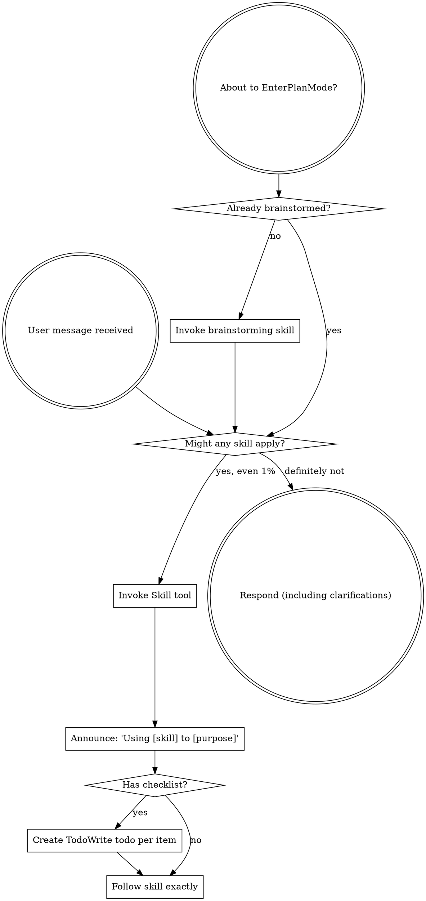

You are continuing an existing review chain. This is round 2 of external-reviewer-context-optimisation-spec-spec.

In incremental mode:
- Verify whether prior findings are resolved per the resolution report below.
- Reuse the existing finding IDs (F1, F2, …). If a prior finding is resolved,
  mark it RESOLVED in your findings list with its original ID. If still
  unresolved, keep its ID.
- Only introduce new finding IDs for genuine regressions caused by the fix, or
  blocking issues clearly missed in earlier rounds. Do not reopen broad review
  unless prior fixes changed broad architecture.

Review chain summary:
| round | verdict | findings | blocking |
|---|---|---|---|
| 1 | revise | 6 | 2 |

Prior-round findings (primary reviewer response):

# Review — 2026-05-14-external-reviewer-context-optimisation-spec.md (spec, round 1)

- Target: `docs/specs/2026-05-14-external-reviewer-context-optimisation-spec.md`
- Request: `docs/reviewer/external-reviewer-context-optimisation-spec-spec/r1-2026-05-14T1418-request.md`
- Reviewer command: `reviewer-agent`
- Status: `ok`

---

**Findings**

F1. Severity: blocking — Failed-round handling conflicts with the existing resolution gate. The spec says failed reviewer processes set `verdict_valid: false` and `merged_verdict: null` ([spec:80-87](/home/simon/Dev/sigreer/skills/superstar/docs/specs/2026-05-14-external-reviewer-context-optimisation-spec.md:80)), then acceptance expects a later r3 prompt after failed r2 ([spec:89](/home/simon/Dev/sigreer/skills/superstar/docs/specs/2026-05-14-external-reviewer-context-optimisation-spec.md:89), [spec:119](/home/simon/Dev/sigreer/skills/superstar/docs/specs/2026-05-14-external-reviewer-context-optimisation-spec.md:119)). In the current script, post-slice/post-phase round N+1 is blocked whenever the previous round has `verdict_valid is False`, unless `r{N-1}-resolution.md` exists or `--allow-missing-resolution` is passed ([external-reviewer.py:871](/home/simon/Dev/sigreer/skills/superstar/skills/external-review/scripts/external-reviewer.py:871)). A process failure has no actionable findings to resolve, so the plan could implement S1 and still be unable to submit the next post-slice/post-phase round. Specify whether failed prior rounds bypass the resolution gate, hard-error with a new explicit acknowledgement, or require a distinct process-failure resolution artifact.

F2. Severity: blocking — The self-demonstrated happy-path stderr echo is not clearly fixed. The problem states a successful returncode 0 round produced a 1.22 MB response because stderr was persisted ([spec:55](/home/simon/Dev/sigreer/skills/superstar/docs/specs/2026-05-14-external-reviewer-context-optimisation-spec.md:55)). Current code appends stderr for all return codes ([external-reviewer.py:451](/home/simon/Dev/sigreer/skills/superstar/skills/external-review/scripts/external-reviewer.py:451), [external-reviewer.py:468](/home/simon/Dev/sigreer/skills/superstar/skills/external-review/scripts/external-reviewer.py:468)). S1 only says “On `returncode == 0`: write stdout as today” ([spec:82](/home/simon/Dev/sigreer/skills/superstar/docs/specs/2026-05-14-external-reviewer-context-optimisation-spec.md:82)), which leaves success stderr ambiguous. Add an explicit rule and test for successful stderr echo: drop it, cap it, or strip sentinels from it before persistence.

F3. Severity: important — Sentinel stripping and stderr tailing are underspecified enough to miss the stated acceptance. S1 says failed responses store the stderr tail capped at 4 KB ([spec:84](/home/simon/Dev/sigreer/skills/superstar/docs/specs/2026-05-14-external-reviewer-context-optimisation-spec.md:84)) and sentinel stripping removes text between markers ([spec:86](/home/simon/Dev/sigreer/skills/superstar/docs/specs/2026-05-14-external-reviewer-context-optimisation-spec.md:86)). If the implementation tails before stripping, or if the 4 KB tail contains only the end of an echoed prompt without the start marker, prompt text can still be written despite the acceptance requiring no echoed prompt in r2-response or r3-request ([spec:89](/home/simon/Dev/sigreer/skills/superstar/docs/specs/2026-05-14-external-reviewer-context-optimisation-spec.md:89)). Require stripping against full stdout/stderr before any cap/tail operation, and add a failed-stderr test, not only the current stdout sentinel test ([spec:113](/home/simon/Dev/sigreer/skills/superstar/docs/specs/2026-05-14-external-reviewer-context-optimisation-spec.md:113)).

F4. Severity: important — Soft migration does not define a usable status state for old rounds. The spec says new entries have `status: "ok" | "failed"` but missing `returncode` should be treated as `null` without inventing truth ([spec:80](/home/simon/Dev/sigreer/skills/superstar/docs/specs/2026-05-14-external-reviewer-context-optimisation-spec.md:80)). Later, preamble construction consults prior round `status` to decide whether to skip failed artifacts ([spec:87](/home/simon/Dev/sigreer/skills/superstar/docs/specs/2026-05-14-external-reviewer-context-optimisation-spec.md:87)). Existing synthesized legacy entries contain verdict fields but no `status`/`returncode` ([external-reviewer.py:1312](/home/simon/Dev/sigreer/skills/superstar/skills/external-review/scripts/external-reviewer.py:1312)). Add an explicit `"unknown"` migration state, or define deterministic behavior for missing status that cannot accidentally trust a poisoned legacy response.

F5. Severity: important — Partial failure semantics are vague for multi-reviewer rounds. S1 says if any reviewer failed, merged output becomes invalid ([spec:81](/home/simon/Dev/sigreer/skills/superstar/docs/specs/2026-05-14-external-reviewer-context-optimisation-spec.md:81)), and S3 tests a failed sweep with a usable primary ([spec:112](/home/simon/Dev/sigreer/skills/superstar/docs/specs/2026-05-14-external-reviewer-context-optimisation-spec.md:112)). Current JSON and process exit are primary-centric: top-level `status`/`returncode` come from the primary, and `main()` returns `primary.returncode` ([external-reviewer.py:1128](/home/simon/Dev/sigreer/skills/superstar/skills/external-review/scripts/external-reviewer.py:1128), [external-reviewer.py:1155](/home/simon/Dev/sigreer/skills/superstar/skills/external-review/scripts/external-reviewer.py:1155)). The spec should state the top-level JSON `status`, `returncode`, `verdict_valid`, `review`, and process exit behavior when primary succeeds but one sweep fails.

F6. Severity: minor — Several acceptance references are misnumbered or point to tests that do not exist as written. S1 acceptance cites “S3 §6.8” for simulated failed r2, but that scenario is S3 item 9; S2 budget cap cites “S3 §6.11”, but item 11 is docs; the synthetic 50 KB/4 KB/500-line prompt acceptance cites “S3 §6.10”, but item 10 is soft migration ([spec:89](/home/simon/Dev/sigreer/skills/superstar/docs/specs/2026-05-14-external-reviewer-context-optimisation-spec.md:89), [spec:104](/home/simon/Dev/sigreer/skills/superstar/docs/specs/2026-05-14-external-reviewer-context-optimisation-spec.md:104), [spec:107](/home/simon/Dev/sigreer/skills/superstar/docs/specs/2026-05-14-external-reviewer-context-optimisation-spec.md:107)). This will make the implementation plan and closeout checklist drift.

**Open questions / assumptions**

The hard-error question in [spec:127](/home/simon/Dev/sigreer/skills/superstar/docs/specs/2026-05-14-external-reviewer-context-optimisation-spec.md:127) needs resolution before planning because it changes exit codes, resolution-gate behavior, and consumer workflow.

I assume the “JSON output contract unchanged” goal permits additive keys but not semantic changes to existing top-level `status`, `returncode`, or `verdict_valid`; if that assumption is wrong, the spec should say which existing keys may change semantics.

**Suggested Document Edits**

Add a “Process-failed prior round gate behavior” subsection under S1 covering resolution gating and whether r3 may proceed.

Revise S1.3/S1.5 to define stdout and stderr handling for both success and failure, including operation order: strip full streams first, then cap/tail, then write.

Add migration semantics for `status: "unknown"` or an equivalent rule for old manifest entries.

Add a multi-reviewer failure truth table: primary ok/sweep failed, primary failed/sweep ok, all failed.

Fix S3 test numbering and add explicit tests for successful stderr echo and failed stderr echo where only the prompt tail would otherwise survive.

**Verification Gaps / Commands**

I read the target and context files from disk and spot-checked the referenced multistore chain with `wc -c`, `rg`, and `ls`. I did not run the test suite because this is a pre-implementation spec review.

Before promotion, run:

```bash
python3 -m pytest skills/external-review/tests/
```

**Overall verdict: revise**

---

## Reviewer stderr

```text
Reading additional input from stdin...
OpenAI Codex v0.130.0
--------
workdir: /home/simon/Dev/sigreer/skills/superstar
model: gpt-5.5
provider: openai
approval: never
sandbox: danger-full-access
reasoning effort: none
reasoning summaries: none
session id: 019e26a3-119e-7913-807f-49c8f5352a16
--------
user
You are acting as an independent senior engineering reviewer.

Review stance:
- Lead with findings, ordered by severity.
- Focus on correctness, consistency, implementation risk, missing acceptance
  gates, vague handoffs, ungrounded assumptions, unverified claims, and drift
  from the codebase.
- Give exact file/line references when possible.
- If the document is sound, say that clearly and list residual risks.
- Keep the review actionable. Avoid broad rewrites unless the current structure
  creates concrete risk.

Repository root:
/home/simon/Dev/sigreer/skills/superstar

Target kind:
spec

Review mode:
Pre-implementation spec review. Check that the spec is complete,
internally consistent, grounded in the existing codebase, and specific enough to
drive an implementation plan. Do not review implemented code unless the spec
claims code already exists.

Target document:
docs/specs/2026-05-14-external-reviewer-context-optimisation-spec.md

Additional context files:
- skills/external-review/scripts/external-reviewer.py
- skills/external-review/SKILL.md
- docs/_drafts/context-optimisation-brief.md

Review output contract:
1. Findings
   - Tag each finding with a stable ID: `F1`, `F2`, `F3`, …. IDs must remain
     stable if this review is iterated in subsequent rounds.
   - Mark severity inline: `Severity: blocking | important | minor | nit`.
2. Open questions / assumptions
3. Suggested document edits
4. Verification gaps / commands that should be run, if any
5. Overall verdict: one of "ready", "ready with small edits", or "revise"

Read the files from disk. Do not rely only on the snippets in this prompt.


## Target Preview

### docs/specs/2026-05-14-external-reviewer-context-optimisation-spec.md

    1	# Spec — external-reviewer context optimisation & chain integrity
    2	
    3	- **Status:** draft (pre `--kind spec` external review)
    4	- **Created:** 2026-05-14
    5	- **Owner:** sigreer
    6	- **Target component:** `skills/external-review/scripts/external-reviewer.py` (+ `skills/external-review/SKILL.md`, `skills/external-review/tests/`)
    7	- **Related artefacts:**
    8	  - Draft brief: `docs/_drafts/context-optimisation-brief.md`
    9	  - Brief review chain: `docs/reviewer/context-optimisation-brief-design/`
   10	  - Smoking-gun chain: `/home/simon/Dev/sigreer/multistore/docs/reviewer/p10-s3-x39-tailwind-screen-aliases-P10-S3-post-slice/`
   11	
   12	## 1. Problem
   13	
   14	Incremental rounds in an external-review chain currently fail in two compounding ways:
   15	
   16	### 1.1 Chain semantic corruption (primary defect)
   17	
   18	When the configured reviewer command exits non-zero, `write_review_artifact` (`external-reviewer.py:440-473`) writes `result.stdout` and the full `result.stderr` verbatim into the round's response file. The OpenAI Codex–backed `reviewer-agent` emits its session banner and the **entire echoed input prompt** on stderr. The next stage of the script then:
   19	
   20	1. Parses the response body for a verdict (`run_one_reviewer` → `parse_verdict`).
   21	2. Records the parsed verdict, `verdict_valid`, and `merged_verdict` into `chain.json` with no awareness that the process exited non-zero.
   22	3. Persists no `returncode` or `status` field on the round entry.
   23	
   24	The downstream effect, observed empirically on the multistore chain `p10-s3-x39-tailwind-screen-aliases-P10-S3-post-slice`:
   25	
   26	```
   27	round=2  verdict=revise  valid=True  ← reviewer process FAILED (exit 1)
   28	round=3  verdict=revise  valid=True  ← reviewer process FAILED
   29	round=4  verdict=revise  valid=True  ← reviewer process FAILED
   30	```
   31	
   32	Every "verdict" past r1 was extracted from echoed prompt text. The chain looks healthy to any consumer of `chain.json` while being entirely fabricated.
   33	
   34	### 1.2 Recursive prompt bloat (secondary defect)
   35	
   36	The corrupted response files are then slurped whole into the next round's preamble:
   37	
   38	- `build_incremental_preamble` (`external-reviewer.py:277-285`) reads `r{N-1}-merged-findings.md` (preferred) or `r{N-1}-response` (fallback) with no size cap.
   39	- `make_prompt` (`external-reviewer.py:348-353`) re-embeds the full target preview and every `--context` file preview on every incremental round, on top of the preamble.
   40	- `compute_diff_section` caps each subsection independently — no global cap on the diff block, no cap on number of untracked files.
   41	
   42	Observed size progression on the same chain (one failed r2 was enough to poison the whole chain):
   43	
   44	| File | Bytes |
   45	|---|---|
   46	| `r1-merged-findings.md` | 594,637 |
   47	| `r1-resolution.md` | 4,155 |
   48	| `r2-…-request.md` | 886,686 |
   49	| `r2-…-response.md` (failed, stderr-echoed) | 887,637 |
   50	| `r3-…-request.md` | 1,293,203 (exceeds OpenAI's 1,048,576 limit) |
   51	| `r4-…-request.md` | 1,938,265 |
   52	
   53	The literal prompt phrase `"You are continuing an existing review chain"` (one occurrence in the template) appears 0 / 0 / 2 / 6 / **14** times across r1-primary / r1-sweep1 / r2 / r3 / r4 response files — confirming 2× compounding per round.
   54	
   55	### 1.3 Self-demonstration
   56	
   57	The very `--kind design` review that vetted the precursor brief for this spec produced a **1.22 MB response file** for a successful (returncode 0) round. Codex echoed the entire stdin on stderr; `write_review_artifact` dumped it whole. This bug fires even on the happy path — only the prompt-size symptom is gated by a non-zero exit.
   58	
   59	## 2. Goals
   60	
   61	1. **Chain integrity:** a failed reviewer process can never produce a recorded verdict, valid finding, or trusted merged_verdict in `chain.json`. Failed bodies never enter merged findings or downstream parsing.
   62	2. **Prompt size:** typical incremental round (round 2+) on a 3-context chain stays under 250 KB regardless of chain depth. Failed-round artefacts contribute O(KB), not O(MB).
   63	3. **Backwards compatibility:** JSON output contract and exit codes unchanged. Existing chain folders continue to work (soft-migration where needed). No new env vars; one new flag (`--incremental-budget-chars`) with auto default.
   64	4. **Self-evidencing tests:** the failure modes from §1 are reproduced and asserted against in unit tests.
   65	
   66	## 3. Non-goals
   67	
   68	- Changes to broad-round (r1) prompt structure or `--max-lines` defaults. Round 1 is not broken.
   69	- New env vars (`AGENT_REVIEWER_TRANSPORT` already exists; no more).
   70	- Changes to JSON output keys or exit-code values. New keys may be added under `reviewers[]` and `rounds[]` but existing keys keep their semantics.
   71	- New third-party dependencies.
   72	- Changes to `reviewer-agent` itself — the bridge must remain backend-agnostic.
   73	
   74	## 4. Scope (3 slices)
   75	
   76	### S1 — Failure-truth + echo containment (root-cause fix)
   77	
   78	The keystone slice. Without this, any size optimisation only delays the corruption.
   79	
   80	1. **Persist process status in `chain.json`.** Extend each `reviewers[]` entry and each `rounds[]` entry with `returncode: int` and `status: "ok" | "failed"`. Soft-migrate older entries on first touch (treat missing `returncode` as `null`; do not invent retroactive truth).
   81	2. **Failed rounds force `verdict_valid: false`.** In `run_one_reviewer`, if `result.returncode != 0`: set the reviewer's `verdict = null`, `verdict_valid = false`, `findings_count = 0`, regardless of what `parse_verdict` extracts from the body. The same applies to `merged_verdict` aggregation: if any reviewer's `status == "failed"`, the merged result inherits `merged_verdict = null`, `verdict_valid = false`. (This is stricter than the current `verdict_valid: false → treat as revise` policy because that policy assumes the reviewer at least produced a real response.)
   82	3. **Never write reviewer prompt-echo to disk.** In `write_review_artifact`:
   83	   - On `returncode == 0`: write stdout as today, but pass through the sentinel stripper (item 5).
   84	   - On `returncode != 0`: write a short failure stub — header, returncode, **stderr tail capped at 4 KB**, no stdout. The 4 KB tail is enough to diagnose the failure without re-embedding the prompt.
   85	4. **Skip failed bodies in merged-findings construction.** `write_merged_findings` (`external-reviewer.py:572`-ish) only concatenates bodies from reviewers with `status == "ok"`. If every reviewer in the round failed, no merged-findings file is written and `chain.json` records `merged_findings: null`.
   86	5. **Sentinel-wrap the prompt.** `make_prompt` emits `<!-- superstar-prompt:start -->` and `<!-- superstar-prompt:end -->` markers at the very top and very bottom of the assembled prompt body. The stripper in `write_review_artifact` removes any text between those markers (inclusive) from reviewer output before persisting. Defense-in-depth for backends that echo on stdout.
   87	6. **Skip parsing failed artefacts in preamble construction.** `build_incremental_preamble` consults `chain.json` for the prior round's `status`. If failed, walk backward to the last `status: ok` round and embed *that* round's merged-findings instead, prefixed with a short note: `Note: rounds {N-1}...{K+1} were process failures and are skipped.`. If no successful prior round exists, fall back to the chain summary table only.
   88	
   89	**Acceptance:** the test added in S3 §6.8 (simulated failed r2 with full prompt echoed on stderr) passes — `chain.json` records `verdict_valid: false`, `returncode != 0`; r3-request is bounded under 250 KB; no echoed prompt appears anywhere in r2-response or r3-request.
   90	
   91	### S2 — Incremental prompt diet
   92	
   93	Independent of S1's correctness fixes; reduces typical size further. Ship after S1 lands.
   94	
   95	1. **Drop context previews on incremental.** In `make_prompt`, when `mode == "incremental"`, skip the `## Context Previews` block (`external-reviewer.py:350-353`) entirely. The preamble already names context files by path and the REVIEW_PROMPT body tells the reviewer to read from disk.
   96	2. **Trim target preview on incremental.** Cap the target preview to `min(max_lines, 150)` lines when `mode == "incremental"`. Broad-round behaviour unchanged.
   97	3. **Cap prior-text reads.** In `build_incremental_preamble`, cap `prior_response_text`, `merged_findings_text`, and `resolution_text` reads to 80 KB each (head + tail with a `[…N bytes elided…]` marker in between). Apply caps *after* §S1.6's failed-round skipping.
   98	4. **Global cap with deterministic preservation priority.** Add `--incremental-budget-chars` (default 400_000). Applied as the final step in `make_prompt` on incremental rounds. If the assembled prompt exceeds budget, sections are dropped/truncated in this order (lowest-priority dropped first):
   99	   1. Target preview (cut to 80 lines, then 40, then 0)
  100	   2. Diff body (cut to half, quarter, then 0; preserve the diff header note)
  101	   3. Resolution body (cut to 20 KB, then 8 KB)
  102	   4. Prior findings body (cut to 40 KB, then 16 KB)
  103	   5. **Never dropped:** review-mode preamble, chain summary table, finding-ID list, sentinel markers, REVIEW_PROMPT contract.
  104	   The result includes a trailing `<!-- budget-applied: ... -->` note describing what got trimmed. Tested by S3 §6.11.
  105	5. **Tighten diff caps.** `compute_diff_section` enforces a single global cap on the whole diff block (already `--max-diff-lines`, default 2000) rather than per-subsection. Add a cap on untracked-file count (default 10) and per-untracked-file line cap (default 200).
  106	
  107	**Acceptance:** on a synthetic chain with spec + plan + TASKLIST as context, a 50 KB merged-findings file, a 4 KB resolution, and a 500-line diff, the round-2 prompt is under 200 KB. Tested by S3 §6.10.
  108	
  109	### S3 — Tests, docs, and skill update
  110	
  111	1. **Test: failed-process verdict suppression** — simulate `reviewer-agent` returncode=1 with stderr containing the full prompt; assert `chain.json` round entry has `verdict_valid: false`, `returncode: 1`, `status: "failed"`, `merged_verdict: null`.
  112	2. **Test: failed sweep can't poison merged findings** — `--review-depth thorough` run where the sweep returncode=1; assert `merged_findings` is built from the primary only and the sweep's body is not concatenated.
  113	3. **Test: sentinel-stripping** — feed reviewer stdout that begins with `<!-- superstar-prompt:start -->...<!-- superstar-prompt:end -->actual review here`; assert the persisted response file contains only `actual review here`.
  114	4. **Test: preamble walks back past failed rounds** — chain with r1 ok, r2 failed, r3 building; assert r3 preamble cites r1's merged-findings with a "skipped failures" note, not r2's response.
  115	5. **Test: incremental prompt drops context previews** — assert `## Context Previews` heading absent in `mode=="incremental"` prompts.
  116	6. **Test: target preview trimmed on incremental** — assert preview ≤ 150 lines on incremental.
  117	7. **Test: prior-text caps applied** — feed a 1 MB merged-findings file; assert embedded segment ≤ 80 KB with the elision marker present.
  118	8. **Test: budget cap preserves priority order** — assemble a prompt that exceeds the budget; assert REVIEW_PROMPT contract, chain summary table, and finding-ID list are intact; assert the lowest-priority sections are the ones trimmed.
  119	9. **Test: r3-request size bounded after simulated failed r2** — end-to-end fixture with r1 ok (large merged-findings) and a forced failed r2; assert r3-request bytes < 250 KB.
  120	10. **Test: chain.json soft-migration** — load a pre-S1 chain.json with no `returncode` keys; assert the script does not error and writes new rounds with the new keys.
  121	11. **Docs: `skills/external-review/SKILL.md`** — document `--incremental-budget-chars`, the new failure handling (failed rounds → `verdict_valid: false`, response file is a stub, preamble walks back), and the sentinel-stripping behaviour. Update the "Exit codes" table only if a new exit code is added (preferred: do not add one; preserve existing semantics).
  122	
  123	## 5. Open design questions
  124	
  125	These should be resolved during the `--kind spec` external review before promotion to a plan.
  126	
  127	1. **Hard error on chain with any prior failure?** Currently we propose walking back silently. Should the script instead exit non-zero (new exit code, e.g. 7) when invoked against a chain whose most recent round failed, forcing the caller to acknowledge with `--allow-failed-prior` or similar? Argument for: callers (subagent-driven coordinator) currently re-submit blindly; a hard error makes the corruption visible. Argument against: it adds a knob to every consumer and changes existing call sites.
  128	2. **Sentinel stripping placement.** Spec proposes write-time stripping only. Should `build_incremental_preamble` also run a strip pass on the *read* path as belt-and-braces for chains where the prompt was emitted before this fix landed? Cheap to add.
  129	3. **Where should `--incremental-budget-chars` be set?** Per-invocation flag only, or also via `AGENT_REVIEWER_BUDGET_CHARS` env var? Spec proposes flag only (no new env vars per §3). Counter-argument: chain consumers may want a project-level default.
  130	4. **Round entries — do we want a stable `attempt` counter alongside `round`?** If a round fails and is retried, today both attempts share the same round number with different timestamps. Out of scope for this spec but worth flagging for a follow-up.
  131	
  132	## 6. Acceptance gate
  133	
  134	The spec is considered complete and ready for plan-writing when:
  135	
  136	- `python3 -m pytest skills/external-review/tests/` passes with all S3 tests added.
  137	- A live re-run of the failing chain at `/home/simon/Dev/sigreer/multistore/docs/reviewer/p10-s3-x39-tailwind-screen-aliases-P10-S3-post-slice/` (with the patched script) completes r2 either successfully or as a clearly-failed round (`returncode != 0`, `verdict_valid: false`, response file ≤ 4 KB), and r3 (if a fix is dispatched) runs against a prompt < 250 KB.
  138	- `skills/external-review/SKILL.md` documents the new behaviour and the new flag.
  139	- `--kind spec` external review on this document returns `ready` or `ready with small edits`.
  140	
  141	## 7. Rollout
  142	
  143	- S1 and S2 land in separate commits in this repo.
  144	- After landing, downstream consumers re-vendor `external-reviewer.py` via the `[[project-setup]]` skill. Existing chain folders are soft-migrated (missing `returncode` treated as `null`); no destructive rewrite.
  145	- The poisoned `multistore` chain is left intact for forensic value; a fresh chain or `--mode broad` reset is the operator's call.
  146	
  147	## 8. References
  148	
  149	- Empirical chain: `/home/simon/Dev/sigreer/multistore/docs/reviewer/p10-s3-x39-tailwind-screen-aliases-P10-S3-post-slice/`
  150	- Draft brief (precursor to this spec): `docs/_drafts/context-optimisation-brief.md`
  151	- Brief review (4 findings, verdict `revise`): `docs/reviewer/context-optimisation-brief-design/r1-2026-05-14T1411-response.md`
  152	- Script under modification: `skills/external-review/scripts/external-reviewer.py`
  153	- Skill doc to update: `skills/external-review/SKILL.md`

## Context Previews

### skills/external-review/scripts/external-reviewer.py

    1	#!/usr/bin/env python3
    2	"""
    3	File-based bridge for third-party spec/plan review.
    4	
    5	The script is intentionally provider-neutral. It builds a review prompt around
    6	one target document, calls a configured reviewer command, and stores both the
    7	request and the response under a per-chain folder at
    8	docs/reviewer/<target-stem-no-date>-<kind>/. Each invocation is a new round —
    9	existing rounds are never overwritten. Round number is derived from the count
   10	of rN-*-request.md files already in the chain folder.
   11	
   12	Configuration:
   13	  AGENT_REVIEWER_CMD='reviewer-agent'
   14	  AGENT_REVIEWER_TRANSPORT='arg'
   15	
   16	If the command contains placeholders, it is executed through the shell after
   17	substitution. If it contains no placeholders, the prompt is supplied according
   18	to --prompt-transport: as one argument (default), as stdin, or as a prompt-file
   19	path.
   20	"""
   21	
   22	from __future__ import annotations
   23	
   24	import argparse
   25	import datetime as dt
   26	import json
   27	import os
   28	import re
   29	import shlex
   30	import subprocess
   31	import sys
   32	from dataclasses import dataclass
   33	from pathlib import Path
   34	
   35	# Self-register in sys.modules so @dataclass works when this script is loaded
   36	# via importlib.util.spec_from_file_location without prior registration
   37	# (Python 3.12+ dataclasses inspect sys.modules[cls.__module__]).
   38	if __name__ not in sys.modules:
   39	    import types as _types
   40	    _self_mod = _types.ModuleType(__name__)
   41	    _self_mod.__dict__.update(globals())
   42	    sys.modules[__name__] = _self_mod
   43	
   44	
   45	REVIEW_PROMPT = """You are acting as an independent senior engineering reviewer.
   46	
   47	Review stance:
   48	- Lead with findings, ordered by severity.
   49	- Focus on correctness, consistency, implementation risk, missing acceptance
   50	  gates, vague handoffs, ungrounded assumptions, unverified claims, and drift
   51	  from the codebase.
   52	- Give exact file/line references when possible.
   53	- If the document is sound, say that clearly and list residual risks.
   54	- Keep the review actionable. Avoid broad rewrites unless the current structure
   55	  creates concrete risk.
   56	
   57	Repository root:
   58	{repo_root}
   59	
   60	Target kind:
   61	{kind}
   62	
   63	Review mode:
   64	{mode_guidance}
   65	
   66	Target document:
   67	{target_file}
   68	
   69	Additional context files:
   70	{context_files}
   71	
   72	Review output contract:
   73	1. Findings
   74	   - Tag each finding with a stable ID: `F1`, `F2`, `F3`, …. IDs must remain
   75	     stable if this review is iterated in subsequent rounds.
   76	   - Mark severity inline: `Severity: blocking | important | minor | nit`.
   77	2. Open questions / assumptions
   78	3. Suggested document edits
   79	4. Verification gaps / commands that should be run, if any
   80	5. Overall verdict: one of "ready", "ready with small edits", or "revise"
   81	
   82	Read the files from disk. Do not rely only on the snippets in this prompt.
   83	"""
   84	
   85	
   86	MODE_GUIDANCE = {
   87	    "spec": """Pre-implementation spec review. Check that the spec is complete,
   88	internally consistent, grounded in the existing codebase, and specific enough to
   89	drive an implementation plan. Do not review implemented code unless the spec
   90	claims code already exists.""",
   91	    "plan": """Pre-implementation plan review. Check that the plan faithfully
   92	covers the associated spec, uses existing repo patterns, has executable tasks,
   93	has realistic ordering, and includes concrete verification gates.""",
   94	    "design": """Design artifact review. Check coverage, route/component mapping,
   95	accessibility, responsive states, missing screens, and whether the design can be
   96	implemented in the current repo without inventing unsupported abstractions.""",
   97	    "implementation": """Implementation review. Check code changes against the
   98	stated task, looking for behavioral regressions, missing tests, accidental
   99	scope expansion, and repo-pattern drift.""",
  100	    "post-slice": """Post-slice review. Treat this as a completion gate for one
  101	slice of work. Compare the completed changes and stated evidence against the
  102	slice acceptance criteria. Prioritize: incomplete tasks, uncommitted or
  103	untracked artifacts, missing tests, failing or skipped verification, broken
  104	cross-site behavior, and claims not supported by the repo state.""",
  105	    "post-phase": """Post-phase review. Treat this as a closeout gate for a whole
  106	phase. Compare the implementation, archive/TASKLIST updates, and verification
  107	evidence against the phase spec/plan. Prioritize: unresolved acceptance
  108	criteria, stale docs, missing archive notes, cross-cutting tracker drift,
  109	deferred gates without justification, and regressions outside the phase scope.""",
  110	    "other": """General document/code review. Apply the standard reviewer stance
  111	and tailor findings to the supplied target and context.""",
  112	}
  113	
  114	
  115	SUPPORTED_SCHEMA_VERSION = 1
  116	
  117	
  118	class ManifestSchemaTooNew(Exception):
  119	    """Raised when chain.json declares a schema_version newer than this script supports."""
  120	
  121	
  122	def read_manifest(path: Path) -> dict | None:
  123	    if not path.exists():
  124	        return None
  125	    data = json.loads(path.read_text(encoding="utf-8"))
  126	    version = data.get("schema_version")
  127	    if isinstance(version, int) and version > SUPPORTED_SCHEMA_VERSION:
  128	        raise ManifestSchemaTooNew(
  129	            f"chain.json schema_version {version} is newer than this script supports "
  130	            f"(max {SUPPORTED_SCHEMA_VERSION}). Upgrade external-reviewer.py."
  131	        )
  132	    return data
  133	
  134	
  135	def write_manifest(path: Path, data: dict) -> None:
  136	    path.parent.mkdir(parents=True, exist_ok=True)
  137	    path.write_text(json.dumps(data, indent=2) + "\n", encoding="utf-8")
  138	
  139	
  140	def repo_root() -> Path:
  141	    result = subprocess.run(
  142	        ["git", "rev-parse", "--show-toplevel"],
  143	        text=True,
  144	        capture_output=True,
  145	        check=True,
  146	    )
  147	    return Path(result.stdout.strip())
  148	
  149	
  150	def rel_or_abs(path: Path, root: Path) -> str:
  151	    try:
  152	        return str(path.resolve().relative_to(root))
  153	    except ValueError:
  154	        return str(path.resolve())
  155	
  156	
  157	def slugify(value: str) -> str:
  158	    value = value.lower()
  159	    value = re.sub(r"[^a-z0-9]+", "-", value)
  160	    return value.strip("-") or "document"
  161	
  162	
  163	DATE_PREFIX_RE = re.compile(r"^\d{4}-\d{2}-\d{2}-")
  164	
  165	
  166	def chain_folder_name(target: Path, kind: str, work_id: str | None = None) -> str:
  167	    stem = DATE_PREFIX_RE.sub("", target.stem)
  168	    base = slugify(stem)
  169	    if kind in ("post-slice", "post-phase") and work_id:
  170	        work_id_slug = work_id.replace(".", "-")
  171	        return f"{base}-{work_id_slug}-{kind}"
  172	    return f"{base}-{kind}"
  173	
  174	
  175	class AmbiguousLegacyChain(Exception):
  176	    pass
  177	
  178	
  179	def discover_legacy_chain(
  180	    reviewer_root: Path,
  181	    target_stem: str,
  182	    kind: str,
  183	    new_slug: str,
  184	) -> Path | None:
  185	    new_path = reviewer_root / new_slug
  186	    if new_path.exists():
  187	        return new_path
  188	    if not reviewer_root.exists():
  189	        return None
  190	    legacy_old_name = f"{slugify(target_stem)}-{kind}"
  191	    candidates = []
  192	    for entry in reviewer_root.iterdir():
  193	        if not entry.is_dir():
  194	            continue
  195	        if entry.name == legacy_old_name:
  196	            # Only treat as legacy candidate if there is no chain.json — a chain.json
  197	            # marks a new-regime chain (potentially for a different work-id) and must
  198	            # never be silently reused.
  199	            if not (entry / "chain.json").exists():
  200	                candidates.append(entry)

[truncated: 1207 additional lines]
### skills/external-review/SKILL.md

    1	---
    2	name: external-review
    3	description: Use after writing a spec, after writing a plan, after completing a slice, and after completing a phase. Invokes a third-party reviewer via a file-based CLI bridge, stores each round under a per-document chain folder, and gates progress on the returned verdict.
    4	---
    5	
    6	# External Review
    7	
    8	An independent reviewer (not the coordinating agent) reviews a target document or completed slice/phase. The bridge is `external-reviewer.py` — provider-neutral, configured via `AGENT_REVIEWER_CMD`. Each round writes a `request.md` and `response.md` pair under a per-document chain folder so the iteration history is durable and committable.
    9	
   10	**Script location.** The script ships at `skills/external-review/scripts/external-reviewer.py` inside this plugin. `[[project-setup]]` copies it to `scripts/external-reviewer.py` at the consuming project's root, which is the path used in all examples below. If neither path resolves in your project, fall back to `$CLAUDE_PLUGIN_DIR/skills/external-review/scripts/external-reviewer.py` (when running inside a Claude Code plugin context) or run `[[project-setup]]` to vendor a copy.
   11	
   12	**Announce at start:** "I'm using the external-review skill to run a `<kind>` review on `<target>`."
   13	
   14	## When to use
   15	
   16	Four checkpoints, mapped to `--kind`:
   17	
   18	| Stage                          | `--kind`      | Triggered by                                                              |
   19	|--------------------------------|---------------|---------------------------------------------------------------------------|
   20	| Spec written, before plan      | `spec`        | `[[writing-plans]]` after the spec is saved, before drafting the plan     |
   21	| Plan written, before execution | `plan`        | `[[writing-plans]]` after the plan is saved, before handing off to execute|
   22	| Slice complete                 | `post-slice`  | `[[subagent-driven-development]]` after a slice's tasks all close         |
   23	| Phase complete                 | `post-phase`  | `[[subagent-driven-development]]` after the last slice of a phase closes  |
   24	
   25	`design`, `implementation`, and `other` are valid for ad-hoc reviews and do not gate the main workflow.
   26	
   27	## When NOT to use
   28	
   29	- Mid-implementation single-commit asks — use `[[requesting-internal-review]]` instead.
   30	- WIP / unstable targets — the reviewer needs a stable file on disk.
   31	- The user wants the coordinating agent itself to review — that is a different skill.
   32	
   33	## Configuration
   34	
   35	The reviewer command is read from `AGENT_REVIEWER_CMD` (env) or `--reviewer-cmd` (flag). Default is `reviewer-agent`. The command may be:
   36	
   37	- A bare executable (`reviewer-agent`) — the prompt is supplied per `--prompt-transport` (`arg` | `file` | `stdin`, default `arg`).
   38	- A template with placeholders (`{prompt_file}`, `{prompt_text}`, `{target_file}`, `{kind}`) — substituted and run through the shell.
   39	
   40	If `reviewer-agent` is missing, `[[project-setup]]` will offer to install/configure it. If the command emits no `Overall verdict`, treat the round as `revise` and ask the reviewer to honour the response contract on the next round.
   41	
   42	## How a round runs
   43	
   44	```bash
   45	python3 scripts/external-reviewer.py review \
   46	    --kind <spec|plan|post-slice|post-phase> \
   47	    --file <path/to/target.md> \
   48	    --work-id <P2.S3 | P2>   # required for post-slice / post-phase
   49	    [--context <path>]... \
   50	    [--review-depth thorough] \
   51	    --emit json
   52	```
   53	
   54	- Output folder: `docs/reviewer/<target-stem-no-date>[-<work-id-dotless>]-<kind>/`
   55	- Round number, base ref, and prior verdict are read from `chain.json` in the chain folder.
   56	- Each round emits `r{N}-{timestamp}-request.md` and `r{N}-{timestamp}-response.md`. When `--review-depth thorough` or `exhaustive` runs sweep reviewers, filenames become `r{N}-{ts}-primary-*.md` and `r{N}-{ts}-sweep{K}-*.md`, plus a `r{N}-merged-findings.md`.
   57	- `--emit json` returns the structured payload described in "Reading the response". Always use `--emit json` from this skill — agents consume the JSON, not paths or human prose.
   58	
   59	The command **blocks** until the reviewer exits (default `--timeout 900`). Run it in the **foreground**. Do not background it, do not poll the chain folder, do not retry in a loop.
   60	
   61	**Prompt transport for incremental rounds.** Round 2+ prompts embed prior findings, the fixer's resolution doc, and a diff, and routinely exceed `ARG_MAX` for `--prompt-transport arg`. The script auto-selects `stdin` for any incremental round (round 2+ in `auto` mode, or explicit `--mode incremental`) and `arg` for round-1/broad prompts when `--prompt-transport` is not set explicitly. Override with `--prompt-transport {arg|file|stdin}` or `AGENT_REVIEWER_TRANSPORT` only when the reviewer backend cannot accept the default.
   62	
   63	## Reading the response
   64	
   65	The JSON output (always use `--emit json`) is the source of truth. Agents MUST consult:
   66	
   67	- `merged_verdict` — authoritative for gating slice/phase progress.
   68	- `verdict_valid` — if `false`, treat as `revise`.
   69	- `resolution_parse_status` — `ok` | `partial` | `unparseable` | `null`.
   70	- `reviewers[]` — per-reviewer verdicts and review text.
   71	- `review` — for multi-reviewer rounds, this contains the merged findings; for single-reviewer rounds, the primary review.
   72	
   73	Verdict values: `ready`, `ready with small edits`, `revise` (or `null` if unparseable).
   74	
   75	| Verdict                  | Action                                                                          |
   76	|--------------------------|---------------------------------------------------------------------------------|
   77	| `ready`                  | Proceed to the next stage.                                                      |
   78	| `ready with small edits` | Apply the suggested edits, proceed. Do not re-submit unless the edits are large.|
   79	| `revise`                 | Apply findings, then re-submit with the same `--kind` for round N+1.            |
   80	
   81	## Round mode
   82	
   83	- **Round 1** is **broad**: the reviewer reads target and context from scratch and emits findings tagged with stable IDs (`F1`, `F2`, …).
   84	- **Round N+** is **incremental** by default: the prompt embeds the prior round's findings (or merged findings), the fixer's `r{N-1}-resolution.md`, and a diff. The reviewer verifies whether prior findings are resolved, reusing the same IDs.
   85	- `--mode` defaults to `auto` (broad on round 1, incremental on round N+).
   86	- `--mode broad` forces round-1-style on a later round (rare; only when fixes changed broad architecture).
   87	- `--mode incremental` on round 1 is rejected.
   88	
   89	## Review depth
   90	
   91	`--review-depth` controls whether independent sweep reviewers run alongside the primary chain reviewer at high-risk checkpoints.
   92	
   93	- `standard` (CLI default; cheapest). One primary reviewer. Round 2+ incremental. No sweeps.
   94	- `thorough` (**recommended for `post-slice` and `post-phase`**). One sweep on round 1; one fresh sweep when the primary first returns `ready` / `ready with small edits`.
   95	- `exhaustive`. Two sweeps at each checkpoint. Use for risky phases.
   96	
   97	Sweep reviewers do not see the primary reviewer's findings on their first pass (anti-anchoring). Findings are merged into `r{N}-merged-findings.md` and a `merged_verdict` is computed: `revise` if any reviewer (or `verdict_valid: false`) says so; `ready with small edits` if any does and the rest are `ready`; `ready` only if every reviewer is `ready`.
   98	
   99	Checkpoint state (`first-round`, `final-ready`) is persisted in `chain.json` so sweeps fire once per chain.
  100	
  101	## Resolution artifact
  102	
  103	When a post-slice or post-phase round returns `merged_verdict: revise`, the fix subagent MUST write `docs/reviewer/<chain>/r{N}-resolution.md` before the next round is submitted. The script's gate refuses round N+1 without it (exit code 3) unless `--allow-missing-resolution` is passed.
  104	
  105	Required parseable shape:
  106	
  107	```markdown
  108	# Resolution for r{N}
  109	
  110	## F1
  111	Status: fixed | waived | deferred
  112	Evidence:
  113	- Commit: <sha>
  114	- Files: `path:line`
  115	- Verification: `command and result`
  116	
  117	Notes:
  118	Free-form prose.
  119	
  120	## F2
  121	Status: ...
  122	```
  123	
  124	- One `## F<id>` heading per addressed finding.
  125	- One `Status:` line per finding (case-insensitive).
  126	- Sweep findings use namespaced IDs like `S1.F1`; reference them with the same form in the resolution doc.
  127	
  128	Parse failures soft-fail: `resolution_parse_status: partial` or `unparseable` is reported in the JSON, but the reviewer still receives the prose verbatim in the next round's prompt.
  129	
  130	## Chain manifest
  131	
  132	Each chain folder contains a `chain.json` manifest that records every round's metadata: round number, request/response paths, head SHAs, verdicts (primary and merged), reviewers, sweep checkpoint state, and resolution attachment. The script reads it on every invocation; existing chains without a manifest are soft-migrated on first touch.
  133	
  134	**Invariant:** a review chain is single-writer. Do not run two rounds concurrently against the same chain — `chain.json` is not locked and may be corrupted.
  135	
  136	## Context files
  137	
  138	`--context` may be supplied multiple times. Defaults per `--kind`:
  139	
  140	| `--kind`      | Target (`--file`)                                | Required `--context`                                       |
  141	|---------------|--------------------------------------------------|------------------------------------------------------------|
  142	| `spec`        | The spec file                                    | `docs/TASKLIST.md` (if present)                            |
  143	| `plan`        | The plan file                                    | Originating spec; `docs/TASKLIST.md` (if present)          |
  144	| `post-slice`  | The plan file (or slice-close note)              | Spec; `docs/TASKLIST.md`; any slice-close / evidence files |
  145	| `post-phase`  | The phase archive note or plan                   | Spec; plan; `docs/TASKLIST.md`                             |
  146	
  147	If the project has no TASKLIST.md, substitute its top-level tracker. Always pass *some* tracker as context so the reviewer sees how the artefact fits the broader plan.
  148	
  149	## Hard rule — delegation during execution
  150	
  151	> When a `post-slice` or `post-phase` review returns findings, the **coordinator does not apply the findings itself.** It dispatches a fix subagent with the response file as input, waits for that subagent to complete and re-run the appropriate verification, and only then re-submits the review. The coordinator's only job is to (1) submit, (2) read the verdict, (3) dispatch the fixer, (4) re-submit. Direct file edits by the coordinator are a coordinator-discipline failure — see `[[subagent-driven-development]]`.
  152	
  153	For `spec` and `plan` reviews during planning, the coordinator may apply edits directly because no parallel implementation subagents exist at that stage.
  154	
  155	## The iteration loop
  156	
  157	```dot
  158	digraph review_loop {
  159	    "Run external-reviewer for kind" [shape=box];
  160	    "Read response verdict" [shape=diamond];
  161	    "ready: proceed" [shape=box style=filled fillcolor=lightgreen];
  162	    "ready with small edits: apply + proceed" [shape=box style=filled fillcolor=lightyellow];
  163	    "revise: apply findings (delegate during execution)" [shape=box];
  164	    "Re-submit for next round" [shape=box];
  165	
  166	    "Run external-reviewer for kind" -> "Read response verdict";
  167	    "Read response verdict" -> "ready: proceed" [label="ready"];
  168	    "Read response verdict" -> "ready with small edits: apply + proceed" [label="ready w/ small edits"];
  169	    "Read response verdict" -> "revise: apply findings (delegate during execution)" [label="revise"];
  170	    "revise: apply findings (delegate during execution)" -> "Re-submit for next round";
  171	    "Re-submit for next round" -> "Run external-reviewer for kind";
  172	}
  173	```
  174	
  175	## Artifact layout
  176	
  177	Each `(target, kind)` pair is one **review chain**:
  178	
  179	```
  180	docs/reviewer/
  181	  <target-stem-no-leading-date>-<kind>/        ← chain folder
  182	    r1-<YYYY-MM-DDTHHMM>-request.md            ← prompt sent to reviewer
  183	    r1-<YYYY-MM-DDTHHMM>-response.md           ← reviewer output
  184	    r2-<YYYY-MM-DDTHHMM>-request.md            ← second round (after edits)
  185	    r2-<YYYY-MM-DDTHHMM>-response.md
  186	    …
  187	```
  188	
  189	Round number is auto-incremented. Commit the entire chain folder alongside the work; `git log -- docs/reviewer/<chain>/` then surfaces the full audit trail.
  190	
  191	## Exit codes
  192	
  193	| Code | Meaning | Action |
  194	|---|---|---|
  195	| 0 | Reviewer succeeded. | Apply feedback. |
  196	| 2 | Target / context file not found, or required `--work-id` missing. | Fix the path or pass `--work-id`. |
  197	| 3 | Resolution-required gate violated. | Author the resolution doc and re-run, or pass `--allow-missing-resolution`. |
  198	| 4 | `chain.json` schema_version newer than supported. | Upgrade `external-reviewer.py`. |
  199	| 5 | Ambiguous legacy-chain match. | Migrate manually. |
  200	| 6 | `--work-id` mismatch with chain's stored work_id. | Use the correct `--work-id` or a fresh chain folder. |

[truncated: 30 additional lines]
### docs/_drafts/context-optimisation-brief.md

    1	# Design brief — external-reviewer incremental prompt context optimisation
    2	
    3	## Status
    4	
    5	Draft for `--kind design` ad-hoc review. Not a spec or plan yet. Reviewer is asked to validate the diagnosis, challenge the proposed fix priorities, and surface anything missed before this becomes a real spec.
    6	
    7	## Problem (empirical, not theoretical)
    8	
    9	On a real `post-slice` chain in a consuming project (`multistore`), incremental round prompts grew exponentially and breached OpenAI's 1,048,576-char input limit:
   10	
   11	| File | Bytes |
   12	|---|---|
   13	| `r1-merged-findings.md` | 594,637 |
   14	| `r1-resolution.md` | 4,155 |
   15	| `r2-…-request.md` | 886,686 |
   16	| `r2-…-response.md` | 887,637 |
   17	| `r3-…-request.md` | 1,293,203 (exceeds 1M) |
   18	| `r4-…-request.md` | 1,938,265 |
   19	
   20	Count of the literal string `"You are continuing an existing review chain"` (which appears exactly once in the prompt template) inside the response files: r1=0, r2=2, r3=6, r4=14 — compounding **2× per round**.
   21	
   22	## Root cause
   23	
   24	Confirmed by reading `skills/external-review/scripts/external-reviewer.py` and the chain artifacts:
   25	
   26	1. **`write_review_artifact` (L470) writes `result.stderr` verbatim into the response file when the reviewer fails.** The OpenAI Codex–backed `reviewer-agent` prints its full session banner *including the echoed input prompt* on stderr. So a failed reviewer turn produces a response file whose body is the entire prompt, repeated.
   27	2. **`build_incremental_preamble` (L281) falls back to the prior round's full response file** when no `r{N-1}-merged-findings.md` exists (which is the case after a failed round). It slurps the whole file with no size cap.
   28	3. Combined: one failed reviewer turn poisons every subsequent round. r2 fails → r2-response = the prompt echoed back → r3-preamble embeds it whole → r3 prompt is 1.5× larger → r3 fails the same way → r4 is 2× larger again.
   29	
   30	## Secondary contributors (bloat even without the bug)
   31	
   32	- `make_prompt` (L348-353) re-embeds full target preview + every `--context` file preview on incremental rounds, on top of the preamble. The reviewer already saw these in round 1 and the preamble names them by path. Saves ~30-60% on chains with spec + plan + TASKLIST context.
   33	- `build_incremental_preamble` reads `r{N-1}-merged-findings.md`, `r{N-1}-response`, and `r{N-1}-resolution.md` whole, uncapped (L277-298).
   34	- `compute_diff_section` caps each subsection (`base..HEAD`, working-tree, each untracked file) independently — no global cap on the diff block.
   35	
   36	## Proposed scope (three slices)
   37	
   38	### S1 — Kill the recursive-echo class (must-fix; root cause)
   39	
   40	1. `write_review_artifact`: on `returncode != 0`, store stderr **tail** only (cap to e.g. 4KB), never full stderr. Drop stdout for failed turns or cap similarly. The response file should never contain the full prompt.
   41	2. `build_incremental_preamble`: when the prior round is recorded as failed in `chain.json`, do not embed its response. Walk backward to the last successful round; if none, fall back to the chain summary table + "no prior review available" notice.
   42	3. Wrap the prompt body with sentinel markers (e.g. `<!-- superstar-prompt:start -->` / `:end -->`) in `make_prompt`. In `write_review_artifact`, strip any content between sentinels from reviewer output before write. Defense in depth for backends that echo on stdout instead of stderr.
   43	
   44	### S2 — Incremental-mode prompt diet
   45	
   46	4. In `make_prompt`, skip the context-preview block when `mode == "incremental"`. Keep the target preview but trim to ~150 lines (vs broad's 600).
   47	5. Cap `prior_response_text`, merged-findings text, and `resolution_text` reads in `build_incremental_preamble` (e.g. 80KB each, head + tail with a truncation marker).
   48	6. Add a single `--incremental-budget-chars` (default 400_000) global cap on the assembled prompt with a tail-truncation marker — safety net only, well below 1M.
   49	7. Tighten `compute_diff_section`: global cap on the whole diff block, cap untracked file count (e.g. 10).
   50	
   51	### S3 — Tests + docs
   52	
   53	8. Unit test: simulate a failed r2 (returncode != 0, stderr = "[full prompt]") and assert r3's request size stays bounded.
   54	9. Unit test: sentinel-stripping removes echoed prompt blocks from reviewer output.
   55	10. Unit test: incremental prompt with `mode=incremental` does not contain context-preview headings.
   56	11. Update `skills/external-review/SKILL.md` to document the new flag and the failure-handling behaviour.
   57	
   58	## Non-goals / explicitly out of scope
   59	
   60	- Changing broad-round (r1) prompt structure or default `--max-lines`. Round 1 is not the problem.
   61	- New env vars. Prefer flags with sensible auto defaults.
   62	- Changing the JSON output contract or exit codes.
   63	- Adding any third-party dependency.
   64	
   65	## Questions for the reviewer
   66	
   67	1. Is the slicing right? Is S1 genuinely independently shippable, or does it need parts of S2 to land together?
   68	2. Sentinel-stripping at write-time vs preamble-build time vs both — which is the right belt-and-braces strategy?
   69	3. Should failed-round handling also surface as a hard error (exit non-zero) when the caller is in a chain that has had ≥1 failed round, forcing them to investigate, instead of silently walking back?
   70	4. Anything in `make_prompt` / `build_incremental_preamble` we've missed as a bloat source?
   71	
   72	## Reference paths (read these first)
   73	
   74	- Bridge script: `skills/external-review/scripts/external-reviewer.py`
   75	- Bloating chain (real evidence): `/home/simon/Dev/sigreer/multistore/docs/reviewer/p10-s3-x39-tailwind-screen-aliases-P10-S3-post-slice/` — especially `r2-…-response.md` (the smoking gun: failed turn, stderr-echo dumped into response body).

codex
I’m using the `superpowers:using-superpowers` skill first because the session rules require it, then I’ll read the target and context files from disk for the spec review.
exec
/usr/bin/zsh -lc "sed -n '1,220p' /home/simon/.codex/plugins/cache/openai-curated/superpowers/08373044/skills/using-superpowers/SKILL.md && sed -n '1,220p' /home/simon/.codex/plugins/cache/openai-curated/superpowers/08373044/skills/receiving-code-review/SKILL.md" in /home/simon/Dev/sigreer/skills/superstar
 succeeded in 0ms:
---
name: using-superpowers
description: Use when starting any conversation - establishes how to find and use skills, requiring Skill tool invocation before ANY response including clarifying questions
---

<SUBAGENT-STOP>
If you were dispatched as a subagent to execute a specific task, skip this skill.
</SUBAGENT-STOP>

<EXTREMELY-IMPORTANT>
If you think there is even a 1% chance a skill might apply to what you are doing, you ABSOLUTELY MUST invoke the skill.

IF A SKILL APPLIES TO YOUR TASK, YOU DO NOT HAVE A CHOICE. YOU MUST USE IT.

This is not negotiable. This is not optional. You cannot rationalize your way out of this.
</EXTREMELY-IMPORTANT>

## Instruction Priority

Superpowers skills override default system prompt behavior, but **user instructions always take precedence**:

1. **User's explicit instructions** (CLAUDE.md, GEMINI.md, AGENTS.md, direct requests) — highest priority
2. **Superpowers skills** — override default system behavior where they conflict
3. **Default system prompt** — lowest priority

If CLAUDE.md, GEMINI.md, or AGENTS.md says "don't use TDD" and a skill says "always use TDD," follow the user's instructions. The user is in control.

## How to Access Skills

**In Claude Code:** Use the `Skill` tool. When you invoke a skill, its content is loaded and presented to you—follow it directly. Never use the Read tool on skill files.

**In Copilot CLI:** Use the `skill` tool. Skills are auto-discovered from installed plugins. The `skill` tool works the same as Claude Code's `Skill` tool.

**In Gemini CLI:** Skills activate via the `activate_skill` tool. Gemini loads skill metadata at session start and activates the full content on demand.

**In other environments:** Check your platform's documentation for how skills are loaded.

## Platform Adaptation

Skills use Claude Code tool names. Non-CC platforms: see `references/copilot-tools.md` (Copilot CLI), `references/codex-tools.md` (Codex) for tool equivalents. Gemini CLI users get the tool mapping loaded automatically via GEMINI.md.

# Using Skills

## The Rule

**Invoke relevant or requested skills BEFORE any response or action.** Even a 1% chance a skill might apply means that you should invoke the skill to check. If an invoked skill turns out to be wrong for the situation, you don't need to use it.



## Red Flags

These thoughts mean STOP—you're rationalizing:

| Thought | Reality |
|---------|---------|
| "This is just a simple question" | Questions are tasks. Check for skills. |
| "I need more context first" | Skill check comes BEFORE clarifying questions. |
| "Let me explore the codebase first" | Skills tell you HOW to explore. Check first. |
| "I can check git/files quickly" | Files lack conversation context. Check for skills. |
| "Let me gather information first" | Skills tell you HOW to gather information. |
| "This doesn't need a formal skill" | If a skill exists, use it. |
| "I remember this skill" | Skills evolve. Read current version. |
| "This doesn't count as a task" | Action = task. Check for skills. |
| "The skill is overkill" | Simple things become complex. Use it. |
| "I'll just do this one thing first" | Check BEFORE doing anything. |
| "This feels productive" | Undisciplined action wastes time. Skills prevent this. |
| "I know what that means" | Knowing the concept ≠ using the skill. Invoke it. |

## Skill Priority

When multiple skills could apply, use this order:

1. **Process skills first** (brainstorming, debugging) - these determine HOW to approach the task
2. **Implementation skills second** (frontend-design, mcp-builder) - these guide execution

"Let's build X" → brainstorming first, then implementation skills.
"Fix this bug" → debugging first, then domain-specific skills.

## Skill Types

**Rigid** (TDD, debugging): Follow exactly. Don't adapt away discipline.

**Flexible** (patterns): Adapt principles to context.

The skill itself tells you which.

## User Instructions

Instructions say WHAT, not HOW. "Add X" or "Fix Y" doesn't mean skip workflows.
---
name: receiving-code-review
description: Use when receiving code review feedback, before implementing suggestions, especially if feedback seems unclear or technically questionable - requires technical rigor and verification, not performative agreement or blind implementation
---

# Code Review Reception

## Overview

Code review requires technical evaluation, not emotional performance.

**Core principle:** Verify before implementing. Ask before assuming. Technical correctness over social comfort.

## The Response Pattern

```
WHEN receiving code review feedback:

1. READ: Complete feedback without reacting
2. UNDERSTAND: Restate requirement in own words (or ask)
3. VERIFY: Check against codebase reality
4. EVALUATE: Technically sound for THIS codebase?
5. RESPOND: Technical acknowledgment or reasoned pushback
6. IMPLEMENT: One item at a time, test each
```

## Forbidden Responses

**NEVER:**
- "You're absolutely right!" (explicit CLAUDE.md violation)
- "Great point!" / "Excellent feedback!" (performative)
- "Let me implement that now" (before verification)

**INSTEAD:**
- Restate the technical requirement
- Ask clarifying questions
- Push back with technical reasoning if wrong
- Just start working (actions > words)

## Handling Unclear Feedback

```
IF any item is unclear:
  STOP - do not implement anything yet
  ASK for clarification on unclear items

WHY: Items may be related. Partial understanding = wrong implementation.
```

**Example:**
```
your human partner: "Fix 1-6"
You understand 1,2,3,6. Unclear on 4,5.

❌ WRONG: Implement 1,2,3,6 now, ask about 4,5 later
✅ RIGHT: "I understand items 1,2,3,6. Need clarification on 4 and 5 before proceeding."
```

## Source-Specific Handling

### From your human partner
- **Trusted** - implement after understanding
- **Still ask** if scope unclear
- **No performative agreement**
- **Skip to action** or technical acknowledgment

### From External Reviewers
```
BEFORE implementing:
  1. Check: Technically correct for THIS codebase?
  2. Check: Breaks existing functionality?
  3. Check: Reason for current implementation?
  4. Check: Works on all platforms/versions?
  5. Check: Does reviewer understand full context?

IF suggestion seems wrong:
  Push back with technical reasoning

IF can't easily verify:
  Say so: "I can't verify this without [X]. Should I [investigate/ask/proceed]?"

IF conflicts with your human partner's prior decisions:
  Stop and discuss with your human partner first
```

**your human partner's rule:** "External feedback - be skeptical, but check carefully"

## YAGNI Check for "Professional" Features

```
IF reviewer suggests "implementing properly":
  grep codebase for actual usage

  IF unused: "This endpoint isn't called. Remove it (YAGNI)?"
  IF used: Then implement properly
```

**your human partner's rule:** "You and reviewer both report to me. If we don't need this feature, don't add it."

## Implementation Order

```
FOR multi-item feedback:
  1. Clarify anything unclear FIRST
  2. Then implement in this order:
     - Blocking issues (breaks, security)
     - Simple fixes (typos, imports)
     - Complex fixes (refactoring, logic)
  3. Test each fix individually
  4. Verify no regressions
```

## When To Push Back

Push back when:
- Suggestion breaks existing functionality
- Reviewer lacks full context
- Violates YAGNI (unused feature)
- Technically incorrect for this stack
- Legacy/compatibility reasons exist
- Conflicts with your human partner's architectural decisions

**How to push back:**
- Use technical reasoning, not defensiveness
- Ask specific questions
- Reference working tests/code
- Involve your human partner if architectural

**Signal if uncomfortable pushing back out loud:** "Strange things are afoot at the Circle K"

## Acknowledging Correct Feedback

When feedback IS correct:
```
✅ "Fixed. [Brief description of what changed]"
✅ "Good catch - [specific issue]. Fixed in [location]."
✅ [Just fix it and show in the code]

❌ "You're absolutely right!"
❌ "Great point!"
❌ "Thanks for catching that!"
❌ "Thanks for [anything]"
❌ ANY gratitude expression
```

**Why no thanks:** Actions speak. Just fix it. The code itself shows you heard the feedback.

**If you catch yourself about to write "Thanks":** DELETE IT. State the fix instead.

## Gracefully Correcting Your Pushback

If you pushed back and were wrong:
```
✅ "You were right - I checked [X] and it does [Y]. Implementing now."
✅ "Verified this and you're correct. My initial understanding was wrong because [reason]. Fixing."

❌ Long apology
❌ Defending why you pushed back
❌ Over-explaining
```

State the correction factually and move on.

## Common Mistakes

| Mistake | Fix |
|---------|-----|
| Performative agreement | State requirement or just act |
| Blind implementation | Verify against codebase first |
| Batch without testing | One at a time, test each |
| Assuming reviewer is right | Check if breaks things |
| Avoiding pushback | Technical correctness > comfort |
| Partial implementation | Clarify all items first |
| Can't verify, proceed anyway | State limitation, ask for direction |

## Real Examples

**Performative Agreement (Bad):**
```
Reviewer: "Remove legacy code"
❌ "You're absolutely right! Let me remove that..."
```

**Technical Verification (Good):**
```
Reviewer: "Remove legacy code"
✅ "Checking... build target is 10.15+, this API needs 13+. Need legacy for backward compat. Current impl has wrong bundle ID - fix it or drop pre-13 support?"
```

**YAGNI (Good):**
```
Reviewer: "Implement proper metrics tracking with database, date filters, CSV export"
✅ "Grepped codebase - nothing calls this endpoint. Remove it (YAGNI)? Or is there usage I'm missing?"
```

**Unclear Item (Good):**
```
your human partner: "Fix items 1-6"
You understand 1,2,3,6. Unclear on 4,5.
✅ "Understand 1,2,3,6. Need clarification on 4 and 5 before implementing."
```

## GitHub Thread Replies

When replying to inline review comments on GitHub, reply in the comment thread (`gh api repos/{owner}/{repo}/pulls/{pr}/comments/{id}/replies`), not as a top-level PR comment.

## The Bottom Line

**External feedback = suggestions to evaluate, not orders to follow.**

Verify. Question. Then implement.

No performative agreement. Technical rigor always.

codex
I’ve got the process constraints loaded. Next I’m checking the actual spec and the referenced implementation/doc files so the review is grounded in current line numbers, not the prompt preview.
exec
/usr/bin/zsh -lc "nl -ba docs/specs/2026-05-14-external-reviewer-context-optimisation-spec.md | sed -n '1,220p'" in /home/simon/Dev/sigreer/skills/superstar
 succeeded in 0ms:
     1	# Spec — external-reviewer context optimisation & chain integrity
     2	
     3	- **Status:** draft (pre `--kind spec` external review)
     4	- **Created:** 2026-05-14
     5	- **Owner:** sigreer
     6	- **Target component:** `skills/external-review/scripts/external-reviewer.py` (+ `skills/external-review/SKILL.md`, `skills/external-review/tests/`)
     7	- **Related artefacts:**
     8	  - Draft brief: `docs/_drafts/context-optimisation-brief.md`
     9	  - Brief review chain: `docs/reviewer/context-optimisation-brief-design/`
    10	  - Smoking-gun chain: `/home/simon/Dev/sigreer/multistore/docs/reviewer/p10-s3-x39-tailwind-screen-aliases-P10-S3-post-slice/`
    11	
    12	## 1. Problem
    13	
    14	Incremental rounds in an external-review chain currently fail in two compounding ways:
    15	
    16	### 1.1 Chain semantic corruption (primary defect)
    17	
    18	When the configured reviewer command exits non-zero, `write_review_artifact` (`external-reviewer.py:440-473`) writes `result.stdout` and the full `result.stderr` verbatim into the round's response file. The OpenAI Codex–backed `reviewer-agent` emits its session banner and the **entire echoed input prompt** on stderr. The next stage of the script then:
    19	
    20	1. Parses the response body for a verdict (`run_one_reviewer` → `parse_verdict`).
    21	2. Records the parsed verdict, `verdict_valid`, and `merged_verdict` into `chain.json` with no awareness that the process exited non-zero.
    22	3. Persists no `returncode` or `status` field on the round entry.
    23	
    24	The downstream effect, observed empirically on the multistore chain `p10-s3-x39-tailwind-screen-aliases-P10-S3-post-slice`:
    25	
    26	```
    27	round=2  verdict=revise  valid=True  ← reviewer process FAILED (exit 1)
    28	round=3  verdict=revise  valid=True  ← reviewer process FAILED
    29	round=4  verdict=revise  valid=True  ← reviewer process FAILED
    30	```
    31	
    32	Every "verdict" past r1 was extracted from echoed prompt text. The chain looks healthy to any consumer of `chain.json` while being entirely fabricated.
    33	
    34	### 1.2 Recursive prompt bloat (secondary defect)
    35	
    36	The corrupted response files are then slurped whole into the next round's preamble:
    37	
    38	- `build_incremental_preamble` (`external-reviewer.py:277-285`) reads `r{N-1}-merged-findings.md` (preferred) or `r{N-1}-response` (fallback) with no size cap.
    39	- `make_prompt` (`external-reviewer.py:348-353`) re-embeds the full target preview and every `--context` file preview on every incremental round, on top of the preamble.
    40	- `compute_diff_section` caps each subsection independently — no global cap on the diff block, no cap on number of untracked files.
    41	
    42	Observed size progression on the same chain (one failed r2 was enough to poison the whole chain):
    43	
    44	| File | Bytes |
    45	|---|---|
    46	| `r1-merged-findings.md` | 594,637 |
    47	| `r1-resolution.md` | 4,155 |
    48	| `r2-…-request.md` | 886,686 |
    49	| `r2-…-response.md` (failed, stderr-echoed) | 887,637 |
    50	| `r3-…-request.md` | 1,293,203 (exceeds OpenAI's 1,048,576 limit) |
    51	| `r4-…-request.md` | 1,938,265 |
    52	
    53	The literal prompt phrase `"You are continuing an existing review chain"` (one occurrence in the template) appears 0 / 0 / 2 / 6 / **14** times across r1-primary / r1-sweep1 / r2 / r3 / r4 response files — confirming 2× compounding per round.
    54	
    55	### 1.3 Self-demonstration
    56	
    57	The very `--kind design` review that vetted the precursor brief for this spec produced a **1.22 MB response file** for a successful (returncode 0) round. Codex echoed the entire stdin on stderr; `write_review_artifact` dumped it whole. This bug fires even on the happy path — only the prompt-size symptom is gated by a non-zero exit.
    58	
    59	## 2. Goals
    60	
    61	1. **Chain integrity:** a failed reviewer process can never produce a recorded verdict, valid finding, or trusted merged_verdict in `chain.json`. Failed bodies never enter merged findings or downstream parsing.
    62	2. **Prompt size:** typical incremental round (round 2+) on a 3-context chain stays under 250 KB regardless of chain depth. Failed-round artefacts contribute O(KB), not O(MB).
    63	3. **Backwards compatibility:** JSON output contract and exit codes unchanged. Existing chain folders continue to work (soft-migration where needed). No new env vars; one new flag (`--incremental-budget-chars`) with auto default.
    64	4. **Self-evidencing tests:** the failure modes from §1 are reproduced and asserted against in unit tests.
    65	
    66	## 3. Non-goals
    67	
    68	- Changes to broad-round (r1) prompt structure or `--max-lines` defaults. Round 1 is not broken.
    69	- New env vars (`AGENT_REVIEWER_TRANSPORT` already exists; no more).
    70	- Changes to JSON output keys or exit-code values. New keys may be added under `reviewers[]` and `rounds[]` but existing keys keep their semantics.
    71	- New third-party dependencies.
    72	- Changes to `reviewer-agent` itself — the bridge must remain backend-agnostic.
    73	
    74	## 4. Scope (3 slices)
    75	
    76	### S1 — Failure-truth + echo containment (root-cause fix)
    77	
    78	The keystone slice. Without this, any size optimisation only delays the corruption.
    79	
    80	1. **Persist process status in `chain.json`.** Extend each `reviewers[]` entry and each `rounds[]` entry with `returncode: int` and `status: "ok" | "failed"`. Soft-migrate older entries on first touch (treat missing `returncode` as `null`; do not invent retroactive truth).
    81	2. **Failed rounds force `verdict_valid: false`.** In `run_one_reviewer`, if `result.returncode != 0`: set the reviewer's `verdict = null`, `verdict_valid = false`, `findings_count = 0`, regardless of what `parse_verdict` extracts from the body. The same applies to `merged_verdict` aggregation: if any reviewer's `status == "failed"`, the merged result inherits `merged_verdict = null`, `verdict_valid = false`. (This is stricter than the current `verdict_valid: false → treat as revise` policy because that policy assumes the reviewer at least produced a real response.)
    82	3. **Never write reviewer prompt-echo to disk.** In `write_review_artifact`:
    83	   - On `returncode == 0`: write stdout as today, but pass through the sentinel stripper (item 5).
    84	   - On `returncode != 0`: write a short failure stub — header, returncode, **stderr tail capped at 4 KB**, no stdout. The 4 KB tail is enough to diagnose the failure without re-embedding the prompt.
    85	4. **Skip failed bodies in merged-findings construction.** `write_merged_findings` (`external-reviewer.py:572`-ish) only concatenates bodies from reviewers with `status == "ok"`. If every reviewer in the round failed, no merged-findings file is written and `chain.json` records `merged_findings: null`.
    86	5. **Sentinel-wrap the prompt.** `make_prompt` emits `<!-- superstar-prompt:start -->` and `<!-- superstar-prompt:end -->` markers at the very top and very bottom of the assembled prompt body. The stripper in `write_review_artifact` removes any text between those markers (inclusive) from reviewer output before persisting. Defense-in-depth for backends that echo on stdout.
    87	6. **Skip parsing failed artefacts in preamble construction.** `build_incremental_preamble` consults `chain.json` for the prior round's `status`. If failed, walk backward to the last `status: ok` round and embed *that* round's merged-findings instead, prefixed with a short note: `Note: rounds {N-1}...{K+1} were process failures and are skipped.`. If no successful prior round exists, fall back to the chain summary table only.
    88	
    89	**Acceptance:** the test added in S3 §6.8 (simulated failed r2 with full prompt echoed on stderr) passes — `chain.json` records `verdict_valid: false`, `returncode != 0`; r3-request is bounded under 250 KB; no echoed prompt appears anywhere in r2-response or r3-request.
    90	
    91	### S2 — Incremental prompt diet
    92	
    93	Independent of S1's correctness fixes; reduces typical size further. Ship after S1 lands.
    94	
    95	1. **Drop context previews on incremental.** In `make_prompt`, when `mode == "incremental"`, skip the `## Context Previews` block (`external-reviewer.py:350-353`) entirely. The preamble already names context files by path and the REVIEW_PROMPT body tells the reviewer to read from disk.
    96	2. **Trim target preview on incremental.** Cap the target preview to `min(max_lines, 150)` lines when `mode == "incremental"`. Broad-round behaviour unchanged.
    97	3. **Cap prior-text reads.** In `build_incremental_preamble`, cap `prior_response_text`, `merged_findings_text`, and `resolution_text` reads to 80 KB each (head + tail with a `[…N bytes elided…]` marker in between). Apply caps *after* §S1.6's failed-round skipping.
    98	4. **Global cap with deterministic preservation priority.** Add `--incremental-budget-chars` (default 400_000). Applied as the final step in `make_prompt` on incremental rounds. If the assembled prompt exceeds budget, sections are dropped/truncated in this order (lowest-priority dropped first):
    99	   1. Target preview (cut to 80 lines, then 40, then 0)
   100	   2. Diff body (cut to half, quarter, then 0; preserve the diff header note)
   101	   3. Resolution body (cut to 20 KB, then 8 KB)
   102	   4. Prior findings body (cut to 40 KB, then 16 KB)
   103	   5. **Never dropped:** review-mode preamble, chain summary table, finding-ID list, sentinel markers, REVIEW_PROMPT contract.
   104	   The result includes a trailing `<!-- budget-applied: ... -->` note describing what got trimmed. Tested by S3 §6.11.
   105	5. **Tighten diff caps.** `compute_diff_section` enforces a single global cap on the whole diff block (already `--max-diff-lines`, default 2000) rather than per-subsection. Add a cap on untracked-file count (default 10) and per-untracked-file line cap (default 200).
   106	
   107	**Acceptance:** on a synthetic chain with spec + plan + TASKLIST as context, a 50 KB merged-findings file, a 4 KB resolution, and a 500-line diff, the round-2 prompt is under 200 KB. Tested by S3 §6.10.
   108	
   109	### S3 — Tests, docs, and skill update
   110	
   111	1. **Test: failed-process verdict suppression** — simulate `reviewer-agent` returncode=1 with stderr containing the full prompt; assert `chain.json` round entry has `verdict_valid: false`, `returncode: 1`, `status: "failed"`, `merged_verdict: null`.
   112	2. **Test: failed sweep can't poison merged findings** — `--review-depth thorough` run where the sweep returncode=1; assert `merged_findings` is built from the primary only and the sweep's body is not concatenated.
   113	3. **Test: sentinel-stripping** — feed reviewer stdout that begins with `<!-- superstar-prompt:start -->...<!-- superstar-prompt:end -->actual review here`; assert the persisted response file contains only `actual review here`.
   114	4. **Test: preamble walks back past failed rounds** — chain with r1 ok, r2 failed, r3 building; assert r3 preamble cites r1's merged-findings with a "skipped failures" note, not r2's response.
   115	5. **Test: incremental prompt drops context previews** — assert `## Context Previews` heading absent in `mode=="incremental"` prompts.
   116	6. **Test: target preview trimmed on incremental** — assert preview ≤ 150 lines on incremental.
   117	7. **Test: prior-text caps applied** — feed a 1 MB merged-findings file; assert embedded segment ≤ 80 KB with the elision marker present.
   118	8. **Test: budget cap preserves priority order** — assemble a prompt that exceeds the budget; assert REVIEW_PROMPT contract, chain summary table, and finding-ID list are intact; assert the lowest-priority sections are the ones trimmed.
   119	9. **Test: r3-request size bounded after simulated failed r2** — end-to-end fixture with r1 ok (large merged-findings) and a forced failed r2; assert r3-request bytes < 250 KB.
   120	10. **Test: chain.json soft-migration** — load a pre-S1 chain.json with no `returncode` keys; assert the script does not error and writes new rounds with the new keys.
   121	11. **Docs: `skills/external-review/SKILL.md`** — document `--incremental-budget-chars`, the new failure handling (failed rounds → `verdict_valid: false`, response file is a stub, preamble walks back), and the sentinel-stripping behaviour. Update the "Exit codes" table only if a new exit code is added (preferred: do not add one; preserve existing semantics).
   122	
   123	## 5. Open design questions
   124	
   125	These should be resolved during the `--kind spec` external review before promotion to a plan.
   126	
   127	1. **Hard error on chain with any prior failure?** Currently we propose walking back silently. Should the script instead exit non-zero (new exit code, e.g. 7) when invoked against a chain whose most recent round failed, forcing the caller to acknowledge with `--allow-failed-prior` or similar? Argument for: callers (subagent-driven coordinator) currently re-submit blindly; a hard error makes the corruption visible. Argument against: it adds a knob to every consumer and changes existing call sites.
   128	2. **Sentinel stripping placement.** Spec proposes write-time stripping only. Should `build_incremental_preamble` also run a strip pass on the *read* path as belt-and-braces for chains where the prompt was emitted before this fix landed? Cheap to add.
   129	3. **Where should `--incremental-budget-chars` be set?** Per-invocation flag only, or also via `AGENT_REVIEWER_BUDGET_CHARS` env var? Spec proposes flag only (no new env vars per §3). Counter-argument: chain consumers may want a project-level default.
   130	4. **Round entries — do we want a stable `attempt` counter alongside `round`?** If a round fails and is retried, today both attempts share the same round number with different timestamps. Out of scope for this spec but worth flagging for a follow-up.
   131	
   132	## 6. Acceptance gate
   133	
   134	The spec is considered complete and ready for plan-writing when:
   135	
   136	- `python3 -m pytest skills/external-review/tests/` passes with all S3 tests added.
   137	- A live re-run of the failing chain at `/home/simon/Dev/sigreer/multistore/docs/reviewer/p10-s3-x39-tailwind-screen-aliases-P10-S3-post-slice/` (with the patched script) completes r2 either successfully or as a clearly-failed round (`returncode != 0`, `verdict_valid: false`, response file ≤ 4 KB), and r3 (if a fix is dispatched) runs against a prompt < 250 KB.
   138	- `skills/external-review/SKILL.md` documents the new behaviour and the new flag.
   139	- `--kind spec` external review on this document returns `ready` or `ready with small edits`.
   140	
   141	## 7. Rollout
   142	
   143	- S1 and S2 land in separate commits in this repo.
   144	- After landing, downstream consumers re-vendor `external-reviewer.py` via the `[[project-setup]]` skill. Existing chain folders are soft-migrated (missing `returncode` treated as `null`); no destructive rewrite.
   145	- The poisoned `multistore` chain is left intact for forensic value; a fresh chain or `--mode broad` reset is the operator's call.
   146	
   147	## 8. References
   148	
   149	- Empirical chain: `/home/simon/Dev/sigreer/multistore/docs/reviewer/p10-s3-x39-tailwind-screen-aliases-P10-S3-post-slice/`
   150	- Draft brief (precursor to this spec): `docs/_drafts/context-optimisation-brief.md`
   151	- Brief review (4 findings, verdict `revise`): `docs/reviewer/context-optimisation-brief-design/r1-2026-05-14T1411-response.md`
   152	- Script under modification: `skills/external-review/scripts/external-reviewer.py`
   153	- Skill doc to update: `skills/external-review/SKILL.md`

exec
/usr/bin/zsh -lc "nl -ba skills/external-review/scripts/external-reviewer.py | sed -n '240,640p'" in /home/simon/Dev/sigreer/skills/superstar
 succeeded in 0ms:
   240	
   241	def default_diff_paths(
   242	    kind: str, target: Path, context: list, root: Path
   243	) -> list | None:
   244	    """Default scope for embedded diffs.
   245	
   246	    Broad (all tracked changes) for post-slice/post-phase; for everything
   247	    else, restrict to the target document plus any context files.
   248	    """
   249	    if kind in ("post-slice", "post-phase"):
   250	        return None
   251	    paths = [rel_or_abs(target, root)]
   252	    for c in context:
   253	        paths.append(rel_or_abs(c, root))
   254	    return paths
   255	
   256	
   257	def build_incremental_preamble(
   258	    *,
   259	    manifest: dict,
   260	    chain_dir: Path,
   261	    round_num: int,
   262	    resolution_waiver: bool,
   263	    legacy_first_round: bool,
   264	    diff_section: str = "",
   265	) -> str:
   266	    chain = manifest.get("chain", "<unknown chain>")
   267	    prior_rounds = manifest.get("rounds", [])
   268	    summary_rows = ["| round | verdict | findings | blocking |", "|---|---|---|---|"]
   269	    for r in prior_rounds:
   270	        summary_rows.append(
   271	            f"| {r['round']} | {r.get('merged_verdict') or r.get('verdict')} "
   272	            f"| {r.get('findings_count')} | {r.get('blocking_findings_count')} |"
   273	        )
   274	
   275	    prior = prior_rounds[-1] if prior_rounds else None
   276	    prior_response_text = ""
   277	    merged_findings_file = chain_dir / f"r{round_num - 1}-merged-findings.md"
   278	    if merged_findings_file.exists():
   279	        prior_response_text = merged_findings_file.read_text(encoding="utf-8")
   280	        prior_source = "merged findings (authoritative)"
   281	    elif prior and prior.get("response"):
   282	        prior_response_text = (chain_dir / prior["response"]).read_text(encoding="utf-8")
   283	        prior_source = "primary reviewer response"
   284	    else:
   285	        prior_source = "no prior response available"
   286	
   287	    resolution_file = chain_dir / f"r{round_num - 1}-resolution.md"
   288	    if resolution_file.exists():
   289	        resolution_text = resolution_file.read_text(encoding="utf-8")
   290	    elif resolution_waiver:
   291	        resolution_text = "MISSING — explicitly waived by caller via --allow-missing-resolution"
   292	    elif legacy_first_round:
   293	        resolution_text = (
   294	            "MISSING — chain migrated from legacy artifacts; please verify whether "
   295	            "changes occurred from the diff below."
   296	        )
   297	    else:
   298	        resolution_text = "MISSING — please verify whether changes occurred."
   299	
   300	    return f"""You are continuing an existing review chain. This is round {round_num} of {chain}.
   301	
   302	In incremental mode:
   303	- Verify whether prior findings are resolved per the resolution report below.
   304	- Reuse the existing finding IDs (F1, F2, …). If a prior finding is resolved,
   305	  mark it RESOLVED in your findings list with its original ID. If still
   306	  unresolved, keep its ID.
   307	- Only introduce new finding IDs for genuine regressions caused by the fix, or
   308	  blocking issues clearly missed in earlier rounds. Do not reopen broad review
   309	  unless prior fixes changed broad architecture.
   310	
   311	Review chain summary:
   312	{chr(10).join(summary_rows)}
   313	
   314	Prior-round findings ({prior_source}):
   315	
   316	{prior_response_text}
   317	
   318	Resolution report for prior round:
   319	
   320	{resolution_text}
   321	
   322	Changes since prior round:
   323	
   324	{diff_section or 'Changes since prior round: not available for this round.'}
   325	"""
   326	
   327	
   328	def make_prompt(
   329	    *,
   330	    root: Path,
   331	    target: Path,
   332	    kind: str,
   333	    context: list[Path],
   334	    max_lines: int,
   335	    mode: str = "broad",
   336	    incremental_preamble: str | None = None,
   337	) -> str:
   338	    context_display = "\n".join(f"- {rel_or_abs(p, root)}" for p in context) or "- none"
   339	    body = REVIEW_PROMPT.format(
   340	        repo_root=root,
   341	        kind=kind,
   342	        mode_guidance=MODE_GUIDANCE[kind],
   343	        target_file=rel_or_abs(target, root),
   344	        context_files=context_display,
   345	    )
   346	    if mode == "incremental" and incremental_preamble:
   347	        body = incremental_preamble + "\n---\n\n" + body
   348	    body += "\n\n## Target Preview\n\n"
   349	    body += numbered_preview(target, root, max_lines=max_lines)
   350	    if context:
   351	        body += "\n## Context Previews\n\n"
   352	        for ctx in context:
   353	            body += numbered_preview(ctx, root, max_lines=max(80, max_lines // 3))
   354	    return body
   355	
   356	
   357	def expand_command_template(
   358	    template: str,
   359	    *,
   360	    prompt_file: Path,
   361	    prompt_text: str,
   362	    target_file: Path,
   363	    kind: str,
   364	    chain_dir: Path,
   365	    round_num: int,
   366	    previous_response: Path | None,
   367	    resolution_file: Path | None,
   368	    session_file: Path,
   369	) -> str:
   370	    values = {
   371	        "prompt_file": shlex.quote(str(prompt_file)),
   372	        "prompt_text": shlex.quote(prompt_text),
   373	        "target_file": shlex.quote(str(target_file)),
   374	        "kind": shlex.quote(kind),
   375	        "chain_dir": shlex.quote(str(chain_dir)),
   376	        "round": str(round_num),
   377	        "previous_response": shlex.quote(str(previous_response)) if previous_response else "",
   378	        "resolution_file": shlex.quote(str(resolution_file)) if resolution_file else "",
   379	        "session_file": shlex.quote(str(session_file)),
   380	    }
   381	    return template.format(**values)
   382	
   383	
   384	def run_reviewer(
   385	    *,
   386	    command_template: str,
   387	    prompt_file: Path,
   388	    prompt_text: str,
   389	    target_file: Path,
   390	    kind: str,
   391	    prompt_transport: str,
   392	    timeout: int,
   393	    chain_dir: Path,
   394	    round_num: int,
   395	    previous_response: Path | None,
   396	    resolution_file: Path | None,
   397	    session_file: Path,
   398	) -> subprocess.CompletedProcess[str]:
   399	    if "{" in command_template and "}" in command_template:
   400	        command = expand_command_template(
   401	            command_template,
   402	            prompt_file=prompt_file,
   403	            prompt_text=prompt_text,
   404	            target_file=target_file,
   405	            kind=kind,
   406	            chain_dir=chain_dir,
   407	            round_num=round_num,
   408	            previous_response=previous_response,
   409	            resolution_file=resolution_file,
   410	            session_file=session_file,
   411	        )
   412	        return subprocess.run(
   413	            command,
   414	            shell=True,
   415	            text=True,
   416	            capture_output=True,
   417	            timeout=timeout,
   418	        )
   419	
   420	    argv = shlex.split(command_template)
   421	    stdin_text = None
   422	    if prompt_transport == "arg":
   423	        argv.append(prompt_text)
   424	    elif prompt_transport == "file":
   425	        argv.append(str(prompt_file))
   426	    elif prompt_transport == "stdin":
   427	        stdin_text = prompt_text
   428	    else:
   429	        raise ValueError(f"unknown prompt transport: {prompt_transport}")
   430	
   431	    return subprocess.run(
   432	        argv,
   433	        input=stdin_text,
   434	        text=True,
   435	        capture_output=True,
   436	        timeout=timeout,
   437	    )
   438	
   439	
   440	def write_review_artifact(
   441	    *,
   442	    root: Path,
   443	    target: Path,
   444	    kind: str,
   445	    command_template: str,
   446	    prompt_file: Path,
   447	    response_file: Path,
   448	    round_num: int,
   449	    result: subprocess.CompletedProcess[str],
   450	) -> Path:
   451	    stdout = result.stdout.strip()
   452	    stderr = result.stderr.strip()
   453	    status = "ok" if result.returncode == 0 else f"failed ({result.returncode})"
   454	
   455	    content = [
   456	        f"# Review — {target.name} ({kind}, round {round_num})",
   457	        "",
   458	        f"- Target: `{rel_or_abs(target, root)}`",
   459	        f"- Request: `{rel_or_abs(prompt_file, root)}`",
   460	        f"- Reviewer command: `{command_template}`",
   461	        f"- Status: `{status}`",
   462	        "",
   463	        "---",
   464	        "",
   465	        stdout or "_Reviewer produced no stdout._",
   466	        "",
   467	    ]
   468	    if stderr:
   469	        content.extend(["---", "", "## Reviewer stderr", "", "```text", stderr, "```", ""])
   470	
   471	    response_file.write_text("\n".join(content), encoding="utf-8")
   472	    return response_file
   473	
   474	
   475	def resolve_mode(mode: str, *, round_num: int) -> str:
   476	    if mode == "incremental" and round_num == 1:
   477	        raise ValueError("--mode incremental is not valid on round 1")
   478	    if mode == "auto":
   479	        return "broad" if round_num == 1 else "incremental"
   480	    return mode
   481	
   482	
   483	@dataclass
   484	class SweepPlan:
   485	    sweep_count: int
   486	    checkpoint: str | None  # "first-round" | "final-ready" | None
   487	
   488	
   489	@dataclass
   490	class ReviewerResult:
   491	    role: str            # "primary" | "sweep"
   492	    sweep_index: int | None
   493	    request_path: Path
   494	    response_path: Path
   495	    review_body: str
   496	    verdict: str | None
   497	    verdict_valid: bool
   498	    returncode: int
   499	
   500	
   501	def run_one_reviewer(
   502	    *,
   503	    role: str,
   504	    sweep_index: int | None,
   505	    chain_dir: Path,
   506	    round_num: int,
   507	    timestamp: str,
   508	    prompt_text: str,
   509	    args,
   510	    target: Path,
   511	    root: Path,
   512	    namespaced: bool,
   513	    previous_response: Path | None = None,
   514	    resolution_file: Path | None = None,
   515	) -> ReviewerResult:
   516	    suffix = ""
   517	    if namespaced:
   518	        suffix = "-primary" if role == "primary" else f"-sweep{sweep_index}"
   519	    basename = f"r{round_num}-{timestamp}{suffix}"
   520	    request_path = chain_dir / f"{basename}-request.md"
   521	    response_path = chain_dir / f"{basename}-response.md"
   522	    request_path.write_text(prompt_text, encoding="utf-8")
   523	    session_file = chain_dir / (
   524	        "session.state" if role == "primary" else f"sweep{sweep_index}.session.state"
   525	    )
   526	
   527	    result = run_reviewer(
   528	        command_template=args.reviewer_cmd,
   529	        prompt_file=request_path, prompt_text=prompt_text,
   530	        target_file=target, kind=args.kind,
   531	        prompt_transport=args.prompt_transport, timeout=args.timeout,
   532	        chain_dir=chain_dir, round_num=round_num,
   533	        previous_response=previous_response, resolution_file=resolution_file,
   534	        session_file=session_file,
   535	    )
   536	    write_review_artifact(
   537	        root=root, target=target, kind=args.kind,
   538	        command_template=args.reviewer_cmd,
   539	        prompt_file=request_path, response_file=response_path,
   540	        round_num=round_num, result=result,
   541	    )
   542	    body = response_path.read_text(encoding="utf-8")
   543	    verdict, valid = parse_verdict(body)
   544	    return ReviewerResult(
   545	        role=role, sweep_index=sweep_index,
   546	        request_path=request_path, response_path=response_path,
   547	        review_body=body, verdict=verdict, verdict_valid=valid,
   548	        returncode=result.returncode,
   549	    )
   550	
   551	
   552	def compute_merged_verdict(reviewer_results: list) -> str | None:
   553	    if any((not r.verdict_valid) or r.verdict == "revise" for r in reviewer_results):
   554	        return "revise"
   555	    if any(r.verdict == "ready with small edits" for r in reviewer_results):
   556	        return "ready with small edits"
   557	    if all(r.verdict == "ready" for r in reviewer_results):
   558	        return "ready"
   559	    return None
   560	
   561	
   562	def _renamespace_finding_ids(body: str, sweep_index: int) -> str:
   563	    """Rewrite bare F<n> identifiers to S{k}.F<n>, leaving already-prefixed IDs alone."""
   564	    return re.sub(r"(?<![.\w])F(\d+)\b", rf"S{sweep_index}.F\1", body)
   565	
   566	
   567	def write_merged_findings(
   568	    *,
   569	    chain_dir: Path, round_num: int,
   570	    primary: "ReviewerResult", sweeps: list,
   571	) -> Path:
   572	    parts = [f"# Merged findings for r{round_num}\n", "## Primary\n", primary.review_body, ""]
   573	    for s in sweeps:
   574	        parts += [f"## Sweep {s.sweep_index}\n", _renamespace_finding_ids(s.review_body, s.sweep_index), ""]
   575	    path = chain_dir / f"r{round_num}-merged-findings.md"
   576	    path.write_text("\n".join(parts), encoding="utf-8")
   577	    return path
   578	
   579	
   580	DEPTH_DEFAULTS = {
   581	    "standard":   {"policy": "never",       "count_first": 0, "count_final": 0},
   582	    "thorough":   {"policy": "both",        "count_first": 1, "count_final": 1},
   583	    "exhaustive": {"policy": "both",        "count_first": 2, "count_final": 2},
   584	}
   585	
   586	
   587	def plan_sweeps(
   588	    *,
   589	    depth: str,
   590	    policy: str | None,
   591	    count: int | None,
   592	    round_num: int,
   593	    checkpoints: dict,
   594	    primary_verdict_pre_run: str | None,
   595	) -> SweepPlan:
   596	    cfg = DEPTH_DEFAULTS[depth]
   597	    effective_policy = policy or cfg["policy"]
   598	    if effective_policy == "never":
   599	        return SweepPlan(sweep_count=0, checkpoint=None)
   600	
   601	    if round_num == 1 and effective_policy in ("first-round", "both"):
   602	        if checkpoints.get("first-round") == "completed":
   603	            return SweepPlan(sweep_count=0, checkpoint=None)
   604	        n = count if count is not None else cfg["count_first"]
   605	        return SweepPlan(sweep_count=n, checkpoint="first-round")
   606	
   607	    if (
   608	        round_num > 1
   609	        and effective_policy in ("final-ready", "both")
   610	        and primary_verdict_pre_run in ("ready", "ready with small edits")
   611	        and checkpoints.get("final-ready") != "completed"
   612	    ):
   613	        n = count if count is not None else cfg["count_final"]
   614	        return SweepPlan(sweep_count=n, checkpoint="final-ready")
   615	
   616	    return SweepPlan(sweep_count=0, checkpoint=None)
   617	
   618	
   619	def parse_args() -> argparse.Namespace:
   620	    parser = argparse.ArgumentParser(description="Send a document to the configured reviewer.")
   621	    parser.add_argument("command", choices=["review"])
   622	    parser.add_argument("--file", required=True, help="Target spec/plan/document to review.")
   623	    parser.add_argument(
   624	        "--kind",
   625	        required=True,
   626	        choices=["spec", "plan", "design", "implementation", "post-slice", "post-phase", "other"],
   627	        help="Review type, used in prompt and artifact name.",
   628	    )
   629	    parser.add_argument(
   630	        "--context",
   631	        action="append",
   632	        default=[],
   633	        help="Additional context file. May be supplied multiple times.",
   634	    )
   635	    parser.add_argument(
   636	        "--reviewer-cmd",
   637	        default=os.environ.get("AGENT_REVIEWER_CMD", "reviewer-agent"),
   638	        help="Command or template. Supports {prompt_file}, {prompt_text}, {target_file}, {kind}, {chain_dir}, {round}, {previous_response}, {resolution_file}, {session_file}.",
   639	    )
   640	    parser.add_argument(

exec
/usr/bin/zsh -lc "nl -ba skills/external-review/SKILL.md | sed -n '1,240p'" in /home/simon/Dev/sigreer/skills/superstar
exec
/usr/bin/zsh -lc "nl -ba docs/_drafts/context-optimisation-brief.md | sed -n '1,120p'" in /home/simon/Dev/sigreer/skills/superstar
 succeeded in 0ms:
     1	---
     2	name: external-review
     3	description: Use after writing a spec, after writing a plan, after completing a slice, and after completing a phase. Invokes a third-party reviewer via a file-based CLI bridge, stores each round under a per-document chain folder, and gates progress on the returned verdict.
     4	---
     5	
     6	# External Review
     7	
     8	An independent reviewer (not the coordinating agent) reviews a target document or completed slice/phase. The bridge is `external-reviewer.py` — provider-neutral, configured via `AGENT_REVIEWER_CMD`. Each round writes a `request.md` and `response.md` pair under a per-document chain folder so the iteration history is durable and committable.
     9	
    10	**Script location.** The script ships at `skills/external-review/scripts/external-reviewer.py` inside this plugin. `[[project-setup]]` copies it to `scripts/external-reviewer.py` at the consuming project's root, which is the path used in all examples below. If neither path resolves in your project, fall back to `$CLAUDE_PLUGIN_DIR/skills/external-review/scripts/external-reviewer.py` (when running inside a Claude Code plugin context) or run `[[project-setup]]` to vendor a copy.
    11	
    12	**Announce at start:** "I'm using the external-review skill to run a `<kind>` review on `<target>`."
    13	
    14	## When to use
    15	
    16	Four checkpoints, mapped to `--kind`:
    17	
    18	| Stage                          | `--kind`      | Triggered by                                                              |
    19	|--------------------------------|---------------|---------------------------------------------------------------------------|
    20	| Spec written, before plan      | `spec`        | `[[writing-plans]]` after the spec is saved, before drafting the plan     |
    21	| Plan written, before execution | `plan`        | `[[writing-plans]]` after the plan is saved, before handing off to execute|
    22	| Slice complete                 | `post-slice`  | `[[subagent-driven-development]]` after a slice's tasks all close         |
    23	| Phase complete                 | `post-phase`  | `[[subagent-driven-development]]` after the last slice of a phase closes  |
    24	
    25	`design`, `implementation`, and `other` are valid for ad-hoc reviews and do not gate the main workflow.
    26	
    27	## When NOT to use
    28	
    29	- Mid-implementation single-commit asks — use `[[requesting-internal-review]]` instead.
    30	- WIP / unstable targets — the reviewer needs a stable file on disk.
    31	- The user wants the coordinating agent itself to review — that is a different skill.
    32	
    33	## Configuration
    34	
    35	The reviewer command is read from `AGENT_REVIEWER_CMD` (env) or `--reviewer-cmd` (flag). Default is `reviewer-agent`. The command may be:
    36	
    37	- A bare executable (`reviewer-agent`) — the prompt is supplied per `--prompt-transport` (`arg` | `file` | `stdin`, default `arg`).
    38	- A template with placeholders (`{prompt_file}`, `{prompt_text}`, `{target_file}`, `{kind}`) — substituted and run through the shell.
    39	
    40	If `reviewer-agent` is missing, `[[project-setup]]` will offer to install/configure it. If the command emits no `Overall verdict`, treat the round as `revise` and ask the reviewer to honour the response contract on the next round.
    41	
    42	## How a round runs
    43	
    44	```bash
    45	python3 scripts/external-reviewer.py review \
    46	    --kind <spec|plan|post-slice|post-phase> \
    47	    --file <path/to/target.md> \
    48	    --work-id <P2.S3 | P2>   # required for post-slice / post-phase
    49	    [--context <path>]... \
    50	    [--review-depth thorough] \
    51	    --emit json
    52	```
    53	
    54	- Output folder: `docs/reviewer/<target-stem-no-date>[-<work-id-dotless>]-<kind>/`
    55	- Round number, base ref, and prior verdict are read from `chain.json` in the chain folder.
    56	- Each round emits `r{N}-{timestamp}-request.md` and `r{N}-{timestamp}-response.md`. When `--review-depth thorough` or `exhaustive` runs sweep reviewers, filenames become `r{N}-{ts}-primary-*.md` and `r{N}-{ts}-sweep{K}-*.md`, plus a `r{N}-merged-findings.md`.
    57	- `--emit json` returns the structured payload described in "Reading the response". Always use `--emit json` from this skill — agents consume the JSON, not paths or human prose.
    58	
    59	The command **blocks** until the reviewer exits (default `--timeout 900`). Run it in the **foreground**. Do not background it, do not poll the chain folder, do not retry in a loop.
    60	
    61	**Prompt transport for incremental rounds.** Round 2+ prompts embed prior findings, the fixer's resolution doc, and a diff, and routinely exceed `ARG_MAX` for `--prompt-transport arg`. The script auto-selects `stdin` for any incremental round (round 2+ in `auto` mode, or explicit `--mode incremental`) and `arg` for round-1/broad prompts when `--prompt-transport` is not set explicitly. Override with `--prompt-transport {arg|file|stdin}` or `AGENT_REVIEWER_TRANSPORT` only when the reviewer backend cannot accept the default.
    62	
    63	## Reading the response
    64	
    65	The JSON output (always use `--emit json`) is the source of truth. Agents MUST consult:
    66	
    67	- `merged_verdict` — authoritative for gating slice/phase progress.
    68	- `verdict_valid` — if `false`, treat as `revise`.
    69	- `resolution_parse_status` — `ok` | `partial` | `unparseable` | `null`.
    70	- `reviewers[]` — per-reviewer verdicts and review text.
    71	- `review` — for multi-reviewer rounds, this contains the merged findings; for single-reviewer rounds, the primary review.
    72	
    73	Verdict values: `ready`, `ready with small edits`, `revise` (or `null` if unparseable).
    74	
    75	| Verdict                  | Action                                                                          |
    76	|--------------------------|---------------------------------------------------------------------------------|
    77	| `ready`                  | Proceed to the next stage.                                                      |
    78	| `ready with small edits` | Apply the suggested edits, proceed. Do not re-submit unless the edits are large.|
    79	| `revise`                 | Apply findings, then re-submit with the same `--kind` for round N+1.            |
    80	
    81	## Round mode
    82	
    83	- **Round 1** is **broad**: the reviewer reads target and context from scratch and emits findings tagged with stable IDs (`F1`, `F2`, …).
    84	- **Round N+** is **incremental** by default: the prompt embeds the prior round's findings (or merged findings), the fixer's `r{N-1}-resolution.md`, and a diff. The reviewer verifies whether prior findings are resolved, reusing the same IDs.
    85	- `--mode` defaults to `auto` (broad on round 1, incremental on round N+).
    86	- `--mode broad` forces round-1-style on a later round (rare; only when fixes changed broad architecture).
    87	- `--mode incremental` on round 1 is rejected.
    88	
    89	## Review depth
    90	
    91	`--review-depth` controls whether independent sweep reviewers run alongside the primary chain reviewer at high-risk checkpoints.
    92	
    93	- `standard` (CLI default; cheapest). One primary reviewer. Round 2+ incremental. No sweeps.
    94	- `thorough` (**recommended for `post-slice` and `post-phase`**). One sweep on round 1; one fresh sweep when the primary first returns `ready` / `ready with small edits`.
    95	- `exhaustive`. Two sweeps at each checkpoint. Use for risky phases.
    96	
    97	Sweep reviewers do not see the primary reviewer's findings on their first pass (anti-anchoring). Findings are merged into `r{N}-merged-findings.md` and a `merged_verdict` is computed: `revise` if any reviewer (or `verdict_valid: false`) says so; `ready with small edits` if any does and the rest are `ready`; `ready` only if every reviewer is `ready`.
    98	
    99	Checkpoint state (`first-round`, `final-ready`) is persisted in `chain.json` so sweeps fire once per chain.
   100	
   101	## Resolution artifact
   102	
   103	When a post-slice or post-phase round returns `merged_verdict: revise`, the fix subagent MUST write `docs/reviewer/<chain>/r{N}-resolution.md` before the next round is submitted. The script's gate refuses round N+1 without it (exit code 3) unless `--allow-missing-resolution` is passed.
   104	
   105	Required parseable shape:
   106	
   107	```markdown
   108	# Resolution for r{N}
   109	
   110	## F1
   111	Status: fixed | waived | deferred
   112	Evidence:
   113	- Commit: <sha>
   114	- Files: `path:line`
   115	- Verification: `command and result`
   116	
   117	Notes:
   118	Free-form prose.
   119	
   120	## F2
   121	Status: ...
   122	```
   123	
   124	- One `## F<id>` heading per addressed finding.
   125	- One `Status:` line per finding (case-insensitive).
   126	- Sweep findings use namespaced IDs like `S1.F1`; reference them with the same form in the resolution doc.
   127	
   128	Parse failures soft-fail: `resolution_parse_status: partial` or `unparseable` is reported in the JSON, but the reviewer still receives the prose verbatim in the next round's prompt.
   129	
   130	## Chain manifest
   131	
   132	Each chain folder contains a `chain.json` manifest that records every round's metadata: round number, request/response paths, head SHAs, verdicts (primary and merged), reviewers, sweep checkpoint state, and resolution attachment. The script reads it on every invocation; existing chains without a manifest are soft-migrated on first touch.
   133	
   134	**Invariant:** a review chain is single-writer. Do not run two rounds concurrently against the same chain — `chain.json` is not locked and may be corrupted.
   135	
   136	## Context files
   137	
   138	`--context` may be supplied multiple times. Defaults per `--kind`:
   139	
   140	| `--kind`      | Target (`--file`)                                | Required `--context`                                       |
   141	|---------------|--------------------------------------------------|------------------------------------------------------------|
   142	| `spec`        | The spec file                                    | `docs/TASKLIST.md` (if present)                            |
   143	| `plan`        | The plan file                                    | Originating spec; `docs/TASKLIST.md` (if present)          |
   144	| `post-slice`  | The plan file (or slice-close note)              | Spec; `docs/TASKLIST.md`; any slice-close / evidence files |
   145	| `post-phase`  | The phase archive note or plan                   | Spec; plan; `docs/TASKLIST.md`                             |
   146	
   147	If the project has no TASKLIST.md, substitute its top-level tracker. Always pass *some* tracker as context so the reviewer sees how the artefact fits the broader plan.
   148	
   149	## Hard rule — delegation during execution
   150	
   151	> When a `post-slice` or `post-phase` review returns findings, the **coordinator does not apply the findings itself.** It dispatches a fix subagent with the response file as input, waits for that subagent to complete and re-run the appropriate verification, and only then re-submits the review. The coordinator's only job is to (1) submit, (2) read the verdict, (3) dispatch the fixer, (4) re-submit. Direct file edits by the coordinator are a coordinator-discipline failure — see `[[subagent-driven-development]]`.
   152	
   153	For `spec` and `plan` reviews during planning, the coordinator may apply edits directly because no parallel implementation subagents exist at that stage.
   154	
   155	## The iteration loop
   156	
   157	```dot
   158	digraph review_loop {
   159	    "Run external-reviewer for kind" [shape=box];
   160	    "Read response verdict" [shape=diamond];
   161	    "ready: proceed" [shape=box style=filled fillcolor=lightgreen];
   162	    "ready with small edits: apply + proceed" [shape=box style=filled fillcolor=lightyellow];
   163	    "revise: apply findings (delegate during execution)" [shape=box];
   164	    "Re-submit for next round" [shape=box];
   165	
   166	    "Run external-reviewer for kind" -> "Read response verdict";
   167	    "Read response verdict" -> "ready: proceed" [label="ready"];
   168	    "Read response verdict" -> "ready with small edits: apply + proceed" [label="ready w/ small edits"];
   169	    "Read response verdict" -> "revise: apply findings (delegate during execution)" [label="revise"];
   170	    "revise: apply findings (delegate during execution)" -> "Re-submit for next round";
   171	    "Re-submit for next round" -> "Run external-reviewer for kind";
   172	}
   173	```
   174	
   175	## Artifact layout
   176	
   177	Each `(target, kind)` pair is one **review chain**:
   178	
   179	```
   180	docs/reviewer/
   181	  <target-stem-no-leading-date>-<kind>/        ← chain folder
   182	    r1-<YYYY-MM-DDTHHMM>-request.md            ← prompt sent to reviewer
   183	    r1-<YYYY-MM-DDTHHMM>-response.md           ← reviewer output
   184	    r2-<YYYY-MM-DDTHHMM>-request.md            ← second round (after edits)
   185	    r2-<YYYY-MM-DDTHHMM>-response.md
   186	    …
   187	```
   188	
   189	Round number is auto-incremented. Commit the entire chain folder alongside the work; `git log -- docs/reviewer/<chain>/` then surfaces the full audit trail.
   190	
   191	## Exit codes
   192	
   193	| Code | Meaning | Action |
   194	|---|---|---|
   195	| 0 | Reviewer succeeded. | Apply feedback. |
   196	| 2 | Target / context file not found, or required `--work-id` missing. | Fix the path or pass `--work-id`. |
   197	| 3 | Resolution-required gate violated. | Author the resolution doc and re-run, or pass `--allow-missing-resolution`. |
   198	| 4 | `chain.json` schema_version newer than supported. | Upgrade `external-reviewer.py`. |
   199	| 5 | Ambiguous legacy-chain match. | Migrate manually. |
   200	| 6 | `--work-id` mismatch with chain's stored work_id. | Use the correct `--work-id` or a fresh chain folder. |
   201	| 124 | Reviewer timed out. | Raise `--timeout`, or split the target. |
   202	| 127 | Reviewer command not found. | Set `AGENT_REVIEWER_CMD` or run `[[project-setup]]`. |
   203	| other | Reviewer's own non-zero exit. | A response file was still written. Read it and surface the issue. |
   204	
   205	## Reporting back to the user
   206	
   207	After applying edits, summarise:
   208	
   209	- What the reviewer flagged (counts by severity + verdict).
   210	- What you changed in response.
   211	- What you deferred or waived, with reasoning.
   212	- The `review_path` so the user can read the full review.
   213	
   214	## Red flags
   215	
   216	| Thought                                                | Reality                                                                   |
   217	|--------------------------------------------------------|---------------------------------------------------------------------------|
   218	| "I already know what the reviewer will say"            | Run it. The verdict is the gate, not your prediction.                     |
   219	| "I'll apply the fixes myself, faster"                  | During execution, you're the coordinator. Dispatch a subagent.            |
   220	| "The reviewer is being pedantic, I'll skip the edit"   | Either apply, or document why you waived it inline in the target.         |
   221	| "`revise` but the issues are minor"                    | `revise` means re-submit. `ready with small edits` is the lenient verdict.|
   222	| "I'll loop the reviewer in the background while I work"| Foreground only. No `Monitor`, no polling, no retry loops.                |
   223	
   224	## Integration
   225	
   226	- `[[writing-plans]]` — invokes this skill after spec save and after plan save.
   227	- `[[subagent-driven-development]]` — invokes this skill after each slice and at phase close.
   228	- `[[tasklist-discipline]]` — slice/phase boundaries are defined by TASKLIST.md status flips.
   229	- `[[finishing-a-development-branch]]` — pairs with `--kind post-phase` before the closeout commit.
   230	- `[[project-setup]]` — installs/configures the reviewer CLI in new projects.

 succeeded in 0ms:
     1	# Design brief — external-reviewer incremental prompt context optimisation
     2	
     3	## Status
     4	
     5	Draft for `--kind design` ad-hoc review. Not a spec or plan yet. Reviewer is asked to validate the diagnosis, challenge the proposed fix priorities, and surface anything missed before this becomes a real spec.
     6	
     7	## Problem (empirical, not theoretical)
     8	
     9	On a real `post-slice` chain in a consuming project (`multistore`), incremental round prompts grew exponentially and breached OpenAI's 1,048,576-char input limit:
    10	
    11	| File | Bytes |
    12	|---|---|
    13	| `r1-merged-findings.md` | 594,637 |
    14	| `r1-resolution.md` | 4,155 |
    15	| `r2-…-request.md` | 886,686 |
    16	| `r2-…-response.md` | 887,637 |
    17	| `r3-…-request.md` | 1,293,203 (exceeds 1M) |
    18	| `r4-…-request.md` | 1,938,265 |
    19	
    20	Count of the literal string `"You are continuing an existing review chain"` (which appears exactly once in the prompt template) inside the response files: r1=0, r2=2, r3=6, r4=14 — compounding **2× per round**.
    21	
    22	## Root cause
    23	
    24	Confirmed by reading `skills/external-review/scripts/external-reviewer.py` and the chain artifacts:
    25	
    26	1. **`write_review_artifact` (L470) writes `result.stderr` verbatim into the response file when the reviewer fails.** The OpenAI Codex–backed `reviewer-agent` prints its full session banner *including the echoed input prompt* on stderr. So a failed reviewer turn produces a response file whose body is the entire prompt, repeated.
    27	2. **`build_incremental_preamble` (L281) falls back to the prior round's full response file** when no `r{N-1}-merged-findings.md` exists (which is the case after a failed round). It slurps the whole file with no size cap.
    28	3. Combined: one failed reviewer turn poisons every subsequent round. r2 fails → r2-response = the prompt echoed back → r3-preamble embeds it whole → r3 prompt is 1.5× larger → r3 fails the same way → r4 is 2× larger again.
    29	
    30	## Secondary contributors (bloat even without the bug)
    31	
    32	- `make_prompt` (L348-353) re-embeds full target preview + every `--context` file preview on incremental rounds, on top of the preamble. The reviewer already saw these in round 1 and the preamble names them by path. Saves ~30-60% on chains with spec + plan + TASKLIST context.
    33	- `build_incremental_preamble` reads `r{N-1}-merged-findings.md`, `r{N-1}-response`, and `r{N-1}-resolution.md` whole, uncapped (L277-298).
    34	- `compute_diff_section` caps each subsection (`base..HEAD`, working-tree, each untracked file) independently — no global cap on the diff block.
    35	
    36	## Proposed scope (three slices)
    37	
    38	### S1 — Kill the recursive-echo class (must-fix; root cause)
    39	
    40	1. `write_review_artifact`: on `returncode != 0`, store stderr **tail** only (cap to e.g. 4KB), never full stderr. Drop stdout for failed turns or cap similarly. The response file should never contain the full prompt.
    41	2. `build_incremental_preamble`: when the prior round is recorded as failed in `chain.json`, do not embed its response. Walk backward to the last successful round; if none, fall back to the chain summary table + "no prior review available" notice.
    42	3. Wrap the prompt body with sentinel markers (e.g. `<!-- superstar-prompt:start -->` / `:end -->`) in `make_prompt`. In `write_review_artifact`, strip any content between sentinels from reviewer output before write. Defense in depth for backends that echo on stdout instead of stderr.
    43	
    44	### S2 — Incremental-mode prompt diet
    45	
    46	4. In `make_prompt`, skip the context-preview block when `mode == "incremental"`. Keep the target preview but trim to ~150 lines (vs broad's 600).
    47	5. Cap `prior_response_text`, merged-findings text, and `resolution_text` reads in `build_incremental_preamble` (e.g. 80KB each, head + tail with a truncation marker).
    48	6. Add a single `--incremental-budget-chars` (default 400_000) global cap on the assembled prompt with a tail-truncation marker — safety net only, well below 1M.
    49	7. Tighten `compute_diff_section`: global cap on the whole diff block, cap untracked file count (e.g. 10).
    50	
    51	### S3 — Tests + docs
    52	
    53	8. Unit test: simulate a failed r2 (returncode != 0, stderr = "[full prompt]") and assert r3's request size stays bounded.
    54	9. Unit test: sentinel-stripping removes echoed prompt blocks from reviewer output.
    55	10. Unit test: incremental prompt with `mode=incremental` does not contain context-preview headings.
    56	11. Update `skills/external-review/SKILL.md` to document the new flag and the failure-handling behaviour.
    57	
    58	## Non-goals / explicitly out of scope
    59	
    60	- Changing broad-round (r1) prompt structure or default `--max-lines`. Round 1 is not the problem.
    61	- New env vars. Prefer flags with sensible auto defaults.
    62	- Changing the JSON output contract or exit codes.
    63	- Adding any third-party dependency.
    64	
    65	## Questions for the reviewer
    66	
    67	1. Is the slicing right? Is S1 genuinely independently shippable, or does it need parts of S2 to land together?
    68	2. Sentinel-stripping at write-time vs preamble-build time vs both — which is the right belt-and-braces strategy?
    69	3. Should failed-round handling also surface as a hard error (exit non-zero) when the caller is in a chain that has had ≥1 failed round, forcing them to investigate, instead of silently walking back?
    70	4. Anything in `make_prompt` / `build_incremental_preamble` we've missed as a bloat source?
    71	
    72	## Reference paths (read these first)
    73	
    74	- Bridge script: `skills/external-review/scripts/external-reviewer.py`
    75	- Bloating chain (real evidence): `/home/simon/Dev/sigreer/multistore/docs/reviewer/p10-s3-x39-tailwind-screen-aliases-P10-S3-post-slice/` — especially `r2-…-response.md` (the smoking gun: failed turn, stderr-echo dumped into response body).

codex
The main diagnosis matches the current script shape: stderr is persisted verbatim, incremental preamble reads prior artifacts whole, and merged findings include every reviewer body. I’m checking the manifest-writing and CLI sections now because several spec requirements depend on exact JSON shape and exit semantics.
exec
/usr/bin/zsh -lc "nl -ba skills/external-review/scripts/external-reviewer.py | sed -n '640,980p'" in /home/simon/Dev/sigreer/skills/superstar
 succeeded in 0ms:
   640	    parser.add_argument(
   641	        "--prompt-transport",
   642	        choices=["arg", "file", "stdin"],
   643	        default=os.environ.get("AGENT_REVIEWER_TRANSPORT"),
   644	        help="How to pass the prompt when reviewer-cmd has no placeholders. "
   645	             "If unset, defaults to 'arg' on round 1 / broad mode and 'stdin' on "
   646	             "incremental rounds (round 2+) to avoid ARG_MAX overflow.",
   647	    )
   648	    parser.add_argument(
   649	        "--output-dir",
   650	        default="docs/reviewer",
   651	        help="Root directory for review chain folders.",
   652	    )
   653	    parser.add_argument(
   654	        "--work-id",
   655	        default=None,
   656	        help="Stable slice/phase ID (e.g. P2.S3 or P2). Required for post-slice/post-phase.",
   657	    )
   658	    parser.add_argument(
   659	        "--allow-missing-resolution",
   660	        action="store_true",
   661	        help="Waive the resolution-required gate for post-slice/post-phase round 2+.",
   662	    )
   663	    parser.add_argument(
   664	        "--mode",
   665	        choices=["auto", "broad", "incremental"],
   666	        default="auto",
   667	        help="Override the round-1-vs-N prompt mode. Default 'auto'.",
   668	    )
   669	    parser.add_argument("--review-depth", choices=["standard", "thorough", "exhaustive"],
   670	                        default="standard")
   671	    parser.add_argument("--independent-reviewers", type=int, default=None)
   672	    parser.add_argument("--sweep-policy",
   673	                        choices=["first-round", "final-ready", "both", "never"], default=None)
   674	    parser.add_argument("--timeout", type=int, default=900)
   675	    parser.add_argument("--max-lines", type=int, default=600)
   676	    parser.add_argument(
   677	        "--base-ref",
   678	        default=None,
   679	        help="Override auto-computed diff base for this round.",
   680	    )
   681	    parser.add_argument(
   682	        "--no-diff",
   683	        action="store_true",
   684	        help="Suppress diff embedding in incremental rounds.",
   685	    )
   686	    parser.add_argument(
   687	        "--changed-files",
   688	        nargs="+",
   689	        default=None,
   690	        help="Limit embedded diff to these paths (overrides auto discovery).",
   691	    )
   692	    parser.add_argument(
   693	        "--max-diff-lines",
   694	        type=int,
   695	        default=2000,
   696	        help="Cap diff size. Truncation marker is embedded if exceeded.",
   697	    )
   698	    parser.add_argument(
   699	        "--emit",
   700	        choices=["paths", "review", "json"],
   701	        default="paths",
   702	        help="What to print to stdout after the reviewer finishes.",
   703	    )
   704	    return parser.parse_args()
   705	
   706	
   707	def current_head_sha(root: Path) -> str | None:
   708	    try:
   709	        out = subprocess.run(
   710	            ["git", "-C", str(root), "rev-parse", "HEAD"],
   711	            text=True, capture_output=True, check=True,
   712	        )
   713	        return out.stdout.strip() or None
   714	    except subprocess.CalledProcessError:
   715	        return None
   716	
   717	
   718	def is_dirty(root: Path) -> bool:
   719	    out = subprocess.run(
   720	        ["git", "-C", str(root), "status", "--porcelain"],
   721	        text=True, capture_output=True,
   722	    )
   723	    return bool(out.stdout.strip())
   724	
   725	
   726	def _cap_lines(text: str, max_lines: int) -> str:
   727	    lines = text.splitlines()
   728	    if len(lines) <= max_lines:
   729	        return text
   730	    return "\n".join(lines[:max_lines] + [f"[truncated: {len(lines) - max_lines} additional lines]"])
   731	
   732	
   733	def compute_diff_section(
   734	    root: Path,
   735	    *,
   736	    base_ref: str | None,
   737	    paths: list[str] | None,
   738	    max_lines: int,
   739	) -> str:
   740	    if base_ref is None:
   741	        return "Changes since prior round: not available for this round (no base ref).\n"
   742	
   743	    diff_args = ["git", "-C", str(root), "diff", f"{base_ref}..HEAD"]
   744	    if paths:
   745	        diff_args.append("--")
   746	        diff_args.extend(paths)
   747	    diff_proc = subprocess.run(diff_args, text=True, capture_output=True)
   748	    diff_text = diff_proc.stdout
   749	
   750	    status_args = ["git", "-C", str(root), "status", "--porcelain"]
   751	    if paths:
   752	        status_args.append("--")
   753	        status_args.extend(paths)
   754	    status = subprocess.run(status_args, text=True, capture_output=True).stdout
   755	    dirty = bool(status.strip())
   756	
   757	    parts = [f"Worktree status: {'dirty' if dirty else 'clean'}", "", "## git diff base..HEAD", ""]
   758	    parts.append(_cap_lines(diff_text, max_lines))
   759	
   760	    if dirty:
   761	        head_diff = subprocess.run(
   762	            ["git", "-C", str(root), "diff", "HEAD"] + (["--"] + paths if paths else []),
   763	            text=True, capture_output=True,
   764	        ).stdout
   765	        parts += ["", "## git diff HEAD (uncommitted)", "", _cap_lines(head_diff, max_lines)]
   766	
   767	    untracked = [line[3:] for line in status.splitlines() if line.startswith("?? ")]
   768	    if untracked:
   769	        parts += ["", "## Untracked files", ""]
   770	        for rel in untracked:
   771	            abs_path = root / rel
   772	            try:
   773	                content = abs_path.read_text(encoding="utf-8")
   774	                preview = _cap_lines(content, max_lines)
   775	                parts += [f"### {rel}", "", "```", preview, "```", ""]
   776	            except (UnicodeDecodeError, OSError):
   777	                parts += [f"- {rel} (omitted: binary or unreadable)"]
   778	
   779	    return "\n".join(parts) + "\n"
   780	
   781	
   782	def main() -> int:
   783	    args = parse_args()
   784	    if args.kind in ("post-slice", "post-phase") and not args.work_id:
   785	        print(
   786	            f"ERROR: --work-id is required for --kind {args.kind}. "
   787	            "Use the slice ID (e.g. P2.S3) or phase ID (e.g. P2).",
   788	            file=sys.stderr,
   789	        )
   790	        return 2
   791	    root = repo_root()
   792	    target = (root / args.file).resolve() if not Path(args.file).is_absolute() else Path(args.file).resolve()
   793	    if not target.exists():
   794	        print(f"ERROR: target file not found: {target}", file=sys.stderr)
   795	        return 2
   796	
   797	    context: list[Path] = []
   798	    for raw in args.context:
   799	        path = (root / raw).resolve() if not Path(raw).is_absolute() else Path(raw).resolve()
   800	        if not path.exists():
   801	            print(f"ERROR: context file not found: {path}", file=sys.stderr)
   802	            return 2
   803	        context.append(path)
   804	
   805	    new_slug = chain_folder_name(target, args.kind, args.work_id)
   806	    reviewer_root = (root / args.output_dir).resolve()
   807	    try:
   808	        existing = discover_legacy_chain(
   809	            reviewer_root=reviewer_root,
   810	            target_stem=DATE_PREFIX_RE.sub("", target.stem),
   811	            kind=args.kind,
   812	            new_slug=new_slug,
   813	        )
   814	    except AmbiguousLegacyChain as exc:
   815	        print(f"ERROR: {exc}", file=sys.stderr)
   816	        return 5
   817	    chain_dir = existing if existing else (reviewer_root / new_slug)
   818	    chain_dir.mkdir(parents=True, exist_ok=True)
   819	    manifest_path = chain_dir / "chain.json"
   820	    try:
   821	        manifest = read_manifest(manifest_path)
   822	    except ManifestSchemaTooNew as exc:
   823	        print(
   824	            f"ERROR: {rel_or_abs(manifest_path, root)}: {exc} "
   825	            f"(supported schema_version: {SUPPORTED_SCHEMA_VERSION})",
   826	            file=sys.stderr,
   827	        )
   828	        return 4
   829	    if manifest is None and any(chain_dir.glob("r*-*-request.md")):
   830	        manifest = synthesize_legacy_manifest(
   831	            chain_dir=chain_dir,
   832	            chain=chain_dir.name,
   833	            kind=args.kind,
   834	            target=rel_or_abs(target, root),
   835	            work_id=args.work_id,
   836	        )
   837	        write_manifest(manifest_path, manifest)
   838	    if manifest is None:
   839	        manifest = {
   840	            "schema_version": SUPPORTED_SCHEMA_VERSION,
   841	            "chain": new_slug,
   842	            "kind": args.kind,
   843	            "target": rel_or_abs(target, root),
   844	            "work_id": args.work_id,
   845	            "legacy_migrated": False,
   846	            "rounds": [],
   847	            "sweep_checkpoints": {"first-round": "pending", "final-ready": "pending"},
   848	        }
   849	    else:
   850	        # Existing manifest: refuse a work-id mismatch (someone trying to reuse a
   851	        # chain folder for a different slice/phase). Stored work_id is the source
   852	        # of truth; do not mutate it. Allow when stored work_id is None (legacy
   853	        # synthesis path may have set it, or older manifests had None).
   854	        stored_work_id = manifest.get("work_id")
   855	        if (
   856	            args.work_id is not None
   857	            and stored_work_id is not None
   858	            and stored_work_id != args.work_id
   859	        ):
   860	            print(
   861	                f"ERROR: --work-id {args.work_id!r} does not match the stored "
   862	                f"work_id {stored_work_id!r} in {rel_or_abs(manifest_path, root)}. "
   863	                "Refusing to reuse this chain folder for a different slice/phase.",
   864	                file=sys.stderr,
   865	            )
   866	            return 6
   867	        # If the stored value is None and a CLI value was provided, backfill it.
   868	        if stored_work_id is None and args.work_id is not None:
   869	            manifest["work_id"] = args.work_id
   870	
   871	    if (
   872	        args.kind in ("post-slice", "post-phase")
   873	        and manifest["rounds"]
   874	        and not args.allow_missing_resolution
   875	    ):
   876	        prior = manifest["rounds"][-1]
   877	        prior_round = prior["round"]
   878	        prior_verdict = prior.get("merged_verdict") or prior.get("verdict")
   879	        prior_valid = prior.get("verdict_valid", True)
   880	        needs_resolution = (prior_verdict == "revise") or (prior_valid is False)
   881	        if needs_resolution:
   882	            resolution_path = chain_dir / f"r{prior_round}-resolution.md"
   883	            if not resolution_path.exists():
   884	                rel = rel_or_abs(resolution_path, root)
   885	                response_rel = (
   886	                    rel_or_abs(chain_dir / prior["response"], root)
   887	                    if prior.get("response")
   888	                    else "<missing>"
   889	                )
   890	                print(
   891	                    f"ERROR: Previous {args.kind} round returned revise, but {rel} is missing.\n\n"
   892	                    f"Dispatch a fixer subagent with:\n"
   893	                    f"  - previous response: {response_rel}\n"
   894	                    f"  - required output:   {rel}\n\n"
   895	                    f"Then re-run this review.\n"
   896	                    f"Use --allow-missing-resolution only if you intentionally fixed outside the standard workflow.",
   897	                    file=sys.stderr,
   898	                )
   899	                return 3
   900	
   901	    round_num = next_round_number(chain_dir)
   902	    timestamp = dt.datetime.now().strftime("%Y-%m-%dT%H%M")
   903	
   904	    resolution_file = chain_dir / f"r{round_num - 1}-resolution.md"
   905	    resolution_attached = resolution_file.name if (round_num > 1 and resolution_file.exists()) else None
   906	
   907	    resolution_waiver = bool(
   908	        args.allow_missing_resolution and round_num > 1 and not resolution_attached
   909	    )
   910	
   911	    mode = resolve_mode(args.mode, round_num=round_num)
   912	    if args.prompt_transport is None:
   913	        args.prompt_transport = "stdin" if mode == "incremental" else "arg"
   914	    diff_section = ""
   915	    base_ref: str | None = None
   916	    base_source: str | None = None
   917	    if mode == "incremental":
   918	        if args.no_diff:
   919	            diff_section = "Changes since prior round: diff suppressed via --no-diff.\n"
   920	            base_ref = None
   921	            base_source = "suppressed"
   922	        else:
   923	            if args.base_ref:
   924	                base_ref = args.base_ref
   925	                base_source = "explicit"
   926	            else:
   927	                prior_with_sha = next(
   928	                    (r for r in reversed(manifest["rounds"]) if r.get("head_sha_after_round")),
   929	                    None,
   930	                )
   931	                base_ref = prior_with_sha["head_sha_after_round"] if prior_with_sha else None
   932	                base_source = "auto" if base_ref else "unavailable"
   933	            paths = args.changed_files or default_diff_paths(args.kind, target, context, root)
   934	            diff_section = compute_diff_section(
   935	                root, base_ref=base_ref, paths=paths, max_lines=args.max_diff_lines,
   936	            )
   937	
   938	    incremental_preamble = None
   939	    if mode == "incremental":
   940	        incremental_preamble = build_incremental_preamble(
   941	            manifest=manifest,
   942	            chain_dir=chain_dir,
   943	            round_num=round_num,
   944	            resolution_waiver=resolution_waiver,
   945	            legacy_first_round=(
   946	                manifest.get("legacy_migrated", False)
   947	                and not any(r.get("head_sha_after_round") for r in manifest["rounds"])
   948	            ),
   949	            diff_section=diff_section,
   950	        )
   951	
   952	    prompt_text = make_prompt(
   953	        root=root, target=target, kind=args.kind,
   954	        context=context, max_lines=args.max_lines,
   955	        mode=mode, incremental_preamble=incremental_preamble,
   956	    )
   957	
   958	    head_sha_at_request = current_head_sha(root)
   959	    worktree_dirty_at_request = is_dirty(root)
   960	
   961	    # Plan sweep dispatch. `first-round` policy depends only on round_num /
   962	    # checkpoint state; `final-ready` requires the CURRENT primary's verdict,
   963	    # so we plan it AFTER the primary runs.
   964	    checkpoints = manifest.setdefault(
   965	        "sweep_checkpoints", {"first-round": "pending", "final-ready": "pending"}
   966	    )
   967	    # Pre-run plan: covers first-round only (passes None for primary verdict so
   968	    # final-ready can never fire here).
   969	    pre_sweep_plan = plan_sweeps(
   970	        depth=args.review_depth,
   971	        policy=args.sweep_policy,
   972	        count=args.independent_reviewers,
   973	        round_num=round_num,
   974	        checkpoints=checkpoints,
   975	        primary_verdict_pre_run=None,
   976	    )
   977	    namespaced = pre_sweep_plan.sweep_count > 0
   978	
   979	    # Prior-round artefacts for primary template anchoring (round N+1, S6 contract).
   980	    # Sweeps remain isolated and continue to receive None.

exec
/usr/bin/zsh -lc "nl -ba skills/external-review/scripts/external-reviewer.py | sed -n '200,240p'" in /home/simon/Dev/sigreer/skills/superstar
 succeeded in 0ms:
   200	                candidates.append(entry)
   201	        elif entry.name.startswith(f"{slugify(target_stem)}-") and entry.name.endswith(f"-{kind}"):
   202	            # Legacy with embedded suffix (e.g. an interim variant). Treat as candidate.
   203	            if entry.name != new_slug and not (entry / "chain.json").exists():
   204	                candidates.append(entry)
   205	    if not candidates:
   206	        return None
   207	    if len(candidates) > 1:
   208	        names = ", ".join(c.name for c in candidates)
   209	        raise AmbiguousLegacyChain(
   210	            f"Multiple legacy chains match {slugify(target_stem)}-{kind}: {names}. "
   211	            "Migrate manually or specify --chain-dir."
   212	        )
   213	    return candidates[0]
   214	
   215	
   216	def next_round_number(chain_dir: Path) -> int:
   217	    if not chain_dir.exists():
   218	        return 1
   219	    manifest = read_manifest(chain_dir / "chain.json")
   220	    if manifest and isinstance(manifest.get("rounds"), list):
   221	        return len(manifest["rounds"]) + 1
   222	    return len(list(chain_dir.glob("r*-*-request.md"))) + 1
   223	
   224	
   225	def numbered_preview(path: Path, root: Path, max_lines: int) -> str:
   226	    rel = rel_or_abs(path, root)
   227	    try:
   228	        lines = path.read_text(encoding="utf-8").splitlines()
   229	    except UnicodeDecodeError:
   230	        return f"### {rel}\n\n(binary or non-UTF-8 file omitted)\n"
   231	
   232	    rendered = [f"### {rel}", ""]
   233	    for idx, line in enumerate(lines[:max_lines], start=1):
   234	        rendered.append(f"{idx:>5}\t{line}")
   235	    if len(lines) > max_lines:
   236	        rendered.append(f"\n[truncated: {len(lines) - max_lines} additional lines]")
   237	    rendered.append("")
   238	    return "\n".join(rendered)
   239	
   240	

exec
/usr/bin/zsh -lc 'rg -n "compute_diff_section|parse_verdict|findings_count|merged_findings|verdict_valid|returncode|round_entry|reviewers" skills/external-review/scripts/external-reviewer.py' in /home/simon/Dev/sigreer/skills/superstar
 succeeded in 0ms:
272:            f"| {r.get('findings_count')} | {r.get('blocking_findings_count')} |"
277:    merged_findings_file = chain_dir / f"r{round_num - 1}-merged-findings.md"
278:    if merged_findings_file.exists():
279:        prior_response_text = merged_findings_file.read_text(encoding="utf-8")
453:    status = "ok" if result.returncode == 0 else f"failed ({result.returncode})"
497:    verdict_valid: bool
498:    returncode: int
543:    verdict, valid = parse_verdict(body)
547:        review_body=body, verdict=verdict, verdict_valid=valid,
548:        returncode=result.returncode,
553:    if any((not r.verdict_valid) or r.verdict == "revise" for r in reviewer_results):
567:def write_merged_findings(
671:    parser.add_argument("--independent-reviewers", type=int, default=None)
733:def compute_diff_section(
879:        prior_valid = prior.get("verdict_valid", True)
934:            diff_section = compute_diff_section(
972:        count=args.independent_reviewers,
984:        prior_round_entry = manifest["rounds"][-1]
985:        prior_response_name = prior_round_entry.get("response")
1007:            count=args.independent_reviewers,
1026:                verdict_valid=primary.verdict_valid, returncode=primary.returncode,
1055:        merged_path = write_merged_findings(
1066:    findings_count, blocking_count = parse_findings(primary.review_body)
1075:    round_entry = {
1077:        "reviewers": [
1085:                "verdict_valid": r.verdict_valid,
1090:        "merged_findings": merged_path.name if merged_path else None,
1100:        "verdict_valid": primary.verdict_valid,
1101:        "findings_count": findings_count,
1102:        "blocking_findings_count": blocking_count,
1107:    manifest["rounds"].append(round_entry)
1119:        merged_findings_text = merged_path.read_text(encoding="utf-8") if merged_path else None
1120:        top_review = merged_findings_text or primary.review_body
1128:            "status": "ok" if primary.returncode == 0 else "failed",
1129:            "returncode": primary.returncode,
1131:            "verdict_valid": primary.verdict_valid,
1132:            "findings_count": findings_count,
1133:            "blocking_findings_count": blocking_count,
1136:            "diff_included": round_entry["diff_included"],
1138:            "worktree_dirty_at_request": round_entry["worktree_dirty_at_request"],
1140:            "reviewers": [
1144:                    "verdict_valid": r.verdict_valid,
1151:            "merged_findings_path": rel_or_abs(merged_path, root) if merged_path else None,
1152:            "merged_findings": merged_findings_text,
1155:    return primary.returncode
1165:def parse_verdict(text: str) -> tuple[str | None, bool]:
1271:    """Return (findings_count, blocking_findings_count) per spec.
1320:                "verdict_valid": False,
1321:                "findings_count": None,
1322:                "blocking_findings_count": None,
1332:            v, valid = parse_verdict(body)
1333:            entry["verdict"], entry["verdict_valid"] = v, valid
1335:            entry["findings_count"], entry["blocking_findings_count"] = n, blocking

exec
/usr/bin/zsh -lc 'find skills/external-review -maxdepth 3 -type f | sort' in /home/simon/Dev/sigreer/skills/superstar
 succeeded in 0ms:
skills/external-review/.pytest_cache/.gitignore
skills/external-review/.pytest_cache/CACHEDIR.TAG
skills/external-review/.pytest_cache/README.md
skills/external-review/SKILL.md
skills/external-review/scripts/__pycache__/external-reviewer.cpython-314.pyc
skills/external-review/scripts/external-reviewer.py
skills/external-review/tests/__init__.py
skills/external-review/tests/__pycache__/__init__.cpython-314.pyc
skills/external-review/tests/__pycache__/test_chain_folder_name.cpython-314-pytest-9.0.3.pyc
skills/external-review/tests/__pycache__/test_diff.cpython-314-pytest-9.0.3.pyc
skills/external-review/tests/__pycache__/test_diff_wiring.cpython-314-pytest-9.0.3.pyc
skills/external-review/tests/__pycache__/test_findings.cpython-314-pytest-9.0.3.pyc
skills/external-review/tests/__pycache__/test_gate_merged_verdict.cpython-314-pytest-9.0.3.pyc
skills/external-review/tests/__pycache__/test_head_sha_capture_timing.cpython-314-pytest-9.0.3.pyc
skills/external-review/tests/__pycache__/test_incremental_prompt.cpython-314-pytest-9.0.3.pyc
skills/external-review/tests/__pycache__/test_legacy_discovery.cpython-314-pytest-9.0.3.pyc
skills/external-review/tests/__pycache__/test_legacy_migration.cpython-314-pytest-9.0.3.pyc
skills/external-review/tests/__pycache__/test_main_round_writes_manifest.cpython-314-pytest-9.0.3.pyc
skills/external-review/tests/__pycache__/test_manifest.cpython-314-pytest-9.0.3.pyc
skills/external-review/tests/__pycache__/test_mode.cpython-314-pytest-9.0.3.pyc
skills/external-review/tests/__pycache__/test_placeholders.cpython-314-pytest-9.0.3.pyc
skills/external-review/tests/__pycache__/test_prompt_contract.cpython-314-pytest-9.0.3.pyc
skills/external-review/tests/__pycache__/test_renamespace.cpython-314-pytest-9.0.3.pyc
skills/external-review/tests/__pycache__/test_resolution.cpython-314-pytest-9.0.3.pyc
skills/external-review/tests/__pycache__/test_resolution_gate.cpython-314-pytest-9.0.3.pyc
skills/external-review/tests/__pycache__/test_review_depth.cpython-314-pytest-9.0.3.pyc
skills/external-review/tests/__pycache__/test_round_number.cpython-314-pytest-9.0.3.pyc
skills/external-review/tests/__pycache__/test_schema_too_new_exit.cpython-314-pytest-9.0.3.pyc
skills/external-review/tests/__pycache__/test_sweep_dispatch.cpython-314-pytest-9.0.3.pyc
skills/external-review/tests/__pycache__/test_sweep_planning.cpython-314-pytest-9.0.3.pyc
skills/external-review/tests/__pycache__/test_verdict.cpython-314-pytest-9.0.3.pyc
skills/external-review/tests/__pycache__/test_work_id.cpython-314-pytest-9.0.3.pyc
skills/external-review/tests/__pycache__/test_work_id_persisted.cpython-314-pytest-9.0.3.pyc
skills/external-review/tests/test_chain_folder_name.py
skills/external-review/tests/test_diff.py
skills/external-review/tests/test_diff_wiring.py
skills/external-review/tests/test_findings.py
skills/external-review/tests/test_gate_merged_verdict.py
skills/external-review/tests/test_head_sha_capture_timing.py
skills/external-review/tests/test_incremental_prompt.py
skills/external-review/tests/test_legacy_discovery.py
skills/external-review/tests/test_legacy_migration.py
skills/external-review/tests/test_main_round_writes_manifest.py
skills/external-review/tests/test_manifest.py
skills/external-review/tests/test_mode.py
skills/external-review/tests/test_placeholders.py
skills/external-review/tests/test_prompt_contract.py
skills/external-review/tests/test_renamespace.py
skills/external-review/tests/test_resolution.py
skills/external-review/tests/test_resolution_gate.py
skills/external-review/tests/test_review_depth.py
skills/external-review/tests/test_round_number.py
skills/external-review/tests/test_schema_too_new_exit.py
skills/external-review/tests/test_sweep_dispatch.py
skills/external-review/tests/test_sweep_planning.py
skills/external-review/tests/test_verdict.py
skills/external-review/tests/test_work_id.py
skills/external-review/tests/test_work_id_persisted.py

exec
/usr/bin/zsh -lc "nl -ba skills/external-review/scripts/external-reviewer.py | sed -n '980,1160p' && nl -ba skills/external-review/scripts/external-reviewer.py | sed -n '1160,1360p'" in /home/simon/Dev/sigreer/skills/superstar
 succeeded in 0ms:
   980	    # Sweeps remain isolated and continue to receive None.
   981	    previous_response_path: Path | None = None
   982	    resolution_for_template: Path | None = None
   983	    if round_num > 1 and manifest["rounds"]:
   984	        prior_round_entry = manifest["rounds"][-1]
   985	        prior_response_name = prior_round_entry.get("response")
   986	        if prior_response_name:
   987	            candidate = chain_dir / prior_response_name
   988	            if candidate.exists():
   989	                previous_response_path = candidate
   990	        if resolution_attached:
   991	            resolution_for_template = resolution_file
   992	
   993	    try:
   994	        primary = run_one_reviewer(
   995	            role="primary", sweep_index=None,
   996	            chain_dir=chain_dir, round_num=round_num, timestamp=timestamp,
   997	            prompt_text=prompt_text, args=args, target=target, root=root,
   998	            namespaced=namespaced,
   999	            previous_response=previous_response_path,
  1000	            resolution_file=resolution_for_template,
  1001	        )
  1002	
  1003	        # Post-run plan: now that primary has a verdict, evaluate final-ready.
  1004	        sweep_plan = plan_sweeps(
  1005	            depth=args.review_depth,
  1006	            policy=args.sweep_policy,
  1007	            count=args.independent_reviewers,
  1008	            round_num=round_num,
  1009	            checkpoints=checkpoints,
  1010	            primary_verdict_pre_run=primary.verdict,
  1011	        )
  1012	
  1013	        # If final-ready fires but we ran primary without namespacing, rename
  1014	        # primary artefacts to add the `-primary` suffix.
  1015	        if sweep_plan.sweep_count > 0 and not namespaced:
  1016	            new_suffix = "-primary"
  1017	            new_basename = f"r{round_num}-{timestamp}{new_suffix}"
  1018	            new_request = chain_dir / f"{new_basename}-request.md"
  1019	            new_response = chain_dir / f"{new_basename}-response.md"
  1020	            primary.request_path.rename(new_request)
  1021	            primary.response_path.rename(new_response)
  1022	            primary = ReviewerResult(
  1023	                role=primary.role, sweep_index=primary.sweep_index,
  1024	                request_path=new_request, response_path=new_response,
  1025	                review_body=primary.review_body, verdict=primary.verdict,
  1026	                verdict_valid=primary.verdict_valid, returncode=primary.returncode,
  1027	            )
  1028	            namespaced = True
  1029	
  1030	        sweeps: list = []
  1031	        for k in range(1, sweep_plan.sweep_count + 1):
  1032	            sweep_prompt = prompt_text
  1033	            if sweep_plan.checkpoint == "final-ready":
  1034	                sweep_prompt = make_prompt(
  1035	                    root=root, target=target, kind=args.kind,
  1036	                    context=context, max_lines=args.max_lines,
  1037	                    mode="broad", incremental_preamble=None,
  1038	                )
  1039	            sweeps.append(run_one_reviewer(
  1040	                role="sweep", sweep_index=k,
  1041	                chain_dir=chain_dir, round_num=round_num, timestamp=timestamp,
  1042	                prompt_text=sweep_prompt, args=args, target=target, root=root,
  1043	                namespaced=True,
  1044	            ))
  1045	    except FileNotFoundError as exc:
  1046	        print(f"ERROR: reviewer command not found: {exc}", file=sys.stderr)
  1047	        print("Set AGENT_REVIEWER_CMD, e.g. AGENT_REVIEWER_CMD='reviewer {prompt_file}'", file=sys.stderr)
  1048	        return 127
  1049	    except subprocess.TimeoutExpired:
  1050	        print(f"ERROR: reviewer command timed out after {args.timeout}s", file=sys.stderr)
  1051	        return 124
  1052	
  1053	    reviewer_results = [primary] + sweeps
  1054	    if sweeps:
  1055	        merged_path = write_merged_findings(
  1056	            chain_dir=chain_dir, round_num=round_num,
  1057	            primary=primary, sweeps=sweeps,
  1058	        )
  1059	        merged_verdict = compute_merged_verdict(reviewer_results)
  1060	        if sweep_plan.checkpoint:
  1061	            manifest["sweep_checkpoints"][sweep_plan.checkpoint] = "completed"
  1062	    else:
  1063	        merged_path = None
  1064	        merged_verdict = primary.verdict
  1065	
  1066	    findings_count, blocking_count = parse_findings(primary.review_body)
  1067	
  1068	    head_sha_after_round = current_head_sha(root)
  1069	    resolution_parse = None
  1070	    if resolution_attached:
  1071	        parsed = parse_resolution(resolution_file.read_text(encoding="utf-8"))
  1072	        resolution_parse = parsed.status
  1073	    # Persist work_id on first creation / backfill.
  1074	    manifest["work_id"] = args.work_id or manifest.get("work_id")
  1075	    round_entry = {
  1076	        "round": round_num,
  1077	        "reviewers": [
  1078	            {
  1079	                "role": r.role,
  1080	                "sweep_group": r.sweep_index,
  1081	                "parent_round": round_num,
  1082	                "request": r.request_path.name,
  1083	                "response": r.response_path.name,
  1084	                "verdict": r.verdict,
  1085	                "verdict_valid": r.verdict_valid,
  1086	            }
  1087	            for r in reviewer_results
  1088	        ],
  1089	        "merged_verdict": merged_verdict,
  1090	        "merged_findings": merged_path.name if merged_path else None,
  1091	        "request": primary.request_path.name,
  1092	        "response": primary.response_path.name,
  1093	        "resolution": resolution_attached,
  1094	        "resolution_parse_status": resolution_parse,
  1095	        "resolution_waiver": resolution_waiver,
  1096	        "head_sha_at_request": head_sha_at_request,
  1097	        "head_sha_after_round": head_sha_after_round,
  1098	        "worktree_dirty_at_request": worktree_dirty_at_request,
  1099	        "verdict": primary.verdict,
  1100	        "verdict_valid": primary.verdict_valid,
  1101	        "findings_count": findings_count,
  1102	        "blocking_findings_count": blocking_count,
  1103	        "base_ref": base_ref,
  1104	        "base_ref_source": base_source,
  1105	        "diff_included": base_source in ("auto", "explicit") and not args.no_diff and bool(diff_section),
  1106	    }
  1107	    manifest["rounds"].append(round_entry)
  1108	    write_manifest(manifest_path, manifest)
  1109	
  1110	    review_rel = rel_or_abs(primary.response_path, root)
  1111	    prompt_rel = rel_or_abs(primary.request_path, root)
  1112	    if args.emit == "paths":
  1113	        print(f"REVIEW_PATH={review_rel}")
  1114	        print(f"PROMPT_PATH={prompt_rel}")
  1115	        print(f"ROUND={round_num}")
  1116	    elif args.emit == "review":
  1117	        print(primary.review_body)
  1118	    elif args.emit == "json":
  1119	        merged_findings_text = merged_path.read_text(encoding="utf-8") if merged_path else None
  1120	        top_review = merged_findings_text or primary.review_body
  1121	        print(json.dumps({
  1122	            "review_path": review_rel,
  1123	            "prompt_path": prompt_rel,
  1124	            "chain": manifest["chain"],
  1125	            "round": round_num,
  1126	            "kind": args.kind,
  1127	            "work_id": manifest.get("work_id"),
  1128	            "status": "ok" if primary.returncode == 0 else "failed",
  1129	            "returncode": primary.returncode,
  1130	            "verdict": merged_verdict if merged_verdict is not None else primary.verdict,
  1131	            "verdict_valid": primary.verdict_valid,
  1132	            "findings_count": findings_count,
  1133	            "blocking_findings_count": blocking_count,
  1134	            "resolution_parse_status": resolution_parse,
  1135	            "resolution_waiver": resolution_waiver,
  1136	            "diff_included": round_entry["diff_included"],
  1137	            "base_ref": base_ref,
  1138	            "worktree_dirty_at_request": round_entry["worktree_dirty_at_request"],
  1139	            "review_depth": args.review_depth,
  1140	            "reviewers": [
  1141	                {
  1142	                    "role": r.role,
  1143	                    "verdict": r.verdict,
  1144	                    "verdict_valid": r.verdict_valid,
  1145	                    "review_path": rel_or_abs(r.response_path, root),
  1146	                    "review": r.review_body,
  1147	                }
  1148	                for r in reviewer_results
  1149	            ],
  1150	            "merged_verdict": merged_verdict,
  1151	            "merged_findings_path": rel_or_abs(merged_path, root) if merged_path else None,
  1152	            "merged_findings": merged_findings_text,
  1153	            "review": top_review,
  1154	        }, indent=2))
  1155	    return primary.returncode
  1156	
  1157	
  1158	VERDICT_VALUES = ("ready with small edits", "ready", "revise")
  1159	VERDICT_LINE_RE = re.compile(
  1160	    r"overall\s+verdict\s*[`*_\"']*\s*[:\-]\s*[`*_\"'\s]*(ready with small edits|ready|revise)[`*_\"'.\s]*",
  1160	    r"overall\s+verdict\s*[`*_\"']*\s*[:\-]\s*[`*_\"'\s]*(ready with small edits|ready|revise)[`*_\"'.\s]*",
  1161	    re.IGNORECASE,
  1162	)
  1163	
  1164	
  1165	def parse_verdict(text: str) -> tuple[str | None, bool]:
  1166	    matches = list(VERDICT_LINE_RE.finditer(text))
  1167	    if not matches:
  1168	        return None, False
  1169	    raw = matches[-1].group(1).strip().lower()
  1170	    if raw not in VERDICT_VALUES:
  1171	        return None, False
  1172	    return raw, True
  1173	
  1174	
  1175	HEADING_FINDING_RE = re.compile(r"^##\s+F(\d+)\b(.*)$", re.MULTILINE)
  1176	# Prose findings: `F<n>` followed by one of `.`, `-`, `—`, `:` separators, then
  1177	# the heading content. The heading content may be wrapped in markdown bold
  1178	# (`**...**`) and an explicit severity word may or may not be present
  1179	# immediately after the separator. We capture the rest of the line so the
  1180	# caller can inspect the paragraph for a `Blocking` marker.
  1181	PROSE_FINDING_RE = re.compile(
  1182	    r"^F(\d+)\s*[.\-—:]\s+(.*)$",
  1183	    re.MULTILINE,
  1184	)
  1185	PROSE_SEVERITY_RE = re.compile(
  1186	    r"\b(Blocking|Important|Minor|Critical|Major|Nit)\b",
  1187	    re.IGNORECASE,
  1188	)
  1189	PROSE_BLOCKING_PARAGRAPH_RE = re.compile(r"\bBlocking\b", re.IGNORECASE)
  1190	BULLET_FINDING_RE = re.compile(r"^\s*[-*]\s*\**F(\d+)\**[:\s\-](.*)$", re.MULTILINE)
  1191	INLINE_BLOCKING_RE = re.compile(r"\(blocking\)", re.IGNORECASE)
  1192	SEVERITY_BLOCKING_RE = re.compile(r"^severity\s*:\s*blocking", re.IGNORECASE | re.MULTILINE)
  1193	CRASH_SENTINEL_RE = re.compile(
  1194	    r"^(?:reviewer crashed|status\s*:\s*reviewer crashed)",
  1195	    re.IGNORECASE | re.MULTILINE,
  1196	)
  1197	# Recognised "explicit empty findings" markers. A reviewer that clearly
  1198	# declares zero findings (e.g. "## Findings\nnone" or "Findings: none") is
  1199	# parseable as (0, 0); anything else with no F-IDs is unparseable -> (None, None).
  1200	EMPTY_FINDINGS_RE = re.compile(
  1201	    r"(?:^##\s*Findings\s*\n+\s*(?:none|no findings|n/?a)\b"
  1202	    r"|^findings\s*:\s*(?:none|no findings|n/?a|0|zero)\b)",
  1203	    re.IGNORECASE | re.MULTILINE,
  1204	)
  1205	
  1206	
  1207	def _collect_findings(text: str) -> tuple[dict[str, bool], str]:
  1208	    """Return ({id: blocking?}, style) for the first style that yields matches.
  1209	
  1210	    Style precedence: prose ('F1. Blocking: ...') > heading ('## F1') > bullet.
  1211	    Prose wins when present because real reviewer output uses it and may also
  1212	    incidentally contain heading/bullet shapes inside embedded previews.
  1213	    """
  1214	    findings: dict[str, bool] = {}
  1215	    # Collect prose matches with their span so we can scope each finding's
  1216	    # paragraph (up to the next prose finding, or end of text).
  1217	    prose_matches = list(PROSE_FINDING_RE.finditer(text))
  1218	    for idx, m in enumerate(prose_matches):
  1219	        fid = m.group(1)
  1220	        rest = m.group(2) or ""
  1221	        # Strip optional markdown-bold wrapper so a leading `**` does not hide
  1222	        # the severity word from the inline-severity check.
  1223	        rest_stripped = rest.lstrip()
  1224	        if rest_stripped.startswith("**"):
  1225	            rest_stripped = rest_stripped[2:]
  1226	        inline_sev = PROSE_SEVERITY_RE.match(rest_stripped)
  1227	        if inline_sev:
  1228	            is_blocking = inline_sev.group(1).lower() == "blocking"
  1229	        else:
  1230	            # No inline severity — inspect the finding's immediate paragraph
  1231	            # for a `Blocking` token. The paragraph runs from the finding's
  1232	            # heading line up to the first blank line (markdown paragraph
  1233	            # break) or the next prose finding, whichever comes first. This
  1234	            # keeps us from sweeping in unrelated `blocking` mentions that
  1235	            # appear in quoted previews further down the response.
  1236	            next_finding_start = (
  1237	                prose_matches[idx + 1].start()
  1238	                if idx + 1 < len(prose_matches)
  1239	                else len(text)
  1240	            )
  1241	            blank_line = re.search(r"\n\s*\n", text[m.end():next_finding_start])
  1242	            if blank_line:
  1243	                para_end = m.end() + blank_line.start()
  1244	            else:
  1245	                para_end = next_finding_start
  1246	            paragraph = text[m.start():para_end]
  1247	            is_blocking = bool(PROSE_BLOCKING_PARAGRAPH_RE.search(paragraph))
  1248	        # First occurrence wins; later duplicates from echoed/quoted content
  1249	        # do not change the blocking flag.
  1250	        if fid not in findings:
  1251	            findings[fid] = is_blocking
  1252	    if findings:
  1253	        return findings, "prose"
  1254	
  1255	    for m in HEADING_FINDING_RE.finditer(text):
  1256	        fid = m.group(1)
  1257	        if fid not in findings:
  1258	            findings[fid] = False
  1259	    if findings:
  1260	        return findings, "heading"
  1261	
  1262	    for m in BULLET_FINDING_RE.finditer(text):
  1263	        fid = m.group(1)
  1264	        rest = m.group(2) or ""
  1265	        if fid not in findings:
  1266	            findings[fid] = bool(INLINE_BLOCKING_RE.search(rest))
  1267	    return findings, "bullet"
  1268	
  1269	
  1270	def parse_findings(text: str) -> tuple[int | None, int | None]:
  1271	    """Return (findings_count, blocking_findings_count) per spec.
  1272	
  1273	    Per docs/superstar/specs/2026-05-13-external-reviewer-redesign-design.md
  1274	    (Finding-count parsing): if no accepted finding form matches AND no
  1275	    explicit-empty marker is present, both counts are ``None`` and the
  1276	    coordinator inspects prose. A crash sentinel also yields ``(None, None)``.
  1277	    """
  1278	    if not text or text.strip() == "":
  1279	        return None, None
  1280	    # Crash sentinel short-circuits before everything else.
  1281	    if CRASH_SENTINEL_RE.search(text):
  1282	        return None, None
  1283	    findings, style = _collect_findings(text)
  1284	    if findings:
  1285	        n = len(findings)
  1286	        blocking = sum(1 for v in findings.values() if v)
  1287	        if style == "heading":
  1288	            # Heading style has no severity inline; fall back to severity-line
  1289	            # markers within the body.
  1290	            blocking = len(SEVERITY_BLOCKING_RE.findall(text))
  1291	        return n, blocking
  1292	    # No finding form matched. Honor explicit "no findings" declarations as
  1293	    # (0, 0); otherwise the response is unparseable for finding-count purposes.
  1294	    if EMPTY_FINDINGS_RE.search(text):
  1295	        return 0, 0
  1296	    return None, None
  1297	
  1298	
  1299	LEGACY_ROUND_FILE_RE = re.compile(r"^r(\d+)-([0-9T\-]+)-(request|response)\.md$")
  1300	
  1301	
  1302	def synthesize_legacy_manifest(
  1303	    *, chain_dir: Path, chain: str, kind: str, target: str, work_id: str | None
  1304	) -> dict:
  1305	    rounds_map: dict[int, dict] = {}
  1306	    for path in sorted(chain_dir.iterdir()):
  1307	        m = LEGACY_ROUND_FILE_RE.match(path.name)
  1308	        if not m:
  1309	            continue
  1310	        round_num = int(m.group(1))
  1311	        role = m.group(3)
  1312	        entry = rounds_map.setdefault(
  1313	            round_num,
  1314	            {
  1315	                "round": round_num,
  1316	                "request": None,
  1317	                "response": None,
  1318	                "resolution": None,
  1319	                "verdict": None,
  1320	                "verdict_valid": False,
  1321	                "findings_count": None,
  1322	                "blocking_findings_count": None,
  1323	                "head_sha_at_request": None,
  1324	                "head_sha_after_round": None,
  1325	                "worktree_dirty_at_request": None,
  1326	                "legacy": True,
  1327	            },
  1328	        )
  1329	        entry[role] = path.name
  1330	        if role == "response":
  1331	            body = path.read_text(encoding="utf-8", errors="replace")
  1332	            v, valid = parse_verdict(body)
  1333	            entry["verdict"], entry["verdict_valid"] = v, valid
  1334	            n, blocking = parse_findings(body)
  1335	            entry["findings_count"], entry["blocking_findings_count"] = n, blocking
  1336	
  1337	    return {
  1338	        "schema_version": SUPPORTED_SCHEMA_VERSION,
  1339	        "chain": chain,
  1340	        "kind": kind,
  1341	        "target": target,
  1342	        "work_id": work_id,
  1343	        "legacy_migrated": True,
  1344	        "migrated_at": dt.datetime.utcnow().strftime("%Y-%m-%dT%H:%M:%SZ"),
  1345	        "rounds": [rounds_map[k] for k in sorted(rounds_map)],
  1346	        "sweep_checkpoints": {"first-round": "pending", "final-ready": "pending"},
  1347	    }
  1348	
  1349	
  1350	class ResolutionParseResult:
  1351	    """Result of parsing a resolution doc. status is one of ok|partial|unparseable."""
  1352	
  1353	    __slots__ = ("status", "findings", "unmatched")
  1354	
  1355	    def __init__(self, status: str, findings: dict | None = None, unmatched: list | None = None):
  1356	        self.status = status
  1357	        self.findings = findings if findings is not None else {}
  1358	        self.unmatched = unmatched if unmatched is not None else []
  1359	
  1360	    def __repr__(self) -> str:

codex
A few concrete spec risks are emerging around the failure path interacting with the existing post-slice resolution gate, plus ambiguity about successful stderr handling. I’m doing one quick evidence check on the referenced chain so I can separate document issues from unverified empirical claims.
exec
/usr/bin/zsh -lc "ls -1 /home/simon/Dev/sigreer/multistore/docs/reviewer/p10-s3-x39-tailwind-screen-aliases-P10-S3-post-slice 2>/dev/null | sed -n '1,80p'" in /home/simon/Dev/sigreer/skills/superstar
 succeeded in 0ms:
chain.json
r1-2026-05-14T1348-primary-request.md
r1-2026-05-14T1348-primary-response.md
r1-2026-05-14T1348-sweep1-request.md
r1-2026-05-14T1348-sweep1-response.md
r1-merged-findings.md
r1-resolution.md
r2-2026-05-14T1354-request.md
r2-2026-05-14T1354-response.md
r3-2026-05-14T1356-request.md
r3-2026-05-14T1356-response.md
r4-2026-05-14T1358-request.md
r4-2026-05-14T1358-response.md
r5-2026-05-14T1358-request.md

exec
/usr/bin/zsh -lc "wc -c /home/simon/Dev/sigreer/multistore/docs/reviewer/p10-s3-x39-tailwind-screen-aliases-P10-S3-post-slice/r*-request.md /home/simon/Dev/sigreer/multistore/docs/reviewer/p10-s3-x39-tailwind-screen-aliases-P10-S3-post-slice/r*-response.md /home/simon/Dev/sigreer/multistore/docs/reviewer/p10-s3-x39-tailwind-screen-aliases-P10-S3-post-slice/r*-merged-findings.md /home/simon/Dev/sigreer/multistore/docs/reviewer/p10-s3-x39-tailwind-screen-aliases-P10-S3-post-slice/r*-resolution.md 2>/dev/null | sed -n '1,120p'" in /home/simon/Dev/sigreer/skills/superstar
 succeeded in 0ms:
  86725 /home/simon/Dev/sigreer/multistore/docs/reviewer/p10-s3-x39-tailwind-screen-aliases-P10-S3-post-slice/r1-2026-05-14T1348-primary-request.md
  86725 /home/simon/Dev/sigreer/multistore/docs/reviewer/p10-s3-x39-tailwind-screen-aliases-P10-S3-post-slice/r1-2026-05-14T1348-sweep1-request.md
 886686 /home/simon/Dev/sigreer/multistore/docs/reviewer/p10-s3-x39-tailwind-screen-aliases-P10-S3-post-slice/r2-2026-05-14T1354-request.md
1293203 /home/simon/Dev/sigreer/multistore/docs/reviewer/p10-s3-x39-tailwind-screen-aliases-P10-S3-post-slice/r3-2026-05-14T1356-request.md
1938265 /home/simon/Dev/sigreer/multistore/docs/reviewer/p10-s3-x39-tailwind-screen-aliases-P10-S3-post-slice/r4-2026-05-14T1358-request.md
  69830 /home/simon/Dev/sigreer/multistore/docs/reviewer/p10-s3-x39-tailwind-screen-aliases-P10-S3-post-slice/r5-2026-05-14T1358-request.md
 244323 /home/simon/Dev/sigreer/multistore/docs/reviewer/p10-s3-x39-tailwind-screen-aliases-P10-S3-post-slice/r1-2026-05-14T1348-primary-response.md
 350207 /home/simon/Dev/sigreer/multistore/docs/reviewer/p10-s3-x39-tailwind-screen-aliases-P10-S3-post-slice/r1-2026-05-14T1348-sweep1-response.md
 887637 /home/simon/Dev/sigreer/multistore/docs/reviewer/p10-s3-x39-tailwind-screen-aliases-P10-S3-post-slice/r2-2026-05-14T1354-response.md
1294095 /home/simon/Dev/sigreer/multistore/docs/reviewer/p10-s3-x39-tailwind-screen-aliases-P10-S3-post-slice/r3-2026-05-14T1356-response.md
1939157 /home/simon/Dev/sigreer/multistore/docs/reviewer/p10-s3-x39-tailwind-screen-aliases-P10-S3-post-slice/r4-2026-05-14T1358-response.md
 594637 /home/simon/Dev/sigreer/multistore/docs/reviewer/p10-s3-x39-tailwind-screen-aliases-P10-S3-post-slice/r1-merged-findings.md
   4155 /home/simon/Dev/sigreer/multistore/docs/reviewer/p10-s3-x39-tailwind-screen-aliases-P10-S3-post-slice/r1-resolution.md
9675645 total

exec
/usr/bin/zsh -lc "rg -n '\"returncode\"|\"status\"|\"verdict_valid\"|\"merged_verdict\"|\"round\"' /home/simon/Dev/sigreer/multistore/docs/reviewer/p10-s3-x39-tailwind-screen-aliases-P10-S3-post-slice/chain.json 2>/dev/null | sed -n '1,160p'" in /home/simon/Dev/sigreer/skills/superstar
 succeeded in 0ms:
10:      "round": 1,
19:          "verdict_valid": true
28:          "verdict_valid": true
31:      "merged_verdict": "revise",
42:      "verdict_valid": true,
50:      "round": 2,
59:          "verdict_valid": true
62:      "merged_verdict": "revise",
73:      "verdict_valid": true,
81:      "round": 3,
90:          "verdict_valid": true
93:      "merged_verdict": "revise",
104:      "verdict_valid": true,
112:      "round": 4,
121:          "verdict_valid": true
124:      "merged_verdict": "revise",
135:      "verdict_valid": true,

exec
/usr/bin/zsh -lc "for f in /home/simon/Dev/sigreer/multistore/docs/reviewer/p10-s3-x39-tailwind-screen-aliases-P10-S3-post-slice/r*-response.md; do printf '%s ' \""'$(basename "$f")"; rg -c '"'You are continuing an existing review chain' \""'$f" || true; done' in /home/simon/Dev/sigreer/skills/superstar
 succeeded in 0ms:
r1-2026-05-14T1348-primary-response.md r1-2026-05-14T1348-sweep1-response.md r2-2026-05-14T1354-response.md 2
r3-2026-05-14T1356-response.md 6
r4-2026-05-14T1358-response.md 14

codex
**Findings**

F1. Severity: blocking — Failed-round handling conflicts with the existing resolution gate. The spec says failed reviewer processes set `verdict_valid: false` and `merged_verdict: null` ([spec:80-87](/home/simon/Dev/sigreer/skills/superstar/docs/specs/2026-05-14-external-reviewer-context-optimisation-spec.md:80)), then acceptance expects a later r3 prompt after failed r2 ([spec:89](/home/simon/Dev/sigreer/skills/superstar/docs/specs/2026-05-14-external-reviewer-context-optimisation-spec.md:89), [spec:119](/home/simon/Dev/sigreer/skills/superstar/docs/specs/2026-05-14-external-reviewer-context-optimisation-spec.md:119)). In the current script, post-slice/post-phase round N+1 is blocked whenever the previous round has `verdict_valid is False`, unless `r{N-1}-resolution.md` exists or `--allow-missing-resolution` is passed ([external-reviewer.py:871](/home/simon/Dev/sigreer/skills/superstar/skills/external-review/scripts/external-reviewer.py:871)). A process failure has no actionable findings to resolve, so the plan could implement S1 and still be unable to submit the next post-slice/post-phase round. Specify whether failed prior rounds bypass the resolution gate, hard-error with a new explicit acknowledgement, or require a distinct process-failure resolution artifact.

F2. Severity: blocking — The self-demonstrated happy-path stderr echo is not clearly fixed. The problem states a successful returncode 0 round produced a 1.22 MB response because stderr was persisted ([spec:55](/home/simon/Dev/sigreer/skills/superstar/docs/specs/2026-05-14-external-reviewer-context-optimisation-spec.md:55)). Current code appends stderr for all return codes ([external-reviewer.py:451](/home/simon/Dev/sigreer/skills/superstar/skills/external-review/scripts/external-reviewer.py:451), [external-reviewer.py:468](/home/simon/Dev/sigreer/skills/superstar/skills/external-review/scripts/external-reviewer.py:468)). S1 only says “On `returncode == 0`: write stdout as today” ([spec:82](/home/simon/Dev/sigreer/skills/superstar/docs/specs/2026-05-14-external-reviewer-context-optimisation-spec.md:82)), which leaves success stderr ambiguous. Add an explicit rule and test for successful stderr echo: drop it, cap it, or strip sentinels from it before persistence.

F3. Severity: important — Sentinel stripping and stderr tailing are underspecified enough to miss the stated acceptance. S1 says failed responses store the stderr tail capped at 4 KB ([spec:84](/home/simon/Dev/sigreer/skills/superstar/docs/specs/2026-05-14-external-reviewer-context-optimisation-spec.md:84)) and sentinel stripping removes text between markers ([spec:86](/home/simon/Dev/sigreer/skills/superstar/docs/specs/2026-05-14-external-reviewer-context-optimisation-spec.md:86)). If the implementation tails before stripping, or if the 4 KB tail contains only the end of an echoed prompt without the start marker, prompt text can still be written despite the acceptance requiring no echoed prompt in r2-response or r3-request ([spec:89](/home/simon/Dev/sigreer/skills/superstar/docs/specs/2026-05-14-external-reviewer-context-optimisation-spec.md:89)). Require stripping against full stdout/stderr before any cap/tail operation, and add a failed-stderr test, not only the current stdout sentinel test ([spec:113](/home/simon/Dev/sigreer/skills/superstar/docs/specs/2026-05-14-external-reviewer-context-optimisation-spec.md:113)).

F4. Severity: important — Soft migration does not define a usable status state for old rounds. The spec says new entries have `status: "ok" | "failed"` but missing `returncode` should be treated as `null` without inventing truth ([spec:80](/home/simon/Dev/sigreer/skills/superstar/docs/specs/2026-05-14-external-reviewer-context-optimisation-spec.md:80)). Later, preamble construction consults prior round `status` to decide whether to skip failed artifacts ([spec:87](/home/simon/Dev/sigreer/skills/superstar/docs/specs/2026-05-14-external-reviewer-context-optimisation-spec.md:87)). Existing synthesized legacy entries contain verdict fields but no `status`/`returncode` ([external-reviewer.py:1312](/home/simon/Dev/sigreer/skills/superstar/skills/external-review/scripts/external-reviewer.py:1312)). Add an explicit `"unknown"` migration state, or define deterministic behavior for missing status that cannot accidentally trust a poisoned legacy response.

F5. Severity: important — Partial failure semantics are vague for multi-reviewer rounds. S1 says if any reviewer failed, merged output becomes invalid ([spec:81](/home/simon/Dev/sigreer/skills/superstar/docs/specs/2026-05-14-external-reviewer-context-optimisation-spec.md:81)), and S3 tests a failed sweep with a usable primary ([spec:112](/home/simon/Dev/sigreer/skills/superstar/docs/specs/2026-05-14-external-reviewer-context-optimisation-spec.md:112)). Current JSON and process exit are primary-centric: top-level `status`/`returncode` come from the primary, and `main()` returns `primary.returncode` ([external-reviewer.py:1128](/home/simon/Dev/sigreer/skills/superstar/skills/external-review/scripts/external-reviewer.py:1128), [external-reviewer.py:1155](/home/simon/Dev/sigreer/skills/superstar/skills/external-review/scripts/external-reviewer.py:1155)). The spec should state the top-level JSON `status`, `returncode`, `verdict_valid`, `review`, and process exit behavior when primary succeeds but one sweep fails.

F6. Severity: minor — Several acceptance references are misnumbered or point to tests that do not exist as written. S1 acceptance cites “S3 §6.8” for simulated failed r2, but that scenario is S3 item 9; S2 budget cap cites “S3 §6.11”, but item 11 is docs; the synthetic 50 KB/4 KB/500-line prompt acceptance cites “S3 §6.10”, but item 10 is soft migration ([spec:89](/home/simon/Dev/sigreer/skills/superstar/docs/specs/2026-05-14-external-reviewer-context-optimisation-spec.md:89), [spec:104](/home/simon/Dev/sigreer/skills/superstar/docs/specs/2026-05-14-external-reviewer-context-optimisation-spec.md:104), [spec:107](/home/simon/Dev/sigreer/skills/superstar/docs/specs/2026-05-14-external-reviewer-context-optimisation-spec.md:107)). This will make the implementation plan and closeout checklist drift.

**Open questions / assumptions**

The hard-error question in [spec:127](/home/simon/Dev/sigreer/skills/superstar/docs/specs/2026-05-14-external-reviewer-context-optimisation-spec.md:127) needs resolution before planning because it changes exit codes, resolution-gate behavior, and consumer workflow.

I assume the “JSON output contract unchanged” goal permits additive keys but not semantic changes to existing top-level `status`, `returncode`, or `verdict_valid`; if that assumption is wrong, the spec should say which existing keys may change semantics.

**Suggested Document Edits**

Add a “Process-failed prior round gate behavior” subsection under S1 covering resolution gating and whether r3 may proceed.

Revise S1.3/S1.5 to define stdout and stderr handling for both success and failure, including operation order: strip full streams first, then cap/tail, then write.

Add migration semantics for `status: "unknown"` or an equivalent rule for old manifest entries.

Add a multi-reviewer failure truth table: primary ok/sweep failed, primary failed/sweep ok, all failed.

Fix S3 test numbering and add explicit tests for successful stderr echo and failed stderr echo where only the prompt tail would otherwise survive.

**Verification Gaps / Commands**

I read the target and context files from disk and spot-checked the referenced multistore chain with `wc -c`, `rg`, and `ls`. I did not run the test suite because this is a pre-implementation spec review.

Before promotion, run:

```bash
python3 -m pytest skills/external-review/tests/
```

**Overall verdict: revise**
tokens used
59,681
```


Resolution report for prior round:

# Resolution for r1

## F1
Status: fixed
Evidence:
- Files: `docs/specs/2026-05-14-external-reviewer-context-optimisation-spec.md` §S1.8 ("Process-failed prior round gate behaviour")
- Change: added explicit subsection stating that `status: "failed"` prior rounds bypass the resolution-required gate silently with a stderr notice. `status: "unknown"` (legacy) does not bypass.
- Verification: `grep -n "S1.8" docs/specs/2026-05-14-external-reviewer-context-optimisation-spec.md` → §S1.8 present; §5 question 1 updated to point at §S1.8.

Notes:
The spec's earlier acceptance loop (failed r2 → fix → re-submit r3) was self-blocking under the existing `external-reviewer.py:871` gate. §S1.8 resolves by treating process failure as "no findings to resolve" and bypassing the gate. Distinction between `"failed"` (fresh, returncode-evidenced) and `"unknown"` (legacy migration) prevents silent leakage of poisoned legacy manifests.

## F2
Status: fixed
Evidence:
- Files: §S1 "Operation order for response persistence" preamble and §S1.3 ("Sanitise stdout and stderr on every round, success or failure")
- Change: success-path stderr handling now explicit — sentinel-strip first, drop or cap to 2 KB tail second. The pre-revision ambiguity ("write stdout as today") is removed.
- Verification: S3 item 5 ("success-stderr is dropped or capped") added with explicit assertion.

Notes:
The §1.3 self-demonstration (1.22 MB happy-path response) is now covered by the success-path branch in §S1.3.

## F3
Status: fixed
Evidence:
- Files: §S1 "Operation order for response persistence" (the 4-step ordering block at the top of S1), §S1.5 (sentinel stripper specification), S3 items 4 and 6.
- Change: operation order made explicit — sentinel-strip the full streams first, *then* cap. §S1.5 specifies behaviour when only one marker is present (truncated echo case). S3 item 6 asserts "strip-before-cap" by feeding 20 KB of echoed prompt and asserting no markers appear in the resulting 4 KB tail.
- Verification: S3 item 4 ("sentinel-stripping truncated echo") asserts the start-only and end-only marker cases.

Notes:
This addresses the reviewer's concern that a tail-cap could leave the end of an echo without its start marker. The stripper now handles single-marker streams by extending the deletion to the natural boundary (start or end of stream).

## F4
Status: fixed
Evidence:
- Files: §S1.1 and §S1.6
- Change: `status` field now has three values, with `"unknown"` reserved for legacy migrated entries. §S1.6 specifies that `"unknown"` is treated identically to `"failed"` in preamble construction (walk back, do not embed). §S1.8 specifies that `"unknown"` does **not** bypass the resolution gate (only fresh `"failed"` does), to prevent legacy chains from silently sidestepping operator review.
- Verification: S3 item 8 ("preamble treats `status: \"unknown\"` as untrusted") added.

Notes:
The deterministic rule "unknown == untrusted in preamble construction; unknown != gate-bypass in submission" makes legacy manifest handling predictable without inventing retroactive truth.

## F5
Status: fixed
Evidence:
- Files: §S1.7 "Multi-reviewer truth table"
- Change: explicit 5-row table covering primary ok / sweep ok-or-failed combinations, defining top-level `status`, `returncode`, `verdict_valid`, `merged_verdict`, and process exit. Preserves current `main()` behaviour (return primary's returncode) while adding per-reviewer truth.
- Verification: S3 item 2 ("failed sweep can't poison merged findings") now references §S1.7 explicitly.

Notes:
The "primary failure flips top-level; sweep failure is recorded per-reviewer only" rule keeps the JSON contract stable for consumers who only look at top-level `verdict_valid` / `returncode`.

## F6
Status: fixed
Evidence:
- Files: S3 introduction ("Numbering note"), and all S1/S2 acceptance references updated.
- Change: S3 renumbered 1-16, with explicit numbering-note stating that cross-references in S1/S2 are by item number. S1 acceptance now cites items 1, 9, 14 (with explanatory mapping). S2 acceptance now cites items 10, 11, 12, 13. The drifted references (§6.8, §6.10, §6.11) are gone.
- Verification: `grep -n "S3 item" docs/specs/2026-05-14-external-reviewer-context-optimisation-spec.md` shows the corrected references.

Notes:
Numbering-note in S3 makes future drift detectable in code review.


Changes since prior round:

Worktree status: dirty

## git diff base..HEAD


## git diff HEAD (uncommitted)

diff --git a/skills/external-review/SKILL.md b/skills/external-review/SKILL.md
index 2180cfc..c1cdb0f 100644
--- a/skills/external-review/SKILL.md
+++ b/skills/external-review/SKILL.md
@@ -5,7 +5,9 @@ description: Use after writing a spec, after writing a plan, after completing a
 
 # External Review
 
-An independent reviewer (not the coordinating agent) reviews a target document or completed slice/phase. The bridge is `skills/external-review/scripts/external-reviewer.py` — provider-neutral, configured via `AGENT_REVIEWER_CMD`. Each round writes a `request.md` and `response.md` pair under a per-document chain folder so the iteration history is durable and committable.
+An independent reviewer (not the coordinating agent) reviews a target document or completed slice/phase. The bridge is `external-reviewer.py` — provider-neutral, configured via `AGENT_REVIEWER_CMD`. Each round writes a `request.md` and `response.md` pair under a per-document chain folder so the iteration history is durable and committable.
+
+**Script location.** The script ships at `skills/external-review/scripts/external-reviewer.py` inside this plugin. `[[project-setup]]` copies it to `scripts/external-reviewer.py` at the consuming project's root, which is the path used in all examples below. If neither path resolves in your project, fall back to `$CLAUDE_PLUGIN_DIR/skills/external-review/scripts/external-reviewer.py` (when running inside a Claude Code plugin context) or run `[[project-setup]]` to vendor a copy.
 
 **Announce at start:** "I'm using the external-review skill to run a `<kind>` review on `<target>`."
 
@@ -56,7 +58,7 @@ python3 scripts/external-reviewer.py review \
 
 The command **blocks** until the reviewer exits (default `--timeout 900`). Run it in the **foreground**. Do not background it, do not poll the chain folder, do not retry in a loop.
 
-**Prompt transport for incremental rounds.** Round 2+ prompts embed prior findings, the fixer's resolution doc, and a diff, and routinely exceed `ARG_MAX` for `--prompt-transport arg`. Pass `--prompt-transport stdin` (or `file`) for any incremental round; `arg` is safe only for short round-1 spec/plan prompts.
+**Prompt transport for incremental rounds.** Round 2+ prompts embed prior findings, the fixer's resolution doc, and a diff, and routinely exceed `ARG_MAX` for `--prompt-transport arg`. The script auto-selects `stdin` for any incremental round (round 2+ in `auto` mode, or explicit `--mode incremental`) and `arg` for round-1/broad prompts when `--prompt-transport` is not set explicitly. Override with `--prompt-transport {arg|file|stdin}` or `AGENT_REVIEWER_TRANSPORT` only when the reviewer backend cannot accept the default.
 
 ## Reading the response
 
diff --git a/skills/external-review/scripts/external-reviewer.py b/skills/external-review/scripts/external-reviewer.py
index c724340..17dd90c 100755
--- a/skills/external-review/scripts/external-reviewer.py
+++ b/skills/external-review/scripts/external-reviewer.py
@@ -640,8 +640,10 @@ def parse_args() -> argparse.Namespace:
     parser.add_argument(
         "--prompt-transport",
         choices=["arg", "file", "stdin"],
-        default=os.environ.get("AGENT_REVIEWER_TRANSPORT", "arg"),
-        help="How to pass the prompt when reviewer-cmd has no placeholders.",
+        default=os.environ.get("AGENT_REVIEWER_TRANSPORT"),
+        help="How to pass the prompt when reviewer-cmd has no placeholders. "
+             "If unset, defaults to 'arg' on round 1 / broad mode and 'stdin' on "
+             "incremental rounds (round 2+) to avoid ARG_MAX overflow.",
     )
     parser.add_argument(
         "--output-dir",
@@ -907,6 +909,8 @@ def main() -> int:
     )
 
     mode = resolve_mode(args.mode, round_num=round_num)
+    if args.prompt_transport is None:
+        args.prompt_transport = "stdin" if mode == "incremental" else "arg"
     diff_section = ""
     base_ref: str | None = None
     base_source: str | None = None


## Untracked files

### docs/_drafts/context-optimisation-brief.md

```
# Design brief — external-reviewer incremental prompt context optimisation

## Status

Draft for `--kind design` ad-hoc review. Not a spec or plan yet. Reviewer is asked to validate the diagnosis, challenge the proposed fix priorities, and surface anything missed before this becomes a real spec.

## Problem (empirical, not theoretical)

On a real `post-slice` chain in a consuming project (`multistore`), incremental round prompts grew exponentially and breached OpenAI's 1,048,576-char input limit:

| File | Bytes |
|---|---|
| `r1-merged-findings.md` | 594,637 |
| `r1-resolution.md` | 4,155 |
| `r2-…-request.md` | 886,686 |
| `r2-…-response.md` | 887,637 |
| `r3-…-request.md` | 1,293,203 (exceeds 1M) |
| `r4-…-request.md` | 1,938,265 |

Count of the literal string `"You are continuing an existing review chain"` (which appears exactly once in the prompt template) inside the response files: r1=0, r2=2, r3=6, r4=14 — compounding **2× per round**.

## Root cause

Confirmed by reading `skills/external-review/scripts/external-reviewer.py` and the chain artifacts:

1. **`write_review_artifact` (L470) writes `result.stderr` verbatim into the response file when the reviewer fails.** The OpenAI Codex–backed `reviewer-agent` prints its full session banner *including the echoed input prompt* on stderr. So a failed reviewer turn produces a response file whose body is the entire prompt, repeated.
2. **`build_incremental_preamble` (L281) falls back to the prior round's full response file** when no `r{N-1}-merged-findings.md` exists (which is the case after a failed round). It slurps the whole file with no size cap.
3. Combined: one failed reviewer turn poisons every subsequent round. r2 fails → r2-response = the prompt echoed back → r3-preamble embeds it whole → r3 prompt is 1.5× larger → r3 fails the same way → r4 is 2× larger again.

## Secondary contributors (bloat even without the bug)

- `make_prompt` (L348-353) re-embeds full target preview + every `--context` file preview on incremental rounds, on top of the preamble. The reviewer already saw these in round 1 and the preamble names them by path. Saves ~30-60% on chains with spec + plan + TASKLIST context.
- `build_incremental_preamble` reads `r{N-1}-merged-findings.md`, `r{N-1}-response`, and `r{N-1}-resolution.md` whole, uncapped (L277-298).
- `compute_diff_section` caps each subsection (`base..HEAD`, working-tree, each untracked file) independently — no global cap on the diff block.

## Proposed scope (three slices)

### S1 — Kill the recursive-echo class (must-fix; root cause)

1. `write_review_artifact`: on `returncode != 0`, store stderr **tail** only (cap to e.g. 4KB), never full stderr. Drop stdout for failed turns or cap similarly. The response file should never contain the full prompt.
2. `build_incremental_preamble`: when the prior round is recorded as failed in `chain.json`, do not embed its response. Walk backward to the last successful round; if none, fall back to the chain summary table + "no prior review available" notice.
3. Wrap the prompt body with sentinel markers (e.g. `<!-- superstar-prompt:start -->` / `:end -->`) in `make_prompt`. In `write_review_artifact`, strip any content between sentinels from reviewer output before write. Defense in depth for backends that echo on stdout instead of stderr.

### S2 — Incremental-mode prompt diet

4. In `make_prompt`, skip the context-preview block when `mode == "incremental"`. Keep the target preview but trim to ~150 lines (vs broad's 600).
5. Cap `prior_response_text`, merged-findings text, and `resolution_text` reads in `build_incremental_preamble` (e.g. 80KB each, head + tail with a truncation marker).
6. Add a single `--incremental-budget-chars` (default 400_000) global cap on the assembled prompt with a tail-truncation marker — safety net only, well below 1M.
7. Tighten `compute_diff_section`: global cap on the whole diff block, cap untracked file count (e.g. 10).

### S3 — Tests + docs

8. Unit test: simulate a failed r2 (returncode != 0, stderr = "[full prompt]") and assert r3's request size stays bounded.
9. Unit test: sentinel-stripping removes echoed prompt blocks from reviewer output.
10. Unit test: incremental prompt with `mode=incremental` does not contain context-preview headings.
11. Update `skills/external-review/SKILL.md` to document the new flag and the failure-handling behaviour.

## Non-goals / explicitly out of scope

- Changing broad-round (r1) prompt structure or default `--max-lines`. Round 1 is not the problem.
- New env vars. Prefer flags with sensible auto defaults.
- Changing the JSON output contract or exit codes.
- Adding any third-party dependency.

## Questions for the reviewer

1. Is the slicing right? Is S1 genuinely independently shippable, or does it need parts of S2 to land together?
2. Sentinel-stripping at write-time vs preamble-build time vs both — which is the right belt-and-braces strategy?
3. Should failed-round handling also surface as a hard error (exit non-zero) when the caller is in a chain that has had ≥1 failed round, forcing them to investigate, instead of silently walking back?
4. Anything in `make_prompt` / `build_incremental_preamble` we've missed as a bloat source?

## Reference paths (read these first)

- Bridge script: `skills/external-review/scripts/external-reviewer.py`
- Bloating chain (real evidence): `/home/simon/Dev/sigreer/multistore/docs/reviewer/p10-s3-x39-tailwind-screen-aliases-P10-S3-post-slice/` — especially `r2-…-response.md` (the smoking gun: failed turn, stderr-echo dumped into response body).

```

### docs/specs/2026-05-14-external-reviewer-context-optimisation-spec.md

```
# Spec — external-reviewer context optimisation & chain integrity

- **Status:** r2-ready (incorporates `--kind spec` r1 review findings F1-F6)
- **Created:** 2026-05-14
- **Owner:** sigreer
- **Target component:** `skills/external-review/scripts/external-reviewer.py` (+ `skills/external-review/SKILL.md`, `skills/external-review/tests/`)
- **Related artefacts:**
  - Draft brief: `docs/_drafts/context-optimisation-brief.md`
  - Brief review chain: `docs/reviewer/context-optimisation-brief-design/`
  - Smoking-gun chain: `/home/simon/Dev/sigreer/multistore/docs/reviewer/p10-s3-x39-tailwind-screen-aliases-P10-S3-post-slice/`

## 1. Problem

Incremental rounds in an external-review chain currently fail in two compounding ways:

### 1.1 Chain semantic corruption (primary defect)

When the configured reviewer command exits non-zero, `write_review_artifact` (`external-reviewer.py:440-473`) writes `result.stdout` and the full `result.stderr` verbatim into the round's response file. The OpenAI Codex–backed `reviewer-agent` emits its session banner and the **entire echoed input prompt** on stderr. The next stage of the script then:

1. Parses the response body for a verdict (`run_one_reviewer` → `parse_verdict`).
2. Records the parsed verdict, `verdict_valid`, and `merged_verdict` into `chain.json` with no awareness that the process exited non-zero.
3. Persists no `returncode` or `status` field on the round entry.

The downstream effect, observed empirically on the multistore chain `p10-s3-x39-tailwind-screen-aliases-P10-S3-post-slice`:

```
round=2  verdict=revise  valid=True  ← reviewer process FAILED (exit 1)
round=3  verdict=revise  valid=True  ← reviewer process FAILED
round=4  verdict=revise  valid=True  ← reviewer process FAILED
```

Every "verdict" past r1 was extracted from echoed prompt text. The chain looks healthy to any consumer of `chain.json` while being entirely fabricated.

### 1.2 Recursive prompt bloat (secondary defect)

The corrupted response files are then slurped whole into the next round's preamble:

- `build_incremental_preamble` (`external-reviewer.py:277-285`) reads `r{N-1}-merged-findings.md` (preferred) or `r{N-1}-response` (fallback) with no size cap.
- `make_prompt` (`external-reviewer.py:348-353`) re-embeds the full target preview and every `--context` file preview on every incremental round, on top of the preamble.
- `compute_diff_section` caps each subsection independently — no global cap on the diff block, no cap on number of untracked files.

Observed size progression on the same chain (one failed r2 was enough to poison the whole chain):

| File | Bytes |
|---|---|
| `r1-merged-findings.md` | 594,637 |
| `r1-resolution.md` | 4,155 |
| `r2-…-request.md` | 886,686 |
| `r2-…-response.md` (failed, stderr-echoed) | 887,637 |
| `r3-…-request.md` | 1,293,203 (exceeds OpenAI's 1,048,576 limit) |
| `r4-…-request.md` | 1,938,265 |

The literal prompt phrase `"You are continuing an existing review chain"` (one occurrence in the template) appears 0 / 0 / 2 / 6 / **14** times across r1-primary / r1-sweep1 / r2 / r3 / r4 response files — confirming 2× compounding per round.

### 1.3 Self-demonstration

The very `--kind design` review that vetted the precursor brief for this spec produced a **1.22 MB response file** for a successful (returncode 0) round. Codex echoed the entire stdin on stderr; `write_review_artifact` dumped it whole. This bug fires even on the happy path — only the prompt-size symptom is gated by a non-zero exit.

## 2. Goals

1. **Chain integrity:** a failed reviewer process can never produce a recorded verdict, valid finding, or trusted merged_verdict in `chain.json`. Failed bodies never enter merged findings or downstream parsing.
2. **Prompt size:** typical incremental round (round 2+) on a 3-context chain stays under 250 KB regardless of chain depth. Failed-round artefacts contribute O(KB), not O(MB).
3. **Backwards compatibility:** JSON output contract and exit codes unchanged. Existing chain folders continue to work (soft-migration where needed). No new env vars; one new flag (`--incremental-budget-chars`) with auto default.
4. **Self-evidencing tests:** the failure modes from §1 are reproduced and asserted against in unit tests.

## 3. Non-goals

- Changes to broad-round (r1) prompt structure or `--max-lines` defaults. Round 1 is not broken.
- New env vars (`AGENT_REVIEWER_TRANSPORT` already exists; no more).
- Changes to JSON output keys or exit-code values. New keys may be added under `reviewers[]` and `rounds[]` but existing keys keep their semantics.
- New third-party dependencies.
- Changes to `reviewer-agent` itself — the bridge must remain backend-agnostic.

## 4. Scope (3 slices)

### S1 — Failure-truth + echo containment (root-cause fix)

The keystone slice. Without this, any size optimisation only delays the corruption.

**Operation order for response persistence (applies to every reviewer invocation, success or failure):**

1. Capture raw `result.stdout` and `result.stderr` from `subprocess.CompletedProcess`.
2. Apply sentinel-stripping (item S1.5) to **both** streams in full — *before* any size cap, tail, or truncation. This ensures a tail-cap operation cannot leave the end of an echoed prompt without its `:start -->` marker.
3. Apply size caps per the rules below.
4. Write the assembled response file.

Now the specific items:

1. **Persist process status in `chain.json`.** Extend each `reviewers[]` entry and each `rounds[]` entry with three new keys: `returncode: int | null`, `status: "ok" | "failed" | "unknown"`. The `"unknown"` value is reserved for legacy entries migrated from pre-S1 manifests. New entries always record `"ok"` or `"failed"` based on `result.returncode`. Soft-migrate older entries on first touch: missing `returncode` becomes `null` and `status` becomes `"unknown"`; do not infer retroactive truth from existing `verdict_valid` flags.
2. **Failed rounds force `verdict_valid: false`.** In `run_one_reviewer`, if `result.returncode != 0`: set the reviewer's `verdict = null`, `verdict_valid = false`, `findings_count = 0`, regardless of what `parse_verdict` extracts from the body. The same applies to `merged_verdict` aggregation per the truth table below. (This is stricter than the current `verdict_valid: false → treat as revise` policy, which assumes the reviewer at least produced a real response.)
3. **Sanitise stdout and stderr on every round, success or failure.** In `write_review_artifact`:
   - **Success (`returncode == 0`):** persist sentinel-stripped stdout as the review body. Stderr is dropped entirely *unless* it remains non-empty after sentinel-stripping, in which case its **tail is capped at 2 KB** and appended under `## Reviewer stderr (tail)`. Rationale: the self-demonstration in §1.3 shows even successful runs echo the prompt on stderr; storing the full stderr serves no diagnostic purpose once sentinels are stripped.
   - **Failure (`returncode != 0`):** persist a short failure stub — header, returncode, `## Reviewer stderr (tail, sanitised)` with the **sentinel-stripped stderr tail capped at 4 KB**, and no stdout body. Successful reviewers attach their review under their own heading; failed reviewers attach only the stderr tail.
4. **Skip failed bodies in merged-findings construction.** `write_merged_findings` (`external-reviewer.py:572`-ish) only concatenates bodies from reviewers with `status == "ok"`. If every reviewer in the round failed, no merged-findings file is written and `chain.json` records `merged_findings: null`.
5. **Sentinel-wrap the prompt.** `make_prompt` emits `<!-- superstar-prompt:start -->` and `<!-- superstar-prompt:end -->` markers at the very top and very bottom of the assembled prompt body. The stripper removes any range of text bounded by those markers (inclusive of the markers themselves) from a reviewer output stream. If only an end marker is found with no start marker (e.g. tail-truncated echo) the stripper deletes from the beginning of the stream up to and including the end marker. If only a start marker is found, it deletes from the start marker to the end of the stream. This makes the stripper robust against arbitrary truncation.
6. **Skip parsing failed artefacts in preamble construction.** `build_incremental_preamble` consults `chain.json` for the prior round's `status`. If `status` is `"failed"` or `"unknown"`, walk backward to the last `status: "ok"` round and embed *that* round's merged-findings instead, prefixed with a short note: `Note: rounds {N-1}...{K+1} were process failures or pre-S1 entries; skipped.`. If no successful prior round exists, fall back to the chain summary table only. `"unknown"` is treated as untrusted by default to prevent legacy poisoned manifests from leaking through.

#### S1.7 — Multi-reviewer truth table

When `--review-depth thorough` or `exhaustive` runs sweeps alongside the primary, top-level JSON aggregation and process exit are governed by this table:

| Primary status | Sweep status(es) | Top-level `status` | Top-level `returncode` | `verdict_valid` | `merged_verdict` | Process exit |
|---|---|---|---|---|---|---|
| ok | all ok | `ok` | 0 | per merged verdict | computed | 0 |
| ok | some failed | `ok` | 0 | per merged verdict computed over ok reviewers only | computed (ok reviewers only) | 0 |
| ok | all failed | `ok` | 0 | per primary verdict | primary's verdict | 0 |
| failed | any | `failed` | primary's returncode | `false` | `null` | primary's returncode |
| failed | all | `failed` | primary's returncode | `false` | `null` | primary's returncode |

Rule of thumb: **primary failure is the only condition that flips top-level status to `failed`.** A sweep failure is recorded per-reviewer and excluded from merged-findings, but the round as a whole remains valid if the primary succeeded. This preserves the current `main()` behaviour at `external-reviewer.py:1155` (return `primary.returncode`) while adding correct per-reviewer truth.

#### S1.8 — Process-failed prior round gate behaviour

The existing resolution-required gate at `external-reviewer.py:871` blocks round N+1 on `post-slice` / `post-phase` chains when the prior round has `verdict_valid: false`, unless `r{N-1}-resolution.md` exists or `--allow-missing-resolution` is passed. A process failure has no findings to resolve, so without specific handling the chain would deadlock.

**Rule:** when the prior round's `status` is `"failed"` (i.e. the reviewer process failed, not "the reviewer returned `revise`"), the resolution-required gate is **bypassed** for the next round. The script emits a one-line stderr notice: `Note: prior round r{N-1} was a process failure (returncode={rc}); resolution gate bypassed.`. The next round proceeds as a re-attempt at the same review, not as a fix-and-re-review. No new exit code, no new flag.

Distinction from `"unknown"`: legacy entries with `status: "unknown"` do **not** bypass the gate — the operator must inspect the legacy state explicitly and pass `--allow-missing-resolution` if appropriate. Only fresh `"failed"` entries (with a recorded `returncode != 0`) earn the bypass.

**Acceptance:** the tests added in S3 items 1, 9, and 14 pass — item 1 asserts `chain.json` records `verdict_valid: false`, `returncode != 0`, `status: "failed"` after a failed reviewer turn; item 9 asserts r3 submission proceeds without `--allow-missing-resolution` after a `status: "failed"` r2; item 14 asserts r3-request bytes < 250 KB and contains no echoed-prompt phrase. Items 3, 4, 5, 6 cover sentinel-stripping under success, failure, and truncation. Item 2 covers multi-reviewer truth-table behaviour for sweeps.

### S2 — Incremental prompt diet

Independent of S1's correctness fixes; reduces typical size further. Ship after S1 lands.

1. **Drop context previews on incremental.** In `make_prompt`, when `mode == "incremental"`, skip the `## Context Previews` block (`external-reviewer.py:350-353`) entirely. The preamble already names context files by path and the REVIEW_PROMPT body tells the reviewer to read from disk.
2. **Trim target preview on incremental.** Cap the target preview to `min(max_lines, 150)` lines when `mode == "incremental"`. Broad-round behaviour unchanged.
3. **Cap prior-text reads.** In `build_incremental_preamble`, cap `prior_response_text`, `merged_findings_text`, and `resolution_text` reads to 80 KB each (head + tail with a `[…N bytes elided…]` marker in between). Apply caps *after* §S1.6's failed-round skipping.
4. **Global cap with deterministic preservation priority.** Add `--incremental-budget-chars` (default 400_000). Applied as the final step in `make_prompt` on incremental rounds. If the assembled prompt exceeds budget, sections are dropped/truncated in this order (lowest-priority dropped first):
   1. Target preview (cut to 80 lines, then 40, then 0)
   2. Diff body (cut to half, quarter, then 0; preserve the diff header note)
   3. Resolution body (cut to 20 KB, then 8 KB)
   4. Prior findings body (cut to 40 KB, then 16 KB)
   5. **Never dropped:** review-mode preamble, chain summary table, finding-ID list, sentinel markers, REVIEW_PROMPT contract.
   The result includes a trailing `<!-- budget-applied: ... -->` note describing what got trimmed. Tested by S3 §6.11.
5. **Tighten diff caps.** `compute_diff_section` enforces a single global cap on the whole diff block (already `--max-diff-lines`, default 2000) rather than per-subsection. Add a cap on untracked-file count (default 10) and per-untracked-file line cap (default 200).

**Acceptance:** on a synthetic chain with spec + plan + TASKLIST as context, a 50 KB merged-findings file, a 4 KB resolution, and a 500-line diff, the round-2 prompt is under 200 KB. Tested by S3 item 13 (budget cap), item 12 (prior-text caps), item 10 (context-preview drop on incremental), and item 11 (target-preview trim on incremental).

### S3 — Tests, docs, and skill update

**Numbering note:** items here are referenced from S1/S2 acceptance gates by their item number. Renumbering during implementation requires a corresponding spec edit; do not silently re-order.

1. **Test: failed-process verdict suppression** — simulate `reviewer-agent` returncode=1 with stderr containing the full prompt; assert `chain.json` round entry has `verdict_valid: false`, `returncode: 1`, `status: "failed"`, `merged_verdict: null`, and that the persisted response file is under 8 KB.
2. **Test: failed sweep can't poison merged findings** — `--review-depth thorough` run where the sweep returncode=1 (stderr contains echoed prompt); assert `merged_findings` is built from the primary only, the sweep's body is not concatenated, and per the S1.7 truth table the top-level `status` remains `"ok"`.
3. **Test: sentinel-stripping happy path** — feed reviewer stdout that begins with `<!-- superstar-prompt:start -->...<!-- superstar-prompt:end -->actual review here`; assert the persisted response body contains only `actual review here` (no markers, no echoed prompt).
4. **Test: sentinel-stripping truncated echo** — feed reviewer stderr containing only the **end** marker followed by trailing text (simulating a tail-truncated echo); assert the stripper deletes everything from the start of the stream up to and including the end marker. Symmetric case: stream contains only the start marker followed by content; assert deletion from start marker to end of stream.
5. **Test: success-stderr is dropped or capped** — simulate a successful (returncode=0) reviewer run whose stderr contains the full prompt; assert the persisted response file does **not** contain the full prompt and the `## Reviewer stderr (tail)` section, if present, is ≤ 2 KB and has been sentinel-stripped first.
6. **Test: failed-stderr cap is applied after sentinel-stripping** — simulate a failed reviewer run whose stderr is 20 KB of echoed prompt; assert the persisted stub's stderr-tail section is ≤ 4 KB **and** contains no `<!-- superstar-prompt:start -->` / `:end -->` markers (proves strip-before-cap ordering).
7. **Test: preamble walks back past failed rounds** — chain with r1 ok, r2 failed (returncode=1), r3 building; assert r3 preamble cites r1's merged-findings with the "skipped failures" note, not r2's response.
8. **Test: preamble treats `status: "unknown"` as untrusted** — chain.json with a legacy entry (no `returncode`, no `status` → migrated to `status: "unknown"`); assert the preamble does **not** embed that round's response body and emits the same skip note.
9. **Test: process-failed prior round bypasses resolution gate** — post-slice chain where r2 has `status: "failed"`; submit r3 without `--allow-missing-resolution` and without `r2-resolution.md`; assert exit code is not 3 and the gate-bypass notice appears on stderr.
10. **Test: incremental prompt drops context previews** — assert `## Context Previews` heading absent in `mode=="incremental"` prompts; assert it is still present in `mode=="broad"`.
11. **Test: target preview trimmed on incremental** — assert preview ≤ 150 lines on incremental; broad round preview ≤ default `max_lines`.
12. **Test: prior-text caps applied** — feed a 1 MB merged-findings file; assert embedded segment ≤ 80 KB with the elision marker present.
13. **Test: budget cap preserves priority order** — assemble a prompt that exceeds `--incremental-budget-chars`; assert REVIEW_PROMPT contract, chain summary table, sentinel markers, and finding-ID list are intact; assert the lowest-priority sections are the ones trimmed in the documented order.
14. **Test: r3-request size bounded after simulated failed r2** — end-to-end fixture with r1 ok (large merged-findings, ~600 KB) and a forced failed r2; assert r3-request bytes < 250 KB and contains no echoed-prompt phrase.
15. **Test: chain.json soft-migration** — load a pre-S1 chain.json with no `returncode` / `status` keys; assert the script does not error, treats existing rounds as `status: "unknown"`, and writes new rounds with the new keys.
16. **Docs: `skills/external-review/SKILL.md`** — document `--incremental-budget-chars`, the new failure handling (failed rounds → `verdict_valid: false`, response file is a stub, resolution gate bypassed, preamble walks back), the sentinel-stripping behaviour, and the multi-reviewer truth table from S1.7. Update the "Exit codes" table only if a new exit code is added (preferred: do not add one; preserve existing semantics).

## 5. Open design questions

These were initially open at draft and have been resolved in §4. Captured here for traceability.

1. ~~**Hard error on chain with any prior failure?**~~ **Resolved (§S1.8):** failed prior rounds bypass the resolution-required gate silently and emit a stderr notice. No new exit code, no new flag. Rationale: hard error adds a knob to every consumer and the bypass behaviour is observable in `chain.json` (`status: "failed"`, `returncode != 0`), so operators retain visibility without forced acknowledgement.
2. ~~**Sentinel stripping placement.**~~ **Resolved (§S1, operation order):** write-time stripping is the primary mechanism. Belt-and-braces read-path stripping in `build_incremental_preamble` is not required because S1.6 walks past failed/unknown rounds entirely rather than embedding their bodies. Successful prior-round bodies that pre-date this fix will retain echoed prompt text on disk; they are not modified, but their re-embed is capped by S2.3.
3. ~~**`AGENT_REVIEWER_BUDGET_CHARS` env var?**~~ **Resolved (§3 non-goal):** flag only. If demand emerges, a follow-up can revisit.
4. **Round entries — do we want a stable `attempt` counter alongside `round`?** Out of scope for this spec, flagged for follow-up. With S1.8 in place, a failed round is re-attempted under the same `round` number on the next invocation; consumers can already distinguish attempts by timestamp. A stable counter would be cleaner but is not required for the goals in §2.

## 6. Acceptance gate

The spec is considered complete and ready for plan-writing when:

- `python3 -m pytest skills/external-review/tests/` passes with all S3 tests added.
- A live re-run of the failing chain at `/home/simon/Dev/sigreer/multistore/docs/reviewer/p10-s3-x39-tailwind-screen-aliases-P10-S3-post-slice/` (with the patched script) completes r2 either successfully or as a clearly-failed round (`returncode != 0`, `verdict_valid: false`, response file ≤ 4 KB), and r3 (if a fix is dispatched) runs against a prompt < 250 KB.
- `skills/external-review/SKILL.md` documents the new behaviour and the new flag.
- `--kind spec` external review on this document returns `ready` or `ready with small edits`.

## 7. Rollout

- S1 and S2 land in separate commits in this repo.
- After landing, downstream consumers re-vendor `external-reviewer.py` via the `[[project-setup]]` skill. Existing chain folders are soft-migrated (missing `returncode` treated as `null`); no destructive rewrite.
- The poisoned `multistore` chain is left intact for forensic value; a fresh chain or `--mode broad` reset is the operator's call.

## 8. References

- Empirical chain: `/home/simon/Dev/sigreer/multistore/docs/reviewer/p10-s3-x39-tailwind-screen-aliases-P10-S3-post-slice/`
- Draft brief (precursor to this spec): `docs/_drafts/context-optimisation-brief.md`
- Brief review (4 findings, verdict `revise`): `docs/reviewer/context-optimisation-brief-design/r1-2026-05-14T1411-response.md`
- Script under modification: `skills/external-review/scripts/external-reviewer.py`
- Skill doc to update: `skills/external-review/SKILL.md`

```


---

You are acting as an independent senior engineering reviewer.

Review stance:
- Lead with findings, ordered by severity.
- Focus on correctness, consistency, implementation risk, missing acceptance
  gates, vague handoffs, ungrounded assumptions, unverified claims, and drift
  from the codebase.
- Give exact file/line references when possible.
- If the document is sound, say that clearly and list residual risks.
- Keep the review actionable. Avoid broad rewrites unless the current structure
  creates concrete risk.

Repository root:
/home/simon/Dev/sigreer/skills/superstar

Target kind:
spec

Review mode:
Pre-implementation spec review. Check that the spec is complete,
internally consistent, grounded in the existing codebase, and specific enough to
drive an implementation plan. Do not review implemented code unless the spec
claims code already exists.

Target document:
docs/specs/2026-05-14-external-reviewer-context-optimisation-spec.md

Additional context files:
- skills/external-review/scripts/external-reviewer.py
- skills/external-review/SKILL.md
- docs/_drafts/context-optimisation-brief.md

Review output contract:
1. Findings
   - Tag each finding with a stable ID: `F1`, `F2`, `F3`, …. IDs must remain
     stable if this review is iterated in subsequent rounds.
   - Mark severity inline: `Severity: blocking | important | minor | nit`.
2. Open questions / assumptions
3. Suggested document edits
4. Verification gaps / commands that should be run, if any
5. Overall verdict: one of "ready", "ready with small edits", or "revise"

Read the files from disk. Do not rely only on the snippets in this prompt.


## Target Preview

### docs/specs/2026-05-14-external-reviewer-context-optimisation-spec.md

    1	# Spec — external-reviewer context optimisation & chain integrity
    2	
    3	- **Status:** r2-ready (incorporates `--kind spec` r1 review findings F1-F6)
    4	- **Created:** 2026-05-14
    5	- **Owner:** sigreer
    6	- **Target component:** `skills/external-review/scripts/external-reviewer.py` (+ `skills/external-review/SKILL.md`, `skills/external-review/tests/`)
    7	- **Related artefacts:**
    8	  - Draft brief: `docs/_drafts/context-optimisation-brief.md`
    9	  - Brief review chain: `docs/reviewer/context-optimisation-brief-design/`
   10	  - Smoking-gun chain: `/home/simon/Dev/sigreer/multistore/docs/reviewer/p10-s3-x39-tailwind-screen-aliases-P10-S3-post-slice/`
   11	
   12	## 1. Problem
   13	
   14	Incremental rounds in an external-review chain currently fail in two compounding ways:
   15	
   16	### 1.1 Chain semantic corruption (primary defect)
   17	
   18	When the configured reviewer command exits non-zero, `write_review_artifact` (`external-reviewer.py:440-473`) writes `result.stdout` and the full `result.stderr` verbatim into the round's response file. The OpenAI Codex–backed `reviewer-agent` emits its session banner and the **entire echoed input prompt** on stderr. The next stage of the script then:
   19	
   20	1. Parses the response body for a verdict (`run_one_reviewer` → `parse_verdict`).
   21	2. Records the parsed verdict, `verdict_valid`, and `merged_verdict` into `chain.json` with no awareness that the process exited non-zero.
   22	3. Persists no `returncode` or `status` field on the round entry.
   23	
   24	The downstream effect, observed empirically on the multistore chain `p10-s3-x39-tailwind-screen-aliases-P10-S3-post-slice`:
   25	
   26	```
   27	round=2  verdict=revise  valid=True  ← reviewer process FAILED (exit 1)
   28	round=3  verdict=revise  valid=True  ← reviewer process FAILED
   29	round=4  verdict=revise  valid=True  ← reviewer process FAILED
   30	```
   31	
   32	Every "verdict" past r1 was extracted from echoed prompt text. The chain looks healthy to any consumer of `chain.json` while being entirely fabricated.
   33	
   34	### 1.2 Recursive prompt bloat (secondary defect)
   35	
   36	The corrupted response files are then slurped whole into the next round's preamble:
   37	
   38	- `build_incremental_preamble` (`external-reviewer.py:277-285`) reads `r{N-1}-merged-findings.md` (preferred) or `r{N-1}-response` (fallback) with no size cap.
   39	- `make_prompt` (`external-reviewer.py:348-353`) re-embeds the full target preview and every `--context` file preview on every incremental round, on top of the preamble.
   40	- `compute_diff_section` caps each subsection independently — no global cap on the diff block, no cap on number of untracked files.
   41	
   42	Observed size progression on the same chain (one failed r2 was enough to poison the whole chain):
   43	
   44	| File | Bytes |
   45	|---|---|
   46	| `r1-merged-findings.md` | 594,637 |
   47	| `r1-resolution.md` | 4,155 |
   48	| `r2-…-request.md` | 886,686 |
   49	| `r2-…-response.md` (failed, stderr-echoed) | 887,637 |
   50	| `r3-…-request.md` | 1,293,203 (exceeds OpenAI's 1,048,576 limit) |
   51	| `r4-…-request.md` | 1,938,265 |
   52	
   53	The literal prompt phrase `"You are continuing an existing review chain"` (one occurrence in the template) appears 0 / 0 / 2 / 6 / **14** times across r1-primary / r1-sweep1 / r2 / r3 / r4 response files — confirming 2× compounding per round.
   54	
   55	### 1.3 Self-demonstration
   56	
   57	The very `--kind design` review that vetted the precursor brief for this spec produced a **1.22 MB response file** for a successful (returncode 0) round. Codex echoed the entire stdin on stderr; `write_review_artifact` dumped it whole. This bug fires even on the happy path — only the prompt-size symptom is gated by a non-zero exit.
   58	
   59	## 2. Goals
   60	
   61	1. **Chain integrity:** a failed reviewer process can never produce a recorded verdict, valid finding, or trusted merged_verdict in `chain.json`. Failed bodies never enter merged findings or downstream parsing.
   62	2. **Prompt size:** typical incremental round (round 2+) on a 3-context chain stays under 250 KB regardless of chain depth. Failed-round artefacts contribute O(KB), not O(MB).
   63	3. **Backwards compatibility:** JSON output contract and exit codes unchanged. Existing chain folders continue to work (soft-migration where needed). No new env vars; one new flag (`--incremental-budget-chars`) with auto default.
   64	4. **Self-evidencing tests:** the failure modes from §1 are reproduced and asserted against in unit tests.
   65	
   66	## 3. Non-goals
   67	
   68	- Changes to broad-round (r1) prompt structure or `--max-lines` defaults. Round 1 is not broken.
   69	- New env vars (`AGENT_REVIEWER_TRANSPORT` already exists; no more).
   70	- Changes to JSON output keys or exit-code values. New keys may be added under `reviewers[]` and `rounds[]` but existing keys keep their semantics.
   71	- New third-party dependencies.
   72	- Changes to `reviewer-agent` itself — the bridge must remain backend-agnostic.
   73	
   74	## 4. Scope (3 slices)
   75	
   76	### S1 — Failure-truth + echo containment (root-cause fix)
   77	
   78	The keystone slice. Without this, any size optimisation only delays the corruption.
   79	
   80	**Operation order for response persistence (applies to every reviewer invocation, success or failure):**
   81	
   82	1. Capture raw `result.stdout` and `result.stderr` from `subprocess.CompletedProcess`.
   83	2. Apply sentinel-stripping (item S1.5) to **both** streams in full — *before* any size cap, tail, or truncation. This ensures a tail-cap operation cannot leave the end of an echoed prompt without its `:start -->` marker.
   84	3. Apply size caps per the rules below.
   85	4. Write the assembled response file.
   86	
   87	Now the specific items:
   88	
   89	1. **Persist process status in `chain.json`.** Extend each `reviewers[]` entry and each `rounds[]` entry with three new keys: `returncode: int | null`, `status: "ok" | "failed" | "unknown"`. The `"unknown"` value is reserved for legacy entries migrated from pre-S1 manifests. New entries always record `"ok"` or `"failed"` based on `result.returncode`. Soft-migrate older entries on first touch: missing `returncode` becomes `null` and `status` becomes `"unknown"`; do not infer retroactive truth from existing `verdict_valid` flags.
   90	2. **Failed rounds force `verdict_valid: false`.** In `run_one_reviewer`, if `result.returncode != 0`: set the reviewer's `verdict = null`, `verdict_valid = false`, `findings_count = 0`, regardless of what `parse_verdict` extracts from the body. The same applies to `merged_verdict` aggregation per the truth table below. (This is stricter than the current `verdict_valid: false → treat as revise` policy, which assumes the reviewer at least produced a real response.)
   91	3. **Sanitise stdout and stderr on every round, success or failure.** In `write_review_artifact`:
   92	   - **Success (`returncode == 0`):** persist sentinel-stripped stdout as the review body. Stderr is dropped entirely *unless* it remains non-empty after sentinel-stripping, in which case its **tail is capped at 2 KB** and appended under `## Reviewer stderr (tail)`. Rationale: the self-demonstration in §1.3 shows even successful runs echo the prompt on stderr; storing the full stderr serves no diagnostic purpose once sentinels are stripped.
   93	   - **Failure (`returncode != 0`):** persist a short failure stub — header, returncode, `## Reviewer stderr (tail, sanitised)` with the **sentinel-stripped stderr tail capped at 4 KB**, and no stdout body. Successful reviewers attach their review under their own heading; failed reviewers attach only the stderr tail.
   94	4. **Skip failed bodies in merged-findings construction.** `write_merged_findings` (`external-reviewer.py:572`-ish) only concatenates bodies from reviewers with `status == "ok"`. If every reviewer in the round failed, no merged-findings file is written and `chain.json` records `merged_findings: null`.
   95	5. **Sentinel-wrap the prompt.** `make_prompt` emits `<!-- superstar-prompt:start -->` and `<!-- superstar-prompt:end -->` markers at the very top and very bottom of the assembled prompt body. The stripper removes any range of text bounded by those markers (inclusive of the markers themselves) from a reviewer output stream. If only an end marker is found with no start marker (e.g. tail-truncated echo) the stripper deletes from the beginning of the stream up to and including the end marker. If only a start marker is found, it deletes from the start marker to the end of the stream. This makes the stripper robust against arbitrary truncation.
   96	6. **Skip parsing failed artefacts in preamble construction.** `build_incremental_preamble` consults `chain.json` for the prior round's `status`. If `status` is `"failed"` or `"unknown"`, walk backward to the last `status: "ok"` round and embed *that* round's merged-findings instead, prefixed with a short note: `Note: rounds {N-1}...{K+1} were process failures or pre-S1 entries; skipped.`. If no successful prior round exists, fall back to the chain summary table only. `"unknown"` is treated as untrusted by default to prevent legacy poisoned manifests from leaking through.
   97	
   98	#### S1.7 — Multi-reviewer truth table
   99	
  100	When `--review-depth thorough` or `exhaustive` runs sweeps alongside the primary, top-level JSON aggregation and process exit are governed by this table:
  101	
  102	| Primary status | Sweep status(es) | Top-level `status` | Top-level `returncode` | `verdict_valid` | `merged_verdict` | Process exit |
  103	|---|---|---|---|---|---|---|
  104	| ok | all ok | `ok` | 0 | per merged verdict | computed | 0 |
  105	| ok | some failed | `ok` | 0 | per merged verdict computed over ok reviewers only | computed (ok reviewers only) | 0 |
  106	| ok | all failed | `ok` | 0 | per primary verdict | primary's verdict | 0 |
  107	| failed | any | `failed` | primary's returncode | `false` | `null` | primary's returncode |
  108	| failed | all | `failed` | primary's returncode | `false` | `null` | primary's returncode |
  109	
  110	Rule of thumb: **primary failure is the only condition that flips top-level status to `failed`.** A sweep failure is recorded per-reviewer and excluded from merged-findings, but the round as a whole remains valid if the primary succeeded. This preserves the current `main()` behaviour at `external-reviewer.py:1155` (return `primary.returncode`) while adding correct per-reviewer truth.
  111	
  112	#### S1.8 — Process-failed prior round gate behaviour
  113	
  114	The existing resolution-required gate at `external-reviewer.py:871` blocks round N+1 on `post-slice` / `post-phase` chains when the prior round has `verdict_valid: false`, unless `r{N-1}-resolution.md` exists or `--allow-missing-resolution` is passed. A process failure has no findings to resolve, so without specific handling the chain would deadlock.
  115	
  116	**Rule:** when the prior round's `status` is `"failed"` (i.e. the reviewer process failed, not "the reviewer returned `revise`"), the resolution-required gate is **bypassed** for the next round. The script emits a one-line stderr notice: `Note: prior round r{N-1} was a process failure (returncode={rc}); resolution gate bypassed.`. The next round proceeds as a re-attempt at the same review, not as a fix-and-re-review. No new exit code, no new flag.
  117	
  118	Distinction from `"unknown"`: legacy entries with `status: "unknown"` do **not** bypass the gate — the operator must inspect the legacy state explicitly and pass `--allow-missing-resolution` if appropriate. Only fresh `"failed"` entries (with a recorded `returncode != 0`) earn the bypass.
  119	
  120	**Acceptance:** the tests added in S3 items 1, 9, and 14 pass — item 1 asserts `chain.json` records `verdict_valid: false`, `returncode != 0`, `status: "failed"` after a failed reviewer turn; item 9 asserts r3 submission proceeds without `--allow-missing-resolution` after a `status: "failed"` r2; item 14 asserts r3-request bytes < 250 KB and contains no echoed-prompt phrase. Items 3, 4, 5, 6 cover sentinel-stripping under success, failure, and truncation. Item 2 covers multi-reviewer truth-table behaviour for sweeps.
  121	
  122	### S2 — Incremental prompt diet
  123	
  124	Independent of S1's correctness fixes; reduces typical size further. Ship after S1 lands.
  125	
  126	1. **Drop context previews on incremental.** In `make_prompt`, when `mode == "incremental"`, skip the `## Context Previews` block (`external-reviewer.py:350-353`) entirely. The preamble already names context files by path and the REVIEW_PROMPT body tells the reviewer to read from disk.
  127	2. **Trim target preview on incremental.** Cap the target preview to `min(max_lines, 150)` lines when `mode == "incremental"`. Broad-round behaviour unchanged.
  128	3. **Cap prior-text reads.** In `build_incremental_preamble`, cap `prior_response_text`, `merged_findings_text`, and `resolution_text` reads to 80 KB each (head + tail with a `[…N bytes elided…]` marker in between). Apply caps *after* §S1.6's failed-round skipping.
  129	4. **Global cap with deterministic preservation priority.** Add `--incremental-budget-chars` (default 400_000). Applied as the final step in `make_prompt` on incremental rounds. If the assembled prompt exceeds budget, sections are dropped/truncated in this order (lowest-priority dropped first):
  130	   1. Target preview (cut to 80 lines, then 40, then 0)
  131	   2. Diff body (cut to half, quarter, then 0; preserve the diff header note)
  132	   3. Resolution body (cut to 20 KB, then 8 KB)
  133	   4. Prior findings body (cut to 40 KB, then 16 KB)
  134	   5. **Never dropped:** review-mode preamble, chain summary table, finding-ID list, sentinel markers, REVIEW_PROMPT contract.
  135	   The result includes a trailing `<!-- budget-applied: ... -->` note describing what got trimmed. Tested by S3 §6.11.
  136	5. **Tighten diff caps.** `compute_diff_section` enforces a single global cap on the whole diff block (already `--max-diff-lines`, default 2000) rather than per-subsection. Add a cap on untracked-file count (default 10) and per-untracked-file line cap (default 200).
  137	
  138	**Acceptance:** on a synthetic chain with spec + plan + TASKLIST as context, a 50 KB merged-findings file, a 4 KB resolution, and a 500-line diff, the round-2 prompt is under 200 KB. Tested by S3 item 13 (budget cap), item 12 (prior-text caps), item 10 (context-preview drop on incremental), and item 11 (target-preview trim on incremental).
  139	
  140	### S3 — Tests, docs, and skill update
  141	
  142	**Numbering note:** items here are referenced from S1/S2 acceptance gates by their item number. Renumbering during implementation requires a corresponding spec edit; do not silently re-order.
  143	
  144	1. **Test: failed-process verdict suppression** — simulate `reviewer-agent` returncode=1 with stderr containing the full prompt; assert `chain.json` round entry has `verdict_valid: false`, `returncode: 1`, `status: "failed"`, `merged_verdict: null`, and that the persisted response file is under 8 KB.
  145	2. **Test: failed sweep can't poison merged findings** — `--review-depth thorough` run where the sweep returncode=1 (stderr contains echoed prompt); assert `merged_findings` is built from the primary only, the sweep's body is not concatenated, and per the S1.7 truth table the top-level `status` remains `"ok"`.
  146	3. **Test: sentinel-stripping happy path** — feed reviewer stdout that begins with `<!-- superstar-prompt:start -->...<!-- superstar-prompt:end -->actual review here`; assert the persisted response body contains only `actual review here` (no markers, no echoed prompt).
  147	4. **Test: sentinel-stripping truncated echo** — feed reviewer stderr containing only the **end** marker followed by trailing text (simulating a tail-truncated echo); assert the stripper deletes everything from the start of the stream up to and including the end marker. Symmetric case: stream contains only the start marker followed by content; assert deletion from start marker to end of stream.
  148	5. **Test: success-stderr is dropped or capped** — simulate a successful (returncode=0) reviewer run whose stderr contains the full prompt; assert the persisted response file does **not** contain the full prompt and the `## Reviewer stderr (tail)` section, if present, is ≤ 2 KB and has been sentinel-stripped first.
  149	6. **Test: failed-stderr cap is applied after sentinel-stripping** — simulate a failed reviewer run whose stderr is 20 KB of echoed prompt; assert the persisted stub's stderr-tail section is ≤ 4 KB **and** contains no `<!-- superstar-prompt:start -->` / `:end -->` markers (proves strip-before-cap ordering).
  150	7. **Test: preamble walks back past failed rounds** — chain with r1 ok, r2 failed (returncode=1), r3 building; assert r3 preamble cites r1's merged-findings with the "skipped failures" note, not r2's response.
  151	8. **Test: preamble treats `status: "unknown"` as untrusted** — chain.json with a legacy entry (no `returncode`, no `status` → migrated to `status: "unknown"`); assert the preamble does **not** embed that round's response body and emits the same skip note.
  152	9. **Test: process-failed prior round bypasses resolution gate** — post-slice chain where r2 has `status: "failed"`; submit r3 without `--allow-missing-resolution` and without `r2-resolution.md`; assert exit code is not 3 and the gate-bypass notice appears on stderr.
  153	10. **Test: incremental prompt drops context previews** — assert `## Context Previews` heading absent in `mode=="incremental"` prompts; assert it is still present in `mode=="broad"`.
  154	11. **Test: target preview trimmed on incremental** — assert preview ≤ 150 lines on incremental; broad round preview ≤ default `max_lines`.
  155	12. **Test: prior-text caps applied** — feed a 1 MB merged-findings file; assert embedded segment ≤ 80 KB with the elision marker present.
  156	13. **Test: budget cap preserves priority order** — assemble a prompt that exceeds `--incremental-budget-chars`; assert REVIEW_PROMPT contract, chain summary table, sentinel markers, and finding-ID list are intact; assert the lowest-priority sections are the ones trimmed in the documented order.
  157	14. **Test: r3-request size bounded after simulated failed r2** — end-to-end fixture with r1 ok (large merged-findings, ~600 KB) and a forced failed r2; assert r3-request bytes < 250 KB and contains no echoed-prompt phrase.
  158	15. **Test: chain.json soft-migration** — load a pre-S1 chain.json with no `returncode` / `status` keys; assert the script does not error, treats existing rounds as `status: "unknown"`, and writes new rounds with the new keys.
  159	16. **Docs: `skills/external-review/SKILL.md`** — document `--incremental-budget-chars`, the new failure handling (failed rounds → `verdict_valid: false`, response file is a stub, resolution gate bypassed, preamble walks back), the sentinel-stripping behaviour, and the multi-reviewer truth table from S1.7. Update the "Exit codes" table only if a new exit code is added (preferred: do not add one; preserve existing semantics).
  160	
  161	## 5. Open design questions
  162	
  163	These were initially open at draft and have been resolved in §4. Captured here for traceability.
  164	
  165	1. ~~**Hard error on chain with any prior failure?**~~ **Resolved (§S1.8):** failed prior rounds bypass the resolution-required gate silently and emit a stderr notice. No new exit code, no new flag. Rationale: hard error adds a knob to every consumer and the bypass behaviour is observable in `chain.json` (`status: "failed"`, `returncode != 0`), so operators retain visibility without forced acknowledgement.
  166	2. ~~**Sentinel stripping placement.**~~ **Resolved (§S1, operation order):** write-time stripping is the primary mechanism. Belt-and-braces read-path stripping in `build_incremental_preamble` is not required because S1.6 walks past failed/unknown rounds entirely rather than embedding their bodies. Successful prior-round bodies that pre-date this fix will retain echoed prompt text on disk; they are not modified, but their re-embed is capped by S2.3.
  167	3. ~~**`AGENT_REVIEWER_BUDGET_CHARS` env var?**~~ **Resolved (§3 non-goal):** flag only. If demand emerges, a follow-up can revisit.
  168	4. **Round entries — do we want a stable `attempt` counter alongside `round`?** Out of scope for this spec, flagged for follow-up. With S1.8 in place, a failed round is re-attempted under the same `round` number on the next invocation; consumers can already distinguish attempts by timestamp. A stable counter would be cleaner but is not required for the goals in §2.
  169	
  170	## 6. Acceptance gate
  171	
  172	The spec is considered complete and ready for plan-writing when:
  173	
  174	- `python3 -m pytest skills/external-review/tests/` passes with all S3 tests added.
  175	- A live re-run of the failing chain at `/home/simon/Dev/sigreer/multistore/docs/reviewer/p10-s3-x39-tailwind-screen-aliases-P10-S3-post-slice/` (with the patched script) completes r2 either successfully or as a clearly-failed round (`returncode != 0`, `verdict_valid: false`, response file ≤ 4 KB), and r3 (if a fix is dispatched) runs against a prompt < 250 KB.
  176	- `skills/external-review/SKILL.md` documents the new behaviour and the new flag.
  177	- `--kind spec` external review on this document returns `ready` or `ready with small edits`.
  178	
  179	## 7. Rollout
  180	
  181	- S1 and S2 land in separate commits in this repo.
  182	- After landing, downstream consumers re-vendor `external-reviewer.py` via the `[[project-setup]]` skill. Existing chain folders are soft-migrated (missing `returncode` treated as `null`); no destructive rewrite.
  183	- The poisoned `multistore` chain is left intact for forensic value; a fresh chain or `--mode broad` reset is the operator's call.
  184	
  185	## 8. References
  186	
  187	- Empirical chain: `/home/simon/Dev/sigreer/multistore/docs/reviewer/p10-s3-x39-tailwind-screen-aliases-P10-S3-post-slice/`
  188	- Draft brief (precursor to this spec): `docs/_drafts/context-optimisation-brief.md`
  189	- Brief review (4 findings, verdict `revise`): `docs/reviewer/context-optimisation-brief-design/r1-2026-05-14T1411-response.md`
  190	- Script under modification: `skills/external-review/scripts/external-reviewer.py`
  191	- Skill doc to update: `skills/external-review/SKILL.md`

## Context Previews

### skills/external-review/scripts/external-reviewer.py

    1	#!/usr/bin/env python3
    2	"""
    3	File-based bridge for third-party spec/plan review.
    4	
    5	The script is intentionally provider-neutral. It builds a review prompt around
    6	one target document, calls a configured reviewer command, and stores both the
    7	request and the response under a per-chain folder at
    8	docs/reviewer/<target-stem-no-date>-<kind>/. Each invocation is a new round —
    9	existing rounds are never overwritten. Round number is derived from the count
   10	of rN-*-request.md files already in the chain folder.
   11	
   12	Configuration:
   13	  AGENT_REVIEWER_CMD='reviewer-agent'
   14	  AGENT_REVIEWER_TRANSPORT='arg'
   15	
   16	If the command contains placeholders, it is executed through the shell after
   17	substitution. If it contains no placeholders, the prompt is supplied according
   18	to --prompt-transport: as one argument (default), as stdin, or as a prompt-file
   19	path.
   20	"""
   21	
   22	from __future__ import annotations
   23	
   24	import argparse
   25	import datetime as dt
   26	import json
   27	import os
   28	import re
   29	import shlex
   30	import subprocess
   31	import sys
   32	from dataclasses import dataclass
   33	from pathlib import Path
   34	
   35	# Self-register in sys.modules so @dataclass works when this script is loaded
   36	# via importlib.util.spec_from_file_location without prior registration
   37	# (Python 3.12+ dataclasses inspect sys.modules[cls.__module__]).
   38	if __name__ not in sys.modules:
   39	    import types as _types
   40	    _self_mod = _types.ModuleType(__name__)
   41	    _self_mod.__dict__.update(globals())
   42	    sys.modules[__name__] = _self_mod
   43	
   44	
   45	REVIEW_PROMPT = """You are acting as an independent senior engineering reviewer.
   46	
   47	Review stance:
   48	- Lead with findings, ordered by severity.
   49	- Focus on correctness, consistency, implementation risk, missing acceptance
   50	  gates, vague handoffs, ungrounded assumptions, unverified claims, and drift
   51	  from the codebase.
   52	- Give exact file/line references when possible.
   53	- If the document is sound, say that clearly and list residual risks.
   54	- Keep the review actionable. Avoid broad rewrites unless the current structure
   55	  creates concrete risk.
   56	
   57	Repository root:
   58	{repo_root}
   59	
   60	Target kind:
   61	{kind}
   62	
   63	Review mode:
   64	{mode_guidance}
   65	
   66	Target document:
   67	{target_file}
   68	
   69	Additional context files:
   70	{context_files}
   71	
   72	Review output contract:
   73	1. Findings
   74	   - Tag each finding with a stable ID: `F1`, `F2`, `F3`, …. IDs must remain
   75	     stable if this review is iterated in subsequent rounds.
   76	   - Mark severity inline: `Severity: blocking | important | minor | nit`.
   77	2. Open questions / assumptions
   78	3. Suggested document edits
   79	4. Verification gaps / commands that should be run, if any
   80	5. Overall verdict: one of "ready", "ready with small edits", or "revise"
   81	
   82	Read the files from disk. Do not rely only on the snippets in this prompt.
   83	"""
   84	
   85	
   86	MODE_GUIDANCE = {
   87	    "spec": """Pre-implementation spec review. Check that the spec is complete,
   88	internally consistent, grounded in the existing codebase, and specific enough to
   89	drive an implementation plan. Do not review implemented code unless the spec
   90	claims code already exists.""",
   91	    "plan": """Pre-implementation plan review. Check that the plan faithfully
   92	covers the associated spec, uses existing repo patterns, has executable tasks,
   93	has realistic ordering, and includes concrete verification gates.""",
   94	    "design": """Design artifact review. Check coverage, route/component mapping,
   95	accessibility, responsive states, missing screens, and whether the design can be
   96	implemented in the current repo without inventing unsupported abstractions.""",
   97	    "implementation": """Implementation review. Check code changes against the
   98	stated task, looking for behavioral regressions, missing tests, accidental
   99	scope expansion, and repo-pattern drift.""",
  100	    "post-slice": """Post-slice review. Treat this as a completion gate for one
  101	slice of work. Compare the completed changes and stated evidence against the
  102	slice acceptance criteria. Prioritize: incomplete tasks, uncommitted or
  103	untracked artifacts, missing tests, failing or skipped verification, broken
  104	cross-site behavior, and claims not supported by the repo state.""",
  105	    "post-phase": """Post-phase review. Treat this as a closeout gate for a whole
  106	phase. Compare the implementation, archive/TASKLIST updates, and verification
  107	evidence against the phase spec/plan. Prioritize: unresolved acceptance
  108	criteria, stale docs, missing archive notes, cross-cutting tracker drift,
  109	deferred gates without justification, and regressions outside the phase scope.""",
  110	    "other": """General document/code review. Apply the standard reviewer stance
  111	and tailor findings to the supplied target and context.""",
  112	}
  113	
  114	
  115	SUPPORTED_SCHEMA_VERSION = 1
  116	
  117	
  118	class ManifestSchemaTooNew(Exception):
  119	    """Raised when chain.json declares a schema_version newer than this script supports."""
  120	
  121	
  122	def read_manifest(path: Path) -> dict | None:
  123	    if not path.exists():
  124	        return None
  125	    data = json.loads(path.read_text(encoding="utf-8"))
  126	    version = data.get("schema_version")
  127	    if isinstance(version, int) and version > SUPPORTED_SCHEMA_VERSION:
  128	        raise ManifestSchemaTooNew(
  129	            f"chain.json schema_version {version} is newer than this script supports "
  130	            f"(max {SUPPORTED_SCHEMA_VERSION}). Upgrade external-reviewer.py."
  131	        )
  132	    return data
  133	
  134	
  135	def write_manifest(path: Path, data: dict) -> None:
  136	    path.parent.mkdir(parents=True, exist_ok=True)
  137	    path.write_text(json.dumps(data, indent=2) + "\n", encoding="utf-8")
  138	
  139	
  140	def repo_root() -> Path:
  141	    result = subprocess.run(
  142	        ["git", "rev-parse", "--show-toplevel"],
  143	        text=True,
  144	        capture_output=True,
  145	        check=True,
  146	    )
  147	    return Path(result.stdout.strip())
  148	
  149	
  150	def rel_or_abs(path: Path, root: Path) -> str:
  151	    try:
  152	        return str(path.resolve().relative_to(root))
  153	    except ValueError:
  154	        return str(path.resolve())
  155	
  156	
  157	def slugify(value: str) -> str:
  158	    value = value.lower()
  159	    value = re.sub(r"[^a-z0-9]+", "-", value)
  160	    return value.strip("-") or "document"
  161	
  162	
  163	DATE_PREFIX_RE = re.compile(r"^\d{4}-\d{2}-\d{2}-")
  164	
  165	
  166	def chain_folder_name(target: Path, kind: str, work_id: str | None = None) -> str:
  167	    stem = DATE_PREFIX_RE.sub("", target.stem)
  168	    base = slugify(stem)
  169	    if kind in ("post-slice", "post-phase") and work_id:
  170	        work_id_slug = work_id.replace(".", "-")
  171	        return f"{base}-{work_id_slug}-{kind}"
  172	    return f"{base}-{kind}"
  173	
  174	
  175	class AmbiguousLegacyChain(Exception):
  176	    pass
  177	
  178	
  179	def discover_legacy_chain(
  180	    reviewer_root: Path,
  181	    target_stem: str,
  182	    kind: str,
  183	    new_slug: str,
  184	) -> Path | None:
  185	    new_path = reviewer_root / new_slug
  186	    if new_path.exists():
  187	        return new_path
  188	    if not reviewer_root.exists():
  189	        return None
  190	    legacy_old_name = f"{slugify(target_stem)}-{kind}"
  191	    candidates = []
  192	    for entry in reviewer_root.iterdir():
  193	        if not entry.is_dir():
  194	            continue
  195	        if entry.name == legacy_old_name:
  196	            # Only treat as legacy candidate if there is no chain.json — a chain.json
  197	            # marks a new-regime chain (potentially for a different work-id) and must
  198	            # never be silently reused.
  199	            if not (entry / "chain.json").exists():
  200	                candidates.append(entry)

[truncated: 1207 additional lines]
### skills/external-review/SKILL.md

    1	---
    2	name: external-review
    3	description: Use after writing a spec, after writing a plan, after completing a slice, and after completing a phase. Invokes a third-party reviewer via a file-based CLI bridge, stores each round under a per-document chain folder, and gates progress on the returned verdict.
    4	---
    5	
    6	# External Review
    7	
    8	An independent reviewer (not the coordinating agent) reviews a target document or completed slice/phase. The bridge is `external-reviewer.py` — provider-neutral, configured via `AGENT_REVIEWER_CMD`. Each round writes a `request.md` and `response.md` pair under a per-document chain folder so the iteration history is durable and committable.
    9	
   10	**Script location.** The script ships at `skills/external-review/scripts/external-reviewer.py` inside this plugin. `[[project-setup]]` copies it to `scripts/external-reviewer.py` at the consuming project's root, which is the path used in all examples below. If neither path resolves in your project, fall back to `$CLAUDE_PLUGIN_DIR/skills/external-review/scripts/external-reviewer.py` (when running inside a Claude Code plugin context) or run `[[project-setup]]` to vendor a copy.
   11	
   12	**Announce at start:** "I'm using the external-review skill to run a `<kind>` review on `<target>`."
   13	
   14	## When to use
   15	
   16	Four checkpoints, mapped to `--kind`:
   17	
   18	| Stage                          | `--kind`      | Triggered by                                                              |
   19	|--------------------------------|---------------|---------------------------------------------------------------------------|
   20	| Spec written, before plan      | `spec`        | `[[writing-plans]]` after the spec is saved, before drafting the plan     |
   21	| Plan written, before execution | `plan`        | `[[writing-plans]]` after the plan is saved, before handing off to execute|
   22	| Slice complete                 | `post-slice`  | `[[subagent-driven-development]]` after a slice's tasks all close         |
   23	| Phase complete                 | `post-phase`  | `[[subagent-driven-development]]` after the last slice of a phase closes  |
   24	
   25	`design`, `implementation`, and `other` are valid for ad-hoc reviews and do not gate the main workflow.
   26	
   27	## When NOT to use
   28	
   29	- Mid-implementation single-commit asks — use `[[requesting-internal-review]]` instead.
   30	- WIP / unstable targets — the reviewer needs a stable file on disk.
   31	- The user wants the coordinating agent itself to review — that is a different skill.
   32	
   33	## Configuration
   34	
   35	The reviewer command is read from `AGENT_REVIEWER_CMD` (env) or `--reviewer-cmd` (flag). Default is `reviewer-agent`. The command may be:
   36	
   37	- A bare executable (`reviewer-agent`) — the prompt is supplied per `--prompt-transport` (`arg` | `file` | `stdin`, default `arg`).
   38	- A template with placeholders (`{prompt_file}`, `{prompt_text}`, `{target_file}`, `{kind}`) — substituted and run through the shell.
   39	
   40	If `reviewer-agent` is missing, `[[project-setup]]` will offer to install/configure it. If the command emits no `Overall verdict`, treat the round as `revise` and ask the reviewer to honour the response contract on the next round.
   41	
   42	## How a round runs
   43	
   44	```bash
   45	python3 scripts/external-reviewer.py review \
   46	    --kind <spec|plan|post-slice|post-phase> \
   47	    --file <path/to/target.md> \
   48	    --work-id <P2.S3 | P2>   # required for post-slice / post-phase
   49	    [--context <path>]... \
   50	    [--review-depth thorough] \
   51	    --emit json
   52	```
   53	
   54	- Output folder: `docs/reviewer/<target-stem-no-date>[-<work-id-dotless>]-<kind>/`
   55	- Round number, base ref, and prior verdict are read from `chain.json` in the chain folder.
   56	- Each round emits `r{N}-{timestamp}-request.md` and `r{N}-{timestamp}-response.md`. When `--review-depth thorough` or `exhaustive` runs sweep reviewers, filenames become `r{N}-{ts}-primary-*.md` and `r{N}-{ts}-sweep{K}-*.md`, plus a `r{N}-merged-findings.md`.
   57	- `--emit json` returns the structured payload described in "Reading the response". Always use `--emit json` from this skill — agents consume the JSON, not paths or human prose.
   58	
   59	The command **blocks** until the reviewer exits (default `--timeout 900`). Run it in the **foreground**. Do not background it, do not poll the chain folder, do not retry in a loop.
   60	
   61	**Prompt transport for incremental rounds.** Round 2+ prompts embed prior findings, the fixer's resolution doc, and a diff, and routinely exceed `ARG_MAX` for `--prompt-transport arg`. The script auto-selects `stdin` for any incremental round (round 2+ in `auto` mode, or explicit `--mode incremental`) and `arg` for round-1/broad prompts when `--prompt-transport` is not set explicitly. Override with `--prompt-transport {arg|file|stdin}` or `AGENT_REVIEWER_TRANSPORT` only when the reviewer backend cannot accept the default.
   62	
   63	## Reading the response
   64	
   65	The JSON output (always use `--emit json`) is the source of truth. Agents MUST consult:
   66	
   67	- `merged_verdict` — authoritative for gating slice/phase progress.
   68	- `verdict_valid` — if `false`, treat as `revise`.
   69	- `resolution_parse_status` — `ok` | `partial` | `unparseable` | `null`.
   70	- `reviewers[]` — per-reviewer verdicts and review text.
   71	- `review` — for multi-reviewer rounds, this contains the merged findings; for single-reviewer rounds, the primary review.
   72	
   73	Verdict values: `ready`, `ready with small edits`, `revise` (or `null` if unparseable).
   74	
   75	| Verdict                  | Action                                                                          |
   76	|--------------------------|---------------------------------------------------------------------------------|
   77	| `ready`                  | Proceed to the next stage.                                                      |
   78	| `ready with small edits` | Apply the suggested edits, proceed. Do not re-submit unless the edits are large.|
   79	| `revise`                 | Apply findings, then re-submit with the same `--kind` for round N+1.            |
   80	
   81	## Round mode
   82	
   83	- **Round 1** is **broad**: the reviewer reads target and context from scratch and emits findings tagged with stable IDs (`F1`, `F2`, …).
   84	- **Round N+** is **incremental** by default: the prompt embeds the prior round's findings (or merged findings), the fixer's `r{N-1}-resolution.md`, and a diff. The reviewer verifies whether prior findings are resolved, reusing the same IDs.
   85	- `--mode` defaults to `auto` (broad on round 1, incremental on round N+).
   86	- `--mode broad` forces round-1-style on a later round (rare; only when fixes changed broad architecture).
   87	- `--mode incremental` on round 1 is rejected.
   88	
   89	## Review depth
   90	
   91	`--review-depth` controls whether independent sweep reviewers run alongside the primary chain reviewer at high-risk checkpoints.
   92	
   93	- `standard` (CLI default; cheapest). One primary reviewer. Round 2+ incremental. No sweeps.
   94	- `thorough` (**recommended for `post-slice` and `post-phase`**). One sweep on round 1; one fresh sweep when the primary first returns `ready` / `ready with small edits`.
   95	- `exhaustive`. Two sweeps at each checkpoint. Use for risky phases.
   96	
   97	Sweep reviewers do not see the primary reviewer's findings on their first pass (anti-anchoring). Findings are merged into `r{N}-merged-findings.md` and a `merged_verdict` is computed: `revise` if any reviewer (or `verdict_valid: false`) says so; `ready with small edits` if any does and the rest are `ready`; `ready` only if every reviewer is `ready`.
   98	
   99	Checkpoint state (`first-round`, `final-ready`) is persisted in `chain.json` so sweeps fire once per chain.
  100	
  101	## Resolution artifact
  102	
  103	When a post-slice or post-phase round returns `merged_verdict: revise`, the fix subagent MUST write `docs/reviewer/<chain>/r{N}-resolution.md` before the next round is submitted. The script's gate refuses round N+1 without it (exit code 3) unless `--allow-missing-resolution` is passed.
  104	
  105	Required parseable shape:
  106	
  107	```markdown
  108	# Resolution for r{N}
  109	
  110	## F1
  111	Status: fixed | waived | deferred
  112	Evidence:
  113	- Commit: <sha>
  114	- Files: `path:line`
  115	- Verification: `command and result`
  116	
  117	Notes:
  118	Free-form prose.
  119	
  120	## F2
  121	Status: ...
  122	```
  123	
  124	- One `## F<id>` heading per addressed finding.
  125	- One `Status:` line per finding (case-insensitive).
  126	- Sweep findings use namespaced IDs like `S1.F1`; reference them with the same form in the resolution doc.
  127	
  128	Parse failures soft-fail: `resolution_parse_status: partial` or `unparseable` is reported in the JSON, but the reviewer still receives the prose verbatim in the next round's prompt.
  129	
  130	## Chain manifest
  131	
  132	Each chain folder contains a `chain.json` manifest that records every round's metadata: round number, request/response paths, head SHAs, verdicts (primary and merged), reviewers, sweep checkpoint state, and resolution attachment. The script reads it on every invocation; existing chains without a manifest are soft-migrated on first touch.
  133	
  134	**Invariant:** a review chain is single-writer. Do not run two rounds concurrently against the same chain — `chain.json` is not locked and may be corrupted.
  135	
  136	## Context files
  137	
  138	`--context` may be supplied multiple times. Defaults per `--kind`:
  139	
  140	| `--kind`      | Target (`--file`)                                | Required `--context`                                       |
  141	|---------------|--------------------------------------------------|------------------------------------------------------------|
  142	| `spec`        | The spec file                                    | `docs/TASKLIST.md` (if present)                            |
  143	| `plan`        | The plan file                                    | Originating spec; `docs/TASKLIST.md` (if present)          |
  144	| `post-slice`  | The plan file (or slice-close note)              | Spec; `docs/TASKLIST.md`; any slice-close / evidence files |
  145	| `post-phase`  | The phase archive note or plan                   | Spec; plan; `docs/TASKLIST.md`                             |
  146	
  147	If the project has no TASKLIST.md, substitute its top-level tracker. Always pass *some* tracker as context so the reviewer sees how the artefact fits the broader plan.
  148	
  149	## Hard rule — delegation during execution
  150	
  151	> When a `post-slice` or `post-phase` review returns findings, the **coordinator does not apply the findings itself.** It dispatches a fix subagent with the response file as input, waits for that subagent to complete and re-run the appropriate verification, and only then re-submits the review. The coordinator's only job is to (1) submit, (2) read the verdict, (3) dispatch the fixer, (4) re-submit. Direct file edits by the coordinator are a coordinator-discipline failure — see `[[subagent-driven-development]]`.
  152	
  153	For `spec` and `plan` reviews during planning, the coordinator may apply edits directly because no parallel implementation subagents exist at that stage.
  154	
  155	## The iteration loop
  156	
  157	```dot
  158	digraph review_loop {
  159	    "Run external-reviewer for kind" [shape=box];
  160	    "Read response verdict" [shape=diamond];
  161	    "ready: proceed" [shape=box style=filled fillcolor=lightgreen];
  162	    "ready with small edits: apply + proceed" [shape=box style=filled fillcolor=lightyellow];
  163	    "revise: apply findings (delegate during execution)" [shape=box];
  164	    "Re-submit for next round" [shape=box];
  165	
  166	    "Run external-reviewer for kind" -> "Read response verdict";
  167	    "Read response verdict" -> "ready: proceed" [label="ready"];
  168	    "Read response verdict" -> "ready with small edits: apply + proceed" [label="ready w/ small edits"];
  169	    "Read response verdict" -> "revise: apply findings (delegate during execution)" [label="revise"];
  170	    "revise: apply findings (delegate during execution)" -> "Re-submit for next round";
  171	    "Re-submit for next round" -> "Run external-reviewer for kind";
  172	}
  173	```
  174	
  175	## Artifact layout
  176	
  177	Each `(target, kind)` pair is one **review chain**:
  178	
  179	```
  180	docs/reviewer/
  181	  <target-stem-no-leading-date>-<kind>/        ← chain folder
  182	    r1-<YYYY-MM-DDTHHMM>-request.md            ← prompt sent to reviewer
  183	    r1-<YYYY-MM-DDTHHMM>-response.md           ← reviewer output
  184	    r2-<YYYY-MM-DDTHHMM>-request.md            ← second round (after edits)
  185	    r2-<YYYY-MM-DDTHHMM>-response.md
  186	    …
  187	```
  188	
  189	Round number is auto-incremented. Commit the entire chain folder alongside the work; `git log -- docs/reviewer/<chain>/` then surfaces the full audit trail.
  190	
  191	## Exit codes
  192	
  193	| Code | Meaning | Action |
  194	|---|---|---|
  195	| 0 | Reviewer succeeded. | Apply feedback. |
  196	| 2 | Target / context file not found, or required `--work-id` missing. | Fix the path or pass `--work-id`. |
  197	| 3 | Resolution-required gate violated. | Author the resolution doc and re-run, or pass `--allow-missing-resolution`. |
  198	| 4 | `chain.json` schema_version newer than supported. | Upgrade `external-reviewer.py`. |
  199	| 5 | Ambiguous legacy-chain match. | Migrate manually. |
  200	| 6 | `--work-id` mismatch with chain's stored work_id. | Use the correct `--work-id` or a fresh chain folder. |

[truncated: 30 additional lines]
### docs/_drafts/context-optimisation-brief.md

    1	# Design brief — external-reviewer incremental prompt context optimisation
    2	
    3	## Status
    4	
    5	Draft for `--kind design` ad-hoc review. Not a spec or plan yet. Reviewer is asked to validate the diagnosis, challenge the proposed fix priorities, and surface anything missed before this becomes a real spec.
    6	
    7	## Problem (empirical, not theoretical)
    8	
    9	On a real `post-slice` chain in a consuming project (`multistore`), incremental round prompts grew exponentially and breached OpenAI's 1,048,576-char input limit:
   10	
   11	| File | Bytes |
   12	|---|---|
   13	| `r1-merged-findings.md` | 594,637 |
   14	| `r1-resolution.md` | 4,155 |
   15	| `r2-…-request.md` | 886,686 |
   16	| `r2-…-response.md` | 887,637 |
   17	| `r3-…-request.md` | 1,293,203 (exceeds 1M) |
   18	| `r4-…-request.md` | 1,938,265 |
   19	
   20	Count of the literal string `"You are continuing an existing review chain"` (which appears exactly once in the prompt template) inside the response files: r1=0, r2=2, r3=6, r4=14 — compounding **2× per round**.
   21	
   22	## Root cause
   23	
   24	Confirmed by reading `skills/external-review/scripts/external-reviewer.py` and the chain artifacts:
   25	
   26	1. **`write_review_artifact` (L470) writes `result.stderr` verbatim into the response file when the reviewer fails.** The OpenAI Codex–backed `reviewer-agent` prints its full session banner *including the echoed input prompt* on stderr. So a failed reviewer turn produces a response file whose body is the entire prompt, repeated.
   27	2. **`build_incremental_preamble` (L281) falls back to the prior round's full response file** when no `r{N-1}-merged-findings.md` exists (which is the case after a failed round). It slurps the whole file with no size cap.
   28	3. Combined: one failed reviewer turn poisons every subsequent round. r2 fails → r2-response = the prompt echoed back → r3-preamble embeds it whole → r3 prompt is 1.5× larger → r3 fails the same way → r4 is 2× larger again.
   29	
   30	## Secondary contributors (bloat even without the bug)
   31	
   32	- `make_prompt` (L348-353) re-embeds full target preview + every `--context` file preview on incremental rounds, on top of the preamble. The reviewer already saw these in round 1 and the preamble names them by path. Saves ~30-60% on chains with spec + plan + TASKLIST context.
   33	- `build_incremental_preamble` reads `r{N-1}-merged-findings.md`, `r{N-1}-response`, and `r{N-1}-resolution.md` whole, uncapped (L277-298).
   34	- `compute_diff_section` caps each subsection (`base..HEAD`, working-tree, each untracked file) independently — no global cap on the diff block.
   35	
   36	## Proposed scope (three slices)
   37	
   38	### S1 — Kill the recursive-echo class (must-fix; root cause)
   39	
   40	1. `write_review_artifact`: on `returncode != 0`, store stderr **tail** only (cap to e.g. 4KB), never full stderr. Drop stdout for failed turns or cap similarly. The response file should never contain the full prompt.
   41	2. `build_incremental_preamble`: when the prior round is recorded as failed in `chain.json`, do not embed its response. Walk backward to the last successful round; if none, fall back to the chain summary table + "no prior review available" notice.
   42	3. Wrap the prompt body with sentinel markers (e.g. `<!-- superstar-prompt:start -->` / `:end -->`) in `make_prompt`. In `write_review_artifact`, strip any content between sentinels from reviewer output before write. Defense in depth for backends that echo on stdout instead of stderr.
   43	
   44	### S2 — Incremental-mode prompt diet
   45	
   46	4. In `make_prompt`, skip the context-preview block when `mode == "incremental"`. Keep the target preview but trim to ~150 lines (vs broad's 600).
   47	5. Cap `prior_response_text`, merged-findings text, and `resolution_text` reads in `build_incremental_preamble` (e.g. 80KB each, head + tail with a truncation marker).
   48	6. Add a single `--incremental-budget-chars` (default 400_000) global cap on the assembled prompt with a tail-truncation marker — safety net only, well below 1M.
   49	7. Tighten `compute_diff_section`: global cap on the whole diff block, cap untracked file count (e.g. 10).
   50	
   51	### S3 — Tests + docs
   52	
   53	8. Unit test: simulate a failed r2 (returncode != 0, stderr = "[full prompt]") and assert r3's request size stays bounded.
   54	9. Unit test: sentinel-stripping removes echoed prompt blocks from reviewer output.
   55	10. Unit test: incremental prompt with `mode=incremental` does not contain context-preview headings.
   56	11. Update `skills/external-review/SKILL.md` to document the new flag and the failure-handling behaviour.
   57	
   58	## Non-goals / explicitly out of scope
   59	
   60	- Changing broad-round (r1) prompt structure or default `--max-lines`. Round 1 is not the problem.
   61	- New env vars. Prefer flags with sensible auto defaults.
   62	- Changing the JSON output contract or exit codes.
   63	- Adding any third-party dependency.
   64	
   65	## Questions for the reviewer
   66	
   67	1. Is the slicing right? Is S1 genuinely independently shippable, or does it need parts of S2 to land together?
   68	2. Sentinel-stripping at write-time vs preamble-build time vs both — which is the right belt-and-braces strategy?
   69	3. Should failed-round handling also surface as a hard error (exit non-zero) when the caller is in a chain that has had ≥1 failed round, forcing them to investigate, instead of silently walking back?
   70	4. Anything in `make_prompt` / `build_incremental_preamble` we've missed as a bloat source?
   71	
   72	## Reference paths (read these first)
   73	
   74	- Bridge script: `skills/external-review/scripts/external-reviewer.py`
   75	- Bloating chain (real evidence): `/home/simon/Dev/sigreer/multistore/docs/reviewer/p10-s3-x39-tailwind-screen-aliases-P10-S3-post-slice/` — especially `r2-…-response.md` (the smoking gun: failed turn, stderr-echo dumped into response body).
