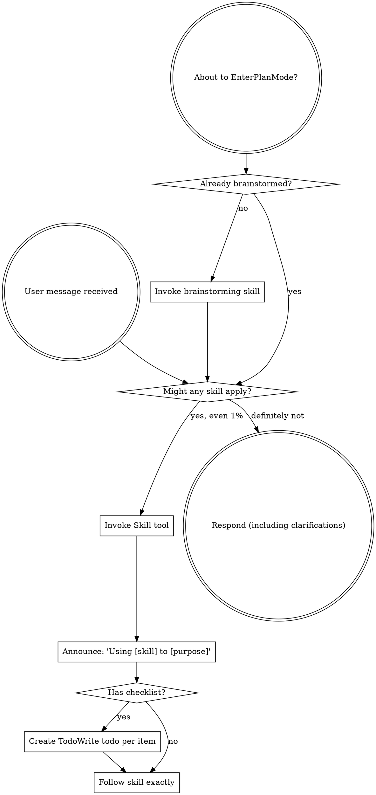

# Review — 2026-05-13-external-reviewer-redesign.md (post-slice, round 5)

- Target: `docs/superstar/plans/2026-05-13-external-reviewer-redesign.md`
- Request: `docs/reviewer/external-reviewer-redesign-post-slice/r5-2026-05-14T0221-request.md`
- Reviewer command: `reviewer-agent`
- Status: `ok`

---

1. Findings

F1. Blocking: `--work-id` is enforced and used in the folder slug, but new manifests still store `null`.
[external-reviewer.py](/home/simon/Dev/sigreer/skills/superstar/skills/external-review/scripts/external-reviewer.py:446) initializes new manifests with `"work_id": None`; JSON output then reports `manifest.get("work_id")` at [external-reviewer.py](/home/simon/Dev/sigreer/skills/superstar/skills/external-review/scripts/external-reviewer.py:528). This violates the spec’s requirement that `--work-id` is stored verbatim in the manifest at [design.md](/home/simon/Dev/sigreer/skills/superstar/docs/superstar/specs/2026-05-13-external-reviewer-redesign-design.md:89) and [design.md](/home/simon/Dev/sigreer/skills/superstar/docs/superstar/specs/2026-05-13-external-reviewer-redesign-design.md:98). Fix: set `"work_id": args.work_id` for new manifests and add a subprocess test asserting both JSON output and `chain.json` contain `P1.S1`.

F2. Blocking: the slice is not in a clean completion state.
`git status --short` shows five modified tracked files and one untracked reviewer artifact: `docs/reviewer/external-reviewer-redesign-post-slice/r5-2026-05-14T0221-request.md`. The plan’s pre-flight gate expects a clean tree and a feature branch at [plan.md](/home/simon/Dev/sigreer/skills/superstar/docs/superstar/plans/2026-05-13-external-reviewer-redesign.md:15) and [plan.md](/home/simon/Dev/sigreer/skills/superstar/docs/superstar/plans/2026-05-13-external-reviewer-redesign.md:25). The untracked request also has no matching response or manifest entry, so the review chain is left half-written.

F3. Important: the plan checklist is stale relative to the repo.
Slice 2 appears implemented in commits and tests, but every Slice 2 task remains unchecked starting at [plan.md](/home/simon/Dev/sigreer/skills/superstar/docs/superstar/plans/2026-05-13-external-reviewer-redesign.md:804), including required test and commit steps at [plan.md](/home/simon/Dev/sigreer/skills/superstar/docs/superstar/plans/2026-05-13-external-reviewer-redesign.md:814). If this gate is only for Slice 1, the extra Slice 2 commits need to be called out as out-of-scope; if it is for Slice 2, the document needs to reflect completion evidence.

2. Open questions / assumptions

- Is this post-slice gate intended to close Slice 1 or Slice 2? The repo state includes Slice 2 implementation commits, but the target document only marks Slice 1 complete.
- Are the modified skill files in `CLAUDE.md` and `skills/*/SKILL.md` intended as part of this slice? They are currently uncommitted and outside the external-reviewer files listed for Slice 1/2.
- Was `r5-2026-05-14T0221-request.md` created by an interrupted review run?

3. Suggested document edits

- Update the plan checklist for the actually completed slice, including the passing test command and commit SHAs.
- Add a short slice closeout note naming the slice under review and the exact verification run.
- If working on `main` is accepted in this personal fork, amend the pre-flight expectation or record the exception; otherwise move this work to a feature branch/worktree before continuing.

4. Verification gaps / commands

I ran:

```bash
python3 -m pytest skills/external-review/tests/ -v
```

Result: `33 passed, 1 warning`.

Still needed after fixes:

```bash
git status --short
python3 -m pytest skills/external-review/tests/ -v
```

Add a regression test for `--work-id` persistence in `chain.json` and JSON output.

5. Overall verdict: revise

---

## Reviewer stderr

```text
Reading additional input from stdin...
OpenAI Codex v0.130.0
--------
workdir: /home/simon/Dev/sigreer/skills/superstar
model: gpt-5.5
provider: openai
approval: never
sandbox: danger-full-access
reasoning effort: none
reasoning summaries: none
session id: 019e2412-a211-79b1-8c60-a1c367f6c05d
--------
user
You are acting as an independent senior engineering reviewer.

Review stance:
- Lead with findings, ordered by severity.
- Focus on correctness, consistency, implementation risk, missing acceptance
  gates, vague handoffs, ungrounded assumptions, unverified claims, and drift
  from the codebase.
- Give exact file/line references when possible.
- If the document is sound, say that clearly and list residual risks.
- Keep the review actionable. Avoid broad rewrites unless the current structure
  creates concrete risk.

Repository root:
/home/simon/Dev/sigreer/skills/superstar

Target kind:
post-slice

Review mode:
Post-slice review. Treat this as a completion gate for one
slice of work. Compare the completed changes and stated evidence against the
slice acceptance criteria. Prioritize: incomplete tasks, uncommitted or
untracked artifacts, missing tests, failing or skipped verification, broken
cross-site behavior, and claims not supported by the repo state.

Target document:
docs/superstar/plans/2026-05-13-external-reviewer-redesign.md

Additional context files:
- docs/superstar/specs/2026-05-13-external-reviewer-redesign-design.md
- docs/handoffs/2026-05-13-external-reviewer-redesign-prompt.md

Review output contract:
1. Findings
2. Open questions / assumptions
3. Suggested document edits
4. Verification gaps / commands that should be run, if any
5. Overall verdict: one of "ready", "ready with small edits", or "revise"

Read the files from disk. Do not rely only on the snippets in this prompt.


## Target Preview

### docs/superstar/plans/2026-05-13-external-reviewer-redesign.md

    1	# External-Reviewer Redesign Implementation Plan
    2	
    3	> **For agentic workers:** REQUIRED SUB-SKILL: Use superstar:subagent-driven-development (recommended) or superstar:executing-plans to implement this plan task-by-task. Steps use checkbox (`- [ ]`) syntax for tracking.
    4	
    5	**Goal:** Rebuild `skills/external-review/scripts/external-reviewer.py` so review chains are incremental, durable, machine-readable, and support optional independent sweep reviewers — per `docs/superstar/specs/2026-05-13-external-reviewer-redesign-design.md`.
    6	
    7	**Architecture:** A persistent `chain.json` manifest per review chain becomes the source of truth for round metadata. The script gains verdict parsing, work-ID-keyed chain folders, a resolution-artifact contract and gate, incremental round prompts with embedded diffs, optional session-resume placeholders, and Pass-3 independent sweep reviewers. Skill documentation is updated to match.
    8	
    9	**Tech Stack:** Python 3.9+ standard library only (no external deps), `pytest` for tests, `git` CLI for diff and SHA capture.
   10	
   11	---
   12	
   13	## Pre-flight
   14	
   15	- [ ] **Step 1: Verify working directory and branch**
   16	
   17	Run:
   18	
   19	```bash
   20	cd /home/simon/Dev/sigreer/skills/superstar
   21	git status --short
   22	git rev-parse --abbrev-ref HEAD
   23	```
   24	
   25	Expected: clean tree, branch is a feature branch (not `main`). If on `main`, stop and create a branch via `superstar:using-git-worktrees`.
   26	
   27	- [ ] **Step 2: Confirm test runner**
   28	
   29	Run:
   30	
   31	```bash
   32	python3 -c "import pytest; print(pytest.__version__)"
   33	```
   34	
   35	Expected: prints a version string. If `ModuleNotFoundError`, install pytest:
   36	
   37	```bash
   38	python3 -m pip install --user pytest
   39	```
   40	
   41	- [ ] **Step 3: Set up the test directory**
   42	
   43	Create the directory tests will live in:
   44	
   45	```bash
   46	mkdir -p skills/external-review/tests
   47	touch skills/external-review/tests/__init__.py
   48	```
   49	
   50	Commit:
   51	
   52	```bash
   53	git add skills/external-review/tests/__init__.py
   54	git commit -m "scaffold: tests dir for external-reviewer redesign"
   55	```
   56	
   57	---
   58	
   59	## Slice 1: Chain manifest & verdict parsing
   60	
   61	**Goal:** Introduce `chain.json` as the round-metadata source of truth, parse verdicts and finding counts from response text, and emit them in the JSON output. Backwards-compatible: legacy chains synthesize a manifest on first touch.
   62	
   63	### Task 1.1: Manifest read/write helpers
   64	
   65	**Files:**
   66	- Create: `skills/external-review/tests/test_manifest.py`
   67	- Modify: `skills/external-review/scripts/external-reviewer.py`
   68	
   69	- [x] **Step 1: Write the failing tests**
   70	
   71	`skills/external-review/tests/test_manifest.py`:
   72	
   73	```python
   74	import json
   75	from pathlib import Path
   76	
   77	import pytest
   78	
   79	import sys
   80	SCRIPTS = Path(__file__).resolve().parents[1] / "scripts"
   81	sys.path.insert(0, str(SCRIPTS))
   82	
   83	import importlib.util
   84	spec = importlib.util.spec_from_file_location("external_reviewer", SCRIPTS / "external-reviewer.py")
   85	external_reviewer = importlib.util.module_from_spec(spec)
   86	spec.loader.exec_module(external_reviewer)
   87	
   88	
   89	def test_read_manifest_returns_none_for_missing(tmp_path):
   90	    assert external_reviewer.read_manifest(tmp_path / "missing.json") is None
   91	
   92	
   93	def test_write_then_read_manifest_roundtrips(tmp_path):
   94	    path = tmp_path / "chain.json"
   95	    data = {
   96	        "schema_version": 1,
   97	        "chain": "demo-post-slice",
   98	        "kind": "post-slice",
   99	        "target": "docs/plans/demo.md",
  100	        "work_id": "P1.S1",
  101	        "legacy_migrated": False,
  102	        "rounds": [],
  103	        "sweep_checkpoints": {"first-round": "pending", "final-ready": "pending"},
  104	    }
  105	    external_reviewer.write_manifest(path, data)
  106	    loaded = external_reviewer.read_manifest(path)
  107	    assert loaded == data
  108	
  109	
  110	def test_read_manifest_rejects_newer_schema(tmp_path):
  111	    path = tmp_path / "chain.json"
  112	    path.write_text(json.dumps({"schema_version": 99}))
  113	    with pytest.raises(external_reviewer.ManifestSchemaTooNew):
  114	        external_reviewer.read_manifest(path)
  115	```
  116	
  117	- [x] **Step 2: Run the tests; confirm they fail**
  118	
  119	```bash
  120	python3 -m pytest skills/external-review/tests/test_manifest.py -v
  121	```
  122	
  123	Expected: 3 failures (`read_manifest`, `write_manifest`, `ManifestSchemaTooNew` all undefined).
  124	
  125	- [x] **Step 3: Add manifest helpers to the script**
  126	
  127	Append to `skills/external-review/scripts/external-reviewer.py` (after the existing module-level constants, before `repo_root()`):
  128	
  129	```python
  130	SUPPORTED_SCHEMA_VERSION = 1
  131	
  132	
  133	class ManifestSchemaTooNew(Exception):
  134	    """Raised when chain.json declares a schema_version newer than this script supports."""
  135	
  136	
  137	def read_manifest(path: Path) -> dict | None:
  138	    if not path.exists():
  139	        return None
  140	    data = json.loads(path.read_text(encoding="utf-8"))
  141	    version = data.get("schema_version")
  142	    if isinstance(version, int) and version > SUPPORTED_SCHEMA_VERSION:
  143	        raise ManifestSchemaTooNew(
  144	            f"chain.json schema_version {version} is newer than this script supports "
  145	            f"(max {SUPPORTED_SCHEMA_VERSION}). Upgrade external-reviewer.py."
  146	        )
  147	    return data
  148	
  149	
  150	def write_manifest(path: Path, data: dict) -> None:
  151	    path.parent.mkdir(parents=True, exist_ok=True)
  152	    path.write_text(json.dumps(data, indent=2) + "\n", encoding="utf-8")
  153	```
  154	
  155	- [x] **Step 4: Run the tests; confirm they pass**
  156	
  157	```bash
  158	python3 -m pytest skills/external-review/tests/test_manifest.py -v
  159	```
  160	
  161	Expected: 3 passed.
  162	
  163	- [x] **Step 5: Commit**
  164	
  165	```bash
  166	git add skills/external-review/scripts/external-reviewer.py skills/external-review/tests/test_manifest.py
  167	git commit -m "feat(external-reviewer): chain.json read/write helpers with schema versioning"
  168	```
  169	
  170	### Task 1.2: Verdict parsing
  171	
  172	**Files:**
  173	- Create: `skills/external-review/tests/test_verdict.py`
  174	- Modify: `skills/external-review/scripts/external-reviewer.py`
  175	
  176	- [x] **Step 1: Write the failing tests**
  177	
  178	`skills/external-review/tests/test_verdict.py`:
  179	
  180	```python
  181	from pathlib import Path
  182	import sys, importlib.util
  183	
  184	SCRIPTS = Path(__file__).resolve().parents[1] / "scripts"
  185	sys.path.insert(0, str(SCRIPTS))
  186	spec = importlib.util.spec_from_file_location("external_reviewer", SCRIPTS / "external-reviewer.py")
  187	er = importlib.util.module_from_spec(spec); spec.loader.exec_module(er)
  188	
  189	
  190	def test_verdict_ready():
  191	    v, valid = er.parse_verdict("Findings: ok\n\nOverall verdict: ready\n")
  192	    assert v == "ready"
  193	    assert valid is True
  194	
  195	
  196	def test_verdict_ready_with_small_edits_markdown():
  197	    body = "**Overall verdict:** `ready with small edits`."
  198	    v, valid = er.parse_verdict(body)
  199	    assert v == "ready with small edits"
  200	    assert valid is True
  201	
  202	
  203	def test_verdict_revise_case_insensitive():
  204	    v, valid = er.parse_verdict("OVERALL VERDICT: Revise")
  205	    assert v == "revise"
  206	    assert valid is True
  207	
  208	
  209	def test_verdict_takes_last_match():
  210	    body = "Overall verdict: ready\n\n...later...\n\nOverall verdict: revise"
  211	    v, valid = er.parse_verdict(body)
  212	    assert v == "revise"
  213	
  214	
  215	def test_verdict_unknown_returns_invalid():
  216	    v, valid = er.parse_verdict("Overall verdict: looks fine to me")
  217	    assert v is None
  218	    assert valid is False
  219	
  220	
  221	def test_verdict_missing_returns_invalid():
  222	    v, valid = er.parse_verdict("Some review prose with no verdict line.")
  223	    assert v is None
  224	    assert valid is False
  225	```
  226	
  227	- [x] **Step 2: Run the tests; confirm they fail**
  228	
  229	```bash
  230	python3 -m pytest skills/external-review/tests/test_verdict.py -v
  231	```
  232	
  233	Expected: 6 failures (`parse_verdict` undefined).
  234	
  235	- [x] **Step 3: Add the verdict parser**
  236	
  237	Append to `skills/external-review/scripts/external-reviewer.py`:
  238	
  239	```python
  240	VERDICT_VALUES = ("ready with small edits", "ready", "revise")
  241	VERDICT_LINE_RE = re.compile(
  242	    r"overall\s+verdict\s*[:\-]\s*[`*_\"']*\s*(ready with small edits|ready|revise)\s*[`*_\"'.]*",
  243	    re.IGNORECASE,
  244	)
  245	
  246	
  247	def parse_verdict(text: str) -> tuple[str | None, bool]:
  248	    matches = list(VERDICT_LINE_RE.finditer(text))
  249	    if not matches:
  250	        return None, False
  251	    raw = matches[-1].group(1).strip().lower()
  252	    if raw not in VERDICT_VALUES:
  253	        return None, False
  254	    return raw, True
  255	```
  256	
  257	Note: regex prefers `ready with small edits` over `ready` because of ordering in the alternation.
  258	
  259	- [x] **Step 4: Run the tests; confirm they pass**
  260	
  261	```bash
  262	python3 -m pytest skills/external-review/tests/test_verdict.py -v
  263	```
  264	
  265	Expected: 6 passed.
  266	
  267	- [x] **Step 5: Commit**
  268	
  269	```bash
  270	git add skills/external-review/scripts/external-reviewer.py skills/external-review/tests/test_verdict.py
  271	git commit -m "feat(external-reviewer): parse_verdict with markdown/case tolerance"
  272	```
  273	
  274	### Task 1.3: Finding-count parsing
  275	
  276	**Files:**
  277	- Create: `skills/external-review/tests/test_findings.py`
  278	- Modify: `skills/external-review/scripts/external-reviewer.py`
  279	
  280	- [x] **Step 1: Write the failing tests**
  281	
  282	`skills/external-review/tests/test_findings.py`:
  283	
  284	```python
  285	from pathlib import Path
  286	import sys, importlib.util
  287	SCRIPTS = Path(__file__).resolve().parents[1] / "scripts"
  288	sys.path.insert(0, str(SCRIPTS))
  289	spec = importlib.util.spec_from_file_location("external_reviewer", SCRIPTS / "external-reviewer.py")
  290	er = importlib.util.module_from_spec(spec); spec.loader.exec_module(er)
  291	
  292	
  293	def test_heading_findings_counted():
  294	    body = "## F1\nSeverity: blocking\n\n## F2\nSeverity: minor\n\n## F3\nSeverity: blocking"
  295	    n, blocking = er.parse_findings(body)
  296	    assert n == 3
  297	    assert blocking == 2
  298	
  299	
  300	def test_bullet_findings_counted():
  301	    body = "- F1: something blocking (blocking)\n- F2 minor thing"
  302	    n, blocking = er.parse_findings(body)
  303	    assert n == 2
  304	    assert blocking == 1
  305	
  306	
  307	def test_no_findings_returns_zero():
  308	    body = "Overall verdict: ready\n\nNo findings."
  309	    n, blocking = er.parse_findings(body)
  310	    assert n == 0
  311	    assert blocking == 0
  312	
  313	
  314	def test_unparseable_returns_none():
  315	    body = "Reviewer crashed: connection reset"
  316	    n, blocking = er.parse_findings(body)
  317	    assert n is None
  318	    assert blocking is None
  319	```
  320	
  321	- [x] **Step 2: Run the tests; confirm they fail**
  322	
  323	```bash
  324	python3 -m pytest skills/external-review/tests/test_findings.py -v
  325	```
  326	
  327	Expected: 4 failures.
  328	
  329	- [x] **Step 3: Add the parser**
  330	
  331	Append to `skills/external-review/scripts/external-reviewer.py`:
  332	
  333	```python
  334	HEADING_FINDING_RE = re.compile(r"^##\s+F\d+\b", re.MULTILINE)
  335	BULLET_FINDING_RE = re.compile(r"^\s*[-*]?\s*\**F\d+\**[:\s\-]", re.MULTILINE)
  336	BLOCKING_MARKER_RE = re.compile(r"(?:^|\s)\(blocking\)|^severity\s*:\s*blocking", re.IGNORECASE | re.MULTILINE)
  337	
  338	
  339	def parse_findings(text: str) -> tuple[int | None, int | None]:
  340	    if not text or text.strip() == "" or "reviewer crashed" in text.lower():
  341	        return None, None
  342	    heading_count = len(HEADING_FINDING_RE.findall(text))
  343	    if heading_count > 0:
  344	        n = heading_count
  345	    else:
  346	        n = len(BULLET_FINDING_RE.findall(text))
  347	    blocking = len(BLOCKING_MARKER_RE.findall(text))
  348	    return n, blocking
  349	```
  350	
  351	- [x] **Step 4: Run the tests; confirm they pass**
  352	
  353	```bash
  354	python3 -m pytest skills/external-review/tests/test_findings.py -v
  355	```
  356	
  357	Expected: 4 passed.
  358	
  359	- [x] **Step 5: Commit**
  360	
  361	```bash
  362	git add skills/external-review/scripts/external-reviewer.py skills/external-review/tests/test_findings.py
  363	git commit -m "feat(external-reviewer): parse_findings (heading + bullet, blocking count)"
  364	```
  365	
  366	### Task 1.4: Round-number derivation reads manifest first
  367	
  368	**Files:**
  369	- Create: `skills/external-review/tests/test_round_number.py`
  370	- Modify: `skills/external-review/scripts/external-reviewer.py` (`next_round_number`)
  371	
  372	- [x] **Step 1: Write the failing tests**
  373	
  374	`skills/external-review/tests/test_round_number.py`:
  375	
  376	```python
  377	from pathlib import Path
  378	import json, sys, importlib.util
  379	SCRIPTS = Path(__file__).resolve().parents[1] / "scripts"
  380	sys.path.insert(0, str(SCRIPTS))
  381	spec = importlib.util.spec_from_file_location("external_reviewer", SCRIPTS / "external-reviewer.py")
  382	er = importlib.util.module_from_spec(spec); spec.loader.exec_module(er)
  383	
  384	
  385	def test_no_chain_dir_round_is_one(tmp_path):
  386	    assert er.next_round_number(tmp_path / "absent") == 1
  387	
  388	
  389	def test_manifest_present_takes_precedence(tmp_path):
  390	    d = tmp_path / "chain"; d.mkdir()
  391	    er.write_manifest(d / "chain.json", {
  392	        "schema_version": 1, "rounds": [{"round": 1}, {"round": 2}]
  393	    })
  394	    assert er.next_round_number(d) == 3
  395	
  396	
  397	def test_legacy_dir_no_manifest_falls_back_to_filename_scan(tmp_path):
  398	    d = tmp_path / "chain"; d.mkdir()
  399	    (d / "r1-2026-05-01T0900-request.md").write_text("")
  400	    (d / "r2-2026-05-02T0900-request.md").write_text("")
  401	    assert er.next_round_number(d) == 3
  402	```
  403	
  404	- [x] **Step 2: Run the tests; confirm they fail**
  405	
  406	```bash
  407	python3 -m pytest skills/external-review/tests/test_round_number.py -v
  408	```
  409	
  410	Expected: test 2 fails (no manifest awareness), tests 1 and 3 may pass if current behavior already handles them.
  411	
  412	- [x] **Step 3: Update `next_round_number`**
  413	
  414	Replace the existing function:
  415	
  416	```python
  417	def next_round_number(chain_dir: Path) -> int:
  418	    if not chain_dir.exists():
  419	        return 1
  420	    manifest = read_manifest(chain_dir / "chain.json")
  421	    if manifest and isinstance(manifest.get("rounds"), list):
  422	        return len(manifest["rounds"]) + 1
  423	    return len(list(chain_dir.glob("r*-*-request.md"))) + 1
  424	```
  425	
  426	- [x] **Step 4: Run the tests**
  427	
  428	```bash
  429	python3 -m pytest skills/external-review/tests/test_round_number.py -v
  430	```
  431	
  432	Expected: 3 passed.
  433	
  434	- [x] **Step 5: Commit**
  435	
  436	```bash
  437	git add skills/external-review/scripts/external-reviewer.py skills/external-review/tests/test_round_number.py
  438	git commit -m "feat(external-reviewer): next_round_number consults chain.json"
  439	```
  440	
  441	### Task 1.5: Legacy manifest synthesis
  442	
  443	**Files:**
  444	- Create: `skills/external-review/tests/test_legacy_migration.py`
  445	- Modify: `skills/external-review/scripts/external-reviewer.py`
  446	
  447	- [x] **Step 1: Write the failing tests**
  448	
  449	`skills/external-review/tests/test_legacy_migration.py`:
  450	
  451	```python
  452	from pathlib import Path
  453	import sys, importlib.util
  454	SCRIPTS = Path(__file__).resolve().parents[1] / "scripts"
  455	sys.path.insert(0, str(SCRIPTS))
  456	spec = importlib.util.spec_from_file_location("external_reviewer", SCRIPTS / "external-reviewer.py")
  457	er = importlib.util.module_from_spec(spec); spec.loader.exec_module(er)
  458	
  459	
  460	def test_synthesize_manifest_from_legacy_files(tmp_path):
  461	    d = tmp_path / "old-chain"; d.mkdir()
  462	    (d / "r1-2026-04-01T0900-request.md").write_text("prompt body")
  463	    (d / "r1-2026-04-01T0905-response.md").write_text(
  464	        "## F1\nSeverity: blocking\n\nOverall verdict: revise\n"
  465	    )
  466	    (d / "r2-2026-04-02T1200-request.md").write_text("prompt body 2")
  467	
  468	    manifest = er.synthesize_legacy_manifest(
  469	        chain_dir=d, chain="old-chain", kind="post-slice",
  470	        target="docs/plans/old.md", work_id="P1.S1",
  471	    )
  472	
  473	    assert manifest["legacy_migrated"] is True
  474	    assert manifest["work_id"] == "P1.S1"
  475	    assert len(manifest["rounds"]) == 2
  476	    r1, r2 = manifest["rounds"]
  477	    assert r1["legacy"] is True
  478	    assert r1["verdict"] == "revise"
  479	    assert r1["verdict_valid"] is True
  480	    assert r1["findings_count"] == 1
  481	    assert r1["blocking_findings_count"] == 1
  482	    assert r1["head_sha_after_round"] is None
  483	    assert r2["response"] is None  # only request file existed
  484	```
  485	
  486	- [x] **Step 2: Run the tests; confirm they fail**
  487	
  488	```bash
  489	python3 -m pytest skills/external-review/tests/test_legacy_migration.py -v
  490	```
  491	
  492	Expected: 1 failure.
  493	
  494	- [x] **Step 3: Add the synthesizer**
  495	
  496	Append to `skills/external-review/scripts/external-reviewer.py`:
  497	
  498	```python
  499	LEGACY_ROUND_FILE_RE = re.compile(r"^r(\d+)-([0-9T\-]+)-(request|response)\.md$")
  500	
  501	
  502	def synthesize_legacy_manifest(
  503	    *, chain_dir: Path, chain: str, kind: str, target: str, work_id: str | None
  504	) -> dict:
  505	    rounds_map: dict[int, dict] = {}
  506	    for path in sorted(chain_dir.iterdir()):
  507	        m = LEGACY_ROUND_FILE_RE.match(path.name)
  508	        if not m:
  509	            continue
  510	        round_num = int(m.group(1))
  511	        role = m.group(3)
  512	        entry = rounds_map.setdefault(
  513	            round_num,
  514	            {
  515	                "round": round_num,
  516	                "request": None,
  517	                "response": None,
  518	                "resolution": None,
  519	                "verdict": None,
  520	                "verdict_valid": False,
  521	                "findings_count": None,
  522	                "blocking_findings_count": None,
  523	                "head_sha_at_request": None,
  524	                "head_sha_after_round": None,
  525	                "worktree_dirty_at_request": None,
  526	                "legacy": True,
  527	            },
  528	        )
  529	        entry[role] = path.name
  530	        if role == "response":
  531	            body = path.read_text(encoding="utf-8", errors="replace")
  532	            v, valid = parse_verdict(body)
  533	            entry["verdict"], entry["verdict_valid"] = v, valid
  534	            n, blocking = parse_findings(body)
  535	            entry["findings_count"], entry["blocking_findings_count"] = n, blocking
  536	
  537	    return {
  538	        "schema_version": SUPPORTED_SCHEMA_VERSION,
  539	        "chain": chain,
  540	        "kind": kind,
  541	        "target": target,
  542	        "work_id": work_id,
  543	        "legacy_migrated": True,
  544	        "migrated_at": dt.datetime.utcnow().strftime("%Y-%m-%dT%H:%M:%SZ"),
  545	        "rounds": [rounds_map[k] for k in sorted(rounds_map)],
  546	        "sweep_checkpoints": {"first-round": "pending", "final-ready": "pending"},
  547	    }
  548	```
  549	
  550	- [x] **Step 4: Run the tests; confirm they pass**
  551	
  552	```bash
  553	python3 -m pytest skills/external-review/tests/test_legacy_migration.py -v
  554	```
  555	
  556	Expected: 1 passed.
  557	
  558	- [x] **Step 5: Commit**
  559	
  560	```bash
  561	git add skills/external-review/scripts/external-reviewer.py skills/external-review/tests/test_legacy_migration.py
  562	git commit -m "feat(external-reviewer): synthesize_legacy_manifest from rN-* files"
  563	```
  564	
  565	### Task 1.6: Wire manifest into `main()` for single-reviewer rounds
  566	
  567	**Files:**
  568	- Modify: `skills/external-review/scripts/external-reviewer.py` (`main` function)
  569	- Create: `skills/external-review/tests/test_main_round_writes_manifest.py`
  570	
  571	- [x] **Step 1: Write the failing test**
  572	
  573	`skills/external-review/tests/test_main_round_writes_manifest.py`:
  574	
  575	```python
  576	from pathlib import Path
  577	import subprocess, sys, json, importlib.util, os
  578	
  579	SCRIPTS = Path(__file__).resolve().parents[1] / "scripts"
  580	sys.path.insert(0, str(SCRIPTS))
  581	spec = importlib.util.spec_from_file_location("external_reviewer", SCRIPTS / "external-reviewer.py")
  582	er = importlib.util.module_from_spec(spec); spec.loader.exec_module(er)
  583	
  584	
  585	FAKE_REVIEWER = """#!/usr/bin/env bash
  586	cat <<'EOF'
  587	## F1
  588	Severity: blocking
  589	Stub finding.
  590	
  591	Overall verdict: revise
  592	EOF
  593	"""
  594	
  595	
  596	def test_main_writes_manifest_entry(tmp_path, monkeypatch):
  597	    repo = tmp_path / "repo"; repo.mkdir()
  598	    subprocess.run(["git", "-C", str(repo), "init", "-q"], check=True)
  599	    subprocess.run(["git", "-C", str(repo), "config", "user.email", "t@t"], check=True)
  600	    subprocess.run(["git", "-C", str(repo), "config", "user.name", "T"], check=True)

[truncated: 2413 additional lines]

## Context Previews

### docs/superstar/specs/2026-05-13-external-reviewer-redesign-design.md

    1	# External-Review Script Redesign — Design
    2	
    3	**Date:** 2026-05-13
    4	**Target:** `skills/external-review/scripts/external-reviewer.py` and `skills/external-review/SKILL.md`
    5	**Motivation:** A self-review of the external-reviewer flow surfaced five concrete failure modes that cause review loops to balloon to 7–10 rounds and lose continuity between rounds. This spec redesigns the script and skill to make rounds incremental, durable, and machine-readable.
    6	
    7	---
    8	
    9	## Goals
   10	
   11	1. **Round N+1 is incremental, not a re-review.** The reviewer is given prior findings, the fixer's resolution report, and a focused diff — and is instructed to verify resolution rather than reopen broad review.
   12	2. **Verdict is machine-readable.** JSON output exposes a parsed `verdict`, `verdict_valid`, and finding counts, so coordinators don't have to parse prose.
   13	3. **Post-slice / post-phase chains are uniquely keyed.** `--work-id` is required for both so that multi-slice plans don't collapse into one chain.
   14	4. **Resolution artifacts are durable and structured-enough-to-parse.** Required headers, free-form bodies, stable finding IDs across rounds.
   15	5. **Optional session resume.** Provider-specific wrappers can plug into placeholders if the underlying reviewer CLI supports session IDs.
   16	6. **Legacy chains keep working.** Soft-migrate on first new round; preserve existing folder names and audit history.
   17	7. **Review depth is explicit.** The default chain uses one primary incremental reviewer, but callers can request bounded independent sweep reviewers at high-risk checkpoints to preserve fresh-eye coverage without unbounded serial churn.
   18	
   19	## Non-goals
   20	
   21	- Replacing the chain-folder layout for new chains. The folder-naming scheme gains a `--work-id` segment for post-slice/post-phase, but the round-file scheme is unchanged.
   22	- Making the script aware of any specific reviewer CLI. The script remains provider-neutral via `AGENT_REVIEWER_CMD`.
   23	- Auto-dispatching the fixer subagent. The script enforces the resolution gate but does not invoke fixers; that stays in the coordinator's loop, governed by `subagent-driven-development`.
   24	
   25	## Invariants
   26	
   27	- **A review chain is single-writer.** Running two rounds concurrently against the same chain is unsupported and may corrupt `chain.json`. The script does not lock; callers are expected to serialise.
   28	- **Existing rounds are immutable.** Once written, `rN-*-request.md`, `rN-*-response.md`, and `rN-resolution.md` are never overwritten. Manifest entries for past rounds are append-only.
   29	
   30	## Architecture
   31	
   32	Three implementation passes, all designed in this spec:
   33	
   34	- **Pass 1 — Core.** Chain manifest, verdict parsing, `--work-id`, prior-round context injection, incremental round prompts, resolution-artifact contract and gate, automatic diff embedding, JSON output enrichment, legacy migration.
   35	- **Pass 2 — Session resume.** Optional placeholders (`{chain_dir}`, `{round}`, `{previous_response}`, `{resolution_file}`, `{session_file}`) exposed via the existing `AGENT_REVIEWER_CMD` template mechanism. A provider-specific wrapper can use `{session_file}` to persist and resume reviewer sessions. The script provides a stable path (`chain_dir/session.state`) and ensures the parent directory exists; wrappers own the file's contents. The script never reads `session.state`.
   36	- **Pass 3 — Review depth / independent sweeps.** Adds `--review-depth`, `--independent-reviewers`, `--sweep-policy` flags. Independent sweep reviewers run without seeing the primary reviewer's findings on their first pass (to avoid anchoring), and their findings are merged into the same resolution checklist afterward. Depends on Pass 1's manifest and verdict parsing; does not depend on Pass 2.
   37	
   38	### Chain manifest
   39	
   40	`docs/reviewer/<chain>/chain.json` is the single source of truth for round metadata. The `rN-*-request.md` / `rN-*-response.md` / `rN-resolution.md` files remain for human readability and git history; the script reads and writes manifest entries when computing round numbers, base refs, and verdicts.
   41	
   42	```json
   43	{
   44	  "schema_version": 1,
   45	  "chain": "feature-plan-P2-S3-post-slice",
   46	  "kind": "post-slice",
   47	  "target": "docs/superstar/plans/feature-plan.md",
   48	  "work_id": "P2.S3",
   49	  "legacy_migrated": false,
   50	  "rounds": [
   51	    {
   52	      "round": 1,
   53	      "request": "r1-2026-05-13T1012-request.md",
   54	      "response": "r1-2026-05-13T1020-response.md",
   55	      "resolution": null,
   56	      "head_sha_at_request": "abc1234",
   57	      "head_sha_after_round": "abc1234",
   58	      "worktree_dirty_at_request": false,
   59	      "verdict": "revise",
   60	      "verdict_valid": true,
   61	      "findings_count": 4,
   62	      "blocking_findings_count": 2
   63	    },
   64	    {
   65	      "round": 2,
   66	      "request": "r2-2026-05-13T1130-request.md",
   67	      "response": null,
   68	      "resolution": "r1-resolution.md",
   69	      "base_ref": "abc1234",
   70	      "base_ref_source": "auto",
   71	      "head_sha_at_request": "def5678",
   72	      "worktree_dirty_at_request": false,
   73	      "diff_included": true,
   74	      "resolution_parse_status": "ok",
   75	      "resolution_waiver": false
   76	    }
   77	  ]
   78	}
   79	```
   80	
   81	#### Manifest versioning
   82	
   83	- `schema_version: 1` is the initial version introduced by this redesign.
   84	- Unknown future `schema_version` values cause the script to error with a clear message: `ERROR: chain.json schema_version <N> is newer than this script supports. Upgrade external-reviewer.py.` This prevents silent corruption.
   85	- Older `schema_version` values (currently none) get best-effort migration on read, recorded as `schema_migrated_from: <prior>` in the manifest.
   86	
   87	### Naming
   88	
   89	- **Chain folder slug:** `<target-stem-no-leading-date>-<work-id-dotless>-<kind>` for post-slice/post-phase; `<target-stem-no-leading-date>-<kind>` otherwise. Dots in work IDs are replaced with dashes in the folder slug only — the manifest preserves the canonical form.
   90	  - Example: `--work-id P2.S3` → folder `feature-plan-P2-S3-post-slice`, manifest `"work_id": "P2.S3"`.
   91	- **Round files:** `r{N}-<YYYY-MM-DDTHHMM>-request.md`, `r{N}-<YYYY-MM-DDTHHMM>-response.md`. Unchanged from current behavior.
   92	- **Resolution files:** `r{N}-resolution.md`, where `N` is the round whose response is being addressed. Round `N+1` consumes `r{N}-resolution.md`. Worked example: after `r1-response.md` returns `revise`, the fixer writes `r1-resolution.md`; round 2 reads `r1-resolution.md` and embeds it in the round-2 prompt.
   93	
   94	## CLI surface (new flags)
   95	
   96	| Flag | Kinds | Purpose |
   97	|---|---|---|
   98	| `--work-id <id>` | required for `post-slice`, `post-phase`; optional otherwise | Stable slice/phase ID (e.g., `P2.S3` for post-slice, `P2` for post-phase). Becomes part of chain folder name (dots → dashes) and is stored verbatim in the manifest. |
   99	| `--base-ref <sha\|ref>` | any | Override auto-computed diff base for this round. |
  100	| `--no-diff` | any | Suppress diff embedding even on round N+1. |
  101	| `--allow-missing-resolution` | post-slice, post-phase | Waive the resolution-required gate. Logged in manifest as `resolution_waiver: true`. |
  102	| `--changed-files <path>...` | any | Override automatic changed-file discovery and limit the embedded diff to the supplied paths. |
  103	| `--mode <auto\|broad\|incremental>` | any | Override the round-1-vs-N prompt mode. Default `auto` (round 1 → broad; round 2+ → incremental). |
  104	| `--max-diff-lines <int>` | any | Cap diff size. Default 2000. Truncation marker is embedded if exceeded. |
  105	| `--review-depth <standard\|thorough\|exhaustive>` | post-slice, post-phase | Controls whether independent sweep reviewers are run in addition to the primary chain reviewer. Default `standard`. |
  106	| `--independent-reviewers <int>` | post-slice, post-phase | Override reviewer count for independent sweeps. Default derived from `--review-depth`. |
  107	| `--sweep-policy <first-round\|final-ready\|both\|never>` | post-slice, post-phase | When to run fresh-context sweep reviews. Default derived from `--review-depth`. |
  108	
  109	### `--work-id` enforcement
  110	
  111	- `post-slice` or `post-phase` invoked without `--work-id` → exit 2 with operational error.
  112	- For `post-phase`, the expected form is the phase ID alone (`P2`), not a slice ID. The script does not enforce a regex; it documents the convention.
  113	- For other kinds, `--work-id` is optional; if provided, it is recorded in the manifest but does not affect the folder slug.
  114	
  115	## Reviewer prompt — round 1 vs round N+
  116	
  117	### Round 1: broad
  118	
  119	The existing broad prompt, with the output contract revised to require **stable finding IDs**:
  120	
  121	```
  122	1. Findings
  123	   - Each finding tagged `F<n>` (e.g., F1, F2, F3). IDs must be stable across rounds.
  124	   - Severity: blocking | important | minor | nit
  125	2. Open questions / assumptions
  126	3. Suggested document edits
  127	4. Verification gaps
  128	5. Overall verdict: ready | ready with small edits | revise
  129	```
  130	
  131	### Round N+: incremental
  132	
  133	Prepended to the existing prompt body:
  134	
  135	```
  136	You are continuing an existing review chain. This is round {N} of {chain_id}.
  137	
  138	In incremental mode:
  139	- Verify whether prior findings are resolved per the resolution report below.
  140	- Reuse the existing finding IDs (F1, F2, …). If a prior finding is resolved,
  141	  mark it RESOLVED in your findings list with its original ID. If still
  142	  unresolved, keep its ID.
  143	- Only introduce new finding IDs for genuine regressions caused by the fix, or
  144	  blocking issues clearly missed in earlier rounds. Do not reopen broad review
  145	  unless prior fixes changed broad architecture.
  146	
  147	Review chain summary:
  148	{per-round table: round, verdict, findings_count, blocking_findings_count}
  149	
  150	Prior-round findings (authoritative):
  151	{if r{N-1}-merged-findings.md exists: its verbatim contents — this replaces
  152	 individual reviewer response files as the prior-finding list of record}
  153	{else: a summary of the prior round's primary response, with finding IDs intact}
  154	
  155	Resolution report for prior round:
  156	{verbatim contents of r{N-1}-resolution.md}
  157	{or "MISSING — explicitly waived by caller via --allow-missing-resolution"}
  158	{or "MISSING — chain migrated from legacy artifacts; please verify whether changes occurred from the diff below"}
  159	
  160	Resolution parse summary (best-effort):
  161	{structured: per-finding-ID → status, or "unparseable"}
  162	
  163	Changes since prior round:
  164	{git diff <base_ref>..HEAD -- <scoped paths>}
  165	{if dirty: appended `git diff HEAD` section, both labeled}
  166	{if no base: "not available for this round (legacy chain / first round / --no-diff)"}
  167	```
  168	
  169	`--mode broad` forces round-1-style on later rounds (rare; for cases where the fix changed architecture). `--mode incremental` on round 1 is rejected with a clear error.
  170	
  171	## Resolution artifact contract
  172	
  173	**Path:** `docs/reviewer/<chain>/r{N}-resolution.md`, where `N` is the round whose response is being addressed. Authored by the fix subagent between round N (response) and round N+1 (resubmit).
  174	
  175	**Required parseable shape:**
  176	
  177	```markdown
  178	# Resolution for r{N}
  179	
  180	## F1
  181	Status: fixed
  182	Evidence:
  183	- Commit: abc1234
  184	- Files: `src/foo.ts:42`, `tests/foo.test.ts:18`
  185	- Verification: `npm test -- foo.test.ts` passed
  186	
  187	Notes:
  188	Changed the validation path to reject empty IDs before persistence.
  189	
  190	## F2
  191	Status: waived
  192	Evidence:
  193	- No code change
  194	- Reason: reviewer assumed X, but the plan explicitly excludes X in
  195	  `docs/superstar/specs/foo-design.md:77`
  196	
  197	Notes:
  198	No implementation change because this would expand slice scope.
  199	```
  200	

[truncated: 292 additional lines]
### docs/handoffs/2026-05-13-external-reviewer-redesign-prompt.md

    1	# Coordinator handoff — External-Reviewer Redesign
    2	
    3	You are the coordinator for implementing the **external-reviewer redesign** in the `superstar` repo at `/home/simon/Dev/sigreer/skills/superstar`.
    4	
    5	Your role is **strictly orchestration**. Use the `superstar:subagent-driven-development` skill with parallel agents where possible.
    6	
    7	## Inputs
    8	
    9	- Spec: [`docs/superstar/specs/2026-05-13-external-reviewer-redesign-design.md`](docs/superstar/specs/2026-05-13-external-reviewer-redesign-design.md)
   10	- Plan: [`docs/superstar/plans/2026-05-13-external-reviewer-redesign.md`](docs/superstar/plans/2026-05-13-external-reviewer-redesign.md)
   11	- Reviewer chain folder (created on first review): `docs/reviewer/external-reviewer-redesign-plan/` (kind `plan`) and per-slice chains like `docs/reviewer/external-reviewer-redesign-S1-post-slice/` (no TASKLIST.md in this repo; treat `S1`…`S8` from the plan as the work-id segments).
   12	
   13	## Coordinator discipline (non-negotiable)
   14	
   15	- **Do not perform any fixes yourself** unless the fix is genuinely cheaper to implement than the process of delegating to a subagent. Tiebreak: delegate.
   16	- **Do not pollute your context.** Delegate investigations, file reads, and edits to subagents. Your context is for orchestration, not implementation detail.
   17	- **At the end of each slice (S1–S8)**, the human partner runs `external-review` manually with `--kind post-slice` and pastes the findings back. Do NOT invoke the external-review skill yourself in this project — the human partner has explicitly chosen to drive it manually to keep the context clean. Wait for the verdict before proceeding to the next slice.
   18	- **Do not perform reviewer-driven fixes yourself.** Pass each reviewer response to a fix subagent that writes `r{N}-resolution.md` per the contract in `[[external-review]]`, then signal the human partner that the resolution is ready and the next round can be submitted.
   19	- **At the end of the phase** (after S8 closes), the human partner runs `--kind post-phase` manually. Same delegation rule.
   20	- **No TASKLIST.md exists** in this repo. Track slice completion in this handoff document or in a TODO list you maintain in-session; do not invent a TASKLIST.md file.
   21	
   22	## First action
   23	
   24	Read this file (the handoff prompt), the spec, and the plan. Then invoke `superstar:subagent-driven-development` and begin Slice 1 (Chain manifest & verdict parsing).

codex
I’ll read the relevant workflow skill first, then inspect the plan, spec, handoff, and actual repo state before judging the slice gate.
exec
/usr/bin/zsh -lc "sed -n '1,220p' /home/simon/.codex/plugins/cache/openai-curated/superpowers/1b89ff49/skills/using-superpowers/SKILL.md" in /home/simon/Dev/sigreer/skills/superstar
 succeeded in 0ms:
---
name: using-superpowers
description: Use when starting any conversation - establishes how to find and use skills, requiring Skill tool invocation before ANY response including clarifying questions
---

<SUBAGENT-STOP>
If you were dispatched as a subagent to execute a specific task, skip this skill.
</SUBAGENT-STOP>

<EXTREMELY-IMPORTANT>
If you think there is even a 1% chance a skill might apply to what you are doing, you ABSOLUTELY MUST invoke the skill.

IF A SKILL APPLIES TO YOUR TASK, YOU DO NOT HAVE A CHOICE. YOU MUST USE IT.

This is not negotiable. This is not optional. You cannot rationalize your way out of this.
</EXTREMELY-IMPORTANT>

## Instruction Priority

Superpowers skills override default system prompt behavior, but **user instructions always take precedence**:

1. **User's explicit instructions** (CLAUDE.md, GEMINI.md, AGENTS.md, direct requests) — highest priority
2. **Superpowers skills** — override default system behavior where they conflict
3. **Default system prompt** — lowest priority

If CLAUDE.md, GEMINI.md, or AGENTS.md says "don't use TDD" and a skill says "always use TDD," follow the user's instructions. The user is in control.

## How to Access Skills

**In Claude Code:** Use the `Skill` tool. When you invoke a skill, its content is loaded and presented to you—follow it directly. Never use the Read tool on skill files.

**In Copilot CLI:** Use the `skill` tool. Skills are auto-discovered from installed plugins. The `skill` tool works the same as Claude Code's `Skill` tool.

**In Gemini CLI:** Skills activate via the `activate_skill` tool. Gemini loads skill metadata at session start and activates the full content on demand.

**In other environments:** Check your platform's documentation for how skills are loaded.

## Platform Adaptation

Skills use Claude Code tool names. Non-CC platforms: see `references/copilot-tools.md` (Copilot CLI), `references/codex-tools.md` (Codex) for tool equivalents. Gemini CLI users get the tool mapping loaded automatically via GEMINI.md.

# Using Skills

## The Rule

**Invoke relevant or requested skills BEFORE any response or action.** Even a 1% chance a skill might apply means that you should invoke the skill to check. If an invoked skill turns out to be wrong for the situation, you don't need to use it.



## Red Flags

These thoughts mean STOP—you're rationalizing:

| Thought | Reality |
|---------|---------|
| "This is just a simple question" | Questions are tasks. Check for skills. |
| "I need more context first" | Skill check comes BEFORE clarifying questions. |
| "Let me explore the codebase first" | Skills tell you HOW to explore. Check first. |
| "I can check git/files quickly" | Files lack conversation context. Check for skills. |
| "Let me gather information first" | Skills tell you HOW to gather information. |
| "This doesn't need a formal skill" | If a skill exists, use it. |
| "I remember this skill" | Skills evolve. Read current version. |
| "This doesn't count as a task" | Action = task. Check for skills. |
| "The skill is overkill" | Simple things become complex. Use it. |
| "I'll just do this one thing first" | Check BEFORE doing anything. |
| "This feels productive" | Undisciplined action wastes time. Skills prevent this. |
| "I know what that means" | Knowing the concept ≠ using the skill. Invoke it. |

## Skill Priority

When multiple skills could apply, use this order:

1. **Process skills first** (brainstorming, debugging) - these determine HOW to approach the task
2. **Implementation skills second** (frontend-design, mcp-builder) - these guide execution

"Let's build X" → brainstorming first, then implementation skills.
"Fix this bug" → debugging first, then domain-specific skills.

## Skill Types

**Rigid** (TDD, debugging): Follow exactly. Don't adapt away discipline.

**Flexible** (patterns): Adapt principles to context.

The skill itself tells you which.

## User Instructions

Instructions say WHAT, not HOW. "Add X" or "Fix Y" doesn't mean skip workflows.

codex
Using `superpowers:using-superpowers` to honor the repo’s skill workflow. Now I’m checking the completed slice against the plan and the working tree, not just the preview.
exec
/usr/bin/zsh -lc "sed -n '1,760p' docs/superstar/plans/2026-05-13-external-reviewer-redesign.md" in /home/simon/Dev/sigreer/skills/superstar
 succeeded in 0ms:
# External-Reviewer Redesign Implementation Plan

> **For agentic workers:** REQUIRED SUB-SKILL: Use superstar:subagent-driven-development (recommended) or superstar:executing-plans to implement this plan task-by-task. Steps use checkbox (`- [ ]`) syntax for tracking.

**Goal:** Rebuild `skills/external-review/scripts/external-reviewer.py` so review chains are incremental, durable, machine-readable, and support optional independent sweep reviewers — per `docs/superstar/specs/2026-05-13-external-reviewer-redesign-design.md`.

**Architecture:** A persistent `chain.json` manifest per review chain becomes the source of truth for round metadata. The script gains verdict parsing, work-ID-keyed chain folders, a resolution-artifact contract and gate, incremental round prompts with embedded diffs, optional session-resume placeholders, and Pass-3 independent sweep reviewers. Skill documentation is updated to match.

**Tech Stack:** Python 3.9+ standard library only (no external deps), `pytest` for tests, `git` CLI for diff and SHA capture.

---

## Pre-flight

- [ ] **Step 1: Verify working directory and branch**

Run:

```bash
cd /home/simon/Dev/sigreer/skills/superstar
git status --short
git rev-parse --abbrev-ref HEAD
```

Expected: clean tree, branch is a feature branch (not `main`). If on `main`, stop and create a branch via `superstar:using-git-worktrees`.

- [ ] **Step 2: Confirm test runner**

Run:

```bash
python3 -c "import pytest; print(pytest.__version__)"
```

Expected: prints a version string. If `ModuleNotFoundError`, install pytest:

```bash
python3 -m pip install --user pytest
```

- [ ] **Step 3: Set up the test directory**

Create the directory tests will live in:

```bash
mkdir -p skills/external-review/tests
touch skills/external-review/tests/__init__.py
```

Commit:

```bash
git add skills/external-review/tests/__init__.py
git commit -m "scaffold: tests dir for external-reviewer redesign"
```

---

## Slice 1: Chain manifest & verdict parsing

**Goal:** Introduce `chain.json` as the round-metadata source of truth, parse verdicts and finding counts from response text, and emit them in the JSON output. Backwards-compatible: legacy chains synthesize a manifest on first touch.

### Task 1.1: Manifest read/write helpers

**Files:**
- Create: `skills/external-review/tests/test_manifest.py`
- Modify: `skills/external-review/scripts/external-reviewer.py`

- [x] **Step 1: Write the failing tests**

`skills/external-review/tests/test_manifest.py`:

```python
import json
from pathlib import Path

import pytest

import sys
SCRIPTS = Path(__file__).resolve().parents[1] / "scripts"
sys.path.insert(0, str(SCRIPTS))

import importlib.util
spec = importlib.util.spec_from_file_location("external_reviewer", SCRIPTS / "external-reviewer.py")
external_reviewer = importlib.util.module_from_spec(spec)
spec.loader.exec_module(external_reviewer)


def test_read_manifest_returns_none_for_missing(tmp_path):
    assert external_reviewer.read_manifest(tmp_path / "missing.json") is None


def test_write_then_read_manifest_roundtrips(tmp_path):
    path = tmp_path / "chain.json"
    data = {
        "schema_version": 1,
        "chain": "demo-post-slice",
        "kind": "post-slice",
        "target": "docs/plans/demo.md",
        "work_id": "P1.S1",
        "legacy_migrated": False,
        "rounds": [],
        "sweep_checkpoints": {"first-round": "pending", "final-ready": "pending"},
    }
    external_reviewer.write_manifest(path, data)
    loaded = external_reviewer.read_manifest(path)
    assert loaded == data


def test_read_manifest_rejects_newer_schema(tmp_path):
    path = tmp_path / "chain.json"
    path.write_text(json.dumps({"schema_version": 99}))
    with pytest.raises(external_reviewer.ManifestSchemaTooNew):
        external_reviewer.read_manifest(path)
```

- [x] **Step 2: Run the tests; confirm they fail**

```bash
python3 -m pytest skills/external-review/tests/test_manifest.py -v
```

Expected: 3 failures (`read_manifest`, `write_manifest`, `ManifestSchemaTooNew` all undefined).

- [x] **Step 3: Add manifest helpers to the script**

Append to `skills/external-review/scripts/external-reviewer.py` (after the existing module-level constants, before `repo_root()`):

```python
SUPPORTED_SCHEMA_VERSION = 1


class ManifestSchemaTooNew(Exception):
    """Raised when chain.json declares a schema_version newer than this script supports."""


def read_manifest(path: Path) -> dict | None:
    if not path.exists():
        return None
    data = json.loads(path.read_text(encoding="utf-8"))
    version = data.get("schema_version")
    if isinstance(version, int) and version > SUPPORTED_SCHEMA_VERSION:
        raise ManifestSchemaTooNew(
            f"chain.json schema_version {version} is newer than this script supports "
            f"(max {SUPPORTED_SCHEMA_VERSION}). Upgrade external-reviewer.py."
        )
    return data


def write_manifest(path: Path, data: dict) -> None:
    path.parent.mkdir(parents=True, exist_ok=True)
    path.write_text(json.dumps(data, indent=2) + "\n", encoding="utf-8")
```

- [x] **Step 4: Run the tests; confirm they pass**

```bash
python3 -m pytest skills/external-review/tests/test_manifest.py -v
```

Expected: 3 passed.

- [x] **Step 5: Commit**

```bash
git add skills/external-review/scripts/external-reviewer.py skills/external-review/tests/test_manifest.py
git commit -m "feat(external-reviewer): chain.json read/write helpers with schema versioning"
```

### Task 1.2: Verdict parsing

**Files:**
- Create: `skills/external-review/tests/test_verdict.py`
- Modify: `skills/external-review/scripts/external-reviewer.py`

- [x] **Step 1: Write the failing tests**

`skills/external-review/tests/test_verdict.py`:

```python
from pathlib import Path
import sys, importlib.util

SCRIPTS = Path(__file__).resolve().parents[1] / "scripts"
sys.path.insert(0, str(SCRIPTS))
spec = importlib.util.spec_from_file_location("external_reviewer", SCRIPTS / "external-reviewer.py")
er = importlib.util.module_from_spec(spec); spec.loader.exec_module(er)


def test_verdict_ready():
    v, valid = er.parse_verdict("Findings: ok\n\nOverall verdict: ready\n")
    assert v == "ready"
    assert valid is True


def test_verdict_ready_with_small_edits_markdown():
    body = "**Overall verdict:** `ready with small edits`."
    v, valid = er.parse_verdict(body)
    assert v == "ready with small edits"
    assert valid is True


def test_verdict_revise_case_insensitive():
    v, valid = er.parse_verdict("OVERALL VERDICT: Revise")
    assert v == "revise"
    assert valid is True


def test_verdict_takes_last_match():
    body = "Overall verdict: ready\n\n...later...\n\nOverall verdict: revise"
    v, valid = er.parse_verdict(body)
    assert v == "revise"


def test_verdict_unknown_returns_invalid():
    v, valid = er.parse_verdict("Overall verdict: looks fine to me")
    assert v is None
    assert valid is False


def test_verdict_missing_returns_invalid():
    v, valid = er.parse_verdict("Some review prose with no verdict line.")
    assert v is None
    assert valid is False
```

- [x] **Step 2: Run the tests; confirm they fail**

```bash
python3 -m pytest skills/external-review/tests/test_verdict.py -v
```

Expected: 6 failures (`parse_verdict` undefined).

- [x] **Step 3: Add the verdict parser**

Append to `skills/external-review/scripts/external-reviewer.py`:

```python
VERDICT_VALUES = ("ready with small edits", "ready", "revise")
VERDICT_LINE_RE = re.compile(
    r"overall\s+verdict\s*[:\-]\s*[`*_\"']*\s*(ready with small edits|ready|revise)\s*[`*_\"'.]*",
    re.IGNORECASE,
)


def parse_verdict(text: str) -> tuple[str | None, bool]:
    matches = list(VERDICT_LINE_RE.finditer(text))
    if not matches:
        return None, False
    raw = matches[-1].group(1).strip().lower()
    if raw not in VERDICT_VALUES:
        return None, False
    return raw, True
```

Note: regex prefers `ready with small edits` over `ready` because of ordering in the alternation.

- [x] **Step 4: Run the tests; confirm they pass**

```bash
python3 -m pytest skills/external-review/tests/test_verdict.py -v
```

Expected: 6 passed.

- [x] **Step 5: Commit**

```bash
git add skills/external-review/scripts/external-reviewer.py skills/external-review/tests/test_verdict.py
git commit -m "feat(external-reviewer): parse_verdict with markdown/case tolerance"
```

### Task 1.3: Finding-count parsing

**Files:**
- Create: `skills/external-review/tests/test_findings.py`
- Modify: `skills/external-review/scripts/external-reviewer.py`

- [x] **Step 1: Write the failing tests**

`skills/external-review/tests/test_findings.py`:

```python
from pathlib import Path
import sys, importlib.util
SCRIPTS = Path(__file__).resolve().parents[1] / "scripts"
sys.path.insert(0, str(SCRIPTS))
spec = importlib.util.spec_from_file_location("external_reviewer", SCRIPTS / "external-reviewer.py")
er = importlib.util.module_from_spec(spec); spec.loader.exec_module(er)


def test_heading_findings_counted():
    body = "## F1\nSeverity: blocking\n\n## F2\nSeverity: minor\n\n## F3\nSeverity: blocking"
    n, blocking = er.parse_findings(body)
    assert n == 3
    assert blocking == 2


def test_bullet_findings_counted():
    body = "- F1: something blocking (blocking)\n- F2 minor thing"
    n, blocking = er.parse_findings(body)
    assert n == 2
    assert blocking == 1


def test_no_findings_returns_zero():
    body = "Overall verdict: ready\n\nNo findings."
    n, blocking = er.parse_findings(body)
    assert n == 0
    assert blocking == 0


def test_unparseable_returns_none():
    body = "Reviewer crashed: connection reset"
    n, blocking = er.parse_findings(body)
    assert n is None
    assert blocking is None
```

- [x] **Step 2: Run the tests; confirm they fail**

```bash
python3 -m pytest skills/external-review/tests/test_findings.py -v
```

Expected: 4 failures.

- [x] **Step 3: Add the parser**

Append to `skills/external-review/scripts/external-reviewer.py`:

```python
HEADING_FINDING_RE = re.compile(r"^##\s+F\d+\b", re.MULTILINE)
BULLET_FINDING_RE = re.compile(r"^\s*[-*]?\s*\**F\d+\**[:\s\-]", re.MULTILINE)
BLOCKING_MARKER_RE = re.compile(r"(?:^|\s)\(blocking\)|^severity\s*:\s*blocking", re.IGNORECASE | re.MULTILINE)


def parse_findings(text: str) -> tuple[int | None, int | None]:
    if not text or text.strip() == "" or "reviewer crashed" in text.lower():
        return None, None
    heading_count = len(HEADING_FINDING_RE.findall(text))
    if heading_count > 0:
        n = heading_count
    else:
        n = len(BULLET_FINDING_RE.findall(text))
    blocking = len(BLOCKING_MARKER_RE.findall(text))
    return n, blocking
```

- [x] **Step 4: Run the tests; confirm they pass**

```bash
python3 -m pytest skills/external-review/tests/test_findings.py -v
```

Expected: 4 passed.

- [x] **Step 5: Commit**

```bash
git add skills/external-review/scripts/external-reviewer.py skills/external-review/tests/test_findings.py
git commit -m "feat(external-reviewer): parse_findings (heading + bullet, blocking count)"
```

### Task 1.4: Round-number derivation reads manifest first

**Files:**
- Create: `skills/external-review/tests/test_round_number.py`
- Modify: `skills/external-review/scripts/external-reviewer.py` (`next_round_number`)

- [x] **Step 1: Write the failing tests**

`skills/external-review/tests/test_round_number.py`:

```python
from pathlib import Path
import json, sys, importlib.util
SCRIPTS = Path(__file__).resolve().parents[1] / "scripts"
sys.path.insert(0, str(SCRIPTS))
spec = importlib.util.spec_from_file_location("external_reviewer", SCRIPTS / "external-reviewer.py")
er = importlib.util.module_from_spec(spec); spec.loader.exec_module(er)


def test_no_chain_dir_round_is_one(tmp_path):
    assert er.next_round_number(tmp_path / "absent") == 1


def test_manifest_present_takes_precedence(tmp_path):
    d = tmp_path / "chain"; d.mkdir()
    er.write_manifest(d / "chain.json", {
        "schema_version": 1, "rounds": [{"round": 1}, {"round": 2}]
    })
    assert er.next_round_number(d) == 3


def test_legacy_dir_no_manifest_falls_back_to_filename_scan(tmp_path):
    d = tmp_path / "chain"; d.mkdir()
    (d / "r1-2026-05-01T0900-request.md").write_text("")
    (d / "r2-2026-05-02T0900-request.md").write_text("")
    assert er.next_round_number(d) == 3
```

- [x] **Step 2: Run the tests; confirm they fail**

```bash
python3 -m pytest skills/external-review/tests/test_round_number.py -v
```

Expected: test 2 fails (no manifest awareness), tests 1 and 3 may pass if current behavior already handles them.

- [x] **Step 3: Update `next_round_number`**

Replace the existing function:

```python
def next_round_number(chain_dir: Path) -> int:
    if not chain_dir.exists():
        return 1
    manifest = read_manifest(chain_dir / "chain.json")
    if manifest and isinstance(manifest.get("rounds"), list):
        return len(manifest["rounds"]) + 1
    return len(list(chain_dir.glob("r*-*-request.md"))) + 1
```

- [x] **Step 4: Run the tests**

```bash
python3 -m pytest skills/external-review/tests/test_round_number.py -v
```

Expected: 3 passed.

- [x] **Step 5: Commit**

```bash
git add skills/external-review/scripts/external-reviewer.py skills/external-review/tests/test_round_number.py
git commit -m "feat(external-reviewer): next_round_number consults chain.json"
```

### Task 1.5: Legacy manifest synthesis

**Files:**
- Create: `skills/external-review/tests/test_legacy_migration.py`
- Modify: `skills/external-review/scripts/external-reviewer.py`

- [x] **Step 1: Write the failing tests**

`skills/external-review/tests/test_legacy_migration.py`:

```python
from pathlib import Path
import sys, importlib.util
SCRIPTS = Path(__file__).resolve().parents[1] / "scripts"
sys.path.insert(0, str(SCRIPTS))
spec = importlib.util.spec_from_file_location("external_reviewer", SCRIPTS / "external-reviewer.py")
er = importlib.util.module_from_spec(spec); spec.loader.exec_module(er)


def test_synthesize_manifest_from_legacy_files(tmp_path):
    d = tmp_path / "old-chain"; d.mkdir()
    (d / "r1-2026-04-01T0900-request.md").write_text("prompt body")
    (d / "r1-2026-04-01T0905-response.md").write_text(
        "## F1\nSeverity: blocking\n\nOverall verdict: revise\n"
    )
    (d / "r2-2026-04-02T1200-request.md").write_text("prompt body 2")

    manifest = er.synthesize_legacy_manifest(
        chain_dir=d, chain="old-chain", kind="post-slice",
        target="docs/plans/old.md", work_id="P1.S1",
    )

    assert manifest["legacy_migrated"] is True
    assert manifest["work_id"] == "P1.S1"
    assert len(manifest["rounds"]) == 2
    r1, r2 = manifest["rounds"]
    assert r1["legacy"] is True
    assert r1["verdict"] == "revise"
    assert r1["verdict_valid"] is True
    assert r1["findings_count"] == 1
    assert r1["blocking_findings_count"] == 1
    assert r1["head_sha_after_round"] is None
    assert r2["response"] is None  # only request file existed
```

- [x] **Step 2: Run the tests; confirm they fail**

```bash
python3 -m pytest skills/external-review/tests/test_legacy_migration.py -v
```

Expected: 1 failure.

- [x] **Step 3: Add the synthesizer**

Append to `skills/external-review/scripts/external-reviewer.py`:

```python
LEGACY_ROUND_FILE_RE = re.compile(r"^r(\d+)-([0-9T\-]+)-(request|response)\.md$")


def synthesize_legacy_manifest(
    *, chain_dir: Path, chain: str, kind: str, target: str, work_id: str | None
) -> dict:
    rounds_map: dict[int, dict] = {}
    for path in sorted(chain_dir.iterdir()):
        m = LEGACY_ROUND_FILE_RE.match(path.name)
        if not m:
            continue
        round_num = int(m.group(1))
        role = m.group(3)
        entry = rounds_map.setdefault(
            round_num,
            {
                "round": round_num,
                "request": None,
                "response": None,
                "resolution": None,
                "verdict": None,
                "verdict_valid": False,
                "findings_count": None,
                "blocking_findings_count": None,
                "head_sha_at_request": None,
                "head_sha_after_round": None,
                "worktree_dirty_at_request": None,
                "legacy": True,
            },
        )
        entry[role] = path.name
        if role == "response":
            body = path.read_text(encoding="utf-8", errors="replace")
            v, valid = parse_verdict(body)
            entry["verdict"], entry["verdict_valid"] = v, valid
            n, blocking = parse_findings(body)
            entry["findings_count"], entry["blocking_findings_count"] = n, blocking

    return {
        "schema_version": SUPPORTED_SCHEMA_VERSION,
        "chain": chain,
        "kind": kind,
        "target": target,
        "work_id": work_id,
        "legacy_migrated": True,
        "migrated_at": dt.datetime.utcnow().strftime("%Y-%m-%dT%H:%M:%SZ"),
        "rounds": [rounds_map[k] for k in sorted(rounds_map)],
        "sweep_checkpoints": {"first-round": "pending", "final-ready": "pending"},
    }
```

- [x] **Step 4: Run the tests; confirm they pass**

```bash
python3 -m pytest skills/external-review/tests/test_legacy_migration.py -v
```

Expected: 1 passed.

- [x] **Step 5: Commit**

```bash
git add skills/external-review/scripts/external-reviewer.py skills/external-review/tests/test_legacy_migration.py
git commit -m "feat(external-reviewer): synthesize_legacy_manifest from rN-* files"
```

### Task 1.6: Wire manifest into `main()` for single-reviewer rounds

**Files:**
- Modify: `skills/external-review/scripts/external-reviewer.py` (`main` function)
- Create: `skills/external-review/tests/test_main_round_writes_manifest.py`

- [x] **Step 1: Write the failing test**

`skills/external-review/tests/test_main_round_writes_manifest.py`:

```python
from pathlib import Path
import subprocess, sys, json, importlib.util, os

SCRIPTS = Path(__file__).resolve().parents[1] / "scripts"
sys.path.insert(0, str(SCRIPTS))
spec = importlib.util.spec_from_file_location("external_reviewer", SCRIPTS / "external-reviewer.py")
er = importlib.util.module_from_spec(spec); spec.loader.exec_module(er)


FAKE_REVIEWER = """#!/usr/bin/env bash
cat <<'EOF'
## F1
Severity: blocking
Stub finding.

Overall verdict: revise
EOF
"""


def test_main_writes_manifest_entry(tmp_path, monkeypatch):
    repo = tmp_path / "repo"; repo.mkdir()
    subprocess.run(["git", "-C", str(repo), "init", "-q"], check=True)
    subprocess.run(["git", "-C", str(repo), "config", "user.email", "t@t"], check=True)
    subprocess.run(["git", "-C", str(repo), "config", "user.name", "T"], check=True)
    (repo / "plan.md").write_text("# plan\n")
    subprocess.run(["git", "-C", str(repo), "add", "plan.md"], check=True)
    subprocess.run(["git", "-C", str(repo), "commit", "-q", "-m", "init"], check=True)

    reviewer = repo / "stub-reviewer.sh"
    reviewer.write_text(FAKE_REVIEWER); reviewer.chmod(0o755)

    env = os.environ.copy()
    env["AGENT_REVIEWER_CMD"] = str(reviewer)
    result = subprocess.run(
        [sys.executable, str(SCRIPTS / "external-reviewer.py"),
         "review", "--kind", "plan", "--file", "plan.md", "--emit", "json"],
        cwd=repo, env=env, capture_output=True, text=True, timeout=30,
    )
    assert result.returncode == 0, result.stderr

    payload = json.loads(result.stdout)
    assert payload["verdict"] == "revise"
    assert payload["verdict_valid"] is True
    assert payload["round"] == 1

    chain_dir = repo / "docs" / "reviewer" / "plan-plan"
    manifest = json.loads((chain_dir / "chain.json").read_text())
    assert manifest["schema_version"] == 1
    assert len(manifest["rounds"]) == 1
    assert manifest["rounds"][0]["verdict"] == "revise"
```

- [x] **Step 2: Run the test; confirm it fails**

```bash
python3 -m pytest skills/external-review/tests/test_main_round_writes_manifest.py -v
```

Expected: failure — no manifest written by `main()` yet.

- [x] **Step 3: Update `main()` to manage the manifest**

In `skills/external-review/scripts/external-reviewer.py`, locate the `main()` function. After `chain_dir.mkdir(parents=True, exist_ok=True)`, add manifest setup. After the reviewer runs and `write_review_artifact` is called, append the round entry to the manifest and write it back. Replace the body of `main()` from the line `chain_dir = (root / args.output_dir / chain_folder_name(target, args.kind)).resolve()` through the end of `main()` with:

```python
    chain_dir = (root / args.output_dir / chain_folder_name(target, args.kind)).resolve()
    chain_dir.mkdir(parents=True, exist_ok=True)
    manifest_path = chain_dir / "chain.json"
    manifest = read_manifest(manifest_path)
    if manifest is None and any(chain_dir.glob("r*-*-request.md")):
        manifest = synthesize_legacy_manifest(
            chain_dir=chain_dir,
            chain=chain_folder_name(target, args.kind),
            kind=args.kind,
            target=rel_or_abs(target, root),
            work_id=None,
        )
        write_manifest(manifest_path, manifest)
    if manifest is None:
        manifest = {
            "schema_version": SUPPORTED_SCHEMA_VERSION,
            "chain": chain_folder_name(target, args.kind),
            "kind": args.kind,
            "target": rel_or_abs(target, root),
            "work_id": None,
            "legacy_migrated": False,
            "rounds": [],
            "sweep_checkpoints": {"first-round": "pending", "final-ready": "pending"},
        }
    round_num = next_round_number(chain_dir)
    timestamp = dt.datetime.now().strftime("%Y-%m-%dT%H%M")
    basename = f"r{round_num}-{timestamp}"
    prompt_file = chain_dir / f"{basename}-request.md"
    response_file = chain_dir / f"{basename}-response.md"
    prompt_text = make_prompt(
        root=root, target=target, kind=args.kind,
        context=context, max_lines=args.max_lines,
    )
    prompt_file.write_text(prompt_text, encoding="utf-8")

    try:
        result = run_reviewer(
            command_template=args.reviewer_cmd,
            prompt_file=prompt_file, prompt_text=prompt_text,
            target_file=target, kind=args.kind,
            prompt_transport=args.prompt_transport, timeout=args.timeout,
        )
    except FileNotFoundError as exc:
        print(f"ERROR: reviewer command not found: {exc}", file=sys.stderr)
        print("Set AGENT_REVIEWER_CMD, e.g. AGENT_REVIEWER_CMD='reviewer {prompt_file}'", file=sys.stderr)
        return 127
    except subprocess.TimeoutExpired:
        print(f"ERROR: reviewer command timed out after {args.timeout}s", file=sys.stderr)
        return 124

    review_path = write_review_artifact(
        root=root, target=target, kind=args.kind,
        command_template=args.reviewer_cmd,
        prompt_file=prompt_file, response_file=response_file,
        round_num=round_num, result=result,
    )
    review_body = review_path.read_text(encoding="utf-8")
    verdict, verdict_valid = parse_verdict(review_body)
    findings_count, blocking_count = parse_findings(review_body)

    head_sha = current_head_sha(root)
    round_entry = {
        "round": round_num,
        "request": prompt_file.name,
        "response": response_file.name,
        "resolution": None,
        "head_sha_at_request": head_sha,
        "head_sha_after_round": head_sha,
        "worktree_dirty_at_request": is_dirty(root),
        "verdict": verdict,
        "verdict_valid": verdict_valid,
        "findings_count": findings_count,
        "blocking_findings_count": blocking_count,
    }
    manifest["rounds"].append(round_entry)
    write_manifest(manifest_path, manifest)

    review_rel = rel_or_abs(review_path, root)
    prompt_rel = rel_or_abs(prompt_file, root)
    if args.emit == "paths":
        print(f"REVIEW_PATH={review_rel}")
        print(f"PROMPT_PATH={prompt_rel}")
        print(f"ROUND={round_num}")
    elif args.emit == "review":
        print(review_body)
    elif args.emit == "json":
        print(json.dumps({
            "review_path": review_rel,
            "prompt_path": prompt_rel,
            "chain": manifest["chain"],
            "round": round_num,
            "kind": args.kind,
            "work_id": manifest.get("work_id"),
            "status": "ok" if result.returncode == 0 else "failed",
            "returncode": result.returncode,
            "verdict": verdict,
            "verdict_valid": verdict_valid,
            "findings_count": findings_count,
            "blocking_findings_count": blocking_count,
            "review_depth": "standard",
            "reviewers": [{
                "role": "primary",
                "verdict": verdict,
                "verdict_valid": verdict_valid,
                "review_path": review_rel,
                "review": review_body,
            }],
            "merged_verdict": verdict,
            "merged_findings_path": None,
            "merged_findings": None,
            "review": review_body,
        }, indent=2))
    return result.returncode
```

Add the helper functions above `main()`:

```python
def current_head_sha(root: Path) -> str | None:

exec
/usr/bin/zsh -lc "sed -n '1,280p' docs/superstar/specs/2026-05-13-external-reviewer-redesign-design.md" in /home/simon/Dev/sigreer/skills/superstar
 succeeded in 0ms:
# External-Review Script Redesign — Design

**Date:** 2026-05-13
**Target:** `skills/external-review/scripts/external-reviewer.py` and `skills/external-review/SKILL.md`
**Motivation:** A self-review of the external-reviewer flow surfaced five concrete failure modes that cause review loops to balloon to 7–10 rounds and lose continuity between rounds. This spec redesigns the script and skill to make rounds incremental, durable, and machine-readable.

---

## Goals

1. **Round N+1 is incremental, not a re-review.** The reviewer is given prior findings, the fixer's resolution report, and a focused diff — and is instructed to verify resolution rather than reopen broad review.
2. **Verdict is machine-readable.** JSON output exposes a parsed `verdict`, `verdict_valid`, and finding counts, so coordinators don't have to parse prose.
3. **Post-slice / post-phase chains are uniquely keyed.** `--work-id` is required for both so that multi-slice plans don't collapse into one chain.
4. **Resolution artifacts are durable and structured-enough-to-parse.** Required headers, free-form bodies, stable finding IDs across rounds.
5. **Optional session resume.** Provider-specific wrappers can plug into placeholders if the underlying reviewer CLI supports session IDs.
6. **Legacy chains keep working.** Soft-migrate on first new round; preserve existing folder names and audit history.
7. **Review depth is explicit.** The default chain uses one primary incremental reviewer, but callers can request bounded independent sweep reviewers at high-risk checkpoints to preserve fresh-eye coverage without unbounded serial churn.

## Non-goals

- Replacing the chain-folder layout for new chains. The folder-naming scheme gains a `--work-id` segment for post-slice/post-phase, but the round-file scheme is unchanged.
- Making the script aware of any specific reviewer CLI. The script remains provider-neutral via `AGENT_REVIEWER_CMD`.
- Auto-dispatching the fixer subagent. The script enforces the resolution gate but does not invoke fixers; that stays in the coordinator's loop, governed by `subagent-driven-development`.

## Invariants

- **A review chain is single-writer.** Running two rounds concurrently against the same chain is unsupported and may corrupt `chain.json`. The script does not lock; callers are expected to serialise.
- **Existing rounds are immutable.** Once written, `rN-*-request.md`, `rN-*-response.md`, and `rN-resolution.md` are never overwritten. Manifest entries for past rounds are append-only.

## Architecture

Three implementation passes, all designed in this spec:

- **Pass 1 — Core.** Chain manifest, verdict parsing, `--work-id`, prior-round context injection, incremental round prompts, resolution-artifact contract and gate, automatic diff embedding, JSON output enrichment, legacy migration.
- **Pass 2 — Session resume.** Optional placeholders (`{chain_dir}`, `{round}`, `{previous_response}`, `{resolution_file}`, `{session_file}`) exposed via the existing `AGENT_REVIEWER_CMD` template mechanism. A provider-specific wrapper can use `{session_file}` to persist and resume reviewer sessions. The script provides a stable path (`chain_dir/session.state`) and ensures the parent directory exists; wrappers own the file's contents. The script never reads `session.state`.
- **Pass 3 — Review depth / independent sweeps.** Adds `--review-depth`, `--independent-reviewers`, `--sweep-policy` flags. Independent sweep reviewers run without seeing the primary reviewer's findings on their first pass (to avoid anchoring), and their findings are merged into the same resolution checklist afterward. Depends on Pass 1's manifest and verdict parsing; does not depend on Pass 2.

### Chain manifest

`docs/reviewer/<chain>/chain.json` is the single source of truth for round metadata. The `rN-*-request.md` / `rN-*-response.md` / `rN-resolution.md` files remain for human readability and git history; the script reads and writes manifest entries when computing round numbers, base refs, and verdicts.

```json
{
  "schema_version": 1,
  "chain": "feature-plan-P2-S3-post-slice",
  "kind": "post-slice",
  "target": "docs/superstar/plans/feature-plan.md",
  "work_id": "P2.S3",
  "legacy_migrated": false,
  "rounds": [
    {
      "round": 1,
      "request": "r1-2026-05-13T1012-request.md",
      "response": "r1-2026-05-13T1020-response.md",
      "resolution": null,
      "head_sha_at_request": "abc1234",
      "head_sha_after_round": "abc1234",
      "worktree_dirty_at_request": false,
      "verdict": "revise",
      "verdict_valid": true,
      "findings_count": 4,
      "blocking_findings_count": 2
    },
    {
      "round": 2,
      "request": "r2-2026-05-13T1130-request.md",
      "response": null,
      "resolution": "r1-resolution.md",
      "base_ref": "abc1234",
      "base_ref_source": "auto",
      "head_sha_at_request": "def5678",
      "worktree_dirty_at_request": false,
      "diff_included": true,
      "resolution_parse_status": "ok",
      "resolution_waiver": false
    }
  ]
}
```

#### Manifest versioning

- `schema_version: 1` is the initial version introduced by this redesign.
- Unknown future `schema_version` values cause the script to error with a clear message: `ERROR: chain.json schema_version <N> is newer than this script supports. Upgrade external-reviewer.py.` This prevents silent corruption.
- Older `schema_version` values (currently none) get best-effort migration on read, recorded as `schema_migrated_from: <prior>` in the manifest.

### Naming

- **Chain folder slug:** `<target-stem-no-leading-date>-<work-id-dotless>-<kind>` for post-slice/post-phase; `<target-stem-no-leading-date>-<kind>` otherwise. Dots in work IDs are replaced with dashes in the folder slug only — the manifest preserves the canonical form.
  - Example: `--work-id P2.S3` → folder `feature-plan-P2-S3-post-slice`, manifest `"work_id": "P2.S3"`.
- **Round files:** `r{N}-<YYYY-MM-DDTHHMM>-request.md`, `r{N}-<YYYY-MM-DDTHHMM>-response.md`. Unchanged from current behavior.
- **Resolution files:** `r{N}-resolution.md`, where `N` is the round whose response is being addressed. Round `N+1` consumes `r{N}-resolution.md`. Worked example: after `r1-response.md` returns `revise`, the fixer writes `r1-resolution.md`; round 2 reads `r1-resolution.md` and embeds it in the round-2 prompt.

## CLI surface (new flags)

| Flag | Kinds | Purpose |
|---|---|---|
| `--work-id <id>` | required for `post-slice`, `post-phase`; optional otherwise | Stable slice/phase ID (e.g., `P2.S3` for post-slice, `P2` for post-phase). Becomes part of chain folder name (dots → dashes) and is stored verbatim in the manifest. |
| `--base-ref <sha\|ref>` | any | Override auto-computed diff base for this round. |
| `--no-diff` | any | Suppress diff embedding even on round N+1. |
| `--allow-missing-resolution` | post-slice, post-phase | Waive the resolution-required gate. Logged in manifest as `resolution_waiver: true`. |
| `--changed-files <path>...` | any | Override automatic changed-file discovery and limit the embedded diff to the supplied paths. |
| `--mode <auto\|broad\|incremental>` | any | Override the round-1-vs-N prompt mode. Default `auto` (round 1 → broad; round 2+ → incremental). |
| `--max-diff-lines <int>` | any | Cap diff size. Default 2000. Truncation marker is embedded if exceeded. |
| `--review-depth <standard\|thorough\|exhaustive>` | post-slice, post-phase | Controls whether independent sweep reviewers are run in addition to the primary chain reviewer. Default `standard`. |
| `--independent-reviewers <int>` | post-slice, post-phase | Override reviewer count for independent sweeps. Default derived from `--review-depth`. |
| `--sweep-policy <first-round\|final-ready\|both\|never>` | post-slice, post-phase | When to run fresh-context sweep reviews. Default derived from `--review-depth`. |

### `--work-id` enforcement

- `post-slice` or `post-phase` invoked without `--work-id` → exit 2 with operational error.
- For `post-phase`, the expected form is the phase ID alone (`P2`), not a slice ID. The script does not enforce a regex; it documents the convention.
- For other kinds, `--work-id` is optional; if provided, it is recorded in the manifest but does not affect the folder slug.

## Reviewer prompt — round 1 vs round N+

### Round 1: broad

The existing broad prompt, with the output contract revised to require **stable finding IDs**:

```
1. Findings
   - Each finding tagged `F<n>` (e.g., F1, F2, F3). IDs must be stable across rounds.
   - Severity: blocking | important | minor | nit
2. Open questions / assumptions
3. Suggested document edits
4. Verification gaps
5. Overall verdict: ready | ready with small edits | revise
```

### Round N+: incremental

Prepended to the existing prompt body:

```
You are continuing an existing review chain. This is round {N} of {chain_id}.

In incremental mode:
- Verify whether prior findings are resolved per the resolution report below.
- Reuse the existing finding IDs (F1, F2, …). If a prior finding is resolved,
  mark it RESOLVED in your findings list with its original ID. If still
  unresolved, keep its ID.
- Only introduce new finding IDs for genuine regressions caused by the fix, or
  blocking issues clearly missed in earlier rounds. Do not reopen broad review
  unless prior fixes changed broad architecture.

Review chain summary:
{per-round table: round, verdict, findings_count, blocking_findings_count}

Prior-round findings (authoritative):
{if r{N-1}-merged-findings.md exists: its verbatim contents — this replaces
 individual reviewer response files as the prior-finding list of record}
{else: a summary of the prior round's primary response, with finding IDs intact}

Resolution report for prior round:
{verbatim contents of r{N-1}-resolution.md}
{or "MISSING — explicitly waived by caller via --allow-missing-resolution"}
{or "MISSING — chain migrated from legacy artifacts; please verify whether changes occurred from the diff below"}

Resolution parse summary (best-effort):
{structured: per-finding-ID → status, or "unparseable"}

Changes since prior round:
{git diff <base_ref>..HEAD -- <scoped paths>}
{if dirty: appended `git diff HEAD` section, both labeled}
{if no base: "not available for this round (legacy chain / first round / --no-diff)"}
```

`--mode broad` forces round-1-style on later rounds (rare; for cases where the fix changed architecture). `--mode incremental` on round 1 is rejected with a clear error.

## Resolution artifact contract

**Path:** `docs/reviewer/<chain>/r{N}-resolution.md`, where `N` is the round whose response is being addressed. Authored by the fix subagent between round N (response) and round N+1 (resubmit).

**Required parseable shape:**

```markdown
# Resolution for r{N}

## F1
Status: fixed
Evidence:
- Commit: abc1234
- Files: `src/foo.ts:42`, `tests/foo.test.ts:18`
- Verification: `npm test -- foo.test.ts` passed

Notes:
Changed the validation path to reject empty IDs before persistence.

## F2
Status: waived
Evidence:
- No code change
- Reason: reviewer assumed X, but the plan explicitly excludes X in
  `docs/superstar/specs/foo-design.md:77`

Notes:
No implementation change because this would expand slice scope.
```

**Parser contract:**

- One `## F<id>` heading per addressed finding.
- One `Status: fixed | waived | deferred` line per finding (case-insensitive).
- Optional `Evidence:` block, parsed as free-form.
- Everything else is prose.

**Parser behavior:**

- Best-effort. Missing or malformed sections do not block the workflow.
- The manifest records `resolution_parse_status: ok | partial | unparseable` plus a list of unmatched finding IDs.
- The round N+1 prompt includes the resolution verbatim plus the parser's structured summary, so the reviewer sees both.

**Resolution gate:**

- The gate condition uses the round's authoritative verdict:
  - **Multi-reviewer rounds (Pass 3):** the gate fires if the prior round's `merged_verdict == revise` OR any of its reviewers had `verdict_valid == false`.
  - **Single-reviewer rounds (default `--review-depth standard` and legacy chains):** the gate fires if the prior round's primary `verdict == revise` OR primary `verdict_valid == false`.
- If the gate fires AND `kind in {post-slice, post-phase}` AND no `r{N-1}-resolution.md` exists AND `--allow-missing-resolution` is not set → exit 3 with an operational error:

  ```
  ERROR: Previous post-slice round returned revise, but
  docs/reviewer/<chain>/r{N-1}-resolution.md is missing.

  Dispatch a fixer subagent with:
    - previous response: docs/reviewer/<chain>/r{N-1}-response.md
    - required output:   docs/reviewer/<chain>/r{N-1}-resolution.md

  Then re-run this review.
  Use --allow-missing-resolution only if you intentionally fixed outside the
  standard workflow.
  ```

- `--allow-missing-resolution` is recorded in the round-N+1 manifest entry as `resolution_waiver: true` and surfaced in the round prompt.
- Spec/plan reviews never trigger this gate, because coordinators may apply spec/plan fixes directly during planning (no parallel implementation subagents exist at that stage).
- `ready with small edits` does not trigger the gate; the resolution doc is only required when the prior verdict was a hard `revise` or unparseable (`verdict_valid == false`, which is treated as `revise`).

## Diff embedding

- **Base ref:** defaults to the previous round's `head_sha_after_round`. `--base-ref` overrides. `--no-diff` suppresses.
- **Scope:**
  - For `post-slice` and `post-phase`: **all tracked changes** in `base_ref..HEAD` (i.e., `git diff <base>..HEAD` with no path filter), plus the dirty/untracked surface described below. This is the default because the fixer's changes are almost always in code/test files, not in the plan document — restricting the diff to target + context files would hide most of what the reviewer needs to verify.
  - For `spec`, `plan`, `design`, `implementation`, `other`: target file + all `--context` files. (These reviews are about a single document; broad code diffs are not what the reviewer is being asked to evaluate.)
  - In all cases, `--changed-files` overrides the default and limits the embedded diff to the supplied paths.
  - Capped at `--max-diff-lines` (default 2000) with an explicit truncation marker.
- **Untracked files.** `git diff` misses untracked files. To surface them:
  - Always include the output of `git status --porcelain` scoped to the diff paths.
  - For each untracked text file inside the scoped paths, append a capped preview (using the same line cap as the diff) via `git diff --no-index /dev/null <file>`.
  - Binary or oversized untracked files are listed by name only with a `(omitted: binary or > <cap> lines)` marker.
- **Dirty worktree handling.** If `git status --porcelain` is non-empty, the diff section contains both `git diff <base>..HEAD -- <paths>` and `git diff HEAD -- <paths>`, each clearly labeled. The manifest records `worktree_dirty_at_request: true`.
- **Legacy / missing base.** If no prior round has a recorded SHA (legacy chains' first new round, or first round overall, or `--no-diff`), the prompt says `Changes since prior round: not available for this round.`

## JSON output schema

`--emit json` returns:

```json
{
  "review_path": "docs/reviewer/.../r2-...-response.md",
  "prompt_path": "docs/reviewer/.../r2-...-request.md",
  "chain": "feature-plan-P2-S3-post-slice",
  "round": 2,
  "kind": "post-slice",
  "work_id": "P2.S3",
  "status": "ok",
  "returncode": 0,
  "verdict": "ready with small edits",
  "verdict_valid": true,
  "findings_count": 1,
  "blocking_findings_count": 0,
  "resolution_parse_status": "ok",
  "resolution_waiver": false,
  "diff_included": true,
  "base_ref": "abc1234",
  "worktree_dirty_at_request": false,
  "review_depth": "standard",
  "reviewers": [
    {
      "role": "primary",
      "verdict": "ready with small edits",

exec
/usr/bin/zsh -lc "sed -n '1,220p' docs/handoffs/2026-05-13-external-reviewer-redesign-prompt.md" in /home/simon/Dev/sigreer/skills/superstar
 succeeded in 0ms:
# Coordinator handoff — External-Reviewer Redesign

You are the coordinator for implementing the **external-reviewer redesign** in the `superstar` repo at `/home/simon/Dev/sigreer/skills/superstar`.

Your role is **strictly orchestration**. Use the `superstar:subagent-driven-development` skill with parallel agents where possible.

## Inputs

- Spec: [`docs/superstar/specs/2026-05-13-external-reviewer-redesign-design.md`](docs/superstar/specs/2026-05-13-external-reviewer-redesign-design.md)
- Plan: [`docs/superstar/plans/2026-05-13-external-reviewer-redesign.md`](docs/superstar/plans/2026-05-13-external-reviewer-redesign.md)
- Reviewer chain folder (created on first review): `docs/reviewer/external-reviewer-redesign-plan/` (kind `plan`) and per-slice chains like `docs/reviewer/external-reviewer-redesign-S1-post-slice/` (no TASKLIST.md in this repo; treat `S1`…`S8` from the plan as the work-id segments).

## Coordinator discipline (non-negotiable)

- **Do not perform any fixes yourself** unless the fix is genuinely cheaper to implement than the process of delegating to a subagent. Tiebreak: delegate.
- **Do not pollute your context.** Delegate investigations, file reads, and edits to subagents. Your context is for orchestration, not implementation detail.
- **At the end of each slice (S1–S8)**, the human partner runs `external-review` manually with `--kind post-slice` and pastes the findings back. Do NOT invoke the external-review skill yourself in this project — the human partner has explicitly chosen to drive it manually to keep the context clean. Wait for the verdict before proceeding to the next slice.
- **Do not perform reviewer-driven fixes yourself.** Pass each reviewer response to a fix subagent that writes `r{N}-resolution.md` per the contract in `[[external-review]]`, then signal the human partner that the resolution is ready and the next round can be submitted.
- **At the end of the phase** (after S8 closes), the human partner runs `--kind post-phase` manually. Same delegation rule.
- **No TASKLIST.md exists** in this repo. Track slice completion in this handoff document or in a TODO list you maintain in-session; do not invent a TASKLIST.md file.

## First action

Read this file (the handoff prompt), the spec, and the plan. Then invoke `superstar:subagent-driven-development` and begin Slice 1 (Chain manifest & verdict parsing).

exec
/usr/bin/zsh -lc 'git status --short' in /home/simon/Dev/sigreer/skills/superstar
 succeeded in 0ms:
 M CLAUDE.md
 M skills/executing-plans/SKILL.md
 M skills/finishing-a-development-branch/SKILL.md
 M skills/subagent-driven-development/SKILL.md
 M skills/tasklist-discipline/SKILL.md
?? docs/reviewer/external-reviewer-redesign-post-slice/r5-2026-05-14T0221-request.md

codex
The working tree is not clean: there are modified skill docs and one untracked reviewer request artifact. I’m now checking whether Slice 1’s claimed files and commits are actually present and whether the acceptance tests pass.
exec
/usr/bin/zsh -lc 'git log --oneline --decorate -12' in /home/simon/Dev/sigreer/skills/superstar
 succeeded in 0ms:
d05056f (HEAD -> main) feat(external-reviewer): discover and reuse legacy chain folders
64ecb51 feat(external-reviewer): folder slug encodes work_id with dots replaced
6700937 feat(external-reviewer): enforce --work-id for post-slice/post-phase
a90f7dd external-review: S1 closeout edits + commit r4 chain artefacts
a8e6127 docs(external-reviewer): backfill F4 commit SHA in r3-resolution
062dccb docs(external-reviewer): add r3 resolution, backfill r2 SHAs
5cbb0fb external-review: commit r2 and r3 chain artefacts
6bc9289 fix(external-reviewer): parse_findings returns (None, None) for unparseable bodies
591a20c docs(external-reviewer): commit Slice 1 planning artefacts, tick checkboxes, add r2 resolution
43f0aff fix(external-reviewer): parse_findings handles prose-style findings and quoted crash phrase
bc4c318 docs(reviewer): backfill F2 commit SHA in r1-resolution
c9b1ca3 chore(slice-1): commit round-1 chain artefacts + closeout note

exec
/usr/bin/zsh -lc 'rg --files skills/external-review | sort' in /home/simon/Dev/sigreer/skills/superstar
 succeeded in 0ms:
skills/external-review/SKILL.md
skills/external-review/scripts/external-reviewer.py
skills/external-review/tests/__init__.py
skills/external-review/tests/test_chain_folder_name.py
skills/external-review/tests/test_findings.py
skills/external-review/tests/test_head_sha_capture_timing.py
skills/external-review/tests/test_legacy_discovery.py
skills/external-review/tests/test_legacy_migration.py
skills/external-review/tests/test_main_round_writes_manifest.py
skills/external-review/tests/test_manifest.py
skills/external-review/tests/test_round_number.py
skills/external-review/tests/test_verdict.py
skills/external-review/tests/test_work_id.py

exec
/usr/bin/zsh -lc "sed -n '1,360p' skills/external-review/scripts/external-reviewer.py" in /home/simon/Dev/sigreer/skills/superstar
 succeeded in 0ms:
#!/usr/bin/env python3
"""
File-based bridge for third-party spec/plan review.

The script is intentionally provider-neutral. It builds a review prompt around
one target document, calls a configured reviewer command, and stores both the
request and the response under a per-chain folder at
docs/reviewer/<target-stem-no-date>-<kind>/. Each invocation is a new round —
existing rounds are never overwritten. Round number is derived from the count
of rN-*-request.md files already in the chain folder.

Configuration:
  AGENT_REVIEWER_CMD='reviewer-agent'
  AGENT_REVIEWER_TRANSPORT='arg'

If the command contains placeholders, it is executed through the shell after
substitution. If it contains no placeholders, the prompt is supplied according
to --prompt-transport: as one argument (default), as stdin, or as a prompt-file
path.
"""

from __future__ import annotations

import argparse
import datetime as dt
import json
import os
import re
import shlex
import subprocess
import sys
from pathlib import Path


REVIEW_PROMPT = """You are acting as an independent senior engineering reviewer.

Review stance:
- Lead with findings, ordered by severity.
- Focus on correctness, consistency, implementation risk, missing acceptance
  gates, vague handoffs, ungrounded assumptions, unverified claims, and drift
  from the codebase.
- Give exact file/line references when possible.
- If the document is sound, say that clearly and list residual risks.
- Keep the review actionable. Avoid broad rewrites unless the current structure
  creates concrete risk.

Repository root:
{repo_root}

Target kind:
{kind}

Review mode:
{mode_guidance}

Target document:
{target_file}

Additional context files:
{context_files}

Review output contract:
1. Findings
2. Open questions / assumptions
3. Suggested document edits
4. Verification gaps / commands that should be run, if any
5. Overall verdict: one of "ready", "ready with small edits", or "revise"

Read the files from disk. Do not rely only on the snippets in this prompt.
"""


MODE_GUIDANCE = {
    "spec": """Pre-implementation spec review. Check that the spec is complete,
internally consistent, grounded in the existing codebase, and specific enough to
drive an implementation plan. Do not review implemented code unless the spec
claims code already exists.""",
    "plan": """Pre-implementation plan review. Check that the plan faithfully
covers the associated spec, uses existing repo patterns, has executable tasks,
has realistic ordering, and includes concrete verification gates.""",
    "design": """Design artifact review. Check coverage, route/component mapping,
accessibility, responsive states, missing screens, and whether the design can be
implemented in the current repo without inventing unsupported abstractions.""",
    "implementation": """Implementation review. Check code changes against the
stated task, looking for behavioral regressions, missing tests, accidental
scope expansion, and repo-pattern drift.""",
    "post-slice": """Post-slice review. Treat this as a completion gate for one
slice of work. Compare the completed changes and stated evidence against the
slice acceptance criteria. Prioritize: incomplete tasks, uncommitted or
untracked artifacts, missing tests, failing or skipped verification, broken
cross-site behavior, and claims not supported by the repo state.""",
    "post-phase": """Post-phase review. Treat this as a closeout gate for a whole
phase. Compare the implementation, archive/TASKLIST updates, and verification
evidence against the phase spec/plan. Prioritize: unresolved acceptance
criteria, stale docs, missing archive notes, cross-cutting tracker drift,
deferred gates without justification, and regressions outside the phase scope.""",
    "other": """General document/code review. Apply the standard reviewer stance
and tailor findings to the supplied target and context.""",
}


SUPPORTED_SCHEMA_VERSION = 1


class ManifestSchemaTooNew(Exception):
    """Raised when chain.json declares a schema_version newer than this script supports."""


def read_manifest(path: Path) -> dict | None:
    if not path.exists():
        return None
    data = json.loads(path.read_text(encoding="utf-8"))
    version = data.get("schema_version")
    if isinstance(version, int) and version > SUPPORTED_SCHEMA_VERSION:
        raise ManifestSchemaTooNew(
            f"chain.json schema_version {version} is newer than this script supports "
            f"(max {SUPPORTED_SCHEMA_VERSION}). Upgrade external-reviewer.py."
        )
    return data


def write_manifest(path: Path, data: dict) -> None:
    path.parent.mkdir(parents=True, exist_ok=True)
    path.write_text(json.dumps(data, indent=2) + "\n", encoding="utf-8")


def repo_root() -> Path:
    result = subprocess.run(
        ["git", "rev-parse", "--show-toplevel"],
        text=True,
        capture_output=True,
        check=True,
    )
    return Path(result.stdout.strip())


def rel_or_abs(path: Path, root: Path) -> str:
    try:
        return str(path.resolve().relative_to(root))
    except ValueError:
        return str(path.resolve())


def slugify(value: str) -> str:
    value = value.lower()
    value = re.sub(r"[^a-z0-9]+", "-", value)
    return value.strip("-") or "document"


DATE_PREFIX_RE = re.compile(r"^\d{4}-\d{2}-\d{2}-")


def chain_folder_name(target: Path, kind: str, work_id: str | None = None) -> str:
    stem = DATE_PREFIX_RE.sub("", target.stem)
    base = slugify(stem)
    if kind in ("post-slice", "post-phase") and work_id:
        work_id_slug = work_id.replace(".", "-")
        return f"{base}-{work_id_slug}-{kind}"
    return f"{base}-{kind}"


class AmbiguousLegacyChain(Exception):
    pass


def discover_legacy_chain(
    reviewer_root: Path,
    target_stem: str,
    kind: str,
    new_slug: str,
) -> Path | None:
    new_path = reviewer_root / new_slug
    if new_path.exists():
        return new_path
    if not reviewer_root.exists():
        return None
    legacy_old_name = f"{slugify(target_stem)}-{kind}"
    candidates = []
    for entry in reviewer_root.iterdir():
        if not entry.is_dir():
            continue
        if entry.name == legacy_old_name:
            candidates.append(entry)
        elif entry.name.startswith(f"{slugify(target_stem)}-") and entry.name.endswith(f"-{kind}"):
            # Legacy with embedded suffix (e.g. an interim variant). Treat as candidate.
            if entry.name != new_slug and not (entry / "chain.json").exists():
                candidates.append(entry)
    if not candidates:
        return None
    if len(candidates) > 1:
        names = ", ".join(c.name for c in candidates)
        raise AmbiguousLegacyChain(
            f"Multiple legacy chains match {slugify(target_stem)}-{kind}: {names}. "
            "Migrate manually or specify --chain-dir."
        )
    return candidates[0]


def next_round_number(chain_dir: Path) -> int:
    if not chain_dir.exists():
        return 1
    manifest = read_manifest(chain_dir / "chain.json")
    if manifest and isinstance(manifest.get("rounds"), list):
        return len(manifest["rounds"]) + 1
    return len(list(chain_dir.glob("r*-*-request.md"))) + 1


def numbered_preview(path: Path, root: Path, max_lines: int) -> str:
    rel = rel_or_abs(path, root)
    try:
        lines = path.read_text(encoding="utf-8").splitlines()
    except UnicodeDecodeError:
        return f"### {rel}\n\n(binary or non-UTF-8 file omitted)\n"

    rendered = [f"### {rel}", ""]
    for idx, line in enumerate(lines[:max_lines], start=1):
        rendered.append(f"{idx:>5}\t{line}")
    if len(lines) > max_lines:
        rendered.append(f"\n[truncated: {len(lines) - max_lines} additional lines]")
    rendered.append("")
    return "\n".join(rendered)


def make_prompt(
    *,
    root: Path,
    target: Path,
    kind: str,
    context: list[Path],
    max_lines: int,
) -> str:
    context_display = "\n".join(f"- {rel_or_abs(p, root)}" for p in context) or "- none"
    body = REVIEW_PROMPT.format(
        repo_root=root,
        kind=kind,
        mode_guidance=MODE_GUIDANCE[kind],
        target_file=rel_or_abs(target, root),
        context_files=context_display,
    )
    body += "\n\n## Target Preview\n\n"
    body += numbered_preview(target, root, max_lines=max_lines)
    if context:
        body += "\n## Context Previews\n\n"
        for ctx in context:
            body += numbered_preview(ctx, root, max_lines=max(80, max_lines // 3))
    return body


def run_reviewer(
    *,
    command_template: str,
    prompt_file: Path,
    prompt_text: str,
    target_file: Path,
    kind: str,
    prompt_transport: str,
    timeout: int,
) -> subprocess.CompletedProcess[str]:
    values = {
        "prompt_file": shlex.quote(str(prompt_file)),
        "target_file": shlex.quote(str(target_file)),
        "kind": shlex.quote(kind),
        "prompt_text": shlex.quote(prompt_text),
    }

    if "{" in command_template and "}" in command_template:
        command = command_template.format(**values)
        return subprocess.run(
            command,
            shell=True,
            text=True,
            capture_output=True,
            timeout=timeout,
        )

    argv = shlex.split(command_template)
    stdin_text = None
    if prompt_transport == "arg":
        argv.append(prompt_text)
    elif prompt_transport == "file":
        argv.append(str(prompt_file))
    elif prompt_transport == "stdin":
        stdin_text = prompt_text
    else:
        raise ValueError(f"unknown prompt transport: {prompt_transport}")

    return subprocess.run(
        argv,
        input=stdin_text,
        text=True,
        capture_output=True,
        timeout=timeout,
    )


def write_review_artifact(
    *,
    root: Path,
    target: Path,
    kind: str,
    command_template: str,
    prompt_file: Path,
    response_file: Path,
    round_num: int,
    result: subprocess.CompletedProcess[str],
) -> Path:
    stdout = result.stdout.strip()
    stderr = result.stderr.strip()
    status = "ok" if result.returncode == 0 else f"failed ({result.returncode})"

    content = [
        f"# Review — {target.name} ({kind}, round {round_num})",
        "",
        f"- Target: `{rel_or_abs(target, root)}`",
        f"- Request: `{rel_or_abs(prompt_file, root)}`",
        f"- Reviewer command: `{command_template}`",
        f"- Status: `{status}`",
        "",
        "---",
        "",
        stdout or "_Reviewer produced no stdout._",
        "",
    ]
    if stderr:
        content.extend(["---", "", "## Reviewer stderr", "", "```text", stderr, "```", ""])

    response_file.write_text("\n".join(content), encoding="utf-8")
    return response_file


def parse_args() -> argparse.Namespace:
    parser = argparse.ArgumentParser(description="Send a document to the configured reviewer.")
    parser.add_argument("command", choices=["review"])
    parser.add_argument("--file", required=True, help="Target spec/plan/document to review.")
    parser.add_argument(
        "--kind",
        required=True,
        choices=["spec", "plan", "design", "implementation", "post-slice", "post-phase", "other"],
        help="Review type, used in prompt and artifact name.",
    )
    parser.add_argument(
        "--context",
        action="append",
        default=[],
        help="Additional context file. May be supplied multiple times.",
    )
    parser.add_argument(
        "--reviewer-cmd",
        default=os.environ.get("AGENT_REVIEWER_CMD", "reviewer-agent"),
        help="Command or template. Supports {prompt_file}, {prompt_text}, {target_file}, {kind}.",
    )
    parser.add_argument(
        "--prompt-transport",
        choices=["arg", "file", "stdin"],
        default=os.environ.get("AGENT_REVIEWER_TRANSPORT", "arg"),
        help="How to pass the prompt when reviewer-cmd has no placeholders.",
    )
    parser.add_argument(
        "--output-dir",
        default="docs/reviewer",

exec
/usr/bin/zsh -lc "sed -n '760,1520p' docs/superstar/plans/2026-05-13-external-reviewer-redesign.md" in /home/simon/Dev/sigreer/skills/superstar
 succeeded in 0ms:
def current_head_sha(root: Path) -> str | None:
    try:
        out = subprocess.run(
            ["git", "-C", str(root), "rev-parse", "HEAD"],
            text=True, capture_output=True, check=True,
        )
        return out.stdout.strip() or None
    except subprocess.CalledProcessError:
        return None


def is_dirty(root: Path) -> bool:
    out = subprocess.run(
        ["git", "-C", str(root), "status", "--porcelain"],
        text=True, capture_output=True,
    )
    return bool(out.stdout.strip())
```

- [x] **Step 4: Run the test; confirm it passes**

```bash
python3 -m pytest skills/external-review/tests/test_main_round_writes_manifest.py -v
```

Expected: 1 passed.

- [x] **Step 5: Run the full test suite**

```bash
python3 -m pytest skills/external-review/tests/ -v
```

Expected: all passed.

- [x] **Step 6: Commit**

```bash
git add skills/external-review/scripts/external-reviewer.py skills/external-review/tests/test_main_round_writes_manifest.py
git commit -m "feat(external-reviewer): wire manifest + verdict/finding parsing into main()"
```

---

## Slice 2: --work-id and folder naming

**Goal:** `--work-id` is required for `post-slice` and `post-phase`; the chain folder slug encodes the work ID (dots → dashes); legacy folders are discovered and reused.

### Task 2.1: `--work-id` parsing and enforcement

**Files:**
- Modify: `skills/external-review/scripts/external-reviewer.py` (`parse_args`, `main`)
- Create: `skills/external-review/tests/test_work_id.py`

- [ ] **Step 1: Write the failing tests**

`skills/external-review/tests/test_work_id.py`:

```python
from pathlib import Path
import subprocess, sys, os

SCRIPTS = Path(__file__).resolve().parents[1] / "scripts"


def _init_repo(tmp_path: Path) -> Path:
    repo = tmp_path / "repo"; repo.mkdir()
    subprocess.run(["git", "-C", str(repo), "init", "-q"], check=True)
    subprocess.run(["git", "-C", str(repo), "config", "user.email", "t@t"], check=True)
    subprocess.run(["git", "-C", str(repo), "config", "user.name", "T"], check=True)
    (repo / "plan.md").write_text("# plan\n")
    subprocess.run(["git", "-C", str(repo), "add", "plan.md"], check=True)
    subprocess.run(["git", "-C", str(repo), "commit", "-q", "-m", "init"], check=True)
    reviewer = repo / "stub.sh"
    reviewer.write_text("#!/usr/bin/env bash\necho 'Overall verdict: ready'\n")
    reviewer.chmod(0o755)
    return repo


def test_post_slice_without_work_id_errors(tmp_path):
    repo = _init_repo(tmp_path)
    env = os.environ.copy(); env["AGENT_REVIEWER_CMD"] = str(repo / "stub.sh")
    r = subprocess.run(
        [sys.executable, str(SCRIPTS / "external-reviewer.py"),
         "review", "--kind", "post-slice", "--file", "plan.md", "--emit", "json"],
        cwd=repo, env=env, capture_output=True, text=True,
    )
    assert r.returncode == 2
    assert "--work-id" in r.stderr


def test_post_phase_without_work_id_errors(tmp_path):
    repo = _init_repo(tmp_path)
    env = os.environ.copy(); env["AGENT_REVIEWER_CMD"] = str(repo / "stub.sh")
    r = subprocess.run(
        [sys.executable, str(SCRIPTS / "external-reviewer.py"),
         "review", "--kind", "post-phase", "--file", "plan.md", "--emit", "json"],
        cwd=repo, env=env, capture_output=True, text=True,
    )
    assert r.returncode == 2


def test_spec_without_work_id_ok(tmp_path):
    repo = _init_repo(tmp_path)
    env = os.environ.copy(); env["AGENT_REVIEWER_CMD"] = str(repo / "stub.sh")
    r = subprocess.run(
        [sys.executable, str(SCRIPTS / "external-reviewer.py"),
         "review", "--kind", "spec", "--file", "plan.md", "--emit", "json"],
        cwd=repo, env=env, capture_output=True, text=True,
    )
    assert r.returncode == 0, r.stderr
```

- [ ] **Step 2: Run the tests; confirm they fail**

```bash
python3 -m pytest skills/external-review/tests/test_work_id.py -v
```

Expected: 2 failures (`post-slice`, `post-phase` not enforced); 1 pass.

- [ ] **Step 3: Add `--work-id` to argparse and enforce**

In `parse_args()`, add:

```python
    parser.add_argument(
        "--work-id",
        default=None,
        help="Stable slice/phase ID (e.g. P2.S3 or P2). Required for post-slice/post-phase.",
    )
```

In `main()`, immediately after `args = parse_args()`, add:

```python
    if args.kind in ("post-slice", "post-phase") and not args.work_id:
        print(
            f"ERROR: --work-id is required for --kind {args.kind}. "
            "Use the slice ID (e.g. P2.S3) or phase ID (e.g. P2).",
            file=sys.stderr,
        )
        return 2
```

- [ ] **Step 4: Run the tests; confirm they pass**

```bash
python3 -m pytest skills/external-review/tests/test_work_id.py -v
```

Expected: 3 passed.

- [ ] **Step 5: Commit**

```bash
git add skills/external-review/scripts/external-reviewer.py skills/external-review/tests/test_work_id.py
git commit -m "feat(external-reviewer): enforce --work-id for post-slice/post-phase"
```

### Task 2.2: Folder slug encodes work ID

**Files:**
- Modify: `skills/external-review/scripts/external-reviewer.py` (`chain_folder_name`)
- Create: `skills/external-review/tests/test_chain_folder_name.py`

- [ ] **Step 1: Write the failing tests**

```python
# skills/external-review/tests/test_chain_folder_name.py
from pathlib import Path
import sys, importlib.util
SCRIPTS = Path(__file__).resolve().parents[1] / "scripts"
sys.path.insert(0, str(SCRIPTS))
spec = importlib.util.spec_from_file_location("external_reviewer", SCRIPTS / "external-reviewer.py")
er = importlib.util.module_from_spec(spec); spec.loader.exec_module(er)


def test_post_slice_includes_work_id_dotless(tmp_path):
    target = tmp_path / "2026-05-13-feature-plan.md"; target.write_text("x")
    assert er.chain_folder_name(target, "post-slice", "P2.S3") == "feature-plan-P2-S3-post-slice"


def test_post_phase_phase_id(tmp_path):
    target = tmp_path / "feature.md"; target.write_text("x")
    assert er.chain_folder_name(target, "post-phase", "P2") == "feature-P2-post-phase"


def test_spec_ignores_work_id(tmp_path):
    target = tmp_path / "feature.md"; target.write_text("x")
    assert er.chain_folder_name(target, "spec", "P2.S3") == "feature-spec"


def test_no_work_id_for_spec_unchanged(tmp_path):
    target = tmp_path / "feature.md"; target.write_text("x")
    assert er.chain_folder_name(target, "spec", None) == "feature-spec"
```

- [ ] **Step 2: Run the tests; confirm they fail**

```bash
python3 -m pytest skills/external-review/tests/test_chain_folder_name.py -v
```

Expected: 4 failures (signature mismatch — function takes 2 args).

- [ ] **Step 3: Update `chain_folder_name`**

Replace:

```python
def chain_folder_name(target: Path, kind: str, work_id: str | None = None) -> str:
    stem = DATE_PREFIX_RE.sub("", target.stem)
    base = slugify(stem)
    if kind in ("post-slice", "post-phase") and work_id:
        work_id_slug = work_id.replace(".", "-")
        return f"{base}-{work_id_slug}-{kind}"
    return f"{base}-{kind}"
```

Update every call site in `main()` to pass `args.work_id`:

```python
chain_dir = (root / args.output_dir / chain_folder_name(target, args.kind, args.work_id)).resolve()
```

(There are also call sites in the synthesized-manifest branch — update those too, passing `args.work_id`.)

- [ ] **Step 4: Run the tests; confirm they pass**

```bash
python3 -m pytest skills/external-review/tests/test_chain_folder_name.py -v
python3 -m pytest skills/external-review/tests/ -v
```

Expected: all passed.

- [ ] **Step 5: Commit**

```bash
git add skills/external-review/scripts/external-reviewer.py skills/external-review/tests/test_chain_folder_name.py
git commit -m "feat(external-reviewer): folder slug encodes work_id with dots replaced"
```

### Task 2.3: Legacy chain discovery

**Files:**
- Modify: `skills/external-review/scripts/external-reviewer.py`
- Create: `skills/external-review/tests/test_legacy_discovery.py`

- [ ] **Step 1: Write the failing tests**

`skills/external-review/tests/test_legacy_discovery.py`:

```python
from pathlib import Path
import sys, importlib.util, json
SCRIPTS = Path(__file__).resolve().parents[1] / "scripts"
sys.path.insert(0, str(SCRIPTS))
spec = importlib.util.spec_from_file_location("external_reviewer", SCRIPTS / "external-reviewer.py")
er = importlib.util.module_from_spec(spec); spec.loader.exec_module(er)


def test_finds_legacy_folder_matching_old_naming(tmp_path):
    reviewer_root = tmp_path / "docs" / "reviewer"
    legacy = reviewer_root / "feature-post-slice"; legacy.mkdir(parents=True)
    (legacy / "r1-2026-04-01T0900-request.md").write_text("")

    found = er.discover_legacy_chain(
        reviewer_root=reviewer_root,
        target_stem="feature",
        kind="post-slice",
        new_slug="feature-P2-S3-post-slice",
    )
    assert found == legacy


def test_no_match_returns_none(tmp_path):
    root = tmp_path / "docs" / "reviewer"; root.mkdir(parents=True)
    assert er.discover_legacy_chain(root, "feature", "post-slice", "feature-P2-S3-post-slice") is None


def test_ambiguous_match_raises(tmp_path):
    root = tmp_path / "docs" / "reviewer"
    (root / "feature-post-slice").mkdir(parents=True)
    (root / "feature-post-slice").joinpath("r1-2026-04-01T0900-request.md").write_text("")
    (root / "feature-X-post-slice").mkdir()
    (root / "feature-X-post-slice").joinpath("r1-2026-04-01T0900-request.md").write_text("")

    # Both fold to base prefix "feature" — ambiguous when new naming arrives.
    import pytest
    with pytest.raises(er.AmbiguousLegacyChain):
        er.discover_legacy_chain(root, "feature", "post-slice", "feature-P2-S3-post-slice")
```

- [ ] **Step 2: Run the tests; confirm they fail**

```bash
python3 -m pytest skills/external-review/tests/test_legacy_discovery.py -v
```

Expected: 3 failures (`discover_legacy_chain` and `AmbiguousLegacyChain` not defined).

- [ ] **Step 3: Add legacy discovery**

```python
class AmbiguousLegacyChain(Exception):
    pass


def discover_legacy_chain(
    reviewer_root: Path,
    target_stem: str,
    kind: str,
    new_slug: str,
) -> Path | None:
    new_path = reviewer_root / new_slug
    if new_path.exists():
        return new_path
    if not reviewer_root.exists():
        return None
    legacy_old_name = f"{slugify(target_stem)}-{kind}"
    candidates = []
    for entry in reviewer_root.iterdir():
        if not entry.is_dir():
            continue
        if entry.name == legacy_old_name:
            candidates.append(entry)
        elif entry.name.startswith(f"{slugify(target_stem)}-") and entry.name.endswith(f"-{kind}"):
            # Legacy with embedded suffix (e.g. an interim variant). Treat as candidate.
            if entry.name != new_slug and not (entry / "chain.json").exists():
                candidates.append(entry)
    if not candidates:
        return None
    if len(candidates) > 1:
        names = ", ".join(c.name for c in candidates)
        raise AmbiguousLegacyChain(
            f"Multiple legacy chains match {slugify(target_stem)}-{kind}: {names}. "
            "Migrate manually or specify --chain-dir."
        )
    return candidates[0]
```

In `main()`, replace the line that computes `chain_dir` (and the immediate `chain_dir.mkdir(...)`) with:

```python
    new_slug = chain_folder_name(target, args.kind, args.work_id)
    reviewer_root = (root / args.output_dir).resolve()
    try:
        existing = discover_legacy_chain(
            reviewer_root=reviewer_root,
            target_stem=DATE_PREFIX_RE.sub("", target.stem),
            kind=args.kind,
            new_slug=new_slug,
        )
    except AmbiguousLegacyChain as exc:
        print(f"ERROR: {exc}", file=sys.stderr)
        return 5
    chain_dir = existing if existing else (reviewer_root / new_slug)
    chain_dir.mkdir(parents=True, exist_ok=True)
```

- [ ] **Step 4: Run the tests; confirm they pass**

```bash
python3 -m pytest skills/external-review/tests/test_legacy_discovery.py -v
python3 -m pytest skills/external-review/tests/ -v
```

Expected: all passed.

- [ ] **Step 5: Commit**

```bash
git add skills/external-review/scripts/external-reviewer.py skills/external-review/tests/test_legacy_discovery.py
git commit -m "feat(external-reviewer): discover and reuse legacy chain folders"
```

---

## Slice 3: Resolution artifact & gate

**Goal:** Parse `rN-resolution.md` per the contract; gate post-slice/post-phase round N+1 on its existence when the prior verdict was `revise` or unparseable; honour `--allow-missing-resolution`.

### Task 3.1: Resolution doc parser

**Files:**
- Create: `skills/external-review/tests/test_resolution.py`
- Modify: `skills/external-review/scripts/external-reviewer.py`

- [ ] **Step 1: Write the failing tests**

```python
# skills/external-review/tests/test_resolution.py
from pathlib import Path
import sys, importlib.util
SCRIPTS = Path(__file__).resolve().parents[1] / "scripts"
sys.path.insert(0, str(SCRIPTS))
spec = importlib.util.spec_from_file_location("external_reviewer", SCRIPTS / "external-reviewer.py")
er = importlib.util.module_from_spec(spec); spec.loader.exec_module(er)


SAMPLE = """# Resolution for r1

## F1
Status: fixed
Evidence:
- Commit: abc1234
- Verification: pytest passed

Notes:
Did the thing.

## F2
Status: waived
Evidence:
- No code change
"""


def test_parse_resolution_extracts_statuses():
    result = er.parse_resolution(SAMPLE)
    assert result.status == "ok"
    assert result.findings == {"F1": "fixed", "F2": "waived"}


def test_parse_resolution_partial_when_missing_status():
    body = "## F1\nNotes only, no Status line"
    result = er.parse_resolution(body)
    assert result.status == "partial"
    assert "F1" in result.unmatched


def test_parse_resolution_unparseable_when_no_headings():
    body = "just prose, no headings"
    result = er.parse_resolution(body)
    assert result.status == "unparseable"
    assert result.findings == {}
```

- [ ] **Step 2: Run the tests; confirm they fail**

```bash
python3 -m pytest skills/external-review/tests/test_resolution.py -v
```

Expected: 3 failures.

- [ ] **Step 3: Add the parser**

```python
from dataclasses import dataclass, field


@dataclass
class ResolutionParseResult:
    status: str  # "ok" | "partial" | "unparseable"
    findings: dict[str, str] = field(default_factory=dict)
    unmatched: list[str] = field(default_factory=list)


RESOLUTION_HEADING_RE = re.compile(r"^##\s+(F\d+)\b", re.MULTILINE)
RESOLUTION_STATUS_RE = re.compile(
    r"^\s*status\s*:\s*(fixed|waived|deferred)\b", re.IGNORECASE | re.MULTILINE
)


def parse_resolution(text: str) -> ResolutionParseResult:
    headings = list(RESOLUTION_HEADING_RE.finditer(text))
    if not headings:
        return ResolutionParseResult(status="unparseable")

    findings: dict[str, str] = {}
    unmatched: list[str] = []
    spans = []
    for i, m in enumerate(headings):
        start = m.end()
        end = headings[i + 1].start() if i + 1 < len(headings) else len(text)
        spans.append((m.group(1), text[start:end]))

    for fid, body in spans:
        sm = RESOLUTION_STATUS_RE.search(body)
        if sm:
            findings[fid] = sm.group(1).lower()
        else:
            unmatched.append(fid)

    if not findings:
        return ResolutionParseResult(status="unparseable", unmatched=unmatched)
    status = "ok" if not unmatched else "partial"
    return ResolutionParseResult(status=status, findings=findings, unmatched=unmatched)
```

- [ ] **Step 4: Run the tests; confirm they pass**

```bash
python3 -m pytest skills/external-review/tests/test_resolution.py -v
```

Expected: 3 passed.

- [ ] **Step 5: Commit**

```bash
git add skills/external-review/scripts/external-reviewer.py skills/external-review/tests/test_resolution.py
git commit -m "feat(external-reviewer): parse_resolution (headings + status lines)"
```

### Task 3.2: Gate enforcement

**Files:**
- Modify: `skills/external-review/scripts/external-reviewer.py` (`main`, `parse_args`)
- Create: `skills/external-review/tests/test_resolution_gate.py`

- [ ] **Step 1: Write the failing test**

```python
# skills/external-review/tests/test_resolution_gate.py
from pathlib import Path
import subprocess, sys, os, json

SCRIPTS = Path(__file__).resolve().parents[1] / "scripts"


def _init_repo(tmp_path):
    repo = tmp_path / "repo"; repo.mkdir()
    subprocess.run(["git", "-C", str(repo), "init", "-q"], check=True)
    subprocess.run(["git", "-C", str(repo), "config", "user.email", "t@t"], check=True)
    subprocess.run(["git", "-C", str(repo), "config", "user.name", "T"], check=True)
    (repo / "plan.md").write_text("# plan\n")
    subprocess.run(["git", "-C", str(repo), "add", "plan.md"], check=True)
    subprocess.run(["git", "-C", str(repo), "commit", "-q", "-m", "init"], check=True)
    reviewer = repo / "stub.sh"
    reviewer.write_text("#!/usr/bin/env bash\necho 'Overall verdict: revise'\n")
    reviewer.chmod(0o755)
    return repo


def _run(repo, *args, env=None):
    base_env = os.environ.copy()
    if env: base_env.update(env)
    base_env.setdefault("AGENT_REVIEWER_CMD", str(repo / "stub.sh"))
    return subprocess.run(
        [sys.executable, str(SCRIPTS / "external-reviewer.py"), "review", *args],
        cwd=repo, env=base_env, capture_output=True, text=True,
    )


def test_post_slice_round_2_blocked_without_resolution(tmp_path):
    repo = _init_repo(tmp_path)
    r1 = _run(repo, "--kind", "post-slice", "--work-id", "P1.S1",
              "--file", "plan.md", "--emit", "json")
    assert r1.returncode == 0, r1.stderr

    r2 = _run(repo, "--kind", "post-slice", "--work-id", "P1.S1",
              "--file", "plan.md", "--emit", "json")
    assert r2.returncode == 3, r2.stderr + r2.stdout
    assert "r1-resolution.md" in r2.stderr


def test_post_slice_round_2_proceeds_with_waiver(tmp_path):
    repo = _init_repo(tmp_path)
    r1 = _run(repo, "--kind", "post-slice", "--work-id", "P1.S1",
              "--file", "plan.md", "--emit", "json")
    assert r1.returncode == 0

    r2 = _run(repo, "--kind", "post-slice", "--work-id", "P1.S1",
              "--file", "plan.md", "--emit", "json",
              "--allow-missing-resolution")
    assert r2.returncode == 0, r2.stderr


def test_spec_round_2_never_gated(tmp_path):
    repo = _init_repo(tmp_path)
    r1 = _run(repo, "--kind", "spec", "--file", "plan.md", "--emit", "json")
    r2 = _run(repo, "--kind", "spec", "--file", "plan.md", "--emit", "json")
    assert r2.returncode == 0, r2.stderr
```

- [ ] **Step 2: Run the tests; confirm they fail**

```bash
python3 -m pytest skills/external-review/tests/test_resolution_gate.py -v
```

Expected: 3 failures.

- [ ] **Step 3: Add the flag and the gate**

In `parse_args()`:

```python
    parser.add_argument(
        "--allow-missing-resolution",
        action="store_true",
        help="Waive the resolution-required gate for post-slice/post-phase round 2+.",
    )
```

In `main()`, immediately after computing `manifest` (and before computing `round_num`), add:

```python
    if (
        args.kind in ("post-slice", "post-phase")
        and manifest["rounds"]
        and not args.allow_missing_resolution
    ):
        prior = manifest["rounds"][-1]
        prior_round = prior["round"]
        prior_verdict = prior.get("merged_verdict") or prior.get("verdict")
        prior_valid = prior.get("verdict_valid", True)
        needs_resolution = (prior_verdict == "revise") or (prior_valid is False)
        if needs_resolution:
            resolution_path = chain_dir / f"r{prior_round}-resolution.md"
            if not resolution_path.exists():
                rel = rel_or_abs(resolution_path, root)
                response_rel = rel_or_abs(chain_dir / prior["response"], root) if prior.get("response") else "<missing>"
                print(
                    f"ERROR: Previous {args.kind} round returned revise, but {rel} is missing.\n\n"
                    f"Dispatch a fixer subagent with:\n"
                    f"  - previous response: {response_rel}\n"
                    f"  - required output:   {rel}\n\n"
                    f"Then re-run this review.\n"
                    f"Use --allow-missing-resolution only if you intentionally fixed outside the standard workflow.",
                    file=sys.stderr,
                )
                return 3
```

Then update the round entry to record:

```python
    resolution_file = chain_dir / f"r{round_num - 1}-resolution.md"
    resolution_attached = resolution_file.name if resolution_file.exists() else None
    resolution_waiver = args.allow_missing_resolution and round_num > 1 and not resolution_attached
    resolution_parse = None
    if resolution_attached:
        parsed = parse_resolution(resolution_file.read_text(encoding="utf-8"))
        resolution_parse = parsed.status

    round_entry = {
        "round": round_num,
        "request": prompt_file.name,
        "response": response_file.name,
        "resolution": resolution_attached,
        "resolution_parse_status": resolution_parse,
        "resolution_waiver": resolution_waiver,
        "head_sha_at_request": head_sha,
        "head_sha_after_round": head_sha,
        "worktree_dirty_at_request": is_dirty(root),
        "verdict": verdict,
        "verdict_valid": verdict_valid,
        "findings_count": findings_count,
        "blocking_findings_count": blocking_count,
    }
```

And in the JSON emit branch, add fields:

```python
    "resolution_parse_status": resolution_parse,
    "resolution_waiver": resolution_waiver,
```

- [ ] **Step 4: Run the tests; confirm they pass**

```bash
python3 -m pytest skills/external-review/tests/test_resolution_gate.py -v
python3 -m pytest skills/external-review/tests/ -v
```

Expected: all passed.

- [ ] **Step 5: Commit**

```bash
git add skills/external-review/scripts/external-reviewer.py skills/external-review/tests/test_resolution_gate.py
git commit -m "feat(external-reviewer): resolution-required gate with --allow-missing-resolution"
```

---

## Slice 4: Incremental prompt mode & finding-ID contract

**Goal:** Round 1 prompt instructs the reviewer to emit stable `F<n>` IDs and a severity tag. Round 2+ prompts switch to incremental mode: include chain summary, prior-round response (or merged findings if present), resolution doc, and explicit guidance against reopening broad review. `--mode auto|broad|incremental` overrides.

### Task 4.1: Prompt contract — stable finding IDs

**Files:**
- Modify: `skills/external-review/scripts/external-reviewer.py` (`REVIEW_PROMPT`)

- [ ] **Step 1: Update the round-1 prompt contract**

Replace the existing `REVIEW_PROMPT` constant with:

```python
REVIEW_PROMPT = """You are acting as an independent senior engineering reviewer.

Review stance:
- Lead with findings, ordered by severity.
- Focus on correctness, consistency, implementation risk, missing acceptance
  gates, vague handoffs, ungrounded assumptions, unverified claims, and drift
  from the codebase.
- Give exact file/line references when possible.
- If the document is sound, say that clearly and list residual risks.
- Keep the review actionable. Avoid broad rewrites unless the current structure
  creates concrete risk.

Repository root:
{repo_root}

Target kind:
{kind}

Review mode:
{mode_guidance}

Target document:
{target_file}

Additional context files:
{context_files}

Review output contract:
1. Findings
   - Tag each finding with a stable ID: `F1`, `F2`, `F3`, …. IDs must remain
     stable if this review is iterated in subsequent rounds.
   - Mark severity inline: `Severity: blocking | important | minor | nit`.
2. Open questions / assumptions
3. Suggested document edits
4. Verification gaps / commands that should be run, if any
5. Overall verdict: one of "ready", "ready with small edits", or "revise"

Read the files from disk. Do not rely only on the snippets in this prompt.
"""
```

- [ ] **Step 2: Sanity-check prompt rendering**

```bash
python3 -c "
import importlib.util, sys
from pathlib import Path
SCRIPTS = Path('skills/external-review/scripts').resolve()
sys.path.insert(0, str(SCRIPTS))
spec = importlib.util.spec_from_file_location('er', SCRIPTS / 'external-reviewer.py')
er = importlib.util.module_from_spec(spec); spec.loader.exec_module(er)
print('OK' if 'F1' in er.REVIEW_PROMPT else 'FAIL')
"
```

Expected: `OK`.

- [ ] **Step 3: Commit**

```bash
git add skills/external-review/scripts/external-reviewer.py
git commit -m "feat(external-reviewer): round-1 prompt requires stable F<n> finding IDs"
```

### Task 4.2: `--mode` flag and round-aware prompt mode

exec
/usr/bin/zsh -lc "sed -n '360,760p' skills/external-review/scripts/external-reviewer.py" in /home/simon/Dev/sigreer/skills/superstar
 succeeded in 0ms:
        default="docs/reviewer",
        help="Root directory for review chain folders.",
    )
    parser.add_argument(
        "--work-id",
        default=None,
        help="Stable slice/phase ID (e.g. P2.S3 or P2). Required for post-slice/post-phase.",
    )
    parser.add_argument("--timeout", type=int, default=900)
    parser.add_argument("--max-lines", type=int, default=600)
    parser.add_argument(
        "--emit",
        choices=["paths", "review", "json"],
        default="paths",
        help="What to print to stdout after the reviewer finishes.",
    )
    return parser.parse_args()


def current_head_sha(root: Path) -> str | None:
    try:
        out = subprocess.run(
            ["git", "-C", str(root), "rev-parse", "HEAD"],
            text=True, capture_output=True, check=True,
        )
        return out.stdout.strip() or None
    except subprocess.CalledProcessError:
        return None


def is_dirty(root: Path) -> bool:
    out = subprocess.run(
        ["git", "-C", str(root), "status", "--porcelain"],
        text=True, capture_output=True,
    )
    return bool(out.stdout.strip())


def main() -> int:
    args = parse_args()
    if args.kind in ("post-slice", "post-phase") and not args.work_id:
        print(
            f"ERROR: --work-id is required for --kind {args.kind}. "
            "Use the slice ID (e.g. P2.S3) or phase ID (e.g. P2).",
            file=sys.stderr,
        )
        return 2
    root = repo_root()
    target = (root / args.file).resolve() if not Path(args.file).is_absolute() else Path(args.file).resolve()
    if not target.exists():
        print(f"ERROR: target file not found: {target}", file=sys.stderr)
        return 2

    context: list[Path] = []
    for raw in args.context:
        path = (root / raw).resolve() if not Path(raw).is_absolute() else Path(raw).resolve()
        if not path.exists():
            print(f"ERROR: context file not found: {path}", file=sys.stderr)
            return 2
        context.append(path)

    new_slug = chain_folder_name(target, args.kind, args.work_id)
    reviewer_root = (root / args.output_dir).resolve()
    try:
        existing = discover_legacy_chain(
            reviewer_root=reviewer_root,
            target_stem=DATE_PREFIX_RE.sub("", target.stem),
            kind=args.kind,
            new_slug=new_slug,
        )
    except AmbiguousLegacyChain as exc:
        print(f"ERROR: {exc}", file=sys.stderr)
        return 5
    chain_dir = existing if existing else (reviewer_root / new_slug)
    chain_dir.mkdir(parents=True, exist_ok=True)
    manifest_path = chain_dir / "chain.json"
    manifest = read_manifest(manifest_path)
    if manifest is None and any(chain_dir.glob("r*-*-request.md")):
        manifest = synthesize_legacy_manifest(
            chain_dir=chain_dir,
            chain=chain_dir.name,
            kind=args.kind,
            target=rel_or_abs(target, root),
            work_id=args.work_id,
        )
        write_manifest(manifest_path, manifest)
    if manifest is None:
        manifest = {
            "schema_version": SUPPORTED_SCHEMA_VERSION,
            "chain": new_slug,
            "kind": args.kind,
            "target": rel_or_abs(target, root),
            "work_id": None,
            "legacy_migrated": False,
            "rounds": [],
            "sweep_checkpoints": {"first-round": "pending", "final-ready": "pending"},
        }
    round_num = next_round_number(chain_dir)
    timestamp = dt.datetime.now().strftime("%Y-%m-%dT%H%M")
    basename = f"r{round_num}-{timestamp}"
    prompt_file = chain_dir / f"{basename}-request.md"
    response_file = chain_dir / f"{basename}-response.md"
    prompt_text = make_prompt(
        root=root, target=target, kind=args.kind,
        context=context, max_lines=args.max_lines,
    )
    prompt_file.write_text(prompt_text, encoding="utf-8")

    head_sha_at_request = current_head_sha(root)
    worktree_dirty_at_request = is_dirty(root)

    try:
        result = run_reviewer(
            command_template=args.reviewer_cmd,
            prompt_file=prompt_file, prompt_text=prompt_text,
            target_file=target, kind=args.kind,
            prompt_transport=args.prompt_transport, timeout=args.timeout,
        )
    except FileNotFoundError as exc:
        print(f"ERROR: reviewer command not found: {exc}", file=sys.stderr)
        print("Set AGENT_REVIEWER_CMD, e.g. AGENT_REVIEWER_CMD='reviewer {prompt_file}'", file=sys.stderr)
        return 127
    except subprocess.TimeoutExpired:
        print(f"ERROR: reviewer command timed out after {args.timeout}s", file=sys.stderr)
        return 124

    review_path = write_review_artifact(
        root=root, target=target, kind=args.kind,
        command_template=args.reviewer_cmd,
        prompt_file=prompt_file, response_file=response_file,
        round_num=round_num, result=result,
    )
    review_body = review_path.read_text(encoding="utf-8")
    verdict, verdict_valid = parse_verdict(review_body)
    findings_count, blocking_count = parse_findings(review_body)

    head_sha_after_round = current_head_sha(root)
    round_entry = {
        "round": round_num,
        "request": prompt_file.name,
        "response": response_file.name,
        "resolution": None,
        "head_sha_at_request": head_sha_at_request,
        "head_sha_after_round": head_sha_after_round,
        "worktree_dirty_at_request": worktree_dirty_at_request,
        "verdict": verdict,
        "verdict_valid": verdict_valid,
        "findings_count": findings_count,
        "blocking_findings_count": blocking_count,
    }
    manifest["rounds"].append(round_entry)
    write_manifest(manifest_path, manifest)

    review_rel = rel_or_abs(review_path, root)
    prompt_rel = rel_or_abs(prompt_file, root)
    if args.emit == "paths":
        print(f"REVIEW_PATH={review_rel}")
        print(f"PROMPT_PATH={prompt_rel}")
        print(f"ROUND={round_num}")
    elif args.emit == "review":
        print(review_body)
    elif args.emit == "json":
        print(json.dumps({
            "review_path": review_rel,
            "prompt_path": prompt_rel,
            "chain": manifest["chain"],
            "round": round_num,
            "kind": args.kind,
            "work_id": manifest.get("work_id"),
            "status": "ok" if result.returncode == 0 else "failed",
            "returncode": result.returncode,
            "verdict": verdict,
            "verdict_valid": verdict_valid,
            "findings_count": findings_count,
            "blocking_findings_count": blocking_count,
            "review_depth": "standard",
            "reviewers": [{
                "role": "primary",
                "verdict": verdict,
                "verdict_valid": verdict_valid,
                "review_path": review_rel,
                "review": review_body,
            }],
            "merged_verdict": verdict,
            "merged_findings_path": None,
            "merged_findings": None,
            "review": review_body,
        }, indent=2))
    return result.returncode


VERDICT_VALUES = ("ready with small edits", "ready", "revise")
VERDICT_LINE_RE = re.compile(
    r"overall\s+verdict\s*[`*_\"']*\s*[:\-]\s*[`*_\"'\s]*(ready with small edits|ready|revise)[`*_\"'.\s]*",
    re.IGNORECASE,
)


def parse_verdict(text: str) -> tuple[str | None, bool]:
    matches = list(VERDICT_LINE_RE.finditer(text))
    if not matches:
        return None, False
    raw = matches[-1].group(1).strip().lower()
    if raw not in VERDICT_VALUES:
        return None, False
    return raw, True


HEADING_FINDING_RE = re.compile(r"^##\s+F(\d+)\b(.*)$", re.MULTILINE)
PROSE_FINDING_RE = re.compile(
    r"^F(\d+)\.\s+(Blocking|Important|Minor|Critical|Major|Nit)?\b(.*)$",
    re.MULTILINE | re.IGNORECASE,
)
BULLET_FINDING_RE = re.compile(r"^\s*[-*]\s*\**F(\d+)\**[:\s\-](.*)$", re.MULTILINE)
INLINE_BLOCKING_RE = re.compile(r"\(blocking\)", re.IGNORECASE)
SEVERITY_BLOCKING_RE = re.compile(r"^severity\s*:\s*blocking", re.IGNORECASE | re.MULTILINE)
CRASH_SENTINEL_RE = re.compile(
    r"^(?:reviewer crashed|status\s*:\s*reviewer crashed)",
    re.IGNORECASE | re.MULTILINE,
)
# Recognised "explicit empty findings" markers. A reviewer that clearly
# declares zero findings (e.g. "## Findings\nnone" or "Findings: none") is
# parseable as (0, 0); anything else with no F-IDs is unparseable -> (None, None).
EMPTY_FINDINGS_RE = re.compile(
    r"(?:^##\s*Findings\s*\n+\s*(?:none|no findings|n/?a)\b"
    r"|^findings\s*:\s*(?:none|no findings|n/?a|0|zero)\b)",
    re.IGNORECASE | re.MULTILINE,
)


def _collect_findings(text: str) -> tuple[dict[str, bool], str]:
    """Return ({id: blocking?}, style) for the first style that yields matches.

    Style precedence: prose ('F1. Blocking: ...') > heading ('## F1') > bullet.
    Prose wins when present because real reviewer output uses it and may also
    incidentally contain heading/bullet shapes inside embedded previews.
    """
    findings: dict[str, bool] = {}
    for m in PROSE_FINDING_RE.finditer(text):
        fid = m.group(1)
        severity = (m.group(2) or "").lower()
        is_blocking = severity == "blocking"
        # First occurrence wins; later duplicates from echoed/quoted content
        # do not change the blocking flag.
        if fid not in findings:
            findings[fid] = is_blocking
    if findings:
        return findings, "prose"

    for m in HEADING_FINDING_RE.finditer(text):
        fid = m.group(1)
        if fid not in findings:
            findings[fid] = False
    if findings:
        return findings, "heading"

    for m in BULLET_FINDING_RE.finditer(text):
        fid = m.group(1)
        rest = m.group(2) or ""
        if fid not in findings:
            findings[fid] = bool(INLINE_BLOCKING_RE.search(rest))
    return findings, "bullet"


def parse_findings(text: str) -> tuple[int | None, int | None]:
    """Return (findings_count, blocking_findings_count) per spec.

    Per docs/superstar/specs/2026-05-13-external-reviewer-redesign-design.md
    (Finding-count parsing): if no accepted finding form matches AND no
    explicit-empty marker is present, both counts are ``None`` and the
    coordinator inspects prose. A crash sentinel also yields ``(None, None)``.
    """
    if not text or text.strip() == "":
        return None, None
    # Crash sentinel short-circuits before everything else.
    if CRASH_SENTINEL_RE.search(text):
        return None, None
    findings, style = _collect_findings(text)
    if findings:
        n = len(findings)
        blocking = sum(1 for v in findings.values() if v)
        if style == "heading":
            # Heading style has no severity inline; fall back to severity-line
            # markers within the body.
            blocking = len(SEVERITY_BLOCKING_RE.findall(text))
        return n, blocking
    # No finding form matched. Honor explicit "no findings" declarations as
    # (0, 0); otherwise the response is unparseable for finding-count purposes.
    if EMPTY_FINDINGS_RE.search(text):
        return 0, 0
    return None, None


LEGACY_ROUND_FILE_RE = re.compile(r"^r(\d+)-([0-9T\-]+)-(request|response)\.md$")


def synthesize_legacy_manifest(
    *, chain_dir: Path, chain: str, kind: str, target: str, work_id: str | None
) -> dict:
    rounds_map: dict[int, dict] = {}
    for path in sorted(chain_dir.iterdir()):
        m = LEGACY_ROUND_FILE_RE.match(path.name)
        if not m:
            continue
        round_num = int(m.group(1))
        role = m.group(3)
        entry = rounds_map.setdefault(
            round_num,
            {
                "round": round_num,
                "request": None,
                "response": None,
                "resolution": None,
                "verdict": None,
                "verdict_valid": False,
                "findings_count": None,
                "blocking_findings_count": None,
                "head_sha_at_request": None,
                "head_sha_after_round": None,
                "worktree_dirty_at_request": None,
                "legacy": True,
            },
        )
        entry[role] = path.name
        if role == "response":
            body = path.read_text(encoding="utf-8", errors="replace")
            v, valid = parse_verdict(body)
            entry["verdict"], entry["verdict_valid"] = v, valid
            n, blocking = parse_findings(body)
            entry["findings_count"], entry["blocking_findings_count"] = n, blocking

    return {
        "schema_version": SUPPORTED_SCHEMA_VERSION,
        "chain": chain,
        "kind": kind,
        "target": target,
        "work_id": work_id,
        "legacy_migrated": True,
        "migrated_at": dt.datetime.utcnow().strftime("%Y-%m-%dT%H:%M:%SZ"),
        "rounds": [rounds_map[k] for k in sorted(rounds_map)],
        "sweep_checkpoints": {"first-round": "pending", "final-ready": "pending"},
    }


if __name__ == "__main__":
    raise SystemExit(main())

exec
/usr/bin/zsh -lc 'find docs/reviewer -maxdepth 3 -type f | sort' in /home/simon/Dev/sigreer/skills/superstar
 succeeded in 0ms:
docs/reviewer/external-reviewer-redesign-post-slice/chain.json
docs/reviewer/external-reviewer-redesign-post-slice/r1-2026-05-14T0124-request.md
docs/reviewer/external-reviewer-redesign-post-slice/r1-2026-05-14T0124-response.md
docs/reviewer/external-reviewer-redesign-post-slice/r1-resolution.md
docs/reviewer/external-reviewer-redesign-post-slice/r2-2026-05-14T0129-request.md
docs/reviewer/external-reviewer-redesign-post-slice/r2-2026-05-14T0129-response.md
docs/reviewer/external-reviewer-redesign-post-slice/r2-resolution.md
docs/reviewer/external-reviewer-redesign-post-slice/r3-2026-05-14T0136-request.md
docs/reviewer/external-reviewer-redesign-post-slice/r3-2026-05-14T0136-response.md
docs/reviewer/external-reviewer-redesign-post-slice/r3-resolution.md
docs/reviewer/external-reviewer-redesign-post-slice/r4-2026-05-14T0141-request.md
docs/reviewer/external-reviewer-redesign-post-slice/r4-2026-05-14T0141-response.md
docs/reviewer/external-reviewer-redesign-post-slice/r4-resolution.md
docs/reviewer/external-reviewer-redesign-post-slice/r5-2026-05-14T0221-request.md

exec
/usr/bin/zsh -lc 'git diff --stat && git diff -- docs/superstar/plans/2026-05-13-external-reviewer-redesign.md skills/external-review/scripts/external-reviewer.py skills/external-review/tests' in /home/simon/Dev/sigreer/skills/superstar
 succeeded in 0ms:
 CLAUDE.md                                      | 17 ++++++++++-
 skills/executing-plans/SKILL.md                | 28 ++++++++++++++++--
 skills/finishing-a-development-branch/SKILL.md | 22 +++++++++++++++
 skills/subagent-driven-development/SKILL.md    | 39 ++++++++++++++++++++++++--
 skills/tasklist-discipline/SKILL.md            |  3 ++
 5 files changed, 102 insertions(+), 7 deletions(-)

exec
/usr/bin/zsh -lc 'python3 -m pytest skills/external-review/tests/ -v' in /home/simon/Dev/sigreer/skills/superstar
 succeeded in 752ms:
============================= test session starts ==============================
platform linux -- Python 3.14.4, pytest-9.0.3, pluggy-1.6.0 -- /usr/bin/python3
cachedir: .pytest_cache
rootdir: /home/simon/Dev/sigreer/skills/superstar
plugins: asyncio-1.3.0, anyio-4.13.0, typeguard-4.5.1
asyncio: mode=Mode.STRICT, debug=False, asyncio_default_fixture_loop_scope=None, asyncio_default_test_loop_scope=function
collecting ... collected 33 items

skills/external-review/tests/test_chain_folder_name.py::test_post_slice_includes_work_id_dotless PASSED [  3%]
skills/external-review/tests/test_chain_folder_name.py::test_post_phase_phase_id PASSED [  6%]
skills/external-review/tests/test_chain_folder_name.py::test_spec_ignores_work_id PASSED [  9%]
skills/external-review/tests/test_chain_folder_name.py::test_no_work_id_for_spec_unchanged PASSED [ 12%]
skills/external-review/tests/test_findings.py::test_heading_findings_counted PASSED [ 15%]
skills/external-review/tests/test_findings.py::test_bullet_findings_counted PASSED [ 18%]
skills/external-review/tests/test_findings.py::test_explicit_empty_findings_heading_returns_zero PASSED [ 21%]
skills/external-review/tests/test_findings.py::test_explicit_findings_none_inline_returns_zero PASSED [ 24%]
skills/external-review/tests/test_findings.py::test_prose_without_finding_ids_returns_none PASSED [ 27%]
skills/external-review/tests/test_findings.py::test_crash_sentinel_returns_none PASSED [ 30%]
skills/external-review/tests/test_findings.py::test_prose_style_findings_counted PASSED [ 33%]
skills/external-review/tests/test_findings.py::test_crash_phrase_in_quoted_content_does_not_block_parse PASSED [ 36%]
skills/external-review/tests/test_head_sha_capture_timing.py::test_head_sha_captured_before_and_after_reviewer PASSED [ 39%]
skills/external-review/tests/test_legacy_discovery.py::test_finds_legacy_folder_matching_old_naming PASSED [ 42%]
skills/external-review/tests/test_legacy_discovery.py::test_no_match_returns_none PASSED [ 45%]
skills/external-review/tests/test_legacy_discovery.py::test_ambiguous_match_raises PASSED [ 48%]
skills/external-review/tests/test_legacy_migration.py::test_synthesize_manifest_from_legacy_files PASSED [ 51%]
skills/external-review/tests/test_main_round_writes_manifest.py::test_main_writes_manifest_entry PASSED [ 54%]
skills/external-review/tests/test_manifest.py::test_read_manifest_returns_none_for_missing PASSED [ 57%]
skills/external-review/tests/test_manifest.py::test_write_then_read_manifest_roundtrips PASSED [ 60%]
skills/external-review/tests/test_manifest.py::test_read_manifest_rejects_newer_schema PASSED [ 63%]
skills/external-review/tests/test_round_number.py::test_no_chain_dir_round_is_one PASSED [ 66%]
skills/external-review/tests/test_round_number.py::test_manifest_present_takes_precedence PASSED [ 69%]
skills/external-review/tests/test_round_number.py::test_legacy_dir_no_manifest_falls_back_to_filename_scan PASSED [ 72%]
skills/external-review/tests/test_verdict.py::test_verdict_ready PASSED  [ 75%]
skills/external-review/tests/test_verdict.py::test_verdict_ready_with_small_edits_markdown PASSED [ 78%]
skills/external-review/tests/test_verdict.py::test_verdict_revise_case_insensitive PASSED [ 81%]
skills/external-review/tests/test_verdict.py::test_verdict_takes_last_match PASSED [ 84%]
skills/external-review/tests/test_verdict.py::test_verdict_unknown_returns_invalid PASSED [ 87%]
skills/external-review/tests/test_verdict.py::test_verdict_missing_returns_invalid PASSED [ 90%]
skills/external-review/tests/test_work_id.py::test_post_slice_without_work_id_errors PASSED [ 93%]
skills/external-review/tests/test_work_id.py::test_post_phase_without_work_id_errors PASSED [ 96%]
skills/external-review/tests/test_work_id.py::test_spec_without_work_id_ok PASSED [100%]

=============================== warnings summary ===============================
skills/external-review/tests/test_legacy_migration.py::test_synthesize_manifest_from_legacy_files
  /home/simon/Dev/sigreer/skills/superstar/skills/external-review/scripts/external-reviewer.py:698: DeprecationWarning: datetime.datetime.utcnow() is deprecated and scheduled for removal in a future version. Use timezone-aware objects to represent datetimes in UTC: datetime.datetime.now(datetime.UTC).
    "migrated_at": dt.datetime.utcnow().strftime("%Y-%m-%dT%H:%M:%SZ"),

-- Docs: https://docs.pytest.org/en/stable/how-to/capture-warnings.html
======================== 33 passed, 1 warning in 0.40s =========================

codex
The focused test suite passes, but I’ve found two gate-level consistency issues to pin down: the plan’s checkbox state does not match committed Slice 2 work, and the current post-slice reviewer chain has an untracked request artifact. I’m checking line references and manifest details now.
exec
/usr/bin/zsh -lc "nl -ba skills/external-review/scripts/external-reviewer.py | sed -n '430,510p'" in /home/simon/Dev/sigreer/skills/superstar
 succeeded in 0ms:
   430	    except AmbiguousLegacyChain as exc:
   431	        print(f"ERROR: {exc}", file=sys.stderr)
   432	        return 5
   433	    chain_dir = existing if existing else (reviewer_root / new_slug)
   434	    chain_dir.mkdir(parents=True, exist_ok=True)
   435	    manifest_path = chain_dir / "chain.json"
   436	    manifest = read_manifest(manifest_path)
   437	    if manifest is None and any(chain_dir.glob("r*-*-request.md")):
   438	        manifest = synthesize_legacy_manifest(
   439	            chain_dir=chain_dir,
   440	            chain=chain_dir.name,
   441	            kind=args.kind,
   442	            target=rel_or_abs(target, root),
   443	            work_id=args.work_id,
   444	        )
   445	        write_manifest(manifest_path, manifest)
   446	    if manifest is None:
   447	        manifest = {
   448	            "schema_version": SUPPORTED_SCHEMA_VERSION,
   449	            "chain": new_slug,
   450	            "kind": args.kind,
   451	            "target": rel_or_abs(target, root),
   452	            "work_id": None,
   453	            "legacy_migrated": False,
   454	            "rounds": [],
   455	            "sweep_checkpoints": {"first-round": "pending", "final-ready": "pending"},
   456	        }
   457	    round_num = next_round_number(chain_dir)
   458	    timestamp = dt.datetime.now().strftime("%Y-%m-%dT%H%M")
   459	    basename = f"r{round_num}-{timestamp}"
   460	    prompt_file = chain_dir / f"{basename}-request.md"
   461	    response_file = chain_dir / f"{basename}-response.md"
   462	    prompt_text = make_prompt(
   463	        root=root, target=target, kind=args.kind,
   464	        context=context, max_lines=args.max_lines,
   465	    )
   466	    prompt_file.write_text(prompt_text, encoding="utf-8")
   467	
   468	    head_sha_at_request = current_head_sha(root)
   469	    worktree_dirty_at_request = is_dirty(root)
   470	
   471	    try:
   472	        result = run_reviewer(
   473	            command_template=args.reviewer_cmd,
   474	            prompt_file=prompt_file, prompt_text=prompt_text,
   475	            target_file=target, kind=args.kind,
   476	            prompt_transport=args.prompt_transport, timeout=args.timeout,
   477	        )
   478	    except FileNotFoundError as exc:
   479	        print(f"ERROR: reviewer command not found: {exc}", file=sys.stderr)
   480	        print("Set AGENT_REVIEWER_CMD, e.g. AGENT_REVIEWER_CMD='reviewer {prompt_file}'", file=sys.stderr)
   481	        return 127
   482	    except subprocess.TimeoutExpired:
   483	        print(f"ERROR: reviewer command timed out after {args.timeout}s", file=sys.stderr)
   484	        return 124
   485	
   486	    review_path = write_review_artifact(
   487	        root=root, target=target, kind=args.kind,
   488	        command_template=args.reviewer_cmd,
   489	        prompt_file=prompt_file, response_file=response_file,
   490	        round_num=round_num, result=result,
   491	    )
   492	    review_body = review_path.read_text(encoding="utf-8")
   493	    verdict, verdict_valid = parse_verdict(review_body)
   494	    findings_count, blocking_count = parse_findings(review_body)
   495	
   496	    head_sha_after_round = current_head_sha(root)
   497	    round_entry = {
   498	        "round": round_num,
   499	        "request": prompt_file.name,
   500	        "response": response_file.name,
   501	        "resolution": None,
   502	        "head_sha_at_request": head_sha_at_request,
   503	        "head_sha_after_round": head_sha_after_round,
   504	        "worktree_dirty_at_request": worktree_dirty_at_request,
   505	        "verdict": verdict,
   506	        "verdict_valid": verdict_valid,
   507	        "findings_count": findings_count,
   508	        "blocking_findings_count": blocking_count,
   509	    }
   510	    manifest["rounds"].append(round_entry)

exec
/usr/bin/zsh -lc "nl -ba docs/superstar/plans/2026-05-13-external-reviewer-redesign.md | sed -n '760,980p'" in /home/simon/Dev/sigreer/skills/superstar
 succeeded in 0ms:
   760	def current_head_sha(root: Path) -> str | None:
   761	    try:
   762	        out = subprocess.run(
   763	            ["git", "-C", str(root), "rev-parse", "HEAD"],
   764	            text=True, capture_output=True, check=True,
   765	        )
   766	        return out.stdout.strip() or None
   767	    except subprocess.CalledProcessError:
   768	        return None
   769	
   770	
   771	def is_dirty(root: Path) -> bool:
   772	    out = subprocess.run(
   773	        ["git", "-C", str(root), "status", "--porcelain"],
   774	        text=True, capture_output=True,
   775	    )
   776	    return bool(out.stdout.strip())
   777	```
   778	
   779	- [x] **Step 4: Run the test; confirm it passes**
   780	
   781	```bash
   782	python3 -m pytest skills/external-review/tests/test_main_round_writes_manifest.py -v
   783	```
   784	
   785	Expected: 1 passed.
   786	
   787	- [x] **Step 5: Run the full test suite**
   788	
   789	```bash
   790	python3 -m pytest skills/external-review/tests/ -v
   791	```
   792	
   793	Expected: all passed.
   794	
   795	- [x] **Step 6: Commit**
   796	
   797	```bash
   798	git add skills/external-review/scripts/external-reviewer.py skills/external-review/tests/test_main_round_writes_manifest.py
   799	git commit -m "feat(external-reviewer): wire manifest + verdict/finding parsing into main()"
   800	```
   801	
   802	---
   803	
   804	## Slice 2: --work-id and folder naming
   805	
   806	**Goal:** `--work-id` is required for `post-slice` and `post-phase`; the chain folder slug encodes the work ID (dots → dashes); legacy folders are discovered and reused.
   807	
   808	### Task 2.1: `--work-id` parsing and enforcement
   809	
   810	**Files:**
   811	- Modify: `skills/external-review/scripts/external-reviewer.py` (`parse_args`, `main`)
   812	- Create: `skills/external-review/tests/test_work_id.py`
   813	
   814	- [ ] **Step 1: Write the failing tests**
   815	
   816	`skills/external-review/tests/test_work_id.py`:
   817	
   818	```python
   819	from pathlib import Path
   820	import subprocess, sys, os
   821	
   822	SCRIPTS = Path(__file__).resolve().parents[1] / "scripts"
   823	
   824	
   825	def _init_repo(tmp_path: Path) -> Path:
   826	    repo = tmp_path / "repo"; repo.mkdir()
   827	    subprocess.run(["git", "-C", str(repo), "init", "-q"], check=True)
   828	    subprocess.run(["git", "-C", str(repo), "config", "user.email", "t@t"], check=True)
   829	    subprocess.run(["git", "-C", str(repo), "config", "user.name", "T"], check=True)
   830	    (repo / "plan.md").write_text("# plan\n")
   831	    subprocess.run(["git", "-C", str(repo), "add", "plan.md"], check=True)
   832	    subprocess.run(["git", "-C", str(repo), "commit", "-q", "-m", "init"], check=True)
   833	    reviewer = repo / "stub.sh"
   834	    reviewer.write_text("#!/usr/bin/env bash\necho 'Overall verdict: ready'\n")
   835	    reviewer.chmod(0o755)
   836	    return repo
   837	
   838	
   839	def test_post_slice_without_work_id_errors(tmp_path):
   840	    repo = _init_repo(tmp_path)
   841	    env = os.environ.copy(); env["AGENT_REVIEWER_CMD"] = str(repo / "stub.sh")
   842	    r = subprocess.run(
   843	        [sys.executable, str(SCRIPTS / "external-reviewer.py"),
   844	         "review", "--kind", "post-slice", "--file", "plan.md", "--emit", "json"],
   845	        cwd=repo, env=env, capture_output=True, text=True,
   846	    )
   847	    assert r.returncode == 2
   848	    assert "--work-id" in r.stderr
   849	
   850	
   851	def test_post_phase_without_work_id_errors(tmp_path):
   852	    repo = _init_repo(tmp_path)
   853	    env = os.environ.copy(); env["AGENT_REVIEWER_CMD"] = str(repo / "stub.sh")
   854	    r = subprocess.run(
   855	        [sys.executable, str(SCRIPTS / "external-reviewer.py"),
   856	         "review", "--kind", "post-phase", "--file", "plan.md", "--emit", "json"],
   857	        cwd=repo, env=env, capture_output=True, text=True,
   858	    )
   859	    assert r.returncode == 2
   860	
   861	
   862	def test_spec_without_work_id_ok(tmp_path):
   863	    repo = _init_repo(tmp_path)
   864	    env = os.environ.copy(); env["AGENT_REVIEWER_CMD"] = str(repo / "stub.sh")
   865	    r = subprocess.run(
   866	        [sys.executable, str(SCRIPTS / "external-reviewer.py"),
   867	         "review", "--kind", "spec", "--file", "plan.md", "--emit", "json"],
   868	        cwd=repo, env=env, capture_output=True, text=True,
   869	    )
   870	    assert r.returncode == 0, r.stderr
   871	```
   872	
   873	- [ ] **Step 2: Run the tests; confirm they fail**
   874	
   875	```bash
   876	python3 -m pytest skills/external-review/tests/test_work_id.py -v
   877	```
   878	
   879	Expected: 2 failures (`post-slice`, `post-phase` not enforced); 1 pass.
   880	
   881	- [ ] **Step 3: Add `--work-id` to argparse and enforce**
   882	
   883	In `parse_args()`, add:
   884	
   885	```python
   886	    parser.add_argument(
   887	        "--work-id",
   888	        default=None,
   889	        help="Stable slice/phase ID (e.g. P2.S3 or P2). Required for post-slice/post-phase.",
   890	    )
   891	```
   892	
   893	In `main()`, immediately after `args = parse_args()`, add:
   894	
   895	```python
   896	    if args.kind in ("post-slice", "post-phase") and not args.work_id:
   897	        print(
   898	            f"ERROR: --work-id is required for --kind {args.kind}. "
   899	            "Use the slice ID (e.g. P2.S3) or phase ID (e.g. P2).",
   900	            file=sys.stderr,
   901	        )
   902	        return 2
   903	```
   904	
   905	- [ ] **Step 4: Run the tests; confirm they pass**
   906	
   907	```bash
   908	python3 -m pytest skills/external-review/tests/test_work_id.py -v
   909	```
   910	
   911	Expected: 3 passed.
   912	
   913	- [ ] **Step 5: Commit**
   914	
   915	```bash
   916	git add skills/external-review/scripts/external-reviewer.py skills/external-review/tests/test_work_id.py
   917	git commit -m "feat(external-reviewer): enforce --work-id for post-slice/post-phase"
   918	```
   919	
   920	### Task 2.2: Folder slug encodes work ID
   921	
   922	**Files:**
   923	- Modify: `skills/external-review/scripts/external-reviewer.py` (`chain_folder_name`)
   924	- Create: `skills/external-review/tests/test_chain_folder_name.py`
   925	
   926	- [ ] **Step 1: Write the failing tests**
   927	
   928	```python
   929	# skills/external-review/tests/test_chain_folder_name.py
   930	from pathlib import Path
   931	import sys, importlib.util
   932	SCRIPTS = Path(__file__).resolve().parents[1] / "scripts"
   933	sys.path.insert(0, str(SCRIPTS))
   934	spec = importlib.util.spec_from_file_location("external_reviewer", SCRIPTS / "external-reviewer.py")
   935	er = importlib.util.module_from_spec(spec); spec.loader.exec_module(er)
   936	
   937	
   938	def test_post_slice_includes_work_id_dotless(tmp_path):
   939	    target = tmp_path / "2026-05-13-feature-plan.md"; target.write_text("x")
   940	    assert er.chain_folder_name(target, "post-slice", "P2.S3") == "feature-plan-P2-S3-post-slice"
   941	
   942	
   943	def test_post_phase_phase_id(tmp_path):
   944	    target = tmp_path / "feature.md"; target.write_text("x")
   945	    assert er.chain_folder_name(target, "post-phase", "P2") == "feature-P2-post-phase"
   946	
   947	
   948	def test_spec_ignores_work_id(tmp_path):
   949	    target = tmp_path / "feature.md"; target.write_text("x")
   950	    assert er.chain_folder_name(target, "spec", "P2.S3") == "feature-spec"
   951	
   952	
   953	def test_no_work_id_for_spec_unchanged(tmp_path):
   954	    target = tmp_path / "feature.md"; target.write_text("x")
   955	    assert er.chain_folder_name(target, "spec", None) == "feature-spec"
   956	```
   957	
   958	- [ ] **Step 2: Run the tests; confirm they fail**
   959	
   960	```bash
   961	python3 -m pytest skills/external-review/tests/test_chain_folder_name.py -v
   962	```
   963	
   964	Expected: 4 failures (signature mismatch — function takes 2 args).
   965	
   966	- [ ] **Step 3: Update `chain_folder_name`**
   967	
   968	Replace:
   969	
   970	```python
   971	def chain_folder_name(target: Path, kind: str, work_id: str | None = None) -> str:
   972	    stem = DATE_PREFIX_RE.sub("", target.stem)
   973	    base = slugify(stem)
   974	    if kind in ("post-slice", "post-phase") and work_id:
   975	        work_id_slug = work_id.replace(".", "-")
   976	        return f"{base}-{work_id_slug}-{kind}"
   977	    return f"{base}-{kind}"
   978	```
   979	
   980	Update every call site in `main()` to pass `args.work_id`:

exec
/usr/bin/zsh -lc "nl -ba docs/reviewer/external-reviewer-redesign-post-slice/chain.json | sed -n '1,240p'" in /home/simon/Dev/sigreer/skills/superstar
 succeeded in 0ms:
     1	{
     2	  "schema_version": 1,
     3	  "chain": "external-reviewer-redesign-post-slice",
     4	  "kind": "post-slice",
     5	  "target": "docs/superstar/plans/2026-05-13-external-reviewer-redesign.md",
     6	  "work_id": null,
     7	  "legacy_migrated": false,
     8	  "rounds": [
     9	    {
    10	      "round": 1,
    11	      "request": "r1-2026-05-14T0124-request.md",
    12	      "response": "r1-2026-05-14T0124-response.md",
    13	      "resolution": null,
    14	      "head_sha_at_request": "5404a2da06afd050a1301733409f33c1872955be",
    15	      "head_sha_after_round": "5404a2da06afd050a1301733409f33c1872955be",
    16	      "worktree_dirty_at_request": true,
    17	      "verdict": "revise",
    18	      "verdict_valid": true,
    19	      "findings_count": 3,
    20	      "blocking_findings_count": 2
    21	    },
    22	    {
    23	      "round": 2,
    24	      "request": "r2-2026-05-14T0129-request.md",
    25	      "response": "r2-2026-05-14T0129-response.md",
    26	      "resolution": null,
    27	      "head_sha_at_request": "bc4c318bd77a1b6b83059ee4f5d0ff66bbbe5e28",
    28	      "head_sha_after_round": "bc4c318bd77a1b6b83059ee4f5d0ff66bbbe5e28",
    29	      "worktree_dirty_at_request": true,
    30	      "verdict": "revise",
    31	      "verdict_valid": true,
    32	      "findings_count": 3,
    33	      "blocking_findings_count": 2
    34	    },
    35	    {
    36	      "round": 3,
    37	      "request": "r3-2026-05-14T0136-request.md",
    38	      "response": "r3-2026-05-14T0136-response.md",
    39	      "resolution": null,
    40	      "head_sha_at_request": "591a20cae1bae7d5d22d1ac763517b4b7192f7ec",
    41	      "head_sha_after_round": "591a20cae1bae7d5d22d1ac763517b4b7192f7ec",
    42	      "worktree_dirty_at_request": true,
    43	      "verdict": "revise",
    44	      "verdict_valid": true,
    45	      "findings_count": 4,
    46	      "blocking_findings_count": 2
    47	    },
    48	    {
    49	      "round": 4,
    50	      "request": "r4-2026-05-14T0141-request.md",
    51	      "response": "r4-2026-05-14T0141-response.md",
    52	      "resolution": null,
    53	      "head_sha_at_request": "a8e612755a1ba95baa783a78c738a7a37b5b86db",
    54	      "head_sha_after_round": "a8e612755a1ba95baa783a78c738a7a37b5b86db",
    55	      "worktree_dirty_at_request": true,
    56	      "verdict": "ready with small edits",
    57	      "verdict_valid": true,
    58	      "findings_count": 2,
    59	      "blocking_findings_count": 0
    60	    }
    61	  ],
    62	  "sweep_checkpoints": {
    63	    "first-round": "pending",
    64	    "final-ready": "pending"
    65	  }
    66	}

exec
/usr/bin/zsh -lc 'git status --short -- docs/reviewer docs/superstar/plans/2026-05-13-external-reviewer-redesign.md skills/external-review' in /home/simon/Dev/sigreer/skills/superstar
 succeeded in 0ms:
?? docs/reviewer/external-reviewer-redesign-post-slice/r5-2026-05-14T0221-request.md

exec
/usr/bin/zsh -lc "nl -ba skills/external-review/scripts/external-reviewer.py | sed -n '130,170p;370,420p;520,555p'" in /home/simon/Dev/sigreer/skills/superstar
 succeeded in 0ms:
   130	        text=True,
   131	        capture_output=True,
   132	        check=True,
   133	    )
   134	    return Path(result.stdout.strip())
   135	
   136	
   137	def rel_or_abs(path: Path, root: Path) -> str:
   138	    try:
   139	        return str(path.resolve().relative_to(root))
   140	    except ValueError:
   141	        return str(path.resolve())
   142	
   143	
   144	def slugify(value: str) -> str:
   145	    value = value.lower()
   146	    value = re.sub(r"[^a-z0-9]+", "-", value)
   147	    return value.strip("-") or "document"
   148	
   149	
   150	DATE_PREFIX_RE = re.compile(r"^\d{4}-\d{2}-\d{2}-")
   151	
   152	
   153	def chain_folder_name(target: Path, kind: str, work_id: str | None = None) -> str:
   154	    stem = DATE_PREFIX_RE.sub("", target.stem)
   155	    base = slugify(stem)
   156	    if kind in ("post-slice", "post-phase") and work_id:
   157	        work_id_slug = work_id.replace(".", "-")
   158	        return f"{base}-{work_id_slug}-{kind}"
   159	    return f"{base}-{kind}"
   160	
   161	
   162	class AmbiguousLegacyChain(Exception):
   163	    pass
   164	
   165	
   166	def discover_legacy_chain(
   167	    reviewer_root: Path,
   168	    target_stem: str,
   169	    kind: str,
   170	    new_slug: str,
   370	    parser.add_argument(
   371	        "--emit",
   372	        choices=["paths", "review", "json"],
   373	        default="paths",
   374	        help="What to print to stdout after the reviewer finishes.",
   375	    )
   376	    return parser.parse_args()
   377	
   378	
   379	def current_head_sha(root: Path) -> str | None:
   380	    try:
   381	        out = subprocess.run(
   382	            ["git", "-C", str(root), "rev-parse", "HEAD"],
   383	            text=True, capture_output=True, check=True,
   384	        )
   385	        return out.stdout.strip() or None
   386	    except subprocess.CalledProcessError:
   387	        return None
   388	
   389	
   390	def is_dirty(root: Path) -> bool:
   391	    out = subprocess.run(
   392	        ["git", "-C", str(root), "status", "--porcelain"],
   393	        text=True, capture_output=True,
   394	    )
   395	    return bool(out.stdout.strip())
   396	
   397	
   398	def main() -> int:
   399	    args = parse_args()
   400	    if args.kind in ("post-slice", "post-phase") and not args.work_id:
   401	        print(
   402	            f"ERROR: --work-id is required for --kind {args.kind}. "
   403	            "Use the slice ID (e.g. P2.S3) or phase ID (e.g. P2).",
   404	            file=sys.stderr,
   405	        )
   406	        return 2
   407	    root = repo_root()
   408	    target = (root / args.file).resolve() if not Path(args.file).is_absolute() else Path(args.file).resolve()
   409	    if not target.exists():
   410	        print(f"ERROR: target file not found: {target}", file=sys.stderr)
   411	        return 2
   412	
   413	    context: list[Path] = []
   414	    for raw in args.context:
   415	        path = (root / raw).resolve() if not Path(raw).is_absolute() else Path(raw).resolve()
   416	        if not path.exists():
   417	            print(f"ERROR: context file not found: {path}", file=sys.stderr)
   418	            return 2
   419	        context.append(path)
   420	
   520	        print(review_body)
   521	    elif args.emit == "json":
   522	        print(json.dumps({
   523	            "review_path": review_rel,
   524	            "prompt_path": prompt_rel,
   525	            "chain": manifest["chain"],
   526	            "round": round_num,
   527	            "kind": args.kind,
   528	            "work_id": manifest.get("work_id"),
   529	            "status": "ok" if result.returncode == 0 else "failed",
   530	            "returncode": result.returncode,
   531	            "verdict": verdict,
   532	            "verdict_valid": verdict_valid,
   533	            "findings_count": findings_count,
   534	            "blocking_findings_count": blocking_count,
   535	            "review_depth": "standard",
   536	            "reviewers": [{
   537	                "role": "primary",
   538	                "verdict": verdict,
   539	                "verdict_valid": verdict_valid,
   540	                "review_path": review_rel,
   541	                "review": review_body,
   542	            }],
   543	            "merged_verdict": verdict,
   544	            "merged_findings_path": None,
   545	            "merged_findings": None,
   546	            "review": review_body,
   547	        }, indent=2))
   548	    return result.returncode
   549	
   550	
   551	VERDICT_VALUES = ("ready with small edits", "ready", "revise")
   552	VERDICT_LINE_RE = re.compile(
   553	    r"overall\s+verdict\s*[`*_\"']*\s*[:\-]\s*[`*_\"'\s]*(ready with small edits|ready|revise)[`*_\"'.\s]*",
   554	    re.IGNORECASE,
   555	)

exec
/usr/bin/zsh -lc "nl -ba docs/superstar/specs/2026-05-13-external-reviewer-redesign-design.md | sed -n '87,114p;250,290p'" in /home/simon/Dev/sigreer/skills/superstar
 succeeded in 0ms:
    87	### Naming
    88	
    89	- **Chain folder slug:** `<target-stem-no-leading-date>-<work-id-dotless>-<kind>` for post-slice/post-phase; `<target-stem-no-leading-date>-<kind>` otherwise. Dots in work IDs are replaced with dashes in the folder slug only — the manifest preserves the canonical form.
    90	  - Example: `--work-id P2.S3` → folder `feature-plan-P2-S3-post-slice`, manifest `"work_id": "P2.S3"`.
    91	- **Round files:** `r{N}-<YYYY-MM-DDTHHMM>-request.md`, `r{N}-<YYYY-MM-DDTHHMM>-response.md`. Unchanged from current behavior.
    92	- **Resolution files:** `r{N}-resolution.md`, where `N` is the round whose response is being addressed. Round `N+1` consumes `r{N}-resolution.md`. Worked example: after `r1-response.md` returns `revise`, the fixer writes `r1-resolution.md`; round 2 reads `r1-resolution.md` and embeds it in the round-2 prompt.
    93	
    94	## CLI surface (new flags)
    95	
    96	| Flag | Kinds | Purpose |
    97	|---|---|---|
    98	| `--work-id <id>` | required for `post-slice`, `post-phase`; optional otherwise | Stable slice/phase ID (e.g., `P2.S3` for post-slice, `P2` for post-phase). Becomes part of chain folder name (dots → dashes) and is stored verbatim in the manifest. |
    99	| `--base-ref <sha\|ref>` | any | Override auto-computed diff base for this round. |
   100	| `--no-diff` | any | Suppress diff embedding even on round N+1. |
   101	| `--allow-missing-resolution` | post-slice, post-phase | Waive the resolution-required gate. Logged in manifest as `resolution_waiver: true`. |
   102	| `--changed-files <path>...` | any | Override automatic changed-file discovery and limit the embedded diff to the supplied paths. |
   103	| `--mode <auto\|broad\|incremental>` | any | Override the round-1-vs-N prompt mode. Default `auto` (round 1 → broad; round 2+ → incremental). |
   104	| `--max-diff-lines <int>` | any | Cap diff size. Default 2000. Truncation marker is embedded if exceeded. |
   105	| `--review-depth <standard\|thorough\|exhaustive>` | post-slice, post-phase | Controls whether independent sweep reviewers are run in addition to the primary chain reviewer. Default `standard`. |
   106	| `--independent-reviewers <int>` | post-slice, post-phase | Override reviewer count for independent sweeps. Default derived from `--review-depth`. |
   107	| `--sweep-policy <first-round\|final-ready\|both\|never>` | post-slice, post-phase | When to run fresh-context sweep reviews. Default derived from `--review-depth`. |
   108	
   109	### `--work-id` enforcement
   110	
   111	- `post-slice` or `post-phase` invoked without `--work-id` → exit 2 with operational error.
   112	- For `post-phase`, the expected form is the phase ID alone (`P2`), not a slice ID. The script does not enforce a regex; it documents the convention.
   113	- For other kinds, `--work-id` is optional; if provided, it is recorded in the manifest but does not affect the folder slug.
   114	
   250	- **Dirty worktree handling.** If `git status --porcelain` is non-empty, the diff section contains both `git diff <base>..HEAD -- <paths>` and `git diff HEAD -- <paths>`, each clearly labeled. The manifest records `worktree_dirty_at_request: true`.
   251	- **Legacy / missing base.** If no prior round has a recorded SHA (legacy chains' first new round, or first round overall, or `--no-diff`), the prompt says `Changes since prior round: not available for this round.`
   252	
   253	## JSON output schema
   254	
   255	`--emit json` returns:
   256	
   257	```json
   258	{
   259	  "review_path": "docs/reviewer/.../r2-...-response.md",
   260	  "prompt_path": "docs/reviewer/.../r2-...-request.md",
   261	  "chain": "feature-plan-P2-S3-post-slice",
   262	  "round": 2,
   263	  "kind": "post-slice",
   264	  "work_id": "P2.S3",
   265	  "status": "ok",
   266	  "returncode": 0,
   267	  "verdict": "ready with small edits",
   268	  "verdict_valid": true,
   269	  "findings_count": 1,
   270	  "blocking_findings_count": 0,
   271	  "resolution_parse_status": "ok",
   272	  "resolution_waiver": false,
   273	  "diff_included": true,
   274	  "base_ref": "abc1234",
   275	  "worktree_dirty_at_request": false,
   276	  "review_depth": "standard",
   277	  "reviewers": [
   278	    {
   279	      "role": "primary",
   280	      "verdict": "ready with small edits",
   281	      "verdict_valid": true,
   282	      "review_path": "docs/reviewer/.../r2-...-response.md",
   283	      "review": "<primary reviewer text>"
   284	    }
   285	  ],
   286	  "merged_verdict": "ready with small edits",
   287	  "merged_findings_path": null,
   288	  "merged_findings": null,
   289	  "review": "<single-reviewer rounds: same as reviewers[0].review; multi-reviewer rounds: contents of merged_findings if present>"
   290	}

exec
/usr/bin/zsh -lc "nl -ba docs/superstar/plans/2026-05-13-external-reviewer-redesign.md | sed -n '13,28p;804,1075p'" in /home/simon/Dev/sigreer/skills/superstar
 succeeded in 0ms:
    13	## Pre-flight
    14	
    15	- [ ] **Step 1: Verify working directory and branch**
    16	
    17	Run:
    18	
    19	```bash
    20	cd /home/simon/Dev/sigreer/skills/superstar
    21	git status --short
    22	git rev-parse --abbrev-ref HEAD
    23	```
    24	
    25	Expected: clean tree, branch is a feature branch (not `main`). If on `main`, stop and create a branch via `superstar:using-git-worktrees`.
    26	
    27	- [ ] **Step 2: Confirm test runner**
    28	
   804	## Slice 2: --work-id and folder naming
   805	
   806	**Goal:** `--work-id` is required for `post-slice` and `post-phase`; the chain folder slug encodes the work ID (dots → dashes); legacy folders are discovered and reused.
   807	
   808	### Task 2.1: `--work-id` parsing and enforcement
   809	
   810	**Files:**
   811	- Modify: `skills/external-review/scripts/external-reviewer.py` (`parse_args`, `main`)
   812	- Create: `skills/external-review/tests/test_work_id.py`
   813	
   814	- [ ] **Step 1: Write the failing tests**
   815	
   816	`skills/external-review/tests/test_work_id.py`:
   817	
   818	```python
   819	from pathlib import Path
   820	import subprocess, sys, os
   821	
   822	SCRIPTS = Path(__file__).resolve().parents[1] / "scripts"
   823	
   824	
   825	def _init_repo(tmp_path: Path) -> Path:
   826	    repo = tmp_path / "repo"; repo.mkdir()
   827	    subprocess.run(["git", "-C", str(repo), "init", "-q"], check=True)
   828	    subprocess.run(["git", "-C", str(repo), "config", "user.email", "t@t"], check=True)
   829	    subprocess.run(["git", "-C", str(repo), "config", "user.name", "T"], check=True)
   830	    (repo / "plan.md").write_text("# plan\n")
   831	    subprocess.run(["git", "-C", str(repo), "add", "plan.md"], check=True)
   832	    subprocess.run(["git", "-C", str(repo), "commit", "-q", "-m", "init"], check=True)
   833	    reviewer = repo / "stub.sh"
   834	    reviewer.write_text("#!/usr/bin/env bash\necho 'Overall verdict: ready'\n")
   835	    reviewer.chmod(0o755)
   836	    return repo
   837	
   838	
   839	def test_post_slice_without_work_id_errors(tmp_path):
   840	    repo = _init_repo(tmp_path)
   841	    env = os.environ.copy(); env["AGENT_REVIEWER_CMD"] = str(repo / "stub.sh")
   842	    r = subprocess.run(
   843	        [sys.executable, str(SCRIPTS / "external-reviewer.py"),
   844	         "review", "--kind", "post-slice", "--file", "plan.md", "--emit", "json"],
   845	        cwd=repo, env=env, capture_output=True, text=True,
   846	    )
   847	    assert r.returncode == 2
   848	    assert "--work-id" in r.stderr
   849	
   850	
   851	def test_post_phase_without_work_id_errors(tmp_path):
   852	    repo = _init_repo(tmp_path)
   853	    env = os.environ.copy(); env["AGENT_REVIEWER_CMD"] = str(repo / "stub.sh")
   854	    r = subprocess.run(
   855	        [sys.executable, str(SCRIPTS / "external-reviewer.py"),
   856	         "review", "--kind", "post-phase", "--file", "plan.md", "--emit", "json"],
   857	        cwd=repo, env=env, capture_output=True, text=True,
   858	    )
   859	    assert r.returncode == 2
   860	
   861	
   862	def test_spec_without_work_id_ok(tmp_path):
   863	    repo = _init_repo(tmp_path)
   864	    env = os.environ.copy(); env["AGENT_REVIEWER_CMD"] = str(repo / "stub.sh")
   865	    r = subprocess.run(
   866	        [sys.executable, str(SCRIPTS / "external-reviewer.py"),
   867	         "review", "--kind", "spec", "--file", "plan.md", "--emit", "json"],
   868	        cwd=repo, env=env, capture_output=True, text=True,
   869	    )
   870	    assert r.returncode == 0, r.stderr
   871	```
   872	
   873	- [ ] **Step 2: Run the tests; confirm they fail**
   874	
   875	```bash
   876	python3 -m pytest skills/external-review/tests/test_work_id.py -v
   877	```
   878	
   879	Expected: 2 failures (`post-slice`, `post-phase` not enforced); 1 pass.
   880	
   881	- [ ] **Step 3: Add `--work-id` to argparse and enforce**
   882	
   883	In `parse_args()`, add:
   884	
   885	```python
   886	    parser.add_argument(
   887	        "--work-id",
   888	        default=None,
   889	        help="Stable slice/phase ID (e.g. P2.S3 or P2). Required for post-slice/post-phase.",
   890	    )
   891	```
   892	
   893	In `main()`, immediately after `args = parse_args()`, add:
   894	
   895	```python
   896	    if args.kind in ("post-slice", "post-phase") and not args.work_id:
   897	        print(
   898	            f"ERROR: --work-id is required for --kind {args.kind}. "
   899	            "Use the slice ID (e.g. P2.S3) or phase ID (e.g. P2).",
   900	            file=sys.stderr,
   901	        )
   902	        return 2
   903	```
   904	
   905	- [ ] **Step 4: Run the tests; confirm they pass**
   906	
   907	```bash
   908	python3 -m pytest skills/external-review/tests/test_work_id.py -v
   909	```
   910	
   911	Expected: 3 passed.
   912	
   913	- [ ] **Step 5: Commit**
   914	
   915	```bash
   916	git add skills/external-review/scripts/external-reviewer.py skills/external-review/tests/test_work_id.py
   917	git commit -m "feat(external-reviewer): enforce --work-id for post-slice/post-phase"
   918	```
   919	
   920	### Task 2.2: Folder slug encodes work ID
   921	
   922	**Files:**
   923	- Modify: `skills/external-review/scripts/external-reviewer.py` (`chain_folder_name`)
   924	- Create: `skills/external-review/tests/test_chain_folder_name.py`
   925	
   926	- [ ] **Step 1: Write the failing tests**
   927	
   928	```python
   929	# skills/external-review/tests/test_chain_folder_name.py
   930	from pathlib import Path
   931	import sys, importlib.util
   932	SCRIPTS = Path(__file__).resolve().parents[1] / "scripts"
   933	sys.path.insert(0, str(SCRIPTS))
   934	spec = importlib.util.spec_from_file_location("external_reviewer", SCRIPTS / "external-reviewer.py")
   935	er = importlib.util.module_from_spec(spec); spec.loader.exec_module(er)
   936	
   937	
   938	def test_post_slice_includes_work_id_dotless(tmp_path):
   939	    target = tmp_path / "2026-05-13-feature-plan.md"; target.write_text("x")
   940	    assert er.chain_folder_name(target, "post-slice", "P2.S3") == "feature-plan-P2-S3-post-slice"
   941	
   942	
   943	def test_post_phase_phase_id(tmp_path):
   944	    target = tmp_path / "feature.md"; target.write_text("x")
   945	    assert er.chain_folder_name(target, "post-phase", "P2") == "feature-P2-post-phase"
   946	
   947	
   948	def test_spec_ignores_work_id(tmp_path):
   949	    target = tmp_path / "feature.md"; target.write_text("x")
   950	    assert er.chain_folder_name(target, "spec", "P2.S3") == "feature-spec"
   951	
   952	
   953	def test_no_work_id_for_spec_unchanged(tmp_path):
   954	    target = tmp_path / "feature.md"; target.write_text("x")
   955	    assert er.chain_folder_name(target, "spec", None) == "feature-spec"
   956	```
   957	
   958	- [ ] **Step 2: Run the tests; confirm they fail**
   959	
   960	```bash
   961	python3 -m pytest skills/external-review/tests/test_chain_folder_name.py -v
   962	```
   963	
   964	Expected: 4 failures (signature mismatch — function takes 2 args).
   965	
   966	- [ ] **Step 3: Update `chain_folder_name`**
   967	
   968	Replace:
   969	
   970	```python
   971	def chain_folder_name(target: Path, kind: str, work_id: str | None = None) -> str:
   972	    stem = DATE_PREFIX_RE.sub("", target.stem)
   973	    base = slugify(stem)
   974	    if kind in ("post-slice", "post-phase") and work_id:
   975	        work_id_slug = work_id.replace(".", "-")
   976	        return f"{base}-{work_id_slug}-{kind}"
   977	    return f"{base}-{kind}"
   978	```
   979	
   980	Update every call site in `main()` to pass `args.work_id`:
   981	
   982	```python
   983	chain_dir = (root / args.output_dir / chain_folder_name(target, args.kind, args.work_id)).resolve()
   984	```
   985	
   986	(There are also call sites in the synthesized-manifest branch — update those too, passing `args.work_id`.)
   987	
   988	- [ ] **Step 4: Run the tests; confirm they pass**
   989	
   990	```bash
   991	python3 -m pytest skills/external-review/tests/test_chain_folder_name.py -v
   992	python3 -m pytest skills/external-review/tests/ -v
   993	```
   994	
   995	Expected: all passed.
   996	
   997	- [ ] **Step 5: Commit**
   998	
   999	```bash
  1000	git add skills/external-review/scripts/external-reviewer.py skills/external-review/tests/test_chain_folder_name.py
  1001	git commit -m "feat(external-reviewer): folder slug encodes work_id with dots replaced"
  1002	```
  1003	
  1004	### Task 2.3: Legacy chain discovery
  1005	
  1006	**Files:**
  1007	- Modify: `skills/external-review/scripts/external-reviewer.py`
  1008	- Create: `skills/external-review/tests/test_legacy_discovery.py`
  1009	
  1010	- [ ] **Step 1: Write the failing tests**
  1011	
  1012	`skills/external-review/tests/test_legacy_discovery.py`:
  1013	
  1014	```python
  1015	from pathlib import Path
  1016	import sys, importlib.util, json
  1017	SCRIPTS = Path(__file__).resolve().parents[1] / "scripts"
  1018	sys.path.insert(0, str(SCRIPTS))
  1019	spec = importlib.util.spec_from_file_location("external_reviewer", SCRIPTS / "external-reviewer.py")
  1020	er = importlib.util.module_from_spec(spec); spec.loader.exec_module(er)
  1021	
  1022	
  1023	def test_finds_legacy_folder_matching_old_naming(tmp_path):
  1024	    reviewer_root = tmp_path / "docs" / "reviewer"
  1025	    legacy = reviewer_root / "feature-post-slice"; legacy.mkdir(parents=True)
  1026	    (legacy / "r1-2026-04-01T0900-request.md").write_text("")
  1027	
  1028	    found = er.discover_legacy_chain(
  1029	        reviewer_root=reviewer_root,
  1030	        target_stem="feature",
  1031	        kind="post-slice",
  1032	        new_slug="feature-P2-S3-post-slice",
  1033	    )
  1034	    assert found == legacy
  1035	
  1036	
  1037	def test_no_match_returns_none(tmp_path):
  1038	    root = tmp_path / "docs" / "reviewer"; root.mkdir(parents=True)
  1039	    assert er.discover_legacy_chain(root, "feature", "post-slice", "feature-P2-S3-post-slice") is None
  1040	
  1041	
  1042	def test_ambiguous_match_raises(tmp_path):
  1043	    root = tmp_path / "docs" / "reviewer"
  1044	    (root / "feature-post-slice").mkdir(parents=True)
  1045	    (root / "feature-post-slice").joinpath("r1-2026-04-01T0900-request.md").write_text("")
  1046	    (root / "feature-X-post-slice").mkdir()
  1047	    (root / "feature-X-post-slice").joinpath("r1-2026-04-01T0900-request.md").write_text("")
  1048	
  1049	    # Both fold to base prefix "feature" — ambiguous when new naming arrives.
  1050	    import pytest
  1051	    with pytest.raises(er.AmbiguousLegacyChain):
  1052	        er.discover_legacy_chain(root, "feature", "post-slice", "feature-P2-S3-post-slice")
  1053	```
  1054	
  1055	- [ ] **Step 2: Run the tests; confirm they fail**
  1056	
  1057	```bash
  1058	python3 -m pytest skills/external-review/tests/test_legacy_discovery.py -v
  1059	```
  1060	
  1061	Expected: 3 failures (`discover_legacy_chain` and `AmbiguousLegacyChain` not defined).
  1062	
  1063	- [ ] **Step 3: Add legacy discovery**
  1064	
  1065	```python
  1066	class AmbiguousLegacyChain(Exception):
  1067	    pass
  1068	
  1069	
  1070	def discover_legacy_chain(
  1071	    reviewer_root: Path,
  1072	    target_stem: str,
  1073	    kind: str,
  1074	    new_slug: str,
  1075	) -> Path | None:

exec
/usr/bin/zsh -lc 'git rev-parse --abbrev-ref HEAD && git status --short' in /home/simon/Dev/sigreer/skills/superstar
 succeeded in 0ms:
main
 M CLAUDE.md
 M skills/executing-plans/SKILL.md
 M skills/finishing-a-development-branch/SKILL.md
 M skills/subagent-driven-development/SKILL.md
 M skills/tasklist-discipline/SKILL.md
?? docs/reviewer/external-reviewer-redesign-post-slice/r5-2026-05-14T0221-request.md

exec
/usr/bin/zsh -lc "nl -ba skills/external-review/scripts/external-reviewer.py | sed -n '335,369p'" in /home/simon/Dev/sigreer/skills/superstar
 succeeded in 0ms:
   335	    parser.add_argument(
   336	        "--kind",
   337	        required=True,
   338	        choices=["spec", "plan", "design", "implementation", "post-slice", "post-phase", "other"],
   339	        help="Review type, used in prompt and artifact name.",
   340	    )
   341	    parser.add_argument(
   342	        "--context",
   343	        action="append",
   344	        default=[],
   345	        help="Additional context file. May be supplied multiple times.",
   346	    )
   347	    parser.add_argument(
   348	        "--reviewer-cmd",
   349	        default=os.environ.get("AGENT_REVIEWER_CMD", "reviewer-agent"),
   350	        help="Command or template. Supports {prompt_file}, {prompt_text}, {target_file}, {kind}.",
   351	    )
   352	    parser.add_argument(
   353	        "--prompt-transport",
   354	        choices=["arg", "file", "stdin"],
   355	        default=os.environ.get("AGENT_REVIEWER_TRANSPORT", "arg"),
   356	        help="How to pass the prompt when reviewer-cmd has no placeholders.",
   357	    )
   358	    parser.add_argument(
   359	        "--output-dir",
   360	        default="docs/reviewer",
   361	        help="Root directory for review chain folders.",
   362	    )
   363	    parser.add_argument(
   364	        "--work-id",
   365	        default=None,
   366	        help="Stable slice/phase ID (e.g. P2.S3 or P2). Required for post-slice/post-phase.",
   367	    )
   368	    parser.add_argument("--timeout", type=int, default=900)
   369	    parser.add_argument("--max-lines", type=int, default=600)

codex
1. Findings

F1. Blocking: `--work-id` is enforced and used in the folder slug, but new manifests still store `null`.
[external-reviewer.py](/home/simon/Dev/sigreer/skills/superstar/skills/external-review/scripts/external-reviewer.py:446) initializes new manifests with `"work_id": None`; JSON output then reports `manifest.get("work_id")` at [external-reviewer.py](/home/simon/Dev/sigreer/skills/superstar/skills/external-review/scripts/external-reviewer.py:528). This violates the spec’s requirement that `--work-id` is stored verbatim in the manifest at [design.md](/home/simon/Dev/sigreer/skills/superstar/docs/superstar/specs/2026-05-13-external-reviewer-redesign-design.md:89) and [design.md](/home/simon/Dev/sigreer/skills/superstar/docs/superstar/specs/2026-05-13-external-reviewer-redesign-design.md:98). Fix: set `"work_id": args.work_id` for new manifests and add a subprocess test asserting both JSON output and `chain.json` contain `P1.S1`.

F2. Blocking: the slice is not in a clean completion state.
`git status --short` shows five modified tracked files and one untracked reviewer artifact: `docs/reviewer/external-reviewer-redesign-post-slice/r5-2026-05-14T0221-request.md`. The plan’s pre-flight gate expects a clean tree and a feature branch at [plan.md](/home/simon/Dev/sigreer/skills/superstar/docs/superstar/plans/2026-05-13-external-reviewer-redesign.md:15) and [plan.md](/home/simon/Dev/sigreer/skills/superstar/docs/superstar/plans/2026-05-13-external-reviewer-redesign.md:25). The untracked request also has no matching response or manifest entry, so the review chain is left half-written.

F3. Important: the plan checklist is stale relative to the repo.
Slice 2 appears implemented in commits and tests, but every Slice 2 task remains unchecked starting at [plan.md](/home/simon/Dev/sigreer/skills/superstar/docs/superstar/plans/2026-05-13-external-reviewer-redesign.md:804), including required test and commit steps at [plan.md](/home/simon/Dev/sigreer/skills/superstar/docs/superstar/plans/2026-05-13-external-reviewer-redesign.md:814). If this gate is only for Slice 1, the extra Slice 2 commits need to be called out as out-of-scope; if it is for Slice 2, the document needs to reflect completion evidence.

2. Open questions / assumptions

- Is this post-slice gate intended to close Slice 1 or Slice 2? The repo state includes Slice 2 implementation commits, but the target document only marks Slice 1 complete.
- Are the modified skill files in `CLAUDE.md` and `skills/*/SKILL.md` intended as part of this slice? They are currently uncommitted and outside the external-reviewer files listed for Slice 1/2.
- Was `r5-2026-05-14T0221-request.md` created by an interrupted review run?

3. Suggested document edits

- Update the plan checklist for the actually completed slice, including the passing test command and commit SHAs.
- Add a short slice closeout note naming the slice under review and the exact verification run.
- If working on `main` is accepted in this personal fork, amend the pre-flight expectation or record the exception; otherwise move this work to a feature branch/worktree before continuing.

4. Verification gaps / commands

I ran:

```bash
python3 -m pytest skills/external-review/tests/ -v
```

Result: `33 passed, 1 warning`.

Still needed after fixes:

```bash
git status --short
python3 -m pytest skills/external-review/tests/ -v
```

Add a regression test for `--work-id` persistence in `chain.json` and JSON output.

5. Overall verdict: revise
tokens used
64,173
```
