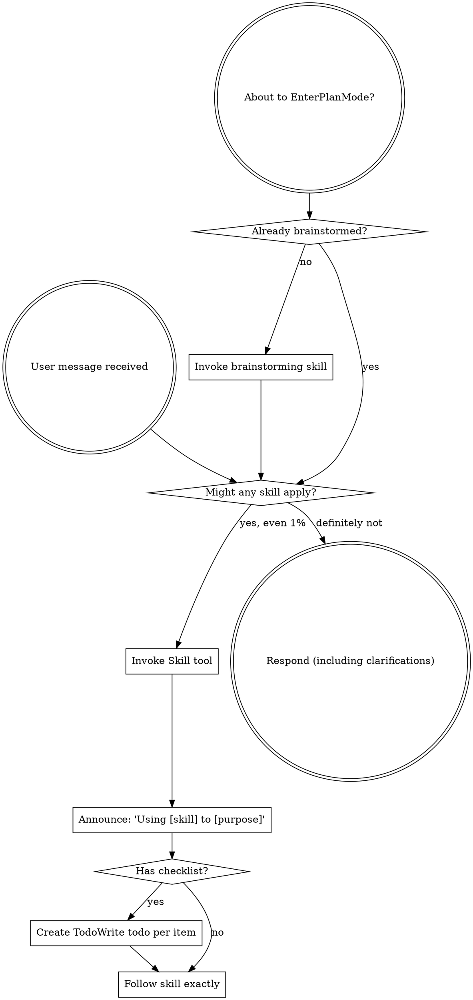

# Review — 2026-05-13-external-reviewer-redesign.md (post-slice, round 2)

- Target: `docs/superstar/plans/2026-05-13-external-reviewer-redesign.md`
- Request: `docs/reviewer/external-reviewer-redesign-S2-post-slice/r2-2026-05-14T0228-request.md`
- Reviewer command: `reviewer-agent`
- Status: `ok`

---

1. Findings

F1 — Important: the S2 resolution artifact does not follow the required parseable contract. The spec requires one `## F<n>` section plus a `Status: fixed | waived | deferred` line per finding, with optional `Evidence:` blocks ([design.md](/home/simon/Dev/sigreer/skills/superstar/docs/superstar/specs/2026-05-13-external-reviewer-redesign-design.md:175), [design.md](/home/simon/Dev/sigreer/skills/superstar/docs/superstar/specs/2026-05-13-external-reviewer-redesign-design.md:201)). The handoff also says reviewer-driven fixes must write `r{N}-resolution.md` per contract ([prompt.md](/home/simon/Dev/sigreer/skills/superstar/docs/handoffs/2026-05-13-external-reviewer-redesign-prompt.md:18)). The actual file uses prose-only `**Resolution.**` sections and has no `Status:` lines for F1/F2/F3 ([r1-resolution.md](/home/simon/Dev/sigreer/skills/superstar/docs/reviewer/external-reviewer-redesign-S2-post-slice/r1-resolution.md:17), [r1-resolution.md](/home/simon/Dev/sigreer/skills/superstar/docs/reviewer/external-reviewer-redesign-S2-post-slice/r1-resolution.md:88), [r1-resolution.md](/home/simon/Dev/sigreer/skills/superstar/docs/reviewer/external-reviewer-redesign-S2-post-slice/r1-resolution.md:105)). This weakens the durability claim and will become a concrete compatibility problem once Slice 3’s resolution parser/gate lands.

F2 — Minor: the Slice 2 closeout note omits some actual closeout artifacts from its commit evidence. It lists the three implementation commits and two post-review fix commits ([plan.md](/home/simon/Dev/sigreer/skills/superstar/docs/superstar/plans/2026-05-13-external-reviewer-redesign.md:3017), [plan.md](/home/simon/Dev/sigreer/skills/superstar/docs/superstar/plans/2026-05-13-external-reviewer-redesign.md:3022)), but the repo also contains `3aa3790` for ticking Slice 2 / adding the closeout note and `1df15e3` for the S2 resolution doc. The resolution document itself records those commits ([r1-resolution.md](/home/simon/Dev/sigreer/skills/superstar/docs/reviewer/external-reviewer-redesign-S2-post-slice/r1-resolution.md:113)), so the plan should match it.

2. Open questions / assumptions

I treated the untracked `docs/reviewer/external-reviewer-redesign-S2-post-slice/r2-2026-05-14T0228-request.md` as the active review request artifact for this round, not as a stale artifact. That matches the plan’s note that in-flight request files can appear untracked until the reviewer response is written ([plan.md](/home/simon/Dev/sigreer/skills/superstar/docs/superstar/plans/2026-05-13-external-reviewer-redesign.md:3011)).

3. Suggested document edits

Update `docs/reviewer/external-reviewer-redesign-S2-post-slice/r1-resolution.md` so each finding section includes a parseable `Status: fixed` line and an `Evidence:` block. Keep the existing prose as `Notes:`.

Update the Slice 2 closeout note to include `3aa3790` and `1df15e3`, or explicitly label them as closeout/documentation commits outside the implementation commit set.

4. Verification gaps / commands

I ran:

```bash
python3 -m pytest skills/external-review/tests/
# 36 passed, 1 warning
```

Also checked `git status --short`; only the known unrelated dirty files plus the current untracked r2 request are present.

5. Overall verdict: revise

---

## Reviewer stderr

```text
Reading additional input from stdin...
OpenAI Codex v0.130.0
--------
workdir: /home/simon/Dev/sigreer/skills/superstar
model: gpt-5.5
provider: openai
approval: never
sandbox: danger-full-access
reasoning effort: none
reasoning summaries: none
session id: 019e2419-6c92-7953-832f-6b48324dfdaa
--------
user
You are acting as an independent senior engineering reviewer.

Review stance:
- Lead with findings, ordered by severity.
- Focus on correctness, consistency, implementation risk, missing acceptance
  gates, vague handoffs, ungrounded assumptions, unverified claims, and drift
  from the codebase.
- Give exact file/line references when possible.
- If the document is sound, say that clearly and list residual risks.
- Keep the review actionable. Avoid broad rewrites unless the current structure
  creates concrete risk.

Repository root:
/home/simon/Dev/sigreer/skills/superstar

Target kind:
post-slice

Review mode:
Post-slice review. Treat this as a completion gate for one
slice of work. Compare the completed changes and stated evidence against the
slice acceptance criteria. Prioritize: incomplete tasks, uncommitted or
untracked artifacts, missing tests, failing or skipped verification, broken
cross-site behavior, and claims not supported by the repo state.

Target document:
docs/superstar/plans/2026-05-13-external-reviewer-redesign.md

Additional context files:
- docs/superstar/specs/2026-05-13-external-reviewer-redesign-design.md
- docs/handoffs/2026-05-13-external-reviewer-redesign-prompt.md
- docs/reviewer/external-reviewer-redesign-S2-post-slice/r1-resolution.md

Review output contract:
1. Findings
2. Open questions / assumptions
3. Suggested document edits
4. Verification gaps / commands that should be run, if any
5. Overall verdict: one of "ready", "ready with small edits", or "revise"

Read the files from disk. Do not rely only on the snippets in this prompt.


## Target Preview

### docs/superstar/plans/2026-05-13-external-reviewer-redesign.md

    1	# External-Reviewer Redesign Implementation Plan
    2	
    3	> **For agentic workers:** REQUIRED SUB-SKILL: Use superstar:subagent-driven-development (recommended) or superstar:executing-plans to implement this plan task-by-task. Steps use checkbox (`- [ ]`) syntax for tracking.
    4	
    5	**Goal:** Rebuild `skills/external-review/scripts/external-reviewer.py` so review chains are incremental, durable, machine-readable, and support optional independent sweep reviewers — per `docs/superstar/specs/2026-05-13-external-reviewer-redesign-design.md`.
    6	
    7	**Architecture:** A persistent `chain.json` manifest per review chain becomes the source of truth for round metadata. The script gains verdict parsing, work-ID-keyed chain folders, a resolution-artifact contract and gate, incremental round prompts with embedded diffs, optional session-resume placeholders, and Pass-3 independent sweep reviewers. Skill documentation is updated to match.
    8	
    9	**Tech Stack:** Python 3.9+ standard library only (no external deps), `pytest` for tests, `git` CLI for diff and SHA capture.
   10	
   11	---
   12	
   13	## Pre-flight
   14	
   15	- [ ] **Step 1: Verify working directory and branch**
   16	
   17	Run:
   18	
   19	```bash
   20	cd /home/simon/Dev/sigreer/skills/superstar
   21	git status --short
   22	git rev-parse --abbrev-ref HEAD
   23	```
   24	
   25	Expected: clean tree, branch is a feature branch (not `main`). If on `main`, stop and create a branch via `superstar:using-git-worktrees`.
   26	
   27	- [ ] **Step 2: Confirm test runner**
   28	
   29	Run:
   30	
   31	```bash
   32	python3 -c "import pytest; print(pytest.__version__)"
   33	```
   34	
   35	Expected: prints a version string. If `ModuleNotFoundError`, install pytest:
   36	
   37	```bash
   38	python3 -m pip install --user pytest
   39	```
   40	
   41	- [ ] **Step 3: Set up the test directory**
   42	
   43	Create the directory tests will live in:
   44	
   45	```bash
   46	mkdir -p skills/external-review/tests
   47	touch skills/external-review/tests/__init__.py
   48	```
   49	
   50	Commit:
   51	
   52	```bash
   53	git add skills/external-review/tests/__init__.py
   54	git commit -m "scaffold: tests dir for external-reviewer redesign"
   55	```
   56	
   57	---
   58	
   59	## Slice 1: Chain manifest & verdict parsing
   60	
   61	**Goal:** Introduce `chain.json` as the round-metadata source of truth, parse verdicts and finding counts from response text, and emit them in the JSON output. Backwards-compatible: legacy chains synthesize a manifest on first touch.
   62	
   63	### Task 1.1: Manifest read/write helpers
   64	
   65	**Files:**
   66	- Create: `skills/external-review/tests/test_manifest.py`
   67	- Modify: `skills/external-review/scripts/external-reviewer.py`
   68	
   69	- [x] **Step 1: Write the failing tests**
   70	
   71	`skills/external-review/tests/test_manifest.py`:
   72	
   73	```python
   74	import json
   75	from pathlib import Path
   76	
   77	import pytest
   78	
   79	import sys
   80	SCRIPTS = Path(__file__).resolve().parents[1] / "scripts"
   81	sys.path.insert(0, str(SCRIPTS))
   82	
   83	import importlib.util
   84	spec = importlib.util.spec_from_file_location("external_reviewer", SCRIPTS / "external-reviewer.py")
   85	external_reviewer = importlib.util.module_from_spec(spec)
   86	spec.loader.exec_module(external_reviewer)
   87	
   88	
   89	def test_read_manifest_returns_none_for_missing(tmp_path):
   90	    assert external_reviewer.read_manifest(tmp_path / "missing.json") is None
   91	
   92	
   93	def test_write_then_read_manifest_roundtrips(tmp_path):
   94	    path = tmp_path / "chain.json"
   95	    data = {
   96	        "schema_version": 1,
   97	        "chain": "demo-post-slice",
   98	        "kind": "post-slice",
   99	        "target": "docs/plans/demo.md",
  100	        "work_id": "P1.S1",
  101	        "legacy_migrated": False,
  102	        "rounds": [],
  103	        "sweep_checkpoints": {"first-round": "pending", "final-ready": "pending"},
  104	    }
  105	    external_reviewer.write_manifest(path, data)
  106	    loaded = external_reviewer.read_manifest(path)
  107	    assert loaded == data
  108	
  109	
  110	def test_read_manifest_rejects_newer_schema(tmp_path):
  111	    path = tmp_path / "chain.json"
  112	    path.write_text(json.dumps({"schema_version": 99}))
  113	    with pytest.raises(external_reviewer.ManifestSchemaTooNew):
  114	        external_reviewer.read_manifest(path)
  115	```
  116	
  117	- [x] **Step 2: Run the tests; confirm they fail**
  118	
  119	```bash
  120	python3 -m pytest skills/external-review/tests/test_manifest.py -v
  121	```
  122	
  123	Expected: 3 failures (`read_manifest`, `write_manifest`, `ManifestSchemaTooNew` all undefined).
  124	
  125	- [x] **Step 3: Add manifest helpers to the script**
  126	
  127	Append to `skills/external-review/scripts/external-reviewer.py` (after the existing module-level constants, before `repo_root()`):
  128	
  129	```python
  130	SUPPORTED_SCHEMA_VERSION = 1
  131	
  132	
  133	class ManifestSchemaTooNew(Exception):
  134	    """Raised when chain.json declares a schema_version newer than this script supports."""
  135	
  136	
  137	def read_manifest(path: Path) -> dict | None:
  138	    if not path.exists():
  139	        return None
  140	    data = json.loads(path.read_text(encoding="utf-8"))
  141	    version = data.get("schema_version")
  142	    if isinstance(version, int) and version > SUPPORTED_SCHEMA_VERSION:
  143	        raise ManifestSchemaTooNew(
  144	            f"chain.json schema_version {version} is newer than this script supports "
  145	            f"(max {SUPPORTED_SCHEMA_VERSION}). Upgrade external-reviewer.py."
  146	        )
  147	    return data
  148	
  149	
  150	def write_manifest(path: Path, data: dict) -> None:
  151	    path.parent.mkdir(parents=True, exist_ok=True)
  152	    path.write_text(json.dumps(data, indent=2) + "\n", encoding="utf-8")
  153	```
  154	
  155	- [x] **Step 4: Run the tests; confirm they pass**
  156	
  157	```bash
  158	python3 -m pytest skills/external-review/tests/test_manifest.py -v
  159	```
  160	
  161	Expected: 3 passed.
  162	
  163	- [x] **Step 5: Commit**
  164	
  165	```bash
  166	git add skills/external-review/scripts/external-reviewer.py skills/external-review/tests/test_manifest.py
  167	git commit -m "feat(external-reviewer): chain.json read/write helpers with schema versioning"
  168	```
  169	
  170	### Task 1.2: Verdict parsing
  171	
  172	**Files:**
  173	- Create: `skills/external-review/tests/test_verdict.py`
  174	- Modify: `skills/external-review/scripts/external-reviewer.py`
  175	
  176	- [x] **Step 1: Write the failing tests**
  177	
  178	`skills/external-review/tests/test_verdict.py`:
  179	
  180	```python
  181	from pathlib import Path
  182	import sys, importlib.util
  183	
  184	SCRIPTS = Path(__file__).resolve().parents[1] / "scripts"
  185	sys.path.insert(0, str(SCRIPTS))
  186	spec = importlib.util.spec_from_file_location("external_reviewer", SCRIPTS / "external-reviewer.py")
  187	er = importlib.util.module_from_spec(spec); spec.loader.exec_module(er)
  188	
  189	
  190	def test_verdict_ready():
  191	    v, valid = er.parse_verdict("Findings: ok\n\nOverall verdict: ready\n")
  192	    assert v == "ready"
  193	    assert valid is True
  194	
  195	
  196	def test_verdict_ready_with_small_edits_markdown():
  197	    body = "**Overall verdict:** `ready with small edits`."
  198	    v, valid = er.parse_verdict(body)
  199	    assert v == "ready with small edits"
  200	    assert valid is True
  201	
  202	
  203	def test_verdict_revise_case_insensitive():
  204	    v, valid = er.parse_verdict("OVERALL VERDICT: Revise")
  205	    assert v == "revise"
  206	    assert valid is True
  207	
  208	
  209	def test_verdict_takes_last_match():
  210	    body = "Overall verdict: ready\n\n...later...\n\nOverall verdict: revise"
  211	    v, valid = er.parse_verdict(body)
  212	    assert v == "revise"
  213	
  214	
  215	def test_verdict_unknown_returns_invalid():
  216	    v, valid = er.parse_verdict("Overall verdict: looks fine to me")
  217	    assert v is None
  218	    assert valid is False
  219	
  220	
  221	def test_verdict_missing_returns_invalid():
  222	    v, valid = er.parse_verdict("Some review prose with no verdict line.")
  223	    assert v is None
  224	    assert valid is False
  225	```
  226	
  227	- [x] **Step 2: Run the tests; confirm they fail**
  228	
  229	```bash
  230	python3 -m pytest skills/external-review/tests/test_verdict.py -v
  231	```
  232	
  233	Expected: 6 failures (`parse_verdict` undefined).
  234	
  235	- [x] **Step 3: Add the verdict parser**
  236	
  237	Append to `skills/external-review/scripts/external-reviewer.py`:
  238	
  239	```python
  240	VERDICT_VALUES = ("ready with small edits", "ready", "revise")
  241	VERDICT_LINE_RE = re.compile(
  242	    r"overall\s+verdict\s*[:\-]\s*[`*_\"']*\s*(ready with small edits|ready|revise)\s*[`*_\"'.]*",
  243	    re.IGNORECASE,
  244	)
  245	
  246	
  247	def parse_verdict(text: str) -> tuple[str | None, bool]:
  248	    matches = list(VERDICT_LINE_RE.finditer(text))
  249	    if not matches:
  250	        return None, False
  251	    raw = matches[-1].group(1).strip().lower()
  252	    if raw not in VERDICT_VALUES:
  253	        return None, False
  254	    return raw, True
  255	```
  256	
  257	Note: regex prefers `ready with small edits` over `ready` because of ordering in the alternation.
  258	
  259	- [x] **Step 4: Run the tests; confirm they pass**
  260	
  261	```bash
  262	python3 -m pytest skills/external-review/tests/test_verdict.py -v
  263	```
  264	
  265	Expected: 6 passed.
  266	
  267	- [x] **Step 5: Commit**
  268	
  269	```bash
  270	git add skills/external-review/scripts/external-reviewer.py skills/external-review/tests/test_verdict.py
  271	git commit -m "feat(external-reviewer): parse_verdict with markdown/case tolerance"
  272	```
  273	
  274	### Task 1.3: Finding-count parsing
  275	
  276	**Files:**
  277	- Create: `skills/external-review/tests/test_findings.py`
  278	- Modify: `skills/external-review/scripts/external-reviewer.py`
  279	
  280	- [x] **Step 1: Write the failing tests**
  281	
  282	`skills/external-review/tests/test_findings.py`:
  283	
  284	```python
  285	from pathlib import Path
  286	import sys, importlib.util
  287	SCRIPTS = Path(__file__).resolve().parents[1] / "scripts"
  288	sys.path.insert(0, str(SCRIPTS))
  289	spec = importlib.util.spec_from_file_location("external_reviewer", SCRIPTS / "external-reviewer.py")
  290	er = importlib.util.module_from_spec(spec); spec.loader.exec_module(er)
  291	
  292	
  293	def test_heading_findings_counted():
  294	    body = "## F1\nSeverity: blocking\n\n## F2\nSeverity: minor\n\n## F3\nSeverity: blocking"
  295	    n, blocking = er.parse_findings(body)
  296	    assert n == 3
  297	    assert blocking == 2
  298	
  299	
  300	def test_bullet_findings_counted():
  301	    body = "- F1: something blocking (blocking)\n- F2 minor thing"
  302	    n, blocking = er.parse_findings(body)
  303	    assert n == 2
  304	    assert blocking == 1
  305	
  306	
  307	def test_no_findings_returns_zero():
  308	    body = "Overall verdict: ready\n\nNo findings."
  309	    n, blocking = er.parse_findings(body)
  310	    assert n == 0
  311	    assert blocking == 0
  312	
  313	
  314	def test_unparseable_returns_none():
  315	    body = "Reviewer crashed: connection reset"
  316	    n, blocking = er.parse_findings(body)
  317	    assert n is None
  318	    assert blocking is None
  319	```
  320	
  321	- [x] **Step 2: Run the tests; confirm they fail**
  322	
  323	```bash
  324	python3 -m pytest skills/external-review/tests/test_findings.py -v
  325	```
  326	
  327	Expected: 4 failures.
  328	
  329	- [x] **Step 3: Add the parser**
  330	
  331	Append to `skills/external-review/scripts/external-reviewer.py`:
  332	
  333	```python
  334	HEADING_FINDING_RE = re.compile(r"^##\s+F\d+\b", re.MULTILINE)
  335	BULLET_FINDING_RE = re.compile(r"^\s*[-*]?\s*\**F\d+\**[:\s\-]", re.MULTILINE)
  336	BLOCKING_MARKER_RE = re.compile(r"(?:^|\s)\(blocking\)|^severity\s*:\s*blocking", re.IGNORECASE | re.MULTILINE)
  337	
  338	
  339	def parse_findings(text: str) -> tuple[int | None, int | None]:
  340	    if not text or text.strip() == "" or "reviewer crashed" in text.lower():
  341	        return None, None
  342	    heading_count = len(HEADING_FINDING_RE.findall(text))
  343	    if heading_count > 0:
  344	        n = heading_count
  345	    else:
  346	        n = len(BULLET_FINDING_RE.findall(text))
  347	    blocking = len(BLOCKING_MARKER_RE.findall(text))
  348	    return n, blocking
  349	```
  350	
  351	- [x] **Step 4: Run the tests; confirm they pass**
  352	
  353	```bash
  354	python3 -m pytest skills/external-review/tests/test_findings.py -v
  355	```
  356	
  357	Expected: 4 passed.
  358	
  359	- [x] **Step 5: Commit**
  360	
  361	```bash
  362	git add skills/external-review/scripts/external-reviewer.py skills/external-review/tests/test_findings.py
  363	git commit -m "feat(external-reviewer): parse_findings (heading + bullet, blocking count)"
  364	```
  365	
  366	### Task 1.4: Round-number derivation reads manifest first
  367	
  368	**Files:**
  369	- Create: `skills/external-review/tests/test_round_number.py`
  370	- Modify: `skills/external-review/scripts/external-reviewer.py` (`next_round_number`)
  371	
  372	- [x] **Step 1: Write the failing tests**
  373	
  374	`skills/external-review/tests/test_round_number.py`:
  375	
  376	```python
  377	from pathlib import Path
  378	import json, sys, importlib.util
  379	SCRIPTS = Path(__file__).resolve().parents[1] / "scripts"
  380	sys.path.insert(0, str(SCRIPTS))
  381	spec = importlib.util.spec_from_file_location("external_reviewer", SCRIPTS / "external-reviewer.py")
  382	er = importlib.util.module_from_spec(spec); spec.loader.exec_module(er)
  383	
  384	
  385	def test_no_chain_dir_round_is_one(tmp_path):
  386	    assert er.next_round_number(tmp_path / "absent") == 1
  387	
  388	
  389	def test_manifest_present_takes_precedence(tmp_path):
  390	    d = tmp_path / "chain"; d.mkdir()
  391	    er.write_manifest(d / "chain.json", {
  392	        "schema_version": 1, "rounds": [{"round": 1}, {"round": 2}]
  393	    })
  394	    assert er.next_round_number(d) == 3
  395	
  396	
  397	def test_legacy_dir_no_manifest_falls_back_to_filename_scan(tmp_path):
  398	    d = tmp_path / "chain"; d.mkdir()
  399	    (d / "r1-2026-05-01T0900-request.md").write_text("")
  400	    (d / "r2-2026-05-02T0900-request.md").write_text("")
  401	    assert er.next_round_number(d) == 3
  402	```
  403	
  404	- [x] **Step 2: Run the tests; confirm they fail**
  405	
  406	```bash
  407	python3 -m pytest skills/external-review/tests/test_round_number.py -v
  408	```
  409	
  410	Expected: test 2 fails (no manifest awareness), tests 1 and 3 may pass if current behavior already handles them.
  411	
  412	- [x] **Step 3: Update `next_round_number`**
  413	
  414	Replace the existing function:
  415	
  416	```python
  417	def next_round_number(chain_dir: Path) -> int:
  418	    if not chain_dir.exists():
  419	        return 1
  420	    manifest = read_manifest(chain_dir / "chain.json")
  421	    if manifest and isinstance(manifest.get("rounds"), list):
  422	        return len(manifest["rounds"]) + 1
  423	    return len(list(chain_dir.glob("r*-*-request.md"))) + 1
  424	```
  425	
  426	- [x] **Step 4: Run the tests**
  427	
  428	```bash
  429	python3 -m pytest skills/external-review/tests/test_round_number.py -v
  430	```
  431	
  432	Expected: 3 passed.
  433	
  434	- [x] **Step 5: Commit**
  435	
  436	```bash
  437	git add skills/external-review/scripts/external-reviewer.py skills/external-review/tests/test_round_number.py
  438	git commit -m "feat(external-reviewer): next_round_number consults chain.json"
  439	```
  440	
  441	### Task 1.5: Legacy manifest synthesis
  442	
  443	**Files:**
  444	- Create: `skills/external-review/tests/test_legacy_migration.py`
  445	- Modify: `skills/external-review/scripts/external-reviewer.py`
  446	
  447	- [x] **Step 1: Write the failing tests**
  448	
  449	`skills/external-review/tests/test_legacy_migration.py`:
  450	
  451	```python
  452	from pathlib import Path
  453	import sys, importlib.util
  454	SCRIPTS = Path(__file__).resolve().parents[1] / "scripts"
  455	sys.path.insert(0, str(SCRIPTS))
  456	spec = importlib.util.spec_from_file_location("external_reviewer", SCRIPTS / "external-reviewer.py")
  457	er = importlib.util.module_from_spec(spec); spec.loader.exec_module(er)
  458	
  459	
  460	def test_synthesize_manifest_from_legacy_files(tmp_path):
  461	    d = tmp_path / "old-chain"; d.mkdir()
  462	    (d / "r1-2026-04-01T0900-request.md").write_text("prompt body")
  463	    (d / "r1-2026-04-01T0905-response.md").write_text(
  464	        "## F1\nSeverity: blocking\n\nOverall verdict: revise\n"
  465	    )
  466	    (d / "r2-2026-04-02T1200-request.md").write_text("prompt body 2")
  467	
  468	    manifest = er.synthesize_legacy_manifest(
  469	        chain_dir=d, chain="old-chain", kind="post-slice",
  470	        target="docs/plans/old.md", work_id="P1.S1",
  471	    )
  472	
  473	    assert manifest["legacy_migrated"] is True
  474	    assert manifest["work_id"] == "P1.S1"
  475	    assert len(manifest["rounds"]) == 2
  476	    r1, r2 = manifest["rounds"]
  477	    assert r1["legacy"] is True
  478	    assert r1["verdict"] == "revise"
  479	    assert r1["verdict_valid"] is True
  480	    assert r1["findings_count"] == 1
  481	    assert r1["blocking_findings_count"] == 1
  482	    assert r1["head_sha_after_round"] is None
  483	    assert r2["response"] is None  # only request file existed
  484	```
  485	
  486	- [x] **Step 2: Run the tests; confirm they fail**
  487	
  488	```bash
  489	python3 -m pytest skills/external-review/tests/test_legacy_migration.py -v
  490	```
  491	
  492	Expected: 1 failure.
  493	
  494	- [x] **Step 3: Add the synthesizer**
  495	
  496	Append to `skills/external-review/scripts/external-reviewer.py`:
  497	
  498	```python
  499	LEGACY_ROUND_FILE_RE = re.compile(r"^r(\d+)-([0-9T\-]+)-(request|response)\.md$")
  500	
  501	
  502	def synthesize_legacy_manifest(
  503	    *, chain_dir: Path, chain: str, kind: str, target: str, work_id: str | None
  504	) -> dict:
  505	    rounds_map: dict[int, dict] = {}
  506	    for path in sorted(chain_dir.iterdir()):
  507	        m = LEGACY_ROUND_FILE_RE.match(path.name)
  508	        if not m:
  509	            continue
  510	        round_num = int(m.group(1))
  511	        role = m.group(3)
  512	        entry = rounds_map.setdefault(
  513	            round_num,
  514	            {
  515	                "round": round_num,
  516	                "request": None,
  517	                "response": None,
  518	                "resolution": None,
  519	                "verdict": None,
  520	                "verdict_valid": False,
  521	                "findings_count": None,
  522	                "blocking_findings_count": None,
  523	                "head_sha_at_request": None,
  524	                "head_sha_after_round": None,
  525	                "worktree_dirty_at_request": None,
  526	                "legacy": True,
  527	            },
  528	        )
  529	        entry[role] = path.name
  530	        if role == "response":
  531	            body = path.read_text(encoding="utf-8", errors="replace")
  532	            v, valid = parse_verdict(body)
  533	            entry["verdict"], entry["verdict_valid"] = v, valid
  534	            n, blocking = parse_findings(body)
  535	            entry["findings_count"], entry["blocking_findings_count"] = n, blocking
  536	
  537	    return {
  538	        "schema_version": SUPPORTED_SCHEMA_VERSION,
  539	        "chain": chain,
  540	        "kind": kind,
  541	        "target": target,
  542	        "work_id": work_id,
  543	        "legacy_migrated": True,
  544	        "migrated_at": dt.datetime.utcnow().strftime("%Y-%m-%dT%H:%M:%SZ"),
  545	        "rounds": [rounds_map[k] for k in sorted(rounds_map)],
  546	        "sweep_checkpoints": {"first-round": "pending", "final-ready": "pending"},
  547	    }
  548	```
  549	
  550	- [x] **Step 4: Run the tests; confirm they pass**
  551	
  552	```bash
  553	python3 -m pytest skills/external-review/tests/test_legacy_migration.py -v
  554	```
  555	
  556	Expected: 1 passed.
  557	
  558	- [x] **Step 5: Commit**
  559	
  560	```bash
  561	git add skills/external-review/scripts/external-reviewer.py skills/external-review/tests/test_legacy_migration.py
  562	git commit -m "feat(external-reviewer): synthesize_legacy_manifest from rN-* files"
  563	```
  564	
  565	### Task 1.6: Wire manifest into `main()` for single-reviewer rounds
  566	
  567	**Files:**
  568	- Modify: `skills/external-review/scripts/external-reviewer.py` (`main` function)
  569	- Create: `skills/external-review/tests/test_main_round_writes_manifest.py`
  570	
  571	- [x] **Step 1: Write the failing test**
  572	
  573	`skills/external-review/tests/test_main_round_writes_manifest.py`:
  574	
  575	```python
  576	from pathlib import Path
  577	import subprocess, sys, json, importlib.util, os
  578	
  579	SCRIPTS = Path(__file__).resolve().parents[1] / "scripts"
  580	sys.path.insert(0, str(SCRIPTS))
  581	spec = importlib.util.spec_from_file_location("external_reviewer", SCRIPTS / "external-reviewer.py")
  582	er = importlib.util.module_from_spec(spec); spec.loader.exec_module(er)
  583	
  584	
  585	FAKE_REVIEWER = """#!/usr/bin/env bash
  586	cat <<'EOF'
  587	## F1
  588	Severity: blocking
  589	Stub finding.
  590	
  591	Overall verdict: revise
  592	EOF
  593	"""
  594	
  595	
  596	def test_main_writes_manifest_entry(tmp_path, monkeypatch):
  597	    repo = tmp_path / "repo"; repo.mkdir()
  598	    subprocess.run(["git", "-C", str(repo), "init", "-q"], check=True)
  599	    subprocess.run(["git", "-C", str(repo), "config", "user.email", "t@t"], check=True)
  600	    subprocess.run(["git", "-C", str(repo), "config", "user.name", "T"], check=True)

[truncated: 2432 additional lines]

## Context Previews

### docs/superstar/specs/2026-05-13-external-reviewer-redesign-design.md

    1	# External-Review Script Redesign — Design
    2	
    3	**Date:** 2026-05-13
    4	**Target:** `skills/external-review/scripts/external-reviewer.py` and `skills/external-review/SKILL.md`
    5	**Motivation:** A self-review of the external-reviewer flow surfaced five concrete failure modes that cause review loops to balloon to 7–10 rounds and lose continuity between rounds. This spec redesigns the script and skill to make rounds incremental, durable, and machine-readable.
    6	
    7	---
    8	
    9	## Goals
   10	
   11	1. **Round N+1 is incremental, not a re-review.** The reviewer is given prior findings, the fixer's resolution report, and a focused diff — and is instructed to verify resolution rather than reopen broad review.
   12	2. **Verdict is machine-readable.** JSON output exposes a parsed `verdict`, `verdict_valid`, and finding counts, so coordinators don't have to parse prose.
   13	3. **Post-slice / post-phase chains are uniquely keyed.** `--work-id` is required for both so that multi-slice plans don't collapse into one chain.
   14	4. **Resolution artifacts are durable and structured-enough-to-parse.** Required headers, free-form bodies, stable finding IDs across rounds.
   15	5. **Optional session resume.** Provider-specific wrappers can plug into placeholders if the underlying reviewer CLI supports session IDs.
   16	6. **Legacy chains keep working.** Soft-migrate on first new round; preserve existing folder names and audit history.
   17	7. **Review depth is explicit.** The default chain uses one primary incremental reviewer, but callers can request bounded independent sweep reviewers at high-risk checkpoints to preserve fresh-eye coverage without unbounded serial churn.
   18	
   19	## Non-goals
   20	
   21	- Replacing the chain-folder layout for new chains. The folder-naming scheme gains a `--work-id` segment for post-slice/post-phase, but the round-file scheme is unchanged.
   22	- Making the script aware of any specific reviewer CLI. The script remains provider-neutral via `AGENT_REVIEWER_CMD`.
   23	- Auto-dispatching the fixer subagent. The script enforces the resolution gate but does not invoke fixers; that stays in the coordinator's loop, governed by `subagent-driven-development`.
   24	
   25	## Invariants
   26	
   27	- **A review chain is single-writer.** Running two rounds concurrently against the same chain is unsupported and may corrupt `chain.json`. The script does not lock; callers are expected to serialise.
   28	- **Existing rounds are immutable.** Once written, `rN-*-request.md`, `rN-*-response.md`, and `rN-resolution.md` are never overwritten. Manifest entries for past rounds are append-only.
   29	
   30	## Architecture
   31	
   32	Three implementation passes, all designed in this spec:
   33	
   34	- **Pass 1 — Core.** Chain manifest, verdict parsing, `--work-id`, prior-round context injection, incremental round prompts, resolution-artifact contract and gate, automatic diff embedding, JSON output enrichment, legacy migration.
   35	- **Pass 2 — Session resume.** Optional placeholders (`{chain_dir}`, `{round}`, `{previous_response}`, `{resolution_file}`, `{session_file}`) exposed via the existing `AGENT_REVIEWER_CMD` template mechanism. A provider-specific wrapper can use `{session_file}` to persist and resume reviewer sessions. The script provides a stable path (`chain_dir/session.state`) and ensures the parent directory exists; wrappers own the file's contents. The script never reads `session.state`.
   36	- **Pass 3 — Review depth / independent sweeps.** Adds `--review-depth`, `--independent-reviewers`, `--sweep-policy` flags. Independent sweep reviewers run without seeing the primary reviewer's findings on their first pass (to avoid anchoring), and their findings are merged into the same resolution checklist afterward. Depends on Pass 1's manifest and verdict parsing; does not depend on Pass 2.
   37	
   38	### Chain manifest
   39	
   40	`docs/reviewer/<chain>/chain.json` is the single source of truth for round metadata. The `rN-*-request.md` / `rN-*-response.md` / `rN-resolution.md` files remain for human readability and git history; the script reads and writes manifest entries when computing round numbers, base refs, and verdicts.
   41	
   42	```json
   43	{
   44	  "schema_version": 1,
   45	  "chain": "feature-plan-P2-S3-post-slice",
   46	  "kind": "post-slice",
   47	  "target": "docs/superstar/plans/feature-plan.md",
   48	  "work_id": "P2.S3",
   49	  "legacy_migrated": false,
   50	  "rounds": [
   51	    {
   52	      "round": 1,
   53	      "request": "r1-2026-05-13T1012-request.md",
   54	      "response": "r1-2026-05-13T1020-response.md",
   55	      "resolution": null,
   56	      "head_sha_at_request": "abc1234",
   57	      "head_sha_after_round": "abc1234",
   58	      "worktree_dirty_at_request": false,
   59	      "verdict": "revise",
   60	      "verdict_valid": true,
   61	      "findings_count": 4,
   62	      "blocking_findings_count": 2
   63	    },
   64	    {
   65	      "round": 2,
   66	      "request": "r2-2026-05-13T1130-request.md",
   67	      "response": null,
   68	      "resolution": "r1-resolution.md",
   69	      "base_ref": "abc1234",
   70	      "base_ref_source": "auto",
   71	      "head_sha_at_request": "def5678",
   72	      "worktree_dirty_at_request": false,
   73	      "diff_included": true,
   74	      "resolution_parse_status": "ok",
   75	      "resolution_waiver": false
   76	    }
   77	  ]
   78	}
   79	```
   80	
   81	#### Manifest versioning
   82	
   83	- `schema_version: 1` is the initial version introduced by this redesign.
   84	- Unknown future `schema_version` values cause the script to error with a clear message: `ERROR: chain.json schema_version <N> is newer than this script supports. Upgrade external-reviewer.py.` This prevents silent corruption.
   85	- Older `schema_version` values (currently none) get best-effort migration on read, recorded as `schema_migrated_from: <prior>` in the manifest.
   86	
   87	### Naming
   88	
   89	- **Chain folder slug:** `<target-stem-no-leading-date>-<work-id-dotless>-<kind>` for post-slice/post-phase; `<target-stem-no-leading-date>-<kind>` otherwise. Dots in work IDs are replaced with dashes in the folder slug only — the manifest preserves the canonical form.
   90	  - Example: `--work-id P2.S3` → folder `feature-plan-P2-S3-post-slice`, manifest `"work_id": "P2.S3"`.
   91	- **Round files:** `r{N}-<YYYY-MM-DDTHHMM>-request.md`, `r{N}-<YYYY-MM-DDTHHMM>-response.md`. Unchanged from current behavior.
   92	- **Resolution files:** `r{N}-resolution.md`, where `N` is the round whose response is being addressed. Round `N+1` consumes `r{N}-resolution.md`. Worked example: after `r1-response.md` returns `revise`, the fixer writes `r1-resolution.md`; round 2 reads `r1-resolution.md` and embeds it in the round-2 prompt.
   93	
   94	## CLI surface (new flags)
   95	
   96	| Flag | Kinds | Purpose |
   97	|---|---|---|
   98	| `--work-id <id>` | required for `post-slice`, `post-phase`; optional otherwise | Stable slice/phase ID (e.g., `P2.S3` for post-slice, `P2` for post-phase). Becomes part of chain folder name (dots → dashes) and is stored verbatim in the manifest. |
   99	| `--base-ref <sha\|ref>` | any | Override auto-computed diff base for this round. |
  100	| `--no-diff` | any | Suppress diff embedding even on round N+1. |
  101	| `--allow-missing-resolution` | post-slice, post-phase | Waive the resolution-required gate. Logged in manifest as `resolution_waiver: true`. |
  102	| `--changed-files <path>...` | any | Override automatic changed-file discovery and limit the embedded diff to the supplied paths. |
  103	| `--mode <auto\|broad\|incremental>` | any | Override the round-1-vs-N prompt mode. Default `auto` (round 1 → broad; round 2+ → incremental). |
  104	| `--max-diff-lines <int>` | any | Cap diff size. Default 2000. Truncation marker is embedded if exceeded. |
  105	| `--review-depth <standard\|thorough\|exhaustive>` | post-slice, post-phase | Controls whether independent sweep reviewers are run in addition to the primary chain reviewer. Default `standard`. |
  106	| `--independent-reviewers <int>` | post-slice, post-phase | Override reviewer count for independent sweeps. Default derived from `--review-depth`. |
  107	| `--sweep-policy <first-round\|final-ready\|both\|never>` | post-slice, post-phase | When to run fresh-context sweep reviews. Default derived from `--review-depth`. |
  108	
  109	### `--work-id` enforcement
  110	
  111	- `post-slice` or `post-phase` invoked without `--work-id` → exit 2 with operational error.
  112	- For `post-phase`, the expected form is the phase ID alone (`P2`), not a slice ID. The script does not enforce a regex; it documents the convention.
  113	- For other kinds, `--work-id` is optional; if provided, it is recorded in the manifest but does not affect the folder slug.
  114	
  115	## Reviewer prompt — round 1 vs round N+
  116	
  117	### Round 1: broad
  118	
  119	The existing broad prompt, with the output contract revised to require **stable finding IDs**:
  120	
  121	```
  122	1. Findings
  123	   - Each finding tagged `F<n>` (e.g., F1, F2, F3). IDs must be stable across rounds.
  124	   - Severity: blocking | important | minor | nit
  125	2. Open questions / assumptions
  126	3. Suggested document edits
  127	4. Verification gaps
  128	5. Overall verdict: ready | ready with small edits | revise
  129	```
  130	
  131	### Round N+: incremental
  132	
  133	Prepended to the existing prompt body:
  134	
  135	```
  136	You are continuing an existing review chain. This is round {N} of {chain_id}.
  137	
  138	In incremental mode:
  139	- Verify whether prior findings are resolved per the resolution report below.
  140	- Reuse the existing finding IDs (F1, F2, …). If a prior finding is resolved,
  141	  mark it RESOLVED in your findings list with its original ID. If still
  142	  unresolved, keep its ID.
  143	- Only introduce new finding IDs for genuine regressions caused by the fix, or
  144	  blocking issues clearly missed in earlier rounds. Do not reopen broad review
  145	  unless prior fixes changed broad architecture.
  146	
  147	Review chain summary:
  148	{per-round table: round, verdict, findings_count, blocking_findings_count}
  149	
  150	Prior-round findings (authoritative):
  151	{if r{N-1}-merged-findings.md exists: its verbatim contents — this replaces
  152	 individual reviewer response files as the prior-finding list of record}
  153	{else: a summary of the prior round's primary response, with finding IDs intact}
  154	
  155	Resolution report for prior round:
  156	{verbatim contents of r{N-1}-resolution.md}
  157	{or "MISSING — explicitly waived by caller via --allow-missing-resolution"}
  158	{or "MISSING — chain migrated from legacy artifacts; please verify whether changes occurred from the diff below"}
  159	
  160	Resolution parse summary (best-effort):
  161	{structured: per-finding-ID → status, or "unparseable"}
  162	
  163	Changes since prior round:
  164	{git diff <base_ref>..HEAD -- <scoped paths>}
  165	{if dirty: appended `git diff HEAD` section, both labeled}
  166	{if no base: "not available for this round (legacy chain / first round / --no-diff)"}
  167	```
  168	
  169	`--mode broad` forces round-1-style on later rounds (rare; for cases where the fix changed architecture). `--mode incremental` on round 1 is rejected with a clear error.
  170	
  171	## Resolution artifact contract
  172	
  173	**Path:** `docs/reviewer/<chain>/r{N}-resolution.md`, where `N` is the round whose response is being addressed. Authored by the fix subagent between round N (response) and round N+1 (resubmit).
  174	
  175	**Required parseable shape:**
  176	
  177	```markdown
  178	# Resolution for r{N}
  179	
  180	## F1
  181	Status: fixed
  182	Evidence:
  183	- Commit: abc1234
  184	- Files: `src/foo.ts:42`, `tests/foo.test.ts:18`
  185	- Verification: `npm test -- foo.test.ts` passed
  186	
  187	Notes:
  188	Changed the validation path to reject empty IDs before persistence.
  189	
  190	## F2
  191	Status: waived
  192	Evidence:
  193	- No code change
  194	- Reason: reviewer assumed X, but the plan explicitly excludes X in
  195	  `docs/superstar/specs/foo-design.md:77`
  196	
  197	Notes:
  198	No implementation change because this would expand slice scope.
  199	```
  200	

[truncated: 292 additional lines]
### docs/handoffs/2026-05-13-external-reviewer-redesign-prompt.md

    1	# Coordinator handoff — External-Reviewer Redesign
    2	
    3	You are the coordinator for implementing the **external-reviewer redesign** in the `superstar` repo at `/home/simon/Dev/sigreer/skills/superstar`.
    4	
    5	Your role is **strictly orchestration**. Use the `superstar:subagent-driven-development` skill with parallel agents where possible.
    6	
    7	## Inputs
    8	
    9	- Spec: [`docs/superstar/specs/2026-05-13-external-reviewer-redesign-design.md`](docs/superstar/specs/2026-05-13-external-reviewer-redesign-design.md)
   10	- Plan: [`docs/superstar/plans/2026-05-13-external-reviewer-redesign.md`](docs/superstar/plans/2026-05-13-external-reviewer-redesign.md)
   11	- Reviewer chain folder (created on first review): `docs/reviewer/external-reviewer-redesign-plan/` (kind `plan`) and per-slice chains like `docs/reviewer/external-reviewer-redesign-S1-post-slice/` (no TASKLIST.md in this repo; treat `S1`…`S8` from the plan as the work-id segments).
   12	
   13	## Coordinator discipline (non-negotiable)
   14	
   15	- **Do not perform any fixes yourself** unless the fix is genuinely cheaper to implement than the process of delegating to a subagent. Tiebreak: delegate.
   16	- **Do not pollute your context.** Delegate investigations, file reads, and edits to subagents. Your context is for orchestration, not implementation detail.
   17	- **At the end of each slice (S1–S8)**, the human partner runs `external-review` manually with `--kind post-slice` and pastes the findings back. Do NOT invoke the external-review skill yourself in this project — the human partner has explicitly chosen to drive it manually to keep the context clean. Wait for the verdict before proceeding to the next slice.
   18	- **Do not perform reviewer-driven fixes yourself.** Pass each reviewer response to a fix subagent that writes `r{N}-resolution.md` per the contract in `[[external-review]]`, then signal the human partner that the resolution is ready and the next round can be submitted.
   19	- **At the end of the phase** (after S8 closes), the human partner runs `--kind post-phase` manually. Same delegation rule.
   20	- **No TASKLIST.md exists** in this repo. Track slice completion in this handoff document or in a TODO list you maintain in-session; do not invent a TASKLIST.md file.
   21	
   22	## First action
   23	
   24	Read this file (the handoff prompt), the spec, and the plan. Then invoke `superstar:subagent-driven-development` and begin Slice 1 (Chain manifest & verdict parsing).
### docs/reviewer/external-reviewer-redesign-S2-post-slice/r1-resolution.md

    1	# Round 1 resolution — Slice 2 post-slice (S2 chain)
    2	
    3	Round 1 of the S2 chain returned `revise` with 3 findings (2 blocking). All
    4	findings — plus a routing defect observed by the coordinator — are addressed
    5	below.
    6	
    7	## Provenance note
    8	
    9	This round was originally misrouted into the Slice-1 chain folder
   10	(`docs/reviewer/external-reviewer-redesign-post-slice/`) as round 5, because
   11	`discover_legacy_chain` matched the bare legacy slug regardless of whether the
   12	candidate folder already contained a `chain.json`. After the routing fix
   13	(`cc07bf5`) the artefacts were relocated to this S2-keyed chain folder
   14	(`8743c63`) and recorded as round 1 here. The Slice-1 chain manifest is
   15	restored to end at round 4.
   16	
   17	## F1 — Blocking — `work_id` not stored in manifest
   18	
   19	**Finding.** `external-reviewer.py` initialised new manifests with
   20	`"work_id": None`, so the JSON output also reported `null` even when
   21	`--work-id S1` was supplied. This violated the spec (design.md lines 89, 98)
   22	which requires `--work-id` to be stored verbatim.
   23	
   24	**Resolution.** In `cc07bf5`:
   25	
   26	- Fresh manifests now set `"work_id": args.work_id` (still `None` for kinds that
   27	  don't require it — `spec`, `plan`, etc., which is fine).
   28	- For an existing manifest whose stored `work_id` differs from the CLI
   29	  `--work-id`, the script now emits a clear stderr error and exits with code 6
   30	  (new). This prevents accidental cross-slice chain reuse via a hand-edited or
   31	  mismatched invocation.
   32	- If a stored `work_id` is `None` (legacy synthesis path or older manifest) and
   33	  the caller supplies a value, the manifest is backfilled.
   34	- The synthesized-legacy path already passed `args.work_id` per the existing
   35	  Task 2.3 implementation; verified unchanged.
   36	
   37	**Tests added** in `skills/external-review/tests/test_work_id_persisted.py`:
   38	
   39	1. `test_work_id_persisted_in_manifest_and_json` — runs the script
   40	   end-to-end via subprocess against a temp repo with `--work-id S1` and
   41	   asserts both the JSON output AND on-disk `chain.json` contain
   42	   `"work_id": "S1"`.
   43	2. `test_work_id_mismatch_refuses_reuse` — asserts a mismatched stored
   44	   `work_id` causes exit code 6 with a "does not match" stderr message.
   45	3. `test_existing_chain_folder_with_chain_json_not_reused_as_legacy` — see
   46	   chain-routing fix below.
   47	
   48	## Chain-routing defect (related to F1; not a numbered finding)
   49	
   50	**Defect.** Reviewer ran for Slice 2 with `--work-id S2`. The expected chain
   51	folder was `external-reviewer-redesign-S2-post-slice/`. The artefacts instead
   52	landed inside the existing Slice-1 chain folder
   53	(`external-reviewer-redesign-post-slice/`, which already had a `chain.json`)
   54	as round 5.
   55	
   56	**Root cause.** In `discover_legacy_chain`, the exact-name legacy branch
   57	(`entry.name == legacy_old_name`) appended the folder to `candidates` without
   58	checking for the presence of `chain.json`. Only the embedded-suffix branch had
   59	that guard. So a new-regime chain whose folder name happened to equal
   60	`<target>-<kind>` was matched as a legacy candidate and reused.
   61	
   62	**Fix (`cc07bf5`).** The exact-name branch now also requires
   63	`not (entry / "chain.json").exists()` before treating the folder as legacy. A
   64	folder with a `chain.json` is a new-regime chain and must never be silently
   65	reused for a different work-id.
   66	
   67	**Migration (`8743c63`).**
   68	- `git mv` of the request file from
   69	  `docs/reviewer/external-reviewer-redesign-post-slice/r5-2026-05-14T0221-request.md`
   70	  to
   71	  `docs/reviewer/external-reviewer-redesign-S2-post-slice/r1-2026-05-14T0221-request.md`.
   72	- Same for the response file (was untracked in the S1 folder; now committed
   73	  under the S2 folder as round 1).
   74	- Fresh `chain.json` written for the S2 chain with the round recorded as round
   75	  1 (verdict `revise`, findings `3`, blocking `2`, head SHA
   76	  `d05056fdde59906ceb557dc15bb627b9afc55130` at request time) and an
   77	  origin-note recording the migration.
   78	- The previously-staged round-5 entry in
   79	  `docs/reviewer/external-reviewer-redesign-post-slice/chain.json` was reverted
   80	  (`git checkout --`) so the Slice-1 chain manifest correctly ends at round 4.
   81	
   82	**Test added** in `test_work_id_persisted.py`:
   83	`test_existing_chain_folder_with_chain_json_not_reused_as_legacy` — creates a
   84	sibling chain folder named exactly `<target>-<kind>` with a `chain.json` for
   85	`work_id=S1`, then runs the script with `--work-id S2` and asserts a fresh
   86	`<target>-S2-<kind>` folder is created and the S1 folder is not touched.
   87	
   88	## F2 — Blocking — Workspace cleanliness
   89	
   90	**Finding.** Five modified tracked files plus the untracked round-5 reviewer
   91	artefact left the worktree in a half-written state.
   92	
   93	**Resolution.**
   94	- The five modified tracked files (`CLAUDE.md`, four `skills/*/SKILL.md` files)
   95	  were authorised by the human partner to remain across Slice 1 and Slice 2
   96	  closeouts; both closeout notes record this. They are not part of Slice 2 and
   97	  are intentionally left untouched.
   98	- The untracked round-5 request/response have been relocated to the correct S2
   99	  chain folder as round 1 (commit `8743c63`) and the chain manifest written.
  100	- The Slice 2 closeout note has been added to the plan
  101	  (`3aa3790`) and records the commit SHAs (`6700937`, `64ecb51`, `d05056f`),
  102	  the chain-routing defect and its fix, and confirmation that the post-slice
  103	  gate landed in the correct S2 chain folder.
  104	
  105	## F3 — Important — Slice 2 checkboxes
  106	
  107	**Finding.** All `- [ ]` checkboxes for Slice 2 tasks (2.1, 2.2, 2.3) remained
  108	unchecked even though the work was implemented and committed.
  109	
  110	**Resolution.** Commit `3aa3790`: all 15 Slice 2 `- [ ]` entries are now
  111	`- [x]`. Slice 3+ checkboxes are unchanged.
  112	
  113	## Commit summary
  114	
  115	| Step | Commit | Description |
  116	|------|--------|-------------|
  117	| Code fix (F1 + routing + tests) | `cc07bf5` | Persist `work_id`; guard legacy match by `chain.json` absence; new exit code 6 for mismatch; 3 new end-to-end tests |
  118	| Chain-folder migration | `8743c63` | Move misrouted r5 artefacts to S2 chain as r1; write fresh `chain.json`; drop round 5 from S1 manifest |
  119	| Plan edits | `3aa3790` | Tick all Slice 2 checkboxes; append Slice 2 closeout note |
  120	| Resolution doc | _this commit_ | This file |
  121	
  122	## Verification
  123	
  124	```bash
  125	python3 -m pytest skills/external-review/tests/
  126	# 36 passed
  127	```
  128	
  129	S2 chain folder exists and is well-formed:
  130	
  131	```
  132	docs/reviewer/external-reviewer-redesign-S2-post-slice/
  133	├── chain.json                        # work_id="S2", rounds[0] = round 1
  134	├── r1-2026-05-14T0221-request.md     # moved from S1 chain r5
  135	├── r1-2026-05-14T0221-response.md    # moved from S1 chain r5
  136	└── r1-resolution.md                  # this file
  137	```
  138	
  139	S1 chain manifest ends at round 4 (round-5 entry removed).

codex
I’ll read the review workflow skill first, then inspect the plan, resolution note, repo status, and relevant implementation/tests from disk before issuing the gate verdict.
exec
/usr/bin/zsh -lc "sed -n '1,220p' /home/simon/.codex/plugins/cache/openai-curated/superpowers/1b89ff49/skills/using-superpowers/SKILL.md && sed -n '1,220p' /home/simon/.codex/plugins/cache/openai-curated/superpowers/1b89ff49/skills/requesting-code-review/SKILL.md" in /home/simon/Dev/sigreer/skills/superstar
 exited 2 in 0ms:
sed: can't read /home/simon/.codex/plugins/cache/openai-curated/superpowers/1b89ff49/skills/using-superpowers/SKILL.md: No such file or directory

codex
The listed skill path is stale in this checkout, so I’m locating the installed skill files directly and then I’ll continue with the repository inspection.
exec
/usr/bin/zsh -lc "rg --files /home/simon/.codex | rg 'using-superpowers|requesting-code-review|verification-before-completion|systematic-debugging'" in /home/simon/Dev/sigreer/skills/superstar
 succeeded in 0ms:
/home/simon/.codex/plugins/cache/openai-curated/superpowers/08373044/skills/systematic-debugging/condition-based-waiting-example.ts
/home/simon/.codex/plugins/cache/openai-curated/superpowers/08373044/skills/systematic-debugging/test-pressure-1.md
/home/simon/.codex/plugins/cache/openai-curated/superpowers/08373044/skills/systematic-debugging/test-academic.md
/home/simon/.codex/plugins/cache/openai-curated/superpowers/08373044/skills/systematic-debugging/CREATION-LOG.md
/home/simon/.codex/plugins/cache/openai-curated/superpowers/08373044/skills/systematic-debugging/condition-based-waiting.md
/home/simon/.codex/plugins/cache/openai-curated/superpowers/08373044/skills/systematic-debugging/defense-in-depth.md
/home/simon/.codex/plugins/cache/openai-curated/superpowers/08373044/skills/systematic-debugging/test-pressure-3.md
/home/simon/.codex/plugins/cache/openai-curated/superpowers/08373044/skills/systematic-debugging/SKILL.md
/home/simon/.codex/plugins/cache/openai-curated/superpowers/08373044/skills/systematic-debugging/root-cause-tracing.md
/home/simon/.codex/plugins/cache/openai-curated/superpowers/08373044/skills/systematic-debugging/find-polluter.sh
/home/simon/.codex/plugins/cache/openai-curated/superpowers/08373044/skills/systematic-debugging/test-pressure-2.md
/home/simon/.codex/plugins/cache/openai-curated/superpowers/08373044/skills/systematic-debugging/agents/openai.yaml
/home/simon/.codex/plugins/cache/openai-curated/superpowers/08373044/skills/verification-before-completion/agents/openai.yaml
/home/simon/.codex/plugins/cache/openai-curated/superpowers/08373044/skills/verification-before-completion/SKILL.md
/home/simon/.codex/plugins/cache/openai-curated/superpowers/08373044/skills/requesting-code-review/code-reviewer.md
/home/simon/.codex/plugins/cache/openai-curated/superpowers/08373044/skills/requesting-code-review/SKILL.md
/home/simon/.codex/plugins/cache/openai-curated/superpowers/08373044/skills/using-superpowers/SKILL.md
/home/simon/.codex/plugins/cache/openai-curated/superpowers/08373044/skills/requesting-code-review/agents/openai.yaml
/home/simon/.codex/plugins/cache/openai-curated/superpowers/08373044/skills/using-superpowers/agents/openai.yaml
/home/simon/.codex/plugins/cache/openai-curated/superpowers/08373044/skills/using-superpowers/references/codex-tools.md
/home/simon/.codex/plugins/cache/openai-curated/superpowers/08373044/skills/using-superpowers/references/gemini-tools.md
/home/simon/.codex/plugins/cache/openai-curated/superpowers/08373044/skills/using-superpowers/references/copilot-tools.md

exec
/usr/bin/zsh -lc "sed -n '1,180p' /home/simon/.codex/plugins/cache/openai-curated/superpowers/08373044/skills/using-superpowers/SKILL.md" in /home/simon/Dev/sigreer/skills/superstar
 succeeded in 0ms:
---
name: using-superpowers
description: Use when starting any conversation - establishes how to find and use skills, requiring Skill tool invocation before ANY response including clarifying questions
---

<SUBAGENT-STOP>
If you were dispatched as a subagent to execute a specific task, skip this skill.
</SUBAGENT-STOP>

<EXTREMELY-IMPORTANT>
If you think there is even a 1% chance a skill might apply to what you are doing, you ABSOLUTELY MUST invoke the skill.

IF A SKILL APPLIES TO YOUR TASK, YOU DO NOT HAVE A CHOICE. YOU MUST USE IT.

This is not negotiable. This is not optional. You cannot rationalize your way out of this.
</EXTREMELY-IMPORTANT>

## Instruction Priority

Superpowers skills override default system prompt behavior, but **user instructions always take precedence**:

1. **User's explicit instructions** (CLAUDE.md, GEMINI.md, AGENTS.md, direct requests) — highest priority
2. **Superpowers skills** — override default system behavior where they conflict
3. **Default system prompt** — lowest priority

If CLAUDE.md, GEMINI.md, or AGENTS.md says "don't use TDD" and a skill says "always use TDD," follow the user's instructions. The user is in control.

## How to Access Skills

**In Claude Code:** Use the `Skill` tool. When you invoke a skill, its content is loaded and presented to you—follow it directly. Never use the Read tool on skill files.

**In Copilot CLI:** Use the `skill` tool. Skills are auto-discovered from installed plugins. The `skill` tool works the same as Claude Code's `Skill` tool.

**In Gemini CLI:** Skills activate via the `activate_skill` tool. Gemini loads skill metadata at session start and activates the full content on demand.

**In other environments:** Check your platform's documentation for how skills are loaded.

## Platform Adaptation

Skills use Claude Code tool names. Non-CC platforms: see `references/copilot-tools.md` (Copilot CLI), `references/codex-tools.md` (Codex) for tool equivalents. Gemini CLI users get the tool mapping loaded automatically via GEMINI.md.

# Using Skills

## The Rule

**Invoke relevant or requested skills BEFORE any response or action.** Even a 1% chance a skill might apply means that you should invoke the skill to check. If an invoked skill turns out to be wrong for the situation, you don't need to use it.



## Red Flags

These thoughts mean STOP—you're rationalizing:

| Thought | Reality |
|---------|---------|
| "This is just a simple question" | Questions are tasks. Check for skills. |
| "I need more context first" | Skill check comes BEFORE clarifying questions. |
| "Let me explore the codebase first" | Skills tell you HOW to explore. Check first. |
| "I can check git/files quickly" | Files lack conversation context. Check for skills. |
| "Let me gather information first" | Skills tell you HOW to gather information. |
| "This doesn't need a formal skill" | If a skill exists, use it. |
| "I remember this skill" | Skills evolve. Read current version. |
| "This doesn't count as a task" | Action = task. Check for skills. |
| "The skill is overkill" | Simple things become complex. Use it. |
| "I'll just do this one thing first" | Check BEFORE doing anything. |
| "This feels productive" | Undisciplined action wastes time. Skills prevent this. |
| "I know what that means" | Knowing the concept ≠ using the skill. Invoke it. |

## Skill Priority

When multiple skills could apply, use this order:

1. **Process skills first** (brainstorming, debugging) - these determine HOW to approach the task
2. **Implementation skills second** (frontend-design, mcp-builder) - these guide execution

"Let's build X" → brainstorming first, then implementation skills.
"Fix this bug" → debugging first, then domain-specific skills.

## Skill Types

**Rigid** (TDD, debugging): Follow exactly. Don't adapt away discipline.

**Flexible** (patterns): Adapt principles to context.

The skill itself tells you which.

## User Instructions

Instructions say WHAT, not HOW. "Add X" or "Fix Y" doesn't mean skip workflows.

exec
/usr/bin/zsh -lc "sed -n '1,220p' /home/simon/.codex/plugins/cache/openai-curated/superpowers/08373044/skills/requesting-code-review/SKILL.md" in /home/simon/Dev/sigreer/skills/superstar
 succeeded in 0ms:
---
name: requesting-code-review
description: Use when completing tasks, implementing major features, or before merging to verify work meets requirements
---

# Requesting Code Review

Dispatch a code reviewer subagent to catch issues before they cascade. The reviewer gets precisely crafted context for evaluation — never your session's history. This keeps the reviewer focused on the work product, not your thought process, and preserves your own context for continued work.

**Core principle:** Review early, review often.

## When to Request Review

**Mandatory:**
- After each task in subagent-driven development
- After completing major feature
- Before merge to main

**Optional but valuable:**
- When stuck (fresh perspective)
- Before refactoring (baseline check)
- After fixing complex bug

## How to Request

**1. Get git SHAs:**
```bash
BASE_SHA=$(git rev-parse HEAD~1)  # or origin/main
HEAD_SHA=$(git rev-parse HEAD)
```

**2. Dispatch code reviewer subagent:**

Use Task tool with `general-purpose` type, fill template at `code-reviewer.md`

**Placeholders:**
- `{DESCRIPTION}` - Brief summary of what you built
- `{PLAN_OR_REQUIREMENTS}` - What it should do
- `{BASE_SHA}` - Starting commit
- `{HEAD_SHA}` - Ending commit

**3. Act on feedback:**
- Fix Critical issues immediately
- Fix Important issues before proceeding
- Note Minor issues for later
- Push back if reviewer is wrong (with reasoning)

## Example

```
[Just completed Task 2: Add verification function]

You: Let me request code review before proceeding.

BASE_SHA=$(git log --oneline | grep "Task 1" | head -1 | awk '{print $1}')
HEAD_SHA=$(git rev-parse HEAD)

[Dispatch code reviewer subagent]
  DESCRIPTION: Added verifyIndex() and repairIndex() with 4 issue types
  PLAN_OR_REQUIREMENTS: Task 2 from docs/superpowers/plans/deployment-plan.md
  BASE_SHA: a7981ec
  HEAD_SHA: 3df7661

[Subagent returns]:
  Strengths: Clean architecture, real tests
  Issues:
    Important: Missing progress indicators
    Minor: Magic number (100) for reporting interval
  Assessment: Ready to proceed

You: [Fix progress indicators]
[Continue to Task 3]
```

## Integration with Workflows

**Subagent-Driven Development:**
- Review after EACH task
- Catch issues before they compound
- Fix before moving to next task

**Executing Plans:**
- Review after each task or at natural checkpoints
- Get feedback, apply, continue

**Ad-Hoc Development:**
- Review before merge
- Review when stuck

## Red Flags

**Never:**
- Skip review because "it's simple"
- Ignore Critical issues
- Proceed with unfixed Important issues
- Argue with valid technical feedback

**If reviewer wrong:**
- Push back with technical reasoning
- Show code/tests that prove it works
- Request clarification

See template at: requesting-code-review/code-reviewer.md

codex
Using `using-superpowers` for workflow discipline; `requesting-code-review` is relevant by stance, but I’m not spawning another reviewer because you explicitly asked me to be the independent reviewer. I’m now comparing the claimed S2 resolution against actual repo state.
exec
/usr/bin/zsh -lc 'git status --short && git log --oneline -8' in /home/simon/Dev/sigreer/skills/superstar
 succeeded in 0ms:
 M CLAUDE.md
 M skills/executing-plans/SKILL.md
 M skills/finishing-a-development-branch/SKILL.md
 M skills/subagent-driven-development/SKILL.md
 M skills/tasklist-discipline/SKILL.md
?? docs/reviewer/external-reviewer-redesign-S2-post-slice/r2-2026-05-14T0228-request.md
1df15e3 docs(external-reviewer): r1-resolution for S2 post-slice chain
3aa3790 docs(external-reviewer): tick Slice 2 checkboxes; add Slice 2 closeout note
8743c63 chore(external-reviewer): migrate misrouted Slice-2 post-slice round to S2 chain
cc07bf5 fix(external-reviewer): persist work_id in manifest; guard legacy match by chain.json absence
d05056f feat(external-reviewer): discover and reuse legacy chain folders
64ecb51 feat(external-reviewer): folder slug encodes work_id with dots replaced
6700937 feat(external-reviewer): enforce --work-id for post-slice/post-phase
a90f7dd external-review: S1 closeout edits + commit r4 chain artefacts

exec
/usr/bin/zsh -lc "rg -n \"Slice 2|Task 2\\.|Closeout|S2|work_id|work-id|discover_legacy_chain|test_work_id\" docs/superstar/plans/2026-05-13-external-reviewer-redesign.md skills/external-review/scripts/external-reviewer.py skills/external-review/tests docs/reviewer/external-reviewer-redesign-S2-post-slice docs/reviewer/external-reviewer-redesign-post-slice -S" in /home/simon/Dev/sigreer/skills/superstar
 succeeded in 0ms:
skills/external-review/scripts/external-reviewer.py:153:def chain_folder_name(target: Path, kind: str, work_id: str | None = None) -> str:
skills/external-review/scripts/external-reviewer.py:156:    if kind in ("post-slice", "post-phase") and work_id:
skills/external-review/scripts/external-reviewer.py:157:        work_id_slug = work_id.replace(".", "-")
skills/external-review/scripts/external-reviewer.py:158:        return f"{base}-{work_id_slug}-{kind}"
skills/external-review/scripts/external-reviewer.py:166:def discover_legacy_chain(
skills/external-review/scripts/external-reviewer.py:184:            # marks a new-regime chain (potentially for a different work-id) and must
skills/external-review/scripts/external-reviewer.py:368:        "--work-id",
skills/external-review/scripts/external-reviewer.py:404:    if args.kind in ("post-slice", "post-phase") and not args.work_id:
skills/external-review/scripts/external-reviewer.py:406:            f"ERROR: --work-id is required for --kind {args.kind}. "
skills/external-review/scripts/external-reviewer.py:425:    new_slug = chain_folder_name(target, args.kind, args.work_id)
skills/external-review/scripts/external-reviewer.py:428:        existing = discover_legacy_chain(
skills/external-review/scripts/external-reviewer.py:447:            work_id=args.work_id,
skills/external-review/scripts/external-reviewer.py:456:            "work_id": args.work_id,
skills/external-review/scripts/external-reviewer.py:462:        # Existing manifest: refuse a work-id mismatch (someone trying to reuse a
skills/external-review/scripts/external-reviewer.py:463:        # chain folder for a different slice/phase). Stored work_id is the source
skills/external-review/scripts/external-reviewer.py:464:        # of truth; do not mutate it. Allow when stored work_id is None (legacy
skills/external-review/scripts/external-reviewer.py:466:        stored_work_id = manifest.get("work_id")
skills/external-review/scripts/external-reviewer.py:468:            args.work_id is not None
skills/external-review/scripts/external-reviewer.py:469:            and stored_work_id is not None
skills/external-review/scripts/external-reviewer.py:470:            and stored_work_id != args.work_id
skills/external-review/scripts/external-reviewer.py:473:                f"ERROR: --work-id {args.work_id!r} does not match the stored "
skills/external-review/scripts/external-reviewer.py:474:                f"work_id {stored_work_id!r} in {rel_or_abs(manifest_path, root)}. "
skills/external-review/scripts/external-reviewer.py:480:        if stored_work_id is None and args.work_id is not None:
skills/external-review/scripts/external-reviewer.py:481:            manifest["work_id"] = args.work_id
skills/external-review/scripts/external-reviewer.py:553:            "work_id": manifest.get("work_id"),
skills/external-review/scripts/external-reviewer.py:682:    *, chain_dir: Path, chain: str, kind: str, target: str, work_id: str | None
skills/external-review/scripts/external-reviewer.py:721:        "work_id": work_id,
skills/external-review/tests/test_chain_folder_name.py:9:def test_post_slice_includes_work_id_dotless(tmp_path):
skills/external-review/tests/test_chain_folder_name.py:19:def test_spec_ignores_work_id(tmp_path):
skills/external-review/tests/test_chain_folder_name.py:24:def test_no_work_id_for_spec_unchanged(tmp_path):
skills/external-review/tests/test_legacy_discovery.py:14:    found = er.discover_legacy_chain(
skills/external-review/tests/test_legacy_discovery.py:25:    assert er.discover_legacy_chain(root, "feature", "post-slice", "feature-P2-S3-post-slice") is None
skills/external-review/tests/test_legacy_discovery.py:38:        er.discover_legacy_chain(root, "feature", "post-slice", "feature-P2-S3-post-slice")
docs/reviewer/external-reviewer-redesign-S2-post-slice/chain.json:3:  "chain": "external-reviewer-redesign-S2-post-slice",
docs/reviewer/external-reviewer-redesign-S2-post-slice/chain.json:6:  "work_id": "S2",
docs/reviewer/external-reviewer-redesign-S2-post-slice/chain.json:21:      "note": "Originally misrouted as round 5 of the Slice-1 chain (external-reviewer-redesign-post-slice/r5-*). Moved to this S2-keyed chain after fixing discover_legacy_chain to require absence of chain.json before treating a sibling folder as a legacy candidate."
docs/reviewer/external-reviewer-redesign-S2-post-slice/r1-resolution.md:1:# Round 1 resolution — Slice 2 post-slice (S2 chain)
docs/reviewer/external-reviewer-redesign-S2-post-slice/r1-resolution.md:3:Round 1 of the S2 chain returned `revise` with 3 findings (2 blocking). All
docs/reviewer/external-reviewer-redesign-S2-post-slice/r1-resolution.md:11:`discover_legacy_chain` matched the bare legacy slug regardless of whether the
docs/reviewer/external-reviewer-redesign-S2-post-slice/r1-resolution.md:13:(`cc07bf5`) the artefacts were relocated to this S2-keyed chain folder
docs/reviewer/external-reviewer-redesign-S2-post-slice/r1-resolution.md:17:## F1 — Blocking — `work_id` not stored in manifest
docs/reviewer/external-reviewer-redesign-S2-post-slice/r1-resolution.md:20:`"work_id": None`, so the JSON output also reported `null` even when
docs/reviewer/external-reviewer-redesign-S2-post-slice/r1-resolution.md:21:`--work-id S1` was supplied. This violated the spec (design.md lines 89, 98)
docs/reviewer/external-reviewer-redesign-S2-post-slice/r1-resolution.md:22:which requires `--work-id` to be stored verbatim.
docs/reviewer/external-reviewer-redesign-S2-post-slice/r1-resolution.md:26:- Fresh manifests now set `"work_id": args.work_id` (still `None` for kinds that
docs/reviewer/external-reviewer-redesign-S2-post-slice/r1-resolution.md:28:- For an existing manifest whose stored `work_id` differs from the CLI
docs/reviewer/external-reviewer-redesign-S2-post-slice/r1-resolution.md:29:  `--work-id`, the script now emits a clear stderr error and exits with code 6
docs/reviewer/external-reviewer-redesign-S2-post-slice/r1-resolution.md:32:- If a stored `work_id` is `None` (legacy synthesis path or older manifest) and
docs/reviewer/external-reviewer-redesign-S2-post-slice/r1-resolution.md:34:- The synthesized-legacy path already passed `args.work_id` per the existing
docs/reviewer/external-reviewer-redesign-S2-post-slice/r1-resolution.md:35:  Task 2.3 implementation; verified unchanged.
docs/reviewer/external-reviewer-redesign-S2-post-slice/r1-resolution.md:37:**Tests added** in `skills/external-review/tests/test_work_id_persisted.py`:
docs/reviewer/external-reviewer-redesign-S2-post-slice/r1-resolution.md:39:1. `test_work_id_persisted_in_manifest_and_json` — runs the script
docs/reviewer/external-reviewer-redesign-S2-post-slice/r1-resolution.md:40:   end-to-end via subprocess against a temp repo with `--work-id S1` and
docs/reviewer/external-reviewer-redesign-S2-post-slice/r1-resolution.md:42:   `"work_id": "S1"`.
docs/reviewer/external-reviewer-redesign-S2-post-slice/r1-resolution.md:43:2. `test_work_id_mismatch_refuses_reuse` — asserts a mismatched stored
docs/reviewer/external-reviewer-redesign-S2-post-slice/r1-resolution.md:44:   `work_id` causes exit code 6 with a "does not match" stderr message.
docs/reviewer/external-reviewer-redesign-S2-post-slice/r1-resolution.md:50:**Defect.** Reviewer ran for Slice 2 with `--work-id S2`. The expected chain
docs/reviewer/external-reviewer-redesign-S2-post-slice/r1-resolution.md:51:folder was `external-reviewer-redesign-S2-post-slice/`. The artefacts instead
docs/reviewer/external-reviewer-redesign-S2-post-slice/r1-resolution.md:56:**Root cause.** In `discover_legacy_chain`, the exact-name legacy branch
docs/reviewer/external-reviewer-redesign-S2-post-slice/r1-resolution.md:65:reused for a different work-id.
docs/reviewer/external-reviewer-redesign-S2-post-slice/r1-resolution.md:71:  `docs/reviewer/external-reviewer-redesign-S2-post-slice/r1-2026-05-14T0221-request.md`.
docs/reviewer/external-reviewer-redesign-S2-post-slice/r1-resolution.md:73:  under the S2 folder as round 1).
docs/reviewer/external-reviewer-redesign-S2-post-slice/r1-resolution.md:74:- Fresh `chain.json` written for the S2 chain with the round recorded as round
docs/reviewer/external-reviewer-redesign-S2-post-slice/r1-resolution.md:82:**Test added** in `test_work_id_persisted.py`:
docs/reviewer/external-reviewer-redesign-S2-post-slice/r1-resolution.md:85:`work_id=S1`, then runs the script with `--work-id S2` and asserts a fresh
docs/reviewer/external-reviewer-redesign-S2-post-slice/r1-resolution.md:86:`<target>-S2-<kind>` folder is created and the S1 folder is not touched.
docs/reviewer/external-reviewer-redesign-S2-post-slice/r1-resolution.md:95:  were authorised by the human partner to remain across Slice 1 and Slice 2
docs/reviewer/external-reviewer-redesign-S2-post-slice/r1-resolution.md:96:  closeouts; both closeout notes record this. They are not part of Slice 2 and
docs/reviewer/external-reviewer-redesign-S2-post-slice/r1-resolution.md:98:- The untracked round-5 request/response have been relocated to the correct S2
docs/reviewer/external-reviewer-redesign-S2-post-slice/r1-resolution.md:100:- The Slice 2 closeout note has been added to the plan
docs/reviewer/external-reviewer-redesign-S2-post-slice/r1-resolution.md:103:  gate landed in the correct S2 chain folder.
docs/reviewer/external-reviewer-redesign-S2-post-slice/r1-resolution.md:105:## F3 — Important — Slice 2 checkboxes
docs/reviewer/external-reviewer-redesign-S2-post-slice/r1-resolution.md:107:**Finding.** All `- [ ]` checkboxes for Slice 2 tasks (2.1, 2.2, 2.3) remained
docs/reviewer/external-reviewer-redesign-S2-post-slice/r1-resolution.md:110:**Resolution.** Commit `3aa3790`: all 15 Slice 2 `- [ ]` entries are now
docs/reviewer/external-reviewer-redesign-S2-post-slice/r1-resolution.md:117:| Code fix (F1 + routing + tests) | `cc07bf5` | Persist `work_id`; guard legacy match by `chain.json` absence; new exit code 6 for mismatch; 3 new end-to-end tests |
docs/reviewer/external-reviewer-redesign-S2-post-slice/r1-resolution.md:118:| Chain-folder migration | `8743c63` | Move misrouted r5 artefacts to S2 chain as r1; write fresh `chain.json`; drop round 5 from S1 manifest |
docs/reviewer/external-reviewer-redesign-S2-post-slice/r1-resolution.md:119:| Plan edits | `3aa3790` | Tick all Slice 2 checkboxes; append Slice 2 closeout note |
docs/reviewer/external-reviewer-redesign-S2-post-slice/r1-resolution.md:129:S2 chain folder exists and is well-formed:
docs/reviewer/external-reviewer-redesign-S2-post-slice/r1-resolution.md:132:docs/reviewer/external-reviewer-redesign-S2-post-slice/
docs/reviewer/external-reviewer-redesign-S2-post-slice/r1-resolution.md:133:├── chain.json                        # work_id="S2", rounds[0] = round 1
docs/superstar/plans/2026-05-13-external-reviewer-redesign.md:100:        "work_id": "P1.S1",
docs/superstar/plans/2026-05-13-external-reviewer-redesign.md:470:        target="docs/plans/old.md", work_id="P1.S1",
docs/superstar/plans/2026-05-13-external-reviewer-redesign.md:474:    assert manifest["work_id"] == "P1.S1"
docs/superstar/plans/2026-05-13-external-reviewer-redesign.md:503:    *, chain_dir: Path, chain: str, kind: str, target: str, work_id: str | None
docs/superstar/plans/2026-05-13-external-reviewer-redesign.md:542:        "work_id": work_id,
docs/superstar/plans/2026-05-13-external-reviewer-redesign.md:652:            work_id=None,
docs/superstar/plans/2026-05-13-external-reviewer-redesign.md:661:            "work_id": None,
docs/superstar/plans/2026-05-13-external-reviewer-redesign.md:734:            "work_id": manifest.get("work_id"),
docs/superstar/plans/2026-05-13-external-reviewer-redesign.md:804:## Slice 2: --work-id and folder naming
docs/superstar/plans/2026-05-13-external-reviewer-redesign.md:806:**Goal:** `--work-id` is required for `post-slice` and `post-phase`; the chain folder slug encodes the work ID (dots → dashes); legacy folders are discovered and reused.
docs/superstar/plans/2026-05-13-external-reviewer-redesign.md:808:### Task 2.1: `--work-id` parsing and enforcement
docs/superstar/plans/2026-05-13-external-reviewer-redesign.md:812:- Create: `skills/external-review/tests/test_work_id.py`
docs/superstar/plans/2026-05-13-external-reviewer-redesign.md:816:`skills/external-review/tests/test_work_id.py`:
docs/superstar/plans/2026-05-13-external-reviewer-redesign.md:839:def test_post_slice_without_work_id_errors(tmp_path):
docs/superstar/plans/2026-05-13-external-reviewer-redesign.md:848:    assert "--work-id" in r.stderr
docs/superstar/plans/2026-05-13-external-reviewer-redesign.md:851:def test_post_phase_without_work_id_errors(tmp_path):
docs/superstar/plans/2026-05-13-external-reviewer-redesign.md:862:def test_spec_without_work_id_ok(tmp_path):
docs/superstar/plans/2026-05-13-external-reviewer-redesign.md:876:python3 -m pytest skills/external-review/tests/test_work_id.py -v
docs/superstar/plans/2026-05-13-external-reviewer-redesign.md:881:- [x] **Step 3: Add `--work-id` to argparse and enforce**
docs/superstar/plans/2026-05-13-external-reviewer-redesign.md:887:        "--work-id",
docs/superstar/plans/2026-05-13-external-reviewer-redesign.md:896:    if args.kind in ("post-slice", "post-phase") and not args.work_id:
docs/superstar/plans/2026-05-13-external-reviewer-redesign.md:898:            f"ERROR: --work-id is required for --kind {args.kind}. "
docs/superstar/plans/2026-05-13-external-reviewer-redesign.md:908:python3 -m pytest skills/external-review/tests/test_work_id.py -v
docs/superstar/plans/2026-05-13-external-reviewer-redesign.md:916:git add skills/external-review/scripts/external-reviewer.py skills/external-review/tests/test_work_id.py
docs/superstar/plans/2026-05-13-external-reviewer-redesign.md:917:git commit -m "feat(external-reviewer): enforce --work-id for post-slice/post-phase"
docs/superstar/plans/2026-05-13-external-reviewer-redesign.md:920:### Task 2.2: Folder slug encodes work ID
docs/superstar/plans/2026-05-13-external-reviewer-redesign.md:938:def test_post_slice_includes_work_id_dotless(tmp_path):
docs/superstar/plans/2026-05-13-external-reviewer-redesign.md:948:def test_spec_ignores_work_id(tmp_path):
docs/superstar/plans/2026-05-13-external-reviewer-redesign.md:953:def test_no_work_id_for_spec_unchanged(tmp_path):
docs/superstar/plans/2026-05-13-external-reviewer-redesign.md:971:def chain_folder_name(target: Path, kind: str, work_id: str | None = None) -> str:
docs/superstar/plans/2026-05-13-external-reviewer-redesign.md:974:    if kind in ("post-slice", "post-phase") and work_id:
docs/superstar/plans/2026-05-13-external-reviewer-redesign.md:975:        work_id_slug = work_id.replace(".", "-")
docs/superstar/plans/2026-05-13-external-reviewer-redesign.md:976:        return f"{base}-{work_id_slug}-{kind}"
docs/superstar/plans/2026-05-13-external-reviewer-redesign.md:980:Update every call site in `main()` to pass `args.work_id`:
docs/superstar/plans/2026-05-13-external-reviewer-redesign.md:983:chain_dir = (root / args.output_dir / chain_folder_name(target, args.kind, args.work_id)).resolve()
docs/superstar/plans/2026-05-13-external-reviewer-redesign.md:986:(There are also call sites in the synthesized-manifest branch — update those too, passing `args.work_id`.)
docs/superstar/plans/2026-05-13-external-reviewer-redesign.md:1001:git commit -m "feat(external-reviewer): folder slug encodes work_id with dots replaced"
docs/superstar/plans/2026-05-13-external-reviewer-redesign.md:1004:### Task 2.3: Legacy chain discovery
docs/superstar/plans/2026-05-13-external-reviewer-redesign.md:1028:    found = er.discover_legacy_chain(
docs/superstar/plans/2026-05-13-external-reviewer-redesign.md:1039:    assert er.discover_legacy_chain(root, "feature", "post-slice", "feature-P2-S3-post-slice") is None
docs/superstar/plans/2026-05-13-external-reviewer-redesign.md:1052:        er.discover_legacy_chain(root, "feature", "post-slice", "feature-P2-S3-post-slice")
docs/superstar/plans/2026-05-13-external-reviewer-redesign.md:1061:Expected: 3 failures (`discover_legacy_chain` and `AmbiguousLegacyChain` not defined).
docs/superstar/plans/2026-05-13-external-reviewer-redesign.md:1070:def discover_legacy_chain(
docs/superstar/plans/2026-05-13-external-reviewer-redesign.md:1106:    new_slug = chain_folder_name(target, args.kind, args.work_id)
docs/superstar/plans/2026-05-13-external-reviewer-redesign.md:1109:        existing = discover_legacy_chain(
docs/superstar/plans/2026-05-13-external-reviewer-redesign.md:1310:    r1 = _run(repo, "--kind", "post-slice", "--work-id", "P1.S1",
docs/superstar/plans/2026-05-13-external-reviewer-redesign.md:1314:    r2 = _run(repo, "--kind", "post-slice", "--work-id", "P1.S1",
docs/superstar/plans/2026-05-13-external-reviewer-redesign.md:1322:    r1 = _run(repo, "--kind", "post-slice", "--work-id", "P1.S1",
docs/superstar/plans/2026-05-13-external-reviewer-redesign.md:1326:    r2 = _run(repo, "--kind", "post-slice", "--work-id", "P1.S1",
docs/superstar/plans/2026-05-13-external-reviewer-redesign.md:2364:         "review", "--kind", "post-slice", "--work-id", "P1.S1",
docs/superstar/plans/2026-05-13-external-reviewer-redesign.md:2598:            "work_id": manifest.get("work_id"),
docs/superstar/plans/2026-05-13-external-reviewer-redesign.md:2628:Also persist `work_id` into the manifest on first creation:
docs/superstar/plans/2026-05-13-external-reviewer-redesign.md:2631:    manifest["work_id"] = args.work_id or manifest.get("work_id")
docs/superstar/plans/2026-05-13-external-reviewer-redesign.md:2691:         "review", "--kind", "post-slice", "--work-id", "P1.S1",
docs/superstar/plans/2026-05-13-external-reviewer-redesign.md:2702:         "review", "--kind", "post-slice", "--work-id", "P1.S1",
docs/superstar/plans/2026-05-13-external-reviewer-redesign.md:2766:    --work-id <P2.S3 | P2>   # required for post-slice / post-phase
docs/superstar/plans/2026-05-13-external-reviewer-redesign.md:2772:- Output folder: `docs/reviewer/<target-stem-no-date>[-<work-id-dotless>]-<kind>/`
docs/superstar/plans/2026-05-13-external-reviewer-redesign.md:2862:| 2 | Target / context file not found, or required `--work-id` missing. | Fix the path or pass `--work-id`. |
docs/superstar/plans/2026-05-13-external-reviewer-redesign.md:2885:git commit -m "docs(external-review): SKILL.md for work-id/manifest/depth/resolution/incremental"
docs/superstar/plans/2026-05-13-external-reviewer-redesign.md:2946:If pre-existing chain folders exist, run a fresh round against one of their original targets (with `--work-id` if applicable) and confirm the manifest is synthesized without losing prior `rN-*` files.
docs/superstar/plans/2026-05-13-external-reviewer-redesign.md:2960:| Goal 3 (work-id keyed chains) | S2 |
docs/superstar/plans/2026-05-13-external-reviewer-redesign.md:2963:| Goal 6 (legacy chains) | S1.5, S2.3 |
docs/superstar/plans/2026-05-13-external-reviewer-redesign.md:2968:| CLI flags table | S2, S3, S4, S5, S7 |
docs/superstar/plans/2026-05-13-external-reviewer-redesign.md:2975:| Legacy migration + discovery | S1.5, S2.3 |
docs/superstar/plans/2026-05-13-external-reviewer-redesign.md:2976:| Exit codes | S2.1 (2), S2.3 (5), S3.2 (3), S1.1 (4 — schema check is in `read_manifest`) |
docs/superstar/plans/2026-05-13-external-reviewer-redesign.md:3015:## Slice 2 closeout note (2026-05-14)
docs/superstar/plans/2026-05-13-external-reviewer-redesign.md:3017:**Commits comprising Slice 2:**
docs/superstar/plans/2026-05-13-external-reviewer-redesign.md:3018:- `6700937` feat(external-reviewer): enforce --work-id for post-slice/post-phase
docs/superstar/plans/2026-05-13-external-reviewer-redesign.md:3019:- `64ecb51` feat(external-reviewer): folder slug encodes work_id with dots replaced
docs/superstar/plans/2026-05-13-external-reviewer-redesign.md:3022:**Post-review fix commits (post-slice round 1 in the S2 chain):**
docs/superstar/plans/2026-05-13-external-reviewer-redesign.md:3023:- `cc07bf5` fix(external-reviewer): persist work_id in manifest; guard legacy match by chain.json absence
docs/superstar/plans/2026-05-13-external-reviewer-redesign.md:3024:- `8743c63` chore(external-reviewer): migrate misrouted Slice-2 post-slice round to S2 chain
docs/superstar/plans/2026-05-13-external-reviewer-redesign.md:3028:**Chain-routing defect found and fixed during this review.** The original Slice-2 post-slice review was invoked with `--work-id S2` but landed in the existing Slice-1 chain folder (`docs/reviewer/external-reviewer-redesign-post-slice/`) as round 5, because `discover_legacy_chain` matched the bare legacy slug (`<target>-<kind>`) without first checking whether the candidate already contained a `chain.json`. Fix in `cc07bf5`: a candidate folder only qualifies as a legacy chain if it has no `chain.json`. Migration in `8743c63`: the misrouted artefacts were moved to `docs/reviewer/external-reviewer-redesign-S2-post-slice/` as round 1, a fresh `chain.json` was written for the S2 chain, and round 5 was dropped from the Slice-1 chain manifest. The post-slice gate for Slice 2 now lives in the correct work-id-keyed chain folder.
docs/superstar/plans/2026-05-13-external-reviewer-redesign.md:3030:**Slice 2 review round 1 (in the S2 chain):** verdict `revise` with 3 findings (2 blocking). Resolution at `docs/reviewer/external-reviewer-redesign-S2-post-slice/r1-resolution.md`.
docs/superstar/plans/2026-05-13-external-reviewer-redesign.md:3032:**Unrelated dirty files (out of Slice 2 scope, intentionally left untouched):** `CLAUDE.md`, `skills/executing-plans/SKILL.md`, `skills/finishing-a-development-branch/SKILL.md`, `skills/subagent-driven-development/SKILL.md`, `skills/tasklist-discipline/SKILL.md` (authorised by the human partner to remain across Slice 1 and Slice 2 closeouts).
docs/reviewer/external-reviewer-redesign-post-slice/r2-resolution.md:34:- **What changed:** ticked all 31 `- [ ]` step checkboxes inside Slice 1 (tasks 1.1 through 1.6) in `docs/superstar/plans/2026-05-13-external-reviewer-redesign.md`, switching them to `- [x]`. Slice 2+ checkboxes are intentionally left open.
docs/reviewer/external-reviewer-redesign-post-slice/chain.json:6:  "work_id": null,
skills/external-review/tests/test_legacy_migration.py:19:        target="docs/plans/old.md", work_id="P1.S1",
skills/external-review/tests/test_legacy_migration.py:23:    assert manifest["work_id"] == "P1.S1"
docs/reviewer/external-reviewer-redesign-S2-post-slice/r1-2026-05-14T0221-response.md:12:F1. Blocking: `--work-id` is enforced and used in the folder slug, but new manifests still store `null`.
docs/reviewer/external-reviewer-redesign-S2-post-slice/r1-2026-05-14T0221-response.md:13:[external-reviewer.py](/home/simon/Dev/sigreer/skills/superstar/skills/external-review/scripts/external-reviewer.py:446) initializes new manifests with `"work_id": None`; JSON output then reports `manifest.get("work_id")` at [external-reviewer.py](/home/simon/Dev/sigreer/skills/superstar/skills/external-review/scripts/external-reviewer.py:528). This violates the spec’s requirement that `--work-id` is stored verbatim in the manifest at [design.md](/home/simon/Dev/sigreer/skills/superstar/docs/superstar/specs/2026-05-13-external-reviewer-redesign-design.md:89) and [design.md](/home/simon/Dev/sigreer/skills/superstar/docs/superstar/specs/2026-05-13-external-reviewer-redesign-design.md:98). Fix: set `"work_id": args.work_id` for new manifests and add a subprocess test asserting both JSON output and `chain.json` contain `P1.S1`.
docs/reviewer/external-reviewer-redesign-S2-post-slice/r1-2026-05-14T0221-response.md:19:Slice 2 appears implemented in commits and tests, but every Slice 2 task remains unchecked starting at [plan.md](/home/simon/Dev/sigreer/skills/superstar/docs/superstar/plans/2026-05-13-external-reviewer-redesign.md:804), including required test and commit steps at [plan.md](/home/simon/Dev/sigreer/skills/superstar/docs/superstar/plans/2026-05-13-external-reviewer-redesign.md:814). If this gate is only for Slice 1, the extra Slice 2 commits need to be called out as out-of-scope; if it is for Slice 2, the document needs to reflect completion evidence.
docs/reviewer/external-reviewer-redesign-S2-post-slice/r1-2026-05-14T0221-response.md:23:- Is this post-slice gate intended to close Slice 1 or Slice 2? The repo state includes Slice 2 implementation commits, but the target document only marks Slice 1 complete.
docs/reviewer/external-reviewer-redesign-S2-post-slice/r1-2026-05-14T0221-response.md:50:Add a regression test for `--work-id` persistence in `chain.json` and JSON output.
docs/reviewer/external-reviewer-redesign-S2-post-slice/r1-2026-05-14T0221-response.md:217:  100	        "work_id": "P1.S1",
docs/reviewer/external-reviewer-redesign-S2-post-slice/r1-2026-05-14T0221-response.md:587:  470	        target="docs/plans/old.md", work_id="P1.S1",
docs/reviewer/external-reviewer-redesign-S2-post-slice/r1-2026-05-14T0221-response.md:591:  474	    assert manifest["work_id"] == "P1.S1"
docs/reviewer/external-reviewer-redesign-S2-post-slice/r1-2026-05-14T0221-response.md:620:  503	    *, chain_dir: Path, chain: str, kind: str, target: str, work_id: str | None
docs/reviewer/external-reviewer-redesign-S2-post-slice/r1-2026-05-14T0221-response.md:659:  542	        "work_id": work_id,
docs/reviewer/external-reviewer-redesign-S2-post-slice/r1-2026-05-14T0221-response.md:737:   13	3. **Post-slice / post-phase chains are uniquely keyed.** `--work-id` is required for both so that multi-slice plans don't collapse into one chain.
docs/reviewer/external-reviewer-redesign-S2-post-slice/r1-2026-05-14T0221-response.md:745:   21	- Replacing the chain-folder layout for new chains. The folder-naming scheme gains a `--work-id` segment for post-slice/post-phase, but the round-file scheme is unchanged.
docs/reviewer/external-reviewer-redesign-S2-post-slice/r1-2026-05-14T0221-response.md:758:   34	- **Pass 1 — Core.** Chain manifest, verdict parsing, `--work-id`, prior-round context injection, incremental round prompts, resolution-artifact contract and gate, automatic diff embedding, JSON output enrichment, legacy migration.
docs/reviewer/external-reviewer-redesign-S2-post-slice/r1-2026-05-14T0221-response.md:772:   48	  "work_id": "P2.S3",
docs/reviewer/external-reviewer-redesign-S2-post-slice/r1-2026-05-14T0221-response.md:813:   89	- **Chain folder slug:** `<target-stem-no-leading-date>-<work-id-dotless>-<kind>` for post-slice/post-phase; `<target-stem-no-leading-date>-<kind>` otherwise. Dots in work IDs are replaced with dashes in the folder slug only — the manifest preserves the canonical form.
docs/reviewer/external-reviewer-redesign-S2-post-slice/r1-2026-05-14T0221-response.md:814:   90	  - Example: `--work-id P2.S3` → folder `feature-plan-P2-S3-post-slice`, manifest `"work_id": "P2.S3"`.
docs/reviewer/external-reviewer-redesign-S2-post-slice/r1-2026-05-14T0221-response.md:822:   98	| `--work-id <id>` | required for `post-slice`, `post-phase`; optional otherwise | Stable slice/phase ID (e.g., `P2.S3` for post-slice, `P2` for post-phase). Becomes part of chain folder name (dots → dashes) and is stored verbatim in the manifest. |
docs/reviewer/external-reviewer-redesign-S2-post-slice/r1-2026-05-14T0221-response.md:833:  109	### `--work-id` enforcement
docs/reviewer/external-reviewer-redesign-S2-post-slice/r1-2026-05-14T0221-response.md:835:  111	- `post-slice` or `post-phase` invoked without `--work-id` → exit 2 with operational error.
docs/reviewer/external-reviewer-redesign-S2-post-slice/r1-2026-05-14T0221-response.md:837:  113	- For other kinds, `--work-id` is optional; if provided, it is recorded in the manifest but does not affect the folder slug.
docs/reviewer/external-reviewer-redesign-S2-post-slice/r1-2026-05-14T0221-response.md:939:   11	- Reviewer chain folder (created on first review): `docs/reviewer/external-reviewer-redesign-plan/` (kind `plan`) and per-slice chains like `docs/reviewer/external-reviewer-redesign-S1-post-slice/` (no TASKLIST.md in this repo; treat `S1`…`S8` from the plan as the work-id segments).
docs/reviewer/external-reviewer-redesign-S2-post-slice/r1-2026-05-14T0221-response.md:1181:        "work_id": "P1.S1",
docs/reviewer/external-reviewer-redesign-S2-post-slice/r1-2026-05-14T0221-response.md:1551:        target="docs/plans/old.md", work_id="P1.S1",
docs/reviewer/external-reviewer-redesign-S2-post-slice/r1-2026-05-14T0221-response.md:1555:    assert manifest["work_id"] == "P1.S1"
docs/reviewer/external-reviewer-redesign-S2-post-slice/r1-2026-05-14T0221-response.md:1584:    *, chain_dir: Path, chain: str, kind: str, target: str, work_id: str | None
docs/reviewer/external-reviewer-redesign-S2-post-slice/r1-2026-05-14T0221-response.md:1623:        "work_id": work_id,
docs/reviewer/external-reviewer-redesign-S2-post-slice/r1-2026-05-14T0221-response.md:1733:            work_id=None,
docs/reviewer/external-reviewer-redesign-S2-post-slice/r1-2026-05-14T0221-response.md:1742:            "work_id": None,
docs/reviewer/external-reviewer-redesign-S2-post-slice/r1-2026-05-14T0221-response.md:1815:            "work_id": manifest.get("work_id"),
docs/reviewer/external-reviewer-redesign-S2-post-slice/r1-2026-05-14T0221-response.md:1858:3. **Post-slice / post-phase chains are uniquely keyed.** `--work-id` is required for both so that multi-slice plans don't collapse into one chain.
docs/reviewer/external-reviewer-redesign-S2-post-slice/r1-2026-05-14T0221-response.md:1866:- Replacing the chain-folder layout for new chains. The folder-naming scheme gains a `--work-id` segment for post-slice/post-phase, but the round-file scheme is unchanged.
docs/reviewer/external-reviewer-redesign-S2-post-slice/r1-2026-05-14T0221-response.md:1879:- **Pass 1 — Core.** Chain manifest, verdict parsing, `--work-id`, prior-round context injection, incremental round prompts, resolution-artifact contract and gate, automatic diff embedding, JSON output enrichment, legacy migration.
docs/reviewer/external-reviewer-redesign-S2-post-slice/r1-2026-05-14T0221-response.md:1893:  "work_id": "P2.S3",
docs/reviewer/external-reviewer-redesign-S2-post-slice/r1-2026-05-14T0221-response.md:1934:- **Chain folder slug:** `<target-stem-no-leading-date>-<work-id-dotless>-<kind>` for post-slice/post-phase; `<target-stem-no-leading-date>-<kind>` otherwise. Dots in work IDs are replaced with dashes in the folder slug only — the manifest preserves the canonical form.
docs/reviewer/external-reviewer-redesign-S2-post-slice/r1-2026-05-14T0221-response.md:1935:  - Example: `--work-id P2.S3` → folder `feature-plan-P2-S3-post-slice`, manifest `"work_id": "P2.S3"`.
docs/reviewer/external-reviewer-redesign-S2-post-slice/r1-2026-05-14T0221-response.md:1943:| `--work-id <id>` | required for `post-slice`, `post-phase`; optional otherwise | Stable slice/phase ID (e.g., `P2.S3` for post-slice, `P2` for post-phase). Becomes part of chain folder name (dots → dashes) and is stored verbatim in the manifest. |
docs/reviewer/external-reviewer-redesign-S2-post-slice/r1-2026-05-14T0221-response.md:1954:### `--work-id` enforcement
docs/reviewer/external-reviewer-redesign-S2-post-slice/r1-2026-05-14T0221-response.md:1956:- `post-slice` or `post-phase` invoked without `--work-id` → exit 2 with operational error.
docs/reviewer/external-reviewer-redesign-S2-post-slice/r1-2026-05-14T0221-response.md:1958:- For other kinds, `--work-id` is optional; if provided, it is recorded in the manifest but does not affect the folder slug.
docs/reviewer/external-reviewer-redesign-S2-post-slice/r1-2026-05-14T0221-response.md:2109:  "work_id": "P2.S3",
docs/reviewer/external-reviewer-redesign-S2-post-slice/r1-2026-05-14T0221-response.md:2140:- Reviewer chain folder (created on first review): `docs/reviewer/external-reviewer-redesign-plan/` (kind `plan`) and per-slice chains like `docs/reviewer/external-reviewer-redesign-S1-post-slice/` (no TASKLIST.md in this repo; treat `S1`…`S8` from the plan as the work-id segments).
docs/reviewer/external-reviewer-redesign-S2-post-slice/r1-2026-05-14T0221-response.md:2171:64ecb51 feat(external-reviewer): folder slug encodes work_id with dots replaced
docs/reviewer/external-reviewer-redesign-S2-post-slice/r1-2026-05-14T0221-response.md:2172:6700937 feat(external-reviewer): enforce --work-id for post-slice/post-phase
docs/reviewer/external-reviewer-redesign-S2-post-slice/r1-2026-05-14T0221-response.md:2198:skills/external-review/tests/test_work_id.py
docs/reviewer/external-reviewer-redesign-S2-post-slice/r1-2026-05-14T0221-response.md:2355:def chain_folder_name(target: Path, kind: str, work_id: str | None = None) -> str:
docs/reviewer/external-reviewer-redesign-S2-post-slice/r1-2026-05-14T0221-response.md:2358:    if kind in ("post-slice", "post-phase") and work_id:
docs/reviewer/external-reviewer-redesign-S2-post-slice/r1-2026-05-14T0221-response.md:2359:        work_id_slug = work_id.replace(".", "-")
docs/reviewer/external-reviewer-redesign-S2-post-slice/r1-2026-05-14T0221-response.md:2360:        return f"{base}-{work_id_slug}-{kind}"
docs/reviewer/external-reviewer-redesign-S2-post-slice/r1-2026-05-14T0221-response.md:2368:def discover_legacy_chain(
docs/reviewer/external-reviewer-redesign-S2-post-slice/r1-2026-05-14T0221-response.md:2611:## Slice 2: --work-id and folder naming
docs/reviewer/external-reviewer-redesign-S2-post-slice/r1-2026-05-14T0221-response.md:2613:**Goal:** `--work-id` is required for `post-slice` and `post-phase`; the chain folder slug encodes the work ID (dots → dashes); legacy folders are discovered and reused.
docs/reviewer/external-reviewer-redesign-S2-post-slice/r1-2026-05-14T0221-response.md:2615:### Task 2.1: `--work-id` parsing and enforcement
docs/reviewer/external-reviewer-redesign-S2-post-slice/r1-2026-05-14T0221-response.md:2619:- Create: `skills/external-review/tests/test_work_id.py`
docs/reviewer/external-reviewer-redesign-S2-post-slice/r1-2026-05-14T0221-response.md:2623:`skills/external-review/tests/test_work_id.py`:
docs/reviewer/external-reviewer-redesign-S2-post-slice/r1-2026-05-14T0221-response.md:2646:def test_post_slice_without_work_id_errors(tmp_path):
docs/reviewer/external-reviewer-redesign-S2-post-slice/r1-2026-05-14T0221-response.md:2655:    assert "--work-id" in r.stderr
docs/reviewer/external-reviewer-redesign-S2-post-slice/r1-2026-05-14T0221-response.md:2658:def test_post_phase_without_work_id_errors(tmp_path):
docs/reviewer/external-reviewer-redesign-S2-post-slice/r1-2026-05-14T0221-response.md:2669:def test_spec_without_work_id_ok(tmp_path):
docs/reviewer/external-reviewer-redesign-S2-post-slice/r1-2026-05-14T0221-response.md:2683:python3 -m pytest skills/external-review/tests/test_work_id.py -v
docs/reviewer/external-reviewer-redesign-S2-post-slice/r1-2026-05-14T0221-response.md:2688:- [ ] **Step 3: Add `--work-id` to argparse and enforce**
docs/reviewer/external-reviewer-redesign-S2-post-slice/r1-2026-05-14T0221-response.md:2694:        "--work-id",
docs/reviewer/external-reviewer-redesign-S2-post-slice/r1-2026-05-14T0221-response.md:2703:    if args.kind in ("post-slice", "post-phase") and not args.work_id:
docs/reviewer/external-reviewer-redesign-S2-post-slice/r1-2026-05-14T0221-response.md:2705:            f"ERROR: --work-id is required for --kind {args.kind}. "
docs/reviewer/external-reviewer-redesign-S2-post-slice/r1-2026-05-14T0221-response.md:2715:python3 -m pytest skills/external-review/tests/test_work_id.py -v
docs/reviewer/external-reviewer-redesign-S2-post-slice/r1-2026-05-14T0221-response.md:2723:git add skills/external-review/scripts/external-reviewer.py skills/external-review/tests/test_work_id.py
docs/reviewer/external-reviewer-redesign-S2-post-slice/r1-2026-05-14T0221-response.md:2724:git commit -m "feat(external-reviewer): enforce --work-id for post-slice/post-phase"
docs/reviewer/external-reviewer-redesign-S2-post-slice/r1-2026-05-14T0221-response.md:2727:### Task 2.2: Folder slug encodes work ID
docs/reviewer/external-reviewer-redesign-S2-post-slice/r1-2026-05-14T0221-response.md:2745:def test_post_slice_includes_work_id_dotless(tmp_path):
docs/reviewer/external-reviewer-redesign-S2-post-slice/r1-2026-05-14T0221-response.md:2755:def test_spec_ignores_work_id(tmp_path):
docs/reviewer/external-reviewer-redesign-S2-post-slice/r1-2026-05-14T0221-response.md:2760:def test_no_work_id_for_spec_unchanged(tmp_path):
docs/reviewer/external-reviewer-redesign-S2-post-slice/r1-2026-05-14T0221-response.md:2778:def chain_folder_name(target: Path, kind: str, work_id: str | None = None) -> str:
docs/reviewer/external-reviewer-redesign-S2-post-slice/r1-2026-05-14T0221-response.md:2781:    if kind in ("post-slice", "post-phase") and work_id:
docs/reviewer/external-reviewer-redesign-S2-post-slice/r1-2026-05-14T0221-response.md:2782:        work_id_slug = work_id.replace(".", "-")
docs/reviewer/external-reviewer-redesign-S2-post-slice/r1-2026-05-14T0221-response.md:2783:        return f"{base}-{work_id_slug}-{kind}"
docs/reviewer/external-reviewer-redesign-S2-post-slice/r1-2026-05-14T0221-response.md:2787:Update every call site in `main()` to pass `args.work_id`:
docs/reviewer/external-reviewer-redesign-S2-post-slice/r1-2026-05-14T0221-response.md:2790:chain_dir = (root / args.output_dir / chain_folder_name(target, args.kind, args.work_id)).resolve()
docs/reviewer/external-reviewer-redesign-S2-post-slice/r1-2026-05-14T0221-response.md:2793:(There are also call sites in the synthesized-manifest branch — update those too, passing `args.work_id`.)
docs/reviewer/external-reviewer-redesign-S2-post-slice/r1-2026-05-14T0221-response.md:2808:git commit -m "feat(external-reviewer): folder slug encodes work_id with dots replaced"
docs/reviewer/external-reviewer-redesign-S2-post-slice/r1-2026-05-14T0221-response.md:2811:### Task 2.3: Legacy chain discovery
docs/reviewer/external-reviewer-redesign-S2-post-slice/r1-2026-05-14T0221-response.md:2835:    found = er.discover_legacy_chain(
docs/reviewer/external-reviewer-redesign-S2-post-slice/r1-2026-05-14T0221-response.md:2846:    assert er.discover_legacy_chain(root, "feature", "post-slice", "feature-P2-S3-post-slice") is None
docs/reviewer/external-reviewer-redesign-S2-post-slice/r1-2026-05-14T0221-response.md:2859:        er.discover_legacy_chain(root, "feature", "post-slice", "feature-P2-S3-post-slice")
docs/reviewer/external-reviewer-redesign-S2-post-slice/r1-2026-05-14T0221-response.md:2868:Expected: 3 failures (`discover_legacy_chain` and `AmbiguousLegacyChain` not defined).
docs/reviewer/external-reviewer-redesign-S2-post-slice/r1-2026-05-14T0221-response.md:2877:def discover_legacy_chain(
docs/reviewer/external-reviewer-redesign-S2-post-slice/r1-2026-05-14T0221-response.md:2913:    new_slug = chain_folder_name(target, args.kind, args.work_id)
docs/reviewer/external-reviewer-redesign-S2-post-slice/r1-2026-05-14T0221-response.md:2916:        existing = discover_legacy_chain(
docs/reviewer/external-reviewer-redesign-S2-post-slice/r1-2026-05-14T0221-response.md:3117:    r1 = _run(repo, "--kind", "post-slice", "--work-id", "P1.S1",
docs/reviewer/external-reviewer-redesign-S2-post-slice/r1-2026-05-14T0221-response.md:3121:    r2 = _run(repo, "--kind", "post-slice", "--work-id", "P1.S1",
docs/reviewer/external-reviewer-redesign-S2-post-slice/r1-2026-05-14T0221-response.md:3129:    r1 = _run(repo, "--kind", "post-slice", "--work-id", "P1.S1",
docs/reviewer/external-reviewer-redesign-S2-post-slice/r1-2026-05-14T0221-response.md:3133:    r2 = _run(repo, "--kind", "post-slice", "--work-id", "P1.S1",
docs/reviewer/external-reviewer-redesign-S2-post-slice/r1-2026-05-14T0221-response.md:3336:        "--work-id",
docs/reviewer/external-reviewer-redesign-S2-post-slice/r1-2026-05-14T0221-response.md:3372:    if args.kind in ("post-slice", "post-phase") and not args.work_id:
docs/reviewer/external-reviewer-redesign-S2-post-slice/r1-2026-05-14T0221-response.md:3374:            f"ERROR: --work-id is required for --kind {args.kind}. "
docs/reviewer/external-reviewer-redesign-S2-post-slice/r1-2026-05-14T0221-response.md:3393:    new_slug = chain_folder_name(target, args.kind, args.work_id)
docs/reviewer/external-reviewer-redesign-S2-post-slice/r1-2026-05-14T0221-response.md:3396:        existing = discover_legacy_chain(
docs/reviewer/external-reviewer-redesign-S2-post-slice/r1-2026-05-14T0221-response.md:3415:            work_id=args.work_id,
docs/reviewer/external-reviewer-redesign-S2-post-slice/r1-2026-05-14T0221-response.md:3424:            "work_id": None,
docs/reviewer/external-reviewer-redesign-S2-post-slice/r1-2026-05-14T0221-response.md:3500:            "work_id": manifest.get("work_id"),
docs/reviewer/external-reviewer-redesign-S2-post-slice/r1-2026-05-14T0221-response.md:3629:    *, chain_dir: Path, chain: str, kind: str, target: str, work_id: str | None
docs/reviewer/external-reviewer-redesign-S2-post-slice/r1-2026-05-14T0221-response.md:3668:        "work_id": work_id,
docs/reviewer/external-reviewer-redesign-S2-post-slice/r1-2026-05-14T0221-response.md:3718:skills/external-review/tests/test_chain_folder_name.py::test_post_slice_includes_work_id_dotless PASSED [  3%]
docs/reviewer/external-reviewer-redesign-S2-post-slice/r1-2026-05-14T0221-response.md:3720:skills/external-review/tests/test_chain_folder_name.py::test_spec_ignores_work_id PASSED [  9%]
docs/reviewer/external-reviewer-redesign-S2-post-slice/r1-2026-05-14T0221-response.md:3721:skills/external-review/tests/test_chain_folder_name.py::test_no_work_id_for_spec_unchanged PASSED [ 12%]
docs/reviewer/external-reviewer-redesign-S2-post-slice/r1-2026-05-14T0221-response.md:3748:skills/external-review/tests/test_work_id.py::test_post_slice_without_work_id_errors PASSED [ 93%]
docs/reviewer/external-reviewer-redesign-S2-post-slice/r1-2026-05-14T0221-response.md:3749:skills/external-review/tests/test_work_id.py::test_post_phase_without_work_id_errors PASSED [ 96%]
docs/reviewer/external-reviewer-redesign-S2-post-slice/r1-2026-05-14T0221-response.md:3750:skills/external-review/tests/test_work_id.py::test_spec_without_work_id_ok PASSED [100%]
docs/reviewer/external-reviewer-redesign-S2-post-slice/r1-2026-05-14T0221-response.md:3761:The focused test suite passes, but I’ve found two gate-level consistency issues to pin down: the plan’s checkbox state does not match committed Slice 2 work, and the current post-slice reviewer chain has an untracked request artifact. I’m checking line references and manifest details now.
docs/reviewer/external-reviewer-redesign-S2-post-slice/r1-2026-05-14T0221-response.md:3778:   443	            work_id=args.work_id,
docs/reviewer/external-reviewer-redesign-S2-post-slice/r1-2026-05-14T0221-response.md:3787:   452	            "work_id": None,
docs/reviewer/external-reviewer-redesign-S2-post-slice/r1-2026-05-14T0221-response.md:3894:   804	## Slice 2: --work-id and folder naming
docs/reviewer/external-reviewer-redesign-S2-post-slice/r1-2026-05-14T0221-response.md:3896:   806	**Goal:** `--work-id` is required for `post-slice` and `post-phase`; the chain folder slug encodes the work ID (dots → dashes); legacy folders are discovered and reused.
docs/reviewer/external-reviewer-redesign-S2-post-slice/r1-2026-05-14T0221-response.md:3898:   808	### Task 2.1: `--work-id` parsing and enforcement
docs/reviewer/external-reviewer-redesign-S2-post-slice/r1-2026-05-14T0221-response.md:3902:   812	- Create: `skills/external-review/tests/test_work_id.py`
docs/reviewer/external-reviewer-redesign-S2-post-slice/r1-2026-05-14T0221-response.md:3906:   816	`skills/external-review/tests/test_work_id.py`:
docs/reviewer/external-reviewer-redesign-S2-post-slice/r1-2026-05-14T0221-response.md:3929:   839	def test_post_slice_without_work_id_errors(tmp_path):
docs/reviewer/external-reviewer-redesign-S2-post-slice/r1-2026-05-14T0221-response.md:3938:   848	    assert "--work-id" in r.stderr
docs/reviewer/external-reviewer-redesign-S2-post-slice/r1-2026-05-14T0221-response.md:3941:   851	def test_post_phase_without_work_id_errors(tmp_path):
docs/reviewer/external-reviewer-redesign-S2-post-slice/r1-2026-05-14T0221-response.md:3952:   862	def test_spec_without_work_id_ok(tmp_path):
docs/reviewer/external-reviewer-redesign-S2-post-slice/r1-2026-05-14T0221-response.md:3966:   876	python3 -m pytest skills/external-review/tests/test_work_id.py -v
docs/reviewer/external-reviewer-redesign-S2-post-slice/r1-2026-05-14T0221-response.md:3971:   881	- [ ] **Step 3: Add `--work-id` to argparse and enforce**
docs/reviewer/external-reviewer-redesign-S2-post-slice/r1-2026-05-14T0221-response.md:3977:   887	        "--work-id",
docs/reviewer/external-reviewer-redesign-S2-post-slice/r1-2026-05-14T0221-response.md:3986:   896	    if args.kind in ("post-slice", "post-phase") and not args.work_id:
docs/reviewer/external-reviewer-redesign-S2-post-slice/r1-2026-05-14T0221-response.md:3988:   898	            f"ERROR: --work-id is required for --kind {args.kind}. "
docs/reviewer/external-reviewer-redesign-S2-post-slice/r1-2026-05-14T0221-response.md:3998:   908	python3 -m pytest skills/external-review/tests/test_work_id.py -v
docs/reviewer/external-reviewer-redesign-S2-post-slice/r1-2026-05-14T0221-response.md:4006:   916	git add skills/external-review/scripts/external-reviewer.py skills/external-review/tests/test_work_id.py
docs/reviewer/external-reviewer-redesign-S2-post-slice/r1-2026-05-14T0221-response.md:4007:   917	git commit -m "feat(external-reviewer): enforce --work-id for post-slice/post-phase"
docs/reviewer/external-reviewer-redesign-S2-post-slice/r1-2026-05-14T0221-response.md:4010:   920	### Task 2.2: Folder slug encodes work ID
docs/reviewer/external-reviewer-redesign-S2-post-slice/r1-2026-05-14T0221-response.md:4028:   938	def test_post_slice_includes_work_id_dotless(tmp_path):
docs/reviewer/external-reviewer-redesign-S2-post-slice/r1-2026-05-14T0221-response.md:4038:   948	def test_spec_ignores_work_id(tmp_path):
docs/reviewer/external-reviewer-redesign-S2-post-slice/r1-2026-05-14T0221-response.md:4043:   953	def test_no_work_id_for_spec_unchanged(tmp_path):
docs/reviewer/external-reviewer-redesign-S2-post-slice/r1-2026-05-14T0221-response.md:4061:   971	def chain_folder_name(target: Path, kind: str, work_id: str | None = None) -> str:
docs/reviewer/external-reviewer-redesign-S2-post-slice/r1-2026-05-14T0221-response.md:4064:   974	    if kind in ("post-slice", "post-phase") and work_id:
docs/reviewer/external-reviewer-redesign-S2-post-slice/r1-2026-05-14T0221-response.md:4065:   975	        work_id_slug = work_id.replace(".", "-")
docs/reviewer/external-reviewer-redesign-S2-post-slice/r1-2026-05-14T0221-response.md:4066:   976	        return f"{base}-{work_id_slug}-{kind}"
docs/reviewer/external-reviewer-redesign-S2-post-slice/r1-2026-05-14T0221-response.md:4070:   980	Update every call site in `main()` to pass `args.work_id`:
docs/reviewer/external-reviewer-redesign-S2-post-slice/r1-2026-05-14T0221-response.md:4080:     6	  "work_id": null,
docs/reviewer/external-reviewer-redesign-S2-post-slice/r1-2026-05-14T0221-response.md:4173:   153	def chain_folder_name(target: Path, kind: str, work_id: str | None = None) -> str:
docs/reviewer/external-reviewer-redesign-S2-post-slice/r1-2026-05-14T0221-response.md:4176:   156	    if kind in ("post-slice", "post-phase") and work_id:
docs/reviewer/external-reviewer-redesign-S2-post-slice/r1-2026-05-14T0221-response.md:4177:   157	        work_id_slug = work_id.replace(".", "-")
docs/reviewer/external-reviewer-redesign-S2-post-slice/r1-2026-05-14T0221-response.md:4178:   158	        return f"{base}-{work_id_slug}-{kind}"
docs/reviewer/external-reviewer-redesign-S2-post-slice/r1-2026-05-14T0221-response.md:4186:   166	def discover_legacy_chain(
docs/reviewer/external-reviewer-redesign-S2-post-slice/r1-2026-05-14T0221-response.md:4221:   400	    if args.kind in ("post-slice", "post-phase") and not args.work_id:
docs/reviewer/external-reviewer-redesign-S2-post-slice/r1-2026-05-14T0221-response.md:4223:   402	            f"ERROR: --work-id is required for --kind {args.kind}. "
docs/reviewer/external-reviewer-redesign-S2-post-slice/r1-2026-05-14T0221-response.md:4250:   528	            "work_id": manifest.get("work_id"),
docs/reviewer/external-reviewer-redesign-S2-post-slice/r1-2026-05-14T0221-response.md:4284:    89	- **Chain folder slug:** `<target-stem-no-leading-date>-<work-id-dotless>-<kind>` for post-slice/post-phase; `<target-stem-no-leading-date>-<kind>` otherwise. Dots in work IDs are replaced with dashes in the folder slug only — the manifest preserves the canonical form.
docs/reviewer/external-reviewer-redesign-S2-post-slice/r1-2026-05-14T0221-response.md:4285:    90	  - Example: `--work-id P2.S3` → folder `feature-plan-P2-S3-post-slice`, manifest `"work_id": "P2.S3"`.
docs/reviewer/external-reviewer-redesign-S2-post-slice/r1-2026-05-14T0221-response.md:4293:    98	| `--work-id <id>` | required for `post-slice`, `post-phase`; optional otherwise | Stable slice/phase ID (e.g., `P2.S3` for post-slice, `P2` for post-phase). Becomes part of chain folder name (dots → dashes) and is stored verbatim in the manifest. |
docs/reviewer/external-reviewer-redesign-S2-post-slice/r1-2026-05-14T0221-response.md:4304:   109	### `--work-id` enforcement
docs/reviewer/external-reviewer-redesign-S2-post-slice/r1-2026-05-14T0221-response.md:4306:   111	- `post-slice` or `post-phase` invoked without `--work-id` → exit 2 with operational error.
docs/reviewer/external-reviewer-redesign-S2-post-slice/r1-2026-05-14T0221-response.md:4308:   113	- For other kinds, `--work-id` is optional; if provided, it is recorded in the manifest but does not affect the folder slug.
docs/reviewer/external-reviewer-redesign-S2-post-slice/r1-2026-05-14T0221-response.md:4324:   264	  "work_id": "P2.S3",
docs/reviewer/external-reviewer-redesign-S2-post-slice/r1-2026-05-14T0221-response.md:4371:   804	## Slice 2: --work-id and folder naming
docs/reviewer/external-reviewer-redesign-S2-post-slice/r1-2026-05-14T0221-response.md:4373:   806	**Goal:** `--work-id` is required for `post-slice` and `post-phase`; the chain folder slug encodes the work ID (dots → dashes); legacy folders are discovered and reused.
docs/reviewer/external-reviewer-redesign-S2-post-slice/r1-2026-05-14T0221-response.md:4375:   808	### Task 2.1: `--work-id` parsing and enforcement
docs/reviewer/external-reviewer-redesign-S2-post-slice/r1-2026-05-14T0221-response.md:4379:   812	- Create: `skills/external-review/tests/test_work_id.py`
docs/reviewer/external-reviewer-redesign-S2-post-slice/r1-2026-05-14T0221-response.md:4383:   816	`skills/external-review/tests/test_work_id.py`:
docs/reviewer/external-reviewer-redesign-S2-post-slice/r1-2026-05-14T0221-response.md:4406:   839	def test_post_slice_without_work_id_errors(tmp_path):
docs/reviewer/external-reviewer-redesign-S2-post-slice/r1-2026-05-14T0221-response.md:4415:   848	    assert "--work-id" in r.stderr
docs/reviewer/external-reviewer-redesign-S2-post-slice/r1-2026-05-14T0221-response.md:4418:   851	def test_post_phase_without_work_id_errors(tmp_path):
docs/reviewer/external-reviewer-redesign-S2-post-slice/r1-2026-05-14T0221-response.md:4429:   862	def test_spec_without_work_id_ok(tmp_path):
docs/reviewer/external-reviewer-redesign-S2-post-slice/r1-2026-05-14T0221-response.md:4443:   876	python3 -m pytest skills/external-review/tests/test_work_id.py -v
docs/reviewer/external-reviewer-redesign-S2-post-slice/r1-2026-05-14T0221-response.md:4448:   881	- [ ] **Step 3: Add `--work-id` to argparse and enforce**
docs/reviewer/external-reviewer-redesign-S2-post-slice/r1-2026-05-14T0221-response.md:4454:   887	        "--work-id",
docs/reviewer/external-reviewer-redesign-S2-post-slice/r1-2026-05-14T0221-response.md:4463:   896	    if args.kind in ("post-slice", "post-phase") and not args.work_id:
docs/reviewer/external-reviewer-redesign-S2-post-slice/r1-2026-05-14T0221-response.md:4465:   898	            f"ERROR: --work-id is required for --kind {args.kind}. "
docs/reviewer/external-reviewer-redesign-S2-post-slice/r1-2026-05-14T0221-response.md:4475:   908	python3 -m pytest skills/external-review/tests/test_work_id.py -v
docs/reviewer/external-reviewer-redesign-S2-post-slice/r1-2026-05-14T0221-response.md:4483:   916	git add skills/external-review/scripts/external-reviewer.py skills/external-review/tests/test_work_id.py
docs/reviewer/external-reviewer-redesign-S2-post-slice/r1-2026-05-14T0221-response.md:4484:   917	git commit -m "feat(external-reviewer): enforce --work-id for post-slice/post-phase"
docs/reviewer/external-reviewer-redesign-S2-post-slice/r1-2026-05-14T0221-response.md:4487:   920	### Task 2.2: Folder slug encodes work ID
docs/reviewer/external-reviewer-redesign-S2-post-slice/r1-2026-05-14T0221-response.md:4505:   938	def test_post_slice_includes_work_id_dotless(tmp_path):
docs/reviewer/external-reviewer-redesign-S2-post-slice/r1-2026-05-14T0221-response.md:4515:   948	def test_spec_ignores_work_id(tmp_path):
docs/reviewer/external-reviewer-redesign-S2-post-slice/r1-2026-05-14T0221-response.md:4520:   953	def test_no_work_id_for_spec_unchanged(tmp_path):
docs/reviewer/external-reviewer-redesign-S2-post-slice/r1-2026-05-14T0221-response.md:4538:   971	def chain_folder_name(target: Path, kind: str, work_id: str | None = None) -> str:
docs/reviewer/external-reviewer-redesign-S2-post-slice/r1-2026-05-14T0221-response.md:4541:   974	    if kind in ("post-slice", "post-phase") and work_id:
docs/reviewer/external-reviewer-redesign-S2-post-slice/r1-2026-05-14T0221-response.md:4542:   975	        work_id_slug = work_id.replace(".", "-")
docs/reviewer/external-reviewer-redesign-S2-post-slice/r1-2026-05-14T0221-response.md:4543:   976	        return f"{base}-{work_id_slug}-{kind}"
docs/reviewer/external-reviewer-redesign-S2-post-slice/r1-2026-05-14T0221-response.md:4547:   980	Update every call site in `main()` to pass `args.work_id`:
docs/reviewer/external-reviewer-redesign-S2-post-slice/r1-2026-05-14T0221-response.md:4550:   983	chain_dir = (root / args.output_dir / chain_folder_name(target, args.kind, args.work_id)).resolve()
docs/reviewer/external-reviewer-redesign-S2-post-slice/r1-2026-05-14T0221-response.md:4553:   986	(There are also call sites in the synthesized-manifest branch — update those too, passing `args.work_id`.)
docs/reviewer/external-reviewer-redesign-S2-post-slice/r1-2026-05-14T0221-response.md:4568:  1001	git commit -m "feat(external-reviewer): folder slug encodes work_id with dots replaced"
docs/reviewer/external-reviewer-redesign-S2-post-slice/r1-2026-05-14T0221-response.md:4571:  1004	### Task 2.3: Legacy chain discovery
docs/reviewer/external-reviewer-redesign-S2-post-slice/r1-2026-05-14T0221-response.md:4595:  1028	    found = er.discover_legacy_chain(
docs/reviewer/external-reviewer-redesign-S2-post-slice/r1-2026-05-14T0221-response.md:4606:  1039	    assert er.discover_legacy_chain(root, "feature", "post-slice", "feature-P2-S3-post-slice") is None
docs/reviewer/external-reviewer-redesign-S2-post-slice/r1-2026-05-14T0221-response.md:4619:  1052	        er.discover_legacy_chain(root, "feature", "post-slice", "feature-P2-S3-post-slice")
docs/reviewer/external-reviewer-redesign-S2-post-slice/r1-2026-05-14T0221-response.md:4628:  1061	Expected: 3 failures (`discover_legacy_chain` and `AmbiguousLegacyChain` not defined).
docs/reviewer/external-reviewer-redesign-S2-post-slice/r1-2026-05-14T0221-response.md:4637:  1070	def discover_legacy_chain(
docs/reviewer/external-reviewer-redesign-S2-post-slice/r1-2026-05-14T0221-response.md:4687:   364	        "--work-id",
docs/reviewer/external-reviewer-redesign-S2-post-slice/r1-2026-05-14T0221-response.md:4697:F1. Blocking: `--work-id` is enforced and used in the folder slug, but new manifests still store `null`.
docs/reviewer/external-reviewer-redesign-S2-post-slice/r1-2026-05-14T0221-response.md:4698:[external-reviewer.py](/home/simon/Dev/sigreer/skills/superstar/skills/external-review/scripts/external-reviewer.py:446) initializes new manifests with `"work_id": None`; JSON output then reports `manifest.get("work_id")` at [external-reviewer.py](/home/simon/Dev/sigreer/skills/superstar/skills/external-review/scripts/external-reviewer.py:528). This violates the spec’s requirement that `--work-id` is stored verbatim in the manifest at [design.md](/home/simon/Dev/sigreer/skills/superstar/docs/superstar/specs/2026-05-13-external-reviewer-redesign-design.md:89) and [design.md](/home/simon/Dev/sigreer/skills/superstar/docs/superstar/specs/2026-05-13-external-reviewer-redesign-design.md:98). Fix: set `"work_id": args.work_id` for new manifests and add a subprocess test asserting both JSON output and `chain.json` contain `P1.S1`.
docs/reviewer/external-reviewer-redesign-S2-post-slice/r1-2026-05-14T0221-response.md:4704:Slice 2 appears implemented in commits and tests, but every Slice 2 task remains unchecked starting at [plan.md](/home/simon/Dev/sigreer/skills/superstar/docs/superstar/plans/2026-05-13-external-reviewer-redesign.md:804), including required test and commit steps at [plan.md](/home/simon/Dev/sigreer/skills/superstar/docs/superstar/plans/2026-05-13-external-reviewer-redesign.md:814). If this gate is only for Slice 1, the extra Slice 2 commits need to be called out as out-of-scope; if it is for Slice 2, the document needs to reflect completion evidence.
docs/reviewer/external-reviewer-redesign-S2-post-slice/r1-2026-05-14T0221-response.md:4708:- Is this post-slice gate intended to close Slice 1 or Slice 2? The repo state includes Slice 2 implementation commits, but the target document only marks Slice 1 complete.
docs/reviewer/external-reviewer-redesign-S2-post-slice/r1-2026-05-14T0221-response.md:4735:Add a regression test for `--work-id` persistence in `chain.json` and JSON output.
docs/reviewer/external-reviewer-redesign-S2-post-slice/r1-2026-05-14T0221-request.md:146:  100	        "work_id": "P1.S1",
docs/reviewer/external-reviewer-redesign-S2-post-slice/r1-2026-05-14T0221-request.md:516:  470	        target="docs/plans/old.md", work_id="P1.S1",
docs/reviewer/external-reviewer-redesign-S2-post-slice/r1-2026-05-14T0221-request.md:520:  474	    assert manifest["work_id"] == "P1.S1"
docs/reviewer/external-reviewer-redesign-S2-post-slice/r1-2026-05-14T0221-request.md:549:  503	    *, chain_dir: Path, chain: str, kind: str, target: str, work_id: str | None
docs/reviewer/external-reviewer-redesign-S2-post-slice/r1-2026-05-14T0221-request.md:588:  542	        "work_id": work_id,
docs/reviewer/external-reviewer-redesign-S2-post-slice/r1-2026-05-14T0221-request.md:666:   13	3. **Post-slice / post-phase chains are uniquely keyed.** `--work-id` is required for both so that multi-slice plans don't collapse into one chain.
docs/reviewer/external-reviewer-redesign-S2-post-slice/r1-2026-05-14T0221-request.md:674:   21	- Replacing the chain-folder layout for new chains. The folder-naming scheme gains a `--work-id` segment for post-slice/post-phase, but the round-file scheme is unchanged.
docs/reviewer/external-reviewer-redesign-S2-post-slice/r1-2026-05-14T0221-request.md:687:   34	- **Pass 1 — Core.** Chain manifest, verdict parsing, `--work-id`, prior-round context injection, incremental round prompts, resolution-artifact contract and gate, automatic diff embedding, JSON output enrichment, legacy migration.
docs/reviewer/external-reviewer-redesign-S2-post-slice/r1-2026-05-14T0221-request.md:701:   48	  "work_id": "P2.S3",
docs/reviewer/external-reviewer-redesign-S2-post-slice/r1-2026-05-14T0221-request.md:742:   89	- **Chain folder slug:** `<target-stem-no-leading-date>-<work-id-dotless>-<kind>` for post-slice/post-phase; `<target-stem-no-leading-date>-<kind>` otherwise. Dots in work IDs are replaced with dashes in the folder slug only — the manifest preserves the canonical form.
docs/reviewer/external-reviewer-redesign-S2-post-slice/r1-2026-05-14T0221-request.md:743:   90	  - Example: `--work-id P2.S3` → folder `feature-plan-P2-S3-post-slice`, manifest `"work_id": "P2.S3"`.
docs/reviewer/external-reviewer-redesign-S2-post-slice/r1-2026-05-14T0221-request.md:751:   98	| `--work-id <id>` | required for `post-slice`, `post-phase`; optional otherwise | Stable slice/phase ID (e.g., `P2.S3` for post-slice, `P2` for post-phase). Becomes part of chain folder name (dots → dashes) and is stored verbatim in the manifest. |
docs/reviewer/external-reviewer-redesign-S2-post-slice/r1-2026-05-14T0221-request.md:762:  109	### `--work-id` enforcement
docs/reviewer/external-reviewer-redesign-S2-post-slice/r1-2026-05-14T0221-request.md:764:  111	- `post-slice` or `post-phase` invoked without `--work-id` → exit 2 with operational error.
docs/reviewer/external-reviewer-redesign-S2-post-slice/r1-2026-05-14T0221-request.md:766:  113	- For other kinds, `--work-id` is optional; if provided, it is recorded in the manifest but does not affect the folder slug.
docs/reviewer/external-reviewer-redesign-S2-post-slice/r1-2026-05-14T0221-request.md:868:   11	- Reviewer chain folder (created on first review): `docs/reviewer/external-reviewer-redesign-plan/` (kind `plan`) and per-slice chains like `docs/reviewer/external-reviewer-redesign-S1-post-slice/` (no TASKLIST.md in this repo; treat `S1`…`S8` from the plan as the work-id segments).
docs/reviewer/external-reviewer-redesign-post-slice/r3-2026-05-14T0136-request.md:148:  100	        "work_id": "P1.S1",
docs/reviewer/external-reviewer-redesign-post-slice/r3-2026-05-14T0136-request.md:518:  470	        target="docs/plans/old.md", work_id="P1.S1",
docs/reviewer/external-reviewer-redesign-post-slice/r3-2026-05-14T0136-request.md:522:  474	    assert manifest["work_id"] == "P1.S1"
docs/reviewer/external-reviewer-redesign-post-slice/r3-2026-05-14T0136-request.md:551:  503	    *, chain_dir: Path, chain: str, kind: str, target: str, work_id: str | None
docs/reviewer/external-reviewer-redesign-post-slice/r3-2026-05-14T0136-request.md:590:  542	        "work_id": work_id,
docs/reviewer/external-reviewer-redesign-post-slice/r3-2026-05-14T0136-request.md:668:   13	3. **Post-slice / post-phase chains are uniquely keyed.** `--work-id` is required for both so that multi-slice plans don't collapse into one chain.
docs/reviewer/external-reviewer-redesign-post-slice/r3-2026-05-14T0136-request.md:676:   21	- Replacing the chain-folder layout for new chains. The folder-naming scheme gains a `--work-id` segment for post-slice/post-phase, but the round-file scheme is unchanged.
docs/reviewer/external-reviewer-redesign-post-slice/r3-2026-05-14T0136-request.md:689:   34	- **Pass 1 — Core.** Chain manifest, verdict parsing, `--work-id`, prior-round context injection, incremental round prompts, resolution-artifact contract and gate, automatic diff embedding, JSON output enrichment, legacy migration.
docs/reviewer/external-reviewer-redesign-post-slice/r3-2026-05-14T0136-request.md:703:   48	  "work_id": "P2.S3",
docs/reviewer/external-reviewer-redesign-post-slice/r3-2026-05-14T0136-request.md:744:   89	- **Chain folder slug:** `<target-stem-no-leading-date>-<work-id-dotless>-<kind>` for post-slice/post-phase; `<target-stem-no-leading-date>-<kind>` otherwise. Dots in work IDs are replaced with dashes in the folder slug only — the manifest preserves the canonical form.
docs/reviewer/external-reviewer-redesign-post-slice/r3-2026-05-14T0136-request.md:745:   90	  - Example: `--work-id P2.S3` → folder `feature-plan-P2-S3-post-slice`, manifest `"work_id": "P2.S3"`.
docs/reviewer/external-reviewer-redesign-post-slice/r3-2026-05-14T0136-request.md:753:   98	| `--work-id <id>` | required for `post-slice`, `post-phase`; optional otherwise | Stable slice/phase ID (e.g., `P2.S3` for post-slice, `P2` for post-phase). Becomes part of chain folder name (dots → dashes) and is stored verbatim in the manifest. |
docs/reviewer/external-reviewer-redesign-post-slice/r3-2026-05-14T0136-request.md:764:  109	### `--work-id` enforcement
docs/reviewer/external-reviewer-redesign-post-slice/r3-2026-05-14T0136-request.md:766:  111	- `post-slice` or `post-phase` invoked without `--work-id` → exit 2 with operational error.
docs/reviewer/external-reviewer-redesign-post-slice/r3-2026-05-14T0136-request.md:768:  113	- For other kinds, `--work-id` is optional; if provided, it is recorded in the manifest but does not affect the folder slug.
docs/reviewer/external-reviewer-redesign-post-slice/r3-2026-05-14T0136-request.md:870:   11	- Reviewer chain folder (created on first review): `docs/reviewer/external-reviewer-redesign-plan/` (kind `plan`) and per-slice chains like `docs/reviewer/external-reviewer-redesign-S1-post-slice/` (no TASKLIST.md in this repo; treat `S1`…`S8` from the plan as the work-id segments).
docs/reviewer/external-reviewer-redesign-post-slice/r3-2026-05-14T0136-request.md:941:   34	- **What changed:** ticked all 31 `- [ ]` step checkboxes inside Slice 1 (tasks 1.1 through 1.6) in `docs/superstar/plans/2026-05-13-external-reviewer-redesign.md`, switching them to `- [x]`. Slice 2+ checkboxes are intentionally left open.
skills/external-review/tests/test_work_id.py:21:def test_post_slice_without_work_id_errors(tmp_path):
skills/external-review/tests/test_work_id.py:30:    assert "--work-id" in r.stderr
skills/external-review/tests/test_work_id.py:33:def test_post_phase_without_work_id_errors(tmp_path):
skills/external-review/tests/test_work_id.py:44:def test_spec_without_work_id_ok(tmp_path):
docs/reviewer/external-reviewer-redesign-S2-post-slice/r2-2026-05-14T0228-request.md:32:- docs/reviewer/external-reviewer-redesign-S2-post-slice/r1-resolution.md
docs/reviewer/external-reviewer-redesign-S2-post-slice/r2-2026-05-14T0228-request.md:147:  100	        "work_id": "P1.S1",
docs/reviewer/external-reviewer-redesign-S2-post-slice/r2-2026-05-14T0228-request.md:517:  470	        target="docs/plans/old.md", work_id="P1.S1",
docs/reviewer/external-reviewer-redesign-S2-post-slice/r2-2026-05-14T0228-request.md:521:  474	    assert manifest["work_id"] == "P1.S1"
docs/reviewer/external-reviewer-redesign-S2-post-slice/r2-2026-05-14T0228-request.md:550:  503	    *, chain_dir: Path, chain: str, kind: str, target: str, work_id: str | None
docs/reviewer/external-reviewer-redesign-S2-post-slice/r2-2026-05-14T0228-request.md:589:  542	        "work_id": work_id,
docs/reviewer/external-reviewer-redesign-S2-post-slice/r2-2026-05-14T0228-request.md:667:   13	3. **Post-slice / post-phase chains are uniquely keyed.** `--work-id` is required for both so that multi-slice plans don't collapse into one chain.
docs/reviewer/external-reviewer-redesign-S2-post-slice/r2-2026-05-14T0228-request.md:675:   21	- Replacing the chain-folder layout for new chains. The folder-naming scheme gains a `--work-id` segment for post-slice/post-phase, but the round-file scheme is unchanged.
docs/reviewer/external-reviewer-redesign-S2-post-slice/r2-2026-05-14T0228-request.md:688:   34	- **Pass 1 — Core.** Chain manifest, verdict parsing, `--work-id`, prior-round context injection, incremental round prompts, resolution-artifact contract and gate, automatic diff embedding, JSON output enrichment, legacy migration.
docs/reviewer/external-reviewer-redesign-S2-post-slice/r2-2026-05-14T0228-request.md:702:   48	  "work_id": "P2.S3",
docs/reviewer/external-reviewer-redesign-S2-post-slice/r2-2026-05-14T0228-request.md:743:   89	- **Chain folder slug:** `<target-stem-no-leading-date>-<work-id-dotless>-<kind>` for post-slice/post-phase; `<target-stem-no-leading-date>-<kind>` otherwise. Dots in work IDs are replaced with dashes in the folder slug only — the manifest preserves the canonical form.
docs/reviewer/external-reviewer-redesign-S2-post-slice/r2-2026-05-14T0228-request.md:744:   90	  - Example: `--work-id P2.S3` → folder `feature-plan-P2-S3-post-slice`, manifest `"work_id": "P2.S3"`.
docs/reviewer/external-reviewer-redesign-S2-post-slice/r2-2026-05-14T0228-request.md:752:   98	| `--work-id <id>` | required for `post-slice`, `post-phase`; optional otherwise | Stable slice/phase ID (e.g., `P2.S3` for post-slice, `P2` for post-phase). Becomes part of chain folder name (dots → dashes) and is stored verbatim in the manifest. |
docs/reviewer/external-reviewer-redesign-S2-post-slice/r2-2026-05-14T0228-request.md:763:  109	### `--work-id` enforcement
docs/reviewer/external-reviewer-redesign-S2-post-slice/r2-2026-05-14T0228-request.md:765:  111	- `post-slice` or `post-phase` invoked without `--work-id` → exit 2 with operational error.
docs/reviewer/external-reviewer-redesign-S2-post-slice/r2-2026-05-14T0228-request.md:767:  113	- For other kinds, `--work-id` is optional; if provided, it is recorded in the manifest but does not affect the folder slug.
docs/reviewer/external-reviewer-redesign-S2-post-slice/r2-2026-05-14T0228-request.md:869:   11	- Reviewer chain folder (created on first review): `docs/reviewer/external-reviewer-redesign-plan/` (kind `plan`) and per-slice chains like `docs/reviewer/external-reviewer-redesign-S1-post-slice/` (no TASKLIST.md in this repo; treat `S1`…`S8` from the plan as the work-id segments).
docs/reviewer/external-reviewer-redesign-S2-post-slice/r2-2026-05-14T0228-request.md:883:### docs/reviewer/external-reviewer-redesign-S2-post-slice/r1-resolution.md
docs/reviewer/external-reviewer-redesign-S2-post-slice/r2-2026-05-14T0228-request.md:885:    1	# Round 1 resolution — Slice 2 post-slice (S2 chain)
docs/reviewer/external-reviewer-redesign-S2-post-slice/r2-2026-05-14T0228-request.md:887:    3	Round 1 of the S2 chain returned `revise` with 3 findings (2 blocking). All
docs/reviewer/external-reviewer-redesign-S2-post-slice/r2-2026-05-14T0228-request.md:895:   11	`discover_legacy_chain` matched the bare legacy slug regardless of whether the
docs/reviewer/external-reviewer-redesign-S2-post-slice/r2-2026-05-14T0228-request.md:897:   13	(`cc07bf5`) the artefacts were relocated to this S2-keyed chain folder
docs/reviewer/external-reviewer-redesign-S2-post-slice/r2-2026-05-14T0228-request.md:901:   17	## F1 — Blocking — `work_id` not stored in manifest
docs/reviewer/external-reviewer-redesign-S2-post-slice/r2-2026-05-14T0228-request.md:904:   20	`"work_id": None`, so the JSON output also reported `null` even when
docs/reviewer/external-reviewer-redesign-S2-post-slice/r2-2026-05-14T0228-request.md:905:   21	`--work-id S1` was supplied. This violated the spec (design.md lines 89, 98)
docs/reviewer/external-reviewer-redesign-S2-post-slice/r2-2026-05-14T0228-request.md:906:   22	which requires `--work-id` to be stored verbatim.
docs/reviewer/external-reviewer-redesign-S2-post-slice/r2-2026-05-14T0228-request.md:910:   26	- Fresh manifests now set `"work_id": args.work_id` (still `None` for kinds that
docs/reviewer/external-reviewer-redesign-S2-post-slice/r2-2026-05-14T0228-request.md:912:   28	- For an existing manifest whose stored `work_id` differs from the CLI
docs/reviewer/external-reviewer-redesign-S2-post-slice/r2-2026-05-14T0228-request.md:913:   29	  `--work-id`, the script now emits a clear stderr error and exits with code 6
docs/reviewer/external-reviewer-redesign-S2-post-slice/r2-2026-05-14T0228-request.md:916:   32	- If a stored `work_id` is `None` (legacy synthesis path or older manifest) and
docs/reviewer/external-reviewer-redesign-S2-post-slice/r2-2026-05-14T0228-request.md:918:   34	- The synthesized-legacy path already passed `args.work_id` per the existing
docs/reviewer/external-reviewer-redesign-S2-post-slice/r2-2026-05-14T0228-request.md:919:   35	  Task 2.3 implementation; verified unchanged.
docs/reviewer/external-reviewer-redesign-S2-post-slice/r2-2026-05-14T0228-request.md:921:   37	**Tests added** in `skills/external-review/tests/test_work_id_persisted.py`:
docs/reviewer/external-reviewer-redesign-S2-post-slice/r2-2026-05-14T0228-request.md:923:   39	1. `test_work_id_persisted_in_manifest_and_json` — runs the script
docs/reviewer/external-reviewer-redesign-S2-post-slice/r2-2026-05-14T0228-request.md:924:   40	   end-to-end via subprocess against a temp repo with `--work-id S1` and
docs/reviewer/external-reviewer-redesign-S2-post-slice/r2-2026-05-14T0228-request.md:926:   42	   `"work_id": "S1"`.
docs/reviewer/external-reviewer-redesign-S2-post-slice/r2-2026-05-14T0228-request.md:927:   43	2. `test_work_id_mismatch_refuses_reuse` — asserts a mismatched stored
docs/reviewer/external-reviewer-redesign-S2-post-slice/r2-2026-05-14T0228-request.md:928:   44	   `work_id` causes exit code 6 with a "does not match" stderr message.
docs/reviewer/external-reviewer-redesign-S2-post-slice/r2-2026-05-14T0228-request.md:934:   50	**Defect.** Reviewer ran for Slice 2 with `--work-id S2`. The expected chain
docs/reviewer/external-reviewer-redesign-S2-post-slice/r2-2026-05-14T0228-request.md:935:   51	folder was `external-reviewer-redesign-S2-post-slice/`. The artefacts instead
docs/reviewer/external-reviewer-redesign-S2-post-slice/r2-2026-05-14T0228-request.md:940:   56	**Root cause.** In `discover_legacy_chain`, the exact-name legacy branch
docs/reviewer/external-reviewer-redesign-S2-post-slice/r2-2026-05-14T0228-request.md:949:   65	reused for a different work-id.
docs/reviewer/external-reviewer-redesign-S2-post-slice/r2-2026-05-14T0228-request.md:955:   71	  `docs/reviewer/external-reviewer-redesign-S2-post-slice/r1-2026-05-14T0221-request.md`.
docs/reviewer/external-reviewer-redesign-S2-post-slice/r2-2026-05-14T0228-request.md:957:   73	  under the S2 folder as round 1).
docs/reviewer/external-reviewer-redesign-S2-post-slice/r2-2026-05-14T0228-request.md:958:   74	- Fresh `chain.json` written for the S2 chain with the round recorded as round
docs/reviewer/external-reviewer-redesign-S2-post-slice/r2-2026-05-14T0228-request.md:966:   82	**Test added** in `test_work_id_persisted.py`:
docs/reviewer/external-reviewer-redesign-S2-post-slice/r2-2026-05-14T0228-request.md:969:   85	`work_id=S1`, then runs the script with `--work-id S2` and asserts a fresh
docs/reviewer/external-reviewer-redesign-S2-post-slice/r2-2026-05-14T0228-request.md:970:   86	`<target>-S2-<kind>` folder is created and the S1 folder is not touched.
docs/reviewer/external-reviewer-redesign-S2-post-slice/r2-2026-05-14T0228-request.md:979:   95	  were authorised by the human partner to remain across Slice 1 and Slice 2
docs/reviewer/external-reviewer-redesign-S2-post-slice/r2-2026-05-14T0228-request.md:980:   96	  closeouts; both closeout notes record this. They are not part of Slice 2 and
docs/reviewer/external-reviewer-redesign-S2-post-slice/r2-2026-05-14T0228-request.md:982:   98	- The untracked round-5 request/response have been relocated to the correct S2
docs/reviewer/external-reviewer-redesign-S2-post-slice/r2-2026-05-14T0228-request.md:984:  100	- The Slice 2 closeout note has been added to the plan
docs/reviewer/external-reviewer-redesign-S2-post-slice/r2-2026-05-14T0228-request.md:987:  103	  gate landed in the correct S2 chain folder.
docs/reviewer/external-reviewer-redesign-S2-post-slice/r2-2026-05-14T0228-request.md:989:  105	## F3 — Important — Slice 2 checkboxes
docs/reviewer/external-reviewer-redesign-S2-post-slice/r2-2026-05-14T0228-request.md:991:  107	**Finding.** All `- [ ]` checkboxes for Slice 2 tasks (2.1, 2.2, 2.3) remained
docs/reviewer/external-reviewer-redesign-S2-post-slice/r2-2026-05-14T0228-request.md:994:  110	**Resolution.** Commit `3aa3790`: all 15 Slice 2 `- [ ]` entries are now
docs/reviewer/external-reviewer-redesign-S2-post-slice/r2-2026-05-14T0228-request.md:1001:  117	| Code fix (F1 + routing + tests) | `cc07bf5` | Persist `work_id`; guard legacy match by `chain.json` absence; new exit code 6 for mismatch; 3 new end-to-end tests |
docs/reviewer/external-reviewer-redesign-S2-post-slice/r2-2026-05-14T0228-request.md:1002:  118	| Chain-folder migration | `8743c63` | Move misrouted r5 artefacts to S2 chain as r1; write fresh `chain.json`; drop round 5 from S1 manifest |
docs/reviewer/external-reviewer-redesign-S2-post-slice/r2-2026-05-14T0228-request.md:1003:  119	| Plan edits | `3aa3790` | Tick all Slice 2 checkboxes; append Slice 2 closeout note |
docs/reviewer/external-reviewer-redesign-S2-post-slice/r2-2026-05-14T0228-request.md:1013:  129	S2 chain folder exists and is well-formed:
docs/reviewer/external-reviewer-redesign-S2-post-slice/r2-2026-05-14T0228-request.md:1016:  132	docs/reviewer/external-reviewer-redesign-S2-post-slice/
docs/reviewer/external-reviewer-redesign-S2-post-slice/r2-2026-05-14T0228-request.md:1017:  133	├── chain.json                        # work_id="S2", rounds[0] = round 1
skills/external-review/tests/test_work_id_persisted.py:1:"""End-to-end tests asserting --work-id is persisted in chain.json and JSON output."""
skills/external-review/tests/test_work_id_persisted.py:32:def test_work_id_persisted_in_manifest_and_json(tmp_path):
skills/external-review/tests/test_work_id_persisted.py:34:    r = _run(repo, "--work-id", "S1")
skills/external-review/tests/test_work_id_persisted.py:37:    assert payload["work_id"] == "S1"
skills/external-review/tests/test_work_id_persisted.py:41:    assert data["work_id"] == "S1"
skills/external-review/tests/test_work_id_persisted.py:44:def test_work_id_mismatch_refuses_reuse(tmp_path):
skills/external-review/tests/test_work_id_persisted.py:46:    r1 = _run(repo, "--work-id", "S1")
skills/external-review/tests/test_work_id_persisted.py:48:    # Same target, same kind, different work-id → distinct folder, so this should
skills/external-review/tests/test_work_id_persisted.py:50:    # work-id and re-invokes against THAT folder with a different work-id, it errors.
skills/external-review/tests/test_work_id_persisted.py:52:    # writing a manifest with a particular work_id under the slug for a different one.
skills/external-review/tests/test_work_id_persisted.py:53:    chain_dir = repo / "docs" / "reviewer" / "plan-S2-post-slice"
skills/external-review/tests/test_work_id_persisted.py:57:        "chain": "plan-S2-post-slice",
skills/external-review/tests/test_work_id_persisted.py:60:        "work_id": "S2",
skills/external-review/tests/test_work_id_persisted.py:65:    # Trick discover_legacy_chain into reusing this folder by giving it a legacy
skills/external-review/tests/test_work_id_persisted.py:67:    # Instead, directly invoke with --work-id that targets that exact slug.
skills/external-review/tests/test_work_id_persisted.py:68:    # discover_legacy_chain prefers new_path if it exists, so calling with --work-id S2
skills/external-review/tests/test_work_id_persisted.py:69:    # will hit it. Mismatch path: invoke with --work-id S3 against same slug — but
skills/external-review/tests/test_work_id_persisted.py:72:    # files in the S1 chain folder and re-running with S2.
skills/external-review/tests/test_work_id_persisted.py:74:    r2_dir = repo / "docs" / "reviewer" / "plan-S2-post-slice"
skills/external-review/tests/test_work_id_persisted.py:75:    # already created above with work_id=S2 manifest. Run with --work-id S3:
skills/external-review/tests/test_work_id_persisted.py:78:    # the slug derives from work_id. Instead, rewrite the manifest's work_id to
skills/external-review/tests/test_work_id_persisted.py:80:    # --work-id S2 is plan-S2-post-slice. Run with --work-id S2 but stored is S2 - no mismatch.
skills/external-review/tests/test_work_id_persisted.py:81:    # Overwrite stored to a *different* value, then invoke with --work-id matching the slug.
skills/external-review/tests/test_work_id_persisted.py:83:    bad_manifest["work_id"] = "OTHER"
skills/external-review/tests/test_work_id_persisted.py:88:         "--work-id", "S2", "--emit", "json"],
skills/external-review/tests/test_work_id_persisted.py:96:    """A sibling chain folder that already has chain.json (different work-id) must
skills/external-review/tests/test_work_id_persisted.py:97:    NOT be matched as a legacy candidate for a new work-id."""
skills/external-review/tests/test_work_id_persisted.py:105:        "target": "plan.md", "work_id": "S1", "legacy_migrated": False,
skills/external-review/tests/test_work_id_persisted.py:111:    r = _run(repo, "--work-id", "S2")
skills/external-review/tests/test_work_id_persisted.py:115:    assert payload["chain"] == "plan-S2-post-slice"
skills/external-review/tests/test_work_id_persisted.py:116:    new_dir = repo / "docs" / "reviewer" / "plan-S2-post-slice"
skills/external-review/tests/test_work_id_persisted.py:119:    assert manifest["work_id"] == "S2"
docs/reviewer/external-reviewer-redesign-post-slice/r1-2026-05-14T0124-request.md:146:  100	        "work_id": "P1.S1",
docs/reviewer/external-reviewer-redesign-post-slice/r1-2026-05-14T0124-request.md:516:  470	        target="docs/plans/old.md", work_id="P1.S1",
docs/reviewer/external-reviewer-redesign-post-slice/r1-2026-05-14T0124-request.md:520:  474	    assert manifest["work_id"] == "P1.S1"
docs/reviewer/external-reviewer-redesign-post-slice/r1-2026-05-14T0124-request.md:549:  503	    *, chain_dir: Path, chain: str, kind: str, target: str, work_id: str | None
docs/reviewer/external-reviewer-redesign-post-slice/r1-2026-05-14T0124-request.md:588:  542	        "work_id": work_id,
docs/reviewer/external-reviewer-redesign-post-slice/r1-2026-05-14T0124-request.md:666:   13	3. **Post-slice / post-phase chains are uniquely keyed.** `--work-id` is required for both so that multi-slice plans don't collapse into one chain.
docs/reviewer/external-reviewer-redesign-post-slice/r1-2026-05-14T0124-request.md:674:   21	- Replacing the chain-folder layout for new chains. The folder-naming scheme gains a `--work-id` segment for post-slice/post-phase, but the round-file scheme is unchanged.
docs/reviewer/external-reviewer-redesign-post-slice/r1-2026-05-14T0124-request.md:687:   34	- **Pass 1 — Core.** Chain manifest, verdict parsing, `--work-id`, prior-round context injection, incremental round prompts, resolution-artifact contract and gate, automatic diff embedding, JSON output enrichment, legacy migration.
docs/reviewer/external-reviewer-redesign-post-slice/r1-2026-05-14T0124-request.md:701:   48	  "work_id": "P2.S3",
docs/reviewer/external-reviewer-redesign-post-slice/r1-2026-05-14T0124-request.md:742:   89	- **Chain folder slug:** `<target-stem-no-leading-date>-<work-id-dotless>-<kind>` for post-slice/post-phase; `<target-stem-no-leading-date>-<kind>` otherwise. Dots in work IDs are replaced with dashes in the folder slug only — the manifest preserves the canonical form.
docs/reviewer/external-reviewer-redesign-post-slice/r1-2026-05-14T0124-request.md:743:   90	  - Example: `--work-id P2.S3` → folder `feature-plan-P2-S3-post-slice`, manifest `"work_id": "P2.S3"`.
docs/reviewer/external-reviewer-redesign-post-slice/r1-2026-05-14T0124-request.md:751:   98	| `--work-id <id>` | required for `post-slice`, `post-phase`; optional otherwise | Stable slice/phase ID (e.g., `P2.S3` for post-slice, `P2` for post-phase). Becomes part of chain folder name (dots → dashes) and is stored verbatim in the manifest. |
docs/reviewer/external-reviewer-redesign-post-slice/r1-2026-05-14T0124-request.md:762:  109	### `--work-id` enforcement
docs/reviewer/external-reviewer-redesign-post-slice/r1-2026-05-14T0124-request.md:764:  111	- `post-slice` or `post-phase` invoked without `--work-id` → exit 2 with operational error.
docs/reviewer/external-reviewer-redesign-post-slice/r1-2026-05-14T0124-request.md:766:  113	- For other kinds, `--work-id` is optional; if provided, it is recorded in the manifest but does not affect the folder slug.
docs/reviewer/external-reviewer-redesign-post-slice/r1-2026-05-14T0124-request.md:868:   11	- Reviewer chain folder (created on first review): `docs/reviewer/external-reviewer-redesign-plan/` (kind `plan`) and per-slice chains like `docs/reviewer/external-reviewer-redesign-S1-post-slice/` (no TASKLIST.md in this repo; treat `S1`…`S8` from the plan as the work-id segments).
skills/external-review/tests/test_manifest.py:27:        "work_id": "P1.S1",
docs/reviewer/external-reviewer-redesign-post-slice/r4-2026-05-14T0141-request.md:149:  100	        "work_id": "P1.S1",
docs/reviewer/external-reviewer-redesign-post-slice/r4-2026-05-14T0141-request.md:519:  470	        target="docs/plans/old.md", work_id="P1.S1",
docs/reviewer/external-reviewer-redesign-post-slice/r4-2026-05-14T0141-request.md:523:  474	    assert manifest["work_id"] == "P1.S1"
docs/reviewer/external-reviewer-redesign-post-slice/r4-2026-05-14T0141-request.md:552:  503	    *, chain_dir: Path, chain: str, kind: str, target: str, work_id: str | None
docs/reviewer/external-reviewer-redesign-post-slice/r4-2026-05-14T0141-request.md:591:  542	        "work_id": work_id,
docs/reviewer/external-reviewer-redesign-post-slice/r4-2026-05-14T0141-request.md:669:   13	3. **Post-slice / post-phase chains are uniquely keyed.** `--work-id` is required for both so that multi-slice plans don't collapse into one chain.
docs/reviewer/external-reviewer-redesign-post-slice/r4-2026-05-14T0141-request.md:677:   21	- Replacing the chain-folder layout for new chains. The folder-naming scheme gains a `--work-id` segment for post-slice/post-phase, but the round-file scheme is unchanged.
docs/reviewer/external-reviewer-redesign-post-slice/r4-2026-05-14T0141-request.md:690:   34	- **Pass 1 — Core.** Chain manifest, verdict parsing, `--work-id`, prior-round context injection, incremental round prompts, resolution-artifact contract and gate, automatic diff embedding, JSON output enrichment, legacy migration.
docs/reviewer/external-reviewer-redesign-post-slice/r4-2026-05-14T0141-request.md:704:   48	  "work_id": "P2.S3",
docs/reviewer/external-reviewer-redesign-post-slice/r4-2026-05-14T0141-request.md:745:   89	- **Chain folder slug:** `<target-stem-no-leading-date>-<work-id-dotless>-<kind>` for post-slice/post-phase; `<target-stem-no-leading-date>-<kind>` otherwise. Dots in work IDs are replaced with dashes in the folder slug only — the manifest preserves the canonical form.
docs/reviewer/external-reviewer-redesign-post-slice/r4-2026-05-14T0141-request.md:746:   90	  - Example: `--work-id P2.S3` → folder `feature-plan-P2-S3-post-slice`, manifest `"work_id": "P2.S3"`.
docs/reviewer/external-reviewer-redesign-post-slice/r4-2026-05-14T0141-request.md:754:   98	| `--work-id <id>` | required for `post-slice`, `post-phase`; optional otherwise | Stable slice/phase ID (e.g., `P2.S3` for post-slice, `P2` for post-phase). Becomes part of chain folder name (dots → dashes) and is stored verbatim in the manifest. |
docs/reviewer/external-reviewer-redesign-post-slice/r4-2026-05-14T0141-request.md:765:  109	### `--work-id` enforcement
docs/reviewer/external-reviewer-redesign-post-slice/r4-2026-05-14T0141-request.md:767:  111	- `post-slice` or `post-phase` invoked without `--work-id` → exit 2 with operational error.
docs/reviewer/external-reviewer-redesign-post-slice/r4-2026-05-14T0141-request.md:769:  113	- For other kinds, `--work-id` is optional; if provided, it is recorded in the manifest but does not affect the folder slug.
docs/reviewer/external-reviewer-redesign-post-slice/r4-2026-05-14T0141-request.md:871:   11	- Reviewer chain folder (created on first review): `docs/reviewer/external-reviewer-redesign-plan/` (kind `plan`) and per-slice chains like `docs/reviewer/external-reviewer-redesign-S1-post-slice/` (no TASKLIST.md in this repo; treat `S1`…`S8` from the plan as the work-id segments).
docs/reviewer/external-reviewer-redesign-post-slice/r4-2026-05-14T0141-request.md:942:   34	- **What changed:** ticked all 31 `- [ ]` step checkboxes inside Slice 1 (tasks 1.1 through 1.6) in `docs/superstar/plans/2026-05-13-external-reviewer-redesign.md`, switching them to `- [x]`. Slice 2+ checkboxes are intentionally left open.
docs/reviewer/external-reviewer-redesign-post-slice/r2-2026-05-14T0129-request.md:147:  100	        "work_id": "P1.S1",
docs/reviewer/external-reviewer-redesign-post-slice/r2-2026-05-14T0129-request.md:517:  470	        target="docs/plans/old.md", work_id="P1.S1",
docs/reviewer/external-reviewer-redesign-post-slice/r2-2026-05-14T0129-request.md:521:  474	    assert manifest["work_id"] == "P1.S1"
docs/reviewer/external-reviewer-redesign-post-slice/r2-2026-05-14T0129-request.md:550:  503	    *, chain_dir: Path, chain: str, kind: str, target: str, work_id: str | None
docs/reviewer/external-reviewer-redesign-post-slice/r2-2026-05-14T0129-request.md:589:  542	        "work_id": work_id,
docs/reviewer/external-reviewer-redesign-post-slice/r2-2026-05-14T0129-request.md:667:   13	3. **Post-slice / post-phase chains are uniquely keyed.** `--work-id` is required for both so that multi-slice plans don't collapse into one chain.
docs/reviewer/external-reviewer-redesign-post-slice/r2-2026-05-14T0129-request.md:675:   21	- Replacing the chain-folder layout for new chains. The folder-naming scheme gains a `--work-id` segment for post-slice/post-phase, but the round-file scheme is unchanged.
docs/reviewer/external-reviewer-redesign-post-slice/r2-2026-05-14T0129-request.md:688:   34	- **Pass 1 — Core.** Chain manifest, verdict parsing, `--work-id`, prior-round context injection, incremental round prompts, resolution-artifact contract and gate, automatic diff embedding, JSON output enrichment, legacy migration.
docs/reviewer/external-reviewer-redesign-post-slice/r2-2026-05-14T0129-request.md:702:   48	  "work_id": "P2.S3",
docs/reviewer/external-reviewer-redesign-post-slice/r2-2026-05-14T0129-request.md:743:   89	- **Chain folder slug:** `<target-stem-no-leading-date>-<work-id-dotless>-<kind>` for post-slice/post-phase; `<target-stem-no-leading-date>-<kind>` otherwise. Dots in work IDs are replaced with dashes in the folder slug only — the manifest preserves the canonical form.
docs/reviewer/external-reviewer-redesign-post-slice/r2-2026-05-14T0129-request.md:744:   90	  - Example: `--work-id P2.S3` → folder `feature-plan-P2-S3-post-slice`, manifest `"work_id": "P2.S3"`.
docs/reviewer/external-reviewer-redesign-post-slice/r2-2026-05-14T0129-request.md:752:   98	| `--work-id <id>` | required for `post-slice`, `post-phase`; optional otherwise | Stable slice/phase ID (e.g., `P2.S3` for post-slice, `P2` for post-phase). Becomes part of chain folder name (dots → dashes) and is stored verbatim in the manifest. |
docs/reviewer/external-reviewer-redesign-post-slice/r2-2026-05-14T0129-request.md:763:  109	### `--work-id` enforcement
docs/reviewer/external-reviewer-redesign-post-slice/r2-2026-05-14T0129-request.md:765:  111	- `post-slice` or `post-phase` invoked without `--work-id` → exit 2 with operational error.
docs/reviewer/external-reviewer-redesign-post-slice/r2-2026-05-14T0129-request.md:767:  113	- For other kinds, `--work-id` is optional; if provided, it is recorded in the manifest but does not affect the folder slug.
docs/reviewer/external-reviewer-redesign-post-slice/r2-2026-05-14T0129-request.md:869:   11	- Reviewer chain folder (created on first review): `docs/reviewer/external-reviewer-redesign-plan/` (kind `plan`) and per-slice chains like `docs/reviewer/external-reviewer-redesign-S1-post-slice/` (no TASKLIST.md in this repo; treat `S1`…`S8` from the plan as the work-id segments).
docs/reviewer/external-reviewer-redesign-post-slice/r2-2026-05-14T0129-response.md:223:  100	        "work_id": "P1.S1",
docs/reviewer/external-reviewer-redesign-post-slice/r2-2026-05-14T0129-response.md:593:  470	        target="docs/plans/old.md", work_id="P1.S1",
docs/reviewer/external-reviewer-redesign-post-slice/r2-2026-05-14T0129-response.md:597:  474	    assert manifest["work_id"] == "P1.S1"
docs/reviewer/external-reviewer-redesign-post-slice/r2-2026-05-14T0129-response.md:626:  503	    *, chain_dir: Path, chain: str, kind: str, target: str, work_id: str | None
docs/reviewer/external-reviewer-redesign-post-slice/r2-2026-05-14T0129-response.md:665:  542	        "work_id": work_id,
docs/reviewer/external-reviewer-redesign-post-slice/r2-2026-05-14T0129-response.md:743:   13	3. **Post-slice / post-phase chains are uniquely keyed.** `--work-id` is required for both so that multi-slice plans don't collapse into one chain.
docs/reviewer/external-reviewer-redesign-post-slice/r2-2026-05-14T0129-response.md:751:   21	- Replacing the chain-folder layout for new chains. The folder-naming scheme gains a `--work-id` segment for post-slice/post-phase, but the round-file scheme is unchanged.
docs/reviewer/external-reviewer-redesign-post-slice/r2-2026-05-14T0129-response.md:764:   34	- **Pass 1 — Core.** Chain manifest, verdict parsing, `--work-id`, prior-round context injection, incremental round prompts, resolution-artifact contract and gate, automatic diff embedding, JSON output enrichment, legacy migration.
docs/reviewer/external-reviewer-redesign-post-slice/r2-2026-05-14T0129-response.md:778:   48	  "work_id": "P2.S3",
docs/reviewer/external-reviewer-redesign-post-slice/r2-2026-05-14T0129-response.md:819:   89	- **Chain folder slug:** `<target-stem-no-leading-date>-<work-id-dotless>-<kind>` for post-slice/post-phase; `<target-stem-no-leading-date>-<kind>` otherwise. Dots in work IDs are replaced with dashes in the folder slug only — the manifest preserves the canonical form.
docs/reviewer/external-reviewer-redesign-post-slice/r2-2026-05-14T0129-response.md:820:   90	  - Example: `--work-id P2.S3` → folder `feature-plan-P2-S3-post-slice`, manifest `"work_id": "P2.S3"`.
docs/reviewer/external-reviewer-redesign-post-slice/r2-2026-05-14T0129-response.md:828:   98	| `--work-id <id>` | required for `post-slice`, `post-phase`; optional otherwise | Stable slice/phase ID (e.g., `P2.S3` for post-slice, `P2` for post-phase). Becomes part of chain folder name (dots → dashes) and is stored verbatim in the manifest. |
docs/reviewer/external-reviewer-redesign-post-slice/r2-2026-05-14T0129-response.md:839:  109	### `--work-id` enforcement
docs/reviewer/external-reviewer-redesign-post-slice/r2-2026-05-14T0129-response.md:841:  111	- `post-slice` or `post-phase` invoked without `--work-id` → exit 2 with operational error.
docs/reviewer/external-reviewer-redesign-post-slice/r2-2026-05-14T0129-response.md:843:  113	- For other kinds, `--work-id` is optional; if provided, it is recorded in the manifest but does not affect the folder slug.
docs/reviewer/external-reviewer-redesign-post-slice/r2-2026-05-14T0129-response.md:945:   11	- Reviewer chain folder (created on first review): `docs/reviewer/external-reviewer-redesign-plan/` (kind `plan`) and per-slice chains like `docs/reviewer/external-reviewer-redesign-S1-post-slice/` (no TASKLIST.md in this repo; treat `S1`…`S8` from the plan as the work-id segments).
docs/reviewer/external-reviewer-redesign-post-slice/r2-2026-05-14T0129-response.md:1203:        "work_id": "P1.S1",
docs/reviewer/external-reviewer-redesign-post-slice/r2-2026-05-14T0129-response.md:1377:docs/handoffs/2026-05-13-external-reviewer-redesign-prompt.md:11:- Reviewer chain folder (created on first review): `docs/reviewer/external-reviewer-redesign-plan/` (kind `plan`) and per-slice chains like `docs/reviewer/external-reviewer-redesign-S1-post-slice/` (no TASKLIST.md in this repo; treat `S1`…`S8` from the plan as the work-id segments).
docs/reviewer/external-reviewer-redesign-post-slice/r2-2026-05-14T0129-response.md:1387:docs/superstar/specs/2026-05-13-external-reviewer-redesign-design.md:354:- Each sweep reviewer's findings are renamed to a sweep-namespaced ID (e.g., `S1.F1`, `S2.F1`) to avoid colliding with the primary chain's `F<n>` IDs.
docs/reviewer/external-reviewer-redesign-post-slice/r2-2026-05-14T0129-response.md:1391:docs/superstar/plans/2026-05-13-external-reviewer-redesign.md:100:        "work_id": "P1.S1",
docs/reviewer/external-reviewer-redesign-post-slice/r2-2026-05-14T0129-response.md:1403:docs/superstar/plans/2026-05-13-external-reviewer-redesign.md:470:        target="docs/plans/old.md", work_id="P1.S1",
docs/reviewer/external-reviewer-redesign-post-slice/r2-2026-05-14T0129-response.md:1404:docs/superstar/plans/2026-05-13-external-reviewer-redesign.md:474:    assert manifest["work_id"] == "P1.S1"
docs/reviewer/external-reviewer-redesign-post-slice/r2-2026-05-14T0129-response.md:1411:docs/superstar/plans/2026-05-13-external-reviewer-redesign.md:916:git add skills/external-review/scripts/external-reviewer.py skills/external-review/tests/test_work_id.py
docs/reviewer/external-reviewer-redesign-post-slice/r2-2026-05-14T0129-response.md:1419:docs/superstar/plans/2026-05-13-external-reviewer-redesign.md:1310:    r1 = _run(repo, "--kind", "post-slice", "--work-id", "P1.S1",
docs/reviewer/external-reviewer-redesign-post-slice/r2-2026-05-14T0129-response.md:1420:docs/superstar/plans/2026-05-13-external-reviewer-redesign.md:1314:    r2 = _run(repo, "--kind", "post-slice", "--work-id", "P1.S1",
docs/reviewer/external-reviewer-redesign-post-slice/r2-2026-05-14T0129-response.md:1421:docs/superstar/plans/2026-05-13-external-reviewer-redesign.md:1322:    r1 = _run(repo, "--kind", "post-slice", "--work-id", "P1.S1",
docs/reviewer/external-reviewer-redesign-post-slice/r2-2026-05-14T0129-response.md:1422:docs/superstar/plans/2026-05-13-external-reviewer-redesign.md:1326:    r2 = _run(repo, "--kind", "post-slice", "--work-id", "P1.S1",
docs/reviewer/external-reviewer-redesign-post-slice/r2-2026-05-14T0129-response.md:1441:docs/superstar/plans/2026-05-13-external-reviewer-redesign.md:2364:         "review", "--kind", "post-slice", "--work-id", "P1.S1",
docs/reviewer/external-reviewer-redesign-post-slice/r2-2026-05-14T0129-response.md:1445:docs/superstar/plans/2026-05-13-external-reviewer-redesign.md:2691:         "review", "--kind", "post-slice", "--work-id", "P1.S1",
docs/reviewer/external-reviewer-redesign-post-slice/r2-2026-05-14T0129-response.md:1446:docs/superstar/plans/2026-05-13-external-reviewer-redesign.md:2702:         "review", "--kind", "post-slice", "--work-id", "P1.S1",
docs/reviewer/external-reviewer-redesign-post-slice/r2-2026-05-14T0129-response.md:1453:docs/superstar/plans/2026-05-13-external-reviewer-redesign.md:2963:| Goal 6 (legacy chains) | S1.5, S2.3 |
docs/reviewer/external-reviewer-redesign-post-slice/r2-2026-05-14T0129-response.md:1455:docs/superstar/plans/2026-05-13-external-reviewer-redesign.md:2975:| Legacy migration + discovery | S1.5, S2.3 |
docs/reviewer/external-reviewer-redesign-post-slice/r2-2026-05-14T0129-response.md:1456:docs/superstar/plans/2026-05-13-external-reviewer-redesign.md:2976:| Exit codes | S2.1 (2), S2.3 (5), S3.2 (3), S1.1 (4 — schema check is in `read_manifest`) |
docs/reviewer/external-reviewer-redesign-post-slice/r2-2026-05-14T0129-response.md:1862:            work_id=None,
docs/reviewer/external-reviewer-redesign-post-slice/r2-2026-05-14T0129-response.md:1871:            "work_id": None,
docs/reviewer/external-reviewer-redesign-post-slice/r2-2026-05-14T0129-response.md:1947:            "work_id": manifest.get("work_id"),
docs/reviewer/external-reviewer-redesign-post-slice/r2-2026-05-14T0129-response.md:2008:    *, chain_dir: Path, chain: str, kind: str, target: str, work_id: str | None
docs/reviewer/external-reviewer-redesign-post-slice/r2-2026-05-14T0129-response.md:2047:        "work_id": work_id,
docs/reviewer/external-reviewer-redesign-post-slice/r2-2026-05-14T0129-response.md:2202:   378	            work_id=None,
docs/reviewer/external-reviewer-redesign-post-slice/r2-2026-05-14T0129-response.md:2211:   387	            "work_id": None,
docs/reviewer/external-reviewer-redesign-post-slice/r2-2026-05-14T0129-response.md:2281:   652	            work_id=None,
docs/reviewer/external-reviewer-redesign-post-slice/r2-2026-05-14T0129-response.md:2290:   661	            "work_id": None,
docs/reviewer/external-reviewer-redesign-post-slice/r2-2026-05-14T0129-response.md:2363:   734	            "work_id": manifest.get("work_id"),
docs/reviewer/external-reviewer-redesign-post-slice/r2-2026-05-14T0129-response.md:2433:   804	## Slice 2: --work-id and folder naming
docs/reviewer/external-reviewer-redesign-post-slice/r2-2026-05-14T0129-response.md:2435:   806	**Goal:** `--work-id` is required for `post-slice` and `post-phase`; the chain folder slug encodes the work ID (dots → dashes); legacy folders are discovered and reused.
docs/reviewer/external-reviewer-redesign-post-slice/r2-2026-05-14T0129-response.md:2437:   808	### Task 2.1: `--work-id` parsing and enforcement
docs/reviewer/external-reviewer-redesign-post-slice/r2-2026-05-14T0129-response.md:2441:   812	- Create: `skills/external-review/tests/test_work_id.py`
docs/reviewer/external-reviewer-redesign-post-slice/r2-2026-05-14T0129-response.md:2479:    11	- Reviewer chain folder (created on first review): `docs/reviewer/external-reviewer-redesign-plan/` (kind `plan`) and per-slice chains like `docs/reviewer/external-reviewer-redesign-S1-post-slice/` (no TASKLIST.md in this repo; treat `S1`…`S8` from the plan as the work-id segments).
docs/reviewer/external-reviewer-redesign-post-slice/r2-2026-05-14T0129-response.md:2502:     6	  "work_id": null,
docs/reviewer/external-reviewer-redesign-post-slice/r2-2026-05-14T0129-response.md:2723:   463	            "work_id": manifest.get("work_id"),
docs/reviewer/external-reviewer-redesign-post-slice/r2-2026-05-14T0129-response.md:2784:   524	    *, chain_dir: Path, chain: str, kind: str, target: str, work_id: str | None
docs/reviewer/external-reviewer-redesign-post-slice/r2-2026-05-14T0129-response.md:2823:   563	        "work_id": work_id,
docs/reviewer/external-reviewer-redesign-post-slice/r2-2026-05-14T0129-response.md:2883:./docs/superstar/plans/2026-05-13-external-reviewer-redesign.md:916:git add skills/external-review/scripts/external-reviewer.py skills/external-review/tests/test_work_id.py
docs/reviewer/external-reviewer-redesign-post-slice/r2-2026-05-14T0129-response.md:2990:./docs/reviewer/external-reviewer-redesign-post-slice/r1-2026-05-14T0124-response.md:3919:/usr/bin/zsh -lc "rg -n \"Slice 1|Acceptance|Task 1\\.6|python3 -m pytest|git status|work-id|chain_folder_name\" docs/superstar/plans/2026-05-13-external-reviewer-redesign.md skills/external-review/scripts/external-reviewer.py skills/external-review/SKILL.md CLAUDE.md" in /home/simon/Dev/sigreer/skills/superstar
docs/reviewer/external-reviewer-redesign-post-slice/r2-2026-05-14T0129-response.md:3003:./docs/reviewer/external-reviewer-redesign-post-slice/r1-2026-05-14T0124-response.md:4375:   916	git add skills/external-review/scripts/external-reviewer.py skills/external-review/tests/test_work_id.py
docs/reviewer/external-reviewer-redesign-post-slice/r2-2026-05-14T0129-response.md:3031:./docs/reviewer/external-reviewer-redesign-post-slice/r1-2026-05-14T0124-response.md:4934:./docs/superstar/plans/2026-05-13-external-reviewer-redesign.md:916:git add skills/external-review/scripts/external-reviewer.py skills/external-review/tests/test_work_id.py
docs/reviewer/external-reviewer-redesign-post-slice/r2-2026-05-14T0129-response.md:3291:    20	I’m assuming Slice 1 is the only implemented scope under review, so missing `--work-id`, incremental prompts, resolution gates, and sweeps are not findings yet. I’m also assuming the uncommitted edits to `CLAUDE.md` and several workflow skills are outside Slice 1 unless the coordinator explicitly says otherwise.
docs/reviewer/external-reviewer-redesign-post-slice/r2-2026-05-14T0129-response.md:3430:docs/superstar/specs/2026-05-13-external-reviewer-redesign-design.md:34:- **Pass 1 — Core.** Chain manifest, verdict parsing, `--work-id`, prior-round context injection, incremental round prompts, resolution-artifact contract and gate, automatic diff embedding, JSON output enrichment, legacy migration.
docs/reviewer/external-reviewer-redesign-post-slice/r1-2026-05-14T0124-response.md:20:I’m assuming Slice 1 is the only implemented scope under review, so missing `--work-id`, incremental prompts, resolution gates, and sweeps are not findings yet. I’m also assuming the uncommitted edits to `CLAUDE.md` and several workflow skills are outside Slice 1 unless the coordinator explicitly says otherwise.
docs/reviewer/external-reviewer-redesign-post-slice/r1-2026-05-14T0124-response.md:209:  100	        "work_id": "P1.S1",
docs/reviewer/external-reviewer-redesign-post-slice/r1-2026-05-14T0124-response.md:579:  470	        target="docs/plans/old.md", work_id="P1.S1",
docs/reviewer/external-reviewer-redesign-post-slice/r1-2026-05-14T0124-response.md:583:  474	    assert manifest["work_id"] == "P1.S1"
docs/reviewer/external-reviewer-redesign-post-slice/r1-2026-05-14T0124-response.md:612:  503	    *, chain_dir: Path, chain: str, kind: str, target: str, work_id: str | None
docs/reviewer/external-reviewer-redesign-post-slice/r1-2026-05-14T0124-response.md:651:  542	        "work_id": work_id,
docs/reviewer/external-reviewer-redesign-post-slice/r1-2026-05-14T0124-response.md:729:   13	3. **Post-slice / post-phase chains are uniquely keyed.** `--work-id` is required for both so that multi-slice plans don't collapse into one chain.
docs/reviewer/external-reviewer-redesign-post-slice/r1-2026-05-14T0124-response.md:737:   21	- Replacing the chain-folder layout for new chains. The folder-naming scheme gains a `--work-id` segment for post-slice/post-phase, but the round-file scheme is unchanged.
docs/reviewer/external-reviewer-redesign-post-slice/r1-2026-05-14T0124-response.md:750:   34	- **Pass 1 — Core.** Chain manifest, verdict parsing, `--work-id`, prior-round context injection, incremental round prompts, resolution-artifact contract and gate, automatic diff embedding, JSON output enrichment, legacy migration.
docs/reviewer/external-reviewer-redesign-post-slice/r1-2026-05-14T0124-response.md:764:   48	  "work_id": "P2.S3",
docs/reviewer/external-reviewer-redesign-post-slice/r1-2026-05-14T0124-response.md:805:   89	- **Chain folder slug:** `<target-stem-no-leading-date>-<work-id-dotless>-<kind>` for post-slice/post-phase; `<target-stem-no-leading-date>-<kind>` otherwise. Dots in work IDs are replaced with dashes in the folder slug only — the manifest preserves the canonical form.
docs/reviewer/external-reviewer-redesign-post-slice/r1-2026-05-14T0124-response.md:806:   90	  - Example: `--work-id P2.S3` → folder `feature-plan-P2-S3-post-slice`, manifest `"work_id": "P2.S3"`.
docs/reviewer/external-reviewer-redesign-post-slice/r1-2026-05-14T0124-response.md:814:   98	| `--work-id <id>` | required for `post-slice`, `post-phase`; optional otherwise | Stable slice/phase ID (e.g., `P2.S3` for post-slice, `P2` for post-phase). Becomes part of chain folder name (dots → dashes) and is stored verbatim in the manifest. |
docs/reviewer/external-reviewer-redesign-post-slice/r1-2026-05-14T0124-response.md:825:  109	### `--work-id` enforcement
docs/reviewer/external-reviewer-redesign-post-slice/r1-2026-05-14T0124-response.md:827:  111	- `post-slice` or `post-phase` invoked without `--work-id` → exit 2 with operational error.
docs/reviewer/external-reviewer-redesign-post-slice/r1-2026-05-14T0124-response.md:829:  113	- For other kinds, `--work-id` is optional; if provided, it is recorded in the manifest but does not affect the folder slug.
docs/reviewer/external-reviewer-redesign-post-slice/r1-2026-05-14T0124-response.md:931:   11	- Reviewer chain folder (created on first review): `docs/reviewer/external-reviewer-redesign-plan/` (kind `plan`) and per-slice chains like `docs/reviewer/external-reviewer-redesign-S1-post-slice/` (no TASKLIST.md in this repo; treat `S1`…`S8` from the plan as the work-id segments).
docs/reviewer/external-reviewer-redesign-post-slice/r1-2026-05-14T0124-response.md:1308:        "work_id": "P1.S1",
docs/reviewer/external-reviewer-redesign-post-slice/r1-2026-05-14T0124-response.md:1485:3. **Post-slice / post-phase chains are uniquely keyed.** `--work-id` is required for both so that multi-slice plans don't collapse into one chain.
docs/reviewer/external-reviewer-redesign-post-slice/r1-2026-05-14T0124-response.md:1493:- Replacing the chain-folder layout for new chains. The folder-naming scheme gains a `--work-id` segment for post-slice/post-phase, but the round-file scheme is unchanged.
docs/reviewer/external-reviewer-redesign-post-slice/r1-2026-05-14T0124-response.md:1506:- **Pass 1 — Core.** Chain manifest, verdict parsing, `--work-id`, prior-round context injection, incremental round prompts, resolution-artifact contract and gate, automatic diff embedding, JSON output enrichment, legacy migration.
docs/reviewer/external-reviewer-redesign-post-slice/r1-2026-05-14T0124-response.md:1520:  "work_id": "P2.S3",
docs/reviewer/external-reviewer-redesign-post-slice/r1-2026-05-14T0124-response.md:1561:- **Chain folder slug:** `<target-stem-no-leading-date>-<work-id-dotless>-<kind>` for post-slice/post-phase; `<target-stem-no-leading-date>-<kind>` otherwise. Dots in work IDs are replaced with dashes in the folder slug only — the manifest preserves the canonical form.
docs/reviewer/external-reviewer-redesign-post-slice/r1-2026-05-14T0124-response.md:1562:  - Example: `--work-id P2.S3` → folder `feature-plan-P2-S3-post-slice`, manifest `"work_id": "P2.S3"`.
docs/reviewer/external-reviewer-redesign-post-slice/r1-2026-05-14T0124-response.md:1570:| `--work-id <id>` | required for `post-slice`, `post-phase`; optional otherwise | Stable slice/phase ID (e.g., `P2.S3` for post-slice, `P2` for post-phase). Becomes part of chain folder name (dots → dashes) and is stored verbatim in the manifest. |
docs/reviewer/external-reviewer-redesign-post-slice/r1-2026-05-14T0124-response.md:1581:### `--work-id` enforcement
docs/reviewer/external-reviewer-redesign-post-slice/r1-2026-05-14T0124-response.md:1583:- `post-slice` or `post-phase` invoked without `--work-id` → exit 2 with operational error.
docs/reviewer/external-reviewer-redesign-post-slice/r1-2026-05-14T0124-response.md:1585:- For other kinds, `--work-id` is optional; if provided, it is recorded in the manifest but does not affect the folder slug.
docs/reviewer/external-reviewer-redesign-post-slice/r1-2026-05-14T0124-response.md:1747:- Reviewer chain folder (created on first review): `docs/reviewer/external-reviewer-redesign-plan/` (kind `plan`) and per-slice chains like `docs/reviewer/external-reviewer-redesign-S1-post-slice/` (no TASKLIST.md in this repo; treat `S1`…`S8` from the plan as the work-id segments).
docs/reviewer/external-reviewer-redesign-post-slice/r1-2026-05-14T0124-response.md:2171:   378	            work_id=None,
docs/reviewer/external-reviewer-redesign-post-slice/r1-2026-05-14T0124-response.md:2180:   387	            "work_id": None,
docs/reviewer/external-reviewer-redesign-post-slice/r1-2026-05-14T0124-response.md:2253:   460	            "work_id": manifest.get("work_id"),
docs/reviewer/external-reviewer-redesign-post-slice/r1-2026-05-14T0124-response.md:2314:   521	    *, chain_dir: Path, chain: str, kind: str, target: str, work_id: str | None
docs/reviewer/external-reviewer-redesign-post-slice/r1-2026-05-14T0124-response.md:2353:   560	        "work_id": work_id,
docs/reviewer/external-reviewer-redesign-post-slice/r1-2026-05-14T0124-response.md:2526:    27	        "work_id": "P1.S1",
docs/reviewer/external-reviewer-redesign-post-slice/r1-2026-05-14T0124-response.md:2584:    19	        target="docs/plans/old.md", work_id="P1.S1",
docs/reviewer/external-reviewer-redesign-post-slice/r1-2026-05-14T0124-response.md:2588:    23	    assert manifest["work_id"] == "P1.S1"
docs/reviewer/external-reviewer-redesign-post-slice/r1-2026-05-14T0124-response.md:2748:   146	  100	        "work_id": "P1.S1",
docs/reviewer/external-reviewer-redesign-post-slice/r1-2026-05-14T0124-response.md:3118:   516	  470	        target="docs/plans/old.md", work_id="P1.S1",
docs/reviewer/external-reviewer-redesign-post-slice/r1-2026-05-14T0124-response.md:3122:   520	  474	    assert manifest["work_id"] == "P1.S1"
docs/reviewer/external-reviewer-redesign-post-slice/r1-2026-05-14T0124-response.md:3151:   549	  503	    *, chain_dir: Path, chain: str, kind: str, target: str, work_id: str | None
docs/reviewer/external-reviewer-redesign-post-slice/r1-2026-05-14T0124-response.md:3190:   588	  542	        "work_id": work_id,
docs/reviewer/external-reviewer-redesign-post-slice/r1-2026-05-14T0124-response.md:3268:   666	   13	3. **Post-slice / post-phase chains are uniquely keyed.** `--work-id` is required for both so that multi-slice plans don't collapse into one chain.
docs/reviewer/external-reviewer-redesign-post-slice/r1-2026-05-14T0124-response.md:3276:   674	   21	- Replacing the chain-folder layout for new chains. The folder-naming scheme gains a `--work-id` segment for post-slice/post-phase, but the round-file scheme is unchanged.
docs/reviewer/external-reviewer-redesign-post-slice/r1-2026-05-14T0124-response.md:3289:   687	   34	- **Pass 1 — Core.** Chain manifest, verdict parsing, `--work-id`, prior-round context injection, incremental round prompts, resolution-artifact contract and gate, automatic diff embedding, JSON output enrichment, legacy migration.
docs/reviewer/external-reviewer-redesign-post-slice/r1-2026-05-14T0124-response.md:3303:   701	   48	  "work_id": "P2.S3",
docs/reviewer/external-reviewer-redesign-post-slice/r1-2026-05-14T0124-response.md:3344:   742	   89	- **Chain folder slug:** `<target-stem-no-leading-date>-<work-id-dotless>-<kind>` for post-slice/post-phase; `<target-stem-no-leading-date>-<kind>` otherwise. Dots in work IDs are replaced with dashes in the folder slug only — the manifest preserves the canonical form.
docs/reviewer/external-reviewer-redesign-post-slice/r1-2026-05-14T0124-response.md:3345:   743	   90	  - Example: `--work-id P2.S3` → folder `feature-plan-P2-S3-post-slice`, manifest `"work_id": "P2.S3"`.
docs/reviewer/external-reviewer-redesign-post-slice/r1-2026-05-14T0124-response.md:3353:   751	   98	| `--work-id <id>` | required for `post-slice`, `post-phase`; optional otherwise | Stable slice/phase ID (e.g., `P2.S3` for post-slice, `P2` for post-phase). Becomes part of chain folder name (dots → dashes) and is stored verbatim in the manifest. |
docs/reviewer/external-reviewer-redesign-post-slice/r1-2026-05-14T0124-response.md:3364:   762	  109	### `--work-id` enforcement
docs/reviewer/external-reviewer-redesign-post-slice/r1-2026-05-14T0124-response.md:3366:   764	  111	- `post-slice` or `post-phase` invoked without `--work-id` → exit 2 with operational error.
docs/reviewer/external-reviewer-redesign-post-slice/r1-2026-05-14T0124-response.md:3368:   766	  113	- For other kinds, `--work-id` is optional; if provided, it is recorded in the manifest but does not affect the folder slug.
docs/reviewer/external-reviewer-redesign-post-slice/r1-2026-05-14T0124-response.md:3470:   868	   11	- Reviewer chain folder (created on first review): `docs/reviewer/external-reviewer-redesign-plan/` (kind `plan`) and per-slice chains like `docs/reviewer/external-reviewer-redesign-S1-post-slice/` (no TASKLIST.md in this repo; treat `S1`…`S8` from the plan as the work-id segments).
docs/reviewer/external-reviewer-redesign-post-slice/r1-2026-05-14T0124-response.md:3919:/usr/bin/zsh -lc "rg -n \"Slice 1|Acceptance|Task 1\\.6|python3 -m pytest|git status|work-id|chain_folder_name\" docs/superstar/plans/2026-05-13-external-reviewer-redesign.md skills/external-review/scripts/external-reviewer.py skills/external-review/SKILL.md CLAUDE.md" in /home/simon/Dev/sigreer/skills/superstar
docs/reviewer/external-reviewer-redesign-post-slice/r1-2026-05-14T0124-response.md:3945:docs/superstar/plans/2026-05-13-external-reviewer-redesign.md:804:## Slice 2: --work-id and folder naming
docs/reviewer/external-reviewer-redesign-post-slice/r1-2026-05-14T0124-response.md:3946:docs/superstar/plans/2026-05-13-external-reviewer-redesign.md:806:**Goal:** `--work-id` is required for `post-slice` and `post-phase`; the chain folder slug encodes the work ID (dots → dashes); legacy folders are discovered and reused.
docs/reviewer/external-reviewer-redesign-post-slice/r1-2026-05-14T0124-response.md:3947:docs/superstar/plans/2026-05-13-external-reviewer-redesign.md:808:### Task 2.1: `--work-id` parsing and enforcement
docs/reviewer/external-reviewer-redesign-post-slice/r1-2026-05-14T0124-response.md:3948:docs/superstar/plans/2026-05-13-external-reviewer-redesign.md:848:    assert "--work-id" in r.stderr
docs/reviewer/external-reviewer-redesign-post-slice/r1-2026-05-14T0124-response.md:3949:docs/superstar/plans/2026-05-13-external-reviewer-redesign.md:876:python3 -m pytest skills/external-review/tests/test_work_id.py -v
docs/reviewer/external-reviewer-redesign-post-slice/r1-2026-05-14T0124-response.md:3950:docs/superstar/plans/2026-05-13-external-reviewer-redesign.md:881:- [ ] **Step 3: Add `--work-id` to argparse and enforce**
docs/reviewer/external-reviewer-redesign-post-slice/r1-2026-05-14T0124-response.md:3951:docs/superstar/plans/2026-05-13-external-reviewer-redesign.md:887:        "--work-id",
docs/reviewer/external-reviewer-redesign-post-slice/r1-2026-05-14T0124-response.md:3952:docs/superstar/plans/2026-05-13-external-reviewer-redesign.md:898:            f"ERROR: --work-id is required for --kind {args.kind}. "
docs/reviewer/external-reviewer-redesign-post-slice/r1-2026-05-14T0124-response.md:3953:docs/superstar/plans/2026-05-13-external-reviewer-redesign.md:908:python3 -m pytest skills/external-review/tests/test_work_id.py -v
docs/reviewer/external-reviewer-redesign-post-slice/r1-2026-05-14T0124-response.md:3954:docs/superstar/plans/2026-05-13-external-reviewer-redesign.md:917:git commit -m "feat(external-reviewer): enforce --work-id for post-slice/post-phase"
docs/reviewer/external-reviewer-redesign-post-slice/r1-2026-05-14T0124-response.md:3964:docs/superstar/plans/2026-05-13-external-reviewer-redesign.md:971:def chain_folder_name(target: Path, kind: str, work_id: str | None = None) -> str:
docs/reviewer/external-reviewer-redesign-post-slice/r1-2026-05-14T0124-response.md:3965:docs/superstar/plans/2026-05-13-external-reviewer-redesign.md:983:chain_dir = (root / args.output_dir / chain_folder_name(target, args.kind, args.work_id)).resolve()
docs/reviewer/external-reviewer-redesign-post-slice/r1-2026-05-14T0124-response.md:3970:docs/superstar/plans/2026-05-13-external-reviewer-redesign.md:1106:    new_slug = chain_folder_name(target, args.kind, args.work_id)
docs/reviewer/external-reviewer-redesign-post-slice/r1-2026-05-14T0124-response.md:3975:docs/superstar/plans/2026-05-13-external-reviewer-redesign.md:1310:    r1 = _run(repo, "--kind", "post-slice", "--work-id", "P1.S1",
docs/reviewer/external-reviewer-redesign-post-slice/r1-2026-05-14T0124-response.md:3976:docs/superstar/plans/2026-05-13-external-reviewer-redesign.md:1314:    r2 = _run(repo, "--kind", "post-slice", "--work-id", "P1.S1",
docs/reviewer/external-reviewer-redesign-post-slice/r1-2026-05-14T0124-response.md:3977:docs/superstar/plans/2026-05-13-external-reviewer-redesign.md:1322:    r1 = _run(repo, "--kind", "post-slice", "--work-id", "P1.S1",
docs/reviewer/external-reviewer-redesign-post-slice/r1-2026-05-14T0124-response.md:3978:docs/superstar/plans/2026-05-13-external-reviewer-redesign.md:1326:    r2 = _run(repo, "--kind", "post-slice", "--work-id", "P1.S1",
docs/reviewer/external-reviewer-redesign-post-slice/r1-2026-05-14T0124-response.md:3995:docs/superstar/plans/2026-05-13-external-reviewer-redesign.md:2364:         "review", "--kind", "post-slice", "--work-id", "P1.S1",
docs/reviewer/external-reviewer-redesign-post-slice/r1-2026-05-14T0124-response.md:3999:docs/superstar/plans/2026-05-13-external-reviewer-redesign.md:2691:         "review", "--kind", "post-slice", "--work-id", "P1.S1",
docs/reviewer/external-reviewer-redesign-post-slice/r1-2026-05-14T0124-response.md:4000:docs/superstar/plans/2026-05-13-external-reviewer-redesign.md:2702:         "review", "--kind", "post-slice", "--work-id", "P1.S1",
docs/reviewer/external-reviewer-redesign-post-slice/r1-2026-05-14T0124-response.md:4003:docs/superstar/plans/2026-05-13-external-reviewer-redesign.md:2766:    --work-id <P2.S3 | P2>   # required for post-slice / post-phase
docs/reviewer/external-reviewer-redesign-post-slice/r1-2026-05-14T0124-response.md:4004:docs/superstar/plans/2026-05-13-external-reviewer-redesign.md:2772:- Output folder: `docs/reviewer/<target-stem-no-date>[-<work-id-dotless>]-<kind>/`
docs/reviewer/external-reviewer-redesign-post-slice/r1-2026-05-14T0124-response.md:4005:docs/superstar/plans/2026-05-13-external-reviewer-redesign.md:2862:| 2 | Target / context file not found, or required `--work-id` missing. | Fix the path or pass `--work-id`. |
docs/reviewer/external-reviewer-redesign-post-slice/r1-2026-05-14T0124-response.md:4006:docs/superstar/plans/2026-05-13-external-reviewer-redesign.md:2885:git commit -m "docs(external-review): SKILL.md for work-id/manifest/depth/resolution/incremental"
docs/reviewer/external-reviewer-redesign-post-slice/r1-2026-05-14T0124-response.md:4008:docs/superstar/plans/2026-05-13-external-reviewer-redesign.md:2946:If pre-existing chain folders exist, run a fresh round against one of their original targets (with `--work-id` if applicable) and confirm the manifest is synthesized without losing prior `rN-*` files.
docs/reviewer/external-reviewer-redesign-post-slice/r1-2026-05-14T0124-response.md:4009:docs/superstar/plans/2026-05-13-external-reviewer-redesign.md:2960:| Goal 3 (work-id keyed chains) | S2 |
docs/reviewer/external-reviewer-redesign-post-slice/r1-2026-05-14T0124-response.md:4106:   652	            work_id=None,
docs/reviewer/external-reviewer-redesign-post-slice/r1-2026-05-14T0124-response.md:4115:   661	            "work_id": None,
docs/reviewer/external-reviewer-redesign-post-slice/r1-2026-05-14T0124-response.md:4188:   734	            "work_id": manifest.get("work_id"),
docs/reviewer/external-reviewer-redesign-post-slice/r1-2026-05-14T0124-response.md:4263:   804	## Slice 2: --work-id and folder naming
docs/reviewer/external-reviewer-redesign-post-slice/r1-2026-05-14T0124-response.md:4265:   806	**Goal:** `--work-id` is required for `post-slice` and `post-phase`; the chain folder slug encodes the work ID (dots → dashes); legacy folders are discovered and reused.
docs/reviewer/external-reviewer-redesign-post-slice/r1-2026-05-14T0124-response.md:4267:   808	### Task 2.1: `--work-id` parsing and enforcement
docs/reviewer/external-reviewer-redesign-post-slice/r1-2026-05-14T0124-response.md:4271:   812	- Create: `skills/external-review/tests/test_work_id.py`
docs/reviewer/external-reviewer-redesign-post-slice/r1-2026-05-14T0124-response.md:4275:   816	`skills/external-review/tests/test_work_id.py`:
docs/reviewer/external-reviewer-redesign-post-slice/r1-2026-05-14T0124-response.md:4298:   839	def test_post_slice_without_work_id_errors(tmp_path):
docs/reviewer/external-reviewer-redesign-post-slice/r1-2026-05-14T0124-response.md:4307:   848	    assert "--work-id" in r.stderr
docs/reviewer/external-reviewer-redesign-post-slice/r1-2026-05-14T0124-response.md:4310:   851	def test_post_phase_without_work_id_errors(tmp_path):
docs/reviewer/external-reviewer-redesign-post-slice/r1-2026-05-14T0124-response.md:4321:   862	def test_spec_without_work_id_ok(tmp_path):
docs/reviewer/external-reviewer-redesign-post-slice/r1-2026-05-14T0124-response.md:4335:   876	python3 -m pytest skills/external-review/tests/test_work_id.py -v
docs/reviewer/external-reviewer-redesign-post-slice/r1-2026-05-14T0124-response.md:4340:   881	- [ ] **Step 3: Add `--work-id` to argparse and enforce**
docs/reviewer/external-reviewer-redesign-post-slice/r1-2026-05-14T0124-response.md:4346:   887	        "--work-id",
docs/reviewer/external-reviewer-redesign-post-slice/r1-2026-05-14T0124-response.md:4355:   896	    if args.kind in ("post-slice", "post-phase") and not args.work_id:
docs/reviewer/external-reviewer-redesign-post-slice/r1-2026-05-14T0124-response.md:4357:   898	            f"ERROR: --work-id is required for --kind {args.kind}. "
docs/reviewer/external-reviewer-redesign-post-slice/r1-2026-05-14T0124-response.md:4367:   908	python3 -m pytest skills/external-review/tests/test_work_id.py -v
docs/reviewer/external-reviewer-redesign-post-slice/r1-2026-05-14T0124-response.md:4375:   916	git add skills/external-review/scripts/external-reviewer.py skills/external-review/tests/test_work_id.py
docs/reviewer/external-reviewer-redesign-post-slice/r1-2026-05-14T0124-response.md:4376:   917	git commit -m "feat(external-reviewer): enforce --work-id for post-slice/post-phase"
docs/reviewer/external-reviewer-redesign-post-slice/r1-2026-05-14T0124-response.md:4379:   920	### Task 2.2: Folder slug encodes work ID
docs/reviewer/external-reviewer-redesign-post-slice/r1-2026-05-14T0124-response.md:4397:   938	def test_post_slice_includes_work_id_dotless(tmp_path):
docs/reviewer/external-reviewer-redesign-post-slice/r1-2026-05-14T0124-response.md:4407:   948	def test_spec_ignores_work_id(tmp_path):
docs/reviewer/external-reviewer-redesign-post-slice/r1-2026-05-14T0124-response.md:4412:   953	def test_no_work_id_for_spec_unchanged(tmp_path):
docs/reviewer/external-reviewer-redesign-post-slice/r1-2026-05-14T0124-response.md:4430:   971	def chain_folder_name(target: Path, kind: str, work_id: str | None = None) -> str:
docs/reviewer/external-reviewer-redesign-post-slice/r1-2026-05-14T0124-response.md:4433:   974	    if kind in ("post-slice", "post-phase") and work_id:
docs/reviewer/external-reviewer-redesign-post-slice/r1-2026-05-14T0124-response.md:4434:   975	        work_id_slug = work_id.replace(".", "-")
docs/reviewer/external-reviewer-redesign-post-slice/r1-2026-05-14T0124-response.md:4435:   976	        return f"{base}-{work_id_slug}-{kind}"
docs/reviewer/external-reviewer-redesign-post-slice/r1-2026-05-14T0124-response.md:4439:   980	Update every call site in `main()` to pass `args.work_id`:
docs/reviewer/external-reviewer-redesign-post-slice/r1-2026-05-14T0124-response.md:4841:./docs/handoffs/2026-05-13-external-reviewer-redesign-prompt.md:11:- Reviewer chain folder (created on first review): `docs/reviewer/external-reviewer-redesign-plan/` (kind `plan`) and per-slice chains like `docs/reviewer/external-reviewer-redesign-S1-post-slice/` (no TASKLIST.md in this repo; treat `S1`…`S8` from the plan as the work-id segments).
docs/reviewer/external-reviewer-redesign-post-slice/r1-2026-05-14T0124-response.md:4927:./docs/superstar/plans/2026-05-13-external-reviewer-redesign.md:812:- Create: `skills/external-review/tests/test_work_id.py`
docs/reviewer/external-reviewer-redesign-post-slice/r1-2026-05-14T0124-response.md:4928:./docs/superstar/plans/2026-05-13-external-reviewer-redesign.md:816:`skills/external-review/tests/test_work_id.py`:
docs/reviewer/external-reviewer-redesign-post-slice/r1-2026-05-14T0124-response.md:4932:./docs/superstar/plans/2026-05-13-external-reviewer-redesign.md:876:python3 -m pytest skills/external-review/tests/test_work_id.py -v
docs/reviewer/external-reviewer-redesign-post-slice/r1-2026-05-14T0124-response.md:4933:./docs/superstar/plans/2026-05-13-external-reviewer-redesign.md:908:python3 -m pytest skills/external-review/tests/test_work_id.py -v
docs/reviewer/external-reviewer-redesign-post-slice/r1-2026-05-14T0124-response.md:4934:./docs/superstar/plans/2026-05-13-external-reviewer-redesign.md:916:git add skills/external-review/scripts/external-reviewer.py skills/external-review/tests/test_work_id.py
docs/reviewer/external-reviewer-redesign-post-slice/r1-2026-05-14T0124-response.md:4935:./docs/superstar/plans/2026-05-13-external-reviewer-redesign.md:917:git commit -m "feat(external-reviewer): enforce --work-id for post-slice/post-phase"
docs/reviewer/external-reviewer-redesign-post-slice/r1-2026-05-14T0124-response.md:4944:./docs/superstar/plans/2026-05-13-external-reviewer-redesign.md:1001:git commit -m "feat(external-reviewer): folder slug encodes work_id with dots replaced"
docs/reviewer/external-reviewer-redesign-post-slice/r1-2026-05-14T0124-response.md:5046:./docs/superstar/plans/2026-05-13-external-reviewer-redesign.md:2885:git commit -m "docs(external-review): SKILL.md for work-id/manifest/depth/resolution/incremental"
docs/reviewer/external-reviewer-redesign-post-slice/r1-2026-05-14T0124-response.md:5272:I’m assuming Slice 1 is the only implemented scope under review, so missing `--work-id`, incremental prompts, resolution gates, and sweeps are not findings yet. I’m also assuming the uncommitted edits to `CLAUDE.md` and several workflow skills are outside Slice 1 unless the coordinator explicitly says otherwise.
docs/reviewer/external-reviewer-redesign-post-slice/r4-2026-05-14T0141-response.md:215:  100	        "work_id": "P1.S1",
docs/reviewer/external-reviewer-redesign-post-slice/r4-2026-05-14T0141-response.md:585:  470	        target="docs/plans/old.md", work_id="P1.S1",
docs/reviewer/external-reviewer-redesign-post-slice/r4-2026-05-14T0141-response.md:589:  474	    assert manifest["work_id"] == "P1.S1"
docs/reviewer/external-reviewer-redesign-post-slice/r4-2026-05-14T0141-response.md:618:  503	    *, chain_dir: Path, chain: str, kind: str, target: str, work_id: str | None
docs/reviewer/external-reviewer-redesign-post-slice/r4-2026-05-14T0141-response.md:657:  542	        "work_id": work_id,
docs/reviewer/external-reviewer-redesign-post-slice/r4-2026-05-14T0141-response.md:735:   13	3. **Post-slice / post-phase chains are uniquely keyed.** `--work-id` is required for both so that multi-slice plans don't collapse into one chain.
docs/reviewer/external-reviewer-redesign-post-slice/r4-2026-05-14T0141-response.md:743:   21	- Replacing the chain-folder layout for new chains. The folder-naming scheme gains a `--work-id` segment for post-slice/post-phase, but the round-file scheme is unchanged.
docs/reviewer/external-reviewer-redesign-post-slice/r4-2026-05-14T0141-response.md:756:   34	- **Pass 1 — Core.** Chain manifest, verdict parsing, `--work-id`, prior-round context injection, incremental round prompts, resolution-artifact contract and gate, automatic diff embedding, JSON output enrichment, legacy migration.
docs/reviewer/external-reviewer-redesign-post-slice/r4-2026-05-14T0141-response.md:770:   48	  "work_id": "P2.S3",
docs/reviewer/external-reviewer-redesign-post-slice/r4-2026-05-14T0141-response.md:811:   89	- **Chain folder slug:** `<target-stem-no-leading-date>-<work-id-dotless>-<kind>` for post-slice/post-phase; `<target-stem-no-leading-date>-<kind>` otherwise. Dots in work IDs are replaced with dashes in the folder slug only — the manifest preserves the canonical form.
docs/reviewer/external-reviewer-redesign-post-slice/r4-2026-05-14T0141-response.md:812:   90	  - Example: `--work-id P2.S3` → folder `feature-plan-P2-S3-post-slice`, manifest `"work_id": "P2.S3"`.
docs/reviewer/external-reviewer-redesign-post-slice/r4-2026-05-14T0141-response.md:820:   98	| `--work-id <id>` | required for `post-slice`, `post-phase`; optional otherwise | Stable slice/phase ID (e.g., `P2.S3` for post-slice, `P2` for post-phase). Becomes part of chain folder name (dots → dashes) and is stored verbatim in the manifest. |
docs/reviewer/external-reviewer-redesign-post-slice/r4-2026-05-14T0141-response.md:831:  109	### `--work-id` enforcement
docs/reviewer/external-reviewer-redesign-post-slice/r4-2026-05-14T0141-response.md:833:  111	- `post-slice` or `post-phase` invoked without `--work-id` → exit 2 with operational error.
docs/reviewer/external-reviewer-redesign-post-slice/r4-2026-05-14T0141-response.md:835:  113	- For other kinds, `--work-id` is optional; if provided, it is recorded in the manifest but does not affect the folder slug.
docs/reviewer/external-reviewer-redesign-post-slice/r4-2026-05-14T0141-response.md:937:   11	- Reviewer chain folder (created on first review): `docs/reviewer/external-reviewer-redesign-plan/` (kind `plan`) and per-slice chains like `docs/reviewer/external-reviewer-redesign-S1-post-slice/` (no TASKLIST.md in this repo; treat `S1`…`S8` from the plan as the work-id segments).
docs/reviewer/external-reviewer-redesign-post-slice/r4-2026-05-14T0141-response.md:1008:   34	- **What changed:** ticked all 31 `- [ ]` step checkboxes inside Slice 1 (tasks 1.1 through 1.6) in `docs/superstar/plans/2026-05-13-external-reviewer-redesign.md`, switching them to `- [x]`. Slice 2+ checkboxes are intentionally left open.
docs/reviewer/external-reviewer-redesign-post-slice/r4-2026-05-14T0141-response.md:1309:   100	        "work_id": "P1.S1",
docs/reviewer/external-reviewer-redesign-post-slice/r4-2026-05-14T0141-response.md:1679:   470	        target="docs/plans/old.md", work_id="P1.S1",
docs/reviewer/external-reviewer-redesign-post-slice/r4-2026-05-14T0141-response.md:1683:   474	    assert manifest["work_id"] == "P1.S1"
docs/reviewer/external-reviewer-redesign-post-slice/r4-2026-05-14T0141-response.md:1712:   503	    *, chain_dir: Path, chain: str, kind: str, target: str, work_id: str | None
docs/reviewer/external-reviewer-redesign-post-slice/r4-2026-05-14T0141-response.md:1751:   542	        "work_id": work_id,
docs/reviewer/external-reviewer-redesign-post-slice/r4-2026-05-14T0141-response.md:1861:   652	            work_id=None,
docs/reviewer/external-reviewer-redesign-post-slice/r4-2026-05-14T0141-response.md:1870:   661	            "work_id": None,
docs/reviewer/external-reviewer-redesign-post-slice/r4-2026-05-14T0141-response.md:1943:   734	            "work_id": manifest.get("work_id"),
docs/reviewer/external-reviewer-redesign-post-slice/r4-2026-05-14T0141-response.md:1986:    13	3. **Post-slice / post-phase chains are uniquely keyed.** `--work-id` is required for both so that multi-slice plans don't collapse into one chain.
docs/reviewer/external-reviewer-redesign-post-slice/r4-2026-05-14T0141-response.md:1994:    21	- Replacing the chain-folder layout for new chains. The folder-naming scheme gains a `--work-id` segment for post-slice/post-phase, but the round-file scheme is unchanged.
docs/reviewer/external-reviewer-redesign-post-slice/r4-2026-05-14T0141-response.md:2007:    34	- **Pass 1 — Core.** Chain manifest, verdict parsing, `--work-id`, prior-round context injection, incremental round prompts, resolution-artifact contract and gate, automatic diff embedding, JSON output enrichment, legacy migration.
docs/reviewer/external-reviewer-redesign-post-slice/r4-2026-05-14T0141-response.md:2021:    48	  "work_id": "P2.S3",
docs/reviewer/external-reviewer-redesign-post-slice/r4-2026-05-14T0141-response.md:2062:    89	- **Chain folder slug:** `<target-stem-no-leading-date>-<work-id-dotless>-<kind>` for post-slice/post-phase; `<target-stem-no-leading-date>-<kind>` otherwise. Dots in work IDs are replaced with dashes in the folder slug only — the manifest preserves the canonical form.
docs/reviewer/external-reviewer-redesign-post-slice/r4-2026-05-14T0141-response.md:2063:    90	  - Example: `--work-id P2.S3` → folder `feature-plan-P2-S3-post-slice`, manifest `"work_id": "P2.S3"`.
docs/reviewer/external-reviewer-redesign-post-slice/r4-2026-05-14T0141-response.md:2071:    98	| `--work-id <id>` | required for `post-slice`, `post-phase`; optional otherwise | Stable slice/phase ID (e.g., `P2.S3` for post-slice, `P2` for post-phase). Becomes part of chain folder name (dots → dashes) and is stored verbatim in the manifest. |
docs/reviewer/external-reviewer-redesign-post-slice/r4-2026-05-14T0141-response.md:2082:   109	### `--work-id` enforcement
docs/reviewer/external-reviewer-redesign-post-slice/r4-2026-05-14T0141-response.md:2084:   111	- `post-slice` or `post-phase` invoked without `--work-id` → exit 2 with operational error.
docs/reviewer/external-reviewer-redesign-post-slice/r4-2026-05-14T0141-response.md:2086:   113	- For other kinds, `--work-id` is optional; if provided, it is recorded in the manifest but does not affect the folder slug.
docs/reviewer/external-reviewer-redesign-post-slice/r4-2026-05-14T0141-response.md:2237:   264	  "work_id": "P2.S3",
docs/reviewer/external-reviewer-redesign-post-slice/r4-2026-05-14T0141-response.md:2327:   354	- Each sweep reviewer's findings are renamed to a sweep-namespaced ID (e.g., `S1.F1`, `S2.F1`) to avoid colliding with the primary chain's `F<n>` IDs.
docs/reviewer/external-reviewer-redesign-post-slice/r4-2026-05-14T0141-response.md:2408:    11	- Reviewer chain folder (created on first review): `docs/reviewer/external-reviewer-redesign-plan/` (kind `plan`) and per-slice chains like `docs/reviewer/external-reviewer-redesign-S1-post-slice/` (no TASKLIST.md in this repo; treat `S1`…`S8` from the plan as the work-id segments).
docs/reviewer/external-reviewer-redesign-post-slice/r4-2026-05-14T0141-response.md:2479:    34	- **What changed:** ticked all 31 `- [ ]` step checkboxes inside Slice 1 (tasks 1.1 through 1.6) in `docs/superstar/plans/2026-05-13-external-reviewer-redesign.md`, switching them to `- [x]`. Slice 2+ checkboxes are intentionally left open.
docs/reviewer/external-reviewer-redesign-post-slice/r4-2026-05-14T0141-response.md:2579:   804	## Slice 2: --work-id and folder naming
docs/reviewer/external-reviewer-redesign-post-slice/r4-2026-05-14T0141-response.md:2581:   806	**Goal:** `--work-id` is required for `post-slice` and `post-phase`; the chain folder slug encodes the work ID (dots → dashes); legacy folders are discovered and reused.
docs/reviewer/external-reviewer-redesign-post-slice/r4-2026-05-14T0141-response.md:2583:   808	### Task 2.1: `--work-id` parsing and enforcement
docs/reviewer/external-reviewer-redesign-post-slice/r4-2026-05-14T0141-response.md:2587:   812	- Create: `skills/external-review/tests/test_work_id.py`
docs/reviewer/external-reviewer-redesign-post-slice/r4-2026-05-14T0141-response.md:2591:   816	`skills/external-review/tests/test_work_id.py`:
docs/reviewer/external-reviewer-redesign-post-slice/r4-2026-05-14T0141-response.md:2614:   839	def test_post_slice_without_work_id_errors(tmp_path):
docs/reviewer/external-reviewer-redesign-post-slice/r4-2026-05-14T0141-response.md:2623:   848	    assert "--work-id" in r.stderr
docs/reviewer/external-reviewer-redesign-post-slice/r4-2026-05-14T0141-response.md:2626:   851	def test_post_phase_without_work_id_errors(tmp_path):
docs/reviewer/external-reviewer-redesign-post-slice/r4-2026-05-14T0141-response.md:2637:   862	def test_spec_without_work_id_ok(tmp_path):
docs/reviewer/external-reviewer-redesign-post-slice/r4-2026-05-14T0141-response.md:2651:   876	python3 -m pytest skills/external-review/tests/test_work_id.py -v
docs/reviewer/external-reviewer-redesign-post-slice/r4-2026-05-14T0141-response.md:2656:   881	- [ ] **Step 3: Add `--work-id` to argparse and enforce**
docs/reviewer/external-reviewer-redesign-post-slice/r4-2026-05-14T0141-response.md:2662:   887	        "--work-id",
docs/reviewer/external-reviewer-redesign-post-slice/r4-2026-05-14T0141-response.md:2671:   896	    if args.kind in ("post-slice", "post-phase") and not args.work_id:
docs/reviewer/external-reviewer-redesign-post-slice/r4-2026-05-14T0141-response.md:2673:   898	            f"ERROR: --work-id is required for --kind {args.kind}. "
docs/reviewer/external-reviewer-redesign-post-slice/r4-2026-05-14T0141-response.md:2683:   908	python3 -m pytest skills/external-review/tests/test_work_id.py -v
docs/reviewer/external-reviewer-redesign-post-slice/r4-2026-05-14T0141-response.md:2691:   916	git add skills/external-review/scripts/external-reviewer.py skills/external-review/tests/test_work_id.py
docs/reviewer/external-reviewer-redesign-post-slice/r4-2026-05-14T0141-response.md:2692:   917	git commit -m "feat(external-reviewer): enforce --work-id for post-slice/post-phase"
docs/reviewer/external-reviewer-redesign-post-slice/r4-2026-05-14T0141-response.md:2695:   920	### Task 2.2: Folder slug encodes work ID
docs/reviewer/external-reviewer-redesign-post-slice/r4-2026-05-14T0141-response.md:2713:   938	def test_post_slice_includes_work_id_dotless(tmp_path):
docs/reviewer/external-reviewer-redesign-post-slice/r4-2026-05-14T0141-response.md:2723:   948	def test_spec_ignores_work_id(tmp_path):
docs/reviewer/external-reviewer-redesign-post-slice/r4-2026-05-14T0141-response.md:2728:   953	def test_no_work_id_for_spec_unchanged(tmp_path):
docs/reviewer/external-reviewer-redesign-post-slice/r4-2026-05-14T0141-response.md:2746:   971	def chain_folder_name(target: Path, kind: str, work_id: str | None = None) -> str:
docs/reviewer/external-reviewer-redesign-post-slice/r4-2026-05-14T0141-response.md:2749:   974	    if kind in ("post-slice", "post-phase") and work_id:
docs/reviewer/external-reviewer-redesign-post-slice/r4-2026-05-14T0141-response.md:2750:   975	        work_id_slug = work_id.replace(".", "-")
docs/reviewer/external-reviewer-redesign-post-slice/r4-2026-05-14T0141-response.md:2751:   976	        return f"{base}-{work_id_slug}-{kind}"
docs/reviewer/external-reviewer-redesign-post-slice/r4-2026-05-14T0141-response.md:2755:   980	Update every call site in `main()` to pass `args.work_id`:
docs/reviewer/external-reviewer-redesign-post-slice/r4-2026-05-14T0141-response.md:3130:     6	  "work_id": null,
docs/reviewer/external-reviewer-redesign-post-slice/r4-2026-05-14T0141-response.md:3219:   378	            work_id=None,
docs/reviewer/external-reviewer-redesign-post-slice/r4-2026-05-14T0141-response.md:3228:   387	            "work_id": None,
docs/reviewer/external-reviewer-redesign-post-slice/r4-2026-05-14T0141-response.md:3304:   463	            "work_id": manifest.get("work_id"),
docs/reviewer/external-reviewer-redesign-post-slice/r4-2026-05-14T0141-response.md:3433:   592	    *, chain_dir: Path, chain: str, kind: str, target: str, work_id: str | None
docs/reviewer/external-reviewer-redesign-post-slice/r4-2026-05-14T0141-response.md:3490:/usr/bin/zsh -lc 'rg --files skills/external-review/tests && rg -n "def test_|parse_findings|head_sha|work_id|chain_folder|manifest" skills/external-review/tests skills/external-review/scripts/external-reviewer.py' in /home/simon/Dev/sigreer/skills/superstar
docs/reviewer/external-reviewer-redesign-post-slice/r4-2026-05-14T0141-response.md:3513:skills/external-review/scripts/external-reviewer.py:378:            work_id=None,
docs/reviewer/external-reviewer-redesign-post-slice/r4-2026-05-14T0141-response.md:3518:skills/external-review/scripts/external-reviewer.py:387:            "work_id": None,
docs/reviewer/external-reviewer-redesign-post-slice/r4-2026-05-14T0141-response.md:3527:skills/external-review/scripts/external-reviewer.py:463:            "work_id": manifest.get("work_id"),
docs/reviewer/external-reviewer-redesign-post-slice/r4-2026-05-14T0141-response.md:3530:skills/external-review/scripts/external-reviewer.py:592:    *, chain_dir: Path, chain: str, kind: str, target: str, work_id: str | None
docs/reviewer/external-reviewer-redesign-post-slice/r4-2026-05-14T0141-response.md:3534:skills/external-review/scripts/external-reviewer.py:631:        "work_id": work_id,
docs/reviewer/external-reviewer-redesign-post-slice/r4-2026-05-14T0141-response.md:3547:skills/external-review/tests/test_legacy_migration.py:19:        target="docs/plans/old.md", work_id="P1.S1",
docs/reviewer/external-reviewer-redesign-post-slice/r4-2026-05-14T0141-response.md:3549:skills/external-review/tests/test_legacy_migration.py:23:    assert manifest["work_id"] == "P1.S1"
docs/reviewer/external-reviewer-redesign-post-slice/r4-2026-05-14T0141-response.md:3561:skills/external-review/tests/test_manifest.py:27:        "work_id": "P1.S1",
docs/reviewer/external-reviewer-redesign-post-slice/r4-2026-05-14T0141-response.md:4045:docs/reviewer/external-reviewer-redesign-post-slice/r3-2026-05-14T0136-response.md:2586:   980	Update every call site in `main()` to pass `args.work_id`:
docs/reviewer/external-reviewer-redesign-post-slice/r4-2026-05-14T0141-response.md:4103:docs/reviewer/external-reviewer-redesign-post-slice/r3-2026-05-14T0136-response.md:4003:980:Update every call site in `main()` to pass `args.work_id`:
docs/reviewer/external-reviewer-redesign-post-slice/r4-2026-05-14T0141-response.md:4211:docs/superstar/plans/2026-05-13-external-reviewer-redesign.md:980:Update every call site in `main()` to pass `args.work_id`:
docs/reviewer/external-reviewer-redesign-post-slice/r4-2026-05-14T0141-response.md:4809:docs/reviewer/external-reviewer-redesign-post-slice/r1-2026-05-14T0124-response.md:4439:   980	Update every call site in `main()` to pass `args.work_id`:
docs/reviewer/external-reviewer-redesign-post-slice/r4-2026-05-14T0141-response.md:4902:/usr/bin/zsh -lc 'rg -n "Slice 1 closeout|Closeout|19 passed|23 passed|Slice 1 commits|pre-flight" docs/superstar/plans/2026-05-13-external-reviewer-redesign.md' in /home/simon/Dev/sigreer/skills/superstar
docs/reviewer/external-reviewer-redesign-post-slice/r4-2026-05-14T0141-response.md:4985:  2975	| Legacy migration + discovery | S1.5, S2.3 |
docs/reviewer/external-reviewer-redesign-post-slice/r4-2026-05-14T0141-response.md:4986:  2976	| Exit codes | S2.1 (2), S2.3 (5), S3.2 (3), S1.1 (4 — schema check is in `read_manifest`) |
docs/reviewer/external-reviewer-redesign-post-slice/r3-2026-05-14T0136-response.md:217:  100	        "work_id": "P1.S1",
docs/reviewer/external-reviewer-redesign-post-slice/r3-2026-05-14T0136-response.md:587:  470	        target="docs/plans/old.md", work_id="P1.S1",
docs/reviewer/external-reviewer-redesign-post-slice/r3-2026-05-14T0136-response.md:591:  474	    assert manifest["work_id"] == "P1.S1"
docs/reviewer/external-reviewer-redesign-post-slice/r3-2026-05-14T0136-response.md:620:  503	    *, chain_dir: Path, chain: str, kind: str, target: str, work_id: str | None
docs/reviewer/external-reviewer-redesign-post-slice/r3-2026-05-14T0136-response.md:659:  542	        "work_id": work_id,
docs/reviewer/external-reviewer-redesign-post-slice/r3-2026-05-14T0136-response.md:737:   13	3. **Post-slice / post-phase chains are uniquely keyed.** `--work-id` is required for both so that multi-slice plans don't collapse into one chain.
docs/reviewer/external-reviewer-redesign-post-slice/r3-2026-05-14T0136-response.md:745:   21	- Replacing the chain-folder layout for new chains. The folder-naming scheme gains a `--work-id` segment for post-slice/post-phase, but the round-file scheme is unchanged.
docs/reviewer/external-reviewer-redesign-post-slice/r3-2026-05-14T0136-response.md:758:   34	- **Pass 1 — Core.** Chain manifest, verdict parsing, `--work-id`, prior-round context injection, incremental round prompts, resolution-artifact contract and gate, automatic diff embedding, JSON output enrichment, legacy migration.
docs/reviewer/external-reviewer-redesign-post-slice/r3-2026-05-14T0136-response.md:772:   48	  "work_id": "P2.S3",
docs/reviewer/external-reviewer-redesign-post-slice/r3-2026-05-14T0136-response.md:813:   89	- **Chain folder slug:** `<target-stem-no-leading-date>-<work-id-dotless>-<kind>` for post-slice/post-phase; `<target-stem-no-leading-date>-<kind>` otherwise. Dots in work IDs are replaced with dashes in the folder slug only — the manifest preserves the canonical form.
docs/reviewer/external-reviewer-redesign-post-slice/r3-2026-05-14T0136-response.md:814:   90	  - Example: `--work-id P2.S3` → folder `feature-plan-P2-S3-post-slice`, manifest `"work_id": "P2.S3"`.
docs/reviewer/external-reviewer-redesign-post-slice/r3-2026-05-14T0136-response.md:822:   98	| `--work-id <id>` | required for `post-slice`, `post-phase`; optional otherwise | Stable slice/phase ID (e.g., `P2.S3` for post-slice, `P2` for post-phase). Becomes part of chain folder name (dots → dashes) and is stored verbatim in the manifest. |
docs/reviewer/external-reviewer-redesign-post-slice/r3-2026-05-14T0136-response.md:833:  109	### `--work-id` enforcement
docs/reviewer/external-reviewer-redesign-post-slice/r3-2026-05-14T0136-response.md:835:  111	- `post-slice` or `post-phase` invoked without `--work-id` → exit 2 with operational error.
docs/reviewer/external-reviewer-redesign-post-slice/r3-2026-05-14T0136-response.md:837:  113	- For other kinds, `--work-id` is optional; if provided, it is recorded in the manifest but does not affect the folder slug.
docs/reviewer/external-reviewer-redesign-post-slice/r3-2026-05-14T0136-response.md:939:   11	- Reviewer chain folder (created on first review): `docs/reviewer/external-reviewer-redesign-plan/` (kind `plan`) and per-slice chains like `docs/reviewer/external-reviewer-redesign-S1-post-slice/` (no TASKLIST.md in this repo; treat `S1`…`S8` from the plan as the work-id segments).
docs/reviewer/external-reviewer-redesign-post-slice/r3-2026-05-14T0136-response.md:1010:   34	- **What changed:** ticked all 31 `- [ ]` step checkboxes inside Slice 1 (tasks 1.1 through 1.6) in `docs/superstar/plans/2026-05-13-external-reviewer-redesign.md`, switching them to `- [x]`. Slice 2+ checkboxes are intentionally left open.
docs/reviewer/external-reviewer-redesign-post-slice/r3-2026-05-14T0136-response.md:1250:   100	        "work_id": "P1.S1",
docs/reviewer/external-reviewer-redesign-post-slice/r3-2026-05-14T0136-response.md:1620:   470	        target="docs/plans/old.md", work_id="P1.S1",
docs/reviewer/external-reviewer-redesign-post-slice/r3-2026-05-14T0136-response.md:1624:   474	    assert manifest["work_id"] == "P1.S1"
docs/reviewer/external-reviewer-redesign-post-slice/r3-2026-05-14T0136-response.md:1653:   503	    *, chain_dir: Path, chain: str, kind: str, target: str, work_id: str | None
docs/reviewer/external-reviewer-redesign-post-slice/r3-2026-05-14T0136-response.md:1692:   542	        "work_id": work_id,
docs/reviewer/external-reviewer-redesign-post-slice/r3-2026-05-14T0136-response.md:1802:   652	            work_id=None,
docs/reviewer/external-reviewer-redesign-post-slice/r3-2026-05-14T0136-response.md:1811:   661	            "work_id": None,
docs/reviewer/external-reviewer-redesign-post-slice/r3-2026-05-14T0136-response.md:1884:   734	            "work_id": manifest.get("work_id"),
docs/reviewer/external-reviewer-redesign-post-slice/r3-2026-05-14T0136-response.md:1927:    13	3. **Post-slice / post-phase chains are uniquely keyed.** `--work-id` is required for both so that multi-slice plans don't collapse into one chain.
docs/reviewer/external-reviewer-redesign-post-slice/r3-2026-05-14T0136-response.md:1935:    21	- Replacing the chain-folder layout for new chains. The folder-naming scheme gains a `--work-id` segment for post-slice/post-phase, but the round-file scheme is unchanged.
docs/reviewer/external-reviewer-redesign-post-slice/r3-2026-05-14T0136-response.md:1948:    34	- **Pass 1 — Core.** Chain manifest, verdict parsing, `--work-id`, prior-round context injection, incremental round prompts, resolution-artifact contract and gate, automatic diff embedding, JSON output enrichment, legacy migration.
docs/reviewer/external-reviewer-redesign-post-slice/r3-2026-05-14T0136-response.md:1962:    48	  "work_id": "P2.S3",
docs/reviewer/external-reviewer-redesign-post-slice/r3-2026-05-14T0136-response.md:2003:    89	- **Chain folder slug:** `<target-stem-no-leading-date>-<work-id-dotless>-<kind>` for post-slice/post-phase; `<target-stem-no-leading-date>-<kind>` otherwise. Dots in work IDs are replaced with dashes in the folder slug only — the manifest preserves the canonical form.
docs/reviewer/external-reviewer-redesign-post-slice/r3-2026-05-14T0136-response.md:2004:    90	  - Example: `--work-id P2.S3` → folder `feature-plan-P2-S3-post-slice`, manifest `"work_id": "P2.S3"`.
docs/reviewer/external-reviewer-redesign-post-slice/r3-2026-05-14T0136-response.md:2012:    98	| `--work-id <id>` | required for `post-slice`, `post-phase`; optional otherwise | Stable slice/phase ID (e.g., `P2.S3` for post-slice, `P2` for post-phase). Becomes part of chain folder name (dots → dashes) and is stored verbatim in the manifest. |
docs/reviewer/external-reviewer-redesign-post-slice/r3-2026-05-14T0136-response.md:2023:   109	### `--work-id` enforcement
docs/reviewer/external-reviewer-redesign-post-slice/r3-2026-05-14T0136-response.md:2025:   111	- `post-slice` or `post-phase` invoked without `--work-id` → exit 2 with operational error.
docs/reviewer/external-reviewer-redesign-post-slice/r3-2026-05-14T0136-response.md:2027:   113	- For other kinds, `--work-id` is optional; if provided, it is recorded in the manifest but does not affect the folder slug.
docs/reviewer/external-reviewer-redesign-post-slice/r3-2026-05-14T0136-response.md:2178:   264	  "work_id": "P2.S3",
docs/reviewer/external-reviewer-redesign-post-slice/r3-2026-05-14T0136-response.md:2249:    11	- Reviewer chain folder (created on first review): `docs/reviewer/external-reviewer-redesign-plan/` (kind `plan`) and per-slice chains like `docs/reviewer/external-reviewer-redesign-S1-post-slice/` (no TASKLIST.md in this repo; treat `S1`…`S8` from the plan as the work-id segments).
docs/reviewer/external-reviewer-redesign-post-slice/r3-2026-05-14T0136-response.md:2320:    34	- **What changed:** ticked all 31 `- [ ]` step checkboxes inside Slice 1 (tasks 1.1 through 1.6) in `docs/superstar/plans/2026-05-13-external-reviewer-redesign.md`, switching them to `- [x]`. Slice 2+ checkboxes are intentionally left open.
docs/reviewer/external-reviewer-redesign-post-slice/r3-2026-05-14T0136-response.md:2327:     6	  "work_id": null,
docs/reviewer/external-reviewer-redesign-post-slice/r3-2026-05-14T0136-response.md:2410:   804	## Slice 2: --work-id and folder naming
docs/reviewer/external-reviewer-redesign-post-slice/r3-2026-05-14T0136-response.md:2412:   806	**Goal:** `--work-id` is required for `post-slice` and `post-phase`; the chain folder slug encodes the work ID (dots → dashes); legacy folders are discovered and reused.
docs/reviewer/external-reviewer-redesign-post-slice/r3-2026-05-14T0136-response.md:2414:   808	### Task 2.1: `--work-id` parsing and enforcement
docs/reviewer/external-reviewer-redesign-post-slice/r3-2026-05-14T0136-response.md:2418:   812	- Create: `skills/external-review/tests/test_work_id.py`
docs/reviewer/external-reviewer-redesign-post-slice/r3-2026-05-14T0136-response.md:2422:   816	`skills/external-review/tests/test_work_id.py`:
docs/reviewer/external-reviewer-redesign-post-slice/r3-2026-05-14T0136-response.md:2445:   839	def test_post_slice_without_work_id_errors(tmp_path):
docs/reviewer/external-reviewer-redesign-post-slice/r3-2026-05-14T0136-response.md:2454:   848	    assert "--work-id" in r.stderr
docs/reviewer/external-reviewer-redesign-post-slice/r3-2026-05-14T0136-response.md:2457:   851	def test_post_phase_without_work_id_errors(tmp_path):
docs/reviewer/external-reviewer-redesign-post-slice/r3-2026-05-14T0136-response.md:2468:   862	def test_spec_without_work_id_ok(tmp_path):
docs/reviewer/external-reviewer-redesign-post-slice/r3-2026-05-14T0136-response.md:2482:   876	python3 -m pytest skills/external-review/tests/test_work_id.py -v
docs/reviewer/external-reviewer-redesign-post-slice/r3-2026-05-14T0136-response.md:2487:   881	- [ ] **Step 3: Add `--work-id` to argparse and enforce**
docs/reviewer/external-reviewer-redesign-post-slice/r3-2026-05-14T0136-response.md:2493:   887	        "--work-id",
docs/reviewer/external-reviewer-redesign-post-slice/r3-2026-05-14T0136-response.md:2502:   896	    if args.kind in ("post-slice", "post-phase") and not args.work_id:
docs/reviewer/external-reviewer-redesign-post-slice/r3-2026-05-14T0136-response.md:2504:   898	            f"ERROR: --work-id is required for --kind {args.kind}. "
docs/reviewer/external-reviewer-redesign-post-slice/r3-2026-05-14T0136-response.md:2514:   908	python3 -m pytest skills/external-review/tests/test_work_id.py -v
docs/reviewer/external-reviewer-redesign-post-slice/r3-2026-05-14T0136-response.md:2522:   916	git add skills/external-review/scripts/external-reviewer.py skills/external-review/tests/test_work_id.py
docs/reviewer/external-reviewer-redesign-post-slice/r3-2026-05-14T0136-response.md:2523:   917	git commit -m "feat(external-reviewer): enforce --work-id for post-slice/post-phase"
docs/reviewer/external-reviewer-redesign-post-slice/r3-2026-05-14T0136-response.md:2526:   920	### Task 2.2: Folder slug encodes work ID
docs/reviewer/external-reviewer-redesign-post-slice/r3-2026-05-14T0136-response.md:2544:   938	def test_post_slice_includes_work_id_dotless(tmp_path):
docs/reviewer/external-reviewer-redesign-post-slice/r3-2026-05-14T0136-response.md:2554:   948	def test_spec_ignores_work_id(tmp_path):
docs/reviewer/external-reviewer-redesign-post-slice/r3-2026-05-14T0136-response.md:2559:   953	def test_no_work_id_for_spec_unchanged(tmp_path):
docs/reviewer/external-reviewer-redesign-post-slice/r3-2026-05-14T0136-response.md:2577:   971	def chain_folder_name(target: Path, kind: str, work_id: str | None = None) -> str:
docs/reviewer/external-reviewer-redesign-post-slice/r3-2026-05-14T0136-response.md:2580:   974	    if kind in ("post-slice", "post-phase") and work_id:
docs/reviewer/external-reviewer-redesign-post-slice/r3-2026-05-14T0136-response.md:2581:   975	        work_id_slug = work_id.replace(".", "-")
docs/reviewer/external-reviewer-redesign-post-slice/r3-2026-05-14T0136-response.md:2582:   976	        return f"{base}-{work_id_slug}-{kind}"
docs/reviewer/external-reviewer-redesign-post-slice/r3-2026-05-14T0136-response.md:2586:   980	Update every call site in `main()` to pass `args.work_id`:
docs/reviewer/external-reviewer-redesign-post-slice/r3-2026-05-14T0136-response.md:2589:   983	chain_dir = (root / args.output_dir / chain_folder_name(target, args.kind, args.work_id)).resolve()
docs/reviewer/external-reviewer-redesign-post-slice/r3-2026-05-14T0136-response.md:2592:   986	(There are also call sites in the synthesized-manifest branch — update those too, passing `args.work_id`.)
docs/reviewer/external-reviewer-redesign-post-slice/r3-2026-05-14T0136-response.md:2607:  1001	git commit -m "feat(external-reviewer): folder slug encodes work_id with dots replaced"
docs/reviewer/external-reviewer-redesign-post-slice/r3-2026-05-14T0136-response.md:2610:  1004	### Task 2.3: Legacy chain discovery
docs/reviewer/external-reviewer-redesign-post-slice/r3-2026-05-14T0136-response.md:2634:  1028	    found = er.discover_legacy_chain(
docs/reviewer/external-reviewer-redesign-post-slice/r3-2026-05-14T0136-response.md:2645:  1039	    assert er.discover_legacy_chain(root, "feature", "post-slice", "feature-P2-S3-post-slice") is None
docs/reviewer/external-reviewer-redesign-post-slice/r3-2026-05-14T0136-response.md:2658:  1052	        er.discover_legacy_chain(root, "feature", "post-slice", "feature-P2-S3-post-slice")
docs/reviewer/external-reviewer-redesign-post-slice/r3-2026-05-14T0136-response.md:2667:  1061	Expected: 3 failures (`discover_legacy_chain` and `AmbiguousLegacyChain` not defined).
docs/reviewer/external-reviewer-redesign-post-slice/r3-2026-05-14T0136-response.md:2676:  1070	def discover_legacy_chain(
docs/reviewer/external-reviewer-redesign-post-slice/r3-2026-05-14T0136-response.md:2712:  1106	    new_slug = chain_folder_name(target, args.kind, args.work_id)
docs/reviewer/external-reviewer-redesign-post-slice/r3-2026-05-14T0136-response.md:2715:  1109	        existing = discover_legacy_chain(
docs/reviewer/external-reviewer-redesign-post-slice/r3-2026-05-14T0136-response.md:2916:  1310	    r1 = _run(repo, "--kind", "post-slice", "--work-id", "P1.S1",
docs/reviewer/external-reviewer-redesign-post-slice/r3-2026-05-14T0136-response.md:2920:  1314	    r2 = _run(repo, "--kind", "post-slice", "--work-id", "P1.S1",
docs/reviewer/external-reviewer-redesign-post-slice/r3-2026-05-14T0136-response.md:2928:  1322	    r1 = _run(repo, "--kind", "post-slice", "--work-id", "P1.S1",
docs/reviewer/external-reviewer-redesign-post-slice/r3-2026-05-14T0136-response.md:2932:  1326	    r2 = _run(repo, "--kind", "post-slice", "--work-id", "P1.S1",
docs/reviewer/external-reviewer-redesign-post-slice/r3-2026-05-14T0136-response.md:3547:   378	            work_id=None,
docs/reviewer/external-reviewer-redesign-post-slice/r3-2026-05-14T0136-response.md:3556:   387	            "work_id": None,
docs/reviewer/external-reviewer-redesign-post-slice/r3-2026-05-14T0136-response.md:3632:   463	            "work_id": manifest.get("work_id"),
docs/reviewer/external-reviewer-redesign-post-slice/r3-2026-05-14T0136-response.md:3930:   572	    *, chain_dir: Path, chain: str, kind: str, target: str, work_id: str | None
docs/reviewer/external-reviewer-redesign-post-slice/r3-2026-05-14T0136-response.md:3969:   611	        "work_id": work_id,
docs/reviewer/external-reviewer-redesign-post-slice/r3-2026-05-14T0136-response.md:4003:980:Update every call site in `main()` to pass `args.work_id`:
docs/reviewer/external-reviewer-redesign-post-slice/r3-2026-05-14T0136-response.md:4006:1314:    r2 = _run(repo, "--kind", "post-slice", "--work-id", "P1.S1",
docs/reviewer/external-reviewer-redesign-post-slice/r3-2026-05-14T0136-response.md:4009:1326:    r2 = _run(repo, "--kind", "post-slice", "--work-id", "P1.S1",
docs/reviewer/external-reviewer-redesign-post-slice/r3-2026-05-14T0136-response.md:4410:   148	  100	        "work_id": "P1.S1",
docs/reviewer/external-reviewer-redesign-post-slice/r3-2026-05-14T0136-response.md:4439:  2976	| Exit codes | S2.1 (2), S2.3 (5), S3.2 (3), S1.1 (4 — schema check is in `read_manifest`) |

exec
/usr/bin/zsh -lc "find docs/reviewer/external-reviewer-redesign-S2-post-slice docs/reviewer/external-reviewer-redesign-post-slice -maxdepth 1 -type f -printf '%p\\n' | sort" in /home/simon/Dev/sigreer/skills/superstar
 succeeded in 0ms:
docs/reviewer/external-reviewer-redesign-S2-post-slice/chain.json
docs/reviewer/external-reviewer-redesign-S2-post-slice/r1-2026-05-14T0221-request.md
docs/reviewer/external-reviewer-redesign-S2-post-slice/r1-2026-05-14T0221-response.md
docs/reviewer/external-reviewer-redesign-S2-post-slice/r1-resolution.md
docs/reviewer/external-reviewer-redesign-S2-post-slice/r2-2026-05-14T0228-request.md
docs/reviewer/external-reviewer-redesign-post-slice/chain.json
docs/reviewer/external-reviewer-redesign-post-slice/r1-2026-05-14T0124-request.md
docs/reviewer/external-reviewer-redesign-post-slice/r1-2026-05-14T0124-response.md
docs/reviewer/external-reviewer-redesign-post-slice/r1-resolution.md
docs/reviewer/external-reviewer-redesign-post-slice/r2-2026-05-14T0129-request.md
docs/reviewer/external-reviewer-redesign-post-slice/r2-2026-05-14T0129-response.md
docs/reviewer/external-reviewer-redesign-post-slice/r2-resolution.md
docs/reviewer/external-reviewer-redesign-post-slice/r3-2026-05-14T0136-request.md
docs/reviewer/external-reviewer-redesign-post-slice/r3-2026-05-14T0136-response.md
docs/reviewer/external-reviewer-redesign-post-slice/r3-resolution.md
docs/reviewer/external-reviewer-redesign-post-slice/r4-2026-05-14T0141-request.md
docs/reviewer/external-reviewer-redesign-post-slice/r4-2026-05-14T0141-response.md
docs/reviewer/external-reviewer-redesign-post-slice/r4-resolution.md

exec
/usr/bin/zsh -lc 'python3 -m pytest skills/external-review/tests/' in /home/simon/Dev/sigreer/skills/superstar
 succeeded in 1005ms:
============================= test session starts ==============================
platform linux -- Python 3.14.4, pytest-9.0.3, pluggy-1.6.0
rootdir: /home/simon/Dev/sigreer/skills/superstar
plugins: asyncio-1.3.0, anyio-4.13.0, typeguard-4.5.1
asyncio: mode=Mode.STRICT, debug=False, asyncio_default_fixture_loop_scope=None, asyncio_default_test_loop_scope=function
collected 36 items

skills/external-review/tests/test_chain_folder_name.py ....              [ 11%]
skills/external-review/tests/test_findings.py ........                   [ 33%]
skills/external-review/tests/test_head_sha_capture_timing.py .           [ 36%]
skills/external-review/tests/test_legacy_discovery.py ...                [ 44%]
skills/external-review/tests/test_legacy_migration.py .                  [ 47%]
skills/external-review/tests/test_main_round_writes_manifest.py .        [ 50%]
skills/external-review/tests/test_manifest.py ...                        [ 58%]
skills/external-review/tests/test_round_number.py ...                    [ 66%]
skills/external-review/tests/test_verdict.py ......                      [ 83%]
skills/external-review/tests/test_work_id.py ...                         [ 91%]
skills/external-review/tests/test_work_id_persisted.py ...               [100%]

=============================== warnings summary ===============================
skills/external-review/tests/test_legacy_migration.py::test_synthesize_manifest_from_legacy_files
  /home/simon/Dev/sigreer/skills/superstar/skills/external-review/scripts/external-reviewer.py:723: DeprecationWarning: datetime.datetime.utcnow() is deprecated and scheduled for removal in a future version. Use timezone-aware objects to represent datetimes in UTC: datetime.datetime.now(datetime.UTC).
    "migrated_at": dt.datetime.utcnow().strftime("%Y-%m-%dT%H:%M:%SZ"),

-- Docs: https://docs.pytest.org/en/stable/how-to/capture-warnings.html
======================== 36 passed, 1 warning in 0.68s =========================

codex
The test suite passes, but the repo state shows a new untracked S2 round-2 request artifact. I’m checking whether the manifest also records an in-progress round and whether the plan/resolution still claim the gate is complete.
exec
/usr/bin/zsh -lc "nl -ba docs/reviewer/external-reviewer-redesign-S2-post-slice/chain.json | sed -n '1,120p'" in /home/simon/Dev/sigreer/skills/superstar
 succeeded in 0ms:
     1	{
     2	  "schema_version": 1,
     3	  "chain": "external-reviewer-redesign-S2-post-slice",
     4	  "kind": "post-slice",
     5	  "target": "docs/superstar/plans/2026-05-13-external-reviewer-redesign.md",
     6	  "work_id": "S2",
     7	  "legacy_migrated": false,
     8	  "rounds": [
     9	    {
    10	      "round": 1,
    11	      "request": "r1-2026-05-14T0221-request.md",
    12	      "response": "r1-2026-05-14T0221-response.md",
    13	      "resolution": "r1-resolution.md",
    14	      "head_sha_at_request": "d05056fdde59906ceb557dc15bb627b9afc55130",
    15	      "head_sha_after_round": "d05056fdde59906ceb557dc15bb627b9afc55130",
    16	      "worktree_dirty_at_request": true,
    17	      "verdict": "revise",
    18	      "verdict_valid": true,
    19	      "findings_count": 3,
    20	      "blocking_findings_count": 2,
    21	      "note": "Originally misrouted as round 5 of the Slice-1 chain (external-reviewer-redesign-post-slice/r5-*). Moved to this S2-keyed chain after fixing discover_legacy_chain to require absence of chain.json before treating a sibling folder as a legacy candidate."
    22	    }
    23	  ],
    24	  "sweep_checkpoints": {
    25	    "first-round": "pending",
    26	    "final-ready": "pending"
    27	  }
    28	}

exec
/usr/bin/zsh -lc "nl -ba docs/superstar/plans/2026-05-13-external-reviewer-redesign.md | sed -n '804,1135p' && nl -ba docs/superstar/plans/2026-05-13-external-reviewer-redesign.md | sed -n '3010,3065p'" in /home/simon/Dev/sigreer/skills/superstar
 succeeded in 0ms:
   804	## Slice 2: --work-id and folder naming
   805	
   806	**Goal:** `--work-id` is required for `post-slice` and `post-phase`; the chain folder slug encodes the work ID (dots → dashes); legacy folders are discovered and reused.
   807	
   808	### Task 2.1: `--work-id` parsing and enforcement
   809	
   810	**Files:**
   811	- Modify: `skills/external-review/scripts/external-reviewer.py` (`parse_args`, `main`)
   812	- Create: `skills/external-review/tests/test_work_id.py`
   813	
   814	- [x] **Step 1: Write the failing tests**
   815	
   816	`skills/external-review/tests/test_work_id.py`:
   817	
   818	```python
   819	from pathlib import Path
   820	import subprocess, sys, os
   821	
   822	SCRIPTS = Path(__file__).resolve().parents[1] / "scripts"
   823	
   824	
   825	def _init_repo(tmp_path: Path) -> Path:
   826	    repo = tmp_path / "repo"; repo.mkdir()
   827	    subprocess.run(["git", "-C", str(repo), "init", "-q"], check=True)
   828	    subprocess.run(["git", "-C", str(repo), "config", "user.email", "t@t"], check=True)
   829	    subprocess.run(["git", "-C", str(repo), "config", "user.name", "T"], check=True)
   830	    (repo / "plan.md").write_text("# plan\n")
   831	    subprocess.run(["git", "-C", str(repo), "add", "plan.md"], check=True)
   832	    subprocess.run(["git", "-C", str(repo), "commit", "-q", "-m", "init"], check=True)
   833	    reviewer = repo / "stub.sh"
   834	    reviewer.write_text("#!/usr/bin/env bash\necho 'Overall verdict: ready'\n")
   835	    reviewer.chmod(0o755)
   836	    return repo
   837	
   838	
   839	def test_post_slice_without_work_id_errors(tmp_path):
   840	    repo = _init_repo(tmp_path)
   841	    env = os.environ.copy(); env["AGENT_REVIEWER_CMD"] = str(repo / "stub.sh")
   842	    r = subprocess.run(
   843	        [sys.executable, str(SCRIPTS / "external-reviewer.py"),
   844	         "review", "--kind", "post-slice", "--file", "plan.md", "--emit", "json"],
   845	        cwd=repo, env=env, capture_output=True, text=True,
   846	    )
   847	    assert r.returncode == 2
   848	    assert "--work-id" in r.stderr
   849	
   850	
   851	def test_post_phase_without_work_id_errors(tmp_path):
   852	    repo = _init_repo(tmp_path)
   853	    env = os.environ.copy(); env["AGENT_REVIEWER_CMD"] = str(repo / "stub.sh")
   854	    r = subprocess.run(
   855	        [sys.executable, str(SCRIPTS / "external-reviewer.py"),
   856	         "review", "--kind", "post-phase", "--file", "plan.md", "--emit", "json"],
   857	        cwd=repo, env=env, capture_output=True, text=True,
   858	    )
   859	    assert r.returncode == 2
   860	
   861	
   862	def test_spec_without_work_id_ok(tmp_path):
   863	    repo = _init_repo(tmp_path)
   864	    env = os.environ.copy(); env["AGENT_REVIEWER_CMD"] = str(repo / "stub.sh")
   865	    r = subprocess.run(
   866	        [sys.executable, str(SCRIPTS / "external-reviewer.py"),
   867	         "review", "--kind", "spec", "--file", "plan.md", "--emit", "json"],
   868	        cwd=repo, env=env, capture_output=True, text=True,
   869	    )
   870	    assert r.returncode == 0, r.stderr
   871	```
   872	
   873	- [x] **Step 2: Run the tests; confirm they fail**
   874	
   875	```bash
   876	python3 -m pytest skills/external-review/tests/test_work_id.py -v
   877	```
   878	
   879	Expected: 2 failures (`post-slice`, `post-phase` not enforced); 1 pass.
   880	
   881	- [x] **Step 3: Add `--work-id` to argparse and enforce**
   882	
   883	In `parse_args()`, add:
   884	
   885	```python
   886	    parser.add_argument(
   887	        "--work-id",
   888	        default=None,
   889	        help="Stable slice/phase ID (e.g. P2.S3 or P2). Required for post-slice/post-phase.",
   890	    )
   891	```
   892	
   893	In `main()`, immediately after `args = parse_args()`, add:
   894	
   895	```python
   896	    if args.kind in ("post-slice", "post-phase") and not args.work_id:
   897	        print(
   898	            f"ERROR: --work-id is required for --kind {args.kind}. "
   899	            "Use the slice ID (e.g. P2.S3) or phase ID (e.g. P2).",
   900	            file=sys.stderr,
   901	        )
   902	        return 2
   903	```
   904	
   905	- [x] **Step 4: Run the tests; confirm they pass**
   906	
   907	```bash
   908	python3 -m pytest skills/external-review/tests/test_work_id.py -v
   909	```
   910	
   911	Expected: 3 passed.
   912	
   913	- [x] **Step 5: Commit**
   914	
   915	```bash
   916	git add skills/external-review/scripts/external-reviewer.py skills/external-review/tests/test_work_id.py
   917	git commit -m "feat(external-reviewer): enforce --work-id for post-slice/post-phase"
   918	```
   919	
   920	### Task 2.2: Folder slug encodes work ID
   921	
   922	**Files:**
   923	- Modify: `skills/external-review/scripts/external-reviewer.py` (`chain_folder_name`)
   924	- Create: `skills/external-review/tests/test_chain_folder_name.py`
   925	
   926	- [x] **Step 1: Write the failing tests**
   927	
   928	```python
   929	# skills/external-review/tests/test_chain_folder_name.py
   930	from pathlib import Path
   931	import sys, importlib.util
   932	SCRIPTS = Path(__file__).resolve().parents[1] / "scripts"
   933	sys.path.insert(0, str(SCRIPTS))
   934	spec = importlib.util.spec_from_file_location("external_reviewer", SCRIPTS / "external-reviewer.py")
   935	er = importlib.util.module_from_spec(spec); spec.loader.exec_module(er)
   936	
   937	
   938	def test_post_slice_includes_work_id_dotless(tmp_path):
   939	    target = tmp_path / "2026-05-13-feature-plan.md"; target.write_text("x")
   940	    assert er.chain_folder_name(target, "post-slice", "P2.S3") == "feature-plan-P2-S3-post-slice"
   941	
   942	
   943	def test_post_phase_phase_id(tmp_path):
   944	    target = tmp_path / "feature.md"; target.write_text("x")
   945	    assert er.chain_folder_name(target, "post-phase", "P2") == "feature-P2-post-phase"
   946	
   947	
   948	def test_spec_ignores_work_id(tmp_path):
   949	    target = tmp_path / "feature.md"; target.write_text("x")
   950	    assert er.chain_folder_name(target, "spec", "P2.S3") == "feature-spec"
   951	
   952	
   953	def test_no_work_id_for_spec_unchanged(tmp_path):
   954	    target = tmp_path / "feature.md"; target.write_text("x")
   955	    assert er.chain_folder_name(target, "spec", None) == "feature-spec"
   956	```
   957	
   958	- [x] **Step 2: Run the tests; confirm they fail**
   959	
   960	```bash
   961	python3 -m pytest skills/external-review/tests/test_chain_folder_name.py -v
   962	```
   963	
   964	Expected: 4 failures (signature mismatch — function takes 2 args).
   965	
   966	- [x] **Step 3: Update `chain_folder_name`**
   967	
   968	Replace:
   969	
   970	```python
   971	def chain_folder_name(target: Path, kind: str, work_id: str | None = None) -> str:
   972	    stem = DATE_PREFIX_RE.sub("", target.stem)
   973	    base = slugify(stem)
   974	    if kind in ("post-slice", "post-phase") and work_id:
   975	        work_id_slug = work_id.replace(".", "-")
   976	        return f"{base}-{work_id_slug}-{kind}"
   977	    return f"{base}-{kind}"
   978	```
   979	
   980	Update every call site in `main()` to pass `args.work_id`:
   981	
   982	```python
   983	chain_dir = (root / args.output_dir / chain_folder_name(target, args.kind, args.work_id)).resolve()
   984	```
   985	
   986	(There are also call sites in the synthesized-manifest branch — update those too, passing `args.work_id`.)
   987	
   988	- [x] **Step 4: Run the tests; confirm they pass**
   989	
   990	```bash
   991	python3 -m pytest skills/external-review/tests/test_chain_folder_name.py -v
   992	python3 -m pytest skills/external-review/tests/ -v
   993	```
   994	
   995	Expected: all passed.
   996	
   997	- [x] **Step 5: Commit**
   998	
   999	```bash
  1000	git add skills/external-review/scripts/external-reviewer.py skills/external-review/tests/test_chain_folder_name.py
  1001	git commit -m "feat(external-reviewer): folder slug encodes work_id with dots replaced"
  1002	```
  1003	
  1004	### Task 2.3: Legacy chain discovery
  1005	
  1006	**Files:**
  1007	- Modify: `skills/external-review/scripts/external-reviewer.py`
  1008	- Create: `skills/external-review/tests/test_legacy_discovery.py`
  1009	
  1010	- [x] **Step 1: Write the failing tests**
  1011	
  1012	`skills/external-review/tests/test_legacy_discovery.py`:
  1013	
  1014	```python
  1015	from pathlib import Path
  1016	import sys, importlib.util, json
  1017	SCRIPTS = Path(__file__).resolve().parents[1] / "scripts"
  1018	sys.path.insert(0, str(SCRIPTS))
  1019	spec = importlib.util.spec_from_file_location("external_reviewer", SCRIPTS / "external-reviewer.py")
  1020	er = importlib.util.module_from_spec(spec); spec.loader.exec_module(er)
  1021	
  1022	
  1023	def test_finds_legacy_folder_matching_old_naming(tmp_path):
  1024	    reviewer_root = tmp_path / "docs" / "reviewer"
  1025	    legacy = reviewer_root / "feature-post-slice"; legacy.mkdir(parents=True)
  1026	    (legacy / "r1-2026-04-01T0900-request.md").write_text("")
  1027	
  1028	    found = er.discover_legacy_chain(
  1029	        reviewer_root=reviewer_root,
  1030	        target_stem="feature",
  1031	        kind="post-slice",
  1032	        new_slug="feature-P2-S3-post-slice",
  1033	    )
  1034	    assert found == legacy
  1035	
  1036	
  1037	def test_no_match_returns_none(tmp_path):
  1038	    root = tmp_path / "docs" / "reviewer"; root.mkdir(parents=True)
  1039	    assert er.discover_legacy_chain(root, "feature", "post-slice", "feature-P2-S3-post-slice") is None
  1040	
  1041	
  1042	def test_ambiguous_match_raises(tmp_path):
  1043	    root = tmp_path / "docs" / "reviewer"
  1044	    (root / "feature-post-slice").mkdir(parents=True)
  1045	    (root / "feature-post-slice").joinpath("r1-2026-04-01T0900-request.md").write_text("")
  1046	    (root / "feature-X-post-slice").mkdir()
  1047	    (root / "feature-X-post-slice").joinpath("r1-2026-04-01T0900-request.md").write_text("")
  1048	
  1049	    # Both fold to base prefix "feature" — ambiguous when new naming arrives.
  1050	    import pytest
  1051	    with pytest.raises(er.AmbiguousLegacyChain):
  1052	        er.discover_legacy_chain(root, "feature", "post-slice", "feature-P2-S3-post-slice")
  1053	```
  1054	
  1055	- [x] **Step 2: Run the tests; confirm they fail**
  1056	
  1057	```bash
  1058	python3 -m pytest skills/external-review/tests/test_legacy_discovery.py -v
  1059	```
  1060	
  1061	Expected: 3 failures (`discover_legacy_chain` and `AmbiguousLegacyChain` not defined).
  1062	
  1063	- [x] **Step 3: Add legacy discovery**
  1064	
  1065	```python
  1066	class AmbiguousLegacyChain(Exception):
  1067	    pass
  1068	
  1069	
  1070	def discover_legacy_chain(
  1071	    reviewer_root: Path,
  1072	    target_stem: str,
  1073	    kind: str,
  1074	    new_slug: str,
  1075	) -> Path | None:
  1076	    new_path = reviewer_root / new_slug
  1077	    if new_path.exists():
  1078	        return new_path
  1079	    if not reviewer_root.exists():
  1080	        return None
  1081	    legacy_old_name = f"{slugify(target_stem)}-{kind}"
  1082	    candidates = []
  1083	    for entry in reviewer_root.iterdir():
  1084	        if not entry.is_dir():
  1085	            continue
  1086	        if entry.name == legacy_old_name:
  1087	            candidates.append(entry)
  1088	        elif entry.name.startswith(f"{slugify(target_stem)}-") and entry.name.endswith(f"-{kind}"):
  1089	            # Legacy with embedded suffix (e.g. an interim variant). Treat as candidate.
  1090	            if entry.name != new_slug and not (entry / "chain.json").exists():
  1091	                candidates.append(entry)
  1092	    if not candidates:
  1093	        return None
  1094	    if len(candidates) > 1:
  1095	        names = ", ".join(c.name for c in candidates)
  1096	        raise AmbiguousLegacyChain(
  1097	            f"Multiple legacy chains match {slugify(target_stem)}-{kind}: {names}. "
  1098	            "Migrate manually or specify --chain-dir."
  1099	        )
  1100	    return candidates[0]
  1101	```
  1102	
  1103	In `main()`, replace the line that computes `chain_dir` (and the immediate `chain_dir.mkdir(...)`) with:
  1104	
  1105	```python
  1106	    new_slug = chain_folder_name(target, args.kind, args.work_id)
  1107	    reviewer_root = (root / args.output_dir).resolve()
  1108	    try:
  1109	        existing = discover_legacy_chain(
  1110	            reviewer_root=reviewer_root,
  1111	            target_stem=DATE_PREFIX_RE.sub("", target.stem),
  1112	            kind=args.kind,
  1113	            new_slug=new_slug,
  1114	        )
  1115	    except AmbiguousLegacyChain as exc:
  1116	        print(f"ERROR: {exc}", file=sys.stderr)
  1117	        return 5
  1118	    chain_dir = existing if existing else (reviewer_root / new_slug)
  1119	    chain_dir.mkdir(parents=True, exist_ok=True)
  1120	```
  1121	
  1122	- [x] **Step 4: Run the tests; confirm they pass**
  1123	
  1124	```bash
  1125	python3 -m pytest skills/external-review/tests/test_legacy_discovery.py -v
  1126	python3 -m pytest skills/external-review/tests/ -v
  1127	```
  1128	
  1129	Expected: all passed.
  1130	
  1131	- [x] **Step 5: Commit**
  1132	
  1133	```bash
  1134	git add skills/external-review/scripts/external-reviewer.py skills/external-review/tests/test_legacy_discovery.py
  1135	git commit -m "feat(external-reviewer): discover and reuse legacy chain folders"
  3010	
  3011	**By design — in-flight round artefacts:** the current round's `rN-*-request.md` is created before the reviewer runs but is only recorded in `chain.json` after the reviewer returns. During an in-progress round the request file may appear untracked while no corresponding manifest entry exists yet; this is expected and resolves when the round closes.
  3012	
  3013	**Unrelated dirty files (out of Slice 1 scope, intentionally left untouched):** `CLAUDE.md`, `skills/executing-plans/SKILL.md`, `skills/finishing-a-development-branch/SKILL.md`, `skills/subagent-driven-development/SKILL.md`, `skills/tasklist-discipline/SKILL.md`.
  3014	
  3015	## Slice 2 closeout note (2026-05-14)
  3016	
  3017	**Commits comprising Slice 2:**
  3018	- `6700937` feat(external-reviewer): enforce --work-id for post-slice/post-phase
  3019	- `64ecb51` feat(external-reviewer): folder slug encodes work_id with dots replaced
  3020	- `d05056f` feat(external-reviewer): discover and reuse legacy chain folders
  3021	
  3022	**Post-review fix commits (post-slice round 1 in the S2 chain):**
  3023	- `cc07bf5` fix(external-reviewer): persist work_id in manifest; guard legacy match by chain.json absence
  3024	- `8743c63` chore(external-reviewer): migrate misrouted Slice-2 post-slice round to S2 chain
  3025	
  3026	**Final test result:** `36 passed` — `python3 -m pytest skills/external-review/tests/`.
  3027	
  3028	**Chain-routing defect found and fixed during this review.** The original Slice-2 post-slice review was invoked with `--work-id S2` but landed in the existing Slice-1 chain folder (`docs/reviewer/external-reviewer-redesign-post-slice/`) as round 5, because `discover_legacy_chain` matched the bare legacy slug (`<target>-<kind>`) without first checking whether the candidate already contained a `chain.json`. Fix in `cc07bf5`: a candidate folder only qualifies as a legacy chain if it has no `chain.json`. Migration in `8743c63`: the misrouted artefacts were moved to `docs/reviewer/external-reviewer-redesign-S2-post-slice/` as round 1, a fresh `chain.json` was written for the S2 chain, and round 5 was dropped from the Slice-1 chain manifest. The post-slice gate for Slice 2 now lives in the correct work-id-keyed chain folder.
  3029	
  3030	**Slice 2 review round 1 (in the S2 chain):** verdict `revise` with 3 findings (2 blocking). Resolution at `docs/reviewer/external-reviewer-redesign-S2-post-slice/r1-resolution.md`.
  3031	
  3032	**Unrelated dirty files (out of Slice 2 scope, intentionally left untouched):** `CLAUDE.md`, `skills/executing-plans/SKILL.md`, `skills/finishing-a-development-branch/SKILL.md`, `skills/subagent-driven-development/SKILL.md`, `skills/tasklist-discipline/SKILL.md` (authorised by the human partner to remain across Slice 1 and Slice 2 closeouts).

exec
/usr/bin/zsh -lc "nl -ba docs/reviewer/external-reviewer-redesign-S2-post-slice/r1-resolution.md | sed -n '1,170p'" in /home/simon/Dev/sigreer/skills/superstar
 succeeded in 0ms:
     1	# Round 1 resolution — Slice 2 post-slice (S2 chain)
     2	
     3	Round 1 of the S2 chain returned `revise` with 3 findings (2 blocking). All
     4	findings — plus a routing defect observed by the coordinator — are addressed
     5	below.
     6	
     7	## Provenance note
     8	
     9	This round was originally misrouted into the Slice-1 chain folder
    10	(`docs/reviewer/external-reviewer-redesign-post-slice/`) as round 5, because
    11	`discover_legacy_chain` matched the bare legacy slug regardless of whether the
    12	candidate folder already contained a `chain.json`. After the routing fix
    13	(`cc07bf5`) the artefacts were relocated to this S2-keyed chain folder
    14	(`8743c63`) and recorded as round 1 here. The Slice-1 chain manifest is
    15	restored to end at round 4.
    16	
    17	## F1 — Blocking — `work_id` not stored in manifest
    18	
    19	**Finding.** `external-reviewer.py` initialised new manifests with
    20	`"work_id": None`, so the JSON output also reported `null` even when
    21	`--work-id S1` was supplied. This violated the spec (design.md lines 89, 98)
    22	which requires `--work-id` to be stored verbatim.
    23	
    24	**Resolution.** In `cc07bf5`:
    25	
    26	- Fresh manifests now set `"work_id": args.work_id` (still `None` for kinds that
    27	  don't require it — `spec`, `plan`, etc., which is fine).
    28	- For an existing manifest whose stored `work_id` differs from the CLI
    29	  `--work-id`, the script now emits a clear stderr error and exits with code 6
    30	  (new). This prevents accidental cross-slice chain reuse via a hand-edited or
    31	  mismatched invocation.
    32	- If a stored `work_id` is `None` (legacy synthesis path or older manifest) and
    33	  the caller supplies a value, the manifest is backfilled.
    34	- The synthesized-legacy path already passed `args.work_id` per the existing
    35	  Task 2.3 implementation; verified unchanged.
    36	
    37	**Tests added** in `skills/external-review/tests/test_work_id_persisted.py`:
    38	
    39	1. `test_work_id_persisted_in_manifest_and_json` — runs the script
    40	   end-to-end via subprocess against a temp repo with `--work-id S1` and
    41	   asserts both the JSON output AND on-disk `chain.json` contain
    42	   `"work_id": "S1"`.
    43	2. `test_work_id_mismatch_refuses_reuse` — asserts a mismatched stored
    44	   `work_id` causes exit code 6 with a "does not match" stderr message.
    45	3. `test_existing_chain_folder_with_chain_json_not_reused_as_legacy` — see
    46	   chain-routing fix below.
    47	
    48	## Chain-routing defect (related to F1; not a numbered finding)
    49	
    50	**Defect.** Reviewer ran for Slice 2 with `--work-id S2`. The expected chain
    51	folder was `external-reviewer-redesign-S2-post-slice/`. The artefacts instead
    52	landed inside the existing Slice-1 chain folder
    53	(`external-reviewer-redesign-post-slice/`, which already had a `chain.json`)
    54	as round 5.
    55	
    56	**Root cause.** In `discover_legacy_chain`, the exact-name legacy branch
    57	(`entry.name == legacy_old_name`) appended the folder to `candidates` without
    58	checking for the presence of `chain.json`. Only the embedded-suffix branch had
    59	that guard. So a new-regime chain whose folder name happened to equal
    60	`<target>-<kind>` was matched as a legacy candidate and reused.
    61	
    62	**Fix (`cc07bf5`).** The exact-name branch now also requires
    63	`not (entry / "chain.json").exists()` before treating the folder as legacy. A
    64	folder with a `chain.json` is a new-regime chain and must never be silently
    65	reused for a different work-id.
    66	
    67	**Migration (`8743c63`).**
    68	- `git mv` of the request file from
    69	  `docs/reviewer/external-reviewer-redesign-post-slice/r5-2026-05-14T0221-request.md`
    70	  to
    71	  `docs/reviewer/external-reviewer-redesign-S2-post-slice/r1-2026-05-14T0221-request.md`.
    72	- Same for the response file (was untracked in the S1 folder; now committed
    73	  under the S2 folder as round 1).
    74	- Fresh `chain.json` written for the S2 chain with the round recorded as round
    75	  1 (verdict `revise`, findings `3`, blocking `2`, head SHA
    76	  `d05056fdde59906ceb557dc15bb627b9afc55130` at request time) and an
    77	  origin-note recording the migration.
    78	- The previously-staged round-5 entry in
    79	  `docs/reviewer/external-reviewer-redesign-post-slice/chain.json` was reverted
    80	  (`git checkout --`) so the Slice-1 chain manifest correctly ends at round 4.
    81	
    82	**Test added** in `test_work_id_persisted.py`:
    83	`test_existing_chain_folder_with_chain_json_not_reused_as_legacy` — creates a
    84	sibling chain folder named exactly `<target>-<kind>` with a `chain.json` for
    85	`work_id=S1`, then runs the script with `--work-id S2` and asserts a fresh
    86	`<target>-S2-<kind>` folder is created and the S1 folder is not touched.
    87	
    88	## F2 — Blocking — Workspace cleanliness
    89	
    90	**Finding.** Five modified tracked files plus the untracked round-5 reviewer
    91	artefact left the worktree in a half-written state.
    92	
    93	**Resolution.**
    94	- The five modified tracked files (`CLAUDE.md`, four `skills/*/SKILL.md` files)
    95	  were authorised by the human partner to remain across Slice 1 and Slice 2
    96	  closeouts; both closeout notes record this. They are not part of Slice 2 and
    97	  are intentionally left untouched.
    98	- The untracked round-5 request/response have been relocated to the correct S2
    99	  chain folder as round 1 (commit `8743c63`) and the chain manifest written.
   100	- The Slice 2 closeout note has been added to the plan
   101	  (`3aa3790`) and records the commit SHAs (`6700937`, `64ecb51`, `d05056f`),
   102	  the chain-routing defect and its fix, and confirmation that the post-slice
   103	  gate landed in the correct S2 chain folder.
   104	
   105	## F3 — Important — Slice 2 checkboxes
   106	
   107	**Finding.** All `- [ ]` checkboxes for Slice 2 tasks (2.1, 2.2, 2.3) remained
   108	unchecked even though the work was implemented and committed.
   109	
   110	**Resolution.** Commit `3aa3790`: all 15 Slice 2 `- [ ]` entries are now
   111	`- [x]`. Slice 3+ checkboxes are unchanged.
   112	
   113	## Commit summary
   114	
   115	| Step | Commit | Description |
   116	|------|--------|-------------|
   117	| Code fix (F1 + routing + tests) | `cc07bf5` | Persist `work_id`; guard legacy match by `chain.json` absence; new exit code 6 for mismatch; 3 new end-to-end tests |
   118	| Chain-folder migration | `8743c63` | Move misrouted r5 artefacts to S2 chain as r1; write fresh `chain.json`; drop round 5 from S1 manifest |
   119	| Plan edits | `3aa3790` | Tick all Slice 2 checkboxes; append Slice 2 closeout note |
   120	| Resolution doc | _this commit_ | This file |
   121	
   122	## Verification
   123	
   124	```bash
   125	python3 -m pytest skills/external-review/tests/
   126	# 36 passed
   127	```
   128	
   129	S2 chain folder exists and is well-formed:
   130	
   131	```
   132	docs/reviewer/external-reviewer-redesign-S2-post-slice/
   133	├── chain.json                        # work_id="S2", rounds[0] = round 1
   134	├── r1-2026-05-14T0221-request.md     # moved from S1 chain r5
   135	├── r1-2026-05-14T0221-response.md    # moved from S1 chain r5
   136	└── r1-resolution.md                  # this file
   137	```
   138	
   139	S1 chain manifest ends at round 4 (round-5 entry removed).

exec
/usr/bin/zsh -lc "nl -ba docs/reviewer/external-reviewer-redesign-S2-post-slice/r2-2026-05-14T0228-request.md | sed -n '1,220p'" in /home/simon/Dev/sigreer/skills/superstar
 succeeded in 0ms:
     1	You are acting as an independent senior engineering reviewer.
     2	
     3	Review stance:
     4	- Lead with findings, ordered by severity.
     5	- Focus on correctness, consistency, implementation risk, missing acceptance
     6	  gates, vague handoffs, ungrounded assumptions, unverified claims, and drift
     7	  from the codebase.
     8	- Give exact file/line references when possible.
     9	- If the document is sound, say that clearly and list residual risks.
    10	- Keep the review actionable. Avoid broad rewrites unless the current structure
    11	  creates concrete risk.
    12	
    13	Repository root:
    14	/home/simon/Dev/sigreer/skills/superstar
    15	
    16	Target kind:
    17	post-slice
    18	
    19	Review mode:
    20	Post-slice review. Treat this as a completion gate for one
    21	slice of work. Compare the completed changes and stated evidence against the
    22	slice acceptance criteria. Prioritize: incomplete tasks, uncommitted or
    23	untracked artifacts, missing tests, failing or skipped verification, broken
    24	cross-site behavior, and claims not supported by the repo state.
    25	
    26	Target document:
    27	docs/superstar/plans/2026-05-13-external-reviewer-redesign.md
    28	
    29	Additional context files:
    30	- docs/superstar/specs/2026-05-13-external-reviewer-redesign-design.md
    31	- docs/handoffs/2026-05-13-external-reviewer-redesign-prompt.md
    32	- docs/reviewer/external-reviewer-redesign-S2-post-slice/r1-resolution.md
    33	
    34	Review output contract:
    35	1. Findings
    36	2. Open questions / assumptions
    37	3. Suggested document edits
    38	4. Verification gaps / commands that should be run, if any
    39	5. Overall verdict: one of "ready", "ready with small edits", or "revise"
    40	
    41	Read the files from disk. Do not rely only on the snippets in this prompt.
    42	
    43	
    44	## Target Preview
    45	
    46	### docs/superstar/plans/2026-05-13-external-reviewer-redesign.md
    47	
    48	    1	# External-Reviewer Redesign Implementation Plan
    49	    2	
    50	    3	> **For agentic workers:** REQUIRED SUB-SKILL: Use superstar:subagent-driven-development (recommended) or superstar:executing-plans to implement this plan task-by-task. Steps use checkbox (`- [ ]`) syntax for tracking.
    51	    4	
    52	    5	**Goal:** Rebuild `skills/external-review/scripts/external-reviewer.py` so review chains are incremental, durable, machine-readable, and support optional independent sweep reviewers — per `docs/superstar/specs/2026-05-13-external-reviewer-redesign-design.md`.
    53	    6	
    54	    7	**Architecture:** A persistent `chain.json` manifest per review chain becomes the source of truth for round metadata. The script gains verdict parsing, work-ID-keyed chain folders, a resolution-artifact contract and gate, incremental round prompts with embedded diffs, optional session-resume placeholders, and Pass-3 independent sweep reviewers. Skill documentation is updated to match.
    55	    8	
    56	    9	**Tech Stack:** Python 3.9+ standard library only (no external deps), `pytest` for tests, `git` CLI for diff and SHA capture.
    57	   10	
    58	   11	---
    59	   12	
    60	   13	## Pre-flight
    61	   14	
    62	   15	- [ ] **Step 1: Verify working directory and branch**
    63	   16	
    64	   17	Run:
    65	   18	
    66	   19	```bash
    67	   20	cd /home/simon/Dev/sigreer/skills/superstar
    68	   21	git status --short
    69	   22	git rev-parse --abbrev-ref HEAD
    70	   23	```
    71	   24	
    72	   25	Expected: clean tree, branch is a feature branch (not `main`). If on `main`, stop and create a branch via `superstar:using-git-worktrees`.
    73	   26	
    74	   27	- [ ] **Step 2: Confirm test runner**
    75	   28	
    76	   29	Run:
    77	   30	
    78	   31	```bash
    79	   32	python3 -c "import pytest; print(pytest.__version__)"
    80	   33	```
    81	   34	
    82	   35	Expected: prints a version string. If `ModuleNotFoundError`, install pytest:
    83	   36	
    84	   37	```bash
    85	   38	python3 -m pip install --user pytest
    86	   39	```
    87	   40	
    88	   41	- [ ] **Step 3: Set up the test directory**
    89	   42	
    90	   43	Create the directory tests will live in:
    91	   44	
    92	   45	```bash
    93	   46	mkdir -p skills/external-review/tests
    94	   47	touch skills/external-review/tests/__init__.py
    95	   48	```
    96	   49	
    97	   50	Commit:
    98	   51	
    99	   52	```bash
   100	   53	git add skills/external-review/tests/__init__.py
   101	   54	git commit -m "scaffold: tests dir for external-reviewer redesign"
   102	   55	```
   103	   56	
   104	   57	---
   105	   58	
   106	   59	## Slice 1: Chain manifest & verdict parsing
   107	   60	
   108	   61	**Goal:** Introduce `chain.json` as the round-metadata source of truth, parse verdicts and finding counts from response text, and emit them in the JSON output. Backwards-compatible: legacy chains synthesize a manifest on first touch.
   109	   62	
   110	   63	### Task 1.1: Manifest read/write helpers
   111	   64	
   112	   65	**Files:**
   113	   66	- Create: `skills/external-review/tests/test_manifest.py`
   114	   67	- Modify: `skills/external-review/scripts/external-reviewer.py`
   115	   68	
   116	   69	- [x] **Step 1: Write the failing tests**
   117	   70	
   118	   71	`skills/external-review/tests/test_manifest.py`:
   119	   72	
   120	   73	```python
   121	   74	import json
   122	   75	from pathlib import Path
   123	   76	
   124	   77	import pytest
   125	   78	
   126	   79	import sys
   127	   80	SCRIPTS = Path(__file__).resolve().parents[1] / "scripts"
   128	   81	sys.path.insert(0, str(SCRIPTS))
   129	   82	
   130	   83	import importlib.util
   131	   84	spec = importlib.util.spec_from_file_location("external_reviewer", SCRIPTS / "external-reviewer.py")
   132	   85	external_reviewer = importlib.util.module_from_spec(spec)
   133	   86	spec.loader.exec_module(external_reviewer)
   134	   87	
   135	   88	
   136	   89	def test_read_manifest_returns_none_for_missing(tmp_path):
   137	   90	    assert external_reviewer.read_manifest(tmp_path / "missing.json") is None
   138	   91	
   139	   92	
   140	   93	def test_write_then_read_manifest_roundtrips(tmp_path):
   141	   94	    path = tmp_path / "chain.json"
   142	   95	    data = {
   143	   96	        "schema_version": 1,
   144	   97	        "chain": "demo-post-slice",
   145	   98	        "kind": "post-slice",
   146	   99	        "target": "docs/plans/demo.md",
   147	  100	        "work_id": "P1.S1",
   148	  101	        "legacy_migrated": False,
   149	  102	        "rounds": [],
   150	  103	        "sweep_checkpoints": {"first-round": "pending", "final-ready": "pending"},
   151	  104	    }
   152	  105	    external_reviewer.write_manifest(path, data)
   153	  106	    loaded = external_reviewer.read_manifest(path)
   154	  107	    assert loaded == data
   155	  108	
   156	  109	
   157	  110	def test_read_manifest_rejects_newer_schema(tmp_path):
   158	  111	    path = tmp_path / "chain.json"
   159	  112	    path.write_text(json.dumps({"schema_version": 99}))
   160	  113	    with pytest.raises(external_reviewer.ManifestSchemaTooNew):
   161	  114	        external_reviewer.read_manifest(path)
   162	  115	```
   163	  116	
   164	  117	- [x] **Step 2: Run the tests; confirm they fail**
   165	  118	
   166	  119	```bash
   167	  120	python3 -m pytest skills/external-review/tests/test_manifest.py -v
   168	  121	```
   169	  122	
   170	  123	Expected: 3 failures (`read_manifest`, `write_manifest`, `ManifestSchemaTooNew` all undefined).
   171	  124	
   172	  125	- [x] **Step 3: Add manifest helpers to the script**
   173	  126	
   174	  127	Append to `skills/external-review/scripts/external-reviewer.py` (after the existing module-level constants, before `repo_root()`):
   175	  128	
   176	  129	```python
   177	  130	SUPPORTED_SCHEMA_VERSION = 1
   178	  131	
   179	  132	
   180	  133	class ManifestSchemaTooNew(Exception):
   181	  134	    """Raised when chain.json declares a schema_version newer than this script supports."""
   182	  135	
   183	  136	
   184	  137	def read_manifest(path: Path) -> dict | None:
   185	  138	    if not path.exists():
   186	  139	        return None
   187	  140	    data = json.loads(path.read_text(encoding="utf-8"))
   188	  141	    version = data.get("schema_version")
   189	  142	    if isinstance(version, int) and version > SUPPORTED_SCHEMA_VERSION:
   190	  143	        raise ManifestSchemaTooNew(
   191	  144	            f"chain.json schema_version {version} is newer than this script supports "
   192	  145	            f"(max {SUPPORTED_SCHEMA_VERSION}). Upgrade external-reviewer.py."
   193	  146	        )
   194	  147	    return data
   195	  148	
   196	  149	
   197	  150	def write_manifest(path: Path, data: dict) -> None:
   198	  151	    path.parent.mkdir(parents=True, exist_ok=True)
   199	  152	    path.write_text(json.dumps(data, indent=2) + "\n", encoding="utf-8")
   200	  153	```
   201	  154	
   202	  155	- [x] **Step 4: Run the tests; confirm they pass**
   203	  156	
   204	  157	```bash
   205	  158	python3 -m pytest skills/external-review/tests/test_manifest.py -v
   206	  159	```
   207	  160	
   208	  161	Expected: 3 passed.
   209	  162	
   210	  163	- [x] **Step 5: Commit**
   211	  164	
   212	  165	```bash
   213	  166	git add skills/external-review/scripts/external-reviewer.py skills/external-review/tests/test_manifest.py
   214	  167	git commit -m "feat(external-reviewer): chain.json read/write helpers with schema versioning"
   215	  168	```
   216	  169	
   217	  170	### Task 1.2: Verdict parsing
   218	  171	
   219	  172	**Files:**
   220	  173	- Create: `skills/external-review/tests/test_verdict.py`

exec
/usr/bin/zsh -lc "nl -ba skills/external-review/scripts/external-reviewer.py | sed -n '140,205p' && nl -ba skills/external-review/scripts/external-reviewer.py | sed -n '398,490p'" in /home/simon/Dev/sigreer/skills/superstar
 succeeded in 0ms:
   140	    except ValueError:
   141	        return str(path.resolve())
   142	
   143	
   144	def slugify(value: str) -> str:
   145	    value = value.lower()
   146	    value = re.sub(r"[^a-z0-9]+", "-", value)
   147	    return value.strip("-") or "document"
   148	
   149	
   150	DATE_PREFIX_RE = re.compile(r"^\d{4}-\d{2}-\d{2}-")
   151	
   152	
   153	def chain_folder_name(target: Path, kind: str, work_id: str | None = None) -> str:
   154	    stem = DATE_PREFIX_RE.sub("", target.stem)
   155	    base = slugify(stem)
   156	    if kind in ("post-slice", "post-phase") and work_id:
   157	        work_id_slug = work_id.replace(".", "-")
   158	        return f"{base}-{work_id_slug}-{kind}"
   159	    return f"{base}-{kind}"
   160	
   161	
   162	class AmbiguousLegacyChain(Exception):
   163	    pass
   164	
   165	
   166	def discover_legacy_chain(
   167	    reviewer_root: Path,
   168	    target_stem: str,
   169	    kind: str,
   170	    new_slug: str,
   171	) -> Path | None:
   172	    new_path = reviewer_root / new_slug
   173	    if new_path.exists():
   174	        return new_path
   175	    if not reviewer_root.exists():
   176	        return None
   177	    legacy_old_name = f"{slugify(target_stem)}-{kind}"
   178	    candidates = []
   179	    for entry in reviewer_root.iterdir():
   180	        if not entry.is_dir():
   181	            continue
   182	        if entry.name == legacy_old_name:
   183	            # Only treat as legacy candidate if there is no chain.json — a chain.json
   184	            # marks a new-regime chain (potentially for a different work-id) and must
   185	            # never be silently reused.
   186	            if not (entry / "chain.json").exists():
   187	                candidates.append(entry)
   188	        elif entry.name.startswith(f"{slugify(target_stem)}-") and entry.name.endswith(f"-{kind}"):
   189	            # Legacy with embedded suffix (e.g. an interim variant). Treat as candidate.
   190	            if entry.name != new_slug and not (entry / "chain.json").exists():
   191	                candidates.append(entry)
   192	    if not candidates:
   193	        return None
   194	    if len(candidates) > 1:
   195	        names = ", ".join(c.name for c in candidates)
   196	        raise AmbiguousLegacyChain(
   197	            f"Multiple legacy chains match {slugify(target_stem)}-{kind}: {names}. "
   198	            "Migrate manually or specify --chain-dir."
   199	        )
   200	    return candidates[0]
   201	
   202	
   203	def next_round_number(chain_dir: Path) -> int:
   204	    if not chain_dir.exists():
   205	        return 1
   398	    )
   399	    return bool(out.stdout.strip())
   400	
   401	
   402	def main() -> int:
   403	    args = parse_args()
   404	    if args.kind in ("post-slice", "post-phase") and not args.work_id:
   405	        print(
   406	            f"ERROR: --work-id is required for --kind {args.kind}. "
   407	            "Use the slice ID (e.g. P2.S3) or phase ID (e.g. P2).",
   408	            file=sys.stderr,
   409	        )
   410	        return 2
   411	    root = repo_root()
   412	    target = (root / args.file).resolve() if not Path(args.file).is_absolute() else Path(args.file).resolve()
   413	    if not target.exists():
   414	        print(f"ERROR: target file not found: {target}", file=sys.stderr)
   415	        return 2
   416	
   417	    context: list[Path] = []
   418	    for raw in args.context:
   419	        path = (root / raw).resolve() if not Path(raw).is_absolute() else Path(raw).resolve()
   420	        if not path.exists():
   421	            print(f"ERROR: context file not found: {path}", file=sys.stderr)
   422	            return 2
   423	        context.append(path)
   424	
   425	    new_slug = chain_folder_name(target, args.kind, args.work_id)
   426	    reviewer_root = (root / args.output_dir).resolve()
   427	    try:
   428	        existing = discover_legacy_chain(
   429	            reviewer_root=reviewer_root,
   430	            target_stem=DATE_PREFIX_RE.sub("", target.stem),
   431	            kind=args.kind,
   432	            new_slug=new_slug,
   433	        )
   434	    except AmbiguousLegacyChain as exc:
   435	        print(f"ERROR: {exc}", file=sys.stderr)
   436	        return 5
   437	    chain_dir = existing if existing else (reviewer_root / new_slug)
   438	    chain_dir.mkdir(parents=True, exist_ok=True)
   439	    manifest_path = chain_dir / "chain.json"
   440	    manifest = read_manifest(manifest_path)
   441	    if manifest is None and any(chain_dir.glob("r*-*-request.md")):
   442	        manifest = synthesize_legacy_manifest(
   443	            chain_dir=chain_dir,
   444	            chain=chain_dir.name,
   445	            kind=args.kind,
   446	            target=rel_or_abs(target, root),
   447	            work_id=args.work_id,
   448	        )
   449	        write_manifest(manifest_path, manifest)
   450	    if manifest is None:
   451	        manifest = {
   452	            "schema_version": SUPPORTED_SCHEMA_VERSION,
   453	            "chain": new_slug,
   454	            "kind": args.kind,
   455	            "target": rel_or_abs(target, root),
   456	            "work_id": args.work_id,
   457	            "legacy_migrated": False,
   458	            "rounds": [],
   459	            "sweep_checkpoints": {"first-round": "pending", "final-ready": "pending"},
   460	        }
   461	    else:
   462	        # Existing manifest: refuse a work-id mismatch (someone trying to reuse a
   463	        # chain folder for a different slice/phase). Stored work_id is the source
   464	        # of truth; do not mutate it. Allow when stored work_id is None (legacy
   465	        # synthesis path may have set it, or older manifests had None).
   466	        stored_work_id = manifest.get("work_id")
   467	        if (
   468	            args.work_id is not None
   469	            and stored_work_id is not None
   470	            and stored_work_id != args.work_id
   471	        ):
   472	            print(
   473	                f"ERROR: --work-id {args.work_id!r} does not match the stored "
   474	                f"work_id {stored_work_id!r} in {rel_or_abs(manifest_path, root)}. "
   475	                "Refusing to reuse this chain folder for a different slice/phase.",
   476	                file=sys.stderr,
   477	            )
   478	            return 6
   479	        # If the stored value is None and a CLI value was provided, backfill it.
   480	        if stored_work_id is None and args.work_id is not None:
   481	            manifest["work_id"] = args.work_id
   482	    round_num = next_round_number(chain_dir)
   483	    timestamp = dt.datetime.now().strftime("%Y-%m-%dT%H%M")
   484	    basename = f"r{round_num}-{timestamp}"
   485	    prompt_file = chain_dir / f"{basename}-request.md"
   486	    response_file = chain_dir / f"{basename}-response.md"
   487	    prompt_text = make_prompt(
   488	        root=root, target=target, kind=args.kind,
   489	        context=context, max_lines=args.max_lines,
   490	    )

exec
/usr/bin/zsh -lc "nl -ba skills/external-review/tests/test_work_id_persisted.py | sed -n '1,220p'" in /home/simon/Dev/sigreer/skills/superstar
 succeeded in 0ms:
     1	"""End-to-end tests asserting --work-id is persisted in chain.json and JSON output."""
     2	from pathlib import Path
     3	import subprocess, sys, os, json
     4	
     5	SCRIPTS = Path(__file__).resolve().parents[1] / "scripts"
     6	
     7	
     8	def _init_repo(tmp_path: Path) -> Path:
     9	    repo = tmp_path / "repo"; repo.mkdir()
    10	    subprocess.run(["git", "-C", str(repo), "init", "-q"], check=True)
    11	    subprocess.run(["git", "-C", str(repo), "config", "user.email", "t@t"], check=True)
    12	    subprocess.run(["git", "-C", str(repo), "config", "user.name", "T"], check=True)
    13	    (repo / "plan.md").write_text("# plan\n")
    14	    subprocess.run(["git", "-C", str(repo), "add", "plan.md"], check=True)
    15	    subprocess.run(["git", "-C", str(repo), "commit", "-q", "-m", "init"], check=True)
    16	    reviewer = repo / "stub.sh"
    17	    reviewer.write_text("#!/usr/bin/env bash\necho 'Overall verdict: ready'\n")
    18	    reviewer.chmod(0o755)
    19	    return repo
    20	
    21	
    22	def _run(repo: Path, *extra):
    23	    env = os.environ.copy(); env["AGENT_REVIEWER_CMD"] = str(repo / "stub.sh")
    24	    return subprocess.run(
    25	        [sys.executable, str(SCRIPTS / "external-reviewer.py"),
    26	         "review", "--kind", "post-slice", "--file", "plan.md",
    27	         "--emit", "json", *extra],
    28	        cwd=repo, env=env, capture_output=True, text=True,
    29	    )
    30	
    31	
    32	def test_work_id_persisted_in_manifest_and_json(tmp_path):
    33	    repo = _init_repo(tmp_path)
    34	    r = _run(repo, "--work-id", "S1")
    35	    assert r.returncode == 0, r.stderr
    36	    payload = json.loads(r.stdout)
    37	    assert payload["work_id"] == "S1"
    38	    chain = payload["chain"]
    39	    manifest_path = repo / "docs" / "reviewer" / chain / "chain.json"
    40	    data = json.loads(manifest_path.read_text())
    41	    assert data["work_id"] == "S1"
    42	
    43	
    44	def test_work_id_mismatch_refuses_reuse(tmp_path):
    45	    repo = _init_repo(tmp_path)
    46	    r1 = _run(repo, "--work-id", "S1")
    47	    assert r1.returncode == 0, r1.stderr
    48	    # Same target, same kind, different work-id → distinct folder, so this should
    49	    # NOT clash. We need to assert that if someone synthesises a folder for one
    50	    # work-id and re-invokes against THAT folder with a different work-id, it errors.
    51	    # The natural mismatch happens via the synthesised manifest path: simulate by
    52	    # writing a manifest with a particular work_id under the slug for a different one.
    53	    chain_dir = repo / "docs" / "reviewer" / "plan-S2-post-slice"
    54	    chain_dir.mkdir(parents=True)
    55	    (chain_dir / "chain.json").write_text(json.dumps({
    56	        "schema_version": 1,
    57	        "chain": "plan-S2-post-slice",
    58	        "kind": "post-slice",
    59	        "target": "plan.md",
    60	        "work_id": "S2",
    61	        "legacy_migrated": False,
    62	        "rounds": [],
    63	        "sweep_checkpoints": {"first-round": "pending", "final-ready": "pending"},
    64	    }))
    65	    # Trick discover_legacy_chain into reusing this folder by giving it a legacy
    66	    # name that matches the bare slug AND no chain.json -> but we just wrote one.
    67	    # Instead, directly invoke with --work-id that targets that exact slug.
    68	    # discover_legacy_chain prefers new_path if it exists, so calling with --work-id S2
    69	    # will hit it. Mismatch path: invoke with --work-id S3 against same slug — but
    70	    # then new_path is plan-S3-post-slice, a fresh folder. So mismatch only really
    71	    # arises when the same folder is reused. Simulate by also writing the request
    72	    # files in the S1 chain folder and re-running with S2.
    73	    # Simpler: use the new_path directly by symlinking the slug.
    74	    r2_dir = repo / "docs" / "reviewer" / "plan-S2-post-slice"
    75	    # already created above with work_id=S2 manifest. Run with --work-id S3:
    76	    env = os.environ.copy(); env["AGENT_REVIEWER_CMD"] = str(repo / "stub.sh")
    77	    # Force the script to use this folder by aliasing new_slug via --output-dir? No;
    78	    # the slug derives from work_id. Instead, rewrite the manifest's work_id to
    79	    # something that the script's slug would still resolve to. The slug for
    80	    # --work-id S2 is plan-S2-post-slice. Run with --work-id S2 but stored is S2 - no mismatch.
    81	    # Overwrite stored to a *different* value, then invoke with --work-id matching the slug.
    82	    bad_manifest = json.loads((r2_dir / "chain.json").read_text())
    83	    bad_manifest["work_id"] = "OTHER"
    84	    (r2_dir / "chain.json").write_text(json.dumps(bad_manifest))
    85	    r2 = subprocess.run(
    86	        [sys.executable, str(SCRIPTS / "external-reviewer.py"),
    87	         "review", "--kind", "post-slice", "--file", "plan.md",
    88	         "--work-id", "S2", "--emit", "json"],
    89	        cwd=repo, env=env, capture_output=True, text=True,
    90	    )
    91	    assert r2.returncode == 6, (r2.returncode, r2.stderr, r2.stdout)
    92	    assert "does not match" in r2.stderr
    93	
    94	
    95	def test_existing_chain_folder_with_chain_json_not_reused_as_legacy(tmp_path):
    96	    """A sibling chain folder that already has chain.json (different work-id) must
    97	    NOT be matched as a legacy candidate for a new work-id."""
    98	    repo = _init_repo(tmp_path)
    99	    # Create a Slice-1 chain at the legacy/bare folder name "plan-post-slice"
   100	    # WITH chain.json present (so it's a new-regime chain).
   101	    s1_dir = repo / "docs" / "reviewer" / "plan-post-slice"
   102	    s1_dir.mkdir(parents=True)
   103	    (s1_dir / "chain.json").write_text(json.dumps({
   104	        "schema_version": 1, "chain": "plan-post-slice", "kind": "post-slice",
   105	        "target": "plan.md", "work_id": "S1", "legacy_migrated": False,
   106	        "rounds": [], "sweep_checkpoints": {"first-round": "pending", "final-ready": "pending"},
   107	    }))
   108	    (s1_dir / "r1-2026-01-01T0000-request.md").write_text("")
   109	    (s1_dir / "r1-2026-01-01T0000-response.md").write_text("Overall verdict: ready\n")
   110	
   111	    r = _run(repo, "--work-id", "S2")
   112	    assert r.returncode == 0, r.stderr
   113	    payload = json.loads(r.stdout)
   114	    # New folder must be created — must NOT have reused the S1 folder.
   115	    assert payload["chain"] == "plan-S2-post-slice"
   116	    new_dir = repo / "docs" / "reviewer" / "plan-S2-post-slice"
   117	    assert new_dir.exists()
   118	    manifest = json.loads((new_dir / "chain.json").read_text())
   119	    assert manifest["work_id"] == "S2"
   120	    assert len(manifest["rounds"]) == 1
   121	    # S1 folder must remain untouched (no round 2 added).
   122	    s1_manifest = json.loads((s1_dir / "chain.json").read_text())
   123	    assert len(s1_manifest["rounds"]) == 0

exec
/usr/bin/zsh -lc 'git ls-files --others --exclude-standard && git diff --stat && git diff -- docs/reviewer/external-reviewer-redesign-S2-post-slice/chain.json docs/reviewer/external-reviewer-redesign-post-slice/chain.json docs/superstar/plans/2026-05-13-external-reviewer-redesign.md' in /home/simon/Dev/sigreer/skills/superstar
 succeeded in 0ms:
docs/reviewer/external-reviewer-redesign-S2-post-slice/r2-2026-05-14T0228-request.md
 CLAUDE.md                                      | 17 ++++++++++-
 skills/executing-plans/SKILL.md                | 28 ++++++++++++++++--
 skills/finishing-a-development-branch/SKILL.md | 22 +++++++++++++++
 skills/subagent-driven-development/SKILL.md    | 39 ++++++++++++++++++++++++--
 skills/tasklist-discipline/SKILL.md            |  3 ++
 5 files changed, 102 insertions(+), 7 deletions(-)

exec
/usr/bin/zsh -lc "nl -ba docs/superstar/specs/2026-05-13-external-reviewer-redesign-design.md | sed -n '171,215p'" in /home/simon/Dev/sigreer/skills/superstar
 succeeded in 0ms:
   171	## Resolution artifact contract
   172	
   173	**Path:** `docs/reviewer/<chain>/r{N}-resolution.md`, where `N` is the round whose response is being addressed. Authored by the fix subagent between round N (response) and round N+1 (resubmit).
   174	
   175	**Required parseable shape:**
   176	
   177	```markdown
   178	# Resolution for r{N}
   179	
   180	## F1
   181	Status: fixed
   182	Evidence:
   183	- Commit: abc1234
   184	- Files: `src/foo.ts:42`, `tests/foo.test.ts:18`
   185	- Verification: `npm test -- foo.test.ts` passed
   186	
   187	Notes:
   188	Changed the validation path to reject empty IDs before persistence.
   189	
   190	## F2
   191	Status: waived
   192	Evidence:
   193	- No code change
   194	- Reason: reviewer assumed X, but the plan explicitly excludes X in
   195	  `docs/superstar/specs/foo-design.md:77`
   196	
   197	Notes:
   198	No implementation change because this would expand slice scope.
   199	```
   200	
   201	**Parser contract:**
   202	
   203	- One `## F<id>` heading per addressed finding.
   204	- One `Status: fixed | waived | deferred` line per finding (case-insensitive).
   205	- Optional `Evidence:` block, parsed as free-form.
   206	- Everything else is prose.
   207	
   208	**Parser behavior:**
   209	
   210	- Best-effort. Missing or malformed sections do not block the workflow.
   211	- The manifest records `resolution_parse_status: ok | partial | unparseable` plus a list of unmatched finding IDs.
   212	- The round N+1 prompt includes the resolution verbatim plus the parser's structured summary, so the reviewer sees both.
   213	
   214	**Resolution gate:**
   215	

exec
/usr/bin/zsh -lc "nl -ba docs/handoffs/2026-05-13-external-reviewer-redesign-prompt.md | sed -n '13,21p'" in /home/simon/Dev/sigreer/skills/superstar
 succeeded in 0ms:
    13	## Coordinator discipline (non-negotiable)
    14	
    15	- **Do not perform any fixes yourself** unless the fix is genuinely cheaper to implement than the process of delegating to a subagent. Tiebreak: delegate.
    16	- **Do not pollute your context.** Delegate investigations, file reads, and edits to subagents. Your context is for orchestration, not implementation detail.
    17	- **At the end of each slice (S1–S8)**, the human partner runs `external-review` manually with `--kind post-slice` and pastes the findings back. Do NOT invoke the external-review skill yourself in this project — the human partner has explicitly chosen to drive it manually to keep the context clean. Wait for the verdict before proceeding to the next slice.
    18	- **Do not perform reviewer-driven fixes yourself.** Pass each reviewer response to a fix subagent that writes `r{N}-resolution.md` per the contract in `[[external-review]]`, then signal the human partner that the resolution is ready and the next round can be submitted.
    19	- **At the end of the phase** (after S8 closes), the human partner runs `--kind post-phase` manually. Same delegation rule.
    20	- **No TASKLIST.md exists** in this repo. Track slice completion in this handoff document or in a TODO list you maintain in-session; do not invent a TASKLIST.md file.
    21	

exec
/usr/bin/zsh -lc 'rg -n "''^Status:|''^Evidence:|''^## F[0-9]+$|''^## F" docs/reviewer/external-reviewer-redesign-S2-post-slice/r1-resolution.md' in /home/simon/Dev/sigreer/skills/superstar
 succeeded in 0ms:
17:## F1 — Blocking — `work_id` not stored in manifest
88:## F2 — Blocking — Workspace cleanliness
105:## F3 — Important — Slice 2 checkboxes

codex
1. Findings

F1 — Important: the S2 resolution artifact does not follow the required parseable contract. The spec requires one `## F<n>` section plus a `Status: fixed | waived | deferred` line per finding, with optional `Evidence:` blocks ([design.md](/home/simon/Dev/sigreer/skills/superstar/docs/superstar/specs/2026-05-13-external-reviewer-redesign-design.md:175), [design.md](/home/simon/Dev/sigreer/skills/superstar/docs/superstar/specs/2026-05-13-external-reviewer-redesign-design.md:201)). The handoff also says reviewer-driven fixes must write `r{N}-resolution.md` per contract ([prompt.md](/home/simon/Dev/sigreer/skills/superstar/docs/handoffs/2026-05-13-external-reviewer-redesign-prompt.md:18)). The actual file uses prose-only `**Resolution.**` sections and has no `Status:` lines for F1/F2/F3 ([r1-resolution.md](/home/simon/Dev/sigreer/skills/superstar/docs/reviewer/external-reviewer-redesign-S2-post-slice/r1-resolution.md:17), [r1-resolution.md](/home/simon/Dev/sigreer/skills/superstar/docs/reviewer/external-reviewer-redesign-S2-post-slice/r1-resolution.md:88), [r1-resolution.md](/home/simon/Dev/sigreer/skills/superstar/docs/reviewer/external-reviewer-redesign-S2-post-slice/r1-resolution.md:105)). This weakens the durability claim and will become a concrete compatibility problem once Slice 3’s resolution parser/gate lands.

F2 — Minor: the Slice 2 closeout note omits some actual closeout artifacts from its commit evidence. It lists the three implementation commits and two post-review fix commits ([plan.md](/home/simon/Dev/sigreer/skills/superstar/docs/superstar/plans/2026-05-13-external-reviewer-redesign.md:3017), [plan.md](/home/simon/Dev/sigreer/skills/superstar/docs/superstar/plans/2026-05-13-external-reviewer-redesign.md:3022)), but the repo also contains `3aa3790` for ticking Slice 2 / adding the closeout note and `1df15e3` for the S2 resolution doc. The resolution document itself records those commits ([r1-resolution.md](/home/simon/Dev/sigreer/skills/superstar/docs/reviewer/external-reviewer-redesign-S2-post-slice/r1-resolution.md:113)), so the plan should match it.

2. Open questions / assumptions

I treated the untracked `docs/reviewer/external-reviewer-redesign-S2-post-slice/r2-2026-05-14T0228-request.md` as the active review request artifact for this round, not as a stale artifact. That matches the plan’s note that in-flight request files can appear untracked until the reviewer response is written ([plan.md](/home/simon/Dev/sigreer/skills/superstar/docs/superstar/plans/2026-05-13-external-reviewer-redesign.md:3011)).

3. Suggested document edits

Update `docs/reviewer/external-reviewer-redesign-S2-post-slice/r1-resolution.md` so each finding section includes a parseable `Status: fixed` line and an `Evidence:` block. Keep the existing prose as `Notes:`.

Update the Slice 2 closeout note to include `3aa3790` and `1df15e3`, or explicitly label them as closeout/documentation commits outside the implementation commit set.

4. Verification gaps / commands

I ran:

```bash
python3 -m pytest skills/external-review/tests/
# 36 passed, 1 warning
```

Also checked `git status --short`; only the known unrelated dirty files plus the current untracked r2 request are present.

5. Overall verdict: revise
tokens used
61,919
```
