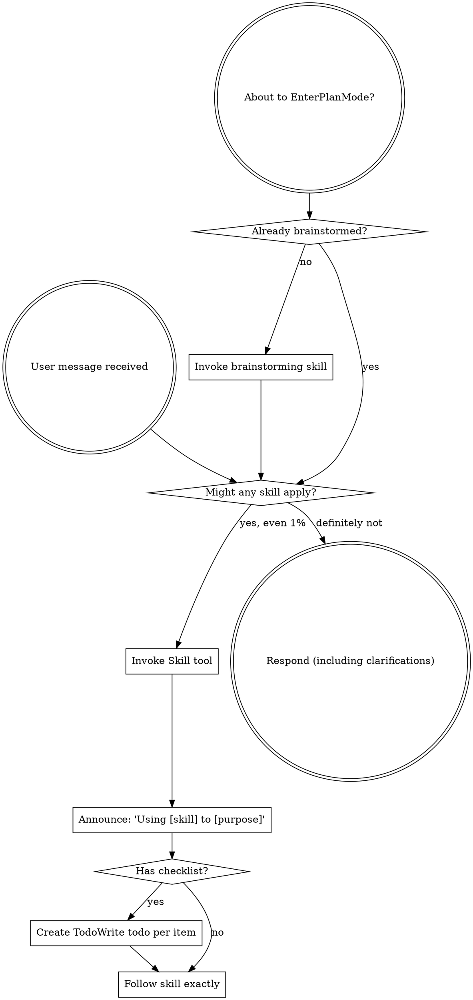

# Review — 2026-05-13-external-reviewer-redesign.md (post-slice, round 3)

- Target: `docs/superstar/plans/2026-05-13-external-reviewer-redesign.md`
- Request: `docs/reviewer/external-reviewer-redesign-S2-post-slice/r3-2026-05-14T0236-request.md`
- Reviewer command: `reviewer-agent`
- Status: `ok`

---

1. Findings

F1. **Slice 2 is not closed: latest S2 review verdict is still `revise`, and round 3 is only an untracked request.**  
The S2 chain manifest records round 2 with `"verdict": "revise"` at [chain.json](/home/simon/Dev/sigreer/skills/superstar/docs/reviewer/external-reviewer-redesign-S2-post-slice/chain.json:23), and [r2-resolution.md](/home/simon/Dev/sigreer/skills/superstar/docs/reviewer/external-reviewer-redesign-S2-post-slice/r2-resolution.md:3) also states round 2 returned `revise`. There is no tracked `r3-*-response.md` and no manifest round 3 entry; `git status --short` shows only an untracked `docs/reviewer/external-reviewer-redesign-S2-post-slice/r3-2026-05-14T0236-request.md`. That means the post-slice gate is still in progress, not accepted.

F2. **The Slice 2 closeout note is stale relative to the repo state.**  
The plan’s Slice 2 closeout lists only the initial S2 implementation commits and round-1 fixes at [plan](/home/simon/Dev/sigreer/skills/superstar/docs/superstar/plans/2026-05-13-external-reviewer-redesign.md:3017), then says the S2 review round 1 resolution is at [plan](/home/simon/Dev/sigreer/skills/superstar/docs/superstar/plans/2026-05-13-external-reviewer-redesign.md:3034). It does not record the later round-2 resolution/fix commits now present in history: `b5d6181`, `a03ebab`, `50600d5`, `f56c896`, `bb679ad`. This makes the closeout evidence incomplete and makes the document read as if round 1 was the final post-slice gate, while the actual chain has a round 2 `revise`.

2. Open questions / assumptions

I treated the untracked `r3-2026-05-14T0236-request.md` as an active, incomplete review attempt because its contents are a post-slice review request and there is no matching response or manifest entry.

I treated the five unrelated dirty files listed in `git status` as already-authorized background changes, consistent with the plan’s note at [plan](/home/simon/Dev/sigreer/skills/superstar/docs/superstar/plans/2026-05-13-external-reviewer-redesign.md:3036).

3. Suggested document edits

Update the Slice 2 closeout note to include round 2, its `revise` verdict, `r2-resolution.md`, and all post-r2 commits. Do not present Slice 2 as closed until a subsequent review response returns `ready` or `ready with small edits`.

Either complete round 3 by running the reviewer and committing the request/response/manifest updates, or remove the stale untracked request if it was abandoned.

4. Verification gaps / commands

I ran:

```bash
python3 -m pytest skills/external-review/tests/
# 39 passed, 1 warning
```

Still needed for the gate:

```bash
git status --short
# confirm no relevant untracked S2 artifacts remain

# complete the active round-3 review, then verify chain.json records an acceptable latest verdict
```

5. Overall verdict: **revise**

---

## Reviewer stderr

```text
Reading additional input from stdin...
OpenAI Codex v0.130.0
--------
workdir: /home/simon/Dev/sigreer/skills/superstar
model: gpt-5.5
provider: openai
approval: never
sandbox: danger-full-access
reasoning effort: none
reasoning summaries: none
session id: 019e2420-6495-7f53-bdaf-ed8a2f4faff2
--------
user
You are acting as an independent senior engineering reviewer.

Review stance:
- Lead with findings, ordered by severity.
- Focus on correctness, consistency, implementation risk, missing acceptance
  gates, vague handoffs, ungrounded assumptions, unverified claims, and drift
  from the codebase.
- Give exact file/line references when possible.
- If the document is sound, say that clearly and list residual risks.
- Keep the review actionable. Avoid broad rewrites unless the current structure
  creates concrete risk.

Repository root:
/home/simon/Dev/sigreer/skills/superstar

Target kind:
post-slice

Review mode:
Post-slice review. Treat this as a completion gate for one
slice of work. Compare the completed changes and stated evidence against the
slice acceptance criteria. Prioritize: incomplete tasks, uncommitted or
untracked artifacts, missing tests, failing or skipped verification, broken
cross-site behavior, and claims not supported by the repo state.

Target document:
docs/superstar/plans/2026-05-13-external-reviewer-redesign.md

Additional context files:
- docs/superstar/specs/2026-05-13-external-reviewer-redesign-design.md
- docs/handoffs/2026-05-13-external-reviewer-redesign-prompt.md
- docs/reviewer/external-reviewer-redesign-S2-post-slice/r1-resolution.md
- docs/reviewer/external-reviewer-redesign-S2-post-slice/r2-resolution.md

Review output contract:
1. Findings
2. Open questions / assumptions
3. Suggested document edits
4. Verification gaps / commands that should be run, if any
5. Overall verdict: one of "ready", "ready with small edits", or "revise"

Read the files from disk. Do not rely only on the snippets in this prompt.


## Target Preview

### docs/superstar/plans/2026-05-13-external-reviewer-redesign.md

    1	# External-Reviewer Redesign Implementation Plan
    2	
    3	> **For agentic workers:** REQUIRED SUB-SKILL: Use superstar:subagent-driven-development (recommended) or superstar:executing-plans to implement this plan task-by-task. Steps use checkbox (`- [ ]`) syntax for tracking.
    4	
    5	**Goal:** Rebuild `skills/external-review/scripts/external-reviewer.py` so review chains are incremental, durable, machine-readable, and support optional independent sweep reviewers — per `docs/superstar/specs/2026-05-13-external-reviewer-redesign-design.md`.
    6	
    7	**Architecture:** A persistent `chain.json` manifest per review chain becomes the source of truth for round metadata. The script gains verdict parsing, work-ID-keyed chain folders, a resolution-artifact contract and gate, incremental round prompts with embedded diffs, optional session-resume placeholders, and Pass-3 independent sweep reviewers. Skill documentation is updated to match.
    8	
    9	**Tech Stack:** Python 3.9+ standard library only (no external deps), `pytest` for tests, `git` CLI for diff and SHA capture.
   10	
   11	---
   12	
   13	## Pre-flight
   14	
   15	- [ ] **Step 1: Verify working directory and branch**
   16	
   17	Run:
   18	
   19	```bash
   20	cd /home/simon/Dev/sigreer/skills/superstar
   21	git status --short
   22	git rev-parse --abbrev-ref HEAD
   23	```
   24	
   25	Expected: clean tree, branch is a feature branch (not `main`). If on `main`, stop and create a branch via `superstar:using-git-worktrees`.
   26	
   27	- [ ] **Step 2: Confirm test runner**
   28	
   29	Run:
   30	
   31	```bash
   32	python3 -c "import pytest; print(pytest.__version__)"
   33	```
   34	
   35	Expected: prints a version string. If `ModuleNotFoundError`, install pytest:
   36	
   37	```bash
   38	python3 -m pip install --user pytest
   39	```
   40	
   41	- [ ] **Step 3: Set up the test directory**
   42	
   43	Create the directory tests will live in:
   44	
   45	```bash
   46	mkdir -p skills/external-review/tests
   47	touch skills/external-review/tests/__init__.py
   48	```
   49	
   50	Commit:
   51	
   52	```bash
   53	git add skills/external-review/tests/__init__.py
   54	git commit -m "scaffold: tests dir for external-reviewer redesign"
   55	```
   56	
   57	---
   58	
   59	## Slice 1: Chain manifest & verdict parsing
   60	
   61	**Goal:** Introduce `chain.json` as the round-metadata source of truth, parse verdicts and finding counts from response text, and emit them in the JSON output. Backwards-compatible: legacy chains synthesize a manifest on first touch.
   62	
   63	### Task 1.1: Manifest read/write helpers
   64	
   65	**Files:**
   66	- Create: `skills/external-review/tests/test_manifest.py`
   67	- Modify: `skills/external-review/scripts/external-reviewer.py`
   68	
   69	- [x] **Step 1: Write the failing tests**
   70	
   71	`skills/external-review/tests/test_manifest.py`:
   72	
   73	```python
   74	import json
   75	from pathlib import Path
   76	
   77	import pytest
   78	
   79	import sys
   80	SCRIPTS = Path(__file__).resolve().parents[1] / "scripts"
   81	sys.path.insert(0, str(SCRIPTS))
   82	
   83	import importlib.util
   84	spec = importlib.util.spec_from_file_location("external_reviewer", SCRIPTS / "external-reviewer.py")
   85	external_reviewer = importlib.util.module_from_spec(spec)
   86	spec.loader.exec_module(external_reviewer)
   87	
   88	
   89	def test_read_manifest_returns_none_for_missing(tmp_path):
   90	    assert external_reviewer.read_manifest(tmp_path / "missing.json") is None
   91	
   92	
   93	def test_write_then_read_manifest_roundtrips(tmp_path):
   94	    path = tmp_path / "chain.json"
   95	    data = {
   96	        "schema_version": 1,
   97	        "chain": "demo-post-slice",
   98	        "kind": "post-slice",
   99	        "target": "docs/plans/demo.md",
  100	        "work_id": "P1.S1",
  101	        "legacy_migrated": False,
  102	        "rounds": [],
  103	        "sweep_checkpoints": {"first-round": "pending", "final-ready": "pending"},
  104	    }
  105	    external_reviewer.write_manifest(path, data)
  106	    loaded = external_reviewer.read_manifest(path)
  107	    assert loaded == data
  108	
  109	
  110	def test_read_manifest_rejects_newer_schema(tmp_path):
  111	    path = tmp_path / "chain.json"
  112	    path.write_text(json.dumps({"schema_version": 99}))
  113	    with pytest.raises(external_reviewer.ManifestSchemaTooNew):
  114	        external_reviewer.read_manifest(path)
  115	```
  116	
  117	- [x] **Step 2: Run the tests; confirm they fail**
  118	
  119	```bash
  120	python3 -m pytest skills/external-review/tests/test_manifest.py -v
  121	```
  122	
  123	Expected: 3 failures (`read_manifest`, `write_manifest`, `ManifestSchemaTooNew` all undefined).
  124	
  125	- [x] **Step 3: Add manifest helpers to the script**
  126	
  127	Append to `skills/external-review/scripts/external-reviewer.py` (after the existing module-level constants, before `repo_root()`):
  128	
  129	```python
  130	SUPPORTED_SCHEMA_VERSION = 1
  131	
  132	
  133	class ManifestSchemaTooNew(Exception):
  134	    """Raised when chain.json declares a schema_version newer than this script supports."""
  135	
  136	
  137	def read_manifest(path: Path) -> dict | None:
  138	    if not path.exists():
  139	        return None
  140	    data = json.loads(path.read_text(encoding="utf-8"))
  141	    version = data.get("schema_version")
  142	    if isinstance(version, int) and version > SUPPORTED_SCHEMA_VERSION:
  143	        raise ManifestSchemaTooNew(
  144	            f"chain.json schema_version {version} is newer than this script supports "
  145	            f"(max {SUPPORTED_SCHEMA_VERSION}). Upgrade external-reviewer.py."
  146	        )
  147	    return data
  148	
  149	
  150	def write_manifest(path: Path, data: dict) -> None:
  151	    path.parent.mkdir(parents=True, exist_ok=True)
  152	    path.write_text(json.dumps(data, indent=2) + "\n", encoding="utf-8")
  153	```
  154	
  155	- [x] **Step 4: Run the tests; confirm they pass**
  156	
  157	```bash
  158	python3 -m pytest skills/external-review/tests/test_manifest.py -v
  159	```
  160	
  161	Expected: 3 passed.
  162	
  163	- [x] **Step 5: Commit**
  164	
  165	```bash
  166	git add skills/external-review/scripts/external-reviewer.py skills/external-review/tests/test_manifest.py
  167	git commit -m "feat(external-reviewer): chain.json read/write helpers with schema versioning"
  168	```
  169	
  170	### Task 1.2: Verdict parsing
  171	
  172	**Files:**
  173	- Create: `skills/external-review/tests/test_verdict.py`
  174	- Modify: `skills/external-review/scripts/external-reviewer.py`
  175	
  176	- [x] **Step 1: Write the failing tests**
  177	
  178	`skills/external-review/tests/test_verdict.py`:
  179	
  180	```python
  181	from pathlib import Path
  182	import sys, importlib.util
  183	
  184	SCRIPTS = Path(__file__).resolve().parents[1] / "scripts"
  185	sys.path.insert(0, str(SCRIPTS))
  186	spec = importlib.util.spec_from_file_location("external_reviewer", SCRIPTS / "external-reviewer.py")
  187	er = importlib.util.module_from_spec(spec); spec.loader.exec_module(er)
  188	
  189	
  190	def test_verdict_ready():
  191	    v, valid = er.parse_verdict("Findings: ok\n\nOverall verdict: ready\n")
  192	    assert v == "ready"
  193	    assert valid is True
  194	
  195	
  196	def test_verdict_ready_with_small_edits_markdown():
  197	    body = "**Overall verdict:** `ready with small edits`."
  198	    v, valid = er.parse_verdict(body)
  199	    assert v == "ready with small edits"
  200	    assert valid is True
  201	
  202	
  203	def test_verdict_revise_case_insensitive():
  204	    v, valid = er.parse_verdict("OVERALL VERDICT: Revise")
  205	    assert v == "revise"
  206	    assert valid is True
  207	
  208	
  209	def test_verdict_takes_last_match():
  210	    body = "Overall verdict: ready\n\n...later...\n\nOverall verdict: revise"
  211	    v, valid = er.parse_verdict(body)
  212	    assert v == "revise"
  213	
  214	
  215	def test_verdict_unknown_returns_invalid():
  216	    v, valid = er.parse_verdict("Overall verdict: looks fine to me")
  217	    assert v is None
  218	    assert valid is False
  219	
  220	
  221	def test_verdict_missing_returns_invalid():
  222	    v, valid = er.parse_verdict("Some review prose with no verdict line.")
  223	    assert v is None
  224	    assert valid is False
  225	```
  226	
  227	- [x] **Step 2: Run the tests; confirm they fail**
  228	
  229	```bash
  230	python3 -m pytest skills/external-review/tests/test_verdict.py -v
  231	```
  232	
  233	Expected: 6 failures (`parse_verdict` undefined).
  234	
  235	- [x] **Step 3: Add the verdict parser**
  236	
  237	Append to `skills/external-review/scripts/external-reviewer.py`:
  238	
  239	```python
  240	VERDICT_VALUES = ("ready with small edits", "ready", "revise")
  241	VERDICT_LINE_RE = re.compile(
  242	    r"overall\s+verdict\s*[:\-]\s*[`*_\"']*\s*(ready with small edits|ready|revise)\s*[`*_\"'.]*",
  243	    re.IGNORECASE,
  244	)
  245	
  246	
  247	def parse_verdict(text: str) -> tuple[str | None, bool]:
  248	    matches = list(VERDICT_LINE_RE.finditer(text))
  249	    if not matches:
  250	        return None, False
  251	    raw = matches[-1].group(1).strip().lower()
  252	    if raw not in VERDICT_VALUES:
  253	        return None, False
  254	    return raw, True
  255	```
  256	
  257	Note: regex prefers `ready with small edits` over `ready` because of ordering in the alternation.
  258	
  259	- [x] **Step 4: Run the tests; confirm they pass**
  260	
  261	```bash
  262	python3 -m pytest skills/external-review/tests/test_verdict.py -v
  263	```
  264	
  265	Expected: 6 passed.
  266	
  267	- [x] **Step 5: Commit**
  268	
  269	```bash
  270	git add skills/external-review/scripts/external-reviewer.py skills/external-review/tests/test_verdict.py
  271	git commit -m "feat(external-reviewer): parse_verdict with markdown/case tolerance"
  272	```
  273	
  274	### Task 1.3: Finding-count parsing
  275	
  276	**Files:**
  277	- Create: `skills/external-review/tests/test_findings.py`
  278	- Modify: `skills/external-review/scripts/external-reviewer.py`
  279	
  280	- [x] **Step 1: Write the failing tests**
  281	
  282	`skills/external-review/tests/test_findings.py`:
  283	
  284	```python
  285	from pathlib import Path
  286	import sys, importlib.util
  287	SCRIPTS = Path(__file__).resolve().parents[1] / "scripts"
  288	sys.path.insert(0, str(SCRIPTS))
  289	spec = importlib.util.spec_from_file_location("external_reviewer", SCRIPTS / "external-reviewer.py")
  290	er = importlib.util.module_from_spec(spec); spec.loader.exec_module(er)
  291	
  292	
  293	def test_heading_findings_counted():
  294	    body = "## F1\nSeverity: blocking\n\n## F2\nSeverity: minor\n\n## F3\nSeverity: blocking"
  295	    n, blocking = er.parse_findings(body)
  296	    assert n == 3
  297	    assert blocking == 2
  298	
  299	
  300	def test_bullet_findings_counted():
  301	    body = "- F1: something blocking (blocking)\n- F2 minor thing"
  302	    n, blocking = er.parse_findings(body)
  303	    assert n == 2
  304	    assert blocking == 1
  305	
  306	
  307	def test_no_findings_returns_zero():
  308	    body = "Overall verdict: ready\n\nNo findings."
  309	    n, blocking = er.parse_findings(body)
  310	    assert n == 0
  311	    assert blocking == 0
  312	
  313	
  314	def test_unparseable_returns_none():
  315	    body = "Reviewer crashed: connection reset"
  316	    n, blocking = er.parse_findings(body)
  317	    assert n is None
  318	    assert blocking is None
  319	```
  320	
  321	- [x] **Step 2: Run the tests; confirm they fail**
  322	
  323	```bash
  324	python3 -m pytest skills/external-review/tests/test_findings.py -v
  325	```
  326	
  327	Expected: 4 failures.
  328	
  329	- [x] **Step 3: Add the parser**
  330	
  331	Append to `skills/external-review/scripts/external-reviewer.py`:
  332	
  333	```python
  334	HEADING_FINDING_RE = re.compile(r"^##\s+F\d+\b", re.MULTILINE)
  335	BULLET_FINDING_RE = re.compile(r"^\s*[-*]?\s*\**F\d+\**[:\s\-]", re.MULTILINE)
  336	BLOCKING_MARKER_RE = re.compile(r"(?:^|\s)\(blocking\)|^severity\s*:\s*blocking", re.IGNORECASE | re.MULTILINE)
  337	
  338	
  339	def parse_findings(text: str) -> tuple[int | None, int | None]:
  340	    if not text or text.strip() == "" or "reviewer crashed" in text.lower():
  341	        return None, None
  342	    heading_count = len(HEADING_FINDING_RE.findall(text))
  343	    if heading_count > 0:
  344	        n = heading_count
  345	    else:
  346	        n = len(BULLET_FINDING_RE.findall(text))
  347	    blocking = len(BLOCKING_MARKER_RE.findall(text))
  348	    return n, blocking
  349	```
  350	
  351	- [x] **Step 4: Run the tests; confirm they pass**
  352	
  353	```bash
  354	python3 -m pytest skills/external-review/tests/test_findings.py -v
  355	```
  356	
  357	Expected: 4 passed.
  358	
  359	- [x] **Step 5: Commit**
  360	
  361	```bash
  362	git add skills/external-review/scripts/external-reviewer.py skills/external-review/tests/test_findings.py
  363	git commit -m "feat(external-reviewer): parse_findings (heading + bullet, blocking count)"
  364	```
  365	
  366	### Task 1.4: Round-number derivation reads manifest first
  367	
  368	**Files:**
  369	- Create: `skills/external-review/tests/test_round_number.py`
  370	- Modify: `skills/external-review/scripts/external-reviewer.py` (`next_round_number`)
  371	
  372	- [x] **Step 1: Write the failing tests**
  373	
  374	`skills/external-review/tests/test_round_number.py`:
  375	
  376	```python
  377	from pathlib import Path
  378	import json, sys, importlib.util
  379	SCRIPTS = Path(__file__).resolve().parents[1] / "scripts"
  380	sys.path.insert(0, str(SCRIPTS))
  381	spec = importlib.util.spec_from_file_location("external_reviewer", SCRIPTS / "external-reviewer.py")
  382	er = importlib.util.module_from_spec(spec); spec.loader.exec_module(er)
  383	
  384	
  385	def test_no_chain_dir_round_is_one(tmp_path):
  386	    assert er.next_round_number(tmp_path / "absent") == 1
  387	
  388	
  389	def test_manifest_present_takes_precedence(tmp_path):
  390	    d = tmp_path / "chain"; d.mkdir()
  391	    er.write_manifest(d / "chain.json", {
  392	        "schema_version": 1, "rounds": [{"round": 1}, {"round": 2}]
  393	    })
  394	    assert er.next_round_number(d) == 3
  395	
  396	
  397	def test_legacy_dir_no_manifest_falls_back_to_filename_scan(tmp_path):
  398	    d = tmp_path / "chain"; d.mkdir()
  399	    (d / "r1-2026-05-01T0900-request.md").write_text("")
  400	    (d / "r2-2026-05-02T0900-request.md").write_text("")
  401	    assert er.next_round_number(d) == 3
  402	```
  403	
  404	- [x] **Step 2: Run the tests; confirm they fail**
  405	
  406	```bash
  407	python3 -m pytest skills/external-review/tests/test_round_number.py -v
  408	```
  409	
  410	Expected: test 2 fails (no manifest awareness), tests 1 and 3 may pass if current behavior already handles them.
  411	
  412	- [x] **Step 3: Update `next_round_number`**
  413	
  414	Replace the existing function:
  415	
  416	```python
  417	def next_round_number(chain_dir: Path) -> int:
  418	    if not chain_dir.exists():
  419	        return 1
  420	    manifest = read_manifest(chain_dir / "chain.json")
  421	    if manifest and isinstance(manifest.get("rounds"), list):
  422	        return len(manifest["rounds"]) + 1
  423	    return len(list(chain_dir.glob("r*-*-request.md"))) + 1
  424	```
  425	
  426	- [x] **Step 4: Run the tests**
  427	
  428	```bash
  429	python3 -m pytest skills/external-review/tests/test_round_number.py -v
  430	```
  431	
  432	Expected: 3 passed.
  433	
  434	- [x] **Step 5: Commit**
  435	
  436	```bash
  437	git add skills/external-review/scripts/external-reviewer.py skills/external-review/tests/test_round_number.py
  438	git commit -m "feat(external-reviewer): next_round_number consults chain.json"
  439	```
  440	
  441	### Task 1.5: Legacy manifest synthesis
  442	
  443	**Files:**
  444	- Create: `skills/external-review/tests/test_legacy_migration.py`
  445	- Modify: `skills/external-review/scripts/external-reviewer.py`
  446	
  447	- [x] **Step 1: Write the failing tests**
  448	
  449	`skills/external-review/tests/test_legacy_migration.py`:
  450	
  451	```python
  452	from pathlib import Path
  453	import sys, importlib.util
  454	SCRIPTS = Path(__file__).resolve().parents[1] / "scripts"
  455	sys.path.insert(0, str(SCRIPTS))
  456	spec = importlib.util.spec_from_file_location("external_reviewer", SCRIPTS / "external-reviewer.py")
  457	er = importlib.util.module_from_spec(spec); spec.loader.exec_module(er)
  458	
  459	
  460	def test_synthesize_manifest_from_legacy_files(tmp_path):
  461	    d = tmp_path / "old-chain"; d.mkdir()
  462	    (d / "r1-2026-04-01T0900-request.md").write_text("prompt body")
  463	    (d / "r1-2026-04-01T0905-response.md").write_text(
  464	        "## F1\nSeverity: blocking\n\nOverall verdict: revise\n"
  465	    )
  466	    (d / "r2-2026-04-02T1200-request.md").write_text("prompt body 2")
  467	
  468	    manifest = er.synthesize_legacy_manifest(
  469	        chain_dir=d, chain="old-chain", kind="post-slice",
  470	        target="docs/plans/old.md", work_id="P1.S1",
  471	    )
  472	
  473	    assert manifest["legacy_migrated"] is True
  474	    assert manifest["work_id"] == "P1.S1"
  475	    assert len(manifest["rounds"]) == 2
  476	    r1, r2 = manifest["rounds"]
  477	    assert r1["legacy"] is True
  478	    assert r1["verdict"] == "revise"
  479	    assert r1["verdict_valid"] is True
  480	    assert r1["findings_count"] == 1
  481	    assert r1["blocking_findings_count"] == 1
  482	    assert r1["head_sha_after_round"] is None
  483	    assert r2["response"] is None  # only request file existed
  484	```
  485	
  486	- [x] **Step 2: Run the tests; confirm they fail**
  487	
  488	```bash
  489	python3 -m pytest skills/external-review/tests/test_legacy_migration.py -v
  490	```
  491	
  492	Expected: 1 failure.
  493	
  494	- [x] **Step 3: Add the synthesizer**
  495	
  496	Append to `skills/external-review/scripts/external-reviewer.py`:
  497	
  498	```python
  499	LEGACY_ROUND_FILE_RE = re.compile(r"^r(\d+)-([0-9T\-]+)-(request|response)\.md$")
  500	
  501	
  502	def synthesize_legacy_manifest(
  503	    *, chain_dir: Path, chain: str, kind: str, target: str, work_id: str | None
  504	) -> dict:
  505	    rounds_map: dict[int, dict] = {}
  506	    for path in sorted(chain_dir.iterdir()):
  507	        m = LEGACY_ROUND_FILE_RE.match(path.name)
  508	        if not m:
  509	            continue
  510	        round_num = int(m.group(1))
  511	        role = m.group(3)
  512	        entry = rounds_map.setdefault(
  513	            round_num,
  514	            {
  515	                "round": round_num,
  516	                "request": None,
  517	                "response": None,
  518	                "resolution": None,
  519	                "verdict": None,
  520	                "verdict_valid": False,
  521	                "findings_count": None,
  522	                "blocking_findings_count": None,
  523	                "head_sha_at_request": None,
  524	                "head_sha_after_round": None,
  525	                "worktree_dirty_at_request": None,
  526	                "legacy": True,
  527	            },
  528	        )
  529	        entry[role] = path.name
  530	        if role == "response":
  531	            body = path.read_text(encoding="utf-8", errors="replace")
  532	            v, valid = parse_verdict(body)
  533	            entry["verdict"], entry["verdict_valid"] = v, valid
  534	            n, blocking = parse_findings(body)
  535	            entry["findings_count"], entry["blocking_findings_count"] = n, blocking
  536	
  537	    return {
  538	        "schema_version": SUPPORTED_SCHEMA_VERSION,
  539	        "chain": chain,
  540	        "kind": kind,
  541	        "target": target,
  542	        "work_id": work_id,
  543	        "legacy_migrated": True,
  544	        "migrated_at": dt.datetime.utcnow().strftime("%Y-%m-%dT%H:%M:%SZ"),
  545	        "rounds": [rounds_map[k] for k in sorted(rounds_map)],
  546	        "sweep_checkpoints": {"first-round": "pending", "final-ready": "pending"},
  547	    }
  548	```
  549	
  550	- [x] **Step 4: Run the tests; confirm they pass**
  551	
  552	```bash
  553	python3 -m pytest skills/external-review/tests/test_legacy_migration.py -v
  554	```
  555	
  556	Expected: 1 passed.
  557	
  558	- [x] **Step 5: Commit**
  559	
  560	```bash
  561	git add skills/external-review/scripts/external-reviewer.py skills/external-review/tests/test_legacy_migration.py
  562	git commit -m "feat(external-reviewer): synthesize_legacy_manifest from rN-* files"
  563	```
  564	
  565	### Task 1.6: Wire manifest into `main()` for single-reviewer rounds
  566	
  567	**Files:**
  568	- Modify: `skills/external-review/scripts/external-reviewer.py` (`main` function)
  569	- Create: `skills/external-review/tests/test_main_round_writes_manifest.py`
  570	
  571	- [x] **Step 1: Write the failing test**
  572	
  573	`skills/external-review/tests/test_main_round_writes_manifest.py`:
  574	
  575	```python
  576	from pathlib import Path
  577	import subprocess, sys, json, importlib.util, os
  578	
  579	SCRIPTS = Path(__file__).resolve().parents[1] / "scripts"
  580	sys.path.insert(0, str(SCRIPTS))
  581	spec = importlib.util.spec_from_file_location("external_reviewer", SCRIPTS / "external-reviewer.py")
  582	er = importlib.util.module_from_spec(spec); spec.loader.exec_module(er)
  583	
  584	
  585	FAKE_REVIEWER = """#!/usr/bin/env bash
  586	cat <<'EOF'
  587	## F1
  588	Severity: blocking
  589	Stub finding.
  590	
  591	Overall verdict: revise
  592	EOF
  593	"""
  594	
  595	
  596	def test_main_writes_manifest_entry(tmp_path, monkeypatch):
  597	    repo = tmp_path / "repo"; repo.mkdir()
  598	    subprocess.run(["git", "-C", str(repo), "init", "-q"], check=True)
  599	    subprocess.run(["git", "-C", str(repo), "config", "user.email", "t@t"], check=True)
  600	    subprocess.run(["git", "-C", str(repo), "config", "user.name", "T"], check=True)

[truncated: 2436 additional lines]

## Context Previews

### docs/superstar/specs/2026-05-13-external-reviewer-redesign-design.md

    1	# External-Review Script Redesign — Design
    2	
    3	**Date:** 2026-05-13
    4	**Target:** `skills/external-review/scripts/external-reviewer.py` and `skills/external-review/SKILL.md`
    5	**Motivation:** A self-review of the external-reviewer flow surfaced five concrete failure modes that cause review loops to balloon to 7–10 rounds and lose continuity between rounds. This spec redesigns the script and skill to make rounds incremental, durable, and machine-readable.
    6	
    7	---
    8	
    9	## Goals
   10	
   11	1. **Round N+1 is incremental, not a re-review.** The reviewer is given prior findings, the fixer's resolution report, and a focused diff — and is instructed to verify resolution rather than reopen broad review.
   12	2. **Verdict is machine-readable.** JSON output exposes a parsed `verdict`, `verdict_valid`, and finding counts, so coordinators don't have to parse prose.
   13	3. **Post-slice / post-phase chains are uniquely keyed.** `--work-id` is required for both so that multi-slice plans don't collapse into one chain.
   14	4. **Resolution artifacts are durable and structured-enough-to-parse.** Required headers, free-form bodies, stable finding IDs across rounds.
   15	5. **Optional session resume.** Provider-specific wrappers can plug into placeholders if the underlying reviewer CLI supports session IDs.
   16	6. **Legacy chains keep working.** Soft-migrate on first new round; preserve existing folder names and audit history.
   17	7. **Review depth is explicit.** The default chain uses one primary incremental reviewer, but callers can request bounded independent sweep reviewers at high-risk checkpoints to preserve fresh-eye coverage without unbounded serial churn.
   18	
   19	## Non-goals
   20	
   21	- Replacing the chain-folder layout for new chains. The folder-naming scheme gains a `--work-id` segment for post-slice/post-phase, but the round-file scheme is unchanged.
   22	- Making the script aware of any specific reviewer CLI. The script remains provider-neutral via `AGENT_REVIEWER_CMD`.
   23	- Auto-dispatching the fixer subagent. The script enforces the resolution gate but does not invoke fixers; that stays in the coordinator's loop, governed by `subagent-driven-development`.
   24	
   25	## Invariants
   26	
   27	- **A review chain is single-writer.** Running two rounds concurrently against the same chain is unsupported and may corrupt `chain.json`. The script does not lock; callers are expected to serialise.
   28	- **Existing rounds are immutable.** Once written, `rN-*-request.md`, `rN-*-response.md`, and `rN-resolution.md` are never overwritten. Manifest entries for past rounds are append-only.
   29	
   30	## Architecture
   31	
   32	Three implementation passes, all designed in this spec:
   33	
   34	- **Pass 1 — Core.** Chain manifest, verdict parsing, `--work-id`, prior-round context injection, incremental round prompts, resolution-artifact contract and gate, automatic diff embedding, JSON output enrichment, legacy migration.
   35	- **Pass 2 — Session resume.** Optional placeholders (`{chain_dir}`, `{round}`, `{previous_response}`, `{resolution_file}`, `{session_file}`) exposed via the existing `AGENT_REVIEWER_CMD` template mechanism. A provider-specific wrapper can use `{session_file}` to persist and resume reviewer sessions. The script provides a stable path (`chain_dir/session.state`) and ensures the parent directory exists; wrappers own the file's contents. The script never reads `session.state`.
   36	- **Pass 3 — Review depth / independent sweeps.** Adds `--review-depth`, `--independent-reviewers`, `--sweep-policy` flags. Independent sweep reviewers run without seeing the primary reviewer's findings on their first pass (to avoid anchoring), and their findings are merged into the same resolution checklist afterward. Depends on Pass 1's manifest and verdict parsing; does not depend on Pass 2.
   37	
   38	### Chain manifest
   39	
   40	`docs/reviewer/<chain>/chain.json` is the single source of truth for round metadata. The `rN-*-request.md` / `rN-*-response.md` / `rN-resolution.md` files remain for human readability and git history; the script reads and writes manifest entries when computing round numbers, base refs, and verdicts.
   41	
   42	```json
   43	{
   44	  "schema_version": 1,
   45	  "chain": "feature-plan-P2-S3-post-slice",
   46	  "kind": "post-slice",
   47	  "target": "docs/superstar/plans/feature-plan.md",
   48	  "work_id": "P2.S3",
   49	  "legacy_migrated": false,
   50	  "rounds": [
   51	    {
   52	      "round": 1,
   53	      "request": "r1-2026-05-13T1012-request.md",
   54	      "response": "r1-2026-05-13T1020-response.md",
   55	      "resolution": null,
   56	      "head_sha_at_request": "abc1234",
   57	      "head_sha_after_round": "abc1234",
   58	      "worktree_dirty_at_request": false,
   59	      "verdict": "revise",
   60	      "verdict_valid": true,
   61	      "findings_count": 4,
   62	      "blocking_findings_count": 2
   63	    },
   64	    {
   65	      "round": 2,
   66	      "request": "r2-2026-05-13T1130-request.md",
   67	      "response": null,
   68	      "resolution": "r1-resolution.md",
   69	      "base_ref": "abc1234",
   70	      "base_ref_source": "auto",
   71	      "head_sha_at_request": "def5678",
   72	      "worktree_dirty_at_request": false,
   73	      "diff_included": true,
   74	      "resolution_parse_status": "ok",
   75	      "resolution_waiver": false
   76	    }
   77	  ]
   78	}
   79	```
   80	
   81	#### Manifest versioning
   82	
   83	- `schema_version: 1` is the initial version introduced by this redesign.
   84	- Unknown future `schema_version` values cause the script to error with a clear message: `ERROR: chain.json schema_version <N> is newer than this script supports. Upgrade external-reviewer.py.` This prevents silent corruption.
   85	- Older `schema_version` values (currently none) get best-effort migration on read, recorded as `schema_migrated_from: <prior>` in the manifest.
   86	
   87	### Naming
   88	
   89	- **Chain folder slug:** `<target-stem-no-leading-date>-<work-id-dotless>-<kind>` for post-slice/post-phase; `<target-stem-no-leading-date>-<kind>` otherwise. Dots in work IDs are replaced with dashes in the folder slug only — the manifest preserves the canonical form.
   90	  - Example: `--work-id P2.S3` → folder `feature-plan-P2-S3-post-slice`, manifest `"work_id": "P2.S3"`.
   91	- **Round files:** `r{N}-<YYYY-MM-DDTHHMM>-request.md`, `r{N}-<YYYY-MM-DDTHHMM>-response.md`. Unchanged from current behavior.
   92	- **Resolution files:** `r{N}-resolution.md`, where `N` is the round whose response is being addressed. Round `N+1` consumes `r{N}-resolution.md`. Worked example: after `r1-response.md` returns `revise`, the fixer writes `r1-resolution.md`; round 2 reads `r1-resolution.md` and embeds it in the round-2 prompt.
   93	
   94	## CLI surface (new flags)
   95	
   96	| Flag | Kinds | Purpose |
   97	|---|---|---|
   98	| `--work-id <id>` | required for `post-slice`, `post-phase`; optional otherwise | Stable slice/phase ID (e.g., `P2.S3` for post-slice, `P2` for post-phase). Becomes part of chain folder name (dots → dashes) and is stored verbatim in the manifest. |
   99	| `--base-ref <sha\|ref>` | any | Override auto-computed diff base for this round. |
  100	| `--no-diff` | any | Suppress diff embedding even on round N+1. |
  101	| `--allow-missing-resolution` | post-slice, post-phase | Waive the resolution-required gate. Logged in manifest as `resolution_waiver: true`. |
  102	| `--changed-files <path>...` | any | Override automatic changed-file discovery and limit the embedded diff to the supplied paths. |
  103	| `--mode <auto\|broad\|incremental>` | any | Override the round-1-vs-N prompt mode. Default `auto` (round 1 → broad; round 2+ → incremental). |
  104	| `--max-diff-lines <int>` | any | Cap diff size. Default 2000. Truncation marker is embedded if exceeded. |
  105	| `--review-depth <standard\|thorough\|exhaustive>` | post-slice, post-phase | Controls whether independent sweep reviewers are run in addition to the primary chain reviewer. Default `standard`. |
  106	| `--independent-reviewers <int>` | post-slice, post-phase | Override reviewer count for independent sweeps. Default derived from `--review-depth`. |
  107	| `--sweep-policy <first-round\|final-ready\|both\|never>` | post-slice, post-phase | When to run fresh-context sweep reviews. Default derived from `--review-depth`. |
  108	
  109	### `--work-id` enforcement
  110	
  111	- `post-slice` or `post-phase` invoked without `--work-id` → exit 2 with operational error.
  112	- For `post-phase`, the expected form is the phase ID alone (`P2`), not a slice ID. The script does not enforce a regex; it documents the convention.
  113	- For other kinds, `--work-id` is optional; if provided, it is recorded in the manifest but does not affect the folder slug.
  114	
  115	## Reviewer prompt — round 1 vs round N+
  116	
  117	### Round 1: broad
  118	
  119	The existing broad prompt, with the output contract revised to require **stable finding IDs**:
  120	
  121	```
  122	1. Findings
  123	   - Each finding tagged `F<n>` (e.g., F1, F2, F3). IDs must be stable across rounds.
  124	   - Severity: blocking | important | minor | nit
  125	2. Open questions / assumptions
  126	3. Suggested document edits
  127	4. Verification gaps
  128	5. Overall verdict: ready | ready with small edits | revise
  129	```
  130	
  131	### Round N+: incremental
  132	
  133	Prepended to the existing prompt body:
  134	
  135	```
  136	You are continuing an existing review chain. This is round {N} of {chain_id}.
  137	
  138	In incremental mode:
  139	- Verify whether prior findings are resolved per the resolution report below.
  140	- Reuse the existing finding IDs (F1, F2, …). If a prior finding is resolved,
  141	  mark it RESOLVED in your findings list with its original ID. If still
  142	  unresolved, keep its ID.
  143	- Only introduce new finding IDs for genuine regressions caused by the fix, or
  144	  blocking issues clearly missed in earlier rounds. Do not reopen broad review
  145	  unless prior fixes changed broad architecture.
  146	
  147	Review chain summary:
  148	{per-round table: round, verdict, findings_count, blocking_findings_count}
  149	
  150	Prior-round findings (authoritative):
  151	{if r{N-1}-merged-findings.md exists: its verbatim contents — this replaces
  152	 individual reviewer response files as the prior-finding list of record}
  153	{else: a summary of the prior round's primary response, with finding IDs intact}
  154	
  155	Resolution report for prior round:
  156	{verbatim contents of r{N-1}-resolution.md}
  157	{or "MISSING — explicitly waived by caller via --allow-missing-resolution"}
  158	{or "MISSING — chain migrated from legacy artifacts; please verify whether changes occurred from the diff below"}
  159	
  160	Resolution parse summary (best-effort):
  161	{structured: per-finding-ID → status, or "unparseable"}
  162	
  163	Changes since prior round:
  164	{git diff <base_ref>..HEAD -- <scoped paths>}
  165	{if dirty: appended `git diff HEAD` section, both labeled}
  166	{if no base: "not available for this round (legacy chain / first round / --no-diff)"}
  167	```
  168	
  169	`--mode broad` forces round-1-style on later rounds (rare; for cases where the fix changed architecture). `--mode incremental` on round 1 is rejected with a clear error.
  170	
  171	## Resolution artifact contract
  172	
  173	**Path:** `docs/reviewer/<chain>/r{N}-resolution.md`, where `N` is the round whose response is being addressed. Authored by the fix subagent between round N (response) and round N+1 (resubmit).
  174	
  175	**Required parseable shape:**
  176	
  177	```markdown
  178	# Resolution for r{N}
  179	
  180	## F1
  181	Status: fixed
  182	Evidence:
  183	- Commit: abc1234
  184	- Files: `src/foo.ts:42`, `tests/foo.test.ts:18`
  185	- Verification: `npm test -- foo.test.ts` passed
  186	
  187	Notes:
  188	Changed the validation path to reject empty IDs before persistence.
  189	
  190	## F2
  191	Status: waived
  192	Evidence:
  193	- No code change
  194	- Reason: reviewer assumed X, but the plan explicitly excludes X in
  195	  `docs/superstar/specs/foo-design.md:77`
  196	
  197	Notes:
  198	No implementation change because this would expand slice scope.
  199	```
  200	

[truncated: 292 additional lines]
### docs/handoffs/2026-05-13-external-reviewer-redesign-prompt.md

    1	# Coordinator handoff — External-Reviewer Redesign
    2	
    3	You are the coordinator for implementing the **external-reviewer redesign** in the `superstar` repo at `/home/simon/Dev/sigreer/skills/superstar`.
    4	
    5	Your role is **strictly orchestration**. Use the `superstar:subagent-driven-development` skill with parallel agents where possible.
    6	
    7	## Inputs
    8	
    9	- Spec: [`docs/superstar/specs/2026-05-13-external-reviewer-redesign-design.md`](docs/superstar/specs/2026-05-13-external-reviewer-redesign-design.md)
   10	- Plan: [`docs/superstar/plans/2026-05-13-external-reviewer-redesign.md`](docs/superstar/plans/2026-05-13-external-reviewer-redesign.md)
   11	- Reviewer chain folder (created on first review): `docs/reviewer/external-reviewer-redesign-plan/` (kind `plan`) and per-slice chains like `docs/reviewer/external-reviewer-redesign-S1-post-slice/` (no TASKLIST.md in this repo; treat `S1`…`S8` from the plan as the work-id segments).
   12	
   13	## Coordinator discipline (non-negotiable)
   14	
   15	- **Do not perform any fixes yourself** unless the fix is genuinely cheaper to implement than the process of delegating to a subagent. Tiebreak: delegate.
   16	- **Do not pollute your context.** Delegate investigations, file reads, and edits to subagents. Your context is for orchestration, not implementation detail.
   17	- **At the end of each slice (S1–S8)**, the human partner runs `external-review` manually with `--kind post-slice` and pastes the findings back. Do NOT invoke the external-review skill yourself in this project — the human partner has explicitly chosen to drive it manually to keep the context clean. Wait for the verdict before proceeding to the next slice.
   18	- **Do not perform reviewer-driven fixes yourself.** Pass each reviewer response to a fix subagent that writes `r{N}-resolution.md` per the contract in `[[external-review]]`, then signal the human partner that the resolution is ready and the next round can be submitted.
   19	- **At the end of the phase** (after S8 closes), the human partner runs `--kind post-phase` manually. Same delegation rule.
   20	- **No TASKLIST.md exists** in this repo. Track slice completion in this handoff document or in a TODO list you maintain in-session; do not invent a TASKLIST.md file.
   21	
   22	## First action
   23	
   24	Read this file (the handoff prompt), the spec, and the plan. Then invoke `superstar:subagent-driven-development` and begin Slice 1 (Chain manifest & verdict parsing).
### docs/reviewer/external-reviewer-redesign-S2-post-slice/r1-resolution.md

    1	# Resolution for r1
    2	
    3	Round 1 of the S2 chain. Reviewer returned `revise` with 3 findings
    4	(2 blocking). All findings — plus a chain-routing defect observed by
    5	the coordinator — are addressed below.
    6	
    7	## Provenance note
    8	
    9	This round was originally misrouted into the Slice-1 chain folder
   10	(`docs/reviewer/external-reviewer-redesign-post-slice/`) as round 5,
   11	because `discover_legacy_chain` matched the bare legacy slug regardless
   12	of whether the candidate folder already contained a `chain.json`. After
   13	the routing fix (`cc07bf5`) the artefacts were relocated to this
   14	S2-keyed chain folder (`8743c63`) and recorded as round 1 here. The
   15	Slice-1 chain manifest is restored to end at round 4.
   16	
   17	## F1
   18	Status: fixed
   19	Evidence:
   20	- Commit: `cc07bf5` (`fix(external-reviewer): persist work_id in manifest; guard legacy match by chain.json absence`)
   21	- Files: `skills/external-review/scripts/external-reviewer.py`,
   22	  `skills/external-review/tests/test_work_id_persisted.py`
   23	- Verification: end-to-end test asserts both JSON output AND on-disk
   24	  `chain.json` contain `"work_id": "S1"`; mismatched stored `work_id`
   25	  causes exit code 6.
   26	
   27	Notes:
   28	`work_id` not stored in manifest. `external-reviewer.py` initialised
   29	new manifests with `"work_id": None`, so the JSON output also reported
   30	`null` even when `--work-id S1` was supplied. This violated the spec
   31	(design.md lines 89, 98) which requires `--work-id` to be stored
   32	verbatim.
   33	- Fresh manifests now set `"work_id": args.work_id` (still `None` for
   34	  kinds that don't require it — `spec`, `plan`, etc., which is fine).
   35	- For an existing manifest whose stored `work_id` differs from the CLI
   36	  `--work-id`, the script now emits a clear stderr error and exits
   37	  with code 6 (new). This prevents accidental cross-slice chain reuse
   38	  via a hand-edited or mismatched invocation.
   39	- If a stored `work_id` is `None` (legacy synthesis path or older
   40	  manifest) and the caller supplies a value, the manifest is
   41	  backfilled.
   42	- The synthesized-legacy path already passed `args.work_id` per the
   43	  existing Task 2.3 implementation; verified unchanged.
   44	
   45	Tests added in `skills/external-review/tests/test_work_id_persisted.py`:
   46	1. `test_work_id_persisted_in_manifest_and_json` — runs the script
   47	   end-to-end via subprocess against a temp repo with `--work-id S1`
   48	   and asserts both the JSON output AND on-disk `chain.json` contain
   49	   `"work_id": "S1"`.
   50	2. `test_work_id_mismatch_refuses_reuse` — asserts a mismatched
   51	   stored `work_id` causes exit code 6 with a "does not match" stderr
   52	   message.
   53	3. `test_existing_chain_folder_with_chain_json_not_reused_as_legacy` —
   54	   see chain-routing fix below.
   55	
   56	## F2
   57	Status: fixed
   58	Evidence:
   59	- Commits: `8743c63` (chain-folder migration), `3aa3790`
   60	  (closeout note + checkbox tick)
   61	- Files: `docs/reviewer/external-reviewer-redesign-post-slice/*` (round
   62	  5 entries reverted), `docs/reviewer/external-reviewer-redesign-S2-post-slice/*`
   63	  (new chain folder), `docs/superstar/plans/2026-05-13-external-reviewer-redesign.md`
   64	- Verification: post-slice gate landed in correct S2 chain folder;
   65	  Slice-1 manifest restored to round 4.
   66	
   67	Notes:
   68	Workspace cleanliness. Five modified tracked files plus the untracked
   69	round-5 reviewer artefact left the worktree in a half-written state.
   70	- The five modified tracked files (`CLAUDE.md`, four `skills/*/SKILL.md`
   71	  files) were authorised by the human partner to remain across Slice 1
   72	  and Slice 2 closeouts; both closeout notes record this. They are
   73	  not part of Slice 2 and are intentionally left untouched.
   74	- The untracked round-5 request/response have been relocated to the
   75	  correct S2 chain folder as round 1 (commit `8743c63`) and the chain
   76	  manifest written.
   77	- The Slice 2 closeout note has been added to the plan
   78	  (`3aa3790`) and records the commit SHAs (`6700937`, `64ecb51`,
   79	  `d05056f`), the chain-routing defect and its fix, and confirmation
   80	  that the post-slice gate landed in the correct S2 chain folder.
   81	
   82	## F3
   83	Status: fixed
   84	Evidence:
   85	- Commit: `3aa3790`
   86	- Files: `docs/superstar/plans/2026-05-13-external-reviewer-redesign.md`
   87	- Verification: all 15 Slice 2 `- [ ]` entries flipped to `- [x]`;
   88	  Slice 3+ checkboxes unchanged.
   89	
   90	Notes:
   91	Slice 2 checkboxes. All `- [ ]` checkboxes for Slice 2 tasks (2.1,
   92	2.2, 2.3) remained unchecked even though the work was implemented and
   93	committed. Commit `3aa3790`: all 15 Slice 2 `- [ ]` entries are now
   94	`- [x]`. Slice 3+ checkboxes are unchanged.
   95	
   96	## F4
   97	Status: fixed
   98	Evidence:
   99	- Commits: `cc07bf5` (parser guard), `8743c63` (migration)
  100	- Files: `skills/external-review/scripts/external-reviewer.py`,
  101	  `skills/external-review/tests/test_work_id_persisted.py`,
  102	  `docs/reviewer/external-reviewer-redesign-post-slice/chain.json`,
  103	  `docs/reviewer/external-reviewer-redesign-S2-post-slice/*`
  104	- Verification: new test
  105	  `test_existing_chain_folder_with_chain_json_not_reused_as_legacy`
  106	  creates a sibling chain folder named exactly `<target>-<kind>` with a
  107	  `chain.json` for `work_id=S1`, then runs the script with `--work-id S2`
  108	  and asserts a fresh `<target>-S2-<kind>` folder is created and the
  109	  S1 folder is not touched.
  110	
  111	Notes:
  112	Chain-routing defect (related to F1; not a numbered reviewer finding,
  113	treated here as F4 so it has a parseable Status line).
  114	- Defect. Reviewer ran for Slice 2 with `--work-id S2`. The expected
  115	  chain folder was `external-reviewer-redesign-S2-post-slice/`. The
  116	  artefacts instead landed inside the existing Slice-1 chain folder
  117	  (`external-reviewer-redesign-post-slice/`, which already had a
  118	  `chain.json`) as round 5.
  119	- Root cause. In `discover_legacy_chain`, the exact-name legacy branch
  120	  (`entry.name == legacy_old_name`) appended the folder to
  121	  `candidates` without checking for the presence of `chain.json`. Only
  122	  the embedded-suffix branch had that guard. So a new-regime chain
  123	  whose folder name happened to equal `<target>-<kind>` was matched as
  124	  a legacy candidate and reused.
  125	- Fix (`cc07bf5`). The exact-name branch now also requires
  126	  `not (entry / "chain.json").exists()` before treating the folder as
  127	  legacy. A folder with a `chain.json` is a new-regime chain and must
  128	  never be silently reused for a different work-id.
  129	- Migration (`8743c63`).
  130	  - `git mv` of the request file from
  131	    `docs/reviewer/external-reviewer-redesign-post-slice/r5-2026-05-14T0221-request.md`
  132	    to
  133	    `docs/reviewer/external-reviewer-redesign-S2-post-slice/r1-2026-05-14T0221-request.md`.
  134	  - Same for the response file (was untracked in the S1 folder; now
  135	    committed under the S2 folder as round 1).
  136	  - Fresh `chain.json` written for the S2 chain with the round
  137	    recorded as round 1 (verdict `revise`, findings `3`, blocking `2`,
  138	    head SHA `d05056fdde59906ceb557dc15bb627b9afc55130` at request
  139	    time) and an origin-note recording the migration.
  140	  - The previously-staged round-5 entry in
  141	    `docs/reviewer/external-reviewer-redesign-post-slice/chain.json`
  142	    was reverted (`git checkout --`) so the Slice-1 chain manifest
  143	    correctly ends at round 4.
  144	
  145	## Commit summary
  146	
  147	| Step | Commit | Description |
  148	|------|--------|-------------|
  149	| Code fix (F1 + routing + tests) | `cc07bf5` | Persist `work_id`; guard legacy match by `chain.json` absence; new exit code 6 for mismatch; 3 new end-to-end tests |
  150	| Chain-folder migration | `8743c63` | Move misrouted r5 artefacts to S2 chain as r1; write fresh `chain.json`; drop round 5 from S1 manifest |
  151	| Plan edits | `3aa3790` | Tick all Slice 2 checkboxes; append Slice 2 closeout note |
  152	| Resolution doc | `1df15e3` | This file (original prose form); see r2-resolution for the spec-compliant retrofit |
  153	
  154	## Verification
  155	
  156	```bash
  157	python3 -m pytest skills/external-review/tests/
  158	# 36 passed (at the time this round closed; 39 passed after r2 parser fix)
  159	```
  160	
  161	S2 chain folder exists and is well-formed:
  162	
  163	```
  164	docs/reviewer/external-reviewer-redesign-S2-post-slice/
  165	├── chain.json                        # work_id="S2", rounds[0] = round 1
  166	├── r1-2026-05-14T0221-request.md     # moved from S1 chain r5
  167	├── r1-2026-05-14T0221-response.md    # moved from S1 chain r5
  168	└── r1-resolution.md                  # this file
  169	```
  170	
  171	S1 chain manifest ends at round 4 (round-5 entry removed).
### docs/reviewer/external-reviewer-redesign-S2-post-slice/r2-resolution.md

    1	# Resolution for r2
    2	
    3	Round 2 of the S2 chain. Reviewer returned `revise` with 2 findings
    4	(0 blocking). Both findings are addressed below, along with a parser
    5	gap surfaced while triaging the round.
    6	
    7	- Verdict: `revise`
    8	- Target: `docs/superstar/plans/2026-05-13-external-reviewer-redesign.md`
    9	- Response: `docs/reviewer/external-reviewer-redesign-S2-post-slice/r2-2026-05-14T0228-response.md`
   10	
   11	## F1
   12	Status: fixed
   13	Evidence:
   14	- Commit: `b5d6181` (`docs(external-reviewer): retrofit resolution docs to spec-compliant format`)
   15	- Files:
   16	  - `docs/reviewer/external-reviewer-redesign-post-slice/r1-resolution.md`
   17	  - `docs/reviewer/external-reviewer-redesign-post-slice/r2-resolution.md`
   18	  - `docs/reviewer/external-reviewer-redesign-post-slice/r3-resolution.md`
   19	  - `docs/reviewer/external-reviewer-redesign-post-slice/r4-resolution.md`
   20	  - `docs/reviewer/external-reviewer-redesign-S2-post-slice/r1-resolution.md`
   21	- Verification: each resolution now has `## F<n>` headings and
   22	  `Status: fixed | waived | deferred` lines per finding, plus
   23	  `Evidence:` blocks referencing commit SHAs. The Slice 3
   24	  resolution-doc parser will be able to parse these.
   25	
   26	Notes:
   27	Resolution docs didn't follow the spec-mandated parseable contract.
   28	The spec (`docs/superstar/specs/2026-05-13-external-reviewer-redesign-design.md`
   29	lines 175 and 201) requires:
   30	- One `## F<n>` heading per finding.
   31	- A `Status: fixed | waived | deferred` line per finding.
   32	- Optional `Evidence:` block.
   33	
   34	The previous resolution docs used prose-only `**Resolution.**` /
   35	`**Verdict:**`-bullet styles with no `Status:` lines. All five existing
   36	resolution docs (S1 r1–r4 plus S2 r1) were rewritten to the spec
   37	template. Existing prose was preserved as `Notes:` so context isn't
   38	lost. The S2 r1 doc had four logical findings (F1, F2, F3, plus the
   39	chain-routing fix); the routing fix is recorded as F4 so it has a
   40	parseable Status line.
   41	
   42	## F2
   43	Status: fixed
   44	Evidence:
   45	- Commit: `a03ebab` (`docs(external-reviewer): backfill Slice 2 closeout note with doc commits`)
   46	- Files: `docs/superstar/plans/2026-05-13-external-reviewer-redesign.md`
   47	  (Slice 2 closeout note around line 3015)
   48	- Verification: closeout note now lists `3aa3790` and `1df15e3` under
   49	  a new "Documentation / closeout commits" subheading.
   50	
   51	Notes:
   52	Slice 2 closeout note missing commits. The closeout note listed the
   53	three implementation commits and two post-review fix commits but
   54	omitted `3aa3790` (Slice 2 checkbox flip + closeout note) and
   55	`1df15e3` (S2 resolution doc). Both have been appended as
   56	"Documentation / closeout commits". The test-count line was also
   57	extended to note the post-r2-parser-fix count (`39 passed`).
   58	
   59	## Parser fix
   60	Status: fixed
   61	Evidence:
   62	- Commit: `50600d5` (`fix(external-reviewer): parse_findings accepts em-dash/hyphen/colon separators`)
   63	- Files:
   64	  - `skills/external-review/scripts/external-reviewer.py` (`PROSE_FINDING_RE`)
   65	  - `skills/external-review/tests/test_findings.py` (three new tests)
   66	  - `docs/reviewer/external-reviewer-redesign-S2-post-slice/chain.json`
   67	    (round-2 `findings_count` / `blocking_findings_count` re-emitted)
   68	- Verification:
   69	  - `python3 -m pytest skills/external-review/tests/` → `39 passed`
   70	    (up from 36).
   71	  - `parse_findings` on the actual round-2 response now returns
   72	    `(2, 0)`:
   73	    ```bash
   74	    python3 -c "
   75	    import importlib.util
   76	    from pathlib import Path
   77	    spec = importlib.util.spec_from_file_location('er', 'skills/external-review/scripts/external-reviewer.py')
   78	    m = importlib.util.module_from_spec(spec); spec.loader.exec_module(m)
   79	    print(m.parse_findings(Path('docs/reviewer/external-reviewer-redesign-S2-post-slice/r2-2026-05-14T0228-response.md').read_text()))
   80	    "
   81	    # (2, 0)
   82	    ```
   83	
   84	Notes:
   85	Not a flagged finding but surfaced while triaging round 2. The
   86	reviewer's round-2 response used `F1 — Important:` with an em-dash
   87	separator. `PROSE_FINDING_RE` previously required a literal period+space
   88	(`F1.`), so the response fell through to the unparseable branch and
   89	the chain manifest recorded `findings_count: null`,
   90	`blocking_findings_count: null`.
   91	
   92	Fix: extend `PROSE_FINDING_RE` to accept `.`, `-`, `—`, or `:` as the
   93	separator after the F-number (with optional surrounding whitespace).
   94	Added three regression tests covering em-dash, hyphen, and colon
   95	separators. Re-parsed the round-2 response and updated
   96	`chain.json` so round 2 now records `findings_count: 2`,
   97	`blocking_findings_count: 0` — matching this resolution's two
   98	findings.
   99	
  100	## Verification
  101	
  102	```bash
  103	python3 -m pytest skills/external-review/tests/
  104	# 39 passed
  105	```
  106	
  107	```bash
  108	python3 -c "
  109	import importlib.util
  110	from pathlib import Path
  111	spec = importlib.util.spec_from_file_location('er', 'skills/external-review/scripts/external-reviewer.py')
  112	m = importlib.util.module_from_spec(spec); spec.loader.exec_module(m)
  113	print(m.parse_findings(Path('docs/reviewer/external-reviewer-redesign-S2-post-slice/r2-2026-05-14T0228-response.md').read_text()))
  114	"
  115	# (2, 0)
  116	```

codex
I’ll use the Superpowers bootstrap skill first, then inspect the plan, spec, resolution docs, repo state, and relevant diffs before giving the post-slice gate verdict.
exec
/usr/bin/zsh -lc "sed -n '1,220p' /home/simon/.codex/plugins/cache/openai-curated/superpowers/08373044/skills/using-superpowers/SKILL.md" in /home/simon/Dev/sigreer/skills/superstar
 succeeded in 0ms:
---
name: using-superpowers
description: Use when starting any conversation - establishes how to find and use skills, requiring Skill tool invocation before ANY response including clarifying questions
---

<SUBAGENT-STOP>
If you were dispatched as a subagent to execute a specific task, skip this skill.
</SUBAGENT-STOP>

<EXTREMELY-IMPORTANT>
If you think there is even a 1% chance a skill might apply to what you are doing, you ABSOLUTELY MUST invoke the skill.

IF A SKILL APPLIES TO YOUR TASK, YOU DO NOT HAVE A CHOICE. YOU MUST USE IT.

This is not negotiable. This is not optional. You cannot rationalize your way out of this.
</EXTREMELY-IMPORTANT>

## Instruction Priority

Superpowers skills override default system prompt behavior, but **user instructions always take precedence**:

1. **User's explicit instructions** (CLAUDE.md, GEMINI.md, AGENTS.md, direct requests) — highest priority
2. **Superpowers skills** — override default system behavior where they conflict
3. **Default system prompt** — lowest priority

If CLAUDE.md, GEMINI.md, or AGENTS.md says "don't use TDD" and a skill says "always use TDD," follow the user's instructions. The user is in control.

## How to Access Skills

**In Claude Code:** Use the `Skill` tool. When you invoke a skill, its content is loaded and presented to you—follow it directly. Never use the Read tool on skill files.

**In Copilot CLI:** Use the `skill` tool. Skills are auto-discovered from installed plugins. The `skill` tool works the same as Claude Code's `Skill` tool.

**In Gemini CLI:** Skills activate via the `activate_skill` tool. Gemini loads skill metadata at session start and activates the full content on demand.

**In other environments:** Check your platform's documentation for how skills are loaded.

## Platform Adaptation

Skills use Claude Code tool names. Non-CC platforms: see `references/copilot-tools.md` (Copilot CLI), `references/codex-tools.md` (Codex) for tool equivalents. Gemini CLI users get the tool mapping loaded automatically via GEMINI.md.

# Using Skills

## The Rule

**Invoke relevant or requested skills BEFORE any response or action.** Even a 1% chance a skill might apply means that you should invoke the skill to check. If an invoked skill turns out to be wrong for the situation, you don't need to use it.



## Red Flags

These thoughts mean STOP—you're rationalizing:

| Thought | Reality |
|---------|---------|
| "This is just a simple question" | Questions are tasks. Check for skills. |
| "I need more context first" | Skill check comes BEFORE clarifying questions. |
| "Let me explore the codebase first" | Skills tell you HOW to explore. Check first. |
| "I can check git/files quickly" | Files lack conversation context. Check for skills. |
| "Let me gather information first" | Skills tell you HOW to gather information. |
| "This doesn't need a formal skill" | If a skill exists, use it. |
| "I remember this skill" | Skills evolve. Read current version. |
| "This doesn't count as a task" | Action = task. Check for skills. |
| "The skill is overkill" | Simple things become complex. Use it. |
| "I'll just do this one thing first" | Check BEFORE doing anything. |
| "This feels productive" | Undisciplined action wastes time. Skills prevent this. |
| "I know what that means" | Knowing the concept ≠ using the skill. Invoke it. |

## Skill Priority

When multiple skills could apply, use this order:

1. **Process skills first** (brainstorming, debugging) - these determine HOW to approach the task
2. **Implementation skills second** (frontend-design, mcp-builder) - these guide execution

"Let's build X" → brainstorming first, then implementation skills.
"Fix this bug" → debugging first, then domain-specific skills.

## Skill Types

**Rigid** (TDD, debugging): Follow exactly. Don't adapt away discipline.

**Flexible** (patterns): Adapt principles to context.

The skill itself tells you which.

## User Instructions

Instructions say WHAT, not HOW. "Add X" or "Fix Y" doesn't mean skip workflows.

codex
The applicable skill only establishes skill discipline for the session; the user’s requested stance is a code/document review. I’m gathering repo evidence now rather than relying on the preview.
exec
/usr/bin/zsh -lc 'git status --short && git rev-parse --abbrev-ref HEAD && git log --oneline -12' in /home/simon/Dev/sigreer/skills/superstar
 succeeded in 0ms:
 M CLAUDE.md
 M skills/executing-plans/SKILL.md
 M skills/finishing-a-development-branch/SKILL.md
 M skills/subagent-driven-development/SKILL.md
 M skills/tasklist-discipline/SKILL.md
?? docs/reviewer/external-reviewer-redesign-S2-post-slice/r3-2026-05-14T0236-request.md
main
bb679ad chore(external-reviewer): record r2-resolution.md in S2 chain manifest
f56c896 docs(external-reviewer): r2-resolution for S2 post-slice chain
a03ebab docs(external-reviewer): backfill Slice 2 closeout note with doc commits
b5d6181 docs(external-reviewer): retrofit resolution docs to spec-compliant format
50600d5 fix(external-reviewer): parse_findings accepts em-dash/hyphen/colon separators
1df15e3 docs(external-reviewer): r1-resolution for S2 post-slice chain
3aa3790 docs(external-reviewer): tick Slice 2 checkboxes; add Slice 2 closeout note
8743c63 chore(external-reviewer): migrate misrouted Slice-2 post-slice round to S2 chain
cc07bf5 fix(external-reviewer): persist work_id in manifest; guard legacy match by chain.json absence
d05056f feat(external-reviewer): discover and reuse legacy chain folders
64ecb51 feat(external-reviewer): folder slug encodes work_id with dots replaced
6700937 feat(external-reviewer): enforce --work-id for post-slice/post-phase

exec
/usr/bin/zsh -lc "nl -ba docs/superstar/plans/2026-05-13-external-reviewer-redesign.md | sed -n '560,760p'" in /home/simon/Dev/sigreer/skills/superstar
 succeeded in 0ms:
   560	```bash
   561	git add skills/external-review/scripts/external-reviewer.py skills/external-review/tests/test_legacy_migration.py
   562	git commit -m "feat(external-reviewer): synthesize_legacy_manifest from rN-* files"
   563	```
   564	
   565	### Task 1.6: Wire manifest into `main()` for single-reviewer rounds
   566	
   567	**Files:**
   568	- Modify: `skills/external-review/scripts/external-reviewer.py` (`main` function)
   569	- Create: `skills/external-review/tests/test_main_round_writes_manifest.py`
   570	
   571	- [x] **Step 1: Write the failing test**
   572	
   573	`skills/external-review/tests/test_main_round_writes_manifest.py`:
   574	
   575	```python
   576	from pathlib import Path
   577	import subprocess, sys, json, importlib.util, os
   578	
   579	SCRIPTS = Path(__file__).resolve().parents[1] / "scripts"
   580	sys.path.insert(0, str(SCRIPTS))
   581	spec = importlib.util.spec_from_file_location("external_reviewer", SCRIPTS / "external-reviewer.py")
   582	er = importlib.util.module_from_spec(spec); spec.loader.exec_module(er)
   583	
   584	
   585	FAKE_REVIEWER = """#!/usr/bin/env bash
   586	cat <<'EOF'
   587	## F1
   588	Severity: blocking
   589	Stub finding.
   590	
   591	Overall verdict: revise
   592	EOF
   593	"""
   594	
   595	
   596	def test_main_writes_manifest_entry(tmp_path, monkeypatch):
   597	    repo = tmp_path / "repo"; repo.mkdir()
   598	    subprocess.run(["git", "-C", str(repo), "init", "-q"], check=True)
   599	    subprocess.run(["git", "-C", str(repo), "config", "user.email", "t@t"], check=True)
   600	    subprocess.run(["git", "-C", str(repo), "config", "user.name", "T"], check=True)
   601	    (repo / "plan.md").write_text("# plan\n")
   602	    subprocess.run(["git", "-C", str(repo), "add", "plan.md"], check=True)
   603	    subprocess.run(["git", "-C", str(repo), "commit", "-q", "-m", "init"], check=True)
   604	
   605	    reviewer = repo / "stub-reviewer.sh"
   606	    reviewer.write_text(FAKE_REVIEWER); reviewer.chmod(0o755)
   607	
   608	    env = os.environ.copy()
   609	    env["AGENT_REVIEWER_CMD"] = str(reviewer)
   610	    result = subprocess.run(
   611	        [sys.executable, str(SCRIPTS / "external-reviewer.py"),
   612	         "review", "--kind", "plan", "--file", "plan.md", "--emit", "json"],
   613	        cwd=repo, env=env, capture_output=True, text=True, timeout=30,
   614	    )
   615	    assert result.returncode == 0, result.stderr
   616	
   617	    payload = json.loads(result.stdout)
   618	    assert payload["verdict"] == "revise"
   619	    assert payload["verdict_valid"] is True
   620	    assert payload["round"] == 1
   621	
   622	    chain_dir = repo / "docs" / "reviewer" / "plan-plan"
   623	    manifest = json.loads((chain_dir / "chain.json").read_text())
   624	    assert manifest["schema_version"] == 1
   625	    assert len(manifest["rounds"]) == 1
   626	    assert manifest["rounds"][0]["verdict"] == "revise"
   627	```
   628	
   629	- [x] **Step 2: Run the test; confirm it fails**
   630	
   631	```bash
   632	python3 -m pytest skills/external-review/tests/test_main_round_writes_manifest.py -v
   633	```
   634	
   635	Expected: failure — no manifest written by `main()` yet.
   636	
   637	- [x] **Step 3: Update `main()` to manage the manifest**
   638	
   639	In `skills/external-review/scripts/external-reviewer.py`, locate the `main()` function. After `chain_dir.mkdir(parents=True, exist_ok=True)`, add manifest setup. After the reviewer runs and `write_review_artifact` is called, append the round entry to the manifest and write it back. Replace the body of `main()` from the line `chain_dir = (root / args.output_dir / chain_folder_name(target, args.kind)).resolve()` through the end of `main()` with:
   640	
   641	```python
   642	    chain_dir = (root / args.output_dir / chain_folder_name(target, args.kind)).resolve()
   643	    chain_dir.mkdir(parents=True, exist_ok=True)
   644	    manifest_path = chain_dir / "chain.json"
   645	    manifest = read_manifest(manifest_path)
   646	    if manifest is None and any(chain_dir.glob("r*-*-request.md")):
   647	        manifest = synthesize_legacy_manifest(
   648	            chain_dir=chain_dir,
   649	            chain=chain_folder_name(target, args.kind),
   650	            kind=args.kind,
   651	            target=rel_or_abs(target, root),
   652	            work_id=None,
   653	        )
   654	        write_manifest(manifest_path, manifest)
   655	    if manifest is None:
   656	        manifest = {
   657	            "schema_version": SUPPORTED_SCHEMA_VERSION,
   658	            "chain": chain_folder_name(target, args.kind),
   659	            "kind": args.kind,
   660	            "target": rel_or_abs(target, root),
   661	            "work_id": None,
   662	            "legacy_migrated": False,
   663	            "rounds": [],
   664	            "sweep_checkpoints": {"first-round": "pending", "final-ready": "pending"},
   665	        }
   666	    round_num = next_round_number(chain_dir)
   667	    timestamp = dt.datetime.now().strftime("%Y-%m-%dT%H%M")
   668	    basename = f"r{round_num}-{timestamp}"
   669	    prompt_file = chain_dir / f"{basename}-request.md"
   670	    response_file = chain_dir / f"{basename}-response.md"
   671	    prompt_text = make_prompt(
   672	        root=root, target=target, kind=args.kind,
   673	        context=context, max_lines=args.max_lines,
   674	    )
   675	    prompt_file.write_text(prompt_text, encoding="utf-8")
   676	
   677	    try:
   678	        result = run_reviewer(
   679	            command_template=args.reviewer_cmd,
   680	            prompt_file=prompt_file, prompt_text=prompt_text,
   681	            target_file=target, kind=args.kind,
   682	            prompt_transport=args.prompt_transport, timeout=args.timeout,
   683	        )
   684	    except FileNotFoundError as exc:
   685	        print(f"ERROR: reviewer command not found: {exc}", file=sys.stderr)
   686	        print("Set AGENT_REVIEWER_CMD, e.g. AGENT_REVIEWER_CMD='reviewer {prompt_file}'", file=sys.stderr)
   687	        return 127
   688	    except subprocess.TimeoutExpired:
   689	        print(f"ERROR: reviewer command timed out after {args.timeout}s", file=sys.stderr)
   690	        return 124
   691	
   692	    review_path = write_review_artifact(
   693	        root=root, target=target, kind=args.kind,
   694	        command_template=args.reviewer_cmd,
   695	        prompt_file=prompt_file, response_file=response_file,
   696	        round_num=round_num, result=result,
   697	    )
   698	    review_body = review_path.read_text(encoding="utf-8")
   699	    verdict, verdict_valid = parse_verdict(review_body)
   700	    findings_count, blocking_count = parse_findings(review_body)
   701	
   702	    head_sha = current_head_sha(root)
   703	    round_entry = {
   704	        "round": round_num,
   705	        "request": prompt_file.name,
   706	        "response": response_file.name,
   707	        "resolution": None,
   708	        "head_sha_at_request": head_sha,
   709	        "head_sha_after_round": head_sha,
   710	        "worktree_dirty_at_request": is_dirty(root),
   711	        "verdict": verdict,
   712	        "verdict_valid": verdict_valid,
   713	        "findings_count": findings_count,
   714	        "blocking_findings_count": blocking_count,
   715	    }
   716	    manifest["rounds"].append(round_entry)
   717	    write_manifest(manifest_path, manifest)
   718	
   719	    review_rel = rel_or_abs(review_path, root)
   720	    prompt_rel = rel_or_abs(prompt_file, root)
   721	    if args.emit == "paths":
   722	        print(f"REVIEW_PATH={review_rel}")
   723	        print(f"PROMPT_PATH={prompt_rel}")
   724	        print(f"ROUND={round_num}")
   725	    elif args.emit == "review":
   726	        print(review_body)
   727	    elif args.emit == "json":
   728	        print(json.dumps({
   729	            "review_path": review_rel,
   730	            "prompt_path": prompt_rel,
   731	            "chain": manifest["chain"],
   732	            "round": round_num,
   733	            "kind": args.kind,
   734	            "work_id": manifest.get("work_id"),
   735	            "status": "ok" if result.returncode == 0 else "failed",
   736	            "returncode": result.returncode,
   737	            "verdict": verdict,
   738	            "verdict_valid": verdict_valid,
   739	            "findings_count": findings_count,
   740	            "blocking_findings_count": blocking_count,
   741	            "review_depth": "standard",
   742	            "reviewers": [{
   743	                "role": "primary",
   744	                "verdict": verdict,
   745	                "verdict_valid": verdict_valid,
   746	                "review_path": review_rel,
   747	                "review": review_body,
   748	            }],
   749	            "merged_verdict": verdict,
   750	            "merged_findings_path": None,
   751	            "merged_findings": None,
   752	            "review": review_body,
   753	        }, indent=2))
   754	    return result.returncode
   755	```
   756	
   757	Add the helper functions above `main()`:
   758	
   759	```python
   760	def current_head_sha(root: Path) -> str | None:

exec
/usr/bin/zsh -lc "nl -ba docs/superstar/plans/2026-05-13-external-reviewer-redesign.md | sed -n '760,1040p'" in /home/simon/Dev/sigreer/skills/superstar
 succeeded in 0ms:
   760	def current_head_sha(root: Path) -> str | None:
   761	    try:
   762	        out = subprocess.run(
   763	            ["git", "-C", str(root), "rev-parse", "HEAD"],
   764	            text=True, capture_output=True, check=True,
   765	        )
   766	        return out.stdout.strip() or None
   767	    except subprocess.CalledProcessError:
   768	        return None
   769	
   770	
   771	def is_dirty(root: Path) -> bool:
   772	    out = subprocess.run(
   773	        ["git", "-C", str(root), "status", "--porcelain"],
   774	        text=True, capture_output=True,
   775	    )
   776	    return bool(out.stdout.strip())
   777	```
   778	
   779	- [x] **Step 4: Run the test; confirm it passes**
   780	
   781	```bash
   782	python3 -m pytest skills/external-review/tests/test_main_round_writes_manifest.py -v
   783	```
   784	
   785	Expected: 1 passed.
   786	
   787	- [x] **Step 5: Run the full test suite**
   788	
   789	```bash
   790	python3 -m pytest skills/external-review/tests/ -v
   791	```
   792	
   793	Expected: all passed.
   794	
   795	- [x] **Step 6: Commit**
   796	
   797	```bash
   798	git add skills/external-review/scripts/external-reviewer.py skills/external-review/tests/test_main_round_writes_manifest.py
   799	git commit -m "feat(external-reviewer): wire manifest + verdict/finding parsing into main()"
   800	```
   801	
   802	---
   803	
   804	## Slice 2: --work-id and folder naming
   805	
   806	**Goal:** `--work-id` is required for `post-slice` and `post-phase`; the chain folder slug encodes the work ID (dots → dashes); legacy folders are discovered and reused.
   807	
   808	### Task 2.1: `--work-id` parsing and enforcement
   809	
   810	**Files:**
   811	- Modify: `skills/external-review/scripts/external-reviewer.py` (`parse_args`, `main`)
   812	- Create: `skills/external-review/tests/test_work_id.py`
   813	
   814	- [x] **Step 1: Write the failing tests**
   815	
   816	`skills/external-review/tests/test_work_id.py`:
   817	
   818	```python
   819	from pathlib import Path
   820	import subprocess, sys, os
   821	
   822	SCRIPTS = Path(__file__).resolve().parents[1] / "scripts"
   823	
   824	
   825	def _init_repo(tmp_path: Path) -> Path:
   826	    repo = tmp_path / "repo"; repo.mkdir()
   827	    subprocess.run(["git", "-C", str(repo), "init", "-q"], check=True)
   828	    subprocess.run(["git", "-C", str(repo), "config", "user.email", "t@t"], check=True)
   829	    subprocess.run(["git", "-C", str(repo), "config", "user.name", "T"], check=True)
   830	    (repo / "plan.md").write_text("# plan\n")
   831	    subprocess.run(["git", "-C", str(repo), "add", "plan.md"], check=True)
   832	    subprocess.run(["git", "-C", str(repo), "commit", "-q", "-m", "init"], check=True)
   833	    reviewer = repo / "stub.sh"
   834	    reviewer.write_text("#!/usr/bin/env bash\necho 'Overall verdict: ready'\n")
   835	    reviewer.chmod(0o755)
   836	    return repo
   837	
   838	
   839	def test_post_slice_without_work_id_errors(tmp_path):
   840	    repo = _init_repo(tmp_path)
   841	    env = os.environ.copy(); env["AGENT_REVIEWER_CMD"] = str(repo / "stub.sh")
   842	    r = subprocess.run(
   843	        [sys.executable, str(SCRIPTS / "external-reviewer.py"),
   844	         "review", "--kind", "post-slice", "--file", "plan.md", "--emit", "json"],
   845	        cwd=repo, env=env, capture_output=True, text=True,
   846	    )
   847	    assert r.returncode == 2
   848	    assert "--work-id" in r.stderr
   849	
   850	
   851	def test_post_phase_without_work_id_errors(tmp_path):
   852	    repo = _init_repo(tmp_path)
   853	    env = os.environ.copy(); env["AGENT_REVIEWER_CMD"] = str(repo / "stub.sh")
   854	    r = subprocess.run(
   855	        [sys.executable, str(SCRIPTS / "external-reviewer.py"),
   856	         "review", "--kind", "post-phase", "--file", "plan.md", "--emit", "json"],
   857	        cwd=repo, env=env, capture_output=True, text=True,
   858	    )
   859	    assert r.returncode == 2
   860	
   861	
   862	def test_spec_without_work_id_ok(tmp_path):
   863	    repo = _init_repo(tmp_path)
   864	    env = os.environ.copy(); env["AGENT_REVIEWER_CMD"] = str(repo / "stub.sh")
   865	    r = subprocess.run(
   866	        [sys.executable, str(SCRIPTS / "external-reviewer.py"),
   867	         "review", "--kind", "spec", "--file", "plan.md", "--emit", "json"],
   868	        cwd=repo, env=env, capture_output=True, text=True,
   869	    )
   870	    assert r.returncode == 0, r.stderr
   871	```
   872	
   873	- [x] **Step 2: Run the tests; confirm they fail**
   874	
   875	```bash
   876	python3 -m pytest skills/external-review/tests/test_work_id.py -v
   877	```
   878	
   879	Expected: 2 failures (`post-slice`, `post-phase` not enforced); 1 pass.
   880	
   881	- [x] **Step 3: Add `--work-id` to argparse and enforce**
   882	
   883	In `parse_args()`, add:
   884	
   885	```python
   886	    parser.add_argument(
   887	        "--work-id",
   888	        default=None,
   889	        help="Stable slice/phase ID (e.g. P2.S3 or P2). Required for post-slice/post-phase.",
   890	    )
   891	```
   892	
   893	In `main()`, immediately after `args = parse_args()`, add:
   894	
   895	```python
   896	    if args.kind in ("post-slice", "post-phase") and not args.work_id:
   897	        print(
   898	            f"ERROR: --work-id is required for --kind {args.kind}. "
   899	            "Use the slice ID (e.g. P2.S3) or phase ID (e.g. P2).",
   900	            file=sys.stderr,
   901	        )
   902	        return 2
   903	```
   904	
   905	- [x] **Step 4: Run the tests; confirm they pass**
   906	
   907	```bash
   908	python3 -m pytest skills/external-review/tests/test_work_id.py -v
   909	```
   910	
   911	Expected: 3 passed.
   912	
   913	- [x] **Step 5: Commit**
   914	
   915	```bash
   916	git add skills/external-review/scripts/external-reviewer.py skills/external-review/tests/test_work_id.py
   917	git commit -m "feat(external-reviewer): enforce --work-id for post-slice/post-phase"
   918	```
   919	
   920	### Task 2.2: Folder slug encodes work ID
   921	
   922	**Files:**
   923	- Modify: `skills/external-review/scripts/external-reviewer.py` (`chain_folder_name`)
   924	- Create: `skills/external-review/tests/test_chain_folder_name.py`
   925	
   926	- [x] **Step 1: Write the failing tests**
   927	
   928	```python
   929	# skills/external-review/tests/test_chain_folder_name.py
   930	from pathlib import Path
   931	import sys, importlib.util
   932	SCRIPTS = Path(__file__).resolve().parents[1] / "scripts"
   933	sys.path.insert(0, str(SCRIPTS))
   934	spec = importlib.util.spec_from_file_location("external_reviewer", SCRIPTS / "external-reviewer.py")
   935	er = importlib.util.module_from_spec(spec); spec.loader.exec_module(er)
   936	
   937	
   938	def test_post_slice_includes_work_id_dotless(tmp_path):
   939	    target = tmp_path / "2026-05-13-feature-plan.md"; target.write_text("x")
   940	    assert er.chain_folder_name(target, "post-slice", "P2.S3") == "feature-plan-P2-S3-post-slice"
   941	
   942	
   943	def test_post_phase_phase_id(tmp_path):
   944	    target = tmp_path / "feature.md"; target.write_text("x")
   945	    assert er.chain_folder_name(target, "post-phase", "P2") == "feature-P2-post-phase"
   946	
   947	
   948	def test_spec_ignores_work_id(tmp_path):
   949	    target = tmp_path / "feature.md"; target.write_text("x")
   950	    assert er.chain_folder_name(target, "spec", "P2.S3") == "feature-spec"
   951	
   952	
   953	def test_no_work_id_for_spec_unchanged(tmp_path):
   954	    target = tmp_path / "feature.md"; target.write_text("x")
   955	    assert er.chain_folder_name(target, "spec", None) == "feature-spec"
   956	```
   957	
   958	- [x] **Step 2: Run the tests; confirm they fail**
   959	
   960	```bash
   961	python3 -m pytest skills/external-review/tests/test_chain_folder_name.py -v
   962	```
   963	
   964	Expected: 4 failures (signature mismatch — function takes 2 args).
   965	
   966	- [x] **Step 3: Update `chain_folder_name`**
   967	
   968	Replace:
   969	
   970	```python
   971	def chain_folder_name(target: Path, kind: str, work_id: str | None = None) -> str:
   972	    stem = DATE_PREFIX_RE.sub("", target.stem)
   973	    base = slugify(stem)
   974	    if kind in ("post-slice", "post-phase") and work_id:
   975	        work_id_slug = work_id.replace(".", "-")
   976	        return f"{base}-{work_id_slug}-{kind}"
   977	    return f"{base}-{kind}"
   978	```
   979	
   980	Update every call site in `main()` to pass `args.work_id`:
   981	
   982	```python
   983	chain_dir = (root / args.output_dir / chain_folder_name(target, args.kind, args.work_id)).resolve()
   984	```
   985	
   986	(There are also call sites in the synthesized-manifest branch — update those too, passing `args.work_id`.)
   987	
   988	- [x] **Step 4: Run the tests; confirm they pass**
   989	
   990	```bash
   991	python3 -m pytest skills/external-review/tests/test_chain_folder_name.py -v
   992	python3 -m pytest skills/external-review/tests/ -v
   993	```
   994	
   995	Expected: all passed.
   996	
   997	- [x] **Step 5: Commit**
   998	
   999	```bash
  1000	git add skills/external-review/scripts/external-reviewer.py skills/external-review/tests/test_chain_folder_name.py
  1001	git commit -m "feat(external-reviewer): folder slug encodes work_id with dots replaced"
  1002	```
  1003	
  1004	### Task 2.3: Legacy chain discovery
  1005	
  1006	**Files:**
  1007	- Modify: `skills/external-review/scripts/external-reviewer.py`
  1008	- Create: `skills/external-review/tests/test_legacy_discovery.py`
  1009	
  1010	- [x] **Step 1: Write the failing tests**
  1011	
  1012	`skills/external-review/tests/test_legacy_discovery.py`:
  1013	
  1014	```python
  1015	from pathlib import Path
  1016	import sys, importlib.util, json
  1017	SCRIPTS = Path(__file__).resolve().parents[1] / "scripts"
  1018	sys.path.insert(0, str(SCRIPTS))
  1019	spec = importlib.util.spec_from_file_location("external_reviewer", SCRIPTS / "external-reviewer.py")
  1020	er = importlib.util.module_from_spec(spec); spec.loader.exec_module(er)
  1021	
  1022	
  1023	def test_finds_legacy_folder_matching_old_naming(tmp_path):
  1024	    reviewer_root = tmp_path / "docs" / "reviewer"
  1025	    legacy = reviewer_root / "feature-post-slice"; legacy.mkdir(parents=True)
  1026	    (legacy / "r1-2026-04-01T0900-request.md").write_text("")
  1027	
  1028	    found = er.discover_legacy_chain(
  1029	        reviewer_root=reviewer_root,
  1030	        target_stem="feature",
  1031	        kind="post-slice",
  1032	        new_slug="feature-P2-S3-post-slice",
  1033	    )
  1034	    assert found == legacy
  1035	
  1036	
  1037	def test_no_match_returns_none(tmp_path):
  1038	    root = tmp_path / "docs" / "reviewer"; root.mkdir(parents=True)
  1039	    assert er.discover_legacy_chain(root, "feature", "post-slice", "feature-P2-S3-post-slice") is None
  1040	

exec
/usr/bin/zsh -lc "nl -ba docs/superstar/plans/2026-05-13-external-reviewer-redesign.md | sed -n '2980,3070p'" in /home/simon/Dev/sigreer/skills/superstar
 succeeded in 0ms:
  2980	No spec requirement is unimplemented. All task signatures match across tasks (`parse_verdict`, `parse_findings`, `parse_resolution`, `read_manifest`, `write_manifest`, `compute_diff_section`, `plan_sweeps`, `run_one_reviewer`, `compute_merged_verdict`, `write_merged_findings`, `expand_command_template`, `current_head_sha`, `is_dirty`).
  2981	
  2982	---
  2983	
  2984	## Slice 1 closeout note (2026-05-14)
  2985	
  2986	**Commits comprising Slice 1:**
  2987	- `50d92d4` scaffold: tests dir for external-reviewer redesign
  2988	- `8e18ef7` feat(external-reviewer): chain.json read/write helpers with schema versioning
  2989	- `2a2f4e3` feat(external-reviewer): parse_verdict with markdown/case tolerance
  2990	- `3417eea` feat(external-reviewer): parse_findings (heading + bullet, blocking count)
  2991	- `1d20020` feat(external-reviewer): next_round_number consults chain.json
  2992	- `012e3c1` feat(external-reviewer): synthesize_legacy_manifest from rN-* files
  2993	- `5404a2d` feat(external-reviewer): wire manifest + verdict/finding parsing into main()
  2994	
  2995	Plus the post-review fix commits:
  2996	- Round 1 resolution at `docs/reviewer/external-reviewer-redesign-post-slice/r1-resolution.md`.
  2997	- Round 2 resolution at `docs/reviewer/external-reviewer-redesign-post-slice/r2-resolution.md`.
  2998	- Round 3 fix commits: `5cbb0fb` (committed r2 + r3 chain artefacts — F2 round 3), `6bc9289` (`parse_findings` spec drift fix + tests — F3 round 3), `062dccb` (F4 backfill: named SHAs in r2-resolution.md), `a8e6127` (backfilled F4's own SHA into r3-resolution.md); resolution at `docs/reviewer/external-reviewer-redesign-post-slice/r3-resolution.md`.
  2999	- Round 4 returned `ready with small edits`, closing the post-slice review gate; resolution at `docs/reviewer/external-reviewer-redesign-post-slice/r4-resolution.md`. The two small doc edits (this closeout note + the spec's finding-count parsing section) plus committing the r4 chain artefacts were applied in this commit.
  3000	
  3001	**Final test result:** `23 passed` (21 after round 2 + 2 new round-3 parser tests for prose-style spec drift) — `python3 -m pytest skills/external-review/tests/`.
  3002	
  3003	**Pre-flight override:** the plan's pre-flight branch-check was overridden by user direction; Slice 1 was implemented directly on `main`.
  3004	
  3005	**Script location:** the reviewer bridge lives at `skills/external-review/scripts/external-reviewer.py`. The previous root-level `scripts/external-reviewer.py` was deleted as part of round 1's F1 fix.
  3006	
  3007	**Planning artefacts committed during round 2:** `docs/superstar/specs/2026-05-13-external-reviewer-redesign-design.md` (the design spec) and `docs/handoffs/2026-05-13-external-reviewer-redesign-prompt.md` (the coordinator handoff) were intentional Slice 1 deliverables that remained untracked through round 1. They are committed as part of the round 2 F2 fix.
  3008	
  3009	**Round-1 chain.json correction:** after the round-2 parser fix, the round-1 entry in `docs/reviewer/external-reviewer-redesign-post-slice/chain.json` was re-emitted so `findings_count` / `blocking_findings_count` reflect the corrected parse (`3` / `2`). The round-2 entry was already populated correctly using the fixed parser.
  3010	
  3011	**By design — in-flight round artefacts:** the current round's `rN-*-request.md` is created before the reviewer runs but is only recorded in `chain.json` after the reviewer returns. During an in-progress round the request file may appear untracked while no corresponding manifest entry exists yet; this is expected and resolves when the round closes.
  3012	
  3013	**Unrelated dirty files (out of Slice 1 scope, intentionally left untouched):** `CLAUDE.md`, `skills/executing-plans/SKILL.md`, `skills/finishing-a-development-branch/SKILL.md`, `skills/subagent-driven-development/SKILL.md`, `skills/tasklist-discipline/SKILL.md`.
  3014	
  3015	## Slice 2 closeout note (2026-05-14)
  3016	
  3017	**Commits comprising Slice 2:**
  3018	- `6700937` feat(external-reviewer): enforce --work-id for post-slice/post-phase
  3019	- `64ecb51` feat(external-reviewer): folder slug encodes work_id with dots replaced
  3020	- `d05056f` feat(external-reviewer): discover and reuse legacy chain folders
  3021	
  3022	**Post-review fix commits (post-slice round 1 in the S2 chain):**
  3023	- `cc07bf5` fix(external-reviewer): persist work_id in manifest; guard legacy match by chain.json absence
  3024	- `8743c63` chore(external-reviewer): migrate misrouted Slice-2 post-slice round to S2 chain
  3025	
  3026	**Documentation / closeout commits:**
  3027	- `3aa3790` docs(external-reviewer): tick Slice 2 checkboxes; add Slice 2 closeout note
  3028	- `1df15e3` docs(external-reviewer): r1-resolution for S2 post-slice chain
  3029	
  3030	**Final test result:** `36 passed` — `python3 -m pytest skills/external-review/tests/` (39 after the round-2 parser fix).
  3031	
  3032	**Chain-routing defect found and fixed during this review.** The original Slice-2 post-slice review was invoked with `--work-id S2` but landed in the existing Slice-1 chain folder (`docs/reviewer/external-reviewer-redesign-post-slice/`) as round 5, because `discover_legacy_chain` matched the bare legacy slug (`<target>-<kind>`) without first checking whether the candidate already contained a `chain.json`. Fix in `cc07bf5`: a candidate folder only qualifies as a legacy chain if it has no `chain.json`. Migration in `8743c63`: the misrouted artefacts were moved to `docs/reviewer/external-reviewer-redesign-S2-post-slice/` as round 1, a fresh `chain.json` was written for the S2 chain, and round 5 was dropped from the Slice-1 chain manifest. The post-slice gate for Slice 2 now lives in the correct work-id-keyed chain folder.
  3033	
  3034	**Slice 2 review round 1 (in the S2 chain):** verdict `revise` with 3 findings (2 blocking). Resolution at `docs/reviewer/external-reviewer-redesign-S2-post-slice/r1-resolution.md`.
  3035	
  3036	**Unrelated dirty files (out of Slice 2 scope, intentionally left untouched):** `CLAUDE.md`, `skills/executing-plans/SKILL.md`, `skills/finishing-a-development-branch/SKILL.md`, `skills/subagent-driven-development/SKILL.md`, `skills/tasklist-discipline/SKILL.md` (authorised by the human partner to remain across Slice 1 and Slice 2 closeouts).

codex
The current repo state already shows two gate-relevant signals: the branch is `main` despite the plan’s pre-flight expectation, and there is an untracked S2 round-3 request artifact. I’m checking whether those are acknowledged as in-progress/expected or indicate an incomplete gate.
exec
/usr/bin/zsh -lc "nl -ba docs/superstar/plans/2026-05-13-external-reviewer-redesign.md | sed -n '1004,1235p'" in /home/simon/Dev/sigreer/skills/superstar
 succeeded in 0ms:
  1004	### Task 2.3: Legacy chain discovery
  1005	
  1006	**Files:**
  1007	- Modify: `skills/external-review/scripts/external-reviewer.py`
  1008	- Create: `skills/external-review/tests/test_legacy_discovery.py`
  1009	
  1010	- [x] **Step 1: Write the failing tests**
  1011	
  1012	`skills/external-review/tests/test_legacy_discovery.py`:
  1013	
  1014	```python
  1015	from pathlib import Path
  1016	import sys, importlib.util, json
  1017	SCRIPTS = Path(__file__).resolve().parents[1] / "scripts"
  1018	sys.path.insert(0, str(SCRIPTS))
  1019	spec = importlib.util.spec_from_file_location("external_reviewer", SCRIPTS / "external-reviewer.py")
  1020	er = importlib.util.module_from_spec(spec); spec.loader.exec_module(er)
  1021	
  1022	
  1023	def test_finds_legacy_folder_matching_old_naming(tmp_path):
  1024	    reviewer_root = tmp_path / "docs" / "reviewer"
  1025	    legacy = reviewer_root / "feature-post-slice"; legacy.mkdir(parents=True)
  1026	    (legacy / "r1-2026-04-01T0900-request.md").write_text("")
  1027	
  1028	    found = er.discover_legacy_chain(
  1029	        reviewer_root=reviewer_root,
  1030	        target_stem="feature",
  1031	        kind="post-slice",
  1032	        new_slug="feature-P2-S3-post-slice",
  1033	    )
  1034	    assert found == legacy
  1035	
  1036	
  1037	def test_no_match_returns_none(tmp_path):
  1038	    root = tmp_path / "docs" / "reviewer"; root.mkdir(parents=True)
  1039	    assert er.discover_legacy_chain(root, "feature", "post-slice", "feature-P2-S3-post-slice") is None
  1040	
  1041	
  1042	def test_ambiguous_match_raises(tmp_path):
  1043	    root = tmp_path / "docs" / "reviewer"
  1044	    (root / "feature-post-slice").mkdir(parents=True)
  1045	    (root / "feature-post-slice").joinpath("r1-2026-04-01T0900-request.md").write_text("")
  1046	    (root / "feature-X-post-slice").mkdir()
  1047	    (root / "feature-X-post-slice").joinpath("r1-2026-04-01T0900-request.md").write_text("")
  1048	
  1049	    # Both fold to base prefix "feature" — ambiguous when new naming arrives.
  1050	    import pytest
  1051	    with pytest.raises(er.AmbiguousLegacyChain):
  1052	        er.discover_legacy_chain(root, "feature", "post-slice", "feature-P2-S3-post-slice")
  1053	```
  1054	
  1055	- [x] **Step 2: Run the tests; confirm they fail**
  1056	
  1057	```bash
  1058	python3 -m pytest skills/external-review/tests/test_legacy_discovery.py -v
  1059	```
  1060	
  1061	Expected: 3 failures (`discover_legacy_chain` and `AmbiguousLegacyChain` not defined).
  1062	
  1063	- [x] **Step 3: Add legacy discovery**
  1064	
  1065	```python
  1066	class AmbiguousLegacyChain(Exception):
  1067	    pass
  1068	
  1069	
  1070	def discover_legacy_chain(
  1071	    reviewer_root: Path,
  1072	    target_stem: str,
  1073	    kind: str,
  1074	    new_slug: str,
  1075	) -> Path | None:
  1076	    new_path = reviewer_root / new_slug
  1077	    if new_path.exists():
  1078	        return new_path
  1079	    if not reviewer_root.exists():
  1080	        return None
  1081	    legacy_old_name = f"{slugify(target_stem)}-{kind}"
  1082	    candidates = []
  1083	    for entry in reviewer_root.iterdir():
  1084	        if not entry.is_dir():
  1085	            continue
  1086	        if entry.name == legacy_old_name:
  1087	            candidates.append(entry)
  1088	        elif entry.name.startswith(f"{slugify(target_stem)}-") and entry.name.endswith(f"-{kind}"):
  1089	            # Legacy with embedded suffix (e.g. an interim variant). Treat as candidate.
  1090	            if entry.name != new_slug and not (entry / "chain.json").exists():
  1091	                candidates.append(entry)
  1092	    if not candidates:
  1093	        return None
  1094	    if len(candidates) > 1:
  1095	        names = ", ".join(c.name for c in candidates)
  1096	        raise AmbiguousLegacyChain(
  1097	            f"Multiple legacy chains match {slugify(target_stem)}-{kind}: {names}. "
  1098	            "Migrate manually or specify --chain-dir."
  1099	        )
  1100	    return candidates[0]
  1101	```
  1102	
  1103	In `main()`, replace the line that computes `chain_dir` (and the immediate `chain_dir.mkdir(...)`) with:
  1104	
  1105	```python
  1106	    new_slug = chain_folder_name(target, args.kind, args.work_id)
  1107	    reviewer_root = (root / args.output_dir).resolve()
  1108	    try:
  1109	        existing = discover_legacy_chain(
  1110	            reviewer_root=reviewer_root,
  1111	            target_stem=DATE_PREFIX_RE.sub("", target.stem),
  1112	            kind=args.kind,
  1113	            new_slug=new_slug,
  1114	        )
  1115	    except AmbiguousLegacyChain as exc:
  1116	        print(f"ERROR: {exc}", file=sys.stderr)
  1117	        return 5
  1118	    chain_dir = existing if existing else (reviewer_root / new_slug)
  1119	    chain_dir.mkdir(parents=True, exist_ok=True)
  1120	```
  1121	
  1122	- [x] **Step 4: Run the tests; confirm they pass**
  1123	
  1124	```bash
  1125	python3 -m pytest skills/external-review/tests/test_legacy_discovery.py -v
  1126	python3 -m pytest skills/external-review/tests/ -v
  1127	```
  1128	
  1129	Expected: all passed.
  1130	
  1131	- [x] **Step 5: Commit**
  1132	
  1133	```bash
  1134	git add skills/external-review/scripts/external-reviewer.py skills/external-review/tests/test_legacy_discovery.py
  1135	git commit -m "feat(external-reviewer): discover and reuse legacy chain folders"
  1136	```
  1137	
  1138	---
  1139	
  1140	## Slice 3: Resolution artifact & gate
  1141	
  1142	**Goal:** Parse `rN-resolution.md` per the contract; gate post-slice/post-phase round N+1 on its existence when the prior verdict was `revise` or unparseable; honour `--allow-missing-resolution`.
  1143	
  1144	### Task 3.1: Resolution doc parser
  1145	
  1146	**Files:**
  1147	- Create: `skills/external-review/tests/test_resolution.py`
  1148	- Modify: `skills/external-review/scripts/external-reviewer.py`
  1149	
  1150	- [ ] **Step 1: Write the failing tests**
  1151	
  1152	```python
  1153	# skills/external-review/tests/test_resolution.py
  1154	from pathlib import Path
  1155	import sys, importlib.util
  1156	SCRIPTS = Path(__file__).resolve().parents[1] / "scripts"
  1157	sys.path.insert(0, str(SCRIPTS))
  1158	spec = importlib.util.spec_from_file_location("external_reviewer", SCRIPTS / "external-reviewer.py")
  1159	er = importlib.util.module_from_spec(spec); spec.loader.exec_module(er)
  1160	
  1161	
  1162	SAMPLE = """# Resolution for r1
  1163	
  1164	## F1
  1165	Status: fixed
  1166	Evidence:
  1167	- Commit: abc1234
  1168	- Verification: pytest passed
  1169	
  1170	Notes:
  1171	Did the thing.
  1172	
  1173	## F2
  1174	Status: waived
  1175	Evidence:
  1176	- No code change
  1177	"""
  1178	
  1179	
  1180	def test_parse_resolution_extracts_statuses():
  1181	    result = er.parse_resolution(SAMPLE)
  1182	    assert result.status == "ok"
  1183	    assert result.findings == {"F1": "fixed", "F2": "waived"}
  1184	
  1185	
  1186	def test_parse_resolution_partial_when_missing_status():
  1187	    body = "## F1\nNotes only, no Status line"
  1188	    result = er.parse_resolution(body)
  1189	    assert result.status == "partial"
  1190	    assert "F1" in result.unmatched
  1191	
  1192	
  1193	def test_parse_resolution_unparseable_when_no_headings():
  1194	    body = "just prose, no headings"
  1195	    result = er.parse_resolution(body)
  1196	    assert result.status == "unparseable"
  1197	    assert result.findings == {}
  1198	```
  1199	
  1200	- [ ] **Step 2: Run the tests; confirm they fail**
  1201	
  1202	```bash
  1203	python3 -m pytest skills/external-review/tests/test_resolution.py -v
  1204	```
  1205	
  1206	Expected: 3 failures.
  1207	
  1208	- [ ] **Step 3: Add the parser**
  1209	
  1210	```python
  1211	from dataclasses import dataclass, field
  1212	
  1213	
  1214	@dataclass
  1215	class ResolutionParseResult:
  1216	    status: str  # "ok" | "partial" | "unparseable"
  1217	    findings: dict[str, str] = field(default_factory=dict)
  1218	    unmatched: list[str] = field(default_factory=list)
  1219	
  1220	
  1221	RESOLUTION_HEADING_RE = re.compile(r"^##\s+(F\d+)\b", re.MULTILINE)
  1222	RESOLUTION_STATUS_RE = re.compile(
  1223	    r"^\s*status\s*:\s*(fixed|waived|deferred)\b", re.IGNORECASE | re.MULTILINE
  1224	)
  1225	
  1226	
  1227	def parse_resolution(text: str) -> ResolutionParseResult:
  1228	    headings = list(RESOLUTION_HEADING_RE.finditer(text))
  1229	    if not headings:
  1230	        return ResolutionParseResult(status="unparseable")
  1231	
  1232	    findings: dict[str, str] = {}
  1233	    unmatched: list[str] = []
  1234	    spans = []
  1235	    for i, m in enumerate(headings):

exec
/usr/bin/zsh -lc "nl -ba docs/reviewer/external-reviewer-redesign-S2-post-slice/chain.json | sed -n '1,220p'" in /home/simon/Dev/sigreer/skills/superstar
 succeeded in 0ms:
     1	{
     2	  "schema_version": 1,
     3	  "chain": "external-reviewer-redesign-S2-post-slice",
     4	  "kind": "post-slice",
     5	  "target": "docs/superstar/plans/2026-05-13-external-reviewer-redesign.md",
     6	  "work_id": "S2",
     7	  "legacy_migrated": false,
     8	  "rounds": [
     9	    {
    10	      "round": 1,
    11	      "request": "r1-2026-05-14T0221-request.md",
    12	      "response": "r1-2026-05-14T0221-response.md",
    13	      "resolution": "r1-resolution.md",
    14	      "head_sha_at_request": "d05056fdde59906ceb557dc15bb627b9afc55130",
    15	      "head_sha_after_round": "d05056fdde59906ceb557dc15bb627b9afc55130",
    16	      "worktree_dirty_at_request": true,
    17	      "verdict": "revise",
    18	      "verdict_valid": true,
    19	      "findings_count": 3,
    20	      "blocking_findings_count": 2,
    21	      "note": "Originally misrouted as round 5 of the Slice-1 chain (external-reviewer-redesign-post-slice/r5-*). Moved to this S2-keyed chain after fixing discover_legacy_chain to require absence of chain.json before treating a sibling folder as a legacy candidate."
    22	    },
    23	    {
    24	      "round": 2,
    25	      "request": "r2-2026-05-14T0228-request.md",
    26	      "response": "r2-2026-05-14T0228-response.md",
    27	      "resolution": "r2-resolution.md",
    28	      "head_sha_at_request": "1df15e3d0f4fb8c927b7b5cc00135e0e68c9fb2f",
    29	      "head_sha_after_round": "1df15e3d0f4fb8c927b7b5cc00135e0e68c9fb2f",
    30	      "worktree_dirty_at_request": true,
    31	      "verdict": "revise",
    32	      "verdict_valid": true,
    33	      "findings_count": 2,
    34	      "blocking_findings_count": 0
    35	    }
    36	  ],
    37	  "sweep_checkpoints": {
    38	    "first-round": "pending",
    39	    "final-ready": "pending"
    40	  }
    41	}

exec
/usr/bin/zsh -lc "ls -la docs/reviewer/external-reviewer-redesign-S2-post-slice && printf '\\nS1 chain:\\n' && ls -la docs/reviewer/external-reviewer-redesign-post-slice" in /home/simon/Dev/sigreer/skills/superstar
 succeeded in 0ms:
total 648
drwxr-xr-x 2 simon simon   4096 May 14 02:36 .
drwxr-xr-x 4 simon simon   4096 May 14 02:25 ..
-rw-r--r-- 1 simon simon   1563 May 14 02:35 chain.json
-rw-r--r-- 1 simon simon  39077 May 14 02:21 r1-2026-05-14T0221-request.md
-rw-r--r-- 1 simon simon 195554 May 14 02:22 r1-2026-05-14T0221-response.md
-rw-r--r-- 1 simon simon   8167 May 14 02:34 r1-resolution.md
-rw-r--r-- 1 simon simon  46706 May 14 02:28 r2-2026-05-14T0228-request.md
-rw-r--r-- 1 simon simon 288252 May 14 02:30 r2-2026-05-14T0228-response.md
-rw-r--r-- 1 simon simon   4938 May 14 02:35 r2-resolution.md
-rw-r--r-- 1 simon simon  54206 May 14 02:36 r3-2026-05-14T0236-request.md

S1 chain:
total 1424
drwxr-xr-x 2 simon simon   4096 May 14 02:33 .
drwxr-xr-x 4 simon simon   4096 May 14 02:25 ..
-rw-r--r-- 1 simon simon   2209 May 14 02:26 chain.json
-rw-r--r-- 1 simon simon  39077 May 14 01:24 r1-2026-05-14T0124-request.md
-rw-r--r-- 1 simon simon 288581 May 14 01:25 r1-2026-05-14T0124-response.md
-rw-r--r-- 1 simon simon   2924 May 14 02:32 r1-resolution.md
-rw-r--r-- 1 simon simon  41588 May 14 01:29 r2-2026-05-14T0129-request.md
-rw-r--r-- 1 simon simon 232188 May 14 01:31 r2-2026-05-14T0129-response.md
-rw-r--r-- 1 simon simon   4836 May 14 02:33 r2-resolution.md
-rw-r--r-- 1 simon simon  46488 May 14 01:36 r3-2026-05-14T0136-request.md
-rw-r--r-- 1 simon simon 222748 May 14 01:38 r3-2026-05-14T0136-response.md
-rw-r--r-- 1 simon simon   5388 May 14 02:33 r3-resolution.md
-rw-r--r-- 1 simon simon  51796 May 14 01:41 r4-2026-05-14T0141-request.md
-rw-r--r-- 1 simon simon 481058 May 14 01:43 r4-2026-05-14T0141-response.md
-rw-r--r-- 1 simon simon   2851 May 14 02:33 r4-resolution.md

exec
/usr/bin/zsh -lc "nl -ba docs/reviewer/external-reviewer-redesign-S2-post-slice/r2-2026-05-14T0228-response.md | sed -n '1,200p'" in /home/simon/Dev/sigreer/skills/superstar
 succeeded in 0ms:
     1	# Review — 2026-05-13-external-reviewer-redesign.md (post-slice, round 2)
     2	
     3	- Target: `docs/superstar/plans/2026-05-13-external-reviewer-redesign.md`
     4	- Request: `docs/reviewer/external-reviewer-redesign-S2-post-slice/r2-2026-05-14T0228-request.md`
     5	- Reviewer command: `reviewer-agent`
     6	- Status: `ok`
     7	
     8	---
     9	
    10	1. Findings
    11	
    12	F1 — Important: the S2 resolution artifact does not follow the required parseable contract. The spec requires one `## F<n>` section plus a `Status: fixed | waived | deferred` line per finding, with optional `Evidence:` blocks ([design.md](/home/simon/Dev/sigreer/skills/superstar/docs/superstar/specs/2026-05-13-external-reviewer-redesign-design.md:175), [design.md](/home/simon/Dev/sigreer/skills/superstar/docs/superstar/specs/2026-05-13-external-reviewer-redesign-design.md:201)). The handoff also says reviewer-driven fixes must write `r{N}-resolution.md` per contract ([prompt.md](/home/simon/Dev/sigreer/skills/superstar/docs/handoffs/2026-05-13-external-reviewer-redesign-prompt.md:18)). The actual file uses prose-only `**Resolution.**` sections and has no `Status:` lines for F1/F2/F3 ([r1-resolution.md](/home/simon/Dev/sigreer/skills/superstar/docs/reviewer/external-reviewer-redesign-S2-post-slice/r1-resolution.md:17), [r1-resolution.md](/home/simon/Dev/sigreer/skills/superstar/docs/reviewer/external-reviewer-redesign-S2-post-slice/r1-resolution.md:88), [r1-resolution.md](/home/simon/Dev/sigreer/skills/superstar/docs/reviewer/external-reviewer-redesign-S2-post-slice/r1-resolution.md:105)). This weakens the durability claim and will become a concrete compatibility problem once Slice 3’s resolution parser/gate lands.
    13	
    14	F2 — Minor: the Slice 2 closeout note omits some actual closeout artifacts from its commit evidence. It lists the three implementation commits and two post-review fix commits ([plan.md](/home/simon/Dev/sigreer/skills/superstar/docs/superstar/plans/2026-05-13-external-reviewer-redesign.md:3017), [plan.md](/home/simon/Dev/sigreer/skills/superstar/docs/superstar/plans/2026-05-13-external-reviewer-redesign.md:3022)), but the repo also contains `3aa3790` for ticking Slice 2 / adding the closeout note and `1df15e3` for the S2 resolution doc. The resolution document itself records those commits ([r1-resolution.md](/home/simon/Dev/sigreer/skills/superstar/docs/reviewer/external-reviewer-redesign-S2-post-slice/r1-resolution.md:113)), so the plan should match it.
    15	
    16	2. Open questions / assumptions
    17	
    18	I treated the untracked `docs/reviewer/external-reviewer-redesign-S2-post-slice/r2-2026-05-14T0228-request.md` as the active review request artifact for this round, not as a stale artifact. That matches the plan’s note that in-flight request files can appear untracked until the reviewer response is written ([plan.md](/home/simon/Dev/sigreer/skills/superstar/docs/superstar/plans/2026-05-13-external-reviewer-redesign.md:3011)).
    19	
    20	3. Suggested document edits
    21	
    22	Update `docs/reviewer/external-reviewer-redesign-S2-post-slice/r1-resolution.md` so each finding section includes a parseable `Status: fixed` line and an `Evidence:` block. Keep the existing prose as `Notes:`.
    23	
    24	Update the Slice 2 closeout note to include `3aa3790` and `1df15e3`, or explicitly label them as closeout/documentation commits outside the implementation commit set.
    25	
    26	4. Verification gaps / commands
    27	
    28	I ran:
    29	
    30	```bash
    31	python3 -m pytest skills/external-review/tests/
    32	# 36 passed, 1 warning
    33	```
    34	
    35	Also checked `git status --short`; only the known unrelated dirty files plus the current untracked r2 request are present.
    36	
    37	5. Overall verdict: revise
    38	
    39	---
    40	
    41	## Reviewer stderr
    42	
    43	```text
    44	Reading additional input from stdin...
    45	OpenAI Codex v0.130.0
    46	--------
    47	workdir: /home/simon/Dev/sigreer/skills/superstar
    48	model: gpt-5.5
    49	provider: openai
    50	approval: never
    51	sandbox: danger-full-access
    52	reasoning effort: none
    53	reasoning summaries: none
    54	session id: 019e2419-6c92-7953-832f-6b48324dfdaa
    55	--------
    56	user
    57	You are acting as an independent senior engineering reviewer.
    58	
    59	Review stance:
    60	- Lead with findings, ordered by severity.
    61	- Focus on correctness, consistency, implementation risk, missing acceptance
    62	  gates, vague handoffs, ungrounded assumptions, unverified claims, and drift
    63	  from the codebase.
    64	- Give exact file/line references when possible.
    65	- If the document is sound, say that clearly and list residual risks.
    66	- Keep the review actionable. Avoid broad rewrites unless the current structure
    67	  creates concrete risk.
    68	
    69	Repository root:
    70	/home/simon/Dev/sigreer/skills/superstar
    71	
    72	Target kind:
    73	post-slice
    74	
    75	Review mode:
    76	Post-slice review. Treat this as a completion gate for one
    77	slice of work. Compare the completed changes and stated evidence against the
    78	slice acceptance criteria. Prioritize: incomplete tasks, uncommitted or
    79	untracked artifacts, missing tests, failing or skipped verification, broken
    80	cross-site behavior, and claims not supported by the repo state.
    81	
    82	Target document:
    83	docs/superstar/plans/2026-05-13-external-reviewer-redesign.md
    84	
    85	Additional context files:
    86	- docs/superstar/specs/2026-05-13-external-reviewer-redesign-design.md
    87	- docs/handoffs/2026-05-13-external-reviewer-redesign-prompt.md
    88	- docs/reviewer/external-reviewer-redesign-S2-post-slice/r1-resolution.md
    89	
    90	Review output contract:
    91	1. Findings
    92	2. Open questions / assumptions
    93	3. Suggested document edits
    94	4. Verification gaps / commands that should be run, if any
    95	5. Overall verdict: one of "ready", "ready with small edits", or "revise"
    96	
    97	Read the files from disk. Do not rely only on the snippets in this prompt.
    98	
    99	
   100	## Target Preview
   101	
   102	### docs/superstar/plans/2026-05-13-external-reviewer-redesign.md
   103	
   104	    1	# External-Reviewer Redesign Implementation Plan
   105	    2	
   106	    3	> **For agentic workers:** REQUIRED SUB-SKILL: Use superstar:subagent-driven-development (recommended) or superstar:executing-plans to implement this plan task-by-task. Steps use checkbox (`- [ ]`) syntax for tracking.
   107	    4	
   108	    5	**Goal:** Rebuild `skills/external-review/scripts/external-reviewer.py` so review chains are incremental, durable, machine-readable, and support optional independent sweep reviewers — per `docs/superstar/specs/2026-05-13-external-reviewer-redesign-design.md`.
   109	    6	
   110	    7	**Architecture:** A persistent `chain.json` manifest per review chain becomes the source of truth for round metadata. The script gains verdict parsing, work-ID-keyed chain folders, a resolution-artifact contract and gate, incremental round prompts with embedded diffs, optional session-resume placeholders, and Pass-3 independent sweep reviewers. Skill documentation is updated to match.
   111	    8	
   112	    9	**Tech Stack:** Python 3.9+ standard library only (no external deps), `pytest` for tests, `git` CLI for diff and SHA capture.
   113	   10	
   114	   11	---
   115	   12	
   116	   13	## Pre-flight
   117	   14	
   118	   15	- [ ] **Step 1: Verify working directory and branch**
   119	   16	
   120	   17	Run:
   121	   18	
   122	   19	```bash
   123	   20	cd /home/simon/Dev/sigreer/skills/superstar
   124	   21	git status --short
   125	   22	git rev-parse --abbrev-ref HEAD
   126	   23	```
   127	   24	
   128	   25	Expected: clean tree, branch is a feature branch (not `main`). If on `main`, stop and create a branch via `superstar:using-git-worktrees`.
   129	   26	
   130	   27	- [ ] **Step 2: Confirm test runner**
   131	   28	
   132	   29	Run:
   133	   30	
   134	   31	```bash
   135	   32	python3 -c "import pytest; print(pytest.__version__)"
   136	   33	```
   137	   34	
   138	   35	Expected: prints a version string. If `ModuleNotFoundError`, install pytest:
   139	   36	
   140	   37	```bash
   141	   38	python3 -m pip install --user pytest
   142	   39	```
   143	   40	
   144	   41	- [ ] **Step 3: Set up the test directory**
   145	   42	
   146	   43	Create the directory tests will live in:
   147	   44	
   148	   45	```bash
   149	   46	mkdir -p skills/external-review/tests
   150	   47	touch skills/external-review/tests/__init__.py
   151	   48	```
   152	   49	
   153	   50	Commit:
   154	   51	
   155	   52	```bash
   156	   53	git add skills/external-review/tests/__init__.py
   157	   54	git commit -m "scaffold: tests dir for external-reviewer redesign"
   158	   55	```
   159	   56	
   160	   57	---
   161	   58	
   162	   59	## Slice 1: Chain manifest & verdict parsing
   163	   60	
   164	   61	**Goal:** Introduce `chain.json` as the round-metadata source of truth, parse verdicts and finding counts from response text, and emit them in the JSON output. Backwards-compatible: legacy chains synthesize a manifest on first touch.
   165	   62	
   166	   63	### Task 1.1: Manifest read/write helpers
   167	   64	
   168	   65	**Files:**
   169	   66	- Create: `skills/external-review/tests/test_manifest.py`
   170	   67	- Modify: `skills/external-review/scripts/external-reviewer.py`
   171	   68	
   172	   69	- [x] **Step 1: Write the failing tests**
   173	   70	
   174	   71	`skills/external-review/tests/test_manifest.py`:
   175	   72	
   176	   73	```python
   177	   74	import json
   178	   75	from pathlib import Path
   179	   76	
   180	   77	import pytest
   181	   78	
   182	   79	import sys
   183	   80	SCRIPTS = Path(__file__).resolve().parents[1] / "scripts"
   184	   81	sys.path.insert(0, str(SCRIPTS))
   185	   82	
   186	   83	import importlib.util
   187	   84	spec = importlib.util.spec_from_file_location("external_reviewer", SCRIPTS / "external-reviewer.py")
   188	   85	external_reviewer = importlib.util.module_from_spec(spec)
   189	   86	spec.loader.exec_module(external_reviewer)
   190	   87	
   191	   88	
   192	   89	def test_read_manifest_returns_none_for_missing(tmp_path):
   193	   90	    assert external_reviewer.read_manifest(tmp_path / "missing.json") is None
   194	   91	
   195	   92	
   196	   93	def test_write_then_read_manifest_roundtrips(tmp_path):
   197	   94	    path = tmp_path / "chain.json"
   198	   95	    data = {
   199	   96	        "schema_version": 1,
   200	   97	        "chain": "demo-post-slice",

exec
/usr/bin/zsh -lc 'rg -n "work_id|chain_folder_name|discover_legacy_chain|AmbiguousLegacyChain|legacy_old_name|does not match" skills/external-review/scripts/external-reviewer.py' in /home/simon/Dev/sigreer/skills/superstar
 succeeded in 0ms:
153:def chain_folder_name(target: Path, kind: str, work_id: str | None = None) -> str:
156:    if kind in ("post-slice", "post-phase") and work_id:
157:        work_id_slug = work_id.replace(".", "-")
158:        return f"{base}-{work_id_slug}-{kind}"
162:class AmbiguousLegacyChain(Exception):
166:def discover_legacy_chain(
177:    legacy_old_name = f"{slugify(target_stem)}-{kind}"
182:        if entry.name == legacy_old_name:
196:        raise AmbiguousLegacyChain(
404:    if args.kind in ("post-slice", "post-phase") and not args.work_id:
425:    new_slug = chain_folder_name(target, args.kind, args.work_id)
428:        existing = discover_legacy_chain(
434:    except AmbiguousLegacyChain as exc:
447:            work_id=args.work_id,
456:            "work_id": args.work_id,
463:        # chain folder for a different slice/phase). Stored work_id is the source
464:        # of truth; do not mutate it. Allow when stored work_id is None (legacy
466:        stored_work_id = manifest.get("work_id")
468:            args.work_id is not None
469:            and stored_work_id is not None
470:            and stored_work_id != args.work_id
473:                f"ERROR: --work-id {args.work_id!r} does not match the stored "
474:                f"work_id {stored_work_id!r} in {rel_or_abs(manifest_path, root)}. "
480:        if stored_work_id is None and args.work_id is not None:
481:            manifest["work_id"] = args.work_id
553:            "work_id": manifest.get("work_id"),
682:    *, chain_dir: Path, chain: str, kind: str, target: str, work_id: str | None
721:        "work_id": work_id,

exec
/usr/bin/zsh -lc "nl -ba skills/external-review/scripts/external-reviewer.py | sed -n '130,260p'" in /home/simon/Dev/sigreer/skills/superstar
 succeeded in 0ms:
   130	        text=True,
   131	        capture_output=True,
   132	        check=True,
   133	    )
   134	    return Path(result.stdout.strip())
   135	
   136	
   137	def rel_or_abs(path: Path, root: Path) -> str:
   138	    try:
   139	        return str(path.resolve().relative_to(root))
   140	    except ValueError:
   141	        return str(path.resolve())
   142	
   143	
   144	def slugify(value: str) -> str:
   145	    value = value.lower()
   146	    value = re.sub(r"[^a-z0-9]+", "-", value)
   147	    return value.strip("-") or "document"
   148	
   149	
   150	DATE_PREFIX_RE = re.compile(r"^\d{4}-\d{2}-\d{2}-")
   151	
   152	
   153	def chain_folder_name(target: Path, kind: str, work_id: str | None = None) -> str:
   154	    stem = DATE_PREFIX_RE.sub("", target.stem)
   155	    base = slugify(stem)
   156	    if kind in ("post-slice", "post-phase") and work_id:
   157	        work_id_slug = work_id.replace(".", "-")
   158	        return f"{base}-{work_id_slug}-{kind}"
   159	    return f"{base}-{kind}"
   160	
   161	
   162	class AmbiguousLegacyChain(Exception):
   163	    pass
   164	
   165	
   166	def discover_legacy_chain(
   167	    reviewer_root: Path,
   168	    target_stem: str,
   169	    kind: str,
   170	    new_slug: str,
   171	) -> Path | None:
   172	    new_path = reviewer_root / new_slug
   173	    if new_path.exists():
   174	        return new_path
   175	    if not reviewer_root.exists():
   176	        return None
   177	    legacy_old_name = f"{slugify(target_stem)}-{kind}"
   178	    candidates = []
   179	    for entry in reviewer_root.iterdir():
   180	        if not entry.is_dir():
   181	            continue
   182	        if entry.name == legacy_old_name:
   183	            # Only treat as legacy candidate if there is no chain.json — a chain.json
   184	            # marks a new-regime chain (potentially for a different work-id) and must
   185	            # never be silently reused.
   186	            if not (entry / "chain.json").exists():
   187	                candidates.append(entry)
   188	        elif entry.name.startswith(f"{slugify(target_stem)}-") and entry.name.endswith(f"-{kind}"):
   189	            # Legacy with embedded suffix (e.g. an interim variant). Treat as candidate.
   190	            if entry.name != new_slug and not (entry / "chain.json").exists():
   191	                candidates.append(entry)
   192	    if not candidates:
   193	        return None
   194	    if len(candidates) > 1:
   195	        names = ", ".join(c.name for c in candidates)
   196	        raise AmbiguousLegacyChain(
   197	            f"Multiple legacy chains match {slugify(target_stem)}-{kind}: {names}. "
   198	            "Migrate manually or specify --chain-dir."
   199	        )
   200	    return candidates[0]
   201	
   202	
   203	def next_round_number(chain_dir: Path) -> int:
   204	    if not chain_dir.exists():
   205	        return 1
   206	    manifest = read_manifest(chain_dir / "chain.json")
   207	    if manifest and isinstance(manifest.get("rounds"), list):
   208	        return len(manifest["rounds"]) + 1
   209	    return len(list(chain_dir.glob("r*-*-request.md"))) + 1
   210	
   211	
   212	def numbered_preview(path: Path, root: Path, max_lines: int) -> str:
   213	    rel = rel_or_abs(path, root)
   214	    try:
   215	        lines = path.read_text(encoding="utf-8").splitlines()
   216	    except UnicodeDecodeError:
   217	        return f"### {rel}\n\n(binary or non-UTF-8 file omitted)\n"
   218	
   219	    rendered = [f"### {rel}", ""]
   220	    for idx, line in enumerate(lines[:max_lines], start=1):
   221	        rendered.append(f"{idx:>5}\t{line}")
   222	    if len(lines) > max_lines:
   223	        rendered.append(f"\n[truncated: {len(lines) - max_lines} additional lines]")
   224	    rendered.append("")
   225	    return "\n".join(rendered)
   226	
   227	
   228	def make_prompt(
   229	    *,
   230	    root: Path,
   231	    target: Path,
   232	    kind: str,
   233	    context: list[Path],
   234	    max_lines: int,
   235	) -> str:
   236	    context_display = "\n".join(f"- {rel_or_abs(p, root)}" for p in context) or "- none"
   237	    body = REVIEW_PROMPT.format(
   238	        repo_root=root,
   239	        kind=kind,
   240	        mode_guidance=MODE_GUIDANCE[kind],
   241	        target_file=rel_or_abs(target, root),
   242	        context_files=context_display,
   243	    )
   244	    body += "\n\n## Target Preview\n\n"
   245	    body += numbered_preview(target, root, max_lines=max_lines)
   246	    if context:
   247	        body += "\n## Context Previews\n\n"
   248	        for ctx in context:
   249	            body += numbered_preview(ctx, root, max_lines=max(80, max_lines // 3))
   250	    return body
   251	
   252	
   253	def run_reviewer(
   254	    *,
   255	    command_template: str,
   256	    prompt_file: Path,
   257	    prompt_text: str,
   258	    target_file: Path,
   259	    kind: str,
   260	    prompt_transport: str,

exec
/usr/bin/zsh -lc "nl -ba skills/external-review/scripts/external-reviewer.py | sed -n '610,760p'" in /home/simon/Dev/sigreer/skills/superstar
 succeeded in 0ms:
   610	    r"|^findings\s*:\s*(?:none|no findings|n/?a|0|zero)\b)",
   611	    re.IGNORECASE | re.MULTILINE,
   612	)
   613	
   614	
   615	def _collect_findings(text: str) -> tuple[dict[str, bool], str]:
   616	    """Return ({id: blocking?}, style) for the first style that yields matches.
   617	
   618	    Style precedence: prose ('F1. Blocking: ...') > heading ('## F1') > bullet.
   619	    Prose wins when present because real reviewer output uses it and may also
   620	    incidentally contain heading/bullet shapes inside embedded previews.
   621	    """
   622	    findings: dict[str, bool] = {}
   623	    for m in PROSE_FINDING_RE.finditer(text):
   624	        fid = m.group(1)
   625	        severity = (m.group(2) or "").lower()
   626	        is_blocking = severity == "blocking"
   627	        # First occurrence wins; later duplicates from echoed/quoted content
   628	        # do not change the blocking flag.
   629	        if fid not in findings:
   630	            findings[fid] = is_blocking
   631	    if findings:
   632	        return findings, "prose"
   633	
   634	    for m in HEADING_FINDING_RE.finditer(text):
   635	        fid = m.group(1)
   636	        if fid not in findings:
   637	            findings[fid] = False
   638	    if findings:
   639	        return findings, "heading"
   640	
   641	    for m in BULLET_FINDING_RE.finditer(text):
   642	        fid = m.group(1)
   643	        rest = m.group(2) or ""
   644	        if fid not in findings:
   645	            findings[fid] = bool(INLINE_BLOCKING_RE.search(rest))
   646	    return findings, "bullet"
   647	
   648	
   649	def parse_findings(text: str) -> tuple[int | None, int | None]:
   650	    """Return (findings_count, blocking_findings_count) per spec.
   651	
   652	    Per docs/superstar/specs/2026-05-13-external-reviewer-redesign-design.md
   653	    (Finding-count parsing): if no accepted finding form matches AND no
   654	    explicit-empty marker is present, both counts are ``None`` and the
   655	    coordinator inspects prose. A crash sentinel also yields ``(None, None)``.
   656	    """
   657	    if not text or text.strip() == "":
   658	        return None, None
   659	    # Crash sentinel short-circuits before everything else.
   660	    if CRASH_SENTINEL_RE.search(text):
   661	        return None, None
   662	    findings, style = _collect_findings(text)
   663	    if findings:
   664	        n = len(findings)
   665	        blocking = sum(1 for v in findings.values() if v)
   666	        if style == "heading":
   667	            # Heading style has no severity inline; fall back to severity-line
   668	            # markers within the body.
   669	            blocking = len(SEVERITY_BLOCKING_RE.findall(text))
   670	        return n, blocking
   671	    # No finding form matched. Honor explicit "no findings" declarations as
   672	    # (0, 0); otherwise the response is unparseable for finding-count purposes.
   673	    if EMPTY_FINDINGS_RE.search(text):
   674	        return 0, 0
   675	    return None, None
   676	
   677	
   678	LEGACY_ROUND_FILE_RE = re.compile(r"^r(\d+)-([0-9T\-]+)-(request|response)\.md$")
   679	
   680	
   681	def synthesize_legacy_manifest(
   682	    *, chain_dir: Path, chain: str, kind: str, target: str, work_id: str | None
   683	) -> dict:
   684	    rounds_map: dict[int, dict] = {}
   685	    for path in sorted(chain_dir.iterdir()):
   686	        m = LEGACY_ROUND_FILE_RE.match(path.name)
   687	        if not m:
   688	            continue
   689	        round_num = int(m.group(1))
   690	        role = m.group(3)
   691	        entry = rounds_map.setdefault(
   692	            round_num,
   693	            {
   694	                "round": round_num,
   695	                "request": None,
   696	                "response": None,
   697	                "resolution": None,
   698	                "verdict": None,
   699	                "verdict_valid": False,
   700	                "findings_count": None,
   701	                "blocking_findings_count": None,
   702	                "head_sha_at_request": None,
   703	                "head_sha_after_round": None,
   704	                "worktree_dirty_at_request": None,
   705	                "legacy": True,
   706	            },
   707	        )
   708	        entry[role] = path.name
   709	        if role == "response":
   710	            body = path.read_text(encoding="utf-8", errors="replace")
   711	            v, valid = parse_verdict(body)
   712	            entry["verdict"], entry["verdict_valid"] = v, valid
   713	            n, blocking = parse_findings(body)
   714	            entry["findings_count"], entry["blocking_findings_count"] = n, blocking
   715	
   716	    return {
   717	        "schema_version": SUPPORTED_SCHEMA_VERSION,
   718	        "chain": chain,
   719	        "kind": kind,
   720	        "target": target,
   721	        "work_id": work_id,
   722	        "legacy_migrated": True,
   723	        "migrated_at": dt.datetime.utcnow().strftime("%Y-%m-%dT%H:%M:%SZ"),
   724	        "rounds": [rounds_map[k] for k in sorted(rounds_map)],
   725	        "sweep_checkpoints": {"first-round": "pending", "final-ready": "pending"},
   726	    }
   727	
   728	
   729	if __name__ == "__main__":
   730	    raise SystemExit(main())

exec
/usr/bin/zsh -lc 'rg -n "work_id|legacy|chain_folder|existing_chain" skills/external-review/tests -S' in /home/simon/Dev/sigreer/skills/superstar
 succeeded in 0ms:
skills/external-review/tests/test_chain_folder_name.py:9:def test_post_slice_includes_work_id_dotless(tmp_path):
skills/external-review/tests/test_chain_folder_name.py:11:    assert er.chain_folder_name(target, "post-slice", "P2.S3") == "feature-plan-P2-S3-post-slice"
skills/external-review/tests/test_chain_folder_name.py:16:    assert er.chain_folder_name(target, "post-phase", "P2") == "feature-P2-post-phase"
skills/external-review/tests/test_chain_folder_name.py:19:def test_spec_ignores_work_id(tmp_path):
skills/external-review/tests/test_chain_folder_name.py:21:    assert er.chain_folder_name(target, "spec", "P2.S3") == "feature-spec"
skills/external-review/tests/test_chain_folder_name.py:24:def test_no_work_id_for_spec_unchanged(tmp_path):
skills/external-review/tests/test_chain_folder_name.py:26:    assert er.chain_folder_name(target, "spec", None) == "feature-spec"
skills/external-review/tests/test_legacy_discovery.py:9:def test_finds_legacy_folder_matching_old_naming(tmp_path):
skills/external-review/tests/test_legacy_discovery.py:11:    legacy = reviewer_root / "feature-post-slice"; legacy.mkdir(parents=True)
skills/external-review/tests/test_legacy_discovery.py:12:    (legacy / "r1-2026-04-01T0900-request.md").write_text("")
skills/external-review/tests/test_legacy_discovery.py:14:    found = er.discover_legacy_chain(
skills/external-review/tests/test_legacy_discovery.py:20:    assert found == legacy
skills/external-review/tests/test_legacy_discovery.py:25:    assert er.discover_legacy_chain(root, "feature", "post-slice", "feature-P2-S3-post-slice") is None
skills/external-review/tests/test_legacy_discovery.py:37:    with pytest.raises(er.AmbiguousLegacyChain):
skills/external-review/tests/test_legacy_discovery.py:38:        er.discover_legacy_chain(root, "feature", "post-slice", "feature-P2-S3-post-slice")
skills/external-review/tests/test_legacy_migration.py:9:def test_synthesize_manifest_from_legacy_files(tmp_path):
skills/external-review/tests/test_legacy_migration.py:17:    manifest = er.synthesize_legacy_manifest(
skills/external-review/tests/test_legacy_migration.py:19:        target="docs/plans/old.md", work_id="P1.S1",
skills/external-review/tests/test_legacy_migration.py:22:    assert manifest["legacy_migrated"] is True
skills/external-review/tests/test_legacy_migration.py:23:    assert manifest["work_id"] == "P1.S1"
skills/external-review/tests/test_legacy_migration.py:26:    assert r1["legacy"] is True
skills/external-review/tests/test_work_id.py:21:def test_post_slice_without_work_id_errors(tmp_path):
skills/external-review/tests/test_work_id.py:33:def test_post_phase_without_work_id_errors(tmp_path):
skills/external-review/tests/test_work_id.py:44:def test_spec_without_work_id_ok(tmp_path):
skills/external-review/tests/test_work_id_persisted.py:32:def test_work_id_persisted_in_manifest_and_json(tmp_path):
skills/external-review/tests/test_work_id_persisted.py:37:    assert payload["work_id"] == "S1"
skills/external-review/tests/test_work_id_persisted.py:41:    assert data["work_id"] == "S1"
skills/external-review/tests/test_work_id_persisted.py:44:def test_work_id_mismatch_refuses_reuse(tmp_path):
skills/external-review/tests/test_work_id_persisted.py:52:    # writing a manifest with a particular work_id under the slug for a different one.
skills/external-review/tests/test_work_id_persisted.py:60:        "work_id": "S2",
skills/external-review/tests/test_work_id_persisted.py:61:        "legacy_migrated": False,
skills/external-review/tests/test_work_id_persisted.py:65:    # Trick discover_legacy_chain into reusing this folder by giving it a legacy
skills/external-review/tests/test_work_id_persisted.py:68:    # discover_legacy_chain prefers new_path if it exists, so calling with --work-id S2
skills/external-review/tests/test_work_id_persisted.py:75:    # already created above with work_id=S2 manifest. Run with --work-id S3:
skills/external-review/tests/test_work_id_persisted.py:78:    # the slug derives from work_id. Instead, rewrite the manifest's work_id to
skills/external-review/tests/test_work_id_persisted.py:83:    bad_manifest["work_id"] = "OTHER"
skills/external-review/tests/test_work_id_persisted.py:95:def test_existing_chain_folder_with_chain_json_not_reused_as_legacy(tmp_path):
skills/external-review/tests/test_work_id_persisted.py:97:    NOT be matched as a legacy candidate for a new work-id."""
skills/external-review/tests/test_work_id_persisted.py:99:    # Create a Slice-1 chain at the legacy/bare folder name "plan-post-slice"
skills/external-review/tests/test_work_id_persisted.py:105:        "target": "plan.md", "work_id": "S1", "legacy_migrated": False,
skills/external-review/tests/test_work_id_persisted.py:119:    assert manifest["work_id"] == "S2"
skills/external-review/tests/test_manifest.py:27:        "work_id": "P1.S1",
skills/external-review/tests/test_manifest.py:28:        "legacy_migrated": False,
skills/external-review/tests/test_round_number.py:21:def test_legacy_dir_no_manifest_falls_back_to_filename_scan(tmp_path):

exec
/usr/bin/zsh -lc 'python3 -m pytest skills/external-review/tests/' in /home/simon/Dev/sigreer/skills/superstar
 succeeded in 983ms:
============================= test session starts ==============================
platform linux -- Python 3.14.4, pytest-9.0.3, pluggy-1.6.0
rootdir: /home/simon/Dev/sigreer/skills/superstar
plugins: asyncio-1.3.0, anyio-4.13.0, typeguard-4.5.1
asyncio: mode=Mode.STRICT, debug=False, asyncio_default_fixture_loop_scope=None, asyncio_default_test_loop_scope=function
collected 39 items

skills/external-review/tests/test_chain_folder_name.py ....              [ 10%]
skills/external-review/tests/test_findings.py ...........                [ 38%]
skills/external-review/tests/test_head_sha_capture_timing.py .           [ 41%]
skills/external-review/tests/test_legacy_discovery.py ...                [ 48%]
skills/external-review/tests/test_legacy_migration.py .                  [ 51%]
skills/external-review/tests/test_main_round_writes_manifest.py .        [ 53%]
skills/external-review/tests/test_manifest.py ...                        [ 61%]
skills/external-review/tests/test_round_number.py ...                    [ 69%]
skills/external-review/tests/test_verdict.py ......                      [ 84%]
skills/external-review/tests/test_work_id.py ...                         [ 92%]
skills/external-review/tests/test_work_id_persisted.py ...               [100%]

=============================== warnings summary ===============================
skills/external-review/tests/test_legacy_migration.py::test_synthesize_manifest_from_legacy_files
  /home/simon/Dev/sigreer/skills/superstar/skills/external-review/scripts/external-reviewer.py:723: DeprecationWarning: datetime.datetime.utcnow() is deprecated and scheduled for removal in a future version. Use timezone-aware objects to represent datetimes in UTC: datetime.datetime.now(datetime.UTC).
    "migrated_at": dt.datetime.utcnow().strftime("%Y-%m-%dT%H:%M:%SZ"),

-- Docs: https://docs.pytest.org/en/stable/how-to/capture-warnings.html
======================== 39 passed, 1 warning in 0.67s =========================

codex
The focused test suite passes locally: `39 passed, 1 warning`. I’m doing one more consistency check around the S2 review chain and the plan closeout, because the gate still depends on whether the active review chain has actually reached an acceptable verdict.
exec
/usr/bin/zsh -lc 'git status --short' in /home/simon/Dev/sigreer/skills/superstar
 succeeded in 0ms:
 M CLAUDE.md
 M skills/executing-plans/SKILL.md
 M skills/finishing-a-development-branch/SKILL.md
 M skills/subagent-driven-development/SKILL.md
 M skills/tasklist-discipline/SKILL.md
?? docs/reviewer/external-reviewer-redesign-S2-post-slice/r3-2026-05-14T0236-request.md

exec
/usr/bin/zsh -lc 'git ls-files docs/reviewer/external-reviewer-redesign-S2-post-slice' in /home/simon/Dev/sigreer/skills/superstar
 succeeded in 0ms:
docs/reviewer/external-reviewer-redesign-S2-post-slice/chain.json
docs/reviewer/external-reviewer-redesign-S2-post-slice/r1-2026-05-14T0221-request.md
docs/reviewer/external-reviewer-redesign-S2-post-slice/r1-2026-05-14T0221-response.md
docs/reviewer/external-reviewer-redesign-S2-post-slice/r1-resolution.md
docs/reviewer/external-reviewer-redesign-S2-post-slice/r2-2026-05-14T0228-request.md
docs/reviewer/external-reviewer-redesign-S2-post-slice/r2-2026-05-14T0228-response.md
docs/reviewer/external-reviewer-redesign-S2-post-slice/r2-resolution.md

exec
/usr/bin/zsh -lc "git diff -- docs/reviewer/external-reviewer-redesign-S2-post-slice/chain.json docs/superstar/plans/2026-05-13-external-reviewer-redesign.md skills/external-review/scripts/external-reviewer.py | sed -n '1,220p'" in /home/simon/Dev/sigreer/skills/superstar
 succeeded in 0ms:
exec
/usr/bin/zsh -lc 'git show --stat --oneline --decorate HEAD' in /home/simon/Dev/sigreer/skills/superstar
 succeeded in 0ms:
bb679ad (HEAD -> main) chore(external-reviewer): record r2-resolution.md in S2 chain manifest
 docs/reviewer/external-reviewer-redesign-S2-post-slice/chain.json | 2 +-
 1 file changed, 1 insertion(+), 1 deletion(-)

exec
/usr/bin/zsh -lc "nl -ba docs/reviewer/external-reviewer-redesign-S2-post-slice/r3-2026-05-14T0236-request.md | sed -n '1,80p'" in /home/simon/Dev/sigreer/skills/superstar
 succeeded in 0ms:
     1	You are acting as an independent senior engineering reviewer.
     2	
     3	Review stance:
     4	- Lead with findings, ordered by severity.
     5	- Focus on correctness, consistency, implementation risk, missing acceptance
     6	  gates, vague handoffs, ungrounded assumptions, unverified claims, and drift
     7	  from the codebase.
     8	- Give exact file/line references when possible.
     9	- If the document is sound, say that clearly and list residual risks.
    10	- Keep the review actionable. Avoid broad rewrites unless the current structure
    11	  creates concrete risk.
    12	
    13	Repository root:
    14	/home/simon/Dev/sigreer/skills/superstar
    15	
    16	Target kind:
    17	post-slice
    18	
    19	Review mode:
    20	Post-slice review. Treat this as a completion gate for one
    21	slice of work. Compare the completed changes and stated evidence against the
    22	slice acceptance criteria. Prioritize: incomplete tasks, uncommitted or
    23	untracked artifacts, missing tests, failing or skipped verification, broken
    24	cross-site behavior, and claims not supported by the repo state.
    25	
    26	Target document:
    27	docs/superstar/plans/2026-05-13-external-reviewer-redesign.md
    28	
    29	Additional context files:
    30	- docs/superstar/specs/2026-05-13-external-reviewer-redesign-design.md
    31	- docs/handoffs/2026-05-13-external-reviewer-redesign-prompt.md
    32	- docs/reviewer/external-reviewer-redesign-S2-post-slice/r1-resolution.md
    33	- docs/reviewer/external-reviewer-redesign-S2-post-slice/r2-resolution.md
    34	
    35	Review output contract:
    36	1. Findings
    37	2. Open questions / assumptions
    38	3. Suggested document edits
    39	4. Verification gaps / commands that should be run, if any
    40	5. Overall verdict: one of "ready", "ready with small edits", or "revise"
    41	
    42	Read the files from disk. Do not rely only on the snippets in this prompt.
    43	
    44	
    45	## Target Preview
    46	
    47	### docs/superstar/plans/2026-05-13-external-reviewer-redesign.md
    48	
    49	    1	# External-Reviewer Redesign Implementation Plan
    50	    2	
    51	    3	> **For agentic workers:** REQUIRED SUB-SKILL: Use superstar:subagent-driven-development (recommended) or superstar:executing-plans to implement this plan task-by-task. Steps use checkbox (`- [ ]`) syntax for tracking.
    52	    4	
    53	    5	**Goal:** Rebuild `skills/external-review/scripts/external-reviewer.py` so review chains are incremental, durable, machine-readable, and support optional independent sweep reviewers — per `docs/superstar/specs/2026-05-13-external-reviewer-redesign-design.md`.
    54	    6	
    55	    7	**Architecture:** A persistent `chain.json` manifest per review chain becomes the source of truth for round metadata. The script gains verdict parsing, work-ID-keyed chain folders, a resolution-artifact contract and gate, incremental round prompts with embedded diffs, optional session-resume placeholders, and Pass-3 independent sweep reviewers. Skill documentation is updated to match.
    56	    8	
    57	    9	**Tech Stack:** Python 3.9+ standard library only (no external deps), `pytest` for tests, `git` CLI for diff and SHA capture.
    58	   10	
    59	   11	---
    60	   12	
    61	   13	## Pre-flight
    62	   14	
    63	   15	- [ ] **Step 1: Verify working directory and branch**
    64	   16	
    65	   17	Run:
    66	   18	
    67	   19	```bash
    68	   20	cd /home/simon/Dev/sigreer/skills/superstar
    69	   21	git status --short
    70	   22	git rev-parse --abbrev-ref HEAD
    71	   23	```
    72	   24	
    73	   25	Expected: clean tree, branch is a feature branch (not `main`). If on `main`, stop and create a branch via `superstar:using-git-worktrees`.
    74	   26	
    75	   27	- [ ] **Step 2: Confirm test runner**
    76	   28	
    77	   29	Run:
    78	   30	
    79	   31	```bash
    80	   32	python3 -c "import pytest; print(pytest.__version__)"

codex
1. Findings

F1. **Slice 2 is not closed: latest S2 review verdict is still `revise`, and round 3 is only an untracked request.**  
The S2 chain manifest records round 2 with `"verdict": "revise"` at [chain.json](/home/simon/Dev/sigreer/skills/superstar/docs/reviewer/external-reviewer-redesign-S2-post-slice/chain.json:23), and [r2-resolution.md](/home/simon/Dev/sigreer/skills/superstar/docs/reviewer/external-reviewer-redesign-S2-post-slice/r2-resolution.md:3) also states round 2 returned `revise`. There is no tracked `r3-*-response.md` and no manifest round 3 entry; `git status --short` shows only an untracked `docs/reviewer/external-reviewer-redesign-S2-post-slice/r3-2026-05-14T0236-request.md`. That means the post-slice gate is still in progress, not accepted.

F2. **The Slice 2 closeout note is stale relative to the repo state.**  
The plan’s Slice 2 closeout lists only the initial S2 implementation commits and round-1 fixes at [plan](/home/simon/Dev/sigreer/skills/superstar/docs/superstar/plans/2026-05-13-external-reviewer-redesign.md:3017), then says the S2 review round 1 resolution is at [plan](/home/simon/Dev/sigreer/skills/superstar/docs/superstar/plans/2026-05-13-external-reviewer-redesign.md:3034). It does not record the later round-2 resolution/fix commits now present in history: `b5d6181`, `a03ebab`, `50600d5`, `f56c896`, `bb679ad`. This makes the closeout evidence incomplete and makes the document read as if round 1 was the final post-slice gate, while the actual chain has a round 2 `revise`.

2. Open questions / assumptions

I treated the untracked `r3-2026-05-14T0236-request.md` as an active, incomplete review attempt because its contents are a post-slice review request and there is no matching response or manifest entry.

I treated the five unrelated dirty files listed in `git status` as already-authorized background changes, consistent with the plan’s note at [plan](/home/simon/Dev/sigreer/skills/superstar/docs/superstar/plans/2026-05-13-external-reviewer-redesign.md:3036).

3. Suggested document edits

Update the Slice 2 closeout note to include round 2, its `revise` verdict, `r2-resolution.md`, and all post-r2 commits. Do not present Slice 2 as closed until a subsequent review response returns `ready` or `ready with small edits`.

Either complete round 3 by running the reviewer and committing the request/response/manifest updates, or remove the stale untracked request if it was abandoned.

4. Verification gaps / commands

I ran:

```bash
python3 -m pytest skills/external-review/tests/
# 39 passed, 1 warning
```

Still needed for the gate:

```bash
git status --short
# confirm no relevant untracked S2 artifacts remain

# complete the active round-3 review, then verify chain.json records an acceptable latest verdict
```

5. Overall verdict: **revise**
tokens used
57,628
```
