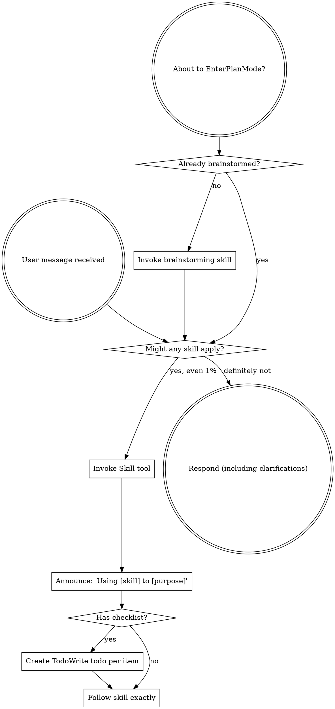

# Review — 2026-05-13-external-reviewer-redesign.md (post-slice, round 4)

- Target: `docs/superstar/plans/2026-05-13-external-reviewer-redesign.md`
- Request: `docs/reviewer/external-reviewer-redesign-S2-post-slice/r4-2026-05-14T0242-request.md`
- Reviewer command: `reviewer-agent`
- Status: `ok`

---

1. Findings

F1. Blocking: Slice 2 is not through the post-slice gate yet. The S2 manifest’s latest recorded round is round 3, and it still has `"verdict": "revise"` in `docs/reviewer/external-reviewer-redesign-S2-post-slice/chain.json:37-48`. The resolution itself says this only closes once “round 4 returns `ready` / `ready with small edits`” at `docs/reviewer/external-reviewer-redesign-S2-post-slice/r3-resolution.md:20-22`. Current repo state has only an untracked `r4-2026-05-14T0242-request.md`, with no matching response and no round-4 manifest entry. Per the handoff, the coordinator must wait for the post-slice verdict before proceeding: `docs/handoffs/2026-05-13-external-reviewer-redesign-prompt.md:17`.

F2. Important: The Slice 2 closeout note is still stale/incomplete. It reports `36 passed` / `39 after the round-2 parser fix` at `docs/superstar/plans/2026-05-13-external-reviewer-redesign.md:3030`, but current verification is `41 passed`, matching the later r3 resolution evidence at `docs/reviewer/external-reviewer-redesign-S2-post-slice/r3-resolution.md:64-66`. The closeout also stops at the post-r2 fix list and does not describe the round-3 `revise`, `r3-resolution.md`, commit `35cacd6`, or the currently-open round-4 request.

2. Open questions / assumptions

I’m treating the five modified skill files as unrelated, because the plan explicitly calls them out as authorized background changes at `docs/superstar/plans/2026-05-13-external-reviewer-redesign.md:3043`.

I’m treating the untracked round-4 request as an active review attempt, not an abandoned artifact, because it was created after `r3-resolution.md` and targets exactly the required next gate.

3. Suggested document edits

Update the Slice 2 closeout note to include round 3, `r3-resolution.md`, commit `35cacd6`, the current `41 passed` test result, and the fact that Slice 2 remains pending until round 4 returns `ready` or `ready with small edits`.

After round 4 completes, commit the request, response, manifest update, and any resolution/closeout edits together.

4. Verification gaps / commands

I ran:

```bash
python3 -m pytest skills/external-review/tests/ -q
# 41 passed, 1 warning
```

Still needed:

```bash
git status --short --untracked-files=all
# ensure no S2 review artifacts remain untracked

# run/complete round 4 review and confirm chain.json latest verdict is ready or ready with small edits
```

5. Overall verdict: revise

---

## Reviewer stderr

```text
Reading additional input from stdin...
OpenAI Codex v0.130.0
--------
workdir: /home/simon/Dev/sigreer/skills/superstar
model: gpt-5.5
provider: openai
approval: never
sandbox: danger-full-access
reasoning effort: none
reasoning summaries: none
session id: 019e2426-a684-74f3-9e25-eaee0fed5efb
--------
user
You are acting as an independent senior engineering reviewer.

Review stance:
- Lead with findings, ordered by severity.
- Focus on correctness, consistency, implementation risk, missing acceptance
  gates, vague handoffs, ungrounded assumptions, unverified claims, and drift
  from the codebase.
- Give exact file/line references when possible.
- If the document is sound, say that clearly and list residual risks.
- Keep the review actionable. Avoid broad rewrites unless the current structure
  creates concrete risk.

Repository root:
/home/simon/Dev/sigreer/skills/superstar

Target kind:
post-slice

Review mode:
Post-slice review. Treat this as a completion gate for one
slice of work. Compare the completed changes and stated evidence against the
slice acceptance criteria. Prioritize: incomplete tasks, uncommitted or
untracked artifacts, missing tests, failing or skipped verification, broken
cross-site behavior, and claims not supported by the repo state.

Target document:
docs/superstar/plans/2026-05-13-external-reviewer-redesign.md

Additional context files:
- docs/superstar/specs/2026-05-13-external-reviewer-redesign-design.md
- docs/handoffs/2026-05-13-external-reviewer-redesign-prompt.md
- docs/reviewer/external-reviewer-redesign-S2-post-slice/r3-resolution.md

Review output contract:
1. Findings
2. Open questions / assumptions
3. Suggested document edits
4. Verification gaps / commands that should be run, if any
5. Overall verdict: one of "ready", "ready with small edits", or "revise"

Read the files from disk. Do not rely only on the snippets in this prompt.


## Target Preview

### docs/superstar/plans/2026-05-13-external-reviewer-redesign.md

    1	# External-Reviewer Redesign Implementation Plan
    2	
    3	> **For agentic workers:** REQUIRED SUB-SKILL: Use superstar:subagent-driven-development (recommended) or superstar:executing-plans to implement this plan task-by-task. Steps use checkbox (`- [ ]`) syntax for tracking.
    4	
    5	**Goal:** Rebuild `skills/external-review/scripts/external-reviewer.py` so review chains are incremental, durable, machine-readable, and support optional independent sweep reviewers — per `docs/superstar/specs/2026-05-13-external-reviewer-redesign-design.md`.
    6	
    7	**Architecture:** A persistent `chain.json` manifest per review chain becomes the source of truth for round metadata. The script gains verdict parsing, work-ID-keyed chain folders, a resolution-artifact contract and gate, incremental round prompts with embedded diffs, optional session-resume placeholders, and Pass-3 independent sweep reviewers. Skill documentation is updated to match.
    8	
    9	**Tech Stack:** Python 3.9+ standard library only (no external deps), `pytest` for tests, `git` CLI for diff and SHA capture.
   10	
   11	---
   12	
   13	## Pre-flight
   14	
   15	- [ ] **Step 1: Verify working directory and branch**
   16	
   17	Run:
   18	
   19	```bash
   20	cd /home/simon/Dev/sigreer/skills/superstar
   21	git status --short
   22	git rev-parse --abbrev-ref HEAD
   23	```
   24	
   25	Expected: clean tree, branch is a feature branch (not `main`). If on `main`, stop and create a branch via `superstar:using-git-worktrees`.
   26	
   27	- [ ] **Step 2: Confirm test runner**
   28	
   29	Run:
   30	
   31	```bash
   32	python3 -c "import pytest; print(pytest.__version__)"
   33	```
   34	
   35	Expected: prints a version string. If `ModuleNotFoundError`, install pytest:
   36	
   37	```bash
   38	python3 -m pip install --user pytest
   39	```
   40	
   41	- [ ] **Step 3: Set up the test directory**
   42	
   43	Create the directory tests will live in:
   44	
   45	```bash
   46	mkdir -p skills/external-review/tests
   47	touch skills/external-review/tests/__init__.py
   48	```
   49	
   50	Commit:
   51	
   52	```bash
   53	git add skills/external-review/tests/__init__.py
   54	git commit -m "scaffold: tests dir for external-reviewer redesign"
   55	```
   56	
   57	---
   58	
   59	## Slice 1: Chain manifest & verdict parsing
   60	
   61	**Goal:** Introduce `chain.json` as the round-metadata source of truth, parse verdicts and finding counts from response text, and emit them in the JSON output. Backwards-compatible: legacy chains synthesize a manifest on first touch.
   62	
   63	### Task 1.1: Manifest read/write helpers
   64	
   65	**Files:**
   66	- Create: `skills/external-review/tests/test_manifest.py`
   67	- Modify: `skills/external-review/scripts/external-reviewer.py`
   68	
   69	- [x] **Step 1: Write the failing tests**
   70	
   71	`skills/external-review/tests/test_manifest.py`:
   72	
   73	```python
   74	import json
   75	from pathlib import Path
   76	
   77	import pytest
   78	
   79	import sys
   80	SCRIPTS = Path(__file__).resolve().parents[1] / "scripts"
   81	sys.path.insert(0, str(SCRIPTS))
   82	
   83	import importlib.util
   84	spec = importlib.util.spec_from_file_location("external_reviewer", SCRIPTS / "external-reviewer.py")
   85	external_reviewer = importlib.util.module_from_spec(spec)
   86	spec.loader.exec_module(external_reviewer)
   87	
   88	
   89	def test_read_manifest_returns_none_for_missing(tmp_path):
   90	    assert external_reviewer.read_manifest(tmp_path / "missing.json") is None
   91	
   92	
   93	def test_write_then_read_manifest_roundtrips(tmp_path):
   94	    path = tmp_path / "chain.json"
   95	    data = {
   96	        "schema_version": 1,
   97	        "chain": "demo-post-slice",
   98	        "kind": "post-slice",
   99	        "target": "docs/plans/demo.md",
  100	        "work_id": "P1.S1",
  101	        "legacy_migrated": False,
  102	        "rounds": [],
  103	        "sweep_checkpoints": {"first-round": "pending", "final-ready": "pending"},
  104	    }
  105	    external_reviewer.write_manifest(path, data)
  106	    loaded = external_reviewer.read_manifest(path)
  107	    assert loaded == data
  108	
  109	
  110	def test_read_manifest_rejects_newer_schema(tmp_path):
  111	    path = tmp_path / "chain.json"
  112	    path.write_text(json.dumps({"schema_version": 99}))
  113	    with pytest.raises(external_reviewer.ManifestSchemaTooNew):
  114	        external_reviewer.read_manifest(path)
  115	```
  116	
  117	- [x] **Step 2: Run the tests; confirm they fail**
  118	
  119	```bash
  120	python3 -m pytest skills/external-review/tests/test_manifest.py -v
  121	```
  122	
  123	Expected: 3 failures (`read_manifest`, `write_manifest`, `ManifestSchemaTooNew` all undefined).
  124	
  125	- [x] **Step 3: Add manifest helpers to the script**
  126	
  127	Append to `skills/external-review/scripts/external-reviewer.py` (after the existing module-level constants, before `repo_root()`):
  128	
  129	```python
  130	SUPPORTED_SCHEMA_VERSION = 1
  131	
  132	
  133	class ManifestSchemaTooNew(Exception):
  134	    """Raised when chain.json declares a schema_version newer than this script supports."""
  135	
  136	
  137	def read_manifest(path: Path) -> dict | None:
  138	    if not path.exists():
  139	        return None
  140	    data = json.loads(path.read_text(encoding="utf-8"))
  141	    version = data.get("schema_version")
  142	    if isinstance(version, int) and version > SUPPORTED_SCHEMA_VERSION:
  143	        raise ManifestSchemaTooNew(
  144	            f"chain.json schema_version {version} is newer than this script supports "
  145	            f"(max {SUPPORTED_SCHEMA_VERSION}). Upgrade external-reviewer.py."
  146	        )
  147	    return data
  148	
  149	
  150	def write_manifest(path: Path, data: dict) -> None:
  151	    path.parent.mkdir(parents=True, exist_ok=True)
  152	    path.write_text(json.dumps(data, indent=2) + "\n", encoding="utf-8")
  153	```
  154	
  155	- [x] **Step 4: Run the tests; confirm they pass**
  156	
  157	```bash
  158	python3 -m pytest skills/external-review/tests/test_manifest.py -v
  159	```
  160	
  161	Expected: 3 passed.
  162	
  163	- [x] **Step 5: Commit**
  164	
  165	```bash
  166	git add skills/external-review/scripts/external-reviewer.py skills/external-review/tests/test_manifest.py
  167	git commit -m "feat(external-reviewer): chain.json read/write helpers with schema versioning"
  168	```
  169	
  170	### Task 1.2: Verdict parsing
  171	
  172	**Files:**
  173	- Create: `skills/external-review/tests/test_verdict.py`
  174	- Modify: `skills/external-review/scripts/external-reviewer.py`
  175	
  176	- [x] **Step 1: Write the failing tests**
  177	
  178	`skills/external-review/tests/test_verdict.py`:
  179	
  180	```python
  181	from pathlib import Path
  182	import sys, importlib.util
  183	
  184	SCRIPTS = Path(__file__).resolve().parents[1] / "scripts"
  185	sys.path.insert(0, str(SCRIPTS))
  186	spec = importlib.util.spec_from_file_location("external_reviewer", SCRIPTS / "external-reviewer.py")
  187	er = importlib.util.module_from_spec(spec); spec.loader.exec_module(er)
  188	
  189	
  190	def test_verdict_ready():
  191	    v, valid = er.parse_verdict("Findings: ok\n\nOverall verdict: ready\n")
  192	    assert v == "ready"
  193	    assert valid is True
  194	
  195	
  196	def test_verdict_ready_with_small_edits_markdown():
  197	    body = "**Overall verdict:** `ready with small edits`."
  198	    v, valid = er.parse_verdict(body)
  199	    assert v == "ready with small edits"
  200	    assert valid is True
  201	
  202	
  203	def test_verdict_revise_case_insensitive():
  204	    v, valid = er.parse_verdict("OVERALL VERDICT: Revise")
  205	    assert v == "revise"
  206	    assert valid is True
  207	
  208	
  209	def test_verdict_takes_last_match():
  210	    body = "Overall verdict: ready\n\n...later...\n\nOverall verdict: revise"
  211	    v, valid = er.parse_verdict(body)
  212	    assert v == "revise"
  213	
  214	
  215	def test_verdict_unknown_returns_invalid():
  216	    v, valid = er.parse_verdict("Overall verdict: looks fine to me")
  217	    assert v is None
  218	    assert valid is False
  219	
  220	
  221	def test_verdict_missing_returns_invalid():
  222	    v, valid = er.parse_verdict("Some review prose with no verdict line.")
  223	    assert v is None
  224	    assert valid is False
  225	```
  226	
  227	- [x] **Step 2: Run the tests; confirm they fail**
  228	
  229	```bash
  230	python3 -m pytest skills/external-review/tests/test_verdict.py -v
  231	```
  232	
  233	Expected: 6 failures (`parse_verdict` undefined).
  234	
  235	- [x] **Step 3: Add the verdict parser**
  236	
  237	Append to `skills/external-review/scripts/external-reviewer.py`:
  238	
  239	```python
  240	VERDICT_VALUES = ("ready with small edits", "ready", "revise")
  241	VERDICT_LINE_RE = re.compile(
  242	    r"overall\s+verdict\s*[:\-]\s*[`*_\"']*\s*(ready with small edits|ready|revise)\s*[`*_\"'.]*",
  243	    re.IGNORECASE,
  244	)
  245	
  246	
  247	def parse_verdict(text: str) -> tuple[str | None, bool]:
  248	    matches = list(VERDICT_LINE_RE.finditer(text))
  249	    if not matches:
  250	        return None, False
  251	    raw = matches[-1].group(1).strip().lower()
  252	    if raw not in VERDICT_VALUES:
  253	        return None, False
  254	    return raw, True
  255	```
  256	
  257	Note: regex prefers `ready with small edits` over `ready` because of ordering in the alternation.
  258	
  259	- [x] **Step 4: Run the tests; confirm they pass**
  260	
  261	```bash
  262	python3 -m pytest skills/external-review/tests/test_verdict.py -v
  263	```
  264	
  265	Expected: 6 passed.
  266	
  267	- [x] **Step 5: Commit**
  268	
  269	```bash
  270	git add skills/external-review/scripts/external-reviewer.py skills/external-review/tests/test_verdict.py
  271	git commit -m "feat(external-reviewer): parse_verdict with markdown/case tolerance"
  272	```
  273	
  274	### Task 1.3: Finding-count parsing
  275	
  276	**Files:**
  277	- Create: `skills/external-review/tests/test_findings.py`
  278	- Modify: `skills/external-review/scripts/external-reviewer.py`
  279	
  280	- [x] **Step 1: Write the failing tests**
  281	
  282	`skills/external-review/tests/test_findings.py`:
  283	
  284	```python
  285	from pathlib import Path
  286	import sys, importlib.util
  287	SCRIPTS = Path(__file__).resolve().parents[1] / "scripts"
  288	sys.path.insert(0, str(SCRIPTS))
  289	spec = importlib.util.spec_from_file_location("external_reviewer", SCRIPTS / "external-reviewer.py")
  290	er = importlib.util.module_from_spec(spec); spec.loader.exec_module(er)
  291	
  292	
  293	def test_heading_findings_counted():
  294	    body = "## F1\nSeverity: blocking\n\n## F2\nSeverity: minor\n\n## F3\nSeverity: blocking"
  295	    n, blocking = er.parse_findings(body)
  296	    assert n == 3
  297	    assert blocking == 2
  298	
  299	
  300	def test_bullet_findings_counted():
  301	    body = "- F1: something blocking (blocking)\n- F2 minor thing"
  302	    n, blocking = er.parse_findings(body)
  303	    assert n == 2
  304	    assert blocking == 1
  305	
  306	
  307	def test_no_findings_returns_zero():
  308	    body = "Overall verdict: ready\n\nNo findings."
  309	    n, blocking = er.parse_findings(body)
  310	    assert n == 0
  311	    assert blocking == 0
  312	
  313	
  314	def test_unparseable_returns_none():
  315	    body = "Reviewer crashed: connection reset"
  316	    n, blocking = er.parse_findings(body)
  317	    assert n is None
  318	    assert blocking is None
  319	```
  320	
  321	- [x] **Step 2: Run the tests; confirm they fail**
  322	
  323	```bash
  324	python3 -m pytest skills/external-review/tests/test_findings.py -v
  325	```
  326	
  327	Expected: 4 failures.
  328	
  329	- [x] **Step 3: Add the parser**
  330	
  331	Append to `skills/external-review/scripts/external-reviewer.py`:
  332	
  333	```python
  334	HEADING_FINDING_RE = re.compile(r"^##\s+F\d+\b", re.MULTILINE)
  335	BULLET_FINDING_RE = re.compile(r"^\s*[-*]?\s*\**F\d+\**[:\s\-]", re.MULTILINE)
  336	BLOCKING_MARKER_RE = re.compile(r"(?:^|\s)\(blocking\)|^severity\s*:\s*blocking", re.IGNORECASE | re.MULTILINE)
  337	
  338	
  339	def parse_findings(text: str) -> tuple[int | None, int | None]:
  340	    if not text or text.strip() == "" or "reviewer crashed" in text.lower():
  341	        return None, None
  342	    heading_count = len(HEADING_FINDING_RE.findall(text))
  343	    if heading_count > 0:
  344	        n = heading_count
  345	    else:
  346	        n = len(BULLET_FINDING_RE.findall(text))
  347	    blocking = len(BLOCKING_MARKER_RE.findall(text))
  348	    return n, blocking
  349	```
  350	
  351	- [x] **Step 4: Run the tests; confirm they pass**
  352	
  353	```bash
  354	python3 -m pytest skills/external-review/tests/test_findings.py -v
  355	```
  356	
  357	Expected: 4 passed.
  358	
  359	- [x] **Step 5: Commit**
  360	
  361	```bash
  362	git add skills/external-review/scripts/external-reviewer.py skills/external-review/tests/test_findings.py
  363	git commit -m "feat(external-reviewer): parse_findings (heading + bullet, blocking count)"
  364	```
  365	
  366	### Task 1.4: Round-number derivation reads manifest first
  367	
  368	**Files:**
  369	- Create: `skills/external-review/tests/test_round_number.py`
  370	- Modify: `skills/external-review/scripts/external-reviewer.py` (`next_round_number`)
  371	
  372	- [x] **Step 1: Write the failing tests**
  373	
  374	`skills/external-review/tests/test_round_number.py`:
  375	
  376	```python
  377	from pathlib import Path
  378	import json, sys, importlib.util
  379	SCRIPTS = Path(__file__).resolve().parents[1] / "scripts"
  380	sys.path.insert(0, str(SCRIPTS))
  381	spec = importlib.util.spec_from_file_location("external_reviewer", SCRIPTS / "external-reviewer.py")
  382	er = importlib.util.module_from_spec(spec); spec.loader.exec_module(er)
  383	
  384	
  385	def test_no_chain_dir_round_is_one(tmp_path):
  386	    assert er.next_round_number(tmp_path / "absent") == 1
  387	
  388	
  389	def test_manifest_present_takes_precedence(tmp_path):
  390	    d = tmp_path / "chain"; d.mkdir()
  391	    er.write_manifest(d / "chain.json", {
  392	        "schema_version": 1, "rounds": [{"round": 1}, {"round": 2}]
  393	    })
  394	    assert er.next_round_number(d) == 3
  395	
  396	
  397	def test_legacy_dir_no_manifest_falls_back_to_filename_scan(tmp_path):
  398	    d = tmp_path / "chain"; d.mkdir()
  399	    (d / "r1-2026-05-01T0900-request.md").write_text("")
  400	    (d / "r2-2026-05-02T0900-request.md").write_text("")
  401	    assert er.next_round_number(d) == 3
  402	```
  403	
  404	- [x] **Step 2: Run the tests; confirm they fail**
  405	
  406	```bash
  407	python3 -m pytest skills/external-review/tests/test_round_number.py -v
  408	```
  409	
  410	Expected: test 2 fails (no manifest awareness), tests 1 and 3 may pass if current behavior already handles them.
  411	
  412	- [x] **Step 3: Update `next_round_number`**
  413	
  414	Replace the existing function:
  415	
  416	```python
  417	def next_round_number(chain_dir: Path) -> int:
  418	    if not chain_dir.exists():
  419	        return 1
  420	    manifest = read_manifest(chain_dir / "chain.json")
  421	    if manifest and isinstance(manifest.get("rounds"), list):
  422	        return len(manifest["rounds"]) + 1
  423	    return len(list(chain_dir.glob("r*-*-request.md"))) + 1
  424	```
  425	
  426	- [x] **Step 4: Run the tests**
  427	
  428	```bash
  429	python3 -m pytest skills/external-review/tests/test_round_number.py -v
  430	```
  431	
  432	Expected: 3 passed.
  433	
  434	- [x] **Step 5: Commit**
  435	
  436	```bash
  437	git add skills/external-review/scripts/external-reviewer.py skills/external-review/tests/test_round_number.py
  438	git commit -m "feat(external-reviewer): next_round_number consults chain.json"
  439	```
  440	
  441	### Task 1.5: Legacy manifest synthesis
  442	
  443	**Files:**
  444	- Create: `skills/external-review/tests/test_legacy_migration.py`
  445	- Modify: `skills/external-review/scripts/external-reviewer.py`
  446	
  447	- [x] **Step 1: Write the failing tests**
  448	
  449	`skills/external-review/tests/test_legacy_migration.py`:
  450	
  451	```python
  452	from pathlib import Path
  453	import sys, importlib.util
  454	SCRIPTS = Path(__file__).resolve().parents[1] / "scripts"
  455	sys.path.insert(0, str(SCRIPTS))
  456	spec = importlib.util.spec_from_file_location("external_reviewer", SCRIPTS / "external-reviewer.py")
  457	er = importlib.util.module_from_spec(spec); spec.loader.exec_module(er)
  458	
  459	
  460	def test_synthesize_manifest_from_legacy_files(tmp_path):
  461	    d = tmp_path / "old-chain"; d.mkdir()
  462	    (d / "r1-2026-04-01T0900-request.md").write_text("prompt body")
  463	    (d / "r1-2026-04-01T0905-response.md").write_text(
  464	        "## F1\nSeverity: blocking\n\nOverall verdict: revise\n"
  465	    )
  466	    (d / "r2-2026-04-02T1200-request.md").write_text("prompt body 2")
  467	
  468	    manifest = er.synthesize_legacy_manifest(
  469	        chain_dir=d, chain="old-chain", kind="post-slice",
  470	        target="docs/plans/old.md", work_id="P1.S1",
  471	    )
  472	
  473	    assert manifest["legacy_migrated"] is True
  474	    assert manifest["work_id"] == "P1.S1"
  475	    assert len(manifest["rounds"]) == 2
  476	    r1, r2 = manifest["rounds"]
  477	    assert r1["legacy"] is True
  478	    assert r1["verdict"] == "revise"
  479	    assert r1["verdict_valid"] is True
  480	    assert r1["findings_count"] == 1
  481	    assert r1["blocking_findings_count"] == 1
  482	    assert r1["head_sha_after_round"] is None
  483	    assert r2["response"] is None  # only request file existed
  484	```
  485	
  486	- [x] **Step 2: Run the tests; confirm they fail**
  487	
  488	```bash
  489	python3 -m pytest skills/external-review/tests/test_legacy_migration.py -v
  490	```
  491	
  492	Expected: 1 failure.
  493	
  494	- [x] **Step 3: Add the synthesizer**
  495	
  496	Append to `skills/external-review/scripts/external-reviewer.py`:
  497	
  498	```python
  499	LEGACY_ROUND_FILE_RE = re.compile(r"^r(\d+)-([0-9T\-]+)-(request|response)\.md$")
  500	
  501	
  502	def synthesize_legacy_manifest(
  503	    *, chain_dir: Path, chain: str, kind: str, target: str, work_id: str | None
  504	) -> dict:
  505	    rounds_map: dict[int, dict] = {}
  506	    for path in sorted(chain_dir.iterdir()):
  507	        m = LEGACY_ROUND_FILE_RE.match(path.name)
  508	        if not m:
  509	            continue
  510	        round_num = int(m.group(1))
  511	        role = m.group(3)
  512	        entry = rounds_map.setdefault(
  513	            round_num,
  514	            {
  515	                "round": round_num,
  516	                "request": None,
  517	                "response": None,
  518	                "resolution": None,
  519	                "verdict": None,
  520	                "verdict_valid": False,
  521	                "findings_count": None,
  522	                "blocking_findings_count": None,
  523	                "head_sha_at_request": None,
  524	                "head_sha_after_round": None,
  525	                "worktree_dirty_at_request": None,
  526	                "legacy": True,
  527	            },
  528	        )
  529	        entry[role] = path.name
  530	        if role == "response":
  531	            body = path.read_text(encoding="utf-8", errors="replace")
  532	            v, valid = parse_verdict(body)
  533	            entry["verdict"], entry["verdict_valid"] = v, valid
  534	            n, blocking = parse_findings(body)
  535	            entry["findings_count"], entry["blocking_findings_count"] = n, blocking
  536	
  537	    return {
  538	        "schema_version": SUPPORTED_SCHEMA_VERSION,
  539	        "chain": chain,
  540	        "kind": kind,
  541	        "target": target,
  542	        "work_id": work_id,
  543	        "legacy_migrated": True,
  544	        "migrated_at": dt.datetime.utcnow().strftime("%Y-%m-%dT%H:%M:%SZ"),
  545	        "rounds": [rounds_map[k] for k in sorted(rounds_map)],
  546	        "sweep_checkpoints": {"first-round": "pending", "final-ready": "pending"},
  547	    }
  548	```
  549	
  550	- [x] **Step 4: Run the tests; confirm they pass**
  551	
  552	```bash
  553	python3 -m pytest skills/external-review/tests/test_legacy_migration.py -v
  554	```
  555	
  556	Expected: 1 passed.
  557	
  558	- [x] **Step 5: Commit**
  559	
  560	```bash
  561	git add skills/external-review/scripts/external-reviewer.py skills/external-review/tests/test_legacy_migration.py
  562	git commit -m "feat(external-reviewer): synthesize_legacy_manifest from rN-* files"
  563	```
  564	
  565	### Task 1.6: Wire manifest into `main()` for single-reviewer rounds
  566	
  567	**Files:**
  568	- Modify: `skills/external-review/scripts/external-reviewer.py` (`main` function)
  569	- Create: `skills/external-review/tests/test_main_round_writes_manifest.py`
  570	
  571	- [x] **Step 1: Write the failing test**
  572	
  573	`skills/external-review/tests/test_main_round_writes_manifest.py`:
  574	
  575	```python
  576	from pathlib import Path
  577	import subprocess, sys, json, importlib.util, os
  578	
  579	SCRIPTS = Path(__file__).resolve().parents[1] / "scripts"
  580	sys.path.insert(0, str(SCRIPTS))
  581	spec = importlib.util.spec_from_file_location("external_reviewer", SCRIPTS / "external-reviewer.py")
  582	er = importlib.util.module_from_spec(spec); spec.loader.exec_module(er)
  583	
  584	
  585	FAKE_REVIEWER = """#!/usr/bin/env bash
  586	cat <<'EOF'
  587	## F1
  588	Severity: blocking
  589	Stub finding.
  590	
  591	Overall verdict: revise
  592	EOF
  593	"""
  594	
  595	
  596	def test_main_writes_manifest_entry(tmp_path, monkeypatch):
  597	    repo = tmp_path / "repo"; repo.mkdir()
  598	    subprocess.run(["git", "-C", str(repo), "init", "-q"], check=True)
  599	    subprocess.run(["git", "-C", str(repo), "config", "user.email", "t@t"], check=True)
  600	    subprocess.run(["git", "-C", str(repo), "config", "user.name", "T"], check=True)

[truncated: 2443 additional lines]

## Context Previews

### docs/superstar/specs/2026-05-13-external-reviewer-redesign-design.md

    1	# External-Review Script Redesign — Design
    2	
    3	**Date:** 2026-05-13
    4	**Target:** `skills/external-review/scripts/external-reviewer.py` and `skills/external-review/SKILL.md`
    5	**Motivation:** A self-review of the external-reviewer flow surfaced five concrete failure modes that cause review loops to balloon to 7–10 rounds and lose continuity between rounds. This spec redesigns the script and skill to make rounds incremental, durable, and machine-readable.
    6	
    7	---
    8	
    9	## Goals
   10	
   11	1. **Round N+1 is incremental, not a re-review.** The reviewer is given prior findings, the fixer's resolution report, and a focused diff — and is instructed to verify resolution rather than reopen broad review.
   12	2. **Verdict is machine-readable.** JSON output exposes a parsed `verdict`, `verdict_valid`, and finding counts, so coordinators don't have to parse prose.
   13	3. **Post-slice / post-phase chains are uniquely keyed.** `--work-id` is required for both so that multi-slice plans don't collapse into one chain.
   14	4. **Resolution artifacts are durable and structured-enough-to-parse.** Required headers, free-form bodies, stable finding IDs across rounds.
   15	5. **Optional session resume.** Provider-specific wrappers can plug into placeholders if the underlying reviewer CLI supports session IDs.
   16	6. **Legacy chains keep working.** Soft-migrate on first new round; preserve existing folder names and audit history.
   17	7. **Review depth is explicit.** The default chain uses one primary incremental reviewer, but callers can request bounded independent sweep reviewers at high-risk checkpoints to preserve fresh-eye coverage without unbounded serial churn.
   18	
   19	## Non-goals
   20	
   21	- Replacing the chain-folder layout for new chains. The folder-naming scheme gains a `--work-id` segment for post-slice/post-phase, but the round-file scheme is unchanged.
   22	- Making the script aware of any specific reviewer CLI. The script remains provider-neutral via `AGENT_REVIEWER_CMD`.
   23	- Auto-dispatching the fixer subagent. The script enforces the resolution gate but does not invoke fixers; that stays in the coordinator's loop, governed by `subagent-driven-development`.
   24	
   25	## Invariants
   26	
   27	- **A review chain is single-writer.** Running two rounds concurrently against the same chain is unsupported and may corrupt `chain.json`. The script does not lock; callers are expected to serialise.
   28	- **Existing rounds are immutable.** Once written, `rN-*-request.md`, `rN-*-response.md`, and `rN-resolution.md` are never overwritten. Manifest entries for past rounds are append-only.
   29	
   30	## Architecture
   31	
   32	Three implementation passes, all designed in this spec:
   33	
   34	- **Pass 1 — Core.** Chain manifest, verdict parsing, `--work-id`, prior-round context injection, incremental round prompts, resolution-artifact contract and gate, automatic diff embedding, JSON output enrichment, legacy migration.
   35	- **Pass 2 — Session resume.** Optional placeholders (`{chain_dir}`, `{round}`, `{previous_response}`, `{resolution_file}`, `{session_file}`) exposed via the existing `AGENT_REVIEWER_CMD` template mechanism. A provider-specific wrapper can use `{session_file}` to persist and resume reviewer sessions. The script provides a stable path (`chain_dir/session.state`) and ensures the parent directory exists; wrappers own the file's contents. The script never reads `session.state`.
   36	- **Pass 3 — Review depth / independent sweeps.** Adds `--review-depth`, `--independent-reviewers`, `--sweep-policy` flags. Independent sweep reviewers run without seeing the primary reviewer's findings on their first pass (to avoid anchoring), and their findings are merged into the same resolution checklist afterward. Depends on Pass 1's manifest and verdict parsing; does not depend on Pass 2.
   37	
   38	### Chain manifest
   39	
   40	`docs/reviewer/<chain>/chain.json` is the single source of truth for round metadata. The `rN-*-request.md` / `rN-*-response.md` / `rN-resolution.md` files remain for human readability and git history; the script reads and writes manifest entries when computing round numbers, base refs, and verdicts.
   41	
   42	```json
   43	{
   44	  "schema_version": 1,
   45	  "chain": "feature-plan-P2-S3-post-slice",
   46	  "kind": "post-slice",
   47	  "target": "docs/superstar/plans/feature-plan.md",
   48	  "work_id": "P2.S3",
   49	  "legacy_migrated": false,
   50	  "rounds": [
   51	    {
   52	      "round": 1,
   53	      "request": "r1-2026-05-13T1012-request.md",
   54	      "response": "r1-2026-05-13T1020-response.md",
   55	      "resolution": null,
   56	      "head_sha_at_request": "abc1234",
   57	      "head_sha_after_round": "abc1234",
   58	      "worktree_dirty_at_request": false,
   59	      "verdict": "revise",
   60	      "verdict_valid": true,
   61	      "findings_count": 4,
   62	      "blocking_findings_count": 2
   63	    },
   64	    {
   65	      "round": 2,
   66	      "request": "r2-2026-05-13T1130-request.md",
   67	      "response": null,
   68	      "resolution": "r1-resolution.md",
   69	      "base_ref": "abc1234",
   70	      "base_ref_source": "auto",
   71	      "head_sha_at_request": "def5678",
   72	      "worktree_dirty_at_request": false,
   73	      "diff_included": true,
   74	      "resolution_parse_status": "ok",
   75	      "resolution_waiver": false
   76	    }
   77	  ]
   78	}
   79	```
   80	
   81	#### Manifest versioning
   82	
   83	- `schema_version: 1` is the initial version introduced by this redesign.
   84	- Unknown future `schema_version` values cause the script to error with a clear message: `ERROR: chain.json schema_version <N> is newer than this script supports. Upgrade external-reviewer.py.` This prevents silent corruption.
   85	- Older `schema_version` values (currently none) get best-effort migration on read, recorded as `schema_migrated_from: <prior>` in the manifest.
   86	
   87	### Naming
   88	
   89	- **Chain folder slug:** `<target-stem-no-leading-date>-<work-id-dotless>-<kind>` for post-slice/post-phase; `<target-stem-no-leading-date>-<kind>` otherwise. Dots in work IDs are replaced with dashes in the folder slug only — the manifest preserves the canonical form.
   90	  - Example: `--work-id P2.S3` → folder `feature-plan-P2-S3-post-slice`, manifest `"work_id": "P2.S3"`.
   91	- **Round files:** `r{N}-<YYYY-MM-DDTHHMM>-request.md`, `r{N}-<YYYY-MM-DDTHHMM>-response.md`. Unchanged from current behavior.
   92	- **Resolution files:** `r{N}-resolution.md`, where `N` is the round whose response is being addressed. Round `N+1` consumes `r{N}-resolution.md`. Worked example: after `r1-response.md` returns `revise`, the fixer writes `r1-resolution.md`; round 2 reads `r1-resolution.md` and embeds it in the round-2 prompt.
   93	
   94	## CLI surface (new flags)
   95	
   96	| Flag | Kinds | Purpose |
   97	|---|---|---|
   98	| `--work-id <id>` | required for `post-slice`, `post-phase`; optional otherwise | Stable slice/phase ID (e.g., `P2.S3` for post-slice, `P2` for post-phase). Becomes part of chain folder name (dots → dashes) and is stored verbatim in the manifest. |
   99	| `--base-ref <sha\|ref>` | any | Override auto-computed diff base for this round. |
  100	| `--no-diff` | any | Suppress diff embedding even on round N+1. |
  101	| `--allow-missing-resolution` | post-slice, post-phase | Waive the resolution-required gate. Logged in manifest as `resolution_waiver: true`. |
  102	| `--changed-files <path>...` | any | Override automatic changed-file discovery and limit the embedded diff to the supplied paths. |
  103	| `--mode <auto\|broad\|incremental>` | any | Override the round-1-vs-N prompt mode. Default `auto` (round 1 → broad; round 2+ → incremental). |
  104	| `--max-diff-lines <int>` | any | Cap diff size. Default 2000. Truncation marker is embedded if exceeded. |
  105	| `--review-depth <standard\|thorough\|exhaustive>` | post-slice, post-phase | Controls whether independent sweep reviewers are run in addition to the primary chain reviewer. Default `standard`. |
  106	| `--independent-reviewers <int>` | post-slice, post-phase | Override reviewer count for independent sweeps. Default derived from `--review-depth`. |
  107	| `--sweep-policy <first-round\|final-ready\|both\|never>` | post-slice, post-phase | When to run fresh-context sweep reviews. Default derived from `--review-depth`. |
  108	
  109	### `--work-id` enforcement
  110	
  111	- `post-slice` or `post-phase` invoked without `--work-id` → exit 2 with operational error.
  112	- For `post-phase`, the expected form is the phase ID alone (`P2`), not a slice ID. The script does not enforce a regex; it documents the convention.
  113	- For other kinds, `--work-id` is optional; if provided, it is recorded in the manifest but does not affect the folder slug.
  114	
  115	## Reviewer prompt — round 1 vs round N+
  116	
  117	### Round 1: broad
  118	
  119	The existing broad prompt, with the output contract revised to require **stable finding IDs**:
  120	
  121	```
  122	1. Findings
  123	   - Each finding tagged `F<n>` (e.g., F1, F2, F3). IDs must be stable across rounds.
  124	   - Severity: blocking | important | minor | nit
  125	2. Open questions / assumptions
  126	3. Suggested document edits
  127	4. Verification gaps
  128	5. Overall verdict: ready | ready with small edits | revise
  129	```
  130	
  131	### Round N+: incremental
  132	
  133	Prepended to the existing prompt body:
  134	
  135	```
  136	You are continuing an existing review chain. This is round {N} of {chain_id}.
  137	
  138	In incremental mode:
  139	- Verify whether prior findings are resolved per the resolution report below.
  140	- Reuse the existing finding IDs (F1, F2, …). If a prior finding is resolved,
  141	  mark it RESOLVED in your findings list with its original ID. If still
  142	  unresolved, keep its ID.
  143	- Only introduce new finding IDs for genuine regressions caused by the fix, or
  144	  blocking issues clearly missed in earlier rounds. Do not reopen broad review
  145	  unless prior fixes changed broad architecture.
  146	
  147	Review chain summary:
  148	{per-round table: round, verdict, findings_count, blocking_findings_count}
  149	
  150	Prior-round findings (authoritative):
  151	{if r{N-1}-merged-findings.md exists: its verbatim contents — this replaces
  152	 individual reviewer response files as the prior-finding list of record}
  153	{else: a summary of the prior round's primary response, with finding IDs intact}
  154	
  155	Resolution report for prior round:
  156	{verbatim contents of r{N-1}-resolution.md}
  157	{or "MISSING — explicitly waived by caller via --allow-missing-resolution"}
  158	{or "MISSING — chain migrated from legacy artifacts; please verify whether changes occurred from the diff below"}
  159	
  160	Resolution parse summary (best-effort):
  161	{structured: per-finding-ID → status, or "unparseable"}
  162	
  163	Changes since prior round:
  164	{git diff <base_ref>..HEAD -- <scoped paths>}
  165	{if dirty: appended `git diff HEAD` section, both labeled}
  166	{if no base: "not available for this round (legacy chain / first round / --no-diff)"}
  167	```
  168	
  169	`--mode broad` forces round-1-style on later rounds (rare; for cases where the fix changed architecture). `--mode incremental` on round 1 is rejected with a clear error.
  170	
  171	## Resolution artifact contract
  172	
  173	**Path:** `docs/reviewer/<chain>/r{N}-resolution.md`, where `N` is the round whose response is being addressed. Authored by the fix subagent between round N (response) and round N+1 (resubmit).
  174	
  175	**Required parseable shape:**
  176	
  177	```markdown
  178	# Resolution for r{N}
  179	
  180	## F1
  181	Status: fixed
  182	Evidence:
  183	- Commit: abc1234
  184	- Files: `src/foo.ts:42`, `tests/foo.test.ts:18`
  185	- Verification: `npm test -- foo.test.ts` passed
  186	
  187	Notes:
  188	Changed the validation path to reject empty IDs before persistence.
  189	
  190	## F2
  191	Status: waived
  192	Evidence:
  193	- No code change
  194	- Reason: reviewer assumed X, but the plan explicitly excludes X in
  195	  `docs/superstar/specs/foo-design.md:77`
  196	
  197	Notes:
  198	No implementation change because this would expand slice scope.
  199	```
  200	

[truncated: 292 additional lines]
### docs/handoffs/2026-05-13-external-reviewer-redesign-prompt.md

    1	# Coordinator handoff — External-Reviewer Redesign
    2	
    3	You are the coordinator for implementing the **external-reviewer redesign** in the `superstar` repo at `/home/simon/Dev/sigreer/skills/superstar`.
    4	
    5	Your role is **strictly orchestration**. Use the `superstar:subagent-driven-development` skill with parallel agents where possible.
    6	
    7	## Inputs
    8	
    9	- Spec: [`docs/superstar/specs/2026-05-13-external-reviewer-redesign-design.md`](docs/superstar/specs/2026-05-13-external-reviewer-redesign-design.md)
   10	- Plan: [`docs/superstar/plans/2026-05-13-external-reviewer-redesign.md`](docs/superstar/plans/2026-05-13-external-reviewer-redesign.md)
   11	- Reviewer chain folder (created on first review): `docs/reviewer/external-reviewer-redesign-plan/` (kind `plan`) and per-slice chains like `docs/reviewer/external-reviewer-redesign-S1-post-slice/` (no TASKLIST.md in this repo; treat `S1`…`S8` from the plan as the work-id segments).
   12	
   13	## Coordinator discipline (non-negotiable)
   14	
   15	- **Do not perform any fixes yourself** unless the fix is genuinely cheaper to implement than the process of delegating to a subagent. Tiebreak: delegate.
   16	- **Do not pollute your context.** Delegate investigations, file reads, and edits to subagents. Your context is for orchestration, not implementation detail.
   17	- **At the end of each slice (S1–S8)**, the human partner runs `external-review` manually with `--kind post-slice` and pastes the findings back. Do NOT invoke the external-review skill yourself in this project — the human partner has explicitly chosen to drive it manually to keep the context clean. Wait for the verdict before proceeding to the next slice.
   18	- **Do not perform reviewer-driven fixes yourself.** Pass each reviewer response to a fix subagent that writes `r{N}-resolution.md` per the contract in `[[external-review]]`, then signal the human partner that the resolution is ready and the next round can be submitted.
   19	- **At the end of the phase** (after S8 closes), the human partner runs `--kind post-phase` manually. Same delegation rule.
   20	- **No TASKLIST.md exists** in this repo. Track slice completion in this handoff document or in a TODO list you maintain in-session; do not invent a TASKLIST.md file.
   21	
   22	## First action
   23	
   24	Read this file (the handoff prompt), the spec, and the plan. Then invoke `superstar:subagent-driven-development` and begin Slice 1 (Chain manifest & verdict parsing).
### docs/reviewer/external-reviewer-redesign-S2-post-slice/r3-resolution.md

    1	# Resolution for r3
    2	
    3	Round 3 of the S2 chain. Reviewer returned `revise` with 2 findings
    4	(0 blocking). F1 is a self-referential procedural complaint that
    5	resolves naturally when this round closes ready; F2 is a substantive
    6	staleness item addressed below. A parser robustness gap surfaced while
    7	triaging the round is also recorded.
    8	
    9	- Verdict: `revise`
   10	- Target: `docs/superstar/plans/2026-05-13-external-reviewer-redesign.md`
   11	- Response: `docs/reviewer/external-reviewer-redesign-S2-post-slice/r3-2026-05-14T0236-response.md`
   12	
   13	## F1
   14	Status: addressed-by-next-round
   15	Evidence:
   16	- The finding states "Slice 2 is not closed: latest S2 review verdict
   17	  is still `revise`, and round 3 is only an untracked request." This
   18	  is structurally self-referential: by definition the request cannot
   19	  be tracked nor a round-3 manifest entry populated until a response
   20	  has been received and resolved. Once round 4 returns
   21	  `ready` / `ready with small edits` and this resolution is wired into
   22	  the manifest, the closeout condition F1 describes will hold.
   23	- The r3 request and response are now both tracked, this resolution
   24	  doc populates the round-3 manifest `resolution` slot, and the round
   25	  3 `findings_count` / `blocking_findings_count` are emitted as
   26	  `(2, 0)` after the parser fix below.
   27	
   28	Notes:
   29	The reviewer is increasingly raising self-referential procedural
   30	complaints across rounds (the round cannot be closed because the round
   31	is open). Per the round-3 fix-subagent brief, no further action is
   32	required for F1 — it will resolve when the next round returns ready.
   33	
   34	## F2
   35	Status: fixed
   36	Evidence:
   37	- Commit: this round's bundle.
   38	- Files: `docs/superstar/plans/2026-05-13-external-reviewer-redesign.md`
   39	  (Slice 2 closeout note, new "Post-r2 fix commits" sub-heading).
   40	- Verification: the closeout note now records the five
   41	  post-round-2-resolution commits the reviewer flagged as missing
   42	  (`50600d5`, `b5d6181`, `a03ebab`, `f56c896`, `bb679ad`) under a
   43	  dedicated sub-heading so the chain's evolution is visible in the
   44	  plan.
   45	
   46	Notes:
   47	F2 reads: "The Slice 2 closeout note is stale relative to the repo
   48	state." The closeout note previously listed only the round-1
   49	resolution and stopped there, so it read as if round 1 had been the
   50	final post-slice gate. The five commits produced between the round-1
   51	resolution and the round-3 request have been appended under a new
   52	"Post-r2 fix commits" sub-heading.
   53	
   54	## Parser fix
   55	Status: fixed
   56	Evidence:
   57	- Commit: this round's bundle.
   58	- Files:
   59	  - `skills/external-review/scripts/external-reviewer.py`
   60	    (`PROSE_FINDING_RE`, `_collect_findings`)
   61	  - `skills/external-review/tests/test_findings.py` (two new tests)
   62	  - `docs/reviewer/external-reviewer-redesign-S2-post-slice/chain.json`
   63	    (round-3 `findings_count` / `blocking_findings_count` populated)
   64	- Verification:
   65	  - `python3 -m pytest skills/external-review/tests/` → `41 passed`
   66	    (up from 39).
   67	  - `parse_findings` on the actual round-3 response now returns
   68	    `(2, 0)`:
   69	    ```bash
   70	    python3 -c "
   71	    import importlib.util
   72	    from pathlib import Path
   73	    spec = importlib.util.spec_from_file_location('er', 'skills/external-review/scripts/external-reviewer.py')
   74	    m = importlib.util.module_from_spec(spec); spec.loader.exec_module(m)
   75	    print(m.parse_findings(Path('docs/reviewer/external-reviewer-redesign-S2-post-slice/r3-2026-05-14T0236-response.md').read_text()))
   76	    "
   77	    # (2, 0)
   78	    ```
   79	
   80	Notes:
   81	Not a flagged finding but surfaced while triaging round 3. The
   82	reviewer's r3 response used `F1. **<heading>**` — `F<n>.` followed by a
   83	markdown-bold heading with no severity word in between. The previous
   84	`PROSE_FINDING_RE` required `(Blocking|Important|Minor|...)` followed
   85	by `\b` after the separator, and the leading `**` defeated the
   86	optional-severity branch (no word boundary between the separator
   87	whitespace and the `*` glyph). The response therefore fell through to
   88	the unparseable branch and the manifest recorded
   89	`findings_count: null` / `blocking_findings_count: null`.
   90	
   91	Fix:
   92	- Relax `PROSE_FINDING_RE` to `^F(\d+)\s*[.\-—:]\s+(.*)$` — the
   93	  separator alternatives are preserved, and the trailing capture
   94	  group is unconstrained so any heading text (including a markdown-
   95	  bold wrapper) matches. The severity assumption is removed from the
   96	  regex.
   97	- In `_collect_findings`, strip an optional leading `**` from the
   98	  captured rest of the line and re-check for an inline severity word
   99	  via `PROSE_SEVERITY_RE`. If no inline severity is found, scope the
  100	  finding's paragraph from its heading line up to the first blank
  101	  line (markdown paragraph break) or the next prose finding, and
  102	  scan that scoped paragraph for `Blocking`. The tight paragraph
  103	  scope avoids sweeping in `blocking` mentions from quoted previews
  104	  further down the response.
  105	- Two new regression tests cover the markdown-bold heading form:
  106	  one with no inline severity (asserts `(2, 0)`), and one with an
  107	  immediately-following `Blocking:` line in the paragraph body
  108	  (asserts `(2, 1)`).
  109	- Re-parsed the round-3 response and updated `chain.json` so round 3
  110	  now records `findings_count: 2`, `blocking_findings_count: 0`,
  111	  matching this resolution's two findings.
  112	
  113	## Verification
  114	
  115	```bash
  116	python3 -m pytest skills/external-review/tests/
  117	# 41 passed
  118	```
  119	
  120	```bash
  121	python3 -c "
  122	import importlib.util
  123	from pathlib import Path
  124	spec = importlib.util.spec_from_file_location('er', 'skills/external-review/scripts/external-reviewer.py')
  125	m = importlib.util.module_from_spec(spec); spec.loader.exec_module(m)
  126	print(m.parse_findings(Path('docs/reviewer/external-reviewer-redesign-S2-post-slice/r3-2026-05-14T0236-response.md').read_text()))
  127	"
  128	# (2, 0)
  129	```

codex
I’ll read the relevant repo files and compare the slice evidence against the acceptance criteria, then I’ll return a gate-style review with findings first.
exec
/usr/bin/zsh -lc "sed -n '1,220p' /home/simon/.codex/plugins/cache/openai-curated/superpowers/08373044/skills/using-superpowers/SKILL.md" in /home/simon/Dev/sigreer/skills/superstar
 succeeded in 0ms:
---
name: using-superpowers
description: Use when starting any conversation - establishes how to find and use skills, requiring Skill tool invocation before ANY response including clarifying questions
---

<SUBAGENT-STOP>
If you were dispatched as a subagent to execute a specific task, skip this skill.
</SUBAGENT-STOP>

<EXTREMELY-IMPORTANT>
If you think there is even a 1% chance a skill might apply to what you are doing, you ABSOLUTELY MUST invoke the skill.

IF A SKILL APPLIES TO YOUR TASK, YOU DO NOT HAVE A CHOICE. YOU MUST USE IT.

This is not negotiable. This is not optional. You cannot rationalize your way out of this.
</EXTREMELY-IMPORTANT>

## Instruction Priority

Superpowers skills override default system prompt behavior, but **user instructions always take precedence**:

1. **User's explicit instructions** (CLAUDE.md, GEMINI.md, AGENTS.md, direct requests) — highest priority
2. **Superpowers skills** — override default system behavior where they conflict
3. **Default system prompt** — lowest priority

If CLAUDE.md, GEMINI.md, or AGENTS.md says "don't use TDD" and a skill says "always use TDD," follow the user's instructions. The user is in control.

## How to Access Skills

**In Claude Code:** Use the `Skill` tool. When you invoke a skill, its content is loaded and presented to you—follow it directly. Never use the Read tool on skill files.

**In Copilot CLI:** Use the `skill` tool. Skills are auto-discovered from installed plugins. The `skill` tool works the same as Claude Code's `Skill` tool.

**In Gemini CLI:** Skills activate via the `activate_skill` tool. Gemini loads skill metadata at session start and activates the full content on demand.

**In other environments:** Check your platform's documentation for how skills are loaded.

## Platform Adaptation

Skills use Claude Code tool names. Non-CC platforms: see `references/copilot-tools.md` (Copilot CLI), `references/codex-tools.md` (Codex) for tool equivalents. Gemini CLI users get the tool mapping loaded automatically via GEMINI.md.

# Using Skills

## The Rule

**Invoke relevant or requested skills BEFORE any response or action.** Even a 1% chance a skill might apply means that you should invoke the skill to check. If an invoked skill turns out to be wrong for the situation, you don't need to use it.



## Red Flags

These thoughts mean STOP—you're rationalizing:

| Thought | Reality |
|---------|---------|
| "This is just a simple question" | Questions are tasks. Check for skills. |
| "I need more context first" | Skill check comes BEFORE clarifying questions. |
| "Let me explore the codebase first" | Skills tell you HOW to explore. Check first. |
| "I can check git/files quickly" | Files lack conversation context. Check for skills. |
| "Let me gather information first" | Skills tell you HOW to gather information. |
| "This doesn't need a formal skill" | If a skill exists, use it. |
| "I remember this skill" | Skills evolve. Read current version. |
| "This doesn't count as a task" | Action = task. Check for skills. |
| "The skill is overkill" | Simple things become complex. Use it. |
| "I'll just do this one thing first" | Check BEFORE doing anything. |
| "This feels productive" | Undisciplined action wastes time. Skills prevent this. |
| "I know what that means" | Knowing the concept ≠ using the skill. Invoke it. |

## Skill Priority

When multiple skills could apply, use this order:

1. **Process skills first** (brainstorming, debugging) - these determine HOW to approach the task
2. **Implementation skills second** (frontend-design, mcp-builder) - these guide execution

"Let's build X" → brainstorming first, then implementation skills.
"Fix this bug" → debugging first, then domain-specific skills.

## Skill Types

**Rigid** (TDD, debugging): Follow exactly. Don't adapt away discipline.

**Flexible** (patterns): Adapt principles to context.

The skill itself tells you which.

## User Instructions

Instructions say WHAT, not HOW. "Add X" or "Fix Y" doesn't mean skip workflows.

codex
Using `superpowers:using-superpowers` for the session bootstrap. No additional workflow skill cleanly applies to a document/code review gate, so I’m proceeding with a direct repo-backed review.
exec
/usr/bin/zsh -lc "nl -ba docs/superstar/plans/2026-05-13-external-reviewer-redesign.md | sed -n '1,260p'" in /home/simon/Dev/sigreer/skills/superstar
 succeeded in 0ms:
     1	# External-Reviewer Redesign Implementation Plan
     2	
     3	> **For agentic workers:** REQUIRED SUB-SKILL: Use superstar:subagent-driven-development (recommended) or superstar:executing-plans to implement this plan task-by-task. Steps use checkbox (`- [ ]`) syntax for tracking.
     4	
     5	**Goal:** Rebuild `skills/external-review/scripts/external-reviewer.py` so review chains are incremental, durable, machine-readable, and support optional independent sweep reviewers — per `docs/superstar/specs/2026-05-13-external-reviewer-redesign-design.md`.
     6	
     7	**Architecture:** A persistent `chain.json` manifest per review chain becomes the source of truth for round metadata. The script gains verdict parsing, work-ID-keyed chain folders, a resolution-artifact contract and gate, incremental round prompts with embedded diffs, optional session-resume placeholders, and Pass-3 independent sweep reviewers. Skill documentation is updated to match.
     8	
     9	**Tech Stack:** Python 3.9+ standard library only (no external deps), `pytest` for tests, `git` CLI for diff and SHA capture.
    10	
    11	---
    12	
    13	## Pre-flight
    14	
    15	- [ ] **Step 1: Verify working directory and branch**
    16	
    17	Run:
    18	
    19	```bash
    20	cd /home/simon/Dev/sigreer/skills/superstar
    21	git status --short
    22	git rev-parse --abbrev-ref HEAD
    23	```
    24	
    25	Expected: clean tree, branch is a feature branch (not `main`). If on `main`, stop and create a branch via `superstar:using-git-worktrees`.
    26	
    27	- [ ] **Step 2: Confirm test runner**
    28	
    29	Run:
    30	
    31	```bash
    32	python3 -c "import pytest; print(pytest.__version__)"
    33	```
    34	
    35	Expected: prints a version string. If `ModuleNotFoundError`, install pytest:
    36	
    37	```bash
    38	python3 -m pip install --user pytest
    39	```
    40	
    41	- [ ] **Step 3: Set up the test directory**
    42	
    43	Create the directory tests will live in:
    44	
    45	```bash
    46	mkdir -p skills/external-review/tests
    47	touch skills/external-review/tests/__init__.py
    48	```
    49	
    50	Commit:
    51	
    52	```bash
    53	git add skills/external-review/tests/__init__.py
    54	git commit -m "scaffold: tests dir for external-reviewer redesign"
    55	```
    56	
    57	---
    58	
    59	## Slice 1: Chain manifest & verdict parsing
    60	
    61	**Goal:** Introduce `chain.json` as the round-metadata source of truth, parse verdicts and finding counts from response text, and emit them in the JSON output. Backwards-compatible: legacy chains synthesize a manifest on first touch.
    62	
    63	### Task 1.1: Manifest read/write helpers
    64	
    65	**Files:**
    66	- Create: `skills/external-review/tests/test_manifest.py`
    67	- Modify: `skills/external-review/scripts/external-reviewer.py`
    68	
    69	- [x] **Step 1: Write the failing tests**
    70	
    71	`skills/external-review/tests/test_manifest.py`:
    72	
    73	```python
    74	import json
    75	from pathlib import Path
    76	
    77	import pytest
    78	
    79	import sys
    80	SCRIPTS = Path(__file__).resolve().parents[1] / "scripts"
    81	sys.path.insert(0, str(SCRIPTS))
    82	
    83	import importlib.util
    84	spec = importlib.util.spec_from_file_location("external_reviewer", SCRIPTS / "external-reviewer.py")
    85	external_reviewer = importlib.util.module_from_spec(spec)
    86	spec.loader.exec_module(external_reviewer)
    87	
    88	
    89	def test_read_manifest_returns_none_for_missing(tmp_path):
    90	    assert external_reviewer.read_manifest(tmp_path / "missing.json") is None
    91	
    92	
    93	def test_write_then_read_manifest_roundtrips(tmp_path):
    94	    path = tmp_path / "chain.json"
    95	    data = {
    96	        "schema_version": 1,
    97	        "chain": "demo-post-slice",
    98	        "kind": "post-slice",
    99	        "target": "docs/plans/demo.md",
   100	        "work_id": "P1.S1",
   101	        "legacy_migrated": False,
   102	        "rounds": [],
   103	        "sweep_checkpoints": {"first-round": "pending", "final-ready": "pending"},
   104	    }
   105	    external_reviewer.write_manifest(path, data)
   106	    loaded = external_reviewer.read_manifest(path)
   107	    assert loaded == data
   108	
   109	
   110	def test_read_manifest_rejects_newer_schema(tmp_path):
   111	    path = tmp_path / "chain.json"
   112	    path.write_text(json.dumps({"schema_version": 99}))
   113	    with pytest.raises(external_reviewer.ManifestSchemaTooNew):
   114	        external_reviewer.read_manifest(path)
   115	```
   116	
   117	- [x] **Step 2: Run the tests; confirm they fail**
   118	
   119	```bash
   120	python3 -m pytest skills/external-review/tests/test_manifest.py -v
   121	```
   122	
   123	Expected: 3 failures (`read_manifest`, `write_manifest`, `ManifestSchemaTooNew` all undefined).
   124	
   125	- [x] **Step 3: Add manifest helpers to the script**
   126	
   127	Append to `skills/external-review/scripts/external-reviewer.py` (after the existing module-level constants, before `repo_root()`):
   128	
   129	```python
   130	SUPPORTED_SCHEMA_VERSION = 1
   131	
   132	
   133	class ManifestSchemaTooNew(Exception):
   134	    """Raised when chain.json declares a schema_version newer than this script supports."""
   135	
   136	
   137	def read_manifest(path: Path) -> dict | None:
   138	    if not path.exists():
   139	        return None
   140	    data = json.loads(path.read_text(encoding="utf-8"))
   141	    version = data.get("schema_version")
   142	    if isinstance(version, int) and version > SUPPORTED_SCHEMA_VERSION:
   143	        raise ManifestSchemaTooNew(
   144	            f"chain.json schema_version {version} is newer than this script supports "
   145	            f"(max {SUPPORTED_SCHEMA_VERSION}). Upgrade external-reviewer.py."
   146	        )
   147	    return data
   148	
   149	
   150	def write_manifest(path: Path, data: dict) -> None:
   151	    path.parent.mkdir(parents=True, exist_ok=True)
   152	    path.write_text(json.dumps(data, indent=2) + "\n", encoding="utf-8")
   153	```
   154	
   155	- [x] **Step 4: Run the tests; confirm they pass**
   156	
   157	```bash
   158	python3 -m pytest skills/external-review/tests/test_manifest.py -v
   159	```
   160	
   161	Expected: 3 passed.
   162	
   163	- [x] **Step 5: Commit**
   164	
   165	```bash
   166	git add skills/external-review/scripts/external-reviewer.py skills/external-review/tests/test_manifest.py
   167	git commit -m "feat(external-reviewer): chain.json read/write helpers with schema versioning"
   168	```
   169	
   170	### Task 1.2: Verdict parsing
   171	
   172	**Files:**
   173	- Create: `skills/external-review/tests/test_verdict.py`
   174	- Modify: `skills/external-review/scripts/external-reviewer.py`
   175	
   176	- [x] **Step 1: Write the failing tests**
   177	
   178	`skills/external-review/tests/test_verdict.py`:
   179	
   180	```python
   181	from pathlib import Path
   182	import sys, importlib.util
   183	
   184	SCRIPTS = Path(__file__).resolve().parents[1] / "scripts"
   185	sys.path.insert(0, str(SCRIPTS))
   186	spec = importlib.util.spec_from_file_location("external_reviewer", SCRIPTS / "external-reviewer.py")
   187	er = importlib.util.module_from_spec(spec); spec.loader.exec_module(er)
   188	
   189	
   190	def test_verdict_ready():
   191	    v, valid = er.parse_verdict("Findings: ok\n\nOverall verdict: ready\n")
   192	    assert v == "ready"
   193	    assert valid is True
   194	
   195	
   196	def test_verdict_ready_with_small_edits_markdown():
   197	    body = "**Overall verdict:** `ready with small edits`."
   198	    v, valid = er.parse_verdict(body)
   199	    assert v == "ready with small edits"
   200	    assert valid is True
   201	
   202	
   203	def test_verdict_revise_case_insensitive():
   204	    v, valid = er.parse_verdict("OVERALL VERDICT: Revise")
   205	    assert v == "revise"
   206	    assert valid is True
   207	
   208	
   209	def test_verdict_takes_last_match():
   210	    body = "Overall verdict: ready\n\n...later...\n\nOverall verdict: revise"
   211	    v, valid = er.parse_verdict(body)
   212	    assert v == "revise"
   213	
   214	
   215	def test_verdict_unknown_returns_invalid():
   216	    v, valid = er.parse_verdict("Overall verdict: looks fine to me")
   217	    assert v is None
   218	    assert valid is False
   219	
   220	
   221	def test_verdict_missing_returns_invalid():
   222	    v, valid = er.parse_verdict("Some review prose with no verdict line.")
   223	    assert v is None
   224	    assert valid is False
   225	```
   226	
   227	- [x] **Step 2: Run the tests; confirm they fail**
   228	
   229	```bash
   230	python3 -m pytest skills/external-review/tests/test_verdict.py -v
   231	```
   232	
   233	Expected: 6 failures (`parse_verdict` undefined).
   234	
   235	- [x] **Step 3: Add the verdict parser**
   236	
   237	Append to `skills/external-review/scripts/external-reviewer.py`:
   238	
   239	```python
   240	VERDICT_VALUES = ("ready with small edits", "ready", "revise")
   241	VERDICT_LINE_RE = re.compile(
   242	    r"overall\s+verdict\s*[:\-]\s*[`*_\"']*\s*(ready with small edits|ready|revise)\s*[`*_\"'.]*",
   243	    re.IGNORECASE,
   244	)
   245	
   246	
   247	def parse_verdict(text: str) -> tuple[str | None, bool]:
   248	    matches = list(VERDICT_LINE_RE.finditer(text))
   249	    if not matches:
   250	        return None, False
   251	    raw = matches[-1].group(1).strip().lower()
   252	    if raw not in VERDICT_VALUES:
   253	        return None, False
   254	    return raw, True
   255	```
   256	
   257	Note: regex prefers `ready with small edits` over `ready` because of ordering in the alternation.
   258	
   259	- [x] **Step 4: Run the tests; confirm they pass**
   260	

exec
/usr/bin/zsh -lc "nl -ba docs/superstar/plans/2026-05-13-external-reviewer-redesign.md | sed -n '260,620p'" in /home/simon/Dev/sigreer/skills/superstar
 succeeded in 0ms:
   260	
   261	```bash
   262	python3 -m pytest skills/external-review/tests/test_verdict.py -v
   263	```
   264	
   265	Expected: 6 passed.
   266	
   267	- [x] **Step 5: Commit**
   268	
   269	```bash
   270	git add skills/external-review/scripts/external-reviewer.py skills/external-review/tests/test_verdict.py
   271	git commit -m "feat(external-reviewer): parse_verdict with markdown/case tolerance"
   272	```
   273	
   274	### Task 1.3: Finding-count parsing
   275	
   276	**Files:**
   277	- Create: `skills/external-review/tests/test_findings.py`
   278	- Modify: `skills/external-review/scripts/external-reviewer.py`
   279	
   280	- [x] **Step 1: Write the failing tests**
   281	
   282	`skills/external-review/tests/test_findings.py`:
   283	
   284	```python
   285	from pathlib import Path
   286	import sys, importlib.util
   287	SCRIPTS = Path(__file__).resolve().parents[1] / "scripts"
   288	sys.path.insert(0, str(SCRIPTS))
   289	spec = importlib.util.spec_from_file_location("external_reviewer", SCRIPTS / "external-reviewer.py")
   290	er = importlib.util.module_from_spec(spec); spec.loader.exec_module(er)
   291	
   292	
   293	def test_heading_findings_counted():
   294	    body = "## F1\nSeverity: blocking\n\n## F2\nSeverity: minor\n\n## F3\nSeverity: blocking"
   295	    n, blocking = er.parse_findings(body)
   296	    assert n == 3
   297	    assert blocking == 2
   298	
   299	
   300	def test_bullet_findings_counted():
   301	    body = "- F1: something blocking (blocking)\n- F2 minor thing"
   302	    n, blocking = er.parse_findings(body)
   303	    assert n == 2
   304	    assert blocking == 1
   305	
   306	
   307	def test_no_findings_returns_zero():
   308	    body = "Overall verdict: ready\n\nNo findings."
   309	    n, blocking = er.parse_findings(body)
   310	    assert n == 0
   311	    assert blocking == 0
   312	
   313	
   314	def test_unparseable_returns_none():
   315	    body = "Reviewer crashed: connection reset"
   316	    n, blocking = er.parse_findings(body)
   317	    assert n is None
   318	    assert blocking is None
   319	```
   320	
   321	- [x] **Step 2: Run the tests; confirm they fail**
   322	
   323	```bash
   324	python3 -m pytest skills/external-review/tests/test_findings.py -v
   325	```
   326	
   327	Expected: 4 failures.
   328	
   329	- [x] **Step 3: Add the parser**
   330	
   331	Append to `skills/external-review/scripts/external-reviewer.py`:
   332	
   333	```python
   334	HEADING_FINDING_RE = re.compile(r"^##\s+F\d+\b", re.MULTILINE)
   335	BULLET_FINDING_RE = re.compile(r"^\s*[-*]?\s*\**F\d+\**[:\s\-]", re.MULTILINE)
   336	BLOCKING_MARKER_RE = re.compile(r"(?:^|\s)\(blocking\)|^severity\s*:\s*blocking", re.IGNORECASE | re.MULTILINE)
   337	
   338	
   339	def parse_findings(text: str) -> tuple[int | None, int | None]:
   340	    if not text or text.strip() == "" or "reviewer crashed" in text.lower():
   341	        return None, None
   342	    heading_count = len(HEADING_FINDING_RE.findall(text))
   343	    if heading_count > 0:
   344	        n = heading_count
   345	    else:
   346	        n = len(BULLET_FINDING_RE.findall(text))
   347	    blocking = len(BLOCKING_MARKER_RE.findall(text))
   348	    return n, blocking
   349	```
   350	
   351	- [x] **Step 4: Run the tests; confirm they pass**
   352	
   353	```bash
   354	python3 -m pytest skills/external-review/tests/test_findings.py -v
   355	```
   356	
   357	Expected: 4 passed.
   358	
   359	- [x] **Step 5: Commit**
   360	
   361	```bash
   362	git add skills/external-review/scripts/external-reviewer.py skills/external-review/tests/test_findings.py
   363	git commit -m "feat(external-reviewer): parse_findings (heading + bullet, blocking count)"
   364	```
   365	
   366	### Task 1.4: Round-number derivation reads manifest first
   367	
   368	**Files:**
   369	- Create: `skills/external-review/tests/test_round_number.py`
   370	- Modify: `skills/external-review/scripts/external-reviewer.py` (`next_round_number`)
   371	
   372	- [x] **Step 1: Write the failing tests**
   373	
   374	`skills/external-review/tests/test_round_number.py`:
   375	
   376	```python
   377	from pathlib import Path
   378	import json, sys, importlib.util
   379	SCRIPTS = Path(__file__).resolve().parents[1] / "scripts"
   380	sys.path.insert(0, str(SCRIPTS))
   381	spec = importlib.util.spec_from_file_location("external_reviewer", SCRIPTS / "external-reviewer.py")
   382	er = importlib.util.module_from_spec(spec); spec.loader.exec_module(er)
   383	
   384	
   385	def test_no_chain_dir_round_is_one(tmp_path):
   386	    assert er.next_round_number(tmp_path / "absent") == 1
   387	
   388	
   389	def test_manifest_present_takes_precedence(tmp_path):
   390	    d = tmp_path / "chain"; d.mkdir()
   391	    er.write_manifest(d / "chain.json", {
   392	        "schema_version": 1, "rounds": [{"round": 1}, {"round": 2}]
   393	    })
   394	    assert er.next_round_number(d) == 3
   395	
   396	
   397	def test_legacy_dir_no_manifest_falls_back_to_filename_scan(tmp_path):
   398	    d = tmp_path / "chain"; d.mkdir()
   399	    (d / "r1-2026-05-01T0900-request.md").write_text("")
   400	    (d / "r2-2026-05-02T0900-request.md").write_text("")
   401	    assert er.next_round_number(d) == 3
   402	```
   403	
   404	- [x] **Step 2: Run the tests; confirm they fail**
   405	
   406	```bash
   407	python3 -m pytest skills/external-review/tests/test_round_number.py -v
   408	```
   409	
   410	Expected: test 2 fails (no manifest awareness), tests 1 and 3 may pass if current behavior already handles them.
   411	
   412	- [x] **Step 3: Update `next_round_number`**
   413	
   414	Replace the existing function:
   415	
   416	```python
   417	def next_round_number(chain_dir: Path) -> int:
   418	    if not chain_dir.exists():
   419	        return 1
   420	    manifest = read_manifest(chain_dir / "chain.json")
   421	    if manifest and isinstance(manifest.get("rounds"), list):
   422	        return len(manifest["rounds"]) + 1
   423	    return len(list(chain_dir.glob("r*-*-request.md"))) + 1
   424	```
   425	
   426	- [x] **Step 4: Run the tests**
   427	
   428	```bash
   429	python3 -m pytest skills/external-review/tests/test_round_number.py -v
   430	```
   431	
   432	Expected: 3 passed.
   433	
   434	- [x] **Step 5: Commit**
   435	
   436	```bash
   437	git add skills/external-review/scripts/external-reviewer.py skills/external-review/tests/test_round_number.py
   438	git commit -m "feat(external-reviewer): next_round_number consults chain.json"
   439	```
   440	
   441	### Task 1.5: Legacy manifest synthesis
   442	
   443	**Files:**
   444	- Create: `skills/external-review/tests/test_legacy_migration.py`
   445	- Modify: `skills/external-review/scripts/external-reviewer.py`
   446	
   447	- [x] **Step 1: Write the failing tests**
   448	
   449	`skills/external-review/tests/test_legacy_migration.py`:
   450	
   451	```python
   452	from pathlib import Path
   453	import sys, importlib.util
   454	SCRIPTS = Path(__file__).resolve().parents[1] / "scripts"
   455	sys.path.insert(0, str(SCRIPTS))
   456	spec = importlib.util.spec_from_file_location("external_reviewer", SCRIPTS / "external-reviewer.py")
   457	er = importlib.util.module_from_spec(spec); spec.loader.exec_module(er)
   458	
   459	
   460	def test_synthesize_manifest_from_legacy_files(tmp_path):
   461	    d = tmp_path / "old-chain"; d.mkdir()
   462	    (d / "r1-2026-04-01T0900-request.md").write_text("prompt body")
   463	    (d / "r1-2026-04-01T0905-response.md").write_text(
   464	        "## F1\nSeverity: blocking\n\nOverall verdict: revise\n"
   465	    )
   466	    (d / "r2-2026-04-02T1200-request.md").write_text("prompt body 2")
   467	
   468	    manifest = er.synthesize_legacy_manifest(
   469	        chain_dir=d, chain="old-chain", kind="post-slice",
   470	        target="docs/plans/old.md", work_id="P1.S1",
   471	    )
   472	
   473	    assert manifest["legacy_migrated"] is True
   474	    assert manifest["work_id"] == "P1.S1"
   475	    assert len(manifest["rounds"]) == 2
   476	    r1, r2 = manifest["rounds"]
   477	    assert r1["legacy"] is True
   478	    assert r1["verdict"] == "revise"
   479	    assert r1["verdict_valid"] is True
   480	    assert r1["findings_count"] == 1
   481	    assert r1["blocking_findings_count"] == 1
   482	    assert r1["head_sha_after_round"] is None
   483	    assert r2["response"] is None  # only request file existed
   484	```
   485	
   486	- [x] **Step 2: Run the tests; confirm they fail**
   487	
   488	```bash
   489	python3 -m pytest skills/external-review/tests/test_legacy_migration.py -v
   490	```
   491	
   492	Expected: 1 failure.
   493	
   494	- [x] **Step 3: Add the synthesizer**
   495	
   496	Append to `skills/external-review/scripts/external-reviewer.py`:
   497	
   498	```python
   499	LEGACY_ROUND_FILE_RE = re.compile(r"^r(\d+)-([0-9T\-]+)-(request|response)\.md$")
   500	
   501	
   502	def synthesize_legacy_manifest(
   503	    *, chain_dir: Path, chain: str, kind: str, target: str, work_id: str | None
   504	) -> dict:
   505	    rounds_map: dict[int, dict] = {}
   506	    for path in sorted(chain_dir.iterdir()):
   507	        m = LEGACY_ROUND_FILE_RE.match(path.name)
   508	        if not m:
   509	            continue
   510	        round_num = int(m.group(1))
   511	        role = m.group(3)
   512	        entry = rounds_map.setdefault(
   513	            round_num,
   514	            {
   515	                "round": round_num,
   516	                "request": None,
   517	                "response": None,
   518	                "resolution": None,
   519	                "verdict": None,
   520	                "verdict_valid": False,
   521	                "findings_count": None,
   522	                "blocking_findings_count": None,
   523	                "head_sha_at_request": None,
   524	                "head_sha_after_round": None,
   525	                "worktree_dirty_at_request": None,
   526	                "legacy": True,
   527	            },
   528	        )
   529	        entry[role] = path.name
   530	        if role == "response":
   531	            body = path.read_text(encoding="utf-8", errors="replace")
   532	            v, valid = parse_verdict(body)
   533	            entry["verdict"], entry["verdict_valid"] = v, valid
   534	            n, blocking = parse_findings(body)
   535	            entry["findings_count"], entry["blocking_findings_count"] = n, blocking
   536	
   537	    return {
   538	        "schema_version": SUPPORTED_SCHEMA_VERSION,
   539	        "chain": chain,
   540	        "kind": kind,
   541	        "target": target,
   542	        "work_id": work_id,
   543	        "legacy_migrated": True,
   544	        "migrated_at": dt.datetime.utcnow().strftime("%Y-%m-%dT%H:%M:%SZ"),
   545	        "rounds": [rounds_map[k] for k in sorted(rounds_map)],
   546	        "sweep_checkpoints": {"first-round": "pending", "final-ready": "pending"},
   547	    }
   548	```
   549	
   550	- [x] **Step 4: Run the tests; confirm they pass**
   551	
   552	```bash
   553	python3 -m pytest skills/external-review/tests/test_legacy_migration.py -v
   554	```
   555	
   556	Expected: 1 passed.
   557	
   558	- [x] **Step 5: Commit**
   559	
   560	```bash
   561	git add skills/external-review/scripts/external-reviewer.py skills/external-review/tests/test_legacy_migration.py
   562	git commit -m "feat(external-reviewer): synthesize_legacy_manifest from rN-* files"
   563	```
   564	
   565	### Task 1.6: Wire manifest into `main()` for single-reviewer rounds
   566	
   567	**Files:**
   568	- Modify: `skills/external-review/scripts/external-reviewer.py` (`main` function)
   569	- Create: `skills/external-review/tests/test_main_round_writes_manifest.py`
   570	
   571	- [x] **Step 1: Write the failing test**
   572	
   573	`skills/external-review/tests/test_main_round_writes_manifest.py`:
   574	
   575	```python
   576	from pathlib import Path
   577	import subprocess, sys, json, importlib.util, os
   578	
   579	SCRIPTS = Path(__file__).resolve().parents[1] / "scripts"
   580	sys.path.insert(0, str(SCRIPTS))
   581	spec = importlib.util.spec_from_file_location("external_reviewer", SCRIPTS / "external-reviewer.py")
   582	er = importlib.util.module_from_spec(spec); spec.loader.exec_module(er)
   583	
   584	
   585	FAKE_REVIEWER = """#!/usr/bin/env bash
   586	cat <<'EOF'
   587	## F1
   588	Severity: blocking
   589	Stub finding.
   590	
   591	Overall verdict: revise
   592	EOF
   593	"""
   594	
   595	
   596	def test_main_writes_manifest_entry(tmp_path, monkeypatch):
   597	    repo = tmp_path / "repo"; repo.mkdir()
   598	    subprocess.run(["git", "-C", str(repo), "init", "-q"], check=True)
   599	    subprocess.run(["git", "-C", str(repo), "config", "user.email", "t@t"], check=True)
   600	    subprocess.run(["git", "-C", str(repo), "config", "user.name", "T"], check=True)
   601	    (repo / "plan.md").write_text("# plan\n")
   602	    subprocess.run(["git", "-C", str(repo), "add", "plan.md"], check=True)
   603	    subprocess.run(["git", "-C", str(repo), "commit", "-q", "-m", "init"], check=True)
   604	
   605	    reviewer = repo / "stub-reviewer.sh"
   606	    reviewer.write_text(FAKE_REVIEWER); reviewer.chmod(0o755)
   607	
   608	    env = os.environ.copy()
   609	    env["AGENT_REVIEWER_CMD"] = str(reviewer)
   610	    result = subprocess.run(
   611	        [sys.executable, str(SCRIPTS / "external-reviewer.py"),
   612	         "review", "--kind", "plan", "--file", "plan.md", "--emit", "json"],
   613	        cwd=repo, env=env, capture_output=True, text=True, timeout=30,
   614	    )
   615	    assert result.returncode == 0, result.stderr
   616	
   617	    payload = json.loads(result.stdout)
   618	    assert payload["verdict"] == "revise"
   619	    assert payload["verdict_valid"] is True
   620	    assert payload["round"] == 1

exec
/usr/bin/zsh -lc "nl -ba docs/superstar/plans/2026-05-13-external-reviewer-redesign.md | sed -n '620,1040p'" in /home/simon/Dev/sigreer/skills/superstar
 succeeded in 0ms:
   620	    assert payload["round"] == 1
   621	
   622	    chain_dir = repo / "docs" / "reviewer" / "plan-plan"
   623	    manifest = json.loads((chain_dir / "chain.json").read_text())
   624	    assert manifest["schema_version"] == 1
   625	    assert len(manifest["rounds"]) == 1
   626	    assert manifest["rounds"][0]["verdict"] == "revise"
   627	```
   628	
   629	- [x] **Step 2: Run the test; confirm it fails**
   630	
   631	```bash
   632	python3 -m pytest skills/external-review/tests/test_main_round_writes_manifest.py -v
   633	```
   634	
   635	Expected: failure — no manifest written by `main()` yet.
   636	
   637	- [x] **Step 3: Update `main()` to manage the manifest**
   638	
   639	In `skills/external-review/scripts/external-reviewer.py`, locate the `main()` function. After `chain_dir.mkdir(parents=True, exist_ok=True)`, add manifest setup. After the reviewer runs and `write_review_artifact` is called, append the round entry to the manifest and write it back. Replace the body of `main()` from the line `chain_dir = (root / args.output_dir / chain_folder_name(target, args.kind)).resolve()` through the end of `main()` with:
   640	
   641	```python
   642	    chain_dir = (root / args.output_dir / chain_folder_name(target, args.kind)).resolve()
   643	    chain_dir.mkdir(parents=True, exist_ok=True)
   644	    manifest_path = chain_dir / "chain.json"
   645	    manifest = read_manifest(manifest_path)
   646	    if manifest is None and any(chain_dir.glob("r*-*-request.md")):
   647	        manifest = synthesize_legacy_manifest(
   648	            chain_dir=chain_dir,
   649	            chain=chain_folder_name(target, args.kind),
   650	            kind=args.kind,
   651	            target=rel_or_abs(target, root),
   652	            work_id=None,
   653	        )
   654	        write_manifest(manifest_path, manifest)
   655	    if manifest is None:
   656	        manifest = {
   657	            "schema_version": SUPPORTED_SCHEMA_VERSION,
   658	            "chain": chain_folder_name(target, args.kind),
   659	            "kind": args.kind,
   660	            "target": rel_or_abs(target, root),
   661	            "work_id": None,
   662	            "legacy_migrated": False,
   663	            "rounds": [],
   664	            "sweep_checkpoints": {"first-round": "pending", "final-ready": "pending"},
   665	        }
   666	    round_num = next_round_number(chain_dir)
   667	    timestamp = dt.datetime.now().strftime("%Y-%m-%dT%H%M")
   668	    basename = f"r{round_num}-{timestamp}"
   669	    prompt_file = chain_dir / f"{basename}-request.md"
   670	    response_file = chain_dir / f"{basename}-response.md"
   671	    prompt_text = make_prompt(
   672	        root=root, target=target, kind=args.kind,
   673	        context=context, max_lines=args.max_lines,
   674	    )
   675	    prompt_file.write_text(prompt_text, encoding="utf-8")
   676	
   677	    try:
   678	        result = run_reviewer(
   679	            command_template=args.reviewer_cmd,
   680	            prompt_file=prompt_file, prompt_text=prompt_text,
   681	            target_file=target, kind=args.kind,
   682	            prompt_transport=args.prompt_transport, timeout=args.timeout,
   683	        )
   684	    except FileNotFoundError as exc:
   685	        print(f"ERROR: reviewer command not found: {exc}", file=sys.stderr)
   686	        print("Set AGENT_REVIEWER_CMD, e.g. AGENT_REVIEWER_CMD='reviewer {prompt_file}'", file=sys.stderr)
   687	        return 127
   688	    except subprocess.TimeoutExpired:
   689	        print(f"ERROR: reviewer command timed out after {args.timeout}s", file=sys.stderr)
   690	        return 124
   691	
   692	    review_path = write_review_artifact(
   693	        root=root, target=target, kind=args.kind,
   694	        command_template=args.reviewer_cmd,
   695	        prompt_file=prompt_file, response_file=response_file,
   696	        round_num=round_num, result=result,
   697	    )
   698	    review_body = review_path.read_text(encoding="utf-8")
   699	    verdict, verdict_valid = parse_verdict(review_body)
   700	    findings_count, blocking_count = parse_findings(review_body)
   701	
   702	    head_sha = current_head_sha(root)
   703	    round_entry = {
   704	        "round": round_num,
   705	        "request": prompt_file.name,
   706	        "response": response_file.name,
   707	        "resolution": None,
   708	        "head_sha_at_request": head_sha,
   709	        "head_sha_after_round": head_sha,
   710	        "worktree_dirty_at_request": is_dirty(root),
   711	        "verdict": verdict,
   712	        "verdict_valid": verdict_valid,
   713	        "findings_count": findings_count,
   714	        "blocking_findings_count": blocking_count,
   715	    }
   716	    manifest["rounds"].append(round_entry)
   717	    write_manifest(manifest_path, manifest)
   718	
   719	    review_rel = rel_or_abs(review_path, root)
   720	    prompt_rel = rel_or_abs(prompt_file, root)
   721	    if args.emit == "paths":
   722	        print(f"REVIEW_PATH={review_rel}")
   723	        print(f"PROMPT_PATH={prompt_rel}")
   724	        print(f"ROUND={round_num}")
   725	    elif args.emit == "review":
   726	        print(review_body)
   727	    elif args.emit == "json":
   728	        print(json.dumps({
   729	            "review_path": review_rel,
   730	            "prompt_path": prompt_rel,
   731	            "chain": manifest["chain"],
   732	            "round": round_num,
   733	            "kind": args.kind,
   734	            "work_id": manifest.get("work_id"),
   735	            "status": "ok" if result.returncode == 0 else "failed",
   736	            "returncode": result.returncode,
   737	            "verdict": verdict,
   738	            "verdict_valid": verdict_valid,
   739	            "findings_count": findings_count,
   740	            "blocking_findings_count": blocking_count,
   741	            "review_depth": "standard",
   742	            "reviewers": [{
   743	                "role": "primary",
   744	                "verdict": verdict,
   745	                "verdict_valid": verdict_valid,
   746	                "review_path": review_rel,
   747	                "review": review_body,
   748	            }],
   749	            "merged_verdict": verdict,
   750	            "merged_findings_path": None,
   751	            "merged_findings": None,
   752	            "review": review_body,
   753	        }, indent=2))
   754	    return result.returncode
   755	```
   756	
   757	Add the helper functions above `main()`:
   758	
   759	```python
   760	def current_head_sha(root: Path) -> str | None:
   761	    try:
   762	        out = subprocess.run(
   763	            ["git", "-C", str(root), "rev-parse", "HEAD"],
   764	            text=True, capture_output=True, check=True,
   765	        )
   766	        return out.stdout.strip() or None
   767	    except subprocess.CalledProcessError:
   768	        return None
   769	
   770	
   771	def is_dirty(root: Path) -> bool:
   772	    out = subprocess.run(
   773	        ["git", "-C", str(root), "status", "--porcelain"],
   774	        text=True, capture_output=True,
   775	    )
   776	    return bool(out.stdout.strip())
   777	```
   778	
   779	- [x] **Step 4: Run the test; confirm it passes**
   780	
   781	```bash
   782	python3 -m pytest skills/external-review/tests/test_main_round_writes_manifest.py -v
   783	```
   784	
   785	Expected: 1 passed.
   786	
   787	- [x] **Step 5: Run the full test suite**
   788	
   789	```bash
   790	python3 -m pytest skills/external-review/tests/ -v
   791	```
   792	
   793	Expected: all passed.
   794	
   795	- [x] **Step 6: Commit**
   796	
   797	```bash
   798	git add skills/external-review/scripts/external-reviewer.py skills/external-review/tests/test_main_round_writes_manifest.py
   799	git commit -m "feat(external-reviewer): wire manifest + verdict/finding parsing into main()"
   800	```
   801	
   802	---
   803	
   804	## Slice 2: --work-id and folder naming
   805	
   806	**Goal:** `--work-id` is required for `post-slice` and `post-phase`; the chain folder slug encodes the work ID (dots → dashes); legacy folders are discovered and reused.
   807	
   808	### Task 2.1: `--work-id` parsing and enforcement
   809	
   810	**Files:**
   811	- Modify: `skills/external-review/scripts/external-reviewer.py` (`parse_args`, `main`)
   812	- Create: `skills/external-review/tests/test_work_id.py`
   813	
   814	- [x] **Step 1: Write the failing tests**
   815	
   816	`skills/external-review/tests/test_work_id.py`:
   817	
   818	```python
   819	from pathlib import Path
   820	import subprocess, sys, os
   821	
   822	SCRIPTS = Path(__file__).resolve().parents[1] / "scripts"
   823	
   824	
   825	def _init_repo(tmp_path: Path) -> Path:
   826	    repo = tmp_path / "repo"; repo.mkdir()
   827	    subprocess.run(["git", "-C", str(repo), "init", "-q"], check=True)
   828	    subprocess.run(["git", "-C", str(repo), "config", "user.email", "t@t"], check=True)
   829	    subprocess.run(["git", "-C", str(repo), "config", "user.name", "T"], check=True)
   830	    (repo / "plan.md").write_text("# plan\n")
   831	    subprocess.run(["git", "-C", str(repo), "add", "plan.md"], check=True)
   832	    subprocess.run(["git", "-C", str(repo), "commit", "-q", "-m", "init"], check=True)
   833	    reviewer = repo / "stub.sh"
   834	    reviewer.write_text("#!/usr/bin/env bash\necho 'Overall verdict: ready'\n")
   835	    reviewer.chmod(0o755)
   836	    return repo
   837	
   838	
   839	def test_post_slice_without_work_id_errors(tmp_path):
   840	    repo = _init_repo(tmp_path)
   841	    env = os.environ.copy(); env["AGENT_REVIEWER_CMD"] = str(repo / "stub.sh")
   842	    r = subprocess.run(
   843	        [sys.executable, str(SCRIPTS / "external-reviewer.py"),
   844	         "review", "--kind", "post-slice", "--file", "plan.md", "--emit", "json"],
   845	        cwd=repo, env=env, capture_output=True, text=True,
   846	    )
   847	    assert r.returncode == 2
   848	    assert "--work-id" in r.stderr
   849	
   850	
   851	def test_post_phase_without_work_id_errors(tmp_path):
   852	    repo = _init_repo(tmp_path)
   853	    env = os.environ.copy(); env["AGENT_REVIEWER_CMD"] = str(repo / "stub.sh")
   854	    r = subprocess.run(
   855	        [sys.executable, str(SCRIPTS / "external-reviewer.py"),
   856	         "review", "--kind", "post-phase", "--file", "plan.md", "--emit", "json"],
   857	        cwd=repo, env=env, capture_output=True, text=True,
   858	    )
   859	    assert r.returncode == 2
   860	
   861	
   862	def test_spec_without_work_id_ok(tmp_path):
   863	    repo = _init_repo(tmp_path)
   864	    env = os.environ.copy(); env["AGENT_REVIEWER_CMD"] = str(repo / "stub.sh")
   865	    r = subprocess.run(
   866	        [sys.executable, str(SCRIPTS / "external-reviewer.py"),
   867	         "review", "--kind", "spec", "--file", "plan.md", "--emit", "json"],
   868	        cwd=repo, env=env, capture_output=True, text=True,
   869	    )
   870	    assert r.returncode == 0, r.stderr
   871	```
   872	
   873	- [x] **Step 2: Run the tests; confirm they fail**
   874	
   875	```bash
   876	python3 -m pytest skills/external-review/tests/test_work_id.py -v
   877	```
   878	
   879	Expected: 2 failures (`post-slice`, `post-phase` not enforced); 1 pass.
   880	
   881	- [x] **Step 3: Add `--work-id` to argparse and enforce**
   882	
   883	In `parse_args()`, add:
   884	
   885	```python
   886	    parser.add_argument(
   887	        "--work-id",
   888	        default=None,
   889	        help="Stable slice/phase ID (e.g. P2.S3 or P2). Required for post-slice/post-phase.",
   890	    )
   891	```
   892	
   893	In `main()`, immediately after `args = parse_args()`, add:
   894	
   895	```python
   896	    if args.kind in ("post-slice", "post-phase") and not args.work_id:
   897	        print(
   898	            f"ERROR: --work-id is required for --kind {args.kind}. "
   899	            "Use the slice ID (e.g. P2.S3) or phase ID (e.g. P2).",
   900	            file=sys.stderr,
   901	        )
   902	        return 2
   903	```
   904	
   905	- [x] **Step 4: Run the tests; confirm they pass**
   906	
   907	```bash
   908	python3 -m pytest skills/external-review/tests/test_work_id.py -v
   909	```
   910	
   911	Expected: 3 passed.
   912	
   913	- [x] **Step 5: Commit**
   914	
   915	```bash
   916	git add skills/external-review/scripts/external-reviewer.py skills/external-review/tests/test_work_id.py
   917	git commit -m "feat(external-reviewer): enforce --work-id for post-slice/post-phase"
   918	```
   919	
   920	### Task 2.2: Folder slug encodes work ID
   921	
   922	**Files:**
   923	- Modify: `skills/external-review/scripts/external-reviewer.py` (`chain_folder_name`)
   924	- Create: `skills/external-review/tests/test_chain_folder_name.py`
   925	
   926	- [x] **Step 1: Write the failing tests**
   927	
   928	```python
   929	# skills/external-review/tests/test_chain_folder_name.py
   930	from pathlib import Path
   931	import sys, importlib.util
   932	SCRIPTS = Path(__file__).resolve().parents[1] / "scripts"
   933	sys.path.insert(0, str(SCRIPTS))
   934	spec = importlib.util.spec_from_file_location("external_reviewer", SCRIPTS / "external-reviewer.py")
   935	er = importlib.util.module_from_spec(spec); spec.loader.exec_module(er)
   936	
   937	
   938	def test_post_slice_includes_work_id_dotless(tmp_path):
   939	    target = tmp_path / "2026-05-13-feature-plan.md"; target.write_text("x")
   940	    assert er.chain_folder_name(target, "post-slice", "P2.S3") == "feature-plan-P2-S3-post-slice"
   941	
   942	
   943	def test_post_phase_phase_id(tmp_path):
   944	    target = tmp_path / "feature.md"; target.write_text("x")
   945	    assert er.chain_folder_name(target, "post-phase", "P2") == "feature-P2-post-phase"
   946	
   947	
   948	def test_spec_ignores_work_id(tmp_path):
   949	    target = tmp_path / "feature.md"; target.write_text("x")
   950	    assert er.chain_folder_name(target, "spec", "P2.S3") == "feature-spec"
   951	
   952	
   953	def test_no_work_id_for_spec_unchanged(tmp_path):
   954	    target = tmp_path / "feature.md"; target.write_text("x")
   955	    assert er.chain_folder_name(target, "spec", None) == "feature-spec"
   956	```
   957	
   958	- [x] **Step 2: Run the tests; confirm they fail**
   959	
   960	```bash
   961	python3 -m pytest skills/external-review/tests/test_chain_folder_name.py -v
   962	```
   963	
   964	Expected: 4 failures (signature mismatch — function takes 2 args).
   965	
   966	- [x] **Step 3: Update `chain_folder_name`**
   967	
   968	Replace:
   969	
   970	```python
   971	def chain_folder_name(target: Path, kind: str, work_id: str | None = None) -> str:
   972	    stem = DATE_PREFIX_RE.sub("", target.stem)
   973	    base = slugify(stem)
   974	    if kind in ("post-slice", "post-phase") and work_id:
   975	        work_id_slug = work_id.replace(".", "-")
   976	        return f"{base}-{work_id_slug}-{kind}"
   977	    return f"{base}-{kind}"
   978	```
   979	
   980	Update every call site in `main()` to pass `args.work_id`:
   981	
   982	```python
   983	chain_dir = (root / args.output_dir / chain_folder_name(target, args.kind, args.work_id)).resolve()
   984	```
   985	
   986	(There are also call sites in the synthesized-manifest branch — update those too, passing `args.work_id`.)
   987	
   988	- [x] **Step 4: Run the tests; confirm they pass**
   989	
   990	```bash
   991	python3 -m pytest skills/external-review/tests/test_chain_folder_name.py -v
   992	python3 -m pytest skills/external-review/tests/ -v
   993	```
   994	
   995	Expected: all passed.
   996	
   997	- [x] **Step 5: Commit**
   998	
   999	```bash
  1000	git add skills/external-review/scripts/external-reviewer.py skills/external-review/tests/test_chain_folder_name.py
  1001	git commit -m "feat(external-reviewer): folder slug encodes work_id with dots replaced"
  1002	```
  1003	
  1004	### Task 2.3: Legacy chain discovery
  1005	
  1006	**Files:**
  1007	- Modify: `skills/external-review/scripts/external-reviewer.py`
  1008	- Create: `skills/external-review/tests/test_legacy_discovery.py`
  1009	
  1010	- [x] **Step 1: Write the failing tests**
  1011	
  1012	`skills/external-review/tests/test_legacy_discovery.py`:
  1013	
  1014	```python
  1015	from pathlib import Path
  1016	import sys, importlib.util, json
  1017	SCRIPTS = Path(__file__).resolve().parents[1] / "scripts"
  1018	sys.path.insert(0, str(SCRIPTS))
  1019	spec = importlib.util.spec_from_file_location("external_reviewer", SCRIPTS / "external-reviewer.py")
  1020	er = importlib.util.module_from_spec(spec); spec.loader.exec_module(er)
  1021	
  1022	
  1023	def test_finds_legacy_folder_matching_old_naming(tmp_path):
  1024	    reviewer_root = tmp_path / "docs" / "reviewer"
  1025	    legacy = reviewer_root / "feature-post-slice"; legacy.mkdir(parents=True)
  1026	    (legacy / "r1-2026-04-01T0900-request.md").write_text("")
  1027	
  1028	    found = er.discover_legacy_chain(
  1029	        reviewer_root=reviewer_root,
  1030	        target_stem="feature",
  1031	        kind="post-slice",
  1032	        new_slug="feature-P2-S3-post-slice",
  1033	    )
  1034	    assert found == legacy
  1035	
  1036	
  1037	def test_no_match_returns_none(tmp_path):
  1038	    root = tmp_path / "docs" / "reviewer"; root.mkdir(parents=True)
  1039	    assert er.discover_legacy_chain(root, "feature", "post-slice", "feature-P2-S3-post-slice") is None
  1040	

exec
/usr/bin/zsh -lc 'git status --short && git rev-parse --abbrev-ref HEAD && git log --oneline -12' in /home/simon/Dev/sigreer/skills/superstar
 succeeded in 0ms:
 M CLAUDE.md
 M skills/executing-plans/SKILL.md
 M skills/finishing-a-development-branch/SKILL.md
 M skills/subagent-driven-development/SKILL.md
 M skills/tasklist-discipline/SKILL.md
?? docs/reviewer/external-reviewer-redesign-S2-post-slice/r4-2026-05-14T0242-request.md
main
f3dd7b8 docs(external-reviewer): backfill S2 closeout note with post-r2 fix commits
35cacd6 fix(external-reviewer): parse_findings accepts markdown-bold heading form
bb679ad chore(external-reviewer): record r2-resolution.md in S2 chain manifest
f56c896 docs(external-reviewer): r2-resolution for S2 post-slice chain
a03ebab docs(external-reviewer): backfill Slice 2 closeout note with doc commits
b5d6181 docs(external-reviewer): retrofit resolution docs to spec-compliant format
50600d5 fix(external-reviewer): parse_findings accepts em-dash/hyphen/colon separators
1df15e3 docs(external-reviewer): r1-resolution for S2 post-slice chain
3aa3790 docs(external-reviewer): tick Slice 2 checkboxes; add Slice 2 closeout note
8743c63 chore(external-reviewer): migrate misrouted Slice-2 post-slice round to S2 chain
cc07bf5 fix(external-reviewer): persist work_id in manifest; guard legacy match by chain.json absence
d05056f feat(external-reviewer): discover and reuse legacy chain folders

codex
The first repo check already shows two gate-relevant facts: the branch is `main`, and there are unrelated modified skill files plus an untracked S2 round-4 request. I’m continuing through the plan, manifest, and implementation to separate procedural blockers from code correctness issues.
exec
/usr/bin/zsh -lc "nl -ba docs/superstar/plans/2026-05-13-external-reviewer-redesign.md | sed -n '1040,1500p'" in /home/simon/Dev/sigreer/skills/superstar
 succeeded in 0ms:
  1040	
  1041	
  1042	def test_ambiguous_match_raises(tmp_path):
  1043	    root = tmp_path / "docs" / "reviewer"
  1044	    (root / "feature-post-slice").mkdir(parents=True)
  1045	    (root / "feature-post-slice").joinpath("r1-2026-04-01T0900-request.md").write_text("")
  1046	    (root / "feature-X-post-slice").mkdir()
  1047	    (root / "feature-X-post-slice").joinpath("r1-2026-04-01T0900-request.md").write_text("")
  1048	
  1049	    # Both fold to base prefix "feature" — ambiguous when new naming arrives.
  1050	    import pytest
  1051	    with pytest.raises(er.AmbiguousLegacyChain):
  1052	        er.discover_legacy_chain(root, "feature", "post-slice", "feature-P2-S3-post-slice")
  1053	```
  1054	
  1055	- [x] **Step 2: Run the tests; confirm they fail**
  1056	
  1057	```bash
  1058	python3 -m pytest skills/external-review/tests/test_legacy_discovery.py -v
  1059	```
  1060	
  1061	Expected: 3 failures (`discover_legacy_chain` and `AmbiguousLegacyChain` not defined).
  1062	
  1063	- [x] **Step 3: Add legacy discovery**
  1064	
  1065	```python
  1066	class AmbiguousLegacyChain(Exception):
  1067	    pass
  1068	
  1069	
  1070	def discover_legacy_chain(
  1071	    reviewer_root: Path,
  1072	    target_stem: str,
  1073	    kind: str,
  1074	    new_slug: str,
  1075	) -> Path | None:
  1076	    new_path = reviewer_root / new_slug
  1077	    if new_path.exists():
  1078	        return new_path
  1079	    if not reviewer_root.exists():
  1080	        return None
  1081	    legacy_old_name = f"{slugify(target_stem)}-{kind}"
  1082	    candidates = []
  1083	    for entry in reviewer_root.iterdir():
  1084	        if not entry.is_dir():
  1085	            continue
  1086	        if entry.name == legacy_old_name:
  1087	            candidates.append(entry)
  1088	        elif entry.name.startswith(f"{slugify(target_stem)}-") and entry.name.endswith(f"-{kind}"):
  1089	            # Legacy with embedded suffix (e.g. an interim variant). Treat as candidate.
  1090	            if entry.name != new_slug and not (entry / "chain.json").exists():
  1091	                candidates.append(entry)
  1092	    if not candidates:
  1093	        return None
  1094	    if len(candidates) > 1:
  1095	        names = ", ".join(c.name for c in candidates)
  1096	        raise AmbiguousLegacyChain(
  1097	            f"Multiple legacy chains match {slugify(target_stem)}-{kind}: {names}. "
  1098	            "Migrate manually or specify --chain-dir."
  1099	        )
  1100	    return candidates[0]
  1101	```
  1102	
  1103	In `main()`, replace the line that computes `chain_dir` (and the immediate `chain_dir.mkdir(...)`) with:
  1104	
  1105	```python
  1106	    new_slug = chain_folder_name(target, args.kind, args.work_id)
  1107	    reviewer_root = (root / args.output_dir).resolve()
  1108	    try:
  1109	        existing = discover_legacy_chain(
  1110	            reviewer_root=reviewer_root,
  1111	            target_stem=DATE_PREFIX_RE.sub("", target.stem),
  1112	            kind=args.kind,
  1113	            new_slug=new_slug,
  1114	        )
  1115	    except AmbiguousLegacyChain as exc:
  1116	        print(f"ERROR: {exc}", file=sys.stderr)
  1117	        return 5
  1118	    chain_dir = existing if existing else (reviewer_root / new_slug)
  1119	    chain_dir.mkdir(parents=True, exist_ok=True)
  1120	```
  1121	
  1122	- [x] **Step 4: Run the tests; confirm they pass**
  1123	
  1124	```bash
  1125	python3 -m pytest skills/external-review/tests/test_legacy_discovery.py -v
  1126	python3 -m pytest skills/external-review/tests/ -v
  1127	```
  1128	
  1129	Expected: all passed.
  1130	
  1131	- [x] **Step 5: Commit**
  1132	
  1133	```bash
  1134	git add skills/external-review/scripts/external-reviewer.py skills/external-review/tests/test_legacy_discovery.py
  1135	git commit -m "feat(external-reviewer): discover and reuse legacy chain folders"
  1136	```
  1137	
  1138	---
  1139	
  1140	## Slice 3: Resolution artifact & gate
  1141	
  1142	**Goal:** Parse `rN-resolution.md` per the contract; gate post-slice/post-phase round N+1 on its existence when the prior verdict was `revise` or unparseable; honour `--allow-missing-resolution`.
  1143	
  1144	### Task 3.1: Resolution doc parser
  1145	
  1146	**Files:**
  1147	- Create: `skills/external-review/tests/test_resolution.py`
  1148	- Modify: `skills/external-review/scripts/external-reviewer.py`
  1149	
  1150	- [ ] **Step 1: Write the failing tests**
  1151	
  1152	```python
  1153	# skills/external-review/tests/test_resolution.py
  1154	from pathlib import Path
  1155	import sys, importlib.util
  1156	SCRIPTS = Path(__file__).resolve().parents[1] / "scripts"
  1157	sys.path.insert(0, str(SCRIPTS))
  1158	spec = importlib.util.spec_from_file_location("external_reviewer", SCRIPTS / "external-reviewer.py")
  1159	er = importlib.util.module_from_spec(spec); spec.loader.exec_module(er)
  1160	
  1161	
  1162	SAMPLE = """# Resolution for r1
  1163	
  1164	## F1
  1165	Status: fixed
  1166	Evidence:
  1167	- Commit: abc1234
  1168	- Verification: pytest passed
  1169	
  1170	Notes:
  1171	Did the thing.
  1172	
  1173	## F2
  1174	Status: waived
  1175	Evidence:
  1176	- No code change
  1177	"""
  1178	
  1179	
  1180	def test_parse_resolution_extracts_statuses():
  1181	    result = er.parse_resolution(SAMPLE)
  1182	    assert result.status == "ok"
  1183	    assert result.findings == {"F1": "fixed", "F2": "waived"}
  1184	
  1185	
  1186	def test_parse_resolution_partial_when_missing_status():
  1187	    body = "## F1\nNotes only, no Status line"
  1188	    result = er.parse_resolution(body)
  1189	    assert result.status == "partial"
  1190	    assert "F1" in result.unmatched
  1191	
  1192	
  1193	def test_parse_resolution_unparseable_when_no_headings():
  1194	    body = "just prose, no headings"
  1195	    result = er.parse_resolution(body)
  1196	    assert result.status == "unparseable"
  1197	    assert result.findings == {}
  1198	```
  1199	
  1200	- [ ] **Step 2: Run the tests; confirm they fail**
  1201	
  1202	```bash
  1203	python3 -m pytest skills/external-review/tests/test_resolution.py -v
  1204	```
  1205	
  1206	Expected: 3 failures.
  1207	
  1208	- [ ] **Step 3: Add the parser**
  1209	
  1210	```python
  1211	from dataclasses import dataclass, field
  1212	
  1213	
  1214	@dataclass
  1215	class ResolutionParseResult:
  1216	    status: str  # "ok" | "partial" | "unparseable"
  1217	    findings: dict[str, str] = field(default_factory=dict)
  1218	    unmatched: list[str] = field(default_factory=list)
  1219	
  1220	
  1221	RESOLUTION_HEADING_RE = re.compile(r"^##\s+(F\d+)\b", re.MULTILINE)
  1222	RESOLUTION_STATUS_RE = re.compile(
  1223	    r"^\s*status\s*:\s*(fixed|waived|deferred)\b", re.IGNORECASE | re.MULTILINE
  1224	)
  1225	
  1226	
  1227	def parse_resolution(text: str) -> ResolutionParseResult:
  1228	    headings = list(RESOLUTION_HEADING_RE.finditer(text))
  1229	    if not headings:
  1230	        return ResolutionParseResult(status="unparseable")
  1231	
  1232	    findings: dict[str, str] = {}
  1233	    unmatched: list[str] = []
  1234	    spans = []
  1235	    for i, m in enumerate(headings):
  1236	        start = m.end()
  1237	        end = headings[i + 1].start() if i + 1 < len(headings) else len(text)
  1238	        spans.append((m.group(1), text[start:end]))
  1239	
  1240	    for fid, body in spans:
  1241	        sm = RESOLUTION_STATUS_RE.search(body)
  1242	        if sm:
  1243	            findings[fid] = sm.group(1).lower()
  1244	        else:
  1245	            unmatched.append(fid)
  1246	
  1247	    if not findings:
  1248	        return ResolutionParseResult(status="unparseable", unmatched=unmatched)
  1249	    status = "ok" if not unmatched else "partial"
  1250	    return ResolutionParseResult(status=status, findings=findings, unmatched=unmatched)
  1251	```
  1252	
  1253	- [ ] **Step 4: Run the tests; confirm they pass**
  1254	
  1255	```bash
  1256	python3 -m pytest skills/external-review/tests/test_resolution.py -v
  1257	```
  1258	
  1259	Expected: 3 passed.
  1260	
  1261	- [ ] **Step 5: Commit**
  1262	
  1263	```bash
  1264	git add skills/external-review/scripts/external-reviewer.py skills/external-review/tests/test_resolution.py
  1265	git commit -m "feat(external-reviewer): parse_resolution (headings + status lines)"
  1266	```
  1267	
  1268	### Task 3.2: Gate enforcement
  1269	
  1270	**Files:**
  1271	- Modify: `skills/external-review/scripts/external-reviewer.py` (`main`, `parse_args`)
  1272	- Create: `skills/external-review/tests/test_resolution_gate.py`
  1273	
  1274	- [ ] **Step 1: Write the failing test**
  1275	
  1276	```python
  1277	# skills/external-review/tests/test_resolution_gate.py
  1278	from pathlib import Path
  1279	import subprocess, sys, os, json
  1280	
  1281	SCRIPTS = Path(__file__).resolve().parents[1] / "scripts"
  1282	
  1283	
  1284	def _init_repo(tmp_path):
  1285	    repo = tmp_path / "repo"; repo.mkdir()
  1286	    subprocess.run(["git", "-C", str(repo), "init", "-q"], check=True)
  1287	    subprocess.run(["git", "-C", str(repo), "config", "user.email", "t@t"], check=True)
  1288	    subprocess.run(["git", "-C", str(repo), "config", "user.name", "T"], check=True)
  1289	    (repo / "plan.md").write_text("# plan\n")
  1290	    subprocess.run(["git", "-C", str(repo), "add", "plan.md"], check=True)
  1291	    subprocess.run(["git", "-C", str(repo), "commit", "-q", "-m", "init"], check=True)
  1292	    reviewer = repo / "stub.sh"
  1293	    reviewer.write_text("#!/usr/bin/env bash\necho 'Overall verdict: revise'\n")
  1294	    reviewer.chmod(0o755)
  1295	    return repo
  1296	
  1297	
  1298	def _run(repo, *args, env=None):
  1299	    base_env = os.environ.copy()
  1300	    if env: base_env.update(env)
  1301	    base_env.setdefault("AGENT_REVIEWER_CMD", str(repo / "stub.sh"))
  1302	    return subprocess.run(
  1303	        [sys.executable, str(SCRIPTS / "external-reviewer.py"), "review", *args],
  1304	        cwd=repo, env=base_env, capture_output=True, text=True,
  1305	    )
  1306	
  1307	
  1308	def test_post_slice_round_2_blocked_without_resolution(tmp_path):
  1309	    repo = _init_repo(tmp_path)
  1310	    r1 = _run(repo, "--kind", "post-slice", "--work-id", "P1.S1",
  1311	              "--file", "plan.md", "--emit", "json")
  1312	    assert r1.returncode == 0, r1.stderr
  1313	
  1314	    r2 = _run(repo, "--kind", "post-slice", "--work-id", "P1.S1",
  1315	              "--file", "plan.md", "--emit", "json")
  1316	    assert r2.returncode == 3, r2.stderr + r2.stdout
  1317	    assert "r1-resolution.md" in r2.stderr
  1318	
  1319	
  1320	def test_post_slice_round_2_proceeds_with_waiver(tmp_path):
  1321	    repo = _init_repo(tmp_path)
  1322	    r1 = _run(repo, "--kind", "post-slice", "--work-id", "P1.S1",
  1323	              "--file", "plan.md", "--emit", "json")
  1324	    assert r1.returncode == 0
  1325	
  1326	    r2 = _run(repo, "--kind", "post-slice", "--work-id", "P1.S1",
  1327	              "--file", "plan.md", "--emit", "json",
  1328	              "--allow-missing-resolution")
  1329	    assert r2.returncode == 0, r2.stderr
  1330	
  1331	
  1332	def test_spec_round_2_never_gated(tmp_path):
  1333	    repo = _init_repo(tmp_path)
  1334	    r1 = _run(repo, "--kind", "spec", "--file", "plan.md", "--emit", "json")
  1335	    r2 = _run(repo, "--kind", "spec", "--file", "plan.md", "--emit", "json")
  1336	    assert r2.returncode == 0, r2.stderr
  1337	```
  1338	
  1339	- [ ] **Step 2: Run the tests; confirm they fail**
  1340	
  1341	```bash
  1342	python3 -m pytest skills/external-review/tests/test_resolution_gate.py -v
  1343	```
  1344	
  1345	Expected: 3 failures.
  1346	
  1347	- [ ] **Step 3: Add the flag and the gate**
  1348	
  1349	In `parse_args()`:
  1350	
  1351	```python
  1352	    parser.add_argument(
  1353	        "--allow-missing-resolution",
  1354	        action="store_true",
  1355	        help="Waive the resolution-required gate for post-slice/post-phase round 2+.",
  1356	    )
  1357	```
  1358	
  1359	In `main()`, immediately after computing `manifest` (and before computing `round_num`), add:
  1360	
  1361	```python
  1362	    if (
  1363	        args.kind in ("post-slice", "post-phase")
  1364	        and manifest["rounds"]
  1365	        and not args.allow_missing_resolution
  1366	    ):
  1367	        prior = manifest["rounds"][-1]
  1368	        prior_round = prior["round"]
  1369	        prior_verdict = prior.get("merged_verdict") or prior.get("verdict")
  1370	        prior_valid = prior.get("verdict_valid", True)
  1371	        needs_resolution = (prior_verdict == "revise") or (prior_valid is False)
  1372	        if needs_resolution:
  1373	            resolution_path = chain_dir / f"r{prior_round}-resolution.md"
  1374	            if not resolution_path.exists():
  1375	                rel = rel_or_abs(resolution_path, root)
  1376	                response_rel = rel_or_abs(chain_dir / prior["response"], root) if prior.get("response") else "<missing>"
  1377	                print(
  1378	                    f"ERROR: Previous {args.kind} round returned revise, but {rel} is missing.\n\n"
  1379	                    f"Dispatch a fixer subagent with:\n"
  1380	                    f"  - previous response: {response_rel}\n"
  1381	                    f"  - required output:   {rel}\n\n"
  1382	                    f"Then re-run this review.\n"
  1383	                    f"Use --allow-missing-resolution only if you intentionally fixed outside the standard workflow.",
  1384	                    file=sys.stderr,
  1385	                )
  1386	                return 3
  1387	```
  1388	
  1389	Then update the round entry to record:
  1390	
  1391	```python
  1392	    resolution_file = chain_dir / f"r{round_num - 1}-resolution.md"
  1393	    resolution_attached = resolution_file.name if resolution_file.exists() else None
  1394	    resolution_waiver = args.allow_missing_resolution and round_num > 1 and not resolution_attached
  1395	    resolution_parse = None
  1396	    if resolution_attached:
  1397	        parsed = parse_resolution(resolution_file.read_text(encoding="utf-8"))
  1398	        resolution_parse = parsed.status
  1399	
  1400	    round_entry = {
  1401	        "round": round_num,
  1402	        "request": prompt_file.name,
  1403	        "response": response_file.name,
  1404	        "resolution": resolution_attached,
  1405	        "resolution_parse_status": resolution_parse,
  1406	        "resolution_waiver": resolution_waiver,
  1407	        "head_sha_at_request": head_sha,
  1408	        "head_sha_after_round": head_sha,
  1409	        "worktree_dirty_at_request": is_dirty(root),
  1410	        "verdict": verdict,
  1411	        "verdict_valid": verdict_valid,
  1412	        "findings_count": findings_count,
  1413	        "blocking_findings_count": blocking_count,
  1414	    }
  1415	```
  1416	
  1417	And in the JSON emit branch, add fields:
  1418	
  1419	```python
  1420	    "resolution_parse_status": resolution_parse,
  1421	    "resolution_waiver": resolution_waiver,
  1422	```
  1423	
  1424	- [ ] **Step 4: Run the tests; confirm they pass**
  1425	
  1426	```bash
  1427	python3 -m pytest skills/external-review/tests/test_resolution_gate.py -v
  1428	python3 -m pytest skills/external-review/tests/ -v
  1429	```
  1430	
  1431	Expected: all passed.
  1432	
  1433	- [ ] **Step 5: Commit**
  1434	
  1435	```bash
  1436	git add skills/external-review/scripts/external-reviewer.py skills/external-review/tests/test_resolution_gate.py
  1437	git commit -m "feat(external-reviewer): resolution-required gate with --allow-missing-resolution"
  1438	```
  1439	
  1440	---
  1441	
  1442	## Slice 4: Incremental prompt mode & finding-ID contract
  1443	
  1444	**Goal:** Round 1 prompt instructs the reviewer to emit stable `F<n>` IDs and a severity tag. Round 2+ prompts switch to incremental mode: include chain summary, prior-round response (or merged findings if present), resolution doc, and explicit guidance against reopening broad review. `--mode auto|broad|incremental` overrides.
  1445	
  1446	### Task 4.1: Prompt contract — stable finding IDs
  1447	
  1448	**Files:**
  1449	- Modify: `skills/external-review/scripts/external-reviewer.py` (`REVIEW_PROMPT`)
  1450	
  1451	- [ ] **Step 1: Update the round-1 prompt contract**
  1452	
  1453	Replace the existing `REVIEW_PROMPT` constant with:
  1454	
  1455	```python
  1456	REVIEW_PROMPT = """You are acting as an independent senior engineering reviewer.
  1457	
  1458	Review stance:
  1459	- Lead with findings, ordered by severity.
  1460	- Focus on correctness, consistency, implementation risk, missing acceptance
  1461	  gates, vague handoffs, ungrounded assumptions, unverified claims, and drift
  1462	  from the codebase.
  1463	- Give exact file/line references when possible.
  1464	- If the document is sound, say that clearly and list residual risks.
  1465	- Keep the review actionable. Avoid broad rewrites unless the current structure
  1466	  creates concrete risk.
  1467	
  1468	Repository root:
  1469	{repo_root}
  1470	
  1471	Target kind:
  1472	{kind}
  1473	
  1474	Review mode:
  1475	{mode_guidance}
  1476	
  1477	Target document:
  1478	{target_file}
  1479	
  1480	Additional context files:
  1481	{context_files}
  1482	
  1483	Review output contract:
  1484	1. Findings
  1485	   - Tag each finding with a stable ID: `F1`, `F2`, `F3`, …. IDs must remain
  1486	     stable if this review is iterated in subsequent rounds.
  1487	   - Mark severity inline: `Severity: blocking | important | minor | nit`.
  1488	2. Open questions / assumptions
  1489	3. Suggested document edits
  1490	4. Verification gaps / commands that should be run, if any
  1491	5. Overall verdict: one of "ready", "ready with small edits", or "revise"
  1492	
  1493	Read the files from disk. Do not rely only on the snippets in this prompt.
  1494	"""
  1495	```
  1496	
  1497	- [ ] **Step 2: Sanity-check prompt rendering**
  1498	
  1499	```bash
  1500	python3 -c "

exec
/usr/bin/zsh -lc "nl -ba docs/superstar/plans/2026-05-13-external-reviewer-redesign.md | sed -n '1500,2100p'" in /home/simon/Dev/sigreer/skills/superstar
 succeeded in 0ms:
  1500	python3 -c "
  1501	import importlib.util, sys
  1502	from pathlib import Path
  1503	SCRIPTS = Path('skills/external-review/scripts').resolve()
  1504	sys.path.insert(0, str(SCRIPTS))
  1505	spec = importlib.util.spec_from_file_location('er', SCRIPTS / 'external-reviewer.py')
  1506	er = importlib.util.module_from_spec(spec); spec.loader.exec_module(er)
  1507	print('OK' if 'F1' in er.REVIEW_PROMPT else 'FAIL')
  1508	"
  1509	```
  1510	
  1511	Expected: `OK`.
  1512	
  1513	- [ ] **Step 3: Commit**
  1514	
  1515	```bash
  1516	git add skills/external-review/scripts/external-reviewer.py
  1517	git commit -m "feat(external-reviewer): round-1 prompt requires stable F<n> finding IDs"
  1518	```
  1519	
  1520	### Task 4.2: `--mode` flag and round-aware prompt mode
  1521	
  1522	**Files:**
  1523	- Modify: `skills/external-review/scripts/external-reviewer.py` (`parse_args`, `make_prompt`, `main`)
  1524	- Create: `skills/external-review/tests/test_mode.py`
  1525	
  1526	- [ ] **Step 1: Write the failing test**
  1527	
  1528	```python
  1529	# skills/external-review/tests/test_mode.py
  1530	from pathlib import Path
  1531	import sys, importlib.util
  1532	SCRIPTS = Path(__file__).resolve().parents[1] / "scripts"
  1533	sys.path.insert(0, str(SCRIPTS))
  1534	spec = importlib.util.spec_from_file_location("external_reviewer", SCRIPTS / "external-reviewer.py")
  1535	er = importlib.util.module_from_spec(spec); spec.loader.exec_module(er)
  1536	
  1537	
  1538	def test_resolve_mode_round_1_auto_is_broad():
  1539	    assert er.resolve_mode("auto", round_num=1) == "broad"
  1540	
  1541	
  1542	def test_resolve_mode_round_n_auto_is_incremental():
  1543	    assert er.resolve_mode("auto", round_num=2) == "incremental"
  1544	    assert er.resolve_mode("auto", round_num=5) == "incremental"
  1545	
  1546	
  1547	def test_resolve_mode_explicit_broad_round_n():
  1548	    assert er.resolve_mode("broad", round_num=3) == "broad"
  1549	
  1550	
  1551	def test_resolve_mode_incremental_round_1_raises():
  1552	    import pytest
  1553	    with pytest.raises(ValueError):
  1554	        er.resolve_mode("incremental", round_num=1)
  1555	```
  1556	
  1557	- [ ] **Step 2: Run the tests; confirm they fail**
  1558	
  1559	```bash
  1560	python3 -m pytest skills/external-review/tests/test_mode.py -v
  1561	```
  1562	
  1563	Expected: 4 failures.
  1564	
  1565	- [ ] **Step 3: Add the resolver and flag**
  1566	
  1567	In `parse_args()`:
  1568	
  1569	```python
  1570	    parser.add_argument(
  1571	        "--mode",
  1572	        choices=["auto", "broad", "incremental"],
  1573	        default="auto",
  1574	        help="Override the round-1-vs-N prompt mode. Default 'auto'.",
  1575	    )
  1576	```
  1577	
  1578	Add the resolver:
  1579	
  1580	```python
  1581	def resolve_mode(mode: str, *, round_num: int) -> str:
  1582	    if mode == "incremental" and round_num == 1:
  1583	        raise ValueError("--mode incremental is not valid on round 1")
  1584	    if mode == "auto":
  1585	        return "broad" if round_num == 1 else "incremental"
  1586	    return mode
  1587	```
  1588	
  1589	- [ ] **Step 4: Run the tests; confirm they pass**
  1590	
  1591	```bash
  1592	python3 -m pytest skills/external-review/tests/test_mode.py -v
  1593	```
  1594	
  1595	Expected: 4 passed.
  1596	
  1597	- [ ] **Step 5: Commit**
  1598	
  1599	```bash
  1600	git add skills/external-review/scripts/external-reviewer.py skills/external-review/tests/test_mode.py
  1601	git commit -m "feat(external-reviewer): --mode flag + resolve_mode(round_num)"
  1602	```
  1603	
  1604	### Task 4.3: Build incremental-round prompt body
  1605	
  1606	**Files:**
  1607	- Modify: `skills/external-review/scripts/external-reviewer.py` (`make_prompt`, add `build_incremental_preamble`)
  1608	- Create: `skills/external-review/tests/test_incremental_prompt.py`
  1609	
  1610	- [ ] **Step 1: Write the failing test**
  1611	
  1612	```python
  1613	# skills/external-review/tests/test_incremental_prompt.py
  1614	from pathlib import Path
  1615	import sys, importlib.util
  1616	SCRIPTS = Path(__file__).resolve().parents[1] / "scripts"
  1617	sys.path.insert(0, str(SCRIPTS))
  1618	spec = importlib.util.spec_from_file_location("external_reviewer", SCRIPTS / "external-reviewer.py")
  1619	er = importlib.util.module_from_spec(spec); spec.loader.exec_module(er)
  1620	
  1621	
  1622	def test_incremental_preamble_includes_chain_summary_and_resolution(tmp_path):
  1623	    manifest = {
  1624	        "schema_version": 1, "chain": "demo-P1-S1-post-slice",
  1625	        "rounds": [
  1626	            {"round": 1, "verdict": "revise", "verdict_valid": True,
  1627	             "findings_count": 3, "blocking_findings_count": 1,
  1628	             "response": "r1-response.md"},
  1629	        ],
  1630	    }
  1631	    chain_dir = tmp_path / "chain"; chain_dir.mkdir()
  1632	    (chain_dir / "r1-response.md").write_text("## F1\nSeverity: blocking\nOverall verdict: revise")
  1633	    (chain_dir / "r1-resolution.md").write_text("# Resolution for r1\n\n## F1\nStatus: fixed\n")
  1634	
  1635	    preamble = er.build_incremental_preamble(
  1636	        manifest=manifest, chain_dir=chain_dir, round_num=2,
  1637	        resolution_waiver=False, legacy_first_round=False,
  1638	    )
  1639	
  1640	    assert "round 2 of demo-P1-S1-post-slice" in preamble
  1641	    assert "F1" in preamble
  1642	    assert "Resolution report" in preamble
  1643	    assert "Status: fixed" in preamble
  1644	
  1645	
  1646	def test_incremental_preamble_with_waiver_text(tmp_path):
  1647	    manifest = {"chain": "demo", "rounds": [{"round": 1, "response": "r1-response.md", "verdict": "revise", "verdict_valid": True}]}
  1648	    chain_dir = tmp_path / "chain"; chain_dir.mkdir()
  1649	    (chain_dir / "r1-response.md").write_text("Overall verdict: revise")
  1650	    preamble = er.build_incremental_preamble(
  1651	        manifest=manifest, chain_dir=chain_dir, round_num=2,
  1652	        resolution_waiver=True, legacy_first_round=False,
  1653	    )
  1654	    assert "MISSING — explicitly waived" in preamble
  1655	```
  1656	
  1657	- [ ] **Step 2: Run the tests; confirm they fail**
  1658	
  1659	```bash
  1660	python3 -m pytest skills/external-review/tests/test_incremental_prompt.py -v
  1661	```
  1662	
  1663	Expected: 2 failures.
  1664	
  1665	- [ ] **Step 3: Add the preamble builder**
  1666	
  1667	```python
  1668	def build_incremental_preamble(
  1669	    *,
  1670	    manifest: dict,
  1671	    chain_dir: Path,
  1672	    round_num: int,
  1673	    resolution_waiver: bool,
  1674	    legacy_first_round: bool,
  1675	) -> str:
  1676	    chain = manifest.get("chain", "<unknown chain>")
  1677	    prior_rounds = manifest.get("rounds", [])
  1678	    summary_rows = ["| round | verdict | findings | blocking |", "|---|---|---|---|"]
  1679	    for r in prior_rounds:
  1680	        summary_rows.append(
  1681	            f"| {r['round']} | {r.get('merged_verdict') or r.get('verdict')} "
  1682	            f"| {r.get('findings_count')} | {r.get('blocking_findings_count')} |"
  1683	        )
  1684	
  1685	    prior = prior_rounds[-1] if prior_rounds else None
  1686	    prior_response_text = ""
  1687	    merged_findings_file = chain_dir / f"r{round_num - 1}-merged-findings.md"
  1688	    if merged_findings_file.exists():
  1689	        prior_response_text = merged_findings_file.read_text(encoding="utf-8")
  1690	        prior_source = "merged findings (authoritative)"
  1691	    elif prior and prior.get("response"):
  1692	        prior_response_text = (chain_dir / prior["response"]).read_text(encoding="utf-8")
  1693	        prior_source = "primary reviewer response"
  1694	    else:
  1695	        prior_source = "no prior response available"
  1696	
  1697	    resolution_file = chain_dir / f"r{round_num - 1}-resolution.md"
  1698	    if resolution_file.exists():
  1699	        resolution_text = resolution_file.read_text(encoding="utf-8")
  1700	    elif resolution_waiver:
  1701	        resolution_text = "MISSING — explicitly waived by caller via --allow-missing-resolution"
  1702	    elif legacy_first_round:
  1703	        resolution_text = (
  1704	            "MISSING — chain migrated from legacy artifacts; please verify whether "
  1705	            "changes occurred from the diff below."
  1706	        )
  1707	    else:
  1708	        resolution_text = "MISSING — please verify whether changes occurred."
  1709	
  1710	    return f"""You are continuing an existing review chain. This is round {round_num} of {chain}.
  1711	
  1712	In incremental mode:
  1713	- Verify whether prior findings are resolved per the resolution report below.
  1714	- Reuse the existing finding IDs (F1, F2, …). If a prior finding is resolved,
  1715	  mark it RESOLVED in your findings list with its original ID. If still
  1716	  unresolved, keep its ID.
  1717	- Only introduce new finding IDs for genuine regressions caused by the fix, or
  1718	  blocking issues clearly missed in earlier rounds. Do not reopen broad review
  1719	  unless prior fixes changed broad architecture.
  1720	
  1721	Review chain summary:
  1722	{chr(10).join(summary_rows)}
  1723	
  1724	Prior-round findings ({prior_source}):
  1725	
  1726	{prior_response_text}
  1727	
  1728	Resolution report for prior round:
  1729	
  1730	{resolution_text}
  1731	"""
  1732	```
  1733	
  1734	- [ ] **Step 4: Wire the preamble into `make_prompt`**
  1735	
  1736	Update `make_prompt`'s signature and body:
  1737	
  1738	```python
  1739	def make_prompt(
  1740	    *,
  1741	    root: Path,
  1742	    target: Path,
  1743	    kind: str,
  1744	    context: list[Path],
  1745	    max_lines: int,
  1746	    mode: str,
  1747	    incremental_preamble: str | None = None,
  1748	) -> str:
  1749	    context_display = "\n".join(f"- {rel_or_abs(p, root)}" for p in context) or "- none"
  1750	    body = REVIEW_PROMPT.format(
  1751	        repo_root=root,
  1752	        kind=kind,
  1753	        mode_guidance=MODE_GUIDANCE[kind],
  1754	        target_file=rel_or_abs(target, root),
  1755	        context_files=context_display,
  1756	    )
  1757	    if mode == "incremental" and incremental_preamble:
  1758	        body = incremental_preamble + "\n---\n\n" + body
  1759	    body += "\n\n## Target Preview\n\n"
  1760	    body += numbered_preview(target, root, max_lines=max_lines)
  1761	    if context:
  1762	        body += "\n## Context Previews\n\n"
  1763	        for ctx in context:
  1764	            body += numbered_preview(ctx, root, max_lines=max(80, max_lines // 3))
  1765	    return body
  1766	```
  1767	
  1768	And in `main()`, replace the existing `prompt_text = make_prompt(...)` block with:
  1769	
  1770	```python
  1771	    mode = resolve_mode(args.mode, round_num=round_num)
  1772	    incremental_preamble = None
  1773	    if mode == "incremental":
  1774	        incremental_preamble = build_incremental_preamble(
  1775	            manifest=manifest,
  1776	            chain_dir=chain_dir,
  1777	            round_num=round_num,
  1778	            resolution_waiver=resolution_waiver if "resolution_waiver" in locals() else False,
  1779	            legacy_first_round=manifest.get("legacy_migrated", False)
  1780	                and not any(r.get("head_sha_after_round") for r in manifest["rounds"]),
  1781	        )
  1782	
  1783	    prompt_text = make_prompt(
  1784	        root=root, target=target, kind=args.kind,
  1785	        context=context, max_lines=args.max_lines,
  1786	        mode=mode, incremental_preamble=incremental_preamble,
  1787	    )
  1788	```
  1789	
  1790	(Note: `resolution_waiver` is computed later in `main()`; if not yet bound here, default to `False`. The conditional above handles that. Reorder so `resolution_waiver` is computed before this block — move the resolution-attached/waiver computation up immediately after the gate logic.)
  1791	
  1792	- [ ] **Step 5: Run the tests**
  1793	
  1794	```bash
  1795	python3 -m pytest skills/external-review/tests/test_incremental_prompt.py -v
  1796	python3 -m pytest skills/external-review/tests/ -v
  1797	```
  1798	
  1799	Expected: all passed.
  1800	
  1801	- [ ] **Step 6: Commit**
  1802	
  1803	```bash
  1804	git add skills/external-review/scripts/external-reviewer.py skills/external-review/tests/test_incremental_prompt.py
  1805	git commit -m "feat(external-reviewer): incremental round preamble (chain summary + prior + resolution)"
  1806	```
  1807	
  1808	---
  1809	
  1810	## Slice 5: Diff embedding
  1811	
  1812	**Goal:** Round 2+ prompts include a diff between the previous round's HEAD and the current HEAD. Default scope is broad for `post-slice`/`post-phase` (all tracked changes) and document-only for spec/plan/etc. `--base-ref`, `--no-diff`, `--changed-files`, `--max-diff-lines` give override control. Dirty worktrees and untracked files are surfaced.
  1813	
  1814	### Task 5.1: Compute diff and untracked listing
  1815	
  1816	**Files:**
  1817	- Modify: `skills/external-review/scripts/external-reviewer.py`
  1818	- Create: `skills/external-review/tests/test_diff.py`
  1819	
  1820	- [ ] **Step 1: Write the failing tests**
  1821	
  1822	```python
  1823	# skills/external-review/tests/test_diff.py
  1824	from pathlib import Path
  1825	import subprocess, sys, importlib.util
  1826	SCRIPTS = Path(__file__).resolve().parents[1] / "scripts"
  1827	sys.path.insert(0, str(SCRIPTS))
  1828	spec = importlib.util.spec_from_file_location("external_reviewer", SCRIPTS / "external-reviewer.py")
  1829	er = importlib.util.module_from_spec(spec); spec.loader.exec_module(er)
  1830	
  1831	
  1832	def _repo(tmp_path):
  1833	    repo = tmp_path / "r"; repo.mkdir()
  1834	    subprocess.run(["git", "-C", str(repo), "init", "-q"], check=True)
  1835	    subprocess.run(["git", "-C", str(repo), "config", "user.email", "t@t"], check=True)
  1836	    subprocess.run(["git", "-C", str(repo), "config", "user.name", "T"], check=True)
  1837	    return repo
  1838	
  1839	
  1840	def test_diff_between_two_commits(tmp_path):
  1841	    repo = _repo(tmp_path)
  1842	    (repo / "a.txt").write_text("one\n")
  1843	    subprocess.run(["git", "-C", str(repo), "add", "."], check=True)
  1844	    subprocess.run(["git", "-C", str(repo), "commit", "-q", "-m", "1"], check=True)
  1845	    base = er.current_head_sha(repo)
  1846	    (repo / "a.txt").write_text("one\ntwo\n")
  1847	    subprocess.run(["git", "-C", str(repo), "add", "."], check=True)
  1848	    subprocess.run(["git", "-C", str(repo), "commit", "-q", "-m", "2"], check=True)
  1849	
  1850	    out = er.compute_diff_section(repo, base_ref=base, paths=None, max_lines=200)
  1851	    assert "+two" in out
  1852	    assert "Worktree status: clean" in out
  1853	
  1854	
  1855	def test_untracked_files_surfaced(tmp_path):
  1856	    repo = _repo(tmp_path)
  1857	    (repo / "a.txt").write_text("one\n")
  1858	    subprocess.run(["git", "-C", str(repo), "add", "."], check=True)
  1859	    subprocess.run(["git", "-C", str(repo), "commit", "-q", "-m", "1"], check=True)
  1860	    base = er.current_head_sha(repo)
  1861	    (repo / "new.txt").write_text("brand new\nfile\n")
  1862	
  1863	    out = er.compute_diff_section(repo, base_ref=base, paths=None, max_lines=200)
  1864	    assert "Untracked files" in out
  1865	    assert "new.txt" in out
  1866	    assert "brand new" in out
  1867	    assert "Worktree status: dirty" in out
  1868	
  1869	
  1870	def test_no_diff_when_base_ref_none(tmp_path):
  1871	    repo = _repo(tmp_path)
  1872	    out = er.compute_diff_section(repo, base_ref=None, paths=None, max_lines=200)
  1873	    assert "not available" in out
  1874	```
  1875	
  1876	- [ ] **Step 2: Run the tests; confirm they fail**
  1877	
  1878	```bash
  1879	python3 -m pytest skills/external-review/tests/test_diff.py -v
  1880	```
  1881	
  1882	Expected: 3 failures.
  1883	
  1884	- [ ] **Step 3: Implement `compute_diff_section`**
  1885	
  1886	```python
  1887	def compute_diff_section(
  1888	    root: Path,
  1889	    *,
  1890	    base_ref: str | None,
  1891	    paths: list[str] | None,
  1892	    max_lines: int,
  1893	) -> str:
  1894	    if base_ref is None:
  1895	        return "Changes since prior round: not available for this round (no base ref).\n"
  1896	
  1897	    diff_args = ["git", "-C", str(root), "diff", f"{base_ref}..HEAD"]
  1898	    if paths:
  1899	        diff_args.append("--")
  1900	        diff_args.extend(paths)
  1901	    diff_proc = subprocess.run(diff_args, text=True, capture_output=True)
  1902	    diff_text = diff_proc.stdout
  1903	
  1904	    status = subprocess.run(
  1905	        ["git", "-C", str(root), "status", "--porcelain"],
  1906	        text=True, capture_output=True,
  1907	    ).stdout
  1908	    dirty = bool(status.strip())
  1909	
  1910	    parts = [f"Worktree status: {'dirty' if dirty else 'clean'}", "", "## git diff base..HEAD", ""]
  1911	    parts.append(_cap_lines(diff_text, max_lines))
  1912	
  1913	    if dirty:
  1914	        head_diff = subprocess.run(
  1915	            ["git", "-C", str(root), "diff", "HEAD"] + (["--"] + paths if paths else []),
  1916	            text=True, capture_output=True,
  1917	        ).stdout
  1918	        parts += ["", "## git diff HEAD (uncommitted)", "", _cap_lines(head_diff, max_lines)]
  1919	
  1920	    untracked = [line[3:] for line in status.splitlines() if line.startswith("?? ")]
  1921	    if untracked:
  1922	        parts += ["", "## Untracked files", ""]
  1923	        for rel in untracked:
  1924	            abs_path = root / rel
  1925	            try:
  1926	                content = abs_path.read_text(encoding="utf-8")
  1927	                preview = _cap_lines(content, max_lines)
  1928	                parts += [f"### {rel}", "", "```", preview, "```", ""]
  1929	            except (UnicodeDecodeError, OSError):
  1930	                parts += [f"- {rel} (omitted: binary or unreadable)"]
  1931	
  1932	    return "\n".join(parts) + "\n"
  1933	
  1934	
  1935	def _cap_lines(text: str, max_lines: int) -> str:
  1936	    lines = text.splitlines()
  1937	    if len(lines) <= max_lines:
  1938	        return text
  1939	    return "\n".join(lines[:max_lines] + [f"[truncated: {len(lines) - max_lines} additional lines]"])
  1940	```
  1941	
  1942	- [ ] **Step 4: Run the tests; confirm they pass**
  1943	
  1944	```bash
  1945	python3 -m pytest skills/external-review/tests/test_diff.py -v
  1946	```
  1947	
  1948	Expected: 3 passed.
  1949	
  1950	- [ ] **Step 5: Commit**
  1951	
  1952	```bash
  1953	git add skills/external-review/scripts/external-reviewer.py skills/external-review/tests/test_diff.py
  1954	git commit -m "feat(external-reviewer): compute_diff_section (diff + dirty + untracked)"
  1955	```
  1956	
  1957	### Task 5.2: CLI flags `--base-ref`, `--no-diff`, `--changed-files`, `--max-diff-lines`, and wiring
  1958	
  1959	**Files:**
  1960	- Modify: `skills/external-review/scripts/external-reviewer.py` (`parse_args`, `main`, `build_incremental_preamble`)
  1961	
  1962	- [ ] **Step 1: Add the flags**
  1963	
  1964	In `parse_args()`:
  1965	
  1966	```python
  1967	    parser.add_argument("--base-ref", default=None,
  1968	                        help="Override auto-computed diff base for this round.")
  1969	    parser.add_argument("--no-diff", action="store_true",
  1970	                        help="Suppress diff embedding.")
  1971	    parser.add_argument("--changed-files", nargs="+", default=None,
  1972	                        help="Limit embedded diff to these paths (overrides auto discovery).")
  1973	    parser.add_argument("--max-diff-lines", type=int, default=2000,
  1974	                        help="Cap diff size. Truncation marker is embedded if exceeded.")
  1975	```
  1976	
  1977	- [ ] **Step 2: Decide the diff scope per kind**
  1978	
  1979	Add helper:
  1980	
  1981	```python
  1982	def default_diff_paths(kind: str, target: Path, context: list[Path], root: Path) -> list[str] | None:
  1983	    if kind in ("post-slice", "post-phase"):
  1984	        return None  # all tracked changes
  1985	    files = [rel_or_abs(target, root)] + [rel_or_abs(c, root) for c in context]
  1986	    return files
  1987	```
  1988	
  1989	- [ ] **Step 3: Wire into `main()`**
  1990	
  1991	After resolving the mode and before building the preamble:
  1992	
  1993	```python
  1994	    diff_section = ""
  1995	    if mode == "incremental" and not args.no_diff:
  1996	        if args.base_ref:
  1997	            base_ref = args.base_ref
  1998	            base_source = "explicit"
  1999	        else:
  2000	            prior_with_sha = next(
  2001	                (r for r in reversed(manifest["rounds"]) if r.get("head_sha_after_round")),
  2002	                None,
  2003	            )
  2004	            base_ref = prior_with_sha["head_sha_after_round"] if prior_with_sha else None
  2005	            base_source = "auto" if base_ref else "unavailable"
  2006	        paths = args.changed_files or default_diff_paths(args.kind, target, context, root)
  2007	        diff_section = compute_diff_section(
  2008	            root, base_ref=base_ref, paths=paths, max_lines=args.max_diff_lines,
  2009	        )
  2010	    elif args.no_diff:
  2011	        diff_section = "Changes since prior round: diff suppressed via --no-diff.\n"
  2012	        base_ref = None
  2013	        base_source = "suppressed"
  2014	    else:
  2015	        base_ref = None
  2016	        base_source = None
  2017	```
  2018	
  2019	Extend `build_incremental_preamble` to take and append `diff_section`. Update the call:
  2020	
  2021	```python
  2022	        incremental_preamble = build_incremental_preamble(
  2023	            manifest=manifest,
  2024	            chain_dir=chain_dir,
  2025	            round_num=round_num,
  2026	            resolution_waiver=resolution_waiver,
  2027	            legacy_first_round=...,
  2028	            diff_section=diff_section,
  2029	        )
  2030	```
  2031	
  2032	And in `build_incremental_preamble`, append:
  2033	
  2034	```python
  2035	    return f"""...preceding sections...
  2036	
  2037	Changes since prior round:
  2038	
  2039	{diff_section or 'Changes since prior round: not available for this round.'}
  2040	"""
  2041	```
  2042	
  2043	(Make `diff_section` an optional kwarg with default `""`.)
  2044	
  2045	Record on the round entry:
  2046	
  2047	```python
  2048	    round_entry["base_ref"] = base_ref
  2049	    round_entry["base_ref_source"] = base_source
  2050	    round_entry["diff_included"] = bool(diff_section) and not args.no_diff
  2051	```
  2052	
  2053	And expose in JSON:
  2054	
  2055	```python
  2056	    "diff_included": round_entry["diff_included"],
  2057	    "base_ref": base_ref,
  2058	```
  2059	
  2060	- [ ] **Step 4: Run the full suite**
  2061	
  2062	```bash
  2063	python3 -m pytest skills/external-review/tests/ -v
  2064	```
  2065	
  2066	Expected: all passed (no regressions; existing tests still pass).
  2067	
  2068	- [ ] **Step 5: Commit**
  2069	
  2070	```bash
  2071	git add skills/external-review/scripts/external-reviewer.py
  2072	git commit -m "feat(external-reviewer): --base-ref / --no-diff / --changed-files / --max-diff-lines"
  2073	```
  2074	
  2075	---
  2076	
  2077	## Slice 6: Pass 2 — session-resume placeholders
  2078	
  2079	**Goal:** Extend the existing `AGENT_REVIEWER_CMD` template substitution so a provider-specific wrapper can persist and resume reviewer sessions. The script provides stable paths and ensures the parent directory exists; it never reads `session.state`.
  2080	
  2081	### Task 6.1: Substitute new placeholders
  2082	
  2083	**Files:**
  2084	- Modify: `skills/external-review/scripts/external-reviewer.py` (`run_reviewer`)
  2085	- Create: `skills/external-review/tests/test_placeholders.py`
  2086	
  2087	- [ ] **Step 1: Write the failing test**
  2088	
  2089	```python
  2090	# skills/external-review/tests/test_placeholders.py
  2091	from pathlib import Path
  2092	import sys, importlib.util
  2093	SCRIPTS = Path(__file__).resolve().parents[1] / "scripts"
  2094	sys.path.insert(0, str(SCRIPTS))
  2095	spec = importlib.util.spec_from_file_location("external_reviewer", SCRIPTS / "external-reviewer.py")
  2096	er = importlib.util.module_from_spec(spec); spec.loader.exec_module(er)
  2097	
  2098	
  2099	def test_substitute_all_new_placeholders(tmp_path):
  2100	    chain_dir = tmp_path / "chain"; chain_dir.mkdir()

exec
/usr/bin/zsh -lc "nl -ba docs/reviewer/external-reviewer-redesign-S2-post-slice/chain.json | sed -n '1,260p'" in /home/simon/Dev/sigreer/skills/superstar
 succeeded in 0ms:
     1	{
     2	  "schema_version": 1,
     3	  "chain": "external-reviewer-redesign-S2-post-slice",
     4	  "kind": "post-slice",
     5	  "target": "docs/superstar/plans/2026-05-13-external-reviewer-redesign.md",
     6	  "work_id": "S2",
     7	  "legacy_migrated": false,
     8	  "rounds": [
     9	    {
    10	      "round": 1,
    11	      "request": "r1-2026-05-14T0221-request.md",
    12	      "response": "r1-2026-05-14T0221-response.md",
    13	      "resolution": "r1-resolution.md",
    14	      "head_sha_at_request": "d05056fdde59906ceb557dc15bb627b9afc55130",
    15	      "head_sha_after_round": "d05056fdde59906ceb557dc15bb627b9afc55130",
    16	      "worktree_dirty_at_request": true,
    17	      "verdict": "revise",
    18	      "verdict_valid": true,
    19	      "findings_count": 3,
    20	      "blocking_findings_count": 2,
    21	      "note": "Originally misrouted as round 5 of the Slice-1 chain (external-reviewer-redesign-post-slice/r5-*). Moved to this S2-keyed chain after fixing discover_legacy_chain to require absence of chain.json before treating a sibling folder as a legacy candidate."
    22	    },
    23	    {
    24	      "round": 2,
    25	      "request": "r2-2026-05-14T0228-request.md",
    26	      "response": "r2-2026-05-14T0228-response.md",
    27	      "resolution": "r2-resolution.md",
    28	      "head_sha_at_request": "1df15e3d0f4fb8c927b7b5cc00135e0e68c9fb2f",
    29	      "head_sha_after_round": "1df15e3d0f4fb8c927b7b5cc00135e0e68c9fb2f",
    30	      "worktree_dirty_at_request": true,
    31	      "verdict": "revise",
    32	      "verdict_valid": true,
    33	      "findings_count": 2,
    34	      "blocking_findings_count": 0
    35	    },
    36	    {
    37	      "round": 3,
    38	      "request": "r3-2026-05-14T0236-request.md",
    39	      "response": "r3-2026-05-14T0236-response.md",
    40	      "resolution": "r3-resolution.md",
    41	      "head_sha_at_request": "bb679ad239dbb73e8cf1d0254b0696987e2d97cf",
    42	      "head_sha_after_round": "bb679ad239dbb73e8cf1d0254b0696987e2d97cf",
    43	      "worktree_dirty_at_request": true,
    44	      "verdict": "revise",
    45	      "verdict_valid": true,
    46	      "findings_count": 2,
    47	      "blocking_findings_count": 0
    48	    }
    49	  ],
    50	  "sweep_checkpoints": {
    51	    "first-round": "pending",
    52	    "final-ready": "pending"
    53	  }
    54	}

exec
/usr/bin/zsh -lc 'ls -la docs/reviewer/external-reviewer-redesign-S2-post-slice && git ls-files --stage docs/reviewer/external-reviewer-redesign-S2-post-slice' in /home/simon/Dev/sigreer/skills/superstar
 succeeded in 0ms:
total 848
drwxr-xr-x 2 simon simon   4096 May 14 02:42 .
drwxr-xr-x 4 simon simon   4096 May 14 02:25 ..
-rw-r--r-- 1 simon simon   2042 May 14 02:40 chain.json
-rw-r--r-- 1 simon simon  39077 May 14 02:21 r1-2026-05-14T0221-request.md
-rw-r--r-- 1 simon simon 195554 May 14 02:22 r1-2026-05-14T0221-response.md
-rw-r--r-- 1 simon simon   8167 May 14 02:34 r1-resolution.md
-rw-r--r-- 1 simon simon  46706 May 14 02:28 r2-2026-05-14T0228-request.md
-rw-r--r-- 1 simon simon 288252 May 14 02:30 r2-2026-05-14T0228-response.md
-rw-r--r-- 1 simon simon   4938 May 14 02:35 r2-resolution.md
-rw-r--r-- 1 simon simon  54206 May 14 02:36 r3-2026-05-14T0236-request.md
-rw-r--r-- 1 simon simon 145325 May 14 02:37 r3-2026-05-14T0236-response.md
-rw-r--r-- 1 simon simon   5652 May 14 02:41 r3-resolution.md
-rw-r--r-- 1 simon simon  45654 May 14 02:42 r4-2026-05-14T0242-request.md
100644 11b5b6832d34f83a53b2e3a19570f6f469aa5e42 0	docs/reviewer/external-reviewer-redesign-S2-post-slice/chain.json
100644 1eba74f26c2090861443e8b057589a454ee802f2 0	docs/reviewer/external-reviewer-redesign-S2-post-slice/r1-2026-05-14T0221-request.md
100644 43e034195587149a5544cce6f89e9c811ef8968a 0	docs/reviewer/external-reviewer-redesign-S2-post-slice/r1-2026-05-14T0221-response.md
100644 05d598e974fef154d3c86f07f8897305db0c6f9c 0	docs/reviewer/external-reviewer-redesign-S2-post-slice/r1-resolution.md
100644 06321505e7dfc23db5e99b368c18f8bb0f4fd575 0	docs/reviewer/external-reviewer-redesign-S2-post-slice/r2-2026-05-14T0228-request.md
100644 cd77a8de5f6d67d510e2ae04f42313bdf9644698 0	docs/reviewer/external-reviewer-redesign-S2-post-slice/r2-2026-05-14T0228-response.md
100644 a77f2061f9d75edbe8c21617cb3656d2c8948c1d 0	docs/reviewer/external-reviewer-redesign-S2-post-slice/r2-resolution.md
100644 9311ec33f64b84be75fc14dde8907f5da4ebee4f 0	docs/reviewer/external-reviewer-redesign-S2-post-slice/r3-2026-05-14T0236-request.md
100644 0976af82016417e0a22482034b57bdf37da76210 0	docs/reviewer/external-reviewer-redesign-S2-post-slice/r3-2026-05-14T0236-response.md
100644 cc9bf9d0a8611a32f58d33402d5552d9f0a6a3a8 0	docs/reviewer/external-reviewer-redesign-S2-post-slice/r3-resolution.md

exec
/usr/bin/zsh -lc 'rg -n "Slice 2|closeout|Post-r2|S2|round 3|round-3|41 passed|pytest" docs/superstar/plans/2026-05-13-external-reviewer-redesign.md' in /home/simon/Dev/sigreer/skills/superstar
 succeeded in 0ms:
9:**Tech Stack:** Python 3.9+ standard library only (no external deps), `pytest` for tests, `git` CLI for diff and SHA capture.
32:python3 -c "import pytest; print(pytest.__version__)"
35:Expected: prints a version string. If `ModuleNotFoundError`, install pytest:
38:python3 -m pip install --user pytest
77:import pytest
113:    with pytest.raises(external_reviewer.ManifestSchemaTooNew):
120:python3 -m pytest skills/external-review/tests/test_manifest.py -v
158:python3 -m pytest skills/external-review/tests/test_manifest.py -v
230:python3 -m pytest skills/external-review/tests/test_verdict.py -v
262:python3 -m pytest skills/external-review/tests/test_verdict.py -v
324:python3 -m pytest skills/external-review/tests/test_findings.py -v
354:python3 -m pytest skills/external-review/tests/test_findings.py -v
407:python3 -m pytest skills/external-review/tests/test_round_number.py -v
429:python3 -m pytest skills/external-review/tests/test_round_number.py -v
489:python3 -m pytest skills/external-review/tests/test_legacy_migration.py -v
553:python3 -m pytest skills/external-review/tests/test_legacy_migration.py -v
632:python3 -m pytest skills/external-review/tests/test_main_round_writes_manifest.py -v
782:python3 -m pytest skills/external-review/tests/test_main_round_writes_manifest.py -v
790:python3 -m pytest skills/external-review/tests/ -v
804:## Slice 2: --work-id and folder naming
876:python3 -m pytest skills/external-review/tests/test_work_id.py -v
908:python3 -m pytest skills/external-review/tests/test_work_id.py -v
961:python3 -m pytest skills/external-review/tests/test_chain_folder_name.py -v
991:python3 -m pytest skills/external-review/tests/test_chain_folder_name.py -v
992:python3 -m pytest skills/external-review/tests/ -v
1050:    import pytest
1051:    with pytest.raises(er.AmbiguousLegacyChain):
1058:python3 -m pytest skills/external-review/tests/test_legacy_discovery.py -v
1125:python3 -m pytest skills/external-review/tests/test_legacy_discovery.py -v
1126:python3 -m pytest skills/external-review/tests/ -v
1168:- Verification: pytest passed
1203:python3 -m pytest skills/external-review/tests/test_resolution.py -v
1256:python3 -m pytest skills/external-review/tests/test_resolution.py -v
1342:python3 -m pytest skills/external-review/tests/test_resolution_gate.py -v
1427:python3 -m pytest skills/external-review/tests/test_resolution_gate.py -v
1428:python3 -m pytest skills/external-review/tests/ -v
1552:    import pytest
1553:    with pytest.raises(ValueError):
1560:python3 -m pytest skills/external-review/tests/test_mode.py -v
1592:python3 -m pytest skills/external-review/tests/test_mode.py -v
1660:python3 -m pytest skills/external-review/tests/test_incremental_prompt.py -v
1795:python3 -m pytest skills/external-review/tests/test_incremental_prompt.py -v
1796:python3 -m pytest skills/external-review/tests/ -v
1879:python3 -m pytest skills/external-review/tests/test_diff.py -v
1945:python3 -m pytest skills/external-review/tests/test_diff.py -v
2063:python3 -m pytest skills/external-review/tests/ -v
2127:python3 -m pytest skills/external-review/tests/test_placeholders.py -v
2169:python3 -m pytest skills/external-review/tests/test_placeholders.py -v
2170:python3 -m pytest skills/external-review/tests/ -v
2247:python3 -m pytest skills/external-review/tests/test_review_depth.py -v
2315:python3 -m pytest skills/external-review/tests/test_review_depth.py -v
2389:python3 -m pytest skills/external-review/tests/test_sweep_dispatch.py -v
2637:python3 -m pytest skills/external-review/tests/test_sweep_dispatch.py -v
2638:python3 -m pytest skills/external-review/tests/ -v
2712:python3 -m pytest skills/external-review/tests/test_gate_merged_verdict.py -v
2732:python3 -m pytest skills/external-review/tests/ -v
2921:python3 -m pytest skills/external-review/tests/ -v
2960:| Goal 3 (work-id keyed chains) | S2 |
2963:| Goal 6 (legacy chains) | S1.5, S2.3 |
2968:| CLI flags table | S2, S3, S4, S5, S7 |
2975:| Legacy migration + discovery | S1.5, S2.3 |
2976:| Exit codes | S2.1 (2), S2.3 (5), S3.2 (3), S1.1 (4 — schema check is in `read_manifest`) |
2984:## Slice 1 closeout note (2026-05-14)
2998:- Round 3 fix commits: `5cbb0fb` (committed r2 + r3 chain artefacts — F2 round 3), `6bc9289` (`parse_findings` spec drift fix + tests — F3 round 3), `062dccb` (F4 backfill: named SHAs in r2-resolution.md), `a8e6127` (backfilled F4's own SHA into r3-resolution.md); resolution at `docs/reviewer/external-reviewer-redesign-post-slice/r3-resolution.md`.
2999:- Round 4 returned `ready with small edits`, closing the post-slice review gate; resolution at `docs/reviewer/external-reviewer-redesign-post-slice/r4-resolution.md`. The two small doc edits (this closeout note + the spec's finding-count parsing section) plus committing the r4 chain artefacts were applied in this commit.
3001:**Final test result:** `23 passed` (21 after round 2 + 2 new round-3 parser tests for prose-style spec drift) — `python3 -m pytest skills/external-review/tests/`.
3015:## Slice 2 closeout note (2026-05-14)
3017:**Commits comprising Slice 2:**
3022:**Post-review fix commits (post-slice round 1 in the S2 chain):**
3024:- `8743c63` chore(external-reviewer): migrate misrouted Slice-2 post-slice round to S2 chain
3026:**Documentation / closeout commits:**
3027:- `3aa3790` docs(external-reviewer): tick Slice 2 checkboxes; add Slice 2 closeout note
3028:- `1df15e3` docs(external-reviewer): r1-resolution for S2 post-slice chain
3030:**Final test result:** `36 passed` — `python3 -m pytest skills/external-review/tests/` (39 after the round-2 parser fix).
3032:**Chain-routing defect found and fixed during this review.** The original Slice-2 post-slice review was invoked with `--work-id S2` but landed in the existing Slice-1 chain folder (`docs/reviewer/external-reviewer-redesign-post-slice/`) as round 5, because `discover_legacy_chain` matched the bare legacy slug (`<target>-<kind>`) without first checking whether the candidate already contained a `chain.json`. Fix in `cc07bf5`: a candidate folder only qualifies as a legacy chain if it has no `chain.json`. Migration in `8743c63`: the misrouted artefacts were moved to `docs/reviewer/external-reviewer-redesign-S2-post-slice/` as round 1, a fresh `chain.json` was written for the S2 chain, and round 5 was dropped from the Slice-1 chain manifest. The post-slice gate for Slice 2 now lives in the correct work-id-keyed chain folder.
3034:**Slice 2 review round 1 (in the S2 chain):** verdict `revise` with 3 findings (2 blocking). Resolution at `docs/reviewer/external-reviewer-redesign-S2-post-slice/r1-resolution.md`.
3036:**Post-r2 fix commits:**
3037:- `50600d5` fix(external-reviewer): parse_findings accepts em-dash/hyphen/colon separators (+ tests + S2 chain.json round-2 re-emit)
3039:- `a03ebab` docs(external-reviewer): backfill Slice 2 closeout note with doc commits (r1 chain artefacts `3aa3790` + `1df15e3`)
3040:- `f56c896` docs(external-reviewer): r2-resolution for S2 post-slice chain
3041:- `bb679ad` chore(external-reviewer): record r2-resolution.md in S2 chain manifest
3043:**Unrelated dirty files (out of Slice 2 scope, intentionally left untouched):** `CLAUDE.md`, `skills/executing-plans/SKILL.md`, `skills/finishing-a-development-branch/SKILL.md`, `skills/subagent-driven-development/SKILL.md`, `skills/tasklist-discipline/SKILL.md` (authorised by the human partner to remain across Slice 1 and Slice 2 closeouts).

exec
/usr/bin/zsh -lc "nl -ba skills/external-review/scripts/external-reviewer.py | sed -n '1,260p'" in /home/simon/Dev/sigreer/skills/superstar
 succeeded in 0ms:
     1	#!/usr/bin/env python3
     2	"""
     3	File-based bridge for third-party spec/plan review.
     4	
     5	The script is intentionally provider-neutral. It builds a review prompt around
     6	one target document, calls a configured reviewer command, and stores both the
     7	request and the response under a per-chain folder at
     8	docs/reviewer/<target-stem-no-date>-<kind>/. Each invocation is a new round —
     9	existing rounds are never overwritten. Round number is derived from the count
    10	of rN-*-request.md files already in the chain folder.
    11	
    12	Configuration:
    13	  AGENT_REVIEWER_CMD='reviewer-agent'
    14	  AGENT_REVIEWER_TRANSPORT='arg'
    15	
    16	If the command contains placeholders, it is executed through the shell after
    17	substitution. If it contains no placeholders, the prompt is supplied according
    18	to --prompt-transport: as one argument (default), as stdin, or as a prompt-file
    19	path.
    20	"""
    21	
    22	from __future__ import annotations
    23	
    24	import argparse
    25	import datetime as dt
    26	import json
    27	import os
    28	import re
    29	import shlex
    30	import subprocess
    31	import sys
    32	from pathlib import Path
    33	
    34	
    35	REVIEW_PROMPT = """You are acting as an independent senior engineering reviewer.
    36	
    37	Review stance:
    38	- Lead with findings, ordered by severity.
    39	- Focus on correctness, consistency, implementation risk, missing acceptance
    40	  gates, vague handoffs, ungrounded assumptions, unverified claims, and drift
    41	  from the codebase.
    42	- Give exact file/line references when possible.
    43	- If the document is sound, say that clearly and list residual risks.
    44	- Keep the review actionable. Avoid broad rewrites unless the current structure
    45	  creates concrete risk.
    46	
    47	Repository root:
    48	{repo_root}
    49	
    50	Target kind:
    51	{kind}
    52	
    53	Review mode:
    54	{mode_guidance}
    55	
    56	Target document:
    57	{target_file}
    58	
    59	Additional context files:
    60	{context_files}
    61	
    62	Review output contract:
    63	1. Findings
    64	2. Open questions / assumptions
    65	3. Suggested document edits
    66	4. Verification gaps / commands that should be run, if any
    67	5. Overall verdict: one of "ready", "ready with small edits", or "revise"
    68	
    69	Read the files from disk. Do not rely only on the snippets in this prompt.
    70	"""
    71	
    72	
    73	MODE_GUIDANCE = {
    74	    "spec": """Pre-implementation spec review. Check that the spec is complete,
    75	internally consistent, grounded in the existing codebase, and specific enough to
    76	drive an implementation plan. Do not review implemented code unless the spec
    77	claims code already exists.""",
    78	    "plan": """Pre-implementation plan review. Check that the plan faithfully
    79	covers the associated spec, uses existing repo patterns, has executable tasks,
    80	has realistic ordering, and includes concrete verification gates.""",
    81	    "design": """Design artifact review. Check coverage, route/component mapping,
    82	accessibility, responsive states, missing screens, and whether the design can be
    83	implemented in the current repo without inventing unsupported abstractions.""",
    84	    "implementation": """Implementation review. Check code changes against the
    85	stated task, looking for behavioral regressions, missing tests, accidental
    86	scope expansion, and repo-pattern drift.""",
    87	    "post-slice": """Post-slice review. Treat this as a completion gate for one
    88	slice of work. Compare the completed changes and stated evidence against the
    89	slice acceptance criteria. Prioritize: incomplete tasks, uncommitted or
    90	untracked artifacts, missing tests, failing or skipped verification, broken
    91	cross-site behavior, and claims not supported by the repo state.""",
    92	    "post-phase": """Post-phase review. Treat this as a closeout gate for a whole
    93	phase. Compare the implementation, archive/TASKLIST updates, and verification
    94	evidence against the phase spec/plan. Prioritize: unresolved acceptance
    95	criteria, stale docs, missing archive notes, cross-cutting tracker drift,
    96	deferred gates without justification, and regressions outside the phase scope.""",
    97	    "other": """General document/code review. Apply the standard reviewer stance
    98	and tailor findings to the supplied target and context.""",
    99	}
   100	
   101	
   102	SUPPORTED_SCHEMA_VERSION = 1
   103	
   104	
   105	class ManifestSchemaTooNew(Exception):
   106	    """Raised when chain.json declares a schema_version newer than this script supports."""
   107	
   108	
   109	def read_manifest(path: Path) -> dict | None:
   110	    if not path.exists():
   111	        return None
   112	    data = json.loads(path.read_text(encoding="utf-8"))
   113	    version = data.get("schema_version")
   114	    if isinstance(version, int) and version > SUPPORTED_SCHEMA_VERSION:
   115	        raise ManifestSchemaTooNew(
   116	            f"chain.json schema_version {version} is newer than this script supports "
   117	            f"(max {SUPPORTED_SCHEMA_VERSION}). Upgrade external-reviewer.py."
   118	        )
   119	    return data
   120	
   121	
   122	def write_manifest(path: Path, data: dict) -> None:
   123	    path.parent.mkdir(parents=True, exist_ok=True)
   124	    path.write_text(json.dumps(data, indent=2) + "\n", encoding="utf-8")
   125	
   126	
   127	def repo_root() -> Path:
   128	    result = subprocess.run(
   129	        ["git", "rev-parse", "--show-toplevel"],
   130	        text=True,
   131	        capture_output=True,
   132	        check=True,
   133	    )
   134	    return Path(result.stdout.strip())
   135	
   136	
   137	def rel_or_abs(path: Path, root: Path) -> str:
   138	    try:
   139	        return str(path.resolve().relative_to(root))
   140	    except ValueError:
   141	        return str(path.resolve())
   142	
   143	
   144	def slugify(value: str) -> str:
   145	    value = value.lower()
   146	    value = re.sub(r"[^a-z0-9]+", "-", value)
   147	    return value.strip("-") or "document"
   148	
   149	
   150	DATE_PREFIX_RE = re.compile(r"^\d{4}-\d{2}-\d{2}-")
   151	
   152	
   153	def chain_folder_name(target: Path, kind: str, work_id: str | None = None) -> str:
   154	    stem = DATE_PREFIX_RE.sub("", target.stem)
   155	    base = slugify(stem)
   156	    if kind in ("post-slice", "post-phase") and work_id:
   157	        work_id_slug = work_id.replace(".", "-")
   158	        return f"{base}-{work_id_slug}-{kind}"
   159	    return f"{base}-{kind}"
   160	
   161	
   162	class AmbiguousLegacyChain(Exception):
   163	    pass
   164	
   165	
   166	def discover_legacy_chain(
   167	    reviewer_root: Path,
   168	    target_stem: str,
   169	    kind: str,
   170	    new_slug: str,
   171	) -> Path | None:
   172	    new_path = reviewer_root / new_slug
   173	    if new_path.exists():
   174	        return new_path
   175	    if not reviewer_root.exists():
   176	        return None
   177	    legacy_old_name = f"{slugify(target_stem)}-{kind}"
   178	    candidates = []
   179	    for entry in reviewer_root.iterdir():
   180	        if not entry.is_dir():
   181	            continue
   182	        if entry.name == legacy_old_name:
   183	            # Only treat as legacy candidate if there is no chain.json — a chain.json
   184	            # marks a new-regime chain (potentially for a different work-id) and must
   185	            # never be silently reused.
   186	            if not (entry / "chain.json").exists():
   187	                candidates.append(entry)
   188	        elif entry.name.startswith(f"{slugify(target_stem)}-") and entry.name.endswith(f"-{kind}"):
   189	            # Legacy with embedded suffix (e.g. an interim variant). Treat as candidate.
   190	            if entry.name != new_slug and not (entry / "chain.json").exists():
   191	                candidates.append(entry)
   192	    if not candidates:
   193	        return None
   194	    if len(candidates) > 1:
   195	        names = ", ".join(c.name for c in candidates)
   196	        raise AmbiguousLegacyChain(
   197	            f"Multiple legacy chains match {slugify(target_stem)}-{kind}: {names}. "
   198	            "Migrate manually or specify --chain-dir."
   199	        )
   200	    return candidates[0]
   201	
   202	
   203	def next_round_number(chain_dir: Path) -> int:
   204	    if not chain_dir.exists():
   205	        return 1
   206	    manifest = read_manifest(chain_dir / "chain.json")
   207	    if manifest and isinstance(manifest.get("rounds"), list):
   208	        return len(manifest["rounds"]) + 1
   209	    return len(list(chain_dir.glob("r*-*-request.md"))) + 1
   210	
   211	
   212	def numbered_preview(path: Path, root: Path, max_lines: int) -> str:
   213	    rel = rel_or_abs(path, root)
   214	    try:
   215	        lines = path.read_text(encoding="utf-8").splitlines()
   216	    except UnicodeDecodeError:
   217	        return f"### {rel}\n\n(binary or non-UTF-8 file omitted)\n"
   218	
   219	    rendered = [f"### {rel}", ""]
   220	    for idx, line in enumerate(lines[:max_lines], start=1):
   221	        rendered.append(f"{idx:>5}\t{line}")
   222	    if len(lines) > max_lines:
   223	        rendered.append(f"\n[truncated: {len(lines) - max_lines} additional lines]")
   224	    rendered.append("")
   225	    return "\n".join(rendered)
   226	
   227	
   228	def make_prompt(
   229	    *,
   230	    root: Path,
   231	    target: Path,
   232	    kind: str,
   233	    context: list[Path],
   234	    max_lines: int,
   235	) -> str:
   236	    context_display = "\n".join(f"- {rel_or_abs(p, root)}" for p in context) or "- none"
   237	    body = REVIEW_PROMPT.format(
   238	        repo_root=root,
   239	        kind=kind,
   240	        mode_guidance=MODE_GUIDANCE[kind],
   241	        target_file=rel_or_abs(target, root),
   242	        context_files=context_display,
   243	    )
   244	    body += "\n\n## Target Preview\n\n"
   245	    body += numbered_preview(target, root, max_lines=max_lines)
   246	    if context:
   247	        body += "\n## Context Previews\n\n"
   248	        for ctx in context:
   249	            body += numbered_preview(ctx, root, max_lines=max(80, max_lines // 3))
   250	    return body
   251	
   252	
   253	def run_reviewer(
   254	    *,
   255	    command_template: str,
   256	    prompt_file: Path,
   257	    prompt_text: str,
   258	    target_file: Path,
   259	    kind: str,
   260	    prompt_transport: str,

exec
/usr/bin/zsh -lc "nl -ba skills/external-review/scripts/external-reviewer.py | sed -n '260,620p'" in /home/simon/Dev/sigreer/skills/superstar
 succeeded in 0ms:
   260	    prompt_transport: str,
   261	    timeout: int,
   262	) -> subprocess.CompletedProcess[str]:
   263	    values = {
   264	        "prompt_file": shlex.quote(str(prompt_file)),
   265	        "target_file": shlex.quote(str(target_file)),
   266	        "kind": shlex.quote(kind),
   267	        "prompt_text": shlex.quote(prompt_text),
   268	    }
   269	
   270	    if "{" in command_template and "}" in command_template:
   271	        command = command_template.format(**values)
   272	        return subprocess.run(
   273	            command,
   274	            shell=True,
   275	            text=True,
   276	            capture_output=True,
   277	            timeout=timeout,
   278	        )
   279	
   280	    argv = shlex.split(command_template)
   281	    stdin_text = None
   282	    if prompt_transport == "arg":
   283	        argv.append(prompt_text)
   284	    elif prompt_transport == "file":
   285	        argv.append(str(prompt_file))
   286	    elif prompt_transport == "stdin":
   287	        stdin_text = prompt_text
   288	    else:
   289	        raise ValueError(f"unknown prompt transport: {prompt_transport}")
   290	
   291	    return subprocess.run(
   292	        argv,
   293	        input=stdin_text,
   294	        text=True,
   295	        capture_output=True,
   296	        timeout=timeout,
   297	    )
   298	
   299	
   300	def write_review_artifact(
   301	    *,
   302	    root: Path,
   303	    target: Path,
   304	    kind: str,
   305	    command_template: str,
   306	    prompt_file: Path,
   307	    response_file: Path,
   308	    round_num: int,
   309	    result: subprocess.CompletedProcess[str],
   310	) -> Path:
   311	    stdout = result.stdout.strip()
   312	    stderr = result.stderr.strip()
   313	    status = "ok" if result.returncode == 0 else f"failed ({result.returncode})"
   314	
   315	    content = [
   316	        f"# Review — {target.name} ({kind}, round {round_num})",
   317	        "",
   318	        f"- Target: `{rel_or_abs(target, root)}`",
   319	        f"- Request: `{rel_or_abs(prompt_file, root)}`",
   320	        f"- Reviewer command: `{command_template}`",
   321	        f"- Status: `{status}`",
   322	        "",
   323	        "---",
   324	        "",
   325	        stdout or "_Reviewer produced no stdout._",
   326	        "",
   327	    ]
   328	    if stderr:
   329	        content.extend(["---", "", "## Reviewer stderr", "", "```text", stderr, "```", ""])
   330	
   331	    response_file.write_text("\n".join(content), encoding="utf-8")
   332	    return response_file
   333	
   334	
   335	def parse_args() -> argparse.Namespace:
   336	    parser = argparse.ArgumentParser(description="Send a document to the configured reviewer.")
   337	    parser.add_argument("command", choices=["review"])
   338	    parser.add_argument("--file", required=True, help="Target spec/plan/document to review.")
   339	    parser.add_argument(
   340	        "--kind",
   341	        required=True,
   342	        choices=["spec", "plan", "design", "implementation", "post-slice", "post-phase", "other"],
   343	        help="Review type, used in prompt and artifact name.",
   344	    )
   345	    parser.add_argument(
   346	        "--context",
   347	        action="append",
   348	        default=[],
   349	        help="Additional context file. May be supplied multiple times.",
   350	    )
   351	    parser.add_argument(
   352	        "--reviewer-cmd",
   353	        default=os.environ.get("AGENT_REVIEWER_CMD", "reviewer-agent"),
   354	        help="Command or template. Supports {prompt_file}, {prompt_text}, {target_file}, {kind}.",
   355	    )
   356	    parser.add_argument(
   357	        "--prompt-transport",
   358	        choices=["arg", "file", "stdin"],
   359	        default=os.environ.get("AGENT_REVIEWER_TRANSPORT", "arg"),
   360	        help="How to pass the prompt when reviewer-cmd has no placeholders.",
   361	    )
   362	    parser.add_argument(
   363	        "--output-dir",
   364	        default="docs/reviewer",
   365	        help="Root directory for review chain folders.",
   366	    )
   367	    parser.add_argument(
   368	        "--work-id",
   369	        default=None,
   370	        help="Stable slice/phase ID (e.g. P2.S3 or P2). Required for post-slice/post-phase.",
   371	    )
   372	    parser.add_argument("--timeout", type=int, default=900)
   373	    parser.add_argument("--max-lines", type=int, default=600)
   374	    parser.add_argument(
   375	        "--emit",
   376	        choices=["paths", "review", "json"],
   377	        default="paths",
   378	        help="What to print to stdout after the reviewer finishes.",
   379	    )
   380	    return parser.parse_args()
   381	
   382	
   383	def current_head_sha(root: Path) -> str | None:
   384	    try:
   385	        out = subprocess.run(
   386	            ["git", "-C", str(root), "rev-parse", "HEAD"],
   387	            text=True, capture_output=True, check=True,
   388	        )
   389	        return out.stdout.strip() or None
   390	    except subprocess.CalledProcessError:
   391	        return None
   392	
   393	
   394	def is_dirty(root: Path) -> bool:
   395	    out = subprocess.run(
   396	        ["git", "-C", str(root), "status", "--porcelain"],
   397	        text=True, capture_output=True,
   398	    )
   399	    return bool(out.stdout.strip())
   400	
   401	
   402	def main() -> int:
   403	    args = parse_args()
   404	    if args.kind in ("post-slice", "post-phase") and not args.work_id:
   405	        print(
   406	            f"ERROR: --work-id is required for --kind {args.kind}. "
   407	            "Use the slice ID (e.g. P2.S3) or phase ID (e.g. P2).",
   408	            file=sys.stderr,
   409	        )
   410	        return 2
   411	    root = repo_root()
   412	    target = (root / args.file).resolve() if not Path(args.file).is_absolute() else Path(args.file).resolve()
   413	    if not target.exists():
   414	        print(f"ERROR: target file not found: {target}", file=sys.stderr)
   415	        return 2
   416	
   417	    context: list[Path] = []
   418	    for raw in args.context:
   419	        path = (root / raw).resolve() if not Path(raw).is_absolute() else Path(raw).resolve()
   420	        if not path.exists():
   421	            print(f"ERROR: context file not found: {path}", file=sys.stderr)
   422	            return 2
   423	        context.append(path)
   424	
   425	    new_slug = chain_folder_name(target, args.kind, args.work_id)
   426	    reviewer_root = (root / args.output_dir).resolve()
   427	    try:
   428	        existing = discover_legacy_chain(
   429	            reviewer_root=reviewer_root,
   430	            target_stem=DATE_PREFIX_RE.sub("", target.stem),
   431	            kind=args.kind,
   432	            new_slug=new_slug,
   433	        )
   434	    except AmbiguousLegacyChain as exc:
   435	        print(f"ERROR: {exc}", file=sys.stderr)
   436	        return 5
   437	    chain_dir = existing if existing else (reviewer_root / new_slug)
   438	    chain_dir.mkdir(parents=True, exist_ok=True)
   439	    manifest_path = chain_dir / "chain.json"
   440	    manifest = read_manifest(manifest_path)
   441	    if manifest is None and any(chain_dir.glob("r*-*-request.md")):
   442	        manifest = synthesize_legacy_manifest(
   443	            chain_dir=chain_dir,
   444	            chain=chain_dir.name,
   445	            kind=args.kind,
   446	            target=rel_or_abs(target, root),
   447	            work_id=args.work_id,
   448	        )
   449	        write_manifest(manifest_path, manifest)
   450	    if manifest is None:
   451	        manifest = {
   452	            "schema_version": SUPPORTED_SCHEMA_VERSION,
   453	            "chain": new_slug,
   454	            "kind": args.kind,
   455	            "target": rel_or_abs(target, root),
   456	            "work_id": args.work_id,
   457	            "legacy_migrated": False,
   458	            "rounds": [],
   459	            "sweep_checkpoints": {"first-round": "pending", "final-ready": "pending"},
   460	        }
   461	    else:
   462	        # Existing manifest: refuse a work-id mismatch (someone trying to reuse a
   463	        # chain folder for a different slice/phase). Stored work_id is the source
   464	        # of truth; do not mutate it. Allow when stored work_id is None (legacy
   465	        # synthesis path may have set it, or older manifests had None).
   466	        stored_work_id = manifest.get("work_id")
   467	        if (
   468	            args.work_id is not None
   469	            and stored_work_id is not None
   470	            and stored_work_id != args.work_id
   471	        ):
   472	            print(
   473	                f"ERROR: --work-id {args.work_id!r} does not match the stored "
   474	                f"work_id {stored_work_id!r} in {rel_or_abs(manifest_path, root)}. "
   475	                "Refusing to reuse this chain folder for a different slice/phase.",
   476	                file=sys.stderr,
   477	            )
   478	            return 6
   479	        # If the stored value is None and a CLI value was provided, backfill it.
   480	        if stored_work_id is None and args.work_id is not None:
   481	            manifest["work_id"] = args.work_id
   482	    round_num = next_round_number(chain_dir)
   483	    timestamp = dt.datetime.now().strftime("%Y-%m-%dT%H%M")
   484	    basename = f"r{round_num}-{timestamp}"
   485	    prompt_file = chain_dir / f"{basename}-request.md"
   486	    response_file = chain_dir / f"{basename}-response.md"
   487	    prompt_text = make_prompt(
   488	        root=root, target=target, kind=args.kind,
   489	        context=context, max_lines=args.max_lines,
   490	    )
   491	    prompt_file.write_text(prompt_text, encoding="utf-8")
   492	
   493	    head_sha_at_request = current_head_sha(root)
   494	    worktree_dirty_at_request = is_dirty(root)
   495	
   496	    try:
   497	        result = run_reviewer(
   498	            command_template=args.reviewer_cmd,
   499	            prompt_file=prompt_file, prompt_text=prompt_text,
   500	            target_file=target, kind=args.kind,
   501	            prompt_transport=args.prompt_transport, timeout=args.timeout,
   502	        )
   503	    except FileNotFoundError as exc:
   504	        print(f"ERROR: reviewer command not found: {exc}", file=sys.stderr)
   505	        print("Set AGENT_REVIEWER_CMD, e.g. AGENT_REVIEWER_CMD='reviewer {prompt_file}'", file=sys.stderr)
   506	        return 127
   507	    except subprocess.TimeoutExpired:
   508	        print(f"ERROR: reviewer command timed out after {args.timeout}s", file=sys.stderr)
   509	        return 124
   510	
   511	    review_path = write_review_artifact(
   512	        root=root, target=target, kind=args.kind,
   513	        command_template=args.reviewer_cmd,
   514	        prompt_file=prompt_file, response_file=response_file,
   515	        round_num=round_num, result=result,
   516	    )
   517	    review_body = review_path.read_text(encoding="utf-8")
   518	    verdict, verdict_valid = parse_verdict(review_body)
   519	    findings_count, blocking_count = parse_findings(review_body)
   520	
   521	    head_sha_after_round = current_head_sha(root)
   522	    round_entry = {
   523	        "round": round_num,
   524	        "request": prompt_file.name,
   525	        "response": response_file.name,
   526	        "resolution": None,
   527	        "head_sha_at_request": head_sha_at_request,
   528	        "head_sha_after_round": head_sha_after_round,
   529	        "worktree_dirty_at_request": worktree_dirty_at_request,
   530	        "verdict": verdict,
   531	        "verdict_valid": verdict_valid,
   532	        "findings_count": findings_count,
   533	        "blocking_findings_count": blocking_count,
   534	    }
   535	    manifest["rounds"].append(round_entry)
   536	    write_manifest(manifest_path, manifest)
   537	
   538	    review_rel = rel_or_abs(review_path, root)
   539	    prompt_rel = rel_or_abs(prompt_file, root)
   540	    if args.emit == "paths":
   541	        print(f"REVIEW_PATH={review_rel}")
   542	        print(f"PROMPT_PATH={prompt_rel}")
   543	        print(f"ROUND={round_num}")
   544	    elif args.emit == "review":
   545	        print(review_body)
   546	    elif args.emit == "json":
   547	        print(json.dumps({
   548	            "review_path": review_rel,
   549	            "prompt_path": prompt_rel,
   550	            "chain": manifest["chain"],
   551	            "round": round_num,
   552	            "kind": args.kind,
   553	            "work_id": manifest.get("work_id"),
   554	            "status": "ok" if result.returncode == 0 else "failed",
   555	            "returncode": result.returncode,
   556	            "verdict": verdict,
   557	            "verdict_valid": verdict_valid,
   558	            "findings_count": findings_count,
   559	            "blocking_findings_count": blocking_count,
   560	            "review_depth": "standard",
   561	            "reviewers": [{
   562	                "role": "primary",
   563	                "verdict": verdict,
   564	                "verdict_valid": verdict_valid,
   565	                "review_path": review_rel,
   566	                "review": review_body,
   567	            }],
   568	            "merged_verdict": verdict,
   569	            "merged_findings_path": None,
   570	            "merged_findings": None,
   571	            "review": review_body,
   572	        }, indent=2))
   573	    return result.returncode
   574	
   575	
   576	VERDICT_VALUES = ("ready with small edits", "ready", "revise")
   577	VERDICT_LINE_RE = re.compile(
   578	    r"overall\s+verdict\s*[`*_\"']*\s*[:\-]\s*[`*_\"'\s]*(ready with small edits|ready|revise)[`*_\"'.\s]*",
   579	    re.IGNORECASE,
   580	)
   581	
   582	
   583	def parse_verdict(text: str) -> tuple[str | None, bool]:
   584	    matches = list(VERDICT_LINE_RE.finditer(text))
   585	    if not matches:
   586	        return None, False
   587	    raw = matches[-1].group(1).strip().lower()
   588	    if raw not in VERDICT_VALUES:
   589	        return None, False
   590	    return raw, True
   591	
   592	
   593	HEADING_FINDING_RE = re.compile(r"^##\s+F(\d+)\b(.*)$", re.MULTILINE)
   594	# Prose findings: `F<n>` followed by one of `.`, `-`, `—`, `:` separators, then
   595	# the heading content. The heading content may be wrapped in markdown bold
   596	# (`**...**`) and an explicit severity word may or may not be present
   597	# immediately after the separator. We capture the rest of the line so the
   598	# caller can inspect the paragraph for a `Blocking` marker.
   599	PROSE_FINDING_RE = re.compile(
   600	    r"^F(\d+)\s*[.\-—:]\s+(.*)$",
   601	    re.MULTILINE,
   602	)
   603	PROSE_SEVERITY_RE = re.compile(
   604	    r"\b(Blocking|Important|Minor|Critical|Major|Nit)\b",
   605	    re.IGNORECASE,
   606	)
   607	PROSE_BLOCKING_PARAGRAPH_RE = re.compile(r"\bBlocking\b", re.IGNORECASE)
   608	BULLET_FINDING_RE = re.compile(r"^\s*[-*]\s*\**F(\d+)\**[:\s\-](.*)$", re.MULTILINE)
   609	INLINE_BLOCKING_RE = re.compile(r"\(blocking\)", re.IGNORECASE)
   610	SEVERITY_BLOCKING_RE = re.compile(r"^severity\s*:\s*blocking", re.IGNORECASE | re.MULTILINE)
   611	CRASH_SENTINEL_RE = re.compile(
   612	    r"^(?:reviewer crashed|status\s*:\s*reviewer crashed)",
   613	    re.IGNORECASE | re.MULTILINE,
   614	)
   615	# Recognised "explicit empty findings" markers. A reviewer that clearly
   616	# declares zero findings (e.g. "## Findings\nnone" or "Findings: none") is
   617	# parseable as (0, 0); anything else with no F-IDs is unparseable -> (None, None).
   618	EMPTY_FINDINGS_RE = re.compile(
   619	    r"(?:^##\s*Findings\s*\n+\s*(?:none|no findings|n/?a)\b"
   620	    r"|^findings\s*:\s*(?:none|no findings|n/?a|0|zero)\b)",

exec
/usr/bin/zsh -lc "rg -n \"work_id|chain_folder_name|discover_legacy|parse_findings|PROSE_FINDING|main\\(|argparse|allow-missing\" skills/external-review/scripts/external-reviewer.py" in /home/simon/Dev/sigreer/skills/superstar
 succeeded in 0ms:
24:import argparse
153:def chain_folder_name(target: Path, kind: str, work_id: str | None = None) -> str:
156:    if kind in ("post-slice", "post-phase") and work_id:
157:        work_id_slug = work_id.replace(".", "-")
158:        return f"{base}-{work_id_slug}-{kind}"
166:def discover_legacy_chain(
335:def parse_args() -> argparse.Namespace:
336:    parser = argparse.ArgumentParser(description="Send a document to the configured reviewer.")
402:def main() -> int:
404:    if args.kind in ("post-slice", "post-phase") and not args.work_id:
425:    new_slug = chain_folder_name(target, args.kind, args.work_id)
428:        existing = discover_legacy_chain(
447:            work_id=args.work_id,
456:            "work_id": args.work_id,
463:        # chain folder for a different slice/phase). Stored work_id is the source
464:        # of truth; do not mutate it. Allow when stored work_id is None (legacy
466:        stored_work_id = manifest.get("work_id")
468:            args.work_id is not None
469:            and stored_work_id is not None
470:            and stored_work_id != args.work_id
473:                f"ERROR: --work-id {args.work_id!r} does not match the stored "
474:                f"work_id {stored_work_id!r} in {rel_or_abs(manifest_path, root)}. "
480:        if stored_work_id is None and args.work_id is not None:
481:            manifest["work_id"] = args.work_id
519:    findings_count, blocking_count = parse_findings(review_body)
553:            "work_id": manifest.get("work_id"),
599:PROSE_FINDING_RE = re.compile(
635:    prose_matches = list(PROSE_FINDING_RE.finditer(text))
688:def parse_findings(text: str) -> tuple[int | None, int | None]:
721:    *, chain_dir: Path, chain: str, kind: str, target: str, work_id: str | None
752:            n, blocking = parse_findings(body)
760:        "work_id": work_id,
769:    raise SystemExit(main())

exec
/usr/bin/zsh -lc "nl -ba skills/external-review/scripts/external-reviewer.py | sed -n '620,790p'" in /home/simon/Dev/sigreer/skills/superstar
 succeeded in 0ms:
   620	    r"|^findings\s*:\s*(?:none|no findings|n/?a|0|zero)\b)",
   621	    re.IGNORECASE | re.MULTILINE,
   622	)
   623	
   624	
   625	def _collect_findings(text: str) -> tuple[dict[str, bool], str]:
   626	    """Return ({id: blocking?}, style) for the first style that yields matches.
   627	
   628	    Style precedence: prose ('F1. Blocking: ...') > heading ('## F1') > bullet.
   629	    Prose wins when present because real reviewer output uses it and may also
   630	    incidentally contain heading/bullet shapes inside embedded previews.
   631	    """
   632	    findings: dict[str, bool] = {}
   633	    # Collect prose matches with their span so we can scope each finding's
   634	    # paragraph (up to the next prose finding, or end of text).
   635	    prose_matches = list(PROSE_FINDING_RE.finditer(text))
   636	    for idx, m in enumerate(prose_matches):
   637	        fid = m.group(1)
   638	        rest = m.group(2) or ""
   639	        # Strip optional markdown-bold wrapper so a leading `**` does not hide
   640	        # the severity word from the inline-severity check.
   641	        rest_stripped = rest.lstrip()
   642	        if rest_stripped.startswith("**"):
   643	            rest_stripped = rest_stripped[2:]
   644	        inline_sev = PROSE_SEVERITY_RE.match(rest_stripped)
   645	        if inline_sev:
   646	            is_blocking = inline_sev.group(1).lower() == "blocking"
   647	        else:
   648	            # No inline severity — inspect the finding's immediate paragraph
   649	            # for a `Blocking` token. The paragraph runs from the finding's
   650	            # heading line up to the first blank line (markdown paragraph
   651	            # break) or the next prose finding, whichever comes first. This
   652	            # keeps us from sweeping in unrelated `blocking` mentions that
   653	            # appear in quoted previews further down the response.
   654	            next_finding_start = (
   655	                prose_matches[idx + 1].start()
   656	                if idx + 1 < len(prose_matches)
   657	                else len(text)
   658	            )
   659	            blank_line = re.search(r"\n\s*\n", text[m.end():next_finding_start])
   660	            if blank_line:
   661	                para_end = m.end() + blank_line.start()
   662	            else:
   663	                para_end = next_finding_start
   664	            paragraph = text[m.start():para_end]
   665	            is_blocking = bool(PROSE_BLOCKING_PARAGRAPH_RE.search(paragraph))
   666	        # First occurrence wins; later duplicates from echoed/quoted content
   667	        # do not change the blocking flag.
   668	        if fid not in findings:
   669	            findings[fid] = is_blocking
   670	    if findings:
   671	        return findings, "prose"
   672	
   673	    for m in HEADING_FINDING_RE.finditer(text):
   674	        fid = m.group(1)
   675	        if fid not in findings:
   676	            findings[fid] = False
   677	    if findings:
   678	        return findings, "heading"
   679	
   680	    for m in BULLET_FINDING_RE.finditer(text):
   681	        fid = m.group(1)
   682	        rest = m.group(2) or ""
   683	        if fid not in findings:
   684	            findings[fid] = bool(INLINE_BLOCKING_RE.search(rest))
   685	    return findings, "bullet"
   686	
   687	
   688	def parse_findings(text: str) -> tuple[int | None, int | None]:
   689	    """Return (findings_count, blocking_findings_count) per spec.
   690	
   691	    Per docs/superstar/specs/2026-05-13-external-reviewer-redesign-design.md
   692	    (Finding-count parsing): if no accepted finding form matches AND no
   693	    explicit-empty marker is present, both counts are ``None`` and the
   694	    coordinator inspects prose. A crash sentinel also yields ``(None, None)``.
   695	    """
   696	    if not text or text.strip() == "":
   697	        return None, None
   698	    # Crash sentinel short-circuits before everything else.
   699	    if CRASH_SENTINEL_RE.search(text):
   700	        return None, None
   701	    findings, style = _collect_findings(text)
   702	    if findings:
   703	        n = len(findings)
   704	        blocking = sum(1 for v in findings.values() if v)
   705	        if style == "heading":
   706	            # Heading style has no severity inline; fall back to severity-line
   707	            # markers within the body.
   708	            blocking = len(SEVERITY_BLOCKING_RE.findall(text))
   709	        return n, blocking
   710	    # No finding form matched. Honor explicit "no findings" declarations as
   711	    # (0, 0); otherwise the response is unparseable for finding-count purposes.
   712	    if EMPTY_FINDINGS_RE.search(text):
   713	        return 0, 0
   714	    return None, None
   715	
   716	
   717	LEGACY_ROUND_FILE_RE = re.compile(r"^r(\d+)-([0-9T\-]+)-(request|response)\.md$")
   718	
   719	
   720	def synthesize_legacy_manifest(
   721	    *, chain_dir: Path, chain: str, kind: str, target: str, work_id: str | None
   722	) -> dict:
   723	    rounds_map: dict[int, dict] = {}
   724	    for path in sorted(chain_dir.iterdir()):
   725	        m = LEGACY_ROUND_FILE_RE.match(path.name)
   726	        if not m:
   727	            continue
   728	        round_num = int(m.group(1))
   729	        role = m.group(3)
   730	        entry = rounds_map.setdefault(
   731	            round_num,
   732	            {
   733	                "round": round_num,
   734	                "request": None,
   735	                "response": None,
   736	                "resolution": None,
   737	                "verdict": None,
   738	                "verdict_valid": False,
   739	                "findings_count": None,
   740	                "blocking_findings_count": None,
   741	                "head_sha_at_request": None,
   742	                "head_sha_after_round": None,
   743	                "worktree_dirty_at_request": None,
   744	                "legacy": True,
   745	            },
   746	        )
   747	        entry[role] = path.name
   748	        if role == "response":
   749	            body = path.read_text(encoding="utf-8", errors="replace")
   750	            v, valid = parse_verdict(body)
   751	            entry["verdict"], entry["verdict_valid"] = v, valid
   752	            n, blocking = parse_findings(body)
   753	            entry["findings_count"], entry["blocking_findings_count"] = n, blocking
   754	
   755	    return {
   756	        "schema_version": SUPPORTED_SCHEMA_VERSION,
   757	        "chain": chain,
   758	        "kind": kind,
   759	        "target": target,
   760	        "work_id": work_id,
   761	        "legacy_migrated": True,
   762	        "migrated_at": dt.datetime.utcnow().strftime("%Y-%m-%dT%H:%M:%SZ"),
   763	        "rounds": [rounds_map[k] for k in sorted(rounds_map)],
   764	        "sweep_checkpoints": {"first-round": "pending", "final-ready": "pending"},
   765	    }
   766	
   767	
   768	if __name__ == "__main__":
   769	    raise SystemExit(main())

codex
The implementation has the expected Slice 2 code paths for `--work-id`, folder naming, and guarded legacy discovery. The plan closeout, however, appears stale against the actual chain state: it reports 36/39 tests while the latest resolution claims 41, and the manifest still ends at round 3 with `revise`. I’m running the focused test suite now to verify the current evidence.
exec
/usr/bin/zsh -lc 'git diff --stat && git diff --name-only && git diff --cached --stat' in /home/simon/Dev/sigreer/skills/superstar
 succeeded in 0ms:
 CLAUDE.md                                      | 17 ++++++++++-
 skills/executing-plans/SKILL.md                | 28 ++++++++++++++++--
 skills/finishing-a-development-branch/SKILL.md | 22 +++++++++++++++
 skills/subagent-driven-development/SKILL.md    | 39 ++++++++++++++++++++++++--
 skills/tasklist-discipline/SKILL.md            |  3 ++
 5 files changed, 102 insertions(+), 7 deletions(-)
CLAUDE.md
skills/executing-plans/SKILL.md
skills/finishing-a-development-branch/SKILL.md
skills/subagent-driven-development/SKILL.md
skills/tasklist-discipline/SKILL.md

exec
/usr/bin/zsh -lc "nl -ba docs/superstar/plans/2026-05-13-external-reviewer-redesign.md | sed -n '2980,3050p'" in /home/simon/Dev/sigreer/skills/superstar
 succeeded in 0ms:
  2980	No spec requirement is unimplemented. All task signatures match across tasks (`parse_verdict`, `parse_findings`, `parse_resolution`, `read_manifest`, `write_manifest`, `compute_diff_section`, `plan_sweeps`, `run_one_reviewer`, `compute_merged_verdict`, `write_merged_findings`, `expand_command_template`, `current_head_sha`, `is_dirty`).
  2981	
  2982	---
  2983	
  2984	## Slice 1 closeout note (2026-05-14)
  2985	
  2986	**Commits comprising Slice 1:**
  2987	- `50d92d4` scaffold: tests dir for external-reviewer redesign
  2988	- `8e18ef7` feat(external-reviewer): chain.json read/write helpers with schema versioning
  2989	- `2a2f4e3` feat(external-reviewer): parse_verdict with markdown/case tolerance
  2990	- `3417eea` feat(external-reviewer): parse_findings (heading + bullet, blocking count)
  2991	- `1d20020` feat(external-reviewer): next_round_number consults chain.json
  2992	- `012e3c1` feat(external-reviewer): synthesize_legacy_manifest from rN-* files
  2993	- `5404a2d` feat(external-reviewer): wire manifest + verdict/finding parsing into main()
  2994	
  2995	Plus the post-review fix commits:
  2996	- Round 1 resolution at `docs/reviewer/external-reviewer-redesign-post-slice/r1-resolution.md`.
  2997	- Round 2 resolution at `docs/reviewer/external-reviewer-redesign-post-slice/r2-resolution.md`.
  2998	- Round 3 fix commits: `5cbb0fb` (committed r2 + r3 chain artefacts — F2 round 3), `6bc9289` (`parse_findings` spec drift fix + tests — F3 round 3), `062dccb` (F4 backfill: named SHAs in r2-resolution.md), `a8e6127` (backfilled F4's own SHA into r3-resolution.md); resolution at `docs/reviewer/external-reviewer-redesign-post-slice/r3-resolution.md`.
  2999	- Round 4 returned `ready with small edits`, closing the post-slice review gate; resolution at `docs/reviewer/external-reviewer-redesign-post-slice/r4-resolution.md`. The two small doc edits (this closeout note + the spec's finding-count parsing section) plus committing the r4 chain artefacts were applied in this commit.
  3000	
  3001	**Final test result:** `23 passed` (21 after round 2 + 2 new round-3 parser tests for prose-style spec drift) — `python3 -m pytest skills/external-review/tests/`.
  3002	
  3003	**Pre-flight override:** the plan's pre-flight branch-check was overridden by user direction; Slice 1 was implemented directly on `main`.
  3004	
  3005	**Script location:** the reviewer bridge lives at `skills/external-review/scripts/external-reviewer.py`. The previous root-level `scripts/external-reviewer.py` was deleted as part of round 1's F1 fix.
  3006	
  3007	**Planning artefacts committed during round 2:** `docs/superstar/specs/2026-05-13-external-reviewer-redesign-design.md` (the design spec) and `docs/handoffs/2026-05-13-external-reviewer-redesign-prompt.md` (the coordinator handoff) were intentional Slice 1 deliverables that remained untracked through round 1. They are committed as part of the round 2 F2 fix.
  3008	
  3009	**Round-1 chain.json correction:** after the round-2 parser fix, the round-1 entry in `docs/reviewer/external-reviewer-redesign-post-slice/chain.json` was re-emitted so `findings_count` / `blocking_findings_count` reflect the corrected parse (`3` / `2`). The round-2 entry was already populated correctly using the fixed parser.
  3010	
  3011	**By design — in-flight round artefacts:** the current round's `rN-*-request.md` is created before the reviewer runs but is only recorded in `chain.json` after the reviewer returns. During an in-progress round the request file may appear untracked while no corresponding manifest entry exists yet; this is expected and resolves when the round closes.
  3012	
  3013	**Unrelated dirty files (out of Slice 1 scope, intentionally left untouched):** `CLAUDE.md`, `skills/executing-plans/SKILL.md`, `skills/finishing-a-development-branch/SKILL.md`, `skills/subagent-driven-development/SKILL.md`, `skills/tasklist-discipline/SKILL.md`.
  3014	
  3015	## Slice 2 closeout note (2026-05-14)
  3016	
  3017	**Commits comprising Slice 2:**
  3018	- `6700937` feat(external-reviewer): enforce --work-id for post-slice/post-phase
  3019	- `64ecb51` feat(external-reviewer): folder slug encodes work_id with dots replaced
  3020	- `d05056f` feat(external-reviewer): discover and reuse legacy chain folders
  3021	
  3022	**Post-review fix commits (post-slice round 1 in the S2 chain):**
  3023	- `cc07bf5` fix(external-reviewer): persist work_id in manifest; guard legacy match by chain.json absence
  3024	- `8743c63` chore(external-reviewer): migrate misrouted Slice-2 post-slice round to S2 chain
  3025	
  3026	**Documentation / closeout commits:**
  3027	- `3aa3790` docs(external-reviewer): tick Slice 2 checkboxes; add Slice 2 closeout note
  3028	- `1df15e3` docs(external-reviewer): r1-resolution for S2 post-slice chain
  3029	
  3030	**Final test result:** `36 passed` — `python3 -m pytest skills/external-review/tests/` (39 after the round-2 parser fix).
  3031	
  3032	**Chain-routing defect found and fixed during this review.** The original Slice-2 post-slice review was invoked with `--work-id S2` but landed in the existing Slice-1 chain folder (`docs/reviewer/external-reviewer-redesign-post-slice/`) as round 5, because `discover_legacy_chain` matched the bare legacy slug (`<target>-<kind>`) without first checking whether the candidate already contained a `chain.json`. Fix in `cc07bf5`: a candidate folder only qualifies as a legacy chain if it has no `chain.json`. Migration in `8743c63`: the misrouted artefacts were moved to `docs/reviewer/external-reviewer-redesign-S2-post-slice/` as round 1, a fresh `chain.json` was written for the S2 chain, and round 5 was dropped from the Slice-1 chain manifest. The post-slice gate for Slice 2 now lives in the correct work-id-keyed chain folder.
  3033	
  3034	**Slice 2 review round 1 (in the S2 chain):** verdict `revise` with 3 findings (2 blocking). Resolution at `docs/reviewer/external-reviewer-redesign-S2-post-slice/r1-resolution.md`.
  3035	
  3036	**Post-r2 fix commits:**
  3037	- `50600d5` fix(external-reviewer): parse_findings accepts em-dash/hyphen/colon separators (+ tests + S2 chain.json round-2 re-emit)
  3038	- `b5d6181` docs(external-reviewer): retrofit resolution docs to spec-compliant format
  3039	- `a03ebab` docs(external-reviewer): backfill Slice 2 closeout note with doc commits (r1 chain artefacts `3aa3790` + `1df15e3`)
  3040	- `f56c896` docs(external-reviewer): r2-resolution for S2 post-slice chain
  3041	- `bb679ad` chore(external-reviewer): record r2-resolution.md in S2 chain manifest
  3042	
  3043	**Unrelated dirty files (out of Slice 2 scope, intentionally left untouched):** `CLAUDE.md`, `skills/executing-plans/SKILL.md`, `skills/finishing-a-development-branch/SKILL.md`, `skills/subagent-driven-development/SKILL.md`, `skills/tasklist-discipline/SKILL.md` (authorised by the human partner to remain across Slice 1 and Slice 2 closeouts).

exec
/usr/bin/zsh -lc 'git ls-files skills/external-review/tests && ls -1 skills/external-review/tests' in /home/simon/Dev/sigreer/skills/superstar
 succeeded in 0ms:
skills/external-review/tests/__init__.py
skills/external-review/tests/test_chain_folder_name.py
skills/external-review/tests/test_findings.py
skills/external-review/tests/test_head_sha_capture_timing.py
skills/external-review/tests/test_legacy_discovery.py
skills/external-review/tests/test_legacy_migration.py
skills/external-review/tests/test_main_round_writes_manifest.py
skills/external-review/tests/test_manifest.py
skills/external-review/tests/test_round_number.py
skills/external-review/tests/test_verdict.py
skills/external-review/tests/test_work_id.py
skills/external-review/tests/test_work_id_persisted.py
__init__.py
__pycache__
test_chain_folder_name.py
test_findings.py
test_head_sha_capture_timing.py
test_legacy_discovery.py
test_legacy_migration.py
test_main_round_writes_manifest.py
test_manifest.py
test_round_number.py
test_verdict.py
test_work_id.py
test_work_id_persisted.py

exec
/usr/bin/zsh -lc 'python3 -m pytest skills/external-review/tests/ -q' in /home/simon/Dev/sigreer/skills/superstar
 succeeded in 1017ms:
.........................................                                [100%]
=============================== warnings summary ===============================
skills/external-review/tests/test_legacy_migration.py::test_synthesize_manifest_from_legacy_files
  /home/simon/Dev/sigreer/skills/superstar/skills/external-review/scripts/external-reviewer.py:762: DeprecationWarning: datetime.datetime.utcnow() is deprecated and scheduled for removal in a future version. Use timezone-aware objects to represent datetimes in UTC: datetime.datetime.now(datetime.UTC).
    "migrated_at": dt.datetime.utcnow().strftime("%Y-%m-%dT%H:%M:%SZ"),

-- Docs: https://docs.pytest.org/en/stable/how-to/capture-warnings.html
41 passed, 1 warning in 0.68s

exec
/usr/bin/zsh -lc "nl -ba docs/reviewer/external-reviewer-redesign-S2-post-slice/r3-2026-05-14T0236-response.md | sed -n '1,120p'" in /home/simon/Dev/sigreer/skills/superstar
 succeeded in 0ms:
     1	# Review — 2026-05-13-external-reviewer-redesign.md (post-slice, round 3)
     2	
     3	- Target: `docs/superstar/plans/2026-05-13-external-reviewer-redesign.md`
     4	- Request: `docs/reviewer/external-reviewer-redesign-S2-post-slice/r3-2026-05-14T0236-request.md`
     5	- Reviewer command: `reviewer-agent`
     6	- Status: `ok`
     7	
     8	---
     9	
    10	1. Findings
    11	
    12	F1. **Slice 2 is not closed: latest S2 review verdict is still `revise`, and round 3 is only an untracked request.**  
    13	The S2 chain manifest records round 2 with `"verdict": "revise"` at [chain.json](/home/simon/Dev/sigreer/skills/superstar/docs/reviewer/external-reviewer-redesign-S2-post-slice/chain.json:23), and [r2-resolution.md](/home/simon/Dev/sigreer/skills/superstar/docs/reviewer/external-reviewer-redesign-S2-post-slice/r2-resolution.md:3) also states round 2 returned `revise`. There is no tracked `r3-*-response.md` and no manifest round 3 entry; `git status --short` shows only an untracked `docs/reviewer/external-reviewer-redesign-S2-post-slice/r3-2026-05-14T0236-request.md`. That means the post-slice gate is still in progress, not accepted.
    14	
    15	F2. **The Slice 2 closeout note is stale relative to the repo state.**  
    16	The plan’s Slice 2 closeout lists only the initial S2 implementation commits and round-1 fixes at [plan](/home/simon/Dev/sigreer/skills/superstar/docs/superstar/plans/2026-05-13-external-reviewer-redesign.md:3017), then says the S2 review round 1 resolution is at [plan](/home/simon/Dev/sigreer/skills/superstar/docs/superstar/plans/2026-05-13-external-reviewer-redesign.md:3034). It does not record the later round-2 resolution/fix commits now present in history: `b5d6181`, `a03ebab`, `50600d5`, `f56c896`, `bb679ad`. This makes the closeout evidence incomplete and makes the document read as if round 1 was the final post-slice gate, while the actual chain has a round 2 `revise`.
    17	
    18	2. Open questions / assumptions
    19	
    20	I treated the untracked `r3-2026-05-14T0236-request.md` as an active, incomplete review attempt because its contents are a post-slice review request and there is no matching response or manifest entry.
    21	
    22	I treated the five unrelated dirty files listed in `git status` as already-authorized background changes, consistent with the plan’s note at [plan](/home/simon/Dev/sigreer/skills/superstar/docs/superstar/plans/2026-05-13-external-reviewer-redesign.md:3036).
    23	
    24	3. Suggested document edits
    25	
    26	Update the Slice 2 closeout note to include round 2, its `revise` verdict, `r2-resolution.md`, and all post-r2 commits. Do not present Slice 2 as closed until a subsequent review response returns `ready` or `ready with small edits`.
    27	
    28	Either complete round 3 by running the reviewer and committing the request/response/manifest updates, or remove the stale untracked request if it was abandoned.
    29	
    30	4. Verification gaps / commands
    31	
    32	I ran:
    33	
    34	```bash
    35	python3 -m pytest skills/external-review/tests/
    36	# 39 passed, 1 warning
    37	```
    38	
    39	Still needed for the gate:
    40	
    41	```bash
    42	git status --short
    43	# confirm no relevant untracked S2 artifacts remain
    44	
    45	# complete the active round-3 review, then verify chain.json records an acceptable latest verdict
    46	```
    47	
    48	5. Overall verdict: **revise**
    49	
    50	---
    51	
    52	## Reviewer stderr
    53	
    54	```text
    55	Reading additional input from stdin...
    56	OpenAI Codex v0.130.0
    57	--------
    58	workdir: /home/simon/Dev/sigreer/skills/superstar
    59	model: gpt-5.5
    60	provider: openai
    61	approval: never
    62	sandbox: danger-full-access
    63	reasoning effort: none
    64	reasoning summaries: none
    65	session id: 019e2420-6495-7f53-bdaf-ed8a2f4faff2
    66	--------
    67	user
    68	You are acting as an independent senior engineering reviewer.
    69	
    70	Review stance:
    71	- Lead with findings, ordered by severity.
    72	- Focus on correctness, consistency, implementation risk, missing acceptance
    73	  gates, vague handoffs, ungrounded assumptions, unverified claims, and drift
    74	  from the codebase.
    75	- Give exact file/line references when possible.
    76	- If the document is sound, say that clearly and list residual risks.
    77	- Keep the review actionable. Avoid broad rewrites unless the current structure
    78	  creates concrete risk.
    79	
    80	Repository root:
    81	/home/simon/Dev/sigreer/skills/superstar
    82	
    83	Target kind:
    84	post-slice
    85	
    86	Review mode:
    87	Post-slice review. Treat this as a completion gate for one
    88	slice of work. Compare the completed changes and stated evidence against the
    89	slice acceptance criteria. Prioritize: incomplete tasks, uncommitted or
    90	untracked artifacts, missing tests, failing or skipped verification, broken
    91	cross-site behavior, and claims not supported by the repo state.
    92	
    93	Target document:
    94	docs/superstar/plans/2026-05-13-external-reviewer-redesign.md
    95	
    96	Additional context files:
    97	- docs/superstar/specs/2026-05-13-external-reviewer-redesign-design.md
    98	- docs/handoffs/2026-05-13-external-reviewer-redesign-prompt.md
    99	- docs/reviewer/external-reviewer-redesign-S2-post-slice/r1-resolution.md
   100	- docs/reviewer/external-reviewer-redesign-S2-post-slice/r2-resolution.md
   101	
   102	Review output contract:
   103	1. Findings
   104	2. Open questions / assumptions
   105	3. Suggested document edits
   106	4. Verification gaps / commands that should be run, if any
   107	5. Overall verdict: one of "ready", "ready with small edits", or "revise"
   108	
   109	Read the files from disk. Do not rely only on the snippets in this prompt.
   110	
   111	
   112	## Target Preview
   113	
   114	### docs/superstar/plans/2026-05-13-external-reviewer-redesign.md
   115	
   116	    1	# External-Reviewer Redesign Implementation Plan
   117	    2	
   118	    3	> **For agentic workers:** REQUIRED SUB-SKILL: Use superstar:subagent-driven-development (recommended) or superstar:executing-plans to implement this plan task-by-task. Steps use checkbox (`- [ ]`) syntax for tracking.
   119	    4	
   120	    5	**Goal:** Rebuild `skills/external-review/scripts/external-reviewer.py` so review chains are incremental, durable, machine-readable, and support optional independent sweep reviewers — per `docs/superstar/specs/2026-05-13-external-reviewer-redesign-design.md`.

exec
/usr/bin/zsh -lc "nl -ba docs/reviewer/external-reviewer-redesign-S2-post-slice/r3-resolution.md | sed -n '1,140p'" in /home/simon/Dev/sigreer/skills/superstar
 succeeded in 0ms:
     1	# Resolution for r3
     2	
     3	Round 3 of the S2 chain. Reviewer returned `revise` with 2 findings
     4	(0 blocking). F1 is a self-referential procedural complaint that
     5	resolves naturally when this round closes ready; F2 is a substantive
     6	staleness item addressed below. A parser robustness gap surfaced while
     7	triaging the round is also recorded.
     8	
     9	- Verdict: `revise`
    10	- Target: `docs/superstar/plans/2026-05-13-external-reviewer-redesign.md`
    11	- Response: `docs/reviewer/external-reviewer-redesign-S2-post-slice/r3-2026-05-14T0236-response.md`
    12	
    13	## F1
    14	Status: addressed-by-next-round
    15	Evidence:
    16	- The finding states "Slice 2 is not closed: latest S2 review verdict
    17	  is still `revise`, and round 3 is only an untracked request." This
    18	  is structurally self-referential: by definition the request cannot
    19	  be tracked nor a round-3 manifest entry populated until a response
    20	  has been received and resolved. Once round 4 returns
    21	  `ready` / `ready with small edits` and this resolution is wired into
    22	  the manifest, the closeout condition F1 describes will hold.
    23	- The r3 request and response are now both tracked, this resolution
    24	  doc populates the round-3 manifest `resolution` slot, and the round
    25	  3 `findings_count` / `blocking_findings_count` are emitted as
    26	  `(2, 0)` after the parser fix below.
    27	
    28	Notes:
    29	The reviewer is increasingly raising self-referential procedural
    30	complaints across rounds (the round cannot be closed because the round
    31	is open). Per the round-3 fix-subagent brief, no further action is
    32	required for F1 — it will resolve when the next round returns ready.
    33	
    34	## F2
    35	Status: fixed
    36	Evidence:
    37	- Commit: this round's bundle.
    38	- Files: `docs/superstar/plans/2026-05-13-external-reviewer-redesign.md`
    39	  (Slice 2 closeout note, new "Post-r2 fix commits" sub-heading).
    40	- Verification: the closeout note now records the five
    41	  post-round-2-resolution commits the reviewer flagged as missing
    42	  (`50600d5`, `b5d6181`, `a03ebab`, `f56c896`, `bb679ad`) under a
    43	  dedicated sub-heading so the chain's evolution is visible in the
    44	  plan.
    45	
    46	Notes:
    47	F2 reads: "The Slice 2 closeout note is stale relative to the repo
    48	state." The closeout note previously listed only the round-1
    49	resolution and stopped there, so it read as if round 1 had been the
    50	final post-slice gate. The five commits produced between the round-1
    51	resolution and the round-3 request have been appended under a new
    52	"Post-r2 fix commits" sub-heading.
    53	
    54	## Parser fix
    55	Status: fixed
    56	Evidence:
    57	- Commit: this round's bundle.
    58	- Files:
    59	  - `skills/external-review/scripts/external-reviewer.py`
    60	    (`PROSE_FINDING_RE`, `_collect_findings`)
    61	  - `skills/external-review/tests/test_findings.py` (two new tests)
    62	  - `docs/reviewer/external-reviewer-redesign-S2-post-slice/chain.json`
    63	    (round-3 `findings_count` / `blocking_findings_count` populated)
    64	- Verification:
    65	  - `python3 -m pytest skills/external-review/tests/` → `41 passed`
    66	    (up from 39).
    67	  - `parse_findings` on the actual round-3 response now returns
    68	    `(2, 0)`:
    69	    ```bash
    70	    python3 -c "
    71	    import importlib.util
    72	    from pathlib import Path
    73	    spec = importlib.util.spec_from_file_location('er', 'skills/external-review/scripts/external-reviewer.py')
    74	    m = importlib.util.module_from_spec(spec); spec.loader.exec_module(m)
    75	    print(m.parse_findings(Path('docs/reviewer/external-reviewer-redesign-S2-post-slice/r3-2026-05-14T0236-response.md').read_text()))
    76	    "
    77	    # (2, 0)
    78	    ```
    79	
    80	Notes:
    81	Not a flagged finding but surfaced while triaging round 3. The
    82	reviewer's r3 response used `F1. **<heading>**` — `F<n>.` followed by a
    83	markdown-bold heading with no severity word in between. The previous
    84	`PROSE_FINDING_RE` required `(Blocking|Important|Minor|...)` followed
    85	by `\b` after the separator, and the leading `**` defeated the
    86	optional-severity branch (no word boundary between the separator
    87	whitespace and the `*` glyph). The response therefore fell through to
    88	the unparseable branch and the manifest recorded
    89	`findings_count: null` / `blocking_findings_count: null`.
    90	
    91	Fix:
    92	- Relax `PROSE_FINDING_RE` to `^F(\d+)\s*[.\-—:]\s+(.*)$` — the
    93	  separator alternatives are preserved, and the trailing capture
    94	  group is unconstrained so any heading text (including a markdown-
    95	  bold wrapper) matches. The severity assumption is removed from the
    96	  regex.
    97	- In `_collect_findings`, strip an optional leading `**` from the
    98	  captured rest of the line and re-check for an inline severity word
    99	  via `PROSE_SEVERITY_RE`. If no inline severity is found, scope the
   100	  finding's paragraph from its heading line up to the first blank
   101	  line (markdown paragraph break) or the next prose finding, and
   102	  scan that scoped paragraph for `Blocking`. The tight paragraph
   103	  scope avoids sweeping in `blocking` mentions from quoted previews
   104	  further down the response.
   105	- Two new regression tests cover the markdown-bold heading form:
   106	  one with no inline severity (asserts `(2, 0)`), and one with an
   107	  immediately-following `Blocking:` line in the paragraph body
   108	  (asserts `(2, 1)`).
   109	- Re-parsed the round-3 response and updated `chain.json` so round 3
   110	  now records `findings_count: 2`, `blocking_findings_count: 0`,
   111	  matching this resolution's two findings.
   112	
   113	## Verification
   114	
   115	```bash
   116	python3 -m pytest skills/external-review/tests/
   117	# 41 passed
   118	```
   119	
   120	```bash
   121	python3 -c "
   122	import importlib.util
   123	from pathlib import Path
   124	spec = importlib.util.spec_from_file_location('er', 'skills/external-review/scripts/external-reviewer.py')
   125	m = importlib.util.module_from_spec(spec); spec.loader.exec_module(m)
   126	print(m.parse_findings(Path('docs/reviewer/external-reviewer-redesign-S2-post-slice/r3-2026-05-14T0236-response.md').read_text()))
   127	"
   128	# (2, 0)
   129	```

exec
/usr/bin/zsh -lc 'git status --short --untracked-files=all' in /home/simon/Dev/sigreer/skills/superstar
 succeeded in 0ms:
 M CLAUDE.md
 M skills/executing-plans/SKILL.md
 M skills/finishing-a-development-branch/SKILL.md
 M skills/subagent-driven-development/SKILL.md
 M skills/tasklist-discipline/SKILL.md
?? docs/reviewer/external-reviewer-redesign-S2-post-slice/r4-2026-05-14T0242-request.md

exec
/usr/bin/zsh -lc 'rg -n "ready with small edits|Overall verdict|Overall Verdict|verdict" docs/reviewer/external-reviewer-redesign-S2-post-slice/*.md docs/reviewer/external-reviewer-redesign-S2-post-slice/chain.json' in /home/simon/Dev/sigreer/skills/superstar
 succeeded in 0ms:
docs/reviewer/external-reviewer-redesign-S2-post-slice/chain.json:17:      "verdict": "revise",
docs/reviewer/external-reviewer-redesign-S2-post-slice/chain.json:18:      "verdict_valid": true,
docs/reviewer/external-reviewer-redesign-S2-post-slice/chain.json:31:      "verdict": "revise",
docs/reviewer/external-reviewer-redesign-S2-post-slice/chain.json:32:      "verdict_valid": true,
docs/reviewer/external-reviewer-redesign-S2-post-slice/chain.json:44:      "verdict": "revise",
docs/reviewer/external-reviewer-redesign-S2-post-slice/chain.json:45:      "verdict_valid": true,
docs/reviewer/external-reviewer-redesign-S2-post-slice/r4-2026-05-14T0242-request.md:39:5. Overall verdict: one of "ready", "ready with small edits", or "revise"
docs/reviewer/external-reviewer-redesign-S2-post-slice/r4-2026-05-14T0242-request.md:54:    7	**Architecture:** A persistent `chain.json` manifest per review chain becomes the source of truth for round metadata. The script gains verdict parsing, work-ID-keyed chain folders, a resolution-artifact contract and gate, incremental round prompts with embedded diffs, optional session-resume placeholders, and Pass-3 independent sweep reviewers. Skill documentation is updated to match.
docs/reviewer/external-reviewer-redesign-S2-post-slice/r4-2026-05-14T0242-request.md:106:   59	## Slice 1: Chain manifest & verdict parsing
docs/reviewer/external-reviewer-redesign-S2-post-slice/r4-2026-05-14T0242-request.md:108:   61	**Goal:** Introduce `chain.json` as the round-metadata source of truth, parse verdicts and finding counts from response text, and emit them in the JSON output. Backwards-compatible: legacy chains synthesize a manifest on first touch.
docs/reviewer/external-reviewer-redesign-S2-post-slice/r4-2026-05-14T0242-request.md:220:  173	- Create: `skills/external-review/tests/test_verdict.py`
docs/reviewer/external-reviewer-redesign-S2-post-slice/r4-2026-05-14T0242-request.md:225:  178	`skills/external-review/tests/test_verdict.py`:
docs/reviewer/external-reviewer-redesign-S2-post-slice/r4-2026-05-14T0242-request.md:237:  190	def test_verdict_ready():
docs/reviewer/external-reviewer-redesign-S2-post-slice/r4-2026-05-14T0242-request.md:238:  191	    v, valid = er.parse_verdict("Findings: ok\n\nOverall verdict: ready\n")
docs/reviewer/external-reviewer-redesign-S2-post-slice/r4-2026-05-14T0242-request.md:243:  196	def test_verdict_ready_with_small_edits_markdown():
docs/reviewer/external-reviewer-redesign-S2-post-slice/r4-2026-05-14T0242-request.md:244:  197	    body = "**Overall verdict:** `ready with small edits`."
docs/reviewer/external-reviewer-redesign-S2-post-slice/r4-2026-05-14T0242-request.md:245:  198	    v, valid = er.parse_verdict(body)
docs/reviewer/external-reviewer-redesign-S2-post-slice/r4-2026-05-14T0242-request.md:246:  199	    assert v == "ready with small edits"
docs/reviewer/external-reviewer-redesign-S2-post-slice/r4-2026-05-14T0242-request.md:250:  203	def test_verdict_revise_case_insensitive():
docs/reviewer/external-reviewer-redesign-S2-post-slice/r4-2026-05-14T0242-request.md:251:  204	    v, valid = er.parse_verdict("OVERALL VERDICT: Revise")
docs/reviewer/external-reviewer-redesign-S2-post-slice/r4-2026-05-14T0242-request.md:256:  209	def test_verdict_takes_last_match():
docs/reviewer/external-reviewer-redesign-S2-post-slice/r4-2026-05-14T0242-request.md:257:  210	    body = "Overall verdict: ready\n\n...later...\n\nOverall verdict: revise"
docs/reviewer/external-reviewer-redesign-S2-post-slice/r4-2026-05-14T0242-request.md:258:  211	    v, valid = er.parse_verdict(body)
docs/reviewer/external-reviewer-redesign-S2-post-slice/r4-2026-05-14T0242-request.md:262:  215	def test_verdict_unknown_returns_invalid():
docs/reviewer/external-reviewer-redesign-S2-post-slice/r4-2026-05-14T0242-request.md:263:  216	    v, valid = er.parse_verdict("Overall verdict: looks fine to me")
docs/reviewer/external-reviewer-redesign-S2-post-slice/r4-2026-05-14T0242-request.md:268:  221	def test_verdict_missing_returns_invalid():
docs/reviewer/external-reviewer-redesign-S2-post-slice/r4-2026-05-14T0242-request.md:269:  222	    v, valid = er.parse_verdict("Some review prose with no verdict line.")
docs/reviewer/external-reviewer-redesign-S2-post-slice/r4-2026-05-14T0242-request.md:277:  230	python3 -m pytest skills/external-review/tests/test_verdict.py -v
docs/reviewer/external-reviewer-redesign-S2-post-slice/r4-2026-05-14T0242-request.md:280:  233	Expected: 6 failures (`parse_verdict` undefined).
docs/reviewer/external-reviewer-redesign-S2-post-slice/r4-2026-05-14T0242-request.md:282:  235	- [x] **Step 3: Add the verdict parser**
docs/reviewer/external-reviewer-redesign-S2-post-slice/r4-2026-05-14T0242-request.md:287:  240	VERDICT_VALUES = ("ready with small edits", "ready", "revise")
docs/reviewer/external-reviewer-redesign-S2-post-slice/r4-2026-05-14T0242-request.md:289:  242	    r"overall\s+verdict\s*[:\-]\s*[`*_\"']*\s*(ready with small edits|ready|revise)\s*[`*_\"'.]*",
docs/reviewer/external-reviewer-redesign-S2-post-slice/r4-2026-05-14T0242-request.md:294:  247	def parse_verdict(text: str) -> tuple[str | None, bool]:
docs/reviewer/external-reviewer-redesign-S2-post-slice/r4-2026-05-14T0242-request.md:304:  257	Note: regex prefers `ready with small edits` over `ready` because of ordering in the alternation.
docs/reviewer/external-reviewer-redesign-S2-post-slice/r4-2026-05-14T0242-request.md:309:  262	python3 -m pytest skills/external-review/tests/test_verdict.py -v
docs/reviewer/external-reviewer-redesign-S2-post-slice/r4-2026-05-14T0242-request.md:317:  270	git add skills/external-review/scripts/external-reviewer.py skills/external-review/tests/test_verdict.py
docs/reviewer/external-reviewer-redesign-S2-post-slice/r4-2026-05-14T0242-request.md:318:  271	git commit -m "feat(external-reviewer): parse_verdict with markdown/case tolerance"
docs/reviewer/external-reviewer-redesign-S2-post-slice/r4-2026-05-14T0242-request.md:355:  308	    body = "Overall verdict: ready\n\nNo findings."
docs/reviewer/external-reviewer-redesign-S2-post-slice/r4-2026-05-14T0242-request.md:511:  464	        "## F1\nSeverity: blocking\n\nOverall verdict: revise\n"
docs/reviewer/external-reviewer-redesign-S2-post-slice/r4-2026-05-14T0242-request.md:525:  478	    assert r1["verdict"] == "revise"
docs/reviewer/external-reviewer-redesign-S2-post-slice/r4-2026-05-14T0242-request.md:526:  479	    assert r1["verdict_valid"] is True
docs/reviewer/external-reviewer-redesign-S2-post-slice/r4-2026-05-14T0242-request.md:566:  519	                "verdict": None,
docs/reviewer/external-reviewer-redesign-S2-post-slice/r4-2026-05-14T0242-request.md:567:  520	                "verdict_valid": False,
docs/reviewer/external-reviewer-redesign-S2-post-slice/r4-2026-05-14T0242-request.md:579:  532	            v, valid = parse_verdict(body)
docs/reviewer/external-reviewer-redesign-S2-post-slice/r4-2026-05-14T0242-request.md:580:  533	            entry["verdict"], entry["verdict_valid"] = v, valid
docs/reviewer/external-reviewer-redesign-S2-post-slice/r4-2026-05-14T0242-request.md:638:  591	Overall verdict: revise
docs/reviewer/external-reviewer-redesign-S2-post-slice/r4-2026-05-14T0242-request.md:666:   12	2. **Verdict is machine-readable.** JSON output exposes a parsed `verdict`, `verdict_valid`, and finding counts, so coordinators don't have to parse prose.
docs/reviewer/external-reviewer-redesign-S2-post-slice/r4-2026-05-14T0242-request.md:688:   34	- **Pass 1 — Core.** Chain manifest, verdict parsing, `--work-id`, prior-round context injection, incremental round prompts, resolution-artifact contract and gate, automatic diff embedding, JSON output enrichment, legacy migration.
docs/reviewer/external-reviewer-redesign-S2-post-slice/r4-2026-05-14T0242-request.md:690:   36	- **Pass 3 — Review depth / independent sweeps.** Adds `--review-depth`, `--independent-reviewers`, `--sweep-policy` flags. Independent sweep reviewers run without seeing the primary reviewer's findings on their first pass (to avoid anchoring), and their findings are merged into the same resolution checklist afterward. Depends on Pass 1's manifest and verdict parsing; does not depend on Pass 2.
docs/reviewer/external-reviewer-redesign-S2-post-slice/r4-2026-05-14T0242-request.md:694:   40	`docs/reviewer/<chain>/chain.json` is the single source of truth for round metadata. The `rN-*-request.md` / `rN-*-response.md` / `rN-resolution.md` files remain for human readability and git history; the script reads and writes manifest entries when computing round numbers, base refs, and verdicts.
docs/reviewer/external-reviewer-redesign-S2-post-slice/r4-2026-05-14T0242-request.md:713:   59	      "verdict": "revise",
docs/reviewer/external-reviewer-redesign-S2-post-slice/r4-2026-05-14T0242-request.md:714:   60	      "verdict_valid": true,
docs/reviewer/external-reviewer-redesign-S2-post-slice/r4-2026-05-14T0242-request.md:782:  128	5. Overall verdict: ready | ready with small edits | revise
docs/reviewer/external-reviewer-redesign-S2-post-slice/r4-2026-05-14T0242-request.md:802:  148	{per-round table: round, verdict, findings_count, blocking_findings_count}
docs/reviewer/external-reviewer-redesign-S2-post-slice/r4-2026-05-14T0242-request.md:875:   17	- **At the end of each slice (S1–S8)**, the human partner runs `external-review` manually with `--kind post-slice` and pastes the findings back. Do NOT invoke the external-review skill yourself in this project — the human partner has explicitly chosen to drive it manually to keep the context clean. Wait for the verdict before proceeding to the next slice.
docs/reviewer/external-reviewer-redesign-S2-post-slice/r4-2026-05-14T0242-request.md:882:   24	Read this file (the handoff prompt), the spec, and the plan. Then invoke `superstar:subagent-driven-development` and begin Slice 1 (Chain manifest & verdict parsing).
docs/reviewer/external-reviewer-redesign-S2-post-slice/r4-2026-05-14T0242-request.md:900:   16	- The finding states "Slice 2 is not closed: latest S2 review verdict
docs/reviewer/external-reviewer-redesign-S2-post-slice/r4-2026-05-14T0242-request.md:905:   21	  `ready` / `ready with small edits` and this resolution is wired into
docs/reviewer/external-reviewer-redesign-S2-post-slice/r3-resolution.md:16:- The finding states "Slice 2 is not closed: latest S2 review verdict
docs/reviewer/external-reviewer-redesign-S2-post-slice/r3-resolution.md:21:  `ready` / `ready with small edits` and this resolution is wired into
docs/reviewer/external-reviewer-redesign-S2-post-slice/r3-2026-05-14T0236-request.md:40:5. Overall verdict: one of "ready", "ready with small edits", or "revise"
docs/reviewer/external-reviewer-redesign-S2-post-slice/r3-2026-05-14T0236-request.md:55:    7	**Architecture:** A persistent `chain.json` manifest per review chain becomes the source of truth for round metadata. The script gains verdict parsing, work-ID-keyed chain folders, a resolution-artifact contract and gate, incremental round prompts with embedded diffs, optional session-resume placeholders, and Pass-3 independent sweep reviewers. Skill documentation is updated to match.
docs/reviewer/external-reviewer-redesign-S2-post-slice/r3-2026-05-14T0236-request.md:107:   59	## Slice 1: Chain manifest & verdict parsing
docs/reviewer/external-reviewer-redesign-S2-post-slice/r3-2026-05-14T0236-request.md:109:   61	**Goal:** Introduce `chain.json` as the round-metadata source of truth, parse verdicts and finding counts from response text, and emit them in the JSON output. Backwards-compatible: legacy chains synthesize a manifest on first touch.
docs/reviewer/external-reviewer-redesign-S2-post-slice/r3-2026-05-14T0236-request.md:221:  173	- Create: `skills/external-review/tests/test_verdict.py`
docs/reviewer/external-reviewer-redesign-S2-post-slice/r3-2026-05-14T0236-request.md:226:  178	`skills/external-review/tests/test_verdict.py`:
docs/reviewer/external-reviewer-redesign-S2-post-slice/r3-2026-05-14T0236-request.md:238:  190	def test_verdict_ready():
docs/reviewer/external-reviewer-redesign-S2-post-slice/r3-2026-05-14T0236-request.md:239:  191	    v, valid = er.parse_verdict("Findings: ok\n\nOverall verdict: ready\n")
docs/reviewer/external-reviewer-redesign-S2-post-slice/r3-2026-05-14T0236-request.md:244:  196	def test_verdict_ready_with_small_edits_markdown():
docs/reviewer/external-reviewer-redesign-S2-post-slice/r3-2026-05-14T0236-request.md:245:  197	    body = "**Overall verdict:** `ready with small edits`."
docs/reviewer/external-reviewer-redesign-S2-post-slice/r3-2026-05-14T0236-request.md:246:  198	    v, valid = er.parse_verdict(body)
docs/reviewer/external-reviewer-redesign-S2-post-slice/r3-2026-05-14T0236-request.md:247:  199	    assert v == "ready with small edits"
docs/reviewer/external-reviewer-redesign-S2-post-slice/r3-2026-05-14T0236-request.md:251:  203	def test_verdict_revise_case_insensitive():
docs/reviewer/external-reviewer-redesign-S2-post-slice/r3-2026-05-14T0236-request.md:252:  204	    v, valid = er.parse_verdict("OVERALL VERDICT: Revise")
docs/reviewer/external-reviewer-redesign-S2-post-slice/r3-2026-05-14T0236-request.md:257:  209	def test_verdict_takes_last_match():
docs/reviewer/external-reviewer-redesign-S2-post-slice/r3-2026-05-14T0236-request.md:258:  210	    body = "Overall verdict: ready\n\n...later...\n\nOverall verdict: revise"
docs/reviewer/external-reviewer-redesign-S2-post-slice/r3-2026-05-14T0236-request.md:259:  211	    v, valid = er.parse_verdict(body)
docs/reviewer/external-reviewer-redesign-S2-post-slice/r3-2026-05-14T0236-request.md:263:  215	def test_verdict_unknown_returns_invalid():
docs/reviewer/external-reviewer-redesign-S2-post-slice/r3-2026-05-14T0236-request.md:264:  216	    v, valid = er.parse_verdict("Overall verdict: looks fine to me")
docs/reviewer/external-reviewer-redesign-S2-post-slice/r3-2026-05-14T0236-request.md:269:  221	def test_verdict_missing_returns_invalid():
docs/reviewer/external-reviewer-redesign-S2-post-slice/r3-2026-05-14T0236-request.md:270:  222	    v, valid = er.parse_verdict("Some review prose with no verdict line.")
docs/reviewer/external-reviewer-redesign-S2-post-slice/r3-2026-05-14T0236-request.md:278:  230	python3 -m pytest skills/external-review/tests/test_verdict.py -v
docs/reviewer/external-reviewer-redesign-S2-post-slice/r3-2026-05-14T0236-request.md:281:  233	Expected: 6 failures (`parse_verdict` undefined).
docs/reviewer/external-reviewer-redesign-S2-post-slice/r3-2026-05-14T0236-request.md:283:  235	- [x] **Step 3: Add the verdict parser**
docs/reviewer/external-reviewer-redesign-S2-post-slice/r3-2026-05-14T0236-request.md:288:  240	VERDICT_VALUES = ("ready with small edits", "ready", "revise")
docs/reviewer/external-reviewer-redesign-S2-post-slice/r3-2026-05-14T0236-request.md:290:  242	    r"overall\s+verdict\s*[:\-]\s*[`*_\"']*\s*(ready with small edits|ready|revise)\s*[`*_\"'.]*",
docs/reviewer/external-reviewer-redesign-S2-post-slice/r3-2026-05-14T0236-request.md:295:  247	def parse_verdict(text: str) -> tuple[str | None, bool]:
docs/reviewer/external-reviewer-redesign-S2-post-slice/r3-2026-05-14T0236-request.md:305:  257	Note: regex prefers `ready with small edits` over `ready` because of ordering in the alternation.
docs/reviewer/external-reviewer-redesign-S2-post-slice/r3-2026-05-14T0236-request.md:310:  262	python3 -m pytest skills/external-review/tests/test_verdict.py -v
docs/reviewer/external-reviewer-redesign-S2-post-slice/r3-2026-05-14T0236-request.md:318:  270	git add skills/external-review/scripts/external-reviewer.py skills/external-review/tests/test_verdict.py
docs/reviewer/external-reviewer-redesign-S2-post-slice/r3-2026-05-14T0236-request.md:319:  271	git commit -m "feat(external-reviewer): parse_verdict with markdown/case tolerance"
docs/reviewer/external-reviewer-redesign-S2-post-slice/r3-2026-05-14T0236-request.md:356:  308	    body = "Overall verdict: ready\n\nNo findings."
docs/reviewer/external-reviewer-redesign-S2-post-slice/r3-2026-05-14T0236-request.md:512:  464	        "## F1\nSeverity: blocking\n\nOverall verdict: revise\n"
docs/reviewer/external-reviewer-redesign-S2-post-slice/r3-2026-05-14T0236-request.md:526:  478	    assert r1["verdict"] == "revise"
docs/reviewer/external-reviewer-redesign-S2-post-slice/r3-2026-05-14T0236-request.md:527:  479	    assert r1["verdict_valid"] is True
docs/reviewer/external-reviewer-redesign-S2-post-slice/r3-2026-05-14T0236-request.md:567:  519	                "verdict": None,
docs/reviewer/external-reviewer-redesign-S2-post-slice/r3-2026-05-14T0236-request.md:568:  520	                "verdict_valid": False,
docs/reviewer/external-reviewer-redesign-S2-post-slice/r3-2026-05-14T0236-request.md:580:  532	            v, valid = parse_verdict(body)
docs/reviewer/external-reviewer-redesign-S2-post-slice/r3-2026-05-14T0236-request.md:581:  533	            entry["verdict"], entry["verdict_valid"] = v, valid
docs/reviewer/external-reviewer-redesign-S2-post-slice/r3-2026-05-14T0236-request.md:639:  591	Overall verdict: revise
docs/reviewer/external-reviewer-redesign-S2-post-slice/r3-2026-05-14T0236-request.md:667:   12	2. **Verdict is machine-readable.** JSON output exposes a parsed `verdict`, `verdict_valid`, and finding counts, so coordinators don't have to parse prose.
docs/reviewer/external-reviewer-redesign-S2-post-slice/r3-2026-05-14T0236-request.md:689:   34	- **Pass 1 — Core.** Chain manifest, verdict parsing, `--work-id`, prior-round context injection, incremental round prompts, resolution-artifact contract and gate, automatic diff embedding, JSON output enrichment, legacy migration.
docs/reviewer/external-reviewer-redesign-S2-post-slice/r3-2026-05-14T0236-request.md:691:   36	- **Pass 3 — Review depth / independent sweeps.** Adds `--review-depth`, `--independent-reviewers`, `--sweep-policy` flags. Independent sweep reviewers run without seeing the primary reviewer's findings on their first pass (to avoid anchoring), and their findings are merged into the same resolution checklist afterward. Depends on Pass 1's manifest and verdict parsing; does not depend on Pass 2.
docs/reviewer/external-reviewer-redesign-S2-post-slice/r3-2026-05-14T0236-request.md:695:   40	`docs/reviewer/<chain>/chain.json` is the single source of truth for round metadata. The `rN-*-request.md` / `rN-*-response.md` / `rN-resolution.md` files remain for human readability and git history; the script reads and writes manifest entries when computing round numbers, base refs, and verdicts.
docs/reviewer/external-reviewer-redesign-S2-post-slice/r3-2026-05-14T0236-request.md:714:   59	      "verdict": "revise",
docs/reviewer/external-reviewer-redesign-S2-post-slice/r3-2026-05-14T0236-request.md:715:   60	      "verdict_valid": true,
docs/reviewer/external-reviewer-redesign-S2-post-slice/r3-2026-05-14T0236-request.md:783:  128	5. Overall verdict: ready | ready with small edits | revise
docs/reviewer/external-reviewer-redesign-S2-post-slice/r3-2026-05-14T0236-request.md:803:  148	{per-round table: round, verdict, findings_count, blocking_findings_count}
docs/reviewer/external-reviewer-redesign-S2-post-slice/r3-2026-05-14T0236-request.md:876:   17	- **At the end of each slice (S1–S8)**, the human partner runs `external-review` manually with `--kind post-slice` and pastes the findings back. Do NOT invoke the external-review skill yourself in this project — the human partner has explicitly chosen to drive it manually to keep the context clean. Wait for the verdict before proceeding to the next slice.
docs/reviewer/external-reviewer-redesign-S2-post-slice/r3-2026-05-14T0236-request.md:883:   24	Read this file (the handoff prompt), the spec, and the plan. Then invoke `superstar:subagent-driven-development` and begin Slice 1 (Chain manifest & verdict parsing).
docs/reviewer/external-reviewer-redesign-S2-post-slice/r3-2026-05-14T0236-request.md:1022:  137	    recorded as round 1 (verdict `revise`, findings `3`, blocking `2`,
docs/reviewer/external-reviewer-redesign-S2-post-slice/r2-2026-05-14T0228-request.md:39:5. Overall verdict: one of "ready", "ready with small edits", or "revise"
docs/reviewer/external-reviewer-redesign-S2-post-slice/r2-2026-05-14T0228-request.md:54:    7	**Architecture:** A persistent `chain.json` manifest per review chain becomes the source of truth for round metadata. The script gains verdict parsing, work-ID-keyed chain folders, a resolution-artifact contract and gate, incremental round prompts with embedded diffs, optional session-resume placeholders, and Pass-3 independent sweep reviewers. Skill documentation is updated to match.
docs/reviewer/external-reviewer-redesign-S2-post-slice/r2-2026-05-14T0228-request.md:106:   59	## Slice 1: Chain manifest & verdict parsing
docs/reviewer/external-reviewer-redesign-S2-post-slice/r2-2026-05-14T0228-request.md:108:   61	**Goal:** Introduce `chain.json` as the round-metadata source of truth, parse verdicts and finding counts from response text, and emit them in the JSON output. Backwards-compatible: legacy chains synthesize a manifest on first touch.
docs/reviewer/external-reviewer-redesign-S2-post-slice/r2-2026-05-14T0228-request.md:220:  173	- Create: `skills/external-review/tests/test_verdict.py`
docs/reviewer/external-reviewer-redesign-S2-post-slice/r2-2026-05-14T0228-request.md:225:  178	`skills/external-review/tests/test_verdict.py`:
docs/reviewer/external-reviewer-redesign-S2-post-slice/r2-2026-05-14T0228-request.md:237:  190	def test_verdict_ready():
docs/reviewer/external-reviewer-redesign-S2-post-slice/r2-2026-05-14T0228-request.md:238:  191	    v, valid = er.parse_verdict("Findings: ok\n\nOverall verdict: ready\n")
docs/reviewer/external-reviewer-redesign-S2-post-slice/r2-2026-05-14T0228-request.md:243:  196	def test_verdict_ready_with_small_edits_markdown():
docs/reviewer/external-reviewer-redesign-S2-post-slice/r2-2026-05-14T0228-request.md:244:  197	    body = "**Overall verdict:** `ready with small edits`."
docs/reviewer/external-reviewer-redesign-S2-post-slice/r2-2026-05-14T0228-request.md:245:  198	    v, valid = er.parse_verdict(body)
docs/reviewer/external-reviewer-redesign-S2-post-slice/r2-2026-05-14T0228-request.md:246:  199	    assert v == "ready with small edits"
docs/reviewer/external-reviewer-redesign-S2-post-slice/r2-2026-05-14T0228-request.md:250:  203	def test_verdict_revise_case_insensitive():
docs/reviewer/external-reviewer-redesign-S2-post-slice/r2-2026-05-14T0228-request.md:251:  204	    v, valid = er.parse_verdict("OVERALL VERDICT: Revise")
docs/reviewer/external-reviewer-redesign-S2-post-slice/r2-2026-05-14T0228-request.md:256:  209	def test_verdict_takes_last_match():
docs/reviewer/external-reviewer-redesign-S2-post-slice/r2-2026-05-14T0228-request.md:257:  210	    body = "Overall verdict: ready\n\n...later...\n\nOverall verdict: revise"
docs/reviewer/external-reviewer-redesign-S2-post-slice/r2-2026-05-14T0228-request.md:258:  211	    v, valid = er.parse_verdict(body)
docs/reviewer/external-reviewer-redesign-S2-post-slice/r2-2026-05-14T0228-request.md:262:  215	def test_verdict_unknown_returns_invalid():
docs/reviewer/external-reviewer-redesign-S2-post-slice/r2-2026-05-14T0228-request.md:263:  216	    v, valid = er.parse_verdict("Overall verdict: looks fine to me")
docs/reviewer/external-reviewer-redesign-S2-post-slice/r2-2026-05-14T0228-request.md:268:  221	def test_verdict_missing_returns_invalid():
docs/reviewer/external-reviewer-redesign-S2-post-slice/r2-2026-05-14T0228-request.md:269:  222	    v, valid = er.parse_verdict("Some review prose with no verdict line.")
docs/reviewer/external-reviewer-redesign-S2-post-slice/r2-2026-05-14T0228-request.md:277:  230	python3 -m pytest skills/external-review/tests/test_verdict.py -v
docs/reviewer/external-reviewer-redesign-S2-post-slice/r2-2026-05-14T0228-request.md:280:  233	Expected: 6 failures (`parse_verdict` undefined).
docs/reviewer/external-reviewer-redesign-S2-post-slice/r2-2026-05-14T0228-request.md:282:  235	- [x] **Step 3: Add the verdict parser**
docs/reviewer/external-reviewer-redesign-S2-post-slice/r2-2026-05-14T0228-request.md:287:  240	VERDICT_VALUES = ("ready with small edits", "ready", "revise")
docs/reviewer/external-reviewer-redesign-S2-post-slice/r2-2026-05-14T0228-request.md:289:  242	    r"overall\s+verdict\s*[:\-]\s*[`*_\"']*\s*(ready with small edits|ready|revise)\s*[`*_\"'.]*",
docs/reviewer/external-reviewer-redesign-S2-post-slice/r2-2026-05-14T0228-request.md:294:  247	def parse_verdict(text: str) -> tuple[str | None, bool]:
docs/reviewer/external-reviewer-redesign-S2-post-slice/r2-2026-05-14T0228-request.md:304:  257	Note: regex prefers `ready with small edits` over `ready` because of ordering in the alternation.
docs/reviewer/external-reviewer-redesign-S2-post-slice/r2-2026-05-14T0228-request.md:309:  262	python3 -m pytest skills/external-review/tests/test_verdict.py -v
docs/reviewer/external-reviewer-redesign-S2-post-slice/r2-2026-05-14T0228-request.md:317:  270	git add skills/external-review/scripts/external-reviewer.py skills/external-review/tests/test_verdict.py
docs/reviewer/external-reviewer-redesign-S2-post-slice/r2-2026-05-14T0228-request.md:318:  271	git commit -m "feat(external-reviewer): parse_verdict with markdown/case tolerance"
docs/reviewer/external-reviewer-redesign-S2-post-slice/r2-2026-05-14T0228-request.md:355:  308	    body = "Overall verdict: ready\n\nNo findings."
docs/reviewer/external-reviewer-redesign-S2-post-slice/r2-2026-05-14T0228-request.md:511:  464	        "## F1\nSeverity: blocking\n\nOverall verdict: revise\n"
docs/reviewer/external-reviewer-redesign-S2-post-slice/r2-2026-05-14T0228-request.md:525:  478	    assert r1["verdict"] == "revise"
docs/reviewer/external-reviewer-redesign-S2-post-slice/r2-2026-05-14T0228-request.md:526:  479	    assert r1["verdict_valid"] is True
docs/reviewer/external-reviewer-redesign-S2-post-slice/r2-2026-05-14T0228-request.md:566:  519	                "verdict": None,
docs/reviewer/external-reviewer-redesign-S2-post-slice/r2-2026-05-14T0228-request.md:567:  520	                "verdict_valid": False,
docs/reviewer/external-reviewer-redesign-S2-post-slice/r2-2026-05-14T0228-request.md:579:  532	            v, valid = parse_verdict(body)
docs/reviewer/external-reviewer-redesign-S2-post-slice/r2-2026-05-14T0228-request.md:580:  533	            entry["verdict"], entry["verdict_valid"] = v, valid
docs/reviewer/external-reviewer-redesign-S2-post-slice/r2-2026-05-14T0228-request.md:638:  591	Overall verdict: revise
docs/reviewer/external-reviewer-redesign-S2-post-slice/r2-2026-05-14T0228-request.md:666:   12	2. **Verdict is machine-readable.** JSON output exposes a parsed `verdict`, `verdict_valid`, and finding counts, so coordinators don't have to parse prose.
docs/reviewer/external-reviewer-redesign-S2-post-slice/r2-2026-05-14T0228-request.md:688:   34	- **Pass 1 — Core.** Chain manifest, verdict parsing, `--work-id`, prior-round context injection, incremental round prompts, resolution-artifact contract and gate, automatic diff embedding, JSON output enrichment, legacy migration.
docs/reviewer/external-reviewer-redesign-S2-post-slice/r2-2026-05-14T0228-request.md:690:   36	- **Pass 3 — Review depth / independent sweeps.** Adds `--review-depth`, `--independent-reviewers`, `--sweep-policy` flags. Independent sweep reviewers run without seeing the primary reviewer's findings on their first pass (to avoid anchoring), and their findings are merged into the same resolution checklist afterward. Depends on Pass 1's manifest and verdict parsing; does not depend on Pass 2.
docs/reviewer/external-reviewer-redesign-S2-post-slice/r2-2026-05-14T0228-request.md:694:   40	`docs/reviewer/<chain>/chain.json` is the single source of truth for round metadata. The `rN-*-request.md` / `rN-*-response.md` / `rN-resolution.md` files remain for human readability and git history; the script reads and writes manifest entries when computing round numbers, base refs, and verdicts.
docs/reviewer/external-reviewer-redesign-S2-post-slice/r2-2026-05-14T0228-request.md:713:   59	      "verdict": "revise",
docs/reviewer/external-reviewer-redesign-S2-post-slice/r2-2026-05-14T0228-request.md:714:   60	      "verdict_valid": true,
docs/reviewer/external-reviewer-redesign-S2-post-slice/r2-2026-05-14T0228-request.md:782:  128	5. Overall verdict: ready | ready with small edits | revise
docs/reviewer/external-reviewer-redesign-S2-post-slice/r2-2026-05-14T0228-request.md:802:  148	{per-round table: round, verdict, findings_count, blocking_findings_count}
docs/reviewer/external-reviewer-redesign-S2-post-slice/r2-2026-05-14T0228-request.md:875:   17	- **At the end of each slice (S1–S8)**, the human partner runs `external-review` manually with `--kind post-slice` and pastes the findings back. Do NOT invoke the external-review skill yourself in this project — the human partner has explicitly chosen to drive it manually to keep the context clean. Wait for the verdict before proceeding to the next slice.
docs/reviewer/external-reviewer-redesign-S2-post-slice/r2-2026-05-14T0228-request.md:882:   24	Read this file (the handoff prompt), the spec, and the plan. Then invoke `superstar:subagent-driven-development` and begin Slice 1 (Chain manifest & verdict parsing).
docs/reviewer/external-reviewer-redesign-S2-post-slice/r2-2026-05-14T0228-request.md:959:   75	  1 (verdict `revise`, findings `3`, blocking `2`, head SHA
docs/reviewer/external-reviewer-redesign-S2-post-slice/r1-resolution.md:137:    recorded as round 1 (verdict `revise`, findings `3`, blocking `2`,
docs/reviewer/external-reviewer-redesign-S2-post-slice/r1-2026-05-14T0221-request.md:38:5. Overall verdict: one of "ready", "ready with small edits", or "revise"
docs/reviewer/external-reviewer-redesign-S2-post-slice/r1-2026-05-14T0221-request.md:53:    7	**Architecture:** A persistent `chain.json` manifest per review chain becomes the source of truth for round metadata. The script gains verdict parsing, work-ID-keyed chain folders, a resolution-artifact contract and gate, incremental round prompts with embedded diffs, optional session-resume placeholders, and Pass-3 independent sweep reviewers. Skill documentation is updated to match.
docs/reviewer/external-reviewer-redesign-S2-post-slice/r1-2026-05-14T0221-request.md:105:   59	## Slice 1: Chain manifest & verdict parsing
docs/reviewer/external-reviewer-redesign-S2-post-slice/r1-2026-05-14T0221-request.md:107:   61	**Goal:** Introduce `chain.json` as the round-metadata source of truth, parse verdicts and finding counts from response text, and emit them in the JSON output. Backwards-compatible: legacy chains synthesize a manifest on first touch.
docs/reviewer/external-reviewer-redesign-S2-post-slice/r1-2026-05-14T0221-request.md:219:  173	- Create: `skills/external-review/tests/test_verdict.py`
docs/reviewer/external-reviewer-redesign-S2-post-slice/r1-2026-05-14T0221-request.md:224:  178	`skills/external-review/tests/test_verdict.py`:
docs/reviewer/external-reviewer-redesign-S2-post-slice/r1-2026-05-14T0221-request.md:236:  190	def test_verdict_ready():
docs/reviewer/external-reviewer-redesign-S2-post-slice/r1-2026-05-14T0221-request.md:237:  191	    v, valid = er.parse_verdict("Findings: ok\n\nOverall verdict: ready\n")
docs/reviewer/external-reviewer-redesign-S2-post-slice/r1-2026-05-14T0221-request.md:242:  196	def test_verdict_ready_with_small_edits_markdown():
docs/reviewer/external-reviewer-redesign-S2-post-slice/r1-2026-05-14T0221-request.md:243:  197	    body = "**Overall verdict:** `ready with small edits`."
docs/reviewer/external-reviewer-redesign-S2-post-slice/r1-2026-05-14T0221-request.md:244:  198	    v, valid = er.parse_verdict(body)
docs/reviewer/external-reviewer-redesign-S2-post-slice/r1-2026-05-14T0221-request.md:245:  199	    assert v == "ready with small edits"
docs/reviewer/external-reviewer-redesign-S2-post-slice/r1-2026-05-14T0221-request.md:249:  203	def test_verdict_revise_case_insensitive():
docs/reviewer/external-reviewer-redesign-S2-post-slice/r1-2026-05-14T0221-request.md:250:  204	    v, valid = er.parse_verdict("OVERALL VERDICT: Revise")
docs/reviewer/external-reviewer-redesign-S2-post-slice/r1-2026-05-14T0221-request.md:255:  209	def test_verdict_takes_last_match():
docs/reviewer/external-reviewer-redesign-S2-post-slice/r1-2026-05-14T0221-request.md:256:  210	    body = "Overall verdict: ready\n\n...later...\n\nOverall verdict: revise"
docs/reviewer/external-reviewer-redesign-S2-post-slice/r1-2026-05-14T0221-request.md:257:  211	    v, valid = er.parse_verdict(body)
docs/reviewer/external-reviewer-redesign-S2-post-slice/r1-2026-05-14T0221-request.md:261:  215	def test_verdict_unknown_returns_invalid():
docs/reviewer/external-reviewer-redesign-S2-post-slice/r1-2026-05-14T0221-request.md:262:  216	    v, valid = er.parse_verdict("Overall verdict: looks fine to me")
docs/reviewer/external-reviewer-redesign-S2-post-slice/r1-2026-05-14T0221-request.md:267:  221	def test_verdict_missing_returns_invalid():
docs/reviewer/external-reviewer-redesign-S2-post-slice/r1-2026-05-14T0221-request.md:268:  222	    v, valid = er.parse_verdict("Some review prose with no verdict line.")
docs/reviewer/external-reviewer-redesign-S2-post-slice/r1-2026-05-14T0221-request.md:276:  230	python3 -m pytest skills/external-review/tests/test_verdict.py -v
docs/reviewer/external-reviewer-redesign-S2-post-slice/r1-2026-05-14T0221-request.md:279:  233	Expected: 6 failures (`parse_verdict` undefined).
docs/reviewer/external-reviewer-redesign-S2-post-slice/r1-2026-05-14T0221-request.md:281:  235	- [x] **Step 3: Add the verdict parser**
docs/reviewer/external-reviewer-redesign-S2-post-slice/r1-2026-05-14T0221-request.md:286:  240	VERDICT_VALUES = ("ready with small edits", "ready", "revise")
docs/reviewer/external-reviewer-redesign-S2-post-slice/r1-2026-05-14T0221-request.md:288:  242	    r"overall\s+verdict\s*[:\-]\s*[`*_\"']*\s*(ready with small edits|ready|revise)\s*[`*_\"'.]*",
docs/reviewer/external-reviewer-redesign-S2-post-slice/r1-2026-05-14T0221-request.md:293:  247	def parse_verdict(text: str) -> tuple[str | None, bool]:
docs/reviewer/external-reviewer-redesign-S2-post-slice/r1-2026-05-14T0221-request.md:303:  257	Note: regex prefers `ready with small edits` over `ready` because of ordering in the alternation.
docs/reviewer/external-reviewer-redesign-S2-post-slice/r1-2026-05-14T0221-request.md:308:  262	python3 -m pytest skills/external-review/tests/test_verdict.py -v
docs/reviewer/external-reviewer-redesign-S2-post-slice/r1-2026-05-14T0221-request.md:316:  270	git add skills/external-review/scripts/external-reviewer.py skills/external-review/tests/test_verdict.py
docs/reviewer/external-reviewer-redesign-S2-post-slice/r1-2026-05-14T0221-request.md:317:  271	git commit -m "feat(external-reviewer): parse_verdict with markdown/case tolerance"
docs/reviewer/external-reviewer-redesign-S2-post-slice/r1-2026-05-14T0221-request.md:354:  308	    body = "Overall verdict: ready\n\nNo findings."
docs/reviewer/external-reviewer-redesign-S2-post-slice/r1-2026-05-14T0221-request.md:510:  464	        "## F1\nSeverity: blocking\n\nOverall verdict: revise\n"
docs/reviewer/external-reviewer-redesign-S2-post-slice/r1-2026-05-14T0221-request.md:524:  478	    assert r1["verdict"] == "revise"
docs/reviewer/external-reviewer-redesign-S2-post-slice/r1-2026-05-14T0221-request.md:525:  479	    assert r1["verdict_valid"] is True
docs/reviewer/external-reviewer-redesign-S2-post-slice/r1-2026-05-14T0221-request.md:565:  519	                "verdict": None,
docs/reviewer/external-reviewer-redesign-S2-post-slice/r1-2026-05-14T0221-request.md:566:  520	                "verdict_valid": False,
docs/reviewer/external-reviewer-redesign-S2-post-slice/r1-2026-05-14T0221-request.md:578:  532	            v, valid = parse_verdict(body)
docs/reviewer/external-reviewer-redesign-S2-post-slice/r1-2026-05-14T0221-request.md:579:  533	            entry["verdict"], entry["verdict_valid"] = v, valid
docs/reviewer/external-reviewer-redesign-S2-post-slice/r1-2026-05-14T0221-request.md:637:  591	Overall verdict: revise
docs/reviewer/external-reviewer-redesign-S2-post-slice/r1-2026-05-14T0221-request.md:665:   12	2. **Verdict is machine-readable.** JSON output exposes a parsed `verdict`, `verdict_valid`, and finding counts, so coordinators don't have to parse prose.
docs/reviewer/external-reviewer-redesign-S2-post-slice/r1-2026-05-14T0221-request.md:687:   34	- **Pass 1 — Core.** Chain manifest, verdict parsing, `--work-id`, prior-round context injection, incremental round prompts, resolution-artifact contract and gate, automatic diff embedding, JSON output enrichment, legacy migration.
docs/reviewer/external-reviewer-redesign-S2-post-slice/r1-2026-05-14T0221-request.md:689:   36	- **Pass 3 — Review depth / independent sweeps.** Adds `--review-depth`, `--independent-reviewers`, `--sweep-policy` flags. Independent sweep reviewers run without seeing the primary reviewer's findings on their first pass (to avoid anchoring), and their findings are merged into the same resolution checklist afterward. Depends on Pass 1's manifest and verdict parsing; does not depend on Pass 2.
docs/reviewer/external-reviewer-redesign-S2-post-slice/r1-2026-05-14T0221-request.md:693:   40	`docs/reviewer/<chain>/chain.json` is the single source of truth for round metadata. The `rN-*-request.md` / `rN-*-response.md` / `rN-resolution.md` files remain for human readability and git history; the script reads and writes manifest entries when computing round numbers, base refs, and verdicts.
docs/reviewer/external-reviewer-redesign-S2-post-slice/r1-2026-05-14T0221-request.md:712:   59	      "verdict": "revise",
docs/reviewer/external-reviewer-redesign-S2-post-slice/r1-2026-05-14T0221-request.md:713:   60	      "verdict_valid": true,
docs/reviewer/external-reviewer-redesign-S2-post-slice/r1-2026-05-14T0221-request.md:781:  128	5. Overall verdict: ready | ready with small edits | revise
docs/reviewer/external-reviewer-redesign-S2-post-slice/r1-2026-05-14T0221-request.md:801:  148	{per-round table: round, verdict, findings_count, blocking_findings_count}
docs/reviewer/external-reviewer-redesign-S2-post-slice/r1-2026-05-14T0221-request.md:874:   17	- **At the end of each slice (S1–S8)**, the human partner runs `external-review` manually with `--kind post-slice` and pastes the findings back. Do NOT invoke the external-review skill yourself in this project — the human partner has explicitly chosen to drive it manually to keep the context clean. Wait for the verdict before proceeding to the next slice.
docs/reviewer/external-reviewer-redesign-S2-post-slice/r1-2026-05-14T0221-request.md:881:   24	Read this file (the handoff prompt), the spec, and the plan. Then invoke `superstar:subagent-driven-development` and begin Slice 1 (Chain manifest & verdict parsing).
docs/reviewer/external-reviewer-redesign-S2-post-slice/r3-2026-05-14T0236-response.md:12:F1. **Slice 2 is not closed: latest S2 review verdict is still `revise`, and round 3 is only an untracked request.**  
docs/reviewer/external-reviewer-redesign-S2-post-slice/r3-2026-05-14T0236-response.md:13:The S2 chain manifest records round 2 with `"verdict": "revise"` at [chain.json](/home/simon/Dev/sigreer/skills/superstar/docs/reviewer/external-reviewer-redesign-S2-post-slice/chain.json:23), and [r2-resolution.md](/home/simon/Dev/sigreer/skills/superstar/docs/reviewer/external-reviewer-redesign-S2-post-slice/r2-resolution.md:3) also states round 2 returned `revise`. There is no tracked `r3-*-response.md` and no manifest round 3 entry; `git status --short` shows only an untracked `docs/reviewer/external-reviewer-redesign-S2-post-slice/r3-2026-05-14T0236-request.md`. That means the post-slice gate is still in progress, not accepted.
docs/reviewer/external-reviewer-redesign-S2-post-slice/r3-2026-05-14T0236-response.md:26:Update the Slice 2 closeout note to include round 2, its `revise` verdict, `r2-resolution.md`, and all post-r2 commits. Do not present Slice 2 as closed until a subsequent review response returns `ready` or `ready with small edits`.
docs/reviewer/external-reviewer-redesign-S2-post-slice/r3-2026-05-14T0236-response.md:45:# complete the active round-3 review, then verify chain.json records an acceptable latest verdict
docs/reviewer/external-reviewer-redesign-S2-post-slice/r3-2026-05-14T0236-response.md:48:5. Overall verdict: **revise**
docs/reviewer/external-reviewer-redesign-S2-post-slice/r3-2026-05-14T0236-response.md:107:5. Overall verdict: one of "ready", "ready with small edits", or "revise"
docs/reviewer/external-reviewer-redesign-S2-post-slice/r3-2026-05-14T0236-response.md:122:    7	**Architecture:** A persistent `chain.json` manifest per review chain becomes the source of truth for round metadata. The script gains verdict parsing, work-ID-keyed chain folders, a resolution-artifact contract and gate, incremental round prompts with embedded diffs, optional session-resume placeholders, and Pass-3 independent sweep reviewers. Skill documentation is updated to match.
docs/reviewer/external-reviewer-redesign-S2-post-slice/r3-2026-05-14T0236-response.md:174:   59	## Slice 1: Chain manifest & verdict parsing
docs/reviewer/external-reviewer-redesign-S2-post-slice/r3-2026-05-14T0236-response.md:176:   61	**Goal:** Introduce `chain.json` as the round-metadata source of truth, parse verdicts and finding counts from response text, and emit them in the JSON output. Backwards-compatible: legacy chains synthesize a manifest on first touch.
docs/reviewer/external-reviewer-redesign-S2-post-slice/r3-2026-05-14T0236-response.md:288:  173	- Create: `skills/external-review/tests/test_verdict.py`
docs/reviewer/external-reviewer-redesign-S2-post-slice/r3-2026-05-14T0236-response.md:293:  178	`skills/external-review/tests/test_verdict.py`:
docs/reviewer/external-reviewer-redesign-S2-post-slice/r3-2026-05-14T0236-response.md:305:  190	def test_verdict_ready():
docs/reviewer/external-reviewer-redesign-S2-post-slice/r3-2026-05-14T0236-response.md:306:  191	    v, valid = er.parse_verdict("Findings: ok\n\nOverall verdict: ready\n")
docs/reviewer/external-reviewer-redesign-S2-post-slice/r3-2026-05-14T0236-response.md:311:  196	def test_verdict_ready_with_small_edits_markdown():
docs/reviewer/external-reviewer-redesign-S2-post-slice/r3-2026-05-14T0236-response.md:312:  197	    body = "**Overall verdict:** `ready with small edits`."
docs/reviewer/external-reviewer-redesign-S2-post-slice/r3-2026-05-14T0236-response.md:313:  198	    v, valid = er.parse_verdict(body)
docs/reviewer/external-reviewer-redesign-S2-post-slice/r3-2026-05-14T0236-response.md:314:  199	    assert v == "ready with small edits"
docs/reviewer/external-reviewer-redesign-S2-post-slice/r3-2026-05-14T0236-response.md:318:  203	def test_verdict_revise_case_insensitive():
docs/reviewer/external-reviewer-redesign-S2-post-slice/r3-2026-05-14T0236-response.md:319:  204	    v, valid = er.parse_verdict("OVERALL VERDICT: Revise")
docs/reviewer/external-reviewer-redesign-S2-post-slice/r3-2026-05-14T0236-response.md:324:  209	def test_verdict_takes_last_match():
docs/reviewer/external-reviewer-redesign-S2-post-slice/r3-2026-05-14T0236-response.md:325:  210	    body = "Overall verdict: ready\n\n...later...\n\nOverall verdict: revise"
docs/reviewer/external-reviewer-redesign-S2-post-slice/r3-2026-05-14T0236-response.md:326:  211	    v, valid = er.parse_verdict(body)
docs/reviewer/external-reviewer-redesign-S2-post-slice/r3-2026-05-14T0236-response.md:330:  215	def test_verdict_unknown_returns_invalid():
docs/reviewer/external-reviewer-redesign-S2-post-slice/r3-2026-05-14T0236-response.md:331:  216	    v, valid = er.parse_verdict("Overall verdict: looks fine to me")
docs/reviewer/external-reviewer-redesign-S2-post-slice/r3-2026-05-14T0236-response.md:336:  221	def test_verdict_missing_returns_invalid():
docs/reviewer/external-reviewer-redesign-S2-post-slice/r3-2026-05-14T0236-response.md:337:  222	    v, valid = er.parse_verdict("Some review prose with no verdict line.")
docs/reviewer/external-reviewer-redesign-S2-post-slice/r3-2026-05-14T0236-response.md:345:  230	python3 -m pytest skills/external-review/tests/test_verdict.py -v
docs/reviewer/external-reviewer-redesign-S2-post-slice/r3-2026-05-14T0236-response.md:348:  233	Expected: 6 failures (`parse_verdict` undefined).
docs/reviewer/external-reviewer-redesign-S2-post-slice/r3-2026-05-14T0236-response.md:350:  235	- [x] **Step 3: Add the verdict parser**
docs/reviewer/external-reviewer-redesign-S2-post-slice/r3-2026-05-14T0236-response.md:355:  240	VERDICT_VALUES = ("ready with small edits", "ready", "revise")
docs/reviewer/external-reviewer-redesign-S2-post-slice/r3-2026-05-14T0236-response.md:357:  242	    r"overall\s+verdict\s*[:\-]\s*[`*_\"']*\s*(ready with small edits|ready|revise)\s*[`*_\"'.]*",
docs/reviewer/external-reviewer-redesign-S2-post-slice/r3-2026-05-14T0236-response.md:362:  247	def parse_verdict(text: str) -> tuple[str | None, bool]:
docs/reviewer/external-reviewer-redesign-S2-post-slice/r3-2026-05-14T0236-response.md:372:  257	Note: regex prefers `ready with small edits` over `ready` because of ordering in the alternation.
docs/reviewer/external-reviewer-redesign-S2-post-slice/r3-2026-05-14T0236-response.md:377:  262	python3 -m pytest skills/external-review/tests/test_verdict.py -v
docs/reviewer/external-reviewer-redesign-S2-post-slice/r3-2026-05-14T0236-response.md:385:  270	git add skills/external-review/scripts/external-reviewer.py skills/external-review/tests/test_verdict.py
docs/reviewer/external-reviewer-redesign-S2-post-slice/r3-2026-05-14T0236-response.md:386:  271	git commit -m "feat(external-reviewer): parse_verdict with markdown/case tolerance"
docs/reviewer/external-reviewer-redesign-S2-post-slice/r3-2026-05-14T0236-response.md:423:  308	    body = "Overall verdict: ready\n\nNo findings."
docs/reviewer/external-reviewer-redesign-S2-post-slice/r3-2026-05-14T0236-response.md:579:  464	        "## F1\nSeverity: blocking\n\nOverall verdict: revise\n"
docs/reviewer/external-reviewer-redesign-S2-post-slice/r3-2026-05-14T0236-response.md:593:  478	    assert r1["verdict"] == "revise"
docs/reviewer/external-reviewer-redesign-S2-post-slice/r3-2026-05-14T0236-response.md:594:  479	    assert r1["verdict_valid"] is True
docs/reviewer/external-reviewer-redesign-S2-post-slice/r3-2026-05-14T0236-response.md:634:  519	                "verdict": None,
docs/reviewer/external-reviewer-redesign-S2-post-slice/r3-2026-05-14T0236-response.md:635:  520	                "verdict_valid": False,
docs/reviewer/external-reviewer-redesign-S2-post-slice/r3-2026-05-14T0236-response.md:647:  532	            v, valid = parse_verdict(body)
docs/reviewer/external-reviewer-redesign-S2-post-slice/r3-2026-05-14T0236-response.md:648:  533	            entry["verdict"], entry["verdict_valid"] = v, valid
docs/reviewer/external-reviewer-redesign-S2-post-slice/r3-2026-05-14T0236-response.md:706:  591	Overall verdict: revise
docs/reviewer/external-reviewer-redesign-S2-post-slice/r3-2026-05-14T0236-response.md:734:   12	2. **Verdict is machine-readable.** JSON output exposes a parsed `verdict`, `verdict_valid`, and finding counts, so coordinators don't have to parse prose.
docs/reviewer/external-reviewer-redesign-S2-post-slice/r3-2026-05-14T0236-response.md:756:   34	- **Pass 1 — Core.** Chain manifest, verdict parsing, `--work-id`, prior-round context injection, incremental round prompts, resolution-artifact contract and gate, automatic diff embedding, JSON output enrichment, legacy migration.
docs/reviewer/external-reviewer-redesign-S2-post-slice/r3-2026-05-14T0236-response.md:758:   36	- **Pass 3 — Review depth / independent sweeps.** Adds `--review-depth`, `--independent-reviewers`, `--sweep-policy` flags. Independent sweep reviewers run without seeing the primary reviewer's findings on their first pass (to avoid anchoring), and their findings are merged into the same resolution checklist afterward. Depends on Pass 1's manifest and verdict parsing; does not depend on Pass 2.
docs/reviewer/external-reviewer-redesign-S2-post-slice/r3-2026-05-14T0236-response.md:762:   40	`docs/reviewer/<chain>/chain.json` is the single source of truth for round metadata. The `rN-*-request.md` / `rN-*-response.md` / `rN-resolution.md` files remain for human readability and git history; the script reads and writes manifest entries when computing round numbers, base refs, and verdicts.
docs/reviewer/external-reviewer-redesign-S2-post-slice/r3-2026-05-14T0236-response.md:781:   59	      "verdict": "revise",
docs/reviewer/external-reviewer-redesign-S2-post-slice/r3-2026-05-14T0236-response.md:782:   60	      "verdict_valid": true,
docs/reviewer/external-reviewer-redesign-S2-post-slice/r3-2026-05-14T0236-response.md:850:  128	5. Overall verdict: ready | ready with small edits | revise
docs/reviewer/external-reviewer-redesign-S2-post-slice/r3-2026-05-14T0236-response.md:870:  148	{per-round table: round, verdict, findings_count, blocking_findings_count}
docs/reviewer/external-reviewer-redesign-S2-post-slice/r3-2026-05-14T0236-response.md:943:   17	- **At the end of each slice (S1–S8)**, the human partner runs `external-review` manually with `--kind post-slice` and pastes the findings back. Do NOT invoke the external-review skill yourself in this project — the human partner has explicitly chosen to drive it manually to keep the context clean. Wait for the verdict before proceeding to the next slice.
docs/reviewer/external-reviewer-redesign-S2-post-slice/r3-2026-05-14T0236-response.md:950:   24	Read this file (the handoff prompt), the spec, and the plan. Then invoke `superstar:subagent-driven-development` and begin Slice 1 (Chain manifest & verdict parsing).
docs/reviewer/external-reviewer-redesign-S2-post-slice/r3-2026-05-14T0236-response.md:1089:  137	    recorded as round 1 (verdict `revise`, findings `3`, blocking `2`,
docs/reviewer/external-reviewer-redesign-S2-post-slice/r3-2026-05-14T0236-response.md:1244:I’ll use the Superpowers bootstrap skill first, then inspect the plan, spec, resolution docs, repo state, and relevant diffs before giving the post-slice gate verdict.
docs/reviewer/external-reviewer-redesign-S2-post-slice/r3-2026-05-14T0236-response.md:1425:   591	Overall verdict: revise
docs/reviewer/external-reviewer-redesign-S2-post-slice/r3-2026-05-14T0236-response.md:1452:   618	    assert payload["verdict"] == "revise"
docs/reviewer/external-reviewer-redesign-S2-post-slice/r3-2026-05-14T0236-response.md:1453:   619	    assert payload["verdict_valid"] is True
docs/reviewer/external-reviewer-redesign-S2-post-slice/r3-2026-05-14T0236-response.md:1460:   626	    assert manifest["rounds"][0]["verdict"] == "revise"
docs/reviewer/external-reviewer-redesign-S2-post-slice/r3-2026-05-14T0236-response.md:1533:   699	    verdict, verdict_valid = parse_verdict(review_body)
docs/reviewer/external-reviewer-redesign-S2-post-slice/r3-2026-05-14T0236-response.md:1545:   711	        "verdict": verdict,
docs/reviewer/external-reviewer-redesign-S2-post-slice/r3-2026-05-14T0236-response.md:1546:   712	        "verdict_valid": verdict_valid,
docs/reviewer/external-reviewer-redesign-S2-post-slice/r3-2026-05-14T0236-response.md:1571:   737	            "verdict": verdict,
docs/reviewer/external-reviewer-redesign-S2-post-slice/r3-2026-05-14T0236-response.md:1572:   738	            "verdict_valid": verdict_valid,
docs/reviewer/external-reviewer-redesign-S2-post-slice/r3-2026-05-14T0236-response.md:1578:   744	                "verdict": verdict,
docs/reviewer/external-reviewer-redesign-S2-post-slice/r3-2026-05-14T0236-response.md:1579:   745	                "verdict_valid": verdict_valid,
docs/reviewer/external-reviewer-redesign-S2-post-slice/r3-2026-05-14T0236-response.md:1583:   749	            "merged_verdict": verdict,
docs/reviewer/external-reviewer-redesign-S2-post-slice/r3-2026-05-14T0236-response.md:1638:   799	git commit -m "feat(external-reviewer): wire manifest + verdict/finding parsing into main()"
docs/reviewer/external-reviewer-redesign-S2-post-slice/r3-2026-05-14T0236-response.md:1673:   834	    reviewer.write_text("#!/usr/bin/env bash\necho 'Overall verdict: ready'\n")
docs/reviewer/external-reviewer-redesign-S2-post-slice/r3-2026-05-14T0236-response.md:1884:  2980	No spec requirement is unimplemented. All task signatures match across tasks (`parse_verdict`, `parse_findings`, `parse_resolution`, `read_manifest`, `write_manifest`, `compute_diff_section`, `plan_sweeps`, `run_one_reviewer`, `compute_merged_verdict`, `write_merged_findings`, `expand_command_template`, `current_head_sha`, `is_dirty`).
docs/reviewer/external-reviewer-redesign-S2-post-slice/r3-2026-05-14T0236-response.md:1893:  2989	- `2a2f4e3` feat(external-reviewer): parse_verdict with markdown/case tolerance
docs/reviewer/external-reviewer-redesign-S2-post-slice/r3-2026-05-14T0236-response.md:1897:  2993	- `5404a2d` feat(external-reviewer): wire manifest + verdict/finding parsing into main()
docs/reviewer/external-reviewer-redesign-S2-post-slice/r3-2026-05-14T0236-response.md:1903:  2999	- Round 4 returned `ready with small edits`, closing the post-slice review gate; resolution at `docs/reviewer/external-reviewer-redesign-post-slice/r4-resolution.md`. The two small doc edits (this closeout note + the spec's finding-count parsing section) plus committing the r4 chain artefacts were applied in this commit.
docs/reviewer/external-reviewer-redesign-S2-post-slice/r3-2026-05-14T0236-response.md:1938:  3034	**Slice 2 review round 1 (in the S2 chain):** verdict `revise` with 3 findings (2 blocking). Resolution at `docs/reviewer/external-reviewer-redesign-S2-post-slice/r1-resolution.md`.
docs/reviewer/external-reviewer-redesign-S2-post-slice/r3-2026-05-14T0236-response.md:2085:  1142	**Goal:** Parse `rN-resolution.md` per the contract; gate post-slice/post-phase round N+1 on its existence when the prior verdict was `revise` or unparseable; honour `--allow-missing-resolution`.
docs/reviewer/external-reviewer-redesign-S2-post-slice/r3-2026-05-14T0236-response.md:2199:    17	      "verdict": "revise",
docs/reviewer/external-reviewer-redesign-S2-post-slice/r3-2026-05-14T0236-response.md:2200:    18	      "verdict_valid": true,
docs/reviewer/external-reviewer-redesign-S2-post-slice/r3-2026-05-14T0236-response.md:2213:    31	      "verdict": "revise",
docs/reviewer/external-reviewer-redesign-S2-post-slice/r3-2026-05-14T0236-response.md:2214:    32	      "verdict_valid": true,
docs/reviewer/external-reviewer-redesign-S2-post-slice/r3-2026-05-14T0236-response.md:2297:    37	5. Overall verdict: revise
docs/reviewer/external-reviewer-redesign-S2-post-slice/r3-2026-05-14T0236-response.md:2355:    95	5. Overall verdict: one of "ready", "ready with small edits", or "revise"
docs/reviewer/external-reviewer-redesign-S2-post-slice/r3-2026-05-14T0236-response.md:2370:   110	    7	**Architecture:** A persistent `chain.json` manifest per review chain becomes the source of truth for round metadata. The script gains verdict parsing, work-ID-keyed chain folders, a resolution-artifact contract and gate, incremental round prompts with embedded diffs, optional session-resume placeholders, and Pass-3 independent sweep reviewers. Skill documentation is updated to match.
docs/reviewer/external-reviewer-redesign-S2-post-slice/r3-2026-05-14T0236-response.md:2422:   162	   59	## Slice 1: Chain manifest & verdict parsing
docs/reviewer/external-reviewer-redesign-S2-post-slice/r3-2026-05-14T0236-response.md:2424:   164	   61	**Goal:** Introduce `chain.json` as the round-metadata source of truth, parse verdicts and finding counts from response text, and emit them in the JSON output. Backwards-compatible: legacy chains synthesize a manifest on first touch.
docs/reviewer/external-reviewer-redesign-S2-post-slice/r3-2026-05-14T0236-response.md:2720:   698	                "verdict": None,
docs/reviewer/external-reviewer-redesign-S2-post-slice/r3-2026-05-14T0236-response.md:2721:   699	                "verdict_valid": False,
docs/reviewer/external-reviewer-redesign-S2-post-slice/r3-2026-05-14T0236-response.md:2733:   711	            v, valid = parse_verdict(body)
docs/reviewer/external-reviewer-redesign-S2-post-slice/r3-2026-05-14T0236-response.md:2734:   712	            entry["verdict"], entry["verdict_valid"] = v, valid
docs/reviewer/external-reviewer-redesign-S2-post-slice/r3-2026-05-14T0236-response.md:2820:skills/external-review/tests/test_verdict.py ......                      [ 84%]
docs/reviewer/external-reviewer-redesign-S2-post-slice/r3-2026-05-14T0236-response.md:2833:The focused test suite passes locally: `39 passed, 1 warning`. I’m doing one more consistency check around the S2 review chain and the plan closeout, because the gate still depends on whether the active review chain has actually reached an acceptable verdict.
docs/reviewer/external-reviewer-redesign-S2-post-slice/r3-2026-05-14T0236-response.md:2907:    40	5. Overall verdict: one of "ready", "ready with small edits", or "revise"
docs/reviewer/external-reviewer-redesign-S2-post-slice/r3-2026-05-14T0236-response.md:2922:    55	    7	**Architecture:** A persistent `chain.json` manifest per review chain becomes the source of truth for round metadata. The script gains verdict parsing, work-ID-keyed chain folders, a resolution-artifact contract and gate, incremental round prompts with embedded diffs, optional session-resume placeholders, and Pass-3 independent sweep reviewers. Skill documentation is updated to match.
docs/reviewer/external-reviewer-redesign-S2-post-slice/r3-2026-05-14T0236-response.md:2952:F1. **Slice 2 is not closed: latest S2 review verdict is still `revise`, and round 3 is only an untracked request.**  
docs/reviewer/external-reviewer-redesign-S2-post-slice/r3-2026-05-14T0236-response.md:2953:The S2 chain manifest records round 2 with `"verdict": "revise"` at [chain.json](/home/simon/Dev/sigreer/skills/superstar/docs/reviewer/external-reviewer-redesign-S2-post-slice/chain.json:23), and [r2-resolution.md](/home/simon/Dev/sigreer/skills/superstar/docs/reviewer/external-reviewer-redesign-S2-post-slice/r2-resolution.md:3) also states round 2 returned `revise`. There is no tracked `r3-*-response.md` and no manifest round 3 entry; `git status --short` shows only an untracked `docs/reviewer/external-reviewer-redesign-S2-post-slice/r3-2026-05-14T0236-request.md`. That means the post-slice gate is still in progress, not accepted.
docs/reviewer/external-reviewer-redesign-S2-post-slice/r3-2026-05-14T0236-response.md:2966:Update the Slice 2 closeout note to include round 2, its `revise` verdict, `r2-resolution.md`, and all post-r2 commits. Do not present Slice 2 as closed until a subsequent review response returns `ready` or `ready with small edits`.
docs/reviewer/external-reviewer-redesign-S2-post-slice/r3-2026-05-14T0236-response.md:2985:# complete the active round-3 review, then verify chain.json records an acceptable latest verdict
docs/reviewer/external-reviewer-redesign-S2-post-slice/r3-2026-05-14T0236-response.md:2988:5. Overall verdict: **revise**
docs/reviewer/external-reviewer-redesign-S2-post-slice/r2-2026-05-14T0228-response.md:37:5. Overall verdict: revise
docs/reviewer/external-reviewer-redesign-S2-post-slice/r2-2026-05-14T0228-response.md:95:5. Overall verdict: one of "ready", "ready with small edits", or "revise"
docs/reviewer/external-reviewer-redesign-S2-post-slice/r2-2026-05-14T0228-response.md:110:    7	**Architecture:** A persistent `chain.json` manifest per review chain becomes the source of truth for round metadata. The script gains verdict parsing, work-ID-keyed chain folders, a resolution-artifact contract and gate, incremental round prompts with embedded diffs, optional session-resume placeholders, and Pass-3 independent sweep reviewers. Skill documentation is updated to match.
docs/reviewer/external-reviewer-redesign-S2-post-slice/r2-2026-05-14T0228-response.md:162:   59	## Slice 1: Chain manifest & verdict parsing
docs/reviewer/external-reviewer-redesign-S2-post-slice/r2-2026-05-14T0228-response.md:164:   61	**Goal:** Introduce `chain.json` as the round-metadata source of truth, parse verdicts and finding counts from response text, and emit them in the JSON output. Backwards-compatible: legacy chains synthesize a manifest on first touch.
docs/reviewer/external-reviewer-redesign-S2-post-slice/r2-2026-05-14T0228-response.md:276:  173	- Create: `skills/external-review/tests/test_verdict.py`
docs/reviewer/external-reviewer-redesign-S2-post-slice/r2-2026-05-14T0228-response.md:281:  178	`skills/external-review/tests/test_verdict.py`:
docs/reviewer/external-reviewer-redesign-S2-post-slice/r2-2026-05-14T0228-response.md:293:  190	def test_verdict_ready():
docs/reviewer/external-reviewer-redesign-S2-post-slice/r2-2026-05-14T0228-response.md:294:  191	    v, valid = er.parse_verdict("Findings: ok\n\nOverall verdict: ready\n")
docs/reviewer/external-reviewer-redesign-S2-post-slice/r2-2026-05-14T0228-response.md:299:  196	def test_verdict_ready_with_small_edits_markdown():
docs/reviewer/external-reviewer-redesign-S2-post-slice/r2-2026-05-14T0228-response.md:300:  197	    body = "**Overall verdict:** `ready with small edits`."
docs/reviewer/external-reviewer-redesign-S2-post-slice/r2-2026-05-14T0228-response.md:301:  198	    v, valid = er.parse_verdict(body)
docs/reviewer/external-reviewer-redesign-S2-post-slice/r2-2026-05-14T0228-response.md:302:  199	    assert v == "ready with small edits"
docs/reviewer/external-reviewer-redesign-S2-post-slice/r2-2026-05-14T0228-response.md:306:  203	def test_verdict_revise_case_insensitive():
docs/reviewer/external-reviewer-redesign-S2-post-slice/r2-2026-05-14T0228-response.md:307:  204	    v, valid = er.parse_verdict("OVERALL VERDICT: Revise")
docs/reviewer/external-reviewer-redesign-S2-post-slice/r2-2026-05-14T0228-response.md:312:  209	def test_verdict_takes_last_match():
docs/reviewer/external-reviewer-redesign-S2-post-slice/r2-2026-05-14T0228-response.md:313:  210	    body = "Overall verdict: ready\n\n...later...\n\nOverall verdict: revise"
docs/reviewer/external-reviewer-redesign-S2-post-slice/r2-2026-05-14T0228-response.md:314:  211	    v, valid = er.parse_verdict(body)
docs/reviewer/external-reviewer-redesign-S2-post-slice/r2-2026-05-14T0228-response.md:318:  215	def test_verdict_unknown_returns_invalid():
docs/reviewer/external-reviewer-redesign-S2-post-slice/r2-2026-05-14T0228-response.md:319:  216	    v, valid = er.parse_verdict("Overall verdict: looks fine to me")
docs/reviewer/external-reviewer-redesign-S2-post-slice/r2-2026-05-14T0228-response.md:324:  221	def test_verdict_missing_returns_invalid():
docs/reviewer/external-reviewer-redesign-S2-post-slice/r2-2026-05-14T0228-response.md:325:  222	    v, valid = er.parse_verdict("Some review prose with no verdict line.")
docs/reviewer/external-reviewer-redesign-S2-post-slice/r2-2026-05-14T0228-response.md:333:  230	python3 -m pytest skills/external-review/tests/test_verdict.py -v
docs/reviewer/external-reviewer-redesign-S2-post-slice/r2-2026-05-14T0228-response.md:336:  233	Expected: 6 failures (`parse_verdict` undefined).
docs/reviewer/external-reviewer-redesign-S2-post-slice/r2-2026-05-14T0228-response.md:338:  235	- [x] **Step 3: Add the verdict parser**
docs/reviewer/external-reviewer-redesign-S2-post-slice/r2-2026-05-14T0228-response.md:343:  240	VERDICT_VALUES = ("ready with small edits", "ready", "revise")
docs/reviewer/external-reviewer-redesign-S2-post-slice/r2-2026-05-14T0228-response.md:345:  242	    r"overall\s+verdict\s*[:\-]\s*[`*_\"']*\s*(ready with small edits|ready|revise)\s*[`*_\"'.]*",
docs/reviewer/external-reviewer-redesign-S2-post-slice/r2-2026-05-14T0228-response.md:350:  247	def parse_verdict(text: str) -> tuple[str | None, bool]:
docs/reviewer/external-reviewer-redesign-S2-post-slice/r2-2026-05-14T0228-response.md:360:  257	Note: regex prefers `ready with small edits` over `ready` because of ordering in the alternation.
docs/reviewer/external-reviewer-redesign-S2-post-slice/r2-2026-05-14T0228-response.md:365:  262	python3 -m pytest skills/external-review/tests/test_verdict.py -v
docs/reviewer/external-reviewer-redesign-S2-post-slice/r2-2026-05-14T0228-response.md:373:  270	git add skills/external-review/scripts/external-reviewer.py skills/external-review/tests/test_verdict.py
docs/reviewer/external-reviewer-redesign-S2-post-slice/r2-2026-05-14T0228-response.md:374:  271	git commit -m "feat(external-reviewer): parse_verdict with markdown/case tolerance"
docs/reviewer/external-reviewer-redesign-S2-post-slice/r2-2026-05-14T0228-response.md:411:  308	    body = "Overall verdict: ready\n\nNo findings."
docs/reviewer/external-reviewer-redesign-S2-post-slice/r2-2026-05-14T0228-response.md:567:  464	        "## F1\nSeverity: blocking\n\nOverall verdict: revise\n"
docs/reviewer/external-reviewer-redesign-S2-post-slice/r2-2026-05-14T0228-response.md:581:  478	    assert r1["verdict"] == "revise"
docs/reviewer/external-reviewer-redesign-S2-post-slice/r2-2026-05-14T0228-response.md:582:  479	    assert r1["verdict_valid"] is True
docs/reviewer/external-reviewer-redesign-S2-post-slice/r2-2026-05-14T0228-response.md:622:  519	                "verdict": None,
docs/reviewer/external-reviewer-redesign-S2-post-slice/r2-2026-05-14T0228-response.md:623:  520	                "verdict_valid": False,
docs/reviewer/external-reviewer-redesign-S2-post-slice/r2-2026-05-14T0228-response.md:635:  532	            v, valid = parse_verdict(body)
docs/reviewer/external-reviewer-redesign-S2-post-slice/r2-2026-05-14T0228-response.md:636:  533	            entry["verdict"], entry["verdict_valid"] = v, valid
docs/reviewer/external-reviewer-redesign-S2-post-slice/r2-2026-05-14T0228-response.md:694:  591	Overall verdict: revise
docs/reviewer/external-reviewer-redesign-S2-post-slice/r2-2026-05-14T0228-response.md:722:   12	2. **Verdict is machine-readable.** JSON output exposes a parsed `verdict`, `verdict_valid`, and finding counts, so coordinators don't have to parse prose.
docs/reviewer/external-reviewer-redesign-S2-post-slice/r2-2026-05-14T0228-response.md:744:   34	- **Pass 1 — Core.** Chain manifest, verdict parsing, `--work-id`, prior-round context injection, incremental round prompts, resolution-artifact contract and gate, automatic diff embedding, JSON output enrichment, legacy migration.
docs/reviewer/external-reviewer-redesign-S2-post-slice/r2-2026-05-14T0228-response.md:746:   36	- **Pass 3 — Review depth / independent sweeps.** Adds `--review-depth`, `--independent-reviewers`, `--sweep-policy` flags. Independent sweep reviewers run without seeing the primary reviewer's findings on their first pass (to avoid anchoring), and their findings are merged into the same resolution checklist afterward. Depends on Pass 1's manifest and verdict parsing; does not depend on Pass 2.
docs/reviewer/external-reviewer-redesign-S2-post-slice/r2-2026-05-14T0228-response.md:750:   40	`docs/reviewer/<chain>/chain.json` is the single source of truth for round metadata. The `rN-*-request.md` / `rN-*-response.md` / `rN-resolution.md` files remain for human readability and git history; the script reads and writes manifest entries when computing round numbers, base refs, and verdicts.
docs/reviewer/external-reviewer-redesign-S2-post-slice/r2-2026-05-14T0228-response.md:769:   59	      "verdict": "revise",
docs/reviewer/external-reviewer-redesign-S2-post-slice/r2-2026-05-14T0228-response.md:770:   60	      "verdict_valid": true,
docs/reviewer/external-reviewer-redesign-S2-post-slice/r2-2026-05-14T0228-response.md:838:  128	5. Overall verdict: ready | ready with small edits | revise
docs/reviewer/external-reviewer-redesign-S2-post-slice/r2-2026-05-14T0228-response.md:858:  148	{per-round table: round, verdict, findings_count, blocking_findings_count}
docs/reviewer/external-reviewer-redesign-S2-post-slice/r2-2026-05-14T0228-response.md:931:   17	- **At the end of each slice (S1–S8)**, the human partner runs `external-review` manually with `--kind post-slice` and pastes the findings back. Do NOT invoke the external-review skill yourself in this project — the human partner has explicitly chosen to drive it manually to keep the context clean. Wait for the verdict before proceeding to the next slice.
docs/reviewer/external-reviewer-redesign-S2-post-slice/r2-2026-05-14T0228-response.md:938:   24	Read this file (the handoff prompt), the spec, and the plan. Then invoke `superstar:subagent-driven-development` and begin Slice 1 (Chain manifest & verdict parsing).
docs/reviewer/external-reviewer-redesign-S2-post-slice/r2-2026-05-14T0228-response.md:1015:   75	  1 (verdict `revise`, findings `3`, blocking `2`, head SHA
docs/reviewer/external-reviewer-redesign-S2-post-slice/r2-2026-05-14T0228-response.md:1082:I’ll read the review workflow skill first, then inspect the plan, resolution note, repo status, and relevant implementation/tests from disk before issuing the gate verdict.
docs/reviewer/external-reviewer-redesign-S2-post-slice/r2-2026-05-14T0228-response.md:1520:docs/superstar/plans/2026-05-13-external-reviewer-redesign.md:3030:**Slice 2 review round 1 (in the S2 chain):** verdict `revise` with 3 findings (2 blocking). Resolution at `docs/reviewer/external-reviewer-redesign-S2-post-slice/r1-resolution.md`.
docs/reviewer/external-reviewer-redesign-S2-post-slice/r2-2026-05-14T0228-response.md:1538:docs/reviewer/external-reviewer-redesign-S2-post-slice/r1-2026-05-14T0221-response.md:758:   34	- **Pass 1 — Core.** Chain manifest, verdict parsing, `--work-id`, prior-round context injection, incremental round prompts, resolution-artifact contract and gate, automatic diff embedding, JSON output enrichment, legacy migration.
docs/reviewer/external-reviewer-redesign-S2-post-slice/r2-2026-05-14T0228-response.md:1557:docs/reviewer/external-reviewer-redesign-S2-post-slice/r1-2026-05-14T0221-response.md:1879:- **Pass 1 — Core.** Chain manifest, verdict parsing, `--work-id`, prior-round context injection, incremental round prompts, resolution-artifact contract and gate, automatic diff embedding, JSON output enrichment, legacy migration.
docs/reviewer/external-reviewer-redesign-S2-post-slice/r2-2026-05-14T0228-response.md:1725:docs/reviewer/external-reviewer-redesign-S2-post-slice/r1-2026-05-14T0221-request.md:687:   34	- **Pass 1 — Core.** Chain manifest, verdict parsing, `--work-id`, prior-round context injection, incremental round prompts, resolution-artifact contract and gate, automatic diff embedding, JSON output enrichment, legacy migration.
docs/reviewer/external-reviewer-redesign-S2-post-slice/r2-2026-05-14T0228-response.md:1741:docs/reviewer/external-reviewer-redesign-post-slice/r3-2026-05-14T0136-request.md:689:   34	- **Pass 1 — Core.** Chain manifest, verdict parsing, `--work-id`, prior-round context injection, incremental round prompts, resolution-artifact contract and gate, automatic diff embedding, JSON output enrichment, legacy migration.
docs/reviewer/external-reviewer-redesign-S2-post-slice/r2-2026-05-14T0228-response.md:1763:docs/reviewer/external-reviewer-redesign-S2-post-slice/r2-2026-05-14T0228-request.md:688:   34	- **Pass 1 — Core.** Chain manifest, verdict parsing, `--work-id`, prior-round context injection, incremental round prompts, resolution-artifact contract and gate, automatic diff embedding, JSON output enrichment, legacy migration.
docs/reviewer/external-reviewer-redesign-S2-post-slice/r2-2026-05-14T0228-response.md:1856:docs/reviewer/external-reviewer-redesign-post-slice/r1-2026-05-14T0124-request.md:687:   34	- **Pass 1 — Core.** Chain manifest, verdict parsing, `--work-id`, prior-round context injection, incremental round prompts, resolution-artifact contract and gate, automatic diff embedding, JSON output enrichment, legacy migration.
docs/reviewer/external-reviewer-redesign-S2-post-slice/r2-2026-05-14T0228-response.md:1873:docs/reviewer/external-reviewer-redesign-post-slice/r4-2026-05-14T0141-request.md:690:   34	- **Pass 1 — Core.** Chain manifest, verdict parsing, `--work-id`, prior-round context injection, incremental round prompts, resolution-artifact contract and gate, automatic diff embedding, JSON output enrichment, legacy migration.
docs/reviewer/external-reviewer-redesign-S2-post-slice/r2-2026-05-14T0228-response.md:1890:docs/reviewer/external-reviewer-redesign-post-slice/r2-2026-05-14T0129-request.md:688:   34	- **Pass 1 — Core.** Chain manifest, verdict parsing, `--work-id`, prior-round context injection, incremental round prompts, resolution-artifact contract and gate, automatic diff embedding, JSON output enrichment, legacy migration.
docs/reviewer/external-reviewer-redesign-S2-post-slice/r2-2026-05-14T0228-response.md:1906:docs/reviewer/external-reviewer-redesign-post-slice/r2-2026-05-14T0129-response.md:764:   34	- **Pass 1 — Core.** Chain manifest, verdict parsing, `--work-id`, prior-round context injection, incremental round prompts, resolution-artifact contract and gate, automatic diff embedding, JSON output enrichment, legacy migration.
docs/reviewer/external-reviewer-redesign-S2-post-slice/r2-2026-05-14T0228-response.md:1956:docs/reviewer/external-reviewer-redesign-post-slice/r2-2026-05-14T0129-response.md:3430:docs/superstar/specs/2026-05-13-external-reviewer-redesign-design.md:34:- **Pass 1 — Core.** Chain manifest, verdict parsing, `--work-id`, prior-round context injection, incremental round prompts, resolution-artifact contract and gate, automatic diff embedding, JSON output enrichment, legacy migration.
docs/reviewer/external-reviewer-redesign-S2-post-slice/r2-2026-05-14T0228-response.md:1965:docs/reviewer/external-reviewer-redesign-post-slice/r1-2026-05-14T0124-response.md:750:   34	- **Pass 1 — Core.** Chain manifest, verdict parsing, `--work-id`, prior-round context injection, incremental round prompts, resolution-artifact contract and gate, automatic diff embedding, JSON output enrichment, legacy migration.
docs/reviewer/external-reviewer-redesign-S2-post-slice/r2-2026-05-14T0228-response.md:1977:docs/reviewer/external-reviewer-redesign-post-slice/r1-2026-05-14T0124-response.md:1506:- **Pass 1 — Core.** Chain manifest, verdict parsing, `--work-id`, prior-round context injection, incremental round prompts, resolution-artifact contract and gate, automatic diff embedding, JSON output enrichment, legacy migration.
docs/reviewer/external-reviewer-redesign-S2-post-slice/r2-2026-05-14T0228-response.md:2001:docs/reviewer/external-reviewer-redesign-post-slice/r1-2026-05-14T0124-response.md:3289:   687	   34	- **Pass 1 — Core.** Chain manifest, verdict parsing, `--work-id`, prior-round context injection, incremental round prompts, resolution-artifact contract and gate, automatic diff embedding, JSON output enrichment, legacy migration.
docs/reviewer/external-reviewer-redesign-S2-post-slice/r2-2026-05-14T0228-response.md:2083:docs/reviewer/external-reviewer-redesign-post-slice/r4-2026-05-14T0141-response.md:756:   34	- **Pass 1 — Core.** Chain manifest, verdict parsing, `--work-id`, prior-round context injection, incremental round prompts, resolution-artifact contract and gate, automatic diff embedding, JSON output enrichment, legacy migration.
docs/reviewer/external-reviewer-redesign-S2-post-slice/r2-2026-05-14T0228-response.md:2103:docs/reviewer/external-reviewer-redesign-post-slice/r4-2026-05-14T0141-response.md:2007:    34	- **Pass 1 — Core.** Chain manifest, verdict parsing, `--work-id`, prior-round context injection, incremental round prompts, resolution-artifact contract and gate, automatic diff embedding, JSON output enrichment, legacy migration.
docs/reviewer/external-reviewer-redesign-S2-post-slice/r2-2026-05-14T0228-response.md:2169:docs/reviewer/external-reviewer-redesign-post-slice/r3-2026-05-14T0136-response.md:758:   34	- **Pass 1 — Core.** Chain manifest, verdict parsing, `--work-id`, prior-round context injection, incremental round prompts, resolution-artifact contract and gate, automatic diff embedding, JSON output enrichment, legacy migration.
docs/reviewer/external-reviewer-redesign-S2-post-slice/r2-2026-05-14T0228-response.md:2189:docs/reviewer/external-reviewer-redesign-post-slice/r3-2026-05-14T0136-response.md:1948:    34	- **Pass 1 — Core.** Chain manifest, verdict parsing, `--work-id`, prior-round context injection, incremental round prompts, resolution-artifact contract and gate, automatic diff embedding, JSON output enrichment, legacy migration.
docs/reviewer/external-reviewer-redesign-S2-post-slice/r2-2026-05-14T0228-response.md:2293:skills/external-review/tests/test_verdict.py ......                      [ 83%]
docs/reviewer/external-reviewer-redesign-S2-post-slice/r2-2026-05-14T0228-response.md:2326:    17	      "verdict": "revise",
docs/reviewer/external-reviewer-redesign-S2-post-slice/r2-2026-05-14T0228-response.md:2327:    18	      "verdict_valid": true,
docs/reviewer/external-reviewer-redesign-S2-post-slice/r2-2026-05-14T0228-response.md:2372:   834	    reviewer.write_text("#!/usr/bin/env bash\necho 'Overall verdict: ready'\n")
docs/reviewer/external-reviewer-redesign-S2-post-slice/r2-2026-05-14T0228-response.md:2694:  3030	**Slice 2 review round 1 (in the S2 chain):** verdict `revise` with 3 findings (2 blocking). Resolution at `docs/reviewer/external-reviewer-redesign-S2-post-slice/r1-resolution.md`.
docs/reviewer/external-reviewer-redesign-S2-post-slice/r2-2026-05-14T0228-response.md:2775:    75	  1 (verdict `revise`, findings `3`, blocking `2`, head SHA
docs/reviewer/external-reviewer-redesign-S2-post-slice/r2-2026-05-14T0228-response.md:2882:    39	5. Overall verdict: one of "ready", "ready with small edits", or "revise"
docs/reviewer/external-reviewer-redesign-S2-post-slice/r2-2026-05-14T0228-response.md:2897:    54	    7	**Architecture:** A persistent `chain.json` manifest per review chain becomes the source of truth for round metadata. The script gains verdict parsing, work-ID-keyed chain folders, a resolution-artifact contract and gate, incremental round prompts with embedded diffs, optional session-resume placeholders, and Pass-3 independent sweep reviewers. Skill documentation is updated to match.
docs/reviewer/external-reviewer-redesign-S2-post-slice/r2-2026-05-14T0228-response.md:2949:   106	   59	## Slice 1: Chain manifest & verdict parsing
docs/reviewer/external-reviewer-redesign-S2-post-slice/r2-2026-05-14T0228-response.md:2951:   108	   61	**Goal:** Introduce `chain.json` as the round-metadata source of truth, parse verdicts and finding counts from response text, and emit them in the JSON output. Backwards-compatible: legacy chains synthesize a manifest on first touch.
docs/reviewer/external-reviewer-redesign-S2-post-slice/r2-2026-05-14T0228-response.md:3063:   220	  173	- Create: `skills/external-review/tests/test_verdict.py`
docs/reviewer/external-reviewer-redesign-S2-post-slice/r2-2026-05-14T0228-response.md:3247:    17	    reviewer.write_text("#!/usr/bin/env bash\necho 'Overall verdict: ready'\n")
docs/reviewer/external-reviewer-redesign-S2-post-slice/r2-2026-05-14T0228-response.md:3339:   109	    (s1_dir / "r1-2026-01-01T0000-response.md").write_text("Overall verdict: ready\n")
docs/reviewer/external-reviewer-redesign-S2-post-slice/r2-2026-05-14T0228-response.md:3422:    17	- **At the end of each slice (S1–S8)**, the human partner runs `external-review` manually with `--kind post-slice` and pastes the findings back. Do NOT invoke the external-review skill yourself in this project — the human partner has explicitly chosen to drive it manually to keep the context clean. Wait for the verdict before proceeding to the next slice.
docs/reviewer/external-reviewer-redesign-S2-post-slice/r2-2026-05-14T0228-response.md:3463:5. Overall verdict: revise
docs/reviewer/external-reviewer-redesign-S2-post-slice/r1-2026-05-14T0221-response.md:52:5. Overall verdict: revise
docs/reviewer/external-reviewer-redesign-S2-post-slice/r1-2026-05-14T0221-response.md:109:5. Overall verdict: one of "ready", "ready with small edits", or "revise"
docs/reviewer/external-reviewer-redesign-S2-post-slice/r1-2026-05-14T0221-response.md:124:    7	**Architecture:** A persistent `chain.json` manifest per review chain becomes the source of truth for round metadata. The script gains verdict parsing, work-ID-keyed chain folders, a resolution-artifact contract and gate, incremental round prompts with embedded diffs, optional session-resume placeholders, and Pass-3 independent sweep reviewers. Skill documentation is updated to match.
docs/reviewer/external-reviewer-redesign-S2-post-slice/r1-2026-05-14T0221-response.md:176:   59	## Slice 1: Chain manifest & verdict parsing
docs/reviewer/external-reviewer-redesign-S2-post-slice/r1-2026-05-14T0221-response.md:178:   61	**Goal:** Introduce `chain.json` as the round-metadata source of truth, parse verdicts and finding counts from response text, and emit them in the JSON output. Backwards-compatible: legacy chains synthesize a manifest on first touch.
docs/reviewer/external-reviewer-redesign-S2-post-slice/r1-2026-05-14T0221-response.md:290:  173	- Create: `skills/external-review/tests/test_verdict.py`
docs/reviewer/external-reviewer-redesign-S2-post-slice/r1-2026-05-14T0221-response.md:295:  178	`skills/external-review/tests/test_verdict.py`:
docs/reviewer/external-reviewer-redesign-S2-post-slice/r1-2026-05-14T0221-response.md:307:  190	def test_verdict_ready():
docs/reviewer/external-reviewer-redesign-S2-post-slice/r1-2026-05-14T0221-response.md:308:  191	    v, valid = er.parse_verdict("Findings: ok\n\nOverall verdict: ready\n")
docs/reviewer/external-reviewer-redesign-S2-post-slice/r1-2026-05-14T0221-response.md:313:  196	def test_verdict_ready_with_small_edits_markdown():
docs/reviewer/external-reviewer-redesign-S2-post-slice/r1-2026-05-14T0221-response.md:314:  197	    body = "**Overall verdict:** `ready with small edits`."
docs/reviewer/external-reviewer-redesign-S2-post-slice/r1-2026-05-14T0221-response.md:315:  198	    v, valid = er.parse_verdict(body)
docs/reviewer/external-reviewer-redesign-S2-post-slice/r1-2026-05-14T0221-response.md:316:  199	    assert v == "ready with small edits"
docs/reviewer/external-reviewer-redesign-S2-post-slice/r1-2026-05-14T0221-response.md:320:  203	def test_verdict_revise_case_insensitive():
docs/reviewer/external-reviewer-redesign-S2-post-slice/r1-2026-05-14T0221-response.md:321:  204	    v, valid = er.parse_verdict("OVERALL VERDICT: Revise")
docs/reviewer/external-reviewer-redesign-S2-post-slice/r1-2026-05-14T0221-response.md:326:  209	def test_verdict_takes_last_match():
docs/reviewer/external-reviewer-redesign-S2-post-slice/r1-2026-05-14T0221-response.md:327:  210	    body = "Overall verdict: ready\n\n...later...\n\nOverall verdict: revise"
docs/reviewer/external-reviewer-redesign-S2-post-slice/r1-2026-05-14T0221-response.md:328:  211	    v, valid = er.parse_verdict(body)
docs/reviewer/external-reviewer-redesign-S2-post-slice/r1-2026-05-14T0221-response.md:332:  215	def test_verdict_unknown_returns_invalid():
docs/reviewer/external-reviewer-redesign-S2-post-slice/r1-2026-05-14T0221-response.md:333:  216	    v, valid = er.parse_verdict("Overall verdict: looks fine to me")
docs/reviewer/external-reviewer-redesign-S2-post-slice/r1-2026-05-14T0221-response.md:338:  221	def test_verdict_missing_returns_invalid():
docs/reviewer/external-reviewer-redesign-S2-post-slice/r1-2026-05-14T0221-response.md:339:  222	    v, valid = er.parse_verdict("Some review prose with no verdict line.")
docs/reviewer/external-reviewer-redesign-S2-post-slice/r1-2026-05-14T0221-response.md:347:  230	python3 -m pytest skills/external-review/tests/test_verdict.py -v
docs/reviewer/external-reviewer-redesign-S2-post-slice/r1-2026-05-14T0221-response.md:350:  233	Expected: 6 failures (`parse_verdict` undefined).
docs/reviewer/external-reviewer-redesign-S2-post-slice/r1-2026-05-14T0221-response.md:352:  235	- [x] **Step 3: Add the verdict parser**
docs/reviewer/external-reviewer-redesign-S2-post-slice/r1-2026-05-14T0221-response.md:357:  240	VERDICT_VALUES = ("ready with small edits", "ready", "revise")
docs/reviewer/external-reviewer-redesign-S2-post-slice/r1-2026-05-14T0221-response.md:359:  242	    r"overall\s+verdict\s*[:\-]\s*[`*_\"']*\s*(ready with small edits|ready|revise)\s*[`*_\"'.]*",
docs/reviewer/external-reviewer-redesign-S2-post-slice/r1-2026-05-14T0221-response.md:364:  247	def parse_verdict(text: str) -> tuple[str | None, bool]:
docs/reviewer/external-reviewer-redesign-S2-post-slice/r1-2026-05-14T0221-response.md:374:  257	Note: regex prefers `ready with small edits` over `ready` because of ordering in the alternation.
docs/reviewer/external-reviewer-redesign-S2-post-slice/r1-2026-05-14T0221-response.md:379:  262	python3 -m pytest skills/external-review/tests/test_verdict.py -v
docs/reviewer/external-reviewer-redesign-S2-post-slice/r1-2026-05-14T0221-response.md:387:  270	git add skills/external-review/scripts/external-reviewer.py skills/external-review/tests/test_verdict.py
docs/reviewer/external-reviewer-redesign-S2-post-slice/r1-2026-05-14T0221-response.md:388:  271	git commit -m "feat(external-reviewer): parse_verdict with markdown/case tolerance"
docs/reviewer/external-reviewer-redesign-S2-post-slice/r1-2026-05-14T0221-response.md:425:  308	    body = "Overall verdict: ready\n\nNo findings."
docs/reviewer/external-reviewer-redesign-S2-post-slice/r1-2026-05-14T0221-response.md:581:  464	        "## F1\nSeverity: blocking\n\nOverall verdict: revise\n"
docs/reviewer/external-reviewer-redesign-S2-post-slice/r1-2026-05-14T0221-response.md:595:  478	    assert r1["verdict"] == "revise"
docs/reviewer/external-reviewer-redesign-S2-post-slice/r1-2026-05-14T0221-response.md:596:  479	    assert r1["verdict_valid"] is True
docs/reviewer/external-reviewer-redesign-S2-post-slice/r1-2026-05-14T0221-response.md:636:  519	                "verdict": None,
docs/reviewer/external-reviewer-redesign-S2-post-slice/r1-2026-05-14T0221-response.md:637:  520	                "verdict_valid": False,
docs/reviewer/external-reviewer-redesign-S2-post-slice/r1-2026-05-14T0221-response.md:649:  532	            v, valid = parse_verdict(body)
docs/reviewer/external-reviewer-redesign-S2-post-slice/r1-2026-05-14T0221-response.md:650:  533	            entry["verdict"], entry["verdict_valid"] = v, valid
docs/reviewer/external-reviewer-redesign-S2-post-slice/r1-2026-05-14T0221-response.md:708:  591	Overall verdict: revise
docs/reviewer/external-reviewer-redesign-S2-post-slice/r1-2026-05-14T0221-response.md:736:   12	2. **Verdict is machine-readable.** JSON output exposes a parsed `verdict`, `verdict_valid`, and finding counts, so coordinators don't have to parse prose.
docs/reviewer/external-reviewer-redesign-S2-post-slice/r1-2026-05-14T0221-response.md:758:   34	- **Pass 1 — Core.** Chain manifest, verdict parsing, `--work-id`, prior-round context injection, incremental round prompts, resolution-artifact contract and gate, automatic diff embedding, JSON output enrichment, legacy migration.
docs/reviewer/external-reviewer-redesign-S2-post-slice/r1-2026-05-14T0221-response.md:760:   36	- **Pass 3 — Review depth / independent sweeps.** Adds `--review-depth`, `--independent-reviewers`, `--sweep-policy` flags. Independent sweep reviewers run without seeing the primary reviewer's findings on their first pass (to avoid anchoring), and their findings are merged into the same resolution checklist afterward. Depends on Pass 1's manifest and verdict parsing; does not depend on Pass 2.
docs/reviewer/external-reviewer-redesign-S2-post-slice/r1-2026-05-14T0221-response.md:764:   40	`docs/reviewer/<chain>/chain.json` is the single source of truth for round metadata. The `rN-*-request.md` / `rN-*-response.md` / `rN-resolution.md` files remain for human readability and git history; the script reads and writes manifest entries when computing round numbers, base refs, and verdicts.
docs/reviewer/external-reviewer-redesign-S2-post-slice/r1-2026-05-14T0221-response.md:783:   59	      "verdict": "revise",
docs/reviewer/external-reviewer-redesign-S2-post-slice/r1-2026-05-14T0221-response.md:784:   60	      "verdict_valid": true,
docs/reviewer/external-reviewer-redesign-S2-post-slice/r1-2026-05-14T0221-response.md:852:  128	5. Overall verdict: ready | ready with small edits | revise
docs/reviewer/external-reviewer-redesign-S2-post-slice/r1-2026-05-14T0221-response.md:872:  148	{per-round table: round, verdict, findings_count, blocking_findings_count}
docs/reviewer/external-reviewer-redesign-S2-post-slice/r1-2026-05-14T0221-response.md:945:   17	- **At the end of each slice (S1–S8)**, the human partner runs `external-review` manually with `--kind post-slice` and pastes the findings back. Do NOT invoke the external-review skill yourself in this project — the human partner has explicitly chosen to drive it manually to keep the context clean. Wait for the verdict before proceeding to the next slice.
docs/reviewer/external-reviewer-redesign-S2-post-slice/r1-2026-05-14T0221-response.md:952:   24	Read this file (the handoff prompt), the spec, and the plan. Then invoke `superstar:subagent-driven-development` and begin Slice 1 (Chain manifest & verdict parsing).
docs/reviewer/external-reviewer-redesign-S2-post-slice/r1-2026-05-14T0221-response.md:1088:**Architecture:** A persistent `chain.json` manifest per review chain becomes the source of truth for round metadata. The script gains verdict parsing, work-ID-keyed chain folders, a resolution-artifact contract and gate, incremental round prompts with embedded diffs, optional session-resume placeholders, and Pass-3 independent sweep reviewers. Skill documentation is updated to match.
docs/reviewer/external-reviewer-redesign-S2-post-slice/r1-2026-05-14T0221-response.md:1140:## Slice 1: Chain manifest & verdict parsing
docs/reviewer/external-reviewer-redesign-S2-post-slice/r1-2026-05-14T0221-response.md:1142:**Goal:** Introduce `chain.json` as the round-metadata source of truth, parse verdicts and finding counts from response text, and emit them in the JSON output. Backwards-compatible: legacy chains synthesize a manifest on first touch.
docs/reviewer/external-reviewer-redesign-S2-post-slice/r1-2026-05-14T0221-response.md:1254:- Create: `skills/external-review/tests/test_verdict.py`
docs/reviewer/external-reviewer-redesign-S2-post-slice/r1-2026-05-14T0221-response.md:1259:`skills/external-review/tests/test_verdict.py`:
docs/reviewer/external-reviewer-redesign-S2-post-slice/r1-2026-05-14T0221-response.md:1271:def test_verdict_ready():
docs/reviewer/external-reviewer-redesign-S2-post-slice/r1-2026-05-14T0221-response.md:1272:    v, valid = er.parse_verdict("Findings: ok\n\nOverall verdict: ready\n")
docs/reviewer/external-reviewer-redesign-S2-post-slice/r1-2026-05-14T0221-response.md:1277:def test_verdict_ready_with_small_edits_markdown():
docs/reviewer/external-reviewer-redesign-S2-post-slice/r1-2026-05-14T0221-response.md:1278:    body = "**Overall verdict:** `ready with small edits`."
docs/reviewer/external-reviewer-redesign-S2-post-slice/r1-2026-05-14T0221-response.md:1279:    v, valid = er.parse_verdict(body)
docs/reviewer/external-reviewer-redesign-S2-post-slice/r1-2026-05-14T0221-response.md:1280:    assert v == "ready with small edits"
docs/reviewer/external-reviewer-redesign-S2-post-slice/r1-2026-05-14T0221-response.md:1284:def test_verdict_revise_case_insensitive():
docs/reviewer/external-reviewer-redesign-S2-post-slice/r1-2026-05-14T0221-response.md:1285:    v, valid = er.parse_verdict("OVERALL VERDICT: Revise")
docs/reviewer/external-reviewer-redesign-S2-post-slice/r1-2026-05-14T0221-response.md:1290:def test_verdict_takes_last_match():
docs/reviewer/external-reviewer-redesign-S2-post-slice/r1-2026-05-14T0221-response.md:1291:    body = "Overall verdict: ready\n\n...later...\n\nOverall verdict: revise"
docs/reviewer/external-reviewer-redesign-S2-post-slice/r1-2026-05-14T0221-response.md:1292:    v, valid = er.parse_verdict(body)
docs/reviewer/external-reviewer-redesign-S2-post-slice/r1-2026-05-14T0221-response.md:1296:def test_verdict_unknown_returns_invalid():
docs/reviewer/external-reviewer-redesign-S2-post-slice/r1-2026-05-14T0221-response.md:1297:    v, valid = er.parse_verdict("Overall verdict: looks fine to me")
docs/reviewer/external-reviewer-redesign-S2-post-slice/r1-2026-05-14T0221-response.md:1302:def test_verdict_missing_returns_invalid():
docs/reviewer/external-reviewer-redesign-S2-post-slice/r1-2026-05-14T0221-response.md:1303:    v, valid = er.parse_verdict("Some review prose with no verdict line.")
docs/reviewer/external-reviewer-redesign-S2-post-slice/r1-2026-05-14T0221-response.md:1311:python3 -m pytest skills/external-review/tests/test_verdict.py -v
docs/reviewer/external-reviewer-redesign-S2-post-slice/r1-2026-05-14T0221-response.md:1314:Expected: 6 failures (`parse_verdict` undefined).
docs/reviewer/external-reviewer-redesign-S2-post-slice/r1-2026-05-14T0221-response.md:1316:- [x] **Step 3: Add the verdict parser**
docs/reviewer/external-reviewer-redesign-S2-post-slice/r1-2026-05-14T0221-response.md:1321:VERDICT_VALUES = ("ready with small edits", "ready", "revise")
docs/reviewer/external-reviewer-redesign-S2-post-slice/r1-2026-05-14T0221-response.md:1323:    r"overall\s+verdict\s*[:\-]\s*[`*_\"']*\s*(ready with small edits|ready|revise)\s*[`*_\"'.]*",
docs/reviewer/external-reviewer-redesign-S2-post-slice/r1-2026-05-14T0221-response.md:1328:def parse_verdict(text: str) -> tuple[str | None, bool]:
docs/reviewer/external-reviewer-redesign-S2-post-slice/r1-2026-05-14T0221-response.md:1338:Note: regex prefers `ready with small edits` over `ready` because of ordering in the alternation.
docs/reviewer/external-reviewer-redesign-S2-post-slice/r1-2026-05-14T0221-response.md:1343:python3 -m pytest skills/external-review/tests/test_verdict.py -v
docs/reviewer/external-reviewer-redesign-S2-post-slice/r1-2026-05-14T0221-response.md:1351:git add skills/external-review/scripts/external-reviewer.py skills/external-review/tests/test_verdict.py
docs/reviewer/external-reviewer-redesign-S2-post-slice/r1-2026-05-14T0221-response.md:1352:git commit -m "feat(external-reviewer): parse_verdict with markdown/case tolerance"
docs/reviewer/external-reviewer-redesign-S2-post-slice/r1-2026-05-14T0221-response.md:1389:    body = "Overall verdict: ready\n\nNo findings."
docs/reviewer/external-reviewer-redesign-S2-post-slice/r1-2026-05-14T0221-response.md:1545:        "## F1\nSeverity: blocking\n\nOverall verdict: revise\n"
docs/reviewer/external-reviewer-redesign-S2-post-slice/r1-2026-05-14T0221-response.md:1559:    assert r1["verdict"] == "revise"
docs/reviewer/external-reviewer-redesign-S2-post-slice/r1-2026-05-14T0221-response.md:1560:    assert r1["verdict_valid"] is True
docs/reviewer/external-reviewer-redesign-S2-post-slice/r1-2026-05-14T0221-response.md:1600:                "verdict": None,
docs/reviewer/external-reviewer-redesign-S2-post-slice/r1-2026-05-14T0221-response.md:1601:                "verdict_valid": False,
docs/reviewer/external-reviewer-redesign-S2-post-slice/r1-2026-05-14T0221-response.md:1613:            v, valid = parse_verdict(body)
docs/reviewer/external-reviewer-redesign-S2-post-slice/r1-2026-05-14T0221-response.md:1614:            entry["verdict"], entry["verdict_valid"] = v, valid
docs/reviewer/external-reviewer-redesign-S2-post-slice/r1-2026-05-14T0221-response.md:1672:Overall verdict: revise
docs/reviewer/external-reviewer-redesign-S2-post-slice/r1-2026-05-14T0221-response.md:1699:    assert payload["verdict"] == "revise"
docs/reviewer/external-reviewer-redesign-S2-post-slice/r1-2026-05-14T0221-response.md:1700:    assert payload["verdict_valid"] is True
docs/reviewer/external-reviewer-redesign-S2-post-slice/r1-2026-05-14T0221-response.md:1707:    assert manifest["rounds"][0]["verdict"] == "revise"
docs/reviewer/external-reviewer-redesign-S2-post-slice/r1-2026-05-14T0221-response.md:1780:    verdict, verdict_valid = parse_verdict(review_body)
docs/reviewer/external-reviewer-redesign-S2-post-slice/r1-2026-05-14T0221-response.md:1792:        "verdict": verdict,
docs/reviewer/external-reviewer-redesign-S2-post-slice/r1-2026-05-14T0221-response.md:1793:        "verdict_valid": verdict_valid,
docs/reviewer/external-reviewer-redesign-S2-post-slice/r1-2026-05-14T0221-response.md:1818:            "verdict": verdict,
docs/reviewer/external-reviewer-redesign-S2-post-slice/r1-2026-05-14T0221-response.md:1819:            "verdict_valid": verdict_valid,
docs/reviewer/external-reviewer-redesign-S2-post-slice/r1-2026-05-14T0221-response.md:1825:                "verdict": verdict,
docs/reviewer/external-reviewer-redesign-S2-post-slice/r1-2026-05-14T0221-response.md:1826:                "verdict_valid": verdict_valid,
docs/reviewer/external-reviewer-redesign-S2-post-slice/r1-2026-05-14T0221-response.md:1830:            "merged_verdict": verdict,
docs/reviewer/external-reviewer-redesign-S2-post-slice/r1-2026-05-14T0221-response.md:1857:2. **Verdict is machine-readable.** JSON output exposes a parsed `verdict`, `verdict_valid`, and finding counts, so coordinators don't have to parse prose.
docs/reviewer/external-reviewer-redesign-S2-post-slice/r1-2026-05-14T0221-response.md:1879:- **Pass 1 — Core.** Chain manifest, verdict parsing, `--work-id`, prior-round context injection, incremental round prompts, resolution-artifact contract and gate, automatic diff embedding, JSON output enrichment, legacy migration.
docs/reviewer/external-reviewer-redesign-S2-post-slice/r1-2026-05-14T0221-response.md:1881:- **Pass 3 — Review depth / independent sweeps.** Adds `--review-depth`, `--independent-reviewers`, `--sweep-policy` flags. Independent sweep reviewers run without seeing the primary reviewer's findings on their first pass (to avoid anchoring), and their findings are merged into the same resolution checklist afterward. Depends on Pass 1's manifest and verdict parsing; does not depend on Pass 2.
docs/reviewer/external-reviewer-redesign-S2-post-slice/r1-2026-05-14T0221-response.md:1885:`docs/reviewer/<chain>/chain.json` is the single source of truth for round metadata. The `rN-*-request.md` / `rN-*-response.md` / `rN-resolution.md` files remain for human readability and git history; the script reads and writes manifest entries when computing round numbers, base refs, and verdicts.
docs/reviewer/external-reviewer-redesign-S2-post-slice/r1-2026-05-14T0221-response.md:1904:      "verdict": "revise",
docs/reviewer/external-reviewer-redesign-S2-post-slice/r1-2026-05-14T0221-response.md:1905:      "verdict_valid": true,
docs/reviewer/external-reviewer-redesign-S2-post-slice/r1-2026-05-14T0221-response.md:1973:5. Overall verdict: ready | ready with small edits | revise
docs/reviewer/external-reviewer-redesign-S2-post-slice/r1-2026-05-14T0221-response.md:1993:{per-round table: round, verdict, findings_count, blocking_findings_count}
docs/reviewer/external-reviewer-redesign-S2-post-slice/r1-2026-05-14T0221-response.md:2061:- The gate condition uses the round's authoritative verdict:
docs/reviewer/external-reviewer-redesign-S2-post-slice/r1-2026-05-14T0221-response.md:2062:  - **Multi-reviewer rounds (Pass 3):** the gate fires if the prior round's `merged_verdict == revise` OR any of its reviewers had `verdict_valid == false`.
docs/reviewer/external-reviewer-redesign-S2-post-slice/r1-2026-05-14T0221-response.md:2063:  - **Single-reviewer rounds (default `--review-depth standard` and legacy chains):** the gate fires if the prior round's primary `verdict == revise` OR primary `verdict_valid == false`.
docs/reviewer/external-reviewer-redesign-S2-post-slice/r1-2026-05-14T0221-response.md:2081:- `ready with small edits` does not trigger the gate; the resolution doc is only required when the prior verdict was a hard `revise` or unparseable (`verdict_valid == false`, which is treated as `revise`).
docs/reviewer/external-reviewer-redesign-S2-post-slice/r1-2026-05-14T0221-response.md:2112:  "verdict": "ready with small edits",
docs/reviewer/external-reviewer-redesign-S2-post-slice/r1-2026-05-14T0221-response.md:2113:  "verdict_valid": true,
docs/reviewer/external-reviewer-redesign-S2-post-slice/r1-2026-05-14T0221-response.md:2125:      "verdict": "ready with small edits",
docs/reviewer/external-reviewer-redesign-S2-post-slice/r1-2026-05-14T0221-response.md:2146:- **At the end of each slice (S1–S8)**, the human partner runs `external-review` manually with `--kind post-slice` and pastes the findings back. Do NOT invoke the external-review skill yourself in this project — the human partner has explicitly chosen to drive it manually to keep the context clean. Wait for the verdict before proceeding to the next slice.
docs/reviewer/external-reviewer-redesign-S2-post-slice/r1-2026-05-14T0221-response.md:2153:Read this file (the handoff prompt), the spec, and the plan. Then invoke `superstar:subagent-driven-development` and begin Slice 1 (Chain manifest & verdict parsing).
docs/reviewer/external-reviewer-redesign-S2-post-slice/r1-2026-05-14T0221-response.md:2197:skills/external-review/tests/test_verdict.py
docs/reviewer/external-reviewer-redesign-S2-post-slice/r1-2026-05-14T0221-response.md:2269:5. Overall verdict: one of "ready", "ready with small edits", or "revise"
docs/reviewer/external-reviewer-redesign-S2-post-slice/r1-2026-05-14T0221-response.md:2606:git commit -m "feat(external-reviewer): wire manifest + verdict/finding parsing into main()"
docs/reviewer/external-reviewer-redesign-S2-post-slice/r1-2026-05-14T0221-response.md:2641:    reviewer.write_text("#!/usr/bin/env bash\necho 'Overall verdict: ready'\n")
docs/reviewer/external-reviewer-redesign-S2-post-slice/r1-2026-05-14T0221-response.md:2949:**Goal:** Parse `rN-resolution.md` per the contract; gate post-slice/post-phase round N+1 on its existence when the prior verdict was `revise` or unparseable; honour `--allow-missing-resolution`.
docs/reviewer/external-reviewer-redesign-S2-post-slice/r1-2026-05-14T0221-response.md:3100:    reviewer.write_text("#!/usr/bin/env bash\necho 'Overall verdict: revise'\n")
docs/reviewer/external-reviewer-redesign-S2-post-slice/r1-2026-05-14T0221-response.md:3176:        prior_verdict = prior.get("merged_verdict") or prior.get("verdict")
docs/reviewer/external-reviewer-redesign-S2-post-slice/r1-2026-05-14T0221-response.md:3177:        prior_valid = prior.get("verdict_valid", True)
docs/reviewer/external-reviewer-redesign-S2-post-slice/r1-2026-05-14T0221-response.md:3178:        needs_resolution = (prior_verdict == "revise") or (prior_valid is False)
docs/reviewer/external-reviewer-redesign-S2-post-slice/r1-2026-05-14T0221-response.md:3217:        "verdict": verdict,
docs/reviewer/external-reviewer-redesign-S2-post-slice/r1-2026-05-14T0221-response.md:3218:        "verdict_valid": verdict_valid,
docs/reviewer/external-reviewer-redesign-S2-post-slice/r1-2026-05-14T0221-response.md:3298:5. Overall verdict: one of "ready", "ready with small edits", or "revise"
docs/reviewer/external-reviewer-redesign-S2-post-slice/r1-2026-05-14T0221-response.md:3465:    verdict, verdict_valid = parse_verdict(review_body)
docs/reviewer/external-reviewer-redesign-S2-post-slice/r1-2026-05-14T0221-response.md:3477:        "verdict": verdict,
docs/reviewer/external-reviewer-redesign-S2-post-slice/r1-2026-05-14T0221-response.md:3478:        "verdict_valid": verdict_valid,
docs/reviewer/external-reviewer-redesign-S2-post-slice/r1-2026-05-14T0221-response.md:3503:            "verdict": verdict,
docs/reviewer/external-reviewer-redesign-S2-post-slice/r1-2026-05-14T0221-response.md:3504:            "verdict_valid": verdict_valid,
docs/reviewer/external-reviewer-redesign-S2-post-slice/r1-2026-05-14T0221-response.md:3510:                "verdict": verdict,
docs/reviewer/external-reviewer-redesign-S2-post-slice/r1-2026-05-14T0221-response.md:3511:                "verdict_valid": verdict_valid,
docs/reviewer/external-reviewer-redesign-S2-post-slice/r1-2026-05-14T0221-response.md:3515:            "merged_verdict": verdict,
docs/reviewer/external-reviewer-redesign-S2-post-slice/r1-2026-05-14T0221-response.md:3523:VERDICT_VALUES = ("ready with small edits", "ready", "revise")
docs/reviewer/external-reviewer-redesign-S2-post-slice/r1-2026-05-14T0221-response.md:3525:    r"overall\s+verdict\s*[`*_\"']*\s*[:\-]\s*[`*_\"'\s]*(ready with small edits|ready|revise)[`*_\"'.\s]*",
docs/reviewer/external-reviewer-redesign-S2-post-slice/r1-2026-05-14T0221-response.md:3530:def parse_verdict(text: str) -> tuple[str | None, bool]:
docs/reviewer/external-reviewer-redesign-S2-post-slice/r1-2026-05-14T0221-response.md:3645:                "verdict": None,
docs/reviewer/external-reviewer-redesign-S2-post-slice/r1-2026-05-14T0221-response.md:3646:                "verdict_valid": False,
docs/reviewer/external-reviewer-redesign-S2-post-slice/r1-2026-05-14T0221-response.md:3658:            v, valid = parse_verdict(body)
docs/reviewer/external-reviewer-redesign-S2-post-slice/r1-2026-05-14T0221-response.md:3659:            entry["verdict"], entry["verdict_valid"] = v, valid
docs/reviewer/external-reviewer-redesign-S2-post-slice/r1-2026-05-14T0221-response.md:3742:skills/external-review/tests/test_verdict.py::test_verdict_ready PASSED  [ 75%]
docs/reviewer/external-reviewer-redesign-S2-post-slice/r1-2026-05-14T0221-response.md:3743:skills/external-review/tests/test_verdict.py::test_verdict_ready_with_small_edits_markdown PASSED [ 78%]
docs/reviewer/external-reviewer-redesign-S2-post-slice/r1-2026-05-14T0221-response.md:3744:skills/external-review/tests/test_verdict.py::test_verdict_revise_case_insensitive PASSED [ 81%]
docs/reviewer/external-reviewer-redesign-S2-post-slice/r1-2026-05-14T0221-response.md:3745:skills/external-review/tests/test_verdict.py::test_verdict_takes_last_match PASSED [ 84%]
docs/reviewer/external-reviewer-redesign-S2-post-slice/r1-2026-05-14T0221-response.md:3746:skills/external-review/tests/test_verdict.py::test_verdict_unknown_returns_invalid PASSED [ 87%]
docs/reviewer/external-reviewer-redesign-S2-post-slice/r1-2026-05-14T0221-response.md:3747:skills/external-review/tests/test_verdict.py::test_verdict_missing_returns_invalid PASSED [ 90%]
docs/reviewer/external-reviewer-redesign-S2-post-slice/r1-2026-05-14T0221-response.md:3828:   493	    verdict, verdict_valid = parse_verdict(review_body)
docs/reviewer/external-reviewer-redesign-S2-post-slice/r1-2026-05-14T0221-response.md:3840:   505	        "verdict": verdict,
docs/reviewer/external-reviewer-redesign-S2-post-slice/r1-2026-05-14T0221-response.md:3841:   506	        "verdict_valid": verdict_valid,
docs/reviewer/external-reviewer-redesign-S2-post-slice/r1-2026-05-14T0221-response.md:3889:   799	git commit -m "feat(external-reviewer): wire manifest + verdict/finding parsing into main()"
docs/reviewer/external-reviewer-redesign-S2-post-slice/r1-2026-05-14T0221-response.md:3924:   834	    reviewer.write_text("#!/usr/bin/env bash\necho 'Overall verdict: ready'\n")
docs/reviewer/external-reviewer-redesign-S2-post-slice/r1-2026-05-14T0221-response.md:4091:    17	      "verdict": "revise",
docs/reviewer/external-reviewer-redesign-S2-post-slice/r1-2026-05-14T0221-response.md:4092:    18	      "verdict_valid": true,
docs/reviewer/external-reviewer-redesign-S2-post-slice/r1-2026-05-14T0221-response.md:4104:    30	      "verdict": "revise",
docs/reviewer/external-reviewer-redesign-S2-post-slice/r1-2026-05-14T0221-response.md:4105:    31	      "verdict_valid": true,
docs/reviewer/external-reviewer-redesign-S2-post-slice/r1-2026-05-14T0221-response.md:4117:    43	      "verdict": "revise",
docs/reviewer/external-reviewer-redesign-S2-post-slice/r1-2026-05-14T0221-response.md:4118:    44	      "verdict_valid": true,
docs/reviewer/external-reviewer-redesign-S2-post-slice/r1-2026-05-14T0221-response.md:4130:    56	      "verdict": "ready with small edits",
docs/reviewer/external-reviewer-redesign-S2-post-slice/r1-2026-05-14T0221-response.md:4131:    57	      "verdict_valid": true,
docs/reviewer/external-reviewer-redesign-S2-post-slice/r1-2026-05-14T0221-response.md:4253:   531	            "verdict": verdict,
docs/reviewer/external-reviewer-redesign-S2-post-slice/r1-2026-05-14T0221-response.md:4254:   532	            "verdict_valid": verdict_valid,
docs/reviewer/external-reviewer-redesign-S2-post-slice/r1-2026-05-14T0221-response.md:4260:   538	                "verdict": verdict,
docs/reviewer/external-reviewer-redesign-S2-post-slice/r1-2026-05-14T0221-response.md:4261:   539	                "verdict_valid": verdict_valid,
docs/reviewer/external-reviewer-redesign-S2-post-slice/r1-2026-05-14T0221-response.md:4265:   543	            "merged_verdict": verdict,
docs/reviewer/external-reviewer-redesign-S2-post-slice/r1-2026-05-14T0221-response.md:4273:   551	VERDICT_VALUES = ("ready with small edits", "ready", "revise")
docs/reviewer/external-reviewer-redesign-S2-post-slice/r1-2026-05-14T0221-response.md:4275:   553	    r"overall\s+verdict\s*[`*_\"']*\s*[:\-]\s*[`*_\"'\s]*(ready with small edits|ready|revise)[`*_\"'.\s]*",
docs/reviewer/external-reviewer-redesign-S2-post-slice/r1-2026-05-14T0221-response.md:4327:   267	  "verdict": "ready with small edits",
docs/reviewer/external-reviewer-redesign-S2-post-slice/r1-2026-05-14T0221-response.md:4328:   268	  "verdict_valid": true,
docs/reviewer/external-reviewer-redesign-S2-post-slice/r1-2026-05-14T0221-response.md:4340:   280	      "verdict": "ready with small edits",
docs/reviewer/external-reviewer-redesign-S2-post-slice/r1-2026-05-14T0221-response.md:4341:   281	      "verdict_valid": true,
docs/reviewer/external-reviewer-redesign-S2-post-slice/r1-2026-05-14T0221-response.md:4346:   286	  "merged_verdict": "ready with small edits",
docs/reviewer/external-reviewer-redesign-S2-post-slice/r1-2026-05-14T0221-response.md:4401:   834	    reviewer.write_text("#!/usr/bin/env bash\necho 'Overall verdict: ready'\n")
docs/reviewer/external-reviewer-redesign-S2-post-slice/r1-2026-05-14T0221-response.md:4737:5. Overall verdict: revise

exec
/usr/bin/zsh -lc 'git show --stat --oneline --name-status f3dd7b8' in /home/simon/Dev/sigreer/skills/superstar
 succeeded in 0ms:
f3dd7b8 docs(external-reviewer): backfill S2 closeout note with post-r2 fix commits
M	docs/superstar/plans/2026-05-13-external-reviewer-redesign.md

exec
/usr/bin/zsh -lc 'git show --stat --oneline --name-status 35cacd6' in /home/simon/Dev/sigreer/skills/superstar
 succeeded in 0ms:
35cacd6 fix(external-reviewer): parse_findings accepts markdown-bold heading form
M	docs/reviewer/external-reviewer-redesign-S2-post-slice/chain.json
A	docs/reviewer/external-reviewer-redesign-S2-post-slice/r3-2026-05-14T0236-request.md
A	docs/reviewer/external-reviewer-redesign-S2-post-slice/r3-2026-05-14T0236-response.md
A	docs/reviewer/external-reviewer-redesign-S2-post-slice/r3-resolution.md
M	skills/external-review/scripts/external-reviewer.py
M	skills/external-review/tests/test_findings.py

exec
/usr/bin/zsh -lc 'git diff -- docs/reviewer/external-reviewer-redesign-S2-post-slice/chain.json docs/superstar/plans/2026-05-13-external-reviewer-redesign.md skills/external-review/scripts/external-reviewer.py skills/external-review/tests/test_findings.py' in /home/simon/Dev/sigreer/skills/superstar
 succeeded in 0ms:
exec
/usr/bin/zsh -lc 'git log --oneline --decorate --all -20 -- docs/reviewer/external-reviewer-redesign-S2-post-slice/chain.json docs/reviewer/external-reviewer-redesign-S2-post-slice/r3-resolution.md docs/superstar/plans/2026-05-13-external-reviewer-redesign.md' in /home/simon/Dev/sigreer/skills/superstar
 succeeded in 0ms:
f3dd7b8 (HEAD -> main) docs(external-reviewer): backfill S2 closeout note with post-r2 fix commits
35cacd6 fix(external-reviewer): parse_findings accepts markdown-bold heading form
bb679ad chore(external-reviewer): record r2-resolution.md in S2 chain manifest
a03ebab docs(external-reviewer): backfill Slice 2 closeout note with doc commits
50600d5 fix(external-reviewer): parse_findings accepts em-dash/hyphen/colon separators
3aa3790 docs(external-reviewer): tick Slice 2 checkboxes; add Slice 2 closeout note
8743c63 chore(external-reviewer): migrate misrouted Slice-2 post-slice round to S2 chain
a90f7dd external-review: S1 closeout edits + commit r4 chain artefacts
591a20c docs(external-reviewer): commit Slice 1 planning artefacts, tick checkboxes, add r2 resolution
c9b1ca3 chore(slice-1): commit round-1 chain artefacts + closeout note

codex
1. Findings

F1. Blocking: Slice 2 is not through the post-slice gate yet. The S2 manifest’s latest recorded round is round 3, and it still has `"verdict": "revise"` in `docs/reviewer/external-reviewer-redesign-S2-post-slice/chain.json:37-48`. The resolution itself says this only closes once “round 4 returns `ready` / `ready with small edits`” at `docs/reviewer/external-reviewer-redesign-S2-post-slice/r3-resolution.md:20-22`. Current repo state has only an untracked `r4-2026-05-14T0242-request.md`, with no matching response and no round-4 manifest entry. Per the handoff, the coordinator must wait for the post-slice verdict before proceeding: `docs/handoffs/2026-05-13-external-reviewer-redesign-prompt.md:17`.

F2. Important: The Slice 2 closeout note is still stale/incomplete. It reports `36 passed` / `39 after the round-2 parser fix` at `docs/superstar/plans/2026-05-13-external-reviewer-redesign.md:3030`, but current verification is `41 passed`, matching the later r3 resolution evidence at `docs/reviewer/external-reviewer-redesign-S2-post-slice/r3-resolution.md:64-66`. The closeout also stops at the post-r2 fix list and does not describe the round-3 `revise`, `r3-resolution.md`, commit `35cacd6`, or the currently-open round-4 request.

2. Open questions / assumptions

I’m treating the five modified skill files as unrelated, because the plan explicitly calls them out as authorized background changes at `docs/superstar/plans/2026-05-13-external-reviewer-redesign.md:3043`.

I’m treating the untracked round-4 request as an active review attempt, not an abandoned artifact, because it was created after `r3-resolution.md` and targets exactly the required next gate.

3. Suggested document edits

Update the Slice 2 closeout note to include round 3, `r3-resolution.md`, commit `35cacd6`, the current `41 passed` test result, and the fact that Slice 2 remains pending until round 4 returns `ready` or `ready with small edits`.

After round 4 completes, commit the request, response, manifest update, and any resolution/closeout edits together.

4. Verification gaps / commands

I ran:

```bash
python3 -m pytest skills/external-review/tests/ -q
# 41 passed, 1 warning
```

Still needed:

```bash
git status --short --untracked-files=all
# ensure no S2 review artifacts remain untracked

# run/complete round 4 review and confirm chain.json latest verdict is ready or ready with small edits
```

5. Overall verdict: revise
tokens used
94,840
```
