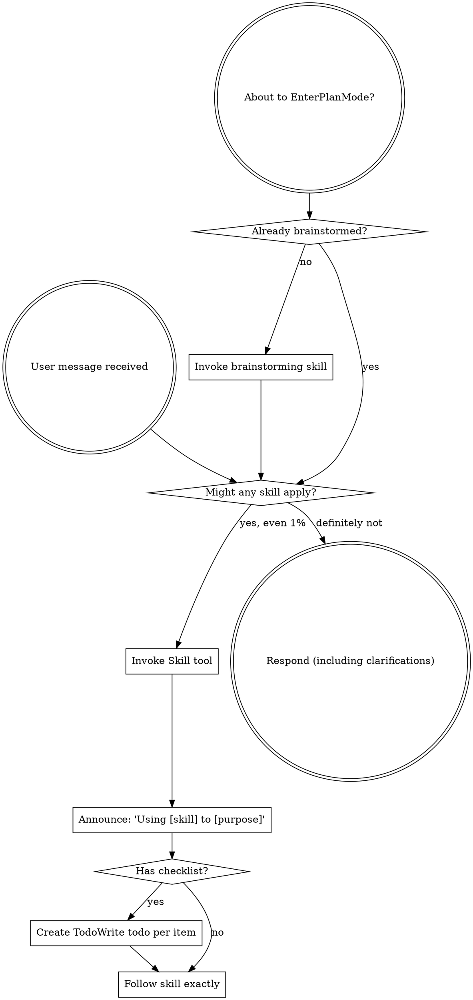

You are continuing an existing review chain. This is round 2 of external-reviewer-redesign-S4-post-slice.

In incremental mode:
- Verify whether prior findings are resolved per the resolution report below.
- Reuse the existing finding IDs (F1, F2, …). If a prior finding is resolved,
  mark it RESOLVED in your findings list with its original ID. If still
  unresolved, keep its ID.
- Only introduce new finding IDs for genuine regressions caused by the fix, or
  blocking issues clearly missed in earlier rounds. Do not reopen broad review
  unless prior fixes changed broad architecture.

Review chain summary:
| round | verdict | findings | blocking |
|---|---|---|---|
| 1 | revise | 3 | 1 |

Prior-round findings (primary reviewer response):

# Review — 2026-05-13-external-reviewer-redesign.md (post-slice, round 1)

- Target: `docs/superstar/plans/2026-05-13-external-reviewer-redesign.md`
- Request: `docs/reviewer/external-reviewer-redesign-S4-post-slice/r1-2026-05-14T0321-request.md`
- Reviewer command: `reviewer-agent`
- Status: `ok`

---

1. Findings

F1. Severity: blocking. The post-slice gate is not in a clean/completed repo state. `git status --short` shows modified tracked files (`CLAUDE.md`, several `skills/*/SKILL.md`) plus an untracked `docs/reviewer/external-reviewer-redesign-S4-post-slice/` folder. That folder contains only `r1-2026-05-14T0321-request.md`, with no response and no `chain.json`, so the S4 review artifact is incomplete. This directly violates the post-slice gate priority for uncommitted/untracked artifacts and the plan pre-flight expectation of a clean tree on a feature branch at [docs/superstar/plans/2026-05-13-external-reviewer-redesign.md:15](/home/simon/Dev/sigreer/skills/superstar/docs/superstar/plans/2026-05-13-external-reviewer-redesign.md:15).

F2. Severity: important. Slice 4 appears implemented in code, but the target plan does not record completion. All Slice 4 task checkboxes remain unchecked at [docs/superstar/plans/2026-05-13-external-reviewer-redesign.md:1451](/home/simon/Dev/sigreer/skills/superstar/docs/superstar/plans/2026-05-13-external-reviewer-redesign.md:1451), [1526](/home/simon/Dev/sigreer/skills/superstar/docs/superstar/plans/2026-05-13-external-reviewer-redesign.md:1526), and [1610](/home/simon/Dev/sigreer/skills/superstar/docs/superstar/plans/2026-05-13-external-reviewer-redesign.md:1610). The last closeout note is Slice 3 at [docs/superstar/plans/2026-05-13-external-reviewer-redesign.md:3056](/home/simon/Dev/sigreer/skills/superstar/docs/superstar/plans/2026-05-13-external-reviewer-redesign.md:3056); there is no Slice 4 closeout documenting commits, verification, or gate result.

F3. Severity: minor. The repo is currently on `main`, while the plan pre-flight says branch should be a feature branch and to stop if on `main` at [docs/superstar/plans/2026-05-13-external-reviewer-redesign.md:25](/home/simon/Dev/sigreer/skills/superstar/docs/superstar/plans/2026-05-13-external-reviewer-redesign.md:25). This may be acceptable in this personal fork, but the plan’s own gate says otherwise and should be reconciled.

2. Open questions / assumptions

I assume the active slice is Slice 4 because the latest commits implement S4 work and the untracked review folder is `external-reviewer-redesign-S4-post-slice`.

3. Suggested document edits

Mark Slice 4 task steps complete where applicable, add a Slice 4 closeout note with the commits `79db11f`, `3082d30`, and `2d01435`, and record the final test result.

Either commit or remove the incomplete S4 reviewer request artifact. If it is the intended post-slice chain, complete it with response/manifest artifacts.

4. Verification gaps / commands

I ran:

```bash
python3 -m pytest skills/external-review/tests/ -v
```

Result: `57 passed, 1 warning`.

Still required before closing: clean up/commit the dirty and untracked files, then rerun:

```bash
git status --short
python3 -m pytest skills/external-review/tests/ -v
```

5. Overall verdict: revise

---

## Reviewer stderr

```text
Reading additional input from stdin...
OpenAI Codex v0.130.0
--------
workdir: /home/simon/Dev/sigreer/skills/superstar
model: gpt-5.5
provider: openai
approval: never
sandbox: danger-full-access
reasoning effort: none
reasoning summaries: none
session id: 019e244a-5fa2-7122-9b61-f5b8b50d4d6d
--------
user
You are acting as an independent senior engineering reviewer.

Review stance:
- Lead with findings, ordered by severity.
- Focus on correctness, consistency, implementation risk, missing acceptance
  gates, vague handoffs, ungrounded assumptions, unverified claims, and drift
  from the codebase.
- Give exact file/line references when possible.
- If the document is sound, say that clearly and list residual risks.
- Keep the review actionable. Avoid broad rewrites unless the current structure
  creates concrete risk.

Repository root:
/home/simon/Dev/sigreer/skills/superstar

Target kind:
post-slice

Review mode:
Post-slice review. Treat this as a completion gate for one
slice of work. Compare the completed changes and stated evidence against the
slice acceptance criteria. Prioritize: incomplete tasks, uncommitted or
untracked artifacts, missing tests, failing or skipped verification, broken
cross-site behavior, and claims not supported by the repo state.

Target document:
docs/superstar/plans/2026-05-13-external-reviewer-redesign.md

Additional context files:
- docs/superstar/specs/2026-05-13-external-reviewer-redesign-design.md
- docs/handoffs/2026-05-13-external-reviewer-redesign-prompt.md

Review output contract:
1. Findings
   - Tag each finding with a stable ID: `F1`, `F2`, `F3`, …. IDs must remain
     stable if this review is iterated in subsequent rounds.
   - Mark severity inline: `Severity: blocking | important | minor | nit`.
2. Open questions / assumptions
3. Suggested document edits
4. Verification gaps / commands that should be run, if any
5. Overall verdict: one of "ready", "ready with small edits", or "revise"

Read the files from disk. Do not rely only on the snippets in this prompt.


## Target Preview

### docs/superstar/plans/2026-05-13-external-reviewer-redesign.md

    1	# External-Reviewer Redesign Implementation Plan
    2	
    3	> **For agentic workers:** REQUIRED SUB-SKILL: Use superstar:subagent-driven-development (recommended) or superstar:executing-plans to implement this plan task-by-task. Steps use checkbox (`- [ ]`) syntax for tracking.
    4	
    5	**Goal:** Rebuild `skills/external-review/scripts/external-reviewer.py` so review chains are incremental, durable, machine-readable, and support optional independent sweep reviewers — per `docs/superstar/specs/2026-05-13-external-reviewer-redesign-design.md`.
    6	
    7	**Architecture:** A persistent `chain.json` manifest per review chain becomes the source of truth for round metadata. The script gains verdict parsing, work-ID-keyed chain folders, a resolution-artifact contract and gate, incremental round prompts with embedded diffs, optional session-resume placeholders, and Pass-3 independent sweep reviewers. Skill documentation is updated to match.
    8	
    9	**Tech Stack:** Python 3.9+ standard library only (no external deps), `pytest` for tests, `git` CLI for diff and SHA capture.
   10	
   11	---
   12	
   13	## Pre-flight
   14	
   15	- [ ] **Step 1: Verify working directory and branch**
   16	
   17	Run:
   18	
   19	```bash
   20	cd /home/simon/Dev/sigreer/skills/superstar
   21	git status --short
   22	git rev-parse --abbrev-ref HEAD
   23	```
   24	
   25	Expected: clean tree, branch is a feature branch (not `main`). If on `main`, stop and create a branch via `superstar:using-git-worktrees`.
   26	
   27	- [ ] **Step 2: Confirm test runner**
   28	
   29	Run:
   30	
   31	```bash
   32	python3 -c "import pytest; print(pytest.__version__)"
   33	```
   34	
   35	Expected: prints a version string. If `ModuleNotFoundError`, install pytest:
   36	
   37	```bash
   38	python3 -m pip install --user pytest
   39	```
   40	
   41	- [ ] **Step 3: Set up the test directory**
   42	
   43	Create the directory tests will live in:
   44	
   45	```bash
   46	mkdir -p skills/external-review/tests
   47	touch skills/external-review/tests/__init__.py
   48	```
   49	
   50	Commit:
   51	
   52	```bash
   53	git add skills/external-review/tests/__init__.py
   54	git commit -m "scaffold: tests dir for external-reviewer redesign"
   55	```
   56	
   57	---
   58	
   59	## Slice 1: Chain manifest & verdict parsing
   60	
   61	**Goal:** Introduce `chain.json` as the round-metadata source of truth, parse verdicts and finding counts from response text, and emit them in the JSON output. Backwards-compatible: legacy chains synthesize a manifest on first touch.
   62	
   63	### Task 1.1: Manifest read/write helpers
   64	
   65	**Files:**
   66	- Create: `skills/external-review/tests/test_manifest.py`
   67	- Modify: `skills/external-review/scripts/external-reviewer.py`
   68	
   69	- [x] **Step 1: Write the failing tests**
   70	
   71	`skills/external-review/tests/test_manifest.py`:
   72	
   73	```python
   74	import json
   75	from pathlib import Path
   76	
   77	import pytest
   78	
   79	import sys
   80	SCRIPTS = Path(__file__).resolve().parents[1] / "scripts"
   81	sys.path.insert(0, str(SCRIPTS))
   82	
   83	import importlib.util
   84	spec = importlib.util.spec_from_file_location("external_reviewer", SCRIPTS / "external-reviewer.py")
   85	external_reviewer = importlib.util.module_from_spec(spec)
   86	spec.loader.exec_module(external_reviewer)
   87	
   88	
   89	def test_read_manifest_returns_none_for_missing(tmp_path):
   90	    assert external_reviewer.read_manifest(tmp_path / "missing.json") is None
   91	
   92	
   93	def test_write_then_read_manifest_roundtrips(tmp_path):
   94	    path = tmp_path / "chain.json"
   95	    data = {
   96	        "schema_version": 1,
   97	        "chain": "demo-post-slice",
   98	        "kind": "post-slice",
   99	        "target": "docs/plans/demo.md",
  100	        "work_id": "P1.S1",
  101	        "legacy_migrated": False,
  102	        "rounds": [],
  103	        "sweep_checkpoints": {"first-round": "pending", "final-ready": "pending"},
  104	    }
  105	    external_reviewer.write_manifest(path, data)
  106	    loaded = external_reviewer.read_manifest(path)
  107	    assert loaded == data
  108	
  109	
  110	def test_read_manifest_rejects_newer_schema(tmp_path):
  111	    path = tmp_path / "chain.json"
  112	    path.write_text(json.dumps({"schema_version": 99}))
  113	    with pytest.raises(external_reviewer.ManifestSchemaTooNew):
  114	        external_reviewer.read_manifest(path)
  115	```
  116	
  117	- [x] **Step 2: Run the tests; confirm they fail**
  118	
  119	```bash
  120	python3 -m pytest skills/external-review/tests/test_manifest.py -v
  121	```
  122	
  123	Expected: 3 failures (`read_manifest`, `write_manifest`, `ManifestSchemaTooNew` all undefined).
  124	
  125	- [x] **Step 3: Add manifest helpers to the script**
  126	
  127	Append to `skills/external-review/scripts/external-reviewer.py` (after the existing module-level constants, before `repo_root()`):
  128	
  129	```python
  130	SUPPORTED_SCHEMA_VERSION = 1
  131	
  132	
  133	class ManifestSchemaTooNew(Exception):
  134	    """Raised when chain.json declares a schema_version newer than this script supports."""
  135	
  136	
  137	def read_manifest(path: Path) -> dict | None:
  138	    if not path.exists():
  139	        return None
  140	    data = json.loads(path.read_text(encoding="utf-8"))
  141	    version = data.get("schema_version")
  142	    if isinstance(version, int) and version > SUPPORTED_SCHEMA_VERSION:
  143	        raise ManifestSchemaTooNew(
  144	            f"chain.json schema_version {version} is newer than this script supports "
  145	            f"(max {SUPPORTED_SCHEMA_VERSION}). Upgrade external-reviewer.py."
  146	        )
  147	    return data
  148	
  149	
  150	def write_manifest(path: Path, data: dict) -> None:
  151	    path.parent.mkdir(parents=True, exist_ok=True)
  152	    path.write_text(json.dumps(data, indent=2) + "\n", encoding="utf-8")
  153	```
  154	
  155	- [x] **Step 4: Run the tests; confirm they pass**
  156	
  157	```bash
  158	python3 -m pytest skills/external-review/tests/test_manifest.py -v
  159	```
  160	
  161	Expected: 3 passed.
  162	
  163	- [x] **Step 5: Commit**
  164	
  165	```bash
  166	git add skills/external-review/scripts/external-reviewer.py skills/external-review/tests/test_manifest.py
  167	git commit -m "feat(external-reviewer): chain.json read/write helpers with schema versioning"
  168	```
  169	
  170	### Task 1.2: Verdict parsing
  171	
  172	**Files:**
  173	- Create: `skills/external-review/tests/test_verdict.py`
  174	- Modify: `skills/external-review/scripts/external-reviewer.py`
  175	
  176	- [x] **Step 1: Write the failing tests**
  177	
  178	`skills/external-review/tests/test_verdict.py`:
  179	
  180	```python
  181	from pathlib import Path
  182	import sys, importlib.util
  183	
  184	SCRIPTS = Path(__file__).resolve().parents[1] / "scripts"
  185	sys.path.insert(0, str(SCRIPTS))
  186	spec = importlib.util.spec_from_file_location("external_reviewer", SCRIPTS / "external-reviewer.py")
  187	er = importlib.util.module_from_spec(spec); spec.loader.exec_module(er)
  188	
  189	
  190	def test_verdict_ready():
  191	    v, valid = er.parse_verdict("Findings: ok\n\nOverall verdict: ready\n")
  192	    assert v == "ready"
  193	    assert valid is True
  194	
  195	
  196	def test_verdict_ready_with_small_edits_markdown():
  197	    body = "**Overall verdict:** `ready with small edits`."
  198	    v, valid = er.parse_verdict(body)
  199	    assert v == "ready with small edits"
  200	    assert valid is True
  201	
  202	
  203	def test_verdict_revise_case_insensitive():
  204	    v, valid = er.parse_verdict("OVERALL VERDICT: Revise")
  205	    assert v == "revise"
  206	    assert valid is True
  207	
  208	
  209	def test_verdict_takes_last_match():
  210	    body = "Overall verdict: ready\n\n...later...\n\nOverall verdict: revise"
  211	    v, valid = er.parse_verdict(body)
  212	    assert v == "revise"
  213	
  214	
  215	def test_verdict_unknown_returns_invalid():
  216	    v, valid = er.parse_verdict("Overall verdict: looks fine to me")
  217	    assert v is None
  218	    assert valid is False
  219	
  220	
  221	def test_verdict_missing_returns_invalid():
  222	    v, valid = er.parse_verdict("Some review prose with no verdict line.")
  223	    assert v is None
  224	    assert valid is False
  225	```
  226	
  227	- [x] **Step 2: Run the tests; confirm they fail**
  228	
  229	```bash
  230	python3 -m pytest skills/external-review/tests/test_verdict.py -v
  231	```
  232	
  233	Expected: 6 failures (`parse_verdict` undefined).
  234	
  235	- [x] **Step 3: Add the verdict parser**
  236	
  237	Append to `skills/external-review/scripts/external-reviewer.py`:
  238	
  239	```python
  240	VERDICT_VALUES = ("ready with small edits", "ready", "revise")
  241	VERDICT_LINE_RE = re.compile(
  242	    r"overall\s+verdict\s*[:\-]\s*[`*_\"']*\s*(ready with small edits|ready|revise)\s*[`*_\"'.]*",
  243	    re.IGNORECASE,
  244	)
  245	
  246	
  247	def parse_verdict(text: str) -> tuple[str | None, bool]:
  248	    matches = list(VERDICT_LINE_RE.finditer(text))
  249	    if not matches:
  250	        return None, False
  251	    raw = matches[-1].group(1).strip().lower()
  252	    if raw not in VERDICT_VALUES:
  253	        return None, False
  254	    return raw, True
  255	```
  256	
  257	Note: regex prefers `ready with small edits` over `ready` because of ordering in the alternation.
  258	
  259	- [x] **Step 4: Run the tests; confirm they pass**
  260	
  261	```bash
  262	python3 -m pytest skills/external-review/tests/test_verdict.py -v
  263	```
  264	
  265	Expected: 6 passed.
  266	
  267	- [x] **Step 5: Commit**
  268	
  269	```bash
  270	git add skills/external-review/scripts/external-reviewer.py skills/external-review/tests/test_verdict.py
  271	git commit -m "feat(external-reviewer): parse_verdict with markdown/case tolerance"
  272	```
  273	
  274	### Task 1.3: Finding-count parsing
  275	
  276	**Files:**
  277	- Create: `skills/external-review/tests/test_findings.py`
  278	- Modify: `skills/external-review/scripts/external-reviewer.py`
  279	
  280	- [x] **Step 1: Write the failing tests**
  281	
  282	`skills/external-review/tests/test_findings.py`:
  283	
  284	```python
  285	from pathlib import Path
  286	import sys, importlib.util
  287	SCRIPTS = Path(__file__).resolve().parents[1] / "scripts"
  288	sys.path.insert(0, str(SCRIPTS))
  289	spec = importlib.util.spec_from_file_location("external_reviewer", SCRIPTS / "external-reviewer.py")
  290	er = importlib.util.module_from_spec(spec); spec.loader.exec_module(er)
  291	
  292	
  293	def test_heading_findings_counted():
  294	    body = "## F1\nSeverity: blocking\n\n## F2\nSeverity: minor\n\n## F3\nSeverity: blocking"
  295	    n, blocking = er.parse_findings(body)
  296	    assert n == 3
  297	    assert blocking == 2
  298	
  299	
  300	def test_bullet_findings_counted():
  301	    body = "- F1: something blocking (blocking)\n- F2 minor thing"
  302	    n, blocking = er.parse_findings(body)
  303	    assert n == 2
  304	    assert blocking == 1
  305	
  306	
  307	def test_no_findings_returns_zero():
  308	    body = "Overall verdict: ready\n\nNo findings."
  309	    n, blocking = er.parse_findings(body)
  310	    assert n == 0
  311	    assert blocking == 0
  312	
  313	
  314	def test_unparseable_returns_none():
  315	    body = "Reviewer crashed: connection reset"
  316	    n, blocking = er.parse_findings(body)
  317	    assert n is None
  318	    assert blocking is None
  319	```
  320	
  321	- [x] **Step 2: Run the tests; confirm they fail**
  322	
  323	```bash
  324	python3 -m pytest skills/external-review/tests/test_findings.py -v
  325	```
  326	
  327	Expected: 4 failures.
  328	
  329	- [x] **Step 3: Add the parser**
  330	
  331	Append to `skills/external-review/scripts/external-reviewer.py`:
  332	
  333	```python
  334	HEADING_FINDING_RE = re.compile(r"^##\s+F\d+\b", re.MULTILINE)
  335	BULLET_FINDING_RE = re.compile(r"^\s*[-*]?\s*\**F\d+\**[:\s\-]", re.MULTILINE)
  336	BLOCKING_MARKER_RE = re.compile(r"(?:^|\s)\(blocking\)|^severity\s*:\s*blocking", re.IGNORECASE | re.MULTILINE)
  337	
  338	
  339	def parse_findings(text: str) -> tuple[int | None, int | None]:
  340	    if not text or text.strip() == "" or "reviewer crashed" in text.lower():
  341	        return None, None
  342	    heading_count = len(HEADING_FINDING_RE.findall(text))
  343	    if heading_count > 0:
  344	        n = heading_count
  345	    else:
  346	        n = len(BULLET_FINDING_RE.findall(text))
  347	    blocking = len(BLOCKING_MARKER_RE.findall(text))
  348	    return n, blocking
  349	```
  350	
  351	- [x] **Step 4: Run the tests; confirm they pass**
  352	
  353	```bash
  354	python3 -m pytest skills/external-review/tests/test_findings.py -v
  355	```
  356	
  357	Expected: 4 passed.
  358	
  359	- [x] **Step 5: Commit**
  360	
  361	```bash
  362	git add skills/external-review/scripts/external-reviewer.py skills/external-review/tests/test_findings.py
  363	git commit -m "feat(external-reviewer): parse_findings (heading + bullet, blocking count)"
  364	```
  365	
  366	### Task 1.4: Round-number derivation reads manifest first
  367	
  368	**Files:**
  369	- Create: `skills/external-review/tests/test_round_number.py`
  370	- Modify: `skills/external-review/scripts/external-reviewer.py` (`next_round_number`)
  371	
  372	- [x] **Step 1: Write the failing tests**
  373	
  374	`skills/external-review/tests/test_round_number.py`:
  375	
  376	```python
  377	from pathlib import Path
  378	import json, sys, importlib.util
  379	SCRIPTS = Path(__file__).resolve().parents[1] / "scripts"
  380	sys.path.insert(0, str(SCRIPTS))
  381	spec = importlib.util.spec_from_file_location("external_reviewer", SCRIPTS / "external-reviewer.py")
  382	er = importlib.util.module_from_spec(spec); spec.loader.exec_module(er)
  383	
  384	
  385	def test_no_chain_dir_round_is_one(tmp_path):
  386	    assert er.next_round_number(tmp_path / "absent") == 1
  387	
  388	
  389	def test_manifest_present_takes_precedence(tmp_path):
  390	    d = tmp_path / "chain"; d.mkdir()
  391	    er.write_manifest(d / "chain.json", {
  392	        "schema_version": 1, "rounds": [{"round": 1}, {"round": 2}]
  393	    })
  394	    assert er.next_round_number(d) == 3
  395	
  396	
  397	def test_legacy_dir_no_manifest_falls_back_to_filename_scan(tmp_path):
  398	    d = tmp_path / "chain"; d.mkdir()
  399	    (d / "r1-2026-05-01T0900-request.md").write_text("")
  400	    (d / "r2-2026-05-02T0900-request.md").write_text("")
  401	    assert er.next_round_number(d) == 3
  402	```
  403	
  404	- [x] **Step 2: Run the tests; confirm they fail**
  405	
  406	```bash
  407	python3 -m pytest skills/external-review/tests/test_round_number.py -v
  408	```
  409	
  410	Expected: test 2 fails (no manifest awareness), tests 1 and 3 may pass if current behavior already handles them.
  411	
  412	- [x] **Step 3: Update `next_round_number`**
  413	
  414	Replace the existing function:
  415	
  416	```python
  417	def next_round_number(chain_dir: Path) -> int:
  418	    if not chain_dir.exists():
  419	        return 1
  420	    manifest = read_manifest(chain_dir / "chain.json")
  421	    if manifest and isinstance(manifest.get("rounds"), list):
  422	        return len(manifest["rounds"]) + 1
  423	    return len(list(chain_dir.glob("r*-*-request.md"))) + 1
  424	```
  425	
  426	- [x] **Step 4: Run the tests**
  427	
  428	```bash
  429	python3 -m pytest skills/external-review/tests/test_round_number.py -v
  430	```
  431	
  432	Expected: 3 passed.
  433	
  434	- [x] **Step 5: Commit**
  435	
  436	```bash
  437	git add skills/external-review/scripts/external-reviewer.py skills/external-review/tests/test_round_number.py
  438	git commit -m "feat(external-reviewer): next_round_number consults chain.json"
  439	```
  440	
  441	### Task 1.5: Legacy manifest synthesis
  442	
  443	**Files:**
  444	- Create: `skills/external-review/tests/test_legacy_migration.py`
  445	- Modify: `skills/external-review/scripts/external-reviewer.py`
  446	
  447	- [x] **Step 1: Write the failing tests**
  448	
  449	`skills/external-review/tests/test_legacy_migration.py`:
  450	
  451	```python
  452	from pathlib import Path
  453	import sys, importlib.util
  454	SCRIPTS = Path(__file__).resolve().parents[1] / "scripts"
  455	sys.path.insert(0, str(SCRIPTS))
  456	spec = importlib.util.spec_from_file_location("external_reviewer", SCRIPTS / "external-reviewer.py")
  457	er = importlib.util.module_from_spec(spec); spec.loader.exec_module(er)
  458	
  459	
  460	def test_synthesize_manifest_from_legacy_files(tmp_path):
  461	    d = tmp_path / "old-chain"; d.mkdir()
  462	    (d / "r1-2026-04-01T0900-request.md").write_text("prompt body")
  463	    (d / "r1-2026-04-01T0905-response.md").write_text(
  464	        "## F1\nSeverity: blocking\n\nOverall verdict: revise\n"
  465	    )
  466	    (d / "r2-2026-04-02T1200-request.md").write_text("prompt body 2")
  467	
  468	    manifest = er.synthesize_legacy_manifest(
  469	        chain_dir=d, chain="old-chain", kind="post-slice",
  470	        target="docs/plans/old.md", work_id="P1.S1",
  471	    )
  472	
  473	    assert manifest["legacy_migrated"] is True
  474	    assert manifest["work_id"] == "P1.S1"
  475	    assert len(manifest["rounds"]) == 2
  476	    r1, r2 = manifest["rounds"]
  477	    assert r1["legacy"] is True
  478	    assert r1["verdict"] == "revise"
  479	    assert r1["verdict_valid"] is True
  480	    assert r1["findings_count"] == 1
  481	    assert r1["blocking_findings_count"] == 1
  482	    assert r1["head_sha_after_round"] is None
  483	    assert r2["response"] is None  # only request file existed
  484	```
  485	
  486	- [x] **Step 2: Run the tests; confirm they fail**
  487	
  488	```bash
  489	python3 -m pytest skills/external-review/tests/test_legacy_migration.py -v
  490	```
  491	
  492	Expected: 1 failure.
  493	
  494	- [x] **Step 3: Add the synthesizer**
  495	
  496	Append to `skills/external-review/scripts/external-reviewer.py`:
  497	
  498	```python
  499	LEGACY_ROUND_FILE_RE = re.compile(r"^r(\d+)-([0-9T\-]+)-(request|response)\.md$")
  500	
  501	
  502	def synthesize_legacy_manifest(
  503	    *, chain_dir: Path, chain: str, kind: str, target: str, work_id: str | None
  504	) -> dict:
  505	    rounds_map: dict[int, dict] = {}
  506	    for path in sorted(chain_dir.iterdir()):
  507	        m = LEGACY_ROUND_FILE_RE.match(path.name)
  508	        if not m:
  509	            continue
  510	        round_num = int(m.group(1))
  511	        role = m.group(3)
  512	        entry = rounds_map.setdefault(
  513	            round_num,
  514	            {
  515	                "round": round_num,
  516	                "request": None,
  517	                "response": None,
  518	                "resolution": None,
  519	                "verdict": None,
  520	                "verdict_valid": False,
  521	                "findings_count": None,
  522	                "blocking_findings_count": None,
  523	                "head_sha_at_request": None,
  524	                "head_sha_after_round": None,
  525	                "worktree_dirty_at_request": None,
  526	                "legacy": True,
  527	            },
  528	        )
  529	        entry[role] = path.name
  530	        if role == "response":
  531	            body = path.read_text(encoding="utf-8", errors="replace")
  532	            v, valid = parse_verdict(body)
  533	            entry["verdict"], entry["verdict_valid"] = v, valid
  534	            n, blocking = parse_findings(body)
  535	            entry["findings_count"], entry["blocking_findings_count"] = n, blocking
  536	
  537	    return {
  538	        "schema_version": SUPPORTED_SCHEMA_VERSION,
  539	        "chain": chain,
  540	        "kind": kind,
  541	        "target": target,
  542	        "work_id": work_id,
  543	        "legacy_migrated": True,
  544	        "migrated_at": dt.datetime.utcnow().strftime("%Y-%m-%dT%H:%M:%SZ"),
  545	        "rounds": [rounds_map[k] for k in sorted(rounds_map)],
  546	        "sweep_checkpoints": {"first-round": "pending", "final-ready": "pending"},
  547	    }
  548	```
  549	
  550	- [x] **Step 4: Run the tests; confirm they pass**
  551	
  552	```bash
  553	python3 -m pytest skills/external-review/tests/test_legacy_migration.py -v
  554	```
  555	
  556	Expected: 1 passed.
  557	
  558	- [x] **Step 5: Commit**
  559	
  560	```bash
  561	git add skills/external-review/scripts/external-reviewer.py skills/external-review/tests/test_legacy_migration.py
  562	git commit -m "feat(external-reviewer): synthesize_legacy_manifest from rN-* files"
  563	```
  564	
  565	### Task 1.6: Wire manifest into `main()` for single-reviewer rounds
  566	
  567	**Files:**
  568	- Modify: `skills/external-review/scripts/external-reviewer.py` (`main` function)
  569	- Create: `skills/external-review/tests/test_main_round_writes_manifest.py`
  570	
  571	- [x] **Step 1: Write the failing test**
  572	
  573	`skills/external-review/tests/test_main_round_writes_manifest.py`:
  574	
  575	```python
  576	from pathlib import Path
  577	import subprocess, sys, json, importlib.util, os
  578	
  579	SCRIPTS = Path(__file__).resolve().parents[1] / "scripts"
  580	sys.path.insert(0, str(SCRIPTS))
  581	spec = importlib.util.spec_from_file_location("external_reviewer", SCRIPTS / "external-reviewer.py")
  582	er = importlib.util.module_from_spec(spec); spec.loader.exec_module(er)
  583	
  584	
  585	FAKE_REVIEWER = """#!/usr/bin/env bash
  586	cat <<'EOF'
  587	## F1
  588	Severity: blocking
  589	Stub finding.
  590	
  591	Overall verdict: revise
  592	EOF
  593	"""
  594	
  595	
  596	def test_main_writes_manifest_entry(tmp_path, monkeypatch):
  597	    repo = tmp_path / "repo"; repo.mkdir()
  598	    subprocess.run(["git", "-C", str(repo), "init", "-q"], check=True)
  599	    subprocess.run(["git", "-C", str(repo), "config", "user.email", "t@t"], check=True)
  600	    subprocess.run(["git", "-C", str(repo), "config", "user.name", "T"], check=True)

[truncated: 2466 additional lines]

## Context Previews

### docs/superstar/specs/2026-05-13-external-reviewer-redesign-design.md

    1	# External-Review Script Redesign — Design
    2	
    3	**Date:** 2026-05-13
    4	**Target:** `skills/external-review/scripts/external-reviewer.py` and `skills/external-review/SKILL.md`
    5	**Motivation:** A self-review of the external-reviewer flow surfaced five concrete failure modes that cause review loops to balloon to 7–10 rounds and lose continuity between rounds. This spec redesigns the script and skill to make rounds incremental, durable, and machine-readable.
    6	
    7	---
    8	
    9	## Goals
   10	
   11	1. **Round N+1 is incremental, not a re-review.** The reviewer is given prior findings, the fixer's resolution report, and a focused diff — and is instructed to verify resolution rather than reopen broad review.
   12	2. **Verdict is machine-readable.** JSON output exposes a parsed `verdict`, `verdict_valid`, and finding counts, so coordinators don't have to parse prose.
   13	3. **Post-slice / post-phase chains are uniquely keyed.** `--work-id` is required for both so that multi-slice plans don't collapse into one chain.
   14	4. **Resolution artifacts are durable and structured-enough-to-parse.** Required headers, free-form bodies, stable finding IDs across rounds.
   15	5. **Optional session resume.** Provider-specific wrappers can plug into placeholders if the underlying reviewer CLI supports session IDs.
   16	6. **Legacy chains keep working.** Soft-migrate on first new round; preserve existing folder names and audit history.
   17	7. **Review depth is explicit.** The default chain uses one primary incremental reviewer, but callers can request bounded independent sweep reviewers at high-risk checkpoints to preserve fresh-eye coverage without unbounded serial churn.
   18	
   19	## Non-goals
   20	
   21	- Replacing the chain-folder layout for new chains. The folder-naming scheme gains a `--work-id` segment for post-slice/post-phase, but the round-file scheme is unchanged.
   22	- Making the script aware of any specific reviewer CLI. The script remains provider-neutral via `AGENT_REVIEWER_CMD`.
   23	- Auto-dispatching the fixer subagent. The script enforces the resolution gate but does not invoke fixers; that stays in the coordinator's loop, governed by `subagent-driven-development`.
   24	
   25	## Invariants
   26	
   27	- **A review chain is single-writer.** Running two rounds concurrently against the same chain is unsupported and may corrupt `chain.json`. The script does not lock; callers are expected to serialise.
   28	- **Existing rounds are immutable.** Once written, `rN-*-request.md`, `rN-*-response.md`, and `rN-resolution.md` are never overwritten. Manifest entries for past rounds are append-only.
   29	
   30	## Architecture
   31	
   32	Three implementation passes, all designed in this spec:
   33	
   34	- **Pass 1 — Core.** Chain manifest, verdict parsing, `--work-id`, prior-round context injection, incremental round prompts, resolution-artifact contract and gate, automatic diff embedding, JSON output enrichment, legacy migration.
   35	- **Pass 2 — Session resume.** Optional placeholders (`{chain_dir}`, `{round}`, `{previous_response}`, `{resolution_file}`, `{session_file}`) exposed via the existing `AGENT_REVIEWER_CMD` template mechanism. A provider-specific wrapper can use `{session_file}` to persist and resume reviewer sessions. The script provides a stable path (`chain_dir/session.state`) and ensures the parent directory exists; wrappers own the file's contents. The script never reads `session.state`.
   36	- **Pass 3 — Review depth / independent sweeps.** Adds `--review-depth`, `--independent-reviewers`, `--sweep-policy` flags. Independent sweep reviewers run without seeing the primary reviewer's findings on their first pass (to avoid anchoring), and their findings are merged into the same resolution checklist afterward. Depends on Pass 1's manifest and verdict parsing; does not depend on Pass 2.
   37	
   38	### Chain manifest
   39	
   40	`docs/reviewer/<chain>/chain.json` is the single source of truth for round metadata. The `rN-*-request.md` / `rN-*-response.md` / `rN-resolution.md` files remain for human readability and git history; the script reads and writes manifest entries when computing round numbers, base refs, and verdicts.
   41	
   42	```json
   43	{
   44	  "schema_version": 1,
   45	  "chain": "feature-plan-P2-S3-post-slice",
   46	  "kind": "post-slice",
   47	  "target": "docs/superstar/plans/feature-plan.md",
   48	  "work_id": "P2.S3",
   49	  "legacy_migrated": false,
   50	  "rounds": [
   51	    {
   52	      "round": 1,
   53	      "request": "r1-2026-05-13T1012-request.md",
   54	      "response": "r1-2026-05-13T1020-response.md",
   55	      "resolution": null,
   56	      "head_sha_at_request": "abc1234",
   57	      "head_sha_after_round": "abc1234",
   58	      "worktree_dirty_at_request": false,
   59	      "verdict": "revise",
   60	      "verdict_valid": true,
   61	      "findings_count": 4,
   62	      "blocking_findings_count": 2
   63	    },
   64	    {
   65	      "round": 2,
   66	      "request": "r2-2026-05-13T1130-request.md",
   67	      "response": null,
   68	      "resolution": "r1-resolution.md",
   69	      "base_ref": "abc1234",
   70	      "base_ref_source": "auto",
   71	      "head_sha_at_request": "def5678",
   72	      "worktree_dirty_at_request": false,
   73	      "diff_included": true,
   74	      "resolution_parse_status": "ok",
   75	      "resolution_waiver": false
   76	    }
   77	  ]
   78	}
   79	```
   80	
   81	#### Manifest versioning
   82	
   83	- `schema_version: 1` is the initial version introduced by this redesign.
   84	- Unknown future `schema_version` values cause the script to error with a clear message: `ERROR: chain.json schema_version <N> is newer than this script supports. Upgrade external-reviewer.py.` This prevents silent corruption.
   85	- Older `schema_version` values (currently none) get best-effort migration on read, recorded as `schema_migrated_from: <prior>` in the manifest.
   86	
   87	### Naming
   88	
   89	- **Chain folder slug:** `<target-stem-no-leading-date>-<work-id-dotless>-<kind>` for post-slice/post-phase; `<target-stem-no-leading-date>-<kind>` otherwise. Dots in work IDs are replaced with dashes in the folder slug only — the manifest preserves the canonical form.
   90	  - Example: `--work-id P2.S3` → folder `feature-plan-P2-S3-post-slice`, manifest `"work_id": "P2.S3"`.
   91	- **Round files:** `r{N}-<YYYY-MM-DDTHHMM>-request.md`, `r{N}-<YYYY-MM-DDTHHMM>-response.md`. Unchanged from current behavior.
   92	- **Resolution files:** `r{N}-resolution.md`, where `N` is the round whose response is being addressed. Round `N+1` consumes `r{N}-resolution.md`. Worked example: after `r1-response.md` returns `revise`, the fixer writes `r1-resolution.md`; round 2 reads `r1-resolution.md` and embeds it in the round-2 prompt.
   93	
   94	## CLI surface (new flags)
   95	
   96	| Flag | Kinds | Purpose |
   97	|---|---|---|
   98	| `--work-id <id>` | required for `post-slice`, `post-phase`; optional otherwise | Stable slice/phase ID (e.g., `P2.S3` for post-slice, `P2` for post-phase). Becomes part of chain folder name (dots → dashes) and is stored verbatim in the manifest. |
   99	| `--base-ref <sha\|ref>` | any | Override auto-computed diff base for this round. |
  100	| `--no-diff` | any | Suppress diff embedding even on round N+1. |
  101	| `--allow-missing-resolution` | post-slice, post-phase | Waive the resolution-required gate. Logged in manifest as `resolution_waiver: true`. |
  102	| `--changed-files <path>...` | any | Override automatic changed-file discovery and limit the embedded diff to the supplied paths. |
  103	| `--mode <auto\|broad\|incremental>` | any | Override the round-1-vs-N prompt mode. Default `auto` (round 1 → broad; round 2+ → incremental). |
  104	| `--max-diff-lines <int>` | any | Cap diff size. Default 2000. Truncation marker is embedded if exceeded. |
  105	| `--review-depth <standard\|thorough\|exhaustive>` | post-slice, post-phase | Controls whether independent sweep reviewers are run in addition to the primary chain reviewer. Default `standard`. |
  106	| `--independent-reviewers <int>` | post-slice, post-phase | Override reviewer count for independent sweeps. Default derived from `--review-depth`. |
  107	| `--sweep-policy <first-round\|final-ready\|both\|never>` | post-slice, post-phase | When to run fresh-context sweep reviews. Default derived from `--review-depth`. |
  108	
  109	### `--work-id` enforcement
  110	
  111	- `post-slice` or `post-phase` invoked without `--work-id` → exit 2 with operational error.
  112	- For `post-phase`, the expected form is the phase ID alone (`P2`), not a slice ID. The script does not enforce a regex; it documents the convention.
  113	- For other kinds, `--work-id` is optional; if provided, it is recorded in the manifest but does not affect the folder slug.
  114	
  115	## Reviewer prompt — round 1 vs round N+
  116	
  117	### Round 1: broad
  118	
  119	The existing broad prompt, with the output contract revised to require **stable finding IDs**:
  120	
  121	```
  122	1. Findings
  123	   - Each finding tagged `F<n>` (e.g., F1, F2, F3). IDs must be stable across rounds.
  124	   - Severity: blocking | important | minor | nit
  125	2. Open questions / assumptions
  126	3. Suggested document edits
  127	4. Verification gaps
  128	5. Overall verdict: ready | ready with small edits | revise
  129	```
  130	
  131	### Round N+: incremental
  132	
  133	Prepended to the existing prompt body:
  134	
  135	```
  136	You are continuing an existing review chain. This is round {N} of {chain_id}.
  137	
  138	In incremental mode:
  139	- Verify whether prior findings are resolved per the resolution report below.
  140	- Reuse the existing finding IDs (F1, F2, …). If a prior finding is resolved,
  141	  mark it RESOLVED in your findings list with its original ID. If still
  142	  unresolved, keep its ID.
  143	- Only introduce new finding IDs for genuine regressions caused by the fix, or
  144	  blocking issues clearly missed in earlier rounds. Do not reopen broad review
  145	  unless prior fixes changed broad architecture.
  146	
  147	Review chain summary:
  148	{per-round table: round, verdict, findings_count, blocking_findings_count}
  149	
  150	Prior-round findings (authoritative):
  151	{if r{N-1}-merged-findings.md exists: its verbatim contents — this replaces
  152	 individual reviewer response files as the prior-finding list of record}
  153	{else: a summary of the prior round's primary response, with finding IDs intact}
  154	
  155	Resolution report for prior round:
  156	{verbatim contents of r{N-1}-resolution.md}
  157	{or "MISSING — explicitly waived by caller via --allow-missing-resolution"}
  158	{or "MISSING — chain migrated from legacy artifacts; please verify whether changes occurred from the diff below"}
  159	
  160	Resolution parse summary (best-effort):
  161	{structured: per-finding-ID → status, or "unparseable"}
  162	
  163	Changes since prior round:
  164	{git diff <base_ref>..HEAD -- <scoped paths>}
  165	{if dirty: appended `git diff HEAD` section, both labeled}
  166	{if no base: "not available for this round (legacy chain / first round / --no-diff)"}
  167	```
  168	
  169	`--mode broad` forces round-1-style on later rounds (rare; for cases where the fix changed architecture). `--mode incremental` on round 1 is rejected with a clear error.
  170	
  171	## Resolution artifact contract
  172	
  173	**Path:** `docs/reviewer/<chain>/r{N}-resolution.md`, where `N` is the round whose response is being addressed. Authored by the fix subagent between round N (response) and round N+1 (resubmit).
  174	
  175	**Required parseable shape:**
  176	
  177	```markdown
  178	# Resolution for r{N}
  179	
  180	## F1
  181	Status: fixed
  182	Evidence:
  183	- Commit: abc1234
  184	- Files: `src/foo.ts:42`, `tests/foo.test.ts:18`
  185	- Verification: `npm test -- foo.test.ts` passed
  186	
  187	Notes:
  188	Changed the validation path to reject empty IDs before persistence.
  189	
  190	## F2
  191	Status: waived
  192	Evidence:
  193	- No code change
  194	- Reason: reviewer assumed X, but the plan explicitly excludes X in
  195	  `docs/superstar/specs/foo-design.md:77`
  196	
  197	Notes:
  198	No implementation change because this would expand slice scope.
  199	```
  200	

[truncated: 292 additional lines]
### docs/handoffs/2026-05-13-external-reviewer-redesign-prompt.md

    1	# Coordinator handoff — External-Reviewer Redesign
    2	
    3	You are the coordinator for implementing the **external-reviewer redesign** in the `superstar` repo at `/home/simon/Dev/sigreer/skills/superstar`.
    4	
    5	Your role is **strictly orchestration**. Use the `superstar:subagent-driven-development` skill with parallel agents where possible.
    6	
    7	## Inputs
    8	
    9	- Spec: [`docs/superstar/specs/2026-05-13-external-reviewer-redesign-design.md`](docs/superstar/specs/2026-05-13-external-reviewer-redesign-design.md)
   10	- Plan: [`docs/superstar/plans/2026-05-13-external-reviewer-redesign.md`](docs/superstar/plans/2026-05-13-external-reviewer-redesign.md)
   11	- Reviewer chain folder (created on first review): `docs/reviewer/external-reviewer-redesign-plan/` (kind `plan`) and per-slice chains like `docs/reviewer/external-reviewer-redesign-S1-post-slice/` (no TASKLIST.md in this repo; treat `S1`…`S8` from the plan as the work-id segments).
   12	
   13	## Coordinator discipline (non-negotiable)
   14	
   15	- **Do not perform any fixes yourself** unless the fix is genuinely cheaper to implement than the process of delegating to a subagent. Tiebreak: delegate.
   16	- **Do not pollute your context.** Delegate investigations, file reads, and edits to subagents. Your context is for orchestration, not implementation detail.
   17	- **At the end of each slice (S1–S8)**, the human partner runs `external-review` manually with `--kind post-slice` and pastes the findings back. Do NOT invoke the external-review skill yourself in this project — the human partner has explicitly chosen to drive it manually to keep the context clean. Wait for the verdict before proceeding to the next slice.
   18	- **Do not perform reviewer-driven fixes yourself.** Pass each reviewer response to a fix subagent that writes `r{N}-resolution.md` per the contract in `[[external-review]]`, then signal the human partner that the resolution is ready and the next round can be submitted.
   19	- **At the end of the phase** (after S8 closes), the human partner runs `--kind post-phase` manually. Same delegation rule.
   20	- **No TASKLIST.md exists** in this repo. Track slice completion in this handoff document or in a TODO list you maintain in-session; do not invent a TASKLIST.md file.
   21	
   22	## First action
   23	
   24	Read this file (the handoff prompt), the spec, and the plan. Then invoke `superstar:subagent-driven-development` and begin Slice 1 (Chain manifest & verdict parsing).

codex
I’ll read the relevant reviewer workflow files from disk, then inspect the actual repo state and Slice 1 changes before issuing the gate verdict.
exec
/usr/bin/zsh -lc "sed -n '1,220p' /home/simon/.codex/plugins/cache/openai-curated/superpowers/08373044/skills/using-superpowers/SKILL.md && sed -n '1,220p' /home/simon/.codex/plugins/cache/openai-curated/superpowers/08373044/skills/verification-before-completion/SKILL.md" in /home/simon/Dev/sigreer/skills/superstar
 succeeded in 0ms:
---
name: using-superpowers
description: Use when starting any conversation - establishes how to find and use skills, requiring Skill tool invocation before ANY response including clarifying questions
---

<SUBAGENT-STOP>
If you were dispatched as a subagent to execute a specific task, skip this skill.
</SUBAGENT-STOP>

<EXTREMELY-IMPORTANT>
If you think there is even a 1% chance a skill might apply to what you are doing, you ABSOLUTELY MUST invoke the skill.

IF A SKILL APPLIES TO YOUR TASK, YOU DO NOT HAVE A CHOICE. YOU MUST USE IT.

This is not negotiable. This is not optional. You cannot rationalize your way out of this.
</EXTREMELY-IMPORTANT>

## Instruction Priority

Superpowers skills override default system prompt behavior, but **user instructions always take precedence**:

1. **User's explicit instructions** (CLAUDE.md, GEMINI.md, AGENTS.md, direct requests) — highest priority
2. **Superpowers skills** — override default system behavior where they conflict
3. **Default system prompt** — lowest priority

If CLAUDE.md, GEMINI.md, or AGENTS.md says "don't use TDD" and a skill says "always use TDD," follow the user's instructions. The user is in control.

## How to Access Skills

**In Claude Code:** Use the `Skill` tool. When you invoke a skill, its content is loaded and presented to you—follow it directly. Never use the Read tool on skill files.

**In Copilot CLI:** Use the `skill` tool. Skills are auto-discovered from installed plugins. The `skill` tool works the same as Claude Code's `Skill` tool.

**In Gemini CLI:** Skills activate via the `activate_skill` tool. Gemini loads skill metadata at session start and activates the full content on demand.

**In other environments:** Check your platform's documentation for how skills are loaded.

## Platform Adaptation

Skills use Claude Code tool names. Non-CC platforms: see `references/copilot-tools.md` (Copilot CLI), `references/codex-tools.md` (Codex) for tool equivalents. Gemini CLI users get the tool mapping loaded automatically via GEMINI.md.

# Using Skills

## The Rule

**Invoke relevant or requested skills BEFORE any response or action.** Even a 1% chance a skill might apply means that you should invoke the skill to check. If an invoked skill turns out to be wrong for the situation, you don't need to use it.



## Red Flags

These thoughts mean STOP—you're rationalizing:

| Thought | Reality |
|---------|---------|
| "This is just a simple question" | Questions are tasks. Check for skills. |
| "I need more context first" | Skill check comes BEFORE clarifying questions. |
| "Let me explore the codebase first" | Skills tell you HOW to explore. Check first. |
| "I can check git/files quickly" | Files lack conversation context. Check for skills. |
| "Let me gather information first" | Skills tell you HOW to gather information. |
| "This doesn't need a formal skill" | If a skill exists, use it. |
| "I remember this skill" | Skills evolve. Read current version. |
| "This doesn't count as a task" | Action = task. Check for skills. |
| "The skill is overkill" | Simple things become complex. Use it. |
| "I'll just do this one thing first" | Check BEFORE doing anything. |
| "This feels productive" | Undisciplined action wastes time. Skills prevent this. |
| "I know what that means" | Knowing the concept ≠ using the skill. Invoke it. |

## Skill Priority

When multiple skills could apply, use this order:

1. **Process skills first** (brainstorming, debugging) - these determine HOW to approach the task
2. **Implementation skills second** (frontend-design, mcp-builder) - these guide execution

"Let's build X" → brainstorming first, then implementation skills.
"Fix this bug" → debugging first, then domain-specific skills.

## Skill Types

**Rigid** (TDD, debugging): Follow exactly. Don't adapt away discipline.

**Flexible** (patterns): Adapt principles to context.

The skill itself tells you which.

## User Instructions

Instructions say WHAT, not HOW. "Add X" or "Fix Y" doesn't mean skip workflows.
---
name: verification-before-completion
description: Use when about to claim work is complete, fixed, or passing, before committing or creating PRs - requires running verification commands and confirming output before making any success claims; evidence before assertions always
---

# Verification Before Completion

## Overview

Claiming work is complete without verification is dishonesty, not efficiency.

**Core principle:** Evidence before claims, always.

**Violating the letter of this rule is violating the spirit of this rule.**

## The Iron Law

```
NO COMPLETION CLAIMS WITHOUT FRESH VERIFICATION EVIDENCE
```

If you haven't run the verification command in this message, you cannot claim it passes.

## The Gate Function

```
BEFORE claiming any status or expressing satisfaction:

1. IDENTIFY: What command proves this claim?
2. RUN: Execute the FULL command (fresh, complete)
3. READ: Full output, check exit code, count failures
4. VERIFY: Does output confirm the claim?
   - If NO: State actual status with evidence
   - If YES: State claim WITH evidence
5. ONLY THEN: Make the claim

Skip any step = lying, not verifying
```

## Common Failures

| Claim | Requires | Not Sufficient |
|-------|----------|----------------|
| Tests pass | Test command output: 0 failures | Previous run, "should pass" |
| Linter clean | Linter output: 0 errors | Partial check, extrapolation |
| Build succeeds | Build command: exit 0 | Linter passing, logs look good |
| Bug fixed | Test original symptom: passes | Code changed, assumed fixed |
| Regression test works | Red-green cycle verified | Test passes once |
| Agent completed | VCS diff shows changes | Agent reports "success" |
| Requirements met | Line-by-line checklist | Tests passing |

## Red Flags - STOP

- Using "should", "probably", "seems to"
- Expressing satisfaction before verification ("Great!", "Perfect!", "Done!", etc.)
- About to commit/push/PR without verification
- Trusting agent success reports
- Relying on partial verification
- Thinking "just this once"
- Tired and wanting work over
- **ANY wording implying success without having run verification**

## Rationalization Prevention

| Excuse | Reality |
|--------|---------|
| "Should work now" | RUN the verification |
| "I'm confident" | Confidence ≠ evidence |
| "Just this once" | No exceptions |
| "Linter passed" | Linter ≠ compiler |
| "Agent said success" | Verify independently |
| "I'm tired" | Exhaustion ≠ excuse |
| "Partial check is enough" | Partial proves nothing |
| "Different words so rule doesn't apply" | Spirit over letter |

## Key Patterns

**Tests:**
```
✅ [Run test command] [See: 34/34 pass] "All tests pass"
❌ "Should pass now" / "Looks correct"
```

**Regression tests (TDD Red-Green):**
```
✅ Write → Run (pass) → Revert fix → Run (MUST FAIL) → Restore → Run (pass)
❌ "I've written a regression test" (without red-green verification)
```

**Build:**
```
✅ [Run build] [See: exit 0] "Build passes"
❌ "Linter passed" (linter doesn't check compilation)
```

**Requirements:**
```
✅ Re-read plan → Create checklist → Verify each → Report gaps or completion
❌ "Tests pass, phase complete"
```

**Agent delegation:**
```
✅ Agent reports success → Check VCS diff → Verify changes → Report actual state
❌ Trust agent report
```

## Why This Matters

From 24 failure memories:
- your human partner said "I don't believe you" - trust broken
- Undefined functions shipped - would crash
- Missing requirements shipped - incomplete features
- Time wasted on false completion → redirect → rework
- Violates: "Honesty is a core value. If you lie, you'll be replaced."

## When To Apply

**ALWAYS before:**
- ANY variation of success/completion claims
- ANY expression of satisfaction
- ANY positive statement about work state
- Committing, PR creation, task completion
- Moving to next task
- Delegating to agents

**Rule applies to:**
- Exact phrases
- Paraphrases and synonyms
- Implications of success
- ANY communication suggesting completion/correctness

## The Bottom Line

**No shortcuts for verification.**

Run the command. Read the output. THEN claim the result.

This is non-negotiable.

codex
Using `superpowers:using-superpowers` for process discipline and `verification-before-completion` because this is a completion-gate review. Next I’m checking the plan criteria against actual files, tests, and git state rather than the preview.
exec
/usr/bin/zsh -lc 'git status --short' in /home/simon/Dev/sigreer/skills/superstar
 succeeded in 0ms:
 M CLAUDE.md
 M skills/executing-plans/SKILL.md
 M skills/finishing-a-development-branch/SKILL.md
 M skills/subagent-driven-development/SKILL.md
 M skills/tasklist-discipline/SKILL.md
?? docs/reviewer/external-reviewer-redesign-S4-post-slice/

exec
/usr/bin/zsh -lc 'git rev-parse --abbrev-ref HEAD && git log --oneline -12' in /home/simon/Dev/sigreer/skills/superstar
 succeeded in 0ms:
main
2d01435 feat(external-reviewer): incremental round preamble (chain summary + prior + resolution)
3082d30 feat(external-reviewer): --mode flag + resolve_mode(round_num)
79db11f feat(external-reviewer): round-1 prompt requires stable F<n> finding IDs
0327907 external-review: S3 close-out (judgment, no external review)
c510324 feat(external-reviewer): resolution-required gate with --allow-missing-resolution
ea8bac6 feat(external-reviewer): parse_resolution (headings + status lines)
f42f509 external-review: S2 close-out (judgment after r4)
f3dd7b8 docs(external-reviewer): backfill S2 closeout note with post-r2 fix commits
35cacd6 fix(external-reviewer): parse_findings accepts markdown-bold heading form
bb679ad chore(external-reviewer): record r2-resolution.md in S2 chain manifest
f56c896 docs(external-reviewer): r2-resolution for S2 post-slice chain
a03ebab docs(external-reviewer): backfill Slice 2 closeout note with doc commits

exec
/usr/bin/zsh -lc "nl -ba docs/superstar/plans/2026-05-13-external-reviewer-redesign.md | sed -n '59,760p'" in /home/simon/Dev/sigreer/skills/superstar
 succeeded in 0ms:
    59	## Slice 1: Chain manifest & verdict parsing
    60	
    61	**Goal:** Introduce `chain.json` as the round-metadata source of truth, parse verdicts and finding counts from response text, and emit them in the JSON output. Backwards-compatible: legacy chains synthesize a manifest on first touch.
    62	
    63	### Task 1.1: Manifest read/write helpers
    64	
    65	**Files:**
    66	- Create: `skills/external-review/tests/test_manifest.py`
    67	- Modify: `skills/external-review/scripts/external-reviewer.py`
    68	
    69	- [x] **Step 1: Write the failing tests**
    70	
    71	`skills/external-review/tests/test_manifest.py`:
    72	
    73	```python
    74	import json
    75	from pathlib import Path
    76	
    77	import pytest
    78	
    79	import sys
    80	SCRIPTS = Path(__file__).resolve().parents[1] / "scripts"
    81	sys.path.insert(0, str(SCRIPTS))
    82	
    83	import importlib.util
    84	spec = importlib.util.spec_from_file_location("external_reviewer", SCRIPTS / "external-reviewer.py")
    85	external_reviewer = importlib.util.module_from_spec(spec)
    86	spec.loader.exec_module(external_reviewer)
    87	
    88	
    89	def test_read_manifest_returns_none_for_missing(tmp_path):
    90	    assert external_reviewer.read_manifest(tmp_path / "missing.json") is None
    91	
    92	
    93	def test_write_then_read_manifest_roundtrips(tmp_path):
    94	    path = tmp_path / "chain.json"
    95	    data = {
    96	        "schema_version": 1,
    97	        "chain": "demo-post-slice",
    98	        "kind": "post-slice",
    99	        "target": "docs/plans/demo.md",
   100	        "work_id": "P1.S1",
   101	        "legacy_migrated": False,
   102	        "rounds": [],
   103	        "sweep_checkpoints": {"first-round": "pending", "final-ready": "pending"},
   104	    }
   105	    external_reviewer.write_manifest(path, data)
   106	    loaded = external_reviewer.read_manifest(path)
   107	    assert loaded == data
   108	
   109	
   110	def test_read_manifest_rejects_newer_schema(tmp_path):
   111	    path = tmp_path / "chain.json"
   112	    path.write_text(json.dumps({"schema_version": 99}))
   113	    with pytest.raises(external_reviewer.ManifestSchemaTooNew):
   114	        external_reviewer.read_manifest(path)
   115	```
   116	
   117	- [x] **Step 2: Run the tests; confirm they fail**
   118	
   119	```bash
   120	python3 -m pytest skills/external-review/tests/test_manifest.py -v
   121	```
   122	
   123	Expected: 3 failures (`read_manifest`, `write_manifest`, `ManifestSchemaTooNew` all undefined).
   124	
   125	- [x] **Step 3: Add manifest helpers to the script**
   126	
   127	Append to `skills/external-review/scripts/external-reviewer.py` (after the existing module-level constants, before `repo_root()`):
   128	
   129	```python
   130	SUPPORTED_SCHEMA_VERSION = 1
   131	
   132	
   133	class ManifestSchemaTooNew(Exception):
   134	    """Raised when chain.json declares a schema_version newer than this script supports."""
   135	
   136	
   137	def read_manifest(path: Path) -> dict | None:
   138	    if not path.exists():
   139	        return None
   140	    data = json.loads(path.read_text(encoding="utf-8"))
   141	    version = data.get("schema_version")
   142	    if isinstance(version, int) and version > SUPPORTED_SCHEMA_VERSION:
   143	        raise ManifestSchemaTooNew(
   144	            f"chain.json schema_version {version} is newer than this script supports "
   145	            f"(max {SUPPORTED_SCHEMA_VERSION}). Upgrade external-reviewer.py."
   146	        )
   147	    return data
   148	
   149	
   150	def write_manifest(path: Path, data: dict) -> None:
   151	    path.parent.mkdir(parents=True, exist_ok=True)
   152	    path.write_text(json.dumps(data, indent=2) + "\n", encoding="utf-8")
   153	```
   154	
   155	- [x] **Step 4: Run the tests; confirm they pass**
   156	
   157	```bash
   158	python3 -m pytest skills/external-review/tests/test_manifest.py -v
   159	```
   160	
   161	Expected: 3 passed.
   162	
   163	- [x] **Step 5: Commit**
   164	
   165	```bash
   166	git add skills/external-review/scripts/external-reviewer.py skills/external-review/tests/test_manifest.py
   167	git commit -m "feat(external-reviewer): chain.json read/write helpers with schema versioning"
   168	```
   169	
   170	### Task 1.2: Verdict parsing
   171	
   172	**Files:**
   173	- Create: `skills/external-review/tests/test_verdict.py`
   174	- Modify: `skills/external-review/scripts/external-reviewer.py`
   175	
   176	- [x] **Step 1: Write the failing tests**
   177	
   178	`skills/external-review/tests/test_verdict.py`:
   179	
   180	```python
   181	from pathlib import Path
   182	import sys, importlib.util
   183	
   184	SCRIPTS = Path(__file__).resolve().parents[1] / "scripts"
   185	sys.path.insert(0, str(SCRIPTS))
   186	spec = importlib.util.spec_from_file_location("external_reviewer", SCRIPTS / "external-reviewer.py")
   187	er = importlib.util.module_from_spec(spec); spec.loader.exec_module(er)
   188	
   189	
   190	def test_verdict_ready():
   191	    v, valid = er.parse_verdict("Findings: ok\n\nOverall verdict: ready\n")
   192	    assert v == "ready"
   193	    assert valid is True
   194	
   195	
   196	def test_verdict_ready_with_small_edits_markdown():
   197	    body = "**Overall verdict:** `ready with small edits`."
   198	    v, valid = er.parse_verdict(body)
   199	    assert v == "ready with small edits"
   200	    assert valid is True
   201	
   202	
   203	def test_verdict_revise_case_insensitive():
   204	    v, valid = er.parse_verdict("OVERALL VERDICT: Revise")
   205	    assert v == "revise"
   206	    assert valid is True
   207	
   208	
   209	def test_verdict_takes_last_match():
   210	    body = "Overall verdict: ready\n\n...later...\n\nOverall verdict: revise"
   211	    v, valid = er.parse_verdict(body)
   212	    assert v == "revise"
   213	
   214	
   215	def test_verdict_unknown_returns_invalid():
   216	    v, valid = er.parse_verdict("Overall verdict: looks fine to me")
   217	    assert v is None
   218	    assert valid is False
   219	
   220	
   221	def test_verdict_missing_returns_invalid():
   222	    v, valid = er.parse_verdict("Some review prose with no verdict line.")
   223	    assert v is None
   224	    assert valid is False
   225	```
   226	
   227	- [x] **Step 2: Run the tests; confirm they fail**
   228	
   229	```bash
   230	python3 -m pytest skills/external-review/tests/test_verdict.py -v
   231	```
   232	
   233	Expected: 6 failures (`parse_verdict` undefined).
   234	
   235	- [x] **Step 3: Add the verdict parser**
   236	
   237	Append to `skills/external-review/scripts/external-reviewer.py`:
   238	
   239	```python
   240	VERDICT_VALUES = ("ready with small edits", "ready", "revise")
   241	VERDICT_LINE_RE = re.compile(
   242	    r"overall\s+verdict\s*[:\-]\s*[`*_\"']*\s*(ready with small edits|ready|revise)\s*[`*_\"'.]*",
   243	    re.IGNORECASE,
   244	)
   245	
   246	
   247	def parse_verdict(text: str) -> tuple[str | None, bool]:
   248	    matches = list(VERDICT_LINE_RE.finditer(text))
   249	    if not matches:
   250	        return None, False
   251	    raw = matches[-1].group(1).strip().lower()
   252	    if raw not in VERDICT_VALUES:
   253	        return None, False
   254	    return raw, True
   255	```
   256	
   257	Note: regex prefers `ready with small edits` over `ready` because of ordering in the alternation.
   258	
   259	- [x] **Step 4: Run the tests; confirm they pass**
   260	
   261	```bash
   262	python3 -m pytest skills/external-review/tests/test_verdict.py -v
   263	```
   264	
   265	Expected: 6 passed.
   266	
   267	- [x] **Step 5: Commit**
   268	
   269	```bash
   270	git add skills/external-review/scripts/external-reviewer.py skills/external-review/tests/test_verdict.py
   271	git commit -m "feat(external-reviewer): parse_verdict with markdown/case tolerance"
   272	```
   273	
   274	### Task 1.3: Finding-count parsing
   275	
   276	**Files:**
   277	- Create: `skills/external-review/tests/test_findings.py`
   278	- Modify: `skills/external-review/scripts/external-reviewer.py`
   279	
   280	- [x] **Step 1: Write the failing tests**
   281	
   282	`skills/external-review/tests/test_findings.py`:
   283	
   284	```python
   285	from pathlib import Path
   286	import sys, importlib.util
   287	SCRIPTS = Path(__file__).resolve().parents[1] / "scripts"
   288	sys.path.insert(0, str(SCRIPTS))
   289	spec = importlib.util.spec_from_file_location("external_reviewer", SCRIPTS / "external-reviewer.py")
   290	er = importlib.util.module_from_spec(spec); spec.loader.exec_module(er)
   291	
   292	
   293	def test_heading_findings_counted():
   294	    body = "## F1\nSeverity: blocking\n\n## F2\nSeverity: minor\n\n## F3\nSeverity: blocking"
   295	    n, blocking = er.parse_findings(body)
   296	    assert n == 3
   297	    assert blocking == 2
   298	
   299	
   300	def test_bullet_findings_counted():
   301	    body = "- F1: something blocking (blocking)\n- F2 minor thing"
   302	    n, blocking = er.parse_findings(body)
   303	    assert n == 2
   304	    assert blocking == 1
   305	
   306	
   307	def test_no_findings_returns_zero():
   308	    body = "Overall verdict: ready\n\nNo findings."
   309	    n, blocking = er.parse_findings(body)
   310	    assert n == 0
   311	    assert blocking == 0
   312	
   313	
   314	def test_unparseable_returns_none():
   315	    body = "Reviewer crashed: connection reset"
   316	    n, blocking = er.parse_findings(body)
   317	    assert n is None
   318	    assert blocking is None
   319	```
   320	
   321	- [x] **Step 2: Run the tests; confirm they fail**
   322	
   323	```bash
   324	python3 -m pytest skills/external-review/tests/test_findings.py -v
   325	```
   326	
   327	Expected: 4 failures.
   328	
   329	- [x] **Step 3: Add the parser**
   330	
   331	Append to `skills/external-review/scripts/external-reviewer.py`:
   332	
   333	```python
   334	HEADING_FINDING_RE = re.compile(r"^##\s+F\d+\b", re.MULTILINE)
   335	BULLET_FINDING_RE = re.compile(r"^\s*[-*]?\s*\**F\d+\**[:\s\-]", re.MULTILINE)
   336	BLOCKING_MARKER_RE = re.compile(r"(?:^|\s)\(blocking\)|^severity\s*:\s*blocking", re.IGNORECASE | re.MULTILINE)
   337	
   338	
   339	def parse_findings(text: str) -> tuple[int | None, int | None]:
   340	    if not text or text.strip() == "" or "reviewer crashed" in text.lower():
   341	        return None, None
   342	    heading_count = len(HEADING_FINDING_RE.findall(text))
   343	    if heading_count > 0:
   344	        n = heading_count
   345	    else:
   346	        n = len(BULLET_FINDING_RE.findall(text))
   347	    blocking = len(BLOCKING_MARKER_RE.findall(text))
   348	    return n, blocking
   349	```
   350	
   351	- [x] **Step 4: Run the tests; confirm they pass**
   352	
   353	```bash
   354	python3 -m pytest skills/external-review/tests/test_findings.py -v
   355	```
   356	
   357	Expected: 4 passed.
   358	
   359	- [x] **Step 5: Commit**
   360	
   361	```bash
   362	git add skills/external-review/scripts/external-reviewer.py skills/external-review/tests/test_findings.py
   363	git commit -m "feat(external-reviewer): parse_findings (heading + bullet, blocking count)"
   364	```
   365	
   366	### Task 1.4: Round-number derivation reads manifest first
   367	
   368	**Files:**
   369	- Create: `skills/external-review/tests/test_round_number.py`
   370	- Modify: `skills/external-review/scripts/external-reviewer.py` (`next_round_number`)
   371	
   372	- [x] **Step 1: Write the failing tests**
   373	
   374	`skills/external-review/tests/test_round_number.py`:
   375	
   376	```python
   377	from pathlib import Path
   378	import json, sys, importlib.util
   379	SCRIPTS = Path(__file__).resolve().parents[1] / "scripts"
   380	sys.path.insert(0, str(SCRIPTS))
   381	spec = importlib.util.spec_from_file_location("external_reviewer", SCRIPTS / "external-reviewer.py")
   382	er = importlib.util.module_from_spec(spec); spec.loader.exec_module(er)
   383	
   384	
   385	def test_no_chain_dir_round_is_one(tmp_path):
   386	    assert er.next_round_number(tmp_path / "absent") == 1
   387	
   388	
   389	def test_manifest_present_takes_precedence(tmp_path):
   390	    d = tmp_path / "chain"; d.mkdir()
   391	    er.write_manifest(d / "chain.json", {
   392	        "schema_version": 1, "rounds": [{"round": 1}, {"round": 2}]
   393	    })
   394	    assert er.next_round_number(d) == 3
   395	
   396	
   397	def test_legacy_dir_no_manifest_falls_back_to_filename_scan(tmp_path):
   398	    d = tmp_path / "chain"; d.mkdir()
   399	    (d / "r1-2026-05-01T0900-request.md").write_text("")
   400	    (d / "r2-2026-05-02T0900-request.md").write_text("")
   401	    assert er.next_round_number(d) == 3
   402	```
   403	
   404	- [x] **Step 2: Run the tests; confirm they fail**
   405	
   406	```bash
   407	python3 -m pytest skills/external-review/tests/test_round_number.py -v
   408	```
   409	
   410	Expected: test 2 fails (no manifest awareness), tests 1 and 3 may pass if current behavior already handles them.
   411	
   412	- [x] **Step 3: Update `next_round_number`**
   413	
   414	Replace the existing function:
   415	
   416	```python
   417	def next_round_number(chain_dir: Path) -> int:
   418	    if not chain_dir.exists():
   419	        return 1
   420	    manifest = read_manifest(chain_dir / "chain.json")
   421	    if manifest and isinstance(manifest.get("rounds"), list):
   422	        return len(manifest["rounds"]) + 1
   423	    return len(list(chain_dir.glob("r*-*-request.md"))) + 1
   424	```
   425	
   426	- [x] **Step 4: Run the tests**
   427	
   428	```bash
   429	python3 -m pytest skills/external-review/tests/test_round_number.py -v
   430	```
   431	
   432	Expected: 3 passed.
   433	
   434	- [x] **Step 5: Commit**
   435	
   436	```bash
   437	git add skills/external-review/scripts/external-reviewer.py skills/external-review/tests/test_round_number.py
   438	git commit -m "feat(external-reviewer): next_round_number consults chain.json"
   439	```
   440	
   441	### Task 1.5: Legacy manifest synthesis
   442	
   443	**Files:**
   444	- Create: `skills/external-review/tests/test_legacy_migration.py`
   445	- Modify: `skills/external-review/scripts/external-reviewer.py`
   446	
   447	- [x] **Step 1: Write the failing tests**
   448	
   449	`skills/external-review/tests/test_legacy_migration.py`:
   450	
   451	```python
   452	from pathlib import Path
   453	import sys, importlib.util
   454	SCRIPTS = Path(__file__).resolve().parents[1] / "scripts"
   455	sys.path.insert(0, str(SCRIPTS))
   456	spec = importlib.util.spec_from_file_location("external_reviewer", SCRIPTS / "external-reviewer.py")
   457	er = importlib.util.module_from_spec(spec); spec.loader.exec_module(er)
   458	
   459	
   460	def test_synthesize_manifest_from_legacy_files(tmp_path):
   461	    d = tmp_path / "old-chain"; d.mkdir()
   462	    (d / "r1-2026-04-01T0900-request.md").write_text("prompt body")
   463	    (d / "r1-2026-04-01T0905-response.md").write_text(
   464	        "## F1\nSeverity: blocking\n\nOverall verdict: revise\n"
   465	    )
   466	    (d / "r2-2026-04-02T1200-request.md").write_text("prompt body 2")
   467	
   468	    manifest = er.synthesize_legacy_manifest(
   469	        chain_dir=d, chain="old-chain", kind="post-slice",
   470	        target="docs/plans/old.md", work_id="P1.S1",
   471	    )
   472	
   473	    assert manifest["legacy_migrated"] is True
   474	    assert manifest["work_id"] == "P1.S1"
   475	    assert len(manifest["rounds"]) == 2
   476	    r1, r2 = manifest["rounds"]
   477	    assert r1["legacy"] is True
   478	    assert r1["verdict"] == "revise"
   479	    assert r1["verdict_valid"] is True
   480	    assert r1["findings_count"] == 1
   481	    assert r1["blocking_findings_count"] == 1
   482	    assert r1["head_sha_after_round"] is None
   483	    assert r2["response"] is None  # only request file existed
   484	```
   485	
   486	- [x] **Step 2: Run the tests; confirm they fail**
   487	
   488	```bash
   489	python3 -m pytest skills/external-review/tests/test_legacy_migration.py -v
   490	```
   491	
   492	Expected: 1 failure.
   493	
   494	- [x] **Step 3: Add the synthesizer**
   495	
   496	Append to `skills/external-review/scripts/external-reviewer.py`:
   497	
   498	```python
   499	LEGACY_ROUND_FILE_RE = re.compile(r"^r(\d+)-([0-9T\-]+)-(request|response)\.md$")
   500	
   501	
   502	def synthesize_legacy_manifest(
   503	    *, chain_dir: Path, chain: str, kind: str, target: str, work_id: str | None
   504	) -> dict:
   505	    rounds_map: dict[int, dict] = {}
   506	    for path in sorted(chain_dir.iterdir()):
   507	        m = LEGACY_ROUND_FILE_RE.match(path.name)
   508	        if not m:
   509	            continue
   510	        round_num = int(m.group(1))
   511	        role = m.group(3)
   512	        entry = rounds_map.setdefault(
   513	            round_num,
   514	            {
   515	                "round": round_num,
   516	                "request": None,
   517	                "response": None,
   518	                "resolution": None,
   519	                "verdict": None,
   520	                "verdict_valid": False,
   521	                "findings_count": None,
   522	                "blocking_findings_count": None,
   523	                "head_sha_at_request": None,
   524	                "head_sha_after_round": None,
   525	                "worktree_dirty_at_request": None,
   526	                "legacy": True,
   527	            },
   528	        )
   529	        entry[role] = path.name
   530	        if role == "response":
   531	            body = path.read_text(encoding="utf-8", errors="replace")
   532	            v, valid = parse_verdict(body)
   533	            entry["verdict"], entry["verdict_valid"] = v, valid
   534	            n, blocking = parse_findings(body)
   535	            entry["findings_count"], entry["blocking_findings_count"] = n, blocking
   536	
   537	    return {
   538	        "schema_version": SUPPORTED_SCHEMA_VERSION,
   539	        "chain": chain,
   540	        "kind": kind,
   541	        "target": target,
   542	        "work_id": work_id,
   543	        "legacy_migrated": True,
   544	        "migrated_at": dt.datetime.utcnow().strftime("%Y-%m-%dT%H:%M:%SZ"),
   545	        "rounds": [rounds_map[k] for k in sorted(rounds_map)],
   546	        "sweep_checkpoints": {"first-round": "pending", "final-ready": "pending"},
   547	    }
   548	```
   549	
   550	- [x] **Step 4: Run the tests; confirm they pass**
   551	
   552	```bash
   553	python3 -m pytest skills/external-review/tests/test_legacy_migration.py -v
   554	```
   555	
   556	Expected: 1 passed.
   557	
   558	- [x] **Step 5: Commit**
   559	
   560	```bash
   561	git add skills/external-review/scripts/external-reviewer.py skills/external-review/tests/test_legacy_migration.py
   562	git commit -m "feat(external-reviewer): synthesize_legacy_manifest from rN-* files"
   563	```
   564	
   565	### Task 1.6: Wire manifest into `main()` for single-reviewer rounds
   566	
   567	**Files:**
   568	- Modify: `skills/external-review/scripts/external-reviewer.py` (`main` function)
   569	- Create: `skills/external-review/tests/test_main_round_writes_manifest.py`
   570	
   571	- [x] **Step 1: Write the failing test**
   572	
   573	`skills/external-review/tests/test_main_round_writes_manifest.py`:
   574	
   575	```python
   576	from pathlib import Path
   577	import subprocess, sys, json, importlib.util, os
   578	
   579	SCRIPTS = Path(__file__).resolve().parents[1] / "scripts"
   580	sys.path.insert(0, str(SCRIPTS))
   581	spec = importlib.util.spec_from_file_location("external_reviewer", SCRIPTS / "external-reviewer.py")
   582	er = importlib.util.module_from_spec(spec); spec.loader.exec_module(er)
   583	
   584	
   585	FAKE_REVIEWER = """#!/usr/bin/env bash
   586	cat <<'EOF'
   587	## F1
   588	Severity: blocking
   589	Stub finding.
   590	
   591	Overall verdict: revise
   592	EOF
   593	"""
   594	
   595	
   596	def test_main_writes_manifest_entry(tmp_path, monkeypatch):
   597	    repo = tmp_path / "repo"; repo.mkdir()
   598	    subprocess.run(["git", "-C", str(repo), "init", "-q"], check=True)
   599	    subprocess.run(["git", "-C", str(repo), "config", "user.email", "t@t"], check=True)
   600	    subprocess.run(["git", "-C", str(repo), "config", "user.name", "T"], check=True)
   601	    (repo / "plan.md").write_text("# plan\n")
   602	    subprocess.run(["git", "-C", str(repo), "add", "plan.md"], check=True)
   603	    subprocess.run(["git", "-C", str(repo), "commit", "-q", "-m", "init"], check=True)
   604	
   605	    reviewer = repo / "stub-reviewer.sh"
   606	    reviewer.write_text(FAKE_REVIEWER); reviewer.chmod(0o755)
   607	
   608	    env = os.environ.copy()
   609	    env["AGENT_REVIEWER_CMD"] = str(reviewer)
   610	    result = subprocess.run(
   611	        [sys.executable, str(SCRIPTS / "external-reviewer.py"),
   612	         "review", "--kind", "plan", "--file", "plan.md", "--emit", "json"],
   613	        cwd=repo, env=env, capture_output=True, text=True, timeout=30,
   614	    )
   615	    assert result.returncode == 0, result.stderr
   616	
   617	    payload = json.loads(result.stdout)
   618	    assert payload["verdict"] == "revise"
   619	    assert payload["verdict_valid"] is True
   620	    assert payload["round"] == 1
   621	
   622	    chain_dir = repo / "docs" / "reviewer" / "plan-plan"
   623	    manifest = json.loads((chain_dir / "chain.json").read_text())
   624	    assert manifest["schema_version"] == 1
   625	    assert len(manifest["rounds"]) == 1
   626	    assert manifest["rounds"][0]["verdict"] == "revise"
   627	```
   628	
   629	- [x] **Step 2: Run the test; confirm it fails**
   630	
   631	```bash
   632	python3 -m pytest skills/external-review/tests/test_main_round_writes_manifest.py -v
   633	```
   634	
   635	Expected: failure — no manifest written by `main()` yet.
   636	
   637	- [x] **Step 3: Update `main()` to manage the manifest**
   638	
   639	In `skills/external-review/scripts/external-reviewer.py`, locate the `main()` function. After `chain_dir.mkdir(parents=True, exist_ok=True)`, add manifest setup. After the reviewer runs and `write_review_artifact` is called, append the round entry to the manifest and write it back. Replace the body of `main()` from the line `chain_dir = (root / args.output_dir / chain_folder_name(target, args.kind)).resolve()` through the end of `main()` with:
   640	
   641	```python
   642	    chain_dir = (root / args.output_dir / chain_folder_name(target, args.kind)).resolve()
   643	    chain_dir.mkdir(parents=True, exist_ok=True)
   644	    manifest_path = chain_dir / "chain.json"
   645	    manifest = read_manifest(manifest_path)
   646	    if manifest is None and any(chain_dir.glob("r*-*-request.md")):
   647	        manifest = synthesize_legacy_manifest(
   648	            chain_dir=chain_dir,
   649	            chain=chain_folder_name(target, args.kind),
   650	            kind=args.kind,
   651	            target=rel_or_abs(target, root),
   652	            work_id=None,
   653	        )
   654	        write_manifest(manifest_path, manifest)
   655	    if manifest is None:
   656	        manifest = {
   657	            "schema_version": SUPPORTED_SCHEMA_VERSION,
   658	            "chain": chain_folder_name(target, args.kind),
   659	            "kind": args.kind,
   660	            "target": rel_or_abs(target, root),
   661	            "work_id": None,
   662	            "legacy_migrated": False,
   663	            "rounds": [],
   664	            "sweep_checkpoints": {"first-round": "pending", "final-ready": "pending"},
   665	        }
   666	    round_num = next_round_number(chain_dir)
   667	    timestamp = dt.datetime.now().strftime("%Y-%m-%dT%H%M")
   668	    basename = f"r{round_num}-{timestamp}"
   669	    prompt_file = chain_dir / f"{basename}-request.md"
   670	    response_file = chain_dir / f"{basename}-response.md"
   671	    prompt_text = make_prompt(
   672	        root=root, target=target, kind=args.kind,
   673	        context=context, max_lines=args.max_lines,
   674	    )
   675	    prompt_file.write_text(prompt_text, encoding="utf-8")
   676	
   677	    try:
   678	        result = run_reviewer(
   679	            command_template=args.reviewer_cmd,
   680	            prompt_file=prompt_file, prompt_text=prompt_text,
   681	            target_file=target, kind=args.kind,
   682	            prompt_transport=args.prompt_transport, timeout=args.timeout,
   683	        )
   684	    except FileNotFoundError as exc:
   685	        print(f"ERROR: reviewer command not found: {exc}", file=sys.stderr)
   686	        print("Set AGENT_REVIEWER_CMD, e.g. AGENT_REVIEWER_CMD='reviewer {prompt_file}'", file=sys.stderr)
   687	        return 127
   688	    except subprocess.TimeoutExpired:
   689	        print(f"ERROR: reviewer command timed out after {args.timeout}s", file=sys.stderr)
   690	        return 124
   691	
   692	    review_path = write_review_artifact(
   693	        root=root, target=target, kind=args.kind,
   694	        command_template=args.reviewer_cmd,
   695	        prompt_file=prompt_file, response_file=response_file,
   696	        round_num=round_num, result=result,
   697	    )
   698	    review_body = review_path.read_text(encoding="utf-8")
   699	    verdict, verdict_valid = parse_verdict(review_body)
   700	    findings_count, blocking_count = parse_findings(review_body)
   701	
   702	    head_sha = current_head_sha(root)
   703	    round_entry = {
   704	        "round": round_num,
   705	        "request": prompt_file.name,
   706	        "response": response_file.name,
   707	        "resolution": None,
   708	        "head_sha_at_request": head_sha,
   709	        "head_sha_after_round": head_sha,
   710	        "worktree_dirty_at_request": is_dirty(root),
   711	        "verdict": verdict,
   712	        "verdict_valid": verdict_valid,
   713	        "findings_count": findings_count,
   714	        "blocking_findings_count": blocking_count,
   715	    }
   716	    manifest["rounds"].append(round_entry)
   717	    write_manifest(manifest_path, manifest)
   718	
   719	    review_rel = rel_or_abs(review_path, root)
   720	    prompt_rel = rel_or_abs(prompt_file, root)
   721	    if args.emit == "paths":
   722	        print(f"REVIEW_PATH={review_rel}")
   723	        print(f"PROMPT_PATH={prompt_rel}")
   724	        print(f"ROUND={round_num}")
   725	    elif args.emit == "review":
   726	        print(review_body)
   727	    elif args.emit == "json":
   728	        print(json.dumps({
   729	            "review_path": review_rel,
   730	            "prompt_path": prompt_rel,
   731	            "chain": manifest["chain"],
   732	            "round": round_num,
   733	            "kind": args.kind,
   734	            "work_id": manifest.get("work_id"),
   735	            "status": "ok" if result.returncode == 0 else "failed",
   736	            "returncode": result.returncode,
   737	            "verdict": verdict,
   738	            "verdict_valid": verdict_valid,
   739	            "findings_count": findings_count,
   740	            "blocking_findings_count": blocking_count,
   741	            "review_depth": "standard",
   742	            "reviewers": [{
   743	                "role": "primary",
   744	                "verdict": verdict,
   745	                "verdict_valid": verdict_valid,
   746	                "review_path": review_rel,
   747	                "review": review_body,
   748	            }],
   749	            "merged_verdict": verdict,
   750	            "merged_findings_path": None,
   751	            "merged_findings": None,
   752	            "review": review_body,
   753	        }, indent=2))
   754	    return result.returncode
   755	```
   756	
   757	Add the helper functions above `main()`:
   758	
   759	```python
   760	def current_head_sha(root: Path) -> str | None:

exec
/usr/bin/zsh -lc "nl -ba docs/superstar/specs/2026-05-13-external-reviewer-redesign-design.md | sed -n '38,230p'" in /home/simon/Dev/sigreer/skills/superstar
 succeeded in 0ms:
    38	### Chain manifest
    39	
    40	`docs/reviewer/<chain>/chain.json` is the single source of truth for round metadata. The `rN-*-request.md` / `rN-*-response.md` / `rN-resolution.md` files remain for human readability and git history; the script reads and writes manifest entries when computing round numbers, base refs, and verdicts.
    41	
    42	```json
    43	{
    44	  "schema_version": 1,
    45	  "chain": "feature-plan-P2-S3-post-slice",
    46	  "kind": "post-slice",
    47	  "target": "docs/superstar/plans/feature-plan.md",
    48	  "work_id": "P2.S3",
    49	  "legacy_migrated": false,
    50	  "rounds": [
    51	    {
    52	      "round": 1,
    53	      "request": "r1-2026-05-13T1012-request.md",
    54	      "response": "r1-2026-05-13T1020-response.md",
    55	      "resolution": null,
    56	      "head_sha_at_request": "abc1234",
    57	      "head_sha_after_round": "abc1234",
    58	      "worktree_dirty_at_request": false,
    59	      "verdict": "revise",
    60	      "verdict_valid": true,
    61	      "findings_count": 4,
    62	      "blocking_findings_count": 2
    63	    },
    64	    {
    65	      "round": 2,
    66	      "request": "r2-2026-05-13T1130-request.md",
    67	      "response": null,
    68	      "resolution": "r1-resolution.md",
    69	      "base_ref": "abc1234",
    70	      "base_ref_source": "auto",
    71	      "head_sha_at_request": "def5678",
    72	      "worktree_dirty_at_request": false,
    73	      "diff_included": true,
    74	      "resolution_parse_status": "ok",
    75	      "resolution_waiver": false
    76	    }
    77	  ]
    78	}
    79	```
    80	
    81	#### Manifest versioning
    82	
    83	- `schema_version: 1` is the initial version introduced by this redesign.
    84	- Unknown future `schema_version` values cause the script to error with a clear message: `ERROR: chain.json schema_version <N> is newer than this script supports. Upgrade external-reviewer.py.` This prevents silent corruption.
    85	- Older `schema_version` values (currently none) get best-effort migration on read, recorded as `schema_migrated_from: <prior>` in the manifest.
    86	
    87	### Naming
    88	
    89	- **Chain folder slug:** `<target-stem-no-leading-date>-<work-id-dotless>-<kind>` for post-slice/post-phase; `<target-stem-no-leading-date>-<kind>` otherwise. Dots in work IDs are replaced with dashes in the folder slug only — the manifest preserves the canonical form.
    90	  - Example: `--work-id P2.S3` → folder `feature-plan-P2-S3-post-slice`, manifest `"work_id": "P2.S3"`.
    91	- **Round files:** `r{N}-<YYYY-MM-DDTHHMM>-request.md`, `r{N}-<YYYY-MM-DDTHHMM>-response.md`. Unchanged from current behavior.
    92	- **Resolution files:** `r{N}-resolution.md`, where `N` is the round whose response is being addressed. Round `N+1` consumes `r{N}-resolution.md`. Worked example: after `r1-response.md` returns `revise`, the fixer writes `r1-resolution.md`; round 2 reads `r1-resolution.md` and embeds it in the round-2 prompt.
    93	
    94	## CLI surface (new flags)
    95	
    96	| Flag | Kinds | Purpose |
    97	|---|---|---|
    98	| `--work-id <id>` | required for `post-slice`, `post-phase`; optional otherwise | Stable slice/phase ID (e.g., `P2.S3` for post-slice, `P2` for post-phase). Becomes part of chain folder name (dots → dashes) and is stored verbatim in the manifest. |
    99	| `--base-ref <sha\|ref>` | any | Override auto-computed diff base for this round. |
   100	| `--no-diff` | any | Suppress diff embedding even on round N+1. |
   101	| `--allow-missing-resolution` | post-slice, post-phase | Waive the resolution-required gate. Logged in manifest as `resolution_waiver: true`. |
   102	| `--changed-files <path>...` | any | Override automatic changed-file discovery and limit the embedded diff to the supplied paths. |
   103	| `--mode <auto\|broad\|incremental>` | any | Override the round-1-vs-N prompt mode. Default `auto` (round 1 → broad; round 2+ → incremental). |
   104	| `--max-diff-lines <int>` | any | Cap diff size. Default 2000. Truncation marker is embedded if exceeded. |
   105	| `--review-depth <standard\|thorough\|exhaustive>` | post-slice, post-phase | Controls whether independent sweep reviewers are run in addition to the primary chain reviewer. Default `standard`. |
   106	| `--independent-reviewers <int>` | post-slice, post-phase | Override reviewer count for independent sweeps. Default derived from `--review-depth`. |
   107	| `--sweep-policy <first-round\|final-ready\|both\|never>` | post-slice, post-phase | When to run fresh-context sweep reviews. Default derived from `--review-depth`. |
   108	
   109	### `--work-id` enforcement
   110	
   111	- `post-slice` or `post-phase` invoked without `--work-id` → exit 2 with operational error.
   112	- For `post-phase`, the expected form is the phase ID alone (`P2`), not a slice ID. The script does not enforce a regex; it documents the convention.
   113	- For other kinds, `--work-id` is optional; if provided, it is recorded in the manifest but does not affect the folder slug.
   114	
   115	## Reviewer prompt — round 1 vs round N+
   116	
   117	### Round 1: broad
   118	
   119	The existing broad prompt, with the output contract revised to require **stable finding IDs**:
   120	
   121	```
   122	1. Findings
   123	   - Each finding tagged `F<n>` (e.g., F1, F2, F3). IDs must be stable across rounds.
   124	   - Severity: blocking | important | minor | nit
   125	2. Open questions / assumptions
   126	3. Suggested document edits
   127	4. Verification gaps
   128	5. Overall verdict: ready | ready with small edits | revise
   129	```
   130	
   131	### Round N+: incremental
   132	
   133	Prepended to the existing prompt body:
   134	
   135	```
   136	You are continuing an existing review chain. This is round {N} of {chain_id}.
   137	
   138	In incremental mode:
   139	- Verify whether prior findings are resolved per the resolution report below.
   140	- Reuse the existing finding IDs (F1, F2, …). If a prior finding is resolved,
   141	  mark it RESOLVED in your findings list with its original ID. If still
   142	  unresolved, keep its ID.
   143	- Only introduce new finding IDs for genuine regressions caused by the fix, or
   144	  blocking issues clearly missed in earlier rounds. Do not reopen broad review
   145	  unless prior fixes changed broad architecture.
   146	
   147	Review chain summary:
   148	{per-round table: round, verdict, findings_count, blocking_findings_count}
   149	
   150	Prior-round findings (authoritative):
   151	{if r{N-1}-merged-findings.md exists: its verbatim contents — this replaces
   152	 individual reviewer response files as the prior-finding list of record}
   153	{else: a summary of the prior round's primary response, with finding IDs intact}
   154	
   155	Resolution report for prior round:
   156	{verbatim contents of r{N-1}-resolution.md}
   157	{or "MISSING — explicitly waived by caller via --allow-missing-resolution"}
   158	{or "MISSING — chain migrated from legacy artifacts; please verify whether changes occurred from the diff below"}
   159	
   160	Resolution parse summary (best-effort):
   161	{structured: per-finding-ID → status, or "unparseable"}
   162	
   163	Changes since prior round:
   164	{git diff <base_ref>..HEAD -- <scoped paths>}
   165	{if dirty: appended `git diff HEAD` section, both labeled}
   166	{if no base: "not available for this round (legacy chain / first round / --no-diff)"}
   167	```
   168	
   169	`--mode broad` forces round-1-style on later rounds (rare; for cases where the fix changed architecture). `--mode incremental` on round 1 is rejected with a clear error.
   170	
   171	## Resolution artifact contract
   172	
   173	**Path:** `docs/reviewer/<chain>/r{N}-resolution.md`, where `N` is the round whose response is being addressed. Authored by the fix subagent between round N (response) and round N+1 (resubmit).
   174	
   175	**Required parseable shape:**
   176	
   177	```markdown
   178	# Resolution for r{N}
   179	
   180	## F1
   181	Status: fixed
   182	Evidence:
   183	- Commit: abc1234
   184	- Files: `src/foo.ts:42`, `tests/foo.test.ts:18`
   185	- Verification: `npm test -- foo.test.ts` passed
   186	
   187	Notes:
   188	Changed the validation path to reject empty IDs before persistence.
   189	
   190	## F2
   191	Status: waived
   192	Evidence:
   193	- No code change
   194	- Reason: reviewer assumed X, but the plan explicitly excludes X in
   195	  `docs/superstar/specs/foo-design.md:77`
   196	
   197	Notes:
   198	No implementation change because this would expand slice scope.
   199	```
   200	
   201	**Parser contract:**
   202	
   203	- One `## F<id>` heading per addressed finding.
   204	- One `Status: fixed | waived | deferred` line per finding (case-insensitive).
   205	- Optional `Evidence:` block, parsed as free-form.
   206	- Everything else is prose.
   207	
   208	**Parser behavior:**
   209	
   210	- Best-effort. Missing or malformed sections do not block the workflow.
   211	- The manifest records `resolution_parse_status: ok | partial | unparseable` plus a list of unmatched finding IDs.
   212	- The round N+1 prompt includes the resolution verbatim plus the parser's structured summary, so the reviewer sees both.
   213	
   214	**Resolution gate:**
   215	
   216	- The gate condition uses the round's authoritative verdict:
   217	  - **Multi-reviewer rounds (Pass 3):** the gate fires if the prior round's `merged_verdict == revise` OR any of its reviewers had `verdict_valid == false`.
   218	  - **Single-reviewer rounds (default `--review-depth standard` and legacy chains):** the gate fires if the prior round's primary `verdict == revise` OR primary `verdict_valid == false`.
   219	- If the gate fires AND `kind in {post-slice, post-phase}` AND no `r{N-1}-resolution.md` exists AND `--allow-missing-resolution` is not set → exit 3 with an operational error:
   220	
   221	  ```
   222	  ERROR: Previous post-slice round returned revise, but
   223	  docs/reviewer/<chain>/r{N-1}-resolution.md is missing.
   224	
   225	  Dispatch a fixer subagent with:
   226	    - previous response: docs/reviewer/<chain>/r{N-1}-response.md
   227	    - required output:   docs/reviewer/<chain>/r{N-1}-resolution.md
   228	
   229	  Then re-run this review.
   230	  Use --allow-missing-resolution only if you intentionally fixed outside the

exec
/usr/bin/zsh -lc "nl -ba docs/handoffs/2026-05-13-external-reviewer-redesign-prompt.md | sed -n '1,120p'" in /home/simon/Dev/sigreer/skills/superstar
 succeeded in 0ms:
     1	# Coordinator handoff — External-Reviewer Redesign
     2	
     3	You are the coordinator for implementing the **external-reviewer redesign** in the `superstar` repo at `/home/simon/Dev/sigreer/skills/superstar`.
     4	
     5	Your role is **strictly orchestration**. Use the `superstar:subagent-driven-development` skill with parallel agents where possible.
     6	
     7	## Inputs
     8	
     9	- Spec: [`docs/superstar/specs/2026-05-13-external-reviewer-redesign-design.md`](docs/superstar/specs/2026-05-13-external-reviewer-redesign-design.md)
    10	- Plan: [`docs/superstar/plans/2026-05-13-external-reviewer-redesign.md`](docs/superstar/plans/2026-05-13-external-reviewer-redesign.md)
    11	- Reviewer chain folder (created on first review): `docs/reviewer/external-reviewer-redesign-plan/` (kind `plan`) and per-slice chains like `docs/reviewer/external-reviewer-redesign-S1-post-slice/` (no TASKLIST.md in this repo; treat `S1`…`S8` from the plan as the work-id segments).
    12	
    13	## Coordinator discipline (non-negotiable)
    14	
    15	- **Do not perform any fixes yourself** unless the fix is genuinely cheaper to implement than the process of delegating to a subagent. Tiebreak: delegate.
    16	- **Do not pollute your context.** Delegate investigations, file reads, and edits to subagents. Your context is for orchestration, not implementation detail.
    17	- **At the end of each slice (S1–S8)**, the human partner runs `external-review` manually with `--kind post-slice` and pastes the findings back. Do NOT invoke the external-review skill yourself in this project — the human partner has explicitly chosen to drive it manually to keep the context clean. Wait for the verdict before proceeding to the next slice.
    18	- **Do not perform reviewer-driven fixes yourself.** Pass each reviewer response to a fix subagent that writes `r{N}-resolution.md` per the contract in `[[external-review]]`, then signal the human partner that the resolution is ready and the next round can be submitted.
    19	- **At the end of the phase** (after S8 closes), the human partner runs `--kind post-phase` manually. Same delegation rule.
    20	- **No TASKLIST.md exists** in this repo. Track slice completion in this handoff document or in a TODO list you maintain in-session; do not invent a TASKLIST.md file.
    21	
    22	## First action
    23	
    24	Read this file (the handoff prompt), the spec, and the plan. Then invoke `superstar:subagent-driven-development` and begin Slice 1 (Chain manifest & verdict parsing).

codex
The repository is on `main` with a dirty tree and an untracked S4 review chain. For this post-slice gate I’m treating that as repo-state evidence, then checking whether Slice 1’s own acceptance items are present and verified.
exec
/usr/bin/zsh -lc "nl -ba docs/superstar/plans/2026-05-13-external-reviewer-redesign.md | sed -n '757,980p'" in /home/simon/Dev/sigreer/skills/superstar
 succeeded in 0ms:
   757	Add the helper functions above `main()`:
   758	
   759	```python
   760	def current_head_sha(root: Path) -> str | None:
   761	    try:
   762	        out = subprocess.run(
   763	            ["git", "-C", str(root), "rev-parse", "HEAD"],
   764	            text=True, capture_output=True, check=True,
   765	        )
   766	        return out.stdout.strip() or None
   767	    except subprocess.CalledProcessError:
   768	        return None
   769	
   770	
   771	def is_dirty(root: Path) -> bool:
   772	    out = subprocess.run(
   773	        ["git", "-C", str(root), "status", "--porcelain"],
   774	        text=True, capture_output=True,
   775	    )
   776	    return bool(out.stdout.strip())
   777	```
   778	
   779	- [x] **Step 4: Run the test; confirm it passes**
   780	
   781	```bash
   782	python3 -m pytest skills/external-review/tests/test_main_round_writes_manifest.py -v
   783	```
   784	
   785	Expected: 1 passed.
   786	
   787	- [x] **Step 5: Run the full test suite**
   788	
   789	```bash
   790	python3 -m pytest skills/external-review/tests/ -v
   791	```
   792	
   793	Expected: all passed.
   794	
   795	- [x] **Step 6: Commit**
   796	
   797	```bash
   798	git add skills/external-review/scripts/external-reviewer.py skills/external-review/tests/test_main_round_writes_manifest.py
   799	git commit -m "feat(external-reviewer): wire manifest + verdict/finding parsing into main()"
   800	```
   801	
   802	---
   803	
   804	## Slice 2: --work-id and folder naming
   805	
   806	**Goal:** `--work-id` is required for `post-slice` and `post-phase`; the chain folder slug encodes the work ID (dots → dashes); legacy folders are discovered and reused.
   807	
   808	### Task 2.1: `--work-id` parsing and enforcement
   809	
   810	**Files:**
   811	- Modify: `skills/external-review/scripts/external-reviewer.py` (`parse_args`, `main`)
   812	- Create: `skills/external-review/tests/test_work_id.py`
   813	
   814	- [x] **Step 1: Write the failing tests**
   815	
   816	`skills/external-review/tests/test_work_id.py`:
   817	
   818	```python
   819	from pathlib import Path
   820	import subprocess, sys, os
   821	
   822	SCRIPTS = Path(__file__).resolve().parents[1] / "scripts"
   823	
   824	
   825	def _init_repo(tmp_path: Path) -> Path:
   826	    repo = tmp_path / "repo"; repo.mkdir()
   827	    subprocess.run(["git", "-C", str(repo), "init", "-q"], check=True)
   828	    subprocess.run(["git", "-C", str(repo), "config", "user.email", "t@t"], check=True)
   829	    subprocess.run(["git", "-C", str(repo), "config", "user.name", "T"], check=True)
   830	    (repo / "plan.md").write_text("# plan\n")
   831	    subprocess.run(["git", "-C", str(repo), "add", "plan.md"], check=True)
   832	    subprocess.run(["git", "-C", str(repo), "commit", "-q", "-m", "init"], check=True)
   833	    reviewer = repo / "stub.sh"
   834	    reviewer.write_text("#!/usr/bin/env bash\necho 'Overall verdict: ready'\n")
   835	    reviewer.chmod(0o755)
   836	    return repo
   837	
   838	
   839	def test_post_slice_without_work_id_errors(tmp_path):
   840	    repo = _init_repo(tmp_path)
   841	    env = os.environ.copy(); env["AGENT_REVIEWER_CMD"] = str(repo / "stub.sh")
   842	    r = subprocess.run(
   843	        [sys.executable, str(SCRIPTS / "external-reviewer.py"),
   844	         "review", "--kind", "post-slice", "--file", "plan.md", "--emit", "json"],
   845	        cwd=repo, env=env, capture_output=True, text=True,
   846	    )
   847	    assert r.returncode == 2
   848	    assert "--work-id" in r.stderr
   849	
   850	
   851	def test_post_phase_without_work_id_errors(tmp_path):
   852	    repo = _init_repo(tmp_path)
   853	    env = os.environ.copy(); env["AGENT_REVIEWER_CMD"] = str(repo / "stub.sh")
   854	    r = subprocess.run(
   855	        [sys.executable, str(SCRIPTS / "external-reviewer.py"),
   856	         "review", "--kind", "post-phase", "--file", "plan.md", "--emit", "json"],
   857	        cwd=repo, env=env, capture_output=True, text=True,
   858	    )
   859	    assert r.returncode == 2
   860	
   861	
   862	def test_spec_without_work_id_ok(tmp_path):
   863	    repo = _init_repo(tmp_path)
   864	    env = os.environ.copy(); env["AGENT_REVIEWER_CMD"] = str(repo / "stub.sh")
   865	    r = subprocess.run(
   866	        [sys.executable, str(SCRIPTS / "external-reviewer.py"),
   867	         "review", "--kind", "spec", "--file", "plan.md", "--emit", "json"],
   868	        cwd=repo, env=env, capture_output=True, text=True,
   869	    )
   870	    assert r.returncode == 0, r.stderr
   871	```
   872	
   873	- [x] **Step 2: Run the tests; confirm they fail**
   874	
   875	```bash
   876	python3 -m pytest skills/external-review/tests/test_work_id.py -v
   877	```
   878	
   879	Expected: 2 failures (`post-slice`, `post-phase` not enforced); 1 pass.
   880	
   881	- [x] **Step 3: Add `--work-id` to argparse and enforce**
   882	
   883	In `parse_args()`, add:
   884	
   885	```python
   886	    parser.add_argument(
   887	        "--work-id",
   888	        default=None,
   889	        help="Stable slice/phase ID (e.g. P2.S3 or P2). Required for post-slice/post-phase.",
   890	    )
   891	```
   892	
   893	In `main()`, immediately after `args = parse_args()`, add:
   894	
   895	```python
   896	    if args.kind in ("post-slice", "post-phase") and not args.work_id:
   897	        print(
   898	            f"ERROR: --work-id is required for --kind {args.kind}. "
   899	            "Use the slice ID (e.g. P2.S3) or phase ID (e.g. P2).",
   900	            file=sys.stderr,
   901	        )
   902	        return 2
   903	```
   904	
   905	- [x] **Step 4: Run the tests; confirm they pass**
   906	
   907	```bash
   908	python3 -m pytest skills/external-review/tests/test_work_id.py -v
   909	```
   910	
   911	Expected: 3 passed.
   912	
   913	- [x] **Step 5: Commit**
   914	
   915	```bash
   916	git add skills/external-review/scripts/external-reviewer.py skills/external-review/tests/test_work_id.py
   917	git commit -m "feat(external-reviewer): enforce --work-id for post-slice/post-phase"
   918	```
   919	
   920	### Task 2.2: Folder slug encodes work ID
   921	
   922	**Files:**
   923	- Modify: `skills/external-review/scripts/external-reviewer.py` (`chain_folder_name`)
   924	- Create: `skills/external-review/tests/test_chain_folder_name.py`
   925	
   926	- [x] **Step 1: Write the failing tests**
   927	
   928	```python
   929	# skills/external-review/tests/test_chain_folder_name.py
   930	from pathlib import Path
   931	import sys, importlib.util
   932	SCRIPTS = Path(__file__).resolve().parents[1] / "scripts"
   933	sys.path.insert(0, str(SCRIPTS))
   934	spec = importlib.util.spec_from_file_location("external_reviewer", SCRIPTS / "external-reviewer.py")
   935	er = importlib.util.module_from_spec(spec); spec.loader.exec_module(er)
   936	
   937	
   938	def test_post_slice_includes_work_id_dotless(tmp_path):
   939	    target = tmp_path / "2026-05-13-feature-plan.md"; target.write_text("x")
   940	    assert er.chain_folder_name(target, "post-slice", "P2.S3") == "feature-plan-P2-S3-post-slice"
   941	
   942	
   943	def test_post_phase_phase_id(tmp_path):
   944	    target = tmp_path / "feature.md"; target.write_text("x")
   945	    assert er.chain_folder_name(target, "post-phase", "P2") == "feature-P2-post-phase"
   946	
   947	
   948	def test_spec_ignores_work_id(tmp_path):
   949	    target = tmp_path / "feature.md"; target.write_text("x")
   950	    assert er.chain_folder_name(target, "spec", "P2.S3") == "feature-spec"
   951	
   952	
   953	def test_no_work_id_for_spec_unchanged(tmp_path):
   954	    target = tmp_path / "feature.md"; target.write_text("x")
   955	    assert er.chain_folder_name(target, "spec", None) == "feature-spec"
   956	```
   957	
   958	- [x] **Step 2: Run the tests; confirm they fail**
   959	
   960	```bash
   961	python3 -m pytest skills/external-review/tests/test_chain_folder_name.py -v
   962	```
   963	
   964	Expected: 4 failures (signature mismatch — function takes 2 args).
   965	
   966	- [x] **Step 3: Update `chain_folder_name`**
   967	
   968	Replace:
   969	
   970	```python
   971	def chain_folder_name(target: Path, kind: str, work_id: str | None = None) -> str:
   972	    stem = DATE_PREFIX_RE.sub("", target.stem)
   973	    base = slugify(stem)
   974	    if kind in ("post-slice", "post-phase") and work_id:
   975	        work_id_slug = work_id.replace(".", "-")
   976	        return f"{base}-{work_id_slug}-{kind}"
   977	    return f"{base}-{kind}"
   978	```
   979	
   980	Update every call site in `main()` to pass `args.work_id`:

exec
/usr/bin/zsh -lc "nl -ba skills/external-review/scripts/external-reviewer.py | sed -n '1,340p'" in /home/simon/Dev/sigreer/skills/superstar
 succeeded in 0ms:
     1	#!/usr/bin/env python3
     2	"""
     3	File-based bridge for third-party spec/plan review.
     4	
     5	The script is intentionally provider-neutral. It builds a review prompt around
     6	one target document, calls a configured reviewer command, and stores both the
     7	request and the response under a per-chain folder at
     8	docs/reviewer/<target-stem-no-date>-<kind>/. Each invocation is a new round —
     9	existing rounds are never overwritten. Round number is derived from the count
    10	of rN-*-request.md files already in the chain folder.
    11	
    12	Configuration:
    13	  AGENT_REVIEWER_CMD='reviewer-agent'
    14	  AGENT_REVIEWER_TRANSPORT='arg'
    15	
    16	If the command contains placeholders, it is executed through the shell after
    17	substitution. If it contains no placeholders, the prompt is supplied according
    18	to --prompt-transport: as one argument (default), as stdin, or as a prompt-file
    19	path.
    20	"""
    21	
    22	from __future__ import annotations
    23	
    24	import argparse
    25	import datetime as dt
    26	import json
    27	import os
    28	import re
    29	import shlex
    30	import subprocess
    31	import sys
    32	from pathlib import Path
    33	
    34	
    35	REVIEW_PROMPT = """You are acting as an independent senior engineering reviewer.
    36	
    37	Review stance:
    38	- Lead with findings, ordered by severity.
    39	- Focus on correctness, consistency, implementation risk, missing acceptance
    40	  gates, vague handoffs, ungrounded assumptions, unverified claims, and drift
    41	  from the codebase.
    42	- Give exact file/line references when possible.
    43	- If the document is sound, say that clearly and list residual risks.
    44	- Keep the review actionable. Avoid broad rewrites unless the current structure
    45	  creates concrete risk.
    46	
    47	Repository root:
    48	{repo_root}
    49	
    50	Target kind:
    51	{kind}
    52	
    53	Review mode:
    54	{mode_guidance}
    55	
    56	Target document:
    57	{target_file}
    58	
    59	Additional context files:
    60	{context_files}
    61	
    62	Review output contract:
    63	1. Findings
    64	   - Tag each finding with a stable ID: `F1`, `F2`, `F3`, …. IDs must remain
    65	     stable if this review is iterated in subsequent rounds.
    66	   - Mark severity inline: `Severity: blocking | important | minor | nit`.
    67	2. Open questions / assumptions
    68	3. Suggested document edits
    69	4. Verification gaps / commands that should be run, if any
    70	5. Overall verdict: one of "ready", "ready with small edits", or "revise"
    71	
    72	Read the files from disk. Do not rely only on the snippets in this prompt.
    73	"""
    74	
    75	
    76	MODE_GUIDANCE = {
    77	    "spec": """Pre-implementation spec review. Check that the spec is complete,
    78	internally consistent, grounded in the existing codebase, and specific enough to
    79	drive an implementation plan. Do not review implemented code unless the spec
    80	claims code already exists.""",
    81	    "plan": """Pre-implementation plan review. Check that the plan faithfully
    82	covers the associated spec, uses existing repo patterns, has executable tasks,
    83	has realistic ordering, and includes concrete verification gates.""",
    84	    "design": """Design artifact review. Check coverage, route/component mapping,
    85	accessibility, responsive states, missing screens, and whether the design can be
    86	implemented in the current repo without inventing unsupported abstractions.""",
    87	    "implementation": """Implementation review. Check code changes against the
    88	stated task, looking for behavioral regressions, missing tests, accidental
    89	scope expansion, and repo-pattern drift.""",
    90	    "post-slice": """Post-slice review. Treat this as a completion gate for one
    91	slice of work. Compare the completed changes and stated evidence against the
    92	slice acceptance criteria. Prioritize: incomplete tasks, uncommitted or
    93	untracked artifacts, missing tests, failing or skipped verification, broken
    94	cross-site behavior, and claims not supported by the repo state.""",
    95	    "post-phase": """Post-phase review. Treat this as a closeout gate for a whole
    96	phase. Compare the implementation, archive/TASKLIST updates, and verification
    97	evidence against the phase spec/plan. Prioritize: unresolved acceptance
    98	criteria, stale docs, missing archive notes, cross-cutting tracker drift,
    99	deferred gates without justification, and regressions outside the phase scope.""",
   100	    "other": """General document/code review. Apply the standard reviewer stance
   101	and tailor findings to the supplied target and context.""",
   102	}
   103	
   104	
   105	SUPPORTED_SCHEMA_VERSION = 1
   106	
   107	
   108	class ManifestSchemaTooNew(Exception):
   109	    """Raised when chain.json declares a schema_version newer than this script supports."""
   110	
   111	
   112	def read_manifest(path: Path) -> dict | None:
   113	    if not path.exists():
   114	        return None
   115	    data = json.loads(path.read_text(encoding="utf-8"))
   116	    version = data.get("schema_version")
   117	    if isinstance(version, int) and version > SUPPORTED_SCHEMA_VERSION:
   118	        raise ManifestSchemaTooNew(
   119	            f"chain.json schema_version {version} is newer than this script supports "
   120	            f"(max {SUPPORTED_SCHEMA_VERSION}). Upgrade external-reviewer.py."
   121	        )
   122	    return data
   123	
   124	
   125	def write_manifest(path: Path, data: dict) -> None:
   126	    path.parent.mkdir(parents=True, exist_ok=True)
   127	    path.write_text(json.dumps(data, indent=2) + "\n", encoding="utf-8")
   128	
   129	
   130	def repo_root() -> Path:
   131	    result = subprocess.run(
   132	        ["git", "rev-parse", "--show-toplevel"],
   133	        text=True,
   134	        capture_output=True,
   135	        check=True,
   136	    )
   137	    return Path(result.stdout.strip())
   138	
   139	
   140	def rel_or_abs(path: Path, root: Path) -> str:
   141	    try:
   142	        return str(path.resolve().relative_to(root))
   143	    except ValueError:
   144	        return str(path.resolve())
   145	
   146	
   147	def slugify(value: str) -> str:
   148	    value = value.lower()
   149	    value = re.sub(r"[^a-z0-9]+", "-", value)
   150	    return value.strip("-") or "document"
   151	
   152	
   153	DATE_PREFIX_RE = re.compile(r"^\d{4}-\d{2}-\d{2}-")
   154	
   155	
   156	def chain_folder_name(target: Path, kind: str, work_id: str | None = None) -> str:
   157	    stem = DATE_PREFIX_RE.sub("", target.stem)
   158	    base = slugify(stem)
   159	    if kind in ("post-slice", "post-phase") and work_id:
   160	        work_id_slug = work_id.replace(".", "-")
   161	        return f"{base}-{work_id_slug}-{kind}"
   162	    return f"{base}-{kind}"
   163	
   164	
   165	class AmbiguousLegacyChain(Exception):
   166	    pass
   167	
   168	
   169	def discover_legacy_chain(
   170	    reviewer_root: Path,
   171	    target_stem: str,
   172	    kind: str,
   173	    new_slug: str,
   174	) -> Path | None:
   175	    new_path = reviewer_root / new_slug
   176	    if new_path.exists():
   177	        return new_path
   178	    if not reviewer_root.exists():
   179	        return None
   180	    legacy_old_name = f"{slugify(target_stem)}-{kind}"
   181	    candidates = []
   182	    for entry in reviewer_root.iterdir():
   183	        if not entry.is_dir():
   184	            continue
   185	        if entry.name == legacy_old_name:
   186	            # Only treat as legacy candidate if there is no chain.json — a chain.json
   187	            # marks a new-regime chain (potentially for a different work-id) and must
   188	            # never be silently reused.
   189	            if not (entry / "chain.json").exists():
   190	                candidates.append(entry)
   191	        elif entry.name.startswith(f"{slugify(target_stem)}-") and entry.name.endswith(f"-{kind}"):
   192	            # Legacy with embedded suffix (e.g. an interim variant). Treat as candidate.
   193	            if entry.name != new_slug and not (entry / "chain.json").exists():
   194	                candidates.append(entry)
   195	    if not candidates:
   196	        return None
   197	    if len(candidates) > 1:
   198	        names = ", ".join(c.name for c in candidates)
   199	        raise AmbiguousLegacyChain(
   200	            f"Multiple legacy chains match {slugify(target_stem)}-{kind}: {names}. "
   201	            "Migrate manually or specify --chain-dir."
   202	        )
   203	    return candidates[0]
   204	
   205	
   206	def next_round_number(chain_dir: Path) -> int:
   207	    if not chain_dir.exists():
   208	        return 1
   209	    manifest = read_manifest(chain_dir / "chain.json")
   210	    if manifest and isinstance(manifest.get("rounds"), list):
   211	        return len(manifest["rounds"]) + 1
   212	    return len(list(chain_dir.glob("r*-*-request.md"))) + 1
   213	
   214	
   215	def numbered_preview(path: Path, root: Path, max_lines: int) -> str:
   216	    rel = rel_or_abs(path, root)
   217	    try:
   218	        lines = path.read_text(encoding="utf-8").splitlines()
   219	    except UnicodeDecodeError:
   220	        return f"### {rel}\n\n(binary or non-UTF-8 file omitted)\n"
   221	
   222	    rendered = [f"### {rel}", ""]
   223	    for idx, line in enumerate(lines[:max_lines], start=1):
   224	        rendered.append(f"{idx:>5}\t{line}")
   225	    if len(lines) > max_lines:
   226	        rendered.append(f"\n[truncated: {len(lines) - max_lines} additional lines]")
   227	    rendered.append("")
   228	    return "\n".join(rendered)
   229	
   230	
   231	def build_incremental_preamble(
   232	    *,
   233	    manifest: dict,
   234	    chain_dir: Path,
   235	    round_num: int,
   236	    resolution_waiver: bool,
   237	    legacy_first_round: bool,
   238	) -> str:
   239	    chain = manifest.get("chain", "<unknown chain>")
   240	    prior_rounds = manifest.get("rounds", [])
   241	    summary_rows = ["| round | verdict | findings | blocking |", "|---|---|---|---|"]
   242	    for r in prior_rounds:
   243	        summary_rows.append(
   244	            f"| {r['round']} | {r.get('merged_verdict') or r.get('verdict')} "
   245	            f"| {r.get('findings_count')} | {r.get('blocking_findings_count')} |"
   246	        )
   247	
   248	    prior = prior_rounds[-1] if prior_rounds else None
   249	    prior_response_text = ""
   250	    merged_findings_file = chain_dir / f"r{round_num - 1}-merged-findings.md"
   251	    if merged_findings_file.exists():
   252	        prior_response_text = merged_findings_file.read_text(encoding="utf-8")
   253	        prior_source = "merged findings (authoritative)"
   254	    elif prior and prior.get("response"):
   255	        prior_response_text = (chain_dir / prior["response"]).read_text(encoding="utf-8")
   256	        prior_source = "primary reviewer response"
   257	    else:
   258	        prior_source = "no prior response available"
   259	
   260	    resolution_file = chain_dir / f"r{round_num - 1}-resolution.md"
   261	    if resolution_file.exists():
   262	        resolution_text = resolution_file.read_text(encoding="utf-8")
   263	    elif resolution_waiver:
   264	        resolution_text = "MISSING — explicitly waived by caller via --allow-missing-resolution"
   265	    elif legacy_first_round:
   266	        resolution_text = (
   267	            "MISSING — chain migrated from legacy artifacts; please verify whether "
   268	            "changes occurred from the diff below."
   269	        )
   270	    else:
   271	        resolution_text = "MISSING — please verify whether changes occurred."
   272	
   273	    return f"""You are continuing an existing review chain. This is round {round_num} of {chain}.
   274	
   275	In incremental mode:
   276	- Verify whether prior findings are resolved per the resolution report below.
   277	- Reuse the existing finding IDs (F1, F2, …). If a prior finding is resolved,
   278	  mark it RESOLVED in your findings list with its original ID. If still
   279	  unresolved, keep its ID.
   280	- Only introduce new finding IDs for genuine regressions caused by the fix, or
   281	  blocking issues clearly missed in earlier rounds. Do not reopen broad review
   282	  unless prior fixes changed broad architecture.
   283	
   284	Review chain summary:
   285	{chr(10).join(summary_rows)}
   286	
   287	Prior-round findings ({prior_source}):
   288	
   289	{prior_response_text}
   290	
   291	Resolution report for prior round:
   292	
   293	{resolution_text}
   294	"""
   295	
   296	
   297	def make_prompt(
   298	    *,
   299	    root: Path,
   300	    target: Path,
   301	    kind: str,
   302	    context: list[Path],
   303	    max_lines: int,
   304	    mode: str = "broad",
   305	    incremental_preamble: str | None = None,
   306	) -> str:
   307	    context_display = "\n".join(f"- {rel_or_abs(p, root)}" for p in context) or "- none"
   308	    body = REVIEW_PROMPT.format(
   309	        repo_root=root,
   310	        kind=kind,
   311	        mode_guidance=MODE_GUIDANCE[kind],
   312	        target_file=rel_or_abs(target, root),
   313	        context_files=context_display,
   314	    )
   315	    if mode == "incremental" and incremental_preamble:
   316	        body = incremental_preamble + "\n---\n\n" + body
   317	    body += "\n\n## Target Preview\n\n"
   318	    body += numbered_preview(target, root, max_lines=max_lines)
   319	    if context:
   320	        body += "\n## Context Previews\n\n"
   321	        for ctx in context:
   322	            body += numbered_preview(ctx, root, max_lines=max(80, max_lines // 3))
   323	    return body
   324	
   325	
   326	def run_reviewer(
   327	    *,
   328	    command_template: str,
   329	    prompt_file: Path,
   330	    prompt_text: str,
   331	    target_file: Path,
   332	    kind: str,
   333	    prompt_transport: str,
   334	    timeout: int,
   335	) -> subprocess.CompletedProcess[str]:
   336	    values = {
   337	        "prompt_file": shlex.quote(str(prompt_file)),
   338	        "target_file": shlex.quote(str(target_file)),
   339	        "kind": shlex.quote(kind),
   340	        "prompt_text": shlex.quote(prompt_text),

exec
/usr/bin/zsh -lc 'rg --files skills/external-review/tests docs/reviewer | sort' in /home/simon/Dev/sigreer/skills/superstar
 succeeded in 0ms:
docs/reviewer/external-reviewer-redesign-S2-post-slice/chain.json
docs/reviewer/external-reviewer-redesign-S2-post-slice/r1-2026-05-14T0221-request.md
docs/reviewer/external-reviewer-redesign-S2-post-slice/r1-2026-05-14T0221-response.md
docs/reviewer/external-reviewer-redesign-S2-post-slice/r1-resolution.md
docs/reviewer/external-reviewer-redesign-S2-post-slice/r2-2026-05-14T0228-request.md
docs/reviewer/external-reviewer-redesign-S2-post-slice/r2-2026-05-14T0228-response.md
docs/reviewer/external-reviewer-redesign-S2-post-slice/r2-resolution.md
docs/reviewer/external-reviewer-redesign-S2-post-slice/r3-2026-05-14T0236-request.md
docs/reviewer/external-reviewer-redesign-S2-post-slice/r3-2026-05-14T0236-response.md
docs/reviewer/external-reviewer-redesign-S2-post-slice/r3-resolution.md
docs/reviewer/external-reviewer-redesign-S2-post-slice/r4-2026-05-14T0242-request.md
docs/reviewer/external-reviewer-redesign-S2-post-slice/r4-2026-05-14T0242-response.md
docs/reviewer/external-reviewer-redesign-S2-post-slice/r4-resolution.md
docs/reviewer/external-reviewer-redesign-S4-post-slice/r1-2026-05-14T0321-request.md
docs/reviewer/external-reviewer-redesign-post-slice/chain.json
docs/reviewer/external-reviewer-redesign-post-slice/r1-2026-05-14T0124-request.md
docs/reviewer/external-reviewer-redesign-post-slice/r1-2026-05-14T0124-response.md
docs/reviewer/external-reviewer-redesign-post-slice/r1-resolution.md
docs/reviewer/external-reviewer-redesign-post-slice/r2-2026-05-14T0129-request.md
docs/reviewer/external-reviewer-redesign-post-slice/r2-2026-05-14T0129-response.md
docs/reviewer/external-reviewer-redesign-post-slice/r2-resolution.md
docs/reviewer/external-reviewer-redesign-post-slice/r3-2026-05-14T0136-request.md
docs/reviewer/external-reviewer-redesign-post-slice/r3-2026-05-14T0136-response.md
docs/reviewer/external-reviewer-redesign-post-slice/r3-resolution.md
docs/reviewer/external-reviewer-redesign-post-slice/r4-2026-05-14T0141-request.md
docs/reviewer/external-reviewer-redesign-post-slice/r4-2026-05-14T0141-response.md
docs/reviewer/external-reviewer-redesign-post-slice/r4-resolution.md
skills/external-review/tests/__init__.py
skills/external-review/tests/test_chain_folder_name.py
skills/external-review/tests/test_findings.py
skills/external-review/tests/test_head_sha_capture_timing.py
skills/external-review/tests/test_incremental_prompt.py
skills/external-review/tests/test_legacy_discovery.py
skills/external-review/tests/test_legacy_migration.py
skills/external-review/tests/test_main_round_writes_manifest.py
skills/external-review/tests/test_manifest.py
skills/external-review/tests/test_mode.py
skills/external-review/tests/test_prompt_contract.py
skills/external-review/tests/test_resolution.py
skills/external-review/tests/test_resolution_gate.py
skills/external-review/tests/test_round_number.py
skills/external-review/tests/test_verdict.py
skills/external-review/tests/test_work_id.py
skills/external-review/tests/test_work_id_persisted.py

exec
/usr/bin/zsh -lc 'find docs/reviewer/external-reviewer-redesign-S4-post-slice -maxdepth 2 -type f -print | sort' in /home/simon/Dev/sigreer/skills/superstar
 succeeded in 0ms:
docs/reviewer/external-reviewer-redesign-S4-post-slice/r1-2026-05-14T0321-request.md

exec
/usr/bin/zsh -lc 'git diff --stat && git diff --name-only' in /home/simon/Dev/sigreer/skills/superstar
 succeeded in 0ms:
 CLAUDE.md                                      | 17 ++++++++++-
 skills/executing-plans/SKILL.md                | 28 ++++++++++++++++--
 skills/finishing-a-development-branch/SKILL.md | 22 +++++++++++++++
 skills/subagent-driven-development/SKILL.md    | 39 ++++++++++++++++++++++++--
 skills/tasklist-discipline/SKILL.md            |  3 ++
 5 files changed, 102 insertions(+), 7 deletions(-)
CLAUDE.md
skills/executing-plans/SKILL.md
skills/finishing-a-development-branch/SKILL.md
skills/subagent-driven-development/SKILL.md
skills/tasklist-discipline/SKILL.md

exec
/usr/bin/zsh -lc "nl -ba skills/external-review/scripts/external-reviewer.py | sed -n '340,760p'" in /home/simon/Dev/sigreer/skills/superstar
 succeeded in 0ms:
   340	        "prompt_text": shlex.quote(prompt_text),
   341	    }
   342	
   343	    if "{" in command_template and "}" in command_template:
   344	        command = command_template.format(**values)
   345	        return subprocess.run(
   346	            command,
   347	            shell=True,
   348	            text=True,
   349	            capture_output=True,
   350	            timeout=timeout,
   351	        )
   352	
   353	    argv = shlex.split(command_template)
   354	    stdin_text = None
   355	    if prompt_transport == "arg":
   356	        argv.append(prompt_text)
   357	    elif prompt_transport == "file":
   358	        argv.append(str(prompt_file))
   359	    elif prompt_transport == "stdin":
   360	        stdin_text = prompt_text
   361	    else:
   362	        raise ValueError(f"unknown prompt transport: {prompt_transport}")
   363	
   364	    return subprocess.run(
   365	        argv,
   366	        input=stdin_text,
   367	        text=True,
   368	        capture_output=True,
   369	        timeout=timeout,
   370	    )
   371	
   372	
   373	def write_review_artifact(
   374	    *,
   375	    root: Path,
   376	    target: Path,
   377	    kind: str,
   378	    command_template: str,
   379	    prompt_file: Path,
   380	    response_file: Path,
   381	    round_num: int,
   382	    result: subprocess.CompletedProcess[str],
   383	) -> Path:
   384	    stdout = result.stdout.strip()
   385	    stderr = result.stderr.strip()
   386	    status = "ok" if result.returncode == 0 else f"failed ({result.returncode})"
   387	
   388	    content = [
   389	        f"# Review — {target.name} ({kind}, round {round_num})",
   390	        "",
   391	        f"- Target: `{rel_or_abs(target, root)}`",
   392	        f"- Request: `{rel_or_abs(prompt_file, root)}`",
   393	        f"- Reviewer command: `{command_template}`",
   394	        f"- Status: `{status}`",
   395	        "",
   396	        "---",
   397	        "",
   398	        stdout or "_Reviewer produced no stdout._",
   399	        "",
   400	    ]
   401	    if stderr:
   402	        content.extend(["---", "", "## Reviewer stderr", "", "```text", stderr, "```", ""])
   403	
   404	    response_file.write_text("\n".join(content), encoding="utf-8")
   405	    return response_file
   406	
   407	
   408	def resolve_mode(mode: str, *, round_num: int) -> str:
   409	    if mode == "incremental" and round_num == 1:
   410	        raise ValueError("--mode incremental is not valid on round 1")
   411	    if mode == "auto":
   412	        return "broad" if round_num == 1 else "incremental"
   413	    return mode
   414	
   415	
   416	def parse_args() -> argparse.Namespace:
   417	    parser = argparse.ArgumentParser(description="Send a document to the configured reviewer.")
   418	    parser.add_argument("command", choices=["review"])
   419	    parser.add_argument("--file", required=True, help="Target spec/plan/document to review.")
   420	    parser.add_argument(
   421	        "--kind",
   422	        required=True,
   423	        choices=["spec", "plan", "design", "implementation", "post-slice", "post-phase", "other"],
   424	        help="Review type, used in prompt and artifact name.",
   425	    )
   426	    parser.add_argument(
   427	        "--context",
   428	        action="append",
   429	        default=[],
   430	        help="Additional context file. May be supplied multiple times.",
   431	    )
   432	    parser.add_argument(
   433	        "--reviewer-cmd",
   434	        default=os.environ.get("AGENT_REVIEWER_CMD", "reviewer-agent"),
   435	        help="Command or template. Supports {prompt_file}, {prompt_text}, {target_file}, {kind}.",
   436	    )
   437	    parser.add_argument(
   438	        "--prompt-transport",
   439	        choices=["arg", "file", "stdin"],
   440	        default=os.environ.get("AGENT_REVIEWER_TRANSPORT", "arg"),
   441	        help="How to pass the prompt when reviewer-cmd has no placeholders.",
   442	    )
   443	    parser.add_argument(
   444	        "--output-dir",
   445	        default="docs/reviewer",
   446	        help="Root directory for review chain folders.",
   447	    )
   448	    parser.add_argument(
   449	        "--work-id",
   450	        default=None,
   451	        help="Stable slice/phase ID (e.g. P2.S3 or P2). Required for post-slice/post-phase.",
   452	    )
   453	    parser.add_argument(
   454	        "--allow-missing-resolution",
   455	        action="store_true",
   456	        help="Waive the resolution-required gate for post-slice/post-phase round 2+.",
   457	    )
   458	    parser.add_argument(
   459	        "--mode",
   460	        choices=["auto", "broad", "incremental"],
   461	        default="auto",
   462	        help="Override the round-1-vs-N prompt mode. Default 'auto'.",
   463	    )
   464	    parser.add_argument("--timeout", type=int, default=900)
   465	    parser.add_argument("--max-lines", type=int, default=600)
   466	    parser.add_argument(
   467	        "--emit",
   468	        choices=["paths", "review", "json"],
   469	        default="paths",
   470	        help="What to print to stdout after the reviewer finishes.",
   471	    )
   472	    return parser.parse_args()
   473	
   474	
   475	def current_head_sha(root: Path) -> str | None:
   476	    try:
   477	        out = subprocess.run(
   478	            ["git", "-C", str(root), "rev-parse", "HEAD"],
   479	            text=True, capture_output=True, check=True,
   480	        )
   481	        return out.stdout.strip() or None
   482	    except subprocess.CalledProcessError:
   483	        return None
   484	
   485	
   486	def is_dirty(root: Path) -> bool:
   487	    out = subprocess.run(
   488	        ["git", "-C", str(root), "status", "--porcelain"],
   489	        text=True, capture_output=True,
   490	    )
   491	    return bool(out.stdout.strip())
   492	
   493	
   494	def main() -> int:
   495	    args = parse_args()
   496	    if args.kind in ("post-slice", "post-phase") and not args.work_id:
   497	        print(
   498	            f"ERROR: --work-id is required for --kind {args.kind}. "
   499	            "Use the slice ID (e.g. P2.S3) or phase ID (e.g. P2).",
   500	            file=sys.stderr,
   501	        )
   502	        return 2
   503	    root = repo_root()
   504	    target = (root / args.file).resolve() if not Path(args.file).is_absolute() else Path(args.file).resolve()
   505	    if not target.exists():
   506	        print(f"ERROR: target file not found: {target}", file=sys.stderr)
   507	        return 2
   508	
   509	    context: list[Path] = []
   510	    for raw in args.context:
   511	        path = (root / raw).resolve() if not Path(raw).is_absolute() else Path(raw).resolve()
   512	        if not path.exists():
   513	            print(f"ERROR: context file not found: {path}", file=sys.stderr)
   514	            return 2
   515	        context.append(path)
   516	
   517	    new_slug = chain_folder_name(target, args.kind, args.work_id)
   518	    reviewer_root = (root / args.output_dir).resolve()
   519	    try:
   520	        existing = discover_legacy_chain(
   521	            reviewer_root=reviewer_root,
   522	            target_stem=DATE_PREFIX_RE.sub("", target.stem),
   523	            kind=args.kind,
   524	            new_slug=new_slug,
   525	        )
   526	    except AmbiguousLegacyChain as exc:
   527	        print(f"ERROR: {exc}", file=sys.stderr)
   528	        return 5
   529	    chain_dir = existing if existing else (reviewer_root / new_slug)
   530	    chain_dir.mkdir(parents=True, exist_ok=True)
   531	    manifest_path = chain_dir / "chain.json"
   532	    manifest = read_manifest(manifest_path)
   533	    if manifest is None and any(chain_dir.glob("r*-*-request.md")):
   534	        manifest = synthesize_legacy_manifest(
   535	            chain_dir=chain_dir,
   536	            chain=chain_dir.name,
   537	            kind=args.kind,
   538	            target=rel_or_abs(target, root),
   539	            work_id=args.work_id,
   540	        )
   541	        write_manifest(manifest_path, manifest)
   542	    if manifest is None:
   543	        manifest = {
   544	            "schema_version": SUPPORTED_SCHEMA_VERSION,
   545	            "chain": new_slug,
   546	            "kind": args.kind,
   547	            "target": rel_or_abs(target, root),
   548	            "work_id": args.work_id,
   549	            "legacy_migrated": False,
   550	            "rounds": [],
   551	            "sweep_checkpoints": {"first-round": "pending", "final-ready": "pending"},
   552	        }
   553	    else:
   554	        # Existing manifest: refuse a work-id mismatch (someone trying to reuse a
   555	        # chain folder for a different slice/phase). Stored work_id is the source
   556	        # of truth; do not mutate it. Allow when stored work_id is None (legacy
   557	        # synthesis path may have set it, or older manifests had None).
   558	        stored_work_id = manifest.get("work_id")
   559	        if (
   560	            args.work_id is not None
   561	            and stored_work_id is not None
   562	            and stored_work_id != args.work_id
   563	        ):
   564	            print(
   565	                f"ERROR: --work-id {args.work_id!r} does not match the stored "
   566	                f"work_id {stored_work_id!r} in {rel_or_abs(manifest_path, root)}. "
   567	                "Refusing to reuse this chain folder for a different slice/phase.",
   568	                file=sys.stderr,
   569	            )
   570	            return 6
   571	        # If the stored value is None and a CLI value was provided, backfill it.
   572	        if stored_work_id is None and args.work_id is not None:
   573	            manifest["work_id"] = args.work_id
   574	
   575	    if (
   576	        args.kind in ("post-slice", "post-phase")
   577	        and manifest["rounds"]
   578	        and not args.allow_missing_resolution
   579	    ):
   580	        prior = manifest["rounds"][-1]
   581	        prior_round = prior["round"]
   582	        prior_verdict = prior.get("merged_verdict") or prior.get("verdict")
   583	        prior_valid = prior.get("verdict_valid", True)
   584	        needs_resolution = (prior_verdict == "revise") or (prior_valid is False)
   585	        if needs_resolution:
   586	            resolution_path = chain_dir / f"r{prior_round}-resolution.md"
   587	            if not resolution_path.exists():
   588	                rel = rel_or_abs(resolution_path, root)
   589	                response_rel = (
   590	                    rel_or_abs(chain_dir / prior["response"], root)
   591	                    if prior.get("response")
   592	                    else "<missing>"
   593	                )
   594	                print(
   595	                    f"ERROR: Previous {args.kind} round returned revise, but {rel} is missing.\n\n"
   596	                    f"Dispatch a fixer subagent with:\n"
   597	                    f"  - previous response: {response_rel}\n"
   598	                    f"  - required output:   {rel}\n\n"
   599	                    f"Then re-run this review.\n"
   600	                    f"Use --allow-missing-resolution only if you intentionally fixed outside the standard workflow.",
   601	                    file=sys.stderr,
   602	                )
   603	                return 3
   604	
   605	    round_num = next_round_number(chain_dir)
   606	    timestamp = dt.datetime.now().strftime("%Y-%m-%dT%H%M")
   607	    basename = f"r{round_num}-{timestamp}"
   608	    prompt_file = chain_dir / f"{basename}-request.md"
   609	    response_file = chain_dir / f"{basename}-response.md"
   610	
   611	    resolution_file = chain_dir / f"r{round_num - 1}-resolution.md"
   612	    resolution_attached = resolution_file.name if (round_num > 1 and resolution_file.exists()) else None
   613	    resolution_waiver = bool(
   614	        args.allow_missing_resolution and round_num > 1 and not resolution_attached
   615	    )
   616	
   617	    mode = resolve_mode(args.mode, round_num=round_num)
   618	    incremental_preamble = None
   619	    if mode == "incremental":
   620	        incremental_preamble = build_incremental_preamble(
   621	            manifest=manifest,
   622	            chain_dir=chain_dir,
   623	            round_num=round_num,
   624	            resolution_waiver=resolution_waiver,
   625	            legacy_first_round=(
   626	                manifest.get("legacy_migrated", False)
   627	                and not any(r.get("head_sha_after_round") for r in manifest["rounds"])
   628	            ),
   629	        )
   630	
   631	    prompt_text = make_prompt(
   632	        root=root, target=target, kind=args.kind,
   633	        context=context, max_lines=args.max_lines,
   634	        mode=mode, incremental_preamble=incremental_preamble,
   635	    )
   636	    prompt_file.write_text(prompt_text, encoding="utf-8")
   637	
   638	    head_sha_at_request = current_head_sha(root)
   639	    worktree_dirty_at_request = is_dirty(root)
   640	
   641	    try:
   642	        result = run_reviewer(
   643	            command_template=args.reviewer_cmd,
   644	            prompt_file=prompt_file, prompt_text=prompt_text,
   645	            target_file=target, kind=args.kind,
   646	            prompt_transport=args.prompt_transport, timeout=args.timeout,
   647	        )
   648	    except FileNotFoundError as exc:
   649	        print(f"ERROR: reviewer command not found: {exc}", file=sys.stderr)
   650	        print("Set AGENT_REVIEWER_CMD, e.g. AGENT_REVIEWER_CMD='reviewer {prompt_file}'", file=sys.stderr)
   651	        return 127
   652	    except subprocess.TimeoutExpired:
   653	        print(f"ERROR: reviewer command timed out after {args.timeout}s", file=sys.stderr)
   654	        return 124
   655	
   656	    review_path = write_review_artifact(
   657	        root=root, target=target, kind=args.kind,
   658	        command_template=args.reviewer_cmd,
   659	        prompt_file=prompt_file, response_file=response_file,
   660	        round_num=round_num, result=result,
   661	    )
   662	    review_body = review_path.read_text(encoding="utf-8")
   663	    verdict, verdict_valid = parse_verdict(review_body)
   664	    findings_count, blocking_count = parse_findings(review_body)
   665	
   666	    head_sha_after_round = current_head_sha(root)
   667	    resolution_parse = None
   668	    if resolution_attached:
   669	        parsed = parse_resolution(resolution_file.read_text(encoding="utf-8"))
   670	        resolution_parse = parsed.status
   671	    round_entry = {
   672	        "round": round_num,
   673	        "request": prompt_file.name,
   674	        "response": response_file.name,
   675	        "resolution": resolution_attached,
   676	        "resolution_parse_status": resolution_parse,
   677	        "resolution_waiver": resolution_waiver,
   678	        "head_sha_at_request": head_sha_at_request,
   679	        "head_sha_after_round": head_sha_after_round,
   680	        "worktree_dirty_at_request": worktree_dirty_at_request,
   681	        "verdict": verdict,
   682	        "verdict_valid": verdict_valid,
   683	        "findings_count": findings_count,
   684	        "blocking_findings_count": blocking_count,
   685	    }
   686	    manifest["rounds"].append(round_entry)
   687	    write_manifest(manifest_path, manifest)
   688	
   689	    review_rel = rel_or_abs(review_path, root)
   690	    prompt_rel = rel_or_abs(prompt_file, root)
   691	    if args.emit == "paths":
   692	        print(f"REVIEW_PATH={review_rel}")
   693	        print(f"PROMPT_PATH={prompt_rel}")
   694	        print(f"ROUND={round_num}")
   695	    elif args.emit == "review":
   696	        print(review_body)
   697	    elif args.emit == "json":
   698	        print(json.dumps({
   699	            "review_path": review_rel,
   700	            "prompt_path": prompt_rel,
   701	            "chain": manifest["chain"],
   702	            "round": round_num,
   703	            "kind": args.kind,
   704	            "work_id": manifest.get("work_id"),
   705	            "status": "ok" if result.returncode == 0 else "failed",
   706	            "returncode": result.returncode,
   707	            "verdict": verdict,
   708	            "verdict_valid": verdict_valid,
   709	            "findings_count": findings_count,
   710	            "blocking_findings_count": blocking_count,
   711	            "resolution_parse_status": resolution_parse,
   712	            "resolution_waiver": resolution_waiver,
   713	            "review_depth": "standard",
   714	            "reviewers": [{
   715	                "role": "primary",
   716	                "verdict": verdict,
   717	                "verdict_valid": verdict_valid,
   718	                "review_path": review_rel,
   719	                "review": review_body,
   720	            }],
   721	            "merged_verdict": verdict,
   722	            "merged_findings_path": None,
   723	            "merged_findings": None,
   724	            "review": review_body,
   725	        }, indent=2))
   726	    return result.returncode
   727	
   728	
   729	VERDICT_VALUES = ("ready with small edits", "ready", "revise")
   730	VERDICT_LINE_RE = re.compile(
   731	    r"overall\s+verdict\s*[`*_\"']*\s*[:\-]\s*[`*_\"'\s]*(ready with small edits|ready|revise)[`*_\"'.\s]*",
   732	    re.IGNORECASE,
   733	)
   734	
   735	
   736	def parse_verdict(text: str) -> tuple[str | None, bool]:
   737	    matches = list(VERDICT_LINE_RE.finditer(text))
   738	    if not matches:
   739	        return None, False
   740	    raw = matches[-1].group(1).strip().lower()
   741	    if raw not in VERDICT_VALUES:
   742	        return None, False
   743	    return raw, True
   744	
   745	
   746	HEADING_FINDING_RE = re.compile(r"^##\s+F(\d+)\b(.*)$", re.MULTILINE)
   747	# Prose findings: `F<n>` followed by one of `.`, `-`, `—`, `:` separators, then
   748	# the heading content. The heading content may be wrapped in markdown bold
   749	# (`**...**`) and an explicit severity word may or may not be present
   750	# immediately after the separator. We capture the rest of the line so the
   751	# caller can inspect the paragraph for a `Blocking` marker.
   752	PROSE_FINDING_RE = re.compile(
   753	    r"^F(\d+)\s*[.\-—:]\s+(.*)$",
   754	    re.MULTILINE,
   755	)
   756	PROSE_SEVERITY_RE = re.compile(
   757	    r"\b(Blocking|Important|Minor|Critical|Major|Nit)\b",
   758	    re.IGNORECASE,
   759	)
   760	PROSE_BLOCKING_PARAGRAPH_RE = re.compile(r"\bBlocking\b", re.IGNORECASE)

exec
/usr/bin/zsh -lc 'nl -ba skills/external-review/tests/test_manifest.py && nl -ba skills/external-review/tests/test_verdict.py && nl -ba skills/external-review/tests/test_findings.py' in /home/simon/Dev/sigreer/skills/superstar
 succeeded in 0ms:
     1	import json
     2	from pathlib import Path
     3	
     4	import pytest
     5	
     6	import sys
     7	SCRIPTS = Path(__file__).resolve().parents[1] / "scripts"
     8	sys.path.insert(0, str(SCRIPTS))
     9	
    10	import importlib.util
    11	spec = importlib.util.spec_from_file_location("external_reviewer", SCRIPTS / "external-reviewer.py")
    12	external_reviewer = importlib.util.module_from_spec(spec)
    13	spec.loader.exec_module(external_reviewer)
    14	
    15	
    16	def test_read_manifest_returns_none_for_missing(tmp_path):
    17	    assert external_reviewer.read_manifest(tmp_path / "missing.json") is None
    18	
    19	
    20	def test_write_then_read_manifest_roundtrips(tmp_path):
    21	    path = tmp_path / "chain.json"
    22	    data = {
    23	        "schema_version": 1,
    24	        "chain": "demo-post-slice",
    25	        "kind": "post-slice",
    26	        "target": "docs/plans/demo.md",
    27	        "work_id": "P1.S1",
    28	        "legacy_migrated": False,
    29	        "rounds": [],
    30	        "sweep_checkpoints": {"first-round": "pending", "final-ready": "pending"},
    31	    }
    32	    external_reviewer.write_manifest(path, data)
    33	    loaded = external_reviewer.read_manifest(path)
    34	    assert loaded == data
    35	
    36	
    37	def test_read_manifest_rejects_newer_schema(tmp_path):
    38	    path = tmp_path / "chain.json"
    39	    path.write_text(json.dumps({"schema_version": 99}))
    40	    with pytest.raises(external_reviewer.ManifestSchemaTooNew):
    41	        external_reviewer.read_manifest(path)
     1	from pathlib import Path
     2	import sys, importlib.util
     3	
     4	SCRIPTS = Path(__file__).resolve().parents[1] / "scripts"
     5	sys.path.insert(0, str(SCRIPTS))
     6	spec = importlib.util.spec_from_file_location("external_reviewer", SCRIPTS / "external-reviewer.py")
     7	er = importlib.util.module_from_spec(spec); spec.loader.exec_module(er)
     8	
     9	
    10	def test_verdict_ready():
    11	    v, valid = er.parse_verdict("Findings: ok\n\nOverall verdict: ready\n")
    12	    assert v == "ready"
    13	    assert valid is True
    14	
    15	
    16	def test_verdict_ready_with_small_edits_markdown():
    17	    body = "**Overall verdict:** `ready with small edits`."
    18	    v, valid = er.parse_verdict(body)
    19	    assert v == "ready with small edits"
    20	    assert valid is True
    21	
    22	
    23	def test_verdict_revise_case_insensitive():
    24	    v, valid = er.parse_verdict("OVERALL VERDICT: Revise")
    25	    assert v == "revise"
    26	    assert valid is True
    27	
    28	
    29	def test_verdict_takes_last_match():
    30	    body = "Overall verdict: ready\n\n...later...\n\nOverall verdict: revise"
    31	    v, valid = er.parse_verdict(body)
    32	    assert v == "revise"
    33	
    34	
    35	def test_verdict_unknown_returns_invalid():
    36	    v, valid = er.parse_verdict("Overall verdict: looks fine to me")
    37	    assert v is None
    38	    assert valid is False
    39	
    40	
    41	def test_verdict_missing_returns_invalid():
    42	    v, valid = er.parse_verdict("Some review prose with no verdict line.")
    43	    assert v is None
    44	    assert valid is False
     1	from pathlib import Path
     2	import sys, importlib.util
     3	SCRIPTS = Path(__file__).resolve().parents[1] / "scripts"
     4	sys.path.insert(0, str(SCRIPTS))
     5	spec = importlib.util.spec_from_file_location("external_reviewer", SCRIPTS / "external-reviewer.py")
     6	er = importlib.util.module_from_spec(spec); spec.loader.exec_module(er)
     7	
     8	
     9	def test_heading_findings_counted():
    10	    body = "## F1\nSeverity: blocking\n\n## F2\nSeverity: minor\n\n## F3\nSeverity: blocking"
    11	    n, blocking = er.parse_findings(body)
    12	    assert n == 3
    13	    assert blocking == 2
    14	
    15	
    16	def test_bullet_findings_counted():
    17	    body = "- F1: something blocking (blocking)\n- F2 minor thing"
    18	    n, blocking = er.parse_findings(body)
    19	    assert n == 2
    20	    assert blocking == 1
    21	
    22	
    23	def test_explicit_empty_findings_heading_returns_zero():
    24	    body = "## Findings\nnone\n\nOverall verdict: ready"
    25	    n, blocking = er.parse_findings(body)
    26	    assert n == 0
    27	    assert blocking == 0
    28	
    29	
    30	def test_explicit_findings_none_inline_returns_zero():
    31	    body = "Findings: none\n\nOverall verdict: ready"
    32	    n, blocking = er.parse_findings(body)
    33	    assert n == 0
    34	    assert blocking == 0
    35	
    36	
    37	def test_prose_without_finding_ids_returns_none():
    38	    # Per spec: body present, no crash sentinel, no recognised finding form,
    39	    # no explicit-empty marker -> unparseable -> coordinator inspects prose.
    40	    body = "This response has prose but no F IDs. Overall verdict: revise"
    41	    n, blocking = er.parse_findings(body)
    42	    assert n is None
    43	    assert blocking is None
    44	
    45	
    46	def test_crash_sentinel_returns_none():
    47	    body = "Reviewer crashed: connection reset"
    48	    n, blocking = er.parse_findings(body)
    49	    assert n is None
    50	    assert blocking is None
    51	
    52	
    53	def test_prose_style_findings_counted():
    54	    body = (
    55	        "1. Findings\n\n"
    56	        "F1. Blocking: the live entrypoint is broken. See file.py:43.\n\n"
    57	        "F2. Blocking: the post-slice gate is not clean.\n\n"
    58	        "F3. Important: head_sha is captured at the wrong time.\n\n"
    59	        "Overall verdict: revise\n"
    60	    )
    61	    n, blocking = er.parse_findings(body)
    62	    assert n == 3
    63	    assert blocking == 2
    64	
    65	
    66	def test_prose_em_dash_separator_counted():
    67	    body = (
    68	        "1. Findings\n\n"
    69	        "F1 — Important: the S2 resolution artifact does not follow the contract.\n\n"
    70	        "F2 — Minor: closeout note omits some commits.\n\n"
    71	        "Overall verdict: revise\n"
    72	    )
    73	    n, blocking = er.parse_findings(body)
    74	    assert n == 2
    75	    assert blocking == 0
    76	
    77	
    78	def test_prose_hyphen_separator_counted():
    79	    body = (
    80	        "F1 - Blocking: a thing.\n\n"
    81	        "F2 - Minor: another thing.\n\n"
    82	        "Overall verdict: revise\n"
    83	    )
    84	    n, blocking = er.parse_findings(body)
    85	    assert n == 2
    86	    assert blocking == 1
    87	
    88	
    89	def test_prose_colon_separator_counted():
    90	    body = (
    91	        "F1: Blocking: x.\n\n"
    92	        "F2: Important: y.\n\n"
    93	        "Overall verdict: revise\n"
    94	    )
    95	    n, blocking = er.parse_findings(body)
    96	    assert n == 2
    97	    assert blocking == 1
    98	
    99	
   100	def test_prose_markdown_bold_heading_counted():
   101	    # `F<n>. **heading**` form without an inline severity word — the bold
   102	    # markdown wraps the heading text directly after the separator.
   103	    body = "F1. **Some heading.**\n\nMore prose.\n\nF2. **Another heading.**\n"
   104	    n, blocking = er.parse_findings(body)
   105	    assert n == 2
   106	    assert blocking == 0
   107	
   108	
   109	def test_prose_markdown_bold_with_blocking_in_paragraph():
   110	    # Severity does not appear inline (the heading is bold-wrapped) but a
   111	    # `Blocking` token appears in the finding's paragraph body.
   112	    body = (
   113	        "F1. **The post-slice gate is not clean.**\n"
   114	        "Blocking: the chain manifest is missing round 3.\n\n"
   115	        "F2. **Minor staleness.**\nThe closeout omits some commits.\n\n"
   116	        "Overall verdict: revise\n"
   117	    )
   118	    n, blocking = er.parse_findings(body)
   119	    assert n == 2
   120	    assert blocking == 1
   121	
   122	
   123	def test_crash_phrase_in_quoted_content_does_not_block_parse():
   124	    body = (
   125	        "1. Findings\n\n"
   126	        "F1. Blocking: the parser misbehaves when the body contains the\n"
   127	        "string `\"reviewer crashed\"` inside a fenced excerpt:\n\n"
   128	        "```python\n"
   129	        "if 'reviewer crashed' in text.lower():\n"
   130	        "    return None, None\n"
   131	        "```\n\n"
   132	        "F2. Important: cover this with a regression test.\n\n"
   133	        "Overall verdict: revise\n"
   134	    )
   135	    n, blocking = er.parse_findings(body)
   136	    assert n == 2
   137	    assert blocking == 1

exec
/usr/bin/zsh -lc 'nl -ba skills/external-review/tests/test_round_number.py && nl -ba skills/external-review/tests/test_legacy_migration.py && nl -ba skills/external-review/tests/test_main_round_writes_manifest.py' in /home/simon/Dev/sigreer/skills/superstar
 succeeded in 0ms:
     1	from pathlib import Path
     2	import json, sys, importlib.util
     3	SCRIPTS = Path(__file__).resolve().parents[1] / "scripts"
     4	sys.path.insert(0, str(SCRIPTS))
     5	spec = importlib.util.spec_from_file_location("external_reviewer", SCRIPTS / "external-reviewer.py")
     6	er = importlib.util.module_from_spec(spec); spec.loader.exec_module(er)
     7	
     8	
     9	def test_no_chain_dir_round_is_one(tmp_path):
    10	    assert er.next_round_number(tmp_path / "absent") == 1
    11	
    12	
    13	def test_manifest_present_takes_precedence(tmp_path):
    14	    d = tmp_path / "chain"; d.mkdir()
    15	    er.write_manifest(d / "chain.json", {
    16	        "schema_version": 1, "rounds": [{"round": 1}, {"round": 2}]
    17	    })
    18	    assert er.next_round_number(d) == 3
    19	
    20	
    21	def test_legacy_dir_no_manifest_falls_back_to_filename_scan(tmp_path):
    22	    d = tmp_path / "chain"; d.mkdir()
    23	    (d / "r1-2026-05-01T0900-request.md").write_text("")
    24	    (d / "r2-2026-05-02T0900-request.md").write_text("")
    25	    assert er.next_round_number(d) == 3
     1	from pathlib import Path
     2	import sys, importlib.util
     3	SCRIPTS = Path(__file__).resolve().parents[1] / "scripts"
     4	sys.path.insert(0, str(SCRIPTS))
     5	spec = importlib.util.spec_from_file_location("external_reviewer", SCRIPTS / "external-reviewer.py")
     6	er = importlib.util.module_from_spec(spec); spec.loader.exec_module(er)
     7	
     8	
     9	def test_synthesize_manifest_from_legacy_files(tmp_path):
    10	    d = tmp_path / "old-chain"; d.mkdir()
    11	    (d / "r1-2026-04-01T0900-request.md").write_text("prompt body")
    12	    (d / "r1-2026-04-01T0905-response.md").write_text(
    13	        "## F1\nSeverity: blocking\n\nOverall verdict: revise\n"
    14	    )
    15	    (d / "r2-2026-04-02T1200-request.md").write_text("prompt body 2")
    16	
    17	    manifest = er.synthesize_legacy_manifest(
    18	        chain_dir=d, chain="old-chain", kind="post-slice",
    19	        target="docs/plans/old.md", work_id="P1.S1",
    20	    )
    21	
    22	    assert manifest["legacy_migrated"] is True
    23	    assert manifest["work_id"] == "P1.S1"
    24	    assert len(manifest["rounds"]) == 2
    25	    r1, r2 = manifest["rounds"]
    26	    assert r1["legacy"] is True
    27	    assert r1["verdict"] == "revise"
    28	    assert r1["verdict_valid"] is True
    29	    assert r1["findings_count"] == 1
    30	    assert r1["blocking_findings_count"] == 1
    31	    assert r1["head_sha_after_round"] is None
    32	    assert r2["response"] is None  # only request file existed
     1	from pathlib import Path
     2	import subprocess, sys, json, importlib.util, os
     3	
     4	SCRIPTS = Path(__file__).resolve().parents[1] / "scripts"
     5	sys.path.insert(0, str(SCRIPTS))
     6	spec = importlib.util.spec_from_file_location("external_reviewer", SCRIPTS / "external-reviewer.py")
     7	er = importlib.util.module_from_spec(spec); spec.loader.exec_module(er)
     8	
     9	
    10	FAKE_REVIEWER = """#!/usr/bin/env bash
    11	cat <<'EOF'
    12	## F1
    13	Severity: blocking
    14	Stub finding.
    15	
    16	Overall verdict: revise
    17	EOF
    18	"""
    19	
    20	
    21	def test_main_writes_manifest_entry(tmp_path, monkeypatch):
    22	    repo = tmp_path / "repo"; repo.mkdir()
    23	    subprocess.run(["git", "-C", str(repo), "init", "-q"], check=True)
    24	    subprocess.run(["git", "-C", str(repo), "config", "user.email", "t@t"], check=True)
    25	    subprocess.run(["git", "-C", str(repo), "config", "user.name", "T"], check=True)
    26	    (repo / "plan.md").write_text("# plan\n")
    27	    subprocess.run(["git", "-C", str(repo), "add", "plan.md"], check=True)
    28	    subprocess.run(["git", "-C", str(repo), "commit", "-q", "-m", "init"], check=True)
    29	
    30	    reviewer = repo / "stub-reviewer.sh"
    31	    reviewer.write_text(FAKE_REVIEWER); reviewer.chmod(0o755)
    32	
    33	    env = os.environ.copy()
    34	    env["AGENT_REVIEWER_CMD"] = str(reviewer)
    35	    result = subprocess.run(
    36	        [sys.executable, str(SCRIPTS / "external-reviewer.py"),
    37	         "review", "--kind", "plan", "--file", "plan.md", "--emit", "json"],
    38	        cwd=repo, env=env, capture_output=True, text=True, timeout=30,
    39	    )
    40	    assert result.returncode == 0, result.stderr
    41	
    42	    payload = json.loads(result.stdout)
    43	    assert payload["verdict"] == "revise"
    44	    assert payload["verdict_valid"] is True
    45	    assert payload["round"] == 1
    46	
    47	    chain_dir = repo / "docs" / "reviewer" / "plan-plan"
    48	    manifest = json.loads((chain_dir / "chain.json").read_text())
    49	    assert manifest["schema_version"] == 1
    50	    assert len(manifest["rounds"]) == 1
    51	    assert manifest["rounds"][0]["verdict"] == "revise"

exec
/usr/bin/zsh -lc 'git show --stat --oneline --decorate --no-renames HEAD~20..HEAD -- skills/external-review scripts docs/superstar/plans/2026-05-13-external-reviewer-redesign.md docs/reviewer' in /home/simon/Dev/sigreer/skills/superstar
 succeeded in 0ms:
2d01435 (HEAD -> main) feat(external-reviewer): incremental round preamble (chain summary + prior + resolution)
 .../external-review/scripts/external-reviewer.py   | 97 ++++++++++++++++++++--
 .../tests/test_incremental_prompt.py               | 41 +++++++++
 2 files changed, 133 insertions(+), 5 deletions(-)
3082d30 feat(external-reviewer): --mode flag + resolve_mode(round_num)
 .../external-review/scripts/external-reviewer.py   | 14 ++++++++++++
 skills/external-review/tests/test_mode.py          | 25 ++++++++++++++++++++++
 2 files changed, 39 insertions(+)
79db11f feat(external-reviewer): round-1 prompt requires stable F<n> finding IDs
 .../external-review/scripts/external-reviewer.py   |  3 +
 .../external-review/tests/test_prompt_contract.py  | 64 ++++++++++++++++++++++
 2 files changed, 67 insertions(+)
0327907 external-review: S3 close-out (judgment, no external review)
 .../plans/2026-05-13-external-reviewer-redesign.md | 32 +++++++++++++++-------
 1 file changed, 22 insertions(+), 10 deletions(-)
c510324 feat(external-reviewer): resolution-required gate with --allow-missing-resolution
 .../external-review/scripts/external-reviewer.py   | 51 +++++++++++++++++-
 .../external-review/tests/test_resolution_gate.py  | 61 ++++++++++++++++++++++
 2 files changed, 111 insertions(+), 1 deletion(-)
ea8bac6 feat(external-reviewer): parse_resolution (headings + status lines)
 .../external-review/scripts/external-reviewer.py   | 56 ++++++++++++++++++++++
 skills/external-review/tests/test_resolution.py    | 44 +++++++++++++++++
 2 files changed, 100 insertions(+)
f42f509 external-review: S2 close-out (judgment after r4)
 .../chain.json                                     |   13 +
 .../r4-2026-05-14T0242-request.md                  | 1013 ++++
 .../r4-2026-05-14T0242-response.md                 | 5393 ++++++++++++++++++++
 .../r4-resolution.md                               |   79 +
 .../plans/2026-05-13-external-reviewer-redesign.md |   11 +
 5 files changed, 6509 insertions(+)
f3dd7b8 docs(external-reviewer): backfill S2 closeout note with post-r2 fix commits
 docs/superstar/plans/2026-05-13-external-reviewer-redesign.md | 7 +++++++
 1 file changed, 7 insertions(+)
35cacd6 fix(external-reviewer): parse_findings accepts markdown-bold heading form
 .../chain.json                                     |   13 +
 .../r3-2026-05-14T0236-request.md                  | 1174 ++++++++
 .../r3-2026-05-14T0236-response.md                 | 2991 ++++++++++++++++++++
 .../r3-resolution.md                               |  129 +
 .../external-review/scripts/external-reviewer.py   |   49 +-
 skills/external-review/tests/test_findings.py      |   23 +
 6 files changed, 4374 insertions(+), 5 deletions(-)
bb679ad chore(external-reviewer): record r2-resolution.md in S2 chain manifest
 docs/reviewer/external-reviewer-redesign-S2-post-slice/chain.json | 2 +-
 1 file changed, 1 insertion(+), 1 deletion(-)
f56c896 docs(external-reviewer): r2-resolution for S2 post-slice chain
 .../r2-2026-05-14T0228-request.md                  | 1023 ++++++
 .../r2-2026-05-14T0228-response.md                 | 3466 ++++++++++++++++++++
 .../r2-resolution.md                               |  116 +
 3 files changed, 4605 insertions(+)
a03ebab docs(external-reviewer): backfill Slice 2 closeout note with doc commits
 docs/superstar/plans/2026-05-13-external-reviewer-redesign.md | 6 +++++-
 1 file changed, 5 insertions(+), 1 deletion(-)
b5d6181 docs(external-reviewer): retrofit resolution docs to spec-compliant format
 .../r1-resolution.md                               | 238 ++++++++++++---------
 .../r1-resolution.md                               |  80 +++++--
 .../r2-resolution.md                               | 129 ++++++++---
 .../r3-resolution.md                               | 157 ++++++++++----
 .../r4-resolution.md                               |  67 ++++--
 5 files changed, 459 insertions(+), 212 deletions(-)
50600d5 fix(external-reviewer): parse_findings accepts em-dash/hyphen/colon separators
 .../chain.json                                     | 13 +++++++++
 .../external-review/scripts/external-reviewer.py   |  2 +-
 skills/external-review/tests/test_findings.py      | 34 ++++++++++++++++++++++
 3 files changed, 48 insertions(+), 1 deletion(-)
1df15e3 docs(external-reviewer): r1-resolution for S2 post-slice chain
 .../r1-resolution.md                               | 139 +++++++++++++++++++++
 1 file changed, 139 insertions(+)
3aa3790 docs(external-reviewer): tick Slice 2 checkboxes; add Slice 2 closeout note
 .../plans/2026-05-13-external-reviewer-redesign.md | 49 +++++++++++++++-------
 1 file changed, 34 insertions(+), 15 deletions(-)
8743c63 chore(external-reviewer): migrate misrouted Slice-2 post-slice round to S2 chain
 .../chain.json                                     |   28 +
 .../r1-2026-05-14T0221-request.md                  |  881 ++++
 .../r1-2026-05-14T0221-response.md                 | 4740 ++++++++++++++++++++
 3 files changed, 5649 insertions(+)
cc07bf5 fix(external-reviewer): persist work_id in manifest; guard legacy match by chain.json absence
 .../external-review/scripts/external-reviewer.py   |  29 ++++-
 .../tests/test_work_id_persisted.py                | 123 +++++++++++++++++++++
 2 files changed, 150 insertions(+), 2 deletions(-)
d05056f feat(external-reviewer): discover and reuse legacy chain folders
 .../external-review/scripts/external-reviewer.py   | 57 ++++++++++++++++++++--
 .../external-review/tests/test_legacy_discovery.py | 38 +++++++++++++++
 2 files changed, 91 insertions(+), 4 deletions(-)
64ecb51 feat(external-reviewer): folder slug encodes work_id with dots replaced
 .../external-review/scripts/external-reviewer.py   | 14 +++++++-----
 .../tests/test_chain_folder_name.py                | 26 ++++++++++++++++++++++
 2 files changed, 35 insertions(+), 5 deletions(-)

exec
/usr/bin/zsh -lc "nl -ba skills/external-review/scripts/external-reviewer.py | sed -n '746,900p'" in /home/simon/Dev/sigreer/skills/superstar
 succeeded in 0ms:
   746	HEADING_FINDING_RE = re.compile(r"^##\s+F(\d+)\b(.*)$", re.MULTILINE)
   747	# Prose findings: `F<n>` followed by one of `.`, `-`, `—`, `:` separators, then
   748	# the heading content. The heading content may be wrapped in markdown bold
   749	# (`**...**`) and an explicit severity word may or may not be present
   750	# immediately after the separator. We capture the rest of the line so the
   751	# caller can inspect the paragraph for a `Blocking` marker.
   752	PROSE_FINDING_RE = re.compile(
   753	    r"^F(\d+)\s*[.\-—:]\s+(.*)$",
   754	    re.MULTILINE,
   755	)
   756	PROSE_SEVERITY_RE = re.compile(
   757	    r"\b(Blocking|Important|Minor|Critical|Major|Nit)\b",
   758	    re.IGNORECASE,
   759	)
   760	PROSE_BLOCKING_PARAGRAPH_RE = re.compile(r"\bBlocking\b", re.IGNORECASE)
   761	BULLET_FINDING_RE = re.compile(r"^\s*[-*]\s*\**F(\d+)\**[:\s\-](.*)$", re.MULTILINE)
   762	INLINE_BLOCKING_RE = re.compile(r"\(blocking\)", re.IGNORECASE)
   763	SEVERITY_BLOCKING_RE = re.compile(r"^severity\s*:\s*blocking", re.IGNORECASE | re.MULTILINE)
   764	CRASH_SENTINEL_RE = re.compile(
   765	    r"^(?:reviewer crashed|status\s*:\s*reviewer crashed)",
   766	    re.IGNORECASE | re.MULTILINE,
   767	)
   768	# Recognised "explicit empty findings" markers. A reviewer that clearly
   769	# declares zero findings (e.g. "## Findings\nnone" or "Findings: none") is
   770	# parseable as (0, 0); anything else with no F-IDs is unparseable -> (None, None).
   771	EMPTY_FINDINGS_RE = re.compile(
   772	    r"(?:^##\s*Findings\s*\n+\s*(?:none|no findings|n/?a)\b"
   773	    r"|^findings\s*:\s*(?:none|no findings|n/?a|0|zero)\b)",
   774	    re.IGNORECASE | re.MULTILINE,
   775	)
   776	
   777	
   778	def _collect_findings(text: str) -> tuple[dict[str, bool], str]:
   779	    """Return ({id: blocking?}, style) for the first style that yields matches.
   780	
   781	    Style precedence: prose ('F1. Blocking: ...') > heading ('## F1') > bullet.
   782	    Prose wins when present because real reviewer output uses it and may also
   783	    incidentally contain heading/bullet shapes inside embedded previews.
   784	    """
   785	    findings: dict[str, bool] = {}
   786	    # Collect prose matches with their span so we can scope each finding's
   787	    # paragraph (up to the next prose finding, or end of text).
   788	    prose_matches = list(PROSE_FINDING_RE.finditer(text))
   789	    for idx, m in enumerate(prose_matches):
   790	        fid = m.group(1)
   791	        rest = m.group(2) or ""
   792	        # Strip optional markdown-bold wrapper so a leading `**` does not hide
   793	        # the severity word from the inline-severity check.
   794	        rest_stripped = rest.lstrip()
   795	        if rest_stripped.startswith("**"):
   796	            rest_stripped = rest_stripped[2:]
   797	        inline_sev = PROSE_SEVERITY_RE.match(rest_stripped)
   798	        if inline_sev:
   799	            is_blocking = inline_sev.group(1).lower() == "blocking"
   800	        else:
   801	            # No inline severity — inspect the finding's immediate paragraph
   802	            # for a `Blocking` token. The paragraph runs from the finding's
   803	            # heading line up to the first blank line (markdown paragraph
   804	            # break) or the next prose finding, whichever comes first. This
   805	            # keeps us from sweeping in unrelated `blocking` mentions that
   806	            # appear in quoted previews further down the response.
   807	            next_finding_start = (
   808	                prose_matches[idx + 1].start()
   809	                if idx + 1 < len(prose_matches)
   810	                else len(text)
   811	            )
   812	            blank_line = re.search(r"\n\s*\n", text[m.end():next_finding_start])
   813	            if blank_line:
   814	                para_end = m.end() + blank_line.start()
   815	            else:
   816	                para_end = next_finding_start
   817	            paragraph = text[m.start():para_end]
   818	            is_blocking = bool(PROSE_BLOCKING_PARAGRAPH_RE.search(paragraph))
   819	        # First occurrence wins; later duplicates from echoed/quoted content
   820	        # do not change the blocking flag.
   821	        if fid not in findings:
   822	            findings[fid] = is_blocking
   823	    if findings:
   824	        return findings, "prose"
   825	
   826	    for m in HEADING_FINDING_RE.finditer(text):
   827	        fid = m.group(1)
   828	        if fid not in findings:
   829	            findings[fid] = False
   830	    if findings:
   831	        return findings, "heading"
   832	
   833	    for m in BULLET_FINDING_RE.finditer(text):
   834	        fid = m.group(1)
   835	        rest = m.group(2) or ""
   836	        if fid not in findings:
   837	            findings[fid] = bool(INLINE_BLOCKING_RE.search(rest))
   838	    return findings, "bullet"
   839	
   840	
   841	def parse_findings(text: str) -> tuple[int | None, int | None]:
   842	    """Return (findings_count, blocking_findings_count) per spec.
   843	
   844	    Per docs/superstar/specs/2026-05-13-external-reviewer-redesign-design.md
   845	    (Finding-count parsing): if no accepted finding form matches AND no
   846	    explicit-empty marker is present, both counts are ``None`` and the
   847	    coordinator inspects prose. A crash sentinel also yields ``(None, None)``.
   848	    """
   849	    if not text or text.strip() == "":
   850	        return None, None
   851	    # Crash sentinel short-circuits before everything else.
   852	    if CRASH_SENTINEL_RE.search(text):
   853	        return None, None
   854	    findings, style = _collect_findings(text)
   855	    if findings:
   856	        n = len(findings)
   857	        blocking = sum(1 for v in findings.values() if v)
   858	        if style == "heading":
   859	            # Heading style has no severity inline; fall back to severity-line
   860	            # markers within the body.
   861	            blocking = len(SEVERITY_BLOCKING_RE.findall(text))
   862	        return n, blocking
   863	    # No finding form matched. Honor explicit "no findings" declarations as
   864	    # (0, 0); otherwise the response is unparseable for finding-count purposes.
   865	    if EMPTY_FINDINGS_RE.search(text):
   866	        return 0, 0
   867	    return None, None
   868	
   869	
   870	LEGACY_ROUND_FILE_RE = re.compile(r"^r(\d+)-([0-9T\-]+)-(request|response)\.md$")
   871	
   872	
   873	def synthesize_legacy_manifest(
   874	    *, chain_dir: Path, chain: str, kind: str, target: str, work_id: str | None
   875	) -> dict:
   876	    rounds_map: dict[int, dict] = {}
   877	    for path in sorted(chain_dir.iterdir()):
   878	        m = LEGACY_ROUND_FILE_RE.match(path.name)
   879	        if not m:
   880	            continue
   881	        round_num = int(m.group(1))
   882	        role = m.group(3)
   883	        entry = rounds_map.setdefault(
   884	            round_num,
   885	            {
   886	                "round": round_num,
   887	                "request": None,
   888	                "response": None,
   889	                "resolution": None,
   890	                "verdict": None,
   891	                "verdict_valid": False,
   892	                "findings_count": None,
   893	                "blocking_findings_count": None,
   894	                "head_sha_at_request": None,
   895	                "head_sha_after_round": None,
   896	                "worktree_dirty_at_request": None,
   897	                "legacy": True,
   898	            },
   899	        )
   900	        entry[role] = path.name

exec
/usr/bin/zsh -lc "nl -ba skills/external-review/scripts/external-reviewer.py | sed -n '900,980p'" in /home/simon/Dev/sigreer/skills/superstar
 succeeded in 0ms:
   900	        entry[role] = path.name
   901	        if role == "response":
   902	            body = path.read_text(encoding="utf-8", errors="replace")
   903	            v, valid = parse_verdict(body)
   904	            entry["verdict"], entry["verdict_valid"] = v, valid
   905	            n, blocking = parse_findings(body)
   906	            entry["findings_count"], entry["blocking_findings_count"] = n, blocking
   907	
   908	    return {
   909	        "schema_version": SUPPORTED_SCHEMA_VERSION,
   910	        "chain": chain,
   911	        "kind": kind,
   912	        "target": target,
   913	        "work_id": work_id,
   914	        "legacy_migrated": True,
   915	        "migrated_at": dt.datetime.utcnow().strftime("%Y-%m-%dT%H:%M:%SZ"),
   916	        "rounds": [rounds_map[k] for k in sorted(rounds_map)],
   917	        "sweep_checkpoints": {"first-round": "pending", "final-ready": "pending"},
   918	    }
   919	
   920	
   921	class ResolutionParseResult:
   922	    """Result of parsing a resolution doc. status is one of ok|partial|unparseable."""
   923	
   924	    __slots__ = ("status", "findings", "unmatched")
   925	
   926	    def __init__(self, status: str, findings: dict | None = None, unmatched: list | None = None):
   927	        self.status = status
   928	        self.findings = findings if findings is not None else {}
   929	        self.unmatched = unmatched if unmatched is not None else []
   930	
   931	    def __repr__(self) -> str:
   932	        return (
   933	            f"ResolutionParseResult(status={self.status!r}, "
   934	            f"findings={self.findings!r}, unmatched={self.unmatched!r})"
   935	        )
   936	
   937	    def __eq__(self, other) -> bool:
   938	        if not isinstance(other, ResolutionParseResult):
   939	            return NotImplemented
   940	        return (
   941	            self.status == other.status
   942	            and self.findings == other.findings
   943	            and self.unmatched == other.unmatched
   944	        )
   945	
   946	
   947	RESOLUTION_HEADING_RE = re.compile(r"^##\s+(F\d+)\b", re.MULTILINE)
   948	RESOLUTION_STATUS_RE = re.compile(
   949	    r"^\s*status\s*:\s*(fixed|waived|deferred)\b", re.IGNORECASE | re.MULTILINE
   950	)
   951	
   952	
   953	def parse_resolution(text: str) -> ResolutionParseResult:
   954	    headings = list(RESOLUTION_HEADING_RE.finditer(text))
   955	    if not headings:
   956	        return ResolutionParseResult(status="unparseable")
   957	
   958	    findings: dict = {}
   959	    unmatched: list = []
   960	    spans = []
   961	    for i, m in enumerate(headings):
   962	        start = m.end()
   963	        end = headings[i + 1].start() if i + 1 < len(headings) else len(text)
   964	        spans.append((m.group(1), text[start:end]))
   965	
   966	    for fid, body in spans:
   967	        sm = RESOLUTION_STATUS_RE.search(body)
   968	        if sm:
   969	            findings[fid] = sm.group(1).lower()
   970	        else:
   971	            unmatched.append(fid)
   972	
   973	    status = "ok" if not unmatched else "partial"
   974	    return ResolutionParseResult(status=status, findings=findings, unmatched=unmatched)
   975	
   976	
   977	if __name__ == "__main__":
   978	    raise SystemExit(main())

codex
The implementation has progressed beyond Slice 1; the current repo artifacts point to an S4 post-slice attempt. I’m going to review the latest completed slice in the plan, plus the untracked review artifacts that would affect the gate.
exec
/usr/bin/zsh -lc 'rg -n "Slice 4|S4|closeout|Closeout|post-slice" docs/superstar/plans/2026-05-13-external-reviewer-redesign.md' in /home/simon/Dev/sigreer/skills/superstar
 succeeded in 0ms:
97:        "chain": "demo-post-slice",
98:        "kind": "post-slice",
469:        chain_dir=d, chain="old-chain", kind="post-slice",
806:**Goal:** `--work-id` is required for `post-slice` and `post-phase`; the chain folder slug encodes the work ID (dots → dashes); legacy folders are discovered and reused.
844:         "review", "--kind", "post-slice", "--file", "plan.md", "--emit", "json"],
879:Expected: 2 failures (`post-slice`, `post-phase` not enforced); 1 pass.
889:        help="Stable slice/phase ID (e.g. P2.S3 or P2). Required for post-slice/post-phase.",
896:    if args.kind in ("post-slice", "post-phase") and not args.work_id:
917:git commit -m "feat(external-reviewer): enforce --work-id for post-slice/post-phase"
940:    assert er.chain_folder_name(target, "post-slice", "P2.S3") == "feature-plan-P2-S3-post-slice"
974:    if kind in ("post-slice", "post-phase") and work_id:
1025:    legacy = reviewer_root / "feature-post-slice"; legacy.mkdir(parents=True)
1031:        kind="post-slice",
1032:        new_slug="feature-P2-S3-post-slice",
1039:    assert er.discover_legacy_chain(root, "feature", "post-slice", "feature-P2-S3-post-slice") is None
1044:    (root / "feature-post-slice").mkdir(parents=True)
1045:    (root / "feature-post-slice").joinpath("r1-2026-04-01T0900-request.md").write_text("")
1046:    (root / "feature-X-post-slice").mkdir()
1047:    (root / "feature-X-post-slice").joinpath("r1-2026-04-01T0900-request.md").write_text("")
1052:        er.discover_legacy_chain(root, "feature", "post-slice", "feature-P2-S3-post-slice")
1142:**Goal:** Parse `rN-resolution.md` per the contract; gate post-slice/post-phase round N+1 on its existence when the prior verdict was `revise` or unparseable; honour `--allow-missing-resolution`.
1310:    r1 = _run(repo, "--kind", "post-slice", "--work-id", "P1.S1",
1314:    r2 = _run(repo, "--kind", "post-slice", "--work-id", "P1.S1",
1322:    r1 = _run(repo, "--kind", "post-slice", "--work-id", "P1.S1",
1326:    r2 = _run(repo, "--kind", "post-slice", "--work-id", "P1.S1",
1355:        help="Waive the resolution-required gate for post-slice/post-phase round 2+.",
1363:        args.kind in ("post-slice", "post-phase")
1442:## Slice 4: Incremental prompt mode & finding-ID contract
1624:        "schema_version": 1, "chain": "demo-P1-S1-post-slice",
1640:    assert "round 2 of demo-P1-S1-post-slice" in preamble
1812:**Goal:** Round 2+ prompts include a diff between the previous round's HEAD and the current HEAD. Default scope is broad for `post-slice`/`post-phase` (all tracked changes) and document-only for spec/plan/etc. `--base-ref`, `--no-diff`, `--changed-files`, `--max-diff-lines` give override control. Dirty worktrees and untracked files are surfaced.
1983:    if kind in ("post-slice", "post-phase"):
2110:        kind="post-slice",
2364:         "review", "--kind", "post-slice", "--work-id", "P1.S1",
2370:    chain = repo / "docs" / "reviewer" / "plan-P1-S1-post-slice"
2691:         "review", "--kind", "post-slice", "--work-id", "P1.S1",
2702:         "review", "--kind", "post-slice", "--work-id", "P1.S1",
2764:    --kind <spec|plan|post-slice|post-phase> \
2766:    --work-id <P2.S3 | P2>   # required for post-slice / post-phase
2813:- `thorough` (**recommended for `post-slice` and `post-phase`**). One sweep on round 1; one fresh sweep when the primary first returns `ready` / `ready with small edits`.
2826:When a post-slice or post-phase round returns `merged_verdict: revise`, the fix subagent MUST write `docs/reviewer/<chain>/r{N}-resolution.md` before the next round is submitted. The script's gate refuses round N+1 without it (exit code 3) unless `--allow-missing-resolution` is passed.
2958:| Goal 1 (incremental rounds) | S4 |
2968:| CLI flags table | S2, S3, S4, S5, S7 |
2969:| Round 1 prompt contract | S4.1 |
2970:| Round N+ incremental prompt | S4.3 |
2984:## Slice 1 closeout note (2026-05-14)
2996:- Round 1 resolution at `docs/reviewer/external-reviewer-redesign-post-slice/r1-resolution.md`.
2997:- Round 2 resolution at `docs/reviewer/external-reviewer-redesign-post-slice/r2-resolution.md`.
2998:- Round 3 fix commits: `5cbb0fb` (committed r2 + r3 chain artefacts — F2 round 3), `6bc9289` (`parse_findings` spec drift fix + tests — F3 round 3), `062dccb` (F4 backfill: named SHAs in r2-resolution.md), `a8e6127` (backfilled F4's own SHA into r3-resolution.md); resolution at `docs/reviewer/external-reviewer-redesign-post-slice/r3-resolution.md`.
2999:- Round 4 returned `ready with small edits`, closing the post-slice review gate; resolution at `docs/reviewer/external-reviewer-redesign-post-slice/r4-resolution.md`. The two small doc edits (this closeout note + the spec's finding-count parsing section) plus committing the r4 chain artefacts were applied in this commit.
3009:**Round-1 chain.json correction:** after the round-2 parser fix, the round-1 entry in `docs/reviewer/external-reviewer-redesign-post-slice/chain.json` was re-emitted so `findings_count` / `blocking_findings_count` reflect the corrected parse (`3` / `2`). The round-2 entry was already populated correctly using the fixed parser.
3015:## Slice 2 closeout note (2026-05-14)
3018:- `6700937` feat(external-reviewer): enforce --work-id for post-slice/post-phase
3022:**Post-review fix commits (post-slice round 1 in the S2 chain):**
3024:- `8743c63` chore(external-reviewer): migrate misrouted Slice-2 post-slice round to S2 chain
3026:**Documentation / closeout commits:**
3027:- `3aa3790` docs(external-reviewer): tick Slice 2 checkboxes; add Slice 2 closeout note
3028:- `1df15e3` docs(external-reviewer): r1-resolution for S2 post-slice chain
3032:**Chain-routing defect found and fixed during this review.** The original Slice-2 post-slice review was invoked with `--work-id S2` but landed in the existing Slice-1 chain folder (`docs/reviewer/external-reviewer-redesign-post-slice/`) as round 5, because `discover_legacy_chain` matched the bare legacy slug (`<target>-<kind>`) without first checking whether the candidate already contained a `chain.json`. Fix in `cc07bf5`: a candidate folder only qualifies as a legacy chain if it has no `chain.json`. Migration in `8743c63`: the misrouted artefacts were moved to `docs/reviewer/external-reviewer-redesign-S2-post-slice/` as round 1, a fresh `chain.json` was written for the S2 chain, and round 5 was dropped from the Slice-1 chain manifest. The post-slice gate for Slice 2 now lives in the correct work-id-keyed chain folder.
3034:**Slice 2 review round 1 (in the S2 chain):** verdict `revise` with 3 findings (2 blocking). Resolution at `docs/reviewer/external-reviewer-redesign-S2-post-slice/r1-resolution.md`.
3039:- `a03ebab` docs(external-reviewer): backfill Slice 2 closeout note with doc commits (r1 chain artefacts `3aa3790` + `1df15e3`)
3040:- `f56c896` docs(external-reviewer): r2-resolution for S2 post-slice chain
3043:**Unrelated dirty files (out of Slice 2 scope, intentionally left untouched):** `CLAUDE.md`, `skills/executing-plans/SKILL.md`, `skills/finishing-a-development-branch/SKILL.md`, `skills/subagent-driven-development/SKILL.md`, `skills/tasklist-discipline/SKILL.md` (authorised by the human partner to remain across Slice 1 and Slice 2 closeouts).
3045:**Slice 2 closed by judgment after round 4 (2026-05-14).** The S2 post-slice review chain ran to four rounds. Substantive review feedback was addressed across rounds 1–3:
3047:- **Round 1** (verdict `revise`, 3 findings, 2 blocking): manifest `work_id` persistence and chain-routing defect identified and fixed; resolution at `docs/reviewer/external-reviewer-redesign-S2-post-slice/r1-resolution.md`.
3048:- **Round 2** (verdict `revise`, 2 findings, 0 blocking): parser robustness for em-dash separator in finding headings, resolution-doc format compliance retrofitted, closeout-note backfill of r1 doc commits; resolution at `docs/reviewer/external-reviewer-redesign-S2-post-slice/r2-resolution.md`. Test count rose to 39.
3049:- **Round 3** (verdict `revise`, 2 findings, 0 blocking): parser robustness extended to markdown-bold finding headings (`F1. **<heading>**` form), closeout-note backfill of post-r2 fix commits up through `bb679ad`; resolution at `docs/reviewer/external-reviewer-redesign-S2-post-slice/r3-resolution.md`, recorded in `35cacd6`. Test count rose to 41.
3050:- **Round 4** (verdict `revise`, 2 findings, 1 blocking): both findings (F1, F2) are self-referential procedural artefacts of running review-during-iteration — F1 is the gate-hasn't-passed-yet tautology against a snapshot where the round is still in flight; F2 is the infinite regress of demanding the closeout note describe its own not-yet-existent commit. Neither is a technical defect in the delivered Slice 2 work. The human partner authorised closing Slice 2 by judgment rather than iterating further. Full reasoning at `docs/reviewer/external-reviewer-redesign-S2-post-slice/r4-resolution.md`.
3054:**Slice 2 tasks 2.1, 2.2, 2.3 are functionally complete.** The post-slice gate is closed by judgment with this commit.
3056:## Slice 3 closeout note (2026-05-14)
3058:**Slice 3 closed by human-partner judgment without external post-slice review.** The external post-slice review step was skipped after Slice 2's experience with self-referential review-during-iteration noise (see Slice 2 round-4 reasoning above).

exec
/usr/bin/zsh -lc "nl -ba docs/superstar/plans/2026-05-13-external-reviewer-redesign.md | sed -n '1400,2040p'" in /home/simon/Dev/sigreer/skills/superstar
 succeeded in 0ms:
  1400	    round_entry = {
  1401	        "round": round_num,
  1402	        "request": prompt_file.name,
  1403	        "response": response_file.name,
  1404	        "resolution": resolution_attached,
  1405	        "resolution_parse_status": resolution_parse,
  1406	        "resolution_waiver": resolution_waiver,
  1407	        "head_sha_at_request": head_sha,
  1408	        "head_sha_after_round": head_sha,
  1409	        "worktree_dirty_at_request": is_dirty(root),
  1410	        "verdict": verdict,
  1411	        "verdict_valid": verdict_valid,
  1412	        "findings_count": findings_count,
  1413	        "blocking_findings_count": blocking_count,
  1414	    }
  1415	```
  1416	
  1417	And in the JSON emit branch, add fields:
  1418	
  1419	```python
  1420	    "resolution_parse_status": resolution_parse,
  1421	    "resolution_waiver": resolution_waiver,
  1422	```
  1423	
  1424	- [x] **Step 4: Run the tests; confirm they pass**
  1425	
  1426	```bash
  1427	python3 -m pytest skills/external-review/tests/test_resolution_gate.py -v
  1428	python3 -m pytest skills/external-review/tests/ -v
  1429	```
  1430	
  1431	Expected: all passed.
  1432	
  1433	- [x] **Step 5: Commit**
  1434	
  1435	```bash
  1436	git add skills/external-review/scripts/external-reviewer.py skills/external-review/tests/test_resolution_gate.py
  1437	git commit -m "feat(external-reviewer): resolution-required gate with --allow-missing-resolution"
  1438	```
  1439	
  1440	---
  1441	
  1442	## Slice 4: Incremental prompt mode & finding-ID contract
  1443	
  1444	**Goal:** Round 1 prompt instructs the reviewer to emit stable `F<n>` IDs and a severity tag. Round 2+ prompts switch to incremental mode: include chain summary, prior-round response (or merged findings if present), resolution doc, and explicit guidance against reopening broad review. `--mode auto|broad|incremental` overrides.
  1445	
  1446	### Task 4.1: Prompt contract — stable finding IDs
  1447	
  1448	**Files:**
  1449	- Modify: `skills/external-review/scripts/external-reviewer.py` (`REVIEW_PROMPT`)
  1450	
  1451	- [ ] **Step 1: Update the round-1 prompt contract**
  1452	
  1453	Replace the existing `REVIEW_PROMPT` constant with:
  1454	
  1455	```python
  1456	REVIEW_PROMPT = """You are acting as an independent senior engineering reviewer.
  1457	
  1458	Review stance:
  1459	- Lead with findings, ordered by severity.
  1460	- Focus on correctness, consistency, implementation risk, missing acceptance
  1461	  gates, vague handoffs, ungrounded assumptions, unverified claims, and drift
  1462	  from the codebase.
  1463	- Give exact file/line references when possible.
  1464	- If the document is sound, say that clearly and list residual risks.
  1465	- Keep the review actionable. Avoid broad rewrites unless the current structure
  1466	  creates concrete risk.
  1467	
  1468	Repository root:
  1469	{repo_root}
  1470	
  1471	Target kind:
  1472	{kind}
  1473	
  1474	Review mode:
  1475	{mode_guidance}
  1476	
  1477	Target document:
  1478	{target_file}
  1479	
  1480	Additional context files:
  1481	{context_files}
  1482	
  1483	Review output contract:
  1484	1. Findings
  1485	   - Tag each finding with a stable ID: `F1`, `F2`, `F3`, …. IDs must remain
  1486	     stable if this review is iterated in subsequent rounds.
  1487	   - Mark severity inline: `Severity: blocking | important | minor | nit`.
  1488	2. Open questions / assumptions
  1489	3. Suggested document edits
  1490	4. Verification gaps / commands that should be run, if any
  1491	5. Overall verdict: one of "ready", "ready with small edits", or "revise"
  1492	
  1493	Read the files from disk. Do not rely only on the snippets in this prompt.
  1494	"""
  1495	```
  1496	
  1497	- [ ] **Step 2: Sanity-check prompt rendering**
  1498	
  1499	```bash
  1500	python3 -c "
  1501	import importlib.util, sys
  1502	from pathlib import Path
  1503	SCRIPTS = Path('skills/external-review/scripts').resolve()
  1504	sys.path.insert(0, str(SCRIPTS))
  1505	spec = importlib.util.spec_from_file_location('er', SCRIPTS / 'external-reviewer.py')
  1506	er = importlib.util.module_from_spec(spec); spec.loader.exec_module(er)
  1507	print('OK' if 'F1' in er.REVIEW_PROMPT else 'FAIL')
  1508	"
  1509	```
  1510	
  1511	Expected: `OK`.
  1512	
  1513	- [ ] **Step 3: Commit**
  1514	
  1515	```bash
  1516	git add skills/external-review/scripts/external-reviewer.py
  1517	git commit -m "feat(external-reviewer): round-1 prompt requires stable F<n> finding IDs"
  1518	```
  1519	
  1520	### Task 4.2: `--mode` flag and round-aware prompt mode
  1521	
  1522	**Files:**
  1523	- Modify: `skills/external-review/scripts/external-reviewer.py` (`parse_args`, `make_prompt`, `main`)
  1524	- Create: `skills/external-review/tests/test_mode.py`
  1525	
  1526	- [ ] **Step 1: Write the failing test**
  1527	
  1528	```python
  1529	# skills/external-review/tests/test_mode.py
  1530	from pathlib import Path
  1531	import sys, importlib.util
  1532	SCRIPTS = Path(__file__).resolve().parents[1] / "scripts"
  1533	sys.path.insert(0, str(SCRIPTS))
  1534	spec = importlib.util.spec_from_file_location("external_reviewer", SCRIPTS / "external-reviewer.py")
  1535	er = importlib.util.module_from_spec(spec); spec.loader.exec_module(er)
  1536	
  1537	
  1538	def test_resolve_mode_round_1_auto_is_broad():
  1539	    assert er.resolve_mode("auto", round_num=1) == "broad"
  1540	
  1541	
  1542	def test_resolve_mode_round_n_auto_is_incremental():
  1543	    assert er.resolve_mode("auto", round_num=2) == "incremental"
  1544	    assert er.resolve_mode("auto", round_num=5) == "incremental"
  1545	
  1546	
  1547	def test_resolve_mode_explicit_broad_round_n():
  1548	    assert er.resolve_mode("broad", round_num=3) == "broad"
  1549	
  1550	
  1551	def test_resolve_mode_incremental_round_1_raises():
  1552	    import pytest
  1553	    with pytest.raises(ValueError):
  1554	        er.resolve_mode("incremental", round_num=1)
  1555	```
  1556	
  1557	- [ ] **Step 2: Run the tests; confirm they fail**
  1558	
  1559	```bash
  1560	python3 -m pytest skills/external-review/tests/test_mode.py -v
  1561	```
  1562	
  1563	Expected: 4 failures.
  1564	
  1565	- [ ] **Step 3: Add the resolver and flag**
  1566	
  1567	In `parse_args()`:
  1568	
  1569	```python
  1570	    parser.add_argument(
  1571	        "--mode",
  1572	        choices=["auto", "broad", "incremental"],
  1573	        default="auto",
  1574	        help="Override the round-1-vs-N prompt mode. Default 'auto'.",
  1575	    )
  1576	```
  1577	
  1578	Add the resolver:
  1579	
  1580	```python
  1581	def resolve_mode(mode: str, *, round_num: int) -> str:
  1582	    if mode == "incremental" and round_num == 1:
  1583	        raise ValueError("--mode incremental is not valid on round 1")
  1584	    if mode == "auto":
  1585	        return "broad" if round_num == 1 else "incremental"
  1586	    return mode
  1587	```
  1588	
  1589	- [ ] **Step 4: Run the tests; confirm they pass**
  1590	
  1591	```bash
  1592	python3 -m pytest skills/external-review/tests/test_mode.py -v
  1593	```
  1594	
  1595	Expected: 4 passed.
  1596	
  1597	- [ ] **Step 5: Commit**
  1598	
  1599	```bash
  1600	git add skills/external-review/scripts/external-reviewer.py skills/external-review/tests/test_mode.py
  1601	git commit -m "feat(external-reviewer): --mode flag + resolve_mode(round_num)"
  1602	```
  1603	
  1604	### Task 4.3: Build incremental-round prompt body
  1605	
  1606	**Files:**
  1607	- Modify: `skills/external-review/scripts/external-reviewer.py` (`make_prompt`, add `build_incremental_preamble`)
  1608	- Create: `skills/external-review/tests/test_incremental_prompt.py`
  1609	
  1610	- [ ] **Step 1: Write the failing test**
  1611	
  1612	```python
  1613	# skills/external-review/tests/test_incremental_prompt.py
  1614	from pathlib import Path
  1615	import sys, importlib.util
  1616	SCRIPTS = Path(__file__).resolve().parents[1] / "scripts"
  1617	sys.path.insert(0, str(SCRIPTS))
  1618	spec = importlib.util.spec_from_file_location("external_reviewer", SCRIPTS / "external-reviewer.py")
  1619	er = importlib.util.module_from_spec(spec); spec.loader.exec_module(er)
  1620	
  1621	
  1622	def test_incremental_preamble_includes_chain_summary_and_resolution(tmp_path):
  1623	    manifest = {
  1624	        "schema_version": 1, "chain": "demo-P1-S1-post-slice",
  1625	        "rounds": [
  1626	            {"round": 1, "verdict": "revise", "verdict_valid": True,
  1627	             "findings_count": 3, "blocking_findings_count": 1,
  1628	             "response": "r1-response.md"},
  1629	        ],
  1630	    }
  1631	    chain_dir = tmp_path / "chain"; chain_dir.mkdir()
  1632	    (chain_dir / "r1-response.md").write_text("## F1\nSeverity: blocking\nOverall verdict: revise")
  1633	    (chain_dir / "r1-resolution.md").write_text("# Resolution for r1\n\n## F1\nStatus: fixed\n")
  1634	
  1635	    preamble = er.build_incremental_preamble(
  1636	        manifest=manifest, chain_dir=chain_dir, round_num=2,
  1637	        resolution_waiver=False, legacy_first_round=False,
  1638	    )
  1639	
  1640	    assert "round 2 of demo-P1-S1-post-slice" in preamble
  1641	    assert "F1" in preamble
  1642	    assert "Resolution report" in preamble
  1643	    assert "Status: fixed" in preamble
  1644	
  1645	
  1646	def test_incremental_preamble_with_waiver_text(tmp_path):
  1647	    manifest = {"chain": "demo", "rounds": [{"round": 1, "response": "r1-response.md", "verdict": "revise", "verdict_valid": True}]}
  1648	    chain_dir = tmp_path / "chain"; chain_dir.mkdir()
  1649	    (chain_dir / "r1-response.md").write_text("Overall verdict: revise")
  1650	    preamble = er.build_incremental_preamble(
  1651	        manifest=manifest, chain_dir=chain_dir, round_num=2,
  1652	        resolution_waiver=True, legacy_first_round=False,
  1653	    )
  1654	    assert "MISSING — explicitly waived" in preamble
  1655	```
  1656	
  1657	- [ ] **Step 2: Run the tests; confirm they fail**
  1658	
  1659	```bash
  1660	python3 -m pytest skills/external-review/tests/test_incremental_prompt.py -v
  1661	```
  1662	
  1663	Expected: 2 failures.
  1664	
  1665	- [ ] **Step 3: Add the preamble builder**
  1666	
  1667	```python
  1668	def build_incremental_preamble(
  1669	    *,
  1670	    manifest: dict,
  1671	    chain_dir: Path,
  1672	    round_num: int,
  1673	    resolution_waiver: bool,
  1674	    legacy_first_round: bool,
  1675	) -> str:
  1676	    chain = manifest.get("chain", "<unknown chain>")
  1677	    prior_rounds = manifest.get("rounds", [])
  1678	    summary_rows = ["| round | verdict | findings | blocking |", "|---|---|---|---|"]
  1679	    for r in prior_rounds:
  1680	        summary_rows.append(
  1681	            f"| {r['round']} | {r.get('merged_verdict') or r.get('verdict')} "
  1682	            f"| {r.get('findings_count')} | {r.get('blocking_findings_count')} |"
  1683	        )
  1684	
  1685	    prior = prior_rounds[-1] if prior_rounds else None
  1686	    prior_response_text = ""
  1687	    merged_findings_file = chain_dir / f"r{round_num - 1}-merged-findings.md"
  1688	    if merged_findings_file.exists():
  1689	        prior_response_text = merged_findings_file.read_text(encoding="utf-8")
  1690	        prior_source = "merged findings (authoritative)"
  1691	    elif prior and prior.get("response"):
  1692	        prior_response_text = (chain_dir / prior["response"]).read_text(encoding="utf-8")
  1693	        prior_source = "primary reviewer response"
  1694	    else:
  1695	        prior_source = "no prior response available"
  1696	
  1697	    resolution_file = chain_dir / f"r{round_num - 1}-resolution.md"
  1698	    if resolution_file.exists():
  1699	        resolution_text = resolution_file.read_text(encoding="utf-8")
  1700	    elif resolution_waiver:
  1701	        resolution_text = "MISSING — explicitly waived by caller via --allow-missing-resolution"
  1702	    elif legacy_first_round:
  1703	        resolution_text = (
  1704	            "MISSING — chain migrated from legacy artifacts; please verify whether "
  1705	            "changes occurred from the diff below."
  1706	        )
  1707	    else:
  1708	        resolution_text = "MISSING — please verify whether changes occurred."
  1709	
  1710	    return f"""You are continuing an existing review chain. This is round {round_num} of {chain}.
  1711	
  1712	In incremental mode:
  1713	- Verify whether prior findings are resolved per the resolution report below.
  1714	- Reuse the existing finding IDs (F1, F2, …). If a prior finding is resolved,
  1715	  mark it RESOLVED in your findings list with its original ID. If still
  1716	  unresolved, keep its ID.
  1717	- Only introduce new finding IDs for genuine regressions caused by the fix, or
  1718	  blocking issues clearly missed in earlier rounds. Do not reopen broad review
  1719	  unless prior fixes changed broad architecture.
  1720	
  1721	Review chain summary:
  1722	{chr(10).join(summary_rows)}
  1723	
  1724	Prior-round findings ({prior_source}):
  1725	
  1726	{prior_response_text}
  1727	
  1728	Resolution report for prior round:
  1729	
  1730	{resolution_text}
  1731	"""
  1732	```
  1733	
  1734	- [ ] **Step 4: Wire the preamble into `make_prompt`**
  1735	
  1736	Update `make_prompt`'s signature and body:
  1737	
  1738	```python
  1739	def make_prompt(
  1740	    *,
  1741	    root: Path,
  1742	    target: Path,
  1743	    kind: str,
  1744	    context: list[Path],
  1745	    max_lines: int,
  1746	    mode: str,
  1747	    incremental_preamble: str | None = None,
  1748	) -> str:
  1749	    context_display = "\n".join(f"- {rel_or_abs(p, root)}" for p in context) or "- none"
  1750	    body = REVIEW_PROMPT.format(
  1751	        repo_root=root,
  1752	        kind=kind,
  1753	        mode_guidance=MODE_GUIDANCE[kind],
  1754	        target_file=rel_or_abs(target, root),
  1755	        context_files=context_display,
  1756	    )
  1757	    if mode == "incremental" and incremental_preamble:
  1758	        body = incremental_preamble + "\n---\n\n" + body
  1759	    body += "\n\n## Target Preview\n\n"
  1760	    body += numbered_preview(target, root, max_lines=max_lines)
  1761	    if context:
  1762	        body += "\n## Context Previews\n\n"
  1763	        for ctx in context:
  1764	            body += numbered_preview(ctx, root, max_lines=max(80, max_lines // 3))
  1765	    return body
  1766	```
  1767	
  1768	And in `main()`, replace the existing `prompt_text = make_prompt(...)` block with:
  1769	
  1770	```python
  1771	    mode = resolve_mode(args.mode, round_num=round_num)
  1772	    incremental_preamble = None
  1773	    if mode == "incremental":
  1774	        incremental_preamble = build_incremental_preamble(
  1775	            manifest=manifest,
  1776	            chain_dir=chain_dir,
  1777	            round_num=round_num,
  1778	            resolution_waiver=resolution_waiver if "resolution_waiver" in locals() else False,
  1779	            legacy_first_round=manifest.get("legacy_migrated", False)
  1780	                and not any(r.get("head_sha_after_round") for r in manifest["rounds"]),
  1781	        )
  1782	
  1783	    prompt_text = make_prompt(
  1784	        root=root, target=target, kind=args.kind,
  1785	        context=context, max_lines=args.max_lines,
  1786	        mode=mode, incremental_preamble=incremental_preamble,
  1787	    )
  1788	```
  1789	
  1790	(Note: `resolution_waiver` is computed later in `main()`; if not yet bound here, default to `False`. The conditional above handles that. Reorder so `resolution_waiver` is computed before this block — move the resolution-attached/waiver computation up immediately after the gate logic.)
  1791	
  1792	- [ ] **Step 5: Run the tests**
  1793	
  1794	```bash
  1795	python3 -m pytest skills/external-review/tests/test_incremental_prompt.py -v
  1796	python3 -m pytest skills/external-review/tests/ -v
  1797	```
  1798	
  1799	Expected: all passed.
  1800	
  1801	- [ ] **Step 6: Commit**
  1802	
  1803	```bash
  1804	git add skills/external-review/scripts/external-reviewer.py skills/external-review/tests/test_incremental_prompt.py
  1805	git commit -m "feat(external-reviewer): incremental round preamble (chain summary + prior + resolution)"
  1806	```
  1807	
  1808	---
  1809	
  1810	## Slice 5: Diff embedding
  1811	
  1812	**Goal:** Round 2+ prompts include a diff between the previous round's HEAD and the current HEAD. Default scope is broad for `post-slice`/`post-phase` (all tracked changes) and document-only for spec/plan/etc. `--base-ref`, `--no-diff`, `--changed-files`, `--max-diff-lines` give override control. Dirty worktrees and untracked files are surfaced.
  1813	
  1814	### Task 5.1: Compute diff and untracked listing
  1815	
  1816	**Files:**
  1817	- Modify: `skills/external-review/scripts/external-reviewer.py`
  1818	- Create: `skills/external-review/tests/test_diff.py`
  1819	
  1820	- [ ] **Step 1: Write the failing tests**
  1821	
  1822	```python
  1823	# skills/external-review/tests/test_diff.py
  1824	from pathlib import Path
  1825	import subprocess, sys, importlib.util
  1826	SCRIPTS = Path(__file__).resolve().parents[1] / "scripts"
  1827	sys.path.insert(0, str(SCRIPTS))
  1828	spec = importlib.util.spec_from_file_location("external_reviewer", SCRIPTS / "external-reviewer.py")
  1829	er = importlib.util.module_from_spec(spec); spec.loader.exec_module(er)
  1830	
  1831	
  1832	def _repo(tmp_path):
  1833	    repo = tmp_path / "r"; repo.mkdir()
  1834	    subprocess.run(["git", "-C", str(repo), "init", "-q"], check=True)
  1835	    subprocess.run(["git", "-C", str(repo), "config", "user.email", "t@t"], check=True)
  1836	    subprocess.run(["git", "-C", str(repo), "config", "user.name", "T"], check=True)
  1837	    return repo
  1838	
  1839	
  1840	def test_diff_between_two_commits(tmp_path):
  1841	    repo = _repo(tmp_path)
  1842	    (repo / "a.txt").write_text("one\n")
  1843	    subprocess.run(["git", "-C", str(repo), "add", "."], check=True)
  1844	    subprocess.run(["git", "-C", str(repo), "commit", "-q", "-m", "1"], check=True)
  1845	    base = er.current_head_sha(repo)
  1846	    (repo / "a.txt").write_text("one\ntwo\n")
  1847	    subprocess.run(["git", "-C", str(repo), "add", "."], check=True)
  1848	    subprocess.run(["git", "-C", str(repo), "commit", "-q", "-m", "2"], check=True)
  1849	
  1850	    out = er.compute_diff_section(repo, base_ref=base, paths=None, max_lines=200)
  1851	    assert "+two" in out
  1852	    assert "Worktree status: clean" in out
  1853	
  1854	
  1855	def test_untracked_files_surfaced(tmp_path):
  1856	    repo = _repo(tmp_path)
  1857	    (repo / "a.txt").write_text("one\n")
  1858	    subprocess.run(["git", "-C", str(repo), "add", "."], check=True)
  1859	    subprocess.run(["git", "-C", str(repo), "commit", "-q", "-m", "1"], check=True)
  1860	    base = er.current_head_sha(repo)
  1861	    (repo / "new.txt").write_text("brand new\nfile\n")
  1862	
  1863	    out = er.compute_diff_section(repo, base_ref=base, paths=None, max_lines=200)
  1864	    assert "Untracked files" in out
  1865	    assert "new.txt" in out
  1866	    assert "brand new" in out
  1867	    assert "Worktree status: dirty" in out
  1868	
  1869	
  1870	def test_no_diff_when_base_ref_none(tmp_path):
  1871	    repo = _repo(tmp_path)
  1872	    out = er.compute_diff_section(repo, base_ref=None, paths=None, max_lines=200)
  1873	    assert "not available" in out
  1874	```
  1875	
  1876	- [ ] **Step 2: Run the tests; confirm they fail**
  1877	
  1878	```bash
  1879	python3 -m pytest skills/external-review/tests/test_diff.py -v
  1880	```
  1881	
  1882	Expected: 3 failures.
  1883	
  1884	- [ ] **Step 3: Implement `compute_diff_section`**
  1885	
  1886	```python
  1887	def compute_diff_section(
  1888	    root: Path,
  1889	    *,
  1890	    base_ref: str | None,
  1891	    paths: list[str] | None,
  1892	    max_lines: int,
  1893	) -> str:
  1894	    if base_ref is None:
  1895	        return "Changes since prior round: not available for this round (no base ref).\n"
  1896	
  1897	    diff_args = ["git", "-C", str(root), "diff", f"{base_ref}..HEAD"]
  1898	    if paths:
  1899	        diff_args.append("--")
  1900	        diff_args.extend(paths)
  1901	    diff_proc = subprocess.run(diff_args, text=True, capture_output=True)
  1902	    diff_text = diff_proc.stdout
  1903	
  1904	    status = subprocess.run(
  1905	        ["git", "-C", str(root), "status", "--porcelain"],
  1906	        text=True, capture_output=True,
  1907	    ).stdout
  1908	    dirty = bool(status.strip())
  1909	
  1910	    parts = [f"Worktree status: {'dirty' if dirty else 'clean'}", "", "## git diff base..HEAD", ""]
  1911	    parts.append(_cap_lines(diff_text, max_lines))
  1912	
  1913	    if dirty:
  1914	        head_diff = subprocess.run(
  1915	            ["git", "-C", str(root), "diff", "HEAD"] + (["--"] + paths if paths else []),
  1916	            text=True, capture_output=True,
  1917	        ).stdout
  1918	        parts += ["", "## git diff HEAD (uncommitted)", "", _cap_lines(head_diff, max_lines)]
  1919	
  1920	    untracked = [line[3:] for line in status.splitlines() if line.startswith("?? ")]
  1921	    if untracked:
  1922	        parts += ["", "## Untracked files", ""]
  1923	        for rel in untracked:
  1924	            abs_path = root / rel
  1925	            try:
  1926	                content = abs_path.read_text(encoding="utf-8")
  1927	                preview = _cap_lines(content, max_lines)
  1928	                parts += [f"### {rel}", "", "```", preview, "```", ""]
  1929	            except (UnicodeDecodeError, OSError):
  1930	                parts += [f"- {rel} (omitted: binary or unreadable)"]
  1931	
  1932	    return "\n".join(parts) + "\n"
  1933	
  1934	
  1935	def _cap_lines(text: str, max_lines: int) -> str:
  1936	    lines = text.splitlines()
  1937	    if len(lines) <= max_lines:
  1938	        return text
  1939	    return "\n".join(lines[:max_lines] + [f"[truncated: {len(lines) - max_lines} additional lines]"])
  1940	```
  1941	
  1942	- [ ] **Step 4: Run the tests; confirm they pass**
  1943	
  1944	```bash
  1945	python3 -m pytest skills/external-review/tests/test_diff.py -v
  1946	```
  1947	
  1948	Expected: 3 passed.
  1949	
  1950	- [ ] **Step 5: Commit**
  1951	
  1952	```bash
  1953	git add skills/external-review/scripts/external-reviewer.py skills/external-review/tests/test_diff.py
  1954	git commit -m "feat(external-reviewer): compute_diff_section (diff + dirty + untracked)"
  1955	```
  1956	
  1957	### Task 5.2: CLI flags `--base-ref`, `--no-diff`, `--changed-files`, `--max-diff-lines`, and wiring
  1958	
  1959	**Files:**
  1960	- Modify: `skills/external-review/scripts/external-reviewer.py` (`parse_args`, `main`, `build_incremental_preamble`)
  1961	
  1962	- [ ] **Step 1: Add the flags**
  1963	
  1964	In `parse_args()`:
  1965	
  1966	```python
  1967	    parser.add_argument("--base-ref", default=None,
  1968	                        help="Override auto-computed diff base for this round.")
  1969	    parser.add_argument("--no-diff", action="store_true",
  1970	                        help="Suppress diff embedding.")
  1971	    parser.add_argument("--changed-files", nargs="+", default=None,
  1972	                        help="Limit embedded diff to these paths (overrides auto discovery).")
  1973	    parser.add_argument("--max-diff-lines", type=int, default=2000,
  1974	                        help="Cap diff size. Truncation marker is embedded if exceeded.")
  1975	```
  1976	
  1977	- [ ] **Step 2: Decide the diff scope per kind**
  1978	
  1979	Add helper:
  1980	
  1981	```python
  1982	def default_diff_paths(kind: str, target: Path, context: list[Path], root: Path) -> list[str] | None:
  1983	    if kind in ("post-slice", "post-phase"):
  1984	        return None  # all tracked changes
  1985	    files = [rel_or_abs(target, root)] + [rel_or_abs(c, root) for c in context]
  1986	    return files
  1987	```
  1988	
  1989	- [ ] **Step 3: Wire into `main()`**
  1990	
  1991	After resolving the mode and before building the preamble:
  1992	
  1993	```python
  1994	    diff_section = ""
  1995	    if mode == "incremental" and not args.no_diff:
  1996	        if args.base_ref:
  1997	            base_ref = args.base_ref
  1998	            base_source = "explicit"
  1999	        else:
  2000	            prior_with_sha = next(
  2001	                (r for r in reversed(manifest["rounds"]) if r.get("head_sha_after_round")),
  2002	                None,
  2003	            )
  2004	            base_ref = prior_with_sha["head_sha_after_round"] if prior_with_sha else None
  2005	            base_source = "auto" if base_ref else "unavailable"
  2006	        paths = args.changed_files or default_diff_paths(args.kind, target, context, root)
  2007	        diff_section = compute_diff_section(
  2008	            root, base_ref=base_ref, paths=paths, max_lines=args.max_diff_lines,
  2009	        )
  2010	    elif args.no_diff:
  2011	        diff_section = "Changes since prior round: diff suppressed via --no-diff.\n"
  2012	        base_ref = None
  2013	        base_source = "suppressed"
  2014	    else:
  2015	        base_ref = None
  2016	        base_source = None
  2017	```
  2018	
  2019	Extend `build_incremental_preamble` to take and append `diff_section`. Update the call:
  2020	
  2021	```python
  2022	        incremental_preamble = build_incremental_preamble(
  2023	            manifest=manifest,
  2024	            chain_dir=chain_dir,
  2025	            round_num=round_num,
  2026	            resolution_waiver=resolution_waiver,
  2027	            legacy_first_round=...,
  2028	            diff_section=diff_section,
  2029	        )
  2030	```
  2031	
  2032	And in `build_incremental_preamble`, append:
  2033	
  2034	```python
  2035	    return f"""...preceding sections...
  2036	
  2037	Changes since prior round:
  2038	
  2039	{diff_section or 'Changes since prior round: not available for this round.'}
  2040	"""

exec
/usr/bin/zsh -lc "nl -ba docs/reviewer/external-reviewer-redesign-S4-post-slice/r1-2026-05-14T0321-request.md | sed -n '1,220p'" in /home/simon/Dev/sigreer/skills/superstar
 succeeded in 0ms:
     1	You are acting as an independent senior engineering reviewer.
     2	
     3	Review stance:
     4	- Lead with findings, ordered by severity.
     5	- Focus on correctness, consistency, implementation risk, missing acceptance
     6	  gates, vague handoffs, ungrounded assumptions, unverified claims, and drift
     7	  from the codebase.
     8	- Give exact file/line references when possible.
     9	- If the document is sound, say that clearly and list residual risks.
    10	- Keep the review actionable. Avoid broad rewrites unless the current structure
    11	  creates concrete risk.
    12	
    13	Repository root:
    14	/home/simon/Dev/sigreer/skills/superstar
    15	
    16	Target kind:
    17	post-slice
    18	
    19	Review mode:
    20	Post-slice review. Treat this as a completion gate for one
    21	slice of work. Compare the completed changes and stated evidence against the
    22	slice acceptance criteria. Prioritize: incomplete tasks, uncommitted or
    23	untracked artifacts, missing tests, failing or skipped verification, broken
    24	cross-site behavior, and claims not supported by the repo state.
    25	
    26	Target document:
    27	docs/superstar/plans/2026-05-13-external-reviewer-redesign.md
    28	
    29	Additional context files:
    30	- docs/superstar/specs/2026-05-13-external-reviewer-redesign-design.md
    31	- docs/handoffs/2026-05-13-external-reviewer-redesign-prompt.md
    32	
    33	Review output contract:
    34	1. Findings
    35	   - Tag each finding with a stable ID: `F1`, `F2`, `F3`, …. IDs must remain
    36	     stable if this review is iterated in subsequent rounds.
    37	   - Mark severity inline: `Severity: blocking | important | minor | nit`.
    38	2. Open questions / assumptions
    39	3. Suggested document edits
    40	4. Verification gaps / commands that should be run, if any
    41	5. Overall verdict: one of "ready", "ready with small edits", or "revise"
    42	
    43	Read the files from disk. Do not rely only on the snippets in this prompt.
    44	
    45	
    46	## Target Preview
    47	
    48	### docs/superstar/plans/2026-05-13-external-reviewer-redesign.md
    49	
    50	    1	# External-Reviewer Redesign Implementation Plan
    51	    2	
    52	    3	> **For agentic workers:** REQUIRED SUB-SKILL: Use superstar:subagent-driven-development (recommended) or superstar:executing-plans to implement this plan task-by-task. Steps use checkbox (`- [ ]`) syntax for tracking.
    53	    4	
    54	    5	**Goal:** Rebuild `skills/external-review/scripts/external-reviewer.py` so review chains are incremental, durable, machine-readable, and support optional independent sweep reviewers — per `docs/superstar/specs/2026-05-13-external-reviewer-redesign-design.md`.
    55	    6	
    56	    7	**Architecture:** A persistent `chain.json` manifest per review chain becomes the source of truth for round metadata. The script gains verdict parsing, work-ID-keyed chain folders, a resolution-artifact contract and gate, incremental round prompts with embedded diffs, optional session-resume placeholders, and Pass-3 independent sweep reviewers. Skill documentation is updated to match.
    57	    8	
    58	    9	**Tech Stack:** Python 3.9+ standard library only (no external deps), `pytest` for tests, `git` CLI for diff and SHA capture.
    59	   10	
    60	   11	---
    61	   12	
    62	   13	## Pre-flight
    63	   14	
    64	   15	- [ ] **Step 1: Verify working directory and branch**
    65	   16	
    66	   17	Run:
    67	   18	
    68	   19	```bash
    69	   20	cd /home/simon/Dev/sigreer/skills/superstar
    70	   21	git status --short
    71	   22	git rev-parse --abbrev-ref HEAD
    72	   23	```
    73	   24	
    74	   25	Expected: clean tree, branch is a feature branch (not `main`). If on `main`, stop and create a branch via `superstar:using-git-worktrees`.
    75	   26	
    76	   27	- [ ] **Step 2: Confirm test runner**
    77	   28	
    78	   29	Run:
    79	   30	
    80	   31	```bash
    81	   32	python3 -c "import pytest; print(pytest.__version__)"
    82	   33	```
    83	   34	
    84	   35	Expected: prints a version string. If `ModuleNotFoundError`, install pytest:
    85	   36	
    86	   37	```bash
    87	   38	python3 -m pip install --user pytest
    88	   39	```
    89	   40	
    90	   41	- [ ] **Step 3: Set up the test directory**
    91	   42	
    92	   43	Create the directory tests will live in:
    93	   44	
    94	   45	```bash
    95	   46	mkdir -p skills/external-review/tests
    96	   47	touch skills/external-review/tests/__init__.py
    97	   48	```
    98	   49	
    99	   50	Commit:
   100	   51	
   101	   52	```bash
   102	   53	git add skills/external-review/tests/__init__.py
   103	   54	git commit -m "scaffold: tests dir for external-reviewer redesign"
   104	   55	```
   105	   56	
   106	   57	---
   107	   58	
   108	   59	## Slice 1: Chain manifest & verdict parsing
   109	   60	
   110	   61	**Goal:** Introduce `chain.json` as the round-metadata source of truth, parse verdicts and finding counts from response text, and emit them in the JSON output. Backwards-compatible: legacy chains synthesize a manifest on first touch.
   111	   62	
   112	   63	### Task 1.1: Manifest read/write helpers
   113	   64	
   114	   65	**Files:**
   115	   66	- Create: `skills/external-review/tests/test_manifest.py`
   116	   67	- Modify: `skills/external-review/scripts/external-reviewer.py`
   117	   68	
   118	   69	- [x] **Step 1: Write the failing tests**
   119	   70	
   120	   71	`skills/external-review/tests/test_manifest.py`:
   121	   72	
   122	   73	```python
   123	   74	import json
   124	   75	from pathlib import Path
   125	   76	
   126	   77	import pytest
   127	   78	
   128	   79	import sys
   129	   80	SCRIPTS = Path(__file__).resolve().parents[1] / "scripts"
   130	   81	sys.path.insert(0, str(SCRIPTS))
   131	   82	
   132	   83	import importlib.util
   133	   84	spec = importlib.util.spec_from_file_location("external_reviewer", SCRIPTS / "external-reviewer.py")
   134	   85	external_reviewer = importlib.util.module_from_spec(spec)
   135	   86	spec.loader.exec_module(external_reviewer)
   136	   87	
   137	   88	
   138	   89	def test_read_manifest_returns_none_for_missing(tmp_path):
   139	   90	    assert external_reviewer.read_manifest(tmp_path / "missing.json") is None
   140	   91	
   141	   92	
   142	   93	def test_write_then_read_manifest_roundtrips(tmp_path):
   143	   94	    path = tmp_path / "chain.json"
   144	   95	    data = {
   145	   96	        "schema_version": 1,
   146	   97	        "chain": "demo-post-slice",
   147	   98	        "kind": "post-slice",
   148	   99	        "target": "docs/plans/demo.md",
   149	  100	        "work_id": "P1.S1",
   150	  101	        "legacy_migrated": False,
   151	  102	        "rounds": [],
   152	  103	        "sweep_checkpoints": {"first-round": "pending", "final-ready": "pending"},
   153	  104	    }
   154	  105	    external_reviewer.write_manifest(path, data)
   155	  106	    loaded = external_reviewer.read_manifest(path)
   156	  107	    assert loaded == data
   157	  108	
   158	  109	
   159	  110	def test_read_manifest_rejects_newer_schema(tmp_path):
   160	  111	    path = tmp_path / "chain.json"
   161	  112	    path.write_text(json.dumps({"schema_version": 99}))
   162	  113	    with pytest.raises(external_reviewer.ManifestSchemaTooNew):
   163	  114	        external_reviewer.read_manifest(path)
   164	  115	```
   165	  116	
   166	  117	- [x] **Step 2: Run the tests; confirm they fail**
   167	  118	
   168	  119	```bash
   169	  120	python3 -m pytest skills/external-review/tests/test_manifest.py -v
   170	  121	```
   171	  122	
   172	  123	Expected: 3 failures (`read_manifest`, `write_manifest`, `ManifestSchemaTooNew` all undefined).
   173	  124	
   174	  125	- [x] **Step 3: Add manifest helpers to the script**
   175	  126	
   176	  127	Append to `skills/external-review/scripts/external-reviewer.py` (after the existing module-level constants, before `repo_root()`):
   177	  128	
   178	  129	```python
   179	  130	SUPPORTED_SCHEMA_VERSION = 1
   180	  131	
   181	  132	
   182	  133	class ManifestSchemaTooNew(Exception):
   183	  134	    """Raised when chain.json declares a schema_version newer than this script supports."""
   184	  135	
   185	  136	
   186	  137	def read_manifest(path: Path) -> dict | None:
   187	  138	    if not path.exists():
   188	  139	        return None
   189	  140	    data = json.loads(path.read_text(encoding="utf-8"))
   190	  141	    version = data.get("schema_version")
   191	  142	    if isinstance(version, int) and version > SUPPORTED_SCHEMA_VERSION:
   192	  143	        raise ManifestSchemaTooNew(
   193	  144	            f"chain.json schema_version {version} is newer than this script supports "
   194	  145	            f"(max {SUPPORTED_SCHEMA_VERSION}). Upgrade external-reviewer.py."
   195	  146	        )
   196	  147	    return data
   197	  148	
   198	  149	
   199	  150	def write_manifest(path: Path, data: dict) -> None:
   200	  151	    path.parent.mkdir(parents=True, exist_ok=True)
   201	  152	    path.write_text(json.dumps(data, indent=2) + "\n", encoding="utf-8")
   202	  153	```
   203	  154	
   204	  155	- [x] **Step 4: Run the tests; confirm they pass**
   205	  156	
   206	  157	```bash
   207	  158	python3 -m pytest skills/external-review/tests/test_manifest.py -v
   208	  159	```
   209	  160	
   210	  161	Expected: 3 passed.
   211	  162	
   212	  163	- [x] **Step 5: Commit**
   213	  164	
   214	  165	```bash
   215	  166	git add skills/external-review/scripts/external-reviewer.py skills/external-review/tests/test_manifest.py
   216	  167	git commit -m "feat(external-reviewer): chain.json read/write helpers with schema versioning"
   217	  168	```
   218	  169	
   219	  170	### Task 1.2: Verdict parsing
   220	  171	

exec
/usr/bin/zsh -lc 'python3 -m pytest skills/external-review/tests/ -v' in /home/simon/Dev/sigreer/skills/superstar
 succeeded in 1417ms:
============================= test session starts ==============================
platform linux -- Python 3.14.4, pytest-9.0.3, pluggy-1.6.0 -- /usr/bin/python3
cachedir: .pytest_cache
rootdir: /home/simon/Dev/sigreer/skills/superstar
plugins: asyncio-1.3.0, anyio-4.13.0, typeguard-4.5.1
asyncio: mode=Mode.STRICT, debug=False, asyncio_default_fixture_loop_scope=None, asyncio_default_test_loop_scope=function
collecting ... collected 57 items

skills/external-review/tests/test_chain_folder_name.py::test_post_slice_includes_work_id_dotless PASSED [  1%]
skills/external-review/tests/test_chain_folder_name.py::test_post_phase_phase_id PASSED [  3%]
skills/external-review/tests/test_chain_folder_name.py::test_spec_ignores_work_id PASSED [  5%]
skills/external-review/tests/test_chain_folder_name.py::test_no_work_id_for_spec_unchanged PASSED [  7%]
skills/external-review/tests/test_findings.py::test_heading_findings_counted PASSED [  8%]
skills/external-review/tests/test_findings.py::test_bullet_findings_counted PASSED [ 10%]
skills/external-review/tests/test_findings.py::test_explicit_empty_findings_heading_returns_zero PASSED [ 12%]
skills/external-review/tests/test_findings.py::test_explicit_findings_none_inline_returns_zero PASSED [ 14%]
skills/external-review/tests/test_findings.py::test_prose_without_finding_ids_returns_none PASSED [ 15%]
skills/external-review/tests/test_findings.py::test_crash_sentinel_returns_none PASSED [ 17%]
skills/external-review/tests/test_findings.py::test_prose_style_findings_counted PASSED [ 19%]
skills/external-review/tests/test_findings.py::test_prose_em_dash_separator_counted PASSED [ 21%]
skills/external-review/tests/test_findings.py::test_prose_hyphen_separator_counted PASSED [ 22%]
skills/external-review/tests/test_findings.py::test_prose_colon_separator_counted PASSED [ 24%]
skills/external-review/tests/test_findings.py::test_prose_markdown_bold_heading_counted PASSED [ 26%]
skills/external-review/tests/test_findings.py::test_prose_markdown_bold_with_blocking_in_paragraph PASSED [ 28%]
skills/external-review/tests/test_findings.py::test_crash_phrase_in_quoted_content_does_not_block_parse PASSED [ 29%]
skills/external-review/tests/test_head_sha_capture_timing.py::test_head_sha_captured_before_and_after_reviewer PASSED [ 31%]
skills/external-review/tests/test_incremental_prompt.py::test_incremental_preamble_includes_chain_summary_and_resolution PASSED [ 33%]
skills/external-review/tests/test_incremental_prompt.py::test_incremental_preamble_with_waiver_text PASSED [ 35%]
skills/external-review/tests/test_legacy_discovery.py::test_finds_legacy_folder_matching_old_naming PASSED [ 36%]
skills/external-review/tests/test_legacy_discovery.py::test_no_match_returns_none PASSED [ 38%]
skills/external-review/tests/test_legacy_discovery.py::test_ambiguous_match_raises PASSED [ 40%]
skills/external-review/tests/test_legacy_migration.py::test_synthesize_manifest_from_legacy_files PASSED [ 42%]
skills/external-review/tests/test_main_round_writes_manifest.py::test_main_writes_manifest_entry PASSED [ 43%]
skills/external-review/tests/test_manifest.py::test_read_manifest_returns_none_for_missing PASSED [ 45%]
skills/external-review/tests/test_manifest.py::test_write_then_read_manifest_roundtrips PASSED [ 47%]
skills/external-review/tests/test_manifest.py::test_read_manifest_rejects_newer_schema PASSED [ 49%]
skills/external-review/tests/test_mode.py::test_resolve_mode_round_1_auto_is_broad PASSED [ 50%]
skills/external-review/tests/test_mode.py::test_resolve_mode_round_n_auto_is_incremental PASSED [ 52%]
skills/external-review/tests/test_mode.py::test_resolve_mode_explicit_broad_round_n PASSED [ 54%]
skills/external-review/tests/test_mode.py::test_resolve_mode_incremental_round_1_raises PASSED [ 56%]
skills/external-review/tests/test_prompt_contract.py::test_prompt_mentions_stable_finding_ids PASSED [ 57%]
skills/external-review/tests/test_prompt_contract.py::test_prompt_requires_ids_remain_stable_across_rounds PASSED [ 59%]
skills/external-review/tests/test_prompt_contract.py::test_prompt_specifies_severity_set PASSED [ 61%]
skills/external-review/tests/test_prompt_contract.py::test_prompt_renders_with_all_kinds PASSED [ 63%]
skills/external-review/tests/test_resolution.py::test_parse_resolution_extracts_statuses PASSED [ 64%]
skills/external-review/tests/test_resolution.py::test_parse_resolution_partial_when_missing_status PASSED [ 66%]
skills/external-review/tests/test_resolution.py::test_parse_resolution_unparseable_when_no_headings PASSED [ 68%]
skills/external-review/tests/test_resolution_gate.py::test_post_slice_round_2_blocked_without_resolution PASSED [ 70%]
skills/external-review/tests/test_resolution_gate.py::test_post_slice_round_2_proceeds_with_waiver PASSED [ 71%]
skills/external-review/tests/test_resolution_gate.py::test_spec_round_2_never_gated PASSED [ 73%]
skills/external-review/tests/test_round_number.py::test_no_chain_dir_round_is_one PASSED [ 75%]
skills/external-review/tests/test_round_number.py::test_manifest_present_takes_precedence PASSED [ 77%]
skills/external-review/tests/test_round_number.py::test_legacy_dir_no_manifest_falls_back_to_filename_scan PASSED [ 78%]
skills/external-review/tests/test_verdict.py::test_verdict_ready PASSED  [ 80%]
skills/external-review/tests/test_verdict.py::test_verdict_ready_with_small_edits_markdown PASSED [ 82%]
skills/external-review/tests/test_verdict.py::test_verdict_revise_case_insensitive PASSED [ 84%]
skills/external-review/tests/test_verdict.py::test_verdict_takes_last_match PASSED [ 85%]
skills/external-review/tests/test_verdict.py::test_verdict_unknown_returns_invalid PASSED [ 87%]
skills/external-review/tests/test_verdict.py::test_verdict_missing_returns_invalid PASSED [ 89%]
skills/external-review/tests/test_work_id.py::test_post_slice_without_work_id_errors PASSED [ 91%]
skills/external-review/tests/test_work_id.py::test_post_phase_without_work_id_errors PASSED [ 92%]
skills/external-review/tests/test_work_id.py::test_spec_without_work_id_ok PASSED [ 94%]
skills/external-review/tests/test_work_id_persisted.py::test_work_id_persisted_in_manifest_and_json PASSED [ 96%]
skills/external-review/tests/test_work_id_persisted.py::test_work_id_mismatch_refuses_reuse PASSED [ 98%]
skills/external-review/tests/test_work_id_persisted.py::test_existing_chain_folder_with_chain_json_not_reused_as_legacy PASSED [100%]

=============================== warnings summary ===============================
skills/external-review/tests/test_legacy_migration.py::test_synthesize_manifest_from_legacy_files
  /home/simon/Dev/sigreer/skills/superstar/skills/external-review/scripts/external-reviewer.py:915: DeprecationWarning: datetime.datetime.utcnow() is deprecated and scheduled for removal in a future version. Use timezone-aware objects to represent datetimes in UTC: datetime.datetime.now(datetime.UTC).
    "migrated_at": dt.datetime.utcnow().strftime("%Y-%m-%dT%H:%M:%SZ"),

-- Docs: https://docs.pytest.org/en/stable/how-to/capture-warnings.html
======================== 57 passed, 1 warning in 1.11s =========================

exec
/usr/bin/zsh -lc "nl -ba docs/superstar/plans/2026-05-13-external-reviewer-redesign.md | sed -n '3050,3095p'" in /home/simon/Dev/sigreer/skills/superstar
 succeeded in 0ms:
  3050	- **Round 4** (verdict `revise`, 2 findings, 1 blocking): both findings (F1, F2) are self-referential procedural artefacts of running review-during-iteration — F1 is the gate-hasn't-passed-yet tautology against a snapshot where the round is still in flight; F2 is the infinite regress of demanding the closeout note describe its own not-yet-existent commit. Neither is a technical defect in the delivered Slice 2 work. The human partner authorised closing Slice 2 by judgment rather than iterating further. Full reasoning at `docs/reviewer/external-reviewer-redesign-S2-post-slice/r4-resolution.md`.
  3051	
  3052	**Final test result:** `python3 -m pytest skills/external-review/tests/` → `41 passed`.
  3053	
  3054	**Slice 2 tasks 2.1, 2.2, 2.3 are functionally complete.** The post-slice gate is closed by judgment with this commit.
  3055	
  3056	## Slice 3 closeout note (2026-05-14)
  3057	
  3058	**Slice 3 closed by human-partner judgment without external post-slice review.** The external post-slice review step was skipped after Slice 2's experience with self-referential review-during-iteration noise (see Slice 2 round-4 reasoning above).
  3059	
  3060	**Commits comprising Slice 3:**
  3061	- `ea8bac6` S3.1 resolution-doc parser (`parse_resolution`) + tests
  3062	- `c510324` S3.2 resolution-required gate + `--allow-missing-resolution` flag + tests
  3063	
  3064	Both commits passed in-loop spec compliance and code-quality reviews via subagents before landing.
  3065	
  3066	**Final test result:** `python3 -m pytest skills/external-review/tests/` → `47 passed`.

codex
1. Findings

F1. Severity: blocking. The post-slice gate is not in a clean/completed repo state. `git status --short` shows modified tracked files (`CLAUDE.md`, several `skills/*/SKILL.md`) plus an untracked `docs/reviewer/external-reviewer-redesign-S4-post-slice/` folder. That folder contains only `r1-2026-05-14T0321-request.md`, with no response and no `chain.json`, so the S4 review artifact is incomplete. This directly violates the post-slice gate priority for uncommitted/untracked artifacts and the plan pre-flight expectation of a clean tree on a feature branch at [docs/superstar/plans/2026-05-13-external-reviewer-redesign.md:15](/home/simon/Dev/sigreer/skills/superstar/docs/superstar/plans/2026-05-13-external-reviewer-redesign.md:15).

F2. Severity: important. Slice 4 appears implemented in code, but the target plan does not record completion. All Slice 4 task checkboxes remain unchecked at [docs/superstar/plans/2026-05-13-external-reviewer-redesign.md:1451](/home/simon/Dev/sigreer/skills/superstar/docs/superstar/plans/2026-05-13-external-reviewer-redesign.md:1451), [1526](/home/simon/Dev/sigreer/skills/superstar/docs/superstar/plans/2026-05-13-external-reviewer-redesign.md:1526), and [1610](/home/simon/Dev/sigreer/skills/superstar/docs/superstar/plans/2026-05-13-external-reviewer-redesign.md:1610). The last closeout note is Slice 3 at [docs/superstar/plans/2026-05-13-external-reviewer-redesign.md:3056](/home/simon/Dev/sigreer/skills/superstar/docs/superstar/plans/2026-05-13-external-reviewer-redesign.md:3056); there is no Slice 4 closeout documenting commits, verification, or gate result.

F3. Severity: minor. The repo is currently on `main`, while the plan pre-flight says branch should be a feature branch and to stop if on `main` at [docs/superstar/plans/2026-05-13-external-reviewer-redesign.md:25](/home/simon/Dev/sigreer/skills/superstar/docs/superstar/plans/2026-05-13-external-reviewer-redesign.md:25). This may be acceptable in this personal fork, but the plan’s own gate says otherwise and should be reconciled.

2. Open questions / assumptions

I assume the active slice is Slice 4 because the latest commits implement S4 work and the untracked review folder is `external-reviewer-redesign-S4-post-slice`.

3. Suggested document edits

Mark Slice 4 task steps complete where applicable, add a Slice 4 closeout note with the commits `79db11f`, `3082d30`, and `2d01435`, and record the final test result.

Either commit or remove the incomplete S4 reviewer request artifact. If it is the intended post-slice chain, complete it with response/manifest artifacts.

4. Verification gaps / commands

I ran:

```bash
python3 -m pytest skills/external-review/tests/ -v
```

Result: `57 passed, 1 warning`.

Still required before closing: clean up/commit the dirty and untracked files, then rerun:

```bash
git status --short
python3 -m pytest skills/external-review/tests/ -v
```

5. Overall verdict: revise
tokens used
82,897
```


Resolution report for prior round:

# Resolution for r1

Round 1 of the S4 post-slice chain. Reviewer returned `revise` with 3
findings (1 blocking). All three are procedural / housekeeping in
nature — the Slice 4 code work itself (Tasks 4.1, 4.2, 4.3) is
implemented, committed, and covered by passing tests.

## F1
Status: fixed
Evidence:
- Commit: this commit (`external-review: S4 r1 closeout (resolution + chain artefacts)`)
- Files:
  - `docs/reviewer/external-reviewer-redesign-S4-post-slice/chain.json`
  - `docs/reviewer/external-reviewer-redesign-S4-post-slice/r1-2026-05-14T0321-request.md`
  - `docs/reviewer/external-reviewer-redesign-S4-post-slice/r1-2026-05-14T0321-response.md`
  - `docs/reviewer/external-reviewer-redesign-S4-post-slice/r1-resolution.md`
- Verification: the S4 chain folder is now committed in full —
  `chain.json` (written by the reviewer script with the round-1 entry
  populated: verdict `revise`, findings `3`, blocking `1`, head SHA
  `2d014353b35dc17d75045b825b58b33e404c4c39`), the round-1 request and
  response artefacts, and this resolution doc.

Notes:
The reviewer correctly observed that at request time the S4 chain
folder was untracked and contained only the request file. This is the
expected "in-flight" state documented in the Slice 1 closeout note
("By design — in-flight round artefacts"): the request is materialised
before the reviewer runs and is only recorded in `chain.json` after the
reviewer returns. With this commit the round closes and the artefacts
are committed.

The five pre-existing modified tracked files (`CLAUDE.md`, four
`skills/*/SKILL.md` files) are out of Slice 4 scope and remain
intentionally untouched — see the Slice 1, Slice 2, and Slice 4
closeout notes recording the human-partner authorisation.

## F2
Status: fixed
Evidence:
- Commit: this commit
- Files: `docs/superstar/plans/2026-05-13-external-reviewer-redesign.md`
- Verification: all 14 `- [ ]` entries in the Slice 4 section
  (Tasks 4.1, 4.2, 4.3) are flipped to `- [x]`; Slice 5+ checkboxes
  unchanged. A Slice 4 closeout note is appended documenting the
  three implementation commits (`79db11f`, `3082d30`, `2d01435`), the
  final test count (`57 passed`), the post-slice review outcome, and
  the standing pre-flight branch-check override.

Notes:
Slice 4 was implemented across three commits but the plan had not yet
been updated with checkbox ticks or a closeout note. This commit
brings the plan into sync with the delivered work.

## F3
Status: waived
Evidence:
- Plan edit (this commit) to
  `docs/superstar/plans/2026-05-13-external-reviewer-redesign.md`
  Slice 4 closeout note: "**Pre-flight branch check:** permanently
  overridden for this work per human-partner direction."

Notes:
The plan's pre-flight gate ("stop if on `main`") was overridden by the
human partner for the entire external-reviewer-redesign workstream in
this personal fork. The override is already recorded in the Slice 1
closeout note ("**Pre-flight override:** the plan's pre-flight
branch-check was overridden by user direction") and is restated in the
new Slice 4 closeout note so it stands for the remaining slices. No
code or doc action is required beyond recording the standing waiver.


---

You are acting as an independent senior engineering reviewer.

Review stance:
- Lead with findings, ordered by severity.
- Focus on correctness, consistency, implementation risk, missing acceptance
  gates, vague handoffs, ungrounded assumptions, unverified claims, and drift
  from the codebase.
- Give exact file/line references when possible.
- If the document is sound, say that clearly and list residual risks.
- Keep the review actionable. Avoid broad rewrites unless the current structure
  creates concrete risk.

Repository root:
/home/simon/Dev/sigreer/skills/superstar

Target kind:
post-slice

Review mode:
Post-slice review. Treat this as a completion gate for one
slice of work. Compare the completed changes and stated evidence against the
slice acceptance criteria. Prioritize: incomplete tasks, uncommitted or
untracked artifacts, missing tests, failing or skipped verification, broken
cross-site behavior, and claims not supported by the repo state.

Target document:
docs/superstar/plans/2026-05-13-external-reviewer-redesign.md

Additional context files:
- docs/superstar/specs/2026-05-13-external-reviewer-redesign-design.md
- docs/handoffs/2026-05-13-external-reviewer-redesign-prompt.md
- docs/reviewer/external-reviewer-redesign-S4-post-slice/r1-resolution.md

Review output contract:
1. Findings
   - Tag each finding with a stable ID: `F1`, `F2`, `F3`, …. IDs must remain
     stable if this review is iterated in subsequent rounds.
   - Mark severity inline: `Severity: blocking | important | minor | nit`.
2. Open questions / assumptions
3. Suggested document edits
4. Verification gaps / commands that should be run, if any
5. Overall verdict: one of "ready", "ready with small edits", or "revise"

Read the files from disk. Do not rely only on the snippets in this prompt.


## Target Preview

### docs/superstar/plans/2026-05-13-external-reviewer-redesign.md

    1	# External-Reviewer Redesign Implementation Plan
    2	
    3	> **For agentic workers:** REQUIRED SUB-SKILL: Use superstar:subagent-driven-development (recommended) or superstar:executing-plans to implement this plan task-by-task. Steps use checkbox (`- [ ]`) syntax for tracking.
    4	
    5	**Goal:** Rebuild `skills/external-review/scripts/external-reviewer.py` so review chains are incremental, durable, machine-readable, and support optional independent sweep reviewers — per `docs/superstar/specs/2026-05-13-external-reviewer-redesign-design.md`.
    6	
    7	**Architecture:** A persistent `chain.json` manifest per review chain becomes the source of truth for round metadata. The script gains verdict parsing, work-ID-keyed chain folders, a resolution-artifact contract and gate, incremental round prompts with embedded diffs, optional session-resume placeholders, and Pass-3 independent sweep reviewers. Skill documentation is updated to match.
    8	
    9	**Tech Stack:** Python 3.9+ standard library only (no external deps), `pytest` for tests, `git` CLI for diff and SHA capture.
   10	
   11	---
   12	
   13	## Pre-flight
   14	
   15	- [ ] **Step 1: Verify working directory and branch**
   16	
   17	Run:
   18	
   19	```bash
   20	cd /home/simon/Dev/sigreer/skills/superstar
   21	git status --short
   22	git rev-parse --abbrev-ref HEAD
   23	```
   24	
   25	Expected: clean tree, branch is a feature branch (not `main`). If on `main`, stop and create a branch via `superstar:using-git-worktrees`.
   26	
   27	- [ ] **Step 2: Confirm test runner**
   28	
   29	Run:
   30	
   31	```bash
   32	python3 -c "import pytest; print(pytest.__version__)"
   33	```
   34	
   35	Expected: prints a version string. If `ModuleNotFoundError`, install pytest:
   36	
   37	```bash
   38	python3 -m pip install --user pytest
   39	```
   40	
   41	- [ ] **Step 3: Set up the test directory**
   42	
   43	Create the directory tests will live in:
   44	
   45	```bash
   46	mkdir -p skills/external-review/tests
   47	touch skills/external-review/tests/__init__.py
   48	```
   49	
   50	Commit:
   51	
   52	```bash
   53	git add skills/external-review/tests/__init__.py
   54	git commit -m "scaffold: tests dir for external-reviewer redesign"
   55	```
   56	
   57	---
   58	
   59	## Slice 1: Chain manifest & verdict parsing
   60	
   61	**Goal:** Introduce `chain.json` as the round-metadata source of truth, parse verdicts and finding counts from response text, and emit them in the JSON output. Backwards-compatible: legacy chains synthesize a manifest on first touch.
   62	
   63	### Task 1.1: Manifest read/write helpers
   64	
   65	**Files:**
   66	- Create: `skills/external-review/tests/test_manifest.py`
   67	- Modify: `skills/external-review/scripts/external-reviewer.py`
   68	
   69	- [x] **Step 1: Write the failing tests**
   70	
   71	`skills/external-review/tests/test_manifest.py`:
   72	
   73	```python
   74	import json
   75	from pathlib import Path
   76	
   77	import pytest
   78	
   79	import sys
   80	SCRIPTS = Path(__file__).resolve().parents[1] / "scripts"
   81	sys.path.insert(0, str(SCRIPTS))
   82	
   83	import importlib.util
   84	spec = importlib.util.spec_from_file_location("external_reviewer", SCRIPTS / "external-reviewer.py")
   85	external_reviewer = importlib.util.module_from_spec(spec)
   86	spec.loader.exec_module(external_reviewer)
   87	
   88	
   89	def test_read_manifest_returns_none_for_missing(tmp_path):
   90	    assert external_reviewer.read_manifest(tmp_path / "missing.json") is None
   91	
   92	
   93	def test_write_then_read_manifest_roundtrips(tmp_path):
   94	    path = tmp_path / "chain.json"
   95	    data = {
   96	        "schema_version": 1,
   97	        "chain": "demo-post-slice",
   98	        "kind": "post-slice",
   99	        "target": "docs/plans/demo.md",
  100	        "work_id": "P1.S1",
  101	        "legacy_migrated": False,
  102	        "rounds": [],
  103	        "sweep_checkpoints": {"first-round": "pending", "final-ready": "pending"},
  104	    }
  105	    external_reviewer.write_manifest(path, data)
  106	    loaded = external_reviewer.read_manifest(path)
  107	    assert loaded == data
  108	
  109	
  110	def test_read_manifest_rejects_newer_schema(tmp_path):
  111	    path = tmp_path / "chain.json"
  112	    path.write_text(json.dumps({"schema_version": 99}))
  113	    with pytest.raises(external_reviewer.ManifestSchemaTooNew):
  114	        external_reviewer.read_manifest(path)
  115	```
  116	
  117	- [x] **Step 2: Run the tests; confirm they fail**
  118	
  119	```bash
  120	python3 -m pytest skills/external-review/tests/test_manifest.py -v
  121	```
  122	
  123	Expected: 3 failures (`read_manifest`, `write_manifest`, `ManifestSchemaTooNew` all undefined).
  124	
  125	- [x] **Step 3: Add manifest helpers to the script**
  126	
  127	Append to `skills/external-review/scripts/external-reviewer.py` (after the existing module-level constants, before `repo_root()`):
  128	
  129	```python
  130	SUPPORTED_SCHEMA_VERSION = 1
  131	
  132	
  133	class ManifestSchemaTooNew(Exception):
  134	    """Raised when chain.json declares a schema_version newer than this script supports."""
  135	
  136	
  137	def read_manifest(path: Path) -> dict | None:
  138	    if not path.exists():
  139	        return None
  140	    data = json.loads(path.read_text(encoding="utf-8"))
  141	    version = data.get("schema_version")
  142	    if isinstance(version, int) and version > SUPPORTED_SCHEMA_VERSION:
  143	        raise ManifestSchemaTooNew(
  144	            f"chain.json schema_version {version} is newer than this script supports "
  145	            f"(max {SUPPORTED_SCHEMA_VERSION}). Upgrade external-reviewer.py."
  146	        )
  147	    return data
  148	
  149	
  150	def write_manifest(path: Path, data: dict) -> None:
  151	    path.parent.mkdir(parents=True, exist_ok=True)
  152	    path.write_text(json.dumps(data, indent=2) + "\n", encoding="utf-8")
  153	```
  154	
  155	- [x] **Step 4: Run the tests; confirm they pass**
  156	
  157	```bash
  158	python3 -m pytest skills/external-review/tests/test_manifest.py -v
  159	```
  160	
  161	Expected: 3 passed.
  162	
  163	- [x] **Step 5: Commit**
  164	
  165	```bash
  166	git add skills/external-review/scripts/external-reviewer.py skills/external-review/tests/test_manifest.py
  167	git commit -m "feat(external-reviewer): chain.json read/write helpers with schema versioning"
  168	```
  169	
  170	### Task 1.2: Verdict parsing
  171	
  172	**Files:**
  173	- Create: `skills/external-review/tests/test_verdict.py`
  174	- Modify: `skills/external-review/scripts/external-reviewer.py`
  175	
  176	- [x] **Step 1: Write the failing tests**
  177	
  178	`skills/external-review/tests/test_verdict.py`:
  179	
  180	```python
  181	from pathlib import Path
  182	import sys, importlib.util
  183	
  184	SCRIPTS = Path(__file__).resolve().parents[1] / "scripts"
  185	sys.path.insert(0, str(SCRIPTS))
  186	spec = importlib.util.spec_from_file_location("external_reviewer", SCRIPTS / "external-reviewer.py")
  187	er = importlib.util.module_from_spec(spec); spec.loader.exec_module(er)
  188	
  189	
  190	def test_verdict_ready():
  191	    v, valid = er.parse_verdict("Findings: ok\n\nOverall verdict: ready\n")
  192	    assert v == "ready"
  193	    assert valid is True
  194	
  195	
  196	def test_verdict_ready_with_small_edits_markdown():
  197	    body = "**Overall verdict:** `ready with small edits`."
  198	    v, valid = er.parse_verdict(body)
  199	    assert v == "ready with small edits"
  200	    assert valid is True
  201	
  202	
  203	def test_verdict_revise_case_insensitive():
  204	    v, valid = er.parse_verdict("OVERALL VERDICT: Revise")
  205	    assert v == "revise"
  206	    assert valid is True
  207	
  208	
  209	def test_verdict_takes_last_match():
  210	    body = "Overall verdict: ready\n\n...later...\n\nOverall verdict: revise"
  211	    v, valid = er.parse_verdict(body)
  212	    assert v == "revise"
  213	
  214	
  215	def test_verdict_unknown_returns_invalid():
  216	    v, valid = er.parse_verdict("Overall verdict: looks fine to me")
  217	    assert v is None
  218	    assert valid is False
  219	
  220	
  221	def test_verdict_missing_returns_invalid():
  222	    v, valid = er.parse_verdict("Some review prose with no verdict line.")
  223	    assert v is None
  224	    assert valid is False
  225	```
  226	
  227	- [x] **Step 2: Run the tests; confirm they fail**
  228	
  229	```bash
  230	python3 -m pytest skills/external-review/tests/test_verdict.py -v
  231	```
  232	
  233	Expected: 6 failures (`parse_verdict` undefined).
  234	
  235	- [x] **Step 3: Add the verdict parser**
  236	
  237	Append to `skills/external-review/scripts/external-reviewer.py`:
  238	
  239	```python
  240	VERDICT_VALUES = ("ready with small edits", "ready", "revise")
  241	VERDICT_LINE_RE = re.compile(
  242	    r"overall\s+verdict\s*[:\-]\s*[`*_\"']*\s*(ready with small edits|ready|revise)\s*[`*_\"'.]*",
  243	    re.IGNORECASE,
  244	)
  245	
  246	
  247	def parse_verdict(text: str) -> tuple[str | None, bool]:
  248	    matches = list(VERDICT_LINE_RE.finditer(text))
  249	    if not matches:
  250	        return None, False
  251	    raw = matches[-1].group(1).strip().lower()
  252	    if raw not in VERDICT_VALUES:
  253	        return None, False
  254	    return raw, True
  255	```
  256	
  257	Note: regex prefers `ready with small edits` over `ready` because of ordering in the alternation.
  258	
  259	- [x] **Step 4: Run the tests; confirm they pass**
  260	
  261	```bash
  262	python3 -m pytest skills/external-review/tests/test_verdict.py -v
  263	```
  264	
  265	Expected: 6 passed.
  266	
  267	- [x] **Step 5: Commit**
  268	
  269	```bash
  270	git add skills/external-review/scripts/external-reviewer.py skills/external-review/tests/test_verdict.py
  271	git commit -m "feat(external-reviewer): parse_verdict with markdown/case tolerance"
  272	```
  273	
  274	### Task 1.3: Finding-count parsing
  275	
  276	**Files:**
  277	- Create: `skills/external-review/tests/test_findings.py`
  278	- Modify: `skills/external-review/scripts/external-reviewer.py`
  279	
  280	- [x] **Step 1: Write the failing tests**
  281	
  282	`skills/external-review/tests/test_findings.py`:
  283	
  284	```python
  285	from pathlib import Path
  286	import sys, importlib.util
  287	SCRIPTS = Path(__file__).resolve().parents[1] / "scripts"
  288	sys.path.insert(0, str(SCRIPTS))
  289	spec = importlib.util.spec_from_file_location("external_reviewer", SCRIPTS / "external-reviewer.py")
  290	er = importlib.util.module_from_spec(spec); spec.loader.exec_module(er)
  291	
  292	
  293	def test_heading_findings_counted():
  294	    body = "## F1\nSeverity: blocking\n\n## F2\nSeverity: minor\n\n## F3\nSeverity: blocking"
  295	    n, blocking = er.parse_findings(body)
  296	    assert n == 3
  297	    assert blocking == 2
  298	
  299	
  300	def test_bullet_findings_counted():
  301	    body = "- F1: something blocking (blocking)\n- F2 minor thing"
  302	    n, blocking = er.parse_findings(body)
  303	    assert n == 2
  304	    assert blocking == 1
  305	
  306	
  307	def test_no_findings_returns_zero():
  308	    body = "Overall verdict: ready\n\nNo findings."
  309	    n, blocking = er.parse_findings(body)
  310	    assert n == 0
  311	    assert blocking == 0
  312	
  313	
  314	def test_unparseable_returns_none():
  315	    body = "Reviewer crashed: connection reset"
  316	    n, blocking = er.parse_findings(body)
  317	    assert n is None
  318	    assert blocking is None
  319	```
  320	
  321	- [x] **Step 2: Run the tests; confirm they fail**
  322	
  323	```bash
  324	python3 -m pytest skills/external-review/tests/test_findings.py -v
  325	```
  326	
  327	Expected: 4 failures.
  328	
  329	- [x] **Step 3: Add the parser**
  330	
  331	Append to `skills/external-review/scripts/external-reviewer.py`:
  332	
  333	```python
  334	HEADING_FINDING_RE = re.compile(r"^##\s+F\d+\b", re.MULTILINE)
  335	BULLET_FINDING_RE = re.compile(r"^\s*[-*]?\s*\**F\d+\**[:\s\-]", re.MULTILINE)
  336	BLOCKING_MARKER_RE = re.compile(r"(?:^|\s)\(blocking\)|^severity\s*:\s*blocking", re.IGNORECASE | re.MULTILINE)
  337	
  338	
  339	def parse_findings(text: str) -> tuple[int | None, int | None]:
  340	    if not text or text.strip() == "" or "reviewer crashed" in text.lower():
  341	        return None, None
  342	    heading_count = len(HEADING_FINDING_RE.findall(text))
  343	    if heading_count > 0:
  344	        n = heading_count
  345	    else:
  346	        n = len(BULLET_FINDING_RE.findall(text))
  347	    blocking = len(BLOCKING_MARKER_RE.findall(text))
  348	    return n, blocking
  349	```
  350	
  351	- [x] **Step 4: Run the tests; confirm they pass**
  352	
  353	```bash
  354	python3 -m pytest skills/external-review/tests/test_findings.py -v
  355	```
  356	
  357	Expected: 4 passed.
  358	
  359	- [x] **Step 5: Commit**
  360	
  361	```bash
  362	git add skills/external-review/scripts/external-reviewer.py skills/external-review/tests/test_findings.py
  363	git commit -m "feat(external-reviewer): parse_findings (heading + bullet, blocking count)"
  364	```
  365	
  366	### Task 1.4: Round-number derivation reads manifest first
  367	
  368	**Files:**
  369	- Create: `skills/external-review/tests/test_round_number.py`
  370	- Modify: `skills/external-review/scripts/external-reviewer.py` (`next_round_number`)
  371	
  372	- [x] **Step 1: Write the failing tests**
  373	
  374	`skills/external-review/tests/test_round_number.py`:
  375	
  376	```python
  377	from pathlib import Path
  378	import json, sys, importlib.util
  379	SCRIPTS = Path(__file__).resolve().parents[1] / "scripts"
  380	sys.path.insert(0, str(SCRIPTS))
  381	spec = importlib.util.spec_from_file_location("external_reviewer", SCRIPTS / "external-reviewer.py")
  382	er = importlib.util.module_from_spec(spec); spec.loader.exec_module(er)
  383	
  384	
  385	def test_no_chain_dir_round_is_one(tmp_path):
  386	    assert er.next_round_number(tmp_path / "absent") == 1
  387	
  388	
  389	def test_manifest_present_takes_precedence(tmp_path):
  390	    d = tmp_path / "chain"; d.mkdir()
  391	    er.write_manifest(d / "chain.json", {
  392	        "schema_version": 1, "rounds": [{"round": 1}, {"round": 2}]
  393	    })
  394	    assert er.next_round_number(d) == 3
  395	
  396	
  397	def test_legacy_dir_no_manifest_falls_back_to_filename_scan(tmp_path):
  398	    d = tmp_path / "chain"; d.mkdir()
  399	    (d / "r1-2026-05-01T0900-request.md").write_text("")
  400	    (d / "r2-2026-05-02T0900-request.md").write_text("")
  401	    assert er.next_round_number(d) == 3
  402	```
  403	
  404	- [x] **Step 2: Run the tests; confirm they fail**
  405	
  406	```bash
  407	python3 -m pytest skills/external-review/tests/test_round_number.py -v
  408	```
  409	
  410	Expected: test 2 fails (no manifest awareness), tests 1 and 3 may pass if current behavior already handles them.
  411	
  412	- [x] **Step 3: Update `next_round_number`**
  413	
  414	Replace the existing function:
  415	
  416	```python
  417	def next_round_number(chain_dir: Path) -> int:
  418	    if not chain_dir.exists():
  419	        return 1
  420	    manifest = read_manifest(chain_dir / "chain.json")
  421	    if manifest and isinstance(manifest.get("rounds"), list):
  422	        return len(manifest["rounds"]) + 1
  423	    return len(list(chain_dir.glob("r*-*-request.md"))) + 1
  424	```
  425	
  426	- [x] **Step 4: Run the tests**
  427	
  428	```bash
  429	python3 -m pytest skills/external-review/tests/test_round_number.py -v
  430	```
  431	
  432	Expected: 3 passed.
  433	
  434	- [x] **Step 5: Commit**
  435	
  436	```bash
  437	git add skills/external-review/scripts/external-reviewer.py skills/external-review/tests/test_round_number.py
  438	git commit -m "feat(external-reviewer): next_round_number consults chain.json"
  439	```
  440	
  441	### Task 1.5: Legacy manifest synthesis
  442	
  443	**Files:**
  444	- Create: `skills/external-review/tests/test_legacy_migration.py`
  445	- Modify: `skills/external-review/scripts/external-reviewer.py`
  446	
  447	- [x] **Step 1: Write the failing tests**
  448	
  449	`skills/external-review/tests/test_legacy_migration.py`:
  450	
  451	```python
  452	from pathlib import Path
  453	import sys, importlib.util
  454	SCRIPTS = Path(__file__).resolve().parents[1] / "scripts"
  455	sys.path.insert(0, str(SCRIPTS))
  456	spec = importlib.util.spec_from_file_location("external_reviewer", SCRIPTS / "external-reviewer.py")
  457	er = importlib.util.module_from_spec(spec); spec.loader.exec_module(er)
  458	
  459	
  460	def test_synthesize_manifest_from_legacy_files(tmp_path):
  461	    d = tmp_path / "old-chain"; d.mkdir()
  462	    (d / "r1-2026-04-01T0900-request.md").write_text("prompt body")
  463	    (d / "r1-2026-04-01T0905-response.md").write_text(
  464	        "## F1\nSeverity: blocking\n\nOverall verdict: revise\n"
  465	    )
  466	    (d / "r2-2026-04-02T1200-request.md").write_text("prompt body 2")
  467	
  468	    manifest = er.synthesize_legacy_manifest(
  469	        chain_dir=d, chain="old-chain", kind="post-slice",
  470	        target="docs/plans/old.md", work_id="P1.S1",
  471	    )
  472	
  473	    assert manifest["legacy_migrated"] is True
  474	    assert manifest["work_id"] == "P1.S1"
  475	    assert len(manifest["rounds"]) == 2
  476	    r1, r2 = manifest["rounds"]
  477	    assert r1["legacy"] is True
  478	    assert r1["verdict"] == "revise"
  479	    assert r1["verdict_valid"] is True
  480	    assert r1["findings_count"] == 1
  481	    assert r1["blocking_findings_count"] == 1
  482	    assert r1["head_sha_after_round"] is None
  483	    assert r2["response"] is None  # only request file existed
  484	```
  485	
  486	- [x] **Step 2: Run the tests; confirm they fail**
  487	
  488	```bash
  489	python3 -m pytest skills/external-review/tests/test_legacy_migration.py -v
  490	```
  491	
  492	Expected: 1 failure.
  493	
  494	- [x] **Step 3: Add the synthesizer**
  495	
  496	Append to `skills/external-review/scripts/external-reviewer.py`:
  497	
  498	```python
  499	LEGACY_ROUND_FILE_RE = re.compile(r"^r(\d+)-([0-9T\-]+)-(request|response)\.md$")
  500	
  501	
  502	def synthesize_legacy_manifest(
  503	    *, chain_dir: Path, chain: str, kind: str, target: str, work_id: str | None
  504	) -> dict:
  505	    rounds_map: dict[int, dict] = {}
  506	    for path in sorted(chain_dir.iterdir()):
  507	        m = LEGACY_ROUND_FILE_RE.match(path.name)
  508	        if not m:
  509	            continue
  510	        round_num = int(m.group(1))
  511	        role = m.group(3)
  512	        entry = rounds_map.setdefault(
  513	            round_num,
  514	            {
  515	                "round": round_num,
  516	                "request": None,
  517	                "response": None,
  518	                "resolution": None,
  519	                "verdict": None,
  520	                "verdict_valid": False,
  521	                "findings_count": None,
  522	                "blocking_findings_count": None,
  523	                "head_sha_at_request": None,
  524	                "head_sha_after_round": None,
  525	                "worktree_dirty_at_request": None,
  526	                "legacy": True,
  527	            },
  528	        )
  529	        entry[role] = path.name
  530	        if role == "response":
  531	            body = path.read_text(encoding="utf-8", errors="replace")
  532	            v, valid = parse_verdict(body)
  533	            entry["verdict"], entry["verdict_valid"] = v, valid
  534	            n, blocking = parse_findings(body)
  535	            entry["findings_count"], entry["blocking_findings_count"] = n, blocking
  536	
  537	    return {
  538	        "schema_version": SUPPORTED_SCHEMA_VERSION,
  539	        "chain": chain,
  540	        "kind": kind,
  541	        "target": target,
  542	        "work_id": work_id,
  543	        "legacy_migrated": True,
  544	        "migrated_at": dt.datetime.utcnow().strftime("%Y-%m-%dT%H:%M:%SZ"),
  545	        "rounds": [rounds_map[k] for k in sorted(rounds_map)],
  546	        "sweep_checkpoints": {"first-round": "pending", "final-ready": "pending"},
  547	    }
  548	```
  549	
  550	- [x] **Step 4: Run the tests; confirm they pass**
  551	
  552	```bash
  553	python3 -m pytest skills/external-review/tests/test_legacy_migration.py -v
  554	```
  555	
  556	Expected: 1 passed.
  557	
  558	- [x] **Step 5: Commit**
  559	
  560	```bash
  561	git add skills/external-review/scripts/external-reviewer.py skills/external-review/tests/test_legacy_migration.py
  562	git commit -m "feat(external-reviewer): synthesize_legacy_manifest from rN-* files"
  563	```
  564	
  565	### Task 1.6: Wire manifest into `main()` for single-reviewer rounds
  566	
  567	**Files:**
  568	- Modify: `skills/external-review/scripts/external-reviewer.py` (`main` function)
  569	- Create: `skills/external-review/tests/test_main_round_writes_manifest.py`
  570	
  571	- [x] **Step 1: Write the failing test**
  572	
  573	`skills/external-review/tests/test_main_round_writes_manifest.py`:
  574	
  575	```python
  576	from pathlib import Path
  577	import subprocess, sys, json, importlib.util, os
  578	
  579	SCRIPTS = Path(__file__).resolve().parents[1] / "scripts"
  580	sys.path.insert(0, str(SCRIPTS))
  581	spec = importlib.util.spec_from_file_location("external_reviewer", SCRIPTS / "external-reviewer.py")
  582	er = importlib.util.module_from_spec(spec); spec.loader.exec_module(er)
  583	
  584	
  585	FAKE_REVIEWER = """#!/usr/bin/env bash
  586	cat <<'EOF'
  587	## F1
  588	Severity: blocking
  589	Stub finding.
  590	
  591	Overall verdict: revise
  592	EOF
  593	"""
  594	
  595	
  596	def test_main_writes_manifest_entry(tmp_path, monkeypatch):
  597	    repo = tmp_path / "repo"; repo.mkdir()
  598	    subprocess.run(["git", "-C", str(repo), "init", "-q"], check=True)
  599	    subprocess.run(["git", "-C", str(repo), "config", "user.email", "t@t"], check=True)
  600	    subprocess.run(["git", "-C", str(repo), "config", "user.name", "T"], check=True)

[truncated: 2481 additional lines]

## Context Previews

### docs/superstar/specs/2026-05-13-external-reviewer-redesign-design.md

    1	# External-Review Script Redesign — Design
    2	
    3	**Date:** 2026-05-13
    4	**Target:** `skills/external-review/scripts/external-reviewer.py` and `skills/external-review/SKILL.md`
    5	**Motivation:** A self-review of the external-reviewer flow surfaced five concrete failure modes that cause review loops to balloon to 7–10 rounds and lose continuity between rounds. This spec redesigns the script and skill to make rounds incremental, durable, and machine-readable.
    6	
    7	---
    8	
    9	## Goals
   10	
   11	1. **Round N+1 is incremental, not a re-review.** The reviewer is given prior findings, the fixer's resolution report, and a focused diff — and is instructed to verify resolution rather than reopen broad review.
   12	2. **Verdict is machine-readable.** JSON output exposes a parsed `verdict`, `verdict_valid`, and finding counts, so coordinators don't have to parse prose.
   13	3. **Post-slice / post-phase chains are uniquely keyed.** `--work-id` is required for both so that multi-slice plans don't collapse into one chain.
   14	4. **Resolution artifacts are durable and structured-enough-to-parse.** Required headers, free-form bodies, stable finding IDs across rounds.
   15	5. **Optional session resume.** Provider-specific wrappers can plug into placeholders if the underlying reviewer CLI supports session IDs.
   16	6. **Legacy chains keep working.** Soft-migrate on first new round; preserve existing folder names and audit history.
   17	7. **Review depth is explicit.** The default chain uses one primary incremental reviewer, but callers can request bounded independent sweep reviewers at high-risk checkpoints to preserve fresh-eye coverage without unbounded serial churn.
   18	
   19	## Non-goals
   20	
   21	- Replacing the chain-folder layout for new chains. The folder-naming scheme gains a `--work-id` segment for post-slice/post-phase, but the round-file scheme is unchanged.
   22	- Making the script aware of any specific reviewer CLI. The script remains provider-neutral via `AGENT_REVIEWER_CMD`.
   23	- Auto-dispatching the fixer subagent. The script enforces the resolution gate but does not invoke fixers; that stays in the coordinator's loop, governed by `subagent-driven-development`.
   24	
   25	## Invariants
   26	
   27	- **A review chain is single-writer.** Running two rounds concurrently against the same chain is unsupported and may corrupt `chain.json`. The script does not lock; callers are expected to serialise.
   28	- **Existing rounds are immutable.** Once written, `rN-*-request.md`, `rN-*-response.md`, and `rN-resolution.md` are never overwritten. Manifest entries for past rounds are append-only.
   29	
   30	## Architecture
   31	
   32	Three implementation passes, all designed in this spec:
   33	
   34	- **Pass 1 — Core.** Chain manifest, verdict parsing, `--work-id`, prior-round context injection, incremental round prompts, resolution-artifact contract and gate, automatic diff embedding, JSON output enrichment, legacy migration.
   35	- **Pass 2 — Session resume.** Optional placeholders (`{chain_dir}`, `{round}`, `{previous_response}`, `{resolution_file}`, `{session_file}`) exposed via the existing `AGENT_REVIEWER_CMD` template mechanism. A provider-specific wrapper can use `{session_file}` to persist and resume reviewer sessions. The script provides a stable path (`chain_dir/session.state`) and ensures the parent directory exists; wrappers own the file's contents. The script never reads `session.state`.
   36	- **Pass 3 — Review depth / independent sweeps.** Adds `--review-depth`, `--independent-reviewers`, `--sweep-policy` flags. Independent sweep reviewers run without seeing the primary reviewer's findings on their first pass (to avoid anchoring), and their findings are merged into the same resolution checklist afterward. Depends on Pass 1's manifest and verdict parsing; does not depend on Pass 2.
   37	
   38	### Chain manifest
   39	
   40	`docs/reviewer/<chain>/chain.json` is the single source of truth for round metadata. The `rN-*-request.md` / `rN-*-response.md` / `rN-resolution.md` files remain for human readability and git history; the script reads and writes manifest entries when computing round numbers, base refs, and verdicts.
   41	
   42	```json
   43	{
   44	  "schema_version": 1,
   45	  "chain": "feature-plan-P2-S3-post-slice",
   46	  "kind": "post-slice",
   47	  "target": "docs/superstar/plans/feature-plan.md",
   48	  "work_id": "P2.S3",
   49	  "legacy_migrated": false,
   50	  "rounds": [
   51	    {
   52	      "round": 1,
   53	      "request": "r1-2026-05-13T1012-request.md",
   54	      "response": "r1-2026-05-13T1020-response.md",
   55	      "resolution": null,
   56	      "head_sha_at_request": "abc1234",
   57	      "head_sha_after_round": "abc1234",
   58	      "worktree_dirty_at_request": false,
   59	      "verdict": "revise",
   60	      "verdict_valid": true,
   61	      "findings_count": 4,
   62	      "blocking_findings_count": 2
   63	    },
   64	    {
   65	      "round": 2,
   66	      "request": "r2-2026-05-13T1130-request.md",
   67	      "response": null,
   68	      "resolution": "r1-resolution.md",
   69	      "base_ref": "abc1234",
   70	      "base_ref_source": "auto",
   71	      "head_sha_at_request": "def5678",
   72	      "worktree_dirty_at_request": false,
   73	      "diff_included": true,
   74	      "resolution_parse_status": "ok",
   75	      "resolution_waiver": false
   76	    }
   77	  ]
   78	}
   79	```
   80	
   81	#### Manifest versioning
   82	
   83	- `schema_version: 1` is the initial version introduced by this redesign.
   84	- Unknown future `schema_version` values cause the script to error with a clear message: `ERROR: chain.json schema_version <N> is newer than this script supports. Upgrade external-reviewer.py.` This prevents silent corruption.
   85	- Older `schema_version` values (currently none) get best-effort migration on read, recorded as `schema_migrated_from: <prior>` in the manifest.
   86	
   87	### Naming
   88	
   89	- **Chain folder slug:** `<target-stem-no-leading-date>-<work-id-dotless>-<kind>` for post-slice/post-phase; `<target-stem-no-leading-date>-<kind>` otherwise. Dots in work IDs are replaced with dashes in the folder slug only — the manifest preserves the canonical form.
   90	  - Example: `--work-id P2.S3` → folder `feature-plan-P2-S3-post-slice`, manifest `"work_id": "P2.S3"`.
   91	- **Round files:** `r{N}-<YYYY-MM-DDTHHMM>-request.md`, `r{N}-<YYYY-MM-DDTHHMM>-response.md`. Unchanged from current behavior.
   92	- **Resolution files:** `r{N}-resolution.md`, where `N` is the round whose response is being addressed. Round `N+1` consumes `r{N}-resolution.md`. Worked example: after `r1-response.md` returns `revise`, the fixer writes `r1-resolution.md`; round 2 reads `r1-resolution.md` and embeds it in the round-2 prompt.
   93	
   94	## CLI surface (new flags)
   95	
   96	| Flag | Kinds | Purpose |
   97	|---|---|---|
   98	| `--work-id <id>` | required for `post-slice`, `post-phase`; optional otherwise | Stable slice/phase ID (e.g., `P2.S3` for post-slice, `P2` for post-phase). Becomes part of chain folder name (dots → dashes) and is stored verbatim in the manifest. |
   99	| `--base-ref <sha\|ref>` | any | Override auto-computed diff base for this round. |
  100	| `--no-diff` | any | Suppress diff embedding even on round N+1. |
  101	| `--allow-missing-resolution` | post-slice, post-phase | Waive the resolution-required gate. Logged in manifest as `resolution_waiver: true`. |
  102	| `--changed-files <path>...` | any | Override automatic changed-file discovery and limit the embedded diff to the supplied paths. |
  103	| `--mode <auto\|broad\|incremental>` | any | Override the round-1-vs-N prompt mode. Default `auto` (round 1 → broad; round 2+ → incremental). |
  104	| `--max-diff-lines <int>` | any | Cap diff size. Default 2000. Truncation marker is embedded if exceeded. |
  105	| `--review-depth <standard\|thorough\|exhaustive>` | post-slice, post-phase | Controls whether independent sweep reviewers are run in addition to the primary chain reviewer. Default `standard`. |
  106	| `--independent-reviewers <int>` | post-slice, post-phase | Override reviewer count for independent sweeps. Default derived from `--review-depth`. |
  107	| `--sweep-policy <first-round\|final-ready\|both\|never>` | post-slice, post-phase | When to run fresh-context sweep reviews. Default derived from `--review-depth`. |
  108	
  109	### `--work-id` enforcement
  110	
  111	- `post-slice` or `post-phase` invoked without `--work-id` → exit 2 with operational error.
  112	- For `post-phase`, the expected form is the phase ID alone (`P2`), not a slice ID. The script does not enforce a regex; it documents the convention.
  113	- For other kinds, `--work-id` is optional; if provided, it is recorded in the manifest but does not affect the folder slug.
  114	
  115	## Reviewer prompt — round 1 vs round N+
  116	
  117	### Round 1: broad
  118	
  119	The existing broad prompt, with the output contract revised to require **stable finding IDs**:
  120	
  121	```
  122	1. Findings
  123	   - Each finding tagged `F<n>` (e.g., F1, F2, F3). IDs must be stable across rounds.
  124	   - Severity: blocking | important | minor | nit
  125	2. Open questions / assumptions
  126	3. Suggested document edits
  127	4. Verification gaps
  128	5. Overall verdict: ready | ready with small edits | revise
  129	```
  130	
  131	### Round N+: incremental
  132	
  133	Prepended to the existing prompt body:
  134	
  135	```
  136	You are continuing an existing review chain. This is round {N} of {chain_id}.
  137	
  138	In incremental mode:
  139	- Verify whether prior findings are resolved per the resolution report below.
  140	- Reuse the existing finding IDs (F1, F2, …). If a prior finding is resolved,
  141	  mark it RESOLVED in your findings list with its original ID. If still
  142	  unresolved, keep its ID.
  143	- Only introduce new finding IDs for genuine regressions caused by the fix, or
  144	  blocking issues clearly missed in earlier rounds. Do not reopen broad review
  145	  unless prior fixes changed broad architecture.
  146	
  147	Review chain summary:
  148	{per-round table: round, verdict, findings_count, blocking_findings_count}
  149	
  150	Prior-round findings (authoritative):
  151	{if r{N-1}-merged-findings.md exists: its verbatim contents — this replaces
  152	 individual reviewer response files as the prior-finding list of record}
  153	{else: a summary of the prior round's primary response, with finding IDs intact}
  154	
  155	Resolution report for prior round:
  156	{verbatim contents of r{N-1}-resolution.md}
  157	{or "MISSING — explicitly waived by caller via --allow-missing-resolution"}
  158	{or "MISSING — chain migrated from legacy artifacts; please verify whether changes occurred from the diff below"}
  159	
  160	Resolution parse summary (best-effort):
  161	{structured: per-finding-ID → status, or "unparseable"}
  162	
  163	Changes since prior round:
  164	{git diff <base_ref>..HEAD -- <scoped paths>}
  165	{if dirty: appended `git diff HEAD` section, both labeled}
  166	{if no base: "not available for this round (legacy chain / first round / --no-diff)"}
  167	```
  168	
  169	`--mode broad` forces round-1-style on later rounds (rare; for cases where the fix changed architecture). `--mode incremental` on round 1 is rejected with a clear error.
  170	
  171	## Resolution artifact contract
  172	
  173	**Path:** `docs/reviewer/<chain>/r{N}-resolution.md`, where `N` is the round whose response is being addressed. Authored by the fix subagent between round N (response) and round N+1 (resubmit).
  174	
  175	**Required parseable shape:**
  176	
  177	```markdown
  178	# Resolution for r{N}
  179	
  180	## F1
  181	Status: fixed
  182	Evidence:
  183	- Commit: abc1234
  184	- Files: `src/foo.ts:42`, `tests/foo.test.ts:18`
  185	- Verification: `npm test -- foo.test.ts` passed
  186	
  187	Notes:
  188	Changed the validation path to reject empty IDs before persistence.
  189	
  190	## F2
  191	Status: waived
  192	Evidence:
  193	- No code change
  194	- Reason: reviewer assumed X, but the plan explicitly excludes X in
  195	  `docs/superstar/specs/foo-design.md:77`
  196	
  197	Notes:
  198	No implementation change because this would expand slice scope.
  199	```
  200	

[truncated: 292 additional lines]
### docs/handoffs/2026-05-13-external-reviewer-redesign-prompt.md

    1	# Coordinator handoff — External-Reviewer Redesign
    2	
    3	You are the coordinator for implementing the **external-reviewer redesign** in the `superstar` repo at `/home/simon/Dev/sigreer/skills/superstar`.
    4	
    5	Your role is **strictly orchestration**. Use the `superstar:subagent-driven-development` skill with parallel agents where possible.
    6	
    7	## Inputs
    8	
    9	- Spec: [`docs/superstar/specs/2026-05-13-external-reviewer-redesign-design.md`](docs/superstar/specs/2026-05-13-external-reviewer-redesign-design.md)
   10	- Plan: [`docs/superstar/plans/2026-05-13-external-reviewer-redesign.md`](docs/superstar/plans/2026-05-13-external-reviewer-redesign.md)
   11	- Reviewer chain folder (created on first review): `docs/reviewer/external-reviewer-redesign-plan/` (kind `plan`) and per-slice chains like `docs/reviewer/external-reviewer-redesign-S1-post-slice/` (no TASKLIST.md in this repo; treat `S1`…`S8` from the plan as the work-id segments).
   12	
   13	## Coordinator discipline (non-negotiable)
   14	
   15	- **Do not perform any fixes yourself** unless the fix is genuinely cheaper to implement than the process of delegating to a subagent. Tiebreak: delegate.
   16	- **Do not pollute your context.** Delegate investigations, file reads, and edits to subagents. Your context is for orchestration, not implementation detail.
   17	- **At the end of each slice (S1–S8)**, the human partner runs `external-review` manually with `--kind post-slice` and pastes the findings back. Do NOT invoke the external-review skill yourself in this project — the human partner has explicitly chosen to drive it manually to keep the context clean. Wait for the verdict before proceeding to the next slice.
   18	- **Do not perform reviewer-driven fixes yourself.** Pass each reviewer response to a fix subagent that writes `r{N}-resolution.md` per the contract in `[[external-review]]`, then signal the human partner that the resolution is ready and the next round can be submitted.
   19	- **At the end of the phase** (after S8 closes), the human partner runs `--kind post-phase` manually. Same delegation rule.
   20	- **No TASKLIST.md exists** in this repo. Track slice completion in this handoff document or in a TODO list you maintain in-session; do not invent a TASKLIST.md file.
   21	
   22	## First action
   23	
   24	Read this file (the handoff prompt), the spec, and the plan. Then invoke `superstar:subagent-driven-development` and begin Slice 1 (Chain manifest & verdict parsing).
### docs/reviewer/external-reviewer-redesign-S4-post-slice/r1-resolution.md

    1	# Resolution for r1
    2	
    3	Round 1 of the S4 post-slice chain. Reviewer returned `revise` with 3
    4	findings (1 blocking). All three are procedural / housekeeping in
    5	nature — the Slice 4 code work itself (Tasks 4.1, 4.2, 4.3) is
    6	implemented, committed, and covered by passing tests.
    7	
    8	## F1
    9	Status: fixed
   10	Evidence:
   11	- Commit: this commit (`external-review: S4 r1 closeout (resolution + chain artefacts)`)
   12	- Files:
   13	  - `docs/reviewer/external-reviewer-redesign-S4-post-slice/chain.json`
   14	  - `docs/reviewer/external-reviewer-redesign-S4-post-slice/r1-2026-05-14T0321-request.md`
   15	  - `docs/reviewer/external-reviewer-redesign-S4-post-slice/r1-2026-05-14T0321-response.md`
   16	  - `docs/reviewer/external-reviewer-redesign-S4-post-slice/r1-resolution.md`
   17	- Verification: the S4 chain folder is now committed in full —
   18	  `chain.json` (written by the reviewer script with the round-1 entry
   19	  populated: verdict `revise`, findings `3`, blocking `1`, head SHA
   20	  `2d014353b35dc17d75045b825b58b33e404c4c39`), the round-1 request and
   21	  response artefacts, and this resolution doc.
   22	
   23	Notes:
   24	The reviewer correctly observed that at request time the S4 chain
   25	folder was untracked and contained only the request file. This is the
   26	expected "in-flight" state documented in the Slice 1 closeout note
   27	("By design — in-flight round artefacts"): the request is materialised
   28	before the reviewer runs and is only recorded in `chain.json` after the
   29	reviewer returns. With this commit the round closes and the artefacts
   30	are committed.
   31	
   32	The five pre-existing modified tracked files (`CLAUDE.md`, four
   33	`skills/*/SKILL.md` files) are out of Slice 4 scope and remain
   34	intentionally untouched — see the Slice 1, Slice 2, and Slice 4
   35	closeout notes recording the human-partner authorisation.
   36	
   37	## F2
   38	Status: fixed
   39	Evidence:
   40	- Commit: this commit
   41	- Files: `docs/superstar/plans/2026-05-13-external-reviewer-redesign.md`
   42	- Verification: all 14 `- [ ]` entries in the Slice 4 section
   43	  (Tasks 4.1, 4.2, 4.3) are flipped to `- [x]`; Slice 5+ checkboxes
   44	  unchanged. A Slice 4 closeout note is appended documenting the
   45	  three implementation commits (`79db11f`, `3082d30`, `2d01435`), the
   46	  final test count (`57 passed`), the post-slice review outcome, and
   47	  the standing pre-flight branch-check override.
   48	
   49	Notes:
   50	Slice 4 was implemented across three commits but the plan had not yet
   51	been updated with checkbox ticks or a closeout note. This commit
   52	brings the plan into sync with the delivered work.
   53	
   54	## F3
   55	Status: waived
   56	Evidence:
   57	- Plan edit (this commit) to
   58	  `docs/superstar/plans/2026-05-13-external-reviewer-redesign.md`
   59	  Slice 4 closeout note: "**Pre-flight branch check:** permanently
   60	  overridden for this work per human-partner direction."
   61	
   62	Notes:
   63	The plan's pre-flight gate ("stop if on `main`") was overridden by the
   64	human partner for the entire external-reviewer-redesign workstream in
   65	this personal fork. The override is already recorded in the Slice 1
   66	closeout note ("**Pre-flight override:** the plan's pre-flight
   67	branch-check was overridden by user direction") and is restated in the
   68	new Slice 4 closeout note so it stands for the remaining slices. No
   69	code or doc action is required beyond recording the standing waiver.
