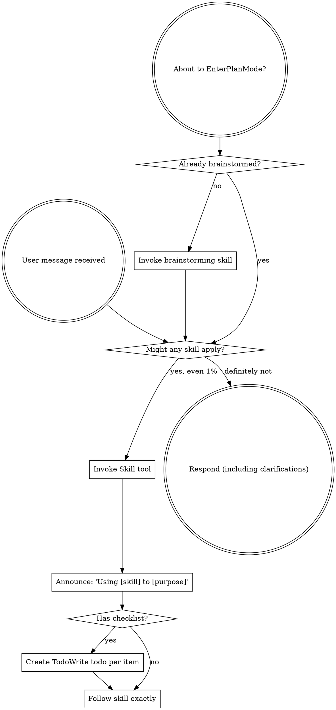

# Review — 2026-05-13-external-reviewer-redesign.md (post-slice, round 1)

- Target: `docs/superstar/plans/2026-05-13-external-reviewer-redesign.md`
- Request: `docs/reviewer/external-reviewer-redesign-S5-post-slice/r1-2026-05-14T0334-request.md`
- Reviewer command: `reviewer-agent`
- Status: `ok`

---

**Findings**

F1. Severity: blocking — `--changed-files` does not fully limit the embedded diff surface.  
The spec says `--changed-files` overrides the default scope and that untracked files/status should be scoped to the diff paths: [design.md](</home/simon/Dev/sigreer/skills/superstar/docs/superstar/specs/2026-05-13-external-reviewer-redesign-design.md:244>), [design.md](</home/simon/Dev/sigreer/skills/superstar/docs/superstar/specs/2026-05-13-external-reviewer-redesign-design.md:247>). But `compute_diff_section()` runs unscoped `git status --porcelain` and then previews every untracked file: [external-reviewer.py](</home/simon/Dev/sigreer/skills/superstar/skills/external-review/scripts/external-reviewer.py:561>), [external-reviewer.py](</home/simon/Dev/sigreer/skills/superstar/skills/external-review/scripts/external-reviewer.py:577>). I reproduced this with `paths=["plan.md"]`: an unrelated untracked `unrelated.txt` was still included in the prompt. This breaks the override contract and can leak unrelated local artifacts into focused reviews.

F2. Severity: important — Slice 5 implementation is committed, but the plan still says Slice 5 is incomplete.  
All Slice 5 checkboxes remain unchecked, including test writing, implementation, full-suite verification, and commit steps: [plan](</home/simon/Dev/sigreer/skills/superstar/docs/superstar/plans/2026-05-13-external-reviewer-redesign.md:1820>), [plan](</home/simon/Dev/sigreer/skills/superstar/docs/superstar/plans/2026-05-13-external-reviewer-redesign.md:2060>). The repo has the Slice 5 commits (`faed8b5`, `1934627`) and tests pass, but the target document does not contain the closeout evidence needed for a post-slice gate.

F3. Severity: important — The worktree is not clean and includes an untracked S5 review artifact.  
`git status --short` shows modified files outside this slice plus `?? docs/reviewer/external-reviewer-redesign-S5-post-slice/`. That directory currently contains only `r1-2026-05-14T0334-request.md`, with no response/manifest artifact. The prior Slice 4 note documents a standing branch/dirty-file override, but there is no Slice 5 closeout explaining whether these artifacts are expected or should be committed/removed.

**Open Questions / Assumptions**

- I assume Slice 5 is the slice under review, based on the latest commits and the untracked `external-reviewer-redesign-S5-post-slice` directory.
- I treated the existing modified skill files as likely pre-existing, but they still affect the post-slice clean-tree gate unless explicitly waived again for Slice 5.

**Suggested Document Edits**

- Mark Slice 5 tasks complete only after resolving F1 and re-running verification.
- Add a “Slice 5 closeout note” with commits `faed8b5` and `1934627`, final test result, known dirty/untracked artifacts, and the post-slice review outcome.
- Add a note if the dirty worktree/main-branch override remains intentionally in force for Slice 5.

**Verification Gaps / Commands**

Commands run:

```bash
python3 -m pytest skills/external-review/tests/test_diff.py skills/external-review/tests/test_diff_wiring.py -v
python3 -m pytest skills/external-review/tests/ -q
```

Results: `13 passed`; full suite `70 passed, 1 warning`.

Add and run a missing regression test for `compute_diff_section(..., paths=["plan.md"])` proving unrelated dirty/untracked files are excluded from status and previews.

**Overall Verdict: revise**

---

## Reviewer stderr

```text
Reading prompt from stdin...
OpenAI Codex v0.130.0
--------
workdir: /home/simon/Dev/sigreer/skills/superstar
model: gpt-5.5
provider: openai
approval: never
sandbox: danger-full-access
reasoning effort: none
reasoning summaries: none
session id: 019e2455-c955-7d11-aad0-c5e2a60ee421
--------
user
You are acting as an independent senior engineering reviewer.

Review stance:
- Lead with findings, ordered by severity.
- Focus on correctness, consistency, implementation risk, missing acceptance
  gates, vague handoffs, ungrounded assumptions, unverified claims, and drift
  from the codebase.
- Give exact file/line references when possible.
- If the document is sound, say that clearly and list residual risks.
- Keep the review actionable. Avoid broad rewrites unless the current structure
  creates concrete risk.

Repository root:
/home/simon/Dev/sigreer/skills/superstar

Target kind:
post-slice

Review mode:
Post-slice review. Treat this as a completion gate for one
slice of work. Compare the completed changes and stated evidence against the
slice acceptance criteria. Prioritize: incomplete tasks, uncommitted or
untracked artifacts, missing tests, failing or skipped verification, broken
cross-site behavior, and claims not supported by the repo state.

Target document:
docs/superstar/plans/2026-05-13-external-reviewer-redesign.md

Additional context files:
- docs/superstar/specs/2026-05-13-external-reviewer-redesign-design.md
- docs/handoffs/2026-05-13-external-reviewer-redesign-prompt.md

Review output contract:
1. Findings
   - Tag each finding with a stable ID: `F1`, `F2`, `F3`, …. IDs must remain
     stable if this review is iterated in subsequent rounds.
   - Mark severity inline: `Severity: blocking | important | minor | nit`.
2. Open questions / assumptions
3. Suggested document edits
4. Verification gaps / commands that should be run, if any
5. Overall verdict: one of "ready", "ready with small edits", or "revise"

Read the files from disk. Do not rely only on the snippets in this prompt.


## Target Preview

### docs/superstar/plans/2026-05-13-external-reviewer-redesign.md

    1	# External-Reviewer Redesign Implementation Plan
    2	
    3	> **For agentic workers:** REQUIRED SUB-SKILL: Use superstar:subagent-driven-development (recommended) or superstar:executing-plans to implement this plan task-by-task. Steps use checkbox (`- [ ]`) syntax for tracking.
    4	
    5	**Goal:** Rebuild `skills/external-review/scripts/external-reviewer.py` so review chains are incremental, durable, machine-readable, and support optional independent sweep reviewers — per `docs/superstar/specs/2026-05-13-external-reviewer-redesign-design.md`.
    6	
    7	**Architecture:** A persistent `chain.json` manifest per review chain becomes the source of truth for round metadata. The script gains verdict parsing, work-ID-keyed chain folders, a resolution-artifact contract and gate, incremental round prompts with embedded diffs, optional session-resume placeholders, and Pass-3 independent sweep reviewers. Skill documentation is updated to match.
    8	
    9	**Tech Stack:** Python 3.9+ standard library only (no external deps), `pytest` for tests, `git` CLI for diff and SHA capture.
   10	
   11	---
   12	
   13	## Pre-flight
   14	
   15	- [ ] **Step 1: Verify working directory and branch**
   16	
   17	Run:
   18	
   19	```bash
   20	cd /home/simon/Dev/sigreer/skills/superstar
   21	git status --short
   22	git rev-parse --abbrev-ref HEAD
   23	```
   24	
   25	Expected: clean tree, branch is a feature branch (not `main`). If on `main`, stop and create a branch via `superstar:using-git-worktrees`.
   26	
   27	- [ ] **Step 2: Confirm test runner**
   28	
   29	Run:
   30	
   31	```bash
   32	python3 -c "import pytest; print(pytest.__version__)"
   33	```
   34	
   35	Expected: prints a version string. If `ModuleNotFoundError`, install pytest:
   36	
   37	```bash
   38	python3 -m pip install --user pytest
   39	```
   40	
   41	- [ ] **Step 3: Set up the test directory**
   42	
   43	Create the directory tests will live in:
   44	
   45	```bash
   46	mkdir -p skills/external-review/tests
   47	touch skills/external-review/tests/__init__.py
   48	```
   49	
   50	Commit:
   51	
   52	```bash
   53	git add skills/external-review/tests/__init__.py
   54	git commit -m "scaffold: tests dir for external-reviewer redesign"
   55	```
   56	
   57	---
   58	
   59	## Slice 1: Chain manifest & verdict parsing
   60	
   61	**Goal:** Introduce `chain.json` as the round-metadata source of truth, parse verdicts and finding counts from response text, and emit them in the JSON output. Backwards-compatible: legacy chains synthesize a manifest on first touch.
   62	
   63	### Task 1.1: Manifest read/write helpers
   64	
   65	**Files:**
   66	- Create: `skills/external-review/tests/test_manifest.py`
   67	- Modify: `skills/external-review/scripts/external-reviewer.py`
   68	
   69	- [x] **Step 1: Write the failing tests**
   70	
   71	`skills/external-review/tests/test_manifest.py`:
   72	
   73	```python
   74	import json
   75	from pathlib import Path
   76	
   77	import pytest
   78	
   79	import sys
   80	SCRIPTS = Path(__file__).resolve().parents[1] / "scripts"
   81	sys.path.insert(0, str(SCRIPTS))
   82	
   83	import importlib.util
   84	spec = importlib.util.spec_from_file_location("external_reviewer", SCRIPTS / "external-reviewer.py")
   85	external_reviewer = importlib.util.module_from_spec(spec)
   86	spec.loader.exec_module(external_reviewer)
   87	
   88	
   89	def test_read_manifest_returns_none_for_missing(tmp_path):
   90	    assert external_reviewer.read_manifest(tmp_path / "missing.json") is None
   91	
   92	
   93	def test_write_then_read_manifest_roundtrips(tmp_path):
   94	    path = tmp_path / "chain.json"
   95	    data = {
   96	        "schema_version": 1,
   97	        "chain": "demo-post-slice",
   98	        "kind": "post-slice",
   99	        "target": "docs/plans/demo.md",
  100	        "work_id": "P1.S1",
  101	        "legacy_migrated": False,
  102	        "rounds": [],
  103	        "sweep_checkpoints": {"first-round": "pending", "final-ready": "pending"},
  104	    }
  105	    external_reviewer.write_manifest(path, data)
  106	    loaded = external_reviewer.read_manifest(path)
  107	    assert loaded == data
  108	
  109	
  110	def test_read_manifest_rejects_newer_schema(tmp_path):
  111	    path = tmp_path / "chain.json"
  112	    path.write_text(json.dumps({"schema_version": 99}))
  113	    with pytest.raises(external_reviewer.ManifestSchemaTooNew):
  114	        external_reviewer.read_manifest(path)
  115	```
  116	
  117	- [x] **Step 2: Run the tests; confirm they fail**
  118	
  119	```bash
  120	python3 -m pytest skills/external-review/tests/test_manifest.py -v
  121	```
  122	
  123	Expected: 3 failures (`read_manifest`, `write_manifest`, `ManifestSchemaTooNew` all undefined).
  124	
  125	- [x] **Step 3: Add manifest helpers to the script**
  126	
  127	Append to `skills/external-review/scripts/external-reviewer.py` (after the existing module-level constants, before `repo_root()`):
  128	
  129	```python
  130	SUPPORTED_SCHEMA_VERSION = 1
  131	
  132	
  133	class ManifestSchemaTooNew(Exception):
  134	    """Raised when chain.json declares a schema_version newer than this script supports."""
  135	
  136	
  137	def read_manifest(path: Path) -> dict | None:
  138	    if not path.exists():
  139	        return None
  140	    data = json.loads(path.read_text(encoding="utf-8"))
  141	    version = data.get("schema_version")
  142	    if isinstance(version, int) and version > SUPPORTED_SCHEMA_VERSION:
  143	        raise ManifestSchemaTooNew(
  144	            f"chain.json schema_version {version} is newer than this script supports "
  145	            f"(max {SUPPORTED_SCHEMA_VERSION}). Upgrade external-reviewer.py."
  146	        )
  147	    return data
  148	
  149	
  150	def write_manifest(path: Path, data: dict) -> None:
  151	    path.parent.mkdir(parents=True, exist_ok=True)
  152	    path.write_text(json.dumps(data, indent=2) + "\n", encoding="utf-8")
  153	```
  154	
  155	- [x] **Step 4: Run the tests; confirm they pass**
  156	
  157	```bash
  158	python3 -m pytest skills/external-review/tests/test_manifest.py -v
  159	```
  160	
  161	Expected: 3 passed.
  162	
  163	- [x] **Step 5: Commit**
  164	
  165	```bash
  166	git add skills/external-review/scripts/external-reviewer.py skills/external-review/tests/test_manifest.py
  167	git commit -m "feat(external-reviewer): chain.json read/write helpers with schema versioning"
  168	```
  169	
  170	### Task 1.2: Verdict parsing
  171	
  172	**Files:**
  173	- Create: `skills/external-review/tests/test_verdict.py`
  174	- Modify: `skills/external-review/scripts/external-reviewer.py`
  175	
  176	- [x] **Step 1: Write the failing tests**
  177	
  178	`skills/external-review/tests/test_verdict.py`:
  179	
  180	```python
  181	from pathlib import Path
  182	import sys, importlib.util
  183	
  184	SCRIPTS = Path(__file__).resolve().parents[1] / "scripts"
  185	sys.path.insert(0, str(SCRIPTS))
  186	spec = importlib.util.spec_from_file_location("external_reviewer", SCRIPTS / "external-reviewer.py")
  187	er = importlib.util.module_from_spec(spec); spec.loader.exec_module(er)
  188	
  189	
  190	def test_verdict_ready():
  191	    v, valid = er.parse_verdict("Findings: ok\n\nOverall verdict: ready\n")
  192	    assert v == "ready"
  193	    assert valid is True
  194	
  195	
  196	def test_verdict_ready_with_small_edits_markdown():
  197	    body = "**Overall verdict:** `ready with small edits`."
  198	    v, valid = er.parse_verdict(body)
  199	    assert v == "ready with small edits"
  200	    assert valid is True
  201	
  202	
  203	def test_verdict_revise_case_insensitive():
  204	    v, valid = er.parse_verdict("OVERALL VERDICT: Revise")
  205	    assert v == "revise"
  206	    assert valid is True
  207	
  208	
  209	def test_verdict_takes_last_match():
  210	    body = "Overall verdict: ready\n\n...later...\n\nOverall verdict: revise"
  211	    v, valid = er.parse_verdict(body)
  212	    assert v == "revise"
  213	
  214	
  215	def test_verdict_unknown_returns_invalid():
  216	    v, valid = er.parse_verdict("Overall verdict: looks fine to me")
  217	    assert v is None
  218	    assert valid is False
  219	
  220	
  221	def test_verdict_missing_returns_invalid():
  222	    v, valid = er.parse_verdict("Some review prose with no verdict line.")
  223	    assert v is None
  224	    assert valid is False
  225	```
  226	
  227	- [x] **Step 2: Run the tests; confirm they fail**
  228	
  229	```bash
  230	python3 -m pytest skills/external-review/tests/test_verdict.py -v
  231	```
  232	
  233	Expected: 6 failures (`parse_verdict` undefined).
  234	
  235	- [x] **Step 3: Add the verdict parser**
  236	
  237	Append to `skills/external-review/scripts/external-reviewer.py`:
  238	
  239	```python
  240	VERDICT_VALUES = ("ready with small edits", "ready", "revise")
  241	VERDICT_LINE_RE = re.compile(
  242	    r"overall\s+verdict\s*[:\-]\s*[`*_\"']*\s*(ready with small edits|ready|revise)\s*[`*_\"'.]*",
  243	    re.IGNORECASE,
  244	)
  245	
  246	
  247	def parse_verdict(text: str) -> tuple[str | None, bool]:
  248	    matches = list(VERDICT_LINE_RE.finditer(text))
  249	    if not matches:
  250	        return None, False
  251	    raw = matches[-1].group(1).strip().lower()
  252	    if raw not in VERDICT_VALUES:
  253	        return None, False
  254	    return raw, True
  255	```
  256	
  257	Note: regex prefers `ready with small edits` over `ready` because of ordering in the alternation.
  258	
  259	- [x] **Step 4: Run the tests; confirm they pass**
  260	
  261	```bash
  262	python3 -m pytest skills/external-review/tests/test_verdict.py -v
  263	```
  264	
  265	Expected: 6 passed.
  266	
  267	- [x] **Step 5: Commit**
  268	
  269	```bash
  270	git add skills/external-review/scripts/external-reviewer.py skills/external-review/tests/test_verdict.py
  271	git commit -m "feat(external-reviewer): parse_verdict with markdown/case tolerance"
  272	```
  273	
  274	### Task 1.3: Finding-count parsing
  275	
  276	**Files:**
  277	- Create: `skills/external-review/tests/test_findings.py`
  278	- Modify: `skills/external-review/scripts/external-reviewer.py`
  279	
  280	- [x] **Step 1: Write the failing tests**
  281	
  282	`skills/external-review/tests/test_findings.py`:
  283	
  284	```python
  285	from pathlib import Path
  286	import sys, importlib.util
  287	SCRIPTS = Path(__file__).resolve().parents[1] / "scripts"
  288	sys.path.insert(0, str(SCRIPTS))
  289	spec = importlib.util.spec_from_file_location("external_reviewer", SCRIPTS / "external-reviewer.py")
  290	er = importlib.util.module_from_spec(spec); spec.loader.exec_module(er)
  291	
  292	
  293	def test_heading_findings_counted():
  294	    body = "## F1\nSeverity: blocking\n\n## F2\nSeverity: minor\n\n## F3\nSeverity: blocking"
  295	    n, blocking = er.parse_findings(body)
  296	    assert n == 3
  297	    assert blocking == 2
  298	
  299	
  300	def test_bullet_findings_counted():
  301	    body = "- F1: something blocking (blocking)\n- F2 minor thing"
  302	    n, blocking = er.parse_findings(body)
  303	    assert n == 2
  304	    assert blocking == 1
  305	
  306	
  307	def test_no_findings_returns_zero():
  308	    body = "Overall verdict: ready\n\nNo findings."
  309	    n, blocking = er.parse_findings(body)
  310	    assert n == 0
  311	    assert blocking == 0
  312	
  313	
  314	def test_unparseable_returns_none():
  315	    body = "Reviewer crashed: connection reset"
  316	    n, blocking = er.parse_findings(body)
  317	    assert n is None
  318	    assert blocking is None
  319	```
  320	
  321	- [x] **Step 2: Run the tests; confirm they fail**
  322	
  323	```bash
  324	python3 -m pytest skills/external-review/tests/test_findings.py -v
  325	```
  326	
  327	Expected: 4 failures.
  328	
  329	- [x] **Step 3: Add the parser**
  330	
  331	Append to `skills/external-review/scripts/external-reviewer.py`:
  332	
  333	```python
  334	HEADING_FINDING_RE = re.compile(r"^##\s+F\d+\b", re.MULTILINE)
  335	BULLET_FINDING_RE = re.compile(r"^\s*[-*]?\s*\**F\d+\**[:\s\-]", re.MULTILINE)
  336	BLOCKING_MARKER_RE = re.compile(r"(?:^|\s)\(blocking\)|^severity\s*:\s*blocking", re.IGNORECASE | re.MULTILINE)
  337	
  338	
  339	def parse_findings(text: str) -> tuple[int | None, int | None]:
  340	    if not text or text.strip() == "" or "reviewer crashed" in text.lower():
  341	        return None, None
  342	    heading_count = len(HEADING_FINDING_RE.findall(text))
  343	    if heading_count > 0:
  344	        n = heading_count
  345	    else:
  346	        n = len(BULLET_FINDING_RE.findall(text))
  347	    blocking = len(BLOCKING_MARKER_RE.findall(text))
  348	    return n, blocking
  349	```
  350	
  351	- [x] **Step 4: Run the tests; confirm they pass**
  352	
  353	```bash
  354	python3 -m pytest skills/external-review/tests/test_findings.py -v
  355	```
  356	
  357	Expected: 4 passed.
  358	
  359	- [x] **Step 5: Commit**
  360	
  361	```bash
  362	git add skills/external-review/scripts/external-reviewer.py skills/external-review/tests/test_findings.py
  363	git commit -m "feat(external-reviewer): parse_findings (heading + bullet, blocking count)"
  364	```
  365	
  366	### Task 1.4: Round-number derivation reads manifest first
  367	
  368	**Files:**
  369	- Create: `skills/external-review/tests/test_round_number.py`
  370	- Modify: `skills/external-review/scripts/external-reviewer.py` (`next_round_number`)
  371	
  372	- [x] **Step 1: Write the failing tests**
  373	
  374	`skills/external-review/tests/test_round_number.py`:
  375	
  376	```python
  377	from pathlib import Path
  378	import json, sys, importlib.util
  379	SCRIPTS = Path(__file__).resolve().parents[1] / "scripts"
  380	sys.path.insert(0, str(SCRIPTS))
  381	spec = importlib.util.spec_from_file_location("external_reviewer", SCRIPTS / "external-reviewer.py")
  382	er = importlib.util.module_from_spec(spec); spec.loader.exec_module(er)
  383	
  384	
  385	def test_no_chain_dir_round_is_one(tmp_path):
  386	    assert er.next_round_number(tmp_path / "absent") == 1
  387	
  388	
  389	def test_manifest_present_takes_precedence(tmp_path):
  390	    d = tmp_path / "chain"; d.mkdir()
  391	    er.write_manifest(d / "chain.json", {
  392	        "schema_version": 1, "rounds": [{"round": 1}, {"round": 2}]
  393	    })
  394	    assert er.next_round_number(d) == 3
  395	
  396	
  397	def test_legacy_dir_no_manifest_falls_back_to_filename_scan(tmp_path):
  398	    d = tmp_path / "chain"; d.mkdir()
  399	    (d / "r1-2026-05-01T0900-request.md").write_text("")
  400	    (d / "r2-2026-05-02T0900-request.md").write_text("")
  401	    assert er.next_round_number(d) == 3
  402	```
  403	
  404	- [x] **Step 2: Run the tests; confirm they fail**
  405	
  406	```bash
  407	python3 -m pytest skills/external-review/tests/test_round_number.py -v
  408	```
  409	
  410	Expected: test 2 fails (no manifest awareness), tests 1 and 3 may pass if current behavior already handles them.
  411	
  412	- [x] **Step 3: Update `next_round_number`**
  413	
  414	Replace the existing function:
  415	
  416	```python
  417	def next_round_number(chain_dir: Path) -> int:
  418	    if not chain_dir.exists():
  419	        return 1
  420	    manifest = read_manifest(chain_dir / "chain.json")
  421	    if manifest and isinstance(manifest.get("rounds"), list):
  422	        return len(manifest["rounds"]) + 1
  423	    return len(list(chain_dir.glob("r*-*-request.md"))) + 1
  424	```
  425	
  426	- [x] **Step 4: Run the tests**
  427	
  428	```bash
  429	python3 -m pytest skills/external-review/tests/test_round_number.py -v
  430	```
  431	
  432	Expected: 3 passed.
  433	
  434	- [x] **Step 5: Commit**
  435	
  436	```bash
  437	git add skills/external-review/scripts/external-reviewer.py skills/external-review/tests/test_round_number.py
  438	git commit -m "feat(external-reviewer): next_round_number consults chain.json"
  439	```
  440	
  441	### Task 1.5: Legacy manifest synthesis
  442	
  443	**Files:**
  444	- Create: `skills/external-review/tests/test_legacy_migration.py`
  445	- Modify: `skills/external-review/scripts/external-reviewer.py`
  446	
  447	- [x] **Step 1: Write the failing tests**
  448	
  449	`skills/external-review/tests/test_legacy_migration.py`:
  450	
  451	```python
  452	from pathlib import Path
  453	import sys, importlib.util
  454	SCRIPTS = Path(__file__).resolve().parents[1] / "scripts"
  455	sys.path.insert(0, str(SCRIPTS))
  456	spec = importlib.util.spec_from_file_location("external_reviewer", SCRIPTS / "external-reviewer.py")
  457	er = importlib.util.module_from_spec(spec); spec.loader.exec_module(er)
  458	
  459	
  460	def test_synthesize_manifest_from_legacy_files(tmp_path):
  461	    d = tmp_path / "old-chain"; d.mkdir()
  462	    (d / "r1-2026-04-01T0900-request.md").write_text("prompt body")
  463	    (d / "r1-2026-04-01T0905-response.md").write_text(
  464	        "## F1\nSeverity: blocking\n\nOverall verdict: revise\n"
  465	    )
  466	    (d / "r2-2026-04-02T1200-request.md").write_text("prompt body 2")
  467	
  468	    manifest = er.synthesize_legacy_manifest(
  469	        chain_dir=d, chain="old-chain", kind="post-slice",
  470	        target="docs/plans/old.md", work_id="P1.S1",
  471	    )
  472	
  473	    assert manifest["legacy_migrated"] is True
  474	    assert manifest["work_id"] == "P1.S1"
  475	    assert len(manifest["rounds"]) == 2
  476	    r1, r2 = manifest["rounds"]
  477	    assert r1["legacy"] is True
  478	    assert r1["verdict"] == "revise"
  479	    assert r1["verdict_valid"] is True
  480	    assert r1["findings_count"] == 1
  481	    assert r1["blocking_findings_count"] == 1
  482	    assert r1["head_sha_after_round"] is None
  483	    assert r2["response"] is None  # only request file existed
  484	```
  485	
  486	- [x] **Step 2: Run the tests; confirm they fail**
  487	
  488	```bash
  489	python3 -m pytest skills/external-review/tests/test_legacy_migration.py -v
  490	```
  491	
  492	Expected: 1 failure.
  493	
  494	- [x] **Step 3: Add the synthesizer**
  495	
  496	Append to `skills/external-review/scripts/external-reviewer.py`:
  497	
  498	```python
  499	LEGACY_ROUND_FILE_RE = re.compile(r"^r(\d+)-([0-9T\-]+)-(request|response)\.md$")
  500	
  501	
  502	def synthesize_legacy_manifest(
  503	    *, chain_dir: Path, chain: str, kind: str, target: str, work_id: str | None
  504	) -> dict:
  505	    rounds_map: dict[int, dict] = {}
  506	    for path in sorted(chain_dir.iterdir()):
  507	        m = LEGACY_ROUND_FILE_RE.match(path.name)
  508	        if not m:
  509	            continue
  510	        round_num = int(m.group(1))
  511	        role = m.group(3)
  512	        entry = rounds_map.setdefault(
  513	            round_num,
  514	            {
  515	                "round": round_num,
  516	                "request": None,
  517	                "response": None,
  518	                "resolution": None,
  519	                "verdict": None,
  520	                "verdict_valid": False,
  521	                "findings_count": None,
  522	                "blocking_findings_count": None,
  523	                "head_sha_at_request": None,
  524	                "head_sha_after_round": None,
  525	                "worktree_dirty_at_request": None,
  526	                "legacy": True,
  527	            },
  528	        )
  529	        entry[role] = path.name
  530	        if role == "response":
  531	            body = path.read_text(encoding="utf-8", errors="replace")
  532	            v, valid = parse_verdict(body)
  533	            entry["verdict"], entry["verdict_valid"] = v, valid
  534	            n, blocking = parse_findings(body)
  535	            entry["findings_count"], entry["blocking_findings_count"] = n, blocking
  536	
  537	    return {
  538	        "schema_version": SUPPORTED_SCHEMA_VERSION,
  539	        "chain": chain,
  540	        "kind": kind,
  541	        "target": target,
  542	        "work_id": work_id,
  543	        "legacy_migrated": True,
  544	        "migrated_at": dt.datetime.utcnow().strftime("%Y-%m-%dT%H:%M:%SZ"),
  545	        "rounds": [rounds_map[k] for k in sorted(rounds_map)],
  546	        "sweep_checkpoints": {"first-round": "pending", "final-ready": "pending"},
  547	    }
  548	```
  549	
  550	- [x] **Step 4: Run the tests; confirm they pass**
  551	
  552	```bash
  553	python3 -m pytest skills/external-review/tests/test_legacy_migration.py -v
  554	```
  555	
  556	Expected: 1 passed.
  557	
  558	- [x] **Step 5: Commit**
  559	
  560	```bash
  561	git add skills/external-review/scripts/external-reviewer.py skills/external-review/tests/test_legacy_migration.py
  562	git commit -m "feat(external-reviewer): synthesize_legacy_manifest from rN-* files"
  563	```
  564	
  565	### Task 1.6: Wire manifest into `main()` for single-reviewer rounds
  566	
  567	**Files:**
  568	- Modify: `skills/external-review/scripts/external-reviewer.py` (`main` function)
  569	- Create: `skills/external-review/tests/test_main_round_writes_manifest.py`
  570	
  571	- [x] **Step 1: Write the failing test**
  572	
  573	`skills/external-review/tests/test_main_round_writes_manifest.py`:
  574	
  575	```python
  576	from pathlib import Path
  577	import subprocess, sys, json, importlib.util, os
  578	
  579	SCRIPTS = Path(__file__).resolve().parents[1] / "scripts"
  580	sys.path.insert(0, str(SCRIPTS))
  581	spec = importlib.util.spec_from_file_location("external_reviewer", SCRIPTS / "external-reviewer.py")
  582	er = importlib.util.module_from_spec(spec); spec.loader.exec_module(er)
  583	
  584	
  585	FAKE_REVIEWER = """#!/usr/bin/env bash
  586	cat <<'EOF'
  587	## F1
  588	Severity: blocking
  589	Stub finding.
  590	
  591	Overall verdict: revise
  592	EOF
  593	"""
  594	
  595	
  596	def test_main_writes_manifest_entry(tmp_path, monkeypatch):
  597	    repo = tmp_path / "repo"; repo.mkdir()
  598	    subprocess.run(["git", "-C", str(repo), "init", "-q"], check=True)
  599	    subprocess.run(["git", "-C", str(repo), "config", "user.email", "t@t"], check=True)
  600	    subprocess.run(["git", "-C", str(repo), "config", "user.name", "T"], check=True)

[truncated: 2485 additional lines]

## Context Previews

### docs/superstar/specs/2026-05-13-external-reviewer-redesign-design.md

    1	# External-Review Script Redesign — Design
    2	
    3	**Date:** 2026-05-13
    4	**Target:** `skills/external-review/scripts/external-reviewer.py` and `skills/external-review/SKILL.md`
    5	**Motivation:** A self-review of the external-reviewer flow surfaced five concrete failure modes that cause review loops to balloon to 7–10 rounds and lose continuity between rounds. This spec redesigns the script and skill to make rounds incremental, durable, and machine-readable.
    6	
    7	---
    8	
    9	## Goals
   10	
   11	1. **Round N+1 is incremental, not a re-review.** The reviewer is given prior findings, the fixer's resolution report, and a focused diff — and is instructed to verify resolution rather than reopen broad review.
   12	2. **Verdict is machine-readable.** JSON output exposes a parsed `verdict`, `verdict_valid`, and finding counts, so coordinators don't have to parse prose.
   13	3. **Post-slice / post-phase chains are uniquely keyed.** `--work-id` is required for both so that multi-slice plans don't collapse into one chain.
   14	4. **Resolution artifacts are durable and structured-enough-to-parse.** Required headers, free-form bodies, stable finding IDs across rounds.
   15	5. **Optional session resume.** Provider-specific wrappers can plug into placeholders if the underlying reviewer CLI supports session IDs.
   16	6. **Legacy chains keep working.** Soft-migrate on first new round; preserve existing folder names and audit history.
   17	7. **Review depth is explicit.** The default chain uses one primary incremental reviewer, but callers can request bounded independent sweep reviewers at high-risk checkpoints to preserve fresh-eye coverage without unbounded serial churn.
   18	
   19	## Non-goals
   20	
   21	- Replacing the chain-folder layout for new chains. The folder-naming scheme gains a `--work-id` segment for post-slice/post-phase, but the round-file scheme is unchanged.
   22	- Making the script aware of any specific reviewer CLI. The script remains provider-neutral via `AGENT_REVIEWER_CMD`.
   23	- Auto-dispatching the fixer subagent. The script enforces the resolution gate but does not invoke fixers; that stays in the coordinator's loop, governed by `subagent-driven-development`.
   24	
   25	## Invariants
   26	
   27	- **A review chain is single-writer.** Running two rounds concurrently against the same chain is unsupported and may corrupt `chain.json`. The script does not lock; callers are expected to serialise.
   28	- **Existing rounds are immutable.** Once written, `rN-*-request.md`, `rN-*-response.md`, and `rN-resolution.md` are never overwritten. Manifest entries for past rounds are append-only.
   29	
   30	## Architecture
   31	
   32	Three implementation passes, all designed in this spec:
   33	
   34	- **Pass 1 — Core.** Chain manifest, verdict parsing, `--work-id`, prior-round context injection, incremental round prompts, resolution-artifact contract and gate, automatic diff embedding, JSON output enrichment, legacy migration.
   35	- **Pass 2 — Session resume.** Optional placeholders (`{chain_dir}`, `{round}`, `{previous_response}`, `{resolution_file}`, `{session_file}`) exposed via the existing `AGENT_REVIEWER_CMD` template mechanism. A provider-specific wrapper can use `{session_file}` to persist and resume reviewer sessions. The script provides a stable path (`chain_dir/session.state`) and ensures the parent directory exists; wrappers own the file's contents. The script never reads `session.state`.
   36	- **Pass 3 — Review depth / independent sweeps.** Adds `--review-depth`, `--independent-reviewers`, `--sweep-policy` flags. Independent sweep reviewers run without seeing the primary reviewer's findings on their first pass (to avoid anchoring), and their findings are merged into the same resolution checklist afterward. Depends on Pass 1's manifest and verdict parsing; does not depend on Pass 2.
   37	
   38	### Chain manifest
   39	
   40	`docs/reviewer/<chain>/chain.json` is the single source of truth for round metadata. The `rN-*-request.md` / `rN-*-response.md` / `rN-resolution.md` files remain for human readability and git history; the script reads and writes manifest entries when computing round numbers, base refs, and verdicts.
   41	
   42	```json
   43	{
   44	  "schema_version": 1,
   45	  "chain": "feature-plan-P2-S3-post-slice",
   46	  "kind": "post-slice",
   47	  "target": "docs/superstar/plans/feature-plan.md",
   48	  "work_id": "P2.S3",
   49	  "legacy_migrated": false,
   50	  "rounds": [
   51	    {
   52	      "round": 1,
   53	      "request": "r1-2026-05-13T1012-request.md",
   54	      "response": "r1-2026-05-13T1020-response.md",
   55	      "resolution": null,
   56	      "head_sha_at_request": "abc1234",
   57	      "head_sha_after_round": "abc1234",
   58	      "worktree_dirty_at_request": false,
   59	      "verdict": "revise",
   60	      "verdict_valid": true,
   61	      "findings_count": 4,
   62	      "blocking_findings_count": 2
   63	    },
   64	    {
   65	      "round": 2,
   66	      "request": "r2-2026-05-13T1130-request.md",
   67	      "response": null,
   68	      "resolution": "r1-resolution.md",
   69	      "base_ref": "abc1234",
   70	      "base_ref_source": "auto",
   71	      "head_sha_at_request": "def5678",
   72	      "worktree_dirty_at_request": false,
   73	      "diff_included": true,
   74	      "resolution_parse_status": "ok",
   75	      "resolution_waiver": false
   76	    }
   77	  ]
   78	}
   79	```
   80	
   81	#### Manifest versioning
   82	
   83	- `schema_version: 1` is the initial version introduced by this redesign.
   84	- Unknown future `schema_version` values cause the script to error with a clear message: `ERROR: chain.json schema_version <N> is newer than this script supports. Upgrade external-reviewer.py.` This prevents silent corruption.
   85	- Older `schema_version` values (currently none) get best-effort migration on read, recorded as `schema_migrated_from: <prior>` in the manifest.
   86	
   87	### Naming
   88	
   89	- **Chain folder slug:** `<target-stem-no-leading-date>-<work-id-dotless>-<kind>` for post-slice/post-phase; `<target-stem-no-leading-date>-<kind>` otherwise. Dots in work IDs are replaced with dashes in the folder slug only — the manifest preserves the canonical form.
   90	  - Example: `--work-id P2.S3` → folder `feature-plan-P2-S3-post-slice`, manifest `"work_id": "P2.S3"`.
   91	- **Round files:** `r{N}-<YYYY-MM-DDTHHMM>-request.md`, `r{N}-<YYYY-MM-DDTHHMM>-response.md`. Unchanged from current behavior.
   92	- **Resolution files:** `r{N}-resolution.md`, where `N` is the round whose response is being addressed. Round `N+1` consumes `r{N}-resolution.md`. Worked example: after `r1-response.md` returns `revise`, the fixer writes `r1-resolution.md`; round 2 reads `r1-resolution.md` and embeds it in the round-2 prompt.
   93	
   94	## CLI surface (new flags)
   95	
   96	| Flag | Kinds | Purpose |
   97	|---|---|---|
   98	| `--work-id <id>` | required for `post-slice`, `post-phase`; optional otherwise | Stable slice/phase ID (e.g., `P2.S3` for post-slice, `P2` for post-phase). Becomes part of chain folder name (dots → dashes) and is stored verbatim in the manifest. |
   99	| `--base-ref <sha\|ref>` | any | Override auto-computed diff base for this round. |
  100	| `--no-diff` | any | Suppress diff embedding even on round N+1. |
  101	| `--allow-missing-resolution` | post-slice, post-phase | Waive the resolution-required gate. Logged in manifest as `resolution_waiver: true`. |
  102	| `--changed-files <path>...` | any | Override automatic changed-file discovery and limit the embedded diff to the supplied paths. |
  103	| `--mode <auto\|broad\|incremental>` | any | Override the round-1-vs-N prompt mode. Default `auto` (round 1 → broad; round 2+ → incremental). |
  104	| `--max-diff-lines <int>` | any | Cap diff size. Default 2000. Truncation marker is embedded if exceeded. |
  105	| `--review-depth <standard\|thorough\|exhaustive>` | post-slice, post-phase | Controls whether independent sweep reviewers are run in addition to the primary chain reviewer. Default `standard`. |
  106	| `--independent-reviewers <int>` | post-slice, post-phase | Override reviewer count for independent sweeps. Default derived from `--review-depth`. |
  107	| `--sweep-policy <first-round\|final-ready\|both\|never>` | post-slice, post-phase | When to run fresh-context sweep reviews. Default derived from `--review-depth`. |
  108	
  109	### `--work-id` enforcement
  110	
  111	- `post-slice` or `post-phase` invoked without `--work-id` → exit 2 with operational error.
  112	- For `post-phase`, the expected form is the phase ID alone (`P2`), not a slice ID. The script does not enforce a regex; it documents the convention.
  113	- For other kinds, `--work-id` is optional; if provided, it is recorded in the manifest but does not affect the folder slug.
  114	
  115	## Reviewer prompt — round 1 vs round N+
  116	
  117	### Round 1: broad
  118	
  119	The existing broad prompt, with the output contract revised to require **stable finding IDs**:
  120	
  121	```
  122	1. Findings
  123	   - Each finding tagged `F<n>` (e.g., F1, F2, F3). IDs must be stable across rounds.
  124	   - Severity: blocking | important | minor | nit
  125	2. Open questions / assumptions
  126	3. Suggested document edits
  127	4. Verification gaps
  128	5. Overall verdict: ready | ready with small edits | revise
  129	```
  130	
  131	### Round N+: incremental
  132	
  133	Prepended to the existing prompt body:
  134	
  135	```
  136	You are continuing an existing review chain. This is round {N} of {chain_id}.
  137	
  138	In incremental mode:
  139	- Verify whether prior findings are resolved per the resolution report below.
  140	- Reuse the existing finding IDs (F1, F2, …). If a prior finding is resolved,
  141	  mark it RESOLVED in your findings list with its original ID. If still
  142	  unresolved, keep its ID.
  143	- Only introduce new finding IDs for genuine regressions caused by the fix, or
  144	  blocking issues clearly missed in earlier rounds. Do not reopen broad review
  145	  unless prior fixes changed broad architecture.
  146	
  147	Review chain summary:
  148	{per-round table: round, verdict, findings_count, blocking_findings_count}
  149	
  150	Prior-round findings (authoritative):
  151	{if r{N-1}-merged-findings.md exists: its verbatim contents — this replaces
  152	 individual reviewer response files as the prior-finding list of record}
  153	{else: a summary of the prior round's primary response, with finding IDs intact}
  154	
  155	Resolution report for prior round:
  156	{verbatim contents of r{N-1}-resolution.md}
  157	{or "MISSING — explicitly waived by caller via --allow-missing-resolution"}
  158	{or "MISSING — chain migrated from legacy artifacts; please verify whether changes occurred from the diff below"}
  159	
  160	Resolution parse summary (best-effort):
  161	{structured: per-finding-ID → status, or "unparseable"}
  162	
  163	Changes since prior round:
  164	{git diff <base_ref>..HEAD -- <scoped paths>}
  165	{if dirty: appended `git diff HEAD` section, both labeled}
  166	{if no base: "not available for this round (legacy chain / first round / --no-diff)"}
  167	```
  168	
  169	`--mode broad` forces round-1-style on later rounds (rare; for cases where the fix changed architecture). `--mode incremental` on round 1 is rejected with a clear error.
  170	
  171	## Resolution artifact contract
  172	
  173	**Path:** `docs/reviewer/<chain>/r{N}-resolution.md`, where `N` is the round whose response is being addressed. Authored by the fix subagent between round N (response) and round N+1 (resubmit).
  174	
  175	**Required parseable shape:**
  176	
  177	```markdown
  178	# Resolution for r{N}
  179	
  180	## F1
  181	Status: fixed
  182	Evidence:
  183	- Commit: abc1234
  184	- Files: `src/foo.ts:42`, `tests/foo.test.ts:18`
  185	- Verification: `npm test -- foo.test.ts` passed
  186	
  187	Notes:
  188	Changed the validation path to reject empty IDs before persistence.
  189	
  190	## F2
  191	Status: waived
  192	Evidence:
  193	- No code change
  194	- Reason: reviewer assumed X, but the plan explicitly excludes X in
  195	  `docs/superstar/specs/foo-design.md:77`
  196	
  197	Notes:
  198	No implementation change because this would expand slice scope.
  199	```
  200	

[truncated: 292 additional lines]
### docs/handoffs/2026-05-13-external-reviewer-redesign-prompt.md

    1	# Coordinator handoff — External-Reviewer Redesign
    2	
    3	You are the coordinator for implementing the **external-reviewer redesign** in the `superstar` repo at `/home/simon/Dev/sigreer/skills/superstar`.
    4	
    5	Your role is **strictly orchestration**. Use the `superstar:subagent-driven-development` skill with parallel agents where possible.
    6	
    7	## Inputs
    8	
    9	- Spec: [`docs/superstar/specs/2026-05-13-external-reviewer-redesign-design.md`](docs/superstar/specs/2026-05-13-external-reviewer-redesign-design.md)
   10	- Plan: [`docs/superstar/plans/2026-05-13-external-reviewer-redesign.md`](docs/superstar/plans/2026-05-13-external-reviewer-redesign.md)
   11	- Reviewer chain folder (created on first review): `docs/reviewer/external-reviewer-redesign-plan/` (kind `plan`) and per-slice chains like `docs/reviewer/external-reviewer-redesign-S1-post-slice/` (no TASKLIST.md in this repo; treat `S1`…`S8` from the plan as the work-id segments).
   12	
   13	## Coordinator discipline (non-negotiable)
   14	
   15	- **Do not perform any fixes yourself** unless the fix is genuinely cheaper to implement than the process of delegating to a subagent. Tiebreak: delegate.
   16	- **Do not pollute your context.** Delegate investigations, file reads, and edits to subagents. Your context is for orchestration, not implementation detail.
   17	- **At the end of each slice (S1–S8)**, the human partner runs `external-review` manually with `--kind post-slice` and pastes the findings back. Do NOT invoke the external-review skill yourself in this project — the human partner has explicitly chosen to drive it manually to keep the context clean. Wait for the verdict before proceeding to the next slice.
   18	- **Do not perform reviewer-driven fixes yourself.** Pass each reviewer response to a fix subagent that writes `r{N}-resolution.md` per the contract in `[[external-review]]`, then signal the human partner that the resolution is ready and the next round can be submitted.
   19	- **At the end of the phase** (after S8 closes), the human partner runs `--kind post-phase` manually. Same delegation rule.
   20	- **No TASKLIST.md exists** in this repo. Track slice completion in this handoff document or in a TODO list you maintain in-session; do not invent a TASKLIST.md file.
   21	
   22	## First action
   23	
   24	Read this file (the handoff prompt), the spec, and the plan. Then invoke `superstar:subagent-driven-development` and begin Slice 1 (Chain manifest & verdict parsing).

codex
I’ll use `superpowers:using-superpowers` for the required startup workflow, then I’ll read the target docs and repo state before giving the post-slice gate review.
exec
/usr/bin/zsh -lc "sed -n '1,220p' /home/simon/.codex/plugins/cache/openai-curated/superpowers/08373044/skills/using-superpowers/SKILL.md" in /home/simon/Dev/sigreer/skills/superstar
 succeeded in 0ms:
---
name: using-superpowers
description: Use when starting any conversation - establishes how to find and use skills, requiring Skill tool invocation before ANY response including clarifying questions
---

<SUBAGENT-STOP>
If you were dispatched as a subagent to execute a specific task, skip this skill.
</SUBAGENT-STOP>

<EXTREMELY-IMPORTANT>
If you think there is even a 1% chance a skill might apply to what you are doing, you ABSOLUTELY MUST invoke the skill.

IF A SKILL APPLIES TO YOUR TASK, YOU DO NOT HAVE A CHOICE. YOU MUST USE IT.

This is not negotiable. This is not optional. You cannot rationalize your way out of this.
</EXTREMELY-IMPORTANT>

## Instruction Priority

Superpowers skills override default system prompt behavior, but **user instructions always take precedence**:

1. **User's explicit instructions** (CLAUDE.md, GEMINI.md, AGENTS.md, direct requests) — highest priority
2. **Superpowers skills** — override default system behavior where they conflict
3. **Default system prompt** — lowest priority

If CLAUDE.md, GEMINI.md, or AGENTS.md says "don't use TDD" and a skill says "always use TDD," follow the user's instructions. The user is in control.

## How to Access Skills

**In Claude Code:** Use the `Skill` tool. When you invoke a skill, its content is loaded and presented to you—follow it directly. Never use the Read tool on skill files.

**In Copilot CLI:** Use the `skill` tool. Skills are auto-discovered from installed plugins. The `skill` tool works the same as Claude Code's `Skill` tool.

**In Gemini CLI:** Skills activate via the `activate_skill` tool. Gemini loads skill metadata at session start and activates the full content on demand.

**In other environments:** Check your platform's documentation for how skills are loaded.

## Platform Adaptation

Skills use Claude Code tool names. Non-CC platforms: see `references/copilot-tools.md` (Copilot CLI), `references/codex-tools.md` (Codex) for tool equivalents. Gemini CLI users get the tool mapping loaded automatically via GEMINI.md.

# Using Skills

## The Rule

**Invoke relevant or requested skills BEFORE any response or action.** Even a 1% chance a skill might apply means that you should invoke the skill to check. If an invoked skill turns out to be wrong for the situation, you don't need to use it.



## Red Flags

These thoughts mean STOP—you're rationalizing:

| Thought | Reality |
|---------|---------|
| "This is just a simple question" | Questions are tasks. Check for skills. |
| "I need more context first" | Skill check comes BEFORE clarifying questions. |
| "Let me explore the codebase first" | Skills tell you HOW to explore. Check first. |
| "I can check git/files quickly" | Files lack conversation context. Check for skills. |
| "Let me gather information first" | Skills tell you HOW to gather information. |
| "This doesn't need a formal skill" | If a skill exists, use it. |
| "I remember this skill" | Skills evolve. Read current version. |
| "This doesn't count as a task" | Action = task. Check for skills. |
| "The skill is overkill" | Simple things become complex. Use it. |
| "I'll just do this one thing first" | Check BEFORE doing anything. |
| "This feels productive" | Undisciplined action wastes time. Skills prevent this. |
| "I know what that means" | Knowing the concept ≠ using the skill. Invoke it. |

## Skill Priority

When multiple skills could apply, use this order:

1. **Process skills first** (brainstorming, debugging) - these determine HOW to approach the task
2. **Implementation skills second** (frontend-design, mcp-builder) - these guide execution

"Let's build X" → brainstorming first, then implementation skills.
"Fix this bug" → debugging first, then domain-specific skills.

## Skill Types

**Rigid** (TDD, debugging): Follow exactly. Don't adapt away discipline.

**Flexible** (patterns): Adapt principles to context.

The skill itself tells you which.

## User Instructions

Instructions say WHAT, not HOW. "Add X" or "Fix Y" doesn't mean skip workflows.

codex
I’m checking the actual files and repository state now, including the implementation and tests touched by Slice 1. The gate decision needs to be based on disk state, not the checked boxes in the plan.
exec
/usr/bin/zsh -lc 'git status --short' in /home/simon/Dev/sigreer/skills/superstar
 succeeded in 0ms:
 M CLAUDE.md
 M skills/executing-plans/SKILL.md
 M skills/finishing-a-development-branch/SKILL.md
 M skills/subagent-driven-development/SKILL.md
 M skills/tasklist-discipline/SKILL.md
?? docs/reviewer/external-reviewer-redesign-S5-post-slice/

exec
/usr/bin/zsh -lc 'git rev-parse --abbrev-ref HEAD && git log --oneline -12' in /home/simon/Dev/sigreer/skills/superstar
 succeeded in 0ms:
main
1934627 feat(external-reviewer): --base-ref / --no-diff / --changed-files / --max-diff-lines
faed8b5 feat(external-reviewer): compute_diff_section (diff + dirty + untracked)
d67f84b external-review: S4 close-out (r2 ready with small edits)
65d964a external-review: S4 r1 closeout (resolution + chain artefacts)
2d01435 feat(external-reviewer): incremental round preamble (chain summary + prior + resolution)
3082d30 feat(external-reviewer): --mode flag + resolve_mode(round_num)
79db11f feat(external-reviewer): round-1 prompt requires stable F<n> finding IDs
0327907 external-review: S3 close-out (judgment, no external review)
c510324 feat(external-reviewer): resolution-required gate with --allow-missing-resolution
ea8bac6 feat(external-reviewer): parse_resolution (headings + status lines)
f42f509 external-review: S2 close-out (judgment after r4)
f3dd7b8 docs(external-reviewer): backfill S2 closeout note with post-r2 fix commits

exec
/usr/bin/zsh -lc "sed -n '1,760p' docs/superstar/plans/2026-05-13-external-reviewer-redesign.md" in /home/simon/Dev/sigreer/skills/superstar
 succeeded in 0ms:
# External-Reviewer Redesign Implementation Plan

> **For agentic workers:** REQUIRED SUB-SKILL: Use superstar:subagent-driven-development (recommended) or superstar:executing-plans to implement this plan task-by-task. Steps use checkbox (`- [ ]`) syntax for tracking.

**Goal:** Rebuild `skills/external-review/scripts/external-reviewer.py` so review chains are incremental, durable, machine-readable, and support optional independent sweep reviewers — per `docs/superstar/specs/2026-05-13-external-reviewer-redesign-design.md`.

**Architecture:** A persistent `chain.json` manifest per review chain becomes the source of truth for round metadata. The script gains verdict parsing, work-ID-keyed chain folders, a resolution-artifact contract and gate, incremental round prompts with embedded diffs, optional session-resume placeholders, and Pass-3 independent sweep reviewers. Skill documentation is updated to match.

**Tech Stack:** Python 3.9+ standard library only (no external deps), `pytest` for tests, `git` CLI for diff and SHA capture.

---

## Pre-flight

- [ ] **Step 1: Verify working directory and branch**

Run:

```bash
cd /home/simon/Dev/sigreer/skills/superstar
git status --short
git rev-parse --abbrev-ref HEAD
```

Expected: clean tree, branch is a feature branch (not `main`). If on `main`, stop and create a branch via `superstar:using-git-worktrees`.

- [ ] **Step 2: Confirm test runner**

Run:

```bash
python3 -c "import pytest; print(pytest.__version__)"
```

Expected: prints a version string. If `ModuleNotFoundError`, install pytest:

```bash
python3 -m pip install --user pytest
```

- [ ] **Step 3: Set up the test directory**

Create the directory tests will live in:

```bash
mkdir -p skills/external-review/tests
touch skills/external-review/tests/__init__.py
```

Commit:

```bash
git add skills/external-review/tests/__init__.py
git commit -m "scaffold: tests dir for external-reviewer redesign"
```

---

## Slice 1: Chain manifest & verdict parsing

**Goal:** Introduce `chain.json` as the round-metadata source of truth, parse verdicts and finding counts from response text, and emit them in the JSON output. Backwards-compatible: legacy chains synthesize a manifest on first touch.

### Task 1.1: Manifest read/write helpers

**Files:**
- Create: `skills/external-review/tests/test_manifest.py`
- Modify: `skills/external-review/scripts/external-reviewer.py`

- [x] **Step 1: Write the failing tests**

`skills/external-review/tests/test_manifest.py`:

```python
import json
from pathlib import Path

import pytest

import sys
SCRIPTS = Path(__file__).resolve().parents[1] / "scripts"
sys.path.insert(0, str(SCRIPTS))

import importlib.util
spec = importlib.util.spec_from_file_location("external_reviewer", SCRIPTS / "external-reviewer.py")
external_reviewer = importlib.util.module_from_spec(spec)
spec.loader.exec_module(external_reviewer)


def test_read_manifest_returns_none_for_missing(tmp_path):
    assert external_reviewer.read_manifest(tmp_path / "missing.json") is None


def test_write_then_read_manifest_roundtrips(tmp_path):
    path = tmp_path / "chain.json"
    data = {
        "schema_version": 1,
        "chain": "demo-post-slice",
        "kind": "post-slice",
        "target": "docs/plans/demo.md",
        "work_id": "P1.S1",
        "legacy_migrated": False,
        "rounds": [],
        "sweep_checkpoints": {"first-round": "pending", "final-ready": "pending"},
    }
    external_reviewer.write_manifest(path, data)
    loaded = external_reviewer.read_manifest(path)
    assert loaded == data


def test_read_manifest_rejects_newer_schema(tmp_path):
    path = tmp_path / "chain.json"
    path.write_text(json.dumps({"schema_version": 99}))
    with pytest.raises(external_reviewer.ManifestSchemaTooNew):
        external_reviewer.read_manifest(path)
```

- [x] **Step 2: Run the tests; confirm they fail**

```bash
python3 -m pytest skills/external-review/tests/test_manifest.py -v
```

Expected: 3 failures (`read_manifest`, `write_manifest`, `ManifestSchemaTooNew` all undefined).

- [x] **Step 3: Add manifest helpers to the script**

Append to `skills/external-review/scripts/external-reviewer.py` (after the existing module-level constants, before `repo_root()`):

```python
SUPPORTED_SCHEMA_VERSION = 1


class ManifestSchemaTooNew(Exception):
    """Raised when chain.json declares a schema_version newer than this script supports."""


def read_manifest(path: Path) -> dict | None:
    if not path.exists():
        return None
    data = json.loads(path.read_text(encoding="utf-8"))
    version = data.get("schema_version")
    if isinstance(version, int) and version > SUPPORTED_SCHEMA_VERSION:
        raise ManifestSchemaTooNew(
            f"chain.json schema_version {version} is newer than this script supports "
            f"(max {SUPPORTED_SCHEMA_VERSION}). Upgrade external-reviewer.py."
        )
    return data


def write_manifest(path: Path, data: dict) -> None:
    path.parent.mkdir(parents=True, exist_ok=True)
    path.write_text(json.dumps(data, indent=2) + "\n", encoding="utf-8")
```

- [x] **Step 4: Run the tests; confirm they pass**

```bash
python3 -m pytest skills/external-review/tests/test_manifest.py -v
```

Expected: 3 passed.

- [x] **Step 5: Commit**

```bash
git add skills/external-review/scripts/external-reviewer.py skills/external-review/tests/test_manifest.py
git commit -m "feat(external-reviewer): chain.json read/write helpers with schema versioning"
```

### Task 1.2: Verdict parsing

**Files:**
- Create: `skills/external-review/tests/test_verdict.py`
- Modify: `skills/external-review/scripts/external-reviewer.py`

- [x] **Step 1: Write the failing tests**

`skills/external-review/tests/test_verdict.py`:

```python
from pathlib import Path
import sys, importlib.util

SCRIPTS = Path(__file__).resolve().parents[1] / "scripts"
sys.path.insert(0, str(SCRIPTS))
spec = importlib.util.spec_from_file_location("external_reviewer", SCRIPTS / "external-reviewer.py")
er = importlib.util.module_from_spec(spec); spec.loader.exec_module(er)


def test_verdict_ready():
    v, valid = er.parse_verdict("Findings: ok\n\nOverall verdict: ready\n")
    assert v == "ready"
    assert valid is True


def test_verdict_ready_with_small_edits_markdown():
    body = "**Overall verdict:** `ready with small edits`."
    v, valid = er.parse_verdict(body)
    assert v == "ready with small edits"
    assert valid is True


def test_verdict_revise_case_insensitive():
    v, valid = er.parse_verdict("OVERALL VERDICT: Revise")
    assert v == "revise"
    assert valid is True


def test_verdict_takes_last_match():
    body = "Overall verdict: ready\n\n...later...\n\nOverall verdict: revise"
    v, valid = er.parse_verdict(body)
    assert v == "revise"


def test_verdict_unknown_returns_invalid():
    v, valid = er.parse_verdict("Overall verdict: looks fine to me")
    assert v is None
    assert valid is False


def test_verdict_missing_returns_invalid():
    v, valid = er.parse_verdict("Some review prose with no verdict line.")
    assert v is None
    assert valid is False
```

- [x] **Step 2: Run the tests; confirm they fail**

```bash
python3 -m pytest skills/external-review/tests/test_verdict.py -v
```

Expected: 6 failures (`parse_verdict` undefined).

- [x] **Step 3: Add the verdict parser**

Append to `skills/external-review/scripts/external-reviewer.py`:

```python
VERDICT_VALUES = ("ready with small edits", "ready", "revise")
VERDICT_LINE_RE = re.compile(
    r"overall\s+verdict\s*[:\-]\s*[`*_\"']*\s*(ready with small edits|ready|revise)\s*[`*_\"'.]*",
    re.IGNORECASE,
)


def parse_verdict(text: str) -> tuple[str | None, bool]:
    matches = list(VERDICT_LINE_RE.finditer(text))
    if not matches:
        return None, False
    raw = matches[-1].group(1).strip().lower()
    if raw not in VERDICT_VALUES:
        return None, False
    return raw, True
```

Note: regex prefers `ready with small edits` over `ready` because of ordering in the alternation.

- [x] **Step 4: Run the tests; confirm they pass**

```bash
python3 -m pytest skills/external-review/tests/test_verdict.py -v
```

Expected: 6 passed.

- [x] **Step 5: Commit**

```bash
git add skills/external-review/scripts/external-reviewer.py skills/external-review/tests/test_verdict.py
git commit -m "feat(external-reviewer): parse_verdict with markdown/case tolerance"
```

### Task 1.3: Finding-count parsing

**Files:**
- Create: `skills/external-review/tests/test_findings.py`
- Modify: `skills/external-review/scripts/external-reviewer.py`

- [x] **Step 1: Write the failing tests**

`skills/external-review/tests/test_findings.py`:

```python
from pathlib import Path
import sys, importlib.util
SCRIPTS = Path(__file__).resolve().parents[1] / "scripts"
sys.path.insert(0, str(SCRIPTS))
spec = importlib.util.spec_from_file_location("external_reviewer", SCRIPTS / "external-reviewer.py")
er = importlib.util.module_from_spec(spec); spec.loader.exec_module(er)


def test_heading_findings_counted():
    body = "## F1\nSeverity: blocking\n\n## F2\nSeverity: minor\n\n## F3\nSeverity: blocking"
    n, blocking = er.parse_findings(body)
    assert n == 3
    assert blocking == 2


def test_bullet_findings_counted():
    body = "- F1: something blocking (blocking)\n- F2 minor thing"
    n, blocking = er.parse_findings(body)
    assert n == 2
    assert blocking == 1


def test_no_findings_returns_zero():
    body = "Overall verdict: ready\n\nNo findings."
    n, blocking = er.parse_findings(body)
    assert n == 0
    assert blocking == 0


def test_unparseable_returns_none():
    body = "Reviewer crashed: connection reset"
    n, blocking = er.parse_findings(body)
    assert n is None
    assert blocking is None
```

- [x] **Step 2: Run the tests; confirm they fail**

```bash
python3 -m pytest skills/external-review/tests/test_findings.py -v
```

Expected: 4 failures.

- [x] **Step 3: Add the parser**

Append to `skills/external-review/scripts/external-reviewer.py`:

```python
HEADING_FINDING_RE = re.compile(r"^##\s+F\d+\b", re.MULTILINE)
BULLET_FINDING_RE = re.compile(r"^\s*[-*]?\s*\**F\d+\**[:\s\-]", re.MULTILINE)
BLOCKING_MARKER_RE = re.compile(r"(?:^|\s)\(blocking\)|^severity\s*:\s*blocking", re.IGNORECASE | re.MULTILINE)


def parse_findings(text: str) -> tuple[int | None, int | None]:
    if not text or text.strip() == "" or "reviewer crashed" in text.lower():
        return None, None
    heading_count = len(HEADING_FINDING_RE.findall(text))
    if heading_count > 0:
        n = heading_count
    else:
        n = len(BULLET_FINDING_RE.findall(text))
    blocking = len(BLOCKING_MARKER_RE.findall(text))
    return n, blocking
```

- [x] **Step 4: Run the tests; confirm they pass**

```bash
python3 -m pytest skills/external-review/tests/test_findings.py -v
```

Expected: 4 passed.

- [x] **Step 5: Commit**

```bash
git add skills/external-review/scripts/external-reviewer.py skills/external-review/tests/test_findings.py
git commit -m "feat(external-reviewer): parse_findings (heading + bullet, blocking count)"
```

### Task 1.4: Round-number derivation reads manifest first

**Files:**
- Create: `skills/external-review/tests/test_round_number.py`
- Modify: `skills/external-review/scripts/external-reviewer.py` (`next_round_number`)

- [x] **Step 1: Write the failing tests**

`skills/external-review/tests/test_round_number.py`:

```python
from pathlib import Path
import json, sys, importlib.util
SCRIPTS = Path(__file__).resolve().parents[1] / "scripts"
sys.path.insert(0, str(SCRIPTS))
spec = importlib.util.spec_from_file_location("external_reviewer", SCRIPTS / "external-reviewer.py")
er = importlib.util.module_from_spec(spec); spec.loader.exec_module(er)


def test_no_chain_dir_round_is_one(tmp_path):
    assert er.next_round_number(tmp_path / "absent") == 1


def test_manifest_present_takes_precedence(tmp_path):
    d = tmp_path / "chain"; d.mkdir()
    er.write_manifest(d / "chain.json", {
        "schema_version": 1, "rounds": [{"round": 1}, {"round": 2}]
    })
    assert er.next_round_number(d) == 3


def test_legacy_dir_no_manifest_falls_back_to_filename_scan(tmp_path):
    d = tmp_path / "chain"; d.mkdir()
    (d / "r1-2026-05-01T0900-request.md").write_text("")
    (d / "r2-2026-05-02T0900-request.md").write_text("")
    assert er.next_round_number(d) == 3
```

- [x] **Step 2: Run the tests; confirm they fail**

```bash
python3 -m pytest skills/external-review/tests/test_round_number.py -v
```

Expected: test 2 fails (no manifest awareness), tests 1 and 3 may pass if current behavior already handles them.

- [x] **Step 3: Update `next_round_number`**

Replace the existing function:

```python
def next_round_number(chain_dir: Path) -> int:
    if not chain_dir.exists():
        return 1
    manifest = read_manifest(chain_dir / "chain.json")
    if manifest and isinstance(manifest.get("rounds"), list):
        return len(manifest["rounds"]) + 1
    return len(list(chain_dir.glob("r*-*-request.md"))) + 1
```

- [x] **Step 4: Run the tests**

```bash
python3 -m pytest skills/external-review/tests/test_round_number.py -v
```

Expected: 3 passed.

- [x] **Step 5: Commit**

```bash
git add skills/external-review/scripts/external-reviewer.py skills/external-review/tests/test_round_number.py
git commit -m "feat(external-reviewer): next_round_number consults chain.json"
```

### Task 1.5: Legacy manifest synthesis

**Files:**
- Create: `skills/external-review/tests/test_legacy_migration.py`
- Modify: `skills/external-review/scripts/external-reviewer.py`

- [x] **Step 1: Write the failing tests**

`skills/external-review/tests/test_legacy_migration.py`:

```python
from pathlib import Path
import sys, importlib.util
SCRIPTS = Path(__file__).resolve().parents[1] / "scripts"
sys.path.insert(0, str(SCRIPTS))
spec = importlib.util.spec_from_file_location("external_reviewer", SCRIPTS / "external-reviewer.py")
er = importlib.util.module_from_spec(spec); spec.loader.exec_module(er)


def test_synthesize_manifest_from_legacy_files(tmp_path):
    d = tmp_path / "old-chain"; d.mkdir()
    (d / "r1-2026-04-01T0900-request.md").write_text("prompt body")
    (d / "r1-2026-04-01T0905-response.md").write_text(
        "## F1\nSeverity: blocking\n\nOverall verdict: revise\n"
    )
    (d / "r2-2026-04-02T1200-request.md").write_text("prompt body 2")

    manifest = er.synthesize_legacy_manifest(
        chain_dir=d, chain="old-chain", kind="post-slice",
        target="docs/plans/old.md", work_id="P1.S1",
    )

    assert manifest["legacy_migrated"] is True
    assert manifest["work_id"] == "P1.S1"
    assert len(manifest["rounds"]) == 2
    r1, r2 = manifest["rounds"]
    assert r1["legacy"] is True
    assert r1["verdict"] == "revise"
    assert r1["verdict_valid"] is True
    assert r1["findings_count"] == 1
    assert r1["blocking_findings_count"] == 1
    assert r1["head_sha_after_round"] is None
    assert r2["response"] is None  # only request file existed
```

- [x] **Step 2: Run the tests; confirm they fail**

```bash
python3 -m pytest skills/external-review/tests/test_legacy_migration.py -v
```

Expected: 1 failure.

- [x] **Step 3: Add the synthesizer**

Append to `skills/external-review/scripts/external-reviewer.py`:

```python
LEGACY_ROUND_FILE_RE = re.compile(r"^r(\d+)-([0-9T\-]+)-(request|response)\.md$")


def synthesize_legacy_manifest(
    *, chain_dir: Path, chain: str, kind: str, target: str, work_id: str | None
) -> dict:
    rounds_map: dict[int, dict] = {}
    for path in sorted(chain_dir.iterdir()):
        m = LEGACY_ROUND_FILE_RE.match(path.name)
        if not m:
            continue
        round_num = int(m.group(1))
        role = m.group(3)
        entry = rounds_map.setdefault(
            round_num,
            {
                "round": round_num,
                "request": None,
                "response": None,
                "resolution": None,
                "verdict": None,
                "verdict_valid": False,
                "findings_count": None,
                "blocking_findings_count": None,
                "head_sha_at_request": None,
                "head_sha_after_round": None,
                "worktree_dirty_at_request": None,
                "legacy": True,
            },
        )
        entry[role] = path.name
        if role == "response":
            body = path.read_text(encoding="utf-8", errors="replace")
            v, valid = parse_verdict(body)
            entry["verdict"], entry["verdict_valid"] = v, valid
            n, blocking = parse_findings(body)
            entry["findings_count"], entry["blocking_findings_count"] = n, blocking

    return {
        "schema_version": SUPPORTED_SCHEMA_VERSION,
        "chain": chain,
        "kind": kind,
        "target": target,
        "work_id": work_id,
        "legacy_migrated": True,
        "migrated_at": dt.datetime.utcnow().strftime("%Y-%m-%dT%H:%M:%SZ"),
        "rounds": [rounds_map[k] for k in sorted(rounds_map)],
        "sweep_checkpoints": {"first-round": "pending", "final-ready": "pending"},
    }
```

- [x] **Step 4: Run the tests; confirm they pass**

```bash
python3 -m pytest skills/external-review/tests/test_legacy_migration.py -v
```

Expected: 1 passed.

- [x] **Step 5: Commit**

```bash
git add skills/external-review/scripts/external-reviewer.py skills/external-review/tests/test_legacy_migration.py
git commit -m "feat(external-reviewer): synthesize_legacy_manifest from rN-* files"
```

### Task 1.6: Wire manifest into `main()` for single-reviewer rounds

**Files:**
- Modify: `skills/external-review/scripts/external-reviewer.py` (`main` function)
- Create: `skills/external-review/tests/test_main_round_writes_manifest.py`

- [x] **Step 1: Write the failing test**

`skills/external-review/tests/test_main_round_writes_manifest.py`:

```python
from pathlib import Path
import subprocess, sys, json, importlib.util, os

SCRIPTS = Path(__file__).resolve().parents[1] / "scripts"
sys.path.insert(0, str(SCRIPTS))
spec = importlib.util.spec_from_file_location("external_reviewer", SCRIPTS / "external-reviewer.py")
er = importlib.util.module_from_spec(spec); spec.loader.exec_module(er)


FAKE_REVIEWER = """#!/usr/bin/env bash
cat <<'EOF'
## F1
Severity: blocking
Stub finding.

Overall verdict: revise
EOF
"""


def test_main_writes_manifest_entry(tmp_path, monkeypatch):
    repo = tmp_path / "repo"; repo.mkdir()
    subprocess.run(["git", "-C", str(repo), "init", "-q"], check=True)
    subprocess.run(["git", "-C", str(repo), "config", "user.email", "t@t"], check=True)
    subprocess.run(["git", "-C", str(repo), "config", "user.name", "T"], check=True)
    (repo / "plan.md").write_text("# plan\n")
    subprocess.run(["git", "-C", str(repo), "add", "plan.md"], check=True)
    subprocess.run(["git", "-C", str(repo), "commit", "-q", "-m", "init"], check=True)

    reviewer = repo / "stub-reviewer.sh"
    reviewer.write_text(FAKE_REVIEWER); reviewer.chmod(0o755)

    env = os.environ.copy()
    env["AGENT_REVIEWER_CMD"] = str(reviewer)
    result = subprocess.run(
        [sys.executable, str(SCRIPTS / "external-reviewer.py"),
         "review", "--kind", "plan", "--file", "plan.md", "--emit", "json"],
        cwd=repo, env=env, capture_output=True, text=True, timeout=30,
    )
    assert result.returncode == 0, result.stderr

    payload = json.loads(result.stdout)
    assert payload["verdict"] == "revise"
    assert payload["verdict_valid"] is True
    assert payload["round"] == 1

    chain_dir = repo / "docs" / "reviewer" / "plan-plan"
    manifest = json.loads((chain_dir / "chain.json").read_text())
    assert manifest["schema_version"] == 1
    assert len(manifest["rounds"]) == 1
    assert manifest["rounds"][0]["verdict"] == "revise"
```

- [x] **Step 2: Run the test; confirm it fails**

```bash
python3 -m pytest skills/external-review/tests/test_main_round_writes_manifest.py -v
```

Expected: failure — no manifest written by `main()` yet.

- [x] **Step 3: Update `main()` to manage the manifest**

In `skills/external-review/scripts/external-reviewer.py`, locate the `main()` function. After `chain_dir.mkdir(parents=True, exist_ok=True)`, add manifest setup. After the reviewer runs and `write_review_artifact` is called, append the round entry to the manifest and write it back. Replace the body of `main()` from the line `chain_dir = (root / args.output_dir / chain_folder_name(target, args.kind)).resolve()` through the end of `main()` with:

```python
    chain_dir = (root / args.output_dir / chain_folder_name(target, args.kind)).resolve()
    chain_dir.mkdir(parents=True, exist_ok=True)
    manifest_path = chain_dir / "chain.json"
    manifest = read_manifest(manifest_path)
    if manifest is None and any(chain_dir.glob("r*-*-request.md")):
        manifest = synthesize_legacy_manifest(
            chain_dir=chain_dir,
            chain=chain_folder_name(target, args.kind),
            kind=args.kind,
            target=rel_or_abs(target, root),
            work_id=None,
        )
        write_manifest(manifest_path, manifest)
    if manifest is None:
        manifest = {
            "schema_version": SUPPORTED_SCHEMA_VERSION,
            "chain": chain_folder_name(target, args.kind),
            "kind": args.kind,
            "target": rel_or_abs(target, root),
            "work_id": None,
            "legacy_migrated": False,
            "rounds": [],
            "sweep_checkpoints": {"first-round": "pending", "final-ready": "pending"},
        }
    round_num = next_round_number(chain_dir)
    timestamp = dt.datetime.now().strftime("%Y-%m-%dT%H%M")
    basename = f"r{round_num}-{timestamp}"
    prompt_file = chain_dir / f"{basename}-request.md"
    response_file = chain_dir / f"{basename}-response.md"
    prompt_text = make_prompt(
        root=root, target=target, kind=args.kind,
        context=context, max_lines=args.max_lines,
    )
    prompt_file.write_text(prompt_text, encoding="utf-8")

    try:
        result = run_reviewer(
            command_template=args.reviewer_cmd,
            prompt_file=prompt_file, prompt_text=prompt_text,
            target_file=target, kind=args.kind,
            prompt_transport=args.prompt_transport, timeout=args.timeout,
        )
    except FileNotFoundError as exc:
        print(f"ERROR: reviewer command not found: {exc}", file=sys.stderr)
        print("Set AGENT_REVIEWER_CMD, e.g. AGENT_REVIEWER_CMD='reviewer {prompt_file}'", file=sys.stderr)
        return 127
    except subprocess.TimeoutExpired:
        print(f"ERROR: reviewer command timed out after {args.timeout}s", file=sys.stderr)
        return 124

    review_path = write_review_artifact(
        root=root, target=target, kind=args.kind,
        command_template=args.reviewer_cmd,
        prompt_file=prompt_file, response_file=response_file,
        round_num=round_num, result=result,
    )
    review_body = review_path.read_text(encoding="utf-8")
    verdict, verdict_valid = parse_verdict(review_body)
    findings_count, blocking_count = parse_findings(review_body)

    head_sha = current_head_sha(root)
    round_entry = {
        "round": round_num,
        "request": prompt_file.name,
        "response": response_file.name,
        "resolution": None,
        "head_sha_at_request": head_sha,
        "head_sha_after_round": head_sha,
        "worktree_dirty_at_request": is_dirty(root),
        "verdict": verdict,
        "verdict_valid": verdict_valid,
        "findings_count": findings_count,
        "blocking_findings_count": blocking_count,
    }
    manifest["rounds"].append(round_entry)
    write_manifest(manifest_path, manifest)

    review_rel = rel_or_abs(review_path, root)
    prompt_rel = rel_or_abs(prompt_file, root)
    if args.emit == "paths":
        print(f"REVIEW_PATH={review_rel}")
        print(f"PROMPT_PATH={prompt_rel}")
        print(f"ROUND={round_num}")
    elif args.emit == "review":
        print(review_body)
    elif args.emit == "json":
        print(json.dumps({
            "review_path": review_rel,
            "prompt_path": prompt_rel,
            "chain": manifest["chain"],
            "round": round_num,
            "kind": args.kind,
            "work_id": manifest.get("work_id"),
            "status": "ok" if result.returncode == 0 else "failed",
            "returncode": result.returncode,
            "verdict": verdict,
            "verdict_valid": verdict_valid,
            "findings_count": findings_count,
            "blocking_findings_count": blocking_count,
            "review_depth": "standard",
            "reviewers": [{
                "role": "primary",
                "verdict": verdict,
                "verdict_valid": verdict_valid,
                "review_path": review_rel,
                "review": review_body,
            }],
            "merged_verdict": verdict,
            "merged_findings_path": None,
            "merged_findings": None,
            "review": review_body,
        }, indent=2))
    return result.returncode
```

Add the helper functions above `main()`:

```python
def current_head_sha(root: Path) -> str | None:

exec
/usr/bin/zsh -lc "sed -n '1,260p' docs/superstar/specs/2026-05-13-external-reviewer-redesign-design.md" in /home/simon/Dev/sigreer/skills/superstar
 succeeded in 0ms:
# External-Review Script Redesign — Design

**Date:** 2026-05-13
**Target:** `skills/external-review/scripts/external-reviewer.py` and `skills/external-review/SKILL.md`
**Motivation:** A self-review of the external-reviewer flow surfaced five concrete failure modes that cause review loops to balloon to 7–10 rounds and lose continuity between rounds. This spec redesigns the script and skill to make rounds incremental, durable, and machine-readable.

---

## Goals

1. **Round N+1 is incremental, not a re-review.** The reviewer is given prior findings, the fixer's resolution report, and a focused diff — and is instructed to verify resolution rather than reopen broad review.
2. **Verdict is machine-readable.** JSON output exposes a parsed `verdict`, `verdict_valid`, and finding counts, so coordinators don't have to parse prose.
3. **Post-slice / post-phase chains are uniquely keyed.** `--work-id` is required for both so that multi-slice plans don't collapse into one chain.
4. **Resolution artifacts are durable and structured-enough-to-parse.** Required headers, free-form bodies, stable finding IDs across rounds.
5. **Optional session resume.** Provider-specific wrappers can plug into placeholders if the underlying reviewer CLI supports session IDs.
6. **Legacy chains keep working.** Soft-migrate on first new round; preserve existing folder names and audit history.
7. **Review depth is explicit.** The default chain uses one primary incremental reviewer, but callers can request bounded independent sweep reviewers at high-risk checkpoints to preserve fresh-eye coverage without unbounded serial churn.

## Non-goals

- Replacing the chain-folder layout for new chains. The folder-naming scheme gains a `--work-id` segment for post-slice/post-phase, but the round-file scheme is unchanged.
- Making the script aware of any specific reviewer CLI. The script remains provider-neutral via `AGENT_REVIEWER_CMD`.
- Auto-dispatching the fixer subagent. The script enforces the resolution gate but does not invoke fixers; that stays in the coordinator's loop, governed by `subagent-driven-development`.

## Invariants

- **A review chain is single-writer.** Running two rounds concurrently against the same chain is unsupported and may corrupt `chain.json`. The script does not lock; callers are expected to serialise.
- **Existing rounds are immutable.** Once written, `rN-*-request.md`, `rN-*-response.md`, and `rN-resolution.md` are never overwritten. Manifest entries for past rounds are append-only.

## Architecture

Three implementation passes, all designed in this spec:

- **Pass 1 — Core.** Chain manifest, verdict parsing, `--work-id`, prior-round context injection, incremental round prompts, resolution-artifact contract and gate, automatic diff embedding, JSON output enrichment, legacy migration.
- **Pass 2 — Session resume.** Optional placeholders (`{chain_dir}`, `{round}`, `{previous_response}`, `{resolution_file}`, `{session_file}`) exposed via the existing `AGENT_REVIEWER_CMD` template mechanism. A provider-specific wrapper can use `{session_file}` to persist and resume reviewer sessions. The script provides a stable path (`chain_dir/session.state`) and ensures the parent directory exists; wrappers own the file's contents. The script never reads `session.state`.
- **Pass 3 — Review depth / independent sweeps.** Adds `--review-depth`, `--independent-reviewers`, `--sweep-policy` flags. Independent sweep reviewers run without seeing the primary reviewer's findings on their first pass (to avoid anchoring), and their findings are merged into the same resolution checklist afterward. Depends on Pass 1's manifest and verdict parsing; does not depend on Pass 2.

### Chain manifest

`docs/reviewer/<chain>/chain.json` is the single source of truth for round metadata. The `rN-*-request.md` / `rN-*-response.md` / `rN-resolution.md` files remain for human readability and git history; the script reads and writes manifest entries when computing round numbers, base refs, and verdicts.

```json
{
  "schema_version": 1,
  "chain": "feature-plan-P2-S3-post-slice",
  "kind": "post-slice",
  "target": "docs/superstar/plans/feature-plan.md",
  "work_id": "P2.S3",
  "legacy_migrated": false,
  "rounds": [
    {
      "round": 1,
      "request": "r1-2026-05-13T1012-request.md",
      "response": "r1-2026-05-13T1020-response.md",
      "resolution": null,
      "head_sha_at_request": "abc1234",
      "head_sha_after_round": "abc1234",
      "worktree_dirty_at_request": false,
      "verdict": "revise",
      "verdict_valid": true,
      "findings_count": 4,
      "blocking_findings_count": 2
    },
    {
      "round": 2,
      "request": "r2-2026-05-13T1130-request.md",
      "response": null,
      "resolution": "r1-resolution.md",
      "base_ref": "abc1234",
      "base_ref_source": "auto",
      "head_sha_at_request": "def5678",
      "worktree_dirty_at_request": false,
      "diff_included": true,
      "resolution_parse_status": "ok",
      "resolution_waiver": false
    }
  ]
}
```

#### Manifest versioning

- `schema_version: 1` is the initial version introduced by this redesign.
- Unknown future `schema_version` values cause the script to error with a clear message: `ERROR: chain.json schema_version <N> is newer than this script supports. Upgrade external-reviewer.py.` This prevents silent corruption.
- Older `schema_version` values (currently none) get best-effort migration on read, recorded as `schema_migrated_from: <prior>` in the manifest.

### Naming

- **Chain folder slug:** `<target-stem-no-leading-date>-<work-id-dotless>-<kind>` for post-slice/post-phase; `<target-stem-no-leading-date>-<kind>` otherwise. Dots in work IDs are replaced with dashes in the folder slug only — the manifest preserves the canonical form.
  - Example: `--work-id P2.S3` → folder `feature-plan-P2-S3-post-slice`, manifest `"work_id": "P2.S3"`.
- **Round files:** `r{N}-<YYYY-MM-DDTHHMM>-request.md`, `r{N}-<YYYY-MM-DDTHHMM>-response.md`. Unchanged from current behavior.
- **Resolution files:** `r{N}-resolution.md`, where `N` is the round whose response is being addressed. Round `N+1` consumes `r{N}-resolution.md`. Worked example: after `r1-response.md` returns `revise`, the fixer writes `r1-resolution.md`; round 2 reads `r1-resolution.md` and embeds it in the round-2 prompt.

## CLI surface (new flags)

| Flag | Kinds | Purpose |
|---|---|---|
| `--work-id <id>` | required for `post-slice`, `post-phase`; optional otherwise | Stable slice/phase ID (e.g., `P2.S3` for post-slice, `P2` for post-phase). Becomes part of chain folder name (dots → dashes) and is stored verbatim in the manifest. |
| `--base-ref <sha\|ref>` | any | Override auto-computed diff base for this round. |
| `--no-diff` | any | Suppress diff embedding even on round N+1. |
| `--allow-missing-resolution` | post-slice, post-phase | Waive the resolution-required gate. Logged in manifest as `resolution_waiver: true`. |
| `--changed-files <path>...` | any | Override automatic changed-file discovery and limit the embedded diff to the supplied paths. |
| `--mode <auto\|broad\|incremental>` | any | Override the round-1-vs-N prompt mode. Default `auto` (round 1 → broad; round 2+ → incremental). |
| `--max-diff-lines <int>` | any | Cap diff size. Default 2000. Truncation marker is embedded if exceeded. |
| `--review-depth <standard\|thorough\|exhaustive>` | post-slice, post-phase | Controls whether independent sweep reviewers are run in addition to the primary chain reviewer. Default `standard`. |
| `--independent-reviewers <int>` | post-slice, post-phase | Override reviewer count for independent sweeps. Default derived from `--review-depth`. |
| `--sweep-policy <first-round\|final-ready\|both\|never>` | post-slice, post-phase | When to run fresh-context sweep reviews. Default derived from `--review-depth`. |

### `--work-id` enforcement

- `post-slice` or `post-phase` invoked without `--work-id` → exit 2 with operational error.
- For `post-phase`, the expected form is the phase ID alone (`P2`), not a slice ID. The script does not enforce a regex; it documents the convention.
- For other kinds, `--work-id` is optional; if provided, it is recorded in the manifest but does not affect the folder slug.

## Reviewer prompt — round 1 vs round N+

### Round 1: broad

The existing broad prompt, with the output contract revised to require **stable finding IDs**:

```
1. Findings
   - Each finding tagged `F<n>` (e.g., F1, F2, F3). IDs must be stable across rounds.
   - Severity: blocking | important | minor | nit
2. Open questions / assumptions
3. Suggested document edits
4. Verification gaps
5. Overall verdict: ready | ready with small edits | revise
```

### Round N+: incremental

Prepended to the existing prompt body:

```
You are continuing an existing review chain. This is round {N} of {chain_id}.

In incremental mode:
- Verify whether prior findings are resolved per the resolution report below.
- Reuse the existing finding IDs (F1, F2, …). If a prior finding is resolved,
  mark it RESOLVED in your findings list with its original ID. If still
  unresolved, keep its ID.
- Only introduce new finding IDs for genuine regressions caused by the fix, or
  blocking issues clearly missed in earlier rounds. Do not reopen broad review
  unless prior fixes changed broad architecture.

Review chain summary:
{per-round table: round, verdict, findings_count, blocking_findings_count}

Prior-round findings (authoritative):
{if r{N-1}-merged-findings.md exists: its verbatim contents — this replaces
 individual reviewer response files as the prior-finding list of record}
{else: a summary of the prior round's primary response, with finding IDs intact}

Resolution report for prior round:
{verbatim contents of r{N-1}-resolution.md}
{or "MISSING — explicitly waived by caller via --allow-missing-resolution"}
{or "MISSING — chain migrated from legacy artifacts; please verify whether changes occurred from the diff below"}

Resolution parse summary (best-effort):
{structured: per-finding-ID → status, or "unparseable"}

Changes since prior round:
{git diff <base_ref>..HEAD -- <scoped paths>}
{if dirty: appended `git diff HEAD` section, both labeled}
{if no base: "not available for this round (legacy chain / first round / --no-diff)"}
```

`--mode broad` forces round-1-style on later rounds (rare; for cases where the fix changed architecture). `--mode incremental` on round 1 is rejected with a clear error.

## Resolution artifact contract

**Path:** `docs/reviewer/<chain>/r{N}-resolution.md`, where `N` is the round whose response is being addressed. Authored by the fix subagent between round N (response) and round N+1 (resubmit).

**Required parseable shape:**

```markdown
# Resolution for r{N}

## F1
Status: fixed
Evidence:
- Commit: abc1234
- Files: `src/foo.ts:42`, `tests/foo.test.ts:18`
- Verification: `npm test -- foo.test.ts` passed

Notes:
Changed the validation path to reject empty IDs before persistence.

## F2
Status: waived
Evidence:
- No code change
- Reason: reviewer assumed X, but the plan explicitly excludes X in
  `docs/superstar/specs/foo-design.md:77`

Notes:
No implementation change because this would expand slice scope.
```

**Parser contract:**

- One `## F<id>` heading per addressed finding.
- One `Status: fixed | waived | deferred` line per finding (case-insensitive).
- Optional `Evidence:` block, parsed as free-form.
- Everything else is prose.

**Parser behavior:**

- Best-effort. Missing or malformed sections do not block the workflow.
- The manifest records `resolution_parse_status: ok | partial | unparseable` plus a list of unmatched finding IDs.
- The round N+1 prompt includes the resolution verbatim plus the parser's structured summary, so the reviewer sees both.

**Resolution gate:**

- The gate condition uses the round's authoritative verdict:
  - **Multi-reviewer rounds (Pass 3):** the gate fires if the prior round's `merged_verdict == revise` OR any of its reviewers had `verdict_valid == false`.
  - **Single-reviewer rounds (default `--review-depth standard` and legacy chains):** the gate fires if the prior round's primary `verdict == revise` OR primary `verdict_valid == false`.
- If the gate fires AND `kind in {post-slice, post-phase}` AND no `r{N-1}-resolution.md` exists AND `--allow-missing-resolution` is not set → exit 3 with an operational error:

  ```
  ERROR: Previous post-slice round returned revise, but
  docs/reviewer/<chain>/r{N-1}-resolution.md is missing.

  Dispatch a fixer subagent with:
    - previous response: docs/reviewer/<chain>/r{N-1}-response.md
    - required output:   docs/reviewer/<chain>/r{N-1}-resolution.md

  Then re-run this review.
  Use --allow-missing-resolution only if you intentionally fixed outside the
  standard workflow.
  ```

- `--allow-missing-resolution` is recorded in the round-N+1 manifest entry as `resolution_waiver: true` and surfaced in the round prompt.
- Spec/plan reviews never trigger this gate, because coordinators may apply spec/plan fixes directly during planning (no parallel implementation subagents exist at that stage).
- `ready with small edits` does not trigger the gate; the resolution doc is only required when the prior verdict was a hard `revise` or unparseable (`verdict_valid == false`, which is treated as `revise`).

## Diff embedding

- **Base ref:** defaults to the previous round's `head_sha_after_round`. `--base-ref` overrides. `--no-diff` suppresses.
- **Scope:**
  - For `post-slice` and `post-phase`: **all tracked changes** in `base_ref..HEAD` (i.e., `git diff <base>..HEAD` with no path filter), plus the dirty/untracked surface described below. This is the default because the fixer's changes are almost always in code/test files, not in the plan document — restricting the diff to target + context files would hide most of what the reviewer needs to verify.
  - For `spec`, `plan`, `design`, `implementation`, `other`: target file + all `--context` files. (These reviews are about a single document; broad code diffs are not what the reviewer is being asked to evaluate.)
  - In all cases, `--changed-files` overrides the default and limits the embedded diff to the supplied paths.
  - Capped at `--max-diff-lines` (default 2000) with an explicit truncation marker.
- **Untracked files.** `git diff` misses untracked files. To surface them:
  - Always include the output of `git status --porcelain` scoped to the diff paths.
  - For each untracked text file inside the scoped paths, append a capped preview (using the same line cap as the diff) via `git diff --no-index /dev/null <file>`.
  - Binary or oversized untracked files are listed by name only with a `(omitted: binary or > <cap> lines)` marker.
- **Dirty worktree handling.** If `git status --porcelain` is non-empty, the diff section contains both `git diff <base>..HEAD -- <paths>` and `git diff HEAD -- <paths>`, each clearly labeled. The manifest records `worktree_dirty_at_request: true`.
- **Legacy / missing base.** If no prior round has a recorded SHA (legacy chains' first new round, or first round overall, or `--no-diff`), the prompt says `Changes since prior round: not available for this round.`

## JSON output schema

`--emit json` returns:

```json
{
  "review_path": "docs/reviewer/.../r2-...-response.md",
  "prompt_path": "docs/reviewer/.../r2-...-request.md",

exec
/usr/bin/zsh -lc "sed -n '1,220p' docs/handoffs/2026-05-13-external-reviewer-redesign-prompt.md" in /home/simon/Dev/sigreer/skills/superstar
 succeeded in 0ms:
# Coordinator handoff — External-Reviewer Redesign

You are the coordinator for implementing the **external-reviewer redesign** in the `superstar` repo at `/home/simon/Dev/sigreer/skills/superstar`.

Your role is **strictly orchestration**. Use the `superstar:subagent-driven-development` skill with parallel agents where possible.

## Inputs

- Spec: [`docs/superstar/specs/2026-05-13-external-reviewer-redesign-design.md`](docs/superstar/specs/2026-05-13-external-reviewer-redesign-design.md)
- Plan: [`docs/superstar/plans/2026-05-13-external-reviewer-redesign.md`](docs/superstar/plans/2026-05-13-external-reviewer-redesign.md)
- Reviewer chain folder (created on first review): `docs/reviewer/external-reviewer-redesign-plan/` (kind `plan`) and per-slice chains like `docs/reviewer/external-reviewer-redesign-S1-post-slice/` (no TASKLIST.md in this repo; treat `S1`…`S8` from the plan as the work-id segments).

## Coordinator discipline (non-negotiable)

- **Do not perform any fixes yourself** unless the fix is genuinely cheaper to implement than the process of delegating to a subagent. Tiebreak: delegate.
- **Do not pollute your context.** Delegate investigations, file reads, and edits to subagents. Your context is for orchestration, not implementation detail.
- **At the end of each slice (S1–S8)**, the human partner runs `external-review` manually with `--kind post-slice` and pastes the findings back. Do NOT invoke the external-review skill yourself in this project — the human partner has explicitly chosen to drive it manually to keep the context clean. Wait for the verdict before proceeding to the next slice.
- **Do not perform reviewer-driven fixes yourself.** Pass each reviewer response to a fix subagent that writes `r{N}-resolution.md` per the contract in `[[external-review]]`, then signal the human partner that the resolution is ready and the next round can be submitted.
- **At the end of the phase** (after S8 closes), the human partner runs `--kind post-phase` manually. Same delegation rule.
- **No TASKLIST.md exists** in this repo. Track slice completion in this handoff document or in a TODO list you maintain in-session; do not invent a TASKLIST.md file.

## First action

Read this file (the handoff prompt), the spec, and the plan. Then invoke `superstar:subagent-driven-development` and begin Slice 1 (Chain manifest & verdict parsing).

codex
The repo state already shows two process risks: the branch is `main`, and there is an untracked S5 reviewer chain directory. I’m going deeper before assigning findings, because this review needs to separate slice-scope issues from unrelated local edits.
exec
/usr/bin/zsh -lc 'rg -n "''^## Slice|''^- '"\\[[x ]\\].*Step|Task 5|Slice 5|Session|placeholder|AGENT_REVIEWER_CMD|review-depth|independent|sweep\" docs/superstar/plans/2026-05-13-external-reviewer-redesign.md" in /home/simon/Dev/sigreer/skills/superstar
exec
/usr/bin/zsh -lc "sed -n '760,1560p' docs/superstar/plans/2026-05-13-external-reviewer-redesign.md" in /home/simon/Dev/sigreer/skills/superstar
 succeeded in 0ms:
5:**Goal:** Rebuild `skills/external-review/scripts/external-reviewer.py` so review chains are incremental, durable, machine-readable, and support optional independent sweep reviewers — per `docs/superstar/specs/2026-05-13-external-reviewer-redesign-design.md`.
7:**Architecture:** A persistent `chain.json` manifest per review chain becomes the source of truth for round metadata. The script gains verdict parsing, work-ID-keyed chain folders, a resolution-artifact contract and gate, incremental round prompts with embedded diffs, optional session-resume placeholders, and Pass-3 independent sweep reviewers. Skill documentation is updated to match.
15:- [ ] **Step 1: Verify working directory and branch**
27:- [ ] **Step 2: Confirm test runner**
41:- [ ] **Step 3: Set up the test directory**
59:## Slice 1: Chain manifest & verdict parsing
69:- [x] **Step 1: Write the failing tests**
103:        "sweep_checkpoints": {"first-round": "pending", "final-ready": "pending"},
117:- [x] **Step 2: Run the tests; confirm they fail**
125:- [x] **Step 3: Add manifest helpers to the script**
155:- [x] **Step 4: Run the tests; confirm they pass**
163:- [x] **Step 5: Commit**
176:- [x] **Step 1: Write the failing tests**
227:- [x] **Step 2: Run the tests; confirm they fail**
235:- [x] **Step 3: Add the verdict parser**
259:- [x] **Step 4: Run the tests; confirm they pass**
267:- [x] **Step 5: Commit**
280:- [x] **Step 1: Write the failing tests**
321:- [x] **Step 2: Run the tests; confirm they fail**
329:- [x] **Step 3: Add the parser**
351:- [x] **Step 4: Run the tests; confirm they pass**
359:- [x] **Step 5: Commit**
372:- [x] **Step 1: Write the failing tests**
404:- [x] **Step 2: Run the tests; confirm they fail**
412:- [x] **Step 3: Update `next_round_number`**
426:- [x] **Step 4: Run the tests**
434:- [x] **Step 5: Commit**
447:- [x] **Step 1: Write the failing tests**
486:- [x] **Step 2: Run the tests; confirm they fail**
494:- [x] **Step 3: Add the synthesizer**
546:        "sweep_checkpoints": {"first-round": "pending", "final-ready": "pending"},
550:- [x] **Step 4: Run the tests; confirm they pass**
558:- [x] **Step 5: Commit**
571:- [x] **Step 1: Write the failing test**
609:    env["AGENT_REVIEWER_CMD"] = str(reviewer)
629:- [x] **Step 2: Run the test; confirm it fails**
637:- [x] **Step 3: Update `main()` to manage the manifest**
664:            "sweep_checkpoints": {"first-round": "pending", "final-ready": "pending"},
686:        print("Set AGENT_REVIEWER_CMD, e.g. AGENT_REVIEWER_CMD='reviewer {prompt_file}'", file=sys.stderr)
779:- [x] **Step 4: Run the test; confirm it passes**
787:- [x] **Step 5: Run the full test suite**
795:- [x] **Step 6: Commit**
804:## Slice 2: --work-id and folder naming
814:- [x] **Step 1: Write the failing tests**
841:    env = os.environ.copy(); env["AGENT_REVIEWER_CMD"] = str(repo / "stub.sh")
853:    env = os.environ.copy(); env["AGENT_REVIEWER_CMD"] = str(repo / "stub.sh")
864:    env = os.environ.copy(); env["AGENT_REVIEWER_CMD"] = str(repo / "stub.sh")
873:- [x] **Step 2: Run the tests; confirm they fail**
881:- [x] **Step 3: Add `--work-id` to argparse and enforce**
905:- [x] **Step 4: Run the tests; confirm they pass**
913:- [x] **Step 5: Commit**
926:- [x] **Step 1: Write the failing tests**
958:- [x] **Step 2: Run the tests; confirm they fail**
966:- [x] **Step 3: Update `chain_folder_name`**
988:- [x] **Step 4: Run the tests; confirm they pass**
997:- [x] **Step 5: Commit**
1010:- [x] **Step 1: Write the failing tests**
1055:- [x] **Step 2: Run the tests; confirm they fail**
1063:- [x] **Step 3: Add legacy discovery**
1122:- [x] **Step 4: Run the tests; confirm they pass**
1131:- [x] **Step 5: Commit**
1140:## Slice 3: Resolution artifact & gate
1150:- [x] **Step 1: Write the failing tests**
1200:- [x] **Step 2: Run the tests; confirm they fail**
1208:- [x] **Step 3: Add the parser**
1253:- [x] **Step 4: Run the tests; confirm they pass**
1261:- [x] **Step 5: Commit**
1274:- [x] **Step 1: Write the failing test**
1301:    base_env.setdefault("AGENT_REVIEWER_CMD", str(repo / "stub.sh"))
1339:- [x] **Step 2: Run the tests; confirm they fail**
1347:- [x] **Step 3: Add the flag and the gate**
1424:- [x] **Step 4: Run the tests; confirm they pass**
1433:- [x] **Step 5: Commit**
1442:## Slice 4: Incremental prompt mode & finding-ID contract
1451:- [x] **Step 1: Update the round-1 prompt contract**
1456:REVIEW_PROMPT = """You are acting as an independent senior engineering reviewer.
1497:- [x] **Step 2: Sanity-check prompt rendering**
1513:- [x] **Step 3: Commit**
1526:- [x] **Step 1: Write the failing test**
1557:- [x] **Step 2: Run the tests; confirm they fail**
1565:- [x] **Step 3: Add the resolver and flag**
1589:- [x] **Step 4: Run the tests; confirm they pass**
1597:- [x] **Step 5: Commit**
1610:- [x] **Step 1: Write the failing test**
1657:- [x] **Step 2: Run the tests; confirm they fail**
1665:- [x] **Step 3: Add the preamble builder**
1734:- [x] **Step 4: Wire the preamble into `make_prompt`**
1792:- [x] **Step 5: Run the tests**
1801:- [x] **Step 6: Commit**
1810:## Slice 5: Diff embedding
1814:### Task 5.1: Compute diff and untracked listing
1820:- [ ] **Step 1: Write the failing tests**
1876:- [ ] **Step 2: Run the tests; confirm they fail**
1884:- [ ] **Step 3: Implement `compute_diff_section`**
1942:- [ ] **Step 4: Run the tests; confirm they pass**
1950:- [ ] **Step 5: Commit**
1957:### Task 5.2: CLI flags `--base-ref`, `--no-diff`, `--changed-files`, `--max-diff-lines`, and wiring
1962:- [ ] **Step 1: Add the flags**
1977:- [ ] **Step 2: Decide the diff scope per kind**
1989:- [ ] **Step 3: Wire into `main()`**
2060:- [ ] **Step 4: Run the full suite**
2068:- [ ] **Step 5: Commit**
2077:## Slice 6: Pass 2 — session-resume placeholders
2079:**Goal:** Extend the existing `AGENT_REVIEWER_CMD` template substitution so a provider-specific wrapper can persist and resume reviewer sessions. The script provides stable paths and ensures the parent directory exists; it never reads `session.state`.
2081:### Task 6.1: Substitute new placeholders
2085:- Create: `skills/external-review/tests/test_placeholders.py`
2087:- [ ] **Step 1: Write the failing test**
2090:# skills/external-review/tests/test_placeholders.py
2099:def test_substitute_all_new_placeholders(tmp_path):
2124:- [ ] **Step 2: Run the test; confirm it fails**
2127:python3 -m pytest skills/external-review/tests/test_placeholders.py -v
2132:- [ ] **Step 3: Extract template expansion**
2166:- [ ] **Step 4: Run the tests**
2169:python3 -m pytest skills/external-review/tests/test_placeholders.py -v
2175:- [ ] **Step 5: Commit**
2178:git add skills/external-review/scripts/external-reviewer.py skills/external-review/tests/test_placeholders.py
2179:git commit -m "feat(external-reviewer): {chain_dir}/{round}/{previous_response}/{resolution_file}/{session_file} placeholders"
2184:## Slice 7: Pass 3 — review depth and independent sweeps
2186:**Goal:** `--review-depth standard|thorough|exhaustive`, `--independent-reviewers <int>`, `--sweep-policy <first-round|final-ready|both|never>` control whether independent sweep reviewers run alongside the primary. Anchoring is avoided: sweep reviewers never see primary findings on their first pass. Findings are merged and a merged verdict gates progress. Sweep-checkpoint state in the manifest prevents duplicate firings.
2194:- [ ] **Step 1: Write the failing tests**
2206:def test_resolve_depth_standard_no_sweeps():
2207:    plan = er.plan_sweeps(depth="standard", policy=None, count=None,
2210:    assert plan.sweep_count == 0
2214:    plan = er.plan_sweeps(depth="thorough", policy=None, count=None,
2217:    assert plan.sweep_count == 1
2223:    plan = er.plan_sweeps(depth="thorough", policy=None, count=None,
2226:    assert plan.sweep_count == 1
2231:    plan = er.plan_sweeps(depth="thorough", policy=None, count=None,
2234:    assert plan.sweep_count == 0
2237:def test_exhaustive_first_round_two_sweeps():
2238:    plan = er.plan_sweeps(depth="exhaustive", policy=None, count=None,
2241:    assert plan.sweep_count == 2
2244:- [ ] **Step 2: Run the tests; confirm they fail**
2252:- [ ] **Step 3: Add the flags and the planner**
2257:    parser.add_argument("--review-depth", choices=["standard", "thorough", "exhaustive"],
2259:    parser.add_argument("--independent-reviewers", type=int, default=None)
2260:    parser.add_argument("--sweep-policy",
2269:    sweep_count: int
2280:def plan_sweeps(
2292:        return SweepPlan(sweep_count=0, checkpoint=None)
2296:            return SweepPlan(sweep_count=0, checkpoint=None)
2298:        return SweepPlan(sweep_count=n, checkpoint="first-round")
2307:        return SweepPlan(sweep_count=n, checkpoint="final-ready")
2309:    return SweepPlan(sweep_count=0, checkpoint=None)
2312:- [ ] **Step 4: Run the tests; confirm they pass**
2320:- [ ] **Step 5: Commit**
2324:git commit -m "feat(external-reviewer): plan_sweeps + depth/policy/count flags"
2327:### Task 7.2: Dispatch primary + sweep reviewers, namespaced filenames
2331:- Create: `skills/external-review/tests/test_sweep_dispatch.py`
2333:- [ ] **Step 1: Write the failing test**
2336:# skills/external-review/tests/test_sweep_dispatch.py
2359:def test_thorough_round_1_writes_primary_and_sweep_files(tmp_path):
2361:    env = os.environ.copy(); env["AGENT_REVIEWER_CMD"] = str(repo / "stub.sh")
2365:         "--file", "plan.md", "--review-depth", "thorough", "--emit", "json"],
2372:    sweeps = list(chain.glob("r1-*-sweep1-response.md"))
2375:    assert sweeps
2382:    assert payload["reviewers"][1]["role"] == "sweep"
2386:- [ ] **Step 2: Run the test; confirm it fails**
2389:python3 -m pytest skills/external-review/tests/test_sweep_dispatch.py -v
2394:- [ ] **Step 3: Refactor a single-reviewer invocation into a helper, then dispatch the plan**
2401:    role: str            # "primary" | "sweep"
2402:    sweep_index: int | None
2414:    sweep_index: int | None,
2425:        suffix = f"-{role}" if role == "primary" else f"-sweep{sweep_index}"
2430:    session_file = chain_dir / ("session.state" if role == "primary" else f"sweep{sweep_index}.session.state")
2450:        role=role, sweep_index=sweep_index,
2457:(Update `run_reviewer` to accept the new placeholder kwargs and pass through to `expand_command_template` from Task 6.1.)
2459:In `main()`, after computing `mode`, `prompt_text`, and the sweep plan:
2465:    sweep_plan = plan_sweeps(
2466:        depth=args.review_depth, policy=args.sweep_policy, count=args.independent_reviewers,
2468:        checkpoints=manifest.setdefault("sweep_checkpoints", {"first-round": "pending", "final-ready": "pending"}),
2471:    namespaced = sweep_plan.sweep_count > 0
2474:        role="primary", sweep_index=None,
2478:    sweeps: list[ReviewerResult] = []
2479:    for k in range(1, sweep_plan.sweep_count + 1):
2481:        # For final-ready, prompt is round-1-style broad to act as a fresh sweep.
2482:        sweep_prompt = prompt_text
2483:        if sweep_plan.checkpoint == "final-ready":
2484:            sweep_prompt = make_prompt(
2489:        sweeps.append(run_one_reviewer(
2490:            role="sweep", sweep_index=k,
2492:            prompt_text=sweep_prompt, args=args, target=target, namespaced=True,
2496:- [ ] **Step 4: Compute merged findings and verdict**
2514:    primary: ReviewerResult, sweeps: list[ReviewerResult],
2517:    for s in sweeps:
2518:        parts += [f"## Sweep {s.sweep_index}\n", _renamespace_finding_ids(s.review_body, s.sweep_index), ""]
2524:def _renamespace_finding_ids(body: str, sweep_index: int) -> str:
2526:    body = re.sub(r"^(##\s+)F(\d+)\b", rf"\1S{sweep_index}.F\2", body, flags=re.MULTILINE)
2527:    body = re.sub(r"(\bF)(\d+)\b", rf"S{sweep_index}.F\2", body)
2534:    reviewer_results = [primary] + sweeps
2535:    if sweeps:
2537:            chain_dir=chain_dir, round_num=round_num, primary=primary, sweeps=sweeps,
2540:        if sweep_plan.checkpoint:
2541:            manifest["sweep_checkpoints"][sweep_plan.checkpoint] = "completed"
2547:- [ ] **Step 5: Write enriched manifest entry + JSON output**
2557:                "sweep_group": r.sweep_index,
2634:- [ ] **Step 6: Run the tests**
2637:python3 -m pytest skills/external-review/tests/test_sweep_dispatch.py -v
2643:- [ ] **Step 7: Commit**
2646:git add skills/external-review/scripts/external-reviewer.py skills/external-review/tests/test_sweep_dispatch.py
2647:git commit -m "feat(external-reviewer): dispatch primary + sweep reviewers; merged findings + verdict"
2656:- [ ] **Step 1: Write the failing test**
2675:    # Stub reviewer that alternates: primary returns ready, sweep returns revise.
2679:        'if grep -q "sweep" "$PROMPT" 2>/dev/null; then\n'
2687:    env["AGENT_REVIEWER_CMD"] = f'{rev} {{prompt_file}}'
2688:    # Round 1: thorough → sweep returns revise → merged_verdict revise.
2692:         "--file", "plan.md", "--review-depth", "thorough", "--emit", "json"],
2709:- [ ] **Step 2: Run the test; confirm it fails (or already passes if gate logic was correct)**
2717:- [ ] **Step 3: Confirm the gate condition explicitly considers `verdict_valid`**
2729:- [ ] **Step 4: Run the full suite**
2737:- [ ] **Step 5: Commit**
2741:git commit -m "test(external-reviewer): gate fires on merged_verdict=revise from sweep"
2746:## Slice 8: Skill documentation updates
2755:- [ ] **Step 1: Update the "How a round runs" block**
2768:    [--review-depth thorough] \
2774:- Each round emits `r{N}-{timestamp}-request.md` and `r{N}-{timestamp}-response.md`. When `--review-depth thorough` or `exhaustive` runs sweep reviewers, filenames become `r{N}-{ts}-primary-*.md` and `r{N}-{ts}-sweep{K}-*.md`, plus a `r{N}-merged-findings.md`.
2778:- [ ] **Step 2: Replace the "Reading the response" section**
2794:- [ ] **Step 3: Add a "Round mode" section**
2805:- [ ] **Step 4: Add a "Review depth" section**
2810:`--review-depth` controls whether independent sweep reviewers run alongside the primary chain reviewer at high-risk checkpoints.
2812:- `standard` (CLI default; cheapest). One primary reviewer. Round 2+ incremental. No sweeps.
2813:- `thorough` (**recommended for `post-slice` and `post-phase`**). One sweep on round 1; one fresh sweep when the primary first returns `ready` / `ready with small edits`.
2814:- `exhaustive`. Two sweeps at each checkpoint. Use for risky phases.
2818:Checkpoint state (`first-round`, `final-ready`) is persisted in `chain.json` so sweeps fire once per chain.
2821:- [ ] **Step 5: Add the "Resolution artifact" section**
2854:- [ ] **Step 6: Update the "Exit codes" table**
2867:| 127 | Reviewer command not found. | Set `AGENT_REVIEWER_CMD` or run `project-setup`. |
2871:- [ ] **Step 7: Add a "Chain manifest" section**
2876:Each chain folder contains a `chain.json` manifest that records every round's metadata: round number, request/response paths, head SHAs, verdicts (primary and merged), reviewers, sweep checkpoint state, and resolution attachment. The script reads it on every invocation; existing chains without a manifest are soft-migrated on first touch.
2881:- [ ] **Step 8: Commit**
2893:- [ ] **Step 1: Strengthen the fix-subagent contract**
2901:- [ ] **Step 2: Add a row to the Red Flags table**
2907:- [ ] **Step 3: Commit**
2918:- [ ] **Step 1: Run the full test suite**
2926:- [ ] **Step 2: Smoke-test against the live spec**
2940:- [ ] **Step 3: Confirm no regressions on existing chains in the repo**
2948:- [ ] **Step 4: Run skill round-trip**
2980:No spec requirement is unimplemented. All task signatures match across tasks (`parse_verdict`, `parse_findings`, `parse_resolution`, `read_manifest`, `write_manifest`, `compute_diff_section`, `plan_sweeps`, `run_one_reviewer`, `compute_merged_verdict`, `write_merged_findings`, `expand_command_template`, `current_head_sha`, `is_dirty`).
2984:## Slice 1 closeout note (2026-05-14)
3015:## Slice 2 closeout note (2026-05-14)
3056:## Slice 3 closeout note (2026-05-14)
3068:## Slice 4 closeout note (2026-05-14)

 succeeded in 0ms:
def current_head_sha(root: Path) -> str | None:
    try:
        out = subprocess.run(
            ["git", "-C", str(root), "rev-parse", "HEAD"],
            text=True, capture_output=True, check=True,
        )
        return out.stdout.strip() or None
    except subprocess.CalledProcessError:
        return None


def is_dirty(root: Path) -> bool:
    out = subprocess.run(
        ["git", "-C", str(root), "status", "--porcelain"],
        text=True, capture_output=True,
    )
    return bool(out.stdout.strip())
```

- [x] **Step 4: Run the test; confirm it passes**

```bash
python3 -m pytest skills/external-review/tests/test_main_round_writes_manifest.py -v
```

Expected: 1 passed.

- [x] **Step 5: Run the full test suite**

```bash
python3 -m pytest skills/external-review/tests/ -v
```

Expected: all passed.

- [x] **Step 6: Commit**

```bash
git add skills/external-review/scripts/external-reviewer.py skills/external-review/tests/test_main_round_writes_manifest.py
git commit -m "feat(external-reviewer): wire manifest + verdict/finding parsing into main()"
```

---

## Slice 2: --work-id and folder naming

**Goal:** `--work-id` is required for `post-slice` and `post-phase`; the chain folder slug encodes the work ID (dots → dashes); legacy folders are discovered and reused.

### Task 2.1: `--work-id` parsing and enforcement

**Files:**
- Modify: `skills/external-review/scripts/external-reviewer.py` (`parse_args`, `main`)
- Create: `skills/external-review/tests/test_work_id.py`

- [x] **Step 1: Write the failing tests**

`skills/external-review/tests/test_work_id.py`:

```python
from pathlib import Path
import subprocess, sys, os

SCRIPTS = Path(__file__).resolve().parents[1] / "scripts"


def _init_repo(tmp_path: Path) -> Path:
    repo = tmp_path / "repo"; repo.mkdir()
    subprocess.run(["git", "-C", str(repo), "init", "-q"], check=True)
    subprocess.run(["git", "-C", str(repo), "config", "user.email", "t@t"], check=True)
    subprocess.run(["git", "-C", str(repo), "config", "user.name", "T"], check=True)
    (repo / "plan.md").write_text("# plan\n")
    subprocess.run(["git", "-C", str(repo), "add", "plan.md"], check=True)
    subprocess.run(["git", "-C", str(repo), "commit", "-q", "-m", "init"], check=True)
    reviewer = repo / "stub.sh"
    reviewer.write_text("#!/usr/bin/env bash\necho 'Overall verdict: ready'\n")
    reviewer.chmod(0o755)
    return repo


def test_post_slice_without_work_id_errors(tmp_path):
    repo = _init_repo(tmp_path)
    env = os.environ.copy(); env["AGENT_REVIEWER_CMD"] = str(repo / "stub.sh")
    r = subprocess.run(
        [sys.executable, str(SCRIPTS / "external-reviewer.py"),
         "review", "--kind", "post-slice", "--file", "plan.md", "--emit", "json"],
        cwd=repo, env=env, capture_output=True, text=True,
    )
    assert r.returncode == 2
    assert "--work-id" in r.stderr


def test_post_phase_without_work_id_errors(tmp_path):
    repo = _init_repo(tmp_path)
    env = os.environ.copy(); env["AGENT_REVIEWER_CMD"] = str(repo / "stub.sh")
    r = subprocess.run(
        [sys.executable, str(SCRIPTS / "external-reviewer.py"),
         "review", "--kind", "post-phase", "--file", "plan.md", "--emit", "json"],
        cwd=repo, env=env, capture_output=True, text=True,
    )
    assert r.returncode == 2


def test_spec_without_work_id_ok(tmp_path):
    repo = _init_repo(tmp_path)
    env = os.environ.copy(); env["AGENT_REVIEWER_CMD"] = str(repo / "stub.sh")
    r = subprocess.run(
        [sys.executable, str(SCRIPTS / "external-reviewer.py"),
         "review", "--kind", "spec", "--file", "plan.md", "--emit", "json"],
        cwd=repo, env=env, capture_output=True, text=True,
    )
    assert r.returncode == 0, r.stderr
```

- [x] **Step 2: Run the tests; confirm they fail**

```bash
python3 -m pytest skills/external-review/tests/test_work_id.py -v
```

Expected: 2 failures (`post-slice`, `post-phase` not enforced); 1 pass.

- [x] **Step 3: Add `--work-id` to argparse and enforce**

In `parse_args()`, add:

```python
    parser.add_argument(
        "--work-id",
        default=None,
        help="Stable slice/phase ID (e.g. P2.S3 or P2). Required for post-slice/post-phase.",
    )
```

In `main()`, immediately after `args = parse_args()`, add:

```python
    if args.kind in ("post-slice", "post-phase") and not args.work_id:
        print(
            f"ERROR: --work-id is required for --kind {args.kind}. "
            "Use the slice ID (e.g. P2.S3) or phase ID (e.g. P2).",
            file=sys.stderr,
        )
        return 2
```

- [x] **Step 4: Run the tests; confirm they pass**

```bash
python3 -m pytest skills/external-review/tests/test_work_id.py -v
```

Expected: 3 passed.

- [x] **Step 5: Commit**

```bash
git add skills/external-review/scripts/external-reviewer.py skills/external-review/tests/test_work_id.py
git commit -m "feat(external-reviewer): enforce --work-id for post-slice/post-phase"
```

### Task 2.2: Folder slug encodes work ID

**Files:**
- Modify: `skills/external-review/scripts/external-reviewer.py` (`chain_folder_name`)
- Create: `skills/external-review/tests/test_chain_folder_name.py`

- [x] **Step 1: Write the failing tests**

```python
# skills/external-review/tests/test_chain_folder_name.py
from pathlib import Path
import sys, importlib.util
SCRIPTS = Path(__file__).resolve().parents[1] / "scripts"
sys.path.insert(0, str(SCRIPTS))
spec = importlib.util.spec_from_file_location("external_reviewer", SCRIPTS / "external-reviewer.py")
er = importlib.util.module_from_spec(spec); spec.loader.exec_module(er)


def test_post_slice_includes_work_id_dotless(tmp_path):
    target = tmp_path / "2026-05-13-feature-plan.md"; target.write_text("x")
    assert er.chain_folder_name(target, "post-slice", "P2.S3") == "feature-plan-P2-S3-post-slice"


def test_post_phase_phase_id(tmp_path):
    target = tmp_path / "feature.md"; target.write_text("x")
    assert er.chain_folder_name(target, "post-phase", "P2") == "feature-P2-post-phase"


def test_spec_ignores_work_id(tmp_path):
    target = tmp_path / "feature.md"; target.write_text("x")
    assert er.chain_folder_name(target, "spec", "P2.S3") == "feature-spec"


def test_no_work_id_for_spec_unchanged(tmp_path):
    target = tmp_path / "feature.md"; target.write_text("x")
    assert er.chain_folder_name(target, "spec", None) == "feature-spec"
```

- [x] **Step 2: Run the tests; confirm they fail**

```bash
python3 -m pytest skills/external-review/tests/test_chain_folder_name.py -v
```

Expected: 4 failures (signature mismatch — function takes 2 args).

- [x] **Step 3: Update `chain_folder_name`**

Replace:

```python
def chain_folder_name(target: Path, kind: str, work_id: str | None = None) -> str:
    stem = DATE_PREFIX_RE.sub("", target.stem)
    base = slugify(stem)
    if kind in ("post-slice", "post-phase") and work_id:
        work_id_slug = work_id.replace(".", "-")
        return f"{base}-{work_id_slug}-{kind}"
    return f"{base}-{kind}"
```

Update every call site in `main()` to pass `args.work_id`:

```python
chain_dir = (root / args.output_dir / chain_folder_name(target, args.kind, args.work_id)).resolve()
```

(There are also call sites in the synthesized-manifest branch — update those too, passing `args.work_id`.)

- [x] **Step 4: Run the tests; confirm they pass**

```bash
python3 -m pytest skills/external-review/tests/test_chain_folder_name.py -v
python3 -m pytest skills/external-review/tests/ -v
```

Expected: all passed.

- [x] **Step 5: Commit**

```bash
git add skills/external-review/scripts/external-reviewer.py skills/external-review/tests/test_chain_folder_name.py
git commit -m "feat(external-reviewer): folder slug encodes work_id with dots replaced"
```

### Task 2.3: Legacy chain discovery

**Files:**
- Modify: `skills/external-review/scripts/external-reviewer.py`
- Create: `skills/external-review/tests/test_legacy_discovery.py`

- [x] **Step 1: Write the failing tests**

`skills/external-review/tests/test_legacy_discovery.py`:

```python
from pathlib import Path
import sys, importlib.util, json
SCRIPTS = Path(__file__).resolve().parents[1] / "scripts"
sys.path.insert(0, str(SCRIPTS))
spec = importlib.util.spec_from_file_location("external_reviewer", SCRIPTS / "external-reviewer.py")
er = importlib.util.module_from_spec(spec); spec.loader.exec_module(er)


def test_finds_legacy_folder_matching_old_naming(tmp_path):
    reviewer_root = tmp_path / "docs" / "reviewer"
    legacy = reviewer_root / "feature-post-slice"; legacy.mkdir(parents=True)
    (legacy / "r1-2026-04-01T0900-request.md").write_text("")

    found = er.discover_legacy_chain(
        reviewer_root=reviewer_root,
        target_stem="feature",
        kind="post-slice",
        new_slug="feature-P2-S3-post-slice",
    )
    assert found == legacy


def test_no_match_returns_none(tmp_path):
    root = tmp_path / "docs" / "reviewer"; root.mkdir(parents=True)
    assert er.discover_legacy_chain(root, "feature", "post-slice", "feature-P2-S3-post-slice") is None


def test_ambiguous_match_raises(tmp_path):
    root = tmp_path / "docs" / "reviewer"
    (root / "feature-post-slice").mkdir(parents=True)
    (root / "feature-post-slice").joinpath("r1-2026-04-01T0900-request.md").write_text("")
    (root / "feature-X-post-slice").mkdir()
    (root / "feature-X-post-slice").joinpath("r1-2026-04-01T0900-request.md").write_text("")

    # Both fold to base prefix "feature" — ambiguous when new naming arrives.
    import pytest
    with pytest.raises(er.AmbiguousLegacyChain):
        er.discover_legacy_chain(root, "feature", "post-slice", "feature-P2-S3-post-slice")
```

- [x] **Step 2: Run the tests; confirm they fail**

```bash
python3 -m pytest skills/external-review/tests/test_legacy_discovery.py -v
```

Expected: 3 failures (`discover_legacy_chain` and `AmbiguousLegacyChain` not defined).

- [x] **Step 3: Add legacy discovery**

```python
class AmbiguousLegacyChain(Exception):
    pass


def discover_legacy_chain(
    reviewer_root: Path,
    target_stem: str,
    kind: str,
    new_slug: str,
) -> Path | None:
    new_path = reviewer_root / new_slug
    if new_path.exists():
        return new_path
    if not reviewer_root.exists():
        return None
    legacy_old_name = f"{slugify(target_stem)}-{kind}"
    candidates = []
    for entry in reviewer_root.iterdir():
        if not entry.is_dir():
            continue
        if entry.name == legacy_old_name:
            candidates.append(entry)
        elif entry.name.startswith(f"{slugify(target_stem)}-") and entry.name.endswith(f"-{kind}"):
            # Legacy with embedded suffix (e.g. an interim variant). Treat as candidate.
            if entry.name != new_slug and not (entry / "chain.json").exists():
                candidates.append(entry)
    if not candidates:
        return None
    if len(candidates) > 1:
        names = ", ".join(c.name for c in candidates)
        raise AmbiguousLegacyChain(
            f"Multiple legacy chains match {slugify(target_stem)}-{kind}: {names}. "
            "Migrate manually or specify --chain-dir."
        )
    return candidates[0]
```

In `main()`, replace the line that computes `chain_dir` (and the immediate `chain_dir.mkdir(...)`) with:

```python
    new_slug = chain_folder_name(target, args.kind, args.work_id)
    reviewer_root = (root / args.output_dir).resolve()
    try:
        existing = discover_legacy_chain(
            reviewer_root=reviewer_root,
            target_stem=DATE_PREFIX_RE.sub("", target.stem),
            kind=args.kind,
            new_slug=new_slug,
        )
    except AmbiguousLegacyChain as exc:
        print(f"ERROR: {exc}", file=sys.stderr)
        return 5
    chain_dir = existing if existing else (reviewer_root / new_slug)
    chain_dir.mkdir(parents=True, exist_ok=True)
```

- [x] **Step 4: Run the tests; confirm they pass**

```bash
python3 -m pytest skills/external-review/tests/test_legacy_discovery.py -v
python3 -m pytest skills/external-review/tests/ -v
```

Expected: all passed.

- [x] **Step 5: Commit**

```bash
git add skills/external-review/scripts/external-reviewer.py skills/external-review/tests/test_legacy_discovery.py
git commit -m "feat(external-reviewer): discover and reuse legacy chain folders"
```

---

## Slice 3: Resolution artifact & gate

**Goal:** Parse `rN-resolution.md` per the contract; gate post-slice/post-phase round N+1 on its existence when the prior verdict was `revise` or unparseable; honour `--allow-missing-resolution`.

### Task 3.1: Resolution doc parser

**Files:**
- Create: `skills/external-review/tests/test_resolution.py`
- Modify: `skills/external-review/scripts/external-reviewer.py`

- [x] **Step 1: Write the failing tests**

```python
# skills/external-review/tests/test_resolution.py
from pathlib import Path
import sys, importlib.util
SCRIPTS = Path(__file__).resolve().parents[1] / "scripts"
sys.path.insert(0, str(SCRIPTS))
spec = importlib.util.spec_from_file_location("external_reviewer", SCRIPTS / "external-reviewer.py")
er = importlib.util.module_from_spec(spec); spec.loader.exec_module(er)


SAMPLE = """# Resolution for r1

## F1
Status: fixed
Evidence:
- Commit: abc1234
- Verification: pytest passed

Notes:
Did the thing.

## F2
Status: waived
Evidence:
- No code change
"""


def test_parse_resolution_extracts_statuses():
    result = er.parse_resolution(SAMPLE)
    assert result.status == "ok"
    assert result.findings == {"F1": "fixed", "F2": "waived"}


def test_parse_resolution_partial_when_missing_status():
    body = "## F1\nNotes only, no Status line"
    result = er.parse_resolution(body)
    assert result.status == "partial"
    assert "F1" in result.unmatched


def test_parse_resolution_unparseable_when_no_headings():
    body = "just prose, no headings"
    result = er.parse_resolution(body)
    assert result.status == "unparseable"
    assert result.findings == {}
```

- [x] **Step 2: Run the tests; confirm they fail**

```bash
python3 -m pytest skills/external-review/tests/test_resolution.py -v
```

Expected: 3 failures.

- [x] **Step 3: Add the parser**

```python
from dataclasses import dataclass, field


@dataclass
class ResolutionParseResult:
    status: str  # "ok" | "partial" | "unparseable"
    findings: dict[str, str] = field(default_factory=dict)
    unmatched: list[str] = field(default_factory=list)


RESOLUTION_HEADING_RE = re.compile(r"^##\s+(F\d+)\b", re.MULTILINE)
RESOLUTION_STATUS_RE = re.compile(
    r"^\s*status\s*:\s*(fixed|waived|deferred)\b", re.IGNORECASE | re.MULTILINE
)


def parse_resolution(text: str) -> ResolutionParseResult:
    headings = list(RESOLUTION_HEADING_RE.finditer(text))
    if not headings:
        return ResolutionParseResult(status="unparseable")

    findings: dict[str, str] = {}
    unmatched: list[str] = []
    spans = []
    for i, m in enumerate(headings):
        start = m.end()
        end = headings[i + 1].start() if i + 1 < len(headings) else len(text)
        spans.append((m.group(1), text[start:end]))

    for fid, body in spans:
        sm = RESOLUTION_STATUS_RE.search(body)
        if sm:
            findings[fid] = sm.group(1).lower()
        else:
            unmatched.append(fid)

    if not findings:
        return ResolutionParseResult(status="unparseable", unmatched=unmatched)
    status = "ok" if not unmatched else "partial"
    return ResolutionParseResult(status=status, findings=findings, unmatched=unmatched)
```

- [x] **Step 4: Run the tests; confirm they pass**

```bash
python3 -m pytest skills/external-review/tests/test_resolution.py -v
```

Expected: 3 passed.

- [x] **Step 5: Commit**

```bash
git add skills/external-review/scripts/external-reviewer.py skills/external-review/tests/test_resolution.py
git commit -m "feat(external-reviewer): parse_resolution (headings + status lines)"
```

### Task 3.2: Gate enforcement

**Files:**
- Modify: `skills/external-review/scripts/external-reviewer.py` (`main`, `parse_args`)
- Create: `skills/external-review/tests/test_resolution_gate.py`

- [x] **Step 1: Write the failing test**

```python
# skills/external-review/tests/test_resolution_gate.py
from pathlib import Path
import subprocess, sys, os, json

SCRIPTS = Path(__file__).resolve().parents[1] / "scripts"


def _init_repo(tmp_path):
    repo = tmp_path / "repo"; repo.mkdir()
    subprocess.run(["git", "-C", str(repo), "init", "-q"], check=True)
    subprocess.run(["git", "-C", str(repo), "config", "user.email", "t@t"], check=True)
    subprocess.run(["git", "-C", str(repo), "config", "user.name", "T"], check=True)
    (repo / "plan.md").write_text("# plan\n")
    subprocess.run(["git", "-C", str(repo), "add", "plan.md"], check=True)
    subprocess.run(["git", "-C", str(repo), "commit", "-q", "-m", "init"], check=True)
    reviewer = repo / "stub.sh"
    reviewer.write_text("#!/usr/bin/env bash\necho 'Overall verdict: revise'\n")
    reviewer.chmod(0o755)
    return repo


def _run(repo, *args, env=None):
    base_env = os.environ.copy()
    if env: base_env.update(env)
    base_env.setdefault("AGENT_REVIEWER_CMD", str(repo / "stub.sh"))
    return subprocess.run(
        [sys.executable, str(SCRIPTS / "external-reviewer.py"), "review", *args],
        cwd=repo, env=base_env, capture_output=True, text=True,
    )


def test_post_slice_round_2_blocked_without_resolution(tmp_path):
    repo = _init_repo(tmp_path)
    r1 = _run(repo, "--kind", "post-slice", "--work-id", "P1.S1",
              "--file", "plan.md", "--emit", "json")
    assert r1.returncode == 0, r1.stderr

    r2 = _run(repo, "--kind", "post-slice", "--work-id", "P1.S1",
              "--file", "plan.md", "--emit", "json")
    assert r2.returncode == 3, r2.stderr + r2.stdout
    assert "r1-resolution.md" in r2.stderr


def test_post_slice_round_2_proceeds_with_waiver(tmp_path):
    repo = _init_repo(tmp_path)
    r1 = _run(repo, "--kind", "post-slice", "--work-id", "P1.S1",
              "--file", "plan.md", "--emit", "json")
    assert r1.returncode == 0

    r2 = _run(repo, "--kind", "post-slice", "--work-id", "P1.S1",
              "--file", "plan.md", "--emit", "json",
              "--allow-missing-resolution")
    assert r2.returncode == 0, r2.stderr


def test_spec_round_2_never_gated(tmp_path):
    repo = _init_repo(tmp_path)
    r1 = _run(repo, "--kind", "spec", "--file", "plan.md", "--emit", "json")
    r2 = _run(repo, "--kind", "spec", "--file", "plan.md", "--emit", "json")
    assert r2.returncode == 0, r2.stderr
```

- [x] **Step 2: Run the tests; confirm they fail**

```bash
python3 -m pytest skills/external-review/tests/test_resolution_gate.py -v
```

Expected: 3 failures.

- [x] **Step 3: Add the flag and the gate**

In `parse_args()`:

```python
    parser.add_argument(
        "--allow-missing-resolution",
        action="store_true",
        help="Waive the resolution-required gate for post-slice/post-phase round 2+.",
    )
```

In `main()`, immediately after computing `manifest` (and before computing `round_num`), add:

```python
    if (
        args.kind in ("post-slice", "post-phase")
        and manifest["rounds"]
        and not args.allow_missing_resolution
    ):
        prior = manifest["rounds"][-1]
        prior_round = prior["round"]
        prior_verdict = prior.get("merged_verdict") or prior.get("verdict")
        prior_valid = prior.get("verdict_valid", True)
        needs_resolution = (prior_verdict == "revise") or (prior_valid is False)
        if needs_resolution:
            resolution_path = chain_dir / f"r{prior_round}-resolution.md"
            if not resolution_path.exists():
                rel = rel_or_abs(resolution_path, root)
                response_rel = rel_or_abs(chain_dir / prior["response"], root) if prior.get("response") else "<missing>"
                print(
                    f"ERROR: Previous {args.kind} round returned revise, but {rel} is missing.\n\n"
                    f"Dispatch a fixer subagent with:\n"
                    f"  - previous response: {response_rel}\n"
                    f"  - required output:   {rel}\n\n"
                    f"Then re-run this review.\n"
                    f"Use --allow-missing-resolution only if you intentionally fixed outside the standard workflow.",
                    file=sys.stderr,
                )
                return 3
```

Then update the round entry to record:

```python
    resolution_file = chain_dir / f"r{round_num - 1}-resolution.md"
    resolution_attached = resolution_file.name if resolution_file.exists() else None
    resolution_waiver = args.allow_missing_resolution and round_num > 1 and not resolution_attached
    resolution_parse = None
    if resolution_attached:
        parsed = parse_resolution(resolution_file.read_text(encoding="utf-8"))
        resolution_parse = parsed.status

    round_entry = {
        "round": round_num,
        "request": prompt_file.name,
        "response": response_file.name,
        "resolution": resolution_attached,
        "resolution_parse_status": resolution_parse,
        "resolution_waiver": resolution_waiver,
        "head_sha_at_request": head_sha,
        "head_sha_after_round": head_sha,
        "worktree_dirty_at_request": is_dirty(root),
        "verdict": verdict,
        "verdict_valid": verdict_valid,
        "findings_count": findings_count,
        "blocking_findings_count": blocking_count,
    }
```

And in the JSON emit branch, add fields:

```python
    "resolution_parse_status": resolution_parse,
    "resolution_waiver": resolution_waiver,
```

- [x] **Step 4: Run the tests; confirm they pass**

```bash
python3 -m pytest skills/external-review/tests/test_resolution_gate.py -v
python3 -m pytest skills/external-review/tests/ -v
```

Expected: all passed.

- [x] **Step 5: Commit**

```bash
git add skills/external-review/scripts/external-reviewer.py skills/external-review/tests/test_resolution_gate.py
git commit -m "feat(external-reviewer): resolution-required gate with --allow-missing-resolution"
```

---

## Slice 4: Incremental prompt mode & finding-ID contract

**Goal:** Round 1 prompt instructs the reviewer to emit stable `F<n>` IDs and a severity tag. Round 2+ prompts switch to incremental mode: include chain summary, prior-round response (or merged findings if present), resolution doc, and explicit guidance against reopening broad review. `--mode auto|broad|incremental` overrides.

### Task 4.1: Prompt contract — stable finding IDs

**Files:**
- Modify: `skills/external-review/scripts/external-reviewer.py` (`REVIEW_PROMPT`)

- [x] **Step 1: Update the round-1 prompt contract**

Replace the existing `REVIEW_PROMPT` constant with:

```python
REVIEW_PROMPT = """You are acting as an independent senior engineering reviewer.

Review stance:
- Lead with findings, ordered by severity.
- Focus on correctness, consistency, implementation risk, missing acceptance
  gates, vague handoffs, ungrounded assumptions, unverified claims, and drift
  from the codebase.
- Give exact file/line references when possible.
- If the document is sound, say that clearly and list residual risks.
- Keep the review actionable. Avoid broad rewrites unless the current structure
  creates concrete risk.

Repository root:
{repo_root}

Target kind:
{kind}

Review mode:
{mode_guidance}

Target document:
{target_file}

Additional context files:
{context_files}

Review output contract:
1. Findings
   - Tag each finding with a stable ID: `F1`, `F2`, `F3`, …. IDs must remain
     stable if this review is iterated in subsequent rounds.
   - Mark severity inline: `Severity: blocking | important | minor | nit`.
2. Open questions / assumptions
3. Suggested document edits
4. Verification gaps / commands that should be run, if any
5. Overall verdict: one of "ready", "ready with small edits", or "revise"

Read the files from disk. Do not rely only on the snippets in this prompt.
"""
```

- [x] **Step 2: Sanity-check prompt rendering**

```bash
python3 -c "
import importlib.util, sys
from pathlib import Path
SCRIPTS = Path('skills/external-review/scripts').resolve()
sys.path.insert(0, str(SCRIPTS))
spec = importlib.util.spec_from_file_location('er', SCRIPTS / 'external-reviewer.py')
er = importlib.util.module_from_spec(spec); spec.loader.exec_module(er)
print('OK' if 'F1' in er.REVIEW_PROMPT else 'FAIL')
"
```

Expected: `OK`.

- [x] **Step 3: Commit**

```bash
git add skills/external-review/scripts/external-reviewer.py
git commit -m "feat(external-reviewer): round-1 prompt requires stable F<n> finding IDs"
```

### Task 4.2: `--mode` flag and round-aware prompt mode

**Files:**
- Modify: `skills/external-review/scripts/external-reviewer.py` (`parse_args`, `make_prompt`, `main`)
- Create: `skills/external-review/tests/test_mode.py`

- [x] **Step 1: Write the failing test**

```python
# skills/external-review/tests/test_mode.py
from pathlib import Path
import sys, importlib.util
SCRIPTS = Path(__file__).resolve().parents[1] / "scripts"
sys.path.insert(0, str(SCRIPTS))
spec = importlib.util.spec_from_file_location("external_reviewer", SCRIPTS / "external-reviewer.py")
er = importlib.util.module_from_spec(spec); spec.loader.exec_module(er)


def test_resolve_mode_round_1_auto_is_broad():
    assert er.resolve_mode("auto", round_num=1) == "broad"


def test_resolve_mode_round_n_auto_is_incremental():
    assert er.resolve_mode("auto", round_num=2) == "incremental"
    assert er.resolve_mode("auto", round_num=5) == "incremental"


def test_resolve_mode_explicit_broad_round_n():
    assert er.resolve_mode("broad", round_num=3) == "broad"


def test_resolve_mode_incremental_round_1_raises():
    import pytest
    with pytest.raises(ValueError):
        er.resolve_mode("incremental", round_num=1)
```

- [x] **Step 2: Run the tests; confirm they fail**

```bash
python3 -m pytest skills/external-review/tests/test_mode.py -v

exec
/usr/bin/zsh -lc "sed -n '1,360p' skills/external-review/scripts/external-reviewer.py" in /home/simon/Dev/sigreer/skills/superstar
 succeeded in 0ms:
#!/usr/bin/env python3
"""
File-based bridge for third-party spec/plan review.

The script is intentionally provider-neutral. It builds a review prompt around
one target document, calls a configured reviewer command, and stores both the
request and the response under a per-chain folder at
docs/reviewer/<target-stem-no-date>-<kind>/. Each invocation is a new round —
existing rounds are never overwritten. Round number is derived from the count
of rN-*-request.md files already in the chain folder.

Configuration:
  AGENT_REVIEWER_CMD='reviewer-agent'
  AGENT_REVIEWER_TRANSPORT='arg'

If the command contains placeholders, it is executed through the shell after
substitution. If it contains no placeholders, the prompt is supplied according
to --prompt-transport: as one argument (default), as stdin, or as a prompt-file
path.
"""

from __future__ import annotations

import argparse
import datetime as dt
import json
import os
import re
import shlex
import subprocess
import sys
from pathlib import Path


REVIEW_PROMPT = """You are acting as an independent senior engineering reviewer.

Review stance:
- Lead with findings, ordered by severity.
- Focus on correctness, consistency, implementation risk, missing acceptance
  gates, vague handoffs, ungrounded assumptions, unverified claims, and drift
  from the codebase.
- Give exact file/line references when possible.
- If the document is sound, say that clearly and list residual risks.
- Keep the review actionable. Avoid broad rewrites unless the current structure
  creates concrete risk.

Repository root:
{repo_root}

Target kind:
{kind}

Review mode:
{mode_guidance}

Target document:
{target_file}

Additional context files:
{context_files}

Review output contract:
1. Findings
   - Tag each finding with a stable ID: `F1`, `F2`, `F3`, …. IDs must remain
     stable if this review is iterated in subsequent rounds.
   - Mark severity inline: `Severity: blocking | important | minor | nit`.
2. Open questions / assumptions
3. Suggested document edits
4. Verification gaps / commands that should be run, if any
5. Overall verdict: one of "ready", "ready with small edits", or "revise"

Read the files from disk. Do not rely only on the snippets in this prompt.
"""


MODE_GUIDANCE = {
    "spec": """Pre-implementation spec review. Check that the spec is complete,
internally consistent, grounded in the existing codebase, and specific enough to
drive an implementation plan. Do not review implemented code unless the spec
claims code already exists.""",
    "plan": """Pre-implementation plan review. Check that the plan faithfully
covers the associated spec, uses existing repo patterns, has executable tasks,
has realistic ordering, and includes concrete verification gates.""",
    "design": """Design artifact review. Check coverage, route/component mapping,
accessibility, responsive states, missing screens, and whether the design can be
implemented in the current repo without inventing unsupported abstractions.""",
    "implementation": """Implementation review. Check code changes against the
stated task, looking for behavioral regressions, missing tests, accidental
scope expansion, and repo-pattern drift.""",
    "post-slice": """Post-slice review. Treat this as a completion gate for one
slice of work. Compare the completed changes and stated evidence against the
slice acceptance criteria. Prioritize: incomplete tasks, uncommitted or
untracked artifacts, missing tests, failing or skipped verification, broken
cross-site behavior, and claims not supported by the repo state.""",
    "post-phase": """Post-phase review. Treat this as a closeout gate for a whole
phase. Compare the implementation, archive/TASKLIST updates, and verification
evidence against the phase spec/plan. Prioritize: unresolved acceptance
criteria, stale docs, missing archive notes, cross-cutting tracker drift,
deferred gates without justification, and regressions outside the phase scope.""",
    "other": """General document/code review. Apply the standard reviewer stance
and tailor findings to the supplied target and context.""",
}


SUPPORTED_SCHEMA_VERSION = 1


class ManifestSchemaTooNew(Exception):
    """Raised when chain.json declares a schema_version newer than this script supports."""


def read_manifest(path: Path) -> dict | None:
    if not path.exists():
        return None
    data = json.loads(path.read_text(encoding="utf-8"))
    version = data.get("schema_version")
    if isinstance(version, int) and version > SUPPORTED_SCHEMA_VERSION:
        raise ManifestSchemaTooNew(
            f"chain.json schema_version {version} is newer than this script supports "
            f"(max {SUPPORTED_SCHEMA_VERSION}). Upgrade external-reviewer.py."
        )
    return data


def write_manifest(path: Path, data: dict) -> None:
    path.parent.mkdir(parents=True, exist_ok=True)
    path.write_text(json.dumps(data, indent=2) + "\n", encoding="utf-8")


def repo_root() -> Path:
    result = subprocess.run(
        ["git", "rev-parse", "--show-toplevel"],
        text=True,
        capture_output=True,
        check=True,
    )
    return Path(result.stdout.strip())


def rel_or_abs(path: Path, root: Path) -> str:
    try:
        return str(path.resolve().relative_to(root))
    except ValueError:
        return str(path.resolve())


def slugify(value: str) -> str:
    value = value.lower()
    value = re.sub(r"[^a-z0-9]+", "-", value)
    return value.strip("-") or "document"


DATE_PREFIX_RE = re.compile(r"^\d{4}-\d{2}-\d{2}-")


def chain_folder_name(target: Path, kind: str, work_id: str | None = None) -> str:
    stem = DATE_PREFIX_RE.sub("", target.stem)
    base = slugify(stem)
    if kind in ("post-slice", "post-phase") and work_id:
        work_id_slug = work_id.replace(".", "-")
        return f"{base}-{work_id_slug}-{kind}"
    return f"{base}-{kind}"


class AmbiguousLegacyChain(Exception):
    pass


def discover_legacy_chain(
    reviewer_root: Path,
    target_stem: str,
    kind: str,
    new_slug: str,
) -> Path | None:
    new_path = reviewer_root / new_slug
    if new_path.exists():
        return new_path
    if not reviewer_root.exists():
        return None
    legacy_old_name = f"{slugify(target_stem)}-{kind}"
    candidates = []
    for entry in reviewer_root.iterdir():
        if not entry.is_dir():
            continue
        if entry.name == legacy_old_name:
            # Only treat as legacy candidate if there is no chain.json — a chain.json
            # marks a new-regime chain (potentially for a different work-id) and must
            # never be silently reused.
            if not (entry / "chain.json").exists():
                candidates.append(entry)
        elif entry.name.startswith(f"{slugify(target_stem)}-") and entry.name.endswith(f"-{kind}"):
            # Legacy with embedded suffix (e.g. an interim variant). Treat as candidate.
            if entry.name != new_slug and not (entry / "chain.json").exists():
                candidates.append(entry)
    if not candidates:
        return None
    if len(candidates) > 1:
        names = ", ".join(c.name for c in candidates)
        raise AmbiguousLegacyChain(
            f"Multiple legacy chains match {slugify(target_stem)}-{kind}: {names}. "
            "Migrate manually or specify --chain-dir."
        )
    return candidates[0]


def next_round_number(chain_dir: Path) -> int:
    if not chain_dir.exists():
        return 1
    manifest = read_manifest(chain_dir / "chain.json")
    if manifest and isinstance(manifest.get("rounds"), list):
        return len(manifest["rounds"]) + 1
    return len(list(chain_dir.glob("r*-*-request.md"))) + 1


def numbered_preview(path: Path, root: Path, max_lines: int) -> str:
    rel = rel_or_abs(path, root)
    try:
        lines = path.read_text(encoding="utf-8").splitlines()
    except UnicodeDecodeError:
        return f"### {rel}\n\n(binary or non-UTF-8 file omitted)\n"

    rendered = [f"### {rel}", ""]
    for idx, line in enumerate(lines[:max_lines], start=1):
        rendered.append(f"{idx:>5}\t{line}")
    if len(lines) > max_lines:
        rendered.append(f"\n[truncated: {len(lines) - max_lines} additional lines]")
    rendered.append("")
    return "\n".join(rendered)


def default_diff_paths(
    kind: str, target: Path, context: list, root: Path
) -> list | None:
    """Default scope for embedded diffs.

    Broad (all tracked changes) for post-slice/post-phase; for everything
    else, restrict to the target document plus any context files.
    """
    if kind in ("post-slice", "post-phase"):
        return None
    paths = [rel_or_abs(target, root)]
    for c in context:
        paths.append(rel_or_abs(c, root))
    return paths


def build_incremental_preamble(
    *,
    manifest: dict,
    chain_dir: Path,
    round_num: int,
    resolution_waiver: bool,
    legacy_first_round: bool,
    diff_section: str = "",
) -> str:
    chain = manifest.get("chain", "<unknown chain>")
    prior_rounds = manifest.get("rounds", [])
    summary_rows = ["| round | verdict | findings | blocking |", "|---|---|---|---|"]
    for r in prior_rounds:
        summary_rows.append(
            f"| {r['round']} | {r.get('merged_verdict') or r.get('verdict')} "
            f"| {r.get('findings_count')} | {r.get('blocking_findings_count')} |"
        )

    prior = prior_rounds[-1] if prior_rounds else None
    prior_response_text = ""
    merged_findings_file = chain_dir / f"r{round_num - 1}-merged-findings.md"
    if merged_findings_file.exists():
        prior_response_text = merged_findings_file.read_text(encoding="utf-8")
        prior_source = "merged findings (authoritative)"
    elif prior and prior.get("response"):
        prior_response_text = (chain_dir / prior["response"]).read_text(encoding="utf-8")
        prior_source = "primary reviewer response"
    else:
        prior_source = "no prior response available"

    resolution_file = chain_dir / f"r{round_num - 1}-resolution.md"
    if resolution_file.exists():
        resolution_text = resolution_file.read_text(encoding="utf-8")
    elif resolution_waiver:
        resolution_text = "MISSING — explicitly waived by caller via --allow-missing-resolution"
    elif legacy_first_round:
        resolution_text = (
            "MISSING — chain migrated from legacy artifacts; please verify whether "
            "changes occurred from the diff below."
        )
    else:
        resolution_text = "MISSING — please verify whether changes occurred."

    return f"""You are continuing an existing review chain. This is round {round_num} of {chain}.

In incremental mode:
- Verify whether prior findings are resolved per the resolution report below.
- Reuse the existing finding IDs (F1, F2, …). If a prior finding is resolved,
  mark it RESOLVED in your findings list with its original ID. If still
  unresolved, keep its ID.
- Only introduce new finding IDs for genuine regressions caused by the fix, or
  blocking issues clearly missed in earlier rounds. Do not reopen broad review
  unless prior fixes changed broad architecture.

Review chain summary:
{chr(10).join(summary_rows)}

Prior-round findings ({prior_source}):

{prior_response_text}

Resolution report for prior round:

{resolution_text}

Changes since prior round:

{diff_section or 'Changes since prior round: not available for this round.'}
"""


def make_prompt(
    *,
    root: Path,
    target: Path,
    kind: str,
    context: list[Path],
    max_lines: int,
    mode: str = "broad",
    incremental_preamble: str | None = None,
) -> str:
    context_display = "\n".join(f"- {rel_or_abs(p, root)}" for p in context) or "- none"
    body = REVIEW_PROMPT.format(
        repo_root=root,
        kind=kind,
        mode_guidance=MODE_GUIDANCE[kind],
        target_file=rel_or_abs(target, root),
        context_files=context_display,
    )
    if mode == "incremental" and incremental_preamble:
        body = incremental_preamble + "\n---\n\n" + body
    body += "\n\n## Target Preview\n\n"
    body += numbered_preview(target, root, max_lines=max_lines)
    if context:
        body += "\n## Context Previews\n\n"
        for ctx in context:
            body += numbered_preview(ctx, root, max_lines=max(80, max_lines // 3))
    return body


def run_reviewer(
    *,
    command_template: str,
    prompt_file: Path,
    prompt_text: str,
    target_file: Path,
    kind: str,
    prompt_transport: str,
    timeout: int,
) -> subprocess.CompletedProcess[str]:
    values = {
        "prompt_file": shlex.quote(str(prompt_file)),
        "target_file": shlex.quote(str(target_file)),
        "kind": shlex.quote(kind),

exec
/usr/bin/zsh -lc "sed -n '360,760p' skills/external-review/scripts/external-reviewer.py" in /home/simon/Dev/sigreer/skills/superstar
 succeeded in 0ms:
        "kind": shlex.quote(kind),
        "prompt_text": shlex.quote(prompt_text),
    }

    if "{" in command_template and "}" in command_template:
        command = command_template.format(**values)
        return subprocess.run(
            command,
            shell=True,
            text=True,
            capture_output=True,
            timeout=timeout,
        )

    argv = shlex.split(command_template)
    stdin_text = None
    if prompt_transport == "arg":
        argv.append(prompt_text)
    elif prompt_transport == "file":
        argv.append(str(prompt_file))
    elif prompt_transport == "stdin":
        stdin_text = prompt_text
    else:
        raise ValueError(f"unknown prompt transport: {prompt_transport}")

    return subprocess.run(
        argv,
        input=stdin_text,
        text=True,
        capture_output=True,
        timeout=timeout,
    )


def write_review_artifact(
    *,
    root: Path,
    target: Path,
    kind: str,
    command_template: str,
    prompt_file: Path,
    response_file: Path,
    round_num: int,
    result: subprocess.CompletedProcess[str],
) -> Path:
    stdout = result.stdout.strip()
    stderr = result.stderr.strip()
    status = "ok" if result.returncode == 0 else f"failed ({result.returncode})"

    content = [
        f"# Review — {target.name} ({kind}, round {round_num})",
        "",
        f"- Target: `{rel_or_abs(target, root)}`",
        f"- Request: `{rel_or_abs(prompt_file, root)}`",
        f"- Reviewer command: `{command_template}`",
        f"- Status: `{status}`",
        "",
        "---",
        "",
        stdout or "_Reviewer produced no stdout._",
        "",
    ]
    if stderr:
        content.extend(["---", "", "## Reviewer stderr", "", "```text", stderr, "```", ""])

    response_file.write_text("\n".join(content), encoding="utf-8")
    return response_file


def resolve_mode(mode: str, *, round_num: int) -> str:
    if mode == "incremental" and round_num == 1:
        raise ValueError("--mode incremental is not valid on round 1")
    if mode == "auto":
        return "broad" if round_num == 1 else "incremental"
    return mode


def parse_args() -> argparse.Namespace:
    parser = argparse.ArgumentParser(description="Send a document to the configured reviewer.")
    parser.add_argument("command", choices=["review"])
    parser.add_argument("--file", required=True, help="Target spec/plan/document to review.")
    parser.add_argument(
        "--kind",
        required=True,
        choices=["spec", "plan", "design", "implementation", "post-slice", "post-phase", "other"],
        help="Review type, used in prompt and artifact name.",
    )
    parser.add_argument(
        "--context",
        action="append",
        default=[],
        help="Additional context file. May be supplied multiple times.",
    )
    parser.add_argument(
        "--reviewer-cmd",
        default=os.environ.get("AGENT_REVIEWER_CMD", "reviewer-agent"),
        help="Command or template. Supports {prompt_file}, {prompt_text}, {target_file}, {kind}.",
    )
    parser.add_argument(
        "--prompt-transport",
        choices=["arg", "file", "stdin"],
        default=os.environ.get("AGENT_REVIEWER_TRANSPORT", "arg"),
        help="How to pass the prompt when reviewer-cmd has no placeholders.",
    )
    parser.add_argument(
        "--output-dir",
        default="docs/reviewer",
        help="Root directory for review chain folders.",
    )
    parser.add_argument(
        "--work-id",
        default=None,
        help="Stable slice/phase ID (e.g. P2.S3 or P2). Required for post-slice/post-phase.",
    )
    parser.add_argument(
        "--allow-missing-resolution",
        action="store_true",
        help="Waive the resolution-required gate for post-slice/post-phase round 2+.",
    )
    parser.add_argument(
        "--mode",
        choices=["auto", "broad", "incremental"],
        default="auto",
        help="Override the round-1-vs-N prompt mode. Default 'auto'.",
    )
    parser.add_argument("--timeout", type=int, default=900)
    parser.add_argument("--max-lines", type=int, default=600)
    parser.add_argument(
        "--base-ref",
        default=None,
        help="Override auto-computed diff base for this round.",
    )
    parser.add_argument(
        "--no-diff",
        action="store_true",
        help="Suppress diff embedding in incremental rounds.",
    )
    parser.add_argument(
        "--changed-files",
        nargs="+",
        default=None,
        help="Limit embedded diff to these paths (overrides auto discovery).",
    )
    parser.add_argument(
        "--max-diff-lines",
        type=int,
        default=2000,
        help="Cap diff size. Truncation marker is embedded if exceeded.",
    )
    parser.add_argument(
        "--emit",
        choices=["paths", "review", "json"],
        default="paths",
        help="What to print to stdout after the reviewer finishes.",
    )
    return parser.parse_args()


def current_head_sha(root: Path) -> str | None:
    try:
        out = subprocess.run(
            ["git", "-C", str(root), "rev-parse", "HEAD"],
            text=True, capture_output=True, check=True,
        )
        return out.stdout.strip() or None
    except subprocess.CalledProcessError:
        return None


def is_dirty(root: Path) -> bool:
    out = subprocess.run(
        ["git", "-C", str(root), "status", "--porcelain"],
        text=True, capture_output=True,
    )
    return bool(out.stdout.strip())


def _cap_lines(text: str, max_lines: int) -> str:
    lines = text.splitlines()
    if len(lines) <= max_lines:
        return text
    return "\n".join(lines[:max_lines] + [f"[truncated: {len(lines) - max_lines} additional lines]"])


def compute_diff_section(
    root: Path,
    *,
    base_ref: str | None,
    paths: list[str] | None,
    max_lines: int,
) -> str:
    if base_ref is None:
        return "Changes since prior round: not available for this round (no base ref).\n"

    diff_args = ["git", "-C", str(root), "diff", f"{base_ref}..HEAD"]
    if paths:
        diff_args.append("--")
        diff_args.extend(paths)
    diff_proc = subprocess.run(diff_args, text=True, capture_output=True)
    diff_text = diff_proc.stdout

    status = subprocess.run(
        ["git", "-C", str(root), "status", "--porcelain"],
        text=True, capture_output=True,
    ).stdout
    dirty = bool(status.strip())

    parts = [f"Worktree status: {'dirty' if dirty else 'clean'}", "", "## git diff base..HEAD", ""]
    parts.append(_cap_lines(diff_text, max_lines))

    if dirty:
        head_diff = subprocess.run(
            ["git", "-C", str(root), "diff", "HEAD"] + (["--"] + paths if paths else []),
            text=True, capture_output=True,
        ).stdout
        parts += ["", "## git diff HEAD (uncommitted)", "", _cap_lines(head_diff, max_lines)]

    untracked = [line[3:] for line in status.splitlines() if line.startswith("?? ")]
    if untracked:
        parts += ["", "## Untracked files", ""]
        for rel in untracked:
            abs_path = root / rel
            try:
                content = abs_path.read_text(encoding="utf-8")
                preview = _cap_lines(content, max_lines)
                parts += [f"### {rel}", "", "```", preview, "```", ""]
            except (UnicodeDecodeError, OSError):
                parts += [f"- {rel} (omitted: binary or unreadable)"]

    return "\n".join(parts) + "\n"


def main() -> int:
    args = parse_args()
    if args.kind in ("post-slice", "post-phase") and not args.work_id:
        print(
            f"ERROR: --work-id is required for --kind {args.kind}. "
            "Use the slice ID (e.g. P2.S3) or phase ID (e.g. P2).",
            file=sys.stderr,
        )
        return 2
    root = repo_root()
    target = (root / args.file).resolve() if not Path(args.file).is_absolute() else Path(args.file).resolve()
    if not target.exists():
        print(f"ERROR: target file not found: {target}", file=sys.stderr)
        return 2

    context: list[Path] = []
    for raw in args.context:
        path = (root / raw).resolve() if not Path(raw).is_absolute() else Path(raw).resolve()
        if not path.exists():
            print(f"ERROR: context file not found: {path}", file=sys.stderr)
            return 2
        context.append(path)

    new_slug = chain_folder_name(target, args.kind, args.work_id)
    reviewer_root = (root / args.output_dir).resolve()
    try:
        existing = discover_legacy_chain(
            reviewer_root=reviewer_root,
            target_stem=DATE_PREFIX_RE.sub("", target.stem),
            kind=args.kind,
            new_slug=new_slug,
        )
    except AmbiguousLegacyChain as exc:
        print(f"ERROR: {exc}", file=sys.stderr)
        return 5
    chain_dir = existing if existing else (reviewer_root / new_slug)
    chain_dir.mkdir(parents=True, exist_ok=True)
    manifest_path = chain_dir / "chain.json"
    manifest = read_manifest(manifest_path)
    if manifest is None and any(chain_dir.glob("r*-*-request.md")):
        manifest = synthesize_legacy_manifest(
            chain_dir=chain_dir,
            chain=chain_dir.name,
            kind=args.kind,
            target=rel_or_abs(target, root),
            work_id=args.work_id,
        )
        write_manifest(manifest_path, manifest)
    if manifest is None:
        manifest = {
            "schema_version": SUPPORTED_SCHEMA_VERSION,
            "chain": new_slug,
            "kind": args.kind,
            "target": rel_or_abs(target, root),
            "work_id": args.work_id,
            "legacy_migrated": False,
            "rounds": [],
            "sweep_checkpoints": {"first-round": "pending", "final-ready": "pending"},
        }
    else:
        # Existing manifest: refuse a work-id mismatch (someone trying to reuse a
        # chain folder for a different slice/phase). Stored work_id is the source
        # of truth; do not mutate it. Allow when stored work_id is None (legacy
        # synthesis path may have set it, or older manifests had None).
        stored_work_id = manifest.get("work_id")
        if (
            args.work_id is not None
            and stored_work_id is not None
            and stored_work_id != args.work_id
        ):
            print(
                f"ERROR: --work-id {args.work_id!r} does not match the stored "
                f"work_id {stored_work_id!r} in {rel_or_abs(manifest_path, root)}. "
                "Refusing to reuse this chain folder for a different slice/phase.",
                file=sys.stderr,
            )
            return 6
        # If the stored value is None and a CLI value was provided, backfill it.
        if stored_work_id is None and args.work_id is not None:
            manifest["work_id"] = args.work_id

    if (
        args.kind in ("post-slice", "post-phase")
        and manifest["rounds"]
        and not args.allow_missing_resolution
    ):
        prior = manifest["rounds"][-1]
        prior_round = prior["round"]
        prior_verdict = prior.get("merged_verdict") or prior.get("verdict")
        prior_valid = prior.get("verdict_valid", True)
        needs_resolution = (prior_verdict == "revise") or (prior_valid is False)
        if needs_resolution:
            resolution_path = chain_dir / f"r{prior_round}-resolution.md"
            if not resolution_path.exists():
                rel = rel_or_abs(resolution_path, root)
                response_rel = (
                    rel_or_abs(chain_dir / prior["response"], root)
                    if prior.get("response")
                    else "<missing>"
                )
                print(
                    f"ERROR: Previous {args.kind} round returned revise, but {rel} is missing.\n\n"
                    f"Dispatch a fixer subagent with:\n"
                    f"  - previous response: {response_rel}\n"
                    f"  - required output:   {rel}\n\n"
                    f"Then re-run this review.\n"
                    f"Use --allow-missing-resolution only if you intentionally fixed outside the standard workflow.",
                    file=sys.stderr,
                )
                return 3

    round_num = next_round_number(chain_dir)
    timestamp = dt.datetime.now().strftime("%Y-%m-%dT%H%M")
    basename = f"r{round_num}-{timestamp}"
    prompt_file = chain_dir / f"{basename}-request.md"
    response_file = chain_dir / f"{basename}-response.md"

    resolution_file = chain_dir / f"r{round_num - 1}-resolution.md"
    resolution_attached = resolution_file.name if (round_num > 1 and resolution_file.exists()) else None
    resolution_waiver = bool(
        args.allow_missing_resolution and round_num > 1 and not resolution_attached
    )

    mode = resolve_mode(args.mode, round_num=round_num)
    diff_section = ""
    base_ref: str | None = None
    base_source: str | None = None
    if mode == "incremental":
        if args.no_diff:
            diff_section = "Changes since prior round: diff suppressed via --no-diff.\n"
            base_ref = None
            base_source = "suppressed"
        else:
            if args.base_ref:
                base_ref = args.base_ref
                base_source = "explicit"
            else:
                prior_with_sha = next(
                    (r for r in reversed(manifest["rounds"]) if r.get("head_sha_after_round")),
                    None,
                )
                base_ref = prior_with_sha["head_sha_after_round"] if prior_with_sha else None
                base_source = "auto" if base_ref else "unavailable"
            paths = args.changed_files or default_diff_paths(args.kind, target, context, root)
            diff_section = compute_diff_section(
                root, base_ref=base_ref, paths=paths, max_lines=args.max_diff_lines,
            )

    incremental_preamble = None
    if mode == "incremental":
        incremental_preamble = build_incremental_preamble(
            manifest=manifest,
            chain_dir=chain_dir,
            round_num=round_num,
            resolution_waiver=resolution_waiver,
            legacy_first_round=(
                manifest.get("legacy_migrated", False)
                and not any(r.get("head_sha_after_round") for r in manifest["rounds"])
            ),
            diff_section=diff_section,
        )

    prompt_text = make_prompt(
        root=root, target=target, kind=args.kind,
        context=context, max_lines=args.max_lines,
        mode=mode, incremental_preamble=incremental_preamble,
    )
    prompt_file.write_text(prompt_text, encoding="utf-8")


exec
/usr/bin/zsh -lc 'rg --files skills/external-review/tests docs/reviewer/external-reviewer-redesign-S5-post-slice | sort' in /home/simon/Dev/sigreer/skills/superstar
 succeeded in 0ms:
docs/reviewer/external-reviewer-redesign-S5-post-slice/r1-2026-05-14T0334-request.md
skills/external-review/tests/__init__.py
skills/external-review/tests/test_chain_folder_name.py
skills/external-review/tests/test_diff.py
skills/external-review/tests/test_diff_wiring.py
skills/external-review/tests/test_findings.py
skills/external-review/tests/test_head_sha_capture_timing.py
skills/external-review/tests/test_incremental_prompt.py
skills/external-review/tests/test_legacy_discovery.py
skills/external-review/tests/test_legacy_migration.py
skills/external-review/tests/test_main_round_writes_manifest.py
skills/external-review/tests/test_manifest.py
skills/external-review/tests/test_mode.py
skills/external-review/tests/test_prompt_contract.py
skills/external-review/tests/test_resolution.py
skills/external-review/tests/test_resolution_gate.py
skills/external-review/tests/test_round_number.py
skills/external-review/tests/test_verdict.py
skills/external-review/tests/test_work_id.py
skills/external-review/tests/test_work_id_persisted.py

exec
/usr/bin/zsh -lc "sed -n '760,1120p' skills/external-review/scripts/external-reviewer.py && sed -n '1810,2076p' docs/superstar/plans/2026-05-13-external-reviewer-redesign.md && sed -n '3060,3125p' docs/superstar/plans/2026-05-13-external-reviewer-redesign.md" in /home/simon/Dev/sigreer/skills/superstar
 succeeded in 0ms:

    head_sha_at_request = current_head_sha(root)
    worktree_dirty_at_request = is_dirty(root)

    try:
        result = run_reviewer(
            command_template=args.reviewer_cmd,
            prompt_file=prompt_file, prompt_text=prompt_text,
            target_file=target, kind=args.kind,
            prompt_transport=args.prompt_transport, timeout=args.timeout,
        )
    except FileNotFoundError as exc:
        print(f"ERROR: reviewer command not found: {exc}", file=sys.stderr)
        print("Set AGENT_REVIEWER_CMD, e.g. AGENT_REVIEWER_CMD='reviewer {prompt_file}'", file=sys.stderr)
        return 127
    except subprocess.TimeoutExpired:
        print(f"ERROR: reviewer command timed out after {args.timeout}s", file=sys.stderr)
        return 124

    review_path = write_review_artifact(
        root=root, target=target, kind=args.kind,
        command_template=args.reviewer_cmd,
        prompt_file=prompt_file, response_file=response_file,
        round_num=round_num, result=result,
    )
    review_body = review_path.read_text(encoding="utf-8")
    verdict, verdict_valid = parse_verdict(review_body)
    findings_count, blocking_count = parse_findings(review_body)

    head_sha_after_round = current_head_sha(root)
    resolution_parse = None
    if resolution_attached:
        parsed = parse_resolution(resolution_file.read_text(encoding="utf-8"))
        resolution_parse = parsed.status
    round_entry = {
        "round": round_num,
        "request": prompt_file.name,
        "response": response_file.name,
        "resolution": resolution_attached,
        "resolution_parse_status": resolution_parse,
        "resolution_waiver": resolution_waiver,
        "head_sha_at_request": head_sha_at_request,
        "head_sha_after_round": head_sha_after_round,
        "worktree_dirty_at_request": worktree_dirty_at_request,
        "verdict": verdict,
        "verdict_valid": verdict_valid,
        "findings_count": findings_count,
        "blocking_findings_count": blocking_count,
        "base_ref": base_ref,
        "base_ref_source": base_source,
        "diff_included": bool(diff_section) and not args.no_diff,
    }
    manifest["rounds"].append(round_entry)
    write_manifest(manifest_path, manifest)

    review_rel = rel_or_abs(review_path, root)
    prompt_rel = rel_or_abs(prompt_file, root)
    if args.emit == "paths":
        print(f"REVIEW_PATH={review_rel}")
        print(f"PROMPT_PATH={prompt_rel}")
        print(f"ROUND={round_num}")
    elif args.emit == "review":
        print(review_body)
    elif args.emit == "json":
        print(json.dumps({
            "review_path": review_rel,
            "prompt_path": prompt_rel,
            "chain": manifest["chain"],
            "round": round_num,
            "kind": args.kind,
            "work_id": manifest.get("work_id"),
            "status": "ok" if result.returncode == 0 else "failed",
            "returncode": result.returncode,
            "verdict": verdict,
            "verdict_valid": verdict_valid,
            "findings_count": findings_count,
            "blocking_findings_count": blocking_count,
            "resolution_parse_status": resolution_parse,
            "resolution_waiver": resolution_waiver,
            "diff_included": round_entry["diff_included"],
            "base_ref": base_ref,
            "review_depth": "standard",
            "reviewers": [{
                "role": "primary",
                "verdict": verdict,
                "verdict_valid": verdict_valid,
                "review_path": review_rel,
                "review": review_body,
            }],
            "merged_verdict": verdict,
            "merged_findings_path": None,
            "merged_findings": None,
            "review": review_body,
        }, indent=2))
    return result.returncode


VERDICT_VALUES = ("ready with small edits", "ready", "revise")
VERDICT_LINE_RE = re.compile(
    r"overall\s+verdict\s*[`*_\"']*\s*[:\-]\s*[`*_\"'\s]*(ready with small edits|ready|revise)[`*_\"'.\s]*",
    re.IGNORECASE,
)


def parse_verdict(text: str) -> tuple[str | None, bool]:
    matches = list(VERDICT_LINE_RE.finditer(text))
    if not matches:
        return None, False
    raw = matches[-1].group(1).strip().lower()
    if raw not in VERDICT_VALUES:
        return None, False
    return raw, True


HEADING_FINDING_RE = re.compile(r"^##\s+F(\d+)\b(.*)$", re.MULTILINE)
# Prose findings: `F<n>` followed by one of `.`, `-`, `—`, `:` separators, then
# the heading content. The heading content may be wrapped in markdown bold
# (`**...**`) and an explicit severity word may or may not be present
# immediately after the separator. We capture the rest of the line so the
# caller can inspect the paragraph for a `Blocking` marker.
PROSE_FINDING_RE = re.compile(
    r"^F(\d+)\s*[.\-—:]\s+(.*)$",
    re.MULTILINE,
)
PROSE_SEVERITY_RE = re.compile(
    r"\b(Blocking|Important|Minor|Critical|Major|Nit)\b",
    re.IGNORECASE,
)
PROSE_BLOCKING_PARAGRAPH_RE = re.compile(r"\bBlocking\b", re.IGNORECASE)
BULLET_FINDING_RE = re.compile(r"^\s*[-*]\s*\**F(\d+)\**[:\s\-](.*)$", re.MULTILINE)
INLINE_BLOCKING_RE = re.compile(r"\(blocking\)", re.IGNORECASE)
SEVERITY_BLOCKING_RE = re.compile(r"^severity\s*:\s*blocking", re.IGNORECASE | re.MULTILINE)
CRASH_SENTINEL_RE = re.compile(
    r"^(?:reviewer crashed|status\s*:\s*reviewer crashed)",
    re.IGNORECASE | re.MULTILINE,
)
# Recognised "explicit empty findings" markers. A reviewer that clearly
# declares zero findings (e.g. "## Findings\nnone" or "Findings: none") is
# parseable as (0, 0); anything else with no F-IDs is unparseable -> (None, None).
EMPTY_FINDINGS_RE = re.compile(
    r"(?:^##\s*Findings\s*\n+\s*(?:none|no findings|n/?a)\b"
    r"|^findings\s*:\s*(?:none|no findings|n/?a|0|zero)\b)",
    re.IGNORECASE | re.MULTILINE,
)


def _collect_findings(text: str) -> tuple[dict[str, bool], str]:
    """Return ({id: blocking?}, style) for the first style that yields matches.

    Style precedence: prose ('F1. Blocking: ...') > heading ('## F1') > bullet.
    Prose wins when present because real reviewer output uses it and may also
    incidentally contain heading/bullet shapes inside embedded previews.
    """
    findings: dict[str, bool] = {}
    # Collect prose matches with their span so we can scope each finding's
    # paragraph (up to the next prose finding, or end of text).
    prose_matches = list(PROSE_FINDING_RE.finditer(text))
    for idx, m in enumerate(prose_matches):
        fid = m.group(1)
        rest = m.group(2) or ""
        # Strip optional markdown-bold wrapper so a leading `**` does not hide
        # the severity word from the inline-severity check.
        rest_stripped = rest.lstrip()
        if rest_stripped.startswith("**"):
            rest_stripped = rest_stripped[2:]
        inline_sev = PROSE_SEVERITY_RE.match(rest_stripped)
        if inline_sev:
            is_blocking = inline_sev.group(1).lower() == "blocking"
        else:
            # No inline severity — inspect the finding's immediate paragraph
            # for a `Blocking` token. The paragraph runs from the finding's
            # heading line up to the first blank line (markdown paragraph
            # break) or the next prose finding, whichever comes first. This
            # keeps us from sweeping in unrelated `blocking` mentions that
            # appear in quoted previews further down the response.
            next_finding_start = (
                prose_matches[idx + 1].start()
                if idx + 1 < len(prose_matches)
                else len(text)
            )
            blank_line = re.search(r"\n\s*\n", text[m.end():next_finding_start])
            if blank_line:
                para_end = m.end() + blank_line.start()
            else:
                para_end = next_finding_start
            paragraph = text[m.start():para_end]
            is_blocking = bool(PROSE_BLOCKING_PARAGRAPH_RE.search(paragraph))
        # First occurrence wins; later duplicates from echoed/quoted content
        # do not change the blocking flag.
        if fid not in findings:
            findings[fid] = is_blocking
    if findings:
        return findings, "prose"

    for m in HEADING_FINDING_RE.finditer(text):
        fid = m.group(1)
        if fid not in findings:
            findings[fid] = False
    if findings:
        return findings, "heading"

    for m in BULLET_FINDING_RE.finditer(text):
        fid = m.group(1)
        rest = m.group(2) or ""
        if fid not in findings:
            findings[fid] = bool(INLINE_BLOCKING_RE.search(rest))
    return findings, "bullet"


def parse_findings(text: str) -> tuple[int | None, int | None]:
    """Return (findings_count, blocking_findings_count) per spec.

    Per docs/superstar/specs/2026-05-13-external-reviewer-redesign-design.md
    (Finding-count parsing): if no accepted finding form matches AND no
    explicit-empty marker is present, both counts are ``None`` and the
    coordinator inspects prose. A crash sentinel also yields ``(None, None)``.
    """
    if not text or text.strip() == "":
        return None, None
    # Crash sentinel short-circuits before everything else.
    if CRASH_SENTINEL_RE.search(text):
        return None, None
    findings, style = _collect_findings(text)
    if findings:
        n = len(findings)
        blocking = sum(1 for v in findings.values() if v)
        if style == "heading":
            # Heading style has no severity inline; fall back to severity-line
            # markers within the body.
            blocking = len(SEVERITY_BLOCKING_RE.findall(text))
        return n, blocking
    # No finding form matched. Honor explicit "no findings" declarations as
    # (0, 0); otherwise the response is unparseable for finding-count purposes.
    if EMPTY_FINDINGS_RE.search(text):
        return 0, 0
    return None, None


LEGACY_ROUND_FILE_RE = re.compile(r"^r(\d+)-([0-9T\-]+)-(request|response)\.md$")


def synthesize_legacy_manifest(
    *, chain_dir: Path, chain: str, kind: str, target: str, work_id: str | None
) -> dict:
    rounds_map: dict[int, dict] = {}
    for path in sorted(chain_dir.iterdir()):
        m = LEGACY_ROUND_FILE_RE.match(path.name)
        if not m:
            continue
        round_num = int(m.group(1))
        role = m.group(3)
        entry = rounds_map.setdefault(
            round_num,
            {
                "round": round_num,
                "request": None,
                "response": None,
                "resolution": None,
                "verdict": None,
                "verdict_valid": False,
                "findings_count": None,
                "blocking_findings_count": None,
                "head_sha_at_request": None,
                "head_sha_after_round": None,
                "worktree_dirty_at_request": None,
                "legacy": True,
            },
        )
        entry[role] = path.name
        if role == "response":
            body = path.read_text(encoding="utf-8", errors="replace")
            v, valid = parse_verdict(body)
            entry["verdict"], entry["verdict_valid"] = v, valid
            n, blocking = parse_findings(body)
            entry["findings_count"], entry["blocking_findings_count"] = n, blocking

    return {
        "schema_version": SUPPORTED_SCHEMA_VERSION,
        "chain": chain,
        "kind": kind,
        "target": target,
        "work_id": work_id,
        "legacy_migrated": True,
        "migrated_at": dt.datetime.utcnow().strftime("%Y-%m-%dT%H:%M:%SZ"),
        "rounds": [rounds_map[k] for k in sorted(rounds_map)],
        "sweep_checkpoints": {"first-round": "pending", "final-ready": "pending"},
    }


class ResolutionParseResult:
    """Result of parsing a resolution doc. status is one of ok|partial|unparseable."""

    __slots__ = ("status", "findings", "unmatched")

    def __init__(self, status: str, findings: dict | None = None, unmatched: list | None = None):
        self.status = status
        self.findings = findings if findings is not None else {}
        self.unmatched = unmatched if unmatched is not None else []

    def __repr__(self) -> str:
        return (
            f"ResolutionParseResult(status={self.status!r}, "
            f"findings={self.findings!r}, unmatched={self.unmatched!r})"
        )

    def __eq__(self, other) -> bool:
        if not isinstance(other, ResolutionParseResult):
            return NotImplemented
        return (
            self.status == other.status
            and self.findings == other.findings
            and self.unmatched == other.unmatched
        )


RESOLUTION_HEADING_RE = re.compile(r"^##\s+(F\d+)\b", re.MULTILINE)
RESOLUTION_STATUS_RE = re.compile(
    r"^\s*status\s*:\s*(fixed|waived|deferred)\b", re.IGNORECASE | re.MULTILINE
)


def parse_resolution(text: str) -> ResolutionParseResult:
    headings = list(RESOLUTION_HEADING_RE.finditer(text))
    if not headings:
        return ResolutionParseResult(status="unparseable")

    findings: dict = {}
    unmatched: list = []
    spans = []
    for i, m in enumerate(headings):
        start = m.end()
        end = headings[i + 1].start() if i + 1 < len(headings) else len(text)
        spans.append((m.group(1), text[start:end]))

    for fid, body in spans:
        sm = RESOLUTION_STATUS_RE.search(body)
        if sm:
            findings[fid] = sm.group(1).lower()
        else:
            unmatched.append(fid)

    status = "ok" if not unmatched else "partial"
    return ResolutionParseResult(status=status, findings=findings, unmatched=unmatched)


if __name__ == "__main__":
    raise SystemExit(main())
## Slice 5: Diff embedding

**Goal:** Round 2+ prompts include a diff between the previous round's HEAD and the current HEAD. Default scope is broad for `post-slice`/`post-phase` (all tracked changes) and document-only for spec/plan/etc. `--base-ref`, `--no-diff`, `--changed-files`, `--max-diff-lines` give override control. Dirty worktrees and untracked files are surfaced.

### Task 5.1: Compute diff and untracked listing

**Files:**
- Modify: `skills/external-review/scripts/external-reviewer.py`
- Create: `skills/external-review/tests/test_diff.py`

- [ ] **Step 1: Write the failing tests**

```python
# skills/external-review/tests/test_diff.py
from pathlib import Path
import subprocess, sys, importlib.util
SCRIPTS = Path(__file__).resolve().parents[1] / "scripts"
sys.path.insert(0, str(SCRIPTS))
spec = importlib.util.spec_from_file_location("external_reviewer", SCRIPTS / "external-reviewer.py")
er = importlib.util.module_from_spec(spec); spec.loader.exec_module(er)


def _repo(tmp_path):
    repo = tmp_path / "r"; repo.mkdir()
    subprocess.run(["git", "-C", str(repo), "init", "-q"], check=True)
    subprocess.run(["git", "-C", str(repo), "config", "user.email", "t@t"], check=True)
    subprocess.run(["git", "-C", str(repo), "config", "user.name", "T"], check=True)
    return repo


def test_diff_between_two_commits(tmp_path):
    repo = _repo(tmp_path)
    (repo / "a.txt").write_text("one\n")
    subprocess.run(["git", "-C", str(repo), "add", "."], check=True)
    subprocess.run(["git", "-C", str(repo), "commit", "-q", "-m", "1"], check=True)
    base = er.current_head_sha(repo)
    (repo / "a.txt").write_text("one\ntwo\n")
    subprocess.run(["git", "-C", str(repo), "add", "."], check=True)
    subprocess.run(["git", "-C", str(repo), "commit", "-q", "-m", "2"], check=True)

    out = er.compute_diff_section(repo, base_ref=base, paths=None, max_lines=200)
    assert "+two" in out
    assert "Worktree status: clean" in out


def test_untracked_files_surfaced(tmp_path):
    repo = _repo(tmp_path)
    (repo / "a.txt").write_text("one\n")
    subprocess.run(["git", "-C", str(repo), "add", "."], check=True)
    subprocess.run(["git", "-C", str(repo), "commit", "-q", "-m", "1"], check=True)
    base = er.current_head_sha(repo)
    (repo / "new.txt").write_text("brand new\nfile\n")

    out = er.compute_diff_section(repo, base_ref=base, paths=None, max_lines=200)
    assert "Untracked files" in out
    assert "new.txt" in out
    assert "brand new" in out
    assert "Worktree status: dirty" in out


def test_no_diff_when_base_ref_none(tmp_path):
    repo = _repo(tmp_path)
    out = er.compute_diff_section(repo, base_ref=None, paths=None, max_lines=200)
    assert "not available" in out
```

- [ ] **Step 2: Run the tests; confirm they fail**

```bash
python3 -m pytest skills/external-review/tests/test_diff.py -v
```

Expected: 3 failures.

- [ ] **Step 3: Implement `compute_diff_section`**

```python
def compute_diff_section(
    root: Path,
    *,
    base_ref: str | None,
    paths: list[str] | None,
    max_lines: int,
) -> str:
    if base_ref is None:
        return "Changes since prior round: not available for this round (no base ref).\n"

    diff_args = ["git", "-C", str(root), "diff", f"{base_ref}..HEAD"]
    if paths:
        diff_args.append("--")
        diff_args.extend(paths)
    diff_proc = subprocess.run(diff_args, text=True, capture_output=True)
    diff_text = diff_proc.stdout

    status = subprocess.run(
        ["git", "-C", str(root), "status", "--porcelain"],
        text=True, capture_output=True,
    ).stdout
    dirty = bool(status.strip())

    parts = [f"Worktree status: {'dirty' if dirty else 'clean'}", "", "## git diff base..HEAD", ""]
    parts.append(_cap_lines(diff_text, max_lines))

    if dirty:
        head_diff = subprocess.run(
            ["git", "-C", str(root), "diff", "HEAD"] + (["--"] + paths if paths else []),
            text=True, capture_output=True,
        ).stdout
        parts += ["", "## git diff HEAD (uncommitted)", "", _cap_lines(head_diff, max_lines)]

    untracked = [line[3:] for line in status.splitlines() if line.startswith("?? ")]
    if untracked:
        parts += ["", "## Untracked files", ""]
        for rel in untracked:
            abs_path = root / rel
            try:
                content = abs_path.read_text(encoding="utf-8")
                preview = _cap_lines(content, max_lines)
                parts += [f"### {rel}", "", "```", preview, "```", ""]
            except (UnicodeDecodeError, OSError):
                parts += [f"- {rel} (omitted: binary or unreadable)"]

    return "\n".join(parts) + "\n"


def _cap_lines(text: str, max_lines: int) -> str:
    lines = text.splitlines()
    if len(lines) <= max_lines:
        return text
    return "\n".join(lines[:max_lines] + [f"[truncated: {len(lines) - max_lines} additional lines]"])
```

- [ ] **Step 4: Run the tests; confirm they pass**

```bash
python3 -m pytest skills/external-review/tests/test_diff.py -v
```

Expected: 3 passed.

- [ ] **Step 5: Commit**

```bash
git add skills/external-review/scripts/external-reviewer.py skills/external-review/tests/test_diff.py
git commit -m "feat(external-reviewer): compute_diff_section (diff + dirty + untracked)"
```

### Task 5.2: CLI flags `--base-ref`, `--no-diff`, `--changed-files`, `--max-diff-lines`, and wiring

**Files:**
- Modify: `skills/external-review/scripts/external-reviewer.py` (`parse_args`, `main`, `build_incremental_preamble`)

- [ ] **Step 1: Add the flags**

In `parse_args()`:

```python
    parser.add_argument("--base-ref", default=None,
                        help="Override auto-computed diff base for this round.")
    parser.add_argument("--no-diff", action="store_true",
                        help="Suppress diff embedding.")
    parser.add_argument("--changed-files", nargs="+", default=None,
                        help="Limit embedded diff to these paths (overrides auto discovery).")
    parser.add_argument("--max-diff-lines", type=int, default=2000,
                        help="Cap diff size. Truncation marker is embedded if exceeded.")
```

- [ ] **Step 2: Decide the diff scope per kind**

Add helper:

```python
def default_diff_paths(kind: str, target: Path, context: list[Path], root: Path) -> list[str] | None:
    if kind in ("post-slice", "post-phase"):
        return None  # all tracked changes
    files = [rel_or_abs(target, root)] + [rel_or_abs(c, root) for c in context]
    return files
```

- [ ] **Step 3: Wire into `main()`**

After resolving the mode and before building the preamble:

```python
    diff_section = ""
    if mode == "incremental" and not args.no_diff:
        if args.base_ref:
            base_ref = args.base_ref
            base_source = "explicit"
        else:
            prior_with_sha = next(
                (r for r in reversed(manifest["rounds"]) if r.get("head_sha_after_round")),
                None,
            )
            base_ref = prior_with_sha["head_sha_after_round"] if prior_with_sha else None
            base_source = "auto" if base_ref else "unavailable"
        paths = args.changed_files or default_diff_paths(args.kind, target, context, root)
        diff_section = compute_diff_section(
            root, base_ref=base_ref, paths=paths, max_lines=args.max_diff_lines,
        )
    elif args.no_diff:
        diff_section = "Changes since prior round: diff suppressed via --no-diff.\n"
        base_ref = None
        base_source = "suppressed"
    else:
        base_ref = None
        base_source = None
```

Extend `build_incremental_preamble` to take and append `diff_section`. Update the call:

```python
        incremental_preamble = build_incremental_preamble(
            manifest=manifest,
            chain_dir=chain_dir,
            round_num=round_num,
            resolution_waiver=resolution_waiver,
            legacy_first_round=...,
            diff_section=diff_section,
        )
```

And in `build_incremental_preamble`, append:

```python
    return f"""...preceding sections...

Changes since prior round:

{diff_section or 'Changes since prior round: not available for this round.'}
"""
```

(Make `diff_section` an optional kwarg with default `""`.)

Record on the round entry:

```python
    round_entry["base_ref"] = base_ref
    round_entry["base_ref_source"] = base_source
    round_entry["diff_included"] = bool(diff_section) and not args.no_diff
```

And expose in JSON:

```python
    "diff_included": round_entry["diff_included"],
    "base_ref": base_ref,
```

- [ ] **Step 4: Run the full suite**

```bash
python3 -m pytest skills/external-review/tests/ -v
```

Expected: all passed (no regressions; existing tests still pass).

- [ ] **Step 5: Commit**

```bash
git add skills/external-review/scripts/external-reviewer.py
git commit -m "feat(external-reviewer): --base-ref / --no-diff / --changed-files / --max-diff-lines"
```

---

**Commits comprising Slice 3:**
- `ea8bac6` S3.1 resolution-doc parser (`parse_resolution`) + tests
- `c510324` S3.2 resolution-required gate + `--allow-missing-resolution` flag + tests

Both commits passed in-loop spec compliance and code-quality reviews via subagents before landing.

**Final test result:** `python3 -m pytest skills/external-review/tests/` → `47 passed`.

## Slice 4 closeout note (2026-05-14)

**Commits comprising Slice 4:**
- `79db11f` Task 4.1 — round-1 prompt contract requires stable `F<n>` finding IDs and inline severity tags
- `3082d30` Task 4.2 — `--mode {auto,broad,incremental}` flag + `resolve_mode(round_num)` resolver
- `2d01435` Task 4.3 — incremental-round prompt body (`build_incremental_preamble`) wired into `make_prompt`

**Final test result:** `python3 -m pytest skills/external-review/tests/` → `57 passed`.

**Pre-flight branch check:** permanently overridden for this work per human-partner direction. The plan's pre-flight gate says "stop if on `main`"; the human partner authorised all Slice-1-through-Slice-4 work directly on `main` in this personal fork. This override is recorded once here and applies to the rest of the redesign work.

**Post-slice review (round 1, S4 chain):** verdict `revise` with 3 findings (1 blocking). Resolution at `docs/reviewer/external-reviewer-redesign-S4-post-slice/r1-resolution.md`. F1 (dirty/untracked artefacts) and F2 (plan stale) fixed by this commit; F3 (on `main`) waived as per the standing override above.

**Unrelated dirty files (out of Slice 4 scope, intentionally left untouched):** `CLAUDE.md`, `skills/executing-plans/SKILL.md`, `skills/finishing-a-development-branch/SKILL.md`, `skills/subagent-driven-development/SKILL.md`, `skills/tasklist-discipline/SKILL.md` (authorised by the human partner to remain across Slice 1–4 closeouts).

**Post-slice review (round 2, S4 chain) — final close-out:** verdict `ready with small edits` with **no required edits**. All three round-1 findings (F1 dirty/untracked artefacts, F2 plan stale, F3 on `main`) confirmed RESOLVED by the reviewer. Resolution at `docs/reviewer/external-reviewer-redesign-S4-post-slice/r2-resolution.md`. The Slice 4 post-slice gate passes at round 2 and Slice 4 is closed.

**Operational gotcha (known limitation):** round 2 was the first to exercise the new incremental prompt mode (Task 4.3). The incremental preamble embeds the prior request, response, and resolution into a single prompt, which routinely exceeds `ARG_MAX` when passed via the default `--prompt-transport arg` transport (the underlying `claude` CLI rejects it with an argv-too-long error). Once incremental mode is active (round 2+), the reviewer must be invoked with `--prompt-transport stdin` (or `file`). This should be addressed in a later slice or skill-docs update — likely by auto-switching the prompt transport when the prompt body exceeds a safe threshold, or by defaulting incremental-mode invocations to `stdin`.

codex
Slice 5 appears implemented in code and committed, but the plan’s Slice 5 task boxes are still unchecked and there is no Slice 5 closeout note. I’m going to run the slice tests and inspect the diff-specific tests so the findings are grounded in actual behavior, not just doc drift.
exec
/usr/bin/zsh -lc "sed -n '1,260p' skills/external-review/tests/test_diff.py" in /home/simon/Dev/sigreer/skills/superstar
 succeeded in 0ms:
from pathlib import Path
import subprocess, sys, importlib.util
SCRIPTS = Path(__file__).resolve().parents[1] / "scripts"
sys.path.insert(0, str(SCRIPTS))
spec = importlib.util.spec_from_file_location("external_reviewer", SCRIPTS / "external-reviewer.py")
er = importlib.util.module_from_spec(spec); spec.loader.exec_module(er)


def _repo(tmp_path):
    repo = tmp_path / "r"; repo.mkdir()
    subprocess.run(["git", "-C", str(repo), "init", "-q"], check=True)
    subprocess.run(["git", "-C", str(repo), "config", "user.email", "t@t"], check=True)
    subprocess.run(["git", "-C", str(repo), "config", "user.name", "T"], check=True)
    return repo


def test_diff_between_two_commits(tmp_path):
    repo = _repo(tmp_path)
    (repo / "a.txt").write_text("one\n")
    subprocess.run(["git", "-C", str(repo), "add", "."], check=True)
    subprocess.run(["git", "-C", str(repo), "commit", "-q", "-m", "1"], check=True)
    base = er.current_head_sha(repo)
    (repo / "a.txt").write_text("one\ntwo\n")
    subprocess.run(["git", "-C", str(repo), "add", "."], check=True)
    subprocess.run(["git", "-C", str(repo), "commit", "-q", "-m", "2"], check=True)

    out = er.compute_diff_section(repo, base_ref=base, paths=None, max_lines=200)
    assert "+two" in out
    assert "Worktree status: clean" in out


def test_untracked_files_surfaced(tmp_path):
    repo = _repo(tmp_path)
    (repo / "a.txt").write_text("one\n")
    subprocess.run(["git", "-C", str(repo), "add", "."], check=True)
    subprocess.run(["git", "-C", str(repo), "commit", "-q", "-m", "1"], check=True)
    base = er.current_head_sha(repo)
    (repo / "new.txt").write_text("brand new\nfile\n")

    out = er.compute_diff_section(repo, base_ref=base, paths=None, max_lines=200)
    assert "Untracked files" in out
    assert "new.txt" in out
    assert "brand new" in out
    assert "Worktree status: dirty" in out


def test_no_diff_when_base_ref_none(tmp_path):
    repo = _repo(tmp_path)
    out = er.compute_diff_section(repo, base_ref=None, paths=None, max_lines=200)
    assert "not available" in out

exec
/usr/bin/zsh -lc "sed -n '1,320p' skills/external-review/tests/test_diff_wiring.py" in /home/simon/Dev/sigreer/skills/superstar
 succeeded in 0ms:
"""Tests for Slice 5.2: CLI flag wiring of diff into incremental preamble."""
from pathlib import Path
import subprocess, sys, json, importlib.util, os

SCRIPTS = Path(__file__).resolve().parents[1] / "scripts"
sys.path.insert(0, str(SCRIPTS))
spec = importlib.util.spec_from_file_location("external_reviewer", SCRIPTS / "external-reviewer.py")
er = importlib.util.module_from_spec(spec); spec.loader.exec_module(er)


FAKE_REVIEWER = """#!/usr/bin/env bash
cat <<'EOF'
## F1
Severity: blocking
Stub finding.

Overall verdict: revise
EOF
"""


def _init_repo(tmp_path):
    repo = tmp_path / "repo"; repo.mkdir()
    subprocess.run(["git", "-C", str(repo), "init", "-q"], check=True)
    subprocess.run(["git", "-C", str(repo), "config", "user.email", "t@t"], check=True)
    subprocess.run(["git", "-C", str(repo), "config", "user.name", "T"], check=True)
    return repo


def test_default_diff_paths_post_slice_is_none(tmp_path):
    target = tmp_path / "slice.md"; target.write_text("x")
    paths = er.default_diff_paths("post-slice", target, [], tmp_path)
    assert paths is None


def test_default_diff_paths_post_phase_is_none(tmp_path):
    target = tmp_path / "p.md"; target.write_text("x")
    paths = er.default_diff_paths("post-phase", target, [target], tmp_path)
    assert paths is None


def test_default_diff_paths_spec_returns_doc_and_context(tmp_path):
    target = tmp_path / "spec.md"; target.write_text("x")
    ctx = tmp_path / "ctx.md"; ctx.write_text("y")
    paths = er.default_diff_paths("spec", target, [ctx], tmp_path)
    assert paths == ["spec.md", "ctx.md"]


def test_build_incremental_preamble_accepts_diff_section(tmp_path):
    manifest = {"chain": "demo", "rounds": [
        {"round": 1, "response": "r1-response.md", "verdict": "revise", "verdict_valid": True}
    ]}
    chain_dir = tmp_path / "c"; chain_dir.mkdir()
    (chain_dir / "r1-response.md").write_text("Overall verdict: revise")
    out = er.build_incremental_preamble(
        manifest=manifest, chain_dir=chain_dir, round_num=2,
        resolution_waiver=False, legacy_first_round=False,
        diff_section="DIFFY_MARKER\n",
    )
    assert "Changes since prior round" in out
    assert "DIFFY_MARKER" in out


def test_build_incremental_preamble_default_diff_section_placeholder(tmp_path):
    manifest = {"chain": "demo", "rounds": [
        {"round": 1, "response": "r1-response.md", "verdict": "revise", "verdict_valid": True}
    ]}
    chain_dir = tmp_path / "c"; chain_dir.mkdir()
    (chain_dir / "r1-response.md").write_text("Overall verdict: revise")
    out = er.build_incremental_preamble(
        manifest=manifest, chain_dir=chain_dir, round_num=2,
        resolution_waiver=False, legacy_first_round=False,
    )
    assert "not available" in out


def _run(repo, args, env_extra=None):
    env = os.environ.copy()
    if env_extra:
        env.update(env_extra)
    return subprocess.run(
        [sys.executable, str(SCRIPTS / "external-reviewer.py")] + args,
        cwd=repo, env=env, capture_output=True, text=True, timeout=60,
    )


def _setup_chain_round_one(tmp_path):
    """Run a round 1 plan review to seed a chain manifest with head_sha_after_round."""
    repo = _init_repo(tmp_path)
    (repo / "plan.md").write_text("# plan\nv1\n")
    subprocess.run(["git", "-C", str(repo), "add", "."], check=True)
    subprocess.run(["git", "-C", str(repo), "commit", "-q", "-m", "init"], check=True)
    reviewer = repo / "rev.sh"
    reviewer.write_text(FAKE_REVIEWER); reviewer.chmod(0o755)
    r = _run(repo, ["review", "--kind", "plan", "--file", "plan.md", "--emit", "json"],
             env_extra={"AGENT_REVIEWER_CMD": str(reviewer)})
    assert r.returncode == 0, r.stderr
    return repo, reviewer


def test_round2_embeds_diff_in_prompt_for_spec_kind(tmp_path):
    repo, reviewer = _setup_chain_round_one(tmp_path)
    # Change plan.md so a diff exists base..HEAD
    (repo / "plan.md").write_text("# plan\nv1\nv2-changed\n")
    subprocess.run(["git", "-C", str(repo), "add", "."], check=True)
    subprocess.run(["git", "-C", str(repo), "commit", "-q", "-m", "edit"], check=True)
    r = _run(repo, ["review", "--kind", "plan", "--file", "plan.md", "--emit", "json"],
             env_extra={"AGENT_REVIEWER_CMD": str(reviewer)})
    assert r.returncode == 0, r.stderr
    payload = json.loads(r.stdout)
    prompt_path = repo / payload["prompt_path"]
    body = prompt_path.read_text()
    assert "Changes since prior round" in body
    assert "+v2-changed" in body
    # Manifest fields
    manifest = json.loads((repo / "docs/reviewer/plan-plan/chain.json").read_text())
    r2 = manifest["rounds"][-1]
    assert r2["diff_included"] is True
    assert r2["base_ref"]
    assert r2["base_ref_source"] == "auto"
    assert payload["diff_included"] is True
    assert payload["base_ref"] == r2["base_ref"]


def test_no_diff_flag_suppresses_diff(tmp_path):
    repo, reviewer = _setup_chain_round_one(tmp_path)
    (repo / "plan.md").write_text("# plan\nv1\nv2\n")
    subprocess.run(["git", "-C", str(repo), "add", "."], check=True)
    subprocess.run(["git", "-C", str(repo), "commit", "-q", "-m", "e"], check=True)
    r = _run(repo, ["review", "--kind", "plan", "--file", "plan.md", "--emit", "json", "--no-diff"],
             env_extra={"AGENT_REVIEWER_CMD": str(reviewer)})
    assert r.returncode == 0, r.stderr
    payload = json.loads(r.stdout)
    body = (repo / payload["prompt_path"]).read_text()
    assert "diff suppressed via --no-diff" in body
    assert "+v2" not in body
    manifest = json.loads((repo / "docs/reviewer/plan-plan/chain.json").read_text())
    r2 = manifest["rounds"][-1]
    assert r2["diff_included"] is False
    assert r2["base_ref_source"] == "suppressed"
    assert payload["diff_included"] is False


def test_base_ref_explicit_override(tmp_path):
    repo, reviewer = _setup_chain_round_one(tmp_path)
    # Create commits B and C; pass --base-ref pointing at B so only C..HEAD is diffed.
    (repo / "plan.md").write_text("# plan\nv1\nB\n")
    subprocess.run(["git", "-C", str(repo), "add", "."], check=True)
    subprocess.run(["git", "-C", str(repo), "commit", "-q", "-m", "B"], check=True)
    sha_b = subprocess.run(["git", "-C", str(repo), "rev-parse", "HEAD"],
                           capture_output=True, text=True, check=True).stdout.strip()
    (repo / "plan.md").write_text("# plan\nv1\nB\nC-line\n")
    subprocess.run(["git", "-C", str(repo), "add", "."], check=True)
    subprocess.run(["git", "-C", str(repo), "commit", "-q", "-m", "C"], check=True)

    r = _run(repo, ["review", "--kind", "plan", "--file", "plan.md", "--emit", "json",
                    "--base-ref", sha_b],
             env_extra={"AGENT_REVIEWER_CMD": str(reviewer)})
    assert r.returncode == 0, r.stderr
    payload = json.loads(r.stdout)
    body = (repo / payload["prompt_path"]).read_text()
    assert "+C-line" in body
    assert "+B" not in body  # since base was B
    manifest = json.loads((repo / "docs/reviewer/plan-plan/chain.json").read_text())
    r2 = manifest["rounds"][-1]
    assert r2["base_ref"] == sha_b
    assert r2["base_ref_source"] == "explicit"


def test_changed_files_limits_diff_scope(tmp_path):
    repo, reviewer = _setup_chain_round_one(tmp_path)
    (repo / "plan.md").write_text("# plan\nv1\nplan-change\n")
    (repo / "other.md").write_text("OTHER_FILE_CHANGE\n")
    subprocess.run(["git", "-C", str(repo), "add", "."], check=True)
    subprocess.run(["git", "-C", str(repo), "commit", "-q", "-m", "two"], check=True)

    r = _run(repo, ["review", "--kind", "plan", "--file", "plan.md", "--emit", "json",
                    "--changed-files", "plan.md"],
             env_extra={"AGENT_REVIEWER_CMD": str(reviewer)})
    assert r.returncode == 0, r.stderr
    payload = json.loads(r.stdout)
    body = (repo / payload["prompt_path"]).read_text()
    assert "+plan-change" in body
    assert "OTHER_FILE_CHANGE" not in body


def test_max_diff_lines_truncates(tmp_path):
    repo, reviewer = _setup_chain_round_one(tmp_path)
    big = "\n".join(f"line{i}" for i in range(500)) + "\n"
    (repo / "plan.md").write_text(big)
    subprocess.run(["git", "-C", str(repo), "add", "."], check=True)
    subprocess.run(["git", "-C", str(repo), "commit", "-q", "-m", "big"], check=True)
    r = _run(repo, ["review", "--kind", "plan", "--file", "plan.md", "--emit", "json",
                    "--max-diff-lines", "20"],
             env_extra={"AGENT_REVIEWER_CMD": str(reviewer)})
    assert r.returncode == 0, r.stderr
    payload = json.loads(r.stdout)
    body = (repo / payload["prompt_path"]).read_text()
    assert "additional lines" in body

exec
/usr/bin/zsh -lc 'git show --stat --oneline --decorate --name-only 1934627' in /home/simon/Dev/sigreer/skills/superstar
 succeeded in 0ms:
1934627 (HEAD -> main) feat(external-reviewer): --base-ref / --no-diff / --changed-files / --max-diff-lines
skills/external-review/scripts/external-reviewer.py
skills/external-review/tests/test_diff_wiring.py

exec
/usr/bin/zsh -lc 'git show --stat --oneline --decorate --name-only faed8b5' in /home/simon/Dev/sigreer/skills/superstar
 succeeded in 0ms:
faed8b5 feat(external-reviewer): compute_diff_section (diff + dirty + untracked)
skills/external-review/scripts/external-reviewer.py
skills/external-review/tests/test_diff.py

exec
/usr/bin/zsh -lc "find docs/reviewer/external-reviewer-redesign-S5-post-slice -maxdepth 1 -type f -print -exec sed -n '1,140p' {} \\;" in /home/simon/Dev/sigreer/skills/superstar
 succeeded in 0ms:
docs/reviewer/external-reviewer-redesign-S5-post-slice/r1-2026-05-14T0334-request.md
You are acting as an independent senior engineering reviewer.

Review stance:
- Lead with findings, ordered by severity.
- Focus on correctness, consistency, implementation risk, missing acceptance
  gates, vague handoffs, ungrounded assumptions, unverified claims, and drift
  from the codebase.
- Give exact file/line references when possible.
- If the document is sound, say that clearly and list residual risks.
- Keep the review actionable. Avoid broad rewrites unless the current structure
  creates concrete risk.

Repository root:
/home/simon/Dev/sigreer/skills/superstar

Target kind:
post-slice

Review mode:
Post-slice review. Treat this as a completion gate for one
slice of work. Compare the completed changes and stated evidence against the
slice acceptance criteria. Prioritize: incomplete tasks, uncommitted or
untracked artifacts, missing tests, failing or skipped verification, broken
cross-site behavior, and claims not supported by the repo state.

Target document:
docs/superstar/plans/2026-05-13-external-reviewer-redesign.md

Additional context files:
- docs/superstar/specs/2026-05-13-external-reviewer-redesign-design.md
- docs/handoffs/2026-05-13-external-reviewer-redesign-prompt.md

Review output contract:
1. Findings
   - Tag each finding with a stable ID: `F1`, `F2`, `F3`, …. IDs must remain
     stable if this review is iterated in subsequent rounds.
   - Mark severity inline: `Severity: blocking | important | minor | nit`.
2. Open questions / assumptions
3. Suggested document edits
4. Verification gaps / commands that should be run, if any
5. Overall verdict: one of "ready", "ready with small edits", or "revise"

Read the files from disk. Do not rely only on the snippets in this prompt.


## Target Preview

### docs/superstar/plans/2026-05-13-external-reviewer-redesign.md

    1	# External-Reviewer Redesign Implementation Plan
    2	
    3	> **For agentic workers:** REQUIRED SUB-SKILL: Use superstar:subagent-driven-development (recommended) or superstar:executing-plans to implement this plan task-by-task. Steps use checkbox (`- [ ]`) syntax for tracking.
    4	
    5	**Goal:** Rebuild `skills/external-review/scripts/external-reviewer.py` so review chains are incremental, durable, machine-readable, and support optional independent sweep reviewers — per `docs/superstar/specs/2026-05-13-external-reviewer-redesign-design.md`.
    6	
    7	**Architecture:** A persistent `chain.json` manifest per review chain becomes the source of truth for round metadata. The script gains verdict parsing, work-ID-keyed chain folders, a resolution-artifact contract and gate, incremental round prompts with embedded diffs, optional session-resume placeholders, and Pass-3 independent sweep reviewers. Skill documentation is updated to match.
    8	
    9	**Tech Stack:** Python 3.9+ standard library only (no external deps), `pytest` for tests, `git` CLI for diff and SHA capture.
   10	
   11	---
   12	
   13	## Pre-flight
   14	
   15	- [ ] **Step 1: Verify working directory and branch**
   16	
   17	Run:
   18	
   19	```bash
   20	cd /home/simon/Dev/sigreer/skills/superstar
   21	git status --short
   22	git rev-parse --abbrev-ref HEAD
   23	```
   24	
   25	Expected: clean tree, branch is a feature branch (not `main`). If on `main`, stop and create a branch via `superstar:using-git-worktrees`.
   26	
   27	- [ ] **Step 2: Confirm test runner**
   28	
   29	Run:
   30	
   31	```bash
   32	python3 -c "import pytest; print(pytest.__version__)"
   33	```
   34	
   35	Expected: prints a version string. If `ModuleNotFoundError`, install pytest:
   36	
   37	```bash
   38	python3 -m pip install --user pytest
   39	```
   40	
   41	- [ ] **Step 3: Set up the test directory**
   42	
   43	Create the directory tests will live in:
   44	
   45	```bash
   46	mkdir -p skills/external-review/tests
   47	touch skills/external-review/tests/__init__.py
   48	```
   49	
   50	Commit:
   51	
   52	```bash
   53	git add skills/external-review/tests/__init__.py
   54	git commit -m "scaffold: tests dir for external-reviewer redesign"
   55	```
   56	
   57	---
   58	
   59	## Slice 1: Chain manifest & verdict parsing
   60	
   61	**Goal:** Introduce `chain.json` as the round-metadata source of truth, parse verdicts and finding counts from response text, and emit them in the JSON output. Backwards-compatible: legacy chains synthesize a manifest on first touch.
   62	
   63	### Task 1.1: Manifest read/write helpers
   64	
   65	**Files:**
   66	- Create: `skills/external-review/tests/test_manifest.py`
   67	- Modify: `skills/external-review/scripts/external-reviewer.py`
   68	
   69	- [x] **Step 1: Write the failing tests**
   70	
   71	`skills/external-review/tests/test_manifest.py`:
   72	
   73	```python
   74	import json
   75	from pathlib import Path
   76	
   77	import pytest
   78	
   79	import sys
   80	SCRIPTS = Path(__file__).resolve().parents[1] / "scripts"
   81	sys.path.insert(0, str(SCRIPTS))
   82	
   83	import importlib.util
   84	spec = importlib.util.spec_from_file_location("external_reviewer", SCRIPTS / "external-reviewer.py")
   85	external_reviewer = importlib.util.module_from_spec(spec)
   86	spec.loader.exec_module(external_reviewer)
   87	
   88	
   89	def test_read_manifest_returns_none_for_missing(tmp_path):
   90	    assert external_reviewer.read_manifest(tmp_path / "missing.json") is None
   91	

exec
/usr/bin/zsh -lc "nl -ba docs/superstar/plans/2026-05-13-external-reviewer-redesign.md | sed -n '1810,2075p'" in /home/simon/Dev/sigreer/skills/superstar
 succeeded in 0ms:
  1810	## Slice 5: Diff embedding
  1811	
  1812	**Goal:** Round 2+ prompts include a diff between the previous round's HEAD and the current HEAD. Default scope is broad for `post-slice`/`post-phase` (all tracked changes) and document-only for spec/plan/etc. `--base-ref`, `--no-diff`, `--changed-files`, `--max-diff-lines` give override control. Dirty worktrees and untracked files are surfaced.
  1813	
  1814	### Task 5.1: Compute diff and untracked listing
  1815	
  1816	**Files:**
  1817	- Modify: `skills/external-review/scripts/external-reviewer.py`
  1818	- Create: `skills/external-review/tests/test_diff.py`
  1819	
  1820	- [ ] **Step 1: Write the failing tests**
  1821	
  1822	```python
  1823	# skills/external-review/tests/test_diff.py
  1824	from pathlib import Path
  1825	import subprocess, sys, importlib.util
  1826	SCRIPTS = Path(__file__).resolve().parents[1] / "scripts"
  1827	sys.path.insert(0, str(SCRIPTS))
  1828	spec = importlib.util.spec_from_file_location("external_reviewer", SCRIPTS / "external-reviewer.py")
  1829	er = importlib.util.module_from_spec(spec); spec.loader.exec_module(er)
  1830	
  1831	
  1832	def _repo(tmp_path):
  1833	    repo = tmp_path / "r"; repo.mkdir()
  1834	    subprocess.run(["git", "-C", str(repo), "init", "-q"], check=True)
  1835	    subprocess.run(["git", "-C", str(repo), "config", "user.email", "t@t"], check=True)
  1836	    subprocess.run(["git", "-C", str(repo), "config", "user.name", "T"], check=True)
  1837	    return repo
  1838	
  1839	
  1840	def test_diff_between_two_commits(tmp_path):
  1841	    repo = _repo(tmp_path)
  1842	    (repo / "a.txt").write_text("one\n")
  1843	    subprocess.run(["git", "-C", str(repo), "add", "."], check=True)
  1844	    subprocess.run(["git", "-C", str(repo), "commit", "-q", "-m", "1"], check=True)
  1845	    base = er.current_head_sha(repo)
  1846	    (repo / "a.txt").write_text("one\ntwo\n")
  1847	    subprocess.run(["git", "-C", str(repo), "add", "."], check=True)
  1848	    subprocess.run(["git", "-C", str(repo), "commit", "-q", "-m", "2"], check=True)
  1849	
  1850	    out = er.compute_diff_section(repo, base_ref=base, paths=None, max_lines=200)
  1851	    assert "+two" in out
  1852	    assert "Worktree status: clean" in out
  1853	
  1854	
  1855	def test_untracked_files_surfaced(tmp_path):
  1856	    repo = _repo(tmp_path)
  1857	    (repo / "a.txt").write_text("one\n")
  1858	    subprocess.run(["git", "-C", str(repo), "add", "."], check=True)
  1859	    subprocess.run(["git", "-C", str(repo), "commit", "-q", "-m", "1"], check=True)
  1860	    base = er.current_head_sha(repo)
  1861	    (repo / "new.txt").write_text("brand new\nfile\n")
  1862	
  1863	    out = er.compute_diff_section(repo, base_ref=base, paths=None, max_lines=200)
  1864	    assert "Untracked files" in out
  1865	    assert "new.txt" in out
  1866	    assert "brand new" in out
  1867	    assert "Worktree status: dirty" in out
  1868	
  1869	
  1870	def test_no_diff_when_base_ref_none(tmp_path):
  1871	    repo = _repo(tmp_path)
  1872	    out = er.compute_diff_section(repo, base_ref=None, paths=None, max_lines=200)
  1873	    assert "not available" in out
  1874	```
  1875	
  1876	- [ ] **Step 2: Run the tests; confirm they fail**
  1877	
  1878	```bash
  1879	python3 -m pytest skills/external-review/tests/test_diff.py -v
  1880	```
  1881	
  1882	Expected: 3 failures.
  1883	
  1884	- [ ] **Step 3: Implement `compute_diff_section`**
  1885	
  1886	```python
  1887	def compute_diff_section(
  1888	    root: Path,
  1889	    *,
  1890	    base_ref: str | None,
  1891	    paths: list[str] | None,
  1892	    max_lines: int,
  1893	) -> str:
  1894	    if base_ref is None:
  1895	        return "Changes since prior round: not available for this round (no base ref).\n"
  1896	
  1897	    diff_args = ["git", "-C", str(root), "diff", f"{base_ref}..HEAD"]
  1898	    if paths:
  1899	        diff_args.append("--")
  1900	        diff_args.extend(paths)
  1901	    diff_proc = subprocess.run(diff_args, text=True, capture_output=True)
  1902	    diff_text = diff_proc.stdout
  1903	
  1904	    status = subprocess.run(
  1905	        ["git", "-C", str(root), "status", "--porcelain"],
  1906	        text=True, capture_output=True,
  1907	    ).stdout
  1908	    dirty = bool(status.strip())
  1909	
  1910	    parts = [f"Worktree status: {'dirty' if dirty else 'clean'}", "", "## git diff base..HEAD", ""]
  1911	    parts.append(_cap_lines(diff_text, max_lines))
  1912	
  1913	    if dirty:
  1914	        head_diff = subprocess.run(
  1915	            ["git", "-C", str(root), "diff", "HEAD"] + (["--"] + paths if paths else []),
  1916	            text=True, capture_output=True,
  1917	        ).stdout
  1918	        parts += ["", "## git diff HEAD (uncommitted)", "", _cap_lines(head_diff, max_lines)]
  1919	
  1920	    untracked = [line[3:] for line in status.splitlines() if line.startswith("?? ")]
  1921	    if untracked:
  1922	        parts += ["", "## Untracked files", ""]
  1923	        for rel in untracked:
  1924	            abs_path = root / rel
  1925	            try:
  1926	                content = abs_path.read_text(encoding="utf-8")
  1927	                preview = _cap_lines(content, max_lines)
  1928	                parts += [f"### {rel}", "", "```", preview, "```", ""]
  1929	            except (UnicodeDecodeError, OSError):
  1930	                parts += [f"- {rel} (omitted: binary or unreadable)"]
  1931	
  1932	    return "\n".join(parts) + "\n"
  1933	
  1934	
  1935	def _cap_lines(text: str, max_lines: int) -> str:
  1936	    lines = text.splitlines()
  1937	    if len(lines) <= max_lines:
  1938	        return text
  1939	    return "\n".join(lines[:max_lines] + [f"[truncated: {len(lines) - max_lines} additional lines]"])
  1940	```
  1941	
  1942	- [ ] **Step 4: Run the tests; confirm they pass**
  1943	
  1944	```bash
  1945	python3 -m pytest skills/external-review/tests/test_diff.py -v
  1946	```
  1947	
  1948	Expected: 3 passed.
  1949	
  1950	- [ ] **Step 5: Commit**
  1951	
  1952	```bash
  1953	git add skills/external-review/scripts/external-reviewer.py skills/external-review/tests/test_diff.py
  1954	git commit -m "feat(external-reviewer): compute_diff_section (diff + dirty + untracked)"
  1955	```
  1956	
  1957	### Task 5.2: CLI flags `--base-ref`, `--no-diff`, `--changed-files`, `--max-diff-lines`, and wiring
  1958	
  1959	**Files:**
  1960	- Modify: `skills/external-review/scripts/external-reviewer.py` (`parse_args`, `main`, `build_incremental_preamble`)
  1961	
  1962	- [ ] **Step 1: Add the flags**
  1963	
  1964	In `parse_args()`:
  1965	
  1966	```python
  1967	    parser.add_argument("--base-ref", default=None,
  1968	                        help="Override auto-computed diff base for this round.")
  1969	    parser.add_argument("--no-diff", action="store_true",
  1970	                        help="Suppress diff embedding.")
  1971	    parser.add_argument("--changed-files", nargs="+", default=None,
  1972	                        help="Limit embedded diff to these paths (overrides auto discovery).")
  1973	    parser.add_argument("--max-diff-lines", type=int, default=2000,
  1974	                        help="Cap diff size. Truncation marker is embedded if exceeded.")
  1975	```
  1976	
  1977	- [ ] **Step 2: Decide the diff scope per kind**
  1978	
  1979	Add helper:
  1980	
  1981	```python
  1982	def default_diff_paths(kind: str, target: Path, context: list[Path], root: Path) -> list[str] | None:
  1983	    if kind in ("post-slice", "post-phase"):
  1984	        return None  # all tracked changes
  1985	    files = [rel_or_abs(target, root)] + [rel_or_abs(c, root) for c in context]
  1986	    return files
  1987	```
  1988	
  1989	- [ ] **Step 3: Wire into `main()`**
  1990	
  1991	After resolving the mode and before building the preamble:
  1992	
  1993	```python
  1994	    diff_section = ""
  1995	    if mode == "incremental" and not args.no_diff:
  1996	        if args.base_ref:
  1997	            base_ref = args.base_ref
  1998	            base_source = "explicit"
  1999	        else:
  2000	            prior_with_sha = next(
  2001	                (r for r in reversed(manifest["rounds"]) if r.get("head_sha_after_round")),
  2002	                None,
  2003	            )
  2004	            base_ref = prior_with_sha["head_sha_after_round"] if prior_with_sha else None
  2005	            base_source = "auto" if base_ref else "unavailable"
  2006	        paths = args.changed_files or default_diff_paths(args.kind, target, context, root)
  2007	        diff_section = compute_diff_section(
  2008	            root, base_ref=base_ref, paths=paths, max_lines=args.max_diff_lines,
  2009	        )
  2010	    elif args.no_diff:
  2011	        diff_section = "Changes since prior round: diff suppressed via --no-diff.\n"
  2012	        base_ref = None
  2013	        base_source = "suppressed"
  2014	    else:
  2015	        base_ref = None
  2016	        base_source = None
  2017	```
  2018	
  2019	Extend `build_incremental_preamble` to take and append `diff_section`. Update the call:
  2020	
  2021	```python
  2022	        incremental_preamble = build_incremental_preamble(
  2023	            manifest=manifest,
  2024	            chain_dir=chain_dir,
  2025	            round_num=round_num,
  2026	            resolution_waiver=resolution_waiver,
  2027	            legacy_first_round=...,
  2028	            diff_section=diff_section,
  2029	        )
  2030	```
  2031	
  2032	And in `build_incremental_preamble`, append:
  2033	
  2034	```python
  2035	    return f"""...preceding sections...
  2036	
  2037	Changes since prior round:
  2038	
  2039	{diff_section or 'Changes since prior round: not available for this round.'}
  2040	"""
  2041	```
  2042	
  2043	(Make `diff_section` an optional kwarg with default `""`.)
  2044	
  2045	Record on the round entry:
  2046	
  2047	```python
  2048	    round_entry["base_ref"] = base_ref
  2049	    round_entry["base_ref_source"] = base_source
  2050	    round_entry["diff_included"] = bool(diff_section) and not args.no_diff
  2051	```
  2052	
  2053	And expose in JSON:
  2054	
  2055	```python
  2056	    "diff_included": round_entry["diff_included"],
  2057	    "base_ref": base_ref,
  2058	```
  2059	
  2060	- [ ] **Step 4: Run the full suite**
  2061	
  2062	```bash
  2063	python3 -m pytest skills/external-review/tests/ -v
  2064	```
  2065	
  2066	Expected: all passed (no regressions; existing tests still pass).
  2067	
  2068	- [ ] **Step 5: Commit**
  2069	
  2070	```bash
  2071	git add skills/external-review/scripts/external-reviewer.py
  2072	git commit -m "feat(external-reviewer): --base-ref / --no-diff / --changed-files / --max-diff-lines"
  2073	```
  2074	
  2075	---

exec
/usr/bin/zsh -lc "nl -ba skills/external-review/scripts/external-reviewer.py | sed -n '470,570p'" in /home/simon/Dev/sigreer/skills/superstar
 succeeded in 0ms:
   470	        "--work-id",
   471	        default=None,
   472	        help="Stable slice/phase ID (e.g. P2.S3 or P2). Required for post-slice/post-phase.",
   473	    )
   474	    parser.add_argument(
   475	        "--allow-missing-resolution",
   476	        action="store_true",
   477	        help="Waive the resolution-required gate for post-slice/post-phase round 2+.",
   478	    )
   479	    parser.add_argument(
   480	        "--mode",
   481	        choices=["auto", "broad", "incremental"],
   482	        default="auto",
   483	        help="Override the round-1-vs-N prompt mode. Default 'auto'.",
   484	    )
   485	    parser.add_argument("--timeout", type=int, default=900)
   486	    parser.add_argument("--max-lines", type=int, default=600)
   487	    parser.add_argument(
   488	        "--base-ref",
   489	        default=None,
   490	        help="Override auto-computed diff base for this round.",
   491	    )
   492	    parser.add_argument(
   493	        "--no-diff",
   494	        action="store_true",
   495	        help="Suppress diff embedding in incremental rounds.",
   496	    )
   497	    parser.add_argument(
   498	        "--changed-files",
   499	        nargs="+",
   500	        default=None,
   501	        help="Limit embedded diff to these paths (overrides auto discovery).",
   502	    )
   503	    parser.add_argument(
   504	        "--max-diff-lines",
   505	        type=int,
   506	        default=2000,
   507	        help="Cap diff size. Truncation marker is embedded if exceeded.",
   508	    )
   509	    parser.add_argument(
   510	        "--emit",
   511	        choices=["paths", "review", "json"],
   512	        default="paths",
   513	        help="What to print to stdout after the reviewer finishes.",
   514	    )
   515	    return parser.parse_args()
   516	
   517	
   518	def current_head_sha(root: Path) -> str | None:
   519	    try:
   520	        out = subprocess.run(
   521	            ["git", "-C", str(root), "rev-parse", "HEAD"],
   522	            text=True, capture_output=True, check=True,
   523	        )
   524	        return out.stdout.strip() or None
   525	    except subprocess.CalledProcessError:
   526	        return None
   527	
   528	
   529	def is_dirty(root: Path) -> bool:
   530	    out = subprocess.run(
   531	        ["git", "-C", str(root), "status", "--porcelain"],
   532	        text=True, capture_output=True,
   533	    )
   534	    return bool(out.stdout.strip())
   535	
   536	
   537	def _cap_lines(text: str, max_lines: int) -> str:
   538	    lines = text.splitlines()
   539	    if len(lines) <= max_lines:
   540	        return text
   541	    return "\n".join(lines[:max_lines] + [f"[truncated: {len(lines) - max_lines} additional lines]"])
   542	
   543	
   544	def compute_diff_section(
   545	    root: Path,
   546	    *,
   547	    base_ref: str | None,
   548	    paths: list[str] | None,
   549	    max_lines: int,
   550	) -> str:
   551	    if base_ref is None:
   552	        return "Changes since prior round: not available for this round (no base ref).\n"
   553	
   554	    diff_args = ["git", "-C", str(root), "diff", f"{base_ref}..HEAD"]
   555	    if paths:
   556	        diff_args.append("--")
   557	        diff_args.extend(paths)
   558	    diff_proc = subprocess.run(diff_args, text=True, capture_output=True)
   559	    diff_text = diff_proc.stdout
   560	
   561	    status = subprocess.run(
   562	        ["git", "-C", str(root), "status", "--porcelain"],
   563	        text=True, capture_output=True,
   564	    ).stdout
   565	    dirty = bool(status.strip())
   566	
   567	    parts = [f"Worktree status: {'dirty' if dirty else 'clean'}", "", "## git diff base..HEAD", ""]
   568	    parts.append(_cap_lines(diff_text, max_lines))
   569	
   570	    if dirty:

exec
/usr/bin/zsh -lc "nl -ba skills/external-review/scripts/external-reviewer.py | sed -n '700,850p'" in /home/simon/Dev/sigreer/skills/superstar
 succeeded in 0ms:
   700	                )
   701	                return 3
   702	
   703	    round_num = next_round_number(chain_dir)
   704	    timestamp = dt.datetime.now().strftime("%Y-%m-%dT%H%M")
   705	    basename = f"r{round_num}-{timestamp}"
   706	    prompt_file = chain_dir / f"{basename}-request.md"
   707	    response_file = chain_dir / f"{basename}-response.md"
   708	
   709	    resolution_file = chain_dir / f"r{round_num - 1}-resolution.md"
   710	    resolution_attached = resolution_file.name if (round_num > 1 and resolution_file.exists()) else None
   711	    resolution_waiver = bool(
   712	        args.allow_missing_resolution and round_num > 1 and not resolution_attached
   713	    )
   714	
   715	    mode = resolve_mode(args.mode, round_num=round_num)
   716	    diff_section = ""
   717	    base_ref: str | None = None
   718	    base_source: str | None = None
   719	    if mode == "incremental":
   720	        if args.no_diff:
   721	            diff_section = "Changes since prior round: diff suppressed via --no-diff.\n"
   722	            base_ref = None
   723	            base_source = "suppressed"
   724	        else:
   725	            if args.base_ref:
   726	                base_ref = args.base_ref
   727	                base_source = "explicit"
   728	            else:
   729	                prior_with_sha = next(
   730	                    (r for r in reversed(manifest["rounds"]) if r.get("head_sha_after_round")),
   731	                    None,
   732	                )
   733	                base_ref = prior_with_sha["head_sha_after_round"] if prior_with_sha else None
   734	                base_source = "auto" if base_ref else "unavailable"
   735	            paths = args.changed_files or default_diff_paths(args.kind, target, context, root)
   736	            diff_section = compute_diff_section(
   737	                root, base_ref=base_ref, paths=paths, max_lines=args.max_diff_lines,
   738	            )
   739	
   740	    incremental_preamble = None
   741	    if mode == "incremental":
   742	        incremental_preamble = build_incremental_preamble(
   743	            manifest=manifest,
   744	            chain_dir=chain_dir,
   745	            round_num=round_num,
   746	            resolution_waiver=resolution_waiver,
   747	            legacy_first_round=(
   748	                manifest.get("legacy_migrated", False)
   749	                and not any(r.get("head_sha_after_round") for r in manifest["rounds"])
   750	            ),
   751	            diff_section=diff_section,
   752	        )
   753	
   754	    prompt_text = make_prompt(
   755	        root=root, target=target, kind=args.kind,
   756	        context=context, max_lines=args.max_lines,
   757	        mode=mode, incremental_preamble=incremental_preamble,
   758	    )
   759	    prompt_file.write_text(prompt_text, encoding="utf-8")
   760	
   761	    head_sha_at_request = current_head_sha(root)
   762	    worktree_dirty_at_request = is_dirty(root)
   763	
   764	    try:
   765	        result = run_reviewer(
   766	            command_template=args.reviewer_cmd,
   767	            prompt_file=prompt_file, prompt_text=prompt_text,
   768	            target_file=target, kind=args.kind,
   769	            prompt_transport=args.prompt_transport, timeout=args.timeout,
   770	        )
   771	    except FileNotFoundError as exc:
   772	        print(f"ERROR: reviewer command not found: {exc}", file=sys.stderr)
   773	        print("Set AGENT_REVIEWER_CMD, e.g. AGENT_REVIEWER_CMD='reviewer {prompt_file}'", file=sys.stderr)
   774	        return 127
   775	    except subprocess.TimeoutExpired:
   776	        print(f"ERROR: reviewer command timed out after {args.timeout}s", file=sys.stderr)
   777	        return 124
   778	
   779	    review_path = write_review_artifact(
   780	        root=root, target=target, kind=args.kind,
   781	        command_template=args.reviewer_cmd,
   782	        prompt_file=prompt_file, response_file=response_file,
   783	        round_num=round_num, result=result,
   784	    )
   785	    review_body = review_path.read_text(encoding="utf-8")
   786	    verdict, verdict_valid = parse_verdict(review_body)
   787	    findings_count, blocking_count = parse_findings(review_body)
   788	
   789	    head_sha_after_round = current_head_sha(root)
   790	    resolution_parse = None
   791	    if resolution_attached:
   792	        parsed = parse_resolution(resolution_file.read_text(encoding="utf-8"))
   793	        resolution_parse = parsed.status
   794	    round_entry = {
   795	        "round": round_num,
   796	        "request": prompt_file.name,
   797	        "response": response_file.name,
   798	        "resolution": resolution_attached,
   799	        "resolution_parse_status": resolution_parse,
   800	        "resolution_waiver": resolution_waiver,
   801	        "head_sha_at_request": head_sha_at_request,
   802	        "head_sha_after_round": head_sha_after_round,
   803	        "worktree_dirty_at_request": worktree_dirty_at_request,
   804	        "verdict": verdict,
   805	        "verdict_valid": verdict_valid,
   806	        "findings_count": findings_count,
   807	        "blocking_findings_count": blocking_count,
   808	        "base_ref": base_ref,
   809	        "base_ref_source": base_source,
   810	        "diff_included": bool(diff_section) and not args.no_diff,
   811	    }
   812	    manifest["rounds"].append(round_entry)
   813	    write_manifest(manifest_path, manifest)
   814	
   815	    review_rel = rel_or_abs(review_path, root)
   816	    prompt_rel = rel_or_abs(prompt_file, root)
   817	    if args.emit == "paths":
   818	        print(f"REVIEW_PATH={review_rel}")
   819	        print(f"PROMPT_PATH={prompt_rel}")
   820	        print(f"ROUND={round_num}")
   821	    elif args.emit == "review":
   822	        print(review_body)
   823	    elif args.emit == "json":
   824	        print(json.dumps({
   825	            "review_path": review_rel,
   826	            "prompt_path": prompt_rel,
   827	            "chain": manifest["chain"],
   828	            "round": round_num,
   829	            "kind": args.kind,
   830	            "work_id": manifest.get("work_id"),
   831	            "status": "ok" if result.returncode == 0 else "failed",
   832	            "returncode": result.returncode,
   833	            "verdict": verdict,
   834	            "verdict_valid": verdict_valid,
   835	            "findings_count": findings_count,
   836	            "blocking_findings_count": blocking_count,
   837	            "resolution_parse_status": resolution_parse,
   838	            "resolution_waiver": resolution_waiver,
   839	            "diff_included": round_entry["diff_included"],
   840	            "base_ref": base_ref,
   841	            "review_depth": "standard",
   842	            "reviewers": [{
   843	                "role": "primary",
   844	                "verdict": verdict,
   845	                "verdict_valid": verdict_valid,
   846	                "review_path": review_rel,
   847	                "review": review_body,
   848	            }],
   849	            "merged_verdict": verdict,
   850	            "merged_findings_path": None,

exec
/usr/bin/zsh -lc 'python3 -m pytest skills/external-review/tests/test_diff.py skills/external-review/tests/test_diff_wiring.py -v' in /home/simon/Dev/sigreer/skills/superstar
exec
/usr/bin/zsh -lc 'python3 -m pytest skills/external-review/tests/ -q' in /home/simon/Dev/sigreer/skills/superstar
 succeeded in 1158ms:
============================= test session starts ==============================
platform linux -- Python 3.14.4, pytest-9.0.3, pluggy-1.6.0 -- /usr/bin/python3
cachedir: .pytest_cache
rootdir: /home/simon/Dev/sigreer/skills/superstar
plugins: asyncio-1.3.0, anyio-4.13.0, typeguard-4.5.1
asyncio: mode=Mode.STRICT, debug=False, asyncio_default_fixture_loop_scope=None, asyncio_default_test_loop_scope=function
collecting ... collected 13 items

skills/external-review/tests/test_diff.py::test_diff_between_two_commits PASSED [  7%]
skills/external-review/tests/test_diff.py::test_untracked_files_surfaced PASSED [ 15%]
skills/external-review/tests/test_diff.py::test_no_diff_when_base_ref_none PASSED [ 23%]
skills/external-review/tests/test_diff_wiring.py::test_default_diff_paths_post_slice_is_none PASSED [ 30%]
skills/external-review/tests/test_diff_wiring.py::test_default_diff_paths_post_phase_is_none PASSED [ 38%]
skills/external-review/tests/test_diff_wiring.py::test_default_diff_paths_spec_returns_doc_and_context PASSED [ 46%]
skills/external-review/tests/test_diff_wiring.py::test_build_incremental_preamble_accepts_diff_section PASSED [ 53%]
skills/external-review/tests/test_diff_wiring.py::test_build_incremental_preamble_default_diff_section_placeholder PASSED [ 61%]
skills/external-review/tests/test_diff_wiring.py::test_round2_embeds_diff_in_prompt_for_spec_kind PASSED [ 69%]
skills/external-review/tests/test_diff_wiring.py::test_no_diff_flag_suppresses_diff PASSED [ 76%]
skills/external-review/tests/test_diff_wiring.py::test_base_ref_explicit_override PASSED [ 84%]
skills/external-review/tests/test_diff_wiring.py::test_changed_files_limits_diff_scope PASSED [ 92%]
skills/external-review/tests/test_diff_wiring.py::test_max_diff_lines_truncates PASSED [100%]

============================== 13 passed in 0.82s ==============================

 succeeded in 2240ms:
......................................................................   [100%]
=============================== warnings summary ===============================
skills/external-review/tests/test_legacy_migration.py::test_synthesize_manifest_from_legacy_files
  /home/simon/Dev/sigreer/skills/superstar/skills/external-review/scripts/external-reviewer.py:1043: DeprecationWarning: datetime.datetime.utcnow() is deprecated and scheduled for removal in a future version. Use timezone-aware objects to represent datetimes in UTC: datetime.datetime.now(datetime.UTC).
    "migrated_at": dt.datetime.utcnow().strftime("%Y-%m-%dT%H:%M:%SZ"),

-- Docs: https://docs.pytest.org/en/stable/how-to/capture-warnings.html
70 passed, 1 warning in 1.92s

exec
/usr/bin/zsh -lc "nl -ba skills/external-review/scripts/external-reviewer.py | sed -n '560,630p' && nl -ba docs/superstar/specs/2026-05-13-external-reviewer-redesign-design.md | sed -n '218,247p'" in /home/simon/Dev/sigreer/skills/superstar
 succeeded in 0ms:
   560	
   561	    status = subprocess.run(
   562	        ["git", "-C", str(root), "status", "--porcelain"],
   563	        text=True, capture_output=True,
   564	    ).stdout
   565	    dirty = bool(status.strip())
   566	
   567	    parts = [f"Worktree status: {'dirty' if dirty else 'clean'}", "", "## git diff base..HEAD", ""]
   568	    parts.append(_cap_lines(diff_text, max_lines))
   569	
   570	    if dirty:
   571	        head_diff = subprocess.run(
   572	            ["git", "-C", str(root), "diff", "HEAD"] + (["--"] + paths if paths else []),
   573	            text=True, capture_output=True,
   574	        ).stdout
   575	        parts += ["", "## git diff HEAD (uncommitted)", "", _cap_lines(head_diff, max_lines)]
   576	
   577	    untracked = [line[3:] for line in status.splitlines() if line.startswith("?? ")]
   578	    if untracked:
   579	        parts += ["", "## Untracked files", ""]
   580	        for rel in untracked:
   581	            abs_path = root / rel
   582	            try:
   583	                content = abs_path.read_text(encoding="utf-8")
   584	                preview = _cap_lines(content, max_lines)
   585	                parts += [f"### {rel}", "", "```", preview, "```", ""]
   586	            except (UnicodeDecodeError, OSError):
   587	                parts += [f"- {rel} (omitted: binary or unreadable)"]
   588	
   589	    return "\n".join(parts) + "\n"
   590	
   591	
   592	def main() -> int:
   593	    args = parse_args()
   594	    if args.kind in ("post-slice", "post-phase") and not args.work_id:
   595	        print(
   596	            f"ERROR: --work-id is required for --kind {args.kind}. "
   597	            "Use the slice ID (e.g. P2.S3) or phase ID (e.g. P2).",
   598	            file=sys.stderr,
   599	        )
   600	        return 2
   601	    root = repo_root()
   602	    target = (root / args.file).resolve() if not Path(args.file).is_absolute() else Path(args.file).resolve()
   603	    if not target.exists():
   604	        print(f"ERROR: target file not found: {target}", file=sys.stderr)
   605	        return 2
   606	
   607	    context: list[Path] = []
   608	    for raw in args.context:
   609	        path = (root / raw).resolve() if not Path(raw).is_absolute() else Path(raw).resolve()
   610	        if not path.exists():
   611	            print(f"ERROR: context file not found: {path}", file=sys.stderr)
   612	            return 2
   613	        context.append(path)
   614	
   615	    new_slug = chain_folder_name(target, args.kind, args.work_id)
   616	    reviewer_root = (root / args.output_dir).resolve()
   617	    try:
   618	        existing = discover_legacy_chain(
   619	            reviewer_root=reviewer_root,
   620	            target_stem=DATE_PREFIX_RE.sub("", target.stem),
   621	            kind=args.kind,
   622	            new_slug=new_slug,
   623	        )
   624	    except AmbiguousLegacyChain as exc:
   625	        print(f"ERROR: {exc}", file=sys.stderr)
   626	        return 5
   627	    chain_dir = existing if existing else (reviewer_root / new_slug)
   628	    chain_dir.mkdir(parents=True, exist_ok=True)
   629	    manifest_path = chain_dir / "chain.json"
   630	    manifest = read_manifest(manifest_path)
   218	  - **Single-reviewer rounds (default `--review-depth standard` and legacy chains):** the gate fires if the prior round's primary `verdict == revise` OR primary `verdict_valid == false`.
   219	- If the gate fires AND `kind in {post-slice, post-phase}` AND no `r{N-1}-resolution.md` exists AND `--allow-missing-resolution` is not set → exit 3 with an operational error:
   220	
   221	  ```
   222	  ERROR: Previous post-slice round returned revise, but
   223	  docs/reviewer/<chain>/r{N-1}-resolution.md is missing.
   224	
   225	  Dispatch a fixer subagent with:
   226	    - previous response: docs/reviewer/<chain>/r{N-1}-response.md
   227	    - required output:   docs/reviewer/<chain>/r{N-1}-resolution.md
   228	
   229	  Then re-run this review.
   230	  Use --allow-missing-resolution only if you intentionally fixed outside the
   231	  standard workflow.
   232	  ```
   233	
   234	- `--allow-missing-resolution` is recorded in the round-N+1 manifest entry as `resolution_waiver: true` and surfaced in the round prompt.
   235	- Spec/plan reviews never trigger this gate, because coordinators may apply spec/plan fixes directly during planning (no parallel implementation subagents exist at that stage).
   236	- `ready with small edits` does not trigger the gate; the resolution doc is only required when the prior verdict was a hard `revise` or unparseable (`verdict_valid == false`, which is treated as `revise`).
   237	
   238	## Diff embedding
   239	
   240	- **Base ref:** defaults to the previous round's `head_sha_after_round`. `--base-ref` overrides. `--no-diff` suppresses.
   241	- **Scope:**
   242	  - For `post-slice` and `post-phase`: **all tracked changes** in `base_ref..HEAD` (i.e., `git diff <base>..HEAD` with no path filter), plus the dirty/untracked surface described below. This is the default because the fixer's changes are almost always in code/test files, not in the plan document — restricting the diff to target + context files would hide most of what the reviewer needs to verify.
   243	  - For `spec`, `plan`, `design`, `implementation`, `other`: target file + all `--context` files. (These reviews are about a single document; broad code diffs are not what the reviewer is being asked to evaluate.)
   244	  - In all cases, `--changed-files` overrides the default and limits the embedded diff to the supplied paths.
   245	  - Capped at `--max-diff-lines` (default 2000) with an explicit truncation marker.
   246	- **Untracked files.** `git diff` misses untracked files. To surface them:
   247	  - Always include the output of `git status --porcelain` scoped to the diff paths.

exec
/usr/bin/zsh -lc "nl -ba docs/superstar/specs/2026-05-13-external-reviewer-redesign-design.md | sed -n '246,258p'" in /home/simon/Dev/sigreer/skills/superstar
 succeeded in 0ms:
   246	- **Untracked files.** `git diff` misses untracked files. To surface them:
   247	  - Always include the output of `git status --porcelain` scoped to the diff paths.
   248	  - For each untracked text file inside the scoped paths, append a capped preview (using the same line cap as the diff) via `git diff --no-index /dev/null <file>`.
   249	  - Binary or oversized untracked files are listed by name only with a `(omitted: binary or > <cap> lines)` marker.
   250	- **Dirty worktree handling.** If `git status --porcelain` is non-empty, the diff section contains both `git diff <base>..HEAD -- <paths>` and `git diff HEAD -- <paths>`, each clearly labeled. The manifest records `worktree_dirty_at_request: true`.
   251	- **Legacy / missing base.** If no prior round has a recorded SHA (legacy chains' first new round, or first round overall, or `--no-diff`), the prompt says `Changes since prior round: not available for this round.`
   252	
   253	## JSON output schema
   254	
   255	`--emit json` returns:
   256	
   257	```json
   258	{

codex
The slice-specific tests and the full test suite pass locally. I found one behavior gap the current tests miss: scoped diffs still report unrelated dirty/untracked files because `git status --porcelain` is not scoped.
exec
/usr/bin/zsh -lc 'tmp=$(mktemp -d); git -C "$tmp" init -q; git -C "$tmp" config user.email t@t; git -C "$tmp" config user.name T; printf '"'a\\n' > \""'$tmp/plan.md"; git -C "$tmp" add plan.md; git -C "$tmp" commit -q -m init; python3 - "$tmp" <<'"'PY'
from pathlib import Path
import importlib.util, sys
repo = Path(sys.argv[1])
scripts = Path('/home/simon/Dev/sigreer/skills/superstar/skills/external-review/scripts')
spec = importlib.util.spec_from_file_location('er', scripts / 'external-reviewer.py')
er = importlib.util.module_from_spec(spec); spec.loader.exec_module(er)
base = er.current_head_sha(repo)
(repo / 'plan.md').write_text('a\\nb\\n')
(repo / 'unrelated.txt').write_text('leak\\n')
print(er.compute_diff_section(repo, base_ref=base, paths=['plan.md'], max_lines=100))
PY" in /home/simon/Dev/sigreer/skills/superstar
 succeeded in 0ms:
Worktree status: dirty

## git diff base..HEAD


## git diff HEAD (uncommitted)

diff --git a/plan.md b/plan.md
index 7898192..422c2b7 100644
--- a/plan.md
+++ b/plan.md
@@ -1 +1,2 @@
 a
+b


## Untracked files

### unrelated.txt

```
leak

```


codex
**Findings**

F1. Severity: blocking — `--changed-files` does not fully limit the embedded diff surface.  
The spec says `--changed-files` overrides the default scope and that untracked files/status should be scoped to the diff paths: [design.md](</home/simon/Dev/sigreer/skills/superstar/docs/superstar/specs/2026-05-13-external-reviewer-redesign-design.md:244>), [design.md](</home/simon/Dev/sigreer/skills/superstar/docs/superstar/specs/2026-05-13-external-reviewer-redesign-design.md:247>). But `compute_diff_section()` runs unscoped `git status --porcelain` and then previews every untracked file: [external-reviewer.py](</home/simon/Dev/sigreer/skills/superstar/skills/external-review/scripts/external-reviewer.py:561>), [external-reviewer.py](</home/simon/Dev/sigreer/skills/superstar/skills/external-review/scripts/external-reviewer.py:577>). I reproduced this with `paths=["plan.md"]`: an unrelated untracked `unrelated.txt` was still included in the prompt. This breaks the override contract and can leak unrelated local artifacts into focused reviews.

F2. Severity: important — Slice 5 implementation is committed, but the plan still says Slice 5 is incomplete.  
All Slice 5 checkboxes remain unchecked, including test writing, implementation, full-suite verification, and commit steps: [plan](</home/simon/Dev/sigreer/skills/superstar/docs/superstar/plans/2026-05-13-external-reviewer-redesign.md:1820>), [plan](</home/simon/Dev/sigreer/skills/superstar/docs/superstar/plans/2026-05-13-external-reviewer-redesign.md:2060>). The repo has the Slice 5 commits (`faed8b5`, `1934627`) and tests pass, but the target document does not contain the closeout evidence needed for a post-slice gate.

F3. Severity: important — The worktree is not clean and includes an untracked S5 review artifact.  
`git status --short` shows modified files outside this slice plus `?? docs/reviewer/external-reviewer-redesign-S5-post-slice/`. That directory currently contains only `r1-2026-05-14T0334-request.md`, with no response/manifest artifact. The prior Slice 4 note documents a standing branch/dirty-file override, but there is no Slice 5 closeout explaining whether these artifacts are expected or should be committed/removed.

**Open Questions / Assumptions**

- I assume Slice 5 is the slice under review, based on the latest commits and the untracked `external-reviewer-redesign-S5-post-slice` directory.
- I treated the existing modified skill files as likely pre-existing, but they still affect the post-slice clean-tree gate unless explicitly waived again for Slice 5.

**Suggested Document Edits**

- Mark Slice 5 tasks complete only after resolving F1 and re-running verification.
- Add a “Slice 5 closeout note” with commits `faed8b5` and `1934627`, final test result, known dirty/untracked artifacts, and the post-slice review outcome.
- Add a note if the dirty worktree/main-branch override remains intentionally in force for Slice 5.

**Verification Gaps / Commands**

Commands run:

```bash
python3 -m pytest skills/external-review/tests/test_diff.py skills/external-review/tests/test_diff_wiring.py -v
python3 -m pytest skills/external-review/tests/ -q
```

Results: `13 passed`; full suite `70 passed, 1 warning`.

Add and run a missing regression test for `compute_diff_section(..., paths=["plan.md"])` proving unrelated dirty/untracked files are excluded from status and previews.

**Overall Verdict: revise**
tokens used
82,895
```
