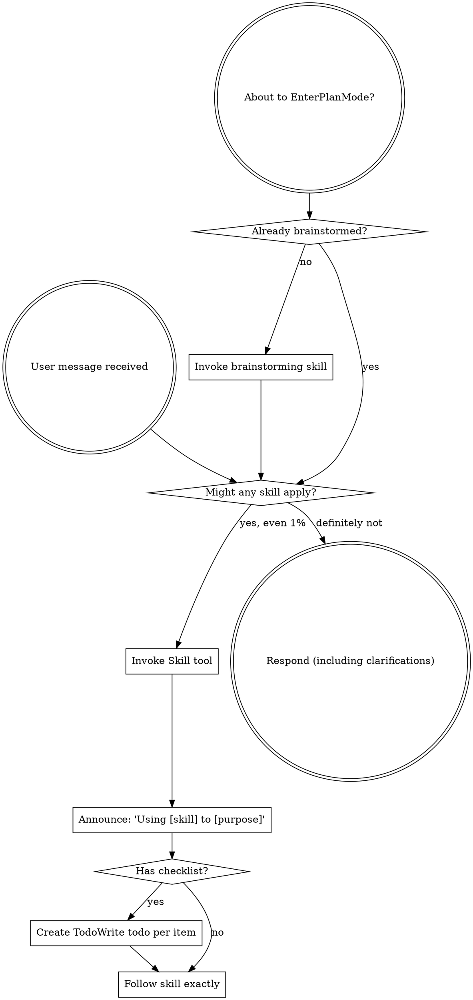

# Review — 2026-05-13-external-reviewer-redesign.md (post-slice, round 1)

- Target: `docs/superstar/plans/2026-05-13-external-reviewer-redesign.md`
- Request: `docs/reviewer/external-reviewer-redesign-S6-post-slice/r1-2026-05-14T0346-request.md`
- Reviewer command: `reviewer-agent`
- Status: `ok`

---

1. Findings

F1. Severity: blocking — Working tree is not closeable for a post-slice gate. `git status --short --branch` shows the repo on `main`, with five modified tracked files and an untracked S6 review folder: `CLAUDE.md`, `skills/executing-plans/SKILL.md`, `skills/finishing-a-development-branch/SKILL.md`, `skills/subagent-driven-development/SKILL.md`, `skills/tasklist-discipline/SKILL.md`, and `docs/reviewer/external-reviewer-redesign-S6-post-slice/`. This conflicts with the plan’s own pre-flight expectation of a clean tree and non-main branch at [docs/superstar/plans/2026-05-13-external-reviewer-redesign.md](/home/simon/Dev/sigreer/skills/superstar/docs/superstar/plans/2026-05-13-external-reviewer-redesign.md:15). The untracked S6 folder currently contains only `r1-2026-05-14T0346-request.md`.

F2. Severity: blocking — Slice 6 is implemented in code, but the plan still records every Slice 6 step as unchecked. The checklist at [docs/superstar/plans/2026-05-13-external-reviewer-redesign.md](/home/simon/Dev/sigreer/skills/superstar/docs/superstar/plans/2026-05-13-external-reviewer-redesign.md:2087) through line 2179 still says `[ ]` for writing the test, running it, extracting template expansion, running the suite, and committing. Since this is a post-slice completion gate, the acceptance document does not support the completion claim.

2. Open questions / assumptions

I assume the target slice is Slice 6 because HEAD is `609d2bc feat(external-reviewer): {chain_dir}/{round}/{previous_response}/{resolution_file}/{session_file} placeholders`, and the active review chain is `external-reviewer-redesign-S6-post-slice`.

3. Suggested document edits

Update Slice 6 checklist items to `[x]` and add a Slice 6 closeout note with:
- implementation commit `609d2bc`
- test evidence: `python3 -m pytest skills/external-review/tests/ -v` → `75 passed, 1 warning`
- post-slice chain path: `docs/reviewer/external-reviewer-redesign-S6-post-slice/`
- final disposition of this review round once response artifacts are saved

4. Verification gaps / commands

Already run:
- `python3 -m pytest skills/external-review/tests/ -v` → `75 passed, 1 warning`

Still needed before closing:
- `git status --short --branch`
- commit or intentionally remove/waive the dirty tracked files and S6 review artifacts
- save/commit the S6 review response and resulting chain metadata, if this project’s convention is to version review artifacts

5. Overall verdict: revise

---

## Reviewer stderr

```text
Reading prompt from stdin...
OpenAI Codex v0.130.0
--------
workdir: /home/simon/Dev/sigreer/skills/superstar
model: gpt-5.5
provider: openai
approval: never
sandbox: danger-full-access
reasoning effort: none
reasoning summaries: none
session id: 019e2460-85fa-7b31-909e-072d565d9b7c
--------
user
You are acting as an independent senior engineering reviewer.

Review stance:
- Lead with findings, ordered by severity.
- Focus on correctness, consistency, implementation risk, missing acceptance
  gates, vague handoffs, ungrounded assumptions, unverified claims, and drift
  from the codebase.
- Give exact file/line references when possible.
- If the document is sound, say that clearly and list residual risks.
- Keep the review actionable. Avoid broad rewrites unless the current structure
  creates concrete risk.

Repository root:
/home/simon/Dev/sigreer/skills/superstar

Target kind:
post-slice

Review mode:
Post-slice review. Treat this as a completion gate for one
slice of work. Compare the completed changes and stated evidence against the
slice acceptance criteria. Prioritize: incomplete tasks, uncommitted or
untracked artifacts, missing tests, failing or skipped verification, broken
cross-site behavior, and claims not supported by the repo state.

Target document:
docs/superstar/plans/2026-05-13-external-reviewer-redesign.md

Additional context files:
- docs/superstar/specs/2026-05-13-external-reviewer-redesign-design.md
- docs/handoffs/2026-05-13-external-reviewer-redesign-prompt.md

Review output contract:
1. Findings
   - Tag each finding with a stable ID: `F1`, `F2`, `F3`, …. IDs must remain
     stable if this review is iterated in subsequent rounds.
   - Mark severity inline: `Severity: blocking | important | minor | nit`.
2. Open questions / assumptions
3. Suggested document edits
4. Verification gaps / commands that should be run, if any
5. Overall verdict: one of "ready", "ready with small edits", or "revise"

Read the files from disk. Do not rely only on the snippets in this prompt.


## Target Preview

### docs/superstar/plans/2026-05-13-external-reviewer-redesign.md

    1	# External-Reviewer Redesign Implementation Plan
    2	
    3	> **For agentic workers:** REQUIRED SUB-SKILL: Use superstar:subagent-driven-development (recommended) or superstar:executing-plans to implement this plan task-by-task. Steps use checkbox (`- [ ]`) syntax for tracking.
    4	
    5	**Goal:** Rebuild `skills/external-review/scripts/external-reviewer.py` so review chains are incremental, durable, machine-readable, and support optional independent sweep reviewers — per `docs/superstar/specs/2026-05-13-external-reviewer-redesign-design.md`.
    6	
    7	**Architecture:** A persistent `chain.json` manifest per review chain becomes the source of truth for round metadata. The script gains verdict parsing, work-ID-keyed chain folders, a resolution-artifact contract and gate, incremental round prompts with embedded diffs, optional session-resume placeholders, and Pass-3 independent sweep reviewers. Skill documentation is updated to match.
    8	
    9	**Tech Stack:** Python 3.9+ standard library only (no external deps), `pytest` for tests, `git` CLI for diff and SHA capture.
   10	
   11	---
   12	
   13	## Pre-flight
   14	
   15	- [ ] **Step 1: Verify working directory and branch**
   16	
   17	Run:
   18	
   19	```bash
   20	cd /home/simon/Dev/sigreer/skills/superstar
   21	git status --short
   22	git rev-parse --abbrev-ref HEAD
   23	```
   24	
   25	Expected: clean tree, branch is a feature branch (not `main`). If on `main`, stop and create a branch via `superstar:using-git-worktrees`.
   26	
   27	- [ ] **Step 2: Confirm test runner**
   28	
   29	Run:
   30	
   31	```bash
   32	python3 -c "import pytest; print(pytest.__version__)"
   33	```
   34	
   35	Expected: prints a version string. If `ModuleNotFoundError`, install pytest:
   36	
   37	```bash
   38	python3 -m pip install --user pytest
   39	```
   40	
   41	- [ ] **Step 3: Set up the test directory**
   42	
   43	Create the directory tests will live in:
   44	
   45	```bash
   46	mkdir -p skills/external-review/tests
   47	touch skills/external-review/tests/__init__.py
   48	```
   49	
   50	Commit:
   51	
   52	```bash
   53	git add skills/external-review/tests/__init__.py
   54	git commit -m "scaffold: tests dir for external-reviewer redesign"
   55	```
   56	
   57	---
   58	
   59	## Slice 1: Chain manifest & verdict parsing
   60	
   61	**Goal:** Introduce `chain.json` as the round-metadata source of truth, parse verdicts and finding counts from response text, and emit them in the JSON output. Backwards-compatible: legacy chains synthesize a manifest on first touch.
   62	
   63	### Task 1.1: Manifest read/write helpers
   64	
   65	**Files:**
   66	- Create: `skills/external-review/tests/test_manifest.py`
   67	- Modify: `skills/external-review/scripts/external-reviewer.py`
   68	
   69	- [x] **Step 1: Write the failing tests**
   70	
   71	`skills/external-review/tests/test_manifest.py`:
   72	
   73	```python
   74	import json
   75	from pathlib import Path
   76	
   77	import pytest
   78	
   79	import sys
   80	SCRIPTS = Path(__file__).resolve().parents[1] / "scripts"
   81	sys.path.insert(0, str(SCRIPTS))
   82	
   83	import importlib.util
   84	spec = importlib.util.spec_from_file_location("external_reviewer", SCRIPTS / "external-reviewer.py")
   85	external_reviewer = importlib.util.module_from_spec(spec)
   86	spec.loader.exec_module(external_reviewer)
   87	
   88	
   89	def test_read_manifest_returns_none_for_missing(tmp_path):
   90	    assert external_reviewer.read_manifest(tmp_path / "missing.json") is None
   91	
   92	
   93	def test_write_then_read_manifest_roundtrips(tmp_path):
   94	    path = tmp_path / "chain.json"
   95	    data = {
   96	        "schema_version": 1,
   97	        "chain": "demo-post-slice",
   98	        "kind": "post-slice",
   99	        "target": "docs/plans/demo.md",
  100	        "work_id": "P1.S1",
  101	        "legacy_migrated": False,
  102	        "rounds": [],
  103	        "sweep_checkpoints": {"first-round": "pending", "final-ready": "pending"},
  104	    }
  105	    external_reviewer.write_manifest(path, data)
  106	    loaded = external_reviewer.read_manifest(path)
  107	    assert loaded == data
  108	
  109	
  110	def test_read_manifest_rejects_newer_schema(tmp_path):
  111	    path = tmp_path / "chain.json"
  112	    path.write_text(json.dumps({"schema_version": 99}))
  113	    with pytest.raises(external_reviewer.ManifestSchemaTooNew):
  114	        external_reviewer.read_manifest(path)
  115	```
  116	
  117	- [x] **Step 2: Run the tests; confirm they fail**
  118	
  119	```bash
  120	python3 -m pytest skills/external-review/tests/test_manifest.py -v
  121	```
  122	
  123	Expected: 3 failures (`read_manifest`, `write_manifest`, `ManifestSchemaTooNew` all undefined).
  124	
  125	- [x] **Step 3: Add manifest helpers to the script**
  126	
  127	Append to `skills/external-review/scripts/external-reviewer.py` (after the existing module-level constants, before `repo_root()`):
  128	
  129	```python
  130	SUPPORTED_SCHEMA_VERSION = 1
  131	
  132	
  133	class ManifestSchemaTooNew(Exception):
  134	    """Raised when chain.json declares a schema_version newer than this script supports."""
  135	
  136	
  137	def read_manifest(path: Path) -> dict | None:
  138	    if not path.exists():
  139	        return None
  140	    data = json.loads(path.read_text(encoding="utf-8"))
  141	    version = data.get("schema_version")
  142	    if isinstance(version, int) and version > SUPPORTED_SCHEMA_VERSION:
  143	        raise ManifestSchemaTooNew(
  144	            f"chain.json schema_version {version} is newer than this script supports "
  145	            f"(max {SUPPORTED_SCHEMA_VERSION}). Upgrade external-reviewer.py."
  146	        )
  147	    return data
  148	
  149	
  150	def write_manifest(path: Path, data: dict) -> None:
  151	    path.parent.mkdir(parents=True, exist_ok=True)
  152	    path.write_text(json.dumps(data, indent=2) + "\n", encoding="utf-8")
  153	```
  154	
  155	- [x] **Step 4: Run the tests; confirm they pass**
  156	
  157	```bash
  158	python3 -m pytest skills/external-review/tests/test_manifest.py -v
  159	```
  160	
  161	Expected: 3 passed.
  162	
  163	- [x] **Step 5: Commit**
  164	
  165	```bash
  166	git add skills/external-review/scripts/external-reviewer.py skills/external-review/tests/test_manifest.py
  167	git commit -m "feat(external-reviewer): chain.json read/write helpers with schema versioning"
  168	```
  169	
  170	### Task 1.2: Verdict parsing
  171	
  172	**Files:**
  173	- Create: `skills/external-review/tests/test_verdict.py`
  174	- Modify: `skills/external-review/scripts/external-reviewer.py`
  175	
  176	- [x] **Step 1: Write the failing tests**
  177	
  178	`skills/external-review/tests/test_verdict.py`:
  179	
  180	```python
  181	from pathlib import Path
  182	import sys, importlib.util
  183	
  184	SCRIPTS = Path(__file__).resolve().parents[1] / "scripts"
  185	sys.path.insert(0, str(SCRIPTS))
  186	spec = importlib.util.spec_from_file_location("external_reviewer", SCRIPTS / "external-reviewer.py")
  187	er = importlib.util.module_from_spec(spec); spec.loader.exec_module(er)
  188	
  189	
  190	def test_verdict_ready():
  191	    v, valid = er.parse_verdict("Findings: ok\n\nOverall verdict: ready\n")
  192	    assert v == "ready"
  193	    assert valid is True
  194	
  195	
  196	def test_verdict_ready_with_small_edits_markdown():
  197	    body = "**Overall verdict:** `ready with small edits`."
  198	    v, valid = er.parse_verdict(body)
  199	    assert v == "ready with small edits"
  200	    assert valid is True
  201	
  202	
  203	def test_verdict_revise_case_insensitive():
  204	    v, valid = er.parse_verdict("OVERALL VERDICT: Revise")
  205	    assert v == "revise"
  206	    assert valid is True
  207	
  208	
  209	def test_verdict_takes_last_match():
  210	    body = "Overall verdict: ready\n\n...later...\n\nOverall verdict: revise"
  211	    v, valid = er.parse_verdict(body)
  212	    assert v == "revise"
  213	
  214	
  215	def test_verdict_unknown_returns_invalid():
  216	    v, valid = er.parse_verdict("Overall verdict: looks fine to me")
  217	    assert v is None
  218	    assert valid is False
  219	
  220	
  221	def test_verdict_missing_returns_invalid():
  222	    v, valid = er.parse_verdict("Some review prose with no verdict line.")
  223	    assert v is None
  224	    assert valid is False
  225	```
  226	
  227	- [x] **Step 2: Run the tests; confirm they fail**
  228	
  229	```bash
  230	python3 -m pytest skills/external-review/tests/test_verdict.py -v
  231	```
  232	
  233	Expected: 6 failures (`parse_verdict` undefined).
  234	
  235	- [x] **Step 3: Add the verdict parser**
  236	
  237	Append to `skills/external-review/scripts/external-reviewer.py`:
  238	
  239	```python
  240	VERDICT_VALUES = ("ready with small edits", "ready", "revise")
  241	VERDICT_LINE_RE = re.compile(
  242	    r"overall\s+verdict\s*[:\-]\s*[`*_\"']*\s*(ready with small edits|ready|revise)\s*[`*_\"'.]*",
  243	    re.IGNORECASE,
  244	)
  245	
  246	
  247	def parse_verdict(text: str) -> tuple[str | None, bool]:
  248	    matches = list(VERDICT_LINE_RE.finditer(text))
  249	    if not matches:
  250	        return None, False
  251	    raw = matches[-1].group(1).strip().lower()
  252	    if raw not in VERDICT_VALUES:
  253	        return None, False
  254	    return raw, True
  255	```
  256	
  257	Note: regex prefers `ready with small edits` over `ready` because of ordering in the alternation.
  258	
  259	- [x] **Step 4: Run the tests; confirm they pass**
  260	
  261	```bash
  262	python3 -m pytest skills/external-review/tests/test_verdict.py -v
  263	```
  264	
  265	Expected: 6 passed.
  266	
  267	- [x] **Step 5: Commit**
  268	
  269	```bash
  270	git add skills/external-review/scripts/external-reviewer.py skills/external-review/tests/test_verdict.py
  271	git commit -m "feat(external-reviewer): parse_verdict with markdown/case tolerance"
  272	```
  273	
  274	### Task 1.3: Finding-count parsing
  275	
  276	**Files:**
  277	- Create: `skills/external-review/tests/test_findings.py`
  278	- Modify: `skills/external-review/scripts/external-reviewer.py`
  279	
  280	- [x] **Step 1: Write the failing tests**
  281	
  282	`skills/external-review/tests/test_findings.py`:
  283	
  284	```python
  285	from pathlib import Path
  286	import sys, importlib.util
  287	SCRIPTS = Path(__file__).resolve().parents[1] / "scripts"
  288	sys.path.insert(0, str(SCRIPTS))
  289	spec = importlib.util.spec_from_file_location("external_reviewer", SCRIPTS / "external-reviewer.py")
  290	er = importlib.util.module_from_spec(spec); spec.loader.exec_module(er)
  291	
  292	
  293	def test_heading_findings_counted():
  294	    body = "## F1\nSeverity: blocking\n\n## F2\nSeverity: minor\n\n## F3\nSeverity: blocking"
  295	    n, blocking = er.parse_findings(body)
  296	    assert n == 3
  297	    assert blocking == 2
  298	
  299	
  300	def test_bullet_findings_counted():
  301	    body = "- F1: something blocking (blocking)\n- F2 minor thing"
  302	    n, blocking = er.parse_findings(body)
  303	    assert n == 2
  304	    assert blocking == 1
  305	
  306	
  307	def test_no_findings_returns_zero():
  308	    body = "Overall verdict: ready\n\nNo findings."
  309	    n, blocking = er.parse_findings(body)
  310	    assert n == 0
  311	    assert blocking == 0
  312	
  313	
  314	def test_unparseable_returns_none():
  315	    body = "Reviewer crashed: connection reset"
  316	    n, blocking = er.parse_findings(body)
  317	    assert n is None
  318	    assert blocking is None
  319	```
  320	
  321	- [x] **Step 2: Run the tests; confirm they fail**
  322	
  323	```bash
  324	python3 -m pytest skills/external-review/tests/test_findings.py -v
  325	```
  326	
  327	Expected: 4 failures.
  328	
  329	- [x] **Step 3: Add the parser**
  330	
  331	Append to `skills/external-review/scripts/external-reviewer.py`:
  332	
  333	```python
  334	HEADING_FINDING_RE = re.compile(r"^##\s+F\d+\b", re.MULTILINE)
  335	BULLET_FINDING_RE = re.compile(r"^\s*[-*]?\s*\**F\d+\**[:\s\-]", re.MULTILINE)
  336	BLOCKING_MARKER_RE = re.compile(r"(?:^|\s)\(blocking\)|^severity\s*:\s*blocking", re.IGNORECASE | re.MULTILINE)
  337	
  338	
  339	def parse_findings(text: str) -> tuple[int | None, int | None]:
  340	    if not text or text.strip() == "" or "reviewer crashed" in text.lower():
  341	        return None, None
  342	    heading_count = len(HEADING_FINDING_RE.findall(text))
  343	    if heading_count > 0:
  344	        n = heading_count
  345	    else:
  346	        n = len(BULLET_FINDING_RE.findall(text))
  347	    blocking = len(BLOCKING_MARKER_RE.findall(text))
  348	    return n, blocking
  349	```
  350	
  351	- [x] **Step 4: Run the tests; confirm they pass**
  352	
  353	```bash
  354	python3 -m pytest skills/external-review/tests/test_findings.py -v
  355	```
  356	
  357	Expected: 4 passed.
  358	
  359	- [x] **Step 5: Commit**
  360	
  361	```bash
  362	git add skills/external-review/scripts/external-reviewer.py skills/external-review/tests/test_findings.py
  363	git commit -m "feat(external-reviewer): parse_findings (heading + bullet, blocking count)"
  364	```
  365	
  366	### Task 1.4: Round-number derivation reads manifest first
  367	
  368	**Files:**
  369	- Create: `skills/external-review/tests/test_round_number.py`
  370	- Modify: `skills/external-review/scripts/external-reviewer.py` (`next_round_number`)
  371	
  372	- [x] **Step 1: Write the failing tests**
  373	
  374	`skills/external-review/tests/test_round_number.py`:
  375	
  376	```python
  377	from pathlib import Path
  378	import json, sys, importlib.util
  379	SCRIPTS = Path(__file__).resolve().parents[1] / "scripts"
  380	sys.path.insert(0, str(SCRIPTS))
  381	spec = importlib.util.spec_from_file_location("external_reviewer", SCRIPTS / "external-reviewer.py")
  382	er = importlib.util.module_from_spec(spec); spec.loader.exec_module(er)
  383	
  384	
  385	def test_no_chain_dir_round_is_one(tmp_path):
  386	    assert er.next_round_number(tmp_path / "absent") == 1
  387	
  388	
  389	def test_manifest_present_takes_precedence(tmp_path):
  390	    d = tmp_path / "chain"; d.mkdir()
  391	    er.write_manifest(d / "chain.json", {
  392	        "schema_version": 1, "rounds": [{"round": 1}, {"round": 2}]
  393	    })
  394	    assert er.next_round_number(d) == 3
  395	
  396	
  397	def test_legacy_dir_no_manifest_falls_back_to_filename_scan(tmp_path):
  398	    d = tmp_path / "chain"; d.mkdir()
  399	    (d / "r1-2026-05-01T0900-request.md").write_text("")
  400	    (d / "r2-2026-05-02T0900-request.md").write_text("")
  401	    assert er.next_round_number(d) == 3
  402	```
  403	
  404	- [x] **Step 2: Run the tests; confirm they fail**
  405	
  406	```bash
  407	python3 -m pytest skills/external-review/tests/test_round_number.py -v
  408	```
  409	
  410	Expected: test 2 fails (no manifest awareness), tests 1 and 3 may pass if current behavior already handles them.
  411	
  412	- [x] **Step 3: Update `next_round_number`**
  413	
  414	Replace the existing function:
  415	
  416	```python
  417	def next_round_number(chain_dir: Path) -> int:
  418	    if not chain_dir.exists():
  419	        return 1
  420	    manifest = read_manifest(chain_dir / "chain.json")
  421	    if manifest and isinstance(manifest.get("rounds"), list):
  422	        return len(manifest["rounds"]) + 1
  423	    return len(list(chain_dir.glob("r*-*-request.md"))) + 1
  424	```
  425	
  426	- [x] **Step 4: Run the tests**
  427	
  428	```bash
  429	python3 -m pytest skills/external-review/tests/test_round_number.py -v
  430	```
  431	
  432	Expected: 3 passed.
  433	
  434	- [x] **Step 5: Commit**
  435	
  436	```bash
  437	git add skills/external-review/scripts/external-reviewer.py skills/external-review/tests/test_round_number.py
  438	git commit -m "feat(external-reviewer): next_round_number consults chain.json"
  439	```
  440	
  441	### Task 1.5: Legacy manifest synthesis
  442	
  443	**Files:**
  444	- Create: `skills/external-review/tests/test_legacy_migration.py`
  445	- Modify: `skills/external-review/scripts/external-reviewer.py`
  446	
  447	- [x] **Step 1: Write the failing tests**
  448	
  449	`skills/external-review/tests/test_legacy_migration.py`:
  450	
  451	```python
  452	from pathlib import Path
  453	import sys, importlib.util
  454	SCRIPTS = Path(__file__).resolve().parents[1] / "scripts"
  455	sys.path.insert(0, str(SCRIPTS))
  456	spec = importlib.util.spec_from_file_location("external_reviewer", SCRIPTS / "external-reviewer.py")
  457	er = importlib.util.module_from_spec(spec); spec.loader.exec_module(er)
  458	
  459	
  460	def test_synthesize_manifest_from_legacy_files(tmp_path):
  461	    d = tmp_path / "old-chain"; d.mkdir()
  462	    (d / "r1-2026-04-01T0900-request.md").write_text("prompt body")
  463	    (d / "r1-2026-04-01T0905-response.md").write_text(
  464	        "## F1\nSeverity: blocking\n\nOverall verdict: revise\n"
  465	    )
  466	    (d / "r2-2026-04-02T1200-request.md").write_text("prompt body 2")
  467	
  468	    manifest = er.synthesize_legacy_manifest(
  469	        chain_dir=d, chain="old-chain", kind="post-slice",
  470	        target="docs/plans/old.md", work_id="P1.S1",
  471	    )
  472	
  473	    assert manifest["legacy_migrated"] is True
  474	    assert manifest["work_id"] == "P1.S1"
  475	    assert len(manifest["rounds"]) == 2
  476	    r1, r2 = manifest["rounds"]
  477	    assert r1["legacy"] is True
  478	    assert r1["verdict"] == "revise"
  479	    assert r1["verdict_valid"] is True
  480	    assert r1["findings_count"] == 1
  481	    assert r1["blocking_findings_count"] == 1
  482	    assert r1["head_sha_after_round"] is None
  483	    assert r2["response"] is None  # only request file existed
  484	```
  485	
  486	- [x] **Step 2: Run the tests; confirm they fail**
  487	
  488	```bash
  489	python3 -m pytest skills/external-review/tests/test_legacy_migration.py -v
  490	```
  491	
  492	Expected: 1 failure.
  493	
  494	- [x] **Step 3: Add the synthesizer**
  495	
  496	Append to `skills/external-review/scripts/external-reviewer.py`:
  497	
  498	```python
  499	LEGACY_ROUND_FILE_RE = re.compile(r"^r(\d+)-([0-9T\-]+)-(request|response)\.md$")
  500	
  501	
  502	def synthesize_legacy_manifest(
  503	    *, chain_dir: Path, chain: str, kind: str, target: str, work_id: str | None
  504	) -> dict:
  505	    rounds_map: dict[int, dict] = {}
  506	    for path in sorted(chain_dir.iterdir()):
  507	        m = LEGACY_ROUND_FILE_RE.match(path.name)
  508	        if not m:
  509	            continue
  510	        round_num = int(m.group(1))
  511	        role = m.group(3)
  512	        entry = rounds_map.setdefault(
  513	            round_num,
  514	            {
  515	                "round": round_num,
  516	                "request": None,
  517	                "response": None,
  518	                "resolution": None,
  519	                "verdict": None,
  520	                "verdict_valid": False,
  521	                "findings_count": None,
  522	                "blocking_findings_count": None,
  523	                "head_sha_at_request": None,
  524	                "head_sha_after_round": None,
  525	                "worktree_dirty_at_request": None,
  526	                "legacy": True,
  527	            },
  528	        )
  529	        entry[role] = path.name
  530	        if role == "response":
  531	            body = path.read_text(encoding="utf-8", errors="replace")
  532	            v, valid = parse_verdict(body)
  533	            entry["verdict"], entry["verdict_valid"] = v, valid
  534	            n, blocking = parse_findings(body)
  535	            entry["findings_count"], entry["blocking_findings_count"] = n, blocking
  536	
  537	    return {
  538	        "schema_version": SUPPORTED_SCHEMA_VERSION,
  539	        "chain": chain,
  540	        "kind": kind,
  541	        "target": target,
  542	        "work_id": work_id,
  543	        "legacy_migrated": True,
  544	        "migrated_at": dt.datetime.utcnow().strftime("%Y-%m-%dT%H:%M:%SZ"),
  545	        "rounds": [rounds_map[k] for k in sorted(rounds_map)],
  546	        "sweep_checkpoints": {"first-round": "pending", "final-ready": "pending"},
  547	    }
  548	```
  549	
  550	- [x] **Step 4: Run the tests; confirm they pass**
  551	
  552	```bash
  553	python3 -m pytest skills/external-review/tests/test_legacy_migration.py -v
  554	```
  555	
  556	Expected: 1 passed.
  557	
  558	- [x] **Step 5: Commit**
  559	
  560	```bash
  561	git add skills/external-review/scripts/external-reviewer.py skills/external-review/tests/test_legacy_migration.py
  562	git commit -m "feat(external-reviewer): synthesize_legacy_manifest from rN-* files"
  563	```
  564	
  565	### Task 1.6: Wire manifest into `main()` for single-reviewer rounds
  566	
  567	**Files:**
  568	- Modify: `skills/external-review/scripts/external-reviewer.py` (`main` function)
  569	- Create: `skills/external-review/tests/test_main_round_writes_manifest.py`
  570	
  571	- [x] **Step 1: Write the failing test**
  572	
  573	`skills/external-review/tests/test_main_round_writes_manifest.py`:
  574	
  575	```python
  576	from pathlib import Path
  577	import subprocess, sys, json, importlib.util, os
  578	
  579	SCRIPTS = Path(__file__).resolve().parents[1] / "scripts"
  580	sys.path.insert(0, str(SCRIPTS))
  581	spec = importlib.util.spec_from_file_location("external_reviewer", SCRIPTS / "external-reviewer.py")
  582	er = importlib.util.module_from_spec(spec); spec.loader.exec_module(er)
  583	
  584	
  585	FAKE_REVIEWER = """#!/usr/bin/env bash
  586	cat <<'EOF'
  587	## F1
  588	Severity: blocking
  589	Stub finding.
  590	
  591	Overall verdict: revise
  592	EOF
  593	"""
  594	
  595	
  596	def test_main_writes_manifest_entry(tmp_path, monkeypatch):
  597	    repo = tmp_path / "repo"; repo.mkdir()
  598	    subprocess.run(["git", "-C", str(repo), "init", "-q"], check=True)
  599	    subprocess.run(["git", "-C", str(repo), "config", "user.email", "t@t"], check=True)
  600	    subprocess.run(["git", "-C", str(repo), "config", "user.name", "T"], check=True)

[truncated: 2504 additional lines]

## Context Previews

### docs/superstar/specs/2026-05-13-external-reviewer-redesign-design.md

    1	# External-Review Script Redesign — Design
    2	
    3	**Date:** 2026-05-13
    4	**Target:** `skills/external-review/scripts/external-reviewer.py` and `skills/external-review/SKILL.md`
    5	**Motivation:** A self-review of the external-reviewer flow surfaced five concrete failure modes that cause review loops to balloon to 7–10 rounds and lose continuity between rounds. This spec redesigns the script and skill to make rounds incremental, durable, and machine-readable.
    6	
    7	---
    8	
    9	## Goals
   10	
   11	1. **Round N+1 is incremental, not a re-review.** The reviewer is given prior findings, the fixer's resolution report, and a focused diff — and is instructed to verify resolution rather than reopen broad review.
   12	2. **Verdict is machine-readable.** JSON output exposes a parsed `verdict`, `verdict_valid`, and finding counts, so coordinators don't have to parse prose.
   13	3. **Post-slice / post-phase chains are uniquely keyed.** `--work-id` is required for both so that multi-slice plans don't collapse into one chain.
   14	4. **Resolution artifacts are durable and structured-enough-to-parse.** Required headers, free-form bodies, stable finding IDs across rounds.
   15	5. **Optional session resume.** Provider-specific wrappers can plug into placeholders if the underlying reviewer CLI supports session IDs.
   16	6. **Legacy chains keep working.** Soft-migrate on first new round; preserve existing folder names and audit history.
   17	7. **Review depth is explicit.** The default chain uses one primary incremental reviewer, but callers can request bounded independent sweep reviewers at high-risk checkpoints to preserve fresh-eye coverage without unbounded serial churn.
   18	
   19	## Non-goals
   20	
   21	- Replacing the chain-folder layout for new chains. The folder-naming scheme gains a `--work-id` segment for post-slice/post-phase, but the round-file scheme is unchanged.
   22	- Making the script aware of any specific reviewer CLI. The script remains provider-neutral via `AGENT_REVIEWER_CMD`.
   23	- Auto-dispatching the fixer subagent. The script enforces the resolution gate but does not invoke fixers; that stays in the coordinator's loop, governed by `subagent-driven-development`.
   24	
   25	## Invariants
   26	
   27	- **A review chain is single-writer.** Running two rounds concurrently against the same chain is unsupported and may corrupt `chain.json`. The script does not lock; callers are expected to serialise.
   28	- **Existing rounds are immutable.** Once written, `rN-*-request.md`, `rN-*-response.md`, and `rN-resolution.md` are never overwritten. Manifest entries for past rounds are append-only.
   29	
   30	## Architecture
   31	
   32	Three implementation passes, all designed in this spec:
   33	
   34	- **Pass 1 — Core.** Chain manifest, verdict parsing, `--work-id`, prior-round context injection, incremental round prompts, resolution-artifact contract and gate, automatic diff embedding, JSON output enrichment, legacy migration.
   35	- **Pass 2 — Session resume.** Optional placeholders (`{chain_dir}`, `{round}`, `{previous_response}`, `{resolution_file}`, `{session_file}`) exposed via the existing `AGENT_REVIEWER_CMD` template mechanism. A provider-specific wrapper can use `{session_file}` to persist and resume reviewer sessions. The script provides a stable path (`chain_dir/session.state`) and ensures the parent directory exists; wrappers own the file's contents. The script never reads `session.state`.
   36	- **Pass 3 — Review depth / independent sweeps.** Adds `--review-depth`, `--independent-reviewers`, `--sweep-policy` flags. Independent sweep reviewers run without seeing the primary reviewer's findings on their first pass (to avoid anchoring), and their findings are merged into the same resolution checklist afterward. Depends on Pass 1's manifest and verdict parsing; does not depend on Pass 2.
   37	
   38	### Chain manifest
   39	
   40	`docs/reviewer/<chain>/chain.json` is the single source of truth for round metadata. The `rN-*-request.md` / `rN-*-response.md` / `rN-resolution.md` files remain for human readability and git history; the script reads and writes manifest entries when computing round numbers, base refs, and verdicts.
   41	
   42	```json
   43	{
   44	  "schema_version": 1,
   45	  "chain": "feature-plan-P2-S3-post-slice",
   46	  "kind": "post-slice",
   47	  "target": "docs/superstar/plans/feature-plan.md",
   48	  "work_id": "P2.S3",
   49	  "legacy_migrated": false,
   50	  "rounds": [
   51	    {
   52	      "round": 1,
   53	      "request": "r1-2026-05-13T1012-request.md",
   54	      "response": "r1-2026-05-13T1020-response.md",
   55	      "resolution": null,
   56	      "head_sha_at_request": "abc1234",
   57	      "head_sha_after_round": "abc1234",
   58	      "worktree_dirty_at_request": false,
   59	      "verdict": "revise",
   60	      "verdict_valid": true,
   61	      "findings_count": 4,
   62	      "blocking_findings_count": 2
   63	    },
   64	    {
   65	      "round": 2,
   66	      "request": "r2-2026-05-13T1130-request.md",
   67	      "response": null,
   68	      "resolution": "r1-resolution.md",
   69	      "base_ref": "abc1234",
   70	      "base_ref_source": "auto",
   71	      "head_sha_at_request": "def5678",
   72	      "worktree_dirty_at_request": false,
   73	      "diff_included": true,
   74	      "resolution_parse_status": "ok",
   75	      "resolution_waiver": false
   76	    }
   77	  ]
   78	}
   79	```
   80	
   81	#### Manifest versioning
   82	
   83	- `schema_version: 1` is the initial version introduced by this redesign.
   84	- Unknown future `schema_version` values cause the script to error with a clear message: `ERROR: chain.json schema_version <N> is newer than this script supports. Upgrade external-reviewer.py.` This prevents silent corruption.
   85	- Older `schema_version` values (currently none) get best-effort migration on read, recorded as `schema_migrated_from: <prior>` in the manifest.
   86	
   87	### Naming
   88	
   89	- **Chain folder slug:** `<target-stem-no-leading-date>-<work-id-dotless>-<kind>` for post-slice/post-phase; `<target-stem-no-leading-date>-<kind>` otherwise. Dots in work IDs are replaced with dashes in the folder slug only — the manifest preserves the canonical form.
   90	  - Example: `--work-id P2.S3` → folder `feature-plan-P2-S3-post-slice`, manifest `"work_id": "P2.S3"`.
   91	- **Round files:** `r{N}-<YYYY-MM-DDTHHMM>-request.md`, `r{N}-<YYYY-MM-DDTHHMM>-response.md`. Unchanged from current behavior.
   92	- **Resolution files:** `r{N}-resolution.md`, where `N` is the round whose response is being addressed. Round `N+1` consumes `r{N}-resolution.md`. Worked example: after `r1-response.md` returns `revise`, the fixer writes `r1-resolution.md`; round 2 reads `r1-resolution.md` and embeds it in the round-2 prompt.
   93	
   94	## CLI surface (new flags)
   95	
   96	| Flag | Kinds | Purpose |
   97	|---|---|---|
   98	| `--work-id <id>` | required for `post-slice`, `post-phase`; optional otherwise | Stable slice/phase ID (e.g., `P2.S3` for post-slice, `P2` for post-phase). Becomes part of chain folder name (dots → dashes) and is stored verbatim in the manifest. |
   99	| `--base-ref <sha\|ref>` | any | Override auto-computed diff base for this round. |
  100	| `--no-diff` | any | Suppress diff embedding even on round N+1. |
  101	| `--allow-missing-resolution` | post-slice, post-phase | Waive the resolution-required gate. Logged in manifest as `resolution_waiver: true`. |
  102	| `--changed-files <path>...` | any | Override automatic changed-file discovery and limit the embedded diff to the supplied paths. |
  103	| `--mode <auto\|broad\|incremental>` | any | Override the round-1-vs-N prompt mode. Default `auto` (round 1 → broad; round 2+ → incremental). |
  104	| `--max-diff-lines <int>` | any | Cap diff size. Default 2000. Truncation marker is embedded if exceeded. |
  105	| `--review-depth <standard\|thorough\|exhaustive>` | post-slice, post-phase | Controls whether independent sweep reviewers are run in addition to the primary chain reviewer. Default `standard`. |
  106	| `--independent-reviewers <int>` | post-slice, post-phase | Override reviewer count for independent sweeps. Default derived from `--review-depth`. |
  107	| `--sweep-policy <first-round\|final-ready\|both\|never>` | post-slice, post-phase | When to run fresh-context sweep reviews. Default derived from `--review-depth`. |
  108	
  109	### `--work-id` enforcement
  110	
  111	- `post-slice` or `post-phase` invoked without `--work-id` → exit 2 with operational error.
  112	- For `post-phase`, the expected form is the phase ID alone (`P2`), not a slice ID. The script does not enforce a regex; it documents the convention.
  113	- For other kinds, `--work-id` is optional; if provided, it is recorded in the manifest but does not affect the folder slug.
  114	
  115	## Reviewer prompt — round 1 vs round N+
  116	
  117	### Round 1: broad
  118	
  119	The existing broad prompt, with the output contract revised to require **stable finding IDs**:
  120	
  121	```
  122	1. Findings
  123	   - Each finding tagged `F<n>` (e.g., F1, F2, F3). IDs must be stable across rounds.
  124	   - Severity: blocking | important | minor | nit
  125	2. Open questions / assumptions
  126	3. Suggested document edits
  127	4. Verification gaps
  128	5. Overall verdict: ready | ready with small edits | revise
  129	```
  130	
  131	### Round N+: incremental
  132	
  133	Prepended to the existing prompt body:
  134	
  135	```
  136	You are continuing an existing review chain. This is round {N} of {chain_id}.
  137	
  138	In incremental mode:
  139	- Verify whether prior findings are resolved per the resolution report below.
  140	- Reuse the existing finding IDs (F1, F2, …). If a prior finding is resolved,
  141	  mark it RESOLVED in your findings list with its original ID. If still
  142	  unresolved, keep its ID.
  143	- Only introduce new finding IDs for genuine regressions caused by the fix, or
  144	  blocking issues clearly missed in earlier rounds. Do not reopen broad review
  145	  unless prior fixes changed broad architecture.
  146	
  147	Review chain summary:
  148	{per-round table: round, verdict, findings_count, blocking_findings_count}
  149	
  150	Prior-round findings (authoritative):
  151	{if r{N-1}-merged-findings.md exists: its verbatim contents — this replaces
  152	 individual reviewer response files as the prior-finding list of record}
  153	{else: a summary of the prior round's primary response, with finding IDs intact}
  154	
  155	Resolution report for prior round:
  156	{verbatim contents of r{N-1}-resolution.md}
  157	{or "MISSING — explicitly waived by caller via --allow-missing-resolution"}
  158	{or "MISSING — chain migrated from legacy artifacts; please verify whether changes occurred from the diff below"}
  159	
  160	Resolution parse summary (best-effort):
  161	{structured: per-finding-ID → status, or "unparseable"}
  162	
  163	Changes since prior round:
  164	{git diff <base_ref>..HEAD -- <scoped paths>}
  165	{if dirty: appended `git diff HEAD` section, both labeled}
  166	{if no base: "not available for this round (legacy chain / first round / --no-diff)"}
  167	```
  168	
  169	`--mode broad` forces round-1-style on later rounds (rare; for cases where the fix changed architecture). `--mode incremental` on round 1 is rejected with a clear error.
  170	
  171	## Resolution artifact contract
  172	
  173	**Path:** `docs/reviewer/<chain>/r{N}-resolution.md`, where `N` is the round whose response is being addressed. Authored by the fix subagent between round N (response) and round N+1 (resubmit).
  174	
  175	**Required parseable shape:**
  176	
  177	```markdown
  178	# Resolution for r{N}
  179	
  180	## F1
  181	Status: fixed
  182	Evidence:
  183	- Commit: abc1234
  184	- Files: `src/foo.ts:42`, `tests/foo.test.ts:18`
  185	- Verification: `npm test -- foo.test.ts` passed
  186	
  187	Notes:
  188	Changed the validation path to reject empty IDs before persistence.
  189	
  190	## F2
  191	Status: waived
  192	Evidence:
  193	- No code change
  194	- Reason: reviewer assumed X, but the plan explicitly excludes X in
  195	  `docs/superstar/specs/foo-design.md:77`
  196	
  197	Notes:
  198	No implementation change because this would expand slice scope.
  199	```
  200	

[truncated: 292 additional lines]
### docs/handoffs/2026-05-13-external-reviewer-redesign-prompt.md

    1	# Coordinator handoff — External-Reviewer Redesign
    2	
    3	You are the coordinator for implementing the **external-reviewer redesign** in the `superstar` repo at `/home/simon/Dev/sigreer/skills/superstar`.
    4	
    5	Your role is **strictly orchestration**. Use the `superstar:subagent-driven-development` skill with parallel agents where possible.
    6	
    7	## Inputs
    8	
    9	- Spec: [`docs/superstar/specs/2026-05-13-external-reviewer-redesign-design.md`](docs/superstar/specs/2026-05-13-external-reviewer-redesign-design.md)
   10	- Plan: [`docs/superstar/plans/2026-05-13-external-reviewer-redesign.md`](docs/superstar/plans/2026-05-13-external-reviewer-redesign.md)
   11	- Reviewer chain folder (created on first review): `docs/reviewer/external-reviewer-redesign-plan/` (kind `plan`) and per-slice chains like `docs/reviewer/external-reviewer-redesign-S1-post-slice/` (no TASKLIST.md in this repo; treat `S1`…`S8` from the plan as the work-id segments).
   12	
   13	## Coordinator discipline (non-negotiable)
   14	
   15	- **Do not perform any fixes yourself** unless the fix is genuinely cheaper to implement than the process of delegating to a subagent. Tiebreak: delegate.
   16	- **Do not pollute your context.** Delegate investigations, file reads, and edits to subagents. Your context is for orchestration, not implementation detail.
   17	- **At the end of each slice (S1–S8)**, the human partner runs `external-review` manually with `--kind post-slice` and pastes the findings back. Do NOT invoke the external-review skill yourself in this project — the human partner has explicitly chosen to drive it manually to keep the context clean. Wait for the verdict before proceeding to the next slice.
   18	- **Do not perform reviewer-driven fixes yourself.** Pass each reviewer response to a fix subagent that writes `r{N}-resolution.md` per the contract in `[[external-review]]`, then signal the human partner that the resolution is ready and the next round can be submitted.
   19	- **At the end of the phase** (after S8 closes), the human partner runs `--kind post-phase` manually. Same delegation rule.
   20	- **No TASKLIST.md exists** in this repo. Track slice completion in this handoff document or in a TODO list you maintain in-session; do not invent a TASKLIST.md file.
   21	
   22	## First action
   23	
   24	Read this file (the handoff prompt), the spec, and the plan. Then invoke `superstar:subagent-driven-development` and begin Slice 1 (Chain manifest & verdict parsing).

codex
I’ll read the applicable workflow skill first, then inspect the plan/spec/handoff and the actual repo state for the completed slice before issuing the gate review.
exec
/usr/bin/zsh -lc "sed -n '1,220p' /home/simon/.codex/plugins/cache/openai-curated/superpowers/08373044/skills/using-superpowers/SKILL.md && sed -n '1,220p' /home/simon/.codex/plugins/cache/openai-curated/superpowers/08373044/skills/verification-before-completion/SKILL.md" in /home/simon/Dev/sigreer/skills/superstar
 succeeded in 0ms:
---
name: using-superpowers
description: Use when starting any conversation - establishes how to find and use skills, requiring Skill tool invocation before ANY response including clarifying questions
---

<SUBAGENT-STOP>
If you were dispatched as a subagent to execute a specific task, skip this skill.
</SUBAGENT-STOP>

<EXTREMELY-IMPORTANT>
If you think there is even a 1% chance a skill might apply to what you are doing, you ABSOLUTELY MUST invoke the skill.

IF A SKILL APPLIES TO YOUR TASK, YOU DO NOT HAVE A CHOICE. YOU MUST USE IT.

This is not negotiable. This is not optional. You cannot rationalize your way out of this.
</EXTREMELY-IMPORTANT>

## Instruction Priority

Superpowers skills override default system prompt behavior, but **user instructions always take precedence**:

1. **User's explicit instructions** (CLAUDE.md, GEMINI.md, AGENTS.md, direct requests) — highest priority
2. **Superpowers skills** — override default system behavior where they conflict
3. **Default system prompt** — lowest priority

If CLAUDE.md, GEMINI.md, or AGENTS.md says "don't use TDD" and a skill says "always use TDD," follow the user's instructions. The user is in control.

## How to Access Skills

**In Claude Code:** Use the `Skill` tool. When you invoke a skill, its content is loaded and presented to you—follow it directly. Never use the Read tool on skill files.

**In Copilot CLI:** Use the `skill` tool. Skills are auto-discovered from installed plugins. The `skill` tool works the same as Claude Code's `Skill` tool.

**In Gemini CLI:** Skills activate via the `activate_skill` tool. Gemini loads skill metadata at session start and activates the full content on demand.

**In other environments:** Check your platform's documentation for how skills are loaded.

## Platform Adaptation

Skills use Claude Code tool names. Non-CC platforms: see `references/copilot-tools.md` (Copilot CLI), `references/codex-tools.md` (Codex) for tool equivalents. Gemini CLI users get the tool mapping loaded automatically via GEMINI.md.

# Using Skills

## The Rule

**Invoke relevant or requested skills BEFORE any response or action.** Even a 1% chance a skill might apply means that you should invoke the skill to check. If an invoked skill turns out to be wrong for the situation, you don't need to use it.



## Red Flags

These thoughts mean STOP—you're rationalizing:

| Thought | Reality |
|---------|---------|
| "This is just a simple question" | Questions are tasks. Check for skills. |
| "I need more context first" | Skill check comes BEFORE clarifying questions. |
| "Let me explore the codebase first" | Skills tell you HOW to explore. Check first. |
| "I can check git/files quickly" | Files lack conversation context. Check for skills. |
| "Let me gather information first" | Skills tell you HOW to gather information. |
| "This doesn't need a formal skill" | If a skill exists, use it. |
| "I remember this skill" | Skills evolve. Read current version. |
| "This doesn't count as a task" | Action = task. Check for skills. |
| "The skill is overkill" | Simple things become complex. Use it. |
| "I'll just do this one thing first" | Check BEFORE doing anything. |
| "This feels productive" | Undisciplined action wastes time. Skills prevent this. |
| "I know what that means" | Knowing the concept ≠ using the skill. Invoke it. |

## Skill Priority

When multiple skills could apply, use this order:

1. **Process skills first** (brainstorming, debugging) - these determine HOW to approach the task
2. **Implementation skills second** (frontend-design, mcp-builder) - these guide execution

"Let's build X" → brainstorming first, then implementation skills.
"Fix this bug" → debugging first, then domain-specific skills.

## Skill Types

**Rigid** (TDD, debugging): Follow exactly. Don't adapt away discipline.

**Flexible** (patterns): Adapt principles to context.

The skill itself tells you which.

## User Instructions

Instructions say WHAT, not HOW. "Add X" or "Fix Y" doesn't mean skip workflows.
---
name: verification-before-completion
description: Use when about to claim work is complete, fixed, or passing, before committing or creating PRs - requires running verification commands and confirming output before making any success claims; evidence before assertions always
---

# Verification Before Completion

## Overview

Claiming work is complete without verification is dishonesty, not efficiency.

**Core principle:** Evidence before claims, always.

**Violating the letter of this rule is violating the spirit of this rule.**

## The Iron Law

```
NO COMPLETION CLAIMS WITHOUT FRESH VERIFICATION EVIDENCE
```

If you haven't run the verification command in this message, you cannot claim it passes.

## The Gate Function

```
BEFORE claiming any status or expressing satisfaction:

1. IDENTIFY: What command proves this claim?
2. RUN: Execute the FULL command (fresh, complete)
3. READ: Full output, check exit code, count failures
4. VERIFY: Does output confirm the claim?
   - If NO: State actual status with evidence
   - If YES: State claim WITH evidence
5. ONLY THEN: Make the claim

Skip any step = lying, not verifying
```

## Common Failures

| Claim | Requires | Not Sufficient |
|-------|----------|----------------|
| Tests pass | Test command output: 0 failures | Previous run, "should pass" |
| Linter clean | Linter output: 0 errors | Partial check, extrapolation |
| Build succeeds | Build command: exit 0 | Linter passing, logs look good |
| Bug fixed | Test original symptom: passes | Code changed, assumed fixed |
| Regression test works | Red-green cycle verified | Test passes once |
| Agent completed | VCS diff shows changes | Agent reports "success" |
| Requirements met | Line-by-line checklist | Tests passing |

## Red Flags - STOP

- Using "should", "probably", "seems to"
- Expressing satisfaction before verification ("Great!", "Perfect!", "Done!", etc.)
- About to commit/push/PR without verification
- Trusting agent success reports
- Relying on partial verification
- Thinking "just this once"
- Tired and wanting work over
- **ANY wording implying success without having run verification**

## Rationalization Prevention

| Excuse | Reality |
|--------|---------|
| "Should work now" | RUN the verification |
| "I'm confident" | Confidence ≠ evidence |
| "Just this once" | No exceptions |
| "Linter passed" | Linter ≠ compiler |
| "Agent said success" | Verify independently |
| "I'm tired" | Exhaustion ≠ excuse |
| "Partial check is enough" | Partial proves nothing |
| "Different words so rule doesn't apply" | Spirit over letter |

## Key Patterns

**Tests:**
```
✅ [Run test command] [See: 34/34 pass] "All tests pass"
❌ "Should pass now" / "Looks correct"
```

**Regression tests (TDD Red-Green):**
```
✅ Write → Run (pass) → Revert fix → Run (MUST FAIL) → Restore → Run (pass)
❌ "I've written a regression test" (without red-green verification)
```

**Build:**
```
✅ [Run build] [See: exit 0] "Build passes"
❌ "Linter passed" (linter doesn't check compilation)
```

**Requirements:**
```
✅ Re-read plan → Create checklist → Verify each → Report gaps or completion
❌ "Tests pass, phase complete"
```

**Agent delegation:**
```
✅ Agent reports success → Check VCS diff → Verify changes → Report actual state
❌ Trust agent report
```

## Why This Matters

From 24 failure memories:
- your human partner said "I don't believe you" - trust broken
- Undefined functions shipped - would crash
- Missing requirements shipped - incomplete features
- Time wasted on false completion → redirect → rework
- Violates: "Honesty is a core value. If you lie, you'll be replaced."

## When To Apply

**ALWAYS before:**
- ANY variation of success/completion claims
- ANY expression of satisfaction
- ANY positive statement about work state
- Committing, PR creation, task completion
- Moving to next task
- Delegating to agents

**Rule applies to:**
- Exact phrases
- Paraphrases and synonyms
- Implications of success
- ANY communication suggesting completion/correctness

## The Bottom Line

**No shortcuts for verification.**

Run the command. Read the output. THEN claim the result.

This is non-negotiable.

codex
Using `superpowers:using-superpowers` for the session bootstrap and `verification-before-completion` because this review is a completion gate; I’ll base any verdict on fresh repo evidence rather than the preview.
exec
/usr/bin/zsh -lc 'git status --short' in /home/simon/Dev/sigreer/skills/superstar
 succeeded in 0ms:
 M CLAUDE.md
 M skills/executing-plans/SKILL.md
 M skills/finishing-a-development-branch/SKILL.md
 M skills/subagent-driven-development/SKILL.md
 M skills/tasklist-discipline/SKILL.md
?? docs/reviewer/external-reviewer-redesign-S6-post-slice/

exec
/usr/bin/zsh -lc 'git rev-parse --abbrev-ref HEAD && git log --oneline --decorate -8' in /home/simon/Dev/sigreer/skills/superstar
 succeeded in 0ms:
main
609d2bc (HEAD -> main) feat(external-reviewer): {chain_dir}/{round}/{previous_response}/{resolution_file}/{session_file} placeholders
c512e8c external-review: S5 close-out (r2 ready with small edits)
1d0cad8 external-review: S5 r1 closeout
cf65a88 external-review: scope diff status/untracked to --changed-files paths
1934627 feat(external-reviewer): --base-ref / --no-diff / --changed-files / --max-diff-lines
faed8b5 feat(external-reviewer): compute_diff_section (diff + dirty + untracked)
d67f84b external-review: S4 close-out (r2 ready with small edits)
65d964a external-review: S4 r1 closeout (resolution + chain artefacts)

exec
/usr/bin/zsh -lc 'rg -n "''^## Slice 1|''^## Slice 2|Task 1'"\\.|\\[x\\]|\\[ \\]|post-slice|pytest|Overall verdict\" docs/superstar/plans/2026-05-13-external-reviewer-redesign.md" in /home/simon/Dev/sigreer/skills/superstar
 succeeded in 0ms:
3:> **For agentic workers:** REQUIRED SUB-SKILL: Use superstar:subagent-driven-development (recommended) or superstar:executing-plans to implement this plan task-by-task. Steps use checkbox (`- [ ]`) syntax for tracking.
9:**Tech Stack:** Python 3.9+ standard library only (no external deps), `pytest` for tests, `git` CLI for diff and SHA capture.
15:- [ ] **Step 1: Verify working directory and branch**
27:- [ ] **Step 2: Confirm test runner**
32:python3 -c "import pytest; print(pytest.__version__)"
35:Expected: prints a version string. If `ModuleNotFoundError`, install pytest:
38:python3 -m pip install --user pytest
41:- [ ] **Step 3: Set up the test directory**
59:## Slice 1: Chain manifest & verdict parsing
63:### Task 1.1: Manifest read/write helpers
69:- [x] **Step 1: Write the failing tests**
77:import pytest
97:        "chain": "demo-post-slice",
98:        "kind": "post-slice",
113:    with pytest.raises(external_reviewer.ManifestSchemaTooNew):
117:- [x] **Step 2: Run the tests; confirm they fail**
120:python3 -m pytest skills/external-review/tests/test_manifest.py -v
125:- [x] **Step 3: Add manifest helpers to the script**
155:- [x] **Step 4: Run the tests; confirm they pass**
158:python3 -m pytest skills/external-review/tests/test_manifest.py -v
163:- [x] **Step 5: Commit**
170:### Task 1.2: Verdict parsing
176:- [x] **Step 1: Write the failing tests**
191:    v, valid = er.parse_verdict("Findings: ok\n\nOverall verdict: ready\n")
197:    body = "**Overall verdict:** `ready with small edits`."
210:    body = "Overall verdict: ready\n\n...later...\n\nOverall verdict: revise"
216:    v, valid = er.parse_verdict("Overall verdict: looks fine to me")
227:- [x] **Step 2: Run the tests; confirm they fail**
230:python3 -m pytest skills/external-review/tests/test_verdict.py -v
235:- [x] **Step 3: Add the verdict parser**
259:- [x] **Step 4: Run the tests; confirm they pass**
262:python3 -m pytest skills/external-review/tests/test_verdict.py -v
267:- [x] **Step 5: Commit**
274:### Task 1.3: Finding-count parsing
280:- [x] **Step 1: Write the failing tests**
308:    body = "Overall verdict: ready\n\nNo findings."
321:- [x] **Step 2: Run the tests; confirm they fail**
324:python3 -m pytest skills/external-review/tests/test_findings.py -v
329:- [x] **Step 3: Add the parser**
351:- [x] **Step 4: Run the tests; confirm they pass**
354:python3 -m pytest skills/external-review/tests/test_findings.py -v
359:- [x] **Step 5: Commit**
366:### Task 1.4: Round-number derivation reads manifest first
372:- [x] **Step 1: Write the failing tests**
404:- [x] **Step 2: Run the tests; confirm they fail**
407:python3 -m pytest skills/external-review/tests/test_round_number.py -v
412:- [x] **Step 3: Update `next_round_number`**
426:- [x] **Step 4: Run the tests**
429:python3 -m pytest skills/external-review/tests/test_round_number.py -v
434:- [x] **Step 5: Commit**
441:### Task 1.5: Legacy manifest synthesis
447:- [x] **Step 1: Write the failing tests**
464:        "## F1\nSeverity: blocking\n\nOverall verdict: revise\n"
469:        chain_dir=d, chain="old-chain", kind="post-slice",
486:- [x] **Step 2: Run the tests; confirm they fail**
489:python3 -m pytest skills/external-review/tests/test_legacy_migration.py -v
494:- [x] **Step 3: Add the synthesizer**
550:- [x] **Step 4: Run the tests; confirm they pass**
553:python3 -m pytest skills/external-review/tests/test_legacy_migration.py -v
558:- [x] **Step 5: Commit**
565:### Task 1.6: Wire manifest into `main()` for single-reviewer rounds
571:- [x] **Step 1: Write the failing test**
591:Overall verdict: revise
629:- [x] **Step 2: Run the test; confirm it fails**
632:python3 -m pytest skills/external-review/tests/test_main_round_writes_manifest.py -v
637:- [x] **Step 3: Update `main()` to manage the manifest**
779:- [x] **Step 4: Run the test; confirm it passes**
782:python3 -m pytest skills/external-review/tests/test_main_round_writes_manifest.py -v
787:- [x] **Step 5: Run the full test suite**
790:python3 -m pytest skills/external-review/tests/ -v
795:- [x] **Step 6: Commit**
804:## Slice 2: --work-id and folder naming
806:**Goal:** `--work-id` is required for `post-slice` and `post-phase`; the chain folder slug encodes the work ID (dots → dashes); legacy folders are discovered and reused.
814:- [x] **Step 1: Write the failing tests**
834:    reviewer.write_text("#!/usr/bin/env bash\necho 'Overall verdict: ready'\n")
844:         "review", "--kind", "post-slice", "--file", "plan.md", "--emit", "json"],
873:- [x] **Step 2: Run the tests; confirm they fail**
876:python3 -m pytest skills/external-review/tests/test_work_id.py -v
879:Expected: 2 failures (`post-slice`, `post-phase` not enforced); 1 pass.
881:- [x] **Step 3: Add `--work-id` to argparse and enforce**
889:        help="Stable slice/phase ID (e.g. P2.S3 or P2). Required for post-slice/post-phase.",
896:    if args.kind in ("post-slice", "post-phase") and not args.work_id:
905:- [x] **Step 4: Run the tests; confirm they pass**
908:python3 -m pytest skills/external-review/tests/test_work_id.py -v
913:- [x] **Step 5: Commit**
917:git commit -m "feat(external-reviewer): enforce --work-id for post-slice/post-phase"
926:- [x] **Step 1: Write the failing tests**
940:    assert er.chain_folder_name(target, "post-slice", "P2.S3") == "feature-plan-P2-S3-post-slice"
958:- [x] **Step 2: Run the tests; confirm they fail**
961:python3 -m pytest skills/external-review/tests/test_chain_folder_name.py -v
966:- [x] **Step 3: Update `chain_folder_name`**
974:    if kind in ("post-slice", "post-phase") and work_id:
988:- [x] **Step 4: Run the tests; confirm they pass**
991:python3 -m pytest skills/external-review/tests/test_chain_folder_name.py -v
992:python3 -m pytest skills/external-review/tests/ -v
997:- [x] **Step 5: Commit**
1010:- [x] **Step 1: Write the failing tests**
1025:    legacy = reviewer_root / "feature-post-slice"; legacy.mkdir(parents=True)
1031:        kind="post-slice",
1032:        new_slug="feature-P2-S3-post-slice",
1039:    assert er.discover_legacy_chain(root, "feature", "post-slice", "feature-P2-S3-post-slice") is None
1044:    (root / "feature-post-slice").mkdir(parents=True)
1045:    (root / "feature-post-slice").joinpath("r1-2026-04-01T0900-request.md").write_text("")
1046:    (root / "feature-X-post-slice").mkdir()
1047:    (root / "feature-X-post-slice").joinpath("r1-2026-04-01T0900-request.md").write_text("")
1050:    import pytest
1051:    with pytest.raises(er.AmbiguousLegacyChain):
1052:        er.discover_legacy_chain(root, "feature", "post-slice", "feature-P2-S3-post-slice")
1055:- [x] **Step 2: Run the tests; confirm they fail**
1058:python3 -m pytest skills/external-review/tests/test_legacy_discovery.py -v
1063:- [x] **Step 3: Add legacy discovery**
1122:- [x] **Step 4: Run the tests; confirm they pass**
1125:python3 -m pytest skills/external-review/tests/test_legacy_discovery.py -v
1126:python3 -m pytest skills/external-review/tests/ -v
1131:- [x] **Step 5: Commit**
1142:**Goal:** Parse `rN-resolution.md` per the contract; gate post-slice/post-phase round N+1 on its existence when the prior verdict was `revise` or unparseable; honour `--allow-missing-resolution`.
1150:- [x] **Step 1: Write the failing tests**
1168:- Verification: pytest passed
1200:- [x] **Step 2: Run the tests; confirm they fail**
1203:python3 -m pytest skills/external-review/tests/test_resolution.py -v
1208:- [x] **Step 3: Add the parser**
1253:- [x] **Step 4: Run the tests; confirm they pass**
1256:python3 -m pytest skills/external-review/tests/test_resolution.py -v
1261:- [x] **Step 5: Commit**
1274:- [x] **Step 1: Write the failing test**
1293:    reviewer.write_text("#!/usr/bin/env bash\necho 'Overall verdict: revise'\n")
1310:    r1 = _run(repo, "--kind", "post-slice", "--work-id", "P1.S1",
1314:    r2 = _run(repo, "--kind", "post-slice", "--work-id", "P1.S1",
1322:    r1 = _run(repo, "--kind", "post-slice", "--work-id", "P1.S1",
1326:    r2 = _run(repo, "--kind", "post-slice", "--work-id", "P1.S1",
1339:- [x] **Step 2: Run the tests; confirm they fail**
1342:python3 -m pytest skills/external-review/tests/test_resolution_gate.py -v
1347:- [x] **Step 3: Add the flag and the gate**
1355:        help="Waive the resolution-required gate for post-slice/post-phase round 2+.",
1363:        args.kind in ("post-slice", "post-phase")
1424:- [x] **Step 4: Run the tests; confirm they pass**
1427:python3 -m pytest skills/external-review/tests/test_resolution_gate.py -v
1428:python3 -m pytest skills/external-review/tests/ -v
1433:- [x] **Step 5: Commit**
1451:- [x] **Step 1: Update the round-1 prompt contract**
1491:5. Overall verdict: one of "ready", "ready with small edits", or "revise"
1497:- [x] **Step 2: Sanity-check prompt rendering**
1513:- [x] **Step 3: Commit**
1526:- [x] **Step 1: Write the failing test**
1552:    import pytest
1553:    with pytest.raises(ValueError):
1557:- [x] **Step 2: Run the tests; confirm they fail**
1560:python3 -m pytest skills/external-review/tests/test_mode.py -v
1565:- [x] **Step 3: Add the resolver and flag**
1589:- [x] **Step 4: Run the tests; confirm they pass**
1592:python3 -m pytest skills/external-review/tests/test_mode.py -v
1597:- [x] **Step 5: Commit**
1610:- [x] **Step 1: Write the failing test**
1624:        "schema_version": 1, "chain": "demo-P1-S1-post-slice",
1632:    (chain_dir / "r1-response.md").write_text("## F1\nSeverity: blocking\nOverall verdict: revise")
1640:    assert "round 2 of demo-P1-S1-post-slice" in preamble
1649:    (chain_dir / "r1-response.md").write_text("Overall verdict: revise")
1657:- [x] **Step 2: Run the tests; confirm they fail**
1660:python3 -m pytest skills/external-review/tests/test_incremental_prompt.py -v
1665:- [x] **Step 3: Add the preamble builder**
1734:- [x] **Step 4: Wire the preamble into `make_prompt`**
1792:- [x] **Step 5: Run the tests**
1795:python3 -m pytest skills/external-review/tests/test_incremental_prompt.py -v
1796:python3 -m pytest skills/external-review/tests/ -v
1801:- [x] **Step 6: Commit**
1812:**Goal:** Round 2+ prompts include a diff between the previous round's HEAD and the current HEAD. Default scope is broad for `post-slice`/`post-phase` (all tracked changes) and document-only for spec/plan/etc. `--base-ref`, `--no-diff`, `--changed-files`, `--max-diff-lines` give override control. Dirty worktrees and untracked files are surfaced.
1820:- [x] **Step 1: Write the failing tests**
1876:- [x] **Step 2: Run the tests; confirm they fail**
1879:python3 -m pytest skills/external-review/tests/test_diff.py -v
1884:- [x] **Step 3: Implement `compute_diff_section`**
1942:- [x] **Step 4: Run the tests; confirm they pass**
1945:python3 -m pytest skills/external-review/tests/test_diff.py -v
1950:- [x] **Step 5: Commit**
1962:- [x] **Step 1: Add the flags**
1977:- [x] **Step 2: Decide the diff scope per kind**
1983:    if kind in ("post-slice", "post-phase"):
1989:- [x] **Step 3: Wire into `main()`**
2060:- [x] **Step 4: Run the full suite**
2063:python3 -m pytest skills/external-review/tests/ -v
2068:- [x] **Step 5: Commit**
2087:- [ ] **Step 1: Write the failing test**
2110:        kind="post-slice",
2124:- [ ] **Step 2: Run the test; confirm it fails**
2127:python3 -m pytest skills/external-review/tests/test_placeholders.py -v
2132:- [ ] **Step 3: Extract template expansion**
2166:- [ ] **Step 4: Run the tests**
2169:python3 -m pytest skills/external-review/tests/test_placeholders.py -v
2170:python3 -m pytest skills/external-review/tests/ -v
2175:- [ ] **Step 5: Commit**
2194:- [ ] **Step 1: Write the failing tests**
2244:- [ ] **Step 2: Run the tests; confirm they fail**
2247:python3 -m pytest skills/external-review/tests/test_review_depth.py -v
2252:- [ ] **Step 3: Add the flags and the planner**
2312:- [ ] **Step 4: Run the tests; confirm they pass**
2315:python3 -m pytest skills/external-review/tests/test_review_depth.py -v
2320:- [ ] **Step 5: Commit**
2333:- [ ] **Step 1: Write the failing test**
2353:        "echo \"## F1\nSeverity: minor\nOverall verdict: ready with small edits\"\n"
2364:         "review", "--kind", "post-slice", "--work-id", "P1.S1",
2370:    chain = repo / "docs" / "reviewer" / "plan-P1-S1-post-slice"
2386:- [ ] **Step 2: Run the test; confirm it fails**
2389:python3 -m pytest skills/external-review/tests/test_sweep_dispatch.py -v
2394:- [ ] **Step 3: Refactor a single-reviewer invocation into a helper, then dispatch the plan**
2496:- [ ] **Step 4: Compute merged findings and verdict**
2547:- [ ] **Step 5: Write enriched manifest entry + JSON output**
2634:- [ ] **Step 6: Run the tests**
2637:python3 -m pytest skills/external-review/tests/test_sweep_dispatch.py -v
2638:python3 -m pytest skills/external-review/tests/ -v
2643:- [ ] **Step 7: Commit**
2656:- [ ] **Step 1: Write the failing test**
2680:        '  echo "## F1\\nSeverity: blocking\\nOverall verdict: revise"\n'
2682:        '  echo "Overall verdict: ready"\n'
2691:         "review", "--kind", "post-slice", "--work-id", "P1.S1",
2702:         "review", "--kind", "post-slice", "--work-id", "P1.S1",
2709:- [ ] **Step 2: Run the test; confirm it fails (or already passes if gate logic was correct)**
2712:python3 -m pytest skills/external-review/tests/test_gate_merged_verdict.py -v
2717:- [ ] **Step 3: Confirm the gate condition explicitly considers `verdict_valid`**
2729:- [ ] **Step 4: Run the full suite**
2732:python3 -m pytest skills/external-review/tests/ -v
2737:- [ ] **Step 5: Commit**
2755:- [ ] **Step 1: Update the "How a round runs" block**
2764:    --kind <spec|plan|post-slice|post-phase> \
2766:    --work-id <P2.S3 | P2>   # required for post-slice / post-phase
2778:- [ ] **Step 2: Replace the "Reading the response" section**
2794:- [ ] **Step 3: Add a "Round mode" section**
2805:- [ ] **Step 4: Add a "Review depth" section**
2813:- `thorough` (**recommended for `post-slice` and `post-phase`**). One sweep on round 1; one fresh sweep when the primary first returns `ready` / `ready with small edits`.
2821:- [ ] **Step 5: Add the "Resolution artifact" section**
2826:When a post-slice or post-phase round returns `merged_verdict: revise`, the fix subagent MUST write `docs/reviewer/<chain>/r{N}-resolution.md` before the next round is submitted. The script's gate refuses round N+1 without it (exit code 3) unless `--allow-missing-resolution` is passed.
2854:- [ ] **Step 6: Update the "Exit codes" table**
2871:- [ ] **Step 7: Add a "Chain manifest" section**
2881:- [ ] **Step 8: Commit**
2893:- [ ] **Step 1: Strengthen the fix-subagent contract**
2901:- [ ] **Step 2: Add a row to the Red Flags table**
2907:- [ ] **Step 3: Commit**
2918:- [ ] **Step 1: Run the full test suite**
2921:python3 -m pytest skills/external-review/tests/ -v
2926:- [ ] **Step 2: Smoke-test against the live spec**
2940:- [ ] **Step 3: Confirm no regressions on existing chains in the repo**
2948:- [ ] **Step 4: Run skill round-trip**
2984:## Slice 1 closeout note (2026-05-14)
2996:- Round 1 resolution at `docs/reviewer/external-reviewer-redesign-post-slice/r1-resolution.md`.
2997:- Round 2 resolution at `docs/reviewer/external-reviewer-redesign-post-slice/r2-resolution.md`.
2998:- Round 3 fix commits: `5cbb0fb` (committed r2 + r3 chain artefacts — F2 round 3), `6bc9289` (`parse_findings` spec drift fix + tests — F3 round 3), `062dccb` (F4 backfill: named SHAs in r2-resolution.md), `a8e6127` (backfilled F4's own SHA into r3-resolution.md); resolution at `docs/reviewer/external-reviewer-redesign-post-slice/r3-resolution.md`.
2999:- Round 4 returned `ready with small edits`, closing the post-slice review gate; resolution at `docs/reviewer/external-reviewer-redesign-post-slice/r4-resolution.md`. The two small doc edits (this closeout note + the spec's finding-count parsing section) plus committing the r4 chain artefacts were applied in this commit.
3001:**Final test result:** `23 passed` (21 after round 2 + 2 new round-3 parser tests for prose-style spec drift) — `python3 -m pytest skills/external-review/tests/`.
3009:**Round-1 chain.json correction:** after the round-2 parser fix, the round-1 entry in `docs/reviewer/external-reviewer-redesign-post-slice/chain.json` was re-emitted so `findings_count` / `blocking_findings_count` reflect the corrected parse (`3` / `2`). The round-2 entry was already populated correctly using the fixed parser.
3015:## Slice 2 closeout note (2026-05-14)
3018:- `6700937` feat(external-reviewer): enforce --work-id for post-slice/post-phase
3022:**Post-review fix commits (post-slice round 1 in the S2 chain):**
3024:- `8743c63` chore(external-reviewer): migrate misrouted Slice-2 post-slice round to S2 chain
3028:- `1df15e3` docs(external-reviewer): r1-resolution for S2 post-slice chain
3030:**Final test result:** `36 passed` — `python3 -m pytest skills/external-review/tests/` (39 after the round-2 parser fix).
3032:**Chain-routing defect found and fixed during this review.** The original Slice-2 post-slice review was invoked with `--work-id S2` but landed in the existing Slice-1 chain folder (`docs/reviewer/external-reviewer-redesign-post-slice/`) as round 5, because `discover_legacy_chain` matched the bare legacy slug (`<target>-<kind>`) without first checking whether the candidate already contained a `chain.json`. Fix in `cc07bf5`: a candidate folder only qualifies as a legacy chain if it has no `chain.json`. Migration in `8743c63`: the misrouted artefacts were moved to `docs/reviewer/external-reviewer-redesign-S2-post-slice/` as round 1, a fresh `chain.json` was written for the S2 chain, and round 5 was dropped from the Slice-1 chain manifest. The post-slice gate for Slice 2 now lives in the correct work-id-keyed chain folder.
3034:**Slice 2 review round 1 (in the S2 chain):** verdict `revise` with 3 findings (2 blocking). Resolution at `docs/reviewer/external-reviewer-redesign-S2-post-slice/r1-resolution.md`.
3040:- `f56c896` docs(external-reviewer): r2-resolution for S2 post-slice chain
3045:**Slice 2 closed by judgment after round 4 (2026-05-14).** The S2 post-slice review chain ran to four rounds. Substantive review feedback was addressed across rounds 1–3:
3047:- **Round 1** (verdict `revise`, 3 findings, 2 blocking): manifest `work_id` persistence and chain-routing defect identified and fixed; resolution at `docs/reviewer/external-reviewer-redesign-S2-post-slice/r1-resolution.md`.
3048:- **Round 2** (verdict `revise`, 2 findings, 0 blocking): parser robustness for em-dash separator in finding headings, resolution-doc format compliance retrofitted, closeout-note backfill of r1 doc commits; resolution at `docs/reviewer/external-reviewer-redesign-S2-post-slice/r2-resolution.md`. Test count rose to 39.
3049:- **Round 3** (verdict `revise`, 2 findings, 0 blocking): parser robustness extended to markdown-bold finding headings (`F1. **<heading>**` form), closeout-note backfill of post-r2 fix commits up through `bb679ad`; resolution at `docs/reviewer/external-reviewer-redesign-S2-post-slice/r3-resolution.md`, recorded in `35cacd6`. Test count rose to 41.
3050:- **Round 4** (verdict `revise`, 2 findings, 1 blocking): both findings (F1, F2) are self-referential procedural artefacts of running review-during-iteration — F1 is the gate-hasn't-passed-yet tautology against a snapshot where the round is still in flight; F2 is the infinite regress of demanding the closeout note describe its own not-yet-existent commit. Neither is a technical defect in the delivered Slice 2 work. The human partner authorised closing Slice 2 by judgment rather than iterating further. Full reasoning at `docs/reviewer/external-reviewer-redesign-S2-post-slice/r4-resolution.md`.
3052:**Final test result:** `python3 -m pytest skills/external-review/tests/` → `41 passed`.
3054:**Slice 2 tasks 2.1, 2.2, 2.3 are functionally complete.** The post-slice gate is closed by judgment with this commit.
3058:**Slice 3 closed by human-partner judgment without external post-slice review.** The external post-slice review step was skipped after Slice 2's experience with self-referential review-during-iteration noise (see Slice 2 round-4 reasoning above).
3066:**Final test result:** `python3 -m pytest skills/external-review/tests/` → `47 passed`.
3075:**Final test result:** `python3 -m pytest skills/external-review/tests/` → `57 passed`.
3079:**Post-slice review (round 1, S4 chain):** verdict `revise` with 3 findings (1 blocking). Resolution at `docs/reviewer/external-reviewer-redesign-S4-post-slice/r1-resolution.md`. F1 (dirty/untracked artefacts) and F2 (plan stale) fixed by this commit; F3 (on `main`) waived as per the standing override above.
3083:**Post-slice review (round 2, S4 chain) — final close-out:** verdict `ready with small edits` with **no required edits**. All three round-1 findings (F1 dirty/untracked artefacts, F2 plan stale, F3 on `main`) confirmed RESOLVED by the reviewer. Resolution at `docs/reviewer/external-reviewer-redesign-S4-post-slice/r2-resolution.md`. The Slice 4 post-slice gate passes at round 2 and Slice 4 is closed.
3093:**Post-r1 fix commit (S5 post-slice review F1 + diff_included refinement):**
3096:**Final test result (after post-r1 fix):** `python3 -m pytest skills/external-review/tests/` → `72 passed`.
3100:**Post-slice review (round 1, S5 chain):** verdict `revise` with 3 findings (1 blocking). Resolution at `docs/reviewer/external-reviewer-redesign-S5-post-slice/r1-resolution.md`. F1 (paths scoping bug + `diff_included` claim) fixed by `cf65a88`; F2 (plan stale) fixed by this commit; F3 (dirty/untracked) — pre-existing dirty files waived under the standing override, r1 chain artefacts (request, response, chain.json) committed as part of this commit.
3104:**Post-slice review (round 2, S5 chain) — final close-out:** verdict `ready with small edits` with **no required edits**. All three round-1 findings (F1 `--changed-files` diff scoping, F2 plan stale, F3 dirty/untracked artefacts) confirmed RESOLVED by the reviewer. Resolution at `docs/reviewer/external-reviewer-redesign-S5-post-slice/r2-resolution.md`. The Slice 5 post-slice gate passes at round 2 and Slice 5 is closed.

exec
/usr/bin/zsh -lc 'rg --files skills/external-review docs/reviewer docs/superstar/plans docs/superstar/specs docs/handoffs | sort' in /home/simon/Dev/sigreer/skills/superstar
 succeeded in 0ms:
docs/handoffs/2026-05-13-external-reviewer-redesign-prompt.md
docs/reviewer/external-reviewer-redesign-S2-post-slice/chain.json
docs/reviewer/external-reviewer-redesign-S2-post-slice/r1-2026-05-14T0221-request.md
docs/reviewer/external-reviewer-redesign-S2-post-slice/r1-2026-05-14T0221-response.md
docs/reviewer/external-reviewer-redesign-S2-post-slice/r1-resolution.md
docs/reviewer/external-reviewer-redesign-S2-post-slice/r2-2026-05-14T0228-request.md
docs/reviewer/external-reviewer-redesign-S2-post-slice/r2-2026-05-14T0228-response.md
docs/reviewer/external-reviewer-redesign-S2-post-slice/r2-resolution.md
docs/reviewer/external-reviewer-redesign-S2-post-slice/r3-2026-05-14T0236-request.md
docs/reviewer/external-reviewer-redesign-S2-post-slice/r3-2026-05-14T0236-response.md
docs/reviewer/external-reviewer-redesign-S2-post-slice/r3-resolution.md
docs/reviewer/external-reviewer-redesign-S2-post-slice/r4-2026-05-14T0242-request.md
docs/reviewer/external-reviewer-redesign-S2-post-slice/r4-2026-05-14T0242-response.md
docs/reviewer/external-reviewer-redesign-S2-post-slice/r4-resolution.md
docs/reviewer/external-reviewer-redesign-S4-post-slice/chain.json
docs/reviewer/external-reviewer-redesign-S4-post-slice/r1-2026-05-14T0321-request.md
docs/reviewer/external-reviewer-redesign-S4-post-slice/r1-2026-05-14T0321-response.md
docs/reviewer/external-reviewer-redesign-S4-post-slice/r1-resolution.md
docs/reviewer/external-reviewer-redesign-S4-post-slice/r2-2026-05-14T0325-request.md
docs/reviewer/external-reviewer-redesign-S4-post-slice/r2-2026-05-14T0325-response.md
docs/reviewer/external-reviewer-redesign-S4-post-slice/r2-resolution.md
docs/reviewer/external-reviewer-redesign-S5-post-slice/chain.json
docs/reviewer/external-reviewer-redesign-S5-post-slice/r1-2026-05-14T0334-request.md
docs/reviewer/external-reviewer-redesign-S5-post-slice/r1-2026-05-14T0334-response.md
docs/reviewer/external-reviewer-redesign-S5-post-slice/r1-resolution.md
docs/reviewer/external-reviewer-redesign-S5-post-slice/r2-2026-05-14T0340-request.md
docs/reviewer/external-reviewer-redesign-S5-post-slice/r2-2026-05-14T0340-response.md
docs/reviewer/external-reviewer-redesign-S5-post-slice/r2-resolution.md
docs/reviewer/external-reviewer-redesign-S6-post-slice/r1-2026-05-14T0346-request.md
docs/reviewer/external-reviewer-redesign-post-slice/chain.json
docs/reviewer/external-reviewer-redesign-post-slice/r1-2026-05-14T0124-request.md
docs/reviewer/external-reviewer-redesign-post-slice/r1-2026-05-14T0124-response.md
docs/reviewer/external-reviewer-redesign-post-slice/r1-resolution.md
docs/reviewer/external-reviewer-redesign-post-slice/r2-2026-05-14T0129-request.md
docs/reviewer/external-reviewer-redesign-post-slice/r2-2026-05-14T0129-response.md
docs/reviewer/external-reviewer-redesign-post-slice/r2-resolution.md
docs/reviewer/external-reviewer-redesign-post-slice/r3-2026-05-14T0136-request.md
docs/reviewer/external-reviewer-redesign-post-slice/r3-2026-05-14T0136-response.md
docs/reviewer/external-reviewer-redesign-post-slice/r3-resolution.md
docs/reviewer/external-reviewer-redesign-post-slice/r4-2026-05-14T0141-request.md
docs/reviewer/external-reviewer-redesign-post-slice/r4-2026-05-14T0141-response.md
docs/reviewer/external-reviewer-redesign-post-slice/r4-resolution.md
docs/superstar/plans/2026-01-22-document-review-system.md
docs/superstar/plans/2026-02-19-visual-brainstorming-refactor.md
docs/superstar/plans/2026-03-11-zero-dep-brainstorm-server.md
docs/superstar/plans/2026-03-23-codex-app-compatibility.md
docs/superstar/plans/2026-04-06-worktree-rototill.md
docs/superstar/plans/2026-05-13-external-reviewer-redesign.md
docs/superstar/specs/2026-01-22-document-review-system-design.md
docs/superstar/specs/2026-02-19-visual-brainstorming-refactor-design.md
docs/superstar/specs/2026-03-11-zero-dep-brainstorm-server-design.md
docs/superstar/specs/2026-03-23-codex-app-compatibility-design.md
docs/superstar/specs/2026-04-06-worktree-rototill-design.md
docs/superstar/specs/2026-05-13-external-reviewer-redesign-design.md
skills/external-review/SKILL.md
skills/external-review/scripts/external-reviewer.py
skills/external-review/tests/__init__.py
skills/external-review/tests/test_chain_folder_name.py
skills/external-review/tests/test_diff.py
skills/external-review/tests/test_diff_wiring.py
skills/external-review/tests/test_findings.py
skills/external-review/tests/test_head_sha_capture_timing.py
skills/external-review/tests/test_incremental_prompt.py
skills/external-review/tests/test_legacy_discovery.py
skills/external-review/tests/test_legacy_migration.py
skills/external-review/tests/test_main_round_writes_manifest.py
skills/external-review/tests/test_manifest.py
skills/external-review/tests/test_mode.py
skills/external-review/tests/test_placeholders.py
skills/external-review/tests/test_prompt_contract.py
skills/external-review/tests/test_resolution.py
skills/external-review/tests/test_resolution_gate.py
skills/external-review/tests/test_round_number.py
skills/external-review/tests/test_verdict.py
skills/external-review/tests/test_work_id.py
skills/external-review/tests/test_work_id_persisted.py

codex
The first repo pass shows a post-slice chain for `S6` exists only as an untracked request file, while the plan’s Slice 6 checklist is still unchecked. I’m going to inspect that slice, the generated request, and the current implementation/tests to separate “real incomplete work” from stale documentation.
exec
/usr/bin/zsh -lc "nl -ba docs/superstar/plans/2026-05-13-external-reviewer-redesign.md | sed -n '2070,2185p'" in /home/simon/Dev/sigreer/skills/superstar
 succeeded in 0ms:
  2070	```bash
  2071	git add skills/external-review/scripts/external-reviewer.py
  2072	git commit -m "feat(external-reviewer): --base-ref / --no-diff / --changed-files / --max-diff-lines"
  2073	```
  2074	
  2075	---
  2076	
  2077	## Slice 6: Pass 2 — session-resume placeholders
  2078	
  2079	**Goal:** Extend the existing `AGENT_REVIEWER_CMD` template substitution so a provider-specific wrapper can persist and resume reviewer sessions. The script provides stable paths and ensures the parent directory exists; it never reads `session.state`.
  2080	
  2081	### Task 6.1: Substitute new placeholders
  2082	
  2083	**Files:**
  2084	- Modify: `skills/external-review/scripts/external-reviewer.py` (`run_reviewer`)
  2085	- Create: `skills/external-review/tests/test_placeholders.py`
  2086	
  2087	- [ ] **Step 1: Write the failing test**
  2088	
  2089	```python
  2090	# skills/external-review/tests/test_placeholders.py
  2091	from pathlib import Path
  2092	import sys, importlib.util
  2093	SCRIPTS = Path(__file__).resolve().parents[1] / "scripts"
  2094	sys.path.insert(0, str(SCRIPTS))
  2095	spec = importlib.util.spec_from_file_location("external_reviewer", SCRIPTS / "external-reviewer.py")
  2096	er = importlib.util.module_from_spec(spec); spec.loader.exec_module(er)
  2097	
  2098	
  2099	def test_substitute_all_new_placeholders(tmp_path):
  2100	    chain_dir = tmp_path / "chain"; chain_dir.mkdir()
  2101	    prev = chain_dir / "r1-response.md"; prev.write_text("x")
  2102	    res = chain_dir / "r1-resolution.md"; res.write_text("y")
  2103	    session = chain_dir / "session.state"
  2104	
  2105	    out = er.expand_command_template(
  2106	        "echo {chain_dir} {round} {previous_response} {resolution_file} {session_file}",
  2107	        prompt_file=chain_dir / "r2-request.md",
  2108	        prompt_text="prompt",
  2109	        target_file=Path("plan.md"),
  2110	        kind="post-slice",
  2111	        chain_dir=chain_dir,
  2112	        round_num=2,
  2113	        previous_response=prev,
  2114	        resolution_file=res,
  2115	        session_file=session,
  2116	    )
  2117	    assert str(chain_dir) in out
  2118	    assert "2" in out
  2119	    assert str(prev) in out
  2120	    assert str(res) in out
  2121	    assert str(session) in out
  2122	```
  2123	
  2124	- [ ] **Step 2: Run the test; confirm it fails**
  2125	
  2126	```bash
  2127	python3 -m pytest skills/external-review/tests/test_placeholders.py -v
  2128	```
  2129	
  2130	Expected: failure (`expand_command_template` not defined).
  2131	
  2132	- [ ] **Step 3: Extract template expansion**
  2133	
  2134	Refactor the substitution block in `run_reviewer` into a helper:
  2135	
  2136	```python
  2137	def expand_command_template(
  2138	    template: str,
  2139	    *,
  2140	    prompt_file: Path,
  2141	    prompt_text: str,
  2142	    target_file: Path,
  2143	    kind: str,
  2144	    chain_dir: Path,
  2145	    round_num: int,
  2146	    previous_response: Path | None,
  2147	    resolution_file: Path | None,
  2148	    session_file: Path,
  2149	) -> str:
  2150	    values = {
  2151	        "prompt_file": shlex.quote(str(prompt_file)),
  2152	        "prompt_text": shlex.quote(prompt_text),
  2153	        "target_file": shlex.quote(str(target_file)),
  2154	        "kind": shlex.quote(kind),
  2155	        "chain_dir": shlex.quote(str(chain_dir)),
  2156	        "round": str(round_num),
  2157	        "previous_response": shlex.quote(str(previous_response)) if previous_response else "",
  2158	        "resolution_file": shlex.quote(str(resolution_file)) if resolution_file else "",
  2159	        "session_file": shlex.quote(str(session_file)),
  2160	    }
  2161	    return template.format(**values)
  2162	```
  2163	
  2164	Update `run_reviewer` to accept and pass these args, calling `expand_command_template` instead of the inline `.format(**values)`. Ensure `session_file = chain_dir / "session.state"` is computed once in `main()` and its parent directory is guaranteed to exist (it is — chain_dir is mkdir'd already).
  2165	
  2166	- [ ] **Step 4: Run the tests**
  2167	
  2168	```bash
  2169	python3 -m pytest skills/external-review/tests/test_placeholders.py -v
  2170	python3 -m pytest skills/external-review/tests/ -v
  2171	```
  2172	
  2173	Expected: all passed.
  2174	
  2175	- [ ] **Step 5: Commit**
  2176	
  2177	```bash
  2178	git add skills/external-review/scripts/external-reviewer.py skills/external-review/tests/test_placeholders.py
  2179	git commit -m "feat(external-reviewer): {chain_dir}/{round}/{previous_response}/{resolution_file}/{session_file} placeholders"
  2180	```
  2181	
  2182	---
  2183	
  2184	## Slice 7: Pass 3 — review depth and independent sweeps
  2185	

exec
/usr/bin/zsh -lc "nl -ba docs/reviewer/external-reviewer-redesign-S6-post-slice/r1-2026-05-14T0346-request.md | sed -n '1,220p'" in /home/simon/Dev/sigreer/skills/superstar
 succeeded in 0ms:
     1	You are acting as an independent senior engineering reviewer.
     2	
     3	Review stance:
     4	- Lead with findings, ordered by severity.
     5	- Focus on correctness, consistency, implementation risk, missing acceptance
     6	  gates, vague handoffs, ungrounded assumptions, unverified claims, and drift
     7	  from the codebase.
     8	- Give exact file/line references when possible.
     9	- If the document is sound, say that clearly and list residual risks.
    10	- Keep the review actionable. Avoid broad rewrites unless the current structure
    11	  creates concrete risk.
    12	
    13	Repository root:
    14	/home/simon/Dev/sigreer/skills/superstar
    15	
    16	Target kind:
    17	post-slice
    18	
    19	Review mode:
    20	Post-slice review. Treat this as a completion gate for one
    21	slice of work. Compare the completed changes and stated evidence against the
    22	slice acceptance criteria. Prioritize: incomplete tasks, uncommitted or
    23	untracked artifacts, missing tests, failing or skipped verification, broken
    24	cross-site behavior, and claims not supported by the repo state.
    25	
    26	Target document:
    27	docs/superstar/plans/2026-05-13-external-reviewer-redesign.md
    28	
    29	Additional context files:
    30	- docs/superstar/specs/2026-05-13-external-reviewer-redesign-design.md
    31	- docs/handoffs/2026-05-13-external-reviewer-redesign-prompt.md
    32	
    33	Review output contract:
    34	1. Findings
    35	   - Tag each finding with a stable ID: `F1`, `F2`, `F3`, …. IDs must remain
    36	     stable if this review is iterated in subsequent rounds.
    37	   - Mark severity inline: `Severity: blocking | important | minor | nit`.
    38	2. Open questions / assumptions
    39	3. Suggested document edits
    40	4. Verification gaps / commands that should be run, if any
    41	5. Overall verdict: one of "ready", "ready with small edits", or "revise"
    42	
    43	Read the files from disk. Do not rely only on the snippets in this prompt.
    44	
    45	
    46	## Target Preview
    47	
    48	### docs/superstar/plans/2026-05-13-external-reviewer-redesign.md
    49	
    50	    1	# External-Reviewer Redesign Implementation Plan
    51	    2	
    52	    3	> **For agentic workers:** REQUIRED SUB-SKILL: Use superstar:subagent-driven-development (recommended) or superstar:executing-plans to implement this plan task-by-task. Steps use checkbox (`- [ ]`) syntax for tracking.
    53	    4	
    54	    5	**Goal:** Rebuild `skills/external-review/scripts/external-reviewer.py` so review chains are incremental, durable, machine-readable, and support optional independent sweep reviewers — per `docs/superstar/specs/2026-05-13-external-reviewer-redesign-design.md`.
    55	    6	
    56	    7	**Architecture:** A persistent `chain.json` manifest per review chain becomes the source of truth for round metadata. The script gains verdict parsing, work-ID-keyed chain folders, a resolution-artifact contract and gate, incremental round prompts with embedded diffs, optional session-resume placeholders, and Pass-3 independent sweep reviewers. Skill documentation is updated to match.
    57	    8	
    58	    9	**Tech Stack:** Python 3.9+ standard library only (no external deps), `pytest` for tests, `git` CLI for diff and SHA capture.
    59	   10	
    60	   11	---
    61	   12	
    62	   13	## Pre-flight
    63	   14	
    64	   15	- [ ] **Step 1: Verify working directory and branch**
    65	   16	
    66	   17	Run:
    67	   18	
    68	   19	```bash
    69	   20	cd /home/simon/Dev/sigreer/skills/superstar
    70	   21	git status --short
    71	   22	git rev-parse --abbrev-ref HEAD
    72	   23	```
    73	   24	
    74	   25	Expected: clean tree, branch is a feature branch (not `main`). If on `main`, stop and create a branch via `superstar:using-git-worktrees`.
    75	   26	
    76	   27	- [ ] **Step 2: Confirm test runner**
    77	   28	
    78	   29	Run:
    79	   30	
    80	   31	```bash
    81	   32	python3 -c "import pytest; print(pytest.__version__)"
    82	   33	```
    83	   34	
    84	   35	Expected: prints a version string. If `ModuleNotFoundError`, install pytest:
    85	   36	
    86	   37	```bash
    87	   38	python3 -m pip install --user pytest
    88	   39	```
    89	   40	
    90	   41	- [ ] **Step 3: Set up the test directory**
    91	   42	
    92	   43	Create the directory tests will live in:
    93	   44	
    94	   45	```bash
    95	   46	mkdir -p skills/external-review/tests
    96	   47	touch skills/external-review/tests/__init__.py
    97	   48	```
    98	   49	
    99	   50	Commit:
   100	   51	
   101	   52	```bash
   102	   53	git add skills/external-review/tests/__init__.py
   103	   54	git commit -m "scaffold: tests dir for external-reviewer redesign"
   104	   55	```
   105	   56	
   106	   57	---
   107	   58	
   108	   59	## Slice 1: Chain manifest & verdict parsing
   109	   60	
   110	   61	**Goal:** Introduce `chain.json` as the round-metadata source of truth, parse verdicts and finding counts from response text, and emit them in the JSON output. Backwards-compatible: legacy chains synthesize a manifest on first touch.
   111	   62	
   112	   63	### Task 1.1: Manifest read/write helpers
   113	   64	
   114	   65	**Files:**
   115	   66	- Create: `skills/external-review/tests/test_manifest.py`
   116	   67	- Modify: `skills/external-review/scripts/external-reviewer.py`
   117	   68	
   118	   69	- [x] **Step 1: Write the failing tests**
   119	   70	
   120	   71	`skills/external-review/tests/test_manifest.py`:
   121	   72	
   122	   73	```python
   123	   74	import json
   124	   75	from pathlib import Path
   125	   76	
   126	   77	import pytest
   127	   78	
   128	   79	import sys
   129	   80	SCRIPTS = Path(__file__).resolve().parents[1] / "scripts"
   130	   81	sys.path.insert(0, str(SCRIPTS))
   131	   82	
   132	   83	import importlib.util
   133	   84	spec = importlib.util.spec_from_file_location("external_reviewer", SCRIPTS / "external-reviewer.py")
   134	   85	external_reviewer = importlib.util.module_from_spec(spec)
   135	   86	spec.loader.exec_module(external_reviewer)
   136	   87	
   137	   88	
   138	   89	def test_read_manifest_returns_none_for_missing(tmp_path):
   139	   90	    assert external_reviewer.read_manifest(tmp_path / "missing.json") is None
   140	   91	
   141	   92	
   142	   93	def test_write_then_read_manifest_roundtrips(tmp_path):
   143	   94	    path = tmp_path / "chain.json"
   144	   95	    data = {
   145	   96	        "schema_version": 1,
   146	   97	        "chain": "demo-post-slice",
   147	   98	        "kind": "post-slice",
   148	   99	        "target": "docs/plans/demo.md",
   149	  100	        "work_id": "P1.S1",
   150	  101	        "legacy_migrated": False,
   151	  102	        "rounds": [],
   152	  103	        "sweep_checkpoints": {"first-round": "pending", "final-ready": "pending"},
   153	  104	    }
   154	  105	    external_reviewer.write_manifest(path, data)
   155	  106	    loaded = external_reviewer.read_manifest(path)
   156	  107	    assert loaded == data
   157	  108	
   158	  109	
   159	  110	def test_read_manifest_rejects_newer_schema(tmp_path):
   160	  111	    path = tmp_path / "chain.json"
   161	  112	    path.write_text(json.dumps({"schema_version": 99}))
   162	  113	    with pytest.raises(external_reviewer.ManifestSchemaTooNew):
   163	  114	        external_reviewer.read_manifest(path)
   164	  115	```
   165	  116	
   166	  117	- [x] **Step 2: Run the tests; confirm they fail**
   167	  118	
   168	  119	```bash
   169	  120	python3 -m pytest skills/external-review/tests/test_manifest.py -v
   170	  121	```
   171	  122	
   172	  123	Expected: 3 failures (`read_manifest`, `write_manifest`, `ManifestSchemaTooNew` all undefined).
   173	  124	
   174	  125	- [x] **Step 3: Add manifest helpers to the script**
   175	  126	
   176	  127	Append to `skills/external-review/scripts/external-reviewer.py` (after the existing module-level constants, before `repo_root()`):
   177	  128	
   178	  129	```python
   179	  130	SUPPORTED_SCHEMA_VERSION = 1
   180	  131	
   181	  132	
   182	  133	class ManifestSchemaTooNew(Exception):
   183	  134	    """Raised when chain.json declares a schema_version newer than this script supports."""
   184	  135	
   185	  136	
   186	  137	def read_manifest(path: Path) -> dict | None:
   187	  138	    if not path.exists():
   188	  139	        return None
   189	  140	    data = json.loads(path.read_text(encoding="utf-8"))
   190	  141	    version = data.get("schema_version")
   191	  142	    if isinstance(version, int) and version > SUPPORTED_SCHEMA_VERSION:
   192	  143	        raise ManifestSchemaTooNew(
   193	  144	            f"chain.json schema_version {version} is newer than this script supports "
   194	  145	            f"(max {SUPPORTED_SCHEMA_VERSION}). Upgrade external-reviewer.py."
   195	  146	        )
   196	  147	    return data
   197	  148	
   198	  149	
   199	  150	def write_manifest(path: Path, data: dict) -> None:
   200	  151	    path.parent.mkdir(parents=True, exist_ok=True)
   201	  152	    path.write_text(json.dumps(data, indent=2) + "\n", encoding="utf-8")
   202	  153	```
   203	  154	
   204	  155	- [x] **Step 4: Run the tests; confirm they pass**
   205	  156	
   206	  157	```bash
   207	  158	python3 -m pytest skills/external-review/tests/test_manifest.py -v
   208	  159	```
   209	  160	
   210	  161	Expected: 3 passed.
   211	  162	
   212	  163	- [x] **Step 5: Commit**
   213	  164	
   214	  165	```bash
   215	  166	git add skills/external-review/scripts/external-reviewer.py skills/external-review/tests/test_manifest.py
   216	  167	git commit -m "feat(external-reviewer): chain.json read/write helpers with schema versioning"
   217	  168	```
   218	  169	
   219	  170	### Task 1.2: Verdict parsing
   220	  171	

exec
/usr/bin/zsh -lc 'rg -n "expand_reviewer_command|session_file|previous_response|resolution_file|chain_dir|round" skills/external-review/scripts/external-reviewer.py skills/external-review/tests/test_placeholders.py' in /home/simon/Dev/sigreer/skills/superstar
 succeeded in 0ms:
skills/external-review/tests/test_placeholders.py:10:    chain_dir = tmp_path / "chain"; chain_dir.mkdir()
skills/external-review/tests/test_placeholders.py:11:    prev = chain_dir / "r1-response.md"; prev.write_text("x")
skills/external-review/tests/test_placeholders.py:12:    res = chain_dir / "r1-resolution.md"; res.write_text("y")
skills/external-review/tests/test_placeholders.py:13:    session = chain_dir / "session.state"
skills/external-review/tests/test_placeholders.py:16:        "echo {chain_dir} {round} {previous_response} {resolution_file} {session_file}",
skills/external-review/tests/test_placeholders.py:17:        prompt_file=chain_dir / "r2-request.md",
skills/external-review/tests/test_placeholders.py:21:        chain_dir=chain_dir,
skills/external-review/tests/test_placeholders.py:22:        round_num=2,
skills/external-review/tests/test_placeholders.py:23:        previous_response=prev,
skills/external-review/tests/test_placeholders.py:24:        resolution_file=res,
skills/external-review/tests/test_placeholders.py:25:        session_file=session,
skills/external-review/tests/test_placeholders.py:27:    assert str(chain_dir) in out
skills/external-review/tests/test_placeholders.py:35:    chain_dir = tmp_path / "chain"; chain_dir.mkdir()
skills/external-review/tests/test_placeholders.py:36:    session = chain_dir / "session.state"
skills/external-review/tests/test_placeholders.py:38:        "echo [{previous_response}] [{resolution_file}]",
skills/external-review/tests/test_placeholders.py:39:        prompt_file=chain_dir / "r1-request.md",
skills/external-review/tests/test_placeholders.py:43:        chain_dir=chain_dir,
skills/external-review/tests/test_placeholders.py:44:        round_num=1,
skills/external-review/tests/test_placeholders.py:45:        previous_response=None,
skills/external-review/tests/test_placeholders.py:46:        resolution_file=None,
skills/external-review/tests/test_placeholders.py:47:        session_file=session,
skills/external-review/tests/test_placeholders.py:55:    chain_dir = tmp_path / "chain"; chain_dir.mkdir()
skills/external-review/tests/test_placeholders.py:56:    session = chain_dir / "session.state"
skills/external-review/tests/test_placeholders.py:57:    prompt_file = chain_dir / "r1-request.md"
skills/external-review/tests/test_placeholders.py:64:        chain_dir=chain_dir,
skills/external-review/tests/test_placeholders.py:65:        round_num=1,
skills/external-review/tests/test_placeholders.py:66:        previous_response=None,
skills/external-review/tests/test_placeholders.py:67:        resolution_file=None,
skills/external-review/tests/test_placeholders.py:68:        session_file=session,
skills/external-review/scripts/external-reviewer.py:5:The script is intentionally provider-neutral. It builds a review prompt around
skills/external-review/scripts/external-reviewer.py:8:docs/reviewer/<target-stem-no-date>-<kind>/. Each invocation is a new round —
skills/external-review/scripts/external-reviewer.py:9:existing rounds are never overwritten. Round number is derived from the count
skills/external-review/scripts/external-reviewer.py:40:  gates, vague handoffs, ungrounded assumptions, unverified claims, and drift
skills/external-review/scripts/external-reviewer.py:65:     stable if this review is iterated in subsequent rounds.
skills/external-review/scripts/external-reviewer.py:78:internally consistent, grounded in the existing codebase, and specific enough to
skills/external-review/scripts/external-reviewer.py:206:def next_round_number(chain_dir: Path) -> int:
skills/external-review/scripts/external-reviewer.py:207:    if not chain_dir.exists():
skills/external-review/scripts/external-reviewer.py:209:    manifest = read_manifest(chain_dir / "chain.json")
skills/external-review/scripts/external-reviewer.py:210:    if manifest and isinstance(manifest.get("rounds"), list):
skills/external-review/scripts/external-reviewer.py:211:        return len(manifest["rounds"]) + 1
skills/external-review/scripts/external-reviewer.py:212:    return len(list(chain_dir.glob("r*-*-request.md"))) + 1
skills/external-review/scripts/external-reviewer.py:250:    chain_dir: Path,
skills/external-review/scripts/external-reviewer.py:251:    round_num: int,
skills/external-review/scripts/external-reviewer.py:253:    legacy_first_round: bool,
skills/external-review/scripts/external-reviewer.py:257:    prior_rounds = manifest.get("rounds", [])
skills/external-review/scripts/external-reviewer.py:258:    summary_rows = ["| round | verdict | findings | blocking |", "|---|---|---|---|"]
skills/external-review/scripts/external-reviewer.py:259:    for r in prior_rounds:
skills/external-review/scripts/external-reviewer.py:261:            f"| {r['round']} | {r.get('merged_verdict') or r.get('verdict')} "
skills/external-review/scripts/external-reviewer.py:265:    prior = prior_rounds[-1] if prior_rounds else None
skills/external-review/scripts/external-reviewer.py:267:    merged_findings_file = chain_dir / f"r{round_num - 1}-merged-findings.md"
skills/external-review/scripts/external-reviewer.py:272:        prior_response_text = (chain_dir / prior["response"]).read_text(encoding="utf-8")
skills/external-review/scripts/external-reviewer.py:277:    resolution_file = chain_dir / f"r{round_num - 1}-resolution.md"
skills/external-review/scripts/external-reviewer.py:278:    if resolution_file.exists():
skills/external-review/scripts/external-reviewer.py:279:        resolution_text = resolution_file.read_text(encoding="utf-8")
skills/external-review/scripts/external-reviewer.py:282:    elif legacy_first_round:
skills/external-review/scripts/external-reviewer.py:290:    return f"""You are continuing an existing review chain. This is round {round_num} of {chain}.
skills/external-review/scripts/external-reviewer.py:298:  blocking issues clearly missed in earlier rounds. Do not reopen broad review
skills/external-review/scripts/external-reviewer.py:304:Prior-round findings ({prior_source}):
skills/external-review/scripts/external-reviewer.py:308:Resolution report for prior round:
skills/external-review/scripts/external-reviewer.py:312:Changes since prior round:
skills/external-review/scripts/external-reviewer.py:314:{diff_section or 'Changes since prior round: not available for this round.'}
skills/external-review/scripts/external-reviewer.py:354:    chain_dir: Path,
skills/external-review/scripts/external-reviewer.py:355:    round_num: int,
skills/external-review/scripts/external-reviewer.py:356:    previous_response: Path | None,
skills/external-review/scripts/external-reviewer.py:357:    resolution_file: Path | None,
skills/external-review/scripts/external-reviewer.py:358:    session_file: Path,
skills/external-review/scripts/external-reviewer.py:365:        "chain_dir": shlex.quote(str(chain_dir)),
skills/external-review/scripts/external-reviewer.py:366:        "round": str(round_num),
skills/external-review/scripts/external-reviewer.py:367:        "previous_response": shlex.quote(str(previous_response)) if previous_response else "",
skills/external-review/scripts/external-reviewer.py:368:        "resolution_file": shlex.quote(str(resolution_file)) if resolution_file else "",
skills/external-review/scripts/external-reviewer.py:369:        "session_file": shlex.quote(str(session_file)),
skills/external-review/scripts/external-reviewer.py:383:    chain_dir: Path,
skills/external-review/scripts/external-reviewer.py:384:    round_num: int,
skills/external-review/scripts/external-reviewer.py:385:    previous_response: Path | None,
skills/external-review/scripts/external-reviewer.py:386:    resolution_file: Path | None,
skills/external-review/scripts/external-reviewer.py:387:    session_file: Path,
skills/external-review/scripts/external-reviewer.py:396:            chain_dir=chain_dir,
skills/external-review/scripts/external-reviewer.py:397:            round_num=round_num,
skills/external-review/scripts/external-reviewer.py:398:            previous_response=previous_response,
skills/external-review/scripts/external-reviewer.py:399:            resolution_file=resolution_file,
skills/external-review/scripts/external-reviewer.py:400:            session_file=session_file,
skills/external-review/scripts/external-reviewer.py:438:    round_num: int,
skills/external-review/scripts/external-reviewer.py:446:        f"# Review — {target.name} ({kind}, round {round_num})",
skills/external-review/scripts/external-reviewer.py:465:def resolve_mode(mode: str, *, round_num: int) -> str:
skills/external-review/scripts/external-reviewer.py:466:    if mode == "incremental" and round_num == 1:
skills/external-review/scripts/external-reviewer.py:467:        raise ValueError("--mode incremental is not valid on round 1")
skills/external-review/scripts/external-reviewer.py:469:        return "broad" if round_num == 1 else "incremental"
skills/external-review/scripts/external-reviewer.py:492:        help="Command or template. Supports {prompt_file}, {prompt_text}, {target_file}, {kind}, {chain_dir}, {round}, {previous_response}, {resolution_file}, {session_file}.",
skills/external-review/scripts/external-reviewer.py:513:        help="Waive the resolution-required gate for post-slice/post-phase round 2+.",
skills/external-review/scripts/external-reviewer.py:519:        help="Override the round-1-vs-N prompt mode. Default 'auto'.",
skills/external-review/scripts/external-reviewer.py:526:        help="Override auto-computed diff base for this round.",
skills/external-review/scripts/external-reviewer.py:531:        help="Suppress diff embedding in incremental rounds.",
skills/external-review/scripts/external-reviewer.py:588:        return "Changes since prior round: not available for this round (no base ref).\n"
skills/external-review/scripts/external-reviewer.py:664:    chain_dir = existing if existing else (reviewer_root / new_slug)
skills/external-review/scripts/external-reviewer.py:665:    chain_dir.mkdir(parents=True, exist_ok=True)
skills/external-review/scripts/external-reviewer.py:666:    manifest_path = chain_dir / "chain.json"
skills/external-review/scripts/external-reviewer.py:668:    if manifest is None and any(chain_dir.glob("r*-*-request.md")):
skills/external-review/scripts/external-reviewer.py:670:            chain_dir=chain_dir,
skills/external-review/scripts/external-reviewer.py:671:            chain=chain_dir.name,
skills/external-review/scripts/external-reviewer.py:685:            "rounds": [],
skills/external-review/scripts/external-reviewer.py:686:            "sweep_checkpoints": {"first-round": "pending", "final-ready": "pending"},
skills/external-review/scripts/external-reviewer.py:712:        and manifest["rounds"]
skills/external-review/scripts/external-reviewer.py:715:        prior = manifest["rounds"][-1]
skills/external-review/scripts/external-reviewer.py:716:        prior_round = prior["round"]
skills/external-review/scripts/external-reviewer.py:721:            resolution_path = chain_dir / f"r{prior_round}-resolution.md"
skills/external-review/scripts/external-reviewer.py:725:                    rel_or_abs(chain_dir / prior["response"], root)
skills/external-review/scripts/external-reviewer.py:730:                    f"ERROR: Previous {args.kind} round returned revise, but {rel} is missing.\n\n"
skills/external-review/scripts/external-reviewer.py:740:    round_num = next_round_number(chain_dir)
skills/external-review/scripts/external-reviewer.py:742:    basename = f"r{round_num}-{timestamp}"
skills/external-review/scripts/external-reviewer.py:743:    prompt_file = chain_dir / f"{basename}-request.md"
skills/external-review/scripts/external-reviewer.py:744:    response_file = chain_dir / f"{basename}-response.md"
skills/external-review/scripts/external-reviewer.py:746:    resolution_file = chain_dir / f"r{round_num - 1}-resolution.md"
skills/external-review/scripts/external-reviewer.py:747:    resolution_attached = resolution_file.name if (round_num > 1 and resolution_file.exists()) else None
skills/external-review/scripts/external-reviewer.py:749:    # Session-resume placeholders. session_file lives alongside other chain artefacts;
skills/external-review/scripts/external-reviewer.py:750:    # chain_dir was mkdir'd above so the parent already exists.
skills/external-review/scripts/external-reviewer.py:751:    session_file = chain_dir / "session.state"
skills/external-review/scripts/external-reviewer.py:752:    prior_round_entry = manifest["rounds"][-1] if manifest["rounds"] else None
skills/external-review/scripts/external-reviewer.py:753:    previous_response_path: Path | None = None
skills/external-review/scripts/external-reviewer.py:754:    if prior_round_entry and prior_round_entry.get("response"):
skills/external-review/scripts/external-reviewer.py:755:        candidate = chain_dir / prior_round_entry["response"]
skills/external-review/scripts/external-reviewer.py:757:            previous_response_path = candidate
skills/external-review/scripts/external-reviewer.py:758:    resolution_for_template: Path | None = resolution_file if (round_num > 1 and resolution_file.exists()) else None
skills/external-review/scripts/external-reviewer.py:760:        args.allow_missing_resolution and round_num > 1 and not resolution_attached
skills/external-review/scripts/external-reviewer.py:763:    mode = resolve_mode(args.mode, round_num=round_num)
skills/external-review/scripts/external-reviewer.py:769:            diff_section = "Changes since prior round: diff suppressed via --no-diff.\n"
skills/external-review/scripts/external-reviewer.py:778:                    (r for r in reversed(manifest["rounds"]) if r.get("head_sha_after_round")),
skills/external-review/scripts/external-reviewer.py:781:                base_ref = prior_with_sha["head_sha_after_round"] if prior_with_sha else None
skills/external-review/scripts/external-reviewer.py:792:            chain_dir=chain_dir,
skills/external-review/scripts/external-reviewer.py:793:            round_num=round_num,
skills/external-review/scripts/external-reviewer.py:795:            legacy_first_round=(
skills/external-review/scripts/external-reviewer.py:797:                and not any(r.get("head_sha_after_round") for r in manifest["rounds"])
skills/external-review/scripts/external-reviewer.py:818:            chain_dir=chain_dir,
skills/external-review/scripts/external-reviewer.py:819:            round_num=round_num,
skills/external-review/scripts/external-reviewer.py:820:            previous_response=previous_response_path,
skills/external-review/scripts/external-reviewer.py:821:            resolution_file=resolution_for_template,
skills/external-review/scripts/external-reviewer.py:822:            session_file=session_file,
skills/external-review/scripts/external-reviewer.py:836:        round_num=round_num, result=result,
skills/external-review/scripts/external-reviewer.py:842:    head_sha_after_round = current_head_sha(root)
skills/external-review/scripts/external-reviewer.py:845:        parsed = parse_resolution(resolution_file.read_text(encoding="utf-8"))
skills/external-review/scripts/external-reviewer.py:847:    round_entry = {
skills/external-review/scripts/external-reviewer.py:848:        "round": round_num,
skills/external-review/scripts/external-reviewer.py:855:        "head_sha_after_round": head_sha_after_round,
skills/external-review/scripts/external-reviewer.py:865:    manifest["rounds"].append(round_entry)
skills/external-review/scripts/external-reviewer.py:873:        print(f"ROUND={round_num}")
skills/external-review/scripts/external-reviewer.py:881:            "round": round_num,
skills/external-review/scripts/external-reviewer.py:892:            "diff_included": round_entry["diff_included"],
skills/external-review/scripts/external-reviewer.py:1055:    *, chain_dir: Path, chain: str, kind: str, target: str, work_id: str | None
skills/external-review/scripts/external-reviewer.py:1057:    rounds_map: dict[int, dict] = {}
skills/external-review/scripts/external-reviewer.py:1058:    for path in sorted(chain_dir.iterdir()):
skills/external-review/scripts/external-reviewer.py:1062:        round_num = int(m.group(1))
skills/external-review/scripts/external-reviewer.py:1064:        entry = rounds_map.setdefault(
skills/external-review/scripts/external-reviewer.py:1065:            round_num,
skills/external-review/scripts/external-reviewer.py:1067:                "round": round_num,
skills/external-review/scripts/external-reviewer.py:1076:                "head_sha_after_round": None,
skills/external-review/scripts/external-reviewer.py:1097:        "rounds": [rounds_map[k] for k in sorted(rounds_map)],
skills/external-review/scripts/external-reviewer.py:1098:        "sweep_checkpoints": {"first-round": "pending", "final-ready": "pending"},

exec
/usr/bin/zsh -lc 'git show --stat --oneline --decorate HEAD && git show --name-only --format=medium HEAD' in /home/simon/Dev/sigreer/skills/superstar
 succeeded in 0ms:
609d2bc (HEAD -> main) feat(external-reviewer): {chain_dir}/{round}/{previous_response}/{resolution_file}/{session_file} placeholders
 .../external-review/scripts/external-reviewer.py   | 68 +++++++++++++++++---
 skills/external-review/tests/test_placeholders.py  | 72 ++++++++++++++++++++++
 2 files changed, 132 insertions(+), 8 deletions(-)
commit 609d2bc25804ba6e63c3c4b60a92c6d41667fe3c
Author: Simon Greer <42386868+sigreer@users.noreply.github.com>
Date:   Thu May 14 03:45:09 2026 +0100

    feat(external-reviewer): {chain_dir}/{round}/{previous_response}/{resolution_file}/{session_file} placeholders

skills/external-review/scripts/external-reviewer.py
skills/external-review/tests/test_placeholders.py

exec
/usr/bin/zsh -lc "nl -ba skills/external-review/scripts/external-reviewer.py | sed -n '340,410p' && nl -ba skills/external-review/scripts/external-reviewer.py | sed -n '740,825p'" in /home/simon/Dev/sigreer/skills/superstar
 succeeded in 0ms:
   340	    if context:
   341	        body += "\n## Context Previews\n\n"
   342	        for ctx in context:
   343	            body += numbered_preview(ctx, root, max_lines=max(80, max_lines // 3))
   344	    return body
   345	
   346	
   347	def expand_command_template(
   348	    template: str,
   349	    *,
   350	    prompt_file: Path,
   351	    prompt_text: str,
   352	    target_file: Path,
   353	    kind: str,
   354	    chain_dir: Path,
   355	    round_num: int,
   356	    previous_response: Path | None,
   357	    resolution_file: Path | None,
   358	    session_file: Path,
   359	) -> str:
   360	    values = {
   361	        "prompt_file": shlex.quote(str(prompt_file)),
   362	        "prompt_text": shlex.quote(prompt_text),
   363	        "target_file": shlex.quote(str(target_file)),
   364	        "kind": shlex.quote(kind),
   365	        "chain_dir": shlex.quote(str(chain_dir)),
   366	        "round": str(round_num),
   367	        "previous_response": shlex.quote(str(previous_response)) if previous_response else "",
   368	        "resolution_file": shlex.quote(str(resolution_file)) if resolution_file else "",
   369	        "session_file": shlex.quote(str(session_file)),
   370	    }
   371	    return template.format(**values)
   372	
   373	
   374	def run_reviewer(
   375	    *,
   376	    command_template: str,
   377	    prompt_file: Path,
   378	    prompt_text: str,
   379	    target_file: Path,
   380	    kind: str,
   381	    prompt_transport: str,
   382	    timeout: int,
   383	    chain_dir: Path,
   384	    round_num: int,
   385	    previous_response: Path | None,
   386	    resolution_file: Path | None,
   387	    session_file: Path,
   388	) -> subprocess.CompletedProcess[str]:
   389	    if "{" in command_template and "}" in command_template:
   390	        command = expand_command_template(
   391	            command_template,
   392	            prompt_file=prompt_file,
   393	            prompt_text=prompt_text,
   394	            target_file=target_file,
   395	            kind=kind,
   396	            chain_dir=chain_dir,
   397	            round_num=round_num,
   398	            previous_response=previous_response,
   399	            resolution_file=resolution_file,
   400	            session_file=session_file,
   401	        )
   402	        return subprocess.run(
   403	            command,
   404	            shell=True,
   405	            text=True,
   406	            capture_output=True,
   407	            timeout=timeout,
   408	        )
   409	
   410	    argv = shlex.split(command_template)
   740	    round_num = next_round_number(chain_dir)
   741	    timestamp = dt.datetime.now().strftime("%Y-%m-%dT%H%M")
   742	    basename = f"r{round_num}-{timestamp}"
   743	    prompt_file = chain_dir / f"{basename}-request.md"
   744	    response_file = chain_dir / f"{basename}-response.md"
   745	
   746	    resolution_file = chain_dir / f"r{round_num - 1}-resolution.md"
   747	    resolution_attached = resolution_file.name if (round_num > 1 and resolution_file.exists()) else None
   748	
   749	    # Session-resume placeholders. session_file lives alongside other chain artefacts;
   750	    # chain_dir was mkdir'd above so the parent already exists.
   751	    session_file = chain_dir / "session.state"
   752	    prior_round_entry = manifest["rounds"][-1] if manifest["rounds"] else None
   753	    previous_response_path: Path | None = None
   754	    if prior_round_entry and prior_round_entry.get("response"):
   755	        candidate = chain_dir / prior_round_entry["response"]
   756	        if candidate.exists():
   757	            previous_response_path = candidate
   758	    resolution_for_template: Path | None = resolution_file if (round_num > 1 and resolution_file.exists()) else None
   759	    resolution_waiver = bool(
   760	        args.allow_missing_resolution and round_num > 1 and not resolution_attached
   761	    )
   762	
   763	    mode = resolve_mode(args.mode, round_num=round_num)
   764	    diff_section = ""
   765	    base_ref: str | None = None
   766	    base_source: str | None = None
   767	    if mode == "incremental":
   768	        if args.no_diff:
   769	            diff_section = "Changes since prior round: diff suppressed via --no-diff.\n"
   770	            base_ref = None
   771	            base_source = "suppressed"
   772	        else:
   773	            if args.base_ref:
   774	                base_ref = args.base_ref
   775	                base_source = "explicit"
   776	            else:
   777	                prior_with_sha = next(
   778	                    (r for r in reversed(manifest["rounds"]) if r.get("head_sha_after_round")),
   779	                    None,
   780	                )
   781	                base_ref = prior_with_sha["head_sha_after_round"] if prior_with_sha else None
   782	                base_source = "auto" if base_ref else "unavailable"
   783	            paths = args.changed_files or default_diff_paths(args.kind, target, context, root)
   784	            diff_section = compute_diff_section(
   785	                root, base_ref=base_ref, paths=paths, max_lines=args.max_diff_lines,
   786	            )
   787	
   788	    incremental_preamble = None
   789	    if mode == "incremental":
   790	        incremental_preamble = build_incremental_preamble(
   791	            manifest=manifest,
   792	            chain_dir=chain_dir,
   793	            round_num=round_num,
   794	            resolution_waiver=resolution_waiver,
   795	            legacy_first_round=(
   796	                manifest.get("legacy_migrated", False)
   797	                and not any(r.get("head_sha_after_round") for r in manifest["rounds"])
   798	            ),
   799	            diff_section=diff_section,
   800	        )
   801	
   802	    prompt_text = make_prompt(
   803	        root=root, target=target, kind=args.kind,
   804	        context=context, max_lines=args.max_lines,
   805	        mode=mode, incremental_preamble=incremental_preamble,
   806	    )
   807	    prompt_file.write_text(prompt_text, encoding="utf-8")
   808	
   809	    head_sha_at_request = current_head_sha(root)
   810	    worktree_dirty_at_request = is_dirty(root)
   811	
   812	    try:
   813	        result = run_reviewer(
   814	            command_template=args.reviewer_cmd,
   815	            prompt_file=prompt_file, prompt_text=prompt_text,
   816	            target_file=target, kind=args.kind,
   817	            prompt_transport=args.prompt_transport, timeout=args.timeout,
   818	            chain_dir=chain_dir,
   819	            round_num=round_num,
   820	            previous_response=previous_response_path,
   821	            resolution_file=resolution_for_template,
   822	            session_file=session_file,
   823	        )
   824	    except FileNotFoundError as exc:
   825	        print(f"ERROR: reviewer command not found: {exc}", file=sys.stderr)

exec
/usr/bin/zsh -lc "nl -ba skills/external-review/tests/test_placeholders.py | sed -n '1,140p'" in /home/simon/Dev/sigreer/skills/superstar
 succeeded in 0ms:
     1	from pathlib import Path
     2	import sys, importlib.util
     3	SCRIPTS = Path(__file__).resolve().parents[1] / "scripts"
     4	sys.path.insert(0, str(SCRIPTS))
     5	spec = importlib.util.spec_from_file_location("external_reviewer", SCRIPTS / "external-reviewer.py")
     6	er = importlib.util.module_from_spec(spec); spec.loader.exec_module(er)
     7	
     8	
     9	def test_substitute_all_new_placeholders(tmp_path):
    10	    chain_dir = tmp_path / "chain"; chain_dir.mkdir()
    11	    prev = chain_dir / "r1-response.md"; prev.write_text("x")
    12	    res = chain_dir / "r1-resolution.md"; res.write_text("y")
    13	    session = chain_dir / "session.state"
    14	
    15	    out = er.expand_command_template(
    16	        "echo {chain_dir} {round} {previous_response} {resolution_file} {session_file}",
    17	        prompt_file=chain_dir / "r2-request.md",
    18	        prompt_text="prompt",
    19	        target_file=Path("plan.md"),
    20	        kind="post-slice",
    21	        chain_dir=chain_dir,
    22	        round_num=2,
    23	        previous_response=prev,
    24	        resolution_file=res,
    25	        session_file=session,
    26	    )
    27	    assert str(chain_dir) in out
    28	    assert "2" in out
    29	    assert str(prev) in out
    30	    assert str(res) in out
    31	    assert str(session) in out
    32	
    33	
    34	def test_substitute_optional_placeholders_empty(tmp_path):
    35	    chain_dir = tmp_path / "chain"; chain_dir.mkdir()
    36	    session = chain_dir / "session.state"
    37	    out = er.expand_command_template(
    38	        "echo [{previous_response}] [{resolution_file}]",
    39	        prompt_file=chain_dir / "r1-request.md",
    40	        prompt_text="prompt",
    41	        target_file=Path("plan.md"),
    42	        kind="spec",
    43	        chain_dir=chain_dir,
    44	        round_num=1,
    45	        previous_response=None,
    46	        resolution_file=None,
    47	        session_file=session,
    48	    )
    49	    assert "[]" in out
    50	    # Confirm both are empty placeholders
    51	    assert out.count("[]") == 2
    52	
    53	
    54	def test_substitute_preserves_legacy_placeholders(tmp_path):
    55	    chain_dir = tmp_path / "chain"; chain_dir.mkdir()
    56	    session = chain_dir / "session.state"
    57	    prompt_file = chain_dir / "r1-request.md"
    58	    out = er.expand_command_template(
    59	        "reviewer {prompt_file} --target {target_file} --kind {kind}",
    60	        prompt_file=prompt_file,
    61	        prompt_text="hello",
    62	        target_file=Path("plan.md"),
    63	        kind="plan",
    64	        chain_dir=chain_dir,
    65	        round_num=1,
    66	        previous_response=None,
    67	        resolution_file=None,
    68	        session_file=session,
    69	    )
    70	    assert str(prompt_file) in out
    71	    assert "plan.md" in out
    72	    assert "plan" in out

exec
/usr/bin/zsh -lc 'git diff -- CLAUDE.md skills/executing-plans/SKILL.md skills/finishing-a-development-branch/SKILL.md skills/subagent-driven-development/SKILL.md skills/tasklist-discipline/SKILL.md' in /home/simon/Dev/sigreer/skills/superstar
 succeeded in 0ms:
diff --git a/CLAUDE.md b/CLAUDE.md
index 27fd0ee..e6eaeb6 100644
--- a/CLAUDE.md
+++ b/CLAUDE.md
@@ -1,4 +1,19 @@
-# Superstar — Contributor Guidelines
+# Superstar — Personal Fork
+
+## Status of this repository
+
+**This is a private, personal fork maintained by Simon Greer (sigreer/skills/superstar). It is not the upstream `superpowers` project and PRs are not expected to flow upstream.** The contributor guidelines below were inherited from upstream and are retained for reference only — they do **not** govern work in this fork. Agents working here should:
+
+- Treat this as a personal experimentation repo. Iterate freely on skills, hooks, and conventions.
+- Ignore the "94% PR rejection rate," "do not modify skill content without eval evidence," "do not add fork-specific changes," and similar upstream warnings further down this file. Those exist to gate upstream contributions; they do not apply here.
+- Still follow the project's own workflow skills (`brainstorming`, `writing-plans`, `subagent-driven-development`, `external-review`, `tasklist-discipline`, etc.) — those *are* binding for work in this fork.
+- When the user asks for skill changes here, make them. Do not refuse, hedge, or demand evals citing upstream policy.
+
+The remainder of this file is upstream-inherited context. Read it for background; do not treat it as enforceable policy in this fork.
+
+---
+
+## Upstream Contributor Guidelines (reference only — not binding in this fork)
 
 ## If You Are an AI Agent
 
diff --git a/skills/executing-plans/SKILL.md b/skills/executing-plans/SKILL.md
index 2dcee95..36b7f9a 100644
--- a/skills/executing-plans/SKILL.md
+++ b/skills/executing-plans/SKILL.md
@@ -27,11 +27,31 @@ For each task:
 1. Mark as in_progress
 2. Follow each step exactly (plan has bite-sized steps)
 3. Run verifications as specified
-4. Mark as completed
+4. Run the in-loop internal review per `[[requesting-internal-review]]` if the plan or task calls for it
+5. Mark as completed
 
-### Step 3: Complete Development
+### Step 3: Close Each Slice (REQUIRED GATE)
 
-After all tasks complete and verified:
+When the last task in a slice is verified — **before flipping slice status** — run the external-review gate:
+
+- Announce: "I'm using the external-review skill to gate slice close."
+- **REQUIRED SUB-SKILL:** `superstar:external-review` with `--kind post-slice`, passing the plan as `--file` and the spec + TASKLIST.md as `--context`.
+- On `revise`: address findings, re-submit. Loop until verdict ∈ {ready, ready with small edits}.
+- Only then flip the slice status per `[[tasklist-discipline]]`.
+
+**This gate is separate from any per-task internal review.** Even when the in-loop internal/code-quality review has approved every task in the slice, the external review at slice boundary is still required. They are different reviews with different scopes (per-task vs. per-slice) and different reviewers (in-session subagent vs. third-party CLI).
+
+### Step 4: Close the Phase (REQUIRED GATE)
+
+When the last slice in a phase has closed — **before archiving the phase**:
+
+- **REQUIRED SUB-SKILL:** `superstar:external-review` with `--kind post-phase`.
+- Same gate rules. Iterate until accepted.
+- Then archive the phase per `[[tasklist-discipline]]`.
+
+### Step 5: Complete Development
+
+After all tasks, slices, and the phase are closed:
 - Announce: "I'm using the finishing-a-development-branch skill to complete this work."
 - **REQUIRED SUB-SKILL:** Use superstar:finishing-a-development-branch
 - Follow that skill to verify tests, present options, execute choice
@@ -61,6 +81,8 @@ After all tasks complete and verified:
 - Reference skills when plan says to
 - Stop when blocked, don't guess
 - Never start implementation on main/master branch without explicit user consent
+- **Internal review ≠ external review.** Per-task internal review is in-loop and may run more than once per task. External review is a separate, out-of-loop gate at slice and phase boundaries. One does not satisfy the other.
+- **Never flip a slice or phase to ✅ before its external review returns a `ready` verdict.**
 
 ## Integration
 
diff --git a/skills/finishing-a-development-branch/SKILL.md b/skills/finishing-a-development-branch/SKILL.md
index 9b23b51..e3ffb10 100644
--- a/skills/finishing-a-development-branch/SKILL.md
+++ b/skills/finishing-a-development-branch/SKILL.md
@@ -15,6 +15,28 @@ Guide completion of development work by presenting clear options and handling ch
 
 ## The Process
 
+### Step 0: Verify External-Review Gates Passed
+
+Before anything else, confirm the slice(s) and phase that are about to be closed actually went through `[[external-review]]`. The per-task internal review does not satisfy this gate.
+
+```bash
+# For each slice/phase closed on this branch, the reviewer chain folder
+# should exist and contain a ready (or "ready with small edits") verdict.
+ls docs/reviewer/ 2>/dev/null
+```
+
+For every slice flipped to ✅ on this branch and the phase if it has been archived, verify there is a corresponding chain folder under `docs/reviewer/` with a final `ready` verdict for `--kind post-slice` (and `--kind post-phase` for the phase).
+
+**If a gate is missing:**
+
+```
+External-review gate missing for <slice/phase>. Cannot finish branch
+until `superstar:external-review --kind <post-slice|post-phase>` returns
+ready. Running that now is required before merge/PR.
+```
+
+Stop. Do not proceed to Step 1 until the gate is satisfied. If the slice was prematurely closed without external review, the agent must run the external review retroactively before continuing — even if it's "late," as in the case the original transcript flagged.
+
 ### Step 1: Verify Tests
 
 **Before presenting options, verify tests pass:**
diff --git a/skills/subagent-driven-development/SKILL.md b/skills/subagent-driven-development/SKILL.md
index 4c7f7ea..361c8b7 100644
--- a/skills/subagent-driven-development/SKILL.md
+++ b/skills/subagent-driven-development/SKILL.md
@@ -28,9 +28,18 @@ Execute plan by dispatching fresh subagent per task, with two-stage in-loop revi
 
 ## Slice and phase boundaries
 
-Plans are organised into **slices** (and slices into **tasks**) per `[[tasklist-discipline]]`. The coordinator tracks slice and phase boundaries explicitly:
+Plans are organised into **slices** (and slices into **tasks**) per `[[tasklist-discipline]]`. The coordinator tracks slice and phase boundaries explicitly.
 
-- **At the end of each slice** (all the slice's tasks closed, in-loop reviews passed):
+**Two reviews, two scopes — do not conflate them:**
+
+| Review | Scope | Reviewer | When | Gate? |
+|---|---|---|---|---|
+| Internal (`[[requesting-internal-review]]`) | Per task | In-session subagent (spec compliance, then code quality) | After each task | Gates task close |
+| External (`[[external-review]]`) | Per slice and per phase | Out-of-loop third-party CLI | At slice and phase boundaries | Gates slice/phase close |
+
+The per-task internal reviews approving every task in a slice **does not** satisfy the slice-boundary external review. They have different scopes (one task vs. the whole slice) and different reviewers. Both are required.
+
+- **At the end of each slice** (all the slice's tasks closed, in-loop internal reviews passed):
   1. Invoke `[[external-review]]` with `--kind post-slice`, passing the plan as `--file` and the spec + TASKLIST.md as `--context`.
   2. Read the verdict. On `ready` / `ready with small edits`, proceed.
   3. On `revise`, **dispatch a fix subagent** with the response file as input. Wait for completion. Re-submit. Iterate.
@@ -89,6 +98,16 @@ digraph process {
     }
 
     "Read plan, extract all tasks with full text, note context, create TodoWrite" [shape=box];
+    "Last task in slice?" [shape=diamond];
+    "Invoke external-review --kind post-slice" [shape=box style=filled fillcolor=lightyellow];
+    "post-slice verdict ready?" [shape=diamond];
+    "Dispatch fix subagent with reviewer response" [shape=box];
+    "Flip slice status per tasklist-discipline" [shape=box];
+    "Last slice in phase?" [shape=diamond];
+    "Invoke external-review --kind post-phase" [shape=box style=filled fillcolor=lightyellow];
+    "post-phase verdict ready?" [shape=diamond];
+    "Dispatch fix subagent (post-phase findings)" [shape=box];
+    "Archive phase per tasklist-discipline" [shape=box];
     "More tasks remain?" [shape=diamond];
     "Dispatch final code reviewer subagent for entire implementation" [shape=box];
     "Use superstar:finishing-a-development-branch" [shape=box style=filled fillcolor=lightgreen];
@@ -107,7 +126,21 @@ digraph process {
     "Code quality reviewer subagent approves?" -> "Implementer subagent fixes quality issues" [label="no"];
     "Implementer subagent fixes quality issues" -> "Dispatch code quality reviewer subagent (./code-quality-reviewer-prompt.md)" [label="re-review"];
     "Code quality reviewer subagent approves?" -> "Mark task complete in TodoWrite" [label="yes"];
-    "Mark task complete in TodoWrite" -> "More tasks remain?";
+    "Mark task complete in TodoWrite" -> "Last task in slice?";
+    "Last task in slice?" -> "More tasks remain?" [label="no"];
+    "Last task in slice?" -> "Invoke external-review --kind post-slice" [label="yes"];
+    "Invoke external-review --kind post-slice" -> "post-slice verdict ready?";
+    "post-slice verdict ready?" -> "Dispatch fix subagent with reviewer response" [label="revise"];
+    "Dispatch fix subagent with reviewer response" -> "Invoke external-review --kind post-slice" [label="re-submit"];
+    "post-slice verdict ready?" -> "Flip slice status per tasklist-discipline" [label="ready"];
+    "Flip slice status per tasklist-discipline" -> "Last slice in phase?";
+    "Last slice in phase?" -> "More tasks remain?" [label="no"];
+    "Last slice in phase?" -> "Invoke external-review --kind post-phase" [label="yes"];
+    "Invoke external-review --kind post-phase" -> "post-phase verdict ready?";
+    "post-phase verdict ready?" -> "Dispatch fix subagent (post-phase findings)" [label="revise"];
+    "Dispatch fix subagent (post-phase findings)" -> "Invoke external-review --kind post-phase" [label="re-submit"];
+    "post-phase verdict ready?" -> "Archive phase per tasklist-discipline" [label="ready"];
+    "Archive phase per tasklist-discipline" -> "More tasks remain?";
     "More tasks remain?" -> "Dispatch implementer subagent (./implementer-prompt.md)" [label="yes"];
     "More tasks remain?" -> "Dispatch final code reviewer subagent for entire implementation" [label="no"];
     "Dispatch final code reviewer subagent for entire implementation" -> "Use superstar:finishing-a-development-branch";
diff --git a/skills/tasklist-discipline/SKILL.md b/skills/tasklist-discipline/SKILL.md
index 19c7412..6038fca 100644
--- a/skills/tasklist-discipline/SKILL.md
+++ b/skills/tasklist-discipline/SKILL.md
@@ -44,6 +44,7 @@ Every slice and task carries a glanceable emoji + a status tag.
 
 ## Closing a slice
 
+0. **Run `[[external-review]] --kind post-slice` before flipping status.** This is a gate, not a suggestion. It is separate from the in-loop internal review (`[[requesting-internal-review]]`) that runs per task — both are required, and the per-task internal review does not substitute for the slice-boundary external review. Do not close on a `revise` verdict — address findings, re-submit, iterate until the verdict ∈ {ready, ready with small edits}. Link the reviewer chain folder in step 3 below.
 1. Tick the checkboxes inside the slice (☐ → ✅).
 2. Flip the slice header to `✅ DONE YYYY-MM-DD`.
 3. Append post-impl notes inline under the slice (spec/plan links, reviewer chain link, commit SHAs, verification evidence).
@@ -86,7 +87,9 @@ If a project does not yet have `docs/TASKLIST.md`, do not create one mid-flow. D
 | "I'll renumber to make execution order match the IDs"         | No. IDs are stable. Execution order is positional, IDs are creation order.|
 | "This new bug is tiny, I'll just fix it without an ID"        | If it touches a slice that's already ✅, it needs a follow-up ID.        |
 | "I'll move the closed slice to the bottom for cleanliness"    | Close in place. Move only at phase close, and only to the archive file.  |
+| "I'll mark the slice ✅ before running post-slice review"     | Review first. `revise` blocks closure. The per-task internal review does not satisfy this gate. |
 | "I'll mark the phase ✅ before running post-phase review"     | Review first. `revise` blocks closure.                                   |
+| "The internal reviewer already approved this slice, skip external" | No. Internal review = per-task, in-loop. External review = per-slice/phase, out-of-loop. Both required. |
 | "The status tag is fine without a date"                       | `DONE` requires `YYYY-MM-DD`. Future-you needs the timestamp.            |
 
 ## Integration

exec
/usr/bin/zsh -lc 'python3 -m pytest skills/external-review/tests/ -v' in /home/simon/Dev/sigreer/skills/superstar
 succeeded in 2321ms:
============================= test session starts ==============================
platform linux -- Python 3.14.4, pytest-9.0.3, pluggy-1.6.0 -- /usr/bin/python3
cachedir: .pytest_cache
rootdir: /home/simon/Dev/sigreer/skills/superstar
plugins: asyncio-1.3.0, anyio-4.13.0, typeguard-4.5.1
asyncio: mode=Mode.STRICT, debug=False, asyncio_default_fixture_loop_scope=None, asyncio_default_test_loop_scope=function
collecting ... collected 75 items

skills/external-review/tests/test_chain_folder_name.py::test_post_slice_includes_work_id_dotless PASSED [  1%]
skills/external-review/tests/test_chain_folder_name.py::test_post_phase_phase_id PASSED [  2%]
skills/external-review/tests/test_chain_folder_name.py::test_spec_ignores_work_id PASSED [  4%]
skills/external-review/tests/test_chain_folder_name.py::test_no_work_id_for_spec_unchanged PASSED [  5%]
skills/external-review/tests/test_diff.py::test_diff_between_two_commits PASSED [  6%]
skills/external-review/tests/test_diff.py::test_untracked_files_surfaced PASSED [  8%]
skills/external-review/tests/test_diff.py::test_no_diff_when_base_ref_none PASSED [  9%]
skills/external-review/tests/test_diff.py::test_paths_scope_excludes_unrelated_untracked PASSED [ 10%]
skills/external-review/tests/test_diff.py::test_paths_scope_includes_in_scope_untracked PASSED [ 12%]
skills/external-review/tests/test_diff_wiring.py::test_default_diff_paths_post_slice_is_none PASSED [ 13%]
skills/external-review/tests/test_diff_wiring.py::test_default_diff_paths_post_phase_is_none PASSED [ 14%]
skills/external-review/tests/test_diff_wiring.py::test_default_diff_paths_spec_returns_doc_and_context PASSED [ 16%]
skills/external-review/tests/test_diff_wiring.py::test_build_incremental_preamble_accepts_diff_section PASSED [ 17%]
skills/external-review/tests/test_diff_wiring.py::test_build_incremental_preamble_default_diff_section_placeholder PASSED [ 18%]
skills/external-review/tests/test_diff_wiring.py::test_round2_embeds_diff_in_prompt_for_spec_kind PASSED [ 20%]
skills/external-review/tests/test_diff_wiring.py::test_no_diff_flag_suppresses_diff PASSED [ 21%]
skills/external-review/tests/test_diff_wiring.py::test_base_ref_explicit_override PASSED [ 22%]
skills/external-review/tests/test_diff_wiring.py::test_changed_files_limits_diff_scope PASSED [ 24%]
skills/external-review/tests/test_diff_wiring.py::test_max_diff_lines_truncates PASSED [ 25%]
skills/external-review/tests/test_findings.py::test_heading_findings_counted PASSED [ 26%]
skills/external-review/tests/test_findings.py::test_bullet_findings_counted PASSED [ 28%]
skills/external-review/tests/test_findings.py::test_explicit_empty_findings_heading_returns_zero PASSED [ 29%]
skills/external-review/tests/test_findings.py::test_explicit_findings_none_inline_returns_zero PASSED [ 30%]
skills/external-review/tests/test_findings.py::test_prose_without_finding_ids_returns_none PASSED [ 32%]
skills/external-review/tests/test_findings.py::test_crash_sentinel_returns_none PASSED [ 33%]
skills/external-review/tests/test_findings.py::test_prose_style_findings_counted PASSED [ 34%]
skills/external-review/tests/test_findings.py::test_prose_em_dash_separator_counted PASSED [ 36%]
skills/external-review/tests/test_findings.py::test_prose_hyphen_separator_counted PASSED [ 37%]
skills/external-review/tests/test_findings.py::test_prose_colon_separator_counted PASSED [ 38%]
skills/external-review/tests/test_findings.py::test_prose_markdown_bold_heading_counted PASSED [ 40%]
skills/external-review/tests/test_findings.py::test_prose_markdown_bold_with_blocking_in_paragraph PASSED [ 41%]
skills/external-review/tests/test_findings.py::test_crash_phrase_in_quoted_content_does_not_block_parse PASSED [ 42%]
skills/external-review/tests/test_head_sha_capture_timing.py::test_head_sha_captured_before_and_after_reviewer PASSED [ 44%]
skills/external-review/tests/test_incremental_prompt.py::test_incremental_preamble_includes_chain_summary_and_resolution PASSED [ 45%]
skills/external-review/tests/test_incremental_prompt.py::test_incremental_preamble_with_waiver_text PASSED [ 46%]
skills/external-review/tests/test_legacy_discovery.py::test_finds_legacy_folder_matching_old_naming PASSED [ 48%]
skills/external-review/tests/test_legacy_discovery.py::test_no_match_returns_none PASSED [ 49%]
skills/external-review/tests/test_legacy_discovery.py::test_ambiguous_match_raises PASSED [ 50%]
skills/external-review/tests/test_legacy_migration.py::test_synthesize_manifest_from_legacy_files PASSED [ 52%]
skills/external-review/tests/test_main_round_writes_manifest.py::test_main_writes_manifest_entry PASSED [ 53%]
skills/external-review/tests/test_manifest.py::test_read_manifest_returns_none_for_missing PASSED [ 54%]
skills/external-review/tests/test_manifest.py::test_write_then_read_manifest_roundtrips PASSED [ 56%]
skills/external-review/tests/test_manifest.py::test_read_manifest_rejects_newer_schema PASSED [ 57%]
skills/external-review/tests/test_mode.py::test_resolve_mode_round_1_auto_is_broad PASSED [ 58%]
skills/external-review/tests/test_mode.py::test_resolve_mode_round_n_auto_is_incremental PASSED [ 60%]
skills/external-review/tests/test_mode.py::test_resolve_mode_explicit_broad_round_n PASSED [ 61%]
skills/external-review/tests/test_mode.py::test_resolve_mode_incremental_round_1_raises PASSED [ 62%]
skills/external-review/tests/test_placeholders.py::test_substitute_all_new_placeholders PASSED [ 64%]
skills/external-review/tests/test_placeholders.py::test_substitute_optional_placeholders_empty PASSED [ 65%]
skills/external-review/tests/test_placeholders.py::test_substitute_preserves_legacy_placeholders PASSED [ 66%]
skills/external-review/tests/test_prompt_contract.py::test_prompt_mentions_stable_finding_ids PASSED [ 68%]
skills/external-review/tests/test_prompt_contract.py::test_prompt_requires_ids_remain_stable_across_rounds PASSED [ 69%]
skills/external-review/tests/test_prompt_contract.py::test_prompt_specifies_severity_set PASSED [ 70%]
skills/external-review/tests/test_prompt_contract.py::test_prompt_renders_with_all_kinds PASSED [ 72%]
skills/external-review/tests/test_resolution.py::test_parse_resolution_extracts_statuses PASSED [ 73%]
skills/external-review/tests/test_resolution.py::test_parse_resolution_partial_when_missing_status PASSED [ 74%]
skills/external-review/tests/test_resolution.py::test_parse_resolution_unparseable_when_no_headings PASSED [ 76%]
skills/external-review/tests/test_resolution_gate.py::test_post_slice_round_2_blocked_without_resolution PASSED [ 77%]
skills/external-review/tests/test_resolution_gate.py::test_post_slice_round_2_proceeds_with_waiver PASSED [ 78%]
skills/external-review/tests/test_resolution_gate.py::test_spec_round_2_never_gated PASSED [ 80%]
skills/external-review/tests/test_round_number.py::test_no_chain_dir_round_is_one PASSED [ 81%]
skills/external-review/tests/test_round_number.py::test_manifest_present_takes_precedence PASSED [ 82%]
skills/external-review/tests/test_round_number.py::test_legacy_dir_no_manifest_falls_back_to_filename_scan PASSED [ 84%]
skills/external-review/tests/test_verdict.py::test_verdict_ready PASSED  [ 85%]
skills/external-review/tests/test_verdict.py::test_verdict_ready_with_small_edits_markdown PASSED [ 86%]
skills/external-review/tests/test_verdict.py::test_verdict_revise_case_insensitive PASSED [ 88%]
skills/external-review/tests/test_verdict.py::test_verdict_takes_last_match PASSED [ 89%]
skills/external-review/tests/test_verdict.py::test_verdict_unknown_returns_invalid PASSED [ 90%]
skills/external-review/tests/test_verdict.py::test_verdict_missing_returns_invalid PASSED [ 92%]
skills/external-review/tests/test_work_id.py::test_post_slice_without_work_id_errors PASSED [ 93%]
skills/external-review/tests/test_work_id.py::test_post_phase_without_work_id_errors PASSED [ 94%]
skills/external-review/tests/test_work_id.py::test_spec_without_work_id_ok PASSED [ 96%]
skills/external-review/tests/test_work_id_persisted.py::test_work_id_persisted_in_manifest_and_json PASSED [ 97%]
skills/external-review/tests/test_work_id_persisted.py::test_work_id_mismatch_refuses_reuse PASSED [ 98%]
skills/external-review/tests/test_work_id_persisted.py::test_existing_chain_folder_with_chain_json_not_reused_as_legacy PASSED [100%]

=============================== warnings summary ===============================
skills/external-review/tests/test_legacy_migration.py::test_synthesize_manifest_from_legacy_files
  /home/simon/Dev/sigreer/skills/superstar/skills/external-review/scripts/external-reviewer.py:1096: DeprecationWarning: datetime.datetime.utcnow() is deprecated and scheduled for removal in a future version. Use timezone-aware objects to represent datetimes in UTC: datetime.datetime.now(datetime.UTC).
    "migrated_at": dt.datetime.utcnow().strftime("%Y-%m-%dT%H:%M:%SZ"),

-- Docs: https://docs.pytest.org/en/stable/how-to/capture-warnings.html
======================== 75 passed, 1 warning in 2.01s =========================

codex
The implementation itself has a focused commit and a placeholder test file, so I’m checking the full test suite now. The remaining risks I’m seeing are process/state issues around the slice gate: stale plan checkboxes and a dirty tree, including the generated S6 review request.
exec
/usr/bin/zsh -lc "nl -ba docs/superstar/specs/2026-05-13-external-reviewer-redesign-design.md | sed -n '30,37p;94,108p;254,280p'" in /home/simon/Dev/sigreer/skills/superstar
 succeeded in 0ms:
    30	## Architecture
    31	
    32	Three implementation passes, all designed in this spec:
    33	
    34	- **Pass 1 — Core.** Chain manifest, verdict parsing, `--work-id`, prior-round context injection, incremental round prompts, resolution-artifact contract and gate, automatic diff embedding, JSON output enrichment, legacy migration.
    35	- **Pass 2 — Session resume.** Optional placeholders (`{chain_dir}`, `{round}`, `{previous_response}`, `{resolution_file}`, `{session_file}`) exposed via the existing `AGENT_REVIEWER_CMD` template mechanism. A provider-specific wrapper can use `{session_file}` to persist and resume reviewer sessions. The script provides a stable path (`chain_dir/session.state`) and ensures the parent directory exists; wrappers own the file's contents. The script never reads `session.state`.
    36	- **Pass 3 — Review depth / independent sweeps.** Adds `--review-depth`, `--independent-reviewers`, `--sweep-policy` flags. Independent sweep reviewers run without seeing the primary reviewer's findings on their first pass (to avoid anchoring), and their findings are merged into the same resolution checklist afterward. Depends on Pass 1's manifest and verdict parsing; does not depend on Pass 2.
    37	
    94	## CLI surface (new flags)
    95	
    96	| Flag | Kinds | Purpose |
    97	|---|---|---|
    98	| `--work-id <id>` | required for `post-slice`, `post-phase`; optional otherwise | Stable slice/phase ID (e.g., `P2.S3` for post-slice, `P2` for post-phase). Becomes part of chain folder name (dots → dashes) and is stored verbatim in the manifest. |
    99	| `--base-ref <sha\|ref>` | any | Override auto-computed diff base for this round. |
   100	| `--no-diff` | any | Suppress diff embedding even on round N+1. |
   101	| `--allow-missing-resolution` | post-slice, post-phase | Waive the resolution-required gate. Logged in manifest as `resolution_waiver: true`. |
   102	| `--changed-files <path>...` | any | Override automatic changed-file discovery and limit the embedded diff to the supplied paths. |
   103	| `--mode <auto\|broad\|incremental>` | any | Override the round-1-vs-N prompt mode. Default `auto` (round 1 → broad; round 2+ → incremental). |
   104	| `--max-diff-lines <int>` | any | Cap diff size. Default 2000. Truncation marker is embedded if exceeded. |
   105	| `--review-depth <standard\|thorough\|exhaustive>` | post-slice, post-phase | Controls whether independent sweep reviewers are run in addition to the primary chain reviewer. Default `standard`. |
   106	| `--independent-reviewers <int>` | post-slice, post-phase | Override reviewer count for independent sweeps. Default derived from `--review-depth`. |
   107	| `--sweep-policy <first-round\|final-ready\|both\|never>` | post-slice, post-phase | When to run fresh-context sweep reviews. Default derived from `--review-depth`. |
   108	
   254	
   255	`--emit json` returns:
   256	
   257	```json
   258	{
   259	  "review_path": "docs/reviewer/.../r2-...-response.md",
   260	  "prompt_path": "docs/reviewer/.../r2-...-request.md",
   261	  "chain": "feature-plan-P2-S3-post-slice",
   262	  "round": 2,
   263	  "kind": "post-slice",
   264	  "work_id": "P2.S3",
   265	  "status": "ok",
   266	  "returncode": 0,
   267	  "verdict": "ready with small edits",
   268	  "verdict_valid": true,
   269	  "findings_count": 1,
   270	  "blocking_findings_count": 0,
   271	  "resolution_parse_status": "ok",
   272	  "resolution_waiver": false,
   273	  "diff_included": true,
   274	  "base_ref": "abc1234",
   275	  "worktree_dirty_at_request": false,
   276	  "review_depth": "standard",
   277	  "reviewers": [
   278	    {
   279	      "role": "primary",
   280	      "verdict": "ready with small edits",

exec
/usr/bin/zsh -lc "nl -ba docs/handoffs/2026-05-13-external-reviewer-redesign-prompt.md | sed -n '13,21p'" in /home/simon/Dev/sigreer/skills/superstar
 succeeded in 0ms:
    13	## Coordinator discipline (non-negotiable)
    14	
    15	- **Do not perform any fixes yourself** unless the fix is genuinely cheaper to implement than the process of delegating to a subagent. Tiebreak: delegate.
    16	- **Do not pollute your context.** Delegate investigations, file reads, and edits to subagents. Your context is for orchestration, not implementation detail.
    17	- **At the end of each slice (S1–S8)**, the human partner runs `external-review` manually with `--kind post-slice` and pastes the findings back. Do NOT invoke the external-review skill yourself in this project — the human partner has explicitly chosen to drive it manually to keep the context clean. Wait for the verdict before proceeding to the next slice.
    18	- **Do not perform reviewer-driven fixes yourself.** Pass each reviewer response to a fix subagent that writes `r{N}-resolution.md` per the contract in `[[external-review]]`, then signal the human partner that the resolution is ready and the next round can be submitted.
    19	- **At the end of the phase** (after S8 closes), the human partner runs `--kind post-phase` manually. Same delegation rule.
    20	- **No TASKLIST.md exists** in this repo. Track slice completion in this handoff document or in a TODO list you maintain in-session; do not invent a TASKLIST.md file.
    21	

exec
/usr/bin/zsh -lc 'git status --short --branch' in /home/simon/Dev/sigreer/skills/superstar
 succeeded in 0ms:
## main...origin/main [ahead 46]
 M CLAUDE.md
 M skills/executing-plans/SKILL.md
 M skills/finishing-a-development-branch/SKILL.md
 M skills/subagent-driven-development/SKILL.md
 M skills/tasklist-discipline/SKILL.md
?? docs/reviewer/external-reviewer-redesign-S6-post-slice/

exec
/usr/bin/zsh -lc "find docs/reviewer/external-reviewer-redesign-S6-post-slice -maxdepth 1 -type f -printf '%f\\n' | sort" in /home/simon/Dev/sigreer/skills/superstar
 succeeded in 0ms:
r1-2026-05-14T0346-request.md

codex
1. Findings

F1. Severity: blocking — Working tree is not closeable for a post-slice gate. `git status --short --branch` shows the repo on `main`, with five modified tracked files and an untracked S6 review folder: `CLAUDE.md`, `skills/executing-plans/SKILL.md`, `skills/finishing-a-development-branch/SKILL.md`, `skills/subagent-driven-development/SKILL.md`, `skills/tasklist-discipline/SKILL.md`, and `docs/reviewer/external-reviewer-redesign-S6-post-slice/`. This conflicts with the plan’s own pre-flight expectation of a clean tree and non-main branch at [docs/superstar/plans/2026-05-13-external-reviewer-redesign.md](/home/simon/Dev/sigreer/skills/superstar/docs/superstar/plans/2026-05-13-external-reviewer-redesign.md:15). The untracked S6 folder currently contains only `r1-2026-05-14T0346-request.md`.

F2. Severity: blocking — Slice 6 is implemented in code, but the plan still records every Slice 6 step as unchecked. The checklist at [docs/superstar/plans/2026-05-13-external-reviewer-redesign.md](/home/simon/Dev/sigreer/skills/superstar/docs/superstar/plans/2026-05-13-external-reviewer-redesign.md:2087) through line 2179 still says `[ ]` for writing the test, running it, extracting template expansion, running the suite, and committing. Since this is a post-slice completion gate, the acceptance document does not support the completion claim.

2. Open questions / assumptions

I assume the target slice is Slice 6 because HEAD is `609d2bc feat(external-reviewer): {chain_dir}/{round}/{previous_response}/{resolution_file}/{session_file} placeholders`, and the active review chain is `external-reviewer-redesign-S6-post-slice`.

3. Suggested document edits

Update Slice 6 checklist items to `[x]` and add a Slice 6 closeout note with:
- implementation commit `609d2bc`
- test evidence: `python3 -m pytest skills/external-review/tests/ -v` → `75 passed, 1 warning`
- post-slice chain path: `docs/reviewer/external-reviewer-redesign-S6-post-slice/`
- final disposition of this review round once response artifacts are saved

4. Verification gaps / commands

Already run:
- `python3 -m pytest skills/external-review/tests/ -v` → `75 passed, 1 warning`

Still needed before closing:
- `git status --short --branch`
- commit or intentionally remove/waive the dirty tracked files and S6 review artifacts
- save/commit the S6 review response and resulting chain metadata, if this project’s convention is to version review artifacts

5. Overall verdict: revise
tokens used
67,309
```
