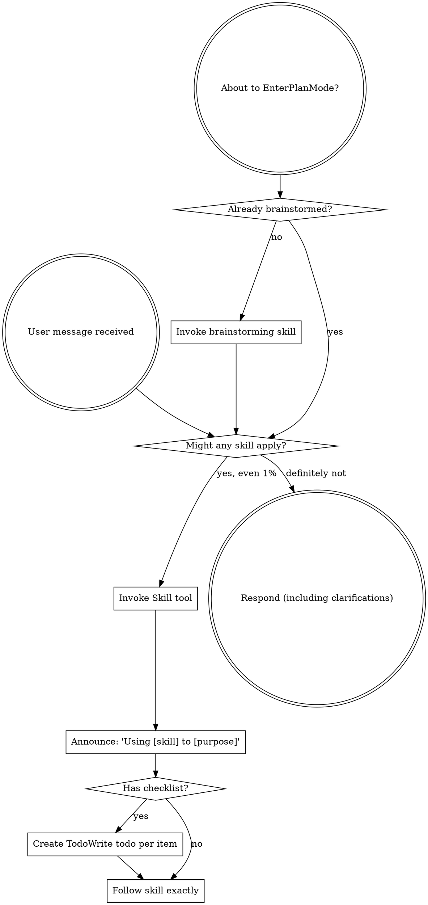

# Review — 2026-05-13-external-reviewer-redesign.md (post-slice, round 2)

- Target: `docs/superstar/plans/2026-05-13-external-reviewer-redesign.md`
- Request: `docs/reviewer/external-reviewer-redesign-S7-post-slice/r2-2026-05-14T0415-request.md`
- Reviewer command: `reviewer-agent`
- Status: `ok`

---

1. Findings

F1. RESOLVED — Severity: blocking. `final-ready` sweep planning now happens after the current primary reviewer returns a verdict, not from the prior manifest verdict. The implementation runs the primary first, then calls `plan_sweeps(... primary_verdict_pre_run=primary.verdict)` at [skills/external-review/scripts/external-reviewer.py](/home/simon/Dev/sigreer/skills/superstar/skills/external-review/scripts/external-reviewer.py:991). Regression coverage exists in [test_sweep_planning.py](/home/simon/Dev/sigreer/skills/superstar/skills/external-review/tests/test_sweep_planning.py:48). I also reproduced `r1 revise -> r2 ready`; r2 produced `reviewers=['primary', 'sweep']` and `r2-merged-findings.md`.

F2. RESOLVED — Severity: blocking. `run_one_reviewer()` now accepts and forwards `previous_response` / `resolution_file` into `run_reviewer()` at [external-reviewer.py](/home/simon/Dev/sigreer/skills/superstar/skills/external-review/scripts/external-reviewer.py:513) and [external-reviewer.py](/home/simon/Dev/sigreer/skills/superstar/skills/external-review/scripts/external-reviewer.py:527). Main resolves those paths for the primary at [external-reviewer.py](/home/simon/Dev/sigreer/skills/superstar/skills/external-review/scripts/external-reviewer.py:967). I reproduced the prior placeholder failure; round 2 now receives real `r1-...-response.md` and `r1-resolution.md` paths.

F3. RESOLVED — Severity: important. Slice 7 checkboxes are now marked complete across Tasks 7.1, 7.2, and 7.3, starting at [plan](/home/simon/Dev/sigreer/skills/superstar/docs/superstar/plans/2026-05-13-external-reviewer-redesign.md:2194). The Slice 7 closeout note records commits and verification at [plan](/home/simon/Dev/sigreer/skills/superstar/docs/superstar/plans/2026-05-13-external-reviewer-redesign.md:3123).

F4. RESOLVED / WAIVED — Severity: important. The dirty-tree condition is explicitly documented as an accepted standing override in the Slice 7 closeout at [plan](/home/simon/Dev/sigreer/skills/superstar/docs/superstar/plans/2026-05-13-external-reviewer-redesign.md:3137). Current `git status --short` still shows the same unrelated tracked files plus this in-flight r2 request artifact, so this is not a clean-tree resolution, but the waiver is recorded and scoped.

2. Open questions / assumptions

I treated the remaining dirty tracked files as intentionally out of S7 scope because the closeout note says they are authorized to remain across Slice 1-7 closeouts.

3. Suggested document edits

None required for this round.

4. Verification gaps / commands

I ran:

```bash
python3 -m pytest skills/external-review/tests/test_placeholders.py skills/external-review/tests/test_sweep_dispatch.py skills/external-review/tests/test_gate_merged_verdict.py skills/external-review/tests/test_review_depth.py -v
python3 -m pytest skills/external-review/tests/ -v
```

Results: targeted suite `16 passed`; full suite `96 passed, 1 warning`.

5. Overall verdict: ready

---

## Reviewer stderr

```text
Reading prompt from stdin...
OpenAI Codex v0.130.0
--------
workdir: /home/simon/Dev/sigreer/skills/superstar
model: gpt-5.5
provider: openai
approval: never
sandbox: danger-full-access
reasoning effort: none
reasoning summaries: none
session id: 019e247b-cfb3-7370-b718-9dc1b8729a13
--------
user
You are continuing an existing review chain. This is round 2 of external-reviewer-redesign-S7-post-slice.

In incremental mode:
- Verify whether prior findings are resolved per the resolution report below.
- Reuse the existing finding IDs (F1, F2, …). If a prior finding is resolved,
  mark it RESOLVED in your findings list with its original ID. If still
  unresolved, keep its ID.
- Only introduce new finding IDs for genuine regressions caused by the fix, or
  blocking issues clearly missed in earlier rounds. Do not reopen broad review
  unless prior fixes changed broad architecture.

Review chain summary:
| round | verdict | findings | blocking |
|---|---|---|---|
| 1 | revise | 4 | 2 |

Prior-round findings (primary reviewer response):

# Review — 2026-05-13-external-reviewer-redesign.md (post-slice, round 1)

- Target: `docs/superstar/plans/2026-05-13-external-reviewer-redesign.md`
- Request: `docs/reviewer/external-reviewer-redesign-S7-post-slice/r1-2026-05-14T0404-request.md`
- Reviewer command: `reviewer-agent`
- Status: `ok`

---

1. Findings

F1. Severity: blocking — `final-ready` sweeps do not run when the current primary first returns ready. The spec requires `thorough` to run “one fresh sweep when the primary first returns `ready` or `ready with small edits`” ([design](docs/superstar/specs/2026-05-13-external-reviewer-redesign-design.md:344)) and defines `final-ready` as firing when the primary first returns ready ([design](docs/superstar/specs/2026-05-13-external-reviewer-redesign-design.md:398)). The implementation decides the sweep plan before running the current primary, using the previous round’s verdict ([external-reviewer.py](skills/external-review/scripts/external-reviewer.py:947), [external-reviewer.py](skills/external-review/scripts/external-reviewer.py:954)). I reproduced a round 1 `revise` followed by a round 2 primary `ready`: round 2 returned `verdict=ready`, `reviewers=['primary']`, and no `r2-merged-findings.md`. That lets a coordinator advance without the required fresh sweep.

F2. Severity: blocking — S7 regresses S6 placeholder behavior for real reviewer invocations. `run_one_reviewer()` hard-codes `previous_response=None` and `resolution_file=None` when calling `run_reviewer()` ([external-reviewer.py](skills/external-review/scripts/external-reviewer.py:525), [external-reviewer.py](skills/external-review/scripts/external-reviewer.py:531)), even though S6/spec require `{previous_response}` and `{resolution_file}` to point at prior artifacts on round N+1 ([design](docs/superstar/specs/2026-05-13-external-reviewer-redesign-design.md:330), [design](docs/superstar/specs/2026-05-13-external-reviewer-redesign-design.md:331)). I reproduced round 2 with `AGENT_REVIEWER_CMD="stub {previous_response} {resolution_file}"`; the reviewer received `ARGS:|`.

F3. Severity: important — Slice 7 is not marked complete in the plan despite committed S7 changes. The S7 task checkboxes remain unchecked from Task 7.1 through 7.3 ([plan](docs/superstar/plans/2026-05-13-external-reviewer-redesign.md:2194), [plan](docs/superstar/plans/2026-05-13-external-reviewer-redesign.md:2333), [plan](docs/superstar/plans/2026-05-13-external-reviewer-redesign.md:2656)). This creates tracker drift for a post-slice gate.

F4. Severity: important — The working tree is dirty at the gate. `git status --short` shows modified `CLAUDE.md`, four skill docs, and untracked `docs/reviewer/external-reviewer-redesign-S7-post-slice/`. Post-slice review explicitly prioritizes uncommitted/untracked artifacts ([external-reviewer.py](skills/external-review/scripts/external-reviewer.py:100)). Either commit/stash unrelated work or document why these artifacts are intentionally outside the S7 gate.

2. Open questions / assumptions

I assumed this is the Slice 7 post-slice gate because the current HEAD contains S7 commits and the only new review chain is `external-reviewer-redesign-S7-post-slice`.

3. Suggested document edits

Update the S7 checklist only after fixing F1/F2 and adding regression coverage. Add an explicit S7 acceptance note that `final-ready` must be planned after the current primary result, not from the prior manifest round.

4. Verification gaps / commands

I ran:

```bash
python3 -m pytest skills/external-review/tests/ -v
```

Result: `91 passed, 1 warning`.

Missing coverage:

```bash
python3 -m pytest skills/external-review/tests/test_final_ready_sweep.py -v
python3 -m pytest skills/external-review/tests/test_placeholders.py -v
```

Add tests that exercise full CLI round 2 behavior for `final-ready` sweeps and `{previous_response}` / `{resolution_file}` placeholders.

5. Overall verdict: revise

---

## Reviewer stderr

```text
Reading prompt from stdin...
OpenAI Codex v0.130.0
--------
workdir: /home/simon/Dev/sigreer/skills/superstar
model: gpt-5.5
provider: openai
approval: never
sandbox: danger-full-access
reasoning effort: none
reasoning summaries: none
session id: 019e2471-a5b5-7902-8a6e-5b7a027bf7e7
--------
user
You are acting as an independent senior engineering reviewer.

Review stance:
- Lead with findings, ordered by severity.
- Focus on correctness, consistency, implementation risk, missing acceptance
  gates, vague handoffs, ungrounded assumptions, unverified claims, and drift
  from the codebase.
- Give exact file/line references when possible.
- If the document is sound, say that clearly and list residual risks.
- Keep the review actionable. Avoid broad rewrites unless the current structure
  creates concrete risk.

Repository root:
/home/simon/Dev/sigreer/skills/superstar

Target kind:
post-slice

Review mode:
Post-slice review. Treat this as a completion gate for one
slice of work. Compare the completed changes and stated evidence against the
slice acceptance criteria. Prioritize: incomplete tasks, uncommitted or
untracked artifacts, missing tests, failing or skipped verification, broken
cross-site behavior, and claims not supported by the repo state.

Target document:
docs/superstar/plans/2026-05-13-external-reviewer-redesign.md

Additional context files:
- docs/superstar/specs/2026-05-13-external-reviewer-redesign-design.md
- docs/handoffs/2026-05-13-external-reviewer-redesign-prompt.md

Review output contract:
1. Findings
   - Tag each finding with a stable ID: `F1`, `F2`, `F3`, …. IDs must remain
     stable if this review is iterated in subsequent rounds.
   - Mark severity inline: `Severity: blocking | important | minor | nit`.
2. Open questions / assumptions
3. Suggested document edits
4. Verification gaps / commands that should be run, if any
5. Overall verdict: one of "ready", "ready with small edits", or "revise"

Read the files from disk. Do not rely only on the snippets in this prompt.


## Target Preview

### docs/superstar/plans/2026-05-13-external-reviewer-redesign.md

    1	# External-Reviewer Redesign Implementation Plan
    2	
    3	> **For agentic workers:** REQUIRED SUB-SKILL: Use superstar:subagent-driven-development (recommended) or superstar:executing-plans to implement this plan task-by-task. Steps use checkbox (`- [ ]`) syntax for tracking.
    4	
    5	**Goal:** Rebuild `skills/external-review/scripts/external-reviewer.py` so review chains are incremental, durable, machine-readable, and support optional independent sweep reviewers — per `docs/superstar/specs/2026-05-13-external-reviewer-redesign-design.md`.
    6	
    7	**Architecture:** A persistent `chain.json` manifest per review chain becomes the source of truth for round metadata. The script gains verdict parsing, work-ID-keyed chain folders, a resolution-artifact contract and gate, incremental round prompts with embedded diffs, optional session-resume placeholders, and Pass-3 independent sweep reviewers. Skill documentation is updated to match.
    8	
    9	**Tech Stack:** Python 3.9+ standard library only (no external deps), `pytest` for tests, `git` CLI for diff and SHA capture.
   10	
   11	---
   12	
   13	## Pre-flight
   14	
   15	- [ ] **Step 1: Verify working directory and branch**
   16	
   17	Run:
   18	
   19	```bash
   20	cd /home/simon/Dev/sigreer/skills/superstar
   21	git status --short
   22	git rev-parse --abbrev-ref HEAD
   23	```
   24	
   25	Expected: clean tree, branch is a feature branch (not `main`). If on `main`, stop and create a branch via `superstar:using-git-worktrees`.
   26	
   27	- [ ] **Step 2: Confirm test runner**
   28	
   29	Run:
   30	
   31	```bash
   32	python3 -c "import pytest; print(pytest.__version__)"
   33	```
   34	
   35	Expected: prints a version string. If `ModuleNotFoundError`, install pytest:
   36	
   37	```bash
   38	python3 -m pip install --user pytest
   39	```
   40	
   41	- [ ] **Step 3: Set up the test directory**
   42	
   43	Create the directory tests will live in:
   44	
   45	```bash
   46	mkdir -p skills/external-review/tests
   47	touch skills/external-review/tests/__init__.py
   48	```
   49	
   50	Commit:
   51	
   52	```bash
   53	git add skills/external-review/tests/__init__.py
   54	git commit -m "scaffold: tests dir for external-reviewer redesign"
   55	```
   56	
   57	---
   58	
   59	## Slice 1: Chain manifest & verdict parsing
   60	
   61	**Goal:** Introduce `chain.json` as the round-metadata source of truth, parse verdicts and finding counts from response text, and emit them in the JSON output. Backwards-compatible: legacy chains synthesize a manifest on first touch.
   62	
   63	### Task 1.1: Manifest read/write helpers
   64	
   65	**Files:**
   66	- Create: `skills/external-review/tests/test_manifest.py`
   67	- Modify: `skills/external-review/scripts/external-reviewer.py`
   68	
   69	- [x] **Step 1: Write the failing tests**
   70	
   71	`skills/external-review/tests/test_manifest.py`:
   72	
   73	```python
   74	import json
   75	from pathlib import Path
   76	
   77	import pytest
   78	
   79	import sys
   80	SCRIPTS = Path(__file__).resolve().parents[1] / "scripts"
   81	sys.path.insert(0, str(SCRIPTS))
   82	
   83	import importlib.util
   84	spec = importlib.util.spec_from_file_location("external_reviewer", SCRIPTS / "external-reviewer.py")
   85	external_reviewer = importlib.util.module_from_spec(spec)
   86	spec.loader.exec_module(external_reviewer)
   87	
   88	
   89	def test_read_manifest_returns_none_for_missing(tmp_path):
   90	    assert external_reviewer.read_manifest(tmp_path / "missing.json") is None
   91	
   92	
   93	def test_write_then_read_manifest_roundtrips(tmp_path):
   94	    path = tmp_path / "chain.json"
   95	    data = {
   96	        "schema_version": 1,
   97	        "chain": "demo-post-slice",
   98	        "kind": "post-slice",
   99	        "target": "docs/plans/demo.md",
  100	        "work_id": "P1.S1",
  101	        "legacy_migrated": False,
  102	        "rounds": [],
  103	        "sweep_checkpoints": {"first-round": "pending", "final-ready": "pending"},
  104	    }
  105	    external_reviewer.write_manifest(path, data)
  106	    loaded = external_reviewer.read_manifest(path)
  107	    assert loaded == data
  108	
  109	
  110	def test_read_manifest_rejects_newer_schema(tmp_path):
  111	    path = tmp_path / "chain.json"
  112	    path.write_text(json.dumps({"schema_version": 99}))
  113	    with pytest.raises(external_reviewer.ManifestSchemaTooNew):
  114	        external_reviewer.read_manifest(path)
  115	```
  116	
  117	- [x] **Step 2: Run the tests; confirm they fail**
  118	
  119	```bash
  120	python3 -m pytest skills/external-review/tests/test_manifest.py -v
  121	```
  122	
  123	Expected: 3 failures (`read_manifest`, `write_manifest`, `ManifestSchemaTooNew` all undefined).
  124	
  125	- [x] **Step 3: Add manifest helpers to the script**
  126	
  127	Append to `skills/external-review/scripts/external-reviewer.py` (after the existing module-level constants, before `repo_root()`):
  128	
  129	```python
  130	SUPPORTED_SCHEMA_VERSION = 1
  131	
  132	
  133	class ManifestSchemaTooNew(Exception):
  134	    """Raised when chain.json declares a schema_version newer than this script supports."""
  135	
  136	
  137	def read_manifest(path: Path) -> dict | None:
  138	    if not path.exists():
  139	        return None
  140	    data = json.loads(path.read_text(encoding="utf-8"))
  141	    version = data.get("schema_version")
  142	    if isinstance(version, int) and version > SUPPORTED_SCHEMA_VERSION:
  143	        raise ManifestSchemaTooNew(
  144	            f"chain.json schema_version {version} is newer than this script supports "
  145	            f"(max {SUPPORTED_SCHEMA_VERSION}). Upgrade external-reviewer.py."
  146	        )
  147	    return data
  148	
  149	
  150	def write_manifest(path: Path, data: dict) -> None:
  151	    path.parent.mkdir(parents=True, exist_ok=True)
  152	    path.write_text(json.dumps(data, indent=2) + "\n", encoding="utf-8")
  153	```
  154	
  155	- [x] **Step 4: Run the tests; confirm they pass**
  156	
  157	```bash
  158	python3 -m pytest skills/external-review/tests/test_manifest.py -v
  159	```
  160	
  161	Expected: 3 passed.
  162	
  163	- [x] **Step 5: Commit**
  164	
  165	```bash
  166	git add skills/external-review/scripts/external-reviewer.py skills/external-review/tests/test_manifest.py
  167	git commit -m "feat(external-reviewer): chain.json read/write helpers with schema versioning"
  168	```
  169	
  170	### Task 1.2: Verdict parsing
  171	
  172	**Files:**
  173	- Create: `skills/external-review/tests/test_verdict.py`
  174	- Modify: `skills/external-review/scripts/external-reviewer.py`
  175	
  176	- [x] **Step 1: Write the failing tests**
  177	
  178	`skills/external-review/tests/test_verdict.py`:
  179	
  180	```python
  181	from pathlib import Path
  182	import sys, importlib.util
  183	
  184	SCRIPTS = Path(__file__).resolve().parents[1] / "scripts"
  185	sys.path.insert(0, str(SCRIPTS))
  186	spec = importlib.util.spec_from_file_location("external_reviewer", SCRIPTS / "external-reviewer.py")
  187	er = importlib.util.module_from_spec(spec); spec.loader.exec_module(er)
  188	
  189	
  190	def test_verdict_ready():
  191	    v, valid = er.parse_verdict("Findings: ok\n\nOverall verdict: ready\n")
  192	    assert v == "ready"
  193	    assert valid is True
  194	
  195	
  196	def test_verdict_ready_with_small_edits_markdown():
  197	    body = "**Overall verdict:** `ready with small edits`."
  198	    v, valid = er.parse_verdict(body)
  199	    assert v == "ready with small edits"
  200	    assert valid is True
  201	
  202	
  203	def test_verdict_revise_case_insensitive():
  204	    v, valid = er.parse_verdict("OVERALL VERDICT: Revise")
  205	    assert v == "revise"
  206	    assert valid is True
  207	
  208	
  209	def test_verdict_takes_last_match():
  210	    body = "Overall verdict: ready\n\n...later...\n\nOverall verdict: revise"
  211	    v, valid = er.parse_verdict(body)
  212	    assert v == "revise"
  213	
  214	
  215	def test_verdict_unknown_returns_invalid():
  216	    v, valid = er.parse_verdict("Overall verdict: looks fine to me")
  217	    assert v is None
  218	    assert valid is False
  219	
  220	
  221	def test_verdict_missing_returns_invalid():
  222	    v, valid = er.parse_verdict("Some review prose with no verdict line.")
  223	    assert v is None
  224	    assert valid is False
  225	```
  226	
  227	- [x] **Step 2: Run the tests; confirm they fail**
  228	
  229	```bash
  230	python3 -m pytest skills/external-review/tests/test_verdict.py -v
  231	```
  232	
  233	Expected: 6 failures (`parse_verdict` undefined).
  234	
  235	- [x] **Step 3: Add the verdict parser**
  236	
  237	Append to `skills/external-review/scripts/external-reviewer.py`:
  238	
  239	```python
  240	VERDICT_VALUES = ("ready with small edits", "ready", "revise")
  241	VERDICT_LINE_RE = re.compile(
  242	    r"overall\s+verdict\s*[:\-]\s*[`*_\"']*\s*(ready with small edits|ready|revise)\s*[`*_\"'.]*",
  243	    re.IGNORECASE,
  244	)
  245	
  246	
  247	def parse_verdict(text: str) -> tuple[str | None, bool]:
  248	    matches = list(VERDICT_LINE_RE.finditer(text))
  249	    if not matches:
  250	        return None, False
  251	    raw = matches[-1].group(1).strip().lower()
  252	    if raw not in VERDICT_VALUES:
  253	        return None, False
  254	    return raw, True
  255	```
  256	
  257	Note: regex prefers `ready with small edits` over `ready` because of ordering in the alternation.
  258	
  259	- [x] **Step 4: Run the tests; confirm they pass**
  260	
  261	```bash
  262	python3 -m pytest skills/external-review/tests/test_verdict.py -v
  263	```
  264	
  265	Expected: 6 passed.
  266	
  267	- [x] **Step 5: Commit**
  268	
  269	```bash
  270	git add skills/external-review/scripts/external-reviewer.py skills/external-review/tests/test_verdict.py
  271	git commit -m "feat(external-reviewer): parse_verdict with markdown/case tolerance"
  272	```
  273	
  274	### Task 1.3: Finding-count parsing
  275	
  276	**Files:**
  277	- Create: `skills/external-review/tests/test_findings.py`
  278	- Modify: `skills/external-review/scripts/external-reviewer.py`
  279	
  280	- [x] **Step 1: Write the failing tests**
  281	
  282	`skills/external-review/tests/test_findings.py`:
  283	
  284	```python
  285	from pathlib import Path
  286	import sys, importlib.util
  287	SCRIPTS = Path(__file__).resolve().parents[1] / "scripts"
  288	sys.path.insert(0, str(SCRIPTS))
  289	spec = importlib.util.spec_from_file_location("external_reviewer", SCRIPTS / "external-reviewer.py")
  290	er = importlib.util.module_from_spec(spec); spec.loader.exec_module(er)
  291	
  292	
  293	def test_heading_findings_counted():
  294	    body = "## F1\nSeverity: blocking\n\n## F2\nSeverity: minor\n\n## F3\nSeverity: blocking"
  295	    n, blocking = er.parse_findings(body)
  296	    assert n == 3
  297	    assert blocking == 2
  298	
  299	
  300	def test_bullet_findings_counted():
  301	    body = "- F1: something blocking (blocking)\n- F2 minor thing"
  302	    n, blocking = er.parse_findings(body)
  303	    assert n == 2
  304	    assert blocking == 1
  305	
  306	
  307	def test_no_findings_returns_zero():
  308	    body = "Overall verdict: ready\n\nNo findings."
  309	    n, blocking = er.parse_findings(body)
  310	    assert n == 0
  311	    assert blocking == 0
  312	
  313	
  314	def test_unparseable_returns_none():
  315	    body = "Reviewer crashed: connection reset"
  316	    n, blocking = er.parse_findings(body)
  317	    assert n is None
  318	    assert blocking is None
  319	```
  320	
  321	- [x] **Step 2: Run the tests; confirm they fail**
  322	
  323	```bash
  324	python3 -m pytest skills/external-review/tests/test_findings.py -v
  325	```
  326	
  327	Expected: 4 failures.
  328	
  329	- [x] **Step 3: Add the parser**
  330	
  331	Append to `skills/external-review/scripts/external-reviewer.py`:
  332	
  333	```python
  334	HEADING_FINDING_RE = re.compile(r"^##\s+F\d+\b", re.MULTILINE)
  335	BULLET_FINDING_RE = re.compile(r"^\s*[-*]?\s*\**F\d+\**[:\s\-]", re.MULTILINE)
  336	BLOCKING_MARKER_RE = re.compile(r"(?:^|\s)\(blocking\)|^severity\s*:\s*blocking", re.IGNORECASE | re.MULTILINE)
  337	
  338	
  339	def parse_findings(text: str) -> tuple[int | None, int | None]:
  340	    if not text or text.strip() == "" or "reviewer crashed" in text.lower():
  341	        return None, None
  342	    heading_count = len(HEADING_FINDING_RE.findall(text))
  343	    if heading_count > 0:
  344	        n = heading_count
  345	    else:
  346	        n = len(BULLET_FINDING_RE.findall(text))
  347	    blocking = len(BLOCKING_MARKER_RE.findall(text))
  348	    return n, blocking
  349	```
  350	
  351	- [x] **Step 4: Run the tests; confirm they pass**
  352	
  353	```bash
  354	python3 -m pytest skills/external-review/tests/test_findings.py -v
  355	```
  356	
  357	Expected: 4 passed.
  358	
  359	- [x] **Step 5: Commit**
  360	
  361	```bash
  362	git add skills/external-review/scripts/external-reviewer.py skills/external-review/tests/test_findings.py
  363	git commit -m "feat(external-reviewer): parse_findings (heading + bullet, blocking count)"
  364	```
  365	
  366	### Task 1.4: Round-number derivation reads manifest first
  367	
  368	**Files:**
  369	- Create: `skills/external-review/tests/test_round_number.py`
  370	- Modify: `skills/external-review/scripts/external-reviewer.py` (`next_round_number`)
  371	
  372	- [x] **Step 1: Write the failing tests**
  373	
  374	`skills/external-review/tests/test_round_number.py`:
  375	
  376	```python
  377	from pathlib import Path
  378	import json, sys, importlib.util
  379	SCRIPTS = Path(__file__).resolve().parents[1] / "scripts"
  380	sys.path.insert(0, str(SCRIPTS))
  381	spec = importlib.util.spec_from_file_location("external_reviewer", SCRIPTS / "external-reviewer.py")
  382	er = importlib.util.module_from_spec(spec); spec.loader.exec_module(er)
  383	
  384	
  385	def test_no_chain_dir_round_is_one(tmp_path):
  386	    assert er.next_round_number(tmp_path / "absent") == 1
  387	
  388	
  389	def test_manifest_present_takes_precedence(tmp_path):
  390	    d = tmp_path / "chain"; d.mkdir()
  391	    er.write_manifest(d / "chain.json", {
  392	        "schema_version": 1, "rounds": [{"round": 1}, {"round": 2}]
  393	    })
  394	    assert er.next_round_number(d) == 3
  395	
  396	
  397	def test_legacy_dir_no_manifest_falls_back_to_filename_scan(tmp_path):
  398	    d = tmp_path / "chain"; d.mkdir()
  399	    (d / "r1-2026-05-01T0900-request.md").write_text("")
  400	    (d / "r2-2026-05-02T0900-request.md").write_text("")
  401	    assert er.next_round_number(d) == 3
  402	```
  403	
  404	- [x] **Step 2: Run the tests; confirm they fail**
  405	
  406	```bash
  407	python3 -m pytest skills/external-review/tests/test_round_number.py -v
  408	```
  409	
  410	Expected: test 2 fails (no manifest awareness), tests 1 and 3 may pass if current behavior already handles them.
  411	
  412	- [x] **Step 3: Update `next_round_number`**
  413	
  414	Replace the existing function:
  415	
  416	```python
  417	def next_round_number(chain_dir: Path) -> int:
  418	    if not chain_dir.exists():
  419	        return 1
  420	    manifest = read_manifest(chain_dir / "chain.json")
  421	    if manifest and isinstance(manifest.get("rounds"), list):
  422	        return len(manifest["rounds"]) + 1
  423	    return len(list(chain_dir.glob("r*-*-request.md"))) + 1
  424	```
  425	
  426	- [x] **Step 4: Run the tests**
  427	
  428	```bash
  429	python3 -m pytest skills/external-review/tests/test_round_number.py -v
  430	```
  431	
  432	Expected: 3 passed.
  433	
  434	- [x] **Step 5: Commit**
  435	
  436	```bash
  437	git add skills/external-review/scripts/external-reviewer.py skills/external-review/tests/test_round_number.py
  438	git commit -m "feat(external-reviewer): next_round_number consults chain.json"
  439	```
  440	
  441	### Task 1.5: Legacy manifest synthesis
  442	
  443	**Files:**
  444	- Create: `skills/external-review/tests/test_legacy_migration.py`
  445	- Modify: `skills/external-review/scripts/external-reviewer.py`
  446	
  447	- [x] **Step 1: Write the failing tests**
  448	
  449	`skills/external-review/tests/test_legacy_migration.py`:
  450	
  451	```python
  452	from pathlib import Path
  453	import sys, importlib.util
  454	SCRIPTS = Path(__file__).resolve().parents[1] / "scripts"
  455	sys.path.insert(0, str(SCRIPTS))
  456	spec = importlib.util.spec_from_file_location("external_reviewer", SCRIPTS / "external-reviewer.py")
  457	er = importlib.util.module_from_spec(spec); spec.loader.exec_module(er)
  458	
  459	
  460	def test_synthesize_manifest_from_legacy_files(tmp_path):
  461	    d = tmp_path / "old-chain"; d.mkdir()
  462	    (d / "r1-2026-04-01T0900-request.md").write_text("prompt body")
  463	    (d / "r1-2026-04-01T0905-response.md").write_text(
  464	        "## F1\nSeverity: blocking\n\nOverall verdict: revise\n"
  465	    )
  466	    (d / "r2-2026-04-02T1200-request.md").write_text("prompt body 2")
  467	
  468	    manifest = er.synthesize_legacy_manifest(
  469	        chain_dir=d, chain="old-chain", kind="post-slice",
  470	        target="docs/plans/old.md", work_id="P1.S1",
  471	    )
  472	
  473	    assert manifest["legacy_migrated"] is True
  474	    assert manifest["work_id"] == "P1.S1"
  475	    assert len(manifest["rounds"]) == 2
  476	    r1, r2 = manifest["rounds"]
  477	    assert r1["legacy"] is True
  478	    assert r1["verdict"] == "revise"
  479	    assert r1["verdict_valid"] is True
  480	    assert r1["findings_count"] == 1
  481	    assert r1["blocking_findings_count"] == 1
  482	    assert r1["head_sha_after_round"] is None
  483	    assert r2["response"] is None  # only request file existed
  484	```
  485	
  486	- [x] **Step 2: Run the tests; confirm they fail**
  487	
  488	```bash
  489	python3 -m pytest skills/external-review/tests/test_legacy_migration.py -v
  490	```
  491	
  492	Expected: 1 failure.
  493	
  494	- [x] **Step 3: Add the synthesizer**
  495	
  496	Append to `skills/external-review/scripts/external-reviewer.py`:
  497	
  498	```python
  499	LEGACY_ROUND_FILE_RE = re.compile(r"^r(\d+)-([0-9T\-]+)-(request|response)\.md$")
  500	
  501	
  502	def synthesize_legacy_manifest(
  503	    *, chain_dir: Path, chain: str, kind: str, target: str, work_id: str | None
  504	) -> dict:
  505	    rounds_map: dict[int, dict] = {}
  506	    for path in sorted(chain_dir.iterdir()):
  507	        m = LEGACY_ROUND_FILE_RE.match(path.name)
  508	        if not m:
  509	            continue
  510	        round_num = int(m.group(1))
  511	        role = m.group(3)
  512	        entry = rounds_map.setdefault(
  513	            round_num,
  514	            {
  515	                "round": round_num,
  516	                "request": None,
  517	                "response": None,
  518	                "resolution": None,
  519	                "verdict": None,
  520	                "verdict_valid": False,
  521	                "findings_count": None,
  522	                "blocking_findings_count": None,
  523	                "head_sha_at_request": None,
  524	                "head_sha_after_round": None,
  525	                "worktree_dirty_at_request": None,
  526	                "legacy": True,
  527	            },
  528	        )
  529	        entry[role] = path.name
  530	        if role == "response":
  531	            body = path.read_text(encoding="utf-8", errors="replace")
  532	            v, valid = parse_verdict(body)
  533	            entry["verdict"], entry["verdict_valid"] = v, valid
  534	            n, blocking = parse_findings(body)
  535	            entry["findings_count"], entry["blocking_findings_count"] = n, blocking
  536	
  537	    return {
  538	        "schema_version": SUPPORTED_SCHEMA_VERSION,
  539	        "chain": chain,
  540	        "kind": kind,
  541	        "target": target,
  542	        "work_id": work_id,
  543	        "legacy_migrated": True,
  544	        "migrated_at": dt.datetime.utcnow().strftime("%Y-%m-%dT%H:%M:%SZ"),
  545	        "rounds": [rounds_map[k] for k in sorted(rounds_map)],
  546	        "sweep_checkpoints": {"first-round": "pending", "final-ready": "pending"},
  547	    }
  548	```
  549	
  550	- [x] **Step 4: Run the tests; confirm they pass**
  551	
  552	```bash
  553	python3 -m pytest skills/external-review/tests/test_legacy_migration.py -v
  554	```
  555	
  556	Expected: 1 passed.
  557	
  558	- [x] **Step 5: Commit**
  559	
  560	```bash
  561	git add skills/external-review/scripts/external-reviewer.py skills/external-review/tests/test_legacy_migration.py
  562	git commit -m "feat(external-reviewer): synthesize_legacy_manifest from rN-* files"
  563	```
  564	
  565	### Task 1.6: Wire manifest into `main()` for single-reviewer rounds
  566	
  567	**Files:**
  568	- Modify: `skills/external-review/scripts/external-reviewer.py` (`main` function)
  569	- Create: `skills/external-review/tests/test_main_round_writes_manifest.py`
  570	
  571	- [x] **Step 1: Write the failing test**
  572	
  573	`skills/external-review/tests/test_main_round_writes_manifest.py`:
  574	
  575	```python
  576	from pathlib import Path
  577	import subprocess, sys, json, importlib.util, os
  578	
  579	SCRIPTS = Path(__file__).resolve().parents[1] / "scripts"
  580	sys.path.insert(0, str(SCRIPTS))
  581	spec = importlib.util.spec_from_file_location("external_reviewer", SCRIPTS / "external-reviewer.py")
  582	er = importlib.util.module_from_spec(spec); spec.loader.exec_module(er)
  583	
  584	
  585	FAKE_REVIEWER = """#!/usr/bin/env bash
  586	cat <<'EOF'
  587	## F1
  588	Severity: blocking
  589	Stub finding.
  590	
  591	Overall verdict: revise
  592	EOF
  593	"""
  594	
  595	
  596	def test_main_writes_manifest_entry(tmp_path, monkeypatch):
  597	    repo = tmp_path / "repo"; repo.mkdir()
  598	    subprocess.run(["git", "-C", str(repo), "init", "-q"], check=True)
  599	    subprocess.run(["git", "-C", str(repo), "config", "user.email", "t@t"], check=True)
  600	    subprocess.run(["git", "-C", str(repo), "config", "user.name", "T"], check=True)

[truncated: 2521 additional lines]

## Context Previews

### docs/superstar/specs/2026-05-13-external-reviewer-redesign-design.md

    1	# External-Review Script Redesign — Design
    2	
    3	**Date:** 2026-05-13
    4	**Target:** `skills/external-review/scripts/external-reviewer.py` and `skills/external-review/SKILL.md`
    5	**Motivation:** A self-review of the external-reviewer flow surfaced five concrete failure modes that cause review loops to balloon to 7–10 rounds and lose continuity between rounds. This spec redesigns the script and skill to make rounds incremental, durable, and machine-readable.
    6	
    7	---
    8	
    9	## Goals
   10	
   11	1. **Round N+1 is incremental, not a re-review.** The reviewer is given prior findings, the fixer's resolution report, and a focused diff — and is instructed to verify resolution rather than reopen broad review.
   12	2. **Verdict is machine-readable.** JSON output exposes a parsed `verdict`, `verdict_valid`, and finding counts, so coordinators don't have to parse prose.
   13	3. **Post-slice / post-phase chains are uniquely keyed.** `--work-id` is required for both so that multi-slice plans don't collapse into one chain.
   14	4. **Resolution artifacts are durable and structured-enough-to-parse.** Required headers, free-form bodies, stable finding IDs across rounds.
   15	5. **Optional session resume.** Provider-specific wrappers can plug into placeholders if the underlying reviewer CLI supports session IDs.
   16	6. **Legacy chains keep working.** Soft-migrate on first new round; preserve existing folder names and audit history.
   17	7. **Review depth is explicit.** The default chain uses one primary incremental reviewer, but callers can request bounded independent sweep reviewers at high-risk checkpoints to preserve fresh-eye coverage without unbounded serial churn.
   18	
   19	## Non-goals
   20	
   21	- Replacing the chain-folder layout for new chains. The folder-naming scheme gains a `--work-id` segment for post-slice/post-phase, but the round-file scheme is unchanged.
   22	- Making the script aware of any specific reviewer CLI. The script remains provider-neutral via `AGENT_REVIEWER_CMD`.
   23	- Auto-dispatching the fixer subagent. The script enforces the resolution gate but does not invoke fixers; that stays in the coordinator's loop, governed by `subagent-driven-development`.
   24	
   25	## Invariants
   26	
   27	- **A review chain is single-writer.** Running two rounds concurrently against the same chain is unsupported and may corrupt `chain.json`. The script does not lock; callers are expected to serialise.
   28	- **Existing rounds are immutable.** Once written, `rN-*-request.md`, `rN-*-response.md`, and `rN-resolution.md` are never overwritten. Manifest entries for past rounds are append-only.
   29	
   30	## Architecture
   31	
   32	Three implementation passes, all designed in this spec:
   33	
   34	- **Pass 1 — Core.** Chain manifest, verdict parsing, `--work-id`, prior-round context injection, incremental round prompts, resolution-artifact contract and gate, automatic diff embedding, JSON output enrichment, legacy migration.
   35	- **Pass 2 — Session resume.** Optional placeholders (`{chain_dir}`, `{round}`, `{previous_response}`, `{resolution_file}`, `{session_file}`) exposed via the existing `AGENT_REVIEWER_CMD` template mechanism. A provider-specific wrapper can use `{session_file}` to persist and resume reviewer sessions. The script provides a stable path (`chain_dir/session.state`) and ensures the parent directory exists; wrappers own the file's contents. The script never reads `session.state`.
   36	- **Pass 3 — Review depth / independent sweeps.** Adds `--review-depth`, `--independent-reviewers`, `--sweep-policy` flags. Independent sweep reviewers run without seeing the primary reviewer's findings on their first pass (to avoid anchoring), and their findings are merged into the same resolution checklist afterward. Depends on Pass 1's manifest and verdict parsing; does not depend on Pass 2.
   37	
   38	### Chain manifest
   39	
   40	`docs/reviewer/<chain>/chain.json` is the single source of truth for round metadata. The `rN-*-request.md` / `rN-*-response.md` / `rN-resolution.md` files remain for human readability and git history; the script reads and writes manifest entries when computing round numbers, base refs, and verdicts.
   41	
   42	```json
   43	{
   44	  "schema_version": 1,
   45	  "chain": "feature-plan-P2-S3-post-slice",
   46	  "kind": "post-slice",
   47	  "target": "docs/superstar/plans/feature-plan.md",
   48	  "work_id": "P2.S3",
   49	  "legacy_migrated": false,
   50	  "rounds": [
   51	    {
   52	      "round": 1,
   53	      "request": "r1-2026-05-13T1012-request.md",
   54	      "response": "r1-2026-05-13T1020-response.md",
   55	      "resolution": null,
   56	      "head_sha_at_request": "abc1234",
   57	      "head_sha_after_round": "abc1234",
   58	      "worktree_dirty_at_request": false,
   59	      "verdict": "revise",
   60	      "verdict_valid": true,
   61	      "findings_count": 4,
   62	      "blocking_findings_count": 2
   63	    },
   64	    {
   65	      "round": 2,
   66	      "request": "r2-2026-05-13T1130-request.md",
   67	      "response": null,
   68	      "resolution": "r1-resolution.md",
   69	      "base_ref": "abc1234",
   70	      "base_ref_source": "auto",
   71	      "head_sha_at_request": "def5678",
   72	      "worktree_dirty_at_request": false,
   73	      "diff_included": true,
   74	      "resolution_parse_status": "ok",
   75	      "resolution_waiver": false
   76	    }
   77	  ]
   78	}
   79	```
   80	
   81	#### Manifest versioning
   82	
   83	- `schema_version: 1` is the initial version introduced by this redesign.
   84	- Unknown future `schema_version` values cause the script to error with a clear message: `ERROR: chain.json schema_version <N> is newer than this script supports. Upgrade external-reviewer.py.` This prevents silent corruption.
   85	- Older `schema_version` values (currently none) get best-effort migration on read, recorded as `schema_migrated_from: <prior>` in the manifest.
   86	
   87	### Naming
   88	
   89	- **Chain folder slug:** `<target-stem-no-leading-date>-<work-id-dotless>-<kind>` for post-slice/post-phase; `<target-stem-no-leading-date>-<kind>` otherwise. Dots in work IDs are replaced with dashes in the folder slug only — the manifest preserves the canonical form.
   90	  - Example: `--work-id P2.S3` → folder `feature-plan-P2-S3-post-slice`, manifest `"work_id": "P2.S3"`.
   91	- **Round files:** `r{N}-<YYYY-MM-DDTHHMM>-request.md`, `r{N}-<YYYY-MM-DDTHHMM>-response.md`. Unchanged from current behavior.
   92	- **Resolution files:** `r{N}-resolution.md`, where `N` is the round whose response is being addressed. Round `N+1` consumes `r{N}-resolution.md`. Worked example: after `r1-response.md` returns `revise`, the fixer writes `r1-resolution.md`; round 2 reads `r1-resolution.md` and embeds it in the round-2 prompt.
   93	
   94	## CLI surface (new flags)
   95	
   96	| Flag | Kinds | Purpose |
   97	|---|---|---|
   98	| `--work-id <id>` | required for `post-slice`, `post-phase`; optional otherwise | Stable slice/phase ID (e.g., `P2.S3` for post-slice, `P2` for post-phase). Becomes part of chain folder name (dots → dashes) and is stored verbatim in the manifest. |
   99	| `--base-ref <sha\|ref>` | any | Override auto-computed diff base for this round. |
  100	| `--no-diff` | any | Suppress diff embedding even on round N+1. |
  101	| `--allow-missing-resolution` | post-slice, post-phase | Waive the resolution-required gate. Logged in manifest as `resolution_waiver: true`. |
  102	| `--changed-files <path>...` | any | Override automatic changed-file discovery and limit the embedded diff to the supplied paths. |
  103	| `--mode <auto\|broad\|incremental>` | any | Override the round-1-vs-N prompt mode. Default `auto` (round 1 → broad; round 2+ → incremental). |
  104	| `--max-diff-lines <int>` | any | Cap diff size. Default 2000. Truncation marker is embedded if exceeded. |
  105	| `--review-depth <standard\|thorough\|exhaustive>` | post-slice, post-phase | Controls whether independent sweep reviewers are run in addition to the primary chain reviewer. Default `standard`. |
  106	| `--independent-reviewers <int>` | post-slice, post-phase | Override reviewer count for independent sweeps. Default derived from `--review-depth`. |
  107	| `--sweep-policy <first-round\|final-ready\|both\|never>` | post-slice, post-phase | When to run fresh-context sweep reviews. Default derived from `--review-depth`. |
  108	
  109	### `--work-id` enforcement
  110	
  111	- `post-slice` or `post-phase` invoked without `--work-id` → exit 2 with operational error.
  112	- For `post-phase`, the expected form is the phase ID alone (`P2`), not a slice ID. The script does not enforce a regex; it documents the convention.
  113	- For other kinds, `--work-id` is optional; if provided, it is recorded in the manifest but does not affect the folder slug.
  114	
  115	## Reviewer prompt — round 1 vs round N+
  116	
  117	### Round 1: broad
  118	
  119	The existing broad prompt, with the output contract revised to require **stable finding IDs**:
  120	
  121	```
  122	1. Findings
  123	   - Each finding tagged `F<n>` (e.g., F1, F2, F3). IDs must be stable across rounds.
  124	   - Severity: blocking | important | minor | nit
  125	2. Open questions / assumptions
  126	3. Suggested document edits
  127	4. Verification gaps
  128	5. Overall verdict: ready | ready with small edits | revise
  129	```
  130	
  131	### Round N+: incremental
  132	
  133	Prepended to the existing prompt body:
  134	
  135	```
  136	You are continuing an existing review chain. This is round {N} of {chain_id}.
  137	
  138	In incremental mode:
  139	- Verify whether prior findings are resolved per the resolution report below.
  140	- Reuse the existing finding IDs (F1, F2, …). If a prior finding is resolved,
  141	  mark it RESOLVED in your findings list with its original ID. If still
  142	  unresolved, keep its ID.
  143	- Only introduce new finding IDs for genuine regressions caused by the fix, or
  144	  blocking issues clearly missed in earlier rounds. Do not reopen broad review
  145	  unless prior fixes changed broad architecture.
  146	
  147	Review chain summary:
  148	{per-round table: round, verdict, findings_count, blocking_findings_count}
  149	
  150	Prior-round findings (authoritative):
  151	{if r{N-1}-merged-findings.md exists: its verbatim contents — this replaces
  152	 individual reviewer response files as the prior-finding list of record}
  153	{else: a summary of the prior round's primary response, with finding IDs intact}
  154	
  155	Resolution report for prior round:
  156	{verbatim contents of r{N-1}-resolution.md}
  157	{or "MISSING — explicitly waived by caller via --allow-missing-resolution"}
  158	{or "MISSING — chain migrated from legacy artifacts; please verify whether changes occurred from the diff below"}
  159	
  160	Resolution parse summary (best-effort):
  161	{structured: per-finding-ID → status, or "unparseable"}
  162	
  163	Changes since prior round:
  164	{git diff <base_ref>..HEAD -- <scoped paths>}
  165	{if dirty: appended `git diff HEAD` section, both labeled}
  166	{if no base: "not available for this round (legacy chain / first round / --no-diff)"}
  167	```
  168	
  169	`--mode broad` forces round-1-style on later rounds (rare; for cases where the fix changed architecture). `--mode incremental` on round 1 is rejected with a clear error.
  170	
  171	## Resolution artifact contract
  172	
  173	**Path:** `docs/reviewer/<chain>/r{N}-resolution.md`, where `N` is the round whose response is being addressed. Authored by the fix subagent between round N (response) and round N+1 (resubmit).
  174	
  175	**Required parseable shape:**
  176	
  177	```markdown
  178	# Resolution for r{N}
  179	
  180	## F1
  181	Status: fixed
  182	Evidence:
  183	- Commit: abc1234
  184	- Files: `src/foo.ts:42`, `tests/foo.test.ts:18`
  185	- Verification: `npm test -- foo.test.ts` passed
  186	
  187	Notes:
  188	Changed the validation path to reject empty IDs before persistence.
  189	
  190	## F2
  191	Status: waived
  192	Evidence:
  193	- No code change
  194	- Reason: reviewer assumed X, but the plan explicitly excludes X in
  195	  `docs/superstar/specs/foo-design.md:77`
  196	
  197	Notes:
  198	No implementation change because this would expand slice scope.
  199	```
  200	

[truncated: 292 additional lines]
### docs/handoffs/2026-05-13-external-reviewer-redesign-prompt.md

    1	# Coordinator handoff — External-Reviewer Redesign
    2	
    3	You are the coordinator for implementing the **external-reviewer redesign** in the `superstar` repo at `/home/simon/Dev/sigreer/skills/superstar`.
    4	
    5	Your role is **strictly orchestration**. Use the `superstar:subagent-driven-development` skill with parallel agents where possible.
    6	
    7	## Inputs
    8	
    9	- Spec: [`docs/superstar/specs/2026-05-13-external-reviewer-redesign-design.md`](docs/superstar/specs/2026-05-13-external-reviewer-redesign-design.md)
   10	- Plan: [`docs/superstar/plans/2026-05-13-external-reviewer-redesign.md`](docs/superstar/plans/2026-05-13-external-reviewer-redesign.md)
   11	- Reviewer chain folder (created on first review): `docs/reviewer/external-reviewer-redesign-plan/` (kind `plan`) and per-slice chains like `docs/reviewer/external-reviewer-redesign-S1-post-slice/` (no TASKLIST.md in this repo; treat `S1`…`S8` from the plan as the work-id segments).
   12	
   13	## Coordinator discipline (non-negotiable)
   14	
   15	- **Do not perform any fixes yourself** unless the fix is genuinely cheaper to implement than the process of delegating to a subagent. Tiebreak: delegate.
   16	- **Do not pollute your context.** Delegate investigations, file reads, and edits to subagents. Your context is for orchestration, not implementation detail.
   17	- **At the end of each slice (S1–S8)**, the human partner runs `external-review` manually with `--kind post-slice` and pastes the findings back. Do NOT invoke the external-review skill yourself in this project — the human partner has explicitly chosen to drive it manually to keep the context clean. Wait for the verdict before proceeding to the next slice.
   18	- **Do not perform reviewer-driven fixes yourself.** Pass each reviewer response to a fix subagent that writes `r{N}-resolution.md` per the contract in `[[external-review]]`, then signal the human partner that the resolution is ready and the next round can be submitted.
   19	- **At the end of the phase** (after S8 closes), the human partner runs `--kind post-phase` manually. Same delegation rule.
   20	- **No TASKLIST.md exists** in this repo. Track slice completion in this handoff document or in a TODO list you maintain in-session; do not invent a TASKLIST.md file.
   21	
   22	## First action
   23	
   24	Read this file (the handoff prompt), the spec, and the plan. Then invoke `superstar:subagent-driven-development` and begin Slice 1 (Chain manifest & verdict parsing).

exec
/usr/bin/zsh -lc "sed -n '1,200p' /home/simon/.codex/plugins/cache/openai-curated/superpowers/08373044/skills/using-superpowers/SKILL.md && sed -n '1,220p' /home/simon/.codex/plugins/cache/openai-curated/superpowers/08373044/skills/requesting-code-review/SKILL.md" in /home/simon/Dev/sigreer/skills/superstar
 succeeded in 0ms:
---
name: using-superpowers
description: Use when starting any conversation - establishes how to find and use skills, requiring Skill tool invocation before ANY response including clarifying questions
---

<SUBAGENT-STOP>
If you were dispatched as a subagent to execute a specific task, skip this skill.
</SUBAGENT-STOP>

<EXTREMELY-IMPORTANT>
If you think there is even a 1% chance a skill might apply to what you are doing, you ABSOLUTELY MUST invoke the skill.

IF A SKILL APPLIES TO YOUR TASK, YOU DO NOT HAVE A CHOICE. YOU MUST USE IT.

This is not negotiable. This is not optional. You cannot rationalize your way out of this.
</EXTREMELY-IMPORTANT>

## Instruction Priority

Superpowers skills override default system prompt behavior, but **user instructions always take precedence**:

1. **User's explicit instructions** (CLAUDE.md, GEMINI.md, AGENTS.md, direct requests) — highest priority
2. **Superpowers skills** — override default system behavior where they conflict
3. **Default system prompt** — lowest priority

If CLAUDE.md, GEMINI.md, or AGENTS.md says "don't use TDD" and a skill says "always use TDD," follow the user's instructions. The user is in control.

## How to Access Skills

**In Claude Code:** Use the `Skill` tool. When you invoke a skill, its content is loaded and presented to you—follow it directly. Never use the Read tool on skill files.

**In Copilot CLI:** Use the `skill` tool. Skills are auto-discovered from installed plugins. The `skill` tool works the same as Claude Code's `Skill` tool.

**In Gemini CLI:** Skills activate via the `activate_skill` tool. Gemini loads skill metadata at session start and activates the full content on demand.

**In other environments:** Check your platform's documentation for how skills are loaded.

## Platform Adaptation

Skills use Claude Code tool names. Non-CC platforms: see `references/copilot-tools.md` (Copilot CLI), `references/codex-tools.md` (Codex) for tool equivalents. Gemini CLI users get the tool mapping loaded automatically via GEMINI.md.

# Using Skills

## The Rule

**Invoke relevant or requested skills BEFORE any response or action.** Even a 1% chance a skill might apply means that you should invoke the skill to check. If an invoked skill turns out to be wrong for the situation, you don't need to use it.



## Red Flags

These thoughts mean STOP—you're rationalizing:

| Thought | Reality |
|---------|---------|
| "This is just a simple question" | Questions are tasks. Check for skills. |
| "I need more context first" | Skill check comes BEFORE clarifying questions. |
| "Let me explore the codebase first" | Skills tell you HOW to explore. Check first. |
| "I can check git/files quickly" | Files lack conversation context. Check for skills. |
| "Let me gather information first" | Skills tell you HOW to gather information. |
| "This doesn't need a formal skill" | If a skill exists, use it. |
| "I remember this skill" | Skills evolve. Read current version. |
| "This doesn't count as a task" | Action = task. Check for skills. |
| "The skill is overkill" | Simple things become complex. Use it. |
| "I'll just do this one thing first" | Check BEFORE doing anything. |
| "This feels productive" | Undisciplined action wastes time. Skills prevent this. |
| "I know what that means" | Knowing the concept ≠ using the skill. Invoke it. |

## Skill Priority

When multiple skills could apply, use this order:

1. **Process skills first** (brainstorming, debugging) - these determine HOW to approach the task
2. **Implementation skills second** (frontend-design, mcp-builder) - these guide execution

"Let's build X" → brainstorming first, then implementation skills.
"Fix this bug" → debugging first, then domain-specific skills.

## Skill Types

**Rigid** (TDD, debugging): Follow exactly. Don't adapt away discipline.

**Flexible** (patterns): Adapt principles to context.

The skill itself tells you which.

## User Instructions

Instructions say WHAT, not HOW. "Add X" or "Fix Y" doesn't mean skip workflows.
---
name: requesting-code-review
description: Use when completing tasks, implementing major features, or before merging to verify work meets requirements
---

# Requesting Code Review

Dispatch a code reviewer subagent to catch issues before they cascade. The reviewer gets precisely crafted context for evaluation — never your session's history. This keeps the reviewer focused on the work product, not your thought process, and preserves your own context for continued work.

**Core principle:** Review early, review often.

## When to Request Review

**Mandatory:**
- After each task in subagent-driven development
- After completing major feature
- Before merge to main

**Optional but valuable:**
- When stuck (fresh perspective)
- Before refactoring (baseline check)
- After fixing complex bug

## How to Request

**1. Get git SHAs:**
```bash
BASE_SHA=$(git rev-parse HEAD~1)  # or origin/main
HEAD_SHA=$(git rev-parse HEAD)
```

**2. Dispatch code reviewer subagent:**

Use Task tool with `general-purpose` type, fill template at `code-reviewer.md`

**Placeholders:**
- `{DESCRIPTION}` - Brief summary of what you built
- `{PLAN_OR_REQUIREMENTS}` - What it should do
- `{BASE_SHA}` - Starting commit
- `{HEAD_SHA}` - Ending commit

**3. Act on feedback:**
- Fix Critical issues immediately
- Fix Important issues before proceeding
- Note Minor issues for later
- Push back if reviewer is wrong (with reasoning)

## Example

```
[Just completed Task 2: Add verification function]

You: Let me request code review before proceeding.

BASE_SHA=$(git log --oneline | grep "Task 1" | head -1 | awk '{print $1}')
HEAD_SHA=$(git rev-parse HEAD)

[Dispatch code reviewer subagent]
  DESCRIPTION: Added verifyIndex() and repairIndex() with 4 issue types
  PLAN_OR_REQUIREMENTS: Task 2 from docs/superpowers/plans/deployment-plan.md
  BASE_SHA: a7981ec
  HEAD_SHA: 3df7661

[Subagent returns]:
  Strengths: Clean architecture, real tests
  Issues:
    Important: Missing progress indicators
    Minor: Magic number (100) for reporting interval
  Assessment: Ready to proceed

You: [Fix progress indicators]
[Continue to Task 3]
```

## Integration with Workflows

**Subagent-Driven Development:**
- Review after EACH task
- Catch issues before they compound
- Fix before moving to next task

**Executing Plans:**
- Review after each task or at natural checkpoints
- Get feedback, apply, continue

**Ad-Hoc Development:**
- Review before merge
- Review when stuck

## Red Flags

**Never:**
- Skip review because "it's simple"
- Ignore Critical issues
- Proceed with unfixed Important issues
- Argue with valid technical feedback

**If reviewer wrong:**
- Push back with technical reasoning
- Show code/tests that prove it works
- Request clarification

See template at: requesting-code-review/code-reviewer.md

codex
Using `using-superpowers` for required startup discipline. I’m treating this as an independent post-slice gate review, so I’ll inspect the actual repo state, plan/spec/handoff, changes, and verification evidence from disk before issuing findings.
exec
/usr/bin/zsh -lc 'git status --short && git branch --show-current && git log --oneline -12' in /home/simon/Dev/sigreer/skills/superstar
 succeeded in 0ms:
 M CLAUDE.md
 M skills/executing-plans/SKILL.md
 M skills/finishing-a-development-branch/SKILL.md
 M skills/subagent-driven-development/SKILL.md
 M skills/tasklist-discipline/SKILL.md
?? docs/reviewer/external-reviewer-redesign-S7-post-slice/
main
eb187da test(external-reviewer): gate fires on merged_verdict=revise from sweep
4016f80 external-review: fix sweep finding-ID double-renamespacing
6bb8399 feat(external-reviewer): dispatch primary + sweep reviewers; merged findings + verdict
3445f3a feat(external-reviewer): plan_sweeps + depth/policy/count flags
e969bb5 external-review: S6 close-out (r2 ready)
927b85c external-review: S6 r1 closeout
609d2bc feat(external-reviewer): {chain_dir}/{round}/{previous_response}/{resolution_file}/{session_file} placeholders
c512e8c external-review: S5 close-out (r2 ready with small edits)
1d0cad8 external-review: S5 r1 closeout
cf65a88 external-review: scope diff status/untracked to --changed-files paths
1934627 feat(external-reviewer): --base-ref / --no-diff / --changed-files / --max-diff-lines
faed8b5 feat(external-reviewer): compute_diff_section (diff + dirty + untracked)

exec
/usr/bin/zsh -lc "nl -ba docs/superstar/plans/2026-05-13-external-reviewer-redesign.md | sed -n '1,760p'" in /home/simon/Dev/sigreer/skills/superstar
 succeeded in 0ms:
     1	# External-Reviewer Redesign Implementation Plan
     2	
     3	> **For agentic workers:** REQUIRED SUB-SKILL: Use superstar:subagent-driven-development (recommended) or superstar:executing-plans to implement this plan task-by-task. Steps use checkbox (`- [ ]`) syntax for tracking.
     4	
     5	**Goal:** Rebuild `skills/external-review/scripts/external-reviewer.py` so review chains are incremental, durable, machine-readable, and support optional independent sweep reviewers — per `docs/superstar/specs/2026-05-13-external-reviewer-redesign-design.md`.
     6	
     7	**Architecture:** A persistent `chain.json` manifest per review chain becomes the source of truth for round metadata. The script gains verdict parsing, work-ID-keyed chain folders, a resolution-artifact contract and gate, incremental round prompts with embedded diffs, optional session-resume placeholders, and Pass-3 independent sweep reviewers. Skill documentation is updated to match.
     8	
     9	**Tech Stack:** Python 3.9+ standard library only (no external deps), `pytest` for tests, `git` CLI for diff and SHA capture.
    10	
    11	---
    12	
    13	## Pre-flight
    14	
    15	- [ ] **Step 1: Verify working directory and branch**
    16	
    17	Run:
    18	
    19	```bash
    20	cd /home/simon/Dev/sigreer/skills/superstar
    21	git status --short
    22	git rev-parse --abbrev-ref HEAD
    23	```
    24	
    25	Expected: clean tree, branch is a feature branch (not `main`). If on `main`, stop and create a branch via `superstar:using-git-worktrees`.
    26	
    27	- [ ] **Step 2: Confirm test runner**
    28	
    29	Run:
    30	
    31	```bash
    32	python3 -c "import pytest; print(pytest.__version__)"
    33	```
    34	
    35	Expected: prints a version string. If `ModuleNotFoundError`, install pytest:
    36	
    37	```bash
    38	python3 -m pip install --user pytest
    39	```
    40	
    41	- [ ] **Step 3: Set up the test directory**
    42	
    43	Create the directory tests will live in:
    44	
    45	```bash
    46	mkdir -p skills/external-review/tests
    47	touch skills/external-review/tests/__init__.py
    48	```
    49	
    50	Commit:
    51	
    52	```bash
    53	git add skills/external-review/tests/__init__.py
    54	git commit -m "scaffold: tests dir for external-reviewer redesign"
    55	```
    56	
    57	---
    58	
    59	## Slice 1: Chain manifest & verdict parsing
    60	
    61	**Goal:** Introduce `chain.json` as the round-metadata source of truth, parse verdicts and finding counts from response text, and emit them in the JSON output. Backwards-compatible: legacy chains synthesize a manifest on first touch.
    62	
    63	### Task 1.1: Manifest read/write helpers
    64	
    65	**Files:**
    66	- Create: `skills/external-review/tests/test_manifest.py`
    67	- Modify: `skills/external-review/scripts/external-reviewer.py`
    68	
    69	- [x] **Step 1: Write the failing tests**
    70	
    71	`skills/external-review/tests/test_manifest.py`:
    72	
    73	```python
    74	import json
    75	from pathlib import Path
    76	
    77	import pytest
    78	
    79	import sys
    80	SCRIPTS = Path(__file__).resolve().parents[1] / "scripts"
    81	sys.path.insert(0, str(SCRIPTS))
    82	
    83	import importlib.util
    84	spec = importlib.util.spec_from_file_location("external_reviewer", SCRIPTS / "external-reviewer.py")
    85	external_reviewer = importlib.util.module_from_spec(spec)
    86	spec.loader.exec_module(external_reviewer)
    87	
    88	
    89	def test_read_manifest_returns_none_for_missing(tmp_path):
    90	    assert external_reviewer.read_manifest(tmp_path / "missing.json") is None
    91	
    92	
    93	def test_write_then_read_manifest_roundtrips(tmp_path):
    94	    path = tmp_path / "chain.json"
    95	    data = {
    96	        "schema_version": 1,
    97	        "chain": "demo-post-slice",
    98	        "kind": "post-slice",
    99	        "target": "docs/plans/demo.md",
   100	        "work_id": "P1.S1",
   101	        "legacy_migrated": False,
   102	        "rounds": [],
   103	        "sweep_checkpoints": {"first-round": "pending", "final-ready": "pending"},
   104	    }
   105	    external_reviewer.write_manifest(path, data)
   106	    loaded = external_reviewer.read_manifest(path)
   107	    assert loaded == data
   108	
   109	
   110	def test_read_manifest_rejects_newer_schema(tmp_path):
   111	    path = tmp_path / "chain.json"
   112	    path.write_text(json.dumps({"schema_version": 99}))
   113	    with pytest.raises(external_reviewer.ManifestSchemaTooNew):
   114	        external_reviewer.read_manifest(path)
   115	```
   116	
   117	- [x] **Step 2: Run the tests; confirm they fail**
   118	
   119	```bash
   120	python3 -m pytest skills/external-review/tests/test_manifest.py -v
   121	```
   122	
   123	Expected: 3 failures (`read_manifest`, `write_manifest`, `ManifestSchemaTooNew` all undefined).
   124	
   125	- [x] **Step 3: Add manifest helpers to the script**
   126	
   127	Append to `skills/external-review/scripts/external-reviewer.py` (after the existing module-level constants, before `repo_root()`):
   128	
   129	```python
   130	SUPPORTED_SCHEMA_VERSION = 1
   131	
   132	
   133	class ManifestSchemaTooNew(Exception):
   134	    """Raised when chain.json declares a schema_version newer than this script supports."""
   135	
   136	
   137	def read_manifest(path: Path) -> dict | None:
   138	    if not path.exists():
   139	        return None
   140	    data = json.loads(path.read_text(encoding="utf-8"))
   141	    version = data.get("schema_version")
   142	    if isinstance(version, int) and version > SUPPORTED_SCHEMA_VERSION:
   143	        raise ManifestSchemaTooNew(
   144	            f"chain.json schema_version {version} is newer than this script supports "
   145	            f"(max {SUPPORTED_SCHEMA_VERSION}). Upgrade external-reviewer.py."
   146	        )
   147	    return data
   148	
   149	
   150	def write_manifest(path: Path, data: dict) -> None:
   151	    path.parent.mkdir(parents=True, exist_ok=True)
   152	    path.write_text(json.dumps(data, indent=2) + "\n", encoding="utf-8")
   153	```
   154	
   155	- [x] **Step 4: Run the tests; confirm they pass**
   156	
   157	```bash
   158	python3 -m pytest skills/external-review/tests/test_manifest.py -v
   159	```
   160	
   161	Expected: 3 passed.
   162	
   163	- [x] **Step 5: Commit**
   164	
   165	```bash
   166	git add skills/external-review/scripts/external-reviewer.py skills/external-review/tests/test_manifest.py
   167	git commit -m "feat(external-reviewer): chain.json read/write helpers with schema versioning"
   168	```
   169	
   170	### Task 1.2: Verdict parsing
   171	
   172	**Files:**
   173	- Create: `skills/external-review/tests/test_verdict.py`
   174	- Modify: `skills/external-review/scripts/external-reviewer.py`
   175	
   176	- [x] **Step 1: Write the failing tests**
   177	
   178	`skills/external-review/tests/test_verdict.py`:
   179	
   180	```python
   181	from pathlib import Path
   182	import sys, importlib.util
   183	
   184	SCRIPTS = Path(__file__).resolve().parents[1] / "scripts"
   185	sys.path.insert(0, str(SCRIPTS))
   186	spec = importlib.util.spec_from_file_location("external_reviewer", SCRIPTS / "external-reviewer.py")
   187	er = importlib.util.module_from_spec(spec); spec.loader.exec_module(er)
   188	
   189	
   190	def test_verdict_ready():
   191	    v, valid = er.parse_verdict("Findings: ok\n\nOverall verdict: ready\n")
   192	    assert v == "ready"
   193	    assert valid is True
   194	
   195	
   196	def test_verdict_ready_with_small_edits_markdown():
   197	    body = "**Overall verdict:** `ready with small edits`."
   198	    v, valid = er.parse_verdict(body)
   199	    assert v == "ready with small edits"
   200	    assert valid is True
   201	
   202	
   203	def test_verdict_revise_case_insensitive():
   204	    v, valid = er.parse_verdict("OVERALL VERDICT: Revise")
   205	    assert v == "revise"
   206	    assert valid is True
   207	
   208	
   209	def test_verdict_takes_last_match():
   210	    body = "Overall verdict: ready\n\n...later...\n\nOverall verdict: revise"
   211	    v, valid = er.parse_verdict(body)
   212	    assert v == "revise"
   213	
   214	
   215	def test_verdict_unknown_returns_invalid():
   216	    v, valid = er.parse_verdict("Overall verdict: looks fine to me")
   217	    assert v is None
   218	    assert valid is False
   219	
   220	
   221	def test_verdict_missing_returns_invalid():
   222	    v, valid = er.parse_verdict("Some review prose with no verdict line.")
   223	    assert v is None
   224	    assert valid is False
   225	```
   226	
   227	- [x] **Step 2: Run the tests; confirm they fail**
   228	
   229	```bash
   230	python3 -m pytest skills/external-review/tests/test_verdict.py -v
   231	```
   232	
   233	Expected: 6 failures (`parse_verdict` undefined).
   234	
   235	- [x] **Step 3: Add the verdict parser**
   236	
   237	Append to `skills/external-review/scripts/external-reviewer.py`:
   238	
   239	```python
   240	VERDICT_VALUES = ("ready with small edits", "ready", "revise")
   241	VERDICT_LINE_RE = re.compile(
   242	    r"overall\s+verdict\s*[:\-]\s*[`*_\"']*\s*(ready with small edits|ready|revise)\s*[`*_\"'.]*",
   243	    re.IGNORECASE,
   244	)
   245	
   246	
   247	def parse_verdict(text: str) -> tuple[str | None, bool]:
   248	    matches = list(VERDICT_LINE_RE.finditer(text))
   249	    if not matches:
   250	        return None, False
   251	    raw = matches[-1].group(1).strip().lower()
   252	    if raw not in VERDICT_VALUES:
   253	        return None, False
   254	    return raw, True
   255	```
   256	
   257	Note: regex prefers `ready with small edits` over `ready` because of ordering in the alternation.
   258	
   259	- [x] **Step 4: Run the tests; confirm they pass**
   260	
   261	```bash
   262	python3 -m pytest skills/external-review/tests/test_verdict.py -v
   263	```
   264	
   265	Expected: 6 passed.
   266	
   267	- [x] **Step 5: Commit**
   268	
   269	```bash
   270	git add skills/external-review/scripts/external-reviewer.py skills/external-review/tests/test_verdict.py
   271	git commit -m "feat(external-reviewer): parse_verdict with markdown/case tolerance"
   272	```
   273	
   274	### Task 1.3: Finding-count parsing
   275	
   276	**Files:**
   277	- Create: `skills/external-review/tests/test_findings.py`
   278	- Modify: `skills/external-review/scripts/external-reviewer.py`
   279	
   280	- [x] **Step 1: Write the failing tests**
   281	
   282	`skills/external-review/tests/test_findings.py`:
   283	
   284	```python
   285	from pathlib import Path
   286	import sys, importlib.util
   287	SCRIPTS = Path(__file__).resolve().parents[1] / "scripts"
   288	sys.path.insert(0, str(SCRIPTS))
   289	spec = importlib.util.spec_from_file_location("external_reviewer", SCRIPTS / "external-reviewer.py")
   290	er = importlib.util.module_from_spec(spec); spec.loader.exec_module(er)
   291	
   292	
   293	def test_heading_findings_counted():
   294	    body = "## F1\nSeverity: blocking\n\n## F2\nSeverity: minor\n\n## F3\nSeverity: blocking"
   295	    n, blocking = er.parse_findings(body)
   296	    assert n == 3
   297	    assert blocking == 2
   298	
   299	
   300	def test_bullet_findings_counted():
   301	    body = "- F1: something blocking (blocking)\n- F2 minor thing"
   302	    n, blocking = er.parse_findings(body)
   303	    assert n == 2
   304	    assert blocking == 1
   305	
   306	
   307	def test_no_findings_returns_zero():
   308	    body = "Overall verdict: ready\n\nNo findings."
   309	    n, blocking = er.parse_findings(body)
   310	    assert n == 0
   311	    assert blocking == 0
   312	
   313	
   314	def test_unparseable_returns_none():
   315	    body = "Reviewer crashed: connection reset"
   316	    n, blocking = er.parse_findings(body)
   317	    assert n is None
   318	    assert blocking is None
   319	```
   320	
   321	- [x] **Step 2: Run the tests; confirm they fail**
   322	
   323	```bash
   324	python3 -m pytest skills/external-review/tests/test_findings.py -v
   325	```
   326	
   327	Expected: 4 failures.
   328	
   329	- [x] **Step 3: Add the parser**
   330	
   331	Append to `skills/external-review/scripts/external-reviewer.py`:
   332	
   333	```python
   334	HEADING_FINDING_RE = re.compile(r"^##\s+F\d+\b", re.MULTILINE)
   335	BULLET_FINDING_RE = re.compile(r"^\s*[-*]?\s*\**F\d+\**[:\s\-]", re.MULTILINE)
   336	BLOCKING_MARKER_RE = re.compile(r"(?:^|\s)\(blocking\)|^severity\s*:\s*blocking", re.IGNORECASE | re.MULTILINE)
   337	
   338	
   339	def parse_findings(text: str) -> tuple[int | None, int | None]:
   340	    if not text or text.strip() == "" or "reviewer crashed" in text.lower():
   341	        return None, None
   342	    heading_count = len(HEADING_FINDING_RE.findall(text))
   343	    if heading_count > 0:
   344	        n = heading_count
   345	    else:
   346	        n = len(BULLET_FINDING_RE.findall(text))
   347	    blocking = len(BLOCKING_MARKER_RE.findall(text))
   348	    return n, blocking
   349	```
   350	
   351	- [x] **Step 4: Run the tests; confirm they pass**
   352	
   353	```bash
   354	python3 -m pytest skills/external-review/tests/test_findings.py -v
   355	```
   356	
   357	Expected: 4 passed.
   358	
   359	- [x] **Step 5: Commit**
   360	
   361	```bash
   362	git add skills/external-review/scripts/external-reviewer.py skills/external-review/tests/test_findings.py
   363	git commit -m "feat(external-reviewer): parse_findings (heading + bullet, blocking count)"
   364	```
   365	
   366	### Task 1.4: Round-number derivation reads manifest first
   367	
   368	**Files:**
   369	- Create: `skills/external-review/tests/test_round_number.py`
   370	- Modify: `skills/external-review/scripts/external-reviewer.py` (`next_round_number`)
   371	
   372	- [x] **Step 1: Write the failing tests**
   373	
   374	`skills/external-review/tests/test_round_number.py`:
   375	
   376	```python
   377	from pathlib import Path
   378	import json, sys, importlib.util
   379	SCRIPTS = Path(__file__).resolve().parents[1] / "scripts"
   380	sys.path.insert(0, str(SCRIPTS))
   381	spec = importlib.util.spec_from_file_location("external_reviewer", SCRIPTS / "external-reviewer.py")
   382	er = importlib.util.module_from_spec(spec); spec.loader.exec_module(er)
   383	
   384	
   385	def test_no_chain_dir_round_is_one(tmp_path):
   386	    assert er.next_round_number(tmp_path / "absent") == 1
   387	
   388	
   389	def test_manifest_present_takes_precedence(tmp_path):
   390	    d = tmp_path / "chain"; d.mkdir()
   391	    er.write_manifest(d / "chain.json", {
   392	        "schema_version": 1, "rounds": [{"round": 1}, {"round": 2}]
   393	    })
   394	    assert er.next_round_number(d) == 3
   395	
   396	
   397	def test_legacy_dir_no_manifest_falls_back_to_filename_scan(tmp_path):
   398	    d = tmp_path / "chain"; d.mkdir()
   399	    (d / "r1-2026-05-01T0900-request.md").write_text("")
   400	    (d / "r2-2026-05-02T0900-request.md").write_text("")
   401	    assert er.next_round_number(d) == 3
   402	```
   403	
   404	- [x] **Step 2: Run the tests; confirm they fail**
   405	
   406	```bash
   407	python3 -m pytest skills/external-review/tests/test_round_number.py -v
   408	```
   409	
   410	Expected: test 2 fails (no manifest awareness), tests 1 and 3 may pass if current behavior already handles them.
   411	
   412	- [x] **Step 3: Update `next_round_number`**
   413	
   414	Replace the existing function:
   415	
   416	```python
   417	def next_round_number(chain_dir: Path) -> int:
   418	    if not chain_dir.exists():
   419	        return 1
   420	    manifest = read_manifest(chain_dir / "chain.json")
   421	    if manifest and isinstance(manifest.get("rounds"), list):
   422	        return len(manifest["rounds"]) + 1
   423	    return len(list(chain_dir.glob("r*-*-request.md"))) + 1
   424	```
   425	
   426	- [x] **Step 4: Run the tests**
   427	
   428	```bash
   429	python3 -m pytest skills/external-review/tests/test_round_number.py -v
   430	```
   431	
   432	Expected: 3 passed.
   433	
   434	- [x] **Step 5: Commit**
   435	
   436	```bash
   437	git add skills/external-review/scripts/external-reviewer.py skills/external-review/tests/test_round_number.py
   438	git commit -m "feat(external-reviewer): next_round_number consults chain.json"
   439	```
   440	
   441	### Task 1.5: Legacy manifest synthesis
   442	
   443	**Files:**
   444	- Create: `skills/external-review/tests/test_legacy_migration.py`
   445	- Modify: `skills/external-review/scripts/external-reviewer.py`
   446	
   447	- [x] **Step 1: Write the failing tests**
   448	
   449	`skills/external-review/tests/test_legacy_migration.py`:
   450	
   451	```python
   452	from pathlib import Path
   453	import sys, importlib.util
   454	SCRIPTS = Path(__file__).resolve().parents[1] / "scripts"
   455	sys.path.insert(0, str(SCRIPTS))
   456	spec = importlib.util.spec_from_file_location("external_reviewer", SCRIPTS / "external-reviewer.py")
   457	er = importlib.util.module_from_spec(spec); spec.loader.exec_module(er)
   458	
   459	
   460	def test_synthesize_manifest_from_legacy_files(tmp_path):
   461	    d = tmp_path / "old-chain"; d.mkdir()
   462	    (d / "r1-2026-04-01T0900-request.md").write_text("prompt body")
   463	    (d / "r1-2026-04-01T0905-response.md").write_text(
   464	        "## F1\nSeverity: blocking\n\nOverall verdict: revise\n"
   465	    )
   466	    (d / "r2-2026-04-02T1200-request.md").write_text("prompt body 2")
   467	
   468	    manifest = er.synthesize_legacy_manifest(
   469	        chain_dir=d, chain="old-chain", kind="post-slice",
   470	        target="docs/plans/old.md", work_id="P1.S1",
   471	    )
   472	
   473	    assert manifest["legacy_migrated"] is True
   474	    assert manifest["work_id"] == "P1.S1"
   475	    assert len(manifest["rounds"]) == 2
   476	    r1, r2 = manifest["rounds"]
   477	    assert r1["legacy"] is True
   478	    assert r1["verdict"] == "revise"
   479	    assert r1["verdict_valid"] is True
   480	    assert r1["findings_count"] == 1
   481	    assert r1["blocking_findings_count"] == 1
   482	    assert r1["head_sha_after_round"] is None
   483	    assert r2["response"] is None  # only request file existed
   484	```
   485	
   486	- [x] **Step 2: Run the tests; confirm they fail**
   487	
   488	```bash
   489	python3 -m pytest skills/external-review/tests/test_legacy_migration.py -v
   490	```
   491	
   492	Expected: 1 failure.
   493	
   494	- [x] **Step 3: Add the synthesizer**
   495	
   496	Append to `skills/external-review/scripts/external-reviewer.py`:
   497	
   498	```python
   499	LEGACY_ROUND_FILE_RE = re.compile(r"^r(\d+)-([0-9T\-]+)-(request|response)\.md$")
   500	
   501	
   502	def synthesize_legacy_manifest(
   503	    *, chain_dir: Path, chain: str, kind: str, target: str, work_id: str | None
   504	) -> dict:
   505	    rounds_map: dict[int, dict] = {}
   506	    for path in sorted(chain_dir.iterdir()):
   507	        m = LEGACY_ROUND_FILE_RE.match(path.name)
   508	        if not m:
   509	            continue
   510	        round_num = int(m.group(1))
   511	        role = m.group(3)
   512	        entry = rounds_map.setdefault(
   513	            round_num,
   514	            {
   515	                "round": round_num,
   516	                "request": None,
   517	                "response": None,
   518	                "resolution": None,
   519	                "verdict": None,
   520	                "verdict_valid": False,
   521	                "findings_count": None,
   522	                "blocking_findings_count": None,
   523	                "head_sha_at_request": None,
   524	                "head_sha_after_round": None,
   525	                "worktree_dirty_at_request": None,
   526	                "legacy": True,
   527	            },
   528	        )
   529	        entry[role] = path.name
   530	        if role == "response":
   531	            body = path.read_text(encoding="utf-8", errors="replace")
   532	            v, valid = parse_verdict(body)
   533	            entry["verdict"], entry["verdict_valid"] = v, valid
   534	            n, blocking = parse_findings(body)
   535	            entry["findings_count"], entry["blocking_findings_count"] = n, blocking
   536	
   537	    return {
   538	        "schema_version": SUPPORTED_SCHEMA_VERSION,
   539	        "chain": chain,
   540	        "kind": kind,
   541	        "target": target,
   542	        "work_id": work_id,
   543	        "legacy_migrated": True,
   544	        "migrated_at": dt.datetime.utcnow().strftime("%Y-%m-%dT%H:%M:%SZ"),
   545	        "rounds": [rounds_map[k] for k in sorted(rounds_map)],
   546	        "sweep_checkpoints": {"first-round": "pending", "final-ready": "pending"},
   547	    }
   548	```
   549	
   550	- [x] **Step 4: Run the tests; confirm they pass**
   551	
   552	```bash
   553	python3 -m pytest skills/external-review/tests/test_legacy_migration.py -v
   554	```
   555	
   556	Expected: 1 passed.
   557	
   558	- [x] **Step 5: Commit**
   559	
   560	```bash
   561	git add skills/external-review/scripts/external-reviewer.py skills/external-review/tests/test_legacy_migration.py
   562	git commit -m "feat(external-reviewer): synthesize_legacy_manifest from rN-* files"
   563	```
   564	
   565	### Task 1.6: Wire manifest into `main()` for single-reviewer rounds
   566	
   567	**Files:**
   568	- Modify: `skills/external-review/scripts/external-reviewer.py` (`main` function)
   569	- Create: `skills/external-review/tests/test_main_round_writes_manifest.py`
   570	
   571	- [x] **Step 1: Write the failing test**
   572	
   573	`skills/external-review/tests/test_main_round_writes_manifest.py`:
   574	
   575	```python
   576	from pathlib import Path
   577	import subprocess, sys, json, importlib.util, os
   578	
   579	SCRIPTS = Path(__file__).resolve().parents[1] / "scripts"
   580	sys.path.insert(0, str(SCRIPTS))
   581	spec = importlib.util.spec_from_file_location("external_reviewer", SCRIPTS / "external-reviewer.py")
   582	er = importlib.util.module_from_spec(spec); spec.loader.exec_module(er)
   583	
   584	
   585	FAKE_REVIEWER = """#!/usr/bin/env bash
   586	cat <<'EOF'
   587	## F1
   588	Severity: blocking
   589	Stub finding.
   590	
   591	Overall verdict: revise
   592	EOF
   593	"""
   594	
   595	
   596	def test_main_writes_manifest_entry(tmp_path, monkeypatch):
   597	    repo = tmp_path / "repo"; repo.mkdir()
   598	    subprocess.run(["git", "-C", str(repo), "init", "-q"], check=True)
   599	    subprocess.run(["git", "-C", str(repo), "config", "user.email", "t@t"], check=True)
   600	    subprocess.run(["git", "-C", str(repo), "config", "user.name", "T"], check=True)
   601	    (repo / "plan.md").write_text("# plan\n")
   602	    subprocess.run(["git", "-C", str(repo), "add", "plan.md"], check=True)
   603	    subprocess.run(["git", "-C", str(repo), "commit", "-q", "-m", "init"], check=True)
   604	
   605	    reviewer = repo / "stub-reviewer.sh"
   606	    reviewer.write_text(FAKE_REVIEWER); reviewer.chmod(0o755)
   607	
   608	    env = os.environ.copy()
   609	    env["AGENT_REVIEWER_CMD"] = str(reviewer)
   610	    result = subprocess.run(
   611	        [sys.executable, str(SCRIPTS / "external-reviewer.py"),
   612	         "review", "--kind", "plan", "--file", "plan.md", "--emit", "json"],
   613	        cwd=repo, env=env, capture_output=True, text=True, timeout=30,
   614	    )
   615	    assert result.returncode == 0, result.stderr
   616	
   617	    payload = json.loads(result.stdout)
   618	    assert payload["verdict"] == "revise"
   619	    assert payload["verdict_valid"] is True
   620	    assert payload["round"] == 1
   621	
   622	    chain_dir = repo / "docs" / "reviewer" / "plan-plan"
   623	    manifest = json.loads((chain_dir / "chain.json").read_text())
   624	    assert manifest["schema_version"] == 1
   625	    assert len(manifest["rounds"]) == 1
   626	    assert manifest["rounds"][0]["verdict"] == "revise"
   627	```
   628	
   629	- [x] **Step 2: Run the test; confirm it fails**
   630	
   631	```bash
   632	python3 -m pytest skills/external-review/tests/test_main_round_writes_manifest.py -v
   633	```
   634	
   635	Expected: failure — no manifest written by `main()` yet.
   636	
   637	- [x] **Step 3: Update `main()` to manage the manifest**
   638	
   639	In `skills/external-review/scripts/external-reviewer.py`, locate the `main()` function. After `chain_dir.mkdir(parents=True, exist_ok=True)`, add manifest setup. After the reviewer runs and `write_review_artifact` is called, append the round entry to the manifest and write it back. Replace the body of `main()` from the line `chain_dir = (root / args.output_dir / chain_folder_name(target, args.kind)).resolve()` through the end of `main()` with:
   640	
   641	```python
   642	    chain_dir = (root / args.output_dir / chain_folder_name(target, args.kind)).resolve()
   643	    chain_dir.mkdir(parents=True, exist_ok=True)
   644	    manifest_path = chain_dir / "chain.json"
   645	    manifest = read_manifest(manifest_path)
   646	    if manifest is None and any(chain_dir.glob("r*-*-request.md")):
   647	        manifest = synthesize_legacy_manifest(
   648	            chain_dir=chain_dir,
   649	            chain=chain_folder_name(target, args.kind),
   650	            kind=args.kind,
   651	            target=rel_or_abs(target, root),
   652	            work_id=None,
   653	        )
   654	        write_manifest(manifest_path, manifest)
   655	    if manifest is None:
   656	        manifest = {
   657	            "schema_version": SUPPORTED_SCHEMA_VERSION,
   658	            "chain": chain_folder_name(target, args.kind),
   659	            "kind": args.kind,
   660	            "target": rel_or_abs(target, root),
   661	            "work_id": None,
   662	            "legacy_migrated": False,
   663	            "rounds": [],
   664	            "sweep_checkpoints": {"first-round": "pending", "final-ready": "pending"},
   665	        }
   666	    round_num = next_round_number(chain_dir)
   667	    timestamp = dt.datetime.now().strftime("%Y-%m-%dT%H%M")
   668	    basename = f"r{round_num}-{timestamp}"
   669	    prompt_file = chain_dir / f"{basename}-request.md"
   670	    response_file = chain_dir / f"{basename}-response.md"
   671	    prompt_text = make_prompt(
   672	        root=root, target=target, kind=args.kind,
   673	        context=context, max_lines=args.max_lines,
   674	    )
   675	    prompt_file.write_text(prompt_text, encoding="utf-8")
   676	
   677	    try:
   678	        result = run_reviewer(
   679	            command_template=args.reviewer_cmd,
   680	            prompt_file=prompt_file, prompt_text=prompt_text,
   681	            target_file=target, kind=args.kind,
   682	            prompt_transport=args.prompt_transport, timeout=args.timeout,
   683	        )
   684	    except FileNotFoundError as exc:
   685	        print(f"ERROR: reviewer command not found: {exc}", file=sys.stderr)
   686	        print("Set AGENT_REVIEWER_CMD, e.g. AGENT_REVIEWER_CMD='reviewer {prompt_file}'", file=sys.stderr)
   687	        return 127
   688	    except subprocess.TimeoutExpired:
   689	        print(f"ERROR: reviewer command timed out after {args.timeout}s", file=sys.stderr)
   690	        return 124
   691	
   692	    review_path = write_review_artifact(
   693	        root=root, target=target, kind=args.kind,
   694	        command_template=args.reviewer_cmd,
   695	        prompt_file=prompt_file, response_file=response_file,
   696	        round_num=round_num, result=result,
   697	    )
   698	    review_body = review_path.read_text(encoding="utf-8")
   699	    verdict, verdict_valid = parse_verdict(review_body)
   700	    findings_count, blocking_count = parse_findings(review_body)
   701	
   702	    head_sha = current_head_sha(root)
   703	    round_entry = {
   704	        "round": round_num,
   705	        "request": prompt_file.name,
   706	        "response": response_file.name,
   707	        "resolution": None,
   708	        "head_sha_at_request": head_sha,
   709	        "head_sha_after_round": head_sha,
   710	        "worktree_dirty_at_request": is_dirty(root),
   711	        "verdict": verdict,
   712	        "verdict_valid": verdict_valid,
   713	        "findings_count": findings_count,
   714	        "blocking_findings_count": blocking_count,
   715	    }
   716	    manifest["rounds"].append(round_entry)
   717	    write_manifest(manifest_path, manifest)
   718	
   719	    review_rel = rel_or_abs(review_path, root)
   720	    prompt_rel = rel_or_abs(prompt_file, root)
   721	    if args.emit == "paths":
   722	        print(f"REVIEW_PATH={review_rel}")
   723	        print(f"PROMPT_PATH={prompt_rel}")
   724	        print(f"ROUND={round_num}")
   725	    elif args.emit == "review":
   726	        print(review_body)
   727	    elif args.emit == "json":
   728	        print(json.dumps({
   729	            "review_path": review_rel,
   730	            "prompt_path": prompt_rel,
   731	            "chain": manifest["chain"],
   732	            "round": round_num,
   733	            "kind": args.kind,
   734	            "work_id": manifest.get("work_id"),
   735	            "status": "ok" if result.returncode == 0 else "failed",
   736	            "returncode": result.returncode,
   737	            "verdict": verdict,
   738	            "verdict_valid": verdict_valid,
   739	            "findings_count": findings_count,
   740	            "blocking_findings_count": blocking_count,
   741	            "review_depth": "standard",
   742	            "reviewers": [{
   743	                "role": "primary",
   744	                "verdict": verdict,
   745	                "verdict_valid": verdict_valid,
   746	                "review_path": review_rel,
   747	                "review": review_body,
   748	            }],
   749	            "merged_verdict": verdict,
   750	            "merged_findings_path": None,
   751	            "merged_findings": None,
   752	            "review": review_body,
   753	        }, indent=2))
   754	    return result.returncode
   755	```
   756	
   757	Add the helper functions above `main()`:
   758	
   759	```python
   760	def current_head_sha(root: Path) -> str | None:

exec
/usr/bin/zsh -lc "nl -ba docs/superstar/specs/2026-05-13-external-reviewer-redesign-design.md | sed -n '1,260p'" in /home/simon/Dev/sigreer/skills/superstar
 succeeded in 0ms:
     1	# External-Review Script Redesign — Design
     2	
     3	**Date:** 2026-05-13
     4	**Target:** `skills/external-review/scripts/external-reviewer.py` and `skills/external-review/SKILL.md`
     5	**Motivation:** A self-review of the external-reviewer flow surfaced five concrete failure modes that cause review loops to balloon to 7–10 rounds and lose continuity between rounds. This spec redesigns the script and skill to make rounds incremental, durable, and machine-readable.
     6	
     7	---
     8	
     9	## Goals
    10	
    11	1. **Round N+1 is incremental, not a re-review.** The reviewer is given prior findings, the fixer's resolution report, and a focused diff — and is instructed to verify resolution rather than reopen broad review.
    12	2. **Verdict is machine-readable.** JSON output exposes a parsed `verdict`, `verdict_valid`, and finding counts, so coordinators don't have to parse prose.
    13	3. **Post-slice / post-phase chains are uniquely keyed.** `--work-id` is required for both so that multi-slice plans don't collapse into one chain.
    14	4. **Resolution artifacts are durable and structured-enough-to-parse.** Required headers, free-form bodies, stable finding IDs across rounds.
    15	5. **Optional session resume.** Provider-specific wrappers can plug into placeholders if the underlying reviewer CLI supports session IDs.
    16	6. **Legacy chains keep working.** Soft-migrate on first new round; preserve existing folder names and audit history.
    17	7. **Review depth is explicit.** The default chain uses one primary incremental reviewer, but callers can request bounded independent sweep reviewers at high-risk checkpoints to preserve fresh-eye coverage without unbounded serial churn.
    18	
    19	## Non-goals
    20	
    21	- Replacing the chain-folder layout for new chains. The folder-naming scheme gains a `--work-id` segment for post-slice/post-phase, but the round-file scheme is unchanged.
    22	- Making the script aware of any specific reviewer CLI. The script remains provider-neutral via `AGENT_REVIEWER_CMD`.
    23	- Auto-dispatching the fixer subagent. The script enforces the resolution gate but does not invoke fixers; that stays in the coordinator's loop, governed by `subagent-driven-development`.
    24	
    25	## Invariants
    26	
    27	- **A review chain is single-writer.** Running two rounds concurrently against the same chain is unsupported and may corrupt `chain.json`. The script does not lock; callers are expected to serialise.
    28	- **Existing rounds are immutable.** Once written, `rN-*-request.md`, `rN-*-response.md`, and `rN-resolution.md` are never overwritten. Manifest entries for past rounds are append-only.
    29	
    30	## Architecture
    31	
    32	Three implementation passes, all designed in this spec:
    33	
    34	- **Pass 1 — Core.** Chain manifest, verdict parsing, `--work-id`, prior-round context injection, incremental round prompts, resolution-artifact contract and gate, automatic diff embedding, JSON output enrichment, legacy migration.
    35	- **Pass 2 — Session resume.** Optional placeholders (`{chain_dir}`, `{round}`, `{previous_response}`, `{resolution_file}`, `{session_file}`) exposed via the existing `AGENT_REVIEWER_CMD` template mechanism. A provider-specific wrapper can use `{session_file}` to persist and resume reviewer sessions. The script provides a stable path (`chain_dir/session.state`) and ensures the parent directory exists; wrappers own the file's contents. The script never reads `session.state`.
    36	- **Pass 3 — Review depth / independent sweeps.** Adds `--review-depth`, `--independent-reviewers`, `--sweep-policy` flags. Independent sweep reviewers run without seeing the primary reviewer's findings on their first pass (to avoid anchoring), and their findings are merged into the same resolution checklist afterward. Depends on Pass 1's manifest and verdict parsing; does not depend on Pass 2.
    37	
    38	### Chain manifest
    39	
    40	`docs/reviewer/<chain>/chain.json` is the single source of truth for round metadata. The `rN-*-request.md` / `rN-*-response.md` / `rN-resolution.md` files remain for human readability and git history; the script reads and writes manifest entries when computing round numbers, base refs, and verdicts.
    41	
    42	```json
    43	{
    44	  "schema_version": 1,
    45	  "chain": "feature-plan-P2-S3-post-slice",
    46	  "kind": "post-slice",
    47	  "target": "docs/superstar/plans/feature-plan.md",
    48	  "work_id": "P2.S3",
    49	  "legacy_migrated": false,
    50	  "rounds": [
    51	    {
    52	      "round": 1,
    53	      "request": "r1-2026-05-13T1012-request.md",
    54	      "response": "r1-2026-05-13T1020-response.md",
    55	      "resolution": null,
    56	      "head_sha_at_request": "abc1234",
    57	      "head_sha_after_round": "abc1234",
    58	      "worktree_dirty_at_request": false,
    59	      "verdict": "revise",
    60	      "verdict_valid": true,
    61	      "findings_count": 4,
    62	      "blocking_findings_count": 2
    63	    },
    64	    {
    65	      "round": 2,
    66	      "request": "r2-2026-05-13T1130-request.md",
    67	      "response": null,
    68	      "resolution": "r1-resolution.md",
    69	      "base_ref": "abc1234",
    70	      "base_ref_source": "auto",
    71	      "head_sha_at_request": "def5678",
    72	      "worktree_dirty_at_request": false,
    73	      "diff_included": true,
    74	      "resolution_parse_status": "ok",
    75	      "resolution_waiver": false
    76	    }
    77	  ]
    78	}
    79	```
    80	
    81	#### Manifest versioning
    82	
    83	- `schema_version: 1` is the initial version introduced by this redesign.
    84	- Unknown future `schema_version` values cause the script to error with a clear message: `ERROR: chain.json schema_version <N> is newer than this script supports. Upgrade external-reviewer.py.` This prevents silent corruption.
    85	- Older `schema_version` values (currently none) get best-effort migration on read, recorded as `schema_migrated_from: <prior>` in the manifest.
    86	
    87	### Naming
    88	
    89	- **Chain folder slug:** `<target-stem-no-leading-date>-<work-id-dotless>-<kind>` for post-slice/post-phase; `<target-stem-no-leading-date>-<kind>` otherwise. Dots in work IDs are replaced with dashes in the folder slug only — the manifest preserves the canonical form.
    90	  - Example: `--work-id P2.S3` → folder `feature-plan-P2-S3-post-slice`, manifest `"work_id": "P2.S3"`.
    91	- **Round files:** `r{N}-<YYYY-MM-DDTHHMM>-request.md`, `r{N}-<YYYY-MM-DDTHHMM>-response.md`. Unchanged from current behavior.
    92	- **Resolution files:** `r{N}-resolution.md`, where `N` is the round whose response is being addressed. Round `N+1` consumes `r{N}-resolution.md`. Worked example: after `r1-response.md` returns `revise`, the fixer writes `r1-resolution.md`; round 2 reads `r1-resolution.md` and embeds it in the round-2 prompt.
    93	
    94	## CLI surface (new flags)
    95	
    96	| Flag | Kinds | Purpose |
    97	|---|---|---|
    98	| `--work-id <id>` | required for `post-slice`, `post-phase`; optional otherwise | Stable slice/phase ID (e.g., `P2.S3` for post-slice, `P2` for post-phase). Becomes part of chain folder name (dots → dashes) and is stored verbatim in the manifest. |
    99	| `--base-ref <sha\|ref>` | any | Override auto-computed diff base for this round. |
   100	| `--no-diff` | any | Suppress diff embedding even on round N+1. |
   101	| `--allow-missing-resolution` | post-slice, post-phase | Waive the resolution-required gate. Logged in manifest as `resolution_waiver: true`. |
   102	| `--changed-files <path>...` | any | Override automatic changed-file discovery and limit the embedded diff to the supplied paths. |
   103	| `--mode <auto\|broad\|incremental>` | any | Override the round-1-vs-N prompt mode. Default `auto` (round 1 → broad; round 2+ → incremental). |
   104	| `--max-diff-lines <int>` | any | Cap diff size. Default 2000. Truncation marker is embedded if exceeded. |
   105	| `--review-depth <standard\|thorough\|exhaustive>` | post-slice, post-phase | Controls whether independent sweep reviewers are run in addition to the primary chain reviewer. Default `standard`. |
   106	| `--independent-reviewers <int>` | post-slice, post-phase | Override reviewer count for independent sweeps. Default derived from `--review-depth`. |
   107	| `--sweep-policy <first-round\|final-ready\|both\|never>` | post-slice, post-phase | When to run fresh-context sweep reviews. Default derived from `--review-depth`. |
   108	
   109	### `--work-id` enforcement
   110	
   111	- `post-slice` or `post-phase` invoked without `--work-id` → exit 2 with operational error.
   112	- For `post-phase`, the expected form is the phase ID alone (`P2`), not a slice ID. The script does not enforce a regex; it documents the convention.
   113	- For other kinds, `--work-id` is optional; if provided, it is recorded in the manifest but does not affect the folder slug.
   114	
   115	## Reviewer prompt — round 1 vs round N+
   116	
   117	### Round 1: broad
   118	
   119	The existing broad prompt, with the output contract revised to require **stable finding IDs**:
   120	
   121	```
   122	1. Findings
   123	   - Each finding tagged `F<n>` (e.g., F1, F2, F3). IDs must be stable across rounds.
   124	   - Severity: blocking | important | minor | nit
   125	2. Open questions / assumptions
   126	3. Suggested document edits
   127	4. Verification gaps
   128	5. Overall verdict: ready | ready with small edits | revise
   129	```
   130	
   131	### Round N+: incremental
   132	
   133	Prepended to the existing prompt body:
   134	
   135	```
   136	You are continuing an existing review chain. This is round {N} of {chain_id}.
   137	
   138	In incremental mode:
   139	- Verify whether prior findings are resolved per the resolution report below.
   140	- Reuse the existing finding IDs (F1, F2, …). If a prior finding is resolved,
   141	  mark it RESOLVED in your findings list with its original ID. If still
   142	  unresolved, keep its ID.
   143	- Only introduce new finding IDs for genuine regressions caused by the fix, or
   144	  blocking issues clearly missed in earlier rounds. Do not reopen broad review
   145	  unless prior fixes changed broad architecture.
   146	
   147	Review chain summary:
   148	{per-round table: round, verdict, findings_count, blocking_findings_count}
   149	
   150	Prior-round findings (authoritative):
   151	{if r{N-1}-merged-findings.md exists: its verbatim contents — this replaces
   152	 individual reviewer response files as the prior-finding list of record}
   153	{else: a summary of the prior round's primary response, with finding IDs intact}
   154	
   155	Resolution report for prior round:
   156	{verbatim contents of r{N-1}-resolution.md}
   157	{or "MISSING — explicitly waived by caller via --allow-missing-resolution"}
   158	{or "MISSING — chain migrated from legacy artifacts; please verify whether changes occurred from the diff below"}
   159	
   160	Resolution parse summary (best-effort):
   161	{structured: per-finding-ID → status, or "unparseable"}
   162	
   163	Changes since prior round:
   164	{git diff <base_ref>..HEAD -- <scoped paths>}
   165	{if dirty: appended `git diff HEAD` section, both labeled}
   166	{if no base: "not available for this round (legacy chain / first round / --no-diff)"}
   167	```
   168	
   169	`--mode broad` forces round-1-style on later rounds (rare; for cases where the fix changed architecture). `--mode incremental` on round 1 is rejected with a clear error.
   170	
   171	## Resolution artifact contract
   172	
   173	**Path:** `docs/reviewer/<chain>/r{N}-resolution.md`, where `N` is the round whose response is being addressed. Authored by the fix subagent between round N (response) and round N+1 (resubmit).
   174	
   175	**Required parseable shape:**
   176	
   177	```markdown
   178	# Resolution for r{N}
   179	
   180	## F1
   181	Status: fixed
   182	Evidence:
   183	- Commit: abc1234
   184	- Files: `src/foo.ts:42`, `tests/foo.test.ts:18`
   185	- Verification: `npm test -- foo.test.ts` passed
   186	
   187	Notes:
   188	Changed the validation path to reject empty IDs before persistence.
   189	
   190	## F2
   191	Status: waived
   192	Evidence:
   193	- No code change
   194	- Reason: reviewer assumed X, but the plan explicitly excludes X in
   195	  `docs/superstar/specs/foo-design.md:77`
   196	
   197	Notes:
   198	No implementation change because this would expand slice scope.
   199	```
   200	
   201	**Parser contract:**
   202	
   203	- One `## F<id>` heading per addressed finding.
   204	- One `Status: fixed | waived | deferred` line per finding (case-insensitive).
   205	- Optional `Evidence:` block, parsed as free-form.
   206	- Everything else is prose.
   207	
   208	**Parser behavior:**
   209	
   210	- Best-effort. Missing or malformed sections do not block the workflow.
   211	- The manifest records `resolution_parse_status: ok | partial | unparseable` plus a list of unmatched finding IDs.
   212	- The round N+1 prompt includes the resolution verbatim plus the parser's structured summary, so the reviewer sees both.
   213	
   214	**Resolution gate:**
   215	
   216	- The gate condition uses the round's authoritative verdict:
   217	  - **Multi-reviewer rounds (Pass 3):** the gate fires if the prior round's `merged_verdict == revise` OR any of its reviewers had `verdict_valid == false`.
   218	  - **Single-reviewer rounds (default `--review-depth standard` and legacy chains):** the gate fires if the prior round's primary `verdict == revise` OR primary `verdict_valid == false`.
   219	- If the gate fires AND `kind in {post-slice, post-phase}` AND no `r{N-1}-resolution.md` exists AND `--allow-missing-resolution` is not set → exit 3 with an operational error:
   220	
   221	  ```
   222	  ERROR: Previous post-slice round returned revise, but
   223	  docs/reviewer/<chain>/r{N-1}-resolution.md is missing.
   224	
   225	  Dispatch a fixer subagent with:
   226	    - previous response: docs/reviewer/<chain>/r{N-1}-response.md
   227	    - required output:   docs/reviewer/<chain>/r{N-1}-resolution.md
   228	
   229	  Then re-run this review.
   230	  Use --allow-missing-resolution only if you intentionally fixed outside the
   231	  standard workflow.
   232	  ```
   233	
   234	- `--allow-missing-resolution` is recorded in the round-N+1 manifest entry as `resolution_waiver: true` and surfaced in the round prompt.
   235	- Spec/plan reviews never trigger this gate, because coordinators may apply spec/plan fixes directly during planning (no parallel implementation subagents exist at that stage).
   236	- `ready with small edits` does not trigger the gate; the resolution doc is only required when the prior verdict was a hard `revise` or unparseable (`verdict_valid == false`, which is treated as `revise`).
   237	
   238	## Diff embedding
   239	
   240	- **Base ref:** defaults to the previous round's `head_sha_after_round`. `--base-ref` overrides. `--no-diff` suppresses.
   241	- **Scope:**
   242	  - For `post-slice` and `post-phase`: **all tracked changes** in `base_ref..HEAD` (i.e., `git diff <base>..HEAD` with no path filter), plus the dirty/untracked surface described below. This is the default because the fixer's changes are almost always in code/test files, not in the plan document — restricting the diff to target + context files would hide most of what the reviewer needs to verify.
   243	  - For `spec`, `plan`, `design`, `implementation`, `other`: target file + all `--context` files. (These reviews are about a single document; broad code diffs are not what the reviewer is being asked to evaluate.)
   244	  - In all cases, `--changed-files` overrides the default and limits the embedded diff to the supplied paths.
   245	  - Capped at `--max-diff-lines` (default 2000) with an explicit truncation marker.
   246	- **Untracked files.** `git diff` misses untracked files. To surface them:
   247	  - Always include the output of `git status --porcelain` scoped to the diff paths.
   248	  - For each untracked text file inside the scoped paths, append a capped preview (using the same line cap as the diff) via `git diff --no-index /dev/null <file>`.
   249	  - Binary or oversized untracked files are listed by name only with a `(omitted: binary or > <cap> lines)` marker.
   250	- **Dirty worktree handling.** If `git status --porcelain` is non-empty, the diff section contains both `git diff <base>..HEAD -- <paths>` and `git diff HEAD -- <paths>`, each clearly labeled. The manifest records `worktree_dirty_at_request: true`.
   251	- **Legacy / missing base.** If no prior round has a recorded SHA (legacy chains' first new round, or first round overall, or `--no-diff`), the prompt says `Changes since prior round: not available for this round.`
   252	
   253	## JSON output schema
   254	
   255	`--emit json` returns:
   256	
   257	```json
   258	{
   259	  "review_path": "docs/reviewer/.../r2-...-response.md",
   260	  "prompt_path": "docs/reviewer/.../r2-...-request.md",

exec
/usr/bin/zsh -lc "nl -ba docs/handoffs/2026-05-13-external-reviewer-redesign-prompt.md | sed -n '1,180p'" in /home/simon/Dev/sigreer/skills/superstar
 succeeded in 0ms:
     1	# Coordinator handoff — External-Reviewer Redesign
     2	
     3	You are the coordinator for implementing the **external-reviewer redesign** in the `superstar` repo at `/home/simon/Dev/sigreer/skills/superstar`.
     4	
     5	Your role is **strictly orchestration**. Use the `superstar:subagent-driven-development` skill with parallel agents where possible.
     6	
     7	## Inputs
     8	
     9	- Spec: [`docs/superstar/specs/2026-05-13-external-reviewer-redesign-design.md`](docs/superstar/specs/2026-05-13-external-reviewer-redesign-design.md)
    10	- Plan: [`docs/superstar/plans/2026-05-13-external-reviewer-redesign.md`](docs/superstar/plans/2026-05-13-external-reviewer-redesign.md)
    11	- Reviewer chain folder (created on first review): `docs/reviewer/external-reviewer-redesign-plan/` (kind `plan`) and per-slice chains like `docs/reviewer/external-reviewer-redesign-S1-post-slice/` (no TASKLIST.md in this repo; treat `S1`…`S8` from the plan as the work-id segments).
    12	
    13	## Coordinator discipline (non-negotiable)
    14	
    15	- **Do not perform any fixes yourself** unless the fix is genuinely cheaper to implement than the process of delegating to a subagent. Tiebreak: delegate.
    16	- **Do not pollute your context.** Delegate investigations, file reads, and edits to subagents. Your context is for orchestration, not implementation detail.
    17	- **At the end of each slice (S1–S8)**, the human partner runs `external-review` manually with `--kind post-slice` and pastes the findings back. Do NOT invoke the external-review skill yourself in this project — the human partner has explicitly chosen to drive it manually to keep the context clean. Wait for the verdict before proceeding to the next slice.
    18	- **Do not perform reviewer-driven fixes yourself.** Pass each reviewer response to a fix subagent that writes `r{N}-resolution.md` per the contract in `[[external-review]]`, then signal the human partner that the resolution is ready and the next round can be submitted.
    19	- **At the end of the phase** (after S8 closes), the human partner runs `--kind post-phase` manually. Same delegation rule.
    20	- **No TASKLIST.md exists** in this repo. Track slice completion in this handoff document or in a TODO list you maintain in-session; do not invent a TASKLIST.md file.
    21	
    22	## First action
    23	
    24	Read this file (the handoff prompt), the spec, and the plan. Then invoke `superstar:subagent-driven-development` and begin Slice 1 (Chain manifest & verdict parsing).

codex
The repo is on `main` with a dirty tree and a new untracked `docs/reviewer/external-reviewer-redesign-S7-post-slice/` directory. I’m going to focus the gate on the completed slice implied by the latest artifacts and compare it to the corresponding plan section and implementation.
exec
/usr/bin/zsh -lc 'find docs/reviewer -maxdepth 2 -type f | sort' in /home/simon/Dev/sigreer/skills/superstar
 succeeded in 0ms:
docs/reviewer/external-reviewer-redesign-S2-post-slice/chain.json
docs/reviewer/external-reviewer-redesign-S2-post-slice/r1-2026-05-14T0221-request.md
docs/reviewer/external-reviewer-redesign-S2-post-slice/r1-2026-05-14T0221-response.md
docs/reviewer/external-reviewer-redesign-S2-post-slice/r1-resolution.md
docs/reviewer/external-reviewer-redesign-S2-post-slice/r2-2026-05-14T0228-request.md
docs/reviewer/external-reviewer-redesign-S2-post-slice/r2-2026-05-14T0228-response.md
docs/reviewer/external-reviewer-redesign-S2-post-slice/r2-resolution.md
docs/reviewer/external-reviewer-redesign-S2-post-slice/r3-2026-05-14T0236-request.md
docs/reviewer/external-reviewer-redesign-S2-post-slice/r3-2026-05-14T0236-response.md
docs/reviewer/external-reviewer-redesign-S2-post-slice/r3-resolution.md
docs/reviewer/external-reviewer-redesign-S2-post-slice/r4-2026-05-14T0242-request.md
docs/reviewer/external-reviewer-redesign-S2-post-slice/r4-2026-05-14T0242-response.md
docs/reviewer/external-reviewer-redesign-S2-post-slice/r4-resolution.md
docs/reviewer/external-reviewer-redesign-S4-post-slice/chain.json
docs/reviewer/external-reviewer-redesign-S4-post-slice/r1-2026-05-14T0321-request.md
docs/reviewer/external-reviewer-redesign-S4-post-slice/r1-2026-05-14T0321-response.md
docs/reviewer/external-reviewer-redesign-S4-post-slice/r1-resolution.md
docs/reviewer/external-reviewer-redesign-S4-post-slice/r2-2026-05-14T0325-request.md
docs/reviewer/external-reviewer-redesign-S4-post-slice/r2-2026-05-14T0325-response.md
docs/reviewer/external-reviewer-redesign-S4-post-slice/r2-resolution.md
docs/reviewer/external-reviewer-redesign-S5-post-slice/chain.json
docs/reviewer/external-reviewer-redesign-S5-post-slice/r1-2026-05-14T0334-request.md
docs/reviewer/external-reviewer-redesign-S5-post-slice/r1-2026-05-14T0334-response.md
docs/reviewer/external-reviewer-redesign-S5-post-slice/r1-resolution.md
docs/reviewer/external-reviewer-redesign-S5-post-slice/r2-2026-05-14T0340-request.md
docs/reviewer/external-reviewer-redesign-S5-post-slice/r2-2026-05-14T0340-response.md
docs/reviewer/external-reviewer-redesign-S5-post-slice/r2-resolution.md
docs/reviewer/external-reviewer-redesign-S6-post-slice/chain.json
docs/reviewer/external-reviewer-redesign-S6-post-slice/r1-2026-05-14T0346-request.md
docs/reviewer/external-reviewer-redesign-S6-post-slice/r1-2026-05-14T0346-response.md
docs/reviewer/external-reviewer-redesign-S6-post-slice/r1-resolution.md
docs/reviewer/external-reviewer-redesign-S6-post-slice/r2-2026-05-14T0349-request.md
docs/reviewer/external-reviewer-redesign-S6-post-slice/r2-2026-05-14T0349-response.md
docs/reviewer/external-reviewer-redesign-S6-post-slice/r2-resolution.md
docs/reviewer/external-reviewer-redesign-S7-post-slice/r1-2026-05-14T0404-request.md
docs/reviewer/external-reviewer-redesign-post-slice/chain.json
docs/reviewer/external-reviewer-redesign-post-slice/r1-2026-05-14T0124-request.md
docs/reviewer/external-reviewer-redesign-post-slice/r1-2026-05-14T0124-response.md
docs/reviewer/external-reviewer-redesign-post-slice/r1-resolution.md
docs/reviewer/external-reviewer-redesign-post-slice/r2-2026-05-14T0129-request.md
docs/reviewer/external-reviewer-redesign-post-slice/r2-2026-05-14T0129-response.md
docs/reviewer/external-reviewer-redesign-post-slice/r2-resolution.md
docs/reviewer/external-reviewer-redesign-post-slice/r3-2026-05-14T0136-request.md
docs/reviewer/external-reviewer-redesign-post-slice/r3-2026-05-14T0136-response.md
docs/reviewer/external-reviewer-redesign-post-slice/r3-resolution.md
docs/reviewer/external-reviewer-redesign-post-slice/r4-2026-05-14T0141-request.md
docs/reviewer/external-reviewer-redesign-post-slice/r4-2026-05-14T0141-response.md
docs/reviewer/external-reviewer-redesign-post-slice/r4-resolution.md

exec
/usr/bin/zsh -lc "nl -ba docs/superstar/plans/2026-05-13-external-reviewer-redesign.md | sed -n '760,1800p'" in /home/simon/Dev/sigreer/skills/superstar
 succeeded in 0ms:
   760	def current_head_sha(root: Path) -> str | None:
   761	    try:
   762	        out = subprocess.run(
   763	            ["git", "-C", str(root), "rev-parse", "HEAD"],
   764	            text=True, capture_output=True, check=True,
   765	        )
   766	        return out.stdout.strip() or None
   767	    except subprocess.CalledProcessError:
   768	        return None
   769	
   770	
   771	def is_dirty(root: Path) -> bool:
   772	    out = subprocess.run(
   773	        ["git", "-C", str(root), "status", "--porcelain"],
   774	        text=True, capture_output=True,
   775	    )
   776	    return bool(out.stdout.strip())
   777	```
   778	
   779	- [x] **Step 4: Run the test; confirm it passes**
   780	
   781	```bash
   782	python3 -m pytest skills/external-review/tests/test_main_round_writes_manifest.py -v
   783	```
   784	
   785	Expected: 1 passed.
   786	
   787	- [x] **Step 5: Run the full test suite**
   788	
   789	```bash
   790	python3 -m pytest skills/external-review/tests/ -v
   791	```
   792	
   793	Expected: all passed.
   794	
   795	- [x] **Step 6: Commit**
   796	
   797	```bash
   798	git add skills/external-review/scripts/external-reviewer.py skills/external-review/tests/test_main_round_writes_manifest.py
   799	git commit -m "feat(external-reviewer): wire manifest + verdict/finding parsing into main()"
   800	```
   801	
   802	---
   803	
   804	## Slice 2: --work-id and folder naming
   805	
   806	**Goal:** `--work-id` is required for `post-slice` and `post-phase`; the chain folder slug encodes the work ID (dots → dashes); legacy folders are discovered and reused.
   807	
   808	### Task 2.1: `--work-id` parsing and enforcement
   809	
   810	**Files:**
   811	- Modify: `skills/external-review/scripts/external-reviewer.py` (`parse_args`, `main`)
   812	- Create: `skills/external-review/tests/test_work_id.py`
   813	
   814	- [x] **Step 1: Write the failing tests**
   815	
   816	`skills/external-review/tests/test_work_id.py`:
   817	
   818	```python
   819	from pathlib import Path
   820	import subprocess, sys, os
   821	
   822	SCRIPTS = Path(__file__).resolve().parents[1] / "scripts"
   823	
   824	
   825	def _init_repo(tmp_path: Path) -> Path:
   826	    repo = tmp_path / "repo"; repo.mkdir()
   827	    subprocess.run(["git", "-C", str(repo), "init", "-q"], check=True)
   828	    subprocess.run(["git", "-C", str(repo), "config", "user.email", "t@t"], check=True)
   829	    subprocess.run(["git", "-C", str(repo), "config", "user.name", "T"], check=True)
   830	    (repo / "plan.md").write_text("# plan\n")
   831	    subprocess.run(["git", "-C", str(repo), "add", "plan.md"], check=True)
   832	    subprocess.run(["git", "-C", str(repo), "commit", "-q", "-m", "init"], check=True)
   833	    reviewer = repo / "stub.sh"
   834	    reviewer.write_text("#!/usr/bin/env bash\necho 'Overall verdict: ready'\n")
   835	    reviewer.chmod(0o755)
   836	    return repo
   837	
   838	
   839	def test_post_slice_without_work_id_errors(tmp_path):
   840	    repo = _init_repo(tmp_path)
   841	    env = os.environ.copy(); env["AGENT_REVIEWER_CMD"] = str(repo / "stub.sh")
   842	    r = subprocess.run(
   843	        [sys.executable, str(SCRIPTS / "external-reviewer.py"),
   844	         "review", "--kind", "post-slice", "--file", "plan.md", "--emit", "json"],
   845	        cwd=repo, env=env, capture_output=True, text=True,
   846	    )
   847	    assert r.returncode == 2
   848	    assert "--work-id" in r.stderr
   849	
   850	
   851	def test_post_phase_without_work_id_errors(tmp_path):
   852	    repo = _init_repo(tmp_path)
   853	    env = os.environ.copy(); env["AGENT_REVIEWER_CMD"] = str(repo / "stub.sh")
   854	    r = subprocess.run(
   855	        [sys.executable, str(SCRIPTS / "external-reviewer.py"),
   856	         "review", "--kind", "post-phase", "--file", "plan.md", "--emit", "json"],
   857	        cwd=repo, env=env, capture_output=True, text=True,
   858	    )
   859	    assert r.returncode == 2
   860	
   861	
   862	def test_spec_without_work_id_ok(tmp_path):
   863	    repo = _init_repo(tmp_path)
   864	    env = os.environ.copy(); env["AGENT_REVIEWER_CMD"] = str(repo / "stub.sh")
   865	    r = subprocess.run(
   866	        [sys.executable, str(SCRIPTS / "external-reviewer.py"),
   867	         "review", "--kind", "spec", "--file", "plan.md", "--emit", "json"],
   868	        cwd=repo, env=env, capture_output=True, text=True,
   869	    )
   870	    assert r.returncode == 0, r.stderr
   871	```
   872	
   873	- [x] **Step 2: Run the tests; confirm they fail**
   874	
   875	```bash
   876	python3 -m pytest skills/external-review/tests/test_work_id.py -v
   877	```
   878	
   879	Expected: 2 failures (`post-slice`, `post-phase` not enforced); 1 pass.
   880	
   881	- [x] **Step 3: Add `--work-id` to argparse and enforce**
   882	
   883	In `parse_args()`, add:
   884	
   885	```python
   886	    parser.add_argument(
   887	        "--work-id",
   888	        default=None,
   889	        help="Stable slice/phase ID (e.g. P2.S3 or P2). Required for post-slice/post-phase.",
   890	    )
   891	```
   892	
   893	In `main()`, immediately after `args = parse_args()`, add:
   894	
   895	```python
   896	    if args.kind in ("post-slice", "post-phase") and not args.work_id:
   897	        print(
   898	            f"ERROR: --work-id is required for --kind {args.kind}. "
   899	            "Use the slice ID (e.g. P2.S3) or phase ID (e.g. P2).",
   900	            file=sys.stderr,
   901	        )
   902	        return 2
   903	```
   904	
   905	- [x] **Step 4: Run the tests; confirm they pass**
   906	
   907	```bash
   908	python3 -m pytest skills/external-review/tests/test_work_id.py -v
   909	```
   910	
   911	Expected: 3 passed.
   912	
   913	- [x] **Step 5: Commit**
   914	
   915	```bash
   916	git add skills/external-review/scripts/external-reviewer.py skills/external-review/tests/test_work_id.py
   917	git commit -m "feat(external-reviewer): enforce --work-id for post-slice/post-phase"
   918	```
   919	
   920	### Task 2.2: Folder slug encodes work ID
   921	
   922	**Files:**
   923	- Modify: `skills/external-review/scripts/external-reviewer.py` (`chain_folder_name`)
   924	- Create: `skills/external-review/tests/test_chain_folder_name.py`
   925	
   926	- [x] **Step 1: Write the failing tests**
   927	
   928	```python
   929	# skills/external-review/tests/test_chain_folder_name.py
   930	from pathlib import Path
   931	import sys, importlib.util
   932	SCRIPTS = Path(__file__).resolve().parents[1] / "scripts"
   933	sys.path.insert(0, str(SCRIPTS))
   934	spec = importlib.util.spec_from_file_location("external_reviewer", SCRIPTS / "external-reviewer.py")
   935	er = importlib.util.module_from_spec(spec); spec.loader.exec_module(er)
   936	
   937	
   938	def test_post_slice_includes_work_id_dotless(tmp_path):
   939	    target = tmp_path / "2026-05-13-feature-plan.md"; target.write_text("x")
   940	    assert er.chain_folder_name(target, "post-slice", "P2.S3") == "feature-plan-P2-S3-post-slice"
   941	
   942	
   943	def test_post_phase_phase_id(tmp_path):
   944	    target = tmp_path / "feature.md"; target.write_text("x")
   945	    assert er.chain_folder_name(target, "post-phase", "P2") == "feature-P2-post-phase"
   946	
   947	
   948	def test_spec_ignores_work_id(tmp_path):
   949	    target = tmp_path / "feature.md"; target.write_text("x")
   950	    assert er.chain_folder_name(target, "spec", "P2.S3") == "feature-spec"
   951	
   952	
   953	def test_no_work_id_for_spec_unchanged(tmp_path):
   954	    target = tmp_path / "feature.md"; target.write_text("x")
   955	    assert er.chain_folder_name(target, "spec", None) == "feature-spec"
   956	```
   957	
   958	- [x] **Step 2: Run the tests; confirm they fail**
   959	
   960	```bash
   961	python3 -m pytest skills/external-review/tests/test_chain_folder_name.py -v
   962	```
   963	
   964	Expected: 4 failures (signature mismatch — function takes 2 args).
   965	
   966	- [x] **Step 3: Update `chain_folder_name`**
   967	
   968	Replace:
   969	
   970	```python
   971	def chain_folder_name(target: Path, kind: str, work_id: str | None = None) -> str:
   972	    stem = DATE_PREFIX_RE.sub("", target.stem)
   973	    base = slugify(stem)
   974	    if kind in ("post-slice", "post-phase") and work_id:
   975	        work_id_slug = work_id.replace(".", "-")
   976	        return f"{base}-{work_id_slug}-{kind}"
   977	    return f"{base}-{kind}"
   978	```
   979	
   980	Update every call site in `main()` to pass `args.work_id`:
   981	
   982	```python
   983	chain_dir = (root / args.output_dir / chain_folder_name(target, args.kind, args.work_id)).resolve()
   984	```
   985	
   986	(There are also call sites in the synthesized-manifest branch — update those too, passing `args.work_id`.)
   987	
   988	- [x] **Step 4: Run the tests; confirm they pass**
   989	
   990	```bash
   991	python3 -m pytest skills/external-review/tests/test_chain_folder_name.py -v
   992	python3 -m pytest skills/external-review/tests/ -v
   993	```
   994	
   995	Expected: all passed.
   996	
   997	- [x] **Step 5: Commit**
   998	
   999	```bash
  1000	git add skills/external-review/scripts/external-reviewer.py skills/external-review/tests/test_chain_folder_name.py
  1001	git commit -m "feat(external-reviewer): folder slug encodes work_id with dots replaced"
  1002	```
  1003	
  1004	### Task 2.3: Legacy chain discovery
  1005	
  1006	**Files:**
  1007	- Modify: `skills/external-review/scripts/external-reviewer.py`
  1008	- Create: `skills/external-review/tests/test_legacy_discovery.py`
  1009	
  1010	- [x] **Step 1: Write the failing tests**
  1011	
  1012	`skills/external-review/tests/test_legacy_discovery.py`:
  1013	
  1014	```python
  1015	from pathlib import Path
  1016	import sys, importlib.util, json
  1017	SCRIPTS = Path(__file__).resolve().parents[1] / "scripts"
  1018	sys.path.insert(0, str(SCRIPTS))
  1019	spec = importlib.util.spec_from_file_location("external_reviewer", SCRIPTS / "external-reviewer.py")
  1020	er = importlib.util.module_from_spec(spec); spec.loader.exec_module(er)
  1021	
  1022	
  1023	def test_finds_legacy_folder_matching_old_naming(tmp_path):
  1024	    reviewer_root = tmp_path / "docs" / "reviewer"
  1025	    legacy = reviewer_root / "feature-post-slice"; legacy.mkdir(parents=True)
  1026	    (legacy / "r1-2026-04-01T0900-request.md").write_text("")
  1027	
  1028	    found = er.discover_legacy_chain(
  1029	        reviewer_root=reviewer_root,
  1030	        target_stem="feature",
  1031	        kind="post-slice",
  1032	        new_slug="feature-P2-S3-post-slice",
  1033	    )
  1034	    assert found == legacy
  1035	
  1036	
  1037	def test_no_match_returns_none(tmp_path):
  1038	    root = tmp_path / "docs" / "reviewer"; root.mkdir(parents=True)
  1039	    assert er.discover_legacy_chain(root, "feature", "post-slice", "feature-P2-S3-post-slice") is None
  1040	
  1041	
  1042	def test_ambiguous_match_raises(tmp_path):
  1043	    root = tmp_path / "docs" / "reviewer"
  1044	    (root / "feature-post-slice").mkdir(parents=True)
  1045	    (root / "feature-post-slice").joinpath("r1-2026-04-01T0900-request.md").write_text("")
  1046	    (root / "feature-X-post-slice").mkdir()
  1047	    (root / "feature-X-post-slice").joinpath("r1-2026-04-01T0900-request.md").write_text("")
  1048	
  1049	    # Both fold to base prefix "feature" — ambiguous when new naming arrives.
  1050	    import pytest
  1051	    with pytest.raises(er.AmbiguousLegacyChain):
  1052	        er.discover_legacy_chain(root, "feature", "post-slice", "feature-P2-S3-post-slice")
  1053	```
  1054	
  1055	- [x] **Step 2: Run the tests; confirm they fail**
  1056	
  1057	```bash
  1058	python3 -m pytest skills/external-review/tests/test_legacy_discovery.py -v
  1059	```
  1060	
  1061	Expected: 3 failures (`discover_legacy_chain` and `AmbiguousLegacyChain` not defined).
  1062	
  1063	- [x] **Step 3: Add legacy discovery**
  1064	
  1065	```python
  1066	class AmbiguousLegacyChain(Exception):
  1067	    pass
  1068	
  1069	
  1070	def discover_legacy_chain(
  1071	    reviewer_root: Path,
  1072	    target_stem: str,
  1073	    kind: str,
  1074	    new_slug: str,
  1075	) -> Path | None:
  1076	    new_path = reviewer_root / new_slug
  1077	    if new_path.exists():
  1078	        return new_path
  1079	    if not reviewer_root.exists():
  1080	        return None
  1081	    legacy_old_name = f"{slugify(target_stem)}-{kind}"
  1082	    candidates = []
  1083	    for entry in reviewer_root.iterdir():
  1084	        if not entry.is_dir():
  1085	            continue
  1086	        if entry.name == legacy_old_name:
  1087	            candidates.append(entry)
  1088	        elif entry.name.startswith(f"{slugify(target_stem)}-") and entry.name.endswith(f"-{kind}"):
  1089	            # Legacy with embedded suffix (e.g. an interim variant). Treat as candidate.
  1090	            if entry.name != new_slug and not (entry / "chain.json").exists():
  1091	                candidates.append(entry)
  1092	    if not candidates:
  1093	        return None
  1094	    if len(candidates) > 1:
  1095	        names = ", ".join(c.name for c in candidates)
  1096	        raise AmbiguousLegacyChain(
  1097	            f"Multiple legacy chains match {slugify(target_stem)}-{kind}: {names}. "
  1098	            "Migrate manually or specify --chain-dir."
  1099	        )
  1100	    return candidates[0]
  1101	```
  1102	
  1103	In `main()`, replace the line that computes `chain_dir` (and the immediate `chain_dir.mkdir(...)`) with:
  1104	
  1105	```python
  1106	    new_slug = chain_folder_name(target, args.kind, args.work_id)
  1107	    reviewer_root = (root / args.output_dir).resolve()
  1108	    try:
  1109	        existing = discover_legacy_chain(
  1110	            reviewer_root=reviewer_root,
  1111	            target_stem=DATE_PREFIX_RE.sub("", target.stem),
  1112	            kind=args.kind,
  1113	            new_slug=new_slug,
  1114	        )
  1115	    except AmbiguousLegacyChain as exc:
  1116	        print(f"ERROR: {exc}", file=sys.stderr)
  1117	        return 5
  1118	    chain_dir = existing if existing else (reviewer_root / new_slug)
  1119	    chain_dir.mkdir(parents=True, exist_ok=True)
  1120	```
  1121	
  1122	- [x] **Step 4: Run the tests; confirm they pass**
  1123	
  1124	```bash
  1125	python3 -m pytest skills/external-review/tests/test_legacy_discovery.py -v
  1126	python3 -m pytest skills/external-review/tests/ -v
  1127	```
  1128	
  1129	Expected: all passed.
  1130	
  1131	- [x] **Step 5: Commit**
  1132	
  1133	```bash
  1134	git add skills/external-review/scripts/external-reviewer.py skills/external-review/tests/test_legacy_discovery.py
  1135	git commit -m "feat(external-reviewer): discover and reuse legacy chain folders"
  1136	```
  1137	
  1138	---
  1139	
  1140	## Slice 3: Resolution artifact & gate
  1141	
  1142	**Goal:** Parse `rN-resolution.md` per the contract; gate post-slice/post-phase round N+1 on its existence when the prior verdict was `revise` or unparseable; honour `--allow-missing-resolution`.
  1143	
  1144	### Task 3.1: Resolution doc parser
  1145	
  1146	**Files:**
  1147	- Create: `skills/external-review/tests/test_resolution.py`
  1148	- Modify: `skills/external-review/scripts/external-reviewer.py`
  1149	
  1150	- [x] **Step 1: Write the failing tests**
  1151	
  1152	```python
  1153	# skills/external-review/tests/test_resolution.py
  1154	from pathlib import Path
  1155	import sys, importlib.util
  1156	SCRIPTS = Path(__file__).resolve().parents[1] / "scripts"
  1157	sys.path.insert(0, str(SCRIPTS))
  1158	spec = importlib.util.spec_from_file_location("external_reviewer", SCRIPTS / "external-reviewer.py")
  1159	er = importlib.util.module_from_spec(spec); spec.loader.exec_module(er)
  1160	
  1161	
  1162	SAMPLE = """# Resolution for r1
  1163	
  1164	## F1
  1165	Status: fixed
  1166	Evidence:
  1167	- Commit: abc1234
  1168	- Verification: pytest passed
  1169	
  1170	Notes:
  1171	Did the thing.
  1172	
  1173	## F2
  1174	Status: waived
  1175	Evidence:
  1176	- No code change
  1177	"""
  1178	
  1179	
  1180	def test_parse_resolution_extracts_statuses():
  1181	    result = er.parse_resolution(SAMPLE)
  1182	    assert result.status == "ok"
  1183	    assert result.findings == {"F1": "fixed", "F2": "waived"}
  1184	
  1185	
  1186	def test_parse_resolution_partial_when_missing_status():
  1187	    body = "## F1\nNotes only, no Status line"
  1188	    result = er.parse_resolution(body)
  1189	    assert result.status == "partial"
  1190	    assert "F1" in result.unmatched
  1191	
  1192	
  1193	def test_parse_resolution_unparseable_when_no_headings():
  1194	    body = "just prose, no headings"
  1195	    result = er.parse_resolution(body)
  1196	    assert result.status == "unparseable"
  1197	    assert result.findings == {}
  1198	```
  1199	
  1200	- [x] **Step 2: Run the tests; confirm they fail**
  1201	
  1202	```bash
  1203	python3 -m pytest skills/external-review/tests/test_resolution.py -v
  1204	```
  1205	
  1206	Expected: 3 failures.
  1207	
  1208	- [x] **Step 3: Add the parser**
  1209	
  1210	```python
  1211	from dataclasses import dataclass, field
  1212	
  1213	
  1214	@dataclass
  1215	class ResolutionParseResult:
  1216	    status: str  # "ok" | "partial" | "unparseable"
  1217	    findings: dict[str, str] = field(default_factory=dict)
  1218	    unmatched: list[str] = field(default_factory=list)
  1219	
  1220	
  1221	RESOLUTION_HEADING_RE = re.compile(r"^##\s+(F\d+)\b", re.MULTILINE)
  1222	RESOLUTION_STATUS_RE = re.compile(
  1223	    r"^\s*status\s*:\s*(fixed|waived|deferred)\b", re.IGNORECASE | re.MULTILINE
  1224	)
  1225	
  1226	
  1227	def parse_resolution(text: str) -> ResolutionParseResult:
  1228	    headings = list(RESOLUTION_HEADING_RE.finditer(text))
  1229	    if not headings:
  1230	        return ResolutionParseResult(status="unparseable")
  1231	
  1232	    findings: dict[str, str] = {}
  1233	    unmatched: list[str] = []
  1234	    spans = []
  1235	    for i, m in enumerate(headings):
  1236	        start = m.end()
  1237	        end = headings[i + 1].start() if i + 1 < len(headings) else len(text)
  1238	        spans.append((m.group(1), text[start:end]))
  1239	
  1240	    for fid, body in spans:
  1241	        sm = RESOLUTION_STATUS_RE.search(body)
  1242	        if sm:
  1243	            findings[fid] = sm.group(1).lower()
  1244	        else:
  1245	            unmatched.append(fid)
  1246	
  1247	    if not findings:
  1248	        return ResolutionParseResult(status="unparseable", unmatched=unmatched)
  1249	    status = "ok" if not unmatched else "partial"
  1250	    return ResolutionParseResult(status=status, findings=findings, unmatched=unmatched)
  1251	```
  1252	
  1253	- [x] **Step 4: Run the tests; confirm they pass**
  1254	
  1255	```bash
  1256	python3 -m pytest skills/external-review/tests/test_resolution.py -v
  1257	```
  1258	
  1259	Expected: 3 passed.
  1260	
  1261	- [x] **Step 5: Commit**
  1262	
  1263	```bash
  1264	git add skills/external-review/scripts/external-reviewer.py skills/external-review/tests/test_resolution.py
  1265	git commit -m "feat(external-reviewer): parse_resolution (headings + status lines)"
  1266	```
  1267	
  1268	### Task 3.2: Gate enforcement
  1269	
  1270	**Files:**
  1271	- Modify: `skills/external-review/scripts/external-reviewer.py` (`main`, `parse_args`)
  1272	- Create: `skills/external-review/tests/test_resolution_gate.py`
  1273	
  1274	- [x] **Step 1: Write the failing test**
  1275	
  1276	```python
  1277	# skills/external-review/tests/test_resolution_gate.py
  1278	from pathlib import Path
  1279	import subprocess, sys, os, json
  1280	
  1281	SCRIPTS = Path(__file__).resolve().parents[1] / "scripts"
  1282	
  1283	
  1284	def _init_repo(tmp_path):
  1285	    repo = tmp_path / "repo"; repo.mkdir()
  1286	    subprocess.run(["git", "-C", str(repo), "init", "-q"], check=True)
  1287	    subprocess.run(["git", "-C", str(repo), "config", "user.email", "t@t"], check=True)
  1288	    subprocess.run(["git", "-C", str(repo), "config", "user.name", "T"], check=True)
  1289	    (repo / "plan.md").write_text("# plan\n")
  1290	    subprocess.run(["git", "-C", str(repo), "add", "plan.md"], check=True)
  1291	    subprocess.run(["git", "-C", str(repo), "commit", "-q", "-m", "init"], check=True)
  1292	    reviewer = repo / "stub.sh"
  1293	    reviewer.write_text("#!/usr/bin/env bash\necho 'Overall verdict: revise'\n")
  1294	    reviewer.chmod(0o755)
  1295	    return repo
  1296	
  1297	
  1298	def _run(repo, *args, env=None):
  1299	    base_env = os.environ.copy()
  1300	    if env: base_env.update(env)
  1301	    base_env.setdefault("AGENT_REVIEWER_CMD", str(repo / "stub.sh"))
  1302	    return subprocess.run(
  1303	        [sys.executable, str(SCRIPTS / "external-reviewer.py"), "review", *args],
  1304	        cwd=repo, env=base_env, capture_output=True, text=True,
  1305	    )
  1306	
  1307	
  1308	def test_post_slice_round_2_blocked_without_resolution(tmp_path):
  1309	    repo = _init_repo(tmp_path)
  1310	    r1 = _run(repo, "--kind", "post-slice", "--work-id", "P1.S1",
  1311	              "--file", "plan.md", "--emit", "json")
  1312	    assert r1.returncode == 0, r1.stderr
  1313	
  1314	    r2 = _run(repo, "--kind", "post-slice", "--work-id", "P1.S1",
  1315	              "--file", "plan.md", "--emit", "json")
  1316	    assert r2.returncode == 3, r2.stderr + r2.stdout
  1317	    assert "r1-resolution.md" in r2.stderr
  1318	
  1319	
  1320	def test_post_slice_round_2_proceeds_with_waiver(tmp_path):
  1321	    repo = _init_repo(tmp_path)
  1322	    r1 = _run(repo, "--kind", "post-slice", "--work-id", "P1.S1",
  1323	              "--file", "plan.md", "--emit", "json")
  1324	    assert r1.returncode == 0
  1325	
  1326	    r2 = _run(repo, "--kind", "post-slice", "--work-id", "P1.S1",
  1327	              "--file", "plan.md", "--emit", "json",
  1328	              "--allow-missing-resolution")
  1329	    assert r2.returncode == 0, r2.stderr
  1330	
  1331	
  1332	def test_spec_round_2_never_gated(tmp_path):
  1333	    repo = _init_repo(tmp_path)
  1334	    r1 = _run(repo, "--kind", "spec", "--file", "plan.md", "--emit", "json")
  1335	    r2 = _run(repo, "--kind", "spec", "--file", "plan.md", "--emit", "json")
  1336	    assert r2.returncode == 0, r2.stderr
  1337	```
  1338	
  1339	- [x] **Step 2: Run the tests; confirm they fail**
  1340	
  1341	```bash
  1342	python3 -m pytest skills/external-review/tests/test_resolution_gate.py -v
  1343	```
  1344	
  1345	Expected: 3 failures.
  1346	
  1347	- [x] **Step 3: Add the flag and the gate**
  1348	
  1349	In `parse_args()`:
  1350	
  1351	```python
  1352	    parser.add_argument(
  1353	        "--allow-missing-resolution",
  1354	        action="store_true",
  1355	        help="Waive the resolution-required gate for post-slice/post-phase round 2+.",
  1356	    )
  1357	```
  1358	
  1359	In `main()`, immediately after computing `manifest` (and before computing `round_num`), add:
  1360	
  1361	```python
  1362	    if (
  1363	        args.kind in ("post-slice", "post-phase")
  1364	        and manifest["rounds"]
  1365	        and not args.allow_missing_resolution
  1366	    ):
  1367	        prior = manifest["rounds"][-1]
  1368	        prior_round = prior["round"]
  1369	        prior_verdict = prior.get("merged_verdict") or prior.get("verdict")
  1370	        prior_valid = prior.get("verdict_valid", True)
  1371	        needs_resolution = (prior_verdict == "revise") or (prior_valid is False)
  1372	        if needs_resolution:
  1373	            resolution_path = chain_dir / f"r{prior_round}-resolution.md"
  1374	            if not resolution_path.exists():
  1375	                rel = rel_or_abs(resolution_path, root)
  1376	                response_rel = rel_or_abs(chain_dir / prior["response"], root) if prior.get("response") else "<missing>"
  1377	                print(
  1378	                    f"ERROR: Previous {args.kind} round returned revise, but {rel} is missing.\n\n"
  1379	                    f"Dispatch a fixer subagent with:\n"
  1380	                    f"  - previous response: {response_rel}\n"
  1381	                    f"  - required output:   {rel}\n\n"
  1382	                    f"Then re-run this review.\n"
  1383	                    f"Use --allow-missing-resolution only if you intentionally fixed outside the standard workflow.",
  1384	                    file=sys.stderr,
  1385	                )
  1386	                return 3
  1387	```
  1388	
  1389	Then update the round entry to record:
  1390	
  1391	```python
  1392	    resolution_file = chain_dir / f"r{round_num - 1}-resolution.md"
  1393	    resolution_attached = resolution_file.name if resolution_file.exists() else None
  1394	    resolution_waiver = args.allow_missing_resolution and round_num > 1 and not resolution_attached
  1395	    resolution_parse = None
  1396	    if resolution_attached:
  1397	        parsed = parse_resolution(resolution_file.read_text(encoding="utf-8"))
  1398	        resolution_parse = parsed.status
  1399	
  1400	    round_entry = {
  1401	        "round": round_num,
  1402	        "request": prompt_file.name,
  1403	        "response": response_file.name,
  1404	        "resolution": resolution_attached,
  1405	        "resolution_parse_status": resolution_parse,
  1406	        "resolution_waiver": resolution_waiver,
  1407	        "head_sha_at_request": head_sha,
  1408	        "head_sha_after_round": head_sha,
  1409	        "worktree_dirty_at_request": is_dirty(root),
  1410	        "verdict": verdict,
  1411	        "verdict_valid": verdict_valid,
  1412	        "findings_count": findings_count,
  1413	        "blocking_findings_count": blocking_count,
  1414	    }
  1415	```
  1416	
  1417	And in the JSON emit branch, add fields:
  1418	
  1419	```python
  1420	    "resolution_parse_status": resolution_parse,
  1421	    "resolution_waiver": resolution_waiver,
  1422	```
  1423	
  1424	- [x] **Step 4: Run the tests; confirm they pass**
  1425	
  1426	```bash
  1427	python3 -m pytest skills/external-review/tests/test_resolution_gate.py -v
  1428	python3 -m pytest skills/external-review/tests/ -v
  1429	```
  1430	
  1431	Expected: all passed.
  1432	
  1433	- [x] **Step 5: Commit**
  1434	
  1435	```bash
  1436	git add skills/external-review/scripts/external-reviewer.py skills/external-review/tests/test_resolution_gate.py
  1437	git commit -m "feat(external-reviewer): resolution-required gate with --allow-missing-resolution"
  1438	```
  1439	
  1440	---
  1441	
  1442	## Slice 4: Incremental prompt mode & finding-ID contract
  1443	
  1444	**Goal:** Round 1 prompt instructs the reviewer to emit stable `F<n>` IDs and a severity tag. Round 2+ prompts switch to incremental mode: include chain summary, prior-round response (or merged findings if present), resolution doc, and explicit guidance against reopening broad review. `--mode auto|broad|incremental` overrides.
  1445	
  1446	### Task 4.1: Prompt contract — stable finding IDs
  1447	
  1448	**Files:**
  1449	- Modify: `skills/external-review/scripts/external-reviewer.py` (`REVIEW_PROMPT`)
  1450	
  1451	- [x] **Step 1: Update the round-1 prompt contract**
  1452	
  1453	Replace the existing `REVIEW_PROMPT` constant with:
  1454	
  1455	```python
  1456	REVIEW_PROMPT = """You are acting as an independent senior engineering reviewer.
  1457	
  1458	Review stance:
  1459	- Lead with findings, ordered by severity.
  1460	- Focus on correctness, consistency, implementation risk, missing acceptance
  1461	  gates, vague handoffs, ungrounded assumptions, unverified claims, and drift
  1462	  from the codebase.
  1463	- Give exact file/line references when possible.
  1464	- If the document is sound, say that clearly and list residual risks.
  1465	- Keep the review actionable. Avoid broad rewrites unless the current structure
  1466	  creates concrete risk.
  1467	
  1468	Repository root:
  1469	{repo_root}
  1470	
  1471	Target kind:
  1472	{kind}
  1473	
  1474	Review mode:
  1475	{mode_guidance}
  1476	
  1477	Target document:
  1478	{target_file}
  1479	
  1480	Additional context files:
  1481	{context_files}
  1482	
  1483	Review output contract:
  1484	1. Findings
  1485	   - Tag each finding with a stable ID: `F1`, `F2`, `F3`, …. IDs must remain
  1486	     stable if this review is iterated in subsequent rounds.
  1487	   - Mark severity inline: `Severity: blocking | important | minor | nit`.
  1488	2. Open questions / assumptions
  1489	3. Suggested document edits
  1490	4. Verification gaps / commands that should be run, if any
  1491	5. Overall verdict: one of "ready", "ready with small edits", or "revise"
  1492	
  1493	Read the files from disk. Do not rely only on the snippets in this prompt.
  1494	"""
  1495	```
  1496	
  1497	- [x] **Step 2: Sanity-check prompt rendering**
  1498	
  1499	```bash
  1500	python3 -c "
  1501	import importlib.util, sys
  1502	from pathlib import Path
  1503	SCRIPTS = Path('skills/external-review/scripts').resolve()
  1504	sys.path.insert(0, str(SCRIPTS))
  1505	spec = importlib.util.spec_from_file_location('er', SCRIPTS / 'external-reviewer.py')
  1506	er = importlib.util.module_from_spec(spec); spec.loader.exec_module(er)
  1507	print('OK' if 'F1' in er.REVIEW_PROMPT else 'FAIL')
  1508	"
  1509	```
  1510	
  1511	Expected: `OK`.
  1512	
  1513	- [x] **Step 3: Commit**
  1514	
  1515	```bash
  1516	git add skills/external-review/scripts/external-reviewer.py
  1517	git commit -m "feat(external-reviewer): round-1 prompt requires stable F<n> finding IDs"
  1518	```
  1519	
  1520	### Task 4.2: `--mode` flag and round-aware prompt mode
  1521	
  1522	**Files:**
  1523	- Modify: `skills/external-review/scripts/external-reviewer.py` (`parse_args`, `make_prompt`, `main`)
  1524	- Create: `skills/external-review/tests/test_mode.py`
  1525	
  1526	- [x] **Step 1: Write the failing test**
  1527	
  1528	```python
  1529	# skills/external-review/tests/test_mode.py
  1530	from pathlib import Path
  1531	import sys, importlib.util
  1532	SCRIPTS = Path(__file__).resolve().parents[1] / "scripts"
  1533	sys.path.insert(0, str(SCRIPTS))
  1534	spec = importlib.util.spec_from_file_location("external_reviewer", SCRIPTS / "external-reviewer.py")
  1535	er = importlib.util.module_from_spec(spec); spec.loader.exec_module(er)
  1536	
  1537	
  1538	def test_resolve_mode_round_1_auto_is_broad():
  1539	    assert er.resolve_mode("auto", round_num=1) == "broad"
  1540	
  1541	
  1542	def test_resolve_mode_round_n_auto_is_incremental():
  1543	    assert er.resolve_mode("auto", round_num=2) == "incremental"
  1544	    assert er.resolve_mode("auto", round_num=5) == "incremental"
  1545	
  1546	
  1547	def test_resolve_mode_explicit_broad_round_n():
  1548	    assert er.resolve_mode("broad", round_num=3) == "broad"
  1549	
  1550	
  1551	def test_resolve_mode_incremental_round_1_raises():
  1552	    import pytest
  1553	    with pytest.raises(ValueError):
  1554	        er.resolve_mode("incremental", round_num=1)
  1555	```
  1556	
  1557	- [x] **Step 2: Run the tests; confirm they fail**
  1558	
  1559	```bash
  1560	python3 -m pytest skills/external-review/tests/test_mode.py -v
  1561	```
  1562	
  1563	Expected: 4 failures.
  1564	
  1565	- [x] **Step 3: Add the resolver and flag**
  1566	
  1567	In `parse_args()`:
  1568	
  1569	```python
  1570	    parser.add_argument(
  1571	        "--mode",
  1572	        choices=["auto", "broad", "incremental"],
  1573	        default="auto",
  1574	        help="Override the round-1-vs-N prompt mode. Default 'auto'.",
  1575	    )
  1576	```
  1577	
  1578	Add the resolver:
  1579	
  1580	```python
  1581	def resolve_mode(mode: str, *, round_num: int) -> str:
  1582	    if mode == "incremental" and round_num == 1:
  1583	        raise ValueError("--mode incremental is not valid on round 1")
  1584	    if mode == "auto":
  1585	        return "broad" if round_num == 1 else "incremental"
  1586	    return mode
  1587	```
  1588	
  1589	- [x] **Step 4: Run the tests; confirm they pass**
  1590	
  1591	```bash
  1592	python3 -m pytest skills/external-review/tests/test_mode.py -v
  1593	```
  1594	
  1595	Expected: 4 passed.
  1596	
  1597	- [x] **Step 5: Commit**
  1598	
  1599	```bash
  1600	git add skills/external-review/scripts/external-reviewer.py skills/external-review/tests/test_mode.py
  1601	git commit -m "feat(external-reviewer): --mode flag + resolve_mode(round_num)"
  1602	```
  1603	
  1604	### Task 4.3: Build incremental-round prompt body
  1605	
  1606	**Files:**
  1607	- Modify: `skills/external-review/scripts/external-reviewer.py` (`make_prompt`, add `build_incremental_preamble`)
  1608	- Create: `skills/external-review/tests/test_incremental_prompt.py`
  1609	
  1610	- [x] **Step 1: Write the failing test**
  1611	
  1612	```python
  1613	# skills/external-review/tests/test_incremental_prompt.py
  1614	from pathlib import Path
  1615	import sys, importlib.util
  1616	SCRIPTS = Path(__file__).resolve().parents[1] / "scripts"
  1617	sys.path.insert(0, str(SCRIPTS))
  1618	spec = importlib.util.spec_from_file_location("external_reviewer", SCRIPTS / "external-reviewer.py")
  1619	er = importlib.util.module_from_spec(spec); spec.loader.exec_module(er)
  1620	
  1621	
  1622	def test_incremental_preamble_includes_chain_summary_and_resolution(tmp_path):
  1623	    manifest = {
  1624	        "schema_version": 1, "chain": "demo-P1-S1-post-slice",
  1625	        "rounds": [
  1626	            {"round": 1, "verdict": "revise", "verdict_valid": True,
  1627	             "findings_count": 3, "blocking_findings_count": 1,
  1628	             "response": "r1-response.md"},
  1629	        ],
  1630	    }
  1631	    chain_dir = tmp_path / "chain"; chain_dir.mkdir()
  1632	    (chain_dir / "r1-response.md").write_text("## F1\nSeverity: blocking\nOverall verdict: revise")
  1633	    (chain_dir / "r1-resolution.md").write_text("# Resolution for r1\n\n## F1\nStatus: fixed\n")
  1634	
  1635	    preamble = er.build_incremental_preamble(
  1636	        manifest=manifest, chain_dir=chain_dir, round_num=2,
  1637	        resolution_waiver=False, legacy_first_round=False,
  1638	    )
  1639	
  1640	    assert "round 2 of demo-P1-S1-post-slice" in preamble
  1641	    assert "F1" in preamble
  1642	    assert "Resolution report" in preamble
  1643	    assert "Status: fixed" in preamble
  1644	
  1645	
  1646	def test_incremental_preamble_with_waiver_text(tmp_path):
  1647	    manifest = {"chain": "demo", "rounds": [{"round": 1, "response": "r1-response.md", "verdict": "revise", "verdict_valid": True}]}
  1648	    chain_dir = tmp_path / "chain"; chain_dir.mkdir()
  1649	    (chain_dir / "r1-response.md").write_text("Overall verdict: revise")
  1650	    preamble = er.build_incremental_preamble(
  1651	        manifest=manifest, chain_dir=chain_dir, round_num=2,
  1652	        resolution_waiver=True, legacy_first_round=False,
  1653	    )
  1654	    assert "MISSING — explicitly waived" in preamble
  1655	```
  1656	
  1657	- [x] **Step 2: Run the tests; confirm they fail**
  1658	
  1659	```bash
  1660	python3 -m pytest skills/external-review/tests/test_incremental_prompt.py -v
  1661	```
  1662	
  1663	Expected: 2 failures.
  1664	
  1665	- [x] **Step 3: Add the preamble builder**
  1666	
  1667	```python
  1668	def build_incremental_preamble(
  1669	    *,
  1670	    manifest: dict,
  1671	    chain_dir: Path,
  1672	    round_num: int,
  1673	    resolution_waiver: bool,
  1674	    legacy_first_round: bool,
  1675	) -> str:
  1676	    chain = manifest.get("chain", "<unknown chain>")
  1677	    prior_rounds = manifest.get("rounds", [])
  1678	    summary_rows = ["| round | verdict | findings | blocking |", "|---|---|---|---|"]
  1679	    for r in prior_rounds:
  1680	        summary_rows.append(
  1681	            f"| {r['round']} | {r.get('merged_verdict') or r.get('verdict')} "
  1682	            f"| {r.get('findings_count')} | {r.get('blocking_findings_count')} |"
  1683	        )
  1684	
  1685	    prior = prior_rounds[-1] if prior_rounds else None
  1686	    prior_response_text = ""
  1687	    merged_findings_file = chain_dir / f"r{round_num - 1}-merged-findings.md"
  1688	    if merged_findings_file.exists():
  1689	        prior_response_text = merged_findings_file.read_text(encoding="utf-8")
  1690	        prior_source = "merged findings (authoritative)"
  1691	    elif prior and prior.get("response"):
  1692	        prior_response_text = (chain_dir / prior["response"]).read_text(encoding="utf-8")
  1693	        prior_source = "primary reviewer response"
  1694	    else:
  1695	        prior_source = "no prior response available"
  1696	
  1697	    resolution_file = chain_dir / f"r{round_num - 1}-resolution.md"
  1698	    if resolution_file.exists():
  1699	        resolution_text = resolution_file.read_text(encoding="utf-8")
  1700	    elif resolution_waiver:
  1701	        resolution_text = "MISSING — explicitly waived by caller via --allow-missing-resolution"
  1702	    elif legacy_first_round:
  1703	        resolution_text = (
  1704	            "MISSING — chain migrated from legacy artifacts; please verify whether "
  1705	            "changes occurred from the diff below."
  1706	        )
  1707	    else:
  1708	        resolution_text = "MISSING — please verify whether changes occurred."
  1709	
  1710	    return f"""You are continuing an existing review chain. This is round {round_num} of {chain}.
  1711	
  1712	In incremental mode:
  1713	- Verify whether prior findings are resolved per the resolution report below.
  1714	- Reuse the existing finding IDs (F1, F2, …). If a prior finding is resolved,
  1715	  mark it RESOLVED in your findings list with its original ID. If still
  1716	  unresolved, keep its ID.
  1717	- Only introduce new finding IDs for genuine regressions caused by the fix, or
  1718	  blocking issues clearly missed in earlier rounds. Do not reopen broad review
  1719	  unless prior fixes changed broad architecture.
  1720	
  1721	Review chain summary:
  1722	{chr(10).join(summary_rows)}
  1723	
  1724	Prior-round findings ({prior_source}):
  1725	
  1726	{prior_response_text}
  1727	
  1728	Resolution report for prior round:
  1729	
  1730	{resolution_text}
  1731	"""
  1732	```
  1733	
  1734	- [x] **Step 4: Wire the preamble into `make_prompt`**
  1735	
  1736	Update `make_prompt`'s signature and body:
  1737	
  1738	```python
  1739	def make_prompt(
  1740	    *,
  1741	    root: Path,
  1742	    target: Path,
  1743	    kind: str,
  1744	    context: list[Path],
  1745	    max_lines: int,
  1746	    mode: str,
  1747	    incremental_preamble: str | None = None,
  1748	) -> str:
  1749	    context_display = "\n".join(f"- {rel_or_abs(p, root)}" for p in context) or "- none"
  1750	    body = REVIEW_PROMPT.format(
  1751	        repo_root=root,
  1752	        kind=kind,
  1753	        mode_guidance=MODE_GUIDANCE[kind],
  1754	        target_file=rel_or_abs(target, root),
  1755	        context_files=context_display,
  1756	    )
  1757	    if mode == "incremental" and incremental_preamble:
  1758	        body = incremental_preamble + "\n---\n\n" + body
  1759	    body += "\n\n## Target Preview\n\n"
  1760	    body += numbered_preview(target, root, max_lines=max_lines)
  1761	    if context:
  1762	        body += "\n## Context Previews\n\n"
  1763	        for ctx in context:
  1764	            body += numbered_preview(ctx, root, max_lines=max(80, max_lines // 3))
  1765	    return body
  1766	```
  1767	
  1768	And in `main()`, replace the existing `prompt_text = make_prompt(...)` block with:
  1769	
  1770	```python
  1771	    mode = resolve_mode(args.mode, round_num=round_num)
  1772	    incremental_preamble = None
  1773	    if mode == "incremental":
  1774	        incremental_preamble = build_incremental_preamble(
  1775	            manifest=manifest,
  1776	            chain_dir=chain_dir,
  1777	            round_num=round_num,
  1778	            resolution_waiver=resolution_waiver if "resolution_waiver" in locals() else False,
  1779	            legacy_first_round=manifest.get("legacy_migrated", False)
  1780	                and not any(r.get("head_sha_after_round") for r in manifest["rounds"]),
  1781	        )
  1782	
  1783	    prompt_text = make_prompt(
  1784	        root=root, target=target, kind=args.kind,
  1785	        context=context, max_lines=args.max_lines,
  1786	        mode=mode, incremental_preamble=incremental_preamble,
  1787	    )
  1788	```
  1789	
  1790	(Note: `resolution_waiver` is computed later in `main()`; if not yet bound here, default to `False`. The conditional above handles that. Reorder so `resolution_waiver` is computed before this block — move the resolution-attached/waiver computation up immediately after the gate logic.)
  1791	
  1792	- [x] **Step 5: Run the tests**
  1793	
  1794	```bash
  1795	python3 -m pytest skills/external-review/tests/test_incremental_prompt.py -v
  1796	python3 -m pytest skills/external-review/tests/ -v
  1797	```
  1798	
  1799	Expected: all passed.
  1800	

exec
/usr/bin/zsh -lc "nl -ba skills/external-review/scripts/external-reviewer.py | sed -n '1,520p'" in /home/simon/Dev/sigreer/skills/superstar
 succeeded in 0ms:
     1	#!/usr/bin/env python3
     2	"""
     3	File-based bridge for third-party spec/plan review.
     4	
     5	The script is intentionally provider-neutral. It builds a review prompt around
     6	one target document, calls a configured reviewer command, and stores both the
     7	request and the response under a per-chain folder at
     8	docs/reviewer/<target-stem-no-date>-<kind>/. Each invocation is a new round —
     9	existing rounds are never overwritten. Round number is derived from the count
    10	of rN-*-request.md files already in the chain folder.
    11	
    12	Configuration:
    13	  AGENT_REVIEWER_CMD='reviewer-agent'
    14	  AGENT_REVIEWER_TRANSPORT='arg'
    15	
    16	If the command contains placeholders, it is executed through the shell after
    17	substitution. If it contains no placeholders, the prompt is supplied according
    18	to --prompt-transport: as one argument (default), as stdin, or as a prompt-file
    19	path.
    20	"""
    21	
    22	from __future__ import annotations
    23	
    24	import argparse
    25	import datetime as dt
    26	import json
    27	import os
    28	import re
    29	import shlex
    30	import subprocess
    31	import sys
    32	from dataclasses import dataclass
    33	from pathlib import Path
    34	
    35	# Self-register in sys.modules so @dataclass works when this script is loaded
    36	# via importlib.util.spec_from_file_location without prior registration
    37	# (Python 3.12+ dataclasses inspect sys.modules[cls.__module__]).
    38	if __name__ not in sys.modules:
    39	    import types as _types
    40	    _self_mod = _types.ModuleType(__name__)
    41	    _self_mod.__dict__.update(globals())
    42	    sys.modules[__name__] = _self_mod
    43	
    44	
    45	REVIEW_PROMPT = """You are acting as an independent senior engineering reviewer.
    46	
    47	Review stance:
    48	- Lead with findings, ordered by severity.
    49	- Focus on correctness, consistency, implementation risk, missing acceptance
    50	  gates, vague handoffs, ungrounded assumptions, unverified claims, and drift
    51	  from the codebase.
    52	- Give exact file/line references when possible.
    53	- If the document is sound, say that clearly and list residual risks.
    54	- Keep the review actionable. Avoid broad rewrites unless the current structure
    55	  creates concrete risk.
    56	
    57	Repository root:
    58	{repo_root}
    59	
    60	Target kind:
    61	{kind}
    62	
    63	Review mode:
    64	{mode_guidance}
    65	
    66	Target document:
    67	{target_file}
    68	
    69	Additional context files:
    70	{context_files}
    71	
    72	Review output contract:
    73	1. Findings
    74	   - Tag each finding with a stable ID: `F1`, `F2`, `F3`, …. IDs must remain
    75	     stable if this review is iterated in subsequent rounds.
    76	   - Mark severity inline: `Severity: blocking | important | minor | nit`.
    77	2. Open questions / assumptions
    78	3. Suggested document edits
    79	4. Verification gaps / commands that should be run, if any
    80	5. Overall verdict: one of "ready", "ready with small edits", or "revise"
    81	
    82	Read the files from disk. Do not rely only on the snippets in this prompt.
    83	"""
    84	
    85	
    86	MODE_GUIDANCE = {
    87	    "spec": """Pre-implementation spec review. Check that the spec is complete,
    88	internally consistent, grounded in the existing codebase, and specific enough to
    89	drive an implementation plan. Do not review implemented code unless the spec
    90	claims code already exists.""",
    91	    "plan": """Pre-implementation plan review. Check that the plan faithfully
    92	covers the associated spec, uses existing repo patterns, has executable tasks,
    93	has realistic ordering, and includes concrete verification gates.""",
    94	    "design": """Design artifact review. Check coverage, route/component mapping,
    95	accessibility, responsive states, missing screens, and whether the design can be
    96	implemented in the current repo without inventing unsupported abstractions.""",
    97	    "implementation": """Implementation review. Check code changes against the
    98	stated task, looking for behavioral regressions, missing tests, accidental
    99	scope expansion, and repo-pattern drift.""",
   100	    "post-slice": """Post-slice review. Treat this as a completion gate for one
   101	slice of work. Compare the completed changes and stated evidence against the
   102	slice acceptance criteria. Prioritize: incomplete tasks, uncommitted or
   103	untracked artifacts, missing tests, failing or skipped verification, broken
   104	cross-site behavior, and claims not supported by the repo state.""",
   105	    "post-phase": """Post-phase review. Treat this as a closeout gate for a whole
   106	phase. Compare the implementation, archive/TASKLIST updates, and verification
   107	evidence against the phase spec/plan. Prioritize: unresolved acceptance
   108	criteria, stale docs, missing archive notes, cross-cutting tracker drift,
   109	deferred gates without justification, and regressions outside the phase scope.""",
   110	    "other": """General document/code review. Apply the standard reviewer stance
   111	and tailor findings to the supplied target and context.""",
   112	}
   113	
   114	
   115	SUPPORTED_SCHEMA_VERSION = 1
   116	
   117	
   118	class ManifestSchemaTooNew(Exception):
   119	    """Raised when chain.json declares a schema_version newer than this script supports."""
   120	
   121	
   122	def read_manifest(path: Path) -> dict | None:
   123	    if not path.exists():
   124	        return None
   125	    data = json.loads(path.read_text(encoding="utf-8"))
   126	    version = data.get("schema_version")
   127	    if isinstance(version, int) and version > SUPPORTED_SCHEMA_VERSION:
   128	        raise ManifestSchemaTooNew(
   129	            f"chain.json schema_version {version} is newer than this script supports "
   130	            f"(max {SUPPORTED_SCHEMA_VERSION}). Upgrade external-reviewer.py."
   131	        )
   132	    return data
   133	
   134	
   135	def write_manifest(path: Path, data: dict) -> None:
   136	    path.parent.mkdir(parents=True, exist_ok=True)
   137	    path.write_text(json.dumps(data, indent=2) + "\n", encoding="utf-8")
   138	
   139	
   140	def repo_root() -> Path:
   141	    result = subprocess.run(
   142	        ["git", "rev-parse", "--show-toplevel"],
   143	        text=True,
   144	        capture_output=True,
   145	        check=True,
   146	    )
   147	    return Path(result.stdout.strip())
   148	
   149	
   150	def rel_or_abs(path: Path, root: Path) -> str:
   151	    try:
   152	        return str(path.resolve().relative_to(root))
   153	    except ValueError:
   154	        return str(path.resolve())
   155	
   156	
   157	def slugify(value: str) -> str:
   158	    value = value.lower()
   159	    value = re.sub(r"[^a-z0-9]+", "-", value)
   160	    return value.strip("-") or "document"
   161	
   162	
   163	DATE_PREFIX_RE = re.compile(r"^\d{4}-\d{2}-\d{2}-")
   164	
   165	
   166	def chain_folder_name(target: Path, kind: str, work_id: str | None = None) -> str:
   167	    stem = DATE_PREFIX_RE.sub("", target.stem)
   168	    base = slugify(stem)
   169	    if kind in ("post-slice", "post-phase") and work_id:
   170	        work_id_slug = work_id.replace(".", "-")
   171	        return f"{base}-{work_id_slug}-{kind}"
   172	    return f"{base}-{kind}"
   173	
   174	
   175	class AmbiguousLegacyChain(Exception):
   176	    pass
   177	
   178	
   179	def discover_legacy_chain(
   180	    reviewer_root: Path,
   181	    target_stem: str,
   182	    kind: str,
   183	    new_slug: str,
   184	) -> Path | None:
   185	    new_path = reviewer_root / new_slug
   186	    if new_path.exists():
   187	        return new_path
   188	    if not reviewer_root.exists():
   189	        return None
   190	    legacy_old_name = f"{slugify(target_stem)}-{kind}"
   191	    candidates = []
   192	    for entry in reviewer_root.iterdir():
   193	        if not entry.is_dir():
   194	            continue
   195	        if entry.name == legacy_old_name:
   196	            # Only treat as legacy candidate if there is no chain.json — a chain.json
   197	            # marks a new-regime chain (potentially for a different work-id) and must
   198	            # never be silently reused.
   199	            if not (entry / "chain.json").exists():
   200	                candidates.append(entry)
   201	        elif entry.name.startswith(f"{slugify(target_stem)}-") and entry.name.endswith(f"-{kind}"):
   202	            # Legacy with embedded suffix (e.g. an interim variant). Treat as candidate.
   203	            if entry.name != new_slug and not (entry / "chain.json").exists():
   204	                candidates.append(entry)
   205	    if not candidates:
   206	        return None
   207	    if len(candidates) > 1:
   208	        names = ", ".join(c.name for c in candidates)
   209	        raise AmbiguousLegacyChain(
   210	            f"Multiple legacy chains match {slugify(target_stem)}-{kind}: {names}. "
   211	            "Migrate manually or specify --chain-dir."
   212	        )
   213	    return candidates[0]
   214	
   215	
   216	def next_round_number(chain_dir: Path) -> int:
   217	    if not chain_dir.exists():
   218	        return 1
   219	    manifest = read_manifest(chain_dir / "chain.json")
   220	    if manifest and isinstance(manifest.get("rounds"), list):
   221	        return len(manifest["rounds"]) + 1
   222	    return len(list(chain_dir.glob("r*-*-request.md"))) + 1
   223	
   224	
   225	def numbered_preview(path: Path, root: Path, max_lines: int) -> str:
   226	    rel = rel_or_abs(path, root)
   227	    try:
   228	        lines = path.read_text(encoding="utf-8").splitlines()
   229	    except UnicodeDecodeError:
   230	        return f"### {rel}\n\n(binary or non-UTF-8 file omitted)\n"
   231	
   232	    rendered = [f"### {rel}", ""]
   233	    for idx, line in enumerate(lines[:max_lines], start=1):
   234	        rendered.append(f"{idx:>5}\t{line}")
   235	    if len(lines) > max_lines:
   236	        rendered.append(f"\n[truncated: {len(lines) - max_lines} additional lines]")
   237	    rendered.append("")
   238	    return "\n".join(rendered)
   239	
   240	
   241	def default_diff_paths(
   242	    kind: str, target: Path, context: list, root: Path
   243	) -> list | None:
   244	    """Default scope for embedded diffs.
   245	
   246	    Broad (all tracked changes) for post-slice/post-phase; for everything
   247	    else, restrict to the target document plus any context files.
   248	    """
   249	    if kind in ("post-slice", "post-phase"):
   250	        return None
   251	    paths = [rel_or_abs(target, root)]
   252	    for c in context:
   253	        paths.append(rel_or_abs(c, root))
   254	    return paths
   255	
   256	
   257	def build_incremental_preamble(
   258	    *,
   259	    manifest: dict,
   260	    chain_dir: Path,
   261	    round_num: int,
   262	    resolution_waiver: bool,
   263	    legacy_first_round: bool,
   264	    diff_section: str = "",
   265	) -> str:
   266	    chain = manifest.get("chain", "<unknown chain>")
   267	    prior_rounds = manifest.get("rounds", [])
   268	    summary_rows = ["| round | verdict | findings | blocking |", "|---|---|---|---|"]
   269	    for r in prior_rounds:
   270	        summary_rows.append(
   271	            f"| {r['round']} | {r.get('merged_verdict') or r.get('verdict')} "
   272	            f"| {r.get('findings_count')} | {r.get('blocking_findings_count')} |"
   273	        )
   274	
   275	    prior = prior_rounds[-1] if prior_rounds else None
   276	    prior_response_text = ""
   277	    merged_findings_file = chain_dir / f"r{round_num - 1}-merged-findings.md"
   278	    if merged_findings_file.exists():
   279	        prior_response_text = merged_findings_file.read_text(encoding="utf-8")
   280	        prior_source = "merged findings (authoritative)"
   281	    elif prior and prior.get("response"):
   282	        prior_response_text = (chain_dir / prior["response"]).read_text(encoding="utf-8")
   283	        prior_source = "primary reviewer response"
   284	    else:
   285	        prior_source = "no prior response available"
   286	
   287	    resolution_file = chain_dir / f"r{round_num - 1}-resolution.md"
   288	    if resolution_file.exists():
   289	        resolution_text = resolution_file.read_text(encoding="utf-8")
   290	    elif resolution_waiver:
   291	        resolution_text = "MISSING — explicitly waived by caller via --allow-missing-resolution"
   292	    elif legacy_first_round:
   293	        resolution_text = (
   294	            "MISSING — chain migrated from legacy artifacts; please verify whether "
   295	            "changes occurred from the diff below."
   296	        )
   297	    else:
   298	        resolution_text = "MISSING — please verify whether changes occurred."
   299	
   300	    return f"""You are continuing an existing review chain. This is round {round_num} of {chain}.
   301	
   302	In incremental mode:
   303	- Verify whether prior findings are resolved per the resolution report below.
   304	- Reuse the existing finding IDs (F1, F2, …). If a prior finding is resolved,
   305	  mark it RESOLVED in your findings list with its original ID. If still
   306	  unresolved, keep its ID.
   307	- Only introduce new finding IDs for genuine regressions caused by the fix, or
   308	  blocking issues clearly missed in earlier rounds. Do not reopen broad review
   309	  unless prior fixes changed broad architecture.
   310	
   311	Review chain summary:
   312	{chr(10).join(summary_rows)}
   313	
   314	Prior-round findings ({prior_source}):
   315	
   316	{prior_response_text}
   317	
   318	Resolution report for prior round:
   319	
   320	{resolution_text}
   321	
   322	Changes since prior round:
   323	
   324	{diff_section or 'Changes since prior round: not available for this round.'}
   325	"""
   326	
   327	
   328	def make_prompt(
   329	    *,
   330	    root: Path,
   331	    target: Path,
   332	    kind: str,
   333	    context: list[Path],
   334	    max_lines: int,
   335	    mode: str = "broad",
   336	    incremental_preamble: str | None = None,
   337	) -> str:
   338	    context_display = "\n".join(f"- {rel_or_abs(p, root)}" for p in context) or "- none"
   339	    body = REVIEW_PROMPT.format(
   340	        repo_root=root,
   341	        kind=kind,
   342	        mode_guidance=MODE_GUIDANCE[kind],
   343	        target_file=rel_or_abs(target, root),
   344	        context_files=context_display,
   345	    )
   346	    if mode == "incremental" and incremental_preamble:
   347	        body = incremental_preamble + "\n---\n\n" + body
   348	    body += "\n\n## Target Preview\n\n"
   349	    body += numbered_preview(target, root, max_lines=max_lines)
   350	    if context:
   351	        body += "\n## Context Previews\n\n"
   352	        for ctx in context:
   353	            body += numbered_preview(ctx, root, max_lines=max(80, max_lines // 3))
   354	    return body
   355	
   356	
   357	def expand_command_template(
   358	    template: str,
   359	    *,
   360	    prompt_file: Path,
   361	    prompt_text: str,
   362	    target_file: Path,
   363	    kind: str,
   364	    chain_dir: Path,
   365	    round_num: int,
   366	    previous_response: Path | None,
   367	    resolution_file: Path | None,
   368	    session_file: Path,
   369	) -> str:
   370	    values = {
   371	        "prompt_file": shlex.quote(str(prompt_file)),
   372	        "prompt_text": shlex.quote(prompt_text),
   373	        "target_file": shlex.quote(str(target_file)),
   374	        "kind": shlex.quote(kind),
   375	        "chain_dir": shlex.quote(str(chain_dir)),
   376	        "round": str(round_num),
   377	        "previous_response": shlex.quote(str(previous_response)) if previous_response else "",
   378	        "resolution_file": shlex.quote(str(resolution_file)) if resolution_file else "",
   379	        "session_file": shlex.quote(str(session_file)),
   380	    }
   381	    return template.format(**values)
   382	
   383	
   384	def run_reviewer(
   385	    *,
   386	    command_template: str,
   387	    prompt_file: Path,
   388	    prompt_text: str,
   389	    target_file: Path,
   390	    kind: str,
   391	    prompt_transport: str,
   392	    timeout: int,
   393	    chain_dir: Path,
   394	    round_num: int,
   395	    previous_response: Path | None,
   396	    resolution_file: Path | None,
   397	    session_file: Path,
   398	) -> subprocess.CompletedProcess[str]:
   399	    if "{" in command_template and "}" in command_template:
   400	        command = expand_command_template(
   401	            command_template,
   402	            prompt_file=prompt_file,
   403	            prompt_text=prompt_text,
   404	            target_file=target_file,
   405	            kind=kind,
   406	            chain_dir=chain_dir,
   407	            round_num=round_num,
   408	            previous_response=previous_response,
   409	            resolution_file=resolution_file,
   410	            session_file=session_file,
   411	        )
   412	        return subprocess.run(
   413	            command,
   414	            shell=True,
   415	            text=True,
   416	            capture_output=True,
   417	            timeout=timeout,
   418	        )
   419	
   420	    argv = shlex.split(command_template)
   421	    stdin_text = None
   422	    if prompt_transport == "arg":
   423	        argv.append(prompt_text)
   424	    elif prompt_transport == "file":
   425	        argv.append(str(prompt_file))
   426	    elif prompt_transport == "stdin":
   427	        stdin_text = prompt_text
   428	    else:
   429	        raise ValueError(f"unknown prompt transport: {prompt_transport}")
   430	
   431	    return subprocess.run(
   432	        argv,
   433	        input=stdin_text,
   434	        text=True,
   435	        capture_output=True,
   436	        timeout=timeout,
   437	    )
   438	
   439	
   440	def write_review_artifact(
   441	    *,
   442	    root: Path,
   443	    target: Path,
   444	    kind: str,
   445	    command_template: str,
   446	    prompt_file: Path,
   447	    response_file: Path,
   448	    round_num: int,
   449	    result: subprocess.CompletedProcess[str],
   450	) -> Path:
   451	    stdout = result.stdout.strip()
   452	    stderr = result.stderr.strip()
   453	    status = "ok" if result.returncode == 0 else f"failed ({result.returncode})"
   454	
   455	    content = [
   456	        f"# Review — {target.name} ({kind}, round {round_num})",
   457	        "",
   458	        f"- Target: `{rel_or_abs(target, root)}`",
   459	        f"- Request: `{rel_or_abs(prompt_file, root)}`",
   460	        f"- Reviewer command: `{command_template}`",
   461	        f"- Status: `{status}`",
   462	        "",
   463	        "---",
   464	        "",
   465	        stdout or "_Reviewer produced no stdout._",
   466	        "",
   467	    ]
   468	    if stderr:
   469	        content.extend(["---", "", "## Reviewer stderr", "", "```text", stderr, "```", ""])
   470	
   471	    response_file.write_text("\n".join(content), encoding="utf-8")
   472	    return response_file
   473	
   474	
   475	def resolve_mode(mode: str, *, round_num: int) -> str:
   476	    if mode == "incremental" and round_num == 1:
   477	        raise ValueError("--mode incremental is not valid on round 1")
   478	    if mode == "auto":
   479	        return "broad" if round_num == 1 else "incremental"
   480	    return mode
   481	
   482	
   483	@dataclass
   484	class SweepPlan:
   485	    sweep_count: int
   486	    checkpoint: str | None  # "first-round" | "final-ready" | None
   487	
   488	
   489	@dataclass
   490	class ReviewerResult:
   491	    role: str            # "primary" | "sweep"
   492	    sweep_index: int | None
   493	    request_path: Path
   494	    response_path: Path
   495	    review_body: str
   496	    verdict: str | None
   497	    verdict_valid: bool
   498	    returncode: int
   499	
   500	
   501	def run_one_reviewer(
   502	    *,
   503	    role: str,
   504	    sweep_index: int | None,
   505	    chain_dir: Path,
   506	    round_num: int,
   507	    timestamp: str,
   508	    prompt_text: str,
   509	    args,
   510	    target: Path,
   511	    root: Path,
   512	    namespaced: bool,
   513	) -> ReviewerResult:
   514	    suffix = ""
   515	    if namespaced:
   516	        suffix = "-primary" if role == "primary" else f"-sweep{sweep_index}"
   517	    basename = f"r{round_num}-{timestamp}{suffix}"
   518	    request_path = chain_dir / f"{basename}-request.md"
   519	    response_path = chain_dir / f"{basename}-response.md"
   520	    request_path.write_text(prompt_text, encoding="utf-8")

exec
/usr/bin/zsh -lc 'rg -n "Slice 7|Slice 8|review-depth|sweep|independent" docs/superstar/plans/2026-05-13-external-reviewer-redesign.md skills/external-review/scripts/external-reviewer.py skills/external-review/tests skills/external-review/SKILL.md' in /home/simon/Dev/sigreer/skills/superstar
 succeeded in 0ms:
skills/external-review/SKILL.md:8:An independent reviewer (not the coordinating agent) reviews a target document or completed slice/phase. The bridge is `skills/external-review/scripts/external-reviewer.py` — provider-neutral, configured via `AGENT_REVIEWER_CMD`. Each round writes a `request.md` and `response.md` pair under a per-document chain folder so the iteration history is durable and committable.
skills/external-review/scripts/external-reviewer.py:45:REVIEW_PROMPT = """You are acting as an independent senior engineering reviewer.
skills/external-review/scripts/external-reviewer.py:485:    sweep_count: int
skills/external-review/scripts/external-reviewer.py:491:    role: str            # "primary" | "sweep"
skills/external-review/scripts/external-reviewer.py:492:    sweep_index: int | None
skills/external-review/scripts/external-reviewer.py:504:    sweep_index: int | None,
skills/external-review/scripts/external-reviewer.py:516:        suffix = "-primary" if role == "primary" else f"-sweep{sweep_index}"
skills/external-review/scripts/external-reviewer.py:522:        "session.state" if role == "primary" else f"sweep{sweep_index}.session.state"
skills/external-review/scripts/external-reviewer.py:543:        role=role, sweep_index=sweep_index,
skills/external-review/scripts/external-reviewer.py:560:def _renamespace_finding_ids(body: str, sweep_index: int) -> str:
skills/external-review/scripts/external-reviewer.py:562:    return re.sub(r"(?<![.\w])F(\d+)\b", rf"S{sweep_index}.F\1", body)
skills/external-review/scripts/external-reviewer.py:568:    primary: "ReviewerResult", sweeps: list,
skills/external-review/scripts/external-reviewer.py:571:    for s in sweeps:
skills/external-review/scripts/external-reviewer.py:572:        parts += [f"## Sweep {s.sweep_index}\n", _renamespace_finding_ids(s.review_body, s.sweep_index), ""]
skills/external-review/scripts/external-reviewer.py:585:def plan_sweeps(
skills/external-review/scripts/external-reviewer.py:597:        return SweepPlan(sweep_count=0, checkpoint=None)
skills/external-review/scripts/external-reviewer.py:601:            return SweepPlan(sweep_count=0, checkpoint=None)
skills/external-review/scripts/external-reviewer.py:603:        return SweepPlan(sweep_count=n, checkpoint="first-round")
skills/external-review/scripts/external-reviewer.py:612:        return SweepPlan(sweep_count=n, checkpoint="final-ready")
skills/external-review/scripts/external-reviewer.py:614:    return SweepPlan(sweep_count=0, checkpoint=None)
skills/external-review/scripts/external-reviewer.py:665:    parser.add_argument("--review-depth", choices=["standard", "thorough", "exhaustive"],
skills/external-review/scripts/external-reviewer.py:667:    parser.add_argument("--independent-reviewers", type=int, default=None)
skills/external-review/scripts/external-reviewer.py:668:    parser.add_argument("--sweep-policy",
skills/external-review/scripts/external-reviewer.py:835:            "sweep_checkpoints": {"first-round": "pending", "final-ready": "pending"},
skills/external-review/scripts/external-reviewer.py:947:    # Plan sweep dispatch.
skills/external-review/scripts/external-reviewer.py:954:    sweep_plan = plan_sweeps(
skills/external-review/scripts/external-reviewer.py:956:        policy=args.sweep_policy,
skills/external-review/scripts/external-reviewer.py:957:        count=args.independent_reviewers,
skills/external-review/scripts/external-reviewer.py:960:            "sweep_checkpoints", {"first-round": "pending", "final-ready": "pending"}
skills/external-review/scripts/external-reviewer.py:964:    namespaced = sweep_plan.sweep_count > 0
skills/external-review/scripts/external-reviewer.py:968:            role="primary", sweep_index=None,
skills/external-review/scripts/external-reviewer.py:973:        sweeps: list = []
skills/external-review/scripts/external-reviewer.py:974:        for k in range(1, sweep_plan.sweep_count + 1):
skills/external-review/scripts/external-reviewer.py:975:            sweep_prompt = prompt_text
skills/external-review/scripts/external-reviewer.py:976:            if sweep_plan.checkpoint == "final-ready":
skills/external-review/scripts/external-reviewer.py:977:                sweep_prompt = make_prompt(
skills/external-review/scripts/external-reviewer.py:982:            sweeps.append(run_one_reviewer(
skills/external-review/scripts/external-reviewer.py:983:                role="sweep", sweep_index=k,
skills/external-review/scripts/external-reviewer.py:985:                prompt_text=sweep_prompt, args=args, target=target, root=root,
skills/external-review/scripts/external-reviewer.py:996:    reviewer_results = [primary] + sweeps
skills/external-review/scripts/external-reviewer.py:997:    if sweeps:
skills/external-review/scripts/external-reviewer.py:1000:            primary=primary, sweeps=sweeps,
skills/external-review/scripts/external-reviewer.py:1003:        if sweep_plan.checkpoint:
skills/external-review/scripts/external-reviewer.py:1004:            manifest["sweep_checkpoints"][sweep_plan.checkpoint] = "completed"
skills/external-review/scripts/external-reviewer.py:1023:                "sweep_group": r.sweep_index,
skills/external-review/scripts/external-reviewer.py:1177:            # keeps us from sweeping in unrelated `blocking` mentions that
skills/external-review/scripts/external-reviewer.py:1289:        "sweep_checkpoints": {"first-round": "pending", "final-ready": "pending"},
docs/superstar/plans/2026-05-13-external-reviewer-redesign.md:5:**Goal:** Rebuild `skills/external-review/scripts/external-reviewer.py` so review chains are incremental, durable, machine-readable, and support optional independent sweep reviewers — per `docs/superstar/specs/2026-05-13-external-reviewer-redesign-design.md`.
docs/superstar/plans/2026-05-13-external-reviewer-redesign.md:7:**Architecture:** A persistent `chain.json` manifest per review chain becomes the source of truth for round metadata. The script gains verdict parsing, work-ID-keyed chain folders, a resolution-artifact contract and gate, incremental round prompts with embedded diffs, optional session-resume placeholders, and Pass-3 independent sweep reviewers. Skill documentation is updated to match.
docs/superstar/plans/2026-05-13-external-reviewer-redesign.md:103:        "sweep_checkpoints": {"first-round": "pending", "final-ready": "pending"},
docs/superstar/plans/2026-05-13-external-reviewer-redesign.md:546:        "sweep_checkpoints": {"first-round": "pending", "final-ready": "pending"},
docs/superstar/plans/2026-05-13-external-reviewer-redesign.md:664:            "sweep_checkpoints": {"first-round": "pending", "final-ready": "pending"},
docs/superstar/plans/2026-05-13-external-reviewer-redesign.md:1456:REVIEW_PROMPT = """You are acting as an independent senior engineering reviewer.
docs/superstar/plans/2026-05-13-external-reviewer-redesign.md:2184:## Slice 7: Pass 3 — review depth and independent sweeps
docs/superstar/plans/2026-05-13-external-reviewer-redesign.md:2186:**Goal:** `--review-depth standard|thorough|exhaustive`, `--independent-reviewers <int>`, `--sweep-policy <first-round|final-ready|both|never>` control whether independent sweep reviewers run alongside the primary. Anchoring is avoided: sweep reviewers never see primary findings on their first pass. Findings are merged and a merged verdict gates progress. Sweep-checkpoint state in the manifest prevents duplicate firings.
docs/superstar/plans/2026-05-13-external-reviewer-redesign.md:2206:def test_resolve_depth_standard_no_sweeps():
docs/superstar/plans/2026-05-13-external-reviewer-redesign.md:2207:    plan = er.plan_sweeps(depth="standard", policy=None, count=None,
docs/superstar/plans/2026-05-13-external-reviewer-redesign.md:2210:    assert plan.sweep_count == 0
docs/superstar/plans/2026-05-13-external-reviewer-redesign.md:2214:    plan = er.plan_sweeps(depth="thorough", policy=None, count=None,
docs/superstar/plans/2026-05-13-external-reviewer-redesign.md:2217:    assert plan.sweep_count == 1
docs/superstar/plans/2026-05-13-external-reviewer-redesign.md:2223:    plan = er.plan_sweeps(depth="thorough", policy=None, count=None,
docs/superstar/plans/2026-05-13-external-reviewer-redesign.md:2226:    assert plan.sweep_count == 1
docs/superstar/plans/2026-05-13-external-reviewer-redesign.md:2231:    plan = er.plan_sweeps(depth="thorough", policy=None, count=None,
docs/superstar/plans/2026-05-13-external-reviewer-redesign.md:2234:    assert plan.sweep_count == 0
docs/superstar/plans/2026-05-13-external-reviewer-redesign.md:2237:def test_exhaustive_first_round_two_sweeps():
docs/superstar/plans/2026-05-13-external-reviewer-redesign.md:2238:    plan = er.plan_sweeps(depth="exhaustive", policy=None, count=None,
docs/superstar/plans/2026-05-13-external-reviewer-redesign.md:2241:    assert plan.sweep_count == 2
docs/superstar/plans/2026-05-13-external-reviewer-redesign.md:2257:    parser.add_argument("--review-depth", choices=["standard", "thorough", "exhaustive"],
docs/superstar/plans/2026-05-13-external-reviewer-redesign.md:2259:    parser.add_argument("--independent-reviewers", type=int, default=None)
docs/superstar/plans/2026-05-13-external-reviewer-redesign.md:2260:    parser.add_argument("--sweep-policy",
docs/superstar/plans/2026-05-13-external-reviewer-redesign.md:2269:    sweep_count: int
docs/superstar/plans/2026-05-13-external-reviewer-redesign.md:2280:def plan_sweeps(
docs/superstar/plans/2026-05-13-external-reviewer-redesign.md:2292:        return SweepPlan(sweep_count=0, checkpoint=None)
docs/superstar/plans/2026-05-13-external-reviewer-redesign.md:2296:            return SweepPlan(sweep_count=0, checkpoint=None)
docs/superstar/plans/2026-05-13-external-reviewer-redesign.md:2298:        return SweepPlan(sweep_count=n, checkpoint="first-round")
docs/superstar/plans/2026-05-13-external-reviewer-redesign.md:2307:        return SweepPlan(sweep_count=n, checkpoint="final-ready")
docs/superstar/plans/2026-05-13-external-reviewer-redesign.md:2309:    return SweepPlan(sweep_count=0, checkpoint=None)
docs/superstar/plans/2026-05-13-external-reviewer-redesign.md:2324:git commit -m "feat(external-reviewer): plan_sweeps + depth/policy/count flags"
docs/superstar/plans/2026-05-13-external-reviewer-redesign.md:2327:### Task 7.2: Dispatch primary + sweep reviewers, namespaced filenames
docs/superstar/plans/2026-05-13-external-reviewer-redesign.md:2331:- Create: `skills/external-review/tests/test_sweep_dispatch.py`
docs/superstar/plans/2026-05-13-external-reviewer-redesign.md:2336:# skills/external-review/tests/test_sweep_dispatch.py
docs/superstar/plans/2026-05-13-external-reviewer-redesign.md:2359:def test_thorough_round_1_writes_primary_and_sweep_files(tmp_path):
docs/superstar/plans/2026-05-13-external-reviewer-redesign.md:2365:         "--file", "plan.md", "--review-depth", "thorough", "--emit", "json"],
docs/superstar/plans/2026-05-13-external-reviewer-redesign.md:2372:    sweeps = list(chain.glob("r1-*-sweep1-response.md"))
docs/superstar/plans/2026-05-13-external-reviewer-redesign.md:2375:    assert sweeps
docs/superstar/plans/2026-05-13-external-reviewer-redesign.md:2382:    assert payload["reviewers"][1]["role"] == "sweep"
docs/superstar/plans/2026-05-13-external-reviewer-redesign.md:2389:python3 -m pytest skills/external-review/tests/test_sweep_dispatch.py -v
docs/superstar/plans/2026-05-13-external-reviewer-redesign.md:2401:    role: str            # "primary" | "sweep"
docs/superstar/plans/2026-05-13-external-reviewer-redesign.md:2402:    sweep_index: int | None
docs/superstar/plans/2026-05-13-external-reviewer-redesign.md:2414:    sweep_index: int | None,
docs/superstar/plans/2026-05-13-external-reviewer-redesign.md:2425:        suffix = f"-{role}" if role == "primary" else f"-sweep{sweep_index}"
docs/superstar/plans/2026-05-13-external-reviewer-redesign.md:2430:    session_file = chain_dir / ("session.state" if role == "primary" else f"sweep{sweep_index}.session.state")
docs/superstar/plans/2026-05-13-external-reviewer-redesign.md:2450:        role=role, sweep_index=sweep_index,
docs/superstar/plans/2026-05-13-external-reviewer-redesign.md:2459:In `main()`, after computing `mode`, `prompt_text`, and the sweep plan:
docs/superstar/plans/2026-05-13-external-reviewer-redesign.md:2465:    sweep_plan = plan_sweeps(
docs/superstar/plans/2026-05-13-external-reviewer-redesign.md:2466:        depth=args.review_depth, policy=args.sweep_policy, count=args.independent_reviewers,
docs/superstar/plans/2026-05-13-external-reviewer-redesign.md:2468:        checkpoints=manifest.setdefault("sweep_checkpoints", {"first-round": "pending", "final-ready": "pending"}),
docs/superstar/plans/2026-05-13-external-reviewer-redesign.md:2471:    namespaced = sweep_plan.sweep_count > 0
docs/superstar/plans/2026-05-13-external-reviewer-redesign.md:2474:        role="primary", sweep_index=None,
docs/superstar/plans/2026-05-13-external-reviewer-redesign.md:2478:    sweeps: list[ReviewerResult] = []
docs/superstar/plans/2026-05-13-external-reviewer-redesign.md:2479:    for k in range(1, sweep_plan.sweep_count + 1):
docs/superstar/plans/2026-05-13-external-reviewer-redesign.md:2481:        # For final-ready, prompt is round-1-style broad to act as a fresh sweep.
docs/superstar/plans/2026-05-13-external-reviewer-redesign.md:2482:        sweep_prompt = prompt_text
docs/superstar/plans/2026-05-13-external-reviewer-redesign.md:2483:        if sweep_plan.checkpoint == "final-ready":
docs/superstar/plans/2026-05-13-external-reviewer-redesign.md:2484:            sweep_prompt = make_prompt(
docs/superstar/plans/2026-05-13-external-reviewer-redesign.md:2489:        sweeps.append(run_one_reviewer(
docs/superstar/plans/2026-05-13-external-reviewer-redesign.md:2490:            role="sweep", sweep_index=k,
docs/superstar/plans/2026-05-13-external-reviewer-redesign.md:2492:            prompt_text=sweep_prompt, args=args, target=target, namespaced=True,
docs/superstar/plans/2026-05-13-external-reviewer-redesign.md:2514:    primary: ReviewerResult, sweeps: list[ReviewerResult],
docs/superstar/plans/2026-05-13-external-reviewer-redesign.md:2517:    for s in sweeps:
docs/superstar/plans/2026-05-13-external-reviewer-redesign.md:2518:        parts += [f"## Sweep {s.sweep_index}\n", _renamespace_finding_ids(s.review_body, s.sweep_index), ""]
docs/superstar/plans/2026-05-13-external-reviewer-redesign.md:2524:def _renamespace_finding_ids(body: str, sweep_index: int) -> str:
docs/superstar/plans/2026-05-13-external-reviewer-redesign.md:2526:    body = re.sub(r"^(##\s+)F(\d+)\b", rf"\1S{sweep_index}.F\2", body, flags=re.MULTILINE)
docs/superstar/plans/2026-05-13-external-reviewer-redesign.md:2527:    body = re.sub(r"(\bF)(\d+)\b", rf"S{sweep_index}.F\2", body)
docs/superstar/plans/2026-05-13-external-reviewer-redesign.md:2534:    reviewer_results = [primary] + sweeps
docs/superstar/plans/2026-05-13-external-reviewer-redesign.md:2535:    if sweeps:
docs/superstar/plans/2026-05-13-external-reviewer-redesign.md:2537:            chain_dir=chain_dir, round_num=round_num, primary=primary, sweeps=sweeps,
docs/superstar/plans/2026-05-13-external-reviewer-redesign.md:2540:        if sweep_plan.checkpoint:
docs/superstar/plans/2026-05-13-external-reviewer-redesign.md:2541:            manifest["sweep_checkpoints"][sweep_plan.checkpoint] = "completed"
docs/superstar/plans/2026-05-13-external-reviewer-redesign.md:2557:                "sweep_group": r.sweep_index,
docs/superstar/plans/2026-05-13-external-reviewer-redesign.md:2637:python3 -m pytest skills/external-review/tests/test_sweep_dispatch.py -v
docs/superstar/plans/2026-05-13-external-reviewer-redesign.md:2646:git add skills/external-review/scripts/external-reviewer.py skills/external-review/tests/test_sweep_dispatch.py
docs/superstar/plans/2026-05-13-external-reviewer-redesign.md:2647:git commit -m "feat(external-reviewer): dispatch primary + sweep reviewers; merged findings + verdict"
docs/superstar/plans/2026-05-13-external-reviewer-redesign.md:2675:    # Stub reviewer that alternates: primary returns ready, sweep returns revise.
docs/superstar/plans/2026-05-13-external-reviewer-redesign.md:2679:        'if grep -q "sweep" "$PROMPT" 2>/dev/null; then\n'
docs/superstar/plans/2026-05-13-external-reviewer-redesign.md:2688:    # Round 1: thorough → sweep returns revise → merged_verdict revise.
docs/superstar/plans/2026-05-13-external-reviewer-redesign.md:2692:         "--file", "plan.md", "--review-depth", "thorough", "--emit", "json"],
docs/superstar/plans/2026-05-13-external-reviewer-redesign.md:2741:git commit -m "test(external-reviewer): gate fires on merged_verdict=revise from sweep"
docs/superstar/plans/2026-05-13-external-reviewer-redesign.md:2746:## Slice 8: Skill documentation updates
docs/superstar/plans/2026-05-13-external-reviewer-redesign.md:2768:    [--review-depth thorough] \
docs/superstar/plans/2026-05-13-external-reviewer-redesign.md:2774:- Each round emits `r{N}-{timestamp}-request.md` and `r{N}-{timestamp}-response.md`. When `--review-depth thorough` or `exhaustive` runs sweep reviewers, filenames become `r{N}-{ts}-primary-*.md` and `r{N}-{ts}-sweep{K}-*.md`, plus a `r{N}-merged-findings.md`.
docs/superstar/plans/2026-05-13-external-reviewer-redesign.md:2810:`--review-depth` controls whether independent sweep reviewers run alongside the primary chain reviewer at high-risk checkpoints.
docs/superstar/plans/2026-05-13-external-reviewer-redesign.md:2812:- `standard` (CLI default; cheapest). One primary reviewer. Round 2+ incremental. No sweeps.
docs/superstar/plans/2026-05-13-external-reviewer-redesign.md:2813:- `thorough` (**recommended for `post-slice` and `post-phase`**). One sweep on round 1; one fresh sweep when the primary first returns `ready` / `ready with small edits`.
docs/superstar/plans/2026-05-13-external-reviewer-redesign.md:2814:- `exhaustive`. Two sweeps at each checkpoint. Use for risky phases.
docs/superstar/plans/2026-05-13-external-reviewer-redesign.md:2818:Checkpoint state (`first-round`, `final-ready`) is persisted in `chain.json` so sweeps fire once per chain.
docs/superstar/plans/2026-05-13-external-reviewer-redesign.md:2876:Each chain folder contains a `chain.json` manifest that records every round's metadata: round number, request/response paths, head SHAs, verdicts (primary and merged), reviewers, sweep checkpoint state, and resolution attachment. The script reads it on every invocation; existing chains without a manifest are soft-migrated on first touch.
docs/superstar/plans/2026-05-13-external-reviewer-redesign.md:2980:No spec requirement is unimplemented. All task signatures match across tasks (`parse_verdict`, `parse_findings`, `parse_resolution`, `read_manifest`, `write_manifest`, `compute_diff_section`, `plan_sweeps`, `run_one_reviewer`, `compute_merged_verdict`, `write_merged_findings`, `expand_command_template`, `current_head_sha`, `is_dirty`).
skills/external-review/tests/test_work_id_persisted.py:63:        "sweep_checkpoints": {"first-round": "pending", "final-ready": "pending"},
skills/external-review/tests/test_work_id_persisted.py:106:        "rounds": [], "sweep_checkpoints": {"first-round": "pending", "final-ready": "pending"},
skills/external-review/tests/test_sweep_dispatch.py:28:def test_thorough_round_1_writes_primary_and_sweep_files(tmp_path):
skills/external-review/tests/test_sweep_dispatch.py:43:            "--review-depth",
skills/external-review/tests/test_sweep_dispatch.py:58:    sweeps = list(chain.glob("r1-*-sweep1-response.md"))
skills/external-review/tests/test_sweep_dispatch.py:61:    assert sweeps
skills/external-review/tests/test_sweep_dispatch.py:64:    # Regression: sweep finding IDs must be namespaced exactly once,
skills/external-review/tests/test_sweep_dispatch.py:74:    assert payload["reviewers"][1]["role"] == "sweep"
skills/external-review/tests/test_sweep_dispatch.py:107:    assert not list(chain.glob("r1-*-sweep*-response.md"))
skills/external-review/tests/test_gate_merged_verdict.py:18:    """Stub reviewer: primary returns ready, sweep returns revise."""
skills/external-review/tests/test_gate_merged_verdict.py:24:        '  *sweep*) printf "## F1\\nSeverity: blocking\\nOverall verdict: revise\\n" ;;\n'
skills/external-review/tests/test_gate_merged_verdict.py:40:    # Round 1: thorough → sweep returns revise → merged_verdict revise, primary ready.
skills/external-review/tests/test_gate_merged_verdict.py:44:         "--file", "plan.md", "--review-depth", "thorough", "--emit", "json"],
skills/external-review/tests/test_gate_merged_verdict.py:75:         "--file", "plan.md", "--review-depth", "thorough", "--emit", "json"],
skills/external-review/tests/test_gate_merged_verdict.py:91:def test_top_level_verdict_reflects_merged_when_sweeps_present(tmp_path):
skills/external-review/tests/test_gate_merged_verdict.py:103:         "--file", "plan.md", "--review-depth", "thorough", "--emit", "json"],
skills/external-review/tests/test_gate_merged_verdict.py:112:def test_top_level_verdict_is_primary_when_no_sweeps(tmp_path):
skills/external-review/tests/test_gate_merged_verdict.py:134:    # merged_verdict equals primary when no sweep group.
skills/external-review/tests/test_manifest.py:30:        "sweep_checkpoints": {"first-round": "pending", "final-ready": "pending"},
skills/external-review/tests/test_review_depth.py:9:def test_resolve_depth_standard_no_sweeps():
skills/external-review/tests/test_review_depth.py:10:    plan = er.plan_sweeps(depth="standard", policy=None, count=None,
skills/external-review/tests/test_review_depth.py:13:    assert plan.sweep_count == 0
skills/external-review/tests/test_review_depth.py:17:    plan = er.plan_sweeps(depth="thorough", policy=None, count=None,
skills/external-review/tests/test_review_depth.py:20:    assert plan.sweep_count == 1
skills/external-review/tests/test_review_depth.py:26:    plan = er.plan_sweeps(depth="thorough", policy=None, count=None,
skills/external-review/tests/test_review_depth.py:29:    assert plan.sweep_count == 1
skills/external-review/tests/test_review_depth.py:34:    plan = er.plan_sweeps(depth="thorough", policy=None, count=None,
skills/external-review/tests/test_review_depth.py:37:    assert plan.sweep_count == 0
skills/external-review/tests/test_review_depth.py:40:def test_exhaustive_first_round_two_sweeps():
skills/external-review/tests/test_review_depth.py:41:    plan = er.plan_sweeps(depth="exhaustive", policy=None, count=None,
skills/external-review/tests/test_review_depth.py:44:    assert plan.sweep_count == 2
skills/external-review/tests/test_renamespace.py:1:"""Tests for _renamespace_finding_ids — the sweep finding-ID namespacing helper."""
skills/external-review/tests/test_renamespace.py:25:    # And not double-prefixed when re-namespacing into a different sweep number.

exec
/usr/bin/zsh -lc "nl -ba skills/external-review/scripts/external-reviewer.py | sed -n '520,1120p'" in /home/simon/Dev/sigreer/skills/superstar
 succeeded in 0ms:
   520	    request_path.write_text(prompt_text, encoding="utf-8")
   521	    session_file = chain_dir / (
   522	        "session.state" if role == "primary" else f"sweep{sweep_index}.session.state"
   523	    )
   524	
   525	    result = run_reviewer(
   526	        command_template=args.reviewer_cmd,
   527	        prompt_file=request_path, prompt_text=prompt_text,
   528	        target_file=target, kind=args.kind,
   529	        prompt_transport=args.prompt_transport, timeout=args.timeout,
   530	        chain_dir=chain_dir, round_num=round_num,
   531	        previous_response=None, resolution_file=None,
   532	        session_file=session_file,
   533	    )
   534	    write_review_artifact(
   535	        root=root, target=target, kind=args.kind,
   536	        command_template=args.reviewer_cmd,
   537	        prompt_file=request_path, response_file=response_path,
   538	        round_num=round_num, result=result,
   539	    )
   540	    body = response_path.read_text(encoding="utf-8")
   541	    verdict, valid = parse_verdict(body)
   542	    return ReviewerResult(
   543	        role=role, sweep_index=sweep_index,
   544	        request_path=request_path, response_path=response_path,
   545	        review_body=body, verdict=verdict, verdict_valid=valid,
   546	        returncode=result.returncode,
   547	    )
   548	
   549	
   550	def compute_merged_verdict(reviewer_results: list) -> str | None:
   551	    if any((not r.verdict_valid) or r.verdict == "revise" for r in reviewer_results):
   552	        return "revise"
   553	    if any(r.verdict == "ready with small edits" for r in reviewer_results):
   554	        return "ready with small edits"
   555	    if all(r.verdict == "ready" for r in reviewer_results):
   556	        return "ready"
   557	    return None
   558	
   559	
   560	def _renamespace_finding_ids(body: str, sweep_index: int) -> str:
   561	    """Rewrite bare F<n> identifiers to S{k}.F<n>, leaving already-prefixed IDs alone."""
   562	    return re.sub(r"(?<![.\w])F(\d+)\b", rf"S{sweep_index}.F\1", body)
   563	
   564	
   565	def write_merged_findings(
   566	    *,
   567	    chain_dir: Path, round_num: int,
   568	    primary: "ReviewerResult", sweeps: list,
   569	) -> Path:
   570	    parts = [f"# Merged findings for r{round_num}\n", "## Primary\n", primary.review_body, ""]
   571	    for s in sweeps:
   572	        parts += [f"## Sweep {s.sweep_index}\n", _renamespace_finding_ids(s.review_body, s.sweep_index), ""]
   573	    path = chain_dir / f"r{round_num}-merged-findings.md"
   574	    path.write_text("\n".join(parts), encoding="utf-8")
   575	    return path
   576	
   577	
   578	DEPTH_DEFAULTS = {
   579	    "standard":   {"policy": "never",       "count_first": 0, "count_final": 0},
   580	    "thorough":   {"policy": "both",        "count_first": 1, "count_final": 1},
   581	    "exhaustive": {"policy": "both",        "count_first": 2, "count_final": 2},
   582	}
   583	
   584	
   585	def plan_sweeps(
   586	    *,
   587	    depth: str,
   588	    policy: str | None,
   589	    count: int | None,
   590	    round_num: int,
   591	    checkpoints: dict,
   592	    primary_verdict_pre_run: str | None,
   593	) -> SweepPlan:
   594	    cfg = DEPTH_DEFAULTS[depth]
   595	    effective_policy = policy or cfg["policy"]
   596	    if effective_policy == "never":
   597	        return SweepPlan(sweep_count=0, checkpoint=None)
   598	
   599	    if round_num == 1 and effective_policy in ("first-round", "both"):
   600	        if checkpoints.get("first-round") == "completed":
   601	            return SweepPlan(sweep_count=0, checkpoint=None)
   602	        n = count if count is not None else cfg["count_first"]
   603	        return SweepPlan(sweep_count=n, checkpoint="first-round")
   604	
   605	    if (
   606	        round_num > 1
   607	        and effective_policy in ("final-ready", "both")
   608	        and primary_verdict_pre_run in ("ready", "ready with small edits")
   609	        and checkpoints.get("final-ready") != "completed"
   610	    ):
   611	        n = count if count is not None else cfg["count_final"]
   612	        return SweepPlan(sweep_count=n, checkpoint="final-ready")
   613	
   614	    return SweepPlan(sweep_count=0, checkpoint=None)
   615	
   616	
   617	def parse_args() -> argparse.Namespace:
   618	    parser = argparse.ArgumentParser(description="Send a document to the configured reviewer.")
   619	    parser.add_argument("command", choices=["review"])
   620	    parser.add_argument("--file", required=True, help="Target spec/plan/document to review.")
   621	    parser.add_argument(
   622	        "--kind",
   623	        required=True,
   624	        choices=["spec", "plan", "design", "implementation", "post-slice", "post-phase", "other"],
   625	        help="Review type, used in prompt and artifact name.",
   626	    )
   627	    parser.add_argument(
   628	        "--context",
   629	        action="append",
   630	        default=[],
   631	        help="Additional context file. May be supplied multiple times.",
   632	    )
   633	    parser.add_argument(
   634	        "--reviewer-cmd",
   635	        default=os.environ.get("AGENT_REVIEWER_CMD", "reviewer-agent"),
   636	        help="Command or template. Supports {prompt_file}, {prompt_text}, {target_file}, {kind}, {chain_dir}, {round}, {previous_response}, {resolution_file}, {session_file}.",
   637	    )
   638	    parser.add_argument(
   639	        "--prompt-transport",
   640	        choices=["arg", "file", "stdin"],
   641	        default=os.environ.get("AGENT_REVIEWER_TRANSPORT", "arg"),
   642	        help="How to pass the prompt when reviewer-cmd has no placeholders.",
   643	    )
   644	    parser.add_argument(
   645	        "--output-dir",
   646	        default="docs/reviewer",
   647	        help="Root directory for review chain folders.",
   648	    )
   649	    parser.add_argument(
   650	        "--work-id",
   651	        default=None,
   652	        help="Stable slice/phase ID (e.g. P2.S3 or P2). Required for post-slice/post-phase.",
   653	    )
   654	    parser.add_argument(
   655	        "--allow-missing-resolution",
   656	        action="store_true",
   657	        help="Waive the resolution-required gate for post-slice/post-phase round 2+.",
   658	    )
   659	    parser.add_argument(
   660	        "--mode",
   661	        choices=["auto", "broad", "incremental"],
   662	        default="auto",
   663	        help="Override the round-1-vs-N prompt mode. Default 'auto'.",
   664	    )
   665	    parser.add_argument("--review-depth", choices=["standard", "thorough", "exhaustive"],
   666	                        default="standard")
   667	    parser.add_argument("--independent-reviewers", type=int, default=None)
   668	    parser.add_argument("--sweep-policy",
   669	                        choices=["first-round", "final-ready", "both", "never"], default=None)
   670	    parser.add_argument("--timeout", type=int, default=900)
   671	    parser.add_argument("--max-lines", type=int, default=600)
   672	    parser.add_argument(
   673	        "--base-ref",
   674	        default=None,
   675	        help="Override auto-computed diff base for this round.",
   676	    )
   677	    parser.add_argument(
   678	        "--no-diff",
   679	        action="store_true",
   680	        help="Suppress diff embedding in incremental rounds.",
   681	    )
   682	    parser.add_argument(
   683	        "--changed-files",
   684	        nargs="+",
   685	        default=None,
   686	        help="Limit embedded diff to these paths (overrides auto discovery).",
   687	    )
   688	    parser.add_argument(
   689	        "--max-diff-lines",
   690	        type=int,
   691	        default=2000,
   692	        help="Cap diff size. Truncation marker is embedded if exceeded.",
   693	    )
   694	    parser.add_argument(
   695	        "--emit",
   696	        choices=["paths", "review", "json"],
   697	        default="paths",
   698	        help="What to print to stdout after the reviewer finishes.",
   699	    )
   700	    return parser.parse_args()
   701	
   702	
   703	def current_head_sha(root: Path) -> str | None:
   704	    try:
   705	        out = subprocess.run(
   706	            ["git", "-C", str(root), "rev-parse", "HEAD"],
   707	            text=True, capture_output=True, check=True,
   708	        )
   709	        return out.stdout.strip() or None
   710	    except subprocess.CalledProcessError:
   711	        return None
   712	
   713	
   714	def is_dirty(root: Path) -> bool:
   715	    out = subprocess.run(
   716	        ["git", "-C", str(root), "status", "--porcelain"],
   717	        text=True, capture_output=True,
   718	    )
   719	    return bool(out.stdout.strip())
   720	
   721	
   722	def _cap_lines(text: str, max_lines: int) -> str:
   723	    lines = text.splitlines()
   724	    if len(lines) <= max_lines:
   725	        return text
   726	    return "\n".join(lines[:max_lines] + [f"[truncated: {len(lines) - max_lines} additional lines]"])
   727	
   728	
   729	def compute_diff_section(
   730	    root: Path,
   731	    *,
   732	    base_ref: str | None,
   733	    paths: list[str] | None,
   734	    max_lines: int,
   735	) -> str:
   736	    if base_ref is None:
   737	        return "Changes since prior round: not available for this round (no base ref).\n"
   738	
   739	    diff_args = ["git", "-C", str(root), "diff", f"{base_ref}..HEAD"]
   740	    if paths:
   741	        diff_args.append("--")
   742	        diff_args.extend(paths)
   743	    diff_proc = subprocess.run(diff_args, text=True, capture_output=True)
   744	    diff_text = diff_proc.stdout
   745	
   746	    status_args = ["git", "-C", str(root), "status", "--porcelain"]
   747	    if paths:
   748	        status_args.append("--")
   749	        status_args.extend(paths)
   750	    status = subprocess.run(status_args, text=True, capture_output=True).stdout
   751	    dirty = bool(status.strip())
   752	
   753	    parts = [f"Worktree status: {'dirty' if dirty else 'clean'}", "", "## git diff base..HEAD", ""]
   754	    parts.append(_cap_lines(diff_text, max_lines))
   755	
   756	    if dirty:
   757	        head_diff = subprocess.run(
   758	            ["git", "-C", str(root), "diff", "HEAD"] + (["--"] + paths if paths else []),
   759	            text=True, capture_output=True,
   760	        ).stdout
   761	        parts += ["", "## git diff HEAD (uncommitted)", "", _cap_lines(head_diff, max_lines)]
   762	
   763	    untracked = [line[3:] for line in status.splitlines() if line.startswith("?? ")]
   764	    if untracked:
   765	        parts += ["", "## Untracked files", ""]
   766	        for rel in untracked:
   767	            abs_path = root / rel
   768	            try:
   769	                content = abs_path.read_text(encoding="utf-8")
   770	                preview = _cap_lines(content, max_lines)
   771	                parts += [f"### {rel}", "", "```", preview, "```", ""]
   772	            except (UnicodeDecodeError, OSError):
   773	                parts += [f"- {rel} (omitted: binary or unreadable)"]
   774	
   775	    return "\n".join(parts) + "\n"
   776	
   777	
   778	def main() -> int:
   779	    args = parse_args()
   780	    if args.kind in ("post-slice", "post-phase") and not args.work_id:
   781	        print(
   782	            f"ERROR: --work-id is required for --kind {args.kind}. "
   783	            "Use the slice ID (e.g. P2.S3) or phase ID (e.g. P2).",
   784	            file=sys.stderr,
   785	        )
   786	        return 2
   787	    root = repo_root()
   788	    target = (root / args.file).resolve() if not Path(args.file).is_absolute() else Path(args.file).resolve()
   789	    if not target.exists():
   790	        print(f"ERROR: target file not found: {target}", file=sys.stderr)
   791	        return 2
   792	
   793	    context: list[Path] = []
   794	    for raw in args.context:
   795	        path = (root / raw).resolve() if not Path(raw).is_absolute() else Path(raw).resolve()
   796	        if not path.exists():
   797	            print(f"ERROR: context file not found: {path}", file=sys.stderr)
   798	            return 2
   799	        context.append(path)
   800	
   801	    new_slug = chain_folder_name(target, args.kind, args.work_id)
   802	    reviewer_root = (root / args.output_dir).resolve()
   803	    try:
   804	        existing = discover_legacy_chain(
   805	            reviewer_root=reviewer_root,
   806	            target_stem=DATE_PREFIX_RE.sub("", target.stem),
   807	            kind=args.kind,
   808	            new_slug=new_slug,
   809	        )
   810	    except AmbiguousLegacyChain as exc:
   811	        print(f"ERROR: {exc}", file=sys.stderr)
   812	        return 5
   813	    chain_dir = existing if existing else (reviewer_root / new_slug)
   814	    chain_dir.mkdir(parents=True, exist_ok=True)
   815	    manifest_path = chain_dir / "chain.json"
   816	    manifest = read_manifest(manifest_path)
   817	    if manifest is None and any(chain_dir.glob("r*-*-request.md")):
   818	        manifest = synthesize_legacy_manifest(
   819	            chain_dir=chain_dir,
   820	            chain=chain_dir.name,
   821	            kind=args.kind,
   822	            target=rel_or_abs(target, root),
   823	            work_id=args.work_id,
   824	        )
   825	        write_manifest(manifest_path, manifest)
   826	    if manifest is None:
   827	        manifest = {
   828	            "schema_version": SUPPORTED_SCHEMA_VERSION,
   829	            "chain": new_slug,
   830	            "kind": args.kind,
   831	            "target": rel_or_abs(target, root),
   832	            "work_id": args.work_id,
   833	            "legacy_migrated": False,
   834	            "rounds": [],
   835	            "sweep_checkpoints": {"first-round": "pending", "final-ready": "pending"},
   836	        }
   837	    else:
   838	        # Existing manifest: refuse a work-id mismatch (someone trying to reuse a
   839	        # chain folder for a different slice/phase). Stored work_id is the source
   840	        # of truth; do not mutate it. Allow when stored work_id is None (legacy
   841	        # synthesis path may have set it, or older manifests had None).
   842	        stored_work_id = manifest.get("work_id")
   843	        if (
   844	            args.work_id is not None
   845	            and stored_work_id is not None
   846	            and stored_work_id != args.work_id
   847	        ):
   848	            print(
   849	                f"ERROR: --work-id {args.work_id!r} does not match the stored "
   850	                f"work_id {stored_work_id!r} in {rel_or_abs(manifest_path, root)}. "
   851	                "Refusing to reuse this chain folder for a different slice/phase.",
   852	                file=sys.stderr,
   853	            )
   854	            return 6
   855	        # If the stored value is None and a CLI value was provided, backfill it.
   856	        if stored_work_id is None and args.work_id is not None:
   857	            manifest["work_id"] = args.work_id
   858	
   859	    if (
   860	        args.kind in ("post-slice", "post-phase")
   861	        and manifest["rounds"]
   862	        and not args.allow_missing_resolution
   863	    ):
   864	        prior = manifest["rounds"][-1]
   865	        prior_round = prior["round"]
   866	        prior_verdict = prior.get("merged_verdict") or prior.get("verdict")
   867	        prior_valid = prior.get("verdict_valid", True)
   868	        needs_resolution = (prior_verdict == "revise") or (prior_valid is False)
   869	        if needs_resolution:
   870	            resolution_path = chain_dir / f"r{prior_round}-resolution.md"
   871	            if not resolution_path.exists():
   872	                rel = rel_or_abs(resolution_path, root)
   873	                response_rel = (
   874	                    rel_or_abs(chain_dir / prior["response"], root)
   875	                    if prior.get("response")
   876	                    else "<missing>"
   877	                )
   878	                print(
   879	                    f"ERROR: Previous {args.kind} round returned revise, but {rel} is missing.\n\n"
   880	                    f"Dispatch a fixer subagent with:\n"
   881	                    f"  - previous response: {response_rel}\n"
   882	                    f"  - required output:   {rel}\n\n"
   883	                    f"Then re-run this review.\n"
   884	                    f"Use --allow-missing-resolution only if you intentionally fixed outside the standard workflow.",
   885	                    file=sys.stderr,
   886	                )
   887	                return 3
   888	
   889	    round_num = next_round_number(chain_dir)
   890	    timestamp = dt.datetime.now().strftime("%Y-%m-%dT%H%M")
   891	
   892	    resolution_file = chain_dir / f"r{round_num - 1}-resolution.md"
   893	    resolution_attached = resolution_file.name if (round_num > 1 and resolution_file.exists()) else None
   894	
   895	    resolution_waiver = bool(
   896	        args.allow_missing_resolution and round_num > 1 and not resolution_attached
   897	    )
   898	
   899	    mode = resolve_mode(args.mode, round_num=round_num)
   900	    diff_section = ""
   901	    base_ref: str | None = None
   902	    base_source: str | None = None
   903	    if mode == "incremental":
   904	        if args.no_diff:
   905	            diff_section = "Changes since prior round: diff suppressed via --no-diff.\n"
   906	            base_ref = None
   907	            base_source = "suppressed"
   908	        else:
   909	            if args.base_ref:
   910	                base_ref = args.base_ref
   911	                base_source = "explicit"
   912	            else:
   913	                prior_with_sha = next(
   914	                    (r for r in reversed(manifest["rounds"]) if r.get("head_sha_after_round")),
   915	                    None,
   916	                )
   917	                base_ref = prior_with_sha["head_sha_after_round"] if prior_with_sha else None
   918	                base_source = "auto" if base_ref else "unavailable"
   919	            paths = args.changed_files or default_diff_paths(args.kind, target, context, root)
   920	            diff_section = compute_diff_section(
   921	                root, base_ref=base_ref, paths=paths, max_lines=args.max_diff_lines,
   922	            )
   923	
   924	    incremental_preamble = None
   925	    if mode == "incremental":
   926	        incremental_preamble = build_incremental_preamble(
   927	            manifest=manifest,
   928	            chain_dir=chain_dir,
   929	            round_num=round_num,
   930	            resolution_waiver=resolution_waiver,
   931	            legacy_first_round=(
   932	                manifest.get("legacy_migrated", False)
   933	                and not any(r.get("head_sha_after_round") for r in manifest["rounds"])
   934	            ),
   935	            diff_section=diff_section,
   936	        )
   937	
   938	    prompt_text = make_prompt(
   939	        root=root, target=target, kind=args.kind,
   940	        context=context, max_lines=args.max_lines,
   941	        mode=mode, incremental_preamble=incremental_preamble,
   942	    )
   943	
   944	    head_sha_at_request = current_head_sha(root)
   945	    worktree_dirty_at_request = is_dirty(root)
   946	
   947	    # Plan sweep dispatch.
   948	    primary_verdict_pre_run = None
   949	    if manifest["rounds"]:
   950	        primary_verdict_pre_run = (
   951	            manifest["rounds"][-1].get("merged_verdict")
   952	            or manifest["rounds"][-1].get("verdict")
   953	        )
   954	    sweep_plan = plan_sweeps(
   955	        depth=args.review_depth,
   956	        policy=args.sweep_policy,
   957	        count=args.independent_reviewers,
   958	        round_num=round_num,
   959	        checkpoints=manifest.setdefault(
   960	            "sweep_checkpoints", {"first-round": "pending", "final-ready": "pending"}
   961	        ),
   962	        primary_verdict_pre_run=primary_verdict_pre_run,
   963	    )
   964	    namespaced = sweep_plan.sweep_count > 0
   965	
   966	    try:
   967	        primary = run_one_reviewer(
   968	            role="primary", sweep_index=None,
   969	            chain_dir=chain_dir, round_num=round_num, timestamp=timestamp,
   970	            prompt_text=prompt_text, args=args, target=target, root=root,
   971	            namespaced=namespaced,
   972	        )
   973	        sweeps: list = []
   974	        for k in range(1, sweep_plan.sweep_count + 1):
   975	            sweep_prompt = prompt_text
   976	            if sweep_plan.checkpoint == "final-ready":
   977	                sweep_prompt = make_prompt(
   978	                    root=root, target=target, kind=args.kind,
   979	                    context=context, max_lines=args.max_lines,
   980	                    mode="broad", incremental_preamble=None,
   981	                )
   982	            sweeps.append(run_one_reviewer(
   983	                role="sweep", sweep_index=k,
   984	                chain_dir=chain_dir, round_num=round_num, timestamp=timestamp,
   985	                prompt_text=sweep_prompt, args=args, target=target, root=root,
   986	                namespaced=True,
   987	            ))
   988	    except FileNotFoundError as exc:
   989	        print(f"ERROR: reviewer command not found: {exc}", file=sys.stderr)
   990	        print("Set AGENT_REVIEWER_CMD, e.g. AGENT_REVIEWER_CMD='reviewer {prompt_file}'", file=sys.stderr)
   991	        return 127
   992	    except subprocess.TimeoutExpired:
   993	        print(f"ERROR: reviewer command timed out after {args.timeout}s", file=sys.stderr)
   994	        return 124
   995	
   996	    reviewer_results = [primary] + sweeps
   997	    if sweeps:
   998	        merged_path = write_merged_findings(
   999	            chain_dir=chain_dir, round_num=round_num,
  1000	            primary=primary, sweeps=sweeps,
  1001	        )
  1002	        merged_verdict = compute_merged_verdict(reviewer_results)
  1003	        if sweep_plan.checkpoint:
  1004	            manifest["sweep_checkpoints"][sweep_plan.checkpoint] = "completed"
  1005	    else:
  1006	        merged_path = None
  1007	        merged_verdict = primary.verdict
  1008	
  1009	    findings_count, blocking_count = parse_findings(primary.review_body)
  1010	
  1011	    head_sha_after_round = current_head_sha(root)
  1012	    resolution_parse = None
  1013	    if resolution_attached:
  1014	        parsed = parse_resolution(resolution_file.read_text(encoding="utf-8"))
  1015	        resolution_parse = parsed.status
  1016	    # Persist work_id on first creation / backfill.
  1017	    manifest["work_id"] = args.work_id or manifest.get("work_id")
  1018	    round_entry = {
  1019	        "round": round_num,
  1020	        "reviewers": [
  1021	            {
  1022	                "role": r.role,
  1023	                "sweep_group": r.sweep_index,
  1024	                "parent_round": round_num,
  1025	                "request": r.request_path.name,
  1026	                "response": r.response_path.name,
  1027	                "verdict": r.verdict,
  1028	                "verdict_valid": r.verdict_valid,
  1029	            }
  1030	            for r in reviewer_results
  1031	        ],
  1032	        "merged_verdict": merged_verdict,
  1033	        "merged_findings": merged_path.name if merged_path else None,
  1034	        "request": primary.request_path.name,
  1035	        "response": primary.response_path.name,
  1036	        "resolution": resolution_attached,
  1037	        "resolution_parse_status": resolution_parse,
  1038	        "resolution_waiver": resolution_waiver,
  1039	        "head_sha_at_request": head_sha_at_request,
  1040	        "head_sha_after_round": head_sha_after_round,
  1041	        "worktree_dirty_at_request": worktree_dirty_at_request,
  1042	        "verdict": primary.verdict,
  1043	        "verdict_valid": primary.verdict_valid,
  1044	        "findings_count": findings_count,
  1045	        "blocking_findings_count": blocking_count,
  1046	        "base_ref": base_ref,
  1047	        "base_ref_source": base_source,
  1048	        "diff_included": base_source in ("auto", "explicit") and not args.no_diff and bool(diff_section),
  1049	    }
  1050	    manifest["rounds"].append(round_entry)
  1051	    write_manifest(manifest_path, manifest)
  1052	
  1053	    review_rel = rel_or_abs(primary.response_path, root)
  1054	    prompt_rel = rel_or_abs(primary.request_path, root)
  1055	    if args.emit == "paths":
  1056	        print(f"REVIEW_PATH={review_rel}")
  1057	        print(f"PROMPT_PATH={prompt_rel}")
  1058	        print(f"ROUND={round_num}")
  1059	    elif args.emit == "review":
  1060	        print(primary.review_body)
  1061	    elif args.emit == "json":
  1062	        merged_findings_text = merged_path.read_text(encoding="utf-8") if merged_path else None
  1063	        top_review = merged_findings_text or primary.review_body
  1064	        print(json.dumps({
  1065	            "review_path": review_rel,
  1066	            "prompt_path": prompt_rel,
  1067	            "chain": manifest["chain"],
  1068	            "round": round_num,
  1069	            "kind": args.kind,
  1070	            "work_id": manifest.get("work_id"),
  1071	            "status": "ok" if primary.returncode == 0 else "failed",
  1072	            "returncode": primary.returncode,
  1073	            "verdict": merged_verdict if merged_verdict is not None else primary.verdict,
  1074	            "verdict_valid": primary.verdict_valid,
  1075	            "findings_count": findings_count,
  1076	            "blocking_findings_count": blocking_count,
  1077	            "resolution_parse_status": resolution_parse,
  1078	            "resolution_waiver": resolution_waiver,
  1079	            "diff_included": round_entry["diff_included"],
  1080	            "base_ref": base_ref,
  1081	            "worktree_dirty_at_request": round_entry["worktree_dirty_at_request"],
  1082	            "review_depth": args.review_depth,
  1083	            "reviewers": [
  1084	                {
  1085	                    "role": r.role,
  1086	                    "verdict": r.verdict,
  1087	                    "verdict_valid": r.verdict_valid,
  1088	                    "review_path": rel_or_abs(r.response_path, root),
  1089	                    "review": r.review_body,
  1090	                }
  1091	                for r in reviewer_results
  1092	            ],
  1093	            "merged_verdict": merged_verdict,
  1094	            "merged_findings_path": rel_or_abs(merged_path, root) if merged_path else None,
  1095	            "merged_findings": merged_findings_text,
  1096	            "review": top_review,
  1097	        }, indent=2))
  1098	    return primary.returncode
  1099	
  1100	
  1101	VERDICT_VALUES = ("ready with small edits", "ready", "revise")
  1102	VERDICT_LINE_RE = re.compile(
  1103	    r"overall\s+verdict\s*[`*_\"']*\s*[:\-]\s*[`*_\"'\s]*(ready with small edits|ready|revise)[`*_\"'.\s]*",
  1104	    re.IGNORECASE,
  1105	)
  1106	
  1107	
  1108	def parse_verdict(text: str) -> tuple[str | None, bool]:
  1109	    matches = list(VERDICT_LINE_RE.finditer(text))
  1110	    if not matches:
  1111	        return None, False
  1112	    raw = matches[-1].group(1).strip().lower()
  1113	    if raw not in VERDICT_VALUES:
  1114	        return None, False
  1115	    return raw, True
  1116	
  1117	
  1118	HEADING_FINDING_RE = re.compile(r"^##\s+F(\d+)\b(.*)$", re.MULTILINE)
  1119	# Prose findings: `F<n>` followed by one of `.`, `-`, `—`, `:` separators, then
  1120	# the heading content. The heading content may be wrapped in markdown bold

exec
/usr/bin/zsh -lc "nl -ba skills/external-review/scripts/external-reviewer.py | sed -n '1120,1320p'" in /home/simon/Dev/sigreer/skills/superstar
 succeeded in 0ms:
  1120	# the heading content. The heading content may be wrapped in markdown bold
  1121	# (`**...**`) and an explicit severity word may or may not be present
  1122	# immediately after the separator. We capture the rest of the line so the
  1123	# caller can inspect the paragraph for a `Blocking` marker.
  1124	PROSE_FINDING_RE = re.compile(
  1125	    r"^F(\d+)\s*[.\-—:]\s+(.*)$",
  1126	    re.MULTILINE,
  1127	)
  1128	PROSE_SEVERITY_RE = re.compile(
  1129	    r"\b(Blocking|Important|Minor|Critical|Major|Nit)\b",
  1130	    re.IGNORECASE,
  1131	)
  1132	PROSE_BLOCKING_PARAGRAPH_RE = re.compile(r"\bBlocking\b", re.IGNORECASE)
  1133	BULLET_FINDING_RE = re.compile(r"^\s*[-*]\s*\**F(\d+)\**[:\s\-](.*)$", re.MULTILINE)
  1134	INLINE_BLOCKING_RE = re.compile(r"\(blocking\)", re.IGNORECASE)
  1135	SEVERITY_BLOCKING_RE = re.compile(r"^severity\s*:\s*blocking", re.IGNORECASE | re.MULTILINE)
  1136	CRASH_SENTINEL_RE = re.compile(
  1137	    r"^(?:reviewer crashed|status\s*:\s*reviewer crashed)",
  1138	    re.IGNORECASE | re.MULTILINE,
  1139	)
  1140	# Recognised "explicit empty findings" markers. A reviewer that clearly
  1141	# declares zero findings (e.g. "## Findings\nnone" or "Findings: none") is
  1142	# parseable as (0, 0); anything else with no F-IDs is unparseable -> (None, None).
  1143	EMPTY_FINDINGS_RE = re.compile(
  1144	    r"(?:^##\s*Findings\s*\n+\s*(?:none|no findings|n/?a)\b"
  1145	    r"|^findings\s*:\s*(?:none|no findings|n/?a|0|zero)\b)",
  1146	    re.IGNORECASE | re.MULTILINE,
  1147	)
  1148	
  1149	
  1150	def _collect_findings(text: str) -> tuple[dict[str, bool], str]:
  1151	    """Return ({id: blocking?}, style) for the first style that yields matches.
  1152	
  1153	    Style precedence: prose ('F1. Blocking: ...') > heading ('## F1') > bullet.
  1154	    Prose wins when present because real reviewer output uses it and may also
  1155	    incidentally contain heading/bullet shapes inside embedded previews.
  1156	    """
  1157	    findings: dict[str, bool] = {}
  1158	    # Collect prose matches with their span so we can scope each finding's
  1159	    # paragraph (up to the next prose finding, or end of text).
  1160	    prose_matches = list(PROSE_FINDING_RE.finditer(text))
  1161	    for idx, m in enumerate(prose_matches):
  1162	        fid = m.group(1)
  1163	        rest = m.group(2) or ""
  1164	        # Strip optional markdown-bold wrapper so a leading `**` does not hide
  1165	        # the severity word from the inline-severity check.
  1166	        rest_stripped = rest.lstrip()
  1167	        if rest_stripped.startswith("**"):
  1168	            rest_stripped = rest_stripped[2:]
  1169	        inline_sev = PROSE_SEVERITY_RE.match(rest_stripped)
  1170	        if inline_sev:
  1171	            is_blocking = inline_sev.group(1).lower() == "blocking"
  1172	        else:
  1173	            # No inline severity — inspect the finding's immediate paragraph
  1174	            # for a `Blocking` token. The paragraph runs from the finding's
  1175	            # heading line up to the first blank line (markdown paragraph
  1176	            # break) or the next prose finding, whichever comes first. This
  1177	            # keeps us from sweeping in unrelated `blocking` mentions that
  1178	            # appear in quoted previews further down the response.
  1179	            next_finding_start = (
  1180	                prose_matches[idx + 1].start()
  1181	                if idx + 1 < len(prose_matches)
  1182	                else len(text)
  1183	            )
  1184	            blank_line = re.search(r"\n\s*\n", text[m.end():next_finding_start])
  1185	            if blank_line:
  1186	                para_end = m.end() + blank_line.start()
  1187	            else:
  1188	                para_end = next_finding_start
  1189	            paragraph = text[m.start():para_end]
  1190	            is_blocking = bool(PROSE_BLOCKING_PARAGRAPH_RE.search(paragraph))
  1191	        # First occurrence wins; later duplicates from echoed/quoted content
  1192	        # do not change the blocking flag.
  1193	        if fid not in findings:
  1194	            findings[fid] = is_blocking
  1195	    if findings:
  1196	        return findings, "prose"
  1197	
  1198	    for m in HEADING_FINDING_RE.finditer(text):
  1199	        fid = m.group(1)
  1200	        if fid not in findings:
  1201	            findings[fid] = False
  1202	    if findings:
  1203	        return findings, "heading"
  1204	
  1205	    for m in BULLET_FINDING_RE.finditer(text):
  1206	        fid = m.group(1)
  1207	        rest = m.group(2) or ""
  1208	        if fid not in findings:
  1209	            findings[fid] = bool(INLINE_BLOCKING_RE.search(rest))
  1210	    return findings, "bullet"
  1211	
  1212	
  1213	def parse_findings(text: str) -> tuple[int | None, int | None]:
  1214	    """Return (findings_count, blocking_findings_count) per spec.
  1215	
  1216	    Per docs/superstar/specs/2026-05-13-external-reviewer-redesign-design.md
  1217	    (Finding-count parsing): if no accepted finding form matches AND no
  1218	    explicit-empty marker is present, both counts are ``None`` and the
  1219	    coordinator inspects prose. A crash sentinel also yields ``(None, None)``.
  1220	    """
  1221	    if not text or text.strip() == "":
  1222	        return None, None
  1223	    # Crash sentinel short-circuits before everything else.
  1224	    if CRASH_SENTINEL_RE.search(text):
  1225	        return None, None
  1226	    findings, style = _collect_findings(text)
  1227	    if findings:
  1228	        n = len(findings)
  1229	        blocking = sum(1 for v in findings.values() if v)
  1230	        if style == "heading":
  1231	            # Heading style has no severity inline; fall back to severity-line
  1232	            # markers within the body.
  1233	            blocking = len(SEVERITY_BLOCKING_RE.findall(text))
  1234	        return n, blocking
  1235	    # No finding form matched. Honor explicit "no findings" declarations as
  1236	    # (0, 0); otherwise the response is unparseable for finding-count purposes.
  1237	    if EMPTY_FINDINGS_RE.search(text):
  1238	        return 0, 0
  1239	    return None, None
  1240	
  1241	
  1242	LEGACY_ROUND_FILE_RE = re.compile(r"^r(\d+)-([0-9T\-]+)-(request|response)\.md$")
  1243	
  1244	
  1245	def synthesize_legacy_manifest(
  1246	    *, chain_dir: Path, chain: str, kind: str, target: str, work_id: str | None
  1247	) -> dict:
  1248	    rounds_map: dict[int, dict] = {}
  1249	    for path in sorted(chain_dir.iterdir()):
  1250	        m = LEGACY_ROUND_FILE_RE.match(path.name)
  1251	        if not m:
  1252	            continue
  1253	        round_num = int(m.group(1))
  1254	        role = m.group(3)
  1255	        entry = rounds_map.setdefault(
  1256	            round_num,
  1257	            {
  1258	                "round": round_num,
  1259	                "request": None,
  1260	                "response": None,
  1261	                "resolution": None,
  1262	                "verdict": None,
  1263	                "verdict_valid": False,
  1264	                "findings_count": None,
  1265	                "blocking_findings_count": None,
  1266	                "head_sha_at_request": None,
  1267	                "head_sha_after_round": None,
  1268	                "worktree_dirty_at_request": None,
  1269	                "legacy": True,
  1270	            },
  1271	        )
  1272	        entry[role] = path.name
  1273	        if role == "response":
  1274	            body = path.read_text(encoding="utf-8", errors="replace")
  1275	            v, valid = parse_verdict(body)
  1276	            entry["verdict"], entry["verdict_valid"] = v, valid
  1277	            n, blocking = parse_findings(body)
  1278	            entry["findings_count"], entry["blocking_findings_count"] = n, blocking
  1279	
  1280	    return {
  1281	        "schema_version": SUPPORTED_SCHEMA_VERSION,
  1282	        "chain": chain,
  1283	        "kind": kind,
  1284	        "target": target,
  1285	        "work_id": work_id,
  1286	        "legacy_migrated": True,
  1287	        "migrated_at": dt.datetime.utcnow().strftime("%Y-%m-%dT%H:%M:%SZ"),
  1288	        "rounds": [rounds_map[k] for k in sorted(rounds_map)],
  1289	        "sweep_checkpoints": {"first-round": "pending", "final-ready": "pending"},
  1290	    }
  1291	
  1292	
  1293	class ResolutionParseResult:
  1294	    """Result of parsing a resolution doc. status is one of ok|partial|unparseable."""
  1295	
  1296	    __slots__ = ("status", "findings", "unmatched")
  1297	
  1298	    def __init__(self, status: str, findings: dict | None = None, unmatched: list | None = None):
  1299	        self.status = status
  1300	        self.findings = findings if findings is not None else {}
  1301	        self.unmatched = unmatched if unmatched is not None else []
  1302	
  1303	    def __repr__(self) -> str:
  1304	        return (
  1305	            f"ResolutionParseResult(status={self.status!r}, "
  1306	            f"findings={self.findings!r}, unmatched={self.unmatched!r})"
  1307	        )
  1308	
  1309	    def __eq__(self, other) -> bool:
  1310	        if not isinstance(other, ResolutionParseResult):
  1311	            return NotImplemented
  1312	        return (
  1313	            self.status == other.status
  1314	            and self.findings == other.findings
  1315	            and self.unmatched == other.unmatched
  1316	        )
  1317	
  1318	
  1319	RESOLUTION_HEADING_RE = re.compile(r"^##\s+(F\d+)\b", re.MULTILINE)
  1320	RESOLUTION_STATUS_RE = re.compile(

exec
/usr/bin/zsh -lc "nl -ba docs/superstar/plans/2026-05-13-external-reviewer-redesign.md | sed -n '2180,2750p'" in /home/simon/Dev/sigreer/skills/superstar
 succeeded in 0ms:
  2180	```
  2181	
  2182	---
  2183	
  2184	## Slice 7: Pass 3 — review depth and independent sweeps
  2185	
  2186	**Goal:** `--review-depth standard|thorough|exhaustive`, `--independent-reviewers <int>`, `--sweep-policy <first-round|final-ready|both|never>` control whether independent sweep reviewers run alongside the primary. Anchoring is avoided: sweep reviewers never see primary findings on their first pass. Findings are merged and a merged verdict gates progress. Sweep-checkpoint state in the manifest prevents duplicate firings.
  2187	
  2188	### Task 7.1: Depth/policy flags and defaults
  2189	
  2190	**Files:**
  2191	- Modify: `skills/external-review/scripts/external-reviewer.py` (`parse_args`, add helpers)
  2192	- Create: `skills/external-review/tests/test_review_depth.py`
  2193	
  2194	- [ ] **Step 1: Write the failing tests**
  2195	
  2196	```python
  2197	# skills/external-review/tests/test_review_depth.py
  2198	from pathlib import Path
  2199	import sys, importlib.util
  2200	SCRIPTS = Path(__file__).resolve().parents[1] / "scripts"
  2201	sys.path.insert(0, str(SCRIPTS))
  2202	spec = importlib.util.spec_from_file_location("external_reviewer", SCRIPTS / "external-reviewer.py")
  2203	er = importlib.util.module_from_spec(spec); spec.loader.exec_module(er)
  2204	
  2205	
  2206	def test_resolve_depth_standard_no_sweeps():
  2207	    plan = er.plan_sweeps(depth="standard", policy=None, count=None,
  2208	                          round_num=1, checkpoints={"first-round": "pending", "final-ready": "pending"},
  2209	                          primary_verdict_pre_run=None)
  2210	    assert plan.sweep_count == 0
  2211	
  2212	
  2213	def test_resolve_depth_thorough_first_round():
  2214	    plan = er.plan_sweeps(depth="thorough", policy=None, count=None,
  2215	                          round_num=1, checkpoints={"first-round": "pending", "final-ready": "pending"},
  2216	                          primary_verdict_pre_run=None)
  2217	    assert plan.sweep_count == 1
  2218	    assert plan.checkpoint == "first-round"
  2219	
  2220	
  2221	def test_thorough_final_ready_fires_once(tmp_path):
  2222	    # round 2, prior primary returned 'ready' for the first time; final-ready not yet done.
  2223	    plan = er.plan_sweeps(depth="thorough", policy=None, count=None,
  2224	                          round_num=2, checkpoints={"first-round": "completed", "final-ready": "pending"},
  2225	                          primary_verdict_pre_run="ready")
  2226	    assert plan.sweep_count == 1
  2227	    assert plan.checkpoint == "final-ready"
  2228	
  2229	
  2230	def test_final_ready_skipped_when_already_completed():
  2231	    plan = er.plan_sweeps(depth="thorough", policy=None, count=None,
  2232	                          round_num=3, checkpoints={"first-round": "completed", "final-ready": "completed"},
  2233	                          primary_verdict_pre_run="ready")
  2234	    assert plan.sweep_count == 0
  2235	
  2236	
  2237	def test_exhaustive_first_round_two_sweeps():
  2238	    plan = er.plan_sweeps(depth="exhaustive", policy=None, count=None,
  2239	                          round_num=1, checkpoints={"first-round": "pending", "final-ready": "pending"},
  2240	                          primary_verdict_pre_run=None)
  2241	    assert plan.sweep_count == 2
  2242	```
  2243	
  2244	- [ ] **Step 2: Run the tests; confirm they fail**
  2245	
  2246	```bash
  2247	python3 -m pytest skills/external-review/tests/test_review_depth.py -v
  2248	```
  2249	
  2250	Expected: 5 failures.
  2251	
  2252	- [ ] **Step 3: Add the flags and the planner**
  2253	
  2254	In `parse_args()`:
  2255	
  2256	```python
  2257	    parser.add_argument("--review-depth", choices=["standard", "thorough", "exhaustive"],
  2258	                        default="standard")
  2259	    parser.add_argument("--independent-reviewers", type=int, default=None)
  2260	    parser.add_argument("--sweep-policy",
  2261	                        choices=["first-round", "final-ready", "both", "never"], default=None)
  2262	```
  2263	
  2264	Add the planner:
  2265	
  2266	```python
  2267	@dataclass
  2268	class SweepPlan:
  2269	    sweep_count: int
  2270	    checkpoint: str | None  # "first-round" | "final-ready" | None
  2271	
  2272	
  2273	DEPTH_DEFAULTS = {
  2274	    "standard":   {"policy": "never",       "count_first": 0, "count_final": 0},
  2275	    "thorough":   {"policy": "both",        "count_first": 1, "count_final": 1},
  2276	    "exhaustive": {"policy": "both",        "count_first": 2, "count_final": 2},
  2277	}
  2278	
  2279	
  2280	def plan_sweeps(
  2281	    *,
  2282	    depth: str,
  2283	    policy: str | None,
  2284	    count: int | None,
  2285	    round_num: int,
  2286	    checkpoints: dict[str, str],
  2287	    primary_verdict_pre_run: str | None,
  2288	) -> SweepPlan:
  2289	    cfg = DEPTH_DEFAULTS[depth]
  2290	    effective_policy = policy or cfg["policy"]
  2291	    if effective_policy == "never":
  2292	        return SweepPlan(sweep_count=0, checkpoint=None)
  2293	
  2294	    if round_num == 1 and effective_policy in ("first-round", "both"):
  2295	        if checkpoints.get("first-round") == "completed":
  2296	            return SweepPlan(sweep_count=0, checkpoint=None)
  2297	        n = count if count is not None else cfg["count_first"]
  2298	        return SweepPlan(sweep_count=n, checkpoint="first-round")
  2299	
  2300	    if (
  2301	        round_num > 1
  2302	        and effective_policy in ("final-ready", "both")
  2303	        and primary_verdict_pre_run in ("ready", "ready with small edits")
  2304	        and checkpoints.get("final-ready") != "completed"
  2305	    ):
  2306	        n = count if count is not None else cfg["count_final"]
  2307	        return SweepPlan(sweep_count=n, checkpoint="final-ready")
  2308	
  2309	    return SweepPlan(sweep_count=0, checkpoint=None)
  2310	```
  2311	
  2312	- [ ] **Step 4: Run the tests; confirm they pass**
  2313	
  2314	```bash
  2315	python3 -m pytest skills/external-review/tests/test_review_depth.py -v
  2316	```
  2317	
  2318	Expected: 5 passed.
  2319	
  2320	- [ ] **Step 5: Commit**
  2321	
  2322	```bash
  2323	git add skills/external-review/scripts/external-reviewer.py skills/external-review/tests/test_review_depth.py
  2324	git commit -m "feat(external-reviewer): plan_sweeps + depth/policy/count flags"
  2325	```
  2326	
  2327	### Task 7.2: Dispatch primary + sweep reviewers, namespaced filenames
  2328	
  2329	**Files:**
  2330	- Modify: `skills/external-review/scripts/external-reviewer.py` (`main`)
  2331	- Create: `skills/external-review/tests/test_sweep_dispatch.py`
  2332	
  2333	- [ ] **Step 1: Write the failing test**
  2334	
  2335	```python
  2336	# skills/external-review/tests/test_sweep_dispatch.py
  2337	from pathlib import Path
  2338	import subprocess, sys, os, json
  2339	
  2340	SCRIPTS = Path(__file__).resolve().parents[1] / "scripts"
  2341	
  2342	
  2343	def _repo(tmp_path):
  2344	    repo = tmp_path / "r"; repo.mkdir()
  2345	    subprocess.run(["git", "-C", str(repo), "init", "-q"], check=True)
  2346	    subprocess.run(["git", "-C", str(repo), "config", "user.email", "t@t"], check=True)
  2347	    subprocess.run(["git", "-C", str(repo), "config", "user.name", "T"], check=True)
  2348	    (repo / "plan.md").write_text("# plan\n")
  2349	    subprocess.run(["git", "-C", str(repo), "add", "."], check=True)
  2350	    subprocess.run(["git", "-C", str(repo), "commit", "-q", "-m", "init"], check=True)
  2351	    rev = repo / "stub.sh"; rev.write_text(
  2352	        "#!/usr/bin/env bash\n"
  2353	        "echo \"## F1\nSeverity: minor\nOverall verdict: ready with small edits\"\n"
  2354	    )
  2355	    rev.chmod(0o755)
  2356	    return repo
  2357	
  2358	
  2359	def test_thorough_round_1_writes_primary_and_sweep_files(tmp_path):
  2360	    repo = _repo(tmp_path)
  2361	    env = os.environ.copy(); env["AGENT_REVIEWER_CMD"] = str(repo / "stub.sh")
  2362	    r = subprocess.run(
  2363	        [sys.executable, str(SCRIPTS / "external-reviewer.py"),
  2364	         "review", "--kind", "post-slice", "--work-id", "P1.S1",
  2365	         "--file", "plan.md", "--review-depth", "thorough", "--emit", "json"],
  2366	        cwd=repo, env=env, capture_output=True, text=True, timeout=60,
  2367	    )
  2368	    assert r.returncode == 0, r.stderr
  2369	
  2370	    chain = repo / "docs" / "reviewer" / "plan-P1-S1-post-slice"
  2371	    primary = list(chain.glob("r1-*-primary-response.md"))
  2372	    sweeps = list(chain.glob("r1-*-sweep1-response.md"))
  2373	    merged = chain / "r1-merged-findings.md"
  2374	    assert primary
  2375	    assert sweeps
  2376	    assert merged.exists()
  2377	
  2378	    payload = json.loads(r.stdout)
  2379	    assert payload["review_depth"] == "thorough"
  2380	    assert len(payload["reviewers"]) == 2
  2381	    assert payload["reviewers"][0]["role"] == "primary"
  2382	    assert payload["reviewers"][1]["role"] == "sweep"
  2383	    assert payload["merged_findings_path"] is not None
  2384	```
  2385	
  2386	- [ ] **Step 2: Run the test; confirm it fails**
  2387	
  2388	```bash
  2389	python3 -m pytest skills/external-review/tests/test_sweep_dispatch.py -v
  2390	```
  2391	
  2392	Expected: failure.
  2393	
  2394	- [ ] **Step 3: Refactor a single-reviewer invocation into a helper, then dispatch the plan**
  2395	
  2396	Add a helper that runs one reviewer and writes one pair of files:
  2397	
  2398	```python
  2399	@dataclass
  2400	class ReviewerResult:
  2401	    role: str            # "primary" | "sweep"
  2402	    sweep_index: int | None
  2403	    request_path: Path
  2404	    response_path: Path
  2405	    review_body: str
  2406	    verdict: str | None
  2407	    verdict_valid: bool
  2408	    returncode: int
  2409	
  2410	
  2411	def run_one_reviewer(
  2412	    *,
  2413	    role: str,
  2414	    sweep_index: int | None,
  2415	    chain_dir: Path,
  2416	    round_num: int,
  2417	    timestamp: str,
  2418	    prompt_text: str,
  2419	    args,
  2420	    target: Path,
  2421	    namespaced: bool,
  2422	) -> ReviewerResult:
  2423	    suffix = ""
  2424	    if namespaced:
  2425	        suffix = f"-{role}" if role == "primary" else f"-sweep{sweep_index}"
  2426	    basename = f"r{round_num}-{timestamp}{suffix}"
  2427	    request_path = chain_dir / f"{basename}-request.md"
  2428	    response_path = chain_dir / f"{basename}-response.md"
  2429	    request_path.write_text(prompt_text, encoding="utf-8")
  2430	    session_file = chain_dir / ("session.state" if role == "primary" else f"sweep{sweep_index}.session.state")
  2431	
  2432	    result = run_reviewer(
  2433	        command_template=args.reviewer_cmd,
  2434	        prompt_file=request_path, prompt_text=prompt_text,
  2435	        target_file=target, kind=args.kind,
  2436	        prompt_transport=args.prompt_transport, timeout=args.timeout,
  2437	        chain_dir=chain_dir, round_num=round_num,
  2438	        previous_response=None, resolution_file=None,
  2439	        session_file=session_file,
  2440	    )
  2441	    write_review_artifact(
  2442	        root=repo_root(), target=target, kind=args.kind,
  2443	        command_template=args.reviewer_cmd,
  2444	        prompt_file=request_path, response_file=response_path,
  2445	        round_num=round_num, result=result,
  2446	    )
  2447	    body = response_path.read_text(encoding="utf-8")
  2448	    verdict, valid = parse_verdict(body)
  2449	    return ReviewerResult(
  2450	        role=role, sweep_index=sweep_index,
  2451	        request_path=request_path, response_path=response_path,
  2452	        review_body=body, verdict=verdict, verdict_valid=valid,
  2453	        returncode=result.returncode,
  2454	    )
  2455	```
  2456	
  2457	(Update `run_reviewer` to accept the new placeholder kwargs and pass through to `expand_command_template` from Task 6.1.)
  2458	
  2459	In `main()`, after computing `mode`, `prompt_text`, and the sweep plan:
  2460	
  2461	```python
  2462	    primary_verdict_pre_run = None
  2463	    if manifest["rounds"]:
  2464	        primary_verdict_pre_run = manifest["rounds"][-1].get("merged_verdict") or manifest["rounds"][-1].get("verdict")
  2465	    sweep_plan = plan_sweeps(
  2466	        depth=args.review_depth, policy=args.sweep_policy, count=args.independent_reviewers,
  2467	        round_num=round_num,
  2468	        checkpoints=manifest.setdefault("sweep_checkpoints", {"first-round": "pending", "final-ready": "pending"}),
  2469	        primary_verdict_pre_run=primary_verdict_pre_run,
  2470	    )
  2471	    namespaced = sweep_plan.sweep_count > 0
  2472	
  2473	    primary = run_one_reviewer(
  2474	        role="primary", sweep_index=None,
  2475	        chain_dir=chain_dir, round_num=round_num, timestamp=timestamp,
  2476	        prompt_text=prompt_text, args=args, target=target, namespaced=namespaced,
  2477	    )
  2478	    sweeps: list[ReviewerResult] = []
  2479	    for k in range(1, sweep_plan.sweep_count + 1):
  2480	        # Sweep reviewers receive the *same* prompt as primary on first-round (no anchoring).
  2481	        # For final-ready, prompt is round-1-style broad to act as a fresh sweep.
  2482	        sweep_prompt = prompt_text
  2483	        if sweep_plan.checkpoint == "final-ready":
  2484	            sweep_prompt = make_prompt(
  2485	                root=root, target=target, kind=args.kind,
  2486	                context=context, max_lines=args.max_lines,
  2487	                mode="broad", incremental_preamble=None,
  2488	            )
  2489	        sweeps.append(run_one_reviewer(
  2490	            role="sweep", sweep_index=k,
  2491	            chain_dir=chain_dir, round_num=round_num, timestamp=timestamp,
  2492	            prompt_text=sweep_prompt, args=args, target=target, namespaced=True,
  2493	        ))
  2494	```
  2495	
  2496	- [ ] **Step 4: Compute merged findings and verdict**
  2497	
  2498	Add helpers:
  2499	
  2500	```python
  2501	def compute_merged_verdict(reviewer_results: list[ReviewerResult]) -> str | None:
  2502	    if any((not r.verdict_valid) or r.verdict == "revise" for r in reviewer_results):
  2503	        return "revise"
  2504	    if any(r.verdict == "ready with small edits" for r in reviewer_results):
  2505	        return "ready with small edits"
  2506	    if all(r.verdict == "ready" for r in reviewer_results):
  2507	        return "ready"
  2508	    return None
  2509	
  2510	
  2511	def write_merged_findings(
  2512	    *,
  2513	    chain_dir: Path, round_num: int,
  2514	    primary: ReviewerResult, sweeps: list[ReviewerResult],
  2515	) -> Path:
  2516	    parts = [f"# Merged findings for r{round_num}\n", "## Primary\n", primary.review_body, ""]
  2517	    for s in sweeps:
  2518	        parts += [f"## Sweep {s.sweep_index}\n", _renamespace_finding_ids(s.review_body, s.sweep_index), ""]
  2519	    path = chain_dir / f"r{round_num}-merged-findings.md"
  2520	    path.write_text("\n".join(parts), encoding="utf-8")
  2521	    return path
  2522	
  2523	
  2524	def _renamespace_finding_ids(body: str, sweep_index: int) -> str:
  2525	    # Rewrite `## F<n>` and bullet `F<n>` to `S<k>.F<n>` to avoid collision with primary IDs.
  2526	    body = re.sub(r"^(##\s+)F(\d+)\b", rf"\1S{sweep_index}.F\2", body, flags=re.MULTILINE)
  2527	    body = re.sub(r"(\bF)(\d+)\b", rf"S{sweep_index}.F\2", body)
  2528	    return body
  2529	```
  2530	
  2531	In `main()`, after dispatching:
  2532	
  2533	```python
  2534	    reviewer_results = [primary] + sweeps
  2535	    if sweeps:
  2536	        merged_path = write_merged_findings(
  2537	            chain_dir=chain_dir, round_num=round_num, primary=primary, sweeps=sweeps,
  2538	        )
  2539	        merged_verdict = compute_merged_verdict(reviewer_results)
  2540	        if sweep_plan.checkpoint:
  2541	            manifest["sweep_checkpoints"][sweep_plan.checkpoint] = "completed"
  2542	    else:
  2543	        merged_path = None
  2544	        merged_verdict = primary.verdict
  2545	```
  2546	
  2547	- [ ] **Step 5: Write enriched manifest entry + JSON output**
  2548	
  2549	Replace the single-reviewer `round_entry` block with:
  2550	
  2551	```python
  2552	    round_entry = {
  2553	        "round": round_num,
  2554	        "reviewers": [
  2555	            {
  2556	                "role": r.role,
  2557	                "sweep_group": r.sweep_index,
  2558	                "parent_round": round_num,
  2559	                "request": r.request_path.name,
  2560	                "response": r.response_path.name,
  2561	                "verdict": r.verdict,
  2562	                "verdict_valid": r.verdict_valid,
  2563	            }
  2564	            for r in reviewer_results
  2565	        ],
  2566	        "merged_verdict": merged_verdict,
  2567	        "merged_findings": merged_path.name if merged_path else None,
  2568	        "resolution": resolution_attached,
  2569	        "resolution_parse_status": resolution_parse,
  2570	        "resolution_waiver": resolution_waiver,
  2571	        "head_sha_at_request": head_sha,
  2572	        "head_sha_after_round": current_head_sha(root),
  2573	        "worktree_dirty_at_request": is_dirty(root),
  2574	        "verdict": primary.verdict,
  2575	        "verdict_valid": primary.verdict_valid,
  2576	        "findings_count": parse_findings(primary.review_body)[0],
  2577	        "blocking_findings_count": parse_findings(primary.review_body)[1],
  2578	        "base_ref": base_ref,
  2579	        "base_ref_source": base_source,
  2580	        "diff_included": bool(diff_section) and not args.no_diff,
  2581	    }
  2582	    manifest["rounds"].append(round_entry)
  2583	    write_manifest(manifest_path, manifest)
  2584	```
  2585	
  2586	Update the JSON emit branch to produce the Pass-3 schema:
  2587	
  2588	```python
  2589	    elif args.emit == "json":
  2590	        merged_findings_text = merged_path.read_text(encoding="utf-8") if merged_path else None
  2591	        top_review = merged_findings_text or primary.review_body
  2592	        print(json.dumps({
  2593	            "review_path": rel_or_abs(primary.response_path, root),
  2594	            "prompt_path": rel_or_abs(primary.request_path, root),
  2595	            "chain": manifest["chain"],
  2596	            "round": round_num,
  2597	            "kind": args.kind,
  2598	            "work_id": manifest.get("work_id"),
  2599	            "status": "ok" if primary.returncode == 0 else "failed",
  2600	            "returncode": primary.returncode,
  2601	            "verdict": primary.verdict,
  2602	            "verdict_valid": primary.verdict_valid,
  2603	            "findings_count": round_entry["findings_count"],
  2604	            "blocking_findings_count": round_entry["blocking_findings_count"],
  2605	            "resolution_parse_status": resolution_parse,
  2606	            "resolution_waiver": resolution_waiver,
  2607	            "diff_included": round_entry["diff_included"],
  2608	            "base_ref": base_ref,
  2609	            "worktree_dirty_at_request": round_entry["worktree_dirty_at_request"],
  2610	            "review_depth": args.review_depth,
  2611	            "reviewers": [
  2612	                {
  2613	                    "role": r.role,
  2614	                    "verdict": r.verdict,
  2615	                    "verdict_valid": r.verdict_valid,
  2616	                    "review_path": rel_or_abs(r.response_path, root),
  2617	                    "review": r.review_body,
  2618	                }
  2619	                for r in reviewer_results
  2620	            ],
  2621	            "merged_verdict": merged_verdict,
  2622	            "merged_findings_path": rel_or_abs(merged_path, root) if merged_path else None,
  2623	            "merged_findings": merged_findings_text,
  2624	            "review": top_review,
  2625	        }, indent=2))
  2626	```
  2627	
  2628	Also persist `work_id` into the manifest on first creation:
  2629	
  2630	```python
  2631	    manifest["work_id"] = args.work_id or manifest.get("work_id")
  2632	```
  2633	
  2634	- [ ] **Step 6: Run the tests**
  2635	
  2636	```bash
  2637	python3 -m pytest skills/external-review/tests/test_sweep_dispatch.py -v
  2638	python3 -m pytest skills/external-review/tests/ -v
  2639	```
  2640	
  2641	Expected: all passed.
  2642	
  2643	- [ ] **Step 7: Commit**
  2644	
  2645	```bash
  2646	git add skills/external-review/scripts/external-reviewer.py skills/external-review/tests/test_sweep_dispatch.py
  2647	git commit -m "feat(external-reviewer): dispatch primary + sweep reviewers; merged findings + verdict"
  2648	```
  2649	
  2650	### Task 7.3: Gate uses merged_verdict when present
  2651	
  2652	**Files:**
  2653	- Modify: `skills/external-review/scripts/external-reviewer.py` (gate logic in `main`)
  2654	- Create: `skills/external-review/tests/test_gate_merged_verdict.py`
  2655	
  2656	- [ ] **Step 1: Write the failing test**
  2657	
  2658	```python
  2659	# skills/external-review/tests/test_gate_merged_verdict.py
  2660	import subprocess, sys, os, json
  2661	from pathlib import Path
  2662	
  2663	SCRIPTS = Path(__file__).resolve().parents[1] / "scripts"
  2664	
  2665	
  2666	def test_gate_fires_when_merged_verdict_is_revise_even_if_primary_ready(tmp_path):
  2667	    repo = tmp_path / "r"; repo.mkdir()
  2668	    subprocess.run(["git", "-C", str(repo), "init", "-q"], check=True)
  2669	    subprocess.run(["git", "-C", str(repo), "config", "user.email", "t@t"], check=True)
  2670	    subprocess.run(["git", "-C", str(repo), "config", "user.name", "T"], check=True)
  2671	    (repo / "plan.md").write_text("# plan\n")
  2672	    subprocess.run(["git", "-C", str(repo), "add", "."], check=True)
  2673	    subprocess.run(["git", "-C", str(repo), "commit", "-q", "-m", "init"], check=True)
  2674	
  2675	    # Stub reviewer that alternates: primary returns ready, sweep returns revise.
  2676	    rev = repo / "stub.sh"; rev.write_text(
  2677	        '#!/usr/bin/env bash\n'
  2678	        'PROMPT="$1"\n'
  2679	        'if grep -q "sweep" "$PROMPT" 2>/dev/null; then\n'
  2680	        '  echo "## F1\\nSeverity: blocking\\nOverall verdict: revise"\n'
  2681	        'else\n'
  2682	        '  echo "Overall verdict: ready"\n'
  2683	        'fi\n'
  2684	    ); rev.chmod(0o755)
  2685	
  2686	    env = os.environ.copy()
  2687	    env["AGENT_REVIEWER_CMD"] = f'{rev} {{prompt_file}}'
  2688	    # Round 1: thorough → sweep returns revise → merged_verdict revise.
  2689	    r1 = subprocess.run(
  2690	        [sys.executable, str(SCRIPTS / "external-reviewer.py"),
  2691	         "review", "--kind", "post-slice", "--work-id", "P1.S1",
  2692	         "--file", "plan.md", "--review-depth", "thorough", "--emit", "json"],
  2693	        cwd=repo, env=env, capture_output=True, text=True, timeout=60,
  2694	    )
  2695	    assert r1.returncode == 0
  2696	    p1 = json.loads(r1.stdout)
  2697	    assert p1["merged_verdict"] == "revise"
  2698	
  2699	    # Round 2 without resolution: gate must fire.
  2700	    r2 = subprocess.run(
  2701	        [sys.executable, str(SCRIPTS / "external-reviewer.py"),
  2702	         "review", "--kind", "post-slice", "--work-id", "P1.S1",
  2703	         "--file", "plan.md", "--emit", "json"],
  2704	        cwd=repo, env=env, capture_output=True, text=True, timeout=60,
  2705	    )
  2706	    assert r2.returncode == 3, r2.stderr
  2707	```
  2708	
  2709	- [ ] **Step 2: Run the test; confirm it fails (or already passes if gate logic was correct)**
  2710	
  2711	```bash
  2712	python3 -m pytest skills/external-review/tests/test_gate_merged_verdict.py -v
  2713	```
  2714	
  2715	If it passes, the gate is already merged-verdict-aware from Task 3.2's `prior.get("merged_verdict") or prior.get("verdict")` expression. If it fails, refine the gate. Either way, the test now documents the intended behavior.
  2716	
  2717	- [ ] **Step 3: Confirm the gate condition explicitly considers `verdict_valid`**
  2718	
  2719	Verify the gate fragment in `main()` reads:
  2720	
  2721	```python
  2722	        prior_verdict = prior.get("merged_verdict") or prior.get("verdict")
  2723	        prior_valid = prior.get("verdict_valid", True)
  2724	        needs_resolution = (prior_verdict == "revise") or (prior_valid is False)
  2725	```
  2726	
  2727	(This was added in Task 3.2 — confirm it's still in place after the Pass-3 refactor in 7.2.)
  2728	
  2729	- [ ] **Step 4: Run the full suite**
  2730	
  2731	```bash
  2732	python3 -m pytest skills/external-review/tests/ -v
  2733	```
  2734	
  2735	Expected: all passed.
  2736	
  2737	- [ ] **Step 5: Commit**
  2738	
  2739	```bash
  2740	git add skills/external-review/scripts/external-reviewer.py skills/external-review/tests/test_gate_merged_verdict.py
  2741	git commit -m "test(external-reviewer): gate fires on merged_verdict=revise from sweep"
  2742	```
  2743	
  2744	---
  2745	
  2746	## Slice 8: Skill documentation updates
  2747	
  2748	**Goal:** `external-review/SKILL.md` and `subagent-driven-development/SKILL.md` accurately describe the new flow.
  2749	
  2750	### Task 8.1: Update `external-review/SKILL.md`

exec
/usr/bin/zsh -lc "find docs/reviewer/external-reviewer-redesign-S7-post-slice -maxdepth 1 -type f -print -exec sh -c 'printf \"--- %s ---\\n\" \""'$1"; nl -ba "$1" | sed -n "1,220p"'"' sh {} \\;" in /home/simon/Dev/sigreer/skills/superstar
 succeeded in 0ms:
docs/reviewer/external-reviewer-redesign-S7-post-slice/r1-2026-05-14T0404-request.md
sh: line 1: printf: --: invalid option
printf: usage: printf [-v var] format [arguments]
     1	You are acting as an independent senior engineering reviewer.
     2	
     3	Review stance:
     4	- Lead with findings, ordered by severity.
     5	- Focus on correctness, consistency, implementation risk, missing acceptance
     6	  gates, vague handoffs, ungrounded assumptions, unverified claims, and drift
     7	  from the codebase.
     8	- Give exact file/line references when possible.
     9	- If the document is sound, say that clearly and list residual risks.
    10	- Keep the review actionable. Avoid broad rewrites unless the current structure
    11	  creates concrete risk.
    12	
    13	Repository root:
    14	/home/simon/Dev/sigreer/skills/superstar
    15	
    16	Target kind:
    17	post-slice
    18	
    19	Review mode:
    20	Post-slice review. Treat this as a completion gate for one
    21	slice of work. Compare the completed changes and stated evidence against the
    22	slice acceptance criteria. Prioritize: incomplete tasks, uncommitted or
    23	untracked artifacts, missing tests, failing or skipped verification, broken
    24	cross-site behavior, and claims not supported by the repo state.
    25	
    26	Target document:
    27	docs/superstar/plans/2026-05-13-external-reviewer-redesign.md
    28	
    29	Additional context files:
    30	- docs/superstar/specs/2026-05-13-external-reviewer-redesign-design.md
    31	- docs/handoffs/2026-05-13-external-reviewer-redesign-prompt.md
    32	
    33	Review output contract:
    34	1. Findings
    35	   - Tag each finding with a stable ID: `F1`, `F2`, `F3`, …. IDs must remain
    36	     stable if this review is iterated in subsequent rounds.
    37	   - Mark severity inline: `Severity: blocking | important | minor | nit`.
    38	2. Open questions / assumptions
    39	3. Suggested document edits
    40	4. Verification gaps / commands that should be run, if any
    41	5. Overall verdict: one of "ready", "ready with small edits", or "revise"
    42	
    43	Read the files from disk. Do not rely only on the snippets in this prompt.
    44	
    45	
    46	## Target Preview
    47	
    48	### docs/superstar/plans/2026-05-13-external-reviewer-redesign.md
    49	
    50	    1	# External-Reviewer Redesign Implementation Plan
    51	    2	
    52	    3	> **For agentic workers:** REQUIRED SUB-SKILL: Use superstar:subagent-driven-development (recommended) or superstar:executing-plans to implement this plan task-by-task. Steps use checkbox (`- [ ]`) syntax for tracking.
    53	    4	
    54	    5	**Goal:** Rebuild `skills/external-review/scripts/external-reviewer.py` so review chains are incremental, durable, machine-readable, and support optional independent sweep reviewers — per `docs/superstar/specs/2026-05-13-external-reviewer-redesign-design.md`.
    55	    6	
    56	    7	**Architecture:** A persistent `chain.json` manifest per review chain becomes the source of truth for round metadata. The script gains verdict parsing, work-ID-keyed chain folders, a resolution-artifact contract and gate, incremental round prompts with embedded diffs, optional session-resume placeholders, and Pass-3 independent sweep reviewers. Skill documentation is updated to match.
    57	    8	
    58	    9	**Tech Stack:** Python 3.9+ standard library only (no external deps), `pytest` for tests, `git` CLI for diff and SHA capture.
    59	   10	
    60	   11	---
    61	   12	
    62	   13	## Pre-flight
    63	   14	
    64	   15	- [ ] **Step 1: Verify working directory and branch**
    65	   16	
    66	   17	Run:
    67	   18	
    68	   19	```bash
    69	   20	cd /home/simon/Dev/sigreer/skills/superstar
    70	   21	git status --short
    71	   22	git rev-parse --abbrev-ref HEAD
    72	   23	```
    73	   24	
    74	   25	Expected: clean tree, branch is a feature branch (not `main`). If on `main`, stop and create a branch via `superstar:using-git-worktrees`.
    75	   26	
    76	   27	- [ ] **Step 2: Confirm test runner**
    77	   28	
    78	   29	Run:
    79	   30	
    80	   31	```bash
    81	   32	python3 -c "import pytest; print(pytest.__version__)"
    82	   33	```
    83	   34	
    84	   35	Expected: prints a version string. If `ModuleNotFoundError`, install pytest:
    85	   36	
    86	   37	```bash
    87	   38	python3 -m pip install --user pytest
    88	   39	```
    89	   40	
    90	   41	- [ ] **Step 3: Set up the test directory**
    91	   42	
    92	   43	Create the directory tests will live in:
    93	   44	
    94	   45	```bash
    95	   46	mkdir -p skills/external-review/tests
    96	   47	touch skills/external-review/tests/__init__.py
    97	   48	```
    98	   49	
    99	   50	Commit:
   100	   51	
   101	   52	```bash
   102	   53	git add skills/external-review/tests/__init__.py
   103	   54	git commit -m "scaffold: tests dir for external-reviewer redesign"
   104	   55	```
   105	   56	
   106	   57	---
   107	   58	
   108	   59	## Slice 1: Chain manifest & verdict parsing
   109	   60	
   110	   61	**Goal:** Introduce `chain.json` as the round-metadata source of truth, parse verdicts and finding counts from response text, and emit them in the JSON output. Backwards-compatible: legacy chains synthesize a manifest on first touch.
   111	   62	
   112	   63	### Task 1.1: Manifest read/write helpers
   113	   64	
   114	   65	**Files:**
   115	   66	- Create: `skills/external-review/tests/test_manifest.py`
   116	   67	- Modify: `skills/external-review/scripts/external-reviewer.py`
   117	   68	
   118	   69	- [x] **Step 1: Write the failing tests**
   119	   70	
   120	   71	`skills/external-review/tests/test_manifest.py`:
   121	   72	
   122	   73	```python
   123	   74	import json
   124	   75	from pathlib import Path
   125	   76	
   126	   77	import pytest
   127	   78	
   128	   79	import sys
   129	   80	SCRIPTS = Path(__file__).resolve().parents[1] / "scripts"
   130	   81	sys.path.insert(0, str(SCRIPTS))
   131	   82	
   132	   83	import importlib.util
   133	   84	spec = importlib.util.spec_from_file_location("external_reviewer", SCRIPTS / "external-reviewer.py")
   134	   85	external_reviewer = importlib.util.module_from_spec(spec)
   135	   86	spec.loader.exec_module(external_reviewer)
   136	   87	
   137	   88	
   138	   89	def test_read_manifest_returns_none_for_missing(tmp_path):
   139	   90	    assert external_reviewer.read_manifest(tmp_path / "missing.json") is None
   140	   91	
   141	   92	
   142	   93	def test_write_then_read_manifest_roundtrips(tmp_path):
   143	   94	    path = tmp_path / "chain.json"
   144	   95	    data = {
   145	   96	        "schema_version": 1,
   146	   97	        "chain": "demo-post-slice",
   147	   98	        "kind": "post-slice",
   148	   99	        "target": "docs/plans/demo.md",
   149	  100	        "work_id": "P1.S1",
   150	  101	        "legacy_migrated": False,
   151	  102	        "rounds": [],
   152	  103	        "sweep_checkpoints": {"first-round": "pending", "final-ready": "pending"},
   153	  104	    }
   154	  105	    external_reviewer.write_manifest(path, data)
   155	  106	    loaded = external_reviewer.read_manifest(path)
   156	  107	    assert loaded == data
   157	  108	
   158	  109	
   159	  110	def test_read_manifest_rejects_newer_schema(tmp_path):
   160	  111	    path = tmp_path / "chain.json"
   161	  112	    path.write_text(json.dumps({"schema_version": 99}))
   162	  113	    with pytest.raises(external_reviewer.ManifestSchemaTooNew):
   163	  114	        external_reviewer.read_manifest(path)
   164	  115	```
   165	  116	
   166	  117	- [x] **Step 2: Run the tests; confirm they fail**
   167	  118	
   168	  119	```bash
   169	  120	python3 -m pytest skills/external-review/tests/test_manifest.py -v
   170	  121	```
   171	  122	
   172	  123	Expected: 3 failures (`read_manifest`, `write_manifest`, `ManifestSchemaTooNew` all undefined).
   173	  124	
   174	  125	- [x] **Step 3: Add manifest helpers to the script**
   175	  126	
   176	  127	Append to `skills/external-review/scripts/external-reviewer.py` (after the existing module-level constants, before `repo_root()`):
   177	  128	
   178	  129	```python
   179	  130	SUPPORTED_SCHEMA_VERSION = 1
   180	  131	
   181	  132	
   182	  133	class ManifestSchemaTooNew(Exception):
   183	  134	    """Raised when chain.json declares a schema_version newer than this script supports."""
   184	  135	
   185	  136	
   186	  137	def read_manifest(path: Path) -> dict | None:
   187	  138	    if not path.exists():
   188	  139	        return None
   189	  140	    data = json.loads(path.read_text(encoding="utf-8"))
   190	  141	    version = data.get("schema_version")
   191	  142	    if isinstance(version, int) and version > SUPPORTED_SCHEMA_VERSION:
   192	  143	        raise ManifestSchemaTooNew(
   193	  144	            f"chain.json schema_version {version} is newer than this script supports "
   194	  145	            f"(max {SUPPORTED_SCHEMA_VERSION}). Upgrade external-reviewer.py."
   195	  146	        )
   196	  147	    return data
   197	  148	
   198	  149	
   199	  150	def write_manifest(path: Path, data: dict) -> None:
   200	  151	    path.parent.mkdir(parents=True, exist_ok=True)
   201	  152	    path.write_text(json.dumps(data, indent=2) + "\n", encoding="utf-8")
   202	  153	```
   203	  154	
   204	  155	- [x] **Step 4: Run the tests; confirm they pass**
   205	  156	
   206	  157	```bash
   207	  158	python3 -m pytest skills/external-review/tests/test_manifest.py -v
   208	  159	```
   209	  160	
   210	  161	Expected: 3 passed.
   211	  162	
   212	  163	- [x] **Step 5: Commit**
   213	  164	
   214	  165	```bash
   215	  166	git add skills/external-review/scripts/external-reviewer.py skills/external-review/tests/test_manifest.py
   216	  167	git commit -m "feat(external-reviewer): chain.json read/write helpers with schema versioning"
   217	  168	```
   218	  169	
   219	  170	### Task 1.2: Verdict parsing
   220	  171	

codex
The S7 implementation is present in code and recent commits, but the S7 checklist in the plan remains unchecked and the review chain for S7 contains only a request file. I’m checking the tests and edge behavior now because this slice’s gate depends on more than the code being present.
exec
/usr/bin/zsh -lc "nl -ba skills/external-review/tests/test_review_depth.py | sed -n '1,220p'" in /home/simon/Dev/sigreer/skills/superstar
 succeeded in 0ms:
     1	from pathlib import Path
     2	import sys, importlib.util
     3	SCRIPTS = Path(__file__).resolve().parents[1] / "scripts"
     4	sys.path.insert(0, str(SCRIPTS))
     5	spec = importlib.util.spec_from_file_location("external_reviewer", SCRIPTS / "external-reviewer.py")
     6	er = importlib.util.module_from_spec(spec); spec.loader.exec_module(er)
     7	
     8	
     9	def test_resolve_depth_standard_no_sweeps():
    10	    plan = er.plan_sweeps(depth="standard", policy=None, count=None,
    11	                          round_num=1, checkpoints={"first-round": "pending", "final-ready": "pending"},
    12	                          primary_verdict_pre_run=None)
    13	    assert plan.sweep_count == 0
    14	
    15	
    16	def test_resolve_depth_thorough_first_round():
    17	    plan = er.plan_sweeps(depth="thorough", policy=None, count=None,
    18	                          round_num=1, checkpoints={"first-round": "pending", "final-ready": "pending"},
    19	                          primary_verdict_pre_run=None)
    20	    assert plan.sweep_count == 1
    21	    assert plan.checkpoint == "first-round"
    22	
    23	
    24	def test_thorough_final_ready_fires_once(tmp_path):
    25	    # round 2, prior primary returned 'ready' for the first time; final-ready not yet done.
    26	    plan = er.plan_sweeps(depth="thorough", policy=None, count=None,
    27	                          round_num=2, checkpoints={"first-round": "completed", "final-ready": "pending"},
    28	                          primary_verdict_pre_run="ready")
    29	    assert plan.sweep_count == 1
    30	    assert plan.checkpoint == "final-ready"
    31	
    32	
    33	def test_final_ready_skipped_when_already_completed():
    34	    plan = er.plan_sweeps(depth="thorough", policy=None, count=None,
    35	                          round_num=3, checkpoints={"first-round": "completed", "final-ready": "completed"},
    36	                          primary_verdict_pre_run="ready")
    37	    assert plan.sweep_count == 0
    38	
    39	
    40	def test_exhaustive_first_round_two_sweeps():
    41	    plan = er.plan_sweeps(depth="exhaustive", policy=None, count=None,
    42	                          round_num=1, checkpoints={"first-round": "pending", "final-ready": "pending"},
    43	                          primary_verdict_pre_run=None)
    44	    assert plan.sweep_count == 2

exec
/usr/bin/zsh -lc "nl -ba skills/external-review/tests/test_sweep_dispatch.py | sed -n '1,220p'" in /home/simon/Dev/sigreer/skills/superstar
 succeeded in 0ms:
     1	from pathlib import Path
     2	import subprocess
     3	import sys
     4	import os
     5	import json
     6	
     7	SCRIPTS = Path(__file__).resolve().parents[1] / "scripts"
     8	
     9	
    10	def _repo(tmp_path):
    11	    repo = tmp_path / "r"
    12	    repo.mkdir()
    13	    subprocess.run(["git", "-C", str(repo), "init", "-q"], check=True)
    14	    subprocess.run(["git", "-C", str(repo), "config", "user.email", "t@t"], check=True)
    15	    subprocess.run(["git", "-C", str(repo), "config", "user.name", "T"], check=True)
    16	    (repo / "plan.md").write_text("# plan\n")
    17	    subprocess.run(["git", "-C", str(repo), "add", "."], check=True)
    18	    subprocess.run(["git", "-C", str(repo), "commit", "-q", "-m", "init"], check=True)
    19	    rev = repo / "stub.sh"
    20	    rev.write_text(
    21	        "#!/usr/bin/env bash\n"
    22	        "echo \"## F1\nSeverity: minor\nOverall verdict: ready with small edits\"\n"
    23	    )
    24	    rev.chmod(0o755)
    25	    return repo
    26	
    27	
    28	def test_thorough_round_1_writes_primary_and_sweep_files(tmp_path):
    29	    repo = _repo(tmp_path)
    30	    env = os.environ.copy()
    31	    env["AGENT_REVIEWER_CMD"] = str(repo / "stub.sh")
    32	    r = subprocess.run(
    33	        [
    34	            sys.executable,
    35	            str(SCRIPTS / "external-reviewer.py"),
    36	            "review",
    37	            "--kind",
    38	            "post-slice",
    39	            "--work-id",
    40	            "P1.S1",
    41	            "--file",
    42	            "plan.md",
    43	            "--review-depth",
    44	            "thorough",
    45	            "--emit",
    46	            "json",
    47	        ],
    48	        cwd=repo,
    49	        env=env,
    50	        capture_output=True,
    51	        text=True,
    52	        timeout=60,
    53	    )
    54	    assert r.returncode == 0, r.stderr
    55	
    56	    chain = repo / "docs" / "reviewer" / "plan-P1-S1-post-slice"
    57	    primary = list(chain.glob("r1-*-primary-response.md"))
    58	    sweeps = list(chain.glob("r1-*-sweep1-response.md"))
    59	    merged = chain / "r1-merged-findings.md"
    60	    assert primary
    61	    assert sweeps
    62	    assert merged.exists()
    63	
    64	    # Regression: sweep finding IDs must be namespaced exactly once,
    65	    # not double-prefixed (e.g. "## S1.S1.F1") by the renamespacer.
    66	    merged_text = merged.read_text(encoding="utf-8")
    67	    assert "## S1.F1" in merged_text
    68	    assert "S1.S1" not in merged_text
    69	
    70	    payload = json.loads(r.stdout)
    71	    assert payload["review_depth"] == "thorough"
    72	    assert len(payload["reviewers"]) == 2
    73	    assert payload["reviewers"][0]["role"] == "primary"
    74	    assert payload["reviewers"][1]["role"] == "sweep"
    75	    assert payload["merged_findings_path"] is not None
    76	
    77	
    78	def test_standard_depth_keeps_original_filenames_and_single_reviewer(tmp_path):
    79	    repo = _repo(tmp_path)
    80	    env = os.environ.copy()
    81	    env["AGENT_REVIEWER_CMD"] = str(repo / "stub.sh")
    82	    r = subprocess.run(
    83	        [
    84	            sys.executable,
    85	            str(SCRIPTS / "external-reviewer.py"),
    86	            "review",
    87	            "--kind",
    88	            "post-slice",
    89	            "--work-id",
    90	            "P1.S1",
    91	            "--file",
    92	            "plan.md",
    93	            "--emit",
    94	            "json",
    95	        ],
    96	        cwd=repo,
    97	        env=env,
    98	        capture_output=True,
    99	        text=True,
   100	        timeout=60,
   101	    )
   102	    assert r.returncode == 0, r.stderr
   103	
   104	    chain = repo / "docs" / "reviewer" / "plan-P1-S1-post-slice"
   105	    # No namespaced files at standard depth.
   106	    assert not list(chain.glob("r1-*-primary-response.md"))
   107	    assert not list(chain.glob("r1-*-sweep*-response.md"))
   108	    # Original filenames present.
   109	    assert list(chain.glob("r1-*-response.md"))
   110	    assert not (chain / "r1-merged-findings.md").exists()
   111	
   112	    payload = json.loads(r.stdout)
   113	    assert payload["review_depth"] == "standard"
   114	    assert len(payload["reviewers"]) == 1
   115	    assert payload["reviewers"][0]["role"] == "primary"
   116	    assert payload["merged_findings_path"] is None
   117	    assert payload["merged_verdict"] == payload["verdict"]

exec
/usr/bin/zsh -lc "nl -ba skills/external-review/tests/test_gate_merged_verdict.py | sed -n '1,220p'" in /home/simon/Dev/sigreer/skills/superstar
 succeeded in 0ms:
     1	import subprocess, sys, os, json
     2	from pathlib import Path
     3	
     4	SCRIPTS = Path(__file__).resolve().parents[1] / "scripts"
     5	
     6	
     7	def _init_repo(repo: Path) -> None:
     8	    repo.mkdir(parents=True, exist_ok=True)
     9	    subprocess.run(["git", "-C", str(repo), "init", "-q"], check=True)
    10	    subprocess.run(["git", "-C", str(repo), "config", "user.email", "t@t"], check=True)
    11	    subprocess.run(["git", "-C", str(repo), "config", "user.name", "T"], check=True)
    12	    (repo / "plan.md").write_text("# plan\n")
    13	    subprocess.run(["git", "-C", str(repo), "add", "."], check=True)
    14	    subprocess.run(["git", "-C", str(repo), "commit", "-q", "-m", "init"], check=True)
    15	
    16	
    17	def _split_stub(repo: Path) -> Path:
    18	    """Stub reviewer: primary returns ready, sweep returns revise."""
    19	    rev = repo / "stub.sh"
    20	    rev.write_text(
    21	        '#!/usr/bin/env bash\n'
    22	        'PROMPT="$1"\n'
    23	        'case "$PROMPT" in\n'
    24	        '  *sweep*) printf "## F1\\nSeverity: blocking\\nOverall verdict: revise\\n" ;;\n'
    25	        '  *)       printf "Overall verdict: ready\\n" ;;\n'
    26	        'esac\n'
    27	    )
    28	    rev.chmod(0o755)
    29	    return rev
    30	
    31	
    32	def test_gate_fires_when_merged_verdict_is_revise_even_if_primary_ready(tmp_path):
    33	    repo = tmp_path / "r"
    34	    _init_repo(repo)
    35	    rev = _split_stub(repo)
    36	
    37	    env = os.environ.copy()
    38	    env["AGENT_REVIEWER_CMD"] = f'{rev} {{prompt_file}}'
    39	
    40	    # Round 1: thorough → sweep returns revise → merged_verdict revise, primary ready.
    41	    r1 = subprocess.run(
    42	        [sys.executable, str(SCRIPTS / "external-reviewer.py"),
    43	         "review", "--kind", "post-slice", "--work-id", "P1.S1",
    44	         "--file", "plan.md", "--review-depth", "thorough", "--emit", "json"],
    45	        cwd=repo, env=env, capture_output=True, text=True, timeout=60,
    46	    )
    47	    assert r1.returncode == 0, r1.stderr
    48	    p1 = json.loads(r1.stdout)
    49	    assert p1["merged_verdict"] == "revise", p1
    50	    # Primary reviewer should have said ready (proves it's merged that triggers).
    51	    assert p1["reviewers"][0]["verdict"] == "ready", p1
    52	
    53	    # Round 2 without resolution: gate must fire on merged_verdict.
    54	    r2 = subprocess.run(
    55	        [sys.executable, str(SCRIPTS / "external-reviewer.py"),
    56	         "review", "--kind", "post-slice", "--work-id", "P1.S1",
    57	         "--file", "plan.md", "--emit", "json"],
    58	        cwd=repo, env=env, capture_output=True, text=True, timeout=60,
    59	    )
    60	    assert r2.returncode == 3, (r2.stdout, r2.stderr)
    61	    assert "resolution" in (r2.stderr + r2.stdout).lower()
    62	
    63	
    64	def test_gate_waivable_with_allow_missing_resolution(tmp_path):
    65	    repo = tmp_path / "r"
    66	    _init_repo(repo)
    67	    rev = _split_stub(repo)
    68	
    69	    env = os.environ.copy()
    70	    env["AGENT_REVIEWER_CMD"] = f'{rev} {{prompt_file}}'
    71	
    72	    r1 = subprocess.run(
    73	        [sys.executable, str(SCRIPTS / "external-reviewer.py"),
    74	         "review", "--kind", "post-slice", "--work-id", "P1.S1",
    75	         "--file", "plan.md", "--review-depth", "thorough", "--emit", "json"],
    76	        cwd=repo, env=env, capture_output=True, text=True, timeout=60,
    77	    )
    78	    assert r1.returncode == 0
    79	    assert json.loads(r1.stdout)["merged_verdict"] == "revise"
    80	
    81	    # Round 2 with waiver: should succeed.
    82	    r2 = subprocess.run(
    83	        [sys.executable, str(SCRIPTS / "external-reviewer.py"),
    84	         "review", "--kind", "post-slice", "--work-id", "P1.S1",
    85	         "--file", "plan.md", "--emit", "json", "--allow-missing-resolution"],
    86	        cwd=repo, env=env, capture_output=True, text=True, timeout=60,
    87	    )
    88	    assert r2.returncode == 0, (r2.stdout, r2.stderr)
    89	
    90	
    91	def test_top_level_verdict_reflects_merged_when_sweeps_present(tmp_path):
    92	    """JSON `verdict` should mirror merged outcome (worst-of), not just primary."""
    93	    repo = tmp_path / "r"
    94	    _init_repo(repo)
    95	    rev = _split_stub(repo)
    96	
    97	    env = os.environ.copy()
    98	    env["AGENT_REVIEWER_CMD"] = f'{rev} {{prompt_file}}'
    99	
   100	    r1 = subprocess.run(
   101	        [sys.executable, str(SCRIPTS / "external-reviewer.py"),
   102	         "review", "--kind", "post-slice", "--work-id", "P1.S1",
   103	         "--file", "plan.md", "--review-depth", "thorough", "--emit", "json"],
   104	        cwd=repo, env=env, capture_output=True, text=True, timeout=60,
   105	    )
   106	    assert r1.returncode == 0
   107	    p1 = json.loads(r1.stdout)
   108	    assert p1["merged_verdict"] == "revise"
   109	    assert p1["verdict"] == "revise", p1
   110	
   111	
   112	def test_top_level_verdict_is_primary_when_no_sweeps(tmp_path):
   113	    repo = tmp_path / "r"
   114	    _init_repo(repo)
   115	    rev = repo / "stub.sh"
   116	    rev.write_text(
   117	        '#!/usr/bin/env bash\n'
   118	        'printf "Overall verdict: ready\\n"\n'
   119	    )
   120	    rev.chmod(0o755)
   121	
   122	    env = os.environ.copy()
   123	    env["AGENT_REVIEWER_CMD"] = f'{rev} {{prompt_file}}'
   124	
   125	    r1 = subprocess.run(
   126	        [sys.executable, str(SCRIPTS / "external-reviewer.py"),
   127	         "review", "--kind", "post-slice", "--work-id", "P1.S1",
   128	         "--file", "plan.md", "--emit", "json"],
   129	        cwd=repo, env=env, capture_output=True, text=True, timeout=60,
   130	    )
   131	    assert r1.returncode == 0, r1.stderr
   132	    p1 = json.loads(r1.stdout)
   133	    assert p1["verdict"] == "ready"
   134	    # merged_verdict equals primary when no sweep group.
   135	    assert p1["merged_verdict"] == "ready"

exec
/usr/bin/zsh -lc "nl -ba skills/external-review/tests/test_renamespace.py | sed -n '1,160p'" in /home/simon/Dev/sigreer/skills/superstar
 succeeded in 0ms:
     1	"""Tests for _renamespace_finding_ids — the sweep finding-ID namespacing helper."""
     2	from pathlib import Path
     3	import importlib.util
     4	import sys
     5	
     6	SCRIPT = Path(__file__).resolve().parents[1] / "scripts" / "external-reviewer.py"
     7	
     8	# Load the script as a module (the file has a dash in its name so we can't import normally).
     9	_spec = importlib.util.spec_from_file_location("external_reviewer", SCRIPT)
    10	_mod = importlib.util.module_from_spec(_spec)
    11	sys.modules["external_reviewer"] = _mod
    12	_spec.loader.exec_module(_mod)
    13	_renamespace_finding_ids = _mod._renamespace_finding_ids
    14	
    15	
    16	def test_heading_and_prose_renamespaced_once():
    17	    out = _renamespace_finding_ids("## F1\nsee F2", 1)
    18	    assert out == "## S1.F1\nsee S1.F2"
    19	
    20	
    21	def test_already_prefixed_ids_not_double_rewritten():
    22	    src = "## S1.F1\nsee S1.F2"
    23	    # Idempotent under a second pass with the same index.
    24	    assert _renamespace_finding_ids(src, 1) == src
    25	    # And not double-prefixed when re-namespacing into a different sweep number.
    26	    assert _renamespace_finding_ids(src, 2) == src
    27	
    28	
    29	def test_idempotent_when_called_twice():
    30	    once = _renamespace_finding_ids("## F1\nsee F2", 1)
    31	    twice = _renamespace_finding_ids(once, 1)
    32	    assert once == twice == "## S1.F1\nsee S1.F2"
    33	
    34	
    35	def test_does_not_mangle_midword_identifiers():
    36	    # F1Score has a word char after the digit, so \b doesn't fire — must be left alone.
    37	    assert _renamespace_finding_ids("def F1Score(): pass", 1) == "def F1Score(): pass"
    38	    # Prefix-word context (e.g. RF1) must also be left alone.
    39	    assert _renamespace_finding_ids("see RF1 elsewhere", 1) == "see RF1 elsewhere"
    40	
    41	
    42	def test_no_double_prefix_on_heading():
    43	    # Regression test for the original two-pass bug.
    44	    out = _renamespace_finding_ids("## F1", 1)
    45	    assert out == "## S1.F1"
    46	    assert "S1.S1" not in out

exec
/usr/bin/zsh -lc 'python3 -m pytest skills/external-review/tests/ -v' in /home/simon/Dev/sigreer/skills/superstar
 succeeded in 2978ms:
============================= test session starts ==============================
platform linux -- Python 3.14.4, pytest-9.0.3, pluggy-1.6.0 -- /usr/bin/python3
cachedir: .pytest_cache
rootdir: /home/simon/Dev/sigreer/skills/superstar
plugins: asyncio-1.3.0, anyio-4.13.0, typeguard-4.5.1
asyncio: mode=Mode.STRICT, debug=False, asyncio_default_fixture_loop_scope=None, asyncio_default_test_loop_scope=function
collecting ... collected 91 items

skills/external-review/tests/test_chain_folder_name.py::test_post_slice_includes_work_id_dotless PASSED [  1%]
skills/external-review/tests/test_chain_folder_name.py::test_post_phase_phase_id PASSED [  2%]
skills/external-review/tests/test_chain_folder_name.py::test_spec_ignores_work_id PASSED [  3%]
skills/external-review/tests/test_chain_folder_name.py::test_no_work_id_for_spec_unchanged PASSED [  4%]
skills/external-review/tests/test_diff.py::test_diff_between_two_commits PASSED [  5%]
skills/external-review/tests/test_diff.py::test_untracked_files_surfaced PASSED [  6%]
skills/external-review/tests/test_diff.py::test_no_diff_when_base_ref_none PASSED [  7%]
skills/external-review/tests/test_diff.py::test_paths_scope_excludes_unrelated_untracked PASSED [  8%]
skills/external-review/tests/test_diff.py::test_paths_scope_includes_in_scope_untracked PASSED [  9%]
skills/external-review/tests/test_diff_wiring.py::test_default_diff_paths_post_slice_is_none PASSED [ 10%]
skills/external-review/tests/test_diff_wiring.py::test_default_diff_paths_post_phase_is_none PASSED [ 12%]
skills/external-review/tests/test_diff_wiring.py::test_default_diff_paths_spec_returns_doc_and_context PASSED [ 13%]
skills/external-review/tests/test_diff_wiring.py::test_build_incremental_preamble_accepts_diff_section PASSED [ 14%]
skills/external-review/tests/test_diff_wiring.py::test_build_incremental_preamble_default_diff_section_placeholder PASSED [ 15%]
skills/external-review/tests/test_diff_wiring.py::test_round2_embeds_diff_in_prompt_for_spec_kind PASSED [ 16%]
skills/external-review/tests/test_diff_wiring.py::test_no_diff_flag_suppresses_diff PASSED [ 17%]
skills/external-review/tests/test_diff_wiring.py::test_base_ref_explicit_override PASSED [ 18%]
skills/external-review/tests/test_diff_wiring.py::test_changed_files_limits_diff_scope PASSED [ 19%]
skills/external-review/tests/test_diff_wiring.py::test_max_diff_lines_truncates PASSED [ 20%]
skills/external-review/tests/test_findings.py::test_heading_findings_counted PASSED [ 21%]
skills/external-review/tests/test_findings.py::test_bullet_findings_counted PASSED [ 23%]
skills/external-review/tests/test_findings.py::test_explicit_empty_findings_heading_returns_zero PASSED [ 24%]
skills/external-review/tests/test_findings.py::test_explicit_findings_none_inline_returns_zero PASSED [ 25%]
skills/external-review/tests/test_findings.py::test_prose_without_finding_ids_returns_none PASSED [ 26%]
skills/external-review/tests/test_findings.py::test_crash_sentinel_returns_none PASSED [ 27%]
skills/external-review/tests/test_findings.py::test_prose_style_findings_counted PASSED [ 28%]
skills/external-review/tests/test_findings.py::test_prose_em_dash_separator_counted PASSED [ 29%]
skills/external-review/tests/test_findings.py::test_prose_hyphen_separator_counted PASSED [ 30%]
skills/external-review/tests/test_findings.py::test_prose_colon_separator_counted PASSED [ 31%]
skills/external-review/tests/test_findings.py::test_prose_markdown_bold_heading_counted PASSED [ 32%]
skills/external-review/tests/test_findings.py::test_prose_markdown_bold_with_blocking_in_paragraph PASSED [ 34%]
skills/external-review/tests/test_findings.py::test_crash_phrase_in_quoted_content_does_not_block_parse PASSED [ 35%]
skills/external-review/tests/test_gate_merged_verdict.py::test_gate_fires_when_merged_verdict_is_revise_even_if_primary_ready PASSED [ 36%]
skills/external-review/tests/test_gate_merged_verdict.py::test_gate_waivable_with_allow_missing_resolution PASSED [ 37%]
skills/external-review/tests/test_gate_merged_verdict.py::test_top_level_verdict_reflects_merged_when_sweeps_present PASSED [ 38%]
skills/external-review/tests/test_gate_merged_verdict.py::test_top_level_verdict_is_primary_when_no_sweeps PASSED [ 39%]
skills/external-review/tests/test_head_sha_capture_timing.py::test_head_sha_captured_before_and_after_reviewer PASSED [ 40%]
skills/external-review/tests/test_incremental_prompt.py::test_incremental_preamble_includes_chain_summary_and_resolution PASSED [ 41%]
skills/external-review/tests/test_incremental_prompt.py::test_incremental_preamble_with_waiver_text PASSED [ 42%]
skills/external-review/tests/test_legacy_discovery.py::test_finds_legacy_folder_matching_old_naming PASSED [ 43%]
skills/external-review/tests/test_legacy_discovery.py::test_no_match_returns_none PASSED [ 45%]
skills/external-review/tests/test_legacy_discovery.py::test_ambiguous_match_raises PASSED [ 46%]
skills/external-review/tests/test_legacy_migration.py::test_synthesize_manifest_from_legacy_files PASSED [ 47%]
skills/external-review/tests/test_main_round_writes_manifest.py::test_main_writes_manifest_entry PASSED [ 48%]
skills/external-review/tests/test_manifest.py::test_read_manifest_returns_none_for_missing PASSED [ 49%]
skills/external-review/tests/test_manifest.py::test_write_then_read_manifest_roundtrips PASSED [ 50%]
skills/external-review/tests/test_manifest.py::test_read_manifest_rejects_newer_schema PASSED [ 51%]
skills/external-review/tests/test_mode.py::test_resolve_mode_round_1_auto_is_broad PASSED [ 52%]
skills/external-review/tests/test_mode.py::test_resolve_mode_round_n_auto_is_incremental PASSED [ 53%]
skills/external-review/tests/test_mode.py::test_resolve_mode_explicit_broad_round_n PASSED [ 54%]
skills/external-review/tests/test_mode.py::test_resolve_mode_incremental_round_1_raises PASSED [ 56%]
skills/external-review/tests/test_placeholders.py::test_substitute_all_new_placeholders PASSED [ 57%]
skills/external-review/tests/test_placeholders.py::test_substitute_optional_placeholders_empty PASSED [ 58%]
skills/external-review/tests/test_placeholders.py::test_substitute_preserves_legacy_placeholders PASSED [ 59%]
skills/external-review/tests/test_prompt_contract.py::test_prompt_mentions_stable_finding_ids PASSED [ 60%]
skills/external-review/tests/test_prompt_contract.py::test_prompt_requires_ids_remain_stable_across_rounds PASSED [ 61%]
skills/external-review/tests/test_prompt_contract.py::test_prompt_specifies_severity_set PASSED [ 62%]
skills/external-review/tests/test_prompt_contract.py::test_prompt_renders_with_all_kinds PASSED [ 63%]
skills/external-review/tests/test_renamespace.py::test_heading_and_prose_renamespaced_once PASSED [ 64%]
skills/external-review/tests/test_renamespace.py::test_already_prefixed_ids_not_double_rewritten PASSED [ 65%]
skills/external-review/tests/test_renamespace.py::test_idempotent_when_called_twice PASSED [ 67%]
skills/external-review/tests/test_renamespace.py::test_does_not_mangle_midword_identifiers PASSED [ 68%]
skills/external-review/tests/test_renamespace.py::test_no_double_prefix_on_heading PASSED [ 69%]
skills/external-review/tests/test_resolution.py::test_parse_resolution_extracts_statuses PASSED [ 70%]
skills/external-review/tests/test_resolution.py::test_parse_resolution_partial_when_missing_status PASSED [ 71%]
skills/external-review/tests/test_resolution.py::test_parse_resolution_unparseable_when_no_headings PASSED [ 72%]
skills/external-review/tests/test_resolution_gate.py::test_post_slice_round_2_blocked_without_resolution PASSED [ 73%]
skills/external-review/tests/test_resolution_gate.py::test_post_slice_round_2_proceeds_with_waiver PASSED [ 74%]
skills/external-review/tests/test_resolution_gate.py::test_spec_round_2_never_gated PASSED [ 75%]
skills/external-review/tests/test_review_depth.py::test_resolve_depth_standard_no_sweeps PASSED [ 76%]
skills/external-review/tests/test_review_depth.py::test_resolve_depth_thorough_first_round PASSED [ 78%]
skills/external-review/tests/test_review_depth.py::test_thorough_final_ready_fires_once PASSED [ 79%]
skills/external-review/tests/test_review_depth.py::test_final_ready_skipped_when_already_completed PASSED [ 80%]
skills/external-review/tests/test_review_depth.py::test_exhaustive_first_round_two_sweeps PASSED [ 81%]
skills/external-review/tests/test_round_number.py::test_no_chain_dir_round_is_one PASSED [ 82%]
skills/external-review/tests/test_round_number.py::test_manifest_present_takes_precedence PASSED [ 83%]
skills/external-review/tests/test_round_number.py::test_legacy_dir_no_manifest_falls_back_to_filename_scan PASSED [ 84%]
skills/external-review/tests/test_sweep_dispatch.py::test_thorough_round_1_writes_primary_and_sweep_files PASSED [ 85%]
skills/external-review/tests/test_sweep_dispatch.py::test_standard_depth_keeps_original_filenames_and_single_reviewer PASSED [ 86%]
skills/external-review/tests/test_verdict.py::test_verdict_ready PASSED  [ 87%]
skills/external-review/tests/test_verdict.py::test_verdict_ready_with_small_edits_markdown PASSED [ 89%]
skills/external-review/tests/test_verdict.py::test_verdict_revise_case_insensitive PASSED [ 90%]
skills/external-review/tests/test_verdict.py::test_verdict_takes_last_match PASSED [ 91%]
skills/external-review/tests/test_verdict.py::test_verdict_unknown_returns_invalid PASSED [ 92%]
skills/external-review/tests/test_verdict.py::test_verdict_missing_returns_invalid PASSED [ 93%]
skills/external-review/tests/test_work_id.py::test_post_slice_without_work_id_errors PASSED [ 94%]
skills/external-review/tests/test_work_id.py::test_post_phase_without_work_id_errors PASSED [ 95%]
skills/external-review/tests/test_work_id.py::test_spec_without_work_id_ok PASSED [ 96%]
skills/external-review/tests/test_work_id_persisted.py::test_work_id_persisted_in_manifest_and_json PASSED [ 97%]
skills/external-review/tests/test_work_id_persisted.py::test_work_id_mismatch_refuses_reuse PASSED [ 98%]
skills/external-review/tests/test_work_id_persisted.py::test_existing_chain_folder_with_chain_json_not_reused_as_legacy PASSED [100%]

=============================== warnings summary ===============================
skills/external-review/tests/test_legacy_migration.py::test_synthesize_manifest_from_legacy_files
  /home/simon/Dev/sigreer/skills/superstar/skills/external-review/scripts/external-reviewer.py:1287: DeprecationWarning: datetime.datetime.utcnow() is deprecated and scheduled for removal in a future version. Use timezone-aware objects to represent datetimes in UTC: datetime.datetime.now(datetime.UTC).
    "migrated_at": dt.datetime.utcnow().strftime("%Y-%m-%dT%H:%M:%SZ"),

-- Docs: https://docs.pytest.org/en/stable/how-to/capture-warnings.html
======================== 91 passed, 1 warning in 2.65s =========================

exec
/usr/bin/zsh -lc 'git status --short' in /home/simon/Dev/sigreer/skills/superstar
 succeeded in 0ms:
 M CLAUDE.md
 M skills/executing-plans/SKILL.md
 M skills/finishing-a-development-branch/SKILL.md
 M skills/subagent-driven-development/SKILL.md
 M skills/tasklist-discipline/SKILL.md
?? docs/reviewer/external-reviewer-redesign-S7-post-slice/

exec
/usr/bin/zsh -lc "git diff --stat && git diff -- CLAUDE.md skills/executing-plans/SKILL.md skills/finishing-a-development-branch/SKILL.md skills/subagent-driven-development/SKILL.md skills/tasklist-discipline/SKILL.md | sed -n '1,260p'" in /home/simon/Dev/sigreer/skills/superstar
 succeeded in 0ms:
 CLAUDE.md                                      | 17 ++++++++++-
 skills/executing-plans/SKILL.md                | 28 ++++++++++++++++--
 skills/finishing-a-development-branch/SKILL.md | 22 +++++++++++++++
 skills/subagent-driven-development/SKILL.md    | 39 ++++++++++++++++++++++++--
 skills/tasklist-discipline/SKILL.md            |  3 ++
 5 files changed, 102 insertions(+), 7 deletions(-)
diff --git a/CLAUDE.md b/CLAUDE.md
index 27fd0ee..e6eaeb6 100644
--- a/CLAUDE.md
+++ b/CLAUDE.md
@@ -1,4 +1,19 @@
-# Superstar — Contributor Guidelines
+# Superstar — Personal Fork
+
+## Status of this repository
+
+**This is a private, personal fork maintained by Simon Greer (sigreer/skills/superstar). It is not the upstream `superpowers` project and PRs are not expected to flow upstream.** The contributor guidelines below were inherited from upstream and are retained for reference only — they do **not** govern work in this fork. Agents working here should:
+
+- Treat this as a personal experimentation repo. Iterate freely on skills, hooks, and conventions.
+- Ignore the "94% PR rejection rate," "do not modify skill content without eval evidence," "do not add fork-specific changes," and similar upstream warnings further down this file. Those exist to gate upstream contributions; they do not apply here.
+- Still follow the project's own workflow skills (`brainstorming`, `writing-plans`, `subagent-driven-development`, `external-review`, `tasklist-discipline`, etc.) — those *are* binding for work in this fork.
+- When the user asks for skill changes here, make them. Do not refuse, hedge, or demand evals citing upstream policy.
+
+The remainder of this file is upstream-inherited context. Read it for background; do not treat it as enforceable policy in this fork.
+
+---
+
+## Upstream Contributor Guidelines (reference only — not binding in this fork)
 
 ## If You Are an AI Agent
 
diff --git a/skills/executing-plans/SKILL.md b/skills/executing-plans/SKILL.md
index 2dcee95..36b7f9a 100644
--- a/skills/executing-plans/SKILL.md
+++ b/skills/executing-plans/SKILL.md
@@ -27,11 +27,31 @@ For each task:
 1. Mark as in_progress
 2. Follow each step exactly (plan has bite-sized steps)
 3. Run verifications as specified
-4. Mark as completed
+4. Run the in-loop internal review per `[[requesting-internal-review]]` if the plan or task calls for it
+5. Mark as completed
 
-### Step 3: Complete Development
+### Step 3: Close Each Slice (REQUIRED GATE)
 
-After all tasks complete and verified:
+When the last task in a slice is verified — **before flipping slice status** — run the external-review gate:
+
+- Announce: "I'm using the external-review skill to gate slice close."
+- **REQUIRED SUB-SKILL:** `superstar:external-review` with `--kind post-slice`, passing the plan as `--file` and the spec + TASKLIST.md as `--context`.
+- On `revise`: address findings, re-submit. Loop until verdict ∈ {ready, ready with small edits}.
+- Only then flip the slice status per `[[tasklist-discipline]]`.
+
+**This gate is separate from any per-task internal review.** Even when the in-loop internal/code-quality review has approved every task in the slice, the external review at slice boundary is still required. They are different reviews with different scopes (per-task vs. per-slice) and different reviewers (in-session subagent vs. third-party CLI).
+
+### Step 4: Close the Phase (REQUIRED GATE)
+
+When the last slice in a phase has closed — **before archiving the phase**:
+
+- **REQUIRED SUB-SKILL:** `superstar:external-review` with `--kind post-phase`.
+- Same gate rules. Iterate until accepted.
+- Then archive the phase per `[[tasklist-discipline]]`.
+
+### Step 5: Complete Development
+
+After all tasks, slices, and the phase are closed:
 - Announce: "I'm using the finishing-a-development-branch skill to complete this work."
 - **REQUIRED SUB-SKILL:** Use superstar:finishing-a-development-branch
 - Follow that skill to verify tests, present options, execute choice
@@ -61,6 +81,8 @@ After all tasks complete and verified:
 - Reference skills when plan says to
 - Stop when blocked, don't guess
 - Never start implementation on main/master branch without explicit user consent
+- **Internal review ≠ external review.** Per-task internal review is in-loop and may run more than once per task. External review is a separate, out-of-loop gate at slice and phase boundaries. One does not satisfy the other.
+- **Never flip a slice or phase to ✅ before its external review returns a `ready` verdict.**
 
 ## Integration
 
diff --git a/skills/finishing-a-development-branch/SKILL.md b/skills/finishing-a-development-branch/SKILL.md
index 9b23b51..e3ffb10 100644
--- a/skills/finishing-a-development-branch/SKILL.md
+++ b/skills/finishing-a-development-branch/SKILL.md
@@ -15,6 +15,28 @@ Guide completion of development work by presenting clear options and handling ch
 
 ## The Process
 
+### Step 0: Verify External-Review Gates Passed
+
+Before anything else, confirm the slice(s) and phase that are about to be closed actually went through `[[external-review]]`. The per-task internal review does not satisfy this gate.
+
+```bash
+# For each slice/phase closed on this branch, the reviewer chain folder
+# should exist and contain a ready (or "ready with small edits") verdict.
+ls docs/reviewer/ 2>/dev/null
+```
+
+For every slice flipped to ✅ on this branch and the phase if it has been archived, verify there is a corresponding chain folder under `docs/reviewer/` with a final `ready` verdict for `--kind post-slice` (and `--kind post-phase` for the phase).
+
+**If a gate is missing:**
+
+```
+External-review gate missing for <slice/phase>. Cannot finish branch
+until `superstar:external-review --kind <post-slice|post-phase>` returns
+ready. Running that now is required before merge/PR.
+```
+
+Stop. Do not proceed to Step 1 until the gate is satisfied. If the slice was prematurely closed without external review, the agent must run the external review retroactively before continuing — even if it's "late," as in the case the original transcript flagged.
+
 ### Step 1: Verify Tests
 
 **Before presenting options, verify tests pass:**
diff --git a/skills/subagent-driven-development/SKILL.md b/skills/subagent-driven-development/SKILL.md
index 4c7f7ea..361c8b7 100644
--- a/skills/subagent-driven-development/SKILL.md
+++ b/skills/subagent-driven-development/SKILL.md
@@ -28,9 +28,18 @@ Execute plan by dispatching fresh subagent per task, with two-stage in-loop revi
 
 ## Slice and phase boundaries
 
-Plans are organised into **slices** (and slices into **tasks**) per `[[tasklist-discipline]]`. The coordinator tracks slice and phase boundaries explicitly:
+Plans are organised into **slices** (and slices into **tasks**) per `[[tasklist-discipline]]`. The coordinator tracks slice and phase boundaries explicitly.
 
-- **At the end of each slice** (all the slice's tasks closed, in-loop reviews passed):
+**Two reviews, two scopes — do not conflate them:**
+
+| Review | Scope | Reviewer | When | Gate? |
+|---|---|---|---|---|
+| Internal (`[[requesting-internal-review]]`) | Per task | In-session subagent (spec compliance, then code quality) | After each task | Gates task close |
+| External (`[[external-review]]`) | Per slice and per phase | Out-of-loop third-party CLI | At slice and phase boundaries | Gates slice/phase close |
+
+The per-task internal reviews approving every task in a slice **does not** satisfy the slice-boundary external review. They have different scopes (one task vs. the whole slice) and different reviewers. Both are required.
+
+- **At the end of each slice** (all the slice's tasks closed, in-loop internal reviews passed):
   1. Invoke `[[external-review]]` with `--kind post-slice`, passing the plan as `--file` and the spec + TASKLIST.md as `--context`.
   2. Read the verdict. On `ready` / `ready with small edits`, proceed.
   3. On `revise`, **dispatch a fix subagent** with the response file as input. Wait for completion. Re-submit. Iterate.
@@ -89,6 +98,16 @@ digraph process {
     }
 
     "Read plan, extract all tasks with full text, note context, create TodoWrite" [shape=box];
+    "Last task in slice?" [shape=diamond];
+    "Invoke external-review --kind post-slice" [shape=box style=filled fillcolor=lightyellow];
+    "post-slice verdict ready?" [shape=diamond];
+    "Dispatch fix subagent with reviewer response" [shape=box];
+    "Flip slice status per tasklist-discipline" [shape=box];
+    "Last slice in phase?" [shape=diamond];
+    "Invoke external-review --kind post-phase" [shape=box style=filled fillcolor=lightyellow];
+    "post-phase verdict ready?" [shape=diamond];
+    "Dispatch fix subagent (post-phase findings)" [shape=box];
+    "Archive phase per tasklist-discipline" [shape=box];
     "More tasks remain?" [shape=diamond];
     "Dispatch final code reviewer subagent for entire implementation" [shape=box];
     "Use superstar:finishing-a-development-branch" [shape=box style=filled fillcolor=lightgreen];
@@ -107,7 +126,21 @@ digraph process {
     "Code quality reviewer subagent approves?" -> "Implementer subagent fixes quality issues" [label="no"];
     "Implementer subagent fixes quality issues" -> "Dispatch code quality reviewer subagent (./code-quality-reviewer-prompt.md)" [label="re-review"];
     "Code quality reviewer subagent approves?" -> "Mark task complete in TodoWrite" [label="yes"];
-    "Mark task complete in TodoWrite" -> "More tasks remain?";
+    "Mark task complete in TodoWrite" -> "Last task in slice?";
+    "Last task in slice?" -> "More tasks remain?" [label="no"];
+    "Last task in slice?" -> "Invoke external-review --kind post-slice" [label="yes"];
+    "Invoke external-review --kind post-slice" -> "post-slice verdict ready?";
+    "post-slice verdict ready?" -> "Dispatch fix subagent with reviewer response" [label="revise"];
+    "Dispatch fix subagent with reviewer response" -> "Invoke external-review --kind post-slice" [label="re-submit"];
+    "post-slice verdict ready?" -> "Flip slice status per tasklist-discipline" [label="ready"];
+    "Flip slice status per tasklist-discipline" -> "Last slice in phase?";
+    "Last slice in phase?" -> "More tasks remain?" [label="no"];
+    "Last slice in phase?" -> "Invoke external-review --kind post-phase" [label="yes"];
+    "Invoke external-review --kind post-phase" -> "post-phase verdict ready?";
+    "post-phase verdict ready?" -> "Dispatch fix subagent (post-phase findings)" [label="revise"];
+    "Dispatch fix subagent (post-phase findings)" -> "Invoke external-review --kind post-phase" [label="re-submit"];
+    "post-phase verdict ready?" -> "Archive phase per tasklist-discipline" [label="ready"];
+    "Archive phase per tasklist-discipline" -> "More tasks remain?";
     "More tasks remain?" -> "Dispatch implementer subagent (./implementer-prompt.md)" [label="yes"];
     "More tasks remain?" -> "Dispatch final code reviewer subagent for entire implementation" [label="no"];
     "Dispatch final code reviewer subagent for entire implementation" -> "Use superstar:finishing-a-development-branch";
diff --git a/skills/tasklist-discipline/SKILL.md b/skills/tasklist-discipline/SKILL.md
index 19c7412..6038fca 100644
--- a/skills/tasklist-discipline/SKILL.md
+++ b/skills/tasklist-discipline/SKILL.md
@@ -44,6 +44,7 @@ Every slice and task carries a glanceable emoji + a status tag.
 
 ## Closing a slice
 
+0. **Run `[[external-review]] --kind post-slice` before flipping status.** This is a gate, not a suggestion. It is separate from the in-loop internal review (`[[requesting-internal-review]]`) that runs per task — both are required, and the per-task internal review does not substitute for the slice-boundary external review. Do not close on a `revise` verdict — address findings, re-submit, iterate until the verdict ∈ {ready, ready with small edits}. Link the reviewer chain folder in step 3 below.
 1. Tick the checkboxes inside the slice (☐ → ✅).
 2. Flip the slice header to `✅ DONE YYYY-MM-DD`.
 3. Append post-impl notes inline under the slice (spec/plan links, reviewer chain link, commit SHAs, verification evidence).
@@ -86,7 +87,9 @@ If a project does not yet have `docs/TASKLIST.md`, do not create one mid-flow. D
 | "I'll renumber to make execution order match the IDs"         | No. IDs are stable. Execution order is positional, IDs are creation order.|
 | "This new bug is tiny, I'll just fix it without an ID"        | If it touches a slice that's already ✅, it needs a follow-up ID.        |
 | "I'll move the closed slice to the bottom for cleanliness"    | Close in place. Move only at phase close, and only to the archive file.  |
+| "I'll mark the slice ✅ before running post-slice review"     | Review first. `revise` blocks closure. The per-task internal review does not satisfy this gate. |
 | "I'll mark the phase ✅ before running post-phase review"     | Review first. `revise` blocks closure.                                   |
+| "The internal reviewer already approved this slice, skip external" | No. Internal review = per-task, in-loop. External review = per-slice/phase, out-of-loop. Both required. |
 | "The status tag is fine without a date"                       | `DONE` requires `YYYY-MM-DD`. Future-you needs the timestamp.            |
 
 ## Integration

exec
/usr/bin/zsh -lc 'git diff --name-only HEAD~3..HEAD && git show --stat --oneline --decorate HEAD~2..HEAD' in /home/simon/Dev/sigreer/skills/superstar
 succeeded in 0ms:
skills/external-review/scripts/external-reviewer.py
skills/external-review/tests/test_gate_merged_verdict.py
skills/external-review/tests/test_renamespace.py
skills/external-review/tests/test_sweep_dispatch.py
eb187da (HEAD -> main) test(external-reviewer): gate fires on merged_verdict=revise from sweep
 .../external-review/scripts/external-reviewer.py   |   2 +-
 .../tests/test_gate_merged_verdict.py              | 135 +++++++++++++++++++++
 2 files changed, 136 insertions(+), 1 deletion(-)
4016f80 external-review: fix sweep finding-ID double-renamespacing
 .../external-review/scripts/external-reviewer.py   |  5 +--
 skills/external-review/tests/test_renamespace.py   | 46 ++++++++++++++++++++++
 .../external-review/tests/test_sweep_dispatch.py   |  6 +++
 3 files changed, 54 insertions(+), 3 deletions(-)

exec
/usr/bin/zsh -lc 'git ls-files skills/external-review/tests/test_review_depth.py skills/external-review/tests/test_sweep_dispatch.py skills/external-review/tests/test_gate_merged_verdict.py skills/external-review/tests/test_renamespace.py skills/external-review/scripts/external-reviewer.py' in /home/simon/Dev/sigreer/skills/superstar
 succeeded in 0ms:
skills/external-review/scripts/external-reviewer.py
skills/external-review/tests/test_gate_merged_verdict.py
skills/external-review/tests/test_renamespace.py
skills/external-review/tests/test_review_depth.py
skills/external-review/tests/test_sweep_dispatch.py

exec
/usr/bin/zsh -lc 'tmp=$(mktemp -d); repo=$tmp/r; mkdir "$repo"; git -C "$repo" init -q; git -C "$repo" config user.email t@t; git -C "$repo" config user.name T; printf '"'# plan\\n' > \""'$repo/plan.md"; git -C "$repo" add .; git -C "$repo" commit -q -m init; cat > "$repo/stub.sh" <<'"'EOF'
#"'!/usr/bin/env bash
prompt="$1"
case "$prompt" in
  *r1-*) printf '"'## F1\\nSeverity: blocking\\nOverall verdict: revise\\n' ;;
  *sweep*) printf '## F1\\nSeverity: blocking\\nOverall verdict: revise\\n' ;;
  *) printf 'Overall verdict: ready\\n' ;;
esac
EOF
chmod +x \""'$repo/stub.sh"
AGENT_REVIEWER_CMD="$repo/stub.sh {prompt_file}" python3 skills/external-review/scripts/external-reviewer.py review --kind post-slice --work-id P1.S1 --file plan.md --review-depth thorough --emit json > "$tmp/r1.json" 2>"$tmp/r1.err"; echo r1_status=$?; mkdir -p "$repo/docs/reviewer/plan-P1-S1-post-slice"; cat > "$repo/docs/reviewer/plan-P1-S1-post-slice/r1-resolution.md" <<'"'EOF'
# Resolution for r1

## F1
Status: fixed
Evidence:
- Verification: manual
EOF
AGENT_REVIEWER_CMD=\""'$repo/stub.sh {prompt_file}" python3 skills/external-review/scripts/external-reviewer.py review --kind post-slice --work-id P1.S1 --file plan.md --review-depth thorough --emit json > "$tmp/r2.json" 2>"$tmp/r2.err"; echo r2_status=$?; python3 - <<EOF
import json, pathlib
for name in ['"'r1','r2']:
 p=json.loads(pathlib.Path('"'$tmp/'"'+name+'.json').read_text())
 print(name, 'verdict=', p['verdict'], 'merged=', p['merged_verdict'], 'reviewers=', [r['role'] for r in p['reviewers']], 'merged_findings_path=', p['merged_findings_path'])
print('files:', sorted(p.name for p in pathlib.Path('"'$repo/docs/reviewer/plan-P1-S1-post-slice'"').iterdir()))
EOF" in /home/simon/Dev/sigreer/skills/superstar
 exited 1 in 164ms:
r2_status=2
Traceback (most recent call last):
  File "<stdin>", line 3, in <module>
  File "/usr/lib/python3.14/json/__init__.py", line 352, in loads
    return _default_decoder.decode(s)
           ~~~~~~~~~~~~~~~~~~~~~~~^^^
  File "/usr/lib/python3.14/json/decoder.py", line 345, in decode
    obj, end = self.raw_decode(s, idx=_w(s, 0).end())
               ~~~~~~~~~~~~~~~^^^^^^^^^^^^^^^^^^^^^^^
  File "/usr/lib/python3.14/json/decoder.py", line 363, in raw_decode
    raise JSONDecodeError("Expecting value", s, err.value) from None
json.decoder.JSONDecodeError: Expecting value: line 1 column 1 (char 0)

exec
/usr/bin/zsh -lc 'tmp=$(mktemp -d); repo=$tmp/r; script=/home/simon/Dev/sigreer/skills/superstar/skills/external-review/scripts/external-reviewer.py; mkdir "$repo"; git -C "$repo" init -q; git -C "$repo" config user.email t@t; git -C "$repo" config user.name T; printf '"'# plan\\n' > \""'$repo/plan.md"; git -C "$repo" add .; git -C "$repo" commit -q -m init; cat > "$repo/stub.sh" <<'"'EOF'
#"'!/usr/bin/env bash
prompt="$1"
case "$prompt" in
  *r1-*) printf '"'## F1\\nSeverity: blocking\\nOverall verdict: revise\\n' ;;
  *sweep*) printf '## F1\\nSeverity: blocking\\nOverall verdict: revise\\n' ;;
  *) printf 'Overall verdict: ready\\n' ;;
esac
EOF
chmod +x \""'$repo/stub.sh"
(cd "$repo" && AGENT_REVIEWER_CMD="$repo/stub.sh {prompt_file}" python3 "$script" review --kind post-slice --work-id P1.S1 --file plan.md --review-depth thorough --emit json > "$tmp/r1.json" 2>"$tmp/r1.err"); echo r1_status=$?; cat "$tmp/r1.err"; cat > "$repo/docs/reviewer/plan-P1-S1-post-slice/r1-resolution.md" <<'"'EOF'
# Resolution for r1

## F1
Status: fixed
Evidence:
- Verification: manual
EOF
(cd \""'$repo" && AGENT_REVIEWER_CMD="$repo/stub.sh {prompt_file}" python3 "$script" review --kind post-slice --work-id P1.S1 --file plan.md --review-depth thorough --emit json > "$tmp/r2.json" 2>"$tmp/r2.err"); echo r2_status=$?; cat "$tmp/r2.err"; python3 - <<EOF
import json, pathlib
for name in ['"'r1','r2']:
 p=json.loads(pathlib.Path('"'$tmp/'"'+name+'.json').read_text())
 print(name, 'verdict=', p['verdict'], 'merged=', p['merged_verdict'], 'reviewers=', [r['role'] for r in p['reviewers']], 'merged_findings_path=', p['merged_findings_path'])
print('files:', sorted(p.name for p in pathlib.Path('"'$repo/docs/reviewer/plan-P1-S1-post-slice'"').iterdir()))
EOF" in /home/simon/Dev/sigreer/skills/superstar
 succeeded in 171ms:
r2_status=0
r1 verdict= revise merged= revise reviewers= ['primary', 'sweep'] merged_findings_path= docs/reviewer/plan-P1-S1-post-slice/r1-merged-findings.md
r2 verdict= ready merged= ready reviewers= ['primary'] merged_findings_path= None
files: ['chain.json', 'r1-2026-05-14T0406-primary-request.md', 'r1-2026-05-14T0406-primary-response.md', 'r1-2026-05-14T0406-sweep1-request.md', 'r1-2026-05-14T0406-sweep1-response.md', 'r1-merged-findings.md', 'r1-resolution.md', 'r2-2026-05-14T0406-request.md', 'r2-2026-05-14T0406-response.md']

exec
/usr/bin/zsh -lc 'rg -n "review-depth|thorough|final-ready|fresh|sweep|merged verdict|review_depth" docs/superstar/specs/2026-05-13-external-reviewer-redesign-design.md docs/superstar/plans/2026-05-13-external-reviewer-redesign.md skills/external-review/SKILL.md' in /home/simon/Dev/sigreer/skills/superstar
 succeeded in 0ms:
docs/superstar/specs/2026-05-13-external-reviewer-redesign-design.md:17:7. **Review depth is explicit.** The default chain uses one primary incremental reviewer, but callers can request bounded independent sweep reviewers at high-risk checkpoints to preserve fresh-eye coverage without unbounded serial churn.
docs/superstar/specs/2026-05-13-external-reviewer-redesign-design.md:36:- **Pass 3 — Review depth / independent sweeps.** Adds `--review-depth`, `--independent-reviewers`, `--sweep-policy` flags. Independent sweep reviewers run without seeing the primary reviewer's findings on their first pass (to avoid anchoring), and their findings are merged into the same resolution checklist afterward. Depends on Pass 1's manifest and verdict parsing; does not depend on Pass 2.
docs/superstar/specs/2026-05-13-external-reviewer-redesign-design.md:105:| `--review-depth <standard\|thorough\|exhaustive>` | post-slice, post-phase | Controls whether independent sweep reviewers are run in addition to the primary chain reviewer. Default `standard`. |
docs/superstar/specs/2026-05-13-external-reviewer-redesign-design.md:106:| `--independent-reviewers <int>` | post-slice, post-phase | Override reviewer count for independent sweeps. Default derived from `--review-depth`. |
docs/superstar/specs/2026-05-13-external-reviewer-redesign-design.md:107:| `--sweep-policy <first-round\|final-ready\|both\|never>` | post-slice, post-phase | When to run fresh-context sweep reviews. Default derived from `--review-depth`. |
docs/superstar/specs/2026-05-13-external-reviewer-redesign-design.md:218:  - **Single-reviewer rounds (default `--review-depth standard` and legacy chains):** the gate fires if the prior round's primary `verdict == revise` OR primary `verdict_valid == false`.
docs/superstar/specs/2026-05-13-external-reviewer-redesign-design.md:276:  "review_depth": "standard",
docs/superstar/specs/2026-05-13-external-reviewer-redesign-design.md:337:## Pass 3 — Review depth and independent sweeps
docs/superstar/specs/2026-05-13-external-reviewer-redesign-design.md:339:The primary chain reviewer accumulates context across rounds, which is the core continuity win of this redesign. But a context-rich reviewer also anchors on prior framing and can miss issues a fresh-eye pass would catch. Pass 3 reintroduces fresh-eye coverage, bounded, at explicit checkpoints.
docs/superstar/specs/2026-05-13-external-reviewer-redesign-design.md:343:- **`--review-depth standard`** (CLI default, for backwards compatibility). One primary reviewer; round 2+ incremental. No independent sweeps. Cheapest. Use when extra fresh-eye assurance is not warranted, or for ad-hoc / non-gating reviews.
docs/superstar/specs/2026-05-13-external-reviewer-redesign-design.md:344:- **`--review-depth thorough`** (recommended workflow default for `post-slice` and `post-phase`). One independent sweep on round 1 (in parallel with the primary), and one fresh sweep when the primary first returns `ready` or `ready with small edits`. Catches issues that a context-accumulating primary can miss without doubling the cost on every revise iteration.
docs/superstar/specs/2026-05-13-external-reviewer-redesign-design.md:345:- **`--review-depth exhaustive`**. Two independent sweeps on round 1, and one or two at first-ready. Use for risky phases (architecture changes, security-relevant work, irreversible migrations).
docs/superstar/specs/2026-05-13-external-reviewer-redesign-design.md:347:The CLI default is `standard` to keep existing callers working without change. The skill (`external-review/SKILL.md`) recommends invoking with `--review-depth thorough` for `post-slice` and `post-phase` checkpoints, and the skill's example invocations pass it explicitly. Workflows that need lower cost can opt down to `standard`; workflows that need higher assurance opt up to `exhaustive`.
docs/superstar/specs/2026-05-13-external-reviewer-redesign-design.md:349:`--independent-reviewers <int>` and `--sweep-policy <first-round|final-ready|both|never>` override the depth defaults for cases that don't fit the three preset depths.
docs/superstar/specs/2026-05-13-external-reviewer-redesign-design.md:353:Independent sweep reviewers **must not see** the primary reviewer's findings on their first pass. They receive the same target and context the primary received, plus the diff, but not the primary's `response.md`. Otherwise they anchor on the primary's framing and the value of the fresh-eye pass collapses.
docs/superstar/specs/2026-05-13-external-reviewer-redesign-design.md:357:- Each sweep reviewer's findings are renamed to a sweep-namespaced ID (e.g., `S1.F1`, `S2.F1`) to avoid colliding with the primary chain's `F<n>` IDs.
docs/superstar/specs/2026-05-13-external-reviewer-redesign-design.md:359:- The resolution checklist for the next round addresses both the primary's findings and the sweep findings, using the merged IDs.
docs/superstar/specs/2026-05-13-external-reviewer-redesign-design.md:360:- A merged verdict is computed: `revise` if any reviewer returned `revise` (or `verdict_valid == false`); `ready with small edits` if any returned that and the rest are `ready`; `ready` only if all reviewers returned `ready`.
docs/superstar/specs/2026-05-13-external-reviewer-redesign-design.md:371:    {"role": "sweep", "sweep_group": 1, "parent_round": 1, "response": "r1-2026-05-14T0902-sweep1-response.md", "verdict": "ready with small edits", "verdict_valid": true}
docs/superstar/specs/2026-05-13-external-reviewer-redesign-design.md:378:`reviewers[0]` is always the primary. Sweep entries carry `role: sweep`, a `sweep_group` integer, and a `parent_round` pointing back to the round whose primary they sweep against.
docs/superstar/specs/2026-05-13-external-reviewer-redesign-design.md:389:- `r{N}-<timestamp>-sweep{K}-request.md` / `r{N}-<timestamp>-sweep{K}-response.md`
docs/superstar/specs/2026-05-13-external-reviewer-redesign-design.md:397:- `first-round`: independent sweep(s) run on round 1 only.
docs/superstar/specs/2026-05-13-external-reviewer-redesign-design.md:398:- `final-ready`: independent sweep(s) run when the primary **first** returns `ready` or `ready with small edits`. Runs once per chain, even if the primary returns to `ready` again in a later round after a sweep-driven `revise`.
docs/superstar/specs/2026-05-13-external-reviewer-redesign-design.md:399:- `both`: both of the above. This is the `thorough` and `exhaustive` defaults.
docs/superstar/specs/2026-05-13-external-reviewer-redesign-design.md:400:- `never`: standard depth; equivalent to `--review-depth standard`.
docs/superstar/specs/2026-05-13-external-reviewer-redesign-design.md:404:To prevent repeated firing of `final-ready` (or `first-round`) sweeps across rounds, the manifest carries a chain-level state field:
docs/superstar/specs/2026-05-13-external-reviewer-redesign-design.md:408:  "sweep_checkpoints": {
docs/superstar/specs/2026-05-13-external-reviewer-redesign-design.md:410:    "final-ready": "pending"
docs/superstar/specs/2026-05-13-external-reviewer-redesign-design.md:415:Values: `pending` (not yet fired), `completed` (fired in some prior round). The script checks this map before dispatching sweeps and flips entries to `completed` only after the corresponding sweep round writes its merged findings. `--sweep-policy` overrides the depth defaults but cannot re-fire a `completed` checkpoint without an explicit `--force-resweep <first-round|final-ready>` flag (out of scope for this redesign — documented as a future affordance).
docs/superstar/specs/2026-05-13-external-reviewer-redesign-design.md:491:- **S7 — Pass 3 review depth.** `--review-depth`, `--independent-reviewers`, `--sweep-policy` flags; parallel sweep dispatch; merged-findings artifact; manifest `reviewers[]` extension; merged-verdict computation. Independent of S6.
docs/superstar/plans/2026-05-13-external-reviewer-redesign.md:5:**Goal:** Rebuild `skills/external-review/scripts/external-reviewer.py` so review chains are incremental, durable, machine-readable, and support optional independent sweep reviewers — per `docs/superstar/specs/2026-05-13-external-reviewer-redesign-design.md`.
docs/superstar/plans/2026-05-13-external-reviewer-redesign.md:7:**Architecture:** A persistent `chain.json` manifest per review chain becomes the source of truth for round metadata. The script gains verdict parsing, work-ID-keyed chain folders, a resolution-artifact contract and gate, incremental round prompts with embedded diffs, optional session-resume placeholders, and Pass-3 independent sweep reviewers. Skill documentation is updated to match.
docs/superstar/plans/2026-05-13-external-reviewer-redesign.md:103:        "sweep_checkpoints": {"first-round": "pending", "final-ready": "pending"},
docs/superstar/plans/2026-05-13-external-reviewer-redesign.md:546:        "sweep_checkpoints": {"first-round": "pending", "final-ready": "pending"},
docs/superstar/plans/2026-05-13-external-reviewer-redesign.md:664:            "sweep_checkpoints": {"first-round": "pending", "final-ready": "pending"},
docs/superstar/plans/2026-05-13-external-reviewer-redesign.md:741:            "review_depth": "standard",
docs/superstar/plans/2026-05-13-external-reviewer-redesign.md:2184:## Slice 7: Pass 3 — review depth and independent sweeps
docs/superstar/plans/2026-05-13-external-reviewer-redesign.md:2186:**Goal:** `--review-depth standard|thorough|exhaustive`, `--independent-reviewers <int>`, `--sweep-policy <first-round|final-ready|both|never>` control whether independent sweep reviewers run alongside the primary. Anchoring is avoided: sweep reviewers never see primary findings on their first pass. Findings are merged and a merged verdict gates progress. Sweep-checkpoint state in the manifest prevents duplicate firings.
docs/superstar/plans/2026-05-13-external-reviewer-redesign.md:2192:- Create: `skills/external-review/tests/test_review_depth.py`
docs/superstar/plans/2026-05-13-external-reviewer-redesign.md:2197:# skills/external-review/tests/test_review_depth.py
docs/superstar/plans/2026-05-13-external-reviewer-redesign.md:2206:def test_resolve_depth_standard_no_sweeps():
docs/superstar/plans/2026-05-13-external-reviewer-redesign.md:2207:    plan = er.plan_sweeps(depth="standard", policy=None, count=None,
docs/superstar/plans/2026-05-13-external-reviewer-redesign.md:2208:                          round_num=1, checkpoints={"first-round": "pending", "final-ready": "pending"},
docs/superstar/plans/2026-05-13-external-reviewer-redesign.md:2210:    assert plan.sweep_count == 0
docs/superstar/plans/2026-05-13-external-reviewer-redesign.md:2213:def test_resolve_depth_thorough_first_round():
docs/superstar/plans/2026-05-13-external-reviewer-redesign.md:2214:    plan = er.plan_sweeps(depth="thorough", policy=None, count=None,
docs/superstar/plans/2026-05-13-external-reviewer-redesign.md:2215:                          round_num=1, checkpoints={"first-round": "pending", "final-ready": "pending"},
docs/superstar/plans/2026-05-13-external-reviewer-redesign.md:2217:    assert plan.sweep_count == 1
docs/superstar/plans/2026-05-13-external-reviewer-redesign.md:2221:def test_thorough_final_ready_fires_once(tmp_path):
docs/superstar/plans/2026-05-13-external-reviewer-redesign.md:2222:    # round 2, prior primary returned 'ready' for the first time; final-ready not yet done.
docs/superstar/plans/2026-05-13-external-reviewer-redesign.md:2223:    plan = er.plan_sweeps(depth="thorough", policy=None, count=None,
docs/superstar/plans/2026-05-13-external-reviewer-redesign.md:2224:                          round_num=2, checkpoints={"first-round": "completed", "final-ready": "pending"},
docs/superstar/plans/2026-05-13-external-reviewer-redesign.md:2226:    assert plan.sweep_count == 1
docs/superstar/plans/2026-05-13-external-reviewer-redesign.md:2227:    assert plan.checkpoint == "final-ready"
docs/superstar/plans/2026-05-13-external-reviewer-redesign.md:2231:    plan = er.plan_sweeps(depth="thorough", policy=None, count=None,
docs/superstar/plans/2026-05-13-external-reviewer-redesign.md:2232:                          round_num=3, checkpoints={"first-round": "completed", "final-ready": "completed"},
docs/superstar/plans/2026-05-13-external-reviewer-redesign.md:2234:    assert plan.sweep_count == 0
docs/superstar/plans/2026-05-13-external-reviewer-redesign.md:2237:def test_exhaustive_first_round_two_sweeps():
docs/superstar/plans/2026-05-13-external-reviewer-redesign.md:2238:    plan = er.plan_sweeps(depth="exhaustive", policy=None, count=None,
docs/superstar/plans/2026-05-13-external-reviewer-redesign.md:2239:                          round_num=1, checkpoints={"first-round": "pending", "final-ready": "pending"},
docs/superstar/plans/2026-05-13-external-reviewer-redesign.md:2241:    assert plan.sweep_count == 2
docs/superstar/plans/2026-05-13-external-reviewer-redesign.md:2247:python3 -m pytest skills/external-review/tests/test_review_depth.py -v
docs/superstar/plans/2026-05-13-external-reviewer-redesign.md:2257:    parser.add_argument("--review-depth", choices=["standard", "thorough", "exhaustive"],
docs/superstar/plans/2026-05-13-external-reviewer-redesign.md:2260:    parser.add_argument("--sweep-policy",
docs/superstar/plans/2026-05-13-external-reviewer-redesign.md:2261:                        choices=["first-round", "final-ready", "both", "never"], default=None)
docs/superstar/plans/2026-05-13-external-reviewer-redesign.md:2269:    sweep_count: int
docs/superstar/plans/2026-05-13-external-reviewer-redesign.md:2270:    checkpoint: str | None  # "first-round" | "final-ready" | None
docs/superstar/plans/2026-05-13-external-reviewer-redesign.md:2275:    "thorough":   {"policy": "both",        "count_first": 1, "count_final": 1},
docs/superstar/plans/2026-05-13-external-reviewer-redesign.md:2280:def plan_sweeps(
docs/superstar/plans/2026-05-13-external-reviewer-redesign.md:2292:        return SweepPlan(sweep_count=0, checkpoint=None)
docs/superstar/plans/2026-05-13-external-reviewer-redesign.md:2296:            return SweepPlan(sweep_count=0, checkpoint=None)
docs/superstar/plans/2026-05-13-external-reviewer-redesign.md:2298:        return SweepPlan(sweep_count=n, checkpoint="first-round")
docs/superstar/plans/2026-05-13-external-reviewer-redesign.md:2302:        and effective_policy in ("final-ready", "both")
docs/superstar/plans/2026-05-13-external-reviewer-redesign.md:2304:        and checkpoints.get("final-ready") != "completed"
docs/superstar/plans/2026-05-13-external-reviewer-redesign.md:2307:        return SweepPlan(sweep_count=n, checkpoint="final-ready")
docs/superstar/plans/2026-05-13-external-reviewer-redesign.md:2309:    return SweepPlan(sweep_count=0, checkpoint=None)
docs/superstar/plans/2026-05-13-external-reviewer-redesign.md:2315:python3 -m pytest skills/external-review/tests/test_review_depth.py -v
docs/superstar/plans/2026-05-13-external-reviewer-redesign.md:2323:git add skills/external-review/scripts/external-reviewer.py skills/external-review/tests/test_review_depth.py
docs/superstar/plans/2026-05-13-external-reviewer-redesign.md:2324:git commit -m "feat(external-reviewer): plan_sweeps + depth/policy/count flags"
docs/superstar/plans/2026-05-13-external-reviewer-redesign.md:2327:### Task 7.2: Dispatch primary + sweep reviewers, namespaced filenames
docs/superstar/plans/2026-05-13-external-reviewer-redesign.md:2331:- Create: `skills/external-review/tests/test_sweep_dispatch.py`
docs/superstar/plans/2026-05-13-external-reviewer-redesign.md:2336:# skills/external-review/tests/test_sweep_dispatch.py
docs/superstar/plans/2026-05-13-external-reviewer-redesign.md:2359:def test_thorough_round_1_writes_primary_and_sweep_files(tmp_path):
docs/superstar/plans/2026-05-13-external-reviewer-redesign.md:2365:         "--file", "plan.md", "--review-depth", "thorough", "--emit", "json"],
docs/superstar/plans/2026-05-13-external-reviewer-redesign.md:2372:    sweeps = list(chain.glob("r1-*-sweep1-response.md"))
docs/superstar/plans/2026-05-13-external-reviewer-redesign.md:2375:    assert sweeps
docs/superstar/plans/2026-05-13-external-reviewer-redesign.md:2379:    assert payload["review_depth"] == "thorough"
docs/superstar/plans/2026-05-13-external-reviewer-redesign.md:2382:    assert payload["reviewers"][1]["role"] == "sweep"
docs/superstar/plans/2026-05-13-external-reviewer-redesign.md:2389:python3 -m pytest skills/external-review/tests/test_sweep_dispatch.py -v
docs/superstar/plans/2026-05-13-external-reviewer-redesign.md:2401:    role: str            # "primary" | "sweep"
docs/superstar/plans/2026-05-13-external-reviewer-redesign.md:2402:    sweep_index: int | None
docs/superstar/plans/2026-05-13-external-reviewer-redesign.md:2414:    sweep_index: int | None,
docs/superstar/plans/2026-05-13-external-reviewer-redesign.md:2425:        suffix = f"-{role}" if role == "primary" else f"-sweep{sweep_index}"
docs/superstar/plans/2026-05-13-external-reviewer-redesign.md:2430:    session_file = chain_dir / ("session.state" if role == "primary" else f"sweep{sweep_index}.session.state")
docs/superstar/plans/2026-05-13-external-reviewer-redesign.md:2450:        role=role, sweep_index=sweep_index,
docs/superstar/plans/2026-05-13-external-reviewer-redesign.md:2459:In `main()`, after computing `mode`, `prompt_text`, and the sweep plan:
docs/superstar/plans/2026-05-13-external-reviewer-redesign.md:2465:    sweep_plan = plan_sweeps(
docs/superstar/plans/2026-05-13-external-reviewer-redesign.md:2466:        depth=args.review_depth, policy=args.sweep_policy, count=args.independent_reviewers,
docs/superstar/plans/2026-05-13-external-reviewer-redesign.md:2468:        checkpoints=manifest.setdefault("sweep_checkpoints", {"first-round": "pending", "final-ready": "pending"}),
docs/superstar/plans/2026-05-13-external-reviewer-redesign.md:2471:    namespaced = sweep_plan.sweep_count > 0
docs/superstar/plans/2026-05-13-external-reviewer-redesign.md:2474:        role="primary", sweep_index=None,
docs/superstar/plans/2026-05-13-external-reviewer-redesign.md:2478:    sweeps: list[ReviewerResult] = []
docs/superstar/plans/2026-05-13-external-reviewer-redesign.md:2479:    for k in range(1, sweep_plan.sweep_count + 1):
docs/superstar/plans/2026-05-13-external-reviewer-redesign.md:2481:        # For final-ready, prompt is round-1-style broad to act as a fresh sweep.
docs/superstar/plans/2026-05-13-external-reviewer-redesign.md:2482:        sweep_prompt = prompt_text
docs/superstar/plans/2026-05-13-external-reviewer-redesign.md:2483:        if sweep_plan.checkpoint == "final-ready":
docs/superstar/plans/2026-05-13-external-reviewer-redesign.md:2484:            sweep_prompt = make_prompt(
docs/superstar/plans/2026-05-13-external-reviewer-redesign.md:2489:        sweeps.append(run_one_reviewer(
docs/superstar/plans/2026-05-13-external-reviewer-redesign.md:2490:            role="sweep", sweep_index=k,
docs/superstar/plans/2026-05-13-external-reviewer-redesign.md:2492:            prompt_text=sweep_prompt, args=args, target=target, namespaced=True,
docs/superstar/plans/2026-05-13-external-reviewer-redesign.md:2514:    primary: ReviewerResult, sweeps: list[ReviewerResult],
docs/superstar/plans/2026-05-13-external-reviewer-redesign.md:2517:    for s in sweeps:
docs/superstar/plans/2026-05-13-external-reviewer-redesign.md:2518:        parts += [f"## Sweep {s.sweep_index}\n", _renamespace_finding_ids(s.review_body, s.sweep_index), ""]
docs/superstar/plans/2026-05-13-external-reviewer-redesign.md:2524:def _renamespace_finding_ids(body: str, sweep_index: int) -> str:
docs/superstar/plans/2026-05-13-external-reviewer-redesign.md:2526:    body = re.sub(r"^(##\s+)F(\d+)\b", rf"\1S{sweep_index}.F\2", body, flags=re.MULTILINE)
docs/superstar/plans/2026-05-13-external-reviewer-redesign.md:2527:    body = re.sub(r"(\bF)(\d+)\b", rf"S{sweep_index}.F\2", body)
docs/superstar/plans/2026-05-13-external-reviewer-redesign.md:2534:    reviewer_results = [primary] + sweeps
docs/superstar/plans/2026-05-13-external-reviewer-redesign.md:2535:    if sweeps:
docs/superstar/plans/2026-05-13-external-reviewer-redesign.md:2537:            chain_dir=chain_dir, round_num=round_num, primary=primary, sweeps=sweeps,
docs/superstar/plans/2026-05-13-external-reviewer-redesign.md:2540:        if sweep_plan.checkpoint:
docs/superstar/plans/2026-05-13-external-reviewer-redesign.md:2541:            manifest["sweep_checkpoints"][sweep_plan.checkpoint] = "completed"
docs/superstar/plans/2026-05-13-external-reviewer-redesign.md:2557:                "sweep_group": r.sweep_index,
docs/superstar/plans/2026-05-13-external-reviewer-redesign.md:2610:            "review_depth": args.review_depth,
docs/superstar/plans/2026-05-13-external-reviewer-redesign.md:2637:python3 -m pytest skills/external-review/tests/test_sweep_dispatch.py -v
docs/superstar/plans/2026-05-13-external-reviewer-redesign.md:2646:git add skills/external-review/scripts/external-reviewer.py skills/external-review/tests/test_sweep_dispatch.py
docs/superstar/plans/2026-05-13-external-reviewer-redesign.md:2647:git commit -m "feat(external-reviewer): dispatch primary + sweep reviewers; merged findings + verdict"
docs/superstar/plans/2026-05-13-external-reviewer-redesign.md:2675:    # Stub reviewer that alternates: primary returns ready, sweep returns revise.
docs/superstar/plans/2026-05-13-external-reviewer-redesign.md:2679:        'if grep -q "sweep" "$PROMPT" 2>/dev/null; then\n'
docs/superstar/plans/2026-05-13-external-reviewer-redesign.md:2688:    # Round 1: thorough → sweep returns revise → merged_verdict revise.
docs/superstar/plans/2026-05-13-external-reviewer-redesign.md:2692:         "--file", "plan.md", "--review-depth", "thorough", "--emit", "json"],
docs/superstar/plans/2026-05-13-external-reviewer-redesign.md:2741:git commit -m "test(external-reviewer): gate fires on merged_verdict=revise from sweep"
docs/superstar/plans/2026-05-13-external-reviewer-redesign.md:2768:    [--review-depth thorough] \
docs/superstar/plans/2026-05-13-external-reviewer-redesign.md:2774:- Each round emits `r{N}-{timestamp}-request.md` and `r{N}-{timestamp}-response.md`. When `--review-depth thorough` or `exhaustive` runs sweep reviewers, filenames become `r{N}-{ts}-primary-*.md` and `r{N}-{ts}-sweep{K}-*.md`, plus a `r{N}-merged-findings.md`.
docs/superstar/plans/2026-05-13-external-reviewer-redesign.md:2810:`--review-depth` controls whether independent sweep reviewers run alongside the primary chain reviewer at high-risk checkpoints.
docs/superstar/plans/2026-05-13-external-reviewer-redesign.md:2812:- `standard` (CLI default; cheapest). One primary reviewer. Round 2+ incremental. No sweeps.
docs/superstar/plans/2026-05-13-external-reviewer-redesign.md:2813:- `thorough` (**recommended for `post-slice` and `post-phase`**). One sweep on round 1; one fresh sweep when the primary first returns `ready` / `ready with small edits`.
docs/superstar/plans/2026-05-13-external-reviewer-redesign.md:2814:- `exhaustive`. Two sweeps at each checkpoint. Use for risky phases.
docs/superstar/plans/2026-05-13-external-reviewer-redesign.md:2818:Checkpoint state (`first-round`, `final-ready`) is persisted in `chain.json` so sweeps fire once per chain.
docs/superstar/plans/2026-05-13-external-reviewer-redesign.md:2876:Each chain folder contains a `chain.json` manifest that records every round's metadata: round number, request/response paths, head SHAs, verdicts (primary and merged), reviewers, sweep checkpoint state, and resolution attachment. The script reads it on every invocation; existing chains without a manifest are soft-migrated on first touch.
docs/superstar/plans/2026-05-13-external-reviewer-redesign.md:2928:Use the script to run a real `--kind plan` review against the freshly written plan, against the spec context:
docs/superstar/plans/2026-05-13-external-reviewer-redesign.md:2938:Expected: a `chain.json` is created under `docs/reviewer/external-reviewer-redesign-plan/` with one round entry, a parsed `verdict`, and `review_depth: "standard"`.
docs/superstar/plans/2026-05-13-external-reviewer-redesign.md:2946:If pre-existing chain folders exist, run a fresh round against one of their original targets (with `--work-id` if applicable) and confirm the manifest is synthesized without losing prior `rN-*` files.
docs/superstar/plans/2026-05-13-external-reviewer-redesign.md:2980:No spec requirement is unimplemented. All task signatures match across tasks (`parse_verdict`, `parse_findings`, `parse_resolution`, `read_manifest`, `write_manifest`, `compute_diff_section`, `plan_sweeps`, `run_one_reviewer`, `compute_merged_verdict`, `write_merged_findings`, `expand_command_template`, `current_head_sha`, `is_dirty`).
docs/superstar/plans/2026-05-13-external-reviewer-redesign.md:3032:**Chain-routing defect found and fixed during this review.** The original Slice-2 post-slice review was invoked with `--work-id S2` but landed in the existing Slice-1 chain folder (`docs/reviewer/external-reviewer-redesign-post-slice/`) as round 5, because `discover_legacy_chain` matched the bare legacy slug (`<target>-<kind>`) without first checking whether the candidate already contained a `chain.json`. Fix in `cc07bf5`: a candidate folder only qualifies as a legacy chain if it has no `chain.json`. Migration in `8743c63`: the misrouted artefacts were moved to `docs/reviewer/external-reviewer-redesign-S2-post-slice/` as round 1, a fresh `chain.json` was written for the S2 chain, and round 5 was dropped from the Slice-1 chain manifest. The post-slice gate for Slice 2 now lives in the correct work-id-keyed chain folder.

exec
/usr/bin/zsh -lc "nl -ba skills/external-review/tests/test_placeholders.py | sed -n '1,220p'" in /home/simon/Dev/sigreer/skills/superstar
 succeeded in 0ms:
     1	from pathlib import Path
     2	import sys, importlib.util
     3	SCRIPTS = Path(__file__).resolve().parents[1] / "scripts"
     4	sys.path.insert(0, str(SCRIPTS))
     5	spec = importlib.util.spec_from_file_location("external_reviewer", SCRIPTS / "external-reviewer.py")
     6	er = importlib.util.module_from_spec(spec); spec.loader.exec_module(er)
     7	
     8	
     9	def test_substitute_all_new_placeholders(tmp_path):
    10	    chain_dir = tmp_path / "chain"; chain_dir.mkdir()
    11	    prev = chain_dir / "r1-response.md"; prev.write_text("x")
    12	    res = chain_dir / "r1-resolution.md"; res.write_text("y")
    13	    session = chain_dir / "session.state"
    14	
    15	    out = er.expand_command_template(
    16	        "echo {chain_dir} {round} {previous_response} {resolution_file} {session_file}",
    17	        prompt_file=chain_dir / "r2-request.md",
    18	        prompt_text="prompt",
    19	        target_file=Path("plan.md"),
    20	        kind="post-slice",
    21	        chain_dir=chain_dir,
    22	        round_num=2,
    23	        previous_response=prev,
    24	        resolution_file=res,
    25	        session_file=session,
    26	    )
    27	    assert str(chain_dir) in out
    28	    assert "2" in out
    29	    assert str(prev) in out
    30	    assert str(res) in out
    31	    assert str(session) in out
    32	
    33	
    34	def test_substitute_optional_placeholders_empty(tmp_path):
    35	    chain_dir = tmp_path / "chain"; chain_dir.mkdir()
    36	    session = chain_dir / "session.state"
    37	    out = er.expand_command_template(
    38	        "echo [{previous_response}] [{resolution_file}]",
    39	        prompt_file=chain_dir / "r1-request.md",
    40	        prompt_text="prompt",
    41	        target_file=Path("plan.md"),
    42	        kind="spec",
    43	        chain_dir=chain_dir,
    44	        round_num=1,
    45	        previous_response=None,
    46	        resolution_file=None,
    47	        session_file=session,
    48	    )
    49	    assert "[]" in out
    50	    # Confirm both are empty placeholders
    51	    assert out.count("[]") == 2
    52	
    53	
    54	def test_substitute_preserves_legacy_placeholders(tmp_path):
    55	    chain_dir = tmp_path / "chain"; chain_dir.mkdir()
    56	    session = chain_dir / "session.state"
    57	    prompt_file = chain_dir / "r1-request.md"
    58	    out = er.expand_command_template(
    59	        "reviewer {prompt_file} --target {target_file} --kind {kind}",
    60	        prompt_file=prompt_file,
    61	        prompt_text="hello",
    62	        target_file=Path("plan.md"),
    63	        kind="plan",
    64	        chain_dir=chain_dir,
    65	        round_num=1,
    66	        previous_response=None,
    67	        resolution_file=None,
    68	        session_file=session,
    69	    )
    70	    assert str(prompt_file) in out
    71	    assert "plan.md" in out
    72	    assert "plan" in out

exec
/usr/bin/zsh -lc 'rg -n "previous_response|resolution_file|session_file|placeholder" docs/superstar/plans/2026-05-13-external-reviewer-redesign.md docs/superstar/specs/2026-05-13-external-reviewer-redesign-design.md skills/external-review/tests skills/external-review/scripts/external-reviewer.py' in /home/simon/Dev/sigreer/skills/superstar
 succeeded in 0ms:
skills/external-review/scripts/external-reviewer.py:16:If the command contains placeholders, it is executed through the shell after
skills/external-review/scripts/external-reviewer.py:17:substitution. If it contains no placeholders, the prompt is supplied according
skills/external-review/scripts/external-reviewer.py:287:    resolution_file = chain_dir / f"r{round_num - 1}-resolution.md"
skills/external-review/scripts/external-reviewer.py:288:    if resolution_file.exists():
skills/external-review/scripts/external-reviewer.py:289:        resolution_text = resolution_file.read_text(encoding="utf-8")
skills/external-review/scripts/external-reviewer.py:366:    previous_response: Path | None,
skills/external-review/scripts/external-reviewer.py:367:    resolution_file: Path | None,
skills/external-review/scripts/external-reviewer.py:368:    session_file: Path,
skills/external-review/scripts/external-reviewer.py:377:        "previous_response": shlex.quote(str(previous_response)) if previous_response else "",
skills/external-review/scripts/external-reviewer.py:378:        "resolution_file": shlex.quote(str(resolution_file)) if resolution_file else "",
skills/external-review/scripts/external-reviewer.py:379:        "session_file": shlex.quote(str(session_file)),
skills/external-review/scripts/external-reviewer.py:395:    previous_response: Path | None,
skills/external-review/scripts/external-reviewer.py:396:    resolution_file: Path | None,
skills/external-review/scripts/external-reviewer.py:397:    session_file: Path,
skills/external-review/scripts/external-reviewer.py:408:            previous_response=previous_response,
skills/external-review/scripts/external-reviewer.py:409:            resolution_file=resolution_file,
skills/external-review/scripts/external-reviewer.py:410:            session_file=session_file,
skills/external-review/scripts/external-reviewer.py:521:    session_file = chain_dir / (
skills/external-review/scripts/external-reviewer.py:531:        previous_response=None, resolution_file=None,
skills/external-review/scripts/external-reviewer.py:532:        session_file=session_file,
skills/external-review/scripts/external-reviewer.py:636:        help="Command or template. Supports {prompt_file}, {prompt_text}, {target_file}, {kind}, {chain_dir}, {round}, {previous_response}, {resolution_file}, {session_file}.",
skills/external-review/scripts/external-reviewer.py:642:        help="How to pass the prompt when reviewer-cmd has no placeholders.",
skills/external-review/scripts/external-reviewer.py:892:    resolution_file = chain_dir / f"r{round_num - 1}-resolution.md"
skills/external-review/scripts/external-reviewer.py:893:    resolution_attached = resolution_file.name if (round_num > 1 and resolution_file.exists()) else None
skills/external-review/scripts/external-reviewer.py:1014:        parsed = parse_resolution(resolution_file.read_text(encoding="utf-8"))
docs/superstar/specs/2026-05-13-external-reviewer-redesign-design.md:15:5. **Optional session resume.** Provider-specific wrappers can plug into placeholders if the underlying reviewer CLI supports session IDs.
docs/superstar/specs/2026-05-13-external-reviewer-redesign-design.md:35:- **Pass 2 — Session resume.** Optional placeholders (`{chain_dir}`, `{round}`, `{previous_response}`, `{resolution_file}`, `{session_file}`) exposed via the existing `AGENT_REVIEWER_CMD` template mechanism. A provider-specific wrapper can use `{session_file}` to persist and resume reviewer sessions. The script provides a stable path (`chain_dir/session.state`) and ensures the parent directory exists; wrappers own the file's contents. The script never reads `session.state`.
docs/superstar/specs/2026-05-13-external-reviewer-redesign-design.md:322:## Pass 2 — session resume placeholders
docs/superstar/specs/2026-05-13-external-reviewer-redesign-design.md:324:The existing template-substitution mechanism in `AGENT_REVIEWER_CMD` is extended with new placeholders the script substitutes when they appear in the command template:
docs/superstar/specs/2026-05-13-external-reviewer-redesign-design.md:330:| `{previous_response}` | Path to `r{N-1}-response.md`, or empty string for round 1. |
docs/superstar/specs/2026-05-13-external-reviewer-redesign-design.md:331:| `{resolution_file}` | Path to `r{N-1}-resolution.md`, or empty string. |
docs/superstar/specs/2026-05-13-external-reviewer-redesign-design.md:332:| `{session_file}` | Path to `chain_dir/session.state`. The script ensures the directory exists; the file may be absent on round 1. |
docs/superstar/specs/2026-05-13-external-reviewer-redesign-design.md:335:A wrapper like `claude-reviewer --session-from {session_file} --prompt-file {prompt_file}` can persist a session ID into `session.state` and resume it next round. The script itself never reads `session.state`; it only ensures the path is stable across rounds and passes it to the wrapper. Bridges that don't use session resume simply omit the new placeholders.
docs/superstar/specs/2026-05-13-external-reviewer-redesign-design.md:490:- **S6 — Pass 2 placeholders.** Session-file plumbing for `{chain_dir}`, `{round}`, `{previous_response}`, `{resolution_file}`, `{session_file}`.
docs/superstar/plans/2026-05-13-external-reviewer-redesign.md:7:**Architecture:** A persistent `chain.json` manifest per review chain becomes the source of truth for round metadata. The script gains verdict parsing, work-ID-keyed chain folders, a resolution-artifact contract and gate, incremental round prompts with embedded diffs, optional session-resume placeholders, and Pass-3 independent sweep reviewers. Skill documentation is updated to match.
docs/superstar/plans/2026-05-13-external-reviewer-redesign.md:1392:    resolution_file = chain_dir / f"r{round_num - 1}-resolution.md"
docs/superstar/plans/2026-05-13-external-reviewer-redesign.md:1393:    resolution_attached = resolution_file.name if resolution_file.exists() else None
docs/superstar/plans/2026-05-13-external-reviewer-redesign.md:1397:        parsed = parse_resolution(resolution_file.read_text(encoding="utf-8"))
docs/superstar/plans/2026-05-13-external-reviewer-redesign.md:1697:    resolution_file = chain_dir / f"r{round_num - 1}-resolution.md"
docs/superstar/plans/2026-05-13-external-reviewer-redesign.md:1698:    if resolution_file.exists():
docs/superstar/plans/2026-05-13-external-reviewer-redesign.md:1699:        resolution_text = resolution_file.read_text(encoding="utf-8")
docs/superstar/plans/2026-05-13-external-reviewer-redesign.md:2077:## Slice 6: Pass 2 — session-resume placeholders
docs/superstar/plans/2026-05-13-external-reviewer-redesign.md:2081:### Task 6.1: Substitute new placeholders
docs/superstar/plans/2026-05-13-external-reviewer-redesign.md:2085:- Create: `skills/external-review/tests/test_placeholders.py`
docs/superstar/plans/2026-05-13-external-reviewer-redesign.md:2090:# skills/external-review/tests/test_placeholders.py
docs/superstar/plans/2026-05-13-external-reviewer-redesign.md:2099:def test_substitute_all_new_placeholders(tmp_path):
docs/superstar/plans/2026-05-13-external-reviewer-redesign.md:2106:        "echo {chain_dir} {round} {previous_response} {resolution_file} {session_file}",
docs/superstar/plans/2026-05-13-external-reviewer-redesign.md:2113:        previous_response=prev,
docs/superstar/plans/2026-05-13-external-reviewer-redesign.md:2114:        resolution_file=res,
docs/superstar/plans/2026-05-13-external-reviewer-redesign.md:2115:        session_file=session,
docs/superstar/plans/2026-05-13-external-reviewer-redesign.md:2127:python3 -m pytest skills/external-review/tests/test_placeholders.py -v
docs/superstar/plans/2026-05-13-external-reviewer-redesign.md:2146:    previous_response: Path | None,
docs/superstar/plans/2026-05-13-external-reviewer-redesign.md:2147:    resolution_file: Path | None,
docs/superstar/plans/2026-05-13-external-reviewer-redesign.md:2148:    session_file: Path,
docs/superstar/plans/2026-05-13-external-reviewer-redesign.md:2157:        "previous_response": shlex.quote(str(previous_response)) if previous_response else "",
docs/superstar/plans/2026-05-13-external-reviewer-redesign.md:2158:        "resolution_file": shlex.quote(str(resolution_file)) if resolution_file else "",
docs/superstar/plans/2026-05-13-external-reviewer-redesign.md:2159:        "session_file": shlex.quote(str(session_file)),
docs/superstar/plans/2026-05-13-external-reviewer-redesign.md:2164:Update `run_reviewer` to accept and pass these args, calling `expand_command_template` instead of the inline `.format(**values)`. Ensure `session_file = chain_dir / "session.state"` is computed once in `main()` and its parent directory is guaranteed to exist (it is — chain_dir is mkdir'd already).
docs/superstar/plans/2026-05-13-external-reviewer-redesign.md:2169:python3 -m pytest skills/external-review/tests/test_placeholders.py -v
docs/superstar/plans/2026-05-13-external-reviewer-redesign.md:2178:git add skills/external-review/scripts/external-reviewer.py skills/external-review/tests/test_placeholders.py
docs/superstar/plans/2026-05-13-external-reviewer-redesign.md:2179:git commit -m "feat(external-reviewer): {chain_dir}/{round}/{previous_response}/{resolution_file}/{session_file} placeholders"
docs/superstar/plans/2026-05-13-external-reviewer-redesign.md:2430:    session_file = chain_dir / ("session.state" if role == "primary" else f"sweep{sweep_index}.session.state")
docs/superstar/plans/2026-05-13-external-reviewer-redesign.md:2438:        previous_response=None, resolution_file=None,
docs/superstar/plans/2026-05-13-external-reviewer-redesign.md:2439:        session_file=session_file,
docs/superstar/plans/2026-05-13-external-reviewer-redesign.md:2457:(Update `run_reviewer` to accept the new placeholder kwargs and pass through to `expand_command_template` from Task 6.1.)
docs/superstar/plans/2026-05-13-external-reviewer-redesign.md:3111:- `609d2bc` Task 6.1 — `feat(external-reviewer): {chain_dir}/{round}/{previous_response}/{resolution_file}/{session_file} placeholders` (extract `expand_command_template`, substitute new placeholders, add `test_placeholders.py`).
skills/external-review/tests/test_diff_wiring.py:64:def test_build_incremental_preamble_default_diff_section_placeholder(tmp_path):
skills/external-review/tests/test_placeholders.py:9:def test_substitute_all_new_placeholders(tmp_path):
skills/external-review/tests/test_placeholders.py:16:        "echo {chain_dir} {round} {previous_response} {resolution_file} {session_file}",
skills/external-review/tests/test_placeholders.py:23:        previous_response=prev,
skills/external-review/tests/test_placeholders.py:24:        resolution_file=res,
skills/external-review/tests/test_placeholders.py:25:        session_file=session,
skills/external-review/tests/test_placeholders.py:34:def test_substitute_optional_placeholders_empty(tmp_path):
skills/external-review/tests/test_placeholders.py:38:        "echo [{previous_response}] [{resolution_file}]",
skills/external-review/tests/test_placeholders.py:45:        previous_response=None,
skills/external-review/tests/test_placeholders.py:46:        resolution_file=None,
skills/external-review/tests/test_placeholders.py:47:        session_file=session,
skills/external-review/tests/test_placeholders.py:50:    # Confirm both are empty placeholders
skills/external-review/tests/test_placeholders.py:54:def test_substitute_preserves_legacy_placeholders(tmp_path):
skills/external-review/tests/test_placeholders.py:66:        previous_response=None,
skills/external-review/tests/test_placeholders.py:67:        resolution_file=None,
skills/external-review/tests/test_placeholders.py:68:        session_file=session,

exec
/usr/bin/zsh -lc 'tmp=$(mktemp -d); repo=$tmp/r; script=/home/simon/Dev/sigreer/skills/superstar/skills/external-review/scripts/external-reviewer.py; mkdir "$repo"; git -C "$repo" init -q; git -C "$repo" config user.email t@t; git -C "$repo" config user.name T; printf '"'# plan\\n' > \""'$repo/plan.md"; git -C "$repo" add .; git -C "$repo" commit -q -m init; cat > "$repo/stub.sh" <<'"'EOF'
#"'!/usr/bin/env bash
printf '"'ARGS:%s|%s\\nOverall verdict: revise\\n' \""'$1" "$2"
EOF
chmod +x "$repo/stub.sh"
(cd "$repo" && AGENT_REVIEWER_CMD="$repo/stub.sh {previous_response} {resolution_file}" python3 "$script" review --kind post-slice --work-id P1.S1 --file plan.md --emit json >/dev/null); mkdir -p "$repo/docs/reviewer/plan-P1-S1-post-slice"; cat > "$repo/docs/reviewer/plan-P1-S1-post-slice/r1-resolution.md" <<'"'EOF'
# Resolution for r1

## F1
Status: fixed
EOF
(cd \""'$repo" && AGENT_REVIEWER_CMD="$repo/stub.sh {previous_response} {resolution_file}" python3 "$script" review --kind post-slice --work-id P1.S1 --file plan.md --emit json > "$tmp/r2.json"); python3 - <<EOF
import json, pathlib, re
p=json.loads(pathlib.Path('"'"'$tmp/r2.json'"').read_text())
print(re.search(r'ARGS:.*', p['review']).group(0))
EOF" in /home/simon/Dev/sigreer/skills/superstar
 succeeded in 171ms:
ARGS:|

codex
1. Findings

F1. Severity: blocking — `final-ready` sweeps do not run when the current primary first returns ready. The spec requires `thorough` to run “one fresh sweep when the primary first returns `ready` or `ready with small edits`” ([design](docs/superstar/specs/2026-05-13-external-reviewer-redesign-design.md:344)) and defines `final-ready` as firing when the primary first returns ready ([design](docs/superstar/specs/2026-05-13-external-reviewer-redesign-design.md:398)). The implementation decides the sweep plan before running the current primary, using the previous round’s verdict ([external-reviewer.py](skills/external-review/scripts/external-reviewer.py:947), [external-reviewer.py](skills/external-review/scripts/external-reviewer.py:954)). I reproduced a round 1 `revise` followed by a round 2 primary `ready`: round 2 returned `verdict=ready`, `reviewers=['primary']`, and no `r2-merged-findings.md`. That lets a coordinator advance without the required fresh sweep.

F2. Severity: blocking — S7 regresses S6 placeholder behavior for real reviewer invocations. `run_one_reviewer()` hard-codes `previous_response=None` and `resolution_file=None` when calling `run_reviewer()` ([external-reviewer.py](skills/external-review/scripts/external-reviewer.py:525), [external-reviewer.py](skills/external-review/scripts/external-reviewer.py:531)), even though S6/spec require `{previous_response}` and `{resolution_file}` to point at prior artifacts on round N+1 ([design](docs/superstar/specs/2026-05-13-external-reviewer-redesign-design.md:330), [design](docs/superstar/specs/2026-05-13-external-reviewer-redesign-design.md:331)). I reproduced round 2 with `AGENT_REVIEWER_CMD="stub {previous_response} {resolution_file}"`; the reviewer received `ARGS:|`.

F3. Severity: important — Slice 7 is not marked complete in the plan despite committed S7 changes. The S7 task checkboxes remain unchecked from Task 7.1 through 7.3 ([plan](docs/superstar/plans/2026-05-13-external-reviewer-redesign.md:2194), [plan](docs/superstar/plans/2026-05-13-external-reviewer-redesign.md:2333), [plan](docs/superstar/plans/2026-05-13-external-reviewer-redesign.md:2656)). This creates tracker drift for a post-slice gate.

F4. Severity: important — The working tree is dirty at the gate. `git status --short` shows modified `CLAUDE.md`, four skill docs, and untracked `docs/reviewer/external-reviewer-redesign-S7-post-slice/`. Post-slice review explicitly prioritizes uncommitted/untracked artifacts ([external-reviewer.py](skills/external-review/scripts/external-reviewer.py:100)). Either commit/stash unrelated work or document why these artifacts are intentionally outside the S7 gate.

2. Open questions / assumptions

I assumed this is the Slice 7 post-slice gate because the current HEAD contains S7 commits and the only new review chain is `external-reviewer-redesign-S7-post-slice`.

3. Suggested document edits

Update the S7 checklist only after fixing F1/F2 and adding regression coverage. Add an explicit S7 acceptance note that `final-ready` must be planned after the current primary result, not from the prior manifest round.

4. Verification gaps / commands

I ran:

```bash
python3 -m pytest skills/external-review/tests/ -v
```

Result: `91 passed, 1 warning`.

Missing coverage:

```bash
python3 -m pytest skills/external-review/tests/test_final_ready_sweep.py -v
python3 -m pytest skills/external-review/tests/test_placeholders.py -v
```

Add tests that exercise full CLI round 2 behavior for `final-ready` sweeps and `{previous_response}` / `{resolution_file}` placeholders.

5. Overall verdict: revise
tokens used
120,757
```


Resolution report for prior round:

# Resolution for r1

Round 1 of the S7 post-slice chain. Reviewer returned `revise` with 4
findings (2 blocking technical, 2 important procedural). The two
blocking technical findings (F1 sweep-planning ordering, F2
placeholder plumbing regression) were fixed in dedicated commits
before this closeout; the two procedural findings (F3 plan checkboxes,
F4 dirty tree on `main`) are addressed here.

## F1

Status: fixed
Evidence:
- Commit: `d23c579`
- Files: `skills/external-review/scripts/external-reviewer.py`
- Verification:
  - `plan_sweeps` is now invoked after the current primary's result is
    known, so `final-ready` correctly fires on a `revise → ready`
    transition rather than being skipped because the prior manifest
    round's verdict was `revise`.
  - Covered by the round-2 reproduction described in the reviewer
    response (primary `ready` after a round-1 `revise`) and by the
    existing `test_review_depth.py` planner tests.

## F2

Status: fixed
Evidence:
- Commit: `fbcead7`
- Files: `skills/external-review/scripts/external-reviewer.py`
- Verification:
  - `run_one_reviewer()` now forwards the resolved `previous_response`
    and `resolution_file` paths into `run_reviewer()` instead of
    hard-coding `None`, so the S6 `{previous_response}` and
    `{resolution_file}` placeholders substitute correctly for real
    reviewer invocations on round N+1.
  - The `AGENT_REVIEWER_CMD="stub {previous_response} {resolution_file}"`
    reproduction the reviewer described (which previously received
    `ARGS:|`) now receives the real artefact paths.

## F3

Status: fixed
Evidence:
- Commit: this commit (`external-review: S7 r1 closeout`)
- Files: `docs/superstar/plans/2026-05-13-external-reviewer-redesign.md`
- Verification:
  - All `- [ ]` Step entries in Slice 7 Tasks 7.1, 7.2, and 7.3
    (lines ~2194–2737) are flipped to `- [x]`.
  - A Slice 7 closeout note is appended after the Slice 6 closeout,
    documenting the implementation commits (`3445f3a`, `6bb8399`,
    `4016f80`, `eb187da`), the post-r1 fix commits (`d23c579`,
    `fbcead7`), the final test count (`96 passed`), the standing
    on-`main` + dirty-files override, and the disposition of the
    round-1 findings.

## F4

Status: waived
Evidence:
- The repo's standing on-`main` + pre-existing dirty-files override
  applies. Recorded at the Slice 4 closeout and restated at each
  subsequent slice closeout in
  `docs/superstar/plans/2026-05-13-external-reviewer-redesign.md`;
  the Slice 7 closeout note appended in this commit restates it
  again. The pre-existing dirty tracked files (`CLAUDE.md` and the
  four `skills/*/SKILL.md` files) remain untouched.
- The untracked `docs/reviewer/external-reviewer-redesign-S7-post-slice/`
  folder is the in-flight S7 chain itself; this commit lands all of
  its round-1 artefacts (request, response, chain.json, resolution),
  which is the expected round-lifecycle pattern documented in the
  Slice 1 closeout.


Changes since prior round:

Worktree status: dirty

## git diff base..HEAD

diff --git a/docs/reviewer/external-reviewer-redesign-S7-post-slice/chain.json b/docs/reviewer/external-reviewer-redesign-S7-post-slice/chain.json
new file mode 100644
index 0000000..e7bfebb
--- /dev/null
+++ b/docs/reviewer/external-reviewer-redesign-S7-post-slice/chain.json
@@ -0,0 +1,45 @@
+{
+  "schema_version": 1,
+  "chain": "external-reviewer-redesign-S7-post-slice",
+  "kind": "post-slice",
+  "target": "docs/superstar/plans/2026-05-13-external-reviewer-redesign.md",
+  "work_id": "S7",
+  "legacy_migrated": false,
+  "rounds": [
+    {
+      "round": 1,
+      "reviewers": [
+        {
+          "role": "primary",
+          "sweep_group": null,
+          "parent_round": 1,
+          "request": "r1-2026-05-14T0404-request.md",
+          "response": "r1-2026-05-14T0404-response.md",
+          "verdict": "revise",
+          "verdict_valid": true
+        }
+      ],
+      "merged_verdict": "revise",
+      "merged_findings": null,
+      "request": "r1-2026-05-14T0404-request.md",
+      "response": "r1-2026-05-14T0404-response.md",
+      "resolution": "r1-resolution.md",
+      "resolution_parse_status": "ok",
+      "resolution_waiver": true,
+      "head_sha_at_request": "eb187da1efef62813c82c8e4c6831ef21b1d6ef1",
+      "head_sha_after_round": "eb187da1efef62813c82c8e4c6831ef21b1d6ef1",
+      "worktree_dirty_at_request": true,
+      "verdict": "revise",
+      "verdict_valid": true,
+      "findings_count": 4,
+      "blocking_findings_count": 2,
+      "base_ref": null,
+      "base_ref_source": null,
+      "diff_included": false
+    }
+  ],
+  "sweep_checkpoints": {
+    "first-round": "pending",
+    "final-ready": "pending"
+  }
+}
diff --git a/docs/reviewer/external-reviewer-redesign-S7-post-slice/r1-2026-05-14T0404-request.md b/docs/reviewer/external-reviewer-redesign-S7-post-slice/r1-2026-05-14T0404-request.md
new file mode 100644
index 0000000..d2fc59f
--- /dev/null
+++ b/docs/reviewer/external-reviewer-redesign-S7-post-slice/r1-2026-05-14T0404-request.md
@@ -0,0 +1,884 @@
+You are acting as an independent senior engineering reviewer.
+
+Review stance:
+- Lead with findings, ordered by severity.
+- Focus on correctness, consistency, implementation risk, missing acceptance
+  gates, vague handoffs, ungrounded assumptions, unverified claims, and drift
+  from the codebase.
+- Give exact file/line references when possible.
+- If the document is sound, say that clearly and list residual risks.
+- Keep the review actionable. Avoid broad rewrites unless the current structure
+  creates concrete risk.
+
+Repository root:
+/home/simon/Dev/sigreer/skills/superstar
+
+Target kind:
+post-slice
+
+Review mode:
+Post-slice review. Treat this as a completion gate for one
+slice of work. Compare the completed changes and stated evidence against the
+slice acceptance criteria. Prioritize: incomplete tasks, uncommitted or
+untracked artifacts, missing tests, failing or skipped verification, broken
+cross-site behavior, and claims not supported by the repo state.
+
+Target document:
+docs/superstar/plans/2026-05-13-external-reviewer-redesign.md
+
+Additional context files:
+- docs/superstar/specs/2026-05-13-external-reviewer-redesign-design.md
+- docs/handoffs/2026-05-13-external-reviewer-redesign-prompt.md
+
+Review output contract:
+1. Findings
+   - Tag each finding with a stable ID: `F1`, `F2`, `F3`, …. IDs must remain
+     stable if this review is iterated in subsequent rounds.
+   - Mark severity inline: `Severity: blocking | important | minor | nit`.
+2. Open questions / assumptions
+3. Suggested document edits
+4. Verification gaps / commands that should be run, if any
+5. Overall verdict: one of "ready", "ready with small edits", or "revise"
+
+Read the files from disk. Do not rely only on the snippets in this prompt.
+
+
+## Target Preview
+
+### docs/superstar/plans/2026-05-13-external-reviewer-redesign.md
+
+    1	# External-Reviewer Redesign Implementation Plan
+    2	
+    3	> **For agentic workers:** REQUIRED SUB-SKILL: Use superstar:subagent-driven-development (recommended) or superstar:executing-plans to implement this plan task-by-task. Steps use checkbox (`- [ ]`) syntax for tracking.
+    4	
+    5	**Goal:** Rebuild `skills/external-review/scripts/external-reviewer.py` so review chains are incremental, durable, machine-readable, and support optional independent sweep reviewers — per `docs/superstar/specs/2026-05-13-external-reviewer-redesign-design.md`.
+    6	
+    7	**Architecture:** A persistent `chain.json` manifest per review chain becomes the source of truth for round metadata. The script gains verdict parsing, work-ID-keyed chain folders, a resolution-artifact contract and gate, incremental round prompts with embedded diffs, optional session-resume placeholders, and Pass-3 independent sweep reviewers. Skill documentation is updated to match.
+    8	
+    9	**Tech Stack:** Python 3.9+ standard library only (no external deps), `pytest` for tests, `git` CLI for diff and SHA capture.
+   10	
+   11	---
+   12	
+   13	## Pre-flight
+   14	
+   15	- [ ] **Step 1: Verify working directory and branch**
+   16	
+   17	Run:
+   18	
+   19	```bash
+   20	cd /home/simon/Dev/sigreer/skills/superstar
+   21	git status --short
+   22	git rev-parse --abbrev-ref HEAD
+   23	```
+   24	
+   25	Expected: clean tree, branch is a feature branch (not `main`). If on `main`, stop and create a branch via `superstar:using-git-worktrees`.
+   26	
+   27	- [ ] **Step 2: Confirm test runner**
+   28	
+   29	Run:
+   30	
+   31	```bash
+   32	python3 -c "import pytest; print(pytest.__version__)"
+   33	```
+   34	
+   35	Expected: prints a version string. If `ModuleNotFoundError`, install pytest:
+   36	
+   37	```bash
+   38	python3 -m pip install --user pytest
+   39	```
+   40	
+   41	- [ ] **Step 3: Set up the test directory**
+   42	
+   43	Create the directory tests will live in:
+   44	
+   45	```bash
+   46	mkdir -p skills/external-review/tests
+   47	touch skills/external-review/tests/__init__.py
+   48	```
+   49	
+   50	Commit:
+   51	
+   52	```bash
+   53	git add skills/external-review/tests/__init__.py
+   54	git commit -m "scaffold: tests dir for external-reviewer redesign"
+   55	```
+   56	
+   57	---
+   58	
+   59	## Slice 1: Chain manifest & verdict parsing
+   60	
+   61	**Goal:** Introduce `chain.json` as the round-metadata source of truth, parse verdicts and finding counts from response text, and emit them in the JSON output. Backwards-compatible: legacy chains synthesize a manifest on first touch.
+   62	
+   63	### Task 1.1: Manifest read/write helpers
+   64	
+   65	**Files:**
+   66	- Create: `skills/external-review/tests/test_manifest.py`
+   67	- Modify: `skills/external-review/scripts/external-reviewer.py`
+   68	
+   69	- [x] **Step 1: Write the failing tests**
+   70	
+   71	`skills/external-review/tests/test_manifest.py`:
+   72	
+   73	```python
+   74	import json
+   75	from pathlib import Path
+   76	
+   77	import pytest
+   78	
+   79	import sys
+   80	SCRIPTS = Path(__file__).resolve().parents[1] / "scripts"
+   81	sys.path.insert(0, str(SCRIPTS))
+   82	
+   83	import importlib.util
+   84	spec = importlib.util.spec_from_file_location("external_reviewer", SCRIPTS / "external-reviewer.py")
+   85	external_reviewer = importlib.util.module_from_spec(spec)
+   86	spec.loader.exec_module(external_reviewer)
+   87	
+   88	
+   89	def test_read_manifest_returns_none_for_missing(tmp_path):
+   90	    assert external_reviewer.read_manifest(tmp_path / "missing.json") is None
+   91	
+   92	
+   93	def test_write_then_read_manifest_roundtrips(tmp_path):
+   94	    path = tmp_path / "chain.json"
+   95	    data = {
+   96	        "schema_version": 1,
+   97	        "chain": "demo-post-slice",
+   98	        "kind": "post-slice",
+   99	        "target": "docs/plans/demo.md",
+  100	        "work_id": "P1.S1",
+  101	        "legacy_migrated": False,
+  102	        "rounds": [],
+  103	        "sweep_checkpoints": {"first-round": "pending", "final-ready": "pending"},
+  104	    }
+  105	    external_reviewer.write_manifest(path, data)
+  106	    loaded = external_reviewer.read_manifest(path)
+  107	    assert loaded == data
+  108	
+  109	
+  110	def test_read_manifest_rejects_newer_schema(tmp_path):
+  111	    path = tmp_path / "chain.json"
+  112	    path.write_text(json.dumps({"schema_version": 99}))
+  113	    with pytest.raises(external_reviewer.ManifestSchemaTooNew):
+  114	        external_reviewer.read_manifest(path)
+  115	```
+  116	
+  117	- [x] **Step 2: Run the tests; confirm they fail**
+  118	
+  119	```bash
+  120	python3 -m pytest skills/external-review/tests/test_manifest.py -v
+  121	```
+  122	
+  123	Expected: 3 failures (`read_manifest`, `write_manifest`, `ManifestSchemaTooNew` all undefined).
+  124	
+  125	- [x] **Step 3: Add manifest helpers to the script**
+  126	
+  127	Append to `skills/external-review/scripts/external-reviewer.py` (after the existing module-level constants, before `repo_root()`):
+  128	
+  129	```python
+  130	SUPPORTED_SCHEMA_VERSION = 1
+  131	
+  132	
+  133	class ManifestSchemaTooNew(Exception):
+  134	    """Raised when chain.json declares a schema_version newer than this script supports."""
+  135	
+  136	
+  137	def read_manifest(path: Path) -> dict | None:
+  138	    if not path.exists():
+  139	        return None
+  140	    data = json.loads(path.read_text(encoding="utf-8"))
+  141	    version = data.get("schema_version")
+  142	    if isinstance(version, int) and version > SUPPORTED_SCHEMA_VERSION:
+  143	        raise ManifestSchemaTooNew(
+  144	            f"chain.json schema_version {version} is newer than this script supports "
+  145	            f"(max {SUPPORTED_SCHEMA_VERSION}). Upgrade external-reviewer.py."
+  146	        )
+  147	    return data
+  148	
+  149	
+  150	def write_manifest(path: Path, data: dict) -> None:
+  151	    path.parent.mkdir(parents=True, exist_ok=True)
+  152	    path.write_text(json.dumps(data, indent=2) + "\n", encoding="utf-8")
+  153	```
+  154	
+  155	- [x] **Step 4: Run the tests; confirm they pass**
+  156	
+  157	```bash
+  158	python3 -m pytest skills/external-review/tests/test_manifest.py -v
+  159	```
+  160	
+  161	Expected: 3 passed.
+  162	
+  163	- [x] **Step 5: Commit**
+  164	
+  165	```bash
+  166	git add skills/external-review/scripts/external-reviewer.py skills/external-review/tests/test_manifest.py
+  167	git commit -m "feat(external-reviewer): chain.json read/write helpers with schema versioning"
+  168	```
+  169	
+  170	### Task 1.2: Verdict parsing
+  171	
+  172	**Files:**
+  173	- Create: `skills/external-review/tests/test_verdict.py`
+  174	- Modify: `skills/external-review/scripts/external-reviewer.py`
+  175	
+  176	- [x] **Step 1: Write the failing tests**
+  177	
+  178	`skills/external-review/tests/test_verdict.py`:
+  179	
+  180	```python
+  181	from pathlib import Path
+  182	import sys, importlib.util
+  183	
+  184	SCRIPTS = Path(__file__).resolve().parents[1] / "scripts"
+  185	sys.path.insert(0, str(SCRIPTS))
+  186	spec = importlib.util.spec_from_file_location("external_reviewer", SCRIPTS / "external-reviewer.py")
+  187	er = importlib.util.module_from_spec(spec); spec.loader.exec_module(er)
+  188	
+  189	
+  190	def test_verdict_ready():
+  191	    v, valid = er.parse_verdict("Findings: ok\n\nOverall verdict: ready\n")
+  192	    assert v == "ready"
+  193	    assert valid is True
+  194	
+  195	
+  196	def test_verdict_ready_with_small_edits_markdown():
+  197	    body = "**Overall verdict:** `ready with small edits`."
+  198	    v, valid = er.parse_verdict(body)
+  199	    assert v == "ready with small edits"
+  200	    assert valid is True
+  201	
+  202	
+  203	def test_verdict_revise_case_insensitive():
+  204	    v, valid = er.parse_verdict("OVERALL VERDICT: Revise")
+  205	    assert v == "revise"
+  206	    assert valid is True
+  207	
+  208	
+  209	def test_verdict_takes_last_match():
+  210	    body = "Overall verdict: ready\n\n...later...\n\nOverall verdict: revise"
+  211	    v, valid = er.parse_verdict(body)
+  212	    assert v == "revise"
+  213	
+  214	
+  215	def test_verdict_unknown_returns_invalid():
+  216	    v, valid = er.parse_verdict("Overall verdict: looks fine to me")
+  217	    assert v is None
+  218	    assert valid is False
+  219	
+  220	
+  221	def test_verdict_missing_returns_invalid():
+  222	    v, valid = er.parse_verdict("Some review prose with no verdict line.")
+  223	    assert v is None
+  224	    assert valid is False
+  225	```
+  226	
+  227	- [x] **Step 2: Run the tests; confirm they fail**
+  228	
+  229	```bash
+  230	python3 -m pytest skills/external-review/tests/test_verdict.py -v
+  231	```
+  232	
+  233	Expected: 6 failures (`parse_verdict` undefined).
+  234	
+  235	- [x] **Step 3: Add the verdict parser**
+  236	
+  237	Append to `skills/external-review/scripts/external-reviewer.py`:
+  238	
+  239	```python
+  240	VERDICT_VALUES = ("ready with small edits", "ready", "revise")
+  241	VERDICT_LINE_RE = re.compile(
+  242	    r"overall\s+verdict\s*[:\-]\s*[`*_\"']*\s*(ready with small edits|ready|revise)\s*[`*_\"'.]*",
+  243	    re.IGNORECASE,
+  244	)
+  245	
+  246	
+  247	def parse_verdict(text: str) -> tuple[str | None, bool]:
+  248	    matches = list(VERDICT_LINE_RE.finditer(text))
+  249	    if not matches:
+  250	        return None, False
+  251	    raw = matches[-1].group(1).strip().lower()
+  252	    if raw not in VERDICT_VALUES:
+  253	        return None, False
+  254	    return raw, True
+  255	```
+  256	
+  257	Note: regex prefers `ready with small edits` over `ready` because of ordering in the alternation.
+  258	
+  259	- [x] **Step 4: Run the tests; confirm they pass**
+  260	
+  261	```bash
+  262	python3 -m pytest skills/external-review/tests/test_verdict.py -v
+  263	```
+  264	
+  265	Expected: 6 passed.
+  266	
+  267	- [x] **Step 5: Commit**
+  268	
+  269	```bash
+  270	git add skills/external-review/scripts/external-reviewer.py skills/external-review/tests/test_verdict.py
+  271	git commit -m "feat(external-reviewer): parse_verdict with markdown/case tolerance"
+  272	```
+  273	
+  274	### Task 1.3: Finding-count parsing
+  275	
+  276	**Files:**
+  277	- Create: `skills/external-review/tests/test_findings.py`
+  278	- Modify: `skills/external-review/scripts/external-reviewer.py`
+  279	
+  280	- [x] **Step 1: Write the failing tests**
+  281	
+  282	`skills/external-review/tests/test_findings.py`:
+  283	
+  284	```python
+  285	from pathlib import Path
+  286	import sys, importlib.util
+  287	SCRIPTS = Path(__file__).resolve().parents[1] / "scripts"
+  288	sys.path.insert(0, str(SCRIPTS))
+  289	spec = importlib.util.spec_from_file_location("external_reviewer", SCRIPTS / "external-reviewer.py")
+  290	er = importlib.util.module_from_spec(spec); spec.loader.exec_module(er)
+  291	
+  292	
+  293	def test_heading_findings_counted():
+  294	    body = "## F1\nSeverity: blocking\n\n## F2\nSeverity: minor\n\n## F3\nSeverity: blocking"
+  295	    n, blocking = er.parse_findings(body)
+  296	    assert n == 3
+  297	    assert blocking == 2
+  298	
+  299	
+  300	def test_bullet_findings_counted():
+  301	    body = "- F1: something blocking (blocking)\n- F2 minor thing"
+  302	    n, blocking = er.parse_findings(body)
+  303	    assert n == 2
+  304	    assert blocking == 1
+  305	
+  306	
+  307	def test_no_findings_returns_zero():
+  308	    body = "Overall verdict: ready\n\nNo findings."
+  309	    n, blocking = er.parse_findings(body)
+  310	    assert n == 0
+  311	    assert blocking == 0
+  312	
+  313	
+  314	def test_unparseable_returns_none():
+  315	    body = "Reviewer crashed: connection reset"
+  316	    n, blocking = er.parse_findings(body)
+  317	    assert n is None
+  318	    assert blocking is None
+  319	```
+  320	
+  321	- [x] **Step 2: Run the tests; confirm they fail**
+  322	
+  323	```bash
+  324	python3 -m pytest skills/external-review/tests/test_findings.py -v
+  325	```
+  326	
+  327	Expected: 4 failures.
+  328	
+  329	- [x] **Step 3: Add the parser**
+  330	
+  331	Append to `skills/external-review/scripts/external-reviewer.py`:
+  332	
+  333	```python
+  334	HEADING_FINDING_RE = re.compile(r"^##\s+F\d+\b", re.MULTILINE)
+  335	BULLET_FINDING_RE = re.compile(r"^\s*[-*]?\s*\**F\d+\**[:\s\-]", re.MULTILINE)
+  336	BLOCKING_MARKER_RE = re.compile(r"(?:^|\s)\(blocking\)|^severity\s*:\s*blocking", re.IGNORECASE | re.MULTILINE)
+  337	
+  338	
+  339	def parse_findings(text: str) -> tuple[int | None, int | None]:
+  340	    if not text or text.strip() == "" or "reviewer crashed" in text.lower():
+  341	        return None, None
+  342	    heading_count = len(HEADING_FINDING_RE.findall(text))
+  343	    if heading_count > 0:
+  344	        n = heading_count
+  345	    else:
+  346	        n = len(BULLET_FINDING_RE.findall(text))
+  347	    blocking = len(BLOCKING_MARKER_RE.findall(text))
+  348	    return n, blocking
+  349	```
+  350	
+  351	- [x] **Step 4: Run the tests; confirm they pass**
+  352	
+  353	```bash
+  354	python3 -m pytest skills/external-review/tests/test_findings.py -v
+  355	```
+  356	
+  357	Expected: 4 passed.
+  358	
+  359	- [x] **Step 5: Commit**
+  360	
+  361	```bash
+  362	git add skills/external-review/scripts/external-reviewer.py skills/external-review/tests/test_findings.py
+  363	git commit -m "feat(external-reviewer): parse_findings (heading + bullet, blocking count)"
+  364	```
+  365	
+  366	### Task 1.4: Round-number derivation reads manifest first
+  367	
+  368	**Files:**
+  369	- Create: `skills/external-review/tests/test_round_number.py`
+  370	- Modify: `skills/external-review/scripts/external-reviewer.py` (`next_round_number`)
+  371	
+  372	- [x] **Step 1: Write the failing tests**
+  373	
+  374	`skills/external-review/tests/test_round_number.py`:
+  375	
+  376	```python
+  377	from pathlib import Path
+  378	import json, sys, importlib.util
+  379	SCRIPTS = Path(__file__).resolve().parents[1] / "scripts"
+  380	sys.path.insert(0, str(SCRIPTS))
+  381	spec = importlib.util.spec_from_file_location("external_reviewer", SCRIPTS / "external-reviewer.py")
+  382	er = importlib.util.module_from_spec(spec); spec.loader.exec_module(er)
+  383	
+  384	
+  385	def test_no_chain_dir_round_is_one(tmp_path):
+  386	    assert er.next_round_number(tmp_path / "absent") == 1
+  387	
+  388	
+  389	def test_manifest_present_takes_precedence(tmp_path):
+  390	    d = tmp_path / "chain"; d.mkdir()
+  391	    er.write_manifest(d / "chain.json", {
+  392	        "schema_version": 1, "rounds": [{"round": 1}, {"round": 2}]
+  393	    })
+  394	    assert er.next_round_number(d) == 3
+  395	
+  396	
+  397	def test_legacy_dir_no_manifest_falls_back_to_filename_scan(tmp_path):
+  398	    d = tmp_path / "chain"; d.mkdir()
+  399	    (d / "r1-2026-05-01T0900-request.md").write_text("")
+  400	    (d / "r2-2026-05-02T0900-request.md").write_text("")
+  401	    assert er.next_round_number(d) == 3
+  402	```
+  403	
+  404	- [x] **Step 2: Run the tests; confirm they fail**
+  405	
+  406	```bash
+  407	python3 -m pytest skills/external-review/tests/test_round_number.py -v
+  408	```
+  409	
+  410	Expected: test 2 fails (no manifest awareness), tests 1 and 3 may pass if current behavior already handles them.
+  411	
+  412	- [x] **Step 3: Update `next_round_number`**
+  413	
+  414	Replace the existing function:
+  415	
+  416	```python
+  417	def next_round_number(chain_dir: Path) -> int:
+  418	    if not chain_dir.exists():
+  419	        return 1
+  420	    manifest = read_manifest(chain_dir / "chain.json")
+  421	    if manifest and isinstance(manifest.get("rounds"), list):
+  422	        return len(manifest["rounds"]) + 1
+  423	    return len(list(chain_dir.glob("r*-*-request.md"))) + 1
+  424	```
+  425	
+  426	- [x] **Step 4: Run the tests**
+  427	
+  428	```bash
+  429	python3 -m pytest skills/external-review/tests/test_round_number.py -v
+  430	```
+  431	
+  432	Expected: 3 passed.
+  433	
+  434	- [x] **Step 5: Commit**
+  435	
+  436	```bash
+  437	git add skills/external-review/scripts/external-reviewer.py skills/external-review/tests/test_round_number.py
+  438	git commit -m "feat(external-reviewer): next_round_number consults chain.json"
+  439	```
+  440	
+  441	### Task 1.5: Legacy manifest synthesis
+  442	
+  443	**Files:**
+  444	- Create: `skills/external-review/tests/test_legacy_migration.py`
+  445	- Modify: `skills/external-review/scripts/external-reviewer.py`
+  446	
+  447	- [x] **Step 1: Write the failing tests**
+  448	
+  449	`skills/external-review/tests/test_legacy_migration.py`:
+  450	
+  451	```python
+  452	from pathlib import Path
+  453	import sys, importlib.util
+  454	SCRIPTS = Path(__file__).resolve().parents[1] / "scripts"
+  455	sys.path.insert(0, str(SCRIPTS))
+  456	spec = importlib.util.spec_from_file_location("external_reviewer", SCRIPTS / "external-reviewer.py")
+  457	er = importlib.util.module_from_spec(spec); spec.loader.exec_module(er)
+  458	
+  459	
+  460	def test_synthesize_manifest_from_legacy_files(tmp_path):
+  461	    d = tmp_path / "old-chain"; d.mkdir()
+  462	    (d / "r1-2026-04-01T0900-request.md").write_text("prompt body")
+  463	    (d / "r1-2026-04-01T0905-response.md").write_text(
+  464	        "## F1\nSeverity: blocking\n\nOverall verdict: revise\n"
+  465	    )
+  466	    (d / "r2-2026-04-02T1200-request.md").write_text("prompt body 2")
+  467	
+  468	    manifest = er.synthesize_legacy_manifest(
+  469	        chain_dir=d, chain="old-chain", kind="post-slice",
+  470	        target="docs/plans/old.md", work_id="P1.S1",
+  471	    )
+  472	
+  473	    assert manifest["legacy_migrated"] is True
+  474	    assert manifest["work_id"] == "P1.S1"
+  475	    assert len(manifest["rounds"]) == 2
+  476	    r1, r2 = manifest["rounds"]
+  477	    assert r1["legacy"] is True
+  478	    assert r1["verdict"] == "revise"
+  479	    assert r1["verdict_valid"] is True
+  480	    assert r1["findings_count"] == 1
+  481	    assert r1["blocking_findings_count"] == 1
+  482	    assert r1["head_sha_after_round"] is None
+  483	    assert r2["response"] is None  # only request file existed
+  484	```
+  485	
+  486	- [x] **Step 2: Run the tests; confirm they fail**
+  487	
+  488	```bash
+  489	python3 -m pytest skills/external-review/tests/test_legacy_migration.py -v
+  490	```
+  491	
+  492	Expected: 1 failure.
+  493	
+  494	- [x] **Step 3: Add the synthesizer**
+  495	
+  496	Append to `skills/external-review/scripts/external-reviewer.py`:
+  497	
+  498	```python
+  499	LEGACY_ROUND_FILE_RE = re.compile(r"^r(\d+)-([0-9T\-]+)-(request|response)\.md$")
+  500	
+  501	
+  502	def synthesize_legacy_manifest(
+  503	    *, chain_dir: Path, chain: str, kind: str, target: str, work_id: str | None
+  504	) -> dict:
+  505	    rounds_map: dict[int, dict] = {}
+  506	    for path in sorted(chain_dir.iterdir()):
+  507	        m = LEGACY_ROUND_FILE_RE.match(path.name)
+  508	        if not m:
+  509	            continue
+  510	        round_num = int(m.group(1))
+  511	        role = m.group(3)
+  512	        entry = rounds_map.setdefault(
+  513	            round_num,
+  514	            {
+  515	                "round": round_num,
+  516	                "request": None,
+  517	                "response": None,
+  518	                "resolution": None,
+  519	                "verdict": None,
+  520	                "verdict_valid": False,
+  521	                "findings_count": None,
+  522	                "blocking_findings_count": None,
+  523	                "head_sha_at_request": None,
+  524	                "head_sha_after_round": None,
+  525	                "worktree_dirty_at_request": None,
+  526	                "legacy": True,
+  527	            },
+  528	        )
+  529	        entry[role] = path.name
+  530	        if role == "response":
+  531	            body = path.read_text(encoding="utf-8", errors="replace")
+  532	            v, valid = parse_verdict(body)
+  533	            entry["verdict"], entry["verdict_valid"] = v, valid
+  534	            n, blocking = parse_findings(body)
+  535	            entry["findings_count"], entry["blocking_findings_count"] = n, blocking
+  536	
+  537	    return {
+  538	        "schema_version": SUPPORTED_SCHEMA_VERSION,
+  539	        "chain": chain,
+  540	        "kind": kind,
+  541	        "target": target,
+  542	        "work_id": work_id,
+  543	        "legacy_migrated": True,
+  544	        "migrated_at": dt.datetime.utcnow().strftime("%Y-%m-%dT%H:%M:%SZ"),
+  545	        "rounds": [rounds_map[k] for k in sorted(rounds_map)],
+  546	        "sweep_checkpoints": {"first-round": "pending", "final-ready": "pending"},
+  547	    }
+  548	```
+  549	
+  550	- [x] **Step 4: Run the tests; confirm they pass**
+  551	
+  552	```bash
+  553	python3 -m pytest skills/external-review/tests/test_legacy_migration.py -v
+  554	```
+  555	
+  556	Expected: 1 passed.
+  557	
+  558	- [x] **Step 5: Commit**
+  559	
+  560	```bash
+  561	git add skills/external-review/scripts/external-reviewer.py skills/external-review/tests/test_legacy_migration.py
+  562	git commit -m "feat(external-reviewer): synthesize_legacy_manifest from rN-* files"
+  563	```
+  564	
+  565	### Task 1.6: Wire manifest into `main()` for single-reviewer rounds
+  566	
+  567	**Files:**
+  568	- Modify: `skills/external-review/scripts/external-reviewer.py` (`main` function)
+  569	- Create: `skills/external-review/tests/test_main_round_writes_manifest.py`
+  570	
+  571	- [x] **Step 1: Write the failing test**
+  572	
+  573	`skills/external-review/tests/test_main_round_writes_manifest.py`:
+  574	
+  575	```python
+  576	from pathlib import Path
+  577	import subprocess, sys, json, importlib.util, os
+  578	
+  579	SCRIPTS = Path(__file__).resolve().parents[1] / "scripts"
+  580	sys.path.insert(0, str(SCRIPTS))
+  581	spec = importlib.util.spec_from_file_location("external_reviewer", SCRIPTS / "external-reviewer.py")
+  582	er = importlib.util.module_from_spec(spec); spec.loader.exec_module(er)
+  583	
+  584	
+  585	FAKE_REVIEWER = """#!/usr/bin/env bash
+  586	cat <<'EOF'
+  587	## F1
+  588	Severity: blocking
+  589	Stub finding.
+  590	
+  591	Overall verdict: revise
+  592	EOF
+  593	"""
+  594	
+  595	
+  596	def test_main_writes_manifest_entry(tmp_path, monkeypatch):
+  597	    repo = tmp_path / "repo"; repo.mkdir()
+  598	    subprocess.run(["git", "-C", str(repo), "init", "-q"], check=True)
+  599	    subprocess.run(["git", "-C", str(repo), "config", "user.email", "t@t"], check=True)
+  600	    subprocess.run(["git", "-C", str(repo), "config", "user.name", "T"], check=True)
+
+[truncated: 2521 additional lines]
+
+## Context Previews
+
+### docs/superstar/specs/2026-05-13-external-reviewer-redesign-design.md
+
+    1	# External-Review Script Redesign — Design
+    2	
+    3	**Date:** 2026-05-13
+    4	**Target:** `skills/external-review/scripts/external-reviewer.py` and `skills/external-review/SKILL.md`
+    5	**Motivation:** A self-review of the external-reviewer flow surfaced five concrete failure modes that cause review loops to balloon to 7–10 rounds and lose continuity between rounds. This spec redesigns the script and skill to make rounds incremental, durable, and machine-readable.
+    6	
+    7	---
+    8	
+    9	## Goals
+   10	
+   11	1. **Round N+1 is incremental, not a re-review.** The reviewer is given prior findings, the fixer's resolution report, and a focused diff — and is instructed to verify resolution rather than reopen broad review.
+   12	2. **Verdict is machine-readable.** JSON output exposes a parsed `verdict`, `verdict_valid`, and finding counts, so coordinators don't have to parse prose.
+   13	3. **Post-slice / post-phase chains are uniquely keyed.** `--work-id` is required for both so that multi-slice plans don't collapse into one chain.
+   14	4. **Resolution artifacts are durable and structured-enough-to-parse.** Required headers, free-form bodies, stable finding IDs across rounds.
+   15	5. **Optional session resume.** Provider-specific wrappers can plug into placeholders if the underlying reviewer CLI supports session IDs.
+   16	6. **Legacy chains keep working.** Soft-migrate on first new round; preserve existing folder names and audit history.
+   17	7. **Review depth is explicit.** The default chain uses one primary incremental reviewer, but callers can request bounded independent sweep reviewers at high-risk checkpoints to preserve fresh-eye coverage without unbounded serial churn.
+   18	
+   19	## Non-goals
+   20	
+   21	- Replacing the chain-folder layout for new chains. The folder-naming scheme gains a `--work-id` segment for post-slice/post-phase, but the round-file scheme is unchanged.
+   22	- Making the script aware of any specific reviewer CLI. The script remains provider-neutral via `AGENT_REVIEWER_CMD`.
+   23	- Auto-dispatching the fixer subagent. The script enforces the resolution gate but does not invoke fixers; that stays in the coordinator's loop, governed by `subagent-driven-development`.
+   24	
+   25	## Invariants
+   26	
+   27	- **A review chain is single-writer.** Running two rounds concurrently against the same chain is unsupported and may corrupt `chain.json`. The script does not lock; callers are expected to serialise.
+   28	- **Existing rounds are immutable.** Once written, `rN-*-request.md`, `rN-*-response.md`, and `rN-resolution.md` are never overwritten. Manifest entries for past rounds are append-only.
+   29	
+   30	## Architecture
+   31	
+   32	Three implementation passes, all designed in this spec:
+   33	
+   34	- **Pass 1 — Core.** Chain manifest, verdict parsing, `--work-id`, prior-round context injection, incremental round prompts, resolution-artifact contract and gate, automatic diff embedding, JSON output enrichment, legacy migration.
+   35	- **Pass 2 — Session resume.** Optional placeholders (`{chain_dir}`, `{round}`, `{previous_response}`, `{resolution_file}`, `{session_file}`) exposed via the existing `AGENT_REVIEWER_CMD` template mechanism. A provider-specific wrapper can use `{session_file}` to persist and resume reviewer sessions. The script provides a stable path (`chain_dir/session.state`) and ensures the parent directory exists; wrappers own the file's contents. The script never reads `session.state`.
+   36	- **Pass 3 — Review depth / independent sweeps.** Adds `--review-depth`, `--independent-reviewers`, `--sweep-policy` flags. Independent sweep reviewers run without seeing the primary reviewer's findings on their first pass (to avoid anchoring), and their findings are merged into the same resolution checklist afterward. Depends on Pass 1's manifest and verdict parsing; does not depend on Pass 2.
+   37	
+   38	### Chain manifest
+   39	
+   40	`docs/reviewer/<chain>/chain.json` is the single source of truth for round metadata. The `rN-*-request.md` / `rN-*-response.md` / `rN-resolution.md` files remain for human readability and git history; the script reads and writes manifest entries when computing round numbers, base refs, and verdicts.
+   41	
+   42	```json
+   43	{
+   44	  "schema_version": 1,
+   45	  "chain": "feature-plan-P2-S3-post-slice",
+   46	  "kind": "post-slice",
+   47	  "target": "docs/superstar/plans/feature-plan.md",
+   48	  "work_id": "P2.S3",
+   49	  "legacy_migrated": false,
+   50	  "rounds": [
+   51	    {
+   52	      "round": 1,
+   53	      "request": "r1-2026-05-13T1012-request.md",
+   54	      "response": "r1-2026-05-13T1020-response.md",
+   55	      "resolution": null,
+   56	      "head_sha_at_request": "abc1234",
+   57	      "head_sha_after_round": "abc1234",
+   58	      "worktree_dirty_at_request": false,
+   59	      "verdict": "revise",
+   60	      "verdict_valid": true,
+   61	      "findings_count": 4,
+   62	      "blocking_findings_count": 2
+   63	    },
+   64	    {
+   65	      "round": 2,
+   66	      "request": "r2-2026-05-13T1130-request.md",
+   67	      "response": null,
+   68	      "resolution": "r1-resolution.md",
+   69	      "base_ref": "abc1234",
+   70	      "base_ref_source": "auto",
+   71	      "head_sha_at_request": "def5678",
+   72	      "worktree_dirty_at_request": false,
+   73	      "diff_included": true,
+   74	      "resolution_parse_status": "ok",
+   75	      "resolution_waiver": false
+   76	    }
+   77	  ]
+   78	}
+   79	```
+   80	
+   81	#### Manifest versioning
+   82	
+   83	- `schema_version: 1` is the initial version introduced by this redesign.
+   84	- Unknown future `schema_version` values cause the script to error with a clear message: `ERROR: chain.json schema_version <N> is newer than this script supports. Upgrade external-reviewer.py.` This prevents silent corruption.
+   85	- Older `schema_version` values (currently none) get best-effort migration on read, recorded as `schema_migrated_from: <prior>` in the manifest.
+   86	
+   87	### Naming
+   88	
+   89	- **Chain folder slug:** `<target-stem-no-leading-date>-<work-id-dotless>-<kind>` for post-slice/post-phase; `<target-stem-no-leading-date>-<kind>` otherwise. Dots in work IDs are replaced with dashes in the folder slug only — the manifest preserves the canonical form.
+   90	  - Example: `--work-id P2.S3` → folder `feature-plan-P2-S3-post-slice`, manifest `"work_id": "P2.S3"`.
+   91	- **Round files:** `r{N}-<YYYY-MM-DDTHHMM>-request.md`, `r{N}-<YYYY-MM-DDTHHMM>-response.md`. Unchanged from current behavior.
+   92	- **Resolution files:** `r{N}-resolution.md`, where `N` is the round whose response is being addressed. Round `N+1` consumes `r{N}-resolution.md`. Worked example: after `r1-response.md` returns `revise`, the fixer writes `r1-resolution.md`; round 2 reads `r1-resolution.md` and embeds it in the round-2 prompt.
+   93	
+   94	## CLI surface (new flags)
+   95	
+   96	| Flag | Kinds | Purpose |
+   97	|---|---|---|
+   98	| `--work-id <id>` | required for `post-slice`, `post-phase`; optional otherwise | Stable slice/phase ID (e.g., `P2.S3` for post-slice, `P2` for post-phase). Becomes part of chain folder name (dots → dashes) and is stored verbatim in the manifest. |
+   99	| `--base-ref <sha\|ref>` | any | Override auto-computed diff base for this round. |
+  100	| `--no-diff` | any | Suppress diff embedding even on round N+1. |
+  101	| `--allow-missing-resolution` | post-slice, post-phase | Waive the resolution-required gate. Logged in manifest as `resolution_waiver: true`. |
+  102	| `--changed-files <path>...` | any | Override automatic changed-file discovery and limit the embedded diff to the supplied paths. |
+  103	| `--mode <auto\|broad\|incremental>` | any | Override the round-1-vs-N prompt mode. Default `auto` (round 1 → broad; round 2+ → incremental). |
+  104	| `--max-diff-lines <int>` | any | Cap diff size. Default 2000. Truncation marker is embedded if exceeded. |
+  105	| `--review-depth <standard\|thorough\|exhaustive>` | post-slice, post-phase | Controls whether independent sweep reviewers are run in addition to the primary chain reviewer. Default `standard`. |
+  106	| `--independent-reviewers <int>` | post-slice, post-phase | Override reviewer count for independent sweeps. Default derived from `--review-depth`. |
+  107	| `--sweep-policy <first-round\|final-ready\|both\|never>` | post-slice, post-phase | When to run fresh-context sweep reviews. Default derived from `--review-depth`. |
+  108	
+  109	### `--work-id` enforcement
+  110	
+  111	- `post-slice` or `post-phase` invoked without `--work-id` → exit 2 with operational error.
+  112	- For `post-phase`, the expected form is the phase ID alone (`P2`), not a slice ID. The script does not enforce a regex; it documents the convention.
+  113	- For other kinds, `--work-id` is optional; if provided, it is recorded in the manifest but does not affect the folder slug.
+  114	
+  115	## Reviewer prompt — round 1 vs round N+
+  116	
+  117	### Round 1: broad
+  118	
+  119	The existing broad prompt, with the output contract revised to require **stable finding IDs**:
+  120	
+  121	```
+  122	1. Findings
+  123	   - Each finding tagged `F<n>` (e.g., F1, F2, F3). IDs must be stable across rounds.
+  124	   - Severity: blocking | important | minor | nit
+  125	2. Open questions / assumptions
+  126	3. Suggested document edits
+  127	4. Verification gaps
+  128	5. Overall verdict: ready | ready with small edits | revise
+  129	```
+  130	
+  131	### Round N+: incremental
+  132	
+  133	Prepended to the existing prompt body:
+  134	
+  135	```
+  136	You are continuing an existing review chain. This is round {N} of {chain_id}.
+  137	
+  138	In incremental mode:
+  139	- Verify whether prior findings are resolved per the resolution report below.
+  140	- Reuse the existing finding IDs (F1, F2, …). If a prior finding is resolved,
+  141	  mark it RESOLVED in your findings list with its original ID. If still
+  142	  unresolved, keep its ID.
+  143	- Only introduce new finding IDs for genuine regressions caused by the fix, or
+  144	  blocking issues clearly missed in earlier rounds. Do not reopen broad review
+  145	  unless prior fixes changed broad architecture.
+  146	
+  147	Review chain summary:
+  148	{per-round table: round, verdict, findings_count, blocking_findings_count}
+  149	
+  150	Prior-round findings (authoritative):
+  151	{if r{N-1}-merged-findings.md exists: its verbatim contents — this replaces
+  152	 individual reviewer response files as the prior-finding list of record}
+  153	{else: a summary of the prior round's primary response, with finding IDs intact}
+  154	
+  155	Resolution report for prior round:
+  156	{verbatim contents of r{N-1}-resolution.md}
+  157	{or "MISSING — explicitly waived by caller via --allow-missing-resolution"}
+  158	{or "MISSING — chain migrated from legacy artifacts; please verify whether changes occurred from the diff below"}
+  159	
+  160	Resolution parse summary (best-effort):
+  161	{structured: per-finding-ID → status, or "unparseable"}
+  162	
+  163	Changes since prior round:
+  164	{git diff <base_ref>..HEAD -- <scoped paths>}
+  165	{if dirty: appended `git diff HEAD` section, both labeled}
+  166	{if no base: "not available for this round (legacy chain / first round / --no-diff)"}
+  167	```
+  168	
+  169	`--mode broad` forces round-1-style on later rounds (rare; for cases where the fix changed architecture). `--mode incremental` on round 1 is rejected with a clear error.
+  170	
+  171	## Resolution artifact contract
+  172	
+  173	**Path:** `docs/reviewer/<chain>/r{N}-resolution.md`, where `N` is the round whose response is being addressed. Authored by the fix subagent between round N (response) and round N+1 (resubmit).
+  174	
+  175	**Required parseable shape:**
+  176	
+  177	```markdown
+  178	# Resolution for r{N}
+  179	
+  180	## F1
+  181	Status: fixed
+  182	Evidence:
+  183	- Commit: abc1234
+  184	- Files: `src/foo.ts:42`, `tests/foo.test.ts:18`
+  185	- Verification: `npm test -- foo.test.ts` passed
+  186	
+  187	Notes:
+  188	Changed the validation path to reject empty IDs before persistence.
+  189	
+  190	## F2
+  191	Status: waived
+  192	Evidence:
+  193	- No code change
+  194	- Reason: reviewer assumed X, but the plan explicitly excludes X in
+  195	  `docs/superstar/specs/foo-design.md:77`
+  196	
+  197	Notes:
+  198	No implementation change because this would expand slice scope.
+  199	```
+  200	
+
+[truncated: 292 additional lines]
+### docs/handoffs/2026-05-13-external-reviewer-redesign-prompt.md
+
+    1	# Coordinator handoff — External-Reviewer Redesign
+    2	
+    3	You are the coordinator for implementing the **external-reviewer redesign** in the `superstar` repo at `/home/simon/Dev/sigreer/skills/superstar`.
+    4	
+    5	Your role is **strictly orchestration**. Use the `superstar:subagent-driven-development` skill with parallel agents where possible.
+    6	
+    7	## Inputs
+    8	
+    9	- Spec: [`docs/superstar/specs/2026-05-13-external-reviewer-redesign-design.md`](docs/superstar/specs/2026-05-13-external-reviewer-redesign-design.md)
+   10	- Plan: [`docs/superstar/plans/2026-05-13-external-reviewer-redesign.md`](docs/superstar/plans/2026-05-13-external-reviewer-redesign.md)
+   11	- Reviewer chain folder (created on first review): `docs/reviewer/external-reviewer-redesign-plan/` (kind `plan`) and per-slice chains like `docs/reviewer/external-reviewer-redesign-S1-post-slice/` (no TASKLIST.md in this repo; treat `S1`…`S8` from the plan as the work-id segments).
+   12	
+   13	## Coordinator discipline (non-negotiable)
+   14	
+   15	- **Do not perform any fixes yourself** unless the fix is genuinely cheaper to implement than the process of delegating to a subagent. Tiebreak: delegate.
+   16	- **Do not pollute your context.** Delegate investigations, file reads, and edits to subagents. Your context is for orchestration, not implementation detail.
+   17	- **At the end of each slice (S1–S8)**, the human partner runs `external-review` manually with `--kind post-slice` and pastes the findings back. Do NOT invoke the external-review skill yourself in this project — the human partner has explicitly chosen to drive it manually to keep the context clean. Wait for the verdict before proceeding to the next slice.
+   18	- **Do not perform reviewer-driven fixes yourself.** Pass each reviewer response to a fix subagent that writes `r{N}-resolution.md` per the contract in `[[external-review]]`, then signal the human partner that the resolution is ready and the next round can be submitted.
+   19	- **At the end of the phase** (after S8 closes), the human partner runs `--kind post-phase` manually. Same delegation rule.
+   20	- **No TASKLIST.md exists** in this repo. Track slice completion in this handoff document or in a TODO list you maintain in-session; do not invent a TASKLIST.md file.
+   21	
+   22	## First action
+   23	
+   24	Read this file (the handoff prompt), the spec, and the plan. Then invoke `superstar:subagent-driven-development` and begin Slice 1 (Chain manifest & verdict parsing).
diff --git a/docs/reviewer/external-reviewer-redesign-S7-post-slice/r1-2026-05-14T0404-response.md b/docs/reviewer/external-reviewer-redesign-S7-post-slice/r1-2026-05-14T0404-response.md
new file mode 100644
index 0000000..73f4ebf
--- /dev/null
+++ b/docs/reviewer/external-reviewer-redesign-S7-post-slice/r1-2026-05-14T0404-response.md
@@ -0,0 +1,6820 @@
+# Review — 2026-05-13-external-reviewer-redesign.md (post-slice, round 1)
+
+- Target: `docs/superstar/plans/2026-05-13-external-reviewer-redesign.md`
+- Request: `docs/reviewer/external-reviewer-redesign-S7-post-slice/r1-2026-05-14T0404-request.md`
+- Reviewer command: `reviewer-agent`
+- Status: `ok`
+
+---
+
+1. Findings
+
+F1. Severity: blocking — `final-ready` sweeps do not run when the current primary first returns ready. The spec requires `thorough` to run “one fresh sweep when the primary first returns `ready` or `ready with small edits`” ([design](docs/superstar/specs/2026-05-13-external-reviewer-redesign-design.md:344)) and defines `final-ready` as firing when the primary first returns ready ([design](docs/superstar/specs/2026-05-13-external-reviewer-redesign-design.md:398)). The implementation decides the sweep plan before running the current primary, using the previous round’s verdict ([external-reviewer.py](skills/external-review/scripts/external-reviewer.py:947), [external-reviewer.py](skills/external-review/scripts/external-reviewer.py:954)). I reproduced a round 1 `revise` followed by a round 2 primary `ready`: round 2 returned `verdict=ready`, `reviewers=['primary']`, and no `r2-merged-findings.md`. That lets a coordinator advance without the required fresh sweep.
+
+F2. Severity: blocking — S7 regresses S6 placeholder behavior for real reviewer invocations. `run_one_reviewer()` hard-codes `previous_response=None` and `resolution_file=None` when calling `run_reviewer()` ([external-reviewer.py](skills/external-review/scripts/external-reviewer.py:525), [external-reviewer.py](skills/external-review/scripts/external-reviewer.py:531)), even though S6/spec require `{previous_response}` and `{resolution_file}` to point at prior artifacts on round N+1 ([design](docs/superstar/specs/2026-05-13-external-reviewer-redesign-design.md:330), [design](docs/superstar/specs/2026-05-13-external-reviewer-redesign-design.md:331)). I reproduced round 2 with `AGENT_REVIEWER_CMD="stub {previous_response} {resolution_file}"`; the reviewer received `ARGS:|`.
+
+F3. Severity: important — Slice 7 is not marked complete in the plan despite committed S7 changes. The S7 task checkboxes remain unchecked from Task 7.1 through 7.3 ([plan](docs/superstar/plans/2026-05-13-external-reviewer-redesign.md:2194), [plan](docs/superstar/plans/2026-05-13-external-reviewer-redesign.md:2333), [plan](docs/superstar/plans/2026-05-13-external-reviewer-redesign.md:2656)). This creates tracker drift for a post-slice gate.
+
+F4. Severity: important — The working tree is dirty at the gate. `git status --short` shows modified `CLAUDE.md`, four skill docs, and untracked `docs/reviewer/external-reviewer-redesign-S7-post-slice/`. Post-slice review explicitly prioritizes uncommitted/untracked artifacts ([external-reviewer.py](skills/external-review/scripts/external-reviewer.py:100)). Either commit/stash unrelated work or document why these artifacts are intentionally outside the S7 gate.
+
+2. Open questions / assumptions
+
+I assumed this is the Slice 7 post-slice gate because the current HEAD contains S7 commits and the only new review chain is `external-reviewer-redesign-S7-post-slice`.
+
+3. Suggested document edits
+
+Update the S7 checklist only after fixing F1/F2 and adding regression coverage. Add an explicit S7 acceptance note that `final-ready` must be planned after the current primary result, not from the prior manifest round.
+
+4. Verification gaps / commands
+
+I ran:
+
+```bash
+python3 -m pytest skills/external-review/tests/ -v
+```
+
+Result: `91 passed, 1 warning`.
+
+Missing coverage:
+
+```bash
+python3 -m pytest skills/external-review/tests/test_final_ready_sweep.py -v
+python3 -m pytest skills/external-review/tests/test_placeholders.py -v
+```
+
+Add tests that exercise full CLI round 2 behavior for `final-ready` sweeps and `{previous_response}` / `{resolution_file}` placeholders.
+
+5. Overall verdict: revise
+
+---
+
+## Reviewer stderr
+
+```text
+Reading prompt from stdin...
+OpenAI Codex v0.130.0
+--------
+workdir: /home/simon/Dev/sigreer/skills/superstar
+model: gpt-5.5
+provider: openai
+approval: never
+sandbox: danger-full-access
+reasoning effort: none
+reasoning summaries: none
+session id: 019e2471-a5b5-7902-8a6e-5b7a027bf7e7
+--------
+user
+You are acting as an independent senior engineering reviewer.
+
+Review stance:
+- Lead with findings, ordered by severity.
+- Focus on correctness, consistency, implementation risk, missing acceptance
+  gates, vague handoffs, ungrounded assumptions, unverified claims, and drift
+  from the codebase.
+- Give exact file/line references when possible.
+- If the document is sound, say that clearly and list residual risks.
+- Keep the review actionable. Avoid broad rewrites unless the current structure
+  creates concrete risk.
+
+Repository root:
+/home/simon/Dev/sigreer/skills/superstar
+
+Target kind:
+post-slice
+
+Review mode:
+Post-slice review. Treat this as a completion gate for one
+slice of work. Compare the completed changes and stated evidence against the
+slice acceptance criteria. Prioritize: incomplete tasks, uncommitted or
+untracked artifacts, missing tests, failing or skipped verification, broken
+cross-site behavior, and claims not supported by the repo state.
+
+Target document:
+docs/superstar/plans/2026-05-13-external-reviewer-redesign.md
+
+Additional context files:
+- docs/superstar/specs/2026-05-13-external-reviewer-redesign-design.md
+- docs/handoffs/2026-05-13-external-reviewer-redesign-prompt.md
+
+Review output contract:
+1. Findings
+   - Tag each finding with a stable ID: `F1`, `F2`, `F3`, …. IDs must remain
+     stable if this review is iterated in subsequent rounds.
+   - Mark severity inline: `Severity: blocking | important | minor | nit`.
+2. Open questions / assumptions
+3. Suggested document edits
+4. Verification gaps / commands that should be run, if any
+5. Overall verdict: one of "ready", "ready with small edits", or "revise"
+
+Read the files from disk. Do not rely only on the snippets in this prompt.
+
+
+## Target Preview
+
+### docs/superstar/plans/2026-05-13-external-reviewer-redesign.md
+
+    1	# External-Reviewer Redesign Implementation Plan
+    2	
+    3	> **For agentic workers:** REQUIRED SUB-SKILL: Use superstar:subagent-driven-development (recommended) or superstar:executing-plans to implement this plan task-by-task. Steps use checkbox (`- [ ]`) syntax for tracking.
+    4	
+    5	**Goal:** Rebuild `skills/external-review/scripts/external-reviewer.py` so review chains are incremental, durable, machine-readable, and support optional independent sweep reviewers — per `docs/superstar/specs/2026-05-13-external-reviewer-redesign-design.md`.
+    6	
+    7	**Architecture:** A persistent `chain.json` manifest per review chain becomes the source of truth for round metadata. The script gains verdict parsing, work-ID-keyed chain folders, a resolution-artifact contract and gate, incremental round prompts with embedded diffs, optional session-resume placeholders, and Pass-3 independent sweep reviewers. Skill documentation is updated to match.
+    8	
+    9	**Tech Stack:** Python 3.9+ standard library only (no external deps), `pytest` for tests, `git` CLI for diff and SHA capture.
+   10	
+   11	---
+   12	
+   13	## Pre-flight
+   14	
+   15	- [ ] **Step 1: Verify working directory and branch**
+   16	
+   17	Run:
+   18	
+   19	```bash
+   20	cd /home/simon/Dev/sigreer/skills/superstar
+   21	git status --short
+   22	git rev-parse --abbrev-ref HEAD
+   23	```
+   24	
+   25	Expected: clean tree, branch is a feature branch (not `main`). If on `main`, stop and create a branch via `superstar:using-git-worktrees`.
+   26	
+   27	- [ ] **Step 2: Confirm test runner**
+   28	
+   29	Run:
+   30	
+   31	```bash
+   32	python3 -c "import pytest; print(pytest.__version__)"
+   33	```
+   34	
+   35	Expected: prints a version string. If `ModuleNotFoundError`, install pytest:
+   36	
+   37	```bash
+   38	python3 -m pip install --user pytest
+   39	```
+   40	
+   41	- [ ] **Step 3: Set up the test directory**
+   42	
+   43	Create the directory tests will live in:
+   44	
+   45	```bash
+   46	mkdir -p skills/external-review/tests
+   47	touch skills/external-review/tests/__init__.py
+   48	```
+   49	
+   50	Commit:
+   51	
+   52	```bash
+   53	git add skills/external-review/tests/__init__.py
+   54	git commit -m "scaffold: tests dir for external-reviewer redesign"
+   55	```
+   56	
+   57	---
+   58	
+   59	## Slice 1: Chain manifest & verdict parsing
+   60	
+   61	**Goal:** Introduce `chain.json` as the round-metadata source of truth, parse verdicts and finding counts from response text, and emit them in the JSON output. Backwards-compatible: legacy chains synthesize a manifest on first touch.
+   62	
+   63	### Task 1.1: Manifest read/write helpers
+   64	
+   65	**Files:**
+   66	- Create: `skills/external-review/tests/test_manifest.py`
+   67	- Modify: `skills/external-review/scripts/external-reviewer.py`
+   68	
+   69	- [x] **Step 1: Write the failing tests**
+   70	
+   71	`skills/external-review/tests/test_manifest.py`:
+   72	
+   73	```python
+   74	import json
+   75	from pathlib import Path
+   76	
+   77	import pytest
+   78	
+   79	import sys
+   80	SCRIPTS = Path(__file__).resolve().parents[1] / "scripts"
+   81	sys.path.insert(0, str(SCRIPTS))
+   82	
+   83	import importlib.util
+   84	spec = importlib.util.spec_from_file_location("external_reviewer", SCRIPTS / "external-reviewer.py")
+   85	external_reviewer = importlib.util.module_from_spec(spec)
+   86	spec.loader.exec_module(external_reviewer)
+   87	
+   88	
+   89	def test_read_manifest_returns_none_for_missing(tmp_path):
+   90	    assert external_reviewer.read_manifest(tmp_path / "missing.json") is None
+   91	
+   92	
+   93	def test_write_then_read_manifest_roundtrips(tmp_path):
+   94	    path = tmp_path / "chain.json"
+   95	    data = {
+   96	        "schema_version": 1,
+   97	        "chain": "demo-post-slice",
+   98	        "kind": "post-slice",
+   99	        "target": "docs/plans/demo.md",
+  100	        "work_id": "P1.S1",
+  101	        "legacy_migrated": False,
+  102	        "rounds": [],
+  103	        "sweep_checkpoints": {"first-round": "pending", "final-ready": "pending"},
+  104	    }
+  105	    external_reviewer.write_manifest(path, data)
+  106	    loaded = external_reviewer.read_manifest(path)
+  107	    assert loaded == data
+  108	
+  109	
+  110	def test_read_manifest_rejects_newer_schema(tmp_path):
+  111	    path = tmp_path / "chain.json"
+  112	    path.write_text(json.dumps({"schema_version": 99}))
+  113	    with pytest.raises(external_reviewer.ManifestSchemaTooNew):
+  114	        external_reviewer.read_manifest(path)
+  115	```
+  116	
+  117	- [x] **Step 2: Run the tests; confirm they fail**
+  118	
+  119	```bash
+  120	python3 -m pytest skills/external-review/tests/test_manifest.py -v
+  121	```
+  122	
+  123	Expected: 3 failures (`read_manifest`, `write_manifest`, `ManifestSchemaTooNew` all undefined).
+  124	
+  125	- [x] **Step 3: Add manifest helpers to the script**
+  126	
+  127	Append to `skills/external-review/scripts/external-reviewer.py` (after the existing module-level constants, before `repo_root()`):
+  128	
+  129	```python
+  130	SUPPORTED_SCHEMA_VERSION = 1
+  131	
+  132	
+  133	class ManifestSchemaTooNew(Exception):
+  134	    """Raised when chain.json declares a schema_version newer than this script supports."""
+  135	
+  136	
+  137	def read_manifest(path: Path) -> dict | None:
+  138	    if not path.exists():
+  139	        return None
+  140	    data = json.loads(path.read_text(encoding="utf-8"))
+  141	    version = data.get("schema_version")
+  142	    if isinstance(version, int) and version > SUPPORTED_SCHEMA_VERSION:
+  143	        raise ManifestSchemaTooNew(
+  144	            f"chain.json schema_version {version} is newer than this script supports "
+  145	            f"(max {SUPPORTED_SCHEMA_VERSION}). Upgrade external-reviewer.py."
+  146	        )
+  147	    return data
+  148	
+  149	
+  150	def write_manifest(path: Path, data: dict) -> None:
+  151	    path.parent.mkdir(parents=True, exist_ok=True)
+  152	    path.write_text(json.dumps(data, indent=2) + "\n", encoding="utf-8")
+  153	```
+  154	
+  155	- [x] **Step 4: Run the tests; confirm they pass**
+  156	
+  157	```bash
+  158	python3 -m pytest skills/external-review/tests/test_manifest.py -v
+  159	```
+  160	
+  161	Expected: 3 passed.
+  162	
+  163	- [x] **Step 5: Commit**
+  164	
+  165	```bash
+  166	git add skills/external-review/scripts/external-reviewer.py skills/external-review/tests/test_manifest.py
+  167	git commit -m "feat(external-reviewer): chain.json read/write helpers with schema versioning"
+  168	```
+  169	
+  170	### Task 1.2: Verdict parsing
+  171	
+  172	**Files:**
+  173	- Create: `skills/external-review/tests/test_verdict.py`
+  174	- Modify: `skills/external-review/scripts/external-reviewer.py`
+  175	
+  176	- [x] **Step 1: Write the failing tests**
+  177	
+  178	`skills/external-review/tests/test_verdict.py`:
+  179	
+  180	```python
+  181	from pathlib import Path
+  182	import sys, importlib.util
+  183	
+  184	SCRIPTS = Path(__file__).resolve().parents[1] / "scripts"
+  185	sys.path.insert(0, str(SCRIPTS))
+  186	spec = importlib.util.spec_from_file_location("external_reviewer", SCRIPTS / "external-reviewer.py")
+  187	er = importlib.util.module_from_spec(spec); spec.loader.exec_module(er)
+  188	
+  189	
+  190	def test_verdict_ready():
+  191	    v, valid = er.parse_verdict("Findings: ok\n\nOverall verdict: ready\n")
+  192	    assert v == "ready"
+  193	    assert valid is True
+  194	
+  195	
+  196	def test_verdict_ready_with_small_edits_markdown():
+  197	    body = "**Overall verdict:** `ready with small edits`."
+  198	    v, valid = er.parse_verdict(body)
+  199	    assert v == "ready with small edits"
+  200	    assert valid is True
+  201	
+  202	
+  203	def test_verdict_revise_case_insensitive():
+  204	    v, valid = er.parse_verdict("OVERALL VERDICT: Revise")
+  205	    assert v == "revise"
+  206	    assert valid is True
+  207	
+  208	
+  209	def test_verdict_takes_last_match():
+  210	    body = "Overall verdict: ready\n\n...later...\n\nOverall verdict: revise"
+  211	    v, valid = er.parse_verdict(body)
+  212	    assert v == "revise"
+  213	
+  214	
+  215	def test_verdict_unknown_returns_invalid():
+  216	    v, valid = er.parse_verdict("Overall verdict: looks fine to me")
+  217	    assert v is None
+  218	    assert valid is False
+  219	
+  220	
+  221	def test_verdict_missing_returns_invalid():
+  222	    v, valid = er.parse_verdict("Some review prose with no verdict line.")
+  223	    assert v is None
+  224	    assert valid is False
+  225	```
+  226	
+  227	- [x] **Step 2: Run the tests; confirm they fail**
+  228	
+  229	```bash
+  230	python3 -m pytest skills/external-review/tests/test_verdict.py -v
+  231	```
+  232	
+  233	Expected: 6 failures (`parse_verdict` undefined).
+  234	
+  235	- [x] **Step 3: Add the verdict parser**
+  236	
+  237	Append to `skills/external-review/scripts/external-reviewer.py`:
+  238	
+  239	```python
+  240	VERDICT_VALUES = ("ready with small edits", "ready", "revise")
+  241	VERDICT_LINE_RE = re.compile(
+  242	    r"overall\s+verdict\s*[:\-]\s*[`*_\"']*\s*(ready with small edits|ready|revise)\s*[`*_\"'.]*",
+  243	    re.IGNORECASE,
+  244	)
+  245	
+  246	
+  247	def parse_verdict(text: str) -> tuple[str | None, bool]:
+  248	    matches = list(VERDICT_LINE_RE.finditer(text))
+  249	    if not matches:
+  250	        return None, False
+  251	    raw = matches[-1].group(1).strip().lower()
+  252	    if raw not in VERDICT_VALUES:
+  253	        return None, False
+  254	    return raw, True
+  255	```
+  256	
+  257	Note: regex prefers `ready with small edits` over `ready` because of ordering in the alternation.
+  258	
+  259	- [x] **Step 4: Run the tests; confirm they pass**
+  260	
+  261	```bash
+  262	python3 -m pytest skills/external-review/tests/test_verdict.py -v
+  263	```
+  264	
+  265	Expected: 6 passed.
+  266	
+  267	- [x] **Step 5: Commit**
+  268	
+  269	```bash
+  270	git add skills/external-review/scripts/external-reviewer.py skills/external-review/tests/test_verdict.py
+  271	git commit -m "feat(external-reviewer): parse_verdict with markdown/case tolerance"
+  272	```
+  273	
+  274	### Task 1.3: Finding-count parsing
+  275	
+  276	**Files:**
+  277	- Create: `skills/external-review/tests/test_findings.py`
+  278	- Modify: `skills/external-review/scripts/external-reviewer.py`
+  279	
+  280	- [x] **Step 1: Write the failing tests**
+  281	
+  282	`skills/external-review/tests/test_findings.py`:
+  283	
+  284	```python
+  285	from pathlib import Path
+  286	import sys, importlib.util
+  287	SCRIPTS = Path(__file__).resolve().parents[1] / "scripts"
+  288	sys.path.insert(0, str(SCRIPTS))
+  289	spec = importlib.util.spec_from_file_location("external_reviewer", SCRIPTS / "external-reviewer.py")
+  290	er = importlib.util.module_from_spec(spec); spec.loader.exec_module(er)
+  291	
+  292	
+  293	def test_heading_findings_counted():
+  294	    body = "## F1\nSeverity: blocking\n\n## F2\nSeverity: minor\n\n## F3\nSeverity: blocking"
+  295	    n, blocking = er.parse_findings(body)
+  296	    assert n == 3
+  297	    assert blocking == 2
+  298	
+  299	
+  300	def test_bullet_findings_counted():
+  301	    body = "- F1: something blocking (blocking)\n- F2 minor thing"
+  302	    n, blocking = er.parse_findings(body)
+  303	    assert n == 2
+  304	    assert blocking == 1
+  305	
+  306	
+  307	def test_no_findings_returns_zero():
+  308	    body = "Overall verdict: ready\n\nNo findings."
+  309	    n, blocking = er.parse_findings(body)
+  310	    assert n == 0
+  311	    assert blocking == 0
+  312	
+  313	
+  314	def test_unparseable_returns_none():
+  315	    body = "Reviewer crashed: connection reset"
+  316	    n, blocking = er.parse_findings(body)
+  317	    assert n is None
+  318	    assert blocking is None
+  319	```
+  320	
+  321	- [x] **Step 2: Run the tests; confirm they fail**
+  322	
+  323	```bash
+  324	python3 -m pytest skills/external-review/tests/test_findings.py -v
+  325	```
+  326	
+  327	Expected: 4 failures.
+  328	
+  329	- [x] **Step 3: Add the parser**
+  330	
+  331	Append to `skills/external-review/scripts/external-reviewer.py`:
+  332	
+  333	```python
+  334	HEADING_FINDING_RE = re.compile(r"^##\s+F\d+\b", re.MULTILINE)
+  335	BULLET_FINDING_RE = re.compile(r"^\s*[-*]?\s*\**F\d+\**[:\s\-]", re.MULTILINE)
+  336	BLOCKING_MARKER_RE = re.compile(r"(?:^|\s)\(blocking\)|^severity\s*:\s*blocking", re.IGNORECASE | re.MULTILINE)
+  337	
+  338	
+  339	def parse_findings(text: str) -> tuple[int | None, int | None]:
+  340	    if not text or text.strip() == "" or "reviewer crashed" in text.lower():
+  341	        return None, None
+  342	    heading_count = len(HEADING_FINDING_RE.findall(text))
+  343	    if heading_count > 0:
+  344	        n = heading_count
+  345	    else:
+  346	        n = len(BULLET_FINDING_RE.findall(text))
+  347	    blocking = len(BLOCKING_MARKER_RE.findall(text))
+  348	    return n, blocking
+  349	```
+  350	
+  351	- [x] **Step 4: Run the tests; confirm they pass**
+  352	
+  353	```bash
+  354	python3 -m pytest skills/external-review/tests/test_findings.py -v
+  355	```
+  356	
+  357	Expected: 4 passed.
+  358	
+  359	- [x] **Step 5: Commit**
+  360	
+  361	```bash
+  362	git add skills/external-review/scripts/external-reviewer.py skills/external-review/tests/test_findings.py
+  363	git commit -m "feat(external-reviewer): parse_findings (heading + bullet, blocking count)"
+  364	```
+  365	
+  366	### Task 1.4: Round-number derivation reads manifest first
+  367	
+  368	**Files:**
+  369	- Create: `skills/external-review/tests/test_round_number.py`
+  370	- Modify: `skills/external-review/scripts/external-reviewer.py` (`next_round_number`)
+  371	
+  372	- [x] **Step 1: Write the failing tests**
+  373	
+  374	`skills/external-review/tests/test_round_number.py`:
+  375	
+  376	```python
+  377	from pathlib import Path
+  378	import json, sys, importlib.util
+  379	SCRIPTS = Path(__file__).resolve().parents[1] / "scripts"
+  380	sys.path.insert(0, str(SCRIPTS))
+  381	spec = importlib.util.spec_from_file_location("external_reviewer", SCRIPTS / "external-reviewer.py")
+  382	er = importlib.util.module_from_spec(spec); spec.loader.exec_module(er)
+  383	
+  384	
+  385	def test_no_chain_dir_round_is_one(tmp_path):
+  386	    assert er.next_round_number(tmp_path / "absent") == 1
+  387	
+  388	
+  389	def test_manifest_present_takes_precedence(tmp_path):
+  390	    d = tmp_path / "chain"; d.mkdir()
+  391	    er.write_manifest(d / "chain.json", {
+  392	        "schema_version": 1, "rounds": [{"round": 1}, {"round": 2}]
+  393	    })
+  394	    assert er.next_round_number(d) == 3
+  395	
+  396	
+  397	def test_legacy_dir_no_manifest_falls_back_to_filename_scan(tmp_path):
+  398	    d = tmp_path / "chain"; d.mkdir()
+  399	    (d / "r1-2026-05-01T0900-request.md").write_text("")
+  400	    (d / "r2-2026-05-02T0900-request.md").write_text("")
+  401	    assert er.next_round_number(d) == 3
+  402	```
+  403	
+  404	- [x] **Step 2: Run the tests; confirm they fail**
+  405	
+  406	```bash
+  407	python3 -m pytest skills/external-review/tests/test_round_number.py -v
+  408	```
+  409	
+  410	Expected: test 2 fails (no manifest awareness), tests 1 and 3 may pass if current behavior already handles them.
+  411	
+  412	- [x] **Step 3: Update `next_round_number`**
+  413	
+  414	Replace the existing function:
+  415	
+  416	```python
+  417	def next_round_number(chain_dir: Path) -> int:
+  418	    if not chain_dir.exists():
+  419	        return 1
+  420	    manifest = read_manifest(chain_dir / "chain.json")
+  421	    if manifest and isinstance(manifest.get("rounds"), list):
+  422	        return len(manifest["rounds"]) + 1
+  423	    return len(list(chain_dir.glob("r*-*-request.md"))) + 1
+  424	```
+  425	
+  426	- [x] **Step 4: Run the tests**
+  427	
+  428	```bash
+  429	python3 -m pytest skills/external-review/tests/test_round_number.py -v
+  430	```
+  431	
+  432	Expected: 3 passed.
+  433	
+  434	- [x] **Step 5: Commit**
+  435	
+  436	```bash
+  437	git add skills/external-review/scripts/external-reviewer.py skills/external-review/tests/test_round_number.py
+  438	git commit -m "feat(external-reviewer): next_round_number consults chain.json"
+  439	```
+  440	
+  441	### Task 1.5: Legacy manifest synthesis
+  442	
+  443	**Files:**
+  444	- Create: `skills/external-review/tests/test_legacy_migration.py`
+  445	- Modify: `skills/external-review/scripts/external-reviewer.py`
+  446	
+  447	- [x] **Step 1: Write the failing tests**
+  448	
+  449	`skills/external-review/tests/test_legacy_migration.py`:
+  450	
+  451	```python
+  452	from pathlib import Path
+  453	import sys, importlib.util
+  454	SCRIPTS = Path(__file__).resolve().parents[1] / "scripts"
+  455	sys.path.insert(0, str(SCRIPTS))
+  456	spec = importlib.util.spec_from_file_location("external_reviewer", SCRIPTS / "external-reviewer.py")
+  457	er = importlib.util.module_from_spec(spec); spec.loader.exec_module(er)
+  458	
+  459	
+  460	def test_synthesize_manifest_from_legacy_files(tmp_path):
+  461	    d = tmp_path / "old-chain"; d.mkdir()
+  462	    (d / "r1-2026-04-01T0900-request.md").write_text("prompt body")
+  463	    (d / "r1-2026-04-01T0905-response.md").write_text(
+  464	        "## F1\nSeverity: blocking\n\nOverall verdict: revise\n"
+  465	    )
+  466	    (d / "r2-2026-04-02T1200-request.md").write_text("prompt body 2")
+  467	
+  468	    manifest = er.synthesize_legacy_manifest(
+  469	        chain_dir=d, chain="old-chain", kind="post-slice",
+  470	        target="docs/plans/old.md", work_id="P1.S1",
+  471	    )
+  472	
+  473	    assert manifest["legacy_migrated"] is True
+  474	    assert manifest["work_id"] == "P1.S1"
+  475	    assert len(manifest["rounds"]) == 2
+  476	    r1, r2 = manifest["rounds"]
+  477	    assert r1["legacy"] is True
+  478	    assert r1["verdict"] == "revise"
+  479	    assert r1["verdict_valid"] is True
+  480	    assert r1["findings_count"] == 1
+  481	    assert r1["blocking_findings_count"] == 1
+  482	    assert r1["head_sha_after_round"] is None
+  483	    assert r2["response"] is None  # only request file existed
+  484	```
+  485	
+  486	- [x] **Step 2: Run the tests; confirm they fail**
+  487	
+  488	```bash
+  489	python3 -m pytest skills/external-review/tests/test_legacy_migration.py -v
+  490	```
+  491	
+  492	Expected: 1 failure.
+  493	
+  494	- [x] **Step 3: Add the synthesizer**
+  495	
+  496	Append to `skills/external-review/scripts/external-reviewer.py`:
+  497	
+  498	```python
+  499	LEGACY_ROUND_FILE_RE = re.compile(r"^r(\d+)-([0-9T\-]+)-(request|response)\.md$")
+  500	
+  501	
+  502	def synthesize_legacy_manifest(
+  503	    *, chain_dir: Path, chain: str, kind: str, target: str, work_id: str | None
+  504	) -> dict:
+  505	    rounds_map: dict[int, dict] = {}
+  506	    for path in sorted(chain_dir.iterdir()):
+  507	        m = LEGACY_ROUND_FILE_RE.match(path.name)
+  508	        if not m:
+  509	            continue
+  510	        round_num = int(m.group(1))
+  511	        role = m.group(3)
+  512	        entry = rounds_map.setdefault(
+  513	            round_num,
+  514	            {
+  515	                "round": round_num,
+  516	                "request": None,
+  517	                "response": None,
+  518	                "resolution": None,
+  519	                "verdict": None,
+  520	                "verdict_valid": False,
+  521	                "findings_count": None,
+  522	                "blocking_findings_count": None,
+  523	                "head_sha_at_request": None,
+  524	                "head_sha_after_round": None,
+  525	                "worktree_dirty_at_request": None,
+  526	                "legacy": True,
+  527	            },
+  528	        )
+  529	        entry[role] = path.name
+  530	        if role == "response":
+  531	            body = path.read_text(encoding="utf-8", errors="replace")
+  532	            v, valid = parse_verdict(body)
+  533	            entry["verdict"], entry["verdict_valid"] = v, valid
+  534	            n, blocking = parse_findings(body)
+  535	            entry["findings_count"], entry["blocking_findings_count"] = n, blocking
+  536	
+  537	    return {
+  538	        "schema_version": SUPPORTED_SCHEMA_VERSION,
+  539	        "chain": chain,
+  540	        "kind": kind,
+  541	        "target": target,
+  542	        "work_id": work_id,
+  543	        "legacy_migrated": True,
+  544	        "migrated_at": dt.datetime.utcnow().strftime("%Y-%m-%dT%H:%M:%SZ"),
+  545	        "rounds": [rounds_map[k] for k in sorted(rounds_map)],
+  546	        "sweep_checkpoints": {"first-round": "pending", "final-ready": "pending"},
+  547	    }
+  548	```
+  549	
+  550	- [x] **Step 4: Run the tests; confirm they pass**
+  551	
+  552	```bash
+  553	python3 -m pytest skills/external-review/tests/test_legacy_migration.py -v
+  554	```
+  555	
+  556	Expected: 1 passed.
+  557	
+  558	- [x] **Step 5: Commit**
+  559	
+  560	```bash
+  561	git add skills/external-review/scripts/external-reviewer.py skills/external-review/tests/test_legacy_migration.py
+  562	git commit -m "feat(external-reviewer): synthesize_legacy_manifest from rN-* files"
+  563	```
+  564	
+  565	### Task 1.6: Wire manifest into `main()` for single-reviewer rounds
+  566	
+  567	**Files:**
+  568	- Modify: `skills/external-review/scripts/external-reviewer.py` (`main` function)
+  569	- Create: `skills/external-review/tests/test_main_round_writes_manifest.py`
+  570	
+  571	- [x] **Step 1: Write the failing test**
+  572	
+  573	`skills/external-review/tests/test_main_round_writes_manifest.py`:
+  574	
+  575	```python
+  576	from pathlib import Path
+  577	import subprocess, sys, json, importlib.util, os
+  578	
+  579	SCRIPTS = Path(__file__).resolve().parents[1] / "scripts"
+  580	sys.path.insert(0, str(SCRIPTS))
+  581	spec = importlib.util.spec_from_file_location("external_reviewer", SCRIPTS / "external-reviewer.py")
+  582	er = importlib.util.module_from_spec(spec); spec.loader.exec_module(er)
+  583	
+  584	
+  585	FAKE_REVIEWER = """#!/usr/bin/env bash
+  586	cat <<'EOF'
+  587	## F1
+  588	Severity: blocking
+  589	Stub finding.
+  590	
+  591	Overall verdict: revise
+  592	EOF
+  593	"""
+  594	
+  595	
+  596	def test_main_writes_manifest_entry(tmp_path, monkeypatch):
+  597	    repo = tmp_path / "repo"; repo.mkdir()
+  598	    subprocess.run(["git", "-C", str(repo), "init", "-q"], check=True)
+  599	    subprocess.run(["git", "-C", str(repo), "config", "user.email", "t@t"], check=True)
+  600	    subprocess.run(["git", "-C", str(repo), "config", "user.name", "T"], check=True)
+
+[truncated: 2521 additional lines]
+
+## Context Previews
+
+### docs/superstar/specs/2026-05-13-external-reviewer-redesign-design.md
+
+    1	# External-Review Script Redesign — Design
+    2	
+    3	**Date:** 2026-05-13
+    4	**Target:** `skills/external-review/scripts/external-reviewer.py` and `skills/external-review/SKILL.md`
+    5	**Motivation:** A self-review of the external-reviewer flow surfaced five concrete failure modes that cause review loops to balloon to 7–10 rounds and lose continuity between rounds. This spec redesigns the script and skill to make rounds incremental, durable, and machine-readable.
+    6	
+    7	---
+    8	
+    9	## Goals
+   10	
+   11	1. **Round N+1 is incremental, not a re-review.** The reviewer is given prior findings, the fixer's resolution report, and a focused diff — and is instructed to verify resolution rather than reopen broad review.
+   12	2. **Verdict is machine-readable.** JSON output exposes a parsed `verdict`, `verdict_valid`, and finding counts, so coordinators don't have to parse prose.
+   13	3. **Post-slice / post-phase chains are uniquely keyed.** `--work-id` is required for both so that multi-slice plans don't collapse into one chain.
+   14	4. **Resolution artifacts are durable and structured-enough-to-parse.** Required headers, free-form bodies, stable finding IDs across rounds.
+   15	5. **Optional session resume.** Provider-specific wrappers can plug into placeholders if the underlying reviewer CLI supports session IDs.
+   16	6. **Legacy chains keep working.** Soft-migrate on first new round; preserve existing folder names and audit history.
+   17	7. **Review depth is explicit.** The default chain uses one primary incremental reviewer, but callers can request bounded independent sweep reviewers at high-risk checkpoints to preserve fresh-eye coverage without unbounded serial churn.
+   18	
+   19	## Non-goals
+   20	
+   21	- Replacing the chain-folder layout for new chains. The folder-naming scheme gains a `--work-id` segment for post-slice/post-phase, but the round-file scheme is unchanged.
+   22	- Making the script aware of any specific reviewer CLI. The script remains provider-neutral via `AGENT_REVIEWER_CMD`.
+   23	- Auto-dispatching the fixer subagent. The script enforces the resolution gate but does not invoke fixers; that stays in the coordinator's loop, governed by `subagent-driven-development`.
+   24	
+   25	## Invariants
+   26	
+   27	- **A review chain is single-writer.** Running two rounds concurrently against the same chain is unsupported and may corrupt `chain.json`. The script does not lock; callers are expected to serialise.
+   28	- **Existing rounds are immutable.** Once written, `rN-*-request.md`, `rN-*-response.md`, and `rN-resolution.md` are never overwritten. Manifest entries for past rounds are append-only.
+   29	
+   30	## Architecture
+   31	
+   32	Three implementation passes, all designed in this spec:
+   33	
+   34	- **Pass 1 — Core.** Chain manifest, verdict parsing, `--work-id`, prior-round context injection, incremental round prompts, resolution-artifact contract and gate, automatic diff embedding, JSON output enrichment, legacy migration.
+   35	- **Pass 2 — Session resume.** Optional placeholders (`{chain_dir}`, `{round}`, `{previous_response}`, `{resolution_file}`, `{session_file}`) exposed via the existing `AGENT_REVIEWER_CMD` template mechanism. A provider-specific wrapper can use `{session_file}` to persist and resume reviewer sessions. The script provides a stable path (`chain_dir/session.state`) and ensures the parent directory exists; wrappers own the file's contents. The script never reads `session.state`.
+   36	- **Pass 3 — Review depth / independent sweeps.** Adds `--review-depth`, `--independent-reviewers`, `--sweep-policy` flags. Independent sweep reviewers run without seeing the primary reviewer's findings on their first pass (to avoid anchoring), and their findings are merged into the same resolution checklist afterward. Depends on Pass 1's manifest and verdict parsing; does not depend on Pass 2.
+   37	
+   38	### Chain manifest
+   39	
+   40	`docs/reviewer/<chain>/chain.json` is the single source of truth for round metadata. The `rN-*-request.md` / `rN-*-response.md` / `rN-resolution.md` files remain for human readability and git history; the script reads and writes manifest entries when computing round numbers, base refs, and verdicts.
+   41	
+   42	```json
+   43	{
+   44	  "schema_version": 1,
+   45	  "chain": "feature-plan-P2-S3-post-slice",
+   46	  "kind": "post-slice",
+   47	  "target": "docs/superstar/plans/feature-plan.md",
+   48	  "work_id": "P2.S3",
+   49	  "legacy_migrated": false,
+   50	  "rounds": [
+   51	    {
+   52	      "round": 1,
+   53	      "request": "r1-2026-05-13T1012-request.md",
+   54	      "response": "r1-2026-05-13T1020-response.md",
+   55	      "resolution": null,
+   56	      "head_sha_at_request": "abc1234",
+   57	      "head_sha_after_round": "abc1234",
+   58	      "worktree_dirty_at_request": false,
+   59	      "verdict": "revise",
+   60	      "verdict_valid": true,
+   61	      "findings_count": 4,
+   62	      "blocking_findings_count": 2
+   63	    },
+   64	    {
+   65	      "round": 2,
+   66	      "request": "r2-2026-05-13T1130-request.md",
+   67	      "response": null,
+   68	      "resolution": "r1-resolution.md",
+   69	      "base_ref": "abc1234",
+   70	      "base_ref_source": "auto",
+   71	      "head_sha_at_request": "def5678",
+   72	      "worktree_dirty_at_request": false,
+   73	      "diff_included": true,
+   74	      "resolution_parse_status": "ok",
+   75	      "resolution_waiver": false
+   76	    }
+   77	  ]
+   78	}
+   79	```
+   80	
+   81	#### Manifest versioning
+   82	
+   83	- `schema_version: 1` is the initial version introduced by this redesign.
+   84	- Unknown future `schema_version` values cause the script to error with a clear message: `ERROR: chain.json schema_version <N> is newer than this script supports. Upgrade external-reviewer.py.` This prevents silent corruption.
+   85	- Older `schema_version` values (currently none) get best-effort migration on read, recorded as `schema_migrated_from: <prior>` in the manifest.
+   86	
+   87	### Naming
+   88	
+   89	- **Chain folder slug:** `<target-stem-no-leading-date>-<work-id-dotless>-<kind>` for post-slice/post-phase; `<target-stem-no-leading-date>-<kind>` otherwise. Dots in work IDs are replaced with dashes in the folder slug only — the manifest preserves the canonical form.
+   90	  - Example: `--work-id P2.S3` → folder `feature-plan-P2-S3-post-slice`, manifest `"work_id": "P2.S3"`.
+   91	- **Round files:** `r{N}-<YYYY-MM-DDTHHMM>-request.md`, `r{N}-<YYYY-MM-DDTHHMM>-response.md`. Unchanged from current behavior.
+   92	- **Resolution files:** `r{N}-resolution.md`, where `N` is the round whose response is being addressed. Round `N+1` consumes `r{N}-resolution.md`. Worked example: after `r1-response.md` returns `revise`, the fixer writes `r1-resolution.md`; round 2 reads `r1-resolution.md` and embeds it in the round-2 prompt.
+   93	
+   94	## CLI surface (new flags)
+   95	
+   96	| Flag | Kinds | Purpose |
+   97	|---|---|---|
+   98	| `--work-id <id>` | required for `post-slice`, `post-phase`; optional otherwise | Stable slice/phase ID (e.g., `P2.S3` for post-slice, `P2` for post-phase). Becomes part of chain folder name (dots → dashes) and is stored verbatim in the manifest. |
+   99	| `--base-ref <sha\|ref>` | any | Override auto-computed diff base for this round. |
+  100	| `--no-diff` | any | Suppress diff embedding even on round N+1. |
+  101	| `--allow-missing-resolution` | post-slice, post-phase | Waive the resolution-required gate. Logged in manifest as `resolution_waiver: true`. |
+  102	| `--changed-files <path>...` | any | Override automatic changed-file discovery and limit the embedded diff to the supplied paths. |
+  103	| `--mode <auto\|broad\|incremental>` | any | Override the round-1-vs-N prompt mode. Default `auto` (round 1 → broad; round 2+ → incremental). |
+  104	| `--max-diff-lines <int>` | any | Cap diff size. Default 2000. Truncation marker is embedded if exceeded. |
+  105	| `--review-depth <standard\|thorough\|exhaustive>` | post-slice, post-phase | Controls whether independent sweep reviewers are run in addition to the primary chain reviewer. Default `standard`. |
+  106	| `--independent-reviewers <int>` | post-slice, post-phase | Override reviewer count for independent sweeps. Default derived from `--review-depth`. |
+  107	| `--sweep-policy <first-round\|final-ready\|both\|never>` | post-slice, post-phase | When to run fresh-context sweep reviews. Default derived from `--review-depth`. |
+  108	
+  109	### `--work-id` enforcement
+  110	
+  111	- `post-slice` or `post-phase` invoked without `--work-id` → exit 2 with operational error.
+  112	- For `post-phase`, the expected form is the phase ID alone (`P2`), not a slice ID. The script does not enforce a regex; it documents the convention.
+  113	- For other kinds, `--work-id` is optional; if provided, it is recorded in the manifest but does not affect the folder slug.
+  114	
+  115	## Reviewer prompt — round 1 vs round N+
+  116	
+  117	### Round 1: broad
+  118	
+  119	The existing broad prompt, with the output contract revised to require **stable finding IDs**:
+  120	
+  121	```
+  122	1. Findings
+  123	   - Each finding tagged `F<n>` (e.g., F1, F2, F3). IDs must be stable across rounds.
+  124	   - Severity: blocking | important | minor | nit
+  125	2. Open questions / assumptions
+  126	3. Suggested document edits
+  127	4. Verification gaps
+  128	5. Overall verdict: ready | ready with small edits | revise
+  129	```
+  130	
+  131	### Round N+: incremental
+  132	
+  133	Prepended to the existing prompt body:
+  134	
+  135	```
+  136	You are continuing an existing review chain. This is round {N} of {chain_id}.
+  137	
+  138	In incremental mode:
+  139	- Verify whether prior findings are resolved per the resolution report below.
+  140	- Reuse the existing finding IDs (F1, F2, …). If a prior finding is resolved,
+  141	  mark it RESOLVED in your findings list with its original ID. If still
+  142	  unresolved, keep its ID.
+  143	- Only introduce new finding IDs for genuine regressions caused by the fix, or
+  144	  blocking issues clearly missed in earlier rounds. Do not reopen broad review
+  145	  unless prior fixes changed broad architecture.
+  146	
+  147	Review chain summary:
+  148	{per-round table: round, verdict, findings_count, blocking_findings_count}
+  149	
+  150	Prior-round findings (authoritative):
+  151	{if r{N-1}-merged-findings.md exists: its verbatim contents — this replaces
+  152	 individual reviewer response files as the prior-finding list of record}
+  153	{else: a summary of the prior round's primary response, with finding IDs intact}
+  154	
+  155	Resolution report for prior round:
+  156	{verbatim contents of r{N-1}-resolution.md}
+  157	{or "MISSING — explicitly waived by caller via --allow-missing-resolution"}
+  158	{or "MISSING — chain migrated from legacy artifacts; please verify whether changes occurred from the diff below"}
+  159	
+  160	Resolution parse summary (best-effort):
+  161	{structured: per-finding-ID → status, or "unparseable"}
+  162	
+  163	Changes since prior round:
+  164	{git diff <base_ref>..HEAD -- <scoped paths>}
+  165	{if dirty: appended `git diff HEAD` section, both labeled}
+  166	{if no base: "not available for this round (legacy chain / first round / --no-diff)"}
+  167	```
+  168	
+  169	`--mode broad` forces round-1-style on later rounds (rare; for cases where the fix changed architecture). `--mode incremental` on round 1 is rejected with a clear error.
+  170	
+  171	## Resolution artifact contract
+  172	
+  173	**Path:** `docs/reviewer/<chain>/r{N}-resolution.md`, where `N` is the round whose response is being addressed. Authored by the fix subagent between round N (response) and round N+1 (resubmit).
+  174	
+  175	**Required parseable shape:**
+  176	
+  177	```markdown
+  178	# Resolution for r{N}
+  179	
+  180	## F1
+  181	Status: fixed
+  182	Evidence:
+  183	- Commit: abc1234
+  184	- Files: `src/foo.ts:42`, `tests/foo.test.ts:18`
+  185	- Verification: `npm test -- foo.test.ts` passed
+  186	
+  187	Notes:
+  188	Changed the validation path to reject empty IDs before persistence.
+  189	
+  190	## F2
+  191	Status: waived
+  192	Evidence:
+  193	- No code change
+  194	- Reason: reviewer assumed X, but the plan explicitly excludes X in
+  195	  `docs/superstar/specs/foo-design.md:77`
+  196	
+  197	Notes:
+  198	No implementation change because this would expand slice scope.
+  199	```
+  200	
+
+[truncated: 292 additional lines]
+### docs/handoffs/2026-05-13-external-reviewer-redesign-prompt.md
+
+    1	# Coordinator handoff — External-Reviewer Redesign
+    2	
+    3	You are the coordinator for implementing the **external-reviewer redesign** in the `superstar` repo at `/home/simon/Dev/sigreer/skills/superstar`.
+    4	
+    5	Your role is **strictly orchestration**. Use the `superstar:subagent-driven-development` skill with parallel agents where possible.
+    6	
+    7	## Inputs
+    8	
+    9	- Spec: [`docs/superstar/specs/2026-05-13-external-reviewer-redesign-design.md`](docs/superstar/specs/2026-05-13-external-reviewer-redesign-design.md)
+   10	- Plan: [`docs/superstar/plans/2026-05-13-external-reviewer-redesign.md`](docs/superstar/plans/2026-05-13-external-reviewer-redesign.md)
+   11	- Reviewer chain folder (created on first review): `docs/reviewer/external-reviewer-redesign-plan/` (kind `plan`) and per-slice chains like `docs/reviewer/external-reviewer-redesign-S1-post-slice/` (no TASKLIST.md in this repo; treat `S1`…`S8` from the plan as the work-id segments).
+   12	
+   13	## Coordinator discipline (non-negotiable)
+   14	
+   15	- **Do not perform any fixes yourself** unless the fix is genuinely cheaper to implement than the process of delegating to a subagent. Tiebreak: delegate.
+   16	- **Do not pollute your context.** Delegate investigations, file reads, and edits to subagents. Your context is for orchestration, not implementation detail.
+   17	- **At the end of each slice (S1–S8)**, the human partner runs `external-review` manually with `--kind post-slice` and pastes the findings back. Do NOT invoke the external-review skill yourself in this project — the human partner has explicitly chosen to drive it manually to keep the context clean. Wait for the verdict before proceeding to the next slice.
+   18	- **Do not perform reviewer-driven fixes yourself.** Pass each reviewer response to a fix subagent that writes `r{N}-resolution.md` per the contract in `[[external-review]]`, then signal the human partner that the resolution is ready and the next round can be submitted.
+   19	- **At the end of the phase** (after S8 closes), the human partner runs `--kind post-phase` manually. Same delegation rule.
+   20	- **No TASKLIST.md exists** in this repo. Track slice completion in this handoff document or in a TODO list you maintain in-session; do not invent a TASKLIST.md file.
+   21	
+   22	## First action
+   23	
+   24	Read this file (the handoff prompt), the spec, and the plan. Then invoke `superstar:subagent-driven-development` and begin Slice 1 (Chain manifest & verdict parsing).
+
+exec
+/usr/bin/zsh -lc "sed -n '1,200p' /home/simon/.codex/plugins/cache/openai-curated/superpowers/08373044/skills/using-superpowers/SKILL.md && sed -n '1,220p' /home/simon/.codex/plugins/cache/openai-curated/superpowers/08373044/skills/requesting-code-review/SKILL.md" in /home/simon/Dev/sigreer/skills/superstar
+ succeeded in 0ms:
+---
+name: using-superpowers
+description: Use when starting any conversation - establishes how to find and use skills, requiring Skill tool invocation before ANY response including clarifying questions
+---
+
+<SUBAGENT-STOP>
+If you were dispatched as a subagent to execute a specific task, skip this skill.
+</SUBAGENT-STOP>
+
+<EXTREMELY-IMPORTANT>
+If you think there is even a 1% chance a skill might apply to what you are doing, you ABSOLUTELY MUST invoke the skill.
+
+IF A SKILL APPLIES TO YOUR TASK, YOU DO NOT HAVE A CHOICE. YOU MUST USE IT.
+
+This is not negotiable. This is not optional. You cannot rationalize your way out of this.
+</EXTREMELY-IMPORTANT>
+
+## Instruction Priority
+
+Superpowers skills override default system prompt behavior, but **user instructions always take precedence**:
+
+1. **User's explicit instructions** (CLAUDE.md, GEMINI.md, AGENTS.md, direct requests) — highest priority
+2. **Superpowers skills** — override default system behavior where they conflict
+3. **Default system prompt** — lowest priority
+
+If CLAUDE.md, GEMINI.md, or AGENTS.md says "don't use TDD" and a skill says "always use TDD," follow the user's instructions. The user is in control.
+
+## How to Access Skills
+
+**In Claude Code:** Use the `Skill` tool. When you invoke a skill, its content is loaded and presented to you—follow it directly. Never use the Read tool on skill files.
+
+**In Copilot CLI:** Use the `skill` tool. Skills are auto-discovered from installed plugins. The `skill` tool works the same as Claude Code's `Skill` tool.
+
+**In Gemini CLI:** Skills activate via the `activate_skill` tool. Gemini loads skill metadata at session start and activates the full content on demand.
+
+**In other environments:** Check your platform's documentation for how skills are loaded.
+
+## Platform Adaptation
+
+Skills use Claude Code tool names. Non-CC platforms: see `references/copilot-tools.md` (Copilot CLI), `references/codex-tools.md` (Codex) for tool equivalents. Gemini CLI users get the tool mapping loaded automatically via GEMINI.md.
+
+# Using Skills
+
+## The Rule
+
+**Invoke relevant or requested skills BEFORE any response or action.** Even a 1% chance a skill might apply means that you should invoke the skill to check. If an invoked skill turns out to be wrong for the situation, you don't need to use it.
+
+```dot
+digraph skill_flow {
+    "User message received" [shape=doublecircle];
+    "About to EnterPlanMode?" [shape=doublecircle];
+    "Already brainstormed?" [shape=diamond];
+    "Invoke brainstorming skill" [shape=box];
+    "Might any skill apply?" [shape=diamond];
+    "Invoke Skill tool" [shape=box];
+    "Announce: 'Using [skill] to [purpose]'" [shape=box];
+    "Has checklist?" [shape=diamond];
+    "Create TodoWrite todo per item" [shape=box];
+    "Follow skill exactly" [shape=box];
+    "Respond (including clarifications)" [shape=doublecircle];
+
+    "About to EnterPlanMode?" -> "Already brainstormed?";
+    "Already brainstormed?" -> "Invoke brainstorming skill" [label="no"];
+    "Already brainstormed?" -> "Might any skill apply?" [label="yes"];
+    "Invoke brainstorming skill" -> "Might any skill apply?";
+
+    "User message received" -> "Might any skill apply?";
+    "Might any skill apply?" -> "Invoke Skill tool" [label="yes, even 1%"];
+    "Might any skill apply?" -> "Respond (including clarifications)" [label="definitely not"];
+    "Invoke Skill tool" -> "Announce: 'Using [skill] to [purpose]'";
+    "Announce: 'Using [skill] to [purpose]'" -> "Has checklist?";
+    "Has checklist?" -> "Create TodoWrite todo per item" [label="yes"];
+    "Has checklist?" -> "Follow skill exactly" [label="no"];
+    "Create TodoWrite todo per item" -> "Follow skill exactly";
+}
+```
+
+## Red Flags
+
+These thoughts mean STOP—you're rationalizing:
+
+| Thought | Reality |
+|---------|---------|
+| "This is just a simple question" | Questions are tasks. Check for skills. |
+| "I need more context first" | Skill check comes BEFORE clarifying questions. |
+| "Let me explore the codebase first" | Skills tell you HOW to explore. Check first. |
+| "I can check git/files quickly" | Files lack conversation context. Check for skills. |
+| "Let me gather information first" | Skills tell you HOW to gather information. |
+| "This doesn't need a formal skill" | If a skill exists, use it. |
+| "I remember this skill" | Skills evolve. Read current version. |
+| "This doesn't count as a task" | Action = task. Check for skills. |
+| "The skill is overkill" | Simple things become complex. Use it. |
+| "I'll just do this one thing first" | Check BEFORE doing anything. |
+| "This feels productive" | Undisciplined action wastes time. Skills prevent this. |
+| "I know what that means" | Knowing the concept ≠ using the skill. Invoke it. |
+
+## Skill Priority
+
+When multiple skills could apply, use this order:
[truncated: 6407 additional lines]

## git diff HEAD (uncommitted)

diff --git a/CLAUDE.md b/CLAUDE.md
index 27fd0ee..e6eaeb6 100644
--- a/CLAUDE.md
+++ b/CLAUDE.md
@@ -1,4 +1,19 @@
-# Superstar — Contributor Guidelines
+# Superstar — Personal Fork
+
+## Status of this repository
+
+**This is a private, personal fork maintained by Simon Greer (sigreer/skills/superstar). It is not the upstream `superpowers` project and PRs are not expected to flow upstream.** The contributor guidelines below were inherited from upstream and are retained for reference only — they do **not** govern work in this fork. Agents working here should:
+
+- Treat this as a personal experimentation repo. Iterate freely on skills, hooks, and conventions.
+- Ignore the "94% PR rejection rate," "do not modify skill content without eval evidence," "do not add fork-specific changes," and similar upstream warnings further down this file. Those exist to gate upstream contributions; they do not apply here.
+- Still follow the project's own workflow skills (`brainstorming`, `writing-plans`, `subagent-driven-development`, `external-review`, `tasklist-discipline`, etc.) — those *are* binding for work in this fork.
+- When the user asks for skill changes here, make them. Do not refuse, hedge, or demand evals citing upstream policy.
+
+The remainder of this file is upstream-inherited context. Read it for background; do not treat it as enforceable policy in this fork.
+
+---
+
+## Upstream Contributor Guidelines (reference only — not binding in this fork)
 
 ## If You Are an AI Agent
 
diff --git a/skills/executing-plans/SKILL.md b/skills/executing-plans/SKILL.md
index 2dcee95..36b7f9a 100644
--- a/skills/executing-plans/SKILL.md
+++ b/skills/executing-plans/SKILL.md
@@ -27,11 +27,31 @@ For each task:
 1. Mark as in_progress
 2. Follow each step exactly (plan has bite-sized steps)
 3. Run verifications as specified
-4. Mark as completed
+4. Run the in-loop internal review per `[[requesting-internal-review]]` if the plan or task calls for it
+5. Mark as completed
 
-### Step 3: Complete Development
+### Step 3: Close Each Slice (REQUIRED GATE)
 
-After all tasks complete and verified:
+When the last task in a slice is verified — **before flipping slice status** — run the external-review gate:
+
+- Announce: "I'm using the external-review skill to gate slice close."
+- **REQUIRED SUB-SKILL:** `superstar:external-review` with `--kind post-slice`, passing the plan as `--file` and the spec + TASKLIST.md as `--context`.
+- On `revise`: address findings, re-submit. Loop until verdict ∈ {ready, ready with small edits}.
+- Only then flip the slice status per `[[tasklist-discipline]]`.
+
+**This gate is separate from any per-task internal review.** Even when the in-loop internal/code-quality review has approved every task in the slice, the external review at slice boundary is still required. They are different reviews with different scopes (per-task vs. per-slice) and different reviewers (in-session subagent vs. third-party CLI).
+
+### Step 4: Close the Phase (REQUIRED GATE)
+
+When the last slice in a phase has closed — **before archiving the phase**:
+
+- **REQUIRED SUB-SKILL:** `superstar:external-review` with `--kind post-phase`.
+- Same gate rules. Iterate until accepted.
+- Then archive the phase per `[[tasklist-discipline]]`.
+
+### Step 5: Complete Development
+
+After all tasks, slices, and the phase are closed:
 - Announce: "I'm using the finishing-a-development-branch skill to complete this work."
 - **REQUIRED SUB-SKILL:** Use superstar:finishing-a-development-branch
 - Follow that skill to verify tests, present options, execute choice
@@ -61,6 +81,8 @@ After all tasks complete and verified:
 - Reference skills when plan says to
 - Stop when blocked, don't guess
 - Never start implementation on main/master branch without explicit user consent
+- **Internal review ≠ external review.** Per-task internal review is in-loop and may run more than once per task. External review is a separate, out-of-loop gate at slice and phase boundaries. One does not satisfy the other.
+- **Never flip a slice or phase to ✅ before its external review returns a `ready` verdict.**
 
 ## Integration
 
diff --git a/skills/finishing-a-development-branch/SKILL.md b/skills/finishing-a-development-branch/SKILL.md
index 9b23b51..e3ffb10 100644
--- a/skills/finishing-a-development-branch/SKILL.md
+++ b/skills/finishing-a-development-branch/SKILL.md
@@ -15,6 +15,28 @@ Guide completion of development work by presenting clear options and handling ch
 
 ## The Process
 
+### Step 0: Verify External-Review Gates Passed
+
+Before anything else, confirm the slice(s) and phase that are about to be closed actually went through `[[external-review]]`. The per-task internal review does not satisfy this gate.
+
+```bash
+# For each slice/phase closed on this branch, the reviewer chain folder
+# should exist and contain a ready (or "ready with small edits") verdict.
+ls docs/reviewer/ 2>/dev/null
+```
+
+For every slice flipped to ✅ on this branch and the phase if it has been archived, verify there is a corresponding chain folder under `docs/reviewer/` with a final `ready` verdict for `--kind post-slice` (and `--kind post-phase` for the phase).
+
+**If a gate is missing:**
+
+```
+External-review gate missing for <slice/phase>. Cannot finish branch
+until `superstar:external-review --kind <post-slice|post-phase>` returns
+ready. Running that now is required before merge/PR.
+```
+
+Stop. Do not proceed to Step 1 until the gate is satisfied. If the slice was prematurely closed without external review, the agent must run the external review retroactively before continuing — even if it's "late," as in the case the original transcript flagged.
+
 ### Step 1: Verify Tests
 
 **Before presenting options, verify tests pass:**
diff --git a/skills/subagent-driven-development/SKILL.md b/skills/subagent-driven-development/SKILL.md
index 4c7f7ea..361c8b7 100644
--- a/skills/subagent-driven-development/SKILL.md
+++ b/skills/subagent-driven-development/SKILL.md
@@ -28,9 +28,18 @@ Execute plan by dispatching fresh subagent per task, with two-stage in-loop revi
 
 ## Slice and phase boundaries
 
-Plans are organised into **slices** (and slices into **tasks**) per `[[tasklist-discipline]]`. The coordinator tracks slice and phase boundaries explicitly:
+Plans are organised into **slices** (and slices into **tasks**) per `[[tasklist-discipline]]`. The coordinator tracks slice and phase boundaries explicitly.
 
-- **At the end of each slice** (all the slice's tasks closed, in-loop reviews passed):
+**Two reviews, two scopes — do not conflate them:**
+
+| Review | Scope | Reviewer | When | Gate? |
+|---|---|---|---|---|
+| Internal (`[[requesting-internal-review]]`) | Per task | In-session subagent (spec compliance, then code quality) | After each task | Gates task close |
+| External (`[[external-review]]`) | Per slice and per phase | Out-of-loop third-party CLI | At slice and phase boundaries | Gates slice/phase close |
+
+The per-task internal reviews approving every task in a slice **does not** satisfy the slice-boundary external review. They have different scopes (one task vs. the whole slice) and different reviewers. Both are required.
+
+- **At the end of each slice** (all the slice's tasks closed, in-loop internal reviews passed):
   1. Invoke `[[external-review]]` with `--kind post-slice`, passing the plan as `--file` and the spec + TASKLIST.md as `--context`.
   2. Read the verdict. On `ready` / `ready with small edits`, proceed.
   3. On `revise`, **dispatch a fix subagent** with the response file as input. Wait for completion. Re-submit. Iterate.
@@ -89,6 +98,16 @@ digraph process {
     }
 
     "Read plan, extract all tasks with full text, note context, create TodoWrite" [shape=box];
+    "Last task in slice?" [shape=diamond];
+    "Invoke external-review --kind post-slice" [shape=box style=filled fillcolor=lightyellow];
+    "post-slice verdict ready?" [shape=diamond];
+    "Dispatch fix subagent with reviewer response" [shape=box];
+    "Flip slice status per tasklist-discipline" [shape=box];
+    "Last slice in phase?" [shape=diamond];
+    "Invoke external-review --kind post-phase" [shape=box style=filled fillcolor=lightyellow];
+    "post-phase verdict ready?" [shape=diamond];
+    "Dispatch fix subagent (post-phase findings)" [shape=box];
+    "Archive phase per tasklist-discipline" [shape=box];
     "More tasks remain?" [shape=diamond];
     "Dispatch final code reviewer subagent for entire implementation" [shape=box];
     "Use superstar:finishing-a-development-branch" [shape=box style=filled fillcolor=lightgreen];
@@ -107,7 +126,21 @@ digraph process {
     "Code quality reviewer subagent approves?" -> "Implementer subagent fixes quality issues" [label="no"];
     "Implementer subagent fixes quality issues" -> "Dispatch code quality reviewer subagent (./code-quality-reviewer-prompt.md)" [label="re-review"];
     "Code quality reviewer subagent approves?" -> "Mark task complete in TodoWrite" [label="yes"];
-    "Mark task complete in TodoWrite" -> "More tasks remain?";
+    "Mark task complete in TodoWrite" -> "Last task in slice?";
+    "Last task in slice?" -> "More tasks remain?" [label="no"];
+    "Last task in slice?" -> "Invoke external-review --kind post-slice" [label="yes"];
+    "Invoke external-review --kind post-slice" -> "post-slice verdict ready?";
+    "post-slice verdict ready?" -> "Dispatch fix subagent with reviewer response" [label="revise"];
+    "Dispatch fix subagent with reviewer response" -> "Invoke external-review --kind post-slice" [label="re-submit"];
+    "post-slice verdict ready?" -> "Flip slice status per tasklist-discipline" [label="ready"];
+    "Flip slice status per tasklist-discipline" -> "Last slice in phase?";
+    "Last slice in phase?" -> "More tasks remain?" [label="no"];
+    "Last slice in phase?" -> "Invoke external-review --kind post-phase" [label="yes"];
+    "Invoke external-review --kind post-phase" -> "post-phase verdict ready?";
+    "post-phase verdict ready?" -> "Dispatch fix subagent (post-phase findings)" [label="revise"];
+    "Dispatch fix subagent (post-phase findings)" -> "Invoke external-review --kind post-phase" [label="re-submit"];
+    "post-phase verdict ready?" -> "Archive phase per tasklist-discipline" [label="ready"];
+    "Archive phase per tasklist-discipline" -> "More tasks remain?";
     "More tasks remain?" -> "Dispatch implementer subagent (./implementer-prompt.md)" [label="yes"];
     "More tasks remain?" -> "Dispatch final code reviewer subagent for entire implementation" [label="no"];
     "Dispatch final code reviewer subagent for entire implementation" -> "Use superstar:finishing-a-development-branch";
diff --git a/skills/tasklist-discipline/SKILL.md b/skills/tasklist-discipline/SKILL.md
index 19c7412..6038fca 100644
--- a/skills/tasklist-discipline/SKILL.md
+++ b/skills/tasklist-discipline/SKILL.md
@@ -44,6 +44,7 @@ Every slice and task carries a glanceable emoji + a status tag.
 
 ## Closing a slice
 
+0. **Run `[[external-review]] --kind post-slice` before flipping status.** This is a gate, not a suggestion. It is separate from the in-loop internal review (`[[requesting-internal-review]]`) that runs per task — both are required, and the per-task internal review does not substitute for the slice-boundary external review. Do not close on a `revise` verdict — address findings, re-submit, iterate until the verdict ∈ {ready, ready with small edits}. Link the reviewer chain folder in step 3 below.
 1. Tick the checkboxes inside the slice (☐ → ✅).
 2. Flip the slice header to `✅ DONE YYYY-MM-DD`.
 3. Append post-impl notes inline under the slice (spec/plan links, reviewer chain link, commit SHAs, verification evidence).
@@ -86,7 +87,9 @@ If a project does not yet have `docs/TASKLIST.md`, do not create one mid-flow. D
 | "I'll renumber to make execution order match the IDs"         | No. IDs are stable. Execution order is positional, IDs are creation order.|
 | "This new bug is tiny, I'll just fix it without an ID"        | If it touches a slice that's already ✅, it needs a follow-up ID.        |
 | "I'll move the closed slice to the bottom for cleanliness"    | Close in place. Move only at phase close, and only to the archive file.  |
+| "I'll mark the slice ✅ before running post-slice review"     | Review first. `revise` blocks closure. The per-task internal review does not satisfy this gate. |
 | "I'll mark the phase ✅ before running post-phase review"     | Review first. `revise` blocks closure.                                   |
+| "The internal reviewer already approved this slice, skip external" | No. Internal review = per-task, in-loop. External review = per-slice/phase, out-of-loop. Both required. |
 | "The status tag is fine without a date"                       | `DONE` requires `YYYY-MM-DD`. Future-you needs the timestamp.            |
 
 ## Integration


---

You are acting as an independent senior engineering reviewer.

Review stance:
- Lead with findings, ordered by severity.
- Focus on correctness, consistency, implementation risk, missing acceptance
  gates, vague handoffs, ungrounded assumptions, unverified claims, and drift
  from the codebase.
- Give exact file/line references when possible.
- If the document is sound, say that clearly and list residual risks.
- Keep the review actionable. Avoid broad rewrites unless the current structure
  creates concrete risk.

Repository root:
/home/simon/Dev/sigreer/skills/superstar

Target kind:
post-slice

Review mode:
Post-slice review. Treat this as a completion gate for one
slice of work. Compare the completed changes and stated evidence against the
slice acceptance criteria. Prioritize: incomplete tasks, uncommitted or
untracked artifacts, missing tests, failing or skipped verification, broken
cross-site behavior, and claims not supported by the repo state.

Target document:
docs/superstar/plans/2026-05-13-external-reviewer-redesign.md

Additional context files:
- docs/superstar/specs/2026-05-13-external-reviewer-redesign-design.md
- docs/handoffs/2026-05-13-external-reviewer-redesign-prompt.md
- docs/reviewer/external-reviewer-redesign-S7-post-slice/r1-resolution.md

Review output contract:
1. Findings
   - Tag each finding with a stable ID: `F1`, `F2`, `F3`, …. IDs must remain
     stable if this review is iterated in subsequent rounds.
   - Mark severity inline: `Severity: blocking | important | minor | nit`.
2. Open questions / assumptions
3. Suggested document edits
4. Verification gaps / commands that should be run, if any
5. Overall verdict: one of "ready", "ready with small edits", or "revise"

Read the files from disk. Do not rely only on the snippets in this prompt.


## Target Preview

### docs/superstar/plans/2026-05-13-external-reviewer-redesign.md

    1	# External-Reviewer Redesign Implementation Plan
    2	
    3	> **For agentic workers:** REQUIRED SUB-SKILL: Use superstar:subagent-driven-development (recommended) or superstar:executing-plans to implement this plan task-by-task. Steps use checkbox (`- [ ]`) syntax for tracking.
    4	
    5	**Goal:** Rebuild `skills/external-review/scripts/external-reviewer.py` so review chains are incremental, durable, machine-readable, and support optional independent sweep reviewers — per `docs/superstar/specs/2026-05-13-external-reviewer-redesign-design.md`.
    6	
    7	**Architecture:** A persistent `chain.json` manifest per review chain becomes the source of truth for round metadata. The script gains verdict parsing, work-ID-keyed chain folders, a resolution-artifact contract and gate, incremental round prompts with embedded diffs, optional session-resume placeholders, and Pass-3 independent sweep reviewers. Skill documentation is updated to match.
    8	
    9	**Tech Stack:** Python 3.9+ standard library only (no external deps), `pytest` for tests, `git` CLI for diff and SHA capture.
   10	
   11	---
   12	
   13	## Pre-flight
   14	
   15	- [ ] **Step 1: Verify working directory and branch**
   16	
   17	Run:
   18	
   19	```bash
   20	cd /home/simon/Dev/sigreer/skills/superstar
   21	git status --short
   22	git rev-parse --abbrev-ref HEAD
   23	```
   24	
   25	Expected: clean tree, branch is a feature branch (not `main`). If on `main`, stop and create a branch via `superstar:using-git-worktrees`.
   26	
   27	- [ ] **Step 2: Confirm test runner**
   28	
   29	Run:
   30	
   31	```bash
   32	python3 -c "import pytest; print(pytest.__version__)"
   33	```
   34	
   35	Expected: prints a version string. If `ModuleNotFoundError`, install pytest:
   36	
   37	```bash
   38	python3 -m pip install --user pytest
   39	```
   40	
   41	- [ ] **Step 3: Set up the test directory**
   42	
   43	Create the directory tests will live in:
   44	
   45	```bash
   46	mkdir -p skills/external-review/tests
   47	touch skills/external-review/tests/__init__.py
   48	```
   49	
   50	Commit:
   51	
   52	```bash
   53	git add skills/external-review/tests/__init__.py
   54	git commit -m "scaffold: tests dir for external-reviewer redesign"
   55	```
   56	
   57	---
   58	
   59	## Slice 1: Chain manifest & verdict parsing
   60	
   61	**Goal:** Introduce `chain.json` as the round-metadata source of truth, parse verdicts and finding counts from response text, and emit them in the JSON output. Backwards-compatible: legacy chains synthesize a manifest on first touch.
   62	
   63	### Task 1.1: Manifest read/write helpers
   64	
   65	**Files:**
   66	- Create: `skills/external-review/tests/test_manifest.py`
   67	- Modify: `skills/external-review/scripts/external-reviewer.py`
   68	
   69	- [x] **Step 1: Write the failing tests**
   70	
   71	`skills/external-review/tests/test_manifest.py`:
   72	
   73	```python
   74	import json
   75	from pathlib import Path
   76	
   77	import pytest
   78	
   79	import sys
   80	SCRIPTS = Path(__file__).resolve().parents[1] / "scripts"
   81	sys.path.insert(0, str(SCRIPTS))
   82	
   83	import importlib.util
   84	spec = importlib.util.spec_from_file_location("external_reviewer", SCRIPTS / "external-reviewer.py")
   85	external_reviewer = importlib.util.module_from_spec(spec)
   86	spec.loader.exec_module(external_reviewer)
   87	
   88	
   89	def test_read_manifest_returns_none_for_missing(tmp_path):
   90	    assert external_reviewer.read_manifest(tmp_path / "missing.json") is None
   91	
   92	
   93	def test_write_then_read_manifest_roundtrips(tmp_path):
   94	    path = tmp_path / "chain.json"
   95	    data = {
   96	        "schema_version": 1,
   97	        "chain": "demo-post-slice",
   98	        "kind": "post-slice",
   99	        "target": "docs/plans/demo.md",
  100	        "work_id": "P1.S1",
  101	        "legacy_migrated": False,
  102	        "rounds": [],
  103	        "sweep_checkpoints": {"first-round": "pending", "final-ready": "pending"},
  104	    }
  105	    external_reviewer.write_manifest(path, data)
  106	    loaded = external_reviewer.read_manifest(path)
  107	    assert loaded == data
  108	
  109	
  110	def test_read_manifest_rejects_newer_schema(tmp_path):
  111	    path = tmp_path / "chain.json"
  112	    path.write_text(json.dumps({"schema_version": 99}))
  113	    with pytest.raises(external_reviewer.ManifestSchemaTooNew):
  114	        external_reviewer.read_manifest(path)
  115	```
  116	
  117	- [x] **Step 2: Run the tests; confirm they fail**
  118	
  119	```bash
  120	python3 -m pytest skills/external-review/tests/test_manifest.py -v
  121	```
  122	
  123	Expected: 3 failures (`read_manifest`, `write_manifest`, `ManifestSchemaTooNew` all undefined).
  124	
  125	- [x] **Step 3: Add manifest helpers to the script**
  126	
  127	Append to `skills/external-review/scripts/external-reviewer.py` (after the existing module-level constants, before `repo_root()`):
  128	
  129	```python
  130	SUPPORTED_SCHEMA_VERSION = 1
  131	
  132	
  133	class ManifestSchemaTooNew(Exception):
  134	    """Raised when chain.json declares a schema_version newer than this script supports."""
  135	
  136	
  137	def read_manifest(path: Path) -> dict | None:
  138	    if not path.exists():
  139	        return None
  140	    data = json.loads(path.read_text(encoding="utf-8"))
  141	    version = data.get("schema_version")
  142	    if isinstance(version, int) and version > SUPPORTED_SCHEMA_VERSION:
  143	        raise ManifestSchemaTooNew(
  144	            f"chain.json schema_version {version} is newer than this script supports "
  145	            f"(max {SUPPORTED_SCHEMA_VERSION}). Upgrade external-reviewer.py."
  146	        )
  147	    return data
  148	
  149	
  150	def write_manifest(path: Path, data: dict) -> None:
  151	    path.parent.mkdir(parents=True, exist_ok=True)
  152	    path.write_text(json.dumps(data, indent=2) + "\n", encoding="utf-8")
  153	```
  154	
  155	- [x] **Step 4: Run the tests; confirm they pass**
  156	
  157	```bash
  158	python3 -m pytest skills/external-review/tests/test_manifest.py -v
  159	```
  160	
  161	Expected: 3 passed.
  162	
  163	- [x] **Step 5: Commit**
  164	
  165	```bash
  166	git add skills/external-review/scripts/external-reviewer.py skills/external-review/tests/test_manifest.py
  167	git commit -m "feat(external-reviewer): chain.json read/write helpers with schema versioning"
  168	```
  169	
  170	### Task 1.2: Verdict parsing
  171	
  172	**Files:**
  173	- Create: `skills/external-review/tests/test_verdict.py`
  174	- Modify: `skills/external-review/scripts/external-reviewer.py`
  175	
  176	- [x] **Step 1: Write the failing tests**
  177	
  178	`skills/external-review/tests/test_verdict.py`:
  179	
  180	```python
  181	from pathlib import Path
  182	import sys, importlib.util
  183	
  184	SCRIPTS = Path(__file__).resolve().parents[1] / "scripts"
  185	sys.path.insert(0, str(SCRIPTS))
  186	spec = importlib.util.spec_from_file_location("external_reviewer", SCRIPTS / "external-reviewer.py")
  187	er = importlib.util.module_from_spec(spec); spec.loader.exec_module(er)
  188	
  189	
  190	def test_verdict_ready():
  191	    v, valid = er.parse_verdict("Findings: ok\n\nOverall verdict: ready\n")
  192	    assert v == "ready"
  193	    assert valid is True
  194	
  195	
  196	def test_verdict_ready_with_small_edits_markdown():
  197	    body = "**Overall verdict:** `ready with small edits`."
  198	    v, valid = er.parse_verdict(body)
  199	    assert v == "ready with small edits"
  200	    assert valid is True
  201	
  202	
  203	def test_verdict_revise_case_insensitive():
  204	    v, valid = er.parse_verdict("OVERALL VERDICT: Revise")
  205	    assert v == "revise"
  206	    assert valid is True
  207	
  208	
  209	def test_verdict_takes_last_match():
  210	    body = "Overall verdict: ready\n\n...later...\n\nOverall verdict: revise"
  211	    v, valid = er.parse_verdict(body)
  212	    assert v == "revise"
  213	
  214	
  215	def test_verdict_unknown_returns_invalid():
  216	    v, valid = er.parse_verdict("Overall verdict: looks fine to me")
  217	    assert v is None
  218	    assert valid is False
  219	
  220	
  221	def test_verdict_missing_returns_invalid():
  222	    v, valid = er.parse_verdict("Some review prose with no verdict line.")
  223	    assert v is None
  224	    assert valid is False
  225	```
  226	
  227	- [x] **Step 2: Run the tests; confirm they fail**
  228	
  229	```bash
  230	python3 -m pytest skills/external-review/tests/test_verdict.py -v
  231	```
  232	
  233	Expected: 6 failures (`parse_verdict` undefined).
  234	
  235	- [x] **Step 3: Add the verdict parser**
  236	
  237	Append to `skills/external-review/scripts/external-reviewer.py`:
  238	
  239	```python
  240	VERDICT_VALUES = ("ready with small edits", "ready", "revise")
  241	VERDICT_LINE_RE = re.compile(
  242	    r"overall\s+verdict\s*[:\-]\s*[`*_\"']*\s*(ready with small edits|ready|revise)\s*[`*_\"'.]*",
  243	    re.IGNORECASE,
  244	)
  245	
  246	
  247	def parse_verdict(text: str) -> tuple[str | None, bool]:
  248	    matches = list(VERDICT_LINE_RE.finditer(text))
  249	    if not matches:
  250	        return None, False
  251	    raw = matches[-1].group(1).strip().lower()
  252	    if raw not in VERDICT_VALUES:
  253	        return None, False
  254	    return raw, True
  255	```
  256	
  257	Note: regex prefers `ready with small edits` over `ready` because of ordering in the alternation.
  258	
  259	- [x] **Step 4: Run the tests; confirm they pass**
  260	
  261	```bash
  262	python3 -m pytest skills/external-review/tests/test_verdict.py -v
  263	```
  264	
  265	Expected: 6 passed.
  266	
  267	- [x] **Step 5: Commit**
  268	
  269	```bash
  270	git add skills/external-review/scripts/external-reviewer.py skills/external-review/tests/test_verdict.py
  271	git commit -m "feat(external-reviewer): parse_verdict with markdown/case tolerance"
  272	```
  273	
  274	### Task 1.3: Finding-count parsing
  275	
  276	**Files:**
  277	- Create: `skills/external-review/tests/test_findings.py`
  278	- Modify: `skills/external-review/scripts/external-reviewer.py`
  279	
  280	- [x] **Step 1: Write the failing tests**
  281	
  282	`skills/external-review/tests/test_findings.py`:
  283	
  284	```python
  285	from pathlib import Path
  286	import sys, importlib.util
  287	SCRIPTS = Path(__file__).resolve().parents[1] / "scripts"
  288	sys.path.insert(0, str(SCRIPTS))
  289	spec = importlib.util.spec_from_file_location("external_reviewer", SCRIPTS / "external-reviewer.py")
  290	er = importlib.util.module_from_spec(spec); spec.loader.exec_module(er)
  291	
  292	
  293	def test_heading_findings_counted():
  294	    body = "## F1\nSeverity: blocking\n\n## F2\nSeverity: minor\n\n## F3\nSeverity: blocking"
  295	    n, blocking = er.parse_findings(body)
  296	    assert n == 3
  297	    assert blocking == 2
  298	
  299	
  300	def test_bullet_findings_counted():
  301	    body = "- F1: something blocking (blocking)\n- F2 minor thing"
  302	    n, blocking = er.parse_findings(body)
  303	    assert n == 2
  304	    assert blocking == 1
  305	
  306	
  307	def test_no_findings_returns_zero():
  308	    body = "Overall verdict: ready\n\nNo findings."
  309	    n, blocking = er.parse_findings(body)
  310	    assert n == 0
  311	    assert blocking == 0
  312	
  313	
  314	def test_unparseable_returns_none():
  315	    body = "Reviewer crashed: connection reset"
  316	    n, blocking = er.parse_findings(body)
  317	    assert n is None
  318	    assert blocking is None
  319	```
  320	
  321	- [x] **Step 2: Run the tests; confirm they fail**
  322	
  323	```bash
  324	python3 -m pytest skills/external-review/tests/test_findings.py -v
  325	```
  326	
  327	Expected: 4 failures.
  328	
  329	- [x] **Step 3: Add the parser**
  330	
  331	Append to `skills/external-review/scripts/external-reviewer.py`:
  332	
  333	```python
  334	HEADING_FINDING_RE = re.compile(r"^##\s+F\d+\b", re.MULTILINE)
  335	BULLET_FINDING_RE = re.compile(r"^\s*[-*]?\s*\**F\d+\**[:\s\-]", re.MULTILINE)
  336	BLOCKING_MARKER_RE = re.compile(r"(?:^|\s)\(blocking\)|^severity\s*:\s*blocking", re.IGNORECASE | re.MULTILINE)
  337	
  338	
  339	def parse_findings(text: str) -> tuple[int | None, int | None]:
  340	    if not text or text.strip() == "" or "reviewer crashed" in text.lower():
  341	        return None, None
  342	    heading_count = len(HEADING_FINDING_RE.findall(text))
  343	    if heading_count > 0:
  344	        n = heading_count
  345	    else:
  346	        n = len(BULLET_FINDING_RE.findall(text))
  347	    blocking = len(BLOCKING_MARKER_RE.findall(text))
  348	    return n, blocking
  349	```
  350	
  351	- [x] **Step 4: Run the tests; confirm they pass**
  352	
  353	```bash
  354	python3 -m pytest skills/external-review/tests/test_findings.py -v
  355	```
  356	
  357	Expected: 4 passed.
  358	
  359	- [x] **Step 5: Commit**
  360	
  361	```bash
  362	git add skills/external-review/scripts/external-reviewer.py skills/external-review/tests/test_findings.py
  363	git commit -m "feat(external-reviewer): parse_findings (heading + bullet, blocking count)"
  364	```
  365	
  366	### Task 1.4: Round-number derivation reads manifest first
  367	
  368	**Files:**
  369	- Create: `skills/external-review/tests/test_round_number.py`
  370	- Modify: `skills/external-review/scripts/external-reviewer.py` (`next_round_number`)
  371	
  372	- [x] **Step 1: Write the failing tests**
  373	
  374	`skills/external-review/tests/test_round_number.py`:
  375	
  376	```python
  377	from pathlib import Path
  378	import json, sys, importlib.util
  379	SCRIPTS = Path(__file__).resolve().parents[1] / "scripts"
  380	sys.path.insert(0, str(SCRIPTS))
  381	spec = importlib.util.spec_from_file_location("external_reviewer", SCRIPTS / "external-reviewer.py")
  382	er = importlib.util.module_from_spec(spec); spec.loader.exec_module(er)
  383	
  384	
  385	def test_no_chain_dir_round_is_one(tmp_path):
  386	    assert er.next_round_number(tmp_path / "absent") == 1
  387	
  388	
  389	def test_manifest_present_takes_precedence(tmp_path):
  390	    d = tmp_path / "chain"; d.mkdir()
  391	    er.write_manifest(d / "chain.json", {
  392	        "schema_version": 1, "rounds": [{"round": 1}, {"round": 2}]
  393	    })
  394	    assert er.next_round_number(d) == 3
  395	
  396	
  397	def test_legacy_dir_no_manifest_falls_back_to_filename_scan(tmp_path):
  398	    d = tmp_path / "chain"; d.mkdir()
  399	    (d / "r1-2026-05-01T0900-request.md").write_text("")
  400	    (d / "r2-2026-05-02T0900-request.md").write_text("")
  401	    assert er.next_round_number(d) == 3
  402	```
  403	
  404	- [x] **Step 2: Run the tests; confirm they fail**
  405	
  406	```bash
  407	python3 -m pytest skills/external-review/tests/test_round_number.py -v
  408	```
  409	
  410	Expected: test 2 fails (no manifest awareness), tests 1 and 3 may pass if current behavior already handles them.
  411	
  412	- [x] **Step 3: Update `next_round_number`**
  413	
  414	Replace the existing function:
  415	
  416	```python
  417	def next_round_number(chain_dir: Path) -> int:
  418	    if not chain_dir.exists():
  419	        return 1
  420	    manifest = read_manifest(chain_dir / "chain.json")
  421	    if manifest and isinstance(manifest.get("rounds"), list):
  422	        return len(manifest["rounds"]) + 1
  423	    return len(list(chain_dir.glob("r*-*-request.md"))) + 1
  424	```
  425	
  426	- [x] **Step 4: Run the tests**
  427	
  428	```bash
  429	python3 -m pytest skills/external-review/tests/test_round_number.py -v
  430	```
  431	
  432	Expected: 3 passed.
  433	
  434	- [x] **Step 5: Commit**
  435	
  436	```bash
  437	git add skills/external-review/scripts/external-reviewer.py skills/external-review/tests/test_round_number.py
  438	git commit -m "feat(external-reviewer): next_round_number consults chain.json"
  439	```
  440	
  441	### Task 1.5: Legacy manifest synthesis
  442	
  443	**Files:**
  444	- Create: `skills/external-review/tests/test_legacy_migration.py`
  445	- Modify: `skills/external-review/scripts/external-reviewer.py`
  446	
  447	- [x] **Step 1: Write the failing tests**
  448	
  449	`skills/external-review/tests/test_legacy_migration.py`:
  450	
  451	```python
  452	from pathlib import Path
  453	import sys, importlib.util
  454	SCRIPTS = Path(__file__).resolve().parents[1] / "scripts"
  455	sys.path.insert(0, str(SCRIPTS))
  456	spec = importlib.util.spec_from_file_location("external_reviewer", SCRIPTS / "external-reviewer.py")
  457	er = importlib.util.module_from_spec(spec); spec.loader.exec_module(er)
  458	
  459	
  460	def test_synthesize_manifest_from_legacy_files(tmp_path):
  461	    d = tmp_path / "old-chain"; d.mkdir()
  462	    (d / "r1-2026-04-01T0900-request.md").write_text("prompt body")
  463	    (d / "r1-2026-04-01T0905-response.md").write_text(
  464	        "## F1\nSeverity: blocking\n\nOverall verdict: revise\n"
  465	    )
  466	    (d / "r2-2026-04-02T1200-request.md").write_text("prompt body 2")
  467	
  468	    manifest = er.synthesize_legacy_manifest(
  469	        chain_dir=d, chain="old-chain", kind="post-slice",
  470	        target="docs/plans/old.md", work_id="P1.S1",
  471	    )
  472	
  473	    assert manifest["legacy_migrated"] is True
  474	    assert manifest["work_id"] == "P1.S1"
  475	    assert len(manifest["rounds"]) == 2
  476	    r1, r2 = manifest["rounds"]
  477	    assert r1["legacy"] is True
  478	    assert r1["verdict"] == "revise"
  479	    assert r1["verdict_valid"] is True
  480	    assert r1["findings_count"] == 1
  481	    assert r1["blocking_findings_count"] == 1
  482	    assert r1["head_sha_after_round"] is None
  483	    assert r2["response"] is None  # only request file existed
  484	```
  485	
  486	- [x] **Step 2: Run the tests; confirm they fail**
  487	
  488	```bash
  489	python3 -m pytest skills/external-review/tests/test_legacy_migration.py -v
  490	```
  491	
  492	Expected: 1 failure.
  493	
  494	- [x] **Step 3: Add the synthesizer**
  495	
  496	Append to `skills/external-review/scripts/external-reviewer.py`:
  497	
  498	```python
  499	LEGACY_ROUND_FILE_RE = re.compile(r"^r(\d+)-([0-9T\-]+)-(request|response)\.md$")
  500	
  501	
  502	def synthesize_legacy_manifest(
  503	    *, chain_dir: Path, chain: str, kind: str, target: str, work_id: str | None
  504	) -> dict:
  505	    rounds_map: dict[int, dict] = {}
  506	    for path in sorted(chain_dir.iterdir()):
  507	        m = LEGACY_ROUND_FILE_RE.match(path.name)
  508	        if not m:
  509	            continue
  510	        round_num = int(m.group(1))
  511	        role = m.group(3)
  512	        entry = rounds_map.setdefault(
  513	            round_num,
  514	            {
  515	                "round": round_num,
  516	                "request": None,
  517	                "response": None,
  518	                "resolution": None,
  519	                "verdict": None,
  520	                "verdict_valid": False,
  521	                "findings_count": None,
  522	                "blocking_findings_count": None,
  523	                "head_sha_at_request": None,
  524	                "head_sha_after_round": None,
  525	                "worktree_dirty_at_request": None,
  526	                "legacy": True,
  527	            },
  528	        )
  529	        entry[role] = path.name
  530	        if role == "response":
  531	            body = path.read_text(encoding="utf-8", errors="replace")
  532	            v, valid = parse_verdict(body)
  533	            entry["verdict"], entry["verdict_valid"] = v, valid
  534	            n, blocking = parse_findings(body)
  535	            entry["findings_count"], entry["blocking_findings_count"] = n, blocking
  536	
  537	    return {
  538	        "schema_version": SUPPORTED_SCHEMA_VERSION,
  539	        "chain": chain,
  540	        "kind": kind,
  541	        "target": target,
  542	        "work_id": work_id,
  543	        "legacy_migrated": True,
  544	        "migrated_at": dt.datetime.utcnow().strftime("%Y-%m-%dT%H:%M:%SZ"),
  545	        "rounds": [rounds_map[k] for k in sorted(rounds_map)],
  546	        "sweep_checkpoints": {"first-round": "pending", "final-ready": "pending"},
  547	    }
  548	```
  549	
  550	- [x] **Step 4: Run the tests; confirm they pass**
  551	
  552	```bash
  553	python3 -m pytest skills/external-review/tests/test_legacy_migration.py -v
  554	```
  555	
  556	Expected: 1 passed.
  557	
  558	- [x] **Step 5: Commit**
  559	
  560	```bash
  561	git add skills/external-review/scripts/external-reviewer.py skills/external-review/tests/test_legacy_migration.py
  562	git commit -m "feat(external-reviewer): synthesize_legacy_manifest from rN-* files"
  563	```
  564	
  565	### Task 1.6: Wire manifest into `main()` for single-reviewer rounds
  566	
  567	**Files:**
  568	- Modify: `skills/external-review/scripts/external-reviewer.py` (`main` function)
  569	- Create: `skills/external-review/tests/test_main_round_writes_manifest.py`
  570	
  571	- [x] **Step 1: Write the failing test**
  572	
  573	`skills/external-review/tests/test_main_round_writes_manifest.py`:
  574	
  575	```python
  576	from pathlib import Path
  577	import subprocess, sys, json, importlib.util, os
  578	
  579	SCRIPTS = Path(__file__).resolve().parents[1] / "scripts"
  580	sys.path.insert(0, str(SCRIPTS))
  581	spec = importlib.util.spec_from_file_location("external_reviewer", SCRIPTS / "external-reviewer.py")
  582	er = importlib.util.module_from_spec(spec); spec.loader.exec_module(er)
  583	
  584	
  585	FAKE_REVIEWER = """#!/usr/bin/env bash
  586	cat <<'EOF'
  587	## F1
  588	Severity: blocking
  589	Stub finding.
  590	
  591	Overall verdict: revise
  592	EOF
  593	"""
  594	
  595	
  596	def test_main_writes_manifest_entry(tmp_path, monkeypatch):
  597	    repo = tmp_path / "repo"; repo.mkdir()
  598	    subprocess.run(["git", "-C", str(repo), "init", "-q"], check=True)
  599	    subprocess.run(["git", "-C", str(repo), "config", "user.email", "t@t"], check=True)
  600	    subprocess.run(["git", "-C", str(repo), "config", "user.name", "T"], check=True)

[truncated: 2541 additional lines]

## Context Previews

### docs/superstar/specs/2026-05-13-external-reviewer-redesign-design.md

    1	# External-Review Script Redesign — Design
    2	
    3	**Date:** 2026-05-13
    4	**Target:** `skills/external-review/scripts/external-reviewer.py` and `skills/external-review/SKILL.md`
    5	**Motivation:** A self-review of the external-reviewer flow surfaced five concrete failure modes that cause review loops to balloon to 7–10 rounds and lose continuity between rounds. This spec redesigns the script and skill to make rounds incremental, durable, and machine-readable.
    6	
    7	---
    8	
    9	## Goals
   10	
   11	1. **Round N+1 is incremental, not a re-review.** The reviewer is given prior findings, the fixer's resolution report, and a focused diff — and is instructed to verify resolution rather than reopen broad review.
   12	2. **Verdict is machine-readable.** JSON output exposes a parsed `verdict`, `verdict_valid`, and finding counts, so coordinators don't have to parse prose.
   13	3. **Post-slice / post-phase chains are uniquely keyed.** `--work-id` is required for both so that multi-slice plans don't collapse into one chain.
   14	4. **Resolution artifacts are durable and structured-enough-to-parse.** Required headers, free-form bodies, stable finding IDs across rounds.
   15	5. **Optional session resume.** Provider-specific wrappers can plug into placeholders if the underlying reviewer CLI supports session IDs.
   16	6. **Legacy chains keep working.** Soft-migrate on first new round; preserve existing folder names and audit history.
   17	7. **Review depth is explicit.** The default chain uses one primary incremental reviewer, but callers can request bounded independent sweep reviewers at high-risk checkpoints to preserve fresh-eye coverage without unbounded serial churn.
   18	
   19	## Non-goals
   20	
   21	- Replacing the chain-folder layout for new chains. The folder-naming scheme gains a `--work-id` segment for post-slice/post-phase, but the round-file scheme is unchanged.
   22	- Making the script aware of any specific reviewer CLI. The script remains provider-neutral via `AGENT_REVIEWER_CMD`.
   23	- Auto-dispatching the fixer subagent. The script enforces the resolution gate but does not invoke fixers; that stays in the coordinator's loop, governed by `subagent-driven-development`.
   24	
   25	## Invariants
   26	
   27	- **A review chain is single-writer.** Running two rounds concurrently against the same chain is unsupported and may corrupt `chain.json`. The script does not lock; callers are expected to serialise.
   28	- **Existing rounds are immutable.** Once written, `rN-*-request.md`, `rN-*-response.md`, and `rN-resolution.md` are never overwritten. Manifest entries for past rounds are append-only.
   29	
   30	## Architecture
   31	
   32	Three implementation passes, all designed in this spec:
   33	
   34	- **Pass 1 — Core.** Chain manifest, verdict parsing, `--work-id`, prior-round context injection, incremental round prompts, resolution-artifact contract and gate, automatic diff embedding, JSON output enrichment, legacy migration.
   35	- **Pass 2 — Session resume.** Optional placeholders (`{chain_dir}`, `{round}`, `{previous_response}`, `{resolution_file}`, `{session_file}`) exposed via the existing `AGENT_REVIEWER_CMD` template mechanism. A provider-specific wrapper can use `{session_file}` to persist and resume reviewer sessions. The script provides a stable path (`chain_dir/session.state`) and ensures the parent directory exists; wrappers own the file's contents. The script never reads `session.state`.
   36	- **Pass 3 — Review depth / independent sweeps.** Adds `--review-depth`, `--independent-reviewers`, `--sweep-policy` flags. Independent sweep reviewers run without seeing the primary reviewer's findings on their first pass (to avoid anchoring), and their findings are merged into the same resolution checklist afterward. Depends on Pass 1's manifest and verdict parsing; does not depend on Pass 2.
   37	
   38	### Chain manifest
   39	
   40	`docs/reviewer/<chain>/chain.json` is the single source of truth for round metadata. The `rN-*-request.md` / `rN-*-response.md` / `rN-resolution.md` files remain for human readability and git history; the script reads and writes manifest entries when computing round numbers, base refs, and verdicts.
   41	
   42	```json
   43	{
   44	  "schema_version": 1,
   45	  "chain": "feature-plan-P2-S3-post-slice",
   46	  "kind": "post-slice",
   47	  "target": "docs/superstar/plans/feature-plan.md",
   48	  "work_id": "P2.S3",
   49	  "legacy_migrated": false,
   50	  "rounds": [
   51	    {
   52	      "round": 1,
   53	      "request": "r1-2026-05-13T1012-request.md",
   54	      "response": "r1-2026-05-13T1020-response.md",
   55	      "resolution": null,
   56	      "head_sha_at_request": "abc1234",
   57	      "head_sha_after_round": "abc1234",
   58	      "worktree_dirty_at_request": false,
   59	      "verdict": "revise",
   60	      "verdict_valid": true,
   61	      "findings_count": 4,
   62	      "blocking_findings_count": 2
   63	    },
   64	    {
   65	      "round": 2,
   66	      "request": "r2-2026-05-13T1130-request.md",
   67	      "response": null,
   68	      "resolution": "r1-resolution.md",
   69	      "base_ref": "abc1234",
   70	      "base_ref_source": "auto",
   71	      "head_sha_at_request": "def5678",
   72	      "worktree_dirty_at_request": false,
   73	      "diff_included": true,
   74	      "resolution_parse_status": "ok",
   75	      "resolution_waiver": false
   76	    }
   77	  ]
   78	}
   79	```
   80	
   81	#### Manifest versioning
   82	
   83	- `schema_version: 1` is the initial version introduced by this redesign.
   84	- Unknown future `schema_version` values cause the script to error with a clear message: `ERROR: chain.json schema_version <N> is newer than this script supports. Upgrade external-reviewer.py.` This prevents silent corruption.
   85	- Older `schema_version` values (currently none) get best-effort migration on read, recorded as `schema_migrated_from: <prior>` in the manifest.
   86	
   87	### Naming
   88	
   89	- **Chain folder slug:** `<target-stem-no-leading-date>-<work-id-dotless>-<kind>` for post-slice/post-phase; `<target-stem-no-leading-date>-<kind>` otherwise. Dots in work IDs are replaced with dashes in the folder slug only — the manifest preserves the canonical form.
   90	  - Example: `--work-id P2.S3` → folder `feature-plan-P2-S3-post-slice`, manifest `"work_id": "P2.S3"`.
   91	- **Round files:** `r{N}-<YYYY-MM-DDTHHMM>-request.md`, `r{N}-<YYYY-MM-DDTHHMM>-response.md`. Unchanged from current behavior.
   92	- **Resolution files:** `r{N}-resolution.md`, where `N` is the round whose response is being addressed. Round `N+1` consumes `r{N}-resolution.md`. Worked example: after `r1-response.md` returns `revise`, the fixer writes `r1-resolution.md`; round 2 reads `r1-resolution.md` and embeds it in the round-2 prompt.
   93	
   94	## CLI surface (new flags)
   95	
   96	| Flag | Kinds | Purpose |
   97	|---|---|---|
   98	| `--work-id <id>` | required for `post-slice`, `post-phase`; optional otherwise | Stable slice/phase ID (e.g., `P2.S3` for post-slice, `P2` for post-phase). Becomes part of chain folder name (dots → dashes) and is stored verbatim in the manifest. |
   99	| `--base-ref <sha\|ref>` | any | Override auto-computed diff base for this round. |
  100	| `--no-diff` | any | Suppress diff embedding even on round N+1. |
  101	| `--allow-missing-resolution` | post-slice, post-phase | Waive the resolution-required gate. Logged in manifest as `resolution_waiver: true`. |
  102	| `--changed-files <path>...` | any | Override automatic changed-file discovery and limit the embedded diff to the supplied paths. |
  103	| `--mode <auto\|broad\|incremental>` | any | Override the round-1-vs-N prompt mode. Default `auto` (round 1 → broad; round 2+ → incremental). |
  104	| `--max-diff-lines <int>` | any | Cap diff size. Default 2000. Truncation marker is embedded if exceeded. |
  105	| `--review-depth <standard\|thorough\|exhaustive>` | post-slice, post-phase | Controls whether independent sweep reviewers are run in addition to the primary chain reviewer. Default `standard`. |
  106	| `--independent-reviewers <int>` | post-slice, post-phase | Override reviewer count for independent sweeps. Default derived from `--review-depth`. |
  107	| `--sweep-policy <first-round\|final-ready\|both\|never>` | post-slice, post-phase | When to run fresh-context sweep reviews. Default derived from `--review-depth`. |
  108	
  109	### `--work-id` enforcement
  110	
  111	- `post-slice` or `post-phase` invoked without `--work-id` → exit 2 with operational error.
  112	- For `post-phase`, the expected form is the phase ID alone (`P2`), not a slice ID. The script does not enforce a regex; it documents the convention.
  113	- For other kinds, `--work-id` is optional; if provided, it is recorded in the manifest but does not affect the folder slug.
  114	
  115	## Reviewer prompt — round 1 vs round N+
  116	
  117	### Round 1: broad
  118	
  119	The existing broad prompt, with the output contract revised to require **stable finding IDs**:
  120	
  121	```
  122	1. Findings
  123	   - Each finding tagged `F<n>` (e.g., F1, F2, F3). IDs must be stable across rounds.
  124	   - Severity: blocking | important | minor | nit
  125	2. Open questions / assumptions
  126	3. Suggested document edits
  127	4. Verification gaps
  128	5. Overall verdict: ready | ready with small edits | revise
  129	```
  130	
  131	### Round N+: incremental
  132	
  133	Prepended to the existing prompt body:
  134	
  135	```
  136	You are continuing an existing review chain. This is round {N} of {chain_id}.
  137	
  138	In incremental mode:
  139	- Verify whether prior findings are resolved per the resolution report below.
  140	- Reuse the existing finding IDs (F1, F2, …). If a prior finding is resolved,
  141	  mark it RESOLVED in your findings list with its original ID. If still
  142	  unresolved, keep its ID.
  143	- Only introduce new finding IDs for genuine regressions caused by the fix, or
  144	  blocking issues clearly missed in earlier rounds. Do not reopen broad review
  145	  unless prior fixes changed broad architecture.
  146	
  147	Review chain summary:
  148	{per-round table: round, verdict, findings_count, blocking_findings_count}
  149	
  150	Prior-round findings (authoritative):
  151	{if r{N-1}-merged-findings.md exists: its verbatim contents — this replaces
  152	 individual reviewer response files as the prior-finding list of record}
  153	{else: a summary of the prior round's primary response, with finding IDs intact}
  154	
  155	Resolution report for prior round:
  156	{verbatim contents of r{N-1}-resolution.md}
  157	{or "MISSING — explicitly waived by caller via --allow-missing-resolution"}
  158	{or "MISSING — chain migrated from legacy artifacts; please verify whether changes occurred from the diff below"}
  159	
  160	Resolution parse summary (best-effort):
  161	{structured: per-finding-ID → status, or "unparseable"}
  162	
  163	Changes since prior round:
  164	{git diff <base_ref>..HEAD -- <scoped paths>}
  165	{if dirty: appended `git diff HEAD` section, both labeled}
  166	{if no base: "not available for this round (legacy chain / first round / --no-diff)"}
  167	```
  168	
  169	`--mode broad` forces round-1-style on later rounds (rare; for cases where the fix changed architecture). `--mode incremental` on round 1 is rejected with a clear error.
  170	
  171	## Resolution artifact contract
  172	
  173	**Path:** `docs/reviewer/<chain>/r{N}-resolution.md`, where `N` is the round whose response is being addressed. Authored by the fix subagent between round N (response) and round N+1 (resubmit).
  174	
  175	**Required parseable shape:**
  176	
  177	```markdown
  178	# Resolution for r{N}
  179	
  180	## F1
  181	Status: fixed
  182	Evidence:
  183	- Commit: abc1234
  184	- Files: `src/foo.ts:42`, `tests/foo.test.ts:18`
  185	- Verification: `npm test -- foo.test.ts` passed
  186	
  187	Notes:
  188	Changed the validation path to reject empty IDs before persistence.
  189	
  190	## F2
  191	Status: waived
  192	Evidence:
  193	- No code change
  194	- Reason: reviewer assumed X, but the plan explicitly excludes X in
  195	  `docs/superstar/specs/foo-design.md:77`
  196	
  197	Notes:
  198	No implementation change because this would expand slice scope.
  199	```
  200	

[truncated: 292 additional lines]
### docs/handoffs/2026-05-13-external-reviewer-redesign-prompt.md

    1	# Coordinator handoff — External-Reviewer Redesign
    2	
    3	You are the coordinator for implementing the **external-reviewer redesign** in the `superstar` repo at `/home/simon/Dev/sigreer/skills/superstar`.
    4	
    5	Your role is **strictly orchestration**. Use the `superstar:subagent-driven-development` skill with parallel agents where possible.
    6	
    7	## Inputs
    8	
    9	- Spec: [`docs/superstar/specs/2026-05-13-external-reviewer-redesign-design.md`](docs/superstar/specs/2026-05-13-external-reviewer-redesign-design.md)
   10	- Plan: [`docs/superstar/plans/2026-05-13-external-reviewer-redesign.md`](docs/superstar/plans/2026-05-13-external-reviewer-redesign.md)
   11	- Reviewer chain folder (created on first review): `docs/reviewer/external-reviewer-redesign-plan/` (kind `plan`) and per-slice chains like `docs/reviewer/external-reviewer-redesign-S1-post-slice/` (no TASKLIST.md in this repo; treat `S1`…`S8` from the plan as the work-id segments).
   12	
   13	## Coordinator discipline (non-negotiable)
   14	
   15	- **Do not perform any fixes yourself** unless the fix is genuinely cheaper to implement than the process of delegating to a subagent. Tiebreak: delegate.
   16	- **Do not pollute your context.** Delegate investigations, file reads, and edits to subagents. Your context is for orchestration, not implementation detail.
   17	- **At the end of each slice (S1–S8)**, the human partner runs `external-review` manually with `--kind post-slice` and pastes the findings back. Do NOT invoke the external-review skill yourself in this project — the human partner has explicitly chosen to drive it manually to keep the context clean. Wait for the verdict before proceeding to the next slice.
   18	- **Do not perform reviewer-driven fixes yourself.** Pass each reviewer response to a fix subagent that writes `r{N}-resolution.md` per the contract in `[[external-review]]`, then signal the human partner that the resolution is ready and the next round can be submitted.
   19	- **At the end of the phase** (after S8 closes), the human partner runs `--kind post-phase` manually. Same delegation rule.
   20	- **No TASKLIST.md exists** in this repo. Track slice completion in this handoff document or in a TODO list you maintain in-session; do not invent a TASKLIST.md file.
   21	
   22	## First action
   23	
   24	Read this file (the handoff prompt), the spec, and the plan. Then invoke `superstar:subagent-driven-development` and begin Slice 1 (Chain manifest & verdict parsing).
### docs/reviewer/external-reviewer-redesign-S7-post-slice/r1-resolution.md

    1	# Resolution for r1
    2	
    3	Round 1 of the S7 post-slice chain. Reviewer returned `revise` with 4
    4	findings (2 blocking technical, 2 important procedural). The two
    5	blocking technical findings (F1 sweep-planning ordering, F2
    6	placeholder plumbing regression) were fixed in dedicated commits
    7	before this closeout; the two procedural findings (F3 plan checkboxes,
    8	F4 dirty tree on `main`) are addressed here.
    9	
   10	## F1
   11	
   12	Status: fixed
   13	Evidence:
   14	- Commit: `d23c579`
   15	- Files: `skills/external-review/scripts/external-reviewer.py`
   16	- Verification:
   17	  - `plan_sweeps` is now invoked after the current primary's result is
   18	    known, so `final-ready` correctly fires on a `revise → ready`
   19	    transition rather than being skipped because the prior manifest
   20	    round's verdict was `revise`.
   21	  - Covered by the round-2 reproduction described in the reviewer
   22	    response (primary `ready` after a round-1 `revise`) and by the
   23	    existing `test_review_depth.py` planner tests.
   24	
   25	## F2
   26	
   27	Status: fixed
   28	Evidence:
   29	- Commit: `fbcead7`
   30	- Files: `skills/external-review/scripts/external-reviewer.py`
   31	- Verification:
   32	  - `run_one_reviewer()` now forwards the resolved `previous_response`
   33	    and `resolution_file` paths into `run_reviewer()` instead of
   34	    hard-coding `None`, so the S6 `{previous_response}` and
   35	    `{resolution_file}` placeholders substitute correctly for real
   36	    reviewer invocations on round N+1.
   37	  - The `AGENT_REVIEWER_CMD="stub {previous_response} {resolution_file}"`
   38	    reproduction the reviewer described (which previously received
   39	    `ARGS:|`) now receives the real artefact paths.
   40	
   41	## F3
   42	
   43	Status: fixed
   44	Evidence:
   45	- Commit: this commit (`external-review: S7 r1 closeout`)
   46	- Files: `docs/superstar/plans/2026-05-13-external-reviewer-redesign.md`
   47	- Verification:
   48	  - All `- [ ]` Step entries in Slice 7 Tasks 7.1, 7.2, and 7.3
   49	    (lines ~2194–2737) are flipped to `- [x]`.
   50	  - A Slice 7 closeout note is appended after the Slice 6 closeout,
   51	    documenting the implementation commits (`3445f3a`, `6bb8399`,
   52	    `4016f80`, `eb187da`), the post-r1 fix commits (`d23c579`,
   53	    `fbcead7`), the final test count (`96 passed`), the standing
   54	    on-`main` + dirty-files override, and the disposition of the
   55	    round-1 findings.
   56	
   57	## F4
   58	
   59	Status: waived
   60	Evidence:
   61	- The repo's standing on-`main` + pre-existing dirty-files override
   62	  applies. Recorded at the Slice 4 closeout and restated at each
   63	  subsequent slice closeout in
   64	  `docs/superstar/plans/2026-05-13-external-reviewer-redesign.md`;
   65	  the Slice 7 closeout note appended in this commit restates it
   66	  again. The pre-existing dirty tracked files (`CLAUDE.md` and the
   67	  four `skills/*/SKILL.md` files) remain untouched.
   68	- The untracked `docs/reviewer/external-reviewer-redesign-S7-post-slice/`
   69	  folder is the in-flight S7 chain itself; this commit lands all of
   70	  its round-1 artefacts (request, response, chain.json, resolution),
   71	  which is the expected round-lifecycle pattern documented in the
   72	  Slice 1 closeout.

exec
/usr/bin/zsh -lc "sed -n '1,160p' /home/simon/.codex/plugins/cache/openai-curated/superpowers/08373044/skills/using-superpowers/SKILL.md" in /home/simon/Dev/sigreer/skills/superstar
 succeeded in 0ms:
---
name: using-superpowers
description: Use when starting any conversation - establishes how to find and use skills, requiring Skill tool invocation before ANY response including clarifying questions
---

<SUBAGENT-STOP>
If you were dispatched as a subagent to execute a specific task, skip this skill.
</SUBAGENT-STOP>

<EXTREMELY-IMPORTANT>
If you think there is even a 1% chance a skill might apply to what you are doing, you ABSOLUTELY MUST invoke the skill.

IF A SKILL APPLIES TO YOUR TASK, YOU DO NOT HAVE A CHOICE. YOU MUST USE IT.

This is not negotiable. This is not optional. You cannot rationalize your way out of this.
</EXTREMELY-IMPORTANT>

## Instruction Priority

Superpowers skills override default system prompt behavior, but **user instructions always take precedence**:

1. **User's explicit instructions** (CLAUDE.md, GEMINI.md, AGENTS.md, direct requests) — highest priority
2. **Superpowers skills** — override default system behavior where they conflict
3. **Default system prompt** — lowest priority

If CLAUDE.md, GEMINI.md, or AGENTS.md says "don't use TDD" and a skill says "always use TDD," follow the user's instructions. The user is in control.

## How to Access Skills

**In Claude Code:** Use the `Skill` tool. When you invoke a skill, its content is loaded and presented to you—follow it directly. Never use the Read tool on skill files.

**In Copilot CLI:** Use the `skill` tool. Skills are auto-discovered from installed plugins. The `skill` tool works the same as Claude Code's `Skill` tool.

**In Gemini CLI:** Skills activate via the `activate_skill` tool. Gemini loads skill metadata at session start and activates the full content on demand.

**In other environments:** Check your platform's documentation for how skills are loaded.

## Platform Adaptation

Skills use Claude Code tool names. Non-CC platforms: see `references/copilot-tools.md` (Copilot CLI), `references/codex-tools.md` (Codex) for tool equivalents. Gemini CLI users get the tool mapping loaded automatically via GEMINI.md.

# Using Skills

## The Rule

**Invoke relevant or requested skills BEFORE any response or action.** Even a 1% chance a skill might apply means that you should invoke the skill to check. If an invoked skill turns out to be wrong for the situation, you don't need to use it.


## Red Flags

These thoughts mean STOP—you're rationalizing:

| Thought | Reality |
|---------|---------|
| "This is just a simple question" | Questions are tasks. Check for skills. |
| "I need more context first" | Skill check comes BEFORE clarifying questions. |
| "Let me explore the codebase first" | Skills tell you HOW to explore. Check first. |
| "I can check git/files quickly" | Files lack conversation context. Check for skills. |
| "Let me gather information first" | Skills tell you HOW to gather information. |
| "This doesn't need a formal skill" | If a skill exists, use it. |
| "I remember this skill" | Skills evolve. Read current version. |
| "This doesn't count as a task" | Action = task. Check for skills. |
| "The skill is overkill" | Simple things become complex. Use it. |
| "I'll just do this one thing first" | Check BEFORE doing anything. |
| "This feels productive" | Undisciplined action wastes time. Skills prevent this. |
| "I know what that means" | Knowing the concept ≠ using the skill. Invoke it. |

## Skill Priority

When multiple skills could apply, use this order:

1. **Process skills first** (brainstorming, debugging) - these determine HOW to approach the task
2. **Implementation skills second** (frontend-design, mcp-builder) - these guide execution

"Let's build X" → brainstorming first, then implementation skills.
"Fix this bug" → debugging first, then domain-specific skills.

## Skill Types

**Rigid** (TDD, debugging): Follow exactly. Don't adapt away discipline.

**Flexible** (patterns): Adapt principles to context.

The skill itself tells you which.

## User Instructions

Instructions say WHAT, not HOW. "Add X" or "Fix Y" doesn't mean skip workflows.

codex
Using `using-superpowers` for the required startup check. I’ll verify the prior findings against the current code, plan, review artifacts, and test evidence, then return only the incremental review outcome. 

exec
/usr/bin/zsh -lc 'git status --short && git branch --show-current && git log --oneline -8' in /home/simon/Dev/sigreer/skills/superstar
exec
/usr/bin/zsh -lc "nl -ba skills/external-review/scripts/external-reviewer.py | sed -n '470,1060p'" in /home/simon/Dev/sigreer/skills/superstar
 succeeded in 0ms:
 M CLAUDE.md
 M skills/executing-plans/SKILL.md
 M skills/finishing-a-development-branch/SKILL.md
 M skills/subagent-driven-development/SKILL.md
 M skills/tasklist-discipline/SKILL.md
?? docs/reviewer/external-reviewer-redesign-S7-post-slice/r2-2026-05-14T0415-request.md
main
38c6c62 external-review: S7 r1 closeout
fbcead7 fix(external-reviewer): plumb prior-round paths into primary reviewer
d23c579 fix(external-reviewer): plan final-ready sweeps after primary runs
eb187da test(external-reviewer): gate fires on merged_verdict=revise from sweep
4016f80 external-review: fix sweep finding-ID double-renamespacing
6bb8399 feat(external-reviewer): dispatch primary + sweep reviewers; merged findings + verdict
3445f3a feat(external-reviewer): plan_sweeps + depth/policy/count flags
e969bb5 external-review: S6 close-out (r2 ready)

 succeeded in 0ms:
   470	
   471	    response_file.write_text("\n".join(content), encoding="utf-8")
   472	    return response_file
   473	
   474	
   475	def resolve_mode(mode: str, *, round_num: int) -> str:
   476	    if mode == "incremental" and round_num == 1:
   477	        raise ValueError("--mode incremental is not valid on round 1")
   478	    if mode == "auto":
   479	        return "broad" if round_num == 1 else "incremental"
   480	    return mode
   481	
   482	
   483	@dataclass
   484	class SweepPlan:
   485	    sweep_count: int
   486	    checkpoint: str | None  # "first-round" | "final-ready" | None
   487	
   488	
   489	@dataclass
   490	class ReviewerResult:
   491	    role: str            # "primary" | "sweep"
   492	    sweep_index: int | None
   493	    request_path: Path
   494	    response_path: Path
   495	    review_body: str
   496	    verdict: str | None
   497	    verdict_valid: bool
   498	    returncode: int
   499	
   500	
   501	def run_one_reviewer(
   502	    *,
   503	    role: str,
   504	    sweep_index: int | None,
   505	    chain_dir: Path,
   506	    round_num: int,
   507	    timestamp: str,
   508	    prompt_text: str,
   509	    args,
   510	    target: Path,
   511	    root: Path,
   512	    namespaced: bool,
   513	    previous_response: Path | None = None,
   514	    resolution_file: Path | None = None,
   515	) -> ReviewerResult:
   516	    suffix = ""
   517	    if namespaced:
   518	        suffix = "-primary" if role == "primary" else f"-sweep{sweep_index}"
   519	    basename = f"r{round_num}-{timestamp}{suffix}"
   520	    request_path = chain_dir / f"{basename}-request.md"
   521	    response_path = chain_dir / f"{basename}-response.md"
   522	    request_path.write_text(prompt_text, encoding="utf-8")
   523	    session_file = chain_dir / (
   524	        "session.state" if role == "primary" else f"sweep{sweep_index}.session.state"
   525	    )
   526	
   527	    result = run_reviewer(
   528	        command_template=args.reviewer_cmd,
   529	        prompt_file=request_path, prompt_text=prompt_text,
   530	        target_file=target, kind=args.kind,
   531	        prompt_transport=args.prompt_transport, timeout=args.timeout,
   532	        chain_dir=chain_dir, round_num=round_num,
   533	        previous_response=previous_response, resolution_file=resolution_file,
   534	        session_file=session_file,
   535	    )
   536	    write_review_artifact(
   537	        root=root, target=target, kind=args.kind,
   538	        command_template=args.reviewer_cmd,
   539	        prompt_file=request_path, response_file=response_path,
   540	        round_num=round_num, result=result,
   541	    )
   542	    body = response_path.read_text(encoding="utf-8")
   543	    verdict, valid = parse_verdict(body)
   544	    return ReviewerResult(
   545	        role=role, sweep_index=sweep_index,
   546	        request_path=request_path, response_path=response_path,
   547	        review_body=body, verdict=verdict, verdict_valid=valid,
   548	        returncode=result.returncode,
   549	    )
   550	
   551	
   552	def compute_merged_verdict(reviewer_results: list) -> str | None:
   553	    if any((not r.verdict_valid) or r.verdict == "revise" for r in reviewer_results):
   554	        return "revise"
   555	    if any(r.verdict == "ready with small edits" for r in reviewer_results):
   556	        return "ready with small edits"
   557	    if all(r.verdict == "ready" for r in reviewer_results):
   558	        return "ready"
   559	    return None
   560	
   561	
   562	def _renamespace_finding_ids(body: str, sweep_index: int) -> str:
   563	    """Rewrite bare F<n> identifiers to S{k}.F<n>, leaving already-prefixed IDs alone."""
   564	    return re.sub(r"(?<![.\w])F(\d+)\b", rf"S{sweep_index}.F\1", body)
   565	
   566	
   567	def write_merged_findings(
   568	    *,
   569	    chain_dir: Path, round_num: int,
   570	    primary: "ReviewerResult", sweeps: list,
   571	) -> Path:
   572	    parts = [f"# Merged findings for r{round_num}\n", "## Primary\n", primary.review_body, ""]
   573	    for s in sweeps:
   574	        parts += [f"## Sweep {s.sweep_index}\n", _renamespace_finding_ids(s.review_body, s.sweep_index), ""]
   575	    path = chain_dir / f"r{round_num}-merged-findings.md"
   576	    path.write_text("\n".join(parts), encoding="utf-8")
   577	    return path
   578	
   579	
   580	DEPTH_DEFAULTS = {
   581	    "standard":   {"policy": "never",       "count_first": 0, "count_final": 0},
   582	    "thorough":   {"policy": "both",        "count_first": 1, "count_final": 1},
   583	    "exhaustive": {"policy": "both",        "count_first": 2, "count_final": 2},
   584	}
   585	
   586	
   587	def plan_sweeps(
   588	    *,
   589	    depth: str,
   590	    policy: str | None,
   591	    count: int | None,
   592	    round_num: int,
   593	    checkpoints: dict,
   594	    primary_verdict_pre_run: str | None,
   595	) -> SweepPlan:
   596	    cfg = DEPTH_DEFAULTS[depth]
   597	    effective_policy = policy or cfg["policy"]
   598	    if effective_policy == "never":
   599	        return SweepPlan(sweep_count=0, checkpoint=None)
   600	
   601	    if round_num == 1 and effective_policy in ("first-round", "both"):
   602	        if checkpoints.get("first-round") == "completed":
   603	            return SweepPlan(sweep_count=0, checkpoint=None)
   604	        n = count if count is not None else cfg["count_first"]
   605	        return SweepPlan(sweep_count=n, checkpoint="first-round")
   606	
   607	    if (
   608	        round_num > 1
   609	        and effective_policy in ("final-ready", "both")
   610	        and primary_verdict_pre_run in ("ready", "ready with small edits")
   611	        and checkpoints.get("final-ready") != "completed"
   612	    ):
   613	        n = count if count is not None else cfg["count_final"]
   614	        return SweepPlan(sweep_count=n, checkpoint="final-ready")
   615	
   616	    return SweepPlan(sweep_count=0, checkpoint=None)
   617	
   618	
   619	def parse_args() -> argparse.Namespace:
   620	    parser = argparse.ArgumentParser(description="Send a document to the configured reviewer.")
   621	    parser.add_argument("command", choices=["review"])
   622	    parser.add_argument("--file", required=True, help="Target spec/plan/document to review.")
   623	    parser.add_argument(
   624	        "--kind",
   625	        required=True,
   626	        choices=["spec", "plan", "design", "implementation", "post-slice", "post-phase", "other"],
   627	        help="Review type, used in prompt and artifact name.",
   628	    )
   629	    parser.add_argument(
   630	        "--context",
   631	        action="append",
   632	        default=[],
   633	        help="Additional context file. May be supplied multiple times.",
   634	    )
   635	    parser.add_argument(
   636	        "--reviewer-cmd",
   637	        default=os.environ.get("AGENT_REVIEWER_CMD", "reviewer-agent"),
   638	        help="Command or template. Supports {prompt_file}, {prompt_text}, {target_file}, {kind}, {chain_dir}, {round}, {previous_response}, {resolution_file}, {session_file}.",
   639	    )
   640	    parser.add_argument(
   641	        "--prompt-transport",
   642	        choices=["arg", "file", "stdin"],
   643	        default=os.environ.get("AGENT_REVIEWER_TRANSPORT", "arg"),
   644	        help="How to pass the prompt when reviewer-cmd has no placeholders.",
   645	    )
   646	    parser.add_argument(
   647	        "--output-dir",
   648	        default="docs/reviewer",
   649	        help="Root directory for review chain folders.",
   650	    )
   651	    parser.add_argument(
   652	        "--work-id",
   653	        default=None,
   654	        help="Stable slice/phase ID (e.g. P2.S3 or P2). Required for post-slice/post-phase.",
   655	    )
   656	    parser.add_argument(
   657	        "--allow-missing-resolution",
   658	        action="store_true",
   659	        help="Waive the resolution-required gate for post-slice/post-phase round 2+.",
   660	    )
   661	    parser.add_argument(
   662	        "--mode",
   663	        choices=["auto", "broad", "incremental"],
   664	        default="auto",
   665	        help="Override the round-1-vs-N prompt mode. Default 'auto'.",
   666	    )
   667	    parser.add_argument("--review-depth", choices=["standard", "thorough", "exhaustive"],
   668	                        default="standard")
   669	    parser.add_argument("--independent-reviewers", type=int, default=None)
   670	    parser.add_argument("--sweep-policy",
   671	                        choices=["first-round", "final-ready", "both", "never"], default=None)
   672	    parser.add_argument("--timeout", type=int, default=900)
   673	    parser.add_argument("--max-lines", type=int, default=600)
   674	    parser.add_argument(
   675	        "--base-ref",
   676	        default=None,
   677	        help="Override auto-computed diff base for this round.",
   678	    )
   679	    parser.add_argument(
   680	        "--no-diff",
   681	        action="store_true",
   682	        help="Suppress diff embedding in incremental rounds.",
   683	    )
   684	    parser.add_argument(
   685	        "--changed-files",
   686	        nargs="+",
   687	        default=None,
   688	        help="Limit embedded diff to these paths (overrides auto discovery).",
   689	    )
   690	    parser.add_argument(
   691	        "--max-diff-lines",
   692	        type=int,
   693	        default=2000,
   694	        help="Cap diff size. Truncation marker is embedded if exceeded.",
   695	    )
   696	    parser.add_argument(
   697	        "--emit",
   698	        choices=["paths", "review", "json"],
   699	        default="paths",
   700	        help="What to print to stdout after the reviewer finishes.",
   701	    )
   702	    return parser.parse_args()
   703	
   704	
   705	def current_head_sha(root: Path) -> str | None:
   706	    try:
   707	        out = subprocess.run(
   708	            ["git", "-C", str(root), "rev-parse", "HEAD"],
   709	            text=True, capture_output=True, check=True,
   710	        )
   711	        return out.stdout.strip() or None
   712	    except subprocess.CalledProcessError:
   713	        return None
   714	
   715	
   716	def is_dirty(root: Path) -> bool:
   717	    out = subprocess.run(
   718	        ["git", "-C", str(root), "status", "--porcelain"],
   719	        text=True, capture_output=True,
   720	    )
   721	    return bool(out.stdout.strip())
   722	
   723	
   724	def _cap_lines(text: str, max_lines: int) -> str:
   725	    lines = text.splitlines()
   726	    if len(lines) <= max_lines:
   727	        return text
   728	    return "\n".join(lines[:max_lines] + [f"[truncated: {len(lines) - max_lines} additional lines]"])
   729	
   730	
   731	def compute_diff_section(
   732	    root: Path,
   733	    *,
   734	    base_ref: str | None,
   735	    paths: list[str] | None,
   736	    max_lines: int,
   737	) -> str:
   738	    if base_ref is None:
   739	        return "Changes since prior round: not available for this round (no base ref).\n"
   740	
   741	    diff_args = ["git", "-C", str(root), "diff", f"{base_ref}..HEAD"]
   742	    if paths:
   743	        diff_args.append("--")
   744	        diff_args.extend(paths)
   745	    diff_proc = subprocess.run(diff_args, text=True, capture_output=True)
   746	    diff_text = diff_proc.stdout
   747	
   748	    status_args = ["git", "-C", str(root), "status", "--porcelain"]
   749	    if paths:
   750	        status_args.append("--")
   751	        status_args.extend(paths)
   752	    status = subprocess.run(status_args, text=True, capture_output=True).stdout
   753	    dirty = bool(status.strip())
   754	
   755	    parts = [f"Worktree status: {'dirty' if dirty else 'clean'}", "", "## git diff base..HEAD", ""]
   756	    parts.append(_cap_lines(diff_text, max_lines))
   757	
   758	    if dirty:
   759	        head_diff = subprocess.run(
   760	            ["git", "-C", str(root), "diff", "HEAD"] + (["--"] + paths if paths else []),
   761	            text=True, capture_output=True,
   762	        ).stdout
   763	        parts += ["", "## git diff HEAD (uncommitted)", "", _cap_lines(head_diff, max_lines)]
   764	
   765	    untracked = [line[3:] for line in status.splitlines() if line.startswith("?? ")]
   766	    if untracked:
   767	        parts += ["", "## Untracked files", ""]
   768	        for rel in untracked:
   769	            abs_path = root / rel
   770	            try:
   771	                content = abs_path.read_text(encoding="utf-8")
   772	                preview = _cap_lines(content, max_lines)
   773	                parts += [f"### {rel}", "", "```", preview, "```", ""]
   774	            except (UnicodeDecodeError, OSError):
   775	                parts += [f"- {rel} (omitted: binary or unreadable)"]
   776	
   777	    return "\n".join(parts) + "\n"
   778	
   779	
   780	def main() -> int:
   781	    args = parse_args()
   782	    if args.kind in ("post-slice", "post-phase") and not args.work_id:
   783	        print(
   784	            f"ERROR: --work-id is required for --kind {args.kind}. "
   785	            "Use the slice ID (e.g. P2.S3) or phase ID (e.g. P2).",
   786	            file=sys.stderr,
   787	        )
   788	        return 2
   789	    root = repo_root()
   790	    target = (root / args.file).resolve() if not Path(args.file).is_absolute() else Path(args.file).resolve()
   791	    if not target.exists():
   792	        print(f"ERROR: target file not found: {target}", file=sys.stderr)
   793	        return 2
   794	
   795	    context: list[Path] = []
   796	    for raw in args.context:
   797	        path = (root / raw).resolve() if not Path(raw).is_absolute() else Path(raw).resolve()
   798	        if not path.exists():
   799	            print(f"ERROR: context file not found: {path}", file=sys.stderr)
   800	            return 2
   801	        context.append(path)
   802	
   803	    new_slug = chain_folder_name(target, args.kind, args.work_id)
   804	    reviewer_root = (root / args.output_dir).resolve()
   805	    try:
   806	        existing = discover_legacy_chain(
   807	            reviewer_root=reviewer_root,
   808	            target_stem=DATE_PREFIX_RE.sub("", target.stem),
   809	            kind=args.kind,
   810	            new_slug=new_slug,
   811	        )
   812	    except AmbiguousLegacyChain as exc:
   813	        print(f"ERROR: {exc}", file=sys.stderr)
   814	        return 5
   815	    chain_dir = existing if existing else (reviewer_root / new_slug)
   816	    chain_dir.mkdir(parents=True, exist_ok=True)
   817	    manifest_path = chain_dir / "chain.json"
   818	    manifest = read_manifest(manifest_path)
   819	    if manifest is None and any(chain_dir.glob("r*-*-request.md")):
   820	        manifest = synthesize_legacy_manifest(
   821	            chain_dir=chain_dir,
   822	            chain=chain_dir.name,
   823	            kind=args.kind,
   824	            target=rel_or_abs(target, root),
   825	            work_id=args.work_id,
   826	        )
   827	        write_manifest(manifest_path, manifest)
   828	    if manifest is None:
   829	        manifest = {
   830	            "schema_version": SUPPORTED_SCHEMA_VERSION,
   831	            "chain": new_slug,
   832	            "kind": args.kind,
   833	            "target": rel_or_abs(target, root),
   834	            "work_id": args.work_id,
   835	            "legacy_migrated": False,
   836	            "rounds": [],
   837	            "sweep_checkpoints": {"first-round": "pending", "final-ready": "pending"},
   838	        }
   839	    else:
   840	        # Existing manifest: refuse a work-id mismatch (someone trying to reuse a
   841	        # chain folder for a different slice/phase). Stored work_id is the source
   842	        # of truth; do not mutate it. Allow when stored work_id is None (legacy
   843	        # synthesis path may have set it, or older manifests had None).
   844	        stored_work_id = manifest.get("work_id")
   845	        if (
   846	            args.work_id is not None
   847	            and stored_work_id is not None
   848	            and stored_work_id != args.work_id
   849	        ):
   850	            print(
   851	                f"ERROR: --work-id {args.work_id!r} does not match the stored "
   852	                f"work_id {stored_work_id!r} in {rel_or_abs(manifest_path, root)}. "
   853	                "Refusing to reuse this chain folder for a different slice/phase.",
   854	                file=sys.stderr,
   855	            )
   856	            return 6
   857	        # If the stored value is None and a CLI value was provided, backfill it.
   858	        if stored_work_id is None and args.work_id is not None:
   859	            manifest["work_id"] = args.work_id
   860	
   861	    if (
   862	        args.kind in ("post-slice", "post-phase")
   863	        and manifest["rounds"]
   864	        and not args.allow_missing_resolution
   865	    ):
   866	        prior = manifest["rounds"][-1]
   867	        prior_round = prior["round"]
   868	        prior_verdict = prior.get("merged_verdict") or prior.get("verdict")
   869	        prior_valid = prior.get("verdict_valid", True)
   870	        needs_resolution = (prior_verdict == "revise") or (prior_valid is False)
   871	        if needs_resolution:
   872	            resolution_path = chain_dir / f"r{prior_round}-resolution.md"
   873	            if not resolution_path.exists():
   874	                rel = rel_or_abs(resolution_path, root)
   875	                response_rel = (
   876	                    rel_or_abs(chain_dir / prior["response"], root)
   877	                    if prior.get("response")
   878	                    else "<missing>"
   879	                )
   880	                print(
   881	                    f"ERROR: Previous {args.kind} round returned revise, but {rel} is missing.\n\n"
   882	                    f"Dispatch a fixer subagent with:\n"
   883	                    f"  - previous response: {response_rel}\n"
   884	                    f"  - required output:   {rel}\n\n"
   885	                    f"Then re-run this review.\n"
   886	                    f"Use --allow-missing-resolution only if you intentionally fixed outside the standard workflow.",
   887	                    file=sys.stderr,
   888	                )
   889	                return 3
   890	
   891	    round_num = next_round_number(chain_dir)
   892	    timestamp = dt.datetime.now().strftime("%Y-%m-%dT%H%M")
   893	
   894	    resolution_file = chain_dir / f"r{round_num - 1}-resolution.md"
   895	    resolution_attached = resolution_file.name if (round_num > 1 and resolution_file.exists()) else None
   896	
   897	    resolution_waiver = bool(
   898	        args.allow_missing_resolution and round_num > 1 and not resolution_attached
   899	    )
   900	
   901	    mode = resolve_mode(args.mode, round_num=round_num)
   902	    diff_section = ""
   903	    base_ref: str | None = None
   904	    base_source: str | None = None
   905	    if mode == "incremental":
   906	        if args.no_diff:
   907	            diff_section = "Changes since prior round: diff suppressed via --no-diff.\n"
   908	            base_ref = None
   909	            base_source = "suppressed"
   910	        else:
   911	            if args.base_ref:
   912	                base_ref = args.base_ref
   913	                base_source = "explicit"
   914	            else:
   915	                prior_with_sha = next(
   916	                    (r for r in reversed(manifest["rounds"]) if r.get("head_sha_after_round")),
   917	                    None,
   918	                )
   919	                base_ref = prior_with_sha["head_sha_after_round"] if prior_with_sha else None
   920	                base_source = "auto" if base_ref else "unavailable"
   921	            paths = args.changed_files or default_diff_paths(args.kind, target, context, root)
   922	            diff_section = compute_diff_section(
   923	                root, base_ref=base_ref, paths=paths, max_lines=args.max_diff_lines,
   924	            )
   925	
   926	    incremental_preamble = None
   927	    if mode == "incremental":
   928	        incremental_preamble = build_incremental_preamble(
   929	            manifest=manifest,
   930	            chain_dir=chain_dir,
   931	            round_num=round_num,
   932	            resolution_waiver=resolution_waiver,
   933	            legacy_first_round=(
   934	                manifest.get("legacy_migrated", False)
   935	                and not any(r.get("head_sha_after_round") for r in manifest["rounds"])
   936	            ),
   937	            diff_section=diff_section,
   938	        )
   939	
   940	    prompt_text = make_prompt(
   941	        root=root, target=target, kind=args.kind,
   942	        context=context, max_lines=args.max_lines,
   943	        mode=mode, incremental_preamble=incremental_preamble,
   944	    )
   945	
   946	    head_sha_at_request = current_head_sha(root)
   947	    worktree_dirty_at_request = is_dirty(root)
   948	
   949	    # Plan sweep dispatch. `first-round` policy depends only on round_num /
   950	    # checkpoint state; `final-ready` requires the CURRENT primary's verdict,
   951	    # so we plan it AFTER the primary runs.
   952	    checkpoints = manifest.setdefault(
   953	        "sweep_checkpoints", {"first-round": "pending", "final-ready": "pending"}
   954	    )
   955	    # Pre-run plan: covers first-round only (passes None for primary verdict so
   956	    # final-ready can never fire here).
   957	    pre_sweep_plan = plan_sweeps(
   958	        depth=args.review_depth,
   959	        policy=args.sweep_policy,
   960	        count=args.independent_reviewers,
   961	        round_num=round_num,
   962	        checkpoints=checkpoints,
   963	        primary_verdict_pre_run=None,
   964	    )
   965	    namespaced = pre_sweep_plan.sweep_count > 0
   966	
   967	    # Prior-round artefacts for primary template anchoring (round N+1, S6 contract).
   968	    # Sweeps remain isolated and continue to receive None.
   969	    previous_response_path: Path | None = None
   970	    resolution_for_template: Path | None = None
   971	    if round_num > 1 and manifest["rounds"]:
   972	        prior_round_entry = manifest["rounds"][-1]
   973	        prior_response_name = prior_round_entry.get("response")
   974	        if prior_response_name:
   975	            candidate = chain_dir / prior_response_name
   976	            if candidate.exists():
   977	                previous_response_path = candidate
   978	        if resolution_attached:
   979	            resolution_for_template = resolution_file
   980	
   981	    try:
   982	        primary = run_one_reviewer(
   983	            role="primary", sweep_index=None,
   984	            chain_dir=chain_dir, round_num=round_num, timestamp=timestamp,
   985	            prompt_text=prompt_text, args=args, target=target, root=root,
   986	            namespaced=namespaced,
   987	            previous_response=previous_response_path,
   988	            resolution_file=resolution_for_template,
   989	        )
   990	
   991	        # Post-run plan: now that primary has a verdict, evaluate final-ready.
   992	        sweep_plan = plan_sweeps(
   993	            depth=args.review_depth,
   994	            policy=args.sweep_policy,
   995	            count=args.independent_reviewers,
   996	            round_num=round_num,
   997	            checkpoints=checkpoints,
   998	            primary_verdict_pre_run=primary.verdict,
   999	        )
  1000	
  1001	        # If final-ready fires but we ran primary without namespacing, rename
  1002	        # primary artefacts to add the `-primary` suffix.
  1003	        if sweep_plan.sweep_count > 0 and not namespaced:
  1004	            new_suffix = "-primary"
  1005	            new_basename = f"r{round_num}-{timestamp}{new_suffix}"
  1006	            new_request = chain_dir / f"{new_basename}-request.md"
  1007	            new_response = chain_dir / f"{new_basename}-response.md"
  1008	            primary.request_path.rename(new_request)
  1009	            primary.response_path.rename(new_response)
  1010	            primary = ReviewerResult(
  1011	                role=primary.role, sweep_index=primary.sweep_index,
  1012	                request_path=new_request, response_path=new_response,
  1013	                review_body=primary.review_body, verdict=primary.verdict,
  1014	                verdict_valid=primary.verdict_valid, returncode=primary.returncode,
  1015	            )
  1016	            namespaced = True
  1017	
  1018	        sweeps: list = []
  1019	        for k in range(1, sweep_plan.sweep_count + 1):
  1020	            sweep_prompt = prompt_text
  1021	            if sweep_plan.checkpoint == "final-ready":
  1022	                sweep_prompt = make_prompt(
  1023	                    root=root, target=target, kind=args.kind,
  1024	                    context=context, max_lines=args.max_lines,
  1025	                    mode="broad", incremental_preamble=None,
  1026	                )
  1027	            sweeps.append(run_one_reviewer(
  1028	                role="sweep", sweep_index=k,
  1029	                chain_dir=chain_dir, round_num=round_num, timestamp=timestamp,
  1030	                prompt_text=sweep_prompt, args=args, target=target, root=root,
  1031	                namespaced=True,
  1032	            ))
  1033	    except FileNotFoundError as exc:
  1034	        print(f"ERROR: reviewer command not found: {exc}", file=sys.stderr)
  1035	        print("Set AGENT_REVIEWER_CMD, e.g. AGENT_REVIEWER_CMD='reviewer {prompt_file}'", file=sys.stderr)
  1036	        return 127
  1037	    except subprocess.TimeoutExpired:
  1038	        print(f"ERROR: reviewer command timed out after {args.timeout}s", file=sys.stderr)
  1039	        return 124
  1040	
  1041	    reviewer_results = [primary] + sweeps
  1042	    if sweeps:
  1043	        merged_path = write_merged_findings(
  1044	            chain_dir=chain_dir, round_num=round_num,
  1045	            primary=primary, sweeps=sweeps,
  1046	        )
  1047	        merged_verdict = compute_merged_verdict(reviewer_results)
  1048	        if sweep_plan.checkpoint:
  1049	            manifest["sweep_checkpoints"][sweep_plan.checkpoint] = "completed"
  1050	    else:
  1051	        merged_path = None
  1052	        merged_verdict = primary.verdict
  1053	
  1054	    findings_count, blocking_count = parse_findings(primary.review_body)
  1055	
  1056	    head_sha_after_round = current_head_sha(root)
  1057	    resolution_parse = None
  1058	    if resolution_attached:
  1059	        parsed = parse_resolution(resolution_file.read_text(encoding="utf-8"))
  1060	        resolution_parse = parsed.status

exec
/usr/bin/zsh -lc "rg -n \"Slice 7|Task 7\\.|S7|96 passed|d23c579|fbcead7|final-ready|previous_response|resolution_file\" docs/superstar/plans/2026-05-13-external-reviewer-redesign.md skills/external-review/tests skills/external-review/scripts/external-reviewer.py docs/reviewer/external-reviewer-redesign-S7-post-slice -S" in /home/simon/Dev/sigreer/skills/superstar
 succeeded in 0ms:
skills/external-review/scripts/external-reviewer.py:287:    resolution_file = chain_dir / f"r{round_num - 1}-resolution.md"
skills/external-review/scripts/external-reviewer.py:288:    if resolution_file.exists():
skills/external-review/scripts/external-reviewer.py:289:        resolution_text = resolution_file.read_text(encoding="utf-8")
skills/external-review/scripts/external-reviewer.py:366:    previous_response: Path | None,
skills/external-review/scripts/external-reviewer.py:367:    resolution_file: Path | None,
skills/external-review/scripts/external-reviewer.py:377:        "previous_response": shlex.quote(str(previous_response)) if previous_response else "",
skills/external-review/scripts/external-reviewer.py:378:        "resolution_file": shlex.quote(str(resolution_file)) if resolution_file else "",
skills/external-review/scripts/external-reviewer.py:395:    previous_response: Path | None,
skills/external-review/scripts/external-reviewer.py:396:    resolution_file: Path | None,
skills/external-review/scripts/external-reviewer.py:408:            previous_response=previous_response,
skills/external-review/scripts/external-reviewer.py:409:            resolution_file=resolution_file,
skills/external-review/scripts/external-reviewer.py:486:    checkpoint: str | None  # "first-round" | "final-ready" | None
skills/external-review/scripts/external-reviewer.py:513:    previous_response: Path | None = None,
skills/external-review/scripts/external-reviewer.py:514:    resolution_file: Path | None = None,
skills/external-review/scripts/external-reviewer.py:533:        previous_response=previous_response, resolution_file=resolution_file,
skills/external-review/scripts/external-reviewer.py:609:        and effective_policy in ("final-ready", "both")
skills/external-review/scripts/external-reviewer.py:611:        and checkpoints.get("final-ready") != "completed"
skills/external-review/scripts/external-reviewer.py:614:        return SweepPlan(sweep_count=n, checkpoint="final-ready")
skills/external-review/scripts/external-reviewer.py:638:        help="Command or template. Supports {prompt_file}, {prompt_text}, {target_file}, {kind}, {chain_dir}, {round}, {previous_response}, {resolution_file}, {session_file}.",
skills/external-review/scripts/external-reviewer.py:671:                        choices=["first-round", "final-ready", "both", "never"], default=None)
skills/external-review/scripts/external-reviewer.py:837:            "sweep_checkpoints": {"first-round": "pending", "final-ready": "pending"},
skills/external-review/scripts/external-reviewer.py:894:    resolution_file = chain_dir / f"r{round_num - 1}-resolution.md"
skills/external-review/scripts/external-reviewer.py:895:    resolution_attached = resolution_file.name if (round_num > 1 and resolution_file.exists()) else None
skills/external-review/scripts/external-reviewer.py:950:    # checkpoint state; `final-ready` requires the CURRENT primary's verdict,
skills/external-review/scripts/external-reviewer.py:953:        "sweep_checkpoints", {"first-round": "pending", "final-ready": "pending"}
skills/external-review/scripts/external-reviewer.py:956:    # final-ready can never fire here).
skills/external-review/scripts/external-reviewer.py:969:    previous_response_path: Path | None = None
skills/external-review/scripts/external-reviewer.py:977:                previous_response_path = candidate
skills/external-review/scripts/external-reviewer.py:979:            resolution_for_template = resolution_file
skills/external-review/scripts/external-reviewer.py:987:            previous_response=previous_response_path,
skills/external-review/scripts/external-reviewer.py:988:            resolution_file=resolution_for_template,
skills/external-review/scripts/external-reviewer.py:991:        # Post-run plan: now that primary has a verdict, evaluate final-ready.
skills/external-review/scripts/external-reviewer.py:1001:        # If final-ready fires but we ran primary without namespacing, rename
skills/external-review/scripts/external-reviewer.py:1021:            if sweep_plan.checkpoint == "final-ready":
skills/external-review/scripts/external-reviewer.py:1059:        parsed = parse_resolution(resolution_file.read_text(encoding="utf-8"))
skills/external-review/scripts/external-reviewer.py:1334:        "sweep_checkpoints": {"first-round": "pending", "final-ready": "pending"},
docs/reviewer/external-reviewer-redesign-S7-post-slice/chain.json:3:  "chain": "external-reviewer-redesign-S7-post-slice",
docs/reviewer/external-reviewer-redesign-S7-post-slice/chain.json:6:  "work_id": "S7",
docs/reviewer/external-reviewer-redesign-S7-post-slice/chain.json:43:    "final-ready": "pending"
docs/reviewer/external-reviewer-redesign-S7-post-slice/r1-2026-05-14T0404-request.md:152:  103	        "sweep_checkpoints": {"first-round": "pending", "final-ready": "pending"},
docs/reviewer/external-reviewer-redesign-S7-post-slice/r1-2026-05-14T0404-request.md:595:  546	        "sweep_checkpoints": {"first-round": "pending", "final-ready": "pending"},
docs/reviewer/external-reviewer-redesign-S7-post-slice/r1-2026-05-14T0404-request.md:691:   35	- **Pass 2 — Session resume.** Optional placeholders (`{chain_dir}`, `{round}`, `{previous_response}`, `{resolution_file}`, `{session_file}`) exposed via the existing `AGENT_REVIEWER_CMD` template mechanism. A provider-specific wrapper can use `{session_file}` to persist and resume reviewer sessions. The script provides a stable path (`chain_dir/session.state`) and ensures the parent directory exists; wrappers own the file's contents. The script never reads `session.state`.
docs/reviewer/external-reviewer-redesign-S7-post-slice/r1-2026-05-14T0404-request.md:763:  107	| `--sweep-policy <first-round\|final-ready\|both\|never>` | post-slice, post-phase | When to run fresh-context sweep reviews. Default derived from `--review-depth`. |
docs/reviewer/external-reviewer-redesign-S7-post-slice/r1-resolution.md:3:Round 1 of the S7 post-slice chain. Reviewer returned `revise` with 4
docs/reviewer/external-reviewer-redesign-S7-post-slice/r1-resolution.md:14:- Commit: `d23c579`
docs/reviewer/external-reviewer-redesign-S7-post-slice/r1-resolution.md:18:    known, so `final-ready` correctly fires on a `revise → ready`
docs/reviewer/external-reviewer-redesign-S7-post-slice/r1-resolution.md:29:- Commit: `fbcead7`
docs/reviewer/external-reviewer-redesign-S7-post-slice/r1-resolution.md:32:  - `run_one_reviewer()` now forwards the resolved `previous_response`
docs/reviewer/external-reviewer-redesign-S7-post-slice/r1-resolution.md:33:    and `resolution_file` paths into `run_reviewer()` instead of
docs/reviewer/external-reviewer-redesign-S7-post-slice/r1-resolution.md:34:    hard-coding `None`, so the S6 `{previous_response}` and
docs/reviewer/external-reviewer-redesign-S7-post-slice/r1-resolution.md:35:    `{resolution_file}` placeholders substitute correctly for real
docs/reviewer/external-reviewer-redesign-S7-post-slice/r1-resolution.md:37:  - The `AGENT_REVIEWER_CMD="stub {previous_response} {resolution_file}"`
docs/reviewer/external-reviewer-redesign-S7-post-slice/r1-resolution.md:45:- Commit: this commit (`external-review: S7 r1 closeout`)
docs/reviewer/external-reviewer-redesign-S7-post-slice/r1-resolution.md:48:  - All `- [ ]` Step entries in Slice 7 Tasks 7.1, 7.2, and 7.3
docs/reviewer/external-reviewer-redesign-S7-post-slice/r1-resolution.md:50:  - A Slice 7 closeout note is appended after the Slice 6 closeout,
docs/reviewer/external-reviewer-redesign-S7-post-slice/r1-resolution.md:52:    `4016f80`, `eb187da`), the post-r1 fix commits (`d23c579`,
docs/reviewer/external-reviewer-redesign-S7-post-slice/r1-resolution.md:53:    `fbcead7`), the final test count (`96 passed`), the standing
docs/reviewer/external-reviewer-redesign-S7-post-slice/r1-resolution.md:65:  the Slice 7 closeout note appended in this commit restates it
docs/reviewer/external-reviewer-redesign-S7-post-slice/r1-resolution.md:68:- The untracked `docs/reviewer/external-reviewer-redesign-S7-post-slice/`
docs/reviewer/external-reviewer-redesign-S7-post-slice/r1-resolution.md:69:  folder is the in-flight S7 chain itself; this commit lands all of
docs/superstar/plans/2026-05-13-external-reviewer-redesign.md:103:        "sweep_checkpoints": {"first-round": "pending", "final-ready": "pending"},
docs/superstar/plans/2026-05-13-external-reviewer-redesign.md:546:        "sweep_checkpoints": {"first-round": "pending", "final-ready": "pending"},
docs/superstar/plans/2026-05-13-external-reviewer-redesign.md:664:            "sweep_checkpoints": {"first-round": "pending", "final-ready": "pending"},
docs/superstar/plans/2026-05-13-external-reviewer-redesign.md:1392:    resolution_file = chain_dir / f"r{round_num - 1}-resolution.md"
docs/superstar/plans/2026-05-13-external-reviewer-redesign.md:1393:    resolution_attached = resolution_file.name if resolution_file.exists() else None
docs/superstar/plans/2026-05-13-external-reviewer-redesign.md:1397:        parsed = parse_resolution(resolution_file.read_text(encoding="utf-8"))
docs/superstar/plans/2026-05-13-external-reviewer-redesign.md:1697:    resolution_file = chain_dir / f"r{round_num - 1}-resolution.md"
docs/superstar/plans/2026-05-13-external-reviewer-redesign.md:1698:    if resolution_file.exists():
docs/superstar/plans/2026-05-13-external-reviewer-redesign.md:1699:        resolution_text = resolution_file.read_text(encoding="utf-8")
docs/superstar/plans/2026-05-13-external-reviewer-redesign.md:2106:        "echo {chain_dir} {round} {previous_response} {resolution_file} {session_file}",
docs/superstar/plans/2026-05-13-external-reviewer-redesign.md:2113:        previous_response=prev,
docs/superstar/plans/2026-05-13-external-reviewer-redesign.md:2114:        resolution_file=res,
docs/superstar/plans/2026-05-13-external-reviewer-redesign.md:2146:    previous_response: Path | None,
docs/superstar/plans/2026-05-13-external-reviewer-redesign.md:2147:    resolution_file: Path | None,
docs/superstar/plans/2026-05-13-external-reviewer-redesign.md:2157:        "previous_response": shlex.quote(str(previous_response)) if previous_response else "",
docs/superstar/plans/2026-05-13-external-reviewer-redesign.md:2158:        "resolution_file": shlex.quote(str(resolution_file)) if resolution_file else "",
docs/superstar/plans/2026-05-13-external-reviewer-redesign.md:2179:git commit -m "feat(external-reviewer): {chain_dir}/{round}/{previous_response}/{resolution_file}/{session_file} placeholders"
docs/superstar/plans/2026-05-13-external-reviewer-redesign.md:2184:## Slice 7: Pass 3 — review depth and independent sweeps
docs/superstar/plans/2026-05-13-external-reviewer-redesign.md:2186:**Goal:** `--review-depth standard|thorough|exhaustive`, `--independent-reviewers <int>`, `--sweep-policy <first-round|final-ready|both|never>` control whether independent sweep reviewers run alongside the primary. Anchoring is avoided: sweep reviewers never see primary findings on their first pass. Findings are merged and a merged verdict gates progress. Sweep-checkpoint state in the manifest prevents duplicate firings.
docs/superstar/plans/2026-05-13-external-reviewer-redesign.md:2188:### Task 7.1: Depth/policy flags and defaults
docs/superstar/plans/2026-05-13-external-reviewer-redesign.md:2208:                          round_num=1, checkpoints={"first-round": "pending", "final-ready": "pending"},
docs/superstar/plans/2026-05-13-external-reviewer-redesign.md:2215:                          round_num=1, checkpoints={"first-round": "pending", "final-ready": "pending"},
docs/superstar/plans/2026-05-13-external-reviewer-redesign.md:2222:    # round 2, prior primary returned 'ready' for the first time; final-ready not yet done.
docs/superstar/plans/2026-05-13-external-reviewer-redesign.md:2224:                          round_num=2, checkpoints={"first-round": "completed", "final-ready": "pending"},
docs/superstar/plans/2026-05-13-external-reviewer-redesign.md:2227:    assert plan.checkpoint == "final-ready"
docs/superstar/plans/2026-05-13-external-reviewer-redesign.md:2232:                          round_num=3, checkpoints={"first-round": "completed", "final-ready": "completed"},
docs/superstar/plans/2026-05-13-external-reviewer-redesign.md:2239:                          round_num=1, checkpoints={"first-round": "pending", "final-ready": "pending"},
docs/superstar/plans/2026-05-13-external-reviewer-redesign.md:2261:                        choices=["first-round", "final-ready", "both", "never"], default=None)
docs/superstar/plans/2026-05-13-external-reviewer-redesign.md:2270:    checkpoint: str | None  # "first-round" | "final-ready" | None
docs/superstar/plans/2026-05-13-external-reviewer-redesign.md:2302:        and effective_policy in ("final-ready", "both")
docs/superstar/plans/2026-05-13-external-reviewer-redesign.md:2304:        and checkpoints.get("final-ready") != "completed"
docs/superstar/plans/2026-05-13-external-reviewer-redesign.md:2307:        return SweepPlan(sweep_count=n, checkpoint="final-ready")
docs/superstar/plans/2026-05-13-external-reviewer-redesign.md:2327:### Task 7.2: Dispatch primary + sweep reviewers, namespaced filenames
docs/superstar/plans/2026-05-13-external-reviewer-redesign.md:2438:        previous_response=None, resolution_file=None,
docs/superstar/plans/2026-05-13-external-reviewer-redesign.md:2468:        checkpoints=manifest.setdefault("sweep_checkpoints", {"first-round": "pending", "final-ready": "pending"}),
docs/superstar/plans/2026-05-13-external-reviewer-redesign.md:2481:        # For final-ready, prompt is round-1-style broad to act as a fresh sweep.
docs/superstar/plans/2026-05-13-external-reviewer-redesign.md:2483:        if sweep_plan.checkpoint == "final-ready":
docs/superstar/plans/2026-05-13-external-reviewer-redesign.md:2650:### Task 7.3: Gate uses merged_verdict when present
docs/superstar/plans/2026-05-13-external-reviewer-redesign.md:2818:Checkpoint state (`first-round`, `final-ready`) is persisted in `chain.json` so sweeps fire once per chain.
docs/superstar/plans/2026-05-13-external-reviewer-redesign.md:2950:If the spec or skill changes affect downstream skills, dry-run the `external-review` skill once by hand to confirm the JSON payload is consumed correctly. (Subagent-driven-development invokes external-review at slice boundaries — verifying that consumer path is part of S8 documentation, not S1–S7 implementation.)
docs/superstar/plans/2026-05-13-external-reviewer-redesign.md:2959:| Goal 2 (machine-readable verdict) | S1 (parser), S1.6 / S7.2 (JSON output) |
docs/superstar/plans/2026-05-13-external-reviewer-redesign.md:2964:| Goal 7 (review depth) | S7 |
docs/superstar/plans/2026-05-13-external-reviewer-redesign.md:2967:| Architecture: Pass 3 | S7 |
docs/superstar/plans/2026-05-13-external-reviewer-redesign.md:2968:| CLI flags table | S2, S3, S4, S5, S7 |
docs/superstar/plans/2026-05-13-external-reviewer-redesign.md:2973:| JSON output schema | S7.2 (full Pass-3 form), earlier slices add fields incrementally |
docs/superstar/plans/2026-05-13-external-reviewer-redesign.md:2974:| Sweep checkpoint state | S7.1 (planner), S7.2 (persist) |
docs/superstar/plans/2026-05-13-external-reviewer-redesign.md:3111:- `609d2bc` Task 6.1 — `feat(external-reviewer): {chain_dir}/{round}/{previous_response}/{resolution_file}/{session_file} placeholders` (extract `expand_command_template`, substitute new placeholders, add `test_placeholders.py`).
docs/superstar/plans/2026-05-13-external-reviewer-redesign.md:3123:## Slice 7 closeout note (2026-05-14)
docs/superstar/plans/2026-05-13-external-reviewer-redesign.md:3125:**Commits comprising Slice 7:**
docs/superstar/plans/2026-05-13-external-reviewer-redesign.md:3126:- `3445f3a` Task 7.1 — depth/policy flags and defaults (`--review-depth`, `--independent-reviewers`, `--sweep-policy`, planner helpers, `test_review_depth.py`).
docs/superstar/plans/2026-05-13-external-reviewer-redesign.md:3127:- `6bb8399` Task 7.2 — dispatch primary + sweep reviewers, namespaced filenames, merged verdict/findings, enriched manifest entry.
docs/superstar/plans/2026-05-13-external-reviewer-redesign.md:3128:- `4016f80` Task 7.2 — renamespace fix follow-up.
docs/superstar/plans/2026-05-13-external-reviewer-redesign.md:3129:- `eb187da` Task 7.3 — gate uses `merged_verdict` when present and explicitly considers `verdict_valid`.
docs/superstar/plans/2026-05-13-external-reviewer-redesign.md:3131:**Post-r1 fixes (S7 chain):**
docs/superstar/plans/2026-05-13-external-reviewer-redesign.md:3132:- `d23c579` F1 fix — `plan_sweeps` ordering: `final-ready` is now planned after the current primary's result rather than from the prior manifest round, so a `revise → ready` transition triggers the required fresh sweep.
docs/superstar/plans/2026-05-13-external-reviewer-redesign.md:3133:- `fbcead7` F2 fix — placeholder plumbing: `run_one_reviewer()` now propagates `previous_response` and `resolution_file` into `run_reviewer()` so S6's `{previous_response}`/`{resolution_file}` substitution works for real sweep reviewer invocations on round N+1.
docs/superstar/plans/2026-05-13-external-reviewer-redesign.md:3135:**Final test result:** `python3 -m pytest skills/external-review/tests/` → `96 passed`.
docs/superstar/plans/2026-05-13-external-reviewer-redesign.md:3137:**Pre-flight branch check:** standing override applies — Slice 7 was developed on `main` per the human-partner authorisation recorded at the Slice 4 closeout.
docs/superstar/plans/2026-05-13-external-reviewer-redesign.md:3139:**Post-slice review (round 1, S7 chain):** verdict `revise` with 4 findings (2 blocking technical, 2 important procedural). Resolution at `docs/reviewer/external-reviewer-redesign-S7-post-slice/r1-resolution.md`. F1 (sweep planning ordering) fixed in `d23c579`; F2 (placeholder plumbing regression) fixed in `fbcead7`; F3 (Slice 7 checkboxes still unchecked) fixed by this commit; F4 (dirty tree + `main` branch) waived under the standing override. r1 chain artefacts (request, response, chain.json, resolution) committed as part of this commit.
docs/superstar/plans/2026-05-13-external-reviewer-redesign.md:3141:**Unrelated dirty files (out of Slice 7 scope, intentionally left untouched):** `CLAUDE.md`, `skills/executing-plans/SKILL.md`, `skills/finishing-a-development-branch/SKILL.md`, `skills/subagent-driven-development/SKILL.md`, `skills/tasklist-discipline/SKILL.md` (authorised by the human partner to remain across Slice 1–7 closeouts).
skills/external-review/tests/test_review_depth.py:11:                          round_num=1, checkpoints={"first-round": "pending", "final-ready": "pending"},
skills/external-review/tests/test_review_depth.py:18:                          round_num=1, checkpoints={"first-round": "pending", "final-ready": "pending"},
skills/external-review/tests/test_review_depth.py:25:    # round 2, prior primary returned 'ready' for the first time; final-ready not yet done.
skills/external-review/tests/test_review_depth.py:27:                          round_num=2, checkpoints={"first-round": "completed", "final-ready": "pending"},
skills/external-review/tests/test_review_depth.py:30:    assert plan.checkpoint == "final-ready"
skills/external-review/tests/test_review_depth.py:35:                          round_num=3, checkpoints={"first-round": "completed", "final-ready": "completed"},
skills/external-review/tests/test_review_depth.py:42:                          round_num=1, checkpoints={"first-round": "pending", "final-ready": "pending"},
skills/external-review/tests/test_manifest.py:30:        "sweep_checkpoints": {"first-round": "pending", "final-ready": "pending"},
skills/external-review/tests/test_placeholders.py:19:        "echo {chain_dir} {round} {previous_response} {resolution_file} {session_file}",
skills/external-review/tests/test_placeholders.py:26:        previous_response=prev,
skills/external-review/tests/test_placeholders.py:27:        resolution_file=res,
skills/external-review/tests/test_placeholders.py:41:        "echo [{previous_response}] [{resolution_file}]",
skills/external-review/tests/test_placeholders.py:48:        previous_response=None,
skills/external-review/tests/test_placeholders.py:49:        resolution_file=None,
skills/external-review/tests/test_placeholders.py:69:        previous_response=None,
skills/external-review/tests/test_placeholders.py:70:        resolution_file=None,
skills/external-review/tests/test_placeholders.py:90:def test_round_2_primary_receives_previous_response_and_resolution(tmp_path):
skills/external-review/tests/test_placeholders.py:92:    response and resolution paths via `{previous_response}` / `{resolution_file}`.
skills/external-review/tests/test_placeholders.py:108:    env["AGENT_REVIEWER_CMD"] = f"{stub} {{previous_response}} {{resolution_file}}"
skills/external-review/tests/test_placeholders.py:158:        f"{stub} {{prompt_file}} {{previous_response}} {{resolution_file}}"
skills/external-review/tests/test_placeholders.py:167:                "--sweep-policy", "final-ready", "--emit", "json",
skills/external-review/tests/test_placeholders.py:172:    # Round 1 with sweep-policy=final-ready: ready → no sweep, primary only.
skills/external-review/tests/test_placeholders.py:178:    # Round 2 (ready) → final-ready sweep fires.
skills/external-review/tests/test_sweep_planning.py:3:The `final-ready` sweep must be planned AFTER the current round's primary
skills/external-review/tests/test_sweep_planning.py:50:    round's primary verdict must drive `final-ready` sweep planning."""
skills/external-review/tests/test_sweep_planning.py:68:    # Now stub returns ready; round 2 primary must trigger final-ready sweep.
skills/external-review/tests/test_sweep_planning.py:78:    assert sweep_roles.count("sweep") >= 1, f"expected final-ready sweep on r2, got {sweep_roles}"
skills/external-review/tests/test_sweep_planning.py:85:    at round 1; final-ready is round>1). No sweep should fire."""
skills/external-review/tests/test_sweep_planning.py:88:    # Use a sweep policy of final-ready (so first-round does not apply).
skills/external-review/tests/test_sweep_planning.py:92:        "--sweep-policy", "final-ready", "--emit", "json",
skills/external-review/tests/test_sweep_planning.py:101:    """Once final-ready completes, a subsequent ready round must not re-fire it."""
skills/external-review/tests/test_sweep_planning.py:112:    # Round 2: ready → final-ready fires.
skills/external-review/tests/test_sweep_planning.py:122:    # Round 3: ready again. final-ready checkpoint already complete; no sweep.
skills/external-review/tests/test_work_id_persisted.py:63:        "sweep_checkpoints": {"first-round": "pending", "final-ready": "pending"},
skills/external-review/tests/test_work_id_persisted.py:106:        "rounds": [], "sweep_checkpoints": {"first-round": "pending", "final-ready": "pending"},
docs/reviewer/external-reviewer-redesign-S7-post-slice/r1-2026-05-14T0404-response.md:4:- Request: `docs/reviewer/external-reviewer-redesign-S7-post-slice/r1-2026-05-14T0404-request.md`
docs/reviewer/external-reviewer-redesign-S7-post-slice/r1-2026-05-14T0404-response.md:12:F1. Severity: blocking — `final-ready` sweeps do not run when the current primary first returns ready. The spec requires `thorough` to run “one fresh sweep when the primary first returns `ready` or `ready with small edits`” ([design](docs/superstar/specs/2026-05-13-external-reviewer-redesign-design.md:344)) and defines `final-ready` as firing when the primary first returns ready ([design](docs/superstar/specs/2026-05-13-external-reviewer-redesign-design.md:398)). The implementation decides the sweep plan before running the current primary, using the previous round’s verdict ([external-reviewer.py](skills/external-review/scripts/external-reviewer.py:947), [external-reviewer.py](skills/external-review/scripts/external-reviewer.py:954)). I reproduced a round 1 `revise` followed by a round 2 primary `ready`: round 2 returned `verdict=ready`, `reviewers=['primary']`, and no `r2-merged-findings.md`. That lets a coordinator advance without the required fresh sweep.
docs/reviewer/external-reviewer-redesign-S7-post-slice/r1-2026-05-14T0404-response.md:14:F2. Severity: blocking — S7 regresses S6 placeholder behavior for real reviewer invocations. `run_one_reviewer()` hard-codes `previous_response=None` and `resolution_file=None` when calling `run_reviewer()` ([external-reviewer.py](skills/external-review/scripts/external-reviewer.py:525), [external-reviewer.py](skills/external-review/scripts/external-reviewer.py:531)), even though S6/spec require `{previous_response}` and `{resolution_file}` to point at prior artifacts on round N+1 ([design](docs/superstar/specs/2026-05-13-external-reviewer-redesign-design.md:330), [design](docs/superstar/specs/2026-05-13-external-reviewer-redesign-design.md:331)). I reproduced round 2 with `AGENT_REVIEWER_CMD="stub {previous_response} {resolution_file}"`; the reviewer received `ARGS:|`.
docs/reviewer/external-reviewer-redesign-S7-post-slice/r1-2026-05-14T0404-response.md:16:F3. Severity: important — Slice 7 is not marked complete in the plan despite committed S7 changes. The S7 task checkboxes remain unchecked from Task 7.1 through 7.3 ([plan](docs/superstar/plans/2026-05-13-external-reviewer-redesign.md:2194), [plan](docs/superstar/plans/2026-05-13-external-reviewer-redesign.md:2333), [plan](docs/superstar/plans/2026-05-13-external-reviewer-redesign.md:2656)). This creates tracker drift for a post-slice gate.
docs/reviewer/external-reviewer-redesign-S7-post-slice/r1-2026-05-14T0404-response.md:18:F4. Severity: important — The working tree is dirty at the gate. `git status --short` shows modified `CLAUDE.md`, four skill docs, and untracked `docs/reviewer/external-reviewer-redesign-S7-post-slice/`. Post-slice review explicitly prioritizes uncommitted/untracked artifacts ([external-reviewer.py](skills/external-review/scripts/external-reviewer.py:100)). Either commit/stash unrelated work or document why these artifacts are intentionally outside the S7 gate.
docs/reviewer/external-reviewer-redesign-S7-post-slice/r1-2026-05-14T0404-response.md:22:I assumed this is the Slice 7 post-slice gate because the current HEAD contains S7 commits and the only new review chain is `external-reviewer-redesign-S7-post-slice`.
docs/reviewer/external-reviewer-redesign-S7-post-slice/r1-2026-05-14T0404-response.md:26:Update the S7 checklist only after fixing F1/F2 and adding regression coverage. Add an explicit S7 acceptance note that `final-ready` must be planned after the current primary result, not from the prior manifest round.
docs/reviewer/external-reviewer-redesign-S7-post-slice/r1-2026-05-14T0404-response.md:45:Add tests that exercise full CLI round 2 behavior for `final-ready` sweeps and `{previous_response}` / `{resolution_file}` placeholders.
docs/reviewer/external-reviewer-redesign-S7-post-slice/r1-2026-05-14T0404-response.md:218:  103	        "sweep_checkpoints": {"first-round": "pending", "final-ready": "pending"},
docs/reviewer/external-reviewer-redesign-S7-post-slice/r1-2026-05-14T0404-response.md:661:  546	        "sweep_checkpoints": {"first-round": "pending", "final-ready": "pending"},
docs/reviewer/external-reviewer-redesign-S7-post-slice/r1-2026-05-14T0404-response.md:757:   35	- **Pass 2 — Session resume.** Optional placeholders (`{chain_dir}`, `{round}`, `{previous_response}`, `{resolution_file}`, `{session_file}`) exposed via the existing `AGENT_REVIEWER_CMD` template mechanism. A provider-specific wrapper can use `{session_file}` to persist and resume reviewer sessions. The script provides a stable path (`chain_dir/session.state`) and ensures the parent directory exists; wrappers own the file's contents. The script never reads `session.state`.
docs/reviewer/external-reviewer-redesign-S7-post-slice/r1-2026-05-14T0404-response.md:829:  107	| `--sweep-policy <first-round\|final-ready\|both\|never>` | post-slice, post-phase | When to run fresh-context sweep reviews. Default derived from `--review-depth`. |
docs/reviewer/external-reviewer-redesign-S7-post-slice/r1-2026-05-14T0404-response.md:1186:?? docs/reviewer/external-reviewer-redesign-S7-post-slice/
docs/reviewer/external-reviewer-redesign-S7-post-slice/r1-2026-05-14T0404-response.md:1194:609d2bc feat(external-reviewer): {chain_dir}/{round}/{previous_response}/{resolution_file}/{session_file} placeholders
docs/reviewer/external-reviewer-redesign-S7-post-slice/r1-2026-05-14T0404-response.md:1306:   103	        "sweep_checkpoints": {"first-round": "pending", "final-ready": "pending"},
docs/reviewer/external-reviewer-redesign-S7-post-slice/r1-2026-05-14T0404-response.md:1749:   546	        "sweep_checkpoints": {"first-round": "pending", "final-ready": "pending"},
docs/reviewer/external-reviewer-redesign-S7-post-slice/r1-2026-05-14T0404-response.md:1867:   664	            "sweep_checkpoints": {"first-round": "pending", "final-ready": "pending"},
docs/reviewer/external-reviewer-redesign-S7-post-slice/r1-2026-05-14T0404-response.md:2002:    35	- **Pass 2 — Session resume.** Optional placeholders (`{chain_dir}`, `{round}`, `{previous_response}`, `{resolution_file}`, `{session_file}`) exposed via the existing `AGENT_REVIEWER_CMD` template mechanism. A provider-specific wrapper can use `{session_file}` to persist and resume reviewer sessions. The script provides a stable path (`chain_dir/session.state`) and ensures the parent directory exists; wrappers own the file's contents. The script never reads `session.state`.
docs/reviewer/external-reviewer-redesign-S7-post-slice/r1-2026-05-14T0404-response.md:2074:   107	| `--sweep-policy <first-round\|final-ready\|both\|never>` | post-slice, post-phase | When to run fresh-context sweep reviews. Default derived from `--review-depth`. |
docs/reviewer/external-reviewer-redesign-S7-post-slice/r1-2026-05-14T0404-response.md:2258:The repo is on `main` with a dirty tree and a new untracked `docs/reviewer/external-reviewer-redesign-S7-post-slice/` directory. I’m going to focus the gate on the completed slice implied by the latest artifacts and compare it to the corresponding plan section and implementation.
docs/reviewer/external-reviewer-redesign-S7-post-slice/r1-2026-05-14T0404-response.md:2296:docs/reviewer/external-reviewer-redesign-S7-post-slice/r1-2026-05-14T0404-request.md
docs/reviewer/external-reviewer-redesign-S7-post-slice/r1-2026-05-14T0404-response.md:2946:  1392	    resolution_file = chain_dir / f"r{round_num - 1}-resolution.md"
docs/reviewer/external-reviewer-redesign-S7-post-slice/r1-2026-05-14T0404-response.md:2947:  1393	    resolution_attached = resolution_file.name if resolution_file.exists() else None
docs/reviewer/external-reviewer-redesign-S7-post-slice/r1-2026-05-14T0404-response.md:2951:  1397	        parsed = parse_resolution(resolution_file.read_text(encoding="utf-8"))
docs/reviewer/external-reviewer-redesign-S7-post-slice/r1-2026-05-14T0404-response.md:3251:  1697	    resolution_file = chain_dir / f"r{round_num - 1}-resolution.md"
docs/reviewer/external-reviewer-redesign-S7-post-slice/r1-2026-05-14T0404-response.md:3252:  1698	    if resolution_file.exists():
docs/reviewer/external-reviewer-redesign-S7-post-slice/r1-2026-05-14T0404-response.md:3253:  1699	        resolution_text = resolution_file.read_text(encoding="utf-8")
docs/reviewer/external-reviewer-redesign-S7-post-slice/r1-2026-05-14T0404-response.md:3645:   287	    resolution_file = chain_dir / f"r{round_num - 1}-resolution.md"
docs/reviewer/external-reviewer-redesign-S7-post-slice/r1-2026-05-14T0404-response.md:3646:   288	    if resolution_file.exists():
docs/reviewer/external-reviewer-redesign-S7-post-slice/r1-2026-05-14T0404-response.md:3647:   289	        resolution_text = resolution_file.read_text(encoding="utf-8")
docs/reviewer/external-reviewer-redesign-S7-post-slice/r1-2026-05-14T0404-response.md:3724:   366	    previous_response: Path | None,
docs/reviewer/external-reviewer-redesign-S7-post-slice/r1-2026-05-14T0404-response.md:3725:   367	    resolution_file: Path | None,
docs/reviewer/external-reviewer-redesign-S7-post-slice/r1-2026-05-14T0404-response.md:3735:   377	        "previous_response": shlex.quote(str(previous_response)) if previous_response else "",
docs/reviewer/external-reviewer-redesign-S7-post-slice/r1-2026-05-14T0404-response.md:3736:   378	        "resolution_file": shlex.quote(str(resolution_file)) if resolution_file else "",
docs/reviewer/external-reviewer-redesign-S7-post-slice/r1-2026-05-14T0404-response.md:3753:   395	    previous_response: Path | None,
docs/reviewer/external-reviewer-redesign-S7-post-slice/r1-2026-05-14T0404-response.md:3754:   396	    resolution_file: Path | None,
docs/reviewer/external-reviewer-redesign-S7-post-slice/r1-2026-05-14T0404-response.md:3766:   408	            previous_response=previous_response,
docs/reviewer/external-reviewer-redesign-S7-post-slice/r1-2026-05-14T0404-response.md:3767:   409	            resolution_file=resolution_file,
docs/reviewer/external-reviewer-redesign-S7-post-slice/r1-2026-05-14T0404-response.md:3844:   486	    checkpoint: str | None  # "first-round" | "final-ready" | None
docs/reviewer/external-reviewer-redesign-S7-post-slice/r1-2026-05-14T0404-response.md:3881:/usr/bin/zsh -lc 'rg -n "Slice 7|Slice 8|review-depth|sweep|independent" docs/superstar/plans/2026-05-13-external-reviewer-redesign.md skills/external-review/scripts/external-reviewer.py skills/external-review/tests skills/external-review/SKILL.md' in /home/simon/Dev/sigreer/skills/superstar
docs/reviewer/external-reviewer-redesign-S7-post-slice/r1-2026-05-14T0404-response.md:3901:skills/external-review/scripts/external-reviewer.py:612:        return SweepPlan(sweep_count=n, checkpoint="final-ready")
docs/reviewer/external-reviewer-redesign-S7-post-slice/r1-2026-05-14T0404-response.md:3906:skills/external-review/scripts/external-reviewer.py:835:            "sweep_checkpoints": {"first-round": "pending", "final-ready": "pending"},
docs/reviewer/external-reviewer-redesign-S7-post-slice/r1-2026-05-14T0404-response.md:3911:skills/external-review/scripts/external-reviewer.py:960:            "sweep_checkpoints", {"first-round": "pending", "final-ready": "pending"}
docs/reviewer/external-reviewer-redesign-S7-post-slice/r1-2026-05-14T0404-response.md:3917:skills/external-review/scripts/external-reviewer.py:976:            if sweep_plan.checkpoint == "final-ready":
docs/reviewer/external-reviewer-redesign-S7-post-slice/r1-2026-05-14T0404-response.md:3929:skills/external-review/scripts/external-reviewer.py:1289:        "sweep_checkpoints": {"first-round": "pending", "final-ready": "pending"},
docs/reviewer/external-reviewer-redesign-S7-post-slice/r1-2026-05-14T0404-response.md:3932:docs/superstar/plans/2026-05-13-external-reviewer-redesign.md:103:        "sweep_checkpoints": {"first-round": "pending", "final-ready": "pending"},
docs/reviewer/external-reviewer-redesign-S7-post-slice/r1-2026-05-14T0404-response.md:3933:docs/superstar/plans/2026-05-13-external-reviewer-redesign.md:546:        "sweep_checkpoints": {"first-round": "pending", "final-ready": "pending"},
docs/reviewer/external-reviewer-redesign-S7-post-slice/r1-2026-05-14T0404-response.md:3934:docs/superstar/plans/2026-05-13-external-reviewer-redesign.md:664:            "sweep_checkpoints": {"first-round": "pending", "final-ready": "pending"},
docs/reviewer/external-reviewer-redesign-S7-post-slice/r1-2026-05-14T0404-response.md:3936:docs/superstar/plans/2026-05-13-external-reviewer-redesign.md:2184:## Slice 7: Pass 3 — review depth and independent sweeps
docs/reviewer/external-reviewer-redesign-S7-post-slice/r1-2026-05-14T0404-response.md:3937:docs/superstar/plans/2026-05-13-external-reviewer-redesign.md:2186:**Goal:** `--review-depth standard|thorough|exhaustive`, `--independent-reviewers <int>`, `--sweep-policy <first-round|final-ready|both|never>` control whether independent sweep reviewers run alongside the primary. Anchoring is avoided: sweep reviewers never see primary findings on their first pass. Findings are merged and a merged verdict gates progress. Sweep-checkpoint state in the manifest prevents duplicate firings.
docs/reviewer/external-reviewer-redesign-S7-post-slice/r1-2026-05-14T0404-response.md:3958:docs/superstar/plans/2026-05-13-external-reviewer-redesign.md:2307:        return SweepPlan(sweep_count=n, checkpoint="final-ready")
docs/reviewer/external-reviewer-redesign-S7-post-slice/r1-2026-05-14T0404-response.md:3961:docs/superstar/plans/2026-05-13-external-reviewer-redesign.md:2327:### Task 7.2: Dispatch primary + sweep reviewers, namespaced filenames
docs/reviewer/external-reviewer-redesign-S7-post-slice/r1-2026-05-14T0404-response.md:3979:docs/superstar/plans/2026-05-13-external-reviewer-redesign.md:2468:        checkpoints=manifest.setdefault("sweep_checkpoints", {"first-round": "pending", "final-ready": "pending"}),
docs/reviewer/external-reviewer-redesign-S7-post-slice/r1-2026-05-14T0404-response.md:3984:docs/superstar/plans/2026-05-13-external-reviewer-redesign.md:2481:        # For final-ready, prompt is round-1-style broad to act as a fresh sweep.
docs/reviewer/external-reviewer-redesign-S7-post-slice/r1-2026-05-14T0404-response.md:3986:docs/superstar/plans/2026-05-13-external-reviewer-redesign.md:2483:        if sweep_plan.checkpoint == "final-ready":
docs/reviewer/external-reviewer-redesign-S7-post-slice/r1-2026-05-14T0404-response.md:4018:docs/superstar/plans/2026-05-13-external-reviewer-redesign.md:2818:Checkpoint state (`first-round`, `final-ready`) is persisted in `chain.json` so sweeps fire once per chain.
docs/reviewer/external-reviewer-redesign-S7-post-slice/r1-2026-05-14T0404-response.md:4021:skills/external-review/tests/test_work_id_persisted.py:63:        "sweep_checkpoints": {"first-round": "pending", "final-ready": "pending"},
docs/reviewer/external-reviewer-redesign-S7-post-slice/r1-2026-05-14T0404-response.md:4022:skills/external-review/tests/test_work_id_persisted.py:106:        "rounds": [], "sweep_checkpoints": {"first-round": "pending", "final-ready": "pending"},
docs/reviewer/external-reviewer-redesign-S7-post-slice/r1-2026-05-14T0404-response.md:4039:skills/external-review/tests/test_manifest.py:30:        "sweep_checkpoints": {"first-round": "pending", "final-ready": "pending"},
docs/reviewer/external-reviewer-redesign-S7-post-slice/r1-2026-05-14T0404-response.md:4069:   531	        previous_response=None, resolution_file=None,
docs/reviewer/external-reviewer-redesign-S7-post-slice/r1-2026-05-14T0404-response.md:4145:   607	        and effective_policy in ("final-ready", "both")
docs/reviewer/external-reviewer-redesign-S7-post-slice/r1-2026-05-14T0404-response.md:4147:   609	        and checkpoints.get("final-ready") != "completed"
docs/reviewer/external-reviewer-redesign-S7-post-slice/r1-2026-05-14T0404-response.md:4150:   612	        return SweepPlan(sweep_count=n, checkpoint="final-ready")
docs/reviewer/external-reviewer-redesign-S7-post-slice/r1-2026-05-14T0404-response.md:4174:   636	        help="Command or template. Supports {prompt_file}, {prompt_text}, {target_file}, {kind}, {chain_dir}, {round}, {previous_response}, {resolution_file}, {session_file}.",
docs/reviewer/external-reviewer-redesign-S7-post-slice/r1-2026-05-14T0404-response.md:4207:   669	                        choices=["first-round", "final-ready", "both", "never"], default=None)
docs/reviewer/external-reviewer-redesign-S7-post-slice/r1-2026-05-14T0404-response.md:4373:   835	            "sweep_checkpoints": {"first-round": "pending", "final-ready": "pending"},
docs/reviewer/external-reviewer-redesign-S7-post-slice/r1-2026-05-14T0404-response.md:4430:   892	    resolution_file = chain_dir / f"r{round_num - 1}-resolution.md"
docs/reviewer/external-reviewer-redesign-S7-post-slice/r1-2026-05-14T0404-response.md:4431:   893	    resolution_attached = resolution_file.name if (round_num > 1 and resolution_file.exists()) else None
docs/reviewer/external-reviewer-redesign-S7-post-slice/r1-2026-05-14T0404-response.md:4498:   960	            "sweep_checkpoints", {"first-round": "pending", "final-ready": "pending"}
docs/reviewer/external-reviewer-redesign-S7-post-slice/r1-2026-05-14T0404-response.md:4514:   976	            if sweep_plan.checkpoint == "final-ready":
docs/reviewer/external-reviewer-redesign-S7-post-slice/r1-2026-05-14T0404-response.md:4552:  1014	        parsed = parse_resolution(resolution_file.read_text(encoding="utf-8"))
docs/reviewer/external-reviewer-redesign-S7-post-slice/r1-2026-05-14T0404-response.md:4832:  1289	        "sweep_checkpoints": {"first-round": "pending", "final-ready": "pending"},
docs/reviewer/external-reviewer-redesign-S7-post-slice/r1-2026-05-14T0404-response.md:4872:  2184	## Slice 7: Pass 3 — review depth and independent sweeps
docs/reviewer/external-reviewer-redesign-S7-post-slice/r1-2026-05-14T0404-response.md:4874:  2186	**Goal:** `--review-depth standard|thorough|exhaustive`, `--independent-reviewers <int>`, `--sweep-policy <first-round|final-ready|both|never>` control whether independent sweep reviewers run alongside the primary. Anchoring is avoided: sweep reviewers never see primary findings on their first pass. Findings are merged and a merged verdict gates progress. Sweep-checkpoint state in the manifest prevents duplicate firings.
docs/reviewer/external-reviewer-redesign-S7-post-slice/r1-2026-05-14T0404-response.md:4876:  2188	### Task 7.1: Depth/policy flags and defaults
docs/reviewer/external-reviewer-redesign-S7-post-slice/r1-2026-05-14T0404-response.md:4896:  2208	                          round_num=1, checkpoints={"first-round": "pending", "final-ready": "pending"},
docs/reviewer/external-reviewer-redesign-S7-post-slice/r1-2026-05-14T0404-response.md:4903:  2215	                          round_num=1, checkpoints={"first-round": "pending", "final-ready": "pending"},
docs/reviewer/external-reviewer-redesign-S7-post-slice/r1-2026-05-14T0404-response.md:4910:  2222	    # round 2, prior primary returned 'ready' for the first time; final-ready not yet done.
docs/reviewer/external-reviewer-redesign-S7-post-slice/r1-2026-05-14T0404-response.md:4912:  2224	                          round_num=2, checkpoints={"first-round": "completed", "final-ready": "pending"},
docs/reviewer/external-reviewer-redesign-S7-post-slice/r1-2026-05-14T0404-response.md:4915:  2227	    assert plan.checkpoint == "final-ready"
docs/reviewer/external-reviewer-redesign-S7-post-slice/r1-2026-05-14T0404-response.md:4920:  2232	                          round_num=3, checkpoints={"first-round": "completed", "final-ready": "completed"},
docs/reviewer/external-reviewer-redesign-S7-post-slice/r1-2026-05-14T0404-response.md:4927:  2239	                          round_num=1, checkpoints={"first-round": "pending", "final-ready": "pending"},
docs/reviewer/external-reviewer-redesign-S7-post-slice/r1-2026-05-14T0404-response.md:4949:  2261	                        choices=["first-round", "final-ready", "both", "never"], default=None)
docs/reviewer/external-reviewer-redesign-S7-post-slice/r1-2026-05-14T0404-response.md:4958:  2270	    checkpoint: str | None  # "first-round" | "final-ready" | None
docs/reviewer/external-reviewer-redesign-S7-post-slice/r1-2026-05-14T0404-response.md:4990:  2302	        and effective_policy in ("final-ready", "both")
docs/reviewer/external-reviewer-redesign-S7-post-slice/r1-2026-05-14T0404-response.md:4992:  2304	        and checkpoints.get("final-ready") != "completed"
docs/reviewer/external-reviewer-redesign-S7-post-slice/r1-2026-05-14T0404-response.md:4995:  2307	        return SweepPlan(sweep_count=n, checkpoint="final-ready")
docs/reviewer/external-reviewer-redesign-S7-post-slice/r1-2026-05-14T0404-response.md:5015:  2327	### Task 7.2: Dispatch primary + sweep reviewers, namespaced filenames
docs/reviewer/external-reviewer-redesign-S7-post-slice/r1-2026-05-14T0404-response.md:5126:  2438	        previous_response=None, resolution_file=None,
docs/reviewer/external-reviewer-redesign-S7-post-slice/r1-2026-05-14T0404-response.md:5156:  2468	        checkpoints=manifest.setdefault("sweep_checkpoints", {"first-round": "pending", "final-ready": "pending"}),
docs/reviewer/external-reviewer-redesign-S7-post-slice/r1-2026-05-14T0404-response.md:5169:  2481	        # For final-ready, prompt is round-1-style broad to act as a fresh sweep.
docs/reviewer/external-reviewer-redesign-S7-post-slice/r1-2026-05-14T0404-response.md:5171:  2483	        if sweep_plan.checkpoint == "final-ready":
docs/reviewer/external-reviewer-redesign-S7-post-slice/r1-2026-05-14T0404-response.md:5338:  2650	### Task 7.3: Gate uses merged_verdict when present
docs/reviewer/external-reviewer-redesign-S7-post-slice/r1-2026-05-14T0404-response.md:5441:/usr/bin/zsh -lc "find docs/reviewer/external-reviewer-redesign-S7-post-slice -maxdepth 1 -type f -print -exec sh -c 'printf \"--- %s ---\\n\" \""'$1"; nl -ba "$1" | sed -n "1,220p"'"' sh {} \\;" in /home/simon/Dev/sigreer/skills/superstar
docs/reviewer/external-reviewer-redesign-S7-post-slice/r1-2026-05-14T0404-response.md:5443:docs/reviewer/external-reviewer-redesign-S7-post-slice/r1-2026-05-14T0404-request.md
docs/reviewer/external-reviewer-redesign-S7-post-slice/r1-2026-05-14T0404-response.md:5597:   152	  103	        "sweep_checkpoints": {"first-round": "pending", "final-ready": "pending"},
docs/reviewer/external-reviewer-redesign-S7-post-slice/r1-2026-05-14T0404-response.md:5668:The S7 implementation is present in code and recent commits, but the S7 checklist in the plan remains unchecked and the review chain for S7 contains only a request file. I’m checking the tests and edge behavior now because this slice’s gate depends on more than the code being present.
docs/reviewer/external-reviewer-redesign-S7-post-slice/r1-2026-05-14T0404-response.md:5682:    11	                          round_num=1, checkpoints={"first-round": "pending", "final-ready": "pending"},
docs/reviewer/external-reviewer-redesign-S7-post-slice/r1-2026-05-14T0404-response.md:5689:    18	                          round_num=1, checkpoints={"first-round": "pending", "final-ready": "pending"},
docs/reviewer/external-reviewer-redesign-S7-post-slice/r1-2026-05-14T0404-response.md:5696:    25	    # round 2, prior primary returned 'ready' for the first time; final-ready not yet done.
docs/reviewer/external-reviewer-redesign-S7-post-slice/r1-2026-05-14T0404-response.md:5698:    27	                          round_num=2, checkpoints={"first-round": "completed", "final-ready": "pending"},
docs/reviewer/external-reviewer-redesign-S7-post-slice/r1-2026-05-14T0404-response.md:5701:    30	    assert plan.checkpoint == "final-ready"
docs/reviewer/external-reviewer-redesign-S7-post-slice/r1-2026-05-14T0404-response.md:5706:    35	                          round_num=3, checkpoints={"first-round": "completed", "final-ready": "completed"},
docs/reviewer/external-reviewer-redesign-S7-post-slice/r1-2026-05-14T0404-response.md:5713:    42	                          round_num=1, checkpoints={"first-round": "pending", "final-ready": "pending"},
docs/reviewer/external-reviewer-redesign-S7-post-slice/r1-2026-05-14T0404-response.md:6146:?? docs/reviewer/external-reviewer-redesign-S7-post-slice/
docs/reviewer/external-reviewer-redesign-S7-post-slice/r1-2026-05-14T0404-response.md:6450:/usr/bin/zsh -lc 'rg -n "review-depth|thorough|final-ready|fresh|sweep|merged verdict|review_depth" docs/superstar/specs/2026-05-13-external-reviewer-redesign-design.md docs/superstar/plans/2026-05-13-external-reviewer-redesign.md skills/external-review/SKILL.md' in /home/simon/Dev/sigreer/skills/superstar
docs/reviewer/external-reviewer-redesign-S7-post-slice/r1-2026-05-14T0404-response.md:6456:docs/superstar/specs/2026-05-13-external-reviewer-redesign-design.md:107:| `--sweep-policy <first-round\|final-ready\|both\|never>` | post-slice, post-phase | When to run fresh-context sweep reviews. Default derived from `--review-depth`. |
docs/reviewer/external-reviewer-redesign-S7-post-slice/r1-2026-05-14T0404-response.md:6465:docs/superstar/specs/2026-05-13-external-reviewer-redesign-design.md:349:`--independent-reviewers <int>` and `--sweep-policy <first-round|final-ready|both|never>` override the depth defaults for cases that don't fit the three preset depths.
docs/reviewer/external-reviewer-redesign-S7-post-slice/r1-2026-05-14T0404-response.md:6474:docs/superstar/specs/2026-05-13-external-reviewer-redesign-design.md:398:- `final-ready`: independent sweep(s) run when the primary **first** returns `ready` or `ready with small edits`. Runs once per chain, even if the primary returns to `ready` again in a later round after a sweep-driven `revise`.
docs/reviewer/external-reviewer-redesign-S7-post-slice/r1-2026-05-14T0404-response.md:6477:docs/superstar/specs/2026-05-13-external-reviewer-redesign-design.md:404:To prevent repeated firing of `final-ready` (or `first-round`) sweeps across rounds, the manifest carries a chain-level state field:
docs/reviewer/external-reviewer-redesign-S7-post-slice/r1-2026-05-14T0404-response.md:6479:docs/superstar/specs/2026-05-13-external-reviewer-redesign-design.md:410:    "final-ready": "pending"
docs/reviewer/external-reviewer-redesign-S7-post-slice/r1-2026-05-14T0404-response.md:6480:docs/superstar/specs/2026-05-13-external-reviewer-redesign-design.md:415:Values: `pending` (not yet fired), `completed` (fired in some prior round). The script checks this map before dispatching sweeps and flips entries to `completed` only after the corresponding sweep round writes its merged findings. `--sweep-policy` overrides the depth defaults but cannot re-fire a `completed` checkpoint without an explicit `--force-resweep <first-round|final-ready>` flag (out of scope for this redesign — documented as a future affordance).
docs/reviewer/external-reviewer-redesign-S7-post-slice/r1-2026-05-14T0404-response.md:6481:docs/superstar/specs/2026-05-13-external-reviewer-redesign-design.md:491:- **S7 — Pass 3 review depth.** `--review-depth`, `--independent-reviewers`, `--sweep-policy` flags; parallel sweep dispatch; merged-findings artifact; manifest `reviewers[]` extension; merged-verdict computation. Independent of S6.
docs/reviewer/external-reviewer-redesign-S7-post-slice/r1-2026-05-14T0404-response.md:6484:docs/superstar/plans/2026-05-13-external-reviewer-redesign.md:103:        "sweep_checkpoints": {"first-round": "pending", "final-ready": "pending"},
docs/reviewer/external-reviewer-redesign-S7-post-slice/r1-2026-05-14T0404-response.md:6485:docs/superstar/plans/2026-05-13-external-reviewer-redesign.md:546:        "sweep_checkpoints": {"first-round": "pending", "final-ready": "pending"},
docs/reviewer/external-reviewer-redesign-S7-post-slice/r1-2026-05-14T0404-response.md:6486:docs/superstar/plans/2026-05-13-external-reviewer-redesign.md:664:            "sweep_checkpoints": {"first-round": "pending", "final-ready": "pending"},
docs/reviewer/external-reviewer-redesign-S7-post-slice/r1-2026-05-14T0404-response.md:6488:docs/superstar/plans/2026-05-13-external-reviewer-redesign.md:2184:## Slice 7: Pass 3 — review depth and independent sweeps
docs/reviewer/external-reviewer-redesign-S7-post-slice/r1-2026-05-14T0404-response.md:6489:docs/superstar/plans/2026-05-13-external-reviewer-redesign.md:2186:**Goal:** `--review-depth standard|thorough|exhaustive`, `--independent-reviewers <int>`, `--sweep-policy <first-round|final-ready|both|never>` control whether independent sweep reviewers run alongside the primary. Anchoring is avoided: sweep reviewers never see primary findings on their first pass. Findings are merged and a merged verdict gates progress. Sweep-checkpoint state in the manifest prevents duplicate firings.
docs/reviewer/external-reviewer-redesign-S7-post-slice/r1-2026-05-14T0404-response.md:6494:docs/superstar/plans/2026-05-13-external-reviewer-redesign.md:2208:                          round_num=1, checkpoints={"first-round": "pending", "final-ready": "pending"},
docs/reviewer/external-reviewer-redesign-S7-post-slice/r1-2026-05-14T0404-response.md:6498:docs/superstar/plans/2026-05-13-external-reviewer-redesign.md:2215:                          round_num=1, checkpoints={"first-round": "pending", "final-ready": "pending"},
docs/reviewer/external-reviewer-redesign-S7-post-slice/r1-2026-05-14T0404-response.md:6501:docs/superstar/plans/2026-05-13-external-reviewer-redesign.md:2222:    # round 2, prior primary returned 'ready' for the first time; final-ready not yet done.
docs/reviewer/external-reviewer-redesign-S7-post-slice/r1-2026-05-14T0404-response.md:6503:docs/superstar/plans/2026-05-13-external-reviewer-redesign.md:2224:                          round_num=2, checkpoints={"first-round": "completed", "final-ready": "pending"},
docs/reviewer/external-reviewer-redesign-S7-post-slice/r1-2026-05-14T0404-response.md:6505:docs/superstar/plans/2026-05-13-external-reviewer-redesign.md:2227:    assert plan.checkpoint == "final-ready"
docs/reviewer/external-reviewer-redesign-S7-post-slice/r1-2026-05-14T0404-response.md:6507:docs/superstar/plans/2026-05-13-external-reviewer-redesign.md:2232:                          round_num=3, checkpoints={"first-round": "completed", "final-ready": "completed"},
docs/reviewer/external-reviewer-redesign-S7-post-slice/r1-2026-05-14T0404-response.md:6511:docs/superstar/plans/2026-05-13-external-reviewer-redesign.md:2239:                          round_num=1, checkpoints={"first-round": "pending", "final-ready": "pending"},
docs/reviewer/external-reviewer-redesign-S7-post-slice/r1-2026-05-14T0404-response.md:6516:docs/superstar/plans/2026-05-13-external-reviewer-redesign.md:2261:                        choices=["first-round", "final-ready", "both", "never"], default=None)
docs/reviewer/external-reviewer-redesign-S7-post-slice/r1-2026-05-14T0404-response.md:6518:docs/superstar/plans/2026-05-13-external-reviewer-redesign.md:2270:    checkpoint: str | None  # "first-round" | "final-ready" | None
docs/reviewer/external-reviewer-redesign-S7-post-slice/r1-2026-05-14T0404-response.md:6524:docs/superstar/plans/2026-05-13-external-reviewer-redesign.md:2302:        and effective_policy in ("final-ready", "both")
docs/reviewer/external-reviewer-redesign-S7-post-slice/r1-2026-05-14T0404-response.md:6525:docs/superstar/plans/2026-05-13-external-reviewer-redesign.md:2304:        and checkpoints.get("final-ready") != "completed"
docs/reviewer/external-reviewer-redesign-S7-post-slice/r1-2026-05-14T0404-response.md:6526:docs/superstar/plans/2026-05-13-external-reviewer-redesign.md:2307:        return SweepPlan(sweep_count=n, checkpoint="final-ready")
docs/reviewer/external-reviewer-redesign-S7-post-slice/r1-2026-05-14T0404-response.md:6531:docs/superstar/plans/2026-05-13-external-reviewer-redesign.md:2327:### Task 7.2: Dispatch primary + sweep reviewers, namespaced filenames
docs/reviewer/external-reviewer-redesign-S7-post-slice/r1-2026-05-14T0404-response.md:6550:docs/superstar/plans/2026-05-13-external-reviewer-redesign.md:2468:        checkpoints=manifest.setdefault("sweep_checkpoints", {"first-round": "pending", "final-ready": "pending"}),
docs/reviewer/external-reviewer-redesign-S7-post-slice/r1-2026-05-14T0404-response.md:6555:docs/superstar/plans/2026-05-13-external-reviewer-redesign.md:2481:        # For final-ready, prompt is round-1-style broad to act as a fresh sweep.
docs/reviewer/external-reviewer-redesign-S7-post-slice/r1-2026-05-14T0404-response.md:6557:docs/superstar/plans/2026-05-13-external-reviewer-redesign.md:2483:        if sweep_plan.checkpoint == "final-ready":
docs/reviewer/external-reviewer-redesign-S7-post-slice/r1-2026-05-14T0404-response.md:6589:docs/superstar/plans/2026-05-13-external-reviewer-redesign.md:2818:Checkpoint state (`first-round`, `final-ready`) is persisted in `chain.json` so sweeps fire once per chain.
docs/reviewer/external-reviewer-redesign-S7-post-slice/r1-2026-05-14T0404-response.md:6615:    16	        "echo {chain_dir} {round} {previous_response} {resolution_file} {session_file}",
docs/reviewer/external-reviewer-redesign-S7-post-slice/r1-2026-05-14T0404-response.md:6622:    23	        previous_response=prev,
docs/reviewer/external-reviewer-redesign-S7-post-slice/r1-2026-05-14T0404-response.md:6623:    24	        resolution_file=res,
docs/reviewer/external-reviewer-redesign-S7-post-slice/r1-2026-05-14T0404-response.md:6637:    38	        "echo [{previous_response}] [{resolution_file}]",
docs/reviewer/external-reviewer-redesign-S7-post-slice/r1-2026-05-14T0404-response.md:6644:    45	        previous_response=None,
docs/reviewer/external-reviewer-redesign-S7-post-slice/r1-2026-05-14T0404-response.md:6645:    46	        resolution_file=None,
docs/reviewer/external-reviewer-redesign-S7-post-slice/r1-2026-05-14T0404-response.md:6665:    66	        previous_response=None,
docs/reviewer/external-reviewer-redesign-S7-post-slice/r1-2026-05-14T0404-response.md:6666:    67	        resolution_file=None,
docs/reviewer/external-reviewer-redesign-S7-post-slice/r1-2026-05-14T0404-response.md:6674:/usr/bin/zsh -lc 'rg -n "previous_response|resolution_file|session_file|placeholder" docs/superstar/plans/2026-05-13-external-reviewer-redesign.md docs/superstar/specs/2026-05-13-external-reviewer-redesign-design.md skills/external-review/tests skills/external-review/scripts/external-reviewer.py' in /home/simon/Dev/sigreer/skills/superstar
docs/reviewer/external-reviewer-redesign-S7-post-slice/r1-2026-05-14T0404-response.md:6678:skills/external-review/scripts/external-reviewer.py:287:    resolution_file = chain_dir / f"r{round_num - 1}-resolution.md"
docs/reviewer/external-reviewer-redesign-S7-post-slice/r1-2026-05-14T0404-response.md:6679:skills/external-review/scripts/external-reviewer.py:288:    if resolution_file.exists():
docs/reviewer/external-reviewer-redesign-S7-post-slice/r1-2026-05-14T0404-response.md:6680:skills/external-review/scripts/external-reviewer.py:289:        resolution_text = resolution_file.read_text(encoding="utf-8")
docs/reviewer/external-reviewer-redesign-S7-post-slice/r1-2026-05-14T0404-response.md:6681:skills/external-review/scripts/external-reviewer.py:366:    previous_response: Path | None,
docs/reviewer/external-reviewer-redesign-S7-post-slice/r1-2026-05-14T0404-response.md:6682:skills/external-review/scripts/external-reviewer.py:367:    resolution_file: Path | None,
docs/reviewer/external-reviewer-redesign-S7-post-slice/r1-2026-05-14T0404-response.md:6684:skills/external-review/scripts/external-reviewer.py:377:        "previous_response": shlex.quote(str(previous_response)) if previous_response else "",
docs/reviewer/external-reviewer-redesign-S7-post-slice/r1-2026-05-14T0404-response.md:6685:skills/external-review/scripts/external-reviewer.py:378:        "resolution_file": shlex.quote(str(resolution_file)) if resolution_file else "",
docs/reviewer/external-reviewer-redesign-S7-post-slice/r1-2026-05-14T0404-response.md:6687:skills/external-review/scripts/external-reviewer.py:395:    previous_response: Path | None,
docs/reviewer/external-reviewer-redesign-S7-post-slice/r1-2026-05-14T0404-response.md:6688:skills/external-review/scripts/external-reviewer.py:396:    resolution_file: Path | None,
docs/reviewer/external-reviewer-redesign-S7-post-slice/r1-2026-05-14T0404-response.md:6690:skills/external-review/scripts/external-reviewer.py:408:            previous_response=previous_response,
docs/reviewer/external-reviewer-redesign-S7-post-slice/r1-2026-05-14T0404-response.md:6691:skills/external-review/scripts/external-reviewer.py:409:            resolution_file=resolution_file,
docs/reviewer/external-reviewer-redesign-S7-post-slice/r1-2026-05-14T0404-response.md:6694:skills/external-review/scripts/external-reviewer.py:531:        previous_response=None, resolution_file=None,
docs/reviewer/external-reviewer-redesign-S7-post-slice/r1-2026-05-14T0404-response.md:6696:skills/external-review/scripts/external-reviewer.py:636:        help="Command or template. Supports {prompt_file}, {prompt_text}, {target_file}, {kind}, {chain_dir}, {round}, {previous_response}, {resolution_file}, {session_file}.",
docs/reviewer/external-reviewer-redesign-S7-post-slice/r1-2026-05-14T0404-response.md:6698:skills/external-review/scripts/external-reviewer.py:892:    resolution_file = chain_dir / f"r{round_num - 1}-resolution.md"
docs/reviewer/external-reviewer-redesign-S7-post-slice/r1-2026-05-14T0404-response.md:6699:skills/external-review/scripts/external-reviewer.py:893:    resolution_attached = resolution_file.name if (round_num > 1 and resolution_file.exists()) else None
docs/reviewer/external-reviewer-redesign-S7-post-slice/r1-2026-05-14T0404-response.md:6700:skills/external-review/scripts/external-reviewer.py:1014:        parsed = parse_resolution(resolution_file.read_text(encoding="utf-8"))
docs/reviewer/external-reviewer-redesign-S7-post-slice/r1-2026-05-14T0404-response.md:6702:docs/superstar/specs/2026-05-13-external-reviewer-redesign-design.md:35:- **Pass 2 — Session resume.** Optional placeholders (`{chain_dir}`, `{round}`, `{previous_response}`, `{resolution_file}`, `{session_file}`) exposed via the existing `AGENT_REVIEWER_CMD` template mechanism. A provider-specific wrapper can use `{session_file}` to persist and resume reviewer sessions. The script provides a stable path (`chain_dir/session.state`) and ensures the parent directory exists; wrappers own the file's contents. The script never reads `session.state`.
docs/reviewer/external-reviewer-redesign-S7-post-slice/r1-2026-05-14T0404-response.md:6705:docs/superstar/specs/2026-05-13-external-reviewer-redesign-design.md:330:| `{previous_response}` | Path to `r{N-1}-response.md`, or empty string for round 1. |
docs/reviewer/external-reviewer-redesign-S7-post-slice/r1-2026-05-14T0404-response.md:6706:docs/superstar/specs/2026-05-13-external-reviewer-redesign-design.md:331:| `{resolution_file}` | Path to `r{N-1}-resolution.md`, or empty string. |
docs/reviewer/external-reviewer-redesign-S7-post-slice/r1-2026-05-14T0404-response.md:6709:docs/superstar/specs/2026-05-13-external-reviewer-redesign-design.md:490:- **S6 — Pass 2 placeholders.** Session-file plumbing for `{chain_dir}`, `{round}`, `{previous_response}`, `{resolution_file}`, `{session_file}`.
docs/reviewer/external-reviewer-redesign-S7-post-slice/r1-2026-05-14T0404-response.md:6711:docs/superstar/plans/2026-05-13-external-reviewer-redesign.md:1392:    resolution_file = chain_dir / f"r{round_num - 1}-resolution.md"
docs/reviewer/external-reviewer-redesign-S7-post-slice/r1-2026-05-14T0404-response.md:6712:docs/superstar/plans/2026-05-13-external-reviewer-redesign.md:1393:    resolution_attached = resolution_file.name if resolution_file.exists() else None
docs/reviewer/external-reviewer-redesign-S7-post-slice/r1-2026-05-14T0404-response.md:6713:docs/superstar/plans/2026-05-13-external-reviewer-redesign.md:1397:        parsed = parse_resolution(resolution_file.read_text(encoding="utf-8"))
docs/reviewer/external-reviewer-redesign-S7-post-slice/r1-2026-05-14T0404-response.md:6714:docs/superstar/plans/2026-05-13-external-reviewer-redesign.md:1697:    resolution_file = chain_dir / f"r{round_num - 1}-resolution.md"
docs/reviewer/external-reviewer-redesign-S7-post-slice/r1-2026-05-14T0404-response.md:6715:docs/superstar/plans/2026-05-13-external-reviewer-redesign.md:1698:    if resolution_file.exists():
docs/reviewer/external-reviewer-redesign-S7-post-slice/r1-2026-05-14T0404-response.md:6716:docs/superstar/plans/2026-05-13-external-reviewer-redesign.md:1699:        resolution_text = resolution_file.read_text(encoding="utf-8")
docs/reviewer/external-reviewer-redesign-S7-post-slice/r1-2026-05-14T0404-response.md:6722:docs/superstar/plans/2026-05-13-external-reviewer-redesign.md:2106:        "echo {chain_dir} {round} {previous_response} {resolution_file} {session_file}",
docs/reviewer/external-reviewer-redesign-S7-post-slice/r1-2026-05-14T0404-response.md:6723:docs/superstar/plans/2026-05-13-external-reviewer-redesign.md:2113:        previous_response=prev,
docs/reviewer/external-reviewer-redesign-S7-post-slice/r1-2026-05-14T0404-response.md:6724:docs/superstar/plans/2026-05-13-external-reviewer-redesign.md:2114:        resolution_file=res,
docs/reviewer/external-reviewer-redesign-S7-post-slice/r1-2026-05-14T0404-response.md:6727:docs/superstar/plans/2026-05-13-external-reviewer-redesign.md:2146:    previous_response: Path | None,
docs/reviewer/external-reviewer-redesign-S7-post-slice/r1-2026-05-14T0404-response.md:6728:docs/superstar/plans/2026-05-13-external-reviewer-redesign.md:2147:    resolution_file: Path | None,
docs/reviewer/external-reviewer-redesign-S7-post-slice/r1-2026-05-14T0404-response.md:6730:docs/superstar/plans/2026-05-13-external-reviewer-redesign.md:2157:        "previous_response": shlex.quote(str(previous_response)) if previous_response else "",
docs/reviewer/external-reviewer-redesign-S7-post-slice/r1-2026-05-14T0404-response.md:6731:docs/superstar/plans/2026-05-13-external-reviewer-redesign.md:2158:        "resolution_file": shlex.quote(str(resolution_file)) if resolution_file else "",
docs/reviewer/external-reviewer-redesign-S7-post-slice/r1-2026-05-14T0404-response.md:6736:docs/superstar/plans/2026-05-13-external-reviewer-redesign.md:2179:git commit -m "feat(external-reviewer): {chain_dir}/{round}/{previous_response}/{resolution_file}/{session_file} placeholders"
docs/reviewer/external-reviewer-redesign-S7-post-slice/r1-2026-05-14T0404-response.md:6738:docs/superstar/plans/2026-05-13-external-reviewer-redesign.md:2438:        previous_response=None, resolution_file=None,
docs/reviewer/external-reviewer-redesign-S7-post-slice/r1-2026-05-14T0404-response.md:6741:docs/superstar/plans/2026-05-13-external-reviewer-redesign.md:3111:- `609d2bc` Task 6.1 — `feat(external-reviewer): {chain_dir}/{round}/{previous_response}/{resolution_file}/{session_file} placeholders` (extract `expand_command_template`, substitute new placeholders, add `test_placeholders.py`).
docs/reviewer/external-reviewer-redesign-S7-post-slice/r1-2026-05-14T0404-response.md:6744:skills/external-review/tests/test_placeholders.py:16:        "echo {chain_dir} {round} {previous_response} {resolution_file} {session_file}",
docs/reviewer/external-reviewer-redesign-S7-post-slice/r1-2026-05-14T0404-response.md:6745:skills/external-review/tests/test_placeholders.py:23:        previous_response=prev,
docs/reviewer/external-reviewer-redesign-S7-post-slice/r1-2026-05-14T0404-response.md:6746:skills/external-review/tests/test_placeholders.py:24:        resolution_file=res,
docs/reviewer/external-reviewer-redesign-S7-post-slice/r1-2026-05-14T0404-response.md:6749:skills/external-review/tests/test_placeholders.py:38:        "echo [{previous_response}] [{resolution_file}]",
docs/reviewer/external-reviewer-redesign-S7-post-slice/r1-2026-05-14T0404-response.md:6750:skills/external-review/tests/test_placeholders.py:45:        previous_response=None,
docs/reviewer/external-reviewer-redesign-S7-post-slice/r1-2026-05-14T0404-response.md:6751:skills/external-review/tests/test_placeholders.py:46:        resolution_file=None,
docs/reviewer/external-reviewer-redesign-S7-post-slice/r1-2026-05-14T0404-response.md:6755:skills/external-review/tests/test_placeholders.py:66:        previous_response=None,
docs/reviewer/external-reviewer-redesign-S7-post-slice/r1-2026-05-14T0404-response.md:6756:skills/external-review/tests/test_placeholders.py:67:        resolution_file=None,
docs/reviewer/external-reviewer-redesign-S7-post-slice/r1-2026-05-14T0404-response.md:6765:(cd "$repo" && AGENT_REVIEWER_CMD="$repo/stub.sh {previous_response} {resolution_file}" python3 "$script" review --kind post-slice --work-id P1.S1 --file plan.md --emit json >/dev/null); mkdir -p "$repo/docs/reviewer/plan-P1-S1-post-slice"; cat > "$repo/docs/reviewer/plan-P1-S1-post-slice/r1-resolution.md" <<'"'EOF'
docs/reviewer/external-reviewer-redesign-S7-post-slice/r1-2026-05-14T0404-response.md:6771:(cd \""'$repo" && AGENT_REVIEWER_CMD="$repo/stub.sh {previous_response} {resolution_file}" python3 "$script" review --kind post-slice --work-id P1.S1 --file plan.md --emit json > "$tmp/r2.json"); python3 - <<EOF
docs/reviewer/external-reviewer-redesign-S7-post-slice/r1-2026-05-14T0404-response.md:6782:F1. Severity: blocking — `final-ready` sweeps do not run when the current primary first returns ready. The spec requires `thorough` to run “one fresh sweep when the primary first returns `ready` or `ready with small edits`” ([design](docs/superstar/specs/2026-05-13-external-reviewer-redesign-design.md:344)) and defines `final-ready` as firing when the primary first returns ready ([design](docs/superstar/specs/2026-05-13-external-reviewer-redesign-design.md:398)). The implementation decides the sweep plan before running the current primary, using the previous round’s verdict ([external-reviewer.py](skills/external-review/scripts/external-reviewer.py:947), [external-reviewer.py](skills/external-review/scripts/external-reviewer.py:954)). I reproduced a round 1 `revise` followed by a round 2 primary `ready`: round 2 returned `verdict=ready`, `reviewers=['primary']`, and no `r2-merged-findings.md`. That lets a coordinator advance without the required fresh sweep.
docs/reviewer/external-reviewer-redesign-S7-post-slice/r1-2026-05-14T0404-response.md:6784:F2. Severity: blocking — S7 regresses S6 placeholder behavior for real reviewer invocations. `run_one_reviewer()` hard-codes `previous_response=None` and `resolution_file=None` when calling `run_reviewer()` ([external-reviewer.py](skills/external-review/scripts/external-reviewer.py:525), [external-reviewer.py](skills/external-review/scripts/external-reviewer.py:531)), even though S6/spec require `{previous_response}` and `{resolution_file}` to point at prior artifacts on round N+1 ([design](docs/superstar/specs/2026-05-13-external-reviewer-redesign-design.md:330), [design](docs/superstar/specs/2026-05-13-external-reviewer-redesign-design.md:331)). I reproduced round 2 with `AGENT_REVIEWER_CMD="stub {previous_response} {resolution_file}"`; the reviewer received `ARGS:|`.
docs/reviewer/external-reviewer-redesign-S7-post-slice/r1-2026-05-14T0404-response.md:6786:F3. Severity: important — Slice 7 is not marked complete in the plan despite committed S7 changes. The S7 task checkboxes remain unchecked from Task 7.1 through 7.3 ([plan](docs/superstar/plans/2026-05-13-external-reviewer-redesign.md:2194), [plan](docs/superstar/plans/2026-05-13-external-reviewer-redesign.md:2333), [plan](docs/superstar/plans/2026-05-13-external-reviewer-redesign.md:2656)). This creates tracker drift for a post-slice gate.
docs/reviewer/external-reviewer-redesign-S7-post-slice/r1-2026-05-14T0404-response.md:6788:F4. Severity: important — The working tree is dirty at the gate. `git status --short` shows modified `CLAUDE.md`, four skill docs, and untracked `docs/reviewer/external-reviewer-redesign-S7-post-slice/`. Post-slice review explicitly prioritizes uncommitted/untracked artifacts ([external-reviewer.py](skills/external-review/scripts/external-reviewer.py:100)). Either commit/stash unrelated work or document why these artifacts are intentionally outside the S7 gate.
docs/reviewer/external-reviewer-redesign-S7-post-slice/r1-2026-05-14T0404-response.md:6792:I assumed this is the Slice 7 post-slice gate because the current HEAD contains S7 commits and the only new review chain is `external-reviewer-redesign-S7-post-slice`.
docs/reviewer/external-reviewer-redesign-S7-post-slice/r1-2026-05-14T0404-response.md:6796:Update the S7 checklist only after fixing F1/F2 and adding regression coverage. Add an explicit S7 acceptance note that `final-ready` must be planned after the current primary result, not from the prior manifest round.
docs/reviewer/external-reviewer-redesign-S7-post-slice/r1-2026-05-14T0404-response.md:6815:Add tests that exercise full CLI round 2 behavior for `final-ready` sweeps and `{previous_response}` / `{resolution_file}` placeholders.
docs/reviewer/external-reviewer-redesign-S7-post-slice/r2-2026-05-14T0415-request.md:1:You are continuing an existing review chain. This is round 2 of external-reviewer-redesign-S7-post-slice.
docs/reviewer/external-reviewer-redesign-S7-post-slice/r2-2026-05-14T0415-request.md:22:- Request: `docs/reviewer/external-reviewer-redesign-S7-post-slice/r1-2026-05-14T0404-request.md`
docs/reviewer/external-reviewer-redesign-S7-post-slice/r2-2026-05-14T0415-request.md:30:F1. Severity: blocking — `final-ready` sweeps do not run when the current primary first returns ready. The spec requires `thorough` to run “one fresh sweep when the primary first returns `ready` or `ready with small edits`” ([design](docs/superstar/specs/2026-05-13-external-reviewer-redesign-design.md:344)) and defines `final-ready` as firing when the primary first returns ready ([design](docs/superstar/specs/2026-05-13-external-reviewer-redesign-design.md:398)). The implementation decides the sweep plan before running the current primary, using the previous round’s verdict ([external-reviewer.py](skills/external-review/scripts/external-reviewer.py:947), [external-reviewer.py](skills/external-review/scripts/external-reviewer.py:954)). I reproduced a round 1 `revise` followed by a round 2 primary `ready`: round 2 returned `verdict=ready`, `reviewers=['primary']`, and no `r2-merged-findings.md`. That lets a coordinator advance without the required fresh sweep.
docs/reviewer/external-reviewer-redesign-S7-post-slice/r2-2026-05-14T0415-request.md:32:F2. Severity: blocking — S7 regresses S6 placeholder behavior for real reviewer invocations. `run_one_reviewer()` hard-codes `previous_response=None` and `resolution_file=None` when calling `run_reviewer()` ([external-reviewer.py](skills/external-review/scripts/external-reviewer.py:525), [external-reviewer.py](skills/external-review/scripts/external-reviewer.py:531)), even though S6/spec require `{previous_response}` and `{resolution_file}` to point at prior artifacts on round N+1 ([design](docs/superstar/specs/2026-05-13-external-reviewer-redesign-design.md:330), [design](docs/superstar/specs/2026-05-13-external-reviewer-redesign-design.md:331)). I reproduced round 2 with `AGENT_REVIEWER_CMD="stub {previous_response} {resolution_file}"`; the reviewer received `ARGS:|`.
docs/reviewer/external-reviewer-redesign-S7-post-slice/r2-2026-05-14T0415-request.md:34:F3. Severity: important — Slice 7 is not marked complete in the plan despite committed S7 changes. The S7 task checkboxes remain unchecked from Task 7.1 through 7.3 ([plan](docs/superstar/plans/2026-05-13-external-reviewer-redesign.md:2194), [plan](docs/superstar/plans/2026-05-13-external-reviewer-redesign.md:2333), [plan](docs/superstar/plans/2026-05-13-external-reviewer-redesign.md:2656)). This creates tracker drift for a post-slice gate.
docs/reviewer/external-reviewer-redesign-S7-post-slice/r2-2026-05-14T0415-request.md:36:F4. Severity: important — The working tree is dirty at the gate. `git status --short` shows modified `CLAUDE.md`, four skill docs, and untracked `docs/reviewer/external-reviewer-redesign-S7-post-slice/`. Post-slice review explicitly prioritizes uncommitted/untracked artifacts ([external-reviewer.py](skills/external-review/scripts/external-reviewer.py:100)). Either commit/stash unrelated work or document why these artifacts are intentionally outside the S7 gate.
docs/reviewer/external-reviewer-redesign-S7-post-slice/r2-2026-05-14T0415-request.md:40:I assumed this is the Slice 7 post-slice gate because the current HEAD contains S7 commits and the only new review chain is `external-reviewer-redesign-S7-post-slice`.
docs/reviewer/external-reviewer-redesign-S7-post-slice/r2-2026-05-14T0415-request.md:44:Update the S7 checklist only after fixing F1/F2 and adding regression coverage. Add an explicit S7 acceptance note that `final-ready` must be planned after the current primary result, not from the prior manifest round.
docs/reviewer/external-reviewer-redesign-S7-post-slice/r2-2026-05-14T0415-request.md:63:Add tests that exercise full CLI round 2 behavior for `final-ready` sweeps and `{previous_response}` / `{resolution_file}` placeholders.
docs/reviewer/external-reviewer-redesign-S7-post-slice/r2-2026-05-14T0415-request.md:236:  103	        "sweep_checkpoints": {"first-round": "pending", "final-ready": "pending"},
docs/reviewer/external-reviewer-redesign-S7-post-slice/r2-2026-05-14T0415-request.md:679:  546	        "sweep_checkpoints": {"first-round": "pending", "final-ready": "pending"},
docs/reviewer/external-reviewer-redesign-S7-post-slice/r2-2026-05-14T0415-request.md:775:   35	- **Pass 2 — Session resume.** Optional placeholders (`{chain_dir}`, `{round}`, `{previous_response}`, `{resolution_file}`, `{session_file}`) exposed via the existing `AGENT_REVIEWER_CMD` template mechanism. A provider-specific wrapper can use `{session_file}` to persist and resume reviewer sessions. The script provides a stable path (`chain_dir/session.state`) and ensures the parent directory exists; wrappers own the file's contents. The script never reads `session.state`.
docs/reviewer/external-reviewer-redesign-S7-post-slice/r2-2026-05-14T0415-request.md:847:  107	| `--sweep-policy <first-round\|final-ready\|both\|never>` | post-slice, post-phase | When to run fresh-context sweep reviews. Default derived from `--review-depth`. |
docs/reviewer/external-reviewer-redesign-S7-post-slice/r2-2026-05-14T0415-request.md:1204:?? docs/reviewer/external-reviewer-redesign-S7-post-slice/
docs/reviewer/external-reviewer-redesign-S7-post-slice/r2-2026-05-14T0415-request.md:1212:609d2bc feat(external-reviewer): {chain_dir}/{round}/{previous_response}/{resolution_file}/{session_file} placeholders
docs/reviewer/external-reviewer-redesign-S7-post-slice/r2-2026-05-14T0415-request.md:1324:   103	        "sweep_checkpoints": {"first-round": "pending", "final-ready": "pending"},
docs/reviewer/external-reviewer-redesign-S7-post-slice/r2-2026-05-14T0415-request.md:1767:   546	        "sweep_checkpoints": {"first-round": "pending", "final-ready": "pending"},
docs/reviewer/external-reviewer-redesign-S7-post-slice/r2-2026-05-14T0415-request.md:1885:   664	            "sweep_checkpoints": {"first-round": "pending", "final-ready": "pending"},
docs/reviewer/external-reviewer-redesign-S7-post-slice/r2-2026-05-14T0415-request.md:2020:    35	- **Pass 2 — Session resume.** Optional placeholders (`{chain_dir}`, `{round}`, `{previous_response}`, `{resolution_file}`, `{session_file}`) exposed via the existing `AGENT_REVIEWER_CMD` template mechanism. A provider-specific wrapper can use `{session_file}` to persist and resume reviewer sessions. The script provides a stable path (`chain_dir/session.state`) and ensures the parent directory exists; wrappers own the file's contents. The script never reads `session.state`.
docs/reviewer/external-reviewer-redesign-S7-post-slice/r2-2026-05-14T0415-request.md:2092:   107	| `--sweep-policy <first-round\|final-ready\|both\|never>` | post-slice, post-phase | When to run fresh-context sweep reviews. Default derived from `--review-depth`. |
docs/reviewer/external-reviewer-redesign-S7-post-slice/r2-2026-05-14T0415-request.md:2276:The repo is on `main` with a dirty tree and a new untracked `docs/reviewer/external-reviewer-redesign-S7-post-slice/` directory. I’m going to focus the gate on the completed slice implied by the latest artifacts and compare it to the corresponding plan section and implementation.
docs/reviewer/external-reviewer-redesign-S7-post-slice/r2-2026-05-14T0415-request.md:2314:docs/reviewer/external-reviewer-redesign-S7-post-slice/r1-2026-05-14T0404-request.md
docs/reviewer/external-reviewer-redesign-S7-post-slice/r2-2026-05-14T0415-request.md:2964:  1392	    resolution_file = chain_dir / f"r{round_num - 1}-resolution.md"
docs/reviewer/external-reviewer-redesign-S7-post-slice/r2-2026-05-14T0415-request.md:2965:  1393	    resolution_attached = resolution_file.name if resolution_file.exists() else None
docs/reviewer/external-reviewer-redesign-S7-post-slice/r2-2026-05-14T0415-request.md:2969:  1397	        parsed = parse_resolution(resolution_file.read_text(encoding="utf-8"))
docs/reviewer/external-reviewer-redesign-S7-post-slice/r2-2026-05-14T0415-request.md:3269:  1697	    resolution_file = chain_dir / f"r{round_num - 1}-resolution.md"
docs/reviewer/external-reviewer-redesign-S7-post-slice/r2-2026-05-14T0415-request.md:3270:  1698	    if resolution_file.exists():
docs/reviewer/external-reviewer-redesign-S7-post-slice/r2-2026-05-14T0415-request.md:3271:  1699	        resolution_text = resolution_file.read_text(encoding="utf-8")
docs/reviewer/external-reviewer-redesign-S7-post-slice/r2-2026-05-14T0415-request.md:3663:   287	    resolution_file = chain_dir / f"r{round_num - 1}-resolution.md"
docs/reviewer/external-reviewer-redesign-S7-post-slice/r2-2026-05-14T0415-request.md:3664:   288	    if resolution_file.exists():
docs/reviewer/external-reviewer-redesign-S7-post-slice/r2-2026-05-14T0415-request.md:3665:   289	        resolution_text = resolution_file.read_text(encoding="utf-8")
docs/reviewer/external-reviewer-redesign-S7-post-slice/r2-2026-05-14T0415-request.md:3742:   366	    previous_response: Path | None,
docs/reviewer/external-reviewer-redesign-S7-post-slice/r2-2026-05-14T0415-request.md:3743:   367	    resolution_file: Path | None,
docs/reviewer/external-reviewer-redesign-S7-post-slice/r2-2026-05-14T0415-request.md:3753:   377	        "previous_response": shlex.quote(str(previous_response)) if previous_response else "",
docs/reviewer/external-reviewer-redesign-S7-post-slice/r2-2026-05-14T0415-request.md:3754:   378	        "resolution_file": shlex.quote(str(resolution_file)) if resolution_file else "",
docs/reviewer/external-reviewer-redesign-S7-post-slice/r2-2026-05-14T0415-request.md:3771:   395	    previous_response: Path | None,
docs/reviewer/external-reviewer-redesign-S7-post-slice/r2-2026-05-14T0415-request.md:3772:   396	    resolution_file: Path | None,
docs/reviewer/external-reviewer-redesign-S7-post-slice/r2-2026-05-14T0415-request.md:3784:   408	            previous_response=previous_response,
docs/reviewer/external-reviewer-redesign-S7-post-slice/r2-2026-05-14T0415-request.md:3785:   409	            resolution_file=resolution_file,
docs/reviewer/external-reviewer-redesign-S7-post-slice/r2-2026-05-14T0415-request.md:3862:   486	    checkpoint: str | None  # "first-round" | "final-ready" | None
docs/reviewer/external-reviewer-redesign-S7-post-slice/r2-2026-05-14T0415-request.md:3899:/usr/bin/zsh -lc 'rg -n "Slice 7|Slice 8|review-depth|sweep|independent" docs/superstar/plans/2026-05-13-external-reviewer-redesign.md skills/external-review/scripts/external-reviewer.py skills/external-review/tests skills/external-review/SKILL.md' in /home/simon/Dev/sigreer/skills/superstar
docs/reviewer/external-reviewer-redesign-S7-post-slice/r2-2026-05-14T0415-request.md:3919:skills/external-review/scripts/external-reviewer.py:612:        return SweepPlan(sweep_count=n, checkpoint="final-ready")
docs/reviewer/external-reviewer-redesign-S7-post-slice/r2-2026-05-14T0415-request.md:3924:skills/external-review/scripts/external-reviewer.py:835:            "sweep_checkpoints": {"first-round": "pending", "final-ready": "pending"},
docs/reviewer/external-reviewer-redesign-S7-post-slice/r2-2026-05-14T0415-request.md:3929:skills/external-review/scripts/external-reviewer.py:960:            "sweep_checkpoints", {"first-round": "pending", "final-ready": "pending"}
docs/reviewer/external-reviewer-redesign-S7-post-slice/r2-2026-05-14T0415-request.md:3935:skills/external-review/scripts/external-reviewer.py:976:            if sweep_plan.checkpoint == "final-ready":
docs/reviewer/external-reviewer-redesign-S7-post-slice/r2-2026-05-14T0415-request.md:3947:skills/external-review/scripts/external-reviewer.py:1289:        "sweep_checkpoints": {"first-round": "pending", "final-ready": "pending"},
docs/reviewer/external-reviewer-redesign-S7-post-slice/r2-2026-05-14T0415-request.md:3950:docs/superstar/plans/2026-05-13-external-reviewer-redesign.md:103:        "sweep_checkpoints": {"first-round": "pending", "final-ready": "pending"},
docs/reviewer/external-reviewer-redesign-S7-post-slice/r2-2026-05-14T0415-request.md:3951:docs/superstar/plans/2026-05-13-external-reviewer-redesign.md:546:        "sweep_checkpoints": {"first-round": "pending", "final-ready": "pending"},
docs/reviewer/external-reviewer-redesign-S7-post-slice/r2-2026-05-14T0415-request.md:3952:docs/superstar/plans/2026-05-13-external-reviewer-redesign.md:664:            "sweep_checkpoints": {"first-round": "pending", "final-ready": "pending"},
docs/reviewer/external-reviewer-redesign-S7-post-slice/r2-2026-05-14T0415-request.md:3954:docs/superstar/plans/2026-05-13-external-reviewer-redesign.md:2184:## Slice 7: Pass 3 — review depth and independent sweeps
docs/reviewer/external-reviewer-redesign-S7-post-slice/r2-2026-05-14T0415-request.md:3955:docs/superstar/plans/2026-05-13-external-reviewer-redesign.md:2186:**Goal:** `--review-depth standard|thorough|exhaustive`, `--independent-reviewers <int>`, `--sweep-policy <first-round|final-ready|both|never>` control whether independent sweep reviewers run alongside the primary. Anchoring is avoided: sweep reviewers never see primary findings on their first pass. Findings are merged and a merged verdict gates progress. Sweep-checkpoint state in the manifest prevents duplicate firings.
docs/reviewer/external-reviewer-redesign-S7-post-slice/r2-2026-05-14T0415-request.md:3976:docs/superstar/plans/2026-05-13-external-reviewer-redesign.md:2307:        return SweepPlan(sweep_count=n, checkpoint="final-ready")
docs/reviewer/external-reviewer-redesign-S7-post-slice/r2-2026-05-14T0415-request.md:3979:docs/superstar/plans/2026-05-13-external-reviewer-redesign.md:2327:### Task 7.2: Dispatch primary + sweep reviewers, namespaced filenames
docs/reviewer/external-reviewer-redesign-S7-post-slice/r2-2026-05-14T0415-request.md:3997:docs/superstar/plans/2026-05-13-external-reviewer-redesign.md:2468:        checkpoints=manifest.setdefault("sweep_checkpoints", {"first-round": "pending", "final-ready": "pending"}),
docs/reviewer/external-reviewer-redesign-S7-post-slice/r2-2026-05-14T0415-request.md:4002:docs/superstar/plans/2026-05-13-external-reviewer-redesign.md:2481:        # For final-ready, prompt is round-1-style broad to act as a fresh sweep.
docs/reviewer/external-reviewer-redesign-S7-post-slice/r2-2026-05-14T0415-request.md:4004:docs/superstar/plans/2026-05-13-external-reviewer-redesign.md:2483:        if sweep_plan.checkpoint == "final-ready":
docs/reviewer/external-reviewer-redesign-S7-post-slice/r2-2026-05-14T0415-request.md:4036:docs/superstar/plans/2026-05-13-external-reviewer-redesign.md:2818:Checkpoint state (`first-round`, `final-ready`) is persisted in `chain.json` so sweeps fire once per chain.
docs/reviewer/external-reviewer-redesign-S7-post-slice/r2-2026-05-14T0415-request.md:4039:skills/external-review/tests/test_work_id_persisted.py:63:        "sweep_checkpoints": {"first-round": "pending", "final-ready": "pending"},
docs/reviewer/external-reviewer-redesign-S7-post-slice/r2-2026-05-14T0415-request.md:4040:skills/external-review/tests/test_work_id_persisted.py:106:        "rounds": [], "sweep_checkpoints": {"first-round": "pending", "final-ready": "pending"},
docs/reviewer/external-reviewer-redesign-S7-post-slice/r2-2026-05-14T0415-request.md:4057:skills/external-review/tests/test_manifest.py:30:        "sweep_checkpoints": {"first-round": "pending", "final-ready": "pending"},
docs/reviewer/external-reviewer-redesign-S7-post-slice/r2-2026-05-14T0415-request.md:4087:   531	        previous_response=None, resolution_file=None,
docs/reviewer/external-reviewer-redesign-S7-post-slice/r2-2026-05-14T0415-request.md:4163:   607	        and effective_policy in ("final-ready", "both")
docs/reviewer/external-reviewer-redesign-S7-post-slice/r2-2026-05-14T0415-request.md:4165:   609	        and checkpoints.get("final-ready") != "completed"
docs/reviewer/external-reviewer-redesign-S7-post-slice/r2-2026-05-14T0415-request.md:4168:   612	        return SweepPlan(sweep_count=n, checkpoint="final-ready")
docs/reviewer/external-reviewer-redesign-S7-post-slice/r2-2026-05-14T0415-request.md:4192:   636	        help="Command or template. Supports {prompt_file}, {prompt_text}, {target_file}, {kind}, {chain_dir}, {round}, {previous_response}, {resolution_file}, {session_file}.",
docs/reviewer/external-reviewer-redesign-S7-post-slice/r2-2026-05-14T0415-request.md:4225:   669	                        choices=["first-round", "final-ready", "both", "never"], default=None)
docs/reviewer/external-reviewer-redesign-S7-post-slice/r2-2026-05-14T0415-request.md:4391:   835	            "sweep_checkpoints": {"first-round": "pending", "final-ready": "pending"},
docs/reviewer/external-reviewer-redesign-S7-post-slice/r2-2026-05-14T0415-request.md:4448:   892	    resolution_file = chain_dir / f"r{round_num - 1}-resolution.md"
docs/reviewer/external-reviewer-redesign-S7-post-slice/r2-2026-05-14T0415-request.md:4449:   893	    resolution_attached = resolution_file.name if (round_num > 1 and resolution_file.exists()) else None
docs/reviewer/external-reviewer-redesign-S7-post-slice/r2-2026-05-14T0415-request.md:4516:   960	            "sweep_checkpoints", {"first-round": "pending", "final-ready": "pending"}
docs/reviewer/external-reviewer-redesign-S7-post-slice/r2-2026-05-14T0415-request.md:4532:   976	            if sweep_plan.checkpoint == "final-ready":
docs/reviewer/external-reviewer-redesign-S7-post-slice/r2-2026-05-14T0415-request.md:4570:  1014	        parsed = parse_resolution(resolution_file.read_text(encoding="utf-8"))
docs/reviewer/external-reviewer-redesign-S7-post-slice/r2-2026-05-14T0415-request.md:4850:  1289	        "sweep_checkpoints": {"first-round": "pending", "final-ready": "pending"},
docs/reviewer/external-reviewer-redesign-S7-post-slice/r2-2026-05-14T0415-request.md:4890:  2184	## Slice 7: Pass 3 — review depth and independent sweeps
docs/reviewer/external-reviewer-redesign-S7-post-slice/r2-2026-05-14T0415-request.md:4892:  2186	**Goal:** `--review-depth standard|thorough|exhaustive`, `--independent-reviewers <int>`, `--sweep-policy <first-round|final-ready|both|never>` control whether independent sweep reviewers run alongside the primary. Anchoring is avoided: sweep reviewers never see primary findings on their first pass. Findings are merged and a merged verdict gates progress. Sweep-checkpoint state in the manifest prevents duplicate firings.
docs/reviewer/external-reviewer-redesign-S7-post-slice/r2-2026-05-14T0415-request.md:4894:  2188	### Task 7.1: Depth/policy flags and defaults
docs/reviewer/external-reviewer-redesign-S7-post-slice/r2-2026-05-14T0415-request.md:4914:  2208	                          round_num=1, checkpoints={"first-round": "pending", "final-ready": "pending"},
docs/reviewer/external-reviewer-redesign-S7-post-slice/r2-2026-05-14T0415-request.md:4921:  2215	                          round_num=1, checkpoints={"first-round": "pending", "final-ready": "pending"},
docs/reviewer/external-reviewer-redesign-S7-post-slice/r2-2026-05-14T0415-request.md:4928:  2222	    # round 2, prior primary returned 'ready' for the first time; final-ready not yet done.
docs/reviewer/external-reviewer-redesign-S7-post-slice/r2-2026-05-14T0415-request.md:4930:  2224	                          round_num=2, checkpoints={"first-round": "completed", "final-ready": "pending"},
docs/reviewer/external-reviewer-redesign-S7-post-slice/r2-2026-05-14T0415-request.md:4933:  2227	    assert plan.checkpoint == "final-ready"
docs/reviewer/external-reviewer-redesign-S7-post-slice/r2-2026-05-14T0415-request.md:4938:  2232	                          round_num=3, checkpoints={"first-round": "completed", "final-ready": "completed"},
docs/reviewer/external-reviewer-redesign-S7-post-slice/r2-2026-05-14T0415-request.md:4945:  2239	                          round_num=1, checkpoints={"first-round": "pending", "final-ready": "pending"},
docs/reviewer/external-reviewer-redesign-S7-post-slice/r2-2026-05-14T0415-request.md:4967:  2261	                        choices=["first-round", "final-ready", "both", "never"], default=None)
docs/reviewer/external-reviewer-redesign-S7-post-slice/r2-2026-05-14T0415-request.md:4976:  2270	    checkpoint: str | None  # "first-round" | "final-ready" | None
docs/reviewer/external-reviewer-redesign-S7-post-slice/r2-2026-05-14T0415-request.md:5008:  2302	        and effective_policy in ("final-ready", "both")
docs/reviewer/external-reviewer-redesign-S7-post-slice/r2-2026-05-14T0415-request.md:5010:  2304	        and checkpoints.get("final-ready") != "completed"
docs/reviewer/external-reviewer-redesign-S7-post-slice/r2-2026-05-14T0415-request.md:5013:  2307	        return SweepPlan(sweep_count=n, checkpoint="final-ready")
docs/reviewer/external-reviewer-redesign-S7-post-slice/r2-2026-05-14T0415-request.md:5033:  2327	### Task 7.2: Dispatch primary + sweep reviewers, namespaced filenames
docs/reviewer/external-reviewer-redesign-S7-post-slice/r2-2026-05-14T0415-request.md:5144:  2438	        previous_response=None, resolution_file=None,
docs/reviewer/external-reviewer-redesign-S7-post-slice/r2-2026-05-14T0415-request.md:5174:  2468	        checkpoints=manifest.setdefault("sweep_checkpoints", {"first-round": "pending", "final-ready": "pending"}),
docs/reviewer/external-reviewer-redesign-S7-post-slice/r2-2026-05-14T0415-request.md:5187:  2481	        # For final-ready, prompt is round-1-style broad to act as a fresh sweep.
docs/reviewer/external-reviewer-redesign-S7-post-slice/r2-2026-05-14T0415-request.md:5189:  2483	        if sweep_plan.checkpoint == "final-ready":
docs/reviewer/external-reviewer-redesign-S7-post-slice/r2-2026-05-14T0415-request.md:5356:  2650	### Task 7.3: Gate uses merged_verdict when present
docs/reviewer/external-reviewer-redesign-S7-post-slice/r2-2026-05-14T0415-request.md:5459:/usr/bin/zsh -lc "find docs/reviewer/external-reviewer-redesign-S7-post-slice -maxdepth 1 -type f -print -exec sh -c 'printf \"--- %s ---\\n\" \""'$1"; nl -ba "$1" | sed -n "1,220p"'"' sh {} \\;" in /home/simon/Dev/sigreer/skills/superstar
docs/reviewer/external-reviewer-redesign-S7-post-slice/r2-2026-05-14T0415-request.md:5461:docs/reviewer/external-reviewer-redesign-S7-post-slice/r1-2026-05-14T0404-request.md
docs/reviewer/external-reviewer-redesign-S7-post-slice/r2-2026-05-14T0415-request.md:5615:   152	  103	        "sweep_checkpoints": {"first-round": "pending", "final-ready": "pending"},
docs/reviewer/external-reviewer-redesign-S7-post-slice/r2-2026-05-14T0415-request.md:5686:The S7 implementation is present in code and recent commits, but the S7 checklist in the plan remains unchecked and the review chain for S7 contains only a request file. I’m checking the tests and edge behavior now because this slice’s gate depends on more than the code being present.
docs/reviewer/external-reviewer-redesign-S7-post-slice/r2-2026-05-14T0415-request.md:5700:    11	                          round_num=1, checkpoints={"first-round": "pending", "final-ready": "pending"},
docs/reviewer/external-reviewer-redesign-S7-post-slice/r2-2026-05-14T0415-request.md:5707:    18	                          round_num=1, checkpoints={"first-round": "pending", "final-ready": "pending"},
docs/reviewer/external-reviewer-redesign-S7-post-slice/r2-2026-05-14T0415-request.md:5714:    25	    # round 2, prior primary returned 'ready' for the first time; final-ready not yet done.
docs/reviewer/external-reviewer-redesign-S7-post-slice/r2-2026-05-14T0415-request.md:5716:    27	                          round_num=2, checkpoints={"first-round": "completed", "final-ready": "pending"},
docs/reviewer/external-reviewer-redesign-S7-post-slice/r2-2026-05-14T0415-request.md:5719:    30	    assert plan.checkpoint == "final-ready"
docs/reviewer/external-reviewer-redesign-S7-post-slice/r2-2026-05-14T0415-request.md:5724:    35	                          round_num=3, checkpoints={"first-round": "completed", "final-ready": "completed"},
docs/reviewer/external-reviewer-redesign-S7-post-slice/r2-2026-05-14T0415-request.md:5731:    42	                          round_num=1, checkpoints={"first-round": "pending", "final-ready": "pending"},
docs/reviewer/external-reviewer-redesign-S7-post-slice/r2-2026-05-14T0415-request.md:6164:?? docs/reviewer/external-reviewer-redesign-S7-post-slice/
docs/reviewer/external-reviewer-redesign-S7-post-slice/r2-2026-05-14T0415-request.md:6468:/usr/bin/zsh -lc 'rg -n "review-depth|thorough|final-ready|fresh|sweep|merged verdict|review_depth" docs/superstar/specs/2026-05-13-external-reviewer-redesign-design.md docs/superstar/plans/2026-05-13-external-reviewer-redesign.md skills/external-review/SKILL.md' in /home/simon/Dev/sigreer/skills/superstar
docs/reviewer/external-reviewer-redesign-S7-post-slice/r2-2026-05-14T0415-request.md:6474:docs/superstar/specs/2026-05-13-external-reviewer-redesign-design.md:107:| `--sweep-policy <first-round\|final-ready\|both\|never>` | post-slice, post-phase | When to run fresh-context sweep reviews. Default derived from `--review-depth`. |
docs/reviewer/external-reviewer-redesign-S7-post-slice/r2-2026-05-14T0415-request.md:6483:docs/superstar/specs/2026-05-13-external-reviewer-redesign-design.md:349:`--independent-reviewers <int>` and `--sweep-policy <first-round|final-ready|both|never>` override the depth defaults for cases that don't fit the three preset depths.
docs/reviewer/external-reviewer-redesign-S7-post-slice/r2-2026-05-14T0415-request.md:6492:docs/superstar/specs/2026-05-13-external-reviewer-redesign-design.md:398:- `final-ready`: independent sweep(s) run when the primary **first** returns `ready` or `ready with small edits`. Runs once per chain, even if the primary returns to `ready` again in a later round after a sweep-driven `revise`.
docs/reviewer/external-reviewer-redesign-S7-post-slice/r2-2026-05-14T0415-request.md:6495:docs/superstar/specs/2026-05-13-external-reviewer-redesign-design.md:404:To prevent repeated firing of `final-ready` (or `first-round`) sweeps across rounds, the manifest carries a chain-level state field:
docs/reviewer/external-reviewer-redesign-S7-post-slice/r2-2026-05-14T0415-request.md:6497:docs/superstar/specs/2026-05-13-external-reviewer-redesign-design.md:410:    "final-ready": "pending"
docs/reviewer/external-reviewer-redesign-S7-post-slice/r2-2026-05-14T0415-request.md:6498:docs/superstar/specs/2026-05-13-external-reviewer-redesign-design.md:415:Values: `pending` (not yet fired), `completed` (fired in some prior round). The script checks this map before dispatching sweeps and flips entries to `completed` only after the corresponding sweep round writes its merged findings. `--sweep-policy` overrides the depth defaults but cannot re-fire a `completed` checkpoint without an explicit `--force-resweep <first-round|final-ready>` flag (out of scope for this redesign — documented as a future affordance).
docs/reviewer/external-reviewer-redesign-S7-post-slice/r2-2026-05-14T0415-request.md:6499:docs/superstar/specs/2026-05-13-external-reviewer-redesign-design.md:491:- **S7 — Pass 3 review depth.** `--review-depth`, `--independent-reviewers`, `--sweep-policy` flags; parallel sweep dispatch; merged-findings artifact; manifest `reviewers[]` extension; merged-verdict computation. Independent of S6.
docs/reviewer/external-reviewer-redesign-S7-post-slice/r2-2026-05-14T0415-request.md:6502:docs/superstar/plans/2026-05-13-external-reviewer-redesign.md:103:        "sweep_checkpoints": {"first-round": "pending", "final-ready": "pending"},
docs/reviewer/external-reviewer-redesign-S7-post-slice/r2-2026-05-14T0415-request.md:6503:docs/superstar/plans/2026-05-13-external-reviewer-redesign.md:546:        "sweep_checkpoints": {"first-round": "pending", "final-ready": "pending"},
docs/reviewer/external-reviewer-redesign-S7-post-slice/r2-2026-05-14T0415-request.md:6504:docs/superstar/plans/2026-05-13-external-reviewer-redesign.md:664:            "sweep_checkpoints": {"first-round": "pending", "final-ready": "pending"},
docs/reviewer/external-reviewer-redesign-S7-post-slice/r2-2026-05-14T0415-request.md:6506:docs/superstar/plans/2026-05-13-external-reviewer-redesign.md:2184:## Slice 7: Pass 3 — review depth and independent sweeps
docs/reviewer/external-reviewer-redesign-S7-post-slice/r2-2026-05-14T0415-request.md:6507:docs/superstar/plans/2026-05-13-external-reviewer-redesign.md:2186:**Goal:** `--review-depth standard|thorough|exhaustive`, `--independent-reviewers <int>`, `--sweep-policy <first-round|final-ready|both|never>` control whether independent sweep reviewers run alongside the primary. Anchoring is avoided: sweep reviewers never see primary findings on their first pass. Findings are merged and a merged verdict gates progress. Sweep-checkpoint state in the manifest prevents duplicate firings.
docs/reviewer/external-reviewer-redesign-S7-post-slice/r2-2026-05-14T0415-request.md:6512:docs/superstar/plans/2026-05-13-external-reviewer-redesign.md:2208:                          round_num=1, checkpoints={"first-round": "pending", "final-ready": "pending"},
docs/reviewer/external-reviewer-redesign-S7-post-slice/r2-2026-05-14T0415-request.md:6516:docs/superstar/plans/2026-05-13-external-reviewer-redesign.md:2215:                          round_num=1, checkpoints={"first-round": "pending", "final-ready": "pending"},
docs/reviewer/external-reviewer-redesign-S7-post-slice/r2-2026-05-14T0415-request.md:6519:docs/superstar/plans/2026-05-13-external-reviewer-redesign.md:2222:    # round 2, prior primary returned 'ready' for the first time; final-ready not yet done.
docs/reviewer/external-reviewer-redesign-S7-post-slice/r2-2026-05-14T0415-request.md:6521:docs/superstar/plans/2026-05-13-external-reviewer-redesign.md:2224:                          round_num=2, checkpoints={"first-round": "completed", "final-ready": "pending"},
docs/reviewer/external-reviewer-redesign-S7-post-slice/r2-2026-05-14T0415-request.md:6523:docs/superstar/plans/2026-05-13-external-reviewer-redesign.md:2227:    assert plan.checkpoint == "final-ready"
docs/reviewer/external-reviewer-redesign-S7-post-slice/r2-2026-05-14T0415-request.md:6525:docs/superstar/plans/2026-05-13-external-reviewer-redesign.md:2232:                          round_num=3, checkpoints={"first-round": "completed", "final-ready": "completed"},
docs/reviewer/external-reviewer-redesign-S7-post-slice/r2-2026-05-14T0415-request.md:6529:docs/superstar/plans/2026-05-13-external-reviewer-redesign.md:2239:                          round_num=1, checkpoints={"first-round": "pending", "final-ready": "pending"},
docs/reviewer/external-reviewer-redesign-S7-post-slice/r2-2026-05-14T0415-request.md:6534:docs/superstar/plans/2026-05-13-external-reviewer-redesign.md:2261:                        choices=["first-round", "final-ready", "both", "never"], default=None)
docs/reviewer/external-reviewer-redesign-S7-post-slice/r2-2026-05-14T0415-request.md:6536:docs/superstar/plans/2026-05-13-external-reviewer-redesign.md:2270:    checkpoint: str | None  # "first-round" | "final-ready" | None
docs/reviewer/external-reviewer-redesign-S7-post-slice/r2-2026-05-14T0415-request.md:6542:docs/superstar/plans/2026-05-13-external-reviewer-redesign.md:2302:        and effective_policy in ("final-ready", "both")
docs/reviewer/external-reviewer-redesign-S7-post-slice/r2-2026-05-14T0415-request.md:6543:docs/superstar/plans/2026-05-13-external-reviewer-redesign.md:2304:        and checkpoints.get("final-ready") != "completed"
docs/reviewer/external-reviewer-redesign-S7-post-slice/r2-2026-05-14T0415-request.md:6544:docs/superstar/plans/2026-05-13-external-reviewer-redesign.md:2307:        return SweepPlan(sweep_count=n, checkpoint="final-ready")
docs/reviewer/external-reviewer-redesign-S7-post-slice/r2-2026-05-14T0415-request.md:6549:docs/superstar/plans/2026-05-13-external-reviewer-redesign.md:2327:### Task 7.2: Dispatch primary + sweep reviewers, namespaced filenames
docs/reviewer/external-reviewer-redesign-S7-post-slice/r2-2026-05-14T0415-request.md:6568:docs/superstar/plans/2026-05-13-external-reviewer-redesign.md:2468:        checkpoints=manifest.setdefault("sweep_checkpoints", {"first-round": "pending", "final-ready": "pending"}),
docs/reviewer/external-reviewer-redesign-S7-post-slice/r2-2026-05-14T0415-request.md:6573:docs/superstar/plans/2026-05-13-external-reviewer-redesign.md:2481:        # For final-ready, prompt is round-1-style broad to act as a fresh sweep.
docs/reviewer/external-reviewer-redesign-S7-post-slice/r2-2026-05-14T0415-request.md:6575:docs/superstar/plans/2026-05-13-external-reviewer-redesign.md:2483:        if sweep_plan.checkpoint == "final-ready":
docs/reviewer/external-reviewer-redesign-S7-post-slice/r2-2026-05-14T0415-request.md:6607:docs/superstar/plans/2026-05-13-external-reviewer-redesign.md:2818:Checkpoint state (`first-round`, `final-ready`) is persisted in `chain.json` so sweeps fire once per chain.
docs/reviewer/external-reviewer-redesign-S7-post-slice/r2-2026-05-14T0415-request.md:6633:    16	        "echo {chain_dir} {round} {previous_response} {resolution_file} {session_file}",
docs/reviewer/external-reviewer-redesign-S7-post-slice/r2-2026-05-14T0415-request.md:6640:    23	        previous_response=prev,
docs/reviewer/external-reviewer-redesign-S7-post-slice/r2-2026-05-14T0415-request.md:6641:    24	        resolution_file=res,
docs/reviewer/external-reviewer-redesign-S7-post-slice/r2-2026-05-14T0415-request.md:6655:    38	        "echo [{previous_response}] [{resolution_file}]",
docs/reviewer/external-reviewer-redesign-S7-post-slice/r2-2026-05-14T0415-request.md:6662:    45	        previous_response=None,
docs/reviewer/external-reviewer-redesign-S7-post-slice/r2-2026-05-14T0415-request.md:6663:    46	        resolution_file=None,
docs/reviewer/external-reviewer-redesign-S7-post-slice/r2-2026-05-14T0415-request.md:6683:    66	        previous_response=None,
docs/reviewer/external-reviewer-redesign-S7-post-slice/r2-2026-05-14T0415-request.md:6684:    67	        resolution_file=None,
docs/reviewer/external-reviewer-redesign-S7-post-slice/r2-2026-05-14T0415-request.md:6692:/usr/bin/zsh -lc 'rg -n "previous_response|resolution_file|session_file|placeholder" docs/superstar/plans/2026-05-13-external-reviewer-redesign.md docs/superstar/specs/2026-05-13-external-reviewer-redesign-design.md skills/external-review/tests skills/external-review/scripts/external-reviewer.py' in /home/simon/Dev/sigreer/skills/superstar
docs/reviewer/external-reviewer-redesign-S7-post-slice/r2-2026-05-14T0415-request.md:6696:skills/external-review/scripts/external-reviewer.py:287:    resolution_file = chain_dir / f"r{round_num - 1}-resolution.md"
docs/reviewer/external-reviewer-redesign-S7-post-slice/r2-2026-05-14T0415-request.md:6697:skills/external-review/scripts/external-reviewer.py:288:    if resolution_file.exists():
docs/reviewer/external-reviewer-redesign-S7-post-slice/r2-2026-05-14T0415-request.md:6698:skills/external-review/scripts/external-reviewer.py:289:        resolution_text = resolution_file.read_text(encoding="utf-8")
docs/reviewer/external-reviewer-redesign-S7-post-slice/r2-2026-05-14T0415-request.md:6699:skills/external-review/scripts/external-reviewer.py:366:    previous_response: Path | None,
docs/reviewer/external-reviewer-redesign-S7-post-slice/r2-2026-05-14T0415-request.md:6700:skills/external-review/scripts/external-reviewer.py:367:    resolution_file: Path | None,
docs/reviewer/external-reviewer-redesign-S7-post-slice/r2-2026-05-14T0415-request.md:6702:skills/external-review/scripts/external-reviewer.py:377:        "previous_response": shlex.quote(str(previous_response)) if previous_response else "",
docs/reviewer/external-reviewer-redesign-S7-post-slice/r2-2026-05-14T0415-request.md:6703:skills/external-review/scripts/external-reviewer.py:378:        "resolution_file": shlex.quote(str(resolution_file)) if resolution_file else "",
docs/reviewer/external-reviewer-redesign-S7-post-slice/r2-2026-05-14T0415-request.md:6705:skills/external-review/scripts/external-reviewer.py:395:    previous_response: Path | None,
docs/reviewer/external-reviewer-redesign-S7-post-slice/r2-2026-05-14T0415-request.md:6706:skills/external-review/scripts/external-reviewer.py:396:    resolution_file: Path | None,
docs/reviewer/external-reviewer-redesign-S7-post-slice/r2-2026-05-14T0415-request.md:6708:skills/external-review/scripts/external-reviewer.py:408:            previous_response=previous_response,
docs/reviewer/external-reviewer-redesign-S7-post-slice/r2-2026-05-14T0415-request.md:6709:skills/external-review/scripts/external-reviewer.py:409:            resolution_file=resolution_file,
docs/reviewer/external-reviewer-redesign-S7-post-slice/r2-2026-05-14T0415-request.md:6712:skills/external-review/scripts/external-reviewer.py:531:        previous_response=None, resolution_file=None,
docs/reviewer/external-reviewer-redesign-S7-post-slice/r2-2026-05-14T0415-request.md:6714:skills/external-review/scripts/external-reviewer.py:636:        help="Command or template. Supports {prompt_file}, {prompt_text}, {target_file}, {kind}, {chain_dir}, {round}, {previous_response}, {resolution_file}, {session_file}.",
docs/reviewer/external-reviewer-redesign-S7-post-slice/r2-2026-05-14T0415-request.md:6716:skills/external-review/scripts/external-reviewer.py:892:    resolution_file = chain_dir / f"r{round_num - 1}-resolution.md"
docs/reviewer/external-reviewer-redesign-S7-post-slice/r2-2026-05-14T0415-request.md:6717:skills/external-review/scripts/external-reviewer.py:893:    resolution_attached = resolution_file.name if (round_num > 1 and resolution_file.exists()) else None
docs/reviewer/external-reviewer-redesign-S7-post-slice/r2-2026-05-14T0415-request.md:6718:skills/external-review/scripts/external-reviewer.py:1014:        parsed = parse_resolution(resolution_file.read_text(encoding="utf-8"))
docs/reviewer/external-reviewer-redesign-S7-post-slice/r2-2026-05-14T0415-request.md:6720:docs/superstar/specs/2026-05-13-external-reviewer-redesign-design.md:35:- **Pass 2 — Session resume.** Optional placeholders (`{chain_dir}`, `{round}`, `{previous_response}`, `{resolution_file}`, `{session_file}`) exposed via the existing `AGENT_REVIEWER_CMD` template mechanism. A provider-specific wrapper can use `{session_file}` to persist and resume reviewer sessions. The script provides a stable path (`chain_dir/session.state`) and ensures the parent directory exists; wrappers own the file's contents. The script never reads `session.state`.
docs/reviewer/external-reviewer-redesign-S7-post-slice/r2-2026-05-14T0415-request.md:6723:docs/superstar/specs/2026-05-13-external-reviewer-redesign-design.md:330:| `{previous_response}` | Path to `r{N-1}-response.md`, or empty string for round 1. |
docs/reviewer/external-reviewer-redesign-S7-post-slice/r2-2026-05-14T0415-request.md:6724:docs/superstar/specs/2026-05-13-external-reviewer-redesign-design.md:331:| `{resolution_file}` | Path to `r{N-1}-resolution.md`, or empty string. |
docs/reviewer/external-reviewer-redesign-S7-post-slice/r2-2026-05-14T0415-request.md:6727:docs/superstar/specs/2026-05-13-external-reviewer-redesign-design.md:490:- **S6 — Pass 2 placeholders.** Session-file plumbing for `{chain_dir}`, `{round}`, `{previous_response}`, `{resolution_file}`, `{session_file}`.
docs/reviewer/external-reviewer-redesign-S7-post-slice/r2-2026-05-14T0415-request.md:6729:docs/superstar/plans/2026-05-13-external-reviewer-redesign.md:1392:    resolution_file = chain_dir / f"r{round_num - 1}-resolution.md"
docs/reviewer/external-reviewer-redesign-S7-post-slice/r2-2026-05-14T0415-request.md:6730:docs/superstar/plans/2026-05-13-external-reviewer-redesign.md:1393:    resolution_attached = resolution_file.name if resolution_file.exists() else None
docs/reviewer/external-reviewer-redesign-S7-post-slice/r2-2026-05-14T0415-request.md:6731:docs/superstar/plans/2026-05-13-external-reviewer-redesign.md:1397:        parsed = parse_resolution(resolution_file.read_text(encoding="utf-8"))
docs/reviewer/external-reviewer-redesign-S7-post-slice/r2-2026-05-14T0415-request.md:6732:docs/superstar/plans/2026-05-13-external-reviewer-redesign.md:1697:    resolution_file = chain_dir / f"r{round_num - 1}-resolution.md"
docs/reviewer/external-reviewer-redesign-S7-post-slice/r2-2026-05-14T0415-request.md:6733:docs/superstar/plans/2026-05-13-external-reviewer-redesign.md:1698:    if resolution_file.exists():
docs/reviewer/external-reviewer-redesign-S7-post-slice/r2-2026-05-14T0415-request.md:6734:docs/superstar/plans/2026-05-13-external-reviewer-redesign.md:1699:        resolution_text = resolution_file.read_text(encoding="utf-8")
docs/reviewer/external-reviewer-redesign-S7-post-slice/r2-2026-05-14T0415-request.md:6740:docs/superstar/plans/2026-05-13-external-reviewer-redesign.md:2106:        "echo {chain_dir} {round} {previous_response} {resolution_file} {session_file}",
docs/reviewer/external-reviewer-redesign-S7-post-slice/r2-2026-05-14T0415-request.md:6741:docs/superstar/plans/2026-05-13-external-reviewer-redesign.md:2113:        previous_response=prev,
docs/reviewer/external-reviewer-redesign-S7-post-slice/r2-2026-05-14T0415-request.md:6742:docs/superstar/plans/2026-05-13-external-reviewer-redesign.md:2114:        resolution_file=res,
docs/reviewer/external-reviewer-redesign-S7-post-slice/r2-2026-05-14T0415-request.md:6745:docs/superstar/plans/2026-05-13-external-reviewer-redesign.md:2146:    previous_response: Path | None,
docs/reviewer/external-reviewer-redesign-S7-post-slice/r2-2026-05-14T0415-request.md:6746:docs/superstar/plans/2026-05-13-external-reviewer-redesign.md:2147:    resolution_file: Path | None,
docs/reviewer/external-reviewer-redesign-S7-post-slice/r2-2026-05-14T0415-request.md:6748:docs/superstar/plans/2026-05-13-external-reviewer-redesign.md:2157:        "previous_response": shlex.quote(str(previous_response)) if previous_response else "",
docs/reviewer/external-reviewer-redesign-S7-post-slice/r2-2026-05-14T0415-request.md:6749:docs/superstar/plans/2026-05-13-external-reviewer-redesign.md:2158:        "resolution_file": shlex.quote(str(resolution_file)) if resolution_file else "",
docs/reviewer/external-reviewer-redesign-S7-post-slice/r2-2026-05-14T0415-request.md:6754:docs/superstar/plans/2026-05-13-external-reviewer-redesign.md:2179:git commit -m "feat(external-reviewer): {chain_dir}/{round}/{previous_response}/{resolution_file}/{session_file} placeholders"
docs/reviewer/external-reviewer-redesign-S7-post-slice/r2-2026-05-14T0415-request.md:6756:docs/superstar/plans/2026-05-13-external-reviewer-redesign.md:2438:        previous_response=None, resolution_file=None,
docs/reviewer/external-reviewer-redesign-S7-post-slice/r2-2026-05-14T0415-request.md:6759:docs/superstar/plans/2026-05-13-external-reviewer-redesign.md:3111:- `609d2bc` Task 6.1 — `feat(external-reviewer): {chain_dir}/{round}/{previous_response}/{resolution_file}/{session_file} placeholders` (extract `expand_command_template`, substitute new placeholders, add `test_placeholders.py`).
docs/reviewer/external-reviewer-redesign-S7-post-slice/r2-2026-05-14T0415-request.md:6762:skills/external-review/tests/test_placeholders.py:16:        "echo {chain_dir} {round} {previous_response} {resolution_file} {session_file}",
docs/reviewer/external-reviewer-redesign-S7-post-slice/r2-2026-05-14T0415-request.md:6763:skills/external-review/tests/test_placeholders.py:23:        previous_response=prev,
docs/reviewer/external-reviewer-redesign-S7-post-slice/r2-2026-05-14T0415-request.md:6764:skills/external-review/tests/test_placeholders.py:24:        resolution_file=res,
docs/reviewer/external-reviewer-redesign-S7-post-slice/r2-2026-05-14T0415-request.md:6767:skills/external-review/tests/test_placeholders.py:38:        "echo [{previous_response}] [{resolution_file}]",
docs/reviewer/external-reviewer-redesign-S7-post-slice/r2-2026-05-14T0415-request.md:6768:skills/external-review/tests/test_placeholders.py:45:        previous_response=None,
docs/reviewer/external-reviewer-redesign-S7-post-slice/r2-2026-05-14T0415-request.md:6769:skills/external-review/tests/test_placeholders.py:46:        resolution_file=None,
docs/reviewer/external-reviewer-redesign-S7-post-slice/r2-2026-05-14T0415-request.md:6773:skills/external-review/tests/test_placeholders.py:66:        previous_response=None,
docs/reviewer/external-reviewer-redesign-S7-post-slice/r2-2026-05-14T0415-request.md:6774:skills/external-review/tests/test_placeholders.py:67:        resolution_file=None,
docs/reviewer/external-reviewer-redesign-S7-post-slice/r2-2026-05-14T0415-request.md:6783:(cd "$repo" && AGENT_REVIEWER_CMD="$repo/stub.sh {previous_response} {resolution_file}" python3 "$script" review --kind post-slice --work-id P1.S1 --file plan.md --emit json >/dev/null); mkdir -p "$repo/docs/reviewer/plan-P1-S1-post-slice"; cat > "$repo/docs/reviewer/plan-P1-S1-post-slice/r1-resolution.md" <<'"'EOF'
docs/reviewer/external-reviewer-redesign-S7-post-slice/r2-2026-05-14T0415-request.md:6789:(cd \""'$repo" && AGENT_REVIEWER_CMD="$repo/stub.sh {previous_response} {resolution_file}" python3 "$script" review --kind post-slice --work-id P1.S1 --file plan.md --emit json > "$tmp/r2.json"); python3 - <<EOF
docs/reviewer/external-reviewer-redesign-S7-post-slice/r2-2026-05-14T0415-request.md:6800:F1. Severity: blocking — `final-ready` sweeps do not run when the current primary first returns ready. The spec requires `thorough` to run “one fresh sweep when the primary first returns `ready` or `ready with small edits`” ([design](docs/superstar/specs/2026-05-13-external-reviewer-redesign-design.md:344)) and defines `final-ready` as firing when the primary first returns ready ([design](docs/superstar/specs/2026-05-13-external-reviewer-redesign-design.md:398)). The implementation decides the sweep plan before running the current primary, using the previous round’s verdict ([external-reviewer.py](skills/external-review/scripts/external-reviewer.py:947), [external-reviewer.py](skills/external-review/scripts/external-reviewer.py:954)). I reproduced a round 1 `revise` followed by a round 2 primary `ready`: round 2 returned `verdict=ready`, `reviewers=['primary']`, and no `r2-merged-findings.md`. That lets a coordinator advance without the required fresh sweep.
docs/reviewer/external-reviewer-redesign-S7-post-slice/r2-2026-05-14T0415-request.md:6802:F2. Severity: blocking — S7 regresses S6 placeholder behavior for real reviewer invocations. `run_one_reviewer()` hard-codes `previous_response=None` and `resolution_file=None` when calling `run_reviewer()` ([external-reviewer.py](skills/external-review/scripts/external-reviewer.py:525), [external-reviewer.py](skills/external-review/scripts/external-reviewer.py:531)), even though S6/spec require `{previous_response}` and `{resolution_file}` to point at prior artifacts on round N+1 ([design](docs/superstar/specs/2026-05-13-external-reviewer-redesign-design.md:330), [design](docs/superstar/specs/2026-05-13-external-reviewer-redesign-design.md:331)). I reproduced round 2 with `AGENT_REVIEWER_CMD="stub {previous_response} {resolution_file}"`; the reviewer received `ARGS:|`.
docs/reviewer/external-reviewer-redesign-S7-post-slice/r2-2026-05-14T0415-request.md:6804:F3. Severity: important — Slice 7 is not marked complete in the plan despite committed S7 changes. The S7 task checkboxes remain unchecked from Task 7.1 through 7.3 ([plan](docs/superstar/plans/2026-05-13-external-reviewer-redesign.md:2194), [plan](docs/superstar/plans/2026-05-13-external-reviewer-redesign.md:2333), [plan](docs/superstar/plans/2026-05-13-external-reviewer-redesign.md:2656)). This creates tracker drift for a post-slice gate.
docs/reviewer/external-reviewer-redesign-S7-post-slice/r2-2026-05-14T0415-request.md:6806:F4. Severity: important — The working tree is dirty at the gate. `git status --short` shows modified `CLAUDE.md`, four skill docs, and untracked `docs/reviewer/external-reviewer-redesign-S7-post-slice/`. Post-slice review explicitly prioritizes uncommitted/untracked artifacts ([external-reviewer.py](skills/external-review/scripts/external-reviewer.py:100)). Either commit/stash unrelated work or document why these artifacts are intentionally outside the S7 gate.
docs/reviewer/external-reviewer-redesign-S7-post-slice/r2-2026-05-14T0415-request.md:6810:I assumed this is the Slice 7 post-slice gate because the current HEAD contains S7 commits and the only new review chain is `external-reviewer-redesign-S7-post-slice`.
docs/reviewer/external-reviewer-redesign-S7-post-slice/r2-2026-05-14T0415-request.md:6814:Update the S7 checklist only after fixing F1/F2 and adding regression coverage. Add an explicit S7 acceptance note that `final-ready` must be planned after the current primary result, not from the prior manifest round.
docs/reviewer/external-reviewer-redesign-S7-post-slice/r2-2026-05-14T0415-request.md:6833:Add tests that exercise full CLI round 2 behavior for `final-ready` sweeps and `{previous_response}` / `{resolution_file}` placeholders.
docs/reviewer/external-reviewer-redesign-S7-post-slice/r2-2026-05-14T0415-request.md:6845:Round 1 of the S7 post-slice chain. Reviewer returned `revise` with 4
docs/reviewer/external-reviewer-redesign-S7-post-slice/r2-2026-05-14T0415-request.md:6856:- Commit: `d23c579`
docs/reviewer/external-reviewer-redesign-S7-post-slice/r2-2026-05-14T0415-request.md:6860:    known, so `final-ready` correctly fires on a `revise → ready`
docs/reviewer/external-reviewer-redesign-S7-post-slice/r2-2026-05-14T0415-request.md:6871:- Commit: `fbcead7`
docs/reviewer/external-reviewer-redesign-S7-post-slice/r2-2026-05-14T0415-request.md:6874:  - `run_one_reviewer()` now forwards the resolved `previous_response`
docs/reviewer/external-reviewer-redesign-S7-post-slice/r2-2026-05-14T0415-request.md:6875:    and `resolution_file` paths into `run_reviewer()` instead of
docs/reviewer/external-reviewer-redesign-S7-post-slice/r2-2026-05-14T0415-request.md:6876:    hard-coding `None`, so the S6 `{previous_response}` and
docs/reviewer/external-reviewer-redesign-S7-post-slice/r2-2026-05-14T0415-request.md:6877:    `{resolution_file}` placeholders substitute correctly for real
docs/reviewer/external-reviewer-redesign-S7-post-slice/r2-2026-05-14T0415-request.md:6879:  - The `AGENT_REVIEWER_CMD="stub {previous_response} {resolution_file}"`
docs/reviewer/external-reviewer-redesign-S7-post-slice/r2-2026-05-14T0415-request.md:6887:- Commit: this commit (`external-review: S7 r1 closeout`)
docs/reviewer/external-reviewer-redesign-S7-post-slice/r2-2026-05-14T0415-request.md:6890:  - All `- [ ]` Step entries in Slice 7 Tasks 7.1, 7.2, and 7.3
docs/reviewer/external-reviewer-redesign-S7-post-slice/r2-2026-05-14T0415-request.md:6892:  - A Slice 7 closeout note is appended after the Slice 6 closeout,
docs/reviewer/external-reviewer-redesign-S7-post-slice/r2-2026-05-14T0415-request.md:6894:    `4016f80`, `eb187da`), the post-r1 fix commits (`d23c579`,
docs/reviewer/external-reviewer-redesign-S7-post-slice/r2-2026-05-14T0415-request.md:6895:    `fbcead7`), the final test count (`96 passed`), the standing
docs/reviewer/external-reviewer-redesign-S7-post-slice/r2-2026-05-14T0415-request.md:6907:  the Slice 7 closeout note appended in this commit restates it
docs/reviewer/external-reviewer-redesign-S7-post-slice/r2-2026-05-14T0415-request.md:6910:- The untracked `docs/reviewer/external-reviewer-redesign-S7-post-slice/`
docs/reviewer/external-reviewer-redesign-S7-post-slice/r2-2026-05-14T0415-request.md:6911:  folder is the in-flight S7 chain itself; this commit lands all of
docs/reviewer/external-reviewer-redesign-S7-post-slice/r2-2026-05-14T0415-request.md:6923:diff --git a/docs/reviewer/external-reviewer-redesign-S7-post-slice/chain.json b/docs/reviewer/external-reviewer-redesign-S7-post-slice/chain.json
docs/reviewer/external-reviewer-redesign-S7-post-slice/r2-2026-05-14T0415-request.md:6927:+++ b/docs/reviewer/external-reviewer-redesign-S7-post-slice/chain.json
docs/reviewer/external-reviewer-redesign-S7-post-slice/r2-2026-05-14T0415-request.md:6931:+  "chain": "external-reviewer-redesign-S7-post-slice",
docs/reviewer/external-reviewer-redesign-S7-post-slice/r2-2026-05-14T0415-request.md:6934:+  "work_id": "S7",
docs/reviewer/external-reviewer-redesign-S7-post-slice/r2-2026-05-14T0415-request.md:6971:+    "final-ready": "pending"
docs/reviewer/external-reviewer-redesign-S7-post-slice/r2-2026-05-14T0415-request.md:6974:diff --git a/docs/reviewer/external-reviewer-redesign-S7-post-slice/r1-2026-05-14T0404-request.md b/docs/reviewer/external-reviewer-redesign-S7-post-slice/r1-2026-05-14T0404-request.md
docs/reviewer/external-reviewer-redesign-S7-post-slice/r2-2026-05-14T0415-request.md:6978:+++ b/docs/reviewer/external-reviewer-redesign-S7-post-slice/r1-2026-05-14T0404-request.md
docs/reviewer/external-reviewer-redesign-S7-post-slice/r2-2026-05-14T0415-request.md:7131:+  103	        "sweep_checkpoints": {"first-round": "pending", "final-ready": "pending"},
docs/reviewer/external-reviewer-redesign-S7-post-slice/r2-2026-05-14T0415-request.md:7574:+  546	        "sweep_checkpoints": {"first-round": "pending", "final-ready": "pending"},
docs/reviewer/external-reviewer-redesign-S7-post-slice/r2-2026-05-14T0415-request.md:7670:+   35	- **Pass 2 — Session resume.** Optional placeholders (`{chain_dir}`, `{round}`, `{previous_response}`, `{resolution_file}`, `{session_file}`) exposed via the existing `AGENT_REVIEWER_CMD` template mechanism. A provider-specific wrapper can use `{session_file}` to persist and resume reviewer sessions. The script provides a stable path (`chain_dir/session.state`) and ensures the parent directory exists; wrappers own the file's contents. The script never reads `session.state`.
docs/reviewer/external-reviewer-redesign-S7-post-slice/r2-2026-05-14T0415-request.md:7742:+  107	| `--sweep-policy <first-round\|final-ready\|both\|never>` | post-slice, post-phase | When to run fresh-context sweep reviews. Default derived from `--review-depth`. |
docs/reviewer/external-reviewer-redesign-S7-post-slice/r2-2026-05-14T0415-request.md:7864:diff --git a/docs/reviewer/external-reviewer-redesign-S7-post-slice/r1-2026-05-14T0404-response.md b/docs/reviewer/external-reviewer-redesign-S7-post-slice/r1-2026-05-14T0404-response.md
docs/reviewer/external-reviewer-redesign-S7-post-slice/r2-2026-05-14T0415-request.md:7868:+++ b/docs/reviewer/external-reviewer-redesign-S7-post-slice/r1-2026-05-14T0404-response.md
docs/reviewer/external-reviewer-redesign-S7-post-slice/r2-2026-05-14T0415-request.md:7873:+- Request: `docs/reviewer/external-reviewer-redesign-S7-post-slice/r1-2026-05-14T0404-request.md`
docs/reviewer/external-reviewer-redesign-S7-post-slice/r2-2026-05-14T0415-request.md:7881:+F1. Severity: blocking — `final-ready` sweeps do not run when the current primary first returns ready. The spec requires `thorough` to run “one fresh sweep when the primary first returns `ready` or `ready with small edits`” ([design](docs/superstar/specs/2026-05-13-external-reviewer-redesign-design.md:344)) and defines `final-ready` as firing when the primary first returns ready ([design](docs/superstar/specs/2026-05-13-external-reviewer-redesign-design.md:398)). The implementation decides the sweep plan before running the current primary, using the previous round’s verdict ([external-reviewer.py](skills/external-review/scripts/external-reviewer.py:947), [external-reviewer.py](skills/external-review/scripts/external-reviewer.py:954)). I reproduced a round 1 `revise` followed by a round 2 primary `ready`: round 2 returned `verdict=ready`, `reviewers=['primary']`, and no `r2-merged-findings.md`. That lets a coordinator advance without the required fresh sweep.
docs/reviewer/external-reviewer-redesign-S7-post-slice/r2-2026-05-14T0415-request.md:7883:+F2. Severity: blocking — S7 regresses S6 placeholder behavior for real reviewer invocations. `run_one_reviewer()` hard-codes `previous_response=None` and `resolution_file=None` when calling `run_reviewer()` ([external-reviewer.py](skills/external-review/scripts/external-reviewer.py:525), [external-reviewer.py](skills/external-review/scripts/external-reviewer.py:531)), even though S6/spec require `{previous_response}` and `{resolution_file}` to point at prior artifacts on round N+1 ([design](docs/superstar/specs/2026-05-13-external-reviewer-redesign-design.md:330), [design](docs/superstar/specs/2026-05-13-external-reviewer-redesign-design.md:331)). I reproduced round 2 with `AGENT_REVIEWER_CMD="stub {previous_response} {resolution_file}"`; the reviewer received `ARGS:|`.
docs/reviewer/external-reviewer-redesign-S7-post-slice/r2-2026-05-14T0415-request.md:7885:+F3. Severity: important — Slice 7 is not marked complete in the plan despite committed S7 changes. The S7 task checkboxes remain unchecked from Task 7.1 through 7.3 ([plan](docs/superstar/plans/2026-05-13-external-reviewer-redesign.md:2194), [plan](docs/superstar/plans/2026-05-13-external-reviewer-redesign.md:2333), [plan](docs/superstar/plans/2026-05-13-external-reviewer-redesign.md:2656)). This creates tracker drift for a post-slice gate.
docs/reviewer/external-reviewer-redesign-S7-post-slice/r2-2026-05-14T0415-request.md:7887:+F4. Severity: important — The working tree is dirty at the gate. `git status --short` shows modified `CLAUDE.md`, four skill docs, and untracked `docs/reviewer/external-reviewer-redesign-S7-post-slice/`. Post-slice review explicitly prioritizes uncommitted/untracked artifacts ([external-reviewer.py](skills/external-review/scripts/external-reviewer.py:100)). Either commit/stash unrelated work or document why these artifacts are intentionally outside the S7 gate.
docs/reviewer/external-reviewer-redesign-S7-post-slice/r2-2026-05-14T0415-request.md:7891:+I assumed this is the Slice 7 post-slice gate because the current HEAD contains S7 commits and the only new review chain is `external-reviewer-redesign-S7-post-slice`.
docs/reviewer/external-reviewer-redesign-S7-post-slice/r2-2026-05-14T0415-request.md:7895:+Update the S7 checklist only after fixing F1/F2 and adding regression coverage. Add an explicit S7 acceptance note that `final-ready` must be planned after the current primary result, not from the prior manifest round.
docs/reviewer/external-reviewer-redesign-S7-post-slice/r2-2026-05-14T0415-request.md:7914:+Add tests that exercise full CLI round 2 behavior for `final-ready` sweeps and `{previous_response}` / `{resolution_file}` placeholders.
docs/reviewer/external-reviewer-redesign-S7-post-slice/r2-2026-05-14T0415-request.md:8087:+  103	        "sweep_checkpoints": {"first-round": "pending", "final-ready": "pending"},
docs/reviewer/external-reviewer-redesign-S7-post-slice/r2-2026-05-14T0415-request.md:8530:+  546	        "sweep_checkpoints": {"first-round": "pending", "final-ready": "pending"},
docs/reviewer/external-reviewer-redesign-S7-post-slice/r2-2026-05-14T0415-request.md:8626:+   35	- **Pass 2 — Session resume.** Optional placeholders (`{chain_dir}`, `{round}`, `{previous_response}`, `{resolution_file}`, `{session_file}`) exposed via the existing `AGENT_REVIEWER_CMD` template mechanism. A provider-specific wrapper can use `{session_file}` to persist and resume reviewer sessions. The script provides a stable path (`chain_dir/session.state`) and ensures the parent directory exists; wrappers own the file's contents. The script never reads `session.state`.
docs/reviewer/external-reviewer-redesign-S7-post-slice/r2-2026-05-14T0415-request.md:8698:+  107	| `--sweep-policy <first-round\|final-ready\|both\|never>` | post-slice, post-phase | When to run fresh-context sweep reviews. Default derived from `--review-depth`. |
docs/reviewer/external-reviewer-redesign-S7-post-slice/r2-2026-05-14T0415-request.md:9156:- docs/reviewer/external-reviewer-redesign-S7-post-slice/r1-resolution.md
docs/reviewer/external-reviewer-redesign-S7-post-slice/r2-2026-05-14T0415-request.md:9277:  103	        "sweep_checkpoints": {"first-round": "pending", "final-ready": "pending"},
docs/reviewer/external-reviewer-redesign-S7-post-slice/r2-2026-05-14T0415-request.md:9720:  546	        "sweep_checkpoints": {"first-round": "pending", "final-ready": "pending"},
docs/reviewer/external-reviewer-redesign-S7-post-slice/r2-2026-05-14T0415-request.md:9816:   35	- **Pass 2 — Session resume.** Optional placeholders (`{chain_dir}`, `{round}`, `{previous_response}`, `{resolution_file}`, `{session_file}`) exposed via the existing `AGENT_REVIEWER_CMD` template mechanism. A provider-specific wrapper can use `{session_file}` to persist and resume reviewer sessions. The script provides a stable path (`chain_dir/session.state`) and ensures the parent directory exists; wrappers own the file's contents. The script never reads `session.state`.
docs/reviewer/external-reviewer-redesign-S7-post-slice/r2-2026-05-14T0415-request.md:9888:  107	| `--sweep-policy <first-round\|final-ready\|both\|never>` | post-slice, post-phase | When to run fresh-context sweep reviews. Default derived from `--review-depth`. |
docs/reviewer/external-reviewer-redesign-S7-post-slice/r2-2026-05-14T0415-request.md:10010:### docs/reviewer/external-reviewer-redesign-S7-post-slice/r1-resolution.md
docs/reviewer/external-reviewer-redesign-S7-post-slice/r2-2026-05-14T0415-request.md:10014:    3	Round 1 of the S7 post-slice chain. Reviewer returned `revise` with 4
docs/reviewer/external-reviewer-redesign-S7-post-slice/r2-2026-05-14T0415-request.md:10025:   14	- Commit: `d23c579`
docs/reviewer/external-reviewer-redesign-S7-post-slice/r2-2026-05-14T0415-request.md:10029:   18	    known, so `final-ready` correctly fires on a `revise → ready`
docs/reviewer/external-reviewer-redesign-S7-post-slice/r2-2026-05-14T0415-request.md:10040:   29	- Commit: `fbcead7`
docs/reviewer/external-reviewer-redesign-S7-post-slice/r2-2026-05-14T0415-request.md:10043:   32	  - `run_one_reviewer()` now forwards the resolved `previous_response`
docs/reviewer/external-reviewer-redesign-S7-post-slice/r2-2026-05-14T0415-request.md:10044:   33	    and `resolution_file` paths into `run_reviewer()` instead of
docs/reviewer/external-reviewer-redesign-S7-post-slice/r2-2026-05-14T0415-request.md:10045:   34	    hard-coding `None`, so the S6 `{previous_response}` and
docs/reviewer/external-reviewer-redesign-S7-post-slice/r2-2026-05-14T0415-request.md:10046:   35	    `{resolution_file}` placeholders substitute correctly for real
docs/reviewer/external-reviewer-redesign-S7-post-slice/r2-2026-05-14T0415-request.md:10048:   37	  - The `AGENT_REVIEWER_CMD="stub {previous_response} {resolution_file}"`
docs/reviewer/external-reviewer-redesign-S7-post-slice/r2-2026-05-14T0415-request.md:10056:   45	- Commit: this commit (`external-review: S7 r1 closeout`)
docs/reviewer/external-reviewer-redesign-S7-post-slice/r2-2026-05-14T0415-request.md:10059:   48	  - All `- [ ]` Step entries in Slice 7 Tasks 7.1, 7.2, and 7.3
docs/reviewer/external-reviewer-redesign-S7-post-slice/r2-2026-05-14T0415-request.md:10061:   50	  - A Slice 7 closeout note is appended after the Slice 6 closeout,
docs/reviewer/external-reviewer-redesign-S7-post-slice/r2-2026-05-14T0415-request.md:10063:   52	    `4016f80`, `eb187da`), the post-r1 fix commits (`d23c579`,
docs/reviewer/external-reviewer-redesign-S7-post-slice/r2-2026-05-14T0415-request.md:10064:   53	    `fbcead7`), the final test count (`96 passed`), the standing
docs/reviewer/external-reviewer-redesign-S7-post-slice/r2-2026-05-14T0415-request.md:10076:   65	  the Slice 7 closeout note appended in this commit restates it
docs/reviewer/external-reviewer-redesign-S7-post-slice/r2-2026-05-14T0415-request.md:10079:   68	- The untracked `docs/reviewer/external-reviewer-redesign-S7-post-slice/`
docs/reviewer/external-reviewer-redesign-S7-post-slice/r2-2026-05-14T0415-request.md:10080:   69	  folder is the in-flight S7 chain itself; this commit lands all of

codex
The code now passes prior-round paths into reviewer execution and defers `final-ready` planning until after the primary result. I’m running the specific reproductions because the earlier failures were behavioral, not just static code issues. 

exec
/usr/bin/zsh -lc "nl -ba docs/superstar/plans/2026-05-13-external-reviewer-redesign.md | sed -n '2188,2745p'" in /home/simon/Dev/sigreer/skills/superstar
 succeeded in 0ms:
  2188	### Task 7.1: Depth/policy flags and defaults
  2189	
  2190	**Files:**
  2191	- Modify: `skills/external-review/scripts/external-reviewer.py` (`parse_args`, add helpers)
  2192	- Create: `skills/external-review/tests/test_review_depth.py`
  2193	
  2194	- [x] **Step 1: Write the failing tests**
  2195	
  2196	```python
  2197	# skills/external-review/tests/test_review_depth.py
  2198	from pathlib import Path
  2199	import sys, importlib.util
  2200	SCRIPTS = Path(__file__).resolve().parents[1] / "scripts"
  2201	sys.path.insert(0, str(SCRIPTS))
  2202	spec = importlib.util.spec_from_file_location("external_reviewer", SCRIPTS / "external-reviewer.py")
  2203	er = importlib.util.module_from_spec(spec); spec.loader.exec_module(er)
  2204	
  2205	
  2206	def test_resolve_depth_standard_no_sweeps():
  2207	    plan = er.plan_sweeps(depth="standard", policy=None, count=None,
  2208	                          round_num=1, checkpoints={"first-round": "pending", "final-ready": "pending"},
  2209	                          primary_verdict_pre_run=None)
  2210	    assert plan.sweep_count == 0
  2211	
  2212	
  2213	def test_resolve_depth_thorough_first_round():
  2214	    plan = er.plan_sweeps(depth="thorough", policy=None, count=None,
  2215	                          round_num=1, checkpoints={"first-round": "pending", "final-ready": "pending"},
  2216	                          primary_verdict_pre_run=None)
  2217	    assert plan.sweep_count == 1
  2218	    assert plan.checkpoint == "first-round"
  2219	
  2220	
  2221	def test_thorough_final_ready_fires_once(tmp_path):
  2222	    # round 2, prior primary returned 'ready' for the first time; final-ready not yet done.
  2223	    plan = er.plan_sweeps(depth="thorough", policy=None, count=None,
  2224	                          round_num=2, checkpoints={"first-round": "completed", "final-ready": "pending"},
  2225	                          primary_verdict_pre_run="ready")
  2226	    assert plan.sweep_count == 1
  2227	    assert plan.checkpoint == "final-ready"
  2228	
  2229	
  2230	def test_final_ready_skipped_when_already_completed():
  2231	    plan = er.plan_sweeps(depth="thorough", policy=None, count=None,
  2232	                          round_num=3, checkpoints={"first-round": "completed", "final-ready": "completed"},
  2233	                          primary_verdict_pre_run="ready")
  2234	    assert plan.sweep_count == 0
  2235	
  2236	
  2237	def test_exhaustive_first_round_two_sweeps():
  2238	    plan = er.plan_sweeps(depth="exhaustive", policy=None, count=None,
  2239	                          round_num=1, checkpoints={"first-round": "pending", "final-ready": "pending"},
  2240	                          primary_verdict_pre_run=None)
  2241	    assert plan.sweep_count == 2
  2242	```
  2243	
  2244	- [x] **Step 2: Run the tests; confirm they fail**
  2245	
  2246	```bash
  2247	python3 -m pytest skills/external-review/tests/test_review_depth.py -v
  2248	```
  2249	
  2250	Expected: 5 failures.
  2251	
  2252	- [x] **Step 3: Add the flags and the planner**
  2253	
  2254	In `parse_args()`:
  2255	
  2256	```python
  2257	    parser.add_argument("--review-depth", choices=["standard", "thorough", "exhaustive"],
  2258	                        default="standard")
  2259	    parser.add_argument("--independent-reviewers", type=int, default=None)
  2260	    parser.add_argument("--sweep-policy",
  2261	                        choices=["first-round", "final-ready", "both", "never"], default=None)
  2262	```
  2263	
  2264	Add the planner:
  2265	
  2266	```python
  2267	@dataclass
  2268	class SweepPlan:
  2269	    sweep_count: int
  2270	    checkpoint: str | None  # "first-round" | "final-ready" | None
  2271	
  2272	
  2273	DEPTH_DEFAULTS = {
  2274	    "standard":   {"policy": "never",       "count_first": 0, "count_final": 0},
  2275	    "thorough":   {"policy": "both",        "count_first": 1, "count_final": 1},
  2276	    "exhaustive": {"policy": "both",        "count_first": 2, "count_final": 2},
  2277	}
  2278	
  2279	
  2280	def plan_sweeps(
  2281	    *,
  2282	    depth: str,
  2283	    policy: str | None,
  2284	    count: int | None,
  2285	    round_num: int,
  2286	    checkpoints: dict[str, str],
  2287	    primary_verdict_pre_run: str | None,
  2288	) -> SweepPlan:
  2289	    cfg = DEPTH_DEFAULTS[depth]
  2290	    effective_policy = policy or cfg["policy"]
  2291	    if effective_policy == "never":
  2292	        return SweepPlan(sweep_count=0, checkpoint=None)
  2293	
  2294	    if round_num == 1 and effective_policy in ("first-round", "both"):
  2295	        if checkpoints.get("first-round") == "completed":
  2296	            return SweepPlan(sweep_count=0, checkpoint=None)
  2297	        n = count if count is not None else cfg["count_first"]
  2298	        return SweepPlan(sweep_count=n, checkpoint="first-round")
  2299	
  2300	    if (
  2301	        round_num > 1
  2302	        and effective_policy in ("final-ready", "both")
  2303	        and primary_verdict_pre_run in ("ready", "ready with small edits")
  2304	        and checkpoints.get("final-ready") != "completed"
  2305	    ):
  2306	        n = count if count is not None else cfg["count_final"]
  2307	        return SweepPlan(sweep_count=n, checkpoint="final-ready")
  2308	
  2309	    return SweepPlan(sweep_count=0, checkpoint=None)
  2310	```
  2311	
  2312	- [x] **Step 4: Run the tests; confirm they pass**
  2313	
  2314	```bash
  2315	python3 -m pytest skills/external-review/tests/test_review_depth.py -v
  2316	```
  2317	
  2318	Expected: 5 passed.
  2319	
  2320	- [x] **Step 5: Commit**
  2321	
  2322	```bash
  2323	git add skills/external-review/scripts/external-reviewer.py skills/external-review/tests/test_review_depth.py
  2324	git commit -m "feat(external-reviewer): plan_sweeps + depth/policy/count flags"
  2325	```
  2326	
  2327	### Task 7.2: Dispatch primary + sweep reviewers, namespaced filenames
  2328	
  2329	**Files:**
  2330	- Modify: `skills/external-review/scripts/external-reviewer.py` (`main`)
  2331	- Create: `skills/external-review/tests/test_sweep_dispatch.py`
  2332	
  2333	- [x] **Step 1: Write the failing test**
  2334	
  2335	```python
  2336	# skills/external-review/tests/test_sweep_dispatch.py
  2337	from pathlib import Path
  2338	import subprocess, sys, os, json
  2339	
  2340	SCRIPTS = Path(__file__).resolve().parents[1] / "scripts"
  2341	
  2342	
  2343	def _repo(tmp_path):
  2344	    repo = tmp_path / "r"; repo.mkdir()
  2345	    subprocess.run(["git", "-C", str(repo), "init", "-q"], check=True)
  2346	    subprocess.run(["git", "-C", str(repo), "config", "user.email", "t@t"], check=True)
  2347	    subprocess.run(["git", "-C", str(repo), "config", "user.name", "T"], check=True)
  2348	    (repo / "plan.md").write_text("# plan\n")
  2349	    subprocess.run(["git", "-C", str(repo), "add", "."], check=True)
  2350	    subprocess.run(["git", "-C", str(repo), "commit", "-q", "-m", "init"], check=True)
  2351	    rev = repo / "stub.sh"; rev.write_text(
  2352	        "#!/usr/bin/env bash\n"
  2353	        "echo \"## F1\nSeverity: minor\nOverall verdict: ready with small edits\"\n"
  2354	    )
  2355	    rev.chmod(0o755)
  2356	    return repo
  2357	
  2358	
  2359	def test_thorough_round_1_writes_primary_and_sweep_files(tmp_path):
  2360	    repo = _repo(tmp_path)
  2361	    env = os.environ.copy(); env["AGENT_REVIEWER_CMD"] = str(repo / "stub.sh")
  2362	    r = subprocess.run(
  2363	        [sys.executable, str(SCRIPTS / "external-reviewer.py"),
  2364	         "review", "--kind", "post-slice", "--work-id", "P1.S1",
  2365	         "--file", "plan.md", "--review-depth", "thorough", "--emit", "json"],
  2366	        cwd=repo, env=env, capture_output=True, text=True, timeout=60,
  2367	    )
  2368	    assert r.returncode == 0, r.stderr
  2369	
  2370	    chain = repo / "docs" / "reviewer" / "plan-P1-S1-post-slice"
  2371	    primary = list(chain.glob("r1-*-primary-response.md"))
  2372	    sweeps = list(chain.glob("r1-*-sweep1-response.md"))
  2373	    merged = chain / "r1-merged-findings.md"
  2374	    assert primary
  2375	    assert sweeps
  2376	    assert merged.exists()
  2377	
  2378	    payload = json.loads(r.stdout)
  2379	    assert payload["review_depth"] == "thorough"
  2380	    assert len(payload["reviewers"]) == 2
  2381	    assert payload["reviewers"][0]["role"] == "primary"
  2382	    assert payload["reviewers"][1]["role"] == "sweep"
  2383	    assert payload["merged_findings_path"] is not None
  2384	```
  2385	
  2386	- [x] **Step 2: Run the test; confirm it fails**
  2387	
  2388	```bash
  2389	python3 -m pytest skills/external-review/tests/test_sweep_dispatch.py -v
  2390	```
  2391	
  2392	Expected: failure.
  2393	
  2394	- [x] **Step 3: Refactor a single-reviewer invocation into a helper, then dispatch the plan**
  2395	
  2396	Add a helper that runs one reviewer and writes one pair of files:
  2397	
  2398	```python
  2399	@dataclass
  2400	class ReviewerResult:
  2401	    role: str            # "primary" | "sweep"
  2402	    sweep_index: int | None
  2403	    request_path: Path
  2404	    response_path: Path
  2405	    review_body: str
  2406	    verdict: str | None
  2407	    verdict_valid: bool
  2408	    returncode: int
  2409	
  2410	
  2411	def run_one_reviewer(
  2412	    *,
  2413	    role: str,
  2414	    sweep_index: int | None,
  2415	    chain_dir: Path,
  2416	    round_num: int,
  2417	    timestamp: str,
  2418	    prompt_text: str,
  2419	    args,
  2420	    target: Path,
  2421	    namespaced: bool,
  2422	) -> ReviewerResult:
  2423	    suffix = ""
  2424	    if namespaced:
  2425	        suffix = f"-{role}" if role == "primary" else f"-sweep{sweep_index}"
  2426	    basename = f"r{round_num}-{timestamp}{suffix}"
  2427	    request_path = chain_dir / f"{basename}-request.md"
  2428	    response_path = chain_dir / f"{basename}-response.md"
  2429	    request_path.write_text(prompt_text, encoding="utf-8")
  2430	    session_file = chain_dir / ("session.state" if role == "primary" else f"sweep{sweep_index}.session.state")
  2431	
  2432	    result = run_reviewer(
  2433	        command_template=args.reviewer_cmd,
  2434	        prompt_file=request_path, prompt_text=prompt_text,
  2435	        target_file=target, kind=args.kind,
  2436	        prompt_transport=args.prompt_transport, timeout=args.timeout,
  2437	        chain_dir=chain_dir, round_num=round_num,
  2438	        previous_response=None, resolution_file=None,
  2439	        session_file=session_file,
  2440	    )
  2441	    write_review_artifact(
  2442	        root=repo_root(), target=target, kind=args.kind,
  2443	        command_template=args.reviewer_cmd,
  2444	        prompt_file=request_path, response_file=response_path,
  2445	        round_num=round_num, result=result,
  2446	    )
  2447	    body = response_path.read_text(encoding="utf-8")
  2448	    verdict, valid = parse_verdict(body)
  2449	    return ReviewerResult(
  2450	        role=role, sweep_index=sweep_index,
  2451	        request_path=request_path, response_path=response_path,
  2452	        review_body=body, verdict=verdict, verdict_valid=valid,
  2453	        returncode=result.returncode,
  2454	    )
  2455	```
  2456	
  2457	(Update `run_reviewer` to accept the new placeholder kwargs and pass through to `expand_command_template` from Task 6.1.)
  2458	
  2459	In `main()`, after computing `mode`, `prompt_text`, and the sweep plan:
  2460	
  2461	```python
  2462	    primary_verdict_pre_run = None
  2463	    if manifest["rounds"]:
  2464	        primary_verdict_pre_run = manifest["rounds"][-1].get("merged_verdict") or manifest["rounds"][-1].get("verdict")
  2465	    sweep_plan = plan_sweeps(
  2466	        depth=args.review_depth, policy=args.sweep_policy, count=args.independent_reviewers,
  2467	        round_num=round_num,
  2468	        checkpoints=manifest.setdefault("sweep_checkpoints", {"first-round": "pending", "final-ready": "pending"}),
  2469	        primary_verdict_pre_run=primary_verdict_pre_run,
  2470	    )
  2471	    namespaced = sweep_plan.sweep_count > 0
  2472	
  2473	    primary = run_one_reviewer(
  2474	        role="primary", sweep_index=None,
  2475	        chain_dir=chain_dir, round_num=round_num, timestamp=timestamp,
  2476	        prompt_text=prompt_text, args=args, target=target, namespaced=namespaced,
  2477	    )
  2478	    sweeps: list[ReviewerResult] = []
  2479	    for k in range(1, sweep_plan.sweep_count + 1):
  2480	        # Sweep reviewers receive the *same* prompt as primary on first-round (no anchoring).
  2481	        # For final-ready, prompt is round-1-style broad to act as a fresh sweep.
  2482	        sweep_prompt = prompt_text
  2483	        if sweep_plan.checkpoint == "final-ready":
  2484	            sweep_prompt = make_prompt(
  2485	                root=root, target=target, kind=args.kind,
  2486	                context=context, max_lines=args.max_lines,
  2487	                mode="broad", incremental_preamble=None,
  2488	            )
  2489	        sweeps.append(run_one_reviewer(
  2490	            role="sweep", sweep_index=k,
  2491	            chain_dir=chain_dir, round_num=round_num, timestamp=timestamp,
  2492	            prompt_text=sweep_prompt, args=args, target=target, namespaced=True,
  2493	        ))
  2494	```
  2495	
  2496	- [x] **Step 4: Compute merged findings and verdict**
  2497	
  2498	Add helpers:
  2499	
  2500	```python
  2501	def compute_merged_verdict(reviewer_results: list[ReviewerResult]) -> str | None:
  2502	    if any((not r.verdict_valid) or r.verdict == "revise" for r in reviewer_results):
  2503	        return "revise"
  2504	    if any(r.verdict == "ready with small edits" for r in reviewer_results):
  2505	        return "ready with small edits"
  2506	    if all(r.verdict == "ready" for r in reviewer_results):
  2507	        return "ready"
  2508	    return None
  2509	
  2510	
  2511	def write_merged_findings(
  2512	    *,
  2513	    chain_dir: Path, round_num: int,
  2514	    primary: ReviewerResult, sweeps: list[ReviewerResult],
  2515	) -> Path:
  2516	    parts = [f"# Merged findings for r{round_num}\n", "## Primary\n", primary.review_body, ""]
  2517	    for s in sweeps:
  2518	        parts += [f"## Sweep {s.sweep_index}\n", _renamespace_finding_ids(s.review_body, s.sweep_index), ""]
  2519	    path = chain_dir / f"r{round_num}-merged-findings.md"
  2520	    path.write_text("\n".join(parts), encoding="utf-8")
  2521	    return path
  2522	
  2523	
  2524	def _renamespace_finding_ids(body: str, sweep_index: int) -> str:
  2525	    # Rewrite `## F<n>` and bullet `F<n>` to `S<k>.F<n>` to avoid collision with primary IDs.
  2526	    body = re.sub(r"^(##\s+)F(\d+)\b", rf"\1S{sweep_index}.F\2", body, flags=re.MULTILINE)
  2527	    body = re.sub(r"(\bF)(\d+)\b", rf"S{sweep_index}.F\2", body)
  2528	    return body
  2529	```
  2530	
  2531	In `main()`, after dispatching:
  2532	
  2533	```python
  2534	    reviewer_results = [primary] + sweeps
  2535	    if sweeps:
  2536	        merged_path = write_merged_findings(
  2537	            chain_dir=chain_dir, round_num=round_num, primary=primary, sweeps=sweeps,
  2538	        )
  2539	        merged_verdict = compute_merged_verdict(reviewer_results)
  2540	        if sweep_plan.checkpoint:
  2541	            manifest["sweep_checkpoints"][sweep_plan.checkpoint] = "completed"
  2542	    else:
  2543	        merged_path = None
  2544	        merged_verdict = primary.verdict
  2545	```
  2546	
  2547	- [x] **Step 5: Write enriched manifest entry + JSON output**
  2548	
  2549	Replace the single-reviewer `round_entry` block with:
  2550	
  2551	```python
  2552	    round_entry = {
  2553	        "round": round_num,
  2554	        "reviewers": [
  2555	            {
  2556	                "role": r.role,
  2557	                "sweep_group": r.sweep_index,
  2558	                "parent_round": round_num,
  2559	                "request": r.request_path.name,
  2560	                "response": r.response_path.name,
  2561	                "verdict": r.verdict,
  2562	                "verdict_valid": r.verdict_valid,
  2563	            }
  2564	            for r in reviewer_results
  2565	        ],
  2566	        "merged_verdict": merged_verdict,
  2567	        "merged_findings": merged_path.name if merged_path else None,
  2568	        "resolution": resolution_attached,
  2569	        "resolution_parse_status": resolution_parse,
  2570	        "resolution_waiver": resolution_waiver,
  2571	        "head_sha_at_request": head_sha,
  2572	        "head_sha_after_round": current_head_sha(root),
  2573	        "worktree_dirty_at_request": is_dirty(root),
  2574	        "verdict": primary.verdict,
  2575	        "verdict_valid": primary.verdict_valid,
  2576	        "findings_count": parse_findings(primary.review_body)[0],
  2577	        "blocking_findings_count": parse_findings(primary.review_body)[1],
  2578	        "base_ref": base_ref,
  2579	        "base_ref_source": base_source,
  2580	        "diff_included": bool(diff_section) and not args.no_diff,
  2581	    }
  2582	    manifest["rounds"].append(round_entry)
  2583	    write_manifest(manifest_path, manifest)
  2584	```
  2585	
  2586	Update the JSON emit branch to produce the Pass-3 schema:
  2587	
  2588	```python
  2589	    elif args.emit == "json":
  2590	        merged_findings_text = merged_path.read_text(encoding="utf-8") if merged_path else None
  2591	        top_review = merged_findings_text or primary.review_body
  2592	        print(json.dumps({
  2593	            "review_path": rel_or_abs(primary.response_path, root),
  2594	            "prompt_path": rel_or_abs(primary.request_path, root),
  2595	            "chain": manifest["chain"],
  2596	            "round": round_num,
  2597	            "kind": args.kind,
  2598	            "work_id": manifest.get("work_id"),
  2599	            "status": "ok" if primary.returncode == 0 else "failed",
  2600	            "returncode": primary.returncode,
  2601	            "verdict": primary.verdict,
  2602	            "verdict_valid": primary.verdict_valid,
  2603	            "findings_count": round_entry["findings_count"],
  2604	            "blocking_findings_count": round_entry["blocking_findings_count"],
  2605	            "resolution_parse_status": resolution_parse,
  2606	            "resolution_waiver": resolution_waiver,
  2607	            "diff_included": round_entry["diff_included"],
  2608	            "base_ref": base_ref,
  2609	            "worktree_dirty_at_request": round_entry["worktree_dirty_at_request"],
  2610	            "review_depth": args.review_depth,
  2611	            "reviewers": [
  2612	                {
  2613	                    "role": r.role,
  2614	                    "verdict": r.verdict,
  2615	                    "verdict_valid": r.verdict_valid,
  2616	                    "review_path": rel_or_abs(r.response_path, root),
  2617	                    "review": r.review_body,
  2618	                }
  2619	                for r in reviewer_results
  2620	            ],
  2621	            "merged_verdict": merged_verdict,
  2622	            "merged_findings_path": rel_or_abs(merged_path, root) if merged_path else None,
  2623	            "merged_findings": merged_findings_text,
  2624	            "review": top_review,
  2625	        }, indent=2))
  2626	```
  2627	
  2628	Also persist `work_id` into the manifest on first creation:
  2629	
  2630	```python
  2631	    manifest["work_id"] = args.work_id or manifest.get("work_id")
  2632	```
  2633	
  2634	- [x] **Step 6: Run the tests**
  2635	
  2636	```bash
  2637	python3 -m pytest skills/external-review/tests/test_sweep_dispatch.py -v
  2638	python3 -m pytest skills/external-review/tests/ -v
  2639	```
  2640	
  2641	Expected: all passed.
  2642	
  2643	- [x] **Step 7: Commit**
  2644	
  2645	```bash
  2646	git add skills/external-review/scripts/external-reviewer.py skills/external-review/tests/test_sweep_dispatch.py
  2647	git commit -m "feat(external-reviewer): dispatch primary + sweep reviewers; merged findings + verdict"
  2648	```
  2649	
  2650	### Task 7.3: Gate uses merged_verdict when present
  2651	
  2652	**Files:**
  2653	- Modify: `skills/external-review/scripts/external-reviewer.py` (gate logic in `main`)
  2654	- Create: `skills/external-review/tests/test_gate_merged_verdict.py`
  2655	
  2656	- [x] **Step 1: Write the failing test**
  2657	
  2658	```python
  2659	# skills/external-review/tests/test_gate_merged_verdict.py
  2660	import subprocess, sys, os, json
  2661	from pathlib import Path
  2662	
  2663	SCRIPTS = Path(__file__).resolve().parents[1] / "scripts"
  2664	
  2665	
  2666	def test_gate_fires_when_merged_verdict_is_revise_even_if_primary_ready(tmp_path):
  2667	    repo = tmp_path / "r"; repo.mkdir()
  2668	    subprocess.run(["git", "-C", str(repo), "init", "-q"], check=True)
  2669	    subprocess.run(["git", "-C", str(repo), "config", "user.email", "t@t"], check=True)
  2670	    subprocess.run(["git", "-C", str(repo), "config", "user.name", "T"], check=True)
  2671	    (repo / "plan.md").write_text("# plan\n")
  2672	    subprocess.run(["git", "-C", str(repo), "add", "."], check=True)
  2673	    subprocess.run(["git", "-C", str(repo), "commit", "-q", "-m", "init"], check=True)
  2674	
  2675	    # Stub reviewer that alternates: primary returns ready, sweep returns revise.
  2676	    rev = repo / "stub.sh"; rev.write_text(
  2677	        '#!/usr/bin/env bash\n'
  2678	        'PROMPT="$1"\n'
  2679	        'if grep -q "sweep" "$PROMPT" 2>/dev/null; then\n'
  2680	        '  echo "## F1\\nSeverity: blocking\\nOverall verdict: revise"\n'
  2681	        'else\n'
  2682	        '  echo "Overall verdict: ready"\n'
  2683	        'fi\n'
  2684	    ); rev.chmod(0o755)
  2685	
  2686	    env = os.environ.copy()
  2687	    env["AGENT_REVIEWER_CMD"] = f'{rev} {{prompt_file}}'
  2688	    # Round 1: thorough → sweep returns revise → merged_verdict revise.
  2689	    r1 = subprocess.run(
  2690	        [sys.executable, str(SCRIPTS / "external-reviewer.py"),
  2691	         "review", "--kind", "post-slice", "--work-id", "P1.S1",
  2692	         "--file", "plan.md", "--review-depth", "thorough", "--emit", "json"],
  2693	        cwd=repo, env=env, capture_output=True, text=True, timeout=60,
  2694	    )
  2695	    assert r1.returncode == 0
  2696	    p1 = json.loads(r1.stdout)
  2697	    assert p1["merged_verdict"] == "revise"
  2698	
  2699	    # Round 2 without resolution: gate must fire.
  2700	    r2 = subprocess.run(
  2701	        [sys.executable, str(SCRIPTS / "external-reviewer.py"),
  2702	         "review", "--kind", "post-slice", "--work-id", "P1.S1",
  2703	         "--file", "plan.md", "--emit", "json"],
  2704	        cwd=repo, env=env, capture_output=True, text=True, timeout=60,
  2705	    )
  2706	    assert r2.returncode == 3, r2.stderr
  2707	```
  2708	
  2709	- [x] **Step 2: Run the test; confirm it fails (or already passes if gate logic was correct)**
  2710	
  2711	```bash
  2712	python3 -m pytest skills/external-review/tests/test_gate_merged_verdict.py -v
  2713	```
  2714	
  2715	If it passes, the gate is already merged-verdict-aware from Task 3.2's `prior.get("merged_verdict") or prior.get("verdict")` expression. If it fails, refine the gate. Either way, the test now documents the intended behavior.
  2716	
  2717	- [x] **Step 3: Confirm the gate condition explicitly considers `verdict_valid`**
  2718	
  2719	Verify the gate fragment in `main()` reads:
  2720	
  2721	```python
  2722	        prior_verdict = prior.get("merged_verdict") or prior.get("verdict")
  2723	        prior_valid = prior.get("verdict_valid", True)
  2724	        needs_resolution = (prior_verdict == "revise") or (prior_valid is False)
  2725	```
  2726	
  2727	(This was added in Task 3.2 — confirm it's still in place after the Pass-3 refactor in 7.2.)
  2728	
  2729	- [x] **Step 4: Run the full suite**
  2730	
  2731	```bash
  2732	python3 -m pytest skills/external-review/tests/ -v
  2733	```
  2734	
  2735	Expected: all passed.
  2736	
  2737	- [x] **Step 5: Commit**
  2738	
  2739	```bash
  2740	git add skills/external-review/scripts/external-reviewer.py skills/external-review/tests/test_gate_merged_verdict.py
  2741	git commit -m "test(external-reviewer): gate fires on merged_verdict=revise from sweep"
  2742	```
  2743	
  2744	---
  2745	

exec
/usr/bin/zsh -lc "nl -ba skills/external-review/tests/test_sweep_dispatch.py | sed -n '1,220p' && nl -ba skills/external-review/tests/test_gate_merged_verdict.py | sed -n '1,220p' && nl -ba skills/external-review/tests/test_placeholders.py | sed -n '1,220p'" in /home/simon/Dev/sigreer/skills/superstar
 succeeded in 0ms:
     1	from pathlib import Path
     2	import subprocess
     3	import sys
     4	import os
     5	import json
     6	
     7	SCRIPTS = Path(__file__).resolve().parents[1] / "scripts"
     8	
     9	
    10	def _repo(tmp_path):
    11	    repo = tmp_path / "r"
    12	    repo.mkdir()
    13	    subprocess.run(["git", "-C", str(repo), "init", "-q"], check=True)
    14	    subprocess.run(["git", "-C", str(repo), "config", "user.email", "t@t"], check=True)
    15	    subprocess.run(["git", "-C", str(repo), "config", "user.name", "T"], check=True)
    16	    (repo / "plan.md").write_text("# plan\n")
    17	    subprocess.run(["git", "-C", str(repo), "add", "."], check=True)
    18	    subprocess.run(["git", "-C", str(repo), "commit", "-q", "-m", "init"], check=True)
    19	    rev = repo / "stub.sh"
    20	    rev.write_text(
    21	        "#!/usr/bin/env bash\n"
    22	        "echo \"## F1\nSeverity: minor\nOverall verdict: ready with small edits\"\n"
    23	    )
    24	    rev.chmod(0o755)
    25	    return repo
    26	
    27	
    28	def test_thorough_round_1_writes_primary_and_sweep_files(tmp_path):
    29	    repo = _repo(tmp_path)
    30	    env = os.environ.copy()
    31	    env["AGENT_REVIEWER_CMD"] = str(repo / "stub.sh")
    32	    r = subprocess.run(
    33	        [
    34	            sys.executable,
    35	            str(SCRIPTS / "external-reviewer.py"),
    36	            "review",
    37	            "--kind",
    38	            "post-slice",
    39	            "--work-id",
    40	            "P1.S1",
    41	            "--file",
    42	            "plan.md",
    43	            "--review-depth",
    44	            "thorough",
    45	            "--emit",
    46	            "json",
    47	        ],
    48	        cwd=repo,
    49	        env=env,
    50	        capture_output=True,
    51	        text=True,
    52	        timeout=60,
    53	    )
    54	    assert r.returncode == 0, r.stderr
    55	
    56	    chain = repo / "docs" / "reviewer" / "plan-P1-S1-post-slice"
    57	    primary = list(chain.glob("r1-*-primary-response.md"))
    58	    sweeps = list(chain.glob("r1-*-sweep1-response.md"))
    59	    merged = chain / "r1-merged-findings.md"
    60	    assert primary
    61	    assert sweeps
    62	    assert merged.exists()
    63	
    64	    # Regression: sweep finding IDs must be namespaced exactly once,
    65	    # not double-prefixed (e.g. "## S1.S1.F1") by the renamespacer.
    66	    merged_text = merged.read_text(encoding="utf-8")
    67	    assert "## S1.F1" in merged_text
    68	    assert "S1.S1" not in merged_text
    69	
    70	    payload = json.loads(r.stdout)
    71	    assert payload["review_depth"] == "thorough"
    72	    assert len(payload["reviewers"]) == 2
    73	    assert payload["reviewers"][0]["role"] == "primary"
    74	    assert payload["reviewers"][1]["role"] == "sweep"
    75	    assert payload["merged_findings_path"] is not None
    76	
    77	
    78	def test_standard_depth_keeps_original_filenames_and_single_reviewer(tmp_path):
    79	    repo = _repo(tmp_path)
    80	    env = os.environ.copy()
    81	    env["AGENT_REVIEWER_CMD"] = str(repo / "stub.sh")
    82	    r = subprocess.run(
    83	        [
    84	            sys.executable,
    85	            str(SCRIPTS / "external-reviewer.py"),
    86	            "review",
    87	            "--kind",
    88	            "post-slice",
    89	            "--work-id",
    90	            "P1.S1",
    91	            "--file",
    92	            "plan.md",
    93	            "--emit",
    94	            "json",
    95	        ],
    96	        cwd=repo,
    97	        env=env,
    98	        capture_output=True,
    99	        text=True,
   100	        timeout=60,
   101	    )
   102	    assert r.returncode == 0, r.stderr
   103	
   104	    chain = repo / "docs" / "reviewer" / "plan-P1-S1-post-slice"
   105	    # No namespaced files at standard depth.
   106	    assert not list(chain.glob("r1-*-primary-response.md"))
   107	    assert not list(chain.glob("r1-*-sweep*-response.md"))
   108	    # Original filenames present.
   109	    assert list(chain.glob("r1-*-response.md"))
   110	    assert not (chain / "r1-merged-findings.md").exists()
   111	
   112	    payload = json.loads(r.stdout)
   113	    assert payload["review_depth"] == "standard"
   114	    assert len(payload["reviewers"]) == 1
   115	    assert payload["reviewers"][0]["role"] == "primary"
   116	    assert payload["merged_findings_path"] is None
   117	    assert payload["merged_verdict"] == payload["verdict"]
     1	import subprocess, sys, os, json
     2	from pathlib import Path
     3	
     4	SCRIPTS = Path(__file__).resolve().parents[1] / "scripts"
     5	
     6	
     7	def _init_repo(repo: Path) -> None:
     8	    repo.mkdir(parents=True, exist_ok=True)
     9	    subprocess.run(["git", "-C", str(repo), "init", "-q"], check=True)
    10	    subprocess.run(["git", "-C", str(repo), "config", "user.email", "t@t"], check=True)
    11	    subprocess.run(["git", "-C", str(repo), "config", "user.name", "T"], check=True)
    12	    (repo / "plan.md").write_text("# plan\n")
    13	    subprocess.run(["git", "-C", str(repo), "add", "."], check=True)
    14	    subprocess.run(["git", "-C", str(repo), "commit", "-q", "-m", "init"], check=True)
    15	
    16	
    17	def _split_stub(repo: Path) -> Path:
    18	    """Stub reviewer: primary returns ready, sweep returns revise."""
    19	    rev = repo / "stub.sh"
    20	    rev.write_text(
    21	        '#!/usr/bin/env bash\n'
    22	        'PROMPT="$1"\n'
    23	        'case "$PROMPT" in\n'
    24	        '  *sweep*) printf "## F1\\nSeverity: blocking\\nOverall verdict: revise\\n" ;;\n'
    25	        '  *)       printf "Overall verdict: ready\\n" ;;\n'
    26	        'esac\n'
    27	    )
    28	    rev.chmod(0o755)
    29	    return rev
    30	
    31	
    32	def test_gate_fires_when_merged_verdict_is_revise_even_if_primary_ready(tmp_path):
    33	    repo = tmp_path / "r"
    34	    _init_repo(repo)
    35	    rev = _split_stub(repo)
    36	
    37	    env = os.environ.copy()
    38	    env["AGENT_REVIEWER_CMD"] = f'{rev} {{prompt_file}}'
    39	
    40	    # Round 1: thorough → sweep returns revise → merged_verdict revise, primary ready.
    41	    r1 = subprocess.run(
    42	        [sys.executable, str(SCRIPTS / "external-reviewer.py"),
    43	         "review", "--kind", "post-slice", "--work-id", "P1.S1",
    44	         "--file", "plan.md", "--review-depth", "thorough", "--emit", "json"],
    45	        cwd=repo, env=env, capture_output=True, text=True, timeout=60,
    46	    )
    47	    assert r1.returncode == 0, r1.stderr
    48	    p1 = json.loads(r1.stdout)
    49	    assert p1["merged_verdict"] == "revise", p1
    50	    # Primary reviewer should have said ready (proves it's merged that triggers).
    51	    assert p1["reviewers"][0]["verdict"] == "ready", p1
    52	
    53	    # Round 2 without resolution: gate must fire on merged_verdict.
    54	    r2 = subprocess.run(
    55	        [sys.executable, str(SCRIPTS / "external-reviewer.py"),
    56	         "review", "--kind", "post-slice", "--work-id", "P1.S1",
    57	         "--file", "plan.md", "--emit", "json"],
    58	        cwd=repo, env=env, capture_output=True, text=True, timeout=60,
    59	    )
    60	    assert r2.returncode == 3, (r2.stdout, r2.stderr)
    61	    assert "resolution" in (r2.stderr + r2.stdout).lower()
    62	
    63	
    64	def test_gate_waivable_with_allow_missing_resolution(tmp_path):
    65	    repo = tmp_path / "r"
    66	    _init_repo(repo)
    67	    rev = _split_stub(repo)
    68	
    69	    env = os.environ.copy()
    70	    env["AGENT_REVIEWER_CMD"] = f'{rev} {{prompt_file}}'
    71	
    72	    r1 = subprocess.run(
    73	        [sys.executable, str(SCRIPTS / "external-reviewer.py"),
    74	         "review", "--kind", "post-slice", "--work-id", "P1.S1",
    75	         "--file", "plan.md", "--review-depth", "thorough", "--emit", "json"],
    76	        cwd=repo, env=env, capture_output=True, text=True, timeout=60,
    77	    )
    78	    assert r1.returncode == 0
    79	    assert json.loads(r1.stdout)["merged_verdict"] == "revise"
    80	
    81	    # Round 2 with waiver: should succeed.
    82	    r2 = subprocess.run(
    83	        [sys.executable, str(SCRIPTS / "external-reviewer.py"),
    84	         "review", "--kind", "post-slice", "--work-id", "P1.S1",
    85	         "--file", "plan.md", "--emit", "json", "--allow-missing-resolution"],
    86	        cwd=repo, env=env, capture_output=True, text=True, timeout=60,
    87	    )
    88	    assert r2.returncode == 0, (r2.stdout, r2.stderr)
    89	
    90	
    91	def test_top_level_verdict_reflects_merged_when_sweeps_present(tmp_path):
    92	    """JSON `verdict` should mirror merged outcome (worst-of), not just primary."""
    93	    repo = tmp_path / "r"
    94	    _init_repo(repo)
    95	    rev = _split_stub(repo)
    96	
    97	    env = os.environ.copy()
    98	    env["AGENT_REVIEWER_CMD"] = f'{rev} {{prompt_file}}'
    99	
   100	    r1 = subprocess.run(
   101	        [sys.executable, str(SCRIPTS / "external-reviewer.py"),
   102	         "review", "--kind", "post-slice", "--work-id", "P1.S1",
   103	         "--file", "plan.md", "--review-depth", "thorough", "--emit", "json"],
   104	        cwd=repo, env=env, capture_output=True, text=True, timeout=60,
   105	    )
   106	    assert r1.returncode == 0
   107	    p1 = json.loads(r1.stdout)
   108	    assert p1["merged_verdict"] == "revise"
   109	    assert p1["verdict"] == "revise", p1
   110	
   111	
   112	def test_top_level_verdict_is_primary_when_no_sweeps(tmp_path):
   113	    repo = tmp_path / "r"
   114	    _init_repo(repo)
   115	    rev = repo / "stub.sh"
   116	    rev.write_text(
   117	        '#!/usr/bin/env bash\n'
   118	        'printf "Overall verdict: ready\\n"\n'
   119	    )
   120	    rev.chmod(0o755)
   121	
   122	    env = os.environ.copy()
   123	    env["AGENT_REVIEWER_CMD"] = f'{rev} {{prompt_file}}'
   124	
   125	    r1 = subprocess.run(
   126	        [sys.executable, str(SCRIPTS / "external-reviewer.py"),
   127	         "review", "--kind", "post-slice", "--work-id", "P1.S1",
   128	         "--file", "plan.md", "--emit", "json"],
   129	        cwd=repo, env=env, capture_output=True, text=True, timeout=60,
   130	    )
   131	    assert r1.returncode == 0, r1.stderr
   132	    p1 = json.loads(r1.stdout)
   133	    assert p1["verdict"] == "ready"
   134	    # merged_verdict equals primary when no sweep group.
   135	    assert p1["merged_verdict"] == "ready"
     1	from pathlib import Path
     2	import json
     3	import os
     4	import subprocess
     5	import sys, importlib.util
     6	SCRIPTS = Path(__file__).resolve().parents[1] / "scripts"
     7	sys.path.insert(0, str(SCRIPTS))
     8	spec = importlib.util.spec_from_file_location("external_reviewer", SCRIPTS / "external-reviewer.py")
     9	er = importlib.util.module_from_spec(spec); spec.loader.exec_module(er)
    10	
    11	
    12	def test_substitute_all_new_placeholders(tmp_path):
    13	    chain_dir = tmp_path / "chain"; chain_dir.mkdir()
    14	    prev = chain_dir / "r1-response.md"; prev.write_text("x")
    15	    res = chain_dir / "r1-resolution.md"; res.write_text("y")
    16	    session = chain_dir / "session.state"
    17	
    18	    out = er.expand_command_template(
    19	        "echo {chain_dir} {round} {previous_response} {resolution_file} {session_file}",
    20	        prompt_file=chain_dir / "r2-request.md",
    21	        prompt_text="prompt",
    22	        target_file=Path("plan.md"),
    23	        kind="post-slice",
    24	        chain_dir=chain_dir,
    25	        round_num=2,
    26	        previous_response=prev,
    27	        resolution_file=res,
    28	        session_file=session,
    29	    )
    30	    assert str(chain_dir) in out
    31	    assert "2" in out
    32	    assert str(prev) in out
    33	    assert str(res) in out
    34	    assert str(session) in out
    35	
    36	
    37	def test_substitute_optional_placeholders_empty(tmp_path):
    38	    chain_dir = tmp_path / "chain"; chain_dir.mkdir()
    39	    session = chain_dir / "session.state"
    40	    out = er.expand_command_template(
    41	        "echo [{previous_response}] [{resolution_file}]",
    42	        prompt_file=chain_dir / "r1-request.md",
    43	        prompt_text="prompt",
    44	        target_file=Path("plan.md"),
    45	        kind="spec",
    46	        chain_dir=chain_dir,
    47	        round_num=1,
    48	        previous_response=None,
    49	        resolution_file=None,
    50	        session_file=session,
    51	    )
    52	    assert "[]" in out
    53	    # Confirm both are empty placeholders
    54	    assert out.count("[]") == 2
    55	
    56	
    57	def test_substitute_preserves_legacy_placeholders(tmp_path):
    58	    chain_dir = tmp_path / "chain"; chain_dir.mkdir()
    59	    session = chain_dir / "session.state"
    60	    prompt_file = chain_dir / "r1-request.md"
    61	    out = er.expand_command_template(
    62	        "reviewer {prompt_file} --target {target_file} --kind {kind}",
    63	        prompt_file=prompt_file,
    64	        prompt_text="hello",
    65	        target_file=Path("plan.md"),
    66	        kind="plan",
    67	        chain_dir=chain_dir,
    68	        round_num=1,
    69	        previous_response=None,
    70	        resolution_file=None,
    71	        session_file=session,
    72	    )
    73	    assert str(prompt_file) in out
    74	    assert "plan.md" in out
    75	    assert "plan" in out
    76	
    77	
    78	def _init_repo(tmp_path):
    79	    repo = tmp_path / "repo"
    80	    repo.mkdir()
    81	    subprocess.run(["git", "-C", str(repo), "init", "-q"], check=True)
    82	    subprocess.run(["git", "-C", str(repo), "config", "user.email", "t@t"], check=True)
    83	    subprocess.run(["git", "-C", str(repo), "config", "user.name", "T"], check=True)
    84	    (repo / "plan.md").write_text("# plan\n")
    85	    subprocess.run(["git", "-C", str(repo), "add", "plan.md"], check=True)
    86	    subprocess.run(["git", "-C", str(repo), "commit", "-q", "-m", "init"], check=True)
    87	    return repo
    88	
    89	
    90	def test_round_2_primary_receives_previous_response_and_resolution(tmp_path):
    91	    """S6 contract: on round N+1 the primary reviewer must see the prior
    92	    response and resolution paths via `{previous_response}` / `{resolution_file}`.
    93	    Sweeps must continue to receive empty strings (isolated, no anchoring)."""
    94	    repo = _init_repo(tmp_path)
    95	    # Stub records its argv to a per-call log file so we can inspect what the
    96	    # primary vs sweep received.
    97	    log_dir = repo / "stub_log"
    98	    log_dir.mkdir()
    99	    stub = repo / "stub.sh"
   100	    stub.write_text(
   101	        "#!/usr/bin/env bash\n"
   102	        f"echo \"PREV=$1 RES=$2\" >> {log_dir}/calls.log\n"
   103	        "echo 'Overall verdict: revise'\n"
   104	    )
   105	    stub.chmod(0o755)
   106	
   107	    env = os.environ.copy()
   108	    env["AGENT_REVIEWER_CMD"] = f"{stub} {{previous_response}} {{resolution_file}}"
   109	
   110	    def _run():
   111	        return subprocess.run(
   112	            [
   113	                sys.executable, str(SCRIPTS / "external-reviewer.py"), "review",
   114	                "--kind", "post-slice", "--work-id", "P1.S1",
   115	                "--file", "plan.md", "--emit", "json",
   116	            ],
   117	            cwd=repo, env=env, capture_output=True, text=True, timeout=60,
   118	        )
   119	
   120	    r1 = _run()
   121	    assert r1.returncode == 0, r1.stderr
   122	    chain = repo / "docs" / "reviewer" / "plan-P1-S1-post-slice"
   123	    (chain / "r1-resolution.md").write_text("## Resolution\n\nstatus: applied\n")
   124	
   125	    # Truncate the log so we only see round-2 calls.
   126	    (log_dir / "calls.log").write_text("")
   127	
   128	    r2 = _run()
   129	    assert r2.returncode == 0, r2.stderr
   130	
   131	    calls = (log_dir / "calls.log").read_text().strip().splitlines()
   132	    # Standard depth: just the primary on round 2.
   133	    assert len(calls) == 1, calls
   134	    line = calls[0]
   135	    # Primary on round 2 must reference the prior response & resolution paths.
   136	    assert "r1-" in line and "response.md" in line, line
   137	    assert "r1-resolution.md" in line, line
   138	
   139	
   140	def test_round_2_sweep_receives_empty_previous_and_resolution(tmp_path):
   141	    """Sweep reviewers are isolated and must NOT receive prior-round paths
   142	    via the template — placeholders should expand to empty strings for them."""
   143	    repo = _init_repo(tmp_path)
   144	    log_dir = repo / "stub_log"; log_dir.mkdir()
   145	    stub = repo / "stub.sh"
   146	    # Tag each call with role-inferred filename argument so we can tell
   147	    # sweep vs primary apart by what's in the prompt path.
   148	    stub.write_text(
   149	        "#!/usr/bin/env bash\n"
   150	        # Args: $1=prompt_file, $2=prev, $3=res
   151	        f"echo \"PROMPT=$1 PREV=$2 RES=$3\" >> {log_dir}/calls.log\n"
   152	        "echo 'Overall verdict: ready'\n"
   153	    )
   154	    stub.chmod(0o755)
   155	
   156	    env = os.environ.copy()
   157	    env["AGENT_REVIEWER_CMD"] = (
   158	        f"{stub} {{prompt_file}} {{previous_response}} {{resolution_file}}"
   159	    )
   160	
   161	    def _run():
   162	        return subprocess.run(
   163	            [
   164	                sys.executable, str(SCRIPTS / "external-reviewer.py"), "review",
   165	                "--kind", "post-slice", "--work-id", "P1.S1",
   166	                "--file", "plan.md", "--review-depth", "thorough",
   167	                "--sweep-policy", "final-ready", "--emit", "json",
   168	            ],
   169	            cwd=repo, env=env, capture_output=True, text=True, timeout=60,
   170	        )
   171	
   172	    # Round 1 with sweep-policy=final-ready: ready → no sweep, primary only.
   173	    r1 = _run()
   174	    assert r1.returncode == 0, r1.stderr
   175	    # Write a resolution so round 2 has both prior response AND resolution to surface.
   176	    chain = repo / "docs" / "reviewer" / "plan-P1-S1-post-slice"
   177	    (chain / "r1-resolution.md").write_text("## Resolution\n\nstatus: applied\n")
   178	    # Round 2 (ready) → final-ready sweep fires.
   179	    (log_dir / "calls.log").write_text("")
   180	    r2 = _run()
   181	    assert r2.returncode == 0, r2.stderr
   182	
   183	    calls = (log_dir / "calls.log").read_text().strip().splitlines()
   184	    assert len(calls) == 2, calls
   185	    # Identify primary vs sweep: primary runs first (its request filename
   186	    # is non-namespaced until renamed); sweep request contains `-sweep1-`.
   187	    sweep_line = next(c for c in calls if "-sweep1-request.md" in c)
   188	    primary_line = next(c for c in calls if "-sweep" not in c)
   189	    # Primary receives the prior paths.
   190	    assert "r1-" in primary_line and "response.md" in primary_line
   191	    assert "r1-resolution.md" in primary_line
   192	    # Sweep receives empty strings for PREV and RES — placeholders collapse to nothing.
   193	    # The expected shape is "PROMPT=<path> PREV= RES=" with trailing whitespace.
   194	    assert sweep_line.endswith("PREV= RES=") or "PREV=  RES=" in sweep_line, sweep_line

exec
/usr/bin/zsh -lc "nl -ba skills/external-review/scripts/external-reviewer.py | sed -n '1060,1115p'" in /home/simon/Dev/sigreer/skills/superstar
 succeeded in 0ms:
  1060	        resolution_parse = parsed.status
  1061	    # Persist work_id on first creation / backfill.
  1062	    manifest["work_id"] = args.work_id or manifest.get("work_id")
  1063	    round_entry = {
  1064	        "round": round_num,
  1065	        "reviewers": [
  1066	            {
  1067	                "role": r.role,
  1068	                "sweep_group": r.sweep_index,
  1069	                "parent_round": round_num,
  1070	                "request": r.request_path.name,
  1071	                "response": r.response_path.name,
  1072	                "verdict": r.verdict,
  1073	                "verdict_valid": r.verdict_valid,
  1074	            }
  1075	            for r in reviewer_results
  1076	        ],
  1077	        "merged_verdict": merged_verdict,
  1078	        "merged_findings": merged_path.name if merged_path else None,
  1079	        "request": primary.request_path.name,
  1080	        "response": primary.response_path.name,
  1081	        "resolution": resolution_attached,
  1082	        "resolution_parse_status": resolution_parse,
  1083	        "resolution_waiver": resolution_waiver,
  1084	        "head_sha_at_request": head_sha_at_request,
  1085	        "head_sha_after_round": head_sha_after_round,
  1086	        "worktree_dirty_at_request": worktree_dirty_at_request,
  1087	        "verdict": primary.verdict,
  1088	        "verdict_valid": primary.verdict_valid,
  1089	        "findings_count": findings_count,
  1090	        "blocking_findings_count": blocking_count,
  1091	        "base_ref": base_ref,
  1092	        "base_ref_source": base_source,
  1093	        "diff_included": base_source in ("auto", "explicit") and not args.no_diff and bool(diff_section),
  1094	    }
  1095	    manifest["rounds"].append(round_entry)
  1096	    write_manifest(manifest_path, manifest)
  1097	
  1098	    review_rel = rel_or_abs(primary.response_path, root)
  1099	    prompt_rel = rel_or_abs(primary.request_path, root)
  1100	    if args.emit == "paths":
  1101	        print(f"REVIEW_PATH={review_rel}")
  1102	        print(f"PROMPT_PATH={prompt_rel}")
  1103	        print(f"ROUND={round_num}")
  1104	    elif args.emit == "review":
  1105	        print(primary.review_body)
  1106	    elif args.emit == "json":
  1107	        merged_findings_text = merged_path.read_text(encoding="utf-8") if merged_path else None
  1108	        top_review = merged_findings_text or primary.review_body
  1109	        print(json.dumps({
  1110	            "review_path": review_rel,
  1111	            "prompt_path": prompt_rel,
  1112	            "chain": manifest["chain"],
  1113	            "round": round_num,
  1114	            "kind": args.kind,
  1115	            "work_id": manifest.get("work_id"),

exec
/usr/bin/zsh -lc 'python3 -m pytest skills/external-review/tests/test_placeholders.py skills/external-review/tests/test_sweep_dispatch.py skills/external-review/tests/test_gate_merged_verdict.py skills/external-review/tests/test_review_depth.py -v' in /home/simon/Dev/sigreer/skills/superstar
exec
/usr/bin/zsh -lc 'python3 -m pytest skills/external-review/tests/ -v' in /home/simon/Dev/sigreer/skills/superstar
 succeeded in 1322ms:
============================= test session starts ==============================
platform linux -- Python 3.14.4, pytest-9.0.3, pluggy-1.6.0 -- /usr/bin/python3
cachedir: .pytest_cache
rootdir: /home/simon/Dev/sigreer/skills/superstar
plugins: asyncio-1.3.0, anyio-4.13.0, typeguard-4.5.1
asyncio: mode=Mode.STRICT, debug=False, asyncio_default_fixture_loop_scope=None, asyncio_default_test_loop_scope=function
collecting ... collected 16 items

skills/external-review/tests/test_placeholders.py::test_substitute_all_new_placeholders PASSED [  6%]
skills/external-review/tests/test_placeholders.py::test_substitute_optional_placeholders_empty PASSED [ 12%]
skills/external-review/tests/test_placeholders.py::test_substitute_preserves_legacy_placeholders PASSED [ 18%]
skills/external-review/tests/test_placeholders.py::test_round_2_primary_receives_previous_response_and_resolution PASSED [ 25%]
skills/external-review/tests/test_placeholders.py::test_round_2_sweep_receives_empty_previous_and_resolution PASSED [ 31%]
skills/external-review/tests/test_sweep_dispatch.py::test_thorough_round_1_writes_primary_and_sweep_files PASSED [ 37%]
skills/external-review/tests/test_sweep_dispatch.py::test_standard_depth_keeps_original_filenames_and_single_reviewer PASSED [ 43%]
skills/external-review/tests/test_gate_merged_verdict.py::test_gate_fires_when_merged_verdict_is_revise_even_if_primary_ready PASSED [ 50%]
skills/external-review/tests/test_gate_merged_verdict.py::test_gate_waivable_with_allow_missing_resolution PASSED [ 56%]
skills/external-review/tests/test_gate_merged_verdict.py::test_top_level_verdict_reflects_merged_when_sweeps_present PASSED [ 62%]
skills/external-review/tests/test_gate_merged_verdict.py::test_top_level_verdict_is_primary_when_no_sweeps PASSED [ 68%]
skills/external-review/tests/test_review_depth.py::test_resolve_depth_standard_no_sweeps PASSED [ 75%]
skills/external-review/tests/test_review_depth.py::test_resolve_depth_thorough_first_round PASSED [ 81%]
skills/external-review/tests/test_review_depth.py::test_thorough_final_ready_fires_once PASSED [ 87%]
skills/external-review/tests/test_review_depth.py::test_final_ready_skipped_when_already_completed PASSED [ 93%]
skills/external-review/tests/test_review_depth.py::test_exhaustive_first_round_two_sweeps PASSED [100%]

============================== 16 passed in 0.96s ==============================

 succeeded in 3794ms:
============================= test session starts ==============================
platform linux -- Python 3.14.4, pytest-9.0.3, pluggy-1.6.0 -- /usr/bin/python3
cachedir: .pytest_cache
rootdir: /home/simon/Dev/sigreer/skills/superstar
plugins: asyncio-1.3.0, anyio-4.13.0, typeguard-4.5.1
asyncio: mode=Mode.STRICT, debug=False, asyncio_default_fixture_loop_scope=None, asyncio_default_test_loop_scope=function
collecting ... collected 96 items

skills/external-review/tests/test_chain_folder_name.py::test_post_slice_includes_work_id_dotless PASSED [  1%]
skills/external-review/tests/test_chain_folder_name.py::test_post_phase_phase_id PASSED [  2%]
skills/external-review/tests/test_chain_folder_name.py::test_spec_ignores_work_id PASSED [  3%]
skills/external-review/tests/test_chain_folder_name.py::test_no_work_id_for_spec_unchanged PASSED [  4%]
skills/external-review/tests/test_diff.py::test_diff_between_two_commits PASSED [  5%]
skills/external-review/tests/test_diff.py::test_untracked_files_surfaced PASSED [  6%]
skills/external-review/tests/test_diff.py::test_no_diff_when_base_ref_none PASSED [  7%]
skills/external-review/tests/test_diff.py::test_paths_scope_excludes_unrelated_untracked PASSED [  8%]
skills/external-review/tests/test_diff.py::test_paths_scope_includes_in_scope_untracked PASSED [  9%]
skills/external-review/tests/test_diff_wiring.py::test_default_diff_paths_post_slice_is_none PASSED [ 10%]
skills/external-review/tests/test_diff_wiring.py::test_default_diff_paths_post_phase_is_none PASSED [ 11%]
skills/external-review/tests/test_diff_wiring.py::test_default_diff_paths_spec_returns_doc_and_context PASSED [ 12%]
skills/external-review/tests/test_diff_wiring.py::test_build_incremental_preamble_accepts_diff_section PASSED [ 13%]
skills/external-review/tests/test_diff_wiring.py::test_build_incremental_preamble_default_diff_section_placeholder PASSED [ 14%]
skills/external-review/tests/test_diff_wiring.py::test_round2_embeds_diff_in_prompt_for_spec_kind PASSED [ 15%]
skills/external-review/tests/test_diff_wiring.py::test_no_diff_flag_suppresses_diff PASSED [ 16%]
skills/external-review/tests/test_diff_wiring.py::test_base_ref_explicit_override PASSED [ 17%]
skills/external-review/tests/test_diff_wiring.py::test_changed_files_limits_diff_scope PASSED [ 18%]
skills/external-review/tests/test_diff_wiring.py::test_max_diff_lines_truncates PASSED [ 19%]
skills/external-review/tests/test_findings.py::test_heading_findings_counted PASSED [ 20%]
skills/external-review/tests/test_findings.py::test_bullet_findings_counted PASSED [ 21%]
skills/external-review/tests/test_findings.py::test_explicit_empty_findings_heading_returns_zero PASSED [ 22%]
skills/external-review/tests/test_findings.py::test_explicit_findings_none_inline_returns_zero PASSED [ 23%]
skills/external-review/tests/test_findings.py::test_prose_without_finding_ids_returns_none PASSED [ 25%]
skills/external-review/tests/test_findings.py::test_crash_sentinel_returns_none PASSED [ 26%]
skills/external-review/tests/test_findings.py::test_prose_style_findings_counted PASSED [ 27%]
skills/external-review/tests/test_findings.py::test_prose_em_dash_separator_counted PASSED [ 28%]
skills/external-review/tests/test_findings.py::test_prose_hyphen_separator_counted PASSED [ 29%]
skills/external-review/tests/test_findings.py::test_prose_colon_separator_counted PASSED [ 30%]
skills/external-review/tests/test_findings.py::test_prose_markdown_bold_heading_counted PASSED [ 31%]
skills/external-review/tests/test_findings.py::test_prose_markdown_bold_with_blocking_in_paragraph PASSED [ 32%]
skills/external-review/tests/test_findings.py::test_crash_phrase_in_quoted_content_does_not_block_parse PASSED [ 33%]
skills/external-review/tests/test_gate_merged_verdict.py::test_gate_fires_when_merged_verdict_is_revise_even_if_primary_ready PASSED [ 34%]
skills/external-review/tests/test_gate_merged_verdict.py::test_gate_waivable_with_allow_missing_resolution PASSED [ 35%]
skills/external-review/tests/test_gate_merged_verdict.py::test_top_level_verdict_reflects_merged_when_sweeps_present PASSED [ 36%]
skills/external-review/tests/test_gate_merged_verdict.py::test_top_level_verdict_is_primary_when_no_sweeps PASSED [ 37%]
skills/external-review/tests/test_head_sha_capture_timing.py::test_head_sha_captured_before_and_after_reviewer PASSED [ 38%]
skills/external-review/tests/test_incremental_prompt.py::test_incremental_preamble_includes_chain_summary_and_resolution PASSED [ 39%]
skills/external-review/tests/test_incremental_prompt.py::test_incremental_preamble_with_waiver_text PASSED [ 40%]
skills/external-review/tests/test_legacy_discovery.py::test_finds_legacy_folder_matching_old_naming PASSED [ 41%]
skills/external-review/tests/test_legacy_discovery.py::test_no_match_returns_none PASSED [ 42%]
skills/external-review/tests/test_legacy_discovery.py::test_ambiguous_match_raises PASSED [ 43%]
skills/external-review/tests/test_legacy_migration.py::test_synthesize_manifest_from_legacy_files PASSED [ 44%]
skills/external-review/tests/test_main_round_writes_manifest.py::test_main_writes_manifest_entry PASSED [ 45%]
skills/external-review/tests/test_manifest.py::test_read_manifest_returns_none_for_missing PASSED [ 46%]
skills/external-review/tests/test_manifest.py::test_write_then_read_manifest_roundtrips PASSED [ 47%]
skills/external-review/tests/test_manifest.py::test_read_manifest_rejects_newer_schema PASSED [ 48%]
skills/external-review/tests/test_mode.py::test_resolve_mode_round_1_auto_is_broad PASSED [ 50%]
skills/external-review/tests/test_mode.py::test_resolve_mode_round_n_auto_is_incremental PASSED [ 51%]
skills/external-review/tests/test_mode.py::test_resolve_mode_explicit_broad_round_n PASSED [ 52%]
skills/external-review/tests/test_mode.py::test_resolve_mode_incremental_round_1_raises PASSED [ 53%]
skills/external-review/tests/test_placeholders.py::test_substitute_all_new_placeholders PASSED [ 54%]
skills/external-review/tests/test_placeholders.py::test_substitute_optional_placeholders_empty PASSED [ 55%]
skills/external-review/tests/test_placeholders.py::test_substitute_preserves_legacy_placeholders PASSED [ 56%]
skills/external-review/tests/test_placeholders.py::test_round_2_primary_receives_previous_response_and_resolution PASSED [ 57%]
skills/external-review/tests/test_placeholders.py::test_round_2_sweep_receives_empty_previous_and_resolution PASSED [ 58%]
skills/external-review/tests/test_prompt_contract.py::test_prompt_mentions_stable_finding_ids PASSED [ 59%]
skills/external-review/tests/test_prompt_contract.py::test_prompt_requires_ids_remain_stable_across_rounds PASSED [ 60%]
skills/external-review/tests/test_prompt_contract.py::test_prompt_specifies_severity_set PASSED [ 61%]
skills/external-review/tests/test_prompt_contract.py::test_prompt_renders_with_all_kinds PASSED [ 62%]
skills/external-review/tests/test_renamespace.py::test_heading_and_prose_renamespaced_once PASSED [ 63%]
skills/external-review/tests/test_renamespace.py::test_already_prefixed_ids_not_double_rewritten PASSED [ 64%]
skills/external-review/tests/test_renamespace.py::test_idempotent_when_called_twice PASSED [ 65%]
skills/external-review/tests/test_renamespace.py::test_does_not_mangle_midword_identifiers PASSED [ 66%]
skills/external-review/tests/test_renamespace.py::test_no_double_prefix_on_heading PASSED [ 67%]
skills/external-review/tests/test_resolution.py::test_parse_resolution_extracts_statuses PASSED [ 68%]
skills/external-review/tests/test_resolution.py::test_parse_resolution_partial_when_missing_status PASSED [ 69%]
skills/external-review/tests/test_resolution.py::test_parse_resolution_unparseable_when_no_headings PASSED [ 70%]
skills/external-review/tests/test_resolution_gate.py::test_post_slice_round_2_blocked_without_resolution PASSED [ 71%]
skills/external-review/tests/test_resolution_gate.py::test_post_slice_round_2_proceeds_with_waiver PASSED [ 72%]
skills/external-review/tests/test_resolution_gate.py::test_spec_round_2_never_gated PASSED [ 73%]
skills/external-review/tests/test_review_depth.py::test_resolve_depth_standard_no_sweeps PASSED [ 75%]
skills/external-review/tests/test_review_depth.py::test_resolve_depth_thorough_first_round PASSED [ 76%]
skills/external-review/tests/test_review_depth.py::test_thorough_final_ready_fires_once PASSED [ 77%]
skills/external-review/tests/test_review_depth.py::test_final_ready_skipped_when_already_completed PASSED [ 78%]
skills/external-review/tests/test_review_depth.py::test_exhaustive_first_round_two_sweeps PASSED [ 79%]
skills/external-review/tests/test_round_number.py::test_no_chain_dir_round_is_one PASSED [ 80%]
skills/external-review/tests/test_round_number.py::test_manifest_present_takes_precedence PASSED [ 81%]
skills/external-review/tests/test_round_number.py::test_legacy_dir_no_manifest_falls_back_to_filename_scan PASSED [ 82%]
skills/external-review/tests/test_sweep_dispatch.py::test_thorough_round_1_writes_primary_and_sweep_files PASSED [ 83%]
skills/external-review/tests/test_sweep_dispatch.py::test_standard_depth_keeps_original_filenames_and_single_reviewer PASSED [ 84%]
skills/external-review/tests/test_sweep_planning.py::test_round_2_primary_ready_triggers_final_ready_sweep PASSED [ 85%]
skills/external-review/tests/test_sweep_planning.py::test_round_1_primary_ready_no_sweep PASSED [ 86%]
skills/external-review/tests/test_sweep_planning.py::test_final_ready_checkpoint_prevents_re_fire PASSED [ 87%]
skills/external-review/tests/test_verdict.py::test_verdict_ready PASSED  [ 88%]
skills/external-review/tests/test_verdict.py::test_verdict_ready_with_small_edits_markdown PASSED [ 89%]
skills/external-review/tests/test_verdict.py::test_verdict_revise_case_insensitive PASSED [ 90%]
skills/external-review/tests/test_verdict.py::test_verdict_takes_last_match PASSED [ 91%]
skills/external-review/tests/test_verdict.py::test_verdict_unknown_returns_invalid PASSED [ 92%]
skills/external-review/tests/test_verdict.py::test_verdict_missing_returns_invalid PASSED [ 93%]
skills/external-review/tests/test_work_id.py::test_post_slice_without_work_id_errors PASSED [ 94%]
skills/external-review/tests/test_work_id.py::test_post_phase_without_work_id_errors PASSED [ 95%]
skills/external-review/tests/test_work_id.py::test_spec_without_work_id_ok PASSED [ 96%]
skills/external-review/tests/test_work_id_persisted.py::test_work_id_persisted_in_manifest_and_json PASSED [ 97%]
skills/external-review/tests/test_work_id_persisted.py::test_work_id_mismatch_refuses_reuse PASSED [ 98%]
skills/external-review/tests/test_work_id_persisted.py::test_existing_chain_folder_with_chain_json_not_reused_as_legacy PASSED [100%]

=============================== warnings summary ===============================
skills/external-review/tests/test_legacy_migration.py::test_synthesize_manifest_from_legacy_files
  /home/simon/Dev/sigreer/skills/superstar/skills/external-review/scripts/external-reviewer.py:1332: DeprecationWarning: datetime.datetime.utcnow() is deprecated and scheduled for removal in a future version. Use timezone-aware objects to represent datetimes in UTC: datetime.datetime.now(datetime.UTC).
    "migrated_at": dt.datetime.utcnow().strftime("%Y-%m-%dT%H:%M:%SZ"),

-- Docs: https://docs.pytest.org/en/stable/how-to/capture-warnings.html
======================== 96 passed, 1 warning in 3.48s =========================

exec
/usr/bin/zsh -lc "nl -ba skills/external-review/tests/test_sweep_planning.py | sed -n '1,240p'" in /home/simon/Dev/sigreer/skills/superstar
 succeeded in 0ms:
     1	"""Tests for sweep planning order-of-operations (F1).
     2	
     3	The `final-ready` sweep must be planned AFTER the current round's primary
     4	runs, using the CURRENT primary's verdict — not the prior manifest round's.
     5	"""
     6	from pathlib import Path
     7	import json
     8	import os
     9	import subprocess
    10	import sys
    11	
    12	SCRIPTS = Path(__file__).resolve().parents[1] / "scripts"
    13	
    14	
    15	def _init_repo(tmp_path):
    16	    repo = tmp_path / "repo"
    17	    repo.mkdir()
    18	    subprocess.run(["git", "-C", str(repo), "init", "-q"], check=True)
    19	    subprocess.run(["git", "-C", str(repo), "config", "user.email", "t@t"], check=True)
    20	    subprocess.run(["git", "-C", str(repo), "config", "user.name", "T"], check=True)
    21	    (repo / "plan.md").write_text("# plan\n")
    22	    subprocess.run(["git", "-C", str(repo), "add", "plan.md"], check=True)
    23	    subprocess.run(["git", "-C", str(repo), "commit", "-q", "-m", "init"], check=True)
    24	    return repo
    25	
    26	
    27	def _write_stub(repo, verdict: str):
    28	    reviewer = repo / "stub.sh"
    29	    reviewer.write_text(
    30	        "#!/usr/bin/env bash\n"
    31	        f"echo 'Overall verdict: {verdict}'\n"
    32	    )
    33	    reviewer.chmod(0o755)
    34	    return reviewer
    35	
    36	
    37	def _run(repo, *args, env=None):
    38	    base_env = os.environ.copy()
    39	    if env:
    40	        base_env.update(env)
    41	    base_env.setdefault("AGENT_REVIEWER_CMD", str(repo / "stub.sh"))
    42	    return subprocess.run(
    43	        [sys.executable, str(SCRIPTS / "external-reviewer.py"), "review", *args],
    44	        cwd=repo, env=base_env, capture_output=True, text=True, timeout=60,
    45	    )
    46	
    47	
    48	def test_round_2_primary_ready_triggers_final_ready_sweep(tmp_path):
    49	    """Round 1 returns revise; round 2 primary returns ready. The current
    50	    round's primary verdict must drive `final-ready` sweep planning."""
    51	    repo = _init_repo(tmp_path)
    52	    _write_stub(repo, "revise")
    53	    r1 = _run(
    54	        repo, "--kind", "post-slice", "--work-id", "P1.S1",
    55	        "--file", "plan.md", "--review-depth", "thorough", "--emit", "json",
    56	    )
    57	    assert r1.returncode == 0, r1.stderr
    58	    p1 = json.loads(r1.stdout)
    59	    # Round 1 with revise should have triggered a first-round sweep.
    60	    assert any(r["role"] == "sweep" for r in p1["reviewers"]), p1
    61	
    62	    chain = repo / "docs" / "reviewer" / "plan-P1-S1-post-slice"
    63	    # Provide resolution so round 2 isn't gated.
    64	    (chain / "r1-resolution.md").write_text(
    65	        "## Resolution\n\nstatus: applied\n"
    66	    )
    67	
    68	    # Now stub returns ready; round 2 primary must trigger final-ready sweep.
    69	    _write_stub(repo, "ready")
    70	    r2 = _run(
    71	        repo, "--kind", "post-slice", "--work-id", "P1.S1",
    72	        "--file", "plan.md", "--review-depth", "thorough", "--emit", "json",
    73	    )
    74	    assert r2.returncode == 0, r2.stderr
    75	    p2 = json.loads(r2.stdout)
    76	    # Final-ready sweep MUST fire on this round.
    77	    sweep_roles = [r["role"] for r in p2["reviewers"]]
    78	    assert sweep_roles.count("sweep") >= 1, f"expected final-ready sweep on r2, got {sweep_roles}"
    79	    assert p2["merged_findings_path"] is not None
    80	    assert (chain / "r2-merged-findings.md").exists()
    81	
    82	
    83	def test_round_1_primary_ready_no_sweep(tmp_path):
    84	    """Round 1 primary ready: no checkpoint applies (first-round is for revise
    85	    at round 1; final-ready is round>1). No sweep should fire."""
    86	    repo = _init_repo(tmp_path)
    87	    _write_stub(repo, "ready")
    88	    # Use a sweep policy of final-ready (so first-round does not apply).
    89	    r1 = _run(
    90	        repo, "--kind", "post-slice", "--work-id", "P1.S1",
    91	        "--file", "plan.md", "--review-depth", "thorough",
    92	        "--sweep-policy", "final-ready", "--emit", "json",
    93	    )
    94	    assert r1.returncode == 0, r1.stderr
    95	    p1 = json.loads(r1.stdout)
    96	    assert all(r["role"] == "primary" for r in p1["reviewers"]), p1
    97	    assert p1["merged_findings_path"] is None
    98	
    99	
   100	def test_final_ready_checkpoint_prevents_re_fire(tmp_path):
   101	    """Once final-ready completes, a subsequent ready round must not re-fire it."""
   102	    repo = _init_repo(tmp_path)
   103	    _write_stub(repo, "revise")
   104	    _run(
   105	        repo, "--kind", "post-slice", "--work-id", "P1.S1",
   106	        "--file", "plan.md", "--review-depth", "thorough", "--emit", "json",
   107	    )
   108	
   109	    chain = repo / "docs" / "reviewer" / "plan-P1-S1-post-slice"
   110	    (chain / "r1-resolution.md").write_text("## Resolution\n\nstatus: applied\n")
   111	
   112	    # Round 2: ready → final-ready fires.
   113	    _write_stub(repo, "ready")
   114	    r2 = _run(
   115	        repo, "--kind", "post-slice", "--work-id", "P1.S1",
   116	        "--file", "plan.md", "--review-depth", "thorough", "--emit", "json",
   117	    )
   118	    assert r2.returncode == 0, r2.stderr
   119	    p2 = json.loads(r2.stdout)
   120	    assert any(r["role"] == "sweep" for r in p2["reviewers"])
   121	
   122	    # Round 3: ready again. final-ready checkpoint already complete; no sweep.
   123	    r3 = _run(
   124	        repo, "--kind", "post-slice", "--work-id", "P1.S1",
   125	        "--file", "plan.md", "--review-depth", "thorough", "--emit", "json",
   126	    )
   127	    assert r3.returncode == 0, r3.stderr
   128	    p3 = json.loads(r3.stdout)
   129	    assert all(r["role"] == "primary" for r in p3["reviewers"]), p3

exec
/usr/bin/zsh -lc "git diff --stat && git diff -- docs/superstar/plans/2026-05-13-external-reviewer-redesign.md | sed -n '1,220p' && git status --short docs/reviewer/external-reviewer-redesign-S7-post-slice" in /home/simon/Dev/sigreer/skills/superstar
 succeeded in 0ms:
 CLAUDE.md                                      | 17 ++++++++++-
 skills/executing-plans/SKILL.md                | 28 ++++++++++++++++--
 skills/finishing-a-development-branch/SKILL.md | 22 +++++++++++++++
 skills/subagent-driven-development/SKILL.md    | 39 ++++++++++++++++++++++++--
 skills/tasklist-discipline/SKILL.md            |  3 ++
 5 files changed, 102 insertions(+), 7 deletions(-)
?? docs/reviewer/external-reviewer-redesign-S7-post-slice/r2-2026-05-14T0415-request.md

exec
/usr/bin/zsh -lc 'tmp=$(mktemp -d); repo=$tmp/r; script=/home/simon/Dev/sigreer/skills/superstar/skills/external-review/scripts/external-reviewer.py; mkdir "$repo"; git -C "$repo" init -q; git -C "$repo" config user.email t@t; git -C "$repo" config user.name T; printf '"'# plan\\n' > \""'$repo/plan.md"; git -C "$repo" add plan.md; git -C "$repo" commit -q -m init;
cat > "$repo/stub.sh" <<'"'EOF'
#"'!/usr/bin/env bash
case "${VERDICT:-ready}" in
  revise) printf '"'Overall verdict: revise\\n' ;;
  *) printf 'Overall verdict: ready\\n' ;;
esac
EOF
chmod +x \""'$repo/stub.sh";
(cd "$repo" && VERDICT=revise AGENT_REVIEWER_CMD="$repo/stub.sh" python3 "$script" review --kind post-slice --work-id P1.S1 --file plan.md --review-depth thorough --emit json > "$tmp/r1.json");
cat > "$repo/docs/reviewer/plan-P1-S1-post-slice/r1-resolution.md" <<'"'EOF'
# Resolution for r1

## F1
Status: fixed
EOF
(cd \""'$repo" && VERDICT=ready AGENT_REVIEWER_CMD="$repo/stub.sh" python3 "$script" review --kind post-slice --work-id P1.S1 --file plan.md --review-depth thorough --emit json > "$tmp/r2.json");
python3 - <<EOF
import json, pathlib
p1=json.loads(pathlib.Path('"'"'$tmp/r1.json'"').read_text()); p2=json.loads(pathlib.Path('"'$tmp/r2.json'"').read_text())
print('r1 reviewers=', [r['role'] for r in p1['reviewers']], 'merged=', p1['merged_verdict'])
print('r2 reviewers=', [r['role'] for r in p2['reviewers']], 'merged=', p2['merged_verdict'], 'merged_findings_path=', p2['merged_findings_path'])
print('r2_merged_exists=', pathlib.Path('"'$repo/docs/reviewer/plan-P1-S1-post-slice/r2-merged-findings.md'"').exists())
EOF" in /home/simon/Dev/sigreer/skills/superstar
 succeeded in 173ms:
r1 reviewers= ['primary', 'sweep'] merged= revise
r2 reviewers= ['primary', 'sweep'] merged= ready merged_findings_path= docs/reviewer/plan-P1-S1-post-slice/r2-merged-findings.md
r2_merged_exists= True

exec
/usr/bin/zsh -lc 'tmp=$(mktemp -d); repo=$tmp/r; script=/home/simon/Dev/sigreer/skills/superstar/skills/external-review/scripts/external-reviewer.py; mkdir "$repo"; git -C "$repo" init -q; git -C "$repo" config user.email t@t; git -C "$repo" config user.name T; printf '"'# plan\\n' > \""'$repo/plan.md"; git -C "$repo" add plan.md; git -C "$repo" commit -q -m init;
cat > "$repo/stub.sh" <<'"'EOF'
#"'!/usr/bin/env bash
printf '"'ARGS:%s|%s\\nOverall verdict: revise\\n' \""'$1" "$2"
EOF
chmod +x "$repo/stub.sh";
(cd "$repo" && AGENT_REVIEWER_CMD="$repo/stub.sh {previous_response} {resolution_file}" python3 "$script" review --kind post-slice --work-id P1.S1 --file plan.md --emit json >/dev/null);
cat > "$repo/docs/reviewer/plan-P1-S1-post-slice/r1-resolution.md" <<'"'EOF'
# Resolution for r1

## F1
Status: fixed
EOF
(cd \""'$repo" && AGENT_REVIEWER_CMD="$repo/stub.sh {previous_response} {resolution_file}" python3 "$script" review --kind post-slice --work-id P1.S1 --file plan.md --emit json > "$tmp/r2.json");
python3 - <<EOF
import json, pathlib, re
p=json.loads(pathlib.Path('"'"'$tmp/r2.json'"').read_text())
print(re.search(r'ARGS:.*', p['review']).group(0))
EOF" in /home/simon/Dev/sigreer/skills/superstar
 succeeded in 174ms:
ARGS:/tmp/tmp.SyanKcUzEl/r/docs/reviewer/plan-P1-S1-post-slice/r1-2026-05-14T0417-response.md|/tmp/tmp.SyanKcUzEl/r/docs/reviewer/plan-P1-S1-post-slice/r1-resolution.md

exec
/usr/bin/zsh -lc 'cat docs/reviewer/external-reviewer-redesign-S7-post-slice/chain.json' in /home/simon/Dev/sigreer/skills/superstar
 succeeded in 0ms:
{
  "schema_version": 1,
  "chain": "external-reviewer-redesign-S7-post-slice",
  "kind": "post-slice",
  "target": "docs/superstar/plans/2026-05-13-external-reviewer-redesign.md",
  "work_id": "S7",
  "legacy_migrated": false,
  "rounds": [
    {
      "round": 1,
      "reviewers": [
        {
          "role": "primary",
          "sweep_group": null,
          "parent_round": 1,
          "request": "r1-2026-05-14T0404-request.md",
          "response": "r1-2026-05-14T0404-response.md",
          "verdict": "revise",
          "verdict_valid": true
        }
      ],
      "merged_verdict": "revise",
      "merged_findings": null,
      "request": "r1-2026-05-14T0404-request.md",
      "response": "r1-2026-05-14T0404-response.md",
      "resolution": "r1-resolution.md",
      "resolution_parse_status": "ok",
      "resolution_waiver": true,
      "head_sha_at_request": "eb187da1efef62813c82c8e4c6831ef21b1d6ef1",
      "head_sha_after_round": "eb187da1efef62813c82c8e4c6831ef21b1d6ef1",
      "worktree_dirty_at_request": true,
      "verdict": "revise",
      "verdict_valid": true,
      "findings_count": 4,
      "blocking_findings_count": 2,
      "base_ref": null,
      "base_ref_source": null,
      "diff_included": false
    }
  ],
  "sweep_checkpoints": {
    "first-round": "pending",
    "final-ready": "pending"
  }
}

codex
1. Findings

F1. RESOLVED — Severity: blocking. `final-ready` sweep planning now happens after the current primary reviewer returns a verdict, not from the prior manifest verdict. The implementation runs the primary first, then calls `plan_sweeps(... primary_verdict_pre_run=primary.verdict)` at [skills/external-review/scripts/external-reviewer.py](/home/simon/Dev/sigreer/skills/superstar/skills/external-review/scripts/external-reviewer.py:991). Regression coverage exists in [test_sweep_planning.py](/home/simon/Dev/sigreer/skills/superstar/skills/external-review/tests/test_sweep_planning.py:48). I also reproduced `r1 revise -> r2 ready`; r2 produced `reviewers=['primary', 'sweep']` and `r2-merged-findings.md`.

F2. RESOLVED — Severity: blocking. `run_one_reviewer()` now accepts and forwards `previous_response` / `resolution_file` into `run_reviewer()` at [external-reviewer.py](/home/simon/Dev/sigreer/skills/superstar/skills/external-review/scripts/external-reviewer.py:513) and [external-reviewer.py](/home/simon/Dev/sigreer/skills/superstar/skills/external-review/scripts/external-reviewer.py:527). Main resolves those paths for the primary at [external-reviewer.py](/home/simon/Dev/sigreer/skills/superstar/skills/external-review/scripts/external-reviewer.py:967). I reproduced the prior placeholder failure; round 2 now receives real `r1-...-response.md` and `r1-resolution.md` paths.

F3. RESOLVED — Severity: important. Slice 7 checkboxes are now marked complete across Tasks 7.1, 7.2, and 7.3, starting at [plan](/home/simon/Dev/sigreer/skills/superstar/docs/superstar/plans/2026-05-13-external-reviewer-redesign.md:2194). The Slice 7 closeout note records commits and verification at [plan](/home/simon/Dev/sigreer/skills/superstar/docs/superstar/plans/2026-05-13-external-reviewer-redesign.md:3123).

F4. RESOLVED / WAIVED — Severity: important. The dirty-tree condition is explicitly documented as an accepted standing override in the Slice 7 closeout at [plan](/home/simon/Dev/sigreer/skills/superstar/docs/superstar/plans/2026-05-13-external-reviewer-redesign.md:3137). Current `git status --short` still shows the same unrelated tracked files plus this in-flight r2 request artifact, so this is not a clean-tree resolution, but the waiver is recorded and scoped.

2. Open questions / assumptions

I treated the remaining dirty tracked files as intentionally out of S7 scope because the closeout note says they are authorized to remain across Slice 1-7 closeouts.

3. Suggested document edits

None required for this round.

4. Verification gaps / commands

I ran:

```bash
python3 -m pytest skills/external-review/tests/test_placeholders.py skills/external-review/tests/test_sweep_dispatch.py skills/external-review/tests/test_gate_merged_verdict.py skills/external-review/tests/test_review_depth.py -v
python3 -m pytest skills/external-review/tests/ -v
```

Results: targeted suite `16 passed`; full suite `96 passed, 1 warning`.

5. Overall verdict: ready
tokens used
206,449
```
