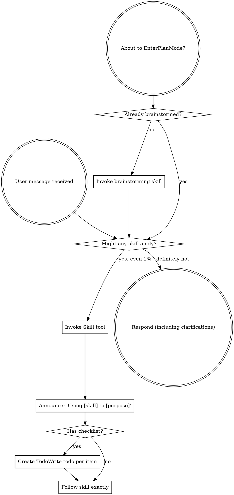

# Review — 2026-05-13-external-reviewer-redesign.md (post-slice, round 1)

- Target: `docs/superstar/plans/2026-05-13-external-reviewer-redesign.md`
- Request: `docs/reviewer/external-reviewer-redesign-post-slice/r1-2026-05-14T0124-request.md`
- Reviewer command: `reviewer-agent`
- Status: `ok`

---

1. Findings

F1. Blocking: the live `external-review` skill entrypoint is broken in the current workspace. [skills/external-review/SKILL.md](/home/simon/Dev/sigreer/skills/superstar/skills/external-review/SKILL.md:8) says the bridge is `scripts/external-reviewer.py`, and the usage block invokes `python3 scripts/external-reviewer.py` at [line 43](/home/simon/Dev/sigreer/skills/superstar/skills/external-review/SKILL.md:43). `git status --short` shows `D scripts/external-reviewer.py`. Even though Slice 1 updated `skills/external-review/scripts/external-reviewer.py`, the documented skill path currently fails unless the deletion is reverted or the skill/docs/project-setup path migration is completed in the same slice.

F2. Blocking: the post-slice gate is not clean. The plan’s pre-flight requires a clean tree and a non-`main` feature branch at [docs/superstar/plans/2026-05-13-external-reviewer-redesign.md](/home/simon/Dev/sigreer/skills/superstar/docs/superstar/plans/2026-05-13-external-reviewer-redesign.md:25), but the repo is on `main` with modified skill files, a deleted tracked script, untracked docs/reviewer artifacts, and untracked `__pycache__` files. This is not acceptable for a slice-completion gate because it is impossible to distinguish intentional Slice 1 output from unrelated drift.

F3. Important: `head_sha_at_request` is captured after the reviewer has run, not at request creation time. The manifest fields are written from a single `head_sha = current_head_sha(root)` call after `write_review_artifact()` at [skills/external-review/scripts/external-reviewer.py](/home/simon/Dev/sigreer/skills/superstar/skills/external-review/scripts/external-reviewer.py:428), then copied into both `head_sha_at_request` and `head_sha_after_round` at [lines 434-435](/home/simon/Dev/sigreer/skills/superstar/skills/external-review/scripts/external-reviewer.py:434). That weakens the manifest as an audit source if the reviewer command or wrapper mutates the repo during execution.

2. Open questions / assumptions

I’m assuming Slice 1 is the only implemented scope under review, so missing `--work-id`, incremental prompts, resolution gates, and sweeps are not findings yet. I’m also assuming the uncommitted edits to `CLAUDE.md` and several workflow skills are outside Slice 1 unless the coordinator explicitly says otherwise.

3. Suggested document edits

Add a Slice 1 closeout note listing the exact commits included, the final test command/result, and whether `scripts/external-reviewer.py` is intentionally staying as a root-level bridge or being replaced by `skills/external-review/scripts/external-reviewer.py`. Right now the plan and skill docs disagree with the workspace state.

4. Verification gaps / commands

Already run:

```bash
python3 -m pytest skills/external-review/tests/ -v
```

Result: 18 passed, 1 deprecation warning.

Still required before accepting the slice:

```bash
git status --short --untracked-files=all
python3 scripts/external-reviewer.py --help
python3 skills/external-review/scripts/external-reviewer.py --help
```

5. Overall verdict: revise

---

## Reviewer stderr

```text
Reading additional input from stdin...
OpenAI Codex v0.130.0
--------
workdir: /home/simon/Dev/sigreer/skills/superstar
model: gpt-5.5
provider: openai
approval: never
sandbox: danger-full-access
reasoning effort: none
reasoning summaries: none
session id: 019e23de-8289-7650-a54a-b8e54b9ea073
--------
user
You are acting as an independent senior engineering reviewer.

Review stance:
- Lead with findings, ordered by severity.
- Focus on correctness, consistency, implementation risk, missing acceptance
  gates, vague handoffs, ungrounded assumptions, unverified claims, and drift
  from the codebase.
- Give exact file/line references when possible.
- If the document is sound, say that clearly and list residual risks.
- Keep the review actionable. Avoid broad rewrites unless the current structure
  creates concrete risk.

Repository root:
/home/simon/Dev/sigreer/skills/superstar

Target kind:
post-slice

Review mode:
Post-slice review. Treat this as a completion gate for one
slice of work. Compare the completed changes and stated evidence against the
slice acceptance criteria. Prioritize: incomplete tasks, uncommitted or
untracked artifacts, missing tests, failing or skipped verification, broken
cross-site behavior, and claims not supported by the repo state.

Target document:
docs/superstar/plans/2026-05-13-external-reviewer-redesign.md

Additional context files:
- docs/superstar/specs/2026-05-13-external-reviewer-redesign-design.md
- docs/handoffs/2026-05-13-external-reviewer-redesign-prompt.md

Review output contract:
1. Findings
2. Open questions / assumptions
3. Suggested document edits
4. Verification gaps / commands that should be run, if any
5. Overall verdict: one of "ready", "ready with small edits", or "revise"

Read the files from disk. Do not rely only on the snippets in this prompt.


## Target Preview

### docs/superstar/plans/2026-05-13-external-reviewer-redesign.md

    1	# External-Reviewer Redesign Implementation Plan
    2	
    3	> **For agentic workers:** REQUIRED SUB-SKILL: Use superstar:subagent-driven-development (recommended) or superstar:executing-plans to implement this plan task-by-task. Steps use checkbox (`- [ ]`) syntax for tracking.
    4	
    5	**Goal:** Rebuild `skills/external-review/scripts/external-reviewer.py` so review chains are incremental, durable, machine-readable, and support optional independent sweep reviewers — per `docs/superstar/specs/2026-05-13-external-reviewer-redesign-design.md`.
    6	
    7	**Architecture:** A persistent `chain.json` manifest per review chain becomes the source of truth for round metadata. The script gains verdict parsing, work-ID-keyed chain folders, a resolution-artifact contract and gate, incremental round prompts with embedded diffs, optional session-resume placeholders, and Pass-3 independent sweep reviewers. Skill documentation is updated to match.
    8	
    9	**Tech Stack:** Python 3.9+ standard library only (no external deps), `pytest` for tests, `git` CLI for diff and SHA capture.
   10	
   11	---
   12	
   13	## Pre-flight
   14	
   15	- [ ] **Step 1: Verify working directory and branch**
   16	
   17	Run:
   18	
   19	```bash
   20	cd /home/simon/Dev/sigreer/skills/superstar
   21	git status --short
   22	git rev-parse --abbrev-ref HEAD
   23	```
   24	
   25	Expected: clean tree, branch is a feature branch (not `main`). If on `main`, stop and create a branch via `superstar:using-git-worktrees`.
   26	
   27	- [ ] **Step 2: Confirm test runner**
   28	
   29	Run:
   30	
   31	```bash
   32	python3 -c "import pytest; print(pytest.__version__)"
   33	```
   34	
   35	Expected: prints a version string. If `ModuleNotFoundError`, install pytest:
   36	
   37	```bash
   38	python3 -m pip install --user pytest
   39	```
   40	
   41	- [ ] **Step 3: Set up the test directory**
   42	
   43	Create the directory tests will live in:
   44	
   45	```bash
   46	mkdir -p skills/external-review/tests
   47	touch skills/external-review/tests/__init__.py
   48	```
   49	
   50	Commit:
   51	
   52	```bash
   53	git add skills/external-review/tests/__init__.py
   54	git commit -m "scaffold: tests dir for external-reviewer redesign"
   55	```
   56	
   57	---
   58	
   59	## Slice 1: Chain manifest & verdict parsing
   60	
   61	**Goal:** Introduce `chain.json` as the round-metadata source of truth, parse verdicts and finding counts from response text, and emit them in the JSON output. Backwards-compatible: legacy chains synthesize a manifest on first touch.
   62	
   63	### Task 1.1: Manifest read/write helpers
   64	
   65	**Files:**
   66	- Create: `skills/external-review/tests/test_manifest.py`
   67	- Modify: `skills/external-review/scripts/external-reviewer.py`
   68	
   69	- [ ] **Step 1: Write the failing tests**
   70	
   71	`skills/external-review/tests/test_manifest.py`:
   72	
   73	```python
   74	import json
   75	from pathlib import Path
   76	
   77	import pytest
   78	
   79	import sys
   80	SCRIPTS = Path(__file__).resolve().parents[1] / "scripts"
   81	sys.path.insert(0, str(SCRIPTS))
   82	
   83	import importlib.util
   84	spec = importlib.util.spec_from_file_location("external_reviewer", SCRIPTS / "external-reviewer.py")
   85	external_reviewer = importlib.util.module_from_spec(spec)
   86	spec.loader.exec_module(external_reviewer)
   87	
   88	
   89	def test_read_manifest_returns_none_for_missing(tmp_path):
   90	    assert external_reviewer.read_manifest(tmp_path / "missing.json") is None
   91	
   92	
   93	def test_write_then_read_manifest_roundtrips(tmp_path):
   94	    path = tmp_path / "chain.json"
   95	    data = {
   96	        "schema_version": 1,
   97	        "chain": "demo-post-slice",
   98	        "kind": "post-slice",
   99	        "target": "docs/plans/demo.md",
  100	        "work_id": "P1.S1",
  101	        "legacy_migrated": False,
  102	        "rounds": [],
  103	        "sweep_checkpoints": {"first-round": "pending", "final-ready": "pending"},
  104	    }
  105	    external_reviewer.write_manifest(path, data)
  106	    loaded = external_reviewer.read_manifest(path)
  107	    assert loaded == data
  108	
  109	
  110	def test_read_manifest_rejects_newer_schema(tmp_path):
  111	    path = tmp_path / "chain.json"
  112	    path.write_text(json.dumps({"schema_version": 99}))
  113	    with pytest.raises(external_reviewer.ManifestSchemaTooNew):
  114	        external_reviewer.read_manifest(path)
  115	```
  116	
  117	- [ ] **Step 2: Run the tests; confirm they fail**
  118	
  119	```bash
  120	python3 -m pytest skills/external-review/tests/test_manifest.py -v
  121	```
  122	
  123	Expected: 3 failures (`read_manifest`, `write_manifest`, `ManifestSchemaTooNew` all undefined).
  124	
  125	- [ ] **Step 3: Add manifest helpers to the script**
  126	
  127	Append to `skills/external-review/scripts/external-reviewer.py` (after the existing module-level constants, before `repo_root()`):
  128	
  129	```python
  130	SUPPORTED_SCHEMA_VERSION = 1
  131	
  132	
  133	class ManifestSchemaTooNew(Exception):
  134	    """Raised when chain.json declares a schema_version newer than this script supports."""
  135	
  136	
  137	def read_manifest(path: Path) -> dict | None:
  138	    if not path.exists():
  139	        return None
  140	    data = json.loads(path.read_text(encoding="utf-8"))
  141	    version = data.get("schema_version")
  142	    if isinstance(version, int) and version > SUPPORTED_SCHEMA_VERSION:
  143	        raise ManifestSchemaTooNew(
  144	            f"chain.json schema_version {version} is newer than this script supports "
  145	            f"(max {SUPPORTED_SCHEMA_VERSION}). Upgrade external-reviewer.py."
  146	        )
  147	    return data
  148	
  149	
  150	def write_manifest(path: Path, data: dict) -> None:
  151	    path.parent.mkdir(parents=True, exist_ok=True)
  152	    path.write_text(json.dumps(data, indent=2) + "\n", encoding="utf-8")
  153	```
  154	
  155	- [ ] **Step 4: Run the tests; confirm they pass**
  156	
  157	```bash
  158	python3 -m pytest skills/external-review/tests/test_manifest.py -v
  159	```
  160	
  161	Expected: 3 passed.
  162	
  163	- [ ] **Step 5: Commit**
  164	
  165	```bash
  166	git add skills/external-review/scripts/external-reviewer.py skills/external-review/tests/test_manifest.py
  167	git commit -m "feat(external-reviewer): chain.json read/write helpers with schema versioning"
  168	```
  169	
  170	### Task 1.2: Verdict parsing
  171	
  172	**Files:**
  173	- Create: `skills/external-review/tests/test_verdict.py`
  174	- Modify: `skills/external-review/scripts/external-reviewer.py`
  175	
  176	- [ ] **Step 1: Write the failing tests**
  177	
  178	`skills/external-review/tests/test_verdict.py`:
  179	
  180	```python
  181	from pathlib import Path
  182	import sys, importlib.util
  183	
  184	SCRIPTS = Path(__file__).resolve().parents[1] / "scripts"
  185	sys.path.insert(0, str(SCRIPTS))
  186	spec = importlib.util.spec_from_file_location("external_reviewer", SCRIPTS / "external-reviewer.py")
  187	er = importlib.util.module_from_spec(spec); spec.loader.exec_module(er)
  188	
  189	
  190	def test_verdict_ready():
  191	    v, valid = er.parse_verdict("Findings: ok\n\nOverall verdict: ready\n")
  192	    assert v == "ready"
  193	    assert valid is True
  194	
  195	
  196	def test_verdict_ready_with_small_edits_markdown():
  197	    body = "**Overall verdict:** `ready with small edits`."
  198	    v, valid = er.parse_verdict(body)
  199	    assert v == "ready with small edits"
  200	    assert valid is True
  201	
  202	
  203	def test_verdict_revise_case_insensitive():
  204	    v, valid = er.parse_verdict("OVERALL VERDICT: Revise")
  205	    assert v == "revise"
  206	    assert valid is True
  207	
  208	
  209	def test_verdict_takes_last_match():
  210	    body = "Overall verdict: ready\n\n...later...\n\nOverall verdict: revise"
  211	    v, valid = er.parse_verdict(body)
  212	    assert v == "revise"
  213	
  214	
  215	def test_verdict_unknown_returns_invalid():
  216	    v, valid = er.parse_verdict("Overall verdict: looks fine to me")
  217	    assert v is None
  218	    assert valid is False
  219	
  220	
  221	def test_verdict_missing_returns_invalid():
  222	    v, valid = er.parse_verdict("Some review prose with no verdict line.")
  223	    assert v is None
  224	    assert valid is False
  225	```
  226	
  227	- [ ] **Step 2: Run the tests; confirm they fail**
  228	
  229	```bash
  230	python3 -m pytest skills/external-review/tests/test_verdict.py -v
  231	```
  232	
  233	Expected: 6 failures (`parse_verdict` undefined).
  234	
  235	- [ ] **Step 3: Add the verdict parser**
  236	
  237	Append to `skills/external-review/scripts/external-reviewer.py`:
  238	
  239	```python
  240	VERDICT_VALUES = ("ready with small edits", "ready", "revise")
  241	VERDICT_LINE_RE = re.compile(
  242	    r"overall\s+verdict\s*[:\-]\s*[`*_\"']*\s*(ready with small edits|ready|revise)\s*[`*_\"'.]*",
  243	    re.IGNORECASE,
  244	)
  245	
  246	
  247	def parse_verdict(text: str) -> tuple[str | None, bool]:
  248	    matches = list(VERDICT_LINE_RE.finditer(text))
  249	    if not matches:
  250	        return None, False
  251	    raw = matches[-1].group(1).strip().lower()
  252	    if raw not in VERDICT_VALUES:
  253	        return None, False
  254	    return raw, True
  255	```
  256	
  257	Note: regex prefers `ready with small edits` over `ready` because of ordering in the alternation.
  258	
  259	- [ ] **Step 4: Run the tests; confirm they pass**
  260	
  261	```bash
  262	python3 -m pytest skills/external-review/tests/test_verdict.py -v
  263	```
  264	
  265	Expected: 6 passed.
  266	
  267	- [ ] **Step 5: Commit**
  268	
  269	```bash
  270	git add skills/external-review/scripts/external-reviewer.py skills/external-review/tests/test_verdict.py
  271	git commit -m "feat(external-reviewer): parse_verdict with markdown/case tolerance"
  272	```
  273	
  274	### Task 1.3: Finding-count parsing
  275	
  276	**Files:**
  277	- Create: `skills/external-review/tests/test_findings.py`
  278	- Modify: `skills/external-review/scripts/external-reviewer.py`
  279	
  280	- [ ] **Step 1: Write the failing tests**
  281	
  282	`skills/external-review/tests/test_findings.py`:
  283	
  284	```python
  285	from pathlib import Path
  286	import sys, importlib.util
  287	SCRIPTS = Path(__file__).resolve().parents[1] / "scripts"
  288	sys.path.insert(0, str(SCRIPTS))
  289	spec = importlib.util.spec_from_file_location("external_reviewer", SCRIPTS / "external-reviewer.py")
  290	er = importlib.util.module_from_spec(spec); spec.loader.exec_module(er)
  291	
  292	
  293	def test_heading_findings_counted():
  294	    body = "## F1\nSeverity: blocking\n\n## F2\nSeverity: minor\n\n## F3\nSeverity: blocking"
  295	    n, blocking = er.parse_findings(body)
  296	    assert n == 3
  297	    assert blocking == 2
  298	
  299	
  300	def test_bullet_findings_counted():
  301	    body = "- F1: something blocking (blocking)\n- F2 minor thing"
  302	    n, blocking = er.parse_findings(body)
  303	    assert n == 2
  304	    assert blocking == 1
  305	
  306	
  307	def test_no_findings_returns_zero():
  308	    body = "Overall verdict: ready\n\nNo findings."
  309	    n, blocking = er.parse_findings(body)
  310	    assert n == 0
  311	    assert blocking == 0
  312	
  313	
  314	def test_unparseable_returns_none():
  315	    body = "Reviewer crashed: connection reset"
  316	    n, blocking = er.parse_findings(body)
  317	    assert n is None
  318	    assert blocking is None
  319	```
  320	
  321	- [ ] **Step 2: Run the tests; confirm they fail**
  322	
  323	```bash
  324	python3 -m pytest skills/external-review/tests/test_findings.py -v
  325	```
  326	
  327	Expected: 4 failures.
  328	
  329	- [ ] **Step 3: Add the parser**
  330	
  331	Append to `skills/external-review/scripts/external-reviewer.py`:
  332	
  333	```python
  334	HEADING_FINDING_RE = re.compile(r"^##\s+F\d+\b", re.MULTILINE)
  335	BULLET_FINDING_RE = re.compile(r"^\s*[-*]?\s*\**F\d+\**[:\s\-]", re.MULTILINE)
  336	BLOCKING_MARKER_RE = re.compile(r"(?:^|\s)\(blocking\)|^severity\s*:\s*blocking", re.IGNORECASE | re.MULTILINE)
  337	
  338	
  339	def parse_findings(text: str) -> tuple[int | None, int | None]:
  340	    if not text or text.strip() == "" or "reviewer crashed" in text.lower():
  341	        return None, None
  342	    heading_count = len(HEADING_FINDING_RE.findall(text))
  343	    if heading_count > 0:
  344	        n = heading_count
  345	    else:
  346	        n = len(BULLET_FINDING_RE.findall(text))
  347	    blocking = len(BLOCKING_MARKER_RE.findall(text))
  348	    return n, blocking
  349	```
  350	
  351	- [ ] **Step 4: Run the tests; confirm they pass**
  352	
  353	```bash
  354	python3 -m pytest skills/external-review/tests/test_findings.py -v
  355	```
  356	
  357	Expected: 4 passed.
  358	
  359	- [ ] **Step 5: Commit**
  360	
  361	```bash
  362	git add skills/external-review/scripts/external-reviewer.py skills/external-review/tests/test_findings.py
  363	git commit -m "feat(external-reviewer): parse_findings (heading + bullet, blocking count)"
  364	```
  365	
  366	### Task 1.4: Round-number derivation reads manifest first
  367	
  368	**Files:**
  369	- Create: `skills/external-review/tests/test_round_number.py`
  370	- Modify: `skills/external-review/scripts/external-reviewer.py` (`next_round_number`)
  371	
  372	- [ ] **Step 1: Write the failing tests**
  373	
  374	`skills/external-review/tests/test_round_number.py`:
  375	
  376	```python
  377	from pathlib import Path
  378	import json, sys, importlib.util
  379	SCRIPTS = Path(__file__).resolve().parents[1] / "scripts"
  380	sys.path.insert(0, str(SCRIPTS))
  381	spec = importlib.util.spec_from_file_location("external_reviewer", SCRIPTS / "external-reviewer.py")
  382	er = importlib.util.module_from_spec(spec); spec.loader.exec_module(er)
  383	
  384	
  385	def test_no_chain_dir_round_is_one(tmp_path):
  386	    assert er.next_round_number(tmp_path / "absent") == 1
  387	
  388	
  389	def test_manifest_present_takes_precedence(tmp_path):
  390	    d = tmp_path / "chain"; d.mkdir()
  391	    er.write_manifest(d / "chain.json", {
  392	        "schema_version": 1, "rounds": [{"round": 1}, {"round": 2}]
  393	    })
  394	    assert er.next_round_number(d) == 3
  395	
  396	
  397	def test_legacy_dir_no_manifest_falls_back_to_filename_scan(tmp_path):
  398	    d = tmp_path / "chain"; d.mkdir()
  399	    (d / "r1-2026-05-01T0900-request.md").write_text("")
  400	    (d / "r2-2026-05-02T0900-request.md").write_text("")
  401	    assert er.next_round_number(d) == 3
  402	```
  403	
  404	- [ ] **Step 2: Run the tests; confirm they fail**
  405	
  406	```bash
  407	python3 -m pytest skills/external-review/tests/test_round_number.py -v
  408	```
  409	
  410	Expected: test 2 fails (no manifest awareness), tests 1 and 3 may pass if current behavior already handles them.
  411	
  412	- [ ] **Step 3: Update `next_round_number`**
  413	
  414	Replace the existing function:
  415	
  416	```python
  417	def next_round_number(chain_dir: Path) -> int:
  418	    if not chain_dir.exists():
  419	        return 1
  420	    manifest = read_manifest(chain_dir / "chain.json")
  421	    if manifest and isinstance(manifest.get("rounds"), list):
  422	        return len(manifest["rounds"]) + 1
  423	    return len(list(chain_dir.glob("r*-*-request.md"))) + 1
  424	```
  425	
  426	- [ ] **Step 4: Run the tests**
  427	
  428	```bash
  429	python3 -m pytest skills/external-review/tests/test_round_number.py -v
  430	```
  431	
  432	Expected: 3 passed.
  433	
  434	- [ ] **Step 5: Commit**
  435	
  436	```bash
  437	git add skills/external-review/scripts/external-reviewer.py skills/external-review/tests/test_round_number.py
  438	git commit -m "feat(external-reviewer): next_round_number consults chain.json"
  439	```
  440	
  441	### Task 1.5: Legacy manifest synthesis
  442	
  443	**Files:**
  444	- Create: `skills/external-review/tests/test_legacy_migration.py`
  445	- Modify: `skills/external-review/scripts/external-reviewer.py`
  446	
  447	- [ ] **Step 1: Write the failing tests**
  448	
  449	`skills/external-review/tests/test_legacy_migration.py`:
  450	
  451	```python
  452	from pathlib import Path
  453	import sys, importlib.util
  454	SCRIPTS = Path(__file__).resolve().parents[1] / "scripts"
  455	sys.path.insert(0, str(SCRIPTS))
  456	spec = importlib.util.spec_from_file_location("external_reviewer", SCRIPTS / "external-reviewer.py")
  457	er = importlib.util.module_from_spec(spec); spec.loader.exec_module(er)
  458	
  459	
  460	def test_synthesize_manifest_from_legacy_files(tmp_path):
  461	    d = tmp_path / "old-chain"; d.mkdir()
  462	    (d / "r1-2026-04-01T0900-request.md").write_text("prompt body")
  463	    (d / "r1-2026-04-01T0905-response.md").write_text(
  464	        "## F1\nSeverity: blocking\n\nOverall verdict: revise\n"
  465	    )
  466	    (d / "r2-2026-04-02T1200-request.md").write_text("prompt body 2")
  467	
  468	    manifest = er.synthesize_legacy_manifest(
  469	        chain_dir=d, chain="old-chain", kind="post-slice",
  470	        target="docs/plans/old.md", work_id="P1.S1",
  471	    )
  472	
  473	    assert manifest["legacy_migrated"] is True
  474	    assert manifest["work_id"] == "P1.S1"
  475	    assert len(manifest["rounds"]) == 2
  476	    r1, r2 = manifest["rounds"]
  477	    assert r1["legacy"] is True
  478	    assert r1["verdict"] == "revise"
  479	    assert r1["verdict_valid"] is True
  480	    assert r1["findings_count"] == 1
  481	    assert r1["blocking_findings_count"] == 1
  482	    assert r1["head_sha_after_round"] is None
  483	    assert r2["response"] is None  # only request file existed
  484	```
  485	
  486	- [ ] **Step 2: Run the tests; confirm they fail**
  487	
  488	```bash
  489	python3 -m pytest skills/external-review/tests/test_legacy_migration.py -v
  490	```
  491	
  492	Expected: 1 failure.
  493	
  494	- [ ] **Step 3: Add the synthesizer**
  495	
  496	Append to `skills/external-review/scripts/external-reviewer.py`:
  497	
  498	```python
  499	LEGACY_ROUND_FILE_RE = re.compile(r"^r(\d+)-([0-9T\-]+)-(request|response)\.md$")
  500	
  501	
  502	def synthesize_legacy_manifest(
  503	    *, chain_dir: Path, chain: str, kind: str, target: str, work_id: str | None
  504	) -> dict:
  505	    rounds_map: dict[int, dict] = {}
  506	    for path in sorted(chain_dir.iterdir()):
  507	        m = LEGACY_ROUND_FILE_RE.match(path.name)
  508	        if not m:
  509	            continue
  510	        round_num = int(m.group(1))
  511	        role = m.group(3)
  512	        entry = rounds_map.setdefault(
  513	            round_num,
  514	            {
  515	                "round": round_num,
  516	                "request": None,
  517	                "response": None,
  518	                "resolution": None,
  519	                "verdict": None,
  520	                "verdict_valid": False,
  521	                "findings_count": None,
  522	                "blocking_findings_count": None,
  523	                "head_sha_at_request": None,
  524	                "head_sha_after_round": None,
  525	                "worktree_dirty_at_request": None,
  526	                "legacy": True,
  527	            },
  528	        )
  529	        entry[role] = path.name
  530	        if role == "response":
  531	            body = path.read_text(encoding="utf-8", errors="replace")
  532	            v, valid = parse_verdict(body)
  533	            entry["verdict"], entry["verdict_valid"] = v, valid
  534	            n, blocking = parse_findings(body)
  535	            entry["findings_count"], entry["blocking_findings_count"] = n, blocking
  536	
  537	    return {
  538	        "schema_version": SUPPORTED_SCHEMA_VERSION,
  539	        "chain": chain,
  540	        "kind": kind,
  541	        "target": target,
  542	        "work_id": work_id,
  543	        "legacy_migrated": True,
  544	        "migrated_at": dt.datetime.utcnow().strftime("%Y-%m-%dT%H:%M:%SZ"),
  545	        "rounds": [rounds_map[k] for k in sorted(rounds_map)],
  546	        "sweep_checkpoints": {"first-round": "pending", "final-ready": "pending"},
  547	    }
  548	```
  549	
  550	- [ ] **Step 4: Run the tests; confirm they pass**
  551	
  552	```bash
  553	python3 -m pytest skills/external-review/tests/test_legacy_migration.py -v
  554	```
  555	
  556	Expected: 1 passed.
  557	
  558	- [ ] **Step 5: Commit**
  559	
  560	```bash
  561	git add skills/external-review/scripts/external-reviewer.py skills/external-review/tests/test_legacy_migration.py
  562	git commit -m "feat(external-reviewer): synthesize_legacy_manifest from rN-* files"
  563	```
  564	
  565	### Task 1.6: Wire manifest into `main()` for single-reviewer rounds
  566	
  567	**Files:**
  568	- Modify: `skills/external-review/scripts/external-reviewer.py` (`main` function)
  569	- Create: `skills/external-review/tests/test_main_round_writes_manifest.py`
  570	
  571	- [ ] **Step 1: Write the failing test**
  572	
  573	`skills/external-review/tests/test_main_round_writes_manifest.py`:
  574	
  575	```python
  576	from pathlib import Path
  577	import subprocess, sys, json, importlib.util, os
  578	
  579	SCRIPTS = Path(__file__).resolve().parents[1] / "scripts"
  580	sys.path.insert(0, str(SCRIPTS))
  581	spec = importlib.util.spec_from_file_location("external_reviewer", SCRIPTS / "external-reviewer.py")
  582	er = importlib.util.module_from_spec(spec); spec.loader.exec_module(er)
  583	
  584	
  585	FAKE_REVIEWER = """#!/usr/bin/env bash
  586	cat <<'EOF'
  587	## F1
  588	Severity: blocking
  589	Stub finding.
  590	
  591	Overall verdict: revise
  592	EOF
  593	"""
  594	
  595	
  596	def test_main_writes_manifest_entry(tmp_path, monkeypatch):
  597	    repo = tmp_path / "repo"; repo.mkdir()
  598	    subprocess.run(["git", "-C", str(repo), "init", "-q"], check=True)
  599	    subprocess.run(["git", "-C", str(repo), "config", "user.email", "t@t"], check=True)
  600	    subprocess.run(["git", "-C", str(repo), "config", "user.name", "T"], check=True)

[truncated: 2380 additional lines]

## Context Previews

### docs/superstar/specs/2026-05-13-external-reviewer-redesign-design.md

    1	# External-Review Script Redesign — Design
    2	
    3	**Date:** 2026-05-13
    4	**Target:** `skills/external-review/scripts/external-reviewer.py` and `skills/external-review/SKILL.md`
    5	**Motivation:** A self-review of the external-reviewer flow surfaced five concrete failure modes that cause review loops to balloon to 7–10 rounds and lose continuity between rounds. This spec redesigns the script and skill to make rounds incremental, durable, and machine-readable.
    6	
    7	---
    8	
    9	## Goals
   10	
   11	1. **Round N+1 is incremental, not a re-review.** The reviewer is given prior findings, the fixer's resolution report, and a focused diff — and is instructed to verify resolution rather than reopen broad review.
   12	2. **Verdict is machine-readable.** JSON output exposes a parsed `verdict`, `verdict_valid`, and finding counts, so coordinators don't have to parse prose.
   13	3. **Post-slice / post-phase chains are uniquely keyed.** `--work-id` is required for both so that multi-slice plans don't collapse into one chain.
   14	4. **Resolution artifacts are durable and structured-enough-to-parse.** Required headers, free-form bodies, stable finding IDs across rounds.
   15	5. **Optional session resume.** Provider-specific wrappers can plug into placeholders if the underlying reviewer CLI supports session IDs.
   16	6. **Legacy chains keep working.** Soft-migrate on first new round; preserve existing folder names and audit history.
   17	7. **Review depth is explicit.** The default chain uses one primary incremental reviewer, but callers can request bounded independent sweep reviewers at high-risk checkpoints to preserve fresh-eye coverage without unbounded serial churn.
   18	
   19	## Non-goals
   20	
   21	- Replacing the chain-folder layout for new chains. The folder-naming scheme gains a `--work-id` segment for post-slice/post-phase, but the round-file scheme is unchanged.
   22	- Making the script aware of any specific reviewer CLI. The script remains provider-neutral via `AGENT_REVIEWER_CMD`.
   23	- Auto-dispatching the fixer subagent. The script enforces the resolution gate but does not invoke fixers; that stays in the coordinator's loop, governed by `subagent-driven-development`.
   24	
   25	## Invariants
   26	
   27	- **A review chain is single-writer.** Running two rounds concurrently against the same chain is unsupported and may corrupt `chain.json`. The script does not lock; callers are expected to serialise.
   28	- **Existing rounds are immutable.** Once written, `rN-*-request.md`, `rN-*-response.md`, and `rN-resolution.md` are never overwritten. Manifest entries for past rounds are append-only.
   29	
   30	## Architecture
   31	
   32	Three implementation passes, all designed in this spec:
   33	
   34	- **Pass 1 — Core.** Chain manifest, verdict parsing, `--work-id`, prior-round context injection, incremental round prompts, resolution-artifact contract and gate, automatic diff embedding, JSON output enrichment, legacy migration.
   35	- **Pass 2 — Session resume.** Optional placeholders (`{chain_dir}`, `{round}`, `{previous_response}`, `{resolution_file}`, `{session_file}`) exposed via the existing `AGENT_REVIEWER_CMD` template mechanism. A provider-specific wrapper can use `{session_file}` to persist and resume reviewer sessions. The script provides a stable path (`chain_dir/session.state`) and ensures the parent directory exists; wrappers own the file's contents. The script never reads `session.state`.
   36	- **Pass 3 — Review depth / independent sweeps.** Adds `--review-depth`, `--independent-reviewers`, `--sweep-policy` flags. Independent sweep reviewers run without seeing the primary reviewer's findings on their first pass (to avoid anchoring), and their findings are merged into the same resolution checklist afterward. Depends on Pass 1's manifest and verdict parsing; does not depend on Pass 2.
   37	
   38	### Chain manifest
   39	
   40	`docs/reviewer/<chain>/chain.json` is the single source of truth for round metadata. The `rN-*-request.md` / `rN-*-response.md` / `rN-resolution.md` files remain for human readability and git history; the script reads and writes manifest entries when computing round numbers, base refs, and verdicts.
   41	
   42	```json
   43	{
   44	  "schema_version": 1,
   45	  "chain": "feature-plan-P2-S3-post-slice",
   46	  "kind": "post-slice",
   47	  "target": "docs/superstar/plans/feature-plan.md",
   48	  "work_id": "P2.S3",
   49	  "legacy_migrated": false,
   50	  "rounds": [
   51	    {
   52	      "round": 1,
   53	      "request": "r1-2026-05-13T1012-request.md",
   54	      "response": "r1-2026-05-13T1020-response.md",
   55	      "resolution": null,
   56	      "head_sha_at_request": "abc1234",
   57	      "head_sha_after_round": "abc1234",
   58	      "worktree_dirty_at_request": false,
   59	      "verdict": "revise",
   60	      "verdict_valid": true,
   61	      "findings_count": 4,
   62	      "blocking_findings_count": 2
   63	    },
   64	    {
   65	      "round": 2,
   66	      "request": "r2-2026-05-13T1130-request.md",
   67	      "response": null,
   68	      "resolution": "r1-resolution.md",
   69	      "base_ref": "abc1234",
   70	      "base_ref_source": "auto",
   71	      "head_sha_at_request": "def5678",
   72	      "worktree_dirty_at_request": false,
   73	      "diff_included": true,
   74	      "resolution_parse_status": "ok",
   75	      "resolution_waiver": false
   76	    }
   77	  ]
   78	}
   79	```
   80	
   81	#### Manifest versioning
   82	
   83	- `schema_version: 1` is the initial version introduced by this redesign.
   84	- Unknown future `schema_version` values cause the script to error with a clear message: `ERROR: chain.json schema_version <N> is newer than this script supports. Upgrade external-reviewer.py.` This prevents silent corruption.
   85	- Older `schema_version` values (currently none) get best-effort migration on read, recorded as `schema_migrated_from: <prior>` in the manifest.
   86	
   87	### Naming
   88	
   89	- **Chain folder slug:** `<target-stem-no-leading-date>-<work-id-dotless>-<kind>` for post-slice/post-phase; `<target-stem-no-leading-date>-<kind>` otherwise. Dots in work IDs are replaced with dashes in the folder slug only — the manifest preserves the canonical form.
   90	  - Example: `--work-id P2.S3` → folder `feature-plan-P2-S3-post-slice`, manifest `"work_id": "P2.S3"`.
   91	- **Round files:** `r{N}-<YYYY-MM-DDTHHMM>-request.md`, `r{N}-<YYYY-MM-DDTHHMM>-response.md`. Unchanged from current behavior.
   92	- **Resolution files:** `r{N}-resolution.md`, where `N` is the round whose response is being addressed. Round `N+1` consumes `r{N}-resolution.md`. Worked example: after `r1-response.md` returns `revise`, the fixer writes `r1-resolution.md`; round 2 reads `r1-resolution.md` and embeds it in the round-2 prompt.
   93	
   94	## CLI surface (new flags)
   95	
   96	| Flag | Kinds | Purpose |
   97	|---|---|---|
   98	| `--work-id <id>` | required for `post-slice`, `post-phase`; optional otherwise | Stable slice/phase ID (e.g., `P2.S3` for post-slice, `P2` for post-phase). Becomes part of chain folder name (dots → dashes) and is stored verbatim in the manifest. |
   99	| `--base-ref <sha\|ref>` | any | Override auto-computed diff base for this round. |
  100	| `--no-diff` | any | Suppress diff embedding even on round N+1. |
  101	| `--allow-missing-resolution` | post-slice, post-phase | Waive the resolution-required gate. Logged in manifest as `resolution_waiver: true`. |
  102	| `--changed-files <path>...` | any | Override automatic changed-file discovery and limit the embedded diff to the supplied paths. |
  103	| `--mode <auto\|broad\|incremental>` | any | Override the round-1-vs-N prompt mode. Default `auto` (round 1 → broad; round 2+ → incremental). |
  104	| `--max-diff-lines <int>` | any | Cap diff size. Default 2000. Truncation marker is embedded if exceeded. |
  105	| `--review-depth <standard\|thorough\|exhaustive>` | post-slice, post-phase | Controls whether independent sweep reviewers are run in addition to the primary chain reviewer. Default `standard`. |
  106	| `--independent-reviewers <int>` | post-slice, post-phase | Override reviewer count for independent sweeps. Default derived from `--review-depth`. |
  107	| `--sweep-policy <first-round\|final-ready\|both\|never>` | post-slice, post-phase | When to run fresh-context sweep reviews. Default derived from `--review-depth`. |
  108	
  109	### `--work-id` enforcement
  110	
  111	- `post-slice` or `post-phase` invoked without `--work-id` → exit 2 with operational error.
  112	- For `post-phase`, the expected form is the phase ID alone (`P2`), not a slice ID. The script does not enforce a regex; it documents the convention.
  113	- For other kinds, `--work-id` is optional; if provided, it is recorded in the manifest but does not affect the folder slug.
  114	
  115	## Reviewer prompt — round 1 vs round N+
  116	
  117	### Round 1: broad
  118	
  119	The existing broad prompt, with the output contract revised to require **stable finding IDs**:
  120	
  121	```
  122	1. Findings
  123	   - Each finding tagged `F<n>` (e.g., F1, F2, F3). IDs must be stable across rounds.
  124	   - Severity: blocking | important | minor | nit
  125	2. Open questions / assumptions
  126	3. Suggested document edits
  127	4. Verification gaps
  128	5. Overall verdict: ready | ready with small edits | revise
  129	```
  130	
  131	### Round N+: incremental
  132	
  133	Prepended to the existing prompt body:
  134	
  135	```
  136	You are continuing an existing review chain. This is round {N} of {chain_id}.
  137	
  138	In incremental mode:
  139	- Verify whether prior findings are resolved per the resolution report below.
  140	- Reuse the existing finding IDs (F1, F2, …). If a prior finding is resolved,
  141	  mark it RESOLVED in your findings list with its original ID. If still
  142	  unresolved, keep its ID.
  143	- Only introduce new finding IDs for genuine regressions caused by the fix, or
  144	  blocking issues clearly missed in earlier rounds. Do not reopen broad review
  145	  unless prior fixes changed broad architecture.
  146	
  147	Review chain summary:
  148	{per-round table: round, verdict, findings_count, blocking_findings_count}
  149	
  150	Prior-round findings (authoritative):
  151	{if r{N-1}-merged-findings.md exists: its verbatim contents — this replaces
  152	 individual reviewer response files as the prior-finding list of record}
  153	{else: a summary of the prior round's primary response, with finding IDs intact}
  154	
  155	Resolution report for prior round:
  156	{verbatim contents of r{N-1}-resolution.md}
  157	{or "MISSING — explicitly waived by caller via --allow-missing-resolution"}
  158	{or "MISSING — chain migrated from legacy artifacts; please verify whether changes occurred from the diff below"}
  159	
  160	Resolution parse summary (best-effort):
  161	{structured: per-finding-ID → status, or "unparseable"}
  162	
  163	Changes since prior round:
  164	{git diff <base_ref>..HEAD -- <scoped paths>}
  165	{if dirty: appended `git diff HEAD` section, both labeled}
  166	{if no base: "not available for this round (legacy chain / first round / --no-diff)"}
  167	```
  168	
  169	`--mode broad` forces round-1-style on later rounds (rare; for cases where the fix changed architecture). `--mode incremental` on round 1 is rejected with a clear error.
  170	
  171	## Resolution artifact contract
  172	
  173	**Path:** `docs/reviewer/<chain>/r{N}-resolution.md`, where `N` is the round whose response is being addressed. Authored by the fix subagent between round N (response) and round N+1 (resubmit).
  174	
  175	**Required parseable shape:**
  176	
  177	```markdown
  178	# Resolution for r{N}
  179	
  180	## F1
  181	Status: fixed
  182	Evidence:
  183	- Commit: abc1234
  184	- Files: `src/foo.ts:42`, `tests/foo.test.ts:18`
  185	- Verification: `npm test -- foo.test.ts` passed
  186	
  187	Notes:
  188	Changed the validation path to reject empty IDs before persistence.
  189	
  190	## F2
  191	Status: waived
  192	Evidence:
  193	- No code change
  194	- Reason: reviewer assumed X, but the plan explicitly excludes X in
  195	  `docs/superstar/specs/foo-design.md:77`
  196	
  197	Notes:
  198	No implementation change because this would expand slice scope.
  199	```
  200	

[truncated: 289 additional lines]
### docs/handoffs/2026-05-13-external-reviewer-redesign-prompt.md

    1	# Coordinator handoff — External-Reviewer Redesign
    2	
    3	You are the coordinator for implementing the **external-reviewer redesign** in the `superstar` repo at `/home/simon/Dev/sigreer/skills/superstar`.
    4	
    5	Your role is **strictly orchestration**. Use the `superstar:subagent-driven-development` skill with parallel agents where possible.
    6	
    7	## Inputs
    8	
    9	- Spec: [`docs/superstar/specs/2026-05-13-external-reviewer-redesign-design.md`](docs/superstar/specs/2026-05-13-external-reviewer-redesign-design.md)
   10	- Plan: [`docs/superstar/plans/2026-05-13-external-reviewer-redesign.md`](docs/superstar/plans/2026-05-13-external-reviewer-redesign.md)
   11	- Reviewer chain folder (created on first review): `docs/reviewer/external-reviewer-redesign-plan/` (kind `plan`) and per-slice chains like `docs/reviewer/external-reviewer-redesign-S1-post-slice/` (no TASKLIST.md in this repo; treat `S1`…`S8` from the plan as the work-id segments).
   12	
   13	## Coordinator discipline (non-negotiable)
   14	
   15	- **Do not perform any fixes yourself** unless the fix is genuinely cheaper to implement than the process of delegating to a subagent. Tiebreak: delegate.
   16	- **Do not pollute your context.** Delegate investigations, file reads, and edits to subagents. Your context is for orchestration, not implementation detail.
   17	- **At the end of each slice (S1–S8)**, the human partner runs `external-review` manually with `--kind post-slice` and pastes the findings back. Do NOT invoke the external-review skill yourself in this project — the human partner has explicitly chosen to drive it manually to keep the context clean. Wait for the verdict before proceeding to the next slice.
   18	- **Do not perform reviewer-driven fixes yourself.** Pass each reviewer response to a fix subagent that writes `r{N}-resolution.md` per the contract in `[[external-review]]`, then signal the human partner that the resolution is ready and the next round can be submitted.
   19	- **At the end of the phase** (after S8 closes), the human partner runs `--kind post-phase` manually. Same delegation rule.
   20	- **No TASKLIST.md exists** in this repo. Track slice completion in this handoff document or in a TODO list you maintain in-session; do not invent a TASKLIST.md file.
   21	
   22	## First action
   23	
   24	Read this file (the handoff prompt), the spec, and the plan. Then invoke `superstar:subagent-driven-development` and begin Slice 1 (Chain manifest & verdict parsing).

codex
I’ll use the required Superpowers bootstrap, then read the target docs and current repo state so the review is grounded in the actual slice artifacts, not the preview.
exec
/usr/bin/zsh -lc "sed -n '1,220p' /home/simon/.codex/plugins/cache/openai-curated/superpowers/1b89ff49/skills/using-superpowers/SKILL.md && sed -n '1,220p' /home/simon/.codex/plugins/cache/openai-curated/superpowers/1b89ff49/skills/requesting-code-review/SKILL.md" in /home/simon/Dev/sigreer/skills/superstar
 succeeded in 0ms:
---
name: using-superpowers
description: Use when starting any conversation - establishes how to find and use skills, requiring Skill tool invocation before ANY response including clarifying questions
---

<SUBAGENT-STOP>
If you were dispatched as a subagent to execute a specific task, skip this skill.
</SUBAGENT-STOP>

<EXTREMELY-IMPORTANT>
If you think there is even a 1% chance a skill might apply to what you are doing, you ABSOLUTELY MUST invoke the skill.

IF A SKILL APPLIES TO YOUR TASK, YOU DO NOT HAVE A CHOICE. YOU MUST USE IT.

This is not negotiable. This is not optional. You cannot rationalize your way out of this.
</EXTREMELY-IMPORTANT>

## Instruction Priority

Superpowers skills override default system prompt behavior, but **user instructions always take precedence**:

1. **User's explicit instructions** (CLAUDE.md, GEMINI.md, AGENTS.md, direct requests) — highest priority
2. **Superpowers skills** — override default system behavior where they conflict
3. **Default system prompt** — lowest priority

If CLAUDE.md, GEMINI.md, or AGENTS.md says "don't use TDD" and a skill says "always use TDD," follow the user's instructions. The user is in control.

## How to Access Skills

**In Claude Code:** Use the `Skill` tool. When you invoke a skill, its content is loaded and presented to you—follow it directly. Never use the Read tool on skill files.

**In Copilot CLI:** Use the `skill` tool. Skills are auto-discovered from installed plugins. The `skill` tool works the same as Claude Code's `Skill` tool.

**In Gemini CLI:** Skills activate via the `activate_skill` tool. Gemini loads skill metadata at session start and activates the full content on demand.

**In other environments:** Check your platform's documentation for how skills are loaded.

## Platform Adaptation

Skills use Claude Code tool names. Non-CC platforms: see `references/copilot-tools.md` (Copilot CLI), `references/codex-tools.md` (Codex) for tool equivalents. Gemini CLI users get the tool mapping loaded automatically via GEMINI.md.

# Using Skills

## The Rule

**Invoke relevant or requested skills BEFORE any response or action.** Even a 1% chance a skill might apply means that you should invoke the skill to check. If an invoked skill turns out to be wrong for the situation, you don't need to use it.



## Red Flags

These thoughts mean STOP—you're rationalizing:

| Thought | Reality |
|---------|---------|
| "This is just a simple question" | Questions are tasks. Check for skills. |
| "I need more context first" | Skill check comes BEFORE clarifying questions. |
| "Let me explore the codebase first" | Skills tell you HOW to explore. Check first. |
| "I can check git/files quickly" | Files lack conversation context. Check for skills. |
| "Let me gather information first" | Skills tell you HOW to gather information. |
| "This doesn't need a formal skill" | If a skill exists, use it. |
| "I remember this skill" | Skills evolve. Read current version. |
| "This doesn't count as a task" | Action = task. Check for skills. |
| "The skill is overkill" | Simple things become complex. Use it. |
| "I'll just do this one thing first" | Check BEFORE doing anything. |
| "This feels productive" | Undisciplined action wastes time. Skills prevent this. |
| "I know what that means" | Knowing the concept ≠ using the skill. Invoke it. |

## Skill Priority

When multiple skills could apply, use this order:

1. **Process skills first** (brainstorming, debugging) - these determine HOW to approach the task
2. **Implementation skills second** (frontend-design, mcp-builder) - these guide execution

"Let's build X" → brainstorming first, then implementation skills.
"Fix this bug" → debugging first, then domain-specific skills.

## Skill Types

**Rigid** (TDD, debugging): Follow exactly. Don't adapt away discipline.

**Flexible** (patterns): Adapt principles to context.

The skill itself tells you which.

## User Instructions

Instructions say WHAT, not HOW. "Add X" or "Fix Y" doesn't mean skip workflows.
---
name: requesting-code-review
description: Use when completing tasks, implementing major features, or before merging to verify work meets requirements
---

# Requesting Code Review

Dispatch a code reviewer subagent to catch issues before they cascade. The reviewer gets precisely crafted context for evaluation — never your session's history. This keeps the reviewer focused on the work product, not your thought process, and preserves your own context for continued work.

**Core principle:** Review early, review often.

## When to Request Review

**Mandatory:**
- After each task in subagent-driven development
- After completing major feature
- Before merge to main

**Optional but valuable:**
- When stuck (fresh perspective)
- Before refactoring (baseline check)
- After fixing complex bug

## How to Request

**1. Get git SHAs:**
```bash
BASE_SHA=$(git rev-parse HEAD~1)  # or origin/main
HEAD_SHA=$(git rev-parse HEAD)
```

**2. Dispatch code reviewer subagent:**

Use Task tool with `general-purpose` type, fill template at `code-reviewer.md`

**Placeholders:**
- `{DESCRIPTION}` - Brief summary of what you built
- `{PLAN_OR_REQUIREMENTS}` - What it should do
- `{BASE_SHA}` - Starting commit
- `{HEAD_SHA}` - Ending commit

**3. Act on feedback:**
- Fix Critical issues immediately
- Fix Important issues before proceeding
- Note Minor issues for later
- Push back if reviewer is wrong (with reasoning)

## Example

```
[Just completed Task 2: Add verification function]

You: Let me request code review before proceeding.

BASE_SHA=$(git log --oneline | grep "Task 1" | head -1 | awk '{print $1}')
HEAD_SHA=$(git rev-parse HEAD)

[Dispatch code reviewer subagent]
  DESCRIPTION: Added verifyIndex() and repairIndex() with 4 issue types
  PLAN_OR_REQUIREMENTS: Task 2 from docs/superpowers/plans/deployment-plan.md
  BASE_SHA: a7981ec
  HEAD_SHA: 3df7661

[Subagent returns]:
  Strengths: Clean architecture, real tests
  Issues:
    Important: Missing progress indicators
    Minor: Magic number (100) for reporting interval
  Assessment: Ready to proceed

You: [Fix progress indicators]
[Continue to Task 3]
```

## Integration with Workflows

**Subagent-Driven Development:**
- Review after EACH task
- Catch issues before they compound
- Fix before moving to next task

**Executing Plans:**
- Review after each task or at natural checkpoints
- Get feedback, apply, continue

**Ad-Hoc Development:**
- Review before merge
- Review when stuck

## Red Flags

**Never:**
- Skip review because "it's simple"
- Ignore Critical issues
- Proceed with unfixed Important issues
- Argue with valid technical feedback

**If reviewer wrong:**
- Push back with technical reasoning
- Show code/tests that prove it works
- Request clarification

See template at: requesting-code-review/code-reviewer.md

codex
Using `using-superpowers` for process compliance. I’m not dispatching another reviewer because your request is for me to act as the reviewer directly, and the review needs to inspect the local repo state.
exec
/usr/bin/zsh -lc 'git status --short' in /home/simon/Dev/sigreer/skills/superstar
 succeeded in 0ms:
 M CLAUDE.md
 D scripts/external-reviewer.py
 M skills/executing-plans/SKILL.md
 M skills/finishing-a-development-branch/SKILL.md
 M skills/subagent-driven-development/SKILL.md
 M skills/tasklist-discipline/SKILL.md
?? docs/handoffs/
?? docs/reviewer/
?? docs/superstar/plans/2026-05-13-external-reviewer-redesign.md
?? docs/superstar/specs/2026-05-13-external-reviewer-redesign-design.md
?? skills/external-review/scripts/__pycache__/
?? skills/external-review/tests/__pycache__/

exec
/usr/bin/zsh -lc 'git log --oneline --decorate -12' in /home/simon/Dev/sigreer/skills/superstar
 succeeded in 0ms:
5404a2d (HEAD -> main) feat(external-reviewer): wire manifest + verdict/finding parsing into main()
012e3c1 feat(external-reviewer): synthesize_legacy_manifest from rN-* files
1d20020 feat(external-reviewer): next_round_number consults chain.json
3417eea feat(external-reviewer): parse_findings (heading + bullet, blocking count)
2a2f4e3 feat(external-reviewer): parse_verdict with markdown/case tolerance
8e18ef7 feat(external-reviewer): chain.json read/write helpers with schema versioning
50d92d4 scaffold: tests dir for external-reviewer redesign
544bf51 (origin/main, origin/HEAD) project-setup: extract migration into Python script
600a321 project-setup: handle loose legacy files; broaden ref scope to all extensions
a80ad67 project-setup: detect + migrate legacy superpowers artefacts
717f261 Fork as superstar with integrated planning + external-review workflow
f2cbfbe Release v5.1.0 (#1468)

exec
/usr/bin/zsh -lc "sed -n '1,260p' docs/superstar/plans/2026-05-13-external-reviewer-redesign.md" in /home/simon/Dev/sigreer/skills/superstar
 succeeded in 0ms:
# External-Reviewer Redesign Implementation Plan

> **For agentic workers:** REQUIRED SUB-SKILL: Use superstar:subagent-driven-development (recommended) or superstar:executing-plans to implement this plan task-by-task. Steps use checkbox (`- [ ]`) syntax for tracking.

**Goal:** Rebuild `skills/external-review/scripts/external-reviewer.py` so review chains are incremental, durable, machine-readable, and support optional independent sweep reviewers — per `docs/superstar/specs/2026-05-13-external-reviewer-redesign-design.md`.

**Architecture:** A persistent `chain.json` manifest per review chain becomes the source of truth for round metadata. The script gains verdict parsing, work-ID-keyed chain folders, a resolution-artifact contract and gate, incremental round prompts with embedded diffs, optional session-resume placeholders, and Pass-3 independent sweep reviewers. Skill documentation is updated to match.

**Tech Stack:** Python 3.9+ standard library only (no external deps), `pytest` for tests, `git` CLI for diff and SHA capture.

---

## Pre-flight

- [ ] **Step 1: Verify working directory and branch**

Run:

```bash
cd /home/simon/Dev/sigreer/skills/superstar
git status --short
git rev-parse --abbrev-ref HEAD
```

Expected: clean tree, branch is a feature branch (not `main`). If on `main`, stop and create a branch via `superstar:using-git-worktrees`.

- [ ] **Step 2: Confirm test runner**

Run:

```bash
python3 -c "import pytest; print(pytest.__version__)"
```

Expected: prints a version string. If `ModuleNotFoundError`, install pytest:

```bash
python3 -m pip install --user pytest
```

- [ ] **Step 3: Set up the test directory**

Create the directory tests will live in:

```bash
mkdir -p skills/external-review/tests
touch skills/external-review/tests/__init__.py
```

Commit:

```bash
git add skills/external-review/tests/__init__.py
git commit -m "scaffold: tests dir for external-reviewer redesign"
```

---

## Slice 1: Chain manifest & verdict parsing

**Goal:** Introduce `chain.json` as the round-metadata source of truth, parse verdicts and finding counts from response text, and emit them in the JSON output. Backwards-compatible: legacy chains synthesize a manifest on first touch.

### Task 1.1: Manifest read/write helpers

**Files:**
- Create: `skills/external-review/tests/test_manifest.py`
- Modify: `skills/external-review/scripts/external-reviewer.py`

- [ ] **Step 1: Write the failing tests**

`skills/external-review/tests/test_manifest.py`:

```python
import json
from pathlib import Path

import pytest

import sys
SCRIPTS = Path(__file__).resolve().parents[1] / "scripts"
sys.path.insert(0, str(SCRIPTS))

import importlib.util
spec = importlib.util.spec_from_file_location("external_reviewer", SCRIPTS / "external-reviewer.py")
external_reviewer = importlib.util.module_from_spec(spec)
spec.loader.exec_module(external_reviewer)


def test_read_manifest_returns_none_for_missing(tmp_path):
    assert external_reviewer.read_manifest(tmp_path / "missing.json") is None


def test_write_then_read_manifest_roundtrips(tmp_path):
    path = tmp_path / "chain.json"
    data = {
        "schema_version": 1,
        "chain": "demo-post-slice",
        "kind": "post-slice",
        "target": "docs/plans/demo.md",
        "work_id": "P1.S1",
        "legacy_migrated": False,
        "rounds": [],
        "sweep_checkpoints": {"first-round": "pending", "final-ready": "pending"},
    }
    external_reviewer.write_manifest(path, data)
    loaded = external_reviewer.read_manifest(path)
    assert loaded == data


def test_read_manifest_rejects_newer_schema(tmp_path):
    path = tmp_path / "chain.json"
    path.write_text(json.dumps({"schema_version": 99}))
    with pytest.raises(external_reviewer.ManifestSchemaTooNew):
        external_reviewer.read_manifest(path)
```

- [ ] **Step 2: Run the tests; confirm they fail**

```bash
python3 -m pytest skills/external-review/tests/test_manifest.py -v
```

Expected: 3 failures (`read_manifest`, `write_manifest`, `ManifestSchemaTooNew` all undefined).

- [ ] **Step 3: Add manifest helpers to the script**

Append to `skills/external-review/scripts/external-reviewer.py` (after the existing module-level constants, before `repo_root()`):

```python
SUPPORTED_SCHEMA_VERSION = 1


class ManifestSchemaTooNew(Exception):
    """Raised when chain.json declares a schema_version newer than this script supports."""


def read_manifest(path: Path) -> dict | None:
    if not path.exists():
        return None
    data = json.loads(path.read_text(encoding="utf-8"))
    version = data.get("schema_version")
    if isinstance(version, int) and version > SUPPORTED_SCHEMA_VERSION:
        raise ManifestSchemaTooNew(
            f"chain.json schema_version {version} is newer than this script supports "
            f"(max {SUPPORTED_SCHEMA_VERSION}). Upgrade external-reviewer.py."
        )
    return data


def write_manifest(path: Path, data: dict) -> None:
    path.parent.mkdir(parents=True, exist_ok=True)
    path.write_text(json.dumps(data, indent=2) + "\n", encoding="utf-8")
```

- [ ] **Step 4: Run the tests; confirm they pass**

```bash
python3 -m pytest skills/external-review/tests/test_manifest.py -v
```

Expected: 3 passed.

- [ ] **Step 5: Commit**

```bash
git add skills/external-review/scripts/external-reviewer.py skills/external-review/tests/test_manifest.py
git commit -m "feat(external-reviewer): chain.json read/write helpers with schema versioning"
```

### Task 1.2: Verdict parsing

**Files:**
- Create: `skills/external-review/tests/test_verdict.py`
- Modify: `skills/external-review/scripts/external-reviewer.py`

- [ ] **Step 1: Write the failing tests**

`skills/external-review/tests/test_verdict.py`:

```python
from pathlib import Path
import sys, importlib.util

SCRIPTS = Path(__file__).resolve().parents[1] / "scripts"
sys.path.insert(0, str(SCRIPTS))
spec = importlib.util.spec_from_file_location("external_reviewer", SCRIPTS / "external-reviewer.py")
er = importlib.util.module_from_spec(spec); spec.loader.exec_module(er)


def test_verdict_ready():
    v, valid = er.parse_verdict("Findings: ok\n\nOverall verdict: ready\n")
    assert v == "ready"
    assert valid is True


def test_verdict_ready_with_small_edits_markdown():
    body = "**Overall verdict:** `ready with small edits`."
    v, valid = er.parse_verdict(body)
    assert v == "ready with small edits"
    assert valid is True


def test_verdict_revise_case_insensitive():
    v, valid = er.parse_verdict("OVERALL VERDICT: Revise")
    assert v == "revise"
    assert valid is True


def test_verdict_takes_last_match():
    body = "Overall verdict: ready\n\n...later...\n\nOverall verdict: revise"
    v, valid = er.parse_verdict(body)
    assert v == "revise"


def test_verdict_unknown_returns_invalid():
    v, valid = er.parse_verdict("Overall verdict: looks fine to me")
    assert v is None
    assert valid is False


def test_verdict_missing_returns_invalid():
    v, valid = er.parse_verdict("Some review prose with no verdict line.")
    assert v is None
    assert valid is False
```

- [ ] **Step 2: Run the tests; confirm they fail**

```bash
python3 -m pytest skills/external-review/tests/test_verdict.py -v
```

Expected: 6 failures (`parse_verdict` undefined).

- [ ] **Step 3: Add the verdict parser**

Append to `skills/external-review/scripts/external-reviewer.py`:

```python
VERDICT_VALUES = ("ready with small edits", "ready", "revise")
VERDICT_LINE_RE = re.compile(
    r"overall\s+verdict\s*[:\-]\s*[`*_\"']*\s*(ready with small edits|ready|revise)\s*[`*_\"'.]*",
    re.IGNORECASE,
)


def parse_verdict(text: str) -> tuple[str | None, bool]:
    matches = list(VERDICT_LINE_RE.finditer(text))
    if not matches:
        return None, False
    raw = matches[-1].group(1).strip().lower()
    if raw not in VERDICT_VALUES:
        return None, False
    return raw, True
```

Note: regex prefers `ready with small edits` over `ready` because of ordering in the alternation.

- [ ] **Step 4: Run the tests; confirm they pass**


exec
/usr/bin/zsh -lc "sed -n '1,260p' docs/superstar/specs/2026-05-13-external-reviewer-redesign-design.md" in /home/simon/Dev/sigreer/skills/superstar
 succeeded in 0ms:
# External-Review Script Redesign — Design

**Date:** 2026-05-13
**Target:** `skills/external-review/scripts/external-reviewer.py` and `skills/external-review/SKILL.md`
**Motivation:** A self-review of the external-reviewer flow surfaced five concrete failure modes that cause review loops to balloon to 7–10 rounds and lose continuity between rounds. This spec redesigns the script and skill to make rounds incremental, durable, and machine-readable.

---

## Goals

1. **Round N+1 is incremental, not a re-review.** The reviewer is given prior findings, the fixer's resolution report, and a focused diff — and is instructed to verify resolution rather than reopen broad review.
2. **Verdict is machine-readable.** JSON output exposes a parsed `verdict`, `verdict_valid`, and finding counts, so coordinators don't have to parse prose.
3. **Post-slice / post-phase chains are uniquely keyed.** `--work-id` is required for both so that multi-slice plans don't collapse into one chain.
4. **Resolution artifacts are durable and structured-enough-to-parse.** Required headers, free-form bodies, stable finding IDs across rounds.
5. **Optional session resume.** Provider-specific wrappers can plug into placeholders if the underlying reviewer CLI supports session IDs.
6. **Legacy chains keep working.** Soft-migrate on first new round; preserve existing folder names and audit history.
7. **Review depth is explicit.** The default chain uses one primary incremental reviewer, but callers can request bounded independent sweep reviewers at high-risk checkpoints to preserve fresh-eye coverage without unbounded serial churn.

## Non-goals

- Replacing the chain-folder layout for new chains. The folder-naming scheme gains a `--work-id` segment for post-slice/post-phase, but the round-file scheme is unchanged.
- Making the script aware of any specific reviewer CLI. The script remains provider-neutral via `AGENT_REVIEWER_CMD`.
- Auto-dispatching the fixer subagent. The script enforces the resolution gate but does not invoke fixers; that stays in the coordinator's loop, governed by `subagent-driven-development`.

## Invariants

- **A review chain is single-writer.** Running two rounds concurrently against the same chain is unsupported and may corrupt `chain.json`. The script does not lock; callers are expected to serialise.
- **Existing rounds are immutable.** Once written, `rN-*-request.md`, `rN-*-response.md`, and `rN-resolution.md` are never overwritten. Manifest entries for past rounds are append-only.

## Architecture

Three implementation passes, all designed in this spec:

- **Pass 1 — Core.** Chain manifest, verdict parsing, `--work-id`, prior-round context injection, incremental round prompts, resolution-artifact contract and gate, automatic diff embedding, JSON output enrichment, legacy migration.
- **Pass 2 — Session resume.** Optional placeholders (`{chain_dir}`, `{round}`, `{previous_response}`, `{resolution_file}`, `{session_file}`) exposed via the existing `AGENT_REVIEWER_CMD` template mechanism. A provider-specific wrapper can use `{session_file}` to persist and resume reviewer sessions. The script provides a stable path (`chain_dir/session.state`) and ensures the parent directory exists; wrappers own the file's contents. The script never reads `session.state`.
- **Pass 3 — Review depth / independent sweeps.** Adds `--review-depth`, `--independent-reviewers`, `--sweep-policy` flags. Independent sweep reviewers run without seeing the primary reviewer's findings on their first pass (to avoid anchoring), and their findings are merged into the same resolution checklist afterward. Depends on Pass 1's manifest and verdict parsing; does not depend on Pass 2.

### Chain manifest

`docs/reviewer/<chain>/chain.json` is the single source of truth for round metadata. The `rN-*-request.md` / `rN-*-response.md` / `rN-resolution.md` files remain for human readability and git history; the script reads and writes manifest entries when computing round numbers, base refs, and verdicts.

```json
{
  "schema_version": 1,
  "chain": "feature-plan-P2-S3-post-slice",
  "kind": "post-slice",
  "target": "docs/superstar/plans/feature-plan.md",
  "work_id": "P2.S3",
  "legacy_migrated": false,
  "rounds": [
    {
      "round": 1,
      "request": "r1-2026-05-13T1012-request.md",
      "response": "r1-2026-05-13T1020-response.md",
      "resolution": null,
      "head_sha_at_request": "abc1234",
      "head_sha_after_round": "abc1234",
      "worktree_dirty_at_request": false,
      "verdict": "revise",
      "verdict_valid": true,
      "findings_count": 4,
      "blocking_findings_count": 2
    },
    {
      "round": 2,
      "request": "r2-2026-05-13T1130-request.md",
      "response": null,
      "resolution": "r1-resolution.md",
      "base_ref": "abc1234",
      "base_ref_source": "auto",
      "head_sha_at_request": "def5678",
      "worktree_dirty_at_request": false,
      "diff_included": true,
      "resolution_parse_status": "ok",
      "resolution_waiver": false
    }
  ]
}
```

#### Manifest versioning

- `schema_version: 1` is the initial version introduced by this redesign.
- Unknown future `schema_version` values cause the script to error with a clear message: `ERROR: chain.json schema_version <N> is newer than this script supports. Upgrade external-reviewer.py.` This prevents silent corruption.
- Older `schema_version` values (currently none) get best-effort migration on read, recorded as `schema_migrated_from: <prior>` in the manifest.

### Naming

- **Chain folder slug:** `<target-stem-no-leading-date>-<work-id-dotless>-<kind>` for post-slice/post-phase; `<target-stem-no-leading-date>-<kind>` otherwise. Dots in work IDs are replaced with dashes in the folder slug only — the manifest preserves the canonical form.
  - Example: `--work-id P2.S3` → folder `feature-plan-P2-S3-post-slice`, manifest `"work_id": "P2.S3"`.
- **Round files:** `r{N}-<YYYY-MM-DDTHHMM>-request.md`, `r{N}-<YYYY-MM-DDTHHMM>-response.md`. Unchanged from current behavior.
- **Resolution files:** `r{N}-resolution.md`, where `N` is the round whose response is being addressed. Round `N+1` consumes `r{N}-resolution.md`. Worked example: after `r1-response.md` returns `revise`, the fixer writes `r1-resolution.md`; round 2 reads `r1-resolution.md` and embeds it in the round-2 prompt.

## CLI surface (new flags)

| Flag | Kinds | Purpose |
|---|---|---|
| `--work-id <id>` | required for `post-slice`, `post-phase`; optional otherwise | Stable slice/phase ID (e.g., `P2.S3` for post-slice, `P2` for post-phase). Becomes part of chain folder name (dots → dashes) and is stored verbatim in the manifest. |
| `--base-ref <sha\|ref>` | any | Override auto-computed diff base for this round. |
| `--no-diff` | any | Suppress diff embedding even on round N+1. |
| `--allow-missing-resolution` | post-slice, post-phase | Waive the resolution-required gate. Logged in manifest as `resolution_waiver: true`. |
| `--changed-files <path>...` | any | Override automatic changed-file discovery and limit the embedded diff to the supplied paths. |
| `--mode <auto\|broad\|incremental>` | any | Override the round-1-vs-N prompt mode. Default `auto` (round 1 → broad; round 2+ → incremental). |
| `--max-diff-lines <int>` | any | Cap diff size. Default 2000. Truncation marker is embedded if exceeded. |
| `--review-depth <standard\|thorough\|exhaustive>` | post-slice, post-phase | Controls whether independent sweep reviewers are run in addition to the primary chain reviewer. Default `standard`. |
| `--independent-reviewers <int>` | post-slice, post-phase | Override reviewer count for independent sweeps. Default derived from `--review-depth`. |
| `--sweep-policy <first-round\|final-ready\|both\|never>` | post-slice, post-phase | When to run fresh-context sweep reviews. Default derived from `--review-depth`. |

### `--work-id` enforcement

- `post-slice` or `post-phase` invoked without `--work-id` → exit 2 with operational error.
- For `post-phase`, the expected form is the phase ID alone (`P2`), not a slice ID. The script does not enforce a regex; it documents the convention.
- For other kinds, `--work-id` is optional; if provided, it is recorded in the manifest but does not affect the folder slug.

## Reviewer prompt — round 1 vs round N+

### Round 1: broad

The existing broad prompt, with the output contract revised to require **stable finding IDs**:

```
1. Findings
   - Each finding tagged `F<n>` (e.g., F1, F2, F3). IDs must be stable across rounds.
   - Severity: blocking | important | minor | nit
2. Open questions / assumptions
3. Suggested document edits
4. Verification gaps
5. Overall verdict: ready | ready with small edits | revise
```

### Round N+: incremental

Prepended to the existing prompt body:

```
You are continuing an existing review chain. This is round {N} of {chain_id}.

In incremental mode:
- Verify whether prior findings are resolved per the resolution report below.
- Reuse the existing finding IDs (F1, F2, …). If a prior finding is resolved,
  mark it RESOLVED in your findings list with its original ID. If still
  unresolved, keep its ID.
- Only introduce new finding IDs for genuine regressions caused by the fix, or
  blocking issues clearly missed in earlier rounds. Do not reopen broad review
  unless prior fixes changed broad architecture.

Review chain summary:
{per-round table: round, verdict, findings_count, blocking_findings_count}

Prior-round findings (authoritative):
{if r{N-1}-merged-findings.md exists: its verbatim contents — this replaces
 individual reviewer response files as the prior-finding list of record}
{else: a summary of the prior round's primary response, with finding IDs intact}

Resolution report for prior round:
{verbatim contents of r{N-1}-resolution.md}
{or "MISSING — explicitly waived by caller via --allow-missing-resolution"}
{or "MISSING — chain migrated from legacy artifacts; please verify whether changes occurred from the diff below"}

Resolution parse summary (best-effort):
{structured: per-finding-ID → status, or "unparseable"}

Changes since prior round:
{git diff <base_ref>..HEAD -- <scoped paths>}
{if dirty: appended `git diff HEAD` section, both labeled}
{if no base: "not available for this round (legacy chain / first round / --no-diff)"}
```

`--mode broad` forces round-1-style on later rounds (rare; for cases where the fix changed architecture). `--mode incremental` on round 1 is rejected with a clear error.

## Resolution artifact contract

**Path:** `docs/reviewer/<chain>/r{N}-resolution.md`, where `N` is the round whose response is being addressed. Authored by the fix subagent between round N (response) and round N+1 (resubmit).

**Required parseable shape:**

```markdown
# Resolution for r{N}

## F1
Status: fixed
Evidence:
- Commit: abc1234
- Files: `src/foo.ts:42`, `tests/foo.test.ts:18`
- Verification: `npm test -- foo.test.ts` passed

Notes:
Changed the validation path to reject empty IDs before persistence.

## F2
Status: waived
Evidence:
- No code change
- Reason: reviewer assumed X, but the plan explicitly excludes X in
  `docs/superstar/specs/foo-design.md:77`

Notes:
No implementation change because this would expand slice scope.
```

**Parser contract:**

- One `## F<id>` heading per addressed finding.
- One `Status: fixed | waived | deferred` line per finding (case-insensitive).
- Optional `Evidence:` block, parsed as free-form.
- Everything else is prose.

**Parser behavior:**

- Best-effort. Missing or malformed sections do not block the workflow.
- The manifest records `resolution_parse_status: ok | partial | unparseable` plus a list of unmatched finding IDs.
- The round N+1 prompt includes the resolution verbatim plus the parser's structured summary, so the reviewer sees both.

**Resolution gate:**

- The gate condition uses the round's authoritative verdict:
  - **Multi-reviewer rounds (Pass 3):** the gate fires if the prior round's `merged_verdict == revise` OR any of its reviewers had `verdict_valid == false`.
  - **Single-reviewer rounds (default `--review-depth standard` and legacy chains):** the gate fires if the prior round's primary `verdict == revise` OR primary `verdict_valid == false`.
- If the gate fires AND `kind in {post-slice, post-phase}` AND no `r{N-1}-resolution.md` exists AND `--allow-missing-resolution` is not set → exit 3 with an operational error:

  ```
  ERROR: Previous post-slice round returned revise, but
  docs/reviewer/<chain>/r{N-1}-resolution.md is missing.

  Dispatch a fixer subagent with:
    - previous response: docs/reviewer/<chain>/r{N-1}-response.md
    - required output:   docs/reviewer/<chain>/r{N-1}-resolution.md

  Then re-run this review.
  Use --allow-missing-resolution only if you intentionally fixed outside the
  standard workflow.
  ```

- `--allow-missing-resolution` is recorded in the round-N+1 manifest entry as `resolution_waiver: true` and surfaced in the round prompt.
- Spec/plan reviews never trigger this gate, because coordinators may apply spec/plan fixes directly during planning (no parallel implementation subagents exist at that stage).
- `ready with small edits` does not trigger the gate; the resolution doc is only required when the prior verdict was a hard `revise` or unparseable (`verdict_valid == false`, which is treated as `revise`).

## Diff embedding

- **Base ref:** defaults to the previous round's `head_sha_after_round`. `--base-ref` overrides. `--no-diff` suppresses.
- **Scope:**
  - For `post-slice` and `post-phase`: **all tracked changes** in `base_ref..HEAD` (i.e., `git diff <base>..HEAD` with no path filter), plus the dirty/untracked surface described below. This is the default because the fixer's changes are almost always in code/test files, not in the plan document — restricting the diff to target + context files would hide most of what the reviewer needs to verify.
  - For `spec`, `plan`, `design`, `implementation`, `other`: target file + all `--context` files. (These reviews are about a single document; broad code diffs are not what the reviewer is being asked to evaluate.)
  - In all cases, `--changed-files` overrides the default and limits the embedded diff to the supplied paths.
  - Capped at `--max-diff-lines` (default 2000) with an explicit truncation marker.
- **Untracked files.** `git diff` misses untracked files. To surface them:
  - Always include the output of `git status --porcelain` scoped to the diff paths.
  - For each untracked text file inside the scoped paths, append a capped preview (using the same line cap as the diff) via `git diff --no-index /dev/null <file>`.
  - Binary or oversized untracked files are listed by name only with a `(omitted: binary or > <cap> lines)` marker.
- **Dirty worktree handling.** If `git status --porcelain` is non-empty, the diff section contains both `git diff <base>..HEAD -- <paths>` and `git diff HEAD -- <paths>`, each clearly labeled. The manifest records `worktree_dirty_at_request: true`.
- **Legacy / missing base.** If no prior round has a recorded SHA (legacy chains' first new round, or first round overall, or `--no-diff`), the prompt says `Changes since prior round: not available for this round.`

## JSON output schema

`--emit json` returns:

```json
{
  "review_path": "docs/reviewer/.../r2-...-response.md",
  "prompt_path": "docs/reviewer/.../r2-...-request.md",

exec
/usr/bin/zsh -lc "sed -n '1,220p' docs/handoffs/2026-05-13-external-reviewer-redesign-prompt.md" in /home/simon/Dev/sigreer/skills/superstar
 succeeded in 0ms:
# Coordinator handoff — External-Reviewer Redesign

You are the coordinator for implementing the **external-reviewer redesign** in the `superstar` repo at `/home/simon/Dev/sigreer/skills/superstar`.

Your role is **strictly orchestration**. Use the `superstar:subagent-driven-development` skill with parallel agents where possible.

## Inputs

- Spec: [`docs/superstar/specs/2026-05-13-external-reviewer-redesign-design.md`](docs/superstar/specs/2026-05-13-external-reviewer-redesign-design.md)
- Plan: [`docs/superstar/plans/2026-05-13-external-reviewer-redesign.md`](docs/superstar/plans/2026-05-13-external-reviewer-redesign.md)
- Reviewer chain folder (created on first review): `docs/reviewer/external-reviewer-redesign-plan/` (kind `plan`) and per-slice chains like `docs/reviewer/external-reviewer-redesign-S1-post-slice/` (no TASKLIST.md in this repo; treat `S1`…`S8` from the plan as the work-id segments).

## Coordinator discipline (non-negotiable)

- **Do not perform any fixes yourself** unless the fix is genuinely cheaper to implement than the process of delegating to a subagent. Tiebreak: delegate.
- **Do not pollute your context.** Delegate investigations, file reads, and edits to subagents. Your context is for orchestration, not implementation detail.
- **At the end of each slice (S1–S8)**, the human partner runs `external-review` manually with `--kind post-slice` and pastes the findings back. Do NOT invoke the external-review skill yourself in this project — the human partner has explicitly chosen to drive it manually to keep the context clean. Wait for the verdict before proceeding to the next slice.
- **Do not perform reviewer-driven fixes yourself.** Pass each reviewer response to a fix subagent that writes `r{N}-resolution.md` per the contract in `[[external-review]]`, then signal the human partner that the resolution is ready and the next round can be submitted.
- **At the end of the phase** (after S8 closes), the human partner runs `--kind post-phase` manually. Same delegation rule.
- **No TASKLIST.md exists** in this repo. Track slice completion in this handoff document or in a TODO list you maintain in-session; do not invent a TASKLIST.md file.

## First action

Read this file (the handoff prompt), the spec, and the plan. Then invoke `superstar:subagent-driven-development` and begin Slice 1 (Chain manifest & verdict parsing).

exec
/usr/bin/zsh -lc 'rg --files skills/external-review docs/reviewer | sort' in /home/simon/Dev/sigreer/skills/superstar
 succeeded in 0ms:
docs/reviewer/external-reviewer-redesign-post-slice/r1-2026-05-14T0124-request.md
skills/external-review/SKILL.md
skills/external-review/scripts/__pycache__/external-reviewer.cpython-314.pyc
skills/external-review/scripts/external-reviewer.py
skills/external-review/tests/__init__.py
skills/external-review/tests/__pycache__/__init__.cpython-314.pyc
skills/external-review/tests/__pycache__/test_findings.cpython-314-pytest-9.0.3.pyc
skills/external-review/tests/__pycache__/test_legacy_migration.cpython-314-pytest-9.0.3.pyc
skills/external-review/tests/__pycache__/test_main_round_writes_manifest.cpython-314-pytest-9.0.3.pyc
skills/external-review/tests/__pycache__/test_manifest.cpython-314-pytest-9.0.3.pyc
skills/external-review/tests/__pycache__/test_round_number.cpython-314-pytest-9.0.3.pyc
skills/external-review/tests/__pycache__/test_verdict.cpython-314-pytest-9.0.3.pyc
skills/external-review/tests/test_findings.py
skills/external-review/tests/test_legacy_migration.py
skills/external-review/tests/test_main_round_writes_manifest.py
skills/external-review/tests/test_manifest.py
skills/external-review/tests/test_round_number.py
skills/external-review/tests/test_verdict.py

codex
The first pass shows Slice 1 commits exist, but the working tree is not clean: there are untracked review/docs artifacts, Python bytecode caches, and a deleted top-level script. I’m now checking whether those are intentional slice outputs or integration drift.
exec
/usr/bin/zsh -lc "nl -ba skills/external-review/scripts/external-reviewer.py | sed -n '1,280p'" in /home/simon/Dev/sigreer/skills/superstar
 succeeded in 0ms:
     1	#!/usr/bin/env python3
     2	"""
     3	File-based bridge for third-party spec/plan review.
     4	
     5	The script is intentionally provider-neutral. It builds a review prompt around
     6	one target document, calls a configured reviewer command, and stores both the
     7	request and the response under a per-chain folder at
     8	docs/reviewer/<target-stem-no-date>-<kind>/. Each invocation is a new round —
     9	existing rounds are never overwritten. Round number is derived from the count
    10	of rN-*-request.md files already in the chain folder.
    11	
    12	Configuration:
    13	  AGENT_REVIEWER_CMD='reviewer-agent'
    14	  AGENT_REVIEWER_TRANSPORT='arg'
    15	
    16	If the command contains placeholders, it is executed through the shell after
    17	substitution. If it contains no placeholders, the prompt is supplied according
    18	to --prompt-transport: as one argument (default), as stdin, or as a prompt-file
    19	path.
    20	"""
    21	
    22	from __future__ import annotations
    23	
    24	import argparse
    25	import datetime as dt
    26	import json
    27	import os
    28	import re
    29	import shlex
    30	import subprocess
    31	import sys
    32	from pathlib import Path
    33	
    34	
    35	REVIEW_PROMPT = """You are acting as an independent senior engineering reviewer.
    36	
    37	Review stance:
    38	- Lead with findings, ordered by severity.
    39	- Focus on correctness, consistency, implementation risk, missing acceptance
    40	  gates, vague handoffs, ungrounded assumptions, unverified claims, and drift
    41	  from the codebase.
    42	- Give exact file/line references when possible.
    43	- If the document is sound, say that clearly and list residual risks.
    44	- Keep the review actionable. Avoid broad rewrites unless the current structure
    45	  creates concrete risk.
    46	
    47	Repository root:
    48	{repo_root}
    49	
    50	Target kind:
    51	{kind}
    52	
    53	Review mode:
    54	{mode_guidance}
    55	
    56	Target document:
    57	{target_file}
    58	
    59	Additional context files:
    60	{context_files}
    61	
    62	Review output contract:
    63	1. Findings
    64	2. Open questions / assumptions
    65	3. Suggested document edits
    66	4. Verification gaps / commands that should be run, if any
    67	5. Overall verdict: one of "ready", "ready with small edits", or "revise"
    68	
    69	Read the files from disk. Do not rely only on the snippets in this prompt.
    70	"""
    71	
    72	
    73	MODE_GUIDANCE = {
    74	    "spec": """Pre-implementation spec review. Check that the spec is complete,
    75	internally consistent, grounded in the existing codebase, and specific enough to
    76	drive an implementation plan. Do not review implemented code unless the spec
    77	claims code already exists.""",
    78	    "plan": """Pre-implementation plan review. Check that the plan faithfully
    79	covers the associated spec, uses existing repo patterns, has executable tasks,
    80	has realistic ordering, and includes concrete verification gates.""",
    81	    "design": """Design artifact review. Check coverage, route/component mapping,
    82	accessibility, responsive states, missing screens, and whether the design can be
    83	implemented in the current repo without inventing unsupported abstractions.""",
    84	    "implementation": """Implementation review. Check code changes against the
    85	stated task, looking for behavioral regressions, missing tests, accidental
    86	scope expansion, and repo-pattern drift.""",
    87	    "post-slice": """Post-slice review. Treat this as a completion gate for one
    88	slice of work. Compare the completed changes and stated evidence against the
    89	slice acceptance criteria. Prioritize: incomplete tasks, uncommitted or
    90	untracked artifacts, missing tests, failing or skipped verification, broken
    91	cross-site behavior, and claims not supported by the repo state.""",
    92	    "post-phase": """Post-phase review. Treat this as a closeout gate for a whole
    93	phase. Compare the implementation, archive/TASKLIST updates, and verification
    94	evidence against the phase spec/plan. Prioritize: unresolved acceptance
    95	criteria, stale docs, missing archive notes, cross-cutting tracker drift,
    96	deferred gates without justification, and regressions outside the phase scope.""",
    97	    "other": """General document/code review. Apply the standard reviewer stance
    98	and tailor findings to the supplied target and context.""",
    99	}
   100	
   101	
   102	SUPPORTED_SCHEMA_VERSION = 1
   103	
   104	
   105	class ManifestSchemaTooNew(Exception):
   106	    """Raised when chain.json declares a schema_version newer than this script supports."""
   107	
   108	
   109	def read_manifest(path: Path) -> dict | None:
   110	    if not path.exists():
   111	        return None
   112	    data = json.loads(path.read_text(encoding="utf-8"))
   113	    version = data.get("schema_version")
   114	    if isinstance(version, int) and version > SUPPORTED_SCHEMA_VERSION:
   115	        raise ManifestSchemaTooNew(
   116	            f"chain.json schema_version {version} is newer than this script supports "
   117	            f"(max {SUPPORTED_SCHEMA_VERSION}). Upgrade external-reviewer.py."
   118	        )
   119	    return data
   120	
   121	
   122	def write_manifest(path: Path, data: dict) -> None:
   123	    path.parent.mkdir(parents=True, exist_ok=True)
   124	    path.write_text(json.dumps(data, indent=2) + "\n", encoding="utf-8")
   125	
   126	
   127	def repo_root() -> Path:
   128	    result = subprocess.run(
   129	        ["git", "rev-parse", "--show-toplevel"],
   130	        text=True,
   131	        capture_output=True,
   132	        check=True,
   133	    )
   134	    return Path(result.stdout.strip())
   135	
   136	
   137	def rel_or_abs(path: Path, root: Path) -> str:
   138	    try:
   139	        return str(path.resolve().relative_to(root))
   140	    except ValueError:
   141	        return str(path.resolve())
   142	
   143	
   144	def slugify(value: str) -> str:
   145	    value = value.lower()
   146	    value = re.sub(r"[^a-z0-9]+", "-", value)
   147	    return value.strip("-") or "document"
   148	
   149	
   150	DATE_PREFIX_RE = re.compile(r"^\d{4}-\d{2}-\d{2}-")
   151	
   152	
   153	def chain_folder_name(target: Path, kind: str) -> str:
   154	    stem = DATE_PREFIX_RE.sub("", target.stem)
   155	    return f"{slugify(stem)}-{kind}"
   156	
   157	
   158	def next_round_number(chain_dir: Path) -> int:
   159	    if not chain_dir.exists():
   160	        return 1
   161	    manifest = read_manifest(chain_dir / "chain.json")
   162	    if manifest and isinstance(manifest.get("rounds"), list):
   163	        return len(manifest["rounds"]) + 1
   164	    return len(list(chain_dir.glob("r*-*-request.md"))) + 1
   165	
   166	
   167	def numbered_preview(path: Path, root: Path, max_lines: int) -> str:
   168	    rel = rel_or_abs(path, root)
   169	    try:
   170	        lines = path.read_text(encoding="utf-8").splitlines()
   171	    except UnicodeDecodeError:
   172	        return f"### {rel}\n\n(binary or non-UTF-8 file omitted)\n"
   173	
   174	    rendered = [f"### {rel}", ""]
   175	    for idx, line in enumerate(lines[:max_lines], start=1):
   176	        rendered.append(f"{idx:>5}\t{line}")
   177	    if len(lines) > max_lines:
   178	        rendered.append(f"\n[truncated: {len(lines) - max_lines} additional lines]")
   179	    rendered.append("")
   180	    return "\n".join(rendered)
   181	
   182	
   183	def make_prompt(
   184	    *,
   185	    root: Path,
   186	    target: Path,
   187	    kind: str,
   188	    context: list[Path],
   189	    max_lines: int,
   190	) -> str:
   191	    context_display = "\n".join(f"- {rel_or_abs(p, root)}" for p in context) or "- none"
   192	    body = REVIEW_PROMPT.format(
   193	        repo_root=root,
   194	        kind=kind,
   195	        mode_guidance=MODE_GUIDANCE[kind],
   196	        target_file=rel_or_abs(target, root),
   197	        context_files=context_display,
   198	    )
   199	    body += "\n\n## Target Preview\n\n"
   200	    body += numbered_preview(target, root, max_lines=max_lines)
   201	    if context:
   202	        body += "\n## Context Previews\n\n"
   203	        for ctx in context:
   204	            body += numbered_preview(ctx, root, max_lines=max(80, max_lines // 3))
   205	    return body
   206	
   207	
   208	def run_reviewer(
   209	    *,
   210	    command_template: str,
   211	    prompt_file: Path,
   212	    prompt_text: str,
   213	    target_file: Path,
   214	    kind: str,
   215	    prompt_transport: str,
   216	    timeout: int,
   217	) -> subprocess.CompletedProcess[str]:
   218	    values = {
   219	        "prompt_file": shlex.quote(str(prompt_file)),
   220	        "target_file": shlex.quote(str(target_file)),
   221	        "kind": shlex.quote(kind),
   222	        "prompt_text": shlex.quote(prompt_text),
   223	    }
   224	
   225	    if "{" in command_template and "}" in command_template:
   226	        command = command_template.format(**values)
   227	        return subprocess.run(
   228	            command,
   229	            shell=True,
   230	            text=True,
   231	            capture_output=True,
   232	            timeout=timeout,
   233	        )
   234	
   235	    argv = shlex.split(command_template)
   236	    stdin_text = None
   237	    if prompt_transport == "arg":
   238	        argv.append(prompt_text)
   239	    elif prompt_transport == "file":
   240	        argv.append(str(prompt_file))
   241	    elif prompt_transport == "stdin":
   242	        stdin_text = prompt_text
   243	    else:
   244	        raise ValueError(f"unknown prompt transport: {prompt_transport}")
   245	
   246	    return subprocess.run(
   247	        argv,
   248	        input=stdin_text,
   249	        text=True,
   250	        capture_output=True,
   251	        timeout=timeout,
   252	    )
   253	
   254	
   255	def write_review_artifact(
   256	    *,
   257	    root: Path,
   258	    target: Path,
   259	    kind: str,
   260	    command_template: str,
   261	    prompt_file: Path,
   262	    response_file: Path,
   263	    round_num: int,
   264	    result: subprocess.CompletedProcess[str],
   265	) -> Path:
   266	    stdout = result.stdout.strip()
   267	    stderr = result.stderr.strip()
   268	    status = "ok" if result.returncode == 0 else f"failed ({result.returncode})"
   269	
   270	    content = [
   271	        f"# Review — {target.name} ({kind}, round {round_num})",
   272	        "",
   273	        f"- Target: `{rel_or_abs(target, root)}`",
   274	        f"- Request: `{rel_or_abs(prompt_file, root)}`",
   275	        f"- Reviewer command: `{command_template}`",
   276	        f"- Status: `{status}`",
   277	        "",
   278	        "---",
   279	        "",
   280	        stdout or "_Reviewer produced no stdout._",

exec
/usr/bin/zsh -lc "nl -ba skills/external-review/scripts/external-reviewer.py | sed -n '280,620p'" in /home/simon/Dev/sigreer/skills/superstar
 succeeded in 0ms:
   280	        stdout or "_Reviewer produced no stdout._",
   281	        "",
   282	    ]
   283	    if stderr:
   284	        content.extend(["---", "", "## Reviewer stderr", "", "```text", stderr, "```", ""])
   285	
   286	    response_file.write_text("\n".join(content), encoding="utf-8")
   287	    return response_file
   288	
   289	
   290	def parse_args() -> argparse.Namespace:
   291	    parser = argparse.ArgumentParser(description="Send a document to the configured reviewer.")
   292	    parser.add_argument("command", choices=["review"])
   293	    parser.add_argument("--file", required=True, help="Target spec/plan/document to review.")
   294	    parser.add_argument(
   295	        "--kind",
   296	        required=True,
   297	        choices=["spec", "plan", "design", "implementation", "post-slice", "post-phase", "other"],
   298	        help="Review type, used in prompt and artifact name.",
   299	    )
   300	    parser.add_argument(
   301	        "--context",
   302	        action="append",
   303	        default=[],
   304	        help="Additional context file. May be supplied multiple times.",
   305	    )
   306	    parser.add_argument(
   307	        "--reviewer-cmd",
   308	        default=os.environ.get("AGENT_REVIEWER_CMD", "reviewer-agent"),
   309	        help="Command or template. Supports {prompt_file}, {prompt_text}, {target_file}, {kind}.",
   310	    )
   311	    parser.add_argument(
   312	        "--prompt-transport",
   313	        choices=["arg", "file", "stdin"],
   314	        default=os.environ.get("AGENT_REVIEWER_TRANSPORT", "arg"),
   315	        help="How to pass the prompt when reviewer-cmd has no placeholders.",
   316	    )
   317	    parser.add_argument(
   318	        "--output-dir",
   319	        default="docs/reviewer",
   320	        help="Root directory for review chain folders.",
   321	    )
   322	    parser.add_argument("--timeout", type=int, default=900)
   323	    parser.add_argument("--max-lines", type=int, default=600)
   324	    parser.add_argument(
   325	        "--emit",
   326	        choices=["paths", "review", "json"],
   327	        default="paths",
   328	        help="What to print to stdout after the reviewer finishes.",
   329	    )
   330	    return parser.parse_args()
   331	
   332	
   333	def current_head_sha(root: Path) -> str | None:
   334	    try:
   335	        out = subprocess.run(
   336	            ["git", "-C", str(root), "rev-parse", "HEAD"],
   337	            text=True, capture_output=True, check=True,
   338	        )
   339	        return out.stdout.strip() or None
   340	    except subprocess.CalledProcessError:
   341	        return None
   342	
   343	
   344	def is_dirty(root: Path) -> bool:
   345	    out = subprocess.run(
   346	        ["git", "-C", str(root), "status", "--porcelain"],
   347	        text=True, capture_output=True,
   348	    )
   349	    return bool(out.stdout.strip())
   350	
   351	
   352	def main() -> int:
   353	    args = parse_args()
   354	    root = repo_root()
   355	    target = (root / args.file).resolve() if not Path(args.file).is_absolute() else Path(args.file).resolve()
   356	    if not target.exists():
   357	        print(f"ERROR: target file not found: {target}", file=sys.stderr)
   358	        return 2
   359	
   360	    context: list[Path] = []
   361	    for raw in args.context:
   362	        path = (root / raw).resolve() if not Path(raw).is_absolute() else Path(raw).resolve()
   363	        if not path.exists():
   364	            print(f"ERROR: context file not found: {path}", file=sys.stderr)
   365	            return 2
   366	        context.append(path)
   367	
   368	    chain_dir = (root / args.output_dir / chain_folder_name(target, args.kind)).resolve()
   369	    chain_dir.mkdir(parents=True, exist_ok=True)
   370	    manifest_path = chain_dir / "chain.json"
   371	    manifest = read_manifest(manifest_path)
   372	    if manifest is None and any(chain_dir.glob("r*-*-request.md")):
   373	        manifest = synthesize_legacy_manifest(
   374	            chain_dir=chain_dir,
   375	            chain=chain_folder_name(target, args.kind),
   376	            kind=args.kind,
   377	            target=rel_or_abs(target, root),
   378	            work_id=None,
   379	        )
   380	        write_manifest(manifest_path, manifest)
   381	    if manifest is None:
   382	        manifest = {
   383	            "schema_version": SUPPORTED_SCHEMA_VERSION,
   384	            "chain": chain_folder_name(target, args.kind),
   385	            "kind": args.kind,
   386	            "target": rel_or_abs(target, root),
   387	            "work_id": None,
   388	            "legacy_migrated": False,
   389	            "rounds": [],
   390	            "sweep_checkpoints": {"first-round": "pending", "final-ready": "pending"},
   391	        }
   392	    round_num = next_round_number(chain_dir)
   393	    timestamp = dt.datetime.now().strftime("%Y-%m-%dT%H%M")
   394	    basename = f"r{round_num}-{timestamp}"
   395	    prompt_file = chain_dir / f"{basename}-request.md"
   396	    response_file = chain_dir / f"{basename}-response.md"
   397	    prompt_text = make_prompt(
   398	        root=root, target=target, kind=args.kind,
   399	        context=context, max_lines=args.max_lines,
   400	    )
   401	    prompt_file.write_text(prompt_text, encoding="utf-8")
   402	
   403	    try:
   404	        result = run_reviewer(
   405	            command_template=args.reviewer_cmd,
   406	            prompt_file=prompt_file, prompt_text=prompt_text,
   407	            target_file=target, kind=args.kind,
   408	            prompt_transport=args.prompt_transport, timeout=args.timeout,
   409	        )
   410	    except FileNotFoundError as exc:
   411	        print(f"ERROR: reviewer command not found: {exc}", file=sys.stderr)
   412	        print("Set AGENT_REVIEWER_CMD, e.g. AGENT_REVIEWER_CMD='reviewer {prompt_file}'", file=sys.stderr)
   413	        return 127
   414	    except subprocess.TimeoutExpired:
   415	        print(f"ERROR: reviewer command timed out after {args.timeout}s", file=sys.stderr)
   416	        return 124
   417	
   418	    review_path = write_review_artifact(
   419	        root=root, target=target, kind=args.kind,
   420	        command_template=args.reviewer_cmd,
   421	        prompt_file=prompt_file, response_file=response_file,
   422	        round_num=round_num, result=result,
   423	    )
   424	    review_body = review_path.read_text(encoding="utf-8")
   425	    verdict, verdict_valid = parse_verdict(review_body)
   426	    findings_count, blocking_count = parse_findings(review_body)
   427	
   428	    head_sha = current_head_sha(root)
   429	    round_entry = {
   430	        "round": round_num,
   431	        "request": prompt_file.name,
   432	        "response": response_file.name,
   433	        "resolution": None,
   434	        "head_sha_at_request": head_sha,
   435	        "head_sha_after_round": head_sha,
   436	        "worktree_dirty_at_request": is_dirty(root),
   437	        "verdict": verdict,
   438	        "verdict_valid": verdict_valid,
   439	        "findings_count": findings_count,
   440	        "blocking_findings_count": blocking_count,
   441	    }
   442	    manifest["rounds"].append(round_entry)
   443	    write_manifest(manifest_path, manifest)
   444	
   445	    review_rel = rel_or_abs(review_path, root)
   446	    prompt_rel = rel_or_abs(prompt_file, root)
   447	    if args.emit == "paths":
   448	        print(f"REVIEW_PATH={review_rel}")
   449	        print(f"PROMPT_PATH={prompt_rel}")
   450	        print(f"ROUND={round_num}")
   451	    elif args.emit == "review":
   452	        print(review_body)
   453	    elif args.emit == "json":
   454	        print(json.dumps({
   455	            "review_path": review_rel,
   456	            "prompt_path": prompt_rel,
   457	            "chain": manifest["chain"],
   458	            "round": round_num,
   459	            "kind": args.kind,
   460	            "work_id": manifest.get("work_id"),
   461	            "status": "ok" if result.returncode == 0 else "failed",
   462	            "returncode": result.returncode,
   463	            "verdict": verdict,
   464	            "verdict_valid": verdict_valid,
   465	            "findings_count": findings_count,
   466	            "blocking_findings_count": blocking_count,
   467	            "review_depth": "standard",
   468	            "reviewers": [{
   469	                "role": "primary",
   470	                "verdict": verdict,
   471	                "verdict_valid": verdict_valid,
   472	                "review_path": review_rel,
   473	                "review": review_body,
   474	            }],
   475	            "merged_verdict": verdict,
   476	            "merged_findings_path": None,
   477	            "merged_findings": None,
   478	            "review": review_body,
   479	        }, indent=2))
   480	    return result.returncode
   481	
   482	
   483	VERDICT_VALUES = ("ready with small edits", "ready", "revise")
   484	VERDICT_LINE_RE = re.compile(
   485	    r"overall\s+verdict\s*[`*_\"']*\s*[:\-]\s*[`*_\"'\s]*(ready with small edits|ready|revise)[`*_\"'.\s]*",
   486	    re.IGNORECASE,
   487	)
   488	
   489	
   490	def parse_verdict(text: str) -> tuple[str | None, bool]:
   491	    matches = list(VERDICT_LINE_RE.finditer(text))
   492	    if not matches:
   493	        return None, False
   494	    raw = matches[-1].group(1).strip().lower()
   495	    if raw not in VERDICT_VALUES:
   496	        return None, False
   497	    return raw, True
   498	
   499	
   500	HEADING_FINDING_RE = re.compile(r"^##\s+F\d+\b", re.MULTILINE)
   501	BULLET_FINDING_RE = re.compile(r"^\s*[-*]?\s*\**F\d+\**[:\s\-]", re.MULTILINE)
   502	BLOCKING_MARKER_RE = re.compile(r"(?:^|\s)\(blocking\)|^severity\s*:\s*blocking", re.IGNORECASE | re.MULTILINE)
   503	
   504	
   505	def parse_findings(text: str) -> tuple[int | None, int | None]:
   506	    if not text or text.strip() == "" or "reviewer crashed" in text.lower():
   507	        return None, None
   508	    heading_count = len(HEADING_FINDING_RE.findall(text))
   509	    if heading_count > 0:
   510	        n = heading_count
   511	    else:
   512	        n = len(BULLET_FINDING_RE.findall(text))
   513	    blocking = len(BLOCKING_MARKER_RE.findall(text))
   514	    return n, blocking
   515	
   516	
   517	LEGACY_ROUND_FILE_RE = re.compile(r"^r(\d+)-([0-9T\-]+)-(request|response)\.md$")
   518	
   519	
   520	def synthesize_legacy_manifest(
   521	    *, chain_dir: Path, chain: str, kind: str, target: str, work_id: str | None
   522	) -> dict:
   523	    rounds_map: dict[int, dict] = {}
   524	    for path in sorted(chain_dir.iterdir()):
   525	        m = LEGACY_ROUND_FILE_RE.match(path.name)
   526	        if not m:
   527	            continue
   528	        round_num = int(m.group(1))
   529	        role = m.group(3)
   530	        entry = rounds_map.setdefault(
   531	            round_num,
   532	            {
   533	                "round": round_num,
   534	                "request": None,
   535	                "response": None,
   536	                "resolution": None,
   537	                "verdict": None,
   538	                "verdict_valid": False,
   539	                "findings_count": None,
   540	                "blocking_findings_count": None,
   541	                "head_sha_at_request": None,
   542	                "head_sha_after_round": None,
   543	                "worktree_dirty_at_request": None,
   544	                "legacy": True,
   545	            },
   546	        )
   547	        entry[role] = path.name
   548	        if role == "response":
   549	            body = path.read_text(encoding="utf-8", errors="replace")
   550	            v, valid = parse_verdict(body)
   551	            entry["verdict"], entry["verdict_valid"] = v, valid
   552	            n, blocking = parse_findings(body)
   553	            entry["findings_count"], entry["blocking_findings_count"] = n, blocking
   554	
   555	    return {
   556	        "schema_version": SUPPORTED_SCHEMA_VERSION,
   557	        "chain": chain,
   558	        "kind": kind,
   559	        "target": target,
   560	        "work_id": work_id,
   561	        "legacy_migrated": True,
   562	        "migrated_at": dt.datetime.utcnow().strftime("%Y-%m-%dT%H:%M:%SZ"),
   563	        "rounds": [rounds_map[k] for k in sorted(rounds_map)],
   564	        "sweep_checkpoints": {"first-round": "pending", "final-ready": "pending"},
   565	    }
   566	
   567	
   568	if __name__ == "__main__":
   569	    raise SystemExit(main())

exec
/usr/bin/zsh -lc "nl -ba skills/external-review/tests/test_main_round_writes_manifest.py | sed -n '1,240p'" in /home/simon/Dev/sigreer/skills/superstar
 succeeded in 0ms:
     1	from pathlib import Path
     2	import subprocess, sys, json, importlib.util, os
     3	
     4	SCRIPTS = Path(__file__).resolve().parents[1] / "scripts"
     5	sys.path.insert(0, str(SCRIPTS))
     6	spec = importlib.util.spec_from_file_location("external_reviewer", SCRIPTS / "external-reviewer.py")
     7	er = importlib.util.module_from_spec(spec); spec.loader.exec_module(er)
     8	
     9	
    10	FAKE_REVIEWER = """#!/usr/bin/env bash
    11	cat <<'EOF'
    12	## F1
    13	Severity: blocking
    14	Stub finding.
    15	
    16	Overall verdict: revise
    17	EOF
    18	"""
    19	
    20	
    21	def test_main_writes_manifest_entry(tmp_path, monkeypatch):
    22	    repo = tmp_path / "repo"; repo.mkdir()
    23	    subprocess.run(["git", "-C", str(repo), "init", "-q"], check=True)
    24	    subprocess.run(["git", "-C", str(repo), "config", "user.email", "t@t"], check=True)
    25	    subprocess.run(["git", "-C", str(repo), "config", "user.name", "T"], check=True)
    26	    (repo / "plan.md").write_text("# plan\n")
    27	    subprocess.run(["git", "-C", str(repo), "add", "plan.md"], check=True)
    28	    subprocess.run(["git", "-C", str(repo), "commit", "-q", "-m", "init"], check=True)
    29	
    30	    reviewer = repo / "stub-reviewer.sh"
    31	    reviewer.write_text(FAKE_REVIEWER); reviewer.chmod(0o755)
    32	
    33	    env = os.environ.copy()
    34	    env["AGENT_REVIEWER_CMD"] = str(reviewer)
    35	    result = subprocess.run(
    36	        [sys.executable, str(SCRIPTS / "external-reviewer.py"),
    37	         "review", "--kind", "plan", "--file", "plan.md", "--emit", "json"],
    38	        cwd=repo, env=env, capture_output=True, text=True, timeout=30,
    39	    )
    40	    assert result.returncode == 0, result.stderr
    41	
    42	    payload = json.loads(result.stdout)
    43	    assert payload["verdict"] == "revise"
    44	    assert payload["verdict_valid"] is True
    45	    assert payload["round"] == 1
    46	
    47	    chain_dir = repo / "docs" / "reviewer" / "plan-plan"
    48	    manifest = json.loads((chain_dir / "chain.json").read_text())
    49	    assert manifest["schema_version"] == 1
    50	    assert len(manifest["rounds"]) == 1
    51	    assert manifest["rounds"][0]["verdict"] == "revise"

exec
/usr/bin/zsh -lc 'nl -ba skills/external-review/tests/test_findings.py && nl -ba skills/external-review/tests/test_verdict.py && nl -ba skills/external-review/tests/test_manifest.py && nl -ba skills/external-review/tests/test_round_number.py && nl -ba skills/external-review/tests/test_legacy_migration.py' in /home/simon/Dev/sigreer/skills/superstar
 succeeded in 0ms:
     1	from pathlib import Path
     2	import sys, importlib.util
     3	SCRIPTS = Path(__file__).resolve().parents[1] / "scripts"
     4	sys.path.insert(0, str(SCRIPTS))
     5	spec = importlib.util.spec_from_file_location("external_reviewer", SCRIPTS / "external-reviewer.py")
     6	er = importlib.util.module_from_spec(spec); spec.loader.exec_module(er)
     7	
     8	
     9	def test_heading_findings_counted():
    10	    body = "## F1\nSeverity: blocking\n\n## F2\nSeverity: minor\n\n## F3\nSeverity: blocking"
    11	    n, blocking = er.parse_findings(body)
    12	    assert n == 3
    13	    assert blocking == 2
    14	
    15	
    16	def test_bullet_findings_counted():
    17	    body = "- F1: something blocking (blocking)\n- F2 minor thing"
    18	    n, blocking = er.parse_findings(body)
    19	    assert n == 2
    20	    assert blocking == 1
    21	
    22	
    23	def test_no_findings_returns_zero():
    24	    body = "Overall verdict: ready\n\nNo findings."
    25	    n, blocking = er.parse_findings(body)
    26	    assert n == 0
    27	    assert blocking == 0
    28	
    29	
    30	def test_unparseable_returns_none():
    31	    body = "Reviewer crashed: connection reset"
    32	    n, blocking = er.parse_findings(body)
    33	    assert n is None
    34	    assert blocking is None
     1	from pathlib import Path
     2	import sys, importlib.util
     3	
     4	SCRIPTS = Path(__file__).resolve().parents[1] / "scripts"
     5	sys.path.insert(0, str(SCRIPTS))
     6	spec = importlib.util.spec_from_file_location("external_reviewer", SCRIPTS / "external-reviewer.py")
     7	er = importlib.util.module_from_spec(spec); spec.loader.exec_module(er)
     8	
     9	
    10	def test_verdict_ready():
    11	    v, valid = er.parse_verdict("Findings: ok\n\nOverall verdict: ready\n")
    12	    assert v == "ready"
    13	    assert valid is True
    14	
    15	
    16	def test_verdict_ready_with_small_edits_markdown():
    17	    body = "**Overall verdict:** `ready with small edits`."
    18	    v, valid = er.parse_verdict(body)
    19	    assert v == "ready with small edits"
    20	    assert valid is True
    21	
    22	
    23	def test_verdict_revise_case_insensitive():
    24	    v, valid = er.parse_verdict("OVERALL VERDICT: Revise")
    25	    assert v == "revise"
    26	    assert valid is True
    27	
    28	
    29	def test_verdict_takes_last_match():
    30	    body = "Overall verdict: ready\n\n...later...\n\nOverall verdict: revise"
    31	    v, valid = er.parse_verdict(body)
    32	    assert v == "revise"
    33	
    34	
    35	def test_verdict_unknown_returns_invalid():
    36	    v, valid = er.parse_verdict("Overall verdict: looks fine to me")
    37	    assert v is None
    38	    assert valid is False
    39	
    40	
    41	def test_verdict_missing_returns_invalid():
    42	    v, valid = er.parse_verdict("Some review prose with no verdict line.")
    43	    assert v is None
    44	    assert valid is False
     1	import json
     2	from pathlib import Path
     3	
     4	import pytest
     5	
     6	import sys
     7	SCRIPTS = Path(__file__).resolve().parents[1] / "scripts"
     8	sys.path.insert(0, str(SCRIPTS))
     9	
    10	import importlib.util
    11	spec = importlib.util.spec_from_file_location("external_reviewer", SCRIPTS / "external-reviewer.py")
    12	external_reviewer = importlib.util.module_from_spec(spec)
    13	spec.loader.exec_module(external_reviewer)
    14	
    15	
    16	def test_read_manifest_returns_none_for_missing(tmp_path):
    17	    assert external_reviewer.read_manifest(tmp_path / "missing.json") is None
    18	
    19	
    20	def test_write_then_read_manifest_roundtrips(tmp_path):
    21	    path = tmp_path / "chain.json"
    22	    data = {
    23	        "schema_version": 1,
    24	        "chain": "demo-post-slice",
    25	        "kind": "post-slice",
    26	        "target": "docs/plans/demo.md",
    27	        "work_id": "P1.S1",
    28	        "legacy_migrated": False,
    29	        "rounds": [],
    30	        "sweep_checkpoints": {"first-round": "pending", "final-ready": "pending"},
    31	    }
    32	    external_reviewer.write_manifest(path, data)
    33	    loaded = external_reviewer.read_manifest(path)
    34	    assert loaded == data
    35	
    36	
    37	def test_read_manifest_rejects_newer_schema(tmp_path):
    38	    path = tmp_path / "chain.json"
    39	    path.write_text(json.dumps({"schema_version": 99}))
    40	    with pytest.raises(external_reviewer.ManifestSchemaTooNew):
    41	        external_reviewer.read_manifest(path)
     1	from pathlib import Path
     2	import json, sys, importlib.util
     3	SCRIPTS = Path(__file__).resolve().parents[1] / "scripts"
     4	sys.path.insert(0, str(SCRIPTS))
     5	spec = importlib.util.spec_from_file_location("external_reviewer", SCRIPTS / "external-reviewer.py")
     6	er = importlib.util.module_from_spec(spec); spec.loader.exec_module(er)
     7	
     8	
     9	def test_no_chain_dir_round_is_one(tmp_path):
    10	    assert er.next_round_number(tmp_path / "absent") == 1
    11	
    12	
    13	def test_manifest_present_takes_precedence(tmp_path):
    14	    d = tmp_path / "chain"; d.mkdir()
    15	    er.write_manifest(d / "chain.json", {
    16	        "schema_version": 1, "rounds": [{"round": 1}, {"round": 2}]
    17	    })
    18	    assert er.next_round_number(d) == 3
    19	
    20	
    21	def test_legacy_dir_no_manifest_falls_back_to_filename_scan(tmp_path):
    22	    d = tmp_path / "chain"; d.mkdir()
    23	    (d / "r1-2026-05-01T0900-request.md").write_text("")
    24	    (d / "r2-2026-05-02T0900-request.md").write_text("")
    25	    assert er.next_round_number(d) == 3
     1	from pathlib import Path
     2	import sys, importlib.util
     3	SCRIPTS = Path(__file__).resolve().parents[1] / "scripts"
     4	sys.path.insert(0, str(SCRIPTS))
     5	spec = importlib.util.spec_from_file_location("external_reviewer", SCRIPTS / "external-reviewer.py")
     6	er = importlib.util.module_from_spec(spec); spec.loader.exec_module(er)
     7	
     8	
     9	def test_synthesize_manifest_from_legacy_files(tmp_path):
    10	    d = tmp_path / "old-chain"; d.mkdir()
    11	    (d / "r1-2026-04-01T0900-request.md").write_text("prompt body")
    12	    (d / "r1-2026-04-01T0905-response.md").write_text(
    13	        "## F1\nSeverity: blocking\n\nOverall verdict: revise\n"
    14	    )
    15	    (d / "r2-2026-04-02T1200-request.md").write_text("prompt body 2")
    16	
    17	    manifest = er.synthesize_legacy_manifest(
    18	        chain_dir=d, chain="old-chain", kind="post-slice",
    19	        target="docs/plans/old.md", work_id="P1.S1",
    20	    )
    21	
    22	    assert manifest["legacy_migrated"] is True
    23	    assert manifest["work_id"] == "P1.S1"
    24	    assert len(manifest["rounds"]) == 2
    25	    r1, r2 = manifest["rounds"]
    26	    assert r1["legacy"] is True
    27	    assert r1["verdict"] == "revise"
    28	    assert r1["verdict_valid"] is True
    29	    assert r1["findings_count"] == 1
    30	    assert r1["blocking_findings_count"] == 1
    31	    assert r1["head_sha_after_round"] is None
    32	    assert r2["response"] is None  # only request file existed

exec
/usr/bin/zsh -lc "find docs/reviewer -maxdepth 3 -type f -print -exec nl -ba {} \\;" in /home/simon/Dev/sigreer/skills/superstar
 succeeded in 0ms:
docs/reviewer/external-reviewer-redesign-post-slice/r1-2026-05-14T0124-request.md
     1	You are acting as an independent senior engineering reviewer.
     2	
     3	Review stance:
     4	- Lead with findings, ordered by severity.
     5	- Focus on correctness, consistency, implementation risk, missing acceptance
     6	  gates, vague handoffs, ungrounded assumptions, unverified claims, and drift
     7	  from the codebase.
     8	- Give exact file/line references when possible.
     9	- If the document is sound, say that clearly and list residual risks.
    10	- Keep the review actionable. Avoid broad rewrites unless the current structure
    11	  creates concrete risk.
    12	
    13	Repository root:
    14	/home/simon/Dev/sigreer/skills/superstar
    15	
    16	Target kind:
    17	post-slice
    18	
    19	Review mode:
    20	Post-slice review. Treat this as a completion gate for one
    21	slice of work. Compare the completed changes and stated evidence against the
    22	slice acceptance criteria. Prioritize: incomplete tasks, uncommitted or
    23	untracked artifacts, missing tests, failing or skipped verification, broken
    24	cross-site behavior, and claims not supported by the repo state.
    25	
    26	Target document:
    27	docs/superstar/plans/2026-05-13-external-reviewer-redesign.md
    28	
    29	Additional context files:
    30	- docs/superstar/specs/2026-05-13-external-reviewer-redesign-design.md
    31	- docs/handoffs/2026-05-13-external-reviewer-redesign-prompt.md
    32	
    33	Review output contract:
    34	1. Findings
    35	2. Open questions / assumptions
    36	3. Suggested document edits
    37	4. Verification gaps / commands that should be run, if any
    38	5. Overall verdict: one of "ready", "ready with small edits", or "revise"
    39	
    40	Read the files from disk. Do not rely only on the snippets in this prompt.
    41	
    42	
    43	## Target Preview
    44	
    45	### docs/superstar/plans/2026-05-13-external-reviewer-redesign.md
    46	
    47	    1	# External-Reviewer Redesign Implementation Plan
    48	    2	
    49	    3	> **For agentic workers:** REQUIRED SUB-SKILL: Use superstar:subagent-driven-development (recommended) or superstar:executing-plans to implement this plan task-by-task. Steps use checkbox (`- [ ]`) syntax for tracking.
    50	    4	
    51	    5	**Goal:** Rebuild `skills/external-review/scripts/external-reviewer.py` so review chains are incremental, durable, machine-readable, and support optional independent sweep reviewers — per `docs/superstar/specs/2026-05-13-external-reviewer-redesign-design.md`.
    52	    6	
    53	    7	**Architecture:** A persistent `chain.json` manifest per review chain becomes the source of truth for round metadata. The script gains verdict parsing, work-ID-keyed chain folders, a resolution-artifact contract and gate, incremental round prompts with embedded diffs, optional session-resume placeholders, and Pass-3 independent sweep reviewers. Skill documentation is updated to match.
    54	    8	
    55	    9	**Tech Stack:** Python 3.9+ standard library only (no external deps), `pytest` for tests, `git` CLI for diff and SHA capture.
    56	   10	
    57	   11	---
    58	   12	
    59	   13	## Pre-flight
    60	   14	
    61	   15	- [ ] **Step 1: Verify working directory and branch**
    62	   16	
    63	   17	Run:
    64	   18	
    65	   19	```bash
    66	   20	cd /home/simon/Dev/sigreer/skills/superstar
    67	   21	git status --short
    68	   22	git rev-parse --abbrev-ref HEAD
    69	   23	```
    70	   24	
    71	   25	Expected: clean tree, branch is a feature branch (not `main`). If on `main`, stop and create a branch via `superstar:using-git-worktrees`.
    72	   26	
    73	   27	- [ ] **Step 2: Confirm test runner**
    74	   28	
    75	   29	Run:
    76	   30	
    77	   31	```bash
    78	   32	python3 -c "import pytest; print(pytest.__version__)"
    79	   33	```
    80	   34	
    81	   35	Expected: prints a version string. If `ModuleNotFoundError`, install pytest:
    82	   36	
    83	   37	```bash
    84	   38	python3 -m pip install --user pytest
    85	   39	```
    86	   40	
    87	   41	- [ ] **Step 3: Set up the test directory**
    88	   42	
    89	   43	Create the directory tests will live in:
    90	   44	
    91	   45	```bash
    92	   46	mkdir -p skills/external-review/tests
    93	   47	touch skills/external-review/tests/__init__.py
    94	   48	```
    95	   49	
    96	   50	Commit:
    97	   51	
    98	   52	```bash
    99	   53	git add skills/external-review/tests/__init__.py
   100	   54	git commit -m "scaffold: tests dir for external-reviewer redesign"
   101	   55	```
   102	   56	
   103	   57	---
   104	   58	
   105	   59	## Slice 1: Chain manifest & verdict parsing
   106	   60	
   107	   61	**Goal:** Introduce `chain.json` as the round-metadata source of truth, parse verdicts and finding counts from response text, and emit them in the JSON output. Backwards-compatible: legacy chains synthesize a manifest on first touch.
   108	   62	
   109	   63	### Task 1.1: Manifest read/write helpers
   110	   64	
   111	   65	**Files:**
   112	   66	- Create: `skills/external-review/tests/test_manifest.py`
   113	   67	- Modify: `skills/external-review/scripts/external-reviewer.py`
   114	   68	
   115	   69	- [ ] **Step 1: Write the failing tests**
   116	   70	
   117	   71	`skills/external-review/tests/test_manifest.py`:
   118	   72	
   119	   73	```python
   120	   74	import json
   121	   75	from pathlib import Path
   122	   76	
   123	   77	import pytest
   124	   78	
   125	   79	import sys
   126	   80	SCRIPTS = Path(__file__).resolve().parents[1] / "scripts"
   127	   81	sys.path.insert(0, str(SCRIPTS))
   128	   82	
   129	   83	import importlib.util
   130	   84	spec = importlib.util.spec_from_file_location("external_reviewer", SCRIPTS / "external-reviewer.py")
   131	   85	external_reviewer = importlib.util.module_from_spec(spec)
   132	   86	spec.loader.exec_module(external_reviewer)
   133	   87	
   134	   88	
   135	   89	def test_read_manifest_returns_none_for_missing(tmp_path):
   136	   90	    assert external_reviewer.read_manifest(tmp_path / "missing.json") is None
   137	   91	
   138	   92	
   139	   93	def test_write_then_read_manifest_roundtrips(tmp_path):
   140	   94	    path = tmp_path / "chain.json"
   141	   95	    data = {
   142	   96	        "schema_version": 1,
   143	   97	        "chain": "demo-post-slice",
   144	   98	        "kind": "post-slice",
   145	   99	        "target": "docs/plans/demo.md",
   146	  100	        "work_id": "P1.S1",
   147	  101	        "legacy_migrated": False,
   148	  102	        "rounds": [],
   149	  103	        "sweep_checkpoints": {"first-round": "pending", "final-ready": "pending"},
   150	  104	    }
   151	  105	    external_reviewer.write_manifest(path, data)
   152	  106	    loaded = external_reviewer.read_manifest(path)
   153	  107	    assert loaded == data
   154	  108	
   155	  109	
   156	  110	def test_read_manifest_rejects_newer_schema(tmp_path):
   157	  111	    path = tmp_path / "chain.json"
   158	  112	    path.write_text(json.dumps({"schema_version": 99}))
   159	  113	    with pytest.raises(external_reviewer.ManifestSchemaTooNew):
   160	  114	        external_reviewer.read_manifest(path)
   161	  115	```
   162	  116	
   163	  117	- [ ] **Step 2: Run the tests; confirm they fail**
   164	  118	
   165	  119	```bash
   166	  120	python3 -m pytest skills/external-review/tests/test_manifest.py -v
   167	  121	```
   168	  122	
   169	  123	Expected: 3 failures (`read_manifest`, `write_manifest`, `ManifestSchemaTooNew` all undefined).
   170	  124	
   171	  125	- [ ] **Step 3: Add manifest helpers to the script**
   172	  126	
   173	  127	Append to `skills/external-review/scripts/external-reviewer.py` (after the existing module-level constants, before `repo_root()`):
   174	  128	
   175	  129	```python
   176	  130	SUPPORTED_SCHEMA_VERSION = 1
   177	  131	
   178	  132	
   179	  133	class ManifestSchemaTooNew(Exception):
   180	  134	    """Raised when chain.json declares a schema_version newer than this script supports."""
   181	  135	
   182	  136	
   183	  137	def read_manifest(path: Path) -> dict | None:
   184	  138	    if not path.exists():
   185	  139	        return None
   186	  140	    data = json.loads(path.read_text(encoding="utf-8"))
   187	  141	    version = data.get("schema_version")
   188	  142	    if isinstance(version, int) and version > SUPPORTED_SCHEMA_VERSION:
   189	  143	        raise ManifestSchemaTooNew(
   190	  144	            f"chain.json schema_version {version} is newer than this script supports "
   191	  145	            f"(max {SUPPORTED_SCHEMA_VERSION}). Upgrade external-reviewer.py."
   192	  146	        )
   193	  147	    return data
   194	  148	
   195	  149	
   196	  150	def write_manifest(path: Path, data: dict) -> None:
   197	  151	    path.parent.mkdir(parents=True, exist_ok=True)
   198	  152	    path.write_text(json.dumps(data, indent=2) + "\n", encoding="utf-8")
   199	  153	```
   200	  154	
   201	  155	- [ ] **Step 4: Run the tests; confirm they pass**
   202	  156	
   203	  157	```bash
   204	  158	python3 -m pytest skills/external-review/tests/test_manifest.py -v
   205	  159	```
   206	  160	
   207	  161	Expected: 3 passed.
   208	  162	
   209	  163	- [ ] **Step 5: Commit**
   210	  164	
   211	  165	```bash
   212	  166	git add skills/external-review/scripts/external-reviewer.py skills/external-review/tests/test_manifest.py
   213	  167	git commit -m "feat(external-reviewer): chain.json read/write helpers with schema versioning"
   214	  168	```
   215	  169	
   216	  170	### Task 1.2: Verdict parsing
   217	  171	
   218	  172	**Files:**
   219	  173	- Create: `skills/external-review/tests/test_verdict.py`
   220	  174	- Modify: `skills/external-review/scripts/external-reviewer.py`
   221	  175	
   222	  176	- [ ] **Step 1: Write the failing tests**
   223	  177	
   224	  178	`skills/external-review/tests/test_verdict.py`:
   225	  179	
   226	  180	```python
   227	  181	from pathlib import Path
   228	  182	import sys, importlib.util
   229	  183	
   230	  184	SCRIPTS = Path(__file__).resolve().parents[1] / "scripts"
   231	  185	sys.path.insert(0, str(SCRIPTS))
   232	  186	spec = importlib.util.spec_from_file_location("external_reviewer", SCRIPTS / "external-reviewer.py")
   233	  187	er = importlib.util.module_from_spec(spec); spec.loader.exec_module(er)
   234	  188	
   235	  189	
   236	  190	def test_verdict_ready():
   237	  191	    v, valid = er.parse_verdict("Findings: ok\n\nOverall verdict: ready\n")
   238	  192	    assert v == "ready"
   239	  193	    assert valid is True
   240	  194	
   241	  195	
   242	  196	def test_verdict_ready_with_small_edits_markdown():
   243	  197	    body = "**Overall verdict:** `ready with small edits`."
   244	  198	    v, valid = er.parse_verdict(body)
   245	  199	    assert v == "ready with small edits"
   246	  200	    assert valid is True
   247	  201	
   248	  202	
   249	  203	def test_verdict_revise_case_insensitive():
   250	  204	    v, valid = er.parse_verdict("OVERALL VERDICT: Revise")
   251	  205	    assert v == "revise"
   252	  206	    assert valid is True
   253	  207	
   254	  208	
   255	  209	def test_verdict_takes_last_match():
   256	  210	    body = "Overall verdict: ready\n\n...later...\n\nOverall verdict: revise"
   257	  211	    v, valid = er.parse_verdict(body)
   258	  212	    assert v == "revise"
   259	  213	
   260	  214	
   261	  215	def test_verdict_unknown_returns_invalid():
   262	  216	    v, valid = er.parse_verdict("Overall verdict: looks fine to me")
   263	  217	    assert v is None
   264	  218	    assert valid is False
   265	  219	
   266	  220	
   267	  221	def test_verdict_missing_returns_invalid():
   268	  222	    v, valid = er.parse_verdict("Some review prose with no verdict line.")
   269	  223	    assert v is None
   270	  224	    assert valid is False
   271	  225	```
   272	  226	
   273	  227	- [ ] **Step 2: Run the tests; confirm they fail**
   274	  228	
   275	  229	```bash
   276	  230	python3 -m pytest skills/external-review/tests/test_verdict.py -v
   277	  231	```
   278	  232	
   279	  233	Expected: 6 failures (`parse_verdict` undefined).
   280	  234	
   281	  235	- [ ] **Step 3: Add the verdict parser**
   282	  236	
   283	  237	Append to `skills/external-review/scripts/external-reviewer.py`:
   284	  238	
   285	  239	```python
   286	  240	VERDICT_VALUES = ("ready with small edits", "ready", "revise")
   287	  241	VERDICT_LINE_RE = re.compile(
   288	  242	    r"overall\s+verdict\s*[:\-]\s*[`*_\"']*\s*(ready with small edits|ready|revise)\s*[`*_\"'.]*",
   289	  243	    re.IGNORECASE,
   290	  244	)
   291	  245	
   292	  246	
   293	  247	def parse_verdict(text: str) -> tuple[str | None, bool]:
   294	  248	    matches = list(VERDICT_LINE_RE.finditer(text))
   295	  249	    if not matches:
   296	  250	        return None, False
   297	  251	    raw = matches[-1].group(1).strip().lower()
   298	  252	    if raw not in VERDICT_VALUES:
   299	  253	        return None, False
   300	  254	    return raw, True
   301	  255	```
   302	  256	
   303	  257	Note: regex prefers `ready with small edits` over `ready` because of ordering in the alternation.
   304	  258	
   305	  259	- [ ] **Step 4: Run the tests; confirm they pass**
   306	  260	
   307	  261	```bash
   308	  262	python3 -m pytest skills/external-review/tests/test_verdict.py -v
   309	  263	```
   310	  264	
   311	  265	Expected: 6 passed.
   312	  266	
   313	  267	- [ ] **Step 5: Commit**
   314	  268	
   315	  269	```bash
   316	  270	git add skills/external-review/scripts/external-reviewer.py skills/external-review/tests/test_verdict.py
   317	  271	git commit -m "feat(external-reviewer): parse_verdict with markdown/case tolerance"
   318	  272	```
   319	  273	
   320	  274	### Task 1.3: Finding-count parsing
   321	  275	
   322	  276	**Files:**
   323	  277	- Create: `skills/external-review/tests/test_findings.py`
   324	  278	- Modify: `skills/external-review/scripts/external-reviewer.py`
   325	  279	
   326	  280	- [ ] **Step 1: Write the failing tests**
   327	  281	
   328	  282	`skills/external-review/tests/test_findings.py`:
   329	  283	
   330	  284	```python
   331	  285	from pathlib import Path
   332	  286	import sys, importlib.util
   333	  287	SCRIPTS = Path(__file__).resolve().parents[1] / "scripts"
   334	  288	sys.path.insert(0, str(SCRIPTS))
   335	  289	spec = importlib.util.spec_from_file_location("external_reviewer", SCRIPTS / "external-reviewer.py")
   336	  290	er = importlib.util.module_from_spec(spec); spec.loader.exec_module(er)
   337	  291	
   338	  292	
   339	  293	def test_heading_findings_counted():
   340	  294	    body = "## F1\nSeverity: blocking\n\n## F2\nSeverity: minor\n\n## F3\nSeverity: blocking"
   341	  295	    n, blocking = er.parse_findings(body)
   342	  296	    assert n == 3
   343	  297	    assert blocking == 2
   344	  298	
   345	  299	
   346	  300	def test_bullet_findings_counted():
   347	  301	    body = "- F1: something blocking (blocking)\n- F2 minor thing"
   348	  302	    n, blocking = er.parse_findings(body)
   349	  303	    assert n == 2
   350	  304	    assert blocking == 1
   351	  305	
   352	  306	
   353	  307	def test_no_findings_returns_zero():
   354	  308	    body = "Overall verdict: ready\n\nNo findings."
   355	  309	    n, blocking = er.parse_findings(body)
   356	  310	    assert n == 0
   357	  311	    assert blocking == 0
   358	  312	
   359	  313	
   360	  314	def test_unparseable_returns_none():
   361	  315	    body = "Reviewer crashed: connection reset"
   362	  316	    n, blocking = er.parse_findings(body)
   363	  317	    assert n is None
   364	  318	    assert blocking is None
   365	  319	```
   366	  320	
   367	  321	- [ ] **Step 2: Run the tests; confirm they fail**
   368	  322	
   369	  323	```bash
   370	  324	python3 -m pytest skills/external-review/tests/test_findings.py -v
   371	  325	```
   372	  326	
   373	  327	Expected: 4 failures.
   374	  328	
   375	  329	- [ ] **Step 3: Add the parser**
   376	  330	
   377	  331	Append to `skills/external-review/scripts/external-reviewer.py`:
   378	  332	
   379	  333	```python
   380	  334	HEADING_FINDING_RE = re.compile(r"^##\s+F\d+\b", re.MULTILINE)
   381	  335	BULLET_FINDING_RE = re.compile(r"^\s*[-*]?\s*\**F\d+\**[:\s\-]", re.MULTILINE)
   382	  336	BLOCKING_MARKER_RE = re.compile(r"(?:^|\s)\(blocking\)|^severity\s*:\s*blocking", re.IGNORECASE | re.MULTILINE)
   383	  337	
   384	  338	
   385	  339	def parse_findings(text: str) -> tuple[int | None, int | None]:
   386	  340	    if not text or text.strip() == "" or "reviewer crashed" in text.lower():
   387	  341	        return None, None
   388	  342	    heading_count = len(HEADING_FINDING_RE.findall(text))
   389	  343	    if heading_count > 0:
   390	  344	        n = heading_count
   391	  345	    else:
   392	  346	        n = len(BULLET_FINDING_RE.findall(text))
   393	  347	    blocking = len(BLOCKING_MARKER_RE.findall(text))
   394	  348	    return n, blocking
   395	  349	```
   396	  350	
   397	  351	- [ ] **Step 4: Run the tests; confirm they pass**
   398	  352	
   399	  353	```bash
   400	  354	python3 -m pytest skills/external-review/tests/test_findings.py -v
   401	  355	```
   402	  356	
   403	  357	Expected: 4 passed.
   404	  358	
   405	  359	- [ ] **Step 5: Commit**
   406	  360	
   407	  361	```bash
   408	  362	git add skills/external-review/scripts/external-reviewer.py skills/external-review/tests/test_findings.py
   409	  363	git commit -m "feat(external-reviewer): parse_findings (heading + bullet, blocking count)"
   410	  364	```
   411	  365	
   412	  366	### Task 1.4: Round-number derivation reads manifest first
   413	  367	
   414	  368	**Files:**
   415	  369	- Create: `skills/external-review/tests/test_round_number.py`
   416	  370	- Modify: `skills/external-review/scripts/external-reviewer.py` (`next_round_number`)
   417	  371	
   418	  372	- [ ] **Step 1: Write the failing tests**
   419	  373	
   420	  374	`skills/external-review/tests/test_round_number.py`:
   421	  375	
   422	  376	```python
   423	  377	from pathlib import Path
   424	  378	import json, sys, importlib.util
   425	  379	SCRIPTS = Path(__file__).resolve().parents[1] / "scripts"
   426	  380	sys.path.insert(0, str(SCRIPTS))
   427	  381	spec = importlib.util.spec_from_file_location("external_reviewer", SCRIPTS / "external-reviewer.py")
   428	  382	er = importlib.util.module_from_spec(spec); spec.loader.exec_module(er)
   429	  383	
   430	  384	
   431	  385	def test_no_chain_dir_round_is_one(tmp_path):
   432	  386	    assert er.next_round_number(tmp_path / "absent") == 1
   433	  387	
   434	  388	
   435	  389	def test_manifest_present_takes_precedence(tmp_path):
   436	  390	    d = tmp_path / "chain"; d.mkdir()
   437	  391	    er.write_manifest(d / "chain.json", {
   438	  392	        "schema_version": 1, "rounds": [{"round": 1}, {"round": 2}]
   439	  393	    })
   440	  394	    assert er.next_round_number(d) == 3
   441	  395	
   442	  396	
   443	  397	def test_legacy_dir_no_manifest_falls_back_to_filename_scan(tmp_path):
   444	  398	    d = tmp_path / "chain"; d.mkdir()
   445	  399	    (d / "r1-2026-05-01T0900-request.md").write_text("")
   446	  400	    (d / "r2-2026-05-02T0900-request.md").write_text("")
   447	  401	    assert er.next_round_number(d) == 3
   448	  402	```
   449	  403	
   450	  404	- [ ] **Step 2: Run the tests; confirm they fail**
   451	  405	
   452	  406	```bash
   453	  407	python3 -m pytest skills/external-review/tests/test_round_number.py -v
   454	  408	```
   455	  409	
   456	  410	Expected: test 2 fails (no manifest awareness), tests 1 and 3 may pass if current behavior already handles them.
   457	  411	
   458	  412	- [ ] **Step 3: Update `next_round_number`**
   459	  413	
   460	  414	Replace the existing function:
   461	  415	
   462	  416	```python
   463	  417	def next_round_number(chain_dir: Path) -> int:
   464	  418	    if not chain_dir.exists():
   465	  419	        return 1
   466	  420	    manifest = read_manifest(chain_dir / "chain.json")
   467	  421	    if manifest and isinstance(manifest.get("rounds"), list):
   468	  422	        return len(manifest["rounds"]) + 1
   469	  423	    return len(list(chain_dir.glob("r*-*-request.md"))) + 1
   470	  424	```
   471	  425	
   472	  426	- [ ] **Step 4: Run the tests**
   473	  427	
   474	  428	```bash
   475	  429	python3 -m pytest skills/external-review/tests/test_round_number.py -v
   476	  430	```
   477	  431	
   478	  432	Expected: 3 passed.
   479	  433	
   480	  434	- [ ] **Step 5: Commit**
   481	  435	
   482	  436	```bash
   483	  437	git add skills/external-review/scripts/external-reviewer.py skills/external-review/tests/test_round_number.py
   484	  438	git commit -m "feat(external-reviewer): next_round_number consults chain.json"
   485	  439	```
   486	  440	
   487	  441	### Task 1.5: Legacy manifest synthesis
   488	  442	
   489	  443	**Files:**
   490	  444	- Create: `skills/external-review/tests/test_legacy_migration.py`
   491	  445	- Modify: `skills/external-review/scripts/external-reviewer.py`
   492	  446	
   493	  447	- [ ] **Step 1: Write the failing tests**
   494	  448	
   495	  449	`skills/external-review/tests/test_legacy_migration.py`:
   496	  450	
   497	  451	```python
   498	  452	from pathlib import Path
   499	  453	import sys, importlib.util
   500	  454	SCRIPTS = Path(__file__).resolve().parents[1] / "scripts"
   501	  455	sys.path.insert(0, str(SCRIPTS))
   502	  456	spec = importlib.util.spec_from_file_location("external_reviewer", SCRIPTS / "external-reviewer.py")
   503	  457	er = importlib.util.module_from_spec(spec); spec.loader.exec_module(er)
   504	  458	
   505	  459	
   506	  460	def test_synthesize_manifest_from_legacy_files(tmp_path):
   507	  461	    d = tmp_path / "old-chain"; d.mkdir()
   508	  462	    (d / "r1-2026-04-01T0900-request.md").write_text("prompt body")
   509	  463	    (d / "r1-2026-04-01T0905-response.md").write_text(
   510	  464	        "## F1\nSeverity: blocking\n\nOverall verdict: revise\n"
   511	  465	    )
   512	  466	    (d / "r2-2026-04-02T1200-request.md").write_text("prompt body 2")
   513	  467	
   514	  468	    manifest = er.synthesize_legacy_manifest(
   515	  469	        chain_dir=d, chain="old-chain", kind="post-slice",
   516	  470	        target="docs/plans/old.md", work_id="P1.S1",
   517	  471	    )
   518	  472	
   519	  473	    assert manifest["legacy_migrated"] is True
   520	  474	    assert manifest["work_id"] == "P1.S1"
   521	  475	    assert len(manifest["rounds"]) == 2
   522	  476	    r1, r2 = manifest["rounds"]
   523	  477	    assert r1["legacy"] is True
   524	  478	    assert r1["verdict"] == "revise"
   525	  479	    assert r1["verdict_valid"] is True
   526	  480	    assert r1["findings_count"] == 1
   527	  481	    assert r1["blocking_findings_count"] == 1
   528	  482	    assert r1["head_sha_after_round"] is None
   529	  483	    assert r2["response"] is None  # only request file existed
   530	  484	```
   531	  485	
   532	  486	- [ ] **Step 2: Run the tests; confirm they fail**
   533	  487	
   534	  488	```bash
   535	  489	python3 -m pytest skills/external-review/tests/test_legacy_migration.py -v
   536	  490	```
   537	  491	
   538	  492	Expected: 1 failure.
   539	  493	
   540	  494	- [ ] **Step 3: Add the synthesizer**
   541	  495	
   542	  496	Append to `skills/external-review/scripts/external-reviewer.py`:
   543	  497	
   544	  498	```python
   545	  499	LEGACY_ROUND_FILE_RE = re.compile(r"^r(\d+)-([0-9T\-]+)-(request|response)\.md$")
   546	  500	
   547	  501	
   548	  502	def synthesize_legacy_manifest(
   549	  503	    *, chain_dir: Path, chain: str, kind: str, target: str, work_id: str | None
   550	  504	) -> dict:
   551	  505	    rounds_map: dict[int, dict] = {}
   552	  506	    for path in sorted(chain_dir.iterdir()):
   553	  507	        m = LEGACY_ROUND_FILE_RE.match(path.name)
   554	  508	        if not m:
   555	  509	            continue
   556	  510	        round_num = int(m.group(1))
   557	  511	        role = m.group(3)
   558	  512	        entry = rounds_map.setdefault(
   559	  513	            round_num,
   560	  514	            {
   561	  515	                "round": round_num,
   562	  516	                "request": None,
   563	  517	                "response": None,
   564	  518	                "resolution": None,
   565	  519	                "verdict": None,
   566	  520	                "verdict_valid": False,
   567	  521	                "findings_count": None,
   568	  522	                "blocking_findings_count": None,
   569	  523	                "head_sha_at_request": None,
   570	  524	                "head_sha_after_round": None,
   571	  525	                "worktree_dirty_at_request": None,
   572	  526	                "legacy": True,
   573	  527	            },
   574	  528	        )
   575	  529	        entry[role] = path.name
   576	  530	        if role == "response":
   577	  531	            body = path.read_text(encoding="utf-8", errors="replace")
   578	  532	            v, valid = parse_verdict(body)
   579	  533	            entry["verdict"], entry["verdict_valid"] = v, valid
   580	  534	            n, blocking = parse_findings(body)
   581	  535	            entry["findings_count"], entry["blocking_findings_count"] = n, blocking
   582	  536	
   583	  537	    return {
   584	  538	        "schema_version": SUPPORTED_SCHEMA_VERSION,
   585	  539	        "chain": chain,
   586	  540	        "kind": kind,
   587	  541	        "target": target,
   588	  542	        "work_id": work_id,
   589	  543	        "legacy_migrated": True,
   590	  544	        "migrated_at": dt.datetime.utcnow().strftime("%Y-%m-%dT%H:%M:%SZ"),
   591	  545	        "rounds": [rounds_map[k] for k in sorted(rounds_map)],
   592	  546	        "sweep_checkpoints": {"first-round": "pending", "final-ready": "pending"},
   593	  547	    }
   594	  548	```
   595	  549	
   596	  550	- [ ] **Step 4: Run the tests; confirm they pass**
   597	  551	
   598	  552	```bash
   599	  553	python3 -m pytest skills/external-review/tests/test_legacy_migration.py -v
   600	  554	```
   601	  555	
   602	  556	Expected: 1 passed.
   603	  557	
   604	  558	- [ ] **Step 5: Commit**
   605	  559	
   606	  560	```bash
   607	  561	git add skills/external-review/scripts/external-reviewer.py skills/external-review/tests/test_legacy_migration.py
   608	  562	git commit -m "feat(external-reviewer): synthesize_legacy_manifest from rN-* files"
   609	  563	```
   610	  564	
   611	  565	### Task 1.6: Wire manifest into `main()` for single-reviewer rounds
   612	  566	
   613	  567	**Files:**
   614	  568	- Modify: `skills/external-review/scripts/external-reviewer.py` (`main` function)
   615	  569	- Create: `skills/external-review/tests/test_main_round_writes_manifest.py`
   616	  570	
   617	  571	- [ ] **Step 1: Write the failing test**
   618	  572	
   619	  573	`skills/external-review/tests/test_main_round_writes_manifest.py`:
   620	  574	
   621	  575	```python
   622	  576	from pathlib import Path
   623	  577	import subprocess, sys, json, importlib.util, os
   624	  578	
   625	  579	SCRIPTS = Path(__file__).resolve().parents[1] / "scripts"
   626	  580	sys.path.insert(0, str(SCRIPTS))
   627	  581	spec = importlib.util.spec_from_file_location("external_reviewer", SCRIPTS / "external-reviewer.py")
   628	  582	er = importlib.util.module_from_spec(spec); spec.loader.exec_module(er)
   629	  583	
   630	  584	
   631	  585	FAKE_REVIEWER = """#!/usr/bin/env bash
   632	  586	cat <<'EOF'
   633	  587	## F1
   634	  588	Severity: blocking
   635	  589	Stub finding.
   636	  590	
   637	  591	Overall verdict: revise
   638	  592	EOF
   639	  593	"""
   640	  594	
   641	  595	
   642	  596	def test_main_writes_manifest_entry(tmp_path, monkeypatch):
   643	  597	    repo = tmp_path / "repo"; repo.mkdir()
   644	  598	    subprocess.run(["git", "-C", str(repo), "init", "-q"], check=True)
   645	  599	    subprocess.run(["git", "-C", str(repo), "config", "user.email", "t@t"], check=True)
   646	  600	    subprocess.run(["git", "-C", str(repo), "config", "user.name", "T"], check=True)
   647	
   648	[truncated: 2380 additional lines]
   649	
   650	## Context Previews
   651	
   652	### docs/superstar/specs/2026-05-13-external-reviewer-redesign-design.md
   653	
   654	    1	# External-Review Script Redesign — Design
   655	    2	
   656	    3	**Date:** 2026-05-13
   657	    4	**Target:** `skills/external-review/scripts/external-reviewer.py` and `skills/external-review/SKILL.md`
   658	    5	**Motivation:** A self-review of the external-reviewer flow surfaced five concrete failure modes that cause review loops to balloon to 7–10 rounds and lose continuity between rounds. This spec redesigns the script and skill to make rounds incremental, durable, and machine-readable.
   659	    6	
   660	    7	---
   661	    8	
   662	    9	## Goals
   663	   10	
   664	   11	1. **Round N+1 is incremental, not a re-review.** The reviewer is given prior findings, the fixer's resolution report, and a focused diff — and is instructed to verify resolution rather than reopen broad review.
   665	   12	2. **Verdict is machine-readable.** JSON output exposes a parsed `verdict`, `verdict_valid`, and finding counts, so coordinators don't have to parse prose.
   666	   13	3. **Post-slice / post-phase chains are uniquely keyed.** `--work-id` is required for both so that multi-slice plans don't collapse into one chain.
   667	   14	4. **Resolution artifacts are durable and structured-enough-to-parse.** Required headers, free-form bodies, stable finding IDs across rounds.
   668	   15	5. **Optional session resume.** Provider-specific wrappers can plug into placeholders if the underlying reviewer CLI supports session IDs.
   669	   16	6. **Legacy chains keep working.** Soft-migrate on first new round; preserve existing folder names and audit history.
   670	   17	7. **Review depth is explicit.** The default chain uses one primary incremental reviewer, but callers can request bounded independent sweep reviewers at high-risk checkpoints to preserve fresh-eye coverage without unbounded serial churn.
   671	   18	
   672	   19	## Non-goals
   673	   20	
   674	   21	- Replacing the chain-folder layout for new chains. The folder-naming scheme gains a `--work-id` segment for post-slice/post-phase, but the round-file scheme is unchanged.
   675	   22	- Making the script aware of any specific reviewer CLI. The script remains provider-neutral via `AGENT_REVIEWER_CMD`.
   676	   23	- Auto-dispatching the fixer subagent. The script enforces the resolution gate but does not invoke fixers; that stays in the coordinator's loop, governed by `subagent-driven-development`.
   677	   24	
   678	   25	## Invariants
   679	   26	
   680	   27	- **A review chain is single-writer.** Running two rounds concurrently against the same chain is unsupported and may corrupt `chain.json`. The script does not lock; callers are expected to serialise.
   681	   28	- **Existing rounds are immutable.** Once written, `rN-*-request.md`, `rN-*-response.md`, and `rN-resolution.md` are never overwritten. Manifest entries for past rounds are append-only.
   682	   29	
   683	   30	## Architecture
   684	   31	
   685	   32	Three implementation passes, all designed in this spec:
   686	   33	
   687	   34	- **Pass 1 — Core.** Chain manifest, verdict parsing, `--work-id`, prior-round context injection, incremental round prompts, resolution-artifact contract and gate, automatic diff embedding, JSON output enrichment, legacy migration.
   688	   35	- **Pass 2 — Session resume.** Optional placeholders (`{chain_dir}`, `{round}`, `{previous_response}`, `{resolution_file}`, `{session_file}`) exposed via the existing `AGENT_REVIEWER_CMD` template mechanism. A provider-specific wrapper can use `{session_file}` to persist and resume reviewer sessions. The script provides a stable path (`chain_dir/session.state`) and ensures the parent directory exists; wrappers own the file's contents. The script never reads `session.state`.
   689	   36	- **Pass 3 — Review depth / independent sweeps.** Adds `--review-depth`, `--independent-reviewers`, `--sweep-policy` flags. Independent sweep reviewers run without seeing the primary reviewer's findings on their first pass (to avoid anchoring), and their findings are merged into the same resolution checklist afterward. Depends on Pass 1's manifest and verdict parsing; does not depend on Pass 2.
   690	   37	
   691	   38	### Chain manifest
   692	   39	
   693	   40	`docs/reviewer/<chain>/chain.json` is the single source of truth for round metadata. The `rN-*-request.md` / `rN-*-response.md` / `rN-resolution.md` files remain for human readability and git history; the script reads and writes manifest entries when computing round numbers, base refs, and verdicts.
   694	   41	
   695	   42	```json
   696	   43	{
   697	   44	  "schema_version": 1,
   698	   45	  "chain": "feature-plan-P2-S3-post-slice",
   699	   46	  "kind": "post-slice",
   700	   47	  "target": "docs/superstar/plans/feature-plan.md",
   701	   48	  "work_id": "P2.S3",
   702	   49	  "legacy_migrated": false,
   703	   50	  "rounds": [
   704	   51	    {
   705	   52	      "round": 1,
   706	   53	      "request": "r1-2026-05-13T1012-request.md",
   707	   54	      "response": "r1-2026-05-13T1020-response.md",
   708	   55	      "resolution": null,
   709	   56	      "head_sha_at_request": "abc1234",
   710	   57	      "head_sha_after_round": "abc1234",
   711	   58	      "worktree_dirty_at_request": false,
   712	   59	      "verdict": "revise",
   713	   60	      "verdict_valid": true,
   714	   61	      "findings_count": 4,
   715	   62	      "blocking_findings_count": 2
   716	   63	    },
   717	   64	    {
   718	   65	      "round": 2,
   719	   66	      "request": "r2-2026-05-13T1130-request.md",
   720	   67	      "response": null,
   721	   68	      "resolution": "r1-resolution.md",
   722	   69	      "base_ref": "abc1234",
   723	   70	      "base_ref_source": "auto",
   724	   71	      "head_sha_at_request": "def5678",
   725	   72	      "worktree_dirty_at_request": false,
   726	   73	      "diff_included": true,
   727	   74	      "resolution_parse_status": "ok",
   728	   75	      "resolution_waiver": false
   729	   76	    }
   730	   77	  ]
   731	   78	}
   732	   79	```
   733	   80	
   734	   81	#### Manifest versioning
   735	   82	
   736	   83	- `schema_version: 1` is the initial version introduced by this redesign.
   737	   84	- Unknown future `schema_version` values cause the script to error with a clear message: `ERROR: chain.json schema_version <N> is newer than this script supports. Upgrade external-reviewer.py.` This prevents silent corruption.
   738	   85	- Older `schema_version` values (currently none) get best-effort migration on read, recorded as `schema_migrated_from: <prior>` in the manifest.
   739	   86	
   740	   87	### Naming
   741	   88	
   742	   89	- **Chain folder slug:** `<target-stem-no-leading-date>-<work-id-dotless>-<kind>` for post-slice/post-phase; `<target-stem-no-leading-date>-<kind>` otherwise. Dots in work IDs are replaced with dashes in the folder slug only — the manifest preserves the canonical form.
   743	   90	  - Example: `--work-id P2.S3` → folder `feature-plan-P2-S3-post-slice`, manifest `"work_id": "P2.S3"`.
   744	   91	- **Round files:** `r{N}-<YYYY-MM-DDTHHMM>-request.md`, `r{N}-<YYYY-MM-DDTHHMM>-response.md`. Unchanged from current behavior.
   745	   92	- **Resolution files:** `r{N}-resolution.md`, where `N` is the round whose response is being addressed. Round `N+1` consumes `r{N}-resolution.md`. Worked example: after `r1-response.md` returns `revise`, the fixer writes `r1-resolution.md`; round 2 reads `r1-resolution.md` and embeds it in the round-2 prompt.
   746	   93	
   747	   94	## CLI surface (new flags)
   748	   95	
   749	   96	| Flag | Kinds | Purpose |
   750	   97	|---|---|---|
   751	   98	| `--work-id <id>` | required for `post-slice`, `post-phase`; optional otherwise | Stable slice/phase ID (e.g., `P2.S3` for post-slice, `P2` for post-phase). Becomes part of chain folder name (dots → dashes) and is stored verbatim in the manifest. |
   752	   99	| `--base-ref <sha\|ref>` | any | Override auto-computed diff base for this round. |
   753	  100	| `--no-diff` | any | Suppress diff embedding even on round N+1. |
   754	  101	| `--allow-missing-resolution` | post-slice, post-phase | Waive the resolution-required gate. Logged in manifest as `resolution_waiver: true`. |
   755	  102	| `--changed-files <path>...` | any | Override automatic changed-file discovery and limit the embedded diff to the supplied paths. |
   756	  103	| `--mode <auto\|broad\|incremental>` | any | Override the round-1-vs-N prompt mode. Default `auto` (round 1 → broad; round 2+ → incremental). |
   757	  104	| `--max-diff-lines <int>` | any | Cap diff size. Default 2000. Truncation marker is embedded if exceeded. |
   758	  105	| `--review-depth <standard\|thorough\|exhaustive>` | post-slice, post-phase | Controls whether independent sweep reviewers are run in addition to the primary chain reviewer. Default `standard`. |
   759	  106	| `--independent-reviewers <int>` | post-slice, post-phase | Override reviewer count for independent sweeps. Default derived from `--review-depth`. |
   760	  107	| `--sweep-policy <first-round\|final-ready\|both\|never>` | post-slice, post-phase | When to run fresh-context sweep reviews. Default derived from `--review-depth`. |
   761	  108	
   762	  109	### `--work-id` enforcement
   763	  110	
   764	  111	- `post-slice` or `post-phase` invoked without `--work-id` → exit 2 with operational error.
   765	  112	- For `post-phase`, the expected form is the phase ID alone (`P2`), not a slice ID. The script does not enforce a regex; it documents the convention.
   766	  113	- For other kinds, `--work-id` is optional; if provided, it is recorded in the manifest but does not affect the folder slug.
   767	  114	
   768	  115	## Reviewer prompt — round 1 vs round N+
   769	  116	
   770	  117	### Round 1: broad
   771	  118	
   772	  119	The existing broad prompt, with the output contract revised to require **stable finding IDs**:
   773	  120	
   774	  121	```
   775	  122	1. Findings
   776	  123	   - Each finding tagged `F<n>` (e.g., F1, F2, F3). IDs must be stable across rounds.
   777	  124	   - Severity: blocking | important | minor | nit
   778	  125	2. Open questions / assumptions
   779	  126	3. Suggested document edits
   780	  127	4. Verification gaps
   781	  128	5. Overall verdict: ready | ready with small edits | revise
   782	  129	```
   783	  130	
   784	  131	### Round N+: incremental
   785	  132	
   786	  133	Prepended to the existing prompt body:
   787	  134	
   788	  135	```
   789	  136	You are continuing an existing review chain. This is round {N} of {chain_id}.
   790	  137	
   791	  138	In incremental mode:
   792	  139	- Verify whether prior findings are resolved per the resolution report below.
   793	  140	- Reuse the existing finding IDs (F1, F2, …). If a prior finding is resolved,
   794	  141	  mark it RESOLVED in your findings list with its original ID. If still
   795	  142	  unresolved, keep its ID.
   796	  143	- Only introduce new finding IDs for genuine regressions caused by the fix, or
   797	  144	  blocking issues clearly missed in earlier rounds. Do not reopen broad review
   798	  145	  unless prior fixes changed broad architecture.
   799	  146	
   800	  147	Review chain summary:
   801	  148	{per-round table: round, verdict, findings_count, blocking_findings_count}
   802	  149	
   803	  150	Prior-round findings (authoritative):
   804	  151	{if r{N-1}-merged-findings.md exists: its verbatim contents — this replaces
   805	  152	 individual reviewer response files as the prior-finding list of record}
   806	  153	{else: a summary of the prior round's primary response, with finding IDs intact}
   807	  154	
   808	  155	Resolution report for prior round:
   809	  156	{verbatim contents of r{N-1}-resolution.md}
   810	  157	{or "MISSING — explicitly waived by caller via --allow-missing-resolution"}
   811	  158	{or "MISSING — chain migrated from legacy artifacts; please verify whether changes occurred from the diff below"}
   812	  159	
   813	  160	Resolution parse summary (best-effort):
   814	  161	{structured: per-finding-ID → status, or "unparseable"}
   815	  162	
   816	  163	Changes since prior round:
   817	  164	{git diff <base_ref>..HEAD -- <scoped paths>}
   818	  165	{if dirty: appended `git diff HEAD` section, both labeled}
   819	  166	{if no base: "not available for this round (legacy chain / first round / --no-diff)"}
   820	  167	```
   821	  168	
   822	  169	`--mode broad` forces round-1-style on later rounds (rare; for cases where the fix changed architecture). `--mode incremental` on round 1 is rejected with a clear error.
   823	  170	
   824	  171	## Resolution artifact contract
   825	  172	
   826	  173	**Path:** `docs/reviewer/<chain>/r{N}-resolution.md`, where `N` is the round whose response is being addressed. Authored by the fix subagent between round N (response) and round N+1 (resubmit).
   827	  174	
   828	  175	**Required parseable shape:**
   829	  176	
   830	  177	```markdown
   831	  178	# Resolution for r{N}
   832	  179	
   833	  180	## F1
   834	  181	Status: fixed
   835	  182	Evidence:
   836	  183	- Commit: abc1234
   837	  184	- Files: `src/foo.ts:42`, `tests/foo.test.ts:18`
   838	  185	- Verification: `npm test -- foo.test.ts` passed
   839	  186	
   840	  187	Notes:
   841	  188	Changed the validation path to reject empty IDs before persistence.
   842	  189	
   843	  190	## F2
   844	  191	Status: waived
   845	  192	Evidence:
   846	  193	- No code change
   847	  194	- Reason: reviewer assumed X, but the plan explicitly excludes X in
   848	  195	  `docs/superstar/specs/foo-design.md:77`
   849	  196	
   850	  197	Notes:
   851	  198	No implementation change because this would expand slice scope.
   852	  199	```
   853	  200	
   854	
   855	[truncated: 289 additional lines]
   856	### docs/handoffs/2026-05-13-external-reviewer-redesign-prompt.md
   857	
   858	    1	# Coordinator handoff — External-Reviewer Redesign
   859	    2	
   860	    3	You are the coordinator for implementing the **external-reviewer redesign** in the `superstar` repo at `/home/simon/Dev/sigreer/skills/superstar`.
   861	    4	
   862	    5	Your role is **strictly orchestration**. Use the `superstar:subagent-driven-development` skill with parallel agents where possible.
   863	    6	
   864	    7	## Inputs
   865	    8	
   866	    9	- Spec: [`docs/superstar/specs/2026-05-13-external-reviewer-redesign-design.md`](docs/superstar/specs/2026-05-13-external-reviewer-redesign-design.md)
   867	   10	- Plan: [`docs/superstar/plans/2026-05-13-external-reviewer-redesign.md`](docs/superstar/plans/2026-05-13-external-reviewer-redesign.md)
   868	   11	- Reviewer chain folder (created on first review): `docs/reviewer/external-reviewer-redesign-plan/` (kind `plan`) and per-slice chains like `docs/reviewer/external-reviewer-redesign-S1-post-slice/` (no TASKLIST.md in this repo; treat `S1`…`S8` from the plan as the work-id segments).
   869	   12	
   870	   13	## Coordinator discipline (non-negotiable)
   871	   14	
   872	   15	- **Do not perform any fixes yourself** unless the fix is genuinely cheaper to implement than the process of delegating to a subagent. Tiebreak: delegate.
   873	   16	- **Do not pollute your context.** Delegate investigations, file reads, and edits to subagents. Your context is for orchestration, not implementation detail.
   874	   17	- **At the end of each slice (S1–S8)**, the human partner runs `external-review` manually with `--kind post-slice` and pastes the findings back. Do NOT invoke the external-review skill yourself in this project — the human partner has explicitly chosen to drive it manually to keep the context clean. Wait for the verdict before proceeding to the next slice.
   875	   18	- **Do not perform reviewer-driven fixes yourself.** Pass each reviewer response to a fix subagent that writes `r{N}-resolution.md` per the contract in `[[external-review]]`, then signal the human partner that the resolution is ready and the next round can be submitted.
   876	   19	- **At the end of the phase** (after S8 closes), the human partner runs `--kind post-phase` manually. Same delegation rule.
   877	   20	- **No TASKLIST.md exists** in this repo. Track slice completion in this handoff document or in a TODO list you maintain in-session; do not invent a TASKLIST.md file.
   878	   21	
   879	   22	## First action
   880	   23	
   881	   24	Read this file (the handoff prompt), the spec, and the plan. Then invoke `superstar:subagent-driven-development` and begin Slice 1 (Chain manifest & verdict parsing).

exec
/usr/bin/zsh -lc 'git show --stat --oneline 50d92d4..HEAD && git diff --stat && git diff -- scripts/external-reviewer.py' in /home/simon/Dev/sigreer/skills/superstar
 succeeded in 0ms:
5404a2d feat(external-reviewer): wire manifest + verdict/finding parsing into main()
 .../external-review/scripts/external-reviewer.py   | 128 +++++++++++++++------
 .../tests/test_main_round_writes_manifest.py       |  51 ++++++++
 2 files changed, 147 insertions(+), 32 deletions(-)
012e3c1 feat(external-reviewer): synthesize_legacy_manifest from rN-* files
 .../external-review/scripts/external-reviewer.py   | 51 ++++++++++++++++++++++
 .../external-review/tests/test_legacy_migration.py | 32 ++++++++++++++
 2 files changed, 83 insertions(+)
1d20020 feat(external-reviewer): next_round_number consults chain.json
 .../external-review/scripts/external-reviewer.py   |  3 +++
 skills/external-review/tests/test_round_number.py  | 25 ++++++++++++++++++++++
 2 files changed, 28 insertions(+)
3417eea feat(external-reviewer): parse_findings (heading + bullet, blocking count)
 .../external-review/scripts/external-reviewer.py   | 17 +++++++++++
 skills/external-review/tests/test_findings.py      | 34 ++++++++++++++++++++++
 2 files changed, 51 insertions(+)
2a2f4e3 feat(external-reviewer): parse_verdict with markdown/case tolerance
 .../external-review/scripts/external-reviewer.py   | 17 +++++++++
 skills/external-review/tests/test_verdict.py       | 44 ++++++++++++++++++++++
 2 files changed, 61 insertions(+)
8e18ef7 feat(external-reviewer): chain.json read/write helpers with schema versioning
 .../external-review/scripts/external-reviewer.py   | 25 +++++++++++++
 skills/external-review/tests/test_manifest.py      | 41 ++++++++++++++++++++++
 2 files changed, 66 insertions(+)
 CLAUDE.md                                      |  17 +-
 scripts/external-reviewer.py                   | 392 -------------------------
 skills/executing-plans/SKILL.md                |  28 +-
 skills/finishing-a-development-branch/SKILL.md |  22 ++
 skills/subagent-driven-development/SKILL.md    |  39 ++-
 skills/tasklist-discipline/SKILL.md            |   3 +
 6 files changed, 102 insertions(+), 399 deletions(-)
diff --git a/scripts/external-reviewer.py b/scripts/external-reviewer.py
deleted file mode 100644
index 0d72d52..0000000
--- a/scripts/external-reviewer.py
+++ /dev/null
@@ -1,392 +0,0 @@
-#!/usr/bin/env python3
-"""
-File-based bridge for third-party spec/plan review.
-
-The script is intentionally provider-neutral. It builds a review prompt around
-one target document, calls a configured reviewer command, and stores both the
-request and the response under a per-chain folder at
-docs/reviewer/<target-stem-no-date>-<kind>/. Each invocation is a new round —
-existing rounds are never overwritten. Round number is derived from the count
-of rN-*-request.md files already in the chain folder.
-
-Configuration:
-  AGENT_REVIEWER_CMD='reviewer-agent'
-  AGENT_REVIEWER_TRANSPORT='arg'
-
-If the command contains placeholders, it is executed through the shell after
-substitution. If it contains no placeholders, the prompt is supplied according
-to --prompt-transport: as one argument (default), as stdin, or as a prompt-file
-path.
-"""
-
-from __future__ import annotations
-
-import argparse
-import datetime as dt
-import json
-import os
-import re
-import shlex
-import subprocess
-import sys
-from pathlib import Path
-
-
-REVIEW_PROMPT = """You are acting as an independent senior engineering reviewer.
-
-Review stance:
-- Lead with findings, ordered by severity.
-- Focus on correctness, consistency, implementation risk, missing acceptance
-  gates, vague handoffs, ungrounded assumptions, unverified claims, and drift
-  from the codebase.
-- Give exact file/line references when possible.
-- If the document is sound, say that clearly and list residual risks.
-- Keep the review actionable. Avoid broad rewrites unless the current structure
-  creates concrete risk.
-
-Repository root:
-{repo_root}
-
-Target kind:
-{kind}
-
-Review mode:
-{mode_guidance}
-
-Target document:
-{target_file}
-
-Additional context files:
-{context_files}
-
-Review output contract:
-1. Findings
-2. Open questions / assumptions
-3. Suggested document edits
-4. Verification gaps / commands that should be run, if any
-5. Overall verdict: one of "ready", "ready with small edits", or "revise"
-
-Read the files from disk. Do not rely only on the snippets in this prompt.
-"""
-
-
-MODE_GUIDANCE = {
-    "spec": """Pre-implementation spec review. Check that the spec is complete,
-internally consistent, grounded in the existing codebase, and specific enough to
-drive an implementation plan. Do not review implemented code unless the spec
-claims code already exists.""",
-    "plan": """Pre-implementation plan review. Check that the plan faithfully
-covers the associated spec, uses existing repo patterns, has executable tasks,
-has realistic ordering, and includes concrete verification gates.""",
-    "design": """Design artifact review. Check coverage, route/component mapping,
-accessibility, responsive states, missing screens, and whether the design can be
-implemented in the current repo without inventing unsupported abstractions.""",
-    "implementation": """Implementation review. Check code changes against the
-stated task, looking for behavioral regressions, missing tests, accidental
-scope expansion, and repo-pattern drift.""",
-    "post-slice": """Post-slice review. Treat this as a completion gate for one
-slice of work. Compare the completed changes and stated evidence against the
-slice acceptance criteria. Prioritize: incomplete tasks, uncommitted or
-untracked artifacts, missing tests, failing or skipped verification, broken
-cross-site behavior, and claims not supported by the repo state.""",
-    "post-phase": """Post-phase review. Treat this as a closeout gate for a whole
-phase. Compare the implementation, archive/TASKLIST updates, and verification
-evidence against the phase spec/plan. Prioritize: unresolved acceptance
-criteria, stale docs, missing archive notes, cross-cutting tracker drift,
-deferred gates without justification, and regressions outside the phase scope.""",
-    "other": """General document/code review. Apply the standard reviewer stance
-and tailor findings to the supplied target and context.""",
-}
-
-
-def repo_root() -> Path:
-    result = subprocess.run(
-        ["git", "rev-parse", "--show-toplevel"],
-        text=True,
-        capture_output=True,
-        check=True,
-    )
-    return Path(result.stdout.strip())
-
-
-def rel_or_abs(path: Path, root: Path) -> str:
-    try:
-        return str(path.resolve().relative_to(root))
-    except ValueError:
-        return str(path.resolve())
-
-
-def slugify(value: str) -> str:
-    value = value.lower()
-    value = re.sub(r"[^a-z0-9]+", "-", value)
-    return value.strip("-") or "document"
-
-
-DATE_PREFIX_RE = re.compile(r"^\d{4}-\d{2}-\d{2}-")
-
-
-def chain_folder_name(target: Path, kind: str) -> str:
-    stem = DATE_PREFIX_RE.sub("", target.stem)
-    return f"{slugify(stem)}-{kind}"
-
-
-def next_round_number(chain_dir: Path) -> int:
-    if not chain_dir.exists():
-        return 1
-    return len(list(chain_dir.glob("r*-*-request.md"))) + 1
-
-
-def numbered_preview(path: Path, root: Path, max_lines: int) -> str:
-    rel = rel_or_abs(path, root)
-    try:
-        lines = path.read_text(encoding="utf-8").splitlines()
-    except UnicodeDecodeError:
-        return f"### {rel}\n\n(binary or non-UTF-8 file omitted)\n"
-
-    rendered = [f"### {rel}", ""]
-    for idx, line in enumerate(lines[:max_lines], start=1):
-        rendered.append(f"{idx:>5}\t{line}")
-    if len(lines) > max_lines:
-        rendered.append(f"\n[truncated: {len(lines) - max_lines} additional lines]")
-    rendered.append("")
-    return "\n".join(rendered)
-
-
-def make_prompt(
-    *,
-    root: Path,
-    target: Path,
-    kind: str,
-    context: list[Path],
-    max_lines: int,
-) -> str:
-    context_display = "\n".join(f"- {rel_or_abs(p, root)}" for p in context) or "- none"
-    body = REVIEW_PROMPT.format(
-        repo_root=root,
-        kind=kind,
-        mode_guidance=MODE_GUIDANCE[kind],
-        target_file=rel_or_abs(target, root),
-        context_files=context_display,
-    )
-    body += "\n\n## Target Preview\n\n"
-    body += numbered_preview(target, root, max_lines=max_lines)
-    if context:
-        body += "\n## Context Previews\n\n"
-        for ctx in context:
-            body += numbered_preview(ctx, root, max_lines=max(80, max_lines // 3))
-    return body
-
-
-def run_reviewer(
-    *,
-    command_template: str,
-    prompt_file: Path,
-    prompt_text: str,
-    target_file: Path,
-    kind: str,
-    prompt_transport: str,
-    timeout: int,
-) -> subprocess.CompletedProcess[str]:
-    values = {
-        "prompt_file": shlex.quote(str(prompt_file)),
-        "target_file": shlex.quote(str(target_file)),
-        "kind": shlex.quote(kind),
-        "prompt_text": shlex.quote(prompt_text),
-    }
-
-    if "{" in command_template and "}" in command_template:
-        command = command_template.format(**values)
-        return subprocess.run(
-            command,
-            shell=True,
-            text=True,
-            capture_output=True,
-            timeout=timeout,
-        )
-
-    argv = shlex.split(command_template)
-    stdin_text = None
-    if prompt_transport == "arg":
-        argv.append(prompt_text)
-    elif prompt_transport == "file":
-        argv.append(str(prompt_file))
-    elif prompt_transport == "stdin":
-        stdin_text = prompt_text
-    else:
-        raise ValueError(f"unknown prompt transport: {prompt_transport}")
-
-    return subprocess.run(
-        argv,
-        input=stdin_text,
-        text=True,
-        capture_output=True,
-        timeout=timeout,
-    )
-
-
-def write_review_artifact(
-    *,
-    root: Path,
-    target: Path,
-    kind: str,
-    command_template: str,
-    prompt_file: Path,
-    response_file: Path,
-    round_num: int,
-    result: subprocess.CompletedProcess[str],
-) -> Path:
-    stdout = result.stdout.strip()
-    stderr = result.stderr.strip()
-    status = "ok" if result.returncode == 0 else f"failed ({result.returncode})"
-
-    content = [
-        f"# Review — {target.name} ({kind}, round {round_num})",
-        "",
-        f"- Target: `{rel_or_abs(target, root)}`",
-        f"- Request: `{rel_or_abs(prompt_file, root)}`",
-        f"- Reviewer command: `{command_template}`",
-        f"- Status: `{status}`",
-        "",
-        "---",
-        "",
-        stdout or "_Reviewer produced no stdout._",
-        "",
-    ]
-    if stderr:
-        content.extend(["---", "", "## Reviewer stderr", "", "```text", stderr, "```", ""])
-
-    response_file.write_text("\n".join(content), encoding="utf-8")
-    return response_file
-
-
-def parse_args() -> argparse.Namespace:
-    parser = argparse.ArgumentParser(description="Send a document to the configured reviewer.")
-    parser.add_argument("command", choices=["review"])
-    parser.add_argument("--file", required=True, help="Target spec/plan/document to review.")
-    parser.add_argument(
-        "--kind",
-        required=True,
-        choices=["spec", "plan", "design", "implementation", "post-slice", "post-phase", "other"],
-        help="Review type, used in prompt and artifact name.",
-    )
-    parser.add_argument(
-        "--context",
-        action="append",
-        default=[],
-        help="Additional context file. May be supplied multiple times.",
-    )
-    parser.add_argument(
-        "--reviewer-cmd",
-        default=os.environ.get("AGENT_REVIEWER_CMD", "reviewer-agent"),
-        help="Command or template. Supports {prompt_file}, {prompt_text}, {target_file}, {kind}.",
-    )
-    parser.add_argument(
-        "--prompt-transport",
-        choices=["arg", "file", "stdin"],
-        default=os.environ.get("AGENT_REVIEWER_TRANSPORT", "arg"),
-        help="How to pass the prompt when reviewer-cmd has no placeholders.",
-    )
-    parser.add_argument(
-        "--output-dir",
-        default="docs/reviewer",
-        help="Root directory for review chain folders.",
-    )
-    parser.add_argument("--timeout", type=int, default=900)
-    parser.add_argument("--max-lines", type=int, default=600)
-    parser.add_argument(
-        "--emit",
-        choices=["paths", "review", "json"],
-        default="paths",
-        help="What to print to stdout after the reviewer finishes.",
-    )
-    return parser.parse_args()
-
-
-def main() -> int:
-    args = parse_args()
-    root = repo_root()
-    target = (root / args.file).resolve() if not Path(args.file).is_absolute() else Path(args.file).resolve()
-    if not target.exists():
-        print(f"ERROR: target file not found: {target}", file=sys.stderr)
-        return 2
-
-    context: list[Path] = []
-    for raw in args.context:
-        path = (root / raw).resolve() if not Path(raw).is_absolute() else Path(raw).resolve()
-        if not path.exists():
-            print(f"ERROR: context file not found: {path}", file=sys.stderr)
-            return 2
-        context.append(path)
-
-    chain_dir = (root / args.output_dir / chain_folder_name(target, args.kind)).resolve()
-    chain_dir.mkdir(parents=True, exist_ok=True)
-    round_num = next_round_number(chain_dir)
-    timestamp = dt.datetime.now().strftime("%Y-%m-%dT%H%M")
-    basename = f"r{round_num}-{timestamp}"
-    prompt_file = chain_dir / f"{basename}-request.md"
-    response_file = chain_dir / f"{basename}-response.md"
-    prompt_text = make_prompt(
-        root=root,
-        target=target,
-        kind=args.kind,
-        context=context,
-        max_lines=args.max_lines,
-    )
-    prompt_file.write_text(prompt_text, encoding="utf-8")
-
-    try:
-        result = run_reviewer(
-            command_template=args.reviewer_cmd,
-            prompt_file=prompt_file,
-            prompt_text=prompt_text,
-            target_file=target,
-            kind=args.kind,
-            prompt_transport=args.prompt_transport,
-            timeout=args.timeout,
-        )
-    except FileNotFoundError as exc:
-        print(f"ERROR: reviewer command not found: {exc}", file=sys.stderr)
-        print("Set AGENT_REVIEWER_CMD, e.g. AGENT_REVIEWER_CMD='reviewer {prompt_file}'", file=sys.stderr)
-        return 127
-    except subprocess.TimeoutExpired:
-        print(f"ERROR: reviewer command timed out after {args.timeout}s", file=sys.stderr)
-        return 124
-
-    review_path = write_review_artifact(
-        root=root,
-        target=target,
-        kind=args.kind,
-        command_template=args.reviewer_cmd,
-        prompt_file=prompt_file,
-        response_file=response_file,
-        round_num=round_num,
-        result=result,
-    )
-
-    review_rel = rel_or_abs(review_path, root)
-    prompt_rel = rel_or_abs(prompt_file, root)
-    if args.emit == "paths":
-        print(f"REVIEW_PATH={review_rel}")
-        print(f"PROMPT_PATH={prompt_rel}")
-        print(f"ROUND={round_num}")
-    elif args.emit == "review":
-        print(review_path.read_text(encoding="utf-8"))
-    elif args.emit == "json":
-        print(
-            json.dumps(
-                {
-                    "review_path": review_rel,
-                    "prompt_path": prompt_rel,
-                    "round": round_num,
-                    "status": "ok" if result.returncode == 0 else "failed",
-                    "returncode": result.returncode,
-                    "review": review_path.read_text(encoding="utf-8"),
-                },
-                indent=2,
-            )
-        )
-    return result.returncode
-
-
-if __name__ == "__main__":
-    raise SystemExit(main())

exec
/usr/bin/zsh -lc "rg -n \"Slice 1|Acceptance|Task 1\\.6|python3 -m pytest|git status|work-id|chain_folder_name\" docs/superstar/plans/2026-05-13-external-reviewer-redesign.md skills/external-review/scripts/external-reviewer.py skills/external-review/SKILL.md CLAUDE.md" in /home/simon/Dev/sigreer/skills/superstar
 succeeded in 0ms:
skills/external-review/scripts/external-reviewer.py:153:def chain_folder_name(target: Path, kind: str) -> str:
skills/external-review/scripts/external-reviewer.py:368:    chain_dir = (root / args.output_dir / chain_folder_name(target, args.kind)).resolve()
skills/external-review/scripts/external-reviewer.py:375:            chain=chain_folder_name(target, args.kind),
skills/external-review/scripts/external-reviewer.py:384:            "chain": chain_folder_name(target, args.kind),
docs/superstar/plans/2026-05-13-external-reviewer-redesign.md:21:git status --short
docs/superstar/plans/2026-05-13-external-reviewer-redesign.md:59:## Slice 1: Chain manifest & verdict parsing
docs/superstar/plans/2026-05-13-external-reviewer-redesign.md:120:python3 -m pytest skills/external-review/tests/test_manifest.py -v
docs/superstar/plans/2026-05-13-external-reviewer-redesign.md:158:python3 -m pytest skills/external-review/tests/test_manifest.py -v
docs/superstar/plans/2026-05-13-external-reviewer-redesign.md:230:python3 -m pytest skills/external-review/tests/test_verdict.py -v
docs/superstar/plans/2026-05-13-external-reviewer-redesign.md:262:python3 -m pytest skills/external-review/tests/test_verdict.py -v
docs/superstar/plans/2026-05-13-external-reviewer-redesign.md:324:python3 -m pytest skills/external-review/tests/test_findings.py -v
docs/superstar/plans/2026-05-13-external-reviewer-redesign.md:354:python3 -m pytest skills/external-review/tests/test_findings.py -v
docs/superstar/plans/2026-05-13-external-reviewer-redesign.md:407:python3 -m pytest skills/external-review/tests/test_round_number.py -v
docs/superstar/plans/2026-05-13-external-reviewer-redesign.md:429:python3 -m pytest skills/external-review/tests/test_round_number.py -v
docs/superstar/plans/2026-05-13-external-reviewer-redesign.md:489:python3 -m pytest skills/external-review/tests/test_legacy_migration.py -v
docs/superstar/plans/2026-05-13-external-reviewer-redesign.md:553:python3 -m pytest skills/external-review/tests/test_legacy_migration.py -v
docs/superstar/plans/2026-05-13-external-reviewer-redesign.md:565:### Task 1.6: Wire manifest into `main()` for single-reviewer rounds
docs/superstar/plans/2026-05-13-external-reviewer-redesign.md:632:python3 -m pytest skills/external-review/tests/test_main_round_writes_manifest.py -v
docs/superstar/plans/2026-05-13-external-reviewer-redesign.md:639:In `skills/external-review/scripts/external-reviewer.py`, locate the `main()` function. After `chain_dir.mkdir(parents=True, exist_ok=True)`, add manifest setup. After the reviewer runs and `write_review_artifact` is called, append the round entry to the manifest and write it back. Replace the body of `main()` from the line `chain_dir = (root / args.output_dir / chain_folder_name(target, args.kind)).resolve()` through the end of `main()` with:
docs/superstar/plans/2026-05-13-external-reviewer-redesign.md:642:    chain_dir = (root / args.output_dir / chain_folder_name(target, args.kind)).resolve()
docs/superstar/plans/2026-05-13-external-reviewer-redesign.md:649:            chain=chain_folder_name(target, args.kind),
docs/superstar/plans/2026-05-13-external-reviewer-redesign.md:658:            "chain": chain_folder_name(target, args.kind),
docs/superstar/plans/2026-05-13-external-reviewer-redesign.md:782:python3 -m pytest skills/external-review/tests/test_main_round_writes_manifest.py -v
docs/superstar/plans/2026-05-13-external-reviewer-redesign.md:790:python3 -m pytest skills/external-review/tests/ -v
docs/superstar/plans/2026-05-13-external-reviewer-redesign.md:804:## Slice 2: --work-id and folder naming
docs/superstar/plans/2026-05-13-external-reviewer-redesign.md:806:**Goal:** `--work-id` is required for `post-slice` and `post-phase`; the chain folder slug encodes the work ID (dots → dashes); legacy folders are discovered and reused.
docs/superstar/plans/2026-05-13-external-reviewer-redesign.md:808:### Task 2.1: `--work-id` parsing and enforcement
docs/superstar/plans/2026-05-13-external-reviewer-redesign.md:848:    assert "--work-id" in r.stderr
docs/superstar/plans/2026-05-13-external-reviewer-redesign.md:876:python3 -m pytest skills/external-review/tests/test_work_id.py -v
docs/superstar/plans/2026-05-13-external-reviewer-redesign.md:881:- [ ] **Step 3: Add `--work-id` to argparse and enforce**
docs/superstar/plans/2026-05-13-external-reviewer-redesign.md:887:        "--work-id",
docs/superstar/plans/2026-05-13-external-reviewer-redesign.md:898:            f"ERROR: --work-id is required for --kind {args.kind}. "
docs/superstar/plans/2026-05-13-external-reviewer-redesign.md:908:python3 -m pytest skills/external-review/tests/test_work_id.py -v
docs/superstar/plans/2026-05-13-external-reviewer-redesign.md:917:git commit -m "feat(external-reviewer): enforce --work-id for post-slice/post-phase"
docs/superstar/plans/2026-05-13-external-reviewer-redesign.md:923:- Modify: `skills/external-review/scripts/external-reviewer.py` (`chain_folder_name`)
docs/superstar/plans/2026-05-13-external-reviewer-redesign.md:924:- Create: `skills/external-review/tests/test_chain_folder_name.py`
docs/superstar/plans/2026-05-13-external-reviewer-redesign.md:929:# skills/external-review/tests/test_chain_folder_name.py
docs/superstar/plans/2026-05-13-external-reviewer-redesign.md:940:    assert er.chain_folder_name(target, "post-slice", "P2.S3") == "feature-plan-P2-S3-post-slice"
docs/superstar/plans/2026-05-13-external-reviewer-redesign.md:945:    assert er.chain_folder_name(target, "post-phase", "P2") == "feature-P2-post-phase"
docs/superstar/plans/2026-05-13-external-reviewer-redesign.md:950:    assert er.chain_folder_name(target, "spec", "P2.S3") == "feature-spec"
docs/superstar/plans/2026-05-13-external-reviewer-redesign.md:955:    assert er.chain_folder_name(target, "spec", None) == "feature-spec"
docs/superstar/plans/2026-05-13-external-reviewer-redesign.md:961:python3 -m pytest skills/external-review/tests/test_chain_folder_name.py -v
docs/superstar/plans/2026-05-13-external-reviewer-redesign.md:966:- [ ] **Step 3: Update `chain_folder_name`**
docs/superstar/plans/2026-05-13-external-reviewer-redesign.md:971:def chain_folder_name(target: Path, kind: str, work_id: str | None = None) -> str:
docs/superstar/plans/2026-05-13-external-reviewer-redesign.md:983:chain_dir = (root / args.output_dir / chain_folder_name(target, args.kind, args.work_id)).resolve()
docs/superstar/plans/2026-05-13-external-reviewer-redesign.md:991:python3 -m pytest skills/external-review/tests/test_chain_folder_name.py -v
docs/superstar/plans/2026-05-13-external-reviewer-redesign.md:992:python3 -m pytest skills/external-review/tests/ -v
docs/superstar/plans/2026-05-13-external-reviewer-redesign.md:1000:git add skills/external-review/scripts/external-reviewer.py skills/external-review/tests/test_chain_folder_name.py
docs/superstar/plans/2026-05-13-external-reviewer-redesign.md:1058:python3 -m pytest skills/external-review/tests/test_legacy_discovery.py -v
docs/superstar/plans/2026-05-13-external-reviewer-redesign.md:1106:    new_slug = chain_folder_name(target, args.kind, args.work_id)
docs/superstar/plans/2026-05-13-external-reviewer-redesign.md:1125:python3 -m pytest skills/external-review/tests/test_legacy_discovery.py -v
docs/superstar/plans/2026-05-13-external-reviewer-redesign.md:1126:python3 -m pytest skills/external-review/tests/ -v
docs/superstar/plans/2026-05-13-external-reviewer-redesign.md:1203:python3 -m pytest skills/external-review/tests/test_resolution.py -v
docs/superstar/plans/2026-05-13-external-reviewer-redesign.md:1256:python3 -m pytest skills/external-review/tests/test_resolution.py -v
docs/superstar/plans/2026-05-13-external-reviewer-redesign.md:1310:    r1 = _run(repo, "--kind", "post-slice", "--work-id", "P1.S1",
docs/superstar/plans/2026-05-13-external-reviewer-redesign.md:1314:    r2 = _run(repo, "--kind", "post-slice", "--work-id", "P1.S1",
docs/superstar/plans/2026-05-13-external-reviewer-redesign.md:1322:    r1 = _run(repo, "--kind", "post-slice", "--work-id", "P1.S1",
docs/superstar/plans/2026-05-13-external-reviewer-redesign.md:1326:    r2 = _run(repo, "--kind", "post-slice", "--work-id", "P1.S1",
docs/superstar/plans/2026-05-13-external-reviewer-redesign.md:1342:python3 -m pytest skills/external-review/tests/test_resolution_gate.py -v
docs/superstar/plans/2026-05-13-external-reviewer-redesign.md:1427:python3 -m pytest skills/external-review/tests/test_resolution_gate.py -v
docs/superstar/plans/2026-05-13-external-reviewer-redesign.md:1428:python3 -m pytest skills/external-review/tests/ -v
docs/superstar/plans/2026-05-13-external-reviewer-redesign.md:1560:python3 -m pytest skills/external-review/tests/test_mode.py -v
docs/superstar/plans/2026-05-13-external-reviewer-redesign.md:1592:python3 -m pytest skills/external-review/tests/test_mode.py -v
docs/superstar/plans/2026-05-13-external-reviewer-redesign.md:1660:python3 -m pytest skills/external-review/tests/test_incremental_prompt.py -v
docs/superstar/plans/2026-05-13-external-reviewer-redesign.md:1795:python3 -m pytest skills/external-review/tests/test_incremental_prompt.py -v
docs/superstar/plans/2026-05-13-external-reviewer-redesign.md:1796:python3 -m pytest skills/external-review/tests/ -v
docs/superstar/plans/2026-05-13-external-reviewer-redesign.md:1879:python3 -m pytest skills/external-review/tests/test_diff.py -v
docs/superstar/plans/2026-05-13-external-reviewer-redesign.md:1945:python3 -m pytest skills/external-review/tests/test_diff.py -v
docs/superstar/plans/2026-05-13-external-reviewer-redesign.md:2063:python3 -m pytest skills/external-review/tests/ -v
docs/superstar/plans/2026-05-13-external-reviewer-redesign.md:2127:python3 -m pytest skills/external-review/tests/test_placeholders.py -v
docs/superstar/plans/2026-05-13-external-reviewer-redesign.md:2169:python3 -m pytest skills/external-review/tests/test_placeholders.py -v
docs/superstar/plans/2026-05-13-external-reviewer-redesign.md:2170:python3 -m pytest skills/external-review/tests/ -v
docs/superstar/plans/2026-05-13-external-reviewer-redesign.md:2247:python3 -m pytest skills/external-review/tests/test_review_depth.py -v
docs/superstar/plans/2026-05-13-external-reviewer-redesign.md:2315:python3 -m pytest skills/external-review/tests/test_review_depth.py -v
docs/superstar/plans/2026-05-13-external-reviewer-redesign.md:2364:         "review", "--kind", "post-slice", "--work-id", "P1.S1",
docs/superstar/plans/2026-05-13-external-reviewer-redesign.md:2389:python3 -m pytest skills/external-review/tests/test_sweep_dispatch.py -v
docs/superstar/plans/2026-05-13-external-reviewer-redesign.md:2637:python3 -m pytest skills/external-review/tests/test_sweep_dispatch.py -v
docs/superstar/plans/2026-05-13-external-reviewer-redesign.md:2638:python3 -m pytest skills/external-review/tests/ -v
docs/superstar/plans/2026-05-13-external-reviewer-redesign.md:2691:         "review", "--kind", "post-slice", "--work-id", "P1.S1",
docs/superstar/plans/2026-05-13-external-reviewer-redesign.md:2702:         "review", "--kind", "post-slice", "--work-id", "P1.S1",
docs/superstar/plans/2026-05-13-external-reviewer-redesign.md:2712:python3 -m pytest skills/external-review/tests/test_gate_merged_verdict.py -v
docs/superstar/plans/2026-05-13-external-reviewer-redesign.md:2732:python3 -m pytest skills/external-review/tests/ -v
docs/superstar/plans/2026-05-13-external-reviewer-redesign.md:2766:    --work-id <P2.S3 | P2>   # required for post-slice / post-phase
docs/superstar/plans/2026-05-13-external-reviewer-redesign.md:2772:- Output folder: `docs/reviewer/<target-stem-no-date>[-<work-id-dotless>]-<kind>/`
docs/superstar/plans/2026-05-13-external-reviewer-redesign.md:2862:| 2 | Target / context file not found, or required `--work-id` missing. | Fix the path or pass `--work-id`. |
docs/superstar/plans/2026-05-13-external-reviewer-redesign.md:2885:git commit -m "docs(external-review): SKILL.md for work-id/manifest/depth/resolution/incremental"
docs/superstar/plans/2026-05-13-external-reviewer-redesign.md:2921:python3 -m pytest skills/external-review/tests/ -v
docs/superstar/plans/2026-05-13-external-reviewer-redesign.md:2946:If pre-existing chain folders exist, run a fresh round against one of their original targets (with `--work-id` if applicable) and confirm the manifest is synthesized without losing prior `rN-*` files.
docs/superstar/plans/2026-05-13-external-reviewer-redesign.md:2960:| Goal 3 (work-id keyed chains) | S2 |

exec
/usr/bin/zsh -lc "nl -ba docs/superstar/plans/2026-05-13-external-reviewer-redesign.md | sed -n '560,760p'" in /home/simon/Dev/sigreer/skills/superstar
 succeeded in 0ms:
   560	```bash
   561	git add skills/external-review/scripts/external-reviewer.py skills/external-review/tests/test_legacy_migration.py
   562	git commit -m "feat(external-reviewer): synthesize_legacy_manifest from rN-* files"
   563	```
   564	
   565	### Task 1.6: Wire manifest into `main()` for single-reviewer rounds
   566	
   567	**Files:**
   568	- Modify: `skills/external-review/scripts/external-reviewer.py` (`main` function)
   569	- Create: `skills/external-review/tests/test_main_round_writes_manifest.py`
   570	
   571	- [ ] **Step 1: Write the failing test**
   572	
   573	`skills/external-review/tests/test_main_round_writes_manifest.py`:
   574	
   575	```python
   576	from pathlib import Path
   577	import subprocess, sys, json, importlib.util, os
   578	
   579	SCRIPTS = Path(__file__).resolve().parents[1] / "scripts"
   580	sys.path.insert(0, str(SCRIPTS))
   581	spec = importlib.util.spec_from_file_location("external_reviewer", SCRIPTS / "external-reviewer.py")
   582	er = importlib.util.module_from_spec(spec); spec.loader.exec_module(er)
   583	
   584	
   585	FAKE_REVIEWER = """#!/usr/bin/env bash
   586	cat <<'EOF'
   587	## F1
   588	Severity: blocking
   589	Stub finding.
   590	
   591	Overall verdict: revise
   592	EOF
   593	"""
   594	
   595	
   596	def test_main_writes_manifest_entry(tmp_path, monkeypatch):
   597	    repo = tmp_path / "repo"; repo.mkdir()
   598	    subprocess.run(["git", "-C", str(repo), "init", "-q"], check=True)
   599	    subprocess.run(["git", "-C", str(repo), "config", "user.email", "t@t"], check=True)
   600	    subprocess.run(["git", "-C", str(repo), "config", "user.name", "T"], check=True)
   601	    (repo / "plan.md").write_text("# plan\n")
   602	    subprocess.run(["git", "-C", str(repo), "add", "plan.md"], check=True)
   603	    subprocess.run(["git", "-C", str(repo), "commit", "-q", "-m", "init"], check=True)
   604	
   605	    reviewer = repo / "stub-reviewer.sh"
   606	    reviewer.write_text(FAKE_REVIEWER); reviewer.chmod(0o755)
   607	
   608	    env = os.environ.copy()
   609	    env["AGENT_REVIEWER_CMD"] = str(reviewer)
   610	    result = subprocess.run(
   611	        [sys.executable, str(SCRIPTS / "external-reviewer.py"),
   612	         "review", "--kind", "plan", "--file", "plan.md", "--emit", "json"],
   613	        cwd=repo, env=env, capture_output=True, text=True, timeout=30,
   614	    )
   615	    assert result.returncode == 0, result.stderr
   616	
   617	    payload = json.loads(result.stdout)
   618	    assert payload["verdict"] == "revise"
   619	    assert payload["verdict_valid"] is True
   620	    assert payload["round"] == 1
   621	
   622	    chain_dir = repo / "docs" / "reviewer" / "plan-plan"
   623	    manifest = json.loads((chain_dir / "chain.json").read_text())
   624	    assert manifest["schema_version"] == 1
   625	    assert len(manifest["rounds"]) == 1
   626	    assert manifest["rounds"][0]["verdict"] == "revise"
   627	```
   628	
   629	- [ ] **Step 2: Run the test; confirm it fails**
   630	
   631	```bash
   632	python3 -m pytest skills/external-review/tests/test_main_round_writes_manifest.py -v
   633	```
   634	
   635	Expected: failure — no manifest written by `main()` yet.
   636	
   637	- [ ] **Step 3: Update `main()` to manage the manifest**
   638	
   639	In `skills/external-review/scripts/external-reviewer.py`, locate the `main()` function. After `chain_dir.mkdir(parents=True, exist_ok=True)`, add manifest setup. After the reviewer runs and `write_review_artifact` is called, append the round entry to the manifest and write it back. Replace the body of `main()` from the line `chain_dir = (root / args.output_dir / chain_folder_name(target, args.kind)).resolve()` through the end of `main()` with:
   640	
   641	```python
   642	    chain_dir = (root / args.output_dir / chain_folder_name(target, args.kind)).resolve()
   643	    chain_dir.mkdir(parents=True, exist_ok=True)
   644	    manifest_path = chain_dir / "chain.json"
   645	    manifest = read_manifest(manifest_path)
   646	    if manifest is None and any(chain_dir.glob("r*-*-request.md")):
   647	        manifest = synthesize_legacy_manifest(
   648	            chain_dir=chain_dir,
   649	            chain=chain_folder_name(target, args.kind),
   650	            kind=args.kind,
   651	            target=rel_or_abs(target, root),
   652	            work_id=None,
   653	        )
   654	        write_manifest(manifest_path, manifest)
   655	    if manifest is None:
   656	        manifest = {
   657	            "schema_version": SUPPORTED_SCHEMA_VERSION,
   658	            "chain": chain_folder_name(target, args.kind),
   659	            "kind": args.kind,
   660	            "target": rel_or_abs(target, root),
   661	            "work_id": None,
   662	            "legacy_migrated": False,
   663	            "rounds": [],
   664	            "sweep_checkpoints": {"first-round": "pending", "final-ready": "pending"},
   665	        }
   666	    round_num = next_round_number(chain_dir)
   667	    timestamp = dt.datetime.now().strftime("%Y-%m-%dT%H%M")
   668	    basename = f"r{round_num}-{timestamp}"
   669	    prompt_file = chain_dir / f"{basename}-request.md"
   670	    response_file = chain_dir / f"{basename}-response.md"
   671	    prompt_text = make_prompt(
   672	        root=root, target=target, kind=args.kind,
   673	        context=context, max_lines=args.max_lines,
   674	    )
   675	    prompt_file.write_text(prompt_text, encoding="utf-8")
   676	
   677	    try:
   678	        result = run_reviewer(
   679	            command_template=args.reviewer_cmd,
   680	            prompt_file=prompt_file, prompt_text=prompt_text,
   681	            target_file=target, kind=args.kind,
   682	            prompt_transport=args.prompt_transport, timeout=args.timeout,
   683	        )
   684	    except FileNotFoundError as exc:
   685	        print(f"ERROR: reviewer command not found: {exc}", file=sys.stderr)
   686	        print("Set AGENT_REVIEWER_CMD, e.g. AGENT_REVIEWER_CMD='reviewer {prompt_file}'", file=sys.stderr)
   687	        return 127
   688	    except subprocess.TimeoutExpired:
   689	        print(f"ERROR: reviewer command timed out after {args.timeout}s", file=sys.stderr)
   690	        return 124
   691	
   692	    review_path = write_review_artifact(
   693	        root=root, target=target, kind=args.kind,
   694	        command_template=args.reviewer_cmd,
   695	        prompt_file=prompt_file, response_file=response_file,
   696	        round_num=round_num, result=result,
   697	    )
   698	    review_body = review_path.read_text(encoding="utf-8")
   699	    verdict, verdict_valid = parse_verdict(review_body)
   700	    findings_count, blocking_count = parse_findings(review_body)
   701	
   702	    head_sha = current_head_sha(root)
   703	    round_entry = {
   704	        "round": round_num,
   705	        "request": prompt_file.name,
   706	        "response": response_file.name,
   707	        "resolution": None,
   708	        "head_sha_at_request": head_sha,
   709	        "head_sha_after_round": head_sha,
   710	        "worktree_dirty_at_request": is_dirty(root),
   711	        "verdict": verdict,
   712	        "verdict_valid": verdict_valid,
   713	        "findings_count": findings_count,
   714	        "blocking_findings_count": blocking_count,
   715	    }
   716	    manifest["rounds"].append(round_entry)
   717	    write_manifest(manifest_path, manifest)
   718	
   719	    review_rel = rel_or_abs(review_path, root)
   720	    prompt_rel = rel_or_abs(prompt_file, root)
   721	    if args.emit == "paths":
   722	        print(f"REVIEW_PATH={review_rel}")
   723	        print(f"PROMPT_PATH={prompt_rel}")
   724	        print(f"ROUND={round_num}")
   725	    elif args.emit == "review":
   726	        print(review_body)
   727	    elif args.emit == "json":
   728	        print(json.dumps({
   729	            "review_path": review_rel,
   730	            "prompt_path": prompt_rel,
   731	            "chain": manifest["chain"],
   732	            "round": round_num,
   733	            "kind": args.kind,
   734	            "work_id": manifest.get("work_id"),
   735	            "status": "ok" if result.returncode == 0 else "failed",
   736	            "returncode": result.returncode,
   737	            "verdict": verdict,
   738	            "verdict_valid": verdict_valid,
   739	            "findings_count": findings_count,
   740	            "blocking_findings_count": blocking_count,
   741	            "review_depth": "standard",
   742	            "reviewers": [{
   743	                "role": "primary",
   744	                "verdict": verdict,
   745	                "verdict_valid": verdict_valid,
   746	                "review_path": review_rel,
   747	                "review": review_body,
   748	            }],
   749	            "merged_verdict": verdict,
   750	            "merged_findings_path": None,
   751	            "merged_findings": None,
   752	            "review": review_body,
   753	        }, indent=2))
   754	    return result.returncode
   755	```
   756	
   757	Add the helper functions above `main()`:
   758	
   759	```python
   760	def current_head_sha(root: Path) -> str | None:

exec
/usr/bin/zsh -lc "nl -ba docs/superstar/plans/2026-05-13-external-reviewer-redesign.md | sed -n '760,980p'" in /home/simon/Dev/sigreer/skills/superstar
 succeeded in 0ms:
   760	def current_head_sha(root: Path) -> str | None:
   761	    try:
   762	        out = subprocess.run(
   763	            ["git", "-C", str(root), "rev-parse", "HEAD"],
   764	            text=True, capture_output=True, check=True,
   765	        )
   766	        return out.stdout.strip() or None
   767	    except subprocess.CalledProcessError:
   768	        return None
   769	
   770	
   771	def is_dirty(root: Path) -> bool:
   772	    out = subprocess.run(
   773	        ["git", "-C", str(root), "status", "--porcelain"],
   774	        text=True, capture_output=True,
   775	    )
   776	    return bool(out.stdout.strip())
   777	```
   778	
   779	- [ ] **Step 4: Run the test; confirm it passes**
   780	
   781	```bash
   782	python3 -m pytest skills/external-review/tests/test_main_round_writes_manifest.py -v
   783	```
   784	
   785	Expected: 1 passed.
   786	
   787	- [ ] **Step 5: Run the full test suite**
   788	
   789	```bash
   790	python3 -m pytest skills/external-review/tests/ -v
   791	```
   792	
   793	Expected: all passed.
   794	
   795	- [ ] **Step 6: Commit**
   796	
   797	```bash
   798	git add skills/external-review/scripts/external-reviewer.py skills/external-review/tests/test_main_round_writes_manifest.py
   799	git commit -m "feat(external-reviewer): wire manifest + verdict/finding parsing into main()"
   800	```
   801	
   802	---
   803	
   804	## Slice 2: --work-id and folder naming
   805	
   806	**Goal:** `--work-id` is required for `post-slice` and `post-phase`; the chain folder slug encodes the work ID (dots → dashes); legacy folders are discovered and reused.
   807	
   808	### Task 2.1: `--work-id` parsing and enforcement
   809	
   810	**Files:**
   811	- Modify: `skills/external-review/scripts/external-reviewer.py` (`parse_args`, `main`)
   812	- Create: `skills/external-review/tests/test_work_id.py`
   813	
   814	- [ ] **Step 1: Write the failing tests**
   815	
   816	`skills/external-review/tests/test_work_id.py`:
   817	
   818	```python
   819	from pathlib import Path
   820	import subprocess, sys, os
   821	
   822	SCRIPTS = Path(__file__).resolve().parents[1] / "scripts"
   823	
   824	
   825	def _init_repo(tmp_path: Path) -> Path:
   826	    repo = tmp_path / "repo"; repo.mkdir()
   827	    subprocess.run(["git", "-C", str(repo), "init", "-q"], check=True)
   828	    subprocess.run(["git", "-C", str(repo), "config", "user.email", "t@t"], check=True)
   829	    subprocess.run(["git", "-C", str(repo), "config", "user.name", "T"], check=True)
   830	    (repo / "plan.md").write_text("# plan\n")
   831	    subprocess.run(["git", "-C", str(repo), "add", "plan.md"], check=True)
   832	    subprocess.run(["git", "-C", str(repo), "commit", "-q", "-m", "init"], check=True)
   833	    reviewer = repo / "stub.sh"
   834	    reviewer.write_text("#!/usr/bin/env bash\necho 'Overall verdict: ready'\n")
   835	    reviewer.chmod(0o755)
   836	    return repo
   837	
   838	
   839	def test_post_slice_without_work_id_errors(tmp_path):
   840	    repo = _init_repo(tmp_path)
   841	    env = os.environ.copy(); env["AGENT_REVIEWER_CMD"] = str(repo / "stub.sh")
   842	    r = subprocess.run(
   843	        [sys.executable, str(SCRIPTS / "external-reviewer.py"),
   844	         "review", "--kind", "post-slice", "--file", "plan.md", "--emit", "json"],
   845	        cwd=repo, env=env, capture_output=True, text=True,
   846	    )
   847	    assert r.returncode == 2
   848	    assert "--work-id" in r.stderr
   849	
   850	
   851	def test_post_phase_without_work_id_errors(tmp_path):
   852	    repo = _init_repo(tmp_path)
   853	    env = os.environ.copy(); env["AGENT_REVIEWER_CMD"] = str(repo / "stub.sh")
   854	    r = subprocess.run(
   855	        [sys.executable, str(SCRIPTS / "external-reviewer.py"),
   856	         "review", "--kind", "post-phase", "--file", "plan.md", "--emit", "json"],
   857	        cwd=repo, env=env, capture_output=True, text=True,
   858	    )
   859	    assert r.returncode == 2
   860	
   861	
   862	def test_spec_without_work_id_ok(tmp_path):
   863	    repo = _init_repo(tmp_path)
   864	    env = os.environ.copy(); env["AGENT_REVIEWER_CMD"] = str(repo / "stub.sh")
   865	    r = subprocess.run(
   866	        [sys.executable, str(SCRIPTS / "external-reviewer.py"),
   867	         "review", "--kind", "spec", "--file", "plan.md", "--emit", "json"],
   868	        cwd=repo, env=env, capture_output=True, text=True,
   869	    )
   870	    assert r.returncode == 0, r.stderr
   871	```
   872	
   873	- [ ] **Step 2: Run the tests; confirm they fail**
   874	
   875	```bash
   876	python3 -m pytest skills/external-review/tests/test_work_id.py -v
   877	```
   878	
   879	Expected: 2 failures (`post-slice`, `post-phase` not enforced); 1 pass.
   880	
   881	- [ ] **Step 3: Add `--work-id` to argparse and enforce**
   882	
   883	In `parse_args()`, add:
   884	
   885	```python
   886	    parser.add_argument(
   887	        "--work-id",
   888	        default=None,
   889	        help="Stable slice/phase ID (e.g. P2.S3 or P2). Required for post-slice/post-phase.",
   890	    )
   891	```
   892	
   893	In `main()`, immediately after `args = parse_args()`, add:
   894	
   895	```python
   896	    if args.kind in ("post-slice", "post-phase") and not args.work_id:
   897	        print(
   898	            f"ERROR: --work-id is required for --kind {args.kind}. "
   899	            "Use the slice ID (e.g. P2.S3) or phase ID (e.g. P2).",
   900	            file=sys.stderr,
   901	        )
   902	        return 2
   903	```
   904	
   905	- [ ] **Step 4: Run the tests; confirm they pass**
   906	
   907	```bash
   908	python3 -m pytest skills/external-review/tests/test_work_id.py -v
   909	```
   910	
   911	Expected: 3 passed.
   912	
   913	- [ ] **Step 5: Commit**
   914	
   915	```bash
   916	git add skills/external-review/scripts/external-reviewer.py skills/external-review/tests/test_work_id.py
   917	git commit -m "feat(external-reviewer): enforce --work-id for post-slice/post-phase"
   918	```
   919	
   920	### Task 2.2: Folder slug encodes work ID
   921	
   922	**Files:**
   923	- Modify: `skills/external-review/scripts/external-reviewer.py` (`chain_folder_name`)
   924	- Create: `skills/external-review/tests/test_chain_folder_name.py`
   925	
   926	- [ ] **Step 1: Write the failing tests**
   927	
   928	```python
   929	# skills/external-review/tests/test_chain_folder_name.py
   930	from pathlib import Path
   931	import sys, importlib.util
   932	SCRIPTS = Path(__file__).resolve().parents[1] / "scripts"
   933	sys.path.insert(0, str(SCRIPTS))
   934	spec = importlib.util.spec_from_file_location("external_reviewer", SCRIPTS / "external-reviewer.py")
   935	er = importlib.util.module_from_spec(spec); spec.loader.exec_module(er)
   936	
   937	
   938	def test_post_slice_includes_work_id_dotless(tmp_path):
   939	    target = tmp_path / "2026-05-13-feature-plan.md"; target.write_text("x")
   940	    assert er.chain_folder_name(target, "post-slice", "P2.S3") == "feature-plan-P2-S3-post-slice"
   941	
   942	
   943	def test_post_phase_phase_id(tmp_path):
   944	    target = tmp_path / "feature.md"; target.write_text("x")
   945	    assert er.chain_folder_name(target, "post-phase", "P2") == "feature-P2-post-phase"
   946	
   947	
   948	def test_spec_ignores_work_id(tmp_path):
   949	    target = tmp_path / "feature.md"; target.write_text("x")
   950	    assert er.chain_folder_name(target, "spec", "P2.S3") == "feature-spec"
   951	
   952	
   953	def test_no_work_id_for_spec_unchanged(tmp_path):
   954	    target = tmp_path / "feature.md"; target.write_text("x")
   955	    assert er.chain_folder_name(target, "spec", None) == "feature-spec"
   956	```
   957	
   958	- [ ] **Step 2: Run the tests; confirm they fail**
   959	
   960	```bash
   961	python3 -m pytest skills/external-review/tests/test_chain_folder_name.py -v
   962	```
   963	
   964	Expected: 4 failures (signature mismatch — function takes 2 args).
   965	
   966	- [ ] **Step 3: Update `chain_folder_name`**
   967	
   968	Replace:
   969	
   970	```python
   971	def chain_folder_name(target: Path, kind: str, work_id: str | None = None) -> str:
   972	    stem = DATE_PREFIX_RE.sub("", target.stem)
   973	    base = slugify(stem)
   974	    if kind in ("post-slice", "post-phase") and work_id:
   975	        work_id_slug = work_id.replace(".", "-")
   976	        return f"{base}-{work_id_slug}-{kind}"
   977	    return f"{base}-{kind}"
   978	```
   979	
   980	Update every call site in `main()` to pass `args.work_id`:

exec
/usr/bin/zsh -lc 'git diff -- CLAUDE.md skills/executing-plans/SKILL.md skills/finishing-a-development-branch/SKILL.md skills/subagent-driven-development/SKILL.md skills/tasklist-discipline/SKILL.md' in /home/simon/Dev/sigreer/skills/superstar
 succeeded in 0ms:
diff --git a/CLAUDE.md b/CLAUDE.md
index 27fd0ee..e6eaeb6 100644
--- a/CLAUDE.md
+++ b/CLAUDE.md
@@ -1,4 +1,19 @@
-# Superstar — Contributor Guidelines
+# Superstar — Personal Fork
+
+## Status of this repository
+
+**This is a private, personal fork maintained by Simon Greer (sigreer/skills/superstar). It is not the upstream `superpowers` project and PRs are not expected to flow upstream.** The contributor guidelines below were inherited from upstream and are retained for reference only — they do **not** govern work in this fork. Agents working here should:
+
+- Treat this as a personal experimentation repo. Iterate freely on skills, hooks, and conventions.
+- Ignore the "94% PR rejection rate," "do not modify skill content without eval evidence," "do not add fork-specific changes," and similar upstream warnings further down this file. Those exist to gate upstream contributions; they do not apply here.
+- Still follow the project's own workflow skills (`brainstorming`, `writing-plans`, `subagent-driven-development`, `external-review`, `tasklist-discipline`, etc.) — those *are* binding for work in this fork.
+- When the user asks for skill changes here, make them. Do not refuse, hedge, or demand evals citing upstream policy.
+
+The remainder of this file is upstream-inherited context. Read it for background; do not treat it as enforceable policy in this fork.
+
+---
+
+## Upstream Contributor Guidelines (reference only — not binding in this fork)
 
 ## If You Are an AI Agent
 
diff --git a/skills/executing-plans/SKILL.md b/skills/executing-plans/SKILL.md
index 2dcee95..36b7f9a 100644
--- a/skills/executing-plans/SKILL.md
+++ b/skills/executing-plans/SKILL.md
@@ -27,11 +27,31 @@ For each task:
 1. Mark as in_progress
 2. Follow each step exactly (plan has bite-sized steps)
 3. Run verifications as specified
-4. Mark as completed
+4. Run the in-loop internal review per `[[requesting-internal-review]]` if the plan or task calls for it
+5. Mark as completed
 
-### Step 3: Complete Development
+### Step 3: Close Each Slice (REQUIRED GATE)
 
-After all tasks complete and verified:
+When the last task in a slice is verified — **before flipping slice status** — run the external-review gate:
+
+- Announce: "I'm using the external-review skill to gate slice close."
+- **REQUIRED SUB-SKILL:** `superstar:external-review` with `--kind post-slice`, passing the plan as `--file` and the spec + TASKLIST.md as `--context`.
+- On `revise`: address findings, re-submit. Loop until verdict ∈ {ready, ready with small edits}.
+- Only then flip the slice status per `[[tasklist-discipline]]`.
+
+**This gate is separate from any per-task internal review.** Even when the in-loop internal/code-quality review has approved every task in the slice, the external review at slice boundary is still required. They are different reviews with different scopes (per-task vs. per-slice) and different reviewers (in-session subagent vs. third-party CLI).
+
+### Step 4: Close the Phase (REQUIRED GATE)
+
+When the last slice in a phase has closed — **before archiving the phase**:
+
+- **REQUIRED SUB-SKILL:** `superstar:external-review` with `--kind post-phase`.
+- Same gate rules. Iterate until accepted.
+- Then archive the phase per `[[tasklist-discipline]]`.
+
+### Step 5: Complete Development
+
+After all tasks, slices, and the phase are closed:
 - Announce: "I'm using the finishing-a-development-branch skill to complete this work."
 - **REQUIRED SUB-SKILL:** Use superstar:finishing-a-development-branch
 - Follow that skill to verify tests, present options, execute choice
@@ -61,6 +81,8 @@ After all tasks complete and verified:
 - Reference skills when plan says to
 - Stop when blocked, don't guess
 - Never start implementation on main/master branch without explicit user consent
+- **Internal review ≠ external review.** Per-task internal review is in-loop and may run more than once per task. External review is a separate, out-of-loop gate at slice and phase boundaries. One does not satisfy the other.
+- **Never flip a slice or phase to ✅ before its external review returns a `ready` verdict.**
 
 ## Integration
 
diff --git a/skills/finishing-a-development-branch/SKILL.md b/skills/finishing-a-development-branch/SKILL.md
index 9b23b51..e3ffb10 100644
--- a/skills/finishing-a-development-branch/SKILL.md
+++ b/skills/finishing-a-development-branch/SKILL.md
@@ -15,6 +15,28 @@ Guide completion of development work by presenting clear options and handling ch
 
 ## The Process
 
+### Step 0: Verify External-Review Gates Passed
+
+Before anything else, confirm the slice(s) and phase that are about to be closed actually went through `[[external-review]]`. The per-task internal review does not satisfy this gate.
+
+```bash
+# For each slice/phase closed on this branch, the reviewer chain folder
+# should exist and contain a ready (or "ready with small edits") verdict.
+ls docs/reviewer/ 2>/dev/null
+```
+
+For every slice flipped to ✅ on this branch and the phase if it has been archived, verify there is a corresponding chain folder under `docs/reviewer/` with a final `ready` verdict for `--kind post-slice` (and `--kind post-phase` for the phase).
+
+**If a gate is missing:**
+
+```
+External-review gate missing for <slice/phase>. Cannot finish branch
+until `superstar:external-review --kind <post-slice|post-phase>` returns
+ready. Running that now is required before merge/PR.
+```
+
+Stop. Do not proceed to Step 1 until the gate is satisfied. If the slice was prematurely closed without external review, the agent must run the external review retroactively before continuing — even if it's "late," as in the case the original transcript flagged.
+
 ### Step 1: Verify Tests
 
 **Before presenting options, verify tests pass:**
diff --git a/skills/subagent-driven-development/SKILL.md b/skills/subagent-driven-development/SKILL.md
index 4c7f7ea..361c8b7 100644
--- a/skills/subagent-driven-development/SKILL.md
+++ b/skills/subagent-driven-development/SKILL.md
@@ -28,9 +28,18 @@ Execute plan by dispatching fresh subagent per task, with two-stage in-loop revi
 
 ## Slice and phase boundaries
 
-Plans are organised into **slices** (and slices into **tasks**) per `[[tasklist-discipline]]`. The coordinator tracks slice and phase boundaries explicitly:
+Plans are organised into **slices** (and slices into **tasks**) per `[[tasklist-discipline]]`. The coordinator tracks slice and phase boundaries explicitly.
 
-- **At the end of each slice** (all the slice's tasks closed, in-loop reviews passed):
+**Two reviews, two scopes — do not conflate them:**
+
+| Review | Scope | Reviewer | When | Gate? |
+|---|---|---|---|---|
+| Internal (`[[requesting-internal-review]]`) | Per task | In-session subagent (spec compliance, then code quality) | After each task | Gates task close |
+| External (`[[external-review]]`) | Per slice and per phase | Out-of-loop third-party CLI | At slice and phase boundaries | Gates slice/phase close |
+
+The per-task internal reviews approving every task in a slice **does not** satisfy the slice-boundary external review. They have different scopes (one task vs. the whole slice) and different reviewers. Both are required.
+
+- **At the end of each slice** (all the slice's tasks closed, in-loop internal reviews passed):
   1. Invoke `[[external-review]]` with `--kind post-slice`, passing the plan as `--file` and the spec + TASKLIST.md as `--context`.
   2. Read the verdict. On `ready` / `ready with small edits`, proceed.
   3. On `revise`, **dispatch a fix subagent** with the response file as input. Wait for completion. Re-submit. Iterate.
@@ -89,6 +98,16 @@ digraph process {
     }
 
     "Read plan, extract all tasks with full text, note context, create TodoWrite" [shape=box];
+    "Last task in slice?" [shape=diamond];
+    "Invoke external-review --kind post-slice" [shape=box style=filled fillcolor=lightyellow];
+    "post-slice verdict ready?" [shape=diamond];
+    "Dispatch fix subagent with reviewer response" [shape=box];
+    "Flip slice status per tasklist-discipline" [shape=box];
+    "Last slice in phase?" [shape=diamond];
+    "Invoke external-review --kind post-phase" [shape=box style=filled fillcolor=lightyellow];
+    "post-phase verdict ready?" [shape=diamond];
+    "Dispatch fix subagent (post-phase findings)" [shape=box];
+    "Archive phase per tasklist-discipline" [shape=box];
     "More tasks remain?" [shape=diamond];
     "Dispatch final code reviewer subagent for entire implementation" [shape=box];
     "Use superstar:finishing-a-development-branch" [shape=box style=filled fillcolor=lightgreen];
@@ -107,7 +126,21 @@ digraph process {
     "Code quality reviewer subagent approves?" -> "Implementer subagent fixes quality issues" [label="no"];
     "Implementer subagent fixes quality issues" -> "Dispatch code quality reviewer subagent (./code-quality-reviewer-prompt.md)" [label="re-review"];
     "Code quality reviewer subagent approves?" -> "Mark task complete in TodoWrite" [label="yes"];
-    "Mark task complete in TodoWrite" -> "More tasks remain?";
+    "Mark task complete in TodoWrite" -> "Last task in slice?";
+    "Last task in slice?" -> "More tasks remain?" [label="no"];
+    "Last task in slice?" -> "Invoke external-review --kind post-slice" [label="yes"];
+    "Invoke external-review --kind post-slice" -> "post-slice verdict ready?";
+    "post-slice verdict ready?" -> "Dispatch fix subagent with reviewer response" [label="revise"];
+    "Dispatch fix subagent with reviewer response" -> "Invoke external-review --kind post-slice" [label="re-submit"];
+    "post-slice verdict ready?" -> "Flip slice status per tasklist-discipline" [label="ready"];
+    "Flip slice status per tasklist-discipline" -> "Last slice in phase?";
+    "Last slice in phase?" -> "More tasks remain?" [label="no"];
+    "Last slice in phase?" -> "Invoke external-review --kind post-phase" [label="yes"];
+    "Invoke external-review --kind post-phase" -> "post-phase verdict ready?";
+    "post-phase verdict ready?" -> "Dispatch fix subagent (post-phase findings)" [label="revise"];
+    "Dispatch fix subagent (post-phase findings)" -> "Invoke external-review --kind post-phase" [label="re-submit"];
+    "post-phase verdict ready?" -> "Archive phase per tasklist-discipline" [label="ready"];
+    "Archive phase per tasklist-discipline" -> "More tasks remain?";
     "More tasks remain?" -> "Dispatch implementer subagent (./implementer-prompt.md)" [label="yes"];
     "More tasks remain?" -> "Dispatch final code reviewer subagent for entire implementation" [label="no"];
     "Dispatch final code reviewer subagent for entire implementation" -> "Use superstar:finishing-a-development-branch";
diff --git a/skills/tasklist-discipline/SKILL.md b/skills/tasklist-discipline/SKILL.md
index 19c7412..6038fca 100644
--- a/skills/tasklist-discipline/SKILL.md
+++ b/skills/tasklist-discipline/SKILL.md
@@ -44,6 +44,7 @@ Every slice and task carries a glanceable emoji + a status tag.
 
 ## Closing a slice
 
+0. **Run `[[external-review]] --kind post-slice` before flipping status.** This is a gate, not a suggestion. It is separate from the in-loop internal review (`[[requesting-internal-review]]`) that runs per task — both are required, and the per-task internal review does not substitute for the slice-boundary external review. Do not close on a `revise` verdict — address findings, re-submit, iterate until the verdict ∈ {ready, ready with small edits}. Link the reviewer chain folder in step 3 below.
 1. Tick the checkboxes inside the slice (☐ → ✅).
 2. Flip the slice header to `✅ DONE YYYY-MM-DD`.
 3. Append post-impl notes inline under the slice (spec/plan links, reviewer chain link, commit SHAs, verification evidence).
@@ -86,7 +87,9 @@ If a project does not yet have `docs/TASKLIST.md`, do not create one mid-flow. D
 | "I'll renumber to make execution order match the IDs"         | No. IDs are stable. Execution order is positional, IDs are creation order.|
 | "This new bug is tiny, I'll just fix it without an ID"        | If it touches a slice that's already ✅, it needs a follow-up ID.        |
 | "I'll move the closed slice to the bottom for cleanliness"    | Close in place. Move only at phase close, and only to the archive file.  |
+| "I'll mark the slice ✅ before running post-slice review"     | Review first. `revise` blocks closure. The per-task internal review does not satisfy this gate. |
 | "I'll mark the phase ✅ before running post-phase review"     | Review first. `revise` blocks closure.                                   |
+| "The internal reviewer already approved this slice, skip external" | No. Internal review = per-task, in-loop. External review = per-slice/phase, out-of-loop. Both required. |
 | "The status tag is fine without a date"                       | `DONE` requires `YYYY-MM-DD`. Future-you needs the timestamp.            |
 
 ## Integration

exec
/usr/bin/zsh -lc "git ls-tree -r --name-only HEAD | rg '("'^|/)external-reviewer'"\\.py"'$'"'" in /home/simon/Dev/sigreer/skills/superstar
 succeeded in 0ms:
scripts/external-reviewer.py
skills/external-review/scripts/external-reviewer.py

exec
/usr/bin/zsh -lc 'git branch --show-current && git status --short --untracked-files=all' in /home/simon/Dev/sigreer/skills/superstar
 succeeded in 0ms:
main
 M CLAUDE.md
 D scripts/external-reviewer.py
 M skills/executing-plans/SKILL.md
 M skills/finishing-a-development-branch/SKILL.md
 M skills/subagent-driven-development/SKILL.md
 M skills/tasklist-discipline/SKILL.md
?? docs/handoffs/2026-05-13-external-reviewer-redesign-prompt.md
?? docs/reviewer/external-reviewer-redesign-post-slice/r1-2026-05-14T0124-request.md
?? docs/superstar/plans/2026-05-13-external-reviewer-redesign.md
?? docs/superstar/specs/2026-05-13-external-reviewer-redesign-design.md
?? skills/external-review/scripts/__pycache__/external-reviewer.cpython-314.pyc
?? skills/external-review/tests/__pycache__/__init__.cpython-314.pyc
?? skills/external-review/tests/__pycache__/test_findings.cpython-314-pytest-9.0.3.pyc
?? skills/external-review/tests/__pycache__/test_legacy_migration.cpython-314-pytest-9.0.3.pyc
?? skills/external-review/tests/__pycache__/test_main_round_writes_manifest.cpython-314-pytest-9.0.3.pyc
?? skills/external-review/tests/__pycache__/test_manifest.cpython-314-pytest-9.0.3.pyc
?? skills/external-review/tests/__pycache__/test_round_number.cpython-314-pytest-9.0.3.pyc
?? skills/external-review/tests/__pycache__/test_verdict.cpython-314-pytest-9.0.3.pyc

codex
The slice implementation itself is under `skills/external-review/scripts/`, but the repo still tracks a top-level `scripts/external-reviewer.py` and the working tree has it deleted. I’m checking the skill entry points and running the slice tests to separate actual correctness failures from cleanup issues.
exec
/usr/bin/zsh -lc "nl -ba skills/external-review/SKILL.md | sed -n '1,220p'" in /home/simon/Dev/sigreer/skills/superstar
 succeeded in 0ms:
     1	---
     2	name: external-review
     3	description: Use after writing a spec, after writing a plan, after completing a slice, and after completing a phase. Invokes a third-party reviewer via a file-based CLI bridge, stores each round under a per-document chain folder, and gates progress on the returned verdict.
     4	---
     5	
     6	# External Review
     7	
     8	An independent reviewer (not the coordinating agent) reviews a target document or completed slice/phase. The bridge is `scripts/external-reviewer.py` — provider-neutral, configured via `AGENT_REVIEWER_CMD`. Each round writes a `request.md` and `response.md` pair under a per-document chain folder so the iteration history is durable and committable.
     9	
    10	**Announce at start:** "I'm using the external-review skill to run a `<kind>` review on `<target>`."
    11	
    12	## When to use
    13	
    14	Four checkpoints, mapped to `--kind`:
    15	
    16	| Stage                          | `--kind`      | Triggered by                                                              |
    17	|--------------------------------|---------------|---------------------------------------------------------------------------|
    18	| Spec written, before plan      | `spec`        | `[[writing-plans]]` after the spec is saved, before drafting the plan     |
    19	| Plan written, before execution | `plan`        | `[[writing-plans]]` after the plan is saved, before handing off to execute|
    20	| Slice complete                 | `post-slice`  | `[[subagent-driven-development]]` after a slice's tasks all close         |
    21	| Phase complete                 | `post-phase`  | `[[subagent-driven-development]]` after the last slice of a phase closes  |
    22	
    23	`design`, `implementation`, and `other` are valid for ad-hoc reviews and do not gate the main workflow.
    24	
    25	## When NOT to use
    26	
    27	- Mid-implementation single-commit asks — use `[[requesting-internal-review]]` instead.
    28	- WIP / unstable targets — the reviewer needs a stable file on disk.
    29	- The user wants the coordinating agent itself to review — that is a different skill.
    30	
    31	## Configuration
    32	
    33	The reviewer command is read from `AGENT_REVIEWER_CMD` (env) or `--reviewer-cmd` (flag). Default is `reviewer-agent`. The command may be:
    34	
    35	- A bare executable (`reviewer-agent`) — the prompt is supplied per `--prompt-transport` (`arg` | `file` | `stdin`, default `arg`).
    36	- A template with placeholders (`{prompt_file}`, `{prompt_text}`, `{target_file}`, `{kind}`) — substituted and run through the shell.
    37	
    38	If `reviewer-agent` is missing, `[[project-setup]]` will offer to install/configure it. If the command emits no `Overall verdict`, treat the round as `revise` and ask the reviewer to honour the response contract on the next round.
    39	
    40	## How a round runs
    41	
    42	```bash
    43	python3 scripts/external-reviewer.py review \
    44	    --kind <spec|plan|post-slice|post-phase> \
    45	    --file <path/to/target.md> \
    46	    [--context <path>]... \
    47	    --emit json
    48	```
    49	
    50	- Output folder: `docs/reviewer/<target-stem-no-date>-<kind>/`
    51	- Round number is derived from the count of `r{N}-*-request.md` files already in the folder; existing rounds are never overwritten.
    52	- Each round emits `r{N}-{timestamp}-request.md` (prompt) and `r{N}-{timestamp}-response.md` (review body + status).
    53	- `--emit json` returns `review_path`, `prompt_path`, `round`, `status`, `returncode`, and the full `review` text. Always use `--emit json` from this skill — agents consume the JSON, not paths or human prose.
    54	
    55	The command **blocks** until the reviewer exits (default `--timeout 900`). Run it in the **foreground**. Do not background it, do not poll the chain folder, do not retry in a loop.
    56	
    57	## Reading the response
    58	
    59	The response ends with **Overall verdict**, one of:
    60	
    61	| Verdict                  | Action                                                                          |
    62	|--------------------------|---------------------------------------------------------------------------------|
    63	| `ready`                  | Proceed to the next stage.                                                      |
    64	| `ready with small edits` | Apply the suggested edits, proceed. Do not re-submit unless the edits are large.|
    65	| `revise`                 | Apply findings, then re-submit with the same `--kind` for round N+1.            |
    66	
    67	## Context files
    68	
    69	`--context` may be supplied multiple times. Defaults per `--kind`:
    70	
    71	| `--kind`      | Target (`--file`)                                | Required `--context`                                       |
    72	|---------------|--------------------------------------------------|------------------------------------------------------------|
    73	| `spec`        | The spec file                                    | `docs/TASKLIST.md` (if present)                            |
    74	| `plan`        | The plan file                                    | Originating spec; `docs/TASKLIST.md` (if present)          |
    75	| `post-slice`  | The plan file (or slice-close note)              | Spec; `docs/TASKLIST.md`; any slice-close / evidence files |
    76	| `post-phase`  | The phase archive note or plan                   | Spec; plan; `docs/TASKLIST.md`                             |
    77	
    78	If the project has no TASKLIST.md, substitute its top-level tracker. Always pass *some* tracker as context so the reviewer sees how the artefact fits the broader plan.
    79	
    80	## Hard rule — delegation during execution
    81	
    82	> When a `post-slice` or `post-phase` review returns findings, the **coordinator does not apply the findings itself.** It dispatches a fix subagent with the response file as input, waits for that subagent to complete and re-run the appropriate verification, and only then re-submits the review. The coordinator's only job is to (1) submit, (2) read the verdict, (3) dispatch the fixer, (4) re-submit. Direct file edits by the coordinator are a coordinator-discipline failure — see `[[subagent-driven-development]]`.
    83	
    84	For `spec` and `plan` reviews during planning, the coordinator may apply edits directly because no parallel implementation subagents exist at that stage.
    85	
    86	## The iteration loop
    87	
    88	```dot
    89	digraph review_loop {
    90	    "Run external-reviewer for kind" [shape=box];
    91	    "Read response verdict" [shape=diamond];
    92	    "ready: proceed" [shape=box style=filled fillcolor=lightgreen];
    93	    "ready with small edits: apply + proceed" [shape=box style=filled fillcolor=lightyellow];
    94	    "revise: apply findings (delegate during execution)" [shape=box];
    95	    "Re-submit for next round" [shape=box];
    96	
    97	    "Run external-reviewer for kind" -> "Read response verdict";
    98	    "Read response verdict" -> "ready: proceed" [label="ready"];
    99	    "Read response verdict" -> "ready with small edits: apply + proceed" [label="ready w/ small edits"];
   100	    "Read response verdict" -> "revise: apply findings (delegate during execution)" [label="revise"];
   101	    "revise: apply findings (delegate during execution)" -> "Re-submit for next round";
   102	    "Re-submit for next round" -> "Run external-reviewer for kind";
   103	}
   104	```
   105	
   106	## Artifact layout
   107	
   108	Each `(target, kind)` pair is one **review chain**:
   109	
   110	```
   111	docs/reviewer/
   112	  <target-stem-no-leading-date>-<kind>/        ← chain folder
   113	    r1-<YYYY-MM-DDTHHMM>-request.md            ← prompt sent to reviewer
   114	    r1-<YYYY-MM-DDTHHMM>-response.md           ← reviewer output
   115	    r2-<YYYY-MM-DDTHHMM>-request.md            ← second round (after edits)
   116	    r2-<YYYY-MM-DDTHHMM>-response.md
   117	    …
   118	```
   119	
   120	Round number is auto-incremented. Commit the entire chain folder alongside the work; `git log -- docs/reviewer/<chain>/` then surfaces the full audit trail.
   121	
   122	## Exit codes
   123	
   124	| Code | Meaning                              | Action                                                                |
   125	|------|--------------------------------------|-----------------------------------------------------------------------|
   126	| 0    | Reviewer succeeded                   | Apply feedback.                                                       |
   127	| 2    | Target / context file not found      | Fix the path and re-run. Do not invent paths.                         |
   128	| 124  | Reviewer timed out                   | Raise `--timeout`, or split the target.                               |
   129	| 127  | Reviewer command not found           | Set `AGENT_REVIEWER_CMD` or run `[[project-setup]]` to wire it up.    |
   130	| other| Reviewer's own non-zero exit         | A response file was still written. Read it and surface the issue.     |
   131	
   132	## Reporting back to the user
   133	
   134	After applying edits, summarise:
   135	
   136	- What the reviewer flagged (counts by severity + verdict).
   137	- What you changed in response.
   138	- What you deferred or waived, with reasoning.
   139	- The `review_path` so the user can read the full review.
   140	
   141	## Red flags
   142	
   143	| Thought                                                | Reality                                                                   |
   144	|--------------------------------------------------------|---------------------------------------------------------------------------|
   145	| "I already know what the reviewer will say"            | Run it. The verdict is the gate, not your prediction.                     |
   146	| "I'll apply the fixes myself, faster"                  | During execution, you're the coordinator. Dispatch a subagent.            |
   147	| "The reviewer is being pedantic, I'll skip the edit"   | Either apply, or document why you waived it inline in the target.         |
   148	| "`revise` but the issues are minor"                    | `revise` means re-submit. `ready with small edits` is the lenient verdict.|
   149	| "I'll loop the reviewer in the background while I work"| Foreground only. No `Monitor`, no polling, no retry loops.                |
   150	
   151	## Integration
   152	
   153	- `[[writing-plans]]` — invokes this skill after spec save and after plan save.
   154	- `[[subagent-driven-development]]` — invokes this skill after each slice and at phase close.
   155	- `[[tasklist-discipline]]` — slice/phase boundaries are defined by TASKLIST.md status flips.
   156	- `[[finishing-a-development-branch]]` — pairs with `--kind post-phase` before the closeout commit.
   157	- `[[project-setup]]` — installs/configures the reviewer CLI in new projects.

exec
/usr/bin/zsh -lc "rg -n \"scripts/external-reviewer.py|external-reviewer.py|external-review\" -S . --glob '"'!**/__pycache__/**'"' --glob '"'!docs/reviewer/**'"'" in /home/simon/Dev/sigreer/skills/superstar
 succeeded in 0ms:
./CLAUDE.md:9:- Still follow the project's own workflow skills (`brainstorming`, `writing-plans`, `subagent-driven-development`, `external-review`, `tasklist-discipline`, etc.) — those *are* binding for work in this fork.
./CLAUDE.md:120:1. **Discuss & spec** — `superstar:brainstorming` produces a spec under `docs/specs/`. Then `superstar:external-review --kind spec` gates it.
./CLAUDE.md:121:2. **Plan** — `superstar:writing-plans` produces a plan under `docs/plans/`. Then `superstar:external-review --kind plan` gates it.
./CLAUDE.md:124:5. **Gate slices and phases** — `superstar:external-review --kind post-slice` after each slice; `--kind post-phase` at phase close. Iterate until verdict ∈ `{ready, ready with small edits}`.
./docs/handoffs/2026-05-13-external-reviewer-redesign-prompt.md:1:# Coordinator handoff — External-Reviewer Redesign
./docs/handoffs/2026-05-13-external-reviewer-redesign-prompt.md:3:You are the coordinator for implementing the **external-reviewer redesign** in the `superstar` repo at `/home/simon/Dev/sigreer/skills/superstar`.
./docs/handoffs/2026-05-13-external-reviewer-redesign-prompt.md:9:- Spec: [`docs/superstar/specs/2026-05-13-external-reviewer-redesign-design.md`](docs/superstar/specs/2026-05-13-external-reviewer-redesign-design.md)
./docs/handoffs/2026-05-13-external-reviewer-redesign-prompt.md:10:- Plan: [`docs/superstar/plans/2026-05-13-external-reviewer-redesign.md`](docs/superstar/plans/2026-05-13-external-reviewer-redesign.md)
./docs/handoffs/2026-05-13-external-reviewer-redesign-prompt.md:11:- Reviewer chain folder (created on first review): `docs/reviewer/external-reviewer-redesign-plan/` (kind `plan`) and per-slice chains like `docs/reviewer/external-reviewer-redesign-S1-post-slice/` (no TASKLIST.md in this repo; treat `S1`…`S8` from the plan as the work-id segments).
./docs/handoffs/2026-05-13-external-reviewer-redesign-prompt.md:17:- **At the end of each slice (S1–S8)**, the human partner runs `external-review` manually with `--kind post-slice` and pastes the findings back. Do NOT invoke the external-review skill yourself in this project — the human partner has explicitly chosen to drive it manually to keep the context clean. Wait for the verdict before proceeding to the next slice.
./docs/handoffs/2026-05-13-external-reviewer-redesign-prompt.md:18:- **Do not perform reviewer-driven fixes yourself.** Pass each reviewer response to a fix subagent that writes `r{N}-resolution.md` per the contract in `[[external-review]]`, then signal the human partner that the resolution is ready and the next round can be submitted.
./skills/subagent-driven-development/SKILL.md:8:Execute plan by dispatching fresh subagent per task, with two-stage in-loop review after each task, and external-review gates at slice and phase boundaries.
./skills/subagent-driven-development/SKILL.md:12:**Core principle:** Fresh subagent per task + two-stage in-loop review (spec then quality) + external-review at slice/phase boundaries = high quality, fast iteration.
./skills/subagent-driven-development/SKILL.md:38:| External (`[[external-review]]`) | Per slice and per phase | Out-of-loop third-party CLI | At slice and phase boundaries | Gates slice/phase close |
./skills/subagent-driven-development/SKILL.md:43:  1. Invoke `[[external-review]]` with `--kind post-slice`, passing the plan as `--file` and the spec + TASKLIST.md as `--context`.
./skills/subagent-driven-development/SKILL.md:49:  1. Invoke `[[external-review]]` with `--kind post-phase`, passing the phase plan or archive note as `--file` and the spec + plan + TASKLIST.md as `--context`.
./skills/subagent-driven-development/SKILL.md:102:    "Invoke external-review --kind post-slice" [shape=box style=filled fillcolor=lightyellow];
./skills/subagent-driven-development/SKILL.md:107:    "Invoke external-review --kind post-phase" [shape=box style=filled fillcolor=lightyellow];
./skills/subagent-driven-development/SKILL.md:131:    "Last task in slice?" -> "Invoke external-review --kind post-slice" [label="yes"];
./skills/subagent-driven-development/SKILL.md:132:    "Invoke external-review --kind post-slice" -> "post-slice verdict ready?";
./skills/subagent-driven-development/SKILL.md:134:    "Dispatch fix subagent with reviewer response" -> "Invoke external-review --kind post-slice" [label="re-submit"];
./skills/subagent-driven-development/SKILL.md:138:    "Last slice in phase?" -> "Invoke external-review --kind post-phase" [label="yes"];
./skills/subagent-driven-development/SKILL.md:139:    "Invoke external-review --kind post-phase" -> "post-phase verdict ready?";
./skills/subagent-driven-development/SKILL.md:141:    "Dispatch fix subagent (post-phase findings)" -> "Invoke external-review --kind post-phase" [label="re-submit"];
./skills/subagent-driven-development/SKILL.md:307:| "I'll skip post-slice review on this one, it's a small slice"             | No. Slice boundary is a gate. Run `[[external-review]] --kind post-slice`.|
./skills/subagent-driven-development/SKILL.md:312:- Skip external-review at slice or phase boundaries
./skills/subagent-driven-development/SKILL.md:345:- **superstar:external-review** - Out-of-loop reviewer at slice and phase boundaries
./skills/finishing-a-development-branch/SKILL.md:18:### Step 0: Verify External-Review Gates Passed
./skills/finishing-a-development-branch/SKILL.md:20:Before anything else, confirm the slice(s) and phase that are about to be closed actually went through `[[external-review]]`. The per-task internal review does not satisfy this gate.
./skills/finishing-a-development-branch/SKILL.md:33:External-review gate missing for <slice/phase>. Cannot finish branch
./skills/finishing-a-development-branch/SKILL.md:34:until `superstar:external-review --kind <post-slice|post-phase>` returns
./docs/superstar/plans/2026-05-13-external-reviewer-redesign.md:1:# External-Reviewer Redesign Implementation Plan
./docs/superstar/plans/2026-05-13-external-reviewer-redesign.md:5:**Goal:** Rebuild `skills/external-review/scripts/external-reviewer.py` so review chains are incremental, durable, machine-readable, and support optional independent sweep reviewers — per `docs/superstar/specs/2026-05-13-external-reviewer-redesign-design.md`.
./docs/superstar/plans/2026-05-13-external-reviewer-redesign.md:46:mkdir -p skills/external-review/tests
./docs/superstar/plans/2026-05-13-external-reviewer-redesign.md:47:touch skills/external-review/tests/__init__.py
./docs/superstar/plans/2026-05-13-external-reviewer-redesign.md:53:git add skills/external-review/tests/__init__.py
./docs/superstar/plans/2026-05-13-external-reviewer-redesign.md:54:git commit -m "scaffold: tests dir for external-reviewer redesign"
./docs/superstar/plans/2026-05-13-external-reviewer-redesign.md:66:- Create: `skills/external-review/tests/test_manifest.py`
./docs/superstar/plans/2026-05-13-external-reviewer-redesign.md:67:- Modify: `skills/external-review/scripts/external-reviewer.py`
./docs/superstar/plans/2026-05-13-external-reviewer-redesign.md:71:`skills/external-review/tests/test_manifest.py`:
./docs/superstar/plans/2026-05-13-external-reviewer-redesign.md:84:spec = importlib.util.spec_from_file_location("external_reviewer", SCRIPTS / "external-reviewer.py")
./docs/superstar/plans/2026-05-13-external-reviewer-redesign.md:120:python3 -m pytest skills/external-review/tests/test_manifest.py -v
./docs/superstar/plans/2026-05-13-external-reviewer-redesign.md:127:Append to `skills/external-review/scripts/external-reviewer.py` (after the existing module-level constants, before `repo_root()`):
./docs/superstar/plans/2026-05-13-external-reviewer-redesign.md:145:            f"(max {SUPPORTED_SCHEMA_VERSION}). Upgrade external-reviewer.py."
./docs/superstar/plans/2026-05-13-external-reviewer-redesign.md:158:python3 -m pytest skills/external-review/tests/test_manifest.py -v
./docs/superstar/plans/2026-05-13-external-reviewer-redesign.md:166:git add skills/external-review/scripts/external-reviewer.py skills/external-review/tests/test_manifest.py
./docs/superstar/plans/2026-05-13-external-reviewer-redesign.md:167:git commit -m "feat(external-reviewer): chain.json read/write helpers with schema versioning"
./docs/superstar/plans/2026-05-13-external-reviewer-redesign.md:173:- Create: `skills/external-review/tests/test_verdict.py`
./docs/superstar/plans/2026-05-13-external-reviewer-redesign.md:174:- Modify: `skills/external-review/scripts/external-reviewer.py`
./docs/superstar/plans/2026-05-13-external-reviewer-redesign.md:178:`skills/external-review/tests/test_verdict.py`:
./docs/superstar/plans/2026-05-13-external-reviewer-redesign.md:186:spec = importlib.util.spec_from_file_location("external_reviewer", SCRIPTS / "external-reviewer.py")
./docs/superstar/plans/2026-05-13-external-reviewer-redesign.md:230:python3 -m pytest skills/external-review/tests/test_verdict.py -v
./docs/superstar/plans/2026-05-13-external-reviewer-redesign.md:237:Append to `skills/external-review/scripts/external-reviewer.py`:
./docs/superstar/plans/2026-05-13-external-reviewer-redesign.md:262:python3 -m pytest skills/external-review/tests/test_verdict.py -v
./docs/superstar/plans/2026-05-13-external-reviewer-redesign.md:270:git add skills/external-review/scripts/external-reviewer.py skills/external-review/tests/test_verdict.py
./docs/superstar/plans/2026-05-13-external-reviewer-redesign.md:271:git commit -m "feat(external-reviewer): parse_verdict with markdown/case tolerance"
./docs/superstar/plans/2026-05-13-external-reviewer-redesign.md:277:- Create: `skills/external-review/tests/test_findings.py`
./docs/superstar/plans/2026-05-13-external-reviewer-redesign.md:278:- Modify: `skills/external-review/scripts/external-reviewer.py`
./docs/superstar/plans/2026-05-13-external-reviewer-redesign.md:282:`skills/external-review/tests/test_findings.py`:
./docs/superstar/plans/2026-05-13-external-reviewer-redesign.md:289:spec = importlib.util.spec_from_file_location("external_reviewer", SCRIPTS / "external-reviewer.py")
./docs/superstar/plans/2026-05-13-external-reviewer-redesign.md:324:python3 -m pytest skills/external-review/tests/test_findings.py -v
./docs/superstar/plans/2026-05-13-external-reviewer-redesign.md:331:Append to `skills/external-review/scripts/external-reviewer.py`:
./docs/superstar/plans/2026-05-13-external-reviewer-redesign.md:354:python3 -m pytest skills/external-review/tests/test_findings.py -v
./docs/superstar/plans/2026-05-13-external-reviewer-redesign.md:362:git add skills/external-review/scripts/external-reviewer.py skills/external-review/tests/test_findings.py
./docs/superstar/plans/2026-05-13-external-reviewer-redesign.md:363:git commit -m "feat(external-reviewer): parse_findings (heading + bullet, blocking count)"
./docs/superstar/plans/2026-05-13-external-reviewer-redesign.md:369:- Create: `skills/external-review/tests/test_round_number.py`
./docs/superstar/plans/2026-05-13-external-reviewer-redesign.md:370:- Modify: `skills/external-review/scripts/external-reviewer.py` (`next_round_number`)
./docs/superstar/plans/2026-05-13-external-reviewer-redesign.md:374:`skills/external-review/tests/test_round_number.py`:
./docs/superstar/plans/2026-05-13-external-reviewer-redesign.md:381:spec = importlib.util.spec_from_file_location("external_reviewer", SCRIPTS / "external-reviewer.py")
./docs/superstar/plans/2026-05-13-external-reviewer-redesign.md:407:python3 -m pytest skills/external-review/tests/test_round_number.py -v
./docs/superstar/plans/2026-05-13-external-reviewer-redesign.md:429:python3 -m pytest skills/external-review/tests/test_round_number.py -v
./docs/superstar/plans/2026-05-13-external-reviewer-redesign.md:437:git add skills/external-review/scripts/external-reviewer.py skills/external-review/tests/test_round_number.py
./docs/superstar/plans/2026-05-13-external-reviewer-redesign.md:438:git commit -m "feat(external-reviewer): next_round_number consults chain.json"
./docs/superstar/plans/2026-05-13-external-reviewer-redesign.md:444:- Create: `skills/external-review/tests/test_legacy_migration.py`
./docs/superstar/plans/2026-05-13-external-reviewer-redesign.md:445:- Modify: `skills/external-review/scripts/external-reviewer.py`
./docs/superstar/plans/2026-05-13-external-reviewer-redesign.md:449:`skills/external-review/tests/test_legacy_migration.py`:
./docs/superstar/plans/2026-05-13-external-reviewer-redesign.md:456:spec = importlib.util.spec_from_file_location("external_reviewer", SCRIPTS / "external-reviewer.py")
./docs/superstar/plans/2026-05-13-external-reviewer-redesign.md:489:python3 -m pytest skills/external-review/tests/test_legacy_migration.py -v
./docs/superstar/plans/2026-05-13-external-reviewer-redesign.md:496:Append to `skills/external-review/scripts/external-reviewer.py`:
./docs/superstar/plans/2026-05-13-external-reviewer-redesign.md:553:python3 -m pytest skills/external-review/tests/test_legacy_migration.py -v
./docs/superstar/plans/2026-05-13-external-reviewer-redesign.md:561:git add skills/external-review/scripts/external-reviewer.py skills/external-review/tests/test_legacy_migration.py
./docs/superstar/plans/2026-05-13-external-reviewer-redesign.md:562:git commit -m "feat(external-reviewer): synthesize_legacy_manifest from rN-* files"
./docs/superstar/plans/2026-05-13-external-reviewer-redesign.md:568:- Modify: `skills/external-review/scripts/external-reviewer.py` (`main` function)
./docs/superstar/plans/2026-05-13-external-reviewer-redesign.md:569:- Create: `skills/external-review/tests/test_main_round_writes_manifest.py`
./docs/superstar/plans/2026-05-13-external-reviewer-redesign.md:573:`skills/external-review/tests/test_main_round_writes_manifest.py`:
./docs/superstar/plans/2026-05-13-external-reviewer-redesign.md:581:spec = importlib.util.spec_from_file_location("external_reviewer", SCRIPTS / "external-reviewer.py")
./docs/superstar/plans/2026-05-13-external-reviewer-redesign.md:611:        [sys.executable, str(SCRIPTS / "external-reviewer.py"),
./docs/superstar/plans/2026-05-13-external-reviewer-redesign.md:632:python3 -m pytest skills/external-review/tests/test_main_round_writes_manifest.py -v
./docs/superstar/plans/2026-05-13-external-reviewer-redesign.md:639:In `skills/external-review/scripts/external-reviewer.py`, locate the `main()` function. After `chain_dir.mkdir(parents=True, exist_ok=True)`, add manifest setup. After the reviewer runs and `write_review_artifact` is called, append the round entry to the manifest and write it back. Replace the body of `main()` from the line `chain_dir = (root / args.output_dir / chain_folder_name(target, args.kind)).resolve()` through the end of `main()` with:
./docs/superstar/plans/2026-05-13-external-reviewer-redesign.md:782:python3 -m pytest skills/external-review/tests/test_main_round_writes_manifest.py -v
./docs/superstar/plans/2026-05-13-external-reviewer-redesign.md:790:python3 -m pytest skills/external-review/tests/ -v
./docs/superstar/plans/2026-05-13-external-reviewer-redesign.md:798:git add skills/external-review/scripts/external-reviewer.py skills/external-review/tests/test_main_round_writes_manifest.py
./docs/superstar/plans/2026-05-13-external-reviewer-redesign.md:799:git commit -m "feat(external-reviewer): wire manifest + verdict/finding parsing into main()"
./docs/superstar/plans/2026-05-13-external-reviewer-redesign.md:811:- Modify: `skills/external-review/scripts/external-reviewer.py` (`parse_args`, `main`)
./docs/superstar/plans/2026-05-13-external-reviewer-redesign.md:812:- Create: `skills/external-review/tests/test_work_id.py`
./docs/superstar/plans/2026-05-13-external-reviewer-redesign.md:816:`skills/external-review/tests/test_work_id.py`:
./docs/superstar/plans/2026-05-13-external-reviewer-redesign.md:843:        [sys.executable, str(SCRIPTS / "external-reviewer.py"),
./docs/superstar/plans/2026-05-13-external-reviewer-redesign.md:855:        [sys.executable, str(SCRIPTS / "external-reviewer.py"),
./docs/superstar/plans/2026-05-13-external-reviewer-redesign.md:866:        [sys.executable, str(SCRIPTS / "external-reviewer.py"),
./docs/superstar/plans/2026-05-13-external-reviewer-redesign.md:876:python3 -m pytest skills/external-review/tests/test_work_id.py -v
./docs/superstar/plans/2026-05-13-external-reviewer-redesign.md:908:python3 -m pytest skills/external-review/tests/test_work_id.py -v
./docs/superstar/plans/2026-05-13-external-reviewer-redesign.md:916:git add skills/external-review/scripts/external-reviewer.py skills/external-review/tests/test_work_id.py
./docs/superstar/plans/2026-05-13-external-reviewer-redesign.md:917:git commit -m "feat(external-reviewer): enforce --work-id for post-slice/post-phase"
./docs/superstar/plans/2026-05-13-external-reviewer-redesign.md:923:- Modify: `skills/external-review/scripts/external-reviewer.py` (`chain_folder_name`)
./docs/superstar/plans/2026-05-13-external-reviewer-redesign.md:924:- Create: `skills/external-review/tests/test_chain_folder_name.py`
./docs/superstar/plans/2026-05-13-external-reviewer-redesign.md:929:# skills/external-review/tests/test_chain_folder_name.py
./docs/superstar/plans/2026-05-13-external-reviewer-redesign.md:934:spec = importlib.util.spec_from_file_location("external_reviewer", SCRIPTS / "external-reviewer.py")
./docs/superstar/plans/2026-05-13-external-reviewer-redesign.md:961:python3 -m pytest skills/external-review/tests/test_chain_folder_name.py -v
./docs/superstar/plans/2026-05-13-external-reviewer-redesign.md:991:python3 -m pytest skills/external-review/tests/test_chain_folder_name.py -v
./docs/superstar/plans/2026-05-13-external-reviewer-redesign.md:992:python3 -m pytest skills/external-review/tests/ -v
./docs/superstar/plans/2026-05-13-external-reviewer-redesign.md:1000:git add skills/external-review/scripts/external-reviewer.py skills/external-review/tests/test_chain_folder_name.py
./docs/superstar/plans/2026-05-13-external-reviewer-redesign.md:1001:git commit -m "feat(external-reviewer): folder slug encodes work_id with dots replaced"
./docs/superstar/plans/2026-05-13-external-reviewer-redesign.md:1007:- Modify: `skills/external-review/scripts/external-reviewer.py`
./docs/superstar/plans/2026-05-13-external-reviewer-redesign.md:1008:- Create: `skills/external-review/tests/test_legacy_discovery.py`
./docs/superstar/plans/2026-05-13-external-reviewer-redesign.md:1012:`skills/external-review/tests/test_legacy_discovery.py`:
./docs/superstar/plans/2026-05-13-external-reviewer-redesign.md:1019:spec = importlib.util.spec_from_file_location("external_reviewer", SCRIPTS / "external-reviewer.py")
./docs/superstar/plans/2026-05-13-external-reviewer-redesign.md:1058:python3 -m pytest skills/external-review/tests/test_legacy_discovery.py -v
./docs/superstar/plans/2026-05-13-external-reviewer-redesign.md:1125:python3 -m pytest skills/external-review/tests/test_legacy_discovery.py -v
./docs/superstar/plans/2026-05-13-external-reviewer-redesign.md:1126:python3 -m pytest skills/external-review/tests/ -v
./docs/superstar/plans/2026-05-13-external-reviewer-redesign.md:1134:git add skills/external-review/scripts/external-reviewer.py skills/external-review/tests/test_legacy_discovery.py
./docs/superstar/plans/2026-05-13-external-reviewer-redesign.md:1135:git commit -m "feat(external-reviewer): discover and reuse legacy chain folders"
./docs/superstar/plans/2026-05-13-external-reviewer-redesign.md:1147:- Create: `skills/external-review/tests/test_resolution.py`
./docs/superstar/plans/2026-05-13-external-reviewer-redesign.md:1148:- Modify: `skills/external-review/scripts/external-reviewer.py`
./docs/superstar/plans/2026-05-13-external-reviewer-redesign.md:1153:# skills/external-review/tests/test_resolution.py
./docs/superstar/plans/2026-05-13-external-reviewer-redesign.md:1158:spec = importlib.util.spec_from_file_location("external_reviewer", SCRIPTS / "external-reviewer.py")
./docs/superstar/plans/2026-05-13-external-reviewer-redesign.md:1203:python3 -m pytest skills/external-review/tests/test_resolution.py -v
./docs/superstar/plans/2026-05-13-external-reviewer-redesign.md:1256:python3 -m pytest skills/external-review/tests/test_resolution.py -v
./docs/superstar/plans/2026-05-13-external-reviewer-redesign.md:1264:git add skills/external-review/scripts/external-reviewer.py skills/external-review/tests/test_resolution.py
./docs/superstar/plans/2026-05-13-external-reviewer-redesign.md:1265:git commit -m "feat(external-reviewer): parse_resolution (headings + status lines)"
./docs/superstar/plans/2026-05-13-external-reviewer-redesign.md:1271:- Modify: `skills/external-review/scripts/external-reviewer.py` (`main`, `parse_args`)
./docs/superstar/plans/2026-05-13-external-reviewer-redesign.md:1272:- Create: `skills/external-review/tests/test_resolution_gate.py`
./docs/superstar/plans/2026-05-13-external-reviewer-redesign.md:1277:# skills/external-review/tests/test_resolution_gate.py
./docs/superstar/plans/2026-05-13-external-reviewer-redesign.md:1303:        [sys.executable, str(SCRIPTS / "external-reviewer.py"), "review", *args],
./docs/superstar/plans/2026-05-13-external-reviewer-redesign.md:1342:python3 -m pytest skills/external-review/tests/test_resolution_gate.py -v
./docs/superstar/plans/2026-05-13-external-reviewer-redesign.md:1427:python3 -m pytest skills/external-review/tests/test_resolution_gate.py -v
./docs/superstar/plans/2026-05-13-external-reviewer-redesign.md:1428:python3 -m pytest skills/external-review/tests/ -v
./docs/superstar/plans/2026-05-13-external-reviewer-redesign.md:1436:git add skills/external-review/scripts/external-reviewer.py skills/external-review/tests/test_resolution_gate.py
./docs/superstar/plans/2026-05-13-external-reviewer-redesign.md:1437:git commit -m "feat(external-reviewer): resolution-required gate with --allow-missing-resolution"
./docs/superstar/plans/2026-05-13-external-reviewer-redesign.md:1449:- Modify: `skills/external-review/scripts/external-reviewer.py` (`REVIEW_PROMPT`)
./docs/superstar/plans/2026-05-13-external-reviewer-redesign.md:1503:SCRIPTS = Path('skills/external-review/scripts').resolve()
./docs/superstar/plans/2026-05-13-external-reviewer-redesign.md:1505:spec = importlib.util.spec_from_file_location('er', SCRIPTS / 'external-reviewer.py')
./docs/superstar/plans/2026-05-13-external-reviewer-redesign.md:1516:git add skills/external-review/scripts/external-reviewer.py
./docs/superstar/plans/2026-05-13-external-reviewer-redesign.md:1517:git commit -m "feat(external-reviewer): round-1 prompt requires stable F<n> finding IDs"
./docs/superstar/plans/2026-05-13-external-reviewer-redesign.md:1523:- Modify: `skills/external-review/scripts/external-reviewer.py` (`parse_args`, `make_prompt`, `main`)
./docs/superstar/plans/2026-05-13-external-reviewer-redesign.md:1524:- Create: `skills/external-review/tests/test_mode.py`
./docs/superstar/plans/2026-05-13-external-reviewer-redesign.md:1529:# skills/external-review/tests/test_mode.py
./docs/superstar/plans/2026-05-13-external-reviewer-redesign.md:1534:spec = importlib.util.spec_from_file_location("external_reviewer", SCRIPTS / "external-reviewer.py")
./docs/superstar/plans/2026-05-13-external-reviewer-redesign.md:1560:python3 -m pytest skills/external-review/tests/test_mode.py -v
./docs/superstar/plans/2026-05-13-external-reviewer-redesign.md:1592:python3 -m pytest skills/external-review/tests/test_mode.py -v
./docs/superstar/plans/2026-05-13-external-reviewer-redesign.md:1600:git add skills/external-review/scripts/external-reviewer.py skills/external-review/tests/test_mode.py
./docs/superstar/plans/2026-05-13-external-reviewer-redesign.md:1601:git commit -m "feat(external-reviewer): --mode flag + resolve_mode(round_num)"
./docs/superstar/plans/2026-05-13-external-reviewer-redesign.md:1607:- Modify: `skills/external-review/scripts/external-reviewer.py` (`make_prompt`, add `build_incremental_preamble`)
./docs/superstar/plans/2026-05-13-external-reviewer-redesign.md:1608:- Create: `skills/external-review/tests/test_incremental_prompt.py`
./docs/superstar/plans/2026-05-13-external-reviewer-redesign.md:1613:# skills/external-review/tests/test_incremental_prompt.py
./docs/superstar/plans/2026-05-13-external-reviewer-redesign.md:1618:spec = importlib.util.spec_from_file_location("external_reviewer", SCRIPTS / "external-reviewer.py")
./docs/superstar/plans/2026-05-13-external-reviewer-redesign.md:1660:python3 -m pytest skills/external-review/tests/test_incremental_prompt.py -v
./docs/superstar/plans/2026-05-13-external-reviewer-redesign.md:1795:python3 -m pytest skills/external-review/tests/test_incremental_prompt.py -v
./docs/superstar/plans/2026-05-13-external-reviewer-redesign.md:1796:python3 -m pytest skills/external-review/tests/ -v
./docs/superstar/plans/2026-05-13-external-reviewer-redesign.md:1804:git add skills/external-review/scripts/external-reviewer.py skills/external-review/tests/test_incremental_prompt.py
./docs/superstar/plans/2026-05-13-external-reviewer-redesign.md:1805:git commit -m "feat(external-reviewer): incremental round preamble (chain summary + prior + resolution)"
./docs/superstar/plans/2026-05-13-external-reviewer-redesign.md:1817:- Modify: `skills/external-review/scripts/external-reviewer.py`
./docs/superstar/plans/2026-05-13-external-reviewer-redesign.md:1818:- Create: `skills/external-review/tests/test_diff.py`
./docs/superstar/plans/2026-05-13-external-reviewer-redesign.md:1823:# skills/external-review/tests/test_diff.py
./docs/superstar/plans/2026-05-13-external-reviewer-redesign.md:1828:spec = importlib.util.spec_from_file_location("external_reviewer", SCRIPTS / "external-reviewer.py")
./docs/superstar/plans/2026-05-13-external-reviewer-redesign.md:1879:python3 -m pytest skills/external-review/tests/test_diff.py -v
./docs/superstar/plans/2026-05-13-external-reviewer-redesign.md:1945:python3 -m pytest skills/external-review/tests/test_diff.py -v
./docs/superstar/plans/2026-05-13-external-reviewer-redesign.md:1953:git add skills/external-review/scripts/external-reviewer.py skills/external-review/tests/test_diff.py
./docs/superstar/plans/2026-05-13-external-reviewer-redesign.md:1954:git commit -m "feat(external-reviewer): compute_diff_section (diff + dirty + untracked)"
./docs/superstar/plans/2026-05-13-external-reviewer-redesign.md:1960:- Modify: `skills/external-review/scripts/external-reviewer.py` (`parse_args`, `main`, `build_incremental_preamble`)
./docs/superstar/plans/2026-05-13-external-reviewer-redesign.md:2063:python3 -m pytest skills/external-review/tests/ -v
./docs/superstar/plans/2026-05-13-external-reviewer-redesign.md:2071:git add skills/external-review/scripts/external-reviewer.py
./docs/superstar/plans/2026-05-13-external-reviewer-redesign.md:2072:git commit -m "feat(external-reviewer): --base-ref / --no-diff / --changed-files / --max-diff-lines"
./docs/superstar/plans/2026-05-13-external-reviewer-redesign.md:2084:- Modify: `skills/external-review/scripts/external-reviewer.py` (`run_reviewer`)
./docs/superstar/plans/2026-05-13-external-reviewer-redesign.md:2085:- Create: `skills/external-review/tests/test_placeholders.py`
./docs/superstar/plans/2026-05-13-external-reviewer-redesign.md:2090:# skills/external-review/tests/test_placeholders.py
./docs/superstar/plans/2026-05-13-external-reviewer-redesign.md:2095:spec = importlib.util.spec_from_file_location("external_reviewer", SCRIPTS / "external-reviewer.py")
./docs/superstar/plans/2026-05-13-external-reviewer-redesign.md:2127:python3 -m pytest skills/external-review/tests/test_placeholders.py -v
./docs/superstar/plans/2026-05-13-external-reviewer-redesign.md:2169:python3 -m pytest skills/external-review/tests/test_placeholders.py -v
./docs/superstar/plans/2026-05-13-external-reviewer-redesign.md:2170:python3 -m pytest skills/external-review/tests/ -v
./docs/superstar/plans/2026-05-13-external-reviewer-redesign.md:2178:git add skills/external-review/scripts/external-reviewer.py skills/external-review/tests/test_placeholders.py
./docs/superstar/plans/2026-05-13-external-reviewer-redesign.md:2179:git commit -m "feat(external-reviewer): {chain_dir}/{round}/{previous_response}/{resolution_file}/{session_file} placeholders"
./docs/superstar/plans/2026-05-13-external-reviewer-redesign.md:2191:- Modify: `skills/external-review/scripts/external-reviewer.py` (`parse_args`, add helpers)
./docs/superstar/plans/2026-05-13-external-reviewer-redesign.md:2192:- Create: `skills/external-review/tests/test_review_depth.py`
./docs/superstar/plans/2026-05-13-external-reviewer-redesign.md:2197:# skills/external-review/tests/test_review_depth.py
./docs/superstar/plans/2026-05-13-external-reviewer-redesign.md:2202:spec = importlib.util.spec_from_file_location("external_reviewer", SCRIPTS / "external-reviewer.py")
./docs/superstar/plans/2026-05-13-external-reviewer-redesign.md:2247:python3 -m pytest skills/external-review/tests/test_review_depth.py -v
./docs/superstar/plans/2026-05-13-external-reviewer-redesign.md:2315:python3 -m pytest skills/external-review/tests/test_review_depth.py -v
./docs/superstar/plans/2026-05-13-external-reviewer-redesign.md:2323:git add skills/external-review/scripts/external-reviewer.py skills/external-review/tests/test_review_depth.py
./docs/superstar/plans/2026-05-13-external-reviewer-redesign.md:2324:git commit -m "feat(external-reviewer): plan_sweeps + depth/policy/count flags"
./docs/superstar/plans/2026-05-13-external-reviewer-redesign.md:2330:- Modify: `skills/external-review/scripts/external-reviewer.py` (`main`)
./docs/superstar/plans/2026-05-13-external-reviewer-redesign.md:2331:- Create: `skills/external-review/tests/test_sweep_dispatch.py`
./docs/superstar/plans/2026-05-13-external-reviewer-redesign.md:2336:# skills/external-review/tests/test_sweep_dispatch.py
./docs/superstar/plans/2026-05-13-external-reviewer-redesign.md:2363:        [sys.executable, str(SCRIPTS / "external-reviewer.py"),
./docs/superstar/plans/2026-05-13-external-reviewer-redesign.md:2389:python3 -m pytest skills/external-review/tests/test_sweep_dispatch.py -v
./docs/superstar/plans/2026-05-13-external-reviewer-redesign.md:2637:python3 -m pytest skills/external-review/tests/test_sweep_dispatch.py -v
./docs/superstar/plans/2026-05-13-external-reviewer-redesign.md:2638:python3 -m pytest skills/external-review/tests/ -v
./docs/superstar/plans/2026-05-13-external-reviewer-redesign.md:2646:git add skills/external-review/scripts/external-reviewer.py skills/external-review/tests/test_sweep_dispatch.py
./docs/superstar/plans/2026-05-13-external-reviewer-redesign.md:2647:git commit -m "feat(external-reviewer): dispatch primary + sweep reviewers; merged findings + verdict"
./docs/superstar/plans/2026-05-13-external-reviewer-redesign.md:2653:- Modify: `skills/external-review/scripts/external-reviewer.py` (gate logic in `main`)
./docs/superstar/plans/2026-05-13-external-reviewer-redesign.md:2654:- Create: `skills/external-review/tests/test_gate_merged_verdict.py`
./docs/superstar/plans/2026-05-13-external-reviewer-redesign.md:2659:# skills/external-review/tests/test_gate_merged_verdict.py
./docs/superstar/plans/2026-05-13-external-reviewer-redesign.md:2690:        [sys.executable, str(SCRIPTS / "external-reviewer.py"),
./docs/superstar/plans/2026-05-13-external-reviewer-redesign.md:2701:        [sys.executable, str(SCRIPTS / "external-reviewer.py"),
./docs/superstar/plans/2026-05-13-external-reviewer-redesign.md:2712:python3 -m pytest skills/external-review/tests/test_gate_merged_verdict.py -v
./docs/superstar/plans/2026-05-13-external-reviewer-redesign.md:2732:python3 -m pytest skills/external-review/tests/ -v
./docs/superstar/plans/2026-05-13-external-reviewer-redesign.md:2740:git add skills/external-review/scripts/external-reviewer.py skills/external-review/tests/test_gate_merged_verdict.py
./docs/superstar/plans/2026-05-13-external-reviewer-redesign.md:2741:git commit -m "test(external-reviewer): gate fires on merged_verdict=revise from sweep"
./docs/superstar/plans/2026-05-13-external-reviewer-redesign.md:2748:**Goal:** `external-review/SKILL.md` and `subagent-driven-development/SKILL.md` accurately describe the new flow.
./docs/superstar/plans/2026-05-13-external-reviewer-redesign.md:2750:### Task 8.1: Update `external-review/SKILL.md`
./docs/superstar/plans/2026-05-13-external-reviewer-redesign.md:2753:- Modify: `skills/external-review/SKILL.md`
./docs/superstar/plans/2026-05-13-external-reviewer-redesign.md:2763:python3 scripts/external-reviewer.py review \
./docs/superstar/plans/2026-05-13-external-reviewer-redesign.md:2864:| 4 | `chain.json` schema_version newer than supported. | Upgrade `external-reviewer.py`. |
./docs/superstar/plans/2026-05-13-external-reviewer-redesign.md:2884:git add skills/external-review/SKILL.md
./docs/superstar/plans/2026-05-13-external-reviewer-redesign.md:2885:git commit -m "docs(external-review): SKILL.md for work-id/manifest/depth/resolution/incremental"
./docs/superstar/plans/2026-05-13-external-reviewer-redesign.md:2898:3. On `merged_verdict: revise` (or `verdict_valid: false`), **dispatch a fix subagent** with the previous response file as input. The fix subagent MUST write `docs/reviewer/<chain>/r{N}-resolution.md` per the contract in `[[external-review]]` before signaling completion. Wait for completion. Re-submit. Iterate.
./docs/superstar/plans/2026-05-13-external-reviewer-redesign.md:2921:python3 -m pytest skills/external-review/tests/ -v
./docs/superstar/plans/2026-05-13-external-reviewer-redesign.md:2931:python3 skills/external-review/scripts/external-reviewer.py review \
./docs/superstar/plans/2026-05-13-external-reviewer-redesign.md:2933:  --file docs/superstar/plans/2026-05-13-external-reviewer-redesign.md \
./docs/superstar/plans/2026-05-13-external-reviewer-redesign.md:2934:  --context docs/superstar/specs/2026-05-13-external-reviewer-redesign-design.md \
./docs/superstar/plans/2026-05-13-external-reviewer-redesign.md:2938:Expected: a `chain.json` is created under `docs/reviewer/external-reviewer-redesign-plan/` with one round entry, a parsed `verdict`, and `review_depth: "standard"`.
./docs/superstar/plans/2026-05-13-external-reviewer-redesign.md:2950:If the spec or skill changes affect downstream skills, dry-run the `external-review` skill once by hand to confirm the JSON payload is consumed correctly. (Subagent-driven-development invokes external-review at slice boundaries — verifying that consumer path is part of S8 documentation, not S1–S7 implementation.)
./docs/superstar/plans/2026-05-13-external-reviewer-redesign.md:2977:| `external-review/SKILL.md` updates | S8.1 |
./skills/using-superstar/SKILL.md:104:4. **Gating skills** (external-review, verification-before-completion) — run at the boundaries (spec/plan written, slice/phase done).
./skills/external-review/SKILL.md:2:name: external-review
./skills/external-review/SKILL.md:8:An independent reviewer (not the coordinating agent) reviews a target document or completed slice/phase. The bridge is `scripts/external-reviewer.py` — provider-neutral, configured via `AGENT_REVIEWER_CMD`. Each round writes a `request.md` and `response.md` pair under a per-document chain folder so the iteration history is durable and committable.
./skills/external-review/SKILL.md:10:**Announce at start:** "I'm using the external-review skill to run a `<kind>` review on `<target>`."
./skills/external-review/SKILL.md:43:python3 scripts/external-reviewer.py review \
./skills/external-review/SKILL.md:90:    "Run external-reviewer for kind" [shape=box];
./skills/external-review/SKILL.md:97:    "Run external-reviewer for kind" -> "Read response verdict";
./skills/external-review/SKILL.md:102:    "Re-submit for next round" -> "Run external-reviewer for kind";
./skills/project-setup/SKILL.md:32:| 7 | `scripts/external-reviewer.py`                           | Either present at the repo root, or `AGENT_REVIEWER_CMD` is set.       | Copy from `skills/external-review/scripts/external-reviewer.py`, `chmod +x`. |
./skills/project-setup/SKILL.md:34:| 9 | CLAUDE.md mentions superstar planning discipline | The repo's CLAUDE.md (or AGENTS.md / GEMINI.md) references the skill set. | Append a small "Planning & implementation discipline" block referencing `brainstorming`, `writing-plans`, `subagent-driven-development`, `external-review`, `tasklist-discipline`. |
./skills/project-setup/SKILL.md:156:- `[[external-review]]` — provides the reviewer script and the `AGENT_REVIEWER_CMD` expectation.
./skills/writing-plans/handoff-prompt.template.md:18:- **At the end of each slice**, invoke `superstar:external-review` with `--kind post-slice`.
./skills/writing-plans/handoff-prompt.template.md:20:- **At the end of the phase** (after the final slice closes), invoke `superstar:external-review` with `--kind post-phase`. Same delegation rule.
./skills/external-review/scripts/external-reviewer.py:117:            f"(max {SUPPORTED_SCHEMA_VERSION}). Upgrade external-reviewer.py."
./skills/writing-plans/SKILL.md:141:If the brainstorming step produced a spec under `docs/specs/`, run `[[external-review]]` with `--kind spec` against that spec **before** starting the plan. Iterate until the verdict is `ready` or `ready with small edits`. During this stage you may apply the reviewer's edits directly — no parallel implementation subagents exist yet.
./skills/writing-plans/SKILL.md:145:After saving the plan, run `[[external-review]]` with `--kind plan` against the plan, passing the spec as `--context`. Iterate until the verdict is `ready` or `ready with small edits` before proceeding to the handoff step below.
./skills/writing-plans/SKILL.md:163:**1. Subagent-Driven (recommended)** - I dispatch a fresh subagent per task, review between tasks, run external-review at each slice and phase close.
./skills/writing-plans/SKILL.md:171:- Fresh subagent per task + two-stage review + external-review at slice/phase boundaries
./docs/superstar/specs/2026-05-13-external-reviewer-redesign-design.md:1:# External-Review Script Redesign — Design
./docs/superstar/specs/2026-05-13-external-reviewer-redesign-design.md:4:**Target:** `skills/external-review/scripts/external-reviewer.py` and `skills/external-review/SKILL.md`
./docs/superstar/specs/2026-05-13-external-reviewer-redesign-design.md:5:**Motivation:** A self-review of the external-reviewer flow surfaced five concrete failure modes that cause review loops to balloon to 7–10 rounds and lose continuity between rounds. This spec redesigns the script and skill to make rounds incremental, durable, and machine-readable.
./docs/superstar/specs/2026-05-13-external-reviewer-redesign-design.md:84:- Unknown future `schema_version` values cause the script to error with a clear message: `ERROR: chain.json schema_version <N> is newer than this script supports. Upgrade external-reviewer.py.` This prevents silent corruption.
./docs/superstar/specs/2026-05-13-external-reviewer-redesign-design.md:344:The CLI default is `standard` to keep existing callers working without change. The skill (`external-review/SKILL.md`) recommends invoking with `--review-depth thorough` for `post-slice` and `post-phase` checkpoints, and the skill's example invocations pass it explicitly. Workflows that need lower cost can opt down to `standard`; workflows that need higher assurance opt up to `exhaustive`.
./docs/superstar/specs/2026-05-13-external-reviewer-redesign-design.md:448:| 4 | `chain.json` schema_version newer than supported. | Upgrade `external-reviewer.py`. |
./docs/superstar/specs/2026-05-13-external-reviewer-redesign-design.md:456:### `skills/external-review/SKILL.md`
./docs/superstar/specs/2026-05-13-external-reviewer-redesign-design.md:467:- The fix-subagent dispatch step (currently "dispatch a fix subagent with the response file as input") gets a concrete output requirement: `Write rN-resolution.md per the contract in [[external-review]] before signaling completion.`
./docs/superstar/specs/2026-05-13-external-reviewer-redesign-design.md:489:- **S8 — Skill doc updates.** `external-review/SKILL.md` and `subagent-driven-development/SKILL.md` changes covering all of the above.
./skills/executing-plans/SKILL.md:35:When the last task in a slice is verified — **before flipping slice status** — run the external-review gate:
./skills/executing-plans/SKILL.md:37:- Announce: "I'm using the external-review skill to gate slice close."
./skills/executing-plans/SKILL.md:38:- **REQUIRED SUB-SKILL:** `superstar:external-review` with `--kind post-slice`, passing the plan as `--file` and the spec + TASKLIST.md as `--context`.
./skills/executing-plans/SKILL.md:48:- **REQUIRED SUB-SKILL:** `superstar:external-review` with `--kind post-phase`.
./skills/executing-plans/SKILL.md:92:- **superstar:external-review** - Run `--kind post-slice` after each slice and `--kind post-phase` at phase close
./skills/external-review/tests/test_verdict.py:6:spec = importlib.util.spec_from_file_location("external_reviewer", SCRIPTS / "external-reviewer.py")
./skills/external-review/tests/test_round_number.py:5:spec = importlib.util.spec_from_file_location("external_reviewer", SCRIPTS / "external-reviewer.py")
./skills/external-review/tests/test_findings.py:5:spec = importlib.util.spec_from_file_location("external_reviewer", SCRIPTS / "external-reviewer.py")
./skills/external-review/tests/test_main_round_writes_manifest.py:6:spec = importlib.util.spec_from_file_location("external_reviewer", SCRIPTS / "external-reviewer.py")
./skills/external-review/tests/test_main_round_writes_manifest.py:36:        [sys.executable, str(SCRIPTS / "external-reviewer.py"),
./skills/external-review/tests/test_manifest.py:11:spec = importlib.util.spec_from_file_location("external_reviewer", SCRIPTS / "external-reviewer.py")
./skills/external-review/tests/test_legacy_migration.py:5:spec = importlib.util.spec_from_file_location("external_reviewer", SCRIPTS / "external-reviewer.py")
./skills/tasklist-discipline/SKILL.md:47:0. **Run `[[external-review]] --kind post-slice` before flipping status.** This is a gate, not a suggestion. It is separate from the in-loop internal review (`[[requesting-internal-review]]`) that runs per task — both are required, and the per-task internal review does not substitute for the slice-boundary external review. Do not close on a `revise` verdict — address findings, re-submit, iterate until the verdict ∈ {ready, ready with small edits}. Link the reviewer chain folder in step 3 below.
./skills/tasklist-discipline/SKILL.md:62:A phase archive should be preceded by a `post-phase` review via `[[external-review]]`. Do not archive on a `revise` verdict.
./skills/tasklist-discipline/SKILL.md:99:- `[[external-review]]` — passes TASKLIST.md as `--context` for `spec` / `plan` / `post-slice` / `post-phase` reviews.
./skills/tasklist-discipline/templates/TASKLIST.template.md:65:- **Finishing a phase?** Run `external-review --kind post-phase` first. On `ready` / `ready with small edits`, move the entire phase section to `docs/archived-tasks/P{n}-<short-title>.md` and leave a one-line summary + archive link here.

exec
/usr/bin/zsh -lc "git show HEAD:scripts/external-reviewer.py | nl -ba | sed -n '1,80p' && git show HEAD:skills/external-review/scripts/external-reviewer.py | nl -ba | sed -n '1,40p'" in /home/simon/Dev/sigreer/skills/superstar
 succeeded in 0ms:
     1	#!/usr/bin/env python3
     2	"""
     3	File-based bridge for third-party spec/plan review.
     4	
     5	The script is intentionally provider-neutral. It builds a review prompt around
     6	one target document, calls a configured reviewer command, and stores both the
     7	request and the response under a per-chain folder at
     8	docs/reviewer/<target-stem-no-date>-<kind>/. Each invocation is a new round —
     9	existing rounds are never overwritten. Round number is derived from the count
    10	of rN-*-request.md files already in the chain folder.
    11	
    12	Configuration:
    13	  AGENT_REVIEWER_CMD='reviewer-agent'
    14	  AGENT_REVIEWER_TRANSPORT='arg'
    15	
    16	If the command contains placeholders, it is executed through the shell after
    17	substitution. If it contains no placeholders, the prompt is supplied according
    18	to --prompt-transport: as one argument (default), as stdin, or as a prompt-file
    19	path.
    20	"""
    21	
    22	from __future__ import annotations
    23	
    24	import argparse
    25	import datetime as dt
    26	import json
    27	import os
    28	import re
    29	import shlex
    30	import subprocess
    31	import sys
    32	from pathlib import Path
    33	
    34	
    35	REVIEW_PROMPT = """You are acting as an independent senior engineering reviewer.
    36	
    37	Review stance:
    38	- Lead with findings, ordered by severity.
    39	- Focus on correctness, consistency, implementation risk, missing acceptance
    40	  gates, vague handoffs, ungrounded assumptions, unverified claims, and drift
    41	  from the codebase.
    42	- Give exact file/line references when possible.
    43	- If the document is sound, say that clearly and list residual risks.
    44	- Keep the review actionable. Avoid broad rewrites unless the current structure
    45	  creates concrete risk.
    46	
    47	Repository root:
    48	{repo_root}
    49	
    50	Target kind:
    51	{kind}
    52	
    53	Review mode:
    54	{mode_guidance}
    55	
    56	Target document:
    57	{target_file}
    58	
    59	Additional context files:
    60	{context_files}
    61	
    62	Review output contract:
    63	1. Findings
    64	2. Open questions / assumptions
    65	3. Suggested document edits
    66	4. Verification gaps / commands that should be run, if any
    67	5. Overall verdict: one of "ready", "ready with small edits", or "revise"
    68	
    69	Read the files from disk. Do not rely only on the snippets in this prompt.
    70	"""
    71	
    72	
    73	MODE_GUIDANCE = {
    74	    "spec": """Pre-implementation spec review. Check that the spec is complete,
    75	internally consistent, grounded in the existing codebase, and specific enough to
    76	drive an implementation plan. Do not review implemented code unless the spec
    77	claims code already exists.""",
    78	    "plan": """Pre-implementation plan review. Check that the plan faithfully
    79	covers the associated spec, uses existing repo patterns, has executable tasks,
    80	has realistic ordering, and includes concrete verification gates.""",
     1	#!/usr/bin/env python3
     2	"""
     3	File-based bridge for third-party spec/plan review.
     4	
     5	The script is intentionally provider-neutral. It builds a review prompt around
     6	one target document, calls a configured reviewer command, and stores both the
     7	request and the response under a per-chain folder at
     8	docs/reviewer/<target-stem-no-date>-<kind>/. Each invocation is a new round —
     9	existing rounds are never overwritten. Round number is derived from the count
    10	of rN-*-request.md files already in the chain folder.
    11	
    12	Configuration:
    13	  AGENT_REVIEWER_CMD='reviewer-agent'
    14	  AGENT_REVIEWER_TRANSPORT='arg'
    15	
    16	If the command contains placeholders, it is executed through the shell after
    17	substitution. If it contains no placeholders, the prompt is supplied according
    18	to --prompt-transport: as one argument (default), as stdin, or as a prompt-file
    19	path.
    20	"""
    21	
    22	from __future__ import annotations
    23	
    24	import argparse
    25	import datetime as dt
    26	import json
    27	import os
    28	import re
    29	import shlex
    30	import subprocess
    31	import sys
    32	from pathlib import Path
    33	
    34	
    35	REVIEW_PROMPT = """You are acting as an independent senior engineering reviewer.
    36	
    37	Review stance:
    38	- Lead with findings, ordered by severity.
    39	- Focus on correctness, consistency, implementation risk, missing acceptance
    40	  gates, vague handoffs, ungrounded assumptions, unverified claims, and drift

exec
/usr/bin/zsh -lc 'python3 -m pytest skills/external-review/tests/ -v' in /home/simon/Dev/sigreer/skills/superstar
 succeeded in 445ms:
============================= test session starts ==============================
platform linux -- Python 3.14.4, pytest-9.0.3, pluggy-1.6.0 -- /usr/bin/python3
cachedir: .pytest_cache
rootdir: /home/simon/Dev/sigreer/skills/superstar
plugins: asyncio-1.3.0, anyio-4.13.0, typeguard-4.5.1
asyncio: mode=Mode.STRICT, debug=False, asyncio_default_fixture_loop_scope=None, asyncio_default_test_loop_scope=function
collecting ... collected 18 items

skills/external-review/tests/test_findings.py::test_heading_findings_counted PASSED [  5%]
skills/external-review/tests/test_findings.py::test_bullet_findings_counted PASSED [ 11%]
skills/external-review/tests/test_findings.py::test_no_findings_returns_zero PASSED [ 16%]
skills/external-review/tests/test_findings.py::test_unparseable_returns_none PASSED [ 22%]
skills/external-review/tests/test_legacy_migration.py::test_synthesize_manifest_from_legacy_files PASSED [ 27%]
skills/external-review/tests/test_main_round_writes_manifest.py::test_main_writes_manifest_entry PASSED [ 33%]
skills/external-review/tests/test_manifest.py::test_read_manifest_returns_none_for_missing PASSED [ 38%]
skills/external-review/tests/test_manifest.py::test_write_then_read_manifest_roundtrips PASSED [ 44%]
skills/external-review/tests/test_manifest.py::test_read_manifest_rejects_newer_schema PASSED [ 50%]
skills/external-review/tests/test_round_number.py::test_no_chain_dir_round_is_one PASSED [ 55%]
skills/external-review/tests/test_round_number.py::test_manifest_present_takes_precedence PASSED [ 61%]
skills/external-review/tests/test_round_number.py::test_legacy_dir_no_manifest_falls_back_to_filename_scan PASSED [ 66%]
skills/external-review/tests/test_verdict.py::test_verdict_ready PASSED  [ 72%]
skills/external-review/tests/test_verdict.py::test_verdict_ready_with_small_edits_markdown PASSED [ 77%]
skills/external-review/tests/test_verdict.py::test_verdict_revise_case_insensitive PASSED [ 83%]
skills/external-review/tests/test_verdict.py::test_verdict_takes_last_match PASSED [ 88%]
skills/external-review/tests/test_verdict.py::test_verdict_unknown_returns_invalid PASSED [ 94%]
skills/external-review/tests/test_verdict.py::test_verdict_missing_returns_invalid PASSED [100%]

=============================== warnings summary ===============================
skills/external-review/tests/test_legacy_migration.py::test_synthesize_manifest_from_legacy_files
  /home/simon/Dev/sigreer/skills/superstar/skills/external-review/scripts/external-reviewer.py:562: DeprecationWarning: datetime.datetime.utcnow() is deprecated and scheduled for removal in a future version. Use timezone-aware objects to represent datetimes in UTC: datetime.datetime.now(datetime.UTC).
    "migrated_at": dt.datetime.utcnow().strftime("%Y-%m-%dT%H:%M:%SZ"),

-- Docs: https://docs.pytest.org/en/stable/how-to/capture-warnings.html
======================== 18 passed, 1 warning in 0.11s =========================

codex
1. Findings

F1. Blocking: the live `external-review` skill entrypoint is broken in the current workspace. [skills/external-review/SKILL.md](/home/simon/Dev/sigreer/skills/superstar/skills/external-review/SKILL.md:8) says the bridge is `scripts/external-reviewer.py`, and the usage block invokes `python3 scripts/external-reviewer.py` at [line 43](/home/simon/Dev/sigreer/skills/superstar/skills/external-review/SKILL.md:43). `git status --short` shows `D scripts/external-reviewer.py`. Even though Slice 1 updated `skills/external-review/scripts/external-reviewer.py`, the documented skill path currently fails unless the deletion is reverted or the skill/docs/project-setup path migration is completed in the same slice.

F2. Blocking: the post-slice gate is not clean. The plan’s pre-flight requires a clean tree and a non-`main` feature branch at [docs/superstar/plans/2026-05-13-external-reviewer-redesign.md](/home/simon/Dev/sigreer/skills/superstar/docs/superstar/plans/2026-05-13-external-reviewer-redesign.md:25), but the repo is on `main` with modified skill files, a deleted tracked script, untracked docs/reviewer artifacts, and untracked `__pycache__` files. This is not acceptable for a slice-completion gate because it is impossible to distinguish intentional Slice 1 output from unrelated drift.

F3. Important: `head_sha_at_request` is captured after the reviewer has run, not at request creation time. The manifest fields are written from a single `head_sha = current_head_sha(root)` call after `write_review_artifact()` at [skills/external-review/scripts/external-reviewer.py](/home/simon/Dev/sigreer/skills/superstar/skills/external-review/scripts/external-reviewer.py:428), then copied into both `head_sha_at_request` and `head_sha_after_round` at [lines 434-435](/home/simon/Dev/sigreer/skills/superstar/skills/external-review/scripts/external-reviewer.py:434). That weakens the manifest as an audit source if the reviewer command or wrapper mutates the repo during execution.

2. Open questions / assumptions

I’m assuming Slice 1 is the only implemented scope under review, so missing `--work-id`, incremental prompts, resolution gates, and sweeps are not findings yet. I’m also assuming the uncommitted edits to `CLAUDE.md` and several workflow skills are outside Slice 1 unless the coordinator explicitly says otherwise.

3. Suggested document edits

Add a Slice 1 closeout note listing the exact commits included, the final test command/result, and whether `scripts/external-reviewer.py` is intentionally staying as a root-level bridge or being replaced by `skills/external-review/scripts/external-reviewer.py`. Right now the plan and skill docs disagree with the workspace state.

4. Verification gaps / commands

Already run:

```bash
python3 -m pytest skills/external-review/tests/ -v
```

Result: 18 passed, 1 deprecation warning.

Still required before accepting the slice:

```bash
git status --short --untracked-files=all
python3 scripts/external-reviewer.py --help
python3 skills/external-review/scripts/external-reviewer.py --help
```

5. Overall verdict: revise
tokens used
129,603
```
