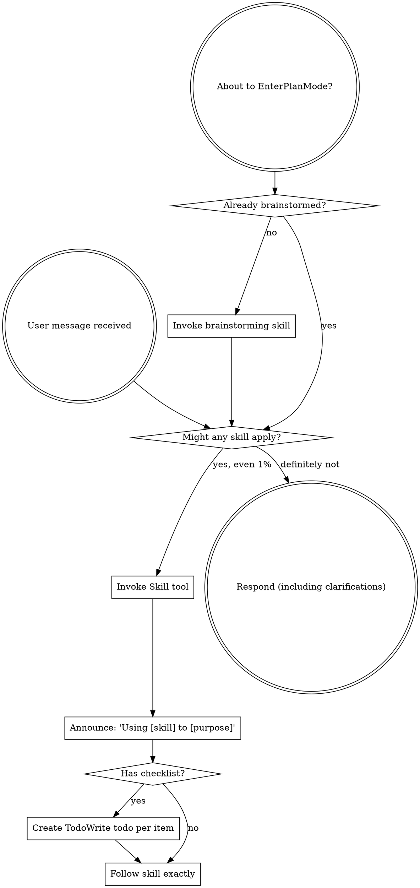

# Review — 2026-05-13-external-reviewer-redesign.md (post-slice, round 2)

- Target: `docs/superstar/plans/2026-05-13-external-reviewer-redesign.md`
- Request: `docs/reviewer/external-reviewer-redesign-post-slice/r2-2026-05-14T0129-request.md`
- Reviewer command: `reviewer-agent`
- Status: `ok`

---

1. Findings

F1. Blocking: Slice 1’s finding-count parser fails on the actual review artifact it just produced. The Slice 1 goal requires parsing finding counts into machine-readable output ([plan](</home/simon/Dev/sigreer/skills/superstar/docs/superstar/plans/2026-05-13-external-reviewer-redesign.md:61>)), but `chain.json` has `"findings_count": null` and `"blocking_findings_count": null` for round 1 ([chain.json](</home/simon/Dev/sigreer/skills/superstar/docs/reviewer/external-reviewer-redesign-post-slice/chain.json:17>)). The response has three findings in `F1.`, `F2.`, `F3.` form ([r1 response](</home/simon/Dev/sigreer/skills/superstar/docs/reviewer/external-reviewer-redesign-post-slice/r1-2026-05-14T0124-response.md:12>)), but `parse_findings()` only recognizes `## F<n>` or bullet-ish forms and globally returns `(None, None)` if the text contains `"reviewer crashed"` ([external-reviewer.py](</home/simon/Dev/sigreer/skills/superstar/skills/external-review/scripts/external-reviewer.py:508>)). The actual response includes that phrase inside quoted test/plan preview content ([r1 response](</home/simon/Dev/sigreer/skills/superstar/docs/reviewer/external-reviewer-redesign-post-slice/r1-2026-05-14T0124-response.md:424>)), so the live path defeats the parser. Add coverage for `F1. Blocking:` style and quoted/sampled “Reviewer crashed” text.

F2. Blocking: the slice is not in a closeable repo state. `git status --short --untracked-files=all` shows untracked planning/review artifacts: `docs/handoffs/2026-05-13-external-reviewer-redesign-prompt.md`, `docs/superstar/specs/2026-05-13-external-reviewer-redesign-design.md`, and `docs/reviewer/external-reviewer-redesign-post-slice/r2-2026-05-14T0129-request.md`. The closeout note only discloses unrelated modified files ([plan](</home/simon/Dev/sigreer/skills/superstar/docs/superstar/plans/2026-05-13-external-reviewer-redesign.md:3003>)), so the stated closeout evidence is incomplete. The untracked `r2-*request.md` is also not represented in `chain.json`, which currently records only round 1 ([chain.json](</home/simon/Dev/sigreer/skills/superstar/docs/reviewer/external-reviewer-redesign-post-slice/chain.json:8>)).

F3. Important: task tracking remains visually incomplete. The plan says checkbox steps are for tracking ([plan](</home/simon/Dev/sigreer/skills/superstar/docs/superstar/plans/2026-05-13-external-reviewer-redesign.md:3>)), but Slice 1 task steps remain unchecked despite the closeout claiming completion. The closeout note helps, but for a post-slice gate the plan still presents completed work as open.

2. Open questions / assumptions

I assume the untracked spec and handoff are intended project artifacts, not local scratch files. If they are intentionally out of scope, the closeout note should say that explicitly.

I also assume the untracked `r2-*request.md` is the current resubmission artifact. If so, it still needs to be committed or cleaned up with the corresponding response after this round.

3. Suggested document edits

Update the Slice 1 closeout note to include the full repo-state exception list, including untracked docs and the current review request, or clean/commit those files before marking the slice complete.

After fixing `parse_findings`, update the closeout evidence with the regenerated/verified manifest values, not just the pytest count.

Mark Slice 1 checklist items complete, or add a short note explaining that the checklist is intentionally left as an execution script and the closeout note is canonical.

4. Verification gaps / commands

Already run:

```bash
python3 -m pytest skills/external-review/tests/ -v
```

Result: `19 passed, 1 warning`.

Still needed after fixes:

```bash
python3 -m pytest skills/external-review/tests/ -v
python3 - <<'PY'
import importlib.util
from pathlib import Path
spec = importlib.util.spec_from_file_location("er", "skills/external-review/scripts/external-reviewer.py")
er = importlib.util.module_from_spec(spec); spec.loader.exec_module(er)
body = Path("docs/reviewer/external-reviewer-redesign-post-slice/r1-2026-05-14T0124-response.md").read_text()
print(er.parse_findings(body))
PY
git status --short --untracked-files=all
```

5. Overall verdict: revise

---

## Reviewer stderr

```text
Reading additional input from stdin...
OpenAI Codex v0.130.0
--------
workdir: /home/simon/Dev/sigreer/skills/superstar
model: gpt-5.5
provider: openai
approval: never
sandbox: danger-full-access
reasoning effort: none
reasoning summaries: none
session id: 019e23e3-3eaf-79a2-843c-5dbaba54d8df
--------
user
You are acting as an independent senior engineering reviewer.

Review stance:
- Lead with findings, ordered by severity.
- Focus on correctness, consistency, implementation risk, missing acceptance
  gates, vague handoffs, ungrounded assumptions, unverified claims, and drift
  from the codebase.
- Give exact file/line references when possible.
- If the document is sound, say that clearly and list residual risks.
- Keep the review actionable. Avoid broad rewrites unless the current structure
  creates concrete risk.

Repository root:
/home/simon/Dev/sigreer/skills/superstar

Target kind:
post-slice

Review mode:
Post-slice review. Treat this as a completion gate for one
slice of work. Compare the completed changes and stated evidence against the
slice acceptance criteria. Prioritize: incomplete tasks, uncommitted or
untracked artifacts, missing tests, failing or skipped verification, broken
cross-site behavior, and claims not supported by the repo state.

Target document:
docs/superstar/plans/2026-05-13-external-reviewer-redesign.md

Additional context files:
- docs/superstar/specs/2026-05-13-external-reviewer-redesign-design.md
- docs/handoffs/2026-05-13-external-reviewer-redesign-prompt.md
- docs/reviewer/external-reviewer-redesign-post-slice/r1-resolution.md

Review output contract:
1. Findings
2. Open questions / assumptions
3. Suggested document edits
4. Verification gaps / commands that should be run, if any
5. Overall verdict: one of "ready", "ready with small edits", or "revise"

Read the files from disk. Do not rely only on the snippets in this prompt.


## Target Preview

### docs/superstar/plans/2026-05-13-external-reviewer-redesign.md

    1	# External-Reviewer Redesign Implementation Plan
    2	
    3	> **For agentic workers:** REQUIRED SUB-SKILL: Use superstar:subagent-driven-development (recommended) or superstar:executing-plans to implement this plan task-by-task. Steps use checkbox (`- [ ]`) syntax for tracking.
    4	
    5	**Goal:** Rebuild `skills/external-review/scripts/external-reviewer.py` so review chains are incremental, durable, machine-readable, and support optional independent sweep reviewers — per `docs/superstar/specs/2026-05-13-external-reviewer-redesign-design.md`.
    6	
    7	**Architecture:** A persistent `chain.json` manifest per review chain becomes the source of truth for round metadata. The script gains verdict parsing, work-ID-keyed chain folders, a resolution-artifact contract and gate, incremental round prompts with embedded diffs, optional session-resume placeholders, and Pass-3 independent sweep reviewers. Skill documentation is updated to match.
    8	
    9	**Tech Stack:** Python 3.9+ standard library only (no external deps), `pytest` for tests, `git` CLI for diff and SHA capture.
   10	
   11	---
   12	
   13	## Pre-flight
   14	
   15	- [ ] **Step 1: Verify working directory and branch**
   16	
   17	Run:
   18	
   19	```bash
   20	cd /home/simon/Dev/sigreer/skills/superstar
   21	git status --short
   22	git rev-parse --abbrev-ref HEAD
   23	```
   24	
   25	Expected: clean tree, branch is a feature branch (not `main`). If on `main`, stop and create a branch via `superstar:using-git-worktrees`.
   26	
   27	- [ ] **Step 2: Confirm test runner**
   28	
   29	Run:
   30	
   31	```bash
   32	python3 -c "import pytest; print(pytest.__version__)"
   33	```
   34	
   35	Expected: prints a version string. If `ModuleNotFoundError`, install pytest:
   36	
   37	```bash
   38	python3 -m pip install --user pytest
   39	```
   40	
   41	- [ ] **Step 3: Set up the test directory**
   42	
   43	Create the directory tests will live in:
   44	
   45	```bash
   46	mkdir -p skills/external-review/tests
   47	touch skills/external-review/tests/__init__.py
   48	```
   49	
   50	Commit:
   51	
   52	```bash
   53	git add skills/external-review/tests/__init__.py
   54	git commit -m "scaffold: tests dir for external-reviewer redesign"
   55	```
   56	
   57	---
   58	
   59	## Slice 1: Chain manifest & verdict parsing
   60	
   61	**Goal:** Introduce `chain.json` as the round-metadata source of truth, parse verdicts and finding counts from response text, and emit them in the JSON output. Backwards-compatible: legacy chains synthesize a manifest on first touch.
   62	
   63	### Task 1.1: Manifest read/write helpers
   64	
   65	**Files:**
   66	- Create: `skills/external-review/tests/test_manifest.py`
   67	- Modify: `skills/external-review/scripts/external-reviewer.py`
   68	
   69	- [ ] **Step 1: Write the failing tests**
   70	
   71	`skills/external-review/tests/test_manifest.py`:
   72	
   73	```python
   74	import json
   75	from pathlib import Path
   76	
   77	import pytest
   78	
   79	import sys
   80	SCRIPTS = Path(__file__).resolve().parents[1] / "scripts"
   81	sys.path.insert(0, str(SCRIPTS))
   82	
   83	import importlib.util
   84	spec = importlib.util.spec_from_file_location("external_reviewer", SCRIPTS / "external-reviewer.py")
   85	external_reviewer = importlib.util.module_from_spec(spec)
   86	spec.loader.exec_module(external_reviewer)
   87	
   88	
   89	def test_read_manifest_returns_none_for_missing(tmp_path):
   90	    assert external_reviewer.read_manifest(tmp_path / "missing.json") is None
   91	
   92	
   93	def test_write_then_read_manifest_roundtrips(tmp_path):
   94	    path = tmp_path / "chain.json"
   95	    data = {
   96	        "schema_version": 1,
   97	        "chain": "demo-post-slice",
   98	        "kind": "post-slice",
   99	        "target": "docs/plans/demo.md",
  100	        "work_id": "P1.S1",
  101	        "legacy_migrated": False,
  102	        "rounds": [],
  103	        "sweep_checkpoints": {"first-round": "pending", "final-ready": "pending"},
  104	    }
  105	    external_reviewer.write_manifest(path, data)
  106	    loaded = external_reviewer.read_manifest(path)
  107	    assert loaded == data
  108	
  109	
  110	def test_read_manifest_rejects_newer_schema(tmp_path):
  111	    path = tmp_path / "chain.json"
  112	    path.write_text(json.dumps({"schema_version": 99}))
  113	    with pytest.raises(external_reviewer.ManifestSchemaTooNew):
  114	        external_reviewer.read_manifest(path)
  115	```
  116	
  117	- [ ] **Step 2: Run the tests; confirm they fail**
  118	
  119	```bash
  120	python3 -m pytest skills/external-review/tests/test_manifest.py -v
  121	```
  122	
  123	Expected: 3 failures (`read_manifest`, `write_manifest`, `ManifestSchemaTooNew` all undefined).
  124	
  125	- [ ] **Step 3: Add manifest helpers to the script**
  126	
  127	Append to `skills/external-review/scripts/external-reviewer.py` (after the existing module-level constants, before `repo_root()`):
  128	
  129	```python
  130	SUPPORTED_SCHEMA_VERSION = 1
  131	
  132	
  133	class ManifestSchemaTooNew(Exception):
  134	    """Raised when chain.json declares a schema_version newer than this script supports."""
  135	
  136	
  137	def read_manifest(path: Path) -> dict | None:
  138	    if not path.exists():
  139	        return None
  140	    data = json.loads(path.read_text(encoding="utf-8"))
  141	    version = data.get("schema_version")
  142	    if isinstance(version, int) and version > SUPPORTED_SCHEMA_VERSION:
  143	        raise ManifestSchemaTooNew(
  144	            f"chain.json schema_version {version} is newer than this script supports "
  145	            f"(max {SUPPORTED_SCHEMA_VERSION}). Upgrade external-reviewer.py."
  146	        )
  147	    return data
  148	
  149	
  150	def write_manifest(path: Path, data: dict) -> None:
  151	    path.parent.mkdir(parents=True, exist_ok=True)
  152	    path.write_text(json.dumps(data, indent=2) + "\n", encoding="utf-8")
  153	```
  154	
  155	- [ ] **Step 4: Run the tests; confirm they pass**
  156	
  157	```bash
  158	python3 -m pytest skills/external-review/tests/test_manifest.py -v
  159	```
  160	
  161	Expected: 3 passed.
  162	
  163	- [ ] **Step 5: Commit**
  164	
  165	```bash
  166	git add skills/external-review/scripts/external-reviewer.py skills/external-review/tests/test_manifest.py
  167	git commit -m "feat(external-reviewer): chain.json read/write helpers with schema versioning"
  168	```
  169	
  170	### Task 1.2: Verdict parsing
  171	
  172	**Files:**
  173	- Create: `skills/external-review/tests/test_verdict.py`
  174	- Modify: `skills/external-review/scripts/external-reviewer.py`
  175	
  176	- [ ] **Step 1: Write the failing tests**
  177	
  178	`skills/external-review/tests/test_verdict.py`:
  179	
  180	```python
  181	from pathlib import Path
  182	import sys, importlib.util
  183	
  184	SCRIPTS = Path(__file__).resolve().parents[1] / "scripts"
  185	sys.path.insert(0, str(SCRIPTS))
  186	spec = importlib.util.spec_from_file_location("external_reviewer", SCRIPTS / "external-reviewer.py")
  187	er = importlib.util.module_from_spec(spec); spec.loader.exec_module(er)
  188	
  189	
  190	def test_verdict_ready():
  191	    v, valid = er.parse_verdict("Findings: ok\n\nOverall verdict: ready\n")
  192	    assert v == "ready"
  193	    assert valid is True
  194	
  195	
  196	def test_verdict_ready_with_small_edits_markdown():
  197	    body = "**Overall verdict:** `ready with small edits`."
  198	    v, valid = er.parse_verdict(body)
  199	    assert v == "ready with small edits"
  200	    assert valid is True
  201	
  202	
  203	def test_verdict_revise_case_insensitive():
  204	    v, valid = er.parse_verdict("OVERALL VERDICT: Revise")
  205	    assert v == "revise"
  206	    assert valid is True
  207	
  208	
  209	def test_verdict_takes_last_match():
  210	    body = "Overall verdict: ready\n\n...later...\n\nOverall verdict: revise"
  211	    v, valid = er.parse_verdict(body)
  212	    assert v == "revise"
  213	
  214	
  215	def test_verdict_unknown_returns_invalid():
  216	    v, valid = er.parse_verdict("Overall verdict: looks fine to me")
  217	    assert v is None
  218	    assert valid is False
  219	
  220	
  221	def test_verdict_missing_returns_invalid():
  222	    v, valid = er.parse_verdict("Some review prose with no verdict line.")
  223	    assert v is None
  224	    assert valid is False
  225	```
  226	
  227	- [ ] **Step 2: Run the tests; confirm they fail**
  228	
  229	```bash
  230	python3 -m pytest skills/external-review/tests/test_verdict.py -v
  231	```
  232	
  233	Expected: 6 failures (`parse_verdict` undefined).
  234	
  235	- [ ] **Step 3: Add the verdict parser**
  236	
  237	Append to `skills/external-review/scripts/external-reviewer.py`:
  238	
  239	```python
  240	VERDICT_VALUES = ("ready with small edits", "ready", "revise")
  241	VERDICT_LINE_RE = re.compile(
  242	    r"overall\s+verdict\s*[:\-]\s*[`*_\"']*\s*(ready with small edits|ready|revise)\s*[`*_\"'.]*",
  243	    re.IGNORECASE,
  244	)
  245	
  246	
  247	def parse_verdict(text: str) -> tuple[str | None, bool]:
  248	    matches = list(VERDICT_LINE_RE.finditer(text))
  249	    if not matches:
  250	        return None, False
  251	    raw = matches[-1].group(1).strip().lower()
  252	    if raw not in VERDICT_VALUES:
  253	        return None, False
  254	    return raw, True
  255	```
  256	
  257	Note: regex prefers `ready with small edits` over `ready` because of ordering in the alternation.
  258	
  259	- [ ] **Step 4: Run the tests; confirm they pass**
  260	
  261	```bash
  262	python3 -m pytest skills/external-review/tests/test_verdict.py -v
  263	```
  264	
  265	Expected: 6 passed.
  266	
  267	- [ ] **Step 5: Commit**
  268	
  269	```bash
  270	git add skills/external-review/scripts/external-reviewer.py skills/external-review/tests/test_verdict.py
  271	git commit -m "feat(external-reviewer): parse_verdict with markdown/case tolerance"
  272	```
  273	
  274	### Task 1.3: Finding-count parsing
  275	
  276	**Files:**
  277	- Create: `skills/external-review/tests/test_findings.py`
  278	- Modify: `skills/external-review/scripts/external-reviewer.py`
  279	
  280	- [ ] **Step 1: Write the failing tests**
  281	
  282	`skills/external-review/tests/test_findings.py`:
  283	
  284	```python
  285	from pathlib import Path
  286	import sys, importlib.util
  287	SCRIPTS = Path(__file__).resolve().parents[1] / "scripts"
  288	sys.path.insert(0, str(SCRIPTS))
  289	spec = importlib.util.spec_from_file_location("external_reviewer", SCRIPTS / "external-reviewer.py")
  290	er = importlib.util.module_from_spec(spec); spec.loader.exec_module(er)
  291	
  292	
  293	def test_heading_findings_counted():
  294	    body = "## F1\nSeverity: blocking\n\n## F2\nSeverity: minor\n\n## F3\nSeverity: blocking"
  295	    n, blocking = er.parse_findings(body)
  296	    assert n == 3
  297	    assert blocking == 2
  298	
  299	
  300	def test_bullet_findings_counted():
  301	    body = "- F1: something blocking (blocking)\n- F2 minor thing"
  302	    n, blocking = er.parse_findings(body)
  303	    assert n == 2
  304	    assert blocking == 1
  305	
  306	
  307	def test_no_findings_returns_zero():
  308	    body = "Overall verdict: ready\n\nNo findings."
  309	    n, blocking = er.parse_findings(body)
  310	    assert n == 0
  311	    assert blocking == 0
  312	
  313	
  314	def test_unparseable_returns_none():
  315	    body = "Reviewer crashed: connection reset"
  316	    n, blocking = er.parse_findings(body)
  317	    assert n is None
  318	    assert blocking is None
  319	```
  320	
  321	- [ ] **Step 2: Run the tests; confirm they fail**
  322	
  323	```bash
  324	python3 -m pytest skills/external-review/tests/test_findings.py -v
  325	```
  326	
  327	Expected: 4 failures.
  328	
  329	- [ ] **Step 3: Add the parser**
  330	
  331	Append to `skills/external-review/scripts/external-reviewer.py`:
  332	
  333	```python
  334	HEADING_FINDING_RE = re.compile(r"^##\s+F\d+\b", re.MULTILINE)
  335	BULLET_FINDING_RE = re.compile(r"^\s*[-*]?\s*\**F\d+\**[:\s\-]", re.MULTILINE)
  336	BLOCKING_MARKER_RE = re.compile(r"(?:^|\s)\(blocking\)|^severity\s*:\s*blocking", re.IGNORECASE | re.MULTILINE)
  337	
  338	
  339	def parse_findings(text: str) -> tuple[int | None, int | None]:
  340	    if not text or text.strip() == "" or "reviewer crashed" in text.lower():
  341	        return None, None
  342	    heading_count = len(HEADING_FINDING_RE.findall(text))
  343	    if heading_count > 0:
  344	        n = heading_count
  345	    else:
  346	        n = len(BULLET_FINDING_RE.findall(text))
  347	    blocking = len(BLOCKING_MARKER_RE.findall(text))
  348	    return n, blocking
  349	```
  350	
  351	- [ ] **Step 4: Run the tests; confirm they pass**
  352	
  353	```bash
  354	python3 -m pytest skills/external-review/tests/test_findings.py -v
  355	```
  356	
  357	Expected: 4 passed.
  358	
  359	- [ ] **Step 5: Commit**
  360	
  361	```bash
  362	git add skills/external-review/scripts/external-reviewer.py skills/external-review/tests/test_findings.py
  363	git commit -m "feat(external-reviewer): parse_findings (heading + bullet, blocking count)"
  364	```
  365	
  366	### Task 1.4: Round-number derivation reads manifest first
  367	
  368	**Files:**
  369	- Create: `skills/external-review/tests/test_round_number.py`
  370	- Modify: `skills/external-review/scripts/external-reviewer.py` (`next_round_number`)
  371	
  372	- [ ] **Step 1: Write the failing tests**
  373	
  374	`skills/external-review/tests/test_round_number.py`:
  375	
  376	```python
  377	from pathlib import Path
  378	import json, sys, importlib.util
  379	SCRIPTS = Path(__file__).resolve().parents[1] / "scripts"
  380	sys.path.insert(0, str(SCRIPTS))
  381	spec = importlib.util.spec_from_file_location("external_reviewer", SCRIPTS / "external-reviewer.py")
  382	er = importlib.util.module_from_spec(spec); spec.loader.exec_module(er)
  383	
  384	
  385	def test_no_chain_dir_round_is_one(tmp_path):
  386	    assert er.next_round_number(tmp_path / "absent") == 1
  387	
  388	
  389	def test_manifest_present_takes_precedence(tmp_path):
  390	    d = tmp_path / "chain"; d.mkdir()
  391	    er.write_manifest(d / "chain.json", {
  392	        "schema_version": 1, "rounds": [{"round": 1}, {"round": 2}]
  393	    })
  394	    assert er.next_round_number(d) == 3
  395	
  396	
  397	def test_legacy_dir_no_manifest_falls_back_to_filename_scan(tmp_path):
  398	    d = tmp_path / "chain"; d.mkdir()
  399	    (d / "r1-2026-05-01T0900-request.md").write_text("")
  400	    (d / "r2-2026-05-02T0900-request.md").write_text("")
  401	    assert er.next_round_number(d) == 3
  402	```
  403	
  404	- [ ] **Step 2: Run the tests; confirm they fail**
  405	
  406	```bash
  407	python3 -m pytest skills/external-review/tests/test_round_number.py -v
  408	```
  409	
  410	Expected: test 2 fails (no manifest awareness), tests 1 and 3 may pass if current behavior already handles them.
  411	
  412	- [ ] **Step 3: Update `next_round_number`**
  413	
  414	Replace the existing function:
  415	
  416	```python
  417	def next_round_number(chain_dir: Path) -> int:
  418	    if not chain_dir.exists():
  419	        return 1
  420	    manifest = read_manifest(chain_dir / "chain.json")
  421	    if manifest and isinstance(manifest.get("rounds"), list):
  422	        return len(manifest["rounds"]) + 1
  423	    return len(list(chain_dir.glob("r*-*-request.md"))) + 1
  424	```
  425	
  426	- [ ] **Step 4: Run the tests**
  427	
  428	```bash
  429	python3 -m pytest skills/external-review/tests/test_round_number.py -v
  430	```
  431	
  432	Expected: 3 passed.
  433	
  434	- [ ] **Step 5: Commit**
  435	
  436	```bash
  437	git add skills/external-review/scripts/external-reviewer.py skills/external-review/tests/test_round_number.py
  438	git commit -m "feat(external-reviewer): next_round_number consults chain.json"
  439	```
  440	
  441	### Task 1.5: Legacy manifest synthesis
  442	
  443	**Files:**
  444	- Create: `skills/external-review/tests/test_legacy_migration.py`
  445	- Modify: `skills/external-review/scripts/external-reviewer.py`
  446	
  447	- [ ] **Step 1: Write the failing tests**
  448	
  449	`skills/external-review/tests/test_legacy_migration.py`:
  450	
  451	```python
  452	from pathlib import Path
  453	import sys, importlib.util
  454	SCRIPTS = Path(__file__).resolve().parents[1] / "scripts"
  455	sys.path.insert(0, str(SCRIPTS))
  456	spec = importlib.util.spec_from_file_location("external_reviewer", SCRIPTS / "external-reviewer.py")
  457	er = importlib.util.module_from_spec(spec); spec.loader.exec_module(er)
  458	
  459	
  460	def test_synthesize_manifest_from_legacy_files(tmp_path):
  461	    d = tmp_path / "old-chain"; d.mkdir()
  462	    (d / "r1-2026-04-01T0900-request.md").write_text("prompt body")
  463	    (d / "r1-2026-04-01T0905-response.md").write_text(
  464	        "## F1\nSeverity: blocking\n\nOverall verdict: revise\n"
  465	    )
  466	    (d / "r2-2026-04-02T1200-request.md").write_text("prompt body 2")
  467	
  468	    manifest = er.synthesize_legacy_manifest(
  469	        chain_dir=d, chain="old-chain", kind="post-slice",
  470	        target="docs/plans/old.md", work_id="P1.S1",
  471	    )
  472	
  473	    assert manifest["legacy_migrated"] is True
  474	    assert manifest["work_id"] == "P1.S1"
  475	    assert len(manifest["rounds"]) == 2
  476	    r1, r2 = manifest["rounds"]
  477	    assert r1["legacy"] is True
  478	    assert r1["verdict"] == "revise"
  479	    assert r1["verdict_valid"] is True
  480	    assert r1["findings_count"] == 1
  481	    assert r1["blocking_findings_count"] == 1
  482	    assert r1["head_sha_after_round"] is None
  483	    assert r2["response"] is None  # only request file existed
  484	```
  485	
  486	- [ ] **Step 2: Run the tests; confirm they fail**
  487	
  488	```bash
  489	python3 -m pytest skills/external-review/tests/test_legacy_migration.py -v
  490	```
  491	
  492	Expected: 1 failure.
  493	
  494	- [ ] **Step 3: Add the synthesizer**
  495	
  496	Append to `skills/external-review/scripts/external-reviewer.py`:
  497	
  498	```python
  499	LEGACY_ROUND_FILE_RE = re.compile(r"^r(\d+)-([0-9T\-]+)-(request|response)\.md$")
  500	
  501	
  502	def synthesize_legacy_manifest(
  503	    *, chain_dir: Path, chain: str, kind: str, target: str, work_id: str | None
  504	) -> dict:
  505	    rounds_map: dict[int, dict] = {}
  506	    for path in sorted(chain_dir.iterdir()):
  507	        m = LEGACY_ROUND_FILE_RE.match(path.name)
  508	        if not m:
  509	            continue
  510	        round_num = int(m.group(1))
  511	        role = m.group(3)
  512	        entry = rounds_map.setdefault(
  513	            round_num,
  514	            {
  515	                "round": round_num,
  516	                "request": None,
  517	                "response": None,
  518	                "resolution": None,
  519	                "verdict": None,
  520	                "verdict_valid": False,
  521	                "findings_count": None,
  522	                "blocking_findings_count": None,
  523	                "head_sha_at_request": None,
  524	                "head_sha_after_round": None,
  525	                "worktree_dirty_at_request": None,
  526	                "legacy": True,
  527	            },
  528	        )
  529	        entry[role] = path.name
  530	        if role == "response":
  531	            body = path.read_text(encoding="utf-8", errors="replace")
  532	            v, valid = parse_verdict(body)
  533	            entry["verdict"], entry["verdict_valid"] = v, valid
  534	            n, blocking = parse_findings(body)
  535	            entry["findings_count"], entry["blocking_findings_count"] = n, blocking
  536	
  537	    return {
  538	        "schema_version": SUPPORTED_SCHEMA_VERSION,
  539	        "chain": chain,
  540	        "kind": kind,
  541	        "target": target,
  542	        "work_id": work_id,
  543	        "legacy_migrated": True,
  544	        "migrated_at": dt.datetime.utcnow().strftime("%Y-%m-%dT%H:%M:%SZ"),
  545	        "rounds": [rounds_map[k] for k in sorted(rounds_map)],
  546	        "sweep_checkpoints": {"first-round": "pending", "final-ready": "pending"},
  547	    }
  548	```
  549	
  550	- [ ] **Step 4: Run the tests; confirm they pass**
  551	
  552	```bash
  553	python3 -m pytest skills/external-review/tests/test_legacy_migration.py -v
  554	```
  555	
  556	Expected: 1 passed.
  557	
  558	- [ ] **Step 5: Commit**
  559	
  560	```bash
  561	git add skills/external-review/scripts/external-reviewer.py skills/external-review/tests/test_legacy_migration.py
  562	git commit -m "feat(external-reviewer): synthesize_legacy_manifest from rN-* files"
  563	```
  564	
  565	### Task 1.6: Wire manifest into `main()` for single-reviewer rounds
  566	
  567	**Files:**
  568	- Modify: `skills/external-review/scripts/external-reviewer.py` (`main` function)
  569	- Create: `skills/external-review/tests/test_main_round_writes_manifest.py`
  570	
  571	- [ ] **Step 1: Write the failing test**
  572	
  573	`skills/external-review/tests/test_main_round_writes_manifest.py`:
  574	
  575	```python
  576	from pathlib import Path
  577	import subprocess, sys, json, importlib.util, os
  578	
  579	SCRIPTS = Path(__file__).resolve().parents[1] / "scripts"
  580	sys.path.insert(0, str(SCRIPTS))
  581	spec = importlib.util.spec_from_file_location("external_reviewer", SCRIPTS / "external-reviewer.py")
  582	er = importlib.util.module_from_spec(spec); spec.loader.exec_module(er)
  583	
  584	
  585	FAKE_REVIEWER = """#!/usr/bin/env bash
  586	cat <<'EOF'
  587	## F1
  588	Severity: blocking
  589	Stub finding.
  590	
  591	Overall verdict: revise
  592	EOF
  593	"""
  594	
  595	
  596	def test_main_writes_manifest_entry(tmp_path, monkeypatch):
  597	    repo = tmp_path / "repo"; repo.mkdir()
  598	    subprocess.run(["git", "-C", str(repo), "init", "-q"], check=True)
  599	    subprocess.run(["git", "-C", str(repo), "config", "user.email", "t@t"], check=True)
  600	    subprocess.run(["git", "-C", str(repo), "config", "user.name", "T"], check=True)

[truncated: 2403 additional lines]

## Context Previews

### docs/superstar/specs/2026-05-13-external-reviewer-redesign-design.md

    1	# External-Review Script Redesign — Design
    2	
    3	**Date:** 2026-05-13
    4	**Target:** `skills/external-review/scripts/external-reviewer.py` and `skills/external-review/SKILL.md`
    5	**Motivation:** A self-review of the external-reviewer flow surfaced five concrete failure modes that cause review loops to balloon to 7–10 rounds and lose continuity between rounds. This spec redesigns the script and skill to make rounds incremental, durable, and machine-readable.
    6	
    7	---
    8	
    9	## Goals
   10	
   11	1. **Round N+1 is incremental, not a re-review.** The reviewer is given prior findings, the fixer's resolution report, and a focused diff — and is instructed to verify resolution rather than reopen broad review.
   12	2. **Verdict is machine-readable.** JSON output exposes a parsed `verdict`, `verdict_valid`, and finding counts, so coordinators don't have to parse prose.
   13	3. **Post-slice / post-phase chains are uniquely keyed.** `--work-id` is required for both so that multi-slice plans don't collapse into one chain.
   14	4. **Resolution artifacts are durable and structured-enough-to-parse.** Required headers, free-form bodies, stable finding IDs across rounds.
   15	5. **Optional session resume.** Provider-specific wrappers can plug into placeholders if the underlying reviewer CLI supports session IDs.
   16	6. **Legacy chains keep working.** Soft-migrate on first new round; preserve existing folder names and audit history.
   17	7. **Review depth is explicit.** The default chain uses one primary incremental reviewer, but callers can request bounded independent sweep reviewers at high-risk checkpoints to preserve fresh-eye coverage without unbounded serial churn.
   18	
   19	## Non-goals
   20	
   21	- Replacing the chain-folder layout for new chains. The folder-naming scheme gains a `--work-id` segment for post-slice/post-phase, but the round-file scheme is unchanged.
   22	- Making the script aware of any specific reviewer CLI. The script remains provider-neutral via `AGENT_REVIEWER_CMD`.
   23	- Auto-dispatching the fixer subagent. The script enforces the resolution gate but does not invoke fixers; that stays in the coordinator's loop, governed by `subagent-driven-development`.
   24	
   25	## Invariants
   26	
   27	- **A review chain is single-writer.** Running two rounds concurrently against the same chain is unsupported and may corrupt `chain.json`. The script does not lock; callers are expected to serialise.
   28	- **Existing rounds are immutable.** Once written, `rN-*-request.md`, `rN-*-response.md`, and `rN-resolution.md` are never overwritten. Manifest entries for past rounds are append-only.
   29	
   30	## Architecture
   31	
   32	Three implementation passes, all designed in this spec:
   33	
   34	- **Pass 1 — Core.** Chain manifest, verdict parsing, `--work-id`, prior-round context injection, incremental round prompts, resolution-artifact contract and gate, automatic diff embedding, JSON output enrichment, legacy migration.
   35	- **Pass 2 — Session resume.** Optional placeholders (`{chain_dir}`, `{round}`, `{previous_response}`, `{resolution_file}`, `{session_file}`) exposed via the existing `AGENT_REVIEWER_CMD` template mechanism. A provider-specific wrapper can use `{session_file}` to persist and resume reviewer sessions. The script provides a stable path (`chain_dir/session.state`) and ensures the parent directory exists; wrappers own the file's contents. The script never reads `session.state`.
   36	- **Pass 3 — Review depth / independent sweeps.** Adds `--review-depth`, `--independent-reviewers`, `--sweep-policy` flags. Independent sweep reviewers run without seeing the primary reviewer's findings on their first pass (to avoid anchoring), and their findings are merged into the same resolution checklist afterward. Depends on Pass 1's manifest and verdict parsing; does not depend on Pass 2.
   37	
   38	### Chain manifest
   39	
   40	`docs/reviewer/<chain>/chain.json` is the single source of truth for round metadata. The `rN-*-request.md` / `rN-*-response.md` / `rN-resolution.md` files remain for human readability and git history; the script reads and writes manifest entries when computing round numbers, base refs, and verdicts.
   41	
   42	```json
   43	{
   44	  "schema_version": 1,
   45	  "chain": "feature-plan-P2-S3-post-slice",
   46	  "kind": "post-slice",
   47	  "target": "docs/superstar/plans/feature-plan.md",
   48	  "work_id": "P2.S3",
   49	  "legacy_migrated": false,
   50	  "rounds": [
   51	    {
   52	      "round": 1,
   53	      "request": "r1-2026-05-13T1012-request.md",
   54	      "response": "r1-2026-05-13T1020-response.md",
   55	      "resolution": null,
   56	      "head_sha_at_request": "abc1234",
   57	      "head_sha_after_round": "abc1234",
   58	      "worktree_dirty_at_request": false,
   59	      "verdict": "revise",
   60	      "verdict_valid": true,
   61	      "findings_count": 4,
   62	      "blocking_findings_count": 2
   63	    },
   64	    {
   65	      "round": 2,
   66	      "request": "r2-2026-05-13T1130-request.md",
   67	      "response": null,
   68	      "resolution": "r1-resolution.md",
   69	      "base_ref": "abc1234",
   70	      "base_ref_source": "auto",
   71	      "head_sha_at_request": "def5678",
   72	      "worktree_dirty_at_request": false,
   73	      "diff_included": true,
   74	      "resolution_parse_status": "ok",
   75	      "resolution_waiver": false
   76	    }
   77	  ]
   78	}
   79	```
   80	
   81	#### Manifest versioning
   82	
   83	- `schema_version: 1` is the initial version introduced by this redesign.
   84	- Unknown future `schema_version` values cause the script to error with a clear message: `ERROR: chain.json schema_version <N> is newer than this script supports. Upgrade external-reviewer.py.` This prevents silent corruption.
   85	- Older `schema_version` values (currently none) get best-effort migration on read, recorded as `schema_migrated_from: <prior>` in the manifest.
   86	
   87	### Naming
   88	
   89	- **Chain folder slug:** `<target-stem-no-leading-date>-<work-id-dotless>-<kind>` for post-slice/post-phase; `<target-stem-no-leading-date>-<kind>` otherwise. Dots in work IDs are replaced with dashes in the folder slug only — the manifest preserves the canonical form.
   90	  - Example: `--work-id P2.S3` → folder `feature-plan-P2-S3-post-slice`, manifest `"work_id": "P2.S3"`.
   91	- **Round files:** `r{N}-<YYYY-MM-DDTHHMM>-request.md`, `r{N}-<YYYY-MM-DDTHHMM>-response.md`. Unchanged from current behavior.
   92	- **Resolution files:** `r{N}-resolution.md`, where `N` is the round whose response is being addressed. Round `N+1` consumes `r{N}-resolution.md`. Worked example: after `r1-response.md` returns `revise`, the fixer writes `r1-resolution.md`; round 2 reads `r1-resolution.md` and embeds it in the round-2 prompt.
   93	
   94	## CLI surface (new flags)
   95	
   96	| Flag | Kinds | Purpose |
   97	|---|---|---|
   98	| `--work-id <id>` | required for `post-slice`, `post-phase`; optional otherwise | Stable slice/phase ID (e.g., `P2.S3` for post-slice, `P2` for post-phase). Becomes part of chain folder name (dots → dashes) and is stored verbatim in the manifest. |
   99	| `--base-ref <sha\|ref>` | any | Override auto-computed diff base for this round. |
  100	| `--no-diff` | any | Suppress diff embedding even on round N+1. |
  101	| `--allow-missing-resolution` | post-slice, post-phase | Waive the resolution-required gate. Logged in manifest as `resolution_waiver: true`. |
  102	| `--changed-files <path>...` | any | Override automatic changed-file discovery and limit the embedded diff to the supplied paths. |
  103	| `--mode <auto\|broad\|incremental>` | any | Override the round-1-vs-N prompt mode. Default `auto` (round 1 → broad; round 2+ → incremental). |
  104	| `--max-diff-lines <int>` | any | Cap diff size. Default 2000. Truncation marker is embedded if exceeded. |
  105	| `--review-depth <standard\|thorough\|exhaustive>` | post-slice, post-phase | Controls whether independent sweep reviewers are run in addition to the primary chain reviewer. Default `standard`. |
  106	| `--independent-reviewers <int>` | post-slice, post-phase | Override reviewer count for independent sweeps. Default derived from `--review-depth`. |
  107	| `--sweep-policy <first-round\|final-ready\|both\|never>` | post-slice, post-phase | When to run fresh-context sweep reviews. Default derived from `--review-depth`. |
  108	
  109	### `--work-id` enforcement
  110	
  111	- `post-slice` or `post-phase` invoked without `--work-id` → exit 2 with operational error.
  112	- For `post-phase`, the expected form is the phase ID alone (`P2`), not a slice ID. The script does not enforce a regex; it documents the convention.
  113	- For other kinds, `--work-id` is optional; if provided, it is recorded in the manifest but does not affect the folder slug.
  114	
  115	## Reviewer prompt — round 1 vs round N+
  116	
  117	### Round 1: broad
  118	
  119	The existing broad prompt, with the output contract revised to require **stable finding IDs**:
  120	
  121	```
  122	1. Findings
  123	   - Each finding tagged `F<n>` (e.g., F1, F2, F3). IDs must be stable across rounds.
  124	   - Severity: blocking | important | minor | nit
  125	2. Open questions / assumptions
  126	3. Suggested document edits
  127	4. Verification gaps
  128	5. Overall verdict: ready | ready with small edits | revise
  129	```
  130	
  131	### Round N+: incremental
  132	
  133	Prepended to the existing prompt body:
  134	
  135	```
  136	You are continuing an existing review chain. This is round {N} of {chain_id}.
  137	
  138	In incremental mode:
  139	- Verify whether prior findings are resolved per the resolution report below.
  140	- Reuse the existing finding IDs (F1, F2, …). If a prior finding is resolved,
  141	  mark it RESOLVED in your findings list with its original ID. If still
  142	  unresolved, keep its ID.
  143	- Only introduce new finding IDs for genuine regressions caused by the fix, or
  144	  blocking issues clearly missed in earlier rounds. Do not reopen broad review
  145	  unless prior fixes changed broad architecture.
  146	
  147	Review chain summary:
  148	{per-round table: round, verdict, findings_count, blocking_findings_count}
  149	
  150	Prior-round findings (authoritative):
  151	{if r{N-1}-merged-findings.md exists: its verbatim contents — this replaces
  152	 individual reviewer response files as the prior-finding list of record}
  153	{else: a summary of the prior round's primary response, with finding IDs intact}
  154	
  155	Resolution report for prior round:
  156	{verbatim contents of r{N-1}-resolution.md}
  157	{or "MISSING — explicitly waived by caller via --allow-missing-resolution"}
  158	{or "MISSING — chain migrated from legacy artifacts; please verify whether changes occurred from the diff below"}
  159	
  160	Resolution parse summary (best-effort):
  161	{structured: per-finding-ID → status, or "unparseable"}
  162	
  163	Changes since prior round:
  164	{git diff <base_ref>..HEAD -- <scoped paths>}
  165	{if dirty: appended `git diff HEAD` section, both labeled}
  166	{if no base: "not available for this round (legacy chain / first round / --no-diff)"}
  167	```
  168	
  169	`--mode broad` forces round-1-style on later rounds (rare; for cases where the fix changed architecture). `--mode incremental` on round 1 is rejected with a clear error.
  170	
  171	## Resolution artifact contract
  172	
  173	**Path:** `docs/reviewer/<chain>/r{N}-resolution.md`, where `N` is the round whose response is being addressed. Authored by the fix subagent between round N (response) and round N+1 (resubmit).
  174	
  175	**Required parseable shape:**
  176	
  177	```markdown
  178	# Resolution for r{N}
  179	
  180	## F1
  181	Status: fixed
  182	Evidence:
  183	- Commit: abc1234
  184	- Files: `src/foo.ts:42`, `tests/foo.test.ts:18`
  185	- Verification: `npm test -- foo.test.ts` passed
  186	
  187	Notes:
  188	Changed the validation path to reject empty IDs before persistence.
  189	
  190	## F2
  191	Status: waived
  192	Evidence:
  193	- No code change
  194	- Reason: reviewer assumed X, but the plan explicitly excludes X in
  195	  `docs/superstar/specs/foo-design.md:77`
  196	
  197	Notes:
  198	No implementation change because this would expand slice scope.
  199	```
  200	

[truncated: 289 additional lines]
### docs/handoffs/2026-05-13-external-reviewer-redesign-prompt.md

    1	# Coordinator handoff — External-Reviewer Redesign
    2	
    3	You are the coordinator for implementing the **external-reviewer redesign** in the `superstar` repo at `/home/simon/Dev/sigreer/skills/superstar`.
    4	
    5	Your role is **strictly orchestration**. Use the `superstar:subagent-driven-development` skill with parallel agents where possible.
    6	
    7	## Inputs
    8	
    9	- Spec: [`docs/superstar/specs/2026-05-13-external-reviewer-redesign-design.md`](docs/superstar/specs/2026-05-13-external-reviewer-redesign-design.md)
   10	- Plan: [`docs/superstar/plans/2026-05-13-external-reviewer-redesign.md`](docs/superstar/plans/2026-05-13-external-reviewer-redesign.md)
   11	- Reviewer chain folder (created on first review): `docs/reviewer/external-reviewer-redesign-plan/` (kind `plan`) and per-slice chains like `docs/reviewer/external-reviewer-redesign-S1-post-slice/` (no TASKLIST.md in this repo; treat `S1`…`S8` from the plan as the work-id segments).
   12	
   13	## Coordinator discipline (non-negotiable)
   14	
   15	- **Do not perform any fixes yourself** unless the fix is genuinely cheaper to implement than the process of delegating to a subagent. Tiebreak: delegate.
   16	- **Do not pollute your context.** Delegate investigations, file reads, and edits to subagents. Your context is for orchestration, not implementation detail.
   17	- **At the end of each slice (S1–S8)**, the human partner runs `external-review` manually with `--kind post-slice` and pastes the findings back. Do NOT invoke the external-review skill yourself in this project — the human partner has explicitly chosen to drive it manually to keep the context clean. Wait for the verdict before proceeding to the next slice.
   18	- **Do not perform reviewer-driven fixes yourself.** Pass each reviewer response to a fix subagent that writes `r{N}-resolution.md` per the contract in `[[external-review]]`, then signal the human partner that the resolution is ready and the next round can be submitted.
   19	- **At the end of the phase** (after S8 closes), the human partner runs `--kind post-phase` manually. Same delegation rule.
   20	- **No TASKLIST.md exists** in this repo. Track slice completion in this handoff document or in a TODO list you maintain in-session; do not invent a TASKLIST.md file.
   21	
   22	## First action
   23	
   24	Read this file (the handoff prompt), the spec, and the plan. Then invoke `superstar:subagent-driven-development` and begin Slice 1 (Chain manifest & verdict parsing).
### docs/reviewer/external-reviewer-redesign-post-slice/r1-resolution.md

    1	# Round 1 resolution
    2	
    3	## F1 — skill entrypoint mismatch
    4	- **Verdict:** fixed
    5	- **What changed:** `skills/external-review/SKILL.md` updated at lines 8 and 43 to reference `skills/external-review/scripts/external-reviewer.py` (the canonical location) instead of the obsolete root-level `scripts/external-reviewer.py`. The root-level script was staged for deletion (it had already been removed from disk in commit `544bf51` when `project-setup` extracted the migration helper; the working-tree deletion was untracked until now). Audited remaining references: `skills/project-setup/SKILL.md` already pointed to the correct path; design spec and round-1 request/response files reference the path historically and were not modified.
    6	- **Commit:** `57fd2cd`
    7	
    8	## F2 — workspace cleanliness
    9	- **Verdict:** fixed (within scope of staying on `main`)
   10	- **What changed:**
   11	  - `.gitignore` extended to cover `__pycache__/` and `*.pyc`.
   12	  - Slice 1 chain artefacts under `docs/reviewer/external-reviewer-redesign-post-slice/` committed (round-1 request + response + this resolution doc).
   13	  - Plan file updated with a "Slice 1 closeout note" enumerating the seven Slice 1 commits, the final test count (`19 passed`), the pre-flight override on `main`, and the new script location.
   14	  - Unrelated dirty files (`CLAUDE.md`, four other SKILL.md edits) deliberately left in place — they predate Slice 1 and are outside scope, as called out in the closeout note.
   15	- **Commit:** `c9b1ca3`
   16	
   17	## F3 — head_sha capture timing
   18	- **Verdict:** fixed
   19	- **What changed:** In `skills/external-review/scripts/external-reviewer.py`, `current_head_sha(root)` and `is_dirty(root)` are now invoked *before* `run_reviewer` (immediately after the prompt file is written) and stored as `head_sha_at_request` / `worktree_dirty_at_request`. A second `current_head_sha(root)` call after the reviewer returns supplies `head_sha_after_round`. The manifest round entry now records distinct values when the reviewer mutates repo state. New test `skills/external-review/tests/test_head_sha_capture_timing.py` uses a stub reviewer that creates a commit mid-review and asserts the two fields differ and match the expected before/after SHAs. Full suite: `19 passed`.
   20	- **Commit:** `57fd2cd`

codex
I’ll read the reviewer-related files and inspect the actual repo state, including git status and the implemented slice files, before judging the slice gate.
exec
/usr/bin/zsh -lc "sed -n '1,220p' /home/simon/.codex/plugins/cache/openai-curated/superpowers/1b89ff49/skills/using-superpowers/SKILL.md && sed -n '1,220p' docs/superstar/plans/2026-05-13-external-reviewer-redesign.md && sed -n '1,260p' docs/reviewer/external-reviewer-redesign-post-slice/r1-resolution.md" in /home/simon/Dev/sigreer/skills/superstar
 succeeded in 0ms:
---
name: using-superpowers
description: Use when starting any conversation - establishes how to find and use skills, requiring Skill tool invocation before ANY response including clarifying questions
---

<SUBAGENT-STOP>
If you were dispatched as a subagent to execute a specific task, skip this skill.
</SUBAGENT-STOP>

<EXTREMELY-IMPORTANT>
If you think there is even a 1% chance a skill might apply to what you are doing, you ABSOLUTELY MUST invoke the skill.

IF A SKILL APPLIES TO YOUR TASK, YOU DO NOT HAVE A CHOICE. YOU MUST USE IT.

This is not negotiable. This is not optional. You cannot rationalize your way out of this.
</EXTREMELY-IMPORTANT>

## Instruction Priority

Superpowers skills override default system prompt behavior, but **user instructions always take precedence**:

1. **User's explicit instructions** (CLAUDE.md, GEMINI.md, AGENTS.md, direct requests) — highest priority
2. **Superpowers skills** — override default system behavior where they conflict
3. **Default system prompt** — lowest priority

If CLAUDE.md, GEMINI.md, or AGENTS.md says "don't use TDD" and a skill says "always use TDD," follow the user's instructions. The user is in control.

## How to Access Skills

**In Claude Code:** Use the `Skill` tool. When you invoke a skill, its content is loaded and presented to you—follow it directly. Never use the Read tool on skill files.

**In Copilot CLI:** Use the `skill` tool. Skills are auto-discovered from installed plugins. The `skill` tool works the same as Claude Code's `Skill` tool.

**In Gemini CLI:** Skills activate via the `activate_skill` tool. Gemini loads skill metadata at session start and activates the full content on demand.

**In other environments:** Check your platform's documentation for how skills are loaded.

## Platform Adaptation

Skills use Claude Code tool names. Non-CC platforms: see `references/copilot-tools.md` (Copilot CLI), `references/codex-tools.md` (Codex) for tool equivalents. Gemini CLI users get the tool mapping loaded automatically via GEMINI.md.

# Using Skills

## The Rule

**Invoke relevant or requested skills BEFORE any response or action.** Even a 1% chance a skill might apply means that you should invoke the skill to check. If an invoked skill turns out to be wrong for the situation, you don't need to use it.



## Red Flags

These thoughts mean STOP—you're rationalizing:

| Thought | Reality |
|---------|---------|
| "This is just a simple question" | Questions are tasks. Check for skills. |
| "I need more context first" | Skill check comes BEFORE clarifying questions. |
| "Let me explore the codebase first" | Skills tell you HOW to explore. Check first. |
| "I can check git/files quickly" | Files lack conversation context. Check for skills. |
| "Let me gather information first" | Skills tell you HOW to gather information. |
| "This doesn't need a formal skill" | If a skill exists, use it. |
| "I remember this skill" | Skills evolve. Read current version. |
| "This doesn't count as a task" | Action = task. Check for skills. |
| "The skill is overkill" | Simple things become complex. Use it. |
| "I'll just do this one thing first" | Check BEFORE doing anything. |
| "This feels productive" | Undisciplined action wastes time. Skills prevent this. |
| "I know what that means" | Knowing the concept ≠ using the skill. Invoke it. |

## Skill Priority

When multiple skills could apply, use this order:

1. **Process skills first** (brainstorming, debugging) - these determine HOW to approach the task
2. **Implementation skills second** (frontend-design, mcp-builder) - these guide execution

"Let's build X" → brainstorming first, then implementation skills.
"Fix this bug" → debugging first, then domain-specific skills.

## Skill Types

**Rigid** (TDD, debugging): Follow exactly. Don't adapt away discipline.

**Flexible** (patterns): Adapt principles to context.

The skill itself tells you which.

## User Instructions

Instructions say WHAT, not HOW. "Add X" or "Fix Y" doesn't mean skip workflows.
# External-Reviewer Redesign Implementation Plan

> **For agentic workers:** REQUIRED SUB-SKILL: Use superstar:subagent-driven-development (recommended) or superstar:executing-plans to implement this plan task-by-task. Steps use checkbox (`- [ ]`) syntax for tracking.

**Goal:** Rebuild `skills/external-review/scripts/external-reviewer.py` so review chains are incremental, durable, machine-readable, and support optional independent sweep reviewers — per `docs/superstar/specs/2026-05-13-external-reviewer-redesign-design.md`.

**Architecture:** A persistent `chain.json` manifest per review chain becomes the source of truth for round metadata. The script gains verdict parsing, work-ID-keyed chain folders, a resolution-artifact contract and gate, incremental round prompts with embedded diffs, optional session-resume placeholders, and Pass-3 independent sweep reviewers. Skill documentation is updated to match.

**Tech Stack:** Python 3.9+ standard library only (no external deps), `pytest` for tests, `git` CLI for diff and SHA capture.

---

## Pre-flight

- [ ] **Step 1: Verify working directory and branch**

Run:

```bash
cd /home/simon/Dev/sigreer/skills/superstar
git status --short
git rev-parse --abbrev-ref HEAD
```

Expected: clean tree, branch is a feature branch (not `main`). If on `main`, stop and create a branch via `superstar:using-git-worktrees`.

- [ ] **Step 2: Confirm test runner**

Run:

```bash
python3 -c "import pytest; print(pytest.__version__)"
```

Expected: prints a version string. If `ModuleNotFoundError`, install pytest:

```bash
python3 -m pip install --user pytest
```

- [ ] **Step 3: Set up the test directory**

Create the directory tests will live in:

```bash
mkdir -p skills/external-review/tests
touch skills/external-review/tests/__init__.py
```

Commit:

```bash
git add skills/external-review/tests/__init__.py
git commit -m "scaffold: tests dir for external-reviewer redesign"
```

---

## Slice 1: Chain manifest & verdict parsing

**Goal:** Introduce `chain.json` as the round-metadata source of truth, parse verdicts and finding counts from response text, and emit them in the JSON output. Backwards-compatible: legacy chains synthesize a manifest on first touch.

### Task 1.1: Manifest read/write helpers

**Files:**
- Create: `skills/external-review/tests/test_manifest.py`
- Modify: `skills/external-review/scripts/external-reviewer.py`

- [ ] **Step 1: Write the failing tests**

`skills/external-review/tests/test_manifest.py`:

```python
import json
from pathlib import Path

import pytest

import sys
SCRIPTS = Path(__file__).resolve().parents[1] / "scripts"
sys.path.insert(0, str(SCRIPTS))

import importlib.util
spec = importlib.util.spec_from_file_location("external_reviewer", SCRIPTS / "external-reviewer.py")
external_reviewer = importlib.util.module_from_spec(spec)
spec.loader.exec_module(external_reviewer)


def test_read_manifest_returns_none_for_missing(tmp_path):
    assert external_reviewer.read_manifest(tmp_path / "missing.json") is None


def test_write_then_read_manifest_roundtrips(tmp_path):
    path = tmp_path / "chain.json"
    data = {
        "schema_version": 1,
        "chain": "demo-post-slice",
        "kind": "post-slice",
        "target": "docs/plans/demo.md",
        "work_id": "P1.S1",
        "legacy_migrated": False,
        "rounds": [],
        "sweep_checkpoints": {"first-round": "pending", "final-ready": "pending"},
    }
    external_reviewer.write_manifest(path, data)
    loaded = external_reviewer.read_manifest(path)
    assert loaded == data


def test_read_manifest_rejects_newer_schema(tmp_path):
    path = tmp_path / "chain.json"
    path.write_text(json.dumps({"schema_version": 99}))
    with pytest.raises(external_reviewer.ManifestSchemaTooNew):
        external_reviewer.read_manifest(path)
```

- [ ] **Step 2: Run the tests; confirm they fail**

```bash
python3 -m pytest skills/external-review/tests/test_manifest.py -v
```

Expected: 3 failures (`read_manifest`, `write_manifest`, `ManifestSchemaTooNew` all undefined).

- [ ] **Step 3: Add manifest helpers to the script**

Append to `skills/external-review/scripts/external-reviewer.py` (after the existing module-level constants, before `repo_root()`):

```python
SUPPORTED_SCHEMA_VERSION = 1


class ManifestSchemaTooNew(Exception):
    """Raised when chain.json declares a schema_version newer than this script supports."""


def read_manifest(path: Path) -> dict | None:
    if not path.exists():
        return None
    data = json.loads(path.read_text(encoding="utf-8"))
    version = data.get("schema_version")
    if isinstance(version, int) and version > SUPPORTED_SCHEMA_VERSION:
        raise ManifestSchemaTooNew(
            f"chain.json schema_version {version} is newer than this script supports "
            f"(max {SUPPORTED_SCHEMA_VERSION}). Upgrade external-reviewer.py."
        )
    return data


def write_manifest(path: Path, data: dict) -> None:
    path.parent.mkdir(parents=True, exist_ok=True)
    path.write_text(json.dumps(data, indent=2) + "\n", encoding="utf-8")
```

- [ ] **Step 4: Run the tests; confirm they pass**

```bash
python3 -m pytest skills/external-review/tests/test_manifest.py -v
```

Expected: 3 passed.

- [ ] **Step 5: Commit**

```bash
git add skills/external-review/scripts/external-reviewer.py skills/external-review/tests/test_manifest.py
git commit -m "feat(external-reviewer): chain.json read/write helpers with schema versioning"
```

### Task 1.2: Verdict parsing

**Files:**
- Create: `skills/external-review/tests/test_verdict.py`
- Modify: `skills/external-review/scripts/external-reviewer.py`

- [ ] **Step 1: Write the failing tests**

`skills/external-review/tests/test_verdict.py`:

```python
from pathlib import Path
import sys, importlib.util

SCRIPTS = Path(__file__).resolve().parents[1] / "scripts"
sys.path.insert(0, str(SCRIPTS))
spec = importlib.util.spec_from_file_location("external_reviewer", SCRIPTS / "external-reviewer.py")
er = importlib.util.module_from_spec(spec); spec.loader.exec_module(er)


def test_verdict_ready():
    v, valid = er.parse_verdict("Findings: ok\n\nOverall verdict: ready\n")
    assert v == "ready"
    assert valid is True


def test_verdict_ready_with_small_edits_markdown():
    body = "**Overall verdict:** `ready with small edits`."
    v, valid = er.parse_verdict(body)
    assert v == "ready with small edits"
    assert valid is True


def test_verdict_revise_case_insensitive():
    v, valid = er.parse_verdict("OVERALL VERDICT: Revise")
    assert v == "revise"
    assert valid is True


def test_verdict_takes_last_match():
    body = "Overall verdict: ready\n\n...later...\n\nOverall verdict: revise"
    v, valid = er.parse_verdict(body)
    assert v == "revise"


def test_verdict_unknown_returns_invalid():
    v, valid = er.parse_verdict("Overall verdict: looks fine to me")
    assert v is None
    assert valid is False


# Round 1 resolution

## F1 — skill entrypoint mismatch
- **Verdict:** fixed
- **What changed:** `skills/external-review/SKILL.md` updated at lines 8 and 43 to reference `skills/external-review/scripts/external-reviewer.py` (the canonical location) instead of the obsolete root-level `scripts/external-reviewer.py`. The root-level script was staged for deletion (it had already been removed from disk in commit `544bf51` when `project-setup` extracted the migration helper; the working-tree deletion was untracked until now). Audited remaining references: `skills/project-setup/SKILL.md` already pointed to the correct path; design spec and round-1 request/response files reference the path historically and were not modified.
- **Commit:** `57fd2cd`

## F2 — workspace cleanliness
- **Verdict:** fixed (within scope of staying on `main`)
- **What changed:**
  - `.gitignore` extended to cover `__pycache__/` and `*.pyc`.
  - Slice 1 chain artefacts under `docs/reviewer/external-reviewer-redesign-post-slice/` committed (round-1 request + response + this resolution doc).
  - Plan file updated with a "Slice 1 closeout note" enumerating the seven Slice 1 commits, the final test count (`19 passed`), the pre-flight override on `main`, and the new script location.
  - Unrelated dirty files (`CLAUDE.md`, four other SKILL.md edits) deliberately left in place — they predate Slice 1 and are outside scope, as called out in the closeout note.
- **Commit:** `c9b1ca3`

## F3 — head_sha capture timing
- **Verdict:** fixed
- **What changed:** In `skills/external-review/scripts/external-reviewer.py`, `current_head_sha(root)` and `is_dirty(root)` are now invoked *before* `run_reviewer` (immediately after the prompt file is written) and stored as `head_sha_at_request` / `worktree_dirty_at_request`. A second `current_head_sha(root)` call after the reviewer returns supplies `head_sha_after_round`. The manifest round entry now records distinct values when the reviewer mutates repo state. New test `skills/external-review/tests/test_head_sha_capture_timing.py` uses a stub reviewer that creates a commit mid-review and asserts the two fields differ and match the expected before/after SHAs. Full suite: `19 passed`.
- **Commit:** `57fd2cd`

codex
Using `superpowers:using-superpowers` for the session bootstrap. I’m now checking the real diffs, plan closeout notes, tests, and review artifacts so the verdict is based on disk state rather than the preview.
exec
/usr/bin/zsh -lc 'git status --short && git rev-parse --abbrev-ref HEAD && git log --oneline -12' in /home/simon/Dev/sigreer/skills/superstar
 succeeded in 0ms:
 M CLAUDE.md
 M skills/executing-plans/SKILL.md
 M skills/finishing-a-development-branch/SKILL.md
 M skills/subagent-driven-development/SKILL.md
 M skills/tasklist-discipline/SKILL.md
?? docs/handoffs/
?? docs/reviewer/external-reviewer-redesign-post-slice/r2-2026-05-14T0129-request.md
?? docs/superstar/specs/2026-05-13-external-reviewer-redesign-design.md
main
bc4c318 docs(reviewer): backfill F2 commit SHA in r1-resolution
c9b1ca3 chore(slice-1): commit round-1 chain artefacts + closeout note
57fd2cd fix(external-reviewer): correct skill paths and head_sha capture timing
5404a2d feat(external-reviewer): wire manifest + verdict/finding parsing into main()
012e3c1 feat(external-reviewer): synthesize_legacy_manifest from rN-* files
1d20020 feat(external-reviewer): next_round_number consults chain.json
3417eea feat(external-reviewer): parse_findings (heading + bullet, blocking count)
2a2f4e3 feat(external-reviewer): parse_verdict with markdown/case tolerance
8e18ef7 feat(external-reviewer): chain.json read/write helpers with schema versioning
50d92d4 scaffold: tests dir for external-reviewer redesign
544bf51 project-setup: extract migration into Python script
600a321 project-setup: handle loose legacy files; broaden ref scope to all extensions

exec
/usr/bin/zsh -lc 'rg -n "Slice 1 closeout|S1|19 passed|57fd2cd|c9b1ca3|external-reviewer-redesign-post-slice|scripts/external-reviewer.py|skills/external-review/scripts/external-reviewer.py" docs/superstar/plans/2026-05-13-external-reviewer-redesign.md docs/superstar/specs/2026-05-13-external-reviewer-redesign-design.md docs/handoffs/2026-05-13-external-reviewer-redesign-prompt.md docs/reviewer/external-reviewer-redesign-post-slice/r1-resolution.md skills/external-review/SKILL.md' in /home/simon/Dev/sigreer/skills/superstar
 succeeded in 0ms:
skills/external-review/SKILL.md:8:An independent reviewer (not the coordinating agent) reviews a target document or completed slice/phase. The bridge is `skills/external-review/scripts/external-reviewer.py` — provider-neutral, configured via `AGENT_REVIEWER_CMD`. Each round writes a `request.md` and `response.md` pair under a per-document chain folder so the iteration history is durable and committable.
skills/external-review/SKILL.md:43:python3 skills/external-review/scripts/external-reviewer.py review \
docs/handoffs/2026-05-13-external-reviewer-redesign-prompt.md:11:- Reviewer chain folder (created on first review): `docs/reviewer/external-reviewer-redesign-plan/` (kind `plan`) and per-slice chains like `docs/reviewer/external-reviewer-redesign-S1-post-slice/` (no TASKLIST.md in this repo; treat `S1`…`S8` from the plan as the work-id segments).
docs/handoffs/2026-05-13-external-reviewer-redesign-prompt.md:17:- **At the end of each slice (S1–S8)**, the human partner runs `external-review` manually with `--kind post-slice` and pastes the findings back. Do NOT invoke the external-review skill yourself in this project — the human partner has explicitly chosen to drive it manually to keep the context clean. Wait for the verdict before proceeding to the next slice.
docs/reviewer/external-reviewer-redesign-post-slice/r1-resolution.md:5:- **What changed:** `skills/external-review/SKILL.md` updated at lines 8 and 43 to reference `skills/external-review/scripts/external-reviewer.py` (the canonical location) instead of the obsolete root-level `scripts/external-reviewer.py`. The root-level script was staged for deletion (it had already been removed from disk in commit `544bf51` when `project-setup` extracted the migration helper; the working-tree deletion was untracked until now). Audited remaining references: `skills/project-setup/SKILL.md` already pointed to the correct path; design spec and round-1 request/response files reference the path historically and were not modified.
docs/reviewer/external-reviewer-redesign-post-slice/r1-resolution.md:6:- **Commit:** `57fd2cd`
docs/reviewer/external-reviewer-redesign-post-slice/r1-resolution.md:12:  - Slice 1 chain artefacts under `docs/reviewer/external-reviewer-redesign-post-slice/` committed (round-1 request + response + this resolution doc).
docs/reviewer/external-reviewer-redesign-post-slice/r1-resolution.md:13:  - Plan file updated with a "Slice 1 closeout note" enumerating the seven Slice 1 commits, the final test count (`19 passed`), the pre-flight override on `main`, and the new script location.
docs/reviewer/external-reviewer-redesign-post-slice/r1-resolution.md:15:- **Commit:** `c9b1ca3`
docs/reviewer/external-reviewer-redesign-post-slice/r1-resolution.md:19:- **What changed:** In `skills/external-review/scripts/external-reviewer.py`, `current_head_sha(root)` and `is_dirty(root)` are now invoked *before* `run_reviewer` (immediately after the prompt file is written) and stored as `head_sha_at_request` / `worktree_dirty_at_request`. A second `current_head_sha(root)` call after the reviewer returns supplies `head_sha_after_round`. The manifest round entry now records distinct values when the reviewer mutates repo state. New test `skills/external-review/tests/test_head_sha_capture_timing.py` uses a stub reviewer that creates a commit mid-review and asserts the two fields differ and match the expected before/after SHAs. Full suite: `19 passed`.
docs/reviewer/external-reviewer-redesign-post-slice/r1-resolution.md:20:- **Commit:** `57fd2cd`
docs/superstar/specs/2026-05-13-external-reviewer-redesign-design.md:4:**Target:** `skills/external-review/scripts/external-reviewer.py` and `skills/external-review/SKILL.md`
docs/superstar/specs/2026-05-13-external-reviewer-redesign-design.md:354:- Each sweep reviewer's findings are renamed to a sweep-namespaced ID (e.g., `S1.F1`, `S2.F1`) to avoid colliding with the primary chain's `F<n>` IDs.
docs/superstar/specs/2026-05-13-external-reviewer-redesign-design.md:482:- **S1 — Manifest & verdict parsing.** Introduce `chain.json`, parse verdicts on read, emit enriched JSON. Backwards-compatible: legacy chains still work; manifest is synthesized on touch.
docs/superstar/plans/2026-05-13-external-reviewer-redesign.md:5:**Goal:** Rebuild `skills/external-review/scripts/external-reviewer.py` so review chains are incremental, durable, machine-readable, and support optional independent sweep reviewers — per `docs/superstar/specs/2026-05-13-external-reviewer-redesign-design.md`.
docs/superstar/plans/2026-05-13-external-reviewer-redesign.md:67:- Modify: `skills/external-review/scripts/external-reviewer.py`
docs/superstar/plans/2026-05-13-external-reviewer-redesign.md:100:        "work_id": "P1.S1",
docs/superstar/plans/2026-05-13-external-reviewer-redesign.md:127:Append to `skills/external-review/scripts/external-reviewer.py` (after the existing module-level constants, before `repo_root()`):
docs/superstar/plans/2026-05-13-external-reviewer-redesign.md:166:git add skills/external-review/scripts/external-reviewer.py skills/external-review/tests/test_manifest.py
docs/superstar/plans/2026-05-13-external-reviewer-redesign.md:174:- Modify: `skills/external-review/scripts/external-reviewer.py`
docs/superstar/plans/2026-05-13-external-reviewer-redesign.md:237:Append to `skills/external-review/scripts/external-reviewer.py`:
docs/superstar/plans/2026-05-13-external-reviewer-redesign.md:270:git add skills/external-review/scripts/external-reviewer.py skills/external-review/tests/test_verdict.py
docs/superstar/plans/2026-05-13-external-reviewer-redesign.md:278:- Modify: `skills/external-review/scripts/external-reviewer.py`
docs/superstar/plans/2026-05-13-external-reviewer-redesign.md:331:Append to `skills/external-review/scripts/external-reviewer.py`:
docs/superstar/plans/2026-05-13-external-reviewer-redesign.md:362:git add skills/external-review/scripts/external-reviewer.py skills/external-review/tests/test_findings.py
docs/superstar/plans/2026-05-13-external-reviewer-redesign.md:370:- Modify: `skills/external-review/scripts/external-reviewer.py` (`next_round_number`)
docs/superstar/plans/2026-05-13-external-reviewer-redesign.md:437:git add skills/external-review/scripts/external-reviewer.py skills/external-review/tests/test_round_number.py
docs/superstar/plans/2026-05-13-external-reviewer-redesign.md:445:- Modify: `skills/external-review/scripts/external-reviewer.py`
docs/superstar/plans/2026-05-13-external-reviewer-redesign.md:470:        target="docs/plans/old.md", work_id="P1.S1",
docs/superstar/plans/2026-05-13-external-reviewer-redesign.md:474:    assert manifest["work_id"] == "P1.S1"
docs/superstar/plans/2026-05-13-external-reviewer-redesign.md:496:Append to `skills/external-review/scripts/external-reviewer.py`:
docs/superstar/plans/2026-05-13-external-reviewer-redesign.md:561:git add skills/external-review/scripts/external-reviewer.py skills/external-review/tests/test_legacy_migration.py
docs/superstar/plans/2026-05-13-external-reviewer-redesign.md:568:- Modify: `skills/external-review/scripts/external-reviewer.py` (`main` function)
docs/superstar/plans/2026-05-13-external-reviewer-redesign.md:639:In `skills/external-review/scripts/external-reviewer.py`, locate the `main()` function. After `chain_dir.mkdir(parents=True, exist_ok=True)`, add manifest setup. After the reviewer runs and `write_review_artifact` is called, append the round entry to the manifest and write it back. Replace the body of `main()` from the line `chain_dir = (root / args.output_dir / chain_folder_name(target, args.kind)).resolve()` through the end of `main()` with:
docs/superstar/plans/2026-05-13-external-reviewer-redesign.md:798:git add skills/external-review/scripts/external-reviewer.py skills/external-review/tests/test_main_round_writes_manifest.py
docs/superstar/plans/2026-05-13-external-reviewer-redesign.md:811:- Modify: `skills/external-review/scripts/external-reviewer.py` (`parse_args`, `main`)
docs/superstar/plans/2026-05-13-external-reviewer-redesign.md:916:git add skills/external-review/scripts/external-reviewer.py skills/external-review/tests/test_work_id.py
docs/superstar/plans/2026-05-13-external-reviewer-redesign.md:923:- Modify: `skills/external-review/scripts/external-reviewer.py` (`chain_folder_name`)
docs/superstar/plans/2026-05-13-external-reviewer-redesign.md:1000:git add skills/external-review/scripts/external-reviewer.py skills/external-review/tests/test_chain_folder_name.py
docs/superstar/plans/2026-05-13-external-reviewer-redesign.md:1007:- Modify: `skills/external-review/scripts/external-reviewer.py`
docs/superstar/plans/2026-05-13-external-reviewer-redesign.md:1134:git add skills/external-review/scripts/external-reviewer.py skills/external-review/tests/test_legacy_discovery.py
docs/superstar/plans/2026-05-13-external-reviewer-redesign.md:1148:- Modify: `skills/external-review/scripts/external-reviewer.py`
docs/superstar/plans/2026-05-13-external-reviewer-redesign.md:1264:git add skills/external-review/scripts/external-reviewer.py skills/external-review/tests/test_resolution.py
docs/superstar/plans/2026-05-13-external-reviewer-redesign.md:1271:- Modify: `skills/external-review/scripts/external-reviewer.py` (`main`, `parse_args`)
docs/superstar/plans/2026-05-13-external-reviewer-redesign.md:1310:    r1 = _run(repo, "--kind", "post-slice", "--work-id", "P1.S1",
docs/superstar/plans/2026-05-13-external-reviewer-redesign.md:1314:    r2 = _run(repo, "--kind", "post-slice", "--work-id", "P1.S1",
docs/superstar/plans/2026-05-13-external-reviewer-redesign.md:1322:    r1 = _run(repo, "--kind", "post-slice", "--work-id", "P1.S1",
docs/superstar/plans/2026-05-13-external-reviewer-redesign.md:1326:    r2 = _run(repo, "--kind", "post-slice", "--work-id", "P1.S1",
docs/superstar/plans/2026-05-13-external-reviewer-redesign.md:1436:git add skills/external-review/scripts/external-reviewer.py skills/external-review/tests/test_resolution_gate.py
docs/superstar/plans/2026-05-13-external-reviewer-redesign.md:1449:- Modify: `skills/external-review/scripts/external-reviewer.py` (`REVIEW_PROMPT`)
docs/superstar/plans/2026-05-13-external-reviewer-redesign.md:1516:git add skills/external-review/scripts/external-reviewer.py
docs/superstar/plans/2026-05-13-external-reviewer-redesign.md:1523:- Modify: `skills/external-review/scripts/external-reviewer.py` (`parse_args`, `make_prompt`, `main`)
docs/superstar/plans/2026-05-13-external-reviewer-redesign.md:1600:git add skills/external-review/scripts/external-reviewer.py skills/external-review/tests/test_mode.py
docs/superstar/plans/2026-05-13-external-reviewer-redesign.md:1607:- Modify: `skills/external-review/scripts/external-reviewer.py` (`make_prompt`, add `build_incremental_preamble`)
docs/superstar/plans/2026-05-13-external-reviewer-redesign.md:1624:        "schema_version": 1, "chain": "demo-P1-S1-post-slice",
docs/superstar/plans/2026-05-13-external-reviewer-redesign.md:1640:    assert "round 2 of demo-P1-S1-post-slice" in preamble
docs/superstar/plans/2026-05-13-external-reviewer-redesign.md:1804:git add skills/external-review/scripts/external-reviewer.py skills/external-review/tests/test_incremental_prompt.py
docs/superstar/plans/2026-05-13-external-reviewer-redesign.md:1817:- Modify: `skills/external-review/scripts/external-reviewer.py`
docs/superstar/plans/2026-05-13-external-reviewer-redesign.md:1953:git add skills/external-review/scripts/external-reviewer.py skills/external-review/tests/test_diff.py
docs/superstar/plans/2026-05-13-external-reviewer-redesign.md:1960:- Modify: `skills/external-review/scripts/external-reviewer.py` (`parse_args`, `main`, `build_incremental_preamble`)
docs/superstar/plans/2026-05-13-external-reviewer-redesign.md:2071:git add skills/external-review/scripts/external-reviewer.py
docs/superstar/plans/2026-05-13-external-reviewer-redesign.md:2084:- Modify: `skills/external-review/scripts/external-reviewer.py` (`run_reviewer`)
docs/superstar/plans/2026-05-13-external-reviewer-redesign.md:2178:git add skills/external-review/scripts/external-reviewer.py skills/external-review/tests/test_placeholders.py
docs/superstar/plans/2026-05-13-external-reviewer-redesign.md:2191:- Modify: `skills/external-review/scripts/external-reviewer.py` (`parse_args`, add helpers)
docs/superstar/plans/2026-05-13-external-reviewer-redesign.md:2323:git add skills/external-review/scripts/external-reviewer.py skills/external-review/tests/test_review_depth.py
docs/superstar/plans/2026-05-13-external-reviewer-redesign.md:2330:- Modify: `skills/external-review/scripts/external-reviewer.py` (`main`)
docs/superstar/plans/2026-05-13-external-reviewer-redesign.md:2364:         "review", "--kind", "post-slice", "--work-id", "P1.S1",
docs/superstar/plans/2026-05-13-external-reviewer-redesign.md:2370:    chain = repo / "docs" / "reviewer" / "plan-P1-S1-post-slice"
docs/superstar/plans/2026-05-13-external-reviewer-redesign.md:2646:git add skills/external-review/scripts/external-reviewer.py skills/external-review/tests/test_sweep_dispatch.py
docs/superstar/plans/2026-05-13-external-reviewer-redesign.md:2653:- Modify: `skills/external-review/scripts/external-reviewer.py` (gate logic in `main`)
docs/superstar/plans/2026-05-13-external-reviewer-redesign.md:2691:         "review", "--kind", "post-slice", "--work-id", "P1.S1",
docs/superstar/plans/2026-05-13-external-reviewer-redesign.md:2702:         "review", "--kind", "post-slice", "--work-id", "P1.S1",
docs/superstar/plans/2026-05-13-external-reviewer-redesign.md:2740:git add skills/external-review/scripts/external-reviewer.py skills/external-review/tests/test_gate_merged_verdict.py
docs/superstar/plans/2026-05-13-external-reviewer-redesign.md:2763:python3 scripts/external-reviewer.py review \
docs/superstar/plans/2026-05-13-external-reviewer-redesign.md:2849:- Sweep findings use namespaced IDs like `S1.F1`; reference them with the same form in the resolution doc.
docs/superstar/plans/2026-05-13-external-reviewer-redesign.md:2931:python3 skills/external-review/scripts/external-reviewer.py review \
docs/superstar/plans/2026-05-13-external-reviewer-redesign.md:2950:If the spec or skill changes affect downstream skills, dry-run the `external-review` skill once by hand to confirm the JSON payload is consumed correctly. (Subagent-driven-development invokes external-review at slice boundaries — verifying that consumer path is part of S8 documentation, not S1–S7 implementation.)
docs/superstar/plans/2026-05-13-external-reviewer-redesign.md:2959:| Goal 2 (machine-readable verdict) | S1 (parser), S1.6 / S7.2 (JSON output) |
docs/superstar/plans/2026-05-13-external-reviewer-redesign.md:2963:| Goal 6 (legacy chains) | S1.5, S2.3 |
docs/superstar/plans/2026-05-13-external-reviewer-redesign.md:2965:| Architecture: Pass 1 | S1–S5 |
docs/superstar/plans/2026-05-13-external-reviewer-redesign.md:2975:| Legacy migration + discovery | S1.5, S2.3 |
docs/superstar/plans/2026-05-13-external-reviewer-redesign.md:2976:| Exit codes | S2.1 (2), S2.3 (5), S3.2 (3), S1.1 (4 — schema check is in `read_manifest`) |
docs/superstar/plans/2026-05-13-external-reviewer-redesign.md:2984:## Slice 1 closeout note (2026-05-14)
docs/superstar/plans/2026-05-13-external-reviewer-redesign.md:2995:Plus the post-review fix commits (this round 1 resolution); see `docs/reviewer/external-reviewer-redesign-post-slice/r1-resolution.md`.
docs/superstar/plans/2026-05-13-external-reviewer-redesign.md:2997:**Final test result:** `19 passed` (18 baseline + 1 new F3 timing test) — `python3 -m pytest skills/external-review/tests/`.
docs/superstar/plans/2026-05-13-external-reviewer-redesign.md:3001:**Script location:** the reviewer bridge now lives at `skills/external-review/scripts/external-reviewer.py`. The previous root-level `scripts/external-reviewer.py` was deleted (the deletion is staged as part of the F1 fix commit).

exec
/usr/bin/zsh -lc 'rg --files skills/external-review | sort && rg --files docs/reviewer/external-reviewer-redesign-post-slice | sort' in /home/simon/Dev/sigreer/skills/superstar
 succeeded in 0ms:
skills/external-review/SKILL.md
skills/external-review/scripts/external-reviewer.py
skills/external-review/tests/__init__.py
skills/external-review/tests/test_findings.py
skills/external-review/tests/test_head_sha_capture_timing.py
skills/external-review/tests/test_legacy_migration.py
skills/external-review/tests/test_main_round_writes_manifest.py
skills/external-review/tests/test_manifest.py
skills/external-review/tests/test_round_number.py
skills/external-review/tests/test_verdict.py
docs/reviewer/external-reviewer-redesign-post-slice/chain.json
docs/reviewer/external-reviewer-redesign-post-slice/r1-2026-05-14T0124-request.md
docs/reviewer/external-reviewer-redesign-post-slice/r1-2026-05-14T0124-response.md
docs/reviewer/external-reviewer-redesign-post-slice/r1-resolution.md
docs/reviewer/external-reviewer-redesign-post-slice/r2-2026-05-14T0129-request.md

exec
/usr/bin/zsh -lc "sed -n '1,260p' skills/external-review/scripts/external-reviewer.py && sed -n '260,620p' skills/external-review/scripts/external-reviewer.py" in /home/simon/Dev/sigreer/skills/superstar
 succeeded in 0ms:
#!/usr/bin/env python3
"""
File-based bridge for third-party spec/plan review.

The script is intentionally provider-neutral. It builds a review prompt around
one target document, calls a configured reviewer command, and stores both the
request and the response under a per-chain folder at
docs/reviewer/<target-stem-no-date>-<kind>/. Each invocation is a new round —
existing rounds are never overwritten. Round number is derived from the count
of rN-*-request.md files already in the chain folder.

Configuration:
  AGENT_REVIEWER_CMD='reviewer-agent'
  AGENT_REVIEWER_TRANSPORT='arg'

If the command contains placeholders, it is executed through the shell after
substitution. If it contains no placeholders, the prompt is supplied according
to --prompt-transport: as one argument (default), as stdin, or as a prompt-file
path.
"""

from __future__ import annotations

import argparse
import datetime as dt
import json
import os
import re
import shlex
import subprocess
import sys
from pathlib import Path


REVIEW_PROMPT = """You are acting as an independent senior engineering reviewer.

Review stance:
- Lead with findings, ordered by severity.
- Focus on correctness, consistency, implementation risk, missing acceptance
  gates, vague handoffs, ungrounded assumptions, unverified claims, and drift
  from the codebase.
- Give exact file/line references when possible.
- If the document is sound, say that clearly and list residual risks.
- Keep the review actionable. Avoid broad rewrites unless the current structure
  creates concrete risk.

Repository root:
{repo_root}

Target kind:
{kind}

Review mode:
{mode_guidance}

Target document:
{target_file}

Additional context files:
{context_files}

Review output contract:
1. Findings
2. Open questions / assumptions
3. Suggested document edits
4. Verification gaps / commands that should be run, if any
5. Overall verdict: one of "ready", "ready with small edits", or "revise"

Read the files from disk. Do not rely only on the snippets in this prompt.
"""


MODE_GUIDANCE = {
    "spec": """Pre-implementation spec review. Check that the spec is complete,
internally consistent, grounded in the existing codebase, and specific enough to
drive an implementation plan. Do not review implemented code unless the spec
claims code already exists.""",
    "plan": """Pre-implementation plan review. Check that the plan faithfully
covers the associated spec, uses existing repo patterns, has executable tasks,
has realistic ordering, and includes concrete verification gates.""",
    "design": """Design artifact review. Check coverage, route/component mapping,
accessibility, responsive states, missing screens, and whether the design can be
implemented in the current repo without inventing unsupported abstractions.""",
    "implementation": """Implementation review. Check code changes against the
stated task, looking for behavioral regressions, missing tests, accidental
scope expansion, and repo-pattern drift.""",
    "post-slice": """Post-slice review. Treat this as a completion gate for one
slice of work. Compare the completed changes and stated evidence against the
slice acceptance criteria. Prioritize: incomplete tasks, uncommitted or
untracked artifacts, missing tests, failing or skipped verification, broken
cross-site behavior, and claims not supported by the repo state.""",
    "post-phase": """Post-phase review. Treat this as a closeout gate for a whole
phase. Compare the implementation, archive/TASKLIST updates, and verification
evidence against the phase spec/plan. Prioritize: unresolved acceptance
criteria, stale docs, missing archive notes, cross-cutting tracker drift,
deferred gates without justification, and regressions outside the phase scope.""",
    "other": """General document/code review. Apply the standard reviewer stance
and tailor findings to the supplied target and context.""",
}


SUPPORTED_SCHEMA_VERSION = 1


class ManifestSchemaTooNew(Exception):
    """Raised when chain.json declares a schema_version newer than this script supports."""


def read_manifest(path: Path) -> dict | None:
    if not path.exists():
        return None
    data = json.loads(path.read_text(encoding="utf-8"))
    version = data.get("schema_version")
    if isinstance(version, int) and version > SUPPORTED_SCHEMA_VERSION:
        raise ManifestSchemaTooNew(
            f"chain.json schema_version {version} is newer than this script supports "
            f"(max {SUPPORTED_SCHEMA_VERSION}). Upgrade external-reviewer.py."
        )
    return data


def write_manifest(path: Path, data: dict) -> None:
    path.parent.mkdir(parents=True, exist_ok=True)
    path.write_text(json.dumps(data, indent=2) + "\n", encoding="utf-8")


def repo_root() -> Path:
    result = subprocess.run(
        ["git", "rev-parse", "--show-toplevel"],
        text=True,
        capture_output=True,
        check=True,
    )
    return Path(result.stdout.strip())


def rel_or_abs(path: Path, root: Path) -> str:
    try:
        return str(path.resolve().relative_to(root))
    except ValueError:
        return str(path.resolve())


def slugify(value: str) -> str:
    value = value.lower()
    value = re.sub(r"[^a-z0-9]+", "-", value)
    return value.strip("-") or "document"


DATE_PREFIX_RE = re.compile(r"^\d{4}-\d{2}-\d{2}-")


def chain_folder_name(target: Path, kind: str) -> str:
    stem = DATE_PREFIX_RE.sub("", target.stem)
    return f"{slugify(stem)}-{kind}"


def next_round_number(chain_dir: Path) -> int:
    if not chain_dir.exists():
        return 1
    manifest = read_manifest(chain_dir / "chain.json")
    if manifest and isinstance(manifest.get("rounds"), list):
        return len(manifest["rounds"]) + 1
    return len(list(chain_dir.glob("r*-*-request.md"))) + 1


def numbered_preview(path: Path, root: Path, max_lines: int) -> str:
    rel = rel_or_abs(path, root)
    try:
        lines = path.read_text(encoding="utf-8").splitlines()
    except UnicodeDecodeError:
        return f"### {rel}\n\n(binary or non-UTF-8 file omitted)\n"

    rendered = [f"### {rel}", ""]
    for idx, line in enumerate(lines[:max_lines], start=1):
        rendered.append(f"{idx:>5}\t{line}")
    if len(lines) > max_lines:
        rendered.append(f"\n[truncated: {len(lines) - max_lines} additional lines]")
    rendered.append("")
    return "\n".join(rendered)


def make_prompt(
    *,
    root: Path,
    target: Path,
    kind: str,
    context: list[Path],
    max_lines: int,
) -> str:
    context_display = "\n".join(f"- {rel_or_abs(p, root)}" for p in context) or "- none"
    body = REVIEW_PROMPT.format(
        repo_root=root,
        kind=kind,
        mode_guidance=MODE_GUIDANCE[kind],
        target_file=rel_or_abs(target, root),
        context_files=context_display,
    )
    body += "\n\n## Target Preview\n\n"
    body += numbered_preview(target, root, max_lines=max_lines)
    if context:
        body += "\n## Context Previews\n\n"
        for ctx in context:
            body += numbered_preview(ctx, root, max_lines=max(80, max_lines // 3))
    return body


def run_reviewer(
    *,
    command_template: str,
    prompt_file: Path,
    prompt_text: str,
    target_file: Path,
    kind: str,
    prompt_transport: str,
    timeout: int,
) -> subprocess.CompletedProcess[str]:
    values = {
        "prompt_file": shlex.quote(str(prompt_file)),
        "target_file": shlex.quote(str(target_file)),
        "kind": shlex.quote(kind),
        "prompt_text": shlex.quote(prompt_text),
    }

    if "{" in command_template and "}" in command_template:
        command = command_template.format(**values)
        return subprocess.run(
            command,
            shell=True,
            text=True,
            capture_output=True,
            timeout=timeout,
        )

    argv = shlex.split(command_template)
    stdin_text = None
    if prompt_transport == "arg":
        argv.append(prompt_text)
    elif prompt_transport == "file":
        argv.append(str(prompt_file))
    elif prompt_transport == "stdin":
        stdin_text = prompt_text
    else:
        raise ValueError(f"unknown prompt transport: {prompt_transport}")

    return subprocess.run(
        argv,
        input=stdin_text,
        text=True,
        capture_output=True,
        timeout=timeout,
    )


def write_review_artifact(
    *,
    root: Path,
    target: Path,
    kind: str,
    command_template: str,
    command_template: str,
    prompt_file: Path,
    response_file: Path,
    round_num: int,
    result: subprocess.CompletedProcess[str],
) -> Path:
    stdout = result.stdout.strip()
    stderr = result.stderr.strip()
    status = "ok" if result.returncode == 0 else f"failed ({result.returncode})"

    content = [
        f"# Review — {target.name} ({kind}, round {round_num})",
        "",
        f"- Target: `{rel_or_abs(target, root)}`",
        f"- Request: `{rel_or_abs(prompt_file, root)}`",
        f"- Reviewer command: `{command_template}`",
        f"- Status: `{status}`",
        "",
        "---",
        "",
        stdout or "_Reviewer produced no stdout._",
        "",
    ]
    if stderr:
        content.extend(["---", "", "## Reviewer stderr", "", "```text", stderr, "```", ""])

    response_file.write_text("\n".join(content), encoding="utf-8")
    return response_file


def parse_args() -> argparse.Namespace:
    parser = argparse.ArgumentParser(description="Send a document to the configured reviewer.")
    parser.add_argument("command", choices=["review"])
    parser.add_argument("--file", required=True, help="Target spec/plan/document to review.")
    parser.add_argument(
        "--kind",
        required=True,
        choices=["spec", "plan", "design", "implementation", "post-slice", "post-phase", "other"],
        help="Review type, used in prompt and artifact name.",
    )
    parser.add_argument(
        "--context",
        action="append",
        default=[],
        help="Additional context file. May be supplied multiple times.",
    )
    parser.add_argument(
        "--reviewer-cmd",
        default=os.environ.get("AGENT_REVIEWER_CMD", "reviewer-agent"),
        help="Command or template. Supports {prompt_file}, {prompt_text}, {target_file}, {kind}.",
    )
    parser.add_argument(
        "--prompt-transport",
        choices=["arg", "file", "stdin"],
        default=os.environ.get("AGENT_REVIEWER_TRANSPORT", "arg"),
        help="How to pass the prompt when reviewer-cmd has no placeholders.",
    )
    parser.add_argument(
        "--output-dir",
        default="docs/reviewer",
        help="Root directory for review chain folders.",
    )
    parser.add_argument("--timeout", type=int, default=900)
    parser.add_argument("--max-lines", type=int, default=600)
    parser.add_argument(
        "--emit",
        choices=["paths", "review", "json"],
        default="paths",
        help="What to print to stdout after the reviewer finishes.",
    )
    return parser.parse_args()


def current_head_sha(root: Path) -> str | None:
    try:
        out = subprocess.run(
            ["git", "-C", str(root), "rev-parse", "HEAD"],
            text=True, capture_output=True, check=True,
        )
        return out.stdout.strip() or None
    except subprocess.CalledProcessError:
        return None


def is_dirty(root: Path) -> bool:
    out = subprocess.run(
        ["git", "-C", str(root), "status", "--porcelain"],
        text=True, capture_output=True,
    )
    return bool(out.stdout.strip())


def main() -> int:
    args = parse_args()
    root = repo_root()
    target = (root / args.file).resolve() if not Path(args.file).is_absolute() else Path(args.file).resolve()
    if not target.exists():
        print(f"ERROR: target file not found: {target}", file=sys.stderr)
        return 2

    context: list[Path] = []
    for raw in args.context:
        path = (root / raw).resolve() if not Path(raw).is_absolute() else Path(raw).resolve()
        if not path.exists():
            print(f"ERROR: context file not found: {path}", file=sys.stderr)
            return 2
        context.append(path)

    chain_dir = (root / args.output_dir / chain_folder_name(target, args.kind)).resolve()
    chain_dir.mkdir(parents=True, exist_ok=True)
    manifest_path = chain_dir / "chain.json"
    manifest = read_manifest(manifest_path)
    if manifest is None and any(chain_dir.glob("r*-*-request.md")):
        manifest = synthesize_legacy_manifest(
            chain_dir=chain_dir,
            chain=chain_folder_name(target, args.kind),
            kind=args.kind,
            target=rel_or_abs(target, root),
            work_id=None,
        )
        write_manifest(manifest_path, manifest)
    if manifest is None:
        manifest = {
            "schema_version": SUPPORTED_SCHEMA_VERSION,
            "chain": chain_folder_name(target, args.kind),
            "kind": args.kind,
            "target": rel_or_abs(target, root),
            "work_id": None,
            "legacy_migrated": False,
            "rounds": [],
            "sweep_checkpoints": {"first-round": "pending", "final-ready": "pending"},
        }
    round_num = next_round_number(chain_dir)
    timestamp = dt.datetime.now().strftime("%Y-%m-%dT%H%M")
    basename = f"r{round_num}-{timestamp}"
    prompt_file = chain_dir / f"{basename}-request.md"
    response_file = chain_dir / f"{basename}-response.md"
    prompt_text = make_prompt(
        root=root, target=target, kind=args.kind,
        context=context, max_lines=args.max_lines,
    )
    prompt_file.write_text(prompt_text, encoding="utf-8")

    head_sha_at_request = current_head_sha(root)
    worktree_dirty_at_request = is_dirty(root)

    try:
        result = run_reviewer(
            command_template=args.reviewer_cmd,
            prompt_file=prompt_file, prompt_text=prompt_text,
            target_file=target, kind=args.kind,
            prompt_transport=args.prompt_transport, timeout=args.timeout,
        )
    except FileNotFoundError as exc:
        print(f"ERROR: reviewer command not found: {exc}", file=sys.stderr)
        print("Set AGENT_REVIEWER_CMD, e.g. AGENT_REVIEWER_CMD='reviewer {prompt_file}'", file=sys.stderr)
        return 127
    except subprocess.TimeoutExpired:
        print(f"ERROR: reviewer command timed out after {args.timeout}s", file=sys.stderr)
        return 124

    review_path = write_review_artifact(
        root=root, target=target, kind=args.kind,
        command_template=args.reviewer_cmd,
        prompt_file=prompt_file, response_file=response_file,
        round_num=round_num, result=result,
    )
    review_body = review_path.read_text(encoding="utf-8")
    verdict, verdict_valid = parse_verdict(review_body)
    findings_count, blocking_count = parse_findings(review_body)

    head_sha_after_round = current_head_sha(root)
    round_entry = {
        "round": round_num,
        "request": prompt_file.name,
        "response": response_file.name,
        "resolution": None,
        "head_sha_at_request": head_sha_at_request,
        "head_sha_after_round": head_sha_after_round,
        "worktree_dirty_at_request": worktree_dirty_at_request,
        "verdict": verdict,
        "verdict_valid": verdict_valid,
        "findings_count": findings_count,
        "blocking_findings_count": blocking_count,
    }
    manifest["rounds"].append(round_entry)
    write_manifest(manifest_path, manifest)

    review_rel = rel_or_abs(review_path, root)
    prompt_rel = rel_or_abs(prompt_file, root)
    if args.emit == "paths":
        print(f"REVIEW_PATH={review_rel}")
        print(f"PROMPT_PATH={prompt_rel}")
        print(f"ROUND={round_num}")
    elif args.emit == "review":
        print(review_body)
    elif args.emit == "json":
        print(json.dumps({
            "review_path": review_rel,
            "prompt_path": prompt_rel,
            "chain": manifest["chain"],
            "round": round_num,
            "kind": args.kind,
            "work_id": manifest.get("work_id"),
            "status": "ok" if result.returncode == 0 else "failed",
            "returncode": result.returncode,
            "verdict": verdict,
            "verdict_valid": verdict_valid,
            "findings_count": findings_count,
            "blocking_findings_count": blocking_count,
            "review_depth": "standard",
            "reviewers": [{
                "role": "primary",
                "verdict": verdict,
                "verdict_valid": verdict_valid,
                "review_path": review_rel,
                "review": review_body,
            }],
            "merged_verdict": verdict,
            "merged_findings_path": None,
            "merged_findings": None,
            "review": review_body,
        }, indent=2))
    return result.returncode


VERDICT_VALUES = ("ready with small edits", "ready", "revise")
VERDICT_LINE_RE = re.compile(
    r"overall\s+verdict\s*[`*_\"']*\s*[:\-]\s*[`*_\"'\s]*(ready with small edits|ready|revise)[`*_\"'.\s]*",
    re.IGNORECASE,
)


def parse_verdict(text: str) -> tuple[str | None, bool]:
    matches = list(VERDICT_LINE_RE.finditer(text))
    if not matches:
        return None, False
    raw = matches[-1].group(1).strip().lower()
    if raw not in VERDICT_VALUES:
        return None, False
    return raw, True


HEADING_FINDING_RE = re.compile(r"^##\s+F\d+\b", re.MULTILINE)
BULLET_FINDING_RE = re.compile(r"^\s*[-*]?\s*\**F\d+\**[:\s\-]", re.MULTILINE)
BLOCKING_MARKER_RE = re.compile(r"(?:^|\s)\(blocking\)|^severity\s*:\s*blocking", re.IGNORECASE | re.MULTILINE)


def parse_findings(text: str) -> tuple[int | None, int | None]:
    if not text or text.strip() == "" or "reviewer crashed" in text.lower():
        return None, None
    heading_count = len(HEADING_FINDING_RE.findall(text))
    if heading_count > 0:
        n = heading_count
    else:
        n = len(BULLET_FINDING_RE.findall(text))
    blocking = len(BLOCKING_MARKER_RE.findall(text))
    return n, blocking


LEGACY_ROUND_FILE_RE = re.compile(r"^r(\d+)-([0-9T\-]+)-(request|response)\.md$")


def synthesize_legacy_manifest(
    *, chain_dir: Path, chain: str, kind: str, target: str, work_id: str | None
) -> dict:
    rounds_map: dict[int, dict] = {}
    for path in sorted(chain_dir.iterdir()):
        m = LEGACY_ROUND_FILE_RE.match(path.name)
        if not m:
            continue
        round_num = int(m.group(1))
        role = m.group(3)
        entry = rounds_map.setdefault(
            round_num,
            {
                "round": round_num,
                "request": None,
                "response": None,
                "resolution": None,
                "verdict": None,
                "verdict_valid": False,
                "findings_count": None,
                "blocking_findings_count": None,
                "head_sha_at_request": None,
                "head_sha_after_round": None,
                "worktree_dirty_at_request": None,
                "legacy": True,
            },
        )
        entry[role] = path.name
        if role == "response":
            body = path.read_text(encoding="utf-8", errors="replace")
            v, valid = parse_verdict(body)
            entry["verdict"], entry["verdict_valid"] = v, valid
            n, blocking = parse_findings(body)
            entry["findings_count"], entry["blocking_findings_count"] = n, blocking

    return {
        "schema_version": SUPPORTED_SCHEMA_VERSION,
        "chain": chain,
        "kind": kind,
        "target": target,
        "work_id": work_id,
        "legacy_migrated": True,
        "migrated_at": dt.datetime.utcnow().strftime("%Y-%m-%dT%H:%M:%SZ"),
        "rounds": [rounds_map[k] for k in sorted(rounds_map)],
        "sweep_checkpoints": {"first-round": "pending", "final-ready": "pending"},
    }


if __name__ == "__main__":
    raise SystemExit(main())

codex
The first pass found a hard implementation issue in the script itself and some untracked review artifacts. I’m running the slice tests now and pulling exact line numbers for the evidence.
exec
/usr/bin/zsh -lc "nl -ba skills/external-review/scripts/external-reviewer.py | sed -n '190,250p;300,430p'" in /home/simon/Dev/sigreer/skills/superstar
 succeeded in 0ms:
   190	) -> str:
   191	    context_display = "\n".join(f"- {rel_or_abs(p, root)}" for p in context) or "- none"
   192	    body = REVIEW_PROMPT.format(
   193	        repo_root=root,
   194	        kind=kind,
   195	        mode_guidance=MODE_GUIDANCE[kind],
   196	        target_file=rel_or_abs(target, root),
   197	        context_files=context_display,
   198	    )
   199	    body += "\n\n## Target Preview\n\n"
   200	    body += numbered_preview(target, root, max_lines=max_lines)
   201	    if context:
   202	        body += "\n## Context Previews\n\n"
   203	        for ctx in context:
   204	            body += numbered_preview(ctx, root, max_lines=max(80, max_lines // 3))
   205	    return body
   206	
   207	
   208	def run_reviewer(
   209	    *,
   210	    command_template: str,
   211	    prompt_file: Path,
   212	    prompt_text: str,
   213	    target_file: Path,
   214	    kind: str,
   215	    prompt_transport: str,
   216	    timeout: int,
   217	) -> subprocess.CompletedProcess[str]:
   218	    values = {
   219	        "prompt_file": shlex.quote(str(prompt_file)),
   220	        "target_file": shlex.quote(str(target_file)),
   221	        "kind": shlex.quote(kind),
   222	        "prompt_text": shlex.quote(prompt_text),
   223	    }
   224	
   225	    if "{" in command_template and "}" in command_template:
   226	        command = command_template.format(**values)
   227	        return subprocess.run(
   228	            command,
   229	            shell=True,
   230	            text=True,
   231	            capture_output=True,
   232	            timeout=timeout,
   233	        )
   234	
   235	    argv = shlex.split(command_template)
   236	    stdin_text = None
   237	    if prompt_transport == "arg":
   238	        argv.append(prompt_text)
   239	    elif prompt_transport == "file":
   240	        argv.append(str(prompt_file))
   241	    elif prompt_transport == "stdin":
   242	        stdin_text = prompt_text
   243	    else:
   244	        raise ValueError(f"unknown prompt transport: {prompt_transport}")
   245	
   246	    return subprocess.run(
   247	        argv,
   248	        input=stdin_text,
   249	        text=True,
   250	        capture_output=True,
   300	    parser.add_argument(
   301	        "--context",
   302	        action="append",
   303	        default=[],
   304	        help="Additional context file. May be supplied multiple times.",
   305	    )
   306	    parser.add_argument(
   307	        "--reviewer-cmd",
   308	        default=os.environ.get("AGENT_REVIEWER_CMD", "reviewer-agent"),
   309	        help="Command or template. Supports {prompt_file}, {prompt_text}, {target_file}, {kind}.",
   310	    )
   311	    parser.add_argument(
   312	        "--prompt-transport",
   313	        choices=["arg", "file", "stdin"],
   314	        default=os.environ.get("AGENT_REVIEWER_TRANSPORT", "arg"),
   315	        help="How to pass the prompt when reviewer-cmd has no placeholders.",
   316	    )
   317	    parser.add_argument(
   318	        "--output-dir",
   319	        default="docs/reviewer",
   320	        help="Root directory for review chain folders.",
   321	    )
   322	    parser.add_argument("--timeout", type=int, default=900)
   323	    parser.add_argument("--max-lines", type=int, default=600)
   324	    parser.add_argument(
   325	        "--emit",
   326	        choices=["paths", "review", "json"],
   327	        default="paths",
   328	        help="What to print to stdout after the reviewer finishes.",
   329	    )
   330	    return parser.parse_args()
   331	
   332	
   333	def current_head_sha(root: Path) -> str | None:
   334	    try:
   335	        out = subprocess.run(
   336	            ["git", "-C", str(root), "rev-parse", "HEAD"],
   337	            text=True, capture_output=True, check=True,
   338	        )
   339	        return out.stdout.strip() or None
   340	    except subprocess.CalledProcessError:
   341	        return None
   342	
   343	
   344	def is_dirty(root: Path) -> bool:
   345	    out = subprocess.run(
   346	        ["git", "-C", str(root), "status", "--porcelain"],
   347	        text=True, capture_output=True,
   348	    )
   349	    return bool(out.stdout.strip())
   350	
   351	
   352	def main() -> int:
   353	    args = parse_args()
   354	    root = repo_root()
   355	    target = (root / args.file).resolve() if not Path(args.file).is_absolute() else Path(args.file).resolve()
   356	    if not target.exists():
   357	        print(f"ERROR: target file not found: {target}", file=sys.stderr)
   358	        return 2
   359	
   360	    context: list[Path] = []
   361	    for raw in args.context:
   362	        path = (root / raw).resolve() if not Path(raw).is_absolute() else Path(raw).resolve()
   363	        if not path.exists():
   364	            print(f"ERROR: context file not found: {path}", file=sys.stderr)
   365	            return 2
   366	        context.append(path)
   367	
   368	    chain_dir = (root / args.output_dir / chain_folder_name(target, args.kind)).resolve()
   369	    chain_dir.mkdir(parents=True, exist_ok=True)
   370	    manifest_path = chain_dir / "chain.json"
   371	    manifest = read_manifest(manifest_path)
   372	    if manifest is None and any(chain_dir.glob("r*-*-request.md")):
   373	        manifest = synthesize_legacy_manifest(
   374	            chain_dir=chain_dir,
   375	            chain=chain_folder_name(target, args.kind),
   376	            kind=args.kind,
   377	            target=rel_or_abs(target, root),
   378	            work_id=None,
   379	        )
   380	        write_manifest(manifest_path, manifest)
   381	    if manifest is None:
   382	        manifest = {
   383	            "schema_version": SUPPORTED_SCHEMA_VERSION,
   384	            "chain": chain_folder_name(target, args.kind),
   385	            "kind": args.kind,
   386	            "target": rel_or_abs(target, root),
   387	            "work_id": None,
   388	            "legacy_migrated": False,
   389	            "rounds": [],
   390	            "sweep_checkpoints": {"first-round": "pending", "final-ready": "pending"},
   391	        }
   392	    round_num = next_round_number(chain_dir)
   393	    timestamp = dt.datetime.now().strftime("%Y-%m-%dT%H%M")
   394	    basename = f"r{round_num}-{timestamp}"
   395	    prompt_file = chain_dir / f"{basename}-request.md"
   396	    response_file = chain_dir / f"{basename}-response.md"
   397	    prompt_text = make_prompt(
   398	        root=root, target=target, kind=args.kind,
   399	        context=context, max_lines=args.max_lines,
   400	    )
   401	    prompt_file.write_text(prompt_text, encoding="utf-8")
   402	
   403	    head_sha_at_request = current_head_sha(root)
   404	    worktree_dirty_at_request = is_dirty(root)
   405	
   406	    try:
   407	        result = run_reviewer(
   408	            command_template=args.reviewer_cmd,
   409	            prompt_file=prompt_file, prompt_text=prompt_text,
   410	            target_file=target, kind=args.kind,
   411	            prompt_transport=args.prompt_transport, timeout=args.timeout,
   412	        )
   413	    except FileNotFoundError as exc:
   414	        print(f"ERROR: reviewer command not found: {exc}", file=sys.stderr)
   415	        print("Set AGENT_REVIEWER_CMD, e.g. AGENT_REVIEWER_CMD='reviewer {prompt_file}'", file=sys.stderr)
   416	        return 127
   417	    except subprocess.TimeoutExpired:
   418	        print(f"ERROR: reviewer command timed out after {args.timeout}s", file=sys.stderr)
   419	        return 124
   420	
   421	    review_path = write_review_artifact(
   422	        root=root, target=target, kind=args.kind,
   423	        command_template=args.reviewer_cmd,
   424	        prompt_file=prompt_file, response_file=response_file,
   425	        round_num=round_num, result=result,
   426	    )
   427	    review_body = review_path.read_text(encoding="utf-8")
   428	    verdict, verdict_valid = parse_verdict(review_body)
   429	    findings_count, blocking_count = parse_findings(review_body)
   430	

exec
/usr/bin/zsh -lc "nl -ba docs/superstar/plans/2026-05-13-external-reviewer-redesign.md | sed -n '630,815p;2980,3008p' && nl -ba docs/handoffs/2026-05-13-external-reviewer-redesign-prompt.md | sed -n '1,30p'" in /home/simon/Dev/sigreer/skills/superstar
 succeeded in 0ms:
   630	
   631	```bash
   632	python3 -m pytest skills/external-review/tests/test_main_round_writes_manifest.py -v
   633	```
   634	
   635	Expected: failure — no manifest written by `main()` yet.
   636	
   637	- [ ] **Step 3: Update `main()` to manage the manifest**
   638	
   639	In `skills/external-review/scripts/external-reviewer.py`, locate the `main()` function. After `chain_dir.mkdir(parents=True, exist_ok=True)`, add manifest setup. After the reviewer runs and `write_review_artifact` is called, append the round entry to the manifest and write it back. Replace the body of `main()` from the line `chain_dir = (root / args.output_dir / chain_folder_name(target, args.kind)).resolve()` through the end of `main()` with:
   640	
   641	```python
   642	    chain_dir = (root / args.output_dir / chain_folder_name(target, args.kind)).resolve()
   643	    chain_dir.mkdir(parents=True, exist_ok=True)
   644	    manifest_path = chain_dir / "chain.json"
   645	    manifest = read_manifest(manifest_path)
   646	    if manifest is None and any(chain_dir.glob("r*-*-request.md")):
   647	        manifest = synthesize_legacy_manifest(
   648	            chain_dir=chain_dir,
   649	            chain=chain_folder_name(target, args.kind),
   650	            kind=args.kind,
   651	            target=rel_or_abs(target, root),
   652	            work_id=None,
   653	        )
   654	        write_manifest(manifest_path, manifest)
   655	    if manifest is None:
   656	        manifest = {
   657	            "schema_version": SUPPORTED_SCHEMA_VERSION,
   658	            "chain": chain_folder_name(target, args.kind),
   659	            "kind": args.kind,
   660	            "target": rel_or_abs(target, root),
   661	            "work_id": None,
   662	            "legacy_migrated": False,
   663	            "rounds": [],
   664	            "sweep_checkpoints": {"first-round": "pending", "final-ready": "pending"},
   665	        }
   666	    round_num = next_round_number(chain_dir)
   667	    timestamp = dt.datetime.now().strftime("%Y-%m-%dT%H%M")
   668	    basename = f"r{round_num}-{timestamp}"
   669	    prompt_file = chain_dir / f"{basename}-request.md"
   670	    response_file = chain_dir / f"{basename}-response.md"
   671	    prompt_text = make_prompt(
   672	        root=root, target=target, kind=args.kind,
   673	        context=context, max_lines=args.max_lines,
   674	    )
   675	    prompt_file.write_text(prompt_text, encoding="utf-8")
   676	
   677	    try:
   678	        result = run_reviewer(
   679	            command_template=args.reviewer_cmd,
   680	            prompt_file=prompt_file, prompt_text=prompt_text,
   681	            target_file=target, kind=args.kind,
   682	            prompt_transport=args.prompt_transport, timeout=args.timeout,
   683	        )
   684	    except FileNotFoundError as exc:
   685	        print(f"ERROR: reviewer command not found: {exc}", file=sys.stderr)
   686	        print("Set AGENT_REVIEWER_CMD, e.g. AGENT_REVIEWER_CMD='reviewer {prompt_file}'", file=sys.stderr)
   687	        return 127
   688	    except subprocess.TimeoutExpired:
   689	        print(f"ERROR: reviewer command timed out after {args.timeout}s", file=sys.stderr)
   690	        return 124
   691	
   692	    review_path = write_review_artifact(
   693	        root=root, target=target, kind=args.kind,
   694	        command_template=args.reviewer_cmd,
   695	        prompt_file=prompt_file, response_file=response_file,
   696	        round_num=round_num, result=result,
   697	    )
   698	    review_body = review_path.read_text(encoding="utf-8")
   699	    verdict, verdict_valid = parse_verdict(review_body)
   700	    findings_count, blocking_count = parse_findings(review_body)
   701	
   702	    head_sha = current_head_sha(root)
   703	    round_entry = {
   704	        "round": round_num,
   705	        "request": prompt_file.name,
   706	        "response": response_file.name,
   707	        "resolution": None,
   708	        "head_sha_at_request": head_sha,
   709	        "head_sha_after_round": head_sha,
   710	        "worktree_dirty_at_request": is_dirty(root),
   711	        "verdict": verdict,
   712	        "verdict_valid": verdict_valid,
   713	        "findings_count": findings_count,
   714	        "blocking_findings_count": blocking_count,
   715	    }
   716	    manifest["rounds"].append(round_entry)
   717	    write_manifest(manifest_path, manifest)
   718	
   719	    review_rel = rel_or_abs(review_path, root)
   720	    prompt_rel = rel_or_abs(prompt_file, root)
   721	    if args.emit == "paths":
   722	        print(f"REVIEW_PATH={review_rel}")
   723	        print(f"PROMPT_PATH={prompt_rel}")
   724	        print(f"ROUND={round_num}")
   725	    elif args.emit == "review":
   726	        print(review_body)
   727	    elif args.emit == "json":
   728	        print(json.dumps({
   729	            "review_path": review_rel,
   730	            "prompt_path": prompt_rel,
   731	            "chain": manifest["chain"],
   732	            "round": round_num,
   733	            "kind": args.kind,
   734	            "work_id": manifest.get("work_id"),
   735	            "status": "ok" if result.returncode == 0 else "failed",
   736	            "returncode": result.returncode,
   737	            "verdict": verdict,
   738	            "verdict_valid": verdict_valid,
   739	            "findings_count": findings_count,
   740	            "blocking_findings_count": blocking_count,
   741	            "review_depth": "standard",
   742	            "reviewers": [{
   743	                "role": "primary",
   744	                "verdict": verdict,
   745	                "verdict_valid": verdict_valid,
   746	                "review_path": review_rel,
   747	                "review": review_body,
   748	            }],
   749	            "merged_verdict": verdict,
   750	            "merged_findings_path": None,
   751	            "merged_findings": None,
   752	            "review": review_body,
   753	        }, indent=2))
   754	    return result.returncode
   755	```
   756	
   757	Add the helper functions above `main()`:
   758	
   759	```python
   760	def current_head_sha(root: Path) -> str | None:
   761	    try:
   762	        out = subprocess.run(
   763	            ["git", "-C", str(root), "rev-parse", "HEAD"],
   764	            text=True, capture_output=True, check=True,
   765	        )
   766	        return out.stdout.strip() or None
   767	    except subprocess.CalledProcessError:
   768	        return None
   769	
   770	
   771	def is_dirty(root: Path) -> bool:
   772	    out = subprocess.run(
   773	        ["git", "-C", str(root), "status", "--porcelain"],
   774	        text=True, capture_output=True,
   775	    )
   776	    return bool(out.stdout.strip())
   777	```
   778	
   779	- [ ] **Step 4: Run the test; confirm it passes**
   780	
   781	```bash
   782	python3 -m pytest skills/external-review/tests/test_main_round_writes_manifest.py -v
   783	```
   784	
   785	Expected: 1 passed.
   786	
   787	- [ ] **Step 5: Run the full test suite**
   788	
   789	```bash
   790	python3 -m pytest skills/external-review/tests/ -v
   791	```
   792	
   793	Expected: all passed.
   794	
   795	- [ ] **Step 6: Commit**
   796	
   797	```bash
   798	git add skills/external-review/scripts/external-reviewer.py skills/external-review/tests/test_main_round_writes_manifest.py
   799	git commit -m "feat(external-reviewer): wire manifest + verdict/finding parsing into main()"
   800	```
   801	
   802	---
   803	
   804	## Slice 2: --work-id and folder naming
   805	
   806	**Goal:** `--work-id` is required for `post-slice` and `post-phase`; the chain folder slug encodes the work ID (dots → dashes); legacy folders are discovered and reused.
   807	
   808	### Task 2.1: `--work-id` parsing and enforcement
   809	
   810	**Files:**
   811	- Modify: `skills/external-review/scripts/external-reviewer.py` (`parse_args`, `main`)
   812	- Create: `skills/external-review/tests/test_work_id.py`
   813	
   814	- [ ] **Step 1: Write the failing tests**
   815	
  2980	No spec requirement is unimplemented. All task signatures match across tasks (`parse_verdict`, `parse_findings`, `parse_resolution`, `read_manifest`, `write_manifest`, `compute_diff_section`, `plan_sweeps`, `run_one_reviewer`, `compute_merged_verdict`, `write_merged_findings`, `expand_command_template`, `current_head_sha`, `is_dirty`).
  2981	
  2982	---
  2983	
  2984	## Slice 1 closeout note (2026-05-14)
  2985	
  2986	**Commits comprising Slice 1:**
  2987	- `50d92d4` scaffold: tests dir for external-reviewer redesign
  2988	- `8e18ef7` feat(external-reviewer): chain.json read/write helpers with schema versioning
  2989	- `2a2f4e3` feat(external-reviewer): parse_verdict with markdown/case tolerance
  2990	- `3417eea` feat(external-reviewer): parse_findings (heading + bullet, blocking count)
  2991	- `1d20020` feat(external-reviewer): next_round_number consults chain.json
  2992	- `012e3c1` feat(external-reviewer): synthesize_legacy_manifest from rN-* files
  2993	- `5404a2d` feat(external-reviewer): wire manifest + verdict/finding parsing into main()
  2994	
  2995	Plus the post-review fix commits (this round 1 resolution); see `docs/reviewer/external-reviewer-redesign-post-slice/r1-resolution.md`.
  2996	
  2997	**Final test result:** `19 passed` (18 baseline + 1 new F3 timing test) — `python3 -m pytest skills/external-review/tests/`.
  2998	
  2999	**Pre-flight override:** the plan's pre-flight branch-check was overridden by user direction; Slice 1 was implemented directly on `main`.
  3000	
  3001	**Script location:** the reviewer bridge now lives at `skills/external-review/scripts/external-reviewer.py`. The previous root-level `scripts/external-reviewer.py` was deleted (the deletion is staged as part of the F1 fix commit).
  3002	
  3003	**Unrelated dirty files (out of Slice 1 scope, intentionally left untouched):** `CLAUDE.md`, `skills/executing-plans/SKILL.md`, `skills/finishing-a-development-branch/SKILL.md`, `skills/subagent-driven-development/SKILL.md`, `skills/tasklist-discipline/SKILL.md`.
     1	# Coordinator handoff — External-Reviewer Redesign
     2	
     3	You are the coordinator for implementing the **external-reviewer redesign** in the `superstar` repo at `/home/simon/Dev/sigreer/skills/superstar`.
     4	
     5	Your role is **strictly orchestration**. Use the `superstar:subagent-driven-development` skill with parallel agents where possible.
     6	
     7	## Inputs
     8	
     9	- Spec: [`docs/superstar/specs/2026-05-13-external-reviewer-redesign-design.md`](docs/superstar/specs/2026-05-13-external-reviewer-redesign-design.md)
    10	- Plan: [`docs/superstar/plans/2026-05-13-external-reviewer-redesign.md`](docs/superstar/plans/2026-05-13-external-reviewer-redesign.md)
    11	- Reviewer chain folder (created on first review): `docs/reviewer/external-reviewer-redesign-plan/` (kind `plan`) and per-slice chains like `docs/reviewer/external-reviewer-redesign-S1-post-slice/` (no TASKLIST.md in this repo; treat `S1`…`S8` from the plan as the work-id segments).
    12	
    13	## Coordinator discipline (non-negotiable)
    14	
    15	- **Do not perform any fixes yourself** unless the fix is genuinely cheaper to implement than the process of delegating to a subagent. Tiebreak: delegate.
    16	- **Do not pollute your context.** Delegate investigations, file reads, and edits to subagents. Your context is for orchestration, not implementation detail.
    17	- **At the end of each slice (S1–S8)**, the human partner runs `external-review` manually with `--kind post-slice` and pastes the findings back. Do NOT invoke the external-review skill yourself in this project — the human partner has explicitly chosen to drive it manually to keep the context clean. Wait for the verdict before proceeding to the next slice.
    18	- **Do not perform reviewer-driven fixes yourself.** Pass each reviewer response to a fix subagent that writes `r{N}-resolution.md` per the contract in `[[external-review]]`, then signal the human partner that the resolution is ready and the next round can be submitted.
    19	- **At the end of the phase** (after S8 closes), the human partner runs `--kind post-phase` manually. Same delegation rule.
    20	- **No TASKLIST.md exists** in this repo. Track slice completion in this handoff document or in a TODO list you maintain in-session; do not invent a TASKLIST.md file.
    21	
    22	## First action
    23	
    24	Read this file (the handoff prompt), the spec, and the plan. Then invoke `superstar:subagent-driven-development` and begin Slice 1 (Chain manifest & verdict parsing).

exec
/usr/bin/zsh -lc "nl -ba docs/reviewer/external-reviewer-redesign-post-slice/chain.json && nl -ba docs/reviewer/external-reviewer-redesign-post-slice/r2-2026-05-14T0129-request.md | sed -n '1,80p'" in /home/simon/Dev/sigreer/skills/superstar
 succeeded in 0ms:
     1	{
     2	  "schema_version": 1,
     3	  "chain": "external-reviewer-redesign-post-slice",
     4	  "kind": "post-slice",
     5	  "target": "docs/superstar/plans/2026-05-13-external-reviewer-redesign.md",
     6	  "work_id": null,
     7	  "legacy_migrated": false,
     8	  "rounds": [
     9	    {
    10	      "round": 1,
    11	      "request": "r1-2026-05-14T0124-request.md",
    12	      "response": "r1-2026-05-14T0124-response.md",
    13	      "resolution": null,
    14	      "head_sha_at_request": "5404a2da06afd050a1301733409f33c1872955be",
    15	      "head_sha_after_round": "5404a2da06afd050a1301733409f33c1872955be",
    16	      "worktree_dirty_at_request": true,
    17	      "verdict": "revise",
    18	      "verdict_valid": true,
    19	      "findings_count": null,
    20	      "blocking_findings_count": null
    21	    }
    22	  ],
    23	  "sweep_checkpoints": {
    24	    "first-round": "pending",
    25	    "final-ready": "pending"
    26	  }
    27	}
     1	You are acting as an independent senior engineering reviewer.
     2	
     3	Review stance:
     4	- Lead with findings, ordered by severity.
     5	- Focus on correctness, consistency, implementation risk, missing acceptance
     6	  gates, vague handoffs, ungrounded assumptions, unverified claims, and drift
     7	  from the codebase.
     8	- Give exact file/line references when possible.
     9	- If the document is sound, say that clearly and list residual risks.
    10	- Keep the review actionable. Avoid broad rewrites unless the current structure
    11	  creates concrete risk.
    12	
    13	Repository root:
    14	/home/simon/Dev/sigreer/skills/superstar
    15	
    16	Target kind:
    17	post-slice
    18	
    19	Review mode:
    20	Post-slice review. Treat this as a completion gate for one
    21	slice of work. Compare the completed changes and stated evidence against the
    22	slice acceptance criteria. Prioritize: incomplete tasks, uncommitted or
    23	untracked artifacts, missing tests, failing or skipped verification, broken
    24	cross-site behavior, and claims not supported by the repo state.
    25	
    26	Target document:
    27	docs/superstar/plans/2026-05-13-external-reviewer-redesign.md
    28	
    29	Additional context files:
    30	- docs/superstar/specs/2026-05-13-external-reviewer-redesign-design.md
    31	- docs/handoffs/2026-05-13-external-reviewer-redesign-prompt.md
    32	- docs/reviewer/external-reviewer-redesign-post-slice/r1-resolution.md
    33	
    34	Review output contract:
    35	1. Findings
    36	2. Open questions / assumptions
    37	3. Suggested document edits
    38	4. Verification gaps / commands that should be run, if any
    39	5. Overall verdict: one of "ready", "ready with small edits", or "revise"
    40	
    41	Read the files from disk. Do not rely only on the snippets in this prompt.
    42	
    43	
    44	## Target Preview
    45	
    46	### docs/superstar/plans/2026-05-13-external-reviewer-redesign.md
    47	
    48	    1	# External-Reviewer Redesign Implementation Plan
    49	    2	
    50	    3	> **For agentic workers:** REQUIRED SUB-SKILL: Use superstar:subagent-driven-development (recommended) or superstar:executing-plans to implement this plan task-by-task. Steps use checkbox (`- [ ]`) syntax for tracking.
    51	    4	
    52	    5	**Goal:** Rebuild `skills/external-review/scripts/external-reviewer.py` so review chains are incremental, durable, machine-readable, and support optional independent sweep reviewers — per `docs/superstar/specs/2026-05-13-external-reviewer-redesign-design.md`.
    53	    6	
    54	    7	**Architecture:** A persistent `chain.json` manifest per review chain becomes the source of truth for round metadata. The script gains verdict parsing, work-ID-keyed chain folders, a resolution-artifact contract and gate, incremental round prompts with embedded diffs, optional session-resume placeholders, and Pass-3 independent sweep reviewers. Skill documentation is updated to match.
    55	    8	
    56	    9	**Tech Stack:** Python 3.9+ standard library only (no external deps), `pytest` for tests, `git` CLI for diff and SHA capture.
    57	   10	
    58	   11	---
    59	   12	
    60	   13	## Pre-flight
    61	   14	
    62	   15	- [ ] **Step 1: Verify working directory and branch**
    63	   16	
    64	   17	Run:
    65	   18	
    66	   19	```bash
    67	   20	cd /home/simon/Dev/sigreer/skills/superstar
    68	   21	git status --short
    69	   22	git rev-parse --abbrev-ref HEAD
    70	   23	```
    71	   24	
    72	   25	Expected: clean tree, branch is a feature branch (not `main`). If on `main`, stop and create a branch via `superstar:using-git-worktrees`.
    73	   26	
    74	   27	- [ ] **Step 2: Confirm test runner**
    75	   28	
    76	   29	Run:
    77	   30	
    78	   31	```bash
    79	   32	python3 -c "import pytest; print(pytest.__version__)"
    80	   33	```

exec
/usr/bin/zsh -lc 'python3 -m pytest skills/external-review/tests/ -v' in /home/simon/Dev/sigreer/skills/superstar
 succeeded in 519ms:
============================= test session starts ==============================
platform linux -- Python 3.14.4, pytest-9.0.3, pluggy-1.6.0 -- /usr/bin/python3
cachedir: .pytest_cache
rootdir: /home/simon/Dev/sigreer/skills/superstar
plugins: asyncio-1.3.0, anyio-4.13.0, typeguard-4.5.1
asyncio: mode=Mode.STRICT, debug=False, asyncio_default_fixture_loop_scope=None, asyncio_default_test_loop_scope=function
collecting ... collected 19 items

skills/external-review/tests/test_findings.py::test_heading_findings_counted PASSED [  5%]
skills/external-review/tests/test_findings.py::test_bullet_findings_counted PASSED [ 10%]
skills/external-review/tests/test_findings.py::test_no_findings_returns_zero PASSED [ 15%]
skills/external-review/tests/test_findings.py::test_unparseable_returns_none PASSED [ 21%]
skills/external-review/tests/test_head_sha_capture_timing.py::test_head_sha_captured_before_and_after_reviewer PASSED [ 26%]
skills/external-review/tests/test_legacy_migration.py::test_synthesize_manifest_from_legacy_files PASSED [ 31%]
skills/external-review/tests/test_main_round_writes_manifest.py::test_main_writes_manifest_entry PASSED [ 36%]
skills/external-review/tests/test_manifest.py::test_read_manifest_returns_none_for_missing PASSED [ 42%]
skills/external-review/tests/test_manifest.py::test_write_then_read_manifest_roundtrips PASSED [ 47%]
skills/external-review/tests/test_manifest.py::test_read_manifest_rejects_newer_schema PASSED [ 52%]
skills/external-review/tests/test_round_number.py::test_no_chain_dir_round_is_one PASSED [ 57%]
skills/external-review/tests/test_round_number.py::test_manifest_present_takes_precedence PASSED [ 63%]
skills/external-review/tests/test_round_number.py::test_legacy_dir_no_manifest_falls_back_to_filename_scan PASSED [ 68%]
skills/external-review/tests/test_verdict.py::test_verdict_ready PASSED  [ 73%]
skills/external-review/tests/test_verdict.py::test_verdict_ready_with_small_edits_markdown PASSED [ 78%]
skills/external-review/tests/test_verdict.py::test_verdict_revise_case_insensitive PASSED [ 84%]
skills/external-review/tests/test_verdict.py::test_verdict_takes_last_match PASSED [ 89%]
skills/external-review/tests/test_verdict.py::test_verdict_unknown_returns_invalid PASSED [ 94%]
skills/external-review/tests/test_verdict.py::test_verdict_missing_returns_invalid PASSED [100%]

=============================== warnings summary ===============================
skills/external-review/tests/test_legacy_migration.py::test_synthesize_manifest_from_legacy_files
  /home/simon/Dev/sigreer/skills/superstar/skills/external-review/scripts/external-reviewer.py:565: DeprecationWarning: datetime.datetime.utcnow() is deprecated and scheduled for removal in a future version. Use timezone-aware objects to represent datetimes in UTC: datetime.datetime.now(datetime.UTC).
    "migrated_at": dt.datetime.utcnow().strftime("%Y-%m-%dT%H:%M:%SZ"),

-- Docs: https://docs.pytest.org/en/stable/how-to/capture-warnings.html
======================== 19 passed, 1 warning in 0.19s =========================

exec
/usr/bin/zsh -lc "nl -ba skills/external-review/scripts/external-reviewer.py | sed -n '250,292p;430,590p' && git ls-files docs/handoffs/2026-05-13-external-reviewer-redesign-prompt.md docs/superstar/specs/2026-05-13-external-reviewer-redesign-design.md docs/reviewer/external-reviewer-redesign-post-slice/r2-2026-05-14T0129-request.md docs/reviewer/external-reviewer-redesign-post-slice/chain.json docs/reviewer/external-reviewer-redesign-post-slice/r1-resolution.md" in /home/simon/Dev/sigreer/skills/superstar
 succeeded in 0ms:
   250	        capture_output=True,
   251	        timeout=timeout,
   252	    )
   253	
   254	
   255	def write_review_artifact(
   256	    *,
   257	    root: Path,
   258	    target: Path,
   259	    kind: str,
   260	    command_template: str,
   261	    prompt_file: Path,
   262	    response_file: Path,
   263	    round_num: int,
   264	    result: subprocess.CompletedProcess[str],
   265	) -> Path:
   266	    stdout = result.stdout.strip()
   267	    stderr = result.stderr.strip()
   268	    status = "ok" if result.returncode == 0 else f"failed ({result.returncode})"
   269	
   270	    content = [
   271	        f"# Review — {target.name} ({kind}, round {round_num})",
   272	        "",
   273	        f"- Target: `{rel_or_abs(target, root)}`",
   274	        f"- Request: `{rel_or_abs(prompt_file, root)}`",
   275	        f"- Reviewer command: `{command_template}`",
   276	        f"- Status: `{status}`",
   277	        "",
   278	        "---",
   279	        "",
   280	        stdout or "_Reviewer produced no stdout._",
   281	        "",
   282	    ]
   283	    if stderr:
   284	        content.extend(["---", "", "## Reviewer stderr", "", "```text", stderr, "```", ""])
   285	
   286	    response_file.write_text("\n".join(content), encoding="utf-8")
   287	    return response_file
   288	
   289	
   290	def parse_args() -> argparse.Namespace:
   291	    parser = argparse.ArgumentParser(description="Send a document to the configured reviewer.")
   292	    parser.add_argument("command", choices=["review"])
   430	
   431	    head_sha_after_round = current_head_sha(root)
   432	    round_entry = {
   433	        "round": round_num,
   434	        "request": prompt_file.name,
   435	        "response": response_file.name,
   436	        "resolution": None,
   437	        "head_sha_at_request": head_sha_at_request,
   438	        "head_sha_after_round": head_sha_after_round,
   439	        "worktree_dirty_at_request": worktree_dirty_at_request,
   440	        "verdict": verdict,
   441	        "verdict_valid": verdict_valid,
   442	        "findings_count": findings_count,
   443	        "blocking_findings_count": blocking_count,
   444	    }
   445	    manifest["rounds"].append(round_entry)
   446	    write_manifest(manifest_path, manifest)
   447	
   448	    review_rel = rel_or_abs(review_path, root)
   449	    prompt_rel = rel_or_abs(prompt_file, root)
   450	    if args.emit == "paths":
   451	        print(f"REVIEW_PATH={review_rel}")
   452	        print(f"PROMPT_PATH={prompt_rel}")
   453	        print(f"ROUND={round_num}")
   454	    elif args.emit == "review":
   455	        print(review_body)
   456	    elif args.emit == "json":
   457	        print(json.dumps({
   458	            "review_path": review_rel,
   459	            "prompt_path": prompt_rel,
   460	            "chain": manifest["chain"],
   461	            "round": round_num,
   462	            "kind": args.kind,
   463	            "work_id": manifest.get("work_id"),
   464	            "status": "ok" if result.returncode == 0 else "failed",
   465	            "returncode": result.returncode,
   466	            "verdict": verdict,
   467	            "verdict_valid": verdict_valid,
   468	            "findings_count": findings_count,
   469	            "blocking_findings_count": blocking_count,
   470	            "review_depth": "standard",
   471	            "reviewers": [{
   472	                "role": "primary",
   473	                "verdict": verdict,
   474	                "verdict_valid": verdict_valid,
   475	                "review_path": review_rel,
   476	                "review": review_body,
   477	            }],
   478	            "merged_verdict": verdict,
   479	            "merged_findings_path": None,
   480	            "merged_findings": None,
   481	            "review": review_body,
   482	        }, indent=2))
   483	    return result.returncode
   484	
   485	
   486	VERDICT_VALUES = ("ready with small edits", "ready", "revise")
   487	VERDICT_LINE_RE = re.compile(
   488	    r"overall\s+verdict\s*[`*_\"']*\s*[:\-]\s*[`*_\"'\s]*(ready with small edits|ready|revise)[`*_\"'.\s]*",
   489	    re.IGNORECASE,
   490	)
   491	
   492	
   493	def parse_verdict(text: str) -> tuple[str | None, bool]:
   494	    matches = list(VERDICT_LINE_RE.finditer(text))
   495	    if not matches:
   496	        return None, False
   497	    raw = matches[-1].group(1).strip().lower()
   498	    if raw not in VERDICT_VALUES:
   499	        return None, False
   500	    return raw, True
   501	
   502	
   503	HEADING_FINDING_RE = re.compile(r"^##\s+F\d+\b", re.MULTILINE)
   504	BULLET_FINDING_RE = re.compile(r"^\s*[-*]?\s*\**F\d+\**[:\s\-]", re.MULTILINE)
   505	BLOCKING_MARKER_RE = re.compile(r"(?:^|\s)\(blocking\)|^severity\s*:\s*blocking", re.IGNORECASE | re.MULTILINE)
   506	
   507	
   508	def parse_findings(text: str) -> tuple[int | None, int | None]:
   509	    if not text or text.strip() == "" or "reviewer crashed" in text.lower():
   510	        return None, None
   511	    heading_count = len(HEADING_FINDING_RE.findall(text))
   512	    if heading_count > 0:
   513	        n = heading_count
   514	    else:
   515	        n = len(BULLET_FINDING_RE.findall(text))
   516	    blocking = len(BLOCKING_MARKER_RE.findall(text))
   517	    return n, blocking
   518	
   519	
   520	LEGACY_ROUND_FILE_RE = re.compile(r"^r(\d+)-([0-9T\-]+)-(request|response)\.md$")
   521	
   522	
   523	def synthesize_legacy_manifest(
   524	    *, chain_dir: Path, chain: str, kind: str, target: str, work_id: str | None
   525	) -> dict:
   526	    rounds_map: dict[int, dict] = {}
   527	    for path in sorted(chain_dir.iterdir()):
   528	        m = LEGACY_ROUND_FILE_RE.match(path.name)
   529	        if not m:
   530	            continue
   531	        round_num = int(m.group(1))
   532	        role = m.group(3)
   533	        entry = rounds_map.setdefault(
   534	            round_num,
   535	            {
   536	                "round": round_num,
   537	                "request": None,
   538	                "response": None,
   539	                "resolution": None,
   540	                "verdict": None,
   541	                "verdict_valid": False,
   542	                "findings_count": None,
   543	                "blocking_findings_count": None,
   544	                "head_sha_at_request": None,
   545	                "head_sha_after_round": None,
   546	                "worktree_dirty_at_request": None,
   547	                "legacy": True,
   548	            },
   549	        )
   550	        entry[role] = path.name
   551	        if role == "response":
   552	            body = path.read_text(encoding="utf-8", errors="replace")
   553	            v, valid = parse_verdict(body)
   554	            entry["verdict"], entry["verdict_valid"] = v, valid
   555	            n, blocking = parse_findings(body)
   556	            entry["findings_count"], entry["blocking_findings_count"] = n, blocking
   557	
   558	    return {
   559	        "schema_version": SUPPORTED_SCHEMA_VERSION,
   560	        "chain": chain,
   561	        "kind": kind,
   562	        "target": target,
   563	        "work_id": work_id,
   564	        "legacy_migrated": True,
   565	        "migrated_at": dt.datetime.utcnow().strftime("%Y-%m-%dT%H:%M:%SZ"),
   566	        "rounds": [rounds_map[k] for k in sorted(rounds_map)],
   567	        "sweep_checkpoints": {"first-round": "pending", "final-ready": "pending"},
   568	    }
   569	
   570	
   571	if __name__ == "__main__":
   572	    raise SystemExit(main())
docs/reviewer/external-reviewer-redesign-post-slice/chain.json
docs/reviewer/external-reviewer-redesign-post-slice/r1-resolution.md

exec
/usr/bin/zsh -lc 'rg --files scripts skills/project-setup | sort && rg -n "scripts/external-reviewer.py|skills/external-review/scripts/external-reviewer.py" -S .' in /home/simon/Dev/sigreer/skills/superstar
 succeeded in 0ms:
scripts/bump-version.sh
scripts/sync-to-codex-plugin.sh
skills/project-setup/SKILL.md
skills/project-setup/scripts/migrate-from-superpowers.py
./docs/reviewer/external-reviewer-redesign-post-slice/r1-resolution.md:5:- **What changed:** `skills/external-review/SKILL.md` updated at lines 8 and 43 to reference `skills/external-review/scripts/external-reviewer.py` (the canonical location) instead of the obsolete root-level `scripts/external-reviewer.py`. The root-level script was staged for deletion (it had already been removed from disk in commit `544bf51` when `project-setup` extracted the migration helper; the working-tree deletion was untracked until now). Audited remaining references: `skills/project-setup/SKILL.md` already pointed to the correct path; design spec and round-1 request/response files reference the path historically and were not modified.
./docs/reviewer/external-reviewer-redesign-post-slice/r1-resolution.md:19:- **What changed:** In `skills/external-review/scripts/external-reviewer.py`, `current_head_sha(root)` and `is_dirty(root)` are now invoked *before* `run_reviewer` (immediately after the prompt file is written) and stored as `head_sha_at_request` / `worktree_dirty_at_request`. A second `current_head_sha(root)` call after the reviewer returns supplies `head_sha_after_round`. The manifest round entry now records distinct values when the reviewer mutates repo state. New test `skills/external-review/tests/test_head_sha_capture_timing.py` uses a stub reviewer that creates a commit mid-review and asserts the two fields differ and match the expected before/after SHAs. Full suite: `19 passed`.
./docs/reviewer/external-reviewer-redesign-post-slice/r2-2026-05-14T0129-request.md:52:    5	**Goal:** Rebuild `skills/external-review/scripts/external-reviewer.py` so review chains are incremental, durable, machine-readable, and support optional independent sweep reviewers — per `docs/superstar/specs/2026-05-13-external-reviewer-redesign-design.md`.
./docs/reviewer/external-reviewer-redesign-post-slice/r2-2026-05-14T0129-request.md:114:   67	- Modify: `skills/external-review/scripts/external-reviewer.py`
./docs/reviewer/external-reviewer-redesign-post-slice/r2-2026-05-14T0129-request.md:174:  127	Append to `skills/external-review/scripts/external-reviewer.py` (after the existing module-level constants, before `repo_root()`):
./docs/reviewer/external-reviewer-redesign-post-slice/r2-2026-05-14T0129-request.md:213:  166	git add skills/external-review/scripts/external-reviewer.py skills/external-review/tests/test_manifest.py
./docs/reviewer/external-reviewer-redesign-post-slice/r2-2026-05-14T0129-request.md:221:  174	- Modify: `skills/external-review/scripts/external-reviewer.py`
./docs/reviewer/external-reviewer-redesign-post-slice/r2-2026-05-14T0129-request.md:284:  237	Append to `skills/external-review/scripts/external-reviewer.py`:
./docs/reviewer/external-reviewer-redesign-post-slice/r2-2026-05-14T0129-request.md:317:  270	git add skills/external-review/scripts/external-reviewer.py skills/external-review/tests/test_verdict.py
./docs/reviewer/external-reviewer-redesign-post-slice/r2-2026-05-14T0129-request.md:325:  278	- Modify: `skills/external-review/scripts/external-reviewer.py`
./docs/reviewer/external-reviewer-redesign-post-slice/r2-2026-05-14T0129-request.md:378:  331	Append to `skills/external-review/scripts/external-reviewer.py`:
./docs/reviewer/external-reviewer-redesign-post-slice/r2-2026-05-14T0129-request.md:409:  362	git add skills/external-review/scripts/external-reviewer.py skills/external-review/tests/test_findings.py
./docs/reviewer/external-reviewer-redesign-post-slice/r2-2026-05-14T0129-request.md:417:  370	- Modify: `skills/external-review/scripts/external-reviewer.py` (`next_round_number`)
./docs/reviewer/external-reviewer-redesign-post-slice/r2-2026-05-14T0129-request.md:484:  437	git add skills/external-review/scripts/external-reviewer.py skills/external-review/tests/test_round_number.py
./docs/reviewer/external-reviewer-redesign-post-slice/r2-2026-05-14T0129-request.md:492:  445	- Modify: `skills/external-review/scripts/external-reviewer.py`
./docs/reviewer/external-reviewer-redesign-post-slice/r2-2026-05-14T0129-request.md:543:  496	Append to `skills/external-review/scripts/external-reviewer.py`:
./docs/reviewer/external-reviewer-redesign-post-slice/r2-2026-05-14T0129-request.md:608:  561	git add skills/external-review/scripts/external-reviewer.py skills/external-review/tests/test_legacy_migration.py
./docs/reviewer/external-reviewer-redesign-post-slice/r2-2026-05-14T0129-request.md:615:  568	- Modify: `skills/external-review/scripts/external-reviewer.py` (`main` function)
./docs/reviewer/external-reviewer-redesign-post-slice/r2-2026-05-14T0129-request.md:658:    4	**Target:** `skills/external-review/scripts/external-reviewer.py` and `skills/external-review/SKILL.md`
./docs/reviewer/external-reviewer-redesign-post-slice/r2-2026-05-14T0129-request.md:889:    5	- **What changed:** `skills/external-review/SKILL.md` updated at lines 8 and 43 to reference `skills/external-review/scripts/external-reviewer.py` (the canonical location) instead of the obsolete root-level `scripts/external-reviewer.py`. The root-level script was staged for deletion (it had already been removed from disk in commit `544bf51` when `project-setup` extracted the migration helper; the working-tree deletion was untracked until now). Audited remaining references: `skills/project-setup/SKILL.md` already pointed to the correct path; design spec and round-1 request/response files reference the path historically and were not modified.
./docs/reviewer/external-reviewer-redesign-post-slice/r2-2026-05-14T0129-request.md:903:   19	- **What changed:** In `skills/external-review/scripts/external-reviewer.py`, `current_head_sha(root)` and `is_dirty(root)` are now invoked *before* `run_reviewer` (immediately after the prompt file is written) and stored as `head_sha_at_request` / `worktree_dirty_at_request`. A second `current_head_sha(root)` call after the reviewer returns supplies `head_sha_after_round`. The manifest round entry now records distinct values when the reviewer mutates repo state. New test `skills/external-review/tests/test_head_sha_capture_timing.py` uses a stub reviewer that creates a commit mid-review and asserts the two fields differ and match the expected before/after SHAs. Full suite: `19 passed`.
./docs/superstar/plans/2026-05-13-external-reviewer-redesign.md:5:**Goal:** Rebuild `skills/external-review/scripts/external-reviewer.py` so review chains are incremental, durable, machine-readable, and support optional independent sweep reviewers — per `docs/superstar/specs/2026-05-13-external-reviewer-redesign-design.md`.
./docs/superstar/plans/2026-05-13-external-reviewer-redesign.md:67:- Modify: `skills/external-review/scripts/external-reviewer.py`
./docs/superstar/plans/2026-05-13-external-reviewer-redesign.md:127:Append to `skills/external-review/scripts/external-reviewer.py` (after the existing module-level constants, before `repo_root()`):
./docs/superstar/plans/2026-05-13-external-reviewer-redesign.md:166:git add skills/external-review/scripts/external-reviewer.py skills/external-review/tests/test_manifest.py
./docs/superstar/plans/2026-05-13-external-reviewer-redesign.md:174:- Modify: `skills/external-review/scripts/external-reviewer.py`
./docs/superstar/plans/2026-05-13-external-reviewer-redesign.md:237:Append to `skills/external-review/scripts/external-reviewer.py`:
./docs/superstar/plans/2026-05-13-external-reviewer-redesign.md:270:git add skills/external-review/scripts/external-reviewer.py skills/external-review/tests/test_verdict.py
./docs/superstar/plans/2026-05-13-external-reviewer-redesign.md:278:- Modify: `skills/external-review/scripts/external-reviewer.py`
./docs/superstar/plans/2026-05-13-external-reviewer-redesign.md:331:Append to `skills/external-review/scripts/external-reviewer.py`:
./docs/superstar/plans/2026-05-13-external-reviewer-redesign.md:362:git add skills/external-review/scripts/external-reviewer.py skills/external-review/tests/test_findings.py
./docs/superstar/plans/2026-05-13-external-reviewer-redesign.md:370:- Modify: `skills/external-review/scripts/external-reviewer.py` (`next_round_number`)
./docs/superstar/plans/2026-05-13-external-reviewer-redesign.md:437:git add skills/external-review/scripts/external-reviewer.py skills/external-review/tests/test_round_number.py
./docs/superstar/plans/2026-05-13-external-reviewer-redesign.md:445:- Modify: `skills/external-review/scripts/external-reviewer.py`
./docs/superstar/plans/2026-05-13-external-reviewer-redesign.md:496:Append to `skills/external-review/scripts/external-reviewer.py`:
./docs/superstar/plans/2026-05-13-external-reviewer-redesign.md:561:git add skills/external-review/scripts/external-reviewer.py skills/external-review/tests/test_legacy_migration.py
./docs/superstar/plans/2026-05-13-external-reviewer-redesign.md:568:- Modify: `skills/external-review/scripts/external-reviewer.py` (`main` function)
./docs/superstar/plans/2026-05-13-external-reviewer-redesign.md:639:In `skills/external-review/scripts/external-reviewer.py`, locate the `main()` function. After `chain_dir.mkdir(parents=True, exist_ok=True)`, add manifest setup. After the reviewer runs and `write_review_artifact` is called, append the round entry to the manifest and write it back. Replace the body of `main()` from the line `chain_dir = (root / args.output_dir / chain_folder_name(target, args.kind)).resolve()` through the end of `main()` with:
./docs/superstar/plans/2026-05-13-external-reviewer-redesign.md:798:git add skills/external-review/scripts/external-reviewer.py skills/external-review/tests/test_main_round_writes_manifest.py
./docs/superstar/plans/2026-05-13-external-reviewer-redesign.md:811:- Modify: `skills/external-review/scripts/external-reviewer.py` (`parse_args`, `main`)
./docs/superstar/plans/2026-05-13-external-reviewer-redesign.md:916:git add skills/external-review/scripts/external-reviewer.py skills/external-review/tests/test_work_id.py
./docs/superstar/plans/2026-05-13-external-reviewer-redesign.md:923:- Modify: `skills/external-review/scripts/external-reviewer.py` (`chain_folder_name`)
./docs/superstar/plans/2026-05-13-external-reviewer-redesign.md:1000:git add skills/external-review/scripts/external-reviewer.py skills/external-review/tests/test_chain_folder_name.py
./docs/superstar/plans/2026-05-13-external-reviewer-redesign.md:1007:- Modify: `skills/external-review/scripts/external-reviewer.py`
./docs/superstar/plans/2026-05-13-external-reviewer-redesign.md:1134:git add skills/external-review/scripts/external-reviewer.py skills/external-review/tests/test_legacy_discovery.py
./docs/superstar/plans/2026-05-13-external-reviewer-redesign.md:1148:- Modify: `skills/external-review/scripts/external-reviewer.py`
./docs/superstar/plans/2026-05-13-external-reviewer-redesign.md:1264:git add skills/external-review/scripts/external-reviewer.py skills/external-review/tests/test_resolution.py
./docs/superstar/plans/2026-05-13-external-reviewer-redesign.md:1271:- Modify: `skills/external-review/scripts/external-reviewer.py` (`main`, `parse_args`)
./docs/superstar/plans/2026-05-13-external-reviewer-redesign.md:1436:git add skills/external-review/scripts/external-reviewer.py skills/external-review/tests/test_resolution_gate.py
./docs/superstar/plans/2026-05-13-external-reviewer-redesign.md:1449:- Modify: `skills/external-review/scripts/external-reviewer.py` (`REVIEW_PROMPT`)
./docs/superstar/plans/2026-05-13-external-reviewer-redesign.md:1516:git add skills/external-review/scripts/external-reviewer.py
./docs/superstar/plans/2026-05-13-external-reviewer-redesign.md:1523:- Modify: `skills/external-review/scripts/external-reviewer.py` (`parse_args`, `make_prompt`, `main`)
./docs/superstar/plans/2026-05-13-external-reviewer-redesign.md:1600:git add skills/external-review/scripts/external-reviewer.py skills/external-review/tests/test_mode.py
./docs/superstar/plans/2026-05-13-external-reviewer-redesign.md:1607:- Modify: `skills/external-review/scripts/external-reviewer.py` (`make_prompt`, add `build_incremental_preamble`)
./docs/superstar/plans/2026-05-13-external-reviewer-redesign.md:1804:git add skills/external-review/scripts/external-reviewer.py skills/external-review/tests/test_incremental_prompt.py
./docs/superstar/plans/2026-05-13-external-reviewer-redesign.md:1817:- Modify: `skills/external-review/scripts/external-reviewer.py`
./docs/superstar/plans/2026-05-13-external-reviewer-redesign.md:1953:git add skills/external-review/scripts/external-reviewer.py skills/external-review/tests/test_diff.py
./docs/superstar/plans/2026-05-13-external-reviewer-redesign.md:1960:- Modify: `skills/external-review/scripts/external-reviewer.py` (`parse_args`, `main`, `build_incremental_preamble`)
./docs/superstar/plans/2026-05-13-external-reviewer-redesign.md:2071:git add skills/external-review/scripts/external-reviewer.py
./docs/superstar/plans/2026-05-13-external-reviewer-redesign.md:2084:- Modify: `skills/external-review/scripts/external-reviewer.py` (`run_reviewer`)
./docs/superstar/plans/2026-05-13-external-reviewer-redesign.md:2178:git add skills/external-review/scripts/external-reviewer.py skills/external-review/tests/test_placeholders.py
./docs/superstar/plans/2026-05-13-external-reviewer-redesign.md:2191:- Modify: `skills/external-review/scripts/external-reviewer.py` (`parse_args`, add helpers)
./docs/superstar/plans/2026-05-13-external-reviewer-redesign.md:2323:git add skills/external-review/scripts/external-reviewer.py skills/external-review/tests/test_review_depth.py
./docs/superstar/plans/2026-05-13-external-reviewer-redesign.md:2330:- Modify: `skills/external-review/scripts/external-reviewer.py` (`main`)
./docs/superstar/plans/2026-05-13-external-reviewer-redesign.md:2646:git add skills/external-review/scripts/external-reviewer.py skills/external-review/tests/test_sweep_dispatch.py
./docs/superstar/plans/2026-05-13-external-reviewer-redesign.md:2653:- Modify: `skills/external-review/scripts/external-reviewer.py` (gate logic in `main`)
./docs/superstar/plans/2026-05-13-external-reviewer-redesign.md:2740:git add skills/external-review/scripts/external-reviewer.py skills/external-review/tests/test_gate_merged_verdict.py
./docs/superstar/plans/2026-05-13-external-reviewer-redesign.md:2763:python3 scripts/external-reviewer.py review \
./docs/superstar/plans/2026-05-13-external-reviewer-redesign.md:2931:python3 skills/external-review/scripts/external-reviewer.py review \
./docs/superstar/plans/2026-05-13-external-reviewer-redesign.md:3001:**Script location:** the reviewer bridge now lives at `skills/external-review/scripts/external-reviewer.py`. The previous root-level `scripts/external-reviewer.py` was deleted (the deletion is staged as part of the F1 fix commit).
./docs/reviewer/external-reviewer-redesign-post-slice/r1-2026-05-14T0124-request.md:51:    5	**Goal:** Rebuild `skills/external-review/scripts/external-reviewer.py` so review chains are incremental, durable, machine-readable, and support optional independent sweep reviewers — per `docs/superstar/specs/2026-05-13-external-reviewer-redesign-design.md`.
./docs/reviewer/external-reviewer-redesign-post-slice/r1-2026-05-14T0124-request.md:113:   67	- Modify: `skills/external-review/scripts/external-reviewer.py`
./docs/reviewer/external-reviewer-redesign-post-slice/r1-2026-05-14T0124-request.md:173:  127	Append to `skills/external-review/scripts/external-reviewer.py` (after the existing module-level constants, before `repo_root()`):
./docs/reviewer/external-reviewer-redesign-post-slice/r1-2026-05-14T0124-request.md:212:  166	git add skills/external-review/scripts/external-reviewer.py skills/external-review/tests/test_manifest.py
./docs/reviewer/external-reviewer-redesign-post-slice/r1-2026-05-14T0124-request.md:220:  174	- Modify: `skills/external-review/scripts/external-reviewer.py`
./docs/reviewer/external-reviewer-redesign-post-slice/r1-2026-05-14T0124-request.md:283:  237	Append to `skills/external-review/scripts/external-reviewer.py`:
./docs/reviewer/external-reviewer-redesign-post-slice/r1-2026-05-14T0124-request.md:316:  270	git add skills/external-review/scripts/external-reviewer.py skills/external-review/tests/test_verdict.py
./docs/reviewer/external-reviewer-redesign-post-slice/r1-2026-05-14T0124-request.md:324:  278	- Modify: `skills/external-review/scripts/external-reviewer.py`
./docs/reviewer/external-reviewer-redesign-post-slice/r1-2026-05-14T0124-request.md:377:  331	Append to `skills/external-review/scripts/external-reviewer.py`:
./docs/reviewer/external-reviewer-redesign-post-slice/r1-2026-05-14T0124-request.md:408:  362	git add skills/external-review/scripts/external-reviewer.py skills/external-review/tests/test_findings.py
./docs/reviewer/external-reviewer-redesign-post-slice/r1-2026-05-14T0124-request.md:416:  370	- Modify: `skills/external-review/scripts/external-reviewer.py` (`next_round_number`)
./docs/reviewer/external-reviewer-redesign-post-slice/r1-2026-05-14T0124-request.md:483:  437	git add skills/external-review/scripts/external-reviewer.py skills/external-review/tests/test_round_number.py
./docs/reviewer/external-reviewer-redesign-post-slice/r1-2026-05-14T0124-request.md:491:  445	- Modify: `skills/external-review/scripts/external-reviewer.py`
./docs/reviewer/external-reviewer-redesign-post-slice/r1-2026-05-14T0124-request.md:542:  496	Append to `skills/external-review/scripts/external-reviewer.py`:
./docs/reviewer/external-reviewer-redesign-post-slice/r1-2026-05-14T0124-request.md:607:  561	git add skills/external-review/scripts/external-reviewer.py skills/external-review/tests/test_legacy_migration.py
./docs/reviewer/external-reviewer-redesign-post-slice/r1-2026-05-14T0124-request.md:614:  568	- Modify: `skills/external-review/scripts/external-reviewer.py` (`main` function)
./docs/reviewer/external-reviewer-redesign-post-slice/r1-2026-05-14T0124-request.md:657:    4	**Target:** `skills/external-review/scripts/external-reviewer.py` and `skills/external-review/SKILL.md`
./docs/reviewer/external-reviewer-redesign-post-slice/r1-2026-05-14T0124-response.md:12:F1. Blocking: the live `external-review` skill entrypoint is broken in the current workspace. [skills/external-review/SKILL.md](/home/simon/Dev/sigreer/skills/superstar/skills/external-review/SKILL.md:8) says the bridge is `scripts/external-reviewer.py`, and the usage block invokes `python3 scripts/external-reviewer.py` at [line 43](/home/simon/Dev/sigreer/skills/superstar/skills/external-review/SKILL.md:43). `git status --short` shows `D scripts/external-reviewer.py`. Even though Slice 1 updated `skills/external-review/scripts/external-reviewer.py`, the documented skill path currently fails unless the deletion is reverted or the skill/docs/project-setup path migration is completed in the same slice.
./docs/reviewer/external-reviewer-redesign-post-slice/r1-2026-05-14T0124-response.md:16:F3. Important: `head_sha_at_request` is captured after the reviewer has run, not at request creation time. The manifest fields are written from a single `head_sha = current_head_sha(root)` call after `write_review_artifact()` at [skills/external-review/scripts/external-reviewer.py](/home/simon/Dev/sigreer/skills/superstar/skills/external-review/scripts/external-reviewer.py:428), then copied into both `head_sha_at_request` and `head_sha_after_round` at [lines 434-435](/home/simon/Dev/sigreer/skills/superstar/skills/external-review/scripts/external-reviewer.py:434). That weakens the manifest as an audit source if the reviewer command or wrapper mutates the repo during execution.
./docs/reviewer/external-reviewer-redesign-post-slice/r1-2026-05-14T0124-response.md:24:Add a Slice 1 closeout note listing the exact commits included, the final test command/result, and whether `scripts/external-reviewer.py` is intentionally staying as a root-level bridge or being replaced by `skills/external-review/scripts/external-reviewer.py`. Right now the plan and skill docs disagree with the workspace state.
./docs/reviewer/external-reviewer-redesign-post-slice/r1-2026-05-14T0124-response.md:40:python3 scripts/external-reviewer.py --help
./docs/reviewer/external-reviewer-redesign-post-slice/r1-2026-05-14T0124-response.md:41:python3 skills/external-review/scripts/external-reviewer.py --help
./docs/reviewer/external-reviewer-redesign-post-slice/r1-2026-05-14T0124-response.md:114:    5	**Goal:** Rebuild `skills/external-review/scripts/external-reviewer.py` so review chains are incremental, durable, machine-readable, and support optional independent sweep reviewers — per `docs/superstar/specs/2026-05-13-external-reviewer-redesign-design.md`.
./docs/reviewer/external-reviewer-redesign-post-slice/r1-2026-05-14T0124-response.md:176:   67	- Modify: `skills/external-review/scripts/external-reviewer.py`
./docs/reviewer/external-reviewer-redesign-post-slice/r1-2026-05-14T0124-response.md:236:  127	Append to `skills/external-review/scripts/external-reviewer.py` (after the existing module-level constants, before `repo_root()`):
./docs/reviewer/external-reviewer-redesign-post-slice/r1-2026-05-14T0124-response.md:275:  166	git add skills/external-review/scripts/external-reviewer.py skills/external-review/tests/test_manifest.py
./docs/reviewer/external-reviewer-redesign-post-slice/r1-2026-05-14T0124-response.md:283:  174	- Modify: `skills/external-review/scripts/external-reviewer.py`
./docs/reviewer/external-reviewer-redesign-post-slice/r1-2026-05-14T0124-response.md:346:  237	Append to `skills/external-review/scripts/external-reviewer.py`:
./docs/reviewer/external-reviewer-redesign-post-slice/r1-2026-05-14T0124-response.md:379:  270	git add skills/external-review/scripts/external-reviewer.py skills/external-review/tests/test_verdict.py
./docs/reviewer/external-reviewer-redesign-post-slice/r1-2026-05-14T0124-response.md:387:  278	- Modify: `skills/external-review/scripts/external-reviewer.py`
./docs/reviewer/external-reviewer-redesign-post-slice/r1-2026-05-14T0124-response.md:440:  331	Append to `skills/external-review/scripts/external-reviewer.py`:
./docs/reviewer/external-reviewer-redesign-post-slice/r1-2026-05-14T0124-response.md:471:  362	git add skills/external-review/scripts/external-reviewer.py skills/external-review/tests/test_findings.py
./docs/reviewer/external-reviewer-redesign-post-slice/r1-2026-05-14T0124-response.md:479:  370	- Modify: `skills/external-review/scripts/external-reviewer.py` (`next_round_number`)
./docs/reviewer/external-reviewer-redesign-post-slice/r1-2026-05-14T0124-response.md:546:  437	git add skills/external-review/scripts/external-reviewer.py skills/external-review/tests/test_round_number.py
./docs/reviewer/external-reviewer-redesign-post-slice/r1-2026-05-14T0124-response.md:554:  445	- Modify: `skills/external-review/scripts/external-reviewer.py`
./docs/reviewer/external-reviewer-redesign-post-slice/r1-2026-05-14T0124-response.md:605:  496	Append to `skills/external-review/scripts/external-reviewer.py`:
./docs/reviewer/external-reviewer-redesign-post-slice/r1-2026-05-14T0124-response.md:670:  561	git add skills/external-review/scripts/external-reviewer.py skills/external-review/tests/test_legacy_migration.py
./docs/reviewer/external-reviewer-redesign-post-slice/r1-2026-05-14T0124-response.md:677:  568	- Modify: `skills/external-review/scripts/external-reviewer.py` (`main` function)
./docs/reviewer/external-reviewer-redesign-post-slice/r1-2026-05-14T0124-response.md:720:    4	**Target:** `skills/external-review/scripts/external-reviewer.py` and `skills/external-review/SKILL.md`
./docs/reviewer/external-reviewer-redesign-post-slice/r1-2026-05-14T0124-response.md:1178: D scripts/external-reviewer.py
./docs/reviewer/external-reviewer-redesign-post-slice/r1-2026-05-14T0124-response.md:1213:**Goal:** Rebuild `skills/external-review/scripts/external-reviewer.py` so review chains are incremental, durable, machine-readable, and support optional independent sweep reviewers — per `docs/superstar/specs/2026-05-13-external-reviewer-redesign-design.md`.
./docs/reviewer/external-reviewer-redesign-post-slice/r1-2026-05-14T0124-response.md:1275:- Modify: `skills/external-review/scripts/external-reviewer.py`
./docs/reviewer/external-reviewer-redesign-post-slice/r1-2026-05-14T0124-response.md:1335:Append to `skills/external-review/scripts/external-reviewer.py` (after the existing module-level constants, before `repo_root()`):
./docs/reviewer/external-reviewer-redesign-post-slice/r1-2026-05-14T0124-response.md:1374:git add skills/external-review/scripts/external-reviewer.py skills/external-review/tests/test_manifest.py
./docs/reviewer/external-reviewer-redesign-post-slice/r1-2026-05-14T0124-response.md:1382:- Modify: `skills/external-review/scripts/external-reviewer.py`
./docs/reviewer/external-reviewer-redesign-post-slice/r1-2026-05-14T0124-response.md:1445:Append to `skills/external-review/scripts/external-reviewer.py`:
./docs/reviewer/external-reviewer-redesign-post-slice/r1-2026-05-14T0124-response.md:1476:**Target:** `skills/external-review/scripts/external-reviewer.py` and `skills/external-review/SKILL.md`
./docs/reviewer/external-reviewer-redesign-post-slice/r1-2026-05-14T0124-response.md:1768:skills/external-review/scripts/external-reviewer.py
./docs/reviewer/external-reviewer-redesign-post-slice/r1-2026-05-14T0124-response.md:1787:/usr/bin/zsh -lc "nl -ba skills/external-review/scripts/external-reviewer.py | sed -n '1,280p'" in /home/simon/Dev/sigreer/skills/superstar
./docs/reviewer/external-reviewer-redesign-post-slice/r1-2026-05-14T0124-response.md:2071:/usr/bin/zsh -lc "nl -ba skills/external-review/scripts/external-reviewer.py | sed -n '280,620p'" in /home/simon/Dev/sigreer/skills/superstar
./docs/reviewer/external-reviewer-redesign-post-slice/r1-2026-05-14T0124-response.md:2653:    51	    5	**Goal:** Rebuild `skills/external-review/scripts/external-reviewer.py` so review chains are incremental, durable, machine-readable, and support optional independent sweep reviewers — per `docs/superstar/specs/2026-05-13-external-reviewer-redesign-design.md`.
./docs/reviewer/external-reviewer-redesign-post-slice/r1-2026-05-14T0124-response.md:2715:   113	   67	- Modify: `skills/external-review/scripts/external-reviewer.py`
./docs/reviewer/external-reviewer-redesign-post-slice/r1-2026-05-14T0124-response.md:2775:   173	  127	Append to `skills/external-review/scripts/external-reviewer.py` (after the existing module-level constants, before `repo_root()`):
./docs/reviewer/external-reviewer-redesign-post-slice/r1-2026-05-14T0124-response.md:2814:   212	  166	git add skills/external-review/scripts/external-reviewer.py skills/external-review/tests/test_manifest.py
./docs/reviewer/external-reviewer-redesign-post-slice/r1-2026-05-14T0124-response.md:2822:   220	  174	- Modify: `skills/external-review/scripts/external-reviewer.py`
./docs/reviewer/external-reviewer-redesign-post-slice/r1-2026-05-14T0124-response.md:2885:   283	  237	Append to `skills/external-review/scripts/external-reviewer.py`:
./docs/reviewer/external-reviewer-redesign-post-slice/r1-2026-05-14T0124-response.md:2918:   316	  270	git add skills/external-review/scripts/external-reviewer.py skills/external-review/tests/test_verdict.py
./docs/reviewer/external-reviewer-redesign-post-slice/r1-2026-05-14T0124-response.md:2926:   324	  278	- Modify: `skills/external-review/scripts/external-reviewer.py`
./docs/reviewer/external-reviewer-redesign-post-slice/r1-2026-05-14T0124-response.md:2979:   377	  331	Append to `skills/external-review/scripts/external-reviewer.py`:
./docs/reviewer/external-reviewer-redesign-post-slice/r1-2026-05-14T0124-response.md:3010:   408	  362	git add skills/external-review/scripts/external-reviewer.py skills/external-review/tests/test_findings.py
./docs/reviewer/external-reviewer-redesign-post-slice/r1-2026-05-14T0124-response.md:3018:   416	  370	- Modify: `skills/external-review/scripts/external-reviewer.py` (`next_round_number`)
./docs/reviewer/external-reviewer-redesign-post-slice/r1-2026-05-14T0124-response.md:3085:   483	  437	git add skills/external-review/scripts/external-reviewer.py skills/external-review/tests/test_round_number.py
./docs/reviewer/external-reviewer-redesign-post-slice/r1-2026-05-14T0124-response.md:3093:   491	  445	- Modify: `skills/external-review/scripts/external-reviewer.py`
./docs/reviewer/external-reviewer-redesign-post-slice/r1-2026-05-14T0124-response.md:3144:   542	  496	Append to `skills/external-review/scripts/external-reviewer.py`:
./docs/reviewer/external-reviewer-redesign-post-slice/r1-2026-05-14T0124-response.md:3209:   607	  561	git add skills/external-review/scripts/external-reviewer.py skills/external-review/tests/test_legacy_migration.py
./docs/reviewer/external-reviewer-redesign-post-slice/r1-2026-05-14T0124-response.md:3216:   614	  568	- Modify: `skills/external-review/scripts/external-reviewer.py` (`main` function)
./docs/reviewer/external-reviewer-redesign-post-slice/r1-2026-05-14T0124-response.md:3259:   657	    4	**Target:** `skills/external-review/scripts/external-reviewer.py` and `skills/external-review/SKILL.md`
./docs/reviewer/external-reviewer-redesign-post-slice/r1-2026-05-14T0124-response.md:3486:/usr/bin/zsh -lc 'git show --stat --oneline 50d92d4..HEAD && git diff --stat && git diff -- scripts/external-reviewer.py' in /home/simon/Dev/sigreer/skills/superstar
./docs/reviewer/external-reviewer-redesign-post-slice/r1-2026-05-14T0124-response.md:3489: .../external-review/scripts/external-reviewer.py   | 128 +++++++++++++++------
./docs/reviewer/external-reviewer-redesign-post-slice/r1-2026-05-14T0124-response.md:3493: .../external-review/scripts/external-reviewer.py   | 51 ++++++++++++++++++++++
./docs/reviewer/external-reviewer-redesign-post-slice/r1-2026-05-14T0124-response.md:3497: .../external-review/scripts/external-reviewer.py   |  3 +++
./docs/reviewer/external-reviewer-redesign-post-slice/r1-2026-05-14T0124-response.md:3501: .../external-review/scripts/external-reviewer.py   | 17 +++++++++++
./docs/reviewer/external-reviewer-redesign-post-slice/r1-2026-05-14T0124-response.md:3505: .../external-review/scripts/external-reviewer.py   | 17 +++++++++
./docs/reviewer/external-reviewer-redesign-post-slice/r1-2026-05-14T0124-response.md:3509: .../external-review/scripts/external-reviewer.py   | 25 +++++++++++++
./docs/reviewer/external-reviewer-redesign-post-slice/r1-2026-05-14T0124-response.md:3513: scripts/external-reviewer.py                   | 392 -------------------------
./docs/reviewer/external-reviewer-redesign-post-slice/r1-2026-05-14T0124-response.md:3519:diff --git a/scripts/external-reviewer.py b/scripts/external-reviewer.py
./docs/reviewer/external-reviewer-redesign-post-slice/r1-2026-05-14T0124-response.md:3522:--- a/scripts/external-reviewer.py
./docs/reviewer/external-reviewer-redesign-post-slice/r1-2026-05-14T0124-response.md:3919:/usr/bin/zsh -lc "rg -n \"Slice 1|Acceptance|Task 1\\.6|python3 -m pytest|git status|work-id|chain_folder_name\" docs/superstar/plans/2026-05-13-external-reviewer-redesign.md skills/external-review/scripts/external-reviewer.py skills/external-review/SKILL.md CLAUDE.md" in /home/simon/Dev/sigreer/skills/superstar
./docs/reviewer/external-reviewer-redesign-post-slice/r1-2026-05-14T0124-response.md:3921:skills/external-review/scripts/external-reviewer.py:153:def chain_folder_name(target: Path, kind: str) -> str:
./docs/reviewer/external-reviewer-redesign-post-slice/r1-2026-05-14T0124-response.md:3922:skills/external-review/scripts/external-reviewer.py:368:    chain_dir = (root / args.output_dir / chain_folder_name(target, args.kind)).resolve()
./docs/reviewer/external-reviewer-redesign-post-slice/r1-2026-05-14T0124-response.md:3923:skills/external-review/scripts/external-reviewer.py:375:            chain=chain_folder_name(target, args.kind),
./docs/reviewer/external-reviewer-redesign-post-slice/r1-2026-05-14T0124-response.md:3924:skills/external-review/scripts/external-reviewer.py:384:            "chain": chain_folder_name(target, args.kind),
./docs/reviewer/external-reviewer-redesign-post-slice/r1-2026-05-14T0124-response.md:3939:docs/superstar/plans/2026-05-13-external-reviewer-redesign.md:639:In `skills/external-review/scripts/external-reviewer.py`, locate the `main()` function. After `chain_dir.mkdir(parents=True, exist_ok=True)`, add manifest setup. After the reviewer runs and `write_review_artifact` is called, append the round entry to the manifest and write it back. Replace the body of `main()` from the line `chain_dir = (root / args.output_dir / chain_folder_name(target, args.kind)).resolve()` through the end of `main()` with:
./docs/reviewer/external-reviewer-redesign-post-slice/r1-2026-05-14T0124-response.md:3955:docs/superstar/plans/2026-05-13-external-reviewer-redesign.md:923:- Modify: `skills/external-review/scripts/external-reviewer.py` (`chain_folder_name`)
./docs/reviewer/external-reviewer-redesign-post-slice/r1-2026-05-14T0124-response.md:3968:docs/superstar/plans/2026-05-13-external-reviewer-redesign.md:1000:git add skills/external-review/scripts/external-reviewer.py skills/external-review/tests/test_chain_folder_name.py
./docs/reviewer/external-reviewer-redesign-post-slice/r1-2026-05-14T0124-response.md:4015:   561	git add skills/external-review/scripts/external-reviewer.py skills/external-review/tests/test_legacy_migration.py
./docs/reviewer/external-reviewer-redesign-post-slice/r1-2026-05-14T0124-response.md:4022:   568	- Modify: `skills/external-review/scripts/external-reviewer.py` (`main` function)
./docs/reviewer/external-reviewer-redesign-post-slice/r1-2026-05-14T0124-response.md:4093:   639	In `skills/external-review/scripts/external-reviewer.py`, locate the `main()` function. After `chain_dir.mkdir(parents=True, exist_ok=True)`, add manifest setup. After the reviewer runs and `write_review_artifact` is called, append the round entry to the manifest and write it back. Replace the body of `main()` from the line `chain_dir = (root / args.output_dir / chain_folder_name(target, args.kind)).resolve()` through the end of `main()` with:
./docs/reviewer/external-reviewer-redesign-post-slice/r1-2026-05-14T0124-response.md:4257:   798	git add skills/external-review/scripts/external-reviewer.py skills/external-review/tests/test_main_round_writes_manifest.py
./docs/reviewer/external-reviewer-redesign-post-slice/r1-2026-05-14T0124-response.md:4270:   811	- Modify: `skills/external-review/scripts/external-reviewer.py` (`parse_args`, `main`)
./docs/reviewer/external-reviewer-redesign-post-slice/r1-2026-05-14T0124-response.md:4375:   916	git add skills/external-review/scripts/external-reviewer.py skills/external-review/tests/test_work_id.py
./docs/reviewer/external-reviewer-redesign-post-slice/r1-2026-05-14T0124-response.md:4382:   923	- Modify: `skills/external-review/scripts/external-reviewer.py` (`chain_folder_name`)
./docs/reviewer/external-reviewer-redesign-post-slice/r1-2026-05-14T0124-response.md:4641:scripts/external-reviewer.py
./docs/reviewer/external-reviewer-redesign-post-slice/r1-2026-05-14T0124-response.md:4642:skills/external-review/scripts/external-reviewer.py
./docs/reviewer/external-reviewer-redesign-post-slice/r1-2026-05-14T0124-response.md:4649: D scripts/external-reviewer.py
./docs/reviewer/external-reviewer-redesign-post-slice/r1-2026-05-14T0124-response.md:4668:The slice implementation itself is under `skills/external-review/scripts/`, but the repo still tracks a top-level `scripts/external-reviewer.py` and the working tree has it deleted. I’m checking the skill entry points and running the slice tests to separate actual correctness failures from cleanup issues.
./docs/reviewer/external-reviewer-redesign-post-slice/r1-2026-05-14T0124-response.md:4679:     8	An independent reviewer (not the coordinating agent) reviews a target document or completed slice/phase. The bridge is `scripts/external-reviewer.py` — provider-neutral, configured via `AGENT_REVIEWER_CMD`. Each round writes a `request.md` and `response.md` pair under a per-document chain folder so the iteration history is durable and committable.
./docs/reviewer/external-reviewer-redesign-post-slice/r1-2026-05-14T0124-response.md:4714:    43	python3 scripts/external-reviewer.py review \
./docs/reviewer/external-reviewer-redesign-post-slice/r1-2026-05-14T0124-response.md:4831:/usr/bin/zsh -lc "rg -n \"scripts/external-reviewer.py|external-reviewer.py|external-review\" -S . --glob '"'!**/__pycache__/**'"' --glob '"'!docs/reviewer/**'"'" in /home/simon/Dev/sigreer/skills/superstar
./docs/reviewer/external-reviewer-redesign-post-slice/r1-2026-05-14T0124-response.md:4865:./docs/superstar/plans/2026-05-13-external-reviewer-redesign.md:5:**Goal:** Rebuild `skills/external-review/scripts/external-reviewer.py` so review chains are incremental, durable, machine-readable, and support optional independent sweep reviewers — per `docs/superstar/specs/2026-05-13-external-reviewer-redesign-design.md`.
./docs/reviewer/external-reviewer-redesign-post-slice/r1-2026-05-14T0124-response.md:4871:./docs/superstar/plans/2026-05-13-external-reviewer-redesign.md:67:- Modify: `skills/external-review/scripts/external-reviewer.py`
./docs/reviewer/external-reviewer-redesign-post-slice/r1-2026-05-14T0124-response.md:4875:./docs/superstar/plans/2026-05-13-external-reviewer-redesign.md:127:Append to `skills/external-review/scripts/external-reviewer.py` (after the existing module-level constants, before `repo_root()`):
./docs/reviewer/external-reviewer-redesign-post-slice/r1-2026-05-14T0124-response.md:4878:./docs/superstar/plans/2026-05-13-external-reviewer-redesign.md:166:git add skills/external-review/scripts/external-reviewer.py skills/external-review/tests/test_manifest.py
./docs/reviewer/external-reviewer-redesign-post-slice/r1-2026-05-14T0124-response.md:4881:./docs/superstar/plans/2026-05-13-external-reviewer-redesign.md:174:- Modify: `skills/external-review/scripts/external-reviewer.py`
./docs/reviewer/external-reviewer-redesign-post-slice/r1-2026-05-14T0124-response.md:4885:./docs/superstar/plans/2026-05-13-external-reviewer-redesign.md:237:Append to `skills/external-review/scripts/external-reviewer.py`:
./docs/reviewer/external-reviewer-redesign-post-slice/r1-2026-05-14T0124-response.md:4887:./docs/superstar/plans/2026-05-13-external-reviewer-redesign.md:270:git add skills/external-review/scripts/external-reviewer.py skills/external-review/tests/test_verdict.py
./docs/reviewer/external-reviewer-redesign-post-slice/r1-2026-05-14T0124-response.md:4890:./docs/superstar/plans/2026-05-13-external-reviewer-redesign.md:278:- Modify: `skills/external-review/scripts/external-reviewer.py`
./docs/reviewer/external-reviewer-redesign-post-slice/r1-2026-05-14T0124-response.md:4894:./docs/superstar/plans/2026-05-13-external-reviewer-redesign.md:331:Append to `skills/external-review/scripts/external-reviewer.py`:
./docs/reviewer/external-reviewer-redesign-post-slice/r1-2026-05-14T0124-response.md:4896:./docs/superstar/plans/2026-05-13-external-reviewer-redesign.md:362:git add skills/external-review/scripts/external-reviewer.py skills/external-review/tests/test_findings.py
./docs/reviewer/external-reviewer-redesign-post-slice/r1-2026-05-14T0124-response.md:4899:./docs/superstar/plans/2026-05-13-external-reviewer-redesign.md:370:- Modify: `skills/external-review/scripts/external-reviewer.py` (`next_round_number`)
./docs/reviewer/external-reviewer-redesign-post-slice/r1-2026-05-14T0124-response.md:4904:./docs/superstar/plans/2026-05-13-external-reviewer-redesign.md:437:git add skills/external-review/scripts/external-reviewer.py skills/external-review/tests/test_round_number.py
./docs/reviewer/external-reviewer-redesign-post-slice/r1-2026-05-14T0124-response.md:4907:./docs/superstar/plans/2026-05-13-external-reviewer-redesign.md:445:- Modify: `skills/external-review/scripts/external-reviewer.py`
./docs/reviewer/external-reviewer-redesign-post-slice/r1-2026-05-14T0124-response.md:4911:./docs/superstar/plans/2026-05-13-external-reviewer-redesign.md:496:Append to `skills/external-review/scripts/external-reviewer.py`:
./docs/reviewer/external-reviewer-redesign-post-slice/r1-2026-05-14T0124-response.md:4913:./docs/superstar/plans/2026-05-13-external-reviewer-redesign.md:561:git add skills/external-review/scripts/external-reviewer.py skills/external-review/tests/test_legacy_migration.py
./docs/reviewer/external-reviewer-redesign-post-slice/r1-2026-05-14T0124-response.md:4915:./docs/superstar/plans/2026-05-13-external-reviewer-redesign.md:568:- Modify: `skills/external-review/scripts/external-reviewer.py` (`main` function)
./docs/reviewer/external-reviewer-redesign-post-slice/r1-2026-05-14T0124-response.md:4921:./docs/superstar/plans/2026-05-13-external-reviewer-redesign.md:639:In `skills/external-review/scripts/external-reviewer.py`, locate the `main()` function. After `chain_dir.mkdir(parents=True, exist_ok=True)`, add manifest setup. After the reviewer runs and `write_review_artifact` is called, append the round entry to the manifest and write it back. Replace the body of `main()` from the line `chain_dir = (root / args.output_dir / chain_folder_name(target, args.kind)).resolve()` through the end of `main()` with:
./docs/reviewer/external-reviewer-redesign-post-slice/r1-2026-05-14T0124-response.md:4924:./docs/superstar/plans/2026-05-13-external-reviewer-redesign.md:798:git add skills/external-review/scripts/external-reviewer.py skills/external-review/tests/test_main_round_writes_manifest.py
./docs/reviewer/external-reviewer-redesign-post-slice/r1-2026-05-14T0124-response.md:4926:./docs/superstar/plans/2026-05-13-external-reviewer-redesign.md:811:- Modify: `skills/external-review/scripts/external-reviewer.py` (`parse_args`, `main`)
./docs/reviewer/external-reviewer-redesign-post-slice/r1-2026-05-14T0124-response.md:4934:./docs/superstar/plans/2026-05-13-external-reviewer-redesign.md:916:git add skills/external-review/scripts/external-reviewer.py skills/external-review/tests/test_work_id.py
./docs/reviewer/external-reviewer-redesign-post-slice/r1-2026-05-14T0124-response.md:4936:./docs/superstar/plans/2026-05-13-external-reviewer-redesign.md:923:- Modify: `skills/external-review/scripts/external-reviewer.py` (`chain_folder_name`)
./docs/reviewer/external-reviewer-redesign-post-slice/r1-2026-05-14T0124-response.md:4943:./docs/superstar/plans/2026-05-13-external-reviewer-redesign.md:1000:git add skills/external-review/scripts/external-reviewer.py skills/external-review/tests/test_chain_folder_name.py
./docs/reviewer/external-reviewer-redesign-post-slice/r1-2026-05-14T0124-response.md:4945:./docs/superstar/plans/2026-05-13-external-reviewer-redesign.md:1007:- Modify: `skills/external-review/scripts/external-reviewer.py`
./docs/reviewer/external-reviewer-redesign-post-slice/r1-2026-05-14T0124-response.md:4952:./docs/superstar/plans/2026-05-13-external-reviewer-redesign.md:1134:git add skills/external-review/scripts/external-reviewer.py skills/external-review/tests/test_legacy_discovery.py
./docs/reviewer/external-reviewer-redesign-post-slice/r1-2026-05-14T0124-response.md:4955:./docs/superstar/plans/2026-05-13-external-reviewer-redesign.md:1148:- Modify: `skills/external-review/scripts/external-reviewer.py`
./docs/reviewer/external-reviewer-redesign-post-slice/r1-2026-05-14T0124-response.md:4960:./docs/superstar/plans/2026-05-13-external-reviewer-redesign.md:1264:git add skills/external-review/scripts/external-reviewer.py skills/external-review/tests/test_resolution.py
./docs/reviewer/external-reviewer-redesign-post-slice/r1-2026-05-14T0124-response.md:4962:./docs/superstar/plans/2026-05-13-external-reviewer-redesign.md:1271:- Modify: `skills/external-review/scripts/external-reviewer.py` (`main`, `parse_args`)
./docs/reviewer/external-reviewer-redesign-post-slice/r1-2026-05-14T0124-response.md:4969:./docs/superstar/plans/2026-05-13-external-reviewer-redesign.md:1436:git add skills/external-review/scripts/external-reviewer.py skills/external-review/tests/test_resolution_gate.py
./docs/reviewer/external-reviewer-redesign-post-slice/r1-2026-05-14T0124-response.md:4971:./docs/superstar/plans/2026-05-13-external-reviewer-redesign.md:1449:- Modify: `skills/external-review/scripts/external-reviewer.py` (`REVIEW_PROMPT`)
./docs/reviewer/external-reviewer-redesign-post-slice/r1-2026-05-14T0124-response.md:4974:./docs/superstar/plans/2026-05-13-external-reviewer-redesign.md:1516:git add skills/external-review/scripts/external-reviewer.py
./docs/reviewer/external-reviewer-redesign-post-slice/r1-2026-05-14T0124-response.md:4976:./docs/superstar/plans/2026-05-13-external-reviewer-redesign.md:1523:- Modify: `skills/external-review/scripts/external-reviewer.py` (`parse_args`, `make_prompt`, `main`)
./docs/reviewer/external-reviewer-redesign-post-slice/r1-2026-05-14T0124-response.md:4982:./docs/superstar/plans/2026-05-13-external-reviewer-redesign.md:1600:git add skills/external-review/scripts/external-reviewer.py skills/external-review/tests/test_mode.py
./docs/reviewer/external-reviewer-redesign-post-slice/r1-2026-05-14T0124-response.md:4984:./docs/superstar/plans/2026-05-13-external-reviewer-redesign.md:1607:- Modify: `skills/external-review/scripts/external-reviewer.py` (`make_prompt`, add `build_incremental_preamble`)
./docs/reviewer/external-reviewer-redesign-post-slice/r1-2026-05-14T0124-response.md:4991:./docs/superstar/plans/2026-05-13-external-reviewer-redesign.md:1804:git add skills/external-review/scripts/external-reviewer.py skills/external-review/tests/test_incremental_prompt.py
./docs/reviewer/external-reviewer-redesign-post-slice/r1-2026-05-14T0124-response.md:4993:./docs/superstar/plans/2026-05-13-external-reviewer-redesign.md:1817:- Modify: `skills/external-review/scripts/external-reviewer.py`
./docs/reviewer/external-reviewer-redesign-post-slice/r1-2026-05-14T0124-response.md:4999:./docs/superstar/plans/2026-05-13-external-reviewer-redesign.md:1953:git add skills/external-review/scripts/external-reviewer.py skills/external-review/tests/test_diff.py
./docs/reviewer/external-reviewer-redesign-post-slice/r1-2026-05-14T0124-response.md:5001:./docs/superstar/plans/2026-05-13-external-reviewer-redesign.md:1960:- Modify: `skills/external-review/scripts/external-reviewer.py` (`parse_args`, `main`, `build_incremental_preamble`)
./docs/reviewer/external-reviewer-redesign-post-slice/r1-2026-05-14T0124-response.md:5003:./docs/superstar/plans/2026-05-13-external-reviewer-redesign.md:2071:git add skills/external-review/scripts/external-reviewer.py
./docs/reviewer/external-reviewer-redesign-post-slice/r1-2026-05-14T0124-response.md:5005:./docs/superstar/plans/2026-05-13-external-reviewer-redesign.md:2084:- Modify: `skills/external-review/scripts/external-reviewer.py` (`run_reviewer`)
./docs/reviewer/external-reviewer-redesign-post-slice/r1-2026-05-14T0124-response.md:5012:./docs/superstar/plans/2026-05-13-external-reviewer-redesign.md:2178:git add skills/external-review/scripts/external-reviewer.py skills/external-review/tests/test_placeholders.py
./docs/reviewer/external-reviewer-redesign-post-slice/r1-2026-05-14T0124-response.md:5014:./docs/superstar/plans/2026-05-13-external-reviewer-redesign.md:2191:- Modify: `skills/external-review/scripts/external-reviewer.py` (`parse_args`, add helpers)
./docs/reviewer/external-reviewer-redesign-post-slice/r1-2026-05-14T0124-response.md:5020:./docs/superstar/plans/2026-05-13-external-reviewer-redesign.md:2323:git add skills/external-review/scripts/external-reviewer.py skills/external-review/tests/test_review_depth.py
./docs/reviewer/external-reviewer-redesign-post-slice/r1-2026-05-14T0124-response.md:5022:./docs/superstar/plans/2026-05-13-external-reviewer-redesign.md:2330:- Modify: `skills/external-review/scripts/external-reviewer.py` (`main`)
./docs/reviewer/external-reviewer-redesign-post-slice/r1-2026-05-14T0124-response.md:5029:./docs/superstar/plans/2026-05-13-external-reviewer-redesign.md:2646:git add skills/external-review/scripts/external-reviewer.py skills/external-review/tests/test_sweep_dispatch.py
./docs/reviewer/external-reviewer-redesign-post-slice/r1-2026-05-14T0124-response.md:5031:./docs/superstar/plans/2026-05-13-external-reviewer-redesign.md:2653:- Modify: `skills/external-review/scripts/external-reviewer.py` (gate logic in `main`)
./docs/reviewer/external-reviewer-redesign-post-slice/r1-2026-05-14T0124-response.md:5038:./docs/superstar/plans/2026-05-13-external-reviewer-redesign.md:2740:git add skills/external-review/scripts/external-reviewer.py skills/external-review/tests/test_gate_merged_verdict.py
./docs/reviewer/external-reviewer-redesign-post-slice/r1-2026-05-14T0124-response.md:5043:./docs/superstar/plans/2026-05-13-external-reviewer-redesign.md:2763:python3 scripts/external-reviewer.py review \
./docs/reviewer/external-reviewer-redesign-post-slice/r1-2026-05-14T0124-response.md:5049:./docs/superstar/plans/2026-05-13-external-reviewer-redesign.md:2931:python3 skills/external-review/scripts/external-reviewer.py review \
./docs/reviewer/external-reviewer-redesign-post-slice/r1-2026-05-14T0124-response.md:5057:./skills/external-review/SKILL.md:8:An independent reviewer (not the coordinating agent) reviews a target document or completed slice/phase. The bridge is `scripts/external-reviewer.py` — provider-neutral, configured via `AGENT_REVIEWER_CMD`. Each round writes a `request.md` and `response.md` pair under a per-document chain folder so the iteration history is durable and committable.
./docs/reviewer/external-reviewer-redesign-post-slice/r1-2026-05-14T0124-response.md:5059:./skills/external-review/SKILL.md:43:python3 scripts/external-reviewer.py review \
./docs/reviewer/external-reviewer-redesign-post-slice/r1-2026-05-14T0124-response.md:5063:./skills/project-setup/SKILL.md:32:| 7 | `scripts/external-reviewer.py`                           | Either present at the repo root, or `AGENT_REVIEWER_CMD` is set.       | Copy from `skills/external-review/scripts/external-reviewer.py`, `chmod +x`. |
./docs/reviewer/external-reviewer-redesign-post-slice/r1-2026-05-14T0124-response.md:5068:./skills/external-review/scripts/external-reviewer.py:117:            f"(max {SUPPORTED_SCHEMA_VERSION}). Upgrade external-reviewer.py."
./docs/reviewer/external-reviewer-redesign-post-slice/r1-2026-05-14T0124-response.md:5074:./docs/superstar/specs/2026-05-13-external-reviewer-redesign-design.md:4:**Target:** `skills/external-review/scripts/external-reviewer.py` and `skills/external-review/SKILL.md`
./docs/reviewer/external-reviewer-redesign-post-slice/r1-2026-05-14T0124-response.md:5100:/usr/bin/zsh -lc "git show HEAD:scripts/external-reviewer.py | nl -ba | sed -n '1,80p' && git show HEAD:skills/external-review/scripts/external-reviewer.py | nl -ba | sed -n '1,40p'" in /home/simon/Dev/sigreer/skills/superstar
./docs/reviewer/external-reviewer-redesign-post-slice/r1-2026-05-14T0124-response.md:5255:  /home/simon/Dev/sigreer/skills/superstar/skills/external-review/scripts/external-reviewer.py:562: DeprecationWarning: datetime.datetime.utcnow() is deprecated and scheduled for removal in a future version. Use timezone-aware objects to represent datetimes in UTC: datetime.datetime.now(datetime.UTC).
./docs/reviewer/external-reviewer-redesign-post-slice/r1-2026-05-14T0124-response.md:5264:F1. Blocking: the live `external-review` skill entrypoint is broken in the current workspace. [skills/external-review/SKILL.md](/home/simon/Dev/sigreer/skills/superstar/skills/external-review/SKILL.md:8) says the bridge is `scripts/external-reviewer.py`, and the usage block invokes `python3 scripts/external-reviewer.py` at [line 43](/home/simon/Dev/sigreer/skills/superstar/skills/external-review/SKILL.md:43). `git status --short` shows `D scripts/external-reviewer.py`. Even though Slice 1 updated `skills/external-review/scripts/external-reviewer.py`, the documented skill path currently fails unless the deletion is reverted or the skill/docs/project-setup path migration is completed in the same slice.
./docs/reviewer/external-reviewer-redesign-post-slice/r1-2026-05-14T0124-response.md:5268:F3. Important: `head_sha_at_request` is captured after the reviewer has run, not at request creation time. The manifest fields are written from a single `head_sha = current_head_sha(root)` call after `write_review_artifact()` at [skills/external-review/scripts/external-reviewer.py](/home/simon/Dev/sigreer/skills/superstar/skills/external-review/scripts/external-reviewer.py:428), then copied into both `head_sha_at_request` and `head_sha_after_round` at [lines 434-435](/home/simon/Dev/sigreer/skills/superstar/skills/external-review/scripts/external-reviewer.py:434). That weakens the manifest as an audit source if the reviewer command or wrapper mutates the repo during execution.
./docs/reviewer/external-reviewer-redesign-post-slice/r1-2026-05-14T0124-response.md:5276:Add a Slice 1 closeout note listing the exact commits included, the final test command/result, and whether `scripts/external-reviewer.py` is intentionally staying as a root-level bridge or being replaced by `skills/external-review/scripts/external-reviewer.py`. Right now the plan and skill docs disagree with the workspace state.
./docs/reviewer/external-reviewer-redesign-post-slice/r1-2026-05-14T0124-response.md:5292:python3 scripts/external-reviewer.py --help
./docs/reviewer/external-reviewer-redesign-post-slice/r1-2026-05-14T0124-response.md:5293:python3 skills/external-review/scripts/external-reviewer.py --help
./skills/project-setup/SKILL.md:32:| 7 | `scripts/external-reviewer.py`                           | Either present at the repo root, or `AGENT_REVIEWER_CMD` is set.       | Copy from `skills/external-review/scripts/external-reviewer.py`, `chmod +x`. |
./docs/superstar/specs/2026-05-13-external-reviewer-redesign-design.md:4:**Target:** `skills/external-review/scripts/external-reviewer.py` and `skills/external-review/SKILL.md`
./skills/external-review/SKILL.md:8:An independent reviewer (not the coordinating agent) reviews a target document or completed slice/phase. The bridge is `skills/external-review/scripts/external-reviewer.py` — provider-neutral, configured via `AGENT_REVIEWER_CMD`. Each round writes a `request.md` and `response.md` pair under a per-document chain folder so the iteration history is durable and committable.
./skills/external-review/SKILL.md:43:python3 skills/external-review/scripts/external-reviewer.py review \

exec
/usr/bin/zsh -lc 'git diff --stat && git diff --name-status && git diff -- docs/superstar/specs/2026-05-13-external-reviewer-redesign-design.md docs/handoffs/2026-05-13-external-reviewer-redesign-prompt.md docs/reviewer/external-reviewer-redesign-post-slice/r2-2026-05-14T0129-request.md' in /home/simon/Dev/sigreer/skills/superstar
 succeeded in 0ms:
 CLAUDE.md                                      | 17 ++++++++++-
 skills/executing-plans/SKILL.md                | 28 ++++++++++++++++--
 skills/finishing-a-development-branch/SKILL.md | 22 +++++++++++++++
 skills/subagent-driven-development/SKILL.md    | 39 ++++++++++++++++++++++++--
 skills/tasklist-discipline/SKILL.md            |  3 ++
 5 files changed, 102 insertions(+), 7 deletions(-)
M	CLAUDE.md
M	skills/executing-plans/SKILL.md
M	skills/finishing-a-development-branch/SKILL.md
M	skills/subagent-driven-development/SKILL.md
M	skills/tasklist-discipline/SKILL.md

exec
/usr/bin/zsh -lc 'git show --stat --oneline --name-status c9b1ca3 && git show --stat --oneline --name-status bc4c318' in /home/simon/Dev/sigreer/skills/superstar
 succeeded in 0ms:
c9b1ca3 chore(slice-1): commit round-1 chain artefacts + closeout note
M	.gitignore
A	docs/reviewer/external-reviewer-redesign-post-slice/chain.json
A	docs/reviewer/external-reviewer-redesign-post-slice/r1-2026-05-14T0124-request.md
A	docs/reviewer/external-reviewer-redesign-post-slice/r1-2026-05-14T0124-response.md
A	docs/reviewer/external-reviewer-redesign-post-slice/r1-resolution.md
A	docs/superstar/plans/2026-05-13-external-reviewer-redesign.md
bc4c318 docs(reviewer): backfill F2 commit SHA in r1-resolution
M	docs/reviewer/external-reviewer-redesign-post-slice/r1-resolution.md

exec
/usr/bin/zsh -lc 'git status --short --untracked-files=all' in /home/simon/Dev/sigreer/skills/superstar
 succeeded in 0ms:
 M CLAUDE.md
 M skills/executing-plans/SKILL.md
 M skills/finishing-a-development-branch/SKILL.md
 M skills/subagent-driven-development/SKILL.md
 M skills/tasklist-discipline/SKILL.md
?? docs/handoffs/2026-05-13-external-reviewer-redesign-prompt.md
?? docs/reviewer/external-reviewer-redesign-post-slice/r2-2026-05-14T0129-request.md
?? docs/superstar/specs/2026-05-13-external-reviewer-redesign-design.md

exec
/usr/bin/zsh -lc 'test -e scripts/external-reviewer.py; echo $?' in /home/simon/Dev/sigreer/skills/superstar
 succeeded in 0ms:
1

exec
/usr/bin/zsh -lc "nl -ba skills/project-setup/SKILL.md | sed -n '25,38p' && nl -ba skills/external-review/SKILL.md | sed -n '1,55p'" in /home/simon/Dev/sigreer/skills/superstar
 succeeded in 0ms:
    25	|---|----------------------------------------------------------|------------------------------------------------------------------------|------------------------------------------------------------------------------|
    26	| 1 | `docs/TASKLIST.md`                                       | File exists with the standard header + status legend.                  | Copy from `skills/tasklist-discipline/templates/TASKLIST.template.md`, fill in `<project-name>` and the current date. |
    27	| 2 | `docs/specs/` directory                                  | Directory exists.                                                      | `mkdir -p docs/specs` and add a `.gitkeep`.                                  |
    28	| 3 | `docs/plans/` directory                                  | Directory exists.                                                      | `mkdir -p docs/plans` and add a `.gitkeep`.                                  |
    29	| 4 | `docs/handoffs/` directory                               | Directory exists.                                                      | `mkdir -p docs/handoffs` and add a `.gitkeep`.                               |
    30	| 5 | `docs/reviewer/` directory                               | Directory exists (chain folders land here).                            | `mkdir -p docs/reviewer` and add a `.gitkeep`.                               |
    31	| 6 | `docs/archived-tasks/` directory                         | Directory exists (phase-close target).                                 | `mkdir -p docs/archived-tasks` and add a `.gitkeep`.                         |
    32	| 7 | `scripts/external-reviewer.py`                           | Either present at the repo root, or `AGENT_REVIEWER_CMD` is set.       | Copy from `skills/external-review/scripts/external-reviewer.py`, `chmod +x`. |
    33	| 8 | Reviewer command available                               | `AGENT_REVIEWER_CMD` (env) is set, or the default `reviewer-agent` is on `PATH`. | Print the exact env-var or wrapper-install instruction; do **not** install third-party tools without confirmation. |
    34	| 9 | CLAUDE.md mentions superstar planning discipline | The repo's CLAUDE.md (or AGENTS.md / GEMINI.md) references the skill set. | Append a small "Planning & implementation discipline" block referencing `brainstorming`, `writing-plans`, `subagent-driven-development`, `external-review`, `tasklist-discipline`. |
    35	
    36	## The process
    37	
    38	1. **Legacy detection.** Scan for upstream `superpowers` artefacts (see "Legacy migration" below). If any are present, run that flow **before** the standard audit so the audit sees the migrated layout, not the legacy one.
     1	---
     2	name: external-review
     3	description: Use after writing a spec, after writing a plan, after completing a slice, and after completing a phase. Invokes a third-party reviewer via a file-based CLI bridge, stores each round under a per-document chain folder, and gates progress on the returned verdict.
     4	---
     5	
     6	# External Review
     7	
     8	An independent reviewer (not the coordinating agent) reviews a target document or completed slice/phase. The bridge is `skills/external-review/scripts/external-reviewer.py` — provider-neutral, configured via `AGENT_REVIEWER_CMD`. Each round writes a `request.md` and `response.md` pair under a per-document chain folder so the iteration history is durable and committable.
     9	
    10	**Announce at start:** "I'm using the external-review skill to run a `<kind>` review on `<target>`."
    11	
    12	## When to use
    13	
    14	Four checkpoints, mapped to `--kind`:
    15	
    16	| Stage                          | `--kind`      | Triggered by                                                              |
    17	|--------------------------------|---------------|---------------------------------------------------------------------------|
    18	| Spec written, before plan      | `spec`        | `[[writing-plans]]` after the spec is saved, before drafting the plan     |
    19	| Plan written, before execution | `plan`        | `[[writing-plans]]` after the plan is saved, before handing off to execute|
    20	| Slice complete                 | `post-slice`  | `[[subagent-driven-development]]` after a slice's tasks all close         |
    21	| Phase complete                 | `post-phase`  | `[[subagent-driven-development]]` after the last slice of a phase closes  |
    22	
    23	`design`, `implementation`, and `other` are valid for ad-hoc reviews and do not gate the main workflow.
    24	
    25	## When NOT to use
    26	
    27	- Mid-implementation single-commit asks — use `[[requesting-internal-review]]` instead.
    28	- WIP / unstable targets — the reviewer needs a stable file on disk.
    29	- The user wants the coordinating agent itself to review — that is a different skill.
    30	
    31	## Configuration
    32	
    33	The reviewer command is read from `AGENT_REVIEWER_CMD` (env) or `--reviewer-cmd` (flag). Default is `reviewer-agent`. The command may be:
    34	
    35	- A bare executable (`reviewer-agent`) — the prompt is supplied per `--prompt-transport` (`arg` | `file` | `stdin`, default `arg`).
    36	- A template with placeholders (`{prompt_file}`, `{prompt_text}`, `{target_file}`, `{kind}`) — substituted and run through the shell.
    37	
    38	If `reviewer-agent` is missing, `[[project-setup]]` will offer to install/configure it. If the command emits no `Overall verdict`, treat the round as `revise` and ask the reviewer to honour the response contract on the next round.
    39	
    40	## How a round runs
    41	
    42	```bash
    43	python3 skills/external-review/scripts/external-reviewer.py review \
    44	    --kind <spec|plan|post-slice|post-phase> \
    45	    --file <path/to/target.md> \
    46	    [--context <path>]... \
    47	    --emit json
    48	```
    49	
    50	- Output folder: `docs/reviewer/<target-stem-no-date>-<kind>/`
    51	- Round number is derived from the count of `r{N}-*-request.md` files already in the folder; existing rounds are never overwritten.
    52	- Each round emits `r{N}-{timestamp}-request.md` (prompt) and `r{N}-{timestamp}-response.md` (review body + status).
    53	- `--emit json` returns `review_path`, `prompt_path`, `round`, `status`, `returncode`, and the full `review` text. Always use `--emit json` from this skill — agents consume the JSON, not paths or human prose.
    54	
    55	The command **blocks** until the reviewer exits (default `--timeout 900`). Run it in the **foreground**. Do not background it, do not poll the chain folder, do not retry in a loop.

exec
/usr/bin/zsh -lc 'python3 skills/external-review/scripts/external-reviewer.py --help' in /home/simon/Dev/sigreer/skills/superstar
 succeeded in 0ms:
usage: external-reviewer.py [-h] --file FILE
                            --kind {spec,plan,design,implementation,post-slice,post-phase,other}
                            [--context CONTEXT] [--reviewer-cmd REVIEWER_CMD]
                            [--prompt-transport {arg,file,stdin}]
                            [--output-dir OUTPUT_DIR] [--timeout TIMEOUT]
                            [--max-lines MAX_LINES]
                            [--emit {paths,review,json}]
                            {review}

Send a document to the configured reviewer.

positional arguments:
  {review}

options:
  -h, --help            show this help message and exit
  --file FILE           Target spec/plan/document to review.
  --kind {spec,plan,design,implementation,post-slice,post-phase,other}
                        Review type, used in prompt and artifact name.
  --context CONTEXT     Additional context file. May be supplied multiple
                        times.
  --reviewer-cmd REVIEWER_CMD
                        Command or template. Supports {prompt_file},
                        {prompt_text}, {target_file}, {kind}.
  --prompt-transport {arg,file,stdin}
                        How to pass the prompt when reviewer-cmd has no
                        placeholders.
  --output-dir OUTPUT_DIR
                        Root directory for review chain folders.
  --timeout TIMEOUT
  --max-lines MAX_LINES
  --emit {paths,review,json}
                        What to print to stdout after the reviewer finishes.

exec
/usr/bin/zsh -lc 'python3 skills/external-review/scripts/external-reviewer.py review --help' in /home/simon/Dev/sigreer/skills/superstar
 succeeded in 0ms:
usage: external-reviewer.py [-h] --file FILE
                            --kind {spec,plan,design,implementation,post-slice,post-phase,other}
                            [--context CONTEXT] [--reviewer-cmd REVIEWER_CMD]
                            [--prompt-transport {arg,file,stdin}]
                            [--output-dir OUTPUT_DIR] [--timeout TIMEOUT]
                            [--max-lines MAX_LINES]
                            [--emit {paths,review,json}]
                            {review}

Send a document to the configured reviewer.

positional arguments:
  {review}

options:
  -h, --help            show this help message and exit
  --file FILE           Target spec/plan/document to review.
  --kind {spec,plan,design,implementation,post-slice,post-phase,other}
                        Review type, used in prompt and artifact name.
  --context CONTEXT     Additional context file. May be supplied multiple
                        times.
  --reviewer-cmd REVIEWER_CMD
                        Command or template. Supports {prompt_file},
                        {prompt_text}, {target_file}, {kind}.
  --prompt-transport {arg,file,stdin}
                        How to pass the prompt when reviewer-cmd has no
                        placeholders.
  --output-dir OUTPUT_DIR
                        Root directory for review chain folders.
  --timeout TIMEOUT
  --max-lines MAX_LINES
  --emit {paths,review,json}
                        What to print to stdout after the reviewer finishes.

exec
/usr/bin/zsh -lc "nl -ba docs/reviewer/external-reviewer-redesign-post-slice/r1-2026-05-14T0124-response.md | sed -n '1,36p' && nl -ba skills/external-review/tests/test_findings.py | sed -n '1,80p' && nl -ba docs/superstar/plans/2026-05-13-external-reviewer-redesign.md | sed -n '59,63p'" in /home/simon/Dev/sigreer/skills/superstar
 succeeded in 0ms:
     1	# Review — 2026-05-13-external-reviewer-redesign.md (post-slice, round 1)
     2	
     3	- Target: `docs/superstar/plans/2026-05-13-external-reviewer-redesign.md`
     4	- Request: `docs/reviewer/external-reviewer-redesign-post-slice/r1-2026-05-14T0124-request.md`
     5	- Reviewer command: `reviewer-agent`
     6	- Status: `ok`
     7	
     8	---
     9	
    10	1. Findings
    11	
    12	F1. Blocking: the live `external-review` skill entrypoint is broken in the current workspace. [skills/external-review/SKILL.md](/home/simon/Dev/sigreer/skills/superstar/skills/external-review/SKILL.md:8) says the bridge is `scripts/external-reviewer.py`, and the usage block invokes `python3 scripts/external-reviewer.py` at [line 43](/home/simon/Dev/sigreer/skills/superstar/skills/external-review/SKILL.md:43). `git status --short` shows `D scripts/external-reviewer.py`. Even though Slice 1 updated `skills/external-review/scripts/external-reviewer.py`, the documented skill path currently fails unless the deletion is reverted or the skill/docs/project-setup path migration is completed in the same slice.
    13	
    14	F2. Blocking: the post-slice gate is not clean. The plan’s pre-flight requires a clean tree and a non-`main` feature branch at [docs/superstar/plans/2026-05-13-external-reviewer-redesign.md](/home/simon/Dev/sigreer/skills/superstar/docs/superstar/plans/2026-05-13-external-reviewer-redesign.md:25), but the repo is on `main` with modified skill files, a deleted tracked script, untracked docs/reviewer artifacts, and untracked `__pycache__` files. This is not acceptable for a slice-completion gate because it is impossible to distinguish intentional Slice 1 output from unrelated drift.
    15	
    16	F3. Important: `head_sha_at_request` is captured after the reviewer has run, not at request creation time. The manifest fields are written from a single `head_sha = current_head_sha(root)` call after `write_review_artifact()` at [skills/external-review/scripts/external-reviewer.py](/home/simon/Dev/sigreer/skills/superstar/skills/external-review/scripts/external-reviewer.py:428), then copied into both `head_sha_at_request` and `head_sha_after_round` at [lines 434-435](/home/simon/Dev/sigreer/skills/superstar/skills/external-review/scripts/external-reviewer.py:434). That weakens the manifest as an audit source if the reviewer command or wrapper mutates the repo during execution.
    17	
    18	2. Open questions / assumptions
    19	
    20	I’m assuming Slice 1 is the only implemented scope under review, so missing `--work-id`, incremental prompts, resolution gates, and sweeps are not findings yet. I’m also assuming the uncommitted edits to `CLAUDE.md` and several workflow skills are outside Slice 1 unless the coordinator explicitly says otherwise.
    21	
    22	3. Suggested document edits
    23	
    24	Add a Slice 1 closeout note listing the exact commits included, the final test command/result, and whether `scripts/external-reviewer.py` is intentionally staying as a root-level bridge or being replaced by `skills/external-review/scripts/external-reviewer.py`. Right now the plan and skill docs disagree with the workspace state.
    25	
    26	4. Verification gaps / commands
    27	
    28	Already run:
    29	
    30	```bash
    31	python3 -m pytest skills/external-review/tests/ -v
    32	```
    33	
    34	Result: 18 passed, 1 deprecation warning.
    35	
    36	Still required before accepting the slice:
     1	from pathlib import Path
     2	import sys, importlib.util
     3	SCRIPTS = Path(__file__).resolve().parents[1] / "scripts"
     4	sys.path.insert(0, str(SCRIPTS))
     5	spec = importlib.util.spec_from_file_location("external_reviewer", SCRIPTS / "external-reviewer.py")
     6	er = importlib.util.module_from_spec(spec); spec.loader.exec_module(er)
     7	
     8	
     9	def test_heading_findings_counted():
    10	    body = "## F1\nSeverity: blocking\n\n## F2\nSeverity: minor\n\n## F3\nSeverity: blocking"
    11	    n, blocking = er.parse_findings(body)
    12	    assert n == 3
    13	    assert blocking == 2
    14	
    15	
    16	def test_bullet_findings_counted():
    17	    body = "- F1: something blocking (blocking)\n- F2 minor thing"
    18	    n, blocking = er.parse_findings(body)
    19	    assert n == 2
    20	    assert blocking == 1
    21	
    22	
    23	def test_no_findings_returns_zero():
    24	    body = "Overall verdict: ready\n\nNo findings."
    25	    n, blocking = er.parse_findings(body)
    26	    assert n == 0
    27	    assert blocking == 0
    28	
    29	
    30	def test_unparseable_returns_none():
    31	    body = "Reviewer crashed: connection reset"
    32	    n, blocking = er.parse_findings(body)
    33	    assert n is None
    34	    assert blocking is None
    59	## Slice 1: Chain manifest & verdict parsing
    60	
    61	**Goal:** Introduce `chain.json` as the round-metadata source of truth, parse verdicts and finding counts from response text, and emit them in the JSON output. Backwards-compatible: legacy chains synthesize a manifest on first touch.
    62	
    63	### Task 1.1: Manifest read/write helpers

exec
/usr/bin/zsh -lc "python3 - <<'PY'
import importlib.util
from pathlib import Path
p=Path('skills/external-review/scripts/external-reviewer.py')
s=importlib.util.spec_from_file_location('er', p)
er=importlib.util.module_from_spec(s); s.loader.exec_module(er)
body=Path('docs/reviewer/external-reviewer-redesign-post-slice/r1-2026-05-14T0124-response.md').read_text()
print(er.parse_findings(body))
PY" in /home/simon/Dev/sigreer/skills/superstar
 succeeded in 0ms:
(None, None)

exec
/usr/bin/zsh -lc "rg -n \"Reviewer crashed|reviewer crashed|F1\\. Blocking|Overall verdict\" docs/reviewer/external-reviewer-redesign-post-slice/r1-2026-05-14T0124-response.md | head -40 && nl -ba skills/external-review/scripts/external-reviewer.py | sed -n '503,517p'" in /home/simon/Dev/sigreer/skills/superstar
 succeeded in 0ms:
12:F1. Blocking: the live `external-review` skill entrypoint is broken in the current workspace. [skills/external-review/SKILL.md](/home/simon/Dev/sigreer/skills/superstar/skills/external-review/SKILL.md:8) says the bridge is `scripts/external-reviewer.py`, and the usage block invokes `python3 scripts/external-reviewer.py` at [line 43](/home/simon/Dev/sigreer/skills/superstar/skills/external-review/SKILL.md:43). `git status --short` shows `D scripts/external-reviewer.py`. Even though Slice 1 updated `skills/external-review/scripts/external-reviewer.py`, the documented skill path currently fails unless the deletion is reverted or the skill/docs/project-setup path migration is completed in the same slice.
44:5. Overall verdict: revise
101:5. Overall verdict: one of "ready", "ready with small edits", or "revise"
300:  191	    v, valid = er.parse_verdict("Findings: ok\n\nOverall verdict: ready\n")
306:  197	    body = "**Overall verdict:** `ready with small edits`."
319:  210	    body = "Overall verdict: ready\n\n...later...\n\nOverall verdict: revise"
325:  216	    v, valid = er.parse_verdict("Overall verdict: looks fine to me")
417:  308	    body = "Overall verdict: ready\n\nNo findings."
424:  315	    body = "Reviewer crashed: connection reset"
449:  340	    if not text or text.strip() == "" or "reviewer crashed" in text.lower():
573:  464	        "## F1\nSeverity: blocking\n\nOverall verdict: revise\n"
700:  591	Overall verdict: revise
844:  128	5. Overall verdict: ready | ready with small edits | revise
1399:    v, valid = er.parse_verdict("Findings: ok\n\nOverall verdict: ready\n")
1405:    body = "**Overall verdict:** `ready with small edits`."
1418:    body = "Overall verdict: ready\n\n...later...\n\nOverall verdict: revise"
1424:    v, valid = er.parse_verdict("Overall verdict: looks fine to me")
1600:5. Overall verdict: ready | ready with small edits | revise
1855:    67	5. Overall verdict: one of "ready", "ready with small edits", or "revise"
2299:   506	    if not text or text.strip() == "" or "reviewer crashed" in text.lower():
2382:    16	Overall verdict: revise
2445:    24	    body = "Overall verdict: ready\n\nNo findings."
2452:    31	    body = "Reviewer crashed: connection reset"
2466:    11	    v, valid = er.parse_verdict("Findings: ok\n\nOverall verdict: ready\n")
2472:    17	    body = "**Overall verdict:** `ready with small edits`."
2485:    30	    body = "Overall verdict: ready\n\n...later...\n\nOverall verdict: revise"
2491:    36	    v, valid = er.parse_verdict("Overall verdict: looks fine to me")
2578:    13	        "## F1\nSeverity: blocking\n\nOverall verdict: revise\n"
2640:    38	5. Overall verdict: one of "ready", "ready with small edits", or "revise"
2839:   237	  191	    v, valid = er.parse_verdict("Findings: ok\n\nOverall verdict: ready\n")
2845:   243	  197	    body = "**Overall verdict:** `ready with small edits`."
2858:   256	  210	    body = "Overall verdict: ready\n\n...later...\n\nOverall verdict: revise"
2864:   262	  216	    v, valid = er.parse_verdict("Overall verdict: looks fine to me")
2956:   354	  308	    body = "Overall verdict: ready\n\nNo findings."
2963:   361	  315	    body = "Reviewer crashed: connection reset"
2988:   386	  340	    if not text or text.strip() == "" or "reviewer crashed" in text.lower():
3112:   510	  464	        "## F1\nSeverity: blocking\n\nOverall verdict: revise\n"
3239:   637	  591	Overall verdict: revise
3383:   781	  128	5. Overall verdict: ready | ready with small edits | revise
3591:-5. Overall verdict: one of "ready", "ready with small edits", or "revise"
   503	HEADING_FINDING_RE = re.compile(r"^##\s+F\d+\b", re.MULTILINE)
   504	BULLET_FINDING_RE = re.compile(r"^\s*[-*]?\s*\**F\d+\**[:\s\-]", re.MULTILINE)
   505	BLOCKING_MARKER_RE = re.compile(r"(?:^|\s)\(blocking\)|^severity\s*:\s*blocking", re.IGNORECASE | re.MULTILINE)
   506	
   507	
   508	def parse_findings(text: str) -> tuple[int | None, int | None]:
   509	    if not text or text.strip() == "" or "reviewer crashed" in text.lower():
   510	        return None, None
   511	    heading_count = len(HEADING_FINDING_RE.findall(text))
   512	    if heading_count > 0:
   513	        n = heading_count
   514	    else:
   515	        n = len(BULLET_FINDING_RE.findall(text))
   516	    blocking = len(BLOCKING_MARKER_RE.findall(text))
   517	    return n, blocking

exec
/usr/bin/zsh -lc "rg -n \"Resolution|Status:|Evidence|r\\{N\\}-resolution|resolution\" skills/external-review/SKILL.md docs/superstar/specs/2026-05-13-external-reviewer-redesign-design.md docs/handoffs/2026-05-13-external-reviewer-redesign-prompt.md docs/reviewer/external-reviewer-redesign-post-slice/r1-resolution.md | head -80" in /home/simon/Dev/sigreer/skills/superstar
 succeeded in 0ms:
docs/reviewer/external-reviewer-redesign-post-slice/r1-resolution.md:1:# Round 1 resolution
docs/reviewer/external-reviewer-redesign-post-slice/r1-resolution.md:12:  - Slice 1 chain artefacts under `docs/reviewer/external-reviewer-redesign-post-slice/` committed (round-1 request + response + this resolution doc).
docs/handoffs/2026-05-13-external-reviewer-redesign-prompt.md:18:- **Do not perform reviewer-driven fixes yourself.** Pass each reviewer response to a fix subagent that writes `r{N}-resolution.md` per the contract in `[[external-review]]`, then signal the human partner that the resolution is ready and the next round can be submitted.
docs/superstar/specs/2026-05-13-external-reviewer-redesign-design.md:11:1. **Round N+1 is incremental, not a re-review.** The reviewer is given prior findings, the fixer's resolution report, and a focused diff — and is instructed to verify resolution rather than reopen broad review.
docs/superstar/specs/2026-05-13-external-reviewer-redesign-design.md:14:4. **Resolution artifacts are durable and structured-enough-to-parse.** Required headers, free-form bodies, stable finding IDs across rounds.
docs/superstar/specs/2026-05-13-external-reviewer-redesign-design.md:23:- Auto-dispatching the fixer subagent. The script enforces the resolution gate but does not invoke fixers; that stays in the coordinator's loop, governed by `subagent-driven-development`.
docs/superstar/specs/2026-05-13-external-reviewer-redesign-design.md:28:- **Existing rounds are immutable.** Once written, `rN-*-request.md`, `rN-*-response.md`, and `rN-resolution.md` are never overwritten. Manifest entries for past rounds are append-only.
docs/superstar/specs/2026-05-13-external-reviewer-redesign-design.md:34:- **Pass 1 — Core.** Chain manifest, verdict parsing, `--work-id`, prior-round context injection, incremental round prompts, resolution-artifact contract and gate, automatic diff embedding, JSON output enrichment, legacy migration.
docs/superstar/specs/2026-05-13-external-reviewer-redesign-design.md:35:- **Pass 2 — Session resume.** Optional placeholders (`{chain_dir}`, `{round}`, `{previous_response}`, `{resolution_file}`, `{session_file}`) exposed via the existing `AGENT_REVIEWER_CMD` template mechanism. A provider-specific wrapper can use `{session_file}` to persist and resume reviewer sessions. The script provides a stable path (`chain_dir/session.state`) and ensures the parent directory exists; wrappers own the file's contents. The script never reads `session.state`.
docs/superstar/specs/2026-05-13-external-reviewer-redesign-design.md:36:- **Pass 3 — Review depth / independent sweeps.** Adds `--review-depth`, `--independent-reviewers`, `--sweep-policy` flags. Independent sweep reviewers run without seeing the primary reviewer's findings on their first pass (to avoid anchoring), and their findings are merged into the same resolution checklist afterward. Depends on Pass 1's manifest and verdict parsing; does not depend on Pass 2.
docs/superstar/specs/2026-05-13-external-reviewer-redesign-design.md:40:`docs/reviewer/<chain>/chain.json` is the single source of truth for round metadata. The `rN-*-request.md` / `rN-*-response.md` / `rN-resolution.md` files remain for human readability and git history; the script reads and writes manifest entries when computing round numbers, base refs, and verdicts.
docs/superstar/specs/2026-05-13-external-reviewer-redesign-design.md:55:      "resolution": null,
docs/superstar/specs/2026-05-13-external-reviewer-redesign-design.md:68:      "resolution": "r1-resolution.md",
docs/superstar/specs/2026-05-13-external-reviewer-redesign-design.md:74:      "resolution_parse_status": "ok",
docs/superstar/specs/2026-05-13-external-reviewer-redesign-design.md:75:      "resolution_waiver": false
docs/superstar/specs/2026-05-13-external-reviewer-redesign-design.md:92:- **Resolution files:** `r{N}-resolution.md`, where `N` is the round whose response is being addressed. Round `N+1` consumes `r{N}-resolution.md`. Worked example: after `r1-response.md` returns `revise`, the fixer writes `r1-resolution.md`; round 2 reads `r1-resolution.md` and embeds it in the round-2 prompt.
docs/superstar/specs/2026-05-13-external-reviewer-redesign-design.md:101:| `--allow-missing-resolution` | post-slice, post-phase | Waive the resolution-required gate. Logged in manifest as `resolution_waiver: true`. |
docs/superstar/specs/2026-05-13-external-reviewer-redesign-design.md:139:- Verify whether prior findings are resolved per the resolution report below.
docs/superstar/specs/2026-05-13-external-reviewer-redesign-design.md:155:Resolution report for prior round:
docs/superstar/specs/2026-05-13-external-reviewer-redesign-design.md:156:{verbatim contents of r{N-1}-resolution.md}
docs/superstar/specs/2026-05-13-external-reviewer-redesign-design.md:157:{or "MISSING — explicitly waived by caller via --allow-missing-resolution"}
docs/superstar/specs/2026-05-13-external-reviewer-redesign-design.md:160:Resolution parse summary (best-effort):
docs/superstar/specs/2026-05-13-external-reviewer-redesign-design.md:171:## Resolution artifact contract
docs/superstar/specs/2026-05-13-external-reviewer-redesign-design.md:173:**Path:** `docs/reviewer/<chain>/r{N}-resolution.md`, where `N` is the round whose response is being addressed. Authored by the fix subagent between round N (response) and round N+1 (resubmit).
docs/superstar/specs/2026-05-13-external-reviewer-redesign-design.md:178:# Resolution for r{N}
docs/superstar/specs/2026-05-13-external-reviewer-redesign-design.md:181:Status: fixed
docs/superstar/specs/2026-05-13-external-reviewer-redesign-design.md:182:Evidence:
docs/superstar/specs/2026-05-13-external-reviewer-redesign-design.md:191:Status: waived
docs/superstar/specs/2026-05-13-external-reviewer-redesign-design.md:192:Evidence:
docs/superstar/specs/2026-05-13-external-reviewer-redesign-design.md:204:- One `Status: fixed | waived | deferred` line per finding (case-insensitive).
docs/superstar/specs/2026-05-13-external-reviewer-redesign-design.md:205:- Optional `Evidence:` block, parsed as free-form.
docs/superstar/specs/2026-05-13-external-reviewer-redesign-design.md:211:- The manifest records `resolution_parse_status: ok | partial | unparseable` plus a list of unmatched finding IDs.
docs/superstar/specs/2026-05-13-external-reviewer-redesign-design.md:212:- The round N+1 prompt includes the resolution verbatim plus the parser's structured summary, so the reviewer sees both.
docs/superstar/specs/2026-05-13-external-reviewer-redesign-design.md:214:**Resolution gate:**
docs/superstar/specs/2026-05-13-external-reviewer-redesign-design.md:219:- If the gate fires AND `kind in {post-slice, post-phase}` AND no `r{N-1}-resolution.md` exists AND `--allow-missing-resolution` is not set → exit 3 with an operational error:
docs/superstar/specs/2026-05-13-external-reviewer-redesign-design.md:223:  docs/reviewer/<chain>/r{N-1}-resolution.md is missing.
docs/superstar/specs/2026-05-13-external-reviewer-redesign-design.md:227:    - required output:   docs/reviewer/<chain>/r{N-1}-resolution.md
docs/superstar/specs/2026-05-13-external-reviewer-redesign-design.md:230:  Use --allow-missing-resolution only if you intentionally fixed outside the
docs/superstar/specs/2026-05-13-external-reviewer-redesign-design.md:234:- `--allow-missing-resolution` is recorded in the round-N+1 manifest entry as `resolution_waiver: true` and surfaced in the round prompt.
docs/superstar/specs/2026-05-13-external-reviewer-redesign-design.md:236:- `ready with small edits` does not trigger the gate; the resolution doc is only required when the prior verdict was a hard `revise` or unparseable (`verdict_valid == false`, which is treated as `revise`).
docs/superstar/specs/2026-05-13-external-reviewer-redesign-design.md:271:  "resolution_parse_status": "ok",
docs/superstar/specs/2026-05-13-external-reviewer-redesign-design.md:272:  "resolution_waiver": false,
docs/superstar/specs/2026-05-13-external-reviewer-redesign-design.md:328:| `{resolution_file}` | Path to `r{N-1}-resolution.md`, or empty string. |
docs/superstar/specs/2026-05-13-external-reviewer-redesign-design.md:356:- The resolution checklist for the next round addresses both the primary's findings and the sweep findings, using the merged IDs.
docs/superstar/specs/2026-05-13-external-reviewer-redesign-design.md:388:The merged findings file (only written when there are multiple reviewers) is `r{N}-merged-findings.md`. Resolution files remain `r{N}-resolution.md` (one per round, addressing either the single reviewer's findings or the merged findings).
docs/superstar/specs/2026-05-13-external-reviewer-redesign-design.md:447:| 3 | Resolution-required gate violated. | Author the resolution doc and re-run, or pass `--allow-missing-resolution`. |
docs/superstar/specs/2026-05-13-external-reviewer-redesign-design.md:459:- New **"Resolution artifact"** section documenting the contract and pointing at the fix subagent's responsibility (with a cross-link to `subagent-driven-development`).
docs/superstar/specs/2026-05-13-external-reviewer-redesign-design.md:467:- The fix-subagent dispatch step (currently "dispatch a fix subagent with the response file as input") gets a concrete output requirement: `Write rN-resolution.md per the contract in [[external-review]] before signaling completion.`
docs/superstar/specs/2026-05-13-external-reviewer-redesign-design.md:468:- The slice-boundary process diagram is updated so the post-slice resubmission node depends on the resolution file existing.
docs/superstar/specs/2026-05-13-external-reviewer-redesign-design.md:475:- **Soft parse of resolution.md.** If a fixer subagent produces sloppy resolution files, `resolution_parse_status: partial` is the safety valve; the reviewer still sees the prose verbatim.
docs/superstar/specs/2026-05-13-external-reviewer-redesign-design.md:484:- **S3 — Resolution artifact & gate.** Parser, gate, error message, manifest field, `--allow-missing-resolution`.
docs/superstar/specs/2026-05-13-external-reviewer-redesign-design.md:485:- **S4 — Incremental prompt mode & finding-ID contract.** Reviewer prompt revision, `--mode` flag, round-1-vs-N branching, resolution embedding in prompt.
docs/superstar/specs/2026-05-13-external-reviewer-redesign-design.md:487:- **S6 — Pass 2 placeholders.** Session-file plumbing for `{chain_dir}`, `{round}`, `{previous_response}`, `{resolution_file}`, `{session_file}`.

codex
1. Findings

F1. Blocking: Slice 1’s finding-count parser fails on the actual review artifact it just produced. The Slice 1 goal requires parsing finding counts into machine-readable output ([plan](</home/simon/Dev/sigreer/skills/superstar/docs/superstar/plans/2026-05-13-external-reviewer-redesign.md:61>)), but `chain.json` has `"findings_count": null` and `"blocking_findings_count": null` for round 1 ([chain.json](</home/simon/Dev/sigreer/skills/superstar/docs/reviewer/external-reviewer-redesign-post-slice/chain.json:17>)). The response has three findings in `F1.`, `F2.`, `F3.` form ([r1 response](</home/simon/Dev/sigreer/skills/superstar/docs/reviewer/external-reviewer-redesign-post-slice/r1-2026-05-14T0124-response.md:12>)), but `parse_findings()` only recognizes `## F<n>` or bullet-ish forms and globally returns `(None, None)` if the text contains `"reviewer crashed"` ([external-reviewer.py](</home/simon/Dev/sigreer/skills/superstar/skills/external-review/scripts/external-reviewer.py:508>)). The actual response includes that phrase inside quoted test/plan preview content ([r1 response](</home/simon/Dev/sigreer/skills/superstar/docs/reviewer/external-reviewer-redesign-post-slice/r1-2026-05-14T0124-response.md:424>)), so the live path defeats the parser. Add coverage for `F1. Blocking:` style and quoted/sampled “Reviewer crashed” text.

F2. Blocking: the slice is not in a closeable repo state. `git status --short --untracked-files=all` shows untracked planning/review artifacts: `docs/handoffs/2026-05-13-external-reviewer-redesign-prompt.md`, `docs/superstar/specs/2026-05-13-external-reviewer-redesign-design.md`, and `docs/reviewer/external-reviewer-redesign-post-slice/r2-2026-05-14T0129-request.md`. The closeout note only discloses unrelated modified files ([plan](</home/simon/Dev/sigreer/skills/superstar/docs/superstar/plans/2026-05-13-external-reviewer-redesign.md:3003>)), so the stated closeout evidence is incomplete. The untracked `r2-*request.md` is also not represented in `chain.json`, which currently records only round 1 ([chain.json](</home/simon/Dev/sigreer/skills/superstar/docs/reviewer/external-reviewer-redesign-post-slice/chain.json:8>)).

F3. Important: task tracking remains visually incomplete. The plan says checkbox steps are for tracking ([plan](</home/simon/Dev/sigreer/skills/superstar/docs/superstar/plans/2026-05-13-external-reviewer-redesign.md:3>)), but Slice 1 task steps remain unchecked despite the closeout claiming completion. The closeout note helps, but for a post-slice gate the plan still presents completed work as open.

2. Open questions / assumptions

I assume the untracked spec and handoff are intended project artifacts, not local scratch files. If they are intentionally out of scope, the closeout note should say that explicitly.

I also assume the untracked `r2-*request.md` is the current resubmission artifact. If so, it still needs to be committed or cleaned up with the corresponding response after this round.

3. Suggested document edits

Update the Slice 1 closeout note to include the full repo-state exception list, including untracked docs and the current review request, or clean/commit those files before marking the slice complete.

After fixing `parse_findings`, update the closeout evidence with the regenerated/verified manifest values, not just the pytest count.

Mark Slice 1 checklist items complete, or add a short note explaining that the checklist is intentionally left as an execution script and the closeout note is canonical.

4. Verification gaps / commands

Already run:

```bash
python3 -m pytest skills/external-review/tests/ -v
```

Result: `19 passed, 1 warning`.

Still needed after fixes:

```bash
python3 -m pytest skills/external-review/tests/ -v
python3 - <<'PY'
import importlib.util
from pathlib import Path
spec = importlib.util.spec_from_file_location("er", "skills/external-review/scripts/external-reviewer.py")
er = importlib.util.module_from_spec(spec); spec.loader.exec_module(er)
body = Path("docs/reviewer/external-reviewer-redesign-post-slice/r1-2026-05-14T0124-response.md").read_text()
print(er.parse_findings(body))
PY
git status --short --untracked-files=all
```

5. Overall verdict: revise
tokens used
142,152
```
