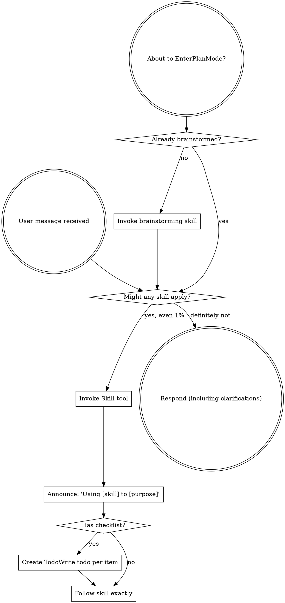

# Review — 2026-05-13-external-reviewer-redesign.md (post-slice, round 3)

- Target: `docs/superstar/plans/2026-05-13-external-reviewer-redesign.md`
- Request: `docs/reviewer/external-reviewer-redesign-post-slice/r3-2026-05-14T0136-request.md`
- Reviewer command: `reviewer-agent`
- Status: `ok`

---

**Findings**

F1. Blocking: Slice 1 has not passed the post-slice gate. The latest recorded review round is still `revise` in [chain.json](/home/simon/Dev/sigreer/skills/superstar/docs/reviewer/external-reviewer-redesign-post-slice/chain.json:22), and the round-2 response itself ends with `Overall verdict: revise` in [r2 response](/home/simon/Dev/sigreer/skills/superstar/docs/reviewer/external-reviewer-redesign-post-slice/r2-2026-05-14T0129-response.md:57). [r2-resolution.md](/home/simon/Dev/sigreer/skills/superstar/docs/reviewer/external-reviewer-redesign-post-slice/r2-resolution.md:1) documents attempted fixes, and an untracked round-3 request exists, but there is no round-3 response or manifest entry showing the fixes were accepted. This should remain blocked until a follow-up review returns `ready` or `ready with small edits`.

F2. Blocking: The active review chain is not durable/clean. `chain.json` references `r2-2026-05-14T0129-request.md` and `r2-2026-05-14T0129-response.md` in [chain.json](/home/simon/Dev/sigreer/skills/superstar/docs/reviewer/external-reviewer-redesign-post-slice/chain.json:24), but both files are currently untracked, along with `r3-2026-05-14T0136-request.md`. That contradicts the closeout expectation that review artifacts are committed and auditable. It also leaves the checked-in manifest pointing at files absent from git.

F3. Important: `parse_findings()` still reports unparseable prose as zero findings rather than `null`, which drifts from the design contract. The spec says if no accepted finding form matches, `findings_count` and `blocking_findings_count` are `null` so the coordinator inspects prose ([design](/home/simon/Dev/sigreer/skills/superstar/docs/superstar/specs/2026-05-13-external-reviewer-redesign-design.md:317)). Current code returns `(0, 0)` whenever no findings and no crash sentinel are found ([external-reviewer.py](/home/simon/Dev/sigreer/skills/superstar/skills/external-review/scripts/external-reviewer.py:551)). I verified this with `parse_findings("This response has prose but no F IDs. Overall verdict: revise") -> (0, 0)`. That can silently turn an unparseable review into “no findings.”

F4. Minor: Round-2 resolution evidence uses non-durable commit references. [r2-resolution.md](/home/simon/Dev/sigreer/skills/superstar/docs/reviewer/external-reviewer-redesign-post-slice/r2-resolution.md:21), [line 30](/home/simon/Dev/sigreer/skills/superstar/docs/reviewer/external-reviewer-redesign-post-slice/r2-resolution.md:30), and [line 35](/home/simon/Dev/sigreer/skills/superstar/docs/reviewer/external-reviewer-redesign-post-slice/r2-resolution.md:35) say “see git log” instead of naming the actual commits. That weakens the artifact as a durable handoff.

**Open questions / assumptions**

I assume the modified `CLAUDE.md` and four unrelated `SKILL.md` files are intentionally out of Slice 1 scope, as stated in the closeout note. I also assume working on `main` was explicitly accepted by the user, but the dirty/untracked review-chain state was not.

**Suggested document edits**

Update the Slice 1 closeout note to say the post-slice gate is still pending until round 3 completes. Replace “Final test result” language with “latest local verification” unless the review verdict is also final.

Update `r2-resolution.md` to name the concrete commits, especially `43f0aff` and `591a20c`, instead of “see git log.”

Either commit the referenced r2 request/response and r3 request, or remove/regenerate stale in-flight artifacts before claiming closeout.

**Verification gaps / commands**

Already run: `python3 -m pytest skills/external-review/tests/ -q` -> `21 passed, 1 warning`.

Still needed:
```bash
git status --short --untracked-files=all
python3 -m pytest skills/external-review/tests/ -q
python3 - <<'PY'
import importlib.util
spec = importlib.util.spec_from_file_location("er", "skills/external-review/scripts/external-reviewer.py")
er = importlib.util.module_from_spec(spec); spec.loader.exec_module(er)
print(er.parse_findings("This response has prose but no F IDs. Overall verdict: revise"))
PY
```

Then rerun the post-slice review after committing/cleaning artifacts and fixing the parser edge case.

**Overall verdict: revise**

---

## Reviewer stderr

```text
Reading additional input from stdin...
OpenAI Codex v0.130.0
--------
workdir: /home/simon/Dev/sigreer/skills/superstar
model: gpt-5.5
provider: openai
approval: never
sandbox: danger-full-access
reasoning effort: none
reasoning summaries: none
session id: 019e23e9-d4c9-7582-883c-fb6e05b565ad
--------
user
You are acting as an independent senior engineering reviewer.

Review stance:
- Lead with findings, ordered by severity.
- Focus on correctness, consistency, implementation risk, missing acceptance
  gates, vague handoffs, ungrounded assumptions, unverified claims, and drift
  from the codebase.
- Give exact file/line references when possible.
- If the document is sound, say that clearly and list residual risks.
- Keep the review actionable. Avoid broad rewrites unless the current structure
  creates concrete risk.

Repository root:
/home/simon/Dev/sigreer/skills/superstar

Target kind:
post-slice

Review mode:
Post-slice review. Treat this as a completion gate for one
slice of work. Compare the completed changes and stated evidence against the
slice acceptance criteria. Prioritize: incomplete tasks, uncommitted or
untracked artifacts, missing tests, failing or skipped verification, broken
cross-site behavior, and claims not supported by the repo state.

Target document:
docs/superstar/plans/2026-05-13-external-reviewer-redesign.md

Additional context files:
- docs/superstar/specs/2026-05-13-external-reviewer-redesign-design.md
- docs/handoffs/2026-05-13-external-reviewer-redesign-prompt.md
- docs/reviewer/external-reviewer-redesign-post-slice/r1-resolution.md
- docs/reviewer/external-reviewer-redesign-post-slice/r2-resolution.md

Review output contract:
1. Findings
2. Open questions / assumptions
3. Suggested document edits
4. Verification gaps / commands that should be run, if any
5. Overall verdict: one of "ready", "ready with small edits", or "revise"

Read the files from disk. Do not rely only on the snippets in this prompt.


## Target Preview

### docs/superstar/plans/2026-05-13-external-reviewer-redesign.md

    1	# External-Reviewer Redesign Implementation Plan
    2	
    3	> **For agentic workers:** REQUIRED SUB-SKILL: Use superstar:subagent-driven-development (recommended) or superstar:executing-plans to implement this plan task-by-task. Steps use checkbox (`- [ ]`) syntax for tracking.
    4	
    5	**Goal:** Rebuild `skills/external-review/scripts/external-reviewer.py` so review chains are incremental, durable, machine-readable, and support optional independent sweep reviewers — per `docs/superstar/specs/2026-05-13-external-reviewer-redesign-design.md`.
    6	
    7	**Architecture:** A persistent `chain.json` manifest per review chain becomes the source of truth for round metadata. The script gains verdict parsing, work-ID-keyed chain folders, a resolution-artifact contract and gate, incremental round prompts with embedded diffs, optional session-resume placeholders, and Pass-3 independent sweep reviewers. Skill documentation is updated to match.
    8	
    9	**Tech Stack:** Python 3.9+ standard library only (no external deps), `pytest` for tests, `git` CLI for diff and SHA capture.
   10	
   11	---
   12	
   13	## Pre-flight
   14	
   15	- [ ] **Step 1: Verify working directory and branch**
   16	
   17	Run:
   18	
   19	```bash
   20	cd /home/simon/Dev/sigreer/skills/superstar
   21	git status --short
   22	git rev-parse --abbrev-ref HEAD
   23	```
   24	
   25	Expected: clean tree, branch is a feature branch (not `main`). If on `main`, stop and create a branch via `superstar:using-git-worktrees`.
   26	
   27	- [ ] **Step 2: Confirm test runner**
   28	
   29	Run:
   30	
   31	```bash
   32	python3 -c "import pytest; print(pytest.__version__)"
   33	```
   34	
   35	Expected: prints a version string. If `ModuleNotFoundError`, install pytest:
   36	
   37	```bash
   38	python3 -m pip install --user pytest
   39	```
   40	
   41	- [ ] **Step 3: Set up the test directory**
   42	
   43	Create the directory tests will live in:
   44	
   45	```bash
   46	mkdir -p skills/external-review/tests
   47	touch skills/external-review/tests/__init__.py
   48	```
   49	
   50	Commit:
   51	
   52	```bash
   53	git add skills/external-review/tests/__init__.py
   54	git commit -m "scaffold: tests dir for external-reviewer redesign"
   55	```
   56	
   57	---
   58	
   59	## Slice 1: Chain manifest & verdict parsing
   60	
   61	**Goal:** Introduce `chain.json` as the round-metadata source of truth, parse verdicts and finding counts from response text, and emit them in the JSON output. Backwards-compatible: legacy chains synthesize a manifest on first touch.
   62	
   63	### Task 1.1: Manifest read/write helpers
   64	
   65	**Files:**
   66	- Create: `skills/external-review/tests/test_manifest.py`
   67	- Modify: `skills/external-review/scripts/external-reviewer.py`
   68	
   69	- [x] **Step 1: Write the failing tests**
   70	
   71	`skills/external-review/tests/test_manifest.py`:
   72	
   73	```python
   74	import json
   75	from pathlib import Path
   76	
   77	import pytest
   78	
   79	import sys
   80	SCRIPTS = Path(__file__).resolve().parents[1] / "scripts"
   81	sys.path.insert(0, str(SCRIPTS))
   82	
   83	import importlib.util
   84	spec = importlib.util.spec_from_file_location("external_reviewer", SCRIPTS / "external-reviewer.py")
   85	external_reviewer = importlib.util.module_from_spec(spec)
   86	spec.loader.exec_module(external_reviewer)
   87	
   88	
   89	def test_read_manifest_returns_none_for_missing(tmp_path):
   90	    assert external_reviewer.read_manifest(tmp_path / "missing.json") is None
   91	
   92	
   93	def test_write_then_read_manifest_roundtrips(tmp_path):
   94	    path = tmp_path / "chain.json"
   95	    data = {
   96	        "schema_version": 1,
   97	        "chain": "demo-post-slice",
   98	        "kind": "post-slice",
   99	        "target": "docs/plans/demo.md",
  100	        "work_id": "P1.S1",
  101	        "legacy_migrated": False,
  102	        "rounds": [],
  103	        "sweep_checkpoints": {"first-round": "pending", "final-ready": "pending"},
  104	    }
  105	    external_reviewer.write_manifest(path, data)
  106	    loaded = external_reviewer.read_manifest(path)
  107	    assert loaded == data
  108	
  109	
  110	def test_read_manifest_rejects_newer_schema(tmp_path):
  111	    path = tmp_path / "chain.json"
  112	    path.write_text(json.dumps({"schema_version": 99}))
  113	    with pytest.raises(external_reviewer.ManifestSchemaTooNew):
  114	        external_reviewer.read_manifest(path)
  115	```
  116	
  117	- [x] **Step 2: Run the tests; confirm they fail**
  118	
  119	```bash
  120	python3 -m pytest skills/external-review/tests/test_manifest.py -v
  121	```
  122	
  123	Expected: 3 failures (`read_manifest`, `write_manifest`, `ManifestSchemaTooNew` all undefined).
  124	
  125	- [x] **Step 3: Add manifest helpers to the script**
  126	
  127	Append to `skills/external-review/scripts/external-reviewer.py` (after the existing module-level constants, before `repo_root()`):
  128	
  129	```python
  130	SUPPORTED_SCHEMA_VERSION = 1
  131	
  132	
  133	class ManifestSchemaTooNew(Exception):
  134	    """Raised when chain.json declares a schema_version newer than this script supports."""
  135	
  136	
  137	def read_manifest(path: Path) -> dict | None:
  138	    if not path.exists():
  139	        return None
  140	    data = json.loads(path.read_text(encoding="utf-8"))
  141	    version = data.get("schema_version")
  142	    if isinstance(version, int) and version > SUPPORTED_SCHEMA_VERSION:
  143	        raise ManifestSchemaTooNew(
  144	            f"chain.json schema_version {version} is newer than this script supports "
  145	            f"(max {SUPPORTED_SCHEMA_VERSION}). Upgrade external-reviewer.py."
  146	        )
  147	    return data
  148	
  149	
  150	def write_manifest(path: Path, data: dict) -> None:
  151	    path.parent.mkdir(parents=True, exist_ok=True)
  152	    path.write_text(json.dumps(data, indent=2) + "\n", encoding="utf-8")
  153	```
  154	
  155	- [x] **Step 4: Run the tests; confirm they pass**
  156	
  157	```bash
  158	python3 -m pytest skills/external-review/tests/test_manifest.py -v
  159	```
  160	
  161	Expected: 3 passed.
  162	
  163	- [x] **Step 5: Commit**
  164	
  165	```bash
  166	git add skills/external-review/scripts/external-reviewer.py skills/external-review/tests/test_manifest.py
  167	git commit -m "feat(external-reviewer): chain.json read/write helpers with schema versioning"
  168	```
  169	
  170	### Task 1.2: Verdict parsing
  171	
  172	**Files:**
  173	- Create: `skills/external-review/tests/test_verdict.py`
  174	- Modify: `skills/external-review/scripts/external-reviewer.py`
  175	
  176	- [x] **Step 1: Write the failing tests**
  177	
  178	`skills/external-review/tests/test_verdict.py`:
  179	
  180	```python
  181	from pathlib import Path
  182	import sys, importlib.util
  183	
  184	SCRIPTS = Path(__file__).resolve().parents[1] / "scripts"
  185	sys.path.insert(0, str(SCRIPTS))
  186	spec = importlib.util.spec_from_file_location("external_reviewer", SCRIPTS / "external-reviewer.py")
  187	er = importlib.util.module_from_spec(spec); spec.loader.exec_module(er)
  188	
  189	
  190	def test_verdict_ready():
  191	    v, valid = er.parse_verdict("Findings: ok\n\nOverall verdict: ready\n")
  192	    assert v == "ready"
  193	    assert valid is True
  194	
  195	
  196	def test_verdict_ready_with_small_edits_markdown():
  197	    body = "**Overall verdict:** `ready with small edits`."
  198	    v, valid = er.parse_verdict(body)
  199	    assert v == "ready with small edits"
  200	    assert valid is True
  201	
  202	
  203	def test_verdict_revise_case_insensitive():
  204	    v, valid = er.parse_verdict("OVERALL VERDICT: Revise")
  205	    assert v == "revise"
  206	    assert valid is True
  207	
  208	
  209	def test_verdict_takes_last_match():
  210	    body = "Overall verdict: ready\n\n...later...\n\nOverall verdict: revise"
  211	    v, valid = er.parse_verdict(body)
  212	    assert v == "revise"
  213	
  214	
  215	def test_verdict_unknown_returns_invalid():
  216	    v, valid = er.parse_verdict("Overall verdict: looks fine to me")
  217	    assert v is None
  218	    assert valid is False
  219	
  220	
  221	def test_verdict_missing_returns_invalid():
  222	    v, valid = er.parse_verdict("Some review prose with no verdict line.")
  223	    assert v is None
  224	    assert valid is False
  225	```
  226	
  227	- [x] **Step 2: Run the tests; confirm they fail**
  228	
  229	```bash
  230	python3 -m pytest skills/external-review/tests/test_verdict.py -v
  231	```
  232	
  233	Expected: 6 failures (`parse_verdict` undefined).
  234	
  235	- [x] **Step 3: Add the verdict parser**
  236	
  237	Append to `skills/external-review/scripts/external-reviewer.py`:
  238	
  239	```python
  240	VERDICT_VALUES = ("ready with small edits", "ready", "revise")
  241	VERDICT_LINE_RE = re.compile(
  242	    r"overall\s+verdict\s*[:\-]\s*[`*_\"']*\s*(ready with small edits|ready|revise)\s*[`*_\"'.]*",
  243	    re.IGNORECASE,
  244	)
  245	
  246	
  247	def parse_verdict(text: str) -> tuple[str | None, bool]:
  248	    matches = list(VERDICT_LINE_RE.finditer(text))
  249	    if not matches:
  250	        return None, False
  251	    raw = matches[-1].group(1).strip().lower()
  252	    if raw not in VERDICT_VALUES:
  253	        return None, False
  254	    return raw, True
  255	```
  256	
  257	Note: regex prefers `ready with small edits` over `ready` because of ordering in the alternation.
  258	
  259	- [x] **Step 4: Run the tests; confirm they pass**
  260	
  261	```bash
  262	python3 -m pytest skills/external-review/tests/test_verdict.py -v
  263	```
  264	
  265	Expected: 6 passed.
  266	
  267	- [x] **Step 5: Commit**
  268	
  269	```bash
  270	git add skills/external-review/scripts/external-reviewer.py skills/external-review/tests/test_verdict.py
  271	git commit -m "feat(external-reviewer): parse_verdict with markdown/case tolerance"
  272	```
  273	
  274	### Task 1.3: Finding-count parsing
  275	
  276	**Files:**
  277	- Create: `skills/external-review/tests/test_findings.py`
  278	- Modify: `skills/external-review/scripts/external-reviewer.py`
  279	
  280	- [x] **Step 1: Write the failing tests**
  281	
  282	`skills/external-review/tests/test_findings.py`:
  283	
  284	```python
  285	from pathlib import Path
  286	import sys, importlib.util
  287	SCRIPTS = Path(__file__).resolve().parents[1] / "scripts"
  288	sys.path.insert(0, str(SCRIPTS))
  289	spec = importlib.util.spec_from_file_location("external_reviewer", SCRIPTS / "external-reviewer.py")
  290	er = importlib.util.module_from_spec(spec); spec.loader.exec_module(er)
  291	
  292	
  293	def test_heading_findings_counted():
  294	    body = "## F1\nSeverity: blocking\n\n## F2\nSeverity: minor\n\n## F3\nSeverity: blocking"
  295	    n, blocking = er.parse_findings(body)
  296	    assert n == 3
  297	    assert blocking == 2
  298	
  299	
  300	def test_bullet_findings_counted():
  301	    body = "- F1: something blocking (blocking)\n- F2 minor thing"
  302	    n, blocking = er.parse_findings(body)
  303	    assert n == 2
  304	    assert blocking == 1
  305	
  306	
  307	def test_no_findings_returns_zero():
  308	    body = "Overall verdict: ready\n\nNo findings."
  309	    n, blocking = er.parse_findings(body)
  310	    assert n == 0
  311	    assert blocking == 0
  312	
  313	
  314	def test_unparseable_returns_none():
  315	    body = "Reviewer crashed: connection reset"
  316	    n, blocking = er.parse_findings(body)
  317	    assert n is None
  318	    assert blocking is None
  319	```
  320	
  321	- [x] **Step 2: Run the tests; confirm they fail**
  322	
  323	```bash
  324	python3 -m pytest skills/external-review/tests/test_findings.py -v
  325	```
  326	
  327	Expected: 4 failures.
  328	
  329	- [x] **Step 3: Add the parser**
  330	
  331	Append to `skills/external-review/scripts/external-reviewer.py`:
  332	
  333	```python
  334	HEADING_FINDING_RE = re.compile(r"^##\s+F\d+\b", re.MULTILINE)
  335	BULLET_FINDING_RE = re.compile(r"^\s*[-*]?\s*\**F\d+\**[:\s\-]", re.MULTILINE)
  336	BLOCKING_MARKER_RE = re.compile(r"(?:^|\s)\(blocking\)|^severity\s*:\s*blocking", re.IGNORECASE | re.MULTILINE)
  337	
  338	
  339	def parse_findings(text: str) -> tuple[int | None, int | None]:
  340	    if not text or text.strip() == "" or "reviewer crashed" in text.lower():
  341	        return None, None
  342	    heading_count = len(HEADING_FINDING_RE.findall(text))
  343	    if heading_count > 0:
  344	        n = heading_count
  345	    else:
  346	        n = len(BULLET_FINDING_RE.findall(text))
  347	    blocking = len(BLOCKING_MARKER_RE.findall(text))
  348	    return n, blocking
  349	```
  350	
  351	- [x] **Step 4: Run the tests; confirm they pass**
  352	
  353	```bash
  354	python3 -m pytest skills/external-review/tests/test_findings.py -v
  355	```
  356	
  357	Expected: 4 passed.
  358	
  359	- [x] **Step 5: Commit**
  360	
  361	```bash
  362	git add skills/external-review/scripts/external-reviewer.py skills/external-review/tests/test_findings.py
  363	git commit -m "feat(external-reviewer): parse_findings (heading + bullet, blocking count)"
  364	```
  365	
  366	### Task 1.4: Round-number derivation reads manifest first
  367	
  368	**Files:**
  369	- Create: `skills/external-review/tests/test_round_number.py`
  370	- Modify: `skills/external-review/scripts/external-reviewer.py` (`next_round_number`)
  371	
  372	- [x] **Step 1: Write the failing tests**
  373	
  374	`skills/external-review/tests/test_round_number.py`:
  375	
  376	```python
  377	from pathlib import Path
  378	import json, sys, importlib.util
  379	SCRIPTS = Path(__file__).resolve().parents[1] / "scripts"
  380	sys.path.insert(0, str(SCRIPTS))
  381	spec = importlib.util.spec_from_file_location("external_reviewer", SCRIPTS / "external-reviewer.py")
  382	er = importlib.util.module_from_spec(spec); spec.loader.exec_module(er)
  383	
  384	
  385	def test_no_chain_dir_round_is_one(tmp_path):
  386	    assert er.next_round_number(tmp_path / "absent") == 1
  387	
  388	
  389	def test_manifest_present_takes_precedence(tmp_path):
  390	    d = tmp_path / "chain"; d.mkdir()
  391	    er.write_manifest(d / "chain.json", {
  392	        "schema_version": 1, "rounds": [{"round": 1}, {"round": 2}]
  393	    })
  394	    assert er.next_round_number(d) == 3
  395	
  396	
  397	def test_legacy_dir_no_manifest_falls_back_to_filename_scan(tmp_path):
  398	    d = tmp_path / "chain"; d.mkdir()
  399	    (d / "r1-2026-05-01T0900-request.md").write_text("")
  400	    (d / "r2-2026-05-02T0900-request.md").write_text("")
  401	    assert er.next_round_number(d) == 3
  402	```
  403	
  404	- [x] **Step 2: Run the tests; confirm they fail**
  405	
  406	```bash
  407	python3 -m pytest skills/external-review/tests/test_round_number.py -v
  408	```
  409	
  410	Expected: test 2 fails (no manifest awareness), tests 1 and 3 may pass if current behavior already handles them.
  411	
  412	- [x] **Step 3: Update `next_round_number`**
  413	
  414	Replace the existing function:
  415	
  416	```python
  417	def next_round_number(chain_dir: Path) -> int:
  418	    if not chain_dir.exists():
  419	        return 1
  420	    manifest = read_manifest(chain_dir / "chain.json")
  421	    if manifest and isinstance(manifest.get("rounds"), list):
  422	        return len(manifest["rounds"]) + 1
  423	    return len(list(chain_dir.glob("r*-*-request.md"))) + 1
  424	```
  425	
  426	- [x] **Step 4: Run the tests**
  427	
  428	```bash
  429	python3 -m pytest skills/external-review/tests/test_round_number.py -v
  430	```
  431	
  432	Expected: 3 passed.
  433	
  434	- [x] **Step 5: Commit**
  435	
  436	```bash
  437	git add skills/external-review/scripts/external-reviewer.py skills/external-review/tests/test_round_number.py
  438	git commit -m "feat(external-reviewer): next_round_number consults chain.json"
  439	```
  440	
  441	### Task 1.5: Legacy manifest synthesis
  442	
  443	**Files:**
  444	- Create: `skills/external-review/tests/test_legacy_migration.py`
  445	- Modify: `skills/external-review/scripts/external-reviewer.py`
  446	
  447	- [x] **Step 1: Write the failing tests**
  448	
  449	`skills/external-review/tests/test_legacy_migration.py`:
  450	
  451	```python
  452	from pathlib import Path
  453	import sys, importlib.util
  454	SCRIPTS = Path(__file__).resolve().parents[1] / "scripts"
  455	sys.path.insert(0, str(SCRIPTS))
  456	spec = importlib.util.spec_from_file_location("external_reviewer", SCRIPTS / "external-reviewer.py")
  457	er = importlib.util.module_from_spec(spec); spec.loader.exec_module(er)
  458	
  459	
  460	def test_synthesize_manifest_from_legacy_files(tmp_path):
  461	    d = tmp_path / "old-chain"; d.mkdir()
  462	    (d / "r1-2026-04-01T0900-request.md").write_text("prompt body")
  463	    (d / "r1-2026-04-01T0905-response.md").write_text(
  464	        "## F1\nSeverity: blocking\n\nOverall verdict: revise\n"
  465	    )
  466	    (d / "r2-2026-04-02T1200-request.md").write_text("prompt body 2")
  467	
  468	    manifest = er.synthesize_legacy_manifest(
  469	        chain_dir=d, chain="old-chain", kind="post-slice",
  470	        target="docs/plans/old.md", work_id="P1.S1",
  471	    )
  472	
  473	    assert manifest["legacy_migrated"] is True
  474	    assert manifest["work_id"] == "P1.S1"
  475	    assert len(manifest["rounds"]) == 2
  476	    r1, r2 = manifest["rounds"]
  477	    assert r1["legacy"] is True
  478	    assert r1["verdict"] == "revise"
  479	    assert r1["verdict_valid"] is True
  480	    assert r1["findings_count"] == 1
  481	    assert r1["blocking_findings_count"] == 1
  482	    assert r1["head_sha_after_round"] is None
  483	    assert r2["response"] is None  # only request file existed
  484	```
  485	
  486	- [x] **Step 2: Run the tests; confirm they fail**
  487	
  488	```bash
  489	python3 -m pytest skills/external-review/tests/test_legacy_migration.py -v
  490	```
  491	
  492	Expected: 1 failure.
  493	
  494	- [x] **Step 3: Add the synthesizer**
  495	
  496	Append to `skills/external-review/scripts/external-reviewer.py`:
  497	
  498	```python
  499	LEGACY_ROUND_FILE_RE = re.compile(r"^r(\d+)-([0-9T\-]+)-(request|response)\.md$")
  500	
  501	
  502	def synthesize_legacy_manifest(
  503	    *, chain_dir: Path, chain: str, kind: str, target: str, work_id: str | None
  504	) -> dict:
  505	    rounds_map: dict[int, dict] = {}
  506	    for path in sorted(chain_dir.iterdir()):
  507	        m = LEGACY_ROUND_FILE_RE.match(path.name)
  508	        if not m:
  509	            continue
  510	        round_num = int(m.group(1))
  511	        role = m.group(3)
  512	        entry = rounds_map.setdefault(
  513	            round_num,
  514	            {
  515	                "round": round_num,
  516	                "request": None,
  517	                "response": None,
  518	                "resolution": None,
  519	                "verdict": None,
  520	                "verdict_valid": False,
  521	                "findings_count": None,
  522	                "blocking_findings_count": None,
  523	                "head_sha_at_request": None,
  524	                "head_sha_after_round": None,
  525	                "worktree_dirty_at_request": None,
  526	                "legacy": True,
  527	            },
  528	        )
  529	        entry[role] = path.name
  530	        if role == "response":
  531	            body = path.read_text(encoding="utf-8", errors="replace")
  532	            v, valid = parse_verdict(body)
  533	            entry["verdict"], entry["verdict_valid"] = v, valid
  534	            n, blocking = parse_findings(body)
  535	            entry["findings_count"], entry["blocking_findings_count"] = n, blocking
  536	
  537	    return {
  538	        "schema_version": SUPPORTED_SCHEMA_VERSION,
  539	        "chain": chain,
  540	        "kind": kind,
  541	        "target": target,
  542	        "work_id": work_id,
  543	        "legacy_migrated": True,
  544	        "migrated_at": dt.datetime.utcnow().strftime("%Y-%m-%dT%H:%M:%SZ"),
  545	        "rounds": [rounds_map[k] for k in sorted(rounds_map)],
  546	        "sweep_checkpoints": {"first-round": "pending", "final-ready": "pending"},
  547	    }
  548	```
  549	
  550	- [x] **Step 4: Run the tests; confirm they pass**
  551	
  552	```bash
  553	python3 -m pytest skills/external-review/tests/test_legacy_migration.py -v
  554	```
  555	
  556	Expected: 1 passed.
  557	
  558	- [x] **Step 5: Commit**
  559	
  560	```bash
  561	git add skills/external-review/scripts/external-reviewer.py skills/external-review/tests/test_legacy_migration.py
  562	git commit -m "feat(external-reviewer): synthesize_legacy_manifest from rN-* files"
  563	```
  564	
  565	### Task 1.6: Wire manifest into `main()` for single-reviewer rounds
  566	
  567	**Files:**
  568	- Modify: `skills/external-review/scripts/external-reviewer.py` (`main` function)
  569	- Create: `skills/external-review/tests/test_main_round_writes_manifest.py`
  570	
  571	- [x] **Step 1: Write the failing test**
  572	
  573	`skills/external-review/tests/test_main_round_writes_manifest.py`:
  574	
  575	```python
  576	from pathlib import Path
  577	import subprocess, sys, json, importlib.util, os
  578	
  579	SCRIPTS = Path(__file__).resolve().parents[1] / "scripts"
  580	sys.path.insert(0, str(SCRIPTS))
  581	spec = importlib.util.spec_from_file_location("external_reviewer", SCRIPTS / "external-reviewer.py")
  582	er = importlib.util.module_from_spec(spec); spec.loader.exec_module(er)
  583	
  584	
  585	FAKE_REVIEWER = """#!/usr/bin/env bash
  586	cat <<'EOF'
  587	## F1
  588	Severity: blocking
  589	Stub finding.
  590	
  591	Overall verdict: revise
  592	EOF
  593	"""
  594	
  595	
  596	def test_main_writes_manifest_entry(tmp_path, monkeypatch):
  597	    repo = tmp_path / "repo"; repo.mkdir()
  598	    subprocess.run(["git", "-C", str(repo), "init", "-q"], check=True)
  599	    subprocess.run(["git", "-C", str(repo), "config", "user.email", "t@t"], check=True)
  600	    subprocess.run(["git", "-C", str(repo), "config", "user.name", "T"], check=True)

[truncated: 2409 additional lines]

## Context Previews

### docs/superstar/specs/2026-05-13-external-reviewer-redesign-design.md

    1	# External-Review Script Redesign — Design
    2	
    3	**Date:** 2026-05-13
    4	**Target:** `skills/external-review/scripts/external-reviewer.py` and `skills/external-review/SKILL.md`
    5	**Motivation:** A self-review of the external-reviewer flow surfaced five concrete failure modes that cause review loops to balloon to 7–10 rounds and lose continuity between rounds. This spec redesigns the script and skill to make rounds incremental, durable, and machine-readable.
    6	
    7	---
    8	
    9	## Goals
   10	
   11	1. **Round N+1 is incremental, not a re-review.** The reviewer is given prior findings, the fixer's resolution report, and a focused diff — and is instructed to verify resolution rather than reopen broad review.
   12	2. **Verdict is machine-readable.** JSON output exposes a parsed `verdict`, `verdict_valid`, and finding counts, so coordinators don't have to parse prose.
   13	3. **Post-slice / post-phase chains are uniquely keyed.** `--work-id` is required for both so that multi-slice plans don't collapse into one chain.
   14	4. **Resolution artifacts are durable and structured-enough-to-parse.** Required headers, free-form bodies, stable finding IDs across rounds.
   15	5. **Optional session resume.** Provider-specific wrappers can plug into placeholders if the underlying reviewer CLI supports session IDs.
   16	6. **Legacy chains keep working.** Soft-migrate on first new round; preserve existing folder names and audit history.
   17	7. **Review depth is explicit.** The default chain uses one primary incremental reviewer, but callers can request bounded independent sweep reviewers at high-risk checkpoints to preserve fresh-eye coverage without unbounded serial churn.
   18	
   19	## Non-goals
   20	
   21	- Replacing the chain-folder layout for new chains. The folder-naming scheme gains a `--work-id` segment for post-slice/post-phase, but the round-file scheme is unchanged.
   22	- Making the script aware of any specific reviewer CLI. The script remains provider-neutral via `AGENT_REVIEWER_CMD`.
   23	- Auto-dispatching the fixer subagent. The script enforces the resolution gate but does not invoke fixers; that stays in the coordinator's loop, governed by `subagent-driven-development`.
   24	
   25	## Invariants
   26	
   27	- **A review chain is single-writer.** Running two rounds concurrently against the same chain is unsupported and may corrupt `chain.json`. The script does not lock; callers are expected to serialise.
   28	- **Existing rounds are immutable.** Once written, `rN-*-request.md`, `rN-*-response.md`, and `rN-resolution.md` are never overwritten. Manifest entries for past rounds are append-only.
   29	
   30	## Architecture
   31	
   32	Three implementation passes, all designed in this spec:
   33	
   34	- **Pass 1 — Core.** Chain manifest, verdict parsing, `--work-id`, prior-round context injection, incremental round prompts, resolution-artifact contract and gate, automatic diff embedding, JSON output enrichment, legacy migration.
   35	- **Pass 2 — Session resume.** Optional placeholders (`{chain_dir}`, `{round}`, `{previous_response}`, `{resolution_file}`, `{session_file}`) exposed via the existing `AGENT_REVIEWER_CMD` template mechanism. A provider-specific wrapper can use `{session_file}` to persist and resume reviewer sessions. The script provides a stable path (`chain_dir/session.state`) and ensures the parent directory exists; wrappers own the file's contents. The script never reads `session.state`.
   36	- **Pass 3 — Review depth / independent sweeps.** Adds `--review-depth`, `--independent-reviewers`, `--sweep-policy` flags. Independent sweep reviewers run without seeing the primary reviewer's findings on their first pass (to avoid anchoring), and their findings are merged into the same resolution checklist afterward. Depends on Pass 1's manifest and verdict parsing; does not depend on Pass 2.
   37	
   38	### Chain manifest
   39	
   40	`docs/reviewer/<chain>/chain.json` is the single source of truth for round metadata. The `rN-*-request.md` / `rN-*-response.md` / `rN-resolution.md` files remain for human readability and git history; the script reads and writes manifest entries when computing round numbers, base refs, and verdicts.
   41	
   42	```json
   43	{
   44	  "schema_version": 1,
   45	  "chain": "feature-plan-P2-S3-post-slice",
   46	  "kind": "post-slice",
   47	  "target": "docs/superstar/plans/feature-plan.md",
   48	  "work_id": "P2.S3",
   49	  "legacy_migrated": false,
   50	  "rounds": [
   51	    {
   52	      "round": 1,
   53	      "request": "r1-2026-05-13T1012-request.md",
   54	      "response": "r1-2026-05-13T1020-response.md",
   55	      "resolution": null,
   56	      "head_sha_at_request": "abc1234",
   57	      "head_sha_after_round": "abc1234",
   58	      "worktree_dirty_at_request": false,
   59	      "verdict": "revise",
   60	      "verdict_valid": true,
   61	      "findings_count": 4,
   62	      "blocking_findings_count": 2
   63	    },
   64	    {
   65	      "round": 2,
   66	      "request": "r2-2026-05-13T1130-request.md",
   67	      "response": null,
   68	      "resolution": "r1-resolution.md",
   69	      "base_ref": "abc1234",
   70	      "base_ref_source": "auto",
   71	      "head_sha_at_request": "def5678",
   72	      "worktree_dirty_at_request": false,
   73	      "diff_included": true,
   74	      "resolution_parse_status": "ok",
   75	      "resolution_waiver": false
   76	    }
   77	  ]
   78	}
   79	```
   80	
   81	#### Manifest versioning
   82	
   83	- `schema_version: 1` is the initial version introduced by this redesign.
   84	- Unknown future `schema_version` values cause the script to error with a clear message: `ERROR: chain.json schema_version <N> is newer than this script supports. Upgrade external-reviewer.py.` This prevents silent corruption.
   85	- Older `schema_version` values (currently none) get best-effort migration on read, recorded as `schema_migrated_from: <prior>` in the manifest.
   86	
   87	### Naming
   88	
   89	- **Chain folder slug:** `<target-stem-no-leading-date>-<work-id-dotless>-<kind>` for post-slice/post-phase; `<target-stem-no-leading-date>-<kind>` otherwise. Dots in work IDs are replaced with dashes in the folder slug only — the manifest preserves the canonical form.
   90	  - Example: `--work-id P2.S3` → folder `feature-plan-P2-S3-post-slice`, manifest `"work_id": "P2.S3"`.
   91	- **Round files:** `r{N}-<YYYY-MM-DDTHHMM>-request.md`, `r{N}-<YYYY-MM-DDTHHMM>-response.md`. Unchanged from current behavior.
   92	- **Resolution files:** `r{N}-resolution.md`, where `N` is the round whose response is being addressed. Round `N+1` consumes `r{N}-resolution.md`. Worked example: after `r1-response.md` returns `revise`, the fixer writes `r1-resolution.md`; round 2 reads `r1-resolution.md` and embeds it in the round-2 prompt.
   93	
   94	## CLI surface (new flags)
   95	
   96	| Flag | Kinds | Purpose |
   97	|---|---|---|
   98	| `--work-id <id>` | required for `post-slice`, `post-phase`; optional otherwise | Stable slice/phase ID (e.g., `P2.S3` for post-slice, `P2` for post-phase). Becomes part of chain folder name (dots → dashes) and is stored verbatim in the manifest. |
   99	| `--base-ref <sha\|ref>` | any | Override auto-computed diff base for this round. |
  100	| `--no-diff` | any | Suppress diff embedding even on round N+1. |
  101	| `--allow-missing-resolution` | post-slice, post-phase | Waive the resolution-required gate. Logged in manifest as `resolution_waiver: true`. |
  102	| `--changed-files <path>...` | any | Override automatic changed-file discovery and limit the embedded diff to the supplied paths. |
  103	| `--mode <auto\|broad\|incremental>` | any | Override the round-1-vs-N prompt mode. Default `auto` (round 1 → broad; round 2+ → incremental). |
  104	| `--max-diff-lines <int>` | any | Cap diff size. Default 2000. Truncation marker is embedded if exceeded. |
  105	| `--review-depth <standard\|thorough\|exhaustive>` | post-slice, post-phase | Controls whether independent sweep reviewers are run in addition to the primary chain reviewer. Default `standard`. |
  106	| `--independent-reviewers <int>` | post-slice, post-phase | Override reviewer count for independent sweeps. Default derived from `--review-depth`. |
  107	| `--sweep-policy <first-round\|final-ready\|both\|never>` | post-slice, post-phase | When to run fresh-context sweep reviews. Default derived from `--review-depth`. |
  108	
  109	### `--work-id` enforcement
  110	
  111	- `post-slice` or `post-phase` invoked without `--work-id` → exit 2 with operational error.
  112	- For `post-phase`, the expected form is the phase ID alone (`P2`), not a slice ID. The script does not enforce a regex; it documents the convention.
  113	- For other kinds, `--work-id` is optional; if provided, it is recorded in the manifest but does not affect the folder slug.
  114	
  115	## Reviewer prompt — round 1 vs round N+
  116	
  117	### Round 1: broad
  118	
  119	The existing broad prompt, with the output contract revised to require **stable finding IDs**:
  120	
  121	```
  122	1. Findings
  123	   - Each finding tagged `F<n>` (e.g., F1, F2, F3). IDs must be stable across rounds.
  124	   - Severity: blocking | important | minor | nit
  125	2. Open questions / assumptions
  126	3. Suggested document edits
  127	4. Verification gaps
  128	5. Overall verdict: ready | ready with small edits | revise
  129	```
  130	
  131	### Round N+: incremental
  132	
  133	Prepended to the existing prompt body:
  134	
  135	```
  136	You are continuing an existing review chain. This is round {N} of {chain_id}.
  137	
  138	In incremental mode:
  139	- Verify whether prior findings are resolved per the resolution report below.
  140	- Reuse the existing finding IDs (F1, F2, …). If a prior finding is resolved,
  141	  mark it RESOLVED in your findings list with its original ID. If still
  142	  unresolved, keep its ID.
  143	- Only introduce new finding IDs for genuine regressions caused by the fix, or
  144	  blocking issues clearly missed in earlier rounds. Do not reopen broad review
  145	  unless prior fixes changed broad architecture.
  146	
  147	Review chain summary:
  148	{per-round table: round, verdict, findings_count, blocking_findings_count}
  149	
  150	Prior-round findings (authoritative):
  151	{if r{N-1}-merged-findings.md exists: its verbatim contents — this replaces
  152	 individual reviewer response files as the prior-finding list of record}
  153	{else: a summary of the prior round's primary response, with finding IDs intact}
  154	
  155	Resolution report for prior round:
  156	{verbatim contents of r{N-1}-resolution.md}
  157	{or "MISSING — explicitly waived by caller via --allow-missing-resolution"}
  158	{or "MISSING — chain migrated from legacy artifacts; please verify whether changes occurred from the diff below"}
  159	
  160	Resolution parse summary (best-effort):
  161	{structured: per-finding-ID → status, or "unparseable"}
  162	
  163	Changes since prior round:
  164	{git diff <base_ref>..HEAD -- <scoped paths>}
  165	{if dirty: appended `git diff HEAD` section, both labeled}
  166	{if no base: "not available for this round (legacy chain / first round / --no-diff)"}
  167	```
  168	
  169	`--mode broad` forces round-1-style on later rounds (rare; for cases where the fix changed architecture). `--mode incremental` on round 1 is rejected with a clear error.
  170	
  171	## Resolution artifact contract
  172	
  173	**Path:** `docs/reviewer/<chain>/r{N}-resolution.md`, where `N` is the round whose response is being addressed. Authored by the fix subagent between round N (response) and round N+1 (resubmit).
  174	
  175	**Required parseable shape:**
  176	
  177	```markdown
  178	# Resolution for r{N}
  179	
  180	## F1
  181	Status: fixed
  182	Evidence:
  183	- Commit: abc1234
  184	- Files: `src/foo.ts:42`, `tests/foo.test.ts:18`
  185	- Verification: `npm test -- foo.test.ts` passed
  186	
  187	Notes:
  188	Changed the validation path to reject empty IDs before persistence.
  189	
  190	## F2
  191	Status: waived
  192	Evidence:
  193	- No code change
  194	- Reason: reviewer assumed X, but the plan explicitly excludes X in
  195	  `docs/superstar/specs/foo-design.md:77`
  196	
  197	Notes:
  198	No implementation change because this would expand slice scope.
  199	```
  200	

[truncated: 289 additional lines]
### docs/handoffs/2026-05-13-external-reviewer-redesign-prompt.md

    1	# Coordinator handoff — External-Reviewer Redesign
    2	
    3	You are the coordinator for implementing the **external-reviewer redesign** in the `superstar` repo at `/home/simon/Dev/sigreer/skills/superstar`.
    4	
    5	Your role is **strictly orchestration**. Use the `superstar:subagent-driven-development` skill with parallel agents where possible.
    6	
    7	## Inputs
    8	
    9	- Spec: [`docs/superstar/specs/2026-05-13-external-reviewer-redesign-design.md`](docs/superstar/specs/2026-05-13-external-reviewer-redesign-design.md)
   10	- Plan: [`docs/superstar/plans/2026-05-13-external-reviewer-redesign.md`](docs/superstar/plans/2026-05-13-external-reviewer-redesign.md)
   11	- Reviewer chain folder (created on first review): `docs/reviewer/external-reviewer-redesign-plan/` (kind `plan`) and per-slice chains like `docs/reviewer/external-reviewer-redesign-S1-post-slice/` (no TASKLIST.md in this repo; treat `S1`…`S8` from the plan as the work-id segments).
   12	
   13	## Coordinator discipline (non-negotiable)
   14	
   15	- **Do not perform any fixes yourself** unless the fix is genuinely cheaper to implement than the process of delegating to a subagent. Tiebreak: delegate.
   16	- **Do not pollute your context.** Delegate investigations, file reads, and edits to subagents. Your context is for orchestration, not implementation detail.
   17	- **At the end of each slice (S1–S8)**, the human partner runs `external-review` manually with `--kind post-slice` and pastes the findings back. Do NOT invoke the external-review skill yourself in this project — the human partner has explicitly chosen to drive it manually to keep the context clean. Wait for the verdict before proceeding to the next slice.
   18	- **Do not perform reviewer-driven fixes yourself.** Pass each reviewer response to a fix subagent that writes `r{N}-resolution.md` per the contract in `[[external-review]]`, then signal the human partner that the resolution is ready and the next round can be submitted.
   19	- **At the end of the phase** (after S8 closes), the human partner runs `--kind post-phase` manually. Same delegation rule.
   20	- **No TASKLIST.md exists** in this repo. Track slice completion in this handoff document or in a TODO list you maintain in-session; do not invent a TASKLIST.md file.
   21	
   22	## First action
   23	
   24	Read this file (the handoff prompt), the spec, and the plan. Then invoke `superstar:subagent-driven-development` and begin Slice 1 (Chain manifest & verdict parsing).
### docs/reviewer/external-reviewer-redesign-post-slice/r1-resolution.md

    1	# Round 1 resolution
    2	
    3	## F1 — skill entrypoint mismatch
    4	- **Verdict:** fixed
    5	- **What changed:** `skills/external-review/SKILL.md` updated at lines 8 and 43 to reference `skills/external-review/scripts/external-reviewer.py` (the canonical location) instead of the obsolete root-level `scripts/external-reviewer.py`. The root-level script was staged for deletion (it had already been removed from disk in commit `544bf51` when `project-setup` extracted the migration helper; the working-tree deletion was untracked until now). Audited remaining references: `skills/project-setup/SKILL.md` already pointed to the correct path; design spec and round-1 request/response files reference the path historically and were not modified.
    6	- **Commit:** `57fd2cd`
    7	
    8	## F2 — workspace cleanliness
    9	- **Verdict:** fixed (within scope of staying on `main`)
   10	- **What changed:**
   11	  - `.gitignore` extended to cover `__pycache__/` and `*.pyc`.
   12	  - Slice 1 chain artefacts under `docs/reviewer/external-reviewer-redesign-post-slice/` committed (round-1 request + response + this resolution doc).
   13	  - Plan file updated with a "Slice 1 closeout note" enumerating the seven Slice 1 commits, the final test count (`19 passed`), the pre-flight override on `main`, and the new script location.
   14	  - Unrelated dirty files (`CLAUDE.md`, four other SKILL.md edits) deliberately left in place — they predate Slice 1 and are outside scope, as called out in the closeout note.
   15	- **Commit:** `c9b1ca3`
   16	
   17	## F3 — head_sha capture timing
   18	- **Verdict:** fixed
   19	- **What changed:** In `skills/external-review/scripts/external-reviewer.py`, `current_head_sha(root)` and `is_dirty(root)` are now invoked *before* `run_reviewer` (immediately after the prompt file is written) and stored as `head_sha_at_request` / `worktree_dirty_at_request`. A second `current_head_sha(root)` call after the reviewer returns supplies `head_sha_after_round`. The manifest round entry now records distinct values when the reviewer mutates repo state. New test `skills/external-review/tests/test_head_sha_capture_timing.py` uses a stub reviewer that creates a commit mid-review and asserts the two fields differ and match the expected before/after SHAs. Full suite: `19 passed`.
   20	- **Commit:** `57fd2cd`
### docs/reviewer/external-reviewer-redesign-post-slice/r2-resolution.md

    1	# Round 2 resolution
    2	
    3	## F1 — parse_findings bugs (prose style + crash sentinel over-trigger)
    4	- **Verdict:** fixed
    5	- **What changed:**
    6	  - `skills/external-review/scripts/external-reviewer.py`: replaced the two-regex parser with `_collect_findings()`, which now recognises three styles:
    7	    1. **Prose style** (`F1. Blocking: ...`, `F2. Important: ...`) — the form the live reviewer actually produces. Severity is captured inline from the same line, so blocking count is derived per-finding, not by a global re-scan.
    8	    2. **Heading style** (`## F1`) — retained; blocking count falls back to `^Severity:\s*blocking` lines, matching pre-existing test fixtures.
    9	    3. **Bullet style** (`- F1: ...`) — retained as the last-resort form; tightened from `[-*]?` to `[-*]` so prose lines aren't mis-classified as bullets.
   10	  - Findings are now keyed by F-number and de-duplicated within a single response. This matters because real reviewer responses echo their own prompt content, so `F1./F2./F3.` typically appears twice in the artefact — once as the live finding, once inside an embedded preview. De-duplication makes the count reflect distinct findings.
   11	  - Style precedence is now **prose → heading → bullet**. Previous order was heading-first, which caused live responses (where `## F1` appears inside echoed test fixtures or embedded plan content) to be parsed as heading-style and miscount.
   12	  - The `"reviewer crashed"` sentinel was anchored: the new `CRASH_SENTINEL_RE` requires the phrase at the start of a line (optionally prefixed by `Status:`). It only fires when no findings were parsed in any style. This stops it from triggering when the phrase appears inside fenced code blocks or quoted excerpts (the script source contains the literal string).
   13	- **Tests added** (`skills/external-review/tests/test_findings.py`):
   14	  - `test_prose_style_findings_counted` — asserts `F1. Blocking / F2. Blocking / F3. Important` → `(3, 2)`.
   15	  - `test_crash_phrase_in_quoted_content_does_not_block_parse` — embeds `'reviewer crashed'` inside a fenced code block alongside real prose findings, asserts the findings are still counted.
   16	- **Verification on real artefacts:** ran `parse_findings` against both completed response files:
   17	  - `r1-2026-05-14T0124-response.md` → `(3, 2)` ✅
   18	  - `r2-2026-05-14T0129-response.md` → `(3, 2)` ✅
   19	- **chain.json re-emission:** the round-1 entry's `findings_count` / `blocking_findings_count` were `null` because the bug was present when round 1 was recorded. After the parser fix, both rounds in `docs/reviewer/external-reviewer-redesign-post-slice/chain.json` were re-parsed and updated in place; both now read `findings_count: 3`, `blocking_findings_count: 2`.
   20	- **Test suite:** `python3 -m pytest skills/external-review/tests/` → `21 passed` (19 baseline + 2 new).
   21	- **Commit:** see `git log` (parser fix + tests bundled in the same commit).
   22	
   23	## F2 — untracked planning artefacts
   24	- **Verdict:** fixed
   25	- **What changed:**
   26	  - Committed `docs/superstar/specs/2026-05-13-external-reviewer-redesign-design.md` (the Slice 1 design spec) and `docs/handoffs/2026-05-13-external-reviewer-redesign-prompt.md` (the coordinator handoff). Both were intentional Slice 1 deliverables that remained untracked through round 1.
   27	  - The Slice 1 closeout note in the plan was updated to disclose these commits explicitly.
   28	  - The current in-flight round's `r2-*-request.md` / `r2-*-response.md` are deliberately **not** committed in this resolution — they will be committed alongside this resolution doc once the round 2 fix work lands as a single coherent commit. This matches the chain-folder convention used in round 1.
   29	- **By-design note:** F2 also flagged that `r2-*request.md` isn't in `chain.json`. That is expected: `chain.json` is appended to only after the reviewer finishes a round (the request file is written before the reviewer runs, the manifest entry is written after). During an in-flight round the request file may appear untracked with no manifest entry; this resolves when the round closes. The Slice 1 closeout note was extended to document this expectation.
   30	- **Commit:** see `git log` (planning artefacts + closeout-note edits bundled).
   31	
   32	## F3 — Slice 1 checkboxes visually incomplete
   33	- **Verdict:** fixed
   34	- **What changed:** ticked all 31 `- [ ]` step checkboxes inside Slice 1 (tasks 1.1 through 1.6) in `docs/superstar/plans/2026-05-13-external-reviewer-redesign.md`, switching them to `- [x]`. Slice 2+ checkboxes are intentionally left open.
   35	- **Commit:** see `git log`.

codex
I’m using `superpowers:using-superpowers` for the required session bootstrap, then I’ll read the requested documents and verify the repo state against the slice gate.
exec
/usr/bin/zsh -lc "sed -n '1,220p' /home/simon/.codex/plugins/cache/openai-curated/superpowers/1b89ff49/skills/using-superpowers/SKILL.md && pwd && git status --short && git rev-parse --abbrev-ref HEAD" in /home/simon/Dev/sigreer/skills/superstar
 succeeded in 0ms:
---
name: using-superpowers
description: Use when starting any conversation - establishes how to find and use skills, requiring Skill tool invocation before ANY response including clarifying questions
---

<SUBAGENT-STOP>
If you were dispatched as a subagent to execute a specific task, skip this skill.
</SUBAGENT-STOP>

<EXTREMELY-IMPORTANT>
If you think there is even a 1% chance a skill might apply to what you are doing, you ABSOLUTELY MUST invoke the skill.

IF A SKILL APPLIES TO YOUR TASK, YOU DO NOT HAVE A CHOICE. YOU MUST USE IT.

This is not negotiable. This is not optional. You cannot rationalize your way out of this.
</EXTREMELY-IMPORTANT>

## Instruction Priority

Superpowers skills override default system prompt behavior, but **user instructions always take precedence**:

1. **User's explicit instructions** (CLAUDE.md, GEMINI.md, AGENTS.md, direct requests) — highest priority
2. **Superpowers skills** — override default system behavior where they conflict
3. **Default system prompt** — lowest priority

If CLAUDE.md, GEMINI.md, or AGENTS.md says "don't use TDD" and a skill says "always use TDD," follow the user's instructions. The user is in control.

## How to Access Skills

**In Claude Code:** Use the `Skill` tool. When you invoke a skill, its content is loaded and presented to you—follow it directly. Never use the Read tool on skill files.

**In Copilot CLI:** Use the `skill` tool. Skills are auto-discovered from installed plugins. The `skill` tool works the same as Claude Code's `Skill` tool.

**In Gemini CLI:** Skills activate via the `activate_skill` tool. Gemini loads skill metadata at session start and activates the full content on demand.

**In other environments:** Check your platform's documentation for how skills are loaded.

## Platform Adaptation

Skills use Claude Code tool names. Non-CC platforms: see `references/copilot-tools.md` (Copilot CLI), `references/codex-tools.md` (Codex) for tool equivalents. Gemini CLI users get the tool mapping loaded automatically via GEMINI.md.

# Using Skills

## The Rule

**Invoke relevant or requested skills BEFORE any response or action.** Even a 1% chance a skill might apply means that you should invoke the skill to check. If an invoked skill turns out to be wrong for the situation, you don't need to use it.



## Red Flags

These thoughts mean STOP—you're rationalizing:

| Thought | Reality |
|---------|---------|
| "This is just a simple question" | Questions are tasks. Check for skills. |
| "I need more context first" | Skill check comes BEFORE clarifying questions. |
| "Let me explore the codebase first" | Skills tell you HOW to explore. Check first. |
| "I can check git/files quickly" | Files lack conversation context. Check for skills. |
| "Let me gather information first" | Skills tell you HOW to gather information. |
| "This doesn't need a formal skill" | If a skill exists, use it. |
| "I remember this skill" | Skills evolve. Read current version. |
| "This doesn't count as a task" | Action = task. Check for skills. |
| "The skill is overkill" | Simple things become complex. Use it. |
| "I'll just do this one thing first" | Check BEFORE doing anything. |
| "This feels productive" | Undisciplined action wastes time. Skills prevent this. |
| "I know what that means" | Knowing the concept ≠ using the skill. Invoke it. |

## Skill Priority

When multiple skills could apply, use this order:

1. **Process skills first** (brainstorming, debugging) - these determine HOW to approach the task
2. **Implementation skills second** (frontend-design, mcp-builder) - these guide execution

"Let's build X" → brainstorming first, then implementation skills.
"Fix this bug" → debugging first, then domain-specific skills.

## Skill Types

**Rigid** (TDD, debugging): Follow exactly. Don't adapt away discipline.

**Flexible** (patterns): Adapt principles to context.

The skill itself tells you which.

## User Instructions

Instructions say WHAT, not HOW. "Add X" or "Fix Y" doesn't mean skip workflows.
/home/simon/Dev/sigreer/skills/superstar
 M CLAUDE.md
 M skills/executing-plans/SKILL.md
 M skills/finishing-a-development-branch/SKILL.md
 M skills/subagent-driven-development/SKILL.md
 M skills/tasklist-discipline/SKILL.md
?? docs/reviewer/external-reviewer-redesign-post-slice/r2-2026-05-14T0129-request.md
?? docs/reviewer/external-reviewer-redesign-post-slice/r2-2026-05-14T0129-response.md
?? docs/reviewer/external-reviewer-redesign-post-slice/r3-2026-05-14T0136-request.md
main

codex
The working tree is on `main` and has untracked round artifacts plus unrelated modified skill files. I’m going to inspect the actual plan/spec/resolution files, chain manifest, current script, tests, and recent commits so the findings are grounded in the repo state rather than the preview.
exec
/usr/bin/zsh -lc "nl -ba docs/superstar/plans/2026-05-13-external-reviewer-redesign.md | sed -n '1,760p'" in /home/simon/Dev/sigreer/skills/superstar
 succeeded in 0ms:
     1	# External-Reviewer Redesign Implementation Plan
     2	
     3	> **For agentic workers:** REQUIRED SUB-SKILL: Use superstar:subagent-driven-development (recommended) or superstar:executing-plans to implement this plan task-by-task. Steps use checkbox (`- [ ]`) syntax for tracking.
     4	
     5	**Goal:** Rebuild `skills/external-review/scripts/external-reviewer.py` so review chains are incremental, durable, machine-readable, and support optional independent sweep reviewers — per `docs/superstar/specs/2026-05-13-external-reviewer-redesign-design.md`.
     6	
     7	**Architecture:** A persistent `chain.json` manifest per review chain becomes the source of truth for round metadata. The script gains verdict parsing, work-ID-keyed chain folders, a resolution-artifact contract and gate, incremental round prompts with embedded diffs, optional session-resume placeholders, and Pass-3 independent sweep reviewers. Skill documentation is updated to match.
     8	
     9	**Tech Stack:** Python 3.9+ standard library only (no external deps), `pytest` for tests, `git` CLI for diff and SHA capture.
    10	
    11	---
    12	
    13	## Pre-flight
    14	
    15	- [ ] **Step 1: Verify working directory and branch**
    16	
    17	Run:
    18	
    19	```bash
    20	cd /home/simon/Dev/sigreer/skills/superstar
    21	git status --short
    22	git rev-parse --abbrev-ref HEAD
    23	```
    24	
    25	Expected: clean tree, branch is a feature branch (not `main`). If on `main`, stop and create a branch via `superstar:using-git-worktrees`.
    26	
    27	- [ ] **Step 2: Confirm test runner**
    28	
    29	Run:
    30	
    31	```bash
    32	python3 -c "import pytest; print(pytest.__version__)"
    33	```
    34	
    35	Expected: prints a version string. If `ModuleNotFoundError`, install pytest:
    36	
    37	```bash
    38	python3 -m pip install --user pytest
    39	```
    40	
    41	- [ ] **Step 3: Set up the test directory**
    42	
    43	Create the directory tests will live in:
    44	
    45	```bash
    46	mkdir -p skills/external-review/tests
    47	touch skills/external-review/tests/__init__.py
    48	```
    49	
    50	Commit:
    51	
    52	```bash
    53	git add skills/external-review/tests/__init__.py
    54	git commit -m "scaffold: tests dir for external-reviewer redesign"
    55	```
    56	
    57	---
    58	
    59	## Slice 1: Chain manifest & verdict parsing
    60	
    61	**Goal:** Introduce `chain.json` as the round-metadata source of truth, parse verdicts and finding counts from response text, and emit them in the JSON output. Backwards-compatible: legacy chains synthesize a manifest on first touch.
    62	
    63	### Task 1.1: Manifest read/write helpers
    64	
    65	**Files:**
    66	- Create: `skills/external-review/tests/test_manifest.py`
    67	- Modify: `skills/external-review/scripts/external-reviewer.py`
    68	
    69	- [x] **Step 1: Write the failing tests**
    70	
    71	`skills/external-review/tests/test_manifest.py`:
    72	
    73	```python
    74	import json
    75	from pathlib import Path
    76	
    77	import pytest
    78	
    79	import sys
    80	SCRIPTS = Path(__file__).resolve().parents[1] / "scripts"
    81	sys.path.insert(0, str(SCRIPTS))
    82	
    83	import importlib.util
    84	spec = importlib.util.spec_from_file_location("external_reviewer", SCRIPTS / "external-reviewer.py")
    85	external_reviewer = importlib.util.module_from_spec(spec)
    86	spec.loader.exec_module(external_reviewer)
    87	
    88	
    89	def test_read_manifest_returns_none_for_missing(tmp_path):
    90	    assert external_reviewer.read_manifest(tmp_path / "missing.json") is None
    91	
    92	
    93	def test_write_then_read_manifest_roundtrips(tmp_path):
    94	    path = tmp_path / "chain.json"
    95	    data = {
    96	        "schema_version": 1,
    97	        "chain": "demo-post-slice",
    98	        "kind": "post-slice",
    99	        "target": "docs/plans/demo.md",
   100	        "work_id": "P1.S1",
   101	        "legacy_migrated": False,
   102	        "rounds": [],
   103	        "sweep_checkpoints": {"first-round": "pending", "final-ready": "pending"},
   104	    }
   105	    external_reviewer.write_manifest(path, data)
   106	    loaded = external_reviewer.read_manifest(path)
   107	    assert loaded == data
   108	
   109	
   110	def test_read_manifest_rejects_newer_schema(tmp_path):
   111	    path = tmp_path / "chain.json"
   112	    path.write_text(json.dumps({"schema_version": 99}))
   113	    with pytest.raises(external_reviewer.ManifestSchemaTooNew):
   114	        external_reviewer.read_manifest(path)
   115	```
   116	
   117	- [x] **Step 2: Run the tests; confirm they fail**
   118	
   119	```bash
   120	python3 -m pytest skills/external-review/tests/test_manifest.py -v
   121	```
   122	
   123	Expected: 3 failures (`read_manifest`, `write_manifest`, `ManifestSchemaTooNew` all undefined).
   124	
   125	- [x] **Step 3: Add manifest helpers to the script**
   126	
   127	Append to `skills/external-review/scripts/external-reviewer.py` (after the existing module-level constants, before `repo_root()`):
   128	
   129	```python
   130	SUPPORTED_SCHEMA_VERSION = 1
   131	
   132	
   133	class ManifestSchemaTooNew(Exception):
   134	    """Raised when chain.json declares a schema_version newer than this script supports."""
   135	
   136	
   137	def read_manifest(path: Path) -> dict | None:
   138	    if not path.exists():
   139	        return None
   140	    data = json.loads(path.read_text(encoding="utf-8"))
   141	    version = data.get("schema_version")
   142	    if isinstance(version, int) and version > SUPPORTED_SCHEMA_VERSION:
   143	        raise ManifestSchemaTooNew(
   144	            f"chain.json schema_version {version} is newer than this script supports "
   145	            f"(max {SUPPORTED_SCHEMA_VERSION}). Upgrade external-reviewer.py."
   146	        )
   147	    return data
   148	
   149	
   150	def write_manifest(path: Path, data: dict) -> None:
   151	    path.parent.mkdir(parents=True, exist_ok=True)
   152	    path.write_text(json.dumps(data, indent=2) + "\n", encoding="utf-8")
   153	```
   154	
   155	- [x] **Step 4: Run the tests; confirm they pass**
   156	
   157	```bash
   158	python3 -m pytest skills/external-review/tests/test_manifest.py -v
   159	```
   160	
   161	Expected: 3 passed.
   162	
   163	- [x] **Step 5: Commit**
   164	
   165	```bash
   166	git add skills/external-review/scripts/external-reviewer.py skills/external-review/tests/test_manifest.py
   167	git commit -m "feat(external-reviewer): chain.json read/write helpers with schema versioning"
   168	```
   169	
   170	### Task 1.2: Verdict parsing
   171	
   172	**Files:**
   173	- Create: `skills/external-review/tests/test_verdict.py`
   174	- Modify: `skills/external-review/scripts/external-reviewer.py`
   175	
   176	- [x] **Step 1: Write the failing tests**
   177	
   178	`skills/external-review/tests/test_verdict.py`:
   179	
   180	```python
   181	from pathlib import Path
   182	import sys, importlib.util
   183	
   184	SCRIPTS = Path(__file__).resolve().parents[1] / "scripts"
   185	sys.path.insert(0, str(SCRIPTS))
   186	spec = importlib.util.spec_from_file_location("external_reviewer", SCRIPTS / "external-reviewer.py")
   187	er = importlib.util.module_from_spec(spec); spec.loader.exec_module(er)
   188	
   189	
   190	def test_verdict_ready():
   191	    v, valid = er.parse_verdict("Findings: ok\n\nOverall verdict: ready\n")
   192	    assert v == "ready"
   193	    assert valid is True
   194	
   195	
   196	def test_verdict_ready_with_small_edits_markdown():
   197	    body = "**Overall verdict:** `ready with small edits`."
   198	    v, valid = er.parse_verdict(body)
   199	    assert v == "ready with small edits"
   200	    assert valid is True
   201	
   202	
   203	def test_verdict_revise_case_insensitive():
   204	    v, valid = er.parse_verdict("OVERALL VERDICT: Revise")
   205	    assert v == "revise"
   206	    assert valid is True
   207	
   208	
   209	def test_verdict_takes_last_match():
   210	    body = "Overall verdict: ready\n\n...later...\n\nOverall verdict: revise"
   211	    v, valid = er.parse_verdict(body)
   212	    assert v == "revise"
   213	
   214	
   215	def test_verdict_unknown_returns_invalid():
   216	    v, valid = er.parse_verdict("Overall verdict: looks fine to me")
   217	    assert v is None
   218	    assert valid is False
   219	
   220	
   221	def test_verdict_missing_returns_invalid():
   222	    v, valid = er.parse_verdict("Some review prose with no verdict line.")
   223	    assert v is None
   224	    assert valid is False
   225	```
   226	
   227	- [x] **Step 2: Run the tests; confirm they fail**
   228	
   229	```bash
   230	python3 -m pytest skills/external-review/tests/test_verdict.py -v
   231	```
   232	
   233	Expected: 6 failures (`parse_verdict` undefined).
   234	
   235	- [x] **Step 3: Add the verdict parser**
   236	
   237	Append to `skills/external-review/scripts/external-reviewer.py`:
   238	
   239	```python
   240	VERDICT_VALUES = ("ready with small edits", "ready", "revise")
   241	VERDICT_LINE_RE = re.compile(
   242	    r"overall\s+verdict\s*[:\-]\s*[`*_\"']*\s*(ready with small edits|ready|revise)\s*[`*_\"'.]*",
   243	    re.IGNORECASE,
   244	)
   245	
   246	
   247	def parse_verdict(text: str) -> tuple[str | None, bool]:
   248	    matches = list(VERDICT_LINE_RE.finditer(text))
   249	    if not matches:
   250	        return None, False
   251	    raw = matches[-1].group(1).strip().lower()
   252	    if raw not in VERDICT_VALUES:
   253	        return None, False
   254	    return raw, True
   255	```
   256	
   257	Note: regex prefers `ready with small edits` over `ready` because of ordering in the alternation.
   258	
   259	- [x] **Step 4: Run the tests; confirm they pass**
   260	
   261	```bash
   262	python3 -m pytest skills/external-review/tests/test_verdict.py -v
   263	```
   264	
   265	Expected: 6 passed.
   266	
   267	- [x] **Step 5: Commit**
   268	
   269	```bash
   270	git add skills/external-review/scripts/external-reviewer.py skills/external-review/tests/test_verdict.py
   271	git commit -m "feat(external-reviewer): parse_verdict with markdown/case tolerance"
   272	```
   273	
   274	### Task 1.3: Finding-count parsing
   275	
   276	**Files:**
   277	- Create: `skills/external-review/tests/test_findings.py`
   278	- Modify: `skills/external-review/scripts/external-reviewer.py`
   279	
   280	- [x] **Step 1: Write the failing tests**
   281	
   282	`skills/external-review/tests/test_findings.py`:
   283	
   284	```python
   285	from pathlib import Path
   286	import sys, importlib.util
   287	SCRIPTS = Path(__file__).resolve().parents[1] / "scripts"
   288	sys.path.insert(0, str(SCRIPTS))
   289	spec = importlib.util.spec_from_file_location("external_reviewer", SCRIPTS / "external-reviewer.py")
   290	er = importlib.util.module_from_spec(spec); spec.loader.exec_module(er)
   291	
   292	
   293	def test_heading_findings_counted():
   294	    body = "## F1\nSeverity: blocking\n\n## F2\nSeverity: minor\n\n## F3\nSeverity: blocking"
   295	    n, blocking = er.parse_findings(body)
   296	    assert n == 3
   297	    assert blocking == 2
   298	
   299	
   300	def test_bullet_findings_counted():
   301	    body = "- F1: something blocking (blocking)\n- F2 minor thing"
   302	    n, blocking = er.parse_findings(body)
   303	    assert n == 2
   304	    assert blocking == 1
   305	
   306	
   307	def test_no_findings_returns_zero():
   308	    body = "Overall verdict: ready\n\nNo findings."
   309	    n, blocking = er.parse_findings(body)
   310	    assert n == 0
   311	    assert blocking == 0
   312	
   313	
   314	def test_unparseable_returns_none():
   315	    body = "Reviewer crashed: connection reset"
   316	    n, blocking = er.parse_findings(body)
   317	    assert n is None
   318	    assert blocking is None
   319	```
   320	
   321	- [x] **Step 2: Run the tests; confirm they fail**
   322	
   323	```bash
   324	python3 -m pytest skills/external-review/tests/test_findings.py -v
   325	```
   326	
   327	Expected: 4 failures.
   328	
   329	- [x] **Step 3: Add the parser**
   330	
   331	Append to `skills/external-review/scripts/external-reviewer.py`:
   332	
   333	```python
   334	HEADING_FINDING_RE = re.compile(r"^##\s+F\d+\b", re.MULTILINE)
   335	BULLET_FINDING_RE = re.compile(r"^\s*[-*]?\s*\**F\d+\**[:\s\-]", re.MULTILINE)
   336	BLOCKING_MARKER_RE = re.compile(r"(?:^|\s)\(blocking\)|^severity\s*:\s*blocking", re.IGNORECASE | re.MULTILINE)
   337	
   338	
   339	def parse_findings(text: str) -> tuple[int | None, int | None]:
   340	    if not text or text.strip() == "" or "reviewer crashed" in text.lower():
   341	        return None, None
   342	    heading_count = len(HEADING_FINDING_RE.findall(text))
   343	    if heading_count > 0:
   344	        n = heading_count
   345	    else:
   346	        n = len(BULLET_FINDING_RE.findall(text))
   347	    blocking = len(BLOCKING_MARKER_RE.findall(text))
   348	    return n, blocking
   349	```
   350	
   351	- [x] **Step 4: Run the tests; confirm they pass**
   352	
   353	```bash
   354	python3 -m pytest skills/external-review/tests/test_findings.py -v
   355	```
   356	
   357	Expected: 4 passed.
   358	
   359	- [x] **Step 5: Commit**
   360	
   361	```bash
   362	git add skills/external-review/scripts/external-reviewer.py skills/external-review/tests/test_findings.py
   363	git commit -m "feat(external-reviewer): parse_findings (heading + bullet, blocking count)"
   364	```
   365	
   366	### Task 1.4: Round-number derivation reads manifest first
   367	
   368	**Files:**
   369	- Create: `skills/external-review/tests/test_round_number.py`
   370	- Modify: `skills/external-review/scripts/external-reviewer.py` (`next_round_number`)
   371	
   372	- [x] **Step 1: Write the failing tests**
   373	
   374	`skills/external-review/tests/test_round_number.py`:
   375	
   376	```python
   377	from pathlib import Path
   378	import json, sys, importlib.util
   379	SCRIPTS = Path(__file__).resolve().parents[1] / "scripts"
   380	sys.path.insert(0, str(SCRIPTS))
   381	spec = importlib.util.spec_from_file_location("external_reviewer", SCRIPTS / "external-reviewer.py")
   382	er = importlib.util.module_from_spec(spec); spec.loader.exec_module(er)
   383	
   384	
   385	def test_no_chain_dir_round_is_one(tmp_path):
   386	    assert er.next_round_number(tmp_path / "absent") == 1
   387	
   388	
   389	def test_manifest_present_takes_precedence(tmp_path):
   390	    d = tmp_path / "chain"; d.mkdir()
   391	    er.write_manifest(d / "chain.json", {
   392	        "schema_version": 1, "rounds": [{"round": 1}, {"round": 2}]
   393	    })
   394	    assert er.next_round_number(d) == 3
   395	
   396	
   397	def test_legacy_dir_no_manifest_falls_back_to_filename_scan(tmp_path):
   398	    d = tmp_path / "chain"; d.mkdir()
   399	    (d / "r1-2026-05-01T0900-request.md").write_text("")
   400	    (d / "r2-2026-05-02T0900-request.md").write_text("")
   401	    assert er.next_round_number(d) == 3
   402	```
   403	
   404	- [x] **Step 2: Run the tests; confirm they fail**
   405	
   406	```bash
   407	python3 -m pytest skills/external-review/tests/test_round_number.py -v
   408	```
   409	
   410	Expected: test 2 fails (no manifest awareness), tests 1 and 3 may pass if current behavior already handles them.
   411	
   412	- [x] **Step 3: Update `next_round_number`**
   413	
   414	Replace the existing function:
   415	
   416	```python
   417	def next_round_number(chain_dir: Path) -> int:
   418	    if not chain_dir.exists():
   419	        return 1
   420	    manifest = read_manifest(chain_dir / "chain.json")
   421	    if manifest and isinstance(manifest.get("rounds"), list):
   422	        return len(manifest["rounds"]) + 1
   423	    return len(list(chain_dir.glob("r*-*-request.md"))) + 1
   424	```
   425	
   426	- [x] **Step 4: Run the tests**
   427	
   428	```bash
   429	python3 -m pytest skills/external-review/tests/test_round_number.py -v
   430	```
   431	
   432	Expected: 3 passed.
   433	
   434	- [x] **Step 5: Commit**
   435	
   436	```bash
   437	git add skills/external-review/scripts/external-reviewer.py skills/external-review/tests/test_round_number.py
   438	git commit -m "feat(external-reviewer): next_round_number consults chain.json"
   439	```
   440	
   441	### Task 1.5: Legacy manifest synthesis
   442	
   443	**Files:**
   444	- Create: `skills/external-review/tests/test_legacy_migration.py`
   445	- Modify: `skills/external-review/scripts/external-reviewer.py`
   446	
   447	- [x] **Step 1: Write the failing tests**
   448	
   449	`skills/external-review/tests/test_legacy_migration.py`:
   450	
   451	```python
   452	from pathlib import Path
   453	import sys, importlib.util
   454	SCRIPTS = Path(__file__).resolve().parents[1] / "scripts"
   455	sys.path.insert(0, str(SCRIPTS))
   456	spec = importlib.util.spec_from_file_location("external_reviewer", SCRIPTS / "external-reviewer.py")
   457	er = importlib.util.module_from_spec(spec); spec.loader.exec_module(er)
   458	
   459	
   460	def test_synthesize_manifest_from_legacy_files(tmp_path):
   461	    d = tmp_path / "old-chain"; d.mkdir()
   462	    (d / "r1-2026-04-01T0900-request.md").write_text("prompt body")
   463	    (d / "r1-2026-04-01T0905-response.md").write_text(
   464	        "## F1\nSeverity: blocking\n\nOverall verdict: revise\n"
   465	    )
   466	    (d / "r2-2026-04-02T1200-request.md").write_text("prompt body 2")
   467	
   468	    manifest = er.synthesize_legacy_manifest(
   469	        chain_dir=d, chain="old-chain", kind="post-slice",
   470	        target="docs/plans/old.md", work_id="P1.S1",
   471	    )
   472	
   473	    assert manifest["legacy_migrated"] is True
   474	    assert manifest["work_id"] == "P1.S1"
   475	    assert len(manifest["rounds"]) == 2
   476	    r1, r2 = manifest["rounds"]
   477	    assert r1["legacy"] is True
   478	    assert r1["verdict"] == "revise"
   479	    assert r1["verdict_valid"] is True
   480	    assert r1["findings_count"] == 1
   481	    assert r1["blocking_findings_count"] == 1
   482	    assert r1["head_sha_after_round"] is None
   483	    assert r2["response"] is None  # only request file existed
   484	```
   485	
   486	- [x] **Step 2: Run the tests; confirm they fail**
   487	
   488	```bash
   489	python3 -m pytest skills/external-review/tests/test_legacy_migration.py -v
   490	```
   491	
   492	Expected: 1 failure.
   493	
   494	- [x] **Step 3: Add the synthesizer**
   495	
   496	Append to `skills/external-review/scripts/external-reviewer.py`:
   497	
   498	```python
   499	LEGACY_ROUND_FILE_RE = re.compile(r"^r(\d+)-([0-9T\-]+)-(request|response)\.md$")
   500	
   501	
   502	def synthesize_legacy_manifest(
   503	    *, chain_dir: Path, chain: str, kind: str, target: str, work_id: str | None
   504	) -> dict:
   505	    rounds_map: dict[int, dict] = {}
   506	    for path in sorted(chain_dir.iterdir()):
   507	        m = LEGACY_ROUND_FILE_RE.match(path.name)
   508	        if not m:
   509	            continue
   510	        round_num = int(m.group(1))
   511	        role = m.group(3)
   512	        entry = rounds_map.setdefault(
   513	            round_num,
   514	            {
   515	                "round": round_num,
   516	                "request": None,
   517	                "response": None,
   518	                "resolution": None,
   519	                "verdict": None,
   520	                "verdict_valid": False,
   521	                "findings_count": None,
   522	                "blocking_findings_count": None,
   523	                "head_sha_at_request": None,
   524	                "head_sha_after_round": None,
   525	                "worktree_dirty_at_request": None,
   526	                "legacy": True,
   527	            },
   528	        )
   529	        entry[role] = path.name
   530	        if role == "response":
   531	            body = path.read_text(encoding="utf-8", errors="replace")
   532	            v, valid = parse_verdict(body)
   533	            entry["verdict"], entry["verdict_valid"] = v, valid
   534	            n, blocking = parse_findings(body)
   535	            entry["findings_count"], entry["blocking_findings_count"] = n, blocking
   536	
   537	    return {
   538	        "schema_version": SUPPORTED_SCHEMA_VERSION,
   539	        "chain": chain,
   540	        "kind": kind,
   541	        "target": target,
   542	        "work_id": work_id,
   543	        "legacy_migrated": True,
   544	        "migrated_at": dt.datetime.utcnow().strftime("%Y-%m-%dT%H:%M:%SZ"),
   545	        "rounds": [rounds_map[k] for k in sorted(rounds_map)],
   546	        "sweep_checkpoints": {"first-round": "pending", "final-ready": "pending"},
   547	    }
   548	```
   549	
   550	- [x] **Step 4: Run the tests; confirm they pass**
   551	
   552	```bash
   553	python3 -m pytest skills/external-review/tests/test_legacy_migration.py -v
   554	```
   555	
   556	Expected: 1 passed.
   557	
   558	- [x] **Step 5: Commit**
   559	
   560	```bash
   561	git add skills/external-review/scripts/external-reviewer.py skills/external-review/tests/test_legacy_migration.py
   562	git commit -m "feat(external-reviewer): synthesize_legacy_manifest from rN-* files"
   563	```
   564	
   565	### Task 1.6: Wire manifest into `main()` for single-reviewer rounds
   566	
   567	**Files:**
   568	- Modify: `skills/external-review/scripts/external-reviewer.py` (`main` function)
   569	- Create: `skills/external-review/tests/test_main_round_writes_manifest.py`
   570	
   571	- [x] **Step 1: Write the failing test**
   572	
   573	`skills/external-review/tests/test_main_round_writes_manifest.py`:
   574	
   575	```python
   576	from pathlib import Path
   577	import subprocess, sys, json, importlib.util, os
   578	
   579	SCRIPTS = Path(__file__).resolve().parents[1] / "scripts"
   580	sys.path.insert(0, str(SCRIPTS))
   581	spec = importlib.util.spec_from_file_location("external_reviewer", SCRIPTS / "external-reviewer.py")
   582	er = importlib.util.module_from_spec(spec); spec.loader.exec_module(er)
   583	
   584	
   585	FAKE_REVIEWER = """#!/usr/bin/env bash
   586	cat <<'EOF'
   587	## F1
   588	Severity: blocking
   589	Stub finding.
   590	
   591	Overall verdict: revise
   592	EOF
   593	"""
   594	
   595	
   596	def test_main_writes_manifest_entry(tmp_path, monkeypatch):
   597	    repo = tmp_path / "repo"; repo.mkdir()
   598	    subprocess.run(["git", "-C", str(repo), "init", "-q"], check=True)
   599	    subprocess.run(["git", "-C", str(repo), "config", "user.email", "t@t"], check=True)
   600	    subprocess.run(["git", "-C", str(repo), "config", "user.name", "T"], check=True)
   601	    (repo / "plan.md").write_text("# plan\n")
   602	    subprocess.run(["git", "-C", str(repo), "add", "plan.md"], check=True)
   603	    subprocess.run(["git", "-C", str(repo), "commit", "-q", "-m", "init"], check=True)
   604	
   605	    reviewer = repo / "stub-reviewer.sh"
   606	    reviewer.write_text(FAKE_REVIEWER); reviewer.chmod(0o755)
   607	
   608	    env = os.environ.copy()
   609	    env["AGENT_REVIEWER_CMD"] = str(reviewer)
   610	    result = subprocess.run(
   611	        [sys.executable, str(SCRIPTS / "external-reviewer.py"),
   612	         "review", "--kind", "plan", "--file", "plan.md", "--emit", "json"],
   613	        cwd=repo, env=env, capture_output=True, text=True, timeout=30,
   614	    )
   615	    assert result.returncode == 0, result.stderr
   616	
   617	    payload = json.loads(result.stdout)
   618	    assert payload["verdict"] == "revise"
   619	    assert payload["verdict_valid"] is True
   620	    assert payload["round"] == 1
   621	
   622	    chain_dir = repo / "docs" / "reviewer" / "plan-plan"
   623	    manifest = json.loads((chain_dir / "chain.json").read_text())
   624	    assert manifest["schema_version"] == 1
   625	    assert len(manifest["rounds"]) == 1
   626	    assert manifest["rounds"][0]["verdict"] == "revise"
   627	```
   628	
   629	- [x] **Step 2: Run the test; confirm it fails**
   630	
   631	```bash
   632	python3 -m pytest skills/external-review/tests/test_main_round_writes_manifest.py -v
   633	```
   634	
   635	Expected: failure — no manifest written by `main()` yet.
   636	
   637	- [x] **Step 3: Update `main()` to manage the manifest**
   638	
   639	In `skills/external-review/scripts/external-reviewer.py`, locate the `main()` function. After `chain_dir.mkdir(parents=True, exist_ok=True)`, add manifest setup. After the reviewer runs and `write_review_artifact` is called, append the round entry to the manifest and write it back. Replace the body of `main()` from the line `chain_dir = (root / args.output_dir / chain_folder_name(target, args.kind)).resolve()` through the end of `main()` with:
   640	
   641	```python
   642	    chain_dir = (root / args.output_dir / chain_folder_name(target, args.kind)).resolve()
   643	    chain_dir.mkdir(parents=True, exist_ok=True)
   644	    manifest_path = chain_dir / "chain.json"
   645	    manifest = read_manifest(manifest_path)
   646	    if manifest is None and any(chain_dir.glob("r*-*-request.md")):
   647	        manifest = synthesize_legacy_manifest(
   648	            chain_dir=chain_dir,
   649	            chain=chain_folder_name(target, args.kind),
   650	            kind=args.kind,
   651	            target=rel_or_abs(target, root),
   652	            work_id=None,
   653	        )
   654	        write_manifest(manifest_path, manifest)
   655	    if manifest is None:
   656	        manifest = {
   657	            "schema_version": SUPPORTED_SCHEMA_VERSION,
   658	            "chain": chain_folder_name(target, args.kind),
   659	            "kind": args.kind,
   660	            "target": rel_or_abs(target, root),
   661	            "work_id": None,
   662	            "legacy_migrated": False,
   663	            "rounds": [],
   664	            "sweep_checkpoints": {"first-round": "pending", "final-ready": "pending"},
   665	        }
   666	    round_num = next_round_number(chain_dir)
   667	    timestamp = dt.datetime.now().strftime("%Y-%m-%dT%H%M")
   668	    basename = f"r{round_num}-{timestamp}"
   669	    prompt_file = chain_dir / f"{basename}-request.md"
   670	    response_file = chain_dir / f"{basename}-response.md"
   671	    prompt_text = make_prompt(
   672	        root=root, target=target, kind=args.kind,
   673	        context=context, max_lines=args.max_lines,
   674	    )
   675	    prompt_file.write_text(prompt_text, encoding="utf-8")
   676	
   677	    try:
   678	        result = run_reviewer(
   679	            command_template=args.reviewer_cmd,
   680	            prompt_file=prompt_file, prompt_text=prompt_text,
   681	            target_file=target, kind=args.kind,
   682	            prompt_transport=args.prompt_transport, timeout=args.timeout,
   683	        )
   684	    except FileNotFoundError as exc:
   685	        print(f"ERROR: reviewer command not found: {exc}", file=sys.stderr)
   686	        print("Set AGENT_REVIEWER_CMD, e.g. AGENT_REVIEWER_CMD='reviewer {prompt_file}'", file=sys.stderr)
   687	        return 127
   688	    except subprocess.TimeoutExpired:
   689	        print(f"ERROR: reviewer command timed out after {args.timeout}s", file=sys.stderr)
   690	        return 124
   691	
   692	    review_path = write_review_artifact(
   693	        root=root, target=target, kind=args.kind,
   694	        command_template=args.reviewer_cmd,
   695	        prompt_file=prompt_file, response_file=response_file,
   696	        round_num=round_num, result=result,
   697	    )
   698	    review_body = review_path.read_text(encoding="utf-8")
   699	    verdict, verdict_valid = parse_verdict(review_body)
   700	    findings_count, blocking_count = parse_findings(review_body)
   701	
   702	    head_sha = current_head_sha(root)
   703	    round_entry = {
   704	        "round": round_num,
   705	        "request": prompt_file.name,
   706	        "response": response_file.name,
   707	        "resolution": None,
   708	        "head_sha_at_request": head_sha,
   709	        "head_sha_after_round": head_sha,
   710	        "worktree_dirty_at_request": is_dirty(root),
   711	        "verdict": verdict,
   712	        "verdict_valid": verdict_valid,
   713	        "findings_count": findings_count,
   714	        "blocking_findings_count": blocking_count,
   715	    }
   716	    manifest["rounds"].append(round_entry)
   717	    write_manifest(manifest_path, manifest)
   718	
   719	    review_rel = rel_or_abs(review_path, root)
   720	    prompt_rel = rel_or_abs(prompt_file, root)
   721	    if args.emit == "paths":
   722	        print(f"REVIEW_PATH={review_rel}")
   723	        print(f"PROMPT_PATH={prompt_rel}")
   724	        print(f"ROUND={round_num}")
   725	    elif args.emit == "review":
   726	        print(review_body)
   727	    elif args.emit == "json":
   728	        print(json.dumps({
   729	            "review_path": review_rel,
   730	            "prompt_path": prompt_rel,
   731	            "chain": manifest["chain"],
   732	            "round": round_num,
   733	            "kind": args.kind,
   734	            "work_id": manifest.get("work_id"),
   735	            "status": "ok" if result.returncode == 0 else "failed",
   736	            "returncode": result.returncode,
   737	            "verdict": verdict,
   738	            "verdict_valid": verdict_valid,
   739	            "findings_count": findings_count,
   740	            "blocking_findings_count": blocking_count,
   741	            "review_depth": "standard",
   742	            "reviewers": [{
   743	                "role": "primary",
   744	                "verdict": verdict,
   745	                "verdict_valid": verdict_valid,
   746	                "review_path": review_rel,
   747	                "review": review_body,
   748	            }],
   749	            "merged_verdict": verdict,
   750	            "merged_findings_path": None,
   751	            "merged_findings": None,
   752	            "review": review_body,
   753	        }, indent=2))
   754	    return result.returncode
   755	```
   756	
   757	Add the helper functions above `main()`:
   758	
   759	```python
   760	def current_head_sha(root: Path) -> str | None:

exec
/usr/bin/zsh -lc "nl -ba docs/superstar/specs/2026-05-13-external-reviewer-redesign-design.md | sed -n '1,320p'" in /home/simon/Dev/sigreer/skills/superstar
 succeeded in 0ms:
     1	# External-Review Script Redesign — Design
     2	
     3	**Date:** 2026-05-13
     4	**Target:** `skills/external-review/scripts/external-reviewer.py` and `skills/external-review/SKILL.md`
     5	**Motivation:** A self-review of the external-reviewer flow surfaced five concrete failure modes that cause review loops to balloon to 7–10 rounds and lose continuity between rounds. This spec redesigns the script and skill to make rounds incremental, durable, and machine-readable.
     6	
     7	---
     8	
     9	## Goals
    10	
    11	1. **Round N+1 is incremental, not a re-review.** The reviewer is given prior findings, the fixer's resolution report, and a focused diff — and is instructed to verify resolution rather than reopen broad review.
    12	2. **Verdict is machine-readable.** JSON output exposes a parsed `verdict`, `verdict_valid`, and finding counts, so coordinators don't have to parse prose.
    13	3. **Post-slice / post-phase chains are uniquely keyed.** `--work-id` is required for both so that multi-slice plans don't collapse into one chain.
    14	4. **Resolution artifacts are durable and structured-enough-to-parse.** Required headers, free-form bodies, stable finding IDs across rounds.
    15	5. **Optional session resume.** Provider-specific wrappers can plug into placeholders if the underlying reviewer CLI supports session IDs.
    16	6. **Legacy chains keep working.** Soft-migrate on first new round; preserve existing folder names and audit history.
    17	7. **Review depth is explicit.** The default chain uses one primary incremental reviewer, but callers can request bounded independent sweep reviewers at high-risk checkpoints to preserve fresh-eye coverage without unbounded serial churn.
    18	
    19	## Non-goals
    20	
    21	- Replacing the chain-folder layout for new chains. The folder-naming scheme gains a `--work-id` segment for post-slice/post-phase, but the round-file scheme is unchanged.
    22	- Making the script aware of any specific reviewer CLI. The script remains provider-neutral via `AGENT_REVIEWER_CMD`.
    23	- Auto-dispatching the fixer subagent. The script enforces the resolution gate but does not invoke fixers; that stays in the coordinator's loop, governed by `subagent-driven-development`.
    24	
    25	## Invariants
    26	
    27	- **A review chain is single-writer.** Running two rounds concurrently against the same chain is unsupported and may corrupt `chain.json`. The script does not lock; callers are expected to serialise.
    28	- **Existing rounds are immutable.** Once written, `rN-*-request.md`, `rN-*-response.md`, and `rN-resolution.md` are never overwritten. Manifest entries for past rounds are append-only.
    29	
    30	## Architecture
    31	
    32	Three implementation passes, all designed in this spec:
    33	
    34	- **Pass 1 — Core.** Chain manifest, verdict parsing, `--work-id`, prior-round context injection, incremental round prompts, resolution-artifact contract and gate, automatic diff embedding, JSON output enrichment, legacy migration.
    35	- **Pass 2 — Session resume.** Optional placeholders (`{chain_dir}`, `{round}`, `{previous_response}`, `{resolution_file}`, `{session_file}`) exposed via the existing `AGENT_REVIEWER_CMD` template mechanism. A provider-specific wrapper can use `{session_file}` to persist and resume reviewer sessions. The script provides a stable path (`chain_dir/session.state`) and ensures the parent directory exists; wrappers own the file's contents. The script never reads `session.state`.
    36	- **Pass 3 — Review depth / independent sweeps.** Adds `--review-depth`, `--independent-reviewers`, `--sweep-policy` flags. Independent sweep reviewers run without seeing the primary reviewer's findings on their first pass (to avoid anchoring), and their findings are merged into the same resolution checklist afterward. Depends on Pass 1's manifest and verdict parsing; does not depend on Pass 2.
    37	
    38	### Chain manifest
    39	
    40	`docs/reviewer/<chain>/chain.json` is the single source of truth for round metadata. The `rN-*-request.md` / `rN-*-response.md` / `rN-resolution.md` files remain for human readability and git history; the script reads and writes manifest entries when computing round numbers, base refs, and verdicts.
    41	
    42	```json
    43	{
    44	  "schema_version": 1,
    45	  "chain": "feature-plan-P2-S3-post-slice",
    46	  "kind": "post-slice",
    47	  "target": "docs/superstar/plans/feature-plan.md",
    48	  "work_id": "P2.S3",
    49	  "legacy_migrated": false,
    50	  "rounds": [
    51	    {
    52	      "round": 1,
    53	      "request": "r1-2026-05-13T1012-request.md",
    54	      "response": "r1-2026-05-13T1020-response.md",
    55	      "resolution": null,
    56	      "head_sha_at_request": "abc1234",
    57	      "head_sha_after_round": "abc1234",
    58	      "worktree_dirty_at_request": false,
    59	      "verdict": "revise",
    60	      "verdict_valid": true,
    61	      "findings_count": 4,
    62	      "blocking_findings_count": 2
    63	    },
    64	    {
    65	      "round": 2,
    66	      "request": "r2-2026-05-13T1130-request.md",
    67	      "response": null,
    68	      "resolution": "r1-resolution.md",
    69	      "base_ref": "abc1234",
    70	      "base_ref_source": "auto",
    71	      "head_sha_at_request": "def5678",
    72	      "worktree_dirty_at_request": false,
    73	      "diff_included": true,
    74	      "resolution_parse_status": "ok",
    75	      "resolution_waiver": false
    76	    }
    77	  ]
    78	}
    79	```
    80	
    81	#### Manifest versioning
    82	
    83	- `schema_version: 1` is the initial version introduced by this redesign.
    84	- Unknown future `schema_version` values cause the script to error with a clear message: `ERROR: chain.json schema_version <N> is newer than this script supports. Upgrade external-reviewer.py.` This prevents silent corruption.
    85	- Older `schema_version` values (currently none) get best-effort migration on read, recorded as `schema_migrated_from: <prior>` in the manifest.
    86	
    87	### Naming
    88	
    89	- **Chain folder slug:** `<target-stem-no-leading-date>-<work-id-dotless>-<kind>` for post-slice/post-phase; `<target-stem-no-leading-date>-<kind>` otherwise. Dots in work IDs are replaced with dashes in the folder slug only — the manifest preserves the canonical form.
    90	  - Example: `--work-id P2.S3` → folder `feature-plan-P2-S3-post-slice`, manifest `"work_id": "P2.S3"`.
    91	- **Round files:** `r{N}-<YYYY-MM-DDTHHMM>-request.md`, `r{N}-<YYYY-MM-DDTHHMM>-response.md`. Unchanged from current behavior.
    92	- **Resolution files:** `r{N}-resolution.md`, where `N` is the round whose response is being addressed. Round `N+1` consumes `r{N}-resolution.md`. Worked example: after `r1-response.md` returns `revise`, the fixer writes `r1-resolution.md`; round 2 reads `r1-resolution.md` and embeds it in the round-2 prompt.
    93	
    94	## CLI surface (new flags)
    95	
    96	| Flag | Kinds | Purpose |
    97	|---|---|---|
    98	| `--work-id <id>` | required for `post-slice`, `post-phase`; optional otherwise | Stable slice/phase ID (e.g., `P2.S3` for post-slice, `P2` for post-phase). Becomes part of chain folder name (dots → dashes) and is stored verbatim in the manifest. |
    99	| `--base-ref <sha\|ref>` | any | Override auto-computed diff base for this round. |
   100	| `--no-diff` | any | Suppress diff embedding even on round N+1. |
   101	| `--allow-missing-resolution` | post-slice, post-phase | Waive the resolution-required gate. Logged in manifest as `resolution_waiver: true`. |
   102	| `--changed-files <path>...` | any | Override automatic changed-file discovery and limit the embedded diff to the supplied paths. |
   103	| `--mode <auto\|broad\|incremental>` | any | Override the round-1-vs-N prompt mode. Default `auto` (round 1 → broad; round 2+ → incremental). |
   104	| `--max-diff-lines <int>` | any | Cap diff size. Default 2000. Truncation marker is embedded if exceeded. |
   105	| `--review-depth <standard\|thorough\|exhaustive>` | post-slice, post-phase | Controls whether independent sweep reviewers are run in addition to the primary chain reviewer. Default `standard`. |
   106	| `--independent-reviewers <int>` | post-slice, post-phase | Override reviewer count for independent sweeps. Default derived from `--review-depth`. |
   107	| `--sweep-policy <first-round\|final-ready\|both\|never>` | post-slice, post-phase | When to run fresh-context sweep reviews. Default derived from `--review-depth`. |
   108	
   109	### `--work-id` enforcement
   110	
   111	- `post-slice` or `post-phase` invoked without `--work-id` → exit 2 with operational error.
   112	- For `post-phase`, the expected form is the phase ID alone (`P2`), not a slice ID. The script does not enforce a regex; it documents the convention.
   113	- For other kinds, `--work-id` is optional; if provided, it is recorded in the manifest but does not affect the folder slug.
   114	
   115	## Reviewer prompt — round 1 vs round N+
   116	
   117	### Round 1: broad
   118	
   119	The existing broad prompt, with the output contract revised to require **stable finding IDs**:
   120	
   121	```
   122	1. Findings
   123	   - Each finding tagged `F<n>` (e.g., F1, F2, F3). IDs must be stable across rounds.
   124	   - Severity: blocking | important | minor | nit
   125	2. Open questions / assumptions
   126	3. Suggested document edits
   127	4. Verification gaps
   128	5. Overall verdict: ready | ready with small edits | revise
   129	```
   130	
   131	### Round N+: incremental
   132	
   133	Prepended to the existing prompt body:
   134	
   135	```
   136	You are continuing an existing review chain. This is round {N} of {chain_id}.
   137	
   138	In incremental mode:
   139	- Verify whether prior findings are resolved per the resolution report below.
   140	- Reuse the existing finding IDs (F1, F2, …). If a prior finding is resolved,
   141	  mark it RESOLVED in your findings list with its original ID. If still
   142	  unresolved, keep its ID.
   143	- Only introduce new finding IDs for genuine regressions caused by the fix, or
   144	  blocking issues clearly missed in earlier rounds. Do not reopen broad review
   145	  unless prior fixes changed broad architecture.
   146	
   147	Review chain summary:
   148	{per-round table: round, verdict, findings_count, blocking_findings_count}
   149	
   150	Prior-round findings (authoritative):
   151	{if r{N-1}-merged-findings.md exists: its verbatim contents — this replaces
   152	 individual reviewer response files as the prior-finding list of record}
   153	{else: a summary of the prior round's primary response, with finding IDs intact}
   154	
   155	Resolution report for prior round:
   156	{verbatim contents of r{N-1}-resolution.md}
   157	{or "MISSING — explicitly waived by caller via --allow-missing-resolution"}
   158	{or "MISSING — chain migrated from legacy artifacts; please verify whether changes occurred from the diff below"}
   159	
   160	Resolution parse summary (best-effort):
   161	{structured: per-finding-ID → status, or "unparseable"}
   162	
   163	Changes since prior round:
   164	{git diff <base_ref>..HEAD -- <scoped paths>}
   165	{if dirty: appended `git diff HEAD` section, both labeled}
   166	{if no base: "not available for this round (legacy chain / first round / --no-diff)"}
   167	```
   168	
   169	`--mode broad` forces round-1-style on later rounds (rare; for cases where the fix changed architecture). `--mode incremental` on round 1 is rejected with a clear error.
   170	
   171	## Resolution artifact contract
   172	
   173	**Path:** `docs/reviewer/<chain>/r{N}-resolution.md`, where `N` is the round whose response is being addressed. Authored by the fix subagent between round N (response) and round N+1 (resubmit).
   174	
   175	**Required parseable shape:**
   176	
   177	```markdown
   178	# Resolution for r{N}
   179	
   180	## F1
   181	Status: fixed
   182	Evidence:
   183	- Commit: abc1234
   184	- Files: `src/foo.ts:42`, `tests/foo.test.ts:18`
   185	- Verification: `npm test -- foo.test.ts` passed
   186	
   187	Notes:
   188	Changed the validation path to reject empty IDs before persistence.
   189	
   190	## F2
   191	Status: waived
   192	Evidence:
   193	- No code change
   194	- Reason: reviewer assumed X, but the plan explicitly excludes X in
   195	  `docs/superstar/specs/foo-design.md:77`
   196	
   197	Notes:
   198	No implementation change because this would expand slice scope.
   199	```
   200	
   201	**Parser contract:**
   202	
   203	- One `## F<id>` heading per addressed finding.
   204	- One `Status: fixed | waived | deferred` line per finding (case-insensitive).
   205	- Optional `Evidence:` block, parsed as free-form.
   206	- Everything else is prose.
   207	
   208	**Parser behavior:**
   209	
   210	- Best-effort. Missing or malformed sections do not block the workflow.
   211	- The manifest records `resolution_parse_status: ok | partial | unparseable` plus a list of unmatched finding IDs.
   212	- The round N+1 prompt includes the resolution verbatim plus the parser's structured summary, so the reviewer sees both.
   213	
   214	**Resolution gate:**
   215	
   216	- The gate condition uses the round's authoritative verdict:
   217	  - **Multi-reviewer rounds (Pass 3):** the gate fires if the prior round's `merged_verdict == revise` OR any of its reviewers had `verdict_valid == false`.
   218	  - **Single-reviewer rounds (default `--review-depth standard` and legacy chains):** the gate fires if the prior round's primary `verdict == revise` OR primary `verdict_valid == false`.
   219	- If the gate fires AND `kind in {post-slice, post-phase}` AND no `r{N-1}-resolution.md` exists AND `--allow-missing-resolution` is not set → exit 3 with an operational error:
   220	
   221	  ```
   222	  ERROR: Previous post-slice round returned revise, but
   223	  docs/reviewer/<chain>/r{N-1}-resolution.md is missing.
   224	
   225	  Dispatch a fixer subagent with:
   226	    - previous response: docs/reviewer/<chain>/r{N-1}-response.md
   227	    - required output:   docs/reviewer/<chain>/r{N-1}-resolution.md
   228	
   229	  Then re-run this review.
   230	  Use --allow-missing-resolution only if you intentionally fixed outside the
   231	  standard workflow.
   232	  ```
   233	
   234	- `--allow-missing-resolution` is recorded in the round-N+1 manifest entry as `resolution_waiver: true` and surfaced in the round prompt.
   235	- Spec/plan reviews never trigger this gate, because coordinators may apply spec/plan fixes directly during planning (no parallel implementation subagents exist at that stage).
   236	- `ready with small edits` does not trigger the gate; the resolution doc is only required when the prior verdict was a hard `revise` or unparseable (`verdict_valid == false`, which is treated as `revise`).
   237	
   238	## Diff embedding
   239	
   240	- **Base ref:** defaults to the previous round's `head_sha_after_round`. `--base-ref` overrides. `--no-diff` suppresses.
   241	- **Scope:**
   242	  - For `post-slice` and `post-phase`: **all tracked changes** in `base_ref..HEAD` (i.e., `git diff <base>..HEAD` with no path filter), plus the dirty/untracked surface described below. This is the default because the fixer's changes are almost always in code/test files, not in the plan document — restricting the diff to target + context files would hide most of what the reviewer needs to verify.
   243	  - For `spec`, `plan`, `design`, `implementation`, `other`: target file + all `--context` files. (These reviews are about a single document; broad code diffs are not what the reviewer is being asked to evaluate.)
   244	  - In all cases, `--changed-files` overrides the default and limits the embedded diff to the supplied paths.
   245	  - Capped at `--max-diff-lines` (default 2000) with an explicit truncation marker.
   246	- **Untracked files.** `git diff` misses untracked files. To surface them:
   247	  - Always include the output of `git status --porcelain` scoped to the diff paths.
   248	  - For each untracked text file inside the scoped paths, append a capped preview (using the same line cap as the diff) via `git diff --no-index /dev/null <file>`.
   249	  - Binary or oversized untracked files are listed by name only with a `(omitted: binary or > <cap> lines)` marker.
   250	- **Dirty worktree handling.** If `git status --porcelain` is non-empty, the diff section contains both `git diff <base>..HEAD -- <paths>` and `git diff HEAD -- <paths>`, each clearly labeled. The manifest records `worktree_dirty_at_request: true`.
   251	- **Legacy / missing base.** If no prior round has a recorded SHA (legacy chains' first new round, or first round overall, or `--no-diff`), the prompt says `Changes since prior round: not available for this round.`
   252	
   253	## JSON output schema
   254	
   255	`--emit json` returns:
   256	
   257	```json
   258	{
   259	  "review_path": "docs/reviewer/.../r2-...-response.md",
   260	  "prompt_path": "docs/reviewer/.../r2-...-request.md",
   261	  "chain": "feature-plan-P2-S3-post-slice",
   262	  "round": 2,
   263	  "kind": "post-slice",
   264	  "work_id": "P2.S3",
   265	  "status": "ok",
   266	  "returncode": 0,
   267	  "verdict": "ready with small edits",
   268	  "verdict_valid": true,
   269	  "findings_count": 1,
   270	  "blocking_findings_count": 0,
   271	  "resolution_parse_status": "ok",
   272	  "resolution_waiver": false,
   273	  "diff_included": true,
   274	  "base_ref": "abc1234",
   275	  "worktree_dirty_at_request": false,
   276	  "review_depth": "standard",
   277	  "reviewers": [
   278	    {
   279	      "role": "primary",
   280	      "verdict": "ready with small edits",
   281	      "verdict_valid": true,
   282	      "review_path": "docs/reviewer/.../r2-...-response.md",
   283	      "review": "<primary reviewer text>"
   284	    }
   285	  ],
   286	  "merged_verdict": "ready with small edits",
   287	  "merged_findings_path": null,
   288	  "merged_findings": null,
   289	  "review": "<single-reviewer rounds: same as reviewers[0].review; multi-reviewer rounds: contents of merged_findings if present>"
   290	}
   291	```
   292	
   293	### Multi-reviewer JSON payload
   294	
   295	When a round has more than one reviewer:
   296	
   297	- `reviewers[]` contains one entry per reviewer with its own `verdict`, `verdict_valid`, `review_path`, and `review` text. The primary is always `reviewers[0]`.
   298	- `merged_findings_path` points at `r{N}-merged-findings.md` and `merged_findings` contains its contents.
   299	- The top-level `review` field becomes the merged-findings text (so a coordinator that only reads `review` still sees every reviewer's findings, not just the primary's).
   300	- `merged_verdict` is the authoritative verdict for gating; the coordinator MUST use `merged_verdict`, not `reviewers[0].verdict`.
   301	
   302	For single-reviewer rounds, `reviewers[]` has one entry, `merged_findings_path` and `merged_findings` are `null`, and the top-level `review` mirrors `reviewers[0].review` for backwards compatibility.
   303	
   304	### Verdict parsing rules
   305	
   306	- Search the response (case-insensitive) for `Overall verdict:` followed by one of the three accepted values. Trailing punctuation and surrounding markdown formatting (backticks, asterisks) are stripped.
   307	- Multiple matches → take the last (reviewers sometimes restate verdicts in summaries).
   308	- No match or unrecognized value → `verdict: null`, `verdict_valid: false`. The skill MUST treat `verdict_valid: false` as `revise`.
   309	
   310	### Finding-count parsing
   311	
   312	Real reviewers may emit findings as headings or bullets. Parser accepts:
   313	
   314	- `^##\s+F\d+\b`
   315	- `^\s*[-*]?\s*\**F\d+\**[:\s\-]`
   316	
   317	If neither matches, `findings_count` and `blocking_findings_count` are `null` and the coordinator inspects prose. "Blocking" is derived from an explicit `Severity: blocking` line within a finding or an inline `(blocking)` marker.
   318	
   319	## Pass 2 — session resume placeholders
   320	

exec
/usr/bin/zsh -lc "nl -ba docs/handoffs/2026-05-13-external-reviewer-redesign-prompt.md | sed -n '1,180p'" in /home/simon/Dev/sigreer/skills/superstar
 succeeded in 0ms:
     1	# Coordinator handoff — External-Reviewer Redesign
     2	
     3	You are the coordinator for implementing the **external-reviewer redesign** in the `superstar` repo at `/home/simon/Dev/sigreer/skills/superstar`.
     4	
     5	Your role is **strictly orchestration**. Use the `superstar:subagent-driven-development` skill with parallel agents where possible.
     6	
     7	## Inputs
     8	
     9	- Spec: [`docs/superstar/specs/2026-05-13-external-reviewer-redesign-design.md`](docs/superstar/specs/2026-05-13-external-reviewer-redesign-design.md)
    10	- Plan: [`docs/superstar/plans/2026-05-13-external-reviewer-redesign.md`](docs/superstar/plans/2026-05-13-external-reviewer-redesign.md)
    11	- Reviewer chain folder (created on first review): `docs/reviewer/external-reviewer-redesign-plan/` (kind `plan`) and per-slice chains like `docs/reviewer/external-reviewer-redesign-S1-post-slice/` (no TASKLIST.md in this repo; treat `S1`…`S8` from the plan as the work-id segments).
    12	
    13	## Coordinator discipline (non-negotiable)
    14	
    15	- **Do not perform any fixes yourself** unless the fix is genuinely cheaper to implement than the process of delegating to a subagent. Tiebreak: delegate.
    16	- **Do not pollute your context.** Delegate investigations, file reads, and edits to subagents. Your context is for orchestration, not implementation detail.
    17	- **At the end of each slice (S1–S8)**, the human partner runs `external-review` manually with `--kind post-slice` and pastes the findings back. Do NOT invoke the external-review skill yourself in this project — the human partner has explicitly chosen to drive it manually to keep the context clean. Wait for the verdict before proceeding to the next slice.
    18	- **Do not perform reviewer-driven fixes yourself.** Pass each reviewer response to a fix subagent that writes `r{N}-resolution.md` per the contract in `[[external-review]]`, then signal the human partner that the resolution is ready and the next round can be submitted.
    19	- **At the end of the phase** (after S8 closes), the human partner runs `--kind post-phase` manually. Same delegation rule.
    20	- **No TASKLIST.md exists** in this repo. Track slice completion in this handoff document or in a TODO list you maintain in-session; do not invent a TASKLIST.md file.
    21	
    22	## First action
    23	
    24	Read this file (the handoff prompt), the spec, and the plan. Then invoke `superstar:subagent-driven-development` and begin Slice 1 (Chain manifest & verdict parsing).

exec
/usr/bin/zsh -lc "nl -ba docs/reviewer/external-reviewer-redesign-post-slice/r1-resolution.md && nl -ba docs/reviewer/external-reviewer-redesign-post-slice/r2-resolution.md && nl -ba docs/reviewer/external-reviewer-redesign-post-slice/chain.json | sed -n '1,240p'" in /home/simon/Dev/sigreer/skills/superstar
 succeeded in 0ms:
     1	# Round 1 resolution
     2	
     3	## F1 — skill entrypoint mismatch
     4	- **Verdict:** fixed
     5	- **What changed:** `skills/external-review/SKILL.md` updated at lines 8 and 43 to reference `skills/external-review/scripts/external-reviewer.py` (the canonical location) instead of the obsolete root-level `scripts/external-reviewer.py`. The root-level script was staged for deletion (it had already been removed from disk in commit `544bf51` when `project-setup` extracted the migration helper; the working-tree deletion was untracked until now). Audited remaining references: `skills/project-setup/SKILL.md` already pointed to the correct path; design spec and round-1 request/response files reference the path historically and were not modified.
     6	- **Commit:** `57fd2cd`
     7	
     8	## F2 — workspace cleanliness
     9	- **Verdict:** fixed (within scope of staying on `main`)
    10	- **What changed:**
    11	  - `.gitignore` extended to cover `__pycache__/` and `*.pyc`.
    12	  - Slice 1 chain artefacts under `docs/reviewer/external-reviewer-redesign-post-slice/` committed (round-1 request + response + this resolution doc).
    13	  - Plan file updated with a "Slice 1 closeout note" enumerating the seven Slice 1 commits, the final test count (`19 passed`), the pre-flight override on `main`, and the new script location.
    14	  - Unrelated dirty files (`CLAUDE.md`, four other SKILL.md edits) deliberately left in place — they predate Slice 1 and are outside scope, as called out in the closeout note.
    15	- **Commit:** `c9b1ca3`
    16	
    17	## F3 — head_sha capture timing
    18	- **Verdict:** fixed
    19	- **What changed:** In `skills/external-review/scripts/external-reviewer.py`, `current_head_sha(root)` and `is_dirty(root)` are now invoked *before* `run_reviewer` (immediately after the prompt file is written) and stored as `head_sha_at_request` / `worktree_dirty_at_request`. A second `current_head_sha(root)` call after the reviewer returns supplies `head_sha_after_round`. The manifest round entry now records distinct values when the reviewer mutates repo state. New test `skills/external-review/tests/test_head_sha_capture_timing.py` uses a stub reviewer that creates a commit mid-review and asserts the two fields differ and match the expected before/after SHAs. Full suite: `19 passed`.
    20	- **Commit:** `57fd2cd`
     1	# Round 2 resolution
     2	
     3	## F1 — parse_findings bugs (prose style + crash sentinel over-trigger)
     4	- **Verdict:** fixed
     5	- **What changed:**
     6	  - `skills/external-review/scripts/external-reviewer.py`: replaced the two-regex parser with `_collect_findings()`, which now recognises three styles:
     7	    1. **Prose style** (`F1. Blocking: ...`, `F2. Important: ...`) — the form the live reviewer actually produces. Severity is captured inline from the same line, so blocking count is derived per-finding, not by a global re-scan.
     8	    2. **Heading style** (`## F1`) — retained; blocking count falls back to `^Severity:\s*blocking` lines, matching pre-existing test fixtures.
     9	    3. **Bullet style** (`- F1: ...`) — retained as the last-resort form; tightened from `[-*]?` to `[-*]` so prose lines aren't mis-classified as bullets.
    10	  - Findings are now keyed by F-number and de-duplicated within a single response. This matters because real reviewer responses echo their own prompt content, so `F1./F2./F3.` typically appears twice in the artefact — once as the live finding, once inside an embedded preview. De-duplication makes the count reflect distinct findings.
    11	  - Style precedence is now **prose → heading → bullet**. Previous order was heading-first, which caused live responses (where `## F1` appears inside echoed test fixtures or embedded plan content) to be parsed as heading-style and miscount.
    12	  - The `"reviewer crashed"` sentinel was anchored: the new `CRASH_SENTINEL_RE` requires the phrase at the start of a line (optionally prefixed by `Status:`). It only fires when no findings were parsed in any style. This stops it from triggering when the phrase appears inside fenced code blocks or quoted excerpts (the script source contains the literal string).
    13	- **Tests added** (`skills/external-review/tests/test_findings.py`):
    14	  - `test_prose_style_findings_counted` — asserts `F1. Blocking / F2. Blocking / F3. Important` → `(3, 2)`.
    15	  - `test_crash_phrase_in_quoted_content_does_not_block_parse` — embeds `'reviewer crashed'` inside a fenced code block alongside real prose findings, asserts the findings are still counted.
    16	- **Verification on real artefacts:** ran `parse_findings` against both completed response files:
    17	  - `r1-2026-05-14T0124-response.md` → `(3, 2)` ✅
    18	  - `r2-2026-05-14T0129-response.md` → `(3, 2)` ✅
    19	- **chain.json re-emission:** the round-1 entry's `findings_count` / `blocking_findings_count` were `null` because the bug was present when round 1 was recorded. After the parser fix, both rounds in `docs/reviewer/external-reviewer-redesign-post-slice/chain.json` were re-parsed and updated in place; both now read `findings_count: 3`, `blocking_findings_count: 2`.
    20	- **Test suite:** `python3 -m pytest skills/external-review/tests/` → `21 passed` (19 baseline + 2 new).
    21	- **Commit:** see `git log` (parser fix + tests bundled in the same commit).
    22	
    23	## F2 — untracked planning artefacts
    24	- **Verdict:** fixed
    25	- **What changed:**
    26	  - Committed `docs/superstar/specs/2026-05-13-external-reviewer-redesign-design.md` (the Slice 1 design spec) and `docs/handoffs/2026-05-13-external-reviewer-redesign-prompt.md` (the coordinator handoff). Both were intentional Slice 1 deliverables that remained untracked through round 1.
    27	  - The Slice 1 closeout note in the plan was updated to disclose these commits explicitly.
    28	  - The current in-flight round's `r2-*-request.md` / `r2-*-response.md` are deliberately **not** committed in this resolution — they will be committed alongside this resolution doc once the round 2 fix work lands as a single coherent commit. This matches the chain-folder convention used in round 1.
    29	- **By-design note:** F2 also flagged that `r2-*request.md` isn't in `chain.json`. That is expected: `chain.json` is appended to only after the reviewer finishes a round (the request file is written before the reviewer runs, the manifest entry is written after). During an in-flight round the request file may appear untracked with no manifest entry; this resolves when the round closes. The Slice 1 closeout note was extended to document this expectation.
    30	- **Commit:** see `git log` (planning artefacts + closeout-note edits bundled).
    31	
    32	## F3 — Slice 1 checkboxes visually incomplete
    33	- **Verdict:** fixed
    34	- **What changed:** ticked all 31 `- [ ]` step checkboxes inside Slice 1 (tasks 1.1 through 1.6) in `docs/superstar/plans/2026-05-13-external-reviewer-redesign.md`, switching them to `- [x]`. Slice 2+ checkboxes are intentionally left open.
    35	- **Commit:** see `git log`.
     1	{
     2	  "schema_version": 1,
     3	  "chain": "external-reviewer-redesign-post-slice",
     4	  "kind": "post-slice",
     5	  "target": "docs/superstar/plans/2026-05-13-external-reviewer-redesign.md",
     6	  "work_id": null,
     7	  "legacy_migrated": false,
     8	  "rounds": [
     9	    {
    10	      "round": 1,
    11	      "request": "r1-2026-05-14T0124-request.md",
    12	      "response": "r1-2026-05-14T0124-response.md",
    13	      "resolution": null,
    14	      "head_sha_at_request": "5404a2da06afd050a1301733409f33c1872955be",
    15	      "head_sha_after_round": "5404a2da06afd050a1301733409f33c1872955be",
    16	      "worktree_dirty_at_request": true,
    17	      "verdict": "revise",
    18	      "verdict_valid": true,
    19	      "findings_count": 3,
    20	      "blocking_findings_count": 2
    21	    },
    22	    {
    23	      "round": 2,
    24	      "request": "r2-2026-05-14T0129-request.md",
    25	      "response": "r2-2026-05-14T0129-response.md",
    26	      "resolution": null,
    27	      "head_sha_at_request": "bc4c318bd77a1b6b83059ee4f5d0ff66bbbe5e28",
    28	      "head_sha_after_round": "bc4c318bd77a1b6b83059ee4f5d0ff66bbbe5e28",
    29	      "worktree_dirty_at_request": true,
    30	      "verdict": "revise",
    31	      "verdict_valid": true,
    32	      "findings_count": 3,
    33	      "blocking_findings_count": 2
    34	    }
    35	  ],
    36	  "sweep_checkpoints": {
    37	    "first-round": "pending",
    38	    "final-ready": "pending"
    39	  }
    40	}

exec
/usr/bin/zsh -lc "nl -ba docs/superstar/plans/2026-05-13-external-reviewer-redesign.md | sed -n '760,1500p'" in /home/simon/Dev/sigreer/skills/superstar
 succeeded in 0ms:
   760	def current_head_sha(root: Path) -> str | None:
   761	    try:
   762	        out = subprocess.run(
   763	            ["git", "-C", str(root), "rev-parse", "HEAD"],
   764	            text=True, capture_output=True, check=True,
   765	        )
   766	        return out.stdout.strip() or None
   767	    except subprocess.CalledProcessError:
   768	        return None
   769	
   770	
   771	def is_dirty(root: Path) -> bool:
   772	    out = subprocess.run(
   773	        ["git", "-C", str(root), "status", "--porcelain"],
   774	        text=True, capture_output=True,
   775	    )
   776	    return bool(out.stdout.strip())
   777	```
   778	
   779	- [x] **Step 4: Run the test; confirm it passes**
   780	
   781	```bash
   782	python3 -m pytest skills/external-review/tests/test_main_round_writes_manifest.py -v
   783	```
   784	
   785	Expected: 1 passed.
   786	
   787	- [x] **Step 5: Run the full test suite**
   788	
   789	```bash
   790	python3 -m pytest skills/external-review/tests/ -v
   791	```
   792	
   793	Expected: all passed.
   794	
   795	- [x] **Step 6: Commit**
   796	
   797	```bash
   798	git add skills/external-review/scripts/external-reviewer.py skills/external-review/tests/test_main_round_writes_manifest.py
   799	git commit -m "feat(external-reviewer): wire manifest + verdict/finding parsing into main()"
   800	```
   801	
   802	---
   803	
   804	## Slice 2: --work-id and folder naming
   805	
   806	**Goal:** `--work-id` is required for `post-slice` and `post-phase`; the chain folder slug encodes the work ID (dots → dashes); legacy folders are discovered and reused.
   807	
   808	### Task 2.1: `--work-id` parsing and enforcement
   809	
   810	**Files:**
   811	- Modify: `skills/external-review/scripts/external-reviewer.py` (`parse_args`, `main`)
   812	- Create: `skills/external-review/tests/test_work_id.py`
   813	
   814	- [ ] **Step 1: Write the failing tests**
   815	
   816	`skills/external-review/tests/test_work_id.py`:
   817	
   818	```python
   819	from pathlib import Path
   820	import subprocess, sys, os
   821	
   822	SCRIPTS = Path(__file__).resolve().parents[1] / "scripts"
   823	
   824	
   825	def _init_repo(tmp_path: Path) -> Path:
   826	    repo = tmp_path / "repo"; repo.mkdir()
   827	    subprocess.run(["git", "-C", str(repo), "init", "-q"], check=True)
   828	    subprocess.run(["git", "-C", str(repo), "config", "user.email", "t@t"], check=True)
   829	    subprocess.run(["git", "-C", str(repo), "config", "user.name", "T"], check=True)
   830	    (repo / "plan.md").write_text("# plan\n")
   831	    subprocess.run(["git", "-C", str(repo), "add", "plan.md"], check=True)
   832	    subprocess.run(["git", "-C", str(repo), "commit", "-q", "-m", "init"], check=True)
   833	    reviewer = repo / "stub.sh"
   834	    reviewer.write_text("#!/usr/bin/env bash\necho 'Overall verdict: ready'\n")
   835	    reviewer.chmod(0o755)
   836	    return repo
   837	
   838	
   839	def test_post_slice_without_work_id_errors(tmp_path):
   840	    repo = _init_repo(tmp_path)
   841	    env = os.environ.copy(); env["AGENT_REVIEWER_CMD"] = str(repo / "stub.sh")
   842	    r = subprocess.run(
   843	        [sys.executable, str(SCRIPTS / "external-reviewer.py"),
   844	         "review", "--kind", "post-slice", "--file", "plan.md", "--emit", "json"],
   845	        cwd=repo, env=env, capture_output=True, text=True,
   846	    )
   847	    assert r.returncode == 2
   848	    assert "--work-id" in r.stderr
   849	
   850	
   851	def test_post_phase_without_work_id_errors(tmp_path):
   852	    repo = _init_repo(tmp_path)
   853	    env = os.environ.copy(); env["AGENT_REVIEWER_CMD"] = str(repo / "stub.sh")
   854	    r = subprocess.run(
   855	        [sys.executable, str(SCRIPTS / "external-reviewer.py"),
   856	         "review", "--kind", "post-phase", "--file", "plan.md", "--emit", "json"],
   857	        cwd=repo, env=env, capture_output=True, text=True,
   858	    )
   859	    assert r.returncode == 2
   860	
   861	
   862	def test_spec_without_work_id_ok(tmp_path):
   863	    repo = _init_repo(tmp_path)
   864	    env = os.environ.copy(); env["AGENT_REVIEWER_CMD"] = str(repo / "stub.sh")
   865	    r = subprocess.run(
   866	        [sys.executable, str(SCRIPTS / "external-reviewer.py"),
   867	         "review", "--kind", "spec", "--file", "plan.md", "--emit", "json"],
   868	        cwd=repo, env=env, capture_output=True, text=True,
   869	    )
   870	    assert r.returncode == 0, r.stderr
   871	```
   872	
   873	- [ ] **Step 2: Run the tests; confirm they fail**
   874	
   875	```bash
   876	python3 -m pytest skills/external-review/tests/test_work_id.py -v
   877	```
   878	
   879	Expected: 2 failures (`post-slice`, `post-phase` not enforced); 1 pass.
   880	
   881	- [ ] **Step 3: Add `--work-id` to argparse and enforce**
   882	
   883	In `parse_args()`, add:
   884	
   885	```python
   886	    parser.add_argument(
   887	        "--work-id",
   888	        default=None,
   889	        help="Stable slice/phase ID (e.g. P2.S3 or P2). Required for post-slice/post-phase.",
   890	    )
   891	```
   892	
   893	In `main()`, immediately after `args = parse_args()`, add:
   894	
   895	```python
   896	    if args.kind in ("post-slice", "post-phase") and not args.work_id:
   897	        print(
   898	            f"ERROR: --work-id is required for --kind {args.kind}. "
   899	            "Use the slice ID (e.g. P2.S3) or phase ID (e.g. P2).",
   900	            file=sys.stderr,
   901	        )
   902	        return 2
   903	```
   904	
   905	- [ ] **Step 4: Run the tests; confirm they pass**
   906	
   907	```bash
   908	python3 -m pytest skills/external-review/tests/test_work_id.py -v
   909	```
   910	
   911	Expected: 3 passed.
   912	
   913	- [ ] **Step 5: Commit**
   914	
   915	```bash
   916	git add skills/external-review/scripts/external-reviewer.py skills/external-review/tests/test_work_id.py
   917	git commit -m "feat(external-reviewer): enforce --work-id for post-slice/post-phase"
   918	```
   919	
   920	### Task 2.2: Folder slug encodes work ID
   921	
   922	**Files:**
   923	- Modify: `skills/external-review/scripts/external-reviewer.py` (`chain_folder_name`)
   924	- Create: `skills/external-review/tests/test_chain_folder_name.py`
   925	
   926	- [ ] **Step 1: Write the failing tests**
   927	
   928	```python
   929	# skills/external-review/tests/test_chain_folder_name.py
   930	from pathlib import Path
   931	import sys, importlib.util
   932	SCRIPTS = Path(__file__).resolve().parents[1] / "scripts"
   933	sys.path.insert(0, str(SCRIPTS))
   934	spec = importlib.util.spec_from_file_location("external_reviewer", SCRIPTS / "external-reviewer.py")
   935	er = importlib.util.module_from_spec(spec); spec.loader.exec_module(er)
   936	
   937	
   938	def test_post_slice_includes_work_id_dotless(tmp_path):
   939	    target = tmp_path / "2026-05-13-feature-plan.md"; target.write_text("x")
   940	    assert er.chain_folder_name(target, "post-slice", "P2.S3") == "feature-plan-P2-S3-post-slice"
   941	
   942	
   943	def test_post_phase_phase_id(tmp_path):
   944	    target = tmp_path / "feature.md"; target.write_text("x")
   945	    assert er.chain_folder_name(target, "post-phase", "P2") == "feature-P2-post-phase"
   946	
   947	
   948	def test_spec_ignores_work_id(tmp_path):
   949	    target = tmp_path / "feature.md"; target.write_text("x")
   950	    assert er.chain_folder_name(target, "spec", "P2.S3") == "feature-spec"
   951	
   952	
   953	def test_no_work_id_for_spec_unchanged(tmp_path):
   954	    target = tmp_path / "feature.md"; target.write_text("x")
   955	    assert er.chain_folder_name(target, "spec", None) == "feature-spec"
   956	```
   957	
   958	- [ ] **Step 2: Run the tests; confirm they fail**
   959	
   960	```bash
   961	python3 -m pytest skills/external-review/tests/test_chain_folder_name.py -v
   962	```
   963	
   964	Expected: 4 failures (signature mismatch — function takes 2 args).
   965	
   966	- [ ] **Step 3: Update `chain_folder_name`**
   967	
   968	Replace:
   969	
   970	```python
   971	def chain_folder_name(target: Path, kind: str, work_id: str | None = None) -> str:
   972	    stem = DATE_PREFIX_RE.sub("", target.stem)
   973	    base = slugify(stem)
   974	    if kind in ("post-slice", "post-phase") and work_id:
   975	        work_id_slug = work_id.replace(".", "-")
   976	        return f"{base}-{work_id_slug}-{kind}"
   977	    return f"{base}-{kind}"
   978	```
   979	
   980	Update every call site in `main()` to pass `args.work_id`:
   981	
   982	```python
   983	chain_dir = (root / args.output_dir / chain_folder_name(target, args.kind, args.work_id)).resolve()
   984	```
   985	
   986	(There are also call sites in the synthesized-manifest branch — update those too, passing `args.work_id`.)
   987	
   988	- [ ] **Step 4: Run the tests; confirm they pass**
   989	
   990	```bash
   991	python3 -m pytest skills/external-review/tests/test_chain_folder_name.py -v
   992	python3 -m pytest skills/external-review/tests/ -v
   993	```
   994	
   995	Expected: all passed.
   996	
   997	- [ ] **Step 5: Commit**
   998	
   999	```bash
  1000	git add skills/external-review/scripts/external-reviewer.py skills/external-review/tests/test_chain_folder_name.py
  1001	git commit -m "feat(external-reviewer): folder slug encodes work_id with dots replaced"
  1002	```
  1003	
  1004	### Task 2.3: Legacy chain discovery
  1005	
  1006	**Files:**
  1007	- Modify: `skills/external-review/scripts/external-reviewer.py`
  1008	- Create: `skills/external-review/tests/test_legacy_discovery.py`
  1009	
  1010	- [ ] **Step 1: Write the failing tests**
  1011	
  1012	`skills/external-review/tests/test_legacy_discovery.py`:
  1013	
  1014	```python
  1015	from pathlib import Path
  1016	import sys, importlib.util, json
  1017	SCRIPTS = Path(__file__).resolve().parents[1] / "scripts"
  1018	sys.path.insert(0, str(SCRIPTS))
  1019	spec = importlib.util.spec_from_file_location("external_reviewer", SCRIPTS / "external-reviewer.py")
  1020	er = importlib.util.module_from_spec(spec); spec.loader.exec_module(er)
  1021	
  1022	
  1023	def test_finds_legacy_folder_matching_old_naming(tmp_path):
  1024	    reviewer_root = tmp_path / "docs" / "reviewer"
  1025	    legacy = reviewer_root / "feature-post-slice"; legacy.mkdir(parents=True)
  1026	    (legacy / "r1-2026-04-01T0900-request.md").write_text("")
  1027	
  1028	    found = er.discover_legacy_chain(
  1029	        reviewer_root=reviewer_root,
  1030	        target_stem="feature",
  1031	        kind="post-slice",
  1032	        new_slug="feature-P2-S3-post-slice",
  1033	    )
  1034	    assert found == legacy
  1035	
  1036	
  1037	def test_no_match_returns_none(tmp_path):
  1038	    root = tmp_path / "docs" / "reviewer"; root.mkdir(parents=True)
  1039	    assert er.discover_legacy_chain(root, "feature", "post-slice", "feature-P2-S3-post-slice") is None
  1040	
  1041	
  1042	def test_ambiguous_match_raises(tmp_path):
  1043	    root = tmp_path / "docs" / "reviewer"
  1044	    (root / "feature-post-slice").mkdir(parents=True)
  1045	    (root / "feature-post-slice").joinpath("r1-2026-04-01T0900-request.md").write_text("")
  1046	    (root / "feature-X-post-slice").mkdir()
  1047	    (root / "feature-X-post-slice").joinpath("r1-2026-04-01T0900-request.md").write_text("")
  1048	
  1049	    # Both fold to base prefix "feature" — ambiguous when new naming arrives.
  1050	    import pytest
  1051	    with pytest.raises(er.AmbiguousLegacyChain):
  1052	        er.discover_legacy_chain(root, "feature", "post-slice", "feature-P2-S3-post-slice")
  1053	```
  1054	
  1055	- [ ] **Step 2: Run the tests; confirm they fail**
  1056	
  1057	```bash
  1058	python3 -m pytest skills/external-review/tests/test_legacy_discovery.py -v
  1059	```
  1060	
  1061	Expected: 3 failures (`discover_legacy_chain` and `AmbiguousLegacyChain` not defined).
  1062	
  1063	- [ ] **Step 3: Add legacy discovery**
  1064	
  1065	```python
  1066	class AmbiguousLegacyChain(Exception):
  1067	    pass
  1068	
  1069	
  1070	def discover_legacy_chain(
  1071	    reviewer_root: Path,
  1072	    target_stem: str,
  1073	    kind: str,
  1074	    new_slug: str,
  1075	) -> Path | None:
  1076	    new_path = reviewer_root / new_slug
  1077	    if new_path.exists():
  1078	        return new_path
  1079	    if not reviewer_root.exists():
  1080	        return None
  1081	    legacy_old_name = f"{slugify(target_stem)}-{kind}"
  1082	    candidates = []
  1083	    for entry in reviewer_root.iterdir():
  1084	        if not entry.is_dir():
  1085	            continue
  1086	        if entry.name == legacy_old_name:
  1087	            candidates.append(entry)
  1088	        elif entry.name.startswith(f"{slugify(target_stem)}-") and entry.name.endswith(f"-{kind}"):
  1089	            # Legacy with embedded suffix (e.g. an interim variant). Treat as candidate.
  1090	            if entry.name != new_slug and not (entry / "chain.json").exists():
  1091	                candidates.append(entry)
  1092	    if not candidates:
  1093	        return None
  1094	    if len(candidates) > 1:
  1095	        names = ", ".join(c.name for c in candidates)
  1096	        raise AmbiguousLegacyChain(
  1097	            f"Multiple legacy chains match {slugify(target_stem)}-{kind}: {names}. "
  1098	            "Migrate manually or specify --chain-dir."
  1099	        )
  1100	    return candidates[0]
  1101	```
  1102	
  1103	In `main()`, replace the line that computes `chain_dir` (and the immediate `chain_dir.mkdir(...)`) with:
  1104	
  1105	```python
  1106	    new_slug = chain_folder_name(target, args.kind, args.work_id)
  1107	    reviewer_root = (root / args.output_dir).resolve()
  1108	    try:
  1109	        existing = discover_legacy_chain(
  1110	            reviewer_root=reviewer_root,
  1111	            target_stem=DATE_PREFIX_RE.sub("", target.stem),
  1112	            kind=args.kind,
  1113	            new_slug=new_slug,
  1114	        )
  1115	    except AmbiguousLegacyChain as exc:
  1116	        print(f"ERROR: {exc}", file=sys.stderr)
  1117	        return 5
  1118	    chain_dir = existing if existing else (reviewer_root / new_slug)
  1119	    chain_dir.mkdir(parents=True, exist_ok=True)
  1120	```
  1121	
  1122	- [ ] **Step 4: Run the tests; confirm they pass**
  1123	
  1124	```bash
  1125	python3 -m pytest skills/external-review/tests/test_legacy_discovery.py -v
  1126	python3 -m pytest skills/external-review/tests/ -v
  1127	```
  1128	
  1129	Expected: all passed.
  1130	
  1131	- [ ] **Step 5: Commit**
  1132	
  1133	```bash
  1134	git add skills/external-review/scripts/external-reviewer.py skills/external-review/tests/test_legacy_discovery.py
  1135	git commit -m "feat(external-reviewer): discover and reuse legacy chain folders"
  1136	```
  1137	
  1138	---
  1139	
  1140	## Slice 3: Resolution artifact & gate
  1141	
  1142	**Goal:** Parse `rN-resolution.md` per the contract; gate post-slice/post-phase round N+1 on its existence when the prior verdict was `revise` or unparseable; honour `--allow-missing-resolution`.
  1143	
  1144	### Task 3.1: Resolution doc parser
  1145	
  1146	**Files:**
  1147	- Create: `skills/external-review/tests/test_resolution.py`
  1148	- Modify: `skills/external-review/scripts/external-reviewer.py`
  1149	
  1150	- [ ] **Step 1: Write the failing tests**
  1151	
  1152	```python
  1153	# skills/external-review/tests/test_resolution.py
  1154	from pathlib import Path
  1155	import sys, importlib.util
  1156	SCRIPTS = Path(__file__).resolve().parents[1] / "scripts"
  1157	sys.path.insert(0, str(SCRIPTS))
  1158	spec = importlib.util.spec_from_file_location("external_reviewer", SCRIPTS / "external-reviewer.py")
  1159	er = importlib.util.module_from_spec(spec); spec.loader.exec_module(er)
  1160	
  1161	
  1162	SAMPLE = """# Resolution for r1
  1163	
  1164	## F1
  1165	Status: fixed
  1166	Evidence:
  1167	- Commit: abc1234
  1168	- Verification: pytest passed
  1169	
  1170	Notes:
  1171	Did the thing.
  1172	
  1173	## F2
  1174	Status: waived
  1175	Evidence:
  1176	- No code change
  1177	"""
  1178	
  1179	
  1180	def test_parse_resolution_extracts_statuses():
  1181	    result = er.parse_resolution(SAMPLE)
  1182	    assert result.status == "ok"
  1183	    assert result.findings == {"F1": "fixed", "F2": "waived"}
  1184	
  1185	
  1186	def test_parse_resolution_partial_when_missing_status():
  1187	    body = "## F1\nNotes only, no Status line"
  1188	    result = er.parse_resolution(body)
  1189	    assert result.status == "partial"
  1190	    assert "F1" in result.unmatched
  1191	
  1192	
  1193	def test_parse_resolution_unparseable_when_no_headings():
  1194	    body = "just prose, no headings"
  1195	    result = er.parse_resolution(body)
  1196	    assert result.status == "unparseable"
  1197	    assert result.findings == {}
  1198	```
  1199	
  1200	- [ ] **Step 2: Run the tests; confirm they fail**
  1201	
  1202	```bash
  1203	python3 -m pytest skills/external-review/tests/test_resolution.py -v
  1204	```
  1205	
  1206	Expected: 3 failures.
  1207	
  1208	- [ ] **Step 3: Add the parser**
  1209	
  1210	```python
  1211	from dataclasses import dataclass, field
  1212	
  1213	
  1214	@dataclass
  1215	class ResolutionParseResult:
  1216	    status: str  # "ok" | "partial" | "unparseable"
  1217	    findings: dict[str, str] = field(default_factory=dict)
  1218	    unmatched: list[str] = field(default_factory=list)
  1219	
  1220	
  1221	RESOLUTION_HEADING_RE = re.compile(r"^##\s+(F\d+)\b", re.MULTILINE)
  1222	RESOLUTION_STATUS_RE = re.compile(
  1223	    r"^\s*status\s*:\s*(fixed|waived|deferred)\b", re.IGNORECASE | re.MULTILINE
  1224	)
  1225	
  1226	
  1227	def parse_resolution(text: str) -> ResolutionParseResult:
  1228	    headings = list(RESOLUTION_HEADING_RE.finditer(text))
  1229	    if not headings:
  1230	        return ResolutionParseResult(status="unparseable")
  1231	
  1232	    findings: dict[str, str] = {}
  1233	    unmatched: list[str] = []
  1234	    spans = []
  1235	    for i, m in enumerate(headings):
  1236	        start = m.end()
  1237	        end = headings[i + 1].start() if i + 1 < len(headings) else len(text)
  1238	        spans.append((m.group(1), text[start:end]))
  1239	
  1240	    for fid, body in spans:
  1241	        sm = RESOLUTION_STATUS_RE.search(body)
  1242	        if sm:
  1243	            findings[fid] = sm.group(1).lower()
  1244	        else:
  1245	            unmatched.append(fid)
  1246	
  1247	    if not findings:
  1248	        return ResolutionParseResult(status="unparseable", unmatched=unmatched)
  1249	    status = "ok" if not unmatched else "partial"
  1250	    return ResolutionParseResult(status=status, findings=findings, unmatched=unmatched)
  1251	```
  1252	
  1253	- [ ] **Step 4: Run the tests; confirm they pass**
  1254	
  1255	```bash
  1256	python3 -m pytest skills/external-review/tests/test_resolution.py -v
  1257	```
  1258	
  1259	Expected: 3 passed.
  1260	
  1261	- [ ] **Step 5: Commit**
  1262	
  1263	```bash
  1264	git add skills/external-review/scripts/external-reviewer.py skills/external-review/tests/test_resolution.py
  1265	git commit -m "feat(external-reviewer): parse_resolution (headings + status lines)"
  1266	```
  1267	
  1268	### Task 3.2: Gate enforcement
  1269	
  1270	**Files:**
  1271	- Modify: `skills/external-review/scripts/external-reviewer.py` (`main`, `parse_args`)
  1272	- Create: `skills/external-review/tests/test_resolution_gate.py`
  1273	
  1274	- [ ] **Step 1: Write the failing test**
  1275	
  1276	```python
  1277	# skills/external-review/tests/test_resolution_gate.py
  1278	from pathlib import Path
  1279	import subprocess, sys, os, json
  1280	
  1281	SCRIPTS = Path(__file__).resolve().parents[1] / "scripts"
  1282	
  1283	
  1284	def _init_repo(tmp_path):
  1285	    repo = tmp_path / "repo"; repo.mkdir()
  1286	    subprocess.run(["git", "-C", str(repo), "init", "-q"], check=True)
  1287	    subprocess.run(["git", "-C", str(repo), "config", "user.email", "t@t"], check=True)
  1288	    subprocess.run(["git", "-C", str(repo), "config", "user.name", "T"], check=True)
  1289	    (repo / "plan.md").write_text("# plan\n")
  1290	    subprocess.run(["git", "-C", str(repo), "add", "plan.md"], check=True)
  1291	    subprocess.run(["git", "-C", str(repo), "commit", "-q", "-m", "init"], check=True)
  1292	    reviewer = repo / "stub.sh"
  1293	    reviewer.write_text("#!/usr/bin/env bash\necho 'Overall verdict: revise'\n")
  1294	    reviewer.chmod(0o755)
  1295	    return repo
  1296	
  1297	
  1298	def _run(repo, *args, env=None):
  1299	    base_env = os.environ.copy()
  1300	    if env: base_env.update(env)
  1301	    base_env.setdefault("AGENT_REVIEWER_CMD", str(repo / "stub.sh"))
  1302	    return subprocess.run(
  1303	        [sys.executable, str(SCRIPTS / "external-reviewer.py"), "review", *args],
  1304	        cwd=repo, env=base_env, capture_output=True, text=True,
  1305	    )
  1306	
  1307	
  1308	def test_post_slice_round_2_blocked_without_resolution(tmp_path):
  1309	    repo = _init_repo(tmp_path)
  1310	    r1 = _run(repo, "--kind", "post-slice", "--work-id", "P1.S1",
  1311	              "--file", "plan.md", "--emit", "json")
  1312	    assert r1.returncode == 0, r1.stderr
  1313	
  1314	    r2 = _run(repo, "--kind", "post-slice", "--work-id", "P1.S1",
  1315	              "--file", "plan.md", "--emit", "json")
  1316	    assert r2.returncode == 3, r2.stderr + r2.stdout
  1317	    assert "r1-resolution.md" in r2.stderr
  1318	
  1319	
  1320	def test_post_slice_round_2_proceeds_with_waiver(tmp_path):
  1321	    repo = _init_repo(tmp_path)
  1322	    r1 = _run(repo, "--kind", "post-slice", "--work-id", "P1.S1",
  1323	              "--file", "plan.md", "--emit", "json")
  1324	    assert r1.returncode == 0
  1325	
  1326	    r2 = _run(repo, "--kind", "post-slice", "--work-id", "P1.S1",
  1327	              "--file", "plan.md", "--emit", "json",
  1328	              "--allow-missing-resolution")
  1329	    assert r2.returncode == 0, r2.stderr
  1330	
  1331	
  1332	def test_spec_round_2_never_gated(tmp_path):
  1333	    repo = _init_repo(tmp_path)
  1334	    r1 = _run(repo, "--kind", "spec", "--file", "plan.md", "--emit", "json")
  1335	    r2 = _run(repo, "--kind", "spec", "--file", "plan.md", "--emit", "json")
  1336	    assert r2.returncode == 0, r2.stderr
  1337	```
  1338	
  1339	- [ ] **Step 2: Run the tests; confirm they fail**
  1340	
  1341	```bash
  1342	python3 -m pytest skills/external-review/tests/test_resolution_gate.py -v
  1343	```
  1344	
  1345	Expected: 3 failures.
  1346	
  1347	- [ ] **Step 3: Add the flag and the gate**
  1348	
  1349	In `parse_args()`:
  1350	
  1351	```python
  1352	    parser.add_argument(
  1353	        "--allow-missing-resolution",
  1354	        action="store_true",
  1355	        help="Waive the resolution-required gate for post-slice/post-phase round 2+.",
  1356	    )
  1357	```
  1358	
  1359	In `main()`, immediately after computing `manifest` (and before computing `round_num`), add:
  1360	
  1361	```python
  1362	    if (
  1363	        args.kind in ("post-slice", "post-phase")
  1364	        and manifest["rounds"]
  1365	        and not args.allow_missing_resolution
  1366	    ):
  1367	        prior = manifest["rounds"][-1]
  1368	        prior_round = prior["round"]
  1369	        prior_verdict = prior.get("merged_verdict") or prior.get("verdict")
  1370	        prior_valid = prior.get("verdict_valid", True)
  1371	        needs_resolution = (prior_verdict == "revise") or (prior_valid is False)
  1372	        if needs_resolution:
  1373	            resolution_path = chain_dir / f"r{prior_round}-resolution.md"
  1374	            if not resolution_path.exists():
  1375	                rel = rel_or_abs(resolution_path, root)
  1376	                response_rel = rel_or_abs(chain_dir / prior["response"], root) if prior.get("response") else "<missing>"
  1377	                print(
  1378	                    f"ERROR: Previous {args.kind} round returned revise, but {rel} is missing.\n\n"
  1379	                    f"Dispatch a fixer subagent with:\n"
  1380	                    f"  - previous response: {response_rel}\n"
  1381	                    f"  - required output:   {rel}\n\n"
  1382	                    f"Then re-run this review.\n"
  1383	                    f"Use --allow-missing-resolution only if you intentionally fixed outside the standard workflow.",
  1384	                    file=sys.stderr,
  1385	                )
  1386	                return 3
  1387	```
  1388	
  1389	Then update the round entry to record:
  1390	
  1391	```python
  1392	    resolution_file = chain_dir / f"r{round_num - 1}-resolution.md"
  1393	    resolution_attached = resolution_file.name if resolution_file.exists() else None
  1394	    resolution_waiver = args.allow_missing_resolution and round_num > 1 and not resolution_attached
  1395	    resolution_parse = None
  1396	    if resolution_attached:
  1397	        parsed = parse_resolution(resolution_file.read_text(encoding="utf-8"))
  1398	        resolution_parse = parsed.status
  1399	
  1400	    round_entry = {
  1401	        "round": round_num,
  1402	        "request": prompt_file.name,
  1403	        "response": response_file.name,
  1404	        "resolution": resolution_attached,
  1405	        "resolution_parse_status": resolution_parse,
  1406	        "resolution_waiver": resolution_waiver,
  1407	        "head_sha_at_request": head_sha,
  1408	        "head_sha_after_round": head_sha,
  1409	        "worktree_dirty_at_request": is_dirty(root),
  1410	        "verdict": verdict,
  1411	        "verdict_valid": verdict_valid,
  1412	        "findings_count": findings_count,
  1413	        "blocking_findings_count": blocking_count,
  1414	    }
  1415	```
  1416	
  1417	And in the JSON emit branch, add fields:
  1418	
  1419	```python
  1420	    "resolution_parse_status": resolution_parse,
  1421	    "resolution_waiver": resolution_waiver,
  1422	```
  1423	
  1424	- [ ] **Step 4: Run the tests; confirm they pass**
  1425	
  1426	```bash
  1427	python3 -m pytest skills/external-review/tests/test_resolution_gate.py -v
  1428	python3 -m pytest skills/external-review/tests/ -v
  1429	```
  1430	
  1431	Expected: all passed.
  1432	
  1433	- [ ] **Step 5: Commit**
  1434	
  1435	```bash
  1436	git add skills/external-review/scripts/external-reviewer.py skills/external-review/tests/test_resolution_gate.py
  1437	git commit -m "feat(external-reviewer): resolution-required gate with --allow-missing-resolution"
  1438	```
  1439	
  1440	---
  1441	
  1442	## Slice 4: Incremental prompt mode & finding-ID contract
  1443	
  1444	**Goal:** Round 1 prompt instructs the reviewer to emit stable `F<n>` IDs and a severity tag. Round 2+ prompts switch to incremental mode: include chain summary, prior-round response (or merged findings if present), resolution doc, and explicit guidance against reopening broad review. `--mode auto|broad|incremental` overrides.
  1445	
  1446	### Task 4.1: Prompt contract — stable finding IDs
  1447	
  1448	**Files:**
  1449	- Modify: `skills/external-review/scripts/external-reviewer.py` (`REVIEW_PROMPT`)
  1450	
  1451	- [ ] **Step 1: Update the round-1 prompt contract**
  1452	
  1453	Replace the existing `REVIEW_PROMPT` constant with:
  1454	
  1455	```python
  1456	REVIEW_PROMPT = """You are acting as an independent senior engineering reviewer.
  1457	
  1458	Review stance:
  1459	- Lead with findings, ordered by severity.
  1460	- Focus on correctness, consistency, implementation risk, missing acceptance
  1461	  gates, vague handoffs, ungrounded assumptions, unverified claims, and drift
  1462	  from the codebase.
  1463	- Give exact file/line references when possible.
  1464	- If the document is sound, say that clearly and list residual risks.
  1465	- Keep the review actionable. Avoid broad rewrites unless the current structure
  1466	  creates concrete risk.
  1467	
  1468	Repository root:
  1469	{repo_root}
  1470	
  1471	Target kind:
  1472	{kind}
  1473	
  1474	Review mode:
  1475	{mode_guidance}
  1476	
  1477	Target document:
  1478	{target_file}
  1479	
  1480	Additional context files:
  1481	{context_files}
  1482	
  1483	Review output contract:
  1484	1. Findings
  1485	   - Tag each finding with a stable ID: `F1`, `F2`, `F3`, …. IDs must remain
  1486	     stable if this review is iterated in subsequent rounds.
  1487	   - Mark severity inline: `Severity: blocking | important | minor | nit`.
  1488	2. Open questions / assumptions
  1489	3. Suggested document edits
  1490	4. Verification gaps / commands that should be run, if any
  1491	5. Overall verdict: one of "ready", "ready with small edits", or "revise"
  1492	
  1493	Read the files from disk. Do not rely only on the snippets in this prompt.
  1494	"""
  1495	```
  1496	
  1497	- [ ] **Step 2: Sanity-check prompt rendering**
  1498	
  1499	```bash
  1500	python3 -c "

exec
/usr/bin/zsh -lc "nl -ba skills/external-review/scripts/external-reviewer.py | sed -n '1,360p'" in /home/simon/Dev/sigreer/skills/superstar
 succeeded in 0ms:
     1	#!/usr/bin/env python3
     2	"""
     3	File-based bridge for third-party spec/plan review.
     4	
     5	The script is intentionally provider-neutral. It builds a review prompt around
     6	one target document, calls a configured reviewer command, and stores both the
     7	request and the response under a per-chain folder at
     8	docs/reviewer/<target-stem-no-date>-<kind>/. Each invocation is a new round —
     9	existing rounds are never overwritten. Round number is derived from the count
    10	of rN-*-request.md files already in the chain folder.
    11	
    12	Configuration:
    13	  AGENT_REVIEWER_CMD='reviewer-agent'
    14	  AGENT_REVIEWER_TRANSPORT='arg'
    15	
    16	If the command contains placeholders, it is executed through the shell after
    17	substitution. If it contains no placeholders, the prompt is supplied according
    18	to --prompt-transport: as one argument (default), as stdin, or as a prompt-file
    19	path.
    20	"""
    21	
    22	from __future__ import annotations
    23	
    24	import argparse
    25	import datetime as dt
    26	import json
    27	import os
    28	import re
    29	import shlex
    30	import subprocess
    31	import sys
    32	from pathlib import Path
    33	
    34	
    35	REVIEW_PROMPT = """You are acting as an independent senior engineering reviewer.
    36	
    37	Review stance:
    38	- Lead with findings, ordered by severity.
    39	- Focus on correctness, consistency, implementation risk, missing acceptance
    40	  gates, vague handoffs, ungrounded assumptions, unverified claims, and drift
    41	  from the codebase.
    42	- Give exact file/line references when possible.
    43	- If the document is sound, say that clearly and list residual risks.
    44	- Keep the review actionable. Avoid broad rewrites unless the current structure
    45	  creates concrete risk.
    46	
    47	Repository root:
    48	{repo_root}
    49	
    50	Target kind:
    51	{kind}
    52	
    53	Review mode:
    54	{mode_guidance}
    55	
    56	Target document:
    57	{target_file}
    58	
    59	Additional context files:
    60	{context_files}
    61	
    62	Review output contract:
    63	1. Findings
    64	2. Open questions / assumptions
    65	3. Suggested document edits
    66	4. Verification gaps / commands that should be run, if any
    67	5. Overall verdict: one of "ready", "ready with small edits", or "revise"
    68	
    69	Read the files from disk. Do not rely only on the snippets in this prompt.
    70	"""
    71	
    72	
    73	MODE_GUIDANCE = {
    74	    "spec": """Pre-implementation spec review. Check that the spec is complete,
    75	internally consistent, grounded in the existing codebase, and specific enough to
    76	drive an implementation plan. Do not review implemented code unless the spec
    77	claims code already exists.""",
    78	    "plan": """Pre-implementation plan review. Check that the plan faithfully
    79	covers the associated spec, uses existing repo patterns, has executable tasks,
    80	has realistic ordering, and includes concrete verification gates.""",
    81	    "design": """Design artifact review. Check coverage, route/component mapping,
    82	accessibility, responsive states, missing screens, and whether the design can be
    83	implemented in the current repo without inventing unsupported abstractions.""",
    84	    "implementation": """Implementation review. Check code changes against the
    85	stated task, looking for behavioral regressions, missing tests, accidental
    86	scope expansion, and repo-pattern drift.""",
    87	    "post-slice": """Post-slice review. Treat this as a completion gate for one
    88	slice of work. Compare the completed changes and stated evidence against the
    89	slice acceptance criteria. Prioritize: incomplete tasks, uncommitted or
    90	untracked artifacts, missing tests, failing or skipped verification, broken
    91	cross-site behavior, and claims not supported by the repo state.""",
    92	    "post-phase": """Post-phase review. Treat this as a closeout gate for a whole
    93	phase. Compare the implementation, archive/TASKLIST updates, and verification
    94	evidence against the phase spec/plan. Prioritize: unresolved acceptance
    95	criteria, stale docs, missing archive notes, cross-cutting tracker drift,
    96	deferred gates without justification, and regressions outside the phase scope.""",
    97	    "other": """General document/code review. Apply the standard reviewer stance
    98	and tailor findings to the supplied target and context.""",
    99	}
   100	
   101	
   102	SUPPORTED_SCHEMA_VERSION = 1
   103	
   104	
   105	class ManifestSchemaTooNew(Exception):
   106	    """Raised when chain.json declares a schema_version newer than this script supports."""
   107	
   108	
   109	def read_manifest(path: Path) -> dict | None:
   110	    if not path.exists():
   111	        return None
   112	    data = json.loads(path.read_text(encoding="utf-8"))
   113	    version = data.get("schema_version")
   114	    if isinstance(version, int) and version > SUPPORTED_SCHEMA_VERSION:
   115	        raise ManifestSchemaTooNew(
   116	            f"chain.json schema_version {version} is newer than this script supports "
   117	            f"(max {SUPPORTED_SCHEMA_VERSION}). Upgrade external-reviewer.py."
   118	        )
   119	    return data
   120	
   121	
   122	def write_manifest(path: Path, data: dict) -> None:
   123	    path.parent.mkdir(parents=True, exist_ok=True)
   124	    path.write_text(json.dumps(data, indent=2) + "\n", encoding="utf-8")
   125	
   126	
   127	def repo_root() -> Path:
   128	    result = subprocess.run(
   129	        ["git", "rev-parse", "--show-toplevel"],
   130	        text=True,
   131	        capture_output=True,
   132	        check=True,
   133	    )
   134	    return Path(result.stdout.strip())
   135	
   136	
   137	def rel_or_abs(path: Path, root: Path) -> str:
   138	    try:
   139	        return str(path.resolve().relative_to(root))
   140	    except ValueError:
   141	        return str(path.resolve())
   142	
   143	
   144	def slugify(value: str) -> str:
   145	    value = value.lower()
   146	    value = re.sub(r"[^a-z0-9]+", "-", value)
   147	    return value.strip("-") or "document"
   148	
   149	
   150	DATE_PREFIX_RE = re.compile(r"^\d{4}-\d{2}-\d{2}-")
   151	
   152	
   153	def chain_folder_name(target: Path, kind: str) -> str:
   154	    stem = DATE_PREFIX_RE.sub("", target.stem)
   155	    return f"{slugify(stem)}-{kind}"
   156	
   157	
   158	def next_round_number(chain_dir: Path) -> int:
   159	    if not chain_dir.exists():
   160	        return 1
   161	    manifest = read_manifest(chain_dir / "chain.json")
   162	    if manifest and isinstance(manifest.get("rounds"), list):
   163	        return len(manifest["rounds"]) + 1
   164	    return len(list(chain_dir.glob("r*-*-request.md"))) + 1
   165	
   166	
   167	def numbered_preview(path: Path, root: Path, max_lines: int) -> str:
   168	    rel = rel_or_abs(path, root)
   169	    try:
   170	        lines = path.read_text(encoding="utf-8").splitlines()
   171	    except UnicodeDecodeError:
   172	        return f"### {rel}\n\n(binary or non-UTF-8 file omitted)\n"
   173	
   174	    rendered = [f"### {rel}", ""]
   175	    for idx, line in enumerate(lines[:max_lines], start=1):
   176	        rendered.append(f"{idx:>5}\t{line}")
   177	    if len(lines) > max_lines:
   178	        rendered.append(f"\n[truncated: {len(lines) - max_lines} additional lines]")
   179	    rendered.append("")
   180	    return "\n".join(rendered)
   181	
   182	
   183	def make_prompt(
   184	    *,
   185	    root: Path,
   186	    target: Path,
   187	    kind: str,
   188	    context: list[Path],
   189	    max_lines: int,
   190	) -> str:
   191	    context_display = "\n".join(f"- {rel_or_abs(p, root)}" for p in context) or "- none"
   192	    body = REVIEW_PROMPT.format(
   193	        repo_root=root,
   194	        kind=kind,
   195	        mode_guidance=MODE_GUIDANCE[kind],
   196	        target_file=rel_or_abs(target, root),
   197	        context_files=context_display,
   198	    )
   199	    body += "\n\n## Target Preview\n\n"
   200	    body += numbered_preview(target, root, max_lines=max_lines)
   201	    if context:
   202	        body += "\n## Context Previews\n\n"
   203	        for ctx in context:
   204	            body += numbered_preview(ctx, root, max_lines=max(80, max_lines // 3))
   205	    return body
   206	
   207	
   208	def run_reviewer(
   209	    *,
   210	    command_template: str,
   211	    prompt_file: Path,
   212	    prompt_text: str,
   213	    target_file: Path,
   214	    kind: str,
   215	    prompt_transport: str,
   216	    timeout: int,
   217	) -> subprocess.CompletedProcess[str]:
   218	    values = {
   219	        "prompt_file": shlex.quote(str(prompt_file)),
   220	        "target_file": shlex.quote(str(target_file)),
   221	        "kind": shlex.quote(kind),
   222	        "prompt_text": shlex.quote(prompt_text),
   223	    }
   224	
   225	    if "{" in command_template and "}" in command_template:
   226	        command = command_template.format(**values)
   227	        return subprocess.run(
   228	            command,
   229	            shell=True,
   230	            text=True,
   231	            capture_output=True,
   232	            timeout=timeout,
   233	        )
   234	
   235	    argv = shlex.split(command_template)
   236	    stdin_text = None
   237	    if prompt_transport == "arg":
   238	        argv.append(prompt_text)
   239	    elif prompt_transport == "file":
   240	        argv.append(str(prompt_file))
   241	    elif prompt_transport == "stdin":
   242	        stdin_text = prompt_text
   243	    else:
   244	        raise ValueError(f"unknown prompt transport: {prompt_transport}")
   245	
   246	    return subprocess.run(
   247	        argv,
   248	        input=stdin_text,
   249	        text=True,
   250	        capture_output=True,
   251	        timeout=timeout,
   252	    )
   253	
   254	
   255	def write_review_artifact(
   256	    *,
   257	    root: Path,
   258	    target: Path,
   259	    kind: str,
   260	    command_template: str,
   261	    prompt_file: Path,
   262	    response_file: Path,
   263	    round_num: int,
   264	    result: subprocess.CompletedProcess[str],
   265	) -> Path:
   266	    stdout = result.stdout.strip()
   267	    stderr = result.stderr.strip()
   268	    status = "ok" if result.returncode == 0 else f"failed ({result.returncode})"
   269	
   270	    content = [
   271	        f"# Review — {target.name} ({kind}, round {round_num})",
   272	        "",
   273	        f"- Target: `{rel_or_abs(target, root)}`",
   274	        f"- Request: `{rel_or_abs(prompt_file, root)}`",
   275	        f"- Reviewer command: `{command_template}`",
   276	        f"- Status: `{status}`",
   277	        "",
   278	        "---",
   279	        "",
   280	        stdout or "_Reviewer produced no stdout._",
   281	        "",
   282	    ]
   283	    if stderr:
   284	        content.extend(["---", "", "## Reviewer stderr", "", "```text", stderr, "```", ""])
   285	
   286	    response_file.write_text("\n".join(content), encoding="utf-8")
   287	    return response_file
   288	
   289	
   290	def parse_args() -> argparse.Namespace:
   291	    parser = argparse.ArgumentParser(description="Send a document to the configured reviewer.")
   292	    parser.add_argument("command", choices=["review"])
   293	    parser.add_argument("--file", required=True, help="Target spec/plan/document to review.")
   294	    parser.add_argument(
   295	        "--kind",
   296	        required=True,
   297	        choices=["spec", "plan", "design", "implementation", "post-slice", "post-phase", "other"],
   298	        help="Review type, used in prompt and artifact name.",
   299	    )
   300	    parser.add_argument(
   301	        "--context",
   302	        action="append",
   303	        default=[],
   304	        help="Additional context file. May be supplied multiple times.",
   305	    )
   306	    parser.add_argument(
   307	        "--reviewer-cmd",
   308	        default=os.environ.get("AGENT_REVIEWER_CMD", "reviewer-agent"),
   309	        help="Command or template. Supports {prompt_file}, {prompt_text}, {target_file}, {kind}.",
   310	    )
   311	    parser.add_argument(
   312	        "--prompt-transport",
   313	        choices=["arg", "file", "stdin"],
   314	        default=os.environ.get("AGENT_REVIEWER_TRANSPORT", "arg"),
   315	        help="How to pass the prompt when reviewer-cmd has no placeholders.",
   316	    )
   317	    parser.add_argument(
   318	        "--output-dir",
   319	        default="docs/reviewer",
   320	        help="Root directory for review chain folders.",
   321	    )
   322	    parser.add_argument("--timeout", type=int, default=900)
   323	    parser.add_argument("--max-lines", type=int, default=600)
   324	    parser.add_argument(
   325	        "--emit",
   326	        choices=["paths", "review", "json"],
   327	        default="paths",
   328	        help="What to print to stdout after the reviewer finishes.",
   329	    )
   330	    return parser.parse_args()
   331	
   332	
   333	def current_head_sha(root: Path) -> str | None:
   334	    try:
   335	        out = subprocess.run(
   336	            ["git", "-C", str(root), "rev-parse", "HEAD"],
   337	            text=True, capture_output=True, check=True,
   338	        )
   339	        return out.stdout.strip() or None
   340	    except subprocess.CalledProcessError:
   341	        return None
   342	
   343	
   344	def is_dirty(root: Path) -> bool:
   345	    out = subprocess.run(
   346	        ["git", "-C", str(root), "status", "--porcelain"],
   347	        text=True, capture_output=True,
   348	    )
   349	    return bool(out.stdout.strip())
   350	
   351	
   352	def main() -> int:
   353	    args = parse_args()
   354	    root = repo_root()
   355	    target = (root / args.file).resolve() if not Path(args.file).is_absolute() else Path(args.file).resolve()
   356	    if not target.exists():
   357	        print(f"ERROR: target file not found: {target}", file=sys.stderr)
   358	        return 2
   359	
   360	    context: list[Path] = []

exec
/usr/bin/zsh -lc "find docs/reviewer/external-reviewer-redesign-post-slice -maxdepth 1 -type f -printf '%f\\n' | sort" in /home/simon/Dev/sigreer/skills/superstar
 succeeded in 0ms:
chain.json
r1-2026-05-14T0124-request.md
r1-2026-05-14T0124-response.md
r1-resolution.md
r2-2026-05-14T0129-request.md
r2-2026-05-14T0129-response.md
r2-resolution.md
r3-2026-05-14T0136-request.md

exec
/usr/bin/zsh -lc 'rg --files skills/external-review/tests && git log --oneline -12 --decorate && git status --short' in /home/simon/Dev/sigreer/skills/superstar
 succeeded in 0ms:
skills/external-review/tests/test_head_sha_capture_timing.py
skills/external-review/tests/test_legacy_migration.py
skills/external-review/tests/test_main_round_writes_manifest.py
skills/external-review/tests/test_manifest.py
skills/external-review/tests/test_findings.py
skills/external-review/tests/__init__.py
skills/external-review/tests/test_verdict.py
skills/external-review/tests/test_round_number.py
591a20c (HEAD -> main) docs(external-reviewer): commit Slice 1 planning artefacts, tick checkboxes, add r2 resolution
43f0aff fix(external-reviewer): parse_findings handles prose-style findings and quoted crash phrase
bc4c318 docs(reviewer): backfill F2 commit SHA in r1-resolution
c9b1ca3 chore(slice-1): commit round-1 chain artefacts + closeout note
57fd2cd fix(external-reviewer): correct skill paths and head_sha capture timing
5404a2d feat(external-reviewer): wire manifest + verdict/finding parsing into main()
012e3c1 feat(external-reviewer): synthesize_legacy_manifest from rN-* files
1d20020 feat(external-reviewer): next_round_number consults chain.json
3417eea feat(external-reviewer): parse_findings (heading + bullet, blocking count)
2a2f4e3 feat(external-reviewer): parse_verdict with markdown/case tolerance
8e18ef7 feat(external-reviewer): chain.json read/write helpers with schema versioning
50d92d4 scaffold: tests dir for external-reviewer redesign
 M CLAUDE.md
 M skills/executing-plans/SKILL.md
 M skills/finishing-a-development-branch/SKILL.md
 M skills/subagent-driven-development/SKILL.md
 M skills/tasklist-discipline/SKILL.md
?? docs/reviewer/external-reviewer-redesign-post-slice/r2-2026-05-14T0129-request.md
?? docs/reviewer/external-reviewer-redesign-post-slice/r2-2026-05-14T0129-response.md
?? docs/reviewer/external-reviewer-redesign-post-slice/r3-2026-05-14T0136-request.md

codex
The repo has three untracked review artifacts in the active chain, including a round-3 request, while `chain.json` only records rounds 1 and 2 and both recorded verdicts are still `revise`. I’m checking the script and tests now to separate implementation defects from closeout hygiene issues.
exec
/usr/bin/zsh -lc "nl -ba skills/external-review/scripts/external-reviewer.py | sed -n '352,540p'" in /home/simon/Dev/sigreer/skills/superstar
 succeeded in 0ms:
   352	def main() -> int:
   353	    args = parse_args()
   354	    root = repo_root()
   355	    target = (root / args.file).resolve() if not Path(args.file).is_absolute() else Path(args.file).resolve()
   356	    if not target.exists():
   357	        print(f"ERROR: target file not found: {target}", file=sys.stderr)
   358	        return 2
   359	
   360	    context: list[Path] = []
   361	    for raw in args.context:
   362	        path = (root / raw).resolve() if not Path(raw).is_absolute() else Path(raw).resolve()
   363	        if not path.exists():
   364	            print(f"ERROR: context file not found: {path}", file=sys.stderr)
   365	            return 2
   366	        context.append(path)
   367	
   368	    chain_dir = (root / args.output_dir / chain_folder_name(target, args.kind)).resolve()
   369	    chain_dir.mkdir(parents=True, exist_ok=True)
   370	    manifest_path = chain_dir / "chain.json"
   371	    manifest = read_manifest(manifest_path)
   372	    if manifest is None and any(chain_dir.glob("r*-*-request.md")):
   373	        manifest = synthesize_legacy_manifest(
   374	            chain_dir=chain_dir,
   375	            chain=chain_folder_name(target, args.kind),
   376	            kind=args.kind,
   377	            target=rel_or_abs(target, root),
   378	            work_id=None,
   379	        )
   380	        write_manifest(manifest_path, manifest)
   381	    if manifest is None:
   382	        manifest = {
   383	            "schema_version": SUPPORTED_SCHEMA_VERSION,
   384	            "chain": chain_folder_name(target, args.kind),
   385	            "kind": args.kind,
   386	            "target": rel_or_abs(target, root),
   387	            "work_id": None,
   388	            "legacy_migrated": False,
   389	            "rounds": [],
   390	            "sweep_checkpoints": {"first-round": "pending", "final-ready": "pending"},
   391	        }
   392	    round_num = next_round_number(chain_dir)
   393	    timestamp = dt.datetime.now().strftime("%Y-%m-%dT%H%M")
   394	    basename = f"r{round_num}-{timestamp}"
   395	    prompt_file = chain_dir / f"{basename}-request.md"
   396	    response_file = chain_dir / f"{basename}-response.md"
   397	    prompt_text = make_prompt(
   398	        root=root, target=target, kind=args.kind,
   399	        context=context, max_lines=args.max_lines,
   400	    )
   401	    prompt_file.write_text(prompt_text, encoding="utf-8")
   402	
   403	    head_sha_at_request = current_head_sha(root)
   404	    worktree_dirty_at_request = is_dirty(root)
   405	
   406	    try:
   407	        result = run_reviewer(
   408	            command_template=args.reviewer_cmd,
   409	            prompt_file=prompt_file, prompt_text=prompt_text,
   410	            target_file=target, kind=args.kind,
   411	            prompt_transport=args.prompt_transport, timeout=args.timeout,
   412	        )
   413	    except FileNotFoundError as exc:
   414	        print(f"ERROR: reviewer command not found: {exc}", file=sys.stderr)
   415	        print("Set AGENT_REVIEWER_CMD, e.g. AGENT_REVIEWER_CMD='reviewer {prompt_file}'", file=sys.stderr)
   416	        return 127
   417	    except subprocess.TimeoutExpired:
   418	        print(f"ERROR: reviewer command timed out after {args.timeout}s", file=sys.stderr)
   419	        return 124
   420	
   421	    review_path = write_review_artifact(
   422	        root=root, target=target, kind=args.kind,
   423	        command_template=args.reviewer_cmd,
   424	        prompt_file=prompt_file, response_file=response_file,
   425	        round_num=round_num, result=result,
   426	    )
   427	    review_body = review_path.read_text(encoding="utf-8")
   428	    verdict, verdict_valid = parse_verdict(review_body)
   429	    findings_count, blocking_count = parse_findings(review_body)
   430	
   431	    head_sha_after_round = current_head_sha(root)
   432	    round_entry = {
   433	        "round": round_num,
   434	        "request": prompt_file.name,
   435	        "response": response_file.name,
   436	        "resolution": None,
   437	        "head_sha_at_request": head_sha_at_request,
   438	        "head_sha_after_round": head_sha_after_round,
   439	        "worktree_dirty_at_request": worktree_dirty_at_request,
   440	        "verdict": verdict,
   441	        "verdict_valid": verdict_valid,
   442	        "findings_count": findings_count,
   443	        "blocking_findings_count": blocking_count,
   444	    }
   445	    manifest["rounds"].append(round_entry)
   446	    write_manifest(manifest_path, manifest)
   447	
   448	    review_rel = rel_or_abs(review_path, root)
   449	    prompt_rel = rel_or_abs(prompt_file, root)
   450	    if args.emit == "paths":
   451	        print(f"REVIEW_PATH={review_rel}")
   452	        print(f"PROMPT_PATH={prompt_rel}")
   453	        print(f"ROUND={round_num}")
   454	    elif args.emit == "review":
   455	        print(review_body)
   456	    elif args.emit == "json":
   457	        print(json.dumps({
   458	            "review_path": review_rel,
   459	            "prompt_path": prompt_rel,
   460	            "chain": manifest["chain"],
   461	            "round": round_num,
   462	            "kind": args.kind,
   463	            "work_id": manifest.get("work_id"),
   464	            "status": "ok" if result.returncode == 0 else "failed",
   465	            "returncode": result.returncode,
   466	            "verdict": verdict,
   467	            "verdict_valid": verdict_valid,
   468	            "findings_count": findings_count,
   469	            "blocking_findings_count": blocking_count,
   470	            "review_depth": "standard",
   471	            "reviewers": [{
   472	                "role": "primary",
   473	                "verdict": verdict,
   474	                "verdict_valid": verdict_valid,
   475	                "review_path": review_rel,
   476	                "review": review_body,
   477	            }],
   478	            "merged_verdict": verdict,
   479	            "merged_findings_path": None,
   480	            "merged_findings": None,
   481	            "review": review_body,
   482	        }, indent=2))
   483	    return result.returncode
   484	
   485	
   486	VERDICT_VALUES = ("ready with small edits", "ready", "revise")
   487	VERDICT_LINE_RE = re.compile(
   488	    r"overall\s+verdict\s*[`*_\"']*\s*[:\-]\s*[`*_\"'\s]*(ready with small edits|ready|revise)[`*_\"'.\s]*",
   489	    re.IGNORECASE,
   490	)
   491	
   492	
   493	def parse_verdict(text: str) -> tuple[str | None, bool]:
   494	    matches = list(VERDICT_LINE_RE.finditer(text))
   495	    if not matches:
   496	        return None, False
   497	    raw = matches[-1].group(1).strip().lower()
   498	    if raw not in VERDICT_VALUES:
   499	        return None, False
   500	    return raw, True
   501	
   502	
   503	HEADING_FINDING_RE = re.compile(r"^##\s+F(\d+)\b(.*)$", re.MULTILINE)
   504	PROSE_FINDING_RE = re.compile(
   505	    r"^F(\d+)\.\s+(Blocking|Important|Minor|Critical|Major|Nit)?\b(.*)$",
   506	    re.MULTILINE | re.IGNORECASE,
   507	)
   508	BULLET_FINDING_RE = re.compile(r"^\s*[-*]\s*\**F(\d+)\**[:\s\-](.*)$", re.MULTILINE)
   509	INLINE_BLOCKING_RE = re.compile(r"\(blocking\)", re.IGNORECASE)
   510	SEVERITY_BLOCKING_RE = re.compile(r"^severity\s*:\s*blocking", re.IGNORECASE | re.MULTILINE)
   511	CRASH_SENTINEL_RE = re.compile(
   512	    r"^(?:reviewer crashed|status\s*:\s*reviewer crashed)",
   513	    re.IGNORECASE | re.MULTILINE,
   514	)
   515	
   516	
   517	def _collect_findings(text: str) -> tuple[dict[str, bool], str]:
   518	    """Return ({id: blocking?}, style) for the first style that yields matches.
   519	
   520	    Style precedence: prose ('F1. Blocking: ...') > heading ('## F1') > bullet.
   521	    Prose wins when present because real reviewer output uses it and may also
   522	    incidentally contain heading/bullet shapes inside embedded previews.
   523	    """
   524	    findings: dict[str, bool] = {}
   525	    for m in PROSE_FINDING_RE.finditer(text):
   526	        fid = m.group(1)
   527	        severity = (m.group(2) or "").lower()
   528	        is_blocking = severity == "blocking"
   529	        # First occurrence wins; later duplicates from echoed/quoted content
   530	        # do not change the blocking flag.
   531	        if fid not in findings:
   532	            findings[fid] = is_blocking
   533	    if findings:
   534	        return findings, "prose"
   535	
   536	    for m in HEADING_FINDING_RE.finditer(text):
   537	        fid = m.group(1)
   538	        if fid not in findings:
   539	            findings[fid] = False
   540	    if findings:

exec
/usr/bin/zsh -lc "nl -ba skills/external-review/tests/test_findings.py | sed -n '1,220p' && nl -ba skills/external-review/tests/test_head_sha_capture_timing.py | sed -n '1,220p'" in /home/simon/Dev/sigreer/skills/superstar
 succeeded in 0ms:
     1	from pathlib import Path
     2	import sys, importlib.util
     3	SCRIPTS = Path(__file__).resolve().parents[1] / "scripts"
     4	sys.path.insert(0, str(SCRIPTS))
     5	spec = importlib.util.spec_from_file_location("external_reviewer", SCRIPTS / "external-reviewer.py")
     6	er = importlib.util.module_from_spec(spec); spec.loader.exec_module(er)
     7	
     8	
     9	def test_heading_findings_counted():
    10	    body = "## F1\nSeverity: blocking\n\n## F2\nSeverity: minor\n\n## F3\nSeverity: blocking"
    11	    n, blocking = er.parse_findings(body)
    12	    assert n == 3
    13	    assert blocking == 2
    14	
    15	
    16	def test_bullet_findings_counted():
    17	    body = "- F1: something blocking (blocking)\n- F2 minor thing"
    18	    n, blocking = er.parse_findings(body)
    19	    assert n == 2
    20	    assert blocking == 1
    21	
    22	
    23	def test_no_findings_returns_zero():
    24	    body = "Overall verdict: ready\n\nNo findings."
    25	    n, blocking = er.parse_findings(body)
    26	    assert n == 0
    27	    assert blocking == 0
    28	
    29	
    30	def test_unparseable_returns_none():
    31	    body = "Reviewer crashed: connection reset"
    32	    n, blocking = er.parse_findings(body)
    33	    assert n is None
    34	    assert blocking is None
    35	
    36	
    37	def test_prose_style_findings_counted():
    38	    body = (
    39	        "1. Findings\n\n"
    40	        "F1. Blocking: the live entrypoint is broken. See file.py:43.\n\n"
    41	        "F2. Blocking: the post-slice gate is not clean.\n\n"
    42	        "F3. Important: head_sha is captured at the wrong time.\n\n"
    43	        "Overall verdict: revise\n"
    44	    )
    45	    n, blocking = er.parse_findings(body)
    46	    assert n == 3
    47	    assert blocking == 2
    48	
    49	
    50	def test_crash_phrase_in_quoted_content_does_not_block_parse():
    51	    body = (
    52	        "1. Findings\n\n"
    53	        "F1. Blocking: the parser misbehaves when the body contains the\n"
    54	        "string `\"reviewer crashed\"` inside a fenced excerpt:\n\n"
    55	        "```python\n"
    56	        "if 'reviewer crashed' in text.lower():\n"
    57	        "    return None, None\n"
    58	        "```\n\n"
    59	        "F2. Important: cover this with a regression test.\n\n"
    60	        "Overall verdict: revise\n"
    61	    )
    62	    n, blocking = er.parse_findings(body)
    63	    assert n == 2
    64	    assert blocking == 1
     1	"""F3: head_sha_at_request must be captured before the reviewer runs,
     2	and head_sha_after_round captured after. If the reviewer mutates repo
     3	state (e.g., creates a commit), the two fields must differ."""
     4	from pathlib import Path
     5	import subprocess, sys, json, os
     6	
     7	
     8	SCRIPTS = Path(__file__).resolve().parents[1] / "scripts"
     9	
    10	
    11	# Reviewer stub: makes a commit in the repo, then emits a verdict.
    12	FAKE_REVIEWER_THAT_COMMITS = """#!/usr/bin/env bash
    13	set -e
    14	# Mutate repo state mid-review: write a file and commit it.
    15	echo "side-effect" > side-effect.txt
    16	git add side-effect.txt
    17	git -c user.email=stub@stub -c user.name=stub commit -q -m "reviewer side effect"
    18	cat <<'EOF'
    19	## F1
    20	Severity: blocking
    21	Stub finding.
    22	
    23	Overall verdict: revise
    24	EOF
    25	"""
    26	
    27	
    28	def test_head_sha_captured_before_and_after_reviewer(tmp_path):
    29	    repo = tmp_path / "repo"
    30	    repo.mkdir()
    31	    subprocess.run(["git", "-C", str(repo), "init", "-q"], check=True)
    32	    subprocess.run(["git", "-C", str(repo), "config", "user.email", "t@t"], check=True)
    33	    subprocess.run(["git", "-C", str(repo), "config", "user.name", "T"], check=True)
    34	    (repo / "plan.md").write_text("# plan\n")
    35	    subprocess.run(["git", "-C", str(repo), "add", "plan.md"], check=True)
    36	    subprocess.run(["git", "-C", str(repo), "commit", "-q", "-m", "init"], check=True)
    37	
    38	    sha_before = subprocess.run(
    39	        ["git", "-C", str(repo), "rev-parse", "HEAD"],
    40	        capture_output=True, text=True, check=True,
    41	    ).stdout.strip()
    42	
    43	    reviewer = repo / "stub-reviewer.sh"
    44	    reviewer.write_text(FAKE_REVIEWER_THAT_COMMITS)
    45	    reviewer.chmod(0o755)
    46	
    47	    env = os.environ.copy()
    48	    env["AGENT_REVIEWER_CMD"] = str(reviewer)
    49	    result = subprocess.run(
    50	        [sys.executable, str(SCRIPTS / "external-reviewer.py"),
    51	         "review", "--kind", "plan", "--file", "plan.md", "--emit", "json"],
    52	        cwd=repo, env=env, capture_output=True, text=True, timeout=30,
    53	    )
    54	    assert result.returncode == 0, result.stderr
    55	
    56	    sha_after = subprocess.run(
    57	        ["git", "-C", str(repo), "rev-parse", "HEAD"],
    58	        capture_output=True, text=True, check=True,
    59	    ).stdout.strip()
    60	    assert sha_before != sha_after, "stub should have created a new commit"
    61	
    62	    chain_dir = repo / "docs" / "reviewer" / "plan-plan"
    63	    manifest = json.loads((chain_dir / "chain.json").read_text())
    64	    round_entry = manifest["rounds"][0]
    65	
    66	    assert round_entry["head_sha_at_request"] == sha_before, (
    67	        "head_sha_at_request must reflect HEAD before the reviewer ran"
    68	    )
    69	    assert round_entry["head_sha_after_round"] == sha_after, (
    70	        "head_sha_after_round must reflect HEAD after the reviewer ran"
    71	    )
    72	    assert round_entry["head_sha_at_request"] != round_entry["head_sha_after_round"]

exec
/usr/bin/zsh -lc 'git diff --stat && git diff -- docs/superstar/plans/2026-05-13-external-reviewer-redesign.md docs/reviewer/external-reviewer-redesign-post-slice/chain.json skills/external-review/scripts/external-reviewer.py skills/external-review/tests/test_findings.py' in /home/simon/Dev/sigreer/skills/superstar
 succeeded in 0ms:
 CLAUDE.md                                      | 17 ++++++++++-
 skills/executing-plans/SKILL.md                | 28 ++++++++++++++++--
 skills/finishing-a-development-branch/SKILL.md | 22 +++++++++++++++
 skills/subagent-driven-development/SKILL.md    | 39 ++++++++++++++++++++++++--
 skills/tasklist-discipline/SKILL.md            |  3 ++
 5 files changed, 102 insertions(+), 7 deletions(-)

exec
/usr/bin/zsh -lc 'git ls-files docs/reviewer/external-reviewer-redesign-post-slice && git ls-files docs/superstar/specs/2026-05-13-external-reviewer-redesign-design.md docs/handoffs/2026-05-13-external-reviewer-redesign-prompt.md' in /home/simon/Dev/sigreer/skills/superstar
 succeeded in 0ms:
docs/reviewer/external-reviewer-redesign-post-slice/chain.json
docs/reviewer/external-reviewer-redesign-post-slice/r1-2026-05-14T0124-request.md
docs/reviewer/external-reviewer-redesign-post-slice/r1-2026-05-14T0124-response.md
docs/reviewer/external-reviewer-redesign-post-slice/r1-resolution.md
docs/reviewer/external-reviewer-redesign-post-slice/r2-resolution.md
docs/handoffs/2026-05-13-external-reviewer-redesign-prompt.md
docs/superstar/specs/2026-05-13-external-reviewer-redesign-design.md

exec
/usr/bin/zsh -lc "nl -ba skills/external-review/scripts/external-reviewer.py | sed -n '517,620p'" in /home/simon/Dev/sigreer/skills/superstar
 succeeded in 0ms:
   517	def _collect_findings(text: str) -> tuple[dict[str, bool], str]:
   518	    """Return ({id: blocking?}, style) for the first style that yields matches.
   519	
   520	    Style precedence: prose ('F1. Blocking: ...') > heading ('## F1') > bullet.
   521	    Prose wins when present because real reviewer output uses it and may also
   522	    incidentally contain heading/bullet shapes inside embedded previews.
   523	    """
   524	    findings: dict[str, bool] = {}
   525	    for m in PROSE_FINDING_RE.finditer(text):
   526	        fid = m.group(1)
   527	        severity = (m.group(2) or "").lower()
   528	        is_blocking = severity == "blocking"
   529	        # First occurrence wins; later duplicates from echoed/quoted content
   530	        # do not change the blocking flag.
   531	        if fid not in findings:
   532	            findings[fid] = is_blocking
   533	    if findings:
   534	        return findings, "prose"
   535	
   536	    for m in HEADING_FINDING_RE.finditer(text):
   537	        fid = m.group(1)
   538	        if fid not in findings:
   539	            findings[fid] = False
   540	    if findings:
   541	        return findings, "heading"
   542	
   543	    for m in BULLET_FINDING_RE.finditer(text):
   544	        fid = m.group(1)
   545	        rest = m.group(2) or ""
   546	        if fid not in findings:
   547	            findings[fid] = bool(INLINE_BLOCKING_RE.search(rest))
   548	    return findings, "bullet"
   549	
   550	
   551	def parse_findings(text: str) -> tuple[int | None, int | None]:
   552	    if not text or text.strip() == "":
   553	        return None, None
   554	    findings, style = _collect_findings(text)
   555	    # Crash sentinel only fires when no findings parsed AND the phrase appears
   556	    # at the start of a line (not buried in quoted/embedded content).
   557	    if not findings and CRASH_SENTINEL_RE.search(text):
   558	        return None, None
   559	    n = len(findings)
   560	    blocking = sum(1 for v in findings.values() if v)
   561	    if style == "heading":
   562	        # Heading style has no severity inline; fall back to severity-line
   563	        # markers within the body.
   564	        blocking = len(SEVERITY_BLOCKING_RE.findall(text))
   565	    return n, blocking
   566	
   567	
   568	LEGACY_ROUND_FILE_RE = re.compile(r"^r(\d+)-([0-9T\-]+)-(request|response)\.md$")
   569	
   570	
   571	def synthesize_legacy_manifest(
   572	    *, chain_dir: Path, chain: str, kind: str, target: str, work_id: str | None
   573	) -> dict:
   574	    rounds_map: dict[int, dict] = {}
   575	    for path in sorted(chain_dir.iterdir()):
   576	        m = LEGACY_ROUND_FILE_RE.match(path.name)
   577	        if not m:
   578	            continue
   579	        round_num = int(m.group(1))
   580	        role = m.group(3)
   581	        entry = rounds_map.setdefault(
   582	            round_num,
   583	            {
   584	                "round": round_num,
   585	                "request": None,
   586	                "response": None,
   587	                "resolution": None,
   588	                "verdict": None,
   589	                "verdict_valid": False,
   590	                "findings_count": None,
   591	                "blocking_findings_count": None,
   592	                "head_sha_at_request": None,
   593	                "head_sha_after_round": None,
   594	                "worktree_dirty_at_request": None,
   595	                "legacy": True,
   596	            },
   597	        )
   598	        entry[role] = path.name
   599	        if role == "response":
   600	            body = path.read_text(encoding="utf-8", errors="replace")
   601	            v, valid = parse_verdict(body)
   602	            entry["verdict"], entry["verdict_valid"] = v, valid
   603	            n, blocking = parse_findings(body)
   604	            entry["findings_count"], entry["blocking_findings_count"] = n, blocking
   605	
   606	    return {
   607	        "schema_version": SUPPORTED_SCHEMA_VERSION,
   608	        "chain": chain,
   609	        "kind": kind,
   610	        "target": target,
   611	        "work_id": work_id,
   612	        "legacy_migrated": True,
   613	        "migrated_at": dt.datetime.utcnow().strftime("%Y-%m-%dT%H:%M:%SZ"),
   614	        "rounds": [rounds_map[k] for k in sorted(rounds_map)],
   615	        "sweep_checkpoints": {"first-round": "pending", "final-ready": "pending"},
   616	    }
   617	
   618	
   619	if __name__ == "__main__":
   620	    raise SystemExit(main())

exec
/usr/bin/zsh -lc 'rg -n "Slice 1 closeout|closeout|19 passed|21 passed|pre-flight|main|r2" docs/superstar/plans/2026-05-13-external-reviewer-redesign.md' in /home/simon/Dev/sigreer/skills/superstar
 succeeded in 0ms:
25:Expected: clean tree, branch is a feature branch (not `main`). If on `main`, stop and create a branch via `superstar:using-git-worktrees`.
400:    (d / "r2-2026-05-02T0900-request.md").write_text("")
466:    (d / "r2-2026-04-02T1200-request.md").write_text("prompt body 2")
476:    r1, r2 = manifest["rounds"]
483:    assert r2["response"] is None  # only request file existed
565:### Task 1.6: Wire manifest into `main()` for single-reviewer rounds
568:- Modify: `skills/external-review/scripts/external-reviewer.py` (`main` function)
569:- Create: `skills/external-review/tests/test_main_round_writes_manifest.py`
573:`skills/external-review/tests/test_main_round_writes_manifest.py`:
596:def test_main_writes_manifest_entry(tmp_path, monkeypatch):
632:python3 -m pytest skills/external-review/tests/test_main_round_writes_manifest.py -v
635:Expected: failure — no manifest written by `main()` yet.
637:- [x] **Step 3: Update `main()` to manage the manifest**
639:In `skills/external-review/scripts/external-reviewer.py`, locate the `main()` function. After `chain_dir.mkdir(parents=True, exist_ok=True)`, add manifest setup. After the reviewer runs and `write_review_artifact` is called, append the round entry to the manifest and write it back. Replace the body of `main()` from the line `chain_dir = (root / args.output_dir / chain_folder_name(target, args.kind)).resolve()` through the end of `main()` with:
757:Add the helper functions above `main()`:
782:python3 -m pytest skills/external-review/tests/test_main_round_writes_manifest.py -v
798:git add skills/external-review/scripts/external-reviewer.py skills/external-review/tests/test_main_round_writes_manifest.py
799:git commit -m "feat(external-reviewer): wire manifest + verdict/finding parsing into main()"
811:- Modify: `skills/external-review/scripts/external-reviewer.py` (`parse_args`, `main`)
893:In `main()`, immediately after `args = parse_args()`, add:
980:Update every call site in `main()` to pass `args.work_id`:
1103:In `main()`, replace the line that computes `chain_dir` (and the immediate `chain_dir.mkdir(...)`) with:
1271:- Modify: `skills/external-review/scripts/external-reviewer.py` (`main`, `parse_args`)
1314:    r2 = _run(repo, "--kind", "post-slice", "--work-id", "P1.S1",
1316:    assert r2.returncode == 3, r2.stderr + r2.stdout
1317:    assert "r1-resolution.md" in r2.stderr
1326:    r2 = _run(repo, "--kind", "post-slice", "--work-id", "P1.S1",
1329:    assert r2.returncode == 0, r2.stderr
1335:    r2 = _run(repo, "--kind", "spec", "--file", "plan.md", "--emit", "json")
1336:    assert r2.returncode == 0, r2.stderr
1359:In `main()`, immediately after computing `manifest` (and before computing `round_num`), add:
1485:   - Tag each finding with a stable ID: `F1`, `F2`, `F3`, …. IDs must remain
1523:- Modify: `skills/external-review/scripts/external-reviewer.py` (`parse_args`, `make_prompt`, `main`)
1768:And in `main()`, replace the existing `prompt_text = make_prompt(...)` block with:
1790:(Note: `resolution_waiver` is computed later in `main()`; if not yet bound here, default to `False`. The conditional above handles that. Reorder so `resolution_waiver` is computed before this block — move the resolution-attached/waiver computation up immediately after the gate logic.)
1960:- Modify: `skills/external-review/scripts/external-reviewer.py` (`parse_args`, `main`, `build_incremental_preamble`)
1989:- [ ] **Step 3: Wire into `main()`**
2107:        prompt_file=chain_dir / "r2-request.md",
2164:Update `run_reviewer` to accept and pass these args, calling `expand_command_template` instead of the inline `.format(**values)`. Ensure `session_file = chain_dir / "session.state"` is computed once in `main()` and its parent directory is guaranteed to exist (it is — chain_dir is mkdir'd already).
2330:- Modify: `skills/external-review/scripts/external-reviewer.py` (`main`)
2459:In `main()`, after computing `mode`, `prompt_text`, and the sweep plan:
2531:In `main()`, after dispatching:
2653:- Modify: `skills/external-review/scripts/external-reviewer.py` (gate logic in `main`)
2700:    r2 = subprocess.run(
2706:    assert r2.returncode == 3, r2.stderr
2719:Verify the gate fragment in `main()` reads:
2984:## Slice 1 closeout note (2026-05-14)
2993:- `5404a2d` feat(external-reviewer): wire manifest + verdict/finding parsing into main()
2995:Plus the post-review fix commits (round 1 resolution at `docs/reviewer/external-reviewer-redesign-post-slice/r1-resolution.md`; round 2 resolution at `docs/reviewer/external-reviewer-redesign-post-slice/r2-resolution.md`).
2997:**Final test result:** `21 passed` (19 after round 1 + 2 new round-2 parser tests for prose-style findings and crash-phrase-in-quoted-content) — `python3 -m pytest skills/external-review/tests/`.
2999:**Pre-flight override:** the plan's pre-flight branch-check was overridden by user direction; Slice 1 was implemented directly on `main`.
3003:**Planning artefacts committed during round 2:** `docs/superstar/specs/2026-05-13-external-reviewer-redesign-design.md` (the design spec) and `docs/handoffs/2026-05-13-external-reviewer-redesign-prompt.md` (the coordinator handoff) were intentional Slice 1 deliverables that remained untracked through round 1. They are committed as part of the round 2 F2 fix.

exec
/usr/bin/zsh -lc "nl -ba docs/reviewer/external-reviewer-redesign-post-slice/r2-2026-05-14T0129-response.md | sed -n '1,220p'" in /home/simon/Dev/sigreer/skills/superstar
 succeeded in 0ms:
     1	# Review — 2026-05-13-external-reviewer-redesign.md (post-slice, round 2)
     2	
     3	- Target: `docs/superstar/plans/2026-05-13-external-reviewer-redesign.md`
     4	- Request: `docs/reviewer/external-reviewer-redesign-post-slice/r2-2026-05-14T0129-request.md`
     5	- Reviewer command: `reviewer-agent`
     6	- Status: `ok`
     7	
     8	---
     9	
    10	1. Findings
    11	
    12	F1. Blocking: Slice 1’s finding-count parser fails on the actual review artifact it just produced. The Slice 1 goal requires parsing finding counts into machine-readable output ([plan](</home/simon/Dev/sigreer/skills/superstar/docs/superstar/plans/2026-05-13-external-reviewer-redesign.md:61>)), but `chain.json` has `"findings_count": null` and `"blocking_findings_count": null` for round 1 ([chain.json](</home/simon/Dev/sigreer/skills/superstar/docs/reviewer/external-reviewer-redesign-post-slice/chain.json:17>)). The response has three findings in `F1.`, `F2.`, `F3.` form ([r1 response](</home/simon/Dev/sigreer/skills/superstar/docs/reviewer/external-reviewer-redesign-post-slice/r1-2026-05-14T0124-response.md:12>)), but `parse_findings()` only recognizes `## F<n>` or bullet-ish forms and globally returns `(None, None)` if the text contains `"reviewer crashed"` ([external-reviewer.py](</home/simon/Dev/sigreer/skills/superstar/skills/external-review/scripts/external-reviewer.py:508>)). The actual response includes that phrase inside quoted test/plan preview content ([r1 response](</home/simon/Dev/sigreer/skills/superstar/docs/reviewer/external-reviewer-redesign-post-slice/r1-2026-05-14T0124-response.md:424>)), so the live path defeats the parser. Add coverage for `F1. Blocking:` style and quoted/sampled “Reviewer crashed” text.
    13	
    14	F2. Blocking: the slice is not in a closeable repo state. `git status --short --untracked-files=all` shows untracked planning/review artifacts: `docs/handoffs/2026-05-13-external-reviewer-redesign-prompt.md`, `docs/superstar/specs/2026-05-13-external-reviewer-redesign-design.md`, and `docs/reviewer/external-reviewer-redesign-post-slice/r2-2026-05-14T0129-request.md`. The closeout note only discloses unrelated modified files ([plan](</home/simon/Dev/sigreer/skills/superstar/docs/superstar/plans/2026-05-13-external-reviewer-redesign.md:3003>)), so the stated closeout evidence is incomplete. The untracked `r2-*request.md` is also not represented in `chain.json`, which currently records only round 1 ([chain.json](</home/simon/Dev/sigreer/skills/superstar/docs/reviewer/external-reviewer-redesign-post-slice/chain.json:8>)).
    15	
    16	F3. Important: task tracking remains visually incomplete. The plan says checkbox steps are for tracking ([plan](</home/simon/Dev/sigreer/skills/superstar/docs/superstar/plans/2026-05-13-external-reviewer-redesign.md:3>)), but Slice 1 task steps remain unchecked despite the closeout claiming completion. The closeout note helps, but for a post-slice gate the plan still presents completed work as open.
    17	
    18	2. Open questions / assumptions
    19	
    20	I assume the untracked spec and handoff are intended project artifacts, not local scratch files. If they are intentionally out of scope, the closeout note should say that explicitly.
    21	
    22	I also assume the untracked `r2-*request.md` is the current resubmission artifact. If so, it still needs to be committed or cleaned up with the corresponding response after this round.
    23	
    24	3. Suggested document edits
    25	
    26	Update the Slice 1 closeout note to include the full repo-state exception list, including untracked docs and the current review request, or clean/commit those files before marking the slice complete.
    27	
    28	After fixing `parse_findings`, update the closeout evidence with the regenerated/verified manifest values, not just the pytest count.
    29	
    30	Mark Slice 1 checklist items complete, or add a short note explaining that the checklist is intentionally left as an execution script and the closeout note is canonical.
    31	
    32	4. Verification gaps / commands
    33	
    34	Already run:
    35	
    36	```bash
    37	python3 -m pytest skills/external-review/tests/ -v
    38	```
    39	
    40	Result: `19 passed, 1 warning`.
    41	
    42	Still needed after fixes:
    43	
    44	```bash
    45	python3 -m pytest skills/external-review/tests/ -v
    46	python3 - <<'PY'
    47	import importlib.util
    48	from pathlib import Path
    49	spec = importlib.util.spec_from_file_location("er", "skills/external-review/scripts/external-reviewer.py")
    50	er = importlib.util.module_from_spec(spec); spec.loader.exec_module(er)
    51	body = Path("docs/reviewer/external-reviewer-redesign-post-slice/r1-2026-05-14T0124-response.md").read_text()
    52	print(er.parse_findings(body))
    53	PY
    54	git status --short --untracked-files=all
    55	```
    56	
    57	5. Overall verdict: revise
    58	
    59	---
    60	
    61	## Reviewer stderr
    62	
    63	```text
    64	Reading additional input from stdin...
    65	OpenAI Codex v0.130.0
    66	--------
    67	workdir: /home/simon/Dev/sigreer/skills/superstar
    68	model: gpt-5.5
    69	provider: openai
    70	approval: never
    71	sandbox: danger-full-access
    72	reasoning effort: none
    73	reasoning summaries: none
    74	session id: 019e23e3-3eaf-79a2-843c-5dbaba54d8df
    75	--------
    76	user
    77	You are acting as an independent senior engineering reviewer.
    78	
    79	Review stance:
    80	- Lead with findings, ordered by severity.
    81	- Focus on correctness, consistency, implementation risk, missing acceptance
    82	  gates, vague handoffs, ungrounded assumptions, unverified claims, and drift
    83	  from the codebase.
    84	- Give exact file/line references when possible.
    85	- If the document is sound, say that clearly and list residual risks.
    86	- Keep the review actionable. Avoid broad rewrites unless the current structure
    87	  creates concrete risk.
    88	
    89	Repository root:
    90	/home/simon/Dev/sigreer/skills/superstar
    91	
    92	Target kind:
    93	post-slice
    94	
    95	Review mode:
    96	Post-slice review. Treat this as a completion gate for one
    97	slice of work. Compare the completed changes and stated evidence against the
    98	slice acceptance criteria. Prioritize: incomplete tasks, uncommitted or
    99	untracked artifacts, missing tests, failing or skipped verification, broken
   100	cross-site behavior, and claims not supported by the repo state.
   101	
   102	Target document:
   103	docs/superstar/plans/2026-05-13-external-reviewer-redesign.md
   104	
   105	Additional context files:
   106	- docs/superstar/specs/2026-05-13-external-reviewer-redesign-design.md
   107	- docs/handoffs/2026-05-13-external-reviewer-redesign-prompt.md
   108	- docs/reviewer/external-reviewer-redesign-post-slice/r1-resolution.md
   109	
   110	Review output contract:
   111	1. Findings
   112	2. Open questions / assumptions
   113	3. Suggested document edits
   114	4. Verification gaps / commands that should be run, if any
   115	5. Overall verdict: one of "ready", "ready with small edits", or "revise"
   116	
   117	Read the files from disk. Do not rely only on the snippets in this prompt.
   118	
   119	
   120	## Target Preview
   121	
   122	### docs/superstar/plans/2026-05-13-external-reviewer-redesign.md
   123	
   124	    1	# External-Reviewer Redesign Implementation Plan
   125	    2	
   126	    3	> **For agentic workers:** REQUIRED SUB-SKILL: Use superstar:subagent-driven-development (recommended) or superstar:executing-plans to implement this plan task-by-task. Steps use checkbox (`- [ ]`) syntax for tracking.
   127	    4	
   128	    5	**Goal:** Rebuild `skills/external-review/scripts/external-reviewer.py` so review chains are incremental, durable, machine-readable, and support optional independent sweep reviewers — per `docs/superstar/specs/2026-05-13-external-reviewer-redesign-design.md`.
   129	    6	
   130	    7	**Architecture:** A persistent `chain.json` manifest per review chain becomes the source of truth for round metadata. The script gains verdict parsing, work-ID-keyed chain folders, a resolution-artifact contract and gate, incremental round prompts with embedded diffs, optional session-resume placeholders, and Pass-3 independent sweep reviewers. Skill documentation is updated to match.
   131	    8	
   132	    9	**Tech Stack:** Python 3.9+ standard library only (no external deps), `pytest` for tests, `git` CLI for diff and SHA capture.
   133	   10	
   134	   11	---
   135	   12	
   136	   13	## Pre-flight
   137	   14	
   138	   15	- [ ] **Step 1: Verify working directory and branch**
   139	   16	
   140	   17	Run:
   141	   18	
   142	   19	```bash
   143	   20	cd /home/simon/Dev/sigreer/skills/superstar
   144	   21	git status --short
   145	   22	git rev-parse --abbrev-ref HEAD
   146	   23	```
   147	   24	
   148	   25	Expected: clean tree, branch is a feature branch (not `main`). If on `main`, stop and create a branch via `superstar:using-git-worktrees`.
   149	   26	
   150	   27	- [ ] **Step 2: Confirm test runner**
   151	   28	
   152	   29	Run:
   153	   30	
   154	   31	```bash
   155	   32	python3 -c "import pytest; print(pytest.__version__)"
   156	   33	```
   157	   34	
   158	   35	Expected: prints a version string. If `ModuleNotFoundError`, install pytest:
   159	   36	
   160	   37	```bash
   161	   38	python3 -m pip install --user pytest
   162	   39	```
   163	   40	
   164	   41	- [ ] **Step 3: Set up the test directory**
   165	   42	
   166	   43	Create the directory tests will live in:
   167	   44	
   168	   45	```bash
   169	   46	mkdir -p skills/external-review/tests
   170	   47	touch skills/external-review/tests/__init__.py
   171	   48	```
   172	   49	
   173	   50	Commit:
   174	   51	
   175	   52	```bash
   176	   53	git add skills/external-review/tests/__init__.py
   177	   54	git commit -m "scaffold: tests dir for external-reviewer redesign"
   178	   55	```
   179	   56	
   180	   57	---
   181	   58	
   182	   59	## Slice 1: Chain manifest & verdict parsing
   183	   60	
   184	   61	**Goal:** Introduce `chain.json` as the round-metadata source of truth, parse verdicts and finding counts from response text, and emit them in the JSON output. Backwards-compatible: legacy chains synthesize a manifest on first touch.
   185	   62	
   186	   63	### Task 1.1: Manifest read/write helpers
   187	   64	
   188	   65	**Files:**
   189	   66	- Create: `skills/external-review/tests/test_manifest.py`
   190	   67	- Modify: `skills/external-review/scripts/external-reviewer.py`
   191	   68	
   192	   69	- [ ] **Step 1: Write the failing tests**
   193	   70	
   194	   71	`skills/external-review/tests/test_manifest.py`:
   195	   72	
   196	   73	```python
   197	   74	import json
   198	   75	from pathlib import Path
   199	   76	
   200	   77	import pytest
   201	   78	
   202	   79	import sys
   203	   80	SCRIPTS = Path(__file__).resolve().parents[1] / "scripts"
   204	   81	sys.path.insert(0, str(SCRIPTS))
   205	   82	
   206	   83	import importlib.util
   207	   84	spec = importlib.util.spec_from_file_location("external_reviewer", SCRIPTS / "external-reviewer.py")
   208	   85	external_reviewer = importlib.util.module_from_spec(spec)
   209	   86	spec.loader.exec_module(external_reviewer)
   210	   87	
   211	   88	
   212	   89	def test_read_manifest_returns_none_for_missing(tmp_path):
   213	   90	    assert external_reviewer.read_manifest(tmp_path / "missing.json") is None
   214	   91	
   215	   92	
   216	   93	def test_write_then_read_manifest_roundtrips(tmp_path):
   217	   94	    path = tmp_path / "chain.json"
   218	   95	    data = {
   219	   96	        "schema_version": 1,
   220	   97	        "chain": "demo-post-slice",

exec
/usr/bin/zsh -lc "nl -ba docs/reviewer/external-reviewer-redesign-post-slice/r3-2026-05-14T0136-request.md | sed -n '1,160p'" in /home/simon/Dev/sigreer/skills/superstar
 succeeded in 0ms:
     1	You are acting as an independent senior engineering reviewer.
     2	
     3	Review stance:
     4	- Lead with findings, ordered by severity.
     5	- Focus on correctness, consistency, implementation risk, missing acceptance
     6	  gates, vague handoffs, ungrounded assumptions, unverified claims, and drift
     7	  from the codebase.
     8	- Give exact file/line references when possible.
     9	- If the document is sound, say that clearly and list residual risks.
    10	- Keep the review actionable. Avoid broad rewrites unless the current structure
    11	  creates concrete risk.
    12	
    13	Repository root:
    14	/home/simon/Dev/sigreer/skills/superstar
    15	
    16	Target kind:
    17	post-slice
    18	
    19	Review mode:
    20	Post-slice review. Treat this as a completion gate for one
    21	slice of work. Compare the completed changes and stated evidence against the
    22	slice acceptance criteria. Prioritize: incomplete tasks, uncommitted or
    23	untracked artifacts, missing tests, failing or skipped verification, broken
    24	cross-site behavior, and claims not supported by the repo state.
    25	
    26	Target document:
    27	docs/superstar/plans/2026-05-13-external-reviewer-redesign.md
    28	
    29	Additional context files:
    30	- docs/superstar/specs/2026-05-13-external-reviewer-redesign-design.md
    31	- docs/handoffs/2026-05-13-external-reviewer-redesign-prompt.md
    32	- docs/reviewer/external-reviewer-redesign-post-slice/r1-resolution.md
    33	- docs/reviewer/external-reviewer-redesign-post-slice/r2-resolution.md
    34	
    35	Review output contract:
    36	1. Findings
    37	2. Open questions / assumptions
    38	3. Suggested document edits
    39	4. Verification gaps / commands that should be run, if any
    40	5. Overall verdict: one of "ready", "ready with small edits", or "revise"
    41	
    42	Read the files from disk. Do not rely only on the snippets in this prompt.
    43	
    44	
    45	## Target Preview
    46	
    47	### docs/superstar/plans/2026-05-13-external-reviewer-redesign.md
    48	
    49	    1	# External-Reviewer Redesign Implementation Plan
    50	    2	
    51	    3	> **For agentic workers:** REQUIRED SUB-SKILL: Use superstar:subagent-driven-development (recommended) or superstar:executing-plans to implement this plan task-by-task. Steps use checkbox (`- [ ]`) syntax for tracking.
    52	    4	
    53	    5	**Goal:** Rebuild `skills/external-review/scripts/external-reviewer.py` so review chains are incremental, durable, machine-readable, and support optional independent sweep reviewers — per `docs/superstar/specs/2026-05-13-external-reviewer-redesign-design.md`.
    54	    6	
    55	    7	**Architecture:** A persistent `chain.json` manifest per review chain becomes the source of truth for round metadata. The script gains verdict parsing, work-ID-keyed chain folders, a resolution-artifact contract and gate, incremental round prompts with embedded diffs, optional session-resume placeholders, and Pass-3 independent sweep reviewers. Skill documentation is updated to match.
    56	    8	
    57	    9	**Tech Stack:** Python 3.9+ standard library only (no external deps), `pytest` for tests, `git` CLI for diff and SHA capture.
    58	   10	
    59	   11	---
    60	   12	
    61	   13	## Pre-flight
    62	   14	
    63	   15	- [ ] **Step 1: Verify working directory and branch**
    64	   16	
    65	   17	Run:
    66	   18	
    67	   19	```bash
    68	   20	cd /home/simon/Dev/sigreer/skills/superstar
    69	   21	git status --short
    70	   22	git rev-parse --abbrev-ref HEAD
    71	   23	```
    72	   24	
    73	   25	Expected: clean tree, branch is a feature branch (not `main`). If on `main`, stop and create a branch via `superstar:using-git-worktrees`.
    74	   26	
    75	   27	- [ ] **Step 2: Confirm test runner**
    76	   28	
    77	   29	Run:
    78	   30	
    79	   31	```bash
    80	   32	python3 -c "import pytest; print(pytest.__version__)"
    81	   33	```
    82	   34	
    83	   35	Expected: prints a version string. If `ModuleNotFoundError`, install pytest:
    84	   36	
    85	   37	```bash
    86	   38	python3 -m pip install --user pytest
    87	   39	```
    88	   40	
    89	   41	- [ ] **Step 3: Set up the test directory**
    90	   42	
    91	   43	Create the directory tests will live in:
    92	   44	
    93	   45	```bash
    94	   46	mkdir -p skills/external-review/tests
    95	   47	touch skills/external-review/tests/__init__.py
    96	   48	```
    97	   49	
    98	   50	Commit:
    99	   51	
   100	   52	```bash
   101	   53	git add skills/external-review/tests/__init__.py
   102	   54	git commit -m "scaffold: tests dir for external-reviewer redesign"
   103	   55	```
   104	   56	
   105	   57	---
   106	   58	
   107	   59	## Slice 1: Chain manifest & verdict parsing
   108	   60	
   109	   61	**Goal:** Introduce `chain.json` as the round-metadata source of truth, parse verdicts and finding counts from response text, and emit them in the JSON output. Backwards-compatible: legacy chains synthesize a manifest on first touch.
   110	   62	
   111	   63	### Task 1.1: Manifest read/write helpers
   112	   64	
   113	   65	**Files:**
   114	   66	- Create: `skills/external-review/tests/test_manifest.py`
   115	   67	- Modify: `skills/external-review/scripts/external-reviewer.py`
   116	   68	
   117	   69	- [x] **Step 1: Write the failing tests**
   118	   70	
   119	   71	`skills/external-review/tests/test_manifest.py`:
   120	   72	
   121	   73	```python
   122	   74	import json
   123	   75	from pathlib import Path
   124	   76	
   125	   77	import pytest
   126	   78	
   127	   79	import sys
   128	   80	SCRIPTS = Path(__file__).resolve().parents[1] / "scripts"
   129	   81	sys.path.insert(0, str(SCRIPTS))
   130	   82	
   131	   83	import importlib.util
   132	   84	spec = importlib.util.spec_from_file_location("external_reviewer", SCRIPTS / "external-reviewer.py")
   133	   85	external_reviewer = importlib.util.module_from_spec(spec)
   134	   86	spec.loader.exec_module(external_reviewer)
   135	   87	
   136	   88	
   137	   89	def test_read_manifest_returns_none_for_missing(tmp_path):
   138	   90	    assert external_reviewer.read_manifest(tmp_path / "missing.json") is None
   139	   91	
   140	   92	
   141	   93	def test_write_then_read_manifest_roundtrips(tmp_path):
   142	   94	    path = tmp_path / "chain.json"
   143	   95	    data = {
   144	   96	        "schema_version": 1,
   145	   97	        "chain": "demo-post-slice",
   146	   98	        "kind": "post-slice",
   147	   99	        "target": "docs/plans/demo.md",
   148	  100	        "work_id": "P1.S1",
   149	  101	        "legacy_migrated": False,
   150	  102	        "rounds": [],
   151	  103	        "sweep_checkpoints": {"first-round": "pending", "final-ready": "pending"},
   152	  104	    }
   153	  105	    external_reviewer.write_manifest(path, data)
   154	  106	    loaded = external_reviewer.read_manifest(path)
   155	  107	    assert loaded == data
   156	  108	
   157	  109	
   158	  110	def test_read_manifest_rejects_newer_schema(tmp_path):
   159	  111	    path = tmp_path / "chain.json"
   160	  112	    path.write_text(json.dumps({"schema_version": 99}))

exec
/usr/bin/zsh -lc 'python3 -m pytest skills/external-review/tests/ -q' in /home/simon/Dev/sigreer/skills/superstar
 succeeded in 546ms:
.....................                                                    [100%]
=============================== warnings summary ===============================
skills/external-review/tests/test_legacy_migration.py::test_synthesize_manifest_from_legacy_files
  /home/simon/Dev/sigreer/skills/superstar/skills/external-review/scripts/external-reviewer.py:613: DeprecationWarning: datetime.datetime.utcnow() is deprecated and scheduled for removal in a future version. Use timezone-aware objects to represent datetimes in UTC: datetime.datetime.now(datetime.UTC).
    "migrated_at": dt.datetime.utcnow().strftime("%Y-%m-%dT%H:%M:%SZ"),

-- Docs: https://docs.pytest.org/en/stable/how-to/capture-warnings.html
21 passed, 1 warning in 0.19s

exec
/usr/bin/zsh -lc "nl -ba docs/superstar/plans/2026-05-13-external-reviewer-redesign.md | sed -n '2976,3010p'" in /home/simon/Dev/sigreer/skills/superstar
 succeeded in 0ms:
  2976	| Exit codes | S2.1 (2), S2.3 (5), S3.2 (3), S1.1 (4 — schema check is in `read_manifest`) |
  2977	| `external-review/SKILL.md` updates | S8.1 |
  2978	| `subagent-driven-development/SKILL.md` updates | S8.2 |
  2979	
  2980	No spec requirement is unimplemented. All task signatures match across tasks (`parse_verdict`, `parse_findings`, `parse_resolution`, `read_manifest`, `write_manifest`, `compute_diff_section`, `plan_sweeps`, `run_one_reviewer`, `compute_merged_verdict`, `write_merged_findings`, `expand_command_template`, `current_head_sha`, `is_dirty`).
  2981	
  2982	---
  2983	
  2984	## Slice 1 closeout note (2026-05-14)
  2985	
  2986	**Commits comprising Slice 1:**
  2987	- `50d92d4` scaffold: tests dir for external-reviewer redesign
  2988	- `8e18ef7` feat(external-reviewer): chain.json read/write helpers with schema versioning
  2989	- `2a2f4e3` feat(external-reviewer): parse_verdict with markdown/case tolerance
  2990	- `3417eea` feat(external-reviewer): parse_findings (heading + bullet, blocking count)
  2991	- `1d20020` feat(external-reviewer): next_round_number consults chain.json
  2992	- `012e3c1` feat(external-reviewer): synthesize_legacy_manifest from rN-* files
  2993	- `5404a2d` feat(external-reviewer): wire manifest + verdict/finding parsing into main()
  2994	
  2995	Plus the post-review fix commits (round 1 resolution at `docs/reviewer/external-reviewer-redesign-post-slice/r1-resolution.md`; round 2 resolution at `docs/reviewer/external-reviewer-redesign-post-slice/r2-resolution.md`).
  2996	
  2997	**Final test result:** `21 passed` (19 after round 1 + 2 new round-2 parser tests for prose-style findings and crash-phrase-in-quoted-content) — `python3 -m pytest skills/external-review/tests/`.
  2998	
  2999	**Pre-flight override:** the plan's pre-flight branch-check was overridden by user direction; Slice 1 was implemented directly on `main`.
  3000	
  3001	**Script location:** the reviewer bridge lives at `skills/external-review/scripts/external-reviewer.py`. The previous root-level `scripts/external-reviewer.py` was deleted as part of round 1's F1 fix.
  3002	
  3003	**Planning artefacts committed during round 2:** `docs/superstar/specs/2026-05-13-external-reviewer-redesign-design.md` (the design spec) and `docs/handoffs/2026-05-13-external-reviewer-redesign-prompt.md` (the coordinator handoff) were intentional Slice 1 deliverables that remained untracked through round 1. They are committed as part of the round 2 F2 fix.
  3004	
  3005	**Round-1 chain.json correction:** after the round-2 parser fix, the round-1 entry in `docs/reviewer/external-reviewer-redesign-post-slice/chain.json` was re-emitted so `findings_count` / `blocking_findings_count` reflect the corrected parse (`3` / `2`). The round-2 entry was already populated correctly using the fixed parser.
  3006	
  3007	**By design — in-flight round artefacts:** the current round's `rN-*-request.md` is created before the reviewer runs but is only recorded in `chain.json` after the reviewer returns. During an in-progress round the request file may appear untracked while no corresponding manifest entry exists yet; this is expected and resolves when the round closes.
  3008	
  3009	**Unrelated dirty files (out of Slice 1 scope, intentionally left untouched):** `CLAUDE.md`, `skills/executing-plans/SKILL.md`, `skills/finishing-a-development-branch/SKILL.md`, `skills/subagent-driven-development/SKILL.md`, `skills/tasklist-discipline/SKILL.md`.

exec
/usr/bin/zsh -lc "python3 - <<'PY'
import importlib.util
from pathlib import Path
spec = importlib.util.spec_from_file_location('er', 'skills/external-review/scripts/external-reviewer.py')
er = importlib.util.module_from_spec(spec); spec.loader.exec_module(er)
print(er.parse_findings('This response has prose but no F IDs. Overall verdict: revise'))
PY" in /home/simon/Dev/sigreer/skills/superstar
 succeeded in 0ms:
(0, 0)

codex
**Findings**

F1. Blocking: Slice 1 has not passed the post-slice gate. The latest recorded review round is still `revise` in [chain.json](/home/simon/Dev/sigreer/skills/superstar/docs/reviewer/external-reviewer-redesign-post-slice/chain.json:22), and the round-2 response itself ends with `Overall verdict: revise` in [r2 response](/home/simon/Dev/sigreer/skills/superstar/docs/reviewer/external-reviewer-redesign-post-slice/r2-2026-05-14T0129-response.md:57). [r2-resolution.md](/home/simon/Dev/sigreer/skills/superstar/docs/reviewer/external-reviewer-redesign-post-slice/r2-resolution.md:1) documents attempted fixes, and an untracked round-3 request exists, but there is no round-3 response or manifest entry showing the fixes were accepted. This should remain blocked until a follow-up review returns `ready` or `ready with small edits`.

F2. Blocking: The active review chain is not durable/clean. `chain.json` references `r2-2026-05-14T0129-request.md` and `r2-2026-05-14T0129-response.md` in [chain.json](/home/simon/Dev/sigreer/skills/superstar/docs/reviewer/external-reviewer-redesign-post-slice/chain.json:24), but both files are currently untracked, along with `r3-2026-05-14T0136-request.md`. That contradicts the closeout expectation that review artifacts are committed and auditable. It also leaves the checked-in manifest pointing at files absent from git.

F3. Important: `parse_findings()` still reports unparseable prose as zero findings rather than `null`, which drifts from the design contract. The spec says if no accepted finding form matches, `findings_count` and `blocking_findings_count` are `null` so the coordinator inspects prose ([design](/home/simon/Dev/sigreer/skills/superstar/docs/superstar/specs/2026-05-13-external-reviewer-redesign-design.md:317)). Current code returns `(0, 0)` whenever no findings and no crash sentinel are found ([external-reviewer.py](/home/simon/Dev/sigreer/skills/superstar/skills/external-review/scripts/external-reviewer.py:551)). I verified this with `parse_findings("This response has prose but no F IDs. Overall verdict: revise") -> (0, 0)`. That can silently turn an unparseable review into “no findings.”

F4. Minor: Round-2 resolution evidence uses non-durable commit references. [r2-resolution.md](/home/simon/Dev/sigreer/skills/superstar/docs/reviewer/external-reviewer-redesign-post-slice/r2-resolution.md:21), [line 30](/home/simon/Dev/sigreer/skills/superstar/docs/reviewer/external-reviewer-redesign-post-slice/r2-resolution.md:30), and [line 35](/home/simon/Dev/sigreer/skills/superstar/docs/reviewer/external-reviewer-redesign-post-slice/r2-resolution.md:35) say “see git log” instead of naming the actual commits. That weakens the artifact as a durable handoff.

**Open questions / assumptions**

I assume the modified `CLAUDE.md` and four unrelated `SKILL.md` files are intentionally out of Slice 1 scope, as stated in the closeout note. I also assume working on `main` was explicitly accepted by the user, but the dirty/untracked review-chain state was not.

**Suggested document edits**

Update the Slice 1 closeout note to say the post-slice gate is still pending until round 3 completes. Replace “Final test result” language with “latest local verification” unless the review verdict is also final.

Update `r2-resolution.md` to name the concrete commits, especially `43f0aff` and `591a20c`, instead of “see git log.”

Either commit the referenced r2 request/response and r3 request, or remove/regenerate stale in-flight artifacts before claiming closeout.

**Verification gaps / commands**

Already run: `python3 -m pytest skills/external-review/tests/ -q` -> `21 passed, 1 warning`.

Still needed:
```bash
git status --short --untracked-files=all
python3 -m pytest skills/external-review/tests/ -q
python3 - <<'PY'
import importlib.util
spec = importlib.util.spec_from_file_location("er", "skills/external-review/scripts/external-reviewer.py")
er = importlib.util.module_from_spec(spec); spec.loader.exec_module(er)
print(er.parse_findings("This response has prose but no F IDs. Overall verdict: revise"))
PY
```

Then rerun the post-slice review after committing/cleaning artifacts and fixing the parser edge case.

**Overall verdict: revise**
tokens used
79,945
```
