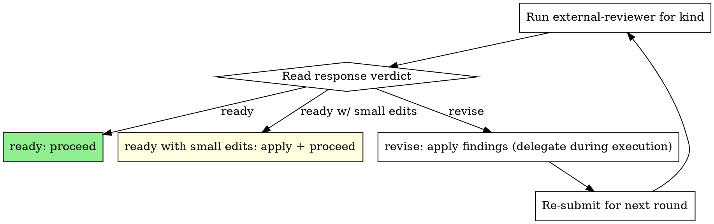

# External Review

An independent reviewer (not the coordinating agent) reviews a target document or completed slice/phase. The bridge is `skills/external-review/scripts/external-reviewer.py` — provider-neutral, configured via `AGENT_REVIEWER_CMD`. Each round writes a `request.md` and `response.md` pair under a per-document chain folder so the iteration history is durable and committable.

**Announce at start:** "I'm using the external-review skill to run a `<kind>` review on `<target>`."

## When to use

Four checkpoints, mapped to `--kind`:

| Stage                          | `--kind`      | Triggered by                                                              |
|--------------------------------|---------------|---------------------------------------------------------------------------|
| Spec written, before plan      | `spec`        | `[[writing-plans]]` after the spec is saved, before drafting the plan     |
| Plan written, before execution | `plan`        | `[[writing-plans]]` after the plan is saved, before handing off to execute|
| Slice complete                 | `post-slice`  | `[[subagent-driven-development]]` after a slice's tasks all close         |
| Phase complete                 | `post-phase`  | `[[subagent-driven-development]]` after the last slice of a phase closes  |

`design`, `implementation`, and `other` are valid for ad-hoc reviews and do not gate the main workflow.

## When NOT to use

- Mid-implementation single-commit asks — use `[[requesting-internal-review]]` instead.
- WIP / unstable targets — the reviewer needs a stable file on disk.
- The user wants the coordinating agent itself to review — that is a different skill.

## Configuration

The reviewer command is read from `AGENT_REVIEWER_CMD` (env) or `--reviewer-cmd` (flag). Default is `reviewer-agent`. The command may be:

- A bare executable (`reviewer-agent`) — the prompt is supplied per `--prompt-transport` (`arg` | `file` | `stdin`, default `arg`).
- A template with placeholders (`{prompt_file}`, `{prompt_text}`, `{target_file}`, `{kind}`) — substituted and run through the shell.

If `reviewer-agent` is missing, `[[project-setup]]` will offer to install/configure it. If the command emits no `Overall verdict`, treat the round as `revise` and ask the reviewer to honour the response contract on the next round.

## How a round runs

```bash
python3 skills/external-review/scripts/external-reviewer.py review \
    --kind <spec|plan|post-slice|post-phase> \
    --file <path/to/target.md> \
    [--context <path>]... \
    --emit json
```

- Output folder: `docs/reviewer/<target-stem-no-date>-<kind>/`
- Round number is derived from the count of `r{N}-*-request.md` files already in the folder; existing rounds are never overwritten.
- Each round emits `r{N}-{timestamp}-request.md` (prompt) and `r{N}-{timestamp}-response.md` (review body + status).
- `--emit json` returns `review_path`, `prompt_path`, `round`, `status`, `returncode`, and the full `review` text. Always use `--emit json` from this skill — agents consume the JSON, not paths or human prose.

The command **blocks** until the reviewer exits (default `--timeout 900`). Run it in the **foreground**. Do not background it, do not poll the chain folder, do not retry in a loop.

## Reading the response

The response ends with **Overall verdict**, one of:

| Verdict                  | Action                                                                          |
|--------------------------|---------------------------------------------------------------------------------|
| `ready`                  | Proceed to the next stage.                                                      |
| `ready with small edits` | Apply the suggested edits, proceed. Do not re-submit unless the edits are large.|
| `revise`                 | Apply findings, then re-submit with the same `--kind` for round N+1.            |

## Context files

`--context` may be supplied multiple times. Defaults per `--kind`:

| `--kind`      | Target (`--file`)                                | Required `--context`                                       |
|---------------|--------------------------------------------------|------------------------------------------------------------|
| `spec`        | The spec file                                    | `docs/TASKLIST.md` (if present)                            |
| `plan`        | The plan file                                    | Originating spec; `docs/TASKLIST.md` (if present)          |
| `post-slice`  | The plan file (or slice-close note)              | Spec; `docs/TASKLIST.md`; any slice-close / evidence files |
| `post-phase`  | The phase archive note or plan                   | Spec; plan; `docs/TASKLIST.md`                             |

If the project has no TASKLIST.md, substitute its top-level tracker. Always pass *some* tracker as context so the reviewer sees how the artefact fits the broader plan.

## Hard rule — delegation during execution

> When a `post-slice` or `post-phase` review returns findings, the **coordinator does not apply the findings itself.** It dispatches a fix subagent with the response file as input, waits for that subagent to complete and re-run the appropriate verification, and only then re-submits the review. The coordinator's only job is to (1) submit, (2) read the verdict, (3) dispatch the fixer, (4) re-submit. Direct file edits by the coordinator are a coordinator-discipline failure — see `[[subagent-driven-development]]`.

For `spec` and `plan` reviews during planning, the coordinator may apply edits directly because no parallel implementation subagents exist at that stage.

## The iteration loop



## Artifact layout

Each `(target, kind)` pair is one **review chain**:

```
docs/reviewer/
  <target-stem-no-leading-date>-<kind>/        ← chain folder
    r1-<YYYY-MM-DDTHHMM>-request.md            ← prompt sent to reviewer
    r1-<YYYY-MM-DDTHHMM>-response.md           ← reviewer output
    r2-<YYYY-MM-DDTHHMM>-request.md            ← second round (after edits)
    r2-<YYYY-MM-DDTHHMM>-response.md
    …
```

Round number is auto-incremented. Commit the entire chain folder alongside the work; `git log -- docs/reviewer/<chain>/` then surfaces the full audit trail.

## Exit codes

| Code | Meaning                              | Action                                                                |
|------|--------------------------------------|-----------------------------------------------------------------------|
| 0    | Reviewer succeeded                   | Apply feedback.                                                       |
| 2    | Target / context file not found      | Fix the path and re-run. Do not invent paths.                         |
| 124  | Reviewer timed out                   | Raise `--timeout`, or split the target.                               |
| 127  | Reviewer command not found           | Set `AGENT_REVIEWER_CMD` or run `[[project-setup]]` to wire it up.    |
| other| Reviewer's own non-zero exit         | A response file was still written. Read it and surface the issue.     |

## Reporting back to the user

After applying edits, summarise:

- What the reviewer flagged (counts by severity + verdict).
- What you changed in response.
- What you deferred or waived, with reasoning.
- The `review_path` so the user can read the full review.

## Red flags

| Thought                                                | Reality                                                                   |
|--------------------------------------------------------|---------------------------------------------------------------------------|
| "I already know what the reviewer will say"            | Run it. The verdict is the gate, not your prediction.                     |
| "I'll apply the fixes myself, faster"                  | During execution, you're the coordinator. Dispatch a subagent.            |
| "The reviewer is being pedantic, I'll skip the edit"   | Either apply, or document why you waived it inline in the target.         |
| "`revise` but the issues are minor"                    | `revise` means re-submit. `ready with small edits` is the lenient verdict.|
| "I'll loop the reviewer in the background while I work"| Foreground only. No `Monitor`, no polling, no retry loops.                |

## Integration

- `[[writing-plans]]` — invokes this skill after spec save and after plan save.
- `[[subagent-driven-development]]` — invokes this skill after each slice and at phase close.
- `[[tasklist-discipline]]` — slice/phase boundaries are defined by TASKLIST.md status flips.
- `[[finishing-a-development-branch]]` — pairs with `--kind post-phase` before the closeout commit.
- `[[project-setup]]` — installs/configures the reviewer CLI in new projects.
