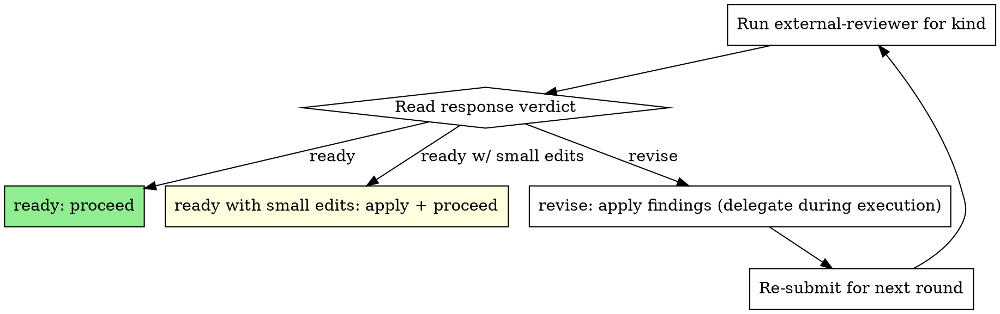

# External Review

An independent reviewer (not the coordinating agent) reviews a target document or completed slice/phase. The bridge is `external-reviewer.py` — provider-neutral, configured via `AGENT_REVIEWER_CMD`. Each round writes a `request.md` and `response.md` pair under a per-document chain folder so the iteration history is durable and committable.

**Script location.** The script ships at `skills/external-review/scripts/external-reviewer.py` inside this plugin. `[[project-setup]]` copies it to `scripts/external-reviewer.py` at the consuming project's root, which is the path used in all examples below. If neither path resolves in your project, fall back to `$CLAUDE_PLUGIN_DIR/skills/external-review/scripts/external-reviewer.py` (when running inside a Claude Code plugin context) or run `[[project-setup]]` to vendor a copy.

**Announce at start:** "I'm using the external-review skill to run a `<kind>` review on `<target>`."

## When to use

Four checkpoints, mapped to `--kind`:

| Stage                          | `--kind`      | Triggered by                                                              |
|--------------------------------|---------------|---------------------------------------------------------------------------|
| Spec written, before plan      | `spec`        | `[[writing-plans]]` after the spec is saved, before drafting the plan     |
| Plan written, before execution | `plan`        | `[[writing-plans]]` after the plan is saved, before handing off to execute|
| Slice complete                 | `post-slice`  | `[[subagent-driven-development]]` after a slice's tasks all close         |
| Phase complete                 | `post-phase`  | `[[subagent-driven-development]]` after the last slice of a phase closes  |

`design`, `implementation`, and `other` are valid for ad-hoc reviews and do not gate the main workflow.

## When NOT to use

- Mid-implementation single-commit asks — use `[[requesting-internal-review]]` instead.
- WIP / unstable targets — the reviewer needs a stable file on disk.
- The user wants the coordinating agent itself to review — that is a different skill.

## Configuration

The reviewer command is read from `AGENT_REVIEWER_CMD` (env) or `--reviewer-cmd` (flag). Default is `reviewer-agent`. The command may be:

- A bare executable (`reviewer-agent`) — the prompt is supplied per `--prompt-transport` (`arg` | `file` | `stdin`, default `arg`).
- A template with placeholders (`{prompt_file}`, `{prompt_text}`, `{target_file}`, `{kind}`) — substituted and run through the shell.

If `reviewer-agent` is missing, `[[project-setup]]` will offer to install/configure it. If the command emits no `Overall verdict`, treat the round as `revise` and ask the reviewer to honour the response contract on the next round.

- `--incremental-budget-chars` (default `400000`) sets a target cap on assembled prompt size for incremental rounds. The prompt is pruned in priority order — target preview, diff body, resolution body, prior findings body — toward the target; sentinel markers, chain summary, and finding-ID lists are never trimmed. The final size may exceed the target by ~150 bytes due to the appended `<!-- budget-applied: ... -->` diagnostic note.

## How a round runs

```bash
python3 scripts/external-reviewer.py review \
    --kind <spec|plan|post-slice|post-phase> \
    --file <path/to/target.md> \
    --work-id <P2.S3 | P2>   # required for post-slice / post-phase
    [--context <path>]... \
    [--review-depth thorough] \
    [--incremental-budget-chars 400000] \
    --emit json
```

- Output folder: `docs/reviewer/<target-stem-no-date>[-<work-id-dotless>]-<kind>/`
- Round number, base ref, and prior verdict are read from `chain.json` in the chain folder.
- Each round emits `r{N}-{timestamp}-request.md` and `r{N}-{timestamp}-response.md`. When `--review-depth thorough` or `exhaustive` runs sweep reviewers, filenames become `r{N}-{ts}-primary-*.md` and `r{N}-{ts}-sweep{K}-*.md`, plus a `r{N}-merged-findings.md`.
- `--emit json` returns the structured payload described in "Reading the response". Always use `--emit json` from this skill — agents consume the JSON, not paths or human prose.

The command **blocks** until the reviewer exits (default `--timeout 900`). Run it in the **foreground**. Do not background it, do not poll the chain folder, do not retry in a loop.

**Prompt transport for incremental rounds.** Round 2+ prompts embed prior findings, the fixer's resolution doc, and a diff, and routinely exceed `ARG_MAX` for `--prompt-transport arg`. The script auto-selects `stdin` for any incremental round (round 2+ in `auto` mode, or explicit `--mode incremental`) and `arg` for round-1/broad prompts when `--prompt-transport` is not set explicitly. Override with `--prompt-transport {arg|file|stdin}` or `AGENT_REVIEWER_TRANSPORT` only when the reviewer backend cannot accept the default.

## Failure handling

When the configured reviewer command exits non-zero, the round is recorded as a **process failure**, not as a verdict:

- The persisted response file is a short stub (≤ 8 KB total): header, status, and the sentinel-stripped tail of the reviewer's stderr capped at 4 KB. No stdout is written.
- `chain.json` records `status: "failed"`, `returncode: <rc>`, `verdict: null`, `verdict_valid: false` on both the round entry and the per-reviewer entry.
- For `post-slice` / `post-phase`, the next round's resolution-required gate is **bypassed** with a stderr notice. A process failure has no findings to resolve; the next round is a re-attempt of the same review, not a fix-and-re-review.
- The next round's preamble walks backward past `status: "failed"` (and legacy `status: "unknown"`) rounds and embeds the merged-findings from the most recent `status: "ok"` round, prefixed with a `Note: rounds N..K were process failures...; skipped.` line. If no successful prior round exists, only the chain summary table is embedded.

**Sentinel-wrapped prompts.** Every prompt is wrapped in `<!-- superstar-prompt:start -->` / `<!-- superstar-prompt:end -->` markers. If a reviewer echoes the prompt on stdout or stderr, the markers let the script strip the echo before persisting to disk, eliminating the recursive prompt-bloat class.

### Multi-reviewer truth (sweeps)

When `--review-depth thorough` or `exhaustive` runs sweeps alongside the primary:

| Primary | Sweeps | Top-level `status` | `verdict_valid` | `merged_verdict` | Process exit |
|---|---|---|---|---|---|
| ok | all ok | `ok` | per merged | computed | `0` |
| ok | some failed | `ok` | per merged (ok reviewers only) | computed from ok | `0` |
| ok | all failed | `ok` | per primary | primary's verdict | `0` |
| failed | any/all | `failed` | `false` | `null` | primary's returncode |

Failed sweeps are excluded from merged-findings and do not flip the top-level status.

## Rate-limit handling

When the reviewer's provider rate-limits the configured command (e.g. codex usage cap, Claude API quota), the script detects the failure mode distinctly from a generic crash and stops to ask the operator.

**Exit code 8** signals "reviewer rate-limited; pick a recovery path." On exit 8 the script emits this JSON on stdout:

```json
{
  "rate_limited": true,
  "reviewer_cmd": "<basename>",
  "reset_at":    "<ISO local time>",
  "reset_source": "regex:<pattern-name>",
  "chain":  "<chain folder name>",
  "round":  <int>,
  "request_path": "<absolute path>",
  "raw_stderr_tail": "<last 2 KB of reviewer stderr>"
}
```

Persistent state lives at `~/.config/superstar/reviewer-state.json` (override via `AGENT_REVIEWER_STATE_FILE` or `--state-file`). Subsequent invocations against any chain refuse to spawn until `reset_at` passes.

### The recovery menu

On exit 8 the coordinator MUST present this menu via `AskUserQuestion` (no auto-pick):

| Option | Mechanism |
|---|---|
| **Manual approve** | Coordinator collects a one-line note, then runs `external-reviewer.py manual-approve --kind X --file Y --work-id Z --note "..."`. Writes a synthetic round with `status: "manual-approved"`, `verdict: "ready"`. Chain advances. |
| **Schedule retry** | Coordinator invokes the **harness-level `schedule` skill** to register a one-shot routine at `reset_at + 5 min` re-invoking the same `review` command. If the harness lacks `schedule`, falls back to printing an `at`/`cron`-suitable command for the operator. Current chain gate pauses. |
| **Human bridge** | Coordinator prints `r{N}-request.md` path. Operator obtains a response from an external reviewer (web UI, manual reading, etc.) and either pastes the text in chat or provides a local file path. Coordinator runs `external-reviewer.py ingest-response --kind X --file Y --work-id Z (--from-paste FILE \| --from-link PATH)`. Writes the response with status `human-bridged`. |
| **Hold** | Do nothing. Exit the current gate. State persists; next session sees the same limit. |

Repeated refusals against the **same chain** while the limit is open do NOT append new rounds — they coalesce onto the head rate-limited round via `last_refused_at` / `refused_at[]` (capped at 20).

### Status semantics

A `status: "rate-limited"` round is treated symmetrically with `status: "failed"`:
- The resolution-required gate is bypassed for the next round.
- `build_incremental_preamble` walks back past it to find the last `ok` round.
- It is excluded from `merged_verdict` and `write_merged_findings` aggregation.

Manual-approved (`status: "manual-approved"`) and human-bridged (`status: "human-bridged"`) rounds carry real verdicts and pass through the existing gating machinery unchanged.

### Subcommands at a glance

| Subcommand | Purpose |
|---|---|
| `manual-approve` | Record an operator-approved closure on the chain. |
| `ingest-response` | Write an externally-obtained reviewer response into the chain. |
| `show-limit` | Print the current `~/.config/superstar/reviewer-state.json` content. |
| `clear-limit [--reviewer-cmd X]` | Clear the limit entry (for a single reviewer or all). Idempotent. |

## Reading the response

The JSON output (always use `--emit json`) is the source of truth. Agents MUST consult:

- `merged_verdict` — authoritative for gating slice/phase progress.
- `verdict_valid` — if `false`, treat as `revise`.
- `resolution_parse_status` — `ok` | `partial` | `unparseable` | `null`.
- `reviewers[]` — per-reviewer verdicts and review text.
- `review` — for multi-reviewer rounds, this contains the merged findings; for single-reviewer rounds, the primary review.

Verdict values: `ready`, `ready with small edits`, `revise` (or `null` if unparseable).

| Verdict                  | Action                                                                          |
|--------------------------|---------------------------------------------------------------------------------|
| `ready`                  | Proceed to the next stage.                                                      |
| `ready with small edits` | Apply the suggested edits, proceed. Do not re-submit unless the edits are large.|
| `revise`                 | Apply findings, then re-submit with the same `--kind` for round N+1.            |

## Round mode

- **Round 1** is **broad**: the reviewer reads target and context from scratch and emits findings tagged with stable IDs (`F1`, `F2`, …).
- **Round N+** is **incremental** by default: the prompt embeds the prior round's findings (or merged findings), the fixer's `r{N-1}-resolution.md`, and a diff. The reviewer verifies whether prior findings are resolved, reusing the same IDs.
- `--mode` defaults to `auto` (broad on round 1, incremental on round N+).
- `--mode broad` forces round-1-style on a later round (rare; only when fixes changed broad architecture).
- `--mode incremental` on round 1 is rejected.

## Review depth

`--review-depth` controls whether independent sweep reviewers run alongside the primary chain reviewer at high-risk checkpoints.

- `standard` (CLI default; cheapest). One primary reviewer. Round 2+ incremental. No sweeps.
- `thorough` (**recommended for `post-slice` and `post-phase`**). One sweep on round 1; one fresh sweep when the primary first returns `ready` / `ready with small edits`.
- `exhaustive`. Two sweeps at each checkpoint. Use for risky phases.

Sweep reviewers do not see the primary reviewer's findings on their first pass (anti-anchoring). Findings are merged into `r{N}-merged-findings.md`, and `merged_verdict` is computed over reviewers whose `status` is `"ok"` (failed sweeps are excluded — see the truth table above): `revise` if any ok reviewer is `revise` or has `verdict_valid: false`; `ready with small edits` if any ok reviewer is `ready with small edits` and the rest are `ready`; `ready` only if every ok reviewer is `ready`. If the primary reviewer fails, the round is recorded as a process failure (`merged_verdict: null`) regardless of sweeps.

Checkpoint state (`first-round`, `final-ready`) is persisted in `chain.json` so sweeps fire once per chain.

## Resolution artifact

When a post-slice or post-phase round returns `merged_verdict: revise`, the fix subagent MUST write `docs/reviewer/<chain>/r{N}-resolution.md` before the next round is submitted. The script's gate refuses round N+1 without it (exit code 3) unless `--allow-missing-resolution` is passed.

Required parseable shape:

```markdown
# Resolution for r{N}

## F1
Status: fixed | waived | deferred
Evidence:
- Commit: <sha>
- Files: `path:line`
- Verification: `command and result`

Notes:
Free-form prose.

## F2
Status: ...
```

- One `## F<id>` heading per addressed finding.
- One `Status:` line per finding (case-insensitive).
- Sweep findings use namespaced IDs like `S1.F1`; reference them with the same form in the resolution doc.

Parse failures soft-fail: `resolution_parse_status: partial` or `unparseable` is reported in the JSON, but the reviewer still receives the prose verbatim in the next round's prompt.

## Chain manifest

Each chain folder contains a `chain.json` manifest that records every round's metadata: round number, request/response paths, head SHAs, verdicts (primary and merged), reviewers, sweep checkpoint state, and resolution attachment. The script reads it on every invocation; existing chains without a manifest are soft-migrated on first touch.

**Invariant:** a review chain is single-writer. Do not run two rounds concurrently against the same chain — `chain.json` is not locked and may be corrupted.

## Context files

`--context` may be supplied multiple times. Defaults per `--kind`:

| `--kind`      | Target (`--file`)                                | Required `--context`                                       |
|---------------|--------------------------------------------------|------------------------------------------------------------|
| `spec`        | The spec file                                    | `docs/TASKLIST.md` (if present)                            |
| `plan`        | The plan file                                    | Originating spec; `docs/TASKLIST.md` (if present)          |
| `post-slice`  | The plan file (or slice-close note)              | Spec; `docs/TASKLIST.md`; any slice-close / evidence files |
| `post-phase`  | The phase archive note or plan                   | Spec; plan; `docs/TASKLIST.md`                             |

If the project has no TASKLIST.md, substitute its top-level tracker. Always pass *some* tracker as context so the reviewer sees how the artefact fits the broader plan.

## Hard rule — delegation during execution

> When a `post-slice` or `post-phase` review returns findings, the **coordinator does not apply the findings itself.** It dispatches a fix subagent with the response file as input, waits for that subagent to complete and re-run the appropriate verification, and only then re-submits the review. The coordinator's only job is to (1) submit, (2) read the verdict, (3) dispatch the fixer, (4) re-submit. Direct file edits by the coordinator are a coordinator-discipline failure — see `[[subagent-driven-development]]`.

For `spec` and `plan` reviews during planning, the coordinator may apply edits directly because no parallel implementation subagents exist at that stage.

## The iteration loop



## Artifact layout

Each `(target, kind)` pair is one **review chain**:

```
docs/reviewer/
  <target-stem-no-leading-date>-<kind>/        ← chain folder
    r1-<YYYY-MM-DDTHHMM>-request.md            ← prompt sent to reviewer
    r1-<YYYY-MM-DDTHHMM>-response.md           ← reviewer output
    r2-<YYYY-MM-DDTHHMM>-request.md            ← second round (after edits)
    r2-<YYYY-MM-DDTHHMM>-response.md
    …
```

Round number is auto-incremented. Commit the entire chain folder alongside the work; `git log -- docs/reviewer/<chain>/` then surfaces the full audit trail.

*No new exit codes are introduced by failure handling — a failed reviewer exits with the reviewer's own non-zero code (typically `1`), exactly as it did before. The resolution-required gate (exit `3`) is bypassed on process failures.*

## Exit codes

| Code | Meaning | Action |
|---|---|---|
| 0 | Reviewer succeeded. | Apply feedback. |
| 2 | Target / context file not found, or required `--work-id` missing. | Fix the path or pass `--work-id`. |
| 3 | Resolution-required gate violated. | Author the resolution doc and re-run, or pass `--allow-missing-resolution`. |
| 4 | `chain.json` schema_version newer than supported. | Upgrade `external-reviewer.py`. |
| 5 | Ambiguous legacy-chain match. | Migrate manually. |
| 6 | `--work-id` mismatch with chain's stored work_id. | Use the correct `--work-id` or a fresh chain folder. |
| 8 | Reviewer rate-limited. | Read the JSON payload; pick a recovery path from the menu in "Rate-limit handling". |
| 124 | Reviewer timed out. | Raise `--timeout`, or split the target. |
| 127 | Reviewer command not found. | Set `AGENT_REVIEWER_CMD` or run `[[project-setup]]`. |
| other | Reviewer's own non-zero exit. | A response file was still written. Read it and surface the issue. |

## Reporting back to the user

After applying edits, summarise:

- What the reviewer flagged (counts by severity + verdict).
- What you changed in response.
- What you deferred or waived, with reasoning.
- The `review_path` so the user can read the full review.

## Red flags

| Thought                                                | Reality                                                                   |
|--------------------------------------------------------|---------------------------------------------------------------------------|
| "I already know what the reviewer will say"            | Run it. The verdict is the gate, not your prediction.                     |
| "I'll apply the fixes myself, faster"                  | During execution, you're the coordinator. Dispatch a subagent.            |
| "The reviewer is being pedantic, I'll skip the edit"   | Either apply, or document why you waived it inline in the target.         |
| "`revise` but the issues are minor"                    | `revise` means re-submit. `ready with small edits` is the lenient verdict.|
| "I'll loop the reviewer in the background while I work"| Foreground only. No `Monitor`, no polling, no retry loops.                |
| "Saw exit 8, retried without surfacing the menu"       | The menu must be presented every time exit 8 fires. Coordinator does not auto-pick. |

## Integration

- `[[writing-plans]]` — invokes this skill after spec save and after plan save.
- `[[subagent-driven-development]]` — invokes this skill after each slice and at phase close.
- `[[tasklist-discipline]]` — slice/phase boundaries are defined by TASKLIST.md status flips.
- `[[finishing-a-development-branch]]` — pairs with `--kind post-phase` before the closeout commit.
- `[[project-setup]]` — installs/configures the reviewer CLI in new projects.
