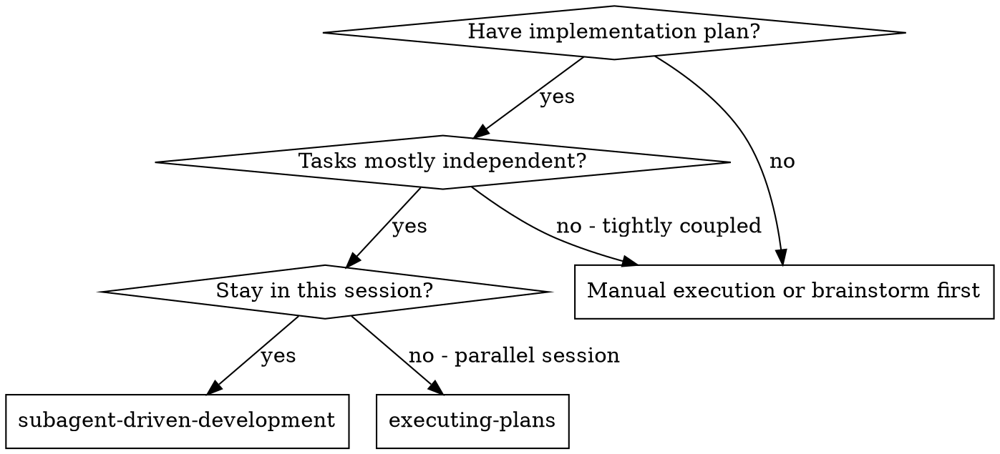
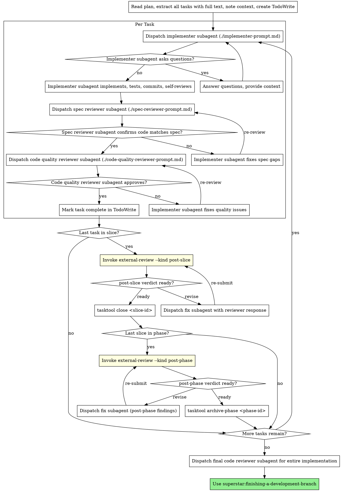

# Subagent-Driven Development

Execute plan by dispatching fresh subagent per task, with two-stage in-loop review after each task, and external-review gates at slice and phase boundaries.

**Why subagents:** You delegate tasks to specialized agents with isolated context. By precisely crafting their instructions and context, you ensure they stay focused and succeed at their task. They should never inherit your session's context or history — you construct exactly what they need. This also preserves your own context for coordination work.

**Core principle:** Fresh subagent per task + two-stage in-loop review (spec then quality) + external-review at slice/phase boundaries = high quality, fast iteration.

**Continuous execution:** Do not pause to check in with your human partner between tasks or at review boundaries. Execute the plan through required slice/phase external-review gates without stopping. The only reasons to stop are: BLOCKED status you cannot resolve, ambiguity that genuinely prevents progress, or all plan tasks, required slice/phase external-review gates, status flips, and closeout steps are complete. "Should I continue?" prompts and progress summaries waste their time — they asked you to execute the plan, so execute it.

## Coordinator Charter

**You are a coordinator. Your role is strictly orchestration.** This charter applies for the entire duration of subagent-driven execution. Internalise it before dispatching anything.

| Rule                                                                           | Why                                                                                  |
|--------------------------------------------------------------------------------|--------------------------------------------------------------------------------------|
| **Do not perform fixes yourself.**                                             | A fix you do directly pollutes your coordinator context and starves the parallel-subagent model of work. Tiebreak: delegate. |
| **Do not read large files or run investigations yourself.**                    | Delegate to an investigator subagent. Receive a short summary back, not the file contents. |
| **Do not edit files in response to reviewer findings.**                        | Dispatch a fix subagent with the response file as input. The coordinator's job is to submit, gate on verdict, dispatch, and re-submit. |
| **Only orchestrate.**                                                          | Your value is sequencing work, holding the plan in mind, and gating on verdicts.    |

**Exception — genuinely cheaper to do inline.** A one-line typo fix, a `.gitkeep` write, a tasktool note/title tweak — if dispatching a subagent costs strictly more than doing the action, you may do it. The bar is *strictly cheaper*, not *roughly equal*. When in doubt, delegate.

## Slice and phase boundaries

Plans are organised into **slices** (and slices into **tasks**) per `[[tasklist-discipline]]`. The coordinator tracks slice and phase boundaries explicitly.

**Two reviews, two scopes — do not conflate them:**

| Review | Scope | Reviewer | When | Gate? |
|---|---|---|---|---|
| Internal (`[[requesting-internal-review]]`) | Per task | In-session subagent (spec compliance, then code quality) | After each task | Gates task close |
| External (`[[external-review]]`) | Per slice and per phase | Out-of-loop third-party CLI | At slice and phase boundaries | Gates slice/phase close |

The per-task internal reviews approving every task in a slice **does not** satisfy the slice-boundary external review. They have different scopes (one task vs. the whole slice) and different reviewers. Both are required.

- **At the end of each slice** (all the slice's tasks closed, in-loop internal reviews passed):
  1. Run `git status --short`. If setup/migration artifacts, unrelated reviewer chains, legacy path moves, or other dirty files outside the slice scope are present, stop and resolve that boundary before review.
  2. Invoke `[[external-review]]` with `--kind post-slice`, passing the plan as `--file` and the spec + `docs/tasklist.json` as `--context`.
  3. Read the verdict. On `ready` / `ready with small edits`, proceed.
  4. On `merged_verdict: revise` (or `verdict_valid: false`), **dispatch a fix subagent** with the previous response file as input. The fix subagent MUST write `docs/reviewer/<chain>/r{N}-resolution.md` per the contract in `[[external-review]]` before signaling completion. Wait for completion. Re-submit. Iterate.
  5. Once the verdict gates pass, run `tasktool close <slice-id>` (the CLI re-checks the reviewer chain and refuses on `revise`). See `[[tasklist-discipline]]`.

- **At the end of the phase** (the last slice in the phase closes):
  1. Run the same `git status --short` scope preflight.
  2. Invoke `[[external-review]]` with `--kind post-phase`, passing the phase plan or archive note as `--file` and the spec + plan + `docs/tasklist.json` as `--context`.
  3. Same delegation rule — coordinator does not apply findings directly.
  4. On verdict acceptance, run `tasktool archive-phase <phase-id>` (the CLI re-checks the post-phase chain), then invoke `[[finishing-a-development-branch]]`.

## When to Use



**vs. Executing Plans (parallel session):**
- Same session (no context switch)
- Fresh subagent per task (no context pollution)
- Two-stage review after each task: spec compliance first, then code quality
- Faster iteration (no human-in-loop between tasks)

## The Process



## Model Selection

Use the least powerful model that can handle each role to conserve cost and increase speed.

**Mechanical implementation tasks** (isolated functions, clear specs, 1-2 files): use a fast, cheap model. Most implementation tasks are mechanical when the plan is well-specified.

**Integration and judgment tasks** (multi-file coordination, pattern matching, debugging): use a standard model.

**Architecture, design, and review tasks**: use the most capable available model.

**Task complexity signals:**
- Touches 1-2 files with a complete spec → cheap model
- Touches multiple files with integration concerns → standard model
- Requires design judgment or broad codebase understanding → most capable model

## Handling Implementer Status

Implementer subagents report one of four statuses. Handle each appropriately:

**DONE:** Proceed to spec compliance review.

**DONE_WITH_CONCERNS:** The implementer completed the work but flagged doubts. Read the concerns before proceeding. If the concerns are about correctness or scope, address them before review. If they're observations (e.g., "this file is getting large"), note them and proceed to review.

**NEEDS_CONTEXT:** The implementer needs information that wasn't provided. Provide the missing context and re-dispatch.

**BLOCKED:** The implementer cannot complete the task. Assess the blocker:
1. If it's a context problem, provide more context and re-dispatch with the same model
2. If the task requires more reasoning, re-dispatch with a more capable model
3. If the task is too large, break it into smaller pieces
4. If the plan itself is wrong, escalate to the human

**Never** ignore an escalation or force the same model to retry without changes. If the implementer said it's stuck, something needs to change.

## Prompt Templates

- `./implementer-prompt.md` - Dispatch implementer subagent
- `./spec-reviewer-prompt.md` - Dispatch spec compliance reviewer subagent
- `./code-quality-reviewer-prompt.md` - Dispatch code quality reviewer subagent

## Example Workflow

```
You: I'm using Subagent-Driven Development to execute this plan.

[Read plan file once: docs/superstar/plans/feature-plan.md]
[Extract all 5 tasks with full text and context]
[Create TodoWrite with all tasks]

Task 1: Hook installation script

[Get Task 1 text and context (already extracted)]
[Dispatch implementation subagent with full task text + context]

Implementer: "Before I begin - should the hook be installed at user or system level?"

You: "User level (~/.config/superstar/hooks/)"

Implementer: "Got it. Implementing now..."
[Later] Implementer:
  - Implemented install-hook command
  - Added tests, 5/5 passing
  - Self-review: Found I missed --force flag, added it
  - Committed

[Dispatch spec compliance reviewer]
Spec reviewer: ✅ Spec compliant - all requirements met, nothing extra

[Get git SHAs, dispatch code quality reviewer]
Code reviewer: Strengths: Good test coverage, clean. Issues: None. Approved.

[Mark Task 1 complete]

Task 2: Recovery modes

[Get Task 2 text and context (already extracted)]
[Dispatch implementation subagent with full task text + context]

Implementer: [No questions, proceeds]
Implementer:
  - Added verify/repair modes
  - 8/8 tests passing
  - Self-review: All good
  - Committed

[Dispatch spec compliance reviewer]
Spec reviewer: ❌ Issues:
  - Missing: Progress reporting (spec says "report every 100 items")
  - Extra: Added --json flag (not requested)

[Implementer fixes issues]
Implementer: Removed --json flag, added progress reporting

[Spec reviewer reviews again]
Spec reviewer: ✅ Spec compliant now

[Dispatch code quality reviewer]
Code reviewer: Strengths: Solid. Issues (Important): Magic number (100)

[Implementer fixes]
Implementer: Extracted PROGRESS_INTERVAL constant

[Code reviewer reviews again]
Code reviewer: ✅ Approved

[Mark Task 2 complete]

...

[After all tasks]
[Dispatch final code-reviewer]
Final reviewer: All requirements met, ready to merge

Done!
```

## Advantages

**vs. Manual execution:**
- Subagents follow TDD naturally
- Fresh context per task (no confusion)
- Parallel-safe (subagents don't interfere)
- Subagent can ask questions (before AND during work)

**vs. Executing Plans:**
- Same session (no handoff)
- Continuous progress (no waiting)
- Review checkpoints automatic

**Efficiency gains:**
- No file reading overhead (controller provides full text)
- Controller curates exactly what context is needed
- Subagent gets complete information upfront
- Questions surfaced before work begins (not after)

**Quality gates:**
- Self-review catches issues before handoff
- Two-stage review: spec compliance, then code quality
- Review loops ensure fixes actually work
- Spec compliance prevents over/under-building
- Code quality ensures implementation is well-built

**Cost:**
- More subagent invocations (implementer + 2 reviewers per task)
- Controller does more prep work (extracting all tasks upfront)
- Review loops add iterations
- But catches issues early (cheaper than debugging later)

## Red Flags

**Coordinator-discipline reds (the failure mode this skill exists to prevent):**

| Thought                                                                   | Reality                                                                |
|---------------------------------------------------------------------------|------------------------------------------------------------------------|
| "I'll just quickly edit this file myself, it's faster"                    | No. Dispatch a subagent. You are the coordinator.                      |
| "The reviewer flagged three small things, I'll patch them inline"         | No. Pass the response file to a fix subagent.                          |
| "I'll read the file to figure out what's wrong before delegating"         | No. Dispatch an investigator subagent and wait for the summary.        |
| "It's just a one-line change, no need to delegate"                        | Bar is *strictly cheaper than delegating*. When in doubt, delegate.    |
| "I'll skip post-slice review on this one, it's a small slice"             | No. Slice boundary is a gate. Run `[[external-review]] --kind post-slice`.|
| "I'll resubmit without the resolution file, the reviewer will figure it out" | No. Post-slice/post-phase round N+1 exits 3 without `r{N-1}-resolution.md` or `--allow-missing-resolution`. |
| "The plan's final close-out task ran, so I should ask before post-slice review" | No. The slice is not closed until `[[external-review]] --kind post-slice` passes and tasktool close succeeds afterward. |

**Process reds (also never):**
- Start implementation on main/master branch without explicit user consent
- Skip in-loop reviews (spec compliance OR code quality)
- Skip external-review at slice or phase boundaries
- Proceed with unfixed issues or `revise` verdicts
- Dispatch multiple implementation subagents in parallel (conflicts)
- Make subagent read plan file (provide full text instead)
- Skip scene-setting context (subagent needs to understand where task fits)
- Ignore subagent questions (answer before letting them proceed)
- Accept "close enough" on spec compliance (spec reviewer found issues = not done)
- Skip review loops (reviewer found issues = implementer fixes = review again)
- Let implementer self-review replace actual review (both are needed)
- **Start code quality review before spec compliance is ✅** (wrong order)
- Move to next task while either review has open issues

**If subagent asks questions:**
- Answer clearly and completely
- Provide additional context if needed
- Don't rush them into implementation

**If reviewer finds issues:**
- Implementer (same subagent) fixes them
- Reviewer reviews again
- Repeat until approved
- Don't skip the re-review

**If subagent fails task:**
- Dispatch fix subagent with specific instructions
- Don't try to fix manually (context pollution)

## Integration

**Required workflow skills:**
- **superstar:using-git-worktrees** - Ensures isolated workspace (creates one or verifies existing)
- **superstar:writing-plans** - Creates the plan this skill executes
- **superstar:requesting-internal-review** - In-loop code review template for reviewer subagents
- **superstar:external-review** - Out-of-loop reviewer at slice and phase boundaries
- **superstar:tasklist-discipline** - Slice/phase status flips and phase archival rules
- **superstar:finishing-a-development-branch** - Complete development after the phase closes

**Subagents should use:**
- **superstar:test-driven-development** - Subagents follow TDD for each task

**Alternative workflow:**
- **superstar:executing-plans** - Use for parallel session instead of same-session execution
